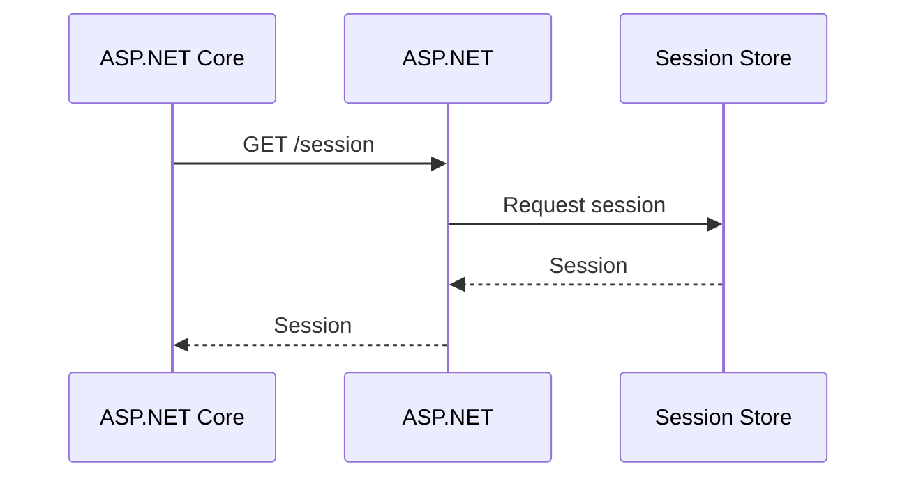
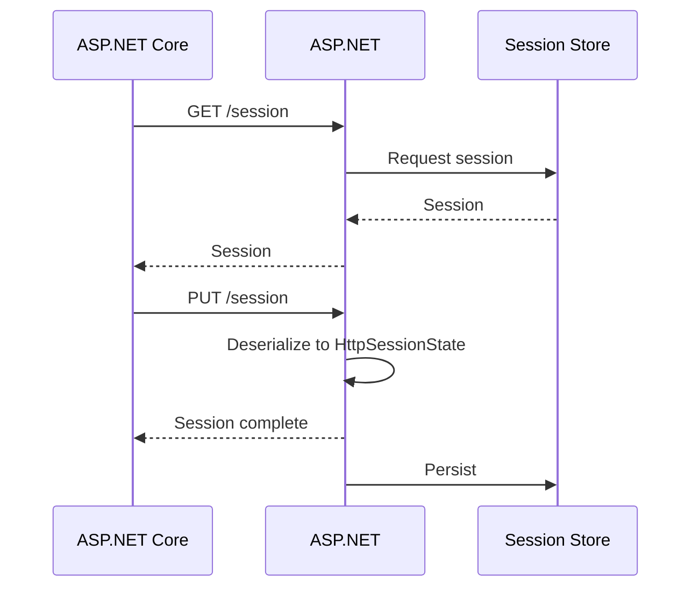
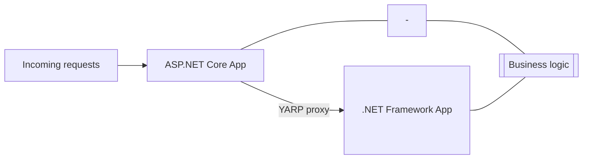
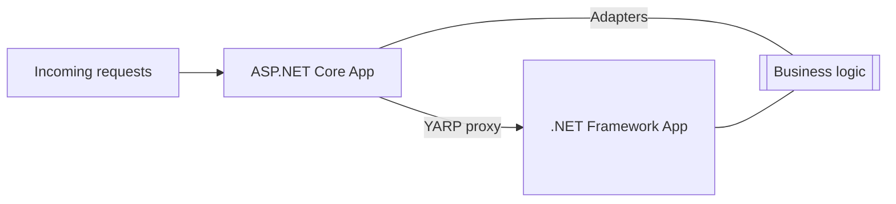
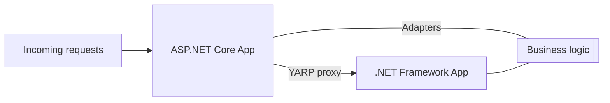
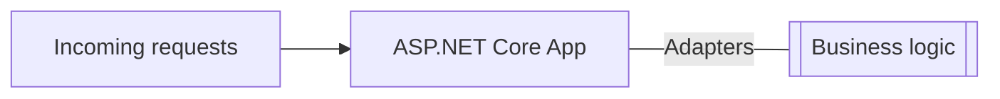
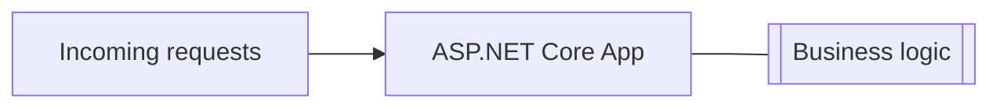

<a id="doc-e38795f6e9ee34958d07aeef"></a>

# dotnet/AspNetCore.Docs / aspnetcore/migration/50-to-60-samples.md

Upstream: https://github.com/dotnet/AspNetCore.Docs/blob/df9a510cf83fc0f32a71f05f885886c906c84943/aspnetcore/migration/50-to-60-samples.md

Commit: `df9a510cf83fc0f32a71f05f885886c906c84943`

Retrieved: 2026-10-01T15:18:04.961120+00:00

Kind: official-document

Raw SHA256: `325987b8506f0d7228c2ac41c959596cc6c1715eb2468017684ba368157de838`

Source text below is untrusted reference content. Acquisition does not verify technical claims.

License status: UPSTREAM_NOTICES_CAPTURED_PER_FILE_REVIEW_REQUIRED. See this repository's captured license files.

---

---
title: Code samples migrated to the new minimal hosting model in 6.0
ai-usage: ai-assisted
author: wadepickett
description: Learn how to migrate ASP.NET Core samples to the new minimal hosting model in 6.0.
monikerRange: '>= aspnetcore-5.0'
ms.author: wpickett
ms.date: 09/18/2026
uid: migration/50-to-60-samples
---
# Code samples migrated to the new minimal hosting model in ASP.NET Core in .NET 6

<!-- 
This content from https://gist.github.com/davidfowl/0e0372c3c1d895c3ce195ba983b1e03d#differences-in-the-hosting-model
 -->

This article provides samples of code migrated to ASP.NET Core in .NET 6. ASP.NET Core in .NET 6 uses a new minimal hosting model. For more information, see [New hosting model](xref:migration/50-to-60#new-hosting-model).

## Middleware

The following code adds the static file middleware to a .NET 5 app:

```csharp
public class Startup
{
    public void Configure(IApplicationBuilder app)
    {
        app.UseStaticFiles();
    }
}
```

The following code adds the static file middleware to an ASP.NET Core in .NET 6 app:

[!code-csharp[](50-to-60-samples/samples/Web6Samples/Program.cs?name=snippet_mid)]

[WebApplication.CreateBuilder](xref:Microsoft.AspNetCore.Builder.WebApplication.CreateBuilder%2A) initializes a new instance of the <xref:Microsoft.AspNetCore.Builder.WebApplicationBuilder> class with preconfigured defaults. For more information, see <xref:fundamentals/middleware/index?view=aspnetcore-6.0>

## Routing

The following code adds an endpoint to an .NET 5 app:

```csharp
public class Startup
{
    public void Configure(IApplicationBuilder app)
    {
        app.UseRouting();
        app.UseEndpoints(endpoints =>
        {
            endpoints.MapGet("/", () => "Hello World");
        });
    }
}
```

In .NET 6, routes can be added directly to the <xref:Microsoft.AspNetCore.Builder.WebApplication> without an explicit call to <xref:Microsoft.AspNetCore.Builder.EndpointRoutingApplicationBuilderExtensions.UseEndpoints%2A> or <xref:Microsoft.AspNetCore.Builder.EndpointRoutingApplicationBuilderExtensions.UseRouting%2A>. The following code adds an endpoint to an ASP.NET Core in .NET 6 app:

[!code-csharp[](50-to-60-samples/samples/Web6Samples/Program.cs?name=snippet_rt)]

**Note:** Routes added directly to the <xref:Microsoft.AspNetCore.Builder.WebApplication> execute at the ***end*** of the pipeline.

<!-- TODO, uncomment when article is updated for .NET 6
For more information, see <xref:fundamentals/routing?view=aspnetcore-6.0>
-->

<a name="ccr"></a>

## Change the content root, app name, and environment

### ASP.NET Core in .NET 5

```csharp
public static IHostBuilder CreateHostBuilder(string[] args) =>
    Host.CreateDefaultBuilder(args)
        .UseContentRoot(Directory.GetCurrentDirectory())
        .UseEnvironment(Environments.Staging)
        .ConfigureWebHostDefaults(webBuilder =>
        {
            webBuilder.UseStartup<Startup>()
                      .UseSetting(WebHostDefaults.ApplicationKey,
                                  typeof(Program).Assembly.FullName);
        });
```

### ASP.NET Core in .NET 6

[!code-csharp[](50-to-60-samples/samples/Web6Samples/Program.cs?name=snippet_root)]

For more information, see <xref:fundamentals/index>

#### Change the content root, app name, and environment by environment variables or command line

The following table shows the environment variable and command-line argument used to change the content root, app name, and environment.

| feature   | Environment variable | Command-line argument |
| ------------- | ------------- | -- |
| Application name | ASPNETCORE_APPLICATIONNAME  | --applicationName |
| Environment name |  ASPNETCORE_ENVIRONMENT | --environment |
| Content root  | ASPNETCORE_CONTENTROOT  | --contentRoot |

## Add configuration providers

### ASP.NET Core in .NET 5

```csharp
public static IHostBuilder CreateHostBuilder(string[] args) =>
    Host.CreateDefaultBuilder(args)
        .ConfigureAppConfiguration(config =>
        {
            config.AddIniFile("appsettings.ini");
        })
        .ConfigureWebHostDefaults(webBuilder =>
        {
            webBuilder.UseStartup<Startup>();
        });
```

### ASP.NET Core in .NET 6

[!code-csharp[](50-to-60-samples/samples/Web6Samples/Program.cs?name=snippet_conf)]

For detailed information, see [File configuration providers](xref:fundamentals/configuration/index?view=aspnetcore-6.0#file-configuration-provider) in <xref:fundamentals/configuration/index?view=aspnetcore-6.0>.

## Add logging providers

### ASP.NET Core in .NET 5

```csharp
public static IHostBuilder CreateHostBuilder(string[] args) =>
    Host.CreateDefaultBuilder(args)
        .ConfigureLogging(logging =>
        {
            logging.AddJsonConsole();
        })
        .ConfigureWebHostDefaults(webBuilder =>
        {
            webBuilder.UseStartup<Startup>();
        });
```

### ASP.NET Core in .NET 6

[!code-csharp[](50-to-60-samples/samples/Web6Samples/Program.cs?name=snippet_log)]

For more information, see  <xref:fundamentals/logging/index?view=aspnetcore-6.0#>.

## Add services

### ASP.NET Core in .NET 5

```csharp
public class Startup
{
    public void ConfigureServices(IServiceCollection services)
    {
        // Add the memory cache services
        services.AddMemoryCache();

        // Add a custom scoped service
        services.AddScoped<ITodoRepository, TodoRepository>();
    }
}
```

### ASP.NET Core in .NET 6

[!code-csharp[](50-to-60-samples/samples/Web6Samples/Program.cs?name=snippet_svc)]

For more information, see  <xref:fundamentals/dependency-injection?view=aspnetcore-6.0#>.

<a name="cii"></a>

## Customize IHostBuilder or IWebHostBuilder

### Customize IHostBuilder

#### ASP.NET Core in .NET 5

```csharp
public static IHostBuilder CreateHostBuilder(string[] args) =>
    Host.CreateDefaultBuilder(args)
        .ConfigureHostOptions(o => o.ShutdownTimeout = TimeSpan.FromSeconds(30));
        .ConfigureWebHostDefaults(webBuilder =>
        {
            webBuilder.UseStartup<Startup>();
        });
```

#### ASP.NET Core in .NET 6

[!code-csharp[](50-to-60-samples/samples/Web6Samples/Program.cs?name=snippet_hb)]

### Customize IWebHostBuilder

### ASP.NET Core in .NET 5

```csharp
public static IHostBuilder CreateHostBuilder(string[] args) =>
    Host.CreateDefaultBuilder(args)
        .ConfigureWebHostDefaults(webBuilder =>
        {
            // Change the HTTP server implementation to be HTTP.sys based.
            webBuilder.UseHttpSys()
                      .UseStartup<Startup>();
        });
```

### ASP.NET Core in .NET 6

[!code-csharp[](50-to-60-samples/samples/Web6Samples/Program.cs?name=snippet_whb)]

## Change the web root

By default, the web root is relative to the content root in the `wwwroot` folder. Web root is where the static file middleware looks for static files. Web root can be changed by setting the <xref:Microsoft.AspNetCore.Builder.WebApplicationOptions.WebRootPath> property on <xref:Microsoft.AspNetCore.Builder.WebApplicationOptions>:

### ASP.NET Core in .NET 5

```csharp
public static IHostBuilder CreateHostBuilder(string[] args) =>
    Host.CreateDefaultBuilder(args)
        .ConfigureWebHostDefaults(webBuilder =>
        {
            // Look for static files in webroot.
            webBuilder.UseWebRoot("webroot")
                      .UseStartup<Startup>();
        });
```

### ASP.NET Core in .NET 6

[!code-csharp[](50-to-60-samples/samples/Web6Samples/Program.cs?name=snippet_wr)]

<a name="cdi"></a>

## Custom dependency injection (DI) container

The following .NET 5 and .NET 6 samples use [Autofac](https://docs.autofac.org/en/latest/integration/aspnetcore.html)

### ASP.NET Core in .NET 5

**Program class**

```csharp
public static IHostBuilder CreateHostBuilder(string[] args) =>
    Host.CreateDefaultBuilder(args)
        .UseServiceProviderFactory(new AutofacServiceProviderFactory())
        .ConfigureWebHostDefaults(webBuilder =>
        {
            webBuilder.UseStartup<Startup>();
        });
```

**Startup**

```csharp
public class Startup
{
    public void ConfigureContainer(ContainerBuilder containerBuilder)
    {
    }
}
```

### ASP.NET Core in .NET 6

```csharp
var builder = WebApplication.CreateBuilder(args);

builder.Host.UseServiceProviderFactory(new AutofacServiceProviderFactory());

// Register services directly with Autofac here. Don't
// call builder.Populate(), that happens in AutofacServiceProviderFactory.
builder.Host.ConfigureContainer<ContainerBuilder>(builder => builder.RegisterModule(new MyApplicationModule()));

var app = builder.Build();
```

## Access additional services

`Startup.Configure`  can inject any service added via the <xref:Microsoft.Extensions.DependencyInjection.IServiceCollection>.

### ASP.NET Core in .NET 5

```csharp
public class Startup
{
    // This method gets called by the runtime. Use this method to add services
    // to the container.
    public void ConfigureServices(IServiceCollection services)
    {
        services.AddSingleton<IService, Service>();
    }

    // Anything added to the service collection can be injected into Configure.
    public void Configure(IApplicationBuilder app,
                          IWebHostEnvironment env,
                          IHostApplicationLifetime lifetime,
                          IService service,
                          ILogger<Startup> logger)
    {
        lifetime.ApplicationStarted.Register(() =>
            logger.LogInformation(
                "The application {Name} started in the injected {Service}",
                env.ApplicationName, service));
    }
}
```

### ASP.NET Core in .NET 6

In ASP.NET Core in .NET 6:

* There are a few common services available as top level properties on <xref:Microsoft.AspNetCore.Builder.WebApplication>.
* Additional services need to be manually resolved from the `IServiceProvider` via [WebApplication.Services](xref:Microsoft.AspNetCore.Builder.WebApplication.Services).

[!code-csharp[](50-to-60-samples/samples/Web6Samples/Program.cs?name=snippet_af)]

<a name="twa"></a>

## Test with WebApplicationFactory or TestServer

### ASP.NET Core in .NET 5

In the following samples, the test project uses `TestServer` and <xref:Microsoft.AspNetCore.Mvc.Testing.WebApplicationFactory%601>. These ship as separate packages that require explicit reference:

#### WebApplicationFactory

```xml
<ItemGroup>
  <PackageReference Include="Microsoft.AspNetCore.Mvc.Testing" Version="{Version}" />
</ItemGroup>
```

#### TestServer

```xml
<ItemGroup>
  <PackageReference Include="Microsoft.AspNetCore.TestHost" Version="{Version}" />
</ItemGroup>
```

#### ASP.NET Core in .NET 5 code

```csharp
public class Startup
{
    public void ConfigureServices(IServiceCollection services)
    {
        services.AddSingleton<IHelloService, HelloService>();
    }

    public void Configure(IApplicationBuilder app, IWebHostEnvironment env, IHelloService helloService)
    {
        if (env.IsDevelopment())
        {
            app.UseDeveloperExceptionPage();
        }

        app.UseRouting();

        app.UseEndpoints(endpoints =>
        {
            endpoints.MapGet("/", async context =>
            {
                await context.Response.WriteAsync(helloService.HelloMessage);
            });
        });
    }
}
```

#### With TestServer

```csharp
[Fact]
public async Task HelloWorld()
{
    using var host = Host.CreateDefaultBuilder()
        .ConfigureWebHostDefaults(builder =>
        {
            // Use the test server and point to the application's startup
            builder.UseTestServer()
                    .UseStartup<WebApplication1.Startup>();
        })
        .ConfigureServices(services =>
        {
            // Replace the service
            services.AddSingleton<IHelloService, MockHelloService>();
        })
        .Build();

    await host.StartAsync();

    var client = host.GetTestClient();

    var response = await client.GetStringAsync("/");

    Assert.Equal("Test Hello", response);
}

class MockHelloService : IHelloService
{
    public string HelloMessage => "Test Hello";
}
```

#### With WebApplicationFactory

```csharp
[Fact]
public async Task HelloWorld()
{
    var application = new WebApplicationFactory<Program>()
        .WithWebHostBuilder(builder =>
        {
            builder.ConfigureServices(services =>
            {
                services.AddSingleton<IHelloService, MockHelloService>();
            });
        });

    var client = application.CreateClient();

    var response = await client.GetStringAsync("/");

    Assert.Equal("Test Hello", response);
}

class MockHelloService : IHelloService
{
    public string HelloMessage => "Test Hello";
}
```

### ASP.NET Core in .NET 6

[!code-csharp[](50-to-60-samples/samples/Web6Samples/Program.cs?name=snippet_test)]

#### Project file (.csproj)

The project file can contain one of the following:

```xml
<ItemGroup>
    <InternalsVisibleTo Include="MyTestProject" />
</ItemGroup>
```

Or

```
[assembly: InternalsVisibleTo("MyTestProject")]
```

An alternative solution is to make the `Program` class public. `Program` can be made public with  [Top-level statements](/dotnet/csharp/fundamentals/program-structure/top-level-statements) by defining a `public partial Program` class in the project or in `Program.cs`:

```csharp
var builder = WebApplication.CreateBuilder(args);

// ... Configure services, routes, etc.

app.Run();

public partial class Program { }
```

```csharp
[Fact]
public async Task HelloWorld()
{
    var application = new WebApplicationFactory<Program>()
        .WithWebHostBuilder(builder =>
        {
            builder.ConfigureServices(services =>
            {
                services.AddSingleton<IHelloService, MockHelloService>();
            });
        });

    var client = application.CreateClient();

    var response = await client.GetStringAsync("/");

    Assert.Equal("Test Hello", response);
}

class MockHelloService : IHelloService
{
    public string HelloMessage => "Test Hello";
}
```

The .NET 5 version and .NET 6 version with the `WebApplicationFactory` are identical by design.


<a id="doc-abd55a06c9bc04c176b857ca"></a>

# dotnet/AspNetCore.Docs / aspnetcore/migration/50-to-60-samples/samples/Web6Samples/IHelloService.cs

Upstream: https://github.com/dotnet/AspNetCore.Docs/blob/df9a510cf83fc0f32a71f05f885886c906c84943/aspnetcore/migration/50-to-60-samples/samples/Web6Samples/IHelloService.cs

Commit: `df9a510cf83fc0f32a71f05f885886c906c84943`

Retrieved: 2026-10-01T15:18:04.961120+00:00

Kind: upstream-example-code

Raw SHA256: `6691e486b9f42bce6b209f41a92cc036d6713eeea76ca91758395a0739852876`

Source text below is untrusted reference content. Acquisition does not verify technical claims.

License status: UPSTREAM_NOTICES_CAPTURED_PER_FILE_REVIEW_REQUIRED. See this repository's captured license files.

---

````text
public interface IHelloService
{
    public string HelloMessage { get; }
}

public class HelloService : IHelloService
{
    public string HelloMessage => "Hello World";
}
````


<a id="doc-47292bf1e8c3e3b8e44a3989"></a>

# dotnet/AspNetCore.Docs / aspnetcore/migration/50-to-60-samples/samples/Web6Samples/IService.cs

Upstream: https://github.com/dotnet/AspNetCore.Docs/blob/df9a510cf83fc0f32a71f05f885886c906c84943/aspnetcore/migration/50-to-60-samples/samples/Web6Samples/IService.cs

Commit: `df9a510cf83fc0f32a71f05f885886c906c84943`

Retrieved: 2026-10-01T15:18:04.961120+00:00

Kind: upstream-example-code

Raw SHA256: `ca94f19953847fd0caf59861e41f36ce6f4f65e3647082b14cc73961a6bda6f0`

Source text below is untrusted reference content. Acquisition does not verify technical claims.

License status: UPSTREAM_NOTICES_CAPTURED_PER_FILE_REVIEW_REQUIRED. See this repository's captured license files.

---

````text
public interface IService
{
}

public class Service: IService
{

}
````


<a id="doc-9e6bc8764fec7392d7663c31"></a>

# dotnet/AspNetCore.Docs / aspnetcore/migration/50-to-60-samples/samples/Web6Samples/ITodoRepository.cs

Upstream: https://github.com/dotnet/AspNetCore.Docs/blob/df9a510cf83fc0f32a71f05f885886c906c84943/aspnetcore/migration/50-to-60-samples/samples/Web6Samples/ITodoRepository.cs

Commit: `df9a510cf83fc0f32a71f05f885886c906c84943`

Retrieved: 2026-10-01T15:18:04.961120+00:00

Kind: upstream-example-code

Raw SHA256: `12f135533ee1251b88a470d072e63c0e7196092a1dd5203735400bf283b96e80`

Source text below is untrusted reference content. Acquisition does not verify technical claims.

License status: UPSTREAM_NOTICES_CAPTURED_PER_FILE_REVIEW_REQUIRED. See this repository's captured license files.

---

````text
 interface ITodoRepository
{
}

public class TodoRepository : ITodoRepository
{ }
````


<a id="doc-5db3975008f9d2baa6b8d11d"></a>

# dotnet/AspNetCore.Docs / aspnetcore/migration/50-to-60-samples/samples/Web6Samples/Program.cs

Upstream: https://github.com/dotnet/AspNetCore.Docs/blob/df9a510cf83fc0f32a71f05f885886c906c84943/aspnetcore/migration/50-to-60-samples/samples/Web6Samples/Program.cs

Commit: `df9a510cf83fc0f32a71f05f885886c906c84943`

Retrieved: 2026-10-01T15:18:04.961120+00:00

Kind: upstream-example-code

Raw SHA256: `b63fb3c8fd42d190c4a1bbb5e9433195c97bf96c3a3e5067f92ff70444c7c13a`

Source text below is untrusted reference content. Acquisition does not verify technical claims.

License status: UPSTREAM_NOTICES_CAPTURED_PER_FILE_REVIEW_REQUIRED. See this repository's captured license files.

---

````text
#define TEST // MID RT ROOT CONF LOGG SVC HB WHB WR AF TEST 
#if MID
#region snippet_mid
var builder = WebApplication.CreateBuilder(args);
var app = builder.Build();

app.UseStaticFiles();

app.Run();
#endregion
#elif RT
#region snippet_rt
var builder = WebApplication.CreateBuilder(args);
var app = builder.Build();

app.MapGet("/", () => "Hello World!");

app.Run();
#endregion
#elif ROOT
#region snippet_root
var builder = WebApplication.CreateBuilder(new WebApplicationOptions
{
    Args = args,
    ApplicationName = typeof(Program).Assembly.FullName,
    ContentRootPath = Directory.GetCurrentDirectory(),
    EnvironmentName = Environments.Staging,
    WebRootPath = "customwwwroot"
});

Console.WriteLine($"Application Name: {builder.Environment.ApplicationName}");
Console.WriteLine($"Environment Name: {builder.Environment.EnvironmentName}");
Console.WriteLine($"ContentRoot Path: {builder.Environment.ContentRootPath}");
Console.WriteLine($"WebRootPath: {builder.Environment.WebRootPath}");

var app = builder.Build();
#endregion

app.MapGet("/", () => "Hello World!");

app.Run();
#elif CONF
#region snippet_conf
var builder = WebApplication.CreateBuilder(args);

builder.Configuration.AddIniFile("appsettings.ini");

var app = builder.Build();
#endregion

app.MapGet("/", () => "Hello World!");

app.Run();
#elif LOGG
#region snippet_log
var builder = WebApplication.CreateBuilder(args);

// Configure JSON logging to the console.
builder.Logging.AddJsonConsole();

var app = builder.Build();
#endregion

app.MapGet("/", () => "Hello World!");

app.Run();
#elif SVC
#region snippet_svc
var builder = WebApplication.CreateBuilder(args);

// Add the memory cache services.
builder.Services.AddMemoryCache();

// Add a custom scoped service.
builder.Services.AddScoped<ITodoRepository, TodoRepository>();
var app = builder.Build();
#endregion

app.MapGet("/", () => "Hello World!");

app.Run();
#elif HB
#region snippet_hb
var builder = WebApplication.CreateBuilder(args);

// Wait 30 seconds for graceful shutdown.
builder.Host.ConfigureHostOptions(o => o.ShutdownTimeout = TimeSpan.FromSeconds(30));

var app = builder.Build();
#endregion

app.MapGet("/", () => "Hello World!");

app.Run();
#elif WHB
#region snippet_whb
var builder = WebApplication.CreateBuilder(args);

// Change the HTTP server implementation to be HTTP.sys based.
// Windows only.
builder.WebHost.UseHttpSys();

var app = builder.Build();
#endregion

app.MapGet("/", () => "Hello World!");

app.Run();
#elif WR
#region snippet_wr
var builder = WebApplication.CreateBuilder(new WebApplicationOptions
{
    Args = args,
    // Look for static files in webroot
    WebRootPath = "webroot"
});

var app = builder.Build();
#endregion

app.MapGet("/", () => "Hello World!");

app.Run();
#elif AF
#region snippet_af
var builder = WebApplication.CreateBuilder(args);

builder.Services.AddSingleton<IService, Service>();

var app = builder.Build();

IService service = app.Services.GetRequiredService<IService>();
ILogger logger = app.Logger;
IHostApplicationLifetime lifetime = app.Lifetime;
IWebHostEnvironment env = app.Environment;

lifetime.ApplicationStarted.Register(() =>
    logger.LogInformation(
        $"The application {env.ApplicationName} started" +
        $" with injected {service}"));
#endregion

app.MapGet("/", () => "Hello World!");

app.Run();
#elif TEST
#region snippet_test

var builder = WebApplication.CreateBuilder(args);
builder.Services.AddSingleton<IHelloService, HelloService>();

var app = builder.Build();

var helloService = app.Services.GetRequiredService<IHelloService>();

app.MapGet("/", async context =>
{
    await context.Response.WriteAsync(helloService.HelloMessage);
});

app.Run();
#endregion
#endif

````


<a id="doc-c9ba48ad8b86422967ad47dc"></a>

# dotnet/AspNetCore.Docs / aspnetcore/migration/50-to-60.md

Upstream: https://github.com/dotnet/AspNetCore.Docs/blob/df9a510cf83fc0f32a71f05f885886c906c84943/aspnetcore/migration/50-to-60.md

Commit: `df9a510cf83fc0f32a71f05f885886c906c84943`

Retrieved: 2026-10-01T15:18:04.961120+00:00

Kind: official-document

Raw SHA256: `10642abcab32aaf8be57a22c65496c5841f80ada2b000b5cfc43a71a8e5fa7b5`

Source text below is untrusted reference content. Acquisition does not verify technical claims.

License status: UPSTREAM_NOTICES_CAPTURED_PER_FILE_REVIEW_REQUIRED. See this repository's captured license files.

---

---
title: Migrate from ASP.NET Core in .NET 5 to .NET 6
ai-usage: ai-assisted
author: wadepickett
description: Learn how to migrate an ASP.NET Core in .NET 5 project to .NET 6.
monikerRange: '>= aspnetcore-5.0'
ms.author: wpickett
ms.date: 09/18/2026
uid: migration/50-to-60
---
# Migrate from ASP.NET Core in .NET 5 to .NET 6

This article explains how to update an existing ASP.NET Core in .NET 5 project to .NET 6. For instructions on how to migrate from ASP.NET Core 3.1 to .NET 6, see <xref:migration/31-to-60>.

## Prerequisites

# [Visual Studio](#tab/visual-studio)

[!INCLUDE[](~/includes/net-prereqs-vs-6.0.md)]

# [Visual Studio Code](#tab/visual-studio-code)

[!INCLUDE[](~/includes/net-prereqs-vsc-6.0.md)]

# [Visual Studio for Mac](#tab/visual-studio-mac)

[!INCLUDE[](~/includes/net-prereqs-mac-6.0.md)]

---

## Update .NET SDK version in global.json

If you rely upon a [`global.json`](/dotnet/core/tools/global-json) file to target a specific .NET SDK version, update the `version` property to the .NET 6 SDK version that's installed. For example:

```diff
{
  "sdk": {
-    "version": "5.0.100"
+    "version": "6.0.100"
  }
}
```

## Update the target framework

Update the project file's [Target Framework Moniker (TFM)](/dotnet/standard/frameworks) to `net6.0`:

```diff
<Project Sdk="Microsoft.NET.Sdk.Web">

  <PropertyGroup>
-    <TargetFramework>net5.0</TargetFramework>
+    <TargetFramework>net6.0</TargetFramework>
  </PropertyGroup>

</Project>
```

## Update package references

In the project file, update each [`Microsoft.AspNetCore.*`](https://www.nuget.org/packages?q=Microsoft.AspNetCore.*) and [`Microsoft.Extensions.*`](https://www.nuget.org/packages?q=Microsoft.Extensions.*) package reference's `Version` attribute to 6.0.0 or later. For example:

```diff
<ItemGroup>
-    <PackageReference Include="Microsoft.AspNetCore.JsonPatch" Version="5.0.3" />
-    <PackageReference Include="Microsoft.Extensions.Caching.Abstractions" Version="5.0.0" />
+    <PackageReference Include="Microsoft.AspNetCore.JsonPatch" Version="6.0.0" />
+    <PackageReference Include="Microsoft.Extensions.Caching.Abstractions" Version="6.0.0" />
</ItemGroup>
```

## New hosting model

The new .NET 6 minimal hosting model for ASP.NET Core apps requires only one file and a few lines of code. **Apps migrating to .NET 6 don't need to use the new minimal hosting model.** For more information, see [Apps migrating to .NET 6 don't need to use the new minimal hosting model](#apps-migrating-to-or-using-60-or-later-dont-need-to-use-the-new-minimal-hosting-model) in the following section.

The following code from the ASP.NET Core empty template creates an app using the new minimal hosting model:

[!code-csharp[](50-to-60/samples/WebEmpty/ProgramEmpty.cs?name=snippet1)]

The minimal hosting model:

* Significantly reduces the number of files and lines of code required to create an app. Only one file is needed with four lines of code.
* Unifies `Startup.cs` and `Program.cs` into a single `Program.cs` file.
* Uses [top-level statements](/dotnet/csharp/fundamentals/program-structure/top-level-statements) to minimize the code required for an app.
* Uses [global `using` directives](/dotnet/csharp/whats-new/csharp-10#global-using-directives) to eliminate or minimize the number of [`using` statement](/dotnet/csharp/language-reference/keywords/using-statement) lines required.

The following code displays the `Startup.cs` and `Program.cs` files from an .NET 5 Web App template (Razor Pages) with unused `using` statements removed:

[!code-csharp[](50-to-60/samples/WebAppRPv5/Startup.cs)]
[!code-csharp[](50-to-60/samples/WebAppRPv5/Program.cs)]

In ASP.NET Core in .NET 6, the preceding code is replaced by the following:

[!code-csharp[](50-to-60/samples/WebAppRPv6/Program.cs)]

The preceding ASP.NET Core in .NET 6 sample shows how:

* <xref:Microsoft.AspNetCore.Hosting.StartupBase.ConfigureServices*> is replaced with [`WebApplication.Services`](xref:Microsoft.AspNetCore.Builder.WebApplication.Services). 
* `builder.Build()` returns a configured <xref:Microsoft.AspNetCore.Builder.WebApplication> to the variable `app`. <xref:Microsoft.AspNetCore.Hosting.StartupBase.Configure*> is replaced with configuration calls to same services using `app`.

Detailed examples of migrating ASP.NET Core in .NET 5 `Startup` code to .NET 6 using the minimal hosting model are provided later in this document.

There are a few changes to the other files generated for the Web App template:

* `Index.cshtml` and `Privacy.cshtml` have the unused `using` statements removed.
* `RequestId` in `Error.cshtml` is declared as a [nullable reference type (NRT)](/dotnet/csharp/language-reference/builtin-types/nullable-reference-types):

```diff
- public string RequestId { get; set; }
+ public string? RequestId { get; set; }
```

* Log level defaults have changed in `appsettings.json` and `appsettings.Development.json`:

```diff
- "Microsoft": "Warning",
- "Microsoft.Hosting.Lifetime": "Information"
+ "Microsoft.AspNetCore": "Warning"
```

In the preceding ASP.NET Core template code, `"Microsoft": "Warning"` has been changed to `"Microsoft.AspNetCore": "Warning"`. This change results in logging all informational messages from the `Microsoft` namespace ***except*** `Microsoft.AspNetCore`. For example, `Microsoft.EntityFrameworkCore` is now logged at the informational level.

For more details on the new hosting model, see the [Frequently asked questions](#faq) section. For more information on the adoption of NRTs and .NET compiler null-state analysis, see the [Nullable reference types (NRTs) and .NET compiler null-state static analysis](#nullable-reference-types-nrts-and-net-compiler-null-state-static-analysis) section.

### Apps migrating to or using 6.0 or later don't need to use the new minimal hosting model

Using [`Startup`](xref:fundamentals/startup?view=aspnetcore-5.0&preserve-view=true) and the [Generic Host](xref:fundamentals/host/generic-host) used by the ASP.NET Core 3.1 and 5.0 templates is fully supported.

### Use a `Startup` class with the new minimal hosting model

ASP.NET Core 3.1 and 5.0 apps can use their `Startup` code with the new minimal hosting model. Using `Startup` with the minimal hosting model has the following advantages:

* No hidden reflection is used to call the `Startup` class.
* Asynchronous code can be written because the developer controls the call to `Startup`.
* Code can be written that interleaves `ConfigureServices` and `Configure`.

One minor limitation in using `Startup` code with the new minimal hosting model is that to inject a dependency into `Configure`, the service in `Program.cs` must be manually resolved.

Consider the following code generated by the ASP.NET Core 3.1 or 5.0 Razor Pages template:

[!code-csharp[](~/migration/50-to-60/samples/WebRP31to60/Program.cs?name=snippet)]

[!code-csharp[](~/migration/50-to-60/samples/WebRP31to60/Startup.cs?name=snippet)]

The preceding code migrated to the new minimal hosting model:

[!code-csharp[](~/migration/50-to-60/samples/WebRP31to60/Program.cs?name=snippet_60)]

[!code-csharp[](~/migration/50-to-60/samples/WebRP31to60/Startup.cs?name=snippet_60)]

In the preceding code, the ` if (env.IsDevelopment())` block is removed because in [development mode](xref:fundamentals/environments), the developer exception page middleware is enabled by default. For more information, see [Differences between the ASP.NET Core in .NET 5 and .NET 6 hosting models](#differences-between-the-aspnet-core-in-net-5-and-net-6-hosting-models) in the next section.

When using a custom dependency injection (DI) container, add the following highlighted code:

[!code-csharp[](~/migration/50-to-60/samples/WebRP31to60/Program.cs?name=snippet_60a&highlight=12-14)]

[!code-csharp[](~/migration/50-to-60/samples/WebRP31to60/Startup.cs?name=snippet_60a&highlight=17-21)]

When using the minimal hosting model, the endpoint routing middleware wraps the entire middleware pipeline, therefore there's no need to have explicit calls to `UseRouting` or `UseEndpoints` to register routes. `UseRouting` can still be used to specify where route matching happens, but `UseRouting` doesn't need to be explicitly called if routes should be matched at the beginning of the middleware pipeline.

In the following code, the calls to `UseRouting` and `UseEndpoints` are removed from `Startup`. `MapRazorPages` is called in `Program.cs`:

[!code-csharp[](~/migration/50-to-60/samples/WebRP31to60/Startup.cs?name=snippet_60e&highlight=25-30)]

[!code-csharp[](~/migration/50-to-60/samples/WebRP31to60/Program.cs?name=snippet_60e&highlight=13)]

When using `Startup` with the new minimal hosting model, keep in mind the following difference:

* `Program.cs` controls the instantiation and lifetime of the `Startup` class.
* Any additional services injected into the `Configure` method need to be manually resolved by the `Program` class.

### Differences between the ASP.NET Core in .NET 5 and .NET 6 hosting models

* In [development mode](xref:fundamentals/environments), the developer exception page middleware is enabled by default.
* The app name defaults to the entry point assembly's name: `Assembly.GetEntryAssembly().GetName().FullName`. When using the <xref:Microsoft.AspNetCore.Builder.WebApplicationBuilder> in a library, explicitly change the app name to the library's assembly to allow MVC's [application part discovery](xref:mvc/extensibility/app-parts) to work. See [Change the content root, app name, and environment](xref:migration/50-to-60-samples#ccr) in this document for detailed instructions.
* The endpoint routing middleware wraps the entire middleware pipeline, therefore there's no need to have explicit calls to `UseRouting` or `UseEndpoints` to register routes. `UseRouting` can still be used to specify where route matching happens, but `UseRouting` doesn't need to be explicitly called if routes should be matched at the beginning of the middleware pipeline.
* The [pipeline](xref:fundamentals/middleware/index) is created before any <xref:Microsoft.AspNetCore.Hosting.IStartupFilter> runs, therefore exceptions caused while building the pipeline aren't visible to the `IStartupFilter` call chain.
* Some tools, such as EF migrations, use [`Program.CreateHostBuilder`](xref:fundamentals/host/generic-host) to access the app's `IServiceProvider` to execute custom logic in the context of the app. These tools have been updated to use a new technique to execute custom logic in the context of the app. [Entity Framework Migrations](/ef/core/managing-schemas/migrations/) is an example of a tool that uses `Program.CreateHostBuilder` in this way. We're working to make sure tools are updated to use the new model.
* Unlike the `Startup` class, the minimal host doesn't automatically configure a DI scope when instantiating the service provider. For contexts where a scope is required, it is necessary to invoke <xref:Microsoft.Extensions.DependencyInjection.IServiceScope> with [IServiceScopeFactory.CreateScope](xref:Microsoft.Extensions.DependencyInjection.IServiceScopeFactory.CreateScope%2A) to instantiate a new scope. For more information, see [how to resolve a service at app startup](xref:fundamentals/dependency-injection#resolve-a-service-at-app-start-up).
* It's ***not*** possible to [change any host settings such as app name, environment, or the content root](xref:migration/50-to-60-samples#ccr) after the creation of the <xref:Microsoft.AspNetCore.Builder.WebApplicationBuilder>. For detailed instructions on changing host settings, see [Customize `IHostBuilder` or `IWebHostBuilder`](xref:migration/50-to-60-samples#cii). The following highlighted APIs throw an exception:

<!-- sample without try/catch 
  [!code-csharp[](50-to-60/samples/WebThrowEx/Program.cs?name=snippet1&highlight=5-14)]
-->

  [!code-csharp[](50-to-60/samples/WebThrowEx/Program.cs?name=snippet2&highlight=7-60,64-65)]

* The `Startup` class can't be used from [`WebApplicationBuilder.Host`](xref:Microsoft.AspNetCore.Builder.WebApplicationBuilder.Host) or [`WebApplicationBuilder.WebHost`](xref:Microsoft.AspNetCore.Builder.WebApplicationBuilder.WebHost). The following highlighted code throws an exception:

  [!code-csharp[](50-to-60/samples/WebThrowEx/Program.cs?name=snippet3&highlight=5-8)]

  [!code-csharp[](50-to-60/samples/WebThrowEx/Program.cs?name=snippet4&highlight=5)]

* The <xref:Microsoft.Extensions.Hosting.IHostBuilder> implementation on <xref:Microsoft.AspNetCore.Builder.WebApplicationBuilder> (`WebApplicationBuilder.Host`), doesn't defer execution of the <xref:Microsoft.AspNetCore.Hosting.IStartup.ConfigureServices%2A>, <xref:Microsoft.Extensions.Hosting.HostBuilder.ConfigureAppConfiguration%2A>, or <xref:Microsoft.Extensions.Hosting.IHostBuilder.ConfigureHostConfiguration%2A> methods. Not deferring execution allows code using <xref:Microsoft.AspNetCore.Builder.WebApplicationBuilder> to observe changes made to the `IServiceCollection` and `IConfiguration`. The following example only adds `Service1` as an `IService`:

  [!code-csharp[](50-to-60/samples/WebThrowEx/Program.cs?name=snippet5)]

In the preceding code, the `builder.Host.ConfigureServices` callback gets called inline rather than being deferred until `builder.Build` is called. This means that `Service1` gets added to the `IServiceCollection` before `Service2` and results in `Service1` being resolved for `IService`.

## Building libraries for ASP.NET Core in .NET 6

The existing .NET ecosystem built extensibility around <xref:Microsoft.Extensions.DependencyInjection.IServiceCollection>, <xref:Microsoft.Extensions.Hosting.IHostBuilder>, and <xref:Microsoft.AspNetCore.Hosting.IWebHostBuilder>. These properties are available on <xref:Microsoft.AspNetCore.Builder.WebApplicationBuilder> as `Services`, `Host`, and `WebHost`.

`WebApplication` implements both <xref:Microsoft.AspNetCore.Builder.IApplicationBuilder?displayProperty=fullName> and <xref:Microsoft.AspNetCore.Routing.IEndpointRouteBuilder?displayProperty=fullName>.

We expect library authors to continue targeting `IHostBuilder`, `IWebHostBuilder`, `IApplicationBuilder`, and `IEndpointRouteBuilder` when building ASP.NET Core specific components. This ensures that your middleware, route handler, or other extensibility points continue to work across different hosting models.

<h2 id="faq">Frequently asked questions (FAQ)</h2>

* **Is the new minimal hosting model less capable?**

  No. The new hosting model is functionally equivalent for 98% of scenarios supported by `IHostBuilder` and the `IWebHostBuilder`. There are some advanced scenarios that require specific workarounds on `IHostBuilder`, but we expect those to be extremely rare.

* **Is the generic hosting model deprecated?**

  No. The generic hosting model is an alternative model that is supported indefinitely. The generic host underpins the new hosting model and is still the primary way to host worker-based applications.

* **Do I have to migrate to the new hosting model?**

  No. The new hosting model is the preferred way to host new apps using .NET 6 or later, but you aren't forced to change the project layout in existing apps. This means apps can upgrade from .NET 5 to .NET 6 by changing the target framework in the project file from `net5.0` to `net6.0`. For more information, see the [Update the target framework](#update-the-target-framework) section in this article. However, we recommend apps migrate to the new hosting model to take advantage of new features only available to the new hosting model.

* **Do I have to use top-level statements?**

  No. The new project templates all use [top-level statements](/dotnet/csharp/fundamentals/program-structure/top-level-statements), but the new hosting APIs can be used in any .NET 6 app to host a webserver or web app.

* **Where do I put state that was stored as fields in my `Program` or `Startup` class?**

  We strongly recommend using [dependency injection](xref:fundamentals/dependency-injection) (DI) to flow state in ASP.NET Core apps.

  There are two approaches to storing state outside of DI:

  * Store the state in another class. Storing in a class assumes a static state that can be accessed from anywhere in the app.
  * Use the `Program` class generated by top level statements to store state. Using `Program` to store state is the semantic approach:

    [!code-csharp[](50-to-60/samples/WebThrowEx/Program.cs?name=snippetE)]

* **What if I was using a custom dependency injection container?**

  Custom DI containers are supported. For an example, see [Custom dependency injection (DI) container](xref:migration/50-to-60-samples#cdi).

* **Do `WebApplicationFactory` and `TestServer` still work?**

  Yes. `WebApplicationFactory<TEntryPoint>` is the way to test the new hosting model. For an example, see [Test with `WebApplicationFactory` or `TestServer`](xref:migration/50-to-60-samples#twa).

## Blazor

After following the guidance earlier in this article to update an app to .NET 6, adopt specific features by following the links in <xref:aspnetcore-6.0#blazor>.

To adopt all of the [new 6.0 features for Blazor apps](xref:aspnetcore-6.0#blazor), we recommend the following process:

* Create a new 6.0 Blazor project from one of the Blazor project templates. For more information, see <xref:blazor/tooling>.
* Move the app's components and code to the 6.0 app making modifications to adopt the new .NET 6 features.

## Migrating SPA projects

### Migrating Angular apps from SPA extensions

See [this GitHub issue](https://github.com/dotnet/aspnetcore/issues/44600)

### Migrating React apps from SPA extensions

See **Migrating React applications from Spa Extensions** in [this GitHub issue](https://github.com/dotnet/aspnetcore/issues/44600)

## Update Docker images

For apps using Docker, update your *Dockerfile* `FROM` statements and scripts. Use a base image that includes the ASP.NET Core in .NET 6 runtime. Consider the following `docker pull` command difference between ASP.NET Core in .NET 5 and .NET 6:

```diff
- docker pull mcr.microsoft.com/dotnet/aspnet:5.0
+ docker pull mcr.microsoft.com/dotnet/aspnet:6.0
```

See GitHub issue [Breaking Change: Default console logger format set to JSON](https://github.com/dotnet/dotnet-docker/issues/3274).

## Changes to the ASP.NET Core Razor SDK

The Razor compiler now leverages the new [source generators feature](https://devblogs.microsoft.com/dotnet/introducing-c-source-generators/) to generate compiled C# files from the Razor views and pages in a project. In previous versions:

* The compilation relied on the `RazorGenerate` and `RazorCompile` targets to produce the generated code. These targets are no longer valid. In .NET 6, both code generation and compilation are supported by a single call to the compiler. `RazorComponentGenerateDependsOn` is still supported to specify dependencies that are required before the build runs.
* A separate Razor assembly, `AppName.Views.dll`, was generated that contained the compiled view types in an application. This behavior has been deprecated and a single assembly `AppName.dll` is produced that contains both the app types and the generated views.
* The app types in `AppName.Views.dll` were public. In .NET 6, the app types are in `AppName.dll` but are `internal sealed`. Apps doing type discover on `AppName.Views.dll` won't be able to do type discover on `AppName.dll`. The following shows the API change:

```diff
- public class Views_Home_Index : global::Microsoft.AspNetCore.Mvc.Razor.RazorPage<dynamic>
+ internal sealed class Views_Home_Index : global::Microsoft.AspNetCore.Mvc.Razor.RazorPage<dynamic>
```

Make the following changes:

* The following properties are no longer applicable with the single-step compilation model.
  * `RazorTargetAssemblyAttribute`
  * `RazorTargetName`
  * `EnableDefaultRazorTargetAssemblyInfoAttributes`
  * `UseRazorBuildServer`
  * `GenerateRazorTargetAssemblyInfo`
  * `GenerateMvcApplicationPartsAssemblyAttributes`

For more information, see [Razor compiler no longer produces a Views assembly](https://github.com/aspnet/Announcements/issues/459).

## Project templates use Duende Identity Server

Project templates now use [Duende Identity Server](https://docs.duendesoftware.com).

> [!IMPORTANT]
> Duende Identity Server is an open source product with a reciprocal license agreement. If you plan to use Duende Identity Server in production, you might be required to obtain a commercial licence from [Duende Software](https://duendesoftware.com/) and pay a license fee. For more information, see [Duende Software: Licenses](https://aka.ms/identityserverlicense).
>
> To learn how to use [Microsoft Azure Active Directory](https://azure.microsoft.com/services/active-directory/) for ASP.NET Core Identity, see [Identity (dotnet/aspnetcore GitHub repository)](https://aka.ms/aspnetidentityserver).

Add a `DbSet<Key>` property named `Keys` to every `IdentityDbContext` to satisfy a new requirement from the updated version of `IPersistedGrantDbContext`. The keys are required as part of the contract with Duende Identity Server's stores.

```csharp
public DbSet<Key> Keys { get; set; }
```

> [!NOTE]
> Existing migrations must be recreated for Duende Identity Server.

## Code samples migrated to ASP.NET Core in .NET 6

<xref:migration/50-to-60-samples>

## Breaking changes

Use the articles in [Breaking changes in .NET](/dotnet/core/compatibility/breaking-changes) to find breaking changes that might apply when upgrading an app to a newer version of .NET.

For more information, see [Announcements GitHub repository (`aspnet/Announcements`, `6.0.0` label)](https://github.com/aspnet/Announcements/issues?q=is%3Aissue+label%3A6.0.0+is%3Aopen): Includes breaking and non-breaking information.

## Nullable reference types (NRTs) and .NET compiler null-state static analysis

ASP.NET Core project templates use nullable reference types (NRTs), and the .NET compiler performs null-state static analysis. These features were released with C# 8 and are enabled by default for apps generated using ASP.NET Core in .NET 6 (C# 10) or later.

The .NET compiler's null-state static analysis warnings can either serve as a guide for updating a documentation example or sample app locally or be ignored. Null-state static analysis can be disabled by [setting `Nullable` to `disable`](/dotnet/csharp/language-reference/builtin-types/nullable-reference-types#setting-the-nullable-context) in the app's project file, which we only recommend for documentation examples and sample apps if the compiler warnings are distracting while learning about .NET. **_We don't recommend disabling null-state checking in production projects._**

For more information on NRTs, the MSBuild `Nullable` property, and updating apps (including `#pragma` guidance), see the following resources in the C# documentation:

* [Nullable reference types](/dotnet/csharp/nullable-references)
* [Nullable reference types (C# reference)](/dotnet/csharp/language-reference/builtin-types/nullable-reference-types)
* [Learn techniques to resolve nullable warnings](/dotnet/csharp/nullable-warnings)
* [Update a codebase with nullable reference types to improve null diagnostic warnings](/dotnet/csharp/nullable-migration-strategies)
* [Attributes for null-state static analysis](/dotnet/csharp/language-reference/attributes/nullable-analysis)
* [! (null-forgiving) operator (C# reference)](/dotnet/csharp/language-reference/operators/null-forgiving)

## ASP.NET Core Module (ANCM)

[!INCLUDE[](~/includes/hosting-bundle.md)]

[!INCLUDE[](~/includes/appname6.md)]

## Additional resources

* <xref:migration/50-to-60-samples>


<a id="doc-71fa251a428bdc2abd26259c"></a>

# dotnet/AspNetCore.Docs / aspnetcore/migration/50-to-60/samples/WebAppRPv5/Program.cs

Upstream: https://github.com/dotnet/AspNetCore.Docs/blob/df9a510cf83fc0f32a71f05f885886c906c84943/aspnetcore/migration/50-to-60/samples/WebAppRPv5/Program.cs

Commit: `df9a510cf83fc0f32a71f05f885886c906c84943`

Retrieved: 2026-10-01T15:18:04.961120+00:00

Kind: upstream-example-code

Raw SHA256: `ac926e3cfe8c8fc001d955f6a1f624a5b8f4af7c75e7dfebd2691ffe56a9c17c`

Source text below is untrusted reference content. Acquisition does not verify technical claims.

License status: UPSTREAM_NOTICES_CAPTURED_PER_FILE_REVIEW_REQUIRED. See this repository's captured license files.

---

````text
using Microsoft.AspNetCore.Hosting;
using Microsoft.Extensions.Hosting;
// Unused usings removed.

namespace WebAppRPv5
{
    public class Program
    {
        public static void Main(string[] args)
        {
            CreateHostBuilder(args).Build().Run();
        }

        public static IHostBuilder CreateHostBuilder(string[] args) =>
            Host.CreateDefaultBuilder(args)
                .ConfigureWebHostDefaults(webBuilder =>
                {
                    webBuilder.UseStartup<Startup>();
                });
    }
}

````


<a id="doc-53814a0c2a77aea4c94a494f"></a>

# dotnet/AspNetCore.Docs / aspnetcore/migration/50-to-60/samples/WebAppRPv5/Startup.cs

Upstream: https://github.com/dotnet/AspNetCore.Docs/blob/df9a510cf83fc0f32a71f05f885886c906c84943/aspnetcore/migration/50-to-60/samples/WebAppRPv5/Startup.cs

Commit: `df9a510cf83fc0f32a71f05f885886c906c84943`

Retrieved: 2026-10-01T15:18:04.961120+00:00

Kind: upstream-example-code

Raw SHA256: `72f583cd66f817ff1cb38e5263ffe0bcdbe99c603a8bc80d22f86f03e502a0d7`

Source text below is untrusted reference content. Acquisition does not verify technical claims.

License status: UPSTREAM_NOTICES_CAPTURED_PER_FILE_REVIEW_REQUIRED. See this repository's captured license files.

---

````text
using Microsoft.AspNetCore.Builder;
using Microsoft.AspNetCore.Hosting;
using Microsoft.Extensions.Configuration;
using Microsoft.Extensions.DependencyInjection;
using Microsoft.Extensions.Hosting;
// Unused usings removed.

namespace WebAppRPv5
{
    public class Startup
    {
        public Startup(IConfiguration configuration)
        {
            Configuration = configuration;
        }

        public IConfiguration Configuration { get; }

        // This method gets called by the runtime. Use this method to add services to the container.
        public void ConfigureServices(IServiceCollection services)
        {
            services.AddRazorPages();
        }

        // This method gets called by the runtime. Use this method to configure the HTTP request pipeline.
        public void Configure(IApplicationBuilder app, IWebHostEnvironment env)
        {
            if (env.IsDevelopment())
            {
                app.UseDeveloperExceptionPage();
            }
            else
            {
                app.UseExceptionHandler("/Error");
                // The default HSTS value is 30 days. You may want to change this for production scenarios, see https://aka.ms/aspnetcore-hsts.
                app.UseHsts();
            }

            app.UseHttpsRedirection();
            app.UseStaticFiles();

            app.UseRouting();

            app.UseAuthorization();

            app.UseEndpoints(endpoints =>
            {
                endpoints.MapRazorPages();
            });
        }
    }
}

````


<a id="doc-cc5aa55df0ce47b7ae0fbf12"></a>

# dotnet/AspNetCore.Docs / aspnetcore/migration/50-to-60/samples/WebAppRPv6/Program.cs

Upstream: https://github.com/dotnet/AspNetCore.Docs/blob/df9a510cf83fc0f32a71f05f885886c906c84943/aspnetcore/migration/50-to-60/samples/WebAppRPv6/Program.cs

Commit: `df9a510cf83fc0f32a71f05f885886c906c84943`

Retrieved: 2026-10-01T15:18:04.961120+00:00

Kind: upstream-example-code

Raw SHA256: `8183eb64f785828a29c38c2a6ffd6aeadfb2dee5a4e58ae5d98989b2773c0e63`

Source text below is untrusted reference content. Acquisition does not verify technical claims.

License status: UPSTREAM_NOTICES_CAPTURED_PER_FILE_REVIEW_REQUIRED. See this repository's captured license files.

---

````text
var builder = WebApplication.CreateBuilder(args);

// Add services to the container.
builder.Services.AddRazorPages();

var app = builder.Build();

// Configure the HTTP request pipeline.
if (!app.Environment.IsDevelopment())
{
    app.UseExceptionHandler("/Error");
    // The default HSTS value is 30 days. You may want to change this for production scenarios, see https://aka.ms/aspnetcore-hsts.
    app.UseHsts();
}

app.UseHttpsRedirection();
app.UseStaticFiles();

app.UseRouting();

app.UseAuthorization();

app.MapRazorPages();

app.Run();

````


<a id="doc-732d2e2ffde4ea7c20ffa15b"></a>

# dotnet/AspNetCore.Docs / aspnetcore/migration/50-to-60/samples/WebEmpty/ProgramEmpty.cs

Upstream: https://github.com/dotnet/AspNetCore.Docs/blob/df9a510cf83fc0f32a71f05f885886c906c84943/aspnetcore/migration/50-to-60/samples/WebEmpty/ProgramEmpty.cs

Commit: `df9a510cf83fc0f32a71f05f885886c906c84943`

Retrieved: 2026-10-01T15:18:04.961120+00:00

Kind: upstream-example-code

Raw SHA256: `19369cfc071bde844a079761792a381b1e04f474f46fbb8c9f3266f765608df7`

Source text below is untrusted reference content. Acquisition does not verify technical claims.

License status: UPSTREAM_NOTICES_CAPTURED_PER_FILE_REVIEW_REQUIRED. See this repository's captured license files.

---

````text
#define ORG  // ORG COMMENTS
#if ORG
#region snippet1
var builder = WebApplication.CreateBuilder(args);
var app = builder.Build();

app.MapGet("/", () => "Hello World!");

app.Run();
#endregion
#elif COMMENTS
#region snippet2
var builder = WebApplication.CreateBuilder(args);
// CreateBuilder returns a WebApplicationBuilder
var app = builder.Build();
// Build returns a WebApplication

app.MapGet("/", () => "Hello World!");

app.Run();
#endregion
#endif
````


<a id="doc-27871be44031f8be701a2645"></a>

# dotnet/AspNetCore.Docs / aspnetcore/migration/50-to-60/samples/WebRP31to60/Pages/Error.cshtml.cs

Upstream: https://github.com/dotnet/AspNetCore.Docs/blob/df9a510cf83fc0f32a71f05f885886c906c84943/aspnetcore/migration/50-to-60/samples/WebRP31to60/Pages/Error.cshtml.cs

Commit: `df9a510cf83fc0f32a71f05f885886c906c84943`

Retrieved: 2026-10-01T15:18:04.961120+00:00

Kind: upstream-example-code

Raw SHA256: `e9ec896cbd4113256c99014056e36698e6a016e5d5c34ef268c6fc0dce754356`

Source text below is untrusted reference content. Acquisition does not verify technical claims.

License status: UPSTREAM_NOTICES_CAPTURED_PER_FILE_REVIEW_REQUIRED. See this repository's captured license files.

---

````text
using Microsoft.AspNetCore.Mvc;
using Microsoft.AspNetCore.Mvc.RazorPages;
using Microsoft.Extensions.Logging;
using System;
using System.Collections.Generic;
using System.Diagnostics;
using System.Linq;
using System.Threading.Tasks;

namespace WebRP31to60.Pages
{
    [ResponseCache(Duration = 0, Location = ResponseCacheLocation.None, NoStore = true)]
    public class ErrorModel : PageModel
    {
        public string RequestId { get; set; }

        public bool ShowRequestId => !string.IsNullOrEmpty(RequestId);

        private readonly ILogger<ErrorModel> _logger;

        public ErrorModel(ILogger<ErrorModel> logger)
        {
            _logger = logger;
        }

        public void OnGet()
        {
            RequestId = Activity.Current?.Id ?? HttpContext.TraceIdentifier;
        }
    }
}

````


<a id="doc-1399dc76fbe09cffe461c17d"></a>

# dotnet/AspNetCore.Docs / aspnetcore/migration/50-to-60/samples/WebRP31to60/Pages/Index.cshtml.cs

Upstream: https://github.com/dotnet/AspNetCore.Docs/blob/df9a510cf83fc0f32a71f05f885886c906c84943/aspnetcore/migration/50-to-60/samples/WebRP31to60/Pages/Index.cshtml.cs

Commit: `df9a510cf83fc0f32a71f05f885886c906c84943`

Retrieved: 2026-10-01T15:18:04.961120+00:00

Kind: upstream-example-code

Raw SHA256: `0258a2e214655c6336ad22a18dcd3ae167751bde54bfedfa2cebcb56b9a5c720`

Source text below is untrusted reference content. Acquisition does not verify technical claims.

License status: UPSTREAM_NOTICES_CAPTURED_PER_FILE_REVIEW_REQUIRED. See this repository's captured license files.

---

````text
using Microsoft.AspNetCore.Mvc;
using Microsoft.AspNetCore.Mvc.RazorPages;
using Microsoft.Extensions.Logging;
using System;
using System.Collections.Generic;
using System.Linq;
using System.Threading.Tasks;

namespace WebRP31to60.Pages
{
    public class IndexModel : PageModel
    {
        private readonly ILogger<IndexModel> _logger;

        public IndexModel(ILogger<IndexModel> logger)
        {
            _logger = logger;
        }

        public void OnGet()
        {

        }
    }
}

````


<a id="doc-e092b60c5fadacdc3dbf32b6"></a>

# dotnet/AspNetCore.Docs / aspnetcore/migration/50-to-60/samples/WebRP31to60/Pages/Privacy.cshtml.cs

Upstream: https://github.com/dotnet/AspNetCore.Docs/blob/df9a510cf83fc0f32a71f05f885886c906c84943/aspnetcore/migration/50-to-60/samples/WebRP31to60/Pages/Privacy.cshtml.cs

Commit: `df9a510cf83fc0f32a71f05f885886c906c84943`

Retrieved: 2026-10-01T15:18:04.961120+00:00

Kind: upstream-example-code

Raw SHA256: `8b8eddb09779d52fdeb009c889834bdb869273e08ac96a3c79b3f71b0db4cfad`

Source text below is untrusted reference content. Acquisition does not verify technical claims.

License status: UPSTREAM_NOTICES_CAPTURED_PER_FILE_REVIEW_REQUIRED. See this repository's captured license files.

---

````text
using Microsoft.AspNetCore.Mvc;
using Microsoft.AspNetCore.Mvc.RazorPages;
using Microsoft.Extensions.Logging;
using System;
using System.Collections.Generic;
using System.Linq;
using System.Threading.Tasks;

namespace WebRP31to60.Pages
{
    public class PrivacyModel : PageModel
    {
        private readonly ILogger<PrivacyModel> _logger;

        public PrivacyModel(ILogger<PrivacyModel> logger)
        {
            _logger = logger;
        }

        public void OnGet()
        {
        }
    }
}

````


<a id="doc-8b0869ee2eeea25f26fbaef3"></a>

# dotnet/AspNetCore.Docs / aspnetcore/migration/50-to-60/samples/WebRP31to60/Program.cs

Upstream: https://github.com/dotnet/AspNetCore.Docs/blob/df9a510cf83fc0f32a71f05f885886c906c84943/aspnetcore/migration/50-to-60/samples/WebRP31to60/Program.cs

Commit: `df9a510cf83fc0f32a71f05f885886c906c84943`

Retrieved: 2026-10-01T15:18:04.961120+00:00

Kind: upstream-example-code

Raw SHA256: `947e8982993fc77e79bbec3ba671bf7bcefbe21f6a7dd12b149a0f22992afb69`

Source text below is untrusted reference content. Acquisition does not verify technical claims.

License status: UPSTREAM_NOTICES_CAPTURED_PER_FILE_REVIEW_REQUIRED. See this repository's captured license files.

---

````text
//#define V60 // V31  V60 V60A // Defined in project file
#if NEVER
#elif V31
using Microsoft.AspNetCore.Builder;
using Microsoft.AspNetCore.Hosting;
using Microsoft.Extensions.Hosting;

#region snippet
public class Program
{
    public static void Main(string[] args)
    {
        CreateHostBuilder(args).Build().Run();
    }

    public static IHostBuilder CreateHostBuilder(string[] args) =>
        Host.CreateDefaultBuilder(args)
            .ConfigureWebHostDefaults(webBuilder =>
            {
                webBuilder.UseStartup<Startup>();
            });
}
#endregion
#elif V60A
#region snippet_60a
using Autofac;
using Autofac.Extensions.DependencyInjection;
using Microsoft.AspNetCore.Builder;
using Microsoft.Extensions.Hosting;

var builder = WebApplication.CreateBuilder(args);

var startup = new Startup(builder.Configuration);

startup.ConfigureServices(builder.Services);

// Using a custom DI container.
builder.Host.UseServiceProviderFactory(new AutofacServiceProviderFactory());
builder.Host.ConfigureContainer<ContainerBuilder>(startup.ConfigureContainer);

var app = builder.Build();

startup.Configure(app, app.Environment);

app.Run();
#endregion
#elif V60
#region snippet_60
using Microsoft.AspNetCore.Builder;

var builder = WebApplication.CreateBuilder(args);

var startup = new Startup(builder.Configuration);

startup.ConfigureServices(builder.Services);

var app = builder.Build();

startup.Configure(app, app.Environment);

app.Run();
#endregion
#elif V60E
#region snippet_60e
using Microsoft.AspNetCore.Builder;

var builder = WebApplication.CreateBuilder(args);

var startup = new Startup(builder.Configuration);

startup.ConfigureServices(builder.Services);

var app = builder.Build();

startup.Configure(app, app.Environment);

app.MapRazorPages();

app.Run();
#endregion
#endif

````


<a id="doc-21e5e9e67dd255cd3f4364d7"></a>

# dotnet/AspNetCore.Docs / aspnetcore/migration/50-to-60/samples/WebRP31to60/Startup.cs

Upstream: https://github.com/dotnet/AspNetCore.Docs/blob/df9a510cf83fc0f32a71f05f885886c906c84943/aspnetcore/migration/50-to-60/samples/WebRP31to60/Startup.cs

Commit: `df9a510cf83fc0f32a71f05f885886c906c84943`

Retrieved: 2026-10-01T15:18:04.961120+00:00

Kind: upstream-example-code

Raw SHA256: `a390d371d9293485382a23b05477e39bcde6056eb99af48210f53eafeb34453c`

Source text below is untrusted reference content. Acquisition does not verify technical claims.

License status: UPSTREAM_NOTICES_CAPTURED_PER_FILE_REVIEW_REQUIRED. See this repository's captured license files.

---

````text
//#define V60 // V31  V60 V60A // Defined in project file

using Microsoft.AspNetCore.Builder;
using Microsoft.AspNetCore.Hosting;
using Microsoft.Extensions.Configuration;
using Microsoft.Extensions.DependencyInjection;
using Microsoft.Extensions.Hosting;

#if NEVER
#elif V31
#region snippet
public class Startup
{
    public Startup(IConfiguration configuration)
    {
        Configuration = configuration;
    }

    public IConfiguration Configuration { get; }

    public void ConfigureServices(IServiceCollection services)
    {
        services.AddRazorPages();
    }

    public void Configure(IApplicationBuilder app, IWebHostEnvironment env)
    {
        if (env.IsDevelopment())
        {
            app.UseDeveloperExceptionPage();
        }
        else
        {
            app.UseExceptionHandler("/Error");
            app.UseHsts();
        }

        app.UseHttpsRedirection();
        app.UseStaticFiles();
        app.UseRouting();

        app.UseEndpoints(endpoints =>
        {
            endpoints.MapRazorPages();
        });
    }
}
#endregion
#elif V60
#region snippet_60
public class Startup
{
    public Startup(IConfiguration configuration)
    {
        Configuration = configuration;
    }

    public IConfiguration Configuration { get; }

    public void ConfigureServices(IServiceCollection services)
    {
        services.AddRazorPages();
    }

    public void Configure(IApplicationBuilder app, IWebHostEnvironment env)
    {
        if (!env.IsDevelopment())
        {
            app.UseExceptionHandler("/Error");
            app.UseHsts();
        }

        app.UseHttpsRedirection();
        app.UseStaticFiles();
        app.UseRouting();

        app.UseEndpoints(endpoints =>
        {
            endpoints.MapRazorPages();
        });
    }
}
#endregion
#elif V60A
#region snippet_60a
using Autofac;
public class Startup
{
    public Startup(IConfiguration configuration)
    {
        Configuration = configuration;
    }

    public IConfiguration Configuration { get; }

    public void ConfigureServices(IServiceCollection services)
    {
        services.AddRazorPages();
    }

    //  Using a custom DI container
    public void ConfigureContainer(ContainerBuilder builder)
    {
        // Configure custom container.
    }

    public void Configure(IApplicationBuilder app, IWebHostEnvironment env)
    {
        if (!env.IsDevelopment())
        {
            app.UseExceptionHandler("/Error");
            app.UseHsts();
        }

        app.UseHttpsRedirection();
        app.UseStaticFiles();
        app.UseRouting();

        app.UseEndpoints(endpoints =>
        {
            endpoints.MapRazorPages();
        });
    }
}
#endregion
#elif V60E
#region snippet_60e
public class Startup
{
    public Startup(IConfiguration configuration)
    {
        Configuration = configuration;
    }

    public IConfiguration Configuration { get; }

    public void ConfigureServices(IServiceCollection services)
    {
        services.AddRazorPages();
    }

    public void Configure(IApplicationBuilder app, IWebHostEnvironment env)
    {
        if (!env.IsDevelopment())
        {
            app.UseExceptionHandler("/Error");
            app.UseHsts();
        }

        app.UseHttpsRedirection();
        app.UseStaticFiles();
        //app.UseRouting();

        //app.UseEndpoints(endpoints =>
        //{
        //    endpoints.MapRazorPages();
        //});
    }
}
#endregion
#endif


````


<a id="doc-1e21894d17db0333522c4523"></a>

# dotnet/AspNetCore.Docs / aspnetcore/migration/50-to-60/samples/WebRP31to60/wwwroot/js/site.js

Upstream: https://github.com/dotnet/AspNetCore.Docs/blob/df9a510cf83fc0f32a71f05f885886c906c84943/aspnetcore/migration/50-to-60/samples/WebRP31to60/wwwroot/js/site.js

Commit: `df9a510cf83fc0f32a71f05f885886c906c84943`

Retrieved: 2026-10-01T15:18:04.961120+00:00

Kind: upstream-example-code

Raw SHA256: `0f84c5a71bd9051c310624e4a67d8bfeafb306ec81c4af91bddeccd5c03b8cfe`

Source text below is untrusted reference content. Acquisition does not verify technical claims.

License status: UPSTREAM_NOTICES_CAPTURED_PER_FILE_REVIEW_REQUIRED. See this repository's captured license files.

---

````text
// Please see documentation at https://docs.microsoft.com/aspnet/core/client-side/bundling-and-minification
// for details on configuring this project to bundle and minify static web assets.

// Write your Javascript code.

````


<a id="doc-8aa67303bc32aa416706d2c2"></a>

# dotnet/AspNetCore.Docs / aspnetcore/migration/50-to-60/samples/WebRP31to60/wwwroot/lib/bootstrap/LICENSE

Upstream: https://github.com/dotnet/AspNetCore.Docs/blob/df9a510cf83fc0f32a71f05f885886c906c84943/aspnetcore/migration/50-to-60/samples/WebRP31to60/wwwroot/lib/bootstrap/LICENSE

Commit: `df9a510cf83fc0f32a71f05f885886c906c84943`

Retrieved: 2026-10-01T15:18:04.961120+00:00

Kind: license

Raw SHA256: `7bdab4494c73e3d7271a70d395947a9eb2a68f08d98740fc2308843e319298f9`

Source text below is untrusted reference content. Acquisition does not verify technical claims.

License status: UPSTREAM_NOTICES_CAPTURED_PER_FILE_REVIEW_REQUIRED. See this repository's captured license files.

---

````text
The MIT License (MIT)

Copyright (c) 2011-2018 Twitter, Inc.
Copyright (c) 2011-2018 The Bootstrap Authors

Permission is hereby granted, free of charge, to any person obtaining a copy
of this software and associated documentation files (the "Software"), to deal
in the Software without restriction, including without limitation the rights
to use, copy, modify, merge, publish, distribute, sublicense, and/or sell
copies of the Software, and to permit persons to whom the Software is
furnished to do so, subject to the following conditions:

The above copyright notice and this permission notice shall be included in
all copies or substantial portions of the Software.

THE SOFTWARE IS PROVIDED "AS IS", WITHOUT WARRANTY OF ANY KIND, EXPRESS OR
IMPLIED, INCLUDING BUT NOT LIMITED TO THE WARRANTIES OF MERCHANTABILITY,
FITNESS FOR A PARTICULAR PURPOSE AND NONINFRINGEMENT. IN NO EVENT SHALL THE
AUTHORS OR COPYRIGHT HOLDERS BE LIABLE FOR ANY CLAIM, DAMAGES OR OTHER
LIABILITY, WHETHER IN AN ACTION OF CONTRACT, TORT OR OTHERWISE, ARISING FROM,
OUT OF OR IN CONNECTION WITH THE SOFTWARE OR THE USE OR OTHER DEALINGS IN
THE SOFTWARE.

````


<a id="doc-205d33b7ea90f53e570e96b6"></a>

# dotnet/AspNetCore.Docs / aspnetcore/migration/50-to-60/samples/WebRP31to60/wwwroot/lib/jquery-validation-unobtrusive/LICENSE.txt

Upstream: https://github.com/dotnet/AspNetCore.Docs/blob/df9a510cf83fc0f32a71f05f885886c906c84943/aspnetcore/migration/50-to-60/samples/WebRP31to60/wwwroot/lib/jquery-validation-unobtrusive/LICENSE.txt

Commit: `df9a510cf83fc0f32a71f05f885886c906c84943`

Retrieved: 2026-10-01T15:18:04.961120+00:00

Kind: license

Raw SHA256: `6c9045c1cf391713484e2b7ee3e766ceae5f4696c111abaf53ed5e23e129ce24`

Source text below is untrusted reference content. Acquisition does not verify technical claims.

License status: UPSTREAM_NOTICES_CAPTURED_PER_FILE_REVIEW_REQUIRED. See this repository's captured license files.

---

````text
Copyright (c) .NET Foundation. All rights reserved.

Licensed under the Apache License, Version 2.0 (the "License"); you may not use
these files except in compliance with the License. You may obtain a copy of the
License at

http://www.apache.org/licenses/LICENSE-2.0

Unless required by applicable law or agreed to in writing, software distributed
under the License is distributed on an "AS IS" BASIS, WITHOUT WARRANTIES OR
CONDITIONS OF ANY KIND, either express or implied. See the License for the
specific language governing permissions and limitations under the License.

````


<a id="doc-c699e81addcb2172c2479174"></a>

# dotnet/AspNetCore.Docs / aspnetcore/migration/50-to-60/samples/WebRP31to60/wwwroot/lib/jquery-validation-unobtrusive/jquery.validate.unobtrusive.js

Upstream: https://github.com/dotnet/AspNetCore.Docs/blob/df9a510cf83fc0f32a71f05f885886c906c84943/aspnetcore/migration/50-to-60/samples/WebRP31to60/wwwroot/lib/jquery-validation-unobtrusive/jquery.validate.unobtrusive.js

Commit: `df9a510cf83fc0f32a71f05f885886c906c84943`

Retrieved: 2026-10-01T15:18:04.961120+00:00

Kind: upstream-example-code

Raw SHA256: `5cd342f044b0dbd8a8a512ee91545ace53f8e13c678c698441a9c72799079ad9`

Source text below is untrusted reference content. Acquisition does not verify technical claims.

License status: UPSTREAM_NOTICES_CAPTURED_PER_FILE_REVIEW_REQUIRED. See this repository's captured license files.

---

````text
// Unobtrusive validation support library for jQuery and jQuery Validate
// Copyright (c) .NET Foundation. All rights reserved.
// Licensed under the Apache License, Version 2.0. See License.txt in the project root for license information.
// @version v3.2.11

/*jslint white: true, browser: true, onevar: true, undef: true, nomen: true, eqeqeq: true, plusplus: true, bitwise: true, regexp: true, newcap: true, immed: true, strict: false */
/*global document: false, jQuery: false */

(function (factory) {
    if (typeof define === 'function' && define.amd) {
        // AMD. Register as an anonymous module.
        define("jquery.validate.unobtrusive", ['jquery-validation'], factory);
    } else if (typeof module === 'object' && module.exports) {
        // CommonJS-like environments that support module.exports     
        module.exports = factory(require('jquery-validation'));
    } else {
        // Browser global
        jQuery.validator.unobtrusive = factory(jQuery);
    }
}(function ($) {
    var $jQval = $.validator,
        adapters,
        data_validation = "unobtrusiveValidation";

    function setValidationValues(options, ruleName, value) {
        options.rules[ruleName] = value;
        if (options.message) {
            options.messages[ruleName] = options.message;
        }
    }

    function splitAndTrim(value) {
        return value.replace(/^\s+|\s+$/g, "").split(/\s*,\s*/g);
    }

    function escapeAttributeValue(value) {
        // As mentioned on http://api.jquery.com/category/selectors/
        return value.replace(/([!"#$%&'()*+,./:;<=>?@\[\\\]^`{|}~])/g, "\\$1");
    }

    function getModelPrefix(fieldName) {
        return fieldName.substr(0, fieldName.lastIndexOf(".") + 1);
    }

    function appendModelPrefix(value, prefix) {
        if (value.indexOf("*.") === 0) {
            value = value.replace("*.", prefix);
        }
        return value;
    }

    function onError(error, inputElement) {  // 'this' is the form element
        var container = $(this).find("[data-valmsg-for='" + escapeAttributeValue(inputElement[0].name) + "']"),
            replaceAttrValue = container.attr("data-valmsg-replace"),
            replace = replaceAttrValue ? $.parseJSON(replaceAttrValue) !== false : null;

        container.removeClass("field-validation-valid").addClass("field-validation-error");
        error.data("unobtrusiveContainer", container);

        if (replace) {
            container.empty();
            error.removeClass("input-validation-error").appendTo(container);
        }
        else {
            error.hide();
        }
    }

    function onErrors(event, validator) {  // 'this' is the form element
        var container = $(this).find("[data-valmsg-summary=true]"),
            list = container.find("ul");

        if (list && list.length && validator.errorList.length) {
            list.empty();
            container.addClass("validation-summary-errors").removeClass("validation-summary-valid");

            $.each(validator.errorList, function () {
                $("<li />").html(this.message).appendTo(list);
            });
        }
    }

    function onSuccess(error) {  // 'this' is the form element
        var container = error.data("unobtrusiveContainer");

        if (container) {
            var replaceAttrValue = container.attr("data-valmsg-replace"),
                replace = replaceAttrValue ? $.parseJSON(replaceAttrValue) : null;

            container.addClass("field-validation-valid").removeClass("field-validation-error");
            error.removeData("unobtrusiveContainer");

            if (replace) {
                container.empty();
            }
        }
    }

    function onReset(event) {  // 'this' is the form element
        var $form = $(this),
            key = '__jquery_unobtrusive_validation_form_reset';
        if ($form.data(key)) {
            return;
        }
        // Set a flag that indicates we're currently resetting the form.
        $form.data(key, true);
        try {
            $form.data("validator").resetForm();
        } finally {
            $form.removeData(key);
        }

        $form.find(".validation-summary-errors")
            .addClass("validation-summary-valid")
            .removeClass("validation-summary-errors");
        $form.find(".field-validation-error")
            .addClass("field-validation-valid")
            .removeClass("field-validation-error")
            .removeData("unobtrusiveContainer")
            .find(">*")  // If we were using valmsg-replace, get the underlying error
            .removeData("unobtrusiveContainer");
    }

    function validationInfo(form) {
        var $form = $(form),
            result = $form.data(data_validation),
            onResetProxy = $.proxy(onReset, form),
            defaultOptions = $jQval.unobtrusive.options || {},
            execInContext = function (name, args) {
                var func = defaultOptions[name];
                func && $.isFunction(func) && func.apply(form, args);
            };

        if (!result) {
            result = {
                options: {  // options structure passed to jQuery Validate's validate() method
                    errorClass: defaultOptions.errorClass || "input-validation-error",
                    errorElement: defaultOptions.errorElement || "span",
                    errorPlacement: function () {
                        onError.apply(form, arguments);
                        execInContext("errorPlacement", arguments);
                    },
                    invalidHandler: function () {
                        onErrors.apply(form, arguments);
                        execInContext("invalidHandler", arguments);
                    },
                    messages: {},
                    rules: {},
                    success: function () {
                        onSuccess.apply(form, arguments);
                        execInContext("success", arguments);
                    }
                },
                attachValidation: function () {
                    $form
                        .off("reset." + data_validation, onResetProxy)
                        .on("reset." + data_validation, onResetProxy)
                        .validate(this.options);
                },
                validate: function () {  // a validation function that is called by unobtrusive Ajax
                    $form.validate();
                    return $form.valid();
                }
            };
            $form.data(data_validation, result);
        }

        return result;
    }

    $jQval.unobtrusive = {
        adapters: [],

        parseElement: function (element, skipAttach) {
            /// <summary>
            /// Parses a single HTML element for unobtrusive validation attributes.
            /// </summary>
            /// <param name="element" domElement="true">The HTML element to be parsed.</param>
            /// <param name="skipAttach" type="Boolean">[Optional] true to skip attaching the
            /// validation to the form. If parsing just this single element, you should specify true.
            /// If parsing several elements, you should specify false, and manually attach the validation
            /// to the form when you are finished. The default is false.</param>
            var $element = $(element),
                form = $element.parents("form")[0],
                valInfo, rules, messages;

            if (!form) {  // Cannot do client-side validation without a form
                return;
            }

            valInfo = validationInfo(form);
            valInfo.options.rules[element.name] = rules = {};
            valInfo.options.messages[element.name] = messages = {};

            $.each(this.adapters, function () {
                var prefix = "data-val-" + this.name,
                    message = $element.attr(prefix),
                    paramValues = {};

                if (message !== undefined) {  // Compare against undefined, because an empty message is legal (and falsy)
                    prefix += "-";

                    $.each(this.params, function () {
                        paramValues[this] = $element.attr(prefix + this);
                    });

                    this.adapt({
                        element: element,
                        form: form,
                        message: message,
                        params: paramValues,
                        rules: rules,
                        messages: messages
                    });
                }
            });

            $.extend(rules, { "__dummy__": true });

            if (!skipAttach) {
                valInfo.attachValidation();
            }
        },

        parse: function (selector) {
            /// <summary>
            /// Parses all the HTML elements in the specified selector. It looks for input elements decorated
            /// with the [data-val=true] attribute value and enables validation according to the data-val-*
            /// attribute values.
            /// </summary>
            /// <param name="selector" type="String">Any valid jQuery selector.</param>

            // $forms includes all forms in selector's DOM hierarchy (parent, children and self) that have at least one
            // element with data-val=true
            var $selector = $(selector),
                $forms = $selector.parents()
                    .addBack()
                    .filter("form")
                    .add($selector.find("form"))
                    .has("[data-val=true]");

            $selector.find("[data-val=true]").each(function () {
                $jQval.unobtrusive.parseElement(this, true);
            });

            $forms.each(function () {
                var info = validationInfo(this);
                if (info) {
                    info.attachValidation();
                }
            });
        }
    };

    adapters = $jQval.unobtrusive.adapters;

    adapters.add = function (adapterName, params, fn) {
        /// <summary>Adds a new adapter to convert unobtrusive HTML into a jQuery Validate validation.</summary>
        /// <param name="adapterName" type="String">The name of the adapter to be added. This matches the name used
        /// in the data-val-nnnn HTML attribute (where nnnn is the adapter name).</param>
        /// <param name="params" type="Array" optional="true">[Optional] An array of parameter names (strings) that will
        /// be extracted from the data-val-nnnn-mmmm HTML attributes (where nnnn is the adapter name, and
        /// mmmm is the parameter name).</param>
        /// <param name="fn" type="Function">The function to call, which adapts the values from the HTML
        /// attributes into jQuery Validate rules and/or messages.</param>
        /// <returns type="jQuery.validator.unobtrusive.adapters" />
        if (!fn) {  // Called with no params, just a function
            fn = params;
            params = [];
        }
        this.push({ name: adapterName, params: params, adapt: fn });
        return this;
    };

    adapters.addBool = function (adapterName, ruleName) {
        /// <summary>Adds a new adapter to convert unobtrusive HTML into a jQuery Validate validation, where
        /// the jQuery Validate validation rule has no parameter values.</summary>
        /// <param name="adapterName" type="String">The name of the adapter to be added. This matches the name used
        /// in the data-val-nnnn HTML attribute (where nnnn is the adapter name).</param>
        /// <param name="ruleName" type="String" optional="true">[Optional] The name of the jQuery Validate rule. If not provided, the value
        /// of adapterName will be used instead.</param>
        /// <returns type="jQuery.validator.unobtrusive.adapters" />
        return this.add(adapterName, function (options) {
            setValidationValues(options, ruleName || adapterName, true);
        });
    };

    adapters.addMinMax = function (adapterName, minRuleName, maxRuleName, minMaxRuleName, minAttribute, maxAttribute) {
        /// <summary>Adds a new adapter to convert unobtrusive HTML into a jQuery Validate validation, where
        /// the jQuery Validate validation has three potential rules (one for min-only, one for max-only, and
        /// one for min-and-max). The HTML parameters are expected to be named -min and -max.</summary>
        /// <param name="adapterName" type="String">The name of the adapter to be added. This matches the name used
        /// in the data-val-nnnn HTML attribute (where nnnn is the adapter name).</param>
        /// <param name="minRuleName" type="String">The name of the jQuery Validate rule to be used when you only
        /// have a minimum value.</param>
        /// <param name="maxRuleName" type="String">The name of the jQuery Validate rule to be used when you only
        /// have a maximum value.</param>
        /// <param name="minMaxRuleName" type="String">The name of the jQuery Validate rule to be used when you
        /// have both a minimum and maximum value.</param>
        /// <param name="minAttribute" type="String" optional="true">[Optional] The name of the HTML attribute that
        /// contains the minimum value. The default is "min".</param>
        /// <param name="maxAttribute" type="String" optional="true">[Optional] The name of the HTML attribute that
        /// contains the maximum value. The default is "max".</param>
        /// <returns type="jQuery.validator.unobtrusive.adapters" />
        return this.add(adapterName, [minAttribute || "min", maxAttribute || "max"], function (options) {
            var min = options.params.min,
                max = options.params.max;

            if (min && max) {
                setValidationValues(options, minMaxRuleName, [min, max]);
            }
            else if (min) {
                setValidationValues(options, minRuleName, min);
            }
            else if (max) {
                setValidationValues(options, maxRuleName, max);
            }
        });
    };

    adapters.addSingleVal = function (adapterName, attribute, ruleName) {
        /// <summary>Adds a new adapter to convert unobtrusive HTML into a jQuery Validate validation, where
        /// the jQuery Validate validation rule has a single value.</summary>
        /// <param name="adapterName" type="String">The name of the adapter to be added. This matches the name used
        /// in the data-val-nnnn HTML attribute(where nnnn is the adapter name).</param>
        /// <param name="attribute" type="String">[Optional] The name of the HTML attribute that contains the value.
        /// The default is "val".</param>
        /// <param name="ruleName" type="String" optional="true">[Optional] The name of the jQuery Validate rule. If not provided, the value
        /// of adapterName will be used instead.</param>
        /// <returns type="jQuery.validator.unobtrusive.adapters" />
        return this.add(adapterName, [attribute || "val"], function (options) {
            setValidationValues(options, ruleName || adapterName, options.params[attribute]);
        });
    };

    $jQval.addMethod("__dummy__", function (value, element, params) {
        return true;
    });

    $jQval.addMethod("regex", function (value, element, params) {
        var match;
        if (this.optional(element)) {
            return true;
        }

        match = new RegExp(params).exec(value);
        return (match && (match.index === 0) && (match[0].length === value.length));
    });

    $jQval.addMethod("nonalphamin", function (value, element, nonalphamin) {
        var match;
        if (nonalphamin) {
            match = value.match(/\W/g);
            match = match && match.length >= nonalphamin;
        }
        return match;
    });

    if ($jQval.methods.extension) {
        adapters.addSingleVal("accept", "mimtype");
        adapters.addSingleVal("extension", "extension");
    } else {
        // for backward compatibility, when the 'extension' validation method does not exist, such as with versions
        // of JQuery Validation plugin prior to 1.10, we should use the 'accept' method for
        // validating the extension, and ignore mime-type validations as they are not supported.
        adapters.addSingleVal("extension", "extension", "accept");
    }

    adapters.addSingleVal("regex", "pattern");
    adapters.addBool("creditcard").addBool("date").addBool("digits").addBool("email").addBool("number").addBool("url");
    adapters.addMinMax("length", "minlength", "maxlength", "rangelength").addMinMax("range", "min", "max", "range");
    adapters.addMinMax("minlength", "minlength").addMinMax("maxlength", "minlength", "maxlength");
    adapters.add("equalto", ["other"], function (options) {
        var prefix = getModelPrefix(options.element.name),
            other = options.params.other,
            fullOtherName = appendModelPrefix(other, prefix),
            element = $(options.form).find(":input").filter("[name='" + escapeAttributeValue(fullOtherName) + "']")[0];

        setValidationValues(options, "equalTo", element);
    });
    adapters.add("required", function (options) {
        // jQuery Validate equates "required" with "mandatory" for checkbox elements
        if (options.element.tagName.toUpperCase() !== "INPUT" || options.element.type.toUpperCase() !== "CHECKBOX") {
            setValidationValues(options, "required", true);
        }
    });
    adapters.add("remote", ["url", "type", "additionalfields"], function (options) {
        var value = {
            url: options.params.url,
            type: options.params.type || "GET",
            data: {}
        },
            prefix = getModelPrefix(options.element.name);

        $.each(splitAndTrim(options.params.additionalfields || options.element.name), function (i, fieldName) {
            var paramName = appendModelPrefix(fieldName, prefix);
            value.data[paramName] = function () {
                var field = $(options.form).find(":input").filter("[name='" + escapeAttributeValue(paramName) + "']");
                // For checkboxes and radio buttons, only pick up values from checked fields.
                if (field.is(":checkbox")) {
                    return field.filter(":checked").val() || field.filter(":hidden").val() || '';
                }
                else if (field.is(":radio")) {
                    return field.filter(":checked").val() || '';
                }
                return field.val();
            };
        });

        setValidationValues(options, "remote", value);
    });
    adapters.add("password", ["min", "nonalphamin", "regex"], function (options) {
        if (options.params.min) {
            setValidationValues(options, "minlength", options.params.min);
        }
        if (options.params.nonalphamin) {
            setValidationValues(options, "nonalphamin", options.params.nonalphamin);
        }
        if (options.params.regex) {
            setValidationValues(options, "regex", options.params.regex);
        }
    });
    adapters.add("fileextensions", ["extensions"], function (options) {
        setValidationValues(options, "extension", options.params.extensions);
    });

    $(function () {
        $jQval.unobtrusive.parse(document);
    });

    return $jQval.unobtrusive;
}));

````


<a id="doc-a04e9d361e01754ee627fb29"></a>

# dotnet/AspNetCore.Docs / aspnetcore/migration/50-to-60/samples/WebRP31to60/wwwroot/lib/jquery-validation/LICENSE.md

Upstream: https://github.com/dotnet/AspNetCore.Docs/blob/df9a510cf83fc0f32a71f05f885886c906c84943/aspnetcore/migration/50-to-60/samples/WebRP31to60/wwwroot/lib/jquery-validation/LICENSE.md

Commit: `df9a510cf83fc0f32a71f05f885886c906c84943`

Retrieved: 2026-10-01T15:18:04.961120+00:00

Kind: license

Raw SHA256: `f398878cab338b869638bdac1aeae76bf3ac11b2b89da6e0b68bc1a645733440`

Source text below is untrusted reference content. Acquisition does not verify technical claims.

License status: UPSTREAM_NOTICES_CAPTURED_PER_FILE_REVIEW_REQUIRED. See this repository's captured license files.

---

````text
The MIT License (MIT)
=====================

Copyright Jörn Zaefferer

Permission is hereby granted, free of charge, to any person obtaining a copy
of this software and associated documentation files (the "Software"), to deal
in the Software without restriction, including without limitation the rights
to use, copy, modify, merge, publish, distribute, sublicense, and/or sell
copies of the Software, and to permit persons to whom the Software is
furnished to do so, subject to the following conditions:

The above copyright notice and this permission notice shall be included in
all copies or substantial portions of the Software.

THE SOFTWARE IS PROVIDED "AS IS", WITHOUT WARRANTY OF ANY KIND, EXPRESS OR
IMPLIED, INCLUDING BUT NOT LIMITED TO THE WARRANTIES OF MERCHANTABILITY,
FITNESS FOR A PARTICULAR PURPOSE AND NONINFRINGEMENT. IN NO EVENT SHALL THE
AUTHORS OR COPYRIGHT HOLDERS BE LIABLE FOR ANY CLAIM, DAMAGES OR OTHER
LIABILITY, WHETHER IN AN ACTION OF CONTRACT, TORT OR OTHERWISE, ARISING FROM,
OUT OF OR IN CONNECTION WITH THE SOFTWARE OR THE USE OR OTHER DEALINGS IN
THE SOFTWARE.

````


<a id="doc-bf45a407f88b75932aa04ad0"></a>

# dotnet/AspNetCore.Docs / aspnetcore/migration/50-to-60/samples/WebRP31to60/wwwroot/lib/jquery/LICENSE.txt

Upstream: https://github.com/dotnet/AspNetCore.Docs/blob/df9a510cf83fc0f32a71f05f885886c906c84943/aspnetcore/migration/50-to-60/samples/WebRP31to60/wwwroot/lib/jquery/LICENSE.txt

Commit: `df9a510cf83fc0f32a71f05f885886c906c84943`

Retrieved: 2026-10-01T15:18:04.961120+00:00

Kind: license

Raw SHA256: `2b3ed8ba424423a50b023e728530d94bc385cfc7c328ad65a3dfee9c7c0531c5`

Source text below is untrusted reference content. Acquisition does not verify technical claims.

License status: UPSTREAM_NOTICES_CAPTURED_PER_FILE_REVIEW_REQUIRED. See this repository's captured license files.

---

````text
Copyright JS Foundation and other contributors, https://js.foundation/

This software consists of voluntary contributions made by many
individuals. For exact contribution history, see the revision history
available at https://github.com/jquery/jquery

The following license applies to all parts of this software except as
documented below:

====

Permission is hereby granted, free of charge, to any person obtaining
a copy of this software and associated documentation files (the
"Software"), to deal in the Software without restriction, including
without limitation the rights to use, copy, modify, merge, publish,
distribute, sublicense, and/or sell copies of the Software, and to
permit persons to whom the Software is furnished to do so, subject to
the following conditions:

The above copyright notice and this permission notice shall be
included in all copies or substantial portions of the Software.

THE SOFTWARE IS PROVIDED "AS IS", WITHOUT WARRANTY OF ANY KIND,
EXPRESS OR IMPLIED, INCLUDING BUT NOT LIMITED TO THE WARRANTIES OF
MERCHANTABILITY, FITNESS FOR A PARTICULAR PURPOSE AND
NONINFRINGEMENT. IN NO EVENT SHALL THE AUTHORS OR COPYRIGHT HOLDERS BE
LIABLE FOR ANY CLAIM, DAMAGES OR OTHER LIABILITY, WHETHER IN AN ACTION
OF CONTRACT, TORT OR OTHERWISE, ARISING FROM, OUT OF OR IN CONNECTION
WITH THE SOFTWARE OR THE USE OR OTHER DEALINGS IN THE SOFTWARE.

====

All files located in the node_modules and external directories are
externally maintained libraries used by this software which have their
own licenses; we recommend you read them, as their terms may differ from
the terms above.

````


<a id="doc-315c5afa98921444ddc6d2f5"></a>

# dotnet/AspNetCore.Docs / aspnetcore/migration/50-to-60/samples/WebThrowEx/Pages/Error.cshtml.cs

Upstream: https://github.com/dotnet/AspNetCore.Docs/blob/df9a510cf83fc0f32a71f05f885886c906c84943/aspnetcore/migration/50-to-60/samples/WebThrowEx/Pages/Error.cshtml.cs

Commit: `df9a510cf83fc0f32a71f05f885886c906c84943`

Retrieved: 2026-10-01T15:18:04.961120+00:00

Kind: upstream-example-code

Raw SHA256: `04f3e28b5af5ce5391cbea6c6cc5031f75893310acfe6a6270a937037d013591`

Source text below is untrusted reference content. Acquisition does not verify technical claims.

License status: UPSTREAM_NOTICES_CAPTURED_PER_FILE_REVIEW_REQUIRED. See this repository's captured license files.

---

````text
using Microsoft.AspNetCore.Mvc;
using Microsoft.AspNetCore.Mvc.RazorPages;
using System.Diagnostics;

namespace WebThrowEx.Pages
{
    [ResponseCache(Duration = 0, Location = ResponseCacheLocation.None, NoStore = true)]
    [IgnoreAntiforgeryToken]
    public class ErrorModel : PageModel
    {
        public string? RequestId { get; set; }

        public bool ShowRequestId => !string.IsNullOrEmpty(RequestId);

        private readonly ILogger<ErrorModel> _logger;

        public ErrorModel(ILogger<ErrorModel> logger)
        {
            _logger = logger;
        }

        public void OnGet()
        {
            RequestId = Activity.Current?.Id ?? HttpContext.TraceIdentifier;
        }
    }
}
````


<a id="doc-b72a6e69da6d7b3614f78f19"></a>

# dotnet/AspNetCore.Docs / aspnetcore/migration/50-to-60/samples/WebThrowEx/Pages/Index.cshtml.cs

Upstream: https://github.com/dotnet/AspNetCore.Docs/blob/df9a510cf83fc0f32a71f05f885886c906c84943/aspnetcore/migration/50-to-60/samples/WebThrowEx/Pages/Index.cshtml.cs

Commit: `df9a510cf83fc0f32a71f05f885886c906c84943`

Retrieved: 2026-10-01T15:18:04.961120+00:00

Kind: upstream-example-code

Raw SHA256: `3d522d74e653f0a9df01e68dd84d937874fecbc2e37548700552b0523f389dea`

Source text below is untrusted reference content. Acquisition does not verify technical claims.

License status: UPSTREAM_NOTICES_CAPTURED_PER_FILE_REVIEW_REQUIRED. See this repository's captured license files.

---

````text
using Microsoft.AspNetCore.Mvc;
using Microsoft.AspNetCore.Mvc.RazorPages;

namespace WebThrowEx.Pages
{
    public class IndexModel : PageModel
    {
        private readonly ILogger<IndexModel> _logger;

        public IndexModel(ILogger<IndexModel> logger)
        {
            _logger = logger;
        }

        public void OnGet()
        {

        }
    }
}
````


<a id="doc-afd455bd4a7d13fce96f401f"></a>

# dotnet/AspNetCore.Docs / aspnetcore/migration/50-to-60/samples/WebThrowEx/Pages/Privacy.cshtml.cs

Upstream: https://github.com/dotnet/AspNetCore.Docs/blob/df9a510cf83fc0f32a71f05f885886c906c84943/aspnetcore/migration/50-to-60/samples/WebThrowEx/Pages/Privacy.cshtml.cs

Commit: `df9a510cf83fc0f32a71f05f885886c906c84943`

Retrieved: 2026-10-01T15:18:04.961120+00:00

Kind: upstream-example-code

Raw SHA256: `583260040df0cf0f85cda24534b41f10d21f312d040e33e5dc897c9c56317453`

Source text below is untrusted reference content. Acquisition does not verify technical claims.

License status: UPSTREAM_NOTICES_CAPTURED_PER_FILE_REVIEW_REQUIRED. See this repository's captured license files.

---

````text
using Microsoft.AspNetCore.Mvc;
using Microsoft.AspNetCore.Mvc.RazorPages;

namespace WebThrowEx.Pages
{
    public class PrivacyModel : PageModel
    {
        private readonly ILogger<PrivacyModel> _logger;

        public PrivacyModel(ILogger<PrivacyModel> logger)
        {
            _logger = logger;
        }

        public void OnGet()
        {
        }
    }
}
````


<a id="doc-d2c5dc7a1235886d665fb757"></a>

# dotnet/AspNetCore.Docs / aspnetcore/migration/50-to-60/samples/WebThrowEx/Program.cs

Upstream: https://github.com/dotnet/AspNetCore.Docs/blob/df9a510cf83fc0f32a71f05f885886c906c84943/aspnetcore/migration/50-to-60/samples/WebThrowEx/Program.cs

Commit: `df9a510cf83fc0f32a71f05f885886c906c84943`

Retrieved: 2026-10-01T15:18:04.961120+00:00

Kind: upstream-example-code

Raw SHA256: `355ed24b07a30180b2926033d3255cc1636c7e1ae9da728bc9a5974e41d1c04d`

Source text below is untrusted reference content. Acquisition does not verify technical claims.

License status: UPSTREAM_NOTICES_CAPTURED_PER_FILE_REVIEW_REQUIRED. See this repository's captured license files.

---

````text
#define Empty // First Second Third Four Five Empty
#if First
#region snippet1
var builder = WebApplication.CreateBuilder(args);

builder.Services.AddRazorPages();

// WebHost
builder.WebHost.UseContentRoot(Directory.GetCurrentDirectory());
builder.WebHost.UseEnvironment(Environments.Staging);

builder.WebHost.UseSetting(WebHostDefaults.ApplicationKey, "ApplicationName2");
builder.WebHost.UseSetting(WebHostDefaults.ContentRootKey, Directory.GetCurrentDirectory());
builder.WebHost.UseSetting(WebHostDefaults.EnvironmentKey, Environments.Staging);

// Host
builder.Host.UseEnvironment(Environments.Staging);
// The following line doesn't throw 
builder.Host.UseContentRoot(Directory.GetCurrentDirectory());

var app = builder.Build();

if (!app.Environment.IsDevelopment())
{
    app.UseExceptionHandler("/Error");
    app.UseHsts();
}

app.UseHttpsRedirection();
app.UseStaticFiles();

app.UseRouting();

app.UseAuthorization();

app.MapRazorPages();

app.Run();
#endregion
#elif Second
#region snippet2
var builder = WebApplication.CreateBuilder(args);

builder.Services.AddRazorPages();

// WebHost

try
{
    builder.WebHost.UseContentRoot(Directory.GetCurrentDirectory());
}
catch (Exception ex)
{
    Console.WriteLine(ex.Message);
}

try
{
    builder.WebHost.UseEnvironment(Environments.Staging);
}
catch (Exception ex)
{
    Console.WriteLine(ex.Message);
}

try
{
    builder.WebHost.UseSetting(WebHostDefaults.ApplicationKey, "ApplicationName2");
}
catch (Exception ex)
{
    Console.WriteLine(ex.Message);
}

try
{
    builder.WebHost.UseSetting(WebHostDefaults.ContentRootKey, Directory.GetCurrentDirectory());
}
catch (Exception ex)
{
    Console.WriteLine(ex.Message);
}

try
{
    builder.WebHost.UseSetting(WebHostDefaults.EnvironmentKey, Environments.Staging);
}
catch (Exception ex)
{
    Console.WriteLine(ex.Message);
}

// Host
try
{
    builder.Host.UseEnvironment(Environments.Staging);
}
catch (Exception ex)
{
    Console.WriteLine(ex.Message);
}

try
{
    // TODO: This does not throw
    builder.Host.UseContentRoot(Directory.GetCurrentDirectory());
}
catch (Exception ex)
{
    Console.WriteLine(ex.Message);
}

var app = builder.Build();

if (!app.Environment.IsDevelopment())
{
    app.UseExceptionHandler("/Error");
    app.UseHsts();
}

app.UseHttpsRedirection();
app.UseStaticFiles();

app.UseRouting();

app.UseAuthorization();

app.MapRazorPages();

app.Run();
#endregion
#elif Third
#region snippet3
var builder = WebApplication.CreateBuilder(args);

try
{
    builder.Host.ConfigureWebHostDefaults(webHostBuilder =>
    {
        webHostBuilder.UseStartup<Startup>();
    });
}
catch (Exception ex)
{
    Console.WriteLine(ex.Message);
    throw;    
}

builder.Services.AddRazorPages();

var app = builder.Build();
#endregion

if (!app.Environment.IsDevelopment())
{
    app.UseExceptionHandler("/Error");
    app.UseHsts();
}

app.UseHttpsRedirection();
app.UseStaticFiles();

app.UseRouting();

app.UseAuthorization();

app.MapRazorPages();

app.Run();
#elif Four
#region snippet4
var builder = WebApplication.CreateBuilder(args);

try
{
    builder.WebHost.UseStartup<Startup>();
}
catch (Exception ex)
{
    Console.WriteLine(ex.Message);
    throw;    
}

builder.Services.AddRazorPages();

var app = builder.Build();
#endregion

if (!app.Environment.IsDevelopment())
{
    app.UseExceptionHandler("/Error");
    app.UseHsts();
}

app.UseHttpsRedirection();
app.UseStaticFiles();

app.UseRouting();

app.UseAuthorization();

app.MapRazorPages();

app.Run();
#elif Five
#region snippet5
using Microsoft.Extensions.DependencyInjection.Extensions;

var builder = WebApplication.CreateBuilder(args);

builder.Host.ConfigureServices(services =>
{
    services.TryAddSingleton<IService, Service1>();
});

builder.Services.TryAddSingleton<IService, Service2>();

var app = builder.Build();

// Displays Service1 only.
Console.WriteLine(app.Services.GetRequiredService<IService>());

app.Run();

class Service1 : IService
{
}

class Service2 : IService
{
}

interface IService
{
}
#endregion
#elif Empty
#region snippetE
var builder = WebApplication.CreateBuilder(args);

ConfigurationValue = builder.Configuration["SomeKey"] ?? "Hello";

var app = builder.Build();

app.MapGet("/", () => ConfigurationValue);

app.Run();

partial class Program
{
    public static string? ConfigurationValue { get; private set; }
}
#endregion
#endif

````


<a id="doc-424b944ee80ef2c60d213983"></a>

# dotnet/AspNetCore.Docs / aspnetcore/migration/50-to-60/samples/WebThrowEx/Startup.cs

Upstream: https://github.com/dotnet/AspNetCore.Docs/blob/df9a510cf83fc0f32a71f05f885886c906c84943/aspnetcore/migration/50-to-60/samples/WebThrowEx/Startup.cs

Commit: `df9a510cf83fc0f32a71f05f885886c906c84943`

Retrieved: 2026-10-01T15:18:04.961120+00:00

Kind: upstream-example-code

Raw SHA256: `4181a5f60581e9467f87561f04fdecb797eb4aaf196d27b18b008aad03b58663`

Source text below is untrusted reference content. Acquisition does not verify technical claims.

License status: UPSTREAM_NOTICES_CAPTURED_PER_FILE_REVIEW_REQUIRED. See this repository's captured license files.

---

````text
public class Startup
{
}
````


<a id="doc-8883914d85df717ee8c68e3f"></a>

# dotnet/AspNetCore.Docs / aspnetcore/migration/50-to-60/samples/WebThrowEx/wwwroot/js/site.js

Upstream: https://github.com/dotnet/AspNetCore.Docs/blob/df9a510cf83fc0f32a71f05f885886c906c84943/aspnetcore/migration/50-to-60/samples/WebThrowEx/wwwroot/js/site.js

Commit: `df9a510cf83fc0f32a71f05f885886c906c84943`

Retrieved: 2026-10-01T15:18:04.961120+00:00

Kind: upstream-example-code

Raw SHA256: `071140c3d4542751383727292848c23437a84afaf844f1e2c5d06ae700e791e6`

Source text below is untrusted reference content. Acquisition does not verify technical claims.

License status: UPSTREAM_NOTICES_CAPTURED_PER_FILE_REVIEW_REQUIRED. See this repository's captured license files.

---

````text
// Please see documentation at https://docs.microsoft.com/aspnet/core/client-side/bundling-and-minification
// for details on configuring this project to bundle and minify static web assets.

// Write your JavaScript code.

````


<a id="doc-8b532c2c9f452066fd92664e"></a>

# dotnet/AspNetCore.Docs / aspnetcore/migration/50-to-60/samples/WebThrowEx/wwwroot/lib/bootstrap/LICENSE

Upstream: https://github.com/dotnet/AspNetCore.Docs/blob/df9a510cf83fc0f32a71f05f885886c906c84943/aspnetcore/migration/50-to-60/samples/WebThrowEx/wwwroot/lib/bootstrap/LICENSE

Commit: `df9a510cf83fc0f32a71f05f885886c906c84943`

Retrieved: 2026-10-01T15:18:04.961120+00:00

Kind: license

Raw SHA256: `5b30317c9c35bb6f05101c501de866cc6852ab9b655dcf5941733f6644c3ebd0`

Source text below is untrusted reference content. Acquisition does not verify technical claims.

License status: UPSTREAM_NOTICES_CAPTURED_PER_FILE_REVIEW_REQUIRED. See this repository's captured license files.

---

````text
The MIT License (MIT)

Copyright (c) 2011-2021 Twitter, Inc.
Copyright (c) 2011-2021 The Bootstrap Authors

Permission is hereby granted, free of charge, to any person obtaining a copy
of this software and associated documentation files (the "Software"), to deal
in the Software without restriction, including without limitation the rights
to use, copy, modify, merge, publish, distribute, sublicense, and/or sell
copies of the Software, and to permit persons to whom the Software is
furnished to do so, subject to the following conditions:

The above copyright notice and this permission notice shall be included in
all copies or substantial portions of the Software.

THE SOFTWARE IS PROVIDED "AS IS", WITHOUT WARRANTY OF ANY KIND, EXPRESS OR
IMPLIED, INCLUDING BUT NOT LIMITED TO THE WARRANTIES OF MERCHANTABILITY,
FITNESS FOR A PARTICULAR PURPOSE AND NONINFRINGEMENT. IN NO EVENT SHALL THE
AUTHORS OR COPYRIGHT HOLDERS BE LIABLE FOR ANY CLAIM, DAMAGES OR OTHER
LIABILITY, WHETHER IN AN ACTION OF CONTRACT, TORT OR OTHERWISE, ARISING FROM,
OUT OF OR IN CONNECTION WITH THE SOFTWARE OR THE USE OR OTHER DEALINGS IN
THE SOFTWARE.

````


<a id="doc-1a3568e6bd921b4ca36ea5dc"></a>

# dotnet/AspNetCore.Docs / aspnetcore/migration/50-to-60/samples/WebThrowEx/wwwroot/lib/jquery-validation-unobtrusive/LICENSE.txt

Upstream: https://github.com/dotnet/AspNetCore.Docs/blob/df9a510cf83fc0f32a71f05f885886c906c84943/aspnetcore/migration/50-to-60/samples/WebThrowEx/wwwroot/lib/jquery-validation-unobtrusive/LICENSE.txt

Commit: `df9a510cf83fc0f32a71f05f885886c906c84943`

Retrieved: 2026-10-01T15:18:04.961120+00:00

Kind: license

Raw SHA256: `6c9045c1cf391713484e2b7ee3e766ceae5f4696c111abaf53ed5e23e129ce24`

Source text below is untrusted reference content. Acquisition does not verify technical claims.

License status: UPSTREAM_NOTICES_CAPTURED_PER_FILE_REVIEW_REQUIRED. See this repository's captured license files.

---

````text
Copyright (c) .NET Foundation. All rights reserved.

Licensed under the Apache License, Version 2.0 (the "License"); you may not use
these files except in compliance with the License. You may obtain a copy of the
License at

http://www.apache.org/licenses/LICENSE-2.0

Unless required by applicable law or agreed to in writing, software distributed
under the License is distributed on an "AS IS" BASIS, WITHOUT WARRANTIES OR
CONDITIONS OF ANY KIND, either express or implied. See the License for the
specific language governing permissions and limitations under the License.

````


<a id="doc-4f2f856fcdf8dc1e92a84f97"></a>

# dotnet/AspNetCore.Docs / aspnetcore/migration/50-to-60/samples/WebThrowEx/wwwroot/lib/jquery-validation-unobtrusive/jquery.validate.unobtrusive.js

Upstream: https://github.com/dotnet/AspNetCore.Docs/blob/df9a510cf83fc0f32a71f05f885886c906c84943/aspnetcore/migration/50-to-60/samples/WebThrowEx/wwwroot/lib/jquery-validation-unobtrusive/jquery.validate.unobtrusive.js

Commit: `df9a510cf83fc0f32a71f05f885886c906c84943`

Retrieved: 2026-10-01T15:18:04.961120+00:00

Kind: upstream-example-code

Raw SHA256: `5cd342f044b0dbd8a8a512ee91545ace53f8e13c678c698441a9c72799079ad9`

Source text below is untrusted reference content. Acquisition does not verify technical claims.

License status: UPSTREAM_NOTICES_CAPTURED_PER_FILE_REVIEW_REQUIRED. See this repository's captured license files.

---

````text
// Unobtrusive validation support library for jQuery and jQuery Validate
// Copyright (c) .NET Foundation. All rights reserved.
// Licensed under the Apache License, Version 2.0. See License.txt in the project root for license information.
// @version v3.2.11

/*jslint white: true, browser: true, onevar: true, undef: true, nomen: true, eqeqeq: true, plusplus: true, bitwise: true, regexp: true, newcap: true, immed: true, strict: false */
/*global document: false, jQuery: false */

(function (factory) {
    if (typeof define === 'function' && define.amd) {
        // AMD. Register as an anonymous module.
        define("jquery.validate.unobtrusive", ['jquery-validation'], factory);
    } else if (typeof module === 'object' && module.exports) {
        // CommonJS-like environments that support module.exports     
        module.exports = factory(require('jquery-validation'));
    } else {
        // Browser global
        jQuery.validator.unobtrusive = factory(jQuery);
    }
}(function ($) {
    var $jQval = $.validator,
        adapters,
        data_validation = "unobtrusiveValidation";

    function setValidationValues(options, ruleName, value) {
        options.rules[ruleName] = value;
        if (options.message) {
            options.messages[ruleName] = options.message;
        }
    }

    function splitAndTrim(value) {
        return value.replace(/^\s+|\s+$/g, "").split(/\s*,\s*/g);
    }

    function escapeAttributeValue(value) {
        // As mentioned on http://api.jquery.com/category/selectors/
        return value.replace(/([!"#$%&'()*+,./:;<=>?@\[\\\]^`{|}~])/g, "\\$1");
    }

    function getModelPrefix(fieldName) {
        return fieldName.substr(0, fieldName.lastIndexOf(".") + 1);
    }

    function appendModelPrefix(value, prefix) {
        if (value.indexOf("*.") === 0) {
            value = value.replace("*.", prefix);
        }
        return value;
    }

    function onError(error, inputElement) {  // 'this' is the form element
        var container = $(this).find("[data-valmsg-for='" + escapeAttributeValue(inputElement[0].name) + "']"),
            replaceAttrValue = container.attr("data-valmsg-replace"),
            replace = replaceAttrValue ? $.parseJSON(replaceAttrValue) !== false : null;

        container.removeClass("field-validation-valid").addClass("field-validation-error");
        error.data("unobtrusiveContainer", container);

        if (replace) {
            container.empty();
            error.removeClass("input-validation-error").appendTo(container);
        }
        else {
            error.hide();
        }
    }

    function onErrors(event, validator) {  // 'this' is the form element
        var container = $(this).find("[data-valmsg-summary=true]"),
            list = container.find("ul");

        if (list && list.length && validator.errorList.length) {
            list.empty();
            container.addClass("validation-summary-errors").removeClass("validation-summary-valid");

            $.each(validator.errorList, function () {
                $("<li />").html(this.message).appendTo(list);
            });
        }
    }

    function onSuccess(error) {  // 'this' is the form element
        var container = error.data("unobtrusiveContainer");

        if (container) {
            var replaceAttrValue = container.attr("data-valmsg-replace"),
                replace = replaceAttrValue ? $.parseJSON(replaceAttrValue) : null;

            container.addClass("field-validation-valid").removeClass("field-validation-error");
            error.removeData("unobtrusiveContainer");

            if (replace) {
                container.empty();
            }
        }
    }

    function onReset(event) {  // 'this' is the form element
        var $form = $(this),
            key = '__jquery_unobtrusive_validation_form_reset';
        if ($form.data(key)) {
            return;
        }
        // Set a flag that indicates we're currently resetting the form.
        $form.data(key, true);
        try {
            $form.data("validator").resetForm();
        } finally {
            $form.removeData(key);
        }

        $form.find(".validation-summary-errors")
            .addClass("validation-summary-valid")
            .removeClass("validation-summary-errors");
        $form.find(".field-validation-error")
            .addClass("field-validation-valid")
            .removeClass("field-validation-error")
            .removeData("unobtrusiveContainer")
            .find(">*")  // If we were using valmsg-replace, get the underlying error
            .removeData("unobtrusiveContainer");
    }

    function validationInfo(form) {
        var $form = $(form),
            result = $form.data(data_validation),
            onResetProxy = $.proxy(onReset, form),
            defaultOptions = $jQval.unobtrusive.options || {},
            execInContext = function (name, args) {
                var func = defaultOptions[name];
                func && $.isFunction(func) && func.apply(form, args);
            };

        if (!result) {
            result = {
                options: {  // options structure passed to jQuery Validate's validate() method
                    errorClass: defaultOptions.errorClass || "input-validation-error",
                    errorElement: defaultOptions.errorElement || "span",
                    errorPlacement: function () {
                        onError.apply(form, arguments);
                        execInContext("errorPlacement", arguments);
                    },
                    invalidHandler: function () {
                        onErrors.apply(form, arguments);
                        execInContext("invalidHandler", arguments);
                    },
                    messages: {},
                    rules: {},
                    success: function () {
                        onSuccess.apply(form, arguments);
                        execInContext("success", arguments);
                    }
                },
                attachValidation: function () {
                    $form
                        .off("reset." + data_validation, onResetProxy)
                        .on("reset." + data_validation, onResetProxy)
                        .validate(this.options);
                },
                validate: function () {  // a validation function that is called by unobtrusive Ajax
                    $form.validate();
                    return $form.valid();
                }
            };
            $form.data(data_validation, result);
        }

        return result;
    }

    $jQval.unobtrusive = {
        adapters: [],

        parseElement: function (element, skipAttach) {
            /// <summary>
            /// Parses a single HTML element for unobtrusive validation attributes.
            /// </summary>
            /// <param name="element" domElement="true">The HTML element to be parsed.</param>
            /// <param name="skipAttach" type="Boolean">[Optional] true to skip attaching the
            /// validation to the form. If parsing just this single element, you should specify true.
            /// If parsing several elements, you should specify false, and manually attach the validation
            /// to the form when you are finished. The default is false.</param>
            var $element = $(element),
                form = $element.parents("form")[0],
                valInfo, rules, messages;

            if (!form) {  // Cannot do client-side validation without a form
                return;
            }

            valInfo = validationInfo(form);
            valInfo.options.rules[element.name] = rules = {};
            valInfo.options.messages[element.name] = messages = {};

            $.each(this.adapters, function () {
                var prefix = "data-val-" + this.name,
                    message = $element.attr(prefix),
                    paramValues = {};

                if (message !== undefined) {  // Compare against undefined, because an empty message is legal (and falsy)
                    prefix += "-";

                    $.each(this.params, function () {
                        paramValues[this] = $element.attr(prefix + this);
                    });

                    this.adapt({
                        element: element,
                        form: form,
                        message: message,
                        params: paramValues,
                        rules: rules,
                        messages: messages
                    });
                }
            });

            $.extend(rules, { "__dummy__": true });

            if (!skipAttach) {
                valInfo.attachValidation();
            }
        },

        parse: function (selector) {
            /// <summary>
            /// Parses all the HTML elements in the specified selector. It looks for input elements decorated
            /// with the [data-val=true] attribute value and enables validation according to the data-val-*
            /// attribute values.
            /// </summary>
            /// <param name="selector" type="String">Any valid jQuery selector.</param>

            // $forms includes all forms in selector's DOM hierarchy (parent, children and self) that have at least one
            // element with data-val=true
            var $selector = $(selector),
                $forms = $selector.parents()
                    .addBack()
                    .filter("form")
                    .add($selector.find("form"))
                    .has("[data-val=true]");

            $selector.find("[data-val=true]").each(function () {
                $jQval.unobtrusive.parseElement(this, true);
            });

            $forms.each(function () {
                var info = validationInfo(this);
                if (info) {
                    info.attachValidation();
                }
            });
        }
    };

    adapters = $jQval.unobtrusive.adapters;

    adapters.add = function (adapterName, params, fn) {
        /// <summary>Adds a new adapter to convert unobtrusive HTML into a jQuery Validate validation.</summary>
        /// <param name="adapterName" type="String">The name of the adapter to be added. This matches the name used
        /// in the data-val-nnnn HTML attribute (where nnnn is the adapter name).</param>
        /// <param name="params" type="Array" optional="true">[Optional] An array of parameter names (strings) that will
        /// be extracted from the data-val-nnnn-mmmm HTML attributes (where nnnn is the adapter name, and
        /// mmmm is the parameter name).</param>
        /// <param name="fn" type="Function">The function to call, which adapts the values from the HTML
        /// attributes into jQuery Validate rules and/or messages.</param>
        /// <returns type="jQuery.validator.unobtrusive.adapters" />
        if (!fn) {  // Called with no params, just a function
            fn = params;
            params = [];
        }
        this.push({ name: adapterName, params: params, adapt: fn });
        return this;
    };

    adapters.addBool = function (adapterName, ruleName) {
        /// <summary>Adds a new adapter to convert unobtrusive HTML into a jQuery Validate validation, where
        /// the jQuery Validate validation rule has no parameter values.</summary>
        /// <param name="adapterName" type="String">The name of the adapter to be added. This matches the name used
        /// in the data-val-nnnn HTML attribute (where nnnn is the adapter name).</param>
        /// <param name="ruleName" type="String" optional="true">[Optional] The name of the jQuery Validate rule. If not provided, the value
        /// of adapterName will be used instead.</param>
        /// <returns type="jQuery.validator.unobtrusive.adapters" />
        return this.add(adapterName, function (options) {
            setValidationValues(options, ruleName || adapterName, true);
        });
    };

    adapters.addMinMax = function (adapterName, minRuleName, maxRuleName, minMaxRuleName, minAttribute, maxAttribute) {
        /// <summary>Adds a new adapter to convert unobtrusive HTML into a jQuery Validate validation, where
        /// the jQuery Validate validation has three potential rules (one for min-only, one for max-only, and
        /// one for min-and-max). The HTML parameters are expected to be named -min and -max.</summary>
        /// <param name="adapterName" type="String">The name of the adapter to be added. This matches the name used
        /// in the data-val-nnnn HTML attribute (where nnnn is the adapter name).</param>
        /// <param name="minRuleName" type="String">The name of the jQuery Validate rule to be used when you only
        /// have a minimum value.</param>
        /// <param name="maxRuleName" type="String">The name of the jQuery Validate rule to be used when you only
        /// have a maximum value.</param>
        /// <param name="minMaxRuleName" type="String">The name of the jQuery Validate rule to be used when you
        /// have both a minimum and maximum value.</param>
        /// <param name="minAttribute" type="String" optional="true">[Optional] The name of the HTML attribute that
        /// contains the minimum value. The default is "min".</param>
        /// <param name="maxAttribute" type="String" optional="true">[Optional] The name of the HTML attribute that
        /// contains the maximum value. The default is "max".</param>
        /// <returns type="jQuery.validator.unobtrusive.adapters" />
        return this.add(adapterName, [minAttribute || "min", maxAttribute || "max"], function (options) {
            var min = options.params.min,
                max = options.params.max;

            if (min && max) {
                setValidationValues(options, minMaxRuleName, [min, max]);
            }
            else if (min) {
                setValidationValues(options, minRuleName, min);
            }
            else if (max) {
                setValidationValues(options, maxRuleName, max);
            }
        });
    };

    adapters.addSingleVal = function (adapterName, attribute, ruleName) {
        /// <summary>Adds a new adapter to convert unobtrusive HTML into a jQuery Validate validation, where
        /// the jQuery Validate validation rule has a single value.</summary>
        /// <param name="adapterName" type="String">The name of the adapter to be added. This matches the name used
        /// in the data-val-nnnn HTML attribute(where nnnn is the adapter name).</param>
        /// <param name="attribute" type="String">[Optional] The name of the HTML attribute that contains the value.
        /// The default is "val".</param>
        /// <param name="ruleName" type="String" optional="true">[Optional] The name of the jQuery Validate rule. If not provided, the value
        /// of adapterName will be used instead.</param>
        /// <returns type="jQuery.validator.unobtrusive.adapters" />
        return this.add(adapterName, [attribute || "val"], function (options) {
            setValidationValues(options, ruleName || adapterName, options.params[attribute]);
        });
    };

    $jQval.addMethod("__dummy__", function (value, element, params) {
        return true;
    });

    $jQval.addMethod("regex", function (value, element, params) {
        var match;
        if (this.optional(element)) {
            return true;
        }

        match = new RegExp(params).exec(value);
        return (match && (match.index === 0) && (match[0].length === value.length));
    });

    $jQval.addMethod("nonalphamin", function (value, element, nonalphamin) {
        var match;
        if (nonalphamin) {
            match = value.match(/\W/g);
            match = match && match.length >= nonalphamin;
        }
        return match;
    });

    if ($jQval.methods.extension) {
        adapters.addSingleVal("accept", "mimtype");
        adapters.addSingleVal("extension", "extension");
    } else {
        // for backward compatibility, when the 'extension' validation method does not exist, such as with versions
        // of JQuery Validation plugin prior to 1.10, we should use the 'accept' method for
        // validating the extension, and ignore mime-type validations as they are not supported.
        adapters.addSingleVal("extension", "extension", "accept");
    }

    adapters.addSingleVal("regex", "pattern");
    adapters.addBool("creditcard").addBool("date").addBool("digits").addBool("email").addBool("number").addBool("url");
    adapters.addMinMax("length", "minlength", "maxlength", "rangelength").addMinMax("range", "min", "max", "range");
    adapters.addMinMax("minlength", "minlength").addMinMax("maxlength", "minlength", "maxlength");
    adapters.add("equalto", ["other"], function (options) {
        var prefix = getModelPrefix(options.element.name),
            other = options.params.other,
            fullOtherName = appendModelPrefix(other, prefix),
            element = $(options.form).find(":input").filter("[name='" + escapeAttributeValue(fullOtherName) + "']")[0];

        setValidationValues(options, "equalTo", element);
    });
    adapters.add("required", function (options) {
        // jQuery Validate equates "required" with "mandatory" for checkbox elements
        if (options.element.tagName.toUpperCase() !== "INPUT" || options.element.type.toUpperCase() !== "CHECKBOX") {
            setValidationValues(options, "required", true);
        }
    });
    adapters.add("remote", ["url", "type", "additionalfields"], function (options) {
        var value = {
            url: options.params.url,
            type: options.params.type || "GET",
            data: {}
        },
            prefix = getModelPrefix(options.element.name);

        $.each(splitAndTrim(options.params.additionalfields || options.element.name), function (i, fieldName) {
            var paramName = appendModelPrefix(fieldName, prefix);
            value.data[paramName] = function () {
                var field = $(options.form).find(":input").filter("[name='" + escapeAttributeValue(paramName) + "']");
                // For checkboxes and radio buttons, only pick up values from checked fields.
                if (field.is(":checkbox")) {
                    return field.filter(":checked").val() || field.filter(":hidden").val() || '';
                }
                else if (field.is(":radio")) {
                    return field.filter(":checked").val() || '';
                }
                return field.val();
            };
        });

        setValidationValues(options, "remote", value);
    });
    adapters.add("password", ["min", "nonalphamin", "regex"], function (options) {
        if (options.params.min) {
            setValidationValues(options, "minlength", options.params.min);
        }
        if (options.params.nonalphamin) {
            setValidationValues(options, "nonalphamin", options.params.nonalphamin);
        }
        if (options.params.regex) {
            setValidationValues(options, "regex", options.params.regex);
        }
    });
    adapters.add("fileextensions", ["extensions"], function (options) {
        setValidationValues(options, "extension", options.params.extensions);
    });

    $(function () {
        $jQval.unobtrusive.parse(document);
    });

    return $jQval.unobtrusive;
}));

````


<a id="doc-eb9deb2275c4064489bac3c3"></a>

# dotnet/AspNetCore.Docs / aspnetcore/migration/50-to-60/samples/WebThrowEx/wwwroot/lib/jquery-validation/LICENSE.md

Upstream: https://github.com/dotnet/AspNetCore.Docs/blob/df9a510cf83fc0f32a71f05f885886c906c84943/aspnetcore/migration/50-to-60/samples/WebThrowEx/wwwroot/lib/jquery-validation/LICENSE.md

Commit: `df9a510cf83fc0f32a71f05f885886c906c84943`

Retrieved: 2026-10-01T15:18:04.961120+00:00

Kind: license

Raw SHA256: `f398878cab338b869638bdac1aeae76bf3ac11b2b89da6e0b68bc1a645733440`

Source text below is untrusted reference content. Acquisition does not verify technical claims.

License status: UPSTREAM_NOTICES_CAPTURED_PER_FILE_REVIEW_REQUIRED. See this repository's captured license files.

---

````text
The MIT License (MIT)
=====================

Copyright Jörn Zaefferer

Permission is hereby granted, free of charge, to any person obtaining a copy
of this software and associated documentation files (the "Software"), to deal
in the Software without restriction, including without limitation the rights
to use, copy, modify, merge, publish, distribute, sublicense, and/or sell
copies of the Software, and to permit persons to whom the Software is
furnished to do so, subject to the following conditions:

The above copyright notice and this permission notice shall be included in
all copies or substantial portions of the Software.

THE SOFTWARE IS PROVIDED "AS IS", WITHOUT WARRANTY OF ANY KIND, EXPRESS OR
IMPLIED, INCLUDING BUT NOT LIMITED TO THE WARRANTIES OF MERCHANTABILITY,
FITNESS FOR A PARTICULAR PURPOSE AND NONINFRINGEMENT. IN NO EVENT SHALL THE
AUTHORS OR COPYRIGHT HOLDERS BE LIABLE FOR ANY CLAIM, DAMAGES OR OTHER
LIABILITY, WHETHER IN AN ACTION OF CONTRACT, TORT OR OTHERWISE, ARISING FROM,
OUT OF OR IN CONNECTION WITH THE SOFTWARE OR THE USE OR OTHER DEALINGS IN
THE SOFTWARE.

````


<a id="doc-aaef8f43c779da023c847fba"></a>

# dotnet/AspNetCore.Docs / aspnetcore/migration/50-to-60/samples/WebThrowEx/wwwroot/lib/jquery/LICENSE.txt

Upstream: https://github.com/dotnet/AspNetCore.Docs/blob/df9a510cf83fc0f32a71f05f885886c906c84943/aspnetcore/migration/50-to-60/samples/WebThrowEx/wwwroot/lib/jquery/LICENSE.txt

Commit: `df9a510cf83fc0f32a71f05f885886c906c84943`

Retrieved: 2026-10-01T15:18:04.961120+00:00

Kind: license

Raw SHA256: `2b3ed8ba424423a50b023e728530d94bc385cfc7c328ad65a3dfee9c7c0531c5`

Source text below is untrusted reference content. Acquisition does not verify technical claims.

License status: UPSTREAM_NOTICES_CAPTURED_PER_FILE_REVIEW_REQUIRED. See this repository's captured license files.

---

````text
Copyright JS Foundation and other contributors, https://js.foundation/

This software consists of voluntary contributions made by many
individuals. For exact contribution history, see the revision history
available at https://github.com/jquery/jquery

The following license applies to all parts of this software except as
documented below:

====

Permission is hereby granted, free of charge, to any person obtaining
a copy of this software and associated documentation files (the
"Software"), to deal in the Software without restriction, including
without limitation the rights to use, copy, modify, merge, publish,
distribute, sublicense, and/or sell copies of the Software, and to
permit persons to whom the Software is furnished to do so, subject to
the following conditions:

The above copyright notice and this permission notice shall be
included in all copies or substantial portions of the Software.

THE SOFTWARE IS PROVIDED "AS IS", WITHOUT WARRANTY OF ANY KIND,
EXPRESS OR IMPLIED, INCLUDING BUT NOT LIMITED TO THE WARRANTIES OF
MERCHANTABILITY, FITNESS FOR A PARTICULAR PURPOSE AND
NONINFRINGEMENT. IN NO EVENT SHALL THE AUTHORS OR COPYRIGHT HOLDERS BE
LIABLE FOR ANY CLAIM, DAMAGES OR OTHER LIABILITY, WHETHER IN AN ACTION
OF CONTRACT, TORT OR OTHERWISE, ARISING FROM, OUT OF OR IN CONNECTION
WITH THE SOFTWARE OR THE USE OR OTHER DEALINGS IN THE SOFTWARE.

====

All files located in the node_modules and external directories are
externally maintained libraries used by this software which have their
own licenses; we recommend you read them, as their terms may differ from
the terms above.

````


<a id="doc-c190ea3a89fc8bcb391827a9"></a>

# dotnet/AspNetCore.Docs / aspnetcore/migration/60-to-70.md

Upstream: https://github.com/dotnet/AspNetCore.Docs/blob/df9a510cf83fc0f32a71f05f885886c906c84943/aspnetcore/migration/60-to-70.md

Commit: `df9a510cf83fc0f32a71f05f885886c906c84943`

Retrieved: 2026-10-01T15:18:04.961120+00:00

Kind: official-document

Raw SHA256: `b179d7d54d4804b1900e17bceb51bdb587279432fc17a47b9ed166994c2b1294`

Source text below is untrusted reference content. Acquisition does not verify technical claims.

License status: UPSTREAM_NOTICES_CAPTURED_PER_FILE_REVIEW_REQUIRED. See this repository's captured license files.

---

---
title: Migrate from ASP.NET Core in .NET 6 to .NET 7
author: wadepickett
description: Learn how to migrate an ASP.NET Core in .NET 6 project to .NET 7.
ms.author: wpickett
ms.date: 10/14/2022
uid: migration/60-to-70
---
# Migrate from ASP.NET Core in .NET 6 to .NET 7

This article explains how to update an existing ASP.NET Core in .NET 6 project to .NET 7.

## Prerequisites

# [Visual Studio](#tab/visual-studio)

[!INCLUDE[](~/includes/net-prereqs-vs-7.0.md)]

# [Visual Studio Code](#tab/visual-studio-code)

[!INCLUDE[](~/includes/net-prereqs-vsc-7.0.md)]

# [Visual Studio for Mac](#tab/visual-studio-mac)

[!INCLUDE[](~/includes/net-prereqs-mac-7.0.md)]

---

## Update .NET SDK version in global.json

If you rely on a [global.json](/dotnet/core/tools/global-json) file to target a specific .NET SDK version, update the `version` property to the .NET 7 SDK version that's installed. For example:

```diff
{
  "sdk": {
-    "version": "6.0.200"
+    "version": "7.0.100"
  }
}
```

## Update the target framework

Update the project file's [Target Framework Moniker (TFM)](/dotnet/standard/frameworks) to `net7.0`:

```diff
<Project Sdk="Microsoft.NET.Sdk.Web">

  <PropertyGroup>
-    <TargetFramework>net6.0</TargetFramework>
+    <TargetFramework>net7.0</TargetFramework>
  </PropertyGroup>

</Project>
```

## Update package references

In the project file, update each [Microsoft.AspNetCore.*](https://www.nuget.org/packages?q=Microsoft.AspNetCore.*), [Microsoft.EntityFrameworkCore.*](https://www.nuget.org/packages?q=Microsoft.EntityFrameworkCore.*), [Microsoft.Extensions.*](https://www.nuget.org/packages?q=Microsoft.Extensions.*), and [System.Net.Http.Json](https://www.nuget.org/packages/System.Net.Http.Json) package reference's `Version` attribute to 7.0.0 or later. For example:

```diff
<ItemGroup>
-    <PackageReference Include="Microsoft.AspNetCore.JsonPatch" Version="6.0.9" />
-    <PackageReference Include="Microsoft.EntityFrameworkCore.Tools" Version="6.0.9" />
-    <PackageReference Include="Microsoft.Extensions.Caching.Abstractions" Version="6.0.9" />
-    <PackageReference Include="System.Net.Http.Json" Version="6.0.0" />
+    <PackageReference Include="Microsoft.AspNetCore.JsonPatch" Version="7.0.0" />
+    <PackageReference Include="Microsoft.EntityFrameworkCore.Tools" Version="7.0.0" />
+    <PackageReference Include="Microsoft.Extensions.Caching.Abstractions" Version="7.0.0" />
+    <PackageReference Include="System.Net.Http.Json" Version="7.0.0" />
</ItemGroup>
```

## Blazor

### Adopt .NET 7 features

After following the guidance earlier in this article to update an app to .NET 7, adopt specific features by following the links in <xref:aspnetcore-7#blazor>.

To adopt all of the [new 7.0 features for Blazor apps](xref:aspnetcore-7#blazor), we recommend the following process:

* Create a new 7.0 Blazor project from one of the Blazor project templates. For more information, see <xref:blazor/tooling>.
* Move the app's components and code to the 7.0 app making modifications to adopt the new 7.0 features.

### Simplify component parameter binding

In prior Blazor releases, binding across multiple components required binding to properties with `get`/`set` accessors.

In .NET 6 or earlier:

```razor
<NestedGrandchild @bind-GrandchildMessage="BoundValue" />

@code {
    ...

    private string BoundValue
    {
        get => ChildMessage ?? string.Empty;
        set => ChildMessageChanged.InvokeAsync(value);
    }
}
```

In .NET 7, you can use the new `@bind:get` and `@bind:set` modifiers to support two-way data binding and simplify the binding syntax:

```razor
<NestedGrandchild @bind-GrandchildMessage:get="ChildMessage" 
    @bind-GrandchildMessage:set="ChildMessageChanged" />
```

For more information, see the following content in the *Data binding* article:

* [Introduction](xref:blazor/components/data-binding?view=aspnetcore-7.0)
* [Bind across more than two components](xref:blazor/components/data-binding?view=aspnetcore-7.0#bind-across-more-than-two-components)

### Migrate unmarshalled JavaScript interop

Unmarshalled interop using the <xref:Microsoft.JSInterop.IJSUnmarshalledRuntime> interface is obsolete and should be replaced with JavaScript `[JSImport]`/`[JSExport]` interop.

For more information, see <xref:blazor/js-interop/import-export-interop>.

### Blazor WebAssembly authentication uses history state for redirects

The support for authentication in Blazor WebAssembly apps changed to rely on [navigation history state](xref:blazor/fundamentals/routing?view=aspnetcore-7.0#navigation-history-state) instead of query strings in the URL. As a result, passing the return URL through the query string fails to redirect back to the original page after a successful login in .NET 7.

The following example demonstrates **the prior redirection approach for apps that target .NET 6 or earlier** in `RedirectToLogin.razor`, which is based on a redirect URL (`?returnUrl=`) with <xref:Microsoft.AspNetCore.Components.NavigationManager.NavigateTo%2A>:

```razor
@inject NavigationManager Navigation
@using Microsoft.AspNetCore.Components.WebAssembly.Authentication
@code {
    protected override void OnInitialized()
    {
        Navigation.NavigateTo(
            $"authentication/login?returnUrl={Uri.EscapeDataString(Navigation.Uri)}");
    }
}
```

The following example demonstrates **the new redirection approach for apps that target .NET 7 or later** in `RedirectToLogin.razor`, which is based on [navigation history state](xref:blazor/fundamentals/routing?view=aspnetcore-7.0#navigation-history-state) with <xref:Microsoft.AspNetCore.Components.WebAssembly.Authentication.NavigationManagerExtensions.NavigateToLogin%2A>:

```razor
@inject NavigationManager Navigation
@using Microsoft.AspNetCore.Components.WebAssembly.Authentication
@using Microsoft.Extensions.Options

@inject IOptionsSnapshot<RemoteAuthenticationOptions<ApiAuthorizationProviderOptions>> OptionsSnapshot
@code {
    protected override void OnInitialized()
    {
        Navigation.NavigateToLogin(OptionsSnapshot.Get(Options.DefaultName).AuthenticationPaths.LogInPath);
    }
}
```

As part of this change, <xref:Microsoft.AspNetCore.Components.WebAssembly.Authentication.SignOutSessionStateManager> is obsolete in .NET 7 or later and replaced with <xref:Microsoft.AspNetCore.Components.WebAssembly.Authentication.NavigationManagerExtensions.NavigateToLogout%2A>.

The following example demonstrates **the prior approach** in `Shared/LoginDisplay.razor` of an app generated from the Blazor WebAssembly project template:

```razor
@inject SignOutSessionStateManager SignOutManager

...

@code{
    private async Task BeginLogout(MouseEventArgs args)
    {
        await SignOutManager.SetSignOutState();
        Navigation.NavigateTo("authentication/logout");
    }
}
```

The following example demonstrates **the new approach** in `Shared/LoginDisplay.razor` that calls <xref:Microsoft.AspNetCore.Components.WebAssembly.Authentication.NavigationManagerExtensions.NavigateToLogout%2A>. The injection (`@inject`) of the <xref:Microsoft.AspNetCore.Components.WebAssembly.Authentication.SignOutSessionStateManager> is removed from the component's directives at the top of the file, and the `BeginLogOut` method is updated to the following code:

```razor
@code{
    public void BeginLogOut()
    {
        Navigation.NavigateToLogout("authentication/logout");
    }
}
```

The <xref:Microsoft.AspNetCore.Components.WebAssembly.Authentication.SignOutSessionStateManager> service registration is removed in `Program.cs`:

```diff
- builder.Services.AddScoped<SignOutSessionStateManager>();
```

For more information, see the following resources:

* [[Breaking change]: Updates to Authentication in webassembly applications](https://github.com/aspnet/Announcements/issues/497)
* <xref:blazor/fundamentals/navigation?view=aspnetcore-7.0#navigation-history-state>
* <xref:blazor/security/webassembly/index?view=aspnetcore-7.0#customize-authorization>
* <xref:blazor/security/index?view=aspnetcore-7.0#authorizeview-component>

### .NET WebAssembly build tools for .NET 6 projects

You can now use the .NET WebAssembly build tools with a .NET 6 project when working with the .NET 7 SDK. The new `wasm-tools-net6` workload includes the .NET WebAssembly build tools for .NET 6 projects so that they can be used with the .NET 7 SDK. The existing `wasm-tools` workload installs the .NET WebAssembly build tools for .NET 7 projects. However, the .NET 7 version of the .NET WebAssembly build tools are incompatible with existing projects built with .NET 6. Projects using the .NET WebAssembly build tools that need to support both .NET 6 and .NET 7 must use multi-targeting.

## Update Docker images

For apps using Docker, update your *Dockerfile* `FROM` statements and scripts. Use a base image that includes the ASP.NET Core in .NET 7 runtime. Consider the following `docker pull` command difference between ASP.NET Core in .NET 6 and .NET 7:

```diff
- docker pull mcr.microsoft.com/dotnet/aspnet:6.0
+ docker pull mcr.microsoft.com/dotnet/aspnet:7.0
```

## Breaking changes

Use the articles in [Breaking changes in .NET](/dotnet/core/compatibility/breaking-changes) to find breaking changes that might apply when upgrading an app to a newer version of .NET.


<a id="doc-a568ee2bb2c71a05b4fa0dfc"></a>

# dotnet/AspNetCore.Docs / aspnetcore/migration/70-to-80.md

Upstream: https://github.com/dotnet/AspNetCore.Docs/blob/df9a510cf83fc0f32a71f05f885886c906c84943/aspnetcore/migration/70-to-80.md

Commit: `df9a510cf83fc0f32a71f05f885886c906c84943`

Retrieved: 2026-10-01T15:18:04.961120+00:00

Kind: official-document

Raw SHA256: `6f16f899e5ee462c67449d837776cb0f6634e18d82f5f6d172c66aa9a7958ffb`

Source text below is untrusted reference content. Acquisition does not verify technical claims.

License status: UPSTREAM_NOTICES_CAPTURED_PER_FILE_REVIEW_REQUIRED. See this repository's captured license files.

---

---
title: Migrate from ASP.NET Core in .NET 7 to .NET 8
author: wadepickett
description: Learn how to migrate an ASP.NET Core in .NET 7 project to .NET 8.
ms.author: wpickett
ms.date: 10/13/2022
uid: migration/70-to-80
---
# Migrate from ASP.NET Core in .NET 7 to .NET 8

This article explains how to update an existing ASP.NET Core in .NET 7 project to .NET 8.

## Prerequisites

# [Visual Studio](#tab/visual-studio)

[!INCLUDE[](~/includes/net-prereqs-vs-8.0.md)]

# [Visual Studio Code](#tab/visual-studio-code)

[!INCLUDE[](~/includes/net-prereqs-vsc-8.0.md)]

---

## Update the .NET SDK version in `global.json`

If you rely on a [`global.json`](/dotnet/core/tools/global-json) file to target a specific .NET SDK version, update the `version` property to the .NET 8 SDK version that's installed. For example:

```diff
{
  "sdk": {
-    "version": "7.0.100"
+    "version": "8.0.100"
  }
}
```

## Update the target framework

Update the project file's [Target Framework Moniker (TFM)](/dotnet/standard/frameworks) to `net8.0`:

```diff
<Project Sdk="Microsoft.NET.Sdk.Web">

  <PropertyGroup>
-    <TargetFramework>net7.0</TargetFramework>
+    <TargetFramework>net8.0</TargetFramework>
  </PropertyGroup>

</Project>
```

## Update package references

In the project file, update each [`Microsoft.AspNetCore.*`](https://www.nuget.org/packages?q=Microsoft.AspNetCore.*), [`Microsoft.EntityFrameworkCore.*`](https://www.nuget.org/packages?q=Microsoft.EntityFrameworkCore.*), [`Microsoft.Extensions.*`](https://www.nuget.org/packages?q=Microsoft.Extensions.*), and [`System.Net.Http.Json`](https://www.nuget.org/packages/System.Net.Http.Json) package reference's `Version` attribute to 8.0.0 or later. For example:

```diff
<ItemGroup>
-   <PackageReference Include="Microsoft.AspNetCore.JsonPatch" Version="7.0.12" />
-   <PackageReference Include="Microsoft.EntityFrameworkCore.Tools" Version="7.0.12" />
-   <PackageReference Include="Microsoft.Extensions.Caching.Abstractions" Version="7.0.0" />
-   <PackageReference Include="System.Net.Http.Json" Version="7.0.1" />
+   <PackageReference Include="Microsoft.AspNetCore.JsonPatch" Version="8.0.0" />
+   <PackageReference Include="Microsoft.EntityFrameworkCore.Tools" Version="8.0.0" />
+   <PackageReference Include="Microsoft.Extensions.Caching.Abstractions" Version="8.0.0" />
+   <PackageReference Include="System.Net.Http.Json" Version="8.0.0" />
</ItemGroup>
```

## Blazor

The following migration scenarios are covered:

* [Update a Blazor Server app](#update-a-blazor-server-app)
* [Adopt all Blazor Web App conventions](#adopt-all-blazor-web-app-conventions)
* [Convert a Blazor Server app into a Blazor Web App](#convert-a-blazor-server-app-into-a-blazor-web-app)
* [Update a Blazor WebAssembly app](#update-a-blazor-webassembly-app)
* [Convert a hosted Blazor WebAssembly app into a Blazor Web App](#convert-a-hosted-blazor-webassembly-app-into-a-blazor-web-app)
* [Update service and endpoint option configuration](#update-service-and-endpoint-option-configuration)
* [Drop Blazor Server with Yarp routing workaround](#drop-blazor-server-with-yarp-routing-workaround)
* [Migrate `CascadingValue` components in layout components](#migrate-cascadingvalue-components-in-layout-components)
* [Migrate the `BlazorEnableCompression` MSBuild property](#migrate-the-blazorenablecompression-msbuild-property)
* [Migrate the `<CascadingAuthenticationState>` component to cascading authentication state services](#migrate-the-cascadingauthenticationstate-component-to-cascading-authentication-state-services)
* [*New article*: HTTP caching issues during migration](#new-article-on-http-caching-issues)
* [*New article*: New article on class libraries with static server-side rendering (static SSR)](#new-article-on-class-libraries-with-static-server-side-rendering-static-ssr)
* [Discover components from additional assemblies](#discover-components-from-additional-assemblies)
* [Drop `[Parameter]` attribute when the parameter is supplied from a query string](#drop-parameter-attribute-when-the-parameter-is-supplied-from-a-query-string)
* [Blazor Server script fallback policy authorization](#blazor-server-script-fallback-policy-authorization)

For guidance on adding Blazor support to an ASP.NET Core app, see <xref:blazor/components/integration#add-blazor-support-to-an-aspnet-core-app>.

### Update a Blazor Server app

We recommend using Blazor Web Apps in .NET 8, but Blazor Server is supported. To continue using Blazor Server with .NET 8, follow the guidance in the first three sections of this article:

* [Update the .NET SDK version in `global.json`](#update-the-net-sdk-version-in-globaljson)
* [Update the target framework](#update-the-target-framework)
* [Update package references](#update-package-references)

New Blazor features introduced for Blazor Web Apps aren't available to a Blazor Server app updated to run under .NET 8. If you wish to adopt the new .NET 8 Blazor features, follow the guidance in either of the following sections:

* [Adopt all Blazor Web App conventions](#adopt-all-blazor-web-app-conventions)
* [Convert a Blazor Server app into a Blazor Web App](#convert-a-blazor-server-app-into-a-blazor-web-app)

### Adopt all Blazor Web App conventions

To optionally adopt all of the new Blazor Web App conventions, we recommend the following process:

* Create a new app from the Blazor Web App project template. For more information, see <xref:blazor/tooling>.
* Move the your app's components and code to the new Blazor Web App, making modifications to adopt new features.
* Update the layout and styles of the Blazor Web App.

New .NET 8 features are covered in <xref:aspnetcore-8#blazor>. When updating an app from .NET 6 or earlier, see the migration and release notes (*What's new* articles) for intervening releases.

### Convert a Blazor Server app into a Blazor Web App

Blazor Server apps are supported in .NET 8 without any code changes. Use the following guidance to convert a Blazor Server app into an equivalent .NET 8 Blazor Web App, which makes all of the [new .NET 8 features](xref:aspnetcore-8#blazor) available.

> [!IMPORTANT]
> This section focuses on the minimal changes required to convert a .NET 7 Blazor Server app into a .NET 8 Blazor Web App. To adopt all of the new Blazor Web App conventions, follow the guidance in the [Adopt all Blazor Web App conventions](#adopt-all-blazor-web-app-conventions) section. 

1. Follow the guidance in the first three sections of this article:

   * [Update the .NET SDK version in `global.json`](#update-the-net-sdk-version-in-globaljson)
   * [Update the target framework](#update-the-target-framework)
   * [Update package references](#update-package-references)

1. Move the contents of the `App` component (`App.razor`) to a new `Routes` component file (`Routes.razor`) added to the project's root folder. Leave the empty `App.razor` file in the app in the project's root folder.

1. Add an entry to the imports file (`_Imports.razor`) to make shorthand render modes available to the app:

   ```razor
   @using static Microsoft.AspNetCore.Components.Web.RenderMode
   ```

1. Move the content in the `_Host` page (`Pages/_Host.cshtml`) to the empty `App.razor` file. Proceed to make the following changes to the `App` component.

   > [!NOTE]
   > In the following example, the project's namespace is `BlazorServerApp`. Adjust the namespace to match your project.

   Remove the following lines from the top of the file:

   ```diff
   - @page "/"
   - @using Microsoft.AspNetCore.Components.Web
   - @namespace BlazorServerApp.Pages
   - @addTagHelper *, Microsoft.AspNetCore.Mvc.TagHelpers
   ```

   Replace the preceding lines with a line that injects an <xref:Microsoft.Extensions.Hosting.IHostEnvironment> instance:

   ```razor
   @inject IHostEnvironment Env
   ```

   Remove the tilde (`~`) from the `href` of the `<base>` tag and replace with the base path for your app:

   ```diff
   - <base href="~/" />
   + <base href="/" />
   ```

   Remove the Component Tag Helper for the <xref:Microsoft.AspNetCore.Components.Web.HeadOutlet> component and replace it with the <xref:Microsoft.AspNetCore.Components.Web.HeadOutlet> component.

   Remove the following line:

   ```diff
   - <component type="typeof(HeadOutlet)" render-mode="ServerPrerendered" />
   ```

   Replace the preceding line with the following:

   ```razor
   <HeadOutlet @rendermode="InteractiveServer" />
   ```

   Remove the Component Tag Helper for the `App` component and replace it with the `Routes` component.

   Remove the following line:

   ```diff
   - <component type="typeof(App)" render-mode="ServerPrerendered" />
   ```

   Replace the preceding line with the following:

   ```razor
   <Routes @rendermode="InteractiveServer" />
   ```

   > [!NOTE]
   > The preceding configuration assumes that the app's components adopt interactive server rendering. For more information, including how to adopt static server-side rendering (SSR), see <xref:blazor/components/render-modes>.

   Remove the Environment Tag Helpers for error UI and replace them with the following Razor markup.

   Remove the following lines:

   ```diff
   - <environment include="Staging,Production">
   -     An error has occurred. This application may no longer respond until reloaded.
   - </environment>
   - <environment include="Development">
   -     An unhandled exception has occurred. See browser dev tools for details.
   - </environment>
   ```

   Replace the preceding lines with the following:

   ```razor
   @if (Env.IsDevelopment())
   {
       <text>
           An unhandled exception has occurred. See browser dev tools for details.
       </text>
   }
   else
   {
       <text>
           An error has occurred. This app may no longer respond until reloaded.
       </text>
   }
   ```

   Change the Blazor script from `blazor.server.js` to `blazor.web.js`:

   ```diff
   - <script src="_framework/blazor.server.js"></script>
   + <script src="_framework/blazor.web.js"></script>
   ```

1. Delete the `Pages/_Host.cshtml` file.

1. Update `Program.cs`:

   > [!NOTE]
   > In the following example, the project's namespace is `BlazorServerApp`. Adjust the namespace to match your project.

   Add a `using` statement to the top of the file for the project's namespace:

   ```csharp
   using BlazorServerApp;
   ```
  
   Replace <xref:Microsoft.Extensions.DependencyInjection.ComponentServiceCollectionExtensions.AddServerSideBlazor%2A> with <xref:Microsoft.Extensions.DependencyInjection.RazorComponentsServiceCollectionExtensions.AddRazorComponents%2A> and a chained call to <xref:Microsoft.Extensions.DependencyInjection.ServerRazorComponentsBuilderExtensions.AddInteractiveServerComponents%2A>.
   
   Remove the following line:

   ```diff
   - builder.Services.AddServerSideBlazor();
   ```

   Replace the preceding line with Razor component and interactive server component services. Calling <xref:Microsoft.Extensions.DependencyInjection.RazorComponentsServiceCollectionExtensions.AddRazorComponents%2A> adds antiforgery services (<xref:Microsoft.Extensions.DependencyInjection.AntiforgeryServiceCollectionExtensions.AddAntiforgery%2A>) by default.

   ```csharp
   builder.Services.AddRazorComponents()
       .AddInteractiveServerComponents();
   ```

   Remove the following line:
  
   ```diff
   - app.MapBlazorHub();
   ```

   Replace the preceding line with a call to <xref:Microsoft.AspNetCore.Builder.RazorComponentsEndpointRouteBuilderExtensions.MapRazorComponents%2A>, supplying the `App` component as the root component type, and add a chained call to <xref:Microsoft.AspNetCore.Builder.ServerRazorComponentsEndpointConventionBuilderExtensions.AddInteractiveServerRenderMode%2A>:

   ```csharp
   app.MapRazorComponents<App>()
       .AddInteractiveServerRenderMode();
   ```

   Remove the following line:
   
   ```diff
   - app.MapFallbackToPage("/_Host");
   ```

   Remove routing middleware:

   ```diff
   - app.UseRouting();
   ```

   Add [antiforgery middleware](xref:blazor/security/index#antiforgery-support) to the request processing pipeline after the line that adds HTTPS redirection middleware (`app.UseHttpsRedirection`):

   ```csharp
   app.UseAntiforgery();
   ```

   The preceding call to `app.UseAntiforgery` must be placed after calls, if present, to `app.UseAuthentication` and `app.UseAuthorization`. There's no need to explicitly add antiforgery services (`builder.Services.AddAntiforgery`), as they're added automatically by <xref:Microsoft.Extensions.DependencyInjection.RazorComponentsServiceCollectionExtensions.AddRazorComponents%2A>, which was covered earlier.

1. If the Blazor Server app was configured to disable prerendering, you can continue to disable prerendering for the updated app. In the `App` component, change the value assigned to the `@rendermode` Razor directive attributes for the <xref:Microsoft.AspNetCore.Components.Web.HeadOutlet> and `Routes` components.

   Change the value of the `@rendermode` directive attribute for both the <xref:Microsoft.AspNetCore.Components.Web.HeadOutlet> and `Routes` components to disable prerendering:

   ```diff
   - @rendermode="InteractiveServer"
   + @rendermode="new InteractiveServerRenderMode(prerender: false)"
   ```

   For more information, see <xref:blazor/components/render-modes?view=aspnetcore-8.0&preserve-view=true#prerendering>.

### Update a Blazor WebAssembly app

Follow the guidance in the first three sections of this article:

* [Update the .NET SDK version in `global.json`](#update-the-net-sdk-version-in-globaljson)
* [Update the target framework](#update-the-target-framework)
* [Update package references](#update-package-references)

For apps that adopt [lazy assembly loading](xref:blazor/webassembly-lazy-load-assemblies), change the file extension from `.dll` to `.wasm` in the app's implementation to reflect Blazor WebAssembly's adoption of [Webcil assembly packaging](xref:aspnetcore-8#web-friendly-webcil-packaging).

Prior to the release of .NET 8, guidance in <xref:blazor/host-and-deploy/webassembly/deployment-layout?view=aspnetcore-8.0&preserve-view=true> addresses environments that block clients from downloading and executing DLLs with a multipart bundling approach. In .NET 8 or later, Blazor uses the Webcil file format to address this problem. Multipart bundling using the experimental NuGet package described by the *WebAssembly deployment layout* article isn't supported for Blazor apps in .NET 8 or later. If you desire to continue using the multipart bundle package in .NET 8 or later apps, you can use the guidance in the article to create your own multipart bundling NuGet package, but it won't be supported by Microsoft.

### Convert a hosted Blazor WebAssembly app into a Blazor Web App

Blazor WebAssembly apps are supported in .NET 8 without any code changes. Use the following guidance to convert an ASP.NET Core hosted Blazor WebAssembly app into an equivalent .NET 8 Blazor Web App, which makes all of the [new .NET 8 features](xref:aspnetcore-8#blazor) available.

> [!IMPORTANT]
> This section focuses on the minimal changes required to convert a .NET 7 ASP.NET Core hosted Blazor WebAssembly app into a .NET 8 Blazor Web App. To adopt all of the new Blazor Web App conventions, follow the guidance in the [Adopt all Blazor Web App conventions](#adopt-all-blazor-web-app-conventions) section. 

1. Follow the guidance in the first three sections of this article:

   * [Update the .NET SDK version in `global.json`](#update-the-net-sdk-version-in-globaljson)
   * [Update the target framework](#update-the-target-framework)
   * [Update package references](#update-package-references)

   > [!IMPORTANT]
   > Using the preceding guidance, update the `.Client`, `.Server`, and `.Shared` projects of the solution.

1. In the `.Client` project file (`.csproj`), add the following MSBuild properties:

   ```xml
   <NoDefaultLaunchSettingsFile>true</NoDefaultLaunchSettingsFile>
   <StaticWebAssetProjectMode>Default</StaticWebAssetProjectMode>
   ```

   Also in the `.Client` project file, remove the [`Microsoft.AspNetCore.Components.WebAssembly.DevServer`](https://www.nuget.org/packages/Microsoft.AspNetCore.Components.WebAssembly.DevServer) package reference:

   ```diff
   - <PackageReference Include="Microsoft.AspNetCore.Components.WebAssembly.DevServer"... />
   ```

1. Move the file content from the `.Client/wwwroot/index.html` file to a new `App` component file (`App.razor`) created at the root of the `.Server` project. After you move the file's contents, delete the `index.html` file.

   Rename `App.razor` in the `.Client` project to `Routes.razor`.

   In `Routes.razor`, update the value of the `AppAssembly` attribute to `typeof(Program).Assembly`.

1. In the `.Client` project, add an entry to the imports file (`_Imports.razor`) to make shorthand render modes available to the app:

   ```razor
   @using static Microsoft.AspNetCore.Components.Web.RenderMode
   ```

   Make a copy of the `.Client` project's imports file (`_Imports.razor`) and add it to the `.Server` project.

1. Make the following changes to the `App.razor` file:

   Replace the website's default website title (`<title>...</title>`) with a <xref:Microsoft.AspNetCore.Components.Web.HeadOutlet> component. Note the website title for use later and remove the title tags and title:

   ```diff
   - <title>...</title>
   ```

   Where you removed the title, place a <xref:Microsoft.AspNetCore.Components.Web.HeadOutlet> component assigning the Interactive WebAssembly render mode (prerendering disabled):

   ```razor
   <HeadOutlet @rendermode="new InteractiveWebAssemblyRenderMode(prerender: false)" />
   ```

   Change the [CSS style bundle](xref:blazor/components/css-isolation#css-isolation-bundling):

   ```diff
   - <link href="{CLIENT PROJECT ASSEMBLY NAME}.styles.css" rel="stylesheet">
   + <link href="{SERVER PROJECT ASSEMBLY NAME}.styles.css" rel="stylesheet">
   ```

   Placeholders in the preceding code:

   * `{CLIENT PROJECT ASSEMBLY NAME}`: Client project assembly name. Example: `BlazorSample.Client`
   * `{SERVER PROJECT ASSEMBLY NAME}`: Server project assembly name. Example: `BlazorSample.Server`

   Locate following `<div>...</div>` HTML markup:
   
   ```diff
   - <div id="app">
   -     ...
   - </div>
   ```

   Replace the preceding `<div>...</div>` HTML markup with the `Routes` component using the Interactive WebAssembly render mode (prerendering disabled):

   ```razor
   <Routes @rendermode="new InteractiveWebAssemblyRenderMode(prerender: false)" />
   ```

   Update the `blazor.webassembly.js` script to `blazor.web.js`:

   ```diff
   - <script src="_framework/blazor.webassembly.js"></script>
   + <script src="_framework/blazor.web.js"></script>
   ```

1. Open the `.Client` project's layout file (`.Client/Shared/MainLayout.razor`) and add a <xref:Microsoft.AspNetCore.Components.Web.PageTitle> component with the website's default title (`{TITLE}` placeholder):

   ```razor
   <PageTitle>{TITLE}</PageTitle>
   ```

   > [!NOTE]
   > Other layout files should also receive a <xref:Microsoft.AspNetCore.Components.Web.PageTitle> component with the default website title.
   >
   > For more information, see <xref:blazor/components/control-head-content#set-a-page-title-for-components-via-a-layout>.

1. Remove the following lines from `.Client/Program.cs`:

   ```diff
   - builder.RootComponents.Add<App>("#app");
   - builder.RootComponents.Add<HeadOutlet>("head::after");
   ```
   
1. Update `.Server/Program.cs`:

   Add Razor component and interactive WebAssembly component services to the project. Call <xref:Microsoft.Extensions.DependencyInjection.RazorComponentsServiceCollectionExtensions.AddRazorComponents%2A> with a chained call to <xref:Microsoft.Extensions.DependencyInjection.WebAssemblyRazorComponentsBuilderExtensions.AddInteractiveWebAssemblyComponents%2A>. Calling <xref:Microsoft.Extensions.DependencyInjection.RazorComponentsServiceCollectionExtensions.AddRazorComponents%2A> adds antiforgery services (<xref:Microsoft.Extensions.DependencyInjection.AntiforgeryServiceCollectionExtensions.AddAntiforgery%2A>) by default.

   ```csharp
   builder.Services.AddRazorComponents()
       .AddInteractiveWebAssemblyComponents();
   ```

   Add [antiforgery middleware](xref:blazor/security/index#antiforgery-support) to the request processing pipeline.

   Place the following line after the call to `app.UseHttpsRedirection`. The call to `app.UseAntiforgery` must be placed after calls, if present, to `app.UseAuthentication` and `app.UseAuthorization`. There's no need to explicitly add antiforgery services (`builder.Services.AddAntiforgery`), as they're added automatically by <xref:Microsoft.Extensions.DependencyInjection.RazorComponentsServiceCollectionExtensions.AddRazorComponents%2A>, which was covered earlier.

   ```csharp
   app.UseAntiforgery();
   ```

   Remove the following line:
   
   ```diff
   - app.UseBlazorFrameworkFiles();
   ```

   Remove the following line:
   
   ```diff
   - app.MapFallbackToFile("index.html");
   ```

   Replace the preceding line with a call to <xref:Microsoft.AspNetCore.Builder.RazorComponentsEndpointRouteBuilderExtensions.MapRazorComponents%2A>, supplying the `App` component as the root component type, and add chained calls to <xref:Microsoft.AspNetCore.Builder.WebAssemblyRazorComponentsEndpointConventionBuilderExtensions.AddInteractiveWebAssemblyRenderMode%2A> and <xref:Microsoft.AspNetCore.Builder.RazorComponentsEndpointConventionBuilderExtensions.AddAdditionalAssemblies%2A>:

   ```csharp
   app.MapRazorComponents<App>()
       .AddInteractiveWebAssemblyRenderMode()
       .AddAdditionalAssemblies(typeof({CLIENT APP NAMESPACE}._Imports).Assembly);
   ```

   In the preceding example, the `{CLIENT APP NAMESPACE}` placeholder is the namespace of the `.Client` project (for example, `HostedBlazorApp.Client`).

1. Run the solution from the `.Server` project:

   For Visual Studio, confirm that the `.Server` project is selected in **Solution Explorer** when running the app.
   
   If using the .NET CLI, run the project from the `.Server` project's folder.

### Update service and endpoint option configuration

With the release of Blazor Web Apps in .NET 8, Blazor service and endpoint option configuration is updated with the introduction of new API for interactive component services and component endpoint configuration.

Updated configuration guidance appears in the following locations:

* [Setting and reading the app's environment](xref:blazor/fundamentals/environments): Contains updated guidance, especially in the section titled *Read the environment client-side in a Blazor Web App*.
* [Server-side circuit handler options](xref:blazor/fundamentals/signalr?view=aspnetcore-8.0&preserve-view=true#server-side-circuit-handler-options): Covers new Blazor-SignalR circuit and hub options configuration.
* [Render Razor components from JavaScript](xref:blazor/components/js-spa-frameworks?view=aspnetcore-8.0&preserve-view=true#render-razor-components-from-javascript): Covers dynamic component registration with <xref:Microsoft.AspNetCore.Components.Web.JSComponentConfigurationExtensions.RegisterForJavaScript%2A>.
* [Blazor custom elements: Blazor Web App registration](xref:blazor/components/js-spa-frameworks?view=aspnetcore-8.0&preserve-view=true#blazor-web-app-registration): Covers root component custom element registration with `RegisterCustomElement`.
* [Prefix for Blazor WebAssembly assets](xref:blazor/fundamentals/static-files?view=aspnetcore-8.0&preserve-view=true#prefix-for-blazor-webassembly-assets): Covers control of the path string that indicates the prefix for Blazor WebAssembly assets.
* [Temporary redirection URL validity duration](xref:blazor/security/index?view=aspnetcore-8.0&preserve-view=true#temporary-redirection-url-validity-duration): Covers control of the lifetime of data protection validity for temporary redirection URLs emitted by Blazor server-side rendering.
* [Detailed errors](xref:blazor/fundamentals/handle-errors?view=aspnetcore-8.0&preserve-view=true#detailed-errors-for-razor-component-server-side-rendering): Covers enabling detailed errors for Razor component server-side rendering.
* [Prerendering configuration](xref:blazor/components/render-modes?view=aspnetcore-8.0&preserve-view=true#prerendering): Prerendering is enabled by default for Blazor Web Apps. Follow this link for guidance on how to disable prerendering if you have special circumstances that require an app to disable prerendering.
* [Form binding options](xref:blazor/forms/binding?view=aspnetcore-8.0&preserve-view=true#additional-binding-options): Covers form binding options configuration.

### Drop Blazor Server with Yarp routing workaround

If you previously followed the guidance in <xref:migration/fx-to-core/inc/blazor?view=aspnetcore-7.0&preserve-view=true> for migrating a Blazor Server app with Yarp to .NET 6 or .NET 7, you can reverse the workaround steps that you took when following the article's guidance. Routing and deep linking for Blazor Server with Yarp work correctly in .NET 8.

### Migrate `CascadingValue` components in layout components

Cascading parameters don't pass data across render mode boundaries, and layouts are statically rendered in otherwise interactive apps. Therefore, apps that seek to use cascading parameters in interactively rendered components won't be able to cascade the values from a layout.

The two approaches for migration are:

* (*Recommended*) Pass the state as a root-level cascading value. For more information, see the guidance on [root-level cascading values](xref:blazor/components/cascading-values-and-parameters#root-level-cascading-values) and [root-level cascading values with notifications](xref:blazor/components/cascading-values-and-parameters#root-level-cascading-values-with-notifications).
* Wrap the router in the `Routes` component with the [`CascadingValue`](xref:Microsoft.AspNetCore.Components.CascadingValue%601) component and make the `Routes` component interactively rendered. For an example, see [`CascadingValue` component](xref:blazor/components/cascading-values-and-parameters?view=aspnetcore-8.0&preserve-view=true#cascadingvalue-component).

For more information, see [Cascading values/parameters and render mode boundaries](xref:blazor/components/cascading-values-and-parameters?view=aspnetcore-8.0&preserve-view=true#cascading-valuesparameters-and-render-mode-boundaries).

### Migrate the `BlazorEnableCompression` MSBuild property

For Blazor WebAssembly apps that disable compression and target .NET 7 or earlier but are built with the .NET 8 SDK, the `BlazorEnableCompression` MSBuild property has changed to `CompressionEnabled`:

```diff
<PropertyGroup>
-   <BlazorEnableCompression>false</BlazorEnableCompression>
+   <CompressionEnabled>false</CompressionEnabled>
</PropertyGroup>
```

When using the .NET CLI publish command, use the new property:

```dotnetcli
dotnet publish -p:CompressionEnabled=false
```

For more information, see the following resources:

* [Static Web Assets Compression Flag Breaking Change (dotnet/announcements #283)](https://github.com/dotnet/announcements/issues/283)
* <xref:blazor/host-and-deploy/webassembly/index?view=aspnetcore-8.0&preserve-view=true#compression>

### Migrate the `<CascadingAuthenticationState>` component to cascading authentication state services

In .NET 7 or earlier, the <xref:Microsoft.AspNetCore.Components.Authorization.CascadingAuthenticationState> component is wrapped around some part of the UI tree, for example around the Blazor router, to provide cascading authentication state:

```razor
<CascadingAuthenticationState>
    <Router ...>
        ...
    </Router>
</CascadingAuthenticationState>
```

In .NET 8, don't use the <xref:Microsoft.AspNetCore.Components.Authorization.CascadingAuthenticationState> component:

```diff
- <CascadingAuthenticationState>
      <Router ...>
          ...
      </Router>
- </CascadingAuthenticationState>
```

Instead, add cascading authentication state services to the service collection by calling <xref:Microsoft.Extensions.DependencyInjection.CascadingAuthenticationStateServiceCollectionExtensions.AddCascadingAuthenticationState%2A> in the `Program` file:

```csharp
builder.Services.AddCascadingAuthenticationState();
```

For more information, see the following resources:

* *ASP.NET Core Blazor authentication and authorization* article
  * [`AuthenticationStateProvider` service](xref:blazor/security/index#authenticationstateprovider-service)
  * [Expose the authentication state as a cascading parameter](xref:blazor/security/index#expose-the-authentication-state-as-a-cascading-parameter)
  * [Customize unauthorized content with the Router component](xref:blazor/security/index#customize-unauthorized-content-with-the-router-component)
* <xref:blazor/security/index#implement-a-custom-authenticationstateprovider>

### New article on HTTP caching issues

We've added a new article that discusses some of the common HTTP caching issues that can occur when upgrading Blazor apps across major versions and how to address HTTP caching issues.

For more information, see <xref:blazor/host-and-deploy/webassembly/http-caching-issues>.

### New article on class libraries with static server-side rendering (static SSR)

We've added a new article that discusses component library authorship in Razor class libraries (RCLs) with static server-side rendering (static SSR).

For more information, see <xref:blazor/components/class-libraries-with-static-ssr>.

### Discover components from additional assemblies

When migrating from a Blazor Server app to a Blazor Web App, access the guidance in <xref:blazor/fundamentals/routing#route-to-components-from-multiple-assemblies> if the app uses routable components from additional assemblies, such as component class libraries.

### Drop `[Parameter]` attribute when the parameter is supplied from a query string

The `[Parameter]` attribute is no longer required when supplying a parameter from the query string:

```diff
- [Parameter]
  [SupplyParameterFromQuery]
```

### Blazor Server script fallback policy authorization

In .NET 7, the Blazor Server script (`blazor.server.js`) is [served by static file middleware](https://github.com/dotnet/aspnetcore/blob/v7.0.16/src/Components/Server/src/DependencyInjection/ConfigureStaticFilesOptions.cs). Placing the call for static file middleware (<xref:Microsoft.AspNetCore.Builder.StaticFileExtensions.UseStaticFiles%2A>) in the request processing pipeline before the call to authorization middleware (<xref:Microsoft.AspNetCore.Builder.AuthorizationAppBuilderExtensions.UseAuthorization%2A>) is sufficient in .NET 7 apps to serve the Blazor script to anonymous users.

In .NET 8, the Blazor Server script is served [by its own endpoint](https://github.com/search?q=repo%3Adotnet%2Faspnetcore%20GetBlazorEndpoint&type=code), using endpoint routing. This change is introduced by [Fixed bug - Passing options to UseStaticFiles breaks Blazor Server (`dotnet/aspnetcore` #45897)](https://github.com/dotnet/aspnetcore/pull/45897).

Consider a multi-tenant scenario where:

* Both the default and fallback policies are set identically.
* The tenant is resolved using the first segment in the request path (for example, `tld.com/tenant-name/...`).
* The requests to tenant endpoints are authenticated by an additional authentication scheme, which adds an additional identity to the request principal.
* The fallback authorization policy has requirements that check claims via the additional identity.

Requests for the Blazor script file (`blazor.server.js`) are served at `/_framework/blazor.server.js`, which is hardcoded in the framework. Requests for the file aren't authenticated by the additional authentication scheme for tenants ***but are still challenged by the fallback policy***, which results in returning an unauthorized result.

This problem is under evaluation for a new framework feature in [MapRazorComponents broken with FallbackPolicy RequireAuthenticatedUser (`dotnet/aspnetcore` 51836)](https://github.com/dotnet/aspnetcore/issues/51836), which is currently scheduled for .NET 9's release in November, 2024. Until then, you can work around this problem using any of the following three approaches:

* Don't use a fallback policy. Apply the `[Authorize]` attribute in the imports file (`_Imports.razor`) to apply it to all of the components of the app. For non-blazor endpoints, explicitly use `[Authorize]` or `RequireAuthorization`.

* Add `[AllowAnonymous]` to the `/_framework/blazor.server.js` endpoint in the `Program` file:

  ```csharp
  app.MapBlazorHub().Add(endpointBuilder =>
  {
      if (endpointBuilder is 
          RouteEndpointBuilder
          { 
              RoutePattern: { RawText: "/_framework/blazor.server.js" }
          })
      {
          endpointBuilder.Metadata.Add(new AllowAnonymousAttribute());
      }
  });
  ```

* Register a custom `AuthorizationHandler` that [checks the `HttpContext`](xref:mvc/security/authorization/policies#access-mvc-request-context-in-handlers) to allow the `/_framework/blazor.server.js` file through.

## Docker

### Update Docker images

For apps using Docker, update the *Dockerfile* `FROM` statements and scripts. Use a base image that includes the .NET 8 runtime. Consider the following `docker pull` command difference between ASP.NET Core in .NET 7 and .NET 8:

```diff
- docker pull mcr.microsoft.com/dotnet/aspnet:7.0
+ docker pull mcr.microsoft.com/dotnet/aspnet:8.0
```

### Update Docker port

The default ASP.NET Core port configured in .NET container images has been updated from port 80 to 8080.

The new `ASPNETCORE_HTTP_PORTS` environment variable was added as a simpler alternative to `ASPNETCORE_URLS`.

For more information, see:

* [Default ASP.NET Core port changed from 80 to 8080](/dotnet/core/compatibility/containers/8.0/aspnet-port).
* [Specify ports only with `ASPNETCORE_HTTP_PORTS`](/aspnet/core/fundamentals/servers/kestrel/endpoints#specify-ports-only)

## Breaking changes

Use the articles in [Breaking changes in .NET](/dotnet/core/compatibility/breaking-changes) to find breaking changes that might apply when upgrading an app to a newer version of .NET.


<a id="doc-93bacf619a38751a3d2539cc"></a>

# dotnet/AspNetCore.Docs / aspnetcore/migration/80-to-90.md

Upstream: https://github.com/dotnet/AspNetCore.Docs/blob/df9a510cf83fc0f32a71f05f885886c906c84943/aspnetcore/migration/80-to-90.md

Commit: `df9a510cf83fc0f32a71f05f885886c906c84943`

Retrieved: 2026-10-01T15:18:04.961120+00:00

Kind: official-document

Raw SHA256: `75340c02777e3c251e798f0f3091ba49c0328f47b72a4afe294023932806fe1b`

Source text below is untrusted reference content. Acquisition does not verify technical claims.

License status: UPSTREAM_NOTICES_CAPTURED_PER_FILE_REVIEW_REQUIRED. See this repository's captured license files.

---

---
title: Migrate from ASP.NET Core in .NET 8 to ASP.NET Core in .NET 9
author: wadepickett
description: Learn how to migrate an ASP.NET Core in .NET 8 to ASP.NET Core in .NET 9.
ms.author: wpickett
ms.date: 05/06/2026
uid: migration/80-to-90
---
# Migrate from ASP.NET Core in .NET 8 to ASP.NET Core in .NET 9

<!-- New content should be added to the includes files in the '80-to-90' folder. This will help prevent merge conflicts in this file. -->

This article explains how to update an ASP.NET Core in .NET 8 to ASP.NET Core in .NET 9.

## Prerequisites

# [Visual Studio](#tab/visual-studio)

[!INCLUDE[](~/includes/net-prereqs-vs-9.0.md)]

# [Visual Studio Code](#tab/visual-studio-code)

[!INCLUDE[](~/includes/net-prereqs-vsc-9.0.md)]

---

## Update the .NET SDK version in `global.json`

If you rely on a [`global.json`](/dotnet/core/tools/global-json) file to target a specific .NET SDK version, update the `version` property to the .NET 9 SDK version that's installed. For example:

```diff
{
  "sdk": {
-    "version": "8.0.100"
+    "version": "9.0.100"
  }
}
```

## Update the target framework

Update the project file's [Target Framework Moniker (TFM)](/dotnet/standard/frameworks) to `net9.0`:

```diff
<Project Sdk="Microsoft.NET.Sdk.Web">

  <PropertyGroup>
-    <TargetFramework>net8.0</TargetFramework>
+    <TargetFramework>net9.0</TargetFramework>
  </PropertyGroup>

</Project>
```

## Update package references

In the project file, update each [`Microsoft.AspNetCore.*`](https://www.nuget.org/packages?q=Microsoft.AspNetCore.*), [`Microsoft.EntityFrameworkCore.*`](https://www.nuget.org/packages?q=Microsoft.EntityFrameworkCore.*), [`Microsoft.Extensions.*`](https://www.nuget.org/packages?q=Microsoft.Extensions.*), and [`System.Net.Http.Json`](https://www.nuget.org/packages/System.Net.Http.Json) package reference's `Version` attribute to 9.0.0 or later. For example:

```diff
<ItemGroup>
-   <PackageReference Include="Microsoft.AspNetCore.JsonPatch" Version="8.0.2" />
-   <PackageReference Include="Microsoft.EntityFrameworkCore.Tools" Version="8.0.2" />
-   <PackageReference Include="Microsoft.Extensions.Caching.Abstractions" Version="8.0.0" />
-   <PackageReference Include="System.Net.Http.Json" Version="8.0.0" />
+   <PackageReference Include="Microsoft.AspNetCore.JsonPatch" Version="9.0.0" />
+   <PackageReference Include="Microsoft.EntityFrameworkCore.Tools" Version="9.0.0" />
+   <PackageReference Include="Microsoft.Extensions.Caching.Abstractions" Version="9.0.0" />
+   <PackageReference Include="System.Net.Http.Json" Version="9.0.0" />
</ItemGroup>
```

## Replace `UseStaticFiles` with `MapStaticAssets`

Optimize the handling of static files in your web apps by replacing <xref:Microsoft.AspNetCore.Builder.StaticFileExtensions.UseStaticFiles%2A> with <xref:Microsoft.AspNetCore.Builder.StaticAssetsEndpointRouteBuilderExtensions.MapStaticAssets%2A> in the app's `Program` file:
  
```diff
- app.UseStaticFiles();
+ app.MapStaticAssets();
```

In MVC & Razor Pages apps, you additionally need to chain a call to `.WithStaticAssets` after `MapRazorPages` or `MapControllerRoute` in `Program.cs`. For an example, see the <xref:fundamentals/static-files?view=aspnetcore-9.0&preserve-view=true>.

ASP.NET Core automatically fingerprints and precompresses your static files at build and publish time, and then <xref:Microsoft.AspNetCore.Builder.StaticAssetsEndpointRouteBuilderExtensions.MapStaticAssets%2A> surfaces the optimized files as endpoints using endpoint routing with appropriate caching headers.

To resolve the fingerprinted file names from your app:

* In Blazor apps, use the <xref:Microsoft.AspNetCore.Components.ComponentBase.Assets?displayProperty=nameWithType> property. Update explicit references to static assets in Razor component files (`.razor`) to use `@Assets["{ASSET PATH}"]`, where the `{ASSET PATH}` placeholder is the path to the asset. Note that this should ***NOT*** be done for the Blazor framework scripts (`blazor.*.js`). In the following example, Bootstrap, the Blazor project template app stylesheet (`app.css`), and the [CSS isolation stylesheet](xref:blazor/components/css-isolation) (based on an app's namespace of `BlazorSample`) are linked in a root component, typically the `App` component (`Components/App.razor`):

    ```razor
    <link rel="stylesheet" href="@Assets["bootstrap/bootstrap.min.css"]" />
    <link rel="stylesheet" href="@Assets["app.css"]" />
    <link rel="stylesheet" href="@Assets["BlazorSample.styles.css"]" />
    ```

* In MVC & Razor Pages apps, the script and link tag helpers will automatically resolve the fingerprinted file names.

To resolve the fingerprinted file names when importing JavaScript modules, add a generated [import map](https://developer.mozilla.org/docs/Web/HTML/Reference/Elements/script/type/importmap):

* In Blazor apps, add the (<xref:Microsoft.AspNetCore.Components.ImportMap>) component to the `<head>` content of the app's root component, typically in the `App` component (`App.razor`):

   ```razor
   <ImportMap />
   ```

* In MVC & Razor pages apps, add `<script type="importmap"></script>` to the head of the main layout file, which is updated by the Import Map Tag Helper.

For more information, see the following resources:

* <xref:aspnetcore-9#static-asset-delivery-optimization>
* <xref:blazor/fundamentals/static-files>

## Blazor

[!INCLUDE[](~/migration/80-to-90/includes/blazor.md)]

## Breaking changes

Use the articles in [Breaking changes in .NET](/dotnet/core/compatibility/breaking-changes) to find breaking changes that might apply when upgrading an app to a newer version of .NET.


<a id="doc-f7e51a14ea7395b05437f862"></a>

# dotnet/AspNetCore.Docs / aspnetcore/migration/80-to-90/includes/blazor.md

Upstream: https://github.com/dotnet/AspNetCore.Docs/blob/df9a510cf83fc0f32a71f05f885886c906c84943/aspnetcore/migration/80-to-90/includes/blazor.md

Commit: `df9a510cf83fc0f32a71f05f885886c906c84943`

Retrieved: 2026-10-01T15:18:04.961120+00:00

Kind: official-document

Raw SHA256: `3e428da762bd8bd7c69e5829be244868b6819e69c6210a6080c1b6e67b9aacc4`

Source text below is untrusted reference content. Acquisition does not verify technical claims.

License status: UPSTREAM_NOTICES_CAPTURED_PER_FILE_REVIEW_REQUIRED. See this repository's captured license files.

---

### Adopt simplified authentication state serialization for Blazor Web Apps

Blazor Web Apps can optionally adopt [simplified authentication state serialization](xref:aspnetcore-9#simplified-authentication-state-serialization-for-blazor-web-apps).

In the server project:

* Remove the Persisting Authentication State Provider (`PersistingAuthenticationStateProvider.cs`).

* Remove the service registration from the `Program` file. Instead, chain a call to <xref:Microsoft.Extensions.DependencyInjection.WebAssemblyRazorComponentsBuilderExtensions.AddAuthenticationStateSerialization%2A> on <xref:Microsoft.Extensions.DependencyInjection.RazorComponentsServiceCollectionExtensions.AddRazorComponents%2A>:

  ```diff
  - builder.Services.AddScoped<AuthenticationStateProvider, PersistingAuthenticationStateProvider>();

    builder.Services.AddRazorComponents()
        .AddInteractiveServerComponents()
        .AddInteractiveWebAssemblyComponents()
  +     .AddAuthenticationStateSerialization();
  ```

The API only serializes the server-side name and role claims for access in the browser. To include all claims, set <xref:Microsoft.AspNetCore.Components.WebAssembly.Server.AuthenticationStateSerializationOptions.SerializeAllClaims> to `true`:

```csharp
.AddAuthenticationStateSerialization(options => options.SerializeAllClaims = true);
```

In the client project (`.Client`):

* Remove the Persistent Authentication State Provider (`PersistentAuthenticationStateProvider.cs`).

* Remove the service registration from the `Program` file. Instead, call <xref:Microsoft.Extensions.DependencyInjection.WebAssemblyAuthenticationServiceCollectionExtensions.AddAuthenticationStateDeserialization%2A> on the service collection:

  ```diff
  - builder.Services.AddSingleton<AuthenticationStateProvider, PersistentAuthenticationStateProvider>();
  + builder.Services.AddAuthenticationStateDeserialization();
  ```

For more information, see <xref:aspnetcore-9#simplified-authentication-state-serialization-for-blazor-web-apps>.

### Streaming rendering attribute no longer requires the `true` parameter

In .NET 8, [streaming rendering](xref:blazor/components/rendering?view=aspnetcore-8.0&preserve-view=true#streaming-rendering) required you to pass `true` for the `enabled` parameter:

```razor
@attribute [StreamRendering(true)]
```

In .NET 9 or later, `true` can optionally be removed, as `true` is now the default for the `enabled` parameter:

```razor
@attribute [StreamRendering]
```


<a id="doc-57427accb8125016972b26f8"></a>

# dotnet/AspNetCore.Docs / aspnetcore/migration/90-to-100.md

Upstream: https://github.com/dotnet/AspNetCore.Docs/blob/df9a510cf83fc0f32a71f05f885886c906c84943/aspnetcore/migration/90-to-100.md

Commit: `df9a510cf83fc0f32a71f05f885886c906c84943`

Retrieved: 2026-10-01T15:18:04.961120+00:00

Kind: official-document

Raw SHA256: `b92d885ea3f4fa136ca00a49b7b2aa542e43d76964ec87099b2d672ca62f0019`

Source text below is untrusted reference content. Acquisition does not verify technical claims.

License status: UPSTREAM_NOTICES_CAPTURED_PER_FILE_REVIEW_REQUIRED. See this repository's captured license files.

---

---
title: Migrate from ASP.NET Core in .NET 9 to ASP.NET Core in .NET 10
author: wadepickett
description: Learn how to migrate an ASP.NET Core in .NET 9 to ASP.NET Core in .NET 10.
ms.author: wpickett
ms.date: 04/22/2026
uid: migration/90-to-100
---
# Migrate from ASP.NET Core in .NET 9 to ASP.NET Core in .NET 10

<!-- New content should be added to the includes files in the '90-to-100' folder. This will help prevent merge conflicts in this file. -->

This article explains how to update an ASP.NET Core in .NET 9 to ASP.NET Core in .NET 10.

## Prerequisites

# [Visual Studio](#tab/visual-studio)

[!INCLUDE[](~/includes/net-prereqs-vs-10-latest.md)]

# [Visual Studio Code](#tab/visual-studio-code)

[!INCLUDE[](~/includes/net-prereqs-vsc-10.0.md)]

---

## Update the .NET SDK version in `global.json`

If you rely on a [`global.json`](/dotnet/core/tools/global-json) file to target a specific .NET SDK version, update the `version` property to the .NET 10 SDK version that's installed. For example:

```diff
{
  "sdk": {
-    "version": "9.0.304"
+    "version": "10.0.100"
  }
}
```

## Update the target framework

Update the project file's [Target Framework Moniker (TFM)](/dotnet/standard/frameworks) to `net10.0`:

```diff
<Project Sdk="Microsoft.NET.Sdk.Web">

  <PropertyGroup>
-    <TargetFramework>net9.0</TargetFramework>
+    <TargetFramework>net10.0</TargetFramework>
  </PropertyGroup>

</Project>
```

## Update package references

In the project file, update each [`Microsoft.AspNetCore.*`](https://www.nuget.org/packages?q=Microsoft.AspNetCore.*), [`Microsoft.EntityFrameworkCore.*`](https://www.nuget.org/packages?q=Microsoft.EntityFrameworkCore.*), [`Microsoft.Extensions.*`](https://www.nuget.org/packages?q=Microsoft.Extensions.*), and [`System.Net.Http.Json`](https://www.nuget.org/packages/System.Net.Http.Json) package reference's `Version` attribute to 10.0.0 or later. For example:

```diff
<ItemGroup>
-   <PackageReference Include="Microsoft.AspNetCore.JsonPatch" Version="9.0.0" />
-   <PackageReference Include="Microsoft.EntityFrameworkCore.Tools" Version="9.0.0" />
-   <PackageReference Include="Microsoft.Extensions.Caching.Abstractions" Version="9.0.0" />
-   <PackageReference Include="System.Net.Http.Json" Version="9.0.0" />
+   <PackageReference Include="Microsoft.AspNetCore.JsonPatch" Version="10.0.0" />
+   <PackageReference Include="Microsoft.EntityFrameworkCore.Tools" Version="10.0.0" />
+   <PackageReference Include="Microsoft.Extensions.Caching.Abstractions" Version="10.0.0" />
+   <PackageReference Include="System.Net.Http.Json" Version="10.0.0" />
</ItemGroup>
```

## Blazor

[!INCLUDE[](~/migration/90-to-100/includes/blazor.md)]

## Breaking changes

Use the articles in [Breaking changes in .NET](/dotnet/core/compatibility/breaking-changes) to find breaking changes that might apply when upgrading an app to a newer version of .NET.


<a id="doc-c98d8ffe17a0d3b0725b4650"></a>

# dotnet/AspNetCore.Docs / aspnetcore/migration/90-to-100/includes/blazor.md

Upstream: https://github.com/dotnet/AspNetCore.Docs/blob/df9a510cf83fc0f32a71f05f885886c906c84943/aspnetcore/migration/90-to-100/includes/blazor.md

Commit: `df9a510cf83fc0f32a71f05f885886c906c84943`

Retrieved: 2026-10-01T15:18:04.961120+00:00

Kind: official-document

Raw SHA256: `696cfa9a5658a98e77044d2dfdbb6cf1748c9503465fdf36a1ab0f17169afa2e`

Source text below is untrusted reference content. Acquisition does not verify technical claims.

License status: UPSTREAM_NOTICES_CAPTURED_PER_FILE_REVIEW_REQUIRED. See this repository's captured license files.

---

### Blazor release notes

For new feature coverage, see <xref:aspnetcore-10>.

### Set the Blazor WebAssembly environment with the `WasmApplicationEnvironmentName` MSBuild property

*This section only applies to standalone Blazor WebAssembly apps.*

The `Blazor-Environment` header and `Properties/launchSettings.json` file (`ASPNETCORE_ENVIRONMENT` environment variable) are no longer used to control the environment in standalone Blazor WebAssembly apps.

Set the environment with the `<WasmApplicationEnvironmentName>` property in the app's project file (`.csproj`).

The following example sets the app's environment to `Staging`:

```xml
<WasmApplicationEnvironmentName>Staging</WasmApplicationEnvironmentName>
```

The default environments are:

* `Development` for build.
* `Production` for publish.

### Boot configuration file inlined

Blazor's boot configuration, which prior to the release of .NET 10 existed in a file named `blazor.boot.json`, has been inlined into the `dotnet.js` script. This only affects developers who are interacting directly with the `blazor.boot.json` file, such as when developers are:

* Checking file integrity for published assets with the troubleshoot integrity PowerShell script per the guidance in <xref:blazor/host-and-deploy/webassembly/bundle-caching-and-integrity-check-failures?view=aspnetcore-9.0#troubleshoot-integrity-powershell-script>.
* Changing the file name extension of DLL files when not using the default Webcil file format per the guidance in <xref:blazor/host-and-deploy/webassembly/index?view=aspnetcore-9.0#customize-how-boot-resources-are-loaded>.

Currently, there's no documented replacement strategy for the preceding approaches. If you require either of the preceding strategies, open a new documentation issue describing your scenario using the **Open a documentation issue** link at the bottom of either article.

###  Declarative model for persisting state from components and services

In prior Blazor releases, persisting component state during prerendering using the <xref:Microsoft.AspNetCore.Components.PersistentComponentState> service involved a significant amount of code. Starting with .NET 10, you can declaratively specify state to persist from components and services using the `[PersistentState]` attribute. For more information, see <xref:aspnetcore-10#declarative-model-for-persisting-state-from-components-and-services>.

### Custom Blazor cache and `BlazorCacheBootResources` MSBuild property removed

Now that all Blazor client-side files are fingerprinted and cached by the browser, Blazor's custom caching mechanism and the `BlazorCacheBootResources` MSBuild property are no longer available. If the client-side project's project file contains the MSBuild property, remove the property, as it no longer has any effect:

```diff
- <BlazorCacheBootResources>...</BlazorCacheBootResources>
```

For more information, see <xref:blazor/host-and-deploy/webassembly/bundle-caching-and-integrity-check-failures?view=aspnetcore-10.0>.

### Adopt passkey user authentication in an existing Blazor Web App

For guidance, see <xref:security/authentication/passkeys/blazor?pivots=existing-app>.

### When navigation errors are disabled in a Blazor Web App with Individual Accounts

*This section applies to Blazor Web Apps that set the `<BlazorDisableThrowNavigationException>` MSBuild property to `true` in order to avoid throwing an navigation exception during static server-side rendering (static SSR).*

The `IdentityRedirectManager` threw an <xref:System.InvalidOperationException> in the `RedirectTo` method to ensure the method wasn't called from an interactive render mode and all the redirection methods were marked with the [`[DoesNotReturn]` attribute](xref:System.Diagnostics.CodeAnalysis.DoesNotReturnAttribute). The .NET 10 or later Blazor Web App project template sets the `<BlazorDisableThrowNavigationException>` MSBuild property to `true` in the app's project file in order to avoid throwing the exception during static SSR. If an app based on the project template from a prior release of .NET is updated to .NET 10 or later and includes the `<BlazorDisableThrowNavigationException>` MSBuild property set to `true`, make the following changes. For more information, see <xref:aspnetcore-10#opt-in-to-avoiding-a-navigationexception-during-static-server-side-rendering-with-navigationmanagernavigateto>.

In `Components/Account/IdentityRedirectManager.cs`:

* Remove the <xref:System.InvalidOperationException> from the `RedirectTo` method:

  ```diff
  - throw new InvalidOperationException(
  -     $"{nameof(IdentityRedirectManager)} can only be used during static rendering.");
  ```

* Remove five instances of the `[DoesNotReturn]` attribute from the file:

  ```diff
  - [DoesNotReturn]
  ```


<a id="doc-f6daad589bcdc0ae11c5f46b"></a>

# dotnet/AspNetCore.Docs / aspnetcore/migration/Logging-nonaspnetcore.md

Upstream: https://github.com/dotnet/AspNetCore.Docs/blob/df9a510cf83fc0f32a71f05f885886c906c84943/aspnetcore/migration/Logging-nonaspnetcore.md

Commit: `df9a510cf83fc0f32a71f05f885886c906c84943`

Retrieved: 2026-10-01T15:18:04.961120+00:00

Kind: official-document

Raw SHA256: `a48354a470af4d27c5d6b58670e38d878534bba4e286285871adcc5d8670f4b4`

Source text below is untrusted reference content. Acquisition does not verify technical claims.

License status: UPSTREAM_NOTICES_CAPTURED_PER_FILE_REVIEW_REQUIRED. See this repository's captured license files.

---

---
title: Migrate from Microsoft.Extensions.Logging 2.1 to 2.2 or 3.0
author: tdykstra
description: Learn how to migrate a non-ASP.NET Core application that uses Microsoft.Extensions.Logging from 2.1 to 2.2 or 3.0.
ms.author: tdykstra
ms.date: 01/04/2019
uid: migration/logging-nonaspnetcore
---

# Migrate from Microsoft.Extensions.Logging 2.1 to 2.2 or 3.0

This article outlines the common steps for migrating a non-ASP.NET Core application that uses `Microsoft.Extensions.Logging` from 2.1 to 2.2 or 3.0.

## 2.1 to 2.2

Manually create `ServiceCollection` and call `AddLogging`.

2.1 example:

```csharp
using (var loggerFactory = new LoggerFactory())
{
    loggerFactory.AddConsole();

    // use loggerFactory
}
```

2.2 example:

```csharp
var serviceCollection = new ServiceCollection();
serviceCollection.AddLogging(builder => builder.AddConsole());

using (var serviceProvider = serviceCollection.BuildServiceProvider())
using (var loggerFactory = serviceProvider.GetService<ILoggerFactory>())
{
    // use loggerFactory
}
```

## 2.1 to 3.0

In 3.0, use `LoggingFactory.Create`.

2.1 example:

```csharp
using (var loggerFactory = new LoggerFactory())
{
    loggerFactory.AddConsole();

    // use loggerFactory
}
```

3.0 example:

```csharp
using (var loggerFactory = LoggerFactory.Create(builder => builder.AddConsole()))
{
    // use loggerFactory
}
```

## Additional resources

* [Microsoft.Extensions.Logging.Console NuGet package](https://www.nuget.org/packages/Microsoft.Extensions.Logging.Console/).
* <xref:fundamentals/logging/index>


<a id="doc-dd76d7b82bf16cc998758ead"></a>

# dotnet/AspNetCore.Docs / aspnetcore/migration/fx-to-core/areas/authentication.md

Upstream: https://github.com/dotnet/AspNetCore.Docs/blob/df9a510cf83fc0f32a71f05f885886c906c84943/aspnetcore/migration/fx-to-core/areas/authentication.md

Commit: `df9a510cf83fc0f32a71f05f885886c906c84943`

Retrieved: 2026-10-01T15:18:04.961120+00:00

Kind: official-document

Raw SHA256: `4210b6f5f86c2381a5527976422bcd4c528bac6813f4d0d773636e58531e2bbd`

Source text below is untrusted reference content. Acquisition does not verify technical claims.

License status: UPSTREAM_NOTICES_CAPTURED_PER_FILE_REVIEW_REQUIRED. See this repository's captured license files.

---

---
title: ASP.NET Framework to Core Authentication Migration
ai-usage: ai-assisted
author: twsouthwick
description: ASP.NET Framework to Core Authentication Migration
monikerRange: '>= aspnetcore-6.0'
ms.author: wpickett
ms.date: 12/10/2025
ms.reviewer: tasou
ms.topic: concept-article
uid: migration/fx-to-core/areas/authentication
zone_pivot_groups: migration-remote-app-setup
---

# Migrate ASP.NET Framework Authentication to ASP.NET Core

Authentication is a critical component of web applications, handling user identity verification across HTTP requests. When migrating from ASP.NET Framework to ASP.NET Core, authentication presents unique challenges because the two frameworks handle authentication very differently.

For general information about authentication in ASP.NET Core, see <xref:security/authentication/index>. For information about authorization, see <xref:security/authorization/introduction>.

## Why authentication migration is complex

ASP.NET Framework and ASP.NET Core have fundamentally different approaches to authentication:

* **ASP.NET Framework** provides built-in authentication modules with automatic configuration and tight integration with System.Web
* **ASP.NET Core** uses a middleware-based approach with explicit configuration and dependency injection

These differences mean you can't simply move your authentication code from Framework to Core without changes.

## Authentication types and migration challenges

Different authentication types present varying levels of migration complexity:

### Cookie-based authentication

* **ASP.NET Framework**: Uses `Microsoft.Owin` cookie authentication middleware
* **ASP.NET Core**: Uses `CookieAuthentication` middleware with different configuration
* **Migration challenge**: Cookie format, encryption keys, and configuration differences

### JWT bearer tokens

* **ASP.NET Framework**: Often handled through custom modules or OWIN middleware
* **ASP.NET Core**: Native support through `Microsoft.AspNetCore.Authentication.JwtBearer`
* **Migration challenge**: Token validation parameter differences and middleware registration

### Windows authentication

* **ASP.NET Framework**: Built-in IIS integration
* **ASP.NET Core**: Requires explicit configuration and may need hosting model changes
* **Migration challenge**: Server configuration and authentication flow differences

### Forms authentication

* **ASP.NET Framework**: Built-in `System.Web.Security.FormsAuthentication`
* **ASP.NET Core**: No direct equivalent, requires migration to cookie authentication
* **Migration challenge**: Complete authentication system rewrite needed

### Custom authentication

* **ASP.NET Framework**: Custom modules implementing `IHttpModule`
* **ASP.NET Core**: Custom middleware or authentication handlers
* **Migration challenge**: Complete architecture change from modules to middleware

## Migration strategies overview

You have three main approaches for handling authentication during migration:

1. **Complete rewrite** - Rewrite all authentication code to use ASP.NET Core's native authentication
2. **Remote authentication** - Use System.Web adapters to delegate authentication to the ASP.NET Framework app
3. **Shared cookie authentication** - Share authentication cookies between Framework and Core applications (for OWIN-based scenarios)

For most applications, migrating to native ASP.NET Core authentication provides the best performance and maintainability. However, larger applications or those with complex authentication requirements may benefit from an incremental approach using the System.Web adapters.

## Choose your migration approach

You have three main options for migrating authentication from ASP.NET Framework to ASP.NET Core. Your choice depends on your authentication type, migration timeline, whether you need to run both applications simultaneously, and how much code you're willing to rewrite.

### Quick decision guide

**Answer these questions to choose your approach:**

1. **Are you doing a complete rewrite or incremental migration?**
   * Complete rewrite → [Complete rewrite to ASP.NET Core authentication](#complete-rewrite-to-aspnet-core-authentication)
   * Incremental migration → Continue to question 2

2. **What type of authentication does your ASP.NET Framework app use?**
   * OWIN cookie authentication → Continue to question 3
   * Forms authentication, JWT bearer tokens, Windows auth, or Custom authentication → [Remote authentication](#remote-authentication)

3. **Do both your ASP.NET Framework and ASP.NET Core apps need to access the same authentication state?**
   * Yes, shared authentication needed → Continue to question 4
   * No, separate authentication is fine → [Complete rewrite to ASP.NET Core authentication](#complete-rewrite-to-aspnet-core-authentication)

4. **Can you configure matching data protection settings between both apps?**
   * Yes → [Shared cookie authentication](#shared-cookie-authentication) (see Alternatives section, best performance)
   * No or unsure → [Remote authentication](#remote-authentication)

### Migration approaches comparison

| Approach | Code Changes | Performance | Auth Sharing | When to Use |
|----------|-------------|-------------|--------------|-------------|
| **[Complete rewrite](#complete-rewrite-to-aspnet-core-authentication)** | High - Rewrite all auth code | Best | None | Complete rewrites, performance-critical apps, non-OWIN auth |
| **[Remote authentication](#remote-authentication)** | Low - Keep existing patterns | Fair | Full | Incremental migrations, complex auth, Windows auth |
| **[Shared cookies](#shared-cookie-authentication)** | Medium - Update configuration | Good | Full | OWIN cookie auth, performance-critical shared auth (see Alternatives) |

## Complete rewrite to ASP.NET Core authentication

Choose this approach when you're performing a complete migration, have non-OWIN authentication, or want the best performance and maintainability.

ASP.NET Core provides comprehensive authentication support with high performance and extensive customization options. This approach requires rewriting authentication code but offers the most benefits in the long term.

### Complete rewrite pros and cons

| Pros | Cons |
|------|------|
| Best performance and security | Requires rewriting all authentication code |
| Native ASP.NET Core implementation | No automatic migration path |
| Full control over authentication flow | Learning curve for new authentication patterns |
| No additional dependencies | Breaking change from Framework patterns |
| Access to latest ASP.NET Core auth features | Potential downtime during migration |

### Migration considerations

When migrating to native ASP.NET Core authentication:

**Choose based on your Framework authentication type:**
* **Forms authentication** → Migrate to [Cookie authentication](xref:security/authentication/cookie)
* **JWT bearer tokens** → Migrate to [JWT bearer authentication](xref:security/authentication/configure-jwt-bearer-authentication)
* **Windows authentication** → Use [Windows authentication](xref:security/authentication/windowsauth)
* **OWIN OAuth providers** → Use corresponding ASP.NET Core OAuth providers
* **Custom authentication** → Implement [custom authentication handlers](xref:security/authentication/index#authentication-handler)

**Code changes required:**
* Replace `HttpContext.User` access patterns (mostly compatible)
* Update authentication middleware registration in `Program.cs`
* Migrate custom authentication logic to ASP.NET Core patterns
* Update authorization attributes and policies

**When to choose this approach:**
* You can afford to rewrite authentication-related code
* Performance is a top priority
* You're not sharing authentication state with legacy applications
* You want to eliminate System.Web dependencies completely
* Your Framework app uses Forms authentication, custom modules, or JWT tokens

## Remote authentication

[!INCLUDE[](~/migration/fx-to-core/includes/uses-systemweb-adapters.md)]

Choose this approach when you need to share authentication between your ASP.NET Framework and ASP.NET Core applications during incremental migration, or when you have complex authentication that's difficult to migrate.

The System.Web adapters' remote authentication feature allows an ASP.NET Core app to determine a user's identity by deferring to an ASP.NET app. This enables gradual migration while maintaining a single authentication system.

### How remote authentication works

1. When requests are processed by the ASP.NET Core app, if remote app authentication is the default scheme or specified by the request's endpoint, the `RemoteAuthenticationAuthHandler` will attempt to authenticate the user.
2. The handler makes an HTTP request to the ASP.NET app's authenticate endpoint, forwarding configured headers from the current request (by default, `Authorization` and `Cookie` headers).
3. The ASP.NET app processes the authentication and returns either a serialized `ClaimsPrincipal` or an HTTP status code indicating failure.
4. The ASP.NET Core app uses the result to establish the user's identity or handle authentication challenges.

### Remote authentication pros and cons

| Pros | Cons |
|------|------|
| Minimal code changes required | Additional HTTP request overhead |
| Works with any Framework auth type | Network dependency between apps |
| Gradual migration capability | More complex debugging |
| Preserves existing auth logic | Requires both apps to be running |
| Handles complex auth scenarios | Limited Windows auth support |

### When to choose remote authentication

**Choose Remote Authentication when:**
* Your ASP.NET app doesn't use `Microsoft.Owin` cookie authentication
* You want a flexible solution that works with various authentication mechanisms  
* You need to gradually migrate authentication logic to ASP.NET Core
* You have complex custom authentication that's difficult to rewrite
* You're doing an incremental migration and need shared authentication state

### Remote authentication configuration

There are just a few small code changes needed to enable remote authentication in a solution that's already set up according to the [Getting Started](xref:migration/fx-to-core/start).

First, follow the [remote app setup](xref:migration/fx-to-core/inc/remote-app-setup) instructions to connect the ASP.NET Core and ASP.NET apps. Then, there are just a couple extra extension methods to call to enable remote app authentication.

:::zone pivot="manual"

#### ASP.NET app configuration

The ASP.NET app needs to be configured to add the authentication endpoint. Adding the authentication endpoint is done by calling the `AddAuthenticationServer` extension method to set up the HTTP module that watches for requests to the authentication endpoint. Note that remote authentication scenarios typically want to add proxy support as well, so that any authentication related redirects correctly route to the ASP.NET Core app rather than the ASP.NET one.

:::code language="csharp" source="~/migration/fx-to-core/areas/authentication/samples/AspNetApp.cs" id="snippet_SystemWebAdapterConfiguration" :::

#### ASP.NET Core app configuration

Next, the ASP.NET Core app needs to be configured to enable the authentication handler that will authenticate users by making an HTTP request to the ASP.NET app. Again, this is done by calling `AddAuthenticationClient` when registering System.Web adapters services:

:::code language="csharp" source="~/migration/fx-to-core/areas/authentication/samples/AspNetCore.cs" id="snippet_AddSystemWebAdapters" highlight="8" :::

The boolean that is passed to the `AddAuthenticationClient` call specifies whether remote app authentication should be the default authentication scheme. Passing `true` will cause the user to be authenticated via remote app authentication for all requests, whereas passing `false` means that the user will only be authenticated with remote app authentication if the remote app scheme is specifically requested (with `[Authorize(AuthenticationSchemes = RemoteAppAuthenticationDefaults.AuthenticationScheme)]` on a controller or action method, for example). Passing false for this parameter has the advantage of only making HTTP requests to the original ASP.NET app for authentication for endpoints that require remote app authentication but has the disadvantage of requiring annotating all such endpoints to indicate that they will use remote app auth.

:::zone-end

:::zone pivot="aspire"
When using Aspire, the configuration will be done via environment variables and are set by the AppHost. To enable remote session, the option must be enabled:

```csharp
...

var coreApp = builder.AddProject<Projects.AuthRemoteIdentityCore>("core")
    .WithHttpHealthCheck()
    .WaitFor(frameworkApp)
    .WithIncrementalMigrationFallback(frameworkApp, options => options.RemoteAuthentication = RemoteAuthentication.DefaultScheme);

...
```

Once this is done, it will be automatically hooked up in both the framework and core applications.
:::zone-end

#### Remote authentication with YARP fallback

When using remote authentication with YARP-based fallback to the ASP.NET Framework app, make sure that fallback requests don't invoke remote authentication. If remote authentication runs during fallback, the app makes unnecessary extra calls back to the Framework app and can lead to confusing behavior.

To avoid running remote authentication for fallback requests, use one of these approaches:

* Use routing short-circuit metadata on the YARP fallback route so that the route bypasses the rest of the middleware pipeline. For example, call `ShortCircuit` on the fallback endpoint as shown in the remote app setup guidance and in [Short-circuit middleware after routing](xref:fundamentals/routing#short-circuit-middleware-after-routing).
* Don't use remote authentication as the default authentication scheme. Instead, configure remote authentication only for the endpoints that need it. For example, pass `false` to `AddAuthenticationClient` and specify the remote authentication scheme explicitly on those endpoints.

#### Using Remote Authentication with Specific Endpoints

When you set the default scheme to `false`, you can specify remote authentication for specific controllers or actions:

```csharp
[Authorize(AuthenticationSchemes = RemoteAppAuthenticationDefaults.AuthenticationScheme)]
public class SecureController : Controller
{
    // This controller uses remote authentication
    public IActionResult Index()
    {
        return View();
    }
}

// Or on specific actions
public class HomeController : Controller
{
    [Authorize(AuthenticationSchemes = RemoteAppAuthenticationDefaults.AuthenticationScheme)]
    public IActionResult SecureAction()
    {
        return View();
    }
}
```

#### Implementing Custom Authentication Result Processors

You can implement custom processors to modify authentication results before they are used:

```csharp
public class CustomAuthResultProcessor : IRemoteAuthenticationResultProcessor
{
    public Task ProcessAsync(RemoteAuthenticationResult result, HttpContext context)
    {
        // Custom logic to process authentication results
        if (result.Headers.ContainsKey("Location"))
        {
            // Modify redirect URLs or other logic
        }
        
        return Task.CompletedTask;
    }
}

// Register the custom processor
builder.Services.AddScoped<IRemoteAuthenticationResultProcessor, CustomAuthResultProcessor>();
```

Finally, if the ASP.NET Core app didn't previously include authentication middleware, that will need to be enabled (after routing middleware, but before authorization middleware). For more information about middleware ordering, see <xref:fundamentals/middleware/index#middleware-order>:

:::code language="csharp" source="~/migration/fx-to-core/areas/authentication/samples/AspNetCore.cs" id="snippet_UseAuthentication" :::

#### Security Considerations

When implementing remote authentication, consider the following security aspects:

* **API Key Security**: The API key used for communication between the ASP.NET Core and ASP.NET apps should be stored securely using [configuration providers](xref:fundamentals/configuration/index) and not hardcoded.
* **Network Security**: Communication between the apps should occur over secure channels (HTTPS) in production environments.
* **Header Forwarding**: Be cautious about which headers you forward to avoid exposing sensitive information. Only forward headers that are necessary for authentication.
* **Endpoint Protection**: The authentication endpoint on the ASP.NET app should only be accessible to the ASP.NET Core app, not external clients.

#### Troubleshooting

Common issues when configuring remote authentication:

* **Authentication failures**: Verify that the API keys match between both applications and that the authentication endpoint path is correctly configured.
* **Redirect loops**: Ensure that the `RedirectUrlProcessor` is properly configured to redirect to the ASP.NET Core app rather than the ASP.NET app.
* **Missing claims**: Verify that the ASP.NET app is properly serializing the `ClaimsPrincipal` and that all required claims are included.

#### Design

1. When requests are processed by the ASP.NET Core app, if remote app authentication is the default scheme or specified by the request's endpoint, the `RemoteAuthenticationAuthHandler` will attempt to authenticate the user.
    1. The handler will make an HTTP request to the ASP.NET app's authenticate endpoint. It will copy configured headers from the current request onto this new one in order to forward auth-relevant data. As mentioned above, default behavior is to copy the `Authorization` and `Cookie` headers. The API key header is also added for security purposes.
1. The ASP.NET app will serve requests sent to the authenticate endpoint. As long as the API keys match, the ASP.NET app will return either the current user's <xref:System.Security.Claims.ClaimsPrincipal> serialized into the response body or it will return an HTTP status code (like 401 or 302) and response headers indicating failure.
1. When the ASP.NET Core app's `RemoteAuthenticationAuthHandler` receives the response from the ASP.NET app:
    1. If a ClaimsPrincipal was successfully returned, the auth handler will deserialize it and use it as the current user's identity.
    1. If a ClaimsPrincipal was not successfully returned, the handler will store the result and if authentication is challenged (because the user is accessing a protected resource, for example), the request's response will be updated with the status code and selected response headers from the response from the authenticate endpoint. This enables challenge responses (like redirects to a login page) to be propagated to end users.
        1. Because results from the ASP.NET app's authenticate endpoint may include data specific to that endpoint, users can register `IRemoteAuthenticationResultProcessor` implementations with the ASP.NET Core app which will run on any authentication results before they are used. As an example, the one built-in `IRemoteAuthenticationResultProcessor` is `RedirectUrlProcessor` which looks for `Location` response headers returned from the authenticate endpoint and ensures that they redirect back to the host of the ASP.NET Core app and not the ASP.NET app directly.

#### Known limitations

This remote authentication approach has a couple known limitations:

1. **Windows Authentication**: Because Windows authentication depends on a handle to a Windows identity, Windows authentication is not supported by this feature. Future work is planned to explore how shared Windows authentication might work. See [dotnet/systemweb-adapters#246](https://github.com/dotnet/systemweb-adapters/issues/246) for more information. For Windows authentication scenarios, consider using <xref:security/authentication/windowsauth> in your ASP.NET Core application instead.
1. **User Management Actions**: This feature allows the ASP.NET Core app to make use of an identity authenticated by the ASP.NET app, but all actions related to users (logging on, logging off, etc.) still need to be routed through the ASP.NET app.
1. **Performance Considerations**: Each authentication request requires an HTTP call to the ASP.NET app, which may impact performance. Consider using shared cookie authentication (described in the Alternatives section) if performance is critical.

## Shared cookie authentication

If authentication in the ASP.NET app is done using `Microsoft.Owin` cookie authentication middleware, an alternative solution to remote authentication is to configure the ASP.NET and ASP.NET Core apps so that they are able to share an authentication cookie. 

### How shared cookies work

Sharing an authentication cookie enables:

* Both apps to determine the user identity from the same cookie.
* Signing in or out of one app signs the user in or out of the other app.

Both applications are configured to:
* Use the same cookie name and domain settings
* Share data protection keys for cookie encryption/decryption  
* Use compatible cookie authentication middleware

This allows users authenticated in one app to be automatically authenticated in the other app when they make requests.

### Shared cookie authentication pros and cons

| Pros | Cons |
|------|------|
| Best performance for shared auth | Only works with OWIN cookie auth |
| No additional HTTP requests | Requires matching data protection setup |
| Both apps can handle sign-in/sign-out | More complex initial configuration |
| Seamless user experience | Limited to cookie-based authentication |
| Lower network overhead | Requires coordination of deployments |

### Authentication limitations with shared cookies

Note that because signing in typically depends on a specific database, not all authentication functionality will work in both apps:

* Users should sign in through only one of the apps, either the ASP.NET or ASP.NET Core app, whichever the database is setup to work with.
* Both apps are able to see the users' identity and claims.
* Both apps are able to sign the user out.

Details on how to configure sharing auth cookies between ASP.NET and ASP.NET Core apps are available in [cookie sharing documentation](xref:security/cookie-sharing). For more information about cookie authentication in ASP.NET Core, see <xref:security/authentication/cookie>. For guidance on configuring `<machineKey>` and data protection when sharing protected values between Framework and Core apps, see <xref:migration/fx-to-core/areas/machine-key>.

The following samples in the [System.Web adapters](https://github.com/dotnet/systemweb-adapters) GitHub repo demonstrates remote app authentication with shared cookie configuration enabling both apps to sign users in and out:

* [ASP.NET app](https://github.com/dotnet/systemweb-adapters/tree/main/samples/AuthRemoteIdentity/AuthRemoteIdentityFramework)
* [ASP.NET Core app](https://github.com/dotnet/systemweb-adapters/tree/main/samples/AuthRemoteIdentity/AuthRemoteIdentityCore)

### When to choose shared cookie authentication

**Choose Shared Cookie Authentication when:**
* Your ASP.NET app already uses `Microsoft.Owin` cookie authentication
* You can configure matching data protection settings between both apps  
* Performance is critical and you want to minimize HTTP requests
* You want both apps to handle user sign-in/sign-out operations
* You're comfortable managing shared encryption keys

Sharing authentication is a good option if both the following are true:

* The ASP.NET app is already using `Microsoft.Owin` cookie authentication.
* It's possible to update the ASP.NET app and ASP.NET Core apps to use matching data protection settings. Matching shared data protection settings includes a shared file path, Redis cache, or Azure Blob Storage for storing data protection keys. For more information, see <xref:security/data-protection/introduction>.

For other scenarios, the remote authentication approach described previously in this doc is more flexible and is probably a better fit.

## See also

* <xref:security/authentication/index>
* <xref:security/authorization/introduction>
* <xref:security/cookie-sharing>
* <xref:security/authentication/cookie>
* <xref:fundamentals/middleware/index>
* <xref:migration/fx-to-core/index>
* <xref:migration/fx-to-core/inc/remote-app-setup>


<a id="doc-61aad58603f5cc982866e6de"></a>

# dotnet/AspNetCore.Docs / aspnetcore/migration/fx-to-core/areas/authentication/samples/AspNetApp.cs

Upstream: https://github.com/dotnet/AspNetCore.Docs/blob/df9a510cf83fc0f32a71f05f885886c906c84943/aspnetcore/migration/fx-to-core/areas/authentication/samples/AspNetApp.cs

Commit: `df9a510cf83fc0f32a71f05f885886c906c84943`

Retrieved: 2026-10-01T15:18:04.961120+00:00

Kind: upstream-example-code

Raw SHA256: `adbdf50df2a2dbc4fd13ed117aa3a70361898a80663695aa5906d92ea63bac37`

Source text below is untrusted reference content. Acquisition does not verify technical claims.

License status: UPSTREAM_NOTICES_CAPTURED_PER_FILE_REVIEW_REQUIRED. See this repository's captured license files.

---

````text
using System.Configuration;
using System.Web;
using System.Web.Mvc;
using System.Web.Optimization;
using System.Web.Routing;

public class AppApplication : HttpApplication
{
    protected void Application_Start()
    {
        AreaRegistration.RegisterAllAreas();
        FilterConfig.RegisterGlobalFilters(GlobalFilters.Filters);
        RouteConfig.RegisterRoutes(RouteTable.Routes);
        BundleConfig.RegisterBundles(BundleTable.Bundles);

        // <snippet_SystemWebAdapterConfiguration>
        HttpApplicationHost.RegisterHost(builder =>
        {
            builder.AddSystemWebAdapters()
                .AddProxySupport(options => options.UseForwardedHeaders = true)
                .AddRemoteAppServer(options =>
                {
                    options.ApiKey = ConfigurationManager.AppSettings["RemoteAppApiKey"];
                })
                .AddAuthenticationServer();
        });
        // </snippet_SystemWebAdapterConfiguration>
    }
}
````


<a id="doc-375afca3434cea198c5732f6"></a>

# dotnet/AspNetCore.Docs / aspnetcore/migration/fx-to-core/areas/authentication/samples/AspNetCore.cs

Upstream: https://github.com/dotnet/AspNetCore.Docs/blob/df9a510cf83fc0f32a71f05f885886c906c84943/aspnetcore/migration/fx-to-core/areas/authentication/samples/AspNetCore.cs

Commit: `df9a510cf83fc0f32a71f05f885886c906c84943`

Retrieved: 2026-10-01T15:18:04.961120+00:00

Kind: upstream-example-code

Raw SHA256: `65c57dd6c476d78c87f0ad538ca168a10e07fdf5af6369430557078885707577`

Source text below is untrusted reference content. Acquisition does not verify technical claims.

License status: UPSTREAM_NOTICES_CAPTURED_PER_FILE_REVIEW_REQUIRED. See this repository's captured license files.

---

````text
var builder = WebApplication.CreateBuilder(args);

// <snippet_AddSystemWebAdapters>
builder.Services.AddSystemWebAdapters()
    .AddRemoteAppClient(options =>
    {
        options.RemoteAppUrl = new Uri(builder.Configuration
            ["ReverseProxy:Clusters:fallbackCluster:Destinations:fallbackApp:Address"]);
        options.ApiKey = builder.Configuration["RemoteAppApiKey"];
    })
    .AddAuthenticationClient(true);
// </snippet_AddSystemWebAdapters>

var app = builder.Build();

// <snippet_UseAuthentication>
app.UseAuthentication();
// </snippet_UseAuthentication>

app.Run();

````


<a id="doc-6afe1decf7ea0e70d8cf4eb3"></a>

# dotnet/AspNetCore.Docs / aspnetcore/migration/fx-to-core/areas/claimsprincipal-current.md

Upstream: https://github.com/dotnet/AspNetCore.Docs/blob/df9a510cf83fc0f32a71f05f885886c906c84943/aspnetcore/migration/fx-to-core/areas/claimsprincipal-current.md

Commit: `df9a510cf83fc0f32a71f05f885886c906c84943`

Retrieved: 2026-10-01T15:18:04.961120+00:00

Kind: official-document

Raw SHA256: `592ab8be27d2b550949b9ba55cabd76dc0cf41a89cc8fbdbcbe425bb524aa539`

Source text below is untrusted reference content. Acquisition does not verify technical claims.

License status: UPSTREAM_NOTICES_CAPTURED_PER_FILE_REVIEW_REQUIRED. See this repository's captured license files.

---

---
title: Migrate from static ClaimsPrincipal access
author: mjrousos
description: Learn how to migrate away from static ClaimsPrincipal access to retrieve the current authenticated user's identity and claims in ASP.NET Core.
ms.author: wpickett
ms.date: 07/17/2025
uid: migration/fx-to-core/areas/claimsprincipal-current
---
# Migrate from static ClaimsPrincipal access

The current ClaimsPrincipal is a fundamental component of authenticated web applications, providing access to the current user's identity and claims. When migrating from ASP.NET Framework to ASP.NET Core, accessing this presents unique challenges because the two frameworks have different approaches to user context management.

## Why static ClaimsPrincipal migration is complex

ASP.NET Framework and ASP.NET Core take fundamentally different approaches to how the current user is accessed:

* **ASP.NET Framework** uses static properties like <xref:System.Security.Claims.ClaimsPrincipal.Current?displayProperty=nameWithType> and <xref:System.Threading.Thread.CurrentPrincipal?displayProperty=nameWithType> with automatic context management. These properties are interchangeable and both provide access to the current user's identity.
* **ASP.NET Core** stores the current user in <xref:Microsoft.AspNetCore.Http.HttpContext.User?displayProperty=nameWithType> and avoids static state.

These differences mean you can't simply continue using static principal properties (<xref:System.Security.Claims.ClaimsPrincipal.Current?displayProperty=nameWithType> or <xref:System.Threading.Thread.CurrentPrincipal?displayProperty=nameWithType>) in ASP.NET Core without changes. By default, the static properties aren't set, and code depending on them needs to be updated to get the current authenticated user's identity through different means.

## Migration strategies overview

You have two main approaches for handling static principal access during migration:

1. **Complete rewrite** - Rewrite all static principal access code to use ASP.NET Core's native patterns
2. **System.Web adapters** - Use adapters to enable static access patterns during incremental migration

For most applications, migrating to ASP.NET Core's native ClaimsPrincipal access provides the best performance and maintainability. However, larger applications or those with extensive static principal usage may benefit from using System.Web adapters during incremental migration.

## Choose your migration approach

You have two main options for migrating static principal access from ASP.NET Framework to ASP.NET Core. Your choice depends on your migration timeline, whether you need to run both applications simultaneously, and how much code you're willing to rewrite.

### Quick decision guide

**Answer these questions to choose your approach:**

1. **Are you doing a complete rewrite or incremental migration?**
   * Complete rewrite → [Complete rewrite to ASP.NET Core patterns](#complete-rewrite-to-aspnet-core-patterns)
   * Incremental migration → Continue to question 2

2. **Do you have extensive static principal usage (<xref:System.Security.Claims.ClaimsPrincipal.Current?displayProperty=nameWithType> or <xref:System.Threading.Thread.CurrentPrincipal?displayProperty=nameWithType>) across shared libraries?**
   * Yes, lots of shared code → [System.Web adapters](#systemweb-adapters)
   * No, isolated static principal usage → [Complete rewrite to ASP.NET Core patterns](#complete-rewrite-to-aspnet-core-patterns)

### Migration approaches comparison

| Approach | Code Changes | Performance | Shared Libraries | When to Use |
|----------|-------------|-------------|------------------|-------------|
| **[Complete rewrite](#complete-rewrite-to-aspnet-core-patterns)** | High - Rewrite all static principal access | Best | Requires updates | Complete rewrites, performance-critical apps |
| **[System.Web adapters](#systemweb-adapters)** | Low - Keep existing patterns | Good | Works with existing code | Incremental migrations, extensive static access |

## Complete rewrite to ASP.NET Core patterns

Choose this approach when you're performing a complete migration or want the best performance and maintainability.

ASP.NET Core provides several options for retrieving the current authenticated user's <xref:System.Security.Claims.ClaimsPrincipal> without relying on static properties. This approach requires rewriting static principal access code but offers the most benefits in the long term.

### Complete rewrite pros and cons

| Pros | Cons |
|------|------|
| Best performance | Requires rewriting all static principal access code |
| More testable (dependency injection) | No automatic migration path |
| No static dependencies | Learning curve for new patterns |
| Native ASP.NET Core implementation | Breaking change from Framework patterns |
| Thread-safe by design | Potential refactoring across shared libraries |

### ASP.NET Core ClaimsPrincipal access patterns

There are several options for retrieving the current authenticated user's <xref:System.Security.Claims.ClaimsPrincipal> in ASP.NET Core in place of <xref:System.Security.Claims.ClaimsPrincipal.Current?displayProperty=nameWithType>:

* **<xref:Microsoft.AspNetCore.Mvc.ControllerBase.User?displayProperty=nameWithType>**
* **<xref:Microsoft.AspNetCore.Http.HttpContext.User?displayProperty=nameWithType>**
* **Passed in from caller**. Libraries without access to the current <xref:Microsoft.AspNetCore.Http.HttpContext> are often called from controllers or middleware components and can have the current user's identity passed as an argument.
* **<xref:Microsoft.AspNetCore.Http.IHttpContextAccessor>**. The project being migrated to ASP.NET Core may be too large to easily pass the current user's identity to all necessary locations. In such cases, <xref:Microsoft.AspNetCore.Http.IHttpContextAccessor> can be used as a workaround. This is not ideal as it uses a static accessor behind the scenes. Prefer a more direct option if possible.

### Code examples

Here are examples of migrating common static principal usage patterns:

**ASP.NET Framework (before):**
```csharp
public class UserService
{
    public string GetCurrentUserId()
    {
        // Both ClaimsPrincipal.Current and Thread.CurrentPrincipal work interchangeably
        return ClaimsPrincipal.Current?.FindFirst(ClaimTypes.NameIdentifier)?.Value;
        // or: return Thread.CurrentPrincipal?.Identity?.Name;
    }
}
```

**ASP.NET Core (after) - Pass ClaimsPrincipal as parameter:**
```csharp
public class UserService
{
    public string GetCurrentUserId(ClaimsPrincipal user)
    {
        return user?.FindFirst(ClaimTypes.NameIdentifier)?.Value;
    }
}

// Usage in controller
public class HomeController : Controller
{
    private readonly UserService _userService;
    
    public HomeController(UserService userService)
    {
        _userService = userService;
    }
    
    public IActionResult Index()
    {
        var userId = _userService.GetCurrentUserId(User);
        return View();
    }
}
```

**ASP.NET Core (after) - Dependency Injection:**
```csharp
public class UserService
{
    private readonly IHttpContextAccessor _httpContextAccessor;
    
    public UserService(IHttpContextAccessor httpContextAccessor)
    {
        _httpContextAccessor = httpContextAccessor;
    }
    
    public string GetCurrentUserId()
    {
        return _httpContextAccessor.HttpContext?.User?.FindFirst(ClaimTypes.NameIdentifier)?.Value;
    }
}
```

### When to choose this approach

* You can afford to rewrite static principal access code
* Performance is a top priority (in this case, prefer passing the identity as a parameter over DI)
* You want to eliminate static dependencies
* You're not sharing code with legacy applications
* You want the most testable and maintainable solution

## System.Web adapters

[!INCLUDE[](~/migration/fx-to-core/includes/uses-systemweb-adapters.md)]

Choose this approach when you need to maintain existing static principal usage patterns during incremental migration, or when you have extensive shared libraries that would be difficult to update.

The System.Web adapters can enable both <xref:System.Security.Claims.ClaimsPrincipal.Current?displayProperty=nameWithType> and <xref:System.Threading.Thread.CurrentPrincipal?displayProperty=nameWithType> support in ASP.NET Core, allowing you to keep existing code patterns while migrating incrementally. Both properties work interchangeably once adapters are configured.

### System.Web adapters pros and cons

| Pros | Cons |
|------|------|
| Minimal code changes required | Performance overhead |
| Works with existing shared libraries | Not thread-safe in all scenarios |
| Enables incremental migration | Requires System.Web adapters dependency |
| Maintains familiar patterns | Should be temporary solution |
| Good for large codebases | Less testable than DI patterns |

### Setting up static principal support

To enable static principal support (<xref:System.Security.Claims.ClaimsPrincipal.Current?displayProperty=nameWithType> and <xref:System.Threading.Thread.CurrentPrincipal?displayProperty=nameWithType>) with System.Web adapters, endpoints must be annotated with the `SetThreadCurrentPrincipalAttribute` metadata:

```csharp
// Add to controller or action
[SetThreadCurrentPrincipal]
public class HomeController : Controller
{
    public IActionResult Index()
    {
        // Both ClaimsPrincipal.Current and Thread.CurrentPrincipal are now available
        var user1 = ClaimsPrincipal.Current;
        var user2 = Thread.CurrentPrincipal;
        return View();
    }
}
```

### When to use System.Web adapters

* You have extensive static principal usage across shared libraries
* You're doing an incremental migration
* You can't afford to rewrite all static principal access code immediately
* You need to maintain compatibility with existing ASP.NET Framework code
* You understand the performance and threading implications

## Migration considerations

### Performance implications

* **Native ASP.NET Core patterns** provide the best performance with no overhead
* **System.Web adapters** introduce some performance overhead but enable gradual migration
* **Static variables** should be avoided as they can cause memory leaks and threading issues


<a id="doc-4084458f2bbcb7b003613481"></a>

# dotnet/AspNetCore.Docs / aspnetcore/migration/fx-to-core/areas/hosting.md

Upstream: https://github.com/dotnet/AspNetCore.Docs/blob/df9a510cf83fc0f32a71f05f885886c906c84943/aspnetcore/migration/fx-to-core/areas/hosting.md

Commit: `df9a510cf83fc0f32a71f05f885886c906c84943`

Retrieved: 2026-10-01T15:18:04.961120+00:00

Kind: official-document

Raw SHA256: `39bcf75146e8999a7231bab97383af59d6f442f5bf479a95a3794843a2ecf42c`

Source text below is untrusted reference content. Acquisition does not verify technical claims.

License status: UPSTREAM_NOTICES_CAPTURED_PER_FILE_REVIEW_REQUIRED. See this repository's captured license files.

---

---
title: .NET Generic Host in ASP.NET Framework
description: How to take advantage of the .NET generic hosting pattern in ASP.NET Framework applications
ai-usage: ai-assisted
author: twsouthwick
ms.author: wpickett
ms.reviewer: tasou
monikerRange: '>= aspnetcore-6.0'
ms.date: 12/10/2025
ms.topic: concept-article
uid: migration/fx-to-core/areas/hosting
---

# ASP.NET Framework HttpApplicationHost

The System.Web adapters library enables ASP.NET Framework applications to use the .NET generic host pattern, bringing modern application infrastructure capabilities to traditional ASP.NET Framework projects. This approach provides access to dependency injection, logging, configuration, and other services that are standard in modern .NET applications, while maintaining compatibility with existing ASP.NET Framework code.

## Why use the host pattern

Adopting the generic host pattern in ASP.NET Framework applications provides several key benefits:

* **Dependency Injection**: Access to the built-in dependency injection container used in modern .NET, enabling better testability, maintainability, and separation of concerns
* **Unified Logging**: Integration with `Microsoft.Extensions.Logging`, providing a consistent logging experience across your application and access to various logging providers
* **Modern Configuration**: Use the configuration system from modern .NET, including support for JSON files, environment variables, user secrets, and other configuration sources
* **Migration Path**: Prepare your codebase for migration to ASP.NET Core by adopting modern patterns incrementally while maintaining your existing ASP.NET Framework application
* **Service Defaults**: Leverage service defaults and standardized application infrastructure patterns commonly used in modern .NET applications

## Setting up the generic host

To configure the generic host pattern in an ASP.NET Framework application, register the host in the `Application_Start` method of your `Global.asax.cs` file:

```csharp
using System.Web;
using Microsoft.AspNetCore.SystemWebAdapters.Hosting;
using Microsoft.Extensions.Hosting;

namespace MvcApp
{
    public class MvcApplication : HttpApplication
    {
        protected void Application_Start()
        {
            HttpApplicationHost.RegisterHost(builder =>
            {
                builder.AddServiceDefaults();
                builder.AddSystemWebDependencyInjection();
                builder.AddSystemWebAdapters();
            });

            // Existing ASP.NET Framework configuration
            AreaRegistration.RegisterAllAreas();
            GlobalConfiguration.Configure(WebApiConfig.Register);
            FilterConfig.RegisterGlobalFilters(GlobalFilters.Filters);
            RouteConfig.RegisterRoutes(RouteTable.Routes);
            BundleConfig.RegisterBundles(BundleTable.Bundles);
        }
    }
}
```

The `HttpApplicationHost.RegisterHost` method configures a generic host that runs alongside your ASP.NET Framework application. The host builder accepts configuration through extension methods that add various capabilities.

## Dependency injection

The `AddSystemWebDependencyInjection` method enables dependency injection throughout your ASP.NET Framework application. Services registered with the generic host's service collection become available to controllers, handlers, and other components.

This extension method is an internal method that will be source generated depending on what you have referenced. The following frameworks are supported:

- WebForms and handlers using the <xref:System.Web.HttpRuntime.WebObjectActivator>
- ASP.NET MVC using <xref:System.Web.Mvc.DependencyResolver>
- ASP.NET WebApi using [DependencyResolver](/previous-versions/aspnet/hh969140(v=vs.108))

> [!NOTE]
> The `builder.AddSystemWebDependencyInjection()` extension method is generated by a C# source generator and is only available in C# projects. For VB.NET apps, create an intermediate C# class library that references the ASP.NET MVC/Web API and SystemWebAdapters packages. Configure dependency injection in that library and expose a public method that your VB.NET project can call.

### Registering services

Register services with the dependency injection container by accessing the `Services` property on the host builder:

```csharp
HttpApplicationHost.RegisterHost(builder =>
{    
    builder.AddSystemWebDependencyInjection();
    builder.AddSystemWebAdapters();

    builder.Services.AddScoped<IMyService, MyService>();
    builder.Services.AddSingleton<IDataRepository, DataRepository>();
});
```

For details on how to customize the dependency injection system, including replacing the service container, see the full documentation: <xref:fundamentals/dependency-injection>.

If you are currently overriding the dependency injection hooks in the ASP.NET Framework, you will need to update to the current pattern for your dependency injection and remove the existing integrations for WebForms/MVC4/WebAPI.

### Consuming services

Once registered, services can be injected into MVC controllers, Web API controllers, and other components that support dependency injection:

```csharp
public class HomeController : Controller
{
    private readonly IMyService _myService;
    private readonly ILogger<HomeController> _logger;

    public HomeController(IMyService myService, ILogger<HomeController> logger)
    {
        _myService = myService;
        _logger = logger;
    }

    public ActionResult Index()
    {
        _logger.LogInformation("Loading home page");
        var data = _myService.GetData();
        return View(data);
    }
}
```

Within a request, a scoped set of services may be retrieved by a special extension method:

```csharp
var myService = HttpContext.Current.GetRequestServices().GetService(typeof(ISomeType));
```

> [!WARNING]
> <xref:System.Web.HttpContext> implements <xref:System.IServiceProvider> so you may see extension methods to get services from it. However, it is not implemented in a way to retrieve any useful services from a registered container. You will see an error if you attempt to use it and you should instead use the `GetRequestServices()` extension method first.

## Logging

The generic host integrates `Microsoft.Extensions.Logging`, providing a modern logging infrastructure for your ASP.NET Framework application.

### Using loggers

Inject `ILogger<T>` into your classes to log messages:

```csharp
public class OrderService : IOrderService
{
    private readonly ILogger<OrderService> _logger;

    public OrderService(ILogger<OrderService> logger)
    {
        _logger = logger;
    }

    public void ProcessOrder(int orderId)
    {
        _logger.LogInformation("Processing order {OrderId}", orderId);
        
        try
        {
            // Process order logic
            _logger.LogDebug("Order {OrderId} processed successfully", orderId);
        }
        catch (Exception ex)
        {
            _logger.LogError(ex, "Error processing order {OrderId}", orderId);
            throw;
        }
    }
}
```

For details on customizing and using logging, including integrating with your own providers, see <xref:fundamentals/logging/index>.

## Configuration

The generic host supports the modern .NET configuration system, including JSON files, environment variables, and other configuration sources. By default, the `HttpApplicationHost` uses standard configuration patterns (such as `appsettings.json` and `appsettings.{Environment}.json`), and automatically includes values from <xref:System.Configuration.ConfigurationManager.AppSettings> and <xref:System.Configuration.ConfigurationManager.ConnectionStrings> for compatibility with existing ASP.NET Framework applications.

### Accessing configuration

Inject `IConfiguration` to access configuration values:

```csharp
public class EmailService : IEmailService
{
    private readonly string _smtpServer;
    private readonly ILogger<EmailService> _logger;

    public EmailService(IConfiguration configuration, ILogger<EmailService> logger)
    {
        _smtpServer = configuration["Email:SmtpServer"];
        _logger = logger;
    }

    public void SendEmail(string to, string subject, string body)
    {
        _logger.LogInformation("Sending email to {Recipient} via {SmtpServer}", to, _smtpServer);
        // Email sending logic
    }
}
```

For code that can't use dependency injection, use the static `AppConfiguration` helper class to access configuration values:

```csharp
using Microsoft.AspNetCore.SystemWebAdapters;

var configValue = AppConfiguration.GetSetting("SomeSettings");
var connStr = AppConfiguration.GetConnectionString("connection-string-name");
```

This will work on both ASP.NET Core and ASP.NET Framework applications that are referencing `Microsoft.AspNetCore.SystemWebAdapters` and will provide access to the current `IConfiguration`.

### Using options pattern

The options pattern provides strongly-typed access to configuration sections:

```csharp
public class EmailSettings
{
    public string SmtpServer { get; set; }
    public int Port { get; set; }
    public string Username { get; set; }
}

// Register options
HttpApplicationHost.RegisterHost(builder =>
{
    builder.Services.Configure<EmailSettings>(
        builder.Configuration.GetSection("Email"));

    builder.AddSystemWebDependencyInjection();
    builder.AddSystemWebAdapters();
});

// Consume options
public class EmailService : IEmailService
{
    private readonly EmailSettings _settings;
    private readonly ILogger<EmailService> _logger;

    public EmailService(IOptions<EmailSettings> options, ILogger<EmailService> logger)
    {
        _settings = options.Value;
        _logger = logger;
    }
}
```

For advanced configuration scenarios, including custom configuration sources and environment-specific settings, see <xref:fundamentals/configuration/index>.

## Migration strategies

Completely converting to the generic host pattern may not be needed for smaller projects, but can make migration much easier for larger projects. If you have successfully converted to using this, then you can swap the `HttpApplicationHost` usage for the `WebApplication` in ASP.NET Core.

While migrating to this setup, small incremental changes will help ensure a successful conversion. A recommended order to use for migrating here would be the following:

1. Add an initial host registration:
    ```csharp
    HttpApplicationHost.RegisterHost(builder =>
    {
    });
    ```
1. Update to use Microsoft Extensions dependency injection:
    ```csharp
    HttpApplicationHost.RegisterHost(builder =>
    {
        builder.AddSystemWebDependencyInjection();
    });
    ```

    While doing this, you may need to adapt your current containers according to their own documentation for integrating in with the Microsoft Extensions dependency injection
1. Identify your logging system and integrate it into the Microsoft Extension logging infrastructure. Decide if you want to continue using the logger types from your existing system or migrating to the `ILogger<>` types the HttpApplicationHost will provide.
1. Replace all calls to <xref:System.Configuration.ConfigurationManager.AppSettings> and <xref:System.Configuration.ConfigurationManager.ConnectionStrings> with the new equivalent `AppConfiguration` call. You must be referencing `Microsoft.AspNetCore.SystemWebAdapters` in the project where you want to do this.
1. Start using the options pattern to convert configuration into POCO that can be passed to consuming services using the integrated DI system
1. Move your settings from `web.config` to `appsettings.json`

## Additional resources

* <xref:fundamentals/host/generic-host>
* <xref:fundamentals/dependency-injection>
* <xref:fundamentals/logging/index>
* <xref:fundamentals/configuration/index>

<a id="doc-8e19b606ac4cfd1858237180"></a>

# dotnet/AspNetCore.Docs / aspnetcore/migration/fx-to-core/areas/http-context.md

Upstream: https://github.com/dotnet/AspNetCore.Docs/blob/df9a510cf83fc0f32a71f05f885886c906c84943/aspnetcore/migration/fx-to-core/areas/http-context.md

Commit: `df9a510cf83fc0f32a71f05f885886c906c84943`

Retrieved: 2026-10-01T15:18:04.961120+00:00

Kind: official-document

Raw SHA256: `b4c91383f6482d0ab044b5bec3d57a845d05293aea3adbdaac5fe65eeca12402`

Source text below is untrusted reference content. Acquisition does not verify technical claims.

License status: UPSTREAM_NOTICES_CAPTURED_PER_FILE_REVIEW_REQUIRED. See this repository's captured license files.

---

---
title: Migrate ASP.NET Framework HttpContext to ASP.NET Core
description: Learn how to migrate from System.Web.HttpContext to Microsoft.AspNetCore.Http.HttpContext
author: twsouthwick
ms.author: wpickett
ms.date: 07/17/2025
ms.reviewer: tasou
uid: migration/fx-to-core/areas/http-context
---
# Migrate ASP.NET Framework HttpContext to ASP.NET Core

HttpContext is a fundamental component of web applications, providing access to HTTP request and response information. When migrating from ASP.NET Framework to ASP.NET Core, HttpContext presents unique challenges because the two frameworks have different APIs and approaches.

## Why HttpContext migration is complex

ASP.NET Framework and ASP.NET Core have fundamentally different HttpContext implementations:

* **ASP.NET Framework** uses <xref:System.Web.HttpContext?displayProperty=fullName> with built-in properties and methods
* **ASP.NET Core** uses <xref:Microsoft.AspNetCore.Http.HttpContext?displayProperty=fullName> with a more modular, extensible design

These differences mean you can't simply move your HttpContext code from Framework to Core without changes.

## Migration strategies overview

You have two main approaches for handling HttpContext during migration:

1. **Complete rewrite** - Rewrite all HttpContext code to use ASP.NET Core's native HttpContext implementation
2. **System.Web adapters** - Use adapters to minimize code changes while migrating incrementally

For most applications, migrating to ASP.NET Core's native HttpContext provides the best performance and maintainability. However, larger applications or those with extensive HttpContext usage may benefit from using System.Web adapters during incremental migration.

## Choose your migration approach

You have two main options for migrating HttpContext from ASP.NET Framework to ASP.NET Core. Your choice depends on your migration timeline, whether you need to run both applications simultaneously, and how much code you're willing to rewrite.

### Quick decision guide

**Answer these questions to choose your approach:**

1. **Are you doing a complete rewrite or incremental migration?**
   * Complete rewrite → [Complete rewrite to ASP.NET Core HttpContext](#complete-rewrite-to-aspnet-core-httpcontext)
   * Incremental migration → Continue to question 2

2. **Do you have extensive HttpContext usage across shared libraries?** 
   * Yes, lots of shared code → [System.Web adapters](#systemweb-adapters)
   * No, isolated HttpContext usage → [Complete rewrite to ASP.NET Core HttpContext](#complete-rewrite-to-aspnet-core-httpcontext)

### Migration approaches comparison

| Approach | Code Changes | Performance | Shared Libraries | When to Use |
|----------|-------------|-------------|------------------|-------------|
| **[Complete rewrite](#complete-rewrite-to-aspnet-core-httpcontext)** | High - Rewrite all HttpContext code | Best | Requires updates | Complete rewrites, performance-critical apps |
| **[System.Web adapters](#systemweb-adapters)** | Low - Keep existing patterns | Good | Works with existing code | Incremental migrations, extensive HttpContext usage |

## Important differences

### HttpContext lifetime

The adapters are backed by <xref:Microsoft.AspNetCore.Http.HttpContext> which cannot be used past the lifetime of a request. Thus, <xref:System.Web.HttpContext> when run on ASP.NET Core cannot be used past a request as well, while on ASP.NET Framework it would work at times. An <xref:System.ObjectDisposedException> will be thrown in cases where it is used past a request end.

**Recommendation**: Store the values needed into a POCO and hold onto that.

### Request threading considerations

> [!WARNING]
> ASP.NET Core does not guarantee thread affinity for requests. If your code requires thread-safe access to `HttpContext`, you must ensure proper synchronization.

In ASP.NET Framework, a request had thread-affinity and <xref:System.Web.HttpContext.Current> would only be available if on that thread. ASP.NET Core does not have this guarantee so <xref:System.Web.HttpContext.Current> will be available within the same async context, but no guarantees about threads are made.

**Recommendation**: If reading/writing to the <xref:System.Web.HttpContext>, you must ensure you are doing so in a single-threaded way. You can force a request to never run concurrently on any async context by setting the `ISingleThreadedRequestMetadata`. This will have performance implications and should only be used if you can't refactor usage to ensure non-concurrent access. There is an implementation available to add to controllers with `SingleThreadedRequestAttribute`:

```csharp
[SingleThreadedRequest]
public class SomeController : Controller
{
    ...
} 
```

### Request stream buffering

By default, the incoming request is not always seekable nor fully available. In order to get behavior seen in .NET Framework, you can opt into prebuffering the input stream. This will fully read the incoming stream and buffer it to memory or disk (depending on settings). 

**Recommendation**: This can be enabled by applying endpoint metadata that implements the `IPreBufferRequestStreamMetadata` interface. This is available as an attribute `PreBufferRequestStreamAttribute` that can be applied to controllers or methods.

To enable this on all MVC endpoints, there is an extension method that can be used as follows:

```cs
app.MapDefaultControllerRoute()
    .PreBufferRequestStream();
```

### Response stream buffering

Some APIs on <xref:System.Web.HttpContext.Response> require that the output stream is buffered, such as <xref:System.Web.HttpResponse.Output>, <xref:System.Web.HttpResponse.End>, <xref:System.Web.HttpResponse.Clear>, and <xref:System.Web.HttpResponse.SuppressContent>.

**Recommendation**: In order to support behavior for <xref:System.Web.HttpContext.Response> that requires buffering the response before sending, endpoints must opt-into it with endpoint metadata implementing `IBufferResponseStreamMetadata`.

To enable this on all MVC endpoints, there is an extension method that can be used as follows:

```cs
app.MapDefaultControllerRoute()
    .BufferResponseStream();
```

## Complete rewrite to ASP.NET Core HttpContext

Choose this approach when you're performing a complete migration and can rewrite HttpContext-related code to use ASP.NET Core's native implementation.

ASP.NET Core's HttpContext provides a more modular and extensible design compared to ASP.NET Framework. This approach offers the best performance but requires more code changes during migration.

### Overview

`HttpContext` has significantly changed in ASP.NET Core. When migrating HTTP modules or handlers to middleware, you'll need to update your code to work with the new `HttpContext` API.

In ASP.NET Core middleware, the `Invoke` method takes a parameter of type `HttpContext`:

```csharp
public async Task Invoke(HttpContext context)
```

This `HttpContext` is different from the ASP.NET Framework version and requires different approaches to access request and response information.

### Property translations

This section shows how to translate the most commonly used properties of <xref:System.Web.HttpContext?displayProperty=fullName> to the equivalent <xref:Microsoft.AspNetCore.Http.HttpContext?displayProperty=fullName> in ASP.NET Core.

#### HttpContext properties

* **<xref:System.Web.HttpContext.Items?displayProperty=nameWithType>** → **<xref:Microsoft.AspNetCore.Http.HttpContext.Items?displayProperty=nameWithType>**
  
  [!code-csharp[](sample/Asp.Net.Core/Middleware/HttpContextDemoMiddleware.cs?name=snippet_Items)]

* ***No equivalent*** → **<xref:Microsoft.AspNetCore.Http.HttpContext.TraceIdentifier?displayProperty=nameWithType>**
  
  [!code-csharp[](sample/Asp.Net.Core/Middleware/HttpContextDemoMiddleware.cs?name=snippet_Trace)]
  
  Unique request ID for logging

#### HttpRequest properties

* **<xref:System.Web.HttpRequest.HttpMethod?displayProperty=nameWithType>** → **<xref:Microsoft.AspNetCore.Http.HttpRequest.Method?displayProperty=nameWithType>**
  
  [!code-csharp[](sample/Asp.Net.Core/Middleware/HttpContextDemoMiddleware.cs?name=snippet_Method)]

* **<xref:System.Web.HttpRequest.QueryString?displayProperty=nameWithType>** → **<xref:Microsoft.AspNetCore.Http.HttpRequest.QueryString?displayProperty=nameWithType>**
  
  [!code-csharp[](sample/Asp.Net.Core/Middleware/HttpContextDemoMiddleware.cs?name=snippet_Query)]

* **<xref:System.Web.HttpRequest.Url?displayProperty=nameWithType>** / **<xref:System.Web.HttpRequest.RawUrl?displayProperty=nameWithType>** → **Multiple properties**
  
  [!code-csharp[](sample/Asp.Net.Core/Middleware/HttpContextDemoMiddleware.cs?name=snippet_Url)]
  
  Use Request.Scheme, Host, PathBase, Path, QueryString

* **<xref:System.Web.HttpRequest.IsSecureConnection?displayProperty=nameWithType>** → **<xref:Microsoft.AspNetCore.Http.HttpRequest.IsHttps?displayProperty=nameWithType>**
  
  [!code-csharp[](sample/Asp.Net.Core/Middleware/HttpContextDemoMiddleware.cs?name=snippet_Secure)]

* **<xref:System.Web.HttpRequest.UserHostAddress?displayProperty=nameWithType>** → **<xref:Microsoft.AspNetCore.Http.ConnectionInfo.RemoteIpAddress?displayProperty=nameWithType>**
  
  [!code-csharp[](sample/Asp.Net.Core/Middleware/HttpContextDemoMiddleware.cs?name=snippet_Host)]

* **<xref:System.Web.HttpRequest.Cookies?displayProperty=nameWithType>** → **<xref:Microsoft.AspNetCore.Http.HttpRequest.Cookies?displayProperty=nameWithType>**
  
  [!code-csharp[](sample/Asp.Net.Core/Middleware/HttpContextDemoMiddleware.cs?name=snippet_Cookies)]

* **<xref:System.Web.HttpRequest.RequestContext?displayProperty=nameWithType>** → **<xref:Microsoft.AspNetCore.Routing.RoutingHttpContextExtensions.GetRouteData*?displayProperty=nameWithType>**
  
  [!code-csharp[](sample/Asp.Net.Core/Middleware/HttpContextDemoMiddleware.cs?name=snippet_Route)]

* **<xref:System.Web.HttpRequest.Headers?displayProperty=nameWithType>** → **<xref:Microsoft.AspNetCore.Http.HttpRequest.Headers?displayProperty=nameWithType>**
  
  [!code-csharp[](sample/Asp.Net.Core/Middleware/HttpContextDemoMiddleware.cs?name=snippet_Headers)]

* **<xref:System.Web.HttpRequest.UserAgent?displayProperty=nameWithType>** → **<xref:Microsoft.AspNetCore.Http.HttpRequest.Headers?displayProperty=nameWithType>**
  
  [!code-csharp[](sample/Asp.Net.Core/Middleware/HttpContextDemoMiddleware.cs?name=snippet_Agent)]

* **<xref:System.Web.HttpRequest.UrlReferrer?displayProperty=nameWithType>** → **<xref:Microsoft.AspNetCore.Http.HttpRequest.Headers?displayProperty=nameWithType>**
  
  [!code-csharp[](sample/Asp.Net.Core/Middleware/HttpContextDemoMiddleware.cs?name=snippet_Referrer)]

* **<xref:System.Web.HttpRequest.ContentType?displayProperty=nameWithType>** → **<xref:Microsoft.AspNetCore.Http.HttpRequest.ContentType?displayProperty=nameWithType>**
  
  [!code-csharp[](sample/Asp.Net.Core/Middleware/HttpContextDemoMiddleware.cs?name=snippet_Type)]

* **<xref:System.Web.HttpRequest.Form?displayProperty=nameWithType>** → **<xref:Microsoft.AspNetCore.Http.HttpRequest.Form?displayProperty=nameWithType>**
  
  [!code-csharp[](sample/Asp.Net.Core/Middleware/HttpContextDemoMiddleware.cs?name=snippet_Form)]
  
  **Warning**: Read form values only if content type is *x-www-form-urlencoded* or *form-data*

* **<xref:System.Web.HttpRequest.InputStream?displayProperty=nameWithType>** → **<xref:Microsoft.AspNetCore.Http.HttpRequest.Body?displayProperty=nameWithType>**
  
  [!code-csharp[](sample/Asp.Net.Core/Middleware/HttpContextDemoMiddleware.cs?name=snippet_Input)]
  
  **Warning**: Use only in handler middleware at end of pipeline. Body can only be read once per request

#### HttpResponse properties

* **<xref:System.Web.HttpResponse.Status?displayProperty=nameWithType>** / **<xref:System.Web.HttpResponse.StatusDescription?displayProperty=nameWithType>** → **<xref:Microsoft.AspNetCore.Http.HttpResponse.StatusCode?displayProperty=nameWithType>**
  
  [!code-csharp[](sample/Asp.Net.Core/Middleware/HttpContextDemoMiddleware.cs?name=snippet_Status)]

* **<xref:System.Web.HttpResponse.ContentEncoding?displayProperty=nameWithType>** / **<xref:System.Web.HttpResponse.ContentType?displayProperty=nameWithType>** → **<xref:Microsoft.AspNetCore.Http.HttpResponse.ContentType?displayProperty=nameWithType>**
  
  [!code-csharp[](sample/Asp.Net.Core/Middleware/HttpContextDemoMiddleware.cs?name=snippet_RespType)]

* **<xref:System.Web.HttpResponse.ContentType?displayProperty=nameWithType>** → **<xref:Microsoft.AspNetCore.Http.HttpResponse.ContentType?displayProperty=nameWithType>**
  
  [!code-csharp[](sample/Asp.Net.Core/Middleware/HttpContextDemoMiddleware.cs?name=snippet_RespTypeOnly)]

* **<xref:System.Web.HttpResponse.Output?displayProperty=nameWithType>** → **<xref:Microsoft.AspNetCore.Http.HttpResponseWritingExtensions.WriteAsync*?displayProperty=nameWithType>**
  
  [!code-csharp[](sample/Asp.Net.Core/Middleware/HttpContextDemoMiddleware.cs?name=snippet_Output)]

* **<xref:System.Web.HttpResponse.TransmitFile*?displayProperty=nameWithType>** → **See request features**
  
  Serving files is discussed in <xref:fundamentals/request-features>

* **<xref:System.Web.HttpResponse.Headers?displayProperty=nameWithType>** → **<xref:Microsoft.AspNetCore.Http.HttpResponse.OnStarting*?displayProperty=nameWithType>**
  
  [!code-csharp[](sample/Asp.Net.Core/Middleware/HttpContextDemoMiddleware.cs?name=snippet_SetHeaders)]
  
  Must use callback pattern to set headers before response starts

* **<xref:System.Web.HttpResponse.Cookies?displayProperty=nameWithType>** → **<xref:Microsoft.AspNetCore.Http.HttpResponse.OnStarting*?displayProperty=nameWithType>**
  
  [!code-csharp[](sample/Asp.Net.Core/Middleware/HttpContextDemoMiddleware.cs?name=snippet_SetCookies)]
  
  Must use callback pattern to set cookies before response starts

* Setting response headers:
    
    ```csharp
    public async Task Invoke(HttpContext httpContext)
    {
        // Set callback to execute before response starts
        httpContext.Response.OnStarting(SetHeaders, state: httpContext);
        // ... rest of middleware logic
    }
    ```

* Setting response cookies:

```csharp
public async Task Invoke(HttpContext httpContext)
{
    // Set callbacks to execute before response starts
    httpContext.Response.OnStarting(SetCookies, state: httpContext);
    httpContext.Response.OnStarting(SetHeaders, state: httpContext);
    // ... rest of middleware logic
}
```

## System.Web adapters

[!INCLUDE[](~/migration/fx-to-core/includes/uses-systemweb-adapters.md)]

Choose this approach when you have extensive HttpContext usage across shared libraries or when performing an incremental migration where you want to minimize code changes.

The [System.Web adapters](~/migration/fx-to-core/inc/systemweb-adapters.md) provide a compatibility layer that allows you to use familiar <xref:System.Web.HttpContext> APIs in ASP.NET Core applications. This approach is particularly useful when:

* You have shared libraries that use <xref:System.Web.HttpContext>
* You're performing an incremental migration
* You want to minimize code changes during the migration process

### Benefits of using System.Web adapters

* **Minimal code changes**: Keep your existing `System.Web.HttpContext` usage patterns
* **Shared libraries**: Libraries can work with both ASP.NET Framework and ASP.NET Core
* **Incremental migration**: Migrate applications piece by piece without breaking shared dependencies
* **Faster migration**: Reduce the time needed to migrate complex applications

### Considerations

* **Performance**: While good, adapters introduce some overhead compared to native ASP.NET Core APIs
* **Feature parity**: Not all <xref:System.Web.HttpContext> features are available through adapters
* **Long-term strategy**: Consider eventually migrating to native ASP.NET Core APIs for best performance

For more information about System.Web adapters, see the [System.Web adapters documentation](~/migration/fx-to-core/inc/systemweb-adapters.md).

## Additional resources

* [HTTP Handlers and HTTP Modules Overview](/iis/configuration/system.webserver/)
* [HttpContext in ASP.NET Core](xref:fundamentals/httpcontext)
* [Middleware](xref:fundamentals/middleware/index)
* [Configuration](xref:fundamentals/configuration/index)
* [System.Web adapters](~/migration/fx-to-core/inc/systemweb-adapters.md)


<a id="doc-639cd90bc421107c29085d54"></a>

# dotnet/AspNetCore.Docs / aspnetcore/migration/fx-to-core/areas/http-handlers.md

Upstream: https://github.com/dotnet/AspNetCore.Docs/blob/df9a510cf83fc0f32a71f05f885886c906c84943/aspnetcore/migration/fx-to-core/areas/http-handlers.md

Commit: `df9a510cf83fc0f32a71f05f885886c906c84943`

Retrieved: 2026-10-01T15:18:04.961120+00:00

Kind: official-document

Raw SHA256: `875eb78135b6f59756e73cfe8d69be9cfae2b8d528cc5b30258dad979cd1ee0e`

Source text below is untrusted reference content. Acquisition does not verify technical claims.

License status: UPSTREAM_NOTICES_CAPTURED_PER_FILE_REVIEW_REQUIRED. See this repository's captured license files.

---

---
title: Migrate HTTP handlers to ASP.NET Core middleware
description: Migrate HTTP handlers to ASP.NET Core middleware
author: twsouthwick
ms.author: wpickett
ms.date: 07/17/2025
ms.reviewer: tasou
uid: migration/fx-to-core/areas/http-handlers
---
# Migrate HTTP handlers to ASP.NET Core middleware

This article shows how to migrate existing ASP.NET [HTTP handlers from system.webserver](/iis/configuration/system.webserver/) to ASP.NET Core [middleware](xref:fundamentals/middleware/index).

## Handlers revisited

Before proceeding to ASP.NET Core middleware, let's first recap how HTTP handlers work:


**Handlers are:**

* Classes that implement <xref:System.Web.IHttpHandler>

* Used to handle requests with a given file name or extension, such as *.report*

* [Configured](/iis/configuration/system.webserver/handlers/) in *Web.config*

## From handlers to middleware

**Middleware are simpler than HTTP handlers:**

* Handlers, *Web.config* (except for IIS configuration) and the application life cycle are gone

* The roles of handlers have been taken over by middleware

* Middleware are configured using code rather than in *Web.config*

:::moniker range=">= aspnetcore-3.0"

* [Pipeline branching](xref:fundamentals/middleware/index#branch-the-middleware-pipeline) lets you send requests to specific middleware, based on not only the URL but also on request headers, query strings, etc.

:::moniker-end
:::moniker range="< aspnetcore-3.0"

* [Pipeline branching](xref:fundamentals/middleware/index#branch-the-middleware-pipeline) lets you send requests to specific middleware, based on not only the URL but also on request headers, query strings, etc.

:::moniker-end

**Middleware are very similar to handlers:**

* Able to create their own HTTP response


## Migrating handler code to middleware

An HTTP handler looks something like this:

[!code-csharp[](./sample/Asp.Net4/Asp.Net4/HttpHandlers/ReportHandler.cs?highlight=5,7,13,14,15,16)]

In your ASP.NET Core project, you would translate this to a middleware similar to this:

[!code-csharp[](./sample/Asp.Net.Core/Middleware/ReportHandlerMiddleware.cs?highlight=7,9,13,20,21,22,23,40,42,44)]

This middleware is very similar to the middleware corresponding to modules. The only real difference is that here there's no call to `_next.Invoke(context)`. That makes sense, because the handler is at the end of the request pipeline, so there will be no next middleware to invoke.

## Migrating handler insertion into the request pipeline

Configuring an HTTP handler is done in *Web.config* and looks something like this:

[!code-xml[](./sample/Asp.Net4/Asp.Net4/Web.config?highlight=6&range=1-3,32,46-48,50,101)]

You could convert this by adding your new handler middleware to the request pipeline in your `Startup` class, similar to middleware converted from modules. The problem with that approach is that it would send all requests to your new handler middleware. However, you only want requests with a given extension to reach your middleware. That would give you the same functionality you had with your HTTP handler.

One solution is to branch the pipeline for requests with a given extension, using the `MapWhen` extension method. You do this in the same `Configure` method where you add the other middleware:

[!code-csharp[](./sample/Asp.Net.Core/Startup.cs?name=snippet_Configure&highlight=27-34)]

`MapWhen` takes these parameters:

1. A lambda that takes the `HttpContext` and returns `true` if the request should go down the branch. This means you can branch requests not just based on their extension, but also on request headers, query string parameters, etc.

2. A lambda that takes an `IApplicationBuilder` and adds all the middleware for the branch. This means you can add additional middleware to the branch in front of your handler middleware.

Middleware added to the pipeline before the branch will be invoked on all requests; the branch will have no impact on them.

For additional details, see the [middleware documentation](xref:fundamentals/middleware/index) for additional ways to use middleware to replace your usage of handlers. 

## Migrating to the new HttpContext

The `Invoke` method in your middleware takes a parameter of type `HttpContext`:

```csharp
public async Task Invoke(HttpContext context)
```

`HttpContext` has significantly changed in ASP.NET Core. For detailed information on how to translate the most commonly used properties of `System.Web.HttpContext` to the new `Microsoft.AspNetCore.Http.HttpContext`, see [Migrate from ASP.NET Framework HttpContext to ASP.NET Core](http-context.md).

## Additional resources

* [HTTP Handlers and HTTP Modules Overview](/iis/configuration/system.webserver/)
* [Application Startup](xref:fundamentals/startup)
* [Middleware](xref:fundamentals/middleware/index)
* [Migrate from ASP.NET Framework HttpContext to ASP.NET Core](http-context.md)


<a id="doc-861823fd787ebe3953364bf0"></a>

# dotnet/AspNetCore.Docs / aspnetcore/migration/fx-to-core/areas/http-modules.md

Upstream: https://github.com/dotnet/AspNetCore.Docs/blob/df9a510cf83fc0f32a71f05f885886c906c84943/aspnetcore/migration/fx-to-core/areas/http-modules.md

Commit: `df9a510cf83fc0f32a71f05f885886c906c84943`

Retrieved: 2026-10-01T15:18:04.961120+00:00

Kind: official-document

Raw SHA256: `b305ae8467d34909d4eac99a8b489a28ae91b1ff8416e9ae527ea59f4d533b21`

Source text below is untrusted reference content. Acquisition does not verify technical claims.

License status: UPSTREAM_NOTICES_CAPTURED_PER_FILE_REVIEW_REQUIRED. See this repository's captured license files.

---

---
title: Migrate HTTP modules to ASP.NET Core middleware
description: Migrate HTTP modules to ASP.NET Core middleware
author: twsouthwick
ms.author: wpickett
ms.date: 07/17/2025
ms.reviewer: tasou
uid: migration/fx-to-core/areas/http-modules
---
# Migrate HTTP modules to ASP.NET Core middleware

This article shows how to migrate existing ASP.NET [HTTP modules from system.webserver](/iis/configuration/system.webserver/) to ASP.NET Core [middleware](xref:fundamentals/middleware/index).

## Modules revisited

Before proceeding to ASP.NET Core middleware, let's first recap how HTTP modules work:


**Modules are:**

* Classes that implement <xref:System.Web.IHttpModule>

* Invoked for every request

* Able to short-circuit (stop further processing of a request)

* Able to add to the HTTP response, or create their own

* [Configured](/iis/configuration/system.webserver/modules/) in *Web.config*

**The order in which modules process incoming requests is determined by:**

1. A series events fired by ASP.NET, such as <xref:System.Web.HttpApplication.BeginRequest> and <xref:System.Web.HttpApplication.AuthenticateRequest>. For a complete list, see <xref:System.Web.HttpApplication?displayProperty=fullName>. Each module can create a handler for one or more events.

2. For the same event, the order in which they're configured in *Web.config*.

In addition to modules, you can add handlers for the life cycle events to your `Global.asax.cs` file. These handlers run after the handlers in the configured modules.

## From modules to middleware

**Middleware are simpler than HTTP modules:**

* Modules, `Global.asax.cs`, *Web.config* (except for IIS configuration) and the application life cycle are gone

* The roles of modules have been taken over by middleware

* Middleware are configured using code rather than in *Web.config*

:::moniker range=">= aspnetcore-3.0"

* [Pipeline branching](xref:fundamentals/middleware/index#branch-the-middleware-pipeline) lets you send requests to specific middleware, based on not only the URL but also on request headers, query strings, etc.

:::moniker-end
:::moniker range="< aspnetcore-3.0"

* [Pipeline branching](xref:fundamentals/middleware/index#branch-the-middleware-pipeline) lets you send requests to specific middleware, based on not only the URL but also on request headers, query strings, etc.

:::moniker-end

**Middleware are very similar to modules:**

* Invoked in principle for every request

* Able to short-circuit a request, by [not passing the request to the next middleware](#http-modules-shortcircuiting-middleware)

* Able to create their own HTTP response

**Middleware and modules are processed in a different order:**

* Order of middleware is based on the order in which they're inserted into the request pipeline, while order of modules is mainly based on <xref:System.Web.HttpApplication?displayProperty=fullName> events.

* Order of middleware for responses is the reverse from that for requests, while order of modules is the same for requests and responses

* See [Create a middleware pipeline with IApplicationBuilder](xref:fundamentals/middleware/index#create-a-middleware-pipeline-with-iapplicationbuilder)


Note how in the image above, the authentication middleware short-circuited the request.

## Migrating module code to middleware

An existing HTTP module will look similar to this:

[!code-csharp[](./sample/Asp.Net4/Asp.Net4/Modules/MyModule.cs?highlight=6,8,24,31)]

As shown in the [Middleware](xref:fundamentals/middleware/index) page, an ASP.NET Core middleware is a class that exposes an `Invoke` method taking an `HttpContext` and returning a `Task`. Your new middleware will look like this:

<a name="http-modules-usemiddleware"></a>

[!code-csharp[](./sample/Asp.Net.Core/Middleware/MyMiddleware.cs?highlight=9,13,20,24,28,30,32)]

The preceding middleware template was taken from the section on [writing middleware](xref:fundamentals/middleware/write).

The *MyMiddlewareExtensions* helper class makes it easier to configure your middleware in your `Startup` class. The `UseMyMiddleware` method adds your middleware class to the request pipeline. Services required by the middleware get injected in the middleware's constructor.

<a name="http-modules-shortcircuiting-middleware"></a>

Your module might terminate a request, for example if the user isn't authorized:

[!code-csharp[](./sample/Asp.Net4/Asp.Net4/Modules/MyTerminatingModule.cs?highlight=9,10,11,12,13&name=snippet_Terminate)]

A middleware handles this by not calling `Invoke` on the next middleware in the pipeline. Keep in mind that this doesn't fully terminate the request, because previous middlewares will still be invoked when the response makes its way back through the pipeline.

[!code-csharp[](./sample/Asp.Net.Core/Middleware/MyTerminatingMiddleware.cs?highlight=7,8&name=snippet_Terminate)]

When you migrate your module's functionality to your new middleware, you may find that your code doesn't compile because the `HttpContext` class has significantly changed in ASP.NET Core. See [Migrate from ASP.NET Framework HttpContext to ASP.NET Core](http-context.md) to learn how to migrate to the new ASP.NET Core HttpContext.

## Migrating module insertion into the request pipeline

HTTP modules are typically added to the request pipeline using *Web.config*:

[!code-xml[](./sample/Asp.Net4/Asp.Net4/Web.config?highlight=6&range=1-3,32-33,36,43,50,101)]

Convert this by [adding your new middleware](xref:fundamentals/middleware/index#create-a-middleware-pipeline-with-iapplicationbuilder) to the request pipeline in your `Startup` class:

[!code-csharp[](./sample/Asp.Net.Core/Startup.cs?name=snippet_Configure&highlight=16)]

The exact spot in the pipeline where you insert your new middleware depends on the event that it handled as a module (`BeginRequest`, `EndRequest`, etc.) and its order in your list of modules in *Web.config*.

As previously stated, there's no application life cycle in ASP.NET Core and the order in which responses are processed by middleware differs from the order used by modules. This could make your ordering decision more challenging.

If ordering becomes a problem, you could split your module into multiple middleware components that can be ordered independently.

## Loading middleware options using the options pattern

Some modules have configuration options that are stored in *Web.config*. However, in ASP.NET Core a new configuration model is used in place of *Web.config*.

The new [configuration system](xref:fundamentals/configuration/index) gives you these options to solve this:

* Directly inject the options into the middleware, as shown in the [next section](#loading-middleware-options-through-direct-injection).

* Use the [options pattern](xref:fundamentals/configuration/options):

1. Create a class to hold your middleware options, for example:

   [!code-csharp[](sample/Asp.Net.Core/Middleware/MyMiddlewareWithParams.cs?name=snippet_Options)]

2. Store the option values

   The configuration system allows you to store option values anywhere you want. However, most sites use `appsettings.json`, so we'll take that approach:

   [!code-json[](sample/Asp.Net.Core/appsettings.json?range=1,14-18)]

   *MyMiddlewareOptionsSection* here is a section name. It doesn't have to be the same as the name of your options class.

3. Associate the option values with the options class

    The options pattern uses ASP.NET Core's dependency injection framework to associate the options type (such as `MyMiddlewareOptions`) with a `MyMiddlewareOptions` object that has the actual options.

    Update your `Startup` class:

   1. If you're using `appsettings.json`, add it to the configuration builder in the `Startup` constructor:

      [!code-csharp[](./sample/Asp.Net.Core/Startup.cs?name=snippet_Ctor&highlight=5-6)]

   2. Configure the options service:

      [!code-csharp[](./sample/Asp.Net.Core/Startup.cs?name=snippet_ConfigureServices&highlight=4)]

   3. Associate your options with your options class:

      [!code-csharp[](./sample/Asp.Net.Core/Startup.cs?name=snippet_ConfigureServices&highlight=6-8)]

4. Inject the options into your middleware constructor. This is similar to injecting options into a controller.

   [!code-csharp[](./sample/Asp.Net.Core/Middleware/MyMiddlewareWithParams.cs?name=snippet_MiddlewareWithParams&highlight=4,7,10,15-16)]

   The [UseMiddleware](#http-modules-usemiddleware) extension method that adds your middleware to the `IApplicationBuilder` takes care of dependency injection.

   This isn't limited to `IOptions` objects. Any other object that your middleware requires can be injected this way.

## Loading middleware options through direct injection

The options pattern has the advantage that it creates loose coupling between options values and their consumers. Once you've associated an options class with the actual options values, any other class can get access to the options through the dependency injection framework. There's no need to pass around options values.

This breaks down though if you want to use the same middleware twice, with different options. For example an authorization middleware used in different branches allowing different roles. You can't associate two different options objects with the one options class.

The solution is to get the options objects with the actual options values in your `Startup` class and pass those directly to each instance of your middleware.

1. Add a second key to `appsettings.json`

   To add a second set of options to the `appsettings.json` file, use a new key to uniquely identify it:

   [!code-json[](sample/Asp.Net.Core/appsettings.json?range=1,10-18&highlight=2-5)]

2. Retrieve options values and pass them to middleware. The `Use...` extension method (which adds your middleware to the pipeline) is a logical place to pass in the option values: 

   [!code-csharp[](sample/Asp.Net.Core/Startup.cs?name=snippet_Configure&highlight=20-23)]

3. Enable middleware to take an options parameter. Provide an overload of the `Use...` extension method (that takes the options parameter and passes it to `UseMiddleware`). When `UseMiddleware` is called with parameters, it passes the parameters to your middleware constructor when it instantiates the middleware object.

   [!code-csharp[](./sample/Asp.Net.Core/Middleware/MyMiddlewareWithParams.cs?name=snippet_Extensions&highlight=9-14)]

   Note how this wraps the options object in an `OptionsWrapper` object. This implements `IOptions`, as expected by the middleware constructor.

## Incremental IHttpModule migration

There are times when converting modules to middleware cannot easily be done. In order to support migration scenarios in which modules are required and cannot be moved to middleware, System.Web adapters support adding them to ASP.NET Core.

### IHttpModule Example

In order to support modules, an instance of <xref:System.Web.HttpApplication> must be available. If no custom <xref:System.Web.HttpApplication> is used, a default one will be used to add the modules to. Events declared in a custom application (including `Application_Start`) will be registered and run accordingly.

:::code language="csharp" source="sample8/Program.cs" :::

### Global.asax migration

This infrastructure can be used to migrate usage of `Global.asax` if needed. The source from `Global.asax` is a custom <xref:System.Web.HttpApplication> and the file can be included in an ASP.NET Core application. Since it is named `Global`, the following code can be used to register it:

:::code language="csharp" source="sample8/Snippets/GlobalSnippet.cs" id="snippet_AddGlobal" :::

As long as the logic within it is available in ASP.NET Core, this approach can be used to incrementally migrate reliance on `Global.asax` to ASP.NET Core.

### Authentication/Authorization events

In order for the authentication and authorization events to run at the desired time, the following pattern should be used:

:::code language="csharp" source="sample8/Snippets/UseAuthenticationAndAuthorizationSnippet.cs" id="snippet_UseAuthenticationAndAuthorization" :::

If this is not done, the events will still run. However, it will be during the call of `.UseSystemWebAdapters()`.

### HTTP Module pooling

Because modules and applications in ASP.NET Framework were assigned to a request, a new instance is needed for each request. However, since they can be expensive to create, they are pooled using <xref:Microsoft.Extensions.ObjectPool.ObjectPool`1>. In order to customize the actual lifetime of the <xref:System.Web.HttpApplication> instances, a custom pool can be used:

:::code language="csharp" source="sample8/Snippets/HttpModulePoolingSnippet.cs" id="snippet_ObjectPool" :::


## Additional resources

* [HTTP Handlers and HTTP Modules Overview](/iis/configuration/system.webserver/)
* [Configuration](xref:fundamentals/configuration/index)
* [Application Startup](xref:fundamentals/startup)
* [Middleware](xref:fundamentals/middleware/index)
* [Migrate from ASP.NET Framework HttpContext to ASP.NET Core](http-context.md)


<a id="doc-3a8e92dfe8a8bbe08a06339b"></a>

# dotnet/AspNetCore.Docs / aspnetcore/migration/fx-to-core/areas/index.md

Upstream: https://github.com/dotnet/AspNetCore.Docs/blob/df9a510cf83fc0f32a71f05f885886c906c84943/aspnetcore/migration/fx-to-core/areas/index.md

Commit: `df9a510cf83fc0f32a71f05f885886c906c84943`

Retrieved: 2026-10-01T15:18:04.961120+00:00

Kind: official-document

Raw SHA256: `4362f4da25ff27acf387f3162101e1a11dbe10604473d5b617f0b773f414b702`

Source text below is untrusted reference content. Acquisition does not verify technical claims.

License status: UPSTREAM_NOTICES_CAPTURED_PER_FILE_REVIEW_REQUIRED. See this repository's captured license files.

---

---
title: Complex migration scenarios - Deep dive areas
ai-usage: ai-assisted
description: Detailed guidance for complex ASP.NET Framework to ASP.NET Core migration scenarios
author: twsouthwick
ms.author: wpickett
ms.date: 12/10/2025
ms.reviewer: tasou
uid: migration/fx-to-core/areas
---
# Technology specific guidance

* [Authentication](authentication.md)
* [ClaimsPrincipal.Current](claimsprincipal-current.md)
* [HttpApplicationHost](hosting.md)
* [HttpContext](http-context.md)
* [HTTP Handlers](http-handlers.md)
* [HTTP Modules](http-modules.md)
* [Machine Key](machine-key.md)
* [Membership](membership.md)
* [Miscellaneous](misc.md)
* [OWIN](owin.md)
* [Session State](session.md)
* [WebAPI](webapi.md)

## Getting help

For complex migration scenarios not covered in these guides:

* Review the [ASP.NET Core migration overview](xref:migration/fx-to-core/index)
* Consult the [ASP.NET Core fundamentals documentation](xref:fundamentals/index)
* Engage with the community through [GitHub discussions](https://github.com/dotnet/aspnetcore/discussions)
* Consider professional migration services for mission-critical applications


<a id="doc-69c3d830f86f7b76980493a6"></a>

# dotnet/AspNetCore.Docs / aspnetcore/migration/fx-to-core/areas/machine-key.md

Upstream: https://github.com/dotnet/AspNetCore.Docs/blob/df9a510cf83fc0f32a71f05f885886c906c84943/aspnetcore/migration/fx-to-core/areas/machine-key.md

Commit: `df9a510cf83fc0f32a71f05f885886c906c84943`

Retrieved: 2026-10-01T15:18:04.961120+00:00

Kind: official-document

Raw SHA256: `7bc97a9c6acf09bd5b380d7546b405f8be3bb4ddb4764c51e0a8e00aa8a46858`

Source text below is untrusted reference content. Acquisition does not verify technical claims.

License status: UPSTREAM_NOTICES_CAPTURED_PER_FILE_REVIEW_REQUIRED. See this repository's captured license files.

---

---
title: ASP.NET machineKey to ASP.NET Core migration
ai-usage: ai-assisted
author: twsouthwick
description: Migrate ASP.NET machineKey-based cryptography to ASP.NET Core data protection in incremental and full migrations.
monikerRange: '>= aspnetcore-6.0'
ms.author: wpickett
ms.date: 12/10/2025
ms.reviewer: tasou
ms.topic: concept-article
uid: migration/fx-to-core/areas/machine-key
---

# Migrate ASP.NET machineKey by using System.Web adapters

[!INCLUDE[](~/migration/fx-to-core/includes/uses-systemweb-adapters.md)]

In the ASP.NET Framework app, configure `<machineKey>` and the System.Web adapters host so that both apps can share a compatible data protection configuration. For full background on replacing `<machineKey>`, see <xref:security/data-protection/compatibility/replacing-machinekey>.

This guidance builds on the `System.Web` adapters hosting model so that data protection services are registered in the host dependency injection (DI) container and made available throughout the ASP.NET Framework app. By integrating with the host DI provided by the adapters, existing ASP.NET Framework components can resolve `IDataProtectionProvider`, `IDataProtector`, and related types.

Both the ASP.NET Framework app and the ASP.NET Core app must use a shared application name and key repository for data protection so that protected payloads can round-trip between apps.

* Call `SetApplicationName` with the same logical application name in both apps (for example, `"my-app"`).
* Configure `PersistKeysToFileSystem` to point to the same key repository location that both apps can read and write.

> [!NOTE]
> The directory used with `PersistKeysToFileSystem` is the backing store for the shared data protection keys. In production, use a durable, shared store (such as a UNC share, Redis, or Azure Blob Storage) and follow the key management guidance in <xref:security/data-protection/configuration/overview> and <xref:security/data-protection/introduction>.

## Configure the ASP.NET Framework app

To implement this configuration in the ASP.NET Framework app, ensure the `Microsoft.AspNetCore.SystemWebAdapters.FrameworkServices` package is installed in the ASP.NET Framework app.

When you install the `Microsoft.AspNetCore.SystemWebAdapters.FrameworkServices` package in the ASP.NET Framework app, it normally configures `<machineKey>` automatically. If `<machineKey>` isn't present or you need to verify the settings, configure `` in *Web.config* to use the compatibility data protector as shown:

```xml
<configuration>
  <system.web>
    <httpRuntime targetFramework="4.8.1" />
    <machineKey
      compatibilityMode="Framework45"
      dataProtectorType="Microsoft.AspNetCore.DataProtection.SystemWeb.CompatibilityDataProtector,
      Microsoft.AspNetCore.DataProtection.SystemWeb" />
  </system.web>
</configuration>
```

Next, in `Global.asax.cs`, register the System.Web adapters host and configure data protection using the same application name and key repository that the ASP.NET Core app will use. The following example is adapted from the MachineKey Framework sample:

```csharp
using System.IO;
using System.Web;
using Microsoft.AspNetCore.DataProtection;
using Microsoft.AspNetCore.SystemWebAdapters.Hosting;
using Microsoft.Extensions.DependencyInjection;
using Microsoft.Extensions.Hosting;

namespace DataProtectionDemo
{
    public class MvcApplication : HttpApplication
    {
        protected void Application_Start()
        {
            HttpApplicationHost.RegisterHost(builder =>
            {
                builder.AddServiceDefaults();

                builder.AddDataProtection()
                    .SetApplicationName("my-app")
                    .PersistKeysToFileSystem(new DirectoryInfo(@"\\server\share\myapp-keys\"));
            });
        }
    }
}
```

This configuration:

* Sets a shared application name (`my-app`) that the ASP.NET Core app must also use.
* Configures a shared key repository (for example, a UNC share) that both apps can access.
* Ensures `<machineKey>` operations (forms auth, view state, `MachineKey.Protect`, and related APIs) are routed through ASP.NET Core data protection.
* Runs as part of the ASP.NET Framework host so that existing `<machineKey>`-based features use the same data protection system as ASP.NET Core.

## Configure the ASP.NET Core app

No additional configuration is required for data protection in the ASP.NET Core app. Just configure the same application name and key storage location that the ASP.NET Framework app uses.

```csharp
using Microsoft.AspNetCore.DataProtection;

var builder = WebApplication.CreateBuilder(args);

builder.Services.AddDataProtection()
    .SetApplicationName(MachineKeyExampleHandler.AppName)
    .PersistKeysToFileSystem(
        new DirectoryInfo(Path.Combine(Path.GetTempPath(), "sharedkeys", MachineKeyExampleHandler.AppName)));

var app = builder.Build();

// Configure application

app.Run();
```


<a id="doc-528821a653ed464cb80b7f58"></a>

# dotnet/AspNetCore.Docs / aspnetcore/migration/fx-to-core/areas/membership.md

Upstream: https://github.com/dotnet/AspNetCore.Docs/blob/df9a510cf83fc0f32a71f05f885886c906c84943/aspnetcore/migration/fx-to-core/areas/membership.md

Commit: `df9a510cf83fc0f32a71f05f885886c906c84943`

Retrieved: 2026-10-01T15:18:04.961120+00:00

Kind: official-document

Raw SHA256: `dcb903e024f7a1e057909c8a6dbc40552aea9661518ce4e7d9d2b05490c6099a`

Source text below is untrusted reference content. Acquisition does not verify technical claims.

License status: UPSTREAM_NOTICES_CAPTURED_PER_FILE_REVIEW_REQUIRED. See this repository's captured license files.

---

---
title: Migrate from ASP.NET Membership authentication to ASP.NET Core 2.0 Identity
author: isaacrlevin
description: Learn how to migrate existing ASP.NET apps using Membership authentication to ASP.NET Core 2.0 Identity.
ms.author: wpickett
ms.date: 07/17/2025
uid: migration/fx-to-core/areas/membership
---
<!-- ms.sfi.ropc: t -->
# Migrate from ASP.NET Membership authentication to ASP.NET Core 2.0 Identity

By [Isaac Levin](https://isaaclevin.com)

This article demonstrates migrating the database schema for ASP.NET apps using Membership authentication to ASP.NET Core 2.0 Identity.

> [!NOTE]
> This document provides the steps needed to migrate the database schema for ASP.NET Membership-based apps to the database schema used for ASP.NET Core Identity. For more information about migrating from ASP.NET Membership-based authentication to ASP.NET Identity, see [Migrate an existing app from SQL Membership to ASP.NET Identity](/aspnet/identity/overview/migrations/migrating-an-existing-website-from-sql-membership-to-aspnet-identity). For more information about ASP.NET Core Identity, see [Introduction to Identity on ASP.NET Core](xref:security/authentication/identity).

## Review of Membership schema

Prior to ASP.NET 2.0, developers were tasked with creating the entire authentication and authorization process for their apps. With ASP.NET 2.0, Membership was introduced, providing a boilerplate solution to handling security within ASP.NET apps. Developers were now able to bootstrap a schema into a SQL Server database with the ASP.NET SQL Server Registration Tool (`Aspnet_regsql.exe`) (no longer supported). After running this command, the following tables were created in the database.


To migrate existing apps to ASP.NET Core 2.0 Identity, the data in these tables needs to be migrated to the tables used by the new Identity schema.

## ASP.NET Core Identity 2.0 schema

ASP.NET Core 2.0 follows the [Identity](/aspnet/identity/index) principle introduced in ASP.NET 4.5. Though the principle is shared, the implementation between the frameworks is different, even between versions of ASP.NET Core (see [Migrate authentication and Identity to ASP.NET Core 2.0](xref:migration/1x-to-2x/index)).

The fastest way to view the schema for ASP.NET Core 2.0 Identity is to create a new ASP.NET Core 2.0 app. Follow these steps in Visual Studio 2017:

1. Select **File** > **New** > **Project**.
1. Create a new **ASP.NET Core Web Application** project named *CoreIdentitySample*.
1. Select **ASP.NET Core 2.0** in the dropdown and then select **Web Application**. This template produces a [Razor Pages](xref:razor-pages/index) app. Before clicking **OK**, click **Change Authentication**.
1. Choose **Individual User Accounts** for the Identity templates. Finally, click **OK**, then **OK**. Visual Studio creates a project using the ASP.NET Core Identity template.
1. Select **Tools** > **NuGet Package Manager** > **Package Manager Console** to open the **Package Manager Console** (PMC) window.
1. Navigate to the project root in PMC, and run the [Entity Framework (EF) Core](/ef/core) `Update-Database` command.

    ASP.NET Core 2.0 Identity uses EF Core to interact with the database storing the authentication data. In order for the newly created app to work, there needs to be a database to store this data. After creating a new app, the fastest way to inspect the schema in a database environment is to create the database using [EF Core Migrations](/ef/core/managing-schemas/migrations/). This process creates a database, either locally or elsewhere, which mimics that schema. Review the preceding documentation for more information.

    EF Core commands use the connection string for the database specified in `appsettings.json`. The following connection string targets a database on *localhost* named *asp-net-core-identity*. In this setting, EF Core is configured to use the `DefaultConnection` connection string.

    ```json
    {
      "ConnectionStrings": {
        "DefaultConnection": "Server=localhost;Database=aspnet-core-identity;Trusted_Connection=True;MultipleActiveResultSets=true"
      }
    }
    ```

[!INCLUDE [managed-identities](~/includes/managed-identities-conn-strings.md)]

1. Select **View** > **SQL Server Object Explorer**. Expand the node corresponding to the database name specified in the `ConnectionStrings:DefaultConnection` property of `appsettings.json`.

    The `Update-Database` command created the database specified with the schema and any data needed for app initialization. The following image depicts the table structure that's created with the preceding steps.

    

## Migrate the schema

There are subtle differences in the table structures and fields for both Membership and ASP.NET Core Identity. The pattern has changed substantially for authentication/authorization with ASP.NET and ASP.NET Core apps. The key objects that are still used with Identity are *Users* and *Roles*. Here are mapping tables for *Users*, *Roles*, and *UserRoles*.

### Users

|Identity<br>(`dbo.AspNetUsers`) column  |Type     |Membership<br>(`dbo.aspnet_Users` / `dbo.aspnet_Membership`) column|Type      |
|-------------------------------------------|-----------------------------------------------------------------------|
| `Id`                            | `string`| `aspnet_Users.UserId`                                      | `string` |
| `UserName`                      | `string`| `aspnet_Users.UserName`                                    | `string` |
| `Email`                         | `string`| `aspnet_Membership.Email`                                  | `string` |
| `NormalizedUserName`            | `string`| `aspnet_Users.LoweredUserName`                             | `string` |
| `NormalizedEmail`               | `string`| `aspnet_Membership.LoweredEmail`                           | `string` |
| `PhoneNumber`                   | `string`| `aspnet_Users.MobileAlias`                                 | `string` |
| `LockoutEnabled`                | `bit`   | `aspnet_Membership.IsLockedOut`                            | `bit`    |

`IsLockedOut` doesn't map to `LockoutEnabled`. `IsLockedOut` is set if a user had too many failed logins and is locked out for a set time. `LockoutEnabled` enables locking out a user with too many failed sign in attempts. When the user has too many failed sign in attempts, `LockoutEnd` is set to a date in the future, and the user can't sign in until that date. If `LockoutEnabled` is false then a user is never locked out for too many failed sign in attempts. Per [OWASP](https://owasp.org/www-community/Slow_Down_Online_Guessing_Attacks_with_Device_Cookies), *Temporary account lockout after several failed attempts is too simple of a target for DoS attacks against legitimate users*.

For more information on lock out, see [OWASP Testing for Weak Lock Out Mechanism](https://owasp.org/www-project-web-security-testing-guide/v41/4-Web_Application_Security_Testing/04-Authentication_Testing/03-Testing_for_Weak_Lock_Out_Mechanism).

Apps migrating to Identity that wish to enable failed login lockout should set `LockoutEnabled` to true as part of the migration.

> [!NOTE]
> Not all the field mappings resemble one-to-one relationships from Membership to ASP.NET Core Identity. The preceding table takes the default Membership User schema and maps it to the ASP.NET Core Identity schema. Any other custom fields that were used for Membership need to be mapped manually. In this mapping, there's no map for passwords, as both password criteria and password salts don't migrate between the two. **It's recommended to leave the password as null and to ask users to reset their passwords.** In ASP.NET Core Identity, `LockoutEnd` should be set to some date in the future if the user is locked out. This is shown in the migration script.

### Roles

|Identity<br>(`dbo.AspNetRoles`) column|Type|Membership<br>(`dbo.aspnet_Roles`) column|Type|
|----------------------------------------|-----------------------------------|
|`Id`                           |`string`|`RoleId`         | `string`        |
|`Name`                         |`string`|`RoleName`       | `string`        |
|`NormalizedName`               |`string`|`LoweredRoleName`| `string`        |

### User Roles

|Identity<br>(`dbo.AspNetUserRoles`) column|Type|Membership<br>(`dbo.aspnet_UsersInRoles`) column|Type|
|-------------------------|----------|--------------|---------------------------|
|`RoleId`                 |`string`  |`RoleId`      |`string`                   |
|`UserId`                 |`string`  |`UserId`      |`string`                   |

Reference the preceding mapping tables when creating a migration script for *Users* and *Roles*. The following example assumes you have two databases on a database server. One database contains the existing ASP.NET Membership schema and data. The other *CoreIdentitySample* database was created using steps described earlier. Comments are included inline for more details.

```sql
-- THIS SCRIPT NEEDS TO RUN FROM THE CONTEXT OF THE MEMBERSHIP DB
BEGIN TRANSACTION MigrateUsersAndRoles
USE aspnetdb

-- INSERT USERS
INSERT INTO CoreIdentitySample.dbo.AspNetUsers
            (Id,
             UserName,
             NormalizedUserName,
             PasswordHash,
             SecurityStamp,
             EmailConfirmed,
             PhoneNumber,
             PhoneNumberConfirmed,
             TwoFactorEnabled,
             LockoutEnd,
             LockoutEnabled,
             AccessFailedCount,
             Email,
             NormalizedEmail)
SELECT aspnet_Users.UserId,
       aspnet_Users.UserName,
       -- The NormalizedUserName value is upper case in ASP.NET Core Identity
       UPPER(aspnet_Users.UserName),
       -- Creates an empty password since passwords don't map between the 2 schemas
       '',
       /*
        The SecurityStamp token is used to verify the state of an account and
        is subject to change at any time. It should be initialized as a new ID.
       */
       NewID(),
       /*
        EmailConfirmed is set when a new user is created and confirmed via email.
        Users must have this set during migration to reset passwords.
       */
       1,
       aspnet_Users.MobileAlias,
       CASE
         WHEN aspnet_Users.MobileAlias IS NULL THEN 0
         ELSE 1
       END,
       -- 2FA likely wasn't setup in Membership for users, so setting as false.
       0,
       CASE
         -- Setting lockout date to time in the future (1,000 years)
         WHEN aspnet_Membership.IsLockedOut = 1 THEN Dateadd(year, 1000,
                                                     Sysutcdatetime())
         ELSE NULL
       END,
       aspnet_Membership.IsLockedOut,
       /*
        AccessFailedAccount is used to track failed logins. This is stored in
        Membership in multiple columns. Setting to 0 arbitrarily.
       */
       0,
       aspnet_Membership.Email,
       -- The NormalizedEmail value is upper case in ASP.NET Core Identity
       UPPER(aspnet_Membership.Email)
FROM   aspnet_Users
       LEFT OUTER JOIN aspnet_Membership
                    ON aspnet_Membership.ApplicationId =
                       aspnet_Users.ApplicationId
                       AND aspnet_Users.UserId = aspnet_Membership.UserId
       LEFT OUTER JOIN CoreIdentitySample.dbo.AspNetUsers
                    ON aspnet_Membership.UserId = AspNetUsers.Id
WHERE  AspNetUsers.Id IS NULL

-- INSERT ROLES
INSERT INTO CoreIdentitySample.dbo.AspNetRoles(Id, Name)
SELECT RoleId, RoleName
FROM aspnet_Roles;

-- INSERT USER ROLES
INSERT INTO CoreIdentitySample.dbo.AspNetUserRoles(UserId, RoleId)
SELECT UserId, RoleId
FROM aspnet_UsersInRoles;

IF @@ERROR <> 0
  BEGIN
    ROLLBACK TRANSACTION MigrateUsersAndRoles
    RETURN
  END

COMMIT TRANSACTION MigrateUsersAndRoles
```

After completion of the preceding script, the ASP.NET Core Identity app created earlier is populated with Membership users. Users need to change their passwords before logging in.

> [!NOTE]
> If the Membership system had users with user names that didn't match their email address, changes are required to the app created earlier to accommodate this. The default template expects `UserName` and `Email` to be the same. For situations in which they're different, the login process needs to be modified to use `UserName` instead of `Email`.

In the `PageModel` of the Login Page, located at , remove the `[EmailAddress]` attribute from the *Email* property. Rename it to *UserName*. This requires a change wherever `EmailAddress` is mentioned, in the *View* and *PageModel*. The result looks like the following:

 

## Next steps

In this tutorial, you learned how to port users from SQL membership to ASP.NET Core 2.0 Identity. For more information regarding ASP.NET Core Identity, see [Introduction to Identity](xref:security/authentication/identity).


<a id="doc-9d1d54770d79c543cb56239a"></a>

# dotnet/AspNetCore.Docs / aspnetcore/migration/fx-to-core/areas/misc.md

Upstream: https://github.com/dotnet/AspNetCore.Docs/blob/df9a510cf83fc0f32a71f05f885886c906c84943/aspnetcore/migration/fx-to-core/areas/misc.md

Commit: `df9a510cf83fc0f32a71f05f885886c906c84943`

Retrieved: 2026-10-01T15:18:04.961120+00:00

Kind: official-document

Raw SHA256: `d5dab70132bef117bcddf7002718721d8ad977cc6f255ed8eb9021c9f3762908`

Source text below is untrusted reference content. Acquisition does not verify technical claims.

License status: UPSTREAM_NOTICES_CAPTURED_PER_FILE_REVIEW_REQUIRED. See this repository's captured license files.

---

---
title: Technical differences between ASP.NET Framework and ASP.NET Core
author: twsouthwick
description: Important technical differences to understand when migrating from ASP.NET Framework to ASP.NET Core.
ms.author: wpickett
ms.date: 07/17/2025
ms.reviewer: tasou
uid: migration/fx-to-core/areas/misc
---
# Technical differences between ASP.NET Framework and ASP.NET Core

This document outlines important technical differences between ASP.NET Framework and ASP.NET Core that you should understand before beginning your migration.

## URI decoding differences

ASP.NET Core handles URI encoding differently:

| Character | Encoded | ASP.NET Core | ASP.NET Framework |
|-----------|---------|--------------|-------------------|
| `\` | `%5C` | `\` | `/` |
| `/` | `%2F` | `%2F` | `/` |

**Recommendation**: Use `new Uri(this.AspNetCoreHttpRequest.GetEncodedUrl())` for proper URL handling.

## User Secrets migration

User Secrets require special handling. See [GitHub issue #27611](https://github.com/dotnet/AspNetCore.Docs/issues/27611) for current guidance.

## CultureInfo.CurrentCulture differences

> [!NOTE]
> ASP.NET Core does not automatically set `CultureInfo.CurrentCulture` for requests like ASP.NET Framework does. You must explicitly configure localization middleware.

In ASP.NET Framework, <xref:System.Globalization.CultureInfo.CurrentCulture> was set for a request, but this is not done automatically in ASP.NET Core. Instead, you must add the appropriate middleware to your pipeline.

**Recommendation**: See [ASP.NET Core Localization](/aspnet/core/fundamentals/localization#localization-middleware) for details on how to enable this.

Simplest way to enable this with similar behavior as ASP.NET Framework would be to add the following to your pipeline:

```csharp
app.UseRequestLocalization();
```

### Threading considerations

[!INCLUDE[](~/migration/fx-to-core/includes/uses-systemweb-adapters.md)]

ASP.NET Core does not guarantee thread affinity for requests. If your code requires thread affinity, you must ensure proper synchronization or use the `SingleThreadedRequest` attribute:

```csharp
[SingleThreadedRequest]
public class LegacyController : Controller
{
    public IActionResult Index()
    {
        // Some code that requires to be run on a single thread
        return View();
    }
}
```


<a id="doc-491d0bb169fa67954fb6d92b"></a>

# dotnet/AspNetCore.Docs / aspnetcore/migration/fx-to-core/areas/owin.md

Upstream: https://github.com/dotnet/AspNetCore.Docs/blob/df9a510cf83fc0f32a71f05f885886c906c84943/aspnetcore/migration/fx-to-core/areas/owin.md

Commit: `df9a510cf83fc0f32a71f05f885886c906c84943`

Retrieved: 2026-10-01T15:18:04.961120+00:00

Kind: official-document

Raw SHA256: `0afdc061a416f62cfdfe06f76f4b0192f7f94ead7a1fde63378ba731838f147e`

Source text below is untrusted reference content. Acquisition does not verify technical claims.

License status: UPSTREAM_NOTICES_CAPTURED_PER_FILE_REVIEW_REQUIRED. See this repository's captured license files.

---

---
title: OWIN integration in ASP.NET Core
description: How to use OWIN middleware in ASP.NET Core applications during migration from ASP.NET Framework
ai-usage: ai-assisted
author: twsouthwick
ms.author: wpickett
ms.reviewer: tasou
monikerRange: '>= aspnetcore-6.0'
ms.date: 11/10/2025
ms.topic: concept-article
uid: migration/fx-to-core/areas/owin
---

# OWIN integration

The `Microsoft.AspNetCore.SystemWebAdapters.Owin` library enables ASP.NET Core applications to use OWIN middleware during migration from ASP.NET Framework. This integration is valuable when migrating applications that rely on OWIN-based middleware, particularly for authentication, authorization, or custom pipeline components.

> [!WARNING]
> When using OWIN integration, you may need to suppress build warnings for .NET Framework package dependencies. Add the following to your project file:
> ```xml
> <PropertyGroup>
>   <NoWarn>$(NoWarn);NU1701</NoWarn>
> </PropertyGroup>
> ```
> Running .NET Framework code on .NET Core is supported as long as the APIs used exist and have the same behavior. It is recommended to use this as part of the migration process, but to not stay in this state for too long.
>
> Some packages will need to be manually updated to supported version if used. These include:
> * EntityFramework must be >= 6.5.1 for best support on .NET Core

## Why use OWIN integration

OWIN integration provides several benefits during migration:

* **Preserve existing middleware**: Reuse OWIN middleware from your ASP.NET Framework application without immediate rewrites
* **Gradual migration**: Migrate middleware components incrementally while maintaining application functionality
* **Authentication continuity**: Maintain authentication state and share cookies between ASP.NET Framework and ASP.NET Core applications during migration
* **Familiar patterns**: Continue using OWIN APIs and patterns that your team already understands

## Integration patterns

The library provides three distinct integration patterns, each suited for different migration scenarios:

1. **OWIN pipeline as main pipeline middleware**: Add OWIN middleware directly to the ASP.NET Core middleware pipeline
2. **OWIN pipeline as authentication handler**: Use OWIN middleware as an ASP.NET Core authentication handler
3. **OWIN pipeline in emulated HttpApplication events**: Run OWIN middleware within the emulated `HttpApplication` pipeline

## OWIN pipeline as middleware

This pattern incorporates OWIN middleware into the ASP.NET Core middleware pipeline without using emulated `HttpApplication` events.

### When to use this pattern

Use this approach when:

* You want standard middleware pipeline behavior
* Your application doesn't rely on `HttpApplication` events
* You're gradually migrating OWIN middleware to ASP.NET Core patterns

### Setup

Add OWIN middleware to the main pipeline:

```csharp
var builder = WebApplication.CreateBuilder(args);

var app = builder.Build();

app.UseOwin(owinApp =>
{
    owinApp.UseMyOwinMiddleware();
});

app.UseRouting();
app.MapControllers();

app.Run();
```

### Access services

Access services when configuring OWIN middleware:

```csharp
app.UseOwin((owinApp, services) =>
{
    var configuration = services.GetRequiredService<IConfiguration>();
    owinApp.UseMyOwinMiddleware(configuration);
});
```

## OWIN authentication handler

This pattern uses OWIN middleware as an ASP.NET Core authentication handler, integrating with the `AuthenticationBuilder` API.

### When to use this pattern

Use this approach when:

* Migrating authentication logic from ASP.NET Framework
* Sharing authentication cookies between ASP.NET Framework and ASP.NET Core applications
* Using OWIN authentication middleware such as cookie authentication or OAuth providers
* Working with ASP.NET Framework Identity

### Setup

Register OWIN authentication as an ASP.NET Core authentication handler:

```csharp
var builder = WebApplication.CreateBuilder(args);

builder.Services.AddAuthentication()
    .AddOwinAuthentication((owinApp, services) =>
    {
        owinApp.UseCookieAuthentication(new CookieAuthenticationOptions
        {
            AuthenticationType = DefaultAuthenticationTypes.ApplicationCookie,
            LoginPath = new PathString("/Account/Login")
        });
    });

var app = builder.Build();

app.UseAuthentication();
app.UseAuthorization();

// Additional middleware or endpoint mapping

app.Run();
```

### Custom authentication scheme

Specify a custom authentication scheme name:

```csharp
builder.Services
    .AddAuthentication()
    .AddOwinAuthentication("MyOwinScheme", (owinApp, services) =>
    {
        owinApp.UseMyOwinAuthenticationMiddleware();
    });
```

When no scheme name is provided, the authentication handler uses `OwinAuthenticationDefaults.AuthenticationScheme` as the default scheme. The authentication scheme name determines:

* **Default authentication**: If set as the default scheme, it automatically authenticates requests without requiring an `[Authorize]` attribute
* **Challenge behavior**: Controls which handler responds to authentication challenges (such as redirecting to a login page)
* **Authentication selection**: Allows you to explicitly authenticate against a specific scheme using `HttpContext.AuthenticateAsync("scheme-name")`

For applications with multiple authentication schemes, you can configure the default authentication and challenge schemes:

```csharp
builder.Services
    .AddAuthentication(options =>
    {
        options.DefaultAuthenticateScheme = "MyOwinScheme";
        options.DefaultChallengeScheme = "MyOwinScheme";
    })
    .AddOwinAuthentication("MyOwinScheme", (owinApp, services) =>
    {
        owinApp.UseMyOwinAuthenticationMiddleware();
    });
```

For more information about authentication schemes and how they work in ASP.NET Core, see <xref:security/authentication/index> and <xref:security/authentication/cookie>.

### Access OWIN authentication

Continue using the OWIN `IAuthenticationManager` interface:

```csharp
var authManager = HttpContext.GetOwinContext().Authentication;

authManager.SignIn(identity);
authManager.SignOut();
```

### <xref:System.Security.Claims.ClaimsPrincipal.Current?displayProperty=nameWithType>

If code is expecting to use <xref:System.Security.Claims.ClaimsPrincipal.Current?displayProperty=nameWithType>, then see <xref:migration/fx-to-core/areas/claimsprincipal-current> for options to enable setting that property.

## Migrating ASP.NET Framework Identity

A common migration scenario involves ASP.NET Framework Identity with OWIN cookie authentication. This example shows how to maintain compatibility during migration.

### Configure data protection

Configure data protection to match ASP.NET Framework settings for cookie sharing:

```csharp
var builder = WebApplication.CreateBuilder(args);

var sharedApplicationName = "CommonMvcAppName";
builder.Services.AddDataProtection()
    .PersistKeysToFileSystem(new DirectoryInfo(Path.Combine(Path.GetTempPath(), "sharedkeys", sharedApplicationName)))
    .SetApplicationName(sharedApplicationName);
```

### Configure OWIN authentication

Set up OWIN authentication with Identity services:

```csharp
builder.Services
    .AddAuthentication()
    .AddOwinAuthentication("AppAuthenticationScheme", (app, services) =>
    {
        app.CreatePerOwinContext(ApplicationDbContext.Create);
        app.CreatePerOwinContext<ApplicationUserManager>(ApplicationUserManager.Create);
        app.CreatePerOwinContext<ApplicationSignInManager>(ApplicationSignInManager.Create);

        var dataProtector = services.GetDataProtector(
            "Microsoft.AspNetCore.Authentication.Cookies.CookieAuthenticationMiddleware",
            "AppAuthenticationScheme",
            "v2");

        app.UseCookieAuthentication(new CookieAuthenticationOptions
        {
            AuthenticationType = DefaultAuthenticationTypes.ApplicationCookie,
            LoginPath = new PathString("/Account/Login"),
            Provider = new CookieAuthenticationProvider
            {
                OnValidateIdentity = SecurityStampValidator.OnValidateIdentity<ApplicationUserManager, ApplicationUser>(
                    validateInterval: TimeSpan.FromMinutes(30),
                    regenerateIdentity: (manager, user) => user.GenerateUserIdentityAsync(manager))
            },
            CookieName = ".AspNet.ApplicationCookie",
            TicketDataFormat = new AspNetTicketDataFormat(new DataProtectorShim(dataProtector))
        });
    });
```

### Use in controllers

Access OWIN-registered services in controllers:

```csharp
using Microsoft.AspNet.Identity.Owin;
using Microsoft.AspNetCore.Mvc;
using Microsoft.AspNetCore.SystemWebAdapters;
using Microsoft.Owin.Security;

[Authorize]
public class AccountController : Controller
{
    public ApplicationSignInManager SignInManager =>
        HttpContext.GetOwinContext().Get<ApplicationSignInManager>();

    public ApplicationUserManager UserManager =>
        HttpContext.GetOwinContext().GetUserManager<ApplicationUserManager>();

    private IAuthenticationManager AuthenticationManager =>
        HttpContext.GetOwinContext().Authentication;

    [HttpPost]
    [ValidateAntiForgeryToken]
    public async Task<IActionResult> Login(LoginViewModel model)
    {
        var result = await SignInManager.PasswordSignInAsync(
            model.Email, 
            model.Password, 
            model.RememberMe, 
            shouldLockout: false);

        if (result == SignInStatus.Success)
        {
            return RedirectToAction("Index", "Home");
        }

        ModelState.AddModelError("", "Invalid login attempt.");
        return View(model);
    }

    [HttpPost]
    [ValidateAntiForgeryToken]
    public IActionResult Logout()
    {
        AuthenticationManager.SignOut(DefaultAuthenticationTypes.ApplicationCookie);
        return RedirectToAction("Index", "Home");
    }
}
```

### Key configuration points

When migrating ASP.NET Framework Identity:

* **Data protection**: Configure the same `ApplicationName` and key storage location in both ASP.NET Framework and ASP.NET Core
* **Per-request services**: Use `app.CreatePerOwinContext<T>()` to register services created once per request
* **Data protection bridge**: Use `AspNetTicketDataFormat` with `DataProtectorShim` to bridge ASP.NET Core's `IDataProtector` to OWIN
* **Service access**: Access OWIN-registered services through `HttpContext.GetOwinContext()`
* **Cookie names**: Ensure the `CookieName` matches between applications when sharing authentication state

## OWIN pipeline in HttpApplication events

This pattern runs OWIN middleware within the emulated `HttpApplication` event pipeline, similar to how OWIN works in ASP.NET Framework's integrated pipeline mode.

### When to use this pattern

Use this approach when:

* Your application relies on the ASP.NET Framework integrated pipeline
* OWIN middleware needs to execute at specific `HttpApplication` event stages
* You're migrating applications that use both `HttpApplication` events and OWIN together

### Setup

Configure the OWIN pipeline to run within `HttpApplication` events:

```csharp
var builder = WebApplication.CreateBuilder(args);

builder.Services
    .AddSystemWebAdapters()
    .AddOwinApp(app =>
    {
        app.UseMyOwinMiddleware();
        app.UseStageMarker(PipelineStage.Authenticate);
    });

var app = builder.Build();

app.UseSystemWebAdapters();
app.Run();
```

### Access services

Access the `IServiceProvider` when configuring the OWIN pipeline:

```csharp
builder.Services
    .AddSystemWebAdapters()
    .AddOwinApp((app, services) =>
    {
        var configuration = services.GetRequiredService<IConfiguration>();
        app.UseMyOwinMiddleware(configuration);
        app.UseStageMarker(PipelineStage.Authenticate);
    });
```

### HttpApplication event mapping

The OWIN pipeline integrates with these `HttpApplication` events:

* `AuthenticateRequest` / `PostAuthenticateRequest`
* `AuthorizeRequest` / `PostAuthorizeRequest`
* `ResolveRequestCache` / `PostResolveRequestCache`
* `MapRequestHandler` / `PostMapRequestHandler`
* `AcquireRequestState` / `PostAcquireRequestState`
* `PreRequestHandlerExecute`

Use `.UseStageMarker(PipelineStage)` to control when OWIN middleware executes relative to these events.

## Migration strategy

When incorporating OWIN middleware into your ASP.NET Core application:

1. **Identify OWIN dependencies**: Determine which OWIN middleware your application uses
1. **Choose integration pattern**: Select the appropriate pattern based on your application's needs
1. **Configure data protection**: Set up shared data protection for authentication cookie sharing
1. **Test authentication flow**: Verify authentication works correctly in the ASP.NET Core application
1. **Gradual conversion**: Plan to migrate OWIN middleware to native ASP.NET Core middleware over time
1. **Monitor compatibility**: Ensure OWIN middleware behavior matches expectations during migration

## Additional resources

* <xref:migration/fx-to-core/areas/authentication>
* <xref:fundamentals/middleware/index>
* <xref:security/authentication/index>


<a id="doc-882f4996e0ee7695ba578609"></a>

# dotnet/AspNetCore.Docs / aspnetcore/migration/fx-to-core/areas/session.md

Upstream: https://github.com/dotnet/AspNetCore.Docs/blob/df9a510cf83fc0f32a71f05f885886c906c84943/aspnetcore/migration/fx-to-core/areas/session.md

Commit: `df9a510cf83fc0f32a71f05f885886c906c84943`

Retrieved: 2026-10-01T15:18:04.961120+00:00

Kind: official-document

Raw SHA256: `f0b4093e602de875936cb305d53cc257a66276ee7c119b2deda692cd328040f3`

Source text below is untrusted reference content. Acquisition does not verify technical claims.

License status: UPSTREAM_NOTICES_CAPTURED_PER_FILE_REVIEW_REQUIRED. See this repository's captured license files.

---

---
title: ASP.NET to ASP.NET Core session state migration
description: ASP.NET to ASP.NET Core session state migration
author: wadepickett
ms.author: wpickett
monikerRange: '>= aspnetcore-6.0'
ms.date: 07/17/2025
ms.topic: concept-article
uid: migration/fx-to-core/areas/session
zone_pivot_groups: migration-remote-app-setup
---

# Migrate ASP.NET Framework Session to ASP.NET Core

Session state is a critical component of many web applications, storing user-specific data across HTTP requests. When migrating from ASP.NET Framework to ASP.NET Core, session state presents unique challenges because the two frameworks handle sessions very differently.

## Why session migration is complex

ASP.NET Framework and ASP.NET Core have fundamentally different approaches to session management:

* **ASP.NET Framework** provides automatic object serialization and built-in session locking
* **ASP.NET Core** requires manual serialization and offers no session locking guarantees

These differences mean you can't simply move your session code from Framework to Core without changes.

## Migration strategies overview

You have three main approaches for handling session state during migration:

1. **Complete rewrite** - Rewrite all session code to use ASP.NET Core's native session implementation
2. **Incremental with separate sessions** - Migrate components piece by piece, with each app maintaining its own session state
3. **Incremental with shared sessions** - Migrate components while sharing session data between Framework and Core applications

For most applications, migrating to [ASP.NET Core session](xref:fundamentals/app-state) provides the best performance and maintainability. However, larger applications or those with complex session requirements may benefit from an incremental approach using the System.Web adapters.

## Choose your migration approach

You have three main options for migrating session state from ASP.NET Framework to ASP.NET Core. Your choice depends on your migration timeline, whether you need to run both applications simultaneously, and how much code you're willing to rewrite.

### Quick decision guide

**Answer these questions to choose your approach:**

1. **Are you doing a complete rewrite or incremental migration?**
   * Complete rewrite → [Built-in ASP.NET Core session](#built-in-aspnet-core-session-state)
   * Incremental migration → Continue to question 2

2. **Do both your ASP.NET Framework and ASP.NET Core apps need to access the same session data?**
   * Yes, shared session needed → [Remote app session](#remote-app-session-state)
   * No, separate sessions are fine → [Wrapped ASP.NET Core session](#wrapped-aspnet-core-session-state)

### Understanding the differences

Before diving into implementation details, it's important to understand how ASP.NET Framework and ASP.NET Core handle session state differently:

* **Object serialization**
  * ASP.NET Framework automatically serializes and deserializes objects (unless using in-memory storage)
  * ASP.NET Core requires manual serialization/deserialization and stores data as `byte[]`
* **Session locking**
  * ASP.NET Framework locks session usage within a session, handling subsequent requests serially
  * ASP.NET Core provides no session locking guarantees

### Migration approaches comparison

| Approach | Code Changes | Performance | Session Sharing | When to Use |
|----------|-------------|-------------|-----------------|-------------|
| **[Built-in ASP.NET Core](#built-in-aspnet-core-session-state)** | High - Rewrite all session code | Best | None | Complete rewrites, performance-critical apps |
| **[Wrapped ASP.NET Core](#wrapped-aspnet-core-session-state)** | Low - Keep existing session patterns | Good | None | Incremental migrations, no shared state needed |
| **[Remote app](#remote-app-session-state)** | Low - Keep existing session patterns | Fair | Full | Running both apps simultaneously |

The [System.Web adapters](~/migration/fx-to-core/inc/systemweb-adapters.md) enable the "Wrapped" and "Remote app" approaches by bridging the differences between ASP.NET Framework and Core session implementations through two key interfaces:

* `Microsoft.AspNetCore.SystemWebAdapters.ISessionManager`: Accepts an <xref:Microsoft.AspNetCore.Http.HttpContext> and session metadata, returns an `ISessionState` object
* `Microsoft.AspNetCore.SystemWebAdapters.ISessionState`: Describes session object state and backs the <xref:System.Web.SessionState.HttpSessionState> type

## Built-in ASP.NET Core session state

Choose this approach when you're performing a complete migration and can rewrite session-related code to use ASP.NET Core's native session implementation.

ASP.NET Core provides a lightweight, high-performance session state implementation that stores data as `byte[]` and requires explicit serialization. This approach offers the best performance but requires more code changes during migration.

For details on how to set this up and use it, see the [ASP.NET session documentation]((xref:fundamentals/app-state.md).

### Pros and cons

| Pros | Cons |
|------|------|
| Best performance and lowest memory footprint | Requires rewriting all session access code |
| Native ASP.NET Core implementation | No automatic object serialization |
| Full control over serialization strategy | No session locking (concurrent requests may conflict) |
| No additional dependencies | Breaking change from ASP.NET Framework patterns |
| Supports all ASP.NET Core session providers | Session keys are case-sensitive (unlike Framework) |

### Migration considerations

When migrating to built-in ASP.NET Core session:

**Code changes required:**
* Replace `Session["key"]` with `HttpContext.Session.GetString("key")`
* Replace `Session["key"] = value` with `HttpContext.Session.SetString("key", value)`
* Add explicit serialization/deserialization for complex objects
* Handle null values explicitly (no automatic type conversion)

**Data migration:**
* Session data structure changes require careful planning
* Consider running both systems in parallel during migration
* Implement session data import/export utilities if needed

**Testing strategy:**
* Unit test session serialization/deserialization logic
* Integration test session behavior across requests
* Load test concurrent session access patterns

**When to choose this approach:**
* You can afford to rewrite session-related code
* Performance is a top priority
* You're not sharing session data with legacy applications
* You want to eliminate System.Web dependencies completely

## System.Web Adapter Session

[!INCLUDE[](~/migration/fx-to-core/includes/uses-systemweb-adapters.md)]

### Serialization configuration

The <xref:System.Web.SessionState.HttpSessionState> object requires serialization for remote app session state.

In ASP.NET Framework, [BinaryFormatter](/dotnet/api/system.runtime.serialization.formatters.binary.binaryformatter) was used to automatically serialize session value contents. In order to serialize these with for use with the System.Web adapters, the serialization must be explicitly configured using `ISessionKeySerializer` implementations.

Out of the box, there is a simple JSON serializer that allows each session key to be registered to a known type using `JsonSessionSerializerOptions`:

* `RegisterKey<T>(string)` - Registers a session key to a known type. This registration is required for correct serialization/deserialization. Missing registrations cause errors and prevent session access.

:::code language="csharp" source="~/migration/fx-to-core/areas/session/samples/serialization/Program.cs" id="snippet_Serialization" :::

If more customization is needed, then `ISessionKeySerializer` can be implemented:

:::code language="csharp" source="~/migration/fx-to-core/areas/session/samples/serialization/Program_Custom.cs" id="snippet_Serialization" :::
:::code language="csharp" source="~/migration/fx-to-core/areas/session/samples/serialization/Program_Custom.cs" id="snippet_CustomSerializer" :::

> [!NOTE]
> When using the `AddJsonSessionSerializer` registration pattern, there is no need to call `AddSessionSerializer` as it will automatically be added. If you only want to use a customimplementation, then you must manually add it.

### Enable session

Session support requires explicit activation. Configure it per-route or globally using ASP.NET Core metadata:

* Annotate controllers

:::code language="csharp" source="~/migration/fx-to-core/areas/session/samples/remote/SomeController.cs" id="snippet_Controller" :::

* Enable globally for all endpoints

:::code language="csharp" source="~/migration/fx-to-core/areas/session/samples/remote/Program.cs" id="snippet_RequireSystemWebAdapterSession" :::

## Wrapped ASP.NET Core session state

Choose this approach when your migrated components don't need to share session data with your legacy application.

The `Microsoft.Extensions.DependencyInjection.WrappedSessionExtensions.AddWrappedAspNetCoreSession` extension method adds a wrapped ASP.NET Core session to work with the adapters. It uses the same backing store as <xref:Microsoft.AspNetCore.Http.ISession> while providing strongly-typed access.

**Configuration for ASP.NET Core:**

:::code language="csharp" source="~/migration/fx-to-core/areas/session/samples/wrapped/Program.cs" id="snippet_WrapAspNetCoreSession" :::

Your Framework application requires no changes.

For more information, see the [wrapped session state sample app](https://github.com/dotnet/systemweb-adapters/blob/main/samples/SessionLocal/SessionLocalCore/Program.cs)

## Remote app session state

[!INCLUDE[](~/migration/fx-to-core/includes/uses-systemweb-adapters.md)]

Choose this approach when you need to share session state between your ASP.NET Framework and ASP.NET Core applications during incremental migration.

Remote app session enables communication between applications to retrieve and set session state by exposing an endpoint on the ASP.NET Framework app.

### Prerequisites

Complete the [remote app setup](xref:migration/fx-to-core/inc/remote-app-setup) instructions to connect your ASP.NET Core and ASP.NET Framework applications.

### Application configuration

:::zone pivot="manual"
**ASP.NET Core configuration:**

Call `AddRemoteAppSession` and `AddJsonSessionSerializer` to register known session item types:

:::code language="csharp" source="~/migration/fx-to-core/areas/session/samples/remote/Program.cs" id="snippet_RemoteConfiguration" :::

**ASP.NET Framework configuration:**

Add this change to `Global.asax.cs`:

:::code language="csharp" source="~/migration/fx-to-core/areas/session/samples/remote/Global.asax.cs":::

:::zone-end

:::zone pivot="aspire"
When using Aspire, the configuration will be done via environment variables and are set by the AppHost. To enable remote session, the option must be enabled:

```csharp
...

var coreApp = builder.AddProject<Projects.CoreApplication>("core")
    .WithHttpHealthCheck()
    .WaitFor(frameworkApp)
    .WithIncrementalMigrationFallback(frameworkApp, options => options.RemoteSession = RemoteSession.Enabled);

...
```

:::zone-end

### Communication protocol

#### Readonly sessions

Readonly sessions retrieve session state without locking. The process uses a single `GET` request that returns session state and closes immediately.


#### Writeable sessions

Writeable sessions require additional steps:

* Start with the same `GET` request as readonly sessions
* Keep the initial `GET` request open until the session completes
* Use an additional `PUT` request to update state
* Close the initial request only after updating is complete


<a id="doc-facb87aec08eb1bcd3f05aeb"></a>

# dotnet/AspNetCore.Docs / aspnetcore/migration/fx-to-core/areas/session/samples/remote/Global.asax.cs

Upstream: https://github.com/dotnet/AspNetCore.Docs/blob/df9a510cf83fc0f32a71f05f885886c906c84943/aspnetcore/migration/fx-to-core/areas/session/samples/remote/Global.asax.cs

Commit: `df9a510cf83fc0f32a71f05f885886c906c84943`

Retrieved: 2026-10-01T15:18:04.961120+00:00

Kind: upstream-example-code

Raw SHA256: `45d11ca52e273a398c3ccb10923d13d204e444310b689b00c1ec2d696b0894ca`

Source text below is untrusted reference content. Acquisition does not verify technical claims.

License status: UPSTREAM_NOTICES_CAPTURED_PER_FILE_REVIEW_REQUIRED. See this repository's captured license files.

---

````text
public class Global : HttpApplication
{
        protected void Application_Start()
        {
            HttpApplicationHost.RegisterHost(builder =>
            {
                builder.AddSystemWebAdapters()
                    .AddJsonSessionSerializer(options =>
                    {
                        // Serialization/deserialization requires each session key to be registered to a type
                        options.RegisterKey<int>("test-value");
                        options.RegisterKey<SessionDemoModel>("SampleSessionItem");
                    })
                    // Provide a strong API key that will be used to authenticate the request on the remote app for querying the session
                    // ApiKey is a string representing a GUID
                    .AddRemoteAppServer(options => options.ApiKey = ConfigurationManager.AppSettings["RemoteAppApiKey"])
                    .AddSessionServer();
            });
        }
}

````


<a id="doc-a373d7579ec6a39945f50feb"></a>

# dotnet/AspNetCore.Docs / aspnetcore/migration/fx-to-core/areas/session/samples/remote/Program.cs

Upstream: https://github.com/dotnet/AspNetCore.Docs/blob/df9a510cf83fc0f32a71f05f885886c906c84943/aspnetcore/migration/fx-to-core/areas/session/samples/remote/Program.cs

Commit: `df9a510cf83fc0f32a71f05f885886c906c84943`

Retrieved: 2026-10-01T15:18:04.961120+00:00

Kind: upstream-example-code

Raw SHA256: `f21489671786e37e8f554098b96720241fec708a15bfa97d0718cfcc9994f824`

Source text below is untrusted reference content. Acquisition does not verify technical claims.

License status: UPSTREAM_NOTICES_CAPTURED_PER_FILE_REVIEW_REQUIRED. See this repository's captured license files.

---

````text
var builder = WebApplication.CreateBuilder(args);

// <snippet_Serialization>
builder.Services.AddSystemWebAdapters()
    .AddSessionSerializer(options =>
    {
        // Customize session serialization here
    });
// </snippet_Serialization>

// <snippet_RemoteConfiguration>
builder.Services.AddSystemWebAdapters()
    .AddJsonSessionSerializer(options =>
    {
        // Serialization/deserialization requires each session key to be registered to a type
        options.RegisterKey<int>("test-value");
        options.RegisterKey<SessionDemoModel>("SampleSessionItem");
    })
    .AddRemoteAppClient(options =>
    {
        // Provide the URL for the remote app that has enabled session querying
        options.RemoteAppUrl = new(builder.Configuration["ReverseProxy:Clusters:fallbackCluster:Destinations:fallbackApp:Address"]);

        // Provide a strong API key that will be used to authenticate the request on the remote app for querying the session
        options.ApiKey = builder.Configuration["RemoteAppApiKey"];
    })
    .AddSessionClient();
// </snippet_RemoteConfiguration>

// <snippet_Configuration>
builder.Services.AddSystemWebAdapters()
    .AddJsonSessionSerializer(options =>
    {
        // Serialization/deserialization requires each session key to be registered to a type
        options.RegisterKey<int>("test-value");
        options.RegisterKey<SessionDemoModel>("SampleSessionItem");
    });
// </snippet_Configuration>

var app = builder.Build();

// <snippet_RequireSystemWebAdapterSession>
app.MapDefaultControllerRoute()
    .RequireSystemWebAdapterSession();
// </snippet_RequireSystemWebAdapterSession>

app.Run();

````


<a id="doc-0fee34550d7120e22ec42f85"></a>

# dotnet/AspNetCore.Docs / aspnetcore/migration/fx-to-core/areas/session/samples/remote/SomeController.cs

Upstream: https://github.com/dotnet/AspNetCore.Docs/blob/df9a510cf83fc0f32a71f05f885886c906c84943/aspnetcore/migration/fx-to-core/areas/session/samples/remote/SomeController.cs

Commit: `df9a510cf83fc0f32a71f05f885886c906c84943`

Retrieved: 2026-10-01T15:18:04.961120+00:00

Kind: upstream-example-code

Raw SHA256: `c4866d6f108097ed378531e8122f0779141100c93aecc581efac3e326489e455`

Source text below is untrusted reference content. Acquisition does not verify technical claims.

License status: UPSTREAM_NOTICES_CAPTURED_PER_FILE_REVIEW_REQUIRED. See this repository's captured license files.

---

````text
using Microsoft.AspNetCore.Mvc;
using Microsoft.AspNetCore.SystemWebAdapters;

// <snippet_Controller>
[Session]
public class SomeController : Controller
{
}
// </snippet_Controller>

````


<a id="doc-6b3e1a7de0a4db15642605a5"></a>

# dotnet/AspNetCore.Docs / aspnetcore/migration/fx-to-core/areas/session/samples/serialization/Program.cs

Upstream: https://github.com/dotnet/AspNetCore.Docs/blob/df9a510cf83fc0f32a71f05f885886c906c84943/aspnetcore/migration/fx-to-core/areas/session/samples/serialization/Program.cs

Commit: `df9a510cf83fc0f32a71f05f885886c906c84943`

Retrieved: 2026-10-01T15:18:04.961120+00:00

Kind: upstream-example-code

Raw SHA256: `c16420cd51b8a32a78516ee3065f3f11f71bab9d4b40b43ebb370b1e31431f37`

Source text below is untrusted reference content. Acquisition does not verify technical claims.

License status: UPSTREAM_NOTICES_CAPTURED_PER_FILE_REVIEW_REQUIRED. See this repository's captured license files.

---

````text
var builder = WebApplication.CreateBuilder(args);

// <snippet_Serialization>
builder.Services.AddSystemWebAdapters()
    .AddJsonSessionSerializer(options =>
    {
        // Serialization/deserialization requires each session key to be registered to a type
        options.RegisterKey<int>("test-value");
    });
// </snippet_Serialization>

var app = builder.Build();
app.Run();

````


<a id="doc-24d28a234fdc8e509a453340"></a>

# dotnet/AspNetCore.Docs / aspnetcore/migration/fx-to-core/areas/session/samples/serialization/Program_Custom.cs

Upstream: https://github.com/dotnet/AspNetCore.Docs/blob/df9a510cf83fc0f32a71f05f885886c906c84943/aspnetcore/migration/fx-to-core/areas/session/samples/serialization/Program_Custom.cs

Commit: `df9a510cf83fc0f32a71f05f885886c906c84943`

Retrieved: 2026-10-01T15:18:04.961120+00:00

Kind: upstream-example-code

Raw SHA256: `c9e4ac866cacc5c2bcb263860cf161702755a690c9588773f9699c1203486145`

Source text below is untrusted reference content. Acquisition does not verify technical claims.

License status: UPSTREAM_NOTICES_CAPTURED_PER_FILE_REVIEW_REQUIRED. See this repository's captured license files.

---

````text
var builder = WebApplication.CreateBuilder(args);

// <snippet_Serialization>
builder.Services.AddSystemWebAdapters()
    .AddSessionSerializer();

builder.Services.AddSingleton<ISessionKeySerializer, CustomSessionKeySerializer>();
// </snippet_Serialization>

var app = builder.Build();
app.Run();

// <snippet_CustomSerializer>
sealed class CustomSessionKeySerializer : ISessionKeySerializer
{
    public bool TryDeserialize(string key, byte[] bytes, out object? obj)
    {
        // Custom deserialization logic
    }

    public bool TrySerialize(string key, object? value, out byte[] bytes)
    {
        // Custom serialization logic
    }
}
// </snippet_CustomSerializer>

````


<a id="doc-d347f7206b14959660f8a811"></a>

# dotnet/AspNetCore.Docs / aspnetcore/migration/fx-to-core/areas/session/samples/wrapped/Program.cs

Upstream: https://github.com/dotnet/AspNetCore.Docs/blob/df9a510cf83fc0f32a71f05f885886c906c84943/aspnetcore/migration/fx-to-core/areas/session/samples/wrapped/Program.cs

Commit: `df9a510cf83fc0f32a71f05f885886c906c84943`

Retrieved: 2026-10-01T15:18:04.961120+00:00

Kind: upstream-example-code

Raw SHA256: `f80c6885b1ed484e85411060bfacc95e2acfa64454917eda008b92cda18d8a52`

Source text below is untrusted reference content. Acquisition does not verify technical claims.

License status: UPSTREAM_NOTICES_CAPTURED_PER_FILE_REVIEW_REQUIRED. See this repository's captured license files.

---

````text
var builder = WebApplication.CreateBuilder(args);

// <snippet_WrapAspNetCoreSession>
builder.Services.AddSystemWebAdapters()
    .AddJsonSessionSerializer(options =>
    {
        // Serialization/deserialization requires each session key to be registered to a type
        options.RegisterKey<int>("test-value");
        options.RegisterKey<SessionDemoModel>("SampleSessionItem");
    })
    .AddWrappedAspNetCoreSession();
// </snippet_WrapAspNetCoreSession>

var app = builder.Build();
app.Run();

````


<a id="doc-259994f8253a92fc2a07e326"></a>

# dotnet/AspNetCore.Docs / aspnetcore/migration/fx-to-core/areas/webapi.md

Upstream: https://github.com/dotnet/AspNetCore.Docs/blob/df9a510cf83fc0f32a71f05f885886c906c84943/aspnetcore/migration/fx-to-core/areas/webapi.md

Commit: `df9a510cf83fc0f32a71f05f885886c906c84943`

Retrieved: 2026-10-01T15:18:04.961120+00:00

Kind: official-document

Raw SHA256: `842f622f73ba171549be6b3d0a1aa58954ee9142f26930a6d315f938f63b24a9`

Source text below is untrusted reference content. Acquisition does not verify technical claims.

License status: UPSTREAM_NOTICES_CAPTURED_PER_FILE_REVIEW_REQUIRED. See this repository's captured license files.

---

---
title: Migrate from ASP.NET Web API to ASP.NET Core
author: ardalis
description: Learn how to migrate a web API implementation from ASP.NET 4.x Web API to ASP.NET Core MVC.
ms.author: wpickett
ms.date: 07/17/2025
uid: migration/fx-to-core/areas/webapi
---
# Migrate from ASP.NET Web API to ASP.NET Core

ASP.NET Core combines ASP.NET 4.x's MVC and Web API app models into a single programming model known as ASP.NET Core MVC.

:::moniker range=">= aspnetcore-6.0"
This article shows how to migrate the Products controller created in [Getting Started with ASP.NET Web API 2](/aspnet/web-api/overview/getting-started-with-aspnet-web-api/tutorial-your-first-web-api) to ASP.NET Core.

## Prerequisites

# [Visual Studio](#tab/visual-studio)

[!INCLUDE[](~/includes/net-prereqs-vs-6.0.md)]

# [Visual Studio Code](#tab/visual-studio-code)

[!INCLUDE[](~/includes/net-prereqs-vsc-6.0.md)]

---

## Create the new ASP.NET Core Web API project

# [Visual Studio](#tab/visual-studio)

1. From the **File** menu, select **New** > **Project**.
1. Enter *Web API* in the search box.
1. Select the **ASP.NET Core Web API** template and select **Next**.
1. In the **Configure your new project** dialog, name the project *ProductsCore* and select **Next**.
1. In the **Additional information** dialog:
   1. Confirm the **Framework** is **.NET 6.0 (Long-term support)**.
   1. Confirm the checkbox for **Use controllers(uncheck to use Minimal APIs)** is checked.
   1. Uncheck **Enable OpenAPI support**.
   1. Select **Create**.

# [Visual Studio Code](#tab/visual-studio-code)

1. Open the [integrated terminal](https://code.visualstudio.com/docs/editor/integrated-terminal).
1. Change directories (`cd`) to the folder that will contain the project folder.
1. Run the following commands to create a new web API project and open it in Visual Studio Code:

   ```dotnetcli
   dotnet new webapi -o ProductsCore --no-openapi
   cd ProductsCore
   code -r ../ProductsCore
   ```

---

## Remove the *WeatherForecast* template files

1. Remove the `WeatherForecast.cs` and `Controllers/WeatherForecastController.cs` example files from the new *ProductsCore* project.
1. Open *Properties\launchSettings.json*.
1. Change `launchUrl` properties from `weatherforcast` to `productscore`.

## The configuration for ASP.NET Core Web API

ASP.NET Core doesn't use the *App_Start* folder or the *Global.asax* file. The *web.config* file is added at publish time. For more information, see <xref:host-and-deploy/iis/web-config>.

The `Program.cs` file:

* Replaces *Global.asax*.
* Handles all app startup tasks.

For more information, see <xref:fundamentals/startup>.

The following shows the application startup code in the ASP.NET Core `Program.cs` file:

[!code-csharp[](webapi/sample/6.x/ProductsCore/Program.cs)]

## Copy the *Product* model

# [Visual Studio](#tab/visual-studio)

1. In **Solution Explorer**, right-click the project. Select **Add** > **New Folder**. Name the folder *Models*.
1. Right-click the **Models** folder. Select **Add** > **Class**. Name the class *Product* and select **Add**.
1. Replace the template model code with the following:

# [Visual Studio Code](#tab/visual-studio-code)

1. Add a folder named *Models*.
1. Add a *Product* class to the *Models* folder with the following code:

---

   [!code-csharp[](webapi/sample/6.x/ProductsCore/Models/Product.cs?highlight=6,7)]

The preceding highlighted code changes the following:

* The `?` annotation has been added to declare the `Name` and `Category` properties as nullable reference types.

By utilizing the [Nullable feature introduced in C# 8](/dotnet/csharp/whats-new/csharp-8#nullable-reference-types), ASP.NET Core can provide additional code flow analysis and compile-time safety in the handling of reference types. For example, protecting against `null` reference exceptions.

In this case, the intent is that the `Name` and `Category` can be nullable types.

ASP.NET Core in .NET 6 projects enable nullable reference types by default. For more information, see [Nullable reference types](/dotnet/csharp/nullable-references).

## Copy the *ProductsController*

# [Visual Studio](#tab/visual-studio)

1. Right-click the **Controllers** folder.
1. Select **Add > Controller...**.
1. In **Add New Scaffolded Item** dialog, select **Mvc Controller - Empty** then select **Add**.
1. Name the controller *ProductsController* and select **Add**.
1. Replace the template controller code with the following:

# [Visual Studio Code](#tab/visual-studio-code)

1. Add a *ProductsController* class to the *Controllers* folder with the following code:

---

   [!code-csharp[](webapi/sample/6.x/ProductsCore/Controllers/ProductsController.cs?highlight=1,2,4,6,7,8,26,32,33,40)]

The preceding highlighted code changes the following, to migrate to ASP.NET Core:

* Removes using statements for the following ASP.NET 4.x components that don't exist in ASP.NET Core:

  * `ApiController` class
  * `System.Web.Http` namespace
  * `IHttpActionResult` interface

* Changes the `using ProductsApp.Models;` statement to `using ProductsCore.Models;`.
* Sets the root namespace to `ProductsCore`.
* Changes `ApiController` to <xref:Microsoft.AspNetCore.Mvc.ControllerBase>.
* Adds `using Microsoft.AspNetCore.Mvc;` to resolve the `ControllerBase` reference.
* Changes the `GetProduct` action's return type from `IHttpActionResult` to `ActionResult<Product>`. For more info, see [Controller action return types](/aspnet/core/web-api/action-return-types).
* Simplifies the `GetProduct` action's `return` statement to the following statement:

    ```csharp
    return product;
    ```

* Adds the following attributes which are explained in the next sections:
  * `[Route("api/[controller]")]`
  * `[ApiController]`
  * `[HttpGet]`
  * `[HttpGet("{id}")]`

## Routing

ASP.NET Core provides a minimal hosting model in which the endpoint routing middleware wraps the entire middleware pipeline, therefore routes can be added directly to the <xref:Microsoft.AspNetCore.Builder.WebApplication> without an explicit call to <xref:Microsoft.AspNetCore.Builder.EndpointRoutingApplicationBuilderExtensions.UseEndpoints%2A> or <xref:Microsoft.AspNetCore.Builder.EndpointRoutingApplicationBuilderExtensions.UseRouting%2A> to register routes.

`UseRouting` can still be used to specify where route matching happens, but `UseRouting` doesn't need to be explicitly called if routes should be matched at the beginning of the middleware pipeline.

[!code-csharp[](webapi/sample/6.x/ProductsCore/Program.cs?highlight=15)]

**Note:** Routes added directly to the <xref:Microsoft.AspNetCore.Builder.WebApplication> execute at the ***end*** of the pipeline.

## Routing in the migrated `ProductsController`

The migrated `ProductsController` contains the following highlighted attributes:

[!code-csharp[](webapi/sample/6.x/ProductsCore/Controllers/ProductsController.cs?highlight=6,7,26,32)]

* The [`[Route]`](xref:Microsoft.AspNetCore.Mvc.RouteAttribute) attribute [configures the controller's attribute routing](xref:fundamentals/routing) pattern.
* The [`[ApiController]`](xref:Microsoft.AspNetCore.Mvc.ApiControllerAttribute) attribute makes attribute routing a requirement for all actions in this controller.

* [Attribute routing supports tokens](xref:mvc/controllers/routing#token-replacement-in-route-templates-controller-action-area), such as `[controller]` and `[action]`. At runtime, each token is replaced with the name of the controller or action, respectively, to which the attribute has been applied. The tokens:

  * Reduces or eliminates the need to use hard coded strings for the route.
  * Ensure routes remain synchronized with the corresponding controllers and actions when automatic rename refactorings are applied.

* HTTP Get requests are enabled for `ProductController` actions with the following attributes:

  * [`[HttpGet]`](xref:Microsoft.AspNetCore.Mvc.HttpGetAttribute) attribute applied to the `GetAllProducts` action.
  * `[HttpGet("{id}")]` attribute applied to the `GetProduct` action.

Run the migrated project, and browse to `/api/products`.  For example: https://localhost:`<port>`/api/products. A full list of three products appears. Browse to `/api/products/1`. The first product appears.

[View or download sample code](https://github.com/dotnet/AspNetCore.Docs/tree/main/aspnetcore/migration/) ([how to download](xref:fundamentals/index#how-to-download-a-sample))

## Additional resources

* <xref:web-api/index>
* <xref:web-api/action-return-types>
* <xref:mvc/compatibility-version>

:::moniker-end

:::moniker range="< aspnetcore-6.0"
This article demonstrates the steps required to migrate from ASP.NET 4.x Web API to ASP.NET Core MVC.

## Prerequisites

[!INCLUDE [prerequisites](../../../includes/net-core-prereqs-vs-3.1.md)]

## Review ASP.NET 4.x Web API project

This article uses the *ProductsApp* project created in [Getting Started with ASP.NET Web API 2](/aspnet/web-api/overview/getting-started-with-aspnet-web-api/tutorial-your-first-web-api). In that project, a basic ASP.NET 4.x Web API project is configured as follows.

In `Global.asax.cs`, a call is made to `WebApiConfig.Register`:

[!code-csharp[](webapi/sample/3.x/ProductsApp/Global.asax.cs?highlight=14)]

The `WebApiConfig` class is found in the *App_Start* folder and has a static `Register` method:

[!code-csharp[](webapi/sample/3.x/ProductsApp/App_Start/WebApiConfig.cs)]

The preceding class:

* Configures [attribute routing](/aspnet/web-api/overview/web-api-routing-and-actions/attribute-routing-in-web-api-2), although it's not actually being used.
* Configures the routing table.
The sample code expects URLs to match the format `/api/{controller}/{id}`, with `{id}` being optional.

The following sections demonstrate migration of the Web API project to ASP.NET Core MVC.

## Create the destination project

Create a new blank solution in Visual Studio and add the ASP.NET 4.x Web API project to migrate:

1. From the **File** menu, select **New** > **Project**.
1. Select the **Blank Solution** template and select **Next**.
1. Name the solution *WebAPIMigration*. Select **Create**.
1. Add the existing *ProductsApp* project to the solution.

Add a new API project to migrate to:

1. Add a new **ASP.NET Core Web Application** project to the solution.
1. In the **Configure your new project** dialog, Name the project *ProductsCore*, and select **Create**.
1. In the **Create a new ASP.NET Core Web Application** dialog, confirm that **.NET Core** and **ASP.NET Core 3.1** are selected. Select the **API** project template, and select **Create**.
1. Remove the `WeatherForecast.cs` and `Controllers/WeatherForecastController.cs` example files from the new *ProductsCore* project.

The solution now contains two projects. The following sections explain migrating the *ProductsApp* project's contents to the *ProductsCore* project.

## Migrate configuration

ASP.NET Core doesn't use the *App_Start* folder or the *Global.asax* file. Additionally, the *web.config* file is added at publish time.

The `Startup` class:

* Replaces *Global.asax*.
* Handles all app startup tasks.

For more information, see <xref:fundamentals/startup>.

## Migrate models and controllers

The following code shows the `ProductsController` to be updated for ASP.NET Core:

[!code-csharp[](webapi/sample/3.x/ProductsApp/Controllers/ProductsController.cs)]

Update the `ProductsController` for ASP.NET Core:

1. Copy `Controllers/ProductsController.cs` and the *Models* folder from the original project to the new one.
1. Change the copied files' root namespace to `ProductsCore`.
1. Update the `using ProductsApp.Models;` statement to `using ProductsCore.Models;`.

The following components don't exist in ASP.NET Core:

* `ApiController` class
* `System.Web.Http` namespace
* `IHttpActionResult` interface

Make the following changes:

1. Change `ApiController` to <xref:Microsoft.AspNetCore.Mvc.ControllerBase>. Add `using Microsoft.AspNetCore.Mvc;` to resolve the `ControllerBase` reference.
1. Delete `using System.Web.Http;`.
1. Change the `GetProduct` action's return type from `IHttpActionResult` to `ActionResult<Product>`.
1. Simplify the `GetProduct` action's `return` statement to the following:

    ```csharp
    return product;
    ```

## Configure routing

The ASP.NET Core *API* project template includes endpoint routing configuration in the generated code.

The following <xref:Microsoft.AspNetCore.Builder.EndpointRoutingApplicationBuilderExtensions.UseRouting%2A> and <xref:Microsoft.AspNetCore.Builder.EndpointRoutingApplicationBuilderExtensions.UseEndpoints%2A> calls:

* Register route matching and endpoint execution in the [middleware](xref:fundamentals/middleware/index) pipeline.
* Replace the *ProductsApp* project's `App_Start/WebApiConfig.cs` file.

[!code-csharp[](webapi/sample/3.x/ProductsCore/Startup.cs?name=snippet_Configure&highlight=10,14)]

Configure routing as follows:

1. Mark the `ProductsController` class with the following attributes:

    ```csharp
    [Route("api/[controller]")]
    [ApiController]
    ```

    The preceding [`[Route]`](xref:Microsoft.AspNetCore.Mvc.RouteAttribute) attribute configures the controller's attribute routing pattern. The [`[ApiController]`](xref:Microsoft.AspNetCore.Mvc.ApiControllerAttribute) attribute makes attribute routing a requirement for all actions in this controller.

    Attribute routing supports tokens, such as `[controller]` and `[action]`. At runtime, each token is replaced with the name of the controller or action, respectively, to which the attribute has been applied. The tokens:
    * Reduce the number of magic strings in the project.
    * Ensure routes remain synchronized with the corresponding controllers and actions when automatic rename refactorings are applied.
1. Enable HTTP Get requests to the `ProductsController` actions:
    * Apply the [`[HttpGet]`](xref:Microsoft.AspNetCore.Mvc.HttpGetAttribute) attribute to the `GetAllProducts` action.
    * Apply the `[HttpGet("{id}")]` attribute to the `GetProduct` action.

Run the migrated project, and browse to `/api/products`. A full list of three products appears. Browse to `/api/products/1`. The first product appears.

## Additional resources

* <xref:web-api/index>
* <xref:web-api/action-return-types>
* <xref:mvc/compatibility-version>
:::moniker-end


<a id="doc-46f570bb5980d59810b1127c"></a>

# dotnet/AspNetCore.Docs / aspnetcore/migration/fx-to-core/examples/configuration.md

Upstream: https://github.com/dotnet/AspNetCore.Docs/blob/df9a510cf83fc0f32a71f05f885886c906c84943/aspnetcore/migration/fx-to-core/examples/configuration.md

Commit: `df9a510cf83fc0f32a71f05f885886c906c84943`

Retrieved: 2026-10-01T15:18:04.961120+00:00

Kind: official-document

Raw SHA256: `4676bb165c427ae98762daefe130b165e04f995701bf306d3d064c1f623a7bbd`

Source text below is untrusted reference content. Acquisition does not verify technical claims.

License status: UPSTREAM_NOTICES_CAPTURED_PER_FILE_REVIEW_REQUIRED. See this repository's captured license files.

---

---
title: Migrate configuration to ASP.NET Core
author: wadepickett
description: Learn how to migrate configuration from an ASP.NET MVC project to an ASP.NET Core MVC project.
ms.author: wpickett
ms.date: 12/30/2025
uid: migration/fx-to-core/examples/configuration
ms.sfi.ropc: t
---

# Migrate configuration to ASP.NET Core

In the previous article, we began to [migrate an ASP.NET MVC project to ASP.NET Core MVC](overview.md). In this article, we migrate configuration.

[View or download sample code](https://github.com/dotnet/AspNetCore.Docs/tree/main/aspnetcore/migration/fx-to-core/examples/samples/configuration) ([how to download](xref:fundamentals/index#how-to-download-a-sample))

## Setup configuration

ASP.NET Core no longer uses the *Global.asax* and *web.config* files that previous versions of ASP.NET utilized. In the earlier versions of ASP.NET, application startup logic was placed in an `Application_StartUp` method within *Global.asax*. Later, in ASP.NET MVC, a `Startup.cs` file was included in the root of the project; and, it was called when the application started. ASP.NET Core has adopted this approach completely by placing all startup logic in the `Startup.cs` file.

The *web.config* file has also been replaced in ASP.NET Core. Configuration itself can now be configured, as part of the application startup procedure described in `Startup.cs`. Configuration can still utilize XML files, but typically ASP.NET Core projects will place configuration values in a JSON-formatted file, such as `appsettings.json`. ASP.NET Core's configuration system can also easily access environment variables, which can provide a [more secure and robust location](xref:security/app-secrets) for environment-specific values. This is especially true for secrets like connection strings and API keys that shouldn't be checked into source control. See [Configuration](xref:fundamentals/configuration/index) to learn more about configuration in ASP.NET Core.

[!INCLUDE [managed-identities](~/includes/managed-identities-test-non-production.md)]

To setup configuration, add the following constructor and property to the `Startup.cs` file located in the root of the project:

[!code-csharp[](samples/configuration/WebApp1/src/WebApp1/Startup.cs?range=11-16)]

Note that at this point, the `Startup.cs` file won't compile, as we still need to add the following `using` statement:

```csharp
using Microsoft.Extensions.Configuration;
```

Add an `appsettings.json` file to the root of the project using the appropriate item template:


## Migrate configuration settings from web.config

Our ASP.NET MVC project included the required database connection string in *web.config*, in the `<connectionStrings>` element. In our ASP.NET Core project, we are going to store this information in the `appsettings.json` file. Open `appsettings.json`, and note that it already includes the following:

[!code-json[](samples/configuration/WebApp1/src/WebApp1/appsettings.json?highlight=4)]

In the highlighted line depicted above, change the name of the database from **_CHANGE_ME** to the name of your database.

## Summary

ASP.NET Core places all startup logic for the application in a single file, in which the necessary services and dependencies can be defined and configured. It replaces the *web.config* file with a flexible configuration feature that can leverage a variety of file formats, such as JSON, as well as environment variables.


<a id="doc-eeffff0c0a53611d8e61db99"></a>

# dotnet/AspNetCore.Docs / aspnetcore/migration/fx-to-core/examples/identity.md

Upstream: https://github.com/dotnet/AspNetCore.Docs/blob/df9a510cf83fc0f32a71f05f885886c906c84943/aspnetcore/migration/fx-to-core/examples/identity.md

Commit: `df9a510cf83fc0f32a71f05f885886c906c84943`

Retrieved: 2026-10-01T15:18:04.961120+00:00

Kind: official-document

Raw SHA256: `424ce2c9af0f466ce96029b6144a9bbb2f824bc630949556634fba18f8f05656`

Source text below is untrusted reference content. Acquisition does not verify technical claims.

License status: UPSTREAM_NOTICES_CAPTURED_PER_FILE_REVIEW_REQUIRED. See this repository's captured license files.

---

---
title: Migrate Authentication and Identity to ASP.NET Core
author: wadepickett
description: Learn how to migrate authentication and identity from an ASP.NET MVC project to an ASP.NET Core MVC project.
ms.author: wpickett
ms.date: 10/29/2024
uid: migration/fx-to-core/examples/identity
---
<!-- ms.sfi.ropc: t -->
# Migrate Authentication and Identity to ASP.NET Core

By [Steve Smith](https://ardalis.com/)

In the previous article, we [migrated configuration from an ASP.NET MVC project to ASP.NET Core MVC](configuration.md). In this article, we migrate the registration, login, and user management features.

## Configure Identity and Membership

In ASP.NET MVC, authentication and identity features are configured using ASP.NET Identity in `Startup.Auth.cs` and `IdentityConfig.cs`, located in the *App_Start* folder. In ASP.NET Core MVC, these features are configured in `Startup.cs`.

Install the following NuGet packages:

* `Microsoft.AspNetCore.Identity.EntityFrameworkCore`
* `Microsoft.AspNetCore.Authentication.Cookies`
* `Microsoft.EntityFrameworkCore.SqlServer`

[!INCLUDE [managed-identities](~/includes/managed-identities-conn-strings.md)]

In `Startup.cs`, update the `Startup.ConfigureServices` method to use Entity Framework and Identity services:

```csharp
public void ConfigureServices(IServiceCollection services)
{
    // Add EF services to the services container.
    services.AddDbContext<ApplicationDbContext>(options =>
        options.UseSqlServer(Configuration.GetConnectionString("DefaultConnection")));

    services.AddIdentity<ApplicationUser, IdentityRole>()
        .AddEntityFrameworkStores<ApplicationDbContext>()
        .AddDefaultTokenProviders();

     services.AddMvc();
}
```

At this point, there are two types referenced in the above code that we haven't yet migrated from the ASP.NET MVC project: `ApplicationDbContext` and `ApplicationUser`. Create a new *Models* folder in the ASP.NET Core project, and add two classes to it corresponding to these types. You will find the ASP.NET MVC versions of these classes in `/Models/IdentityModels.cs`, but we will use one file per class in the migrated project since that's more clear.

`ApplicationUser.cs`:

```csharp
using Microsoft.AspNetCore.Identity.EntityFrameworkCore;

namespace NewMvcProject.Models
{
    public class ApplicationUser : IdentityUser
    {
    }
}
```

`ApplicationDbContext.cs`:

```csharp
using Microsoft.AspNetCore.Identity.EntityFrameworkCore;
using Microsoft.Data.Entity;

namespace NewMvcProject.Models
{
    public class ApplicationDbContext : IdentityDbContext<ApplicationUser>
    {
        public ApplicationDbContext(DbContextOptions<ApplicationDbContext> options)
            : base(options)
        {
        }

        protected override void OnModelCreating(ModelBuilder builder)
        {
            base.OnModelCreating(builder);
            // Customize the ASP.NET Core Identity model and override the defaults if needed.
            // For example, you can rename the ASP.NET Core Identity table names and more.
            // Add your customizations after calling base.OnModelCreating(builder);
        }
    }
}
```

The ASP.NET Core MVC Starter Web project doesn't include much customization of users, or the `ApplicationDbContext`. When migrating a real app, you also need to migrate all of the custom properties and methods of your app's user and `DbContext` classes, as well as any other Model classes your app utilizes. For example, if your `DbContext` has a `DbSet<Album>`, you need to migrate the `Album` class.

With these files in place, the `Startup.cs` file can be made to compile by updating its `using` statements:

```csharp
using Microsoft.AspNetCore.Builder;
using Microsoft.AspNetCore.Identity;
using Microsoft.AspNetCore.Hosting;
using Microsoft.EntityFrameworkCore;
using Microsoft.Extensions.Configuration;
using Microsoft.Extensions.DependencyInjection;
```

Our app is now ready to support authentication and Identity services. It just needs to have these features exposed to users.

## Migrate registration and login logic

With Identity services configured for the app and data access configured using Entity Framework and SQL Server, we're ready to add support for registration and login to the app.

Uncomment the `@Html.Partial` line in `_Layout.cshtml`:

```cshtml
      <li>@Html.ActionLink("Contact", "Contact", "Home")</li>
    </ul>
    @*@Html.Partial("_LoginPartial")*@
  </div>
</div>
```

Now, add a new Razor view called *_LoginPartial* to the *Views/Shared* folder:

Update `_LoginPartial.cshtml` with the following code (replace all of its contents):

```cshtml
@inject SignInManager<ApplicationUser> SignInManager
@inject UserManager<ApplicationUser> UserManager

@if (SignInManager.IsSignedIn(User))
{
    <form asp-area="" asp-controller="Account" asp-action="Logout" method="post" id="logoutForm" class="navbar-right">
        <ul class="nav navbar-nav navbar-right">
            <li>
                <a asp-area="" asp-controller="Manage" asp-action="Index" title="Manage">Hello @UserManager.GetUserName(User)!</a>
            </li>
            <li>
                <button type="submit" class="btn btn-link navbar-btn navbar-link">Log out</button>
            </li>
        </ul>
    </form>
}
else
{
    <ul class="nav navbar-nav navbar-right">
        <li><a asp-area="" asp-controller="Account" asp-action="Register">Register</a></li>
        <li><a asp-area="" asp-controller="Account" asp-action="Login">Log in</a></li>
    </ul>
}
```

At this point, you should be able to refresh the site in your browser.

## Summary

ASP.NET Core introduces changes to the ASP.NET Identity features. In this article, you have seen how to migrate the authentication and user management features of ASP.NET Identity to ASP.NET Core.


<a id="doc-22abcd133758c5259708e30e"></a>

# dotnet/AspNetCore.Docs / aspnetcore/migration/fx-to-core/examples/overview.md

Upstream: https://github.com/dotnet/AspNetCore.Docs/blob/df9a510cf83fc0f32a71f05f885886c906c84943/aspnetcore/migration/fx-to-core/examples/overview.md

Commit: `df9a510cf83fc0f32a71f05f885886c906c84943`

Retrieved: 2026-10-01T15:18:04.961120+00:00

Kind: official-document

Raw SHA256: `11ac637049b0f80b26da79bd229159b784c079ef3ebbff9f066037d1be5df64a`

Source text below is untrusted reference content. Acquisition does not verify technical claims.

License status: UPSTREAM_NOTICES_CAPTURED_PER_FILE_REVIEW_REQUIRED. See this repository's captured license files.

---

---
title: Learn to upgrade from ASP.NET MVC and Web API to ASP.NET Core MVC
description: Learn how to upgrade an ASP.NET MVC Framework or Web API project to ASP.NET Core MVC
author: wadepickett
ms.author: wpickett
ms.date: 07/23/2025
uid: migration/fx-to-core/examples/overview
---
# Upgrade from ASP.NET MVC and Web API to ASP.NET Core MVC

:::moniker range=">= aspnetcore-3.0"

This article shows how to start migrating an ASP.NET MVC project to [ASP.NET Core MVC](xref:mvc/overview). In the process, it highlights related changes from ASP.NET MVC.

Migrating from ASP.NET MVC is a multi-step process. This article covers:

* Initial setup.
* Basic controllers and views.
* Static content.
* Client-side dependencies.

For migrating configuration and Identity code, see [Migrate configuration to ASP.NET Core](configuration.md) and [Migrate Authentication and Identity to ASP.NET Core](identity.md).

## Prerequisites

[!INCLUDE [prerequisites](~/includes/net-core-prereqs-vs-3.1.md)]

## Create the starter ASP.NET MVC project

Create an example ASP.NET MVC project in Visual Studio to migrate:

1. From the **File** menu, select **New** > **Project**.
1. Select **ASP.NET Web Application (.NET Framework)** and then select **Next**.
1. Name the project *WebApp1* so the namespace matches the ASP.NET Core project created in the next step. Select **Create**.
1. Select **MVC**, and then select **Create**.

## Create the ASP.NET Core project

Create a new solution with a new ASP.NET Core project to migrate to:

1. Launch a second instance of Visual Studio.
1. From the **File** menu, select **New** > **Project**.
1. Select **ASP.NET Core Web Application** and then select **Next**.
1. In the **Configure your new project** dialog, Name the project *WebApp1*.
1. Set the location to a different directory than the previous project to use the same project name. Using the same namespace makes it easier to copy code between the two projects. Select **Create**.
1. In the **Create a new ASP.NET Core Web Application** dialog, confirm that **.NET Core** and **ASP.NET Core 3.1** are selected. Select the **Web Application (Model-View-Controller)** project template, and select **Create**.

## Configure the ASP.NET Core site to use MVC

In ASP.NET Core 3.0 or later projects, .NET Framework is no longer a supported target framework. Your project must target .NET Core. The ASP.NET Core shared framework, which includes MVC, is part of the .NET Core runtime installation. The shared framework is automatically referenced when using the `Microsoft.NET.Sdk.Web` SDK in the project file:

```xml
<Project Sdk="Microsoft.NET.Sdk.Web">
```

For more information, see [Framework reference](xref:migration/22-to-30#framework-reference).

In ASP.NET Core, the `Startup` class:

* Replaces `Global.asax`.
* Handles all app startup tasks.

For more information, see <xref:fundamentals/startup>.

In the ASP.NET Core project, open the `Startup.cs` file:

[!code-csharp[](samples/mvc/3.x/Startup.cs?highlight=13,30,32&name=snippet)]

ASP.NET Core apps must opt in to framework features with middleware. The previous template-generated code adds the following services and middleware:

* The <xref:Microsoft.Extensions.DependencyInjection.MvcServiceCollectionExtensions.AddControllersWithViews%2A> extension method registers MVC service support for controllers, API-related features, and views. For more information on MVC service registration options, see [MVC service registration](xref:migration/22-to-30#mvc-service-registration)
* The <xref:Microsoft.AspNetCore.Builder.StaticFileExtensions.UseStaticFiles%2A> extension method adds the static file handler `Microsoft.AspNetCore.StaticFiles`. The `UseStaticFiles` extension method must be called before `UseRouting`. For more information, see <xref:fundamentals/static-files>.
* The <xref:Microsoft.AspNetCore.Builder.EndpointRoutingApplicationBuilderExtensions.UseRouting%2A> extension method adds routing. For more information, see <xref:fundamentals/routing>.

This existing configuration includes what is needed to migrate the example ASP.NET MVC project. For more information on ASP.NET Core middleware options, see <xref:fundamentals/startup>.

## Migrate controllers and views

In the ASP.NET Core project, a new empty controller class and view class would be added to serve as placeholders using the same names as the controller and view classes in any ASP.NET MVC project to migrate from.

The ASP.NET Core *WebApp1* project already includes a minimal example controller and view by the same name as the ASP.NET MVC project. So those will serve as placeholders for the ASP.NET MVC controller and views to be migrated from the ASP.NET MVC *WebApp1* project.

1. Copy the methods from the ASP.NET MVC `HomeController` to replace the new ASP.NET Core `HomeController` methods. There's no need to change the return type of the action methods. The ASP.NET MVC built-in template's controller action method return type is <xref:System.Web.Mvc.ActionResult>; in ASP.NET Core MVC, the action methods return `IActionResult` instead. `ActionResult` implements `IActionResult`.
1. In the ASP.NET Core project, right-click the *Views/Home* directory, select **Add** > **Existing Item**.
1. In the **Add Existing Item** dialog, navigate to the ASP.NET MVC *WebApp1* project's *Views/Home* directory.
1. Select the `About.cshtml`, `Contact.cshtml`, and `Index.cshtml` Razor view files, then select **Add**, replacing the existing files.

For more information, see <xref:mvc/controllers/actions> and <xref:mvc/views/overview>.

## Test each method

Each controller endpoint can be tested, however, layout and styles are covered later in the document.

1. Run the ASP.NET Core app.
1. Invoke the rendered views from the browser on the running ASP.NET Core app by replacing the current port number with the port number used in the ASP.NET Core project. For example, `https://localhost:44375/home/about`.

## Migrate static content

In ASP.NET MVC 5 or earlier, static content was hosted from the web project's root directory and was intermixed with server-side files. In ASP.NET Core, static files are stored within the project's [web root](xref:fundamentals/index#web-root) directory. The default directory is `{content root}/wwwroot`, but it can be changed. For more information, see [Static files in ASP.NET Core](xref:fundamentals/static-files).

Copy the static content from the ASP.NET MVC *WebApp1* project to the `wwwroot` directory in the ASP.NET Core *WebApp1* project:

1. In the ASP.NET Core project, right-click the `wwwroot` directory, select **Add** > **Existing Item**.
1. In the **Add Existing Item** dialog, navigate to the ASP.NET MVC *WebApp1* project.
1. Select the `favicon.ico` file, then select **Add**, replacing the existing file.

## Migrate the layout files

Copy the ASP.NET MVC project layout files to the ASP.NET Core project:

1. In the ASP.NET Core project, right-click the `Views` directory, select **Add** > **Existing Item**.
1. In the **Add Existing Item** dialog, navigate to the ASP.NET MVC *WebApp1* project's `Views` directory.
1. Select the `_ViewStart.cshtml` file then select **Add**.

Copy the ASP.NET MVC project shared layout files to the ASP.NET Core project:

1. In the ASP.NET Core project, right-click the `Views/Shared` directory, select **Add** > **Existing Item**.
1. In the **Add Existing Item** dialog, navigate to the ASP.NET MVC *WebApp1* project's `Views/Shared` directory.
1. Select the `_Layout.cshtml` file, then select **Add**, replacing the existing file.

In the ASP.NET Core project, open the `_Layout.cshtml` file. Make the following changes to match the completed code shown below:

Update the Bootstrap CSS inclusion to match the completed code below:

1. Replace `@Styles.Render("~/Content/css")` with a `<link>` element to load `bootstrap.css` (see below).
1. Remove `@Scripts.Render("~/bundles/modernizr")`.

The completed replacement markup for Bootstrap CSS inclusion:

```html
<link rel="stylesheet"
    href="https://maxcdn.bootstrapcdn.com/bootstrap/3.3.7/css/bootstrap.css"
    integrity="sha384-BVYiiSIFeK1dGmJRAkycuHAHRg32OmUcww7on3RYdg4Va+PmSTsz/K68vbdEjh4u"
    crossorigin="anonymous">
```

Update the jQuery and Bootstrap JavaScript inclusion to match the completed code below:

1. Replace `@Scripts.Render("~/bundles/jquery")` with a `<script>` element (see below).
1. Replace `@Scripts.Render("~/bundles/bootstrap")` with a `<script>` element (see below).

The completed replacement markup for jQuery and Bootstrap JavaScript inclusion:

```html
<script src="https://code.jquery.com/jquery-3.3.1.js"></script>
<script src="https://maxcdn.bootstrapcdn.com/bootstrap/3.3.7/js/bootstrap.js"
    integrity="sha384-Tc5IQib027qvyjSMfHjOMaLkfuWVxZxUPnCJA7l2mCWNIpG9mGCD8wGNIcPD7Txa" crossorigin="anonymous"></script>
```

The updated `_Layout.cshtml` file is shown below:

[!code-cshtml[](samples/mvc/3.x/Views/Shared/_Layout.cshtml?highlight=7-10,40-42)]

View the site in the browser. It should render with the expected styles in place.

## Configure bundling and minification

ASP.NET Core is compatible with several open-source bundling and minification solutions such as [WebOptimizer](https://github.com/ligershark/WebOptimizer) and other similar libraries. ASP.NET Core doesn't provide a native bundling and minification solution. For information on configuring bundling and minification, see [Bundling and Minification](xref:client-side/bundling-and-minification).

## Solve HTTP 500 errors

There are many problems that can cause an HTTP 500 error message that contains no information on the source of the problem. For example, if the `Views/_ViewImports.cshtml` file contains a namespace that doesn't exist in the project, an HTTP 500 error is generated. By default in ASP.NET Core apps, the `UseDeveloperExceptionPage` extension is added to the `IApplicationBuilder` and executed when the environment is *Development*. This is detailed in the following code:

[!code-csharp[](samples/mvc/3.x/Startup.cs?highlight=17-21&name=snippet)]

ASP.NET Core converts unhandled exceptions into HTTP 500 error responses. Normally, error details aren't included in these responses to prevent disclosure of potentially sensitive information about the server. For more information, see [Developer Exception Page](xref:fundamentals/error-handling#developer-exception-page).

## Next steps

* <identity.md>

## Additional resources

* <xref:blazor/index>
* <xref:mvc/views/tag-helpers/intro>

:::moniker-end

:::moniker range="= aspnetcore-2.2"

This article shows how to start migrating an ASP.NET MVC project to [ASP.NET Core MVC](xref:mvc/overview) 2.2. In the process, it highlights many of the things that have changed from ASP.NET MVC. Migrating from ASP.NET MVC is a multi-step process. This article covers:

* Initial setup
* Basic controllers and views
* Static content
* Client-side dependencies.

For migrating configuration and Identity code, see <configuration.md> and <identity.md>.

> [!NOTE]
> The version numbers in the samples might not be current, update the projects accordingly.

## Create the starter ASP.NET MVC project

To demonstrate the upgrade, we'll start by creating an ASP.NET MVC app. Create it with the name *WebApp1* so the namespace matches the ASP.NET Core project created in the next step.


*Optional:* Change the name of the Solution from *WebApp1* to *Mvc5*. Visual Studio displays the new solution name (*Mvc5*), which makes it easier to tell this project from the next project.

## Create the ASP.NET Core project

Create a new *empty* ASP.NET Core web app with the same name as the previous project (*WebApp1*) so the namespaces in the two projects match. Having the same namespace makes it easier to copy code between the two projects. Create this project in a different directory than the previous project to use the same name.


* *Optional:* Create a new ASP.NET Core app using the *Web Application* project template. Name the project *WebApp1*, and select an authentication option of **Individual User Accounts**. Rename this app to *FullAspNetCore*. Creating this project saves time in the conversion. The end result can be viewed in the template-generated code, code can be copied to the conversion project, or compared with the template-generated project.

## Configure the site to use MVC

* When targeting .NET Core, the [Microsoft.AspNetCore.App metapackage](xref:fundamentals/metapackage-app) is referenced by default. This package contains packages commonly used by MVC apps. If targeting .NET Framework, package references must be listed individually in the project file.

`Microsoft.AspNetCore.Mvc` is the ASP.NET Core MVC framework. `Microsoft.AspNetCore.StaticFiles` is the static file handler. ASP.NET Core apps explicitly opt in for middleware, such as for serving static files. For more information, see [Static files](xref:fundamentals/static-files).

* Open the `Startup.cs` file and change the code to match the following:

[!code-csharp[](samples/mvc/2.x/Startup.cs?highlight=7,20-25&name=snippet)]

The <xref:Microsoft.AspNetCore.Builder.StaticFileExtensions.UseStaticFiles*> extension method adds the static file handler. For more information, see [Application Startup](xref:fundamentals/startup) and [Routing](xref:fundamentals/routing).

## Add a controller and view

In this section, a minimal controller and view are added to serve as placeholders for the ASP.NET MVC controller and views migrated in the next section.

* Add a `Controllers` directory.

* Add a controller class named `HomeController.cs` to the `Controllers` directory.


* Add a `Views` directory.

* Add a `Views/Home` directory.

* Add a **Razor View** named `Index.cshtml` to the `Views/Home` directory.


The project structure is shown below:


Replace the contents of the `Views/Home/Index.cshtml` file with the following markup:

```html
<h1>Hello world!</h1>
```

Run the app.


For more information, see [Controllers](xref:mvc/controllers/actions) and [Views](xref:mvc/views/overview).

The following functionality requires migration from the example ASP.NET MVC project to the ASP.NET Core project:

* client-side content (CSS, fonts, and scripts)

* controllers

* views

* models

* bundling

* filters

* Log in/out, Identity (This is done in the next tutorial.)

## Controllers and views

* Copy each of the methods from the ASP.NET MVC `HomeController` to the new `HomeController`. In ASP.NET MVC, the built-in template's controller action method return type is <xref:System.Web.Mvc.ActionResult>; in ASP.NET Core MVC, the action methods return `IActionResult` instead. `ActionResult` implements `IActionResult`, so there's no need to change the return type of the action methods.

* Copy the `About.cshtml`, `Contact.cshtml`, and `Index.cshtml` Razor view files from the ASP.NET MVC project to the ASP.NET Core project.

## Test each method

The layout file and styles have not been migrated yet, so the rendered views only contain the content in the view files. The layout file generated links for the `About` and `Contact` views will not be available yet.

Invoke the rendered views from the browser on the running ASP.NET core app by replacing the current port number with the port number used in the ASP.NET core project. For example: `https://localhost:44375/home/about`.


Note the lack of styling and menu items. The styling will be fixed in the next section.

## Static content

In ASP.NET MVC 5 or earlier, static content was hosted from the root of the web project and was intermixed with server-side files. In ASP.NET Core, static content is hosted in the `wwwroot` directory. Copy the static content from the ASP.NET MVC app to the `wwwroot` directory in the ASP.NET Core project. In this sample conversion:

* Copy the `favicon.ico` file from the ASP.NET MVC project to the `wwwroot` directory in the ASP.NET Core project.

The ASP.NET MVC project uses [Bootstrap](https://getbootstrap.com/) for its styling and stores the Bootstrap files in the `Content` and `Scripts` directories. The template, which generated the ASP.NET MVC project, references Bootstrap in the layout file (`Views/Shared/_Layout.cshtml`). The `bootstrap.js` and `bootstrap.css` files could be copied from the ASP.NET MVC project to the `wwwroot` directory in the new project. Instead, this document adds support for Bootstrap (and other client-side libraries) using CDNs, in the next section.

## Migrate the layout file

* Copy the `_ViewStart.cshtml` file from the ASP.NET MVC project's `Views` directory into the ASP.NET Core project's `Views` directory. The `_ViewStart.cshtml` file has not changed in ASP.NET Core MVC.

* Create a `Views/Shared` directory.

* *Optional:* Copy `_ViewImports.cshtml` from the *FullAspNetCore* MVC project's `Views` directory into the ASP.NET Core project's `Views` directory. Remove any namespace declaration in the `_ViewImports.cshtml` file. The `_ViewImports.cshtml` file provides namespaces for all the view files and brings in [Tag Helpers](xref:mvc/views/tag-helpers/intro). Tag Helpers are used in the new layout file. The `_ViewImports.cshtml` file is new for ASP.NET Core.

* Copy the `_Layout.cshtml` file from the ASP.NET MVC project's `Views/Shared` directory into the ASP.NET Core project's `Views/Shared` directory.

Open `_Layout.cshtml` file and make the following changes (the completed code is shown below):

* Replace `@Styles.Render("~/Content/css")` with a `<link>` element to load `bootstrap.css` (see below).

* Remove `@Scripts.Render("~/bundles/modernizr")`.

* Comment out the `@Html.Partial("_LoginPartial")` line (surround the line with `@*...*@`). For more information, see [Migrate Authentication and Identity to ASP.NET Core](identity.md)

* Replace `@Scripts.Render("~/bundles/jquery")` with a `<script>` element (see below).

* Replace `@Scripts.Render("~/bundles/bootstrap")` with a `<script>` element (see below).

The replacement markup for Bootstrap CSS inclusion:

```html
<link rel="stylesheet"
    href="https://maxcdn.bootstrapcdn.com/bootstrap/3.3.7/css/bootstrap.css"
    integrity="sha384-BVYiiSIFeK1dGmJRAkycuHAHRg32OmUcww7on3RYdg4Va+PmSTsz/K68vbdEjh4u"
    crossorigin="anonymous">
```

The replacement markup for jQuery and Bootstrap JavaScript inclusion:

```html
<script src="https://code.jquery.com/jquery-3.3.1.js"></script>
<script src="https://maxcdn.bootstrapcdn.com/bootstrap/3.3.7/js/bootstrap.js"
    integrity="sha384-Tc5IQib027qvyjSMfHjOMaLkfuWVxZxUPnCJA7l2mCWNIpG9mGCD8wGNIcPD7Txa" crossorigin="anonymous"></script>
```

The updated `_Layout.cshtml` file is shown below:

[!code-cshtml[](samples/mvc/2.x/Views/Shared/_Layout.cshtml?highlight=7-10,29,41-44)]

View the site in the browser. It should now load correctly, with the expected styles in place.

* *Optional:* Try using the new layout file. Copy the layout file from the *FullAspNetCore* project. The new layout file uses [Tag Helpers](xref:mvc/views/tag-helpers/intro) and has other improvements.

## Configure bundling and minification

For information about how to configure bundling and minification, see [Bundling and Minification](xref:client-side/bundling-and-minification).

## Solve HTTP 500 errors

There are many problems that can cause an HTTP 500 error messages that contain no information on the source of the problem. For example, if the `Views/_ViewImports.cshtml` file contains a namespace that doesn't exist in the project, a HTTP 500 error is generated. By default in ASP.NET Core apps, the `UseDeveloperExceptionPage` extension is added to the `IApplicationBuilder` and executed when the configuration is *Development*. See an example in the following code:

[!code-csharp[](samples/mvc/2.x/Startup.cs?highlight=11-15&name=snippet)]

ASP.NET Core converts unhandled exceptions into HTTP 500 error responses. Normally, error details aren't included in these responses to prevent disclosure of potentially sensitive information about the server. For more information, see [Developer Exception Page](xref:fundamentals/error-handling#developer-exception-page).

## Additional resources

* <xref:blazor/index>
* <xref:mvc/views/tag-helpers/intro>

:::moniker-end

:::moniker range="<= aspnetcore-2.1"

This article shows how to start migrating an ASP.NET MVC project to [ASP.NET Core MVC](xref:mvc/overview) 2.1. In the process, it highlights many of the things that have changed from ASP.NET MVC. Migrating from ASP.NET MVC is a multi-step process. This article covers:

* Initial setup
* Basic controllers and views
* Static content
* Client-side dependencies.

For migrating configuration and Identity code, see [Migrate configuration to ASP.NET Core](configuration.md) and [Migrate Authentication and Identity to ASP.NET Core](identity.md).

> [!NOTE]
> The version numbers in the samples might not be current, update the projects accordingly.

## Create the starter ASP.NET MVC project

To demonstrate the upgrade, we'll start by creating an ASP.NET MVC app. Create it with the name *WebApp1* so the namespace matches the ASP.NET Core project created in the next step.


*Optional:* Change the name of the Solution from *WebApp1* to *Mvc5*. Visual Studio displays the new solution name (*Mvc5*), which makes it easier to tell this project from the next project.

## Create the ASP.NET Core project

Create a new *empty* ASP.NET Core web app with the same name as the previous project (*WebApp1*) so the namespaces in the two projects match. Having the same namespace makes it easier to copy code between the two projects. Create this project in a different directory than the previous project to use the same name.


* *Optional:* Create a new ASP.NET Core app using the *Web Application* project template. Name the project *WebApp1*, and select an authentication option of **Individual User Accounts**. Rename this app to *FullAspNetCore*. Creating this project saves time in the conversion. The end result can be viewed in the template-generated code, code can be copied to the conversion project, or compared with the template-generated project.

## Configure the site to use MVC

* When targeting .NET Core, the [Microsoft.AspNetCore.App metapackage](xref:fundamentals/metapackage-app) is referenced by default. This package contains packages commonly used by MVC apps. If targeting .NET Framework, package references must be listed individually in the project file.

`Microsoft.AspNetCore.Mvc` is the ASP.NET Core MVC framework. `Microsoft.AspNetCore.StaticFiles` is the static file handler. ASP.NET Core apps explicitly opt in for middleware, such as for serving static files. For more information, see [Static files](xref:fundamentals/static-files).

* Open the `Startup.cs` file and change the code to match the following:

[!code-csharp[](samples/mvc/2.x/Startup.cs?highlight=7,20-25&name=snippet)]

The <xref:Microsoft.AspNetCore.Builder.StaticFileExtensions.UseStaticFiles*> extension method adds the static file handler. The `UseMvc` extension method adds routing. For more information, see [Application Startup](xref:fundamentals/startup) and [Routing](xref:fundamentals/routing).

## Add a controller and view

In this section, a minimal controller and view are added to serve as placeholders for the ASP.NET MVC controller and views migrated in the next section.

* Add a `Controllers` directory.

* Add a **Controller Class** named `HomeController.cs` to the `Controllers` directory.


* Add a `Views` directory.

* Add a `Views/Home` directory.

* Add a **Razor View** named `Index.cshtml` to the `Views/Home` directory.


The project structure is shown below:


Replace the contents of the `Views/Home/Index.cshtml` file with the following markup:

```html
<h1>Hello world!</h1>
```

Run the app.


For more information, see [Controllers](xref:mvc/controllers/actions) and [Views](xref:mvc/views/overview).

The following functionality requires migration from the example ASP.NET MVC project to the ASP.NET Core project:

* client-side content (CSS, fonts, and scripts)

* controllers

* views

* models

* bundling

* filters

* Log in/out, Identity (This is done in the next tutorial.)

## Controllers and views

* Copy each of the methods from the ASP.NET MVC `HomeController` to the new `HomeController`. In ASP.NET MVC, the built-in template's controller action method return type is <xref:System.Web.Mvc.ActionResult>; in ASP.NET Core MVC, the action methods return `IActionResult` instead. `ActionResult` implements `IActionResult`, so there's no need to change the return type of the action methods.

* Copy the `About.cshtml`, `Contact.cshtml`, and `Index.cshtml` Razor view files from the ASP.NET MVC project to the ASP.NET Core project.

## Test each method

The layout file and styles have not been migrated yet, so the rendered views only contain the content in the view files. The layout file generated links for the `About` and `Contact` views will not be available yet.

* Invoke the rendered views from the browser on the running ASP.NET core app by replacing the current port number with the port number used in the ASP.NET core project. For example: `https://localhost:44375/home/about`.


Note the lack of styling and menu items. The styling will be fixed in the next section.

## Static content

In ASP.NET MVC 5 or earlier, static content was hosted from the root of the web project and was intermixed with server-side files. In ASP.NET Core, static content is hosted in the `wwwroot` directory. Copy the static content from the ASP.NET MVC app to the `wwwroot` directory in the ASP.NET Core project. In this sample conversion:

* Copy the `favicon.ico` file from the ASP.NET MVC project to the `wwwroot` directory in the ASP.NET Core project.

The ASP.NET MVC project uses [Bootstrap](https://getbootstrap.com/) for its styling and stores the Bootstrap files in the `Content` and `Scripts` directories. The template, which generated the ASP.NET MVC project, references Bootstrap in the layout file (`Views/Shared/_Layout.cshtml`). The `bootstrap.js` and `bootstrap.css` files could be copied from the ASP.NET MVC project to the `wwwroot` directory in the new project. Instead, this document adds support for Bootstrap (and other client-side libraries) using CDNs, in the next section.

## Migrate the layout file

* Copy the `_ViewStart.cshtml` file from the ASP.NET MVC project's `Views` directory into the ASP.NET Core project's `Views` directory. The `_ViewStart.cshtml` file has not changed in ASP.NET Core MVC.

* Create a `Views/Shared` directory.

* *Optional:* Copy `_ViewImports.cshtml` from the *FullAspNetCore* MVC project's `Views` directory into the ASP.NET Core project's `Views` directory. Remove any namespace declaration in the `_ViewImports.cshtml` file. The `_ViewImports.cshtml` file provides namespaces for all the view files and brings in [Tag Helpers](xref:mvc/views/tag-helpers/intro). Tag Helpers are used in the new layout file. The `_ViewImports.cshtml` file is new for ASP.NET Core.

* Copy the `_Layout.cshtml` file from the ASP.NET MVC project's `Views/Shared` directory into the ASP.NET Core project's `Views/Shared` directory.

Open `_Layout.cshtml` file and make the following changes (the completed code is shown below):

* Replace `@Styles.Render("~/Content/css")` with a `<link>` element to load `bootstrap.css` (see below).

* Remove `@Scripts.Render("~/bundles/modernizr")`.

* Comment out the `@Html.Partial("_LoginPartial")` line (surround the line with `@*...*@`). For more information, see [Migrate Authentication and Identity to ASP.NET Core](identity.md)

* Replace `@Scripts.Render("~/bundles/jquery")` with a `<script>` element (see below).

* Replace `@Scripts.Render("~/bundles/bootstrap")` with a `<script>` element (see below).

The replacement markup for Bootstrap CSS inclusion:

```html
<link rel="stylesheet"
    href="https://maxcdn.bootstrapcdn.com/bootstrap/3.3.7/css/bootstrap.css"
    integrity="sha384-BVYiiSIFeK1dGmJRAkycuHAHRg32OmUcww7on3RYdg4Va+PmSTsz/K68vbdEjh4u"
    crossorigin="anonymous">
```

The replacement markup for jQuery and Bootstrap JavaScript inclusion:

```html
<script src="https://code.jquery.com/jquery-3.3.1.js"></script>
<script src="https://maxcdn.bootstrapcdn.com/bootstrap/3.3.7/js/bootstrap.js"
    integrity="sha384-Tc5IQib027qvyjSMfHjOMaLkfuWVxZxUPnCJA7l2mCWNIpG9mGCD8wGNIcPD7Txa" crossorigin="anonymous"></script>
```

The updated `_Layout.cshtml` file is shown below:

[!code-cshtml[](samples/mvc/2.x/Views/Shared/_Layout.cshtml?highlight=7-10,29,41-44)]

View the site in the browser. It should now load correctly, with the expected styles in place.

* *Optional:* Try using the new layout file. Copy the layout file from the *FullAspNetCore* project. The new layout file uses [Tag Helpers](xref:mvc/views/tag-helpers/intro) and has other improvements.

## Configure bundling and minification

For information about how to configure bundling and minification, see [Bundling and Minification](xref:client-side/bundling-and-minification).

## Solve HTTP 500 errors

There are many problems that can cause an HTTP 500 error messages that contain no information on the source of the problem. For example, if the `Views/_ViewImports.cshtml` file contains a namespace that doesn't exist in the project, a HTTP 500 error is generated. By default in ASP.NET Core apps, the `UseDeveloperExceptionPage` extension is added to the `IApplicationBuilder` and executed when the configuration is *Development*. See an example in the following code:

[!code-csharp[](samples/mvc/2.x/Startup.cs?highlight=11-15&name=snippet)]

ASP.NET Core converts unhandled exceptions into HTTP 500 error responses. Normally, error details aren't included in these responses to prevent disclosure of potentially sensitive information about the server. For more information, see [Developer Exception Page](xref:fundamentals/error-handling#developer-exception-page).

## Additional resources

* <xref:blazor/index>
* <xref:mvc/views/tag-helpers/intro>

:::moniker-end


<a id="doc-36b194ae1255e527463501c6"></a>

# dotnet/AspNetCore.Docs / aspnetcore/migration/fx-to-core/examples/samples/configuration/WebApp1/src/WebApp1/Controllers/HomeController.cs

Upstream: https://github.com/dotnet/AspNetCore.Docs/blob/df9a510cf83fc0f32a71f05f885886c906c84943/aspnetcore/migration/fx-to-core/examples/samples/configuration/WebApp1/src/WebApp1/Controllers/HomeController.cs

Commit: `df9a510cf83fc0f32a71f05f885886c906c84943`

Retrieved: 2026-10-01T15:18:04.961120+00:00

Kind: upstream-example-code

Raw SHA256: `ee7131715e10aadd767590058c2a49bd24924d1ddf138f2e50e16a16cb0acdaf`

Source text below is untrusted reference content. Acquisition does not verify technical claims.

License status: UPSTREAM_NOTICES_CAPTURED_PER_FILE_REVIEW_REQUIRED. See this repository's captured license files.

---

````text
using Microsoft.AspNetCore.Mvc;

namespace WebApp1.Controllers
{
    public class HomeController : Controller
    {
        public IActionResult Index()
        {
            return View();
        }

        public IActionResult About()
        {
            ViewData["Message"] = "Your application description page.";

            return View();
        }

        public IActionResult Contact()
        {
            ViewData["Message"] = "Your contact page.";

            return View();
        }

        public IActionResult Error()
        {
            return View();
        }
    }
}
````


<a id="doc-ceaf78b80968de95edb8d50f"></a>

# dotnet/AspNetCore.Docs / aspnetcore/migration/fx-to-core/examples/samples/configuration/WebApp1/src/WebApp1/Program.cs

Upstream: https://github.com/dotnet/AspNetCore.Docs/blob/df9a510cf83fc0f32a71f05f885886c906c84943/aspnetcore/migration/fx-to-core/examples/samples/configuration/WebApp1/src/WebApp1/Program.cs

Commit: `df9a510cf83fc0f32a71f05f885886c906c84943`

Retrieved: 2026-10-01T15:18:04.961120+00:00

Kind: upstream-example-code

Raw SHA256: `fe12192e5b0c3bc5c356bbc4316d89157241378a727c9ba6e933fc6536756d6d`

Source text below is untrusted reference content. Acquisition does not verify technical claims.

License status: UPSTREAM_NOTICES_CAPTURED_PER_FILE_REVIEW_REQUIRED. See this repository's captured license files.

---

````text
using Microsoft.AspNetCore.Hosting;
using Microsoft.AspNetCore.Builder;
using Microsoft.AspNetCore;

namespace WebApp1
{
    public class Program
    {
        public static void Main(string[] args)
        {
            BuildWebHost(args).Run();
        }

        public static IWebHost BuildWebHost(string[] args) =>
            WebHost.CreateDefaultBuilder(args)
                .UseStartup<Startup>()
                .Build();
    }
}

````


<a id="doc-0d53fd005ebb1f3171714e26"></a>

# dotnet/AspNetCore.Docs / aspnetcore/migration/fx-to-core/examples/samples/configuration/WebApp1/src/WebApp1/Startup.cs

Upstream: https://github.com/dotnet/AspNetCore.Docs/blob/df9a510cf83fc0f32a71f05f885886c906c84943/aspnetcore/migration/fx-to-core/examples/samples/configuration/WebApp1/src/WebApp1/Startup.cs

Commit: `df9a510cf83fc0f32a71f05f885886c906c84943`

Retrieved: 2026-10-01T15:18:04.961120+00:00

Kind: upstream-example-code

Raw SHA256: `69992ee687a473a3b623af17c9c931d035f1b8b27796f8c0bfe349c52aed222f`

Source text below is untrusted reference content. Acquisition does not verify technical claims.

License status: UPSTREAM_NOTICES_CAPTURED_PER_FILE_REVIEW_REQUIRED. See this repository's captured license files.

---

````text
using Microsoft.AspNetCore.Builder;
using Microsoft.AspNetCore.Hosting;
using Microsoft.Extensions.Configuration;
using Microsoft.Extensions.DependencyInjection;
using Microsoft.Extensions.Logging;

namespace WebApp1
{
    public class Startup
    {
        public Startup(IConfiguration configuration)
        {
            Configuration = configuration;
        }

        public IConfiguration Configuration { get; }

        // This method gets called by the runtime. Use this method to add services to the container.
        public void ConfigureServices(IServiceCollection services)
        {
            // Add framework services.
            services.AddMvc();
        }

        // This method gets called by the runtime. Use this method to configure the HTTP request pipeline.
        public void Configure(IApplicationBuilder app, IHostingEnvironment env, ILoggerFactory loggerFactory)
        {
            loggerFactory.AddConsole(Configuration.GetSection("Logging"));
            loggerFactory.AddDebug();

            if (env.IsDevelopment())
            {
                app.UseDeveloperExceptionPage();
                app.UseBrowserLink();
            }
            else
            {
                app.UseExceptionHandler("/Home/Error");
            }

            app.UseStaticFiles();

            app.UseMvc(routes =>
            {
                routes.MapRoute(
                    name: "default",
                    template: "{controller=Home}/{action=Index}/{id?}");
            });
        }
    }
}

````


<a id="doc-9390a5b651403993623a9def"></a>

# dotnet/AspNetCore.Docs / aspnetcore/migration/fx-to-core/examples/samples/mvc/2.x/Controllers/HomeController.cs

Upstream: https://github.com/dotnet/AspNetCore.Docs/blob/df9a510cf83fc0f32a71f05f885886c906c84943/aspnetcore/migration/fx-to-core/examples/samples/mvc/2.x/Controllers/HomeController.cs

Commit: `df9a510cf83fc0f32a71f05f885886c906c84943`

Retrieved: 2026-10-01T15:18:04.961120+00:00

Kind: upstream-example-code

Raw SHA256: `05c81df4d2e0967f30228798c190b576b2f20e67b63c902ff8d1e4e928ba7fbf`

Source text below is untrusted reference content. Acquisition does not verify technical claims.

License status: UPSTREAM_NOTICES_CAPTURED_PER_FILE_REVIEW_REQUIRED. See this repository's captured license files.

---

````text
using System;
using System.Collections.Generic;
using System.Linq;
using System.Threading.Tasks;
using Microsoft.AspNetCore.Mvc;

// For more information on enabling MVC for empty projects, visit https://go.microsoft.com/fwlink/?LinkID=397860

namespace WebApp1.Controllers
{
    public class HomeController : Controller
    {
        // GET: /<controller>/
        public ActionResult Index()
        {
            return View();
        }

        public ActionResult About()
        {
            ViewBag.Message = "Your application description page.";

            return View();
        }

        public ActionResult Contact()
        {
            ViewBag.Message = "Your contact page.";

            return View();
        }
    }
}

````


<a id="doc-2221e2a5c94c2562095835b0"></a>

# dotnet/AspNetCore.Docs / aspnetcore/migration/fx-to-core/examples/samples/mvc/2.x/Program.cs

Upstream: https://github.com/dotnet/AspNetCore.Docs/blob/df9a510cf83fc0f32a71f05f885886c906c84943/aspnetcore/migration/fx-to-core/examples/samples/mvc/2.x/Program.cs

Commit: `df9a510cf83fc0f32a71f05f885886c906c84943`

Retrieved: 2026-10-01T15:18:04.961120+00:00

Kind: upstream-example-code

Raw SHA256: `fe12192e5b0c3bc5c356bbc4316d89157241378a727c9ba6e933fc6536756d6d`

Source text below is untrusted reference content. Acquisition does not verify technical claims.

License status: UPSTREAM_NOTICES_CAPTURED_PER_FILE_REVIEW_REQUIRED. See this repository's captured license files.

---

````text
using Microsoft.AspNetCore.Hosting;
using Microsoft.AspNetCore.Builder;
using Microsoft.AspNetCore;

namespace WebApp1
{
    public class Program
    {
        public static void Main(string[] args)
        {
            BuildWebHost(args).Run();
        }

        public static IWebHost BuildWebHost(string[] args) =>
            WebHost.CreateDefaultBuilder(args)
                .UseStartup<Startup>()
                .Build();
    }
}

````


<a id="doc-106a00806ebfd849df1b1363"></a>

# dotnet/AspNetCore.Docs / aspnetcore/migration/fx-to-core/examples/samples/mvc/2.x/Startup.cs

Upstream: https://github.com/dotnet/AspNetCore.Docs/blob/df9a510cf83fc0f32a71f05f885886c906c84943/aspnetcore/migration/fx-to-core/examples/samples/mvc/2.x/Startup.cs

Commit: `df9a510cf83fc0f32a71f05f885886c906c84943`

Retrieved: 2026-10-01T15:18:04.961120+00:00

Kind: upstream-example-code

Raw SHA256: `4062aea42ec1e6f1553026b015db644c7ca26c02c0d66be74fe3d6ee0e3f44ef`

Source text below is untrusted reference content. Acquisition does not verify technical claims.

License status: UPSTREAM_NOTICES_CAPTURED_PER_FILE_REVIEW_REQUIRED. See this repository's captured license files.

---

````text
using Microsoft.AspNetCore.Builder;
using Microsoft.AspNetCore.Hosting;
using Microsoft.Extensions.DependencyInjection;

namespace WebApp1
{
    #region snippet
    public class Startup
    {
        // This method gets called by the runtime. Use this method to add services to the container.
        // For more information on how to configure your application, visit https://go.microsoft.com/fwlink/?LinkID=398940
        public void ConfigureServices(IServiceCollection services)
        {
            services.AddMvc();
        }

        // This method gets called by the runtime. Use this method to configure the HTTP request pipeline.
        public void Configure(IApplicationBuilder app, IHostingEnvironment env)
        {
            if (env.IsDevelopment())
            {
                app.UseDeveloperExceptionPage();
            }

            app.UseStaticFiles();

            app.UseMvc(routes =>
            {
                routes.MapRoute(
                    name: "default",
                    template: "{controller=Home}/{action=Index}/{id?}");
            });
        }
    }
    #endregion
}

````


<a id="doc-13cbe4dd85f6f64950484e44"></a>

# dotnet/AspNetCore.Docs / aspnetcore/migration/fx-to-core/examples/samples/mvc/3.x/Controllers/HomeController.cs

Upstream: https://github.com/dotnet/AspNetCore.Docs/blob/df9a510cf83fc0f32a71f05f885886c906c84943/aspnetcore/migration/fx-to-core/examples/samples/mvc/3.x/Controllers/HomeController.cs

Commit: `df9a510cf83fc0f32a71f05f885886c906c84943`

Retrieved: 2026-10-01T15:18:04.961120+00:00

Kind: upstream-example-code

Raw SHA256: `d5cd2d70885b7eb94f2011c5d357acc471a5cf524d07ac03006067fb34f69e9c`

Source text below is untrusted reference content. Acquisition does not verify technical claims.

License status: UPSTREAM_NOTICES_CAPTURED_PER_FILE_REVIEW_REQUIRED. See this repository's captured license files.

---

````text
using System;
using System.Collections.Generic;
using System.Diagnostics;
using System.Linq;
using System.Threading.Tasks;
using Microsoft.AspNetCore.Mvc;
using Microsoft.Extensions.Logging;
using WebApp1.Models;

namespace WebApp1.Controllers
{
    public class HomeController : Controller
    {
        private readonly ILogger<HomeController> _logger;

        public HomeController(ILogger<HomeController> logger)
        {
            _logger = logger;
        }

        public IActionResult Index()
        {
            return View();
        }

        public IActionResult Privacy()
        {
            return View();
        }

        [ResponseCache(Duration = 0, Location = ResponseCacheLocation.None, NoStore = true)]
        public IActionResult Error()
        {
            return View(new ErrorViewModel { RequestId = Activity.Current?.Id ?? HttpContext.TraceIdentifier });
        }
    }
}

````


<a id="doc-28d9682b706a66ea5ec75cd2"></a>

# dotnet/AspNetCore.Docs / aspnetcore/migration/fx-to-core/examples/samples/mvc/3.x/Controllers/Models/ErrorViewModel.cs

Upstream: https://github.com/dotnet/AspNetCore.Docs/blob/df9a510cf83fc0f32a71f05f885886c906c84943/aspnetcore/migration/fx-to-core/examples/samples/mvc/3.x/Controllers/Models/ErrorViewModel.cs

Commit: `df9a510cf83fc0f32a71f05f885886c906c84943`

Retrieved: 2026-10-01T15:18:04.961120+00:00

Kind: upstream-example-code

Raw SHA256: `33d5be47610b27d5fe4ee48348543e95270050986f0115efd482968e66c3713d`

Source text below is untrusted reference content. Acquisition does not verify technical claims.

License status: UPSTREAM_NOTICES_CAPTURED_PER_FILE_REVIEW_REQUIRED. See this repository's captured license files.

---

````text
using System;

namespace WebApp1.Models
{
    public class ErrorViewModel
    {
        public string RequestId { get; set; }

        public bool ShowRequestId => !string.IsNullOrEmpty(RequestId);
    }
}

````


<a id="doc-ce1448db15f4b7af3e0975e1"></a>

# dotnet/AspNetCore.Docs / aspnetcore/migration/fx-to-core/examples/samples/mvc/3.x/Program.cs

Upstream: https://github.com/dotnet/AspNetCore.Docs/blob/df9a510cf83fc0f32a71f05f885886c906c84943/aspnetcore/migration/fx-to-core/examples/samples/mvc/3.x/Program.cs

Commit: `df9a510cf83fc0f32a71f05f885886c906c84943`

Retrieved: 2026-10-01T15:18:04.961120+00:00

Kind: upstream-example-code

Raw SHA256: `7a9bf4e95821d265a841ec520284a519ddf41ea28d9e76873c196c8f2a770107`

Source text below is untrusted reference content. Acquisition does not verify technical claims.

License status: UPSTREAM_NOTICES_CAPTURED_PER_FILE_REVIEW_REQUIRED. See this repository's captured license files.

---

````text
using System;
using System.Collections.Generic;
using System.Linq;
using System.Threading.Tasks;
using Microsoft.AspNetCore.Hosting;
using Microsoft.Extensions.Configuration;
using Microsoft.Extensions.Hosting;
using Microsoft.Extensions.Logging;

namespace WebApp1
{
    public class Program
    {
        public static void Main(string[] args)
        {
            CreateHostBuilder(args).Build().Run();
        }

        public static IHostBuilder CreateHostBuilder(string[] args) =>
            Host.CreateDefaultBuilder(args)
                .ConfigureWebHostDefaults(webBuilder =>
                {
                    webBuilder.UseStartup<Startup>();
                });
    }
}

````


<a id="doc-6ccde4c7ff37ee54e3227aba"></a>

# dotnet/AspNetCore.Docs / aspnetcore/migration/fx-to-core/examples/samples/mvc/3.x/Startup.cs

Upstream: https://github.com/dotnet/AspNetCore.Docs/blob/df9a510cf83fc0f32a71f05f885886c906c84943/aspnetcore/migration/fx-to-core/examples/samples/mvc/3.x/Startup.cs

Commit: `df9a510cf83fc0f32a71f05f885886c906c84943`

Retrieved: 2026-10-01T15:18:04.961120+00:00

Kind: upstream-example-code

Raw SHA256: `5df5b8cd927858529ac5507f723467ee0737ec2b9d1593895d339d3a5819b5dd`

Source text below is untrusted reference content. Acquisition does not verify technical claims.

License status: UPSTREAM_NOTICES_CAPTURED_PER_FILE_REVIEW_REQUIRED. See this repository's captured license files.

---

````text
using System;
using System.Collections.Generic;
using System.Linq;
using System.Threading.Tasks;
using Microsoft.AspNetCore.Builder;
using Microsoft.AspNetCore.Hosting;
using Microsoft.AspNetCore.HttpsPolicy;
using Microsoft.Extensions.Configuration;
using Microsoft.Extensions.DependencyInjection;
using Microsoft.Extensions.Hosting;

namespace WebApp1
{
    #region snippet
    public class Startup
    {
        public Startup(IConfiguration configuration)
        {
            Configuration = configuration;
        }

        public IConfiguration Configuration { get; }

        // This method gets called by the runtime. Use this method to add services to the container.
        public void ConfigureServices(IServiceCollection services)
        {
            services.AddControllersWithViews();
        }

        // This method gets called by the runtime. Use this method to configure the HTTP request pipeline.
        public void Configure(IApplicationBuilder app, IWebHostEnvironment env)
        {
            if (env.IsDevelopment())
            {
                app.UseDeveloperExceptionPage();
            }
            else
            {
                app.UseExceptionHandler("/Home/Error");
                // The default HSTS value is 30 days. You may want to change this for production scenarios, see https://aka.ms/aspnetcore-hsts.
                app.UseHsts();
            }
            app.UseHttpsRedirection();
            app.UseStaticFiles();

            app.UseRouting();

            app.UseAuthorization();

            app.UseEndpoints(endpoints =>
            {
                endpoints.MapControllerRoute(
                    name: "default",
                    pattern: "{controller=Home}/{action=Index}/{id?}");
            });
        }
    }
    #endregion
}

````


<a id="doc-c882cf6b973bb9ac3db74db9"></a>

# dotnet/AspNetCore.Docs / aspnetcore/migration/fx-to-core/examples/samples/mvc/3.x/wwwroot/js/site.js

Upstream: https://github.com/dotnet/AspNetCore.Docs/blob/df9a510cf83fc0f32a71f05f885886c906c84943/aspnetcore/migration/fx-to-core/examples/samples/mvc/3.x/wwwroot/js/site.js

Commit: `df9a510cf83fc0f32a71f05f885886c906c84943`

Retrieved: 2026-10-01T15:18:04.961120+00:00

Kind: upstream-example-code

Raw SHA256: `071140c3d4542751383727292848c23437a84afaf844f1e2c5d06ae700e791e6`

Source text below is untrusted reference content. Acquisition does not verify technical claims.

License status: UPSTREAM_NOTICES_CAPTURED_PER_FILE_REVIEW_REQUIRED. See this repository's captured license files.

---

````text
// Please see documentation at https://docs.microsoft.com/aspnet/core/client-side/bundling-and-minification
// for details on configuring this project to bundle and minify static web assets.

// Write your JavaScript code.

````


<a id="doc-58da43851e55b96842db0ab9"></a>

# dotnet/AspNetCore.Docs / aspnetcore/migration/fx-to-core/examples/samples/mvc/3.x/wwwroot/lib/bootstrap/LICENSE

Upstream: https://github.com/dotnet/AspNetCore.Docs/blob/df9a510cf83fc0f32a71f05f885886c906c84943/aspnetcore/migration/fx-to-core/examples/samples/mvc/3.x/wwwroot/lib/bootstrap/LICENSE

Commit: `df9a510cf83fc0f32a71f05f885886c906c84943`

Retrieved: 2026-10-01T15:18:04.961120+00:00

Kind: license

Raw SHA256: `7bdab4494c73e3d7271a70d395947a9eb2a68f08d98740fc2308843e319298f9`

Source text below is untrusted reference content. Acquisition does not verify technical claims.

License status: UPSTREAM_NOTICES_CAPTURED_PER_FILE_REVIEW_REQUIRED. See this repository's captured license files.

---

````text
The MIT License (MIT)

Copyright (c) 2011-2018 Twitter, Inc.
Copyright (c) 2011-2018 The Bootstrap Authors

Permission is hereby granted, free of charge, to any person obtaining a copy
of this software and associated documentation files (the "Software"), to deal
in the Software without restriction, including without limitation the rights
to use, copy, modify, merge, publish, distribute, sublicense, and/or sell
copies of the Software, and to permit persons to whom the Software is
furnished to do so, subject to the following conditions:

The above copyright notice and this permission notice shall be included in
all copies or substantial portions of the Software.

THE SOFTWARE IS PROVIDED "AS IS", WITHOUT WARRANTY OF ANY KIND, EXPRESS OR
IMPLIED, INCLUDING BUT NOT LIMITED TO THE WARRANTIES OF MERCHANTABILITY,
FITNESS FOR A PARTICULAR PURPOSE AND NONINFRINGEMENT. IN NO EVENT SHALL THE
AUTHORS OR COPYRIGHT HOLDERS BE LIABLE FOR ANY CLAIM, DAMAGES OR OTHER
LIABILITY, WHETHER IN AN ACTION OF CONTRACT, TORT OR OTHERWISE, ARISING FROM,
OUT OF OR IN CONNECTION WITH THE SOFTWARE OR THE USE OR OTHER DEALINGS IN
THE SOFTWARE.

````


<a id="doc-47645733d448e039d359a97b"></a>

# dotnet/AspNetCore.Docs / aspnetcore/migration/fx-to-core/examples/samples/mvc/3.x/wwwroot/lib/jquery-validation-unobtrusive/LICENSE.txt

Upstream: https://github.com/dotnet/AspNetCore.Docs/blob/df9a510cf83fc0f32a71f05f885886c906c84943/aspnetcore/migration/fx-to-core/examples/samples/mvc/3.x/wwwroot/lib/jquery-validation-unobtrusive/LICENSE.txt

Commit: `df9a510cf83fc0f32a71f05f885886c906c84943`

Retrieved: 2026-10-01T15:18:04.961120+00:00

Kind: license

Raw SHA256: `6c9045c1cf391713484e2b7ee3e766ceae5f4696c111abaf53ed5e23e129ce24`

Source text below is untrusted reference content. Acquisition does not verify technical claims.

License status: UPSTREAM_NOTICES_CAPTURED_PER_FILE_REVIEW_REQUIRED. See this repository's captured license files.

---

````text
Copyright (c) .NET Foundation. All rights reserved.

Licensed under the Apache License, Version 2.0 (the "License"); you may not use
these files except in compliance with the License. You may obtain a copy of the
License at

http://www.apache.org/licenses/LICENSE-2.0

Unless required by applicable law or agreed to in writing, software distributed
under the License is distributed on an "AS IS" BASIS, WITHOUT WARRANTIES OR
CONDITIONS OF ANY KIND, either express or implied. See the License for the
specific language governing permissions and limitations under the License.

````


<a id="doc-dc77291a72fe1037d91709c5"></a>

# dotnet/AspNetCore.Docs / aspnetcore/migration/fx-to-core/examples/samples/mvc/3.x/wwwroot/lib/jquery-validation-unobtrusive/jquery.validate.unobtrusive.js

Upstream: https://github.com/dotnet/AspNetCore.Docs/blob/df9a510cf83fc0f32a71f05f885886c906c84943/aspnetcore/migration/fx-to-core/examples/samples/mvc/3.x/wwwroot/lib/jquery-validation-unobtrusive/jquery.validate.unobtrusive.js

Commit: `df9a510cf83fc0f32a71f05f885886c906c84943`

Retrieved: 2026-10-01T15:18:04.961120+00:00

Kind: upstream-example-code

Raw SHA256: `5cd342f044b0dbd8a8a512ee91545ace53f8e13c678c698441a9c72799079ad9`

Source text below is untrusted reference content. Acquisition does not verify technical claims.

License status: UPSTREAM_NOTICES_CAPTURED_PER_FILE_REVIEW_REQUIRED. See this repository's captured license files.

---

````text
// Unobtrusive validation support library for jQuery and jQuery Validate
// Copyright (c) .NET Foundation. All rights reserved.
// Licensed under the Apache License, Version 2.0. See License.txt in the project root for license information.
// @version v3.2.11

/*jslint white: true, browser: true, onevar: true, undef: true, nomen: true, eqeqeq: true, plusplus: true, bitwise: true, regexp: true, newcap: true, immed: true, strict: false */
/*global document: false, jQuery: false */

(function (factory) {
    if (typeof define === 'function' && define.amd) {
        // AMD. Register as an anonymous module.
        define("jquery.validate.unobtrusive", ['jquery-validation'], factory);
    } else if (typeof module === 'object' && module.exports) {
        // CommonJS-like environments that support module.exports     
        module.exports = factory(require('jquery-validation'));
    } else {
        // Browser global
        jQuery.validator.unobtrusive = factory(jQuery);
    }
}(function ($) {
    var $jQval = $.validator,
        adapters,
        data_validation = "unobtrusiveValidation";

    function setValidationValues(options, ruleName, value) {
        options.rules[ruleName] = value;
        if (options.message) {
            options.messages[ruleName] = options.message;
        }
    }

    function splitAndTrim(value) {
        return value.replace(/^\s+|\s+$/g, "").split(/\s*,\s*/g);
    }

    function escapeAttributeValue(value) {
        // As mentioned on http://api.jquery.com/category/selectors/
        return value.replace(/([!"#$%&'()*+,./:;<=>?@\[\\\]^`{|}~])/g, "\\$1");
    }

    function getModelPrefix(fieldName) {
        return fieldName.substr(0, fieldName.lastIndexOf(".") + 1);
    }

    function appendModelPrefix(value, prefix) {
        if (value.indexOf("*.") === 0) {
            value = value.replace("*.", prefix);
        }
        return value;
    }

    function onError(error, inputElement) {  // 'this' is the form element
        var container = $(this).find("[data-valmsg-for='" + escapeAttributeValue(inputElement[0].name) + "']"),
            replaceAttrValue = container.attr("data-valmsg-replace"),
            replace = replaceAttrValue ? $.parseJSON(replaceAttrValue) !== false : null;

        container.removeClass("field-validation-valid").addClass("field-validation-error");
        error.data("unobtrusiveContainer", container);

        if (replace) {
            container.empty();
            error.removeClass("input-validation-error").appendTo(container);
        }
        else {
            error.hide();
        }
    }

    function onErrors(event, validator) {  // 'this' is the form element
        var container = $(this).find("[data-valmsg-summary=true]"),
            list = container.find("ul");

        if (list && list.length && validator.errorList.length) {
            list.empty();
            container.addClass("validation-summary-errors").removeClass("validation-summary-valid");

            $.each(validator.errorList, function () {
                $("<li />").html(this.message).appendTo(list);
            });
        }
    }

    function onSuccess(error) {  // 'this' is the form element
        var container = error.data("unobtrusiveContainer");

        if (container) {
            var replaceAttrValue = container.attr("data-valmsg-replace"),
                replace = replaceAttrValue ? $.parseJSON(replaceAttrValue) : null;

            container.addClass("field-validation-valid").removeClass("field-validation-error");
            error.removeData("unobtrusiveContainer");

            if (replace) {
                container.empty();
            }
        }
    }

    function onReset(event) {  // 'this' is the form element
        var $form = $(this),
            key = '__jquery_unobtrusive_validation_form_reset';
        if ($form.data(key)) {
            return;
        }
        // Set a flag that indicates we're currently resetting the form.
        $form.data(key, true);
        try {
            $form.data("validator").resetForm();
        } finally {
            $form.removeData(key);
        }

        $form.find(".validation-summary-errors")
            .addClass("validation-summary-valid")
            .removeClass("validation-summary-errors");
        $form.find(".field-validation-error")
            .addClass("field-validation-valid")
            .removeClass("field-validation-error")
            .removeData("unobtrusiveContainer")
            .find(">*")  // If we were using valmsg-replace, get the underlying error
            .removeData("unobtrusiveContainer");
    }

    function validationInfo(form) {
        var $form = $(form),
            result = $form.data(data_validation),
            onResetProxy = $.proxy(onReset, form),
            defaultOptions = $jQval.unobtrusive.options || {},
            execInContext = function (name, args) {
                var func = defaultOptions[name];
                func && $.isFunction(func) && func.apply(form, args);
            };

        if (!result) {
            result = {
                options: {  // options structure passed to jQuery Validate's validate() method
                    errorClass: defaultOptions.errorClass || "input-validation-error",
                    errorElement: defaultOptions.errorElement || "span",
                    errorPlacement: function () {
                        onError.apply(form, arguments);
                        execInContext("errorPlacement", arguments);
                    },
                    invalidHandler: function () {
                        onErrors.apply(form, arguments);
                        execInContext("invalidHandler", arguments);
                    },
                    messages: {},
                    rules: {},
                    success: function () {
                        onSuccess.apply(form, arguments);
                        execInContext("success", arguments);
                    }
                },
                attachValidation: function () {
                    $form
                        .off("reset." + data_validation, onResetProxy)
                        .on("reset." + data_validation, onResetProxy)
                        .validate(this.options);
                },
                validate: function () {  // a validation function that is called by unobtrusive Ajax
                    $form.validate();
                    return $form.valid();
                }
            };
            $form.data(data_validation, result);
        }

        return result;
    }

    $jQval.unobtrusive = {
        adapters: [],

        parseElement: function (element, skipAttach) {
            /// <summary>
            /// Parses a single HTML element for unobtrusive validation attributes.
            /// </summary>
            /// <param name="element" domElement="true">The HTML element to be parsed.</param>
            /// <param name="skipAttach" type="Boolean">[Optional] true to skip attaching the
            /// validation to the form. If parsing just this single element, you should specify true.
            /// If parsing several elements, you should specify false, and manually attach the validation
            /// to the form when you are finished. The default is false.</param>
            var $element = $(element),
                form = $element.parents("form")[0],
                valInfo, rules, messages;

            if (!form) {  // Cannot do client-side validation without a form
                return;
            }

            valInfo = validationInfo(form);
            valInfo.options.rules[element.name] = rules = {};
            valInfo.options.messages[element.name] = messages = {};

            $.each(this.adapters, function () {
                var prefix = "data-val-" + this.name,
                    message = $element.attr(prefix),
                    paramValues = {};

                if (message !== undefined) {  // Compare against undefined, because an empty message is legal (and falsy)
                    prefix += "-";

                    $.each(this.params, function () {
                        paramValues[this] = $element.attr(prefix + this);
                    });

                    this.adapt({
                        element: element,
                        form: form,
                        message: message,
                        params: paramValues,
                        rules: rules,
                        messages: messages
                    });
                }
            });

            $.extend(rules, { "__dummy__": true });

            if (!skipAttach) {
                valInfo.attachValidation();
            }
        },

        parse: function (selector) {
            /// <summary>
            /// Parses all the HTML elements in the specified selector. It looks for input elements decorated
            /// with the [data-val=true] attribute value and enables validation according to the data-val-*
            /// attribute values.
            /// </summary>
            /// <param name="selector" type="String">Any valid jQuery selector.</param>

            // $forms includes all forms in selector's DOM hierarchy (parent, children and self) that have at least one
            // element with data-val=true
            var $selector = $(selector),
                $forms = $selector.parents()
                    .addBack()
                    .filter("form")
                    .add($selector.find("form"))
                    .has("[data-val=true]");

            $selector.find("[data-val=true]").each(function () {
                $jQval.unobtrusive.parseElement(this, true);
            });

            $forms.each(function () {
                var info = validationInfo(this);
                if (info) {
                    info.attachValidation();
                }
            });
        }
    };

    adapters = $jQval.unobtrusive.adapters;

    adapters.add = function (adapterName, params, fn) {
        /// <summary>Adds a new adapter to convert unobtrusive HTML into a jQuery Validate validation.</summary>
        /// <param name="adapterName" type="String">The name of the adapter to be added. This matches the name used
        /// in the data-val-nnnn HTML attribute (where nnnn is the adapter name).</param>
        /// <param name="params" type="Array" optional="true">[Optional] An array of parameter names (strings) that will
        /// be extracted from the data-val-nnnn-mmmm HTML attributes (where nnnn is the adapter name, and
        /// mmmm is the parameter name).</param>
        /// <param name="fn" type="Function">The function to call, which adapts the values from the HTML
        /// attributes into jQuery Validate rules and/or messages.</param>
        /// <returns type="jQuery.validator.unobtrusive.adapters" />
        if (!fn) {  // Called with no params, just a function
            fn = params;
            params = [];
        }
        this.push({ name: adapterName, params: params, adapt: fn });
        return this;
    };

    adapters.addBool = function (adapterName, ruleName) {
        /// <summary>Adds a new adapter to convert unobtrusive HTML into a jQuery Validate validation, where
        /// the jQuery Validate validation rule has no parameter values.</summary>
        /// <param name="adapterName" type="String">The name of the adapter to be added. This matches the name used
        /// in the data-val-nnnn HTML attribute (where nnnn is the adapter name).</param>
        /// <param name="ruleName" type="String" optional="true">[Optional] The name of the jQuery Validate rule. If not provided, the value
        /// of adapterName will be used instead.</param>
        /// <returns type="jQuery.validator.unobtrusive.adapters" />
        return this.add(adapterName, function (options) {
            setValidationValues(options, ruleName || adapterName, true);
        });
    };

    adapters.addMinMax = function (adapterName, minRuleName, maxRuleName, minMaxRuleName, minAttribute, maxAttribute) {
        /// <summary>Adds a new adapter to convert unobtrusive HTML into a jQuery Validate validation, where
        /// the jQuery Validate validation has three potential rules (one for min-only, one for max-only, and
        /// one for min-and-max). The HTML parameters are expected to be named -min and -max.</summary>
        /// <param name="adapterName" type="String">The name of the adapter to be added. This matches the name used
        /// in the data-val-nnnn HTML attribute (where nnnn is the adapter name).</param>
        /// <param name="minRuleName" type="String">The name of the jQuery Validate rule to be used when you only
        /// have a minimum value.</param>
        /// <param name="maxRuleName" type="String">The name of the jQuery Validate rule to be used when you only
        /// have a maximum value.</param>
        /// <param name="minMaxRuleName" type="String">The name of the jQuery Validate rule to be used when you
        /// have both a minimum and maximum value.</param>
        /// <param name="minAttribute" type="String" optional="true">[Optional] The name of the HTML attribute that
        /// contains the minimum value. The default is "min".</param>
        /// <param name="maxAttribute" type="String" optional="true">[Optional] The name of the HTML attribute that
        /// contains the maximum value. The default is "max".</param>
        /// <returns type="jQuery.validator.unobtrusive.adapters" />
        return this.add(adapterName, [minAttribute || "min", maxAttribute || "max"], function (options) {
            var min = options.params.min,
                max = options.params.max;

            if (min && max) {
                setValidationValues(options, minMaxRuleName, [min, max]);
            }
            else if (min) {
                setValidationValues(options, minRuleName, min);
            }
            else if (max) {
                setValidationValues(options, maxRuleName, max);
            }
        });
    };

    adapters.addSingleVal = function (adapterName, attribute, ruleName) {
        /// <summary>Adds a new adapter to convert unobtrusive HTML into a jQuery Validate validation, where
        /// the jQuery Validate validation rule has a single value.</summary>
        /// <param name="adapterName" type="String">The name of the adapter to be added. This matches the name used
        /// in the data-val-nnnn HTML attribute(where nnnn is the adapter name).</param>
        /// <param name="attribute" type="String">[Optional] The name of the HTML attribute that contains the value.
        /// The default is "val".</param>
        /// <param name="ruleName" type="String" optional="true">[Optional] The name of the jQuery Validate rule. If not provided, the value
        /// of adapterName will be used instead.</param>
        /// <returns type="jQuery.validator.unobtrusive.adapters" />
        return this.add(adapterName, [attribute || "val"], function (options) {
            setValidationValues(options, ruleName || adapterName, options.params[attribute]);
        });
    };

    $jQval.addMethod("__dummy__", function (value, element, params) {
        return true;
    });

    $jQval.addMethod("regex", function (value, element, params) {
        var match;
        if (this.optional(element)) {
            return true;
        }

        match = new RegExp(params).exec(value);
        return (match && (match.index === 0) && (match[0].length === value.length));
    });

    $jQval.addMethod("nonalphamin", function (value, element, nonalphamin) {
        var match;
        if (nonalphamin) {
            match = value.match(/\W/g);
            match = match && match.length >= nonalphamin;
        }
        return match;
    });

    if ($jQval.methods.extension) {
        adapters.addSingleVal("accept", "mimtype");
        adapters.addSingleVal("extension", "extension");
    } else {
        // for backward compatibility, when the 'extension' validation method does not exist, such as with versions
        // of JQuery Validation plugin prior to 1.10, we should use the 'accept' method for
        // validating the extension, and ignore mime-type validations as they are not supported.
        adapters.addSingleVal("extension", "extension", "accept");
    }

    adapters.addSingleVal("regex", "pattern");
    adapters.addBool("creditcard").addBool("date").addBool("digits").addBool("email").addBool("number").addBool("url");
    adapters.addMinMax("length", "minlength", "maxlength", "rangelength").addMinMax("range", "min", "max", "range");
    adapters.addMinMax("minlength", "minlength").addMinMax("maxlength", "minlength", "maxlength");
    adapters.add("equalto", ["other"], function (options) {
        var prefix = getModelPrefix(options.element.name),
            other = options.params.other,
            fullOtherName = appendModelPrefix(other, prefix),
            element = $(options.form).find(":input").filter("[name='" + escapeAttributeValue(fullOtherName) + "']")[0];

        setValidationValues(options, "equalTo", element);
    });
    adapters.add("required", function (options) {
        // jQuery Validate equates "required" with "mandatory" for checkbox elements
        if (options.element.tagName.toUpperCase() !== "INPUT" || options.element.type.toUpperCase() !== "CHECKBOX") {
            setValidationValues(options, "required", true);
        }
    });
    adapters.add("remote", ["url", "type", "additionalfields"], function (options) {
        var value = {
            url: options.params.url,
            type: options.params.type || "GET",
            data: {}
        },
            prefix = getModelPrefix(options.element.name);

        $.each(splitAndTrim(options.params.additionalfields || options.element.name), function (i, fieldName) {
            var paramName = appendModelPrefix(fieldName, prefix);
            value.data[paramName] = function () {
                var field = $(options.form).find(":input").filter("[name='" + escapeAttributeValue(paramName) + "']");
                // For checkboxes and radio buttons, only pick up values from checked fields.
                if (field.is(":checkbox")) {
                    return field.filter(":checked").val() || field.filter(":hidden").val() || '';
                }
                else if (field.is(":radio")) {
                    return field.filter(":checked").val() || '';
                }
                return field.val();
            };
        });

        setValidationValues(options, "remote", value);
    });
    adapters.add("password", ["min", "nonalphamin", "regex"], function (options) {
        if (options.params.min) {
            setValidationValues(options, "minlength", options.params.min);
        }
        if (options.params.nonalphamin) {
            setValidationValues(options, "nonalphamin", options.params.nonalphamin);
        }
        if (options.params.regex) {
            setValidationValues(options, "regex", options.params.regex);
        }
    });
    adapters.add("fileextensions", ["extensions"], function (options) {
        setValidationValues(options, "extension", options.params.extensions);
    });

    $(function () {
        $jQval.unobtrusive.parse(document);
    });

    return $jQval.unobtrusive;
}));

````


<a id="doc-b20b130644f13b1db80a39d0"></a>

# dotnet/AspNetCore.Docs / aspnetcore/migration/fx-to-core/examples/samples/mvc/3.x/wwwroot/lib/jquery-validation/LICENSE.md

Upstream: https://github.com/dotnet/AspNetCore.Docs/blob/df9a510cf83fc0f32a71f05f885886c906c84943/aspnetcore/migration/fx-to-core/examples/samples/mvc/3.x/wwwroot/lib/jquery-validation/LICENSE.md

Commit: `df9a510cf83fc0f32a71f05f885886c906c84943`

Retrieved: 2026-10-01T15:18:04.961120+00:00

Kind: license

Raw SHA256: `f398878cab338b869638bdac1aeae76bf3ac11b2b89da6e0b68bc1a645733440`

Source text below is untrusted reference content. Acquisition does not verify technical claims.

License status: UPSTREAM_NOTICES_CAPTURED_PER_FILE_REVIEW_REQUIRED. See this repository's captured license files.

---

````text
The MIT License (MIT)
=====================

Copyright Jörn Zaefferer

Permission is hereby granted, free of charge, to any person obtaining a copy
of this software and associated documentation files (the "Software"), to deal
in the Software without restriction, including without limitation the rights
to use, copy, modify, merge, publish, distribute, sublicense, and/or sell
copies of the Software, and to permit persons to whom the Software is
furnished to do so, subject to the following conditions:

The above copyright notice and this permission notice shall be included in
all copies or substantial portions of the Software.

THE SOFTWARE IS PROVIDED "AS IS", WITHOUT WARRANTY OF ANY KIND, EXPRESS OR
IMPLIED, INCLUDING BUT NOT LIMITED TO THE WARRANTIES OF MERCHANTABILITY,
FITNESS FOR A PARTICULAR PURPOSE AND NONINFRINGEMENT. IN NO EVENT SHALL THE
AUTHORS OR COPYRIGHT HOLDERS BE LIABLE FOR ANY CLAIM, DAMAGES OR OTHER
LIABILITY, WHETHER IN AN ACTION OF CONTRACT, TORT OR OTHERWISE, ARISING FROM,
OUT OF OR IN CONNECTION WITH THE SOFTWARE OR THE USE OR OTHER DEALINGS IN
THE SOFTWARE.

````


<a id="doc-90f91104aeb1da75a0b86c58"></a>

# dotnet/AspNetCore.Docs / aspnetcore/migration/fx-to-core/examples/samples/mvc/3.x/wwwroot/lib/jquery/LICENSE.txt

Upstream: https://github.com/dotnet/AspNetCore.Docs/blob/df9a510cf83fc0f32a71f05f885886c906c84943/aspnetcore/migration/fx-to-core/examples/samples/mvc/3.x/wwwroot/lib/jquery/LICENSE.txt

Commit: `df9a510cf83fc0f32a71f05f885886c906c84943`

Retrieved: 2026-10-01T15:18:04.961120+00:00

Kind: license

Raw SHA256: `2b3ed8ba424423a50b023e728530d94bc385cfc7c328ad65a3dfee9c7c0531c5`

Source text below is untrusted reference content. Acquisition does not verify technical claims.

License status: UPSTREAM_NOTICES_CAPTURED_PER_FILE_REVIEW_REQUIRED. See this repository's captured license files.

---

````text
Copyright JS Foundation and other contributors, https://js.foundation/

This software consists of voluntary contributions made by many
individuals. For exact contribution history, see the revision history
available at https://github.com/jquery/jquery

The following license applies to all parts of this software except as
documented below:

====

Permission is hereby granted, free of charge, to any person obtaining
a copy of this software and associated documentation files (the
"Software"), to deal in the Software without restriction, including
without limitation the rights to use, copy, modify, merge, publish,
distribute, sublicense, and/or sell copies of the Software, and to
permit persons to whom the Software is furnished to do so, subject to
the following conditions:

The above copyright notice and this permission notice shall be
included in all copies or substantial portions of the Software.

THE SOFTWARE IS PROVIDED "AS IS", WITHOUT WARRANTY OF ANY KIND,
EXPRESS OR IMPLIED, INCLUDING BUT NOT LIMITED TO THE WARRANTIES OF
MERCHANTABILITY, FITNESS FOR A PARTICULAR PURPOSE AND
NONINFRINGEMENT. IN NO EVENT SHALL THE AUTHORS OR COPYRIGHT HOLDERS BE
LIABLE FOR ANY CLAIM, DAMAGES OR OTHER LIABILITY, WHETHER IN AN ACTION
OF CONTRACT, TORT OR OTHERWISE, ARISING FROM, OUT OF OR IN CONNECTION
WITH THE SOFTWARE OR THE USE OR OTHER DEALINGS IN THE SOFTWARE.

====

All files located in the node_modules and external directories are
externally maintained libraries used by this software which have their
own licenses; we recommend you read them, as their terms may differ from
the terms above.

````


<a id="doc-e723283e1def277bc6e54029"></a>

# dotnet/AspNetCore.Docs / aspnetcore/migration/fx-to-core/inc/ab-testing.md

Upstream: https://github.com/dotnet/AspNetCore.Docs/blob/df9a510cf83fc0f32a71f05f885886c906c84943/aspnetcore/migration/fx-to-core/inc/ab-testing.md

Commit: `df9a510cf83fc0f32a71f05f885886c906c84943`

Retrieved: 2026-10-01T15:18:04.961120+00:00

Kind: official-document

Raw SHA256: `360d6f252f703f54126404986664c8a062e32d13048fc65c6f6459525f46a7a8`

Source text below is untrusted reference content. Acquisition does not verify technical claims.

License status: UPSTREAM_NOTICES_CAPTURED_PER_FILE_REVIEW_REQUIRED. See this repository's captured license files.

---

---
title: A/B Testing Migrated Endpoints
description: A/B Testing Migrated Endpoints
author: twsouthwick
ms.author: wpickett
ms.reviewer: tasou
monikerRange: '>= aspnetcore-6.0'
ms.date: 07/17/2025
ms.topic: concept-article
uid: migration/fx-to-core/inc/ab-testing
---

# A/B Testing endpoints during migration

During incremental migration, new endpoints are brought over to a [YARP](https://dotnet.github.io/yarp/) enabled ASP.NET Core app. With the default setup, these endpoints are automatically served for all requests once deployed. In order to test these endpoints, or be able to turn them off if needed, additional setup is needed.

This document describes how to setup a conditional endpoint selection system to enable A/B testing during incremental migration. It assumes a setup as described in [incremental migration overview](xref:migration/fx-to-core/index) as a starting point.

## Conditional endpoint selection

To enable conditional endpoint selection, a few services need to be defined:

1. Metadata that can be added to an endpoint to turn on any conditional related logic. Endpoints include controllers, Minimal APIs, Razor Page, etc. If this metadata isn't added to an endpoint, no conditional checks are performed for it.

    ```CSharp
    [AttributeUsage(AttributeTargets.Class | AttributeTargets.Method)]
    public sealed class ConditionalRouteAttribute : Attribute
    {
        public bool IsConditional { get; set; } = true;
    }
    ```

    The property `IsConditional` is useful to set it `true` at a global level, and then allow lower levels, such as controllers or routes, to turn off the conditional checks.

2. The API we want to implement to make a decision per request and endpoint selection:

    ```CSharp
    public interface IConditionalEndpointSelector
    {
        ValueTask<bool> IsEnabledAsync(HttpContext context, Endpoint candidate);
    }
    ```

3. A `MatcherPolicy` that is used to hook into routing and call the custom selector:

    ```CSharp
    public static class ConditionalEndpointExtensions
    {
        /// <summary>
        /// Registers a <see cref="IConditionalEndpointSelector"/> that is called when selecting
        /// an endpoint that has been marked as conditional by <see cref="WithConditionalRoute{TBuilder}(TBuilder)"/>.
        /// </summary>
        /// <typeparam name="T">Type of selector</typeparam>
        /// <param name="services">Service collection to add to.</param>
        public static void AddConditionalEndpoints<T>(this IServiceCollection services)
            where T : class, IConditionalEndpointSelector
        {
            services.AddTransient<IConditionalEndpointSelector, T>();
            services.TryAddEnumerable(ServiceDescriptor.Singleton<MatcherPolicy, ConditionalEndpointMatcherPolicy>());
        }
    
        /// <summary>
        /// Enable conditional behavior for supplied endpoints. An implementation of <see cref="IConditionalEndpointSelector"/> must be registered as a service for this to be enabled at runtime.
        /// </summary>
        /// <param name="builder">The endpoint convention builder</param>
        /// <returns>The original convention builder.</returns>
        public static TBuilder WithConditionalRoute<TBuilder>(this TBuilder builder)
            where TBuilder : IEndpointConventionBuilder
        {
            ArgumentNullException.ThrowIfNull(builder);
    
            return builder.WithMetadata(new ConditionalRouteAttribute());
        }
    
        private sealed class ConditionalEndpointMatcherPolicy : MatcherPolicy, IEndpointSelectorPolicy
        {
            private readonly IConditionalEndpointSelector _selector;
    
            public ConditionalEndpointMatcherPolicy(IConditionalEndpointSelector selector)
            {
                _selector = selector;
            }
    
            public override int Order => 0;
    
            public bool AppliesToEndpoints(IReadOnlyList<Endpoint> endpoints)
                => endpoints.Any(e => e.Metadata.GetMetadata<ConditionalRouteAttribute>() is { IsConditional: true });
    
            public async Task ApplyAsync(HttpContext httpContext, CandidateSet candidates)
            {
                for (int i = 0; i < candidates.Count; i++)
                {
                    var endpoint = candidates[i].Endpoint;
    
                    if (endpoint.Metadata.GetMetadata<ConditionalRouteAttribute>() is { IsConditional: true })
                    {
                        if (await _selector.IsEnabledAsync(httpContext, endpoint) == false)
                        {
                            candidates.SetValidity(i, false);
                        }
                    }
                }
            }
        }
    }
    ```

4. Implement a custom selector. As an example, this defines a check for the presence of a query parameter (`IgnoreLocal`) that turns off the local endpoint and uses the YARP endpoint instead.

    ```CSharp
    public class QueryConditionalSelector : IConditionalEndpointSelector
    {
        public ValueTask<bool> IsEnabledAsync(HttpContext context, Endpoint candidate)
        {
            var result = context.Request.Query.TryGetValue("IgnoreLocal", out var values) &&
                values is { Count: 1 } &&
                bool.TryParse(values[0], out var skip)
                && skip;
    
            return ValueTask.FromResult(result);
        }
    ```

5. Register the services in the program startup and mark the controllers for conditional selection. This marking can also be done using attribute marking on controllers or routes if needed.

    ```diff
    using Microsoft.AspNetCore.SystemWebAdapters;
    
    var builder = WebApplication.CreateBuilder();
    builder.Services.AddReverseProxy().LoadFromConfig(builder.Configuration.GetSection("ReverseProxy"));
    
    // Add services to the container.
    builder.Services.AddControllersWithViews();
    builder.Services.AddSystemWebAdapters();
    + builder.Services.AddConditionalEndpoint<QueryConditionalSelector>();
    
    var app = builder.Build();
    
    app.UseSystemWebAdapters();
    
    - app.MapDefaultControllerRoute();
    + app.MapDefaultControllerRoute().WithConditionalRoute();
    app.MapReverseProxy();
    
    app.Run();
    ```


<a id="doc-723c7d4ac9248f5275832c1c"></a>

# dotnet/AspNetCore.Docs / aspnetcore/migration/fx-to-core/inc/blazor.md

Upstream: https://github.com/dotnet/AspNetCore.Docs/blob/df9a510cf83fc0f32a71f05f885886c906c84943/aspnetcore/migration/fx-to-core/inc/blazor.md

Commit: `df9a510cf83fc0f32a71f05f885886c906c84943`

Retrieved: 2026-10-01T15:18:04.961120+00:00

Kind: official-document

Raw SHA256: `967d30e5189090b5f2e66cdb4a2b80ddbbaed4204f6abef45da470973eb10367`

Source text below is untrusted reference content. Acquisition does not verify technical claims.

License status: UPSTREAM_NOTICES_CAPTURED_PER_FILE_REVIEW_REQUIRED. See this repository's captured license files.

---

---
title: Enable ASP.NET Core Blazor Server support with Yarp in incremental migration
author: twsouthwick
description: Learn how to enable ASP.NET Core Blazor Server support with Yarp in incremental migration.
monikerRange: '>= aspnetcore-6.0 < aspnetcore-8.0'
ms.author: wpickett
ms.date: 09/04/2025
ms.reviewer: tasou
uid: migration/fx-to-core/inc/blazor
---
# Enable ASP.NET Core Blazor Server support with Yarp in incremental migration

When adding Yarp to a Blazor Server app, both attempt to act as fallback routes for the app's request routing. Either Blazor or Yarp handles routing arbitrarily, which means that scenarios such as deep linking in Blazor may fail. This is [fixed in .NET 8](xref:migration/70-to-80#drop-blazor-server-with-yarp-routing-workaround). For migration to ASP.NET Core in .NET 6 and .NET 7, map Blazor's endpoints to achieve correct request routing by following the guidance in this article.

Add the following route builder extensions class to the project.

`BlazorEndpointRouteBuilderExtensions.cs`:

[!code-csharp[](samples/blazor-with-yarp/BlazorEndpointRouteBuilderExtensions.cs)]

In the preceding code:

* <xref:Microsoft.AspNetCore.Builder.EndpointBuilder.DisplayName?displayProperty=nameWithType> defaults to `Fallback {route}`. The line that changes it to `Blazor {route}` (`b.DisplayName = $"Blazor {route}";`) identifies the Blazor route as explicitly registered.
* For the line that sets the route order (`((RouteEndpointBuilder)b).Order = -1;`), `{page}` has a route order of `0` by default. Setting the Blazor route order to `-1` ensures the order is changed to give the Blazor route precedence.

Update the app registration for using Blazor in `Program.cs`:

```diff
- app.MapFallbackToPage("/_Host");
+ app.MapBlazorPages("/_Host");
```

At this point, the app should route requests correctly for Blazor and Yarp, including deep linking to pages.


<a id="doc-bf9c2469e31a4750b649522d"></a>

# dotnet/AspNetCore.Docs / aspnetcore/migration/fx-to-core/inc/includes/mermaid.md

Upstream: https://github.com/dotnet/AspNetCore.Docs/blob/df9a510cf83fc0f32a71f05f885886c906c84943/aspnetcore/migration/fx-to-core/inc/includes/mermaid.md

Commit: `df9a510cf83fc0f32a71f05f885886c906c84943`

Retrieved: 2026-10-01T15:18:04.961120+00:00

Kind: official-document

Raw SHA256: `7c5c9f58e0906ff2771ab1aae826ef4fa3f1c96169a6702a00af3fa5759dbd5d`

Source text below is untrusted reference content. Acquisition does not verify technical claims.

License status: UPSTREAM_NOTICES_CAPTURED_PER_FILE_REVIEW_REQUIRED. See this repository's captured license files.

---

mermaid incase we want to change images



## Writeable


 
 Windows with its supporting libraries:


 but the core app is now set up to start migrating routes to: did below change?



In order to start moving over business logic that relies on `HttpContext`, 



Over time, the core app will start processing more of the routes served than the .NET Framework App:



Once the .NET Framework App is no longer needed, it may be removed:



At this point, the application as a whole is running on the ASP.NET Core application stack,



<a id="doc-0e3fc1de7a4574187b8bf3f7"></a>

# dotnet/AspNetCore.Docs / aspnetcore/migration/fx-to-core/inc/remote-app-setup.md

Upstream: https://github.com/dotnet/AspNetCore.Docs/blob/df9a510cf83fc0f32a71f05f885886c906c84943/aspnetcore/migration/fx-to-core/inc/remote-app-setup.md

Commit: `df9a510cf83fc0f32a71f05f885886c906c84943`

Retrieved: 2026-10-01T15:18:04.961120+00:00

Kind: official-document

Raw SHA256: `5c57b62d4af017ac16e65f73ff51dfeb09874abf0270a97801f239a658cb322c`

Source text below is untrusted reference content. Acquisition does not verify technical claims.

License status: UPSTREAM_NOTICES_CAPTURED_PER_FILE_REVIEW_REQUIRED. See this repository's captured license files.

---

---
title: Remote app setup
ai-usage: ai-assisted
author: wadepickett
description: Remote app setup
monikerRange: '>= aspnetcore-6.0'
ms.author: wpickett
ms.date: 01/26/2026
ms.topic: concept-article
uid: migration/fx-to-core/inc/remote-app-setup
zone_pivot_groups: migration-remote-app-setup
---

# Remote app setup

> [!IMPORTANT]
> Framework and Core applications must use identical virtual directory layouts.
>
> The virtual directory setup is used for route generation, authorization, and other services within the system. At this point, no reliable method has been found to enable different virtual directories due to how ASP.NET Framework works.

In some incremental upgrade scenarios, it's useful for the new ASP.NET Core app to be able to communicate with the original ASP.NET app.

Common scenarios this enables:

* Fallback to the legacy application with [YARP](~/fundamentals/servers/yarp/yarp-overview.md)
* [Remote app authentication](xref:migration/fx-to-core/areas/authentication#remote-authentication)
* [Remote session](xref:migration/fx-to-core/areas/session#remote-app-session-state)

:::zone pivot="manual"

## Configuration Values

To enable the ASP.NET Core app to communicate with the ASP.NET app, it's necessary to make a couple small changes to each app.

You need to configure two configuration values in both applications:

* `RemoteAppApiKey`: A key (required to be parseable as a [GUID](/dotnet/api/system.guid)) that is shared between the two applications. This should be a GUID value like `12345678-1234-1234-1234-123456789012`.
* `RemoteAppUri`: The URI of the remote ASP.NET Framework application (only required in the ASP.NET Core application configuration). This should be the full URL where the ASP.NET Framework app is hosted, such as `https://localhost:44300` or `https://myapp.example.com`.

## Configure ASP.NET Framework Application

> [!IMPORTANT]
> The ASP.NET Framework application should be hosted with SSL enabled. In the remote app setup for incremental migration, it is not required to have direct access externally. It is recommended to only allow access from the client application via the proxy.

For ASP.NET Framework applications, add these values to your `web.config` in the `<appSettings>` section:

> [!IMPORTANT]
> ASP.NET Framework stores its appSettings in `web.config`. However, they can be retrieved from other sources (such as environment variables) with the use of [configuration Builders](/aspnet/config-builder). This makes sharing configuration values much easier between the local and remote applications in this setup.

```xml
<appSettings>
  <add key="RemoteAppApiKey" value="..." />
</appSettings>
```

To configure the application to be available to handle the requests from the ASP.NET Core client, set up the following:

1. Install the NuGet package [`Microsoft.AspNetCore.SystemWebAdapters.FrameworkServices`](https://www.nuget.org/packages/Microsoft.AspNetCore.SystemWebAdapters)

1. Add the configuration code to the `Application_Start` method in your `Global.asax.cs` file:

    ```CSharp
    protected void Application_Start()
    {
        HttpApplicationHost.RegisterHost(builder =>
        {
            builder.Services.AddSystemWebAdapters()
                .AddRemoteAppServer(options =>
                {
                    // ApiKey is a string representing a GUID
                    options.ApiKey = System.Configuration.ConfigurationManager.AppSettings["RemoteAppApiKey"];
                });
        });
        
        // ...existing code...
    }
    ```
    
1. Add the `SystemWebAdapterModule` module to the `web.config` if it wasn't already added by NuGet. This module configuration is required for IIS hosting scenarios. The `SystemWebAdapterModule` module is not added automatically when using SDK style projects for ASP.NET Core.

    ```diff
      <system.webServer>
        <modules>
    +      <remove name="SystemWebAdapterModule" />
    +      <add name="SystemWebAdapterModule" type="Microsoft.AspNetCore.SystemWebAdapters.SystemWebAdapterModule, Microsoft.AspNetCore.SystemWebAdapters.FrameworkServices" preCondition="managedHandler" />
        </modules>
    </system.webServer>
    ```

## Configure ASP.NET Core Application

For ASP.NET Core applications, add these values to your `appsettings.json`:

```json
{
  "RemoteAppApiKey": "...",
  "RemoteAppUri": "https://localhost:44300"
}
```

To set up the ASP.NET Core app to be able to send requests to the ASP.NET app, configure the remote app client by calling `AddRemoteAppClient` after registering System.Web adapter services with `AddSystemWebAdapters`.

Add this configuration to your `Program.cs` file:

```CSharp
builder.Services.AddSystemWebAdapters()
    .AddRemoteAppClient(options =>
    {
        options.RemoteAppUrl = new(builder.Configuration["RemoteAppUri"]);
        options.ApiKey = builder.Configuration["RemoteAppApiKey"];
    });
```

With both the ASP.NET and ASP.NET Core apps updated, extension methods can now be used to set up [remote app authentication](xref:migration/fx-to-core/areas/authentication#remote-authentication) or [remote session](xref:migration/fx-to-core/areas/session#remote-app-session-state), as needed.

### Enable proxying

To enable proxying from the ASP.NET Core application to the ASP.NET Framework application, you can set up a fallback route that forwards unmatched requests to the legacy application. This allows for a gradual migration where the ASP.NET Core app handles migrated functionality while falling back to the original app for unmigrated features.

1. Install the YARP (Yet Another Reverse Proxy) NuGet package following the [latest guidance](~/fundamentals/servers/yarp/getting-started.md).

1. Add the required using statements to your `Program.cs`:

    ```csharp
    using Microsoft.Extensions.Options;
    using Microsoft.AspNetCore.SystemWebAdapters;
    ```

1. Register the reverse proxy services in your `Program.cs`:

    ```csharp
    builder.Services.AddReverseProxy();
    ```

1. After building the app and configuring other middleware, add the fallback route mapping:
    
    ```csharp
    var app = builder.Build();
    
    // Configure your other middleware here (authentication, routing, etc.)
    
    // Map the fallback route
    app.MapForwarder("/{**catch-all}", app.Services.GetRequiredService<IOptions<RemoteAppClientOptions>>().Value.RemoteAppUrl.OriginalString)
    
        // Ensures this route has the lowest priority (runs last)
        .WithOrder(int.MaxValue)
    
        // Skips remaining middleware when this route matches
        .ShortCircuit();
    
    app.Run();
    ```

:::zone-end

:::zone pivot="aspire"

## Setup Aspire orchestration

> [!IMPORTANT]
> This integration is currently in preview and is published as a prerelease package on NuGet.org. When adding the package, enable prerelease packages in your tooling (for example, select `Include prerelease` in Visual Studio's NuGet Package Manager or use the equivalent prerelease option with the .NET CLI).

1. Add Aspire orchestration for the ASP.NET Framework application
1. Add a new ASP.NET Core application to the solution and add it to your Aspire orchestration
1. Add the `Aspire.Hosting.IncrementalMigration` package to your AppHost project.
1. Configure IIS Express to locally host your framework application and configure incremental migration fallback using the incremental migration extensions:

    ```csharp
    var builder = DistributedApplication.CreateBuilder(args);

    // Add ASP.NET Framework app with IIS Express
    var frameworkApp = builder.AddIISExpressProject<Projects.FrameworkApplication>("framework");

    // Add ASP.NET Core app with fallback to Framework app
    var coreApp = builder.AddProject<Projects.CoreApplication>("core")
        .WithIncrementalMigrationFallback(frameworkApp, options =>
        {
            options.RemoteSession = RemoteSession.Enabled;
            options.RemoteAuthentication = RemoteAuthentication.DefaultScheme;
        });

    builder.Build().Run();
    ```
1. Configure the options of the incremental migration fallback for the scenarios you want to support.

## Configure ServiceDefaults to support ASP.NET Framework

1. Add the package `Aspire.Microsoft.AspNetCore.SystemWebAdapters` to your application.
1. Update the ServiceDefaults project to support .NET Framework. This is based off of the default ServiceDefaults and may differ if you have customized anything.
    * Update the target framework to multitarget:
        ```diff
        - <TargetFramework>net10.0</TargetFramework>
        + <TargetFrameworks>net481;net10.0</TargetFrameworks>
        ```
    * Update the PackageReferences to account for the different frameworks:
        ```xml
        <ItemGroup>
            <PackageReference Include="Microsoft.Extensions.Http.Resilience" />
            <PackageReference Include="Microsoft.Extensions.ServiceDiscovery" />
            <PackageReference Include="OpenTelemetry.Exporter.OpenTelemetryProtocol" />
            <PackageReference Include="OpenTelemetry.Extensions.Hosting" />
            <PackageReference Include="OpenTelemetry.Instrumentation.Http" />
            <PackageReference Include="OpenTelemetry.Instrumentation.Runtime" />
            <PackageReference Include="OpenTelemetry.Instrumentation.SqlClient" />
        </ItemGroup>

        <ItemGroup Condition=" '$(TargetFramework)' == 'net10.0' ">
            <FrameworkReference Include="Microsoft.AspNetCore.App" />
            <PackageReference Include="OpenTelemetry.Instrumentation.AspNetCore" />
        </ItemGroup>

        <ItemGroup Condition=" '$(TargetFramework)' == 'net481' ">
            <PackageReference Include="Microsoft.Extensions.Diagnostics.HealthChecks" />
            <PackageReference Include="OpenTelemetry.Instrumentation.AspNet" />
        </ItemGroup>
        ```
    * To enable telemetry, update the metrics and tracing registrations:

        ```diff
                builder.Services.AddOpenTelemetry()
                    .WithMetrics(metrics =>
                    {
                        metrics
        + #if NET
                            .AddAspNetCoreInstrumentation()
        + #else
        +                   .AddAspNetInstrumentation()
        + #endif
                            .AddSqlClientInstrumentation()
                            .AddHttpClientInstrumentation()
                            .AddRuntimeInstrumentation();
                    })
                    .WithTracing(tracing =>
                    {
                        tracing.AddSource(builder.Environment.ApplicationName)
        + #if NET
                            .AddAspNetCoreInstrumentation()
        + #else
        +                   .AddAspNetInstrumentation()
        + #endif
                            .AddSqlClientInstrumentation()
                            .AddHttpClientInstrumentation();
                    });
        ```
    * Disable the default endpoints as that only applies for ASP.NET Core:

        ```diff
        + #if NET
            public static WebApplication MapDefaultEndpoints(this WebApplication app)
            {
                // Default endpoint registrations
            }
        + #endif
        ```

    For a complete, working example of a multi-targeted `ServiceDefaults` configuration that supports both ASP.NET Core and ASP.NET Framework, see the sample `Extensions.cs` file in the System.Web adapters repository: `https://github.com/dotnet/systemweb-adapters/blob/main/samples/ServiceDefaults/Extensions.cs`.

## Configure ASP.NET Framework Application

1. Reference the ServiceDefaults project
1. Add the configuration code to the `Application_Start` method in your `Global.asax.cs` file:

    ```CSharp
    protected void Application_Start()
    {
        HttpApplicationHost.RegisterHost(builder =>
        {
            builder.AddServiceDefaults();
            builder.Services.AddSystemWebAdapters();
        });
    }
    ```

## Configure ASP.NET Core Application

1. Reference the ServiceDefaults project
1. Add the System.Web adapters in Programs.cs:

    ```diff
    var builder = WebApplication.CreateBuilder();
    
    builder.AddServiceDefaults();
    + builder.AddSystemWebAdapters();
    
    ...

    var app = builder.Build();

    ...

    + // Must be placed after routing if manually added
    + app.UseSystemWebAdapters();

    ...

    + app.MapRemoteAppFallback()
    +
    +   // Optional, but recommended unless middleware is needed
    +   .ShortCircuit();

    app.Run();
    ```

:::zone-end

With this configuration:

1. **Local routes take precedence**: If the ASP.NET Core application has a matching route, it will handle the request locally
2. **Fallback to legacy app**: Unmatched requests are automatically forwarded to the ASP.NET Framework application
3. **Middleware optimization**: The `.ShortCircuit()` method prevents unnecessary middleware execution when forwarding requests

This setup enables a seamless user experience during incremental migration, where users can access both migrated and legacy functionality through a single endpoint.


<a id="doc-2b36140df38fb38cd9f0d246"></a>

# dotnet/AspNetCore.Docs / aspnetcore/migration/fx-to-core/inc/samples/blazor-with-yarp/BlazorEndpointRouteBuilderExtensions.cs

Upstream: https://github.com/dotnet/AspNetCore.Docs/blob/df9a510cf83fc0f32a71f05f885886c906c84943/aspnetcore/migration/fx-to-core/inc/samples/blazor-with-yarp/BlazorEndpointRouteBuilderExtensions.cs

Commit: `df9a510cf83fc0f32a71f05f885886c906c84943`

Retrieved: 2026-10-01T15:18:04.961120+00:00

Kind: upstream-example-code

Raw SHA256: `389dc26e79a959548b750b05051bd8b714d7ff762b0acc67cd50c60416fe4eef`

Source text below is untrusted reference content. Acquisition does not verify technical claims.

License status: UPSTREAM_NOTICES_CAPTURED_PER_FILE_REVIEW_REQUIRED. See this repository's captured license files.

---

````text
using System;
using System.Collections.Generic;
using System.Reflection;
using Microsoft.AspNetCore.Components;
using Microsoft.AspNetCore.Routing;

public static class BlazorEndpointRouteBuilderExtensions {
    public static IEndpointConventionBuilder MapBlazorPages(
        this IEndpointRouteBuilder endpoints, string page)
    {
        var assembly = Assembly.GetEntryAssembly();

        if (assembly is null)
        {
            throw new InvalidOperationException("No entry assembly available.");
        }

        return endpoints.MapBlazorPages(page, assembly);
    }

    public static IEndpointConventionBuilder MapBlazorPages(
        this IEndpointRouteBuilder endpoints, string page, 
        params Assembly[] assemblies)
    {
        ArgumentNullException.ThrowIfNull(assemblies);

        var builder = new BlazorEndpointConventionBuilder();

        foreach (var route in GetRoutes(assemblies))
        {
            var conventionBuilder = endpoints.MapFallbackToPage(route, page);

            conventionBuilder.Add(b =>
            {
                b.DisplayName = $"Blazor {route}";
                ((RouteEndpointBuilder)b).Order = -1;
            });

            builder.Add(conventionBuilder);
        }

        return builder;
    }

    private static IEnumerable<string> GetRoutes(Assembly[] assemblies)
    {
        foreach (var assembly in assemblies)
        {
            foreach (var type in assembly.GetTypes())
            {
                if (typeof(IComponent).IsAssignableFrom(type))
                {
                    foreach (var attribute in 
                        type.GetCustomAttributes(typeof(RouteAttribute)))
                    {
                        if (attribute is RouteAttribute { Template: { } route })
                        {
                            yield return route;
                        }
                    }
                }
            }
        }
    }

    private sealed class BlazorEndpointConventionBuilder : IEndpointConventionBuilder {
        private readonly List<IEndpointConventionBuilder> builders = new();

        public void Add(IEndpointConventionBuilder builder)
        {
            builders.Add(builder);
        }

        void IEndpointConventionBuilder.Add(Action<EndpointBuilder> convention)
        {
            foreach (var builder in builders)
            {
                builder.Add(convention);
            }
        }

#if NET7_0_OR_GREATER
        void IEndpointConventionBuilder.Finally(
            Action<EndpointBuilder> finalConvention)
        {
            foreach (var builder in builders)
            {
                builder.Finally(finalConvention);
            }
        }
#endif
    }
}

````


<a id="doc-130b00ce47594c2bfc1aea25"></a>

# dotnet/AspNetCore.Docs / aspnetcore/migration/fx-to-core/inc/samples/unit-testing/Program.cs

Upstream: https://github.com/dotnet/AspNetCore.Docs/blob/df9a510cf83fc0f32a71f05f885886c906c84943/aspnetcore/migration/fx-to-core/inc/samples/unit-testing/Program.cs

Commit: `df9a510cf83fc0f32a71f05f885886c906c84943`

Retrieved: 2026-10-01T15:18:04.961120+00:00

Kind: upstream-example-code

Raw SHA256: `8e08b9904a7eeee71080a74bb16b6b1a2f37347154a44ba87fe25d963b490490`

Source text below is untrusted reference content. Acquisition does not verify technical claims.

License status: UPSTREAM_NOTICES_CAPTURED_PER_FILE_REVIEW_REQUIRED. See this repository's captured license files.

---

````text
using Microsoft.AspNetCore.Hosting;
using Microsoft.AspNetCore.SystemWebAdapters;
using Microsoft.AspNetCore.TestHost;
using Microsoft.Extensions.DependencyInjection;
using Microsoft.Extensions.Hosting;
using System.Web;
using System.Web.Hosting;

// <snippet_UnitTestingFixture>
namespace TestProject1;

/// <summary>
/// This demonstrates an xUnit feature that ensures all tests
/// in classes marked with this collection are run sequentially.
/// </summary>
[CollectionDefinition(nameof(SystemWebAdaptersHostedTests),
    DisableParallelization = true)]
public class SystemWebAdaptersHostedTests
{
}
[Collection(nameof(SystemWebAdaptersHostedTests))]
public class RuntimeTests
{
    /// <summary>
    /// This method starts up a host in the background that
    /// makes it possible to initialize <see cref="HttpRuntime"/>
    /// and <see cref="HostingEnvironment"/> with values needed 
    /// for testing with the <paramref name="configure"/> option.
    /// </summary>
    /// <param name="configure">
    /// Configuration for the hosting and runtime options.
    /// </param>
    public static async Task<IDisposable> EnableRuntimeAsync(
        Action<SystemWebAdaptersOptions>? configure = null,
        CancellationToken token = default)
        => await new HostBuilder()
           .ConfigureWebHost(webBuilder =>
           {
               webBuilder
                   .UseTestServer()
                   .ConfigureServices(services =>
                   {
                       services.AddSystemWebAdapters();
                       if (configure is not null)
                       {
                           services.AddOptions
                               <SystemWebAdaptersOptions>()
                               .Configure(configure);
                       }
                   })
                   .Configure(app =>
                   {
                       // No need to configure pipeline for tests
                   });
           })
           .StartAsync(token);
    [Fact]
    public async Task RuntimeEnabled()
    {
        using (await EnableRuntimeAsync(options =>
            options.AppDomainAppPath = "path"))
        {
            Assert.True(HostingEnvironment.IsHosted);
            Assert.Equal("path", HttpRuntime.AppDomainAppPath);
        }
        Assert.False(HostingEnvironment.IsHosted);
    }
}
// </snippet_UnitTestingFixture>
````


<a id="doc-cd75d4e8552a12ffd3b64915"></a>

# dotnet/AspNetCore.Docs / aspnetcore/migration/fx-to-core/inc/systemweb-adapters.md

Upstream: https://github.com/dotnet/AspNetCore.Docs/blob/df9a510cf83fc0f32a71f05f885886c906c84943/aspnetcore/migration/fx-to-core/inc/systemweb-adapters.md

Commit: `df9a510cf83fc0f32a71f05f885886c906c84943`

Retrieved: 2026-10-01T15:18:04.961120+00:00

Kind: official-document

Raw SHA256: `e13d0b89ac3519a89ee6bdbaf07f0f8caaa28e63792b9c075461e204f6a26efb`

Source text below is untrusted reference content. Acquisition does not verify technical claims.

License status: UPSTREAM_NOTICES_CAPTURED_PER_FILE_REVIEW_REQUIRED. See this repository's captured license files.

---

---
title: System.Web adapters
description: System.Web adapters
author: tdykstra
ms.author: tdykstra
monikerRange: '>= aspnetcore-6.0'
ms.date: 07/17/2025
ms.topic: concept-article
uid: migration/fx-to-core/systemweb-adapters
---

# System.Web adapters

The main use case of the adapters in the [dotnet/systemweb-adapters](https://github.com/dotnet/systemweb-adapters) repository is to help developers who have taken a reliance on `System.Web` types within their class libraries as they want to move to ASP.NET Core.

An important feature of the adapters is the adapters allow the library to be used from ***both*** ASP.NET Framework and ASP.NET Core projects. Updating multiple ASP.NET Framework apps to ASP.NET Core often involves intermediate states where not all the apps have been fully updated. By using the `System.Web` adapters, the library can be used both from ASP.NET Core callers and ASP.NET Framework callers that haven't been upgraded.

Let's take a look at an example using the adapters moving from .NET Framework to ASP.NET Core.

## Packages

* `Microsoft.AspNetCore.SystemWebAdapters`: This package is used in supporting libraries and provides the System.Web APIs you may have taken a dependency on, such as `HttpContext` and others. This package targets .NET Standard 2.0, .NET Framework 4.5+, and .NET 5+.
* `Microsoft.AspNetCore.SystemWebAdapters.FrameworkServices`: This package only targets .NET Framework and is intended to provide services to ASP.NET Framework applications that may need to provide incremental migrations. This is generally not expected to be referenced from libraries, but rather from the applications themselves.
* `Microsoft.AspNetCore.SystemWebAdapters.CoreServices`: This package only targets .NET 6+ and is intended to provide services to ASP.NET Core applications to configure behavior of `System.Web` APIs as well as opting into any behaviors for incremental migration. This is generally not expected to be referenced from libraries, but rather from the applications themselves.
* `Microsoft.AspNetCore.SystemWebAdapters.Abstractions`: This package is a supporting package that provides abstractions for services used by both the ASP.NET Core and ASP.NET Framework application such as session state serialization.

### Converting to System.Web.HttpContext

To convert between the two representations of HttpContext, you may do the following:

For <xref:Microsoft.AspNetCore.Http.HttpContext> to <xref:System.Web.HttpContext>:

* Implicit casting
* `HttpContext.AsSystemWeb()`

For <xref:System.Web.HttpContext> to <xref:Microsoft.AspNetCore.Http.HttpContext>

* Implicit casting
* `HttpContext.AsAspNetCore()`

Both of these methods will use a cached <xref:System.Web.HttpContext> representation for the duration of a request. This allows for targeted rewrites to <xref:Microsoft.AspNetCore.Http.HttpContext> as needed.

## Example

### ASP.NET Framework

Consider a controller that does something such as:

```cs
public class SomeController : Controller
{
  public ActionResult Index()
  {
    SomeOtherClass.SomeMethod(HttpContext.Current);
  }
}
```

which then has logic in a separate assembly passing that <xref:System.Web.HttpContext> around until finally, some inner method does some logic on it such as:

```cs
public class Class2
{
  public bool PerformSomeCheck(HttpContext context)
  {
    return context.Request.Headers["SomeHeader"] == "ExpectedValue";
  }
}
```

### ASP.NET Core

In order to run the above logic in ASP.NET Core, a developer will need to add the `Microsoft.AspNetCore.SystemWebAdapters` package, that will enable the projects to work on both platforms.

The libraries would need to be updated to understand the adapters, but it will be as simple as adding the package and recompiling. If these are the only dependencies a system has on `System.Web.dll`, then the libraries will be able to target [.NET Standard 2.0](/dotnet/standard/net-standard?tabs=net-standard-2-0) to facilitate a simpler building process while migrating.

The controller in ASP.NET Core will now look like this:

```cs
public class SomeController : Controller
{
  [Route("/")]
  public IActionResult Index()
  {
    SomeOtherClass.SomeMethod(HttpContext);
  }
}
```

Notice that since there's a <xref:Microsoft.AspNetCore.Mvc.ControllerBase.HttpContext> property, they can pass that through, but it generally looks the same. Using implicit conversions, the <xref:Microsoft.AspNetCore.Http.HttpContext> can be converted into the adapter that could then be passed around through the levels utilizing the code in the same way.

## Unit Testing

When unit testing code that uses the System.Web adapters, there are some special considerations to keep in mind.

In most cases, there's no need to set up additional components for running tests. But if the component being tested uses <xref:System.Web.HttpRuntime>, it might be necessary to start up the `SystemWebAdapters` service, as shown in the following example:

:::code language="csharp" source="~/migration/fx-to-core/inc/samples/unit-testing/Program.cs" id="snippet_UnitTestingFixture" :::

The tests must be executed in sequence, not in parallel. The preceding example illustrates how to achieve this by setting [XUnit's `DisableParallelization` option](https://xunit.net/docs/running-tests-in-parallel#parallelism-in-test-frameworks) to `true`. This setting disables parallel execution for a specific test collection, ensuring that the tests within that collection run one after the other, without concurrency.


<a id="doc-a8940160f5c2d8c9d5e5caa1"></a>

# dotnet/AspNetCore.Docs / aspnetcore/migration/fx-to-core/includes/uses-systemweb-adapters.md

Upstream: https://github.com/dotnet/AspNetCore.Docs/blob/df9a510cf83fc0f32a71f05f885886c906c84943/aspnetcore/migration/fx-to-core/includes/uses-systemweb-adapters.md

Commit: `df9a510cf83fc0f32a71f05f885886c906c84943`

Retrieved: 2026-10-01T15:18:04.961120+00:00

Kind: official-document

Raw SHA256: `84915d53db41bef3ff8f78e408a5ae0df5d445d586a21fa4878063477ca81a99`

Source text below is untrusted reference content. Acquisition does not verify technical claims.

License status: UPSTREAM_NOTICES_CAPTURED_PER_FILE_REVIEW_REQUIRED. See this repository's captured license files.

---

> [!NOTE]
> This makes use of the [System.Web Adapters](~/migration/fx-to-core/inc/systemweb-adapters.md) to simplify migration.


<a id="doc-f3c40009fa0b0b7d3ed8e009"></a>

# dotnet/AspNetCore.Docs / aspnetcore/migration/fx-to-core/index.md

Upstream: https://github.com/dotnet/AspNetCore.Docs/blob/df9a510cf83fc0f32a71f05f885886c906c84943/aspnetcore/migration/fx-to-core/index.md

Commit: `df9a510cf83fc0f32a71f05f885886c906c84943`

Retrieved: 2026-10-01T15:18:04.961120+00:00

Kind: official-document

Raw SHA256: `efc0a6873807865ab070a61eae3f710f95cd8d60ad79549e7debfa613b24096a`

Source text below is untrusted reference content. Acquisition does not verify technical claims.

License status: UPSTREAM_NOTICES_CAPTURED_PER_FILE_REVIEW_REQUIRED. See this repository's captured license files.

---

---
title: Migrate from ASP.NET Framework to ASP.NET Core
ai-usage: ai-assisted
author: wadepickett
description: Your complete guide to migrating ASP.NET Framework applications to ASP.NET Core, with practical approaches and step-by-step guidance.
ms.author: wpickett
ms.date: 07/03/2026
uid: migration/fx-to-core/index
---
# Migrate from ASP.NET Framework to ASP.NET Core

<!-- see mermaid.txt to change diagrams -->

Updating an app from ASP.NET Framework to ASP.NET Core is non-trivial for the majority of production apps. These apps often incorporate new technologies as they become available and are often composed of many legacy decisions. This guide provides practical approaches and tools for updating ASP.NET Framework apps to ASP.NET Core with as little change as possible.

## Why migration is challenging

Migrating from ASP.NET Framework to ASP.NET Core involves several complex challenges that make a complete rewrite difficult and risky for most production applications:

### Technical debt accumulation

Production applications often accumulate technical debt over years of development:

* **System.Web dependencies** - The pervasive use of <xref:System.Web.HttpContext> and associated types throughout a code base.
* **Outdated package dependencies** that might not have modern compatible equivalents.
* **Legacy build tools and project configurations** that aren't compatible with modern .NET.
* **Deprecated API usage** that needs to be replaced with modern alternatives.
* **Compiler warnings and code quality issues** that complicate migration.

### Cross-cutting concerns

Many applications have cross-cutting concerns that span multiple layers and need careful coordination during migration:

* **Session state management** - ASP.NET Framework and ASP.NET Core have fundamentally different session APIs and behaviors.
* **Authentication and authorization** - Different authentication models and APIs between frameworks.
* **Logging and monitoring** - Need to maintain consistent logging across both applications during migration.
* **Caching strategies** - In-memory, distributed, or output caching needs to be maintained consistently.
* **Error handling** - Establishing consistent error handling patterns across both applications.
* **Configuration management** - Managing settings that need to be shared or synchronized between applications.
* **Dependency injection** - Migrating from various DI containers to ASP.NET Core's built-in container.

The generic host pattern can help address several of these concerns by bringing modern .NET infrastructure to ASP.NET Framework applications. For details, see <xref:migration/fx-to-core/areas/hosting>.

### Library dependency chains

Supporting libraries often have complex dependency relationships that require careful upgrade ordering:

* **Dependency tree complexity** - You must upgrade libraries in postorder depth-first search ordering.
* **Multi-targeting requirements** - Libraries need to support all framework versions targeted by the app.
* **API compatibility** - Ensuring libraries work with both framework versions during the migration period.
* **Testing complexity** - Each library upgrade requires thorough testing to ensure compatibility.

### Application architecture differences

The fundamental differences between ASP.NET Framework and ASP.NET Core create extra challenges:

* **Hosting models** - Different approaches to application hosting and lifecycle management
* **Middleware pipeline** - Moving from HTTP modules and handlers to middleware
* **Request processing** - Different request processing models and contexts
* **Performance characteristics** - Different memory usage patterns and performance profiles

These challenges make incremental migration the preferred approach for most production applications. This approach allows teams to address these issues gradually while maintaining a working application in production.

For documentation around important areas that changed, see the associated topics available at <xref:migration/fx-to-core/areas>.

## Start here: Choose your migration path

You can successfully move your ASP.NET Framework application to ASP.NET Core. The key is choosing the right approach for your specific situation.

> [!TIP]
> Regardless of the path you choose, the [GitHub Copilot app modernization agent](/dotnet/core/porting/github-copilot-app-modernization/overview) can assess your solution, generate an upgrade plan, and automate many of the migration steps. For more information, see <xref:migration/fx-to-core/tooling>.

### Quick decision guide

**Answer these questions to choose your approach:**

1. **What's your timeline and risk tolerance?**
   * Need to stay in production during migration → [Incremental migration](#incremental-migration)
   * Can afford a complete rewrite → [In place migration](#in-place-migration)

1. **How large is your application?**
   * Small to medium apps → [In place migration](#in-place-migration)
   * Large production apps → [Incremental migration](#incremental-migration) is safer

1. **Do you have complex dependencies?**
   * Unknown or out-of-date dependencies → [Incremental migration](#incremental-migration)
   * Heavy use of System.Web → [Incremental migration](#incremental-migration)
   * Minimal dependencies → [In place migration](#in-place-migration)


## Incremental migration

Incremental migration is an implementation of the Strangler Fig pattern. It's best for larger projects or projects that need to continue to stay in production throughout a migration. To get started migrating an application incrementally, see <xref:migration/fx-to-core/start>.

## In place migration

In place migration can work for sufficiently small applications. If possible, this approach allows for a quick replacement of the application. However, small issues can compound if you decide to do an in place migration. For information on migration tooling options, see <xref:migration/fx-to-core/tooling>.


<a id="doc-b187be867ebffaefc923111e"></a>

# dotnet/AspNetCore.Docs / aspnetcore/migration/fx-to-core/start.md

Upstream: https://github.com/dotnet/AspNetCore.Docs/blob/df9a510cf83fc0f32a71f05f885886c906c84943/aspnetcore/migration/fx-to-core/start.md

Commit: `df9a510cf83fc0f32a71f05f885886c906c84943`

Retrieved: 2026-10-01T15:18:04.961120+00:00

Kind: official-document

Raw SHA256: `26a398fa52dd766aa046e0ebb72df4a663a82725f4a47d128d4dae0c1cb184a1`

Source text below is untrusted reference content. Acquisition does not verify technical claims.

License status: UPSTREAM_NOTICES_CAPTURED_PER_FILE_REVIEW_REQUIRED. See this repository's captured license files.

---

---
title: Get started with incremental ASP.NET to ASP.NET Core migration
description: Get started with incremental ASP.NET to ASP.NET Core migration
author: wadepickett
ms.author: wpickett
monikerRange: '>= aspnetcore-6.0'
ms.date: 12/04/2025
ms.topic: concept-article
uid: migration/fx-to-core/start
---

# Get started with incremental ASP.NET to ASP.NET Core migration

> [!IMPORTANT]
> **Before you begin**: This article assumes you have read the [ASP.NET Core migration overview](xref:migration/fx-to-core/index). If you haven't read it yet, please start there to understand the concepts, approach, and benefits of incremental migration.

For a large migration, we recommend setting up an ASP.NET Core app that proxies to the original .NET Framework app. The new proxy enabled app is shown in the following image:


This article provides the practical steps to proceed with an incremental migration after you understand the approach.

## Prerequisites

Before starting your incremental migration, ensure you have:

1. **Read the overview**: [Incremental ASP.NET to ASP.NET Core migration](xref:migration/fx-to-core/index)
2. **A working ASP.NET Framework application** that you want to migrate
3. **Visual Studio 2022** with the latest updates
4. **.NET 8 or later SDK** installed
5. **Understanding of your application's dependencies** and third-party libraries

## Migration Steps Overview

The incremental migration process follows these key steps:

1. [Set up ASP.NET Core Project](#set-up-aspnet-core-project)
2. [Remediate Technical Debt](#remediate-technical-debt)
3. [Identify and address cross-cutting concerns](#identify-and-address-cross-cutting-concerns)
4. [Upgrade supporting libraries](#upgrade-supporting-libraries)

## Set up ASP.NET Core Project

The first step is to create the new ASP.NET Core application that will serve as your proxy.

**What you'll do:**
* Create a new ASP.NET Core project alongside your existing ASP.NET Framework app
* Configure it to proxy requests to your original application using YARP (Yet Another Reverse Proxy)
* Set up the basic infrastructure for incremental migration

**Detailed instructions:**
* See <xref:migration/fx-to-core/inc/remote-app-setup> to understand how to set up an application for incremental migration.
* See <xref:migration/fx-to-core/tooling> for help in setting up projects required for incremental migration using Visual Studio tooling.

## Remediate Technical Debt

**When to do this step:** Before upgrading any supporting libraries, address technical debt that could complicate the migration process.

Before you begin upgrading your supporting libraries, it's important to clean up technical debt that could interfere with the migration process. This step should be completed first to ensure a smoother upgrade experience.

### Update Package Dependencies

Review and update your NuGet packages to their latest compatible versions:

1. **Audit existing packages**: Use Visual Studio's NuGet Package Manager as the `dotnet` CLI does not work for ASP.NET Framework applications
2. **Update packages incrementally**: Update packages one at a time to avoid compatibility issues
3. **Test after each update**: Ensure your application still functions correctly after each package update
4. **Address breaking changes**: Some package updates may introduce breaking changes that need to be addressed

### Modernize Build Tools

Update your build tools and project configuration:

1. **Update tools**: Ensure you're using a recent version of MSBuild/Visual Studio
1. **Migrate to PackageReference for dependencies**: Consider migrating from `packages.config` to `PackageReference` format if you haven't already in the Web application project
1. **Clean up unused references**: Remove any unused assembly references or NuGet packages
1. **Migrate to SDK-style project files**: Convert your existing project files to the modern SDK-style format. This is essential for compatibility with modern .NET projects and provides better tooling support
1. **Update build scripts**: Review and update any custom build scripts or CI/CD configurations

### Address Code Quality Issues

Fix known code quality issues that could complicate migration:

1. **Fix compiler warnings**: Address any compiler warnings, especially those related to deprecated APIs
1. **Remove dead code**: Clean up unused classes, methods, and other code elements
1. **Update deprecated API usage**: Replace usage of deprecated APIs with their modern equivalents where possible

This preparation work will make the library upgrade process much smoother and reduce the likelihood of encountering complex issues during migration.

## Identify and address cross-cutting concerns

**When to do this step:** While remediating technical debt but before upgrading supporting libraries, identify and configure cross-cutting concerns that affect your entire application.

Cross-cutting concerns are aspects of your application that span multiple layers or components, such as authentication, session management, logging, and caching. These need to be addressed early in the migration process because they affect how your ASP.NET Framework and ASP.NET Core applications communicate and share state during the incremental migration.

The following sections cover the most common cross-cutting concerns. Configure only the ones that apply to your application:

### Session Support Configuration

**Configure this if:** Your ASP.NET Framework application uses session state.

See the general [session migration documentation](xref:migration/fx-to-core/areas/session#remote-app-session-state) for guidance here.

Session is a commonly used feature of ASP.NET that shares the name with a feature in ASP.NET Core, but the APIs are much different. When upgrading libraries that use session state, you'll need to configure session support. See the documentation on [remote session support](xref:migration/fx-to-core/areas/session) for detailed guidance on how to enable session state sharing between your applications.

### Authentication Configuration

**Configure this if:** Your ASP.NET Framework application uses authentication and you want to share authentication state between the old and new applications.

See the general [authentication migration documentation](xref:migration/fx-to-core/areas/authentication) for guidance here.

It is possible to share authentication between the original ASP.NET app and the new ASP.NET Core app by using the System.Web adapters remote authentication feature. This feature allows the ASP.NET Core app to defer authentication to the original ASP.NET app. See the documentation on [remote authentication](xref:migration/fx-to-core/areas/authentication#remote-authentication) for more details.

### Other Cross-Cutting Concerns to Consider

Depending on your application, you may also need to address:

* **Logging**: Ensure consistent logging across both applications. Consider using a shared logging provider or ensuring logs are aggregated properly.
* **Caching**: If your application uses caching (in-memory, distributed, or output caching), plan how to maintain cache consistency between applications.
* **Error Handling**: Establish consistent error handling and reporting across both the ASP.NET Framework and ASP.NET Core applications.
* **Configuration Management**: Plan how configuration settings will be shared or managed between the two applications.
* **Health Monitoring**: Set up monitoring and health checks for both applications during the migration process.
* **Dependency Injection**: If using a DI container in your ASP.NET Framework app, plan the migration to ASP.NET Core's built-in DI container.

## Upgrade supporting libraries

**When to do this step:** Only when you need to migrate specific routes that depend on class libraries containing business logic you'll need to share between the old and new applications.

> [!NOTE]
> **Incremental approach**: With the incremental migration process, you don't need to upgrade all your supporting libraries at once. You only need to upgrade the libraries that are required for the specific routes you're currently migrating. This allows you to tackle the migration in smaller, more manageable pieces.

### Library Upgrade Process

> [!IMPORTANT]
> Supporting libraries must be upgraded in a **postorder depth-first search ordering**. This means:
>
> 1. **Start with leaf dependencies**: Begin with libraries that have no dependencies on other libraries in your solution
> 2. **Work upward through the dependency tree**: Only upgrade a library after all of its dependencies have been successfully upgraded
> 3. **End with the main application**: The main ASP.NET Framework application should be the last item to be modified
>
>This ordering is essential because:
> * It ensures that when you upgrade a library, all of its dependencies are already compatible
> * It prevents circular dependency issues during the upgrade process
> * It allows you to test each library independently before moving to its dependents
>
> **NOTE**: You only need to follow this ordering for the subset of libraries required by the routes you're currently migrating, not your entire solution.

**Upgrade process for each library:**

If you have supporting libraries in your solution that you will need to use for the routes you're migrating, they should be upgraded to .NET Standard 2.0, if possible. [GitHub Copilot app modernization](/dotnet/core/porting/github-copilot-app-modernization/overview) can help you with this. If libraries are unable to target .NET Standard, you can target .NET 8 or later either along with the .NET Framework target in the original project or in a new project alongside the original.

The [System.Web adapters](~/migration/fx-to-core/inc/systemweb-adapters.md) can be used in these libraries to enable support for <xref:System.Web.HttpContext> usage in class libraries. In order to enable <xref:System.Web.HttpContext> usage in a library:

1. Remove reference to `System.Web` in the project file
2. Add the `Microsoft.AspNetCore.SystemWebAdapters` package
3. Enable multi-targeting and add a .NET 8 target or later, or convert the project to .NET Standard 2.0.

This step may require a number of projects to change depending on your solution structure and which routes you're migrating. [GitHub Copilot app modernization](/dotnet/core/porting/github-copilot-app-modernization/overview) can help you identify which ones need to change and automate a number of steps in the process.


## Next Steps

Once you've completed the setup and library upgrade steps above:

1. **Start small**: Begin by migrating simple, stateless endpoints first
2. **Test thoroughly**: Ensure each migrated component works correctly in both environments
3. **Monitor performance**: Watch for any performance impacts from the proxy setup
4. **Iterate**: Continue migrating components incrementally until the migration is complete


<a id="doc-fe0d9226c7d649c09536a478"></a>

# dotnet/AspNetCore.Docs / aspnetcore/migration/fx-to-core/tooling.md

Upstream: https://github.com/dotnet/AspNetCore.Docs/blob/df9a510cf83fc0f32a71f05f885886c906c84943/aspnetcore/migration/fx-to-core/tooling.md

Commit: `df9a510cf83fc0f32a71f05f885886c906c84943`

Retrieved: 2026-10-01T15:18:04.961120+00:00

Kind: official-document

Raw SHA256: `3ed182b3e8b1b17c40e2762f6ccc29ed943f33f0fc16e44ea2c7cf7a212fed10`

Source text below is untrusted reference content. Acquisition does not verify technical claims.

License status: UPSTREAM_NOTICES_CAPTURED_PER_FILE_REVIEW_REQUIRED. See this repository's captured license files.

---

---
title: Learn to upgrade from ASP.NET MVC, Web API, and Web Forms to ASP.NET Core
ai-usage: ai-assisted
author: wadepickett
description: Learn how to upgrade ASP.NET Framework MVC, Web API, or Web Forms projects to ASP.NET Core using migration tooling.
ms.author: wpickett
ms.collection: ce-skilling-ai-copilot
ms.date: 07/07/2026
uid: migration/fx-to-core/tooling
---
# Use tooling to help migrate ASP.NET Framework to ASP.NET Core

## The GitHub Copilot app modernization

To upgrade ASP.NET Framework applications (MVC, Web API, and Web Forms) to ASP.NET Core, use the [GitHub Copilot app modernization Visual Studio extension](/dotnet/core/porting/github-copilot-app-modernization/overview).

The GitHub Copilot app modernization agent is a Visual Studio extension that leverages AI to simplify the process of upgrading legacy .NET applications. By integrating with GitHub Copilot Chat, this tool analyzes your solution to generate upgrade plans and assists in rewriting code to support ASP.NET Core. It streamlines the migration workflow by reducing manual effort, identifying dependencies, and providing interactive, automated guidance for modernizing your codebase. To learn how to upgrade your ASP.NET apps using the recommended tooling, see [How to upgrade a .NET app with GitHub Copilot app modernization](/dotnet/core/porting/github-copilot-app-modernization/how-to-upgrade-with-github-copilot).

If your .NET Framework project has supporting libraries in the solution that are required, upgrade them to .NET Standard 2.0, if possible. For more information, see [Upgrade supporting libraries](xref:migration/fx-to-core/start#upgrade-supporting-libraries).

## See also

* [Quickstart: Assess and migrate a .NET project with GitHub Copilot app modernization for .NET](/dotnet/azure/migration/appmod/quickstart)


<a id="doc-efc1e1df1c75ece6a0124133"></a>

# dotnet/AspNetCore.Docs / aspnetcore/migration/index.md

Upstream: https://github.com/dotnet/AspNetCore.Docs/blob/df9a510cf83fc0f32a71f05f885886c906c84943/aspnetcore/migration/index.md

Commit: `df9a510cf83fc0f32a71f05f885886c906c84943`

Retrieved: 2026-10-01T15:18:04.961120+00:00

Kind: official-document

Raw SHA256: `2170b619cf1f97c27230cdecef323729df5a101e010d6726fedb50b4c3169a34`

Source text below is untrusted reference content. Acquisition does not verify technical claims.

License status: UPSTREAM_NOTICES_CAPTURED_PER_FILE_REVIEW_REQUIRED. See this repository's captured license files.

---

---
title: Migrate an ASP.NET Core app
ai-usage: ai-assisted
author: wadepickett
description: Migrate ASP.NET Core apps efficiently using expert guidance. Learn how to upgrade .NET versions and move from ASP.NET Framework. Get started now.
ms.author: wpickett
ms.reviewer: tsouthwick
ms.date: 07/03/2026
uid: migration/index
---
# Migrate an ASP.NET Core app

Use the guidance in this node to migrate an ASP.NET Core app.

For AI-assisted upgrades and modernization—including moving from ASP.NET Framework to ASP.NET Core, upgrading between .NET versions, and modernizing to the cloud—see [GitHub Copilot app modernization](/dotnet/core/porting/github-copilot-app-modernization/overview) and [Overview of upgrading .NET apps](/dotnet/core/porting/).


<a id="doc-ac3df72cfe202c50dbf1f783"></a>

# dotnet/AspNetCore.Docs / aspnetcore/mobile/index.md

Upstream: https://github.com/dotnet/AspNetCore.Docs/blob/df9a510cf83fc0f32a71f05f885886c906c84943/aspnetcore/mobile/index.md

Commit: `df9a510cf83fc0f32a71f05f885886c906c84943`

Retrieved: 2026-10-01T15:18:04.961120+00:00

Kind: official-document

Raw SHA256: `ed83c6496c049173021f7cfc4cefd21e7191b26ffb07eb63cb77fc48543900a8`

Source text below is untrusted reference content. Acquisition does not verify technical claims.

License status: UPSTREAM_NOTICES_CAPTURED_PER_FILE_REVIEW_REQUIRED. See this repository's captured license files.

---

---
title: Mobile development with ASP.NET Core
author: tdykstra
description: Find out about topics that pertain to mobile development with ASP.NET Core.
ms.author: tdykstra
ms.date: 10/14/2016
uid: mobile/index
---
# Mobile development with ASP.NET Core

* [Create backend services for native mobile apps](native-mobile-backend.md)


<a id="doc-90ae67b6d76c845e7735e820"></a>

# dotnet/AspNetCore.Docs / aspnetcore/mobile/native-mobile-backend.md

Upstream: https://github.com/dotnet/AspNetCore.Docs/blob/df9a510cf83fc0f32a71f05f885886c906c84943/aspnetcore/mobile/native-mobile-backend.md

Commit: `df9a510cf83fc0f32a71f05f885886c906c84943`

Retrieved: 2026-10-01T15:18:04.961120+00:00

Kind: official-document

Raw SHA256: `33ce149d0c5614431df39056bfb3cae04eeff6a54909b1f8e2ef66cac00e9dbb`

Source text below is untrusted reference content. Acquisition does not verify technical claims.

License status: UPSTREAM_NOTICES_CAPTURED_PER_FILE_REVIEW_REQUIRED. See this repository's captured license files.

---

---
title: Create backend services for native mobile apps with ASP.NET Core
ai-usage: ai-assisted
author: wadepickett
description: Learn how to create backend services using ASP.NET Core MVC to support native mobile apps.
ms.author: wpickett
ms.date: 05/12/2026
uid: mobile/native-mobile-backend
---
# Create backend services for native mobile apps with ASP.NET Core

By [James Montemagno](https://twitter.com/JamesMontemagno)

Mobile apps can communicate with ASP.NET Core backend services. For instructions on connecting local web services from iOS simulators and Android emulators, see [Connect to local web services from Android emulators and iOS simulators](/dotnet/maui/data-cloud/local-web-services).

[View or download sample backend services code](https://github.com/dotnet/maui-samples/tree/main/10.0/WebServices/TodoREST)

## The sample native mobile app

This tutorial demonstrates how to create backend services using ASP.NET Core to support native mobile apps. It uses a [.NET MAUI app](/samples/dotnet/maui-samples/webservices-rest/) as its native client. The sample includes an ASP.NET Core Web API services project, which this article shows how to build.


### Features

The [TodoREST app](https://github.com/dotnet/maui-samples/tree/main/10.0/WebServices/TodoREST) supports listing, adding, deleting, and updating todo items. Each item has an ID, a name, notes, and a property indicating whether it's been done yet.

In the previous example, The main view of the items lists each item's name and indicates if it's done with a checkmark.

Tapping the `+` icon navigates to the add item page:


Tapping an item on the main page navigates to an edit page where the item's name, notes, and done settings can be modified, or the item can be deleted:


To test it out yourself against the ASP.NET Core app created in the next section, if you host it online, update the app's [`RestUrl`](https://github.com/dotnet/maui-samples/blob/main/10.0/WebServices/TodoREST/TodoREST/Constants.cs#L6) constant. Otherwise, the app will communicate with the ASP.NET Core app that's hosted locally on your machine.

Android emulators don't run on the local machine and use a loopback IP (10.0.2.2) to communicate with the local machine. Use .NET MAUI's [DeviceInfo](/dotnet/maui/platform-integration/device/information) class to detect the operating system the app is running on to use the correct URL.

Navigate to the [`TodoREST`](https://github.com/dotnet/maui-samples/tree/main/10.0/WebServices/TodoREST) project and open the [`Constants.cs`](https://github.com/dotnet/maui-samples/blob/main/10.0/WebServices/TodoREST/TodoREST/Constants.cs) file. The `Constants.cs` file contains the following configuration.

:::code language="csharp" source="~/../maui-samples/10.0/WebServices/TodoREST/TodoREST/Constants.cs" highlight="10":::

You can optionally deploy the web service to a cloud service such as Azure and update the `RestUrl`.

## Creating the ASP.NET Core Project

Create a new ASP.NET Core Web Application in Visual Studio. Choose the Web API template. Name the project *TodoAPI*.


The app should respond to all requests made over HTTPS to port 5001.

> [!NOTE]
> Run the app directly, rather than behind IIS Express. IIS Express ignores non-local requests by default. Run [dotnet run](/dotnet/core/tools/dotnet-run) from a command prompt, or choose the app name profile from the Debug Target dropdown in the Visual Studio toolbar.

Add a model class to represent todo items. Mark required fields with the `[Required]` attribute:

:::code language="csharp" source="~/../maui-samples/10.0/WebServices/TodoREST/TodoAPI/Models/TodoItem.cs":::

API methods require defining to work with data. Use the same `ITodoRepository` interface the sample uses:

:::code language="csharp" source="~/../maui-samples/10.0/WebServices/TodoREST/TodoAPI/Interfaces/ITodoRepository.cs":::

For this sample, the repository implementation just uses a private collection of items:

:::code language="csharp" source="~/../maui-samples/10.0/WebServices/TodoREST/TodoAPI/Services/TodoRepository.cs":::

Configure the implementation in `Program.cs`:

:::code language="csharp" source="~/../maui-samples/10.0/WebServices/TodoREST/TodoAPI/Program.cs" highlight="5":::

## Creating the Controller

Add a new controller to the project, [TodoItemsController](https://github.com/dotnet/maui-samples/blob/main/10.0/WebServices/TodoREST/TodoAPI/Controllers/TodoItemsController.cs). It should inherit from <xref:Microsoft.AspNetCore.Mvc.ControllerBase>. Add a `Route` attribute to indicate that the controller handles requests made to paths starting with `api/todoitems`. The `[controller]` token in the route is replaced by the name of the controller (omitting the `Controller` suffix), and is especially helpful for global routes. Learn more about [routing](../fundamentals/routing.md).

The controller requires an `ITodoRepository` to function; request an instance of this type through the controller's constructor. At runtime, this instance is provided using the framework's support for [dependency injection](../fundamentals/dependency-injection.md).

:::code language="csharp" source="~/../maui-samples/10.0/WebServices/TodoREST/TodoAPI/Controllers/TodoItemsController.cs" id="snippetDI":::

This API supports four different HTTP verbs to perform CRUD (Create, Read, Update, Delete) operations on the data source. The simplest of these is the Read operation, which corresponds to an HTTP `GET` request.

## Test the API using curl

You can test the API method using a variety of tools. For this tutorial the following open source command-line tools are used:

* [curl](https://curl.se/): Transfers data using various protocols including HTTP and HTTPS. curl is used in this tutorial to call the API using HTTP methods `GET`, `POST`, `PUT`, and `DELETE`.
* [jq](https://jqlang.github.io/jq/download/): A JSON processor used in this tutorial to format JSON data so that it's easy to read from the API response.

### Install curl and jq

# [macOS](#tab/macos)

curl is preinstalled on macOS and is used directly within the macOS Terminal application. For more information on installing curl, see [the Official curl website](https://curl.se/download.html).

jq can be installed from Homebrew from the terminal:

Install Homebrew, if not already installed, with the following command:

```Bash
/bin/bash -c "$(curl -fsSL https://raw.githubusercontent.com/Homebrew/install/HEAD/install.sh)"
```

Follow the instructions presented by the installer.

Install jq using Homebrew with the following command:

```Bash
brew install jq
```

For more information on Homebrew and jq installation, see [Homebrew](https://brew.sh) and [jq](https://jqlang.github.io/jq/download/).

# [Windows](#tab/windows)

curl is installed with Windows 10, version 1802 or higher. For more information on installing curl, see [the Official curl website](https://curl.se/download.html).

Install jq with the following command in PowerShell or the Command Prompt:

```powershell
winget install jqlang.jq
```

The `jq` command is available once the PowerShell or Command Prompt is closed and restarted.

For more details on jq installation, see [jq](https://jqlang.github.io/jq/download).

---

### Reading items

Requesting a list of items is done with a GET request to the `List` method. The `[HttpGet]` attribute on the `List` method indicates that this action should only handle GET requests. The route for this action is the route specified on the controller. You don't necessarily need to use the action name as part of the route. You just need to ensure each action has a unique and unambiguous route. Routing attributes can be applied at both the controller and method levels to build up specific routes.

:::code language="csharp" source="~/../maui-samples/10.0/WebServices/TodoREST/TodoAPI/Controllers/TodoItemsController.cs" id="snippet":::

# [macOS](#tab/macos)

In the terminal, call the following curl command:

  ```Bash
  curl -v -X GET 'https://localhost:5001/api/todoitems/' | jq
  ```

# [Windows](#tab/windows)

> [!NOTE]
> Windows PowerShell 5.1 recognizes `curl` as an alias to `Invoke-WebRequst`.  To use `curl.exe` instead,  type the `&` operator followed by the full path to `curl.exe`. Find the full path to `curl.exe` by typing `where curl` in the Command Prompt.
>For example, if the full path to `curl.exe` is `C:\Windows\System32\curl.exe`.  Then instead of typing the command `curl --help`, use `& 'C:\Windows\System32\curl.exe' --help`.
>PowerShell 7 uses `curl` as the command for `curl.exe` and so a full path is not required.

In PowerShell, call the following curl command:

  ```powershell
  curl -v -X GET 'https://localhost:5001/api/todoitems/' | jq
  ```

---

The previous curl command includes the following components:

* `-v`: Activates verbose mode, providing detailed information about the HTTP response and is useful for API testing and troubleshooting.
* `-X GET`: Specifies the use of the HTTP `GET` method for the request. While curl can often infer the intended HTTP method, this option makes it explicit.
* `'https://localhost:5001/api/todoitems/'`: This is the request's target URL. In this instance, it's a REST API endpoint.
* `| jq`: This segment isn't related to curl directly. The pipe `|` is a shell operator that takes the output from the command on its left and “pipes” it to the command on its right. `jq` is a command-line JSON processor. While not required, `jq` makes the returned JSON data easier to read.

The `List` method returns a 200 OK response code and all of the Todo items, serialized as JSON:

```output
[
  {
    "id": "6bb8a868-dba1-4f1a-93b7-24ebce87e243",
    "name": "Learn app development",
    "notes": "Take Microsoft Learn Courses",
    "done": true
  },
  {
    "id": "b94afb54-a1cb-4313-8af3-b7511551b33b",
    "name": "Develop apps",
    "notes": "Use Visual Studio and Visual Studio Code",
    "done": false
  },
  {
    "id": "ecfa6f80-3671-4911-aabe-63cc442c1ecf",
    "name": "Publish apps",
    "notes": "All app stores",
    "done": false
  }
]
```

### Creating items

By convention, creating new data items is mapped to the HTTP `POST` verb. The `Create` method has an `[HttpPost]` attribute applied to it and accepts a `TodoItem` instance. Since the `item` argument is passed in the body of the POST, this parameter specifies the `[FromBody]` attribute.

Inside the method, the item is checked for validity and prior existence in the data store, and if no issues occur, it's added using the repository. Checking `ModelState.IsValid` performs [model validation](../mvc/models/validation.md), and should be done in every API method that accepts user input.

:::code language="csharp" source="~/../maui-samples/10.0/WebServices/TodoREST/TodoAPI/Controllers/TodoItemsController.cs" id="snippetCreate":::

The sample uses an `enum` containing error codes that are passed to the mobile client:

:::code language="csharp" source="~/../maui-samples/10.0/WebServices/TodoREST/TodoAPI/Controllers/TodoItemsController.cs" id="snippetErrorCode":::

In the terminal, test adding new items by calling the following curl command using the `POST` verb and providing the new object in JSON format in the Body of the request.

# [macOS](#tab/macos)

```Bash
curl -v -X POST 'https://localhost:5001/api/todoitems/' \
--header 'Content-Type: application/json' \
--data '{
  "id": "aaaabbbb-0000-cccc-1111-dddd2222eeee",
  "name": "A Test Item",
  "notes": "asdf",
  "done": false
}' | jq
```

# [Windows](#tab/windows)

```powershell
curl -v -X POST 'https://localhost:5001/api/todoitems/' `
--header 'Content-Type: application/json' `
--data '{
  "id": "aaaabbbb-0000-cccc-1111-dddd2222eeee",
  "name": "A Test Item",
  "notes": "asdf",
  "done": false
}' | jq
```

---

The previous curl command includes the following options:

* `--header 'Content-Type: application/json'`: Sets the `Content-Type` header to `application/json`, indicating that the request body contains JSON data.
* `--data '{...}'`: Sends the specified data in the request body.

The method returns the newly created item in the response.

### Updating items

Modifying records is achieved using HTTP `PUT` requests. Other than this change, the `Edit` method is almost identical to `Create`. If the record isn't found, the `Edit` action returns a `NotFound` (404) response.

:::code language="csharp" source="~/../maui-samples/10.0/WebServices/TodoREST/TodoAPI/Controllers/TodoItemsController.cs" id="snippetEdit":::

To test with curl, change the verb to `PUT`. Specify the updated object data in the Body of the request.

# [macOS](#tab/macos)

```Bash
curl -v -X PUT 'https://localhost:5001/api/todoitems/' \
--header 'Content-Type: application/json' \
--data '{
  "id": "aaaabbbb-0000-cccc-1111-dddd2222eeee",
  "name": "A Test Item",
  "notes": "asdf",
  "done": true
}' | jq
```
# [Windows](#tab/windows)

```powershell
curl -v -X PUT 'https://localhost:5001/api/todoitems/' `
--header 'Content-Type: application/json' `
--data '{
  "id": "aaaabbbb-0000-cccc-1111-dddd2222eeee",
  "name": "A Test Item",
  "notes": "asdf",
  "done": true
}' | jq
```

---

This method returns a `NoContent` (204) response when successful, for consistency with the pre-existing API.

### Deleting items

Deleting records is accomplished by making `DELETE` requests to the service, and passing the ID of the item to be deleted. As with updates, requests for items that don't exist receive `NotFound` responses. Otherwise, a successful request returns a `NoContent` (204) response.

:::code language="csharp" source="~/../maui-samples/10.0/WebServices/TodoREST/TodoAPI/Controllers/TodoItemsController.cs" id="snippetDelete":::

Test with curl by changing the HTTP verb to `DELETE` and appending the ID of the data object to delete at the end of the URL. Nothing is required in the Body of the request.

# [macOS](#tab/macos)

```Bash
curl -v -X DELETE 'https://localhost:5001/api/todoitems/6bb8b868-dba1-4f1a-93b7-24ebce87e243'
```
# [Windows](#tab/windows)

```powershell
curl -v -X DELETE 'https://localhost:5001/api/todoitems/6bb8b868-dba1-4f1a-93b7-24ebce87e243'
```

---

## Prevent over-posting

Currently the sample app exposes the entire `TodoItem` object. Production apps typically limit the data that's input and returned using a subset of the model. There are multiple reasons behind this and security is a major one. The subset of a model is usually referred to as a Data Transfer Object (DTO), input model, or view model. **DTO** is used in this article.

A DTO may be used to:

* Prevent over-posting.
* Hide properties that clients aren't supposed to view.
* Omit some properties to reduce payload size.
* Flatten object graphs that contain nested objects. Flattened object graphs can be more convenient for clients.

To demonstrate the DTO approach, see [Prevent over-posting](xref:tutorials/first-web-api#prevent-over-posting)

## Common Web API conventions

As you develop the backend services for your app, you'll want to come up with a consistent set of conventions or policies for handling cross-cutting concerns. For example, in the service shown previously, requests for specific records that weren't found received a `NotFound` response, rather than a `BadRequest` response. Similarly, commands made to this service that passed in model bound types always checked `ModelState.IsValid` and returned a `BadRequest` for invalid model types.

Once you've identified a common policy for your APIs, you can usually encapsulate it in a [filter](../mvc/controllers/filters.md). Learn more about [how to encapsulate common API policies in ASP.NET Core MVC applications](/archive/msdn-magazine/2016/august/asp-net-core-real-world-asp-net-core-mvc-filters).

## See also

* [.NET MAUI: Consume a REST-based web service](/dotnet/maui/data-cloud/rest/)
* [Consume REST web services in .NET MAUI apps](/training/modules/consume-rest-services-maui/)
* [Create a web API with ASP.NET Core controllers](/training/modules/build-web-api-aspnet-core/)


<a id="doc-a64d4ee4bcd2ec421acab4a4"></a>

# dotnet/AspNetCore.Docs / aspnetcore/mvc/advanced/app-parts.md

Upstream: https://github.com/dotnet/AspNetCore.Docs/blob/df9a510cf83fc0f32a71f05f885886c906c84943/aspnetcore/mvc/advanced/app-parts.md

Commit: `df9a510cf83fc0f32a71f05f885886c906c84943`

Retrieved: 2026-10-01T15:18:04.961120+00:00

Kind: official-document

Raw SHA256: `370f25e8fd503b8a1983eec67dde8e83e42feb1a9e04830ce39619d6e8e97083`

Source text below is untrusted reference content. Acquisition does not verify technical claims.

License status: UPSTREAM_NOTICES_CAPTURED_PER_FILE_REVIEW_REQUIRED. See this repository's captured license files.

---

---
title: Share controllers, views, Razor Pages and more with Application Parts in ASP.NET Core
author: tdykstra
description: Share controllers, view, Razor Pages and more with Application Parts in ASP.NET Core
ms.author: tdykstra
ms.date: 11/11/2019
uid: mvc/extensibility/app-parts
---

# Share controllers, views, Razor Pages and more with Application Parts

:::moniker range=">= aspnetcore-3.0"

By [Rick Anderson](https://twitter.com/RickAndMSFT)

[View or download sample code](https://github.com/dotnet/AspNetCore.Docs/tree/main/aspnetcore/mvc/advanced/app-parts) ([how to download](xref:fundamentals/index#how-to-download-a-sample))

An *Application Part* is an abstraction over the resources of an app. Application Parts allow ASP.NET Core to discover controllers, view components, tag helpers, Razor Pages, razor compilation sources, and more. <xref:Microsoft.AspNetCore.Mvc.ApplicationParts.AssemblyPart> is an Application part. `AssemblyPart` encapsulates an assembly reference and exposes types and compilation references.

[Feature providers](#fp) work with application parts to populate the features of an ASP.NET Core app. The main use case for application parts is to configure an app to discover (or avoid loading) ASP.NET Core features from an assembly. For example, you might want to share common functionality between multiple apps. Using Application Parts, you can share an assembly (DLL) containing controllers, views, Razor Pages, razor compilation sources, Tag Helpers, and more with multiple apps. Sharing an assembly is preferred to duplicating code in multiple projects.

ASP.NET Core apps load features from <xref:Microsoft.AspNetCore.Mvc.ApplicationParts.ApplicationPart>. The <xref:Microsoft.AspNetCore.Mvc.ApplicationParts.AssemblyPart> class represents an application part that's backed by an assembly.

## Load ASP.NET Core features

Use the <xref:Microsoft.AspNetCore.Mvc.ApplicationParts> and <xref:Microsoft.AspNetCore.Mvc.ApplicationParts.AssemblyPart> classes to discover and load ASP.NET Core features (controllers, view components, etc.). The <xref:Microsoft.AspNetCore.Mvc.ApplicationParts.ApplicationPartManager> tracks the application parts and feature providers available. `ApplicationPartManager` is configured in `Startup.ConfigureServices`:

[!code-csharp[](./app-parts/3.0sample1/WebAppParts/Startup.cs?name=snippet)]

The following code provides an alternative approach to configuring `ApplicationPartManager` using `AssemblyPart`:

[!code-csharp[](./app-parts/3.0sample1/WebAppParts/Startup2.cs?name=snippet)]

The preceding two code samples load the `SharedController` from an assembly. The `SharedController` is not in the app's project. See the [WebAppParts solution](https://github.com/dotnet/AspNetCore.Docs/tree/main/aspnetcore/mvc/advanced/app-parts/3.0sample1/WebAppParts) sample download.

### Include views

Use a [Razor class library](xref:razor-pages/ui-class) to include views in the assembly.

### Prevent loading resources

Application parts can be used to *avoid* loading resources in a particular assembly or location. Add or remove members of the  <xref:Microsoft.AspNetCore.Mvc.ApplicationParts> collection to hide or make available resources. The order of the entries in the `ApplicationParts` collection isn't important. Configure the `ApplicationPartManager` before using it to configure services in the container. For example, configure the `ApplicationPartManager` before invoking `AddControllersAsServices`. Call `Remove` on the `ApplicationParts` collection to remove a resource.

The `ApplicationPartManager` includes parts for:

* The app's assembly and dependent assemblies.
* `Microsoft.AspNetCore.Mvc.ApplicationParts.CompiledRazorAssemblyPart`
* `Microsoft.AspNetCore.Mvc.Razor.RuntimeCompilation`
* `Microsoft.AspNetCore.Mvc.TagHelpers`.
* `Microsoft.AspNetCore.Mvc.Razor`.

<a name="fp"></a>

## Feature providers

Application feature providers examine application parts and provide features for those parts. There are built-in feature providers for the following ASP.NET Core features:

* <xref:Microsoft.AspNetCore.Mvc.Controllers.ControllerFeatureProvider>
* <xref:Microsoft.AspNetCore.Mvc.Razor.TagHelpers.TagHelperFeatureProvider>
* <xref:Microsoft.AspNetCore.Mvc.Razor.Compilation.MetadataReferenceFeatureProvider>
* <xref:Microsoft.AspNetCore.Mvc.Razor.Compilation.ViewsFeatureProvider>
* `internal class` [RazorCompiledItemFeatureProvider](https://github.com/dotnet/AspNetCore/blob/main/src/Mvc/Mvc.Razor/src/ApplicationParts/RazorCompiledItemFeatureProvider.cs#L14)

Feature providers inherit from <xref:Microsoft.AspNetCore.Mvc.ApplicationParts.IApplicationFeatureProvider%601>, where `T` is the type of the feature. Feature providers can be implemented for any of the previously listed feature types. The order of feature providers in the `ApplicationPartManager.FeatureProviders` can impact run time behavior. Later added providers can react to actions taken by earlier added providers.

### Display available features

The features available to an app can be enumerated by requesting an `ApplicationPartManager` through [dependency injection](../../fundamentals/dependency-injection.md):

[!code-csharp[](./app-parts/sample2/AppPartsSample/Controllers/FeaturesController.cs?highlight=16,25-27)]

The [download sample](https://github.com/dotnet/AspNetCore.Docs/tree/main/aspnetcore/mvc/advanced/app-parts/sample2) uses the preceding code to display the app features:

```text
Controllers:
    - FeaturesController
    - HomeController
    - HelloController
    - GenericController`1
    - GenericController`1
Tag Helpers:
    - PrerenderTagHelper
    - AnchorTagHelper
    - CacheTagHelper
    - DistributedCacheTagHelper
    - EnvironmentTagHelper
    - Additional Tag Helpers omitted for brevity.
View Components:
    - SampleViewComponent
```

## Discovery in application parts

HTTP 404 errors are not uncommon when developing with application parts. These errors are typically caused by missing an essential requirement for how applications parts are discovered. If your app returns an HTTP 404 error, verify the following requirements have been met:

* The `applicationName` setting needs to be set to the root assembly used for discovery. The root assembly used for discovery is normally the entry point assembly.
* The root assembly needs to have a reference to the parts used for discovery. The reference can be direct or transitive.
* The root assembly needs to reference the Web SDK. The framework has logic that stamps attributes into the root assembly that are used for discovery.

:::moniker-end

:::moniker range="< aspnetcore-3.0"

By [Rick Anderson](https://twitter.com/RickAndMSFT)

[View or download sample code](https://github.com/dotnet/AspNetCore.Docs/tree/main/aspnetcore/mvc/advanced/app-parts) ([how to download](xref:fundamentals/index#how-to-download-a-sample))

An *Application Part* is an abstraction over the resources of an app. Application Parts allow ASP.NET Core to discover controllers, view components, tag helpers, Razor Pages, razor compilation sources, and more. <xref:Microsoft.AspNetCore.Mvc.ApplicationParts.AssemblyPart> is an Application part. `AssemblyPart` encapsulates an assembly reference and exposes types and compilation references.

*Feature providers* work with application parts to populate the features of an ASP.NET Core app. The main use case for application parts is to configure an app to discover (or avoid loading) ASP.NET Core features from an assembly. For example, you might want to share common functionality between multiple apps. Using Application Parts, you can share an assembly (DLL) containing controllers, views, Razor Pages, razor compilation sources, Tag Helpers, and more with multiple apps. Sharing an assembly is preferred to duplicating code in multiple projects.

ASP.NET Core apps load features from <xref:Microsoft.AspNetCore.Mvc.ApplicationParts.ApplicationPart>. The <xref:Microsoft.AspNetCore.Mvc.ApplicationParts.AssemblyPart> class represents an application part that's backed by an assembly.

## Load ASP.NET Core features

Use the `ApplicationPart` and `AssemblyPart` classes to discover and load ASP.NET Core features (controllers, view components, etc.). The <xref:Microsoft.AspNetCore.Mvc.ApplicationParts.ApplicationPartManager> tracks the application parts and feature providers available. `ApplicationPartManager` is configured in `Startup.ConfigureServices`:

[!code-csharp[](./app-parts/sample1/WebAppParts/Startup.cs?name=snippet)]

The following code provides an alternative approach to configuring `ApplicationPartManager` using `AssemblyPart`:

[!code-csharp[](./app-parts/sample1/WebAppParts/Startup2.cs?name=snippet)]

The preceding two code samples load the `SharedController` from an assembly. The `SharedController` is not in the application's project. See the [WebAppParts solution](https://github.com/dotnet/AspNetCore.Docs/tree/main/aspnetcore/mvc/advanced/app-parts/sample1/WebAppParts) sample download.

### Include views

Use a [Razor class library](xref:razor-pages/ui-class) to include views in the assembly.

### Prevent loading resources

Application parts can be used to *avoid* loading resources in a particular assembly or location. Add or remove members of the  <xref:Microsoft.AspNetCore.Mvc.ApplicationParts> collection to hide or make available resources. The order of the entries in the `ApplicationParts` collection isn't important. Configure the `ApplicationPartManager` before using it to configure services in the container. For example, configure the `ApplicationPartManager` before invoking `AddControllersAsServices`. Call `Remove` on the `ApplicationParts` collection to remove a resource.

The following code uses <xref:Microsoft.AspNetCore.Mvc.ApplicationParts> to remove `MyDependentLibrary` from the app:
[!code-csharp[](./app-parts/sample1/WebAppParts/StartupRm.cs?name=snippet)]

The `ApplicationPartManager` includes parts for:

* The app's assembly and dependent assemblies.
* `Microsoft.AspNetCore.Mvc.TagHelpers`.
* `Microsoft.AspNetCore.Mvc.Razor`.

## Application feature providers

Application feature providers examine application parts and provide features for those parts. There are built-in feature providers for the following ASP.NET Core features:

* [Controllers](xref:Microsoft.AspNetCore.Mvc.Controllers.ControllerFeatureProvider)
* [Tag Helpers](xref:Microsoft.AspNetCore.Mvc.Razor.TagHelpers.TagHelperFeatureProvider)
* [View Components](xref:Microsoft.AspNetCore.Mvc.ViewComponents.ViewComponentFeatureProvider)

Feature providers inherit from <xref:Microsoft.AspNetCore.Mvc.ApplicationParts.IApplicationFeatureProvider%601>, where `T` is the type of the feature. Feature providers can be implemented for any of the previously listed feature types. The order of feature providers in the `ApplicationPartManager.FeatureProviders` can impact run time behavior. Later added providers can react to actions taken by earlier added providers.

### Display available features

The features available to an app can be enumerated by requesting an `ApplicationPartManager` through [dependency injection](../../fundamentals/dependency-injection.md):

[!code-csharp[](./app-parts/sample2/AppPartsSample/Controllers/FeaturesController.cs?highlight=16,25-27)]

The [download sample](https://github.com/dotnet/AspNetCore.Docs/tree/main/aspnetcore/mvc/advanced/app-parts/sample2) uses the preceding code to display the app features:

```text
Controllers:
    - FeaturesController
    - HomeController
    - HelloController
    - GenericController`1
    - GenericController`1
Tag Helpers:
    - PrerenderTagHelper
    - AnchorTagHelper
    - CacheTagHelper
    - DistributedCacheTagHelper
    - EnvironmentTagHelper
    - Additional Tag Helpers omitted for brevity.
View Components:
    - SampleViewComponent
```

## Discovery in application parts

HTTP 404 errors are not uncommon when developing with application parts. These errors are typically caused by missing an essential requirement for how applications parts are discovered. If your app returns an HTTP 404 error, verify the following requirements have been met:

* The `applicationName` setting needs to be set to the root assembly used for discovery. The root assembly used for discovery is normally the entry point assembly.
* The root assembly needs to have a reference to the parts used for discovery. The reference can be direct or transitive.
* The root assembly needs to reference the Web SDK.
  * The ASP.NET Core framework has custom build logic that stamps attributes into the root assembly that are used for discovery.

:::moniker-end


<a id="doc-1ad5233da81a457edd39cbeb"></a>

# dotnet/AspNetCore.Docs / aspnetcore/mvc/advanced/app-parts/3.0sample1/WebAppParts/wwwroot/lib/bootstrap/LICENSE

Upstream: https://github.com/dotnet/AspNetCore.Docs/blob/df9a510cf83fc0f32a71f05f885886c906c84943/aspnetcore/mvc/advanced/app-parts/3.0sample1/WebAppParts/wwwroot/lib/bootstrap/LICENSE

Commit: `df9a510cf83fc0f32a71f05f885886c906c84943`

Retrieved: 2026-10-01T15:18:04.961120+00:00

Kind: license

Raw SHA256: `7bdab4494c73e3d7271a70d395947a9eb2a68f08d98740fc2308843e319298f9`

Source text below is untrusted reference content. Acquisition does not verify technical claims.

License status: UPSTREAM_NOTICES_CAPTURED_PER_FILE_REVIEW_REQUIRED. See this repository's captured license files.

---

````text
The MIT License (MIT)

Copyright (c) 2011-2018 Twitter, Inc.
Copyright (c) 2011-2018 The Bootstrap Authors

Permission is hereby granted, free of charge, to any person obtaining a copy
of this software and associated documentation files (the "Software"), to deal
in the Software without restriction, including without limitation the rights
to use, copy, modify, merge, publish, distribute, sublicense, and/or sell
copies of the Software, and to permit persons to whom the Software is
furnished to do so, subject to the following conditions:

The above copyright notice and this permission notice shall be included in
all copies or substantial portions of the Software.

THE SOFTWARE IS PROVIDED "AS IS", WITHOUT WARRANTY OF ANY KIND, EXPRESS OR
IMPLIED, INCLUDING BUT NOT LIMITED TO THE WARRANTIES OF MERCHANTABILITY,
FITNESS FOR A PARTICULAR PURPOSE AND NONINFRINGEMENT. IN NO EVENT SHALL THE
AUTHORS OR COPYRIGHT HOLDERS BE LIABLE FOR ANY CLAIM, DAMAGES OR OTHER
LIABILITY, WHETHER IN AN ACTION OF CONTRACT, TORT OR OTHERWISE, ARISING FROM,
OUT OF OR IN CONNECTION WITH THE SOFTWARE OR THE USE OR OTHER DEALINGS IN
THE SOFTWARE.

````


<a id="doc-7ad8249c3af936408496dd05"></a>

# dotnet/AspNetCore.Docs / aspnetcore/mvc/advanced/app-parts/3.0sample1/WebAppParts/wwwroot/lib/jquery-validation-unobtrusive/LICENSE.txt

Upstream: https://github.com/dotnet/AspNetCore.Docs/blob/df9a510cf83fc0f32a71f05f885886c906c84943/aspnetcore/mvc/advanced/app-parts/3.0sample1/WebAppParts/wwwroot/lib/jquery-validation-unobtrusive/LICENSE.txt

Commit: `df9a510cf83fc0f32a71f05f885886c906c84943`

Retrieved: 2026-10-01T15:18:04.961120+00:00

Kind: license

Raw SHA256: `6c9045c1cf391713484e2b7ee3e766ceae5f4696c111abaf53ed5e23e129ce24`

Source text below is untrusted reference content. Acquisition does not verify technical claims.

License status: UPSTREAM_NOTICES_CAPTURED_PER_FILE_REVIEW_REQUIRED. See this repository's captured license files.

---

````text
Copyright (c) .NET Foundation. All rights reserved.

Licensed under the Apache License, Version 2.0 (the "License"); you may not use
these files except in compliance with the License. You may obtain a copy of the
License at

http://www.apache.org/licenses/LICENSE-2.0

Unless required by applicable law or agreed to in writing, software distributed
under the License is distributed on an "AS IS" BASIS, WITHOUT WARRANTIES OR
CONDITIONS OF ANY KIND, either express or implied. See the License for the
specific language governing permissions and limitations under the License.

````


<a id="doc-8cf8e0116e79533eed79e617"></a>

# dotnet/AspNetCore.Docs / aspnetcore/mvc/advanced/app-parts/3.0sample1/WebAppParts/wwwroot/lib/jquery-validation/LICENSE.md

Upstream: https://github.com/dotnet/AspNetCore.Docs/blob/df9a510cf83fc0f32a71f05f885886c906c84943/aspnetcore/mvc/advanced/app-parts/3.0sample1/WebAppParts/wwwroot/lib/jquery-validation/LICENSE.md

Commit: `df9a510cf83fc0f32a71f05f885886c906c84943`

Retrieved: 2026-10-01T15:18:04.961120+00:00

Kind: license

Raw SHA256: `f398878cab338b869638bdac1aeae76bf3ac11b2b89da6e0b68bc1a645733440`

Source text below is untrusted reference content. Acquisition does not verify technical claims.

License status: UPSTREAM_NOTICES_CAPTURED_PER_FILE_REVIEW_REQUIRED. See this repository's captured license files.

---

````text
The MIT License (MIT)
=====================

Copyright Jörn Zaefferer

Permission is hereby granted, free of charge, to any person obtaining a copy
of this software and associated documentation files (the "Software"), to deal
in the Software without restriction, including without limitation the rights
to use, copy, modify, merge, publish, distribute, sublicense, and/or sell
copies of the Software, and to permit persons to whom the Software is
furnished to do so, subject to the following conditions:

The above copyright notice and this permission notice shall be included in
all copies or substantial portions of the Software.

THE SOFTWARE IS PROVIDED "AS IS", WITHOUT WARRANTY OF ANY KIND, EXPRESS OR
IMPLIED, INCLUDING BUT NOT LIMITED TO THE WARRANTIES OF MERCHANTABILITY,
FITNESS FOR A PARTICULAR PURPOSE AND NONINFRINGEMENT. IN NO EVENT SHALL THE
AUTHORS OR COPYRIGHT HOLDERS BE LIABLE FOR ANY CLAIM, DAMAGES OR OTHER
LIABILITY, WHETHER IN AN ACTION OF CONTRACT, TORT OR OTHERWISE, ARISING FROM,
OUT OF OR IN CONNECTION WITH THE SOFTWARE OR THE USE OR OTHER DEALINGS IN
THE SOFTWARE.

````


<a id="doc-a0326de64455d45c75b738c7"></a>

# dotnet/AspNetCore.Docs / aspnetcore/mvc/advanced/app-parts/3.0sample1/WebAppParts/wwwroot/lib/jquery/LICENSE.txt

Upstream: https://github.com/dotnet/AspNetCore.Docs/blob/df9a510cf83fc0f32a71f05f885886c906c84943/aspnetcore/mvc/advanced/app-parts/3.0sample1/WebAppParts/wwwroot/lib/jquery/LICENSE.txt

Commit: `df9a510cf83fc0f32a71f05f885886c906c84943`

Retrieved: 2026-10-01T15:18:04.961120+00:00

Kind: license

Raw SHA256: `2b3ed8ba424423a50b023e728530d94bc385cfc7c328ad65a3dfee9c7c0531c5`

Source text below is untrusted reference content. Acquisition does not verify technical claims.

License status: UPSTREAM_NOTICES_CAPTURED_PER_FILE_REVIEW_REQUIRED. See this repository's captured license files.

---

````text
Copyright JS Foundation and other contributors, https://js.foundation/

This software consists of voluntary contributions made by many
individuals. For exact contribution history, see the revision history
available at https://github.com/jquery/jquery

The following license applies to all parts of this software except as
documented below:

====

Permission is hereby granted, free of charge, to any person obtaining
a copy of this software and associated documentation files (the
"Software"), to deal in the Software without restriction, including
without limitation the rights to use, copy, modify, merge, publish,
distribute, sublicense, and/or sell copies of the Software, and to
permit persons to whom the Software is furnished to do so, subject to
the following conditions:

The above copyright notice and this permission notice shall be
included in all copies or substantial portions of the Software.

THE SOFTWARE IS PROVIDED "AS IS", WITHOUT WARRANTY OF ANY KIND,
EXPRESS OR IMPLIED, INCLUDING BUT NOT LIMITED TO THE WARRANTIES OF
MERCHANTABILITY, FITNESS FOR A PARTICULAR PURPOSE AND
NONINFRINGEMENT. IN NO EVENT SHALL THE AUTHORS OR COPYRIGHT HOLDERS BE
LIABLE FOR ANY CLAIM, DAMAGES OR OTHER LIABILITY, WHETHER IN AN ACTION
OF CONTRACT, TORT OR OTHERWISE, ARISING FROM, OUT OF OR IN CONNECTION
WITH THE SOFTWARE OR THE USE OR OTHER DEALINGS IN THE SOFTWARE.

====

All files located in the node_modules and external directories are
externally maintained libraries used by this software which have their
own licenses; we recommend you read them, as their terms may differ from
the terms above.

````


<a id="doc-c112540504de700313373bd0"></a>

# dotnet/AspNetCore.Docs / aspnetcore/mvc/advanced/app-parts/sample1/WebAppParts/wwwroot/lib/bootstrap/LICENSE

Upstream: https://github.com/dotnet/AspNetCore.Docs/blob/df9a510cf83fc0f32a71f05f885886c906c84943/aspnetcore/mvc/advanced/app-parts/sample1/WebAppParts/wwwroot/lib/bootstrap/LICENSE

Commit: `df9a510cf83fc0f32a71f05f885886c906c84943`

Retrieved: 2026-10-01T15:18:04.961120+00:00

Kind: license

Raw SHA256: `7bdab4494c73e3d7271a70d395947a9eb2a68f08d98740fc2308843e319298f9`

Source text below is untrusted reference content. Acquisition does not verify technical claims.

License status: UPSTREAM_NOTICES_CAPTURED_PER_FILE_REVIEW_REQUIRED. See this repository's captured license files.

---

````text
The MIT License (MIT)

Copyright (c) 2011-2018 Twitter, Inc.
Copyright (c) 2011-2018 The Bootstrap Authors

Permission is hereby granted, free of charge, to any person obtaining a copy
of this software and associated documentation files (the "Software"), to deal
in the Software without restriction, including without limitation the rights
to use, copy, modify, merge, publish, distribute, sublicense, and/or sell
copies of the Software, and to permit persons to whom the Software is
furnished to do so, subject to the following conditions:

The above copyright notice and this permission notice shall be included in
all copies or substantial portions of the Software.

THE SOFTWARE IS PROVIDED "AS IS", WITHOUT WARRANTY OF ANY KIND, EXPRESS OR
IMPLIED, INCLUDING BUT NOT LIMITED TO THE WARRANTIES OF MERCHANTABILITY,
FITNESS FOR A PARTICULAR PURPOSE AND NONINFRINGEMENT. IN NO EVENT SHALL THE
AUTHORS OR COPYRIGHT HOLDERS BE LIABLE FOR ANY CLAIM, DAMAGES OR OTHER
LIABILITY, WHETHER IN AN ACTION OF CONTRACT, TORT OR OTHERWISE, ARISING FROM,
OUT OF OR IN CONNECTION WITH THE SOFTWARE OR THE USE OR OTHER DEALINGS IN
THE SOFTWARE.

````


<a id="doc-5453866b4fe79705664f9f89"></a>

# dotnet/AspNetCore.Docs / aspnetcore/mvc/advanced/app-parts/sample1/WebAppParts/wwwroot/lib/jquery-validation-unobtrusive/LICENSE.txt

Upstream: https://github.com/dotnet/AspNetCore.Docs/blob/df9a510cf83fc0f32a71f05f885886c906c84943/aspnetcore/mvc/advanced/app-parts/sample1/WebAppParts/wwwroot/lib/jquery-validation-unobtrusive/LICENSE.txt

Commit: `df9a510cf83fc0f32a71f05f885886c906c84943`

Retrieved: 2026-10-01T15:18:04.961120+00:00

Kind: license

Raw SHA256: `6c9045c1cf391713484e2b7ee3e766ceae5f4696c111abaf53ed5e23e129ce24`

Source text below is untrusted reference content. Acquisition does not verify technical claims.

License status: UPSTREAM_NOTICES_CAPTURED_PER_FILE_REVIEW_REQUIRED. See this repository's captured license files.

---

````text
Copyright (c) .NET Foundation. All rights reserved.

Licensed under the Apache License, Version 2.0 (the "License"); you may not use
these files except in compliance with the License. You may obtain a copy of the
License at

http://www.apache.org/licenses/LICENSE-2.0

Unless required by applicable law or agreed to in writing, software distributed
under the License is distributed on an "AS IS" BASIS, WITHOUT WARRANTIES OR
CONDITIONS OF ANY KIND, either express or implied. See the License for the
specific language governing permissions and limitations under the License.

````


<a id="doc-65655f5c987efc6317538233"></a>

# dotnet/AspNetCore.Docs / aspnetcore/mvc/advanced/app-parts/sample1/WebAppParts/wwwroot/lib/jquery-validation/LICENSE.md

Upstream: https://github.com/dotnet/AspNetCore.Docs/blob/df9a510cf83fc0f32a71f05f885886c906c84943/aspnetcore/mvc/advanced/app-parts/sample1/WebAppParts/wwwroot/lib/jquery-validation/LICENSE.md

Commit: `df9a510cf83fc0f32a71f05f885886c906c84943`

Retrieved: 2026-10-01T15:18:04.961120+00:00

Kind: license

Raw SHA256: `f398878cab338b869638bdac1aeae76bf3ac11b2b89da6e0b68bc1a645733440`

Source text below is untrusted reference content. Acquisition does not verify technical claims.

License status: UPSTREAM_NOTICES_CAPTURED_PER_FILE_REVIEW_REQUIRED. See this repository's captured license files.

---

````text
The MIT License (MIT)
=====================

Copyright Jörn Zaefferer

Permission is hereby granted, free of charge, to any person obtaining a copy
of this software and associated documentation files (the "Software"), to deal
in the Software without restriction, including without limitation the rights
to use, copy, modify, merge, publish, distribute, sublicense, and/or sell
copies of the Software, and to permit persons to whom the Software is
furnished to do so, subject to the following conditions:

The above copyright notice and this permission notice shall be included in
all copies or substantial portions of the Software.

THE SOFTWARE IS PROVIDED "AS IS", WITHOUT WARRANTY OF ANY KIND, EXPRESS OR
IMPLIED, INCLUDING BUT NOT LIMITED TO THE WARRANTIES OF MERCHANTABILITY,
FITNESS FOR A PARTICULAR PURPOSE AND NONINFRINGEMENT. IN NO EVENT SHALL THE
AUTHORS OR COPYRIGHT HOLDERS BE LIABLE FOR ANY CLAIM, DAMAGES OR OTHER
LIABILITY, WHETHER IN AN ACTION OF CONTRACT, TORT OR OTHERWISE, ARISING FROM,
OUT OF OR IN CONNECTION WITH THE SOFTWARE OR THE USE OR OTHER DEALINGS IN
THE SOFTWARE.

````


<a id="doc-9c036b08d8ce80b8926a2907"></a>

# dotnet/AspNetCore.Docs / aspnetcore/mvc/advanced/app-parts/sample1/WebAppParts/wwwroot/lib/jquery/LICENSE.txt

Upstream: https://github.com/dotnet/AspNetCore.Docs/blob/df9a510cf83fc0f32a71f05f885886c906c84943/aspnetcore/mvc/advanced/app-parts/sample1/WebAppParts/wwwroot/lib/jquery/LICENSE.txt

Commit: `df9a510cf83fc0f32a71f05f885886c906c84943`

Retrieved: 2026-10-01T15:18:04.961120+00:00

Kind: license

Raw SHA256: `2b3ed8ba424423a50b023e728530d94bc385cfc7c328ad65a3dfee9c7c0531c5`

Source text below is untrusted reference content. Acquisition does not verify technical claims.

License status: UPSTREAM_NOTICES_CAPTURED_PER_FILE_REVIEW_REQUIRED. See this repository's captured license files.

---

````text
Copyright JS Foundation and other contributors, https://js.foundation/

This software consists of voluntary contributions made by many
individuals. For exact contribution history, see the revision history
available at https://github.com/jquery/jquery

The following license applies to all parts of this software except as
documented below:

====

Permission is hereby granted, free of charge, to any person obtaining
a copy of this software and associated documentation files (the
"Software"), to deal in the Software without restriction, including
without limitation the rights to use, copy, modify, merge, publish,
distribute, sublicense, and/or sell copies of the Software, and to
permit persons to whom the Software is furnished to do so, subject to
the following conditions:

The above copyright notice and this permission notice shall be
included in all copies or substantial portions of the Software.

THE SOFTWARE IS PROVIDED "AS IS", WITHOUT WARRANTY OF ANY KIND,
EXPRESS OR IMPLIED, INCLUDING BUT NOT LIMITED TO THE WARRANTIES OF
MERCHANTABILITY, FITNESS FOR A PARTICULAR PURPOSE AND
NONINFRINGEMENT. IN NO EVENT SHALL THE AUTHORS OR COPYRIGHT HOLDERS BE
LIABLE FOR ANY CLAIM, DAMAGES OR OTHER LIABILITY, WHETHER IN AN ACTION
OF CONTRACT, TORT OR OTHERWISE, ARISING FROM, OUT OF OR IN CONNECTION
WITH THE SOFTWARE OR THE USE OR OTHER DEALINGS IN THE SOFTWARE.

====

All files located in the node_modules and external directories are
externally maintained libraries used by this software which have their
own licenses; we recommend you read them, as their terms may differ from
the terms above.

````


<a id="doc-77141a645ffff7dd935bd3b1"></a>

# dotnet/AspNetCore.Docs / aspnetcore/mvc/advanced/app-parts/sample2/AppPartsSample/wwwroot/lib/bootstrap/LICENSE

Upstream: https://github.com/dotnet/AspNetCore.Docs/blob/df9a510cf83fc0f32a71f05f885886c906c84943/aspnetcore/mvc/advanced/app-parts/sample2/AppPartsSample/wwwroot/lib/bootstrap/LICENSE

Commit: `df9a510cf83fc0f32a71f05f885886c906c84943`

Retrieved: 2026-10-01T15:18:04.961120+00:00

Kind: license

Raw SHA256: `7bdab4494c73e3d7271a70d395947a9eb2a68f08d98740fc2308843e319298f9`

Source text below is untrusted reference content. Acquisition does not verify technical claims.

License status: UPSTREAM_NOTICES_CAPTURED_PER_FILE_REVIEW_REQUIRED. See this repository's captured license files.

---

````text
The MIT License (MIT)

Copyright (c) 2011-2018 Twitter, Inc.
Copyright (c) 2011-2018 The Bootstrap Authors

Permission is hereby granted, free of charge, to any person obtaining a copy
of this software and associated documentation files (the "Software"), to deal
in the Software without restriction, including without limitation the rights
to use, copy, modify, merge, publish, distribute, sublicense, and/or sell
copies of the Software, and to permit persons to whom the Software is
furnished to do so, subject to the following conditions:

The above copyright notice and this permission notice shall be included in
all copies or substantial portions of the Software.

THE SOFTWARE IS PROVIDED "AS IS", WITHOUT WARRANTY OF ANY KIND, EXPRESS OR
IMPLIED, INCLUDING BUT NOT LIMITED TO THE WARRANTIES OF MERCHANTABILITY,
FITNESS FOR A PARTICULAR PURPOSE AND NONINFRINGEMENT. IN NO EVENT SHALL THE
AUTHORS OR COPYRIGHT HOLDERS BE LIABLE FOR ANY CLAIM, DAMAGES OR OTHER
LIABILITY, WHETHER IN AN ACTION OF CONTRACT, TORT OR OTHERWISE, ARISING FROM,
OUT OF OR IN CONNECTION WITH THE SOFTWARE OR THE USE OR OTHER DEALINGS IN
THE SOFTWARE.

````


<a id="doc-484fa41080a30de261d3e77a"></a>

# dotnet/AspNetCore.Docs / aspnetcore/mvc/advanced/app-parts/sample2/AppPartsSample/wwwroot/lib/jquery-validation-unobtrusive/LICENSE.txt

Upstream: https://github.com/dotnet/AspNetCore.Docs/blob/df9a510cf83fc0f32a71f05f885886c906c84943/aspnetcore/mvc/advanced/app-parts/sample2/AppPartsSample/wwwroot/lib/jquery-validation-unobtrusive/LICENSE.txt

Commit: `df9a510cf83fc0f32a71f05f885886c906c84943`

Retrieved: 2026-10-01T15:18:04.961120+00:00

Kind: license

Raw SHA256: `6c9045c1cf391713484e2b7ee3e766ceae5f4696c111abaf53ed5e23e129ce24`

Source text below is untrusted reference content. Acquisition does not verify technical claims.

License status: UPSTREAM_NOTICES_CAPTURED_PER_FILE_REVIEW_REQUIRED. See this repository's captured license files.

---

````text
Copyright (c) .NET Foundation. All rights reserved.

Licensed under the Apache License, Version 2.0 (the "License"); you may not use
these files except in compliance with the License. You may obtain a copy of the
License at

http://www.apache.org/licenses/LICENSE-2.0

Unless required by applicable law or agreed to in writing, software distributed
under the License is distributed on an "AS IS" BASIS, WITHOUT WARRANTIES OR
CONDITIONS OF ANY KIND, either express or implied. See the License for the
specific language governing permissions and limitations under the License.

````


<a id="doc-d1106857a412b762b61f3f64"></a>

# dotnet/AspNetCore.Docs / aspnetcore/mvc/advanced/app-parts/sample2/AppPartsSample/wwwroot/lib/jquery-validation/LICENSE.md

Upstream: https://github.com/dotnet/AspNetCore.Docs/blob/df9a510cf83fc0f32a71f05f885886c906c84943/aspnetcore/mvc/advanced/app-parts/sample2/AppPartsSample/wwwroot/lib/jquery-validation/LICENSE.md

Commit: `df9a510cf83fc0f32a71f05f885886c906c84943`

Retrieved: 2026-10-01T15:18:04.961120+00:00

Kind: license

Raw SHA256: `f398878cab338b869638bdac1aeae76bf3ac11b2b89da6e0b68bc1a645733440`

Source text below is untrusted reference content. Acquisition does not verify technical claims.

License status: UPSTREAM_NOTICES_CAPTURED_PER_FILE_REVIEW_REQUIRED. See this repository's captured license files.

---

````text
The MIT License (MIT)
=====================

Copyright Jörn Zaefferer

Permission is hereby granted, free of charge, to any person obtaining a copy
of this software and associated documentation files (the "Software"), to deal
in the Software without restriction, including without limitation the rights
to use, copy, modify, merge, publish, distribute, sublicense, and/or sell
copies of the Software, and to permit persons to whom the Software is
furnished to do so, subject to the following conditions:

The above copyright notice and this permission notice shall be included in
all copies or substantial portions of the Software.

THE SOFTWARE IS PROVIDED "AS IS", WITHOUT WARRANTY OF ANY KIND, EXPRESS OR
IMPLIED, INCLUDING BUT NOT LIMITED TO THE WARRANTIES OF MERCHANTABILITY,
FITNESS FOR A PARTICULAR PURPOSE AND NONINFRINGEMENT. IN NO EVENT SHALL THE
AUTHORS OR COPYRIGHT HOLDERS BE LIABLE FOR ANY CLAIM, DAMAGES OR OTHER
LIABILITY, WHETHER IN AN ACTION OF CONTRACT, TORT OR OTHERWISE, ARISING FROM,
OUT OF OR IN CONNECTION WITH THE SOFTWARE OR THE USE OR OTHER DEALINGS IN
THE SOFTWARE.

````


<a id="doc-f96f3f82ea69558f4f176d0b"></a>

# dotnet/AspNetCore.Docs / aspnetcore/mvc/advanced/app-parts/sample2/AppPartsSample/wwwroot/lib/jquery/LICENSE.txt

Upstream: https://github.com/dotnet/AspNetCore.Docs/blob/df9a510cf83fc0f32a71f05f885886c906c84943/aspnetcore/mvc/advanced/app-parts/sample2/AppPartsSample/wwwroot/lib/jquery/LICENSE.txt

Commit: `df9a510cf83fc0f32a71f05f885886c906c84943`

Retrieved: 2026-10-01T15:18:04.961120+00:00

Kind: license

Raw SHA256: `2b3ed8ba424423a50b023e728530d94bc385cfc7c328ad65a3dfee9c7c0531c5`

Source text below is untrusted reference content. Acquisition does not verify technical claims.

License status: UPSTREAM_NOTICES_CAPTURED_PER_FILE_REVIEW_REQUIRED. See this repository's captured license files.

---

````text
Copyright JS Foundation and other contributors, https://js.foundation/

This software consists of voluntary contributions made by many
individuals. For exact contribution history, see the revision history
available at https://github.com/jquery/jquery

The following license applies to all parts of this software except as
documented below:

====

Permission is hereby granted, free of charge, to any person obtaining
a copy of this software and associated documentation files (the
"Software"), to deal in the Software without restriction, including
without limitation the rights to use, copy, modify, merge, publish,
distribute, sublicense, and/or sell copies of the Software, and to
permit persons to whom the Software is furnished to do so, subject to
the following conditions:

The above copyright notice and this permission notice shall be
included in all copies or substantial portions of the Software.

THE SOFTWARE IS PROVIDED "AS IS", WITHOUT WARRANTY OF ANY KIND,
EXPRESS OR IMPLIED, INCLUDING BUT NOT LIMITED TO THE WARRANTIES OF
MERCHANTABILITY, FITNESS FOR A PARTICULAR PURPOSE AND
NONINFRINGEMENT. IN NO EVENT SHALL THE AUTHORS OR COPYRIGHT HOLDERS BE
LIABLE FOR ANY CLAIM, DAMAGES OR OTHER LIABILITY, WHETHER IN AN ACTION
OF CONTRACT, TORT OR OTHERWISE, ARISING FROM, OUT OF OR IN CONNECTION
WITH THE SOFTWARE OR THE USE OR OTHER DEALINGS IN THE SOFTWARE.

====

All files located in the node_modules and external directories are
externally maintained libraries used by this software which have their
own licenses; we recommend you read them, as their terms may differ from
the terms above.

````


<a id="doc-e1449e192cd43d211004dac1"></a>

# dotnet/AspNetCore.Docs / aspnetcore/mvc/advanced/custom-model-binding.md

Upstream: https://github.com/dotnet/AspNetCore.Docs/blob/df9a510cf83fc0f32a71f05f885886c906c84943/aspnetcore/mvc/advanced/custom-model-binding.md

Commit: `df9a510cf83fc0f32a71f05f885886c906c84943`

Retrieved: 2026-10-01T15:18:04.961120+00:00

Kind: official-document

Raw SHA256: `eb931bc550da48227aaa0c127f55b6da4d11e59ed250fd7c016afa8376fc940c`

Source text below is untrusted reference content. Acquisition does not verify technical claims.

License status: UPSTREAM_NOTICES_CAPTURED_PER_FILE_REVIEW_REQUIRED. See this repository's captured license files.

---

---
title: Custom Model Binding in ASP.NET Core
ai-usage: ai-assisted
author: tdykstra
description: Learn how model binding allows controller actions to work directly with model types in ASP.NET Core.
ms.author: tdykstra
ms.date: 02/23/2026
uid: mvc/advanced/custom-model-binding
---
# Custom Model Binding in ASP.NET Core

:::moniker range=">= aspnetcore-3.0"

By [Kirk Larkin](https://twitter.com/serpent5)

Model binding allows controller actions to work directly with model types (passed in as method arguments), rather than HTTP requests. Mapping between incoming request data and application models is handled by model binders. Developers can extend the built-in model binding functionality by implementing custom model binders (though typically, you don't need to write your own provider).

[View or download sample code](https://github.com/dotnet/AspNetCore.Docs/tree/main/aspnetcore/mvc/advanced/custom-model-binding/samples) ([how to download](xref:fundamentals/index#how-to-download-a-sample))

## Default model binder limitations

The default model binders support most of the common .NET Core data types and should meet most developers' needs. They expect to bind text-based input from the request directly to model types. You might need to transform the input prior to binding it. For example, when you have a key that can be used to look up model data. You can use a custom model binder to fetch data based on the key.

<!-- Duplicated in uid: mvc/models/model-binding -->
## Model binding simple and complex types

Model binding uses specific definitions for the types it operates on. A *simple type* is converted from a single string using <xref:System.ComponentModel.TypeConverter> or a `TryParse` method. A *complex type* is converted from multiple input values. The framework determines the difference based on the existence of a `TypeConverter` or `TryParse`. We recommend creating a type converter or using `TryParse` for a `string` to `SomeType` conversion that doesn't require external resources or multiple inputs.

See [Simple types](xref:mvc/models/model-binding#simp7) for a list of types that the model binder can convert from strings.

Before creating your own custom model binder, it's worth reviewing how existing model binders are implemented. Consider the <xref:Microsoft.AspNetCore.Mvc.ModelBinding.Binders.ByteArrayModelBinder> which can be used to convert base64-encoded strings into byte arrays. The byte arrays are often stored as files or database BLOB fields.

### Working with the ByteArrayModelBinder

Base64-encoded strings can be used to represent binary data. For example, an image can be encoded as a string. The sample includes an image as a base64-encoded string in [Base64String.txt](https://github.com/dotnet/AspNetCore.Docs/blob/main/aspnetcore/mvc/advanced/custom-model-binding/samples/3.x/CustomModelBindingSample/Base64String.txt).

ASP.NET Core MVC can take a base64-encoded string and use a `ByteArrayModelBinder` to convert it into a byte array. The <xref:Microsoft.AspNetCore.Mvc.ModelBinding.Binders.ByteArrayModelBinderProvider> maps `byte[]` arguments to `ByteArrayModelBinder`:

```csharp
public IModelBinder GetBinder(ModelBinderProviderContext context)
{
    if (context == null)
    {
        throw new ArgumentNullException(nameof(context));
    }

    if (context.Metadata.ModelType == typeof(byte[]))
    {
        var loggerFactory = context.Services.GetRequiredService<ILoggerFactory>();
        return new ByteArrayModelBinder(loggerFactory);
    }

    return null;
}
```

When creating your own custom model binder, you can implement your own `IModelBinderProvider` type, or use the <xref:Microsoft.AspNetCore.Mvc.ModelBinderAttribute>.

The following example shows how to use `ByteArrayModelBinder` to convert a base64-encoded string to a `byte[]` and save the result to a file:

[!code-csharp[](custom-model-binding/samples/3.x/CustomModelBindingSample/Controllers/ImageController.cs?name=snippet_Post)]

You can POST a base64-encoded string to the previous API method using a tool like [curl](https://curl.haxx.se/).

As long as the binder can bind request data to appropriately named properties or arguments, model binding will succeed. The following example shows how to use `ByteArrayModelBinder` with a view model:

[!code-csharp[](custom-model-binding/samples/3.x/CustomModelBindingSample/Controllers/ImageController.cs?name=snippet_SaveProfile&highlight=2)]

## Custom model binder sample

In this section, we'll implement a custom model binder that:

* Converts incoming request data into strongly typed key arguments.
* Uses Entity Framework Core to fetch the associated entity.
* Passes the associated entity as an argument to the action method.

The following sample uses the `ModelBinder` attribute on the `Author` model:

[!code-csharp[](custom-model-binding/samples/3.x/CustomModelBindingSample/Data/Author.cs?highlight=6)]

In the preceding code, the `ModelBinder` attribute specifies the type of `IModelBinder` that should be used to bind `Author` action parameters.

The following `AuthorEntityBinder` class binds an `Author` parameter by using the `author` route value to fetch the entity from a data source with Entity Framework Core:

[!code-csharp[](custom-model-binding/samples/3.x/CustomModelBindingSample/Binders/AuthorEntityBinder.cs?name=snippet_Class)]

> [!NOTE]
> The preceding `AuthorEntityBinder` class is intended to illustrate a custom model binder. The class isn't intended to illustrate best practices for a lookup scenario. For lookup, bind the `author` parameter directly and query the database in an action method. This approach separates model binding failures from `NotFound` cases.

The following code shows how to use the `AuthorEntityBinder` in an action method:

[!code-csharp[](custom-model-binding/samples/3.x/CustomModelBindingSample/Controllers/BoundAuthorsController.cs?name=snippet_Get&highlight=2)]

The `ModelBinder` attribute can be used to apply the `AuthorEntityBinder` to parameters that don't use default conventions:

[!code-csharp[](custom-model-binding/samples/3.x/CustomModelBindingSample/Controllers/BoundAuthorsController.cs?name=snippet_GetById&highlight=2)]

In this example, since the route parameter name (`id`) doesn't match the action method parameter name (`author`), the `Name` property on the `ModelBinder` attribute is used to specify which route value to bind. Both the controller and action method are simplified compared to looking up the entity in the action method. The logic to fetch the author using Entity Framework Core is moved to the model binder. This can be a considerable simplification when you have several methods that bind to the `Author` model.

You can apply the `ModelBinder` attribute to individual model properties (such as on a viewmodel) or to action method parameters to specify a certain model binder or model name for just that type or action.

### Implementing a ModelBinderProvider

Instead of applying an attribute, you can implement `IModelBinderProvider`. This is how the built-in framework binders are implemented. When you specify the type your binder operates on, you specify the type of argument it produces, **not** the input your binder accepts. The following binder provider works with the `AuthorEntityBinder`. When it's added to MVC's collection of providers, you don't need to use the `ModelBinder` attribute on `Author` or `Author`-typed parameters.

[!code-csharp[](custom-model-binding/samples/3.x/CustomModelBindingSample/Binders/AuthorEntityBinderProvider.cs?highlight=17-20)]

> [!NOTE]
> The preceding code returns a `BinderTypeModelBinder`. `BinderTypeModelBinder` acts as a factory for model binders and provides dependency injection (DI). The `AuthorEntityBinder` requires DI to access EF Core. Use `BinderTypeModelBinder` if your model binder requires services from DI.

To use a custom model binder provider, add it in `ConfigureServices`:

[!code-csharp[](custom-model-binding/samples/3.x/CustomModelBindingSample/Startup.cs?name=snippet_ConfigureServices&highlight=5-8)]

When evaluating model binders, the collection of providers is examined in order. The first provider that returns a binder that matches the input model is used. Adding your provider to the end of the collection may thus result in a built-in model binder being called before your custom binder has a chance. In this example, the custom provider is added to the beginning of the collection to ensure it's always used for `Author` action arguments.

### Polymorphic model binding

Binding to different models of derived types is known as polymorphic model binding. Polymorphic custom model binding is required when the request value must be bound to the specific derived model type. Polymorphic model binding:

* Isn't typical for a REST API that's designed to interoperate with all languages.
* Makes it difficult to reason about the bound models.

However, if an app requires polymorphic model binding, an implementation might look like the following code:

[!code-csharp[](custom-model-binding/samples/3.x/PolymorphicModelBindingSample/ModelBinders/PolymorphicModelBinder.cs?name=snippet)]

## Recommendations and best practices

Custom model binders:

* Shouldn't attempt to set status codes or return results (for example, 404 Not Found). If model binding fails, an [action filter](xref:mvc/controllers/filters) or logic within the action method itself should handle the failure.
* Are most useful for eliminating repetitive code and cross-cutting concerns from action methods.
* Typically shouldn't be used to convert a string into a custom type, a <xref:System.ComponentModel.TypeConverter> is usually a better option.

:::moniker-end
:::moniker range="< aspnetcore-3.0"

By [Steve Smith](https://ardalis.com/)

Model binding allows controller actions to work directly with model types (passed in as method arguments), rather than HTTP requests. Mapping between incoming request data and application models is handled by model binders. Developers can extend the built-in model binding functionality by implementing custom model binders (though typically, you don't need to write your own provider).

[View or download sample code](https://github.com/dotnet/AspNetCore.Docs/tree/main/aspnetcore/mvc/advanced/custom-model-binding/samples) ([how to download](xref:fundamentals/index#how-to-download-a-sample))

## Default model binder limitations

The default model binders support most of the common .NET Core data types and should meet most developers' needs. They expect to bind text-based input from the request directly to model types. You might need to transform the input prior to binding it. For example, when you have a key that can be used to look up model data. You can use a custom model binder to fetch data based on the key.

## Model binding review

Model binding uses specific definitions for the types it operates on. A *simple type* is converted from a single string in the input. A *complex type* is converted from multiple input values. The framework determines the difference based on the existence of a `TypeConverter`. We recommend you create a type converter if you have a simple `string` -> `SomeType` mapping that doesn't require external resources.

Before creating your own custom model binder, it's worth reviewing how existing model binders are implemented. Consider the <xref:Microsoft.AspNetCore.Mvc.ModelBinding.Binders.ByteArrayModelBinder> which can be used to convert base64-encoded strings into byte arrays. The byte arrays are often stored as files or database BLOB fields.

### Working with the ByteArrayModelBinder

Base64-encoded strings can be used to represent binary data. For example, an image can be encoded as a string. The sample includes an image as a base64-encoded string in [Base64String.txt](https://github.com/dotnet/AspNetCore.Docs/blob/main/aspnetcore/mvc/advanced/custom-model-binding/samples/2.x/CustomModelBindingSample/Base64String.txt).

ASP.NET Core MVC can take a base64-encoded string and use a `ByteArrayModelBinder` to convert it into a byte array. The <xref:Microsoft.AspNetCore.Mvc.ModelBinding.Binders.ByteArrayModelBinderProvider> maps `byte[]` arguments to `ByteArrayModelBinder`:

```csharp
public IModelBinder GetBinder(ModelBinderProviderContext context)
{
    if (context == null)
    {
        throw new ArgumentNullException(nameof(context));
    }

    if (context.Metadata.ModelType == typeof(byte[]))
    {
        return new ByteArrayModelBinder();
    }

    return null;
}
```

When creating your own custom model binder, you can implement your own `IModelBinderProvider` type, or use the <xref:Microsoft.AspNetCore.Mvc.ModelBinderAttribute>.

The following example shows how to use `ByteArrayModelBinder` to convert a base64-encoded string to a `byte[]` and save the result to a file:

[!code-csharp[](custom-model-binding/samples/2.x/CustomModelBindingSample/Controllers/ImageController.cs?name=post1)]

You can POST a base64-encoded string to the previous api method using a tool like [curl](https://curl.haxx.se/).

As long as the binder can bind request data to appropriately named properties or arguments, model binding will succeed. The following example shows how to use `ByteArrayModelBinder` with a view model:

[!code-csharp[](custom-model-binding/samples/2.x/CustomModelBindingSample/Controllers/ImageController.cs?name=post2&highlight=2)]

## Custom model binder sample

In this section we'll implement a custom model binder that:

* Converts incoming request data into strongly typed key arguments.
* Uses Entity Framework Core to fetch the associated entity.
* Passes the associated entity as an argument to the action method.

The following sample uses the `ModelBinder` attribute on the `Author` model:

[!code-csharp[](custom-model-binding/samples/2.x/CustomModelBindingSample/Data/Author.cs?highlight=6)]

In the preceding code, the `ModelBinder` attribute specifies the type of `IModelBinder` that should be used to bind `Author` action parameters.

The following `AuthorEntityBinder` class binds an `Author` parameter by fetching the entity from a data source using Entity Framework Core and an `author` route value:

[!code-csharp[](custom-model-binding/samples/2.x/CustomModelBindingSample/Binders/AuthorEntityBinder.cs?name=demo)]

> [!NOTE]
> The preceding `AuthorEntityBinder` class is intended to illustrate a custom model binder. The class isn't intended to illustrate best practices for a lookup scenario. For lookup, bind the `author` parameter directly and query the database in an action method. This approach separates model binding failures from `NotFound` cases.

The following code shows how to use the `AuthorEntityBinder` in an action method:

[!code-csharp[](custom-model-binding/samples/2.x/CustomModelBindingSample/Controllers/BoundAuthorsController.cs?name=demo2&highlight=2)]

The `ModelBinder` attribute can be used to apply the `AuthorEntityBinder` to parameters that don't use default conventions:

[!code-csharp[](custom-model-binding/samples/2.x/CustomModelBindingSample/Controllers/BoundAuthorsController.cs?name=demo1&highlight=2)]

In this example, since the route parameter name (`id`) doesn't match the action method parameter name (`author`), the `Name` property on the `ModelBinder` attribute is used to specify which route value to bind. Both the controller and action method are simplified compared to looking up the entity in the action method. The logic to fetch the author using Entity Framework Core is moved to the model binder. This can be a considerable simplification when you have several methods that bind to the `Author` model.

You can apply the `ModelBinder` attribute to individual model properties (such as on a viewmodel) or to action method parameters to specify a certain model binder or model name for just that type or action.

### Implementing a ModelBinderProvider

Instead of applying an attribute, you can implement `IModelBinderProvider`. This is how the built-in framework binders are implemented. When you specify the type your binder operates on, you specify the type of argument it produces, **not** the input your binder accepts. The following binder provider works with the `AuthorEntityBinder`. When it's added to MVC's collection of providers, you don't need to use the `ModelBinder` attribute on `Author` or `Author`-typed parameters.

[!code-csharp[](custom-model-binding/samples/2.x/CustomModelBindingSample/Binders/AuthorEntityBinderProvider.cs?highlight=17-20)]

> [!NOTE]
> The preceding code returns a `BinderTypeModelBinder`. `BinderTypeModelBinder` acts as a factory for model binders and provides dependency injection (DI). The `AuthorEntityBinder` requires DI to access EF Core. Use `BinderTypeModelBinder` if your model binder requires services from DI.

To use a custom model binder provider, add it in `ConfigureServices`:

[!code-csharp[](custom-model-binding/samples/2.x/CustomModelBindingSample/Startup.cs?name=snippet_ConfigureServices&highlight=5-10)]

When evaluating model binders, the collection of providers is examined in order. The first provider that returns a binder is used. Adding your provider to the end of the collection may result in a built-in model binder being called before your custom binder has a chance. In this example, the custom provider is added to the beginning of the collection to ensure it's used for `Author` action arguments.

### Polymorphic model binding

Binding to different models of derived types is known as polymorphic model binding. Polymorphic custom model binding is required when the request value must be bound to the specific derived model type. Polymorphic model binding:

* Isn't typical for a REST API that's designed to interoperate with all languages.
* Makes it difficult to reason about the bound models.

However, if an app requires polymorphic model binding, an implementation might look like the following code:

[!code-csharp[](custom-model-binding/samples/3.x/PolymorphicModelBindingSample/ModelBinders/PolymorphicModelBinder.cs?name=snippet)]

## Recommendations and best practices

Custom model binders:

* Shouldn't attempt to set status codes or return results (for example, 404 Not Found). If model binding fails, an [action filter](xref:mvc/controllers/filters) or logic within the action method itself should handle the failure.
* Are most useful for eliminating repetitive code and cross-cutting concerns from action methods.
* Typically shouldn't be used to convert a string into a custom type, a <xref:System.ComponentModel.TypeConverter> is usually a better option.

:::moniker-end


<a id="doc-b97cbf060b248f2f66e5d315"></a>

# dotnet/AspNetCore.Docs / aspnetcore/mvc/advanced/custom-model-binding/samples/2.x/CustomModelBindingSample/Base64String.txt

Upstream: https://github.com/dotnet/AspNetCore.Docs/blob/df9a510cf83fc0f32a71f05f885886c906c84943/aspnetcore/mvc/advanced/custom-model-binding/samples/2.x/CustomModelBindingSample/Base64String.txt

Commit: `df9a510cf83fc0f32a71f05f885886c906c84943`

Retrieved: 2026-10-01T15:18:04.961120+00:00

Kind: official-document

Raw SHA256: `6176a2c070e279fd19c2dd52fdbe6f8435f6c71e5ac75b30c2b74b28cb8e297e`

Source text below is untrusted reference content. Acquisition does not verify technical claims.

License status: UPSTREAM_NOTICES_CAPTURED_PER_FILE_REVIEW_REQUIRED. See this repository's captured license files.

---

iVBORw0KGgoAAAANSUhEUgAAAQUAAAEFCAYAAADqlvKRAAAAAXNSR0IArs4c6QAAAARnQU1BAACxjwv8YQUAAAAJcEhZcwAADsMAAA7DAcdvqGQAAF4vSURBVHhe7d0L0G5ldSf4zLXnVjM105WSsiiLoqAwioUUlmU5Z2acDCbTls1IVzLV0t3VlZZKTabsYaqTRukkTroNalqaCJmIoLYhyIgJSKLQKkcNGhAvNCThEjGo5BQXD9KcNB4oQcyZ/dvu9bnO/p537/1+7+W7Patq1fnOd9nv3s+z1v/5r8vz7B+rUqVKlSpVqlSpUqVKlSpVqlSpUqVKlSpVqlSpUqVKlSpVViP/wYhWqVJlj0s4+3/Y6X/U6X/c6X+Svo6f+b0KEFWq7DEJIAgA4Pz/aaN/o9H/rNH/oqB+RgMoAhwqQFSpsoslnBgYBBAAgf+80f+y0f+q0f+m0f+20f8uqf//1436OYDwNwEOrlWBoUqVXSYBBMEKgEAAAKf/8UZPaPSF11577d+6+eab39jX5mcn+nn3u/6mDxA1tKhSZZdIZgboP0Cw6rdgcPHFF7/64YcfvvTo0aN3HBsRv3Pfffdd/PM///OnNX/7NxsFKsDBNbGOCgxVquxw4ZycNLMDocALrP5TgKAkzz///F8Bkg4cMAfXxBoAQ+QbqlSpssMkAIGTBjv4cY585MiRWzr/Xkiee+65h4UbzXWFHoBBXkI44TMrW6hSZQdJhAxWbis4hz2BA3PkzqeXIt///vefuvPOO9/SXF++IUIKIFQZQ5UqO0QyIARDeMH111//U2h/58tLl3vvvfefNJ+DMQAGYUrkGCpjqFJlGyVCBjkEDKENGTCEVQICwRi6UAJjkMQESO6jsoUqVbZJAhCszhwSjf+bqgsctvPdSfK9o88e+/aDjx979pnnuu9ME6HJOeecc1bzuRgDtqDaUdlClSrbJAEIHBEgcMyTnnrqqa90PjtT/voHf33sz2978Nh1//ymY7/++t8+9tb//t0b+s5z33fsk+/9/LGjTz7d/faw3H///Vf43Eb7YUSVKlXWKDmPoAKgTHjS3Xff/Uudr86UP/3Mnx979//+/uOAoKS/+j//5rE7b76n+6vZIkxJbAE4RXNTZQtVqqxROJxsP5ZgdeaQp45VGu761L3HLvofLjnO+f3/4r/93mPv+N+u2MQa/OyBL32r++vZcvvtt/9y8/lyC7l/oYJClSprFKEDx4vy40nKhJ2PFuW+Wx84DhAAwQf/ye8fu+FffvrYxy65ZUN/79f/zbHf+JmrNn7v137q8mOPP/REd5WyHD58+HPuodEIIYBVBYUqVdYouUHpBY0ONig99Z2jbTgQjn7J3/3AcUBQ0nf9nSs3fv8jv/aJ7kplefbZZ7/b3MPJ3b24JyEE4KrAUKXKGoSjidnlErCEF772ta99deefRfnYuz694eBYQJ8dlPT33/nJDWaBVYxJcx+nNhp5BYBVqxBVqqxJOJrQAU1H1190zTXXvKnzzU2i3Pgrr7m0de5/9j/+q2O//45PFkGgpP/Pay9r/+5t/8t7uqvNluY+7IuQV6igUKXKmoWjRRmyrTooC3a+uUnkEoIl/KvzPlh0/lkqn+DvhB5j0txHgAL2UkGhSpU1CScTq4vZOZ8Y/pS77rrrg51vbpLPfPD2DVB4/wW/V3T+WTpn+PDiRnMFooJClSprEE7G2azEWovF8KcNgcKn3/eFDVD43bfeWHT+ksopxN+97//8SHe12dLcRwWFKlW2QfqgwAkHQeHgB37EFJQgSwBQ0vf/Xx/d+Ls/uORgd7WydNWHl3T3U0GhSpU1SgYFScZRUPiTW+7fcO7L/uHvFAGgpJFkpF/74je6q5XliSeeuKu5D6DgCLcKClWqrFECFDhdgMKL77jjjks7/9wkehQiN6CKcP1vfKoIAlnf+39cuwEIv/Vzv3vsB8//oLtaWYBScx8BCtHAFDsmKzBUqbIC4ViUk3E2TqfywAlfctlll13Q+WdR/r+3fXzDyW140rVYAoMb3v3p4wDhrQfefeybdx/qrjJbrr766l9t7uP0RnU1xnFt+YDXuP8qVaosQTgTx6KcLCoP7a7IRjnjazr/LMrDf/7YsV/+n37Yq0D/+f/6W8d+55/esAEG17/rU22+wf6HDUBoVE/DmHT5hLMbPbNRDUzYC2AAXBiN8qn7jpOZKnuoUmULEisrB+JMmpU4l1xCZgmnNHpGo6956KGHBg9lteK//XX/74bDAwDgYBPUe8+/5rjEIobwb3771naL9Zg8/fTT38YUzj///Dc09wGgtDtHGAG8AhyAmecI9hDgUAGiSpUZEg5COU2AAWeKF7dwMs7WAoL25iuvvPIXbrvttg9zzs5PZ4qVPxz/q5/4s2Pf+csnNtT/42efeM9nu7+YTxzuYnOUY+HTqUwATKVEs9UYQFSpUqWRAIJgBRwFK+A8GQg0KrUvb3Hc+jPPPHNf54uTxKqvCYnTX3TgkmOH7ntkJijobViG2Mr9+OOP3/DlL3/5Te690SGA6IcXFSSq7DsJwy+xAjsNOQ8naoHgkUce+dAiJzN/49/+5YbTAwctzxjBl268+9gtV/3xsct/7uqlg0IWh7EkgJAPKQFE5B+MCa3AUGXfCGMPZlACgxd4XwMavqwj2vNOSSAAJD5/7VeOffzSz7T5g9wOvQpQyAIggJzzJJtnDYCI/INxCPZQQ4sq+0KCHeQwYQMMOIoVddmnMTtDgcPbKfkXX33ouNCBOnptXaCQxVurCuGF8TAuEVZU1lBlz0kwA8bN0KOKYHVsQ4QAg85XlirOZYySpEame/7ogUFQsNfB7krgoWrh5KXvP/d8d7XVCEbUvWRGmTUAQmiBORivyhyq7BkJQIhQ4ThmcN55550ucdj5xlJEUtGR7Zzayczh7NShrZiAXMLXv/zNtoX5K3/4J8eufsvHjvu9kspFAAx7If74I19tAeOZp77XfepyBDh0L5pRYYmwojKHKntGAhCECuJkhh3s4ETGv4ww4dGvHz722Q99sd0F+S9/dvZJzUIIR6thBqoPgOFzV9/RsgRfc/o4Q2Ee9ZnKnQ6GnffdEbNEdaV7JX6wBuPWzzdUYKiyqyQDAvprtWPYJwgVpryfYZb8u4ePtE587a/8YduAVHLUvt50+edap9XGrMOxFD5c9ebrWrD46K/f3P6NCoVNVJweYNg70b9uXx3I4jqSmMBqUXH2ZJeQBA7YVVQqajhRZdcIA2WsaK5EYuQOZNlPFDfP+wYnYmPTrdd8qd2gVHLGUIlEXYoc+Tf/3r9uuxOBB8dH9+UWlB/7fQqqEMKK+L9eht/++Q8ftzeCOt/xmn/2B63juz6wyKdE99WZkLZvC2e2KsZLJaYZP/kG46hvA8hiDVHCrMBQZUdKAEJUFtBdgNDmDrbySnjOpJw4y/GszE5e5sA2PmUHdtISEFB+DGdXjvQ3nFnIgSFgBu98wxXtyh6/97az39OCR77eLLWRymdhFnnLdV8/8H//Xvtmqint0yVRqUisIXZjVmCosmOFQeZwIRhC23w0bweiJOBx+xGS2sPwW2+65tg1DQMoOWmopCKgCEcPfejPHm77EuQBsAjJyD5zwDawktJ1x9Tr6IQpgKd0/3Zq3vbRO489/e+f6Z52usjBdCXM2F8RwCCcqKFElR0jAQhChsgfiH9PkCybJ5mo/CfD33ckYYH4XqKw5IgldYqzQ1ays09VK777KF13HsVCMI5SPgIbERJtpdyp+akZ3wCGqE4Y/woMVbZdGCDqGuXGyB+MvrUpi9KetuOLDhzvOJzTquvMxJLTDam4X/z/+Le+U3T8WaqPwWf3w5FFVIghfOhvz6ZYibLovGGFZK2wrBtvIJwTkBUYqmyLBCBEZ2IbLjR68jyAwCHytmaqqjDv6csldQ0MQzhSAoCswEOy0Qqez1tYtgIb5dF+nkRyVM5hHhGWpR2Zxl8epwJDlW0RBoeqBkNAYdXTT5ramYgdyPpnx+Ao6PaUY9OmqtwExqHpSAWiBAZtufL8a1qaP8+pz4uonEifOah62IsxT1OU8KwDBuNvHoRwcjs1lKiyNglAEMMGQ2gbksS6na0OisSehFt2COW7WUelLaquqzoAdFQrhCTCCwlL1Qj5BxWMKa+UW7YKcfpMSUiB3UwVZcvrr7/+p7p5qMBQZa3CwFDTqDJEyHCSV7J3Njoo9iJwxHAAZUOreclhlq3AwdFr6DtQes8/+FDb4rwdYNBXQCWhmsFBZWRqrgEwdIxBjsG81BxDlbVIBgQrEgOcnEMQs2ejt0LOU1HY66qciSXkMQKYU8OJFEoEMNQcQ5WVCqMCCOri6uOo6slDL3gNsdrd+O5bjjN2HYHLzB3sJe2XZYU8U7siAUOqSlRgqLIyYUzi09ypeMJVV111zljbMkDIx6xTsXzJGar+SP/1L11/3CnUWNXU/RSqEh0w5BxD7WOosjQJQMASNjoVzznnnLO++93vPtDZYVH6gCBmVq8vOUHVzSoHksMJuzjH3lgVogrUzJP9Es63dDZDJB8rY6iysAQgRGKRkU0qPcaOw1YPzPc+x6o/VO+lyNUJwGqn5xRJG6lKVYkqVbYkVhS0Ux4hEouTuhVzUpEhr6vCsBdVdSSfFaG5a2ooIcRr5uxFjQKG2CthTitbqLIlsaJEgxKWcKKdemN5hGgVDq0hw+KqVTr3dmAPzpYYE/mFZt68OCeXKrGFCgpV5hZGw3gCEBjVaWMHpNiFmPsQtrrbsOpmtQck5xiM7ZTTnu6///4rmrnz9ipzKL+ALdTcQpW5hLEwGtUGYQPqedLQG56J7cB5NVN2LBl31a0rYMgnTklGTmlwSmFEbLmO3EIFhiqjwkgiuaj8aAfeiaoNY2EDAw1jRW8lyUqGXXUx1Rod3Y/2SziebkyefPLJO5t5zGFEsIWadKwyKkBBIipYgmrDyYcOHfp4Z19FYZgBCOrrtVNxtZoPobGRy1kUYyJB3MylagS2APABfw0jqgxKhA2RXGxZgsNSOrsqijMUcx6hVhrWozZ5xZgr946JI+Sb+YxX5sstAP4II6pUKUqwhFyCPHksuWi7cRinzUYlA666fHWkXD7VyUlTY9JjC/oWagt0lZnCKKIEuZFLGGMJufyILTDUkgFXXY1iCDH+Oh6PPvl0NzNlSWwB4Es41oamKjOlzxLaXMLQS16Vw/JBIcs417Dq/OosipgDJ1aPSWILEo6AIdhClSob0mcJqGX7nobOjorCAMMYgUPJYKuuXm25juPd5mQLSs2AAVuoXY5VjhOAwChifwNqeepQLsEef+cZBigs86DTqvNrTjp6p8WYHDx48M3NHMc7K4MtVFCosiFAIfoSWpYwlkvw7oQwwppc3H7Nu1GxtjG2cPjw4c818yyEyH0L7KACQ5XWCMSTx/UlMJrOfjbJkW8/ddzbkNDXkqFWXa/mTVPeKTEmF1544dnNXEeXowWhhhBVWgmWsNGXwFg6uymKE4fD+CpL2Dma2YJ5GWt/7rZWR5ejBSGqEBUY9rH0WQLjOMUGms5uNomKQ7AELbbOTCgZaNXt0bz35L5bB8/AOeaQnGa+X9qo3IIFQQiBLQCGKvtUgEJOMOp0O22oDOkdCWF03tdYMsyqy1P7R/Qi2BEpmegou6FwLbc/Yw5jcumll/5sM+dxEEtsq66gsI/F5Ocy5EmMpLOXojDKMDobc0qGWXVx5fh2mdr4pNyIndlkRr2nwuaz0t85kMXPzY9/x7ZWdyFEbmaqPQv7XEx+blY6ZeiFLjbdBCCoh5eMsupiaiOZfIAxBgaAwdursmpt9p6I0t9TfxPzNJZwPHr06NeaeX9Jo0IIdiCUrAnHfSoROmwkGBt9yVDokF/zVk9kXq46vdlR7vI0woXoFO0DAtXB6EyF0nWoa8U8AY8xee1rX/vqZu6jw5E9YAs1hNiHAhRyb8Jg6PCD53/QsgOGZgW77u01wbioGkPgqgnMvhGgq9xL4myKElOQX/CzWQ1jjm6Lg1jM1VjPgrd7NfMvhIjSJLZQQ4h9KEDBiiCObE9WEl92drJJvP+RkVErWskYq05TuZjIF3Demy7/3AYYhMT5FFhBHxSoEML7MEvXpzmE8Kq+IXFWRjP/p3V2wB6ElBUU9qGgh7lh6ZQjR47c0tnJJsn7HOp5CfOrxCFWEOVcL7TlrBhYSSJ/40zGEihc/Lff21YjSp9F8+5Jb+caki6voDQp2eicBSFEzSvsQ4kkIyNgDIOlyPwqs7obcpqqBLz/gt9rHdi4YQbA4TuHnuxGdViEFEKLEijoXlSJKH0utYU95gsYjUmXV5BXEkJgC0LLCgr7TDIotP0JnX0U5bJ/+DsbRkY1ydTGpc0KCKzSnDZe+yYH8JU//JPJL4oNER5cdKCcbPztf/S7bVJS/qB0H3Qjr9D83ixGEuKdoI0NxOErUYWooLDPJEBho2lp6GBW9e7+S2IZPRpcMsj9pkIquZYAAknZz119x7EnH/2rbgTnl89f+5X2Wpc3gFwCBszjml/5w+L90Lxz0tH7Q5KOgRdK5g1SVfaRbAKFsWPXiCO/rDxhbBSNVQYrGeZeVdUBQIARxMnKxgF7euBL35p07PqYcGTXvfTvfqAICvITv/NPbyjeH1WOjDkaO/G5Szb2T3sGCpUt7CPZlFMYe68DCUOlYlVtz7EioascBYUuGeluVq/NB3zv+Qcfap0/xkCrt+rBX3z1oaUAQZbvP/d8Gz68qwnVSqBgvIeamK5+y8c27vMPLjnYXbUsTzzxxF1soFELhBBC6zsbqaCwjyRXH4DCqQcOHPjJZ5999rudnRTlE+/57IahiZMJZ/jqJ/5sI+8gQcZYvbikZKy7RfUBSKpGU1E8dwDB1Be9LiIAYVYF4p1vuGLwDVySmnHP5mZMGhuIzsboV6igsM+kDwqo45ljbCFn0kuJM45iazVH8nsSkhxraBPPTlCNRJjA5T93ddtNGLkB2m78etenW1bkOPt1iqSleymBAsAY27oez+AaY0wmVSCiX6GWJfeZ9PsUJJnOvOWWW/5FZyOb5NsPPr5hZDLjQ8IAAYRkW2znRXfRb4Y+lDVftWIwwhwA4N7ysXIU8GECTqpeJFG4DPnkez/f3lMJFADC2NmYUYGg/QapvqQKBHsIUKh5hX0kJvu4jsZGz3jggQdmevsff+SrGwbG2ecRtfk7b76nrWBwRkxDbG4VlpvwZmqdfrN2/82javSy8pJwWIrrSwhy9thBSN0DkBIm2DgkQbhuJjAmwjL36j77oPCb532wfabSGITmzsaxCkQHChYHeQW5pnroyj6TIih452BnI5sEOwgD++bdh7rvbk2UODEJQKFb0u5ADmzlRnXlJcTSVkLq+0ISbb/U1/EzCmD8TY79OT2nkd+QdBPWcP6vffEbxx79+uE2kbfTJRK7krl9UFCqxHJKYBAKEGM8/vy2B7urlkXo2NiAPRBCCBUITLKCwj6SPii04UNnH0WJ16Bzvu8dfbb77nJFkw1WwRms3FqBv3j9Xe0JxQc/cHtRHSLL2ZXdUH6VAH/vOmNNOztdbGYy5qU9EBqYAN/Qi3z1kQQojJUlu14FFQjnNsZJTDXZuI8EKGxKNHb2sUms7G898EPjYmhV1id2Oqo09EGB+tnQy3zlTgIUxo5+v+uuuz7Y2IAKRHQ2AoXIK1TZB9LvUzj17W9/+9/v7GOT5ANWxOtV1idCB+FRCRQwhaGuRnmVmDeMakg6ULAxCmvEHusr5faRoINWgHw244uvvPLKX+jsY5PIIYRx6VWosj6Ra9E2XQIFW6iHjsXLL/8de6XcY4899oXGDk5vtILCPhOAEPmEjQNWGj19CBS+8W//csO4xPFbkaf//TNt9UH4EY1PO1lUIuQqJCj1KGyXWO1n7ZbU6szxS4BAMygobw5J19WYQaEe5LpPxARH6BD5hJM1rlgpOvvYJF//8jc3jGvecmQIQMA4ZMHRYQe37FTRZyFW/3cPH2m/tspOedX7KkSZVil1UVDQezEkCRTklyoo7BPBEgCCiQ6WcOI555xzlncAdLZRFJWARUAB01BzJ1Zd/QlbZRzrEGVL5VKiAvDp932hbQRaVdVlSKzwSq0lUBBWKLeWAIFmUMB4hqQHChqYKijscQlAEDaIFdvDWgGCk3c6u5gpi4YPgEQFAx2P62gd3qliVXW/Spoah+Ke7//CX3S/sT4x3j67BAoY11RQGMspVFDYf2JiI7moN8GknzR0BFuWnGgco6ElcTaAFTfvKUDPd6pwNIItxP3SsQz+KmQIFPSODIGCn0299woK+0+wBH0JAEHF4UV33nnnWzp7GBSAoDU5jGsrziyxqLEorkHHtvNup1hhicx+vuedBgo6NodyCtrHp957V5KsoLBPROhgck2ysOEFwoahk5aI+Fm3XBhVqBLZvKKbLocOdIzObqfYtEU4Xr7n7ciDyCnoR+gDAh0DhXzQym0fndnB3koFhf0jUYLEEqJR6SRn/Xe2UBT7EuJNRaHam3XW2Wswtg23LxJ3tifn60XicSeKe7VDMjMkGsnHdYoNW7NKkuZjqE8h730Ye+FsBYX9I5FgjEYlm11OHqo2AIQc+8t859N/gMPUE4lDsI68RVnWXLlvp4pVFbPJeweosVmn2LRlp6PKR4CyDkf7HjZAYaCjMYOaZPGQVFDYPwIUJBg3dkNeeOGFZ3d2UJS8G1LHXH/broy3/MA8ogwZ7zyQHMMcdrI4e8Czo+cxFoDsr5d74tqgYGMcPt4S5ZQlpVz35F6Mo3+HDrCJsyzoGJBfdtllFzT2cUajdkpWUNijEqGDid04du3gwYNv7uxgk1gJw4g0zMSKlJVhjtW8+2LvhF4Huxd3y85FvQkxFhSoSY5qYlr1tmvX18nozIT++IcCawAxdGBNMD5sb2zcEyjYKclW9LJUUNhjEqGDfEKEDi+xRbazg02CNocTMLiSMQKKrSQbd6PoS8BynDo1bx5lq+KYO1WDYAizVEgxdJqzA3TzXI6JA3Ya+ziTjTRqPwx2yXYwTbZUZQ9IgIKW5o09DocPH57ZaKDJKAypdNoPlV+wAq0zJ7AbDkRZhmBSxv3yGe96CHW+gtxCCQxCczl1ahn5xhtv/EU20tmKhUQIoeGNHVXZA4L2QfkMCmdoUulsYJNkyjzLMDEFeQVGOXbu3yKio1CFwpkAQEiuwwEqe1UcKCNxKDlYGvdQ8yLfMfbm7/w+yan9FcrU3QGuNkWxGWwhzlWobGEPSOQTVB4kGU30IChoPQ5DmrWHP9SRaOLsZbf+qlRgLCivo8kl22wKUnOXgfev49T2itiNKQyY9X6Hvo5tggrNlQeVn6l7VroTmF7cqLwCthBhBLbApio47GIpgcKZQ6CQT+qhYzRW3KuxBsNYRgJRVUJWHYUuvTfC9/RP+MyxZpzdIJKWwHdWqNZXQDnrXQ/eTgVEo8pTUofajgm24B0gnb3ILbAdiWp2BBzYFOYQAFFBYhdJgIK4cBIoWK3CgFB2Ja+ScWZlpJJeAGKr26HlJyTXsI8p74iwsmIN/mbeF7fuBMF0MB7hQqnCU1JzU6o26Do19o7La9ldc904Gds4qRZlYJjSlWkb/aWXXvqzjb3oWRB2BmsADqoSAEKuAThUBrGLpA8KJngQFHIHXLzxieGWjLSvymfKmNc2dN+BKlNFkxBjHtrYU1KrXpzsvJPPZsgC/DwnEB1jYVk5Ngbl9XV5DCQQXYsOjV/eA4FlTU0SP/PMM/c1cvG11177txrbUb3SvyDXEGFFZg/AoQLDDpciKDz44IOf6uZ8k+REI0PS0qzGPVYeC8UagAgDtjNSsnCWSFJKHnLsrb7vwaqJeouZx44w307RpyFfw3lLx7UPKUDwfP3EIobgeuZoyiv6co7BgTfzynPPPffwI4888qHrr7/+pxo7Ag4BDOwrSpcVGHa4BCgcl1PQztrN8ybJOxkxBcZmFRdKjGXFs/pdVJdKcNk2HaLeDzAAB+ApGfC86pVvwgkvrNkpIsdiPFH4rYABBZhCOIyg/8xyK1jS0BHvWc1lNDPJOyySA8Ig7r777l9q7ClyDgBCWFFZww6XEiicoRbdze0msQkoQIFDMyYJLA43q8NxSIEDUGGEwgTswAYfTuLfvuEuojLyjH7ebstli9DJrlArvOcc6kocUjmEEkOgcgaOd5/3HZ3elBXzu4yQCzjcfPPNb2zsSs4hSpjsrQLDDhWggNKZpI0+haGj3EkkpoQNEcNyYMCgPj4vMFBhBSN3DddG+Yc28mxVI8a2eg6FLssWTMiZEeJ6K7tnnSdnkNX4egZMCiCXntOehrHmpZLqRA1Q+Piln1na8XIPP/ywt0vJObCzqFRUYNiBEqBwXPNSo6/s5rIojCUMRwNMGJS4n8Fz7K0aPJWfYPBWOsaPTSyTNaDJri8Lv8pOSP0FMvl2UmIocilTS4uz1N8bXw4/a09DbEEfanHOqswsFAT2wo2YW4qJyC/IeSwqjz/++A2NbQkngjFEnoEdVtkhAqEhtckR87V7Hxo96/Dhw3/azeUmyXmF/mpk5RIOCCUWdQArYmTVOZUQA73lzEIBvfv5s+dRwCAe5zjLAga7DHVYui/xPNYkybfV8KCvnt04qACVnikUwzI3Yx2Nfg50sQMhlc1c5i7mNutFB97dshxdlYswrA4YvHZOuAoYohuyAsMOEaBgMtSTgQIUtwPujNtuu+3D3TxuEpQyElJWrb6xRV3cSs/xSga+FXVNKxlDBjoM1dc+Q/jBuBkuVjEFMKy0QM1KPk+JFIiIt+Plt9gSZ7KqyrMAMvdTeoatKHDFwDzrlJBKKdbclH6W1XgCg+/85ROt6jw1hvIR3s+pdOyZMjhQIO3vbALbinQJyAglgjHUMGKHSICC2C62TitLnn7RRRed381hUXJdO4cQWduehsZxGdFW8gxjagUGEq7PeNXX457CQcXWVm1O6n4AALqsGoEl+JfDeZ7MGHxt5XfwiF2Q9gZwNiVSqz9Q8ndCAtdfJFwaUoAHgIGXzy+Nc0n9zdjve47Hv/WdFhAwAOCjgzJAgtpL4vsxrlktCMZDeIE9TmVczz///F857q+xM4uQxUjJkg1WtrBDxESgb8pFKJ28ghDiwLPPPvvdbh43CSMK4+B4JaOjVp0IJ6ygJcNfpnJ+YNHGx819MXygwYGFH5QxcxogktXKyQHcb/y+r4GLa3F+v7MKgOvrpc1nuU+fP9R0NEvNCYct/SwU4DgfQ/ck0AEAGRA4uuoFQASMyrnuLQNDVmOttXzKFvIujGBrbM6CJIzAFqrsAIm8gmywQ1vFe0KIVw01MZl4RhAGMdRchKZLZAXdn6efYb8pUMJygBYqXxrPKYoRAZTSz0LlZqzynF05OAOCkqkwMJiEf/1uZmOzlC1M6XHo2IIwgt1hCxanGkLsAIkQAlJHXkG/wiuvvvrqX+3mryi5u3Es+UXFw1ZdpUz/VnD4kVqpI1diXLbawRnKoV1riC1gAZKhwEeYFICg81PoEf/HIMwvsMLEMJcoRbtP4SPWkYFhyvH82qMbOwu2ILcgt1VDiB0iJkKyJ/IKJgqKv2YohNAfL2fACFDdqdUAsbxVDDig9quKx3e6cjDOxDFbh2scb568wZhiC1b2918wuys08gUObwkQkF8RUvja9zFCv9ffV9FX4JCZhL8dEof5NDaGlUZuIUKIyhZ2gJgEKA2toTZKp1/hwNBLZXU3ZiMYi2GzMjArlNVRlQJIiNdLzrPX1HNiSpGs5LyLMoOSGmPXN74AJ5coMQnOHwe3BhB4UbCqQwAER5/CAkP9btjDlNf+NTb20kaFrCoREUJUtrADBCjI/sZLZSG3I7cOPP3009/u5m+ToIhhAGJgbGFsNSnpBv1sWIdryOjvNfYQQOD5gIGk5dTmokXU58UcUf/vfy9U2CJRKLEIEJQlMbnSdWcpsImFQnJ2TJwc3tiZcNUGKotS7XLcIVJiCkDh1d3cFSVWGStRe95f49SLJMfEuG2iraHTrutfYLEbAUKFQgUB9eYkQiXjZXxmdSIuW9s56Rx+HlVpAArudyj0mKU5AT3WJn3NNde8qbEz1S42J4SIDVOVLWyTAAMKmcVzcgoQG50748orr/yFbu42iWafmHhGwBhUGDjyVthCVk6jfwBAKAv6DKublVapcSeChHt1b+7RPau0yBNIIOqLWGauYKrGeRfUPag2cHTzJWRB75UdnWYlzIjf1fwVJWcrf+naQ5qTjkLMIfHSoe7Mx0g4xjbryha2QQw4NBbDYQlCB6WhqD6c5Zz/bu42SX7/g/ZbxsCZOURrcD1DWUQxCCusRiWsxGdafRmyUMOKvI7eASo56PNQY3kQjg8A3BPgAg4ccNZGpXWqe4s5GjtA189zWCGUMJel62bFRvwuG2gBu/laniiuY//HmBw6dOjjjb1FwtGrC9liZQtrlmAHBh4qQ2fU7YTzzjvvdKWiodfGkRIoUPkB+YXS/v5lqAqHfQ9WPatwJOzch88FFOJgYGHFErv7PQ1N4vpN2v3M73D2tumpAR9/Tzm+a3KYAKRgLW2n5JuuaVnN2D6Ddat5iPkBqFNELiH+ho7lE8wBNvLZD32xZRveRSnPlMFl6gt3vbu0sT9sQU4rdzlWtrBiCXYAEICBHAJkbvMItreOvWk6xAoQEx/hQ2hQ1Py9VauQRR8EB2WsbWdj4/Qc3L1QjszJrWQc3b/+7/vxO+4dQFjxMB6rvoSgFRFjKX32TlQOHfMjRzBVYoclNTala1PAbJzsf4hKRajGJwDdXqdhUVNfAdid+QgY4rzHXI2o4LACyYAQ4YKB/3HHZzkMo5ubSaJjLSaeg2WDwRL8zGqVv191PZoTjFjcPLsadarmEG3WMW7CpFIXJLAApgA57gHo5pO1ZokF6aqrrjqnscnIL8hxWbwqMKxIDGrkDyCw/MEJAMEGlW5eJovSVe5RQKPR1Agb9CygkbOMqurqNCf6lBXnlfxuD2yg9BkYVVQp7Bi1W1QnZACEtmg5mLgO5jb1wJZuF2XeXp2BocqSBMJGyBD5gxdC5anhQohV5xPv+ezGZFMJKSChVVaCLZqYrBCMp29QVVenKgd5XrZy9oGKQbAFKoTqf46wzNZxoUH0NfRVR6N7iOuowEyVO++88y2NjUaZEquNcxcqW1hQcshgUKFuyxBsRpkXEMSPkmsxyVQy7pPv/fzGxhm/E1lrBopNLNK7UHU+lReJuZma5CtJfmcoxRg++vYf5VQkGOVYnMKVgUBHpO8pZdpAhTlmgJknv5GAQfIx76SswDCnGLAAA8gqgxs9CAZXEufkJ598ctLrk+yRV2lwolBGfWU4lDEMAeX0r98NUKDaZxnFKs5brHq8YmgxP1jaoucrOkglrheq0vPDMuwPHd3BLGzAvGvVZhO+zkCBPcbf62MZ2xORpcsxKFWy3eh4rPmFOSTAgBo8+QNbog1mtC+fdPDgwTd3Yz5TUEhILwMdExoqsy3Db5dkGACmABgkn7CJbKySXZKR29HAs19U9SX3JcyzIg+J+dyoJBTUnGKHEoxCiQwGoUAg35ucx5T+BeJdEsrkjd1GRaLmF+aQzA4yGBhIgHDixRdf/GqUzEB3Y14UXW55ErMCCZNssiWYhA5OKfZ/wKDM1686yIYzLKvXulp895uqBsQcTe1LmCoam4CDhcBKH81aFGPwfT0KGQgoO5FrkoPK3ZXUIqFrcop4wUxjv1GRkF8IYKhsoSABBOKsCBMMWvQenAAI9B+MAUGIicoxoK/FqZp6xJVtLf8NV2zQRurFLZKMqGP8HRAw8dmAKOMoGXXVras+ijzGq37jtrAkV56UIDMYWFQAk58FyxBS5k7HUGAzRbo9EoBBTiyAgd1XSZKZQVQVNvIGwMCRV92YThKULk8c2l/a0ut7qgrChzAEbCCDyZAuuw16P6u5yB2EmNs6JPdCcHgsUfgADPzfHGuEwg5zollykl3F32pumsIY9NE0dq0V2t4ci17teOxJAEKwgwgTXiD+wgy6sZxL5BBisnLr8izFGjSsAIVMD60ikYiK6oNsdPyclspcVedXThdjKqk75XzEZcg37z503JybY4sCMMghIqZQagHXtxB/K1Sdwm66Vug4eyGqEfygAkMjBiH6DqIz8QVb6UwMYUyRVDS5U3r5Yyej0ldMMIX8rtc/3Te/RMZnrOM8gb2sOY9gdZ76puhlSa5OqEpgD/17tDjMyiNhm/H3AGYM0ITAjZ3brBdJR3mzfV+iDIYgZDAgES68UBfYvH0HWWKrLFU9UF+G5iZrqJyYY0tqc8xfD8wt+ph/vzKGrakVeWMcGwoux7MO0QzFVto8RsoXlQCBAv/S96mKSa5uSUqOSdo4BRhyiXJfSg4ZAhDajUwAoRuzLUs+RUlCEe1jeL7v/7MO28iTigmMiT0TGEb8DcPy/9K1q5b1uPFrdNVv0raCyxdEM1r+bDq0mxKDGSpF5ySpcHTsFGj9NY3NezdJPpRlX7KFDAjRiAQQXjQvIMgce+GHioHMr5Wd0+dJBgjaWOOEX/Ee1qAW3Z9UFYb4m6nxrIl3rfg8q4myVv/aVTcrZpUdc8o5iIuIcnPukswqKW03qa9nLRp6EsbeW5HDiCnViO4ItyhRRsJx37EFoNDPIbQhQzdOo6JM1FLOXomwrw4rcaS3lUGHXJQelRtLyce4HmCZR+QbGEv+7HkOCN2PChDyeAnxpgLxvAK4JS7z51ElZoAuwRzbpm2EAhyl07xdg931v581VzIsMmNvmuqOhscWVCL4g76cfQcKAQjRmXiid/53YzQoVvl84MYslbTSiyBc8Dcm26QrefnXigH182Rmp3YC8LzCoFHLfB/AZdHj3PaiYlJR0aEAe4xqLyJ5pyTl2HZcBhD0VXWplDj2fYDR/35fMdP4rLFuzKNHj36t8YE41xFr3lchRA4bIGJ7XJrNTFO2O5vEaB4JRflyGcvX0ZFIrQDQPboWsQa74BhJ7H4MzbRySq15lmAhmRKLUXfTgSarVAAJKK2gehBijIz91Hc3ziscPz5HB2O2j1mqZ2UWI3D/Y3tfcjjJ/sYknesYVYh90/rsIaPSoGGj3cz01FNPfaUbm6JYgZUJ88oi4YN+ongOwEDVhQMqDf2XimpZlVSK/6N3jDBWcNfI5TDAssjryYkNVxnA3O9+L1kqC4u3raLRRhwxPDVvqxBVgPgMvSthB0OK8fUXjVD2AxhKP8saTVj+HWNBXYej8iTmbMG0cGILe1qwBIAgXhI2SKqcZO9CNy5FAQj9sh8QyKfytitx14cAwVUQ/DzCBipsiA0uJpXjSzaa3LwvgiOLKZchGmJyNUO+ghPsx3BCyKf2DxjzrkOrdowPUF+F5LMa4yCVMRVaDrE7i88YyOdt+fbVDMn9999/ReMPOhz5Bf/gJ3seFLAED6raIGw4ccoZCP3trqhYHniI3s8NAARAAenjXASrkFWCUeTrZVU1WNZuPALQcmijMsLwsQbMJd/zXlUnVZkf4ZRMfN/56OWpkxBgLFt8blw/tscPqZBTPqr0PKEWoTYZObAhrk2Ed587Fo52oCCvgD1Hd6NFdM/mFYIlCBugoCzryXaLdWNSFBQ8BpWWGoMkrEolIqsxYAAaJlpcKUTIeYNQ7ADDmGdf/BRRIYnP0DbrPrAXQCcXIuTZq8e7cRagLIbXMGYssuNlzSs54Fy2AJq4PpvA4Er3QQEIeyiVq/uK/Xi20s9orq6MHSPXgYIt1dGvoDS5p6sQwRIAggd+kdpsNx5FMUF5Y0wpvuP4fZaQNU7JEVNyxhzjc1JJR0CwaP5glmSjiD0VoT4XmGENs2LX3ajAgLNIJArL2lOsHjre8QC0nAJW5gi0vJKbl1VILkcK6QBRrjxYyfPvWEBKz9dXoDCrJ8X343r6aIYEY06nP0cIYRHds1UILAEdAgge+JSxHY9W7hjQWZuZrLRjcZ2XnIjjczYYpWeoqxTXj8So1UnjlJwGMIiQhmJDYk/3tNs7Id1/MDEOlg8+tVpjAU4tAtZCPOGcf/0ucPR3woypB5bMI9859ORxoRyV8GRDACAnsakFpLSj1kIEuMyZfy1Keh183f9ddhvXcxzcmHgjejqZSYgNGPZkIxOUixJku69B+WUol2AVicFEP0sUe2oG2KTHtegyE4lDkuvi7hNrAExAjAFZTZ0RKNEGJLAZhmaFtcIMtdLuJJWMc7/RCUqxs1iFMTTOL4diNQ6Q6CtwiL9f5CzGIfFqwLEel1xKBhr5Wdkce8TwJA7dt+eTOzBfFh/zq5rV/xwh4xRJJzMJsS2ikVvYM8AAEDxMsIT2+LQ77rhjcCu0JE8MZimPwICUtkodZ37mb0wQFO+fuKSZadXiZJ9wEiAUPRJ9ZVjuR/iAMfieFcXzW30iwz2UzNoOxeIAwXGVlZ4KDTy3uRjKJ4RiUvG3xuyZp77XjebyRdIZO4k3cQExYYBQB6MI1kJzaGA+/L9/787yBBjYEDaCdWBE+ZRwYGI8psiRI0du4SeNxiapPdXM5CE8jKRJW3Fo9NShU5MySzDA2Rgp+mZySs0jWAH6KsMsXwDFXc/vxzVN+Krq4SH55GCdkX0j6qtVVbMMWs2whBnx95SToKIYRum5V6mYAGAytlZO95LvLWvu4nOvACFW1CmaY/opewYWFbtf7Z3p9xDk8efgEdaxo1klTc/q/oGbexeS+H5mDBYKNjlFdPg2vuKsBYup3MKeCCOCJXgYaNf2JYiZuucuSjaMUr6A4ZVib0YLxQ16f8IYJgof16U+Z1WrkVUnPgc49e9nljIoezUYWL7XvlrZACbD88xWqUV6HzARJTZjggobK9fPVHqWypcAYTkUb02K75unnDuZopktcKBVJYCnyE2Xf27jXow3NgcUgHbp3iUSczJZL419NsYglyY9l0VgTI4ePXpH4y/2Q0TSMdjCrhaA4CE8jO5FocNpSi/dc28StNsEGDwret9wGSvDzd+nQgYMYWhV8rMMONTqa5KXKZJkkbRyv5zF6oIJoJO2BQ/RafcZzmgsOHyms0NqFVfqNBbCK+FTnEVJfe17kq9+x+/mCs8UFTIAZashAO5vYIpEo+uWni9rMDnMjcr1YBjxWetgC7NEy3U/LyAULT0HBWi5fVo4aJx8bU5zSDwVGLpqBL8JtrCr+xbcuAcACBKMLUto9Iyhtz9zmBg4K384fZyhWGII1GopURcTMqR+L+J9Ok+sN0Vys1Ubg55/TWsgkmwM32ridyTeJODEo/n+rC7x9xwkhGFxEkkuq3P8zioVaFghgZl7d39j4rni7/t7DKya6vUSruZSotW1rcrGAmgHqFBz42j+7ZScAAX2Q+ynb4PmL8bA/OWkN9sY2+vR9S7wGwl6bEFZf1eCQuQRPEDscWhZgqpD97xFsZrFoEXsLM5mKEMdgAY7n8Y8phwR9c4TtKwdejmutiozhtI9UAYGIHLNHADG3w+tlEIfNX7UHZsAjJ5jCuUPZeTGFr3lkBxT2dBYbpW6c4y4vmeJZ8WWUGoJuFkUPBQQxTWEkNstxjbuZ2g+20Rl+r/QURgWf4MZ5bMWxrocuwNYct/CrmxmynkEycWNXAJAOHTo0Me7590kaHYMlpWcs5sMFH+s629eUKAMM4MQB1tEgEo+29Eq0X7WoSc3fXZf3YuSFkYRLIBzL3JGoQSaVda4AhzqayHaom9aGhLPEuETEOAIHBs7GAODUKCdwU0H4naKuYl7GQr9nNTVL7tiRhageHZzHNfC+sak8R15hWh9xrz5165hCwEI0c6MIbRnJXiD09geh9wSzJiAgZiuBAJ9NbgoaJ6MKZonyEq5VeH4WEFciyopcg55ATmBqGH7zFIylAK/+HvX263iWWMMbDqbGtplxX5iLDCZ7RTsKe7F16X7pXIiFrL+9+PlMQEMcS15lzFp/McmKaDAn5T2d01pMkIGDAEgSIx4kJOmvqtBIi4GC+UqdZMNKceTtOpPyJCi7/GZEmhbEbF2v0znXrAQBgJsgJvrY0Ceze8DiD67QbHjGmj2bpV8ynXsPRlSTMCzZ7XCxjWMHTDtJzXXJblECfBKzxAq9FGJ6H/fwsUm8rWEbmPS+BBQiGTjrgKFnENAcwDCyVMBAfXOsbjV1eCXnL+k8g9WZcYzTxiRJwiSzyv+PqolFPU3+fneJKqs+sqMG9/7jU+1xgM8ci0/HzYLbHarZNYnT9Efd2EM9gAwc/UDs4ivSwpkV9nUNEskBLHXuI+hMrMqBJZb+pku17yAyCWNSeNHL250V4JC7G2QQ9Ck9KJ5ACF3fllNDSpUFYsxHBMSh3OgkplFcDpgEH8vYz7UThuKJeSS07yttYwzZ8rdc79XwP9n9VVQ4YLn9HxWS5WKuN6633mwTBEexXMAvzzu8gXxnOaNo8s3RFu33zdmEsu+zmNMjeUqcyKzJFeVxkLVWS3dFqy4hsqK/M6QqNQ1vrQrQcENYglKj23YMOUt0MTkmuQYKKsu9OQkBtHX6rvopNUUCvseQ9Fpx6lK5TkrjhV7Vjjh+7keDkj0xc8j2En8vfsptSJzeAbf/35fJUqBXrAOX+90efrpp7/dfblJAH0wAI4f466a4hnNmZxBaSwogM2Na77OK+yqT3wuiaRtzI9nmpUXokDDQtf/fmZQFrYxefDBBz/V+NOuCx+iQSnamE+YcnAKQSFNfgwS+q89WO1a/GgQJWaiXTQrp+aImXr6OpcZQxkgdgEE/Cumzz/3ua43j0D4OPWZsZaqIww591qMaU5UApKdJE888cQ377333j+66aabPvC2t73t15p5PvcnfuIn/lH346LkrkwJOMDua4Bfev6sHIZt5O+1IWIK1aY0/yxbzEt8fsnpQ+WDMIv+9zMjntKYdeONN/5iM9a7LtEY5Ud5BLu6XjTUsUiwA0gfZSvKoSWWYgWPQYTGau95YEMjw02t9Oi32E+Sp78JapYCCHmBeSXvbZjl+G040YQ2pZ+VNB85N4UphIPeeuutH73rrrs+/uijj95Dbb/tfmWycHp/+9BDD91x2223fZi+4x3veOsFF1zwj5s5fX2jr+vpuXSILeRGNE4OnOcBSQyxv+HN38c15SrWLdhq5D3CZvt2qRFOCOz58/cl0jc2YDXXULEaEmPbjPGrGj210V1TknRjUAt6xWanU4ZYgjg8v4iTothWEoMplhQixEByWHsB8uCGMoq4Rr8JRCgQ9eH8WaG+L9G11aQVxhHXKp3jJySaJ1EamuPnsZUQGDTjzTnDaX+6Uy8WOU7PPPPMcy+77LIL/Fv6+YC+ptMDncb/fc7rmwVg5iu05ETiWai5LT3zLJVP6IdeGFmwBSCzHaJZLJ4JS1RpwWjlC9hkDmflTixy+XsUixgTO4mbMX5Fow5z3TXNS8ESVBz0I5w0lkvIq6HmFIOIDUj6cbQ+ugojZu0yRL/iWkOn2nB8gINJ+HfR7LV4OeJbjCQbbShAmJJL6GsGm7FmKuygGXOAUHLeRdRR46FWqlc2yjipr32vBYbrrrvuPd3tFCXv2Zh3PIQLHKr/feAS19yOEML8S37HPcyrNp5NKa2+/e1v//vNGJ/VaL+jccezBHTGzbZtzIcGOhY5ZQwMeoUdcG6gIP6W/e87vjCjf4xZaD4FeEppZ1mSOy/7cW+ouHkrZyAYh7i2FWlIHn/88T9pxpxzctQzGnUwh4M/qYz1IiqODdVRZ7Wivva9Mxt9NfbR3c4mQY/jWYR3pecd01K4kUMIeYrtEC3gqiU5x5EVaOR25niDNZufIil0MK8YOCYub7ejN0S5sehclBW17/t0vdrdc20S8WEMkviKY0N6NNH+hr7T01J3WOh2gULe3isU6hst3UroQPuJrCF54okn7mrGnOEAA3GnFYUBUSC9DBXLUvmi+Nr1AcdZQ6DwwJe+tfEsWx0PYV7/ezmBKcu/nSJssHABAYwWkFvkQiSkLSLYxTxyyy23/Avj22ic7pyTjDtWInSIqkO7A3Ion5CpscGUtIH6GnZKO8/Us2Vx+98PFTLE9aZkcpcl0D4+1zMxVIk0VFd+BL2NXgvOAPRKeYeSKqPGtccMvtssY8W2enNUFFMYB6SXoQyRSnBRX/t+u5el0dOHksoZtEthwBQtVSoycFp995p0LEHohiUA+12XT4hzF1HLM7vnKgrDiMkUKqj1lso2ofINOenY19xKq/67LlEhic/FZBhuVFIAge8BAoChSxJA+JlkkxWlb+RZc/gwdtR5BwoMJ2JODst4zAmwXkQxwFArFPV91/c5QOglQ6CQd0saj9LzjmmJYWRQAKJ7TbCvZmwxQCzB3Fp0zSl/29GggMZALkbCICHaK4bOSsibSjhRqT88VFgxdoxZ7kbEOtYlWlzjcyPhqGw6xAYkl4CExKRYM95m1dfMpsbiZa/aa8Y86CVH5bRyPMI687MsZYj+ZZSRQ/KZgwfmaNOOZwlGNaY6AYFqZlzG1oISXayZTfn9vSQSt824SvYCewutEM54G3dzsGPzCcQNbgKFxx577Avd820SyZloR5aVLjl6qCTOWKtylHk45rwx21alX1KN16D1jXuWRluzGnecF5F1nsw6h2zGvB9zxmrCeJapAQwx5z7zVM013e1skpxY9sz9Z82qhGs+lWQBCMfHCOQPsAX2oraPlQGNuK7c1F6RG2644ZJmTFWSVHnkbCIkBPY7niWQMJAIH4DCWWOnNIdDceRSHoEqG1oBSj8LlW8Iw2Ak6xIrfHyuZ5i3zEYlXDmJVTB3Qvp+MA9OMFa26pJRQEESMBpbVpWdDmCIkNFnnuKlqN3tbBK9IjFWwLNUjbE3xFh43ln7Q6hxwhaAaYwRFaKsSjR0aebSD0I1d3U/WqrIIWgUa8YTIMglSBznkHBXsAQSBgLFNnIK559//hu6Zy1K7lOYtalEJSJ2Dc7S3C461KOwTMlnLzDM0ko/VTmIbspc0szh0BRa3NWxrSiMx+oNpBnPqiTPeQsKYydp5WfqOz1Hxw6AQgbHIWU/yptxTb0umtSWKQBAC3fzfNEYtqEve9nL3ojia9raSudoFn+vc/TlL3/5zzTXVloGCBLHfClCQvO6K1gCgVpWJQbi5tvqQ6OvUj/vnnuT5K3KFPpDe5lq5Rz/Rx1LQBCKVr/zDT/q/FvHGX4+0662+My8DXqrGrGxf/0/Qis6Vs9mUM1Y60/QM7BuUJB89JntQjDU6pzzCvZ2xLNjCJx7Vp/HkAKQ3ANAJayXEUJ2DWHAgOoSzY1h1P91c/rZ67WBAxGsorvEqGAcgKUDA9eSQxAy8B/zKY8QycVdwxKIm3Sz4ljxrPjnpY2+ohnYD3bPXxQTmCe0r6oKJTAIzUeeiT9XLWh8TgBKfJWMdSsaibS8ojL4sdBB7sZYN7rdoHDGoYGGNXmkvAEt2JXcABDsbzWfqhGCxXUpoHbE/CLStY5jBZwVCKgCRDcnjY5OjnwcSJx77rlv4uxWf0wi9qIAmthLgml0vx9gEw1KwkDjyY8AgvmMcHBXsAQSoODGPQB0Y6BnXHTRRed3YzxTUL5+P3ioxNKsbam6G8WV8bv6HVYtuZ2aE2/VkEuqT0MoktuBp+zYTM0tcjnCN6vKOkAhGtZ8ZssO3Ut3W0XJpUlAgBnJMUQ1YRHFLPNZjo6uVx3aqljxm2fKgBAOy7apcM3i5/vG3++g/QESARQljZ/7feAiVJA/iD4TIUPMZQaEXcESQmLlEELEymHAXjVEKUMkolQYlCqt/pkSAgbGFPsiOIot1dkArK6rln7YMJQM24pGCBGqr2GMJQgdDhw48JPNOEf8yZDMwapjz8wOfWbbxepehuJru2Lz3AL1UqfiVtWcxO5Dar6Eo1uVgwcPqupwcuMLCIAfpw31f+PuZwCDYwdIBJvoazCNAALgAtBdK8BAGJ7BfdcBAnHD0IyRoDwGzECdpbzSjfFkUVHImeUhRRVX/fYgL3XJbKbUXbeo5ncKALwpzKc7eIOhRZY6ehTMxSqNKEDBKuYzzTenOMs9dbdXFBWl7LiLJGlLKjndPydDsnYr4QSA65K4HJ3zY8ESqxyXWgCj7TuDBCfPjCI0vufnfs/vRwu56wm/gQEGtqsBISTYghDCQFk9sIUDR44cmfvVzphBP1bMapVZR0uz1TrvhAMO/b39y9LoeAQKYyyBnHfeeeJSKw6DW2dzi2vHfCuBMmqGfoZ76m6vKPo7outz1s7SZajEZcwZ1feR9yJMFe36HTB4Po4PCCx8ntt409z67WcBGEMajCCuE0AA0Fc9f2sTD+GBIJ0HjtzCK+UWhmjlLJFFlrUWc+pBkOTTIKT0aPVehyiXhmFZ4WZ1IC5D8+vEJjQsfaYZ26hlx/sAGBfDWsfq0l8ErHzu5YANWt1tbpK8T2UVjCurlurMOM2fytZWqhN33nnnW5pni5WdU3Noz87eQ/2fBkgEUGSN7wcYYHYYdgCCcV3H/K1FPASEiyqEgTOIqNertwoM2yn5VCUaJcNVad4KPLaHQxa7GVehA5ZgnAGx1WbVoUNIfxFwD0KIA0PzLCEYz7js0KGk/X4GKl+zlcNwHUDcMCHABxg8M8f2/MYdQwvlA0MavxdAEGBgTPcEGGTxQFYPAwUVrV7YAorbAsOUxONOEHmNvEceUykZ3TI1hyljoVGXTzCukbE23gxtXdTTZ/gsK12AwmmodneLm8QReZEglgQsjcEqVLgHCGJsqfATa5kSpmV57rnnHva29OZZMzAYAw7O9jm4cRnTDALrmK9tFQ/MOA0UQ40wAsK+0jFgqG83xjtSlLJypYFBlYxt2Zp3/enRGJLuYJVIMEbowCgZ2zokQMEqKY6WQzptqL09nz+xzB6PqWp8I28Tam6d9zCPyDOkcELoxM4DGPKqX6UTA8I40SSGGmEEYBBKKPGcrcFDM8c8HWDrEMmonB23MadkYKtQmfP4XOW1IemBAsPcLlDITOHFQxvh8u7YrW6hXlRLzU5U9WfeCsXdd9/9S80zR/IRYwCQ5sC4VFBIEsYCMQGD/AKjNXgboUSj0dzR9pHrIOvGettEci/HnzLWJcNaldoHEZ8t9h6TZuxUd6zQjBIoGPN1GWPM83E5haHwENDF8009bGZV6lCWftOcpKTdlvOc3ZmAwRiYAzYfbKFKEgZjUAwO9AQMBi1CCYxBA4cuMOCgc+z1WkO3Kxlp41UOGVZZehzSKNepRIxJM2YZFDjnukAhz2+wwZPHNkUF4HK+0rNvh8oV9Xti5Bv6p4IPSQcMkWMwHuvM7ew6MSgMB3oy2swaohMsAKJlD3IOMutTE5LCj3vuuachGj/c1rqVcAQg5FhTC+4yWm+3ovGeCu3OY9KMVz+nsK4VKkABVTanLdgPbZ+2WS3Gd50h2RQ1121I0b3HIVT5cmoisks+ZsYgv1CBYYbEimKQMmtgyIwJOCirHQcOjZ5t55lWUyCRFaPo9p3HVtbYzXauXEU3T5PE8en5hTG64Za5p2FejR2SKh9jBnnppZf+bPPMAQrGdV05hQAFK6IkG2cYPJItn2dZOlptJ6iQpt/05F6n9MRIPnojWjMObDoSj+vM8ewqCQOCmoDBYEFSAxchBcPWMYYOyzmov/d3n7U70DqN/+fvt+AwDyg4FyHvoeCQ8XLT7dLcoquENyRW5uaZgWoYovFdFyiYT6AQlYeXDu2SzJvJ5EtKz75T1AFA+a1lmqymbMvXx9CMA1uOHE8NIwbEoAQ4QE+DhTVEP4NBDHBQd9cEgzlAXgARO9D6mnemteCBRXRzNFPirP6YdNq+mmwL72dYtuYNQ2Mvur3yyit/oXlmIZiV2jiGEa5azGOEhYDdvJ0xdKx/Pqlq6IWyO0XdY96FK5ybsuvy5ptv1npe2cKckpkDwwqACPYAINBhhs7YrIR5g0lWYUcACIA48MADDxzs5qcoyk7919Wtut12Hs30dWx16kDB8xsnzhmZ71WvTAHu5q1NMjZ6xlCSOMIiOvV0pe1W4UTONdmOPdYi3R2iazzkzoR05qSyhYmSwSGzB+BgMNFSBmdwI//Q1wAOjiHseNWQYXpTUT4QVdy+XfXyWZpr6GMbeHqgYKyM33aBwsxj/TlSPNMqKw/6POyNMadaxuUDjKc5l9ycpdgZpmgbt7+xx0aIo4TqehkYpmzFvvDCC7FWtsmGsYV1zMmekgwOBk9cHNUKADFrc0mABsAQcpwx1GIraddnCCihlVlXGyNiCLretnMlyy/Ctc14SLoXj8rDcMoAhXXQ1QAFBg+0T5H07G5rk+j/iGfigKXnnlclg82XzkilTjkAdF9OxhF9nBwgYIGXN/Pr5cRe8jqkfsfv+hvXdZ3cyEYBzFiT03333XdxMyYB1Gx4XbmePSWAoc8cDCT2ACAYeyhDDMCIcMMEnD5UEvMm4JhYE23if5PRNMoAnBvICBgVIwMYVgj9ClYTBgZUYgWxmWcV4GGlivt0NPqQOO7Ocze63aBw6tDY5/bmRVvGnZ9hrsyR+TJ3HLnk5MtSn5ET0mMv/D169OgdzZhECGFRY8cVFBaUAIkMFKHBJjgAYBBLm4DB48DyjkexYWnyZykwACKXNsZhpWCMjFIpEx32NeBgPBgHw90q48hsZg5QwJSAwroSWwEKwBlTO+3222//5e62NolGoHgm1Lz03GOqyUheAoiX5mjVmhnc2CvqurxCnHFh4Yq8QpUlSQkgGCRQEFJA49PQ16H3V3r1XEzqsg0L7QQaAAPTwDBQWS8t0SUJLDAMJwCVDD5r3j5thR2SHigYh3WAgnkwB4AZKDP8Fw/1KORy5FZOv/Y3xnFKCDCvuubU60bnozkek2ZMotvUomVeal5hRRIGiY5ZpQz4idprbWnt5qMoeQfiqulmVp8FhMS4wGLsKPN8WvRYCWwbQYGBmwPUeLRxKZ+6Pc9btKjcAUCYOmfCr5bRNWwwQkHjLhzE7Fxr1mvjqZ/5PaxEmIK5xbUDFISUY9KMiYpYziuYlwoKK5BgClgCg2zzCYcPHx59DzljjIlfJyhk9bnyGSXjD82gMLald5tBASXG1IDCSx944IHrutvaJPn0qnl7FOQgOHdpPEOxNE6ck4LYmTeVe1nQZz54e3v6t3dyUuGMA4B1Wco1+doJX/FzJ4xrfZZHkMCMz58TFFTDIq8QycYKCksWAxq0dQMQZHq7eZgp8gm5Q81ko/dWhEgoWlFMtnwBtUowLAa3TBDxuUNdk7sEFMyBzxIvWw0HG5eETfFM8562ZH5mjT9G4OfG1AE1nJ+Dz3oN4bwqfANi7pt9zAMK3pDWjEs/r2BeKjAsUQIQGKOw4YUXX3zxq4fyCCTHs2J8x8M7KVkSL68QVhLg4QU1Djixv97xaxJcKKREIuoZIGL1QFEZ5jyg4e+EMiUHoBkUxt4OtU2g4Np5HqyGZw6BQmZp82w0AyCccdY4YgdYyNirBRdV50DkRWUKKKS5AZo5r7DKudlXAl0NaCQXoe/JR44cuaWbg6Jw/Ewp/+CSgwutIq6HetozYQed63nnhHIloGCkko0y1SVDphjIULJtF4BCP6ej2/SsocNa8zFz82xHNxZyMaUxdC2AXpqnVai5jmfATMZ6FTTRyXU1Y5NDCHNj/KosQcIQN0qQesy78S+KhhmOGhOJIZQme1kaL6pBYYUcDIfx9g3az1QYSk5AdwkooMLmQgin3fwVQ6AABOOZSs88S4VxEof9MUTjhX6+xvpK87EKzYfEfOxdn+6ebrZ0zWXGJ0IINlyrEEsQA8jQGbyBVRd/iVpwN/ZFQftjArW9LivOHFNJKoCAPaCcOXtNo3xZcgK6S0HhlUOgoBwbz1R65lkajp9VqCaME4IBh2ubEKM0D6tQHabm1nOoUoztTVERa8bG/ERp0riten72vACEzBLa5OKNN974i924F0XHWRihXMCqY85Q8a1wBV3GTMTDSpB9w8YgSk5AdyEoSKZNBgU0vPTcfbWrspRPkPxVkTC+rss5AXFpPlahGEI8i70WY5K2txsr88OWjWGVLUrOJWAJaNhpQ0kt5+tJBMXEAYjS5C5b5RiEK7LVDJZGqaxv2FNBYYdWHzIo+MyVgILkpPChP3a+F6BLhWLAQ76nNC/LVmwh7GsKW+jOWIgQwpix5RpCLCCMW6Z7gyUMbbwh6tJhgBysNLHLVjvnVCVUK8JYKWdAdTcZ9rnvm3l2w14EBeFbPFPpmUtqHEpJRgAgZIgxtr0Z8BrrdYWI+h/ief74I1/tnrIsqmPN+Ohu1M8hSW6OKihsUYIlMMANljB0uo+McMR8/tURWJrUZarPAAh59QoV9yqDXt4rWTLiWaW5DApeSDMkuwUUjqs+TDzIBnCW2tGt0qVxll/A1kpztGwV1sXzYCpjko7NY8fGzUK3yjnasxIsIUpf7U7IofMS8qYn8V5pQpetnJix9g01FMWUdMyGDRRmNfHsgr0Pc+cUcp/C1OPuOH8/SUuFD6VxlljGItaVP4qyqGTy2BmOWsCbMRJCGC9swfjVvMIWxKDlBOPJBw8efHM3zpvEeQkxUdQqW5rMZaryY2nlyspQ+zRY482s91JmUJhzl+SOBYXc0ThlUxjF9PKY0csbxqUHpDTOFGC4fmmulq2YXjyTvpUh6XZNOgzHHGELNa+wBTFYYXzRrDQYOkgAxSStI5cQjVE5sVjS6HzMxs14Z4HCFs9T2E5QGC1JbmXvgxU4jxmN3aalcaaujZnpTi3N2TJVHimeSV5jTJoxMk/sGOvFfisozCmMmnEzcsjabroZ2gmZVyNhRGkil6kMcGjVCsVe+ll0/5+1W1C5LZ5jF4HCK4Y2RM27S1LeAeDmMaPAVQdpaZxDVXzMS2nOlqnClGh9Fh6Ond3Y5RXYsTEzduapgsIcwqhz1eFk595147tJTEhuKll1l5vQRGONFaJkmFkZTAkUJN9KDpEP8xg7jm2bQMG1hXWR6/HZZ7qX7rY2iT6CeCaxf+m5sxrXUuOSUA34l8Y51M+FbPa8lOZumWpu47nY3JA4AKgZJ3kxzXfYrzGsoDBRInQwaHZDMvZThk72saLG5HC20gQuU5XEGGnJKPvKyYUQ2biBwqz9D/MY2jaCQmyIck5me+rV0Num8/xw2LH9D5Kwej7ymFFVntIY91WIIY9TmrtlKrYYzzWWV8CkurESQmC/2NYq52lPSYBCblh68SOPPPKhbnw3iYRfTM6qVwj7G/QeTGEJtHQeAFCYdYq0uDmeRd19SLYJFMyPz4j5abdOO1m6u62i5LBoaO8H5WwAII8ZVbUpjXFJgc+qS5SZAX3yvZ/vnrQsci7NONk8JoTIoFDZwgQxSJIwDBw9bfMJQ12M4syYHDXk0gQuS8XEU3IJofOCQq6gHPn24K7w7QSF6B9Bg9v5afRV3W0VJSeCxeJD5yroO+iDggSs3oXSGJcUWzDuq2xoyv0KNksNiXejNmMk/xJbqYGqxa+CwgQxSMd1MTZ6xtC5CfECFfmE0uQtSyWXsITcUTemJVCwH2MWKDD8MLSxN0T1QMFYrQsUGHPMUXtwa6ODOyWJcyri2YQHsxq4VGb64YNGJknE0hiXFJMDLDoOS3O5DAU4bM7zmOcxacYov6NDTqaCwkRh0GFwVr/2EI9uXDeJJGNMjHi8NHnLUhRxHsOkJVCQMJuVaPSzcByvtxuSBAqx4cbqs2pQIIzZ5wChNhHc6OBp2sS7MXPJFcUvnXiNjfVBQY7ADtPSGM9SbMHnleZyWaoi4llUS8ZeCNy9JCbmin1jXKueq10vUNMgRZLRKnTq0H6H7x19dsPIZLZLE7csFe8z2JIBzlKggBlkAxcbo5vZEfzf78Wz0LEyV/eGqO0ABddn0D5vo9v0wIEDPznUcUpsIMrPWdocVgIFzic5WxrjWYotqErpDC3N5zLUvcWzjDG7bsdkhHrsO0ChsoUBCWoa8WpLTYdeNGJXZEzKKkHBAZ9WtpLxDan8Q78kyeBRZFl4YYTrxjOEAqAx6UBhu94QZZ6Ad/SRoMZnHTx4cOapziEOwFFyjGcFDHlPRAkUjOFYObKkxt/ReqU5XYbmg1fGqkW2/DdjJNSSPGffMVcVFAYkg0JUHk4beh1cGz50TSSrLEMxVFS0ZHhDKtwQEuR3CzB435efCIMKdZybY8bGqCjpDgeNONWKbdysPqs2MtdnzIw6h3kA6sCRI0eGD4JoxA7QmDdq7jIo9BON81QesgJf1B4QleZ1UQU48QxjG9i6PRCxY5J9A9WaVxiRIig0+spuXIvCwWJiVrEzUkKJAyuVlQxvlqK7ACDuzSnSjD1yIFmV6Zz/OAUMCJrejMsruvFhZHoGwsjWIeYKAEWVyOlC7Vydd955bxwLI8jXvviN48bCPGIMHLkPCkKO0hhPUXOwqoRjTp6avyHpQEG4l0G8gsKIZFDY2PPQ6CuGjCy30aLdmmVKE7hV1ec+NXQQx6Ks0WE5pvZpjLUzl+TBBx/8VDMuXjhihTZOQFSCdtWhQ4i58lkxV0I9xu59BwduuOGGS7pbHZT8SjkqlChVHzCJ0nhPUXkd7KM0t4uq5HPc+20fnVk1b6VLDMdLYqIsWZONI9IHhY1y12OPPfaFbmw3iQQPehmTY2+9VVpTk/p4aTLnUY4+FjowZIabX0Qa2oYPjfNnoJBLGNsaPSRW42ZcYtUxThJX68gnZDFfuXyMsbinVzV6duMEMzewZXE6Vg4ljFdmCkDW/zm3/obS+A8phsc+SnO7qObt+r4ekgQK684B7WqJ1Se3OBvAM4faaMnjDz3RxuMxQVkZlXdJ3vNHW3tRCCMthQ7ObODspUShv3H0GFCKkMC/GpLGjvAak864OB7AxBKsOtux864P4u7DfDF8x5uf/dBDDw17Sifmpg+oDqjJ/4/vmefSoTZDao4ki0vzu4jmrkaL0JBY2JoxiTdHVVCYQ/qrj5XwDEm1bmxnikqExE9mDX1lHA7f9AKYKQARm5+ygcmCW7U2G/ElLQOYmijcinRhw4FGGZexMUZCh+2KTxm0+QJKOeRrw4gzzzzz3CmJR2L/QLyFaYqqSMj+57mZpXpYPv2+LxTneBF1z3E/Y6DQtTpnUFhHs9meEEZtoBiZ5FmUu17FIbrxHRQOKU5nBDkJ2Vd0XoOLcx3FtiWQMNE6JhmWkETHYaa6vnYNK8bYC0IWETmVjiEABAlGY8IBjREAXWc+IYv5wlCAkjlj7JKO7s99vublL3/5z0wFBiGVvBDAlVfAxICw8ZU7wsDyHNIp4GCOtMP353cRda8WgbiPCgqrkzAy1CpXIF4hju7Gdy75zqEn24M38qlGJbVKOQJM+60Ekr+RS2CIua5OgcPnr/3KwqHAFLn33nv/6Nxzz9X48ppGX9koem5zjfDK6hzGtW6WEBJsATCYMzkOhr+RXwAMjVMM1+ySzGJaujwlfnWJ5vlo56QBh1kVIolGScySc8+rFhAAkysnFoexhHEBFGr4MIeEkVkBxalocmtgt91224e7Md6SiOkltiQPS4Y1pEIPeQIhxarCgyz33Xff5zow+OlGAcJZjVqBGRXHAwgMa7tYQggwEroEmLsvgGXejmMM8wDDkOhktSO23wWKYWAapf0pHHcrOaVHv364BSKnOEdbc1aLxlg5knTbp2uicYsyiy1witfcf//9n+nGeSHh2CYcNZU0ZEw5NKAoLOZgR5ze/XXIo48+es873vGOtzbPCgz0y0vaeXZjwNEibAiGsB25hL74fMbtftxXMAb3q2GnBYYLLrjgH08NJaYI5qAHoR9WYH3yPrkLUgXD1veS42e18Q0ISE4LX2blOXym7dlj7c0h3UEruSSJWbHzCgoTJFYeVYiccGy36Db601PzC/OI7kitqpiENw0LH8a2Ly9TZOo7MHhdo8BA/iDCBYAgv2Isch7BODGq7QYFEvPmvuQXisAwT45hqjhRWW6o78BAPfZMhBOXgIACDKXlfqiYVcigTLqVHJK9Id04RLPZdiWHd60w9MwWIk7lIJzl7EVDiZ0ghw8f/tObbrrpAylMAAZCBeDnWSNcYEhWF6VaDpdbZHeSUW0bMBD5I9WlftcoQFCV0oEIAIQRSpRCEGFBPseir0IGv6PSMHac+yxJoQNwx/SEWOZwpwD6rhADZcDCuDgEx2iTjo22dXDOJBHXjf2Ok65q8HG0ubnfc1/2spe9ERvwb/N/jCADQTADySgOBAxk8sXnVpYAg50SMsySDAz9UGIjx6BcuawcQ1+EhZLGfQeXjAQApVbzUGGGRKIQQv/LogL8OpYQAG8+Mb3IJ1RQmEMMFrYQYUQAg8GFulZTzvQ64GDFXZWRzSuShFdcccU7mnt7vftrNJw/ACBAALgBAjmDYAa213IgjuSZrSoBCBGD7nRDysDQZwwBDG0fw9TOx3lFzkg/CiAoOX9WIBGlZf0uyxKLwkUXXXR+97zB+CIfZC4rIGxBIowQf6HOkV/gOCoSrXE1ysk43LYBhFDguuuue09iARkAwvndLyZAgYBn4CRKjJ6L0WQwAIZRYeBku2llKQFDrkoYg5bxKTfbdm0MHV3WDWkrEq+0++/cIkEsTMAAAEC0TCtTyjHIJSwTCEIwhA4QLF7m2dyyX3ZcQ4cFxKAZPFQLMETiMVYd4QTn4mwGv803NGplfh0H5ahT223nFQaccgKZEbgP9xMgEM7vfgGaVcP9Cw8CCCKJGHkDz8uhdgs7KEkGBqsjoPOcsasyGB9wCGA3hu38dYptNUN87psWqTwJBSSSAcCqS8rYz1lnnXVOc9+eyzPGkXmA0Tiw5woIC0gAQw4lDK5BlrQJcOB0ARAmIxhEGNi5KL0JW4RF9PIEAQQ+J8IBn+8+5AXcV+QGOL/7DQDABoCAZwEEnovB5LzBXlhNAhg8E9YTjC/mLuZNCIVNxdyFBljQlgnu1DxSKie7Z2DnubBAz2qezbH5NR5VFpQAhjAuA8uBDDLHYmScjeNxwlGQYFxYBAPrU9a+AIKUJ5gFAsEEInbMzm+FDMfHAjgHJkADBIDeXgGCvvSB3RgYE2PDYYwXgIi5845K40mxLGzLOHO0dg7N36oY4LyCwXSLhHtjE+7XvXsmdgAQzHkAwl6b322VPjAY6GAOAQ6MzMocDIJRBThEiGHyNsKMRl8flQGOr9xJgUaH/JEw9Df+th8a+Byf53N9foBBsIAMBO4bnfYMfTDYi4AQ4rn6oG5sjFOAep67UNQbSGBe5hGbMIft/JmfRXIOWxWA5NwI5VX30WjYRQACgPM8ni8Ygmffy3O8bRKrDgOLlYfDBXPgiGFoYWR99tCnqgESARRZAwj8nkn3twEErstw+0DgPtzPLCaQASB0P0ieO2NifACm8QIQAe7GsQQWxtsccrwAeHP0egA+xvgWEYlDYWNaJLJtsKNsF2zCfXsWz+Y5Y+73y1xvm4SRcThGZgU2AQEQQVEDIIKmivOCmgKJTE+pSaa+Bh5+HiGCvw1GIJvu+lEpCCAIJpANIbTKj+YtwMF4AU9jFwBPAzAyEzSH2EMwB/PEMdvE8q233vrRzo8XEiGj0BJz7PWV0LxI9NkiuwibcP+ei33W+d8mCWObBRKxGpk0Dp2BwirE4U1uqP8HG/B7fp9hBhsw6RkEfG5dDeaTcJaYO0CR1bgGYBhvYx8gb14yc+CsW843YBq93FGwAQAAfKKsnBeIAIJoMmNj7C0Yomeo9rDNEsaVwcEE5RAjg0OmqBwfCwgNIPBzv+f3AxBcLyY+wKACwmKS5y6UU8U8AoZgDjFvEVJw1E35hgceeOCgVb/z+w3xPX0RQgI9El2isJ87CjDI+SMMJcCAfYRthF0EILjnCgg7UMLIwrBoUFVOneNZdM/EQvusvlcKD2LSXb9O/OrE2OZ5NPbmLsDBCs05hRTBGgIcOHYLEBqkgEQqJedwIEAggCCHjP38UQYC9hG24Z6yXVSb2AXSN64AiUxPqcnN6nt+HiFCBoI68euVmD/zFsAO0DE4jordBThw6Ego5zxRXyNvFGzA36l2uA4gcM0+U/SZmRVktljtYhdLTF6oCQ3AyJonmlbZfon5Mj995hAAYUW3svdzRRw+NL4HAPxuMIFIIGcmECwxg0C2jyp7VLLzZ62yM8XccMrMHDgwR+bQVncODiTkhkrqZ34nmIC/y0wgwsUSEFTbqFJlB0oGBo7LiTlzgEPOE3H6vvp+5I0CDIBLP2QMMKjMoEqVXSCxanNYzsuROTTH7ueJAEZofC/CglmhQQWBKlV2uYQjZ6AY0uz8tEqVKntYsrMPaZUqVapUqVKlSpUqVapUqVKlSpW55Md+7P8H9AxaacfY+SMAAAAASUVORK5CYII=

<a id="doc-e624840e339900e027e6546a"></a>

# dotnet/AspNetCore.Docs / aspnetcore/mvc/advanced/custom-model-binding/samples/2.x/CustomModelBindingSample/Binders/AuthorEntityBinder.cs

Upstream: https://github.com/dotnet/AspNetCore.Docs/blob/df9a510cf83fc0f32a71f05f885886c906c84943/aspnetcore/mvc/advanced/custom-model-binding/samples/2.x/CustomModelBindingSample/Binders/AuthorEntityBinder.cs

Commit: `df9a510cf83fc0f32a71f05f885886c906c84943`

Retrieved: 2026-10-01T15:18:04.961120+00:00

Kind: upstream-example-code

Raw SHA256: `e219d935efdc33d510edb7a143c8f12725586a4924be7179870c8ec194c66d86`

Source text below is untrusted reference content. Acquisition does not verify technical claims.

License status: UPSTREAM_NOTICES_CAPTURED_PER_FILE_REVIEW_REQUIRED. See this repository's captured license files.

---

````text
using System;
using System.Threading.Tasks;
using CustomModelBindingSample.Data;
using Microsoft.AspNetCore.Mvc.ModelBinding;

namespace CustomModelBindingSample.Binders
{
    #region demo
    public class AuthorEntityBinder : IModelBinder
    {
        private readonly AppDbContext _db;

        public AuthorEntityBinder(AppDbContext db)
        {
            _db = db;
        }

        public Task BindModelAsync(ModelBindingContext bindingContext)
        {
            if (bindingContext == null)
            {
                throw new ArgumentNullException(nameof(bindingContext));
            }

            var modelName = bindingContext.ModelName;

            // Try to fetch the value of the argument by name
            var valueProviderResult = bindingContext.ValueProvider.GetValue(modelName);

            if (valueProviderResult == ValueProviderResult.None)
            {
                return Task.CompletedTask;
            }

            bindingContext.ModelState.SetModelValue(modelName, valueProviderResult);

            var value = valueProviderResult.FirstValue;

            // Check if the argument value is null or empty
            if (string.IsNullOrEmpty(value))
            {
                return Task.CompletedTask;
            }

            if (!int.TryParse(value, out var id))
            {
                // Non-integer arguments result in model state errors
                bindingContext.ModelState.TryAddModelError(
                    modelName, "Author Id must be an integer.");

                return Task.CompletedTask;
            }

            // Model will be null if not found, including for 
            // out of range id values (0, -3, etc.)
            var model = _db.Authors.Find(id);
            bindingContext.Result = ModelBindingResult.Success(model);
            return Task.CompletedTask;
        }
    }
    #endregion
}

````


<a id="doc-e58eebd1c456e4555346bb81"></a>

# dotnet/AspNetCore.Docs / aspnetcore/mvc/advanced/custom-model-binding/samples/2.x/CustomModelBindingSample/Binders/AuthorEntityBinderProvider.cs

Upstream: https://github.com/dotnet/AspNetCore.Docs/blob/df9a510cf83fc0f32a71f05f885886c906c84943/aspnetcore/mvc/advanced/custom-model-binding/samples/2.x/CustomModelBindingSample/Binders/AuthorEntityBinderProvider.cs

Commit: `df9a510cf83fc0f32a71f05f885886c906c84943`

Retrieved: 2026-10-01T15:18:04.961120+00:00

Kind: upstream-example-code

Raw SHA256: `6118e3d5af285c1d521e5bb00e95e7abfc0ca97ec4300497df6749c6ce338fd7`

Source text below is untrusted reference content. Acquisition does not verify technical claims.

License status: UPSTREAM_NOTICES_CAPTURED_PER_FILE_REVIEW_REQUIRED. See this repository's captured license files.

---

````text
using CustomModelBindingSample.Data;
using Microsoft.AspNetCore.Mvc.ModelBinding;
using Microsoft.AspNetCore.Mvc.ModelBinding.Binders;
using System;

namespace CustomModelBindingSample.Binders
{
    public class AuthorEntityBinderProvider : IModelBinderProvider
    {
        public IModelBinder GetBinder(ModelBinderProviderContext context)
        {
            if (context == null)
            {
                throw new ArgumentNullException(nameof(context));
            }

            if (context.Metadata.ModelType == typeof(Author))
            {
                return new BinderTypeModelBinder(typeof(AuthorEntityBinder));
            }

            return null;
        }
    }
}

````


<a id="doc-49374e3ba42e3eb6e0bbbb7a"></a>

# dotnet/AspNetCore.Docs / aspnetcore/mvc/advanced/custom-model-binding/samples/2.x/CustomModelBindingSample/Controllers/AuthorsController.cs

Upstream: https://github.com/dotnet/AspNetCore.Docs/blob/df9a510cf83fc0f32a71f05f885886c906c84943/aspnetcore/mvc/advanced/custom-model-binding/samples/2.x/CustomModelBindingSample/Controllers/AuthorsController.cs

Commit: `df9a510cf83fc0f32a71f05f885886c906c84943`

Retrieved: 2026-10-01T15:18:04.961120+00:00

Kind: upstream-example-code

Raw SHA256: `0828fa412d175b6f1c5cfac170c985d337c38761c00d30514d252b8dee2bef4a`

Source text below is untrusted reference content. Acquisition does not verify technical claims.

License status: UPSTREAM_NOTICES_CAPTURED_PER_FILE_REVIEW_REQUIRED. See this repository's captured license files.

---

````text
using Microsoft.AspNetCore.Mvc;
using CustomModelBindingSample.Data;

namespace CustomModelBindingSample.Controllers
{
    [ApiController]
    [Route("api/[controller]")]
    public class AuthorsController : Controller
    {
        private readonly AppDbContext _db;

        public AuthorsController(AppDbContext db)
        {
            _db = db;
        }

        [HttpGet("{id}")]
        public IActionResult GetById(int id)
        {
            var author = _db.Authors.Find(id);

            if (author == null)
            {
                return NotFound();
            }

            return Ok(author);
        }
    }
}

````


<a id="doc-bc78dc5d1143b1d13db199a1"></a>

# dotnet/AspNetCore.Docs / aspnetcore/mvc/advanced/custom-model-binding/samples/2.x/CustomModelBindingSample/Controllers/BoundAuthorsController.cs

Upstream: https://github.com/dotnet/AspNetCore.Docs/blob/df9a510cf83fc0f32a71f05f885886c906c84943/aspnetcore/mvc/advanced/custom-model-binding/samples/2.x/CustomModelBindingSample/Controllers/BoundAuthorsController.cs

Commit: `df9a510cf83fc0f32a71f05f885886c906c84943`

Retrieved: 2026-10-01T15:18:04.961120+00:00

Kind: upstream-example-code

Raw SHA256: `052096a361491608fba1f941257e29e942343b340b8c502c8afdd4e0741e23e3`

Source text below is untrusted reference content. Acquisition does not verify technical claims.

License status: UPSTREAM_NOTICES_CAPTURED_PER_FILE_REVIEW_REQUIRED. See this repository's captured license files.

---

````text
using Microsoft.AspNetCore.Mvc;
using CustomModelBindingSample.Data;

namespace CustomModelBindingSample.Controllers
{
    [ApiController]
    [Route("api/[controller]")]
    public class BoundAuthorsController : ControllerBase
    {
        #region demo1
        [HttpGet("{id}")]
        public IActionResult GetById([ModelBinder(Name = "id")] Author author)
        {
            if (author == null)
            {
                return NotFound();
            }

            return Ok(author);
        }
        #endregion

        #region demo2
        [HttpGet("get/{author}")]
        public IActionResult Get(Author author)
        {
            if (author == null)
            {
                return NotFound();
            }
            
            return Ok(author);
        }
        #endregion
    }
}

````


<a id="doc-86438c3268a64e6f3ceced2e"></a>

# dotnet/AspNetCore.Docs / aspnetcore/mvc/advanced/custom-model-binding/samples/2.x/CustomModelBindingSample/Controllers/ImageController.cs

Upstream: https://github.com/dotnet/AspNetCore.Docs/blob/df9a510cf83fc0f32a71f05f885886c906c84943/aspnetcore/mvc/advanced/custom-model-binding/samples/2.x/CustomModelBindingSample/Controllers/ImageController.cs

Commit: `df9a510cf83fc0f32a71f05f885886c906c84943`

Retrieved: 2026-10-01T15:18:04.961120+00:00

Kind: upstream-example-code

Raw SHA256: `893485087b438212cf1cb654b01b44a118f8c212088d22df60e5f61169f6cc4d`

Source text below is untrusted reference content. Acquisition does not verify technical claims.

License status: UPSTREAM_NOTICES_CAPTURED_PER_FILE_REVIEW_REQUIRED. See this repository's captured license files.

---

````text
using System.IO;
using Microsoft.AspNetCore.Mvc;
using Microsoft.Extensions.Configuration;

namespace CustomModelBindingSample.Controllers
{

    [ApiController]
    [Route("api/[controller]")]
    public class ImageController : ControllerBase
    {
        private readonly string _targetFilePath;

        public ImageController(IConfiguration config)
        {
            _targetFilePath = config["StoredFilesPath"];
        }

        #region post1
        [HttpPost]
        public void Post([FromForm] byte[] file, string filename)
        {
            // Don't trust the file name sent by the client. Use
            // Path.GetRandomFileName to generate a safe random
            // file name. _targetFilePath receives a value
            // from configuration (the appsettings.json file in
            // the sample app).
            var trustedFileName = Path.GetRandomFileName();
            var filePath = Path.Combine(_targetFilePath, trustedFileName);

            if (System.IO.File.Exists(filePath))
            {
                return;
            }

            System.IO.File.WriteAllBytes(filePath, file);
        }
        #endregion

        #region post2
        [HttpPost("Profile")]
        public void SaveProfile([FromForm] ProfileViewModel model)
        {
            // Don't trust the file name sent by the client. Use
            // Path.GetRandomFileName to generate a safe random
            // file name. _targetFilePath receives a value
            // from configuration (the appsettings.json file in
            // the sample app).
            var trustedFileName = Path.GetRandomFileName();
            var filePath = Path.Combine(_targetFilePath, trustedFileName);

            if (System.IO.File.Exists(filePath))
            {
                return;
            }

            System.IO.File.WriteAllBytes(filePath, model.File);
        }

        public class ProfileViewModel
        {
            public byte[] File { get; set; }
            public string FileName { get; set; }
        }
        #endregion
    }
}

````


<a id="doc-1d262d76fe5f66d0ab70baa6"></a>

# dotnet/AspNetCore.Docs / aspnetcore/mvc/advanced/custom-model-binding/samples/2.x/CustomModelBindingSample/Data/AppDbContext.cs

Upstream: https://github.com/dotnet/AspNetCore.Docs/blob/df9a510cf83fc0f32a71f05f885886c906c84943/aspnetcore/mvc/advanced/custom-model-binding/samples/2.x/CustomModelBindingSample/Data/AppDbContext.cs

Commit: `df9a510cf83fc0f32a71f05f885886c906c84943`

Retrieved: 2026-10-01T15:18:04.961120+00:00

Kind: upstream-example-code

Raw SHA256: `166d15b58f74460b927ed6f387f9128e19213c63d89a36a3e28b4af84a007108`

Source text below is untrusted reference content. Acquisition does not verify technical claims.

License status: UPSTREAM_NOTICES_CAPTURED_PER_FILE_REVIEW_REQUIRED. See this repository's captured license files.

---

````text
using Microsoft.EntityFrameworkCore;

namespace CustomModelBindingSample.Data
{
    public class AppDbContext : DbContext
    {
        public AppDbContext(DbContextOptions<AppDbContext> options)
            : base(options) { }

        public DbSet<Author> Authors { get; set; }
    }
}

````


<a id="doc-dfa593262dd58e8eb67ef936"></a>

# dotnet/AspNetCore.Docs / aspnetcore/mvc/advanced/custom-model-binding/samples/2.x/CustomModelBindingSample/Data/Author.cs

Upstream: https://github.com/dotnet/AspNetCore.Docs/blob/df9a510cf83fc0f32a71f05f885886c906c84943/aspnetcore/mvc/advanced/custom-model-binding/samples/2.x/CustomModelBindingSample/Data/Author.cs

Commit: `df9a510cf83fc0f32a71f05f885886c906c84943`

Retrieved: 2026-10-01T15:18:04.961120+00:00

Kind: upstream-example-code

Raw SHA256: `aaa503364262ed1a39a537d99816cf794fd03d00181612035146696ac4aac4f1`

Source text below is untrusted reference content. Acquisition does not verify technical claims.

License status: UPSTREAM_NOTICES_CAPTURED_PER_FILE_REVIEW_REQUIRED. See this repository's captured license files.

---

````text
using CustomModelBindingSample.Binders;
using Microsoft.AspNetCore.Mvc;

namespace CustomModelBindingSample.Data
{
    [ModelBinder(BinderType = typeof(AuthorEntityBinder))]
    public class Author
    {
        public int Id { get; set; }
        public string Name { get; set; }
        public string GitHub { get; set; }
        public string Twitter { get; set; }
        public string BlogUrl { get; set; }
    }
}

````


<a id="doc-92e7028a02c46f8627c9c23a"></a>

# dotnet/AspNetCore.Docs / aspnetcore/mvc/advanced/custom-model-binding/samples/2.x/CustomModelBindingSample/Program.cs

Upstream: https://github.com/dotnet/AspNetCore.Docs/blob/df9a510cf83fc0f32a71f05f885886c906c84943/aspnetcore/mvc/advanced/custom-model-binding/samples/2.x/CustomModelBindingSample/Program.cs

Commit: `df9a510cf83fc0f32a71f05f885886c906c84943`

Retrieved: 2026-10-01T15:18:04.961120+00:00

Kind: upstream-example-code

Raw SHA256: `2586a834cb52e6d50f7e545dbbe016e3a0a3cd116917895a942c162c181bdbc4`

Source text below is untrusted reference content. Acquisition does not verify technical claims.

License status: UPSTREAM_NOTICES_CAPTURED_PER_FILE_REVIEW_REQUIRED. See this repository's captured license files.

---

````text
using Microsoft.AspNetCore;
using Microsoft.AspNetCore.Hosting;

namespace CustomModelBindingSample
{
    public class Program
    {
        public static void Main(string[] args)
        {
            CreateWebHostBuilder(args).Build().Run();
        }

        public static IWebHostBuilder CreateWebHostBuilder(string[] args) =>
            WebHost.CreateDefaultBuilder(args)
                .UseStartup<Startup>();
    }
}

````


<a id="doc-af2af0c57086e3081d4a57aa"></a>

# dotnet/AspNetCore.Docs / aspnetcore/mvc/advanced/custom-model-binding/samples/2.x/CustomModelBindingSample/Startup.cs

Upstream: https://github.com/dotnet/AspNetCore.Docs/blob/df9a510cf83fc0f32a71f05f885886c906c84943/aspnetcore/mvc/advanced/custom-model-binding/samples/2.x/CustomModelBindingSample/Startup.cs

Commit: `df9a510cf83fc0f32a71f05f885886c906c84943`

Retrieved: 2026-10-01T15:18:04.961120+00:00

Kind: upstream-example-code

Raw SHA256: `76a9ee956ed316d9f9608286dacfec62458e9b3e6c53baaae0a6bba2b2fef5bb`

Source text below is untrusted reference content. Acquisition does not verify technical claims.

License status: UPSTREAM_NOTICES_CAPTURED_PER_FILE_REVIEW_REQUIRED. See this repository's captured license files.

---

````text
using CustomModelBindingSample.Binders;
using CustomModelBindingSample.Data;
using Microsoft.AspNetCore.Builder;
using Microsoft.AspNetCore.Mvc;
using Microsoft.EntityFrameworkCore;
using Microsoft.Extensions.DependencyInjection;

namespace CustomModelBindingSample
{
    public class Startup
    {
        #region snippet_ConfigureServices
        public void ConfigureServices(IServiceCollection services)
        {
            services.AddDbContext<AppDbContext>(options => options.UseInMemoryDatabase("App"));

            services.AddMvc(options =>
                {
                    // add custom binder to beginning of collection
                    options.ModelBinderProviders.Insert(0, new AuthorEntityBinderProvider());
                })
                .SetCompatibilityVersion(CompatibilityVersion.Version_2_1);
        }
        #endregion

        public void Configure(IApplicationBuilder app, AppDbContext db)
        {
            app.UseStaticFiles();

            app.UseMvc();

            PopulateTestData(db);
        }

        private void PopulateTestData(AppDbContext db)
        {
            db.Authors.Add(new Author() { Name = "Steve Smith", Twitter = "ardalis", GitHub = "ardalis", BlogUrl = "ardalis.com" });
            db.SaveChanges();
        }
    }
}

````


<a id="doc-e3227b704416c7e53745663a"></a>

# dotnet/AspNetCore.Docs / aspnetcore/mvc/advanced/custom-model-binding/samples/3.x/CustomModelBindingSample/Base64String.txt

Upstream: https://github.com/dotnet/AspNetCore.Docs/blob/df9a510cf83fc0f32a71f05f885886c906c84943/aspnetcore/mvc/advanced/custom-model-binding/samples/3.x/CustomModelBindingSample/Base64String.txt

Commit: `df9a510cf83fc0f32a71f05f885886c906c84943`

Retrieved: 2026-10-01T15:18:04.961120+00:00

Kind: official-document

Raw SHA256: `6176a2c070e279fd19c2dd52fdbe6f8435f6c71e5ac75b30c2b74b28cb8e297e`

Source text below is untrusted reference content. Acquisition does not verify technical claims.

License status: UPSTREAM_NOTICES_CAPTURED_PER_FILE_REVIEW_REQUIRED. See this repository's captured license files.

---

iVBORw0KGgoAAAANSUhEUgAAAQUAAAEFCAYAAADqlvKRAAAAAXNSR0IArs4c6QAAAARnQU1BAACxjwv8YQUAAAAJcEhZcwAADsMAAA7DAcdvqGQAAF4vSURBVHhe7d0L0G5ldSf4zLXnVjM105WSsiiLoqAwioUUlmU5Z2acDCbTls1IVzLV0t3VlZZKTabsYaqTRukkTroNalqaCJmIoLYhyIgJSKLQKkcNGhAvNCThEjGo5BQXD9KcNB4oQcyZ/dvu9bnO/p537/1+7+W7Patq1fnOd9nv3s+z1v/5r8vz7B+rUqVKlSpVqlSpUqVKlSpVqlSpUqVKlSpVqlSpUqVKlSpVViP/wYhWqVJlj0s4+3/Y6X/U6X/c6X+Svo6f+b0KEFWq7DEJIAgA4Pz/aaN/o9H/rNH/oqB+RgMoAhwqQFSpsoslnBgYBBAAgf+80f+y0f+q0f+m0f+20f8uqf//1436OYDwNwEOrlWBoUqVXSYBBMEKgEAAAKf/8UZPaPSF11577d+6+eab39jX5mcn+nn3u/6mDxA1tKhSZZdIZgboP0Cw6rdgcPHFF7/64YcfvvTo0aN3HBsRv3Pfffdd/PM///OnNX/7NxsFKsDBNbGOCgxVquxw4ZycNLMDocALrP5TgKAkzz///F8Bkg4cMAfXxBoAQ+QbqlSpssMkAIGTBjv4cY585MiRWzr/Xkiee+65h4UbzXWFHoBBXkI44TMrW6hSZQdJhAxWbis4hz2BA3PkzqeXIt///vefuvPOO9/SXF++IUIKIFQZQ5UqO0QyIARDeMH111//U2h/58tLl3vvvfefNJ+DMQAGYUrkGCpjqFJlGyVCBjkEDKENGTCEVQICwRi6UAJjkMQESO6jsoUqVbZJAhCszhwSjf+bqgsctvPdSfK9o88e+/aDjx979pnnuu9ME6HJOeecc1bzuRgDtqDaUdlClSrbJAEIHBEgcMyTnnrqqa90PjtT/voHf33sz2978Nh1//ymY7/++t8+9tb//t0b+s5z33fsk+/9/LGjTz7d/faw3H///Vf43Eb7YUSVKlXWKDmPoAKgTHjS3Xff/Uudr86UP/3Mnx979//+/uOAoKS/+j//5rE7b76n+6vZIkxJbAE4RXNTZQtVqqxROJxsP5ZgdeaQp45VGu761L3HLvofLjnO+f3/4r/93mPv+N+u2MQa/OyBL32r++vZcvvtt/9y8/lyC7l/oYJClSprFKEDx4vy40nKhJ2PFuW+Wx84DhAAwQf/ye8fu+FffvrYxy65ZUN/79f/zbHf+JmrNn7v137q8mOPP/REd5WyHD58+HPuodEIIYBVBYUqVdYouUHpBY0ONig99Z2jbTgQjn7J3/3AcUBQ0nf9nSs3fv8jv/aJ7kplefbZZ7/b3MPJ3b24JyEE4KrAUKXKGoSjidnlErCEF772ta99deefRfnYuz694eBYQJ8dlPT33/nJDWaBVYxJcx+nNhp5BYBVqxBVqqxJOJrQAU1H1190zTXXvKnzzU2i3Pgrr7m0de5/9j/+q2O//45PFkGgpP/Pay9r/+5t/8t7uqvNluY+7IuQV6igUKXKmoWjRRmyrTooC3a+uUnkEoIl/KvzPlh0/lkqn+DvhB5j0txHgAL2UkGhSpU1CScTq4vZOZ8Y/pS77rrrg51vbpLPfPD2DVB4/wW/V3T+WTpn+PDiRnMFooJClSprEE7G2azEWovF8KcNgcKn3/eFDVD43bfeWHT+ksopxN+97//8SHe12dLcRwWFKlW2QfqgwAkHQeHgB37EFJQgSwBQ0vf/Xx/d+Ls/uORgd7WydNWHl3T3U0GhSpU1SgYFScZRUPiTW+7fcO7L/uHvFAGgpJFkpF/74je6q5XliSeeuKu5D6DgCLcKClWqrFECFDhdgMKL77jjjks7/9wkehQiN6CKcP1vfKoIAlnf+39cuwEIv/Vzv3vsB8//oLtaWYBScx8BCtHAFDsmKzBUqbIC4ViUk3E2TqfywAlfctlll13Q+WdR/r+3fXzDyW140rVYAoMb3v3p4wDhrQfefeybdx/qrjJbrr766l9t7uP0RnU1xnFt+YDXuP8qVaosQTgTx6KcLCoP7a7IRjnjazr/LMrDf/7YsV/+n37Yq0D/+f/6W8d+55/esAEG17/rU22+wf6HDUBoVE/DmHT5hLMbPbNRDUzYC2AAXBiN8qn7jpOZKnuoUmULEisrB+JMmpU4l1xCZgmnNHpGo6956KGHBg9lteK//XX/74bDAwDgYBPUe8+/5rjEIobwb3771naL9Zg8/fTT38YUzj///Dc09wGgtDtHGAG8AhyAmecI9hDgUAGiSpUZEg5COU2AAWeKF7dwMs7WAoL25iuvvPIXbrvttg9zzs5PZ4qVPxz/q5/4s2Pf+csnNtT/42efeM9nu7+YTxzuYnOUY+HTqUwATKVEs9UYQFSpUqWRAIJgBRwFK+A8GQg0KrUvb3Hc+jPPPHNf54uTxKqvCYnTX3TgkmOH7ntkJijobViG2Mr9+OOP3/DlL3/5Te690SGA6IcXFSSq7DsJwy+xAjsNOQ8naoHgkUce+dAiJzN/49/+5YbTAwctzxjBl268+9gtV/3xsct/7uqlg0IWh7EkgJAPKQFE5B+MCa3AUGXfCGMPZlACgxd4XwMavqwj2vNOSSAAJD5/7VeOffzSz7T5g9wOvQpQyAIggJzzJJtnDYCI/INxCPZQQ4sq+0KCHeQwYQMMOIoVddmnMTtDgcPbKfkXX33ouNCBOnptXaCQxVurCuGF8TAuEVZU1lBlz0kwA8bN0KOKYHVsQ4QAg85XlirOZYySpEame/7ogUFQsNfB7krgoWrh5KXvP/d8d7XVCEbUvWRGmTUAQmiBORivyhyq7BkJQIhQ4ThmcN55550ucdj5xlJEUtGR7Zzayczh7NShrZiAXMLXv/zNtoX5K3/4J8eufsvHjvu9kspFAAx7If74I19tAeOZp77XfepyBDh0L5pRYYmwojKHKntGAhCECuJkhh3s4ETGv4ww4dGvHz722Q99sd0F+S9/dvZJzUIIR6thBqoPgOFzV9/RsgRfc/o4Q2Ee9ZnKnQ6GnffdEbNEdaV7JX6wBuPWzzdUYKiyqyQDAvprtWPYJwgVpryfYZb8u4ePtE587a/8YduAVHLUvt50+edap9XGrMOxFD5c9ebrWrD46K/f3P6NCoVNVJweYNg70b9uXx3I4jqSmMBqUXH2ZJeQBA7YVVQqajhRZdcIA2WsaK5EYuQOZNlPFDfP+wYnYmPTrdd8qd2gVHLGUIlEXYoc+Tf/3r9uuxOBB8dH9+UWlB/7fQqqEMKK+L9eht/++Q8ftzeCOt/xmn/2B63juz6wyKdE99WZkLZvC2e2KsZLJaYZP/kG46hvA8hiDVHCrMBQZUdKAEJUFtBdgNDmDrbySnjOpJw4y/GszE5e5sA2PmUHdtISEFB+DGdXjvQ3nFnIgSFgBu98wxXtyh6/97az39OCR77eLLWRymdhFnnLdV8/8H//Xvtmqint0yVRqUisIXZjVmCosmOFQeZwIRhC23w0bweiJOBx+xGS2sPwW2+65tg1DQMoOWmopCKgCEcPfejPHm77EuQBsAjJyD5zwDawktJ1x9Tr6IQpgKd0/3Zq3vbRO489/e+f6Z52usjBdCXM2F8RwCCcqKFElR0jAQhChsgfiH9PkCybJ5mo/CfD33ckYYH4XqKw5IgldYqzQ1ays09VK777KF13HsVCMI5SPgIbERJtpdyp+akZ3wCGqE4Y/woMVbZdGCDqGuXGyB+MvrUpi9KetuOLDhzvOJzTquvMxJLTDam4X/z/+Le+U3T8WaqPwWf3w5FFVIghfOhvz6ZYibLovGGFZK2wrBtvIJwTkBUYqmyLBCBEZ2IbLjR68jyAwCHytmaqqjDv6csldQ0MQzhSAoCswEOy0Qqez1tYtgIb5dF+nkRyVM5hHhGWpR2Zxl8epwJDlW0RBoeqBkNAYdXTT5ramYgdyPpnx+Ao6PaUY9OmqtwExqHpSAWiBAZtufL8a1qaP8+pz4uonEifOah62IsxT1OU8KwDBuNvHoRwcjs1lKiyNglAEMMGQ2gbksS6na0OisSehFt2COW7WUelLaquqzoAdFQrhCTCCwlL1Qj5BxWMKa+UW7YKcfpMSUiB3UwVZcvrr7/+p7p5qMBQZa3CwFDTqDJEyHCSV7J3Njoo9iJwxHAAZUOreclhlq3AwdFr6DtQes8/+FDb4rwdYNBXQCWhmsFBZWRqrgEwdIxBjsG81BxDlbVIBgQrEgOcnEMQs2ejt0LOU1HY66qciSXkMQKYU8OJFEoEMNQcQ5WVCqMCCOri6uOo6slDL3gNsdrd+O5bjjN2HYHLzB3sJe2XZYU8U7siAUOqSlRgqLIyYUzi09ypeMJVV111zljbMkDIx6xTsXzJGar+SP/1L11/3CnUWNXU/RSqEh0w5BxD7WOosjQJQMASNjoVzznnnLO++93vPtDZYVH6gCBmVq8vOUHVzSoHksMJuzjH3lgVogrUzJP9Es63dDZDJB8rY6iysAQgRGKRkU0qPcaOw1YPzPc+x6o/VO+lyNUJwGqn5xRJG6lKVYkqVbYkVhS0Ux4hEouTuhVzUpEhr6vCsBdVdSSfFaG5a2ooIcRr5uxFjQKG2CthTitbqLIlsaJEgxKWcKKdemN5hGgVDq0hw+KqVTr3dmAPzpYYE/mFZt68OCeXKrGFCgpV5hZGw3gCEBjVaWMHpNiFmPsQtrrbsOpmtQck5xiM7ZTTnu6///4rmrnz9ipzKL+ALdTcQpW5hLEwGtUGYQPqedLQG56J7cB5NVN2LBl31a0rYMgnTklGTmlwSmFEbLmO3EIFhiqjwkgiuaj8aAfeiaoNY2EDAw1jRW8lyUqGXXUx1Rod3Y/2SziebkyefPLJO5t5zGFEsIWadKwyKkBBIipYgmrDyYcOHfp4Z19FYZgBCOrrtVNxtZoPobGRy1kUYyJB3MylagS2APABfw0jqgxKhA2RXGxZgsNSOrsqijMUcx6hVhrWozZ5xZgr946JI+Sb+YxX5sstAP4II6pUKUqwhFyCPHksuWi7cRinzUYlA666fHWkXD7VyUlTY9JjC/oWagt0lZnCKKIEuZFLGGMJufyILTDUkgFXXY1iCDH+Oh6PPvl0NzNlSWwB4Es41oamKjOlzxLaXMLQS16Vw/JBIcs417Dq/OosipgDJ1aPSWILEo6AIdhClSob0mcJqGX7nobOjorCAMMYgUPJYKuuXm25juPd5mQLSs2AAVuoXY5VjhOAwChifwNqeepQLsEef+cZBigs86DTqvNrTjp6p8WYHDx48M3NHMc7K4MtVFCosiFAIfoSWpYwlkvw7oQwwppc3H7Nu1GxtjG2cPjw4c818yyEyH0L7KACQ5XWCMSTx/UlMJrOfjbJkW8/ddzbkNDXkqFWXa/mTVPeKTEmF1544dnNXEeXowWhhhBVWgmWsNGXwFg6uymKE4fD+CpL2Dma2YJ5GWt/7rZWR5ejBSGqEBUY9rH0WQLjOMUGms5uNomKQ7AELbbOTCgZaNXt0bz35L5bB8/AOeaQnGa+X9qo3IIFQQiBLQCGKvtUgEJOMOp0O22oDOkdCWF03tdYMsyqy1P7R/Qi2BEpmegou6FwLbc/Yw5jcumll/5sM+dxEEtsq66gsI/F5Ocy5EmMpLOXojDKMDobc0qGWXVx5fh2mdr4pNyIndlkRr2nwuaz0t85kMXPzY9/x7ZWdyFEbmaqPQv7XEx+blY6ZeiFLjbdBCCoh5eMsupiaiOZfIAxBgaAwdursmpt9p6I0t9TfxPzNJZwPHr06NeaeX9Jo0IIdiCUrAnHfSoROmwkGBt9yVDokF/zVk9kXq46vdlR7vI0woXoFO0DAtXB6EyF0nWoa8U8AY8xee1rX/vqZu6jw5E9YAs1hNiHAhRyb8Jg6PCD53/QsgOGZgW77u01wbioGkPgqgnMvhGgq9xL4myKElOQX/CzWQ1jjm6Lg1jM1VjPgrd7NfMvhIjSJLZQQ4h9KEDBiiCObE9WEl92drJJvP+RkVErWskYq05TuZjIF3Demy7/3AYYhMT5FFhBHxSoEML7MEvXpzmE8Kq+IXFWRjP/p3V2wB6ElBUU9qGgh7lh6ZQjR47c0tnJJsn7HOp5CfOrxCFWEOVcL7TlrBhYSSJ/40zGEihc/Lff21YjSp9F8+5Jb+caki6voDQp2eicBSFEzSvsQ4kkIyNgDIOlyPwqs7obcpqqBLz/gt9rHdi4YQbA4TuHnuxGdViEFEKLEijoXlSJKH0utYU95gsYjUmXV5BXEkJgC0LLCgr7TDIotP0JnX0U5bJ/+DsbRkY1ydTGpc0KCKzSnDZe+yYH8JU//JPJL4oNER5cdKCcbPztf/S7bVJS/qB0H3Qjr9D83ixGEuKdoI0NxOErUYWooLDPJEBho2lp6GBW9e7+S2IZPRpcMsj9pkIquZYAAknZz119x7EnH/2rbgTnl89f+5X2Wpc3gFwCBszjml/5w+L90Lxz0tH7Q5KOgRdK5g1SVfaRbAKFsWPXiCO/rDxhbBSNVQYrGeZeVdUBQIARxMnKxgF7euBL35p07PqYcGTXvfTvfqAICvITv/NPbyjeH1WOjDkaO/G5Szb2T3sGCpUt7CPZlFMYe68DCUOlYlVtz7EioascBYUuGeluVq/NB3zv+Qcfap0/xkCrt+rBX3z1oaUAQZbvP/d8Gz68qwnVSqBgvIeamK5+y8c27vMPLjnYXbUsTzzxxF1soFELhBBC6zsbqaCwjyRXH4DCqQcOHPjJZ5999rudnRTlE+/57IahiZMJZ/jqJ/5sI+8gQcZYvbikZKy7RfUBSKpGU1E8dwDB1Be9LiIAYVYF4p1vuGLwDVySmnHP5mZMGhuIzsboV6igsM+kDwqo45ljbCFn0kuJM45iazVH8nsSkhxraBPPTlCNRJjA5T93ddtNGLkB2m78etenW1bkOPt1iqSleymBAsAY27oez+AaY0wmVSCiX6GWJfeZ9PsUJJnOvOWWW/5FZyOb5NsPPr5hZDLjQ8IAAYRkW2znRXfRb4Y+lDVftWIwwhwA4N7ysXIU8GECTqpeJFG4DPnkez/f3lMJFADC2NmYUYGg/QapvqQKBHsIUKh5hX0kJvu4jsZGz3jggQdmevsff+SrGwbG2ecRtfk7b76nrWBwRkxDbG4VlpvwZmqdfrN2/82javSy8pJwWIrrSwhy9thBSN0DkBIm2DgkQbhuJjAmwjL36j77oPCb532wfabSGITmzsaxCkQHChYHeQW5pnroyj6TIih452BnI5sEOwgD++bdh7rvbk2UODEJQKFb0u5ADmzlRnXlJcTSVkLq+0ISbb/U1/EzCmD8TY79OT2nkd+QdBPWcP6vffEbxx79+uE2kbfTJRK7krl9UFCqxHJKYBAKEGM8/vy2B7urlkXo2NiAPRBCCBUITLKCwj6SPii04UNnH0WJ16Bzvu8dfbb77nJFkw1WwRms3FqBv3j9Xe0JxQc/cHtRHSLL2ZXdUH6VAH/vOmNNOztdbGYy5qU9EBqYAN/Qi3z1kQQojJUlu14FFQjnNsZJTDXZuI8EKGxKNHb2sUms7G898EPjYmhV1id2Oqo09EGB+tnQy3zlTgIUxo5+v+uuuz7Y2IAKRHQ2AoXIK1TZB9LvUzj17W9/+9/v7GOT5ANWxOtV1idCB+FRCRQwhaGuRnmVmDeMakg6ULAxCmvEHusr5faRoINWgHw244uvvPLKX+jsY5PIIYRx6VWosj6Ra9E2XQIFW6iHjsXLL/8de6XcY4899oXGDk5vtILCPhOAEPmEjQNWGj19CBS+8W//csO4xPFbkaf//TNt9UH4EY1PO1lUIuQqJCj1KGyXWO1n7ZbU6szxS4BAMygobw5J19WYQaEe5LpPxARH6BD5hJM1rlgpOvvYJF//8jc3jGvecmQIQMA4ZMHRYQe37FTRZyFW/3cPH2m/tspOedX7KkSZVil1UVDQezEkCRTklyoo7BPBEgCCiQ6WcOI555xzlncAdLZRFJWARUAB01BzJ1Zd/QlbZRzrEGVL5VKiAvDp932hbQRaVdVlSKzwSq0lUBBWKLeWAIFmUMB4hqQHChqYKijscQlAEDaIFdvDWgGCk3c6u5gpi4YPgEQFAx2P62gd3qliVXW/Spoah+Ke7//CX3S/sT4x3j67BAoY11RQGMspVFDYf2JiI7moN8GknzR0BFuWnGgco6ElcTaAFTfvKUDPd6pwNIItxP3SsQz+KmQIFPSODIGCn0299woK+0+wBH0JAEHF4UV33nnnWzp7GBSAoDU5jGsrziyxqLEorkHHtvNup1hhicx+vuedBgo6NodyCtrHp957V5KsoLBPROhgck2ysOEFwoahk5aI+Fm3XBhVqBLZvKKbLocOdIzObqfYtEU4Xr7n7ciDyCnoR+gDAh0DhXzQym0fndnB3koFhf0jUYLEEqJR6SRn/Xe2UBT7EuJNRaHam3XW2Wswtg23LxJ3tifn60XicSeKe7VDMjMkGsnHdYoNW7NKkuZjqE8h730Ye+FsBYX9I5FgjEYlm11OHqo2AIQc+8t859N/gMPUE4lDsI68RVnWXLlvp4pVFbPJeweosVmn2LRlp6PKR4CyDkf7HjZAYaCjMYOaZPGQVFDYPwIUJBg3dkNeeOGFZ3d2UJS8G1LHXH/broy3/MA8ogwZ7zyQHMMcdrI4e8Czo+cxFoDsr5d74tqgYGMcPt4S5ZQlpVz35F6Mo3+HDrCJsyzoGJBfdtllFzT2cUajdkpWUNijEqGDid04du3gwYNv7uxgk1gJw4g0zMSKlJVhjtW8+2LvhF4Huxd3y85FvQkxFhSoSY5qYlr1tmvX18nozIT++IcCawAxdGBNMD5sb2zcEyjYKclW9LJUUNhjEqGDfEKEDi+xRbazg02CNocTMLiSMQKKrSQbd6PoS8BynDo1bx5lq+KYO1WDYAizVEgxdJqzA3TzXI6JA3Ya+ziTjTRqPwx2yXYwTbZUZQ9IgIKW5o09DocPH57ZaKDJKAypdNoPlV+wAq0zJ7AbDkRZhmBSxv3yGe96CHW+gtxCCQxCczl1ahn5xhtv/EU20tmKhUQIoeGNHVXZA4L2QfkMCmdoUulsYJNkyjzLMDEFeQVGOXbu3yKio1CFwpkAQEiuwwEqe1UcKCNxKDlYGvdQ8yLfMfbm7/w+yan9FcrU3QGuNkWxGWwhzlWobGEPSOQTVB4kGU30IChoPQ5DmrWHP9SRaOLsZbf+qlRgLCivo8kl22wKUnOXgfev49T2itiNKQyY9X6Hvo5tggrNlQeVn6l7VroTmF7cqLwCthBhBLbApio47GIpgcKZQ6CQT+qhYzRW3KuxBsNYRgJRVUJWHYUuvTfC9/RP+MyxZpzdIJKWwHdWqNZXQDnrXQ/eTgVEo8pTUofajgm24B0gnb3ILbAdiWp2BBzYFOYQAFFBYhdJgIK4cBIoWK3CgFB2Ja+ScWZlpJJeAGKr26HlJyTXsI8p74iwsmIN/mbeF7fuBMF0MB7hQqnCU1JzU6o26Do19o7La9ldc904Gds4qRZlYJjSlWkb/aWXXvqzjb3oWRB2BmsADqoSAEKuAThUBrGLpA8KJngQFHIHXLzxieGWjLSvymfKmNc2dN+BKlNFkxBjHtrYU1KrXpzsvJPPZsgC/DwnEB1jYVk5Ngbl9XV5DCQQXYsOjV/eA4FlTU0SP/PMM/c1cvG11177txrbUb3SvyDXEGFFZg/AoQLDDpciKDz44IOf6uZ8k+REI0PS0qzGPVYeC8UagAgDtjNSsnCWSFJKHnLsrb7vwaqJeouZx44w307RpyFfw3lLx7UPKUDwfP3EIobgeuZoyiv6co7BgTfzynPPPffwI4888qHrr7/+pxo7Ag4BDOwrSpcVGHa4BCgcl1PQztrN8ybJOxkxBcZmFRdKjGXFs/pdVJdKcNk2HaLeDzAAB+ApGfC86pVvwgkvrNkpIsdiPFH4rYABBZhCOIyg/8xyK1jS0BHvWc1lNDPJOyySA8Ig7r777l9q7ClyDgBCWFFZww6XEiicoRbdze0msQkoQIFDMyYJLA43q8NxSIEDUGGEwgTswAYfTuLfvuEuojLyjH7ebstli9DJrlArvOcc6kocUjmEEkOgcgaOd5/3HZ3elBXzu4yQCzjcfPPNb2zsSs4hSpjsrQLDDhWggNKZpI0+haGj3EkkpoQNEcNyYMCgPj4vMFBhBSN3DddG+Yc28mxVI8a2eg6FLssWTMiZEeJ6K7tnnSdnkNX4egZMCiCXntOehrHmpZLqRA1Q+Piln1na8XIPP/ywt0vJObCzqFRUYNiBEqBwXPNSo6/s5rIojCUMRwNMGJS4n8Fz7K0aPJWfYPBWOsaPTSyTNaDJri8Lv8pOSP0FMvl2UmIocilTS4uz1N8bXw4/a09DbEEfanHOqswsFAT2wo2YW4qJyC/IeSwqjz/++A2NbQkngjFEnoEdVtkhAqEhtckR87V7Hxo96/Dhw3/azeUmyXmF/mpk5RIOCCUWdQArYmTVOZUQA73lzEIBvfv5s+dRwCAe5zjLAga7DHVYui/xPNYkybfV8KCvnt04qACVnikUwzI3Yx2Nfg50sQMhlc1c5i7mNutFB97dshxdlYswrA4YvHZOuAoYohuyAsMOEaBgMtSTgQIUtwPujNtuu+3D3TxuEpQyElJWrb6xRV3cSs/xSga+FXVNKxlDBjoM1dc+Q/jBuBkuVjEFMKy0QM1KPk+JFIiIt+Plt9gSZ7KqyrMAMvdTeoatKHDFwDzrlJBKKdbclH6W1XgCg+/85ROt6jw1hvIR3s+pdOyZMjhQIO3vbALbinQJyAglgjHUMGKHSICC2C62TitLnn7RRRed381hUXJdO4cQWduehsZxGdFW8gxjagUGEq7PeNXX457CQcXWVm1O6n4AALqsGoEl+JfDeZ7MGHxt5XfwiF2Q9gZwNiVSqz9Q8ndCAtdfJFwaUoAHgIGXzy+Nc0n9zdjve47Hv/WdFhAwAOCjgzJAgtpL4vsxrlktCMZDeIE9TmVczz///F857q+xM4uQxUjJkg1WtrBDxESgb8pFKJ28ghDiwLPPPvvdbh43CSMK4+B4JaOjVp0IJ6ygJcNfpnJ+YNHGx819MXygwYGFH5QxcxogktXKyQHcb/y+r4GLa3F+v7MKgOvrpc1nuU+fP9R0NEvNCYct/SwU4DgfQ/ck0AEAGRA4uuoFQASMyrnuLQNDVmOttXzKFvIujGBrbM6CJIzAFqrsAIm8gmywQ1vFe0KIVw01MZl4RhAGMdRchKZLZAXdn6efYb8pUMJygBYqXxrPKYoRAZTSz0LlZqzynF05OAOCkqkwMJiEf/1uZmOzlC1M6XHo2IIwgt1hCxanGkLsAIkQAlJHXkG/wiuvvvrqX+3mryi5u3Es+UXFw1ZdpUz/VnD4kVqpI1diXLbawRnKoV1riC1gAZKhwEeYFICg81PoEf/HIMwvsMLEMJcoRbtP4SPWkYFhyvH82qMbOwu2ILcgt1VDiB0iJkKyJ/IKJgqKv2YohNAfL2fACFDdqdUAsbxVDDig9quKx3e6cjDOxDFbh2scb568wZhiC1b2918wuys08gUObwkQkF8RUvja9zFCv9ffV9FX4JCZhL8dEof5NDaGlUZuIUKIyhZ2gJgEKA2toTZKp1/hwNBLZXU3ZiMYi2GzMjArlNVRlQJIiNdLzrPX1HNiSpGs5LyLMoOSGmPXN74AJ5coMQnOHwe3BhB4UbCqQwAER5/CAkP9btjDlNf+NTb20kaFrCoREUJUtrADBCjI/sZLZSG3I7cOPP3009/u5m+ToIhhAGJgbGFsNSnpBv1sWIdryOjvNfYQQOD5gIGk5dTmokXU58UcUf/vfy9U2CJRKLEIEJQlMbnSdWcpsImFQnJ2TJwc3tiZcNUGKotS7XLcIVJiCkDh1d3cFSVWGStRe95f49SLJMfEuG2iraHTrutfYLEbAUKFQgUB9eYkQiXjZXxmdSIuW9s56Rx+HlVpAArudyj0mKU5AT3WJn3NNde8qbEz1S42J4SIDVOVLWyTAAMKmcVzcgoQG50748orr/yFbu42iWafmHhGwBhUGDjyVthCVk6jfwBAKAv6DKublVapcSeChHt1b+7RPau0yBNIIOqLWGauYKrGeRfUPag2cHTzJWRB75UdnWYlzIjf1fwVJWcrf+naQ5qTjkLMIfHSoe7Mx0g4xjbryha2QQw4NBbDYQlCB6WhqD6c5Zz/bu42SX7/g/ZbxsCZOURrcD1DWUQxCCusRiWsxGdafRmyUMOKvI7eASo56PNQY3kQjg8A3BPgAg4ccNZGpXWqe4s5GjtA189zWCGUMJel62bFRvwuG2gBu/laniiuY//HmBw6dOjjjb1FwtGrC9liZQtrlmAHBh4qQ2fU7YTzzjvvdKWiodfGkRIoUPkB+YXS/v5lqAqHfQ9WPatwJOzch88FFOJgYGHFErv7PQ1N4vpN2v3M73D2tumpAR9/Tzm+a3KYAKRgLW2n5JuuaVnN2D6Ddat5iPkBqFNELiH+ho7lE8wBNvLZD32xZRveRSnPlMFl6gt3vbu0sT9sQU4rdzlWtrBiCXYAEICBHAJkbvMItreOvWk6xAoQEx/hQ2hQ1Py9VauQRR8EB2WsbWdj4/Qc3L1QjszJrWQc3b/+7/vxO+4dQFjxMB6rvoSgFRFjKX32TlQOHfMjRzBVYoclNTala1PAbJzsf4hKRajGJwDdXqdhUVNfAdid+QgY4rzHXI2o4LACyYAQ4YKB/3HHZzkMo5ubSaJjLSaeg2WDwRL8zGqVv191PZoTjFjcPLsadarmEG3WMW7CpFIXJLAApgA57gHo5pO1ZokF6aqrrjqnscnIL8hxWbwqMKxIDGrkDyCw/MEJAMEGlW5eJovSVe5RQKPR1Agb9CygkbOMqurqNCf6lBXnlfxuD2yg9BkYVVQp7Bi1W1QnZACEtmg5mLgO5jb1wJZuF2XeXp2BocqSBMJGyBD5gxdC5anhQohV5xPv+ezGZFMJKSChVVaCLZqYrBCMp29QVVenKgd5XrZy9oGKQbAFKoTqf46wzNZxoUH0NfRVR6N7iOuowEyVO++88y2NjUaZEquNcxcqW1hQcshgUKFuyxBsRpkXEMSPkmsxyVQy7pPv/fzGxhm/E1lrBopNLNK7UHU+lReJuZma5CtJfmcoxRg++vYf5VQkGOVYnMKVgUBHpO8pZdpAhTlmgJknv5GAQfIx76SswDCnGLAAA8gqgxs9CAZXEufkJ598ctLrk+yRV2lwolBGfWU4lDEMAeX0r98NUKDaZxnFKs5brHq8YmgxP1jaoucrOkglrheq0vPDMuwPHd3BLGzAvGvVZhO+zkCBPcbf62MZ2xORpcsxKFWy3eh4rPmFOSTAgBo8+QNbog1mtC+fdPDgwTd3Yz5TUEhILwMdExoqsy3Db5dkGACmABgkn7CJbKySXZKR29HAs19U9SX3JcyzIg+J+dyoJBTUnGKHEoxCiQwGoUAg35ucx5T+BeJdEsrkjd1GRaLmF+aQzA4yGBhIgHDixRdf/GqUzEB3Y14UXW55ErMCCZNssiWYhA5OKfZ/wKDM1686yIYzLKvXulp895uqBsQcTe1LmCoam4CDhcBKH81aFGPwfT0KGQgoO5FrkoPK3ZXUIqFrcop4wUxjv1GRkF8IYKhsoSABBOKsCBMMWvQenAAI9B+MAUGIicoxoK/FqZp6xJVtLf8NV2zQRurFLZKMqGP8HRAw8dmAKOMoGXXVras+ijzGq37jtrAkV56UIDMYWFQAk58FyxBS5k7HUGAzRbo9EoBBTiyAgd1XSZKZQVQVNvIGwMCRV92YThKULk8c2l/a0ut7qgrChzAEbCCDyZAuuw16P6u5yB2EmNs6JPdCcHgsUfgADPzfHGuEwg5zollykl3F32pumsIY9NE0dq0V2t4ci17teOxJAEKwgwgTXiD+wgy6sZxL5BBisnLr8izFGjSsAIVMD60ikYiK6oNsdPyclspcVedXThdjKqk75XzEZcg37z503JybY4sCMMghIqZQagHXtxB/K1Sdwm66Vug4eyGqEfygAkMjBiH6DqIz8QVb6UwMYUyRVDS5U3r5Yyej0ldMMIX8rtc/3Te/RMZnrOM8gb2sOY9gdZ76puhlSa5OqEpgD/17tDjMyiNhm/H3AGYM0ITAjZ3brBdJR3mzfV+iDIYgZDAgES68UBfYvH0HWWKrLFU9UF+G5iZrqJyYY0tqc8xfD8wt+ph/vzKGrakVeWMcGwoux7MO0QzFVto8RsoXlQCBAv/S96mKSa5uSUqOSdo4BRhyiXJfSg4ZAhDajUwAoRuzLUs+RUlCEe1jeL7v/7MO28iTigmMiT0TGEb8DcPy/9K1q5b1uPFrdNVv0raCyxdEM1r+bDq0mxKDGSpF5ySpcHTsFGj9NY3NezdJPpRlX7KFDAjRiAQQXjQvIMgce+GHioHMr5Wd0+dJBgjaWOOEX/Ee1qAW3Z9UFYb4m6nxrIl3rfg8q4myVv/aVTcrZpUdc8o5iIuIcnPukswqKW03qa9nLRp6EsbeW5HDiCnViO4ItyhRRsJx37EFoNDPIbQhQzdOo6JM1FLOXomwrw4rcaS3lUGHXJQelRtLyce4HmCZR+QbGEv+7HkOCN2PChDyeAnxpgLxvAK4JS7z51ElZoAuwRzbpm2EAhyl07xdg931v581VzIsMmNvmuqOhscWVCL4g76cfQcKAQjRmXiid/53YzQoVvl84MYslbTSiyBc8Dcm26QrefnXigH182Rmp3YC8LzCoFHLfB/AZdHj3PaiYlJR0aEAe4xqLyJ5pyTl2HZcBhD0VXWplDj2fYDR/35fMdP4rLFuzKNHj36t8YE41xFr3lchRA4bIGJ7XJrNTFO2O5vEaB4JRflyGcvX0ZFIrQDQPboWsQa74BhJ7H4MzbRySq15lmAhmRKLUXfTgSarVAAJKK2gehBijIz91Hc3ziscPz5HB2O2j1mqZ2UWI3D/Y3tfcjjJ/sYknesYVYh90/rsIaPSoGGj3cz01FNPfaUbm6JYgZUJ88oi4YN+ongOwEDVhQMqDf2XimpZlVSK/6N3jDBWcNfI5TDAssjryYkNVxnA3O9+L1kqC4u3raLRRhwxPDVvqxBVgPgMvSthB0OK8fUXjVD2AxhKP8saTVj+HWNBXYej8iTmbMG0cGILe1qwBIAgXhI2SKqcZO9CNy5FAQj9sh8QyKfytitx14cAwVUQ/DzCBipsiA0uJpXjSzaa3LwvgiOLKZchGmJyNUO+ghPsx3BCyKf2DxjzrkOrdowPUF+F5LMa4yCVMRVaDrE7i88YyOdt+fbVDMn9999/ReMPOhz5Bf/gJ3seFLAED6raIGw4ccoZCP3trqhYHniI3s8NAARAAenjXASrkFWCUeTrZVU1WNZuPALQcmijMsLwsQbMJd/zXlUnVZkf4ZRMfN/56OWpkxBgLFt8blw/tscPqZBTPqr0PKEWoTYZObAhrk2Ed587Fo52oCCvgD1Hd6NFdM/mFYIlCBugoCzryXaLdWNSFBQ8BpWWGoMkrEolIqsxYAAaJlpcKUTIeYNQ7ADDmGdf/BRRIYnP0DbrPrAXQCcXIuTZq8e7cRagLIbXMGYssuNlzSs54Fy2AJq4PpvA4Er3QQEIeyiVq/uK/Xi20s9orq6MHSPXgYIt1dGvoDS5p6sQwRIAggd+kdpsNx5FMUF5Y0wpvuP4fZaQNU7JEVNyxhzjc1JJR0CwaP5glmSjiD0VoT4XmGENs2LX3ajAgLNIJArL2lOsHjre8QC0nAJW5gi0vJKbl1VILkcK6QBRrjxYyfPvWEBKz9dXoDCrJ8X343r6aIYEY06nP0cIYRHds1UILAEdAgge+JSxHY9W7hjQWZuZrLRjcZ2XnIjjczYYpWeoqxTXj8So1UnjlJwGMIiQhmJDYk/3tNs7Id1/MDEOlg8+tVpjAU4tAtZCPOGcf/0ucPR3woypB5bMI9859ORxoRyV8GRDACAnsakFpLSj1kIEuMyZfy1Keh183f9ddhvXcxzcmHgjejqZSYgNGPZkIxOUixJku69B+WUol2AVicFEP0sUe2oG2KTHtegyE4lDkuvi7hNrAExAjAFZTZ0RKNEGJLAZhmaFtcIMtdLuJJWMc7/RCUqxs1iFMTTOL4diNQ6Q6CtwiL9f5CzGIfFqwLEel1xKBhr5Wdkce8TwJA7dt+eTOzBfFh/zq5rV/xwh4xRJJzMJsS2ikVvYM8AAEDxMsIT2+LQ77rhjcCu0JE8MZimPwICUtkodZ37mb0wQFO+fuKSZadXiZJ9wEiAUPRJ9ZVjuR/iAMfieFcXzW30iwz2UzNoOxeIAwXGVlZ4KDTy3uRjKJ4RiUvG3xuyZp77XjebyRdIZO4k3cQExYYBQB6MI1kJzaGA+/L9/787yBBjYEDaCdWBE+ZRwYGI8psiRI0du4SeNxiapPdXM5CE8jKRJW3Fo9NShU5MySzDA2Rgp+mZySs0jWAH6KsMsXwDFXc/vxzVN+Krq4SH55GCdkX0j6qtVVbMMWs2whBnx95SToKIYRum5V6mYAGAytlZO95LvLWvu4nOvACFW1CmaY/opewYWFbtf7Z3p9xDk8efgEdaxo1klTc/q/oGbexeS+H5mDBYKNjlFdPg2vuKsBYup3MKeCCOCJXgYaNf2JYiZuucuSjaMUr6A4ZVib0YLxQ16f8IYJgof16U+Z1WrkVUnPgc49e9nljIoezUYWL7XvlrZACbD88xWqUV6HzARJTZjggobK9fPVHqWypcAYTkUb02K75unnDuZopktcKBVJYCnyE2Xf27jXow3NgcUgHbp3iUSczJZL419NsYglyY9l0VgTI4ePXpH4y/2Q0TSMdjCrhaA4CE8jO5FocNpSi/dc28StNsEGDwret9wGSvDzd+nQgYMYWhV8rMMONTqa5KXKZJkkbRyv5zF6oIJoJO2BQ/RafcZzmgsOHyms0NqFVfqNBbCK+FTnEVJfe17kq9+x+/mCs8UFTIAZashAO5vYIpEo+uWni9rMDnMjcr1YBjxWetgC7NEy3U/LyAULT0HBWi5fVo4aJx8bU5zSDwVGLpqBL8JtrCr+xbcuAcACBKMLUto9Iyhtz9zmBg4K384fZyhWGII1GopURcTMqR+L+J9Ok+sN0Vys1Ubg55/TWsgkmwM32ridyTeJODEo/n+rC7x9xwkhGFxEkkuq3P8zioVaFghgZl7d39j4rni7/t7DKya6vUSruZSotW1rcrGAmgHqFBz42j+7ZScAAX2Q+ynb4PmL8bA/OWkN9sY2+vR9S7wGwl6bEFZf1eCQuQRPEDscWhZgqpD97xFsZrFoEXsLM5mKEMdgAY7n8Y8phwR9c4TtKwdejmutiozhtI9UAYGIHLNHADG3w+tlEIfNX7UHZsAjJ5jCuUPZeTGFr3lkBxT2dBYbpW6c4y4vmeJZ8WWUGoJuFkUPBQQxTWEkNstxjbuZ2g+20Rl+r/QURgWf4MZ5bMWxrocuwNYct/CrmxmynkEycWNXAJAOHTo0Me7590kaHYMlpWcs5sMFH+s629eUKAMM4MQB1tEgEo+29Eq0X7WoSc3fXZf3YuSFkYRLIBzL3JGoQSaVda4AhzqayHaom9aGhLPEuETEOAIHBs7GAODUKCdwU0H4naKuYl7GQr9nNTVL7tiRhageHZzHNfC+sak8R15hWh9xrz5165hCwEI0c6MIbRnJXiD09geh9wSzJiAgZiuBAJ9NbgoaJ6MKZonyEq5VeH4WEFciyopcg55ATmBqGH7zFIylAK/+HvX263iWWMMbDqbGtplxX5iLDCZ7RTsKe7F16X7pXIiFrL+9+PlMQEMcS15lzFp/McmKaDAn5T2d01pMkIGDAEgSIx4kJOmvqtBIi4GC+UqdZMNKceTtOpPyJCi7/GZEmhbEbF2v0znXrAQBgJsgJvrY0Ceze8DiD67QbHjGmj2bpV8ynXsPRlSTMCzZ7XCxjWMHTDtJzXXJblECfBKzxAq9FGJ6H/fwsUm8rWEbmPS+BBQiGTjrgKFnENAcwDCyVMBAfXOsbjV1eCXnL+k8g9WZcYzTxiRJwiSzyv+PqolFPU3+fneJKqs+sqMG9/7jU+1xgM8ci0/HzYLbHarZNYnT9Efd2EM9gAwc/UDs4ivSwpkV9nUNEskBLHXuI+hMrMqBJZb+pku17yAyCWNSeNHL250V4JC7G2QQ9Ck9KJ5ACF3fllNDSpUFYsxHBMSh3OgkplFcDpgEH8vYz7UThuKJeSS07yttYwzZ8rdc79XwP9n9VVQ4YLn9HxWS5WKuN6633mwTBEexXMAvzzu8gXxnOaNo8s3RFu33zdmEsu+zmNMjeUqcyKzJFeVxkLVWS3dFqy4hsqK/M6QqNQ1vrQrQcENYglKj23YMOUt0MTkmuQYKKsu9OQkBtHX6rvopNUUCvseQ9Fpx6lK5TkrjhV7Vjjh+7keDkj0xc8j2En8vfsptSJzeAbf/35fJUqBXrAOX+90efrpp7/dfblJAH0wAI4f466a4hnNmZxBaSwogM2Na77OK+yqT3wuiaRtzI9nmpUXokDDQtf/fmZQFrYxefDBBz/V+NOuCx+iQSnamE+YcnAKQSFNfgwS+q89WO1a/GgQJWaiXTQrp+aImXr6OpcZQxkgdgEE/Cumzz/3ua43j0D4OPWZsZaqIww591qMaU5UApKdJE888cQ377333j+66aabPvC2t73t15p5PvcnfuIn/lH346LkrkwJOMDua4Bfev6sHIZt5O+1IWIK1aY0/yxbzEt8fsnpQ+WDMIv+9zMjntKYdeONN/5iM9a7LtEY5Ud5BLu6XjTUsUiwA0gfZSvKoSWWYgWPQYTGau95YEMjw02t9Oi32E+Sp78JapYCCHmBeSXvbZjl+G040YQ2pZ+VNB85N4UphIPeeuutH73rrrs+/uijj95Dbb/tfmWycHp/+9BDD91x2223fZi+4x3veOsFF1zwj5s5fX2jr+vpuXSILeRGNE4OnOcBSQyxv+HN38c15SrWLdhq5D3CZvt2qRFOCOz58/cl0jc2YDXXULEaEmPbjPGrGj210V1TknRjUAt6xWanU4ZYgjg8v4iTothWEoMplhQixEByWHsB8uCGMoq4Rr8JRCgQ9eH8WaG+L9G11aQVxhHXKp3jJySaJ1EamuPnsZUQGDTjzTnDaX+6Uy8WOU7PPPPMcy+77LIL/Fv6+YC+ptMDncb/fc7rmwVg5iu05ETiWai5LT3zLJVP6IdeGFmwBSCzHaJZLJ4JS1RpwWjlC9hkDmflTixy+XsUixgTO4mbMX5Fow5z3TXNS8ESVBz0I5w0lkvIq6HmFIOIDUj6cbQ+ugojZu0yRL/iWkOn2nB8gINJ+HfR7LV4OeJbjCQbbShAmJJL6GsGm7FmKuygGXOAUHLeRdRR46FWqlc2yjipr32vBYbrrrvuPd3tFCXv2Zh3PIQLHKr/feAS19yOEML8S37HPcyrNp5NKa2+/e1v//vNGJ/VaL+jccezBHTGzbZtzIcGOhY5ZQwMeoUdcG6gIP6W/e87vjCjf4xZaD4FeEppZ1mSOy/7cW+ouHkrZyAYh7i2FWlIHn/88T9pxpxzctQzGnUwh4M/qYz1IiqODdVRZ7Wivva9Mxt9NfbR3c4mQY/jWYR3pecd01K4kUMIeYrtEC3gqiU5x5EVaOR25niDNZufIil0MK8YOCYub7ejN0S5sehclBW17/t0vdrdc20S8WEMkviKY0N6NNH+hr7T01J3WOh2gULe3isU6hst3UroQPuJrCF54okn7mrGnOEAA3GnFYUBUSC9DBXLUvmi+Nr1AcdZQ6DwwJe+tfEsWx0PYV7/ezmBKcu/nSJssHABAYwWkFvkQiSkLSLYxTxyyy23/Avj22ic7pyTjDtWInSIqkO7A3Ion5CpscGUtIH6GnZKO8/Us2Vx+98PFTLE9aZkcpcl0D4+1zMxVIk0VFd+BL2NXgvOAPRKeYeSKqPGtccMvtssY8W2enNUFFMYB6SXoQyRSnBRX/t+u5el0dOHksoZtEthwBQtVSoycFp995p0LEHohiUA+12XT4hzF1HLM7vnKgrDiMkUKqj1lso2ofINOenY19xKq/67LlEhic/FZBhuVFIAge8BAoChSxJA+JlkkxWlb+RZc/gwdtR5BwoMJ2JODst4zAmwXkQxwFArFPV91/c5QOglQ6CQd0saj9LzjmmJYWRQAKJ7TbCvZmwxQCzB3Fp0zSl/29GggMZALkbCICHaK4bOSsibSjhRqT88VFgxdoxZ7kbEOtYlWlzjcyPhqGw6xAYkl4CExKRYM95m1dfMpsbiZa/aa8Y86CVH5bRyPMI687MsZYj+ZZSRQ/KZgwfmaNOOZwlGNaY6AYFqZlzG1oISXayZTfn9vSQSt824SvYCewutEM54G3dzsGPzCcQNbgKFxx577Avd820SyZloR5aVLjl6qCTOWKtylHk45rwx21alX1KN16D1jXuWRluzGnecF5F1nsw6h2zGvB9zxmrCeJapAQwx5z7zVM013e1skpxY9sz9Z82qhGs+lWQBCMfHCOQPsAX2oraPlQGNuK7c1F6RG2644ZJmTFWSVHnkbCIkBPY7niWQMJAIH4DCWWOnNIdDceRSHoEqG1oBSj8LlW8Iw2Ak6xIrfHyuZ5i3zEYlXDmJVTB3Qvp+MA9OMFa26pJRQEESMBpbVpWdDmCIkNFnnuKlqN3tbBK9IjFWwLNUjbE3xFh43ln7Q6hxwhaAaYwRFaKsSjR0aebSD0I1d3U/WqrIIWgUa8YTIMglSBznkHBXsAQSBgLFNnIK559//hu6Zy1K7lOYtalEJSJ2Dc7S3C461KOwTMlnLzDM0ko/VTmIbspc0szh0BRa3NWxrSiMx+oNpBnPqiTPeQsKYydp5WfqOz1Hxw6AQgbHIWU/yptxTb0umtSWKQBAC3fzfNEYtqEve9nL3ojia9raSudoFn+vc/TlL3/5zzTXVloGCBLHfClCQvO6K1gCgVpWJQbi5tvqQ6OvUj/vnnuT5K3KFPpDe5lq5Rz/Rx1LQBCKVr/zDT/q/FvHGX4+0662+My8DXqrGrGxf/0/Qis6Vs9mUM1Y60/QM7BuUJB89JntQjDU6pzzCvZ2xLNjCJx7Vp/HkAKQ3ANAJayXEUJ2DWHAgOoSzY1h1P91c/rZ67WBAxGsorvEqGAcgKUDA9eSQxAy8B/zKY8QycVdwxKIm3Sz4ljxrPjnpY2+ohnYD3bPXxQTmCe0r6oKJTAIzUeeiT9XLWh8TgBKfJWMdSsaibS8ojL4sdBB7sZYN7rdoHDGoYGGNXmkvAEt2JXcABDsbzWfqhGCxXUpoHbE/CLStY5jBZwVCKgCRDcnjY5OjnwcSJx77rlv4uxWf0wi9qIAmthLgml0vx9gEw1KwkDjyY8AgvmMcHBXsAQSoODGPQB0Y6BnXHTRRed3YzxTUL5+P3ioxNKsbam6G8WV8bv6HVYtuZ2aE2/VkEuqT0MoktuBp+zYTM0tcjnCN6vKOkAhGtZ8ZssO3Ut3W0XJpUlAgBnJMUQ1YRHFLPNZjo6uVx3aqljxm2fKgBAOy7apcM3i5/vG3++g/QESARQljZ/7feAiVJA/iD4TIUPMZQaEXcESQmLlEELEymHAXjVEKUMkolQYlCqt/pkSAgbGFPsiOIot1dkArK6rln7YMJQM24pGCBGqr2GMJQgdDhw48JPNOEf8yZDMwapjz8wOfWbbxepehuJru2Lz3AL1UqfiVtWcxO5Dar6Eo1uVgwcPqupwcuMLCIAfpw31f+PuZwCDYwdIBJvoazCNAALgAtBdK8BAGJ7BfdcBAnHD0IyRoDwGzECdpbzSjfFkUVHImeUhRRVX/fYgL3XJbKbUXbeo5ncKALwpzKc7eIOhRZY6ehTMxSqNKEDBKuYzzTenOMs9dbdXFBWl7LiLJGlLKjndPydDsnYr4QSA65K4HJ3zY8ESqxyXWgCj7TuDBCfPjCI0vufnfs/vRwu56wm/gQEGtqsBISTYghDCQFk9sIUDR44cmfvVzphBP1bMapVZR0uz1TrvhAMO/b39y9LoeAQKYyyBnHfeeeJSKw6DW2dzi2vHfCuBMmqGfoZ76m6vKPo7outz1s7SZajEZcwZ1feR9yJMFe36HTB4Po4PCCx8ntt409z67WcBGEMajCCuE0AA0Fc9f2sTD+GBIJ0HjtzCK+UWhmjlLJFFlrUWc+pBkOTTIKT0aPVehyiXhmFZ4WZ1IC5D8+vEJjQsfaYZ26hlx/sAGBfDWsfq0l8ErHzu5YANWt1tbpK8T2UVjCurlurMOM2fytZWqhN33nnnW5pni5WdU3Noz87eQ/2fBkgEUGSN7wcYYHYYdgCCcV3H/K1FPASEiyqEgTOIqNertwoM2yn5VCUaJcNVad4KPLaHQxa7GVehA5ZgnAGx1WbVoUNIfxFwD0KIA0PzLCEYz7js0KGk/X4GKl+zlcNwHUDcMCHABxg8M8f2/MYdQwvlA0MavxdAEGBgTPcEGGTxQFYPAwUVrV7YAorbAsOUxONOEHmNvEceUykZ3TI1hyljoVGXTzCukbE23gxtXdTTZ/gsK12AwmmodneLm8QReZEglgQsjcEqVLgHCGJsqfATa5kSpmV57rnnHva29OZZMzAYAw7O9jm4cRnTDALrmK9tFQ/MOA0UQ40wAsK+0jFgqG83xjtSlLJypYFBlYxt2Zp3/enRGJLuYJVIMEbowCgZ2zokQMEqKY6WQzptqL09nz+xzB6PqWp8I28Tam6d9zCPyDOkcELoxM4DGPKqX6UTA8I40SSGGmEEYBBKKPGcrcFDM8c8HWDrEMmonB23MadkYKtQmfP4XOW1IemBAsPcLlDITOHFQxvh8u7YrW6hXlRLzU5U9WfeCsXdd9/9S80zR/IRYwCQ5sC4VFBIEsYCMQGD/AKjNXgboUSj0dzR9pHrIOvGettEci/HnzLWJcNaldoHEZ8t9h6TZuxUd6zQjBIoGPN1GWPM83E5haHwENDF8009bGZV6lCWftOcpKTdlvOc3ZmAwRiYAzYfbKFKEgZjUAwO9AQMBi1CCYxBA4cuMOCgc+z1WkO3Kxlp41UOGVZZehzSKNepRIxJM2YZFDjnukAhz2+wwZPHNkUF4HK+0rNvh8oV9Xti5Bv6p4IPSQcMkWMwHuvM7ew6MSgMB3oy2swaohMsAKJlD3IOMutTE5LCj3vuuachGj/c1rqVcAQg5FhTC+4yWm+3ovGeCu3OY9KMVz+nsK4VKkABVTanLdgPbZ+2WS3Gd50h2RQ1121I0b3HIVT5cmoisks+ZsYgv1CBYYbEimKQMmtgyIwJOCirHQcOjZ5t55lWUyCRFaPo9p3HVtbYzXauXEU3T5PE8en5hTG64Za5p2FejR2SKh9jBnnppZf+bPPMAQrGdV05hQAFK6IkG2cYPJItn2dZOlptJ6iQpt/05F6n9MRIPnojWjMObDoSj+vM8ewqCQOCmoDBYEFSAxchBcPWMYYOyzmov/d3n7U70DqN/+fvt+AwDyg4FyHvoeCQ8XLT7dLcoquENyRW5uaZgWoYovFdFyiYT6AQlYeXDu2SzJvJ5EtKz75T1AFA+a1lmqymbMvXx9CMA1uOHE8NIwbEoAQ4QE+DhTVEP4NBDHBQd9cEgzlAXgARO9D6mnemteCBRXRzNFPirP6YdNq+mmwL72dYtuYNQ2Mvur3yyit/oXlmIZiV2jiGEa5azGOEhYDdvJ0xdKx/Pqlq6IWyO0XdY96FK5ybsuvy5ptv1npe2cKckpkDwwqACPYAINBhhs7YrIR5g0lWYUcACIA48MADDxzs5qcoyk7919Wtut12Hs30dWx16kDB8xsnzhmZ71WvTAHu5q1NMjZ6xlCSOMIiOvV0pe1W4UTONdmOPdYi3R2iazzkzoR05qSyhYmSwSGzB+BgMNFSBmdwI//Q1wAOjiHseNWQYXpTUT4QVdy+XfXyWZpr6GMbeHqgYKyM33aBwsxj/TlSPNMqKw/6POyNMadaxuUDjKc5l9ycpdgZpmgbt7+xx0aIo4TqehkYpmzFvvDCC7FWtsmGsYV1zMmekgwOBk9cHNUKADFrc0mABsAQcpwx1GIraddnCCihlVlXGyNiCLretnMlyy/Ctc14SLoXj8rDcMoAhXXQ1QAFBg+0T5H07G5rk+j/iGfigKXnnlclg82XzkilTjkAdF9OxhF9nBwgYIGXN/Pr5cRe8jqkfsfv+hvXdZ3cyEYBzFiT03333XdxMyYB1Gx4XbmePSWAoc8cDCT2ACAYeyhDDMCIcMMEnD5UEvMm4JhYE23if5PRNMoAnBvICBgVIwMYVgj9ClYTBgZUYgWxmWcV4GGlivt0NPqQOO7Ocze63aBw6tDY5/bmRVvGnZ9hrsyR+TJ3HLnk5MtSn5ET0mMv/D169OgdzZhECGFRY8cVFBaUAIkMFKHBJjgAYBBLm4DB48DyjkexYWnyZykwACKXNsZhpWCMjFIpEx32NeBgPBgHw90q48hsZg5QwJSAwroSWwEKwBlTO+3222//5e62NolGoHgm1Lz03GOqyUheAoiX5mjVmhnc2CvqurxCnHFh4Yq8QpUlSQkgGCRQEFJA49PQ16H3V3r1XEzqsg0L7QQaAAPTwDBQWS8t0SUJLDAMJwCVDD5r3j5thR2SHigYh3WAgnkwB4AZKDP8Fw/1KORy5FZOv/Y3xnFKCDCvuubU60bnozkek2ZMotvUomVeal5hRRIGiY5ZpQz4idprbWnt5qMoeQfiqulmVp8FhMS4wGLsKPN8WvRYCWwbQYGBmwPUeLRxKZ+6Pc9btKjcAUCYOmfCr5bRNWwwQkHjLhzE7Fxr1mvjqZ/5PaxEmIK5xbUDFISUY9KMiYpYziuYlwoKK5BgClgCg2zzCYcPHx59DzljjIlfJyhk9bnyGSXjD82gMLald5tBASXG1IDCSx944IHrutvaJPn0qnl7FOQgOHdpPEOxNE6ck4LYmTeVe1nQZz54e3v6t3dyUuGMA4B1Wco1+doJX/FzJ4xrfZZHkMCMz58TFFTDIq8QycYKCksWAxq0dQMQZHq7eZgp8gm5Q81ko/dWhEgoWlFMtnwBtUowLAa3TBDxuUNdk7sEFMyBzxIvWw0HG5eETfFM8562ZH5mjT9G4OfG1AE1nJ+Dz3oN4bwqfANi7pt9zAMK3pDWjEs/r2BeKjAsUQIQGKOw4YUXX3zxq4fyCCTHs2J8x8M7KVkSL68QVhLg4QU1Djixv97xaxJcKKREIuoZIGL1QFEZ5jyg4e+EMiUHoBkUxt4OtU2g4Np5HqyGZw6BQmZp82w0AyCccdY4YgdYyNirBRdV50DkRWUKKKS5AZo5r7DKudlXAl0NaCQXoe/JR44cuaWbg6Jw/Ewp/+CSgwutIq6HetozYQed63nnhHIloGCkko0y1SVDphjIULJtF4BCP6ej2/SsocNa8zFz82xHNxZyMaUxdC2AXpqnVai5jmfATMZ6FTTRyXU1Y5NDCHNj/KosQcIQN0qQesy78S+KhhmOGhOJIZQme1kaL6pBYYUcDIfx9g3az1QYSk5AdwkooMLmQgin3fwVQ6AABOOZSs88S4VxEof9MUTjhX6+xvpK87EKzYfEfOxdn+6ebrZ0zWXGJ0IINlyrEEsQA8jQGbyBVRd/iVpwN/ZFQftjArW9LivOHFNJKoCAPaCcOXtNo3xZcgK6S0HhlUOgoBwbz1R65lkajp9VqCaME4IBh2ubEKM0D6tQHabm1nOoUoztTVERa8bG/ERp0riten72vACEzBLa5OKNN974i924F0XHWRihXMCqY85Q8a1wBV3GTMTDSpB9w8YgSk5AdyEoSKZNBgU0vPTcfbWrspRPkPxVkTC+rss5AXFpPlahGEI8i70WY5K2txsr88OWjWGVLUrOJWAJaNhpQ0kt5+tJBMXEAYjS5C5b5RiEK7LVDJZGqaxv2FNBYYdWHzIo+MyVgILkpPChP3a+F6BLhWLAQ76nNC/LVmwh7GsKW+jOWIgQwpix5RpCLCCMW6Z7gyUMbbwh6tJhgBysNLHLVjvnVCVUK8JYKWdAdTcZ9rnvm3l2w14EBeFbPFPpmUtqHEpJRgAgZIgxtr0Z8BrrdYWI+h/ief74I1/tnrIsqmPN+Ohu1M8hSW6OKihsUYIlMMANljB0uo+McMR8/tURWJrUZarPAAh59QoV9yqDXt4rWTLiWaW5DApeSDMkuwUUjqs+TDzIBnCW2tGt0qVxll/A1kpztGwV1sXzYCpjko7NY8fGzUK3yjnasxIsIUpf7U7IofMS8qYn8V5pQpetnJix9g01FMWUdMyGDRRmNfHsgr0Pc+cUcp/C1OPuOH8/SUuFD6VxlljGItaVP4qyqGTy2BmOWsCbMRJCGC9swfjVvMIWxKDlBOPJBw8efHM3zpvEeQkxUdQqW5rMZaryY2nlyspQ+zRY482s91JmUJhzl+SOBYXc0ThlUxjF9PKY0csbxqUHpDTOFGC4fmmulq2YXjyTvpUh6XZNOgzHHGELNa+wBTFYYXzRrDQYOkgAxSStI5cQjVE5sVjS6HzMxs14Z4HCFs9T2E5QGC1JbmXvgxU4jxmN3aalcaaujZnpTi3N2TJVHimeSV5jTJoxMk/sGOvFfisozCmMmnEzcsjabroZ2gmZVyNhRGkil6kMcGjVCsVe+ll0/5+1W1C5LZ5jF4HCK4Y2RM27S1LeAeDmMaPAVQdpaZxDVXzMS2nOlqnClGh9Fh6Ond3Y5RXYsTEzduapgsIcwqhz1eFk595147tJTEhuKll1l5vQRGONFaJkmFkZTAkUJN9KDpEP8xg7jm2bQMG1hXWR6/HZZ7qX7rY2iT6CeCaxf+m5sxrXUuOSUA34l8Y51M+FbPa8lOZumWpu47nY3JA4AKgZJ3kxzXfYrzGsoDBRInQwaHZDMvZThk72saLG5HC20gQuU5XEGGnJKPvKyYUQ2biBwqz9D/MY2jaCQmyIck5me+rV0Num8/xw2LH9D5Kwej7ymFFVntIY91WIIY9TmrtlKrYYzzWWV8CkurESQmC/2NYq52lPSYBCblh68SOPPPKhbnw3iYRfTM6qVwj7G/QeTGEJtHQeAFCYdYq0uDmeRd19SLYJFMyPz4j5abdOO1m6u62i5LBoaO8H5WwAII8ZVbUpjXFJgc+qS5SZAX3yvZ/vnrQsci7NONk8JoTIoFDZwgQxSJIwDBw9bfMJQ12M4syYHDXk0gQuS8XEU3IJofOCQq6gHPn24K7w7QSF6B9Bg9v5afRV3W0VJSeCxeJD5yroO+iDggSs3oXSGJcUWzDuq2xoyv0KNksNiXejNmMk/xJbqYGqxa+CwgQxSMd1MTZ6xtC5CfECFfmE0uQtSyWXsITcUTemJVCwH2MWKDD8MLSxN0T1QMFYrQsUGHPMUXtwa6ODOyWJcyri2YQHsxq4VGb64YNGJknE0hiXFJMDLDoOS3O5DAU4bM7zmOcxacYov6NDTqaCwkRh0GFwVr/2EI9uXDeJJGNMjHi8NHnLUhRxHsOkJVCQMJuVaPSzcByvtxuSBAqx4cbqs2pQIIzZ5wChNhHc6OBp2sS7MXPJFcUvnXiNjfVBQY7ADtPSGM9SbMHnleZyWaoi4llUS8ZeCNy9JCbmin1jXKueq10vUNMgRZLRKnTq0H6H7x19dsPIZLZLE7csFe8z2JIBzlKggBlkAxcbo5vZEfzf78Wz0LEyV/eGqO0ABddn0D5vo9v0wIEDPznUcUpsIMrPWdocVgIFzic5WxrjWYotqErpDC3N5zLUvcWzjDG7bsdkhHrsO0ChsoUBCWoa8WpLTYdeNGJXZEzKKkHBAZ9WtpLxDan8Q78kyeBRZFl4YYTrxjOEAqAx6UBhu94QZZ6Ad/SRoMZnHTx4cOapziEOwFFyjGcFDHlPRAkUjOFYObKkxt/ReqU5XYbmg1fGqkW2/DdjJNSSPGffMVcVFAYkg0JUHk4beh1cGz50TSSrLEMxVFS0ZHhDKtwQEuR3CzB435efCIMKdZybY8bGqCjpDgeNONWKbdysPqs2MtdnzIw6h3kA6sCRI0eGD4JoxA7QmDdq7jIo9BON81QesgJf1B4QleZ1UQU48QxjG9i6PRCxY5J9A9WaVxiRIig0+spuXIvCwWJiVrEzUkKJAyuVlQxvlqK7ACDuzSnSjD1yIFmV6Zz/OAUMCJrejMsruvFhZHoGwsjWIeYKAEWVyOlC7Vydd955bxwLI8jXvviN48bCPGIMHLkPCkKO0hhPUXOwqoRjTp6avyHpQEG4l0G8gsKIZFDY2PPQ6CuGjCy30aLdmmVKE7hV1ec+NXQQx6Ks0WE5pvZpjLUzl+TBBx/8VDMuXjhihTZOQFSCdtWhQ4i58lkxV0I9xu59BwduuOGGS7pbHZT8SjkqlChVHzCJ0nhPUXkd7KM0t4uq5HPc+20fnVk1b6VLDMdLYqIsWZONI9IHhY1y12OPPfaFbmw3iQQPehmTY2+9VVpTk/p4aTLnUY4+FjowZIabX0Qa2oYPjfNnoJBLGNsaPSRW42ZcYtUxThJX68gnZDFfuXyMsbinVzV6duMEMzewZXE6Vg4ljFdmCkDW/zm3/obS+A8phsc+SnO7qObt+r4ekgQK684B7WqJ1Se3OBvAM4faaMnjDz3RxuMxQVkZlXdJ3vNHW3tRCCMthQ7ObODspUShv3H0GFCKkMC/GpLGjvAak864OB7AxBKsOtux864P4u7DfDF8x5uf/dBDDw17Sifmpg+oDqjJ/4/vmefSoTZDao4ki0vzu4jmrkaL0JBY2JoxiTdHVVCYQ/qrj5XwDEm1bmxnikqExE9mDX1lHA7f9AKYKQARm5+ygcmCW7U2G/ElLQOYmijcinRhw4FGGZexMUZCh+2KTxm0+QJKOeRrw4gzzzzz3CmJR2L/QLyFaYqqSMj+57mZpXpYPv2+LxTneBF1z3E/Y6DQtTpnUFhHs9meEEZtoBiZ5FmUu17FIbrxHRQOKU5nBDkJ2Vd0XoOLcx3FtiWQMNE6JhmWkETHYaa6vnYNK8bYC0IWETmVjiEABAlGY8IBjREAXWc+IYv5wlCAkjlj7JKO7s99vublL3/5z0wFBiGVvBDAlVfAxICw8ZU7wsDyHNIp4GCOtMP353cRda8WgbiPCgqrkzAy1CpXIF4hju7Gdy75zqEn24M38qlGJbVKOQJM+60Ekr+RS2CIua5OgcPnr/3KwqHAFLn33nv/6Nxzz9X48ppGX9koem5zjfDK6hzGtW6WEBJsATCYMzkOhr+RXwAMjVMM1+ySzGJaujwlfnWJ5vlo56QBh1kVIolGScySc8+rFhAAkysnFoexhHEBFGr4MIeEkVkBxalocmtgt91224e7Md6SiOkltiQPS4Y1pEIPeQIhxarCgyz33Xff5zow+OlGAcJZjVqBGRXHAwgMa7tYQggwEroEmLsvgGXejmMM8wDDkOhktSO23wWKYWAapf0pHHcrOaVHv364BSKnOEdbc1aLxlg5knTbp2uicYsyiy1witfcf//9n+nGeSHh2CYcNZU0ZEw5NKAoLOZgR5ze/XXIo48+es873vGOtzbPCgz0y0vaeXZjwNEibAiGsB25hL74fMbtftxXMAb3q2GnBYYLLrjgH08NJaYI5qAHoR9WYH3yPrkLUgXD1veS42e18Q0ISE4LX2blOXym7dlj7c0h3UEruSSJWbHzCgoTJFYeVYiccGy36Db601PzC/OI7kitqpiENw0LH8a2Ly9TZOo7MHhdo8BA/iDCBYAgv2Isch7BODGq7QYFEvPmvuQXisAwT45hqjhRWW6o78BAPfZMhBOXgIACDKXlfqiYVcigTLqVHJK9Id04RLPZdiWHd60w9MwWIk7lIJzl7EVDiZ0ghw8f/tObbrrpAylMAAZCBeDnWSNcYEhWF6VaDpdbZHeSUW0bMBD5I9WlftcoQFCV0oEIAIQRSpRCEGFBPseir0IGv6PSMHac+yxJoQNwx/SEWOZwpwD6rhADZcDCuDgEx2iTjo22dXDOJBHXjf2Ok65q8HG0ubnfc1/2spe9ERvwb/N/jCADQTADySgOBAxk8sXnVpYAg50SMsySDAz9UGIjx6BcuawcQ1+EhZLGfQeXjAQApVbzUGGGRKIQQv/LogL8OpYQAG8+Mb3IJ1RQmEMMFrYQYUQAg8GFulZTzvQ64GDFXZWRzSuShFdcccU7mnt7vftrNJw/ACBAALgBAjmDYAa213IgjuSZrSoBCBGD7nRDysDQZwwBDG0fw9TOx3lFzkg/CiAoOX9WIBGlZf0uyxKLwkUXXXR+97zB+CIfZC4rIGxBIowQf6HOkV/gOCoSrXE1ysk43LYBhFDguuuue09iARkAwvndLyZAgYBn4CRKjJ6L0WQwAIZRYeBku2llKQFDrkoYg5bxKTfbdm0MHV3WDWkrEq+0++/cIkEsTMAAAEC0TCtTyjHIJSwTCEIwhA4QLF7m2dyyX3ZcQ4cFxKAZPFQLMETiMVYd4QTn4mwGv803NGplfh0H5ahT223nFQaccgKZEbgP9xMgEM7vfgGaVcP9Cw8CCCKJGHkDz8uhdgs7KEkGBqsjoPOcsasyGB9wCGA3hu38dYptNUN87psWqTwJBSSSAcCqS8rYz1lnnXVOc9+eyzPGkXmA0Tiw5woIC0gAQw4lDK5BlrQJcOB0ARAmIxhEGNi5KL0JW4RF9PIEAQQ+J8IBn+8+5AXcV+QGOL/7DQDABoCAZwEEnovB5LzBXlhNAhg8E9YTjC/mLuZNCIVNxdyFBljQlgnu1DxSKie7Z2DnubBAz2qezbH5NR5VFpQAhjAuA8uBDDLHYmScjeNxwlGQYFxYBAPrU9a+AIKUJ5gFAsEEInbMzm+FDMfHAjgHJkADBIDeXgGCvvSB3RgYE2PDYYwXgIi5845K40mxLGzLOHO0dg7N36oY4LyCwXSLhHtjE+7XvXsmdgAQzHkAwl6b322VPjAY6GAOAQ6MzMocDIJRBThEiGHyNsKMRl8flQGOr9xJgUaH/JEw9Df+th8a+Byf53N9foBBsIAMBO4bnfYMfTDYi4AQ4rn6oG5sjFOAep67UNQbSGBe5hGbMIft/JmfRXIOWxWA5NwI5VX30WjYRQACgPM8ni8Ygmffy3O8bRKrDgOLlYfDBXPgiGFoYWR99tCnqgESARRZAwj8nkn3twEErstw+0DgPtzPLCaQASB0P0ieO2NifACm8QIQAe7GsQQWxtsccrwAeHP0egA+xvgWEYlDYWNaJLJtsKNsF2zCfXsWz+Y5Y+73y1xvm4SRcThGZgU2AQEQQVEDIIKmivOCmgKJTE+pSaa+Bh5+HiGCvw1GIJvu+lEpCCAIJpANIbTKj+YtwMF4AU9jFwBPAzAyEzSH2EMwB/PEMdvE8q233vrRzo8XEiGj0BJz7PWV0LxI9NkiuwibcP+ei33W+d8mCWObBRKxGpk0Dp2BwirE4U1uqP8HG/B7fp9hBhsw6RkEfG5dDeaTcJaYO0CR1bgGYBhvYx8gb14yc+CsW843YBq93FGwAQAAfKKsnBeIAIJoMmNj7C0Yomeo9rDNEsaVwcEE5RAjg0OmqBwfCwgNIPBzv+f3AxBcLyY+wKACwmKS5y6UU8U8AoZgDjFvEVJw1E35hgceeOCgVb/z+w3xPX0RQgI9El2isJ87CjDI+SMMJcCAfYRthF0EILjnCgg7UMLIwrBoUFVOneNZdM/EQvusvlcKD2LSXb9O/OrE2OZ5NPbmLsDBCs05hRTBGgIcOHYLEBqkgEQqJedwIEAggCCHjP38UQYC9hG24Z6yXVSb2AXSN64AiUxPqcnN6nt+HiFCBoI68euVmD/zFsAO0DE4jordBThw6Ego5zxRXyNvFGzA36l2uA4gcM0+U/SZmRVktljtYhdLTF6oCQ3AyJonmlbZfon5Mj995hAAYUW3svdzRRw+NL4HAPxuMIFIIGcmECwxg0C2jyp7VLLzZ62yM8XccMrMHDgwR+bQVncODiTkhkrqZ34nmIC/y0wgwsUSEFTbqFJlB0oGBo7LiTlzgEPOE3H6vvp+5I0CDIBLP2QMMKjMoEqVXSCxanNYzsuROTTH7ueJAEZofC/CglmhQQWBKlV2uYQjZ6AY0uz8tEqVKntYsrMPaZUqVapUqVKlSpUqVapUqVKlSpW55Md+7P8H9AxaacfY+SMAAAAASUVORK5CYII=

<a id="doc-f009ce47a8d7cf0cb47979aa"></a>

# dotnet/AspNetCore.Docs / aspnetcore/mvc/advanced/custom-model-binding/samples/3.x/CustomModelBindingSample/Binders/AuthorEntityBinder.cs

Upstream: https://github.com/dotnet/AspNetCore.Docs/blob/df9a510cf83fc0f32a71f05f885886c906c84943/aspnetcore/mvc/advanced/custom-model-binding/samples/3.x/CustomModelBindingSample/Binders/AuthorEntityBinder.cs

Commit: `df9a510cf83fc0f32a71f05f885886c906c84943`

Retrieved: 2026-10-01T15:18:04.961120+00:00

Kind: upstream-example-code

Raw SHA256: `481d332293993d2924870a469aebfa5a43b16bb9e39eaf9b18e94196a4ef6d5d`

Source text below is untrusted reference content. Acquisition does not verify technical claims.

License status: UPSTREAM_NOTICES_CAPTURED_PER_FILE_REVIEW_REQUIRED. See this repository's captured license files.

---

````text
using System;
using System.Threading.Tasks;
using CustomModelBindingSample.Data;
using Microsoft.AspNetCore.Mvc.ModelBinding;

namespace CustomModelBindingSample.Binders
{
    #region snippet_Class
    public class AuthorEntityBinder : IModelBinder
    {
        private readonly AuthorContext _context;

        public AuthorEntityBinder(AuthorContext context)
        {
            _context = context;
        }

        public Task BindModelAsync(ModelBindingContext bindingContext)
        {
            if (bindingContext == null)
            {
                throw new ArgumentNullException(nameof(bindingContext));
            }

            var modelName = bindingContext.ModelName;

            // Try to fetch the value of the argument by name
            var valueProviderResult = bindingContext.ValueProvider.GetValue(modelName);

            if (valueProviderResult == ValueProviderResult.None)
            {
                return Task.CompletedTask;
            }

            bindingContext.ModelState.SetModelValue(modelName, valueProviderResult);

            var value = valueProviderResult.FirstValue;

            // Check if the argument value is null or empty
            if (string.IsNullOrEmpty(value))
            {
                return Task.CompletedTask;
            }

            if (!int.TryParse(value, out var id))
            {
                // Non-integer arguments result in model state errors
                bindingContext.ModelState.TryAddModelError(
                    modelName, "Author Id must be an integer.");

                return Task.CompletedTask;
            }

            // Model will be null if not found, including for
            // out of range id values (0, -3, etc.)
            var model = _context.Authors.Find(id);
            bindingContext.Result = ModelBindingResult.Success(model);
            return Task.CompletedTask;
        }
    }
    #endregion
}

````


<a id="doc-2f7b1171774017ff38329c73"></a>

# dotnet/AspNetCore.Docs / aspnetcore/mvc/advanced/custom-model-binding/samples/3.x/CustomModelBindingSample/Binders/AuthorEntityBinderProvider.cs

Upstream: https://github.com/dotnet/AspNetCore.Docs/blob/df9a510cf83fc0f32a71f05f885886c906c84943/aspnetcore/mvc/advanced/custom-model-binding/samples/3.x/CustomModelBindingSample/Binders/AuthorEntityBinderProvider.cs

Commit: `df9a510cf83fc0f32a71f05f885886c906c84943`

Retrieved: 2026-10-01T15:18:04.961120+00:00

Kind: upstream-example-code

Raw SHA256: `6118e3d5af285c1d521e5bb00e95e7abfc0ca97ec4300497df6749c6ce338fd7`

Source text below is untrusted reference content. Acquisition does not verify technical claims.

License status: UPSTREAM_NOTICES_CAPTURED_PER_FILE_REVIEW_REQUIRED. See this repository's captured license files.

---

````text
using CustomModelBindingSample.Data;
using Microsoft.AspNetCore.Mvc.ModelBinding;
using Microsoft.AspNetCore.Mvc.ModelBinding.Binders;
using System;

namespace CustomModelBindingSample.Binders
{
    public class AuthorEntityBinderProvider : IModelBinderProvider
    {
        public IModelBinder GetBinder(ModelBinderProviderContext context)
        {
            if (context == null)
            {
                throw new ArgumentNullException(nameof(context));
            }

            if (context.Metadata.ModelType == typeof(Author))
            {
                return new BinderTypeModelBinder(typeof(AuthorEntityBinder));
            }

            return null;
        }
    }
}

````


<a id="doc-15b2a9758f521ef890e5dd0a"></a>

# dotnet/AspNetCore.Docs / aspnetcore/mvc/advanced/custom-model-binding/samples/3.x/CustomModelBindingSample/Controllers/AuthorsController.cs

Upstream: https://github.com/dotnet/AspNetCore.Docs/blob/df9a510cf83fc0f32a71f05f885886c906c84943/aspnetcore/mvc/advanced/custom-model-binding/samples/3.x/CustomModelBindingSample/Controllers/AuthorsController.cs

Commit: `df9a510cf83fc0f32a71f05f885886c906c84943`

Retrieved: 2026-10-01T15:18:04.961120+00:00

Kind: upstream-example-code

Raw SHA256: `e338bb49ab49bf3efac210c34d005c4ea11809120e44df095d3aa1d0fc42762b`

Source text below is untrusted reference content. Acquisition does not verify technical claims.

License status: UPSTREAM_NOTICES_CAPTURED_PER_FILE_REVIEW_REQUIRED. See this repository's captured license files.

---

````text
using Microsoft.AspNetCore.Mvc;
using CustomModelBindingSample.Data;

namespace CustomModelBindingSample.Controllers
{
    [ApiController]
    [Route("api/[controller]")]
    public class AuthorsController : Controller
    {
        private readonly AuthorContext _context;

        public AuthorsController(AuthorContext context)
        {
            _context = context;
        }

        [HttpGet("{id}")]
        public IActionResult GetById(int id)
        {
            var author = _context.Authors.Find(id);

            if (author == null)
            {
                return NotFound();
            }

            return Ok(author);
        }
    }
}

````


<a id="doc-855f9be906adf5a717456894"></a>

# dotnet/AspNetCore.Docs / aspnetcore/mvc/advanced/custom-model-binding/samples/3.x/CustomModelBindingSample/Controllers/BoundAuthorsController.cs

Upstream: https://github.com/dotnet/AspNetCore.Docs/blob/df9a510cf83fc0f32a71f05f885886c906c84943/aspnetcore/mvc/advanced/custom-model-binding/samples/3.x/CustomModelBindingSample/Controllers/BoundAuthorsController.cs

Commit: `df9a510cf83fc0f32a71f05f885886c906c84943`

Retrieved: 2026-10-01T15:18:04.961120+00:00

Kind: upstream-example-code

Raw SHA256: `faca34f4bb34679a0457a3710b38ca2f97a66eec5664ec946704413d655133d1`

Source text below is untrusted reference content. Acquisition does not verify technical claims.

License status: UPSTREAM_NOTICES_CAPTURED_PER_FILE_REVIEW_REQUIRED. See this repository's captured license files.

---

````text
using Microsoft.AspNetCore.Mvc;
using CustomModelBindingSample.Data;

namespace CustomModelBindingSample.Controllers
{
    [ApiController]
    [Route("api/[controller]")]
    public class BoundAuthorsController : ControllerBase
    {
        #region snippet_GetById
        [HttpGet("{id}")]
        public IActionResult GetById([ModelBinder(Name = "id")] Author author)
        {
            if (author == null)
            {
                return NotFound();
            }

            return Ok(author);
        }
        #endregion

        #region snippet_Get
        [HttpGet("get/{author}")]
        public IActionResult Get(Author author)
        {
            if (author == null)
            {
                return NotFound();
            }

            return Ok(author);
        }
        #endregion
    }
}

````


<a id="doc-2f3d87942bc235941603b48d"></a>

# dotnet/AspNetCore.Docs / aspnetcore/mvc/advanced/custom-model-binding/samples/3.x/CustomModelBindingSample/Controllers/ImageController.cs

Upstream: https://github.com/dotnet/AspNetCore.Docs/blob/df9a510cf83fc0f32a71f05f885886c906c84943/aspnetcore/mvc/advanced/custom-model-binding/samples/3.x/CustomModelBindingSample/Controllers/ImageController.cs

Commit: `df9a510cf83fc0f32a71f05f885886c906c84943`

Retrieved: 2026-10-01T15:18:04.961120+00:00

Kind: upstream-example-code

Raw SHA256: `5419857e064ba4be20faf71b6398e2c16e17a1a50abc0a3f27adb1757977f750`

Source text below is untrusted reference content. Acquisition does not verify technical claims.

License status: UPSTREAM_NOTICES_CAPTURED_PER_FILE_REVIEW_REQUIRED. See this repository's captured license files.

---

````text
using System.IO;
using Microsoft.AspNetCore.Mvc;
using Microsoft.Extensions.Configuration;

namespace CustomModelBindingSample.Controllers
{

    [ApiController]
    [Route("api/[controller]")]
    public class ImageController : ControllerBase
    {
        private readonly string _targetFilePath;

        public ImageController(IConfiguration config)
        {
            _targetFilePath = config["StoredFilesPath"];
        }

        #region snippet_Post
        [HttpPost]
        public void Post([FromForm] byte[] file, string filename)
        {
            // Don't trust the file name sent by the client. Use
            // Path.GetRandomFileName to generate a safe random
            // file name. _targetFilePath receives a value
            // from configuration (the appsettings.json file in
            // the sample app).
            var trustedFileName = Path.GetRandomFileName();
            var filePath = Path.Combine(_targetFilePath, trustedFileName);

            if (System.IO.File.Exists(filePath))
            {
                return;
            }

            System.IO.File.WriteAllBytes(filePath, file);
        }
        #endregion

        #region snippet_SaveProfile
        [HttpPost("Profile")]
        public void SaveProfile([FromForm] ProfileViewModel model)
        {
            // Don't trust the file name sent by the client. Use
            // Path.GetRandomFileName to generate a safe random
            // file name. _targetFilePath receives a value
            // from configuration (the appsettings.json file in
            // the sample app).
            var trustedFileName = Path.GetRandomFileName();
            var filePath = Path.Combine(_targetFilePath, trustedFileName);

            if (System.IO.File.Exists(filePath))
            {
                return;
            }

            System.IO.File.WriteAllBytes(filePath, model.File);
        }

        public class ProfileViewModel
        {
            public byte[] File { get; set; }
            public string FileName { get; set; }
        }
        #endregion
    }
}

````


<a id="doc-b307afabd9217ae32b6bf63b"></a>

# dotnet/AspNetCore.Docs / aspnetcore/mvc/advanced/custom-model-binding/samples/3.x/CustomModelBindingSample/Data/Author.cs

Upstream: https://github.com/dotnet/AspNetCore.Docs/blob/df9a510cf83fc0f32a71f05f885886c906c84943/aspnetcore/mvc/advanced/custom-model-binding/samples/3.x/CustomModelBindingSample/Data/Author.cs

Commit: `df9a510cf83fc0f32a71f05f885886c906c84943`

Retrieved: 2026-10-01T15:18:04.961120+00:00

Kind: upstream-example-code

Raw SHA256: `aaa503364262ed1a39a537d99816cf794fd03d00181612035146696ac4aac4f1`

Source text below is untrusted reference content. Acquisition does not verify technical claims.

License status: UPSTREAM_NOTICES_CAPTURED_PER_FILE_REVIEW_REQUIRED. See this repository's captured license files.

---

````text
using CustomModelBindingSample.Binders;
using Microsoft.AspNetCore.Mvc;

namespace CustomModelBindingSample.Data
{
    [ModelBinder(BinderType = typeof(AuthorEntityBinder))]
    public class Author
    {
        public int Id { get; set; }
        public string Name { get; set; }
        public string GitHub { get; set; }
        public string Twitter { get; set; }
        public string BlogUrl { get; set; }
    }
}

````


<a id="doc-0d107fc70da6138e0c6c99e0"></a>

# dotnet/AspNetCore.Docs / aspnetcore/mvc/advanced/custom-model-binding/samples/3.x/CustomModelBindingSample/Data/AuthorContext.cs

Upstream: https://github.com/dotnet/AspNetCore.Docs/blob/df9a510cf83fc0f32a71f05f885886c906c84943/aspnetcore/mvc/advanced/custom-model-binding/samples/3.x/CustomModelBindingSample/Data/AuthorContext.cs

Commit: `df9a510cf83fc0f32a71f05f885886c906c84943`

Retrieved: 2026-10-01T15:18:04.961120+00:00

Kind: upstream-example-code

Raw SHA256: `42bcc7cdada6d9fae0d9d9638449ab24a80e4746c75718fcfb13a86b8d5d77c6`

Source text below is untrusted reference content. Acquisition does not verify technical claims.

License status: UPSTREAM_NOTICES_CAPTURED_PER_FILE_REVIEW_REQUIRED. See this repository's captured license files.

---

````text
using Microsoft.EntityFrameworkCore;

namespace CustomModelBindingSample.Data
{
    public class AuthorContext : DbContext
    {
        public AuthorContext(DbContextOptions<AuthorContext> options)
            : base(options) { }

        public DbSet<Author> Authors { get; set; }
    }
}

````


<a id="doc-b36ffbc2bf3bbcbfab1b3869"></a>

# dotnet/AspNetCore.Docs / aspnetcore/mvc/advanced/custom-model-binding/samples/3.x/CustomModelBindingSample/Program.cs

Upstream: https://github.com/dotnet/AspNetCore.Docs/blob/df9a510cf83fc0f32a71f05f885886c906c84943/aspnetcore/mvc/advanced/custom-model-binding/samples/3.x/CustomModelBindingSample/Program.cs

Commit: `df9a510cf83fc0f32a71f05f885886c906c84943`

Retrieved: 2026-10-01T15:18:04.961120+00:00

Kind: upstream-example-code

Raw SHA256: `7e1f61c8759acaa1ae0064acb5310e9f29a30c5c3fa9449a627aec37bac3a218`

Source text below is untrusted reference content. Acquisition does not verify technical claims.

License status: UPSTREAM_NOTICES_CAPTURED_PER_FILE_REVIEW_REQUIRED. See this repository's captured license files.

---

````text
using CustomModelBindingSample.Data;
using Microsoft.AspNetCore.Hosting;
using Microsoft.Extensions.DependencyInjection;
using Microsoft.Extensions.Hosting;

namespace CustomModelBindingSample
{
    public class Program
    {
        public static void Main(string[] args)
        {
            var host = CreateHostBuilder(args).Build();

            using (var scope = host.Services.CreateScope())
            {
                var context = scope.ServiceProvider.GetRequiredService<AuthorContext>();

                context.Authors.Add(new Author { Name = "Steve Smith", Twitter = "ardalis", GitHub = "ardalis", BlogUrl = "ardalis.com" });
                context.SaveChanges();
            }

            host.Run();
        }

        public static IHostBuilder CreateHostBuilder(string[] args) =>
            Host.CreateDefaultBuilder(args)
                .ConfigureWebHostDefaults(webBuilder =>
                {
                    webBuilder.UseStartup<Startup>();
                });
    }
}

````


<a id="doc-3f614933cf2ebfd58197aa7b"></a>

# dotnet/AspNetCore.Docs / aspnetcore/mvc/advanced/custom-model-binding/samples/3.x/CustomModelBindingSample/Startup.cs

Upstream: https://github.com/dotnet/AspNetCore.Docs/blob/df9a510cf83fc0f32a71f05f885886c906c84943/aspnetcore/mvc/advanced/custom-model-binding/samples/3.x/CustomModelBindingSample/Startup.cs

Commit: `df9a510cf83fc0f32a71f05f885886c906c84943`

Retrieved: 2026-10-01T15:18:04.961120+00:00

Kind: upstream-example-code

Raw SHA256: `9394ba05dc70091352ff8f93d9c38880d6c1c2dc34489b6b85c74013c65fb332`

Source text below is untrusted reference content. Acquisition does not verify technical claims.

License status: UPSTREAM_NOTICES_CAPTURED_PER_FILE_REVIEW_REQUIRED. See this repository's captured license files.

---

````text
using CustomModelBindingSample.Binders;
using CustomModelBindingSample.Data;
using Microsoft.AspNetCore.Builder;
using Microsoft.AspNetCore.Hosting;
using Microsoft.EntityFrameworkCore;
using Microsoft.Extensions.DependencyInjection;
using Microsoft.Extensions.Hosting;

namespace CustomModelBindingSample
{
    public class Startup
    {
        #region snippet_ConfigureServices
        public void ConfigureServices(IServiceCollection services)
        {
            services.AddDbContext<AuthorContext>(options => options.UseInMemoryDatabase("Authors"));

            services.AddControllers(options =>
            {
                options.ModelBinderProviders.Insert(0, new AuthorEntityBinderProvider());
            });
        }
        #endregion

        public void Configure(IApplicationBuilder app, IWebHostEnvironment env)
        {
            if (env.IsDevelopment())
            {
                app.UseDeveloperExceptionPage();
            }

            app.UseRouting();

            app.UseEndpoints(endpoints =>
            {
                endpoints.MapControllers();
            });
        }
    }
}

````


<a id="doc-6d7d882b74d460dccdbad182"></a>

# dotnet/AspNetCore.Docs / aspnetcore/mvc/advanced/custom-model-binding/samples/3.x/PolymorphicModelBindingSample/ModelBinders/PolymorphicModelBinder.cs

Upstream: https://github.com/dotnet/AspNetCore.Docs/blob/df9a510cf83fc0f32a71f05f885886c906c84943/aspnetcore/mvc/advanced/custom-model-binding/samples/3.x/PolymorphicModelBindingSample/ModelBinders/PolymorphicModelBinder.cs

Commit: `df9a510cf83fc0f32a71f05f885886c906c84943`

Retrieved: 2026-10-01T15:18:04.961120+00:00

Kind: upstream-example-code

Raw SHA256: `0f43637692ae726db1204d2fa6bc9a8f81377d00ea539f2c6ceb2178a6755ef4`

Source text below is untrusted reference content. Acquisition does not verify technical claims.

License status: UPSTREAM_NOTICES_CAPTURED_PER_FILE_REVIEW_REQUIRED. See this repository's captured license files.

---

````text
using System;
using System.Collections.Generic;
using System.Threading.Tasks;
using Microsoft.AspNetCore.Mvc.ModelBinding;
using Microsoft.AspNetCore.Mvc.ModelBinding.Validation;

namespace PolymorphicModelBindingSample.ModelBinders
{
    #region snippet
    public abstract class Device
    {
        public string Kind { get; set; }
    }

    public class Laptop : Device
    {
        public string CPUIndex { get; set; }
    }

    public class SmartPhone : Device
    {
        public string ScreenSize { get; set; }
    }

    public class DeviceModelBinderProvider : IModelBinderProvider
    {
        public IModelBinder GetBinder(ModelBinderProviderContext context)
        {
            if (context.Metadata.ModelType != typeof(Device))
            {
                return null;
            }

            var subclasses = new[] { typeof(Laptop), typeof(SmartPhone), };

            var binders = new Dictionary<Type, (ModelMetadata, IModelBinder)>();
            foreach (var type in subclasses)
            {
                var modelMetadata = context.MetadataProvider.GetMetadataForType(type);
                binders[type] = (modelMetadata, context.CreateBinder(modelMetadata));
            }

            return new DeviceModelBinder(binders);
        }
    }

    public class DeviceModelBinder : IModelBinder
    {
        private Dictionary<Type, (ModelMetadata, IModelBinder)> binders;

        public DeviceModelBinder(Dictionary<Type, (ModelMetadata, IModelBinder)> binders)
        {
            this.binders = binders;
        }

        public async Task BindModelAsync(ModelBindingContext bindingContext)
        {
            var modelKindName = ModelNames.CreatePropertyModelName(bindingContext.ModelName, nameof(Device.Kind));
            var modelTypeValue = bindingContext.ValueProvider.GetValue(modelKindName).FirstValue;

            IModelBinder modelBinder;
            ModelMetadata modelMetadata;
            if (modelTypeValue == "Laptop")
            {
                (modelMetadata, modelBinder) = binders[typeof(Laptop)];
            }
            else if (modelTypeValue == "SmartPhone")
            {
                (modelMetadata, modelBinder) = binders[typeof(SmartPhone)];
            }
            else
            {
                bindingContext.Result = ModelBindingResult.Failed();
                return;
            }

            var newBindingContext = DefaultModelBindingContext.CreateBindingContext(
                bindingContext.ActionContext,
                bindingContext.ValueProvider,
                modelMetadata,
                bindingInfo: null,
                bindingContext.ModelName);

            await modelBinder.BindModelAsync(newBindingContext);
            bindingContext.Result = newBindingContext.Result;

            if (newBindingContext.Result.IsModelSet)
            {
                // Setting the ValidationState ensures properties on derived types are correctly 
                bindingContext.ValidationState[newBindingContext.Result.Model] = new ValidationStateEntry
                {
                    Metadata = modelMetadata,
                };
            }
        }
    }
    #endregion
}

````


<a id="doc-89a30d220ca87322beec7cd2"></a>

# dotnet/AspNetCore.Docs / aspnetcore/mvc/advanced/custom-model-binding/samples/3.x/PolymorphicModelBindingSample/Pages/AddDevice.cshtml.cs

Upstream: https://github.com/dotnet/AspNetCore.Docs/blob/df9a510cf83fc0f32a71f05f885886c906c84943/aspnetcore/mvc/advanced/custom-model-binding/samples/3.x/PolymorphicModelBindingSample/Pages/AddDevice.cshtml.cs

Commit: `df9a510cf83fc0f32a71f05f885886c906c84943`

Retrieved: 2026-10-01T15:18:04.961120+00:00

Kind: upstream-example-code

Raw SHA256: `cbf4db0709fc738c3b3cf66e4fd1d06758083c891fe3977e3274482123424694`

Source text below is untrusted reference content. Acquisition does not verify technical claims.

License status: UPSTREAM_NOTICES_CAPTURED_PER_FILE_REVIEW_REQUIRED. See this repository's captured license files.

---

````text
using System.Collections.Generic;
using Microsoft.AspNetCore.Mvc;
using Microsoft.AspNetCore.Mvc.RazorPages;
using Microsoft.AspNetCore.Mvc.Rendering;
using Microsoft.Extensions.Logging;
using PolymorphicModelBindingSample.ModelBinders;

namespace PolymorphicModelBindingSample.Pages
{
    public class AddDeviceModel : PageModel
    {
        private readonly ILogger<IndexModel> _logger;

        public AddDeviceModel(ILogger<IndexModel> logger)
        {
            _logger = logger;
        }

        public List<SelectListItem> DeviceKinds { get; } = new List<SelectListItem>
        {
            new SelectListItem { Text = "Laptop", },
            new SelectListItem { Text = "SmartPhone" },
            new SelectListItem { Text = "Tablet" },
        };

        [TempData]
        public string Message { get; set; }

        [BindProperty]
        public Device Device { get; set; }

        public IActionResult OnPost()
        {
            if (!ModelState.IsValid)
            {
                return Page();
            }

            switch (Device)
            {
                case Laptop laptop:
                    Message = $"You added a Laptop with a CPU Index of {laptop.CPUIndex}.";
                    break;

                case SmartPhone smartPhone:
                    Message = $"You added a SmartPhone with a Screen Size of {smartPhone.ScreenSize}.";
                    break;
            }

            return RedirectToPage("/Index");
        }
    }
}

````


<a id="doc-4db5f98a3a5173774ce7334f"></a>

# dotnet/AspNetCore.Docs / aspnetcore/mvc/advanced/custom-model-binding/samples/3.x/PolymorphicModelBindingSample/Pages/Error.cshtml.cs

Upstream: https://github.com/dotnet/AspNetCore.Docs/blob/df9a510cf83fc0f32a71f05f885886c906c84943/aspnetcore/mvc/advanced/custom-model-binding/samples/3.x/PolymorphicModelBindingSample/Pages/Error.cshtml.cs

Commit: `df9a510cf83fc0f32a71f05f885886c906c84943`

Retrieved: 2026-10-01T15:18:04.961120+00:00

Kind: upstream-example-code

Raw SHA256: `616f69e3c3932bf5fc9d41ebdf85c79b1ef6b656cfaacbdb3b9f469d2d6cb51e`

Source text below is untrusted reference content. Acquisition does not verify technical claims.

License status: UPSTREAM_NOTICES_CAPTURED_PER_FILE_REVIEW_REQUIRED. See this repository's captured license files.

---

````text
using System;
using System.Collections.Generic;
using System.Diagnostics;
using System.Linq;
using System.Threading.Tasks;
using Microsoft.AspNetCore.Mvc;
using Microsoft.AspNetCore.Mvc.RazorPages;
using Microsoft.Extensions.Logging;

namespace PolymorphicModelBindingSample.Pages
{
    [ResponseCache(Duration = 0, Location = ResponseCacheLocation.None, NoStore = true)]
    public class ErrorModel : PageModel
    {
        public string RequestId { get; set; }

        public bool ShowRequestId => !string.IsNullOrEmpty(RequestId);

        private readonly ILogger<ErrorModel> _logger;

        public ErrorModel(ILogger<ErrorModel> logger)
        {
            _logger = logger;
        }

        public void OnGet()
        {
            RequestId = Activity.Current?.Id ?? HttpContext.TraceIdentifier;
        }
    }
}

````


<a id="doc-1de6e03c8e908551865317c5"></a>

# dotnet/AspNetCore.Docs / aspnetcore/mvc/advanced/custom-model-binding/samples/3.x/PolymorphicModelBindingSample/Pages/Index.cshtml.cs

Upstream: https://github.com/dotnet/AspNetCore.Docs/blob/df9a510cf83fc0f32a71f05f885886c906c84943/aspnetcore/mvc/advanced/custom-model-binding/samples/3.x/PolymorphicModelBindingSample/Pages/Index.cshtml.cs

Commit: `df9a510cf83fc0f32a71f05f885886c906c84943`

Retrieved: 2026-10-01T15:18:04.961120+00:00

Kind: upstream-example-code

Raw SHA256: `bc086f6636ef5ea5ccf15ca65f3c09bae857303091fdcea9ab532f8c4420fea5`

Source text below is untrusted reference content. Acquisition does not verify technical claims.

License status: UPSTREAM_NOTICES_CAPTURED_PER_FILE_REVIEW_REQUIRED. See this repository's captured license files.

---

````text
using System;
using System.Collections.Generic;
using System.Linq;
using System.Threading.Tasks;
using Microsoft.AspNetCore.Mvc;
using Microsoft.AspNetCore.Mvc.RazorPages;
using Microsoft.Extensions.Logging;

namespace PolymorphicModelBindingSample.Pages
{
    public class IndexModel : PageModel
    {
        private readonly ILogger<IndexModel> _logger;

        public IndexModel(ILogger<IndexModel> logger)
        {
            _logger = logger;
        }

        [TempData]
        public string Message { get; set; }

        public void OnGet()
        {

        }
    }
}

````


<a id="doc-8a1f5e0d9e976cb71e2602fc"></a>

# dotnet/AspNetCore.Docs / aspnetcore/mvc/advanced/custom-model-binding/samples/3.x/PolymorphicModelBindingSample/Pages/Privacy.cshtml.cs

Upstream: https://github.com/dotnet/AspNetCore.Docs/blob/df9a510cf83fc0f32a71f05f885886c906c84943/aspnetcore/mvc/advanced/custom-model-binding/samples/3.x/PolymorphicModelBindingSample/Pages/Privacy.cshtml.cs

Commit: `df9a510cf83fc0f32a71f05f885886c906c84943`

Retrieved: 2026-10-01T15:18:04.961120+00:00

Kind: upstream-example-code

Raw SHA256: `c6a96e4495b62ac2f002dba5cf19b9551e1bfca23848db58ae3e71a923c9c2e4`

Source text below is untrusted reference content. Acquisition does not verify technical claims.

License status: UPSTREAM_NOTICES_CAPTURED_PER_FILE_REVIEW_REQUIRED. See this repository's captured license files.

---

````text
using System;
using System.Collections.Generic;
using System.Linq;
using System.Threading.Tasks;
using Microsoft.AspNetCore.Mvc;
using Microsoft.AspNetCore.Mvc.RazorPages;
using Microsoft.Extensions.Logging;

namespace PolymorphicModelBindingSample.Pages
{
    public class PrivacyModel : PageModel
    {
        private readonly ILogger<PrivacyModel> _logger;

        public PrivacyModel(ILogger<PrivacyModel> logger)
        {
            _logger = logger;
        }

        public void OnGet()
        {
        }
    }
}

````


<a id="doc-b9c98997036baa93ff2aa766"></a>

# dotnet/AspNetCore.Docs / aspnetcore/mvc/advanced/custom-model-binding/samples/3.x/PolymorphicModelBindingSample/Program.cs

Upstream: https://github.com/dotnet/AspNetCore.Docs/blob/df9a510cf83fc0f32a71f05f885886c906c84943/aspnetcore/mvc/advanced/custom-model-binding/samples/3.x/PolymorphicModelBindingSample/Program.cs

Commit: `df9a510cf83fc0f32a71f05f885886c906c84943`

Retrieved: 2026-10-01T15:18:04.961120+00:00

Kind: upstream-example-code

Raw SHA256: `283b8ecfd7b778534fbd34ad79fc2e9c2f3215b1a9772dfa3d8c0ec57278e240`

Source text below is untrusted reference content. Acquisition does not verify technical claims.

License status: UPSTREAM_NOTICES_CAPTURED_PER_FILE_REVIEW_REQUIRED. See this repository's captured license files.

---

````text
using System;
using System.Collections.Generic;
using System.Linq;
using System.Threading.Tasks;
using Microsoft.AspNetCore.Hosting;
using Microsoft.Extensions.Configuration;
using Microsoft.Extensions.Hosting;
using Microsoft.Extensions.Logging;

namespace PolymorphicModelBindingSample
{
    public class Program
    {
        public static void Main(string[] args)
        {
            CreateHostBuilder(args).Build().Run();
        }

        public static IHostBuilder CreateHostBuilder(string[] args) =>
            Host.CreateDefaultBuilder(args)
                .ConfigureWebHostDefaults(webBuilder =>
                {
                    webBuilder.UseStartup<Startup>();
                });
    }
}

````


<a id="doc-d5b5fc331d5b733c925d44c1"></a>

# dotnet/AspNetCore.Docs / aspnetcore/mvc/advanced/custom-model-binding/samples/3.x/PolymorphicModelBindingSample/Startup.cs

Upstream: https://github.com/dotnet/AspNetCore.Docs/blob/df9a510cf83fc0f32a71f05f885886c906c84943/aspnetcore/mvc/advanced/custom-model-binding/samples/3.x/PolymorphicModelBindingSample/Startup.cs

Commit: `df9a510cf83fc0f32a71f05f885886c906c84943`

Retrieved: 2026-10-01T15:18:04.961120+00:00

Kind: upstream-example-code

Raw SHA256: `9e3a7aabefc11a9cc5799f9c44bd06ca98e0041214f2343628f8066385a8390e`

Source text below is untrusted reference content. Acquisition does not verify technical claims.

License status: UPSTREAM_NOTICES_CAPTURED_PER_FILE_REVIEW_REQUIRED. See this repository's captured license files.

---

````text
using System;
using System.Collections.Generic;
using System.Linq;
using System.Threading.Tasks;
using Microsoft.AspNetCore.Builder;
using Microsoft.AspNetCore.Hosting;
using Microsoft.AspNetCore.HttpsPolicy;
using Microsoft.Extensions.Configuration;
using Microsoft.Extensions.DependencyInjection;
using Microsoft.Extensions.Hosting;
using PolymorphicModelBindingSample.ModelBinders;

namespace PolymorphicModelBindingSample
{
    public class Startup
    {
        public Startup(IConfiguration configuration)
        {
            Configuration = configuration;
        }

        public IConfiguration Configuration { get; }

        // This method gets called by the runtime. Use this method to add services to the container.
        public void ConfigureServices(IServiceCollection services)
        {
            services.AddRazorPages()
                .AddMvcOptions(options => options.ModelBinderProviders.Insert(0, new DeviceModelBinderProvider()));
        }

        // This method gets called by the runtime. Use this method to configure the HTTP request pipeline.
        public void Configure(IApplicationBuilder app, IWebHostEnvironment env)
        {
            if (env.IsDevelopment())
            {
                app.UseDeveloperExceptionPage();
            }
            else
            {
                app.UseExceptionHandler("/Error");
                // The default HSTS value is 30 days. You may want to change this for production scenarios, see https://aka.ms/aspnetcore-hsts.
                app.UseHsts();
            }

            app.UseHttpsRedirection();
            app.UseStaticFiles();

            app.UseRouting();

            app.UseAuthorization();

            app.UseEndpoints(endpoints =>
            {
                endpoints.MapRazorPages();
            });
        }
    }
}

````


<a id="doc-3e6a93ad27fd1be60174beff"></a>

# dotnet/AspNetCore.Docs / aspnetcore/mvc/advanced/custom-model-binding/samples/3.x/PolymorphicModelBindingSample/wwwroot/js/site.js

Upstream: https://github.com/dotnet/AspNetCore.Docs/blob/df9a510cf83fc0f32a71f05f885886c906c84943/aspnetcore/mvc/advanced/custom-model-binding/samples/3.x/PolymorphicModelBindingSample/wwwroot/js/site.js

Commit: `df9a510cf83fc0f32a71f05f885886c906c84943`

Retrieved: 2026-10-01T15:18:04.961120+00:00

Kind: upstream-example-code

Raw SHA256: `0f84c5a71bd9051c310624e4a67d8bfeafb306ec81c4af91bddeccd5c03b8cfe`

Source text below is untrusted reference content. Acquisition does not verify technical claims.

License status: UPSTREAM_NOTICES_CAPTURED_PER_FILE_REVIEW_REQUIRED. See this repository's captured license files.

---

````text
// Please see documentation at https://docs.microsoft.com/aspnet/core/client-side/bundling-and-minification
// for details on configuring this project to bundle and minify static web assets.

// Write your Javascript code.

````


<a id="doc-972a46929abe3b4b6c376922"></a>

# dotnet/AspNetCore.Docs / aspnetcore/mvc/advanced/custom-model-binding/samples/3.x/PolymorphicModelBindingSample/wwwroot/lib/bootstrap/LICENSE

Upstream: https://github.com/dotnet/AspNetCore.Docs/blob/df9a510cf83fc0f32a71f05f885886c906c84943/aspnetcore/mvc/advanced/custom-model-binding/samples/3.x/PolymorphicModelBindingSample/wwwroot/lib/bootstrap/LICENSE

Commit: `df9a510cf83fc0f32a71f05f885886c906c84943`

Retrieved: 2026-10-01T15:18:04.961120+00:00

Kind: license

Raw SHA256: `7bdab4494c73e3d7271a70d395947a9eb2a68f08d98740fc2308843e319298f9`

Source text below is untrusted reference content. Acquisition does not verify technical claims.

License status: UPSTREAM_NOTICES_CAPTURED_PER_FILE_REVIEW_REQUIRED. See this repository's captured license files.

---

````text
The MIT License (MIT)

Copyright (c) 2011-2018 Twitter, Inc.
Copyright (c) 2011-2018 The Bootstrap Authors

Permission is hereby granted, free of charge, to any person obtaining a copy
of this software and associated documentation files (the "Software"), to deal
in the Software without restriction, including without limitation the rights
to use, copy, modify, merge, publish, distribute, sublicense, and/or sell
copies of the Software, and to permit persons to whom the Software is
furnished to do so, subject to the following conditions:

The above copyright notice and this permission notice shall be included in
all copies or substantial portions of the Software.

THE SOFTWARE IS PROVIDED "AS IS", WITHOUT WARRANTY OF ANY KIND, EXPRESS OR
IMPLIED, INCLUDING BUT NOT LIMITED TO THE WARRANTIES OF MERCHANTABILITY,
FITNESS FOR A PARTICULAR PURPOSE AND NONINFRINGEMENT. IN NO EVENT SHALL THE
AUTHORS OR COPYRIGHT HOLDERS BE LIABLE FOR ANY CLAIM, DAMAGES OR OTHER
LIABILITY, WHETHER IN AN ACTION OF CONTRACT, TORT OR OTHERWISE, ARISING FROM,
OUT OF OR IN CONNECTION WITH THE SOFTWARE OR THE USE OR OTHER DEALINGS IN
THE SOFTWARE.

````


<a id="doc-5ba8112da3662755e06d7ddd"></a>

# dotnet/AspNetCore.Docs / aspnetcore/mvc/advanced/custom-model-binding/samples/3.x/PolymorphicModelBindingSample/wwwroot/lib/jquery-validation-unobtrusive/LICENSE.txt

Upstream: https://github.com/dotnet/AspNetCore.Docs/blob/df9a510cf83fc0f32a71f05f885886c906c84943/aspnetcore/mvc/advanced/custom-model-binding/samples/3.x/PolymorphicModelBindingSample/wwwroot/lib/jquery-validation-unobtrusive/LICENSE.txt

Commit: `df9a510cf83fc0f32a71f05f885886c906c84943`

Retrieved: 2026-10-01T15:18:04.961120+00:00

Kind: license

Raw SHA256: `6c9045c1cf391713484e2b7ee3e766ceae5f4696c111abaf53ed5e23e129ce24`

Source text below is untrusted reference content. Acquisition does not verify technical claims.

License status: UPSTREAM_NOTICES_CAPTURED_PER_FILE_REVIEW_REQUIRED. See this repository's captured license files.

---

````text
Copyright (c) .NET Foundation. All rights reserved.

Licensed under the Apache License, Version 2.0 (the "License"); you may not use
these files except in compliance with the License. You may obtain a copy of the
License at

http://www.apache.org/licenses/LICENSE-2.0

Unless required by applicable law or agreed to in writing, software distributed
under the License is distributed on an "AS IS" BASIS, WITHOUT WARRANTIES OR
CONDITIONS OF ANY KIND, either express or implied. See the License for the
specific language governing permissions and limitations under the License.

````


<a id="doc-c78f07f2b19ad17a74170c91"></a>

# dotnet/AspNetCore.Docs / aspnetcore/mvc/advanced/custom-model-binding/samples/3.x/PolymorphicModelBindingSample/wwwroot/lib/jquery-validation-unobtrusive/jquery.validate.unobtrusive.js

Upstream: https://github.com/dotnet/AspNetCore.Docs/blob/df9a510cf83fc0f32a71f05f885886c906c84943/aspnetcore/mvc/advanced/custom-model-binding/samples/3.x/PolymorphicModelBindingSample/wwwroot/lib/jquery-validation-unobtrusive/jquery.validate.unobtrusive.js

Commit: `df9a510cf83fc0f32a71f05f885886c906c84943`

Retrieved: 2026-10-01T15:18:04.961120+00:00

Kind: upstream-example-code

Raw SHA256: `5cd342f044b0dbd8a8a512ee91545ace53f8e13c678c698441a9c72799079ad9`

Source text below is untrusted reference content. Acquisition does not verify technical claims.

License status: UPSTREAM_NOTICES_CAPTURED_PER_FILE_REVIEW_REQUIRED. See this repository's captured license files.

---

````text
// Unobtrusive validation support library for jQuery and jQuery Validate
// Copyright (c) .NET Foundation. All rights reserved.
// Licensed under the Apache License, Version 2.0. See License.txt in the project root for license information.
// @version v3.2.11

/*jslint white: true, browser: true, onevar: true, undef: true, nomen: true, eqeqeq: true, plusplus: true, bitwise: true, regexp: true, newcap: true, immed: true, strict: false */
/*global document: false, jQuery: false */

(function (factory) {
    if (typeof define === 'function' && define.amd) {
        // AMD. Register as an anonymous module.
        define("jquery.validate.unobtrusive", ['jquery-validation'], factory);
    } else if (typeof module === 'object' && module.exports) {
        // CommonJS-like environments that support module.exports     
        module.exports = factory(require('jquery-validation'));
    } else {
        // Browser global
        jQuery.validator.unobtrusive = factory(jQuery);
    }
}(function ($) {
    var $jQval = $.validator,
        adapters,
        data_validation = "unobtrusiveValidation";

    function setValidationValues(options, ruleName, value) {
        options.rules[ruleName] = value;
        if (options.message) {
            options.messages[ruleName] = options.message;
        }
    }

    function splitAndTrim(value) {
        return value.replace(/^\s+|\s+$/g, "").split(/\s*,\s*/g);
    }

    function escapeAttributeValue(value) {
        // As mentioned on http://api.jquery.com/category/selectors/
        return value.replace(/([!"#$%&'()*+,./:;<=>?@\[\\\]^`{|}~])/g, "\\$1");
    }

    function getModelPrefix(fieldName) {
        return fieldName.substr(0, fieldName.lastIndexOf(".") + 1);
    }

    function appendModelPrefix(value, prefix) {
        if (value.indexOf("*.") === 0) {
            value = value.replace("*.", prefix);
        }
        return value;
    }

    function onError(error, inputElement) {  // 'this' is the form element
        var container = $(this).find("[data-valmsg-for='" + escapeAttributeValue(inputElement[0].name) + "']"),
            replaceAttrValue = container.attr("data-valmsg-replace"),
            replace = replaceAttrValue ? $.parseJSON(replaceAttrValue) !== false : null;

        container.removeClass("field-validation-valid").addClass("field-validation-error");
        error.data("unobtrusiveContainer", container);

        if (replace) {
            container.empty();
            error.removeClass("input-validation-error").appendTo(container);
        }
        else {
            error.hide();
        }
    }

    function onErrors(event, validator) {  // 'this' is the form element
        var container = $(this).find("[data-valmsg-summary=true]"),
            list = container.find("ul");

        if (list && list.length && validator.errorList.length) {
            list.empty();
            container.addClass("validation-summary-errors").removeClass("validation-summary-valid");

            $.each(validator.errorList, function () {
                $("<li />").html(this.message).appendTo(list);
            });
        }
    }

    function onSuccess(error) {  // 'this' is the form element
        var container = error.data("unobtrusiveContainer");

        if (container) {
            var replaceAttrValue = container.attr("data-valmsg-replace"),
                replace = replaceAttrValue ? $.parseJSON(replaceAttrValue) : null;

            container.addClass("field-validation-valid").removeClass("field-validation-error");
            error.removeData("unobtrusiveContainer");

            if (replace) {
                container.empty();
            }
        }
    }

    function onReset(event) {  // 'this' is the form element
        var $form = $(this),
            key = '__jquery_unobtrusive_validation_form_reset';
        if ($form.data(key)) {
            return;
        }
        // Set a flag that indicates we're currently resetting the form.
        $form.data(key, true);
        try {
            $form.data("validator").resetForm();
        } finally {
            $form.removeData(key);
        }

        $form.find(".validation-summary-errors")
            .addClass("validation-summary-valid")
            .removeClass("validation-summary-errors");
        $form.find(".field-validation-error")
            .addClass("field-validation-valid")
            .removeClass("field-validation-error")
            .removeData("unobtrusiveContainer")
            .find(">*")  // If we were using valmsg-replace, get the underlying error
            .removeData("unobtrusiveContainer");
    }

    function validationInfo(form) {
        var $form = $(form),
            result = $form.data(data_validation),
            onResetProxy = $.proxy(onReset, form),
            defaultOptions = $jQval.unobtrusive.options || {},
            execInContext = function (name, args) {
                var func = defaultOptions[name];
                func && $.isFunction(func) && func.apply(form, args);
            };

        if (!result) {
            result = {
                options: {  // options structure passed to jQuery Validate's validate() method
                    errorClass: defaultOptions.errorClass || "input-validation-error",
                    errorElement: defaultOptions.errorElement || "span",
                    errorPlacement: function () {
                        onError.apply(form, arguments);
                        execInContext("errorPlacement", arguments);
                    },
                    invalidHandler: function () {
                        onErrors.apply(form, arguments);
                        execInContext("invalidHandler", arguments);
                    },
                    messages: {},
                    rules: {},
                    success: function () {
                        onSuccess.apply(form, arguments);
                        execInContext("success", arguments);
                    }
                },
                attachValidation: function () {
                    $form
                        .off("reset." + data_validation, onResetProxy)
                        .on("reset." + data_validation, onResetProxy)
                        .validate(this.options);
                },
                validate: function () {  // a validation function that is called by unobtrusive Ajax
                    $form.validate();
                    return $form.valid();
                }
            };
            $form.data(data_validation, result);
        }

        return result;
    }

    $jQval.unobtrusive = {
        adapters: [],

        parseElement: function (element, skipAttach) {
            /// <summary>
            /// Parses a single HTML element for unobtrusive validation attributes.
            /// </summary>
            /// <param name="element" domElement="true">The HTML element to be parsed.</param>
            /// <param name="skipAttach" type="Boolean">[Optional] true to skip attaching the
            /// validation to the form. If parsing just this single element, you should specify true.
            /// If parsing several elements, you should specify false, and manually attach the validation
            /// to the form when you are finished. The default is false.</param>
            var $element = $(element),
                form = $element.parents("form")[0],
                valInfo, rules, messages;

            if (!form) {  // Cannot do client-side validation without a form
                return;
            }

            valInfo = validationInfo(form);
            valInfo.options.rules[element.name] = rules = {};
            valInfo.options.messages[element.name] = messages = {};

            $.each(this.adapters, function () {
                var prefix = "data-val-" + this.name,
                    message = $element.attr(prefix),
                    paramValues = {};

                if (message !== undefined) {  // Compare against undefined, because an empty message is legal (and falsy)
                    prefix += "-";

                    $.each(this.params, function () {
                        paramValues[this] = $element.attr(prefix + this);
                    });

                    this.adapt({
                        element: element,
                        form: form,
                        message: message,
                        params: paramValues,
                        rules: rules,
                        messages: messages
                    });
                }
            });

            $.extend(rules, { "__dummy__": true });

            if (!skipAttach) {
                valInfo.attachValidation();
            }
        },

        parse: function (selector) {
            /// <summary>
            /// Parses all the HTML elements in the specified selector. It looks for input elements decorated
            /// with the [data-val=true] attribute value and enables validation according to the data-val-*
            /// attribute values.
            /// </summary>
            /// <param name="selector" type="String">Any valid jQuery selector.</param>

            // $forms includes all forms in selector's DOM hierarchy (parent, children and self) that have at least one
            // element with data-val=true
            var $selector = $(selector),
                $forms = $selector.parents()
                    .addBack()
                    .filter("form")
                    .add($selector.find("form"))
                    .has("[data-val=true]");

            $selector.find("[data-val=true]").each(function () {
                $jQval.unobtrusive.parseElement(this, true);
            });

            $forms.each(function () {
                var info = validationInfo(this);
                if (info) {
                    info.attachValidation();
                }
            });
        }
    };

    adapters = $jQval.unobtrusive.adapters;

    adapters.add = function (adapterName, params, fn) {
        /// <summary>Adds a new adapter to convert unobtrusive HTML into a jQuery Validate validation.</summary>
        /// <param name="adapterName" type="String">The name of the adapter to be added. This matches the name used
        /// in the data-val-nnnn HTML attribute (where nnnn is the adapter name).</param>
        /// <param name="params" type="Array" optional="true">[Optional] An array of parameter names (strings) that will
        /// be extracted from the data-val-nnnn-mmmm HTML attributes (where nnnn is the adapter name, and
        /// mmmm is the parameter name).</param>
        /// <param name="fn" type="Function">The function to call, which adapts the values from the HTML
        /// attributes into jQuery Validate rules and/or messages.</param>
        /// <returns type="jQuery.validator.unobtrusive.adapters" />
        if (!fn) {  // Called with no params, just a function
            fn = params;
            params = [];
        }
        this.push({ name: adapterName, params: params, adapt: fn });
        return this;
    };

    adapters.addBool = function (adapterName, ruleName) {
        /// <summary>Adds a new adapter to convert unobtrusive HTML into a jQuery Validate validation, where
        /// the jQuery Validate validation rule has no parameter values.</summary>
        /// <param name="adapterName" type="String">The name of the adapter to be added. This matches the name used
        /// in the data-val-nnnn HTML attribute (where nnnn is the adapter name).</param>
        /// <param name="ruleName" type="String" optional="true">[Optional] The name of the jQuery Validate rule. If not provided, the value
        /// of adapterName will be used instead.</param>
        /// <returns type="jQuery.validator.unobtrusive.adapters" />
        return this.add(adapterName, function (options) {
            setValidationValues(options, ruleName || adapterName, true);
        });
    };

    adapters.addMinMax = function (adapterName, minRuleName, maxRuleName, minMaxRuleName, minAttribute, maxAttribute) {
        /// <summary>Adds a new adapter to convert unobtrusive HTML into a jQuery Validate validation, where
        /// the jQuery Validate validation has three potential rules (one for min-only, one for max-only, and
        /// one for min-and-max). The HTML parameters are expected to be named -min and -max.</summary>
        /// <param name="adapterName" type="String">The name of the adapter to be added. This matches the name used
        /// in the data-val-nnnn HTML attribute (where nnnn is the adapter name).</param>
        /// <param name="minRuleName" type="String">The name of the jQuery Validate rule to be used when you only
        /// have a minimum value.</param>
        /// <param name="maxRuleName" type="String">The name of the jQuery Validate rule to be used when you only
        /// have a maximum value.</param>
        /// <param name="minMaxRuleName" type="String">The name of the jQuery Validate rule to be used when you
        /// have both a minimum and maximum value.</param>
        /// <param name="minAttribute" type="String" optional="true">[Optional] The name of the HTML attribute that
        /// contains the minimum value. The default is "min".</param>
        /// <param name="maxAttribute" type="String" optional="true">[Optional] The name of the HTML attribute that
        /// contains the maximum value. The default is "max".</param>
        /// <returns type="jQuery.validator.unobtrusive.adapters" />
        return this.add(adapterName, [minAttribute || "min", maxAttribute || "max"], function (options) {
            var min = options.params.min,
                max = options.params.max;

            if (min && max) {
                setValidationValues(options, minMaxRuleName, [min, max]);
            }
            else if (min) {
                setValidationValues(options, minRuleName, min);
            }
            else if (max) {
                setValidationValues(options, maxRuleName, max);
            }
        });
    };

    adapters.addSingleVal = function (adapterName, attribute, ruleName) {
        /// <summary>Adds a new adapter to convert unobtrusive HTML into a jQuery Validate validation, where
        /// the jQuery Validate validation rule has a single value.</summary>
        /// <param name="adapterName" type="String">The name of the adapter to be added. This matches the name used
        /// in the data-val-nnnn HTML attribute(where nnnn is the adapter name).</param>
        /// <param name="attribute" type="String">[Optional] The name of the HTML attribute that contains the value.
        /// The default is "val".</param>
        /// <param name="ruleName" type="String" optional="true">[Optional] The name of the jQuery Validate rule. If not provided, the value
        /// of adapterName will be used instead.</param>
        /// <returns type="jQuery.validator.unobtrusive.adapters" />
        return this.add(adapterName, [attribute || "val"], function (options) {
            setValidationValues(options, ruleName || adapterName, options.params[attribute]);
        });
    };

    $jQval.addMethod("__dummy__", function (value, element, params) {
        return true;
    });

    $jQval.addMethod("regex", function (value, element, params) {
        var match;
        if (this.optional(element)) {
            return true;
        }

        match = new RegExp(params).exec(value);
        return (match && (match.index === 0) && (match[0].length === value.length));
    });

    $jQval.addMethod("nonalphamin", function (value, element, nonalphamin) {
        var match;
        if (nonalphamin) {
            match = value.match(/\W/g);
            match = match && match.length >= nonalphamin;
        }
        return match;
    });

    if ($jQval.methods.extension) {
        adapters.addSingleVal("accept", "mimtype");
        adapters.addSingleVal("extension", "extension");
    } else {
        // for backward compatibility, when the 'extension' validation method does not exist, such as with versions
        // of JQuery Validation plugin prior to 1.10, we should use the 'accept' method for
        // validating the extension, and ignore mime-type validations as they are not supported.
        adapters.addSingleVal("extension", "extension", "accept");
    }

    adapters.addSingleVal("regex", "pattern");
    adapters.addBool("creditcard").addBool("date").addBool("digits").addBool("email").addBool("number").addBool("url");
    adapters.addMinMax("length", "minlength", "maxlength", "rangelength").addMinMax("range", "min", "max", "range");
    adapters.addMinMax("minlength", "minlength").addMinMax("maxlength", "minlength", "maxlength");
    adapters.add("equalto", ["other"], function (options) {
        var prefix = getModelPrefix(options.element.name),
            other = options.params.other,
            fullOtherName = appendModelPrefix(other, prefix),
            element = $(options.form).find(":input").filter("[name='" + escapeAttributeValue(fullOtherName) + "']")[0];

        setValidationValues(options, "equalTo", element);
    });
    adapters.add("required", function (options) {
        // jQuery Validate equates "required" with "mandatory" for checkbox elements
        if (options.element.tagName.toUpperCase() !== "INPUT" || options.element.type.toUpperCase() !== "CHECKBOX") {
            setValidationValues(options, "required", true);
        }
    });
    adapters.add("remote", ["url", "type", "additionalfields"], function (options) {
        var value = {
            url: options.params.url,
            type: options.params.type || "GET",
            data: {}
        },
            prefix = getModelPrefix(options.element.name);

        $.each(splitAndTrim(options.params.additionalfields || options.element.name), function (i, fieldName) {
            var paramName = appendModelPrefix(fieldName, prefix);
            value.data[paramName] = function () {
                var field = $(options.form).find(":input").filter("[name='" + escapeAttributeValue(paramName) + "']");
                // For checkboxes and radio buttons, only pick up values from checked fields.
                if (field.is(":checkbox")) {
                    return field.filter(":checked").val() || field.filter(":hidden").val() || '';
                }
                else if (field.is(":radio")) {
                    return field.filter(":checked").val() || '';
                }
                return field.val();
            };
        });

        setValidationValues(options, "remote", value);
    });
    adapters.add("password", ["min", "nonalphamin", "regex"], function (options) {
        if (options.params.min) {
            setValidationValues(options, "minlength", options.params.min);
        }
        if (options.params.nonalphamin) {
            setValidationValues(options, "nonalphamin", options.params.nonalphamin);
        }
        if (options.params.regex) {
            setValidationValues(options, "regex", options.params.regex);
        }
    });
    adapters.add("fileextensions", ["extensions"], function (options) {
        setValidationValues(options, "extension", options.params.extensions);
    });

    $(function () {
        $jQval.unobtrusive.parse(document);
    });

    return $jQval.unobtrusive;
}));

````


<a id="doc-e18baa8ebdfde8dee9904f1d"></a>

# dotnet/AspNetCore.Docs / aspnetcore/mvc/advanced/custom-model-binding/samples/3.x/PolymorphicModelBindingSample/wwwroot/lib/jquery-validation/LICENSE.md

Upstream: https://github.com/dotnet/AspNetCore.Docs/blob/df9a510cf83fc0f32a71f05f885886c906c84943/aspnetcore/mvc/advanced/custom-model-binding/samples/3.x/PolymorphicModelBindingSample/wwwroot/lib/jquery-validation/LICENSE.md

Commit: `df9a510cf83fc0f32a71f05f885886c906c84943`

Retrieved: 2026-10-01T15:18:04.961120+00:00

Kind: license

Raw SHA256: `f398878cab338b869638bdac1aeae76bf3ac11b2b89da6e0b68bc1a645733440`

Source text below is untrusted reference content. Acquisition does not verify technical claims.

License status: UPSTREAM_NOTICES_CAPTURED_PER_FILE_REVIEW_REQUIRED. See this repository's captured license files.

---

````text
The MIT License (MIT)
=====================

Copyright Jörn Zaefferer

Permission is hereby granted, free of charge, to any person obtaining a copy
of this software and associated documentation files (the "Software"), to deal
in the Software without restriction, including without limitation the rights
to use, copy, modify, merge, publish, distribute, sublicense, and/or sell
copies of the Software, and to permit persons to whom the Software is
furnished to do so, subject to the following conditions:

The above copyright notice and this permission notice shall be included in
all copies or substantial portions of the Software.

THE SOFTWARE IS PROVIDED "AS IS", WITHOUT WARRANTY OF ANY KIND, EXPRESS OR
IMPLIED, INCLUDING BUT NOT LIMITED TO THE WARRANTIES OF MERCHANTABILITY,
FITNESS FOR A PARTICULAR PURPOSE AND NONINFRINGEMENT. IN NO EVENT SHALL THE
AUTHORS OR COPYRIGHT HOLDERS BE LIABLE FOR ANY CLAIM, DAMAGES OR OTHER
LIABILITY, WHETHER IN AN ACTION OF CONTRACT, TORT OR OTHERWISE, ARISING FROM,
OUT OF OR IN CONNECTION WITH THE SOFTWARE OR THE USE OR OTHER DEALINGS IN
THE SOFTWARE.

````


<a id="doc-5f1d98fb55f0ae96fa90d03e"></a>

# dotnet/AspNetCore.Docs / aspnetcore/mvc/advanced/custom-model-binding/samples/3.x/PolymorphicModelBindingSample/wwwroot/lib/jquery/LICENSE.txt

Upstream: https://github.com/dotnet/AspNetCore.Docs/blob/df9a510cf83fc0f32a71f05f885886c906c84943/aspnetcore/mvc/advanced/custom-model-binding/samples/3.x/PolymorphicModelBindingSample/wwwroot/lib/jquery/LICENSE.txt

Commit: `df9a510cf83fc0f32a71f05f885886c906c84943`

Retrieved: 2026-10-01T15:18:04.961120+00:00

Kind: license

Raw SHA256: `2b3ed8ba424423a50b023e728530d94bc385cfc7c328ad65a3dfee9c7c0531c5`

Source text below is untrusted reference content. Acquisition does not verify technical claims.

License status: UPSTREAM_NOTICES_CAPTURED_PER_FILE_REVIEW_REQUIRED. See this repository's captured license files.

---

````text
Copyright JS Foundation and other contributors, https://js.foundation/

This software consists of voluntary contributions made by many
individuals. For exact contribution history, see the revision history
available at https://github.com/jquery/jquery

The following license applies to all parts of this software except as
documented below:

====

Permission is hereby granted, free of charge, to any person obtaining
a copy of this software and associated documentation files (the
"Software"), to deal in the Software without restriction, including
without limitation the rights to use, copy, modify, merge, publish,
distribute, sublicense, and/or sell copies of the Software, and to
permit persons to whom the Software is furnished to do so, subject to
the following conditions:

The above copyright notice and this permission notice shall be
included in all copies or substantial portions of the Software.

THE SOFTWARE IS PROVIDED "AS IS", WITHOUT WARRANTY OF ANY KIND,
EXPRESS OR IMPLIED, INCLUDING BUT NOT LIMITED TO THE WARRANTIES OF
MERCHANTABILITY, FITNESS FOR A PARTICULAR PURPOSE AND
NONINFRINGEMENT. IN NO EVENT SHALL THE AUTHORS OR COPYRIGHT HOLDERS BE
LIABLE FOR ANY CLAIM, DAMAGES OR OTHER LIABILITY, WHETHER IN AN ACTION
OF CONTRACT, TORT OR OTHERWISE, ARISING FROM, OUT OF OR IN CONNECTION
WITH THE SOFTWARE OR THE USE OR OTHER DEALINGS IN THE SOFTWARE.

====

All files located in the node_modules and external directories are
externally maintained libraries used by this software which have their
own licenses; we recommend you read them, as their terms may differ from
the terms above.

````


<a id="doc-7f2c7a5c1f9ba24d3070cd75"></a>

# dotnet/AspNetCore.Docs / aspnetcore/mvc/compatibility-version.md

Upstream: https://github.com/dotnet/AspNetCore.Docs/blob/df9a510cf83fc0f32a71f05f885886c906c84943/aspnetcore/mvc/compatibility-version.md

Commit: `df9a510cf83fc0f32a71f05f885886c906c84943`

Retrieved: 2026-10-01T15:18:04.961120+00:00

Kind: official-document

Raw SHA256: `d6e9f60a02e271f6f1b847041af35ac071ebbeaaecd8904280c2da8cbb2b5da1`

Source text below is untrusted reference content. Acquisition does not verify technical claims.

License status: UPSTREAM_NOTICES_CAPTURED_PER_FILE_REVIEW_REQUIRED. See this repository's captured license files.

---

---
title: Compatibility version for ASP.NET Core MVC
author: tdykstra
description: Discover how the Startup class in ASP.NET Core configures services and the app's request pipeline.
monikerRange: '>= aspnetcore-2.1'
ms.author: tdykstra
ms.date: 08/05/2026
uid: mvc/compatibility-version
---
# Compatibility version for ASP.NET Core MVC

By [Rick Anderson](https://twitter.com/RickAndMSFT)

:::moniker range=">= aspnetcore-3.0"

The <xref:Microsoft.Extensions.DependencyInjection.MvcCoreMvcBuilderExtensions.SetCompatibilityVersion*> method is a no-op for ASP.NET Core 3.0 apps. That is, calling `SetCompatibilityVersion` with any value of <xref:Microsoft.AspNetCore.Mvc.CompatibilityVersion> has no impact on the application.

* The next minor version of ASP.NET Core may provide a new `CompatibilityVersion` value.
* `CompatibilityVersion` values `Version_2_0` through `Version_2_2` are marked `[Obsolete(...)]`.
* The compatibility version APIs are removed in ASP.NET Core 11. For more information, see [MVC compatibility options removed](/aspnet/core/breaking-changes/11/mvc-compatibility-options-removed).
* See [Breaking API changes in Antiforgery, CORS, Diagnostics, Mvc, and Routing](https://github.com/aspnet/Announcements/issues/387). This list includes breaking changes for compatibility switches.

To see how `SetCompatibilityVersion` works with ASP.NET Core 2.x apps, select the [ASP.NET Core 2.2 version of this article](?view=aspnetcore-2.2&preserve-view=true).

:::moniker-end

:::moniker range="< aspnetcore-3.0"

The <xref:Microsoft.Extensions.DependencyInjection.MvcCoreMvcBuilderExtensions.SetCompatibilityVersion*> method allows an ASP.NET Core 2.x app to opt-in or opt-out of potentially breaking behavior changes introduced in ASP.NET Core MVC 2.1 or 2.2. These potentially breaking behavior changes are generally in how the MVC subsystem behaves and how **your code** is called by the runtime. By opting in, you get the latest behavior, and the long-term behavior of ASP.NET Core.

The following code sets the compatibility mode to ASP.NET Core 2.2:

[!code-csharp[Main](compatibility-version/samples/2.x/CompatibilityVersionSample/Startup.cs?name=snippet1)]

We recommend you test your app using the latest version (`CompatibilityVersion.Latest`). We anticipate that most apps won't have breaking behavior changes using the latest version.

Apps that call `SetCompatibilityVersion(CompatibilityVersion.Version_2_0)` are protected from potentially breaking behavior changes introduced in the ASP.NET Core 2.1/2.2 MVC versions. This protection:

* Does not apply to all 2.1 or later changes, it's targeted to potentially breaking ASP.NET Core runtime behavior changes in the MVC subsystem.
* Does not extend to ASP.NET Core 3.0.

The default compatibility for ASP.NET Core 2.1 and 2.2 apps that do **not** call `SetCompatibilityVersion` is 2.0 compatibility. That is, not calling `SetCompatibilityVersion` is the same as calling `SetCompatibilityVersion(CompatibilityVersion.Version_2_0)`.

The following code sets the compatibility mode to ASP.NET Core 2.2, except for the following behaviors:

* <xref:Microsoft.AspNetCore.Mvc.MvcOptions.AllowCombiningAuthorizeFilters>
* <xref:Microsoft.AspNetCore.Mvc.MvcOptions.InputFormatterExceptionPolicy>

[!code-csharp[Main](compatibility-version/samples/2.x/CompatibilityVersionSample/Startup2.cs?name=snippet1)]

For apps that encounter breaking behavior changes, using the appropriate compatibility switches:

* Allows you to use the latest release and opt out of specific breaking behavior changes.
* Gives you time to update your app so it works with the latest changes.

The <xref:Microsoft.AspNetCore.Mvc.MvcOptions> documentation has a good explanation of what changed and why the changes are an improvement for most users.

With ASP.NET Core 3.0, old behaviors supported by compatibility switches have been removed. We feel these are positive changes benefitting nearly all users. By introducing these changes in 2.1 and 2.2, most apps can benefit, while others have time to update.
:::moniker-end


<a id="doc-361e877385898074e4287fff"></a>

# dotnet/AspNetCore.Docs / aspnetcore/mvc/compatibility-version/samples/2.x/CompatibilityVersionSample/Program.cs

Upstream: https://github.com/dotnet/AspNetCore.Docs/blob/df9a510cf83fc0f32a71f05f885886c906c84943/aspnetcore/mvc/compatibility-version/samples/2.x/CompatibilityVersionSample/Program.cs

Commit: `df9a510cf83fc0f32a71f05f885886c906c84943`

Retrieved: 2026-10-01T15:18:04.961120+00:00

Kind: upstream-example-code

Raw SHA256: `cb629d0ca4bfd4658b371e6456e1ea325dada8ab863b2a17b5f7dcc02b1827e2`

Source text below is untrusted reference content. Acquisition does not verify technical claims.

License status: UPSTREAM_NOTICES_CAPTURED_PER_FILE_REVIEW_REQUIRED. See this repository's captured license files.

---

````text
using System;
using System.Collections.Generic;
using System.IO;
using System.Linq;
using System.Threading.Tasks;
using Microsoft.AspNetCore;
using Microsoft.AspNetCore.Hosting;
using Microsoft.Extensions.Configuration;
using Microsoft.Extensions.Logging;

namespace CompatibilityVersionSample
{
    public class Program
    {
        public static void Main(string[] args)
        {
            CreateWebHostBuilder(args).Build().Run();
        }

        public static IWebHostBuilder CreateWebHostBuilder(string[] args) =>
            WebHost.CreateDefaultBuilder(args)
                .UseStartup<Startup>();
    }
}

````


<a id="doc-d10f3de1c1311dca787dca9e"></a>

# dotnet/AspNetCore.Docs / aspnetcore/mvc/compatibility-version/samples/2.x/CompatibilityVersionSample/Startup.cs

Upstream: https://github.com/dotnet/AspNetCore.Docs/blob/df9a510cf83fc0f32a71f05f885886c906c84943/aspnetcore/mvc/compatibility-version/samples/2.x/CompatibilityVersionSample/Startup.cs

Commit: `df9a510cf83fc0f32a71f05f885886c906c84943`

Retrieved: 2026-10-01T15:18:04.961120+00:00

Kind: upstream-example-code

Raw SHA256: `a8b68220b22726f30b0d3787e19601b509b59993e81f7d25966fd0a0a97757e6`

Source text below is untrusted reference content. Acquisition does not verify technical claims.

License status: UPSTREAM_NOTICES_CAPTURED_PER_FILE_REVIEW_REQUIRED. See this repository's captured license files.

---

````text
using Microsoft.AspNetCore.Builder;
using Microsoft.AspNetCore.Hosting;
using Microsoft.AspNetCore.Http;
using Microsoft.AspNetCore.Mvc;
using Microsoft.Extensions.DependencyInjection;

namespace CompatibilityVersionSample
{
    public class Startup
    {
        #region snippet1
        public void ConfigureServices(IServiceCollection services)
        {
            services.AddMvc()
                .SetCompatibilityVersion(CompatibilityVersion.Version_2_2);
        }
        #endregion

        public void Configure(IApplicationBuilder app, IHostingEnvironment env)
        {
            if (env.IsDevelopment())
            {
                app.UseDeveloperExceptionPage();
            }

            app.Run(async (context) =>
            {
                await context.Response.WriteAsync("Hello World!");
            });
        }
    }
}

````


<a id="doc-777e66d7f7913d883c47733b"></a>

# dotnet/AspNetCore.Docs / aspnetcore/mvc/compatibility-version/samples/2.x/CompatibilityVersionSample/Startup2.cs

Upstream: https://github.com/dotnet/AspNetCore.Docs/blob/df9a510cf83fc0f32a71f05f885886c906c84943/aspnetcore/mvc/compatibility-version/samples/2.x/CompatibilityVersionSample/Startup2.cs

Commit: `df9a510cf83fc0f32a71f05f885886c906c84943`

Retrieved: 2026-10-01T15:18:04.961120+00:00

Kind: upstream-example-code

Raw SHA256: `30d160d6a17d8fb7f8f124099d296f7a46dbd5598a8541ac48709a39d52962a9`

Source text below is untrusted reference content. Acquisition does not verify technical claims.

License status: UPSTREAM_NOTICES_CAPTURED_PER_FILE_REVIEW_REQUIRED. See this repository's captured license files.

---

````text
using Microsoft.AspNetCore.Builder;
using Microsoft.AspNetCore.Hosting;
using Microsoft.AspNetCore.Http;
using Microsoft.AspNetCore.Mvc;
using Microsoft.AspNetCore.Mvc.Formatters;
using Microsoft.Extensions.DependencyInjection;

namespace CompatibilityVersionSample
{
    public class Startup2
    {
        #region snippet1
        public void ConfigureServices(IServiceCollection services)
        {
            services.AddMvc()
                // Include the 2.2 behaviors
                .SetCompatibilityVersion(CompatibilityVersion.Version_2_2)
                // Except for the following.
                .AddMvcOptions(options =>
                {
                    // Don't combine authorize filters (keep 2.0 behavior).
                    options.AllowCombiningAuthorizeFilters = false;
                    // All exceptions thrown by an IInputFormatter are treated
                    // as model state errors (keep 2.0 behavior).
                    options.InputFormatterExceptionPolicy =
                        InputFormatterExceptionPolicy.AllExceptions;
                });
        }
        #endregion

        public void Configure(IApplicationBuilder app, IHostingEnvironment env)
        {
            if (env.IsDevelopment())
            {
                app.UseDeveloperExceptionPage();
            }

            app.Run(async (context) =>
            {
                await context.Response.WriteAsync("Hello World!");
            });
        }
    }
}

````


<a id="doc-c56036cb6d19c5586dfebe8e"></a>

# dotnet/AspNetCore.Docs / aspnetcore/mvc/controllers/actions.md

Upstream: https://github.com/dotnet/AspNetCore.Docs/blob/df9a510cf83fc0f32a71f05f885886c906c84943/aspnetcore/mvc/controllers/actions.md

Commit: `df9a510cf83fc0f32a71f05f885886c906c84943`

Retrieved: 2026-10-01T15:18:04.961120+00:00

Kind: official-document

Raw SHA256: `59b794ed1a3ec89aaee94dfd7e8545a151c50b1dae55fe157977ba1d83e79b5e`

Source text below is untrusted reference content. Acquisition does not verify technical claims.

License status: UPSTREAM_NOTICES_CAPTURED_PER_FILE_REVIEW_REQUIRED. See this repository's captured license files.

---

---
title: Handle requests with controllers in ASP.NET Core MVC
author: ardalis
description: Learn how ASP.NET Core MVC controllers and Actions handle requests and return responses.
ms.author: tdykstra
ms.date: 04/27/2026
uid: mvc/controllers/actions
---
# Handle requests with controllers in ASP.NET Core MVC

By [Steve Smith](https://ardalis.com/) and [Scott Addie](https://github.com/scottaddie)

Controllers, actions, and action results are a fundamental part of how developers build apps using ASP.NET Core MVC.

## What is a Controller?

A controller is used to define and group a set of actions. An action (or *action method*) is a method on a controller which handles requests. Controllers logically group similar actions together. This aggregation of actions allows common sets of rules, such as routing, caching, and authorization, to be applied collectively. Requests are mapped to actions through [routing](xref:mvc/controllers/routing). Controllers are activated and disposed on a per request basis.

By convention, controller classes:

* Reside in the project's root-level *Controllers* folder.
* Inherit from `Microsoft.AspNetCore.Mvc.Controller`.

A controller is an instantiable class, usually [public](/dotnet/csharp/language-reference/keywords/public), in which at least one of the following conditions is true:

* The class name is suffixed with `Controller`.
* The class inherits from a class whose name is suffixed with `Controller`.
* The `[Controller]` attribute is applied to the class.

A controller class must not have an associated `[NonController]` attribute.

Controllers should follow the [Explicit Dependencies Principle](/dotnet/architecture/modern-web-apps-azure/architectural-principles#explicit-dependencies). There are a couple of approaches to implementing this principle. If multiple controller actions require the same service, consider using [constructor injection](xref:mvc/controllers/dependency-injection#constructor-injection) to request those dependencies. If the service is needed by only a single action method, consider using [Action Injection](xref:mvc/controllers/dependency-injection#action-injection-with-fromservices) to request the dependency.

Within the **M**odel-**V**iew-**C**ontroller pattern, a controller is responsible for the initial processing of the request and instantiation of the model. Generally, business decisions should be performed within the model.

The controller takes the result of the model's processing (if any) and returns either the proper view and its associated view data or the result of the API call. Learn more at [Overview of ASP.NET Core MVC](xref:mvc/overview) and [Get started with ASP.NET Core MVC and Visual Studio](xref:tutorials/first-mvc-app/start-mvc).

The controller is a *UI-level* abstraction. Its responsibilities are to ensure request data is valid and to choose which view (or result for an API) should be returned. In well-factored apps, it doesn't directly include data access or business logic. Instead, the controller delegates to services handling these responsibilities.

## Defining Actions

Public methods on a controller, except those with the `[NonAction]` attribute, are actions. Parameters on actions are bound to request data and are validated using [model binding](xref:mvc/models/model-binding). Model validation occurs for everything that's model-bound. The `ModelState.IsValid` property value indicates whether model binding and validation succeeded.

Action methods should contain logic for mapping a request to a business concern. Business concerns should typically be represented as services that the controller accesses through [dependency injection](xref:mvc/controllers/dependency-injection). Actions then map the result of the business action to an application state.

Actions can return anything, but they frequently return an instance of `IActionResult` (or `Task<IActionResult>` for async methods) that produces a response. The action method is responsible for choosing *what kind of response*. The action result *does the responding*.

### Controller Helper Methods

Controllers usually inherit from <xref:Microsoft.AspNetCore.Mvc.Controller>, although this isn't required. Deriving from `Controller` provides access to three categories of helper methods:

#### 1. Methods resulting in an empty response body

No `Content-Type` HTTP response header is included, since the response body lacks content to describe.

There are two result types within this category: Redirect and HTTP Status Code.

* **HTTP Status Code**

    This type returns an HTTP status code. A couple of helper methods of this type are `BadRequest`, `NotFound`, and `Ok`. For example, `return BadRequest();` produces a 400 status code when executed. When methods such as `BadRequest`, `NotFound`, and `Ok` are overloaded, they no longer qualify as HTTP Status Code responders, since content negotiation is taking place.

* **Redirect**

    This type returns a redirect to an action or destination (using `Redirect`, `LocalRedirect`, `RedirectToAction`, or `RedirectToRoute`). For example, `return RedirectToAction("Complete", new {id = 123});` redirects to `Complete`, passing an anonymous object.

    The Redirect result type differs from the HTTP Status Code type primarily in the addition of a `Location` HTTP response header.

#### 2. Methods resulting in a non-empty response body with a predefined content type

Most helper methods in this category include a `ContentType` property, allowing you to set the `Content-Type` response header to describe the response body.

There are two result types within this category: [View](xref:mvc/views/overview) and [Formatted Response](xref:web-api/advanced/formatting).

* **View**

    This type returns a view, which uses a model to render HTML. For example, `return View(customer);` passes a model to the view for data-binding.

* **Formatted Response**

    This type returns JSON or a similar data exchange format to represent an object in a specific manner. For example, `return Json(customer);` serializes the provided object into JSON format.

    Other common methods of this type include `File` and `PhysicalFile`. For example, `return PhysicalFile(customerFilePath, "text/xml");` returns <xref:Microsoft.AspNetCore.Mvc.PhysicalFileResult>.

#### 3. Methods resulting in a non-empty response body formatted in a content type negotiated with the client

This category is better known as **Content Negotiation**. [Content negotiation](xref:web-api/advanced/formatting#content-negotiation) applies whenever an action returns an <xref:Microsoft.AspNetCore.Mvc.ObjectResult> type or something other than an <xref:Microsoft.AspNetCore.Mvc.IActionResult> implementation. An action that returns a non-`IActionResult` implementation (for example, `object`) also returns a Formatted Response.

Some helper methods of this type include `BadRequest`, `CreatedAtRoute`, and `Ok`. Examples of these methods include `return BadRequest(modelState);`, `return CreatedAtRoute("routename", values, newobject);`, and `return Ok(value);`, respectively. Note that `BadRequest` and `Ok` perform content negotiation only when passed a value; without being passed a value, they instead serve as HTTP Status Code result types. The `CreatedAtRoute` method, on the other hand, always performs content negotiation since its overloads all require that a value be passed.

### Cross-Cutting Concerns

Applications typically share parts of their workflow. Examples include an app that requires authentication to access the shopping cart, or an app that caches data on some pages. To perform logic before or after an action method, use a *filter*. Using [Filters](xref:mvc/controllers/filters) on cross-cutting concerns can reduce duplication.

Most filter attributes, such as `[Authorize]`, can be applied at the controller or action level depending upon the desired level of granularity.

Error handling and response caching are often cross-cutting concerns:

* [Handle errors](xref:mvc/controllers/filters#exception-filters)
* [Response Caching](xref:performance/caching/response)

Many cross-cutting concerns can be handled using filters or custom [middleware](xref:fundamentals/middleware/index).


<a id="doc-203df2c5a834c3c12f41f9c9"></a>

# dotnet/AspNetCore.Docs / aspnetcore/mvc/controllers/application-model.md

Upstream: https://github.com/dotnet/AspNetCore.Docs/blob/df9a510cf83fc0f32a71f05f885886c906c84943/aspnetcore/mvc/controllers/application-model.md

Commit: `df9a510cf83fc0f32a71f05f885886c906c84943`

Retrieved: 2026-10-01T15:18:04.961120+00:00

Kind: official-document

Raw SHA256: `f028fc0f515d36f22c1fbe848ccdbe8d04bc5fcd89d9108c61d0c3f0c0132844`

Source text below is untrusted reference content. Acquisition does not verify technical claims.

License status: UPSTREAM_NOTICES_CAPTURED_PER_FILE_REVIEW_REQUIRED. See this repository's captured license files.

---

---
title: Work with the application model in ASP.NET Core
author: tdykstra
description: Learn how to read and manipulate the application model to modify how MVC elements behave in ASP.NET Core.
ms.author: tdykstra
ms.date: 09/06/2026
uid: mvc/controllers/application-model
---
# Work with the application model in ASP.NET Core

By [Steve Smith](https://ardalis.com/)

ASP.NET Core MVC defines an *application model* representing the components of an MVC app. Read and manipulate this model to modify how MVC elements behave. By default, MVC follows certain conventions to determine which classes are considered controllers, which methods on those classes are actions, and how parameters and routing behave. Customize this behavior to suit an app's needs by creating custom conventions and applying them globally or as attributes.

## Models and Providers (`IApplicationModelProvider`)

The ASP.NET Core MVC application model includes both abstract interfaces and concrete implementation classes that describe an MVC application. This model is the result of MVC discovering the app's controllers, actions, action parameters, routes, and filters according to default conventions. By working with the application model, modify an app to follow different conventions from the default MVC behavior. The parameters, names, routes, and filters are all used as configuration data for actions and controllers.

The ASP.NET Core MVC Application Model has the following structure:

* ApplicationModel
  * Controllers (ControllerModel)
    * Actions (ActionModel)
      * Parameters (ParameterModel)

Each level of the model has access to a common `Properties` collection, and lower levels can access and overwrite property values set by higher levels in the hierarchy. The properties are persisted to the <xref:Microsoft.AspNetCore.Mvc.Abstractions.ActionDescriptor.Properties?displayProperty=nameWithType> when the actions are created. Then when a request is being handled, any properties a convention added or modified can be accessed through <xref:Microsoft.AspNetCore.Mvc.ActionContext.ActionDescriptor?displayProperty=nameWithType>. Using properties is a great way to configure filters, model binders, and other app model aspects on a per-action basis.

> [!NOTE]
> The <xref:Microsoft.AspNetCore.Mvc.Abstractions.ActionDescriptor.Properties?displayProperty=nameWithType> collection isn't thread safe (for writes) after app startup. Conventions are the best way to safely add data to this collection.

ASP.NET Core MVC loads the application model using a provider pattern, defined by the <xref:Microsoft.AspNetCore.Mvc.ApplicationModels.IApplicationModelProvider> interface. This section covers some of the internal implementation details of how this provider functions. Use of the provider pattern is an advanced subject, primarily for framework use. Most apps should use conventions, not the provider pattern.

Implementations of the <xref:Microsoft.AspNetCore.Mvc.ApplicationModels.IApplicationModelProvider> interface "wrap" one another, where each implementation calls <xref:Microsoft.AspNetCore.Mvc.Abstractions.IActionInvokerProvider.OnProvidersExecuting%2A> in ascending order based on its <xref:Microsoft.AspNetCore.Mvc.ApplicationModels.IApplicationModelProvider.Order> property. The <xref:Microsoft.AspNetCore.Mvc.Abstractions.IActionInvokerProvider.OnProvidersExecuted%2A> method is then called in reverse order. The framework defines several providers:

First (`Order=-1000`):

* `DefaultApplicationModelProvider`

Then (`Order=-990`):

* `AuthorizationApplicationModelProvider`
* `CorsApplicationModelProvider`

> [!NOTE]
> The order in which two providers with the same value for `Order` are called is undefined and shouldn't be relied upon.

> [!NOTE]
> <xref:Microsoft.AspNetCore.Mvc.ApplicationModels.IApplicationModelProvider> is an advanced concept for framework authors to extend. In general, apps should use conventions, and frameworks should use providers. The key distinction is that providers always run before conventions.

The `DefaultApplicationModelProvider` establishes many of the default behaviors used by ASP.NET Core MVC. Its responsibilities include:

* Adding global filters to the context
* Adding controllers to the context
* Adding public controller methods as actions
* Adding action method parameters to the context
* Applying route and other attributes

Some built-in behaviors are implemented by the `DefaultApplicationModelProvider`. This provider is responsible for constructing the <xref:Microsoft.AspNetCore.Mvc.ApplicationModels.ControllerModel>, which in turn references <xref:Microsoft.AspNetCore.Mvc.ApplicationModels.ActionModel>, <xref:Microsoft.AspNetCore.Mvc.ApplicationModels.PropertyModel>, and <xref:Microsoft.AspNetCore.Mvc.ApplicationModels.ParameterModel> instances. The `DefaultApplicationModelProvider` class is an internal framework implementation detail that may change in the future.

The `AuthorizationApplicationModelProvider` is responsible for applying the behavior associated with the <xref:Microsoft.AspNetCore.Mvc.Authorization.AuthorizeFilter> and <xref:Microsoft.AspNetCore.Mvc.Authorization.AllowAnonymousFilter> attributes. For more information, see <xref:security/authorization/simple>.

The `CorsApplicationModelProvider` implements behavior associated with <xref:Microsoft.AspNetCore.Cors.Infrastructure.IEnableCorsAttribute> and <xref:Microsoft.AspNetCore.Cors.Infrastructure.IDisableCorsAttribute>. For more information, see <xref:security/cors>.

Information on the framework's internal providers described in this section aren't available via the [.NET API browser](/dotnet/api/). However, the providers may be inspected in the [ASP.NET Core reference source (dotnet/aspnetcore GitHub repository)](https://github.com/dotnet/aspnetcore). Use GitHub search to find the providers by name and select the version of the source with the **Switch branches/tags** dropdown list.

## Conventions

The application model defines convention abstractions that provide a simpler way to customize the behavior of the models than overriding the entire model or provider. These abstractions are the recommended way to modify an app's behavior. Conventions provide a way to write code that dynamically applies customizations. While [filters](xref:mvc/controllers/filters) provide a means of modifying the framework's behavior, customizations permit control over how the whole app works together.

The following conventions are available:

* <xref:Microsoft.AspNetCore.Mvc.ApplicationModels.IApplicationModelConvention>
* <xref:Microsoft.AspNetCore.Mvc.ApplicationModels.IControllerModelConvention>
* <xref:Microsoft.AspNetCore.Mvc.ApplicationModels.IActionModelConvention>
* <xref:Microsoft.AspNetCore.Mvc.ApplicationModels.IParameterModelConvention>

Conventions are applied by adding them to MVC options or by implementing attributes and applying them to controllers, actions, or action parameters (similar to [filters](xref:mvc/controllers/filters)).Unlike filters, conventions are only executed when the app is starting, not as part of each request.

> [!NOTE]
> For information on Razor Pages route and application model provider conventions, see <xref:razor-pages/razor-pages-conventions>.

## Modify the `ApplicationModel`

The following convention is used to add a property to the application model:

[!code-csharp[](./application-model/sample/src/AppModelSample/Conventions/ApplicationDescription.cs)]

Application model conventions are applied as options when MVC is added in `Startup.ConfigureServices`:

[!code-csharp[](./application-model/sample/src/AppModelSample/Startup.cs?name=ConfigureServices&highlight=5)]

Properties are accessible from the <xref:Microsoft.AspNetCore.Mvc.Abstractions.ActionDescriptor.Properties?displayProperty=nameWithType> collection within controller actions:

[!code-csharp[](./application-model/sample/src/AppModelSample/Controllers/AppModelController.cs?name=AppModelController)]

## Modify the `ControllerModel` description

The controller model can also include custom properties. Custom properties override existing properties with the same name specified in the application model. The following convention attribute adds a description at the controller level:

[!code-csharp[](./application-model/sample/src/AppModelSample/Conventions/ControllerDescriptionAttribute.cs)]

This convention is applied as an attribute on a controller:

[!code-csharp[](./application-model/sample/src/AppModelSample/Controllers/DescriptionAttributesController.cs?name=ControllerDescription&highlight=1)]

## Modify the `ActionModel` description

A separate attribute convention can be applied to individual actions, overriding behavior already applied at the application or controller level:

[!code-csharp[](./application-model/sample/src/AppModelSample/Conventions/ActionDescriptionAttribute.cs)]

Applying this to an action within the controller demonstrates how it overrides the controller-level convention:

[!code-csharp[](./application-model/sample/src/AppModelSample/Controllers/DescriptionAttributesController.cs?name=DescriptionAttributesController&highlight=9)]

## Modify the `ParameterModel`

The following convention can be applied to action parameters to modify their <xref:Microsoft.AspNetCore.Mvc.ModelBinding.BindingInfo>. The following convention requires that the parameter be a route parameter. Other potential binding sources, such as query string values, are ignored:

[!code-csharp[](./application-model/sample/src/AppModelSample/Conventions/MustBeInRouteParameterModelConvention.cs)]

The attribute may be applied to any action parameter:

[!code-csharp[](./application-model/sample/src/AppModelSample/Controllers/ParameterModelController.cs?name=ParameterModelController&highlight=5)]

To apply the convention to all action parameters, add the `MustBeInRouteParameterModelConvention` to <xref:Microsoft.AspNetCore.Mvc.MvcOptions> in `Startup.ConfigureServices`:

```csharp
options.Conventions.Add(new MustBeInRouteParameterModelConvention());
```

## Modify the `ActionModel` name

The following convention modifies the <xref:Microsoft.AspNetCore.Mvc.ApplicationModels.ActionModel> to update the *name* of the action to which it's applied. The new name is provided as a parameter to the attribute. This new name is used by routing, so it affects the route used to reach this action method:

[!code-csharp[](./application-model/sample/src/AppModelSample/Conventions/CustomActionNameAttribute.cs)]

This attribute is applied to an action method in the `HomeController`:

[!code-csharp[](./application-model/sample/src/AppModelSample/Controllers/HomeController.cs?name=ActionModelConvention&highlight=2)]

Even though the method name is `SomeName`, the attribute overrides the MVC convention of using the method name and replaces the action name with `MyCoolAction`. Thus, the route used to reach this action is `/Home/MyCoolAction`.

> [!NOTE]
> This example in this section is essentially the same as using the built-in <xref:Microsoft.AspNetCore.Mvc.ActionNameAttribute>.

## Custom routing convention

Use an <xref:Microsoft.AspNetCore.Mvc.ApplicationModels.IApplicationModelConvention> to customize how routing works. For example, the following convention incorporates controllers' namespaces into their routes, replacing `.` in the namespace with `/` in the route:

[!code-csharp[](./application-model/sample/src/AppModelSample/Conventions/NamespaceRoutingConvention.cs)]

The convention is added as an option in `Startup.ConfigureServices`:

[!code-csharp[](./application-model/sample/src/AppModelSample/Startup.cs?name=ConfigureServices&highlight=6)]

> [!TIP]
> Add conventions to [middleware](xref:fundamentals/middleware/index) via <xref:Microsoft.AspNetCore.Mvc.MvcOptions> using the following approach. The `{CONVENTION}` placeholder is the convention to add:
>
> ```csharp
> services.Configure<MvcOptions>(c => c.Conventions.Add({CONVENTION}));
> ```

The following example applies a convention to routes that aren't using attribute routing where the controller has  `Namespace` in its name:

[!code-csharp[](./application-model/sample/src/AppModelSample/Controllers/NamespaceRoutingController.cs?highlight=7-8)]

:::moniker range="<= aspnetcore-2.2"

## Application model usage in `WebApiCompatShim`

ASP.NET Core MVC uses a different set of conventions from ASP.NET Web API 2. Using custom conventions, you can modify an ASP.NET Core MVC app's behavior to be consistent with that of a web API app. Microsoft ships the [`WebApiCompatShim` NuGet package](https://www.nuget.org/packages/Microsoft.AspNetCore.Mvc.WebApiCompatShim) specifically for this purpose.

> [!NOTE]
> For more information on migration from ASP.NET Web API, see <xref:migration/fx-to-core/areas/webapi>.

To use the Web API Compatibility Shim:

* Add the `Microsoft.AspNetCore.Mvc.WebApiCompatShim` package to the project.
* Add the conventions to MVC by calling <xref:Microsoft.Extensions.DependencyInjection.WebApiCompatShimMvcBuilderExtensions.AddWebApiConventions%2A> in `Startup.ConfigureServices`:

```csharp
services.AddMvc().AddWebApiConventions();
```

The conventions provided by the shim are only applied to parts of the app that have had certain attributes applied to them. The following four attributes are used to control which controllers should have their conventions modified by the shim's conventions:

* <xref:Microsoft.AspNetCore.Mvc.WebApiCompatShim.UseWebApiActionConventionsAttribute>
* <xref:Microsoft.AspNetCore.Mvc.WebApiCompatShim.UseWebApiOverloadingAttribute>
* <xref:Microsoft.AspNetCore.Mvc.WebApiCompatShim.UseWebApiParameterConventionsAttribute>
* <xref:Microsoft.AspNetCore.Mvc.WebApiCompatShim.UseWebApiRoutesAttribute>

### Action conventions

<xref:Microsoft.AspNetCore.Mvc.WebApiCompatShim.UseWebApiActionConventionsAttribute> is used to map the HTTP method to actions based on their name (for instance, `Get` would map to `HttpGet`). It only applies to actions that don't use attribute routing.

### Overloading

<xref:Microsoft.AspNetCore.Mvc.WebApiCompatShim.UseWebApiOverloadingAttribute> is used to apply the <xref:Microsoft.AspNetCore.Mvc.WebApiCompatShim.WebApiOverloadingApplicationModelConvention> convention. This convention adds an <xref:Microsoft.AspNetCore.Mvc.WebApiCompatShim.OverloadActionConstraint> to the action selection process, which limits candidate actions to those for which the request satisfies all non-optional parameters.

### Parameter conventions

<xref:Microsoft.AspNetCore.Mvc.WebApiCompatShim.UseWebApiParameterConventionsAttribute> is used to apply the <xref:Microsoft.AspNetCore.Mvc.WebApiCompatShim.WebApiParameterConventionsApplicationModelConvention> action convention. This convention specifies that simple types used as action parameters are bound from the URI by default, while complex types are bound from the request body.

### Routes

<xref:Microsoft.AspNetCore.Mvc.WebApiCompatShim.UseWebApiRoutesAttribute> controls whether the `WebApiApplicationModelConvention` controller convention is applied. When enabled, this convention is used to add support for [areas](xref:mvc/controllers/areas) to the route and indicates the controller is in the `api` area.

In addition to a set of conventions, the compatibility package includes a <xref:System.Web.Http.ApiController?displayProperty=fullName> base class that replaces the one provided by web API. This allows your web API controllers written for web API and inheriting from its `ApiController` to work while running on ASP.NET Core MVC. All of the [`UseWebApi*`](xref:Microsoft.AspNetCore.Mvc.WebApiCompatShim) attributes listed earlier are applied to the base controller class. The `ApiController` exposes properties, methods, and result types that are compatible with those found in web API.

:::moniker-end

## Use `ApiExplorer` to document an app

The application model exposes an <xref:Microsoft.AspNetCore.Mvc.ApplicationModels.ApiExplorerModel> property at each level that can be used to traverse the app's structure. This can be used to [generate help pages for web APIs using tools like Swagger](xref:tutorials/web-api-help-pages-using-swagger). The `ApiExplorer` property exposes an <xref:Microsoft.AspNetCore.Mvc.ApplicationModels.ApiExplorerModel.IsVisible> property that can be set to specify which parts of the app's model should be exposed. Configure this setting using a convention:

[!code-csharp[](./application-model/sample/src/AppModelSample/Conventions/EnableApiExplorerApplicationConvention.cs)]

Using this approach (and additional conventions if required), API visibility is enabled or disabled at any level within an app.

### Custom API description providers with `IApiDescriptionProvider`

:::moniker range=">= aspnetcore-9.0"

Starting with .NET 9, ASP.NET Core includes built-in OpenAPI document generation in the [`Microsoft.AspNetCore.OpenApi`](https://www.nuget.org/packages/Microsoft.AspNetCore.OpenApi) package. To programmatically inspect or modify the generated OpenAPI output, use document, operation, and schema transformers rather than implementing <xref:Microsoft.AspNetCore.Mvc.ApiExplorer.IApiDescriptionProvider> directly. For more information, see <xref:fundamentals/openapi/aspnetcore-openapi>.

:::moniker-end

:::moniker range=">= aspnetcore-6.0 < aspnetcore-9.0"

> [!NOTE]
> <xref:Microsoft.AspNetCore.Mvc.ApiExplorer.IApiDescriptionProvider> is an advanced extensibility point intended for framework and library authors. Most apps don't need to implement it. Starting with .NET 9, use the built-in OpenAPI document, operation, and schema transformers to customize generated API documentation. For more information, see <xref:fundamentals/openapi/aspnetcore-openapi>.

ASP.NET Core uses <xref:Microsoft.AspNetCore.Mvc.ApiExplorer.IApiDescriptionProvider> implementations to discover endpoints and generate <xref:Microsoft.AspNetCore.Mvc.ApiExplorer.ApiDescription> metadata. Tools such as Swashbuckle and NSwag inspect these `ApiDescription` instances when producing API documentation.

Implement <xref:Microsoft.AspNetCore.Mvc.ApiExplorer.IApiDescriptionProvider> to programmatically inspect or modify `ApiDescription` instances produced by the framework:

* <xref:Microsoft.AspNetCore.Mvc.ApiExplorer.IApiDescriptionProvider.OnProvidersExecuting%2A>: Executes in ascending order of the <xref:Microsoft.AspNetCore.Mvc.ApiExplorer.IApiDescriptionProvider.Order> property to construct `ApiDescription` metadata for discovered endpoints.
* <xref:Microsoft.AspNetCore.Mvc.ApiExplorer.IApiDescriptionProvider.OnProvidersExecuted%2A>: Executes in reverse order after all providers have executed, allowing customization or enrichment of generated `ApiDescription` instances.

The following example demonstrates a custom `IApiDescriptionProvider` that adds custom metadata properties to discovered API descriptions:

```csharp
using Microsoft.AspNetCore.Mvc.ApiExplorer;

public class CustomApiDescriptionProvider : IApiDescriptionProvider
{
    // Execute after the framework's default ApiDescriptionProvider (Order = -1000)
    public int Order => 0;

    public void OnProvidersExecuting(ApiDescriptionProviderContext context)
    {
        // No action required during initial execution phase
    }

    public void OnProvidersExecuted(ApiDescriptionProviderContext context)
    {
        foreach (var apiDescription in context.Results)
        {
            // Enrich or modify ApiDescription metadata
            apiDescription.Properties["CustomMetadata"] = "CustomValue";
        }
    }
}
```

Register the custom provider with dependency injection using <xref:Microsoft.Extensions.DependencyInjection.Extensions.ServiceCollectionDescriptorExtensions.TryAddEnumerable%2A> in `Program.cs`:

```csharp
using Microsoft.AspNetCore.Mvc.ApiExplorer;
using Microsoft.Extensions.DependencyInjection.Extensions;

var builder = WebApplication.CreateBuilder(args);

builder.Services.AddControllers();
builder.Services.TryAddEnumerable(
    ServiceDescriptor.Transient<IApiDescriptionProvider, CustomApiDescriptionProvider>());

var app = builder.Build();
```

:::moniker-end


<a id="doc-dda6f5604de53278f5912af6"></a>

# dotnet/AspNetCore.Docs / aspnetcore/mvc/controllers/application-model/sample/src/AppModelSample/wwwroot/lib/bootstrap/LICENSE

Upstream: https://github.com/dotnet/AspNetCore.Docs/blob/df9a510cf83fc0f32a71f05f885886c906c84943/aspnetcore/mvc/controllers/application-model/sample/src/AppModelSample/wwwroot/lib/bootstrap/LICENSE

Commit: `df9a510cf83fc0f32a71f05f885886c906c84943`

Retrieved: 2026-10-01T15:18:04.961120+00:00

Kind: license

Raw SHA256: `7bdab4494c73e3d7271a70d395947a9eb2a68f08d98740fc2308843e319298f9`

Source text below is untrusted reference content. Acquisition does not verify technical claims.

License status: UPSTREAM_NOTICES_CAPTURED_PER_FILE_REVIEW_REQUIRED. See this repository's captured license files.

---

````text
The MIT License (MIT)

Copyright (c) 2011-2018 Twitter, Inc.
Copyright (c) 2011-2018 The Bootstrap Authors

Permission is hereby granted, free of charge, to any person obtaining a copy
of this software and associated documentation files (the "Software"), to deal
in the Software without restriction, including without limitation the rights
to use, copy, modify, merge, publish, distribute, sublicense, and/or sell
copies of the Software, and to permit persons to whom the Software is
furnished to do so, subject to the following conditions:

The above copyright notice and this permission notice shall be included in
all copies or substantial portions of the Software.

THE SOFTWARE IS PROVIDED "AS IS", WITHOUT WARRANTY OF ANY KIND, EXPRESS OR
IMPLIED, INCLUDING BUT NOT LIMITED TO THE WARRANTIES OF MERCHANTABILITY,
FITNESS FOR A PARTICULAR PURPOSE AND NONINFRINGEMENT. IN NO EVENT SHALL THE
AUTHORS OR COPYRIGHT HOLDERS BE LIABLE FOR ANY CLAIM, DAMAGES OR OTHER
LIABILITY, WHETHER IN AN ACTION OF CONTRACT, TORT OR OTHERWISE, ARISING FROM,
OUT OF OR IN CONNECTION WITH THE SOFTWARE OR THE USE OR OTHER DEALINGS IN
THE SOFTWARE.

````


<a id="doc-091aacb94ada1e5d94961b49"></a>

# dotnet/AspNetCore.Docs / aspnetcore/mvc/controllers/application-model/sample/src/AppModelSample/wwwroot/lib/jquery-validation-unobtrusive/LICENSE.txt

Upstream: https://github.com/dotnet/AspNetCore.Docs/blob/df9a510cf83fc0f32a71f05f885886c906c84943/aspnetcore/mvc/controllers/application-model/sample/src/AppModelSample/wwwroot/lib/jquery-validation-unobtrusive/LICENSE.txt

Commit: `df9a510cf83fc0f32a71f05f885886c906c84943`

Retrieved: 2026-10-01T15:18:04.961120+00:00

Kind: license

Raw SHA256: `6c9045c1cf391713484e2b7ee3e766ceae5f4696c111abaf53ed5e23e129ce24`

Source text below is untrusted reference content. Acquisition does not verify technical claims.

License status: UPSTREAM_NOTICES_CAPTURED_PER_FILE_REVIEW_REQUIRED. See this repository's captured license files.

---

````text
Copyright (c) .NET Foundation. All rights reserved.

Licensed under the Apache License, Version 2.0 (the "License"); you may not use
these files except in compliance with the License. You may obtain a copy of the
License at

http://www.apache.org/licenses/LICENSE-2.0

Unless required by applicable law or agreed to in writing, software distributed
under the License is distributed on an "AS IS" BASIS, WITHOUT WARRANTIES OR
CONDITIONS OF ANY KIND, either express or implied. See the License for the
specific language governing permissions and limitations under the License.

````


<a id="doc-bd506f7d77c1048f6bacc563"></a>

# dotnet/AspNetCore.Docs / aspnetcore/mvc/controllers/application-model/sample/src/AppModelSample/wwwroot/lib/jquery-validation/LICENSE.md

Upstream: https://github.com/dotnet/AspNetCore.Docs/blob/df9a510cf83fc0f32a71f05f885886c906c84943/aspnetcore/mvc/controllers/application-model/sample/src/AppModelSample/wwwroot/lib/jquery-validation/LICENSE.md

Commit: `df9a510cf83fc0f32a71f05f885886c906c84943`

Retrieved: 2026-10-01T15:18:04.961120+00:00

Kind: license

Raw SHA256: `f398878cab338b869638bdac1aeae76bf3ac11b2b89da6e0b68bc1a645733440`

Source text below is untrusted reference content. Acquisition does not verify technical claims.

License status: UPSTREAM_NOTICES_CAPTURED_PER_FILE_REVIEW_REQUIRED. See this repository's captured license files.

---

````text
The MIT License (MIT)
=====================

Copyright Jörn Zaefferer

Permission is hereby granted, free of charge, to any person obtaining a copy
of this software and associated documentation files (the "Software"), to deal
in the Software without restriction, including without limitation the rights
to use, copy, modify, merge, publish, distribute, sublicense, and/or sell
copies of the Software, and to permit persons to whom the Software is
furnished to do so, subject to the following conditions:

The above copyright notice and this permission notice shall be included in
all copies or substantial portions of the Software.

THE SOFTWARE IS PROVIDED "AS IS", WITHOUT WARRANTY OF ANY KIND, EXPRESS OR
IMPLIED, INCLUDING BUT NOT LIMITED TO THE WARRANTIES OF MERCHANTABILITY,
FITNESS FOR A PARTICULAR PURPOSE AND NONINFRINGEMENT. IN NO EVENT SHALL THE
AUTHORS OR COPYRIGHT HOLDERS BE LIABLE FOR ANY CLAIM, DAMAGES OR OTHER
LIABILITY, WHETHER IN AN ACTION OF CONTRACT, TORT OR OTHERWISE, ARISING FROM,
OUT OF OR IN CONNECTION WITH THE SOFTWARE OR THE USE OR OTHER DEALINGS IN
THE SOFTWARE.

````


<a id="doc-9fae073de91ad36e5b32e43c"></a>

# dotnet/AspNetCore.Docs / aspnetcore/mvc/controllers/application-model/sample/src/AppModelSample/wwwroot/lib/jquery/LICENSE.txt

Upstream: https://github.com/dotnet/AspNetCore.Docs/blob/df9a510cf83fc0f32a71f05f885886c906c84943/aspnetcore/mvc/controllers/application-model/sample/src/AppModelSample/wwwroot/lib/jquery/LICENSE.txt

Commit: `df9a510cf83fc0f32a71f05f885886c906c84943`

Retrieved: 2026-10-01T15:18:04.961120+00:00

Kind: license

Raw SHA256: `2b3ed8ba424423a50b023e728530d94bc385cfc7c328ad65a3dfee9c7c0531c5`

Source text below is untrusted reference content. Acquisition does not verify technical claims.

License status: UPSTREAM_NOTICES_CAPTURED_PER_FILE_REVIEW_REQUIRED. See this repository's captured license files.

---

````text
Copyright JS Foundation and other contributors, https://js.foundation/

This software consists of voluntary contributions made by many
individuals. For exact contribution history, see the revision history
available at https://github.com/jquery/jquery

The following license applies to all parts of this software except as
documented below:

====

Permission is hereby granted, free of charge, to any person obtaining
a copy of this software and associated documentation files (the
"Software"), to deal in the Software without restriction, including
without limitation the rights to use, copy, modify, merge, publish,
distribute, sublicense, and/or sell copies of the Software, and to
permit persons to whom the Software is furnished to do so, subject to
the following conditions:

The above copyright notice and this permission notice shall be
included in all copies or substantial portions of the Software.

THE SOFTWARE IS PROVIDED "AS IS", WITHOUT WARRANTY OF ANY KIND,
EXPRESS OR IMPLIED, INCLUDING BUT NOT LIMITED TO THE WARRANTIES OF
MERCHANTABILITY, FITNESS FOR A PARTICULAR PURPOSE AND
NONINFRINGEMENT. IN NO EVENT SHALL THE AUTHORS OR COPYRIGHT HOLDERS BE
LIABLE FOR ANY CLAIM, DAMAGES OR OTHER LIABILITY, WHETHER IN AN ACTION
OF CONTRACT, TORT OR OTHERWISE, ARISING FROM, OUT OF OR IN CONNECTION
WITH THE SOFTWARE OR THE USE OR OTHER DEALINGS IN THE SOFTWARE.

====

All files located in the node_modules and external directories are
externally maintained libraries used by this software which have their
own licenses; we recommend you read them, as their terms may differ from
the terms above.

````


<a id="doc-f409f270e3c62feb0dac3f2b"></a>

# dotnet/AspNetCore.Docs / aspnetcore/mvc/controllers/areas.md

Upstream: https://github.com/dotnet/AspNetCore.Docs/blob/df9a510cf83fc0f32a71f05f885886c906c84943/aspnetcore/mvc/controllers/areas.md

Commit: `df9a510cf83fc0f32a71f05f885886c906c84943`

Retrieved: 2026-10-01T15:18:04.961120+00:00

Kind: official-document

Raw SHA256: `1883bdf987619b858a9a674b43b805efe483065069e00052467fe84cfad88ef2`

Source text below is untrusted reference content. Acquisition does not verify technical claims.

License status: UPSTREAM_NOTICES_CAPTURED_PER_FILE_REVIEW_REQUIRED. See this repository's captured license files.

---

---
title: Areas in ASP.NET Core
author: tdykstra
description: Learn how Areas are an ASP.NET MVC feature used to organize related functionality into a group as a separate namespace (for routing) and folder structure (for views).
ms.author: tdykstra
ms.date: 3/21/2022
uid: mvc/controllers/areas
---
# Areas in ASP.NET Core

By [Dhananjay Kumar](https://twitter.com/debug_mode) and [Rick Anderson](https://twitter.com/RickAndMSFT)

:::moniker range=">= aspnetcore-6.0"

Areas are an ASP.NET feature used to organize related functionality into a group as a separate:

* Namespace for routing.
* Folder structure for views and Razor Pages.

Using areas creates a hierarchy for the purpose of routing by adding another route parameter, `area`, to `controller` and `action` or a Razor Page `page`.

Areas provide a way to partition an ASP.NET Core Web app into smaller functional groups, each  with its own set of Razor Pages, controllers, views, and models. An area is effectively a structure inside an app. In an ASP.NET Core web project, logical components like Pages, Model, Controller, and View are kept in different folders. The ASP.NET Core runtime uses naming conventions to create the relationship between these components. For a large app, it may be advantageous to partition the app into separate high level areas of functionality. For instance, an e-commerce app with multiple business units, such as checkout, billing, and search. Each of these units have their own area to contain views, controllers, Razor Pages, and models.

Consider using Areas in a project when:

* The app is made of multiple high-level functional components that can be logically separated.
* You want to partition the app so that each functional area can be worked on independently.

If you're using Razor Pages, see [Areas with Razor Pages](#areas-with-razor-pages) in this document.

## Areas for controllers with views

A typical ASP.NET Core web app using areas, controllers, and views contains the following:

* An [Area folder structure](#area-folder-structure).
* Controllers with the [`[Area]`](#attribute) attribute to associate the controller with the area:

  [!code-csharp[](areas/60samples/MVCareas/Areas/Products/Controllers/ManageController.cs?name=snippet2)]

* The [area route added to `Program.cs`](#add-area-route):

  [!code-csharp[](areas/60samples/MVCareas/Program.cs?name=snippet1&highlight=20-22)]

### Area folder structure

Consider an app that has two logical groups, *Products* and *Services*. Using areas, the folder structure would be similar to the following:

* Project name
  * Areas
    * Products
      * Controllers
        * HomeController.cs
        * ManageController.cs
      * Views
        * Home
          * Index.cshtml
        * Manage
          * Index.cshtml
          * About.cshtml
    * Services
      * Controllers
        * HomeController.cs
      * Views
        * Home
          * Index.cshtml

While the preceding layout is typical when using Areas, only the view files are required to use this folder structure. View discovery searches for a matching area view file in the following order:

```text
/Areas/<Area-Name>/Views/<Controller-Name>/<Action-Name>.cshtml
/Areas/<Area-Name>/Views/Shared/<Action-Name>.cshtml
/Views/Shared/<Action-Name>.cshtml
/Pages/Shared/<Action-Name>.cshtml
```

<a name="attribute"></a>

### Associate the controller with an Area

Area controllers are designated with the [`[Area]`](xref:Microsoft.AspNetCore.Mvc.AreaAttribute) attribute:

[!code-csharp[](areas/60samples/MVCareas/Areas/Products/Controllers/ManageController.cs?highlight=6&name=snippet)]

### Add Area route

Area routes typically use  [conventional routing](xref:mvc/controllers/routing#cr) rather than [attribute routing](xref:mvc/controllers/routing#ar). Conventional routing is order-dependent. In general, routes with areas should be placed earlier in the route table as they're more specific than routes without an area.

`{area:...}` can be used as a token in route templates if url space is uniform across all areas:

[!code-csharp[](areas/60samples/MVCareas/Program.cs?name=snippet1&highlight=20-22)]

In the preceding code, `exists` applies a constraint that the route must match an area. Using `{area:...}` with `MapControllerRoute`:

* Is the least complicated mechanism to adding routing to areas.
* Matches all controllers with the `[Area("Area name")]` attribute.

The following code uses <xref:Microsoft.AspNetCore.Builder.ControllerEndpointRouteBuilderExtensions.MapAreaControllerRoute*> to create two named area routes:

[!code-csharp[](areas/60samples/MVCareas/Program.cs?name=snippet_2named&highlight=20-28)]

For more information, see [Area routing](xref:mvc/controllers/routing#areas).

### Link generation with MVC areas

The following code from the [sample download](https://github.com/dotnet/AspNetCore.Docs/tree/main/aspnetcore/mvc/controllers/areas/60samples) shows link generation with the area specified:

[!code-cshtml[](areas/60samples/MVCareas/Views/Shared/_testLinksPartial.cshtml?name=snippet)]

The sample download includes a [partial view](xref:mvc/views/partial) that contains:

* The preceding links.
* Links similar to the preceding except `area` is not specified.

The partial view is referenced in the [layout file](xref:mvc/views/layout), so every page in the app displays the generated links. The links generated without specifying the area are only valid when referenced from a page in the same area and controller.

When the area or controller is not specified, routing depends on the [ambient](xref:mvc/controllers/routing#ambient) values. The current route values of the current request are considered ambient values for link generation. In many cases for the sample app, using the ambient values generates incorrect links with the markup that doesn't specify the area.

For more information, see [Routing to controller actions](xref:mvc/controllers/routing).

### Shared layout for Areas using the _ViewStart.cshtml file

To share a common layout for the entire app, keep the *_ViewStart.cshtml* in the [application root folder](#arf). For more information, see <xref:mvc/views/layout>

<a name="arf"></a>

### Application root folder

The application root folder is the folder containing the `Program.cs` file in a web app created with the ASP.NET Core templates.

### _ViewImports.cshtml

 */Views/_ViewImports.cshtml*, for MVC, and */Pages/_ViewImports.cshtml* for Razor Pages, is not imported to views in areas. Use one of the following approaches to provide view imports to all views:

* Add *_ViewImports.cshtml* to the [application root folder](#arf). A *_ViewImports.cshtml* in the application root folder will apply to all views in the app.
* Copy the *_ViewImports.cshtml* file to the appropriate view folder under areas. For example, a Razor Pages app created with individual accounts has a *_ViewImports.cshtml* file in the following folders:
  * */Areas/Identity/Pages/_ViewImports.cshtml*
  * */Pages/_ViewImports.cshtml*

The *_ViewImports.cshtml* file typically contains [Tag Helpers](xref:mvc/views/tag-helpers/intro) imports, `@using`, and `@inject` statements. For more information, see [Importing Shared Directives](xref:mvc/views/layout#importing-shared-directives).

<a name="rename"></a>

### Change default area folder where views are stored

The following code changes the default area folder from `"Areas"` to `"MyAreas"`:

[!code-csharp[](areas/60samples/MVCareas/Program.cs?name=snippet_default_area&highlight=5-11)]

<a name="arp"></a>

## Areas with Razor Pages

Areas with Razor Pages require an `Areas/<area name>/Pages` folder in the root of the app. The following folder structure is used with the [sample app](https://github.com/dotnet/AspNetCore.Docs/tree/main/aspnetcore/mvc/controllers/areas/31samples):

* Project name
  * Areas
    * Products
      * Pages
        * _ViewImports
        * About
        * Index
    * Services
      * Pages
        * Manage
          * About
          * Index

### Link generation with Razor Pages and areas

The following code from the [sample download](https://github.com/dotnet/AspNetCore.Docs/tree/main/aspnetcore/mvc/controllers/areas/60samples/RPareas) shows link generation with the area specified (for example, `asp-area="Products"`):

[!code-cshtml[](areas/60samples/RPareas/Pages/Shared/_testLinksPartial.cshtml?name=snippet)]

The sample download includes a [partial view](xref:mvc/views/partial) that contains the preceding links and the same links without specifying the area. The partial view is referenced in the [layout file](xref:mvc/views/layout), so every page in the app displays the generated links. The links generated without specifying the area are only valid when referenced from a page in the same area.

When the area is not specified, routing depends on the *ambient* values. The current route values of the current request are considered ambient values for link generation. In many cases for the sample app, using the ambient values generates incorrect links. For example, consider the links generated from the following code:

[!code-cshtml[](areas/60samples/RPareas/Pages/Shared/_testLinksPartial.cshtml?name=snippet2)]

For the preceding code:

* The link generated from `<a asp-page="/Manage/About">` is correct only when the last request was for a page in `Services` area. For example, `/Services/Manage/`, `/Services/Manage/Index`, or `/Services/Manage/About`.
* The link generated from `<a asp-page="/About">` is correct only when the last request was for a page in `/Home`.
* The code is from the [sample download](https://github.com/dotnet/AspNetCore.Docs/tree/main/aspnetcore/mvc/controllers/areas/60samples/RPareas).

### Import namespace and Tag Helpers with _ViewImports file

A *_ViewImports.cshtml* file can be added to each area *Pages* folder to import the namespace and Tag Helpers to each Razor Page in the folder.

Consider the *Services* area of the sample code, which doesn't contain a *_ViewImports.cshtml* file. The following markup shows the */Services/Manage/About* Razor Page:

[!code-cshtml[](areas/60samples/RPareas/Areas/Services/Pages/Manage/About.cshtml)]

In the preceding markup:

* The fully qualified class name must be used to specify the model (`@model RPareas.Areas.Services.Pages.Manage.AboutModel`).
* [Tag Helpers](xref:mvc/views/tag-helpers/intro) are enabled by `@addTagHelper *, Microsoft.AspNetCore.Mvc.TagHelpers`

In the sample download, the Products area contains the following *_ViewImports.cshtml* file:

[!code-cshtml[](areas/60samples/RPareas/Areas/Products/Pages/_ViewImports.cshtml)]

The following markup shows the */Products/About* Razor Page:

[!code-cshtml[](areas/60samples/RPareas/Areas/Products/Pages/About.cshtml)]

In the preceding file, the namespace and `@addTagHelper` directive is imported to the file by the *Areas/Products/Pages/_ViewImports.cshtml* file.

For more information, see [Managing Tag Helper scope](xref:mvc/views/tag-helpers/intro?view=aspnetcore-2.2#managing-tag-helper-scope) and [Importing Shared Directives](xref:mvc/views/layout#importing-shared-directives).

### Shared layout for Razor Pages Areas

To share a common layout for the entire app, move the *_ViewStart.cshtml* to the application root folder.

### Publishing Areas

All *.cshtml files and files within the *wwwroot* directory are published to output when `<Project Sdk="Microsoft.NET.Sdk.Web">` is included in the *.csproj file.

## Add MVC Area with Visual Studio

In Solution Explorer, right click the project and select **ADD > New Scaffolded Item**, then select **MVC Area**.

## Additional resources

* [View or download sample code](https://github.com/dotnet/AspNetCore.Docs/tree/main/aspnetcore/mvc/controllers/areas/60samples) ([how to download](xref:fundamentals/index#how-to-download-a-sample)). The download sample provides a basic app for testing areas.
* [!INCLUDE[](~/includes/MyDisplayRouteInfoBoth.md)]

:::moniker-end

:::moniker range=">= aspnetcore-3.0 < aspnetcore-6.0"

Areas are an ASP.NET feature used to organize related functionality into a group as a separate:

* Namespace for routing.
* Folder structure for views and Razor Pages.

Using areas creates a hierarchy for the purpose of routing by adding another route parameter, `area`, to `controller` and `action` or a Razor Page `page`.

Areas provide a way to partition an ASP.NET Core Web app into smaller functional groups, each  with its own set of Razor Pages, controllers, views, and models. An area is effectively a structure inside an app. In an ASP.NET Core web project, logical components like Pages, Model, Controller, and View are kept in different folders. The ASP.NET Core runtime uses naming conventions to create the relationship between these components. For a large app, it may be advantageous to partition the app into separate high level areas of functionality. For instance, an e-commerce app with multiple business units, such as checkout, billing, and search. Each of these units have their own area to contain views, controllers, Razor Pages, and models.

Consider using Areas in a project when:

* The app is made of multiple high-level functional components that can be logically separated.
* You want to partition the app so that each functional area can be worked on independently.

[View or download sample code](https://github.com/dotnet/AspNetCore.Docs/tree/main/aspnetcore/mvc/controllers/areas/31samples) ([how to download](xref:fundamentals/index#how-to-download-a-sample)). The download sample provides a basic app for testing areas.

If you're using Razor Pages, see [Areas with Razor Pages](#areas-with-razor-pages) in this document.

## Areas for controllers with views

A typical ASP.NET Core web app using areas, controllers, and views contains the following:

* An [Area folder structure](#area-folder-structure).
* Controllers with the [`[Area]`](#attribute) attribute to associate the controller with the area:

  [!code-csharp[](areas/31samples/MVCareas/Areas/Products/Controllers/ManageController.cs?name=snippet2)]

* The [area route added to startup](#add-area-route):

  [!code-csharp[](areas/31samples/MVCareas/Startup.cs?name=snippet2&highlight=3-6)]

### Area folder structure

Consider an app that has two logical groups, *Products* and *Services*. Using areas, the folder structure would be similar to the following:

* Project name
  * Areas
    * Products
      * Controllers
        * HomeController.cs
        * ManageController.cs
      * Views
        * Home
          * Index.cshtml
        * Manage
          * Index.cshtml
          * About.cshtml
    * Services
      * Controllers
        * HomeController.cs
      * Views
        * Home
          * Index.cshtml

While the preceding layout is typical when using Areas, only the view files are required to use this folder structure. View discovery searches for a matching area view file in the following order:

```text
/Areas/<Area-Name>/Views/<Controller-Name>/<Action-Name>.cshtml
/Areas/<Area-Name>/Views/Shared/<Action-Name>.cshtml
/Views/Shared/<Action-Name>.cshtml
/Pages/Shared/<Action-Name>.cshtml
```

<a name="attribute"></a>

### Associate the controller with an Area

Area controllers are designated with the [&lbrack;Area&rbrack;](xref:Microsoft.AspNetCore.Mvc.AreaAttribute) attribute:

[!code-csharp[](areas/31samples/MVCareas/Areas/Products/Controllers/ManageController.cs?highlight=5&name=snippet)]

### Add Area route

Area routes typically use  [conventional routing](xref:mvc/controllers/routing#cr) rather than [attribute routing](xref:mvc/controllers/routing#ar). Conventional routing is order-dependent. In general, routes with areas should be placed earlier in the route table as they're more specific than routes without an area.

`{area:...}` can be used as a token in route templates if url space is uniform across all areas:

[!code-csharp[](areas/31samples/MVCareas/Startup.cs?name=snippet&highlight=21-23)]

In the preceding code, `exists` applies a constraint that the route must match an area. Using `{area:...}` with `MapControllerRoute`:

* Is the least complicated mechanism to adding routing to areas.
* Matches all controllers with the `[Area("Area name")]` attribute.

The following code uses <xref:Microsoft.AspNetCore.Builder.ControllerEndpointRouteBuilderExtensions.MapAreaControllerRoute*> to create two named area routes:

[!code-csharp[](areas/31samples/MVCareas/StartupMapAreaRoute.cs?name=snippet&highlight=21-29)]

For more information, see [Area routing](xref:mvc/controllers/routing#areas).

### Link generation with MVC areas

The following code from the [sample download](https://github.com/dotnet/AspNetCore.Docs/tree/main/aspnetcore/mvc/controllers/areas/31samples) shows link generation with the area specified:

[!code-cshtml[](areas/31samples/MVCareas/Views/Shared/_testLinksPartial.cshtml?name=snippet)]

The sample download includes a [partial view](xref:mvc/views/partial) that contains:

* The preceding links.
* Links similar to the preceding except `area` is not specified.

The partial view is referenced in the [layout file](xref:mvc/views/layout), so every page in the app displays the generated links. The links generated without specifying the area are only valid when referenced from a page in the same area and controller.

When the area or controller is not specified, routing depends on the [ambient](xref:mvc/controllers/routing#ambient) values. The current route values of the current request are considered ambient values for link generation. In many cases for the sample app, using the ambient values generates incorrect links with the markup that doesn't specify the area.

For more information, see [Routing to controller actions](xref:mvc/controllers/routing).

### Shared layout for Areas using the _ViewStart.cshtml file

To share a common layout for the entire app, keep the `_ViewStart.cshtml` in the [application root folder](#arf). For more information, see <xref:mvc/views/layout>

<a name="arf"></a>

### Application root folder

The application root folder is the folder containing `Startup.cs` in web app created with the ASP.NET Core templates.

### _ViewImports.cshtml

 `/Views/_ViewImports.cshtml`, for MVC, and `/Pages/_ViewImports.cshtml` for Razor Pages, is not imported to views in areas. Use one of the following approaches to provide view imports to all views:

* Add `_ViewImports.cshtml` to the [application root folder](#arf). A `_ViewImports.cshtml` in the application root folder will apply to all views in the app.
* Copy the `_ViewImports.cshtml` file to the appropriate view folder under areas.

The `_ViewImports.cshtml` file typically contains [Tag Helpers](xref:mvc/views/tag-helpers/intro) imports, `@using`, and `@inject` statements. For more information, see [Importing Shared Directives](xref:mvc/views/layout#importing-shared-directives).

<a name="rename"></a>

### Change default area folder where views are stored

The following code changes the default area folder from `"Areas"` to `"MyAreas"`:

[!code-csharp[](areas/31samples/MVCareas/Startup2.cs?name=snippet)]

<a name="arp"></a>

## Areas with Razor Pages

Areas with Razor Pages require an `Areas/<area name>/Pages` folder in the root of the app. The following folder structure is used with the [sample app](https://github.com/dotnet/AspNetCore.Docs/tree/main/aspnetcore/mvc/controllers/areas/31samples):

* Project name
  * Areas
    * Products
      * Pages
        * _ViewImports
        * About
        * Index
    * Services
      * Pages
        * Manage
          * About
          * Index

### Link generation with Razor Pages and areas 

The following code from the [sample download](https://github.com/dotnet/AspNetCore.Docs/tree/main/aspnetcore/mvc/controllers/areas/samples/RPareas) shows link generation with the area specified (for example, `asp-area="Products"`):

[!code-cshtml[](areas/31samples/RPareas/Pages/Shared/_testLinksPartial.cshtml?name=snippet)]

The sample download includes a [partial view](xref:mvc/views/partial) that contains the preceding links and the same links without specifying the area. The partial view is referenced in the [layout file](xref:mvc/views/layout), so every page in the app displays the generated links. The links generated without specifying the area are only valid when referenced from a page in the same area.

When the area is not specified, routing depends on the *ambient* values. The current route values of the current request are considered ambient values for link generation. In many cases for the sample app, using the ambient values generates incorrect links. For example, consider the links generated from the following code:

[!code-cshtml[](areas/31samples/RPareas/Pages/Shared/_testLinksPartial.cshtml?name=snippet2)]

For the preceding code:

* The link generated from `<a asp-page="/Manage/About">` is correct only when the last request was for a page in `Services` area. For example, `/Services/Manage/`, `/Services/Manage/Index`, or `/Services/Manage/About`.
* The link generated from `<a asp-page="/About">` is correct only when the last request was for a page in `/Home`.
* The code is from the [sample download](https://github.com/dotnet/AspNetCore.Docs/tree/main/aspnetcore/mvc/controllers/areas/31samples/RPareas).

### Import namespace and Tag Helpers with _ViewImports file

A `_ViewImports.cshtml` file can be added to each area *Pages* folder to import the namespace and Tag Helpers to each Razor Page in the folder.

Consider the *Services* area of the sample code, which doesn't contain a `_ViewImports.cshtml` file. The following markup shows the */Services/Manage/About* Razor Page:

[!code-cshtml[](areas/31samples/RPareas/Areas/Services/Pages/Manage/About.cshtml)]

In the preceding markup:

* The fully qualified class name must be used to specify the model (`@model RPareas.Areas.Services.Pages.Manage.AboutModel`).
* [Tag Helpers](xref:mvc/views/tag-helpers/intro) are enabled by `@addTagHelper *, Microsoft.AspNetCore.Mvc.TagHelpers`

In the sample download, the Products area contains the following `_ViewImports.cshtml` file:

[!code-cshtml[](areas/31samples/RPareas/Areas/Products/Pages/_ViewImports.cshtml)]

The following markup shows the */Products/About* Razor Page:

[!code-cshtml[](areas/31samples/RPareas/Areas/Products/Pages/About.cshtml)]

In the preceding file, the namespace and `@addTagHelper` directive is imported to the file by the `Areas/Products/Pages/_ViewImports.cshtml` file.

For more information, see [Managing Tag Helper scope](xref:mvc/views/tag-helpers/intro?view=aspnetcore-2.2#managing-tag-helper-scope) and [Importing Shared Directives](xref:mvc/views/layout#importing-shared-directives).

### Shared layout for Razor Pages Areas

To share a common layout for the entire app, move the `_ViewStart.cshtml` to the application root folder.

### Publishing Areas

All *.cshtml files and files within the *wwwroot* directory are published to output when `<Project Sdk="Microsoft.NET.Sdk.Web">` is included in the *.csproj file.

## Add MVC Area with Visual Studio

In Solution Explorer, right click the project and select **ADD > New Scaffolded Item**, then select **MVC Area**.

:::moniker-end

:::moniker range="< aspnetcore-3.0"

Areas are an ASP.NET feature used to organize related functionality into a group as a separate namespace (for routing) and folder structure (for views). Using areas creates a hierarchy for the purpose of routing by adding another route parameter, `area`, to `controller` and `action` or a Razor Page `page`.

Areas provide a way to partition an ASP.NET Core Web app into smaller functional groups, each  with its own set of Razor Pages, controllers, views, and models. An area is effectively a structure inside an app. In an ASP.NET Core web project, logical components like Pages, Model, Controller, and View are kept in different folders. The ASP.NET Core runtime uses naming conventions to create the relationship between these components. For a large app, it may be advantageous to partition the app into separate high level areas of functionality. For instance, an e-commerce app with multiple business units, such as checkout, billing, and search. Each of these units have their own area to contain views, controllers, Razor Pages, and models.

Consider using Areas in a project when:

* The app is made of multiple high-level functional components that can be logically separated.
* You want to partition the app so that each functional area can be worked on independently.

[View or download sample code](https://github.com/dotnet/AspNetCore.Docs/tree/main/aspnetcore/mvc/controllers/areas/samples) ([how to download](xref:fundamentals/index#how-to-download-a-sample)). The download sample provides a basic app for testing areas.

If you're using Razor Pages, see [Areas with Razor Pages](#areas-with-razor-pages) in this document.

## Areas for controllers with views

A typical ASP.NET Core web app using areas, controllers, and views contains the following:

* An [Area folder structure](#area-folder-structure).
* Controllers with the [`[Area]`](#attribute) attribute to associate the controller with the area:

  [!code-csharp[](areas/samples/MVCareas/Areas/Products/Controllers/ManageController.cs?name=snippet2)]

* The [area route added to startup](#add-area-route):

  [!code-csharp[](areas/samples/MVCareas/Startup.cs?name=snippet2&highlight=3-6)]

### Area folder structure

Consider an app that has two logical groups, *Products* and *Services*. Using areas, the folder structure would be similar to the following:

* Project name
  * Areas
    * Products
      * Controllers
        * HomeController.cs
        * ManageController.cs
      * Views
        * Home
          * Index.cshtml
        * Manage
          * Index.cshtml
          * About.cshtml
    * Services
      * Controllers
        * HomeController.cs
      * Views
        * Home
          * Index.cshtml

While the preceding layout is typical when using Areas, only the view files are required to use this folder structure. View discovery searches for a matching area view file in the following order:

```text
/Areas/<Area-Name>/Views/<Controller-Name>/<Action-Name>.cshtml
/Areas/<Area-Name>/Views/Shared/<Action-Name>.cshtml
/Views/Shared/<Action-Name>.cshtml
/Pages/Shared/<Action-Name>.cshtml
```

<a name="attribute"></a>

### Associate the controller with an Area

Area controllers are designated with the [&lbrack;Area&rbrack;](xref:Microsoft.AspNetCore.Mvc.AreaAttribute) attribute:

[!code-csharp[](areas/samples/MVCareas/Areas/Products/Controllers/ManageController.cs?highlight=5&name=snippet)]

### Add Area route

Area routes typically use conventional routing rather than attribute routing. Conventional routing is order-dependent. In general, routes with areas should be placed earlier in the route table as they're more specific than routes without an area.

`{area:...}` can be used as a token in route templates if url space is uniform across all areas:

[!code-csharp[](areas/samples/MVCareas/Startup.cs?name=snippet&highlight=18-21)]

In the preceding code, `exists` applies a constraint that the route must match an area. Using `{area:...}` is the least complicated mechanism to adding routing to areas.

The following code uses <xref:Microsoft.AspNetCore.Builder.MvcAreaRouteBuilderExtensions.MapAreaRoute*> to create two named area routes:

[!code-csharp[](areas/samples/MVCareas/StartupMapAreaRoute.cs?name=snippet&highlight=18-27)]

When using `MapAreaRoute` with ASP.NET Core 2.2, see [this GitHub issue](https://github.com/dotnet/AspNetCore/issues/7772).

For more information, see [Area routing](xref:mvc/controllers/routing#areas).

### Link generation with MVC areas

The following code from the [sample download](https://github.com/dotnet/AspNetCore.Docs/tree/main/aspnetcore/mvc/controllers/areas/samples) shows link generation with the area specified:

[!code-cshtml[](areas/samples/MVCareas/Views/Shared/_testLinksPartial.cshtml?name=snippet)]

The links generated with the preceding code are valid anywhere in the app.

The sample download includes a [partial view](xref:mvc/views/partial) that contains the preceding links and the same links without specifying the area. The partial view is referenced in the [layout file](xref:mvc/views/layout), so every page in the app displays the generated links. The links generated without specifying the area are only valid when referenced from a page in the same area and controller.

When the area or controller is not specified, routing depends on the *ambient* values. The current route values of the current request are considered ambient values for link generation. In many cases for the sample app, using the ambient values generates incorrect links.

For more information, see [Routing to controller actions](xref:mvc/controllers/routing).

### Shared layout for Areas using the _ViewStart.cshtml file

To share a common layout for the entire app, move the `_ViewStart.cshtml` to the application root folder.

### _ViewImports.cshtml

In its standard location, `/Views/_ViewImports.cshtml` doesn't apply to areas. To use common [Tag Helpers](xref:mvc/views/tag-helpers/intro), `@using`, or `@inject` in your area, ensure a proper `_ViewImports.cshtml` file [applies to your area views](xref:mvc/views/layout#importing-shared-directives). If you want the same behavior in all your views, move `/Views/_ViewImports.cshtml` to the application root.

<a name="rename"></a>

### Change default area folder where views are stored

The following code changes the default area folder from `"Areas"` to `"MyAreas"`:

[!code-csharp[](areas/samples/MVCareas/Startup2.cs?name=snippet)]

<a name="arp"></a>

## Areas with Razor Pages

Areas with Razor Pages require an `Areas/<area name>/Pages` folder in the root of the app. The following folder structure is used with the [sample app](https://github.com/dotnet/AspNetCore.Docs/tree/main/aspnetcore/mvc/controllers/areas/samples):

* Project name
  * Areas
    * Products
      * Pages
        * _ViewImports
        * About
        * Index
    * Services
      * Pages
        * Manage
          * About
          * Index

### Link generation with Razor Pages and areas

The following code from the [sample download](https://github.com/dotnet/AspNetCore.Docs/tree/main/aspnetcore/mvc/controllers/areas/samples/RPareas) shows link generation with the area specified (for example, `asp-area="Products"`):

[!code-cshtml[](areas/samples/RPareas/Pages/Shared/_testLinksPartial.cshtml?name=snippet)]

The links generated with the preceding code are valid anywhere in the app.

The sample download includes a [partial view](xref:mvc/views/partial) that contains the preceding links and the same links without specifying the area. The partial view is referenced in the [layout file](xref:mvc/views/layout), so every page in the app displays the generated links. The links generated without specifying the area are only valid when referenced from a page in the same area.

When the area is not specified, routing depends on the *ambient* values. The current route values of the current request are considered ambient values for link generation. In many cases for the sample app, using the ambient values generates incorrect links. For example, consider the links generated from the following code:

[!code-cshtml[](areas/samples/RPareas/Pages/Shared/_testLinksPartial.cshtml?name=snippet2)]

For the preceding code:

* The link generated from `<a asp-page="/Manage/About">` is correct only when the last request was for a page in `Services` area. For example, `/Services/Manage/`, `/Services/Manage/Index`, or `/Services/Manage/About`.
* The link generated from `<a asp-page="/About">` is correct only when the last request was for a page in `/Home`.
* The code is from the [sample download](https://github.com/dotnet/AspNetCore.Docs/tree/main/aspnetcore/mvc/controllers/areas/samples/RPareas).

### Import namespace and Tag Helpers with _ViewImports file

A `_ViewImports.cshtml` file can be added to each area *Pages* folder to import the namespace and Tag Helpers to each Razor Page in the folder.

Consider the *Services* area of the sample code, which doesn't contain a `_ViewImports.cshtml` file. The following markup shows the */Services/Manage/About* Razor Page:

[!code-cshtml[](areas/samples/RPareas/Areas/Services/Pages/Manage/About.cshtml)]

In the preceding markup:

* The fully qualified domain name must be used to specify the model (`@model RPareas.Areas.Services.Pages.Manage.AboutModel`).
* [Tag Helpers](xref:mvc/views/tag-helpers/intro) are enabled by `@addTagHelper *, Microsoft.AspNetCore.Mvc.TagHelpers`

In the sample download, the Products area contains the following `_ViewImports.cshtml` file:

[!code-cshtml[](areas/samples/RPareas/Areas/Products/Pages/_ViewImports.cshtml)]

The following markup shows the */Products/About* Razor Page:

[!code-cshtml[](areas/samples/RPareas/Areas/Products/Pages/About.cshtml)]

In the preceding file, the namespace and `@addTagHelper` directive is imported to the file by the `Areas/Products/Pages/_ViewImports.cshtml` file.

For more information, see [Managing Tag Helper scope](xref:mvc/views/tag-helpers/intro?view=aspnetcore-2.2#managing-tag-helper-scope) and [Importing Shared Directives](xref:mvc/views/layout#importing-shared-directives).

### Shared layout for Razor Pages Areas

To share a common layout for the entire app, move the `_ViewStart.cshtml` to the application root folder.

### Publishing Areas

All *.cshtml files and files within the *wwwroot* directory are published to output when `<Project Sdk="Microsoft.NET.Sdk.Web">` is included in the *.csproj file.
:::moniker-end


<a id="doc-9c5f15aa5f4ea4b019cfbcf4"></a>

# dotnet/AspNetCore.Docs / aspnetcore/mvc/controllers/areas/31samples/MVCareas/wwwroot/lib/bootstrap/LICENSE

Upstream: https://github.com/dotnet/AspNetCore.Docs/blob/df9a510cf83fc0f32a71f05f885886c906c84943/aspnetcore/mvc/controllers/areas/31samples/MVCareas/wwwroot/lib/bootstrap/LICENSE

Commit: `df9a510cf83fc0f32a71f05f885886c906c84943`

Retrieved: 2026-10-01T15:18:04.961120+00:00

Kind: license

Raw SHA256: `7bdab4494c73e3d7271a70d395947a9eb2a68f08d98740fc2308843e319298f9`

Source text below is untrusted reference content. Acquisition does not verify technical claims.

License status: UPSTREAM_NOTICES_CAPTURED_PER_FILE_REVIEW_REQUIRED. See this repository's captured license files.

---

````text
The MIT License (MIT)

Copyright (c) 2011-2018 Twitter, Inc.
Copyright (c) 2011-2018 The Bootstrap Authors

Permission is hereby granted, free of charge, to any person obtaining a copy
of this software and associated documentation files (the "Software"), to deal
in the Software without restriction, including without limitation the rights
to use, copy, modify, merge, publish, distribute, sublicense, and/or sell
copies of the Software, and to permit persons to whom the Software is
furnished to do so, subject to the following conditions:

The above copyright notice and this permission notice shall be included in
all copies or substantial portions of the Software.

THE SOFTWARE IS PROVIDED "AS IS", WITHOUT WARRANTY OF ANY KIND, EXPRESS OR
IMPLIED, INCLUDING BUT NOT LIMITED TO THE WARRANTIES OF MERCHANTABILITY,
FITNESS FOR A PARTICULAR PURPOSE AND NONINFRINGEMENT. IN NO EVENT SHALL THE
AUTHORS OR COPYRIGHT HOLDERS BE LIABLE FOR ANY CLAIM, DAMAGES OR OTHER
LIABILITY, WHETHER IN AN ACTION OF CONTRACT, TORT OR OTHERWISE, ARISING FROM,
OUT OF OR IN CONNECTION WITH THE SOFTWARE OR THE USE OR OTHER DEALINGS IN
THE SOFTWARE.

````


<a id="doc-9b9db84b97b75432160faa8b"></a>

# dotnet/AspNetCore.Docs / aspnetcore/mvc/controllers/areas/31samples/MVCareas/wwwroot/lib/jquery-validation-unobtrusive/LICENSE.txt

Upstream: https://github.com/dotnet/AspNetCore.Docs/blob/df9a510cf83fc0f32a71f05f885886c906c84943/aspnetcore/mvc/controllers/areas/31samples/MVCareas/wwwroot/lib/jquery-validation-unobtrusive/LICENSE.txt

Commit: `df9a510cf83fc0f32a71f05f885886c906c84943`

Retrieved: 2026-10-01T15:18:04.961120+00:00

Kind: license

Raw SHA256: `6c9045c1cf391713484e2b7ee3e766ceae5f4696c111abaf53ed5e23e129ce24`

Source text below is untrusted reference content. Acquisition does not verify technical claims.

License status: UPSTREAM_NOTICES_CAPTURED_PER_FILE_REVIEW_REQUIRED. See this repository's captured license files.

---

````text
Copyright (c) .NET Foundation. All rights reserved.

Licensed under the Apache License, Version 2.0 (the "License"); you may not use
these files except in compliance with the License. You may obtain a copy of the
License at

http://www.apache.org/licenses/LICENSE-2.0

Unless required by applicable law or agreed to in writing, software distributed
under the License is distributed on an "AS IS" BASIS, WITHOUT WARRANTIES OR
CONDITIONS OF ANY KIND, either express or implied. See the License for the
specific language governing permissions and limitations under the License.

````


<a id="doc-64c0817d8f4afc37d14d7984"></a>

# dotnet/AspNetCore.Docs / aspnetcore/mvc/controllers/areas/31samples/MVCareas/wwwroot/lib/jquery-validation/LICENSE.md

Upstream: https://github.com/dotnet/AspNetCore.Docs/blob/df9a510cf83fc0f32a71f05f885886c906c84943/aspnetcore/mvc/controllers/areas/31samples/MVCareas/wwwroot/lib/jquery-validation/LICENSE.md

Commit: `df9a510cf83fc0f32a71f05f885886c906c84943`

Retrieved: 2026-10-01T15:18:04.961120+00:00

Kind: license

Raw SHA256: `f398878cab338b869638bdac1aeae76bf3ac11b2b89da6e0b68bc1a645733440`

Source text below is untrusted reference content. Acquisition does not verify technical claims.

License status: UPSTREAM_NOTICES_CAPTURED_PER_FILE_REVIEW_REQUIRED. See this repository's captured license files.

---

````text
The MIT License (MIT)
=====================

Copyright Jörn Zaefferer

Permission is hereby granted, free of charge, to any person obtaining a copy
of this software and associated documentation files (the "Software"), to deal
in the Software without restriction, including without limitation the rights
to use, copy, modify, merge, publish, distribute, sublicense, and/or sell
copies of the Software, and to permit persons to whom the Software is
furnished to do so, subject to the following conditions:

The above copyright notice and this permission notice shall be included in
all copies or substantial portions of the Software.

THE SOFTWARE IS PROVIDED "AS IS", WITHOUT WARRANTY OF ANY KIND, EXPRESS OR
IMPLIED, INCLUDING BUT NOT LIMITED TO THE WARRANTIES OF MERCHANTABILITY,
FITNESS FOR A PARTICULAR PURPOSE AND NONINFRINGEMENT. IN NO EVENT SHALL THE
AUTHORS OR COPYRIGHT HOLDERS BE LIABLE FOR ANY CLAIM, DAMAGES OR OTHER
LIABILITY, WHETHER IN AN ACTION OF CONTRACT, TORT OR OTHERWISE, ARISING FROM,
OUT OF OR IN CONNECTION WITH THE SOFTWARE OR THE USE OR OTHER DEALINGS IN
THE SOFTWARE.

````


<a id="doc-973ba4d8447e51ae0ac0701a"></a>

# dotnet/AspNetCore.Docs / aspnetcore/mvc/controllers/areas/31samples/MVCareas/wwwroot/lib/jquery/LICENSE.txt

Upstream: https://github.com/dotnet/AspNetCore.Docs/blob/df9a510cf83fc0f32a71f05f885886c906c84943/aspnetcore/mvc/controllers/areas/31samples/MVCareas/wwwroot/lib/jquery/LICENSE.txt

Commit: `df9a510cf83fc0f32a71f05f885886c906c84943`

Retrieved: 2026-10-01T15:18:04.961120+00:00

Kind: license

Raw SHA256: `2b3ed8ba424423a50b023e728530d94bc385cfc7c328ad65a3dfee9c7c0531c5`

Source text below is untrusted reference content. Acquisition does not verify technical claims.

License status: UPSTREAM_NOTICES_CAPTURED_PER_FILE_REVIEW_REQUIRED. See this repository's captured license files.

---

````text
Copyright JS Foundation and other contributors, https://js.foundation/

This software consists of voluntary contributions made by many
individuals. For exact contribution history, see the revision history
available at https://github.com/jquery/jquery

The following license applies to all parts of this software except as
documented below:

====

Permission is hereby granted, free of charge, to any person obtaining
a copy of this software and associated documentation files (the
"Software"), to deal in the Software without restriction, including
without limitation the rights to use, copy, modify, merge, publish,
distribute, sublicense, and/or sell copies of the Software, and to
permit persons to whom the Software is furnished to do so, subject to
the following conditions:

The above copyright notice and this permission notice shall be
included in all copies or substantial portions of the Software.

THE SOFTWARE IS PROVIDED "AS IS", WITHOUT WARRANTY OF ANY KIND,
EXPRESS OR IMPLIED, INCLUDING BUT NOT LIMITED TO THE WARRANTIES OF
MERCHANTABILITY, FITNESS FOR A PARTICULAR PURPOSE AND
NONINFRINGEMENT. IN NO EVENT SHALL THE AUTHORS OR COPYRIGHT HOLDERS BE
LIABLE FOR ANY CLAIM, DAMAGES OR OTHER LIABILITY, WHETHER IN AN ACTION
OF CONTRACT, TORT OR OTHERWISE, ARISING FROM, OUT OF OR IN CONNECTION
WITH THE SOFTWARE OR THE USE OR OTHER DEALINGS IN THE SOFTWARE.

====

All files located in the node_modules and external directories are
externally maintained libraries used by this software which have their
own licenses; we recommend you read them, as their terms may differ from
the terms above.

````


<a id="doc-0eeb563faeb78a0047bfbae2"></a>

# dotnet/AspNetCore.Docs / aspnetcore/mvc/controllers/areas/31samples/RPareas/wwwroot/lib/bootstrap/LICENSE

Upstream: https://github.com/dotnet/AspNetCore.Docs/blob/df9a510cf83fc0f32a71f05f885886c906c84943/aspnetcore/mvc/controllers/areas/31samples/RPareas/wwwroot/lib/bootstrap/LICENSE

Commit: `df9a510cf83fc0f32a71f05f885886c906c84943`

Retrieved: 2026-10-01T15:18:04.961120+00:00

Kind: license

Raw SHA256: `7bdab4494c73e3d7271a70d395947a9eb2a68f08d98740fc2308843e319298f9`

Source text below is untrusted reference content. Acquisition does not verify technical claims.

License status: UPSTREAM_NOTICES_CAPTURED_PER_FILE_REVIEW_REQUIRED. See this repository's captured license files.

---

````text
The MIT License (MIT)

Copyright (c) 2011-2018 Twitter, Inc.
Copyright (c) 2011-2018 The Bootstrap Authors

Permission is hereby granted, free of charge, to any person obtaining a copy
of this software and associated documentation files (the "Software"), to deal
in the Software without restriction, including without limitation the rights
to use, copy, modify, merge, publish, distribute, sublicense, and/or sell
copies of the Software, and to permit persons to whom the Software is
furnished to do so, subject to the following conditions:

The above copyright notice and this permission notice shall be included in
all copies or substantial portions of the Software.

THE SOFTWARE IS PROVIDED "AS IS", WITHOUT WARRANTY OF ANY KIND, EXPRESS OR
IMPLIED, INCLUDING BUT NOT LIMITED TO THE WARRANTIES OF MERCHANTABILITY,
FITNESS FOR A PARTICULAR PURPOSE AND NONINFRINGEMENT. IN NO EVENT SHALL THE
AUTHORS OR COPYRIGHT HOLDERS BE LIABLE FOR ANY CLAIM, DAMAGES OR OTHER
LIABILITY, WHETHER IN AN ACTION OF CONTRACT, TORT OR OTHERWISE, ARISING FROM,
OUT OF OR IN CONNECTION WITH THE SOFTWARE OR THE USE OR OTHER DEALINGS IN
THE SOFTWARE.

````


<a id="doc-434379d61cbaefe36cc3604e"></a>

# dotnet/AspNetCore.Docs / aspnetcore/mvc/controllers/areas/31samples/RPareas/wwwroot/lib/jquery-validation-unobtrusive/LICENSE.txt

Upstream: https://github.com/dotnet/AspNetCore.Docs/blob/df9a510cf83fc0f32a71f05f885886c906c84943/aspnetcore/mvc/controllers/areas/31samples/RPareas/wwwroot/lib/jquery-validation-unobtrusive/LICENSE.txt

Commit: `df9a510cf83fc0f32a71f05f885886c906c84943`

Retrieved: 2026-10-01T15:18:04.961120+00:00

Kind: license

Raw SHA256: `6c9045c1cf391713484e2b7ee3e766ceae5f4696c111abaf53ed5e23e129ce24`

Source text below is untrusted reference content. Acquisition does not verify technical claims.

License status: UPSTREAM_NOTICES_CAPTURED_PER_FILE_REVIEW_REQUIRED. See this repository's captured license files.

---

````text
Copyright (c) .NET Foundation. All rights reserved.

Licensed under the Apache License, Version 2.0 (the "License"); you may not use
these files except in compliance with the License. You may obtain a copy of the
License at

http://www.apache.org/licenses/LICENSE-2.0

Unless required by applicable law or agreed to in writing, software distributed
under the License is distributed on an "AS IS" BASIS, WITHOUT WARRANTIES OR
CONDITIONS OF ANY KIND, either express or implied. See the License for the
specific language governing permissions and limitations under the License.

````


<a id="doc-f3afa00ee25b911f434c352a"></a>

# dotnet/AspNetCore.Docs / aspnetcore/mvc/controllers/areas/31samples/RPareas/wwwroot/lib/jquery-validation/LICENSE.md

Upstream: https://github.com/dotnet/AspNetCore.Docs/blob/df9a510cf83fc0f32a71f05f885886c906c84943/aspnetcore/mvc/controllers/areas/31samples/RPareas/wwwroot/lib/jquery-validation/LICENSE.md

Commit: `df9a510cf83fc0f32a71f05f885886c906c84943`

Retrieved: 2026-10-01T15:18:04.961120+00:00

Kind: license

Raw SHA256: `f398878cab338b869638bdac1aeae76bf3ac11b2b89da6e0b68bc1a645733440`

Source text below is untrusted reference content. Acquisition does not verify technical claims.

License status: UPSTREAM_NOTICES_CAPTURED_PER_FILE_REVIEW_REQUIRED. See this repository's captured license files.

---

````text
The MIT License (MIT)
=====================

Copyright Jörn Zaefferer

Permission is hereby granted, free of charge, to any person obtaining a copy
of this software and associated documentation files (the "Software"), to deal
in the Software without restriction, including without limitation the rights
to use, copy, modify, merge, publish, distribute, sublicense, and/or sell
copies of the Software, and to permit persons to whom the Software is
furnished to do so, subject to the following conditions:

The above copyright notice and this permission notice shall be included in
all copies or substantial portions of the Software.

THE SOFTWARE IS PROVIDED "AS IS", WITHOUT WARRANTY OF ANY KIND, EXPRESS OR
IMPLIED, INCLUDING BUT NOT LIMITED TO THE WARRANTIES OF MERCHANTABILITY,
FITNESS FOR A PARTICULAR PURPOSE AND NONINFRINGEMENT. IN NO EVENT SHALL THE
AUTHORS OR COPYRIGHT HOLDERS BE LIABLE FOR ANY CLAIM, DAMAGES OR OTHER
LIABILITY, WHETHER IN AN ACTION OF CONTRACT, TORT OR OTHERWISE, ARISING FROM,
OUT OF OR IN CONNECTION WITH THE SOFTWARE OR THE USE OR OTHER DEALINGS IN
THE SOFTWARE.

````


<a id="doc-4023e0e801662bb15b2cc408"></a>

# dotnet/AspNetCore.Docs / aspnetcore/mvc/controllers/areas/31samples/RPareas/wwwroot/lib/jquery/LICENSE.txt

Upstream: https://github.com/dotnet/AspNetCore.Docs/blob/df9a510cf83fc0f32a71f05f885886c906c84943/aspnetcore/mvc/controllers/areas/31samples/RPareas/wwwroot/lib/jquery/LICENSE.txt

Commit: `df9a510cf83fc0f32a71f05f885886c906c84943`

Retrieved: 2026-10-01T15:18:04.961120+00:00

Kind: license

Raw SHA256: `2b3ed8ba424423a50b023e728530d94bc385cfc7c328ad65a3dfee9c7c0531c5`

Source text below is untrusted reference content. Acquisition does not verify technical claims.

License status: UPSTREAM_NOTICES_CAPTURED_PER_FILE_REVIEW_REQUIRED. See this repository's captured license files.

---

````text
Copyright JS Foundation and other contributors, https://js.foundation/

This software consists of voluntary contributions made by many
individuals. For exact contribution history, see the revision history
available at https://github.com/jquery/jquery

The following license applies to all parts of this software except as
documented below:

====

Permission is hereby granted, free of charge, to any person obtaining
a copy of this software and associated documentation files (the
"Software"), to deal in the Software without restriction, including
without limitation the rights to use, copy, modify, merge, publish,
distribute, sublicense, and/or sell copies of the Software, and to
permit persons to whom the Software is furnished to do so, subject to
the following conditions:

The above copyright notice and this permission notice shall be
included in all copies or substantial portions of the Software.

THE SOFTWARE IS PROVIDED "AS IS", WITHOUT WARRANTY OF ANY KIND,
EXPRESS OR IMPLIED, INCLUDING BUT NOT LIMITED TO THE WARRANTIES OF
MERCHANTABILITY, FITNESS FOR A PARTICULAR PURPOSE AND
NONINFRINGEMENT. IN NO EVENT SHALL THE AUTHORS OR COPYRIGHT HOLDERS BE
LIABLE FOR ANY CLAIM, DAMAGES OR OTHER LIABILITY, WHETHER IN AN ACTION
OF CONTRACT, TORT OR OTHERWISE, ARISING FROM, OUT OF OR IN CONNECTION
WITH THE SOFTWARE OR THE USE OR OTHER DEALINGS IN THE SOFTWARE.

====

All files located in the node_modules and external directories are
externally maintained libraries used by this software which have their
own licenses; we recommend you read them, as their terms may differ from
the terms above.

````


<a id="doc-73d29c5aeb8b6ef54f21904b"></a>

# dotnet/AspNetCore.Docs / aspnetcore/mvc/controllers/areas/31samples/WebApplication1/wwwroot/lib/bootstrap/LICENSE

Upstream: https://github.com/dotnet/AspNetCore.Docs/blob/df9a510cf83fc0f32a71f05f885886c906c84943/aspnetcore/mvc/controllers/areas/31samples/WebApplication1/wwwroot/lib/bootstrap/LICENSE

Commit: `df9a510cf83fc0f32a71f05f885886c906c84943`

Retrieved: 2026-10-01T15:18:04.961120+00:00

Kind: license

Raw SHA256: `7bdab4494c73e3d7271a70d395947a9eb2a68f08d98740fc2308843e319298f9`

Source text below is untrusted reference content. Acquisition does not verify technical claims.

License status: UPSTREAM_NOTICES_CAPTURED_PER_FILE_REVIEW_REQUIRED. See this repository's captured license files.

---

````text
The MIT License (MIT)

Copyright (c) 2011-2018 Twitter, Inc.
Copyright (c) 2011-2018 The Bootstrap Authors

Permission is hereby granted, free of charge, to any person obtaining a copy
of this software and associated documentation files (the "Software"), to deal
in the Software without restriction, including without limitation the rights
to use, copy, modify, merge, publish, distribute, sublicense, and/or sell
copies of the Software, and to permit persons to whom the Software is
furnished to do so, subject to the following conditions:

The above copyright notice and this permission notice shall be included in
all copies or substantial portions of the Software.

THE SOFTWARE IS PROVIDED "AS IS", WITHOUT WARRANTY OF ANY KIND, EXPRESS OR
IMPLIED, INCLUDING BUT NOT LIMITED TO THE WARRANTIES OF MERCHANTABILITY,
FITNESS FOR A PARTICULAR PURPOSE AND NONINFRINGEMENT. IN NO EVENT SHALL THE
AUTHORS OR COPYRIGHT HOLDERS BE LIABLE FOR ANY CLAIM, DAMAGES OR OTHER
LIABILITY, WHETHER IN AN ACTION OF CONTRACT, TORT OR OTHERWISE, ARISING FROM,
OUT OF OR IN CONNECTION WITH THE SOFTWARE OR THE USE OR OTHER DEALINGS IN
THE SOFTWARE.

````


<a id="doc-a6e50120f8da8632f9740973"></a>

# dotnet/AspNetCore.Docs / aspnetcore/mvc/controllers/areas/31samples/WebApplication1/wwwroot/lib/jquery-validation-unobtrusive/LICENSE.txt

Upstream: https://github.com/dotnet/AspNetCore.Docs/blob/df9a510cf83fc0f32a71f05f885886c906c84943/aspnetcore/mvc/controllers/areas/31samples/WebApplication1/wwwroot/lib/jquery-validation-unobtrusive/LICENSE.txt

Commit: `df9a510cf83fc0f32a71f05f885886c906c84943`

Retrieved: 2026-10-01T15:18:04.961120+00:00

Kind: license

Raw SHA256: `6c9045c1cf391713484e2b7ee3e766ceae5f4696c111abaf53ed5e23e129ce24`

Source text below is untrusted reference content. Acquisition does not verify technical claims.

License status: UPSTREAM_NOTICES_CAPTURED_PER_FILE_REVIEW_REQUIRED. See this repository's captured license files.

---

````text
Copyright (c) .NET Foundation. All rights reserved.

Licensed under the Apache License, Version 2.0 (the "License"); you may not use
these files except in compliance with the License. You may obtain a copy of the
License at

http://www.apache.org/licenses/LICENSE-2.0

Unless required by applicable law or agreed to in writing, software distributed
under the License is distributed on an "AS IS" BASIS, WITHOUT WARRANTIES OR
CONDITIONS OF ANY KIND, either express or implied. See the License for the
specific language governing permissions and limitations under the License.

````


<a id="doc-44d04c7e5552e8d8e0f91e17"></a>

# dotnet/AspNetCore.Docs / aspnetcore/mvc/controllers/areas/31samples/WebApplication1/wwwroot/lib/jquery-validation/LICENSE.md

Upstream: https://github.com/dotnet/AspNetCore.Docs/blob/df9a510cf83fc0f32a71f05f885886c906c84943/aspnetcore/mvc/controllers/areas/31samples/WebApplication1/wwwroot/lib/jquery-validation/LICENSE.md

Commit: `df9a510cf83fc0f32a71f05f885886c906c84943`

Retrieved: 2026-10-01T15:18:04.961120+00:00

Kind: license

Raw SHA256: `f398878cab338b869638bdac1aeae76bf3ac11b2b89da6e0b68bc1a645733440`

Source text below is untrusted reference content. Acquisition does not verify technical claims.

License status: UPSTREAM_NOTICES_CAPTURED_PER_FILE_REVIEW_REQUIRED. See this repository's captured license files.

---

````text
The MIT License (MIT)
=====================

Copyright Jörn Zaefferer

Permission is hereby granted, free of charge, to any person obtaining a copy
of this software and associated documentation files (the "Software"), to deal
in the Software without restriction, including without limitation the rights
to use, copy, modify, merge, publish, distribute, sublicense, and/or sell
copies of the Software, and to permit persons to whom the Software is
furnished to do so, subject to the following conditions:

The above copyright notice and this permission notice shall be included in
all copies or substantial portions of the Software.

THE SOFTWARE IS PROVIDED "AS IS", WITHOUT WARRANTY OF ANY KIND, EXPRESS OR
IMPLIED, INCLUDING BUT NOT LIMITED TO THE WARRANTIES OF MERCHANTABILITY,
FITNESS FOR A PARTICULAR PURPOSE AND NONINFRINGEMENT. IN NO EVENT SHALL THE
AUTHORS OR COPYRIGHT HOLDERS BE LIABLE FOR ANY CLAIM, DAMAGES OR OTHER
LIABILITY, WHETHER IN AN ACTION OF CONTRACT, TORT OR OTHERWISE, ARISING FROM,
OUT OF OR IN CONNECTION WITH THE SOFTWARE OR THE USE OR OTHER DEALINGS IN
THE SOFTWARE.

````


<a id="doc-0d046527d4b0e3093c4d1bf8"></a>

# dotnet/AspNetCore.Docs / aspnetcore/mvc/controllers/areas/31samples/WebApplication1/wwwroot/lib/jquery/LICENSE.txt

Upstream: https://github.com/dotnet/AspNetCore.Docs/blob/df9a510cf83fc0f32a71f05f885886c906c84943/aspnetcore/mvc/controllers/areas/31samples/WebApplication1/wwwroot/lib/jquery/LICENSE.txt

Commit: `df9a510cf83fc0f32a71f05f885886c906c84943`

Retrieved: 2026-10-01T15:18:04.961120+00:00

Kind: license

Raw SHA256: `2b3ed8ba424423a50b023e728530d94bc385cfc7c328ad65a3dfee9c7c0531c5`

Source text below is untrusted reference content. Acquisition does not verify technical claims.

License status: UPSTREAM_NOTICES_CAPTURED_PER_FILE_REVIEW_REQUIRED. See this repository's captured license files.

---

````text
Copyright JS Foundation and other contributors, https://js.foundation/

This software consists of voluntary contributions made by many
individuals. For exact contribution history, see the revision history
available at https://github.com/jquery/jquery

The following license applies to all parts of this software except as
documented below:

====

Permission is hereby granted, free of charge, to any person obtaining
a copy of this software and associated documentation files (the
"Software"), to deal in the Software without restriction, including
without limitation the rights to use, copy, modify, merge, publish,
distribute, sublicense, and/or sell copies of the Software, and to
permit persons to whom the Software is furnished to do so, subject to
the following conditions:

The above copyright notice and this permission notice shall be
included in all copies or substantial portions of the Software.

THE SOFTWARE IS PROVIDED "AS IS", WITHOUT WARRANTY OF ANY KIND,
EXPRESS OR IMPLIED, INCLUDING BUT NOT LIMITED TO THE WARRANTIES OF
MERCHANTABILITY, FITNESS FOR A PARTICULAR PURPOSE AND
NONINFRINGEMENT. IN NO EVENT SHALL THE AUTHORS OR COPYRIGHT HOLDERS BE
LIABLE FOR ANY CLAIM, DAMAGES OR OTHER LIABILITY, WHETHER IN AN ACTION
OF CONTRACT, TORT OR OTHERWISE, ARISING FROM, OUT OF OR IN CONNECTION
WITH THE SOFTWARE OR THE USE OR OTHER DEALINGS IN THE SOFTWARE.

====

All files located in the node_modules and external directories are
externally maintained libraries used by this software which have their
own licenses; we recommend you read them, as their terms may differ from
the terms above.

````


<a id="doc-f8539929c342a3d0201af721"></a>

# dotnet/AspNetCore.Docs / aspnetcore/mvc/controllers/areas/31samples/WebApplication2/wwwroot/lib/bootstrap/LICENSE

Upstream: https://github.com/dotnet/AspNetCore.Docs/blob/df9a510cf83fc0f32a71f05f885886c906c84943/aspnetcore/mvc/controllers/areas/31samples/WebApplication2/wwwroot/lib/bootstrap/LICENSE

Commit: `df9a510cf83fc0f32a71f05f885886c906c84943`

Retrieved: 2026-10-01T15:18:04.961120+00:00

Kind: license

Raw SHA256: `7bdab4494c73e3d7271a70d395947a9eb2a68f08d98740fc2308843e319298f9`

Source text below is untrusted reference content. Acquisition does not verify technical claims.

License status: UPSTREAM_NOTICES_CAPTURED_PER_FILE_REVIEW_REQUIRED. See this repository's captured license files.

---

````text
The MIT License (MIT)

Copyright (c) 2011-2018 Twitter, Inc.
Copyright (c) 2011-2018 The Bootstrap Authors

Permission is hereby granted, free of charge, to any person obtaining a copy
of this software and associated documentation files (the "Software"), to deal
in the Software without restriction, including without limitation the rights
to use, copy, modify, merge, publish, distribute, sublicense, and/or sell
copies of the Software, and to permit persons to whom the Software is
furnished to do so, subject to the following conditions:

The above copyright notice and this permission notice shall be included in
all copies or substantial portions of the Software.

THE SOFTWARE IS PROVIDED "AS IS", WITHOUT WARRANTY OF ANY KIND, EXPRESS OR
IMPLIED, INCLUDING BUT NOT LIMITED TO THE WARRANTIES OF MERCHANTABILITY,
FITNESS FOR A PARTICULAR PURPOSE AND NONINFRINGEMENT. IN NO EVENT SHALL THE
AUTHORS OR COPYRIGHT HOLDERS BE LIABLE FOR ANY CLAIM, DAMAGES OR OTHER
LIABILITY, WHETHER IN AN ACTION OF CONTRACT, TORT OR OTHERWISE, ARISING FROM,
OUT OF OR IN CONNECTION WITH THE SOFTWARE OR THE USE OR OTHER DEALINGS IN
THE SOFTWARE.

````


<a id="doc-7f28bd444b94befec8b5c723"></a>

# dotnet/AspNetCore.Docs / aspnetcore/mvc/controllers/areas/31samples/WebApplication2/wwwroot/lib/jquery-validation-unobtrusive/LICENSE.txt

Upstream: https://github.com/dotnet/AspNetCore.Docs/blob/df9a510cf83fc0f32a71f05f885886c906c84943/aspnetcore/mvc/controllers/areas/31samples/WebApplication2/wwwroot/lib/jquery-validation-unobtrusive/LICENSE.txt

Commit: `df9a510cf83fc0f32a71f05f885886c906c84943`

Retrieved: 2026-10-01T15:18:04.961120+00:00

Kind: license

Raw SHA256: `6c9045c1cf391713484e2b7ee3e766ceae5f4696c111abaf53ed5e23e129ce24`

Source text below is untrusted reference content. Acquisition does not verify technical claims.

License status: UPSTREAM_NOTICES_CAPTURED_PER_FILE_REVIEW_REQUIRED. See this repository's captured license files.

---

````text
Copyright (c) .NET Foundation. All rights reserved.

Licensed under the Apache License, Version 2.0 (the "License"); you may not use
these files except in compliance with the License. You may obtain a copy of the
License at

http://www.apache.org/licenses/LICENSE-2.0

Unless required by applicable law or agreed to in writing, software distributed
under the License is distributed on an "AS IS" BASIS, WITHOUT WARRANTIES OR
CONDITIONS OF ANY KIND, either express or implied. See the License for the
specific language governing permissions and limitations under the License.

````


<a id="doc-e8ed1eb58d11a3a29b6dff90"></a>

# dotnet/AspNetCore.Docs / aspnetcore/mvc/controllers/areas/31samples/WebApplication2/wwwroot/lib/jquery-validation/LICENSE.md

Upstream: https://github.com/dotnet/AspNetCore.Docs/blob/df9a510cf83fc0f32a71f05f885886c906c84943/aspnetcore/mvc/controllers/areas/31samples/WebApplication2/wwwroot/lib/jquery-validation/LICENSE.md

Commit: `df9a510cf83fc0f32a71f05f885886c906c84943`

Retrieved: 2026-10-01T15:18:04.961120+00:00

Kind: license

Raw SHA256: `f398878cab338b869638bdac1aeae76bf3ac11b2b89da6e0b68bc1a645733440`

Source text below is untrusted reference content. Acquisition does not verify technical claims.

License status: UPSTREAM_NOTICES_CAPTURED_PER_FILE_REVIEW_REQUIRED. See this repository's captured license files.

---

````text
The MIT License (MIT)
=====================

Copyright Jörn Zaefferer

Permission is hereby granted, free of charge, to any person obtaining a copy
of this software and associated documentation files (the "Software"), to deal
in the Software without restriction, including without limitation the rights
to use, copy, modify, merge, publish, distribute, sublicense, and/or sell
copies of the Software, and to permit persons to whom the Software is
furnished to do so, subject to the following conditions:

The above copyright notice and this permission notice shall be included in
all copies or substantial portions of the Software.

THE SOFTWARE IS PROVIDED "AS IS", WITHOUT WARRANTY OF ANY KIND, EXPRESS OR
IMPLIED, INCLUDING BUT NOT LIMITED TO THE WARRANTIES OF MERCHANTABILITY,
FITNESS FOR A PARTICULAR PURPOSE AND NONINFRINGEMENT. IN NO EVENT SHALL THE
AUTHORS OR COPYRIGHT HOLDERS BE LIABLE FOR ANY CLAIM, DAMAGES OR OTHER
LIABILITY, WHETHER IN AN ACTION OF CONTRACT, TORT OR OTHERWISE, ARISING FROM,
OUT OF OR IN CONNECTION WITH THE SOFTWARE OR THE USE OR OTHER DEALINGS IN
THE SOFTWARE.

````


<a id="doc-e4010560337e06e2a2d32dd9"></a>

# dotnet/AspNetCore.Docs / aspnetcore/mvc/controllers/areas/31samples/WebApplication2/wwwroot/lib/jquery/LICENSE.txt

Upstream: https://github.com/dotnet/AspNetCore.Docs/blob/df9a510cf83fc0f32a71f05f885886c906c84943/aspnetcore/mvc/controllers/areas/31samples/WebApplication2/wwwroot/lib/jquery/LICENSE.txt

Commit: `df9a510cf83fc0f32a71f05f885886c906c84943`

Retrieved: 2026-10-01T15:18:04.961120+00:00

Kind: license

Raw SHA256: `2b3ed8ba424423a50b023e728530d94bc385cfc7c328ad65a3dfee9c7c0531c5`

Source text below is untrusted reference content. Acquisition does not verify technical claims.

License status: UPSTREAM_NOTICES_CAPTURED_PER_FILE_REVIEW_REQUIRED. See this repository's captured license files.

---

````text
Copyright JS Foundation and other contributors, https://js.foundation/

This software consists of voluntary contributions made by many
individuals. For exact contribution history, see the revision history
available at https://github.com/jquery/jquery

The following license applies to all parts of this software except as
documented below:

====

Permission is hereby granted, free of charge, to any person obtaining
a copy of this software and associated documentation files (the
"Software"), to deal in the Software without restriction, including
without limitation the rights to use, copy, modify, merge, publish,
distribute, sublicense, and/or sell copies of the Software, and to
permit persons to whom the Software is furnished to do so, subject to
the following conditions:

The above copyright notice and this permission notice shall be
included in all copies or substantial portions of the Software.

THE SOFTWARE IS PROVIDED "AS IS", WITHOUT WARRANTY OF ANY KIND,
EXPRESS OR IMPLIED, INCLUDING BUT NOT LIMITED TO THE WARRANTIES OF
MERCHANTABILITY, FITNESS FOR A PARTICULAR PURPOSE AND
NONINFRINGEMENT. IN NO EVENT SHALL THE AUTHORS OR COPYRIGHT HOLDERS BE
LIABLE FOR ANY CLAIM, DAMAGES OR OTHER LIABILITY, WHETHER IN AN ACTION
OF CONTRACT, TORT OR OTHERWISE, ARISING FROM, OUT OF OR IN CONNECTION
WITH THE SOFTWARE OR THE USE OR OTHER DEALINGS IN THE SOFTWARE.

====

All files located in the node_modules and external directories are
externally maintained libraries used by this software which have their
own licenses; we recommend you read them, as their terms may differ from
the terms above.

````


<a id="doc-e63ad31e853a8556f277596e"></a>

# dotnet/AspNetCore.Docs / aspnetcore/mvc/controllers/areas/60samples/MVCareas/wwwroot/lib/bootstrap/LICENSE

Upstream: https://github.com/dotnet/AspNetCore.Docs/blob/df9a510cf83fc0f32a71f05f885886c906c84943/aspnetcore/mvc/controllers/areas/60samples/MVCareas/wwwroot/lib/bootstrap/LICENSE

Commit: `df9a510cf83fc0f32a71f05f885886c906c84943`

Retrieved: 2026-10-01T15:18:04.961120+00:00

Kind: license

Raw SHA256: `5b30317c9c35bb6f05101c501de866cc6852ab9b655dcf5941733f6644c3ebd0`

Source text below is untrusted reference content. Acquisition does not verify technical claims.

License status: UPSTREAM_NOTICES_CAPTURED_PER_FILE_REVIEW_REQUIRED. See this repository's captured license files.

---

````text
The MIT License (MIT)

Copyright (c) 2011-2021 Twitter, Inc.
Copyright (c) 2011-2021 The Bootstrap Authors

Permission is hereby granted, free of charge, to any person obtaining a copy
of this software and associated documentation files (the "Software"), to deal
in the Software without restriction, including without limitation the rights
to use, copy, modify, merge, publish, distribute, sublicense, and/or sell
copies of the Software, and to permit persons to whom the Software is
furnished to do so, subject to the following conditions:

The above copyright notice and this permission notice shall be included in
all copies or substantial portions of the Software.

THE SOFTWARE IS PROVIDED "AS IS", WITHOUT WARRANTY OF ANY KIND, EXPRESS OR
IMPLIED, INCLUDING BUT NOT LIMITED TO THE WARRANTIES OF MERCHANTABILITY,
FITNESS FOR A PARTICULAR PURPOSE AND NONINFRINGEMENT. IN NO EVENT SHALL THE
AUTHORS OR COPYRIGHT HOLDERS BE LIABLE FOR ANY CLAIM, DAMAGES OR OTHER
LIABILITY, WHETHER IN AN ACTION OF CONTRACT, TORT OR OTHERWISE, ARISING FROM,
OUT OF OR IN CONNECTION WITH THE SOFTWARE OR THE USE OR OTHER DEALINGS IN
THE SOFTWARE.

````


<a id="doc-9b8a60eb0b55f93f0a23cd5e"></a>

# dotnet/AspNetCore.Docs / aspnetcore/mvc/controllers/areas/60samples/MVCareas/wwwroot/lib/jquery-validation-unobtrusive/LICENSE.txt

Upstream: https://github.com/dotnet/AspNetCore.Docs/blob/df9a510cf83fc0f32a71f05f885886c906c84943/aspnetcore/mvc/controllers/areas/60samples/MVCareas/wwwroot/lib/jquery-validation-unobtrusive/LICENSE.txt

Commit: `df9a510cf83fc0f32a71f05f885886c906c84943`

Retrieved: 2026-10-01T15:18:04.961120+00:00

Kind: license

Raw SHA256: `6c9045c1cf391713484e2b7ee3e766ceae5f4696c111abaf53ed5e23e129ce24`

Source text below is untrusted reference content. Acquisition does not verify technical claims.

License status: UPSTREAM_NOTICES_CAPTURED_PER_FILE_REVIEW_REQUIRED. See this repository's captured license files.

---

````text
Copyright (c) .NET Foundation. All rights reserved.

Licensed under the Apache License, Version 2.0 (the "License"); you may not use
these files except in compliance with the License. You may obtain a copy of the
License at

http://www.apache.org/licenses/LICENSE-2.0

Unless required by applicable law or agreed to in writing, software distributed
under the License is distributed on an "AS IS" BASIS, WITHOUT WARRANTIES OR
CONDITIONS OF ANY KIND, either express or implied. See the License for the
specific language governing permissions and limitations under the License.

````


<a id="doc-179822799ca0a042a5648f19"></a>

# dotnet/AspNetCore.Docs / aspnetcore/mvc/controllers/areas/60samples/MVCareas/wwwroot/lib/jquery-validation/LICENSE.md

Upstream: https://github.com/dotnet/AspNetCore.Docs/blob/df9a510cf83fc0f32a71f05f885886c906c84943/aspnetcore/mvc/controllers/areas/60samples/MVCareas/wwwroot/lib/jquery-validation/LICENSE.md

Commit: `df9a510cf83fc0f32a71f05f885886c906c84943`

Retrieved: 2026-10-01T15:18:04.961120+00:00

Kind: license

Raw SHA256: `f398878cab338b869638bdac1aeae76bf3ac11b2b89da6e0b68bc1a645733440`

Source text below is untrusted reference content. Acquisition does not verify technical claims.

License status: UPSTREAM_NOTICES_CAPTURED_PER_FILE_REVIEW_REQUIRED. See this repository's captured license files.

---

````text
The MIT License (MIT)
=====================

Copyright Jörn Zaefferer

Permission is hereby granted, free of charge, to any person obtaining a copy
of this software and associated documentation files (the "Software"), to deal
in the Software without restriction, including without limitation the rights
to use, copy, modify, merge, publish, distribute, sublicense, and/or sell
copies of the Software, and to permit persons to whom the Software is
furnished to do so, subject to the following conditions:

The above copyright notice and this permission notice shall be included in
all copies or substantial portions of the Software.

THE SOFTWARE IS PROVIDED "AS IS", WITHOUT WARRANTY OF ANY KIND, EXPRESS OR
IMPLIED, INCLUDING BUT NOT LIMITED TO THE WARRANTIES OF MERCHANTABILITY,
FITNESS FOR A PARTICULAR PURPOSE AND NONINFRINGEMENT. IN NO EVENT SHALL THE
AUTHORS OR COPYRIGHT HOLDERS BE LIABLE FOR ANY CLAIM, DAMAGES OR OTHER
LIABILITY, WHETHER IN AN ACTION OF CONTRACT, TORT OR OTHERWISE, ARISING FROM,
OUT OF OR IN CONNECTION WITH THE SOFTWARE OR THE USE OR OTHER DEALINGS IN
THE SOFTWARE.

````


<a id="doc-744383f3df64bdf2a6790d76"></a>

# dotnet/AspNetCore.Docs / aspnetcore/mvc/controllers/areas/60samples/MVCareas/wwwroot/lib/jquery/LICENSE.txt

Upstream: https://github.com/dotnet/AspNetCore.Docs/blob/df9a510cf83fc0f32a71f05f885886c906c84943/aspnetcore/mvc/controllers/areas/60samples/MVCareas/wwwroot/lib/jquery/LICENSE.txt

Commit: `df9a510cf83fc0f32a71f05f885886c906c84943`

Retrieved: 2026-10-01T15:18:04.961120+00:00

Kind: license

Raw SHA256: `2b3ed8ba424423a50b023e728530d94bc385cfc7c328ad65a3dfee9c7c0531c5`

Source text below is untrusted reference content. Acquisition does not verify technical claims.

License status: UPSTREAM_NOTICES_CAPTURED_PER_FILE_REVIEW_REQUIRED. See this repository's captured license files.

---

````text
Copyright JS Foundation and other contributors, https://js.foundation/

This software consists of voluntary contributions made by many
individuals. For exact contribution history, see the revision history
available at https://github.com/jquery/jquery

The following license applies to all parts of this software except as
documented below:

====

Permission is hereby granted, free of charge, to any person obtaining
a copy of this software and associated documentation files (the
"Software"), to deal in the Software without restriction, including
without limitation the rights to use, copy, modify, merge, publish,
distribute, sublicense, and/or sell copies of the Software, and to
permit persons to whom the Software is furnished to do so, subject to
the following conditions:

The above copyright notice and this permission notice shall be
included in all copies or substantial portions of the Software.

THE SOFTWARE IS PROVIDED "AS IS", WITHOUT WARRANTY OF ANY KIND,
EXPRESS OR IMPLIED, INCLUDING BUT NOT LIMITED TO THE WARRANTIES OF
MERCHANTABILITY, FITNESS FOR A PARTICULAR PURPOSE AND
NONINFRINGEMENT. IN NO EVENT SHALL THE AUTHORS OR COPYRIGHT HOLDERS BE
LIABLE FOR ANY CLAIM, DAMAGES OR OTHER LIABILITY, WHETHER IN AN ACTION
OF CONTRACT, TORT OR OTHERWISE, ARISING FROM, OUT OF OR IN CONNECTION
WITH THE SOFTWARE OR THE USE OR OTHER DEALINGS IN THE SOFTWARE.

====

All files located in the node_modules and external directories are
externally maintained libraries used by this software which have their
own licenses; we recommend you read them, as their terms may differ from
the terms above.

````


<a id="doc-32726b7c29c1e3310674bc57"></a>

# dotnet/AspNetCore.Docs / aspnetcore/mvc/controllers/areas/60samples/RPareas/wwwroot/lib/bootstrap/LICENSE

Upstream: https://github.com/dotnet/AspNetCore.Docs/blob/df9a510cf83fc0f32a71f05f885886c906c84943/aspnetcore/mvc/controllers/areas/60samples/RPareas/wwwroot/lib/bootstrap/LICENSE

Commit: `df9a510cf83fc0f32a71f05f885886c906c84943`

Retrieved: 2026-10-01T15:18:04.961120+00:00

Kind: license

Raw SHA256: `5b30317c9c35bb6f05101c501de866cc6852ab9b655dcf5941733f6644c3ebd0`

Source text below is untrusted reference content. Acquisition does not verify technical claims.

License status: UPSTREAM_NOTICES_CAPTURED_PER_FILE_REVIEW_REQUIRED. See this repository's captured license files.

---

````text
The MIT License (MIT)

Copyright (c) 2011-2021 Twitter, Inc.
Copyright (c) 2011-2021 The Bootstrap Authors

Permission is hereby granted, free of charge, to any person obtaining a copy
of this software and associated documentation files (the "Software"), to deal
in the Software without restriction, including without limitation the rights
to use, copy, modify, merge, publish, distribute, sublicense, and/or sell
copies of the Software, and to permit persons to whom the Software is
furnished to do so, subject to the following conditions:

The above copyright notice and this permission notice shall be included in
all copies or substantial portions of the Software.

THE SOFTWARE IS PROVIDED "AS IS", WITHOUT WARRANTY OF ANY KIND, EXPRESS OR
IMPLIED, INCLUDING BUT NOT LIMITED TO THE WARRANTIES OF MERCHANTABILITY,
FITNESS FOR A PARTICULAR PURPOSE AND NONINFRINGEMENT. IN NO EVENT SHALL THE
AUTHORS OR COPYRIGHT HOLDERS BE LIABLE FOR ANY CLAIM, DAMAGES OR OTHER
LIABILITY, WHETHER IN AN ACTION OF CONTRACT, TORT OR OTHERWISE, ARISING FROM,
OUT OF OR IN CONNECTION WITH THE SOFTWARE OR THE USE OR OTHER DEALINGS IN
THE SOFTWARE.

````


<a id="doc-9b667bfadfdc1678075d4b86"></a>

# dotnet/AspNetCore.Docs / aspnetcore/mvc/controllers/areas/60samples/RPareas/wwwroot/lib/jquery-validation-unobtrusive/LICENSE.txt

Upstream: https://github.com/dotnet/AspNetCore.Docs/blob/df9a510cf83fc0f32a71f05f885886c906c84943/aspnetcore/mvc/controllers/areas/60samples/RPareas/wwwroot/lib/jquery-validation-unobtrusive/LICENSE.txt

Commit: `df9a510cf83fc0f32a71f05f885886c906c84943`

Retrieved: 2026-10-01T15:18:04.961120+00:00

Kind: license

Raw SHA256: `6c9045c1cf391713484e2b7ee3e766ceae5f4696c111abaf53ed5e23e129ce24`

Source text below is untrusted reference content. Acquisition does not verify technical claims.

License status: UPSTREAM_NOTICES_CAPTURED_PER_FILE_REVIEW_REQUIRED. See this repository's captured license files.

---

````text
Copyright (c) .NET Foundation. All rights reserved.

Licensed under the Apache License, Version 2.0 (the "License"); you may not use
these files except in compliance with the License. You may obtain a copy of the
License at

http://www.apache.org/licenses/LICENSE-2.0

Unless required by applicable law or agreed to in writing, software distributed
under the License is distributed on an "AS IS" BASIS, WITHOUT WARRANTIES OR
CONDITIONS OF ANY KIND, either express or implied. See the License for the
specific language governing permissions and limitations under the License.

````


<a id="doc-446fc570910a87e67a8ca6a0"></a>

# dotnet/AspNetCore.Docs / aspnetcore/mvc/controllers/areas/60samples/RPareas/wwwroot/lib/jquery-validation/LICENSE.md

Upstream: https://github.com/dotnet/AspNetCore.Docs/blob/df9a510cf83fc0f32a71f05f885886c906c84943/aspnetcore/mvc/controllers/areas/60samples/RPareas/wwwroot/lib/jquery-validation/LICENSE.md

Commit: `df9a510cf83fc0f32a71f05f885886c906c84943`

Retrieved: 2026-10-01T15:18:04.961120+00:00

Kind: license

Raw SHA256: `f398878cab338b869638bdac1aeae76bf3ac11b2b89da6e0b68bc1a645733440`

Source text below is untrusted reference content. Acquisition does not verify technical claims.

License status: UPSTREAM_NOTICES_CAPTURED_PER_FILE_REVIEW_REQUIRED. See this repository's captured license files.

---

````text
The MIT License (MIT)
=====================

Copyright Jörn Zaefferer

Permission is hereby granted, free of charge, to any person obtaining a copy
of this software and associated documentation files (the "Software"), to deal
in the Software without restriction, including without limitation the rights
to use, copy, modify, merge, publish, distribute, sublicense, and/or sell
copies of the Software, and to permit persons to whom the Software is
furnished to do so, subject to the following conditions:

The above copyright notice and this permission notice shall be included in
all copies or substantial portions of the Software.

THE SOFTWARE IS PROVIDED "AS IS", WITHOUT WARRANTY OF ANY KIND, EXPRESS OR
IMPLIED, INCLUDING BUT NOT LIMITED TO THE WARRANTIES OF MERCHANTABILITY,
FITNESS FOR A PARTICULAR PURPOSE AND NONINFRINGEMENT. IN NO EVENT SHALL THE
AUTHORS OR COPYRIGHT HOLDERS BE LIABLE FOR ANY CLAIM, DAMAGES OR OTHER
LIABILITY, WHETHER IN AN ACTION OF CONTRACT, TORT OR OTHERWISE, ARISING FROM,
OUT OF OR IN CONNECTION WITH THE SOFTWARE OR THE USE OR OTHER DEALINGS IN
THE SOFTWARE.

````


<a id="doc-debe773ff36c61558c057f67"></a>

# dotnet/AspNetCore.Docs / aspnetcore/mvc/controllers/areas/60samples/RPareas/wwwroot/lib/jquery/LICENSE.txt

Upstream: https://github.com/dotnet/AspNetCore.Docs/blob/df9a510cf83fc0f32a71f05f885886c906c84943/aspnetcore/mvc/controllers/areas/60samples/RPareas/wwwroot/lib/jquery/LICENSE.txt

Commit: `df9a510cf83fc0f32a71f05f885886c906c84943`

Retrieved: 2026-10-01T15:18:04.961120+00:00

Kind: license

Raw SHA256: `2b3ed8ba424423a50b023e728530d94bc385cfc7c328ad65a3dfee9c7c0531c5`

Source text below is untrusted reference content. Acquisition does not verify technical claims.

License status: UPSTREAM_NOTICES_CAPTURED_PER_FILE_REVIEW_REQUIRED. See this repository's captured license files.

---

````text
Copyright JS Foundation and other contributors, https://js.foundation/

This software consists of voluntary contributions made by many
individuals. For exact contribution history, see the revision history
available at https://github.com/jquery/jquery

The following license applies to all parts of this software except as
documented below:

====

Permission is hereby granted, free of charge, to any person obtaining
a copy of this software and associated documentation files (the
"Software"), to deal in the Software without restriction, including
without limitation the rights to use, copy, modify, merge, publish,
distribute, sublicense, and/or sell copies of the Software, and to
permit persons to whom the Software is furnished to do so, subject to
the following conditions:

The above copyright notice and this permission notice shall be
included in all copies or substantial portions of the Software.

THE SOFTWARE IS PROVIDED "AS IS", WITHOUT WARRANTY OF ANY KIND,
EXPRESS OR IMPLIED, INCLUDING BUT NOT LIMITED TO THE WARRANTIES OF
MERCHANTABILITY, FITNESS FOR A PARTICULAR PURPOSE AND
NONINFRINGEMENT. IN NO EVENT SHALL THE AUTHORS OR COPYRIGHT HOLDERS BE
LIABLE FOR ANY CLAIM, DAMAGES OR OTHER LIABILITY, WHETHER IN AN ACTION
OF CONTRACT, TORT OR OTHERWISE, ARISING FROM, OUT OF OR IN CONNECTION
WITH THE SOFTWARE OR THE USE OR OTHER DEALINGS IN THE SOFTWARE.

====

All files located in the node_modules and external directories are
externally maintained libraries used by this software which have their
own licenses; we recommend you read them, as their terms may differ from
the terms above.

````


<a id="doc-521082f7036a847c266ad6ba"></a>

# dotnet/AspNetCore.Docs / aspnetcore/mvc/controllers/areas/samples/MVCareas/Areas/Products/Controllers/HomeController.cs

Upstream: https://github.com/dotnet/AspNetCore.Docs/blob/df9a510cf83fc0f32a71f05f885886c906c84943/aspnetcore/mvc/controllers/areas/samples/MVCareas/Areas/Products/Controllers/HomeController.cs

Commit: `df9a510cf83fc0f32a71f05f885886c906c84943`

Retrieved: 2026-10-01T15:18:04.961120+00:00

Kind: upstream-example-code

Raw SHA256: `bdddbd93daef47fad5d80d705e549de4b77d05beebfdbb69e39e6aced5a3fa05`

Source text below is untrusted reference content. Acquisition does not verify technical claims.

License status: UPSTREAM_NOTICES_CAPTURED_PER_FILE_REVIEW_REQUIRED. See this repository's captured license files.

---

````text
using Microsoft.AspNetCore.Mvc;

namespace MVCareas.Areas.Products.Controllers
{
    [Area("Products")]
    public class HomeController : Controller
    {
        public IActionResult Index()
        {
            return View();
        }
        public IActionResult About()
        {
            return View();
        }
    }
}
````


<a id="doc-b4b3dc98b01e2b8b79cbb813"></a>

# dotnet/AspNetCore.Docs / aspnetcore/mvc/controllers/areas/samples/MVCareas/Areas/Products/Controllers/ManageController.cs

Upstream: https://github.com/dotnet/AspNetCore.Docs/blob/df9a510cf83fc0f32a71f05f885886c906c84943/aspnetcore/mvc/controllers/areas/samples/MVCareas/Areas/Products/Controllers/ManageController.cs

Commit: `df9a510cf83fc0f32a71f05f885886c906c84943`

Retrieved: 2026-10-01T15:18:04.961120+00:00

Kind: upstream-example-code

Raw SHA256: `9effbb218c2f60d20e8c559a674a1e9fd51a17c8447cd68ca344f93e906c269c`

Source text below is untrusted reference content. Acquisition does not verify technical claims.

License status: UPSTREAM_NOTICES_CAPTURED_PER_FILE_REVIEW_REQUIRED. See this repository's captured license files.

---

````text
#region snippet
using Microsoft.AspNetCore.Mvc;

namespace MVCareas.Areas.Products.Controllers
{
    #region snippet2
    [Area("Products")]
    public class ManageController : Controller
    {
    #endregion
        public IActionResult Index()
        {
            return View();
        }

        public IActionResult About()
        {
            return View();
        }
    }
}
#endregion
````


<a id="doc-58d5270eef493d2dd2f422b0"></a>

# dotnet/AspNetCore.Docs / aspnetcore/mvc/controllers/areas/samples/MVCareas/Areas/Services/Controllers/HomeController.cs

Upstream: https://github.com/dotnet/AspNetCore.Docs/blob/df9a510cf83fc0f32a71f05f885886c906c84943/aspnetcore/mvc/controllers/areas/samples/MVCareas/Areas/Services/Controllers/HomeController.cs

Commit: `df9a510cf83fc0f32a71f05f885886c906c84943`

Retrieved: 2026-10-01T15:18:04.961120+00:00

Kind: upstream-example-code

Raw SHA256: `423588d00fb7b6e17a00028c3c073b92863e185fe34ea95a8dab59274120cfa4`

Source text below is untrusted reference content. Acquisition does not verify technical claims.

License status: UPSTREAM_NOTICES_CAPTURED_PER_FILE_REVIEW_REQUIRED. See this repository's captured license files.

---

````text
using Microsoft.AspNetCore.Mvc;

namespace MVCareas.Areas.Services.Controllers
{
    [Area("Services")]

    public class HomeController : Controller
    {
        public IActionResult Index()
        {
            return View();
        }
        public IActionResult About()
        {
            return View();
        }
    }
}
````


<a id="doc-d277a44b1122ec73eebbc78c"></a>

# dotnet/AspNetCore.Docs / aspnetcore/mvc/controllers/areas/samples/MVCareas/Controllers/HomeController.cs

Upstream: https://github.com/dotnet/AspNetCore.Docs/blob/df9a510cf83fc0f32a71f05f885886c906c84943/aspnetcore/mvc/controllers/areas/samples/MVCareas/Controllers/HomeController.cs

Commit: `df9a510cf83fc0f32a71f05f885886c906c84943`

Retrieved: 2026-10-01T15:18:04.961120+00:00

Kind: upstream-example-code

Raw SHA256: `bb7b504ef493ebfd887bfc51482ae83bfeec923422bfa32709f54f9f5d91b684`

Source text below is untrusted reference content. Acquisition does not verify technical claims.

License status: UPSTREAM_NOTICES_CAPTURED_PER_FILE_REVIEW_REQUIRED. See this repository's captured license files.

---

````text
using Microsoft.AspNetCore.Mvc;
using MVCareas.Models;
using System.Diagnostics;

namespace MVCareas.Controllers
{
    public class HomeController : Controller
    {
        public IActionResult Index()
        {
            return View();
        }

        public IActionResult Privacy()
        {
            return View();
        }

        public IActionResult About()
        {
            return View();
        }

        [ResponseCache(Duration = 0, Location = ResponseCacheLocation.None, NoStore = true)]
        public IActionResult Error()
        {
            return View(new ErrorViewModel { RequestId = Activity.Current?.Id ?? HttpContext.TraceIdentifier });
        }
    }
}

````


<a id="doc-a9911e3542aba17a3c1fe9a7"></a>

# dotnet/AspNetCore.Docs / aspnetcore/mvc/controllers/areas/samples/MVCareas/Models/ErrorViewModel.cs

Upstream: https://github.com/dotnet/AspNetCore.Docs/blob/df9a510cf83fc0f32a71f05f885886c906c84943/aspnetcore/mvc/controllers/areas/samples/MVCareas/Models/ErrorViewModel.cs

Commit: `df9a510cf83fc0f32a71f05f885886c906c84943`

Retrieved: 2026-10-01T15:18:04.961120+00:00

Kind: upstream-example-code

Raw SHA256: `cdd387cf3fff2864f49ab622afa5dcab7c7371796007759a9fcecf6480c1f51f`

Source text below is untrusted reference content. Acquisition does not verify technical claims.

License status: UPSTREAM_NOTICES_CAPTURED_PER_FILE_REVIEW_REQUIRED. See this repository's captured license files.

---

````text
using System;

namespace MVCareas.Models
{
    public class ErrorViewModel
    {
        public string RequestId { get; set; }

        public bool ShowRequestId => !string.IsNullOrEmpty(RequestId);
    }
}
````


<a id="doc-05540edb2d1e0c6aa0c8223f"></a>

# dotnet/AspNetCore.Docs / aspnetcore/mvc/controllers/areas/samples/MVCareas/Program.cs

Upstream: https://github.com/dotnet/AspNetCore.Docs/blob/df9a510cf83fc0f32a71f05f885886c906c84943/aspnetcore/mvc/controllers/areas/samples/MVCareas/Program.cs

Commit: `df9a510cf83fc0f32a71f05f885886c906c84943`

Retrieved: 2026-10-01T15:18:04.961120+00:00

Kind: upstream-example-code

Raw SHA256: `ed52a9e54bb6ad7da386729c235a575d259a1e28a7c68679b8b994344fc18528`

Source text below is untrusted reference content. Acquisition does not verify technical claims.

License status: UPSTREAM_NOTICES_CAPTURED_PER_FILE_REVIEW_REQUIRED. See this repository's captured license files.

---

````text
using Microsoft.AspNetCore;
using Microsoft.AspNetCore.Hosting;

namespace MVCareas
{
    public class Program
    {
        public static void Main(string[] args)
        {
            CreateWebHostBuilder(args).Build().Run();
        }

        public static IWebHostBuilder CreateWebHostBuilder(string[] args) =>
            WebHost.CreateDefaultBuilder(args)
                                       //  .UseStartup<Startup>();
                                         .UseStartup<StartupMapAreaRoute>();

    }
}

````


<a id="doc-83e9250d88c217cffd97e31e"></a>

# dotnet/AspNetCore.Docs / aspnetcore/mvc/controllers/areas/samples/MVCareas/ScaffoldingReadMe.txt

Upstream: https://github.com/dotnet/AspNetCore.Docs/blob/df9a510cf83fc0f32a71f05f885886c906c84943/aspnetcore/mvc/controllers/areas/samples/MVCareas/ScaffoldingReadMe.txt

Commit: `df9a510cf83fc0f32a71f05f885886c906c84943`

Retrieved: 2026-10-01T15:18:04.961120+00:00

Kind: official-document

Raw SHA256: `7d196a27712a33b90cf3acebe85e8266cae3813e0ed0bc7ec4a7cb2dcbcd51cf`

Source text below is untrusted reference content. Acquisition does not verify technical claims.

License status: UPSTREAM_NOTICES_CAPTURED_PER_FILE_REVIEW_REQUIRED. See this repository's captured license files.

---

Scaffolding has generated all the files and added the required dependencies.

However the Application's Startup code may required additional changes for things to work end to end.
Add the following code to the Configure method in your Application's Startup class if not already done:

        app.UseMvc(routes =>
        {
          routes.MapRoute(
            name : "areas",
            template : "{area:exists}/{controller=Home}/{action=Index}/{id?}"
          );
        });


<a id="doc-311a4b065103be3a9b9896ca"></a>

# dotnet/AspNetCore.Docs / aspnetcore/mvc/controllers/areas/samples/MVCareas/Startup.cs

Upstream: https://github.com/dotnet/AspNetCore.Docs/blob/df9a510cf83fc0f32a71f05f885886c906c84943/aspnetcore/mvc/controllers/areas/samples/MVCareas/Startup.cs

Commit: `df9a510cf83fc0f32a71f05f885886c906c84943`

Retrieved: 2026-10-01T15:18:04.961120+00:00

Kind: upstream-example-code

Raw SHA256: `3fbfd585bd3d94012ba10cedba358f37537f9400d552dfafbf6f6d7d79d2f611`

Source text below is untrusted reference content. Acquisition does not verify technical claims.

License status: UPSTREAM_NOTICES_CAPTURED_PER_FILE_REVIEW_REQUIRED. See this repository's captured license files.

---

````text
using Microsoft.AspNetCore.Builder;
using Microsoft.AspNetCore.Hosting;
using Microsoft.AspNetCore.Http;
using Microsoft.AspNetCore.Mvc;
using Microsoft.Extensions.Configuration;
using Microsoft.Extensions.DependencyInjection;

namespace MVCareas
{
    public class Startup
    {
        public Startup(IConfiguration configuration)
        {
            Configuration = configuration;
        }

        public IConfiguration Configuration { get; }

        public void ConfigureServices(IServiceCollection services)
        {
            services.AddMvc().SetCompatibilityVersion(CompatibilityVersion.Version_2_2);
        }

        #region snippet
        public void Configure(IApplicationBuilder app, IHostingEnvironment env)
        {
            if (env.IsDevelopment())
            {
                app.UseDeveloperExceptionPage();
            }
            else
            {
                app.UseExceptionHandler("/Home/Error");
                app.UseHsts();
            }

            app.UseHttpsRedirection();
            app.UseStaticFiles();

            #region snippet2
            app.UseMvc(routes =>
            {
                routes.MapRoute(
                  name: "MyArea",
                  template: "{area:exists}/{controller=Home}/{action=Index}/{id?}");

                routes.MapRoute(
                   name: "default",
                   template: "{controller=Home}/{action=Index}/{id?}");
            });
            #endregion
        }
        #endregion
    }
}

````


<a id="doc-a8953c9cec5da4f8aa22e5e6"></a>

# dotnet/AspNetCore.Docs / aspnetcore/mvc/controllers/areas/samples/MVCareas/Startup2.cs

Upstream: https://github.com/dotnet/AspNetCore.Docs/blob/df9a510cf83fc0f32a71f05f885886c906c84943/aspnetcore/mvc/controllers/areas/samples/MVCareas/Startup2.cs

Commit: `df9a510cf83fc0f32a71f05f885886c906c84943`

Retrieved: 2026-10-01T15:18:04.961120+00:00

Kind: upstream-example-code

Raw SHA256: `cbd21a18b4d917ee13bbeb9e041180aa3d3f2eab20ca82a6eed3cf74eb6ffa84`

Source text below is untrusted reference content. Acquisition does not verify technical claims.

License status: UPSTREAM_NOTICES_CAPTURED_PER_FILE_REVIEW_REQUIRED. See this repository's captured license files.

---

````text
using Microsoft.AspNetCore.Builder;
using Microsoft.AspNetCore.Hosting;
using Microsoft.AspNetCore.Mvc.Razor;
using Microsoft.Extensions.Configuration;
using Microsoft.Extensions.DependencyInjection;

namespace MVCareas
{
    public class Startup2
    {
        public Startup2(IConfiguration configuration)
        {
            Configuration = configuration;
        }

        public IConfiguration Configuration { get; }

        #region snippet
        public void ConfigureServices(IServiceCollection services)
        {
            services.Configure<RazorViewEngineOptions>(options =>
            {
                options.AreaViewLocationFormats.Clear();
                options.AreaViewLocationFormats.Add("/MyAreas/{2}/Views/{1}/{0}.cshtml");
                options.AreaViewLocationFormats.Add("/MyAreas/{2}/Views/Shared/{0}.cshtml");
                options.AreaViewLocationFormats.Add("/Views/Shared/{0}.cshtml");
            });

            services.AddMvc();
        }
        #endregion

        public void Configure(IApplicationBuilder app, IHostingEnvironment env)
        {
            if (env.IsDevelopment())
            {
                app.UseDeveloperExceptionPage();
            }
            else
            {
                app.UseExceptionHandler("/Home/Error");
                app.UseHsts();
            }

            app.UseHttpsRedirection();
            app.UseStaticFiles();
            app.UseCookiePolicy();

            app.UseMvc(routes =>
            {
                routes.MapRoute(
                  name: "areas",
                  template: "{area:exists}/{controller=Home}/{action=Index}/{id?}");

                routes.MapRoute(
                   name: "default",
                   template: "{controller=Home}/{action=Index}/{id?}");
            });
        }
    }
}

````


<a id="doc-6fbea891ee565bb726712086"></a>

# dotnet/AspNetCore.Docs / aspnetcore/mvc/controllers/areas/samples/MVCareas/StartupMapAreaRoute.cs

Upstream: https://github.com/dotnet/AspNetCore.Docs/blob/df9a510cf83fc0f32a71f05f885886c906c84943/aspnetcore/mvc/controllers/areas/samples/MVCareas/StartupMapAreaRoute.cs

Commit: `df9a510cf83fc0f32a71f05f885886c906c84943`

Retrieved: 2026-10-01T15:18:04.961120+00:00

Kind: upstream-example-code

Raw SHA256: `43a707726b751ca7624882bc112276dc83c6eda6ac859a155ea73c839569d273`

Source text below is untrusted reference content. Acquisition does not verify technical claims.

License status: UPSTREAM_NOTICES_CAPTURED_PER_FILE_REVIEW_REQUIRED. See this repository's captured license files.

---

````text
using Microsoft.AspNetCore.Builder;
using Microsoft.AspNetCore.Hosting;
using Microsoft.AspNetCore.Mvc;
using Microsoft.Extensions.Configuration;
using Microsoft.Extensions.DependencyInjection;

namespace MVCareas
{
    public class StartupMapAreaRoute
    {
        public StartupMapAreaRoute(IConfiguration configuration)
        {
            Configuration = configuration;
        }

        public IConfiguration Configuration { get; }

        public void ConfigureServices(IServiceCollection services)
        {
            services.AddMvc(options =>
                   options.EnableEndpointRouting = false)
                   .SetCompatibilityVersion(CompatibilityVersion.Version_2_2);
        }

        #region snippet
        public void Configure(IApplicationBuilder app, IHostingEnvironment env)
        {
            if (env.IsDevelopment())
            {
                app.UseDeveloperExceptionPage();
            }
            else
            {
                app.UseExceptionHandler("/Home/Error");
                app.UseHsts();
            }

            app.UseHttpsRedirection();
            app.UseStaticFiles();

            app.UseMvc(routes =>
            {
                routes.MapAreaRoute(
                    name: "MyAreaProducts",
                    areaName:"Products",
                    template: "Products/{controller=Home}/{action=Index}/{id?}");

                routes.MapAreaRoute(
                    name: "MyAreaServices",
                    areaName: "Services",
                    template: "Services/{controller=Home}/{action=Index}/{id?}");

                routes.MapRoute(
                   name: "default",
                   template: "{controller=Home}/{action=Index}/{id?}");
            });
        }
        #endregion
    }
}

````


<a id="doc-801331781b1cd9ce8c5eb55e"></a>

# dotnet/AspNetCore.Docs / aspnetcore/mvc/controllers/areas/samples/MVCareas/wwwroot/js/site.js

Upstream: https://github.com/dotnet/AspNetCore.Docs/blob/df9a510cf83fc0f32a71f05f885886c906c84943/aspnetcore/mvc/controllers/areas/samples/MVCareas/wwwroot/js/site.js

Commit: `df9a510cf83fc0f32a71f05f885886c906c84943`

Retrieved: 2026-10-01T15:18:04.961120+00:00

Kind: upstream-example-code

Raw SHA256: `071140c3d4542751383727292848c23437a84afaf844f1e2c5d06ae700e791e6`

Source text below is untrusted reference content. Acquisition does not verify technical claims.

License status: UPSTREAM_NOTICES_CAPTURED_PER_FILE_REVIEW_REQUIRED. See this repository's captured license files.

---

````text
// Please see documentation at https://docs.microsoft.com/aspnet/core/client-side/bundling-and-minification
// for details on configuring this project to bundle and minify static web assets.

// Write your JavaScript code.

````


<a id="doc-7063e243978d7a9a8c2d27a8"></a>

# dotnet/AspNetCore.Docs / aspnetcore/mvc/controllers/areas/samples/MVCareas/wwwroot/lib/bootstrap/LICENSE

Upstream: https://github.com/dotnet/AspNetCore.Docs/blob/df9a510cf83fc0f32a71f05f885886c906c84943/aspnetcore/mvc/controllers/areas/samples/MVCareas/wwwroot/lib/bootstrap/LICENSE

Commit: `df9a510cf83fc0f32a71f05f885886c906c84943`

Retrieved: 2026-10-01T15:18:04.961120+00:00

Kind: license

Raw SHA256: `7bdab4494c73e3d7271a70d395947a9eb2a68f08d98740fc2308843e319298f9`

Source text below is untrusted reference content. Acquisition does not verify technical claims.

License status: UPSTREAM_NOTICES_CAPTURED_PER_FILE_REVIEW_REQUIRED. See this repository's captured license files.

---

````text
The MIT License (MIT)

Copyright (c) 2011-2018 Twitter, Inc.
Copyright (c) 2011-2018 The Bootstrap Authors

Permission is hereby granted, free of charge, to any person obtaining a copy
of this software and associated documentation files (the "Software"), to deal
in the Software without restriction, including without limitation the rights
to use, copy, modify, merge, publish, distribute, sublicense, and/or sell
copies of the Software, and to permit persons to whom the Software is
furnished to do so, subject to the following conditions:

The above copyright notice and this permission notice shall be included in
all copies or substantial portions of the Software.

THE SOFTWARE IS PROVIDED "AS IS", WITHOUT WARRANTY OF ANY KIND, EXPRESS OR
IMPLIED, INCLUDING BUT NOT LIMITED TO THE WARRANTIES OF MERCHANTABILITY,
FITNESS FOR A PARTICULAR PURPOSE AND NONINFRINGEMENT. IN NO EVENT SHALL THE
AUTHORS OR COPYRIGHT HOLDERS BE LIABLE FOR ANY CLAIM, DAMAGES OR OTHER
LIABILITY, WHETHER IN AN ACTION OF CONTRACT, TORT OR OTHERWISE, ARISING FROM,
OUT OF OR IN CONNECTION WITH THE SOFTWARE OR THE USE OR OTHER DEALINGS IN
THE SOFTWARE.

````


<a id="doc-3f25c17cdcc4875b6e5be17f"></a>

# dotnet/AspNetCore.Docs / aspnetcore/mvc/controllers/areas/samples/MVCareas/wwwroot/lib/jquery-validation-unobtrusive/LICENSE.txt

Upstream: https://github.com/dotnet/AspNetCore.Docs/blob/df9a510cf83fc0f32a71f05f885886c906c84943/aspnetcore/mvc/controllers/areas/samples/MVCareas/wwwroot/lib/jquery-validation-unobtrusive/LICENSE.txt

Commit: `df9a510cf83fc0f32a71f05f885886c906c84943`

Retrieved: 2026-10-01T15:18:04.961120+00:00

Kind: license

Raw SHA256: `6c9045c1cf391713484e2b7ee3e766ceae5f4696c111abaf53ed5e23e129ce24`

Source text below is untrusted reference content. Acquisition does not verify technical claims.

License status: UPSTREAM_NOTICES_CAPTURED_PER_FILE_REVIEW_REQUIRED. See this repository's captured license files.

---

````text
Copyright (c) .NET Foundation. All rights reserved.

Licensed under the Apache License, Version 2.0 (the "License"); you may not use
these files except in compliance with the License. You may obtain a copy of the
License at

http://www.apache.org/licenses/LICENSE-2.0

Unless required by applicable law or agreed to in writing, software distributed
under the License is distributed on an "AS IS" BASIS, WITHOUT WARRANTIES OR
CONDITIONS OF ANY KIND, either express or implied. See the License for the
specific language governing permissions and limitations under the License.

````


<a id="doc-9227f1ad59fa8ad782bb7cd5"></a>

# dotnet/AspNetCore.Docs / aspnetcore/mvc/controllers/areas/samples/MVCareas/wwwroot/lib/jquery-validation-unobtrusive/jquery.validate.unobtrusive.js

Upstream: https://github.com/dotnet/AspNetCore.Docs/blob/df9a510cf83fc0f32a71f05f885886c906c84943/aspnetcore/mvc/controllers/areas/samples/MVCareas/wwwroot/lib/jquery-validation-unobtrusive/jquery.validate.unobtrusive.js

Commit: `df9a510cf83fc0f32a71f05f885886c906c84943`

Retrieved: 2026-10-01T15:18:04.961120+00:00

Kind: upstream-example-code

Raw SHA256: `5cd342f044b0dbd8a8a512ee91545ace53f8e13c678c698441a9c72799079ad9`

Source text below is untrusted reference content. Acquisition does not verify technical claims.

License status: UPSTREAM_NOTICES_CAPTURED_PER_FILE_REVIEW_REQUIRED. See this repository's captured license files.

---

````text
// Unobtrusive validation support library for jQuery and jQuery Validate
// Copyright (c) .NET Foundation. All rights reserved.
// Licensed under the Apache License, Version 2.0. See License.txt in the project root for license information.
// @version v3.2.11

/*jslint white: true, browser: true, onevar: true, undef: true, nomen: true, eqeqeq: true, plusplus: true, bitwise: true, regexp: true, newcap: true, immed: true, strict: false */
/*global document: false, jQuery: false */

(function (factory) {
    if (typeof define === 'function' && define.amd) {
        // AMD. Register as an anonymous module.
        define("jquery.validate.unobtrusive", ['jquery-validation'], factory);
    } else if (typeof module === 'object' && module.exports) {
        // CommonJS-like environments that support module.exports     
        module.exports = factory(require('jquery-validation'));
    } else {
        // Browser global
        jQuery.validator.unobtrusive = factory(jQuery);
    }
}(function ($) {
    var $jQval = $.validator,
        adapters,
        data_validation = "unobtrusiveValidation";

    function setValidationValues(options, ruleName, value) {
        options.rules[ruleName] = value;
        if (options.message) {
            options.messages[ruleName] = options.message;
        }
    }

    function splitAndTrim(value) {
        return value.replace(/^\s+|\s+$/g, "").split(/\s*,\s*/g);
    }

    function escapeAttributeValue(value) {
        // As mentioned on http://api.jquery.com/category/selectors/
        return value.replace(/([!"#$%&'()*+,./:;<=>?@\[\\\]^`{|}~])/g, "\\$1");
    }

    function getModelPrefix(fieldName) {
        return fieldName.substr(0, fieldName.lastIndexOf(".") + 1);
    }

    function appendModelPrefix(value, prefix) {
        if (value.indexOf("*.") === 0) {
            value = value.replace("*.", prefix);
        }
        return value;
    }

    function onError(error, inputElement) {  // 'this' is the form element
        var container = $(this).find("[data-valmsg-for='" + escapeAttributeValue(inputElement[0].name) + "']"),
            replaceAttrValue = container.attr("data-valmsg-replace"),
            replace = replaceAttrValue ? $.parseJSON(replaceAttrValue) !== false : null;

        container.removeClass("field-validation-valid").addClass("field-validation-error");
        error.data("unobtrusiveContainer", container);

        if (replace) {
            container.empty();
            error.removeClass("input-validation-error").appendTo(container);
        }
        else {
            error.hide();
        }
    }

    function onErrors(event, validator) {  // 'this' is the form element
        var container = $(this).find("[data-valmsg-summary=true]"),
            list = container.find("ul");

        if (list && list.length && validator.errorList.length) {
            list.empty();
            container.addClass("validation-summary-errors").removeClass("validation-summary-valid");

            $.each(validator.errorList, function () {
                $("<li />").html(this.message).appendTo(list);
            });
        }
    }

    function onSuccess(error) {  // 'this' is the form element
        var container = error.data("unobtrusiveContainer");

        if (container) {
            var replaceAttrValue = container.attr("data-valmsg-replace"),
                replace = replaceAttrValue ? $.parseJSON(replaceAttrValue) : null;

            container.addClass("field-validation-valid").removeClass("field-validation-error");
            error.removeData("unobtrusiveContainer");

            if (replace) {
                container.empty();
            }
        }
    }

    function onReset(event) {  // 'this' is the form element
        var $form = $(this),
            key = '__jquery_unobtrusive_validation_form_reset';
        if ($form.data(key)) {
            return;
        }
        // Set a flag that indicates we're currently resetting the form.
        $form.data(key, true);
        try {
            $form.data("validator").resetForm();
        } finally {
            $form.removeData(key);
        }

        $form.find(".validation-summary-errors")
            .addClass("validation-summary-valid")
            .removeClass("validation-summary-errors");
        $form.find(".field-validation-error")
            .addClass("field-validation-valid")
            .removeClass("field-validation-error")
            .removeData("unobtrusiveContainer")
            .find(">*")  // If we were using valmsg-replace, get the underlying error
            .removeData("unobtrusiveContainer");
    }

    function validationInfo(form) {
        var $form = $(form),
            result = $form.data(data_validation),
            onResetProxy = $.proxy(onReset, form),
            defaultOptions = $jQval.unobtrusive.options || {},
            execInContext = function (name, args) {
                var func = defaultOptions[name];
                func && $.isFunction(func) && func.apply(form, args);
            };

        if (!result) {
            result = {
                options: {  // options structure passed to jQuery Validate's validate() method
                    errorClass: defaultOptions.errorClass || "input-validation-error",
                    errorElement: defaultOptions.errorElement || "span",
                    errorPlacement: function () {
                        onError.apply(form, arguments);
                        execInContext("errorPlacement", arguments);
                    },
                    invalidHandler: function () {
                        onErrors.apply(form, arguments);
                        execInContext("invalidHandler", arguments);
                    },
                    messages: {},
                    rules: {},
                    success: function () {
                        onSuccess.apply(form, arguments);
                        execInContext("success", arguments);
                    }
                },
                attachValidation: function () {
                    $form
                        .off("reset." + data_validation, onResetProxy)
                        .on("reset." + data_validation, onResetProxy)
                        .validate(this.options);
                },
                validate: function () {  // a validation function that is called by unobtrusive Ajax
                    $form.validate();
                    return $form.valid();
                }
            };
            $form.data(data_validation, result);
        }

        return result;
    }

    $jQval.unobtrusive = {
        adapters: [],

        parseElement: function (element, skipAttach) {
            /// <summary>
            /// Parses a single HTML element for unobtrusive validation attributes.
            /// </summary>
            /// <param name="element" domElement="true">The HTML element to be parsed.</param>
            /// <param name="skipAttach" type="Boolean">[Optional] true to skip attaching the
            /// validation to the form. If parsing just this single element, you should specify true.
            /// If parsing several elements, you should specify false, and manually attach the validation
            /// to the form when you are finished. The default is false.</param>
            var $element = $(element),
                form = $element.parents("form")[0],
                valInfo, rules, messages;

            if (!form) {  // Cannot do client-side validation without a form
                return;
            }

            valInfo = validationInfo(form);
            valInfo.options.rules[element.name] = rules = {};
            valInfo.options.messages[element.name] = messages = {};

            $.each(this.adapters, function () {
                var prefix = "data-val-" + this.name,
                    message = $element.attr(prefix),
                    paramValues = {};

                if (message !== undefined) {  // Compare against undefined, because an empty message is legal (and falsy)
                    prefix += "-";

                    $.each(this.params, function () {
                        paramValues[this] = $element.attr(prefix + this);
                    });

                    this.adapt({
                        element: element,
                        form: form,
                        message: message,
                        params: paramValues,
                        rules: rules,
                        messages: messages
                    });
                }
            });

            $.extend(rules, { "__dummy__": true });

            if (!skipAttach) {
                valInfo.attachValidation();
            }
        },

        parse: function (selector) {
            /// <summary>
            /// Parses all the HTML elements in the specified selector. It looks for input elements decorated
            /// with the [data-val=true] attribute value and enables validation according to the data-val-*
            /// attribute values.
            /// </summary>
            /// <param name="selector" type="String">Any valid jQuery selector.</param>

            // $forms includes all forms in selector's DOM hierarchy (parent, children and self) that have at least one
            // element with data-val=true
            var $selector = $(selector),
                $forms = $selector.parents()
                    .addBack()
                    .filter("form")
                    .add($selector.find("form"))
                    .has("[data-val=true]");

            $selector.find("[data-val=true]").each(function () {
                $jQval.unobtrusive.parseElement(this, true);
            });

            $forms.each(function () {
                var info = validationInfo(this);
                if (info) {
                    info.attachValidation();
                }
            });
        }
    };

    adapters = $jQval.unobtrusive.adapters;

    adapters.add = function (adapterName, params, fn) {
        /// <summary>Adds a new adapter to convert unobtrusive HTML into a jQuery Validate validation.</summary>
        /// <param name="adapterName" type="String">The name of the adapter to be added. This matches the name used
        /// in the data-val-nnnn HTML attribute (where nnnn is the adapter name).</param>
        /// <param name="params" type="Array" optional="true">[Optional] An array of parameter names (strings) that will
        /// be extracted from the data-val-nnnn-mmmm HTML attributes (where nnnn is the adapter name, and
        /// mmmm is the parameter name).</param>
        /// <param name="fn" type="Function">The function to call, which adapts the values from the HTML
        /// attributes into jQuery Validate rules and/or messages.</param>
        /// <returns type="jQuery.validator.unobtrusive.adapters" />
        if (!fn) {  // Called with no params, just a function
            fn = params;
            params = [];
        }
        this.push({ name: adapterName, params: params, adapt: fn });
        return this;
    };

    adapters.addBool = function (adapterName, ruleName) {
        /// <summary>Adds a new adapter to convert unobtrusive HTML into a jQuery Validate validation, where
        /// the jQuery Validate validation rule has no parameter values.</summary>
        /// <param name="adapterName" type="String">The name of the adapter to be added. This matches the name used
        /// in the data-val-nnnn HTML attribute (where nnnn is the adapter name).</param>
        /// <param name="ruleName" type="String" optional="true">[Optional] The name of the jQuery Validate rule. If not provided, the value
        /// of adapterName will be used instead.</param>
        /// <returns type="jQuery.validator.unobtrusive.adapters" />
        return this.add(adapterName, function (options) {
            setValidationValues(options, ruleName || adapterName, true);
        });
    };

    adapters.addMinMax = function (adapterName, minRuleName, maxRuleName, minMaxRuleName, minAttribute, maxAttribute) {
        /// <summary>Adds a new adapter to convert unobtrusive HTML into a jQuery Validate validation, where
        /// the jQuery Validate validation has three potential rules (one for min-only, one for max-only, and
        /// one for min-and-max). The HTML parameters are expected to be named -min and -max.</summary>
        /// <param name="adapterName" type="String">The name of the adapter to be added. This matches the name used
        /// in the data-val-nnnn HTML attribute (where nnnn is the adapter name).</param>
        /// <param name="minRuleName" type="String">The name of the jQuery Validate rule to be used when you only
        /// have a minimum value.</param>
        /// <param name="maxRuleName" type="String">The name of the jQuery Validate rule to be used when you only
        /// have a maximum value.</param>
        /// <param name="minMaxRuleName" type="String">The name of the jQuery Validate rule to be used when you
        /// have both a minimum and maximum value.</param>
        /// <param name="minAttribute" type="String" optional="true">[Optional] The name of the HTML attribute that
        /// contains the minimum value. The default is "min".</param>
        /// <param name="maxAttribute" type="String" optional="true">[Optional] The name of the HTML attribute that
        /// contains the maximum value. The default is "max".</param>
        /// <returns type="jQuery.validator.unobtrusive.adapters" />
        return this.add(adapterName, [minAttribute || "min", maxAttribute || "max"], function (options) {
            var min = options.params.min,
                max = options.params.max;

            if (min && max) {
                setValidationValues(options, minMaxRuleName, [min, max]);
            }
            else if (min) {
                setValidationValues(options, minRuleName, min);
            }
            else if (max) {
                setValidationValues(options, maxRuleName, max);
            }
        });
    };

    adapters.addSingleVal = function (adapterName, attribute, ruleName) {
        /// <summary>Adds a new adapter to convert unobtrusive HTML into a jQuery Validate validation, where
        /// the jQuery Validate validation rule has a single value.</summary>
        /// <param name="adapterName" type="String">The name of the adapter to be added. This matches the name used
        /// in the data-val-nnnn HTML attribute(where nnnn is the adapter name).</param>
        /// <param name="attribute" type="String">[Optional] The name of the HTML attribute that contains the value.
        /// The default is "val".</param>
        /// <param name="ruleName" type="String" optional="true">[Optional] The name of the jQuery Validate rule. If not provided, the value
        /// of adapterName will be used instead.</param>
        /// <returns type="jQuery.validator.unobtrusive.adapters" />
        return this.add(adapterName, [attribute || "val"], function (options) {
            setValidationValues(options, ruleName || adapterName, options.params[attribute]);
        });
    };

    $jQval.addMethod("__dummy__", function (value, element, params) {
        return true;
    });

    $jQval.addMethod("regex", function (value, element, params) {
        var match;
        if (this.optional(element)) {
            return true;
        }

        match = new RegExp(params).exec(value);
        return (match && (match.index === 0) && (match[0].length === value.length));
    });

    $jQval.addMethod("nonalphamin", function (value, element, nonalphamin) {
        var match;
        if (nonalphamin) {
            match = value.match(/\W/g);
            match = match && match.length >= nonalphamin;
        }
        return match;
    });

    if ($jQval.methods.extension) {
        adapters.addSingleVal("accept", "mimtype");
        adapters.addSingleVal("extension", "extension");
    } else {
        // for backward compatibility, when the 'extension' validation method does not exist, such as with versions
        // of JQuery Validation plugin prior to 1.10, we should use the 'accept' method for
        // validating the extension, and ignore mime-type validations as they are not supported.
        adapters.addSingleVal("extension", "extension", "accept");
    }

    adapters.addSingleVal("regex", "pattern");
    adapters.addBool("creditcard").addBool("date").addBool("digits").addBool("email").addBool("number").addBool("url");
    adapters.addMinMax("length", "minlength", "maxlength", "rangelength").addMinMax("range", "min", "max", "range");
    adapters.addMinMax("minlength", "minlength").addMinMax("maxlength", "minlength", "maxlength");
    adapters.add("equalto", ["other"], function (options) {
        var prefix = getModelPrefix(options.element.name),
            other = options.params.other,
            fullOtherName = appendModelPrefix(other, prefix),
            element = $(options.form).find(":input").filter("[name='" + escapeAttributeValue(fullOtherName) + "']")[0];

        setValidationValues(options, "equalTo", element);
    });
    adapters.add("required", function (options) {
        // jQuery Validate equates "required" with "mandatory" for checkbox elements
        if (options.element.tagName.toUpperCase() !== "INPUT" || options.element.type.toUpperCase() !== "CHECKBOX") {
            setValidationValues(options, "required", true);
        }
    });
    adapters.add("remote", ["url", "type", "additionalfields"], function (options) {
        var value = {
            url: options.params.url,
            type: options.params.type || "GET",
            data: {}
        },
            prefix = getModelPrefix(options.element.name);

        $.each(splitAndTrim(options.params.additionalfields || options.element.name), function (i, fieldName) {
            var paramName = appendModelPrefix(fieldName, prefix);
            value.data[paramName] = function () {
                var field = $(options.form).find(":input").filter("[name='" + escapeAttributeValue(paramName) + "']");
                // For checkboxes and radio buttons, only pick up values from checked fields.
                if (field.is(":checkbox")) {
                    return field.filter(":checked").val() || field.filter(":hidden").val() || '';
                }
                else if (field.is(":radio")) {
                    return field.filter(":checked").val() || '';
                }
                return field.val();
            };
        });

        setValidationValues(options, "remote", value);
    });
    adapters.add("password", ["min", "nonalphamin", "regex"], function (options) {
        if (options.params.min) {
            setValidationValues(options, "minlength", options.params.min);
        }
        if (options.params.nonalphamin) {
            setValidationValues(options, "nonalphamin", options.params.nonalphamin);
        }
        if (options.params.regex) {
            setValidationValues(options, "regex", options.params.regex);
        }
    });
    adapters.add("fileextensions", ["extensions"], function (options) {
        setValidationValues(options, "extension", options.params.extensions);
    });

    $(function () {
        $jQval.unobtrusive.parse(document);
    });

    return $jQval.unobtrusive;
}));

````


<a id="doc-37e966a54e7539c2d0544857"></a>

# dotnet/AspNetCore.Docs / aspnetcore/mvc/controllers/areas/samples/MVCareas/wwwroot/lib/jquery-validation/LICENSE.md

Upstream: https://github.com/dotnet/AspNetCore.Docs/blob/df9a510cf83fc0f32a71f05f885886c906c84943/aspnetcore/mvc/controllers/areas/samples/MVCareas/wwwroot/lib/jquery-validation/LICENSE.md

Commit: `df9a510cf83fc0f32a71f05f885886c906c84943`

Retrieved: 2026-10-01T15:18:04.961120+00:00

Kind: license

Raw SHA256: `f398878cab338b869638bdac1aeae76bf3ac11b2b89da6e0b68bc1a645733440`

Source text below is untrusted reference content. Acquisition does not verify technical claims.

License status: UPSTREAM_NOTICES_CAPTURED_PER_FILE_REVIEW_REQUIRED. See this repository's captured license files.

---

````text
The MIT License (MIT)
=====================

Copyright Jörn Zaefferer

Permission is hereby granted, free of charge, to any person obtaining a copy
of this software and associated documentation files (the "Software"), to deal
in the Software without restriction, including without limitation the rights
to use, copy, modify, merge, publish, distribute, sublicense, and/or sell
copies of the Software, and to permit persons to whom the Software is
furnished to do so, subject to the following conditions:

The above copyright notice and this permission notice shall be included in
all copies or substantial portions of the Software.

THE SOFTWARE IS PROVIDED "AS IS", WITHOUT WARRANTY OF ANY KIND, EXPRESS OR
IMPLIED, INCLUDING BUT NOT LIMITED TO THE WARRANTIES OF MERCHANTABILITY,
FITNESS FOR A PARTICULAR PURPOSE AND NONINFRINGEMENT. IN NO EVENT SHALL THE
AUTHORS OR COPYRIGHT HOLDERS BE LIABLE FOR ANY CLAIM, DAMAGES OR OTHER
LIABILITY, WHETHER IN AN ACTION OF CONTRACT, TORT OR OTHERWISE, ARISING FROM,
OUT OF OR IN CONNECTION WITH THE SOFTWARE OR THE USE OR OTHER DEALINGS IN
THE SOFTWARE.

````


<a id="doc-ef88051f3251ca23b603a3f7"></a>

# dotnet/AspNetCore.Docs / aspnetcore/mvc/controllers/areas/samples/MVCareas/wwwroot/lib/jquery/LICENSE.txt

Upstream: https://github.com/dotnet/AspNetCore.Docs/blob/df9a510cf83fc0f32a71f05f885886c906c84943/aspnetcore/mvc/controllers/areas/samples/MVCareas/wwwroot/lib/jquery/LICENSE.txt

Commit: `df9a510cf83fc0f32a71f05f885886c906c84943`

Retrieved: 2026-10-01T15:18:04.961120+00:00

Kind: license

Raw SHA256: `2b3ed8ba424423a50b023e728530d94bc385cfc7c328ad65a3dfee9c7c0531c5`

Source text below is untrusted reference content. Acquisition does not verify technical claims.

License status: UPSTREAM_NOTICES_CAPTURED_PER_FILE_REVIEW_REQUIRED. See this repository's captured license files.

---

````text
Copyright JS Foundation and other contributors, https://js.foundation/

This software consists of voluntary contributions made by many
individuals. For exact contribution history, see the revision history
available at https://github.com/jquery/jquery

The following license applies to all parts of this software except as
documented below:

====

Permission is hereby granted, free of charge, to any person obtaining
a copy of this software and associated documentation files (the
"Software"), to deal in the Software without restriction, including
without limitation the rights to use, copy, modify, merge, publish,
distribute, sublicense, and/or sell copies of the Software, and to
permit persons to whom the Software is furnished to do so, subject to
the following conditions:

The above copyright notice and this permission notice shall be
included in all copies or substantial portions of the Software.

THE SOFTWARE IS PROVIDED "AS IS", WITHOUT WARRANTY OF ANY KIND,
EXPRESS OR IMPLIED, INCLUDING BUT NOT LIMITED TO THE WARRANTIES OF
MERCHANTABILITY, FITNESS FOR A PARTICULAR PURPOSE AND
NONINFRINGEMENT. IN NO EVENT SHALL THE AUTHORS OR COPYRIGHT HOLDERS BE
LIABLE FOR ANY CLAIM, DAMAGES OR OTHER LIABILITY, WHETHER IN AN ACTION
OF CONTRACT, TORT OR OTHERWISE, ARISING FROM, OUT OF OR IN CONNECTION
WITH THE SOFTWARE OR THE USE OR OTHER DEALINGS IN THE SOFTWARE.

====

All files located in the node_modules and external directories are
externally maintained libraries used by this software which have their
own licenses; we recommend you read them, as their terms may differ from
the terms above.

````


<a id="doc-ca2194bb29d57d19f55e856b"></a>

# dotnet/AspNetCore.Docs / aspnetcore/mvc/controllers/areas/samples/RPareas/Areas/Identity/IdentityHostingStartup.cs

Upstream: https://github.com/dotnet/AspNetCore.Docs/blob/df9a510cf83fc0f32a71f05f885886c906c84943/aspnetcore/mvc/controllers/areas/samples/RPareas/Areas/Identity/IdentityHostingStartup.cs

Commit: `df9a510cf83fc0f32a71f05f885886c906c84943`

Retrieved: 2026-10-01T15:18:04.961120+00:00

Kind: upstream-example-code

Raw SHA256: `5fb9f91ec249a354d377baff03c7815d70667587e32baa41ea653dfd63a7de90`

Source text below is untrusted reference content. Acquisition does not verify technical claims.

License status: UPSTREAM_NOTICES_CAPTURED_PER_FILE_REVIEW_REQUIRED. See this repository's captured license files.

---

````text
using System;
using Microsoft.AspNetCore.Hosting;
using Microsoft.AspNetCore.Identity;
using Microsoft.AspNetCore.Identity.UI;
using Microsoft.EntityFrameworkCore;
using Microsoft.Extensions.Configuration;
using Microsoft.Extensions.DependencyInjection;
using RPareas.Data;

[assembly: HostingStartup(typeof(RPareas.Areas.Identity.IdentityHostingStartup))]
namespace RPareas.Areas.Identity
{
    public class IdentityHostingStartup : IHostingStartup
    {
        public void Configure(IWebHostBuilder builder)
        {
            builder.ConfigureServices((context, services) => {
            });
        }
    }
}
````


<a id="doc-61e2acf055b5ec49e27ac293"></a>

# dotnet/AspNetCore.Docs / aspnetcore/mvc/controllers/areas/samples/RPareas/Areas/Identity/Pages/Account/Login.cshtml.cs

Upstream: https://github.com/dotnet/AspNetCore.Docs/blob/df9a510cf83fc0f32a71f05f885886c906c84943/aspnetcore/mvc/controllers/areas/samples/RPareas/Areas/Identity/Pages/Account/Login.cshtml.cs

Commit: `df9a510cf83fc0f32a71f05f885886c906c84943`

Retrieved: 2026-10-01T15:18:04.961120+00:00

Kind: upstream-example-code

Raw SHA256: `cdb4441953268e61e972fe637eb57f9930471b252fe3ca46ddef70703d40abed`

Source text below is untrusted reference content. Acquisition does not verify technical claims.

License status: UPSTREAM_NOTICES_CAPTURED_PER_FILE_REVIEW_REQUIRED. See this repository's captured license files.

---

````text
using System;
using System.Collections.Generic;
using System.ComponentModel.DataAnnotations;
using System.Linq;
using System.Threading.Tasks;
using Microsoft.AspNetCore.Authorization;
using Microsoft.AspNetCore.Authentication;
using Microsoft.AspNetCore.Identity;
using Microsoft.AspNetCore.Mvc;
using Microsoft.AspNetCore.Mvc.RazorPages;
using Microsoft.Extensions.Logging;

namespace RPareas.Areas.Identity.Pages.Account
{
    [AllowAnonymous]
    public class LoginModel : PageModel
    {
        private readonly SignInManager<IdentityUser> _signInManager;
        private readonly ILogger<LoginModel> _logger;

        public LoginModel(SignInManager<IdentityUser> signInManager, ILogger<LoginModel> logger)
        {
            _signInManager = signInManager;
            _logger = logger;
        }

        [BindProperty]
        public InputModel Input { get; set; }

        public IList<AuthenticationScheme> ExternalLogins { get; set; }

        public string ReturnUrl { get; set; }

        [TempData]
        public string ErrorMessage { get; set; }

        public class InputModel
        {
            [Required]
            [EmailAddress]
            public string Email { get; set; }

            [Required]
            [DataType(DataType.Password)]
            public string Password { get; set; }

            [Display(Name = "Remember me?")]
            public bool RememberMe { get; set; }
        }

        public async Task OnGetAsync(string returnUrl = null)
        {
            if (!string.IsNullOrEmpty(ErrorMessage))
            {
                ModelState.AddModelError(string.Empty, ErrorMessage);
            }

            returnUrl = returnUrl ?? Url.Content("~/");

            // Clear the existing external cookie to ensure a clean login process
            await HttpContext.SignOutAsync(IdentityConstants.ExternalScheme);

            ExternalLogins = (await _signInManager.GetExternalAuthenticationSchemesAsync()).ToList();

            ReturnUrl = returnUrl;
        }

        public async Task<IActionResult> OnPostAsync(string returnUrl = null)
        {
            returnUrl = returnUrl ?? Url.Content("~/");

            if (ModelState.IsValid)
            {
                // This doesn't count login failures towards account lockout
                // To enable password failures to trigger account lockout, set lockoutOnFailure: true
                var result = await _signInManager.PasswordSignInAsync(Input.Email, Input.Password, Input.RememberMe, lockoutOnFailure: true);
                if (result.Succeeded)
                {
                    _logger.LogInformation("User logged in.");
                    return LocalRedirect(returnUrl);
                }
                if (result.RequiresTwoFactor)
                {
                    return RedirectToPage("./LoginWith2fa", new { ReturnUrl = returnUrl, RememberMe = Input.RememberMe });
                }
                if (result.IsLockedOut)
                {
                    _logger.LogWarning("User account locked out.");
                    return RedirectToPage("./Lockout");
                }
                else
                {
                    ModelState.AddModelError(string.Empty, "Invalid login attempt.");
                    return Page();
                }
            }

            // If we got this far, something failed, redisplay form
            return Page();
        }
    }
}

````


<a id="doc-cf872f76b5934334ccba0826"></a>

# dotnet/AspNetCore.Docs / aspnetcore/mvc/controllers/areas/samples/RPareas/Areas/Identity/Pages/Account/Logout.cshtml.cs

Upstream: https://github.com/dotnet/AspNetCore.Docs/blob/df9a510cf83fc0f32a71f05f885886c906c84943/aspnetcore/mvc/controllers/areas/samples/RPareas/Areas/Identity/Pages/Account/Logout.cshtml.cs

Commit: `df9a510cf83fc0f32a71f05f885886c906c84943`

Retrieved: 2026-10-01T15:18:04.961120+00:00

Kind: upstream-example-code

Raw SHA256: `c1ca91a381bc2fbbc8fe545bb7a4866b39bf34816b551af99f87b4961d0efe35`

Source text below is untrusted reference content. Acquisition does not verify technical claims.

License status: UPSTREAM_NOTICES_CAPTURED_PER_FILE_REVIEW_REQUIRED. See this repository's captured license files.

---

````text
using System;
using System.Collections.Generic;
using System.Linq;
using System.Threading.Tasks;
using Microsoft.AspNetCore.Authorization;
using Microsoft.AspNetCore.Identity;
using Microsoft.AspNetCore.Mvc;
using Microsoft.AspNetCore.Mvc.RazorPages;
using Microsoft.Extensions.Logging;

namespace RPareas.Areas.Identity.Pages.Account
{
    [AllowAnonymous]
    public class LogoutModel : PageModel
    {
        private readonly SignInManager<IdentityUser> _signInManager;
        private readonly ILogger<LogoutModel> _logger;

        public LogoutModel(SignInManager<IdentityUser> signInManager, ILogger<LogoutModel> logger)
        {
            _signInManager = signInManager;
            _logger = logger;
        }

        public void OnGet()
        {
        }

        public async Task<IActionResult> OnPost(string returnUrl = null)
        {
            await _signInManager.SignOutAsync();
            _logger.LogInformation("User logged out.");
            if (returnUrl != null)
            {
                return LocalRedirect(returnUrl);
            }
            else
            {
                return Page();
            }
        }
    }
}
````


<a id="doc-702d0158427d443778852290"></a>

# dotnet/AspNetCore.Docs / aspnetcore/mvc/controllers/areas/samples/RPareas/Areas/Identity/Pages/Account/Manage/ManageNavPages.cs

Upstream: https://github.com/dotnet/AspNetCore.Docs/blob/df9a510cf83fc0f32a71f05f885886c906c84943/aspnetcore/mvc/controllers/areas/samples/RPareas/Areas/Identity/Pages/Account/Manage/ManageNavPages.cs

Commit: `df9a510cf83fc0f32a71f05f885886c906c84943`

Retrieved: 2026-10-01T15:18:04.961120+00:00

Kind: upstream-example-code

Raw SHA256: `f3c146d6784a87350cfd28d41fad074af23d0fc52a345b2a33876c54261108dc`

Source text below is untrusted reference content. Acquisition does not verify technical claims.

License status: UPSTREAM_NOTICES_CAPTURED_PER_FILE_REVIEW_REQUIRED. See this repository's captured license files.

---

````text
using System;
using Microsoft.AspNetCore.Mvc.Rendering;

namespace RPareas.Areas.Identity.Pages.Account.Manage
{
    public static class ManageNavPages
    {
        public static string Index => "Index";

        public static string ChangePassword => "ChangePassword";

        public static string ExternalLogins => "ExternalLogins";

        public static string PersonalData => "PersonalData";

        public static string TwoFactorAuthentication => "TwoFactorAuthentication";

        public static string IndexNavClass(ViewContext viewContext) => PageNavClass(viewContext, Index);

        public static string ChangePasswordNavClass(ViewContext viewContext) => PageNavClass(viewContext, ChangePassword);

        public static string ExternalLoginsNavClass(ViewContext viewContext) => PageNavClass(viewContext, ExternalLogins);

        public static string PersonalDataNavClass(ViewContext viewContext) => PageNavClass(viewContext, PersonalData);

        public static string TwoFactorAuthenticationNavClass(ViewContext viewContext) => PageNavClass(viewContext, TwoFactorAuthentication);

        private static string PageNavClass(ViewContext viewContext, string page)
        {
            var activePage = viewContext.ViewData["ActivePage"] as string
                ?? System.IO.Path.GetFileNameWithoutExtension(viewContext.ActionDescriptor.DisplayName);
            return string.Equals(activePage, page, StringComparison.OrdinalIgnoreCase) ? "active" : null;
        }
    }
}
````


<a id="doc-3bc595d61fe7bb8098f921e0"></a>

# dotnet/AspNetCore.Docs / aspnetcore/mvc/controllers/areas/samples/RPareas/Areas/Identity/Pages/Account/Manage/PersonalData.cshtml.cs

Upstream: https://github.com/dotnet/AspNetCore.Docs/blob/df9a510cf83fc0f32a71f05f885886c906c84943/aspnetcore/mvc/controllers/areas/samples/RPareas/Areas/Identity/Pages/Account/Manage/PersonalData.cshtml.cs

Commit: `df9a510cf83fc0f32a71f05f885886c906c84943`

Retrieved: 2026-10-01T15:18:04.961120+00:00

Kind: upstream-example-code

Raw SHA256: `64ceadd2ad48d29a8304af248a484b67bb82d1a2e210fa81d1b91628110899f7`

Source text below is untrusted reference content. Acquisition does not verify technical claims.

License status: UPSTREAM_NOTICES_CAPTURED_PER_FILE_REVIEW_REQUIRED. See this repository's captured license files.

---

````text
using System.Threading.Tasks;
using Microsoft.AspNetCore.Identity;
using Microsoft.AspNetCore.Mvc;
using Microsoft.AspNetCore.Mvc.RazorPages;
using Microsoft.Extensions.Logging;

namespace RPareas.Areas.Identity.Pages.Account.Manage
{
    public class PersonalDataModel : PageModel
    {
        private readonly UserManager<IdentityUser> _userManager;
        private readonly ILogger<PersonalDataModel> _logger;

        public PersonalDataModel(
            UserManager<IdentityUser> userManager,
            ILogger<PersonalDataModel> logger)
        {
            _userManager = userManager;
            _logger = logger;
        }

        public async Task<IActionResult> OnGet()
        {
            var user = await _userManager.GetUserAsync(User);
            if (user == null)
            {
                return NotFound($"Unable to load user with ID '{_userManager.GetUserId(User)}'.");
            }

            return Page();
        }
    }
}
````


<a id="doc-e3772667b6f3c82313c9840c"></a>

# dotnet/AspNetCore.Docs / aspnetcore/mvc/controllers/areas/samples/RPareas/Areas/Identity/Pages/Account/Register.cshtml.cs

Upstream: https://github.com/dotnet/AspNetCore.Docs/blob/df9a510cf83fc0f32a71f05f885886c906c84943/aspnetcore/mvc/controllers/areas/samples/RPareas/Areas/Identity/Pages/Account/Register.cshtml.cs

Commit: `df9a510cf83fc0f32a71f05f885886c906c84943`

Retrieved: 2026-10-01T15:18:04.961120+00:00

Kind: upstream-example-code

Raw SHA256: `0788caf9a1c79100b3a82880ab04e8793cbbdd12ff4cb8e90dc7d70595c98ac0`

Source text below is untrusted reference content. Acquisition does not verify technical claims.

License status: UPSTREAM_NOTICES_CAPTURED_PER_FILE_REVIEW_REQUIRED. See this repository's captured license files.

---

````text
using System;
using System.Collections.Generic;
using System.ComponentModel.DataAnnotations;
using System.Text.Encodings.Web;
using System.Threading.Tasks;
using Microsoft.AspNetCore.Authorization;
using Microsoft.AspNetCore.Identity;
using Microsoft.AspNetCore.Identity.UI.Services;
using Microsoft.AspNetCore.Mvc;
using Microsoft.AspNetCore.Mvc.RazorPages;
using Microsoft.Extensions.Logging;

namespace RPareas.Areas.Identity.Pages.Account
{
    [AllowAnonymous]
    public class RegisterModel : PageModel
    {
        private readonly SignInManager<IdentityUser> _signInManager;
        private readonly UserManager<IdentityUser> _userManager;
        private readonly ILogger<RegisterModel> _logger;
        private readonly IEmailSender _emailSender;

        public RegisterModel(
            UserManager<IdentityUser> userManager,
            SignInManager<IdentityUser> signInManager,
            ILogger<RegisterModel> logger,
            IEmailSender emailSender)
        {
            _userManager = userManager;
            _signInManager = signInManager;
            _logger = logger;
            _emailSender = emailSender;
        }

        [BindProperty]
        public InputModel Input { get; set; }

        public string ReturnUrl { get; set; }

        public class InputModel
        {
            [Required]
            [EmailAddress]
            [Display(Name = "Email")]
            public string Email { get; set; }

            [Required]
            [StringLength(100, ErrorMessage = "The {0} must be at least {2} and at max {1} characters long.", MinimumLength = 6)]
            [DataType(DataType.Password)]
            [Display(Name = "Password")]
            public string Password { get; set; }

            [DataType(DataType.Password)]
            [Display(Name = "Confirm password")]
            [Compare("Password", ErrorMessage = "The password and confirmation password do not match.")]
            public string ConfirmPassword { get; set; }
        }

        public void OnGet(string returnUrl = null)
        {
            ReturnUrl = returnUrl;
        }

        public async Task<IActionResult> OnPostAsync(string returnUrl = null)
        {
            returnUrl = returnUrl ?? Url.Content("~/");
            if (ModelState.IsValid)
            {
                var user = new IdentityUser { UserName = Input.Email, Email = Input.Email };
                var result = await _userManager.CreateAsync(user, Input.Password);
                if (result.Succeeded)
                {
                    _logger.LogInformation("User created a new account with password.");

                    var code = await _userManager.GenerateEmailConfirmationTokenAsync(user);
                    var callbackUrl = Url.Page(
                        "/Account/ConfirmEmail",
                        pageHandler: null,
                        values: new { userId = user.Id, code = code },
                        protocol: Request.Scheme);

                    await _emailSender.SendEmailAsync(Input.Email, "Confirm your email",
                        $"Please confirm your account by <a href='{HtmlEncoder.Default.Encode(callbackUrl)}'>clicking here</a>.");

                    await _signInManager.SignInAsync(user, isPersistent: false);
                    return LocalRedirect(returnUrl);
                }
                foreach (var error in result.Errors)
                {
                    ModelState.AddModelError(string.Empty, error.Description);
                }
            }

            // If we got this far, something failed, redisplay form
            return Page();
        }
    }
}

````


<a id="doc-42ff7d0b225b4f5fd71e00f6"></a>

# dotnet/AspNetCore.Docs / aspnetcore/mvc/controllers/areas/samples/RPareas/Areas/Products/Pages/About.cshtml.cs

Upstream: https://github.com/dotnet/AspNetCore.Docs/blob/df9a510cf83fc0f32a71f05f885886c906c84943/aspnetcore/mvc/controllers/areas/samples/RPareas/Areas/Products/Pages/About.cshtml.cs

Commit: `df9a510cf83fc0f32a71f05f885886c906c84943`

Retrieved: 2026-10-01T15:18:04.961120+00:00

Kind: upstream-example-code

Raw SHA256: `f7f190f1ab8724401a610108ea77924507469ce8ff9d4f4f4f8c94d52a7dc63e`

Source text below is untrusted reference content. Acquisition does not verify technical claims.

License status: UPSTREAM_NOTICES_CAPTURED_PER_FILE_REVIEW_REQUIRED. See this repository's captured license files.

---

````text
using Microsoft.AspNetCore.Mvc.RazorPages;

namespace RPareas.Areas.Products.Pages
{
    public class AboutModel : PageModel
    {       
        public void OnGet()
        {
        }
    }
}
````


<a id="doc-1f9414617bb22c8a2a32d742"></a>

# dotnet/AspNetCore.Docs / aspnetcore/mvc/controllers/areas/samples/RPareas/Areas/Products/Pages/Index.cshtml.cs

Upstream: https://github.com/dotnet/AspNetCore.Docs/blob/df9a510cf83fc0f32a71f05f885886c906c84943/aspnetcore/mvc/controllers/areas/samples/RPareas/Areas/Products/Pages/Index.cshtml.cs

Commit: `df9a510cf83fc0f32a71f05f885886c906c84943`

Retrieved: 2026-10-01T15:18:04.961120+00:00

Kind: upstream-example-code

Raw SHA256: `cd9dfb404905e2b62529df7eb82a7350df570061e968dfe26456feeb80855cfe`

Source text below is untrusted reference content. Acquisition does not verify technical claims.

License status: UPSTREAM_NOTICES_CAPTURED_PER_FILE_REVIEW_REQUIRED. See this repository's captured license files.

---

````text
using Microsoft.AspNetCore.Mvc.RazorPages;

namespace RPareas.Areas.Products.Pages
{
    public class IndexModel : PageModel
    {
        public void OnGet()
        {
        }
    }
}
````


<a id="doc-be133588c5a32f30bb019dc3"></a>

# dotnet/AspNetCore.Docs / aspnetcore/mvc/controllers/areas/samples/RPareas/Areas/Services/Pages/Manage/About.cshtml.cs

Upstream: https://github.com/dotnet/AspNetCore.Docs/blob/df9a510cf83fc0f32a71f05f885886c906c84943/aspnetcore/mvc/controllers/areas/samples/RPareas/Areas/Services/Pages/Manage/About.cshtml.cs

Commit: `df9a510cf83fc0f32a71f05f885886c906c84943`

Retrieved: 2026-10-01T15:18:04.961120+00:00

Kind: upstream-example-code

Raw SHA256: `07e6dff26ab2c65ee1b9b67a8a3e9f6034cb2ba7ce0268126ed6b14b54357584`

Source text below is untrusted reference content. Acquisition does not verify technical claims.

License status: UPSTREAM_NOTICES_CAPTURED_PER_FILE_REVIEW_REQUIRED. See this repository's captured license files.

---

````text
using System;
using System.Collections.Generic;
using System.Linq;
using System.Threading.Tasks;
using Microsoft.AspNetCore.Mvc;
using Microsoft.AspNetCore.Mvc.RazorPages;

namespace RPareas.Areas.Services.Pages.Manage
{
    public class AboutModel : PageModel
    {
        public void OnGet()
        {
        }
    }
}
````


<a id="doc-2c29f5278b00adbfd2386289"></a>

# dotnet/AspNetCore.Docs / aspnetcore/mvc/controllers/areas/samples/RPareas/Areas/Services/Pages/Manage/Index.cshtml.cs

Upstream: https://github.com/dotnet/AspNetCore.Docs/blob/df9a510cf83fc0f32a71f05f885886c906c84943/aspnetcore/mvc/controllers/areas/samples/RPareas/Areas/Services/Pages/Manage/Index.cshtml.cs

Commit: `df9a510cf83fc0f32a71f05f885886c906c84943`

Retrieved: 2026-10-01T15:18:04.961120+00:00

Kind: upstream-example-code

Raw SHA256: `4a38c4a3dc1205a4b4cc462fd3fcaec6e4e69703cf124173b7e7e43408ea6b5c`

Source text below is untrusted reference content. Acquisition does not verify technical claims.

License status: UPSTREAM_NOTICES_CAPTURED_PER_FILE_REVIEW_REQUIRED. See this repository's captured license files.

---

````text
using System;
using System.Collections.Generic;
using System.Linq;
using System.Threading.Tasks;
using Microsoft.AspNetCore.Mvc;
using Microsoft.AspNetCore.Mvc.RazorPages;

namespace RPareas.Areas.Services.Pages.Manage
{
    public class IndexModel : PageModel
    {
        public void OnGet()
        {
        }
    }
}
````


<a id="doc-4f85dcc8cfb28115883eddc4"></a>

# dotnet/AspNetCore.Docs / aspnetcore/mvc/controllers/areas/samples/RPareas/Data/ApplicationDbContext.cs

Upstream: https://github.com/dotnet/AspNetCore.Docs/blob/df9a510cf83fc0f32a71f05f885886c906c84943/aspnetcore/mvc/controllers/areas/samples/RPareas/Data/ApplicationDbContext.cs

Commit: `df9a510cf83fc0f32a71f05f885886c906c84943`

Retrieved: 2026-10-01T15:18:04.961120+00:00

Kind: upstream-example-code

Raw SHA256: `0ce3e8f386e1e8c77557427055a9b8736344f85534fddcf121abdaf715e9bf1c`

Source text below is untrusted reference content. Acquisition does not verify technical claims.

License status: UPSTREAM_NOTICES_CAPTURED_PER_FILE_REVIEW_REQUIRED. See this repository's captured license files.

---

````text
using System;
using System.Collections.Generic;
using System.Text;
using Microsoft.AspNetCore.Identity.EntityFrameworkCore;
using Microsoft.EntityFrameworkCore;

namespace RPareas.Data
{
    public class ApplicationDbContext : IdentityDbContext
    {
        public ApplicationDbContext(DbContextOptions<ApplicationDbContext> options)
            : base(options)
        {
        }
    }
}

````


<a id="doc-43712f50d41a25a02588f6fb"></a>

# dotnet/AspNetCore.Docs / aspnetcore/mvc/controllers/areas/samples/RPareas/Data/Migrations/00000000000000_CreateIdentitySchema.Designer.cs

Upstream: https://github.com/dotnet/AspNetCore.Docs/blob/df9a510cf83fc0f32a71f05f885886c906c84943/aspnetcore/mvc/controllers/areas/samples/RPareas/Data/Migrations/00000000000000_CreateIdentitySchema.Designer.cs

Commit: `df9a510cf83fc0f32a71f05f885886c906c84943`

Retrieved: 2026-10-01T15:18:04.961120+00:00

Kind: upstream-example-code

Raw SHA256: `55f413358cafc013da86e85ba962d89ca344466061108885cedae97d800839aa`

Source text below is untrusted reference content. Acquisition does not verify technical claims.

License status: UPSTREAM_NOTICES_CAPTURED_PER_FILE_REVIEW_REQUIRED. See this repository's captured license files.

---

````text
// <auto-generated />
using System;
using RPareas.Data;
using Microsoft.EntityFrameworkCore;
using Microsoft.EntityFrameworkCore.Infrastructure;
using Microsoft.EntityFrameworkCore.Metadata;
using Microsoft.EntityFrameworkCore.Migrations;
using Microsoft.EntityFrameworkCore.Storage.ValueConversion;

namespace RPareas.Data.Migrations
{
    [DbContext(typeof(ApplicationDbContext))]
    [Migration("00000000000000_CreateIdentitySchema")]
    partial class CreateIdentitySchema
    {
        protected override void BuildTargetModel(ModelBuilder modelBuilder)
        {
#pragma warning disable 612, 618
            modelBuilder
                .HasAnnotation("ProductVersion", "2.2.0-preview1")
                .HasAnnotation("Relational:MaxIdentifierLength", 128)
                .HasAnnotation("SqlServer:ValueGenerationStrategy", SqlServerValueGenerationStrategy.IdentityColumn);

            modelBuilder.Entity("Microsoft.AspNetCore.Identity.IdentityRole", b =>
                {
                    b.Property<string>("Id")
                        .ValueGeneratedOnAdd();

                    b.Property<string>("ConcurrencyStamp")
                        .IsConcurrencyToken();

                    b.Property<string>("Name")
                        .HasMaxLength(256);

                    b.Property<string>("NormalizedName")
                        .HasMaxLength(256);

                    b.HasKey("Id");

                    b.HasIndex("NormalizedName")
                        .IsUnique()
                        .HasName("RoleNameIndex")
                        .HasFilter("[NormalizedName] IS NOT NULL");

                    b.ToTable("AspNetRoles");
                });

            modelBuilder.Entity("Microsoft.AspNetCore.Identity.IdentityRoleClaim<string>", b =>
                {
                    b.Property<int>("Id")
                        .ValueGeneratedOnAdd()
                        .HasAnnotation("SqlServer:ValueGenerationStrategy", SqlServerValueGenerationStrategy.IdentityColumn);

                    b.Property<string>("ClaimType");

                    b.Property<string>("ClaimValue");

                    b.Property<string>("RoleId")
                        .IsRequired();

                    b.HasKey("Id");

                    b.HasIndex("RoleId");

                    b.ToTable("AspNetRoleClaims");
                });

            modelBuilder.Entity("Microsoft.AspNetCore.Identity.IdentityUser", b =>
                {
                    b.Property<string>("Id")
                        .ValueGeneratedOnAdd();

                    b.Property<int>("AccessFailedCount");

                    b.Property<string>("ConcurrencyStamp")
                        .IsConcurrencyToken();

                    b.Property<string>("Email")
                        .HasMaxLength(256);

                    b.Property<bool>("EmailConfirmed");

                    b.Property<bool>("LockoutEnabled");

                    b.Property<DateTimeOffset?>("LockoutEnd");

                    b.Property<string>("NormalizedEmail")
                        .HasMaxLength(256);

                    b.Property<string>("NormalizedUserName")
                        .HasMaxLength(256);

                    b.Property<string>("PasswordHash");

                    b.Property<string>("PhoneNumber");

                    b.Property<bool>("PhoneNumberConfirmed");

                    b.Property<string>("SecurityStamp");

                    b.Property<bool>("TwoFactorEnabled");

                    b.Property<string>("UserName")
                        .HasMaxLength(256);

                    b.HasKey("Id");

                    b.HasIndex("NormalizedEmail")
                        .HasName("EmailIndex");

                    b.HasIndex("NormalizedUserName")
                        .IsUnique()
                        .HasName("UserNameIndex")
                        .HasFilter("[NormalizedUserName] IS NOT NULL");

                    b.ToTable("AspNetUsers");
                });

            modelBuilder.Entity("Microsoft.AspNetCore.Identity.IdentityUserClaim<string>", b =>
                {
                    b.Property<int>("Id")
                        .ValueGeneratedOnAdd()
                        .HasAnnotation("SqlServer:ValueGenerationStrategy", SqlServerValueGenerationStrategy.IdentityColumn);

                    b.Property<string>("ClaimType");

                    b.Property<string>("ClaimValue");

                    b.Property<string>("UserId")
                        .IsRequired();

                    b.HasKey("Id");

                    b.HasIndex("UserId");

                    b.ToTable("AspNetUserClaims");
                });

            modelBuilder.Entity("Microsoft.AspNetCore.Identity.IdentityUserLogin<string>", b =>
                {
                    b.Property<string>("LoginProvider")
                        .HasMaxLength(128);

                    b.Property<string>("ProviderKey")
                        .HasMaxLength(128);

                    b.Property<string>("ProviderDisplayName");

                    b.Property<string>("UserId")
                        .IsRequired();

                    b.HasKey("LoginProvider", "ProviderKey");

                    b.HasIndex("UserId");

                    b.ToTable("AspNetUserLogins");
                });

            modelBuilder.Entity("Microsoft.AspNetCore.Identity.IdentityUserRole<string>", b =>
                {
                    b.Property<string>("UserId");

                    b.Property<string>("RoleId");

                    b.HasKey("UserId", "RoleId");

                    b.HasIndex("RoleId");

                    b.ToTable("AspNetUserRoles");
                });

            modelBuilder.Entity("Microsoft.AspNetCore.Identity.IdentityUserToken<string>", b =>
                {
                    b.Property<string>("UserId");

                    b.Property<string>("LoginProvider")
                        .HasMaxLength(128);

                    b.Property<string>("Name")
                        .HasMaxLength(128);

                    b.Property<string>("Value");

                    b.HasKey("UserId", "LoginProvider", "Name");

                    b.ToTable("AspNetUserTokens");
                });

            modelBuilder.Entity("Microsoft.AspNetCore.Identity.IdentityRoleClaim<string>", b =>
                {
                    b.HasOne("Microsoft.AspNetCore.Identity.IdentityRole")
                        .WithMany()
                        .HasForeignKey("RoleId")
                        .OnDelete(DeleteBehavior.Cascade);
                });

            modelBuilder.Entity("Microsoft.AspNetCore.Identity.IdentityUserClaim<string>", b =>
                {
                    b.HasOne("Microsoft.AspNetCore.Identity.IdentityUser")
                        .WithMany()
                        .HasForeignKey("UserId")
                        .OnDelete(DeleteBehavior.Cascade);
                });

            modelBuilder.Entity("Microsoft.AspNetCore.Identity.IdentityUserLogin<string>", b =>
                {
                    b.HasOne("Microsoft.AspNetCore.Identity.IdentityUser")
                        .WithMany()
                        .HasForeignKey("UserId")
                        .OnDelete(DeleteBehavior.Cascade);
                });

            modelBuilder.Entity("Microsoft.AspNetCore.Identity.IdentityUserRole<string>", b =>
                {
                    b.HasOne("Microsoft.AspNetCore.Identity.IdentityRole")
                        .WithMany()
                        .HasForeignKey("RoleId")
                        .OnDelete(DeleteBehavior.Cascade);

                    b.HasOne("Microsoft.AspNetCore.Identity.IdentityUser")
                        .WithMany()
                        .HasForeignKey("UserId")
                        .OnDelete(DeleteBehavior.Cascade);
                });

            modelBuilder.Entity("Microsoft.AspNetCore.Identity.IdentityUserToken<string>", b =>
                {
                    b.HasOne("Microsoft.AspNetCore.Identity.IdentityUser")
                        .WithMany()
                        .HasForeignKey("UserId")
                        .OnDelete(DeleteBehavior.Cascade);
                });
#pragma warning restore 612, 618
        }
    }
}

````


<a id="doc-5e42f4d8ed224aa5b3c4f02a"></a>

# dotnet/AspNetCore.Docs / aspnetcore/mvc/controllers/areas/samples/RPareas/Data/Migrations/00000000000000_CreateIdentitySchema.cs

Upstream: https://github.com/dotnet/AspNetCore.Docs/blob/df9a510cf83fc0f32a71f05f885886c906c84943/aspnetcore/mvc/controllers/areas/samples/RPareas/Data/Migrations/00000000000000_CreateIdentitySchema.cs

Commit: `df9a510cf83fc0f32a71f05f885886c906c84943`

Retrieved: 2026-10-01T15:18:04.961120+00:00

Kind: upstream-example-code

Raw SHA256: `e23dade40b24cdea3932cafd57a3e303579b704630c3b33aa475967c2610a731`

Source text below is untrusted reference content. Acquisition does not verify technical claims.

License status: UPSTREAM_NOTICES_CAPTURED_PER_FILE_REVIEW_REQUIRED. See this repository's captured license files.

---

````text
using System;
using Microsoft.EntityFrameworkCore.Metadata;
using Microsoft.EntityFrameworkCore.Migrations;

namespace RPareas.Data.Migrations
{
    public partial class CreateIdentitySchema : Migration
    {
        protected override void Up(MigrationBuilder migrationBuilder)
        {
            migrationBuilder.CreateTable(
                name: "AspNetRoles",
                columns: table => new
                {
                    Id = table.Column<string>(nullable: false),
                    Name = table.Column<string>(maxLength: 256, nullable: true),
                    NormalizedName = table.Column<string>(maxLength: 256, nullable: true),
                    ConcurrencyStamp = table.Column<string>(nullable: true)
                },
                constraints: table =>
                {
                    table.PrimaryKey("PK_AspNetRoles", x => x.Id);
                });

            migrationBuilder.CreateTable(
                name: "AspNetUsers",
                columns: table => new
                {
                    Id = table.Column<string>(nullable: false),
                    UserName = table.Column<string>(maxLength: 256, nullable: true),
                    NormalizedUserName = table.Column<string>(maxLength: 256, nullable: true),
                    Email = table.Column<string>(maxLength: 256, nullable: true),
                    NormalizedEmail = table.Column<string>(maxLength: 256, nullable: true),
                    EmailConfirmed = table.Column<bool>(nullable: false),
                    PasswordHash = table.Column<string>(nullable: true),
                    SecurityStamp = table.Column<string>(nullable: true),
                    ConcurrencyStamp = table.Column<string>(nullable: true),
                    PhoneNumber = table.Column<string>(nullable: true),
                    PhoneNumberConfirmed = table.Column<bool>(nullable: false),
                    TwoFactorEnabled = table.Column<bool>(nullable: false),
                    LockoutEnd = table.Column<DateTimeOffset>(nullable: true),
                    LockoutEnabled = table.Column<bool>(nullable: false),
                    AccessFailedCount = table.Column<int>(nullable: false)
                },
                constraints: table =>
                {
                    table.PrimaryKey("PK_AspNetUsers", x => x.Id);
                });

            migrationBuilder.CreateTable(
                name: "AspNetRoleClaims",
                columns: table => new
                {
                    Id = table.Column<int>(nullable: false)
                        .Annotation("SqlServer:ValueGenerationStrategy", SqlServerValueGenerationStrategy.IdentityColumn),
                    RoleId = table.Column<string>(nullable: false),
                    ClaimType = table.Column<string>(nullable: true),
                    ClaimValue = table.Column<string>(nullable: true)
                },
                constraints: table =>
                {
                    table.PrimaryKey("PK_AspNetRoleClaims", x => x.Id);
                    table.ForeignKey(
                        name: "FK_AspNetRoleClaims_AspNetRoles_RoleId",
                        column: x => x.RoleId,
                        principalTable: "AspNetRoles",
                        principalColumn: "Id",
                        onDelete: ReferentialAction.Cascade);
                });

            migrationBuilder.CreateTable(
                name: "AspNetUserClaims",
                columns: table => new
                {
                    Id = table.Column<int>(nullable: false)
                        .Annotation("SqlServer:ValueGenerationStrategy", SqlServerValueGenerationStrategy.IdentityColumn),
                    UserId = table.Column<string>(nullable: false),
                    ClaimType = table.Column<string>(nullable: true),
                    ClaimValue = table.Column<string>(nullable: true)
                },
                constraints: table =>
                {
                    table.PrimaryKey("PK_AspNetUserClaims", x => x.Id);
                    table.ForeignKey(
                        name: "FK_AspNetUserClaims_AspNetUsers_UserId",
                        column: x => x.UserId,
                        principalTable: "AspNetUsers",
                        principalColumn: "Id",
                        onDelete: ReferentialAction.Cascade);
                });

            migrationBuilder.CreateTable(
                name: "AspNetUserLogins",
                columns: table => new
                {
                    LoginProvider = table.Column<string>(maxLength: 128, nullable: false),
                    ProviderKey = table.Column<string>(maxLength: 128, nullable: false),
                    ProviderDisplayName = table.Column<string>(nullable: true),
                    UserId = table.Column<string>(nullable: false)
                },
                constraints: table =>
                {
                    table.PrimaryKey("PK_AspNetUserLogins", x => new { x.LoginProvider, x.ProviderKey });
                    table.ForeignKey(
                        name: "FK_AspNetUserLogins_AspNetUsers_UserId",
                        column: x => x.UserId,
                        principalTable: "AspNetUsers",
                        principalColumn: "Id",
                        onDelete: ReferentialAction.Cascade);
                });

            migrationBuilder.CreateTable(
                name: "AspNetUserRoles",
                columns: table => new
                {
                    UserId = table.Column<string>(nullable: false),
                    RoleId = table.Column<string>(nullable: false)
                },
                constraints: table =>
                {
                    table.PrimaryKey("PK_AspNetUserRoles", x => new { x.UserId, x.RoleId });
                    table.ForeignKey(
                        name: "FK_AspNetUserRoles_AspNetRoles_RoleId",
                        column: x => x.RoleId,
                        principalTable: "AspNetRoles",
                        principalColumn: "Id",
                        onDelete: ReferentialAction.Cascade);
                    table.ForeignKey(
                        name: "FK_AspNetUserRoles_AspNetUsers_UserId",
                        column: x => x.UserId,
                        principalTable: "AspNetUsers",
                        principalColumn: "Id",
                        onDelete: ReferentialAction.Cascade);
                });

            migrationBuilder.CreateTable(
                name: "AspNetUserTokens",
                columns: table => new
                {
                    UserId = table.Column<string>(nullable: false),
                    LoginProvider = table.Column<string>(maxLength: 128, nullable: false),
                    Name = table.Column<string>(maxLength: 128, nullable: false),
                    Value = table.Column<string>(nullable: true)
                },
                constraints: table =>
                {
                    table.PrimaryKey("PK_AspNetUserTokens", x => new { x.UserId, x.LoginProvider, x.Name });
                    table.ForeignKey(
                        name: "FK_AspNetUserTokens_AspNetUsers_UserId",
                        column: x => x.UserId,
                        principalTable: "AspNetUsers",
                        principalColumn: "Id",
                        onDelete: ReferentialAction.Cascade);
                });

            migrationBuilder.CreateIndex(
                name: "IX_AspNetRoleClaims_RoleId",
                table: "AspNetRoleClaims",
                column: "RoleId");

            migrationBuilder.CreateIndex(
                name: "RoleNameIndex",
                table: "AspNetRoles",
                column: "NormalizedName",
                unique: true,
                filter: "[NormalizedName] IS NOT NULL");

            migrationBuilder.CreateIndex(
                name: "IX_AspNetUserClaims_UserId",
                table: "AspNetUserClaims",
                column: "UserId");

            migrationBuilder.CreateIndex(
                name: "IX_AspNetUserLogins_UserId",
                table: "AspNetUserLogins",
                column: "UserId");

            migrationBuilder.CreateIndex(
                name: "IX_AspNetUserRoles_RoleId",
                table: "AspNetUserRoles",
                column: "RoleId");

            migrationBuilder.CreateIndex(
                name: "EmailIndex",
                table: "AspNetUsers",
                column: "NormalizedEmail");

            migrationBuilder.CreateIndex(
                name: "UserNameIndex",
                table: "AspNetUsers",
                column: "NormalizedUserName",
                unique: true,
                filter: "[NormalizedUserName] IS NOT NULL");
        }

        protected override void Down(MigrationBuilder migrationBuilder)
        {
            migrationBuilder.DropTable(
                name: "AspNetRoleClaims");

            migrationBuilder.DropTable(
                name: "AspNetUserClaims");

            migrationBuilder.DropTable(
                name: "AspNetUserLogins");

            migrationBuilder.DropTable(
                name: "AspNetUserRoles");

            migrationBuilder.DropTable(
                name: "AspNetUserTokens");

            migrationBuilder.DropTable(
                name: "AspNetRoles");

            migrationBuilder.DropTable(
                name: "AspNetUsers");
        }
    }
}

````


<a id="doc-665e1130baf2bb70289eb10c"></a>

# dotnet/AspNetCore.Docs / aspnetcore/mvc/controllers/areas/samples/RPareas/Data/Migrations/ApplicationDbContextModelSnapshot.cs

Upstream: https://github.com/dotnet/AspNetCore.Docs/blob/df9a510cf83fc0f32a71f05f885886c906c84943/aspnetcore/mvc/controllers/areas/samples/RPareas/Data/Migrations/ApplicationDbContextModelSnapshot.cs

Commit: `df9a510cf83fc0f32a71f05f885886c906c84943`

Retrieved: 2026-10-01T15:18:04.961120+00:00

Kind: upstream-example-code

Raw SHA256: `0dbf3300a523eaa65067ca95789ee0e9081176323baa70541af4a3ea88c5648e`

Source text below is untrusted reference content. Acquisition does not verify technical claims.

License status: UPSTREAM_NOTICES_CAPTURED_PER_FILE_REVIEW_REQUIRED. See this repository's captured license files.

---

````text
// <auto-generated />
using System;
using RPareas.Data;
using Microsoft.EntityFrameworkCore;
using Microsoft.EntityFrameworkCore.Infrastructure;
using Microsoft.EntityFrameworkCore.Metadata;
using Microsoft.EntityFrameworkCore.Storage.ValueConversion;

namespace RPareas.Data.Migrations
{
    [DbContext(typeof(ApplicationDbContext))]
    partial class ApplicationDbContextModelSnapshot : ModelSnapshot
    {
        protected override void BuildModel(ModelBuilder modelBuilder)
        {
#pragma warning disable 612, 618
            modelBuilder
                .HasAnnotation("ProductVersion", "2.2.0-preview1")
                .HasAnnotation("Relational:MaxIdentifierLength", 128)
                .HasAnnotation("SqlServer:ValueGenerationStrategy", SqlServerValueGenerationStrategy.IdentityColumn);

            modelBuilder.Entity("Microsoft.AspNetCore.Identity.IdentityRole", b =>
                {
                    b.Property<string>("Id")
                        .ValueGeneratedOnAdd();

                    b.Property<string>("ConcurrencyStamp")
                        .IsConcurrencyToken();

                    b.Property<string>("Name")
                        .HasMaxLength(256);

                    b.Property<string>("NormalizedName")
                        .HasMaxLength(256);

                    b.HasKey("Id");

                    b.HasIndex("NormalizedName")
                        .IsUnique()
                        .HasName("RoleNameIndex")
                        .HasFilter("[NormalizedName] IS NOT NULL");

                    b.ToTable("AspNetRoles");
                });

            modelBuilder.Entity("Microsoft.AspNetCore.Identity.IdentityRoleClaim<string>", b =>
                {
                    b.Property<int>("Id")
                        .ValueGeneratedOnAdd()
                        .HasAnnotation("SqlServer:ValueGenerationStrategy", SqlServerValueGenerationStrategy.IdentityColumn);

                    b.Property<string>("ClaimType");

                    b.Property<string>("ClaimValue");

                    b.Property<string>("RoleId")
                        .IsRequired();

                    b.HasKey("Id");

                    b.HasIndex("RoleId");

                    b.ToTable("AspNetRoleClaims");
                });

            modelBuilder.Entity("Microsoft.AspNetCore.Identity.IdentityUser", b =>
                {
                    b.Property<string>("Id")
                        .ValueGeneratedOnAdd();

                    b.Property<int>("AccessFailedCount");

                    b.Property<string>("ConcurrencyStamp")
                        .IsConcurrencyToken();

                    b.Property<string>("Email")
                        .HasMaxLength(256);

                    b.Property<bool>("EmailConfirmed");

                    b.Property<bool>("LockoutEnabled");

                    b.Property<DateTimeOffset?>("LockoutEnd");

                    b.Property<string>("NormalizedEmail")
                        .HasMaxLength(256);

                    b.Property<string>("NormalizedUserName")
                        .HasMaxLength(256);

                    b.Property<string>("PasswordHash");

                    b.Property<string>("PhoneNumber");

                    b.Property<bool>("PhoneNumberConfirmed");

                    b.Property<string>("SecurityStamp");

                    b.Property<bool>("TwoFactorEnabled");

                    b.Property<string>("UserName")
                        .HasMaxLength(256);

                    b.HasKey("Id");

                    b.HasIndex("NormalizedEmail")
                        .HasName("EmailIndex");

                    b.HasIndex("NormalizedUserName")
                        .IsUnique()
                        .HasName("UserNameIndex")
                        .HasFilter("[NormalizedUserName] IS NOT NULL");

                    b.ToTable("AspNetUsers");
                });

            modelBuilder.Entity("Microsoft.AspNetCore.Identity.IdentityUserClaim<string>", b =>
                {
                    b.Property<int>("Id")
                        .ValueGeneratedOnAdd()
                        .HasAnnotation("SqlServer:ValueGenerationStrategy", SqlServerValueGenerationStrategy.IdentityColumn);

                    b.Property<string>("ClaimType");

                    b.Property<string>("ClaimValue");

                    b.Property<string>("UserId")
                        .IsRequired();

                    b.HasKey("Id");

                    b.HasIndex("UserId");

                    b.ToTable("AspNetUserClaims");
                });

            modelBuilder.Entity("Microsoft.AspNetCore.Identity.IdentityUserLogin<string>", b =>
                {
                    b.Property<string>("LoginProvider")
                        .HasMaxLength(128);

                    b.Property<string>("ProviderKey")
                        .HasMaxLength(128);

                    b.Property<string>("ProviderDisplayName");

                    b.Property<string>("UserId")
                        .IsRequired();

                    b.HasKey("LoginProvider", "ProviderKey");

                    b.HasIndex("UserId");

                    b.ToTable("AspNetUserLogins");
                });

            modelBuilder.Entity("Microsoft.AspNetCore.Identity.IdentityUserRole<string>", b =>
                {
                    b.Property<string>("UserId");

                    b.Property<string>("RoleId");

                    b.HasKey("UserId", "RoleId");

                    b.HasIndex("RoleId");

                    b.ToTable("AspNetUserRoles");
                });

            modelBuilder.Entity("Microsoft.AspNetCore.Identity.IdentityUserToken<string>", b =>
                {
                    b.Property<string>("UserId");

                    b.Property<string>("LoginProvider")
                        .HasMaxLength(128);

                    b.Property<string>("Name")
                        .HasMaxLength(128);

                    b.Property<string>("Value");

                    b.HasKey("UserId", "LoginProvider", "Name");

                    b.ToTable("AspNetUserTokens");
                });

            modelBuilder.Entity("Microsoft.AspNetCore.Identity.IdentityRoleClaim<string>", b =>
                {
                    b.HasOne("Microsoft.AspNetCore.Identity.IdentityRole")
                        .WithMany()
                        .HasForeignKey("RoleId")
                        .OnDelete(DeleteBehavior.Cascade);
                });

            modelBuilder.Entity("Microsoft.AspNetCore.Identity.IdentityUserClaim<string>", b =>
                {
                    b.HasOne("Microsoft.AspNetCore.Identity.IdentityUser")
                        .WithMany()
                        .HasForeignKey("UserId")
                        .OnDelete(DeleteBehavior.Cascade);
                });

            modelBuilder.Entity("Microsoft.AspNetCore.Identity.IdentityUserLogin<string>", b =>
                {
                    b.HasOne("Microsoft.AspNetCore.Identity.IdentityUser")
                        .WithMany()
                        .HasForeignKey("UserId")
                        .OnDelete(DeleteBehavior.Cascade);
                });

            modelBuilder.Entity("Microsoft.AspNetCore.Identity.IdentityUserRole<string>", b =>
                {
                    b.HasOne("Microsoft.AspNetCore.Identity.IdentityRole")
                        .WithMany()
                        .HasForeignKey("RoleId")
                        .OnDelete(DeleteBehavior.Cascade);

                    b.HasOne("Microsoft.AspNetCore.Identity.IdentityUser")
                        .WithMany()
                        .HasForeignKey("UserId")
                        .OnDelete(DeleteBehavior.Cascade);
                });

            modelBuilder.Entity("Microsoft.AspNetCore.Identity.IdentityUserToken<string>", b =>
                {
                    b.HasOne("Microsoft.AspNetCore.Identity.IdentityUser")
                        .WithMany()
                        .HasForeignKey("UserId")
                        .OnDelete(DeleteBehavior.Cascade);
                });
#pragma warning restore 612, 618
        }
    }
}

````


<a id="doc-b16615724f1ce94636601ca4"></a>

# dotnet/AspNetCore.Docs / aspnetcore/mvc/controllers/areas/samples/RPareas/Pages/About.cshtml.cs

Upstream: https://github.com/dotnet/AspNetCore.Docs/blob/df9a510cf83fc0f32a71f05f885886c906c84943/aspnetcore/mvc/controllers/areas/samples/RPareas/Pages/About.cshtml.cs

Commit: `df9a510cf83fc0f32a71f05f885886c906c84943`

Retrieved: 2026-10-01T15:18:04.961120+00:00

Kind: upstream-example-code

Raw SHA256: `630990afccf582fb3be7dec97d3a394803d00b9e262dec533c8e61e12de479d0`

Source text below is untrusted reference content. Acquisition does not verify technical claims.

License status: UPSTREAM_NOTICES_CAPTURED_PER_FILE_REVIEW_REQUIRED. See this repository's captured license files.

---

````text
using System;
using System.Collections.Generic;
using System.Linq;
using System.Threading.Tasks;
using Microsoft.AspNetCore.Mvc;
using Microsoft.AspNetCore.Mvc.RazorPages;

namespace RPareas.Pages
{
    public class AboutModel : PageModel
    {
        public void OnGet()
        {

        }
    }
}
````


<a id="doc-ea1340c43d83797c9f648914"></a>

# dotnet/AspNetCore.Docs / aspnetcore/mvc/controllers/areas/samples/RPareas/Pages/Error.cshtml.cs

Upstream: https://github.com/dotnet/AspNetCore.Docs/blob/df9a510cf83fc0f32a71f05f885886c906c84943/aspnetcore/mvc/controllers/areas/samples/RPareas/Pages/Error.cshtml.cs

Commit: `df9a510cf83fc0f32a71f05f885886c906c84943`

Retrieved: 2026-10-01T15:18:04.961120+00:00

Kind: upstream-example-code

Raw SHA256: `84b79f0052e8887168f1b9aa824a18139cc138687cc1e922900622092e5ab0f9`

Source text below is untrusted reference content. Acquisition does not verify technical claims.

License status: UPSTREAM_NOTICES_CAPTURED_PER_FILE_REVIEW_REQUIRED. See this repository's captured license files.

---

````text
using System;
using System.Collections.Generic;
using System.Diagnostics;
using System.Linq;
using System.Threading.Tasks;
using Microsoft.AspNetCore.Mvc;
using Microsoft.AspNetCore.Mvc.RazorPages;

namespace RPareas.Pages
{
    [ResponseCache(Duration = 0, Location = ResponseCacheLocation.None, NoStore = true)]
    public class ErrorModel : PageModel
    {
        public string RequestId { get; set; }

        public bool ShowRequestId => !string.IsNullOrEmpty(RequestId);

        public void OnGet()
        {
            RequestId = Activity.Current?.Id ?? HttpContext.TraceIdentifier;
        }
    }
}

````


<a id="doc-3a8e87e405680ea2a399659d"></a>

# dotnet/AspNetCore.Docs / aspnetcore/mvc/controllers/areas/samples/RPareas/Pages/Index.cshtml.cs

Upstream: https://github.com/dotnet/AspNetCore.Docs/blob/df9a510cf83fc0f32a71f05f885886c906c84943/aspnetcore/mvc/controllers/areas/samples/RPareas/Pages/Index.cshtml.cs

Commit: `df9a510cf83fc0f32a71f05f885886c906c84943`

Retrieved: 2026-10-01T15:18:04.961120+00:00

Kind: upstream-example-code

Raw SHA256: `f54c5fcfa196b5efed826a5b25da2da66207ce6da8caa8840ac92ac214a9d62b`

Source text below is untrusted reference content. Acquisition does not verify technical claims.

License status: UPSTREAM_NOTICES_CAPTURED_PER_FILE_REVIEW_REQUIRED. See this repository's captured license files.

---

````text
using System;
using System.Collections.Generic;
using System.Linq;
using System.Threading.Tasks;
using Microsoft.AspNetCore.Mvc;
using Microsoft.AspNetCore.Mvc.RazorPages;

namespace RPareas.Pages
{
    public class IndexModel : PageModel
    {
        public void OnGet()
        {

        }
    }
}

````


<a id="doc-fe973ef81fa9ac345c62bed8"></a>

# dotnet/AspNetCore.Docs / aspnetcore/mvc/controllers/areas/samples/RPareas/Pages/Privacy.cshtml.cs

Upstream: https://github.com/dotnet/AspNetCore.Docs/blob/df9a510cf83fc0f32a71f05f885886c906c84943/aspnetcore/mvc/controllers/areas/samples/RPareas/Pages/Privacy.cshtml.cs

Commit: `df9a510cf83fc0f32a71f05f885886c906c84943`

Retrieved: 2026-10-01T15:18:04.961120+00:00

Kind: upstream-example-code

Raw SHA256: `75a124462576b85ac3df4149578cae1514ee0016fec7ebe6c8defff0192fb3dc`

Source text below is untrusted reference content. Acquisition does not verify technical claims.

License status: UPSTREAM_NOTICES_CAPTURED_PER_FILE_REVIEW_REQUIRED. See this repository's captured license files.

---

````text
using System;
using System.Collections.Generic;
using System.Linq;
using System.Threading.Tasks;
using Microsoft.AspNetCore.Mvc;
using Microsoft.AspNetCore.Mvc.RazorPages;

namespace RPareas.Pages
{
    public class PrivacyModel : PageModel
    {
        public void OnGet()
        {
        }
    }
}
````


<a id="doc-661e118b998deec9006a8de9"></a>

# dotnet/AspNetCore.Docs / aspnetcore/mvc/controllers/areas/samples/RPareas/Program.cs

Upstream: https://github.com/dotnet/AspNetCore.Docs/blob/df9a510cf83fc0f32a71f05f885886c906c84943/aspnetcore/mvc/controllers/areas/samples/RPareas/Program.cs

Commit: `df9a510cf83fc0f32a71f05f885886c906c84943`

Retrieved: 2026-10-01T15:18:04.961120+00:00

Kind: upstream-example-code

Raw SHA256: `7f43813c4aaeb00f70dde60283cbf38bd8b49458389633c6b96874fafde0a26a`

Source text below is untrusted reference content. Acquisition does not verify technical claims.

License status: UPSTREAM_NOTICES_CAPTURED_PER_FILE_REVIEW_REQUIRED. See this repository's captured license files.

---

````text
using System;
using System.Collections.Generic;
using System.IO;
using System.Linq;
using System.Threading.Tasks;
using Microsoft.AspNetCore;
using Microsoft.AspNetCore.Hosting;
using Microsoft.Extensions.Configuration;
using Microsoft.Extensions.Logging;

namespace RPareas
{
    public class Program
    {
        public static void Main(string[] args)
        {
            CreateWebHostBuilder(args).Build().Run();
        }

        public static IWebHostBuilder CreateWebHostBuilder(string[] args) =>
            WebHost.CreateDefaultBuilder(args)
                .UseStartup<Startup>();
    }
}

````


<a id="doc-0559e2b440cdbf2ed91fcd6b"></a>

# dotnet/AspNetCore.Docs / aspnetcore/mvc/controllers/areas/samples/RPareas/Startup.cs

Upstream: https://github.com/dotnet/AspNetCore.Docs/blob/df9a510cf83fc0f32a71f05f885886c906c84943/aspnetcore/mvc/controllers/areas/samples/RPareas/Startup.cs

Commit: `df9a510cf83fc0f32a71f05f885886c906c84943`

Retrieved: 2026-10-01T15:18:04.961120+00:00

Kind: upstream-example-code

Raw SHA256: `dc50ccda80aa534547ff6d65e6cb459d217c07e30bf27d581832b99f4b4e3da1`

Source text below is untrusted reference content. Acquisition does not verify technical claims.

License status: UPSTREAM_NOTICES_CAPTURED_PER_FILE_REVIEW_REQUIRED. See this repository's captured license files.

---

````text
using Microsoft.AspNetCore.Builder;
using Microsoft.AspNetCore.Hosting;
using Microsoft.AspNetCore.Identity;
using Microsoft.AspNetCore.Identity.UI;
using Microsoft.AspNetCore.Mvc;
using Microsoft.EntityFrameworkCore;
using Microsoft.Extensions.Configuration;
using Microsoft.Extensions.DependencyInjection;
using RPareas.Data;

namespace RPareas
{
    public class Startup
    {
        public Startup(IConfiguration configuration)
        {
            Configuration = configuration;
        }

        public IConfiguration Configuration { get; }

        public void ConfigureServices(IServiceCollection services)
        {
            services.AddDbContext<ApplicationDbContext>(options =>
                options.UseSqlServer(
                    Configuration.GetConnectionString("DefaultConnection")));
            services.AddDefaultIdentity<IdentityUser>()
                .AddDefaultUI(UIFramework.Bootstrap4)
                .AddEntityFrameworkStores<ApplicationDbContext>();


            services.AddMvc().SetCompatibilityVersion(CompatibilityVersion.Version_2_2);
        }

        // This method gets called by the runtime. Use this method to configure the HTTP request pipeline.
        public void Configure(IApplicationBuilder app, IHostingEnvironment env)
        {
            if (env.IsDevelopment())
            {
                app.UseDeveloperExceptionPage();
                app.UseDatabaseErrorPage();
            }
            else
            {
                app.UseExceptionHandler("/Error");
                app.UseHsts();
            }

            app.UseHttpsRedirection();
            app.UseStaticFiles();

            app.UseAuthentication();

            app.UseMvc();
        }
    }
}

````


<a id="doc-9c5a7487bb0e2e236bb2852f"></a>

# dotnet/AspNetCore.Docs / aspnetcore/mvc/controllers/areas/samples/RPareas/wwwroot/js/site.js

Upstream: https://github.com/dotnet/AspNetCore.Docs/blob/df9a510cf83fc0f32a71f05f885886c906c84943/aspnetcore/mvc/controllers/areas/samples/RPareas/wwwroot/js/site.js

Commit: `df9a510cf83fc0f32a71f05f885886c906c84943`

Retrieved: 2026-10-01T15:18:04.961120+00:00

Kind: upstream-example-code

Raw SHA256: `0f84c5a71bd9051c310624e4a67d8bfeafb306ec81c4af91bddeccd5c03b8cfe`

Source text below is untrusted reference content. Acquisition does not verify technical claims.

License status: UPSTREAM_NOTICES_CAPTURED_PER_FILE_REVIEW_REQUIRED. See this repository's captured license files.

---

````text
// Please see documentation at https://docs.microsoft.com/aspnet/core/client-side/bundling-and-minification
// for details on configuring this project to bundle and minify static web assets.

// Write your Javascript code.

````


<a id="doc-0c7d4413d2795ed40e0e295b"></a>

# dotnet/AspNetCore.Docs / aspnetcore/mvc/controllers/areas/samples/RPareas/wwwroot/lib/bootstrap/LICENSE

Upstream: https://github.com/dotnet/AspNetCore.Docs/blob/df9a510cf83fc0f32a71f05f885886c906c84943/aspnetcore/mvc/controllers/areas/samples/RPareas/wwwroot/lib/bootstrap/LICENSE

Commit: `df9a510cf83fc0f32a71f05f885886c906c84943`

Retrieved: 2026-10-01T15:18:04.961120+00:00

Kind: license

Raw SHA256: `7bdab4494c73e3d7271a70d395947a9eb2a68f08d98740fc2308843e319298f9`

Source text below is untrusted reference content. Acquisition does not verify technical claims.

License status: UPSTREAM_NOTICES_CAPTURED_PER_FILE_REVIEW_REQUIRED. See this repository's captured license files.

---

````text
The MIT License (MIT)

Copyright (c) 2011-2018 Twitter, Inc.
Copyright (c) 2011-2018 The Bootstrap Authors

Permission is hereby granted, free of charge, to any person obtaining a copy
of this software and associated documentation files (the "Software"), to deal
in the Software without restriction, including without limitation the rights
to use, copy, modify, merge, publish, distribute, sublicense, and/or sell
copies of the Software, and to permit persons to whom the Software is
furnished to do so, subject to the following conditions:

The above copyright notice and this permission notice shall be included in
all copies or substantial portions of the Software.

THE SOFTWARE IS PROVIDED "AS IS", WITHOUT WARRANTY OF ANY KIND, EXPRESS OR
IMPLIED, INCLUDING BUT NOT LIMITED TO THE WARRANTIES OF MERCHANTABILITY,
FITNESS FOR A PARTICULAR PURPOSE AND NONINFRINGEMENT. IN NO EVENT SHALL THE
AUTHORS OR COPYRIGHT HOLDERS BE LIABLE FOR ANY CLAIM, DAMAGES OR OTHER
LIABILITY, WHETHER IN AN ACTION OF CONTRACT, TORT OR OTHERWISE, ARISING FROM,
OUT OF OR IN CONNECTION WITH THE SOFTWARE OR THE USE OR OTHER DEALINGS IN
THE SOFTWARE.

````


<a id="doc-64363aac8ad28a8d13c12057"></a>

# dotnet/AspNetCore.Docs / aspnetcore/mvc/controllers/areas/samples/RPareas/wwwroot/lib/jquery-validation-unobtrusive/LICENSE.txt

Upstream: https://github.com/dotnet/AspNetCore.Docs/blob/df9a510cf83fc0f32a71f05f885886c906c84943/aspnetcore/mvc/controllers/areas/samples/RPareas/wwwroot/lib/jquery-validation-unobtrusive/LICENSE.txt

Commit: `df9a510cf83fc0f32a71f05f885886c906c84943`

Retrieved: 2026-10-01T15:18:04.961120+00:00

Kind: license

Raw SHA256: `6c9045c1cf391713484e2b7ee3e766ceae5f4696c111abaf53ed5e23e129ce24`

Source text below is untrusted reference content. Acquisition does not verify technical claims.

License status: UPSTREAM_NOTICES_CAPTURED_PER_FILE_REVIEW_REQUIRED. See this repository's captured license files.

---

````text
Copyright (c) .NET Foundation. All rights reserved.

Licensed under the Apache License, Version 2.0 (the "License"); you may not use
these files except in compliance with the License. You may obtain a copy of the
License at

http://www.apache.org/licenses/LICENSE-2.0

Unless required by applicable law or agreed to in writing, software distributed
under the License is distributed on an "AS IS" BASIS, WITHOUT WARRANTIES OR
CONDITIONS OF ANY KIND, either express or implied. See the License for the
specific language governing permissions and limitations under the License.

````


<a id="doc-6ceff1ad2228a273fb4a1586"></a>

# dotnet/AspNetCore.Docs / aspnetcore/mvc/controllers/areas/samples/RPareas/wwwroot/lib/jquery-validation-unobtrusive/jquery.validate.unobtrusive.js

Upstream: https://github.com/dotnet/AspNetCore.Docs/blob/df9a510cf83fc0f32a71f05f885886c906c84943/aspnetcore/mvc/controllers/areas/samples/RPareas/wwwroot/lib/jquery-validation-unobtrusive/jquery.validate.unobtrusive.js

Commit: `df9a510cf83fc0f32a71f05f885886c906c84943`

Retrieved: 2026-10-01T15:18:04.961120+00:00

Kind: upstream-example-code

Raw SHA256: `5cd342f044b0dbd8a8a512ee91545ace53f8e13c678c698441a9c72799079ad9`

Source text below is untrusted reference content. Acquisition does not verify technical claims.

License status: UPSTREAM_NOTICES_CAPTURED_PER_FILE_REVIEW_REQUIRED. See this repository's captured license files.

---

````text
// Unobtrusive validation support library for jQuery and jQuery Validate
// Copyright (c) .NET Foundation. All rights reserved.
// Licensed under the Apache License, Version 2.0. See License.txt in the project root for license information.
// @version v3.2.11

/*jslint white: true, browser: true, onevar: true, undef: true, nomen: true, eqeqeq: true, plusplus: true, bitwise: true, regexp: true, newcap: true, immed: true, strict: false */
/*global document: false, jQuery: false */

(function (factory) {
    if (typeof define === 'function' && define.amd) {
        // AMD. Register as an anonymous module.
        define("jquery.validate.unobtrusive", ['jquery-validation'], factory);
    } else if (typeof module === 'object' && module.exports) {
        // CommonJS-like environments that support module.exports     
        module.exports = factory(require('jquery-validation'));
    } else {
        // Browser global
        jQuery.validator.unobtrusive = factory(jQuery);
    }
}(function ($) {
    var $jQval = $.validator,
        adapters,
        data_validation = "unobtrusiveValidation";

    function setValidationValues(options, ruleName, value) {
        options.rules[ruleName] = value;
        if (options.message) {
            options.messages[ruleName] = options.message;
        }
    }

    function splitAndTrim(value) {
        return value.replace(/^\s+|\s+$/g, "").split(/\s*,\s*/g);
    }

    function escapeAttributeValue(value) {
        // As mentioned on http://api.jquery.com/category/selectors/
        return value.replace(/([!"#$%&'()*+,./:;<=>?@\[\\\]^`{|}~])/g, "\\$1");
    }

    function getModelPrefix(fieldName) {
        return fieldName.substr(0, fieldName.lastIndexOf(".") + 1);
    }

    function appendModelPrefix(value, prefix) {
        if (value.indexOf("*.") === 0) {
            value = value.replace("*.", prefix);
        }
        return value;
    }

    function onError(error, inputElement) {  // 'this' is the form element
        var container = $(this).find("[data-valmsg-for='" + escapeAttributeValue(inputElement[0].name) + "']"),
            replaceAttrValue = container.attr("data-valmsg-replace"),
            replace = replaceAttrValue ? $.parseJSON(replaceAttrValue) !== false : null;

        container.removeClass("field-validation-valid").addClass("field-validation-error");
        error.data("unobtrusiveContainer", container);

        if (replace) {
            container.empty();
            error.removeClass("input-validation-error").appendTo(container);
        }
        else {
            error.hide();
        }
    }

    function onErrors(event, validator) {  // 'this' is the form element
        var container = $(this).find("[data-valmsg-summary=true]"),
            list = container.find("ul");

        if (list && list.length && validator.errorList.length) {
            list.empty();
            container.addClass("validation-summary-errors").removeClass("validation-summary-valid");

            $.each(validator.errorList, function () {
                $("<li />").html(this.message).appendTo(list);
            });
        }
    }

    function onSuccess(error) {  // 'this' is the form element
        var container = error.data("unobtrusiveContainer");

        if (container) {
            var replaceAttrValue = container.attr("data-valmsg-replace"),
                replace = replaceAttrValue ? $.parseJSON(replaceAttrValue) : null;

            container.addClass("field-validation-valid").removeClass("field-validation-error");
            error.removeData("unobtrusiveContainer");

            if (replace) {
                container.empty();
            }
        }
    }

    function onReset(event) {  // 'this' is the form element
        var $form = $(this),
            key = '__jquery_unobtrusive_validation_form_reset';
        if ($form.data(key)) {
            return;
        }
        // Set a flag that indicates we're currently resetting the form.
        $form.data(key, true);
        try {
            $form.data("validator").resetForm();
        } finally {
            $form.removeData(key);
        }

        $form.find(".validation-summary-errors")
            .addClass("validation-summary-valid")
            .removeClass("validation-summary-errors");
        $form.find(".field-validation-error")
            .addClass("field-validation-valid")
            .removeClass("field-validation-error")
            .removeData("unobtrusiveContainer")
            .find(">*")  // If we were using valmsg-replace, get the underlying error
            .removeData("unobtrusiveContainer");
    }

    function validationInfo(form) {
        var $form = $(form),
            result = $form.data(data_validation),
            onResetProxy = $.proxy(onReset, form),
            defaultOptions = $jQval.unobtrusive.options || {},
            execInContext = function (name, args) {
                var func = defaultOptions[name];
                func && $.isFunction(func) && func.apply(form, args);
            };

        if (!result) {
            result = {
                options: {  // options structure passed to jQuery Validate's validate() method
                    errorClass: defaultOptions.errorClass || "input-validation-error",
                    errorElement: defaultOptions.errorElement || "span",
                    errorPlacement: function () {
                        onError.apply(form, arguments);
                        execInContext("errorPlacement", arguments);
                    },
                    invalidHandler: function () {
                        onErrors.apply(form, arguments);
                        execInContext("invalidHandler", arguments);
                    },
                    messages: {},
                    rules: {},
                    success: function () {
                        onSuccess.apply(form, arguments);
                        execInContext("success", arguments);
                    }
                },
                attachValidation: function () {
                    $form
                        .off("reset." + data_validation, onResetProxy)
                        .on("reset." + data_validation, onResetProxy)
                        .validate(this.options);
                },
                validate: function () {  // a validation function that is called by unobtrusive Ajax
                    $form.validate();
                    return $form.valid();
                }
            };
            $form.data(data_validation, result);
        }

        return result;
    }

    $jQval.unobtrusive = {
        adapters: [],

        parseElement: function (element, skipAttach) {
            /// <summary>
            /// Parses a single HTML element for unobtrusive validation attributes.
            /// </summary>
            /// <param name="element" domElement="true">The HTML element to be parsed.</param>
            /// <param name="skipAttach" type="Boolean">[Optional] true to skip attaching the
            /// validation to the form. If parsing just this single element, you should specify true.
            /// If parsing several elements, you should specify false, and manually attach the validation
            /// to the form when you are finished. The default is false.</param>
            var $element = $(element),
                form = $element.parents("form")[0],
                valInfo, rules, messages;

            if (!form) {  // Cannot do client-side validation without a form
                return;
            }

            valInfo = validationInfo(form);
            valInfo.options.rules[element.name] = rules = {};
            valInfo.options.messages[element.name] = messages = {};

            $.each(this.adapters, function () {
                var prefix = "data-val-" + this.name,
                    message = $element.attr(prefix),
                    paramValues = {};

                if (message !== undefined) {  // Compare against undefined, because an empty message is legal (and falsy)
                    prefix += "-";

                    $.each(this.params, function () {
                        paramValues[this] = $element.attr(prefix + this);
                    });

                    this.adapt({
                        element: element,
                        form: form,
                        message: message,
                        params: paramValues,
                        rules: rules,
                        messages: messages
                    });
                }
            });

            $.extend(rules, { "__dummy__": true });

            if (!skipAttach) {
                valInfo.attachValidation();
            }
        },

        parse: function (selector) {
            /// <summary>
            /// Parses all the HTML elements in the specified selector. It looks for input elements decorated
            /// with the [data-val=true] attribute value and enables validation according to the data-val-*
            /// attribute values.
            /// </summary>
            /// <param name="selector" type="String">Any valid jQuery selector.</param>

            // $forms includes all forms in selector's DOM hierarchy (parent, children and self) that have at least one
            // element with data-val=true
            var $selector = $(selector),
                $forms = $selector.parents()
                    .addBack()
                    .filter("form")
                    .add($selector.find("form"))
                    .has("[data-val=true]");

            $selector.find("[data-val=true]").each(function () {
                $jQval.unobtrusive.parseElement(this, true);
            });

            $forms.each(function () {
                var info = validationInfo(this);
                if (info) {
                    info.attachValidation();
                }
            });
        }
    };

    adapters = $jQval.unobtrusive.adapters;

    adapters.add = function (adapterName, params, fn) {
        /// <summary>Adds a new adapter to convert unobtrusive HTML into a jQuery Validate validation.</summary>
        /// <param name="adapterName" type="String">The name of the adapter to be added. This matches the name used
        /// in the data-val-nnnn HTML attribute (where nnnn is the adapter name).</param>
        /// <param name="params" type="Array" optional="true">[Optional] An array of parameter names (strings) that will
        /// be extracted from the data-val-nnnn-mmmm HTML attributes (where nnnn is the adapter name, and
        /// mmmm is the parameter name).</param>
        /// <param name="fn" type="Function">The function to call, which adapts the values from the HTML
        /// attributes into jQuery Validate rules and/or messages.</param>
        /// <returns type="jQuery.validator.unobtrusive.adapters" />
        if (!fn) {  // Called with no params, just a function
            fn = params;
            params = [];
        }
        this.push({ name: adapterName, params: params, adapt: fn });
        return this;
    };

    adapters.addBool = function (adapterName, ruleName) {
        /// <summary>Adds a new adapter to convert unobtrusive HTML into a jQuery Validate validation, where
        /// the jQuery Validate validation rule has no parameter values.</summary>
        /// <param name="adapterName" type="String">The name of the adapter to be added. This matches the name used
        /// in the data-val-nnnn HTML attribute (where nnnn is the adapter name).</param>
        /// <param name="ruleName" type="String" optional="true">[Optional] The name of the jQuery Validate rule. If not provided, the value
        /// of adapterName will be used instead.</param>
        /// <returns type="jQuery.validator.unobtrusive.adapters" />
        return this.add(adapterName, function (options) {
            setValidationValues(options, ruleName || adapterName, true);
        });
    };

    adapters.addMinMax = function (adapterName, minRuleName, maxRuleName, minMaxRuleName, minAttribute, maxAttribute) {
        /// <summary>Adds a new adapter to convert unobtrusive HTML into a jQuery Validate validation, where
        /// the jQuery Validate validation has three potential rules (one for min-only, one for max-only, and
        /// one for min-and-max). The HTML parameters are expected to be named -min and -max.</summary>
        /// <param name="adapterName" type="String">The name of the adapter to be added. This matches the name used
        /// in the data-val-nnnn HTML attribute (where nnnn is the adapter name).</param>
        /// <param name="minRuleName" type="String">The name of the jQuery Validate rule to be used when you only
        /// have a minimum value.</param>
        /// <param name="maxRuleName" type="String">The name of the jQuery Validate rule to be used when you only
        /// have a maximum value.</param>
        /// <param name="minMaxRuleName" type="String">The name of the jQuery Validate rule to be used when you
        /// have both a minimum and maximum value.</param>
        /// <param name="minAttribute" type="String" optional="true">[Optional] The name of the HTML attribute that
        /// contains the minimum value. The default is "min".</param>
        /// <param name="maxAttribute" type="String" optional="true">[Optional] The name of the HTML attribute that
        /// contains the maximum value. The default is "max".</param>
        /// <returns type="jQuery.validator.unobtrusive.adapters" />
        return this.add(adapterName, [minAttribute || "min", maxAttribute || "max"], function (options) {
            var min = options.params.min,
                max = options.params.max;

            if (min && max) {
                setValidationValues(options, minMaxRuleName, [min, max]);
            }
            else if (min) {
                setValidationValues(options, minRuleName, min);
            }
            else if (max) {
                setValidationValues(options, maxRuleName, max);
            }
        });
    };

    adapters.addSingleVal = function (adapterName, attribute, ruleName) {
        /// <summary>Adds a new adapter to convert unobtrusive HTML into a jQuery Validate validation, where
        /// the jQuery Validate validation rule has a single value.</summary>
        /// <param name="adapterName" type="String">The name of the adapter to be added. This matches the name used
        /// in the data-val-nnnn HTML attribute(where nnnn is the adapter name).</param>
        /// <param name="attribute" type="String">[Optional] The name of the HTML attribute that contains the value.
        /// The default is "val".</param>
        /// <param name="ruleName" type="String" optional="true">[Optional] The name of the jQuery Validate rule. If not provided, the value
        /// of adapterName will be used instead.</param>
        /// <returns type="jQuery.validator.unobtrusive.adapters" />
        return this.add(adapterName, [attribute || "val"], function (options) {
            setValidationValues(options, ruleName || adapterName, options.params[attribute]);
        });
    };

    $jQval.addMethod("__dummy__", function (value, element, params) {
        return true;
    });

    $jQval.addMethod("regex", function (value, element, params) {
        var match;
        if (this.optional(element)) {
            return true;
        }

        match = new RegExp(params).exec(value);
        return (match && (match.index === 0) && (match[0].length === value.length));
    });

    $jQval.addMethod("nonalphamin", function (value, element, nonalphamin) {
        var match;
        if (nonalphamin) {
            match = value.match(/\W/g);
            match = match && match.length >= nonalphamin;
        }
        return match;
    });

    if ($jQval.methods.extension) {
        adapters.addSingleVal("accept", "mimtype");
        adapters.addSingleVal("extension", "extension");
    } else {
        // for backward compatibility, when the 'extension' validation method does not exist, such as with versions
        // of JQuery Validation plugin prior to 1.10, we should use the 'accept' method for
        // validating the extension, and ignore mime-type validations as they are not supported.
        adapters.addSingleVal("extension", "extension", "accept");
    }

    adapters.addSingleVal("regex", "pattern");
    adapters.addBool("creditcard").addBool("date").addBool("digits").addBool("email").addBool("number").addBool("url");
    adapters.addMinMax("length", "minlength", "maxlength", "rangelength").addMinMax("range", "min", "max", "range");
    adapters.addMinMax("minlength", "minlength").addMinMax("maxlength", "minlength", "maxlength");
    adapters.add("equalto", ["other"], function (options) {
        var prefix = getModelPrefix(options.element.name),
            other = options.params.other,
            fullOtherName = appendModelPrefix(other, prefix),
            element = $(options.form).find(":input").filter("[name='" + escapeAttributeValue(fullOtherName) + "']")[0];

        setValidationValues(options, "equalTo", element);
    });
    adapters.add("required", function (options) {
        // jQuery Validate equates "required" with "mandatory" for checkbox elements
        if (options.element.tagName.toUpperCase() !== "INPUT" || options.element.type.toUpperCase() !== "CHECKBOX") {
            setValidationValues(options, "required", true);
        }
    });
    adapters.add("remote", ["url", "type", "additionalfields"], function (options) {
        var value = {
            url: options.params.url,
            type: options.params.type || "GET",
            data: {}
        },
            prefix = getModelPrefix(options.element.name);

        $.each(splitAndTrim(options.params.additionalfields || options.element.name), function (i, fieldName) {
            var paramName = appendModelPrefix(fieldName, prefix);
            value.data[paramName] = function () {
                var field = $(options.form).find(":input").filter("[name='" + escapeAttributeValue(paramName) + "']");
                // For checkboxes and radio buttons, only pick up values from checked fields.
                if (field.is(":checkbox")) {
                    return field.filter(":checked").val() || field.filter(":hidden").val() || '';
                }
                else if (field.is(":radio")) {
                    return field.filter(":checked").val() || '';
                }
                return field.val();
            };
        });

        setValidationValues(options, "remote", value);
    });
    adapters.add("password", ["min", "nonalphamin", "regex"], function (options) {
        if (options.params.min) {
            setValidationValues(options, "minlength", options.params.min);
        }
        if (options.params.nonalphamin) {
            setValidationValues(options, "nonalphamin", options.params.nonalphamin);
        }
        if (options.params.regex) {
            setValidationValues(options, "regex", options.params.regex);
        }
    });
    adapters.add("fileextensions", ["extensions"], function (options) {
        setValidationValues(options, "extension", options.params.extensions);
    });

    $(function () {
        $jQval.unobtrusive.parse(document);
    });

    return $jQval.unobtrusive;
}));

````


<a id="doc-402a498bb7b4db5c9ad5e11e"></a>

# dotnet/AspNetCore.Docs / aspnetcore/mvc/controllers/areas/samples/RPareas/wwwroot/lib/jquery-validation/LICENSE.md

Upstream: https://github.com/dotnet/AspNetCore.Docs/blob/df9a510cf83fc0f32a71f05f885886c906c84943/aspnetcore/mvc/controllers/areas/samples/RPareas/wwwroot/lib/jquery-validation/LICENSE.md

Commit: `df9a510cf83fc0f32a71f05f885886c906c84943`

Retrieved: 2026-10-01T15:18:04.961120+00:00

Kind: license

Raw SHA256: `f398878cab338b869638bdac1aeae76bf3ac11b2b89da6e0b68bc1a645733440`

Source text below is untrusted reference content. Acquisition does not verify technical claims.

License status: UPSTREAM_NOTICES_CAPTURED_PER_FILE_REVIEW_REQUIRED. See this repository's captured license files.

---

````text
The MIT License (MIT)
=====================

Copyright Jörn Zaefferer

Permission is hereby granted, free of charge, to any person obtaining a copy
of this software and associated documentation files (the "Software"), to deal
in the Software without restriction, including without limitation the rights
to use, copy, modify, merge, publish, distribute, sublicense, and/or sell
copies of the Software, and to permit persons to whom the Software is
furnished to do so, subject to the following conditions:

The above copyright notice and this permission notice shall be included in
all copies or substantial portions of the Software.

THE SOFTWARE IS PROVIDED "AS IS", WITHOUT WARRANTY OF ANY KIND, EXPRESS OR
IMPLIED, INCLUDING BUT NOT LIMITED TO THE WARRANTIES OF MERCHANTABILITY,
FITNESS FOR A PARTICULAR PURPOSE AND NONINFRINGEMENT. IN NO EVENT SHALL THE
AUTHORS OR COPYRIGHT HOLDERS BE LIABLE FOR ANY CLAIM, DAMAGES OR OTHER
LIABILITY, WHETHER IN AN ACTION OF CONTRACT, TORT OR OTHERWISE, ARISING FROM,
OUT OF OR IN CONNECTION WITH THE SOFTWARE OR THE USE OR OTHER DEALINGS IN
THE SOFTWARE.

````


<a id="doc-cf3bd8cf9f25c3355730b618"></a>

# dotnet/AspNetCore.Docs / aspnetcore/mvc/controllers/areas/samples/RPareas/wwwroot/lib/jquery/LICENSE.txt

Upstream: https://github.com/dotnet/AspNetCore.Docs/blob/df9a510cf83fc0f32a71f05f885886c906c84943/aspnetcore/mvc/controllers/areas/samples/RPareas/wwwroot/lib/jquery/LICENSE.txt

Commit: `df9a510cf83fc0f32a71f05f885886c906c84943`

Retrieved: 2026-10-01T15:18:04.961120+00:00

Kind: license

Raw SHA256: `2b3ed8ba424423a50b023e728530d94bc385cfc7c328ad65a3dfee9c7c0531c5`

Source text below is untrusted reference content. Acquisition does not verify technical claims.

License status: UPSTREAM_NOTICES_CAPTURED_PER_FILE_REVIEW_REQUIRED. See this repository's captured license files.

---

````text
Copyright JS Foundation and other contributors, https://js.foundation/

This software consists of voluntary contributions made by many
individuals. For exact contribution history, see the revision history
available at https://github.com/jquery/jquery

The following license applies to all parts of this software except as
documented below:

====

Permission is hereby granted, free of charge, to any person obtaining
a copy of this software and associated documentation files (the
"Software"), to deal in the Software without restriction, including
without limitation the rights to use, copy, modify, merge, publish,
distribute, sublicense, and/or sell copies of the Software, and to
permit persons to whom the Software is furnished to do so, subject to
the following conditions:

The above copyright notice and this permission notice shall be
included in all copies or substantial portions of the Software.

THE SOFTWARE IS PROVIDED "AS IS", WITHOUT WARRANTY OF ANY KIND,
EXPRESS OR IMPLIED, INCLUDING BUT NOT LIMITED TO THE WARRANTIES OF
MERCHANTABILITY, FITNESS FOR A PARTICULAR PURPOSE AND
NONINFRINGEMENT. IN NO EVENT SHALL THE AUTHORS OR COPYRIGHT HOLDERS BE
LIABLE FOR ANY CLAIM, DAMAGES OR OTHER LIABILITY, WHETHER IN AN ACTION
OF CONTRACT, TORT OR OTHERWISE, ARISING FROM, OUT OF OR IN CONNECTION
WITH THE SOFTWARE OR THE USE OR OTHER DEALINGS IN THE SOFTWARE.

====

All files located in the node_modules and external directories are
externally maintained libraries used by this software which have their
own licenses; we recommend you read them, as their terms may differ from
the terms above.

````


<a id="doc-01017f944acef825afd7d652"></a>

# dotnet/AspNetCore.Docs / aspnetcore/mvc/controllers/areas/samples/WebApplication1/Pages/Error.cshtml.cs

Upstream: https://github.com/dotnet/AspNetCore.Docs/blob/df9a510cf83fc0f32a71f05f885886c906c84943/aspnetcore/mvc/controllers/areas/samples/WebApplication1/Pages/Error.cshtml.cs

Commit: `df9a510cf83fc0f32a71f05f885886c906c84943`

Retrieved: 2026-10-01T15:18:04.961120+00:00

Kind: upstream-example-code

Raw SHA256: `c14c8a490e01c4a039bb8458146812adcdf8bcf2eff77a10d25587addedf0452`

Source text below is untrusted reference content. Acquisition does not verify technical claims.

License status: UPSTREAM_NOTICES_CAPTURED_PER_FILE_REVIEW_REQUIRED. See this repository's captured license files.

---

````text
using System;
using System.Collections.Generic;
using System.Diagnostics;
using System.Linq;
using System.Threading.Tasks;
using Microsoft.AspNetCore.Mvc;
using Microsoft.AspNetCore.Mvc.RazorPages;

namespace WebApplication1.Pages
{
    [ResponseCache(Duration = 0, Location = ResponseCacheLocation.None, NoStore = true)]
    public class ErrorModel : PageModel
    {
        public string RequestId { get; set; }

        public bool ShowRequestId => !string.IsNullOrEmpty(RequestId);

        public void OnGet()
        {
            RequestId = Activity.Current?.Id ?? HttpContext.TraceIdentifier;
        }
    }
}

````


<a id="doc-1c7df228268a7292ec2e6be7"></a>

# dotnet/AspNetCore.Docs / aspnetcore/mvc/controllers/areas/samples/WebApplication1/Pages/Index.cshtml.cs

Upstream: https://github.com/dotnet/AspNetCore.Docs/blob/df9a510cf83fc0f32a71f05f885886c906c84943/aspnetcore/mvc/controllers/areas/samples/WebApplication1/Pages/Index.cshtml.cs

Commit: `df9a510cf83fc0f32a71f05f885886c906c84943`

Retrieved: 2026-10-01T15:18:04.961120+00:00

Kind: upstream-example-code

Raw SHA256: `86b8ba8eead3f4ec6cc161f2af94f9b43c16be851a3472eeaafccd8665b71604`

Source text below is untrusted reference content. Acquisition does not verify technical claims.

License status: UPSTREAM_NOTICES_CAPTURED_PER_FILE_REVIEW_REQUIRED. See this repository's captured license files.

---

````text
using System;
using System.Collections.Generic;
using System.Linq;
using System.Threading.Tasks;
using Microsoft.AspNetCore.Mvc;
using Microsoft.AspNetCore.Mvc.RazorPages;

namespace WebApplication1.Pages
{
    public class IndexModel : PageModel
    {
        public void OnGet()
        {

        }
    }
}

````


<a id="doc-547508fe2140592872b0937a"></a>

# dotnet/AspNetCore.Docs / aspnetcore/mvc/controllers/areas/samples/WebApplication1/Pages/Privacy.cshtml.cs

Upstream: https://github.com/dotnet/AspNetCore.Docs/blob/df9a510cf83fc0f32a71f05f885886c906c84943/aspnetcore/mvc/controllers/areas/samples/WebApplication1/Pages/Privacy.cshtml.cs

Commit: `df9a510cf83fc0f32a71f05f885886c906c84943`

Retrieved: 2026-10-01T15:18:04.961120+00:00

Kind: upstream-example-code

Raw SHA256: `d700c4d5a372382191de04fdecca116d63014503432f928a8814b91f9e2b81ce`

Source text below is untrusted reference content. Acquisition does not verify technical claims.

License status: UPSTREAM_NOTICES_CAPTURED_PER_FILE_REVIEW_REQUIRED. See this repository's captured license files.

---

````text
using System;
using System.Collections.Generic;
using System.Linq;
using System.Threading.Tasks;
using Microsoft.AspNetCore.Mvc;
using Microsoft.AspNetCore.Mvc.RazorPages;

namespace WebApplication1.Pages
{
    public class PrivacyModel : PageModel
    {
        public void OnGet()
        {
        }
    }
}
````


<a id="doc-5e260522a25aa6f9238c699d"></a>

# dotnet/AspNetCore.Docs / aspnetcore/mvc/controllers/areas/samples/WebApplication1/Program.cs

Upstream: https://github.com/dotnet/AspNetCore.Docs/blob/df9a510cf83fc0f32a71f05f885886c906c84943/aspnetcore/mvc/controllers/areas/samples/WebApplication1/Program.cs

Commit: `df9a510cf83fc0f32a71f05f885886c906c84943`

Retrieved: 2026-10-01T15:18:04.961120+00:00

Kind: upstream-example-code

Raw SHA256: `e00ba600be7db6433ba64f3349ff66420028638d321a4d740a3e8391535b4c79`

Source text below is untrusted reference content. Acquisition does not verify technical claims.

License status: UPSTREAM_NOTICES_CAPTURED_PER_FILE_REVIEW_REQUIRED. See this repository's captured license files.

---

````text
using System;
using System.Collections.Generic;
using System.IO;
using System.Linq;
using System.Threading.Tasks;
using Microsoft.AspNetCore;
using Microsoft.AspNetCore.Hosting;
using Microsoft.Extensions.Configuration;
using Microsoft.Extensions.Logging;

namespace WebApplication1
{
    public class Program
    {
        public static void Main(string[] args)
        {
            CreateWebHostBuilder(args).Build().Run();
        }

        public static IWebHostBuilder CreateWebHostBuilder(string[] args) =>
            WebHost.CreateDefaultBuilder(args)
                .UseStartup<Startup>();
    }
}

````


<a id="doc-bfe745f7626b05256e52711e"></a>

# dotnet/AspNetCore.Docs / aspnetcore/mvc/controllers/areas/samples/WebApplication1/Startup.cs

Upstream: https://github.com/dotnet/AspNetCore.Docs/blob/df9a510cf83fc0f32a71f05f885886c906c84943/aspnetcore/mvc/controllers/areas/samples/WebApplication1/Startup.cs

Commit: `df9a510cf83fc0f32a71f05f885886c906c84943`

Retrieved: 2026-10-01T15:18:04.961120+00:00

Kind: upstream-example-code

Raw SHA256: `de41df8c30bbbfe2b721ebc87e80e9b3b5b6d0993cdca2e2cdcb55be742c156e`

Source text below is untrusted reference content. Acquisition does not verify technical claims.

License status: UPSTREAM_NOTICES_CAPTURED_PER_FILE_REVIEW_REQUIRED. See this repository's captured license files.

---

````text
using System;
using System.Collections.Generic;
using System.Linq;
using System.Threading.Tasks;
using Microsoft.AspNetCore.Builder;
using Microsoft.AspNetCore.Hosting;
using Microsoft.AspNetCore.Http;
using Microsoft.AspNetCore.HttpsPolicy;
using Microsoft.AspNetCore.Mvc;
using Microsoft.Extensions.Configuration;
using Microsoft.Extensions.DependencyInjection;

namespace WebApplication1
{
    public class Startup
    {
        public Startup(IConfiguration configuration)
        {
            Configuration = configuration;
        }

        public IConfiguration Configuration { get; }

        // This method gets called by the runtime. Use this method to add services to the container.
        public void ConfigureServices(IServiceCollection services)
        {
            services.Configure<CookiePolicyOptions>(options =>
            {
                // This lambda determines whether user consent for non-essential cookies is needed for a given request.
                options.CheckConsentNeeded = context => true;
                options.MinimumSameSitePolicy = SameSiteMode.None;
            });


            services.AddMvc().SetCompatibilityVersion(CompatibilityVersion.Version_2_2);
        }

        // This method gets called by the runtime. Use this method to configure the HTTP request pipeline.
        public void Configure(IApplicationBuilder app, IHostingEnvironment env)
        {
            if (env.IsDevelopment())
            {
                app.UseDeveloperExceptionPage();
            }
            else
            {
                app.UseExceptionHandler("/Error");
                // The default HSTS value is 30 days. You may want to change this for production scenarios, see https://aka.ms/aspnetcore-hsts.
                app.UseHsts();
            }

            app.UseHttpsRedirection();
            app.UseStaticFiles();
            app.UseCookiePolicy();

            app.UseMvc();
        }
    }
}

````


<a id="doc-1a7934d23ade5cccbd2ef071"></a>

# dotnet/AspNetCore.Docs / aspnetcore/mvc/controllers/areas/samples/WebApplication1/wwwroot/js/site.js

Upstream: https://github.com/dotnet/AspNetCore.Docs/blob/df9a510cf83fc0f32a71f05f885886c906c84943/aspnetcore/mvc/controllers/areas/samples/WebApplication1/wwwroot/js/site.js

Commit: `df9a510cf83fc0f32a71f05f885886c906c84943`

Retrieved: 2026-10-01T15:18:04.961120+00:00

Kind: upstream-example-code

Raw SHA256: `0f84c5a71bd9051c310624e4a67d8bfeafb306ec81c4af91bddeccd5c03b8cfe`

Source text below is untrusted reference content. Acquisition does not verify technical claims.

License status: UPSTREAM_NOTICES_CAPTURED_PER_FILE_REVIEW_REQUIRED. See this repository's captured license files.

---

````text
// Please see documentation at https://docs.microsoft.com/aspnet/core/client-side/bundling-and-minification
// for details on configuring this project to bundle and minify static web assets.

// Write your Javascript code.

````


<a id="doc-e2d94ed6786666b5f859a304"></a>

# dotnet/AspNetCore.Docs / aspnetcore/mvc/controllers/areas/samples/WebApplication1/wwwroot/lib/bootstrap/LICENSE

Upstream: https://github.com/dotnet/AspNetCore.Docs/blob/df9a510cf83fc0f32a71f05f885886c906c84943/aspnetcore/mvc/controllers/areas/samples/WebApplication1/wwwroot/lib/bootstrap/LICENSE

Commit: `df9a510cf83fc0f32a71f05f885886c906c84943`

Retrieved: 2026-10-01T15:18:04.961120+00:00

Kind: license

Raw SHA256: `7bdab4494c73e3d7271a70d395947a9eb2a68f08d98740fc2308843e319298f9`

Source text below is untrusted reference content. Acquisition does not verify technical claims.

License status: UPSTREAM_NOTICES_CAPTURED_PER_FILE_REVIEW_REQUIRED. See this repository's captured license files.

---

````text
The MIT License (MIT)

Copyright (c) 2011-2018 Twitter, Inc.
Copyright (c) 2011-2018 The Bootstrap Authors

Permission is hereby granted, free of charge, to any person obtaining a copy
of this software and associated documentation files (the "Software"), to deal
in the Software without restriction, including without limitation the rights
to use, copy, modify, merge, publish, distribute, sublicense, and/or sell
copies of the Software, and to permit persons to whom the Software is
furnished to do so, subject to the following conditions:

The above copyright notice and this permission notice shall be included in
all copies or substantial portions of the Software.

THE SOFTWARE IS PROVIDED "AS IS", WITHOUT WARRANTY OF ANY KIND, EXPRESS OR
IMPLIED, INCLUDING BUT NOT LIMITED TO THE WARRANTIES OF MERCHANTABILITY,
FITNESS FOR A PARTICULAR PURPOSE AND NONINFRINGEMENT. IN NO EVENT SHALL THE
AUTHORS OR COPYRIGHT HOLDERS BE LIABLE FOR ANY CLAIM, DAMAGES OR OTHER
LIABILITY, WHETHER IN AN ACTION OF CONTRACT, TORT OR OTHERWISE, ARISING FROM,
OUT OF OR IN CONNECTION WITH THE SOFTWARE OR THE USE OR OTHER DEALINGS IN
THE SOFTWARE.

````


<a id="doc-4bdb15a9dd63aa59e62d0caa"></a>

# dotnet/AspNetCore.Docs / aspnetcore/mvc/controllers/areas/samples/WebApplication1/wwwroot/lib/jquery-validation-unobtrusive/LICENSE.txt

Upstream: https://github.com/dotnet/AspNetCore.Docs/blob/df9a510cf83fc0f32a71f05f885886c906c84943/aspnetcore/mvc/controllers/areas/samples/WebApplication1/wwwroot/lib/jquery-validation-unobtrusive/LICENSE.txt

Commit: `df9a510cf83fc0f32a71f05f885886c906c84943`

Retrieved: 2026-10-01T15:18:04.961120+00:00

Kind: license

Raw SHA256: `6c9045c1cf391713484e2b7ee3e766ceae5f4696c111abaf53ed5e23e129ce24`

Source text below is untrusted reference content. Acquisition does not verify technical claims.

License status: UPSTREAM_NOTICES_CAPTURED_PER_FILE_REVIEW_REQUIRED. See this repository's captured license files.

---

````text
Copyright (c) .NET Foundation. All rights reserved.

Licensed under the Apache License, Version 2.0 (the "License"); you may not use
these files except in compliance with the License. You may obtain a copy of the
License at

http://www.apache.org/licenses/LICENSE-2.0

Unless required by applicable law or agreed to in writing, software distributed
under the License is distributed on an "AS IS" BASIS, WITHOUT WARRANTIES OR
CONDITIONS OF ANY KIND, either express or implied. See the License for the
specific language governing permissions and limitations under the License.

````


<a id="doc-6f3c9c03ea70c9a432b3b3ff"></a>

# dotnet/AspNetCore.Docs / aspnetcore/mvc/controllers/areas/samples/WebApplication1/wwwroot/lib/jquery-validation-unobtrusive/jquery.validate.unobtrusive.js

Upstream: https://github.com/dotnet/AspNetCore.Docs/blob/df9a510cf83fc0f32a71f05f885886c906c84943/aspnetcore/mvc/controllers/areas/samples/WebApplication1/wwwroot/lib/jquery-validation-unobtrusive/jquery.validate.unobtrusive.js

Commit: `df9a510cf83fc0f32a71f05f885886c906c84943`

Retrieved: 2026-10-01T15:18:04.961120+00:00

Kind: upstream-example-code

Raw SHA256: `5cd342f044b0dbd8a8a512ee91545ace53f8e13c678c698441a9c72799079ad9`

Source text below is untrusted reference content. Acquisition does not verify technical claims.

License status: UPSTREAM_NOTICES_CAPTURED_PER_FILE_REVIEW_REQUIRED. See this repository's captured license files.

---

````text
// Unobtrusive validation support library for jQuery and jQuery Validate
// Copyright (c) .NET Foundation. All rights reserved.
// Licensed under the Apache License, Version 2.0. See License.txt in the project root for license information.
// @version v3.2.11

/*jslint white: true, browser: true, onevar: true, undef: true, nomen: true, eqeqeq: true, plusplus: true, bitwise: true, regexp: true, newcap: true, immed: true, strict: false */
/*global document: false, jQuery: false */

(function (factory) {
    if (typeof define === 'function' && define.amd) {
        // AMD. Register as an anonymous module.
        define("jquery.validate.unobtrusive", ['jquery-validation'], factory);
    } else if (typeof module === 'object' && module.exports) {
        // CommonJS-like environments that support module.exports     
        module.exports = factory(require('jquery-validation'));
    } else {
        // Browser global
        jQuery.validator.unobtrusive = factory(jQuery);
    }
}(function ($) {
    var $jQval = $.validator,
        adapters,
        data_validation = "unobtrusiveValidation";

    function setValidationValues(options, ruleName, value) {
        options.rules[ruleName] = value;
        if (options.message) {
            options.messages[ruleName] = options.message;
        }
    }

    function splitAndTrim(value) {
        return value.replace(/^\s+|\s+$/g, "").split(/\s*,\s*/g);
    }

    function escapeAttributeValue(value) {
        // As mentioned on http://api.jquery.com/category/selectors/
        return value.replace(/([!"#$%&'()*+,./:;<=>?@\[\\\]^`{|}~])/g, "\\$1");
    }

    function getModelPrefix(fieldName) {
        return fieldName.substr(0, fieldName.lastIndexOf(".") + 1);
    }

    function appendModelPrefix(value, prefix) {
        if (value.indexOf("*.") === 0) {
            value = value.replace("*.", prefix);
        }
        return value;
    }

    function onError(error, inputElement) {  // 'this' is the form element
        var container = $(this).find("[data-valmsg-for='" + escapeAttributeValue(inputElement[0].name) + "']"),
            replaceAttrValue = container.attr("data-valmsg-replace"),
            replace = replaceAttrValue ? $.parseJSON(replaceAttrValue) !== false : null;

        container.removeClass("field-validation-valid").addClass("field-validation-error");
        error.data("unobtrusiveContainer", container);

        if (replace) {
            container.empty();
            error.removeClass("input-validation-error").appendTo(container);
        }
        else {
            error.hide();
        }
    }

    function onErrors(event, validator) {  // 'this' is the form element
        var container = $(this).find("[data-valmsg-summary=true]"),
            list = container.find("ul");

        if (list && list.length && validator.errorList.length) {
            list.empty();
            container.addClass("validation-summary-errors").removeClass("validation-summary-valid");

            $.each(validator.errorList, function () {
                $("<li />").html(this.message).appendTo(list);
            });
        }
    }

    function onSuccess(error) {  // 'this' is the form element
        var container = error.data("unobtrusiveContainer");

        if (container) {
            var replaceAttrValue = container.attr("data-valmsg-replace"),
                replace = replaceAttrValue ? $.parseJSON(replaceAttrValue) : null;

            container.addClass("field-validation-valid").removeClass("field-validation-error");
            error.removeData("unobtrusiveContainer");

            if (replace) {
                container.empty();
            }
        }
    }

    function onReset(event) {  // 'this' is the form element
        var $form = $(this),
            key = '__jquery_unobtrusive_validation_form_reset';
        if ($form.data(key)) {
            return;
        }
        // Set a flag that indicates we're currently resetting the form.
        $form.data(key, true);
        try {
            $form.data("validator").resetForm();
        } finally {
            $form.removeData(key);
        }

        $form.find(".validation-summary-errors")
            .addClass("validation-summary-valid")
            .removeClass("validation-summary-errors");
        $form.find(".field-validation-error")
            .addClass("field-validation-valid")
            .removeClass("field-validation-error")
            .removeData("unobtrusiveContainer")
            .find(">*")  // If we were using valmsg-replace, get the underlying error
            .removeData("unobtrusiveContainer");
    }

    function validationInfo(form) {
        var $form = $(form),
            result = $form.data(data_validation),
            onResetProxy = $.proxy(onReset, form),
            defaultOptions = $jQval.unobtrusive.options || {},
            execInContext = function (name, args) {
                var func = defaultOptions[name];
                func && $.isFunction(func) && func.apply(form, args);
            };

        if (!result) {
            result = {
                options: {  // options structure passed to jQuery Validate's validate() method
                    errorClass: defaultOptions.errorClass || "input-validation-error",
                    errorElement: defaultOptions.errorElement || "span",
                    errorPlacement: function () {
                        onError.apply(form, arguments);
                        execInContext("errorPlacement", arguments);
                    },
                    invalidHandler: function () {
                        onErrors.apply(form, arguments);
                        execInContext("invalidHandler", arguments);
                    },
                    messages: {},
                    rules: {},
                    success: function () {
                        onSuccess.apply(form, arguments);
                        execInContext("success", arguments);
                    }
                },
                attachValidation: function () {
                    $form
                        .off("reset." + data_validation, onResetProxy)
                        .on("reset." + data_validation, onResetProxy)
                        .validate(this.options);
                },
                validate: function () {  // a validation function that is called by unobtrusive Ajax
                    $form.validate();
                    return $form.valid();
                }
            };
            $form.data(data_validation, result);
        }

        return result;
    }

    $jQval.unobtrusive = {
        adapters: [],

        parseElement: function (element, skipAttach) {
            /// <summary>
            /// Parses a single HTML element for unobtrusive validation attributes.
            /// </summary>
            /// <param name="element" domElement="true">The HTML element to be parsed.</param>
            /// <param name="skipAttach" type="Boolean">[Optional] true to skip attaching the
            /// validation to the form. If parsing just this single element, you should specify true.
            /// If parsing several elements, you should specify false, and manually attach the validation
            /// to the form when you are finished. The default is false.</param>
            var $element = $(element),
                form = $element.parents("form")[0],
                valInfo, rules, messages;

            if (!form) {  // Cannot do client-side validation without a form
                return;
            }

            valInfo = validationInfo(form);
            valInfo.options.rules[element.name] = rules = {};
            valInfo.options.messages[element.name] = messages = {};

            $.each(this.adapters, function () {
                var prefix = "data-val-" + this.name,
                    message = $element.attr(prefix),
                    paramValues = {};

                if (message !== undefined) {  // Compare against undefined, because an empty message is legal (and falsy)
                    prefix += "-";

                    $.each(this.params, function () {
                        paramValues[this] = $element.attr(prefix + this);
                    });

                    this.adapt({
                        element: element,
                        form: form,
                        message: message,
                        params: paramValues,
                        rules: rules,
                        messages: messages
                    });
                }
            });

            $.extend(rules, { "__dummy__": true });

            if (!skipAttach) {
                valInfo.attachValidation();
            }
        },

        parse: function (selector) {
            /// <summary>
            /// Parses all the HTML elements in the specified selector. It looks for input elements decorated
            /// with the [data-val=true] attribute value and enables validation according to the data-val-*
            /// attribute values.
            /// </summary>
            /// <param name="selector" type="String">Any valid jQuery selector.</param>

            // $forms includes all forms in selector's DOM hierarchy (parent, children and self) that have at least one
            // element with data-val=true
            var $selector = $(selector),
                $forms = $selector.parents()
                    .addBack()
                    .filter("form")
                    .add($selector.find("form"))
                    .has("[data-val=true]");

            $selector.find("[data-val=true]").each(function () {
                $jQval.unobtrusive.parseElement(this, true);
            });

            $forms.each(function () {
                var info = validationInfo(this);
                if (info) {
                    info.attachValidation();
                }
            });
        }
    };

    adapters = $jQval.unobtrusive.adapters;

    adapters.add = function (adapterName, params, fn) {
        /// <summary>Adds a new adapter to convert unobtrusive HTML into a jQuery Validate validation.</summary>
        /// <param name="adapterName" type="String">The name of the adapter to be added. This matches the name used
        /// in the data-val-nnnn HTML attribute (where nnnn is the adapter name).</param>
        /// <param name="params" type="Array" optional="true">[Optional] An array of parameter names (strings) that will
        /// be extracted from the data-val-nnnn-mmmm HTML attributes (where nnnn is the adapter name, and
        /// mmmm is the parameter name).</param>
        /// <param name="fn" type="Function">The function to call, which adapts the values from the HTML
        /// attributes into jQuery Validate rules and/or messages.</param>
        /// <returns type="jQuery.validator.unobtrusive.adapters" />
        if (!fn) {  // Called with no params, just a function
            fn = params;
            params = [];
        }
        this.push({ name: adapterName, params: params, adapt: fn });
        return this;
    };

    adapters.addBool = function (adapterName, ruleName) {
        /// <summary>Adds a new adapter to convert unobtrusive HTML into a jQuery Validate validation, where
        /// the jQuery Validate validation rule has no parameter values.</summary>
        /// <param name="adapterName" type="String">The name of the adapter to be added. This matches the name used
        /// in the data-val-nnnn HTML attribute (where nnnn is the adapter name).</param>
        /// <param name="ruleName" type="String" optional="true">[Optional] The name of the jQuery Validate rule. If not provided, the value
        /// of adapterName will be used instead.</param>
        /// <returns type="jQuery.validator.unobtrusive.adapters" />
        return this.add(adapterName, function (options) {
            setValidationValues(options, ruleName || adapterName, true);
        });
    };

    adapters.addMinMax = function (adapterName, minRuleName, maxRuleName, minMaxRuleName, minAttribute, maxAttribute) {
        /// <summary>Adds a new adapter to convert unobtrusive HTML into a jQuery Validate validation, where
        /// the jQuery Validate validation has three potential rules (one for min-only, one for max-only, and
        /// one for min-and-max). The HTML parameters are expected to be named -min and -max.</summary>
        /// <param name="adapterName" type="String">The name of the adapter to be added. This matches the name used
        /// in the data-val-nnnn HTML attribute (where nnnn is the adapter name).</param>
        /// <param name="minRuleName" type="String">The name of the jQuery Validate rule to be used when you only
        /// have a minimum value.</param>
        /// <param name="maxRuleName" type="String">The name of the jQuery Validate rule to be used when you only
        /// have a maximum value.</param>
        /// <param name="minMaxRuleName" type="String">The name of the jQuery Validate rule to be used when you
        /// have both a minimum and maximum value.</param>
        /// <param name="minAttribute" type="String" optional="true">[Optional] The name of the HTML attribute that
        /// contains the minimum value. The default is "min".</param>
        /// <param name="maxAttribute" type="String" optional="true">[Optional] The name of the HTML attribute that
        /// contains the maximum value. The default is "max".</param>
        /// <returns type="jQuery.validator.unobtrusive.adapters" />
        return this.add(adapterName, [minAttribute || "min", maxAttribute || "max"], function (options) {
            var min = options.params.min,
                max = options.params.max;

            if (min && max) {
                setValidationValues(options, minMaxRuleName, [min, max]);
            }
            else if (min) {
                setValidationValues(options, minRuleName, min);
            }
            else if (max) {
                setValidationValues(options, maxRuleName, max);
            }
        });
    };

    adapters.addSingleVal = function (adapterName, attribute, ruleName) {
        /// <summary>Adds a new adapter to convert unobtrusive HTML into a jQuery Validate validation, where
        /// the jQuery Validate validation rule has a single value.</summary>
        /// <param name="adapterName" type="String">The name of the adapter to be added. This matches the name used
        /// in the data-val-nnnn HTML attribute(where nnnn is the adapter name).</param>
        /// <param name="attribute" type="String">[Optional] The name of the HTML attribute that contains the value.
        /// The default is "val".</param>
        /// <param name="ruleName" type="String" optional="true">[Optional] The name of the jQuery Validate rule. If not provided, the value
        /// of adapterName will be used instead.</param>
        /// <returns type="jQuery.validator.unobtrusive.adapters" />
        return this.add(adapterName, [attribute || "val"], function (options) {
            setValidationValues(options, ruleName || adapterName, options.params[attribute]);
        });
    };

    $jQval.addMethod("__dummy__", function (value, element, params) {
        return true;
    });

    $jQval.addMethod("regex", function (value, element, params) {
        var match;
        if (this.optional(element)) {
            return true;
        }

        match = new RegExp(params).exec(value);
        return (match && (match.index === 0) && (match[0].length === value.length));
    });

    $jQval.addMethod("nonalphamin", function (value, element, nonalphamin) {
        var match;
        if (nonalphamin) {
            match = value.match(/\W/g);
            match = match && match.length >= nonalphamin;
        }
        return match;
    });

    if ($jQval.methods.extension) {
        adapters.addSingleVal("accept", "mimtype");
        adapters.addSingleVal("extension", "extension");
    } else {
        // for backward compatibility, when the 'extension' validation method does not exist, such as with versions
        // of JQuery Validation plugin prior to 1.10, we should use the 'accept' method for
        // validating the extension, and ignore mime-type validations as they are not supported.
        adapters.addSingleVal("extension", "extension", "accept");
    }

    adapters.addSingleVal("regex", "pattern");
    adapters.addBool("creditcard").addBool("date").addBool("digits").addBool("email").addBool("number").addBool("url");
    adapters.addMinMax("length", "minlength", "maxlength", "rangelength").addMinMax("range", "min", "max", "range");
    adapters.addMinMax("minlength", "minlength").addMinMax("maxlength", "minlength", "maxlength");
    adapters.add("equalto", ["other"], function (options) {
        var prefix = getModelPrefix(options.element.name),
            other = options.params.other,
            fullOtherName = appendModelPrefix(other, prefix),
            element = $(options.form).find(":input").filter("[name='" + escapeAttributeValue(fullOtherName) + "']")[0];

        setValidationValues(options, "equalTo", element);
    });
    adapters.add("required", function (options) {
        // jQuery Validate equates "required" with "mandatory" for checkbox elements
        if (options.element.tagName.toUpperCase() !== "INPUT" || options.element.type.toUpperCase() !== "CHECKBOX") {
            setValidationValues(options, "required", true);
        }
    });
    adapters.add("remote", ["url", "type", "additionalfields"], function (options) {
        var value = {
            url: options.params.url,
            type: options.params.type || "GET",
            data: {}
        },
            prefix = getModelPrefix(options.element.name);

        $.each(splitAndTrim(options.params.additionalfields || options.element.name), function (i, fieldName) {
            var paramName = appendModelPrefix(fieldName, prefix);
            value.data[paramName] = function () {
                var field = $(options.form).find(":input").filter("[name='" + escapeAttributeValue(paramName) + "']");
                // For checkboxes and radio buttons, only pick up values from checked fields.
                if (field.is(":checkbox")) {
                    return field.filter(":checked").val() || field.filter(":hidden").val() || '';
                }
                else if (field.is(":radio")) {
                    return field.filter(":checked").val() || '';
                }
                return field.val();
            };
        });

        setValidationValues(options, "remote", value);
    });
    adapters.add("password", ["min", "nonalphamin", "regex"], function (options) {
        if (options.params.min) {
            setValidationValues(options, "minlength", options.params.min);
        }
        if (options.params.nonalphamin) {
            setValidationValues(options, "nonalphamin", options.params.nonalphamin);
        }
        if (options.params.regex) {
            setValidationValues(options, "regex", options.params.regex);
        }
    });
    adapters.add("fileextensions", ["extensions"], function (options) {
        setValidationValues(options, "extension", options.params.extensions);
    });

    $(function () {
        $jQval.unobtrusive.parse(document);
    });

    return $jQval.unobtrusive;
}));

````


<a id="doc-c1c7ac32b5aaab77ff435010"></a>

# dotnet/AspNetCore.Docs / aspnetcore/mvc/controllers/areas/samples/WebApplication1/wwwroot/lib/jquery-validation/LICENSE.md

Upstream: https://github.com/dotnet/AspNetCore.Docs/blob/df9a510cf83fc0f32a71f05f885886c906c84943/aspnetcore/mvc/controllers/areas/samples/WebApplication1/wwwroot/lib/jquery-validation/LICENSE.md

Commit: `df9a510cf83fc0f32a71f05f885886c906c84943`

Retrieved: 2026-10-01T15:18:04.961120+00:00

Kind: license

Raw SHA256: `f398878cab338b869638bdac1aeae76bf3ac11b2b89da6e0b68bc1a645733440`

Source text below is untrusted reference content. Acquisition does not verify technical claims.

License status: UPSTREAM_NOTICES_CAPTURED_PER_FILE_REVIEW_REQUIRED. See this repository's captured license files.

---

````text
The MIT License (MIT)
=====================

Copyright Jörn Zaefferer

Permission is hereby granted, free of charge, to any person obtaining a copy
of this software and associated documentation files (the "Software"), to deal
in the Software without restriction, including without limitation the rights
to use, copy, modify, merge, publish, distribute, sublicense, and/or sell
copies of the Software, and to permit persons to whom the Software is
furnished to do so, subject to the following conditions:

The above copyright notice and this permission notice shall be included in
all copies or substantial portions of the Software.

THE SOFTWARE IS PROVIDED "AS IS", WITHOUT WARRANTY OF ANY KIND, EXPRESS OR
IMPLIED, INCLUDING BUT NOT LIMITED TO THE WARRANTIES OF MERCHANTABILITY,
FITNESS FOR A PARTICULAR PURPOSE AND NONINFRINGEMENT. IN NO EVENT SHALL THE
AUTHORS OR COPYRIGHT HOLDERS BE LIABLE FOR ANY CLAIM, DAMAGES OR OTHER
LIABILITY, WHETHER IN AN ACTION OF CONTRACT, TORT OR OTHERWISE, ARISING FROM,
OUT OF OR IN CONNECTION WITH THE SOFTWARE OR THE USE OR OTHER DEALINGS IN
THE SOFTWARE.

````


<a id="doc-61a6ed4c43a9da807acb067d"></a>

# dotnet/AspNetCore.Docs / aspnetcore/mvc/controllers/areas/samples/WebApplication1/wwwroot/lib/jquery/LICENSE.txt

Upstream: https://github.com/dotnet/AspNetCore.Docs/blob/df9a510cf83fc0f32a71f05f885886c906c84943/aspnetcore/mvc/controllers/areas/samples/WebApplication1/wwwroot/lib/jquery/LICENSE.txt

Commit: `df9a510cf83fc0f32a71f05f885886c906c84943`

Retrieved: 2026-10-01T15:18:04.961120+00:00

Kind: license

Raw SHA256: `2b3ed8ba424423a50b023e728530d94bc385cfc7c328ad65a3dfee9c7c0531c5`

Source text below is untrusted reference content. Acquisition does not verify technical claims.

License status: UPSTREAM_NOTICES_CAPTURED_PER_FILE_REVIEW_REQUIRED. See this repository's captured license files.

---

````text
Copyright JS Foundation and other contributors, https://js.foundation/

This software consists of voluntary contributions made by many
individuals. For exact contribution history, see the revision history
available at https://github.com/jquery/jquery

The following license applies to all parts of this software except as
documented below:

====

Permission is hereby granted, free of charge, to any person obtaining
a copy of this software and associated documentation files (the
"Software"), to deal in the Software without restriction, including
without limitation the rights to use, copy, modify, merge, publish,
distribute, sublicense, and/or sell copies of the Software, and to
permit persons to whom the Software is furnished to do so, subject to
the following conditions:

The above copyright notice and this permission notice shall be
included in all copies or substantial portions of the Software.

THE SOFTWARE IS PROVIDED "AS IS", WITHOUT WARRANTY OF ANY KIND,
EXPRESS OR IMPLIED, INCLUDING BUT NOT LIMITED TO THE WARRANTIES OF
MERCHANTABILITY, FITNESS FOR A PARTICULAR PURPOSE AND
NONINFRINGEMENT. IN NO EVENT SHALL THE AUTHORS OR COPYRIGHT HOLDERS BE
LIABLE FOR ANY CLAIM, DAMAGES OR OTHER LIABILITY, WHETHER IN AN ACTION
OF CONTRACT, TORT OR OTHERWISE, ARISING FROM, OUT OF OR IN CONNECTION
WITH THE SOFTWARE OR THE USE OR OTHER DEALINGS IN THE SOFTWARE.

====

All files located in the node_modules and external directories are
externally maintained libraries used by this software which have their
own licenses; we recommend you read them, as their terms may differ from
the terms above.

````


<a id="doc-05d92f135da336a02214794d"></a>

# dotnet/AspNetCore.Docs / aspnetcore/mvc/controllers/areas/samples/WebApplication2/Data/ApplicationDbContext.cs

Upstream: https://github.com/dotnet/AspNetCore.Docs/blob/df9a510cf83fc0f32a71f05f885886c906c84943/aspnetcore/mvc/controllers/areas/samples/WebApplication2/Data/ApplicationDbContext.cs

Commit: `df9a510cf83fc0f32a71f05f885886c906c84943`

Retrieved: 2026-10-01T15:18:04.961120+00:00

Kind: upstream-example-code

Raw SHA256: `5e43fc25cce70bb1844150ddc3beb94451eb87ffd439aeff5066a360cb72890b`

Source text below is untrusted reference content. Acquisition does not verify technical claims.

License status: UPSTREAM_NOTICES_CAPTURED_PER_FILE_REVIEW_REQUIRED. See this repository's captured license files.

---

````text
using System;
using System.Collections.Generic;
using System.Text;
using Microsoft.AspNetCore.Identity.EntityFrameworkCore;
using Microsoft.EntityFrameworkCore;

namespace WebApplication2.Data
{
    public class ApplicationDbContext : IdentityDbContext
    {
        public ApplicationDbContext(DbContextOptions<ApplicationDbContext> options)
            : base(options)
        {
        }
    }
}

````


<a id="doc-6175fb8a643184c95e1f5dfa"></a>

# dotnet/AspNetCore.Docs / aspnetcore/mvc/controllers/areas/samples/WebApplication2/Data/Migrations/00000000000000_CreateIdentitySchema.Designer.cs

Upstream: https://github.com/dotnet/AspNetCore.Docs/blob/df9a510cf83fc0f32a71f05f885886c906c84943/aspnetcore/mvc/controllers/areas/samples/WebApplication2/Data/Migrations/00000000000000_CreateIdentitySchema.Designer.cs

Commit: `df9a510cf83fc0f32a71f05f885886c906c84943`

Retrieved: 2026-10-01T15:18:04.961120+00:00

Kind: upstream-example-code

Raw SHA256: `670afc3ef0d049f41ed6604387d52c08e144a9b1121106cadcd3ec1a271aba49`

Source text below is untrusted reference content. Acquisition does not verify technical claims.

License status: UPSTREAM_NOTICES_CAPTURED_PER_FILE_REVIEW_REQUIRED. See this repository's captured license files.

---

````text
// <auto-generated />
using System;
using WebApplication2.Data;
using Microsoft.EntityFrameworkCore;
using Microsoft.EntityFrameworkCore.Infrastructure;
using Microsoft.EntityFrameworkCore.Metadata;
using Microsoft.EntityFrameworkCore.Migrations;
using Microsoft.EntityFrameworkCore.Storage.ValueConversion;

namespace WebApplication2.Data.Migrations
{
    [DbContext(typeof(ApplicationDbContext))]
    [Migration("00000000000000_CreateIdentitySchema")]
    partial class CreateIdentitySchema
    {
        protected override void BuildTargetModel(ModelBuilder modelBuilder)
        {
#pragma warning disable 612, 618
            modelBuilder
                .HasAnnotation("ProductVersion", "2.2.0-preview1")
                .HasAnnotation("Relational:MaxIdentifierLength", 128)
                .HasAnnotation("SqlServer:ValueGenerationStrategy", SqlServerValueGenerationStrategy.IdentityColumn);

            modelBuilder.Entity("Microsoft.AspNetCore.Identity.IdentityRole", b =>
                {
                    b.Property<string>("Id")
                        .ValueGeneratedOnAdd();

                    b.Property<string>("ConcurrencyStamp")
                        .IsConcurrencyToken();

                    b.Property<string>("Name")
                        .HasMaxLength(256);

                    b.Property<string>("NormalizedName")
                        .HasMaxLength(256);

                    b.HasKey("Id");

                    b.HasIndex("NormalizedName")
                        .IsUnique()
                        .HasName("RoleNameIndex")
                        .HasFilter("[NormalizedName] IS NOT NULL");

                    b.ToTable("AspNetRoles");
                });

            modelBuilder.Entity("Microsoft.AspNetCore.Identity.IdentityRoleClaim<string>", b =>
                {
                    b.Property<int>("Id")
                        .ValueGeneratedOnAdd()
                        .HasAnnotation("SqlServer:ValueGenerationStrategy", SqlServerValueGenerationStrategy.IdentityColumn);

                    b.Property<string>("ClaimType");

                    b.Property<string>("ClaimValue");

                    b.Property<string>("RoleId")
                        .IsRequired();

                    b.HasKey("Id");

                    b.HasIndex("RoleId");

                    b.ToTable("AspNetRoleClaims");
                });

            modelBuilder.Entity("Microsoft.AspNetCore.Identity.IdentityUser", b =>
                {
                    b.Property<string>("Id")
                        .ValueGeneratedOnAdd();

                    b.Property<int>("AccessFailedCount");

                    b.Property<string>("ConcurrencyStamp")
                        .IsConcurrencyToken();

                    b.Property<string>("Email")
                        .HasMaxLength(256);

                    b.Property<bool>("EmailConfirmed");

                    b.Property<bool>("LockoutEnabled");

                    b.Property<DateTimeOffset?>("LockoutEnd");

                    b.Property<string>("NormalizedEmail")
                        .HasMaxLength(256);

                    b.Property<string>("NormalizedUserName")
                        .HasMaxLength(256);

                    b.Property<string>("PasswordHash");

                    b.Property<string>("PhoneNumber");

                    b.Property<bool>("PhoneNumberConfirmed");

                    b.Property<string>("SecurityStamp");

                    b.Property<bool>("TwoFactorEnabled");

                    b.Property<string>("UserName")
                        .HasMaxLength(256);

                    b.HasKey("Id");

                    b.HasIndex("NormalizedEmail")
                        .HasName("EmailIndex");

                    b.HasIndex("NormalizedUserName")
                        .IsUnique()
                        .HasName("UserNameIndex")
                        .HasFilter("[NormalizedUserName] IS NOT NULL");

                    b.ToTable("AspNetUsers");
                });

            modelBuilder.Entity("Microsoft.AspNetCore.Identity.IdentityUserClaim<string>", b =>
                {
                    b.Property<int>("Id")
                        .ValueGeneratedOnAdd()
                        .HasAnnotation("SqlServer:ValueGenerationStrategy", SqlServerValueGenerationStrategy.IdentityColumn);

                    b.Property<string>("ClaimType");

                    b.Property<string>("ClaimValue");

                    b.Property<string>("UserId")
                        .IsRequired();

                    b.HasKey("Id");

                    b.HasIndex("UserId");

                    b.ToTable("AspNetUserClaims");
                });

            modelBuilder.Entity("Microsoft.AspNetCore.Identity.IdentityUserLogin<string>", b =>
                {
                    b.Property<string>("LoginProvider")
                        .HasMaxLength(128);

                    b.Property<string>("ProviderKey")
                        .HasMaxLength(128);

                    b.Property<string>("ProviderDisplayName");

                    b.Property<string>("UserId")
                        .IsRequired();

                    b.HasKey("LoginProvider", "ProviderKey");

                    b.HasIndex("UserId");

                    b.ToTable("AspNetUserLogins");
                });

            modelBuilder.Entity("Microsoft.AspNetCore.Identity.IdentityUserRole<string>", b =>
                {
                    b.Property<string>("UserId");

                    b.Property<string>("RoleId");

                    b.HasKey("UserId", "RoleId");

                    b.HasIndex("RoleId");

                    b.ToTable("AspNetUserRoles");
                });

            modelBuilder.Entity("Microsoft.AspNetCore.Identity.IdentityUserToken<string>", b =>
                {
                    b.Property<string>("UserId");

                    b.Property<string>("LoginProvider")
                        .HasMaxLength(128);

                    b.Property<string>("Name")
                        .HasMaxLength(128);

                    b.Property<string>("Value");

                    b.HasKey("UserId", "LoginProvider", "Name");

                    b.ToTable("AspNetUserTokens");
                });

            modelBuilder.Entity("Microsoft.AspNetCore.Identity.IdentityRoleClaim<string>", b =>
                {
                    b.HasOne("Microsoft.AspNetCore.Identity.IdentityRole")
                        .WithMany()
                        .HasForeignKey("RoleId")
                        .OnDelete(DeleteBehavior.Cascade);
                });

            modelBuilder.Entity("Microsoft.AspNetCore.Identity.IdentityUserClaim<string>", b =>
                {
                    b.HasOne("Microsoft.AspNetCore.Identity.IdentityUser")
                        .WithMany()
                        .HasForeignKey("UserId")
                        .OnDelete(DeleteBehavior.Cascade);
                });

            modelBuilder.Entity("Microsoft.AspNetCore.Identity.IdentityUserLogin<string>", b =>
                {
                    b.HasOne("Microsoft.AspNetCore.Identity.IdentityUser")
                        .WithMany()
                        .HasForeignKey("UserId")
                        .OnDelete(DeleteBehavior.Cascade);
                });

            modelBuilder.Entity("Microsoft.AspNetCore.Identity.IdentityUserRole<string>", b =>
                {
                    b.HasOne("Microsoft.AspNetCore.Identity.IdentityRole")
                        .WithMany()
                        .HasForeignKey("RoleId")
                        .OnDelete(DeleteBehavior.Cascade);

                    b.HasOne("Microsoft.AspNetCore.Identity.IdentityUser")
                        .WithMany()
                        .HasForeignKey("UserId")
                        .OnDelete(DeleteBehavior.Cascade);
                });

            modelBuilder.Entity("Microsoft.AspNetCore.Identity.IdentityUserToken<string>", b =>
                {
                    b.HasOne("Microsoft.AspNetCore.Identity.IdentityUser")
                        .WithMany()
                        .HasForeignKey("UserId")
                        .OnDelete(DeleteBehavior.Cascade);
                });
#pragma warning restore 612, 618
        }
    }
}

````


<a id="doc-2dd79e40ce10ac3ca8f8aed6"></a>

# dotnet/AspNetCore.Docs / aspnetcore/mvc/controllers/areas/samples/WebApplication2/Data/Migrations/00000000000000_CreateIdentitySchema.cs

Upstream: https://github.com/dotnet/AspNetCore.Docs/blob/df9a510cf83fc0f32a71f05f885886c906c84943/aspnetcore/mvc/controllers/areas/samples/WebApplication2/Data/Migrations/00000000000000_CreateIdentitySchema.cs

Commit: `df9a510cf83fc0f32a71f05f885886c906c84943`

Retrieved: 2026-10-01T15:18:04.961120+00:00

Kind: upstream-example-code

Raw SHA256: `9517b8b502b9f806d50ad757d9de8e885b050356c7934539a8fdf86419c7be3a`

Source text below is untrusted reference content. Acquisition does not verify technical claims.

License status: UPSTREAM_NOTICES_CAPTURED_PER_FILE_REVIEW_REQUIRED. See this repository's captured license files.

---

````text
using System;
using Microsoft.EntityFrameworkCore.Metadata;
using Microsoft.EntityFrameworkCore.Migrations;

namespace WebApplication2.Data.Migrations
{
    public partial class CreateIdentitySchema : Migration
    {
        protected override void Up(MigrationBuilder migrationBuilder)
        {
            migrationBuilder.CreateTable(
                name: "AspNetRoles",
                columns: table => new
                {
                    Id = table.Column<string>(nullable: false),
                    Name = table.Column<string>(maxLength: 256, nullable: true),
                    NormalizedName = table.Column<string>(maxLength: 256, nullable: true),
                    ConcurrencyStamp = table.Column<string>(nullable: true)
                },
                constraints: table =>
                {
                    table.PrimaryKey("PK_AspNetRoles", x => x.Id);
                });

            migrationBuilder.CreateTable(
                name: "AspNetUsers",
                columns: table => new
                {
                    Id = table.Column<string>(nullable: false),
                    UserName = table.Column<string>(maxLength: 256, nullable: true),
                    NormalizedUserName = table.Column<string>(maxLength: 256, nullable: true),
                    Email = table.Column<string>(maxLength: 256, nullable: true),
                    NormalizedEmail = table.Column<string>(maxLength: 256, nullable: true),
                    EmailConfirmed = table.Column<bool>(nullable: false),
                    PasswordHash = table.Column<string>(nullable: true),
                    SecurityStamp = table.Column<string>(nullable: true),
                    ConcurrencyStamp = table.Column<string>(nullable: true),
                    PhoneNumber = table.Column<string>(nullable: true),
                    PhoneNumberConfirmed = table.Column<bool>(nullable: false),
                    TwoFactorEnabled = table.Column<bool>(nullable: false),
                    LockoutEnd = table.Column<DateTimeOffset>(nullable: true),
                    LockoutEnabled = table.Column<bool>(nullable: false),
                    AccessFailedCount = table.Column<int>(nullable: false)
                },
                constraints: table =>
                {
                    table.PrimaryKey("PK_AspNetUsers", x => x.Id);
                });

            migrationBuilder.CreateTable(
                name: "AspNetRoleClaims",
                columns: table => new
                {
                    Id = table.Column<int>(nullable: false)
                        .Annotation("SqlServer:ValueGenerationStrategy", SqlServerValueGenerationStrategy.IdentityColumn),
                    RoleId = table.Column<string>(nullable: false),
                    ClaimType = table.Column<string>(nullable: true),
                    ClaimValue = table.Column<string>(nullable: true)
                },
                constraints: table =>
                {
                    table.PrimaryKey("PK_AspNetRoleClaims", x => x.Id);
                    table.ForeignKey(
                        name: "FK_AspNetRoleClaims_AspNetRoles_RoleId",
                        column: x => x.RoleId,
                        principalTable: "AspNetRoles",
                        principalColumn: "Id",
                        onDelete: ReferentialAction.Cascade);
                });

            migrationBuilder.CreateTable(
                name: "AspNetUserClaims",
                columns: table => new
                {
                    Id = table.Column<int>(nullable: false)
                        .Annotation("SqlServer:ValueGenerationStrategy", SqlServerValueGenerationStrategy.IdentityColumn),
                    UserId = table.Column<string>(nullable: false),
                    ClaimType = table.Column<string>(nullable: true),
                    ClaimValue = table.Column<string>(nullable: true)
                },
                constraints: table =>
                {
                    table.PrimaryKey("PK_AspNetUserClaims", x => x.Id);
                    table.ForeignKey(
                        name: "FK_AspNetUserClaims_AspNetUsers_UserId",
                        column: x => x.UserId,
                        principalTable: "AspNetUsers",
                        principalColumn: "Id",
                        onDelete: ReferentialAction.Cascade);
                });

            migrationBuilder.CreateTable(
                name: "AspNetUserLogins",
                columns: table => new
                {
                    LoginProvider = table.Column<string>(maxLength: 128, nullable: false),
                    ProviderKey = table.Column<string>(maxLength: 128, nullable: false),
                    ProviderDisplayName = table.Column<string>(nullable: true),
                    UserId = table.Column<string>(nullable: false)
                },
                constraints: table =>
                {
                    table.PrimaryKey("PK_AspNetUserLogins", x => new { x.LoginProvider, x.ProviderKey });
                    table.ForeignKey(
                        name: "FK_AspNetUserLogins_AspNetUsers_UserId",
                        column: x => x.UserId,
                        principalTable: "AspNetUsers",
                        principalColumn: "Id",
                        onDelete: ReferentialAction.Cascade);
                });

            migrationBuilder.CreateTable(
                name: "AspNetUserRoles",
                columns: table => new
                {
                    UserId = table.Column<string>(nullable: false),
                    RoleId = table.Column<string>(nullable: false)
                },
                constraints: table =>
                {
                    table.PrimaryKey("PK_AspNetUserRoles", x => new { x.UserId, x.RoleId });
                    table.ForeignKey(
                        name: "FK_AspNetUserRoles_AspNetRoles_RoleId",
                        column: x => x.RoleId,
                        principalTable: "AspNetRoles",
                        principalColumn: "Id",
                        onDelete: ReferentialAction.Cascade);
                    table.ForeignKey(
                        name: "FK_AspNetUserRoles_AspNetUsers_UserId",
                        column: x => x.UserId,
                        principalTable: "AspNetUsers",
                        principalColumn: "Id",
                        onDelete: ReferentialAction.Cascade);
                });

            migrationBuilder.CreateTable(
                name: "AspNetUserTokens",
                columns: table => new
                {
                    UserId = table.Column<string>(nullable: false),
                    LoginProvider = table.Column<string>(maxLength: 128, nullable: false),
                    Name = table.Column<string>(maxLength: 128, nullable: false),
                    Value = table.Column<string>(nullable: true)
                },
                constraints: table =>
                {
                    table.PrimaryKey("PK_AspNetUserTokens", x => new { x.UserId, x.LoginProvider, x.Name });
                    table.ForeignKey(
                        name: "FK_AspNetUserTokens_AspNetUsers_UserId",
                        column: x => x.UserId,
                        principalTable: "AspNetUsers",
                        principalColumn: "Id",
                        onDelete: ReferentialAction.Cascade);
                });

            migrationBuilder.CreateIndex(
                name: "IX_AspNetRoleClaims_RoleId",
                table: "AspNetRoleClaims",
                column: "RoleId");

            migrationBuilder.CreateIndex(
                name: "RoleNameIndex",
                table: "AspNetRoles",
                column: "NormalizedName",
                unique: true,
                filter: "[NormalizedName] IS NOT NULL");

            migrationBuilder.CreateIndex(
                name: "IX_AspNetUserClaims_UserId",
                table: "AspNetUserClaims",
                column: "UserId");

            migrationBuilder.CreateIndex(
                name: "IX_AspNetUserLogins_UserId",
                table: "AspNetUserLogins",
                column: "UserId");

            migrationBuilder.CreateIndex(
                name: "IX_AspNetUserRoles_RoleId",
                table: "AspNetUserRoles",
                column: "RoleId");

            migrationBuilder.CreateIndex(
                name: "EmailIndex",
                table: "AspNetUsers",
                column: "NormalizedEmail");

            migrationBuilder.CreateIndex(
                name: "UserNameIndex",
                table: "AspNetUsers",
                column: "NormalizedUserName",
                unique: true,
                filter: "[NormalizedUserName] IS NOT NULL");
        }

        protected override void Down(MigrationBuilder migrationBuilder)
        {
            migrationBuilder.DropTable(
                name: "AspNetRoleClaims");

            migrationBuilder.DropTable(
                name: "AspNetUserClaims");

            migrationBuilder.DropTable(
                name: "AspNetUserLogins");

            migrationBuilder.DropTable(
                name: "AspNetUserRoles");

            migrationBuilder.DropTable(
                name: "AspNetUserTokens");

            migrationBuilder.DropTable(
                name: "AspNetRoles");

            migrationBuilder.DropTable(
                name: "AspNetUsers");
        }
    }
}

````


<a id="doc-0f54f4c057709833286f4fcc"></a>

# dotnet/AspNetCore.Docs / aspnetcore/mvc/controllers/areas/samples/WebApplication2/Data/Migrations/ApplicationDbContextModelSnapshot.cs

Upstream: https://github.com/dotnet/AspNetCore.Docs/blob/df9a510cf83fc0f32a71f05f885886c906c84943/aspnetcore/mvc/controllers/areas/samples/WebApplication2/Data/Migrations/ApplicationDbContextModelSnapshot.cs

Commit: `df9a510cf83fc0f32a71f05f885886c906c84943`

Retrieved: 2026-10-01T15:18:04.961120+00:00

Kind: upstream-example-code

Raw SHA256: `0357da73707752ecf8653ff3684ff77f12d9162a80e278cc7a9e070a7c8048c6`

Source text below is untrusted reference content. Acquisition does not verify technical claims.

License status: UPSTREAM_NOTICES_CAPTURED_PER_FILE_REVIEW_REQUIRED. See this repository's captured license files.

---

````text
// <auto-generated />
using System;
using WebApplication2.Data;
using Microsoft.EntityFrameworkCore;
using Microsoft.EntityFrameworkCore.Infrastructure;
using Microsoft.EntityFrameworkCore.Metadata;
using Microsoft.EntityFrameworkCore.Storage.ValueConversion;

namespace WebApplication2.Data.Migrations
{
    [DbContext(typeof(ApplicationDbContext))]
    partial class ApplicationDbContextModelSnapshot : ModelSnapshot
    {
        protected override void BuildModel(ModelBuilder modelBuilder)
        {
#pragma warning disable 612, 618
            modelBuilder
                .HasAnnotation("ProductVersion", "2.2.0-preview1")
                .HasAnnotation("Relational:MaxIdentifierLength", 128)
                .HasAnnotation("SqlServer:ValueGenerationStrategy", SqlServerValueGenerationStrategy.IdentityColumn);

            modelBuilder.Entity("Microsoft.AspNetCore.Identity.IdentityRole", b =>
                {
                    b.Property<string>("Id")
                        .ValueGeneratedOnAdd();

                    b.Property<string>("ConcurrencyStamp")
                        .IsConcurrencyToken();

                    b.Property<string>("Name")
                        .HasMaxLength(256);

                    b.Property<string>("NormalizedName")
                        .HasMaxLength(256);

                    b.HasKey("Id");

                    b.HasIndex("NormalizedName")
                        .IsUnique()
                        .HasName("RoleNameIndex")
                        .HasFilter("[NormalizedName] IS NOT NULL");

                    b.ToTable("AspNetRoles");
                });

            modelBuilder.Entity("Microsoft.AspNetCore.Identity.IdentityRoleClaim<string>", b =>
                {
                    b.Property<int>("Id")
                        .ValueGeneratedOnAdd()
                        .HasAnnotation("SqlServer:ValueGenerationStrategy", SqlServerValueGenerationStrategy.IdentityColumn);

                    b.Property<string>("ClaimType");

                    b.Property<string>("ClaimValue");

                    b.Property<string>("RoleId")
                        .IsRequired();

                    b.HasKey("Id");

                    b.HasIndex("RoleId");

                    b.ToTable("AspNetRoleClaims");
                });

            modelBuilder.Entity("Microsoft.AspNetCore.Identity.IdentityUser", b =>
                {
                    b.Property<string>("Id")
                        .ValueGeneratedOnAdd();

                    b.Property<int>("AccessFailedCount");

                    b.Property<string>("ConcurrencyStamp")
                        .IsConcurrencyToken();

                    b.Property<string>("Email")
                        .HasMaxLength(256);

                    b.Property<bool>("EmailConfirmed");

                    b.Property<bool>("LockoutEnabled");

                    b.Property<DateTimeOffset?>("LockoutEnd");

                    b.Property<string>("NormalizedEmail")
                        .HasMaxLength(256);

                    b.Property<string>("NormalizedUserName")
                        .HasMaxLength(256);

                    b.Property<string>("PasswordHash");

                    b.Property<string>("PhoneNumber");

                    b.Property<bool>("PhoneNumberConfirmed");

                    b.Property<string>("SecurityStamp");

                    b.Property<bool>("TwoFactorEnabled");

                    b.Property<string>("UserName")
                        .HasMaxLength(256);

                    b.HasKey("Id");

                    b.HasIndex("NormalizedEmail")
                        .HasName("EmailIndex");

                    b.HasIndex("NormalizedUserName")
                        .IsUnique()
                        .HasName("UserNameIndex")
                        .HasFilter("[NormalizedUserName] IS NOT NULL");

                    b.ToTable("AspNetUsers");
                });

            modelBuilder.Entity("Microsoft.AspNetCore.Identity.IdentityUserClaim<string>", b =>
                {
                    b.Property<int>("Id")
                        .ValueGeneratedOnAdd()
                        .HasAnnotation("SqlServer:ValueGenerationStrategy", SqlServerValueGenerationStrategy.IdentityColumn);

                    b.Property<string>("ClaimType");

                    b.Property<string>("ClaimValue");

                    b.Property<string>("UserId")
                        .IsRequired();

                    b.HasKey("Id");

                    b.HasIndex("UserId");

                    b.ToTable("AspNetUserClaims");
                });

            modelBuilder.Entity("Microsoft.AspNetCore.Identity.IdentityUserLogin<string>", b =>
                {
                    b.Property<string>("LoginProvider")
                        .HasMaxLength(128);

                    b.Property<string>("ProviderKey")
                        .HasMaxLength(128);

                    b.Property<string>("ProviderDisplayName");

                    b.Property<string>("UserId")
                        .IsRequired();

                    b.HasKey("LoginProvider", "ProviderKey");

                    b.HasIndex("UserId");

                    b.ToTable("AspNetUserLogins");
                });

            modelBuilder.Entity("Microsoft.AspNetCore.Identity.IdentityUserRole<string>", b =>
                {
                    b.Property<string>("UserId");

                    b.Property<string>("RoleId");

                    b.HasKey("UserId", "RoleId");

                    b.HasIndex("RoleId");

                    b.ToTable("AspNetUserRoles");
                });

            modelBuilder.Entity("Microsoft.AspNetCore.Identity.IdentityUserToken<string>", b =>
                {
                    b.Property<string>("UserId");

                    b.Property<string>("LoginProvider")
                        .HasMaxLength(128);

                    b.Property<string>("Name")
                        .HasMaxLength(128);

                    b.Property<string>("Value");

                    b.HasKey("UserId", "LoginProvider", "Name");

                    b.ToTable("AspNetUserTokens");
                });

            modelBuilder.Entity("Microsoft.AspNetCore.Identity.IdentityRoleClaim<string>", b =>
                {
                    b.HasOne("Microsoft.AspNetCore.Identity.IdentityRole")
                        .WithMany()
                        .HasForeignKey("RoleId")
                        .OnDelete(DeleteBehavior.Cascade);
                });

            modelBuilder.Entity("Microsoft.AspNetCore.Identity.IdentityUserClaim<string>", b =>
                {
                    b.HasOne("Microsoft.AspNetCore.Identity.IdentityUser")
                        .WithMany()
                        .HasForeignKey("UserId")
                        .OnDelete(DeleteBehavior.Cascade);
                });

            modelBuilder.Entity("Microsoft.AspNetCore.Identity.IdentityUserLogin<string>", b =>
                {
                    b.HasOne("Microsoft.AspNetCore.Identity.IdentityUser")
                        .WithMany()
                        .HasForeignKey("UserId")
                        .OnDelete(DeleteBehavior.Cascade);
                });

            modelBuilder.Entity("Microsoft.AspNetCore.Identity.IdentityUserRole<string>", b =>
                {
                    b.HasOne("Microsoft.AspNetCore.Identity.IdentityRole")
                        .WithMany()
                        .HasForeignKey("RoleId")
                        .OnDelete(DeleteBehavior.Cascade);

                    b.HasOne("Microsoft.AspNetCore.Identity.IdentityUser")
                        .WithMany()
                        .HasForeignKey("UserId")
                        .OnDelete(DeleteBehavior.Cascade);
                });

            modelBuilder.Entity("Microsoft.AspNetCore.Identity.IdentityUserToken<string>", b =>
                {
                    b.HasOne("Microsoft.AspNetCore.Identity.IdentityUser")
                        .WithMany()
                        .HasForeignKey("UserId")
                        .OnDelete(DeleteBehavior.Cascade);
                });
#pragma warning restore 612, 618
        }
    }
}

````


<a id="doc-6cc3f32f3ea55a8f12027a75"></a>

# dotnet/AspNetCore.Docs / aspnetcore/mvc/controllers/areas/samples/WebApplication2/Pages/Error.cshtml.cs

Upstream: https://github.com/dotnet/AspNetCore.Docs/blob/df9a510cf83fc0f32a71f05f885886c906c84943/aspnetcore/mvc/controllers/areas/samples/WebApplication2/Pages/Error.cshtml.cs

Commit: `df9a510cf83fc0f32a71f05f885886c906c84943`

Retrieved: 2026-10-01T15:18:04.961120+00:00

Kind: upstream-example-code

Raw SHA256: `126e3536e8211983ab5bc281bc1c2bd8ea57e7cadecbb0ff3b3f0d41d20d5346`

Source text below is untrusted reference content. Acquisition does not verify technical claims.

License status: UPSTREAM_NOTICES_CAPTURED_PER_FILE_REVIEW_REQUIRED. See this repository's captured license files.

---

````text
using System;
using System.Collections.Generic;
using System.Diagnostics;
using System.Linq;
using System.Threading.Tasks;
using Microsoft.AspNetCore.Mvc;
using Microsoft.AspNetCore.Mvc.RazorPages;

namespace WebApplication2.Pages
{
    [ResponseCache(Duration = 0, Location = ResponseCacheLocation.None, NoStore = true)]
    public class ErrorModel : PageModel
    {
        public string RequestId { get; set; }

        public bool ShowRequestId => !string.IsNullOrEmpty(RequestId);

        public void OnGet()
        {
            RequestId = Activity.Current?.Id ?? HttpContext.TraceIdentifier;
        }
    }
}

````


<a id="doc-267af283a80e9c32a243c8b3"></a>

# dotnet/AspNetCore.Docs / aspnetcore/mvc/controllers/areas/samples/WebApplication2/Pages/Index.cshtml.cs

Upstream: https://github.com/dotnet/AspNetCore.Docs/blob/df9a510cf83fc0f32a71f05f885886c906c84943/aspnetcore/mvc/controllers/areas/samples/WebApplication2/Pages/Index.cshtml.cs

Commit: `df9a510cf83fc0f32a71f05f885886c906c84943`

Retrieved: 2026-10-01T15:18:04.961120+00:00

Kind: upstream-example-code

Raw SHA256: `6987956768a2d2e9b11534f034508ddb4c62296f160095f3c3fec3801bbb7579`

Source text below is untrusted reference content. Acquisition does not verify technical claims.

License status: UPSTREAM_NOTICES_CAPTURED_PER_FILE_REVIEW_REQUIRED. See this repository's captured license files.

---

````text
using System;
using System.Collections.Generic;
using System.Linq;
using System.Threading.Tasks;
using Microsoft.AspNetCore.Mvc;
using Microsoft.AspNetCore.Mvc.RazorPages;

namespace WebApplication2.Pages
{
    public class IndexModel : PageModel
    {
        public void OnGet()
        {

        }
    }
}

````


<a id="doc-86c6fd444c7a38fc1ec79534"></a>

# dotnet/AspNetCore.Docs / aspnetcore/mvc/controllers/areas/samples/WebApplication2/Pages/Privacy.cshtml.cs

Upstream: https://github.com/dotnet/AspNetCore.Docs/blob/df9a510cf83fc0f32a71f05f885886c906c84943/aspnetcore/mvc/controllers/areas/samples/WebApplication2/Pages/Privacy.cshtml.cs

Commit: `df9a510cf83fc0f32a71f05f885886c906c84943`

Retrieved: 2026-10-01T15:18:04.961120+00:00

Kind: upstream-example-code

Raw SHA256: `71ba19d826e57ffc5288e32c076f0ff0d78681d183e03ad87c05c60ffd26fe3d`

Source text below is untrusted reference content. Acquisition does not verify technical claims.

License status: UPSTREAM_NOTICES_CAPTURED_PER_FILE_REVIEW_REQUIRED. See this repository's captured license files.

---

````text
using System;
using System.Collections.Generic;
using System.Linq;
using System.Threading.Tasks;
using Microsoft.AspNetCore.Mvc;
using Microsoft.AspNetCore.Mvc.RazorPages;

namespace WebApplication2.Pages
{
    public class PrivacyModel : PageModel
    {
        public void OnGet()
        {
        }
    }
}
````


<a id="doc-c99a48a85397783fec5c6dc0"></a>

# dotnet/AspNetCore.Docs / aspnetcore/mvc/controllers/areas/samples/WebApplication2/Program.cs

Upstream: https://github.com/dotnet/AspNetCore.Docs/blob/df9a510cf83fc0f32a71f05f885886c906c84943/aspnetcore/mvc/controllers/areas/samples/WebApplication2/Program.cs

Commit: `df9a510cf83fc0f32a71f05f885886c906c84943`

Retrieved: 2026-10-01T15:18:04.961120+00:00

Kind: upstream-example-code

Raw SHA256: `1fc5094db41063849ebd804d11758e97944c31c2c1a8dda6ac78d9805e47f2bb`

Source text below is untrusted reference content. Acquisition does not verify technical claims.

License status: UPSTREAM_NOTICES_CAPTURED_PER_FILE_REVIEW_REQUIRED. See this repository's captured license files.

---

````text
using System;
using System.Collections.Generic;
using System.IO;
using System.Linq;
using System.Threading.Tasks;
using Microsoft.AspNetCore;
using Microsoft.AspNetCore.Hosting;
using Microsoft.Extensions.Configuration;
using Microsoft.Extensions.Logging;

namespace WebApplication2
{
    public class Program
    {
        public static void Main(string[] args)
        {
            CreateWebHostBuilder(args).Build().Run();
        }

        public static IWebHostBuilder CreateWebHostBuilder(string[] args) =>
            WebHost.CreateDefaultBuilder(args)
                .UseStartup<Startup>();
    }
}

````


<a id="doc-87cb6a2caae3fb31ff2e0a31"></a>

# dotnet/AspNetCore.Docs / aspnetcore/mvc/controllers/areas/samples/WebApplication2/Startup.cs

Upstream: https://github.com/dotnet/AspNetCore.Docs/blob/df9a510cf83fc0f32a71f05f885886c906c84943/aspnetcore/mvc/controllers/areas/samples/WebApplication2/Startup.cs

Commit: `df9a510cf83fc0f32a71f05f885886c906c84943`

Retrieved: 2026-10-01T15:18:04.961120+00:00

Kind: upstream-example-code

Raw SHA256: `57f998dc454477302069005928eac97aab6f1362d37865f123fad78673bfadce`

Source text below is untrusted reference content. Acquisition does not verify technical claims.

License status: UPSTREAM_NOTICES_CAPTURED_PER_FILE_REVIEW_REQUIRED. See this repository's captured license files.

---

````text
using System;
using System.Collections.Generic;
using System.Linq;
using System.Threading.Tasks;
using Microsoft.AspNetCore.Builder;
using Microsoft.AspNetCore.Identity;
using Microsoft.AspNetCore.Identity.UI;
using Microsoft.AspNetCore.Hosting;
using Microsoft.AspNetCore.Http;
using Microsoft.AspNetCore.HttpsPolicy;
using Microsoft.AspNetCore.Mvc;
using Microsoft.EntityFrameworkCore;
using WebApplication2.Data;
using Microsoft.Extensions.Configuration;
using Microsoft.Extensions.DependencyInjection;

namespace WebApplication2
{
    public class Startup
    {
        public Startup(IConfiguration configuration)
        {
            Configuration = configuration;
        }

        public IConfiguration Configuration { get; }

        // This method gets called by the runtime. Use this method to add services to the container.
        public void ConfigureServices(IServiceCollection services)
        {
            services.Configure<CookiePolicyOptions>(options =>
            {
                // This lambda determines whether user consent for non-essential cookies is needed for a given request.
                options.CheckConsentNeeded = context => true;
                options.MinimumSameSitePolicy = SameSiteMode.None;
            });

            services.AddDbContext<ApplicationDbContext>(options =>
                options.UseSqlServer(
                    Configuration.GetConnectionString("DefaultConnection")));
            services.AddDefaultIdentity<IdentityUser>()
                .AddDefaultUI(UIFramework.Bootstrap4)
                .AddEntityFrameworkStores<ApplicationDbContext>();

            services.AddIdentity<IdentityUser, IdentityRole>()
    .AddEntityFrameworkStores<ApplicationDbContext>()
    .AddDefaultTokenProviders();


            services.AddMvc().SetCompatibilityVersion(CompatibilityVersion.Version_2_2);
        }

        // This method gets called by the runtime. Use this method to configure the HTTP request pipeline.
        public void Configure(IApplicationBuilder app, IHostingEnvironment env)
        {
            if (env.IsDevelopment())
            {
                app.UseDeveloperExceptionPage();
                app.UseDatabaseErrorPage();
            }
            else
            {
                app.UseExceptionHandler("/Error");
                // The default HSTS value is 30 days. You may want to change this for production scenarios, see https://aka.ms/aspnetcore-hsts.
                app.UseHsts();
            }

            app.UseHttpsRedirection();
            app.UseStaticFiles();
            app.UseCookiePolicy();

            app.UseAuthentication();

            app.UseMvc();
        }
    }
}

````


<a id="doc-78bab967faf265887f204e1c"></a>

# dotnet/AspNetCore.Docs / aspnetcore/mvc/controllers/areas/samples/WebApplication2/wwwroot/js/site.js

Upstream: https://github.com/dotnet/AspNetCore.Docs/blob/df9a510cf83fc0f32a71f05f885886c906c84943/aspnetcore/mvc/controllers/areas/samples/WebApplication2/wwwroot/js/site.js

Commit: `df9a510cf83fc0f32a71f05f885886c906c84943`

Retrieved: 2026-10-01T15:18:04.961120+00:00

Kind: upstream-example-code

Raw SHA256: `0f84c5a71bd9051c310624e4a67d8bfeafb306ec81c4af91bddeccd5c03b8cfe`

Source text below is untrusted reference content. Acquisition does not verify technical claims.

License status: UPSTREAM_NOTICES_CAPTURED_PER_FILE_REVIEW_REQUIRED. See this repository's captured license files.

---

````text
// Please see documentation at https://docs.microsoft.com/aspnet/core/client-side/bundling-and-minification
// for details on configuring this project to bundle and minify static web assets.

// Write your Javascript code.

````


<a id="doc-cf1f8e996b3f2c157b9931ee"></a>

# dotnet/AspNetCore.Docs / aspnetcore/mvc/controllers/areas/samples/WebApplication2/wwwroot/lib/bootstrap/LICENSE

Upstream: https://github.com/dotnet/AspNetCore.Docs/blob/df9a510cf83fc0f32a71f05f885886c906c84943/aspnetcore/mvc/controllers/areas/samples/WebApplication2/wwwroot/lib/bootstrap/LICENSE

Commit: `df9a510cf83fc0f32a71f05f885886c906c84943`

Retrieved: 2026-10-01T15:18:04.961120+00:00

Kind: license

Raw SHA256: `7bdab4494c73e3d7271a70d395947a9eb2a68f08d98740fc2308843e319298f9`

Source text below is untrusted reference content. Acquisition does not verify technical claims.

License status: UPSTREAM_NOTICES_CAPTURED_PER_FILE_REVIEW_REQUIRED. See this repository's captured license files.

---

````text
The MIT License (MIT)

Copyright (c) 2011-2018 Twitter, Inc.
Copyright (c) 2011-2018 The Bootstrap Authors

Permission is hereby granted, free of charge, to any person obtaining a copy
of this software and associated documentation files (the "Software"), to deal
in the Software without restriction, including without limitation the rights
to use, copy, modify, merge, publish, distribute, sublicense, and/or sell
copies of the Software, and to permit persons to whom the Software is
furnished to do so, subject to the following conditions:

The above copyright notice and this permission notice shall be included in
all copies or substantial portions of the Software.

THE SOFTWARE IS PROVIDED "AS IS", WITHOUT WARRANTY OF ANY KIND, EXPRESS OR
IMPLIED, INCLUDING BUT NOT LIMITED TO THE WARRANTIES OF MERCHANTABILITY,
FITNESS FOR A PARTICULAR PURPOSE AND NONINFRINGEMENT. IN NO EVENT SHALL THE
AUTHORS OR COPYRIGHT HOLDERS BE LIABLE FOR ANY CLAIM, DAMAGES OR OTHER
LIABILITY, WHETHER IN AN ACTION OF CONTRACT, TORT OR OTHERWISE, ARISING FROM,
OUT OF OR IN CONNECTION WITH THE SOFTWARE OR THE USE OR OTHER DEALINGS IN
THE SOFTWARE.

````


<a id="doc-c2963dd8fa18083c3da4c401"></a>

# dotnet/AspNetCore.Docs / aspnetcore/mvc/controllers/areas/samples/WebApplication2/wwwroot/lib/jquery-validation-unobtrusive/LICENSE.txt

Upstream: https://github.com/dotnet/AspNetCore.Docs/blob/df9a510cf83fc0f32a71f05f885886c906c84943/aspnetcore/mvc/controllers/areas/samples/WebApplication2/wwwroot/lib/jquery-validation-unobtrusive/LICENSE.txt

Commit: `df9a510cf83fc0f32a71f05f885886c906c84943`

Retrieved: 2026-10-01T15:18:04.961120+00:00

Kind: license

Raw SHA256: `6c9045c1cf391713484e2b7ee3e766ceae5f4696c111abaf53ed5e23e129ce24`

Source text below is untrusted reference content. Acquisition does not verify technical claims.

License status: UPSTREAM_NOTICES_CAPTURED_PER_FILE_REVIEW_REQUIRED. See this repository's captured license files.

---

````text
Copyright (c) .NET Foundation. All rights reserved.

Licensed under the Apache License, Version 2.0 (the "License"); you may not use
these files except in compliance with the License. You may obtain a copy of the
License at

http://www.apache.org/licenses/LICENSE-2.0

Unless required by applicable law or agreed to in writing, software distributed
under the License is distributed on an "AS IS" BASIS, WITHOUT WARRANTIES OR
CONDITIONS OF ANY KIND, either express or implied. See the License for the
specific language governing permissions and limitations under the License.

````


<a id="doc-31d5c46118297890d804c2bb"></a>

# dotnet/AspNetCore.Docs / aspnetcore/mvc/controllers/areas/samples/WebApplication2/wwwroot/lib/jquery-validation-unobtrusive/jquery.validate.unobtrusive.js

Upstream: https://github.com/dotnet/AspNetCore.Docs/blob/df9a510cf83fc0f32a71f05f885886c906c84943/aspnetcore/mvc/controllers/areas/samples/WebApplication2/wwwroot/lib/jquery-validation-unobtrusive/jquery.validate.unobtrusive.js

Commit: `df9a510cf83fc0f32a71f05f885886c906c84943`

Retrieved: 2026-10-01T15:18:04.961120+00:00

Kind: upstream-example-code

Raw SHA256: `5cd342f044b0dbd8a8a512ee91545ace53f8e13c678c698441a9c72799079ad9`

Source text below is untrusted reference content. Acquisition does not verify technical claims.

License status: UPSTREAM_NOTICES_CAPTURED_PER_FILE_REVIEW_REQUIRED. See this repository's captured license files.

---

````text
// Unobtrusive validation support library for jQuery and jQuery Validate
// Copyright (c) .NET Foundation. All rights reserved.
// Licensed under the Apache License, Version 2.0. See License.txt in the project root for license information.
// @version v3.2.11

/*jslint white: true, browser: true, onevar: true, undef: true, nomen: true, eqeqeq: true, plusplus: true, bitwise: true, regexp: true, newcap: true, immed: true, strict: false */
/*global document: false, jQuery: false */

(function (factory) {
    if (typeof define === 'function' && define.amd) {
        // AMD. Register as an anonymous module.
        define("jquery.validate.unobtrusive", ['jquery-validation'], factory);
    } else if (typeof module === 'object' && module.exports) {
        // CommonJS-like environments that support module.exports     
        module.exports = factory(require('jquery-validation'));
    } else {
        // Browser global
        jQuery.validator.unobtrusive = factory(jQuery);
    }
}(function ($) {
    var $jQval = $.validator,
        adapters,
        data_validation = "unobtrusiveValidation";

    function setValidationValues(options, ruleName, value) {
        options.rules[ruleName] = value;
        if (options.message) {
            options.messages[ruleName] = options.message;
        }
    }

    function splitAndTrim(value) {
        return value.replace(/^\s+|\s+$/g, "").split(/\s*,\s*/g);
    }

    function escapeAttributeValue(value) {
        // As mentioned on http://api.jquery.com/category/selectors/
        return value.replace(/([!"#$%&'()*+,./:;<=>?@\[\\\]^`{|}~])/g, "\\$1");
    }

    function getModelPrefix(fieldName) {
        return fieldName.substr(0, fieldName.lastIndexOf(".") + 1);
    }

    function appendModelPrefix(value, prefix) {
        if (value.indexOf("*.") === 0) {
            value = value.replace("*.", prefix);
        }
        return value;
    }

    function onError(error, inputElement) {  // 'this' is the form element
        var container = $(this).find("[data-valmsg-for='" + escapeAttributeValue(inputElement[0].name) + "']"),
            replaceAttrValue = container.attr("data-valmsg-replace"),
            replace = replaceAttrValue ? $.parseJSON(replaceAttrValue) !== false : null;

        container.removeClass("field-validation-valid").addClass("field-validation-error");
        error.data("unobtrusiveContainer", container);

        if (replace) {
            container.empty();
            error.removeClass("input-validation-error").appendTo(container);
        }
        else {
            error.hide();
        }
    }

    function onErrors(event, validator) {  // 'this' is the form element
        var container = $(this).find("[data-valmsg-summary=true]"),
            list = container.find("ul");

        if (list && list.length && validator.errorList.length) {
            list.empty();
            container.addClass("validation-summary-errors").removeClass("validation-summary-valid");

            $.each(validator.errorList, function () {
                $("<li />").html(this.message).appendTo(list);
            });
        }
    }

    function onSuccess(error) {  // 'this' is the form element
        var container = error.data("unobtrusiveContainer");

        if (container) {
            var replaceAttrValue = container.attr("data-valmsg-replace"),
                replace = replaceAttrValue ? $.parseJSON(replaceAttrValue) : null;

            container.addClass("field-validation-valid").removeClass("field-validation-error");
            error.removeData("unobtrusiveContainer");

            if (replace) {
                container.empty();
            }
        }
    }

    function onReset(event) {  // 'this' is the form element
        var $form = $(this),
            key = '__jquery_unobtrusive_validation_form_reset';
        if ($form.data(key)) {
            return;
        }
        // Set a flag that indicates we're currently resetting the form.
        $form.data(key, true);
        try {
            $form.data("validator").resetForm();
        } finally {
            $form.removeData(key);
        }

        $form.find(".validation-summary-errors")
            .addClass("validation-summary-valid")
            .removeClass("validation-summary-errors");
        $form.find(".field-validation-error")
            .addClass("field-validation-valid")
            .removeClass("field-validation-error")
            .removeData("unobtrusiveContainer")
            .find(">*")  // If we were using valmsg-replace, get the underlying error
            .removeData("unobtrusiveContainer");
    }

    function validationInfo(form) {
        var $form = $(form),
            result = $form.data(data_validation),
            onResetProxy = $.proxy(onReset, form),
            defaultOptions = $jQval.unobtrusive.options || {},
            execInContext = function (name, args) {
                var func = defaultOptions[name];
                func && $.isFunction(func) && func.apply(form, args);
            };

        if (!result) {
            result = {
                options: {  // options structure passed to jQuery Validate's validate() method
                    errorClass: defaultOptions.errorClass || "input-validation-error",
                    errorElement: defaultOptions.errorElement || "span",
                    errorPlacement: function () {
                        onError.apply(form, arguments);
                        execInContext("errorPlacement", arguments);
                    },
                    invalidHandler: function () {
                        onErrors.apply(form, arguments);
                        execInContext("invalidHandler", arguments);
                    },
                    messages: {},
                    rules: {},
                    success: function () {
                        onSuccess.apply(form, arguments);
                        execInContext("success", arguments);
                    }
                },
                attachValidation: function () {
                    $form
                        .off("reset." + data_validation, onResetProxy)
                        .on("reset." + data_validation, onResetProxy)
                        .validate(this.options);
                },
                validate: function () {  // a validation function that is called by unobtrusive Ajax
                    $form.validate();
                    return $form.valid();
                }
            };
            $form.data(data_validation, result);
        }

        return result;
    }

    $jQval.unobtrusive = {
        adapters: [],

        parseElement: function (element, skipAttach) {
            /// <summary>
            /// Parses a single HTML element for unobtrusive validation attributes.
            /// </summary>
            /// <param name="element" domElement="true">The HTML element to be parsed.</param>
            /// <param name="skipAttach" type="Boolean">[Optional] true to skip attaching the
            /// validation to the form. If parsing just this single element, you should specify true.
            /// If parsing several elements, you should specify false, and manually attach the validation
            /// to the form when you are finished. The default is false.</param>
            var $element = $(element),
                form = $element.parents("form")[0],
                valInfo, rules, messages;

            if (!form) {  // Cannot do client-side validation without a form
                return;
            }

            valInfo = validationInfo(form);
            valInfo.options.rules[element.name] = rules = {};
            valInfo.options.messages[element.name] = messages = {};

            $.each(this.adapters, function () {
                var prefix = "data-val-" + this.name,
                    message = $element.attr(prefix),
                    paramValues = {};

                if (message !== undefined) {  // Compare against undefined, because an empty message is legal (and falsy)
                    prefix += "-";

                    $.each(this.params, function () {
                        paramValues[this] = $element.attr(prefix + this);
                    });

                    this.adapt({
                        element: element,
                        form: form,
                        message: message,
                        params: paramValues,
                        rules: rules,
                        messages: messages
                    });
                }
            });

            $.extend(rules, { "__dummy__": true });

            if (!skipAttach) {
                valInfo.attachValidation();
            }
        },

        parse: function (selector) {
            /// <summary>
            /// Parses all the HTML elements in the specified selector. It looks for input elements decorated
            /// with the [data-val=true] attribute value and enables validation according to the data-val-*
            /// attribute values.
            /// </summary>
            /// <param name="selector" type="String">Any valid jQuery selector.</param>

            // $forms includes all forms in selector's DOM hierarchy (parent, children and self) that have at least one
            // element with data-val=true
            var $selector = $(selector),
                $forms = $selector.parents()
                    .addBack()
                    .filter("form")
                    .add($selector.find("form"))
                    .has("[data-val=true]");

            $selector.find("[data-val=true]").each(function () {
                $jQval.unobtrusive.parseElement(this, true);
            });

            $forms.each(function () {
                var info = validationInfo(this);
                if (info) {
                    info.attachValidation();
                }
            });
        }
    };

    adapters = $jQval.unobtrusive.adapters;

    adapters.add = function (adapterName, params, fn) {
        /// <summary>Adds a new adapter to convert unobtrusive HTML into a jQuery Validate validation.</summary>
        /// <param name="adapterName" type="String">The name of the adapter to be added. This matches the name used
        /// in the data-val-nnnn HTML attribute (where nnnn is the adapter name).</param>
        /// <param name="params" type="Array" optional="true">[Optional] An array of parameter names (strings) that will
        /// be extracted from the data-val-nnnn-mmmm HTML attributes (where nnnn is the adapter name, and
        /// mmmm is the parameter name).</param>
        /// <param name="fn" type="Function">The function to call, which adapts the values from the HTML
        /// attributes into jQuery Validate rules and/or messages.</param>
        /// <returns type="jQuery.validator.unobtrusive.adapters" />
        if (!fn) {  // Called with no params, just a function
            fn = params;
            params = [];
        }
        this.push({ name: adapterName, params: params, adapt: fn });
        return this;
    };

    adapters.addBool = function (adapterName, ruleName) {
        /// <summary>Adds a new adapter to convert unobtrusive HTML into a jQuery Validate validation, where
        /// the jQuery Validate validation rule has no parameter values.</summary>
        /// <param name="adapterName" type="String">The name of the adapter to be added. This matches the name used
        /// in the data-val-nnnn HTML attribute (where nnnn is the adapter name).</param>
        /// <param name="ruleName" type="String" optional="true">[Optional] The name of the jQuery Validate rule. If not provided, the value
        /// of adapterName will be used instead.</param>
        /// <returns type="jQuery.validator.unobtrusive.adapters" />
        return this.add(adapterName, function (options) {
            setValidationValues(options, ruleName || adapterName, true);
        });
    };

    adapters.addMinMax = function (adapterName, minRuleName, maxRuleName, minMaxRuleName, minAttribute, maxAttribute) {
        /// <summary>Adds a new adapter to convert unobtrusive HTML into a jQuery Validate validation, where
        /// the jQuery Validate validation has three potential rules (one for min-only, one for max-only, and
        /// one for min-and-max). The HTML parameters are expected to be named -min and -max.</summary>
        /// <param name="adapterName" type="String">The name of the adapter to be added. This matches the name used
        /// in the data-val-nnnn HTML attribute (where nnnn is the adapter name).</param>
        /// <param name="minRuleName" type="String">The name of the jQuery Validate rule to be used when you only
        /// have a minimum value.</param>
        /// <param name="maxRuleName" type="String">The name of the jQuery Validate rule to be used when you only
        /// have a maximum value.</param>
        /// <param name="minMaxRuleName" type="String">The name of the jQuery Validate rule to be used when you
        /// have both a minimum and maximum value.</param>
        /// <param name="minAttribute" type="String" optional="true">[Optional] The name of the HTML attribute that
        /// contains the minimum value. The default is "min".</param>
        /// <param name="maxAttribute" type="String" optional="true">[Optional] The name of the HTML attribute that
        /// contains the maximum value. The default is "max".</param>
        /// <returns type="jQuery.validator.unobtrusive.adapters" />
        return this.add(adapterName, [minAttribute || "min", maxAttribute || "max"], function (options) {
            var min = options.params.min,
                max = options.params.max;

            if (min && max) {
                setValidationValues(options, minMaxRuleName, [min, max]);
            }
            else if (min) {
                setValidationValues(options, minRuleName, min);
            }
            else if (max) {
                setValidationValues(options, maxRuleName, max);
            }
        });
    };

    adapters.addSingleVal = function (adapterName, attribute, ruleName) {
        /// <summary>Adds a new adapter to convert unobtrusive HTML into a jQuery Validate validation, where
        /// the jQuery Validate validation rule has a single value.</summary>
        /// <param name="adapterName" type="String">The name of the adapter to be added. This matches the name used
        /// in the data-val-nnnn HTML attribute(where nnnn is the adapter name).</param>
        /// <param name="attribute" type="String">[Optional] The name of the HTML attribute that contains the value.
        /// The default is "val".</param>
        /// <param name="ruleName" type="String" optional="true">[Optional] The name of the jQuery Validate rule. If not provided, the value
        /// of adapterName will be used instead.</param>
        /// <returns type="jQuery.validator.unobtrusive.adapters" />
        return this.add(adapterName, [attribute || "val"], function (options) {
            setValidationValues(options, ruleName || adapterName, options.params[attribute]);
        });
    };

    $jQval.addMethod("__dummy__", function (value, element, params) {
        return true;
    });

    $jQval.addMethod("regex", function (value, element, params) {
        var match;
        if (this.optional(element)) {
            return true;
        }

        match = new RegExp(params).exec(value);
        return (match && (match.index === 0) && (match[0].length === value.length));
    });

    $jQval.addMethod("nonalphamin", function (value, element, nonalphamin) {
        var match;
        if (nonalphamin) {
            match = value.match(/\W/g);
            match = match && match.length >= nonalphamin;
        }
        return match;
    });

    if ($jQval.methods.extension) {
        adapters.addSingleVal("accept", "mimtype");
        adapters.addSingleVal("extension", "extension");
    } else {
        // for backward compatibility, when the 'extension' validation method does not exist, such as with versions
        // of JQuery Validation plugin prior to 1.10, we should use the 'accept' method for
        // validating the extension, and ignore mime-type validations as they are not supported.
        adapters.addSingleVal("extension", "extension", "accept");
    }

    adapters.addSingleVal("regex", "pattern");
    adapters.addBool("creditcard").addBool("date").addBool("digits").addBool("email").addBool("number").addBool("url");
    adapters.addMinMax("length", "minlength", "maxlength", "rangelength").addMinMax("range", "min", "max", "range");
    adapters.addMinMax("minlength", "minlength").addMinMax("maxlength", "minlength", "maxlength");
    adapters.add("equalto", ["other"], function (options) {
        var prefix = getModelPrefix(options.element.name),
            other = options.params.other,
            fullOtherName = appendModelPrefix(other, prefix),
            element = $(options.form).find(":input").filter("[name='" + escapeAttributeValue(fullOtherName) + "']")[0];

        setValidationValues(options, "equalTo", element);
    });
    adapters.add("required", function (options) {
        // jQuery Validate equates "required" with "mandatory" for checkbox elements
        if (options.element.tagName.toUpperCase() !== "INPUT" || options.element.type.toUpperCase() !== "CHECKBOX") {
            setValidationValues(options, "required", true);
        }
    });
    adapters.add("remote", ["url", "type", "additionalfields"], function (options) {
        var value = {
            url: options.params.url,
            type: options.params.type || "GET",
            data: {}
        },
            prefix = getModelPrefix(options.element.name);

        $.each(splitAndTrim(options.params.additionalfields || options.element.name), function (i, fieldName) {
            var paramName = appendModelPrefix(fieldName, prefix);
            value.data[paramName] = function () {
                var field = $(options.form).find(":input").filter("[name='" + escapeAttributeValue(paramName) + "']");
                // For checkboxes and radio buttons, only pick up values from checked fields.
                if (field.is(":checkbox")) {
                    return field.filter(":checked").val() || field.filter(":hidden").val() || '';
                }
                else if (field.is(":radio")) {
                    return field.filter(":checked").val() || '';
                }
                return field.val();
            };
        });

        setValidationValues(options, "remote", value);
    });
    adapters.add("password", ["min", "nonalphamin", "regex"], function (options) {
        if (options.params.min) {
            setValidationValues(options, "minlength", options.params.min);
        }
        if (options.params.nonalphamin) {
            setValidationValues(options, "nonalphamin", options.params.nonalphamin);
        }
        if (options.params.regex) {
            setValidationValues(options, "regex", options.params.regex);
        }
    });
    adapters.add("fileextensions", ["extensions"], function (options) {
        setValidationValues(options, "extension", options.params.extensions);
    });

    $(function () {
        $jQval.unobtrusive.parse(document);
    });

    return $jQval.unobtrusive;
}));

````


<a id="doc-efccfd7a9caf5376651e6b5d"></a>

# dotnet/AspNetCore.Docs / aspnetcore/mvc/controllers/areas/samples/WebApplication2/wwwroot/lib/jquery-validation/LICENSE.md

Upstream: https://github.com/dotnet/AspNetCore.Docs/blob/df9a510cf83fc0f32a71f05f885886c906c84943/aspnetcore/mvc/controllers/areas/samples/WebApplication2/wwwroot/lib/jquery-validation/LICENSE.md

Commit: `df9a510cf83fc0f32a71f05f885886c906c84943`

Retrieved: 2026-10-01T15:18:04.961120+00:00

Kind: license

Raw SHA256: `f398878cab338b869638bdac1aeae76bf3ac11b2b89da6e0b68bc1a645733440`

Source text below is untrusted reference content. Acquisition does not verify technical claims.

License status: UPSTREAM_NOTICES_CAPTURED_PER_FILE_REVIEW_REQUIRED. See this repository's captured license files.

---

````text
The MIT License (MIT)
=====================

Copyright Jörn Zaefferer

Permission is hereby granted, free of charge, to any person obtaining a copy
of this software and associated documentation files (the "Software"), to deal
in the Software without restriction, including without limitation the rights
to use, copy, modify, merge, publish, distribute, sublicense, and/or sell
copies of the Software, and to permit persons to whom the Software is
furnished to do so, subject to the following conditions:

The above copyright notice and this permission notice shall be included in
all copies or substantial portions of the Software.

THE SOFTWARE IS PROVIDED "AS IS", WITHOUT WARRANTY OF ANY KIND, EXPRESS OR
IMPLIED, INCLUDING BUT NOT LIMITED TO THE WARRANTIES OF MERCHANTABILITY,
FITNESS FOR A PARTICULAR PURPOSE AND NONINFRINGEMENT. IN NO EVENT SHALL THE
AUTHORS OR COPYRIGHT HOLDERS BE LIABLE FOR ANY CLAIM, DAMAGES OR OTHER
LIABILITY, WHETHER IN AN ACTION OF CONTRACT, TORT OR OTHERWISE, ARISING FROM,
OUT OF OR IN CONNECTION WITH THE SOFTWARE OR THE USE OR OTHER DEALINGS IN
THE SOFTWARE.

````


<a id="doc-01161aa5af65a0efc5b3f7bb"></a>

# dotnet/AspNetCore.Docs / aspnetcore/mvc/controllers/areas/samples/WebApplication2/wwwroot/lib/jquery/LICENSE.txt

Upstream: https://github.com/dotnet/AspNetCore.Docs/blob/df9a510cf83fc0f32a71f05f885886c906c84943/aspnetcore/mvc/controllers/areas/samples/WebApplication2/wwwroot/lib/jquery/LICENSE.txt

Commit: `df9a510cf83fc0f32a71f05f885886c906c84943`

Retrieved: 2026-10-01T15:18:04.961120+00:00

Kind: license

Raw SHA256: `2b3ed8ba424423a50b023e728530d94bc385cfc7c328ad65a3dfee9c7c0531c5`

Source text below is untrusted reference content. Acquisition does not verify technical claims.

License status: UPSTREAM_NOTICES_CAPTURED_PER_FILE_REVIEW_REQUIRED. See this repository's captured license files.

---

````text
Copyright JS Foundation and other contributors, https://js.foundation/

This software consists of voluntary contributions made by many
individuals. For exact contribution history, see the revision history
available at https://github.com/jquery/jquery

The following license applies to all parts of this software except as
documented below:

====

Permission is hereby granted, free of charge, to any person obtaining
a copy of this software and associated documentation files (the
"Software"), to deal in the Software without restriction, including
without limitation the rights to use, copy, modify, merge, publish,
distribute, sublicense, and/or sell copies of the Software, and to
permit persons to whom the Software is furnished to do so, subject to
the following conditions:

The above copyright notice and this permission notice shall be
included in all copies or substantial portions of the Software.

THE SOFTWARE IS PROVIDED "AS IS", WITHOUT WARRANTY OF ANY KIND,
EXPRESS OR IMPLIED, INCLUDING BUT NOT LIMITED TO THE WARRANTIES OF
MERCHANTABILITY, FITNESS FOR A PARTICULAR PURPOSE AND
NONINFRINGEMENT. IN NO EVENT SHALL THE AUTHORS OR COPYRIGHT HOLDERS BE
LIABLE FOR ANY CLAIM, DAMAGES OR OTHER LIABILITY, WHETHER IN AN ACTION
OF CONTRACT, TORT OR OTHERWISE, ARISING FROM, OUT OF OR IN CONNECTION
WITH THE SOFTWARE OR THE USE OR OTHER DEALINGS IN THE SOFTWARE.

====

All files located in the node_modules and external directories are
externally maintained libraries used by this software which have their
own licenses; we recommend you read them, as their terms may differ from
the terms above.

````


<a id="doc-7748b07dac82913ee089b527"></a>

# dotnet/AspNetCore.Docs / aspnetcore/mvc/controllers/dependency-injection.md

Upstream: https://github.com/dotnet/AspNetCore.Docs/blob/df9a510cf83fc0f32a71f05f885886c906c84943/aspnetcore/mvc/controllers/dependency-injection.md

Commit: `df9a510cf83fc0f32a71f05f885886c906c84943`

Retrieved: 2026-10-01T15:18:04.961120+00:00

Kind: official-document

Raw SHA256: `bdda45e06fc252d10e5dc71d08250ce1114921609519def49ca24f1600b83b16`

Source text below is untrusted reference content. Acquisition does not verify technical claims.

License status: UPSTREAM_NOTICES_CAPTURED_PER_FILE_REVIEW_REQUIRED. See this repository's captured license files.

---

---
title: Dependency injection into controllers in ASP.NET Core
ai-usage: ai-assisted
author: ardalis
description: Discover how ASP.NET Core MVC controllers request their dependencies explicitly via their constructors with dependency injection in ASP.NET Core.
ms.author: tdykstra
ms.date: 03/04/2026
uid: mvc/controllers/dependency-injection
---
# Dependency injection into controllers in ASP.NET Core

:::moniker range=">= aspnetcore-8.0"

By [Rick Anderson](https://twitter.com/RickAndMSFT)

ASP.NET Core MVC controllers request dependencies explicitly via constructors. ASP.NET Core has built-in support for [dependency injection (DI)](xref:fundamentals/dependency-injection). DI makes apps easier to test and maintain.

[View or download sample code](https://github.com/dotnet/AspNetCore.Docs/tree/main/aspnetcore/mvc/controllers/dependency-injection/sample) ([how to download](xref:fundamentals/index#how-to-download-a-sample))

## Constructor injection

Services are added as a constructor parameter, and the runtime resolves the service from the service container. Services are typically defined using interfaces. For example, consider an app that requires the current time. The following interface exposes the `IDateTime` service:

[!code-csharp[](~/mvc/controllers/dependency-injection/3.1sample/ControllerDI/Interfaces/IDateTime.cs?name=snippet)]

The following code implements the `IDateTime` interface:

[!code-csharp[](~/mvc/controllers/dependency-injection/3.1sample/ControllerDI/Services/SystemDateTime.cs?name=snippet)]

Add the service to the service container:

[!code-csharp[](~/mvc/controllers/dependency-injection/3.1sample/ControllerDI/Startup1.cs?name=snippet&highlight=3)]

For more information on <xref:Microsoft.Extensions.DependencyInjection.ServiceCollectionServiceExtensions.AddSingleton*>, see [DI service lifetimes](xref:fundamentals/dependency-injection#service-lifetimes).

The following code displays a greeting to the user based on the time of day:

[!code-csharp[](~/mvc/controllers/dependency-injection/3.1sample/ControllerDI/Controllers/HomeController.cs?name=snippet)]

Run the app and a message is displayed based on the time.

## Action injection with `FromServices`

The <xref:Microsoft.AspNetCore.Mvc.FromServicesAttribute> enables injecting a service directly into an action method without using constructor injection:

[!code-csharp[](~/mvc/controllers/dependency-injection/3.1sample/ControllerDI/Controllers/HomeController.cs?name=snippet2)]

## Action injection with `FromKeyedServices`

The following code shows how to access keyed services from the DI container by using the [`[FromKeyedServices]`](xref:Microsoft.Extensions.DependencyInjection.FromKeyedServicesAttribute) attribute:

:::code language="csharp" source="~/../AspNetCore.Docs.Samples/fundamentals/minimal-apis/samples/KeyServiceController/Program.cs" :::

## Access settings from a controller

Accessing app or configuration settings from within a controller is a common pattern. The *options pattern* described in <xref:fundamentals/configuration/options> is the preferred approach to manage settings. Generally, don't directly inject <xref:Microsoft.Extensions.Configuration.IConfiguration> into a controller.

Create a class that represents the options. For example:

[!code-csharp[](~/mvc/controllers/dependency-injection/3.1sample/ControllerDI/Models/SampleWebSettings.cs?name=snippet)]

Add the configuration class to the services collection:

[!code-csharp[](~/mvc/controllers/dependency-injection/3.1sample/ControllerDI/Startup.cs?highlight=4&name=snippet1)]

Configure the app to read the settings from a JSON-formatted file:

[!code-csharp[](~/mvc/controllers/dependency-injection/3.1sample/ControllerDI/Program.cs?name=snippet&range=10-15)]

The following code requests the `IOptions<SampleWebSettings>` settings from the service container and uses them in the `Index` method:

[!code-csharp[](~/mvc/controllers/dependency-injection/3.1sample/ControllerDI/Controllers/SettingsController.cs?name=snippet)]

## Controllers as services

By default, ASP.NET Core doesn't register controllers as services in the DI container. The runtime uses the [DefaultControllerActivator](https://source.dot.net/#Microsoft.AspNetCore.Mvc.Core/Controllers/DefaultControllerActivator.cs) to create controller instances and resolves services from the DI container for constructor parameters, but the controller itself isn't resolved from the container.

Calling `AddControllersAsServices` registers all controllers as services in the DI container:

```csharp
var builder = WebApplication.CreateBuilder(args);

builder.Services.AddControllersWithViews().AddControllersAsServices();
```

Registering controllers as services enables:

* Intercepting controller creation with a custom `IControllerActivator`.
* Using any DI lifetime management for controllers.
* Injecting services into controllers using any registered constructor, since the DI container selects the constructor.

> [!NOTE]
> Configure the `ApplicationPartManager` **before** calling `AddControllersAsServices`. See <xref:mvc/extensibility/app-parts#prevent-loading-resources> for details.

## Additional resources

* See <xref:mvc/controllers/testing> to learn how to make code easier to test by explicitly requesting dependencies in controllers.
* [Keyed service dependency injection container support](https://andrewlock.net/exploring-the-dotnet-8-preview-keyed-services-dependency-injection-support/)
* [Replace the default dependency injection container with a third party implementation](xref:fundamentals/dependency-injection#default-service-container-replacement).

:::moniker-end

[!INCLUDE[](~/mvc/controllers/includes/dependency-injection7.md)]


<a id="doc-9846e188165d95a7b401e4d1"></a>

# dotnet/AspNetCore.Docs / aspnetcore/mvc/controllers/dependency-injection/3.1sample/ControllerDI/wwwroot/lib/bootstrap/LICENSE

Upstream: https://github.com/dotnet/AspNetCore.Docs/blob/df9a510cf83fc0f32a71f05f885886c906c84943/aspnetcore/mvc/controllers/dependency-injection/3.1sample/ControllerDI/wwwroot/lib/bootstrap/LICENSE

Commit: `df9a510cf83fc0f32a71f05f885886c906c84943`

Retrieved: 2026-10-01T15:18:04.961120+00:00

Kind: license

Raw SHA256: `7bdab4494c73e3d7271a70d395947a9eb2a68f08d98740fc2308843e319298f9`

Source text below is untrusted reference content. Acquisition does not verify technical claims.

License status: UPSTREAM_NOTICES_CAPTURED_PER_FILE_REVIEW_REQUIRED. See this repository's captured license files.

---

````text
The MIT License (MIT)

Copyright (c) 2011-2018 Twitter, Inc.
Copyright (c) 2011-2018 The Bootstrap Authors

Permission is hereby granted, free of charge, to any person obtaining a copy
of this software and associated documentation files (the "Software"), to deal
in the Software without restriction, including without limitation the rights
to use, copy, modify, merge, publish, distribute, sublicense, and/or sell
copies of the Software, and to permit persons to whom the Software is
furnished to do so, subject to the following conditions:

The above copyright notice and this permission notice shall be included in
all copies or substantial portions of the Software.

THE SOFTWARE IS PROVIDED "AS IS", WITHOUT WARRANTY OF ANY KIND, EXPRESS OR
IMPLIED, INCLUDING BUT NOT LIMITED TO THE WARRANTIES OF MERCHANTABILITY,
FITNESS FOR A PARTICULAR PURPOSE AND NONINFRINGEMENT. IN NO EVENT SHALL THE
AUTHORS OR COPYRIGHT HOLDERS BE LIABLE FOR ANY CLAIM, DAMAGES OR OTHER
LIABILITY, WHETHER IN AN ACTION OF CONTRACT, TORT OR OTHERWISE, ARISING FROM,
OUT OF OR IN CONNECTION WITH THE SOFTWARE OR THE USE OR OTHER DEALINGS IN
THE SOFTWARE.

````


<a id="doc-d6aaee8a1bde3920b1433121"></a>

# dotnet/AspNetCore.Docs / aspnetcore/mvc/controllers/dependency-injection/3.1sample/ControllerDI/wwwroot/lib/jquery-validation-unobtrusive/LICENSE.txt

Upstream: https://github.com/dotnet/AspNetCore.Docs/blob/df9a510cf83fc0f32a71f05f885886c906c84943/aspnetcore/mvc/controllers/dependency-injection/3.1sample/ControllerDI/wwwroot/lib/jquery-validation-unobtrusive/LICENSE.txt

Commit: `df9a510cf83fc0f32a71f05f885886c906c84943`

Retrieved: 2026-10-01T15:18:04.961120+00:00

Kind: license

Raw SHA256: `6c9045c1cf391713484e2b7ee3e766ceae5f4696c111abaf53ed5e23e129ce24`

Source text below is untrusted reference content. Acquisition does not verify technical claims.

License status: UPSTREAM_NOTICES_CAPTURED_PER_FILE_REVIEW_REQUIRED. See this repository's captured license files.

---

````text
Copyright (c) .NET Foundation. All rights reserved.

Licensed under the Apache License, Version 2.0 (the "License"); you may not use
these files except in compliance with the License. You may obtain a copy of the
License at

http://www.apache.org/licenses/LICENSE-2.0

Unless required by applicable law or agreed to in writing, software distributed
under the License is distributed on an "AS IS" BASIS, WITHOUT WARRANTIES OR
CONDITIONS OF ANY KIND, either express or implied. See the License for the
specific language governing permissions and limitations under the License.

````


<a id="doc-da84f777d23a6998c04df0e9"></a>

# dotnet/AspNetCore.Docs / aspnetcore/mvc/controllers/dependency-injection/3.1sample/ControllerDI/wwwroot/lib/jquery-validation/LICENSE.md

Upstream: https://github.com/dotnet/AspNetCore.Docs/blob/df9a510cf83fc0f32a71f05f885886c906c84943/aspnetcore/mvc/controllers/dependency-injection/3.1sample/ControllerDI/wwwroot/lib/jquery-validation/LICENSE.md

Commit: `df9a510cf83fc0f32a71f05f885886c906c84943`

Retrieved: 2026-10-01T15:18:04.961120+00:00

Kind: license

Raw SHA256: `f398878cab338b869638bdac1aeae76bf3ac11b2b89da6e0b68bc1a645733440`

Source text below is untrusted reference content. Acquisition does not verify technical claims.

License status: UPSTREAM_NOTICES_CAPTURED_PER_FILE_REVIEW_REQUIRED. See this repository's captured license files.

---

````text
The MIT License (MIT)
=====================

Copyright Jörn Zaefferer

Permission is hereby granted, free of charge, to any person obtaining a copy
of this software and associated documentation files (the "Software"), to deal
in the Software without restriction, including without limitation the rights
to use, copy, modify, merge, publish, distribute, sublicense, and/or sell
copies of the Software, and to permit persons to whom the Software is
furnished to do so, subject to the following conditions:

The above copyright notice and this permission notice shall be included in
all copies or substantial portions of the Software.

THE SOFTWARE IS PROVIDED "AS IS", WITHOUT WARRANTY OF ANY KIND, EXPRESS OR
IMPLIED, INCLUDING BUT NOT LIMITED TO THE WARRANTIES OF MERCHANTABILITY,
FITNESS FOR A PARTICULAR PURPOSE AND NONINFRINGEMENT. IN NO EVENT SHALL THE
AUTHORS OR COPYRIGHT HOLDERS BE LIABLE FOR ANY CLAIM, DAMAGES OR OTHER
LIABILITY, WHETHER IN AN ACTION OF CONTRACT, TORT OR OTHERWISE, ARISING FROM,
OUT OF OR IN CONNECTION WITH THE SOFTWARE OR THE USE OR OTHER DEALINGS IN
THE SOFTWARE.

````


<a id="doc-b2c56770b1cf56c6682e2b3f"></a>

# dotnet/AspNetCore.Docs / aspnetcore/mvc/controllers/dependency-injection/3.1sample/ControllerDI/wwwroot/lib/jquery/LICENSE.txt

Upstream: https://github.com/dotnet/AspNetCore.Docs/blob/df9a510cf83fc0f32a71f05f885886c906c84943/aspnetcore/mvc/controllers/dependency-injection/3.1sample/ControllerDI/wwwroot/lib/jquery/LICENSE.txt

Commit: `df9a510cf83fc0f32a71f05f885886c906c84943`

Retrieved: 2026-10-01T15:18:04.961120+00:00

Kind: license

Raw SHA256: `2b3ed8ba424423a50b023e728530d94bc385cfc7c328ad65a3dfee9c7c0531c5`

Source text below is untrusted reference content. Acquisition does not verify technical claims.

License status: UPSTREAM_NOTICES_CAPTURED_PER_FILE_REVIEW_REQUIRED. See this repository's captured license files.

---

````text
Copyright JS Foundation and other contributors, https://js.foundation/

This software consists of voluntary contributions made by many
individuals. For exact contribution history, see the revision history
available at https://github.com/jquery/jquery

The following license applies to all parts of this software except as
documented below:

====

Permission is hereby granted, free of charge, to any person obtaining
a copy of this software and associated documentation files (the
"Software"), to deal in the Software without restriction, including
without limitation the rights to use, copy, modify, merge, publish,
distribute, sublicense, and/or sell copies of the Software, and to
permit persons to whom the Software is furnished to do so, subject to
the following conditions:

The above copyright notice and this permission notice shall be
included in all copies or substantial portions of the Software.

THE SOFTWARE IS PROVIDED "AS IS", WITHOUT WARRANTY OF ANY KIND,
EXPRESS OR IMPLIED, INCLUDING BUT NOT LIMITED TO THE WARRANTIES OF
MERCHANTABILITY, FITNESS FOR A PARTICULAR PURPOSE AND
NONINFRINGEMENT. IN NO EVENT SHALL THE AUTHORS OR COPYRIGHT HOLDERS BE
LIABLE FOR ANY CLAIM, DAMAGES OR OTHER LIABILITY, WHETHER IN AN ACTION
OF CONTRACT, TORT OR OTHERWISE, ARISING FROM, OUT OF OR IN CONNECTION
WITH THE SOFTWARE OR THE USE OR OTHER DEALINGS IN THE SOFTWARE.

====

All files located in the node_modules and external directories are
externally maintained libraries used by this software which have their
own licenses; we recommend you read them, as their terms may differ from
the terms above.

````


<a id="doc-22a2b4a7e44cfffad3166db4"></a>

# dotnet/AspNetCore.Docs / aspnetcore/mvc/controllers/dependency-injection/sample/ControllerDI/wwwroot/lib/bootstrap/LICENSE

Upstream: https://github.com/dotnet/AspNetCore.Docs/blob/df9a510cf83fc0f32a71f05f885886c906c84943/aspnetcore/mvc/controllers/dependency-injection/sample/ControllerDI/wwwroot/lib/bootstrap/LICENSE

Commit: `df9a510cf83fc0f32a71f05f885886c906c84943`

Retrieved: 2026-10-01T15:18:04.961120+00:00

Kind: license

Raw SHA256: `7bdab4494c73e3d7271a70d395947a9eb2a68f08d98740fc2308843e319298f9`

Source text below is untrusted reference content. Acquisition does not verify technical claims.

License status: UPSTREAM_NOTICES_CAPTURED_PER_FILE_REVIEW_REQUIRED. See this repository's captured license files.

---

````text
The MIT License (MIT)

Copyright (c) 2011-2018 Twitter, Inc.
Copyright (c) 2011-2018 The Bootstrap Authors

Permission is hereby granted, free of charge, to any person obtaining a copy
of this software and associated documentation files (the "Software"), to deal
in the Software without restriction, including without limitation the rights
to use, copy, modify, merge, publish, distribute, sublicense, and/or sell
copies of the Software, and to permit persons to whom the Software is
furnished to do so, subject to the following conditions:

The above copyright notice and this permission notice shall be included in
all copies or substantial portions of the Software.

THE SOFTWARE IS PROVIDED "AS IS", WITHOUT WARRANTY OF ANY KIND, EXPRESS OR
IMPLIED, INCLUDING BUT NOT LIMITED TO THE WARRANTIES OF MERCHANTABILITY,
FITNESS FOR A PARTICULAR PURPOSE AND NONINFRINGEMENT. IN NO EVENT SHALL THE
AUTHORS OR COPYRIGHT HOLDERS BE LIABLE FOR ANY CLAIM, DAMAGES OR OTHER
LIABILITY, WHETHER IN AN ACTION OF CONTRACT, TORT OR OTHERWISE, ARISING FROM,
OUT OF OR IN CONNECTION WITH THE SOFTWARE OR THE USE OR OTHER DEALINGS IN
THE SOFTWARE.

````


<a id="doc-69b7ce4fc57a394556de36ee"></a>

# dotnet/AspNetCore.Docs / aspnetcore/mvc/controllers/dependency-injection/sample/ControllerDI/wwwroot/lib/jquery-validation-unobtrusive/LICENSE.txt

Upstream: https://github.com/dotnet/AspNetCore.Docs/blob/df9a510cf83fc0f32a71f05f885886c906c84943/aspnetcore/mvc/controllers/dependency-injection/sample/ControllerDI/wwwroot/lib/jquery-validation-unobtrusive/LICENSE.txt

Commit: `df9a510cf83fc0f32a71f05f885886c906c84943`

Retrieved: 2026-10-01T15:18:04.961120+00:00

Kind: license

Raw SHA256: `6c9045c1cf391713484e2b7ee3e766ceae5f4696c111abaf53ed5e23e129ce24`

Source text below is untrusted reference content. Acquisition does not verify technical claims.

License status: UPSTREAM_NOTICES_CAPTURED_PER_FILE_REVIEW_REQUIRED. See this repository's captured license files.

---

````text
Copyright (c) .NET Foundation. All rights reserved.

Licensed under the Apache License, Version 2.0 (the "License"); you may not use
these files except in compliance with the License. You may obtain a copy of the
License at

http://www.apache.org/licenses/LICENSE-2.0

Unless required by applicable law or agreed to in writing, software distributed
under the License is distributed on an "AS IS" BASIS, WITHOUT WARRANTIES OR
CONDITIONS OF ANY KIND, either express or implied. See the License for the
specific language governing permissions and limitations under the License.

````


<a id="doc-5973246a98bf93ed3b48bb8d"></a>

# dotnet/AspNetCore.Docs / aspnetcore/mvc/controllers/dependency-injection/sample/ControllerDI/wwwroot/lib/jquery-validation/LICENSE.md

Upstream: https://github.com/dotnet/AspNetCore.Docs/blob/df9a510cf83fc0f32a71f05f885886c906c84943/aspnetcore/mvc/controllers/dependency-injection/sample/ControllerDI/wwwroot/lib/jquery-validation/LICENSE.md

Commit: `df9a510cf83fc0f32a71f05f885886c906c84943`

Retrieved: 2026-10-01T15:18:04.961120+00:00

Kind: license

Raw SHA256: `f398878cab338b869638bdac1aeae76bf3ac11b2b89da6e0b68bc1a645733440`

Source text below is untrusted reference content. Acquisition does not verify technical claims.

License status: UPSTREAM_NOTICES_CAPTURED_PER_FILE_REVIEW_REQUIRED. See this repository's captured license files.

---

````text
The MIT License (MIT)
=====================

Copyright Jörn Zaefferer

Permission is hereby granted, free of charge, to any person obtaining a copy
of this software and associated documentation files (the "Software"), to deal
in the Software without restriction, including without limitation the rights
to use, copy, modify, merge, publish, distribute, sublicense, and/or sell
copies of the Software, and to permit persons to whom the Software is
furnished to do so, subject to the following conditions:

The above copyright notice and this permission notice shall be included in
all copies or substantial portions of the Software.

THE SOFTWARE IS PROVIDED "AS IS", WITHOUT WARRANTY OF ANY KIND, EXPRESS OR
IMPLIED, INCLUDING BUT NOT LIMITED TO THE WARRANTIES OF MERCHANTABILITY,
FITNESS FOR A PARTICULAR PURPOSE AND NONINFRINGEMENT. IN NO EVENT SHALL THE
AUTHORS OR COPYRIGHT HOLDERS BE LIABLE FOR ANY CLAIM, DAMAGES OR OTHER
LIABILITY, WHETHER IN AN ACTION OF CONTRACT, TORT OR OTHERWISE, ARISING FROM,
OUT OF OR IN CONNECTION WITH THE SOFTWARE OR THE USE OR OTHER DEALINGS IN
THE SOFTWARE.

````


<a id="doc-759db5ec63dee23bb00dab61"></a>

# dotnet/AspNetCore.Docs / aspnetcore/mvc/controllers/dependency-injection/sample/ControllerDI/wwwroot/lib/jquery/LICENSE.txt

Upstream: https://github.com/dotnet/AspNetCore.Docs/blob/df9a510cf83fc0f32a71f05f885886c906c84943/aspnetcore/mvc/controllers/dependency-injection/sample/ControllerDI/wwwroot/lib/jquery/LICENSE.txt

Commit: `df9a510cf83fc0f32a71f05f885886c906c84943`

Retrieved: 2026-10-01T15:18:04.961120+00:00

Kind: license

Raw SHA256: `2b3ed8ba424423a50b023e728530d94bc385cfc7c328ad65a3dfee9c7c0531c5`

Source text below is untrusted reference content. Acquisition does not verify technical claims.

License status: UPSTREAM_NOTICES_CAPTURED_PER_FILE_REVIEW_REQUIRED. See this repository's captured license files.

---

````text
Copyright JS Foundation and other contributors, https://js.foundation/

This software consists of voluntary contributions made by many
individuals. For exact contribution history, see the revision history
available at https://github.com/jquery/jquery

The following license applies to all parts of this software except as
documented below:

====

Permission is hereby granted, free of charge, to any person obtaining
a copy of this software and associated documentation files (the
"Software"), to deal in the Software without restriction, including
without limitation the rights to use, copy, modify, merge, publish,
distribute, sublicense, and/or sell copies of the Software, and to
permit persons to whom the Software is furnished to do so, subject to
the following conditions:

The above copyright notice and this permission notice shall be
included in all copies or substantial portions of the Software.

THE SOFTWARE IS PROVIDED "AS IS", WITHOUT WARRANTY OF ANY KIND,
EXPRESS OR IMPLIED, INCLUDING BUT NOT LIMITED TO THE WARRANTIES OF
MERCHANTABILITY, FITNESS FOR A PARTICULAR PURPOSE AND
NONINFRINGEMENT. IN NO EVENT SHALL THE AUTHORS OR COPYRIGHT HOLDERS BE
LIABLE FOR ANY CLAIM, DAMAGES OR OTHER LIABILITY, WHETHER IN AN ACTION
OF CONTRACT, TORT OR OTHERWISE, ARISING FROM, OUT OF OR IN CONNECTION
WITH THE SOFTWARE OR THE USE OR OTHER DEALINGS IN THE SOFTWARE.

====

All files located in the node_modules and external directories are
externally maintained libraries used by this software which have their
own licenses; we recommend you read them, as their terms may differ from
the terms above.

````


<a id="doc-fb89c202d0e85b9b944f567d"></a>

# dotnet/AspNetCore.Docs / aspnetcore/mvc/controllers/filters.md

Upstream: https://github.com/dotnet/AspNetCore.Docs/blob/df9a510cf83fc0f32a71f05f885886c906c84943/aspnetcore/mvc/controllers/filters.md

Commit: `df9a510cf83fc0f32a71f05f885886c906c84943`

Retrieved: 2026-10-01T15:18:04.961120+00:00

Kind: official-document

Raw SHA256: `5c90dfaf697fb0a078cc4d9896de64357039555663f3a914f76bf56e42f81040`

Source text below is untrusted reference content. Acquisition does not verify technical claims.

License status: UPSTREAM_NOTICES_CAPTURED_PER_FILE_REVIEW_REQUIRED. See this repository's captured license files.

---

---
title: Filters in ASP.NET Core
author: tdykstra
description: Learn how filters work and how to use them in ASP.NET Core.
monikerRange: '>= aspnetcore-3.1'
ms.author: tdykstra
ms.date: 04/28/2026
uid: mvc/controllers/filters
---
# Filters in ASP.NET Core

:::moniker range=">= aspnetcore-8.0"

By [Kirk Larkin](https://github.com/serpent5), [Rick Anderson](https://twitter.com/RickAndMSFT), [Tom Dykstra](https://github.com/tdykstra/), and [Steve Smith](https://ardalis.com/)

*Filters* in ASP.NET Core allow code to run before or after specific stages in the request processing pipeline.

Built-in filters handle tasks such as:

* Authorization, preventing access to resources a user isn't authorized for.
* Response caching, short-circuiting the request pipeline to return a cached response.

Custom filters can be created to handle cross-cutting concerns. Examples of cross-cutting concerns include error handling, caching, configuration, authorization, and logging. Filters avoid duplicating code. For example, an error handling exception filter could consolidate error handling.

This document applies to Razor Pages, API controllers, and controllers with views. Filters don't work directly with [Razor components](xref:blazor/components/index). A filter can only indirectly affect a component when:

* The component is embedded in a page or view.
* The page or controller and view uses the filter.

## How filters work

Filters run within the *ASP.NET Core action invocation pipeline*, sometimes referred to as the *filter pipeline*. The filter pipeline runs after ASP.NET Core selects the action to execute:

:::image source="~/mvc/controllers/filters/_static/filter-pipeline-1.png" alt-text="The request is processed through other middleware, routing middleware, Action Selection, and the Action Invocation Pipeline. The request processing continues back through Action Selection, routing middleware, and various other middleware before becoming a response sent to the client.":::

The following diagram shows the filter pipeline execution order for MVC and Razor Pages:


### Filter types

Each filter type is executed at a different stage in the filter pipeline:

* [Authorization filters](#authorization-filters):

  * Run first.
  * Determine whether the user is authorized for the request.
  * Short-circuit the pipeline if the request isn't authorized.

* [Resource filters](#resource-filters):

  * Run after authorization.
  * <xref:Microsoft.AspNetCore.Mvc.Filters.IResourceFilter.OnResourceExecuting%2A> runs code before the rest of the filter pipeline. For example, `OnResourceExecuting` runs code before model binding.
  * <xref:Microsoft.AspNetCore.Mvc.Filters.IResourceFilter.OnResourceExecuted%2A> runs code after the rest of the pipeline has completed.

* [Action filters](#action-filters):

  * Run immediately before and after an action method is called.
  * Can change the arguments passed into an action.
  * Can change the result returned from the action.
  * Are **not** supported in Razor Pages.

* [Endpoint filters](/aspnet/core/fundamentals/minimal-apis/min-api-filters):

  * Run immediately before and after an action method is called.
  * Can change the arguments passed into an action.
  * Can change the result returned from the action.
  * Are **not** supported in Razor Pages.
  * Can be invoked on both actions and route handler-based endpoints.

* [Exception filters](#exception-filters):
  * Apply global policies to unhandled exceptions that occur before the response body has been written to.
  * Run after model binding and action filters, but before the action result is executed.
  * Run only if an unhandled exception occurs during action execution or action result execution.
  * Don't run for exceptions thrown during middleware execution, routing, or model binding.

* [Result filters](#result-filters):
  
  * Run immediately before and after the execution of action results.
  * Run only when the action method executes successfully.
  * Are useful for logic that must surround view or formatter execution.

Razor Pages also support [Razor Page filters](xref:razor-pages/filter), which run before and after a Razor Page handler.

## Implementation

Filters support both synchronous and asynchronous implementations through different interface definitions.

Synchronous filters run before and after their pipeline stage. For example, <xref:Microsoft.AspNetCore.Mvc.Filters.IActionFilter.OnActionExecuting%2A> is called before the action method is called. <xref:Microsoft.AspNetCore.Mvc.Filters.IActionFilter.OnActionExecuted%2A> is called after the action method returns:

:::code language="csharp" source="~/mvc/controllers/filters/samples/8.x/FiltersSample/Filters/SampleActionFilter.cs" id="snippet_Class":::

Asynchronous filters define an `On-Stage-ExecutionAsync` method. For example, <xref:Microsoft.AspNetCore.Mvc.Filters.IAsyncActionFilter.OnActionExecutionAsync%2A>:

:::code language="csharp" source="~/mvc/controllers/filters/samples/8.x/FiltersSample/Filters/SampleAsyncActionFilter.cs" id="snippet_Class":::

In the preceding code, the `SampleAsyncActionFilter` has an <xref:Microsoft.AspNetCore.Mvc.Filters.ActionExecutionDelegate>, `next`, which executes the action method.

### Multiple filter stages

Interfaces for multiple filter stages can be implemented in a single class. For example, the <xref:Microsoft.AspNetCore.Mvc.Filters.ActionFilterAttribute> class implements:

* Synchronous: <xref:Microsoft.AspNetCore.Mvc.Filters.IActionFilter> and <xref:Microsoft.AspNetCore.Mvc.Filters.IResultFilter>
* Asynchronous: <xref:Microsoft.AspNetCore.Mvc.Filters.IAsyncActionFilter> and <xref:Microsoft.AspNetCore.Mvc.Filters.IAsyncResultFilter>
* <xref:Microsoft.AspNetCore.Mvc.Filters.IOrderedFilter>

Implement **either** the synchronous or the async version of a filter interface, **not** both. The runtime checks first to see if the filter implements the async interface, and if so, it calls that. If not, it calls the synchronous interface's methods. If both asynchronous and synchronous interfaces are implemented in one class, only the async method is called. When using abstract classes like <xref:Microsoft.AspNetCore.Mvc.Filters.ActionFilterAttribute>, override only the synchronous methods or the asynchronous methods for each filter type.

### Built-in filter attributes

ASP.NET Core includes built-in attribute-based filters that can be subclassed and customized. For example, the following result filter adds a header to the response:

<a name="response-header-attribute"></a>

:::code language="csharp" source="~/mvc/controllers/filters/samples/8.x/FiltersSample/Filters/ResponseHeaderAttribute.cs" id="snippet_Class":::

Attributes allow filters to accept arguments, as shown in the preceding example. Apply the `ResponseHeaderAttribute` to a controller or action method and specify the name and value of the HTTP header:

:::code language="csharp" source="~/mvc/controllers/filters/samples/8.x/FiltersSample/Controllers/ResponseHeaderController.cs" id="snippet_ClassIndex" highlight="1":::

Use a tool such as the [browser developer tools](https://developer.mozilla.org/docs/Learn_web_development/Howto/Tools_and_setup/What_are_browser_developer_tools) to examine the headers. Under **Response Headers**, `filter-header: Filter Value` is displayed.

The following code applies `ResponseHeaderAttribute` to both a controller and an action:

:::code language="csharp" source="~/mvc/controllers/filters/samples/8.x/FiltersSample/Controllers/ResponseHeaderController.cs" id="snippet_Class" highlight="1,9":::

Responses from the `Multiple` action include the following headers:

* `filter-header: Filter Value`
* `another-filter-header: Another Filter Value`

Several of the filter interfaces have corresponding attributes that can be used as base classes for custom implementations.

Filter attributes:

* <xref:Microsoft.AspNetCore.Mvc.Filters.ActionFilterAttribute>
* <xref:Microsoft.AspNetCore.Mvc.Filters.ExceptionFilterAttribute>
* <xref:Microsoft.AspNetCore.Mvc.Filters.ResultFilterAttribute>
* <xref:Microsoft.AspNetCore.Mvc.FormatFilterAttribute>
* <xref:Microsoft.AspNetCore.Mvc.ServiceFilterAttribute>
* <xref:Microsoft.AspNetCore.Mvc.TypeFilterAttribute>

Filters can't be applied to Razor Page handler methods. They can be applied either to the Razor Page model or globally.

## Filter scopes and order of execution

A filter can be added to the pipeline at one of three *scopes*:

* Using an attribute on a controller or Razor Page.
* Using an attribute on a controller action. Filter attributes can't be applied to Razor Pages handler methods.
* Globally for all controllers, actions, and Razor Pages as shown in the following code:
  :::code language="csharp" source="~/mvc/controllers/filters/samples/8.x/FiltersSample/Program.cs" id="snippet_GlobalFilter" highlight="6":::

### Default order of execution

When there are multiple filters for a particular stage of the pipeline, scope determines the default order of filter execution. Global filters surround class filters, which in turn surround method filters.

As a result of filter nesting, the *after* code of filters runs in the reverse order of the *before* code. The filter sequence:

* The *before* code of global filters.
  * The *before* code of controller filters.
    * The *before* code of action method filters.
    * The *after* code of action method filters.
  * The *after* code of controller filters.
* The *after* code of global filters.

The following example illustrates the order in which filter methods run for synchronous action filters:

| Sequence | Filter scope | Filter method       |
|:--------:|:------------:|:-------------------:|
| 1        | Global       | `OnActionExecuting` |
| 2        | Controller   | `OnActionExecuting` |
| 3        | Action       | `OnActionExecuting` |
| 4        | Action       | `OnActionExecuted`  |
| 5        | Controller   | `OnActionExecuted`  |
| 6        | Global       | `OnActionExecuted`  |

### Controller level filters

Every controller that inherits from <xref:Microsoft.AspNetCore.Mvc.Controller> includes the <xref:Microsoft.AspNetCore.Mvc.Controller.OnActionExecuting%2A>, <xref:Microsoft.AspNetCore.Mvc.Controller.OnActionExecutionAsync%2A>, and <xref:Microsoft.AspNetCore.Mvc.Controller.OnActionExecuted%2A> methods. These methods wrap the filters that run for a given action:

* `OnActionExecuting` runs before any of the action's filters.
* `OnActionExecuted` runs after all of the action's filters.
* `OnActionExecutionAsync` runs before any of the action's filters. Code after a call to `next` runs after the action's filters.

The following `ControllerFiltersController` class:

* Applies the `SampleActionFilterAttribute` (`[SampleActionFilter]`) to the controller.
* Overrides `OnActionExecuting` and `OnActionExecuted`.

:::code language="csharp" source="~/mvc/controllers/filters/samples/8.x/FiltersSample/Controllers/ControllerFiltersController.cs" id="snippet_Class" highlight="1,4,12":::

Navigating to `https://localhost:<port>/ControllerFilters` runs the following code:

* `ControllerFiltersController.OnActionExecuting`
  * `GlobalSampleActionFilter.OnActionExecuting`
    * `SampleActionFilterAttribute.OnActionExecuting`
      * `ControllerFiltersController.Index`
    * `SampleActionFilterAttribute.OnActionExecuted`
  * `GlobalSampleActionFilter.OnActionExecuted`
* `ControllerFiltersController.OnActionExecuted`

Controller level filters set the [Order](https://github.com/dotnet/AspNetCore/blob/main/src/Mvc/Mvc.Core/src/Filters/ControllerActionFilter.cs#L15-L17) property to `int.MinValue`. Controller level filters can **not** be set to run after filters applied to methods. Order is explained in the next section.

For Razor Pages, see [Implement Razor Page filters by overriding filter methods](xref:razor-pages/filter#implement-razor-page-filters-by-overriding-filter-methods).

### Override the default order

The default sequence of execution can be overridden by implementing <xref:Microsoft.AspNetCore.Mvc.Filters.IOrderedFilter>. `IOrderedFilter` exposes the <xref:Microsoft.AspNetCore.Mvc.Filters.IOrderedFilter.Order> property that takes precedence over scope to determine the order of execution. A filter with a lower `Order` value:

* Runs the *before* code before that of a filter with a higher value of `Order`.
* Runs the *after* code after that of a filter with a higher `Order` value.

In the [Controller level filters](#controller-level-filters) example, `GlobalSampleActionFilter` has global scope so it runs before `SampleActionFilterAttribute`, which has controller scope. To make `SampleActionFilterAttribute` run first, set its order to `int.MinValue`:

:::code language="csharp" source="~/mvc/controllers/filters/samples/8.x/FiltersSample/Snippets/Controllers/ControllerFiltersController.cs" id="snippet_Class" highlight="1":::

To make the global filter `GlobalSampleActionFilter` run first, set its `Order` to `int.MinValue`:

:::code language="csharp" source="~/mvc/controllers/filters/samples/8.x/FiltersSample/Snippets/Program.cs" id="snippet_AddFilterOrder" highlight="3":::

## Cancellation and short-circuiting

The filter pipeline can be short-circuited by setting the <xref:Microsoft.AspNetCore.Mvc.Filters.ResourceExecutingContext.Result> property on the <xref:Microsoft.AspNetCore.Mvc.Filters.ResourceExecutingContext> parameter provided to the filter method. For example, the following Resource filter prevents the rest of the pipeline from executing:

<a name="short-circuiting-resource-filter"></a>

:::code language="csharp" source="~/mvc/controllers/filters/samples/8.x/FiltersSample/Filters/ShortCircuitingResourceFilterAttribute.cs" id="snippet_Class" highlight="5-8":::

In the following code, both the `[ShortCircuitingResourceFilter]` and the `[ResponseHeader]` filter target the `Index` action method. The `ShortCircuitingResourceFilterAttribute` filter:

* Runs first, because it's a Resource Filter and `ResponseHeaderAttribute` is an Action Filter.
* Short-circuits the rest of the pipeline.

Therefore the `ResponseHeaderAttribute` filter never runs for the `Index` action. This behavior would be the same if both filters were applied at the action method level, provided the `ShortCircuitingResourceFilterAttribute` ran first. The `ShortCircuitingResourceFilterAttribute` runs first because of its filter type:

:::code language="csharp" source="~/mvc/controllers/filters/samples/8.x/FiltersSample/Controllers/ShortCircuitingController.cs" id="snippet_Class":::

## Dependency injection

Filters can be added by type or by instance. If an instance is added, that instance is used for every request. If a type is added, it's type-activated. A type-activated filter means:

* An instance is created for each request.
* Any constructor dependencies are populated by [dependency injection](xref:fundamentals/dependency-injection) (DI).

Filters that are implemented as attributes and added directly to controller classes or action methods can't have constructor dependencies provided by [dependency injection](xref:fundamentals/dependency-injection) (DI). Constructor dependencies can't be provided by DI because attributes must have their constructor parameters supplied where they're applied.

The following filters support constructor dependencies provided from DI:

* <xref:Microsoft.AspNetCore.Mvc.ServiceFilterAttribute>
* <xref:Microsoft.AspNetCore.Mvc.TypeFilterAttribute>
* <xref:Microsoft.AspNetCore.Mvc.Filters.IFilterFactory> implemented on the attribute.

The preceding filters can be applied to a controller or an action.

Loggers are available from DI. However, avoid creating and using filters purely for logging purposes. The [built-in framework logging](xref:fundamentals/logging/index) typically provides what's needed for logging. Logging added to filters:

* Should focus on business domain concerns or behavior specific to the filter.
* Should **not** log actions or other framework events. The built-in filters already log actions and framework events.

### ServiceFilterAttribute

Service filter implementation types are registered in `Program.cs`. A <xref:Microsoft.AspNetCore.Mvc.ServiceFilterAttribute> retrieves an instance of the filter from DI.

The following code shows the `LoggingResponseHeaderFilterService` class, which uses DI:

:::code language="csharp" source="~/mvc/controllers/filters/samples/8.x/FiltersSample/Filters/LoggingResponseHeaderFilterService.cs" id="snippet_Class" highlight="5-6":::

In the following code, `LoggingResponseHeaderFilterService` is added to the DI container:

:::code language="csharp" source="~/mvc/controllers/filters/samples/8.x/FiltersSample/Program.cs" id="snippet_ResponseHeaderFilterService":::

In the following code, the `ServiceFilter` attribute retrieves an instance of the `LoggingResponseHeaderFilterService` filter from DI:

:::code language="csharp" source="~/mvc/controllers/filters/samples/8.x/FiltersSample/Controllers/FilterDependenciesController.cs" id="snippet_ServiceFilter" highlight="1":::

When using `ServiceFilterAttribute`, setting <xref:Microsoft.AspNetCore.Mvc.ServiceFilterAttribute.IsReusable?displayProperty=nameWithType>:

* Provides a hint that the filter instance *might* be reused outside of the request scope it was created within. The ASP.NET Core runtime doesn't guarantee:
  * That a single instance of the filter will be created.
  * The filter won't be re-requested from the DI container at some later point.
* Shouldn't be used with a filter that depends on services with a lifetime other than singleton.

 <xref:Microsoft.AspNetCore.Mvc.ServiceFilterAttribute> implements <xref:Microsoft.AspNetCore.Mvc.Filters.IFilterFactory>. `IFilterFactory` exposes the <xref:Microsoft.AspNetCore.Mvc.Filters.IFilterFactory.CreateInstance%2A> method for creating an <xref:Microsoft.AspNetCore.Mvc.Filters.IFilterMetadata> instance. `CreateInstance` loads the specified type from DI.

### TypeFilterAttribute

<xref:Microsoft.AspNetCore.Mvc.TypeFilterAttribute> is similar to <xref:Microsoft.AspNetCore.Mvc.ServiceFilterAttribute>, but its type isn't resolved directly from the DI container. It instantiates the type by using <xref:Microsoft.Extensions.DependencyInjection.ObjectFactory?displayProperty=fullName>.

Because `TypeFilterAttribute` types aren't resolved directly from the DI container:

* Types that are referenced using the `TypeFilterAttribute` don't need to be registered with the DI container. They do have their dependencies fulfilled by the DI container.
* `TypeFilterAttribute` can optionally accept constructor arguments for the type.

When using `TypeFilterAttribute`, setting <xref:Microsoft.AspNetCore.Mvc.TypeFilterAttribute.IsReusable?displayProperty=nameWithType>:

* Provides hint that the filter instance *might* be reused outside of the request scope it was created within. The ASP.NET Core runtime provides no guarantees that a single instance of the filter will be created.

* Shouldn't be used with a filter that depends on services with a lifetime other than singleton.

The following example shows how to pass arguments to a type using `TypeFilterAttribute`:

:::code language="csharp" source="~/mvc/controllers/filters/samples/8.x/FiltersSample/Controllers/FilterDependenciesController.cs" id="snippet_TypeFilter" highlight="1-2":::

## Authorization filters

Authorization filters:

* Are the first filters run in the filter pipeline.
* Control access to action methods.
* Have a before method, but no after method.

Custom authorization filters require a custom authorization framework. Prefer configuring the authorization policies or writing a custom authorization policy over writing a custom filter. The built-in authorization filter:

* Calls the authorization system.
* Doesn't authorize requests.

Do **not** throw exceptions within authorization filters:

* The exception won't be handled.
* Exception filters won't handle the exception.

Consider issuing a challenge when an exception occurs in an authorization filter.

Learn more about [Authorization](xref:security/authorization/introduction).

## Resource filters

Resource filters:

* Implement either the <xref:Microsoft.AspNetCore.Mvc.Filters.IResourceFilter> or <xref:Microsoft.AspNetCore.Mvc.Filters.IAsyncResourceFilter> interface.
* Execution wraps most of the filter pipeline.
* Only [Authorization filters](#authorization-filters) run before resource filters.

Resource filters are useful to short-circuit most of the pipeline. For example, a caching filter can avoid the rest of the pipeline on a cache hit.

Resource filter examples:

* [The short-circuiting resource filter](#short-circuiting-resource-filter) shown previously.
* [DisableFormValueModelBindingAttribute](https://github.com/aspnet/Entropy/blob/master/samples/Mvc.FileUpload/Filters/DisableFormValueModelBindingAttribute.cs):

  * Prevents model binding from accessing the form data.
  * Used for large file uploads to prevent the form data from being read into memory.

## Action filters

Action filters do **not** apply to Razor Pages. Razor Pages supports <xref:Microsoft.AspNetCore.Mvc.Filters.IPageFilter> and <xref:Microsoft.AspNetCore.Mvc.Filters.IAsyncPageFilter>. For more information, see [Filter methods for Razor Pages](xref:razor-pages/filter).

Action filters:

* Implement either the <xref:Microsoft.AspNetCore.Mvc.Filters.IActionFilter> or <xref:Microsoft.AspNetCore.Mvc.Filters.IAsyncActionFilter> interface.
* Their execution surrounds the execution of action methods.

The following code shows a sample action filter:

:::code language="csharp" source="~/mvc/controllers/filters/samples/8.x/FiltersSample/Filters/SampleActionFilter.cs" id="snippet_Class":::

The <xref:Microsoft.AspNetCore.Mvc.Filters.ActionExecutingContext> provides the following properties:

* <xref:Microsoft.AspNetCore.Mvc.Filters.ActionExecutingContext.ActionArguments>: Enables reading the inputs to an action method.
* <xref:Microsoft.AspNetCore.Mvc.Controller>: Enables manipulating the controller instance.
* <xref:Microsoft.AspNetCore.Mvc.Filters.ActionExecutingContext.Result%2A>: Setting `Result` short-circuits execution of the action method and subsequent action filters.

Throwing an exception in an action method:

* Prevents running of subsequent filters.
* Unlike setting `Result`, is treated as a failure instead of a successful result.

The <xref:Microsoft.AspNetCore.Mvc.Filters.ActionExecutedContext> provides `Controller` and `Result` plus the following properties:

* <xref:Microsoft.AspNetCore.Mvc.Filters.ActionExecutedContext.Canceled%2A>: True if another filter short-circuited the action execution.
* <xref:Microsoft.AspNetCore.Mvc.Filters.ActionExecutedContext.Exception%2A>: Non-null if the action or a previously run action filter threw an exception. Setting this property to null:
  * Effectively handles the exception.
  * `Result` is executed as if it was returned from the action method.

For an `IAsyncActionFilter`, a call to the <xref:Microsoft.AspNetCore.Mvc.Filters.ActionExecutionDelegate>:

* Executes any subsequent action filters and the action method.
* Returns `ActionExecutedContext`.

To short-circuit, assign <xref:Microsoft.AspNetCore.Mvc.Filters.ActionExecutingContext.Result?displayProperty=fullName> to a result instance and don't call `next` (the `ActionExecutionDelegate`).

The framework provides an abstract <xref:Microsoft.AspNetCore.Mvc.Filters.ActionFilterAttribute> that can be subclassed.

The `OnActionExecuting` action filter can be used to:

* Validate model state.
* Return an error if the state is invalid.

:::code language="csharp" source="~/mvc/controllers/filters/samples/8.x/FiltersSample/Filters/ValidateModelAttribute.cs" id="snippet_Class":::

> [!NOTE]
> Controllers annotated with the `[ApiController]` attribute automatically validate model state and return a 400 response. For more information, see [Automatic HTTP 400 responses](xref:web-api/index#automatic-http-400-responses).

The `OnActionExecuted` method runs after the action method:

* And can see and manipulate the results of the action through the <xref:Microsoft.AspNetCore.Mvc.Filters.ActionExecutedContext.Result> property.
* <xref:Microsoft.AspNetCore.Mvc.Filters.ActionExecutedContext.Canceled> is set to true if another filter short-circuited the action execution.
* <xref:Microsoft.AspNetCore.Mvc.Filters.ActionExecutedContext.Exception> is set to a non-null value if the action or a subsequent action filter threw an exception. Setting `Exception` to null:
  * Effectively handles an exception.
  * `ActionExecutedContext.Result` is executed as if it were returned normally from the action method.

## Exception filters

Exception filters:

* Implement <xref:Microsoft.AspNetCore.Mvc.Filters.IExceptionFilter> or <xref:Microsoft.AspNetCore.Mvc.Filters.IAsyncExceptionFilter>.
* Can be used to implement common error handling policies.

The following sample exception filter displays details about exceptions that occur when the app is in development:

:::code language="csharp" source="~/mvc/controllers/filters/samples/8.x/FiltersSample/Filters/SampleExceptionFilter.cs" id="snippet_Class":::

The following code tests the exception filter:

:::code language="csharp" source="~/mvc/controllers/filters/samples/8.x/FiltersSample/Controllers/ExceptionController.cs" id="snippet_Class" highlight="1":::

Exception filters:

* Don't have before and after events.
* Implement <xref:Microsoft.AspNetCore.Mvc.Filters.IExceptionFilter.OnException%2A> or <xref:Microsoft.AspNetCore.Mvc.Filters.IAsyncExceptionFilter.OnExceptionAsync%2A>.
* Handle unhandled exceptions that occur in Razor Page or controller creation, [model binding](xref:mvc/models/model-binding), action filters, or action methods.
* Do **not** catch exceptions that occur in resource filters, result filters, or MVC result execution.

To handle an exception, set the <xref:Microsoft.AspNetCore.Mvc.Filters.ExceptionContext.ExceptionHandled%2A> property to `true` or assign the <xref:Microsoft.AspNetCore.Mvc.Filters.ExceptionContext.Result%2A> property. This stops propagation of the exception. An exception filter can't turn an exception into a "success". Only an action filter can do that.

Exception filters:

* Are good for trapping exceptions that occur within actions.
* Aren't as flexible as error handling middleware.

Prefer middleware for exception handling. Use exception filters only where error handling *differs* based on which action method is called. For example, an app might have action methods for both API endpoints and for views/HTML. The API endpoints could return error information as JSON, while the view-based actions could return an error page as HTML.

## Result filters

Result filters:

* Implement an interface:
  * <xref:Microsoft.AspNetCore.Mvc.Filters.IResultFilter> or <xref:Microsoft.AspNetCore.Mvc.Filters.IAsyncResultFilter>
  * <xref:Microsoft.AspNetCore.Mvc.Filters.IAlwaysRunResultFilter> or <xref:Microsoft.AspNetCore.Mvc.Filters.IAsyncAlwaysRunResultFilter>
* Their execution surrounds the execution of action results.

### IResultFilter and IAsyncResultFilter

The following code shows a sample result filter:

:::code language="csharp" source="~/mvc/controllers/filters/samples/8.x/FiltersSample/Snippets/Filters/SampleResultFilter.cs" id="snippet_Class":::

The kind of result being executed depends on the action. An action returning a view includes all razor processing as part of the <xref:Microsoft.AspNetCore.Mvc.ViewResult> being executed. An API method might perform some serialization as part of the execution of the result. Learn more about [action results](xref:mvc/controllers/actions).

Result filters are only executed when an action or action filter produces an action result. Result filters aren't executed when:

* An authorization filter or resource filter short-circuits the pipeline.
* An exception filter handles an exception by producing an action result.

The <xref:Microsoft.AspNetCore.Mvc.Filters.IResultFilter.OnResultExecuting%2A?displayProperty=fullName> method can short-circuit execution of the action result and subsequent result filters by setting <xref:Microsoft.AspNetCore.Mvc.Filters.ResultExecutingContext.Cancel?displayProperty=fullName> to `true`. Write to the response object when short-circuiting to avoid generating an empty response. Throwing an exception in `IResultFilter.OnResultExecuting`:

* Prevents execution of the action result and subsequent filters.
* Is treated as a failure instead of a successful result.

When the <xref:Microsoft.AspNetCore.Mvc.Filters.IResultFilter.OnResultExecuted%2A?displayProperty=fullName> method runs, the response has probably already been sent to the client. If the response has already been sent to the client, it can't be changed.

`ResultExecutedContext.Canceled` is set to `true` if another filter short-circuited the action result execution.

`ResultExecutedContext.Exception` is set to a non-null value if the action result or a subsequent result filter threw an exception. Setting `Exception` to null effectively handles an exception and prevents the exception from being thrown again later in the pipeline. There's no reliable way to write data to a response when handling an exception in a result filter. If the headers have been flushed to the client when an action result throws an exception, there's no reliable mechanism to send a failure code.

For an <xref:Microsoft.AspNetCore.Mvc.Filters.IAsyncResultFilter>, a call to `await next` on the <xref:Microsoft.AspNetCore.Mvc.Filters.ResultExecutionDelegate> executes any subsequent result filters and the action result. To short-circuit, set <xref:Microsoft.AspNetCore.Mvc.Filters.ResultExecutingContext.Cancel?displayProperty=nameWithType> to `true` and don't call the `ResultExecutionDelegate`:

:::code language="csharp" source="~/mvc/controllers/filters/samples/8.x/FiltersSample/Snippets/Filters/SampleAsyncResultFilter.cs" id="snippet_Class":::

The framework provides an abstract `ResultFilterAttribute` that can be subclassed. The [ResponseHeaderAttribute](#response-header-attribute) class shown previously is an example of a result filter attribute.

### IAlwaysRunResultFilter and IAsyncAlwaysRunResultFilter

The <xref:Microsoft.AspNetCore.Mvc.Filters.IAlwaysRunResultFilter> and <xref:Microsoft.AspNetCore.Mvc.Filters.IAsyncAlwaysRunResultFilter> interfaces declare an <xref:Microsoft.AspNetCore.Mvc.Filters.IResultFilter> implementation that runs for all action results. This includes action results produced by:

* Authorization filters and resource filters that short-circuit.
* Exception filters.

For example, the following filter always runs and sets an action result (<xref:Microsoft.AspNetCore.Mvc.ObjectResult>) with a *422 Unprocessable Entity* status code when content negotiation fails:

:::code language="csharp" source="~/mvc/controllers/filters/samples/8.x/FiltersSample/Snippets/Filters/UnprocessableResultFilter.cs" id="snippet_Class":::

## IFilterFactory

<xref:Microsoft.AspNetCore.Mvc.Filters.IFilterFactory> implements <xref:Microsoft.AspNetCore.Mvc.Filters.IFilterMetadata>. Therefore, an `IFilterFactory` instance can be used as an `IFilterMetadata` instance anywhere in the filter pipeline. When the runtime prepares to invoke the filter, it attempts to cast it to an `IFilterFactory`. If that cast succeeds, the <xref:Microsoft.AspNetCore.Mvc.Filters.IFilterFactory.CreateInstance%2A> method is called to create the `IFilterMetadata` instance that is invoked. This provides a flexible design, since the precise filter pipeline doesn't need to be set explicitly when the app starts.

`IFilterFactory.IsReusable`:

* Is a hint by the factory that the filter instance created by the factory might be reused outside of the request scope it was created within.
* Should ***not*** be used with a filter that depends on services with a lifetime other than singleton.

The ASP.NET Core runtime doesn't guarantee:

* That a single instance of the filter will be created.
* The filter won't be re-requested from the DI container at some later point.

> [!WARNING]
> Only configure <xref:Microsoft.AspNetCore.Mvc.Filters.IFilterFactory.IsReusable?displayProperty=nameWithType> to return `true` if the source of the filters is unambiguous, the filters are stateless, and the filters are safe to use across multiple HTTP requests. For instance, don't return filters from DI that are registered as scoped or transient if `IFilterFactory.IsReusable` returns `true`.

`IFilterFactory` can be implemented using custom attribute implementations as another approach to creating filters:

:::code language="csharp" source="~/mvc/controllers/filters/samples/8.x/FiltersSample/Filters/ResponseHeaderFactoryAttribute.cs" id="snippet_Class" highlight="1,5-6":::

The filter is applied in the following code:

:::code language="csharp" source="~/mvc/controllers/filters/samples/8.x/FiltersSample/Controllers/FilterFactoryController.cs" id="snippet_Index" highlight="1":::

### IFilterFactory implemented on an attribute

Filters that implement `IFilterFactory` are useful for filters that:

* Don't require passing parameters.
* Have constructor dependencies that need to be filled by DI.

<xref:Microsoft.AspNetCore.Mvc.TypeFilterAttribute> implements <xref:Microsoft.AspNetCore.Mvc.Filters.IFilterFactory>. `IFilterFactory` exposes the <xref:Microsoft.AspNetCore.Mvc.Filters.IFilterFactory.CreateInstance%2A> method for creating an <xref:Microsoft.AspNetCore.Mvc.Filters.IFilterMetadata> instance. `CreateInstance` loads the specified type from the services container (DI).

:::code language="csharp" source="~/mvc/controllers/filters/samples/8.x/FiltersSample/Filters/SampleActionTypeFilterAttribute.cs" id="snippet_Class" highlight="1,3-4":::

The following code shows three approaches to applying the filter:

:::code language="csharp" source="~/mvc/controllers/filters/samples/8.x/FiltersSample/Controllers/FilterFactoryController.cs" id="snippet_TypeFilterAttribute" highlight="1,5,9":::

In the preceding code, the first approach to applying the filter is preferred.

## Use middleware in the filter pipeline

Resource filters work like [middleware](xref:fundamentals/middleware/index) in that they surround the execution of everything that comes later in the pipeline. But filters differ from middleware in that they're part of the runtime, which means that they have access to context and constructs.

To use middleware as a filter, create a type with a `Configure` method that specifies the middleware to inject into the filter pipeline. The following example uses middleware to set a response header:

:::code language="csharp" source="~/mvc/controllers/filters/samples/8.x/FiltersSample/FilterMiddlewarePipeline.cs" id="snippet_Class":::

Use the <xref:Microsoft.AspNetCore.Mvc.MiddlewareFilterAttribute> to run the middleware:

:::code language="csharp" source="~/mvc/controllers/filters/samples/8.x/FiltersSample/Controllers/FilterMiddlewareController.cs" id="snippet_Class" highlight="1":::

Middleware filters run at the same stage of the filter pipeline as Resource filters, before model binding and after the rest of the pipeline.

## Thread safety

When passing an *instance* of a filter into `Add`, instead of its `Type`, the filter is a singleton and is **not** thread-safe.

## Additional resources

* [View or download sample](https://github.com/dotnet/AspNetCore.Docs/tree/main/aspnetcore/mvc/controllers/filters/samples) ([how to download](xref:fundamentals/index#how-to-download-a-sample)).
* <xref:razor-pages/filter>

:::moniker-end
[!INCLUDE[](~/mvc/controllers/filters/includes/filters7.md)]


<a id="doc-81d8ad1f9ab627d18b0ee1ec"></a>

# dotnet/AspNetCore.Docs / aspnetcore/mvc/controllers/filters/includes/filters7.md

Upstream: https://github.com/dotnet/AspNetCore.Docs/blob/df9a510cf83fc0f32a71f05f885886c906c84943/aspnetcore/mvc/controllers/filters/includes/filters7.md

Commit: `df9a510cf83fc0f32a71f05f885886c906c84943`

Retrieved: 2026-10-01T15:18:04.961120+00:00

Kind: official-document

Raw SHA256: `50813b16a6a0ba32b9d3949ab5438f621f67c0462c6d4dac57f978e819b760ea`

Source text below is untrusted reference content. Acquisition does not verify technical claims.

License status: UPSTREAM_NOTICES_CAPTURED_PER_FILE_REVIEW_REQUIRED. See this repository's captured license files.

---

:::moniker range=">= aspnetcore-6.0 < aspnetcore-8.0"

By [Kirk Larkin](https://github.com/serpent5), [Rick Anderson](https://twitter.com/RickAndMSFT), [Tom Dykstra](https://github.com/tdykstra/), and [Steve Smith](https://ardalis.com/)

*Filters* in ASP.NET Core allow code to run before or after specific stages in the request processing pipeline.

Built-in filters handle tasks such as:

* Authorization, preventing access to resources a user isn't authorized for.
* Response caching, short-circuiting the request pipeline to return a cached response.

Custom filters can be created to handle cross-cutting concerns. Examples of cross-cutting concerns include error handling, caching, configuration, authorization, and logging. Filters avoid duplicating code. For example, an error handling exception filter could consolidate error handling.

This document applies to Razor Pages, API controllers, and controllers with views. Filters don't work directly with [Razor components](xref:blazor/components/index). A filter can only indirectly affect a component when:

* The component is embedded in a page or view.
* The page or controller and view uses the filter.

## How filters work

Filters run within the *ASP.NET Core action invocation pipeline*, sometimes referred to as the *filter pipeline*. The filter pipeline runs after ASP.NET Core selects the action to execute:

:::image source="~/mvc/controllers/filters/_static/filter-pipeline-1.png" alt-text="The request is processed through other middleware, routing middleware, Action Selection, and the Action Invocation Pipeline. The request processing continues back through Action Selection, routing middleware, and various other middleware before becoming a response sent to the client.":::

### Filter types

Each filter type is executed at a different stage in the filter pipeline:

* [Authorization filters](#authorization-filters):

  * Run first.
  * Determine whether the user is authorized for the request.
  * Short-circuit the pipeline if the request is not authorized.

* [Resource filters](#resource-filters):

  * Run after authorization.
  * <xref:Microsoft.AspNetCore.Mvc.Filters.IResourceFilter.OnResourceExecuting%2A> runs code before the rest of the filter pipeline. For example, `OnResourceExecuting` runs code before model binding.
  * <xref:Microsoft.AspNetCore.Mvc.Filters.IResourceFilter.OnResourceExecuted%2A> runs code after the rest of the pipeline has completed.

* [Action filters](#action-filters):

  * Run immediately before and after an action method is called.
  * Can change the arguments passed into an action.
  * Can change the result returned from the action.
  * Are **not** supported in Razor Pages.

:::moniker-end

:::moniker range=">= aspnetcore-7.0 < aspnetcore-8.0"

* [Endpoint filters](/aspnet/core/fundamentals/minimal-apis/min-api-filters):

  * Run immediately before and after an action method is called.
  * Can change the arguments passed into an action.
  * Can change the result returned from the action.
  * Are **not** supported in Razor Pages.
  * Can be invoked on both actions and route handler-based endpoints.

:::moniker-end

:::moniker range=">= aspnetcore-6.0 < aspnetcore-8.0"

* [Exception filters](#exception-filters) apply global policies to unhandled exceptions that occur before the response body has been written to.

* [Result filters](#result-filters):
  
  * Run immediately before and after the execution of action results.
  * Run only when the action method executes successfully.
  * Are useful for logic that must surround view or formatter execution.

The following diagram shows how filter types interact in the filter pipeline:

:::image source="~/mvc/controllers/filters/_static/filter-pipeline-2.png" alt-text="The request is processed through Authorization Filters, Resource Filters, Model Binding, Action Filters, Action Execution and Action Result Conversion, Exception Filters, Result Filters, and Result Execution. On the way out, the request is only processed by Result Filters and Resource Filters before becoming a response sent to the client.":::

Razor Pages also support [Razor Page filters](xref:razor-pages/filter), which run before and after a Razor Page handler.

## Implementation

Filters support both synchronous and asynchronous implementations through different interface definitions.

Synchronous filters run before and after their pipeline stage. For example, <xref:Microsoft.AspNetCore.Mvc.Filters.IActionFilter.OnActionExecuting%2A> is called before the action method is called. <xref:Microsoft.AspNetCore.Mvc.Filters.IActionFilter.OnActionExecuted%2A> is called after the action method returns:

:::code language="csharp" source="~/mvc/controllers/filters/samples/6.x/FiltersSample/Filters/SampleActionFilter.cs" id="snippet_Class":::

Asynchronous filters define an `On-Stage-ExecutionAsync` method. For example, <xref:Microsoft.AspNetCore.Mvc.Filters.IAsyncActionFilter.OnActionExecutionAsync%2A>:

:::code language="csharp" source="~/mvc/controllers/filters/samples/6.x/FiltersSample/Filters/SampleAsyncActionFilter.cs" id="snippet_Class":::

In the preceding code, the `SampleAsyncActionFilter` has an <xref:Microsoft.AspNetCore.Mvc.Filters.ActionExecutionDelegate>, `next`, which executes the action method.

### Multiple filter stages

Interfaces for multiple filter stages can be implemented in a single class. For example, the <xref:Microsoft.AspNetCore.Mvc.Filters.ActionFilterAttribute> class implements:

* Synchronous: <xref:Microsoft.AspNetCore.Mvc.Filters.IActionFilter> and <xref:Microsoft.AspNetCore.Mvc.Filters.IResultFilter>
* Asynchronous: <xref:Microsoft.AspNetCore.Mvc.Filters.IAsyncActionFilter> and <xref:Microsoft.AspNetCore.Mvc.Filters.IAsyncResultFilter>
* <xref:Microsoft.AspNetCore.Mvc.Filters.IOrderedFilter>

Implement **either** the synchronous or the async version of a filter interface, **not** both. The runtime checks first to see if the filter implements the async interface, and if so, it calls that. If not, it calls the synchronous interface's methods. If both asynchronous and synchronous interfaces are implemented in one class, only the async method is called. When using abstract classes like <xref:Microsoft.AspNetCore.Mvc.Filters.ActionFilterAttribute>, override only the synchronous methods or the asynchronous methods for each filter type.

### Built-in filter attributes

ASP.NET Core includes built-in attribute-based filters that can be subclassed and customized. For example, the following result filter adds a header to the response:

<a name="response-header-attribute"></a>

:::code language="csharp" source="~/mvc/controllers/filters/samples/6.x/FiltersSample/Filters/ResponseHeaderAttribute.cs" id="snippet_Class":::

Attributes allow filters to accept arguments, as shown in the preceding example. Apply the `ResponseHeaderAttribute` to a controller or action method and specify the name and value of the HTTP header:

:::code language="csharp" source="~/mvc/controllers/filters/samples/6.x/FiltersSample/Controllers/ResponseHeaderController.cs" id="snippet_ClassIndex" highlight="1":::

Use a tool such as the [browser developer tools](https://developer.mozilla.org/docs/Learn/Common_questions/What_are_browser_developer_tools) to examine the headers. Under **Response Headers**, `filter-header: Filter Value` is displayed.

The following code applies `ResponseHeaderAttribute` to both a controller and an action:

:::code language="csharp" source="~/mvc/controllers/filters/samples/6.x/FiltersSample/Controllers/ResponseHeaderController.cs" id="snippet_Class" highlight="1,9":::

Responses from the `Multiple` action include the following headers:

* `filter-header: Filter Value`
* `another-filter-header: Another Filter Value`

Several of the filter interfaces have corresponding attributes that can be used as base classes for custom implementations.

Filter attributes:

* <xref:Microsoft.AspNetCore.Mvc.Filters.ActionFilterAttribute>
* <xref:Microsoft.AspNetCore.Mvc.Filters.ExceptionFilterAttribute>
* <xref:Microsoft.AspNetCore.Mvc.Filters.ResultFilterAttribute>
* <xref:Microsoft.AspNetCore.Mvc.FormatFilterAttribute>
* <xref:Microsoft.AspNetCore.Mvc.ServiceFilterAttribute>
* <xref:Microsoft.AspNetCore.Mvc.TypeFilterAttribute>

Filters cannot be applied to Razor Page handler methods. They can be applied either to the Razor Page model or globally.

## Filter scopes and order of execution

A filter can be added to the pipeline at one of three *scopes*:

* Using an attribute on a controller or Razor Page.
* Using an attribute on a controller action. Filter attributes cannot be applied to Razor Pages handler methods.
* Globally for all controllers, actions, and Razor Pages as shown in the following code:
  :::code language="csharp" source="~/mvc/controllers/filters/samples/6.x/FiltersSample/Program.cs" id="snippet_GlobalFilter" highlight="6":::

### Default order of execution

When there are multiple filters for a particular stage of the pipeline, scope determines the default order of filter execution. Global filters surround class filters, which in turn surround method filters.

As a result of filter nesting, the *after* code of filters runs in the reverse order of the *before* code. The filter sequence:

* The *before* code of global filters.
  * The *before* code of controller filters.
    * The *before* code of action method filters.
    * The *after* code of action method filters.
  * The *after* code of controller filters.
* The *after* code of global filters.

The following example illustrates the order in which filter methods run for synchronous action filters:

| Sequence | Filter scope | Filter method       |
|:--------:|:------------:|:-------------------:|
| 1        | Global       | `OnActionExecuting` |
| 2        | Controller   | `OnActionExecuting` |
| 3        | Action       | `OnActionExecuting` |
| 4        | Action       | `OnActionExecuted`  |
| 5        | Controller   | `OnActionExecuted`  |
| 6        | Global       | `OnActionExecuted`  |

### Controller level filters

Every controller that inherits from <xref:Microsoft.AspNetCore.Mvc.Controller> includes the <xref:Microsoft.AspNetCore.Mvc.Controller.OnActionExecuting%2A>, <xref:Microsoft.AspNetCore.Mvc.Controller.OnActionExecutionAsync%2A>, and <xref:Microsoft.AspNetCore.Mvc.Controller.OnActionExecuted%2A> methods. These methods wrap the filters that run for a given action:

* `OnActionExecuting` runs before any of the action's filters.
* `OnActionExecuted` runs after all of the action's filters.
* `OnActionExecutionAsync` runs before any of the action's filters. Code after a call to `next` runs after the action's filters.

The following `ControllerFiltersController` class:

* Applies the `SampleActionFilterAttribute` (`[SampleActionFilter]`) to the controller.
* Overrides `OnActionExecuting` and `OnActionExecuted`.

:::code language="csharp" source="~/mvc/controllers/filters/samples/6.x/FiltersSample/Controllers/ControllerFiltersController.cs" id="snippet_Class" highlight="1,4,12":::

Navigating to `https://localhost:<port>/ControllerFilters` runs the following code:

* `ControllerFiltersController.OnActionExecuting`
  * `GlobalSampleActionFilter.OnActionExecuting`
    * `SampleActionFilterAttribute.OnActionExecuting`
      * `ControllerFiltersController.Index`
    * `SampleActionFilterAttribute.OnActionExecuted`
  * `GlobalSampleActionFilter.OnActionExecuted`
* `ControllerFiltersController.OnActionExecuted`

Controller level filters set the [Order](https://github.com/dotnet/AspNetCore/blob/main/src/Mvc/Mvc.Core/src/Filters/ControllerActionFilter.cs#L15-L17) property to `int.MinValue`. Controller level filters can **not** be set to run after filters applied to methods. Order is explained in the next section.

For Razor Pages, see [Implement Razor Page filters by overriding filter methods](xref:razor-pages/filter#implement-razor-page-filters-by-overriding-filter-methods).

### Override the default order

The default sequence of execution can be overridden by implementing <xref:Microsoft.AspNetCore.Mvc.Filters.IOrderedFilter>. `IOrderedFilter` exposes the <xref:Microsoft.AspNetCore.Mvc.Filters.IOrderedFilter.Order> property that takes precedence over scope to determine the order of execution. A filter with a lower `Order` value:

* Runs the *before* code before that of a filter with a higher value of `Order`.
* Runs the *after* code after that of a filter with a higher `Order` value.

In the [Controller level filters](#controller-level-filters) example, `GlobalSampleActionFilter` has global scope so it runs before `SampleActionFilterAttribute`, which has controller scope. To make `SampleActionFilterAttribute` run first, set its order to `int.MinValue`:

:::code language="csharp" source="~/mvc/controllers/filters/samples/6.x/FiltersSample/Snippets/Controllers/ControllerFiltersController.cs" id="snippet_Class" highlight="1":::

To make the global filter `GlobalSampleActionFilter` run first, set its `Order` to `int.MinValue`:

:::code language="csharp" source="~/mvc/controllers/filters/samples/6.x/FiltersSample/Snippets/Program.cs" id="snippet_AddFilterOrder" highlight="3":::

## Cancellation and short-circuiting

The filter pipeline can be short-circuited by setting the <xref:Microsoft.AspNetCore.Mvc.Filters.ResourceExecutingContext.Result> property on the <xref:Microsoft.AspNetCore.Mvc.Filters.ResourceExecutingContext> parameter provided to the filter method. For example, the following Resource filter prevents the rest of the pipeline from executing:

<a name="short-circuiting-resource-filter"></a>

:::code language="csharp" source="~/mvc/controllers/filters/samples/6.x/FiltersSample/Filters/ShortCircuitingResourceFilterAttribute.cs" id="snippet_Class" highlight="5-8":::

In the following code, both the `[ShortCircuitingResourceFilter]` and the `[ResponseHeader]` filter target the `Index` action method. The `ShortCircuitingResourceFilterAttribute` filter:

* Runs first, because it's a Resource Filter and `ResponseHeaderAttribute` is an Action Filter.
* Short-circuits the rest of the pipeline.

Therefore the `ResponseHeaderAttribute` filter never runs for the `Index` action. This behavior would be the same if both filters were applied at the action method level, provided the `ShortCircuitingResourceFilterAttribute` ran first. The `ShortCircuitingResourceFilterAttribute` runs first because of its filter type:

:::code language="csharp" source="~/mvc/controllers/filters/samples/6.x/FiltersSample/Controllers/ShortCircuitingController.cs" id="snippet_Class":::

## Dependency injection

Filters can be added by type or by instance. If an instance is added, that instance is used for every request. If a type is added, it's type-activated. A type-activated filter means:

* An instance is created for each request.
* Any constructor dependencies are populated by [dependency injection](xref:fundamentals/dependency-injection) (DI).

Filters that are implemented as attributes and added directly to controller classes or action methods cannot have constructor dependencies provided by [dependency injection](xref:fundamentals/dependency-injection) (DI). Constructor dependencies cannot be provided by DI because attributes must have their constructor parameters supplied where they're applied. 

The following filters support constructor dependencies provided from DI:

* <xref:Microsoft.AspNetCore.Mvc.ServiceFilterAttribute>
* <xref:Microsoft.AspNetCore.Mvc.TypeFilterAttribute>
* <xref:Microsoft.AspNetCore.Mvc.Filters.IFilterFactory> implemented on the attribute.

The preceding filters can be applied to a controller or an action.

Loggers are available from DI. However, avoid creating and using filters purely for logging purposes. The [built-in framework logging](xref:fundamentals/logging/index) typically provides what's needed for logging. Logging added to filters:

* Should focus on business domain concerns or behavior specific to the filter.
* Should **not** log actions or other framework events. The built-in filters already log actions and framework events.

### ServiceFilterAttribute

Service filter implementation types are registered in `Program.cs`. A <xref:Microsoft.AspNetCore.Mvc.ServiceFilterAttribute> retrieves an instance of the filter from DI.

The following code shows the `LoggingResponseHeaderFilterService` class, which uses DI:

:::code language="csharp" source="~/mvc/controllers/filters/samples/6.x/FiltersSample/Filters/LoggingResponseHeaderFilterService.cs" id="snippet_Class" highlight="5-6":::

In the following code, `LoggingResponseHeaderFilterService` is added to the DI container:

:::code language="csharp" source="~/mvc/controllers/filters/samples/6.x/FiltersSample/Program.cs" id="snippet_ResponseHeaderFilterService":::

In the following code, the `ServiceFilter` attribute retrieves an instance of the `LoggingResponseHeaderFilterService` filter from DI:

:::code language="csharp" source="~/mvc/controllers/filters/samples/6.x/FiltersSample/Controllers/FilterDependenciesController.cs" id="snippet_ServiceFilter" highlight="1":::

When using `ServiceFilterAttribute`, setting <xref:Microsoft.AspNetCore.Mvc.ServiceFilterAttribute.IsReusable?displayProperty=nameWithType>:

* Provides a hint that the filter instance *may* be reused outside of the request scope it was created within. The ASP.NET Core runtime doesn't guarantee:
  * That a single instance of the filter will be created.
  * The filter will not be re-requested from the DI container at some later point.
* Shouldn't be used with a filter that depends on services with a lifetime other than singleton.

 <xref:Microsoft.AspNetCore.Mvc.ServiceFilterAttribute> implements <xref:Microsoft.AspNetCore.Mvc.Filters.IFilterFactory>. `IFilterFactory` exposes the <xref:Microsoft.AspNetCore.Mvc.Filters.IFilterFactory.CreateInstance%2A> method for creating an <xref:Microsoft.AspNetCore.Mvc.Filters.IFilterMetadata> instance. `CreateInstance` loads the specified type from DI.

### TypeFilterAttribute

<xref:Microsoft.AspNetCore.Mvc.TypeFilterAttribute> is similar to <xref:Microsoft.AspNetCore.Mvc.ServiceFilterAttribute>, but its type isn't resolved directly from the DI container. It instantiates the type by using <xref:Microsoft.Extensions.DependencyInjection.ObjectFactory?displayProperty=fullName>.

Because `TypeFilterAttribute` types aren't resolved directly from the DI container:

* Types that are referenced using the `TypeFilterAttribute` don't need to be registered with the DI container. They do have their dependencies fulfilled by the DI container.
* `TypeFilterAttribute` can optionally accept constructor arguments for the type.

When using `TypeFilterAttribute`, setting <xref:Microsoft.AspNetCore.Mvc.TypeFilterAttribute.IsReusable?displayProperty=nameWithType>:
* Provides hint that the filter instance *may* be reused outside of the request scope it was created within. The ASP.NET Core runtime provides no guarantees that a single instance of the filter will be created.

* Should not be used with a filter that depends on services with a lifetime other than singleton.

The following example shows how to pass arguments to a type using `TypeFilterAttribute`:

:::code language="csharp" source="~/mvc/controllers/filters/samples/6.x/FiltersSample/Controllers/FilterDependenciesController.cs" id="snippet_TypeFilter" highlight="1-2":::

## Authorization filters

Authorization filters:

* Are the first filters run in the filter pipeline.
* Control access to action methods.
* Have a before method, but no after method.

Custom authorization filters require a custom authorization framework. Prefer configuring the authorization policies or writing a custom authorization policy over writing a custom filter. The built-in authorization filter:

* Calls the authorization system.
* Does not authorize requests.

Do **not** throw exceptions within authorization filters:

* The exception will not be handled.
* Exception filters will not handle the exception.

Consider issuing a challenge when an exception occurs in an authorization filter.

Learn more about [Authorization](xref:security/authorization/introduction).

## Resource filters

Resource filters:

* Implement either the <xref:Microsoft.AspNetCore.Mvc.Filters.IResourceFilter> or <xref:Microsoft.AspNetCore.Mvc.Filters.IAsyncResourceFilter> interface.
* Execution wraps most of the filter pipeline.
* Only [Authorization filters](#authorization-filters) run before resource filters.

Resource filters are useful to short-circuit most of the pipeline. For example, a caching filter can avoid the rest of the pipeline on a cache hit.

Resource filter examples:

* [The short-circuiting resource filter](#short-circuiting-resource-filter) shown previously.
* [DisableFormValueModelBindingAttribute](https://github.com/aspnet/Entropy/blob/master/samples/Mvc.FileUpload/Filters/DisableFormValueModelBindingAttribute.cs):

  * Prevents model binding from accessing the form data.
  * Used for large file uploads to prevent the form data from being read into memory.

## Action filters

Action filters do **not** apply to Razor Pages. Razor Pages supports <xref:Microsoft.AspNetCore.Mvc.Filters.IPageFilter> and <xref:Microsoft.AspNetCore.Mvc.Filters.IAsyncPageFilter>. For more information, see [Filter methods for Razor Pages](xref:razor-pages/filter).

Action filters:

* Implement either the <xref:Microsoft.AspNetCore.Mvc.Filters.IActionFilter> or <xref:Microsoft.AspNetCore.Mvc.Filters.IAsyncActionFilter> interface.
* Their execution surrounds the execution of action methods.

The following code shows a sample action filter:

:::code language="csharp" source="~/mvc/controllers/filters/samples/6.x/FiltersSample/Filters/SampleActionFilter.cs" id="snippet_Class":::

The <xref:Microsoft.AspNetCore.Mvc.Filters.ActionExecutingContext> provides the following properties:

* <xref:Microsoft.AspNetCore.Mvc.Filters.ActionExecutingContext.ActionArguments> - enables reading the inputs to an action method.
* <xref:Microsoft.AspNetCore.Mvc.Controller> - enables manipulating the controller instance.
* <xref:Microsoft.AspNetCore.Mvc.Filters.ActionExecutingContext.Result%2A> - setting `Result` short-circuits execution of the action method and subsequent action filters.

Throwing an exception in an action method:

* Prevents running of subsequent filters.
* Unlike setting `Result`, is treated as a failure instead of a successful result.

The <xref:Microsoft.AspNetCore.Mvc.Filters.ActionExecutedContext> provides `Controller` and `Result` plus the following properties:

* <xref:Microsoft.AspNetCore.Mvc.Filters.ActionExecutedContext.Canceled%2A> - True if the action execution was short-circuited by another filter.
* <xref:Microsoft.AspNetCore.Mvc.Filters.ActionExecutedContext.Exception%2A> - Non-null if the action or a previously run action filter threw an exception. Setting this property to null:
  * Effectively handles the exception.
  * `Result` is executed as if it was returned from the action method.

For an `IAsyncActionFilter`, a call to the <xref:Microsoft.AspNetCore.Mvc.Filters.ActionExecutionDelegate>:

* Executes any subsequent action filters and the action method.
* Returns `ActionExecutedContext`.

To short-circuit, assign <xref:Microsoft.AspNetCore.Mvc.Filters.ActionExecutingContext.Result?displayProperty=fullName> to a result instance and don't call `next` (the `ActionExecutionDelegate`).

The framework provides an abstract <xref:Microsoft.AspNetCore.Mvc.Filters.ActionFilterAttribute> that can be subclassed.

The `OnActionExecuting` action filter can be used to:

* Validate model state.
* Return an error if the state is invalid.

:::code language="csharp" source="~/mvc/controllers/filters/samples/6.x/FiltersSample/Filters/ValidateModelAttribute.cs" id="snippet_Class":::

> [!NOTE]
> Controllers annotated with the `[ApiController]` attribute automatically validate model state and return a 400 response. For more information, see [Automatic HTTP 400 responses](xref:web-api/index#automatic-http-400-responses).

The `OnActionExecuted` method runs after the action method:

* And can see and manipulate the results of the action through the <xref:Microsoft.AspNetCore.Mvc.Filters.ActionExecutedContext.Result> property.
* <xref:Microsoft.AspNetCore.Mvc.Filters.ActionExecutedContext.Canceled> is set to true if the action execution was short-circuited by another filter.
* <xref:Microsoft.AspNetCore.Mvc.Filters.ActionExecutedContext.Exception> is set to a non-null value if the action or a subsequent action filter threw an exception. Setting `Exception` to null:
  * Effectively handles an exception.
  * `ActionExecutedContext.Result` is executed as if it were returned normally from the action method.

## Exception filters

Exception filters:

* Implement <xref:Microsoft.AspNetCore.Mvc.Filters.IExceptionFilter> or <xref:Microsoft.AspNetCore.Mvc.Filters.IAsyncExceptionFilter>.
* Can be used to implement common error handling policies.

The following sample exception filter displays details about exceptions that occur when the app is in development:

:::code language="csharp" source="~/mvc/controllers/filters/samples/6.x/FiltersSample/Filters/SampleExceptionFilter.cs" id="snippet_Class":::

The following code tests the exception filter:

:::code language="csharp" source="~/mvc/controllers/filters/samples/6.x/FiltersSample/Controllers/ExceptionController.cs" id="snippet_Class" highlight="1":::

Exception filters:

* Don't have before and after events.
* Implement <xref:Microsoft.AspNetCore.Mvc.Filters.IExceptionFilter.OnException%2A> or <xref:Microsoft.AspNetCore.Mvc.Filters.IAsyncExceptionFilter.OnExceptionAsync%2A>.
* Handle unhandled exceptions that occur in Razor Page or controller creation, [model binding](xref:mvc/models/model-binding), action filters, or action methods.
* Do **not** catch exceptions that occur in resource filters, result filters, or MVC result execution.

To handle an exception, set the <xref:Microsoft.AspNetCore.Mvc.Filters.ExceptionContext.ExceptionHandled%2A> property to `true` or assign the <xref:Microsoft.AspNetCore.Mvc.Filters.ExceptionContext.Result%2A> property. This stops propagation of the exception. An exception filter can't turn an exception into a "success". Only an action filter can do that.

Exception filters:

* Are good for trapping exceptions that occur within actions.
* Are not as flexible as error handling middleware.

Prefer middleware for exception handling. Use exception filters only where error handling *differs* based on which action method is called. For example, an app might have action methods for both API endpoints and for views/HTML. The API endpoints could return error information as JSON, while the view-based actions could return an error page as HTML.

## Result filters

Result filters:

* Implement an interface:
  * <xref:Microsoft.AspNetCore.Mvc.Filters.IResultFilter> or <xref:Microsoft.AspNetCore.Mvc.Filters.IAsyncResultFilter>
  * <xref:Microsoft.AspNetCore.Mvc.Filters.IAlwaysRunResultFilter> or <xref:Microsoft.AspNetCore.Mvc.Filters.IAsyncAlwaysRunResultFilter>
* Their execution surrounds the execution of action results.

### IResultFilter and IAsyncResultFilter

The following code shows a sample result filter:

:::code language="csharp" source="~/mvc/controllers/filters/samples/6.x/FiltersSample/Snippets/Filters/SampleResultFilter.cs" id="snippet_Class":::

The kind of result being executed depends on the action. An action returning a view includes all razor processing as part of the <xref:Microsoft.AspNetCore.Mvc.ViewResult> being executed. An API method might perform some serialization as part of the execution of the result. Learn more about [action results](xref:mvc/controllers/actions).

Result filters are only executed when an action or action filter produces an action result. Result filters are not executed when:

* An authorization filter or resource filter short-circuits the pipeline.
* An exception filter handles an exception by producing an action result.

The <xref:Microsoft.AspNetCore.Mvc.Filters.IResultFilter.OnResultExecuting%2A?displayProperty=fullName> method can short-circuit execution of the action result and subsequent result filters by setting <xref:Microsoft.AspNetCore.Mvc.Filters.ResultExecutingContext.Cancel?displayProperty=fullName> to `true`. Write to the response object when short-circuiting to avoid generating an empty response. Throwing an exception in `IResultFilter.OnResultExecuting`:

* Prevents execution of the action result and subsequent filters.
* Is treated as a failure instead of a successful result.

When the <xref:Microsoft.AspNetCore.Mvc.Filters.IResultFilter.OnResultExecuted%2A?displayProperty=fullName> method runs, the response has probably already been sent to the client. If the response has already been sent to the client, it cannot be changed.

`ResultExecutedContext.Canceled` is set to `true` if the action result execution was short-circuited by another filter.

`ResultExecutedContext.Exception` is set to a non-null value if the action result or a subsequent result filter threw an exception. Setting `Exception` to null effectively handles an exception and prevents the exception from being thrown again later in the pipeline. There is no reliable way to write data to a response when handling an exception in a result filter. If the headers have been flushed to the client when an action result throws an exception, there's no reliable mechanism to send a failure code.

For an <xref:Microsoft.AspNetCore.Mvc.Filters.IAsyncResultFilter>, a call to `await next` on the <xref:Microsoft.AspNetCore.Mvc.Filters.ResultExecutionDelegate> executes any subsequent result filters and the action result. To short-circuit, set <xref:Microsoft.AspNetCore.Mvc.Filters.ResultExecutingContext.Cancel?displayProperty=nameWithType> to `true` and don't call the `ResultExecutionDelegate`:

:::code language="csharp" source="~/mvc/controllers/filters/samples/6.x/FiltersSample/Snippets/Filters/SampleAsyncResultFilter.cs" id="snippet_Class":::

The framework provides an abstract `ResultFilterAttribute` that can be subclassed. The [ResponseHeaderAttribute](#response-header-attribute) class shown previously is an example of a result filter attribute.

### IAlwaysRunResultFilter and IAsyncAlwaysRunResultFilter

The <xref:Microsoft.AspNetCore.Mvc.Filters.IAlwaysRunResultFilter> and <xref:Microsoft.AspNetCore.Mvc.Filters.IAsyncAlwaysRunResultFilter> interfaces declare an <xref:Microsoft.AspNetCore.Mvc.Filters.IResultFilter> implementation that runs for all action results. This includes action results produced by:

* Authorization filters and resource filters that short-circuit.
* Exception filters.

For example, the following filter always runs and sets an action result (<xref:Microsoft.AspNetCore.Mvc.ObjectResult>) with a *422 Unprocessable Entity* status code when content negotiation fails:

:::code language="csharp" source="~/mvc/controllers/filters/samples/6.x/FiltersSample/Snippets/Filters/UnprocessableResultFilter.cs" id="snippet_Class":::

## IFilterFactory

<xref:Microsoft.AspNetCore.Mvc.Filters.IFilterFactory> implements <xref:Microsoft.AspNetCore.Mvc.Filters.IFilterMetadata>. Therefore, an `IFilterFactory` instance can be used as an `IFilterMetadata` instance anywhere in the filter pipeline. When the runtime prepares to invoke the filter, it attempts to cast it to an `IFilterFactory`. If that cast succeeds, the <xref:Microsoft.AspNetCore.Mvc.Filters.IFilterFactory.CreateInstance%2A> method is called to create the `IFilterMetadata` instance that is invoked. This provides a flexible design, since the precise filter pipeline doesn't need to be set explicitly when the app starts.

`IFilterFactory.IsReusable`:

* Is a hint by the factory that the filter instance created by the factory may be reused outside of the request scope it was created within.
* Should ***not*** be used with a filter that depends on services with a lifetime other than singleton.

The ASP.NET Core runtime doesn't guarantee:

* That a single instance of the filter will be created.
* The filter will not be re-requested from the DI container at some later point.

> [!WARNING] 
> Only configure <xref:Microsoft.AspNetCore.Mvc.Filters.IFilterFactory.IsReusable?displayProperty=nameWithType> to return `true` if the source of the filters is unambiguous, the filters are stateless, and the filters are safe to use across multiple HTTP requests. For instance, don't return filters from DI that are registered as scoped or transient if `IFilterFactory.IsReusable` returns `true`.

`IFilterFactory` can be implemented using custom attribute implementations as another approach to creating filters:

:::code language="csharp" source="~/mvc/controllers/filters/samples/6.x/FiltersSample/Filters/ResponseHeaderFactoryAttribute.cs" id="snippet_Class" highlight="1,5-6":::

The filter is applied in the following code:

:::code language="csharp" source="~/mvc/controllers/filters/samples/6.x/FiltersSample/Controllers/FilterFactoryController.cs" id="snippet_Index" highlight="1":::

### IFilterFactory implemented on an attribute

Filters that implement `IFilterFactory` are useful for filters that:

* Don't require passing parameters.
* Have constructor dependencies that need to be filled by DI.

<xref:Microsoft.AspNetCore.Mvc.TypeFilterAttribute> implements <xref:Microsoft.AspNetCore.Mvc.Filters.IFilterFactory>. `IFilterFactory` exposes the <xref:Microsoft.AspNetCore.Mvc.Filters.IFilterFactory.CreateInstance%2A> method for creating an <xref:Microsoft.AspNetCore.Mvc.Filters.IFilterMetadata> instance. `CreateInstance` loads the specified type from the services container (DI).

:::code language="csharp" source="~/mvc/controllers/filters/samples/6.x/FiltersSample/Filters/SampleActionTypeFilterAttribute.cs" id="snippet_Class" highlight="1,3-4":::

The following code shows three approaches to applying the filter:

:::code language="csharp" source="~/mvc/controllers/filters/samples/6.x/FiltersSample/Controllers/FilterFactoryController.cs" id="snippet_TypeFilterAttribute" highlight="1,5,9":::

In the preceding code, the first approach to applying the filter is preferred.

## Use middleware in the filter pipeline

Resource filters work like [middleware](xref:fundamentals/middleware/index) in that they surround the execution of everything that comes later in the pipeline. But filters differ from middleware in that they're part of the runtime, which means that they have access to context and constructs.

To use middleware as a filter, create a type with a `Configure` method that specifies the middleware to inject into the filter pipeline. The following example uses middleware to set a response header:

:::code language="csharp" source="~/mvc/controllers/filters/samples/6.x/FiltersSample/FilterMiddlewarePipeline.cs" id="snippet_Class":::

Use the <xref:Microsoft.AspNetCore.Mvc.MiddlewareFilterAttribute> to run the middleware:

:::code language="csharp" source="~/mvc/controllers/filters/samples/6.x/FiltersSample/Controllers/FilterMiddlewareController.cs" id="snippet_Class" highlight="1":::

Middleware filters run at the same stage of the filter pipeline as Resource filters, before model binding and after the rest of the pipeline.

## Thread safety

When passing an *instance* of a filter into `Add`, instead of its `Type`, the filter is a singleton and is **not** thread-safe.

## Additional resources

* [View or download sample](https://github.com/dotnet/AspNetCore.Docs/tree/main/aspnetcore/mvc/controllers/filters/samples) ([how to download](xref:fundamentals/index#how-to-download-a-sample)).
* <xref:razor-pages/filter>

:::moniker-end

:::moniker range="< aspnetcore-6.0"

By [Kirk Larkin](https://github.com/serpent5), [Rick Anderson](https://twitter.com/RickAndMSFT), [Tom Dykstra](https://github.com/tdykstra/), and [Steve Smith](https://ardalis.com/)

*Filters* in ASP.NET Core allow code to be run before or after specific stages in the request processing pipeline.

Built-in filters handle tasks such as:

* Authorization, preventing access to resources a user isn't authorized for.
* Response caching, short-circuiting the request pipeline to return a cached response.

Custom filters can be created to handle cross-cutting concerns. Examples of cross-cutting concerns include error handling, caching, configuration, authorization, and logging.  Filters avoid duplicating code. For example, an error handling exception filter could consolidate error handling.

This document applies to Razor Pages, API controllers, and controllers with views. Filters don't work directly with [Razor components](xref:blazor/components/index). A filter can only indirectly affect a component when:

* The component is embedded in a page or view.
* The page or controller and view uses the filter.

[View or download sample](https://github.com/dotnet/AspNetCore.Docs/tree/main/aspnetcore/mvc/controllers/filters/samples) ([how to download](xref:fundamentals/index#how-to-download-a-sample)).

## How filters work

Filters run within the *ASP.NET Core action invocation pipeline*, sometimes referred to as the *filter pipeline*. The filter pipeline runs after ASP.NET Core selects the action to execute.

:::image source="~/mvc/controllers/filters/_static/filter-pipeline-1.png" alt-text="The request is processed through other middleware, routing middleware, Action Selection, and the Action Invocation Pipeline. The request processing continues back through Action Selection, routing middleware, and various other middleware before becoming a response sent to the client.":::

### Filter types

Each filter type is executed at a different stage in the filter pipeline:

* [Authorization filters](#authorization-filters) run first and are used to determine whether the user is authorized for the request. Authorization filters short-circuit the pipeline if the request is not authorized.

* [Resource filters](#resource-filters):

  * Run after authorization.  
  * <xref:Microsoft.AspNetCore.Mvc.Filters.IResourceFilter.OnResourceExecuting%2A> runs code before the rest of the filter pipeline. For example, `OnResourceExecuting` runs code before model binding.
  * <xref:Microsoft.AspNetCore.Mvc.Filters.IResourceFilter.OnResourceExecuted%2A> runs code after the rest of the pipeline has completed.

* [Action filters](#action-filters):

  * Run code immediately before and after an action method is called.
  * Can change the arguments passed into an action.
  * Can change the result returned from the action.
  * Are **not** supported in Razor Pages.

* [Exception filters](#exception-filters) apply global policies to unhandled exceptions that occur before the response body has been written to.

* [Result filters](#result-filters) run code immediately before and after the execution of action results. They run only when the action method has executed successfully. They are useful for logic that must surround view or formatter execution.

The following diagram shows how filter types interact in the filter pipeline.

:::image source="~/mvc/controllers/filters/_static/filter-pipeline-2.png" alt-text="The request is processed through Authorization Filters, Resource Filters, Model Binding, Action Filters, Action Execution and Action Result Conversion, Exception Filters, Result Filters, and Result Execution. On the way out, the request is only processed by Result Filters and Resource Filters before becoming a response sent to the client.":::

## Implementation

Filters support both synchronous and asynchronous implementations through different interface definitions.

Synchronous filters run code before and after their pipeline stage. For example, <xref:Microsoft.AspNetCore.Mvc.Filters.IActionFilter.OnActionExecuting%2A> is called before the action method is called. <xref:Microsoft.AspNetCore.Mvc.Filters.IActionFilter.OnActionExecuted%2A> is called after the action method returns.

:::code language="csharp" source="~/mvc/controllers/filters/samples/3.x/FiltersSample/Filters/MySampleActionFilter.cs" id="snippet_ActionFilter":::

In the preceding code, [MyDebug](https://github.com/dotnet/AspNetCore.Docs/blob/main/aspnetcore/mvc/controllers/filters/samples/3.x/FiltersSample/Helper/MyDebug.cs) is a utility function in the [sample download](https://github.com/dotnet/AspNetCore.Docs/blob/main/aspnetcore/mvc/controllers/filters/samples/3.x/FiltersSample/Helper/MyDebug.cs).

Asynchronous filters define an `On-Stage-ExecutionAsync` method. For example, <xref:Microsoft.AspNetCore.Mvc.Filters.IAsyncActionFilter.OnActionExecutionAsync%2A>:

:::code language="csharp" source="~/mvc/controllers/filters/samples/3.x/FiltersSample/Filters/SampleAsyncActionFilter.cs" id="snippet":::

In the preceding code, the `SampleAsyncActionFilter` has an <xref:Microsoft.AspNetCore.Mvc.Filters.ActionExecutionDelegate> (`next`) that executes the action method.

### Multiple filter stages

Interfaces for multiple filter stages can be implemented in a single class. For example, the <xref:Microsoft.AspNetCore.Mvc.Filters.ActionFilterAttribute> class implements:

* Synchronous: <xref:Microsoft.AspNetCore.Mvc.Filters.IActionFilter> and  <xref:Microsoft.AspNetCore.Mvc.Filters.IResultFilter>
* Asynchronous: <xref:Microsoft.AspNetCore.Mvc.Filters.IAsyncActionFilter> and <xref:Microsoft.AspNetCore.Mvc.Filters.IAsyncResultFilter>
* <xref:Microsoft.AspNetCore.Mvc.Filters.IOrderedFilter>

Implement **either** the synchronous or the async version of a filter interface, **not** both. The runtime checks first to see if the filter implements the async interface, and if so, it calls that. If not, it calls the synchronous interface's methods. If both asynchronous and synchronous interfaces are implemented in one class, only the async method is called. When using abstract classes like <xref:Microsoft.AspNetCore.Mvc.Filters.ActionFilterAttribute>, override only the synchronous methods or the asynchronous methods for each filter type.

### Built-in filter attributes

ASP.NET Core includes built-in attribute-based filters that can be subclassed and customized. For example, the following result filter adds a header to the response:

<a name="add-header-attribute"></a>

:::code language="csharp" source="~/mvc/controllers/filters/samples/3.x/FiltersSample/Filters/AddHeaderAttribute.cs" id="snippet":::

Attributes allow filters to accept arguments, as shown in the preceding example. Apply the `AddHeaderAttribute` to a controller or action method and specify the name and value of the HTTP header:

:::code language="csharp" source="~/mvc/controllers/filters/samples/3.x/FiltersSample/Controllers/SampleController.cs" id="snippet_AddHeader" highlight="1":::

Use a tool such as the [browser developer tools](https://developer.mozilla.org/docs/Learn/Common_questions/What_are_browser_developer_tools) to examine the headers. Under **Response Headers**, `author: Rick Anderson` is displayed.

The following code implements an `ActionFilterAttribute` that:

* Reads the title and name from the configuration system. Unlike the previous sample, the following code doesn't require filter parameters to be added to the code.
* Adds the title and name to the response header.

:::code language="csharp" source="~/mvc/controllers/filters/samples/3.x/FiltersSample/Filters/MyActionFilterAttribute.cs" id="snippet":::

The configuration options are provided from the [configuration system](xref:fundamentals/configuration/index) using the [options pattern](xref:fundamentals/configuration/options). For example, from the `appsettings.json` file:

:::code language="json" source="~/mvc/controllers/filters/samples/3.x/FiltersSample/appsettings.json":::

In the `StartUp.ConfigureServices`:

* The `PositionOptions` class is added to the service container with the `"Position"` configuration area.
* The `MyActionFilterAttribute` is added to the service container.

:::code language="csharp" source="~/mvc/controllers/filters/samples/3.x/FiltersSample/StartupAF.cs" id="snippet":::

The following code shows the `PositionOptions` class:

:::code language="csharp" source="~/mvc/controllers/filters/samples/3.x/FiltersSample/Helper/PositionOptions.cs" id="snippet":::

The following code applies the `MyActionFilterAttribute` to the `Index2` method:

:::code language="csharp" source="~/mvc/controllers/filters/samples/3.x/FiltersSample/Controllers/SampleController.cs" id="snippet2" highlight="9":::

Under **Response Headers**, `author: Rick Anderson`, and `Editor: Joe Smith` is displayed when the `Sample/Index2` endpoint is called.

The following code applies the `MyActionFilterAttribute` and the `AddHeaderAttribute` to the Razor Page:

:::code language="csharp" source="~/mvc/controllers/filters/samples/3.x/FiltersSample/Pages/Movies/Index.cshtml.cs" id="snippet":::

Filters cannot be applied to Razor Page handler methods. They can be applied either to the Razor Page model or globally.

Several of the filter interfaces have corresponding attributes that can be used as base classes for custom implementations.

Filter attributes:

* <xref:Microsoft.AspNetCore.Mvc.Filters.ActionFilterAttribute>
* <xref:Microsoft.AspNetCore.Mvc.Filters.ExceptionFilterAttribute>
* <xref:Microsoft.AspNetCore.Mvc.Filters.ResultFilterAttribute>
* <xref:Microsoft.AspNetCore.Mvc.FormatFilterAttribute>
* <xref:Microsoft.AspNetCore.Mvc.ServiceFilterAttribute>
* <xref:Microsoft.AspNetCore.Mvc.TypeFilterAttribute>

## Filter scopes and order of execution

A filter can be added to the pipeline at one of three *scopes*:

* Using an attribute on a controller action. Filter attributes cannot be applied to Razor Pages handler methods.
* Using an attribute on a controller or Razor Page.
* Globally for all controllers, actions, and Razor Pages as shown in the following code:

:::code language="csharp" source="~/mvc/controllers/filters/samples/3.x/FiltersSample/StartupOrder.cs" id="snippet":::

### Default order of execution

When there are multiple filters for a particular stage of the pipeline, scope determines the default order of filter execution.  Global filters surround class filters, which in turn surround method filters.

As a result of filter nesting, the *after* code of filters runs in the reverse order of the *before* code. The filter sequence:

* The *before* code of global filters.
  * The *before* code of controller and Razor Page filters.
    * The *before* code of action method filters.
    * The *after* code of action method filters.
  * The *after* code of controller and Razor Page filters.
* The *after* code of global filters.

The following example that illustrates the order in which filter methods are called for synchronous action filters.

| Sequence | Filter scope             | Filter method       |
|:--------:|:------------------------:|:-------------------:|
| 1        | Global                   | `OnActionExecuting` |
| 2        | Controller or Razor Page | `OnActionExecuting` |
| 3        | Method                   | `OnActionExecuting` |
| 4        | Method                   | `OnActionExecuted`  |
| 5        | Controller or Razor Page | `OnActionExecuted`  |
| 6        | Global                   | `OnActionExecuted`  |

### Controller level filters

Every controller that inherits from the <xref:Microsoft.AspNetCore.Mvc.Controller> base class includes <xref:Microsoft.AspNetCore.Mvc.Controller.OnActionExecuting%2A?displayProperty=nameWithType>,  <xref:Microsoft.AspNetCore.Mvc.Controller.OnActionExecutionAsync%2A?displayProperty=nameWithType>, and <xref:Microsoft.AspNetCore.Mvc.Controller.OnActionExecuted%2A?displayProperty=nameWithType>
`OnActionExecuted` methods. These methods:

* Wrap the filters that run for a given action.
* `OnActionExecuting` is called before any of the action's filters.
* `OnActionExecuted` is called after all of the action filters.
* `OnActionExecutionAsync` is called before any of the action's filters. Code in the filter after `next` runs after the action method.

For example, in the download sample, `MySampleActionFilter` is applied globally in startup.

The `TestController`:

* Applies the `SampleActionFilterAttribute` (`[SampleActionFilter]`) to the `FilterTest2` action.
* Overrides `OnActionExecuting` and `OnActionExecuted`.

:::code language="csharp" source="~/mvc/controllers/filters/samples/3.x/FiltersSample/Controllers/TestController.cs" id="snippet":::

[!INCLUDE[](~/includes/MyDisplayRouteInfo.md)]

<!-- test via  webBuilder.UseStartup<Startup>(); -->

Navigating to `https://localhost:5001/Test/FilterTest2` runs the following code:

* `TestController.OnActionExecuting`
  * `MySampleActionFilter.OnActionExecuting`
    * `SampleActionFilterAttribute.OnActionExecuting`
      * `TestController.FilterTest2`
    * `SampleActionFilterAttribute.OnActionExecuted`
  * `MySampleActionFilter.OnActionExecuted`
* `TestController.OnActionExecuted`

Controller level filters set the [Order](https://github.com/dotnet/AspNetCore/blob/main/src/Mvc/Mvc.Core/src/Filters/ControllerActionFilter.cs#L15-L17) property to `int.MinValue`. Controller level filters can **not** be set to run after filters applied to methods. Order is explained in the next section.

For Razor Pages, see [Implement Razor Page filters by overriding filter methods](xref:razor-pages/filter#implement-razor-page-filters-by-overriding-filter-methods).

### Overriding the default order

The default sequence of execution can be overridden by implementing <xref:Microsoft.AspNetCore.Mvc.Filters.IOrderedFilter>. `IOrderedFilter` exposes the <xref:Microsoft.AspNetCore.Mvc.Filters.IOrderedFilter.Order> property that takes precedence over scope to determine the order of execution. A filter with a lower `Order` value:

* Runs the *before* code before that of a filter with a higher value of `Order`.
* Runs the *after* code after that of a filter with a higher `Order` value.

The `Order` property is set with a constructor parameter:

:::code language="csharp" source="~/mvc/controllers/filters/samples/3.x/FiltersSample/Controllers/Test3Controller.cs" id="snippet":::

Consider the two action filters in the following controller:

:::code language="csharp" source="~/mvc/controllers/filters/samples/3.x/FiltersSample/Controllers/Test2Controller.cs" id="snippet":::

A global filter is added in `StartUp.ConfigureServices`:

:::code language="csharp" source="~/mvc/controllers/filters/samples/3.x/FiltersSample/StartupOrder.cs" id="snippet":::

The 3 filters run in the following order:

* `Test2Controller.OnActionExecuting`
  * `MySampleActionFilter.OnActionExecuting`
    * `MyAction2FilterAttribute.OnActionExecuting`
      * `Test2Controller.FilterTest2`
    * `MyAction2FilterAttribute.OnResultExecuting`
  * `MySampleActionFilter.OnActionExecuted`
* `Test2Controller.OnActionExecuted`

The `Order` property overrides scope when determining the order in which filters run. Filters are sorted first by order, then scope is used to break ties. All of the built-in filters implement `IOrderedFilter` and set the default `Order` value to 0. As mentioned previously, controller level filters set the [Order](https://github.com/dotnet/AspNetCore/blob/main/src/Mvc/Mvc.Core/src/Filters/ControllerActionFilter.cs#L15-L17) property to `int.MinValue` For built-in filters, scope determines order unless `Order` is set to a non-zero value.

In the preceding code, `MySampleActionFilter` has global scope so it runs before `MyAction2FilterAttribute`, which has controller scope. To make `MyAction2FilterAttribute` run first, set the order to `int.MinValue`:

:::code language="csharp" source="~/mvc/controllers/filters/samples/3.x/FiltersSample/Controllers/Test2Controller.cs" id="snippet2":::

To make the global filter `MySampleActionFilter` run first, set `Order` to `int.MinValue`:

:::code language="csharp" source="~/mvc/controllers/filters/samples/3.x/FiltersSample/StartupOrder2.cs" id="snippet" highlight="6":::

## Cancellation and short-circuiting

The filter pipeline can be short-circuited by setting the <xref:Microsoft.AspNetCore.Mvc.Filters.ResourceExecutingContext.Result> property on the <xref:Microsoft.AspNetCore.Mvc.Filters.ResourceExecutingContext> parameter provided to the filter method. For instance, the following Resource filter prevents the rest of the pipeline from executing:

<a name="short-circuiting-resource-filter"></a>

:::code language="csharp" source="~/mvc/controllers/filters/samples/3.x/FiltersSample/Filters/ShortCircuitingResourceFilterAttribute.cs" id="snippet":::

In the following code, both the `ShortCircuitingResourceFilter` and the `AddHeader` filter target the `SomeResource` action method. The `ShortCircuitingResourceFilter`:

* Runs first, because it's a Resource Filter and `AddHeader` is an Action Filter.
* Short-circuits the rest of the pipeline.

Therefore the `AddHeader` filter never runs for the `SomeResource` action. This behavior would be the same if both filters were applied at the action method level, provided the `ShortCircuitingResourceFilter` ran first. The `ShortCircuitingResourceFilter` runs first because of its filter type, or by explicit use of `Order` property.

:::code language="csharp" source="~/mvc/controllers/filters/samples/3.x/FiltersSample/Controllers/SampleController.cs" id="snippet3" highlight="1,15":::

## Dependency injection

Filters can be added by type or by instance. If an instance is added, that instance is used for every request. If a type is added, it's type-activated. A type-activated filter means:

* An instance is created for each request.
* Any constructor dependencies are populated by [dependency injection](xref:fundamentals/dependency-injection) (DI).

Filters that are implemented as attributes and added directly to controller classes or action methods cannot have constructor dependencies provided by [dependency injection](xref:fundamentals/dependency-injection) (DI). Constructor dependencies cannot be provided by DI because:

* Attributes must have their constructor parameters supplied where they're applied. 
* This is a limitation of how attributes work.

The following filters support constructor dependencies provided from DI:

* <xref:Microsoft.AspNetCore.Mvc.ServiceFilterAttribute>
* <xref:Microsoft.AspNetCore.Mvc.TypeFilterAttribute>
* <xref:Microsoft.AspNetCore.Mvc.Filters.IFilterFactory> implemented on the attribute.

The preceding filters can be applied to a controller or action method:

Loggers are available from DI. However, avoid creating and using filters purely for logging purposes. The [built-in framework logging](xref:fundamentals/logging/index) typically provides what's needed for logging. Logging added to filters:

* Should focus on business domain concerns or behavior specific to the filter.
* Should **not** log actions or other framework events. The built-in filters log actions and framework events.

### ServiceFilterAttribute

Service filter implementation types are registered in `ConfigureServices`. A <xref:Microsoft.AspNetCore.Mvc.ServiceFilterAttribute> retrieves an instance of the filter from DI.

The following code shows the `AddHeaderResultServiceFilter`:

:::code language="csharp" source="~/mvc/controllers/filters/samples/3.x/FiltersSample/Filters/LoggingAddHeaderFilter.cs" id="snippet_ResultFilter":::

In the following code, `AddHeaderResultServiceFilter` is added to the DI container:

:::code language="csharp" source="~/mvc/controllers/filters/samples/3.x/FiltersSample/Startup.cs" id="snippet" highlight="4":::

In the following code, the `ServiceFilter` attribute retrieves an instance of the `AddHeaderResultServiceFilter` filter from DI:

:::code language="csharp" source="~/mvc/controllers/filters/samples/3.x/FiltersSample/Controllers/HomeController.cs" id="snippet_ServiceFilter" highlight="1":::

When using `ServiceFilterAttribute`, setting <xref:Microsoft.AspNetCore.Mvc.ServiceFilterAttribute.IsReusable?displayProperty=nameWithType>:

* Provides a hint that the filter instance *may* be reused outside of the request scope it was created within. The ASP.NET Core runtime doesn't guarantee:

  * That a single instance of the filter will be created.
  * The filter will not be re-requested from the DI container at some later point.

* Should not be used with a filter that depends on services with a lifetime other than singleton.

 <xref:Microsoft.AspNetCore.Mvc.ServiceFilterAttribute> implements <xref:Microsoft.AspNetCore.Mvc.Filters.IFilterFactory>. `IFilterFactory` exposes the <xref:Microsoft.AspNetCore.Mvc.Filters.IFilterFactory.CreateInstance%2A> method for creating an <xref:Microsoft.AspNetCore.Mvc.Filters.IFilterMetadata> instance. `CreateInstance` loads the specified type from DI.

### TypeFilterAttribute

<xref:Microsoft.AspNetCore.Mvc.TypeFilterAttribute> is similar to <xref:Microsoft.AspNetCore.Mvc.ServiceFilterAttribute>, but its type isn't resolved directly from the DI container. It instantiates the type by using <xref:Microsoft.Extensions.DependencyInjection.ObjectFactory?displayProperty=fullName>.

Because `TypeFilterAttribute` types aren't resolved directly from the DI container:

* Types that are referenced using the `TypeFilterAttribute` don't need to be registered with the DI container.  They do have their dependencies fulfilled by the DI container.
* `TypeFilterAttribute` can optionally accept constructor arguments for the type.

When using `TypeFilterAttribute`, setting <xref:Microsoft.AspNetCore.Mvc.TypeFilterAttribute.IsReusable?displayProperty=nameWithType>:
* Provides hint that the filter instance *may* be reused outside of the request scope it was created within. The ASP.NET Core runtime provides no guarantees that a single instance of the filter will be created.

* Should not be used with a filter that depends on services with a lifetime other than singleton.

The following example shows how to pass arguments to a type using `TypeFilterAttribute`:

:::code language="csharp" source="~/mvc/controllers/filters/samples/3.x/FiltersSample/Controllers/HomeController.cs" id="snippet_TypeFilter" highlight="1,2":::

<!-- 
https://localhost:5001/home/hi?name=joe
VS debug window shows 
FiltersSample.Filters.LogConstantFilter:Information: Method 'Hi' called
-->

## Authorization filters

Authorization filters:

* Are the first filters run in the filter pipeline.
* Control access to action methods.
* Have a before method, but no after method.

Custom authorization filters require a custom authorization framework. Prefer configuring the authorization policies or writing a custom authorization policy over writing a custom filter. The built-in authorization filter:

* Calls the authorization system.
* Does not authorize requests.

Do **not** throw exceptions within authorization filters:

* The exception will not be handled.
* Exception filters will not handle the exception.

Consider issuing a challenge when an exception occurs in an authorization filter.

Learn more about [Authorization](xref:security/authorization/introduction).

## Resource filters

Resource filters:

* Implement either the <xref:Microsoft.AspNetCore.Mvc.Filters.IResourceFilter> or <xref:Microsoft.AspNetCore.Mvc.Filters.IAsyncResourceFilter> interface.
* Execution wraps most of the filter pipeline.
* Only [Authorization filters](#authorization-filters) run before resource filters.

Resource filters are useful to short-circuit most of the pipeline. For example, a caching filter can avoid the rest of the pipeline on a cache hit.

Resource filter examples:

* [The short-circuiting resource filter](#short-circuiting-resource-filter) shown previously.
* [DisableFormValueModelBindingAttribute](https://github.com/aspnet/Entropy/blob/master/samples/Mvc.FileUpload/Filters/DisableFormValueModelBindingAttribute.cs):

  * Prevents model binding from accessing the form data.
  * Used for large file uploads to prevent the form data from being read into memory.

## Action filters

Action filters do **not** apply to Razor Pages. Razor Pages supports <xref:Microsoft.AspNetCore.Mvc.Filters.IPageFilter> and <xref:Microsoft.AspNetCore.Mvc.Filters.IAsyncPageFilter>. For more information, see [Filter methods for Razor Pages](xref:razor-pages/filter).

Action filters:

* Implement either the <xref:Microsoft.AspNetCore.Mvc.Filters.IActionFilter> or <xref:Microsoft.AspNetCore.Mvc.Filters.IAsyncActionFilter> interface.
* Their execution surrounds the execution of action methods.

The following code shows a sample action filter:

:::code language="csharp" source="~/mvc/controllers/filters/samples/3.x/FiltersSample/Filters/MySampleActionFilter.cs" id="snippet_ActionFilter":::

The <xref:Microsoft.AspNetCore.Mvc.Filters.ActionExecutingContext> provides the following properties:

* <xref:Microsoft.AspNetCore.Mvc.Filters.ActionExecutingContext.ActionArguments> - enables reading the inputs to an action method.
* <xref:Microsoft.AspNetCore.Mvc.Controller> - enables manipulating the controller instance.
* <xref:Microsoft.AspNetCore.Mvc.Filters.ActionExecutingContext.Result%2A> - setting `Result` short-circuits execution of the action method and subsequent action filters.

Throwing an exception in an action method:

* Prevents running of subsequent filters.
* Unlike setting `Result`, is treated as a failure instead of a successful result.

The <xref:Microsoft.AspNetCore.Mvc.Filters.ActionExecutedContext> provides `Controller` and `Result` plus the following properties:

* <xref:Microsoft.AspNetCore.Mvc.Filters.ActionExecutedContext.Canceled%2A> - True if the action execution was short-circuited by another filter.
* <xref:Microsoft.AspNetCore.Mvc.Filters.ActionExecutedContext.Exception%2A> - Non-null if the action or a previously run action filter threw an exception. Setting this property to null:

  * Effectively handles the exception.
  * `Result` is executed as if it was returned from the action method.

For an `IAsyncActionFilter`, a call to the <xref:Microsoft.AspNetCore.Mvc.Filters.ActionExecutionDelegate>:

* Executes any subsequent action filters and the action method.
* Returns `ActionExecutedContext`.

To short-circuit, assign <xref:Microsoft.AspNetCore.Mvc.Filters.ActionExecutingContext.Result?displayProperty=fullName> to a result instance and don't call `next` (the `ActionExecutionDelegate`).

The framework provides an abstract <xref:Microsoft.AspNetCore.Mvc.Filters.ActionFilterAttribute> that can be subclassed.

The `OnActionExecuting` action filter can be used to:

* Validate model state.
* Return an error if the state is invalid.

:::code language="csharp" source="~/mvc/controllers/filters/samples/3.x/FiltersSample/Filters/ValidateModelAttribute.cs" id="snippet":::

> [!NOTE]
> Controllers annotated with the `[ApiController]` attribute automatically validate model state and return a 400 response. For more information, see [Automatic HTTP 400 responses](xref:web-api/index#automatic-http-400-responses).
The `OnActionExecuted` method runs after the action method:

* And can see and manipulate the results of the action through the <xref:Microsoft.AspNetCore.Mvc.Filters.ActionExecutedContext.Result> property.
* <xref:Microsoft.AspNetCore.Mvc.Filters.ActionExecutedContext.Canceled> is set to true if the action execution was short-circuited by another filter.
* <xref:Microsoft.AspNetCore.Mvc.Filters.ActionExecutedContext.Exception> is set to a non-null value if the action or a subsequent action filter threw an exception. Setting `Exception` to null:

  * Effectively handles an exception.
  * `ActionExecutedContext.Result` is executed as if it were returned normally from the action method.

:::code language="csharp" source="~/mvc/controllers/filters/samples/3.x/FiltersSample/Filters/ValidateModelAttribute.cs" id="snippet2":::

## Exception filters

Exception filters:

* Implement <xref:Microsoft.AspNetCore.Mvc.Filters.IExceptionFilter> or <xref:Microsoft.AspNetCore.Mvc.Filters.IAsyncExceptionFilter>.
* Can be used to implement common error handling policies.

The following sample exception filter uses a custom error view to display details about exceptions that occur when the app is in development:

:::code language="csharp" source="~/mvc/controllers/filters/samples/3.x/FiltersSample/Filters/CustomExceptionFilter.cs" id="snippet_ExceptionFilter" highlight="16-19":::

The following code tests the exception filter:

:::code language="csharp" source="~/mvc/controllers/filters/samples/3.x/FiltersSample/Controllers/FailingController.cs" id="snippet":::

Exception filters:

* Don't have before and after events.
* Implement <xref:Microsoft.AspNetCore.Mvc.Filters.IExceptionFilter.OnException%2A> or <xref:Microsoft.AspNetCore.Mvc.Filters.IAsyncExceptionFilter.OnExceptionAsync%2A>.
* Handle unhandled exceptions that occur in Razor Page or controller creation, [model binding](xref:mvc/models/model-binding), action filters, or action methods.
* Do **not** catch exceptions that occur in resource filters, result filters, or MVC result execution.

To handle an exception, set the <xref:Microsoft.AspNetCore.Mvc.Filters.ExceptionContext.ExceptionHandled%2A> property to `true` or assign the <xref:Microsoft.AspNetCore.Mvc.Filters.ExceptionContext.Result%2A> property. This stops propagation of the exception. An exception filter can't turn an exception into a "success". Only an action filter can do that.

Exception filters:

* Are good for trapping exceptions that occur within actions.
* Are not as flexible as error handling middleware.

Prefer middleware for exception handling. Use exception filters only where error handling *differs* based on which action method is called. For example, an app might have action methods for both API endpoints and for views/HTML. The API endpoints could return error information as JSON, while the view-based actions could return an error page as HTML.

## Result filters

Result filters:

* Implement an interface:
  * <xref:Microsoft.AspNetCore.Mvc.Filters.IResultFilter> or <xref:Microsoft.AspNetCore.Mvc.Filters.IAsyncResultFilter>
  * <xref:Microsoft.AspNetCore.Mvc.Filters.IAlwaysRunResultFilter> or <xref:Microsoft.AspNetCore.Mvc.Filters.IAsyncAlwaysRunResultFilter>
* Their execution surrounds the execution of action results.

### IResultFilter and IAsyncResultFilter

The following code shows a result filter that adds an HTTP header:

:::code language="csharp" source="~/mvc/controllers/filters/samples/3.x/FiltersSample/Filters/LoggingAddHeaderFilter.cs" id="snippet_ResultFilter":::

The kind of result being executed depends on the action. An action returning a view includes all razor processing as part of the <xref:Microsoft.AspNetCore.Mvc.ViewResult> being executed. An API method might perform some serialization as part of the execution of the result. Learn more about [action results](xref:mvc/controllers/actions).

Result filters are only executed when an action or action filter produces an action result. Result filters are not executed when:

* An authorization filter or resource filter short-circuits the pipeline.
* An exception filter handles an exception by producing an action result.

The <xref:Microsoft.AspNetCore.Mvc.Filters.IResultFilter.OnResultExecuting%2A?displayProperty=fullName> method can short-circuit execution of the action result and subsequent result filters by setting <xref:Microsoft.AspNetCore.Mvc.Filters.ResultExecutingContext.Cancel?displayProperty=fullName> to `true`. Write to the response object when short-circuiting to avoid generating an empty response. Throwing an exception in `IResultFilter.OnResultExecuting`:

* Prevents execution of the action result and subsequent filters.
* Is treated as a failure instead of a successful result.

When the <xref:Microsoft.AspNetCore.Mvc.Filters.IResultFilter.OnResultExecuted%2A?displayProperty=fullName> method runs, the response has probably already been sent to the client. If the response has already been sent to the client, it cannot be changed.

`ResultExecutedContext.Canceled` is set to `true` if the action result execution was short-circuited by another filter.

`ResultExecutedContext.Exception` is set to a non-null value if the action result or a subsequent result filter threw an exception. Setting `Exception` to null effectively handles an exception and prevents the exception from being thrown again later in the pipeline. There is no reliable way to write data to a response when handling an exception in a result filter. If the headers have been flushed to the client when an action result throws an exception, there's no reliable mechanism to send a failure code.

For an <xref:Microsoft.AspNetCore.Mvc.Filters.IAsyncResultFilter>, a call to `await next` on the <xref:Microsoft.AspNetCore.Mvc.Filters.ResultExecutionDelegate> executes any subsequent result filters and the action result. To short-circuit, set <xref:Microsoft.AspNetCore.Mvc.Filters.ResultExecutingContext.Cancel?displayProperty=nameWithType> to `true` and don't call the `ResultExecutionDelegate`:

:::code language="csharp" source="~/mvc/controllers/filters/samples/3.x/FiltersSample/Filters/MyAsyncResponseFilter.cs" id="snippet":::

The framework provides an abstract `ResultFilterAttribute` that can be subclassed. The [AddHeaderAttribute](#add-header-attribute) class shown previously is an example of a result filter attribute.

### IAlwaysRunResultFilter and IAsyncAlwaysRunResultFilter

The <xref:Microsoft.AspNetCore.Mvc.Filters.IAlwaysRunResultFilter> and <xref:Microsoft.AspNetCore.Mvc.Filters.IAsyncAlwaysRunResultFilter> interfaces declare an <xref:Microsoft.AspNetCore.Mvc.Filters.IResultFilter> implementation that runs for all action results. This includes action results produced by:

* Authorization filters and resource filters that short-circuit.
* Exception filters.

For example, the following filter always runs and sets an action result (<xref:Microsoft.AspNetCore.Mvc.ObjectResult>) with a *422 Unprocessable Entity* status code when content negotiation fails:

:::code language="csharp" source="~/mvc/controllers/filters/samples/3.x/FiltersSample/Filters/UnprocessableResultFilter.cs" id="snippet":::

## IFilterFactory

<xref:Microsoft.AspNetCore.Mvc.Filters.IFilterFactory> implements <xref:Microsoft.AspNetCore.Mvc.Filters.IFilterMetadata>. Therefore, an `IFilterFactory` instance can be used as an `IFilterMetadata` instance anywhere in the filter pipeline. When the runtime prepares to invoke the filter, it attempts to cast it to an `IFilterFactory`. If that cast succeeds, the <xref:Microsoft.AspNetCore.Mvc.Filters.IFilterFactory.CreateInstance%2A> method is called to create the `IFilterMetadata` instance that is invoked. This provides a flexible design, since the precise filter pipeline doesn't need to be set explicitly when the app starts.

`IFilterFactory.IsReusable`:

* Is a hint by the factory that the filter instance created by the factory may be reused outside of the request scope it was created within.
* Should ***not*** be used with a filter that depends on services with a lifetime other than singleton.

The ASP.NET Core runtime doesn't guarantee:

* That a single instance of the filter will be created.
* The filter will not be re-requested from the DI container at some later point.

> [!WARNING] 
> Only configure <xref:Microsoft.AspNetCore.Mvc.Filters.IFilterFactory.IsReusable?displayProperty=nameWithType> to return `true` if the source of the filters is unambiguous, the filters are stateless, and the filters are safe to use across multiple HTTP requests. For instance, don't return filters from DI that are registered as scoped or transient if `IFilterFactory.IsReusable` returns `true`.
`IFilterFactory` can be implemented using custom attribute implementations as another approach to creating filters:

:::code language="csharp" source="~/mvc/controllers/filters/samples/3.x/FiltersSample/Filters/AddHeaderWithFactoryAttribute.cs" id="snippet_IFilterFactory" highlight="1,4,5,6,7":::

The filter is applied in the following code:

:::code language="csharp" source="~/mvc/controllers/filters/samples/3.x/FiltersSample/Controllers/SampleController.cs" id="snippet3" highlight="21":::

Test the preceding code by running the [download sample](https://github.com/dotnet/AspNetCore.Docs/tree/main/aspnetcore/mvc/controllers/filters/samples):

* Invoke the F12 developer tools.
* Navigate to `https://localhost:5001/Sample/HeaderWithFactory`.

The F12 developer tools display the following response headers added by the sample code:

* **author:** `Rick Anderson`
* **globaladdheader:** `Result filter added to MvcOptions.Filters`
* **internal:** `My header`

The preceding code creates the **internal:** `My header` response header.

### IFilterFactory implemented on an attribute

<!-- Review 
This section needs to be rewritten.
What's a non-named attribute?
-->

Filters that implement `IFilterFactory` are useful for filters that:

* Don't require passing parameters.
* Have constructor dependencies that need to be filled by DI.

<xref:Microsoft.AspNetCore.Mvc.TypeFilterAttribute> implements <xref:Microsoft.AspNetCore.Mvc.Filters.IFilterFactory>. `IFilterFactory` exposes the <xref:Microsoft.AspNetCore.Mvc.Filters.IFilterFactory.CreateInstance%2A> method for creating an <xref:Microsoft.AspNetCore.Mvc.Filters.IFilterMetadata> instance. `CreateInstance` loads the specified type from the services container (DI).

:::code language="csharp" source="~/mvc/controllers/filters/samples/3.x/FiltersSample/Filters/SampleActionFilterAttribute.cs" id="snippet_TypeFilterAttribute" highlight="1,3,8":::

The following code shows three approaches to applying the `[SampleActionFilter]`:

:::code language="csharp" source="~/mvc/controllers/filters/samples/3.x/FiltersSample/Controllers/HomeController.cs" id="snippet" highlight="1":::

In the preceding code, decorating the method with `[SampleActionFilter]` is the preferred approach to applying the `SampleActionFilter`.

## Using middleware in the filter pipeline

Resource filters work like [middleware](xref:fundamentals/middleware/index) in that they surround the execution of everything that comes later in the pipeline. But filters differ from middleware in that they're part of the runtime, which means that they have access to context and constructs.

To use middleware as a filter, create a type with a `Configure` method that specifies the middleware to inject into the filter pipeline. The following example uses the localization middleware to establish the current culture for a request:

:::code language="csharp" source="~/mvc/controllers/filters/samples/3.x/FiltersSample/Filters/LocalizationPipeline.cs" id="snippet_MiddlewareFilter" highlight="3,22":::

Use the <xref:Microsoft.AspNetCore.Mvc.MiddlewareFilterAttribute> to run the middleware:

:::code language="csharp" source="~/mvc/controllers/filters/samples/3.x/FiltersSample/Controllers/HomeController.cs" id="snippet_MiddlewareFilter" highlight="2":::

Middleware filters run at the same stage of the filter pipeline as Resource filters, before model binding and after the rest of the pipeline.

## Thread safety

When passing an *instance* of a filter into `Add`, instead of its `Type`, the filter is a singleton and is **not** thread-safe.

## Next actions

* See [Filter methods for Razor Pages](xref:razor-pages/filter).
* To experiment with filters, [download, test, and modify the GitHub sample](https://github.com/dotnet/AspNetCore.Docs/tree/main/aspnetcore/mvc/controllers/filters/samples).

:::moniker-end


<a id="doc-79ecae66659f9df885444e25"></a>

# dotnet/AspNetCore.Docs / aspnetcore/mvc/controllers/filters/samples/3.x/FiltersSample/Controllers/FailingController.cs

Upstream: https://github.com/dotnet/AspNetCore.Docs/blob/df9a510cf83fc0f32a71f05f885886c906c84943/aspnetcore/mvc/controllers/filters/samples/3.x/FiltersSample/Controllers/FailingController.cs

Commit: `df9a510cf83fc0f32a71f05f885886c906c84943`

Retrieved: 2026-10-01T15:18:04.961120+00:00

Kind: upstream-example-code

Raw SHA256: `afbf187c1e261563f04824c8319e179a8b2f065d12fd0972eff848403c92bc09`

Source text below is untrusted reference content. Acquisition does not verify technical claims.

License status: UPSTREAM_NOTICES_CAPTURED_PER_FILE_REVIEW_REQUIRED. See this repository's captured license files.

---

````text
using System;
using FiltersSample.Filters;
using Microsoft.AspNetCore.Mvc;

namespace FiltersSample.Controllers
{
    // <snippet>
    [TypeFilter(typeof(CustomExceptionFilter))]
    public class FailingController : Controller
    {
        [AddHeader("Failing Controller", 
                   "Won't appear when exception is handled")]
        public IActionResult Index()
        {
            throw new Exception("Testing custom exception filter.");
        }
    }
    // </snippet>
}
````


<a id="doc-e5096410c6c49a717bf1278c"></a>

# dotnet/AspNetCore.Docs / aspnetcore/mvc/controllers/filters/samples/3.x/FiltersSample/Controllers/HomeController.cs

Upstream: https://github.com/dotnet/AspNetCore.Docs/blob/df9a510cf83fc0f32a71f05f885886c906c84943/aspnetcore/mvc/controllers/filters/samples/3.x/FiltersSample/Controllers/HomeController.cs

Commit: `df9a510cf83fc0f32a71f05f885886c906c84943`

Retrieved: 2026-10-01T15:18:04.961120+00:00

Kind: upstream-example-code

Raw SHA256: `756d86d0f83c9fd6b37319739964cdcd0980e3e6c9350ec5e87e5ca3ac128fe5`

Source text below is untrusted reference content. Acquisition does not verify technical claims.

License status: UPSTREAM_NOTICES_CAPTURED_PER_FILE_REVIEW_REQUIRED. See this repository's captured license files.

---

````text
using FiltersSample.Filters;
using Microsoft.AspNetCore.Mvc;
using Microsoft.AspNetCore.Mvc.Filters;
using System.Globalization;

namespace FiltersSample.Controllers
{
    public class HomeController : Controller
    {
        // <snippet_ServiceFilter>
        [ServiceFilter(typeof(AddHeaderResultServiceFilter))]
        public IActionResult Index()
        {
            return View();
        }
        // </snippet_ServiceFilter>

        [AddHeader("Author", "Rick Anderson @RickAndMSFT")]
        public IActionResult Hello(string name)
        {
            return Content($"Hello {name}");
        }

        // <snippet_TypeFilter>
        [TypeFilter(typeof(LogConstantFilter),
            Arguments = new object[] { "Method 'Hi' called" })]
        public IActionResult Hi(string name)
        {
            return Content($"Hi {name}");
        }
        // </snippet_TypeFilter>

        // <snippet_MiddlewareFilter>
        [Route("{culture}/[controller]/[action]")]
        [MiddlewareFilter(typeof(LocalizationPipeline))]
        public IActionResult CultureFromRouteData()
        {
            return Content(
                  $"CurrentCulture:{CultureInfo.CurrentCulture.Name},"
                + $"CurrentUICulture:{CultureInfo.CurrentUICulture.Name}");
        }
        // </snippet_MiddlewareFilter>

        // <snippet>
        // <snippet2>
        [SampleActionFilter]
        public IActionResult FilterTest()
        {
            return Content("From FilterTest");
        }
        // </snippet2>

        [TypeFilter(typeof(SampleActionFilterAttribute))]
        public IActionResult TypeFilterTest()
        {
            return Content("From TypeFilterTest");
        }

        // ServiceFilter must be registered in ConfigureServices or
        // System.InvalidOperationException: No service for type '<filter>'
        // has been registered. Is thrown.
        [ServiceFilter(typeof(SampleActionFilterAttribute))]
        public IActionResult ServiceFilterTest()
        {
            return Content("From ServiceFilterTest");
        }
        // </snippet>

        public IActionResult CultureFromRouteData2()
        {
            return Redirect("/en.en/Home/CultureFromRouteData");
        }

    }
}

````


<a id="doc-a5614a762a897cd0ff838094"></a>

# dotnet/AspNetCore.Docs / aspnetcore/mvc/controllers/filters/samples/3.x/FiltersSample/Controllers/SampleController.cs

Upstream: https://github.com/dotnet/AspNetCore.Docs/blob/df9a510cf83fc0f32a71f05f885886c906c84943/aspnetcore/mvc/controllers/filters/samples/3.x/FiltersSample/Controllers/SampleController.cs

Commit: `df9a510cf83fc0f32a71f05f885886c906c84943`

Retrieved: 2026-10-01T15:18:04.961120+00:00

Kind: upstream-example-code

Raw SHA256: `a7fee7031b8ee978dd561b8b3d5506a437e06c476ea1b04ee88f72d52487ea66`

Source text below is untrusted reference content. Acquisition does not verify technical claims.

License status: UPSTREAM_NOTICES_CAPTURED_PER_FILE_REVIEW_REQUIRED. See this repository's captured license files.

---

````text
using FiltersSample.Filters;
using Microsoft.AspNetCore.Mvc;

namespace FiltersSample.Controllers
{
    // <snippet3>
    // <snippet2>
    // <snippet_AddHeader>
    [AddHeader("Author", "Rick Anderson")]
    public class SampleController : Controller
    {
        public IActionResult Index()
        {
            return Content("Examine the headers using the F12 developer tools.");
        }
        // </snippet_AddHeader>

        [ServiceFilter(typeof(MyActionFilterAttribute))]
        public IActionResult Index2()
        {
            return Content("Header values by configuration.");
        }
        // </snippet2>

        [ShortCircuitingResourceFilter]
        public IActionResult SomeResource()
        {
            return Content("Successful access to resource - header is set.");
        }

        [AddHeaderWithFactory]
        public IActionResult HeaderWithFactory()
        {
            return Content("Examine the headers using the F12 developer tools.");
        }
    }
    // </snippet3>
}

````


<a id="doc-d1ece75ecc7637147d8e47d7"></a>

# dotnet/AspNetCore.Docs / aspnetcore/mvc/controllers/filters/samples/3.x/FiltersSample/Controllers/Test2Controller.cs

Upstream: https://github.com/dotnet/AspNetCore.Docs/blob/df9a510cf83fc0f32a71f05f885886c906c84943/aspnetcore/mvc/controllers/filters/samples/3.x/FiltersSample/Controllers/Test2Controller.cs

Commit: `df9a510cf83fc0f32a71f05f885886c906c84943`

Retrieved: 2026-10-01T15:18:04.961120+00:00

Kind: upstream-example-code

Raw SHA256: `ce37ccd1bad61a1e7c721fc3f20161ed11def38336cdad2310624b7b7d8f5777`

Source text below is untrusted reference content. Acquisition does not verify technical claims.

License status: UPSTREAM_NOTICES_CAPTURED_PER_FILE_REVIEW_REQUIRED. See this repository's captured license files.

---

````text
#define NoOrd

using FiltersSample.Filters;
using FiltersSample.Helper;
using Microsoft.AspNetCore.Mvc;
using Microsoft.AspNetCore.Mvc.Filters;
using Microsoft.Docs.Samples;
using System.Reflection;

namespace FiltersSample.Controllers
{
#if NoOrd

    // <snippet>
    [MyAction2Filter]
    public class Test2Controller : Controller
    {
        public IActionResult FilterTest2()
        {
            return ControllerContext.MyDisplayRouteInfo();
        }

        public override void OnActionExecuting(ActionExecutingContext context)
        {
            // Do something before the action executes.
            MyDebug.Write(MethodBase.GetCurrentMethod(), HttpContext.Request.Path);
            base.OnActionExecuting(context);
        }

        public override void OnActionExecuted(ActionExecutedContext context)
        {
            // Do something after the action executes.
            MyDebug.Write(MethodBase.GetCurrentMethod(), HttpContext.Request.Path);
            base.OnActionExecuted(context);
        }
    }
    // </snippet>
#else
    // <snippet2>
    [MyAction2Filter(int.MinValue)]
    public class Test2Controller : Controller
    {
        public IActionResult FilterTest2()
        {
            return ControllerContext.MyDisplayRouteInfo();
        }

        public override void OnActionExecuting(ActionExecutingContext context)
        {
            // Do something before the action executes.
            MyDebug.Write(MethodBase.GetCurrentMethod(), HttpContext.Request.Path);
            base.OnActionExecuting(context);
        }

        public override void OnActionExecuted(ActionExecutedContext context)
        {
            // Do something after the action executes.
            MyDebug.Write(MethodBase.GetCurrentMethod(), HttpContext.Request.Path);
            base.OnActionExecuted(context);
        }
    }
    // </snippet2>
#endif
}
````


<a id="doc-addc780d78b5e0ae5600b2ab"></a>

# dotnet/AspNetCore.Docs / aspnetcore/mvc/controllers/filters/samples/3.x/FiltersSample/Controllers/Test3Controller.cs

Upstream: https://github.com/dotnet/AspNetCore.Docs/blob/df9a510cf83fc0f32a71f05f885886c906c84943/aspnetcore/mvc/controllers/filters/samples/3.x/FiltersSample/Controllers/Test3Controller.cs

Commit: `df9a510cf83fc0f32a71f05f885886c906c84943`

Retrieved: 2026-10-01T15:18:04.961120+00:00

Kind: upstream-example-code

Raw SHA256: `779a3e2d478d9189990961a86701223632619d2e9f1fc9484e52c2a9ffb0205e`

Source text below is untrusted reference content. Acquisition does not verify technical claims.

License status: UPSTREAM_NOTICES_CAPTURED_PER_FILE_REVIEW_REQUIRED. See this repository's captured license files.

---

````text
using FiltersSample.Filters;
using FiltersSample.Helper;
using Microsoft.AspNetCore.Mvc;
using Microsoft.AspNetCore.Mvc.Filters;
using Microsoft.Docs.Samples;
using System.Reflection;

namespace FiltersSample.Controllers
{
    // <snippetAll>
    // <snippet>
    [SampleActionFilter(Order = int.MinValue)]
    // </snippet>
    public class Test3Controller : Controller
    {
        public IActionResult FilterTest2()
        {
            return ControllerContext.MyDisplayRouteInfo();
        }

        public override void OnActionExecuting(ActionExecutingContext context)
        {
            // Do something before the action executes.
            MyDebug.Write(MethodBase.GetCurrentMethod(), HttpContext.Request.Path);
            base.OnActionExecuting(context);
        }

        public override void OnActionExecuted(ActionExecutedContext context)
        {
            // Do something after the action executes.
            MyDebug.Write(MethodBase.GetCurrentMethod(), HttpContext.Request.Path);
            base.OnActionExecuted(context);
        }
    }
    // </snippetAll>
}
````


<a id="doc-1570d8a4590df4435085c5c6"></a>

# dotnet/AspNetCore.Docs / aspnetcore/mvc/controllers/filters/samples/3.x/FiltersSample/Controllers/TestController.cs

Upstream: https://github.com/dotnet/AspNetCore.Docs/blob/df9a510cf83fc0f32a71f05f885886c906c84943/aspnetcore/mvc/controllers/filters/samples/3.x/FiltersSample/Controllers/TestController.cs

Commit: `df9a510cf83fc0f32a71f05f885886c906c84943`

Retrieved: 2026-10-01T15:18:04.961120+00:00

Kind: upstream-example-code

Raw SHA256: `15d3671a74212f399bcd93c15c6b1c81c5383bc95cc001dc6c27045cbb5c08d3`

Source text below is untrusted reference content. Acquisition does not verify technical claims.

License status: UPSTREAM_NOTICES_CAPTURED_PER_FILE_REVIEW_REQUIRED. See this repository's captured license files.

---

````text
using System.Reflection;
using FiltersSample.Filters;
using FiltersSample.Helper;
using Microsoft.AspNetCore.Mvc;
using Microsoft.AspNetCore.Mvc.Filters;
using Microsoft.Docs.Samples;

namespace FiltersSample.Controllers
{
    // <snippet>
    public class TestController : Controller
    {
        [SampleActionFilter(Order = int.MinValue)]
        public IActionResult FilterTest2()
        {
            return ControllerContext.MyDisplayRouteInfo();
        }

        public override void OnActionExecuting(ActionExecutingContext context)
        {
            // Do something before the action executes.
            MyDebug.Write(MethodBase.GetCurrentMethod(), HttpContext.Request.Path);
            base.OnActionExecuting(context);
        }

        public override void OnActionExecuted(ActionExecutedContext context)
        {
            // Do something after the action executes.
            MyDebug.Write(MethodBase.GetCurrentMethod(), HttpContext.Request.Path);
            base.OnActionExecuted(context);
        }
    }
    // </snippet>
}
````


<a id="doc-d47881c600982a8cd4de1ed6"></a>

# dotnet/AspNetCore.Docs / aspnetcore/mvc/controllers/filters/samples/3.x/FiltersSample/Filters/AddHeaderAttribute.cs

Upstream: https://github.com/dotnet/AspNetCore.Docs/blob/df9a510cf83fc0f32a71f05f885886c906c84943/aspnetcore/mvc/controllers/filters/samples/3.x/FiltersSample/Filters/AddHeaderAttribute.cs

Commit: `df9a510cf83fc0f32a71f05f885886c906c84943`

Retrieved: 2026-10-01T15:18:04.961120+00:00

Kind: upstream-example-code

Raw SHA256: `5dc860670f56f3acc92b32ab30f1440c6b5c18be25fd861d0d7bcab103603a07`

Source text below is untrusted reference content. Acquisition does not verify technical claims.

License status: UPSTREAM_NOTICES_CAPTURED_PER_FILE_REVIEW_REQUIRED. See this repository's captured license files.

---

````text
using Microsoft.AspNetCore.Mvc.Filters;

namespace FiltersSample.Filters
{
    // <snippet>
    public class AddHeaderAttribute : ResultFilterAttribute
    {
        private readonly string _name;
        private readonly string _value;

        public AddHeaderAttribute(string name, string value)
        {
            _name = name;
            _value = value;
        }

        public override void OnResultExecuting(ResultExecutingContext context)
        {
            context.HttpContext.Response.Headers.Add( _name, new string[] { _value });
            base.OnResultExecuting(context);
        }
    }
    // </snippet>
}

````


<a id="doc-f95b3820bee7fe7241e20e6d"></a>

# dotnet/AspNetCore.Docs / aspnetcore/mvc/controllers/filters/samples/3.x/FiltersSample/Filters/AddHeaderWithFactoryAttribute.cs

Upstream: https://github.com/dotnet/AspNetCore.Docs/blob/df9a510cf83fc0f32a71f05f885886c906c84943/aspnetcore/mvc/controllers/filters/samples/3.x/FiltersSample/Filters/AddHeaderWithFactoryAttribute.cs

Commit: `df9a510cf83fc0f32a71f05f885886c906c84943`

Retrieved: 2026-10-01T15:18:04.961120+00:00

Kind: upstream-example-code

Raw SHA256: `dc312074339286ea9830518108dc268f881584e2ec06f9b9f0288fc76080a214`

Source text below is untrusted reference content. Acquisition does not verify technical claims.

License status: UPSTREAM_NOTICES_CAPTURED_PER_FILE_REVIEW_REQUIRED. See this repository's captured license files.

---

````text
using System;
using Microsoft.AspNetCore.Mvc.Filters;

namespace FiltersSample.Filters
{
    // <snippet_IFilterFactory>
    public class AddHeaderWithFactoryAttribute : Attribute, IFilterFactory
    {
        // Implement IFilterFactory
        public IFilterMetadata CreateInstance(IServiceProvider serviceProvider)
        {
            return new InternalAddHeaderFilter();
        }

        private class InternalAddHeaderFilter : IResultFilter
        {
            public void OnResultExecuting(ResultExecutingContext context)
            {
                context.HttpContext.Response.Headers.Add(
                    "Internal", new string[] { "My header" });
            }

            public void OnResultExecuted(ResultExecutedContext context)
            {
            }
        }

        public bool IsReusable
        {
            get
            {
                return false;
            }
        }
    }
    // </snippet_IFilterFactory>
}
````


<a id="doc-210df54a71577e6af80ceab1"></a>

# dotnet/AspNetCore.Docs / aspnetcore/mvc/controllers/filters/samples/3.x/FiltersSample/Filters/CustomExceptionFilter.cs

Upstream: https://github.com/dotnet/AspNetCore.Docs/blob/df9a510cf83fc0f32a71f05f885886c906c84943/aspnetcore/mvc/controllers/filters/samples/3.x/FiltersSample/Filters/CustomExceptionFilter.cs

Commit: `df9a510cf83fc0f32a71f05f885886c906c84943`

Retrieved: 2026-10-01T15:18:04.961120+00:00

Kind: upstream-example-code

Raw SHA256: `e7c96b056c94c3c7d2798c0fc187862a6563871b485cc5078351a6fc36e150b4`

Source text below is untrusted reference content. Acquisition does not verify technical claims.

License status: UPSTREAM_NOTICES_CAPTURED_PER_FILE_REVIEW_REQUIRED. See this repository's captured license files.

---

````text
using Microsoft.AspNetCore.Hosting;
using Microsoft.AspNetCore.Mvc;
using Microsoft.AspNetCore.Mvc.Filters;
using Microsoft.AspNetCore.Mvc.ModelBinding;
using Microsoft.AspNetCore.Mvc.ViewFeatures;
using Microsoft.Extensions.Hosting;

namespace FiltersSample.Filters
{
    // <snippet_ExceptionFilter>
    public class CustomExceptionFilter : IExceptionFilter
    {
        private readonly IWebHostEnvironment _hostingEnvironment;
        private readonly IModelMetadataProvider _modelMetadataProvider;

        public CustomExceptionFilter(
            IWebHostEnvironment hostingEnvironment,
            IModelMetadataProvider modelMetadataProvider)
        {
            _hostingEnvironment = hostingEnvironment;
            _modelMetadataProvider = modelMetadataProvider;
        }

        public void OnException(ExceptionContext context)
        {
            if (!_hostingEnvironment.IsDevelopment())
            {
                return;
            }
            var result = new ViewResult {ViewName = "CustomError"};
            result.ViewData = new ViewDataDictionary(_modelMetadataProvider,
                                                        context.ModelState);
            result.ViewData.Add("Exception", context.Exception);
            // TODO: Pass additional detailed data via ViewData
            context.Result = result;
        }
    }
    // </snippet_ExceptionFilter>
}
````


<a id="doc-e52d32df20a045329151bbae"></a>

# dotnet/AspNetCore.Docs / aspnetcore/mvc/controllers/filters/samples/3.x/FiltersSample/Filters/LocalizationPipeline.cs

Upstream: https://github.com/dotnet/AspNetCore.Docs/blob/df9a510cf83fc0f32a71f05f885886c906c84943/aspnetcore/mvc/controllers/filters/samples/3.x/FiltersSample/Filters/LocalizationPipeline.cs

Commit: `df9a510cf83fc0f32a71f05f885886c906c84943`

Retrieved: 2026-10-01T15:18:04.961120+00:00

Kind: upstream-example-code

Raw SHA256: `78caf5cd58206435cb81bb7d6f9c90d75b95b3958bf360748299e8d264d02eb0`

Source text below is untrusted reference content. Acquisition does not verify technical claims.

License status: UPSTREAM_NOTICES_CAPTURED_PER_FILE_REVIEW_REQUIRED. See this repository's captured license files.

---

````text
using Microsoft.AspNetCore.Builder;
using Microsoft.AspNetCore.Localization;
using Microsoft.AspNetCore.Localization.Routing;
using System.Globalization;


namespace FiltersSample.Filters
{
    // <snippet_MiddlewareFilter>
    public class LocalizationPipeline
    {
        public void Configure(IApplicationBuilder applicationBuilder)
        {
            var supportedCultures = new[]
            {
                new CultureInfo("en-US"),
                new CultureInfo("fr")
            };

            var options = new RequestLocalizationOptions
            {
                DefaultRequestCulture = new RequestCulture(
                                           culture: "en-US", 
                                           uiCulture: "en-US"),
                SupportedCultures = supportedCultures,
                SupportedUICultures = supportedCultures
            };
            options.RequestCultureProviders = new[] 
                { new RouteDataRequestCultureProvider() {
                    Options = options } };

            applicationBuilder.UseRequestLocalization(options);
        }
    }
    // </snippet_MiddlewareFilter>
}

````


<a id="doc-06b824dc7e2ff4f11fbe10d8"></a>

# dotnet/AspNetCore.Docs / aspnetcore/mvc/controllers/filters/samples/3.x/FiltersSample/Filters/LogConstantFilter.cs

Upstream: https://github.com/dotnet/AspNetCore.Docs/blob/df9a510cf83fc0f32a71f05f885886c906c84943/aspnetcore/mvc/controllers/filters/samples/3.x/FiltersSample/Filters/LogConstantFilter.cs

Commit: `df9a510cf83fc0f32a71f05f885886c906c84943`

Retrieved: 2026-10-01T15:18:04.961120+00:00

Kind: upstream-example-code

Raw SHA256: `b6a68a9ee3f179c2eb3283db5c91ed258c31344dd195d38fbe3a1d1778dc3f64`

Source text below is untrusted reference content. Acquisition does not verify technical claims.

License status: UPSTREAM_NOTICES_CAPTURED_PER_FILE_REVIEW_REQUIRED. See this repository's captured license files.

---

````text
using Microsoft.AspNetCore.Mvc.Filters;
using Microsoft.Extensions.Logging;

namespace FiltersSample.Filters
{
    // <snippet_TypeFilter_Implementation>
    public class LogConstantFilter : IActionFilter
    {
        private readonly string _value;
        private readonly ILogger<LogConstantFilter> _logger;

        public LogConstantFilter(string value, ILogger<LogConstantFilter> logger)
        {
            _logger = logger;
            _value = value;
        }

        public void OnActionExecuting(ActionExecutingContext context)
        {
            _logger.LogInformation(_value);
        }

        public void OnActionExecuted(ActionExecutedContext context)
        { }
    }
    // </snippet_TypeFilter_Implementation>
}

````


<a id="doc-71ba41d83356fab482f01a76"></a>

# dotnet/AspNetCore.Docs / aspnetcore/mvc/controllers/filters/samples/3.x/FiltersSample/Filters/LoggingAddHeaderFilter.cs

Upstream: https://github.com/dotnet/AspNetCore.Docs/blob/df9a510cf83fc0f32a71f05f885886c906c84943/aspnetcore/mvc/controllers/filters/samples/3.x/FiltersSample/Filters/LoggingAddHeaderFilter.cs

Commit: `df9a510cf83fc0f32a71f05f885886c906c84943`

Retrieved: 2026-10-01T15:18:04.961120+00:00

Kind: upstream-example-code

Raw SHA256: `7889de3938377c91deaddd3d0047077f3e858ff07486fc6ce4b3364436fab2fa`

Source text below is untrusted reference content. Acquisition does not verify technical claims.

License status: UPSTREAM_NOTICES_CAPTURED_PER_FILE_REVIEW_REQUIRED. See this repository's captured license files.

---

````text
using Microsoft.AspNetCore.Mvc.Filters;
using Microsoft.Extensions.Logging;

namespace FiltersSample.Filters
{
    /// <summary>
    /// https://github.com/aspnet/Mvc/blob/master/test/WebSites/FiltersWebSite/Filters/AddHeaderAttribute.cs
    /// </summary>
    // <snippet_ResultFilter>
    public class AddHeaderResultServiceFilter : IResultFilter
    {
        private ILogger _logger;
        public AddHeaderResultServiceFilter(ILoggerFactory loggerFactory)
        {
            _logger = loggerFactory.CreateLogger<AddHeaderResultServiceFilter>();
        }

        public void OnResultExecuting(ResultExecutingContext context)
        {
            var headerName = "OnResultExecuting";
            context.HttpContext.Response.Headers.Add(
                headerName, new string[] { "ResultExecutingSuccessfully" });
            _logger.LogInformation("Header added: {HeaderName}", headerName);
        }

        public void OnResultExecuted(ResultExecutedContext context)
        {
            // Can't add to headers here because response has started.
            _logger.LogInformation("AddHeaderResultServiceFilter.OnResultExecuted");
        }
    }
    // </snippet_ResultFilter>
}
````


<a id="doc-df073b26ea6cec7f93358a68"></a>

# dotnet/AspNetCore.Docs / aspnetcore/mvc/controllers/filters/samples/3.x/FiltersSample/Filters/MyActionFilterAttribute.cs

Upstream: https://github.com/dotnet/AspNetCore.Docs/blob/df9a510cf83fc0f32a71f05f885886c906c84943/aspnetcore/mvc/controllers/filters/samples/3.x/FiltersSample/Filters/MyActionFilterAttribute.cs

Commit: `df9a510cf83fc0f32a71f05f885886c906c84943`

Retrieved: 2026-10-01T15:18:04.961120+00:00

Kind: upstream-example-code

Raw SHA256: `4391b28db2e4f402273ed3385ed2a1886951b739a3a78d6496496af358fa0d92`

Source text below is untrusted reference content. Acquisition does not verify technical claims.

License status: UPSTREAM_NOTICES_CAPTURED_PER_FILE_REVIEW_REQUIRED. See this repository's captured license files.

---

````text
using FiltersSample.Helper;
using Microsoft.AspNetCore.Mvc.Filters;
using Microsoft.Extensions.Options;
using System.Reflection;

namespace FiltersSample.Filters
{
    // <snippet>
    public class MyActionFilterAttribute : ActionFilterAttribute
    {
        private readonly PositionOptions _settings;

        public MyActionFilterAttribute(IOptions<PositionOptions> options)
        {
            _settings = options.Value;
            Order = 1;
        }

        public override void OnResultExecuting(ResultExecutingContext context)
        {
            context.HttpContext.Response.Headers.Add(_settings.Title, 
                                                     new string[] { _settings.Name });
            base.OnResultExecuting(context);
        }
    }
    // </snippet>
}

//            MyDebug.Write(MethodBase.GetCurrentMethod(), context.HttpContext.Request.Path);

````


<a id="doc-832887314183d3d7bec811d7"></a>

# dotnet/AspNetCore.Docs / aspnetcore/mvc/controllers/filters/samples/3.x/FiltersSample/Filters/MyAsyncResponseFilter.cs

Upstream: https://github.com/dotnet/AspNetCore.Docs/blob/df9a510cf83fc0f32a71f05f885886c906c84943/aspnetcore/mvc/controllers/filters/samples/3.x/FiltersSample/Filters/MyAsyncResponseFilter.cs

Commit: `df9a510cf83fc0f32a71f05f885886c906c84943`

Retrieved: 2026-10-01T15:18:04.961120+00:00

Kind: upstream-example-code

Raw SHA256: `a12133a1be6de55ea21be9f58f23640b9380551bf69c8462a9b22214d6bf673c`

Source text below is untrusted reference content. Acquisition does not verify technical claims.

License status: UPSTREAM_NOTICES_CAPTURED_PER_FILE_REVIEW_REQUIRED. See this repository's captured license files.

---

````text
using Microsoft.AspNetCore.Mvc;
using Microsoft.AspNetCore.Mvc.Filters;
using System.Threading.Tasks;

namespace FiltersSample.Filters
{
    // <snippet>
    public class MyAsyncResponseFilter : IAsyncResultFilter
    {
        public async Task OnResultExecutionAsync(ResultExecutingContext context,
                                                 ResultExecutionDelegate next)
        {
            if (!(context.Result is EmptyResult))
            {
                await next();
            }
            else
            {
                context.Cancel = true;
            }

        }
    }
    // </snippet>
}
````


<a id="doc-401a56ac528aad4fed4e9fcb"></a>

# dotnet/AspNetCore.Docs / aspnetcore/mvc/controllers/filters/samples/3.x/FiltersSample/Filters/MySampleActionFilter.cs

Upstream: https://github.com/dotnet/AspNetCore.Docs/blob/df9a510cf83fc0f32a71f05f885886c906c84943/aspnetcore/mvc/controllers/filters/samples/3.x/FiltersSample/Filters/MySampleActionFilter.cs

Commit: `df9a510cf83fc0f32a71f05f885886c906c84943`

Retrieved: 2026-10-01T15:18:04.961120+00:00

Kind: upstream-example-code

Raw SHA256: `0d0fb21ec3d69e018e6d02e11d1ef1b5e97f7de7fb1e8c7264f9c373e7cfa524`

Source text below is untrusted reference content. Acquisition does not verify technical claims.

License status: UPSTREAM_NOTICES_CAPTURED_PER_FILE_REVIEW_REQUIRED. See this repository's captured license files.

---

````text
using FiltersSample.Helper;
using Microsoft.AspNetCore.Mvc.Filters;
using System.Reflection;

namespace FiltersSample.Filters
{
    // <snippet_ActionFilter>
    public class MySampleActionFilter : IActionFilter 
    {
        public void OnActionExecuting(ActionExecutingContext context)
        {
            // Do something before the action executes.
            MyDebug.Write(MethodBase.GetCurrentMethod(), context.HttpContext.Request.Path);
        }

        public void OnActionExecuted(ActionExecutedContext context)
        {
            // Do something after the action executes.
            MyDebug.Write(MethodBase.GetCurrentMethod(), context.HttpContext.Request.Path);
        }
    }
    // </snippet_ActionFilter>
}    
````


<a id="doc-cf2a467420dbc0b662169e20"></a>

# dotnet/AspNetCore.Docs / aspnetcore/mvc/controllers/filters/samples/3.x/FiltersSample/Filters/Sample2ActionFilter.cs

Upstream: https://github.com/dotnet/AspNetCore.Docs/blob/df9a510cf83fc0f32a71f05f885886c906c84943/aspnetcore/mvc/controllers/filters/samples/3.x/FiltersSample/Filters/Sample2ActionFilter.cs

Commit: `df9a510cf83fc0f32a71f05f885886c906c84943`

Retrieved: 2026-10-01T15:18:04.961120+00:00

Kind: upstream-example-code

Raw SHA256: `1fa9f3f86c9eb67961417f9c7b3005ef9b066e37c617bea283ce0a3bea9b73f0`

Source text below is untrusted reference content. Acquisition does not verify technical claims.

License status: UPSTREAM_NOTICES_CAPTURED_PER_FILE_REVIEW_REQUIRED. See this repository's captured license files.

---

````text
using FiltersSample.Helper;
using Microsoft.AspNetCore.Mvc.Filters;
using System.Reflection;

namespace FiltersSample.Filters
{
    // <snippet2>
    public class MyAction2FilterAttribute : ActionFilterAttribute
    {
        public MyAction2FilterAttribute(int Order=0)
        {
            this.Order = Order;
        }

        public override void OnActionExecuting(ActionExecutingContext context)
        {
            MyDebug.Write(MethodBase.GetCurrentMethod(), context.HttpContext.Request.Path);

            base.OnActionExecuting(context);
        }

        public override void OnActionExecuted(ActionExecutedContext context)
        {
            MyDebug.Write(MethodBase.GetCurrentMethod(), context.HttpContext.Request.Path);

            base.OnActionExecuted(context);
        }
    }
    // </snippet2>
}

````


<a id="doc-a8ce142c19d1f04315bc6111"></a>

# dotnet/AspNetCore.Docs / aspnetcore/mvc/controllers/filters/samples/3.x/FiltersSample/Filters/SampleActionFilterAttribute.cs

Upstream: https://github.com/dotnet/AspNetCore.Docs/blob/df9a510cf83fc0f32a71f05f885886c906c84943/aspnetcore/mvc/controllers/filters/samples/3.x/FiltersSample/Filters/SampleActionFilterAttribute.cs

Commit: `df9a510cf83fc0f32a71f05f885886c906c84943`

Retrieved: 2026-10-01T15:18:04.961120+00:00

Kind: upstream-example-code

Raw SHA256: `04c0f2791e60845507fa83d94d8729b206cc6adf10cfc3740eec6b28259e8048`

Source text below is untrusted reference content. Acquisition does not verify technical claims.

License status: UPSTREAM_NOTICES_CAPTURED_PER_FILE_REVIEW_REQUIRED. See this repository's captured license files.

---

````text
using Microsoft.AspNetCore.Mvc;
using Microsoft.AspNetCore.Mvc.Filters;
using Microsoft.Extensions.Logging;

namespace FiltersSample.Filters
{
    // <snippet_TypeFilterAttribute>
    public class SampleActionFilterAttribute : TypeFilterAttribute
    {
        public SampleActionFilterAttribute()
                             :base(typeof(SampleActionFilterImpl))
        { 
        }

        private class SampleActionFilterImpl : IActionFilter
        {
            private readonly ILogger _logger;
            public SampleActionFilterImpl(ILoggerFactory loggerFactory)
            {
                _logger = loggerFactory.CreateLogger<SampleActionFilterAttribute>();
            }

            public void OnActionExecuting(ActionExecutingContext context)
            {
               _logger.LogInformation("SampleActionFilterAttribute.OnActionExecuting");
            }

            public void OnActionExecuted(ActionExecutedContext context)
            {
                _logger.LogInformation("SampleActionFilterAttribute.OnActionExecuted");
            }
        }
    }
    // </snippet_TypeFilterAttribute>
}
````


<a id="doc-82f8147bd8ae7b2722516bd7"></a>

# dotnet/AspNetCore.Docs / aspnetcore/mvc/controllers/filters/samples/3.x/FiltersSample/Filters/SampleAsyncActionFilter.cs

Upstream: https://github.com/dotnet/AspNetCore.Docs/blob/df9a510cf83fc0f32a71f05f885886c906c84943/aspnetcore/mvc/controllers/filters/samples/3.x/FiltersSample/Filters/SampleAsyncActionFilter.cs

Commit: `df9a510cf83fc0f32a71f05f885886c906c84943`

Retrieved: 2026-10-01T15:18:04.961120+00:00

Kind: upstream-example-code

Raw SHA256: `067fe335a46f641d6fc10fa06ce7b48fae73276624177e939e8982e0f885f2f1`

Source text below is untrusted reference content. Acquisition does not verify technical claims.

License status: UPSTREAM_NOTICES_CAPTURED_PER_FILE_REVIEW_REQUIRED. See this repository's captured license files.

---

````text
using System.Threading.Tasks;
using Microsoft.AspNetCore.Mvc.Filters;

namespace FiltersSample.Filters
{
    // <snippet>
    public class SampleAsyncActionFilter : IAsyncActionFilter
    {
        public async Task OnActionExecutionAsync(
            ActionExecutingContext context,
            ActionExecutionDelegate next)
        {
            // Do something before the action executes.

            // next() calls the action method.
            var resultContext = await next();
            // resultContext.Result is set.
            // Do something after the action executes.
        }
    }
    // </snippet>
}

````


<a id="doc-b1cb231c70bab2d2ea3874f8"></a>

# dotnet/AspNetCore.Docs / aspnetcore/mvc/controllers/filters/samples/3.x/FiltersSample/Filters/SampleGlobalActionFilter.cs

Upstream: https://github.com/dotnet/AspNetCore.Docs/blob/df9a510cf83fc0f32a71f05f885886c906c84943/aspnetcore/mvc/controllers/filters/samples/3.x/FiltersSample/Filters/SampleGlobalActionFilter.cs

Commit: `df9a510cf83fc0f32a71f05f885886c906c84943`

Retrieved: 2026-10-01T15:18:04.961120+00:00

Kind: upstream-example-code

Raw SHA256: `10e03dc11c5956e4ff7842798995a0396c4582da3be35fd6ea6b446746aee6af`

Source text below is untrusted reference content. Acquisition does not verify technical claims.

License status: UPSTREAM_NOTICES_CAPTURED_PER_FILE_REVIEW_REQUIRED. See this repository's captured license files.

---

````text
using FiltersSample.Helper;
using Microsoft.AspNetCore.Mvc.Filters;

namespace FiltersSample.Filters
{
    public class SampleGlobalActionFilter : IActionFilter
    {
        public void OnActionExecuting(ActionExecutingContext context)
        {
            if (context.ActionDescriptor.DisplayName == "FiltersSample.Controllers.HomeController.Hello")
            {
                // Manipulating action arguments...
                if (!context.ActionArguments.ContainsKey("name"))
                {
                    context.ActionArguments["name"] = "Steve";
                }
            }
        }

        public void OnActionExecuted(ActionExecutedContext context)
        {
            if (context.ActionDescriptor.DisplayName == "FiltersSample.Controllers.HomeController.Hello")
            {
                // Manipulating action result...
                context.Result = Helpers.GetContentResult(context.Result, "FIRST: ");
            }
        }
    }
}
````


<a id="doc-e53348d9e48565e0cd6c7884"></a>

# dotnet/AspNetCore.Docs / aspnetcore/mvc/controllers/filters/samples/3.x/FiltersSample/Filters/ShortCircuitingResourceFilterAttribute.cs

Upstream: https://github.com/dotnet/AspNetCore.Docs/blob/df9a510cf83fc0f32a71f05f885886c906c84943/aspnetcore/mvc/controllers/filters/samples/3.x/FiltersSample/Filters/ShortCircuitingResourceFilterAttribute.cs

Commit: `df9a510cf83fc0f32a71f05f885886c906c84943`

Retrieved: 2026-10-01T15:18:04.961120+00:00

Kind: upstream-example-code

Raw SHA256: `3cb7fa427c351b73455e281a31abd19b2aa83aab3b3d76d6e6367d02c8d25322`

Source text below is untrusted reference content. Acquisition does not verify technical claims.

License status: UPSTREAM_NOTICES_CAPTURED_PER_FILE_REVIEW_REQUIRED. See this repository's captured license files.

---

````text
using System;
using Microsoft.AspNetCore.Mvc;
using Microsoft.AspNetCore.Mvc.Filters;

namespace FiltersSample.Filters
{
    // <snippet>
    public class ShortCircuitingResourceFilterAttribute : Attribute, IResourceFilter
    {
        public void OnResourceExecuting(ResourceExecutingContext context)
        {
            context.Result = new ContentResult()
            {
                Content = "Resource unavailable - header not set."
            };
        }

        public void OnResourceExecuted(ResourceExecutedContext context)
        {
        }
    }
    // </snippet>
}

````


<a id="doc-33836edd7e895cbdb9986812"></a>

# dotnet/AspNetCore.Docs / aspnetcore/mvc/controllers/filters/samples/3.x/FiltersSample/Filters/TestActionFilterAttribute.cs

Upstream: https://github.com/dotnet/AspNetCore.Docs/blob/df9a510cf83fc0f32a71f05f885886c906c84943/aspnetcore/mvc/controllers/filters/samples/3.x/FiltersSample/Filters/TestActionFilterAttribute.cs

Commit: `df9a510cf83fc0f32a71f05f885886c906c84943`

Retrieved: 2026-10-01T15:18:04.961120+00:00

Kind: upstream-example-code

Raw SHA256: `2239a897ebcb896a7d4ee8dc8a5446c2f5fdca3f68d122eed406f116d919ce59`

Source text below is untrusted reference content. Acquisition does not verify technical claims.

License status: UPSTREAM_NOTICES_CAPTURED_PER_FILE_REVIEW_REQUIRED. See this repository's captured license files.

---

````text
using FiltersSample.Helper;
using Microsoft.AspNetCore.Mvc.Filters;
using System.Reflection;

namespace FiltersSample.Filters
{
    public class TestActionFilterAttribute : ActionFilterAttribute
    {
        public override void OnActionExecuted(ActionExecutedContext context)
        {
            MyDebug.Write(MethodBase.GetCurrentMethod(), context.HttpContext.Request.Path);
            base.OnActionExecuted(context);
        }

        public override void OnActionExecuting(ActionExecutingContext context)
        {
            MyDebug.Write(MethodBase.GetCurrentMethod(), context.HttpContext.Request.Path);
            base.OnActionExecuting(context);
        }
    }
}

````


<a id="doc-4c6932dc68833d2fea37d125"></a>

# dotnet/AspNetCore.Docs / aspnetcore/mvc/controllers/filters/samples/3.x/FiltersSample/Filters/UnprocessableResultFilter.cs

Upstream: https://github.com/dotnet/AspNetCore.Docs/blob/df9a510cf83fc0f32a71f05f885886c906c84943/aspnetcore/mvc/controllers/filters/samples/3.x/FiltersSample/Filters/UnprocessableResultFilter.cs

Commit: `df9a510cf83fc0f32a71f05f885886c906c84943`

Retrieved: 2026-10-01T15:18:04.961120+00:00

Kind: upstream-example-code

Raw SHA256: `a1ed46a7641202e6509cb5d37b6a0742631bbf6662b3aa4e0fcd1aa5c0f3944d`

Source text below is untrusted reference content. Acquisition does not verify technical claims.

License status: UPSTREAM_NOTICES_CAPTURED_PER_FILE_REVIEW_REQUIRED. See this repository's captured license files.

---

````text
using Microsoft.AspNetCore.Mvc;
using Microsoft.AspNetCore.Mvc.Filters;
using System;
using System.Net;

namespace FiltersSample.Filters
{
    // <snippet>
    public class UnprocessableResultFilter : Attribute, IAlwaysRunResultFilter
    {
        public void OnResultExecuting(ResultExecutingContext context)
        {
            if (context.Result is StatusCodeResult statusCodeResult &&
                statusCodeResult.StatusCode == (int) HttpStatusCode.UnsupportedMediaType)
            {
                context.Result = new ObjectResult("Can't process this!")
                {
                    StatusCode = (int) HttpStatusCode.UnsupportedMediaType,
                };
            }
        }

        public void OnResultExecuted(ResultExecutedContext context)
        {
        }
    }
    // </snippet>
}

````


<a id="doc-d62a11ecb875569c78c24ca4"></a>

# dotnet/AspNetCore.Docs / aspnetcore/mvc/controllers/filters/samples/3.x/FiltersSample/Filters/ValidateModelAttribute.cs

Upstream: https://github.com/dotnet/AspNetCore.Docs/blob/df9a510cf83fc0f32a71f05f885886c906c84943/aspnetcore/mvc/controllers/filters/samples/3.x/FiltersSample/Filters/ValidateModelAttribute.cs

Commit: `df9a510cf83fc0f32a71f05f885886c906c84943`

Retrieved: 2026-10-01T15:18:04.961120+00:00

Kind: upstream-example-code

Raw SHA256: `b694097d48964fd6cbe04f839f578e2e065fc04ec3b80a2cc1d1e9fa412c832e`

Source text below is untrusted reference content. Acquisition does not verify technical claims.

License status: UPSTREAM_NOTICES_CAPTURED_PER_FILE_REVIEW_REQUIRED. See this repository's captured license files.

---

````text
using Microsoft.AspNetCore.Mvc;
using Microsoft.AspNetCore.Mvc.Filters;

namespace FiltersSample.Filters
{
    // <snippet2>
    // <snippet>
    public class ValidateModelAttribute : ActionFilterAttribute
    {
        public override void OnActionExecuting(ActionExecutingContext 
                                               context)
        {
            if (!context.ModelState.IsValid)
            {
                context.Result = new BadRequestObjectResult(
                                                    context.ModelState);
            }
        }
        // </snippet>


        public override void OnActionExecuted(ActionExecutedContext 
                                              context)
        {
            var result = context.Result;
            // Do something with Result.
            if (context.Canceled == true)
            {
                // Action execution was short-circuited by another filter.
            }

            if(context.Exception != null)
            {
                // Exception thrown by action or action filter.
                // Set to null to handle the exception.
                context.Exception = null;
            }
            base.OnActionExecuted(context);
        }
    }
    // </snippet2>
}

````


<a id="doc-b7e042efaf1d33b271c20c30"></a>

# dotnet/AspNetCore.Docs / aspnetcore/mvc/controllers/filters/samples/3.x/FiltersSample/Helper/Helpers.cs

Upstream: https://github.com/dotnet/AspNetCore.Docs/blob/df9a510cf83fc0f32a71f05f885886c906c84943/aspnetcore/mvc/controllers/filters/samples/3.x/FiltersSample/Helper/Helpers.cs

Commit: `df9a510cf83fc0f32a71f05f885886c906c84943`

Retrieved: 2026-10-01T15:18:04.961120+00:00

Kind: upstream-example-code

Raw SHA256: `0016b7c078243c1e6bd200524d4ef098eaf98424ad18931c3cad7a5895acf1c4`

Source text below is untrusted reference content. Acquisition does not verify technical claims.

License status: UPSTREAM_NOTICES_CAPTURED_PER_FILE_REVIEW_REQUIRED. See this repository's captured license files.

---

````text
using Microsoft.AspNetCore.Mvc;

namespace FiltersSample.Helper
{
    public static class Helpers
    {
        public static ContentResult GetContentResult(object result, string message)
        {
            var actualResult = result as ContentResult;
            var content = message;

            if (actualResult != null)
            {
                content += ", " + actualResult.Content;
            }

            return new ContentResult()
            {
                Content = content,
                ContentType = "text/html"
            };
        }
    }
}
````


<a id="doc-8a61760bff18f1350bfa2757"></a>

# dotnet/AspNetCore.Docs / aspnetcore/mvc/controllers/filters/samples/3.x/FiltersSample/Helper/MyDebug.cs

Upstream: https://github.com/dotnet/AspNetCore.Docs/blob/df9a510cf83fc0f32a71f05f885886c906c84943/aspnetcore/mvc/controllers/filters/samples/3.x/FiltersSample/Helper/MyDebug.cs

Commit: `df9a510cf83fc0f32a71f05f885886c906c84943`

Retrieved: 2026-10-01T15:18:04.961120+00:00

Kind: upstream-example-code

Raw SHA256: `4124861aecec5ac904b46f00aa3daf5945c72fcab4cf682b2be026cc71ddf04f`

Source text below is untrusted reference content. Acquisition does not verify technical claims.

License status: UPSTREAM_NOTICES_CAPTURED_PER_FILE_REVIEW_REQUIRED. See this repository's captured license files.

---

````text
using System.Diagnostics;
using System.Reflection;

namespace FiltersSample.Helper
{
    public static class MyDebug
    {
        public static void Write(MethodBase m, string path)
        {
            Debug.WriteLine(m.ReflectedType.Name + "." + m.Name + " " +
                path);
        }
    }
}

````


<a id="doc-1fa4ccee2d9f0b5301730e66"></a>

# dotnet/AspNetCore.Docs / aspnetcore/mvc/controllers/filters/samples/3.x/FiltersSample/Helper/PositionOptions.cs

Upstream: https://github.com/dotnet/AspNetCore.Docs/blob/df9a510cf83fc0f32a71f05f885886c906c84943/aspnetcore/mvc/controllers/filters/samples/3.x/FiltersSample/Helper/PositionOptions.cs

Commit: `df9a510cf83fc0f32a71f05f885886c906c84943`

Retrieved: 2026-10-01T15:18:04.961120+00:00

Kind: upstream-example-code

Raw SHA256: `2bc4e52093d2f73e39a6336375a1ae644a4aaa1f907fce936efcd94f1b701eb3`

Source text below is untrusted reference content. Acquisition does not verify technical claims.

License status: UPSTREAM_NOTICES_CAPTURED_PER_FILE_REVIEW_REQUIRED. See this repository's captured license files.

---

````text
namespace FiltersSample.Helper
{
    // <snippet>
    public class PositionOptions
    {
        public string Title { get; set; }
        public string Name { get; set; }
    }
    // </snippet>
}

````


<a id="doc-4bc1a43418c85e52ed5c4c09"></a>

# dotnet/AspNetCore.Docs / aspnetcore/mvc/controllers/filters/samples/3.x/FiltersSample/Models/ErrorViewModel.cs

Upstream: https://github.com/dotnet/AspNetCore.Docs/blob/df9a510cf83fc0f32a71f05f885886c906c84943/aspnetcore/mvc/controllers/filters/samples/3.x/FiltersSample/Models/ErrorViewModel.cs

Commit: `df9a510cf83fc0f32a71f05f885886c906c84943`

Retrieved: 2026-10-01T15:18:04.961120+00:00

Kind: upstream-example-code

Raw SHA256: `125bc8f5441601c65f15210e16fc556df84826f7e31457c7ae26ed7cfd9d2032`

Source text below is untrusted reference content. Acquisition does not verify technical claims.

License status: UPSTREAM_NOTICES_CAPTURED_PER_FILE_REVIEW_REQUIRED. See this repository's captured license files.

---

````text
using System;

namespace FiltersSample.Models
{
    public class ErrorViewModel
    {
        public string RequestId { get; set; }

        public bool ShowRequestId => !string.IsNullOrEmpty(RequestId);
    }
}

````


<a id="doc-2ae1da50b820990cc0794d2c"></a>

# dotnet/AspNetCore.Docs / aspnetcore/mvc/controllers/filters/samples/3.x/FiltersSample/Pages/Movies/Index.cshtml.cs

Upstream: https://github.com/dotnet/AspNetCore.Docs/blob/df9a510cf83fc0f32a71f05f885886c906c84943/aspnetcore/mvc/controllers/filters/samples/3.x/FiltersSample/Pages/Movies/Index.cshtml.cs

Commit: `df9a510cf83fc0f32a71f05f885886c906c84943`

Retrieved: 2026-10-01T15:18:04.961120+00:00

Kind: upstream-example-code

Raw SHA256: `8cab2839e10620ceb1e86f3f761b9ba9421d94c554c190a5daabce12983818e6`

Source text below is untrusted reference content. Acquisition does not verify technical claims.

License status: UPSTREAM_NOTICES_CAPTURED_PER_FILE_REVIEW_REQUIRED. See this repository's captured license files.

---

````text
using FiltersSample.Filters;
using Microsoft.AspNetCore.Mvc;
using Microsoft.AspNetCore.Mvc.RazorPages;

// In Program.cs, call webBuilder.UseStartup<StartupRP>();

namespace FiltersSample.Pages.Movies
{
    // <snippet>
    [AddHeader("Author", "Rick Anderson")]
    [ServiceFilter(typeof(MyActionFilterAttribute))]
    public class IndexModel : PageModel
    {
        public void OnGet()
        {
        }
    }
    // </snippet>
}

````


<a id="doc-afde77d05675653b18927c9e"></a>

# dotnet/AspNetCore.Docs / aspnetcore/mvc/controllers/filters/samples/3.x/FiltersSample/Program.cs

Upstream: https://github.com/dotnet/AspNetCore.Docs/blob/df9a510cf83fc0f32a71f05f885886c906c84943/aspnetcore/mvc/controllers/filters/samples/3.x/FiltersSample/Program.cs

Commit: `df9a510cf83fc0f32a71f05f885886c906c84943`

Retrieved: 2026-10-01T15:18:04.961120+00:00

Kind: upstream-example-code

Raw SHA256: `8156be7764a550b695476277af99b14c54b300a45de120b9c6c3e26cacc3f33c`

Source text below is untrusted reference content. Acquisition does not verify technical claims.

License status: UPSTREAM_NOTICES_CAPTURED_PER_FILE_REVIEW_REQUIRED. See this repository's captured license files.

---

````text
using Microsoft.AspNetCore.Hosting;
using Microsoft.Extensions.Hosting;

namespace FiltersSample
{
    public class Program
    {
        public static void Main(string[] args)
        {
            CreateHostBuilder(args).Build().Run();
        }

        public static IHostBuilder CreateHostBuilder(string[] args) =>
            Host.CreateDefaultBuilder(args)
                .ConfigureWebHostDefaults(webBuilder =>
                {
                   webBuilder.UseStartup<Startup>();
                    // webBuilder.UseStartup<StartupAF>();
                    //webBuilder.UseStartup<StartupAsync>();
                    //webBuilder.UseStartup<StartupRP>();
                    // webBuilder.UseStartup<StartupGF>();
                    //webBuilder.UseStartup<StartupOrder>();
                    // webBuilder.UseStartup<StartupOrder2>();
                    //webBuilder.UseStartup<Startup>();

                });
    }
}

````


<a id="doc-2e7dba22c7d175e421818fc0"></a>

# dotnet/AspNetCore.Docs / aspnetcore/mvc/controllers/filters/samples/3.x/FiltersSample/Startup.cs

Upstream: https://github.com/dotnet/AspNetCore.Docs/blob/df9a510cf83fc0f32a71f05f885886c906c84943/aspnetcore/mvc/controllers/filters/samples/3.x/FiltersSample/Startup.cs

Commit: `df9a510cf83fc0f32a71f05f885886c906c84943`

Retrieved: 2026-10-01T15:18:04.961120+00:00

Kind: upstream-example-code

Raw SHA256: `0ec073dc06f95194f6c9074f887ad68aa2f7e85457915fb08122f400555830e6`

Source text below is untrusted reference content. Acquisition does not verify technical claims.

License status: UPSTREAM_NOTICES_CAPTURED_PER_FILE_REVIEW_REQUIRED. See this repository's captured license files.

---

````text
using FiltersSample.Filters;
using FiltersSample.Helper;
using Microsoft.AspNetCore.Builder;
using Microsoft.AspNetCore.Hosting;
using Microsoft.Extensions.Configuration;
using Microsoft.Extensions.DependencyInjection;
using Microsoft.Extensions.Hosting;

namespace FiltersSample
{
    public class Startup
    {
        public Startup(IConfiguration configuration)
        {
            Configuration = configuration;
        }

        public IConfiguration Configuration { get; }

        // <snippet>
        public void ConfigureServices(IServiceCollection services)
        {
            // Add service filters.
            services.AddScoped<AddHeaderResultServiceFilter>();
            services.AddScoped<SampleActionFilterAttribute>();

            services.AddControllersWithViews(options =>
           {
               options.Filters.Add(new AddHeaderAttribute("GlobalAddHeader",
                   "Result filter added to MvcOptions.Filters"));         // An instance
                options.Filters.Add(typeof(MySampleActionFilter));         // By type
                options.Filters.Add(new SampleGlobalActionFilter());       // An instance
            });
        }
        // </snippet>

        public void Configure(IApplicationBuilder app, IWebHostEnvironment env)
        {
            if (env.IsDevelopment())
            {
                app.UseDeveloperExceptionPage();
            }
            else
            {
                app.UseExceptionHandler("/Home/Error");
                app.UseHsts();
            }
            app.UseHttpsRedirection();
            app.UseStaticFiles();

            app.UseRouting();

            app.UseAuthorization();

            app.UseEndpoints(endpoints =>
            {
                endpoints.MapControllerRoute(
                    name: "default",
                    pattern: "{controller=Home}/{action=Index}/{id?}");
            });
        }
    }
}

````


<a id="doc-2d07c8eb5976831c1411e2e1"></a>

# dotnet/AspNetCore.Docs / aspnetcore/mvc/controllers/filters/samples/3.x/FiltersSample/StartupAF.cs

Upstream: https://github.com/dotnet/AspNetCore.Docs/blob/df9a510cf83fc0f32a71f05f885886c906c84943/aspnetcore/mvc/controllers/filters/samples/3.x/FiltersSample/StartupAF.cs

Commit: `df9a510cf83fc0f32a71f05f885886c906c84943`

Retrieved: 2026-10-01T15:18:04.961120+00:00

Kind: upstream-example-code

Raw SHA256: `1ae27cbfd2202eaa56d1d62964870778729c77a206e92437720e465c472b1c3b`

Source text below is untrusted reference content. Acquisition does not verify technical claims.

License status: UPSTREAM_NOTICES_CAPTURED_PER_FILE_REVIEW_REQUIRED. See this repository's captured license files.

---

````text
using FiltersSample.Filters;
using FiltersSample.Helper;
using Microsoft.AspNetCore.Builder;
using Microsoft.AspNetCore.Hosting;
using Microsoft.Extensions.Configuration;
using Microsoft.Extensions.DependencyInjection;
using Microsoft.Extensions.Hosting;

namespace FiltersSample
{
    public class StartupAF
    {
        public StartupAF(IConfiguration configuration)
        {
            Configuration = configuration;
        }

        public IConfiguration Configuration { get; }

        // <snippet>
        public void ConfigureServices(IServiceCollection services)
        {
            services.Configure<PositionOptions>(
                     Configuration.GetSection("Position"));
            services.AddScoped<MyActionFilterAttribute>();

            services.AddControllersWithViews();
        }
        // </snippet>

        public void Configure(IApplicationBuilder app, IWebHostEnvironment env)
        {
            if (env.IsDevelopment())
            {
                app.UseDeveloperExceptionPage();
            }
            else
            {
                app.UseExceptionHandler("/Home/Error");
                app.UseHsts();
            }
            app.UseHttpsRedirection();
            app.UseStaticFiles();

            app.UseRouting();

            app.UseAuthorization();

            app.UseEndpoints(endpoints =>
            {
                endpoints.MapControllerRoute(
                    name: "default",
                    pattern: "{controller=Home}/{action=Index}/{id?}");
            });
        }
    }
}

````


<a id="doc-9836344d8659f63c3402bcdf"></a>

# dotnet/AspNetCore.Docs / aspnetcore/mvc/controllers/filters/samples/3.x/FiltersSample/StartupAsync.cs

Upstream: https://github.com/dotnet/AspNetCore.Docs/blob/df9a510cf83fc0f32a71f05f885886c906c84943/aspnetcore/mvc/controllers/filters/samples/3.x/FiltersSample/StartupAsync.cs

Commit: `df9a510cf83fc0f32a71f05f885886c906c84943`

Retrieved: 2026-10-01T15:18:04.961120+00:00

Kind: upstream-example-code

Raw SHA256: `ddd1e81c8f61aefc12d3cb3e6deb2c40c98d81f51b7a0b31ce4cba6945abb7bf`

Source text below is untrusted reference content. Acquisition does not verify technical claims.

License status: UPSTREAM_NOTICES_CAPTURED_PER_FILE_REVIEW_REQUIRED. See this repository's captured license files.

---

````text
using System;
using System.Collections.Generic;
using System.Linq;
using System.Threading.Tasks;
using FiltersSample.Filters;
using Microsoft.AspNetCore.Builder;
using Microsoft.AspNetCore.Hosting;
using Microsoft.AspNetCore.HttpsPolicy;
using Microsoft.Extensions.Configuration;
using Microsoft.Extensions.DependencyInjection;
using Microsoft.Extensions.Hosting;

namespace FiltersSample
{
    public class StartupAsync
    {
        public StartupAsync(IConfiguration configuration)
        {
            Configuration = configuration;
        }

        public IConfiguration Configuration { get; }

        public void ConfigureServices(IServiceCollection services)
        {
            services.AddControllersWithViews(options =>
           {
                options.Filters.Add(typeof(SampleAsyncActionFilter));       // By type
            });
        }

        public void Configure(IApplicationBuilder app, IWebHostEnvironment env)
        {
            if (env.IsDevelopment())
            {
                app.UseDeveloperExceptionPage();
            }
            else
            {
                app.UseExceptionHandler("/Home/Error");
                app.UseHsts();
            }
            app.UseHttpsRedirection();
            app.UseStaticFiles();

            app.UseRouting();

            app.UseAuthorization();

            app.UseEndpoints(endpoints =>
            {
                endpoints.MapControllerRoute(
                    name: "default",
                    pattern: "{controller=Home}/{action=Index}/{id?}");
            });
        }
    }
}

````


<a id="doc-fb017e40599c702b37b6e0f2"></a>

# dotnet/AspNetCore.Docs / aspnetcore/mvc/controllers/filters/samples/3.x/FiltersSample/StartupGF.cs

Upstream: https://github.com/dotnet/AspNetCore.Docs/blob/df9a510cf83fc0f32a71f05f885886c906c84943/aspnetcore/mvc/controllers/filters/samples/3.x/FiltersSample/StartupGF.cs

Commit: `df9a510cf83fc0f32a71f05f885886c906c84943`

Retrieved: 2026-10-01T15:18:04.961120+00:00

Kind: upstream-example-code

Raw SHA256: `d4bf0bc96adedde8fd69e14620a32f3293d65876cc81003952b8a1bd691a5239`

Source text below is untrusted reference content. Acquisition does not verify technical claims.

License status: UPSTREAM_NOTICES_CAPTURED_PER_FILE_REVIEW_REQUIRED. See this repository's captured license files.

---

````text
using FiltersSample.Filters;
using FiltersSample.Helper;
using Microsoft.AspNetCore.Builder;
using Microsoft.AspNetCore.Hosting;
using Microsoft.Extensions.Configuration;
using Microsoft.Extensions.DependencyInjection;
using Microsoft.Extensions.Hosting;

namespace FiltersSample
{
    public class StartupGF
    {
        public StartupGF(IConfiguration configuration)
        {
            Configuration = configuration;
        }

        public IConfiguration Configuration { get; }

        public void ConfigureServices(IServiceCollection services)
        {
            services.Configure<PositionOptions>(Configuration.GetSection("Position"));
            services.AddScoped<MyActionFilterAttribute>();

            services.AddControllersWithViews(options =>
            {
                options.Filters.Add(new AddHeaderAttribute("GlobalAddHeader",
                    "Result filter added to MvcOptions.Filters"));         // An instance
                options.Filters.Add(typeof(MySampleActionFilter));         // By type
                options.Filters.Add(new SampleGlobalActionFilter());       // An instance
            });
            services.AddRazorPages();
        }

        public void Configure(IApplicationBuilder app, IWebHostEnvironment env)
        {
            if (env.IsDevelopment())
            {
                app.UseDeveloperExceptionPage();
            }
            else
            {
                app.UseExceptionHandler("/Home/Error");
                app.UseHsts();
            }
            app.UseHttpsRedirection();
            app.UseStaticFiles();

            app.UseRouting();

            app.UseAuthorization();

            app.UseEndpoints(endpoints =>
            {
                endpoints.MapControllerRoute(
                    name: "default",
                    pattern: "{controller=Home}/{action=Index}/{id?}");
            });
        }
    }
}

````


<a id="doc-5e5603a59caaa6c171b6e7b7"></a>

# dotnet/AspNetCore.Docs / aspnetcore/mvc/controllers/filters/samples/3.x/FiltersSample/StartupOrder.cs

Upstream: https://github.com/dotnet/AspNetCore.Docs/blob/df9a510cf83fc0f32a71f05f885886c906c84943/aspnetcore/mvc/controllers/filters/samples/3.x/FiltersSample/StartupOrder.cs

Commit: `df9a510cf83fc0f32a71f05f885886c906c84943`

Retrieved: 2026-10-01T15:18:04.961120+00:00

Kind: upstream-example-code

Raw SHA256: `89b96634ee5e87c075776b8c9bbe284e2ddfd378a260fc8d26f6c25e1aa032cb`

Source text below is untrusted reference content. Acquisition does not verify technical claims.

License status: UPSTREAM_NOTICES_CAPTURED_PER_FILE_REVIEW_REQUIRED. See this repository's captured license files.

---

````text
using FiltersSample.Filters;
using FiltersSample.Helper;
using Microsoft.AspNetCore.Builder;
using Microsoft.AspNetCore.Hosting;
using Microsoft.Extensions.Configuration;
using Microsoft.Extensions.DependencyInjection;
using Microsoft.Extensions.Hosting;

namespace FiltersSample
{
    public class StartupOrder
    {
        public StartupOrder(IConfiguration configuration)
        {
            Configuration = configuration;
        }

        public IConfiguration Configuration { get; }

        // <snippet>
        public void ConfigureServices(IServiceCollection services)
        {
            services.AddControllersWithViews(options =>
           {
                options.Filters.Add(typeof(MySampleActionFilter));
            });
        }
        // </snippet>

        public void Configure(IApplicationBuilder app, IWebHostEnvironment env)
        {
            if (env.IsDevelopment())
            {
                app.UseDeveloperExceptionPage();
            }
            else
            {
                app.UseExceptionHandler("/Home/Error");
                app.UseHsts();
            }
            app.UseHttpsRedirection();
            app.UseStaticFiles();

            app.UseRouting();

            app.UseAuthorization();

            app.UseEndpoints(endpoints =>
            {
                endpoints.MapControllerRoute(
                    name: "default",
                    pattern: "{controller=Home}/{action=Index}/{id?}");
            });
        }
    }
}

````


<a id="doc-7b6b0d5df74592b493510107"></a>

# dotnet/AspNetCore.Docs / aspnetcore/mvc/controllers/filters/samples/3.x/FiltersSample/StartupOrder2.cs

Upstream: https://github.com/dotnet/AspNetCore.Docs/blob/df9a510cf83fc0f32a71f05f885886c906c84943/aspnetcore/mvc/controllers/filters/samples/3.x/FiltersSample/StartupOrder2.cs

Commit: `df9a510cf83fc0f32a71f05f885886c906c84943`

Retrieved: 2026-10-01T15:18:04.961120+00:00

Kind: upstream-example-code

Raw SHA256: `07cb5cba27fc0c306720adb4b8f6050294b17d9c82033a5185768d6a4389caff`

Source text below is untrusted reference content. Acquisition does not verify technical claims.

License status: UPSTREAM_NOTICES_CAPTURED_PER_FILE_REVIEW_REQUIRED. See this repository's captured license files.

---

````text
using FiltersSample.Filters;
using FiltersSample.Helper;
using Microsoft.AspNetCore.Builder;
using Microsoft.AspNetCore.Hosting;
using Microsoft.Extensions.Configuration;
using Microsoft.Extensions.DependencyInjection;
using Microsoft.Extensions.Hosting;

namespace FiltersSample
{
    public class StartupOrder2
    {
        public StartupOrder2(IConfiguration configuration)
        {
            Configuration = configuration;
        }

        public IConfiguration Configuration { get; }

        // <snippet>
        public void ConfigureServices(IServiceCollection services)
        {
            services.AddControllersWithViews(options =>
           {
                options.Filters.Add(typeof(MySampleActionFilter),
                                    int.MinValue);
            });
        }
        // </snippet>

        public void Configure(IApplicationBuilder app, IWebHostEnvironment env)
        {
            if (env.IsDevelopment())
            {
                app.UseDeveloperExceptionPage();
            }
            else
            {
                app.UseExceptionHandler("/Home/Error");
                app.UseHsts();
            }
            app.UseHttpsRedirection();
            app.UseStaticFiles();

            app.UseRouting();

            app.UseAuthorization();

            app.UseEndpoints(endpoints =>
            {
                endpoints.MapControllerRoute(
                    name: "default",
                    pattern: "{controller=Home}/{action=Index}/{id?}");
            });
        }
    }
}

````


<a id="doc-12a3ee1bdac6d533fc1175d9"></a>

# dotnet/AspNetCore.Docs / aspnetcore/mvc/controllers/filters/samples/3.x/FiltersSample/StartupRP.cs

Upstream: https://github.com/dotnet/AspNetCore.Docs/blob/df9a510cf83fc0f32a71f05f885886c906c84943/aspnetcore/mvc/controllers/filters/samples/3.x/FiltersSample/StartupRP.cs

Commit: `df9a510cf83fc0f32a71f05f885886c906c84943`

Retrieved: 2026-10-01T15:18:04.961120+00:00

Kind: upstream-example-code

Raw SHA256: `1f5efcb5b17374c2ffebbc14f5b2bb4eff05c20106dbd5e6cd6d65eba3429a87`

Source text below is untrusted reference content. Acquisition does not verify technical claims.

License status: UPSTREAM_NOTICES_CAPTURED_PER_FILE_REVIEW_REQUIRED. See this repository's captured license files.

---

````text
using FiltersSample.Filters;
using FiltersSample.Helper;
using Microsoft.AspNetCore.Builder;
using Microsoft.AspNetCore.Hosting;
using Microsoft.Extensions.Configuration;
using Microsoft.Extensions.DependencyInjection;
using Microsoft.Extensions.Hosting;

namespace FiltersSample
{
    public class StartupRP
    {
        public StartupRP(IConfiguration configuration)
        {
            Configuration = configuration;
        }

        public IConfiguration Configuration { get; }

        // <snippet>
        public void ConfigureServices(IServiceCollection services)
        {
            services.Configure<PositionOptions>(Configuration.GetSection("Position"));
            services.AddScoped<MyActionFilterAttribute>();

            services.AddControllersWithViews();
            services.AddRazorPages();
        }
        // </snippet>

        public void Configure(IApplicationBuilder app, IWebHostEnvironment env)
        {
            if (env.IsDevelopment())
            {
                app.UseDeveloperExceptionPage();
            }
            else
            {
                app.UseExceptionHandler("/Home/Error");
                app.UseHsts();
            }
            app.UseHttpsRedirection();
            app.UseStaticFiles();

            app.UseRouting();

            app.UseAuthorization();

            app.UseEndpoints(endpoints =>
            {
                endpoints.MapControllerRoute(
                    name: "default",
                    pattern: "{controller=Home}/{action=Index}/{id?}");

                endpoints.MapRazorPages();
            });
        }
    }
}

````


<a id="doc-0900be6325ead70c2b062b6d"></a>

# dotnet/AspNetCore.Docs / aspnetcore/mvc/controllers/filters/samples/3.x/FiltersSample/wwwroot/js/site.js

Upstream: https://github.com/dotnet/AspNetCore.Docs/blob/df9a510cf83fc0f32a71f05f885886c906c84943/aspnetcore/mvc/controllers/filters/samples/3.x/FiltersSample/wwwroot/js/site.js

Commit: `df9a510cf83fc0f32a71f05f885886c906c84943`

Retrieved: 2026-10-01T15:18:04.961120+00:00

Kind: upstream-example-code

Raw SHA256: `071140c3d4542751383727292848c23437a84afaf844f1e2c5d06ae700e791e6`

Source text below is untrusted reference content. Acquisition does not verify technical claims.

License status: UPSTREAM_NOTICES_CAPTURED_PER_FILE_REVIEW_REQUIRED. See this repository's captured license files.

---

````text
// Please see documentation at https://docs.microsoft.com/aspnet/core/client-side/bundling-and-minification
// for details on configuring this project to bundle and minify static web assets.

// Write your JavaScript code.

````


<a id="doc-30ab3e361a0c4f9d09e29330"></a>

# dotnet/AspNetCore.Docs / aspnetcore/mvc/controllers/filters/samples/3.x/FiltersSample/wwwroot/lib/bootstrap/LICENSE

Upstream: https://github.com/dotnet/AspNetCore.Docs/blob/df9a510cf83fc0f32a71f05f885886c906c84943/aspnetcore/mvc/controllers/filters/samples/3.x/FiltersSample/wwwroot/lib/bootstrap/LICENSE

Commit: `df9a510cf83fc0f32a71f05f885886c906c84943`

Retrieved: 2026-10-01T15:18:04.961120+00:00

Kind: license

Raw SHA256: `7bdab4494c73e3d7271a70d395947a9eb2a68f08d98740fc2308843e319298f9`

Source text below is untrusted reference content. Acquisition does not verify technical claims.

License status: UPSTREAM_NOTICES_CAPTURED_PER_FILE_REVIEW_REQUIRED. See this repository's captured license files.

---

````text
The MIT License (MIT)

Copyright (c) 2011-2018 Twitter, Inc.
Copyright (c) 2011-2018 The Bootstrap Authors

Permission is hereby granted, free of charge, to any person obtaining a copy
of this software and associated documentation files (the "Software"), to deal
in the Software without restriction, including without limitation the rights
to use, copy, modify, merge, publish, distribute, sublicense, and/or sell
copies of the Software, and to permit persons to whom the Software is
furnished to do so, subject to the following conditions:

The above copyright notice and this permission notice shall be included in
all copies or substantial portions of the Software.

THE SOFTWARE IS PROVIDED "AS IS", WITHOUT WARRANTY OF ANY KIND, EXPRESS OR
IMPLIED, INCLUDING BUT NOT LIMITED TO THE WARRANTIES OF MERCHANTABILITY,
FITNESS FOR A PARTICULAR PURPOSE AND NONINFRINGEMENT. IN NO EVENT SHALL THE
AUTHORS OR COPYRIGHT HOLDERS BE LIABLE FOR ANY CLAIM, DAMAGES OR OTHER
LIABILITY, WHETHER IN AN ACTION OF CONTRACT, TORT OR OTHERWISE, ARISING FROM,
OUT OF OR IN CONNECTION WITH THE SOFTWARE OR THE USE OR OTHER DEALINGS IN
THE SOFTWARE.

````


<a id="doc-713cab8907fe9897574d8377"></a>

# dotnet/AspNetCore.Docs / aspnetcore/mvc/controllers/filters/samples/3.x/FiltersSample/wwwroot/lib/jquery-validation-unobtrusive/LICENSE.txt

Upstream: https://github.com/dotnet/AspNetCore.Docs/blob/df9a510cf83fc0f32a71f05f885886c906c84943/aspnetcore/mvc/controllers/filters/samples/3.x/FiltersSample/wwwroot/lib/jquery-validation-unobtrusive/LICENSE.txt

Commit: `df9a510cf83fc0f32a71f05f885886c906c84943`

Retrieved: 2026-10-01T15:18:04.961120+00:00

Kind: license

Raw SHA256: `6c9045c1cf391713484e2b7ee3e766ceae5f4696c111abaf53ed5e23e129ce24`

Source text below is untrusted reference content. Acquisition does not verify technical claims.

License status: UPSTREAM_NOTICES_CAPTURED_PER_FILE_REVIEW_REQUIRED. See this repository's captured license files.

---

````text
Copyright (c) .NET Foundation. All rights reserved.

Licensed under the Apache License, Version 2.0 (the "License"); you may not use
these files except in compliance with the License. You may obtain a copy of the
License at

http://www.apache.org/licenses/LICENSE-2.0

Unless required by applicable law or agreed to in writing, software distributed
under the License is distributed on an "AS IS" BASIS, WITHOUT WARRANTIES OR
CONDITIONS OF ANY KIND, either express or implied. See the License for the
specific language governing permissions and limitations under the License.

````


<a id="doc-889a26e259e7e0fb198f3b6d"></a>

# dotnet/AspNetCore.Docs / aspnetcore/mvc/controllers/filters/samples/3.x/FiltersSample/wwwroot/lib/jquery-validation-unobtrusive/jquery.validate.unobtrusive.js

Upstream: https://github.com/dotnet/AspNetCore.Docs/blob/df9a510cf83fc0f32a71f05f885886c906c84943/aspnetcore/mvc/controllers/filters/samples/3.x/FiltersSample/wwwroot/lib/jquery-validation-unobtrusive/jquery.validate.unobtrusive.js

Commit: `df9a510cf83fc0f32a71f05f885886c906c84943`

Retrieved: 2026-10-01T15:18:04.961120+00:00

Kind: upstream-example-code

Raw SHA256: `5cd342f044b0dbd8a8a512ee91545ace53f8e13c678c698441a9c72799079ad9`

Source text below is untrusted reference content. Acquisition does not verify technical claims.

License status: UPSTREAM_NOTICES_CAPTURED_PER_FILE_REVIEW_REQUIRED. See this repository's captured license files.

---

````text
// Unobtrusive validation support library for jQuery and jQuery Validate
// Copyright (c) .NET Foundation. All rights reserved.
// Licensed under the Apache License, Version 2.0. See License.txt in the project root for license information.
// @version v3.2.11

/*jslint white: true, browser: true, onevar: true, undef: true, nomen: true, eqeqeq: true, plusplus: true, bitwise: true, regexp: true, newcap: true, immed: true, strict: false */
/*global document: false, jQuery: false */

(function (factory) {
    if (typeof define === 'function' && define.amd) {
        // AMD. Register as an anonymous module.
        define("jquery.validate.unobtrusive", ['jquery-validation'], factory);
    } else if (typeof module === 'object' && module.exports) {
        // CommonJS-like environments that support module.exports     
        module.exports = factory(require('jquery-validation'));
    } else {
        // Browser global
        jQuery.validator.unobtrusive = factory(jQuery);
    }
}(function ($) {
    var $jQval = $.validator,
        adapters,
        data_validation = "unobtrusiveValidation";

    function setValidationValues(options, ruleName, value) {
        options.rules[ruleName] = value;
        if (options.message) {
            options.messages[ruleName] = options.message;
        }
    }

    function splitAndTrim(value) {
        return value.replace(/^\s+|\s+$/g, "").split(/\s*,\s*/g);
    }

    function escapeAttributeValue(value) {
        // As mentioned on http://api.jquery.com/category/selectors/
        return value.replace(/([!"#$%&'()*+,./:;<=>?@\[\\\]^`{|}~])/g, "\\$1");
    }

    function getModelPrefix(fieldName) {
        return fieldName.substr(0, fieldName.lastIndexOf(".") + 1);
    }

    function appendModelPrefix(value, prefix) {
        if (value.indexOf("*.") === 0) {
            value = value.replace("*.", prefix);
        }
        return value;
    }

    function onError(error, inputElement) {  // 'this' is the form element
        var container = $(this).find("[data-valmsg-for='" + escapeAttributeValue(inputElement[0].name) + "']"),
            replaceAttrValue = container.attr("data-valmsg-replace"),
            replace = replaceAttrValue ? $.parseJSON(replaceAttrValue) !== false : null;

        container.removeClass("field-validation-valid").addClass("field-validation-error");
        error.data("unobtrusiveContainer", container);

        if (replace) {
            container.empty();
            error.removeClass("input-validation-error").appendTo(container);
        }
        else {
            error.hide();
        }
    }

    function onErrors(event, validator) {  // 'this' is the form element
        var container = $(this).find("[data-valmsg-summary=true]"),
            list = container.find("ul");

        if (list && list.length && validator.errorList.length) {
            list.empty();
            container.addClass("validation-summary-errors").removeClass("validation-summary-valid");

            $.each(validator.errorList, function () {
                $("<li />").html(this.message).appendTo(list);
            });
        }
    }

    function onSuccess(error) {  // 'this' is the form element
        var container = error.data("unobtrusiveContainer");

        if (container) {
            var replaceAttrValue = container.attr("data-valmsg-replace"),
                replace = replaceAttrValue ? $.parseJSON(replaceAttrValue) : null;

            container.addClass("field-validation-valid").removeClass("field-validation-error");
            error.removeData("unobtrusiveContainer");

            if (replace) {
                container.empty();
            }
        }
    }

    function onReset(event) {  // 'this' is the form element
        var $form = $(this),
            key = '__jquery_unobtrusive_validation_form_reset';
        if ($form.data(key)) {
            return;
        }
        // Set a flag that indicates we're currently resetting the form.
        $form.data(key, true);
        try {
            $form.data("validator").resetForm();
        } finally {
            $form.removeData(key);
        }

        $form.find(".validation-summary-errors")
            .addClass("validation-summary-valid")
            .removeClass("validation-summary-errors");
        $form.find(".field-validation-error")
            .addClass("field-validation-valid")
            .removeClass("field-validation-error")
            .removeData("unobtrusiveContainer")
            .find(">*")  // If we were using valmsg-replace, get the underlying error
            .removeData("unobtrusiveContainer");
    }

    function validationInfo(form) {
        var $form = $(form),
            result = $form.data(data_validation),
            onResetProxy = $.proxy(onReset, form),
            defaultOptions = $jQval.unobtrusive.options || {},
            execInContext = function (name, args) {
                var func = defaultOptions[name];
                func && $.isFunction(func) && func.apply(form, args);
            };

        if (!result) {
            result = {
                options: {  // options structure passed to jQuery Validate's validate() method
                    errorClass: defaultOptions.errorClass || "input-validation-error",
                    errorElement: defaultOptions.errorElement || "span",
                    errorPlacement: function () {
                        onError.apply(form, arguments);
                        execInContext("errorPlacement", arguments);
                    },
                    invalidHandler: function () {
                        onErrors.apply(form, arguments);
                        execInContext("invalidHandler", arguments);
                    },
                    messages: {},
                    rules: {},
                    success: function () {
                        onSuccess.apply(form, arguments);
                        execInContext("success", arguments);
                    }
                },
                attachValidation: function () {
                    $form
                        .off("reset." + data_validation, onResetProxy)
                        .on("reset." + data_validation, onResetProxy)
                        .validate(this.options);
                },
                validate: function () {  // a validation function that is called by unobtrusive Ajax
                    $form.validate();
                    return $form.valid();
                }
            };
            $form.data(data_validation, result);
        }

        return result;
    }

    $jQval.unobtrusive = {
        adapters: [],

        parseElement: function (element, skipAttach) {
            /// <summary>
            /// Parses a single HTML element for unobtrusive validation attributes.
            /// </summary>
            /// <param name="element" domElement="true">The HTML element to be parsed.</param>
            /// <param name="skipAttach" type="Boolean">[Optional] true to skip attaching the
            /// validation to the form. If parsing just this single element, you should specify true.
            /// If parsing several elements, you should specify false, and manually attach the validation
            /// to the form when you are finished. The default is false.</param>
            var $element = $(element),
                form = $element.parents("form")[0],
                valInfo, rules, messages;

            if (!form) {  // Cannot do client-side validation without a form
                return;
            }

            valInfo = validationInfo(form);
            valInfo.options.rules[element.name] = rules = {};
            valInfo.options.messages[element.name] = messages = {};

            $.each(this.adapters, function () {
                var prefix = "data-val-" + this.name,
                    message = $element.attr(prefix),
                    paramValues = {};

                if (message !== undefined) {  // Compare against undefined, because an empty message is legal (and falsy)
                    prefix += "-";

                    $.each(this.params, function () {
                        paramValues[this] = $element.attr(prefix + this);
                    });

                    this.adapt({
                        element: element,
                        form: form,
                        message: message,
                        params: paramValues,
                        rules: rules,
                        messages: messages
                    });
                }
            });

            $.extend(rules, { "__dummy__": true });

            if (!skipAttach) {
                valInfo.attachValidation();
            }
        },

        parse: function (selector) {
            /// <summary>
            /// Parses all the HTML elements in the specified selector. It looks for input elements decorated
            /// with the [data-val=true] attribute value and enables validation according to the data-val-*
            /// attribute values.
            /// </summary>
            /// <param name="selector" type="String">Any valid jQuery selector.</param>

            // $forms includes all forms in selector's DOM hierarchy (parent, children and self) that have at least one
            // element with data-val=true
            var $selector = $(selector),
                $forms = $selector.parents()
                    .addBack()
                    .filter("form")
                    .add($selector.find("form"))
                    .has("[data-val=true]");

            $selector.find("[data-val=true]").each(function () {
                $jQval.unobtrusive.parseElement(this, true);
            });

            $forms.each(function () {
                var info = validationInfo(this);
                if (info) {
                    info.attachValidation();
                }
            });
        }
    };

    adapters = $jQval.unobtrusive.adapters;

    adapters.add = function (adapterName, params, fn) {
        /// <summary>Adds a new adapter to convert unobtrusive HTML into a jQuery Validate validation.</summary>
        /// <param name="adapterName" type="String">The name of the adapter to be added. This matches the name used
        /// in the data-val-nnnn HTML attribute (where nnnn is the adapter name).</param>
        /// <param name="params" type="Array" optional="true">[Optional] An array of parameter names (strings) that will
        /// be extracted from the data-val-nnnn-mmmm HTML attributes (where nnnn is the adapter name, and
        /// mmmm is the parameter name).</param>
        /// <param name="fn" type="Function">The function to call, which adapts the values from the HTML
        /// attributes into jQuery Validate rules and/or messages.</param>
        /// <returns type="jQuery.validator.unobtrusive.adapters" />
        if (!fn) {  // Called with no params, just a function
            fn = params;
            params = [];
        }
        this.push({ name: adapterName, params: params, adapt: fn });
        return this;
    };

    adapters.addBool = function (adapterName, ruleName) {
        /// <summary>Adds a new adapter to convert unobtrusive HTML into a jQuery Validate validation, where
        /// the jQuery Validate validation rule has no parameter values.</summary>
        /// <param name="adapterName" type="String">The name of the adapter to be added. This matches the name used
        /// in the data-val-nnnn HTML attribute (where nnnn is the adapter name).</param>
        /// <param name="ruleName" type="String" optional="true">[Optional] The name of the jQuery Validate rule. If not provided, the value
        /// of adapterName will be used instead.</param>
        /// <returns type="jQuery.validator.unobtrusive.adapters" />
        return this.add(adapterName, function (options) {
            setValidationValues(options, ruleName || adapterName, true);
        });
    };

    adapters.addMinMax = function (adapterName, minRuleName, maxRuleName, minMaxRuleName, minAttribute, maxAttribute) {
        /// <summary>Adds a new adapter to convert unobtrusive HTML into a jQuery Validate validation, where
        /// the jQuery Validate validation has three potential rules (one for min-only, one for max-only, and
        /// one for min-and-max). The HTML parameters are expected to be named -min and -max.</summary>
        /// <param name="adapterName" type="String">The name of the adapter to be added. This matches the name used
        /// in the data-val-nnnn HTML attribute (where nnnn is the adapter name).</param>
        /// <param name="minRuleName" type="String">The name of the jQuery Validate rule to be used when you only
        /// have a minimum value.</param>
        /// <param name="maxRuleName" type="String">The name of the jQuery Validate rule to be used when you only
        /// have a maximum value.</param>
        /// <param name="minMaxRuleName" type="String">The name of the jQuery Validate rule to be used when you
        /// have both a minimum and maximum value.</param>
        /// <param name="minAttribute" type="String" optional="true">[Optional] The name of the HTML attribute that
        /// contains the minimum value. The default is "min".</param>
        /// <param name="maxAttribute" type="String" optional="true">[Optional] The name of the HTML attribute that
        /// contains the maximum value. The default is "max".</param>
        /// <returns type="jQuery.validator.unobtrusive.adapters" />
        return this.add(adapterName, [minAttribute || "min", maxAttribute || "max"], function (options) {
            var min = options.params.min,
                max = options.params.max;

            if (min && max) {
                setValidationValues(options, minMaxRuleName, [min, max]);
            }
            else if (min) {
                setValidationValues(options, minRuleName, min);
            }
            else if (max) {
                setValidationValues(options, maxRuleName, max);
            }
        });
    };

    adapters.addSingleVal = function (adapterName, attribute, ruleName) {
        /// <summary>Adds a new adapter to convert unobtrusive HTML into a jQuery Validate validation, where
        /// the jQuery Validate validation rule has a single value.</summary>
        /// <param name="adapterName" type="String">The name of the adapter to be added. This matches the name used
        /// in the data-val-nnnn HTML attribute(where nnnn is the adapter name).</param>
        /// <param name="attribute" type="String">[Optional] The name of the HTML attribute that contains the value.
        /// The default is "val".</param>
        /// <param name="ruleName" type="String" optional="true">[Optional] The name of the jQuery Validate rule. If not provided, the value
        /// of adapterName will be used instead.</param>
        /// <returns type="jQuery.validator.unobtrusive.adapters" />
        return this.add(adapterName, [attribute || "val"], function (options) {
            setValidationValues(options, ruleName || adapterName, options.params[attribute]);
        });
    };

    $jQval.addMethod("__dummy__", function (value, element, params) {
        return true;
    });

    $jQval.addMethod("regex", function (value, element, params) {
        var match;
        if (this.optional(element)) {
            return true;
        }

        match = new RegExp(params).exec(value);
        return (match && (match.index === 0) && (match[0].length === value.length));
    });

    $jQval.addMethod("nonalphamin", function (value, element, nonalphamin) {
        var match;
        if (nonalphamin) {
            match = value.match(/\W/g);
            match = match && match.length >= nonalphamin;
        }
        return match;
    });

    if ($jQval.methods.extension) {
        adapters.addSingleVal("accept", "mimtype");
        adapters.addSingleVal("extension", "extension");
    } else {
        // for backward compatibility, when the 'extension' validation method does not exist, such as with versions
        // of JQuery Validation plugin prior to 1.10, we should use the 'accept' method for
        // validating the extension, and ignore mime-type validations as they are not supported.
        adapters.addSingleVal("extension", "extension", "accept");
    }

    adapters.addSingleVal("regex", "pattern");
    adapters.addBool("creditcard").addBool("date").addBool("digits").addBool("email").addBool("number").addBool("url");
    adapters.addMinMax("length", "minlength", "maxlength", "rangelength").addMinMax("range", "min", "max", "range");
    adapters.addMinMax("minlength", "minlength").addMinMax("maxlength", "minlength", "maxlength");
    adapters.add("equalto", ["other"], function (options) {
        var prefix = getModelPrefix(options.element.name),
            other = options.params.other,
            fullOtherName = appendModelPrefix(other, prefix),
            element = $(options.form).find(":input").filter("[name='" + escapeAttributeValue(fullOtherName) + "']")[0];

        setValidationValues(options, "equalTo", element);
    });
    adapters.add("required", function (options) {
        // jQuery Validate equates "required" with "mandatory" for checkbox elements
        if (options.element.tagName.toUpperCase() !== "INPUT" || options.element.type.toUpperCase() !== "CHECKBOX") {
            setValidationValues(options, "required", true);
        }
    });
    adapters.add("remote", ["url", "type", "additionalfields"], function (options) {
        var value = {
            url: options.params.url,
            type: options.params.type || "GET",
            data: {}
        },
            prefix = getModelPrefix(options.element.name);

        $.each(splitAndTrim(options.params.additionalfields || options.element.name), function (i, fieldName) {
            var paramName = appendModelPrefix(fieldName, prefix);
            value.data[paramName] = function () {
                var field = $(options.form).find(":input").filter("[name='" + escapeAttributeValue(paramName) + "']");
                // For checkboxes and radio buttons, only pick up values from checked fields.
                if (field.is(":checkbox")) {
                    return field.filter(":checked").val() || field.filter(":hidden").val() || '';
                }
                else if (field.is(":radio")) {
                    return field.filter(":checked").val() || '';
                }
                return field.val();
            };
        });

        setValidationValues(options, "remote", value);
    });
    adapters.add("password", ["min", "nonalphamin", "regex"], function (options) {
        if (options.params.min) {
            setValidationValues(options, "minlength", options.params.min);
        }
        if (options.params.nonalphamin) {
            setValidationValues(options, "nonalphamin", options.params.nonalphamin);
        }
        if (options.params.regex) {
            setValidationValues(options, "regex", options.params.regex);
        }
    });
    adapters.add("fileextensions", ["extensions"], function (options) {
        setValidationValues(options, "extension", options.params.extensions);
    });

    $(function () {
        $jQval.unobtrusive.parse(document);
    });

    return $jQval.unobtrusive;
}));

````


<a id="doc-9abc4665b071db04e1f69ffd"></a>

# dotnet/AspNetCore.Docs / aspnetcore/mvc/controllers/filters/samples/3.x/FiltersSample/wwwroot/lib/jquery-validation/LICENSE.md

Upstream: https://github.com/dotnet/AspNetCore.Docs/blob/df9a510cf83fc0f32a71f05f885886c906c84943/aspnetcore/mvc/controllers/filters/samples/3.x/FiltersSample/wwwroot/lib/jquery-validation/LICENSE.md

Commit: `df9a510cf83fc0f32a71f05f885886c906c84943`

Retrieved: 2026-10-01T15:18:04.961120+00:00

Kind: license

Raw SHA256: `f398878cab338b869638bdac1aeae76bf3ac11b2b89da6e0b68bc1a645733440`

Source text below is untrusted reference content. Acquisition does not verify technical claims.

License status: UPSTREAM_NOTICES_CAPTURED_PER_FILE_REVIEW_REQUIRED. See this repository's captured license files.

---

````text
The MIT License (MIT)
=====================

Copyright Jörn Zaefferer

Permission is hereby granted, free of charge, to any person obtaining a copy
of this software and associated documentation files (the "Software"), to deal
in the Software without restriction, including without limitation the rights
to use, copy, modify, merge, publish, distribute, sublicense, and/or sell
copies of the Software, and to permit persons to whom the Software is
furnished to do so, subject to the following conditions:

The above copyright notice and this permission notice shall be included in
all copies or substantial portions of the Software.

THE SOFTWARE IS PROVIDED "AS IS", WITHOUT WARRANTY OF ANY KIND, EXPRESS OR
IMPLIED, INCLUDING BUT NOT LIMITED TO THE WARRANTIES OF MERCHANTABILITY,
FITNESS FOR A PARTICULAR PURPOSE AND NONINFRINGEMENT. IN NO EVENT SHALL THE
AUTHORS OR COPYRIGHT HOLDERS BE LIABLE FOR ANY CLAIM, DAMAGES OR OTHER
LIABILITY, WHETHER IN AN ACTION OF CONTRACT, TORT OR OTHERWISE, ARISING FROM,
OUT OF OR IN CONNECTION WITH THE SOFTWARE OR THE USE OR OTHER DEALINGS IN
THE SOFTWARE.

````


<a id="doc-b28d2e54ca4036bfd3cfd576"></a>

# dotnet/AspNetCore.Docs / aspnetcore/mvc/controllers/filters/samples/3.x/FiltersSample/wwwroot/lib/jquery/LICENSE.txt

Upstream: https://github.com/dotnet/AspNetCore.Docs/blob/df9a510cf83fc0f32a71f05f885886c906c84943/aspnetcore/mvc/controllers/filters/samples/3.x/FiltersSample/wwwroot/lib/jquery/LICENSE.txt

Commit: `df9a510cf83fc0f32a71f05f885886c906c84943`

Retrieved: 2026-10-01T15:18:04.961120+00:00

Kind: license

Raw SHA256: `2b3ed8ba424423a50b023e728530d94bc385cfc7c328ad65a3dfee9c7c0531c5`

Source text below is untrusted reference content. Acquisition does not verify technical claims.

License status: UPSTREAM_NOTICES_CAPTURED_PER_FILE_REVIEW_REQUIRED. See this repository's captured license files.

---

````text
Copyright JS Foundation and other contributors, https://js.foundation/

This software consists of voluntary contributions made by many
individuals. For exact contribution history, see the revision history
available at https://github.com/jquery/jquery

The following license applies to all parts of this software except as
documented below:

====

Permission is hereby granted, free of charge, to any person obtaining
a copy of this software and associated documentation files (the
"Software"), to deal in the Software without restriction, including
without limitation the rights to use, copy, modify, merge, publish,
distribute, sublicense, and/or sell copies of the Software, and to
permit persons to whom the Software is furnished to do so, subject to
the following conditions:

The above copyright notice and this permission notice shall be
included in all copies or substantial portions of the Software.

THE SOFTWARE IS PROVIDED "AS IS", WITHOUT WARRANTY OF ANY KIND,
EXPRESS OR IMPLIED, INCLUDING BUT NOT LIMITED TO THE WARRANTIES OF
MERCHANTABILITY, FITNESS FOR A PARTICULAR PURPOSE AND
NONINFRINGEMENT. IN NO EVENT SHALL THE AUTHORS OR COPYRIGHT HOLDERS BE
LIABLE FOR ANY CLAIM, DAMAGES OR OTHER LIABILITY, WHETHER IN AN ACTION
OF CONTRACT, TORT OR OTHERWISE, ARISING FROM, OUT OF OR IN CONNECTION
WITH THE SOFTWARE OR THE USE OR OTHER DEALINGS IN THE SOFTWARE.

====

All files located in the node_modules and external directories are
externally maintained libraries used by this software which have their
own licenses; we recommend you read them, as their terms may differ from
the terms above.

````


<a id="doc-9abce858abfa5ea808a1a7b7"></a>

# dotnet/AspNetCore.Docs / aspnetcore/mvc/controllers/filters/samples/6.x/FiltersSample/Controllers/ControllerFiltersController.cs

Upstream: https://github.com/dotnet/AspNetCore.Docs/blob/df9a510cf83fc0f32a71f05f885886c906c84943/aspnetcore/mvc/controllers/filters/samples/6.x/FiltersSample/Controllers/ControllerFiltersController.cs

Commit: `df9a510cf83fc0f32a71f05f885886c906c84943`

Retrieved: 2026-10-01T15:18:04.961120+00:00

Kind: upstream-example-code

Raw SHA256: `af469c96355b4314703b2234a3d8cd679fd30b4bfe414b5eaf2c34983d803ccf`

Source text below is untrusted reference content. Acquisition does not verify technical claims.

License status: UPSTREAM_NOTICES_CAPTURED_PER_FILE_REVIEW_REQUIRED. See this repository's captured license files.

---

````text
using FiltersSample.Filters;
using Microsoft.AspNetCore.Mvc;
using Microsoft.AspNetCore.Mvc.Filters;

namespace FiltersSample.Controllers;

// <snippet_Class>
[SampleActionFilter]
public class ControllerFiltersController : Controller
{
    public override void OnActionExecuting(ActionExecutingContext context)
    {
        Console.WriteLine(
            $"- {nameof(ControllerFiltersController)}.{nameof(OnActionExecuting)}");

        base.OnActionExecuting(context);
    }

    public override void OnActionExecuted(ActionExecutedContext context)
    {
        Console.WriteLine(
            $"- {nameof(ControllerFiltersController)}.{nameof(OnActionExecuted)}");

        base.OnActionExecuted(context);
    }

    public IActionResult Index()
    {
        Console.WriteLine(
            $"- {nameof(ControllerFiltersController)}.{nameof(Index)}");

        return Content("Check the Console.");
    }
}
// </snippet_Class>
````


<a id="doc-875dff1055ea34f89ca92058"></a>

# dotnet/AspNetCore.Docs / aspnetcore/mvc/controllers/filters/samples/6.x/FiltersSample/Controllers/ExceptionController.cs

Upstream: https://github.com/dotnet/AspNetCore.Docs/blob/df9a510cf83fc0f32a71f05f885886c906c84943/aspnetcore/mvc/controllers/filters/samples/6.x/FiltersSample/Controllers/ExceptionController.cs

Commit: `df9a510cf83fc0f32a71f05f885886c906c84943`

Retrieved: 2026-10-01T15:18:04.961120+00:00

Kind: upstream-example-code

Raw SHA256: `fa22bd10ee8abbe5cba89fba768e5086743bba057497b806114dbfff5ef5a14d`

Source text below is untrusted reference content. Acquisition does not verify technical claims.

License status: UPSTREAM_NOTICES_CAPTURED_PER_FILE_REVIEW_REQUIRED. See this repository's captured license files.

---

````text
using FiltersSample.Filters;
using Microsoft.AspNetCore.Mvc;

namespace FiltersSample.Controllers;

// <snippet_Class>
[TypeFilter(typeof(SampleExceptionFilter))]
public class ExceptionController : Controller
{
    public IActionResult Index() =>
        Content($"- {nameof(ExceptionController)}.{nameof(Index)}");
}
// </snippet_Class>
````


<a id="doc-6da7700cc1f8c1a705ca9580"></a>

# dotnet/AspNetCore.Docs / aspnetcore/mvc/controllers/filters/samples/6.x/FiltersSample/Controllers/FilterDependenciesController.cs

Upstream: https://github.com/dotnet/AspNetCore.Docs/blob/df9a510cf83fc0f32a71f05f885886c906c84943/aspnetcore/mvc/controllers/filters/samples/6.x/FiltersSample/Controllers/FilterDependenciesController.cs

Commit: `df9a510cf83fc0f32a71f05f885886c906c84943`

Retrieved: 2026-10-01T15:18:04.961120+00:00

Kind: upstream-example-code

Raw SHA256: `bf6940c2dd05859f4cc2bc069989296a1fa1589b020b207a68f48025da1ccced`

Source text below is untrusted reference content. Acquisition does not verify technical claims.

License status: UPSTREAM_NOTICES_CAPTURED_PER_FILE_REVIEW_REQUIRED. See this repository's captured license files.

---

````text
using FiltersSample.Filters;
using Microsoft.AspNetCore.Mvc;

namespace FiltersSample.Controllers;

public class FilterDependenciesController : Controller
{
    // <snippet_ServiceFilter>
    [ServiceFilter(typeof(LoggingResponseHeaderFilterService))]
    public IActionResult WithServiceFilter() =>
        Content($"- {nameof(FilterDependenciesController)}.{nameof(WithServiceFilter)}");
    // </snippet_ServiceFilter>

    // <snippet_TypeFilter>
    [TypeFilter(typeof(LoggingResponseHeaderFilter),
        Arguments = new object[] { "Filter-Header", "Filter Value" })]
    public IActionResult WithTypeFilter() =>
        Content($"- {nameof(FilterDependenciesController)}.{nameof(WithTypeFilter)}");
    // </snippet_TypeFilter>
}

````


<a id="doc-95115266a3f7678f3f4706db"></a>

# dotnet/AspNetCore.Docs / aspnetcore/mvc/controllers/filters/samples/6.x/FiltersSample/Controllers/FilterFactoryController.cs

Upstream: https://github.com/dotnet/AspNetCore.Docs/blob/df9a510cf83fc0f32a71f05f885886c906c84943/aspnetcore/mvc/controllers/filters/samples/6.x/FiltersSample/Controllers/FilterFactoryController.cs

Commit: `df9a510cf83fc0f32a71f05f885886c906c84943`

Retrieved: 2026-10-01T15:18:04.961120+00:00

Kind: upstream-example-code

Raw SHA256: `5fb30251d1dadc4d906889b88086ba04697ca1613cb85716bf6cc9601acc714d`

Source text below is untrusted reference content. Acquisition does not verify technical claims.

License status: UPSTREAM_NOTICES_CAPTURED_PER_FILE_REVIEW_REQUIRED. See this repository's captured license files.

---

````text
using FiltersSample.Filters;
using Microsoft.AspNetCore.Mvc;

namespace FiltersSample.Controllers;

public class FilterFactoryController : Controller
{
    // <snippet_Index>
    [ResponseHeaderFilterFactory]
    public IActionResult Index() =>
        Content($"- {nameof(FilterFactoryController)}.{nameof(Index)}");
    // </snippet_Index>

    // <snippet_TypeFilterAttribute>
    [SampleActionTypeFilter]
    public IActionResult WithDirectAttribute() =>
        Content($"- {nameof(FilterFactoryController)}.{nameof(WithDirectAttribute)}");

    [TypeFilter(typeof(SampleActionTypeFilterAttribute))]
    public IActionResult WithTypeFilterAttribute() =>
        Content($"- {nameof(FilterFactoryController)}.{nameof(WithTypeFilterAttribute)}");

    [ServiceFilter(typeof(SampleActionTypeFilterAttribute))]
    public IActionResult WithServiceFilterAttribute() =>
        Content($"- {nameof(FilterFactoryController)}.{nameof(WithServiceFilterAttribute)}");
    // </snippet_TypeFilterAttribute>
}
// </snippet_Class>

````


<a id="doc-88aa4b3e845e535b6de89367"></a>

# dotnet/AspNetCore.Docs / aspnetcore/mvc/controllers/filters/samples/6.x/FiltersSample/Controllers/FilterMiddlewareController.cs

Upstream: https://github.com/dotnet/AspNetCore.Docs/blob/df9a510cf83fc0f32a71f05f885886c906c84943/aspnetcore/mvc/controllers/filters/samples/6.x/FiltersSample/Controllers/FilterMiddlewareController.cs

Commit: `df9a510cf83fc0f32a71f05f885886c906c84943`

Retrieved: 2026-10-01T15:18:04.961120+00:00

Kind: upstream-example-code

Raw SHA256: `62aa55b1ecd2419b26aa39a29f60bc707b3a9834cae8c3e9edf2d51816a9f51b`

Source text below is untrusted reference content. Acquisition does not verify technical claims.

License status: UPSTREAM_NOTICES_CAPTURED_PER_FILE_REVIEW_REQUIRED. See this repository's captured license files.

---

````text
using Microsoft.AspNetCore.Mvc;

namespace FiltersSample.Controllers;

// <snippet_Class>
[MiddlewareFilter(typeof(FilterMiddlewarePipeline))]
public class FilterMiddlewareController : Controller
{
    public IActionResult Index() =>
        Content($"- {nameof(FilterMiddlewareController)}.{nameof(Index)}");
}
// </snippet_Class>

````


<a id="doc-10dcd870e212348dd0155050"></a>

# dotnet/AspNetCore.Docs / aspnetcore/mvc/controllers/filters/samples/6.x/FiltersSample/Controllers/HomeController.cs

Upstream: https://github.com/dotnet/AspNetCore.Docs/blob/df9a510cf83fc0f32a71f05f885886c906c84943/aspnetcore/mvc/controllers/filters/samples/6.x/FiltersSample/Controllers/HomeController.cs

Commit: `df9a510cf83fc0f32a71f05f885886c906c84943`

Retrieved: 2026-10-01T15:18:04.961120+00:00

Kind: upstream-example-code

Raw SHA256: `47934100bd584e51e72b4d675c1dcbb15a1adc5daf2a1a84c8ffc36c360ed227`

Source text below is untrusted reference content. Acquisition does not verify technical claims.

License status: UPSTREAM_NOTICES_CAPTURED_PER_FILE_REVIEW_REQUIRED. See this repository's captured license files.

---

````text
using System.Diagnostics;
using Microsoft.AspNetCore.Mvc;
using FiltersSample.Models;
using FiltersSample.Filters;

namespace FiltersSample.Controllers;

public class HomeController : Controller
{
    private readonly ILogger<HomeController> _logger;

    public HomeController(ILogger<HomeController> logger)
    {
        _logger = logger;
    }

    [ValidateModel]
    public IActionResult Index()
    {
        return View();
    }

    [ResponseCache(Duration = 0, Location = ResponseCacheLocation.None, NoStore = true)]
    public IActionResult Error()
    {
        return View(new ErrorViewModel { RequestId = Activity.Current?.Id ?? HttpContext.TraceIdentifier });
    }
}

````


<a id="doc-7c13920ecf097193d1a5b39c"></a>

# dotnet/AspNetCore.Docs / aspnetcore/mvc/controllers/filters/samples/6.x/FiltersSample/Controllers/ResponseHeaderController.cs

Upstream: https://github.com/dotnet/AspNetCore.Docs/blob/df9a510cf83fc0f32a71f05f885886c906c84943/aspnetcore/mvc/controllers/filters/samples/6.x/FiltersSample/Controllers/ResponseHeaderController.cs

Commit: `df9a510cf83fc0f32a71f05f885886c906c84943`

Retrieved: 2026-10-01T15:18:04.961120+00:00

Kind: upstream-example-code

Raw SHA256: `d8619faa7358cd333eaeccc51fc93996fcc93e504ae8bd4966eefba8a7a4829d`

Source text below is untrusted reference content. Acquisition does not verify technical claims.

License status: UPSTREAM_NOTICES_CAPTURED_PER_FILE_REVIEW_REQUIRED. See this repository's captured license files.

---

````text
using Filters.Filters;
using Microsoft.AspNetCore.Mvc;

namespace FiltersSample.Controllers;

// <snippet_Class>
// <snippet_ClassIndex>
[ResponseHeader("Filter-Header", "Filter Value")]
public class ResponseHeaderController : ControllerBase
{
    public IActionResult Index() =>
        Content("Examine the response headers using the F12 developer tools.");

    // ...
    // </snippet_ClassIndex>

    [ResponseHeader("Another-Filter-Header", "Another Filter Value")]
    public IActionResult Multiple() =>
        Content("Examine the response headers using the F12 developer tools.");
}
// </snippet_Class>

````


<a id="doc-da41cacabb498ad725733173"></a>

# dotnet/AspNetCore.Docs / aspnetcore/mvc/controllers/filters/samples/6.x/FiltersSample/Controllers/ShortCircuitingController.cs

Upstream: https://github.com/dotnet/AspNetCore.Docs/blob/df9a510cf83fc0f32a71f05f885886c906c84943/aspnetcore/mvc/controllers/filters/samples/6.x/FiltersSample/Controllers/ShortCircuitingController.cs

Commit: `df9a510cf83fc0f32a71f05f885886c906c84943`

Retrieved: 2026-10-01T15:18:04.961120+00:00

Kind: upstream-example-code

Raw SHA256: `c939042f58f928fe743c841789b05c4583d194fd87dd6f824cd900992888f72c`

Source text below is untrusted reference content. Acquisition does not verify technical claims.

License status: UPSTREAM_NOTICES_CAPTURED_PER_FILE_REVIEW_REQUIRED. See this repository's captured license files.

---

````text
using Filters.Filters;
using FiltersSample.Filters;
using Microsoft.AspNetCore.Mvc;

namespace FiltersSample.Controllers;

// <snippet_Class>
[ResponseHeader("Filter-Header", "Filter Value")]
public class ShortCircuitingController : Controller
{
    [ShortCircuitingResourceFilter]
    public IActionResult Index() =>
        Content($"- {nameof(ShortCircuitingController)}.{nameof(Index)}");
}
// </snippet_Class>

````


<a id="doc-898141b9873afcf307f06870"></a>

# dotnet/AspNetCore.Docs / aspnetcore/mvc/controllers/filters/samples/6.x/FiltersSample/FilterMiddlewarePipeline.cs

Upstream: https://github.com/dotnet/AspNetCore.Docs/blob/df9a510cf83fc0f32a71f05f885886c906c84943/aspnetcore/mvc/controllers/filters/samples/6.x/FiltersSample/FilterMiddlewarePipeline.cs

Commit: `df9a510cf83fc0f32a71f05f885886c906c84943`

Retrieved: 2026-10-01T15:18:04.961120+00:00

Kind: upstream-example-code

Raw SHA256: `bb4114ed63cbbc1453d026c8def7743fd70a8951c61a739233fa09f965db975b`

Source text below is untrusted reference content. Acquisition does not verify technical claims.

License status: UPSTREAM_NOTICES_CAPTURED_PER_FILE_REVIEW_REQUIRED. See this repository's captured license files.

---

````text
namespace FiltersSample;

// <snippet_Class>
public class FilterMiddlewarePipeline
{
    public void Configure(IApplicationBuilder app)
    {
        app.Use(async (context, next) =>
        {
            context.Response.Headers.Add("Pipeline", "Middleware");

            await next();
        });
    }
}
// </snippet_Class>

````


<a id="doc-8a8eb970addd6f33dee26897"></a>

# dotnet/AspNetCore.Docs / aspnetcore/mvc/controllers/filters/samples/6.x/FiltersSample/Filters/GlobalSampleActionFilter.cs

Upstream: https://github.com/dotnet/AspNetCore.Docs/blob/df9a510cf83fc0f32a71f05f885886c906c84943/aspnetcore/mvc/controllers/filters/samples/6.x/FiltersSample/Filters/GlobalSampleActionFilter.cs

Commit: `df9a510cf83fc0f32a71f05f885886c906c84943`

Retrieved: 2026-10-01T15:18:04.961120+00:00

Kind: upstream-example-code

Raw SHA256: `582ef6f937fd1913c1a7c1465f265944606f9a26b7ebd729e1b242a274463a40`

Source text below is untrusted reference content. Acquisition does not verify technical claims.

License status: UPSTREAM_NOTICES_CAPTURED_PER_FILE_REVIEW_REQUIRED. See this repository's captured license files.

---

````text
using Microsoft.AspNetCore.Mvc.Filters;

namespace FiltersSample.Filters;

public class GlobalSampleActionFilter : IActionFilter
{

    public void OnActionExecuting(ActionExecutingContext context)
    {
        Console.WriteLine(
            $"- {nameof(GlobalSampleActionFilter)}.{nameof(OnActionExecuting)}");
    }

    public void OnActionExecuted(ActionExecutedContext context)
    {
        Console.WriteLine(
            $"- {nameof(GlobalSampleActionFilter)}.{nameof(OnActionExecuted)}");
    }
}

````


<a id="doc-40b64b51c687a6186206da39"></a>

# dotnet/AspNetCore.Docs / aspnetcore/mvc/controllers/filters/samples/6.x/FiltersSample/Filters/LoggingResponseHeaderFilter.cs

Upstream: https://github.com/dotnet/AspNetCore.Docs/blob/df9a510cf83fc0f32a71f05f885886c906c84943/aspnetcore/mvc/controllers/filters/samples/6.x/FiltersSample/Filters/LoggingResponseHeaderFilter.cs

Commit: `df9a510cf83fc0f32a71f05f885886c906c84943`

Retrieved: 2026-10-01T15:18:04.961120+00:00

Kind: upstream-example-code

Raw SHA256: `090858d65cd8bd1bf7d93aad1af98088bc861a26e3e01182440f4e29144ba87f`

Source text below is untrusted reference content. Acquisition does not verify technical claims.

License status: UPSTREAM_NOTICES_CAPTURED_PER_FILE_REVIEW_REQUIRED. See this repository's captured license files.

---

````text
using Microsoft.AspNetCore.Mvc.Filters;

namespace FiltersSample.Filters;

public class LoggingResponseHeaderFilter : IActionFilter
{
    private readonly ILogger _logger;
    private readonly string _name;
    private readonly string _value;

    public LoggingResponseHeaderFilter(
            ILogger<LoggingResponseHeaderFilter> logger, string name, string value) =>
        (_logger, _name, _value) = (logger, name, value);

    public void OnActionExecuting(ActionExecutingContext context)
    {
        _logger.LogInformation(
            $"- {nameof(LoggingResponseHeaderFilter)}.{nameof(OnActionExecuting)}");

        context.HttpContext.Response.Headers.Add(_name, _value);
    }

    public void OnActionExecuted(ActionExecutedContext context) { }
}

````


<a id="doc-efada57d2ec644a64664fbb3"></a>

# dotnet/AspNetCore.Docs / aspnetcore/mvc/controllers/filters/samples/6.x/FiltersSample/Filters/LoggingResponseHeaderFilterService.cs

Upstream: https://github.com/dotnet/AspNetCore.Docs/blob/df9a510cf83fc0f32a71f05f885886c906c84943/aspnetcore/mvc/controllers/filters/samples/6.x/FiltersSample/Filters/LoggingResponseHeaderFilterService.cs

Commit: `df9a510cf83fc0f32a71f05f885886c906c84943`

Retrieved: 2026-10-01T15:18:04.961120+00:00

Kind: upstream-example-code

Raw SHA256: `60d072a369fd18c88af2e6e04c536f40ac2cbcd93a8658b0ed7019bc8509fbc0`

Source text below is untrusted reference content. Acquisition does not verify technical claims.

License status: UPSTREAM_NOTICES_CAPTURED_PER_FILE_REVIEW_REQUIRED. See this repository's captured license files.

---

````text
using Microsoft.AspNetCore.Mvc.Filters;

namespace FiltersSample.Filters;

// <snippet_Class>
public class LoggingResponseHeaderFilterService : IResultFilter
{
    private readonly ILogger _logger;

    public LoggingResponseHeaderFilterService(
            ILogger<LoggingResponseHeaderFilterService> logger) =>
        _logger = logger;

    public void OnResultExecuting(ResultExecutingContext context)
    {
        _logger.LogInformation(
            $"- {nameof(LoggingResponseHeaderFilterService)}.{nameof(OnResultExecuting)}");

        context.HttpContext.Response.Headers.Add(
            nameof(OnResultExecuting), nameof(LoggingResponseHeaderFilterService));
    }

    public void OnResultExecuted(ResultExecutedContext context)
    {
        _logger.LogInformation(
            $"- {nameof(LoggingResponseHeaderFilterService)}.{nameof(OnResultExecuted)}");
    }
}
// </snippet_Class>

````


<a id="doc-f7bb89d3e520dfcb639ec647"></a>

# dotnet/AspNetCore.Docs / aspnetcore/mvc/controllers/filters/samples/6.x/FiltersSample/Filters/ResponseHeaderAttribute.cs

Upstream: https://github.com/dotnet/AspNetCore.Docs/blob/df9a510cf83fc0f32a71f05f885886c906c84943/aspnetcore/mvc/controllers/filters/samples/6.x/FiltersSample/Filters/ResponseHeaderAttribute.cs

Commit: `df9a510cf83fc0f32a71f05f885886c906c84943`

Retrieved: 2026-10-01T15:18:04.961120+00:00

Kind: upstream-example-code

Raw SHA256: `bb31fde82c8054dd9ef5ec13ab9e685ff59c32b9fc5c27d7c6570e9fe38b6217`

Source text below is untrusted reference content. Acquisition does not verify technical claims.

License status: UPSTREAM_NOTICES_CAPTURED_PER_FILE_REVIEW_REQUIRED. See this repository's captured license files.

---

````text
using Microsoft.AspNetCore.Mvc.Filters;

namespace Filters.Filters;

// <snippet_Class>
public class ResponseHeaderAttribute : ActionFilterAttribute
{
    private readonly string _name;
    private readonly string _value;

    public ResponseHeaderAttribute(string name, string value) =>
        (_name, _value) = (name, value);

    public override void OnResultExecuting(ResultExecutingContext context)
    {
        context.HttpContext.Response.Headers.Add(_name, _value);

        base.OnResultExecuting(context);
    }
}
// </snippet_Class>

````


<a id="doc-c5447348d5de0ccdc06c9600"></a>

# dotnet/AspNetCore.Docs / aspnetcore/mvc/controllers/filters/samples/6.x/FiltersSample/Filters/ResponseHeaderFactoryAttribute.cs

Upstream: https://github.com/dotnet/AspNetCore.Docs/blob/df9a510cf83fc0f32a71f05f885886c906c84943/aspnetcore/mvc/controllers/filters/samples/6.x/FiltersSample/Filters/ResponseHeaderFactoryAttribute.cs

Commit: `df9a510cf83fc0f32a71f05f885886c906c84943`

Retrieved: 2026-10-01T15:18:04.961120+00:00

Kind: upstream-example-code

Raw SHA256: `26e42fb9adc7cf42ec363e171e236b340e72fb843ef5236e5eb76721fbdb7b57`

Source text below is untrusted reference content. Acquisition does not verify technical claims.

License status: UPSTREAM_NOTICES_CAPTURED_PER_FILE_REVIEW_REQUIRED. See this repository's captured license files.

---

````text
using Microsoft.AspNetCore.Mvc.Filters;

namespace FiltersSample.Filters;

// <snippet_Class>
public class ResponseHeaderFilterFactory : Attribute, IFilterFactory
{
    public bool IsReusable => false;

    public IFilterMetadata CreateInstance(IServiceProvider serviceProvider) =>
        new InternalResponseHeaderFilter();

    private class InternalResponseHeaderFilter : IActionFilter
    {
        public void OnActionExecuting(ActionExecutingContext context) =>
            context.HttpContext.Response.Headers.Add(
                nameof(OnActionExecuting), nameof(InternalResponseHeaderFilter));

        public void OnActionExecuted(ActionExecutedContext context) { }
    }
    // </snippet_Class>
}

````


<a id="doc-3dc84a15a8b3d235193fcf58"></a>

# dotnet/AspNetCore.Docs / aspnetcore/mvc/controllers/filters/samples/6.x/FiltersSample/Filters/SampleActionFilter.cs

Upstream: https://github.com/dotnet/AspNetCore.Docs/blob/df9a510cf83fc0f32a71f05f885886c906c84943/aspnetcore/mvc/controllers/filters/samples/6.x/FiltersSample/Filters/SampleActionFilter.cs

Commit: `df9a510cf83fc0f32a71f05f885886c906c84943`

Retrieved: 2026-10-01T15:18:04.961120+00:00

Kind: upstream-example-code

Raw SHA256: `01febab679155121031733c3b4dbc6a688f1616d0e3b264ddb2e49b843762845`

Source text below is untrusted reference content. Acquisition does not verify technical claims.

License status: UPSTREAM_NOTICES_CAPTURED_PER_FILE_REVIEW_REQUIRED. See this repository's captured license files.

---

````text
using Microsoft.AspNetCore.Mvc.Filters;

namespace FiltersSample.Filters;

// <snippet_Class>
public class SampleActionFilter : IActionFilter
{
    public void OnActionExecuting(ActionExecutingContext context)
    {
        // Do something before the action executes.
    }

    public void OnActionExecuted(ActionExecutedContext context)
    {
        // Do something after the action executes.
    }
}
// </snippet_Class>

````


<a id="doc-ce6b614ecbb1233a3614ac54"></a>

# dotnet/AspNetCore.Docs / aspnetcore/mvc/controllers/filters/samples/6.x/FiltersSample/Filters/SampleActionFilterAttribute.cs

Upstream: https://github.com/dotnet/AspNetCore.Docs/blob/df9a510cf83fc0f32a71f05f885886c906c84943/aspnetcore/mvc/controllers/filters/samples/6.x/FiltersSample/Filters/SampleActionFilterAttribute.cs

Commit: `df9a510cf83fc0f32a71f05f885886c906c84943`

Retrieved: 2026-10-01T15:18:04.961120+00:00

Kind: upstream-example-code

Raw SHA256: `619d2db7941da292746baa332685ce3e2d650d98cb0d0f46154f8d860e2afb43`

Source text below is untrusted reference content. Acquisition does not verify technical claims.

License status: UPSTREAM_NOTICES_CAPTURED_PER_FILE_REVIEW_REQUIRED. See this repository's captured license files.

---

````text
using Microsoft.AspNetCore.Mvc.Filters;

namespace FiltersSample.Filters;

public class SampleActionFilterAttribute : ActionFilterAttribute
{
    public override void OnActionExecuting(ActionExecutingContext context)
    {
        Console.WriteLine(
            $"- {nameof(SampleActionFilterAttribute)}.{nameof(OnActionExecuting)}");

        base.OnActionExecuting(context);
    }

    public override void OnActionExecuted(ActionExecutedContext context)
    {
        Console.WriteLine(
            $"- {nameof(SampleActionFilterAttribute)}.{nameof(OnActionExecuted)}");

        base.OnActionExecuted(context);
    }
}

````


<a id="doc-93959c34f8a4d84baf34f0a8"></a>

# dotnet/AspNetCore.Docs / aspnetcore/mvc/controllers/filters/samples/6.x/FiltersSample/Filters/SampleActionTypeFilterAttribute.cs

Upstream: https://github.com/dotnet/AspNetCore.Docs/blob/df9a510cf83fc0f32a71f05f885886c906c84943/aspnetcore/mvc/controllers/filters/samples/6.x/FiltersSample/Filters/SampleActionTypeFilterAttribute.cs

Commit: `df9a510cf83fc0f32a71f05f885886c906c84943`

Retrieved: 2026-10-01T15:18:04.961120+00:00

Kind: upstream-example-code

Raw SHA256: `d1accd65632b65086ce24f37cf8042b46ddd1bd4e1f85b9bbe6f9663ca421801`

Source text below is untrusted reference content. Acquisition does not verify technical claims.

License status: UPSTREAM_NOTICES_CAPTURED_PER_FILE_REVIEW_REQUIRED. See this repository's captured license files.

---

````text
using Microsoft.AspNetCore.Mvc;
using Microsoft.AspNetCore.Mvc.Filters;

namespace FiltersSample.Filters;

// <snippet_Class>
public class SampleActionTypeFilterAttribute : TypeFilterAttribute
{
    public SampleActionTypeFilterAttribute()
         : base(typeof(InternalSampleActionFilter)) { }

    private class InternalSampleActionFilter : IActionFilter
    {
        private readonly ILogger<InternalSampleActionFilter> _logger;

        public InternalSampleActionFilter(ILogger<InternalSampleActionFilter> logger) =>
            _logger = logger;

        public void OnActionExecuting(ActionExecutingContext context)
        {
            _logger.LogInformation(
                $"- {nameof(InternalSampleActionFilter)}.{nameof(OnActionExecuting)}");
        }

        public void OnActionExecuted(ActionExecutedContext context)
        {
            _logger.LogInformation(
                $"- {nameof(InternalSampleActionFilter)}.{nameof(OnActionExecuted)}");
        }
    }
}
// </snippet_Class>
````


<a id="doc-91b792313f83e410720d2e5b"></a>

# dotnet/AspNetCore.Docs / aspnetcore/mvc/controllers/filters/samples/6.x/FiltersSample/Filters/SampleAsyncActionFilter.cs

Upstream: https://github.com/dotnet/AspNetCore.Docs/blob/df9a510cf83fc0f32a71f05f885886c906c84943/aspnetcore/mvc/controllers/filters/samples/6.x/FiltersSample/Filters/SampleAsyncActionFilter.cs

Commit: `df9a510cf83fc0f32a71f05f885886c906c84943`

Retrieved: 2026-10-01T15:18:04.961120+00:00

Kind: upstream-example-code

Raw SHA256: `4812db0e0086f1be5a3c5d77b1569c6ef37bab103a4e10675e6aa9f793fdc750`

Source text below is untrusted reference content. Acquisition does not verify technical claims.

License status: UPSTREAM_NOTICES_CAPTURED_PER_FILE_REVIEW_REQUIRED. See this repository's captured license files.

---

````text
using Microsoft.AspNetCore.Mvc.Filters;

namespace FiltersSample.Filters;

// <snippet_Class>
public class SampleAsyncActionFilter : IAsyncActionFilter
{
    public async Task OnActionExecutionAsync(
        ActionExecutingContext context, ActionExecutionDelegate next)
    {
        // Do something before the action executes.
        await next();
        // Do something after the action executes.
    }
}
// </snippet_Class>

````


<a id="doc-dab3c60d734b0763d321fe49"></a>

# dotnet/AspNetCore.Docs / aspnetcore/mvc/controllers/filters/samples/6.x/FiltersSample/Filters/SampleExceptionFilter.cs

Upstream: https://github.com/dotnet/AspNetCore.Docs/blob/df9a510cf83fc0f32a71f05f885886c906c84943/aspnetcore/mvc/controllers/filters/samples/6.x/FiltersSample/Filters/SampleExceptionFilter.cs

Commit: `df9a510cf83fc0f32a71f05f885886c906c84943`

Retrieved: 2026-10-01T15:18:04.961120+00:00

Kind: upstream-example-code

Raw SHA256: `2cf06961cee27aec6859d432b55cbf25b2dcaf530a3996dab34301aa4616abfb`

Source text below is untrusted reference content. Acquisition does not verify technical claims.

License status: UPSTREAM_NOTICES_CAPTURED_PER_FILE_REVIEW_REQUIRED. See this repository's captured license files.

---

````text
using Microsoft.AspNetCore.Mvc;
using Microsoft.AspNetCore.Mvc.Filters;

namespace FiltersSample.Filters;

// <snippet_Class>
public class SampleExceptionFilter : IExceptionFilter
{
    private readonly IHostEnvironment _hostEnvironment;

    public SampleExceptionFilter(IHostEnvironment hostEnvironment) =>
        _hostEnvironment = hostEnvironment;

    public void OnException(ExceptionContext context)
    {
        if (!_hostEnvironment.IsDevelopment())
        {
            // Don't display exception details unless running in Development.
            return;
        }

        context.Result = new ContentResult
        {
            Content = context.Exception.ToString()
        };
    }
}
// </snippet_Class>

````


<a id="doc-0bf64da77500b467dd41594c"></a>

# dotnet/AspNetCore.Docs / aspnetcore/mvc/controllers/filters/samples/6.x/FiltersSample/Filters/ShortCircuitingResourceFilterAttribute.cs

Upstream: https://github.com/dotnet/AspNetCore.Docs/blob/df9a510cf83fc0f32a71f05f885886c906c84943/aspnetcore/mvc/controllers/filters/samples/6.x/FiltersSample/Filters/ShortCircuitingResourceFilterAttribute.cs

Commit: `df9a510cf83fc0f32a71f05f885886c906c84943`

Retrieved: 2026-10-01T15:18:04.961120+00:00

Kind: upstream-example-code

Raw SHA256: `9170ac641f17e11361dfb1b33ef5d4ed7cee63f0050df97f4cd6894f65f8ade9`

Source text below is untrusted reference content. Acquisition does not verify technical claims.

License status: UPSTREAM_NOTICES_CAPTURED_PER_FILE_REVIEW_REQUIRED. See this repository's captured license files.

---

````text
using Microsoft.AspNetCore.Mvc;
using Microsoft.AspNetCore.Mvc.Filters;

namespace FiltersSample.Filters;

// <snippet_Class>
public class ShortCircuitingResourceFilterAttribute : Attribute, IResourceFilter
{
    public void OnResourceExecuting(ResourceExecutingContext context)
    {
        context.Result = new ContentResult
        {
            Content = nameof(ShortCircuitingResourceFilterAttribute)
        };
    }

    public void OnResourceExecuted(ResourceExecutedContext context) { }
}
// </snippet_Class>

````


<a id="doc-d79af0e580c3c336bba11909"></a>

# dotnet/AspNetCore.Docs / aspnetcore/mvc/controllers/filters/samples/6.x/FiltersSample/Filters/ValidateModelAttribute.cs

Upstream: https://github.com/dotnet/AspNetCore.Docs/blob/df9a510cf83fc0f32a71f05f885886c906c84943/aspnetcore/mvc/controllers/filters/samples/6.x/FiltersSample/Filters/ValidateModelAttribute.cs

Commit: `df9a510cf83fc0f32a71f05f885886c906c84943`

Retrieved: 2026-10-01T15:18:04.961120+00:00

Kind: upstream-example-code

Raw SHA256: `95345076cf7ce2dfa1142331bf658c8ac698b61dca21623c2b57ae842340cf9b`

Source text below is untrusted reference content. Acquisition does not verify technical claims.

License status: UPSTREAM_NOTICES_CAPTURED_PER_FILE_REVIEW_REQUIRED. See this repository's captured license files.

---

````text
using Microsoft.AspNetCore.Mvc;
using Microsoft.AspNetCore.Mvc.Filters;

namespace FiltersSample.Filters;

// <snippet_Class>
public class ValidateModelAttribute : ActionFilterAttribute
{
    public override void OnActionExecuting(ActionExecutingContext context)
    {
        if (!context.ModelState.IsValid)
        {
            context.Result = new BadRequestObjectResult(context.ModelState);
        }
    }
}
// </snippet_Class>

````


<a id="doc-4595633743389c7527be9a03"></a>

# dotnet/AspNetCore.Docs / aspnetcore/mvc/controllers/filters/samples/6.x/FiltersSample/Models/ErrorViewModel.cs

Upstream: https://github.com/dotnet/AspNetCore.Docs/blob/df9a510cf83fc0f32a71f05f885886c906c84943/aspnetcore/mvc/controllers/filters/samples/6.x/FiltersSample/Models/ErrorViewModel.cs

Commit: `df9a510cf83fc0f32a71f05f885886c906c84943`

Retrieved: 2026-10-01T15:18:04.961120+00:00

Kind: upstream-example-code

Raw SHA256: `5657ec44b7781a37cc0c39d0556e868205eb0c7c9be2e24cd2c0b7418b79a167`

Source text below is untrusted reference content. Acquisition does not verify technical claims.

License status: UPSTREAM_NOTICES_CAPTURED_PER_FILE_REVIEW_REQUIRED. See this repository's captured license files.

---

````text
namespace FiltersSample.Models;

public class ErrorViewModel
{
    public string? RequestId { get; set; }

    public bool ShowRequestId => !string.IsNullOrEmpty(RequestId);
}

````


<a id="doc-626031cd2f2c73c6d4381c3c"></a>

# dotnet/AspNetCore.Docs / aspnetcore/mvc/controllers/filters/samples/6.x/FiltersSample/Program.cs

Upstream: https://github.com/dotnet/AspNetCore.Docs/blob/df9a510cf83fc0f32a71f05f885886c906c84943/aspnetcore/mvc/controllers/filters/samples/6.x/FiltersSample/Program.cs

Commit: `df9a510cf83fc0f32a71f05f885886c906c84943`

Retrieved: 2026-10-01T15:18:04.961120+00:00

Kind: upstream-example-code

Raw SHA256: `2ebd159b7621199bbba60961b93f87f09edb74f621d7be7211058fa752fa7783`

Source text below is untrusted reference content. Acquisition does not verify technical claims.

License status: UPSTREAM_NOTICES_CAPTURED_PER_FILE_REVIEW_REQUIRED. See this repository's captured license files.

---

````text
using FiltersSample.Filters;

// <snippet_GlobalFilter>
var builder = WebApplication.CreateBuilder(args);

// Add services to the container.
builder.Services.AddControllersWithViews(options =>
{
    options.Filters.Add<GlobalSampleActionFilter>();
});
// </snippet_GlobalFilter>

// <snippet_ResponseHeaderFilterService>
builder.Services.AddScoped<LoggingResponseHeaderFilterService>();
// </snippet_ResponseHeaderFilterService>

var app = builder.Build();

// Configure the HTTP request pipeline.
if (!app.Environment.IsDevelopment())
{
    app.UseExceptionHandler("/Home/Error");
    // The default HSTS value is 30 days. You may want to change this for production scenarios, see https://aka.ms/aspnetcore-hsts.
    app.UseHsts();
}

app.UseHttpsRedirection();
app.UseStaticFiles();

app.UseRouting();

app.UseAuthorization();

app.MapControllerRoute(
    name: "default",
    pattern: "{controller=Home}/{action=Index}/{id?}");

app.Run();

````


<a id="doc-c24e56be2bdc530197ff9913"></a>

# dotnet/AspNetCore.Docs / aspnetcore/mvc/controllers/filters/samples/6.x/FiltersSample/Snippets/Controllers/ControllerFiltersController.cs

Upstream: https://github.com/dotnet/AspNetCore.Docs/blob/df9a510cf83fc0f32a71f05f885886c906c84943/aspnetcore/mvc/controllers/filters/samples/6.x/FiltersSample/Snippets/Controllers/ControllerFiltersController.cs

Commit: `df9a510cf83fc0f32a71f05f885886c906c84943`

Retrieved: 2026-10-01T15:18:04.961120+00:00

Kind: upstream-example-code

Raw SHA256: `67583288d575cb795e33f512a3ce26976b5746aec34cbc4600fa02d2508fb677`

Source text below is untrusted reference content. Acquisition does not verify technical claims.

License status: UPSTREAM_NOTICES_CAPTURED_PER_FILE_REVIEW_REQUIRED. See this repository's captured license files.

---

````text
using FiltersSample.Filters;
using Microsoft.AspNetCore.Mvc;

namespace FiltersSample.Snippets.Controllers;

[NonController]
// <snippet_Class>
[SampleActionFilter(Order = int.MinValue)]
public class ControllerFiltersController : Controller
{
    // ...
}
// </snippet_Class>

````


<a id="doc-b977ecc661ac5ecb80a85ec6"></a>

# dotnet/AspNetCore.Docs / aspnetcore/mvc/controllers/filters/samples/6.x/FiltersSample/Snippets/Filters/SampleAsyncResultFilter.cs

Upstream: https://github.com/dotnet/AspNetCore.Docs/blob/df9a510cf83fc0f32a71f05f885886c906c84943/aspnetcore/mvc/controllers/filters/samples/6.x/FiltersSample/Snippets/Filters/SampleAsyncResultFilter.cs

Commit: `df9a510cf83fc0f32a71f05f885886c906c84943`

Retrieved: 2026-10-01T15:18:04.961120+00:00

Kind: upstream-example-code

Raw SHA256: `f50f66fe8c8b6376abc8aac9c8749fb5c2a464af5d4cf0e4a84205c71e5252af`

Source text below is untrusted reference content. Acquisition does not verify technical claims.

License status: UPSTREAM_NOTICES_CAPTURED_PER_FILE_REVIEW_REQUIRED. See this repository's captured license files.

---

````text
using Microsoft.AspNetCore.Mvc;
using Microsoft.AspNetCore.Mvc.Filters;

namespace FiltersSample.Snippets.Filters;

// <snippet_Class>
public class SampleAsyncResultFilter : IAsyncResultFilter
{
    public async Task OnResultExecutionAsync(
        ResultExecutingContext context, ResultExecutionDelegate next)
    {
        if (context.Result is not EmptyResult)
        {
            await next();
        }
        else
        {
            context.Cancel = true;
        }
    }
}
// </snippet_Class>

````


<a id="doc-b714d3fd2c42b06564e846b6"></a>

# dotnet/AspNetCore.Docs / aspnetcore/mvc/controllers/filters/samples/6.x/FiltersSample/Snippets/Filters/SampleResultFilter.cs

Upstream: https://github.com/dotnet/AspNetCore.Docs/blob/df9a510cf83fc0f32a71f05f885886c906c84943/aspnetcore/mvc/controllers/filters/samples/6.x/FiltersSample/Snippets/Filters/SampleResultFilter.cs

Commit: `df9a510cf83fc0f32a71f05f885886c906c84943`

Retrieved: 2026-10-01T15:18:04.961120+00:00

Kind: upstream-example-code

Raw SHA256: `c317419dbd8d5be6bcad4583a70629645e0fe65865e2a4a7873ceed949a513d3`

Source text below is untrusted reference content. Acquisition does not verify technical claims.

License status: UPSTREAM_NOTICES_CAPTURED_PER_FILE_REVIEW_REQUIRED. See this repository's captured license files.

---

````text
using Microsoft.AspNetCore.Mvc.Filters;

namespace FiltersSample.Snippets.Filters;

// <snippet_Class>
public class SampleResultFilter : IResultFilter
{
    public void OnResultExecuting(ResultExecutingContext context)
    {
        // Do something before the result executes.
    }

    public void OnResultExecuted(ResultExecutedContext context)
    {
        // Do something after the result executes.
    }
}
// </snippet_Class>

````


<a id="doc-a128af8226a8358fc8b11599"></a>

# dotnet/AspNetCore.Docs / aspnetcore/mvc/controllers/filters/samples/6.x/FiltersSample/Snippets/Filters/UnprocessableResultFilter.cs

Upstream: https://github.com/dotnet/AspNetCore.Docs/blob/df9a510cf83fc0f32a71f05f885886c906c84943/aspnetcore/mvc/controllers/filters/samples/6.x/FiltersSample/Snippets/Filters/UnprocessableResultFilter.cs

Commit: `df9a510cf83fc0f32a71f05f885886c906c84943`

Retrieved: 2026-10-01T15:18:04.961120+00:00

Kind: upstream-example-code

Raw SHA256: `72926b8724ec5776b6ea3ba2584817c91f44c224095f5ed25f7ed6387226ed0f`

Source text below is untrusted reference content. Acquisition does not verify technical claims.

License status: UPSTREAM_NOTICES_CAPTURED_PER_FILE_REVIEW_REQUIRED. See this repository's captured license files.

---

````text
using Microsoft.AspNetCore.Mvc;
using Microsoft.AspNetCore.Mvc.Filters;

namespace FiltersSample.Snippets.Filters;


// <snippet_Class>
public class UnprocessableResultFilter : IAlwaysRunResultFilter
{
    public void OnResultExecuting(ResultExecutingContext context)
    {
        if (context.Result is StatusCodeResult statusCodeResult
            && statusCodeResult.StatusCode == StatusCodes.Status415UnsupportedMediaType)
        {
            context.Result = new ObjectResult("Unprocessable")
            {
                StatusCode = StatusCodes.Status422UnprocessableEntity
            };
        }
    }

    public void OnResultExecuted(ResultExecutedContext context) { }
}
// </snippet_Class>

````


<a id="doc-ccd774453a9bfb4aeba6ba2f"></a>

# dotnet/AspNetCore.Docs / aspnetcore/mvc/controllers/filters/samples/6.x/FiltersSample/Snippets/Program.cs

Upstream: https://github.com/dotnet/AspNetCore.Docs/blob/df9a510cf83fc0f32a71f05f885886c906c84943/aspnetcore/mvc/controllers/filters/samples/6.x/FiltersSample/Snippets/Program.cs

Commit: `df9a510cf83fc0f32a71f05f885886c906c84943`

Retrieved: 2026-10-01T15:18:04.961120+00:00

Kind: upstream-example-code

Raw SHA256: `b4a531bbd3458d20b6d9694ad1d36ac5e1684d415019525b6254d8f4c3d1dfdb`

Source text below is untrusted reference content. Acquisition does not verify technical claims.

License status: UPSTREAM_NOTICES_CAPTURED_PER_FILE_REVIEW_REQUIRED. See this repository's captured license files.

---

````text
using FiltersSample.Filters;

namespace FiltersSample.Snippets;

public static class Program
{
    public static void AddFilterOrder(WebApplicationBuilder builder)
    {
        // <snippet_AddFilterOrder>
        builder.Services.AddControllersWithViews(options =>
        {
            options.Filters.Add<GlobalSampleActionFilter>(int.MinValue);
        });
        // </snippet_AddFilterOrder>
    }
}

````


<a id="doc-0f265c56e0db4f00f1a70610"></a>

# dotnet/AspNetCore.Docs / aspnetcore/mvc/controllers/filters/samples/8.x/FiltersSample/Controllers/ControllerFiltersController.cs

Upstream: https://github.com/dotnet/AspNetCore.Docs/blob/df9a510cf83fc0f32a71f05f885886c906c84943/aspnetcore/mvc/controllers/filters/samples/8.x/FiltersSample/Controllers/ControllerFiltersController.cs

Commit: `df9a510cf83fc0f32a71f05f885886c906c84943`

Retrieved: 2026-10-01T15:18:04.961120+00:00

Kind: upstream-example-code

Raw SHA256: `af469c96355b4314703b2234a3d8cd679fd30b4bfe414b5eaf2c34983d803ccf`

Source text below is untrusted reference content. Acquisition does not verify technical claims.

License status: UPSTREAM_NOTICES_CAPTURED_PER_FILE_REVIEW_REQUIRED. See this repository's captured license files.

---

````text
using FiltersSample.Filters;
using Microsoft.AspNetCore.Mvc;
using Microsoft.AspNetCore.Mvc.Filters;

namespace FiltersSample.Controllers;

// <snippet_Class>
[SampleActionFilter]
public class ControllerFiltersController : Controller
{
    public override void OnActionExecuting(ActionExecutingContext context)
    {
        Console.WriteLine(
            $"- {nameof(ControllerFiltersController)}.{nameof(OnActionExecuting)}");

        base.OnActionExecuting(context);
    }

    public override void OnActionExecuted(ActionExecutedContext context)
    {
        Console.WriteLine(
            $"- {nameof(ControllerFiltersController)}.{nameof(OnActionExecuted)}");

        base.OnActionExecuted(context);
    }

    public IActionResult Index()
    {
        Console.WriteLine(
            $"- {nameof(ControllerFiltersController)}.{nameof(Index)}");

        return Content("Check the Console.");
    }
}
// </snippet_Class>
````


<a id="doc-c35b01edc35007d7051f2d42"></a>

# dotnet/AspNetCore.Docs / aspnetcore/mvc/controllers/filters/samples/8.x/FiltersSample/Controllers/ExceptionController.cs

Upstream: https://github.com/dotnet/AspNetCore.Docs/blob/df9a510cf83fc0f32a71f05f885886c906c84943/aspnetcore/mvc/controllers/filters/samples/8.x/FiltersSample/Controllers/ExceptionController.cs

Commit: `df9a510cf83fc0f32a71f05f885886c906c84943`

Retrieved: 2026-10-01T15:18:04.961120+00:00

Kind: upstream-example-code

Raw SHA256: `19d2bfc150661a46825f40a20ab9219484ab93a09690abd5d1aee4ce7638f4ba`

Source text below is untrusted reference content. Acquisition does not verify technical claims.

License status: UPSTREAM_NOTICES_CAPTURED_PER_FILE_REVIEW_REQUIRED. See this repository's captured license files.

---

````text
using FiltersSample.Filters;
using Microsoft.AspNetCore.Mvc;

namespace FiltersSample.Controllers;

// <snippet_Class>
[TypeFilter<SampleExceptionFilter>]
public class ExceptionController : Controller
{
    public IActionResult Index() =>
        Content($"- {nameof(ExceptionController)}.{nameof(Index)}");
}
// </snippet_Class>

````


<a id="doc-e34ba3ef3c9d2984ef60fc2b"></a>

# dotnet/AspNetCore.Docs / aspnetcore/mvc/controllers/filters/samples/8.x/FiltersSample/Controllers/FilterDependenciesController.cs

Upstream: https://github.com/dotnet/AspNetCore.Docs/blob/df9a510cf83fc0f32a71f05f885886c906c84943/aspnetcore/mvc/controllers/filters/samples/8.x/FiltersSample/Controllers/FilterDependenciesController.cs

Commit: `df9a510cf83fc0f32a71f05f885886c906c84943`

Retrieved: 2026-10-01T15:18:04.961120+00:00

Kind: upstream-example-code

Raw SHA256: `28613ece5295713dfc857db14f222446c0ff8d6c09cafe7f6d0aee1dca6d3ec5`

Source text below is untrusted reference content. Acquisition does not verify technical claims.

License status: UPSTREAM_NOTICES_CAPTURED_PER_FILE_REVIEW_REQUIRED. See this repository's captured license files.

---

````text
using FiltersSample.Filters;
using Microsoft.AspNetCore.Mvc;

namespace FiltersSample.Controllers;

public class FilterDependenciesController : Controller
{
    // <snippet_ServiceFilter>
    [ServiceFilter<LoggingResponseHeaderFilterService>]
    public IActionResult WithServiceFilter() =>
        Content($"- {nameof(FilterDependenciesController)}.{nameof(WithServiceFilter)}");
    // </snippet_ServiceFilter>

    // <snippet_TypeFilter>
    [TypeFilter(typeof(LoggingResponseHeaderFilter),
        Arguments = new object[] { "Filter-Header", "Filter Value" })]
    public IActionResult WithTypeFilter() =>
        Content($"- {nameof(FilterDependenciesController)}.{nameof(WithTypeFilter)}");
    // </snippet_TypeFilter>
}

````


<a id="doc-a6f88f7549c70d0a04c43dfc"></a>

# dotnet/AspNetCore.Docs / aspnetcore/mvc/controllers/filters/samples/8.x/FiltersSample/Controllers/FilterFactoryController.cs

Upstream: https://github.com/dotnet/AspNetCore.Docs/blob/df9a510cf83fc0f32a71f05f885886c906c84943/aspnetcore/mvc/controllers/filters/samples/8.x/FiltersSample/Controllers/FilterFactoryController.cs

Commit: `df9a510cf83fc0f32a71f05f885886c906c84943`

Retrieved: 2026-10-01T15:18:04.961120+00:00

Kind: upstream-example-code

Raw SHA256: `67d1a73d655ba7b92492efa03be84d7d0bbfa76d4a74df73e2a57d6741a4e0a0`

Source text below is untrusted reference content. Acquisition does not verify technical claims.

License status: UPSTREAM_NOTICES_CAPTURED_PER_FILE_REVIEW_REQUIRED. See this repository's captured license files.

---

````text
using FiltersSample.Filters;
using Microsoft.AspNetCore.Mvc;

namespace FiltersSample.Controllers;

public class FilterFactoryController : Controller
{
    // <snippet_Index>
    [ResponseHeaderFilterFactory]
    public IActionResult Index() =>
        Content($"- {nameof(FilterFactoryController)}.{nameof(Index)}");
    // </snippet_Index>

    // <snippet_TypeFilterAttribute>
    [SampleActionTypeFilter]
    public IActionResult WithDirectAttribute() =>
        Content($"- {nameof(FilterFactoryController)}.{nameof(WithDirectAttribute)}");

    [TypeFilter<SampleActionTypeFilterAttribute>]
    public IActionResult WithTypeFilterAttribute() =>
        Content($"- {nameof(FilterFactoryController)}.{nameof(WithTypeFilterAttribute)}");

    [ServiceFilter<SampleActionTypeFilterAttribute>]
    public IActionResult WithServiceFilterAttribute() =>
        Content($"- {nameof(FilterFactoryController)}.{nameof(WithServiceFilterAttribute)}");
    // </snippet_TypeFilterAttribute>
}

````


<a id="doc-eb58d20a83dfef3cfbd89da1"></a>

# dotnet/AspNetCore.Docs / aspnetcore/mvc/controllers/filters/samples/8.x/FiltersSample/Controllers/FilterMiddlewareController.cs

Upstream: https://github.com/dotnet/AspNetCore.Docs/blob/df9a510cf83fc0f32a71f05f885886c906c84943/aspnetcore/mvc/controllers/filters/samples/8.x/FiltersSample/Controllers/FilterMiddlewareController.cs

Commit: `df9a510cf83fc0f32a71f05f885886c906c84943`

Retrieved: 2026-10-01T15:18:04.961120+00:00

Kind: upstream-example-code

Raw SHA256: `1405108edcac657f61af8831d01ca7eda1c46cea43d472143ee425341a620e35`

Source text below is untrusted reference content. Acquisition does not verify technical claims.

License status: UPSTREAM_NOTICES_CAPTURED_PER_FILE_REVIEW_REQUIRED. See this repository's captured license files.

---

````text
using Microsoft.AspNetCore.Mvc;

namespace FiltersSample.Controllers;

// <snippet_Class>
[MiddlewareFilter<FilterMiddlewarePipeline>]
public class FilterMiddlewareController : Controller
{
    public IActionResult Index() =>
        Content($"- {nameof(FilterMiddlewareController)}.{nameof(Index)}");
}
// </snippet_Class>

````


<a id="doc-fdec5101b045a965d1df860d"></a>

# dotnet/AspNetCore.Docs / aspnetcore/mvc/controllers/filters/samples/8.x/FiltersSample/Controllers/HomeController.cs

Upstream: https://github.com/dotnet/AspNetCore.Docs/blob/df9a510cf83fc0f32a71f05f885886c906c84943/aspnetcore/mvc/controllers/filters/samples/8.x/FiltersSample/Controllers/HomeController.cs

Commit: `df9a510cf83fc0f32a71f05f885886c906c84943`

Retrieved: 2026-10-01T15:18:04.961120+00:00

Kind: upstream-example-code

Raw SHA256: `47934100bd584e51e72b4d675c1dcbb15a1adc5daf2a1a84c8ffc36c360ed227`

Source text below is untrusted reference content. Acquisition does not verify technical claims.

License status: UPSTREAM_NOTICES_CAPTURED_PER_FILE_REVIEW_REQUIRED. See this repository's captured license files.

---

````text
using System.Diagnostics;
using Microsoft.AspNetCore.Mvc;
using FiltersSample.Models;
using FiltersSample.Filters;

namespace FiltersSample.Controllers;

public class HomeController : Controller
{
    private readonly ILogger<HomeController> _logger;

    public HomeController(ILogger<HomeController> logger)
    {
        _logger = logger;
    }

    [ValidateModel]
    public IActionResult Index()
    {
        return View();
    }

    [ResponseCache(Duration = 0, Location = ResponseCacheLocation.None, NoStore = true)]
    public IActionResult Error()
    {
        return View(new ErrorViewModel { RequestId = Activity.Current?.Id ?? HttpContext.TraceIdentifier });
    }
}

````


<a id="doc-d136efa5e67431b610aa04f4"></a>

# dotnet/AspNetCore.Docs / aspnetcore/mvc/controllers/filters/samples/8.x/FiltersSample/Controllers/ResponseHeaderController.cs

Upstream: https://github.com/dotnet/AspNetCore.Docs/blob/df9a510cf83fc0f32a71f05f885886c906c84943/aspnetcore/mvc/controllers/filters/samples/8.x/FiltersSample/Controllers/ResponseHeaderController.cs

Commit: `df9a510cf83fc0f32a71f05f885886c906c84943`

Retrieved: 2026-10-01T15:18:04.961120+00:00

Kind: upstream-example-code

Raw SHA256: `d8619faa7358cd333eaeccc51fc93996fcc93e504ae8bd4966eefba8a7a4829d`

Source text below is untrusted reference content. Acquisition does not verify technical claims.

License status: UPSTREAM_NOTICES_CAPTURED_PER_FILE_REVIEW_REQUIRED. See this repository's captured license files.

---

````text
using Filters.Filters;
using Microsoft.AspNetCore.Mvc;

namespace FiltersSample.Controllers;

// <snippet_Class>
// <snippet_ClassIndex>
[ResponseHeader("Filter-Header", "Filter Value")]
public class ResponseHeaderController : ControllerBase
{
    public IActionResult Index() =>
        Content("Examine the response headers using the F12 developer tools.");

    // ...
    // </snippet_ClassIndex>

    [ResponseHeader("Another-Filter-Header", "Another Filter Value")]
    public IActionResult Multiple() =>
        Content("Examine the response headers using the F12 developer tools.");
}
// </snippet_Class>

````


<a id="doc-e75f845f3008ec79e0ce298c"></a>

# dotnet/AspNetCore.Docs / aspnetcore/mvc/controllers/filters/samples/8.x/FiltersSample/Controllers/ShortCircuitingController.cs

Upstream: https://github.com/dotnet/AspNetCore.Docs/blob/df9a510cf83fc0f32a71f05f885886c906c84943/aspnetcore/mvc/controllers/filters/samples/8.x/FiltersSample/Controllers/ShortCircuitingController.cs

Commit: `df9a510cf83fc0f32a71f05f885886c906c84943`

Retrieved: 2026-10-01T15:18:04.961120+00:00

Kind: upstream-example-code

Raw SHA256: `c939042f58f928fe743c841789b05c4583d194fd87dd6f824cd900992888f72c`

Source text below is untrusted reference content. Acquisition does not verify technical claims.

License status: UPSTREAM_NOTICES_CAPTURED_PER_FILE_REVIEW_REQUIRED. See this repository's captured license files.

---

````text
using Filters.Filters;
using FiltersSample.Filters;
using Microsoft.AspNetCore.Mvc;

namespace FiltersSample.Controllers;

// <snippet_Class>
[ResponseHeader("Filter-Header", "Filter Value")]
public class ShortCircuitingController : Controller
{
    [ShortCircuitingResourceFilter]
    public IActionResult Index() =>
        Content($"- {nameof(ShortCircuitingController)}.{nameof(Index)}");
}
// </snippet_Class>

````


<a id="doc-a558c96dcd1f28a2866bc317"></a>

# dotnet/AspNetCore.Docs / aspnetcore/mvc/controllers/filters/samples/8.x/FiltersSample/FilterMiddlewarePipeline.cs

Upstream: https://github.com/dotnet/AspNetCore.Docs/blob/df9a510cf83fc0f32a71f05f885886c906c84943/aspnetcore/mvc/controllers/filters/samples/8.x/FiltersSample/FilterMiddlewarePipeline.cs

Commit: `df9a510cf83fc0f32a71f05f885886c906c84943`

Retrieved: 2026-10-01T15:18:04.961120+00:00

Kind: upstream-example-code

Raw SHA256: `bb4114ed63cbbc1453d026c8def7743fd70a8951c61a739233fa09f965db975b`

Source text below is untrusted reference content. Acquisition does not verify technical claims.

License status: UPSTREAM_NOTICES_CAPTURED_PER_FILE_REVIEW_REQUIRED. See this repository's captured license files.

---

````text
namespace FiltersSample;

// <snippet_Class>
public class FilterMiddlewarePipeline
{
    public void Configure(IApplicationBuilder app)
    {
        app.Use(async (context, next) =>
        {
            context.Response.Headers.Add("Pipeline", "Middleware");

            await next();
        });
    }
}
// </snippet_Class>

````


<a id="doc-62462311f57feda3e66c3b70"></a>

# dotnet/AspNetCore.Docs / aspnetcore/mvc/controllers/filters/samples/8.x/FiltersSample/Filters/GlobalSampleActionFilter.cs

Upstream: https://github.com/dotnet/AspNetCore.Docs/blob/df9a510cf83fc0f32a71f05f885886c906c84943/aspnetcore/mvc/controllers/filters/samples/8.x/FiltersSample/Filters/GlobalSampleActionFilter.cs

Commit: `df9a510cf83fc0f32a71f05f885886c906c84943`

Retrieved: 2026-10-01T15:18:04.961120+00:00

Kind: upstream-example-code

Raw SHA256: `582ef6f937fd1913c1a7c1465f265944606f9a26b7ebd729e1b242a274463a40`

Source text below is untrusted reference content. Acquisition does not verify technical claims.

License status: UPSTREAM_NOTICES_CAPTURED_PER_FILE_REVIEW_REQUIRED. See this repository's captured license files.

---

````text
using Microsoft.AspNetCore.Mvc.Filters;

namespace FiltersSample.Filters;

public class GlobalSampleActionFilter : IActionFilter
{

    public void OnActionExecuting(ActionExecutingContext context)
    {
        Console.WriteLine(
            $"- {nameof(GlobalSampleActionFilter)}.{nameof(OnActionExecuting)}");
    }

    public void OnActionExecuted(ActionExecutedContext context)
    {
        Console.WriteLine(
            $"- {nameof(GlobalSampleActionFilter)}.{nameof(OnActionExecuted)}");
    }
}

````


<a id="doc-01b00c99da8b1390b4d57b10"></a>

# dotnet/AspNetCore.Docs / aspnetcore/mvc/controllers/filters/samples/8.x/FiltersSample/Filters/LoggingResponseHeaderFilter.cs

Upstream: https://github.com/dotnet/AspNetCore.Docs/blob/df9a510cf83fc0f32a71f05f885886c906c84943/aspnetcore/mvc/controllers/filters/samples/8.x/FiltersSample/Filters/LoggingResponseHeaderFilter.cs

Commit: `df9a510cf83fc0f32a71f05f885886c906c84943`

Retrieved: 2026-10-01T15:18:04.961120+00:00

Kind: upstream-example-code

Raw SHA256: `090858d65cd8bd1bf7d93aad1af98088bc861a26e3e01182440f4e29144ba87f`

Source text below is untrusted reference content. Acquisition does not verify technical claims.

License status: UPSTREAM_NOTICES_CAPTURED_PER_FILE_REVIEW_REQUIRED. See this repository's captured license files.

---

````text
using Microsoft.AspNetCore.Mvc.Filters;

namespace FiltersSample.Filters;

public class LoggingResponseHeaderFilter : IActionFilter
{
    private readonly ILogger _logger;
    private readonly string _name;
    private readonly string _value;

    public LoggingResponseHeaderFilter(
            ILogger<LoggingResponseHeaderFilter> logger, string name, string value) =>
        (_logger, _name, _value) = (logger, name, value);

    public void OnActionExecuting(ActionExecutingContext context)
    {
        _logger.LogInformation(
            $"- {nameof(LoggingResponseHeaderFilter)}.{nameof(OnActionExecuting)}");

        context.HttpContext.Response.Headers.Add(_name, _value);
    }

    public void OnActionExecuted(ActionExecutedContext context) { }
}

````


<a id="doc-b31fc2984e9a65751638a5f7"></a>

# dotnet/AspNetCore.Docs / aspnetcore/mvc/controllers/filters/samples/8.x/FiltersSample/Filters/LoggingResponseHeaderFilterService.cs

Upstream: https://github.com/dotnet/AspNetCore.Docs/blob/df9a510cf83fc0f32a71f05f885886c906c84943/aspnetcore/mvc/controllers/filters/samples/8.x/FiltersSample/Filters/LoggingResponseHeaderFilterService.cs

Commit: `df9a510cf83fc0f32a71f05f885886c906c84943`

Retrieved: 2026-10-01T15:18:04.961120+00:00

Kind: upstream-example-code

Raw SHA256: `60d072a369fd18c88af2e6e04c536f40ac2cbcd93a8658b0ed7019bc8509fbc0`

Source text below is untrusted reference content. Acquisition does not verify technical claims.

License status: UPSTREAM_NOTICES_CAPTURED_PER_FILE_REVIEW_REQUIRED. See this repository's captured license files.

---

````text
using Microsoft.AspNetCore.Mvc.Filters;

namespace FiltersSample.Filters;

// <snippet_Class>
public class LoggingResponseHeaderFilterService : IResultFilter
{
    private readonly ILogger _logger;

    public LoggingResponseHeaderFilterService(
            ILogger<LoggingResponseHeaderFilterService> logger) =>
        _logger = logger;

    public void OnResultExecuting(ResultExecutingContext context)
    {
        _logger.LogInformation(
            $"- {nameof(LoggingResponseHeaderFilterService)}.{nameof(OnResultExecuting)}");

        context.HttpContext.Response.Headers.Add(
            nameof(OnResultExecuting), nameof(LoggingResponseHeaderFilterService));
    }

    public void OnResultExecuted(ResultExecutedContext context)
    {
        _logger.LogInformation(
            $"- {nameof(LoggingResponseHeaderFilterService)}.{nameof(OnResultExecuted)}");
    }
}
// </snippet_Class>

````


<a id="doc-f5d8ebe1a98c358fdb664252"></a>

# dotnet/AspNetCore.Docs / aspnetcore/mvc/controllers/filters/samples/8.x/FiltersSample/Filters/ResponseHeaderAttribute.cs

Upstream: https://github.com/dotnet/AspNetCore.Docs/blob/df9a510cf83fc0f32a71f05f885886c906c84943/aspnetcore/mvc/controllers/filters/samples/8.x/FiltersSample/Filters/ResponseHeaderAttribute.cs

Commit: `df9a510cf83fc0f32a71f05f885886c906c84943`

Retrieved: 2026-10-01T15:18:04.961120+00:00

Kind: upstream-example-code

Raw SHA256: `bb31fde82c8054dd9ef5ec13ab9e685ff59c32b9fc5c27d7c6570e9fe38b6217`

Source text below is untrusted reference content. Acquisition does not verify technical claims.

License status: UPSTREAM_NOTICES_CAPTURED_PER_FILE_REVIEW_REQUIRED. See this repository's captured license files.

---

````text
using Microsoft.AspNetCore.Mvc.Filters;

namespace Filters.Filters;

// <snippet_Class>
public class ResponseHeaderAttribute : ActionFilterAttribute
{
    private readonly string _name;
    private readonly string _value;

    public ResponseHeaderAttribute(string name, string value) =>
        (_name, _value) = (name, value);

    public override void OnResultExecuting(ResultExecutingContext context)
    {
        context.HttpContext.Response.Headers.Add(_name, _value);

        base.OnResultExecuting(context);
    }
}
// </snippet_Class>

````


<a id="doc-a7b15836c9b739093817ae9e"></a>

# dotnet/AspNetCore.Docs / aspnetcore/mvc/controllers/filters/samples/8.x/FiltersSample/Filters/ResponseHeaderFactoryAttribute.cs

Upstream: https://github.com/dotnet/AspNetCore.Docs/blob/df9a510cf83fc0f32a71f05f885886c906c84943/aspnetcore/mvc/controllers/filters/samples/8.x/FiltersSample/Filters/ResponseHeaderFactoryAttribute.cs

Commit: `df9a510cf83fc0f32a71f05f885886c906c84943`

Retrieved: 2026-10-01T15:18:04.961120+00:00

Kind: upstream-example-code

Raw SHA256: `26e42fb9adc7cf42ec363e171e236b340e72fb843ef5236e5eb76721fbdb7b57`

Source text below is untrusted reference content. Acquisition does not verify technical claims.

License status: UPSTREAM_NOTICES_CAPTURED_PER_FILE_REVIEW_REQUIRED. See this repository's captured license files.

---

````text
using Microsoft.AspNetCore.Mvc.Filters;

namespace FiltersSample.Filters;

// <snippet_Class>
public class ResponseHeaderFilterFactory : Attribute, IFilterFactory
{
    public bool IsReusable => false;

    public IFilterMetadata CreateInstance(IServiceProvider serviceProvider) =>
        new InternalResponseHeaderFilter();

    private class InternalResponseHeaderFilter : IActionFilter
    {
        public void OnActionExecuting(ActionExecutingContext context) =>
            context.HttpContext.Response.Headers.Add(
                nameof(OnActionExecuting), nameof(InternalResponseHeaderFilter));

        public void OnActionExecuted(ActionExecutedContext context) { }
    }
    // </snippet_Class>
}

````


<a id="doc-2e3ea9932454f7b7dd32a059"></a>

# dotnet/AspNetCore.Docs / aspnetcore/mvc/controllers/filters/samples/8.x/FiltersSample/Filters/SampleActionFilter.cs

Upstream: https://github.com/dotnet/AspNetCore.Docs/blob/df9a510cf83fc0f32a71f05f885886c906c84943/aspnetcore/mvc/controllers/filters/samples/8.x/FiltersSample/Filters/SampleActionFilter.cs

Commit: `df9a510cf83fc0f32a71f05f885886c906c84943`

Retrieved: 2026-10-01T15:18:04.961120+00:00

Kind: upstream-example-code

Raw SHA256: `01febab679155121031733c3b4dbc6a688f1616d0e3b264ddb2e49b843762845`

Source text below is untrusted reference content. Acquisition does not verify technical claims.

License status: UPSTREAM_NOTICES_CAPTURED_PER_FILE_REVIEW_REQUIRED. See this repository's captured license files.

---

````text
using Microsoft.AspNetCore.Mvc.Filters;

namespace FiltersSample.Filters;

// <snippet_Class>
public class SampleActionFilter : IActionFilter
{
    public void OnActionExecuting(ActionExecutingContext context)
    {
        // Do something before the action executes.
    }

    public void OnActionExecuted(ActionExecutedContext context)
    {
        // Do something after the action executes.
    }
}
// </snippet_Class>

````


<a id="doc-de2f01f3ecd1fd1436e2375d"></a>

# dotnet/AspNetCore.Docs / aspnetcore/mvc/controllers/filters/samples/8.x/FiltersSample/Filters/SampleActionFilterAttribute.cs

Upstream: https://github.com/dotnet/AspNetCore.Docs/blob/df9a510cf83fc0f32a71f05f885886c906c84943/aspnetcore/mvc/controllers/filters/samples/8.x/FiltersSample/Filters/SampleActionFilterAttribute.cs

Commit: `df9a510cf83fc0f32a71f05f885886c906c84943`

Retrieved: 2026-10-01T15:18:04.961120+00:00

Kind: upstream-example-code

Raw SHA256: `619d2db7941da292746baa332685ce3e2d650d98cb0d0f46154f8d860e2afb43`

Source text below is untrusted reference content. Acquisition does not verify technical claims.

License status: UPSTREAM_NOTICES_CAPTURED_PER_FILE_REVIEW_REQUIRED. See this repository's captured license files.

---

````text
using Microsoft.AspNetCore.Mvc.Filters;

namespace FiltersSample.Filters;

public class SampleActionFilterAttribute : ActionFilterAttribute
{
    public override void OnActionExecuting(ActionExecutingContext context)
    {
        Console.WriteLine(
            $"- {nameof(SampleActionFilterAttribute)}.{nameof(OnActionExecuting)}");

        base.OnActionExecuting(context);
    }

    public override void OnActionExecuted(ActionExecutedContext context)
    {
        Console.WriteLine(
            $"- {nameof(SampleActionFilterAttribute)}.{nameof(OnActionExecuted)}");

        base.OnActionExecuted(context);
    }
}

````


<a id="doc-166f54595711d282dcfc552c"></a>

# dotnet/AspNetCore.Docs / aspnetcore/mvc/controllers/filters/samples/8.x/FiltersSample/Filters/SampleActionTypeFilterAttribute.cs

Upstream: https://github.com/dotnet/AspNetCore.Docs/blob/df9a510cf83fc0f32a71f05f885886c906c84943/aspnetcore/mvc/controllers/filters/samples/8.x/FiltersSample/Filters/SampleActionTypeFilterAttribute.cs

Commit: `df9a510cf83fc0f32a71f05f885886c906c84943`

Retrieved: 2026-10-01T15:18:04.961120+00:00

Kind: upstream-example-code

Raw SHA256: `d1accd65632b65086ce24f37cf8042b46ddd1bd4e1f85b9bbe6f9663ca421801`

Source text below is untrusted reference content. Acquisition does not verify technical claims.

License status: UPSTREAM_NOTICES_CAPTURED_PER_FILE_REVIEW_REQUIRED. See this repository's captured license files.

---

````text
using Microsoft.AspNetCore.Mvc;
using Microsoft.AspNetCore.Mvc.Filters;

namespace FiltersSample.Filters;

// <snippet_Class>
public class SampleActionTypeFilterAttribute : TypeFilterAttribute
{
    public SampleActionTypeFilterAttribute()
         : base(typeof(InternalSampleActionFilter)) { }

    private class InternalSampleActionFilter : IActionFilter
    {
        private readonly ILogger<InternalSampleActionFilter> _logger;

        public InternalSampleActionFilter(ILogger<InternalSampleActionFilter> logger) =>
            _logger = logger;

        public void OnActionExecuting(ActionExecutingContext context)
        {
            _logger.LogInformation(
                $"- {nameof(InternalSampleActionFilter)}.{nameof(OnActionExecuting)}");
        }

        public void OnActionExecuted(ActionExecutedContext context)
        {
            _logger.LogInformation(
                $"- {nameof(InternalSampleActionFilter)}.{nameof(OnActionExecuted)}");
        }
    }
}
// </snippet_Class>
````


<a id="doc-75fef7bb06dc1c49ca230eb8"></a>

# dotnet/AspNetCore.Docs / aspnetcore/mvc/controllers/filters/samples/8.x/FiltersSample/Filters/SampleAsyncActionFilter.cs

Upstream: https://github.com/dotnet/AspNetCore.Docs/blob/df9a510cf83fc0f32a71f05f885886c906c84943/aspnetcore/mvc/controllers/filters/samples/8.x/FiltersSample/Filters/SampleAsyncActionFilter.cs

Commit: `df9a510cf83fc0f32a71f05f885886c906c84943`

Retrieved: 2026-10-01T15:18:04.961120+00:00

Kind: upstream-example-code

Raw SHA256: `4812db0e0086f1be5a3c5d77b1569c6ef37bab103a4e10675e6aa9f793fdc750`

Source text below is untrusted reference content. Acquisition does not verify technical claims.

License status: UPSTREAM_NOTICES_CAPTURED_PER_FILE_REVIEW_REQUIRED. See this repository's captured license files.

---

````text
using Microsoft.AspNetCore.Mvc.Filters;

namespace FiltersSample.Filters;

// <snippet_Class>
public class SampleAsyncActionFilter : IAsyncActionFilter
{
    public async Task OnActionExecutionAsync(
        ActionExecutingContext context, ActionExecutionDelegate next)
    {
        // Do something before the action executes.
        await next();
        // Do something after the action executes.
    }
}
// </snippet_Class>

````


<a id="doc-c1a0d5db40e35422116e1bfe"></a>

# dotnet/AspNetCore.Docs / aspnetcore/mvc/controllers/filters/samples/8.x/FiltersSample/Filters/SampleExceptionFilter.cs

Upstream: https://github.com/dotnet/AspNetCore.Docs/blob/df9a510cf83fc0f32a71f05f885886c906c84943/aspnetcore/mvc/controllers/filters/samples/8.x/FiltersSample/Filters/SampleExceptionFilter.cs

Commit: `df9a510cf83fc0f32a71f05f885886c906c84943`

Retrieved: 2026-10-01T15:18:04.961120+00:00

Kind: upstream-example-code

Raw SHA256: `2cf06961cee27aec6859d432b55cbf25b2dcaf530a3996dab34301aa4616abfb`

Source text below is untrusted reference content. Acquisition does not verify technical claims.

License status: UPSTREAM_NOTICES_CAPTURED_PER_FILE_REVIEW_REQUIRED. See this repository's captured license files.

---

````text
using Microsoft.AspNetCore.Mvc;
using Microsoft.AspNetCore.Mvc.Filters;

namespace FiltersSample.Filters;

// <snippet_Class>
public class SampleExceptionFilter : IExceptionFilter
{
    private readonly IHostEnvironment _hostEnvironment;

    public SampleExceptionFilter(IHostEnvironment hostEnvironment) =>
        _hostEnvironment = hostEnvironment;

    public void OnException(ExceptionContext context)
    {
        if (!_hostEnvironment.IsDevelopment())
        {
            // Don't display exception details unless running in Development.
            return;
        }

        context.Result = new ContentResult
        {
            Content = context.Exception.ToString()
        };
    }
}
// </snippet_Class>

````


<a id="doc-55eead1f6accde7c45aecb41"></a>

# dotnet/AspNetCore.Docs / aspnetcore/mvc/controllers/filters/samples/8.x/FiltersSample/Filters/ShortCircuitingResourceFilterAttribute.cs

Upstream: https://github.com/dotnet/AspNetCore.Docs/blob/df9a510cf83fc0f32a71f05f885886c906c84943/aspnetcore/mvc/controllers/filters/samples/8.x/FiltersSample/Filters/ShortCircuitingResourceFilterAttribute.cs

Commit: `df9a510cf83fc0f32a71f05f885886c906c84943`

Retrieved: 2026-10-01T15:18:04.961120+00:00

Kind: upstream-example-code

Raw SHA256: `9170ac641f17e11361dfb1b33ef5d4ed7cee63f0050df97f4cd6894f65f8ade9`

Source text below is untrusted reference content. Acquisition does not verify technical claims.

License status: UPSTREAM_NOTICES_CAPTURED_PER_FILE_REVIEW_REQUIRED. See this repository's captured license files.

---

````text
using Microsoft.AspNetCore.Mvc;
using Microsoft.AspNetCore.Mvc.Filters;

namespace FiltersSample.Filters;

// <snippet_Class>
public class ShortCircuitingResourceFilterAttribute : Attribute, IResourceFilter
{
    public void OnResourceExecuting(ResourceExecutingContext context)
    {
        context.Result = new ContentResult
        {
            Content = nameof(ShortCircuitingResourceFilterAttribute)
        };
    }

    public void OnResourceExecuted(ResourceExecutedContext context) { }
}
// </snippet_Class>

````


<a id="doc-30ed644a73bfb273d63a53f0"></a>

# dotnet/AspNetCore.Docs / aspnetcore/mvc/controllers/filters/samples/8.x/FiltersSample/Filters/ValidateModelAttribute.cs

Upstream: https://github.com/dotnet/AspNetCore.Docs/blob/df9a510cf83fc0f32a71f05f885886c906c84943/aspnetcore/mvc/controllers/filters/samples/8.x/FiltersSample/Filters/ValidateModelAttribute.cs

Commit: `df9a510cf83fc0f32a71f05f885886c906c84943`

Retrieved: 2026-10-01T15:18:04.961120+00:00

Kind: upstream-example-code

Raw SHA256: `95345076cf7ce2dfa1142331bf658c8ac698b61dca21623c2b57ae842340cf9b`

Source text below is untrusted reference content. Acquisition does not verify technical claims.

License status: UPSTREAM_NOTICES_CAPTURED_PER_FILE_REVIEW_REQUIRED. See this repository's captured license files.

---

````text
using Microsoft.AspNetCore.Mvc;
using Microsoft.AspNetCore.Mvc.Filters;

namespace FiltersSample.Filters;

// <snippet_Class>
public class ValidateModelAttribute : ActionFilterAttribute
{
    public override void OnActionExecuting(ActionExecutingContext context)
    {
        if (!context.ModelState.IsValid)
        {
            context.Result = new BadRequestObjectResult(context.ModelState);
        }
    }
}
// </snippet_Class>

````


<a id="doc-8016c4df63c692fc21ef2663"></a>

# dotnet/AspNetCore.Docs / aspnetcore/mvc/controllers/filters/samples/8.x/FiltersSample/Models/ErrorViewModel.cs

Upstream: https://github.com/dotnet/AspNetCore.Docs/blob/df9a510cf83fc0f32a71f05f885886c906c84943/aspnetcore/mvc/controllers/filters/samples/8.x/FiltersSample/Models/ErrorViewModel.cs

Commit: `df9a510cf83fc0f32a71f05f885886c906c84943`

Retrieved: 2026-10-01T15:18:04.961120+00:00

Kind: upstream-example-code

Raw SHA256: `5657ec44b7781a37cc0c39d0556e868205eb0c7c9be2e24cd2c0b7418b79a167`

Source text below is untrusted reference content. Acquisition does not verify technical claims.

License status: UPSTREAM_NOTICES_CAPTURED_PER_FILE_REVIEW_REQUIRED. See this repository's captured license files.

---

````text
namespace FiltersSample.Models;

public class ErrorViewModel
{
    public string? RequestId { get; set; }

    public bool ShowRequestId => !string.IsNullOrEmpty(RequestId);
}

````


<a id="doc-a88c1f997bfcdb66a5686500"></a>

# dotnet/AspNetCore.Docs / aspnetcore/mvc/controllers/filters/samples/8.x/FiltersSample/Program.cs

Upstream: https://github.com/dotnet/AspNetCore.Docs/blob/df9a510cf83fc0f32a71f05f885886c906c84943/aspnetcore/mvc/controllers/filters/samples/8.x/FiltersSample/Program.cs

Commit: `df9a510cf83fc0f32a71f05f885886c906c84943`

Retrieved: 2026-10-01T15:18:04.961120+00:00

Kind: upstream-example-code

Raw SHA256: `2ebd159b7621199bbba60961b93f87f09edb74f621d7be7211058fa752fa7783`

Source text below is untrusted reference content. Acquisition does not verify technical claims.

License status: UPSTREAM_NOTICES_CAPTURED_PER_FILE_REVIEW_REQUIRED. See this repository's captured license files.

---

````text
using FiltersSample.Filters;

// <snippet_GlobalFilter>
var builder = WebApplication.CreateBuilder(args);

// Add services to the container.
builder.Services.AddControllersWithViews(options =>
{
    options.Filters.Add<GlobalSampleActionFilter>();
});
// </snippet_GlobalFilter>

// <snippet_ResponseHeaderFilterService>
builder.Services.AddScoped<LoggingResponseHeaderFilterService>();
// </snippet_ResponseHeaderFilterService>

var app = builder.Build();

// Configure the HTTP request pipeline.
if (!app.Environment.IsDevelopment())
{
    app.UseExceptionHandler("/Home/Error");
    // The default HSTS value is 30 days. You may want to change this for production scenarios, see https://aka.ms/aspnetcore-hsts.
    app.UseHsts();
}

app.UseHttpsRedirection();
app.UseStaticFiles();

app.UseRouting();

app.UseAuthorization();

app.MapControllerRoute(
    name: "default",
    pattern: "{controller=Home}/{action=Index}/{id?}");

app.Run();

````


<a id="doc-774970954661088acc2d8d9d"></a>

# dotnet/AspNetCore.Docs / aspnetcore/mvc/controllers/filters/samples/8.x/FiltersSample/Snippets/Controllers/ControllerFiltersController.cs

Upstream: https://github.com/dotnet/AspNetCore.Docs/blob/df9a510cf83fc0f32a71f05f885886c906c84943/aspnetcore/mvc/controllers/filters/samples/8.x/FiltersSample/Snippets/Controllers/ControllerFiltersController.cs

Commit: `df9a510cf83fc0f32a71f05f885886c906c84943`

Retrieved: 2026-10-01T15:18:04.961120+00:00

Kind: upstream-example-code

Raw SHA256: `67583288d575cb795e33f512a3ce26976b5746aec34cbc4600fa02d2508fb677`

Source text below is untrusted reference content. Acquisition does not verify technical claims.

License status: UPSTREAM_NOTICES_CAPTURED_PER_FILE_REVIEW_REQUIRED. See this repository's captured license files.

---

````text
using FiltersSample.Filters;
using Microsoft.AspNetCore.Mvc;

namespace FiltersSample.Snippets.Controllers;

[NonController]
// <snippet_Class>
[SampleActionFilter(Order = int.MinValue)]
public class ControllerFiltersController : Controller
{
    // ...
}
// </snippet_Class>

````


<a id="doc-4c1c2374aef4efe1a01755f6"></a>

# dotnet/AspNetCore.Docs / aspnetcore/mvc/controllers/filters/samples/8.x/FiltersSample/Snippets/Filters/SampleAsyncResultFilter.cs

Upstream: https://github.com/dotnet/AspNetCore.Docs/blob/df9a510cf83fc0f32a71f05f885886c906c84943/aspnetcore/mvc/controllers/filters/samples/8.x/FiltersSample/Snippets/Filters/SampleAsyncResultFilter.cs

Commit: `df9a510cf83fc0f32a71f05f885886c906c84943`

Retrieved: 2026-10-01T15:18:04.961120+00:00

Kind: upstream-example-code

Raw SHA256: `f50f66fe8c8b6376abc8aac9c8749fb5c2a464af5d4cf0e4a84205c71e5252af`

Source text below is untrusted reference content. Acquisition does not verify technical claims.

License status: UPSTREAM_NOTICES_CAPTURED_PER_FILE_REVIEW_REQUIRED. See this repository's captured license files.

---

````text
using Microsoft.AspNetCore.Mvc;
using Microsoft.AspNetCore.Mvc.Filters;

namespace FiltersSample.Snippets.Filters;

// <snippet_Class>
public class SampleAsyncResultFilter : IAsyncResultFilter
{
    public async Task OnResultExecutionAsync(
        ResultExecutingContext context, ResultExecutionDelegate next)
    {
        if (context.Result is not EmptyResult)
        {
            await next();
        }
        else
        {
            context.Cancel = true;
        }
    }
}
// </snippet_Class>

````


<a id="doc-92e0026bab4224d5c34df793"></a>

# dotnet/AspNetCore.Docs / aspnetcore/mvc/controllers/filters/samples/8.x/FiltersSample/Snippets/Filters/SampleResultFilter.cs

Upstream: https://github.com/dotnet/AspNetCore.Docs/blob/df9a510cf83fc0f32a71f05f885886c906c84943/aspnetcore/mvc/controllers/filters/samples/8.x/FiltersSample/Snippets/Filters/SampleResultFilter.cs

Commit: `df9a510cf83fc0f32a71f05f885886c906c84943`

Retrieved: 2026-10-01T15:18:04.961120+00:00

Kind: upstream-example-code

Raw SHA256: `c317419dbd8d5be6bcad4583a70629645e0fe65865e2a4a7873ceed949a513d3`

Source text below is untrusted reference content. Acquisition does not verify technical claims.

License status: UPSTREAM_NOTICES_CAPTURED_PER_FILE_REVIEW_REQUIRED. See this repository's captured license files.

---

````text
using Microsoft.AspNetCore.Mvc.Filters;

namespace FiltersSample.Snippets.Filters;

// <snippet_Class>
public class SampleResultFilter : IResultFilter
{
    public void OnResultExecuting(ResultExecutingContext context)
    {
        // Do something before the result executes.
    }

    public void OnResultExecuted(ResultExecutedContext context)
    {
        // Do something after the result executes.
    }
}
// </snippet_Class>

````


<a id="doc-b50fe7cbb353d56b9e738de1"></a>

# dotnet/AspNetCore.Docs / aspnetcore/mvc/controllers/filters/samples/8.x/FiltersSample/Snippets/Filters/UnprocessableResultFilter.cs

Upstream: https://github.com/dotnet/AspNetCore.Docs/blob/df9a510cf83fc0f32a71f05f885886c906c84943/aspnetcore/mvc/controllers/filters/samples/8.x/FiltersSample/Snippets/Filters/UnprocessableResultFilter.cs

Commit: `df9a510cf83fc0f32a71f05f885886c906c84943`

Retrieved: 2026-10-01T15:18:04.961120+00:00

Kind: upstream-example-code

Raw SHA256: `72926b8724ec5776b6ea3ba2584817c91f44c224095f5ed25f7ed6387226ed0f`

Source text below is untrusted reference content. Acquisition does not verify technical claims.

License status: UPSTREAM_NOTICES_CAPTURED_PER_FILE_REVIEW_REQUIRED. See this repository's captured license files.

---

````text
using Microsoft.AspNetCore.Mvc;
using Microsoft.AspNetCore.Mvc.Filters;

namespace FiltersSample.Snippets.Filters;


// <snippet_Class>
public class UnprocessableResultFilter : IAlwaysRunResultFilter
{
    public void OnResultExecuting(ResultExecutingContext context)
    {
        if (context.Result is StatusCodeResult statusCodeResult
            && statusCodeResult.StatusCode == StatusCodes.Status415UnsupportedMediaType)
        {
            context.Result = new ObjectResult("Unprocessable")
            {
                StatusCode = StatusCodes.Status422UnprocessableEntity
            };
        }
    }

    public void OnResultExecuted(ResultExecutedContext context) { }
}
// </snippet_Class>

````


<a id="doc-21dec7f746d3888d47794d35"></a>

# dotnet/AspNetCore.Docs / aspnetcore/mvc/controllers/filters/samples/8.x/FiltersSample/Snippets/Program.cs

Upstream: https://github.com/dotnet/AspNetCore.Docs/blob/df9a510cf83fc0f32a71f05f885886c906c84943/aspnetcore/mvc/controllers/filters/samples/8.x/FiltersSample/Snippets/Program.cs

Commit: `df9a510cf83fc0f32a71f05f885886c906c84943`

Retrieved: 2026-10-01T15:18:04.961120+00:00

Kind: upstream-example-code

Raw SHA256: `b4a531bbd3458d20b6d9694ad1d36ac5e1684d415019525b6254d8f4c3d1dfdb`

Source text below is untrusted reference content. Acquisition does not verify technical claims.

License status: UPSTREAM_NOTICES_CAPTURED_PER_FILE_REVIEW_REQUIRED. See this repository's captured license files.

---

````text
using FiltersSample.Filters;

namespace FiltersSample.Snippets;

public static class Program
{
    public static void AddFilterOrder(WebApplicationBuilder builder)
    {
        // <snippet_AddFilterOrder>
        builder.Services.AddControllersWithViews(options =>
        {
            options.Filters.Add<GlobalSampleActionFilter>(int.MinValue);
        });
        // </snippet_AddFilterOrder>
    }
}

````


<a id="doc-709c625a6e83c3003a1c45e4"></a>

# dotnet/AspNetCore.Docs / aspnetcore/mvc/controllers/includes/dependency-injection7.md

Upstream: https://github.com/dotnet/AspNetCore.Docs/blob/df9a510cf83fc0f32a71f05f885886c906c84943/aspnetcore/mvc/controllers/includes/dependency-injection7.md

Commit: `df9a510cf83fc0f32a71f05f885886c906c84943`

Retrieved: 2026-10-01T15:18:04.961120+00:00

Kind: official-document

Raw SHA256: `1955da0a0c4466a1c5099bb24fb9834e7a361c3ee23f0b3bd087bb34b89f4454`

Source text below is untrusted reference content. Acquisition does not verify technical claims.

License status: UPSTREAM_NOTICES_CAPTURED_PER_FILE_REVIEW_REQUIRED. See this repository's captured license files.

---


:::moniker range=">= aspnetcore-3.0 < aspnetcore-8.0"

By [Rick Anderson](https://twitter.com/RickAndMSFT) and [Steve Smith](https://github.com/ardalis)

ASP.NET Core MVC controllers request dependencies explicitly via constructors. ASP.NET Core has built-in support for [dependency injection (DI)](xref:fundamentals/dependency-injection). DI makes apps easier to test and maintain.

[View or download sample code](https://github.com/dotnet/AspNetCore.Docs/tree/main/aspnetcore/mvc/controllers/dependency-injection/sample) ([how to download](xref:fundamentals/index#how-to-download-a-sample))

## Constructor injection

Services are added as a constructor parameter, and the runtime resolves the service from the service container. Services are typically defined using interfaces. For example, consider an app that requires the current time. The following interface exposes the `IDateTime` service:

[!code-csharp[](~/mvc/controllers/dependency-injection/3.1sample/ControllerDI/Interfaces/IDateTime.cs?name=snippet)]

The following code implements the `IDateTime` interface:

[!code-csharp[](~/mvc/controllers/dependency-injection/3.1sample/ControllerDI/Services/SystemDateTime.cs?name=snippet)]

Add the service to the service container:

[!code-csharp[](~/mvc/controllers/dependency-injection/3.1sample/ControllerDI/Startup1.cs?name=snippet&highlight=3)]

For more information on <xref:Microsoft.Extensions.DependencyInjection.ServiceCollectionServiceExtensions.AddSingleton*>, see [DI service lifetimes](xref:fundamentals/dependency-injection#service-lifetimes).

The following code displays a greeting to the user based on the time of day:

[!code-csharp[](~/mvc/controllers/dependency-injection/3.1sample/ControllerDI/Controllers/HomeController.cs?name=snippet)]

Run the app and a message is displayed based on the time.

## Action injection with `FromServices`

The <xref:Microsoft.AspNetCore.Mvc.FromServicesAttribute> enables injecting a service directly into an action method without using constructor injection:

[!code-csharp[](~/mvc/controllers/dependency-injection/3.1sample/ControllerDI/Controllers/HomeController.cs?name=snippet2)]

## Access settings from a controller

Accessing app or configuration settings from within a controller is a common pattern. The *options pattern* described in <xref:fundamentals/configuration/options> is the preferred approach to manage settings. Generally, don't directly inject <xref:Microsoft.Extensions.Configuration.IConfiguration> into a controller.

Create a class that represents the options. For example:

[!code-csharp[](~/mvc/controllers/dependency-injection/3.1sample/ControllerDI/Models/SampleWebSettings.cs?name=snippet)]

Add the configuration class to the services collection:

[!code-csharp[](~/mvc/controllers/dependency-injection/3.1sample/ControllerDI/Startup.cs?highlight=4&name=snippet1)]

Configure the app to read the settings from a JSON-formatted file:

[!code-csharp[](~/mvc/controllers/dependency-injection/3.1sample/ControllerDI/Program.cs?name=snippet&range=10-15)]

The following code requests the `IOptions<SampleWebSettings>` settings from the service container and uses them in the `Index` method:

[!code-csharp[](~/mvc/controllers/dependency-injection/3.1sample/ControllerDI/Controllers/SettingsController.cs?name=snippet)]

## Controllers as services

By default, ASP.NET Core doesn't register controllers as services in the DI container. The runtime uses the [DefaultControllerActivator](https://source.dot.net/#Microsoft.AspNetCore.Mvc.Core/Controllers/DefaultControllerActivator.cs) to create controller instances and resolves services from the DI container for constructor parameters, but the controller itself isn't resolved from the container.

Calling `AddControllersAsServices` registers all controllers as services in the DI container:

```csharp
public void ConfigureServices(IServiceCollection services)
{
    services.AddControllersWithViews().AddControllersAsServices();
}
```

Registering controllers as services enables:

* Intercepting controller creation with a custom `IControllerActivator`.
* Using any DI lifetime management for controllers.
* Injecting services into controllers using any registered constructor, since the DI container selects the constructor.

> [!NOTE]
> Configure the `ApplicationPartManager` **before** calling `AddControllersAsServices`. See <xref:mvc/extensibility/app-parts#prevent-loading-resources> for details.

## Additional resources

* See <xref:mvc/controllers/testing> to learn how to make code easier to test by explicitly requesting dependencies in controllers.

* [Replace the default dependency injection container with a third party implementation](xref:fundamentals/dependency-injection#default-service-container-replacement).

:::moniker-end

:::moniker range="< aspnetcore-3.0"

ASP.NET Core MVC controllers request dependencies explicitly via constructors. ASP.NET Core has built-in support for [dependency injection (DI)](xref:fundamentals/dependency-injection). DI makes apps easier to test and maintain.

[View or download sample code](https://github.com/dotnet/AspNetCore.Docs/tree/main/aspnetcore/mvc/controllers/dependency-injection/sample) ([how to download](xref:fundamentals/index#how-to-download-a-sample))

## Constructor injection

Services are added as a constructor parameter, and the runtime resolves the service from the service container. Services are typically defined using interfaces. For example, consider an app that requires the current time. The following interface exposes the `IDateTime` service:

[!code-csharp[](~/mvc/controllers/dependency-injection/sample/ControllerDI/Interfaces/IDateTime.cs?name=snippet)]

The following code implements the `IDateTime` interface:

[!code-csharp[](~/mvc/controllers/dependency-injection/sample/ControllerDI/Services/SystemDateTime.cs?name=snippet)]

Add the service to the service container:

[!code-csharp[](~/mvc/controllers/dependency-injection/sample/ControllerDI/Startup1.cs?name=snippet&highlight=3)]

For more information on <xref:Microsoft.Extensions.DependencyInjection.ServiceCollectionServiceExtensions.AddSingleton*>, see [DI service lifetimes](xref:fundamentals/dependency-injection#service-lifetimes).

The following code displays a greeting to the user based on the time of day:

[!code-csharp[](~/mvc/controllers/dependency-injection/sample/ControllerDI/Controllers/HomeController.cs?name=snippet)]

Run the app and a message is displayed based on the time.

## Action injection with `FromServices`

The <xref:Microsoft.AspNetCore.Mvc.FromServicesAttribute> enables injecting a service directly into an action method without using constructor injection:

[!code-csharp[](~/mvc/controllers/dependency-injection/sample/ControllerDI/Controllers/HomeController.cs?name=snippet2)]

## Access settings from a controller

Accessing app or configuration settings from within a controller is a common pattern. The *options pattern* described in <xref:fundamentals/configuration/options> is the preferred approach to manage settings. Generally, don't directly inject <xref:Microsoft.Extensions.Configuration.IConfiguration> into a controller.

Create a class that represents the options. For example:

[!code-csharp[](~/mvc/controllers/dependency-injection/sample/ControllerDI/Models/SampleWebSettings.cs?name=snippet)]

Add the configuration class to the services collection:

[!code-csharp[](~/mvc/controllers/dependency-injection/sample/ControllerDI/Startup.cs?highlight=4&name=snippet1)]

Configure the app to read the settings from a JSON-formatted file:

[!code-csharp[](~/mvc/controllers/dependency-injection/sample/ControllerDI/Program.cs?name=snippet&range=10-15)]

The following code requests the `IOptions<SampleWebSettings>` settings from the service container and uses them in the `Index` method:

[!code-csharp[](~/mvc/controllers/dependency-injection/sample/ControllerDI/Controllers/SettingsController.cs?name=snippet)]

## Controllers as services

By default, ASP.NET Core doesn't register controllers as services in the DI container. The runtime uses the [DefaultControllerActivator](https://source.dot.net/#Microsoft.AspNetCore.Mvc.Core/Controllers/DefaultControllerActivator.cs) to create controller instances and resolves services from the DI container for constructor parameters, but the controller itself isn't resolved from the container.

Calling `AddControllersAsServices` registers all controllers as services in the DI container:

```csharp
public void ConfigureServices(IServiceCollection services)
{
    services.AddMvc().AddControllersAsServices();
}
```

Registering controllers as services enables:

* Intercepting controller creation with a custom `IControllerActivator`.
* Using any DI lifetime management for controllers.
* Injecting services into controllers using any registered constructor, since the DI container selects the constructor.

> [!NOTE]
> Configure the `ApplicationPartManager` **before** calling `AddControllersAsServices`. See <xref:mvc/extensibility/app-parts#prevent-loading-resources> for details.

## Additional resources

* See <xref:mvc/controllers/testing> to learn how to make code easier to test by explicitly requesting dependencies in controllers.

* [Replace the default dependency injection container with a third party implementation](xref:fundamentals/dependency-injection#default-service-container-replacement).

:::moniker-end


<a id="doc-334ee5b1409b1dfd46d54766"></a>

# dotnet/AspNetCore.Docs / aspnetcore/mvc/controllers/routing.md

Upstream: https://github.com/dotnet/AspNetCore.Docs/blob/df9a510cf83fc0f32a71f05f885886c906c84943/aspnetcore/mvc/controllers/routing.md

Commit: `df9a510cf83fc0f32a71f05f885886c906c84943`

Retrieved: 2026-10-01T15:18:04.961120+00:00

Kind: official-document

Raw SHA256: `09d01c1ebbda3666f5b07a94432f84c8f17a1b6c1ba59d8f2a3add40a7ed6533`

Source text below is untrusted reference content. Acquisition does not verify technical claims.

License status: UPSTREAM_NOTICES_CAPTURED_PER_FILE_REVIEW_REQUIRED. See this repository's captured license files.

---

---
title: Routing to controller actions in ASP.NET Core
ai-usage: ai-assisted
author: tdykstra
description: Learn how ASP.NET Core MVC uses routing middleware to match URLs of incoming requests and map them to actions.
ms.author: tdykstra
ms.date: 02/25/2026
uid: mvc/controllers/routing
---
# Routing to controller actions in ASP.NET Core

By [Ryan Nowak](https://github.com/rynowak), [Kirk Larkin](https://twitter.com/serpent5), and [Rick Anderson](https://twitter.com/RickAndMSFT)

[!INCLUDE[](~/includes/not-latest-version.md)]

:::moniker range=">= aspnetcore-6.0"

ASP.NET Core controllers use the Routing [middleware](xref:fundamentals/middleware/index) to match the URLs of incoming requests and map them to [actions](#action).  Route templates:

* Are defined at startup in `Program.cs` or in attributes.
* Describe how URL paths are matched to [actions](#action).
* Are used to generate URLs for links. The generated links are typically returned in responses.

Actions are either [conventionally-routed](#cr6) or [attribute-routed](#ar6). Placing a route on the controller or [action](#action) makes it attribute-routed. See [Mixed routing](#routing-mixed-ref-label) for more information.

This document:

* Explains the interactions between MVC and routing:
  * How typical MVC apps make use of routing features.
  * Covers both:
    * [Conventional routing](#cr6) typically used with controllers and views.
    * *Attribute routing* used with REST APIs. If you're primarily interested in routing for REST APIs, jump to the [Attribute routing for REST APIs](#ar6) section.
  * See [Routing](xref:fundamentals/routing) for advanced routing details.
* Refers to the default routing system as endpoint routing. You can use controllers with the previous version of routing for compatibility purposes. See the [2.2-3.0 migration guide](xref:migration/22-to-30) for instructions.

<a name="cr6"></a>

## Set up conventional route

The ASP.NET Core MVC template generates [conventional routing](#crd6) code similar to the following example:

[!code-csharp[](routing/samples/6.x/main/Program.cs?name=snippet&highlight=20-22)]

Use <xref:Microsoft.AspNetCore.Builder.ControllerEndpointRouteBuilderExtensions.MapControllerRoute%2A> to create a single route. The single route is the `default` route. Most apps with controllers and views use a route template similar to the `default` route. REST APIs should use [attribute routing](#ar6).

[!code-csharp[](routing/samples/6.x/main/Program.cs?name=snippet2)]

The route template `"{controller=Home}/{action=Index}/{id?}"`:

* Matches a URL path like `/Products/Details/5`
* Extracts the route values `{ controller = Products, action = Details, id = 5 }` by tokenizing the path. The extraction of route values results in a match if the app has a controller named `ProductsController` and a `Details` action:

  [!code-csharp[](routing/samples/6.x/main/Controllers/ProductsController.cs?name=snippetA)]

  [!INCLUDE[](~/includes/MyDisplayRouteInfo.md)]

* `/Products/Details/5` model binds the value of `id = 5` to set the `id` parameter to `5`. For more information, see [Model Binding](xref:mvc/models/model-binding).
* `{controller=Home}` defines `Home` as the default `controller`.
* `{action=Index}` defines `Index` as the default `action`.
* The `?` character in `{id?}` defines `id` as optional.
  * Default and optional route parameters don't need to be present in the URL path for a match. For a detailed description of route template syntax, see [Route Template Reference](xref:fundamentals/routing#route-template-reference).
* Matches the URL path `/`.
* Produces the route values `{ controller = Home, action = Index }`.

The values for `controller` and `action` make use of the default values. `id` doesn't produce a value since there's no corresponding segment in the URL path. `/` only matches if there exists a `HomeController` and `Index` action:

```csharp
public class HomeController : Controller
{
    public IActionResult Index() { ... }
}
```

Using the preceding controller definition and route template, the `HomeController.Index` action runs for the following URL paths:

* `/Home/Index/17`
* `/Home/Index`
* `/Home`
* `/`

The URL path `/` uses the route template default `Home` controller and `Index` action. The URL path `/Home` uses the route template default `Index` action.

The convenience method <xref:Microsoft.AspNetCore.Builder.ControllerEndpointRouteBuilderExtensions.MapDefaultControllerRoute%2A>:

[!code-csharp[](routing/samples/6.x/main/Program.cs?name=snippet4)]

Replaces:

[!code-csharp[](routing/samples/6.x/main/Program.cs?name=snippet2)]

> [!IMPORTANT]
> Routing is configured by using the <xref:Microsoft.AspNetCore.Builder.EndpointRoutingApplicationBuilderExtensions.UseRouting%2A> and <xref:Microsoft.AspNetCore.Builder.EndpointRoutingApplicationBuilderExtensions.UseEndpoints%2A> middleware. To use controllers:
>
> * Call <xref:Microsoft.AspNetCore.Builder.ControllerEndpointRouteBuilderExtensions.MapControllers%2A> to map [attribute routed](#ar6) controllers.
> * Call <xref:Microsoft.AspNetCore.Builder.ControllerEndpointRouteBuilderExtensions.MapControllerRoute%2A> or <xref:Microsoft.AspNetCore.Builder.ControllerEndpointRouteBuilderExtensions.MapAreaControllerRoute%2A>, to map both [conventionally routed](#cr6) controllers and [attribute routed](#ar6) controllers.
>
> Apps typically don't need to call `UseRouting` or `UseEndpoints`. <xref:Microsoft.AspNetCore.Builder.WebApplicationBuilder> configures a middleware pipeline that wraps middleware added in `Program.cs` by using `UseRouting` and `UseEndpoints`. For more information, see <xref:fundamentals/routing>.

<a name="routing-conventional-ref-label"></a>
<a name="crd6"></a>

## Conventional routing

Use conventional routing with controllers and views. The `default` route is:

[!code-csharp[](routing/samples/6.x/main/Program.cs?name=snippet2)]

The preceding code is an example of a *conventional route*. It's called *conventional routing* because it establishes a *convention* for URL paths:

* The first path segment, `{controller=Home}`, maps to the controller name.
* The second segment, `{action=Index}`, maps to the [action](#action) name.
* The third segment, `{id?}` is used for an optional `id`. The `?` in `{id?}` makes it optional. `id` maps to a model entity.

Using this `default` route, the URL path:

* `/Products/List` maps to the `ProductsController.List` action.
* `/Blog/Article/17` maps to `BlogController.Article` and typically model binds the `id` parameter to 17.

This mapping:

* Is based on the controller and [action](#action) names **only**.
* Isn't based on namespaces, source file locations, or method parameters.

By using conventional routing with the default route, you don't need to create a new URL pattern for each action. For an app with [CRUD](https://wikipedia.org/wiki/Create,_read,_update_and_delete) style actions, having consistency for the URLs across controllers:

* Helps simplify the code.
* Makes the UI more predictable.

> [!WARNING]
> The route template defines the `id` as optional. Actions can execute without the optional ID provided as part of the URL. Generally, when `id` is omitted from the URL:
>
> * Model binding sets `id` to `0`.
> * No entity is found in the database matching `id == 0`.
>
> [Attribute routing](#ar6) provides fine-grained control to make the ID required for some actions and not for others. By convention, the documentation includes optional parameters like `id` when they're likely to appear in correct usage.

Most apps should choose a basic and descriptive routing scheme so that URLs are readable and meaningful. The default conventional route `{controller=Home}/{action=Index}/{id?}`:

* Supports a basic and descriptive routing scheme.
* Is a useful starting point for UI-based apps.
* Is the only route template needed for many web UI apps. For larger web UI apps, another route using [Areas](#areas) is frequently all that's needed.

<xref:Microsoft.AspNetCore.Builder.ControllerEndpointRouteBuilderExtensions.MapControllerRoute%2A> and <xref:Microsoft.AspNetCore.Builder.MvcAreaRouteBuilderExtensions.MapAreaRoute%2A> :

* Automatically assign an **order** value to their endpoints based on the order they are invoked.

Endpoint routing in ASP.NET Core:

* Doesn't have a concept of routes.
* Doesn't provide ordering guarantees for the execution of extensibility. All endpoints are processed at once.

Enable [Logging](xref:fundamentals/logging/index) to see how the built-in routing implementations, such as <xref:Microsoft.AspNetCore.Routing.Route>, match requests.

[Attribute routing](#ar6) is explained later in this document.

<a name="mr6"></a>

### Multiple conventional routes

You can configure multiple [conventional routes](#cr6) by adding more calls to <xref:Microsoft.AspNetCore.Builder.ControllerEndpointRouteBuilderExtensions.MapControllerRoute%2A> and <xref:Microsoft.AspNetCore.Builder.ControllerEndpointRouteBuilderExtensions.MapAreaControllerRoute%2A>. When you add these calls, you can define multiple conventions or add conventional routes that are dedicated to a specific [action](#action), such as:

[!code-csharp[](routing/samples/6.x/main/Program.cs?name=snippet_mcr)]

<a name="dcr"></a>

The `blog` route in the preceding code is a **dedicated conventional route**. It's a dedicated conventional route because:

* It uses [conventional routing](#cr6).
* It's dedicated to a specific [action](#action).

Because the route template `"blog/{*article}"` doesn't include `controller` and `action` as parameters:

* They can only have the default values `{ controller = "Blog", action = "Article" }`.
* This route always maps to the action `BlogController.Article`.

`/Blog`, `/Blog/Article`, and `/Blog/{any-string}` are the only URL paths that match the blog route.

In the preceding example:

* The `blog` route has a higher priority for matches than the `default` route because you add it first.
* It's an example of [Slug](https://developer.mozilla.org/docs/Glossary/Slug) style routing where it's typical to have an article name as part of the URL.

> [!WARNING]
> In ASP.NET Core, routing doesn't:
> * Define a concept called a *route*. `UseRouting` adds route matching to the middleware pipeline. The `UseRouting` middleware looks at the set of endpoints defined in the app, and selects the best endpoint match based on the request.
> * Provide guarantees about the execution order of extensibility like <xref:Microsoft.AspNetCore.Routing.IRouteConstraint> or <xref:Microsoft.AspNetCore.Mvc.ActionConstraints.IActionConstraint>.
>
>See [Routing](xref:fundamentals/routing) for reference material on routing.

<a name="cro6"></a>

### Conventional routing order

Conventional routing only matches a combination of action and controller that the app defines. This approach simplifies cases where conventional routes overlap.
When you add routes by using <xref:Microsoft.AspNetCore.Builder.ControllerEndpointRouteBuilderExtensions.MapControllerRoute%2A>, <xref:Microsoft.AspNetCore.Builder.ControllerEndpointRouteBuilderExtensions.MapDefaultControllerRoute%2A>, and <xref:Microsoft.AspNetCore.Builder.ControllerEndpointRouteBuilderExtensions.MapAreaControllerRoute%2A>, the endpoints automatically get an order value based on the order you invoke these methods. Matches from a route that appears earlier in the list have a higher priority. Conventional routing depends on order. In general, place routes with areas earlier because they're more specific than routes without an area. [Dedicated conventional routes](#dcr) with catch-all route parameters, such as `{*article}`, can make a route too [greedy](xref:fundamentals/routing#greedy). A greedy route matches URLs that you intended to be matched by other routes. Put the greedy routes later in the route table to prevent greedy matches.

[!INCLUDE[](~/includes/catchall.md)]

<a name="best"></a>

### Resolving ambiguous actions

When two endpoints match through routing, routing must do one of the following steps:

* Choose the best candidate.
* Throw an exception.

For example:

[!code-csharp[](routing/samples/6.x/main/Controllers/ProductsController.cs?name=snippet9)]

The preceding controller defines two actions that match:

* The URL path `/Products33/Edit/17`
* Route data `{ controller = Products33, action = Edit, id = 17 }`.

This is a typical pattern for MVC controllers:

* `Edit(int)` displays a form to edit a product.
* `Edit(int, Product)` processes  the posted form.

To resolve the correct route:

* `Edit(int, Product)` is selected when the request is an HTTP `POST`.
* `Edit(int)` is selected when the [HTTP verb](#verb) is anything else. `Edit(int)` is generally called via `GET`.

The <xref:Microsoft.AspNetCore.Mvc.HttpPostAttribute>, `[HttpPost]`, is provided to routing so that it can choose based on the HTTP method of the request. The `HttpPostAttribute` makes `Edit(int, Product)` a better match than `Edit(int)`.

It's important to understand the role of attributes like `HttpPostAttribute`. Similar attributes are defined for other [HTTP verbs](#verb). In [conventional routing](#cr6), actions often use the same action name when they're part of a show form, submit form workflow. For example, see [Examine the two Edit action methods](xref:tutorials/first-mvc-app/controller-methods-views#get-post).

If routing can't choose the best candidate, it throws an <xref:System.Reflection.AmbiguousMatchException> and lists the multiple matched endpoints.

<a name="routing-route-name-ref-label"></a>

### Conventional route names

The strings  `"blog"` and `"default"` in the following examples are conventional route names:

[!code-csharp[](routing/samples/6.x/main/Program.cs?name=snippet_mcr)]

The route names give the route a logical name. The named route can be used for URL generation. Using a named route simplifies URL creation when the ordering of routes could make URL generation complicated. Route names must be unique application wide.

Route names:

* Have no impact on URL matching or handling of requests.
* Are used only for URL generation.

The route name concept is represented in routing as [IEndpointNameMetadata](xref:Microsoft.AspNetCore.Routing.IEndpointNameMetadata). The terms **route name** and **endpoint name**:

* Are interchangeable.
* Which one is used in documentation and code depends on the API being described.

<a name="attribute-routing-ref-label"></a>
<a name="ar6"></a>

## Attribute routing for REST APIs

REST APIs should use attribute routing to model the app's functionality as a set of resources where operations are represented by [HTTP verbs](#verb).

Attribute routing uses a set of attributes to map actions directly to route templates. The following code is typical for a REST API and is used in the next sample:

[!code-csharp[](routing/samples/6.x/main/Program.cs?name=snippet_webapi)]

In the preceding code, you call <xref:Microsoft.AspNetCore.Builder.ControllerEndpointRouteBuilderExtensions.MapControllers%2A> to map attribute routed controllers.

In the following example:

* `HomeController` matches a set of URLs similar to what the default conventional route `{controller=Home}/{action=Index}/{id?}` matches.

[!code-csharp[](routing/samples/6.x/main/Controllers/HomeController.cs?name=snippet2)]

The `HomeController.Index` action runs for any of the URL paths `/`, `/Home`, `/Home/Index`, or `/Home/Index/3`.

This example highlights a key programming difference between attribute routing and [conventional routing](#cr6). Attribute routing requires more input to specify a route. The conventional default route handles routes more succinctly. However, attribute routing allows and requires precise control of which route templates apply to each [action](#action).

With attribute routing, the controller and action names play no part in which action is matched, unless [token replacement](#routing-token-replacement-templates-ref-label) is used. The following example matches the same URLs as the previous example:

[!code-csharp[](routing/samples/6.x/main/Controllers/MyDemoController.cs?name=snippet)]

The following code uses token replacement for `action` and `controller`:

[!code-csharp[](routing/samples/6.x/main/Controllers/HomeController.cs?name=snippet22)]

The following code applies `[Route("[controller]/[action]")]` to the controller:

[!code-csharp[](routing/samples/6.x/main/Controllers/HomeController.cs?name=snippet24)]

In the preceding code, the `Index` method templates must prepend `/` or `~/` to the route templates. Route templates applied to an action that begin with `/` or `~/` don't get combined with route templates applied to the controller.

See [Route template precedence](xref:fundamentals/routing#rtp) for information on route template selection.

## Reserved routing names

The following keywords are reserved route parameter names when you use Controllers or Razor Pages:

* `action`
* `area`
* `controller`
* `handler`
* `page`

Using `page` as a route parameter with attribute routing is a common error. This choice results in inconsistent and confusing behavior with URL generation.

[!code-csharp[](routing/samples/6.x/main/Controllers/MyDemo2Controller.cs?name=snippet)]

URL generation uses these special parameter names to determine if a URL generation operation refers to a Razor Page or to a Controller.

The following keywords are reserved in the context of a Razor view or a Razor Page:

* `page`
* `using`
* `namespace`
* `inject`
* `section`
* `inherits`
* `model`
* `addTagHelper`
* `removeTagHelper`

Don't use these keywords for link generations, model bound parameters, or top level properties.

<a name="verb6"></a>

## HTTP verb templates

ASP.NET Core includes the following HTTP verb templates:

* [[HttpGet]](xref:Microsoft.AspNetCore.Mvc.HttpGetAttribute)
* [[HttpPost]](xref:Microsoft.AspNetCore.Mvc.HttpPostAttribute)
* [[HttpPut]](xref:Microsoft.AspNetCore.Mvc.HttpPutAttribute)
* [[HttpDelete]](xref:Microsoft.AspNetCore.Mvc.HttpDeleteAttribute)
* [[HttpHead]](xref:Microsoft.AspNetCore.Mvc.HttpHeadAttribute)
* [[HttpPatch]](xref:Microsoft.AspNetCore.Mvc.HttpPatchAttribute)

<a name="rt6"></a>

### Route templates

ASP.NET Core includes the following route templates:

* All the [HTTP verb templates](#verb6) are route templates.
* [[Route]](xref:Microsoft.AspNetCore.Mvc.RouteAttribute)

<a name="arx"></a>

### Attribute routing with HTTP verb attributes

Consider the following controller:

[!code-csharp[](routing/samples/6.x/main/Controllers/Test2Controller.cs?name=snippet)]

In the preceding code:

* Each action contains the `[HttpGet]` attribute, which constrains matching to HTTP GET requests only.
* The `GetProduct` action includes the `"{id}"` template, so the `id` appends to the `"api/[controller]"` template on the controller. The method's template is `"api/[controller]/{id}"`. Therefore this action only matches GET requests for the form `/api/test2/xyz`, `/api/test2/123`, `/api/test2/{any string}`, and so on.
  [!code-csharp[](routing/samples/6.x/main/Controllers/Test2Controller.cs?name=snippet2)]
* The `GetIntProduct` action contains the `"int/{id:int}"` template. The `:int` portion of the template constrains the `id` route values to strings that can be converted to an integer. A GET request to `/api/test2/int/abc`:
  * Doesn't match this action.
  * Returns a [404 Not Found](https://developer.mozilla.org/docs/Web/HTTP/Status/404) error.
    [!code-csharp[](routing/samples/6.x/main/Controllers/Test2Controller.cs?name=snippet3)]
* The `GetInt2Product` action contains `{id}` in the template, but doesn't constrain `id` to values that can be converted to an integer. A GET request to `/api/test2/int2/abc`:
  * Matches this route.
  * Model binding fails to convert `abc` to an integer. The `id` parameter of the method is integer.
  * Returns a [400 Bad Request](https://developer.mozilla.org/docs/Web/HTTP/Status/400) because model binding failed to convert `abc` to an integer.
      [!code-csharp[](routing/samples/6.x/main/Controllers/Test2Controller.cs?name=snippet4)]

Attribute routing can use <xref:Microsoft.AspNetCore.Mvc.Routing.HttpMethodAttribute> attributes such as <xref:Microsoft.AspNetCore.Mvc.HttpPostAttribute>, <xref:Microsoft.AspNetCore.Mvc.HttpPutAttribute>, and <xref:Microsoft.AspNetCore.Mvc.HttpDeleteAttribute>. All of the [HTTP verb](#verb6) attributes accept a route template. The following example shows two actions that match the same route template:

[!code-csharp[](routing/samples/6.x/main/Controllers/MyProductsController.cs?name=snippet1)]

Using the URL path `/products3`:

* The `MyProductsController.ListProducts` action runs when the [HTTP verb](#verb6) is `GET`.
* The `MyProductsController.CreateProduct` action runs when the [HTTP verb](#verb6) is `POST`.

When building a REST API, it's rare that you need to use `[Route(...)]` on an action method because the action accepts all HTTP methods. Use the more specific [HTTP verb attribute](#verb6) to be precise about what your API supports. Clients of REST APIs are expected to know what paths and HTTP verbs map to specific logical operations.

REST APIs should use attribute routing to model the app's functionality as a set of resources where operations are represented by HTTP verbs. This design means that many operations, such as GET and POST on the same logical resource, use the same URL. Attribute routing provides the level of control needed to carefully design an API's public endpoint layout.

Since an attribute route applies to a specific action, it's easy to make parameters required as part of the route template definition. In the following example, `id` is required as part of the URL path:

[!code-csharp[](routing/samples/6.x/main/Controllers/ProductsApiController.cs?name=snippet2)]

The `Products2ApiController.GetProduct(int)` action:

* Is run with URL path like `/products2/3`
* Isn't run with the URL path `/products2`.

The [[Consumes]](xref:Microsoft.AspNetCore.Mvc.ConsumesAttribute) attribute allows an action to limit the supported request content types. For more information, see [Define supported request content types with the Consumes attribute](xref:web-api/index#consumes).

 See [Routing](xref:fundamentals/routing) for a full description of route templates and related options.

For more information on `[ApiController]`, see [ApiController attribute](xref:web-api/index#apicontroller-attribute).

## Route name

The following code  defines a route name of `Products_List`:

[!code-csharp[](routing/samples/6.x/main/Controllers/ProductsApiController.cs?name=snippet2)]

Use route names to generate a URL based on a specific route. Route names:

* Have no impact on the URL matching behavior of routing.
* Are only used for URL generation.

Route names must be unique application-wide.

Contrast the preceding code with the conventional default route, which defines the `id` parameter as optional (`{id?}`). The ability to precisely specify APIs has advantages, such as  allowing `/products` and `/products/5` to be dispatched to different actions.

<a name="routing-combining-ref-label"></a>

## Combining attribute routes

To make attribute routing less repetitive, combine route attributes on the controller with route attributes on the individual actions. The route templates you define on the controller are prepended to route templates on the actions. When you place a route attribute on the controller, **all** actions in the controller use attribute routing.

[!code-csharp[](routing/samples/6.x/main/Controllers/ProductsApiController.cs?name=snippet)]

In the preceding example:

* The URL path `/products` can match `ProductsApi.ListProducts`
* The URL path `/products/5` can match `ProductsApi.GetProduct(int)`.

Both of these actions only match HTTP `GET` because they're marked with the `[HttpGet]` attribute.

Route templates that you apply to an action and that begin with `/` or `~/` don't get combined with route templates that you apply to the controller. The following example matches a set of URL paths similar to the default route.

[!code-csharp[](routing/samples/6.x/main/Controllers/HomeController.cs?name=snippet)]

The following table explains the `[Route]` attributes in the preceding code.

| Attribute               | Combines with `[Route("Home")]` | Defines route template |
| ----------------- | ------------ | --------- |
| `[Route("")]` | Yes | `"Home"` |
| `[Route("Index")]` | Yes | `"Home/Index"` |
| `[Route("/")]` | **No** | `""` |
| `[Route("About")]` | Yes | `"Home/About"` |

<a name="routing-ordering-ref-label"></a>
<a name="oar"></a>

### Attribute route order

Routing builds a tree and matches all endpoints simultaneously:

* The route entries behave as if they're placed in an ideal ordering.
* The most specific routes have a chance to execute before the more general routes.

For example, an attribute route like `blog/search/{topic}` is more specific than an attribute route like `blog/{*article}`. The `blog/search/{topic}` route has higher priority, by default, because it's more specific. By using [conventional routing](#cr6), the developer is responsible for placing routes in the desired order.

Attribute routes can configure an order using the <xref:Microsoft.AspNetCore.Mvc.RouteAttribute.Order> property. All of the framework provided [route attributes](xref:Microsoft.AspNetCore.Mvc.RouteAttribute) include `Order` . Routes are processed according to an ascending sort of the `Order` property. The default order is `0`. Setting a route using `Order = -1` runs before routes that don't set an order. Setting a route using `Order = 1` runs after default route ordering.

**Avoid** depending on `Order`. If an app's URL-space requires explicit order values to route correctly, then it's likely confusing to clients as well. In general, attribute routing selects the correct route with URL matching. If the default order used for URL generation isn't working, using a route name as an override is usually simpler than applying the `Order` property.

Consider the following two controllers which both define the route matching `/home`:

[!code-csharp[](routing/samples/6.x/main/Controllers/HomeController.cs?name=snippet2)]

[!code-csharp[](routing/samples/6.x/main/Controllers/MyDemoController.cs?name=snippet)]

Requesting `/home` by using the preceding code throws an exception similar to the following:

```text
AmbiguousMatchException: The request matched multiple endpoints. Matches:

 WebMvcRouting.Controllers.HomeController.Index
 WebMvcRouting.Controllers.MyDemoController.MyIndex
```

Adding `Order` to one of the route attributes resolves the ambiguity:

[!code-csharp[](routing/samples/6.x/main/Controllers/MyDemo3Controller.cs?name=snippet3&highlight=2)]

With the preceding code, `/home` runs the `HomeController.Index` endpoint. To get to the `MyDemoController.MyIndex`, request `/home/MyIndex`. **Note**:

* The preceding code is an example of poor routing design. It illustrates the `Order` property.
* The `Order` property only resolves the ambiguity. That template cannot be matched. It's better to remove the `[Route("Home")]` template.

For information on route order with Razor Pages, see [Razor Pages route and app conventions: Route order](xref:razor-pages/razor-pages-conventions#route-order).

In some cases, an HTTP 500 error is returned with ambiguous routes. Use [logging](xref:fundamentals/logging/index) to see which endpoints caused the `AmbiguousMatchException`.

<a name="routing-token-replacement-templates-ref-label"></a>

## Token replacement in route templates [controller], [action], [area]

For convenience, attribute routes support *token replacement* by enclosing a token in square brackets (`[`, `]`). The tokens `[action]`, `[area]`, and `[controller]` are replaced with the values of the action name, area name, and controller name from the action where you define the route:

[!code-csharp[](routing/samples/6.x/main/Controllers/ProductsController.cs?name=snippet)]

In the preceding code:

[!code-csharp[](routing/samples/6.x/main/Controllers/ProductsController.cs?name=snippet10)]

* Matches `/Products0/List`

[!code-csharp[](routing/samples/6.x/main/Controllers/ProductsController.cs?name=snippet11)]

* Matches `/Products0/Edit/{id}`

Token replacement happens as the last step of building the attribute routes. The preceding example behaves the same as the following code:

[!code-csharp[](routing/samples/6.x/main/Controllers/ProductsController.cs?name=snippet20)]

[!INCLUDE[](~/includes/MTcomments.md)]

You can also combine attribute routes with inheritance. This combination is powerful when you use token replacement. Token replacement also applies to route names defined by attribute routes.
`[Route("[controller]/[action]", Name="[controller]_[action]")]`generates a unique route name for each action:

[!code-csharp[](routing/samples/6.x/main/Controllers/ProductsController.cs?name=snippet5)]

To match the literal token replacement delimiter `[` or  `]`, escape it by repeating the character (`[[` or `]]`).

<a name="routing-token-replacement-transformers-ref-label"></a>

### Use a parameter transformer to customize token replacement

You can customize token replacement by using a parameter transformer. A parameter transformer implements <xref:Microsoft.AspNetCore.Routing.IOutboundParameterTransformer> and transforms the value of parameters. For example, a custom `SlugifyParameterTransformer` parameter transformer changes the `SubscriptionManagement` route value to `subscription-management`:

[!code-csharp[](routing/samples/6.x/main/SlugifyParameterTransformer.cs)]

The <xref:Microsoft.AspNetCore.Mvc.ApplicationModels.RouteTokenTransformerConvention> is an application model convention that:

* Apply a parameter transformer to all attribute routes in an application.
* Customizes the attribute route token values as they're replaced.

[!code-csharp[](routing/samples/6.x/main/Controllers/SubscriptionManagementController.cs?name=snippet)]

The preceding `ListAll` method matches `/subscription-management/list-all`.

The `RouteTokenTransformerConvention` is registered as an option:

[!code-csharp[](routing/samples/6.x/main/Program.cs?name=snippet_slug&range=5-9)]

For the definition of slug, see [MDN web docs on Slug](https://developer.mozilla.org/docs/Glossary/Slug).

[!INCLUDE[](~/includes/regex.md)]
<a name="routing-multiple-routes-ref-label"></a>

### Multiple attribute routes

Attribute routing supports defining multiple routes that reach the same action. The most common usage of this is to mimic the behavior of the default conventional route as shown in the following example:

[!code-csharp[](routing/samples/6.x/main/Controllers/ProductsController.cs?name=snippet6x)]

Putting multiple route attributes on the controller means that each one combines with each of the route attributes on the action methods:

[!code-csharp[](routing/samples/6.x/main/Controllers/ProductsController.cs?name=snippet6)]

All the [HTTP verb](#verb6) route constraints implement `IActionConstraint`.

When multiple route attributes that implement <xref:Microsoft.AspNetCore.Mvc.ActionConstraints.IActionConstraint> are placed on an action:

* Each action constraint combines with the route template applied to the controller.

[!code-csharp[](routing/samples/6.x/main/Controllers/ProductsController.cs?name=snippet7)]

Using multiple routes on actions might seem useful and powerful, it's better to keep your app's URL space basic and well defined. Use multiple routes on actions **only** where needed, for example, to support existing clients.

<a name="routing-attr-options"></a>

### Specifying attribute route optional parameters, default values, and constraints

Attribute routes support the same inline syntax as conventional routes to specify optional parameters, default values, and constraints.

[!code-csharp[](routing/samples/6.x/main/Controllers/ProductsController.cs?name=snippet8&highlight=3)]

In the preceding code, `[HttpPost("product14/{id:int}")]` applies a route constraint. The `Products14Controller.ShowProduct` action is matched only by URL paths like `/product14/3`. The route template portion `{id:int}` constrains that segment to only integers.

For a detailed description of route template syntax, see [Route Template Reference](xref:fundamentals/routing#route-template-reference).

<a name="routing-cust-rt-attr-irt-ref-label"></a>

### Custom route attributes using IRouteTemplateProvider

All of the [route attributes](#rt6) implement <xref:Microsoft.AspNetCore.Mvc.Routing.IRouteTemplateProvider>. The ASP.NET Core runtime:

* Looks for attributes on controller classes and action methods when the app starts.
* Uses the attributes that implement `IRouteTemplateProvider` to build the initial set of routes.

Implement `IRouteTemplateProvider` to define custom route attributes. Each `IRouteTemplateProvider` allows you to define a single route with a custom route template, order, and name:

[!code-csharp[](routing/samples/6.x/main/Controllers/MyTestApiController.cs?name=snippet&highlight=1-10)]

The preceding `Get` method returns `Order = 2, Template = api/MyTestApi`.

<a name="routing-app-model-ref-label"></a>

### Use application model to customize attribute routes

The application model:

* Is an object model created at startup in `Program.cs`.
* Contains all of the metadata used by ASP.NET Core to route and execute the actions in an app.

The application model includes all of the data gathered from route attributes. The data from route attributes is provided by the `IRouteTemplateProvider` implementation. Conventions:

* Can be written to modify the application model to customize how routing behaves.
* Are read at app startup.

This section shows a basic example of customizing routing by using the application model. The following code makes routes roughly line up with the folder structure of the project.

[!code-csharp[](routing/samples/6.x/nsrc/NamespaceRoutingConvention.cs?name=snippet)]

The following code prevents the `namespace` convention from being applied to controllers that are attribute routed:

[!code-csharp[](routing/samples/6.x/nsrc/NamespaceRoutingConvention.cs?name=snippet2)]

For example, the following controller doesn't use `NamespaceRoutingConvention`:

[!code-csharp[](routing/samples/6.x/nsrc/Controllers/ManagersController.cs?name=snippet&highlight=1)]

The `NamespaceRoutingConvention.Apply` method:

* Does nothing if the controller is attribute routed.
* Sets the controllers template based on the `namespace`, with the base `namespace` removed.

The `NamespaceRoutingConvention` can be applied in `Program.cs`:

[!code-csharp[](routing/samples/6.x/nsrc/Program.cs?name=snippet_nrc)]

For example, consider the following controller:

[!code-csharp[](routing/samples/6.x/nsrc/Controllers/UsersController.cs)]

In the preceding code:

* The base `namespace` is `My.Application`.
* The full name of the preceding controller is `My.Application.Admin.Controllers.UsersController`.
* The `NamespaceRoutingConvention` sets the controllers template to `Admin/Controllers/Users/[action]/{id?`.

The `NamespaceRoutingConvention` can also be applied as an attribute on a controller:

[!code-csharp[](routing/samples/6.x/nsrc/Controllers/TestController.cs?name=snippet&highlight=1)]

<a name="routing-mixed-ref-label"></a>

## Mixed routing: Attribute routing vs conventional routing

ASP.NET Core apps can mix the use of conventional routing and attribute routing. Typically, you use conventional routes for controllers that serve HTML pages to browsers, and attribute routing for controllers that serve REST APIs.

Actions are either conventionally routed or attribute routed. When you place a route on the controller or the action, it becomes attribute routed. You can't reach actions that define attribute routes through the conventional routes, and vice versa. ***Any*** route attribute on the controller makes ***all*** actions in the controller attribute routed.

Attribute routing and conventional routing use the same routing engine.

[!INCLUDE[](~/includes/routeSlash.md)]

<a name="routing-url-gen-ref-label"></a>
<a name="ambient"></a>

## URL generation and ambient values

Apps can use routing URL generation features to generate URL links to actions. Generating URLs eliminates [hard-coding](https://wikipedia.org/wiki/Hard_coding) URLs, making code more robust and maintainable. This section focuses on the URL generation features provided by MVC and only cover basics of how URL generation works. See [Routing](xref:fundamentals/routing) for a detailed description of URL generation.

The <xref:Microsoft.AspNetCore.Mvc.IUrlHelper> interface is the underlying element of infrastructure between MVC and routing for URL generation. An instance of `IUrlHelper` is available through the `Url` property in controllers, views, and view components.

In the following example, the `IUrlHelper` interface is used through the `Controller.Url` property to generate a URL to another action.

[!code-csharp[](routing/samples/6.x/main/Controllers/UrlGenerationController.cs?name=snippet_1)]

If the app uses the default conventional route, the value of the `url` variable is the URL path string `/UrlGeneration/Destination`. Routing creates this URL path by combining:

* The route values from the current request, which are called **ambient values**.
* The values passed to `Url.Action` and substituting those values into the route template:

```text
ambient values: { controller = "UrlGeneration", action = "Source" }
values passed to Url.Action: { controller = "UrlGeneration", action = "Destination" }
route template: {controller}/{action}/{id?}

result: /UrlGeneration/Destination
```

Each route parameter in the route template has its value substituted by matching names with the values and ambient values. A route parameter that doesn't have a value can:

* Use a default value if it has one.
* Be skipped if it's optional. For example, the `id` from the  route template `{controller}/{action}/{id?}`.

URL generation fails if any required route parameter doesn't have a corresponding value. If URL generation fails for a route, the next route is tried until all routes have been tried or a match is found.

The preceding example of `Url.Action` assumes [conventional routing](#cr6). URL generation works similarly with [attribute routing](#ar6), though the concepts are different. With conventional routing:

* The route values are used to expand a template.
* The route values for `controller` and `action` usually appear in that template. This works because the URLs matched by routing adhere to a convention.

The following example uses attribute routing:

[!code-csharp[](routing/samples/6.x/main/Controllers/UrlGenerationAttrController.cs?name=snippet_1)]

The `Source` action in the preceding code generates `custom/url/to/destination`.

<xref:Microsoft.AspNetCore.Routing.LinkGenerator> was added in ASP.NET Core 3.0 as an alternative to `IUrlHelper`. `LinkGenerator` offers similar but more flexible functionality. Each method on `IUrlHelper` has a corresponding family of methods on `LinkGenerator` as well.

### Generating URLs by action name

[Url.Action](xref:Microsoft.AspNetCore.Mvc.IUrlHelper.Action*), [LinkGenerator.GetPathByAction](xref:Microsoft.AspNetCore.Routing.ControllerLinkGeneratorExtensions.GetPathByAction*), and all related overloads all are designed to generate the target endpoint by specifying a controller name and action name.

When you use `Url.Action`, the runtime provides the current route values for `controller` and `action`:

* The values of `controller` and `action` are part of both [ambient values](#ambient) and values. The method `Url.Action` always uses the current values of `action` and `controller` and generates a URL path that routes to the current action.

Routing attempts to use the values in ambient values to fill in information that wasn't provided when generating a URL. Consider a route like `{a}/{b}/{c}/{d}` with ambient values `{ a = Alice, b = Bob, c = Carol, d = David }`:

* Routing has enough information to generate a URL without any additional values.
* Routing has enough information because all route parameters have a value.

If the value `{ d = Donovan }` is added:

* The value `{ d = David }` is ignored.
* The generated URL path is `Alice/Bob/Carol/Donovan`.

**Warning**: URL paths are hierarchical. In the preceding example, if the value `{ c = Cheryl }` is added:

* Both of the values `{ c = Carol, d = David }` are ignored.
* There's no longer a value for `d` and URL generation fails.
* You must specify the desired values of `c` and `d` to generate a URL.  

You might expect to hit this problem with the default route `{controller}/{action}/{id?}`. This problem is rare in practice because `Url.Action` always explicitly specifies a `controller` and `action` value.

Several overloads of [Url.Action](xref:Microsoft.AspNetCore.Mvc.IUrlHelper.Action*) take a route values object to provide values for route parameters other than `controller` and `action`. The route values object is frequently used with `id`. For example, `Url.Action("Buy", "Products", new { id = 17 })`. The route values object:

* By convention is usually an object of anonymous type.
* Can be an `IDictionary<>` or a [POCO](https://wikipedia.org/wiki/Plain_old_CLR_object)).

Any additional route values that don't match route parameters go in the query string.

[!code-csharp[](routing/samples/6.x/main/Controllers/TestController.cs?name=snippet)]

The preceding code generates `/Products/Buy/17?color=red`.

The following code generates an absolute URL:

[!code-csharp[](routing/samples/6.x/main/Controllers/TestController.cs?name=snippet2)]

To create an absolute URL, use one of the following options:

* An overload that accepts a `protocol`. For example, the preceding code.
* [LinkGenerator.GetUriByAction](xref:Microsoft.AspNetCore.Routing.ControllerLinkGeneratorExtensions.GetUriByAction*), which generates absolute URIs by default.

<a name="routing-gen-urls-route-ref-label"></a>

### Generate URLs by route

The preceding code demonstrated generating a URL by passing in the controller and action name. `IUrlHelper` also provides the [Url.RouteUrl](xref:Microsoft.AspNetCore.Mvc.IUrlHelper.RouteUrl*) family of methods. These methods are similar to [Url.Action](xref:Microsoft.AspNetCore.Mvc.IUrlHelper.Action*), but they don't copy the current values of `action` and `controller` to the route values. The most common usage of `Url.RouteUrl`:

* Specifies a route name to generate the URL.
* Generally doesn't specify a controller or action name.

[!code-csharp[](routing/samples/6.x/main/Controllers/UrlGeneration2Controller.cs?name=snippet_1)]

The following Razor file generates an HTML link to the `Destination_Route`:

[!code-cshtml[](routing/samples/6.x/main/Views/Shared/MyLink.cshtml)]

<a name="routing-gen-urls-html-ref-label"></a>

### Generate URLs in HTML and Razor

<xref:Microsoft.AspNetCore.Mvc.Rendering.IHtmlHelper> provides the <xref:Microsoft.AspNetCore.Mvc.ViewFeatures.HtmlHelper> methods [Html.BeginForm](xref:Microsoft.AspNetCore.Mvc.Rendering.IHtmlHelper.BeginForm*) and [Html.ActionLink](xref:Microsoft.AspNetCore.Mvc.Rendering.IHtmlHelper.ActionLink*) to generate `<form>` and `<a>` elements respectively. These methods use the [Url.Action](xref:Microsoft.AspNetCore.Mvc.IUrlHelper.Action*) method to generate a URL and they accept similar arguments. The `Url.RouteUrl` companions for `HtmlHelper` are `Html.BeginRouteForm` and `Html.RouteLink` which have similar functionality.

TagHelpers generate URLs through the `form` TagHelper and the `<a>` TagHelper. Both of these use `IUrlHelper` for their implementation. For more information, see [Tag Helpers in forms](xref:mvc/views/working-with-forms).

Inside views, the `IUrlHelper` is available through the `Url` property for any ad-hoc URL generation not covered by the preceding methods.

<a name="routing-gen-urls-action-ref-label"></a>

### URL generation in Action Results

The preceding examples show how to use `IUrlHelper` in a controller. The most common usage in a controller is to generate a URL as part of an action result.

The <xref:Microsoft.AspNetCore.Mvc.ControllerBase> and <xref:Microsoft.AspNetCore.Mvc.Controller> base classes provide convenience methods for action results that reference another action. One typical usage is to redirect after accepting user input:

[!code-csharp[](routing/samples/6.x/main/Controllers/CustomerController.cs?name=snippet)]

The action results factory methods such as <xref:Microsoft.AspNetCore.Mvc.ControllerBase.RedirectToAction%2A> and <xref:Microsoft.AspNetCore.Mvc.ControllerBase.CreatedAtAction%2A> follow a similar pattern to the methods on `IUrlHelper`.

<a name="routing-dedicated-ref-label"></a>

### Special case for dedicated conventional routes

[Conventional routing](#cr6) can use a special kind of route definition called a [dedicated conventional route](#dcr). In the following example, the route named `blog` is a dedicated conventional route:

[!code-csharp[](routing/samples/6.x/main/Program.cs?name=snippet_mcr)]

Using the preceding route definitions, `Url.Action("Index", "Home")` generates the URL path `/` by using the `default` route, but why? You might guess the route values `{ controller = Home, action = Index }` are enough to generate a URL by using `blog`, and the result would be `/blog?action=Index&controller=Home`.

[Dedicated conventional routes](#dcr) rely on a special behavior of default values that don't have a corresponding route parameter that prevents the route from being too [greedy](xref:fundamentals/routing#greedy) with URL generation. In this case the default values are `{ controller = Blog, action = Article }`, and neither `controller` nor `action` appears as a route parameter. When routing performs URL generation, the values provided must match the default values. URL generation using `blog` fails because the values `{ controller = Home, action = Index }` don't match `{ controller = Blog, action = Article }`. Routing then falls back to try `default`, which succeeds.

<a name="routing-areas-ref-label"></a>

## Areas

[Areas](xref:mvc/controllers/areas) are an MVC feature used to organize related functionality into a group as a separate:

* Routing namespace for controller actions.
* Folder structure for views.

Using areas allows an app to have multiple controllers with the same name, as long as they have different areas. Using areas creates a hierarchy for the purpose of routing by adding another route parameter, `area` to `controller` and `action`. This section discusses how routing interacts with areas. See [Areas](xref:mvc/controllers/areas) for details about how areas are used with views.

The following example configures MVC to use the default conventional route and an `area` route for an `area` named `Blog`:

[!code-csharp[](routing/samples/6.x/AreasRouting/Program.cs?name=snippet_)]

In the preceding code, <xref:Microsoft.AspNetCore.Builder.ControllerEndpointRouteBuilderExtensions.MapAreaControllerRoute%2A> is called to create the `"blog_route"`. The second parameter, `"Blog"`, is the area name.

When matching a URL path like `/Manage/Users/AddUser`, the `"blog_route"` route generates the route values `{ area = Blog, controller = Users, action = AddUser }`. The `area` route value comes from a default value for `area`. The route created by `MapAreaControllerRoute` is equivalent to the following code:

[!code-csharp[](routing/samples/6.x/AreasRouting/Program.cs?name=snippet_2)]

`MapAreaControllerRoute` creates a route using both a default value and constraint for `area` by using the provided area name, in this case `Blog`. The default value ensures that the route always produces `{ area = Blog, ... }`, and the constraint requires the value `{ area = Blog, ... }` for URL generation.

Conventional routing is order-dependent. In general, place routes with areas earlier as they're more specific than routes without an area.

Using the preceding example, the route values `{ area = Blog, controller = Users, action = AddUser }` match the following action:

[!code-csharp[](routing/samples/3.x/AreasRouting/Areas/Blog/Controllers/UsersController.cs)]

The [[Area]](xref:Microsoft.AspNetCore.Mvc.AreaAttribute) attribute is what denotes a controller as part of an area. This controller is in the `Blog` area. Controllers without an `[Area]` attribute aren't members of any area, and don't match when the `area` route value is provided by routing. In the following example, only the first controller listed can match the route values `{ area = Blog, controller = Users, action = AddUser }`.

[!code-csharp[](routing/samples/3.x/AreasRouting/Areas/Blog/Controllers/UsersController.cs)]

[!code-csharp[](routing/samples/3.x/AreasRouting/Areas/Zebra/Controllers/UsersController.cs)]

[!code-csharp[](routing/samples/3.x/AreasRouting/Controllers/UsersController.cs)]

For completeness, the namespace of each controller is shown here. If the preceding controllers used the same namespace, a compiler error would be generated. Class namespaces have no effect on MVC's routing.

The first two controllers are members of areas, and only match when their respective area name is provided by the `area` route value. The third controller isn't a member of any area, and can only match when no value for `area` is provided by routing.

<a name="aa"></a>

In terms of matching *no value*, the absence of the `area` value is the same as if the value for `area` were null or the empty string.

When executing an action inside an area, the route value for `area` is available as an [ambient value](#ambient) for routing to use for URL generation. This means that by default areas act *sticky* for URL generation as demonstrated by the following sample.

[!code-csharp[](routing/samples/6.x/AreasRouting/Program.cs?name=snippet_3)]

[!code-csharp[](routing/samples/3.x/AreasRouting/Areas/Duck/Controllers/UsersController.cs)]

The following code generates a URL to `/Zebra/Users/AddUser`:

[!code-csharp[](routing/samples/3.x/AreasRouting/Controllers/HomeController.cs?name=snippet)]

<a name="action"></a>

## Action definition

Public methods on a controller, except those with the [NonAction](xref:Microsoft.AspNetCore.Mvc.NonActionAttribute) attribute, are actions.

## Sample code

* [!INCLUDE[](~/includes/MyDisplayRouteInfo.md)]
* [View or download sample code](https://github.com/dotnet/AspNetCore.Docs/tree/main/aspnetcore/mvc/controllers/routing/samples/3.x) ([how to download](xref:fundamentals/index#how-to-download-a-sample))

[!INCLUDE[](~/includes/dbg-route.md)]

:::moniker-end

:::moniker range="< aspnetcore-6.0"

ASP.NET Core controllers use the Routing [middleware](xref:fundamentals/middleware/index) to match the URLs of incoming requests and map them to [actions](#action).  Route templates:

* Are defined in startup code or attributes.
* Describe how URL paths are matched to [actions](#action).
* Are used to generate URLs for links. The generated links are typically returned in responses.

Actions are either [conventionally-routed](#cr) or [attribute-routed](#ar). Placing a route on the controller or [action](#action) makes it attribute-routed. See [Mixed routing](#routing-mixed-ref-label) for more information.

This document:

* Explains the interactions between MVC and routing:
  * How typical MVC apps make use of routing features.
  * Covers both:
    * [Conventional routing](#cr) typically used with controllers and views.
    * *Attribute routing* used with REST APIs. If you're primarily interested in routing for REST APIs, jump to the [Attribute routing for REST APIs](#ar) section.
  * See [Routing](xref:fundamentals/routing) for advanced routing details.
* Refers to the default routing system added in ASP.NET Core 3.0, called endpoint routing. It's possible to use controllers with the previous version of routing for compatibility purposes. See the [2.2-3.0 migration guide](xref:migration/22-to-30) for instructions. Refer to the [2.2 version of this document](xref:mvc/controllers/routing?view=aspnetcore-2.2) for reference material on the legacy routing system.

<a name="cr"></a>

## Set up conventional route

`Startup.Configure` typically has code similar to the following example when using [conventional routing](#crd):

[!code-csharp[](routing/samples/3.x/main/StartupDefaultMVC.cs?name=snippet)]

Inside the call to <xref:Microsoft.AspNetCore.Builder.EndpointRoutingApplicationBuilderExtensions.UseEndpoints%2A>, <xref:Microsoft.AspNetCore.Builder.ControllerEndpointRouteBuilderExtensions.MapControllerRoute%2A> is used to create a single route. The single route is named `default` route. Most apps with controllers and views use a route template similar to the `default` route. REST APIs should use [attribute routing](#ar).

The route template `"{controller=Home}/{action=Index}/{id?}"`:

* Matches a URL path like `/Products/Details/5`
* Extracts the route values `{ controller = Products, action = Details, id = 5 }` by tokenizing the path. The extraction of route values results in a match if the app has a controller named `ProductsController` and a `Details` action:

  [!code-csharp[](routing/samples/3.x/main/Controllers/ProductsController.cs?name=snippetA)]

  [!INCLUDE[](~/includes/MyDisplayRouteInfo.md)]

* `/Products/Details/5` model binds the value of `id = 5` to set the `id` parameter to `5`. For more information, see [Model Binding](xref:mvc/models/model-binding).
* `{controller=Home}` defines `Home` as the default `controller`.
* `{action=Index}` defines `Index` as the default `action`.
*  The `?` character in `{id?}` defines `id` as optional.
  * Default and optional route parameters don't need to be present in the URL path for a match. For a detailed description of route template syntax, see [Route Template Reference](xref:fundamentals/routing#route-template-reference).
* Matches the URL path `/`.
* Produces the route values `{ controller = Home, action = Index }`.

The values for `controller` and `action` make use of the default values. `id` doesn't produce a value since there's no corresponding segment in the URL path. `/` only matches if there exists a `HomeController` and `Index` action:

```csharp
public class HomeController : Controller
{
  public IActionResult Index() { ... }
}
```

Using the preceding controller definition and route template, the `HomeController.Index` action runs for the following URL paths:

* `/Home/Index/17`
* `/Home/Index`
* `/Home`
* `/`

The URL path `/` uses the route template default `Home` controller and `Index` action. The URL path `/Home` uses the route template default `Index` action.

The convenience method <xref:Microsoft.AspNetCore.Builder.ControllerEndpointRouteBuilderExtensions.MapDefaultControllerRoute%2A>:

```csharp
endpoints.MapDefaultControllerRoute();
```

Replaces:

```csharp
endpoints.MapControllerRoute("default", "{controller=Home}/{action=Index}/{id?}");
```

> [!IMPORTANT]
> Routing is configured by using the <xref:Microsoft.AspNetCore.Builder.EndpointRoutingApplicationBuilderExtensions.UseRouting%2A>, `MapControllerRoute`, and `MapAreaControllerRoute` middleware. To use controllers:
>
> * Call <xref:Microsoft.AspNetCore.Builder.ControllerEndpointRouteBuilderExtensions.MapControllers%2A> inside `UseEndpoints` to map [attribute routed](#ar) controllers.
> * Call <xref:Microsoft.AspNetCore.Builder.ControllerEndpointRouteBuilderExtensions.MapControllerRoute%2A> or <xref:Microsoft.AspNetCore.Builder.ControllerEndpointRouteBuilderExtensions.MapAreaControllerRoute%2A> to map both [conventionally routed](#cr) controllers and [attribute routed](#ar) controllers.

<a name="routing-conventional-ref-label"></a>
<a name="crd"></a>

## Conventional routing

Use conventional routing with controllers and views. The `default` route is:

[!code-csharp[](routing/samples/3.x/main/StartupDefaultMVC.cs?name=snippet2)]

The preceding code is an example of a *conventional route*. It's called *conventional routing* because it establishes a *convention* for URL paths:

* The first path segment, `{controller=Home}`, maps to the controller name.
* The second segment, `{action=Index}`, maps to the [action](#action) name.
* The third segment, `{id?}` is used for an optional `id`. The `?` in `{id?}` makes it optional. `id` maps to a model entity.

Using this `default` route, the URL path:

* `/Products/List` maps to the `ProductsController.List` action.
* `/Blog/Article/17` maps to `BlogController.Article` and typically model binds the `id` parameter to 17.

This mapping:

* Is based on the controller and [action](#action) names **only**.
* Isn't based on namespaces, source file locations, or method parameters.

By using conventional routing with the default route, you don't need to create a new URL pattern for each action. For an app with [CRUD](https://wikipedia.org/wiki/Create,_read,_update_and_delete) style actions, having consistency for the URLs across controllers:

* Helps simplify the code.
* Makes the UI more predictable.

> [!WARNING]
> The route template defines the `id` as optional. Actions can execute without the optional ID provided as part of the URL. Generally, when `id` is omitted from the URL:
>
> * Model binding sets `id` to `0`.
> * No entity is found in the database matching `id == 0`.
>
> [Attribute routing](#ar) provides fine-grained control to make the ID required for some actions and not for others. By convention, the documentation includes optional parameters like `id` when they're likely to appear in correct usage.

Most apps should choose a basic and descriptive routing scheme so that URLs are readable and meaningful. The default conventional route `{controller=Home}/{action=Index}/{id?}`:

* Supports a basic and descriptive routing scheme.
* Is a useful starting point for UI-based apps.
* Is the only route template needed for many web UI apps. For larger web UI apps, another route using [Areas](#areas) is frequently all that's needed.

<xref:Microsoft.AspNetCore.Builder.ControllerEndpointRouteBuilderExtensions.MapControllerRoute%2A> and <xref:Microsoft.AspNetCore.Builder.MvcAreaRouteBuilderExtensions.MapAreaRoute%2A> :

* Automatically assign an **order** value to their endpoints based on the order they are invoked.

Endpoint routing in ASP.NET Core 3.0 or later:

* Doesn't have a concept of routes.
* Doesn't provide ordering guarantees for the execution of extensibility. All endpoints are processed at once.

Enable [Logging](xref:fundamentals/logging/index) to see how the built-in routing implementations, such as <xref:Microsoft.AspNetCore.Routing.Route>, match requests.

[Attribute routing](#ar) is explained later in this document.

<a name="mr"></a>

### Multiple conventional routes

Multiple [conventional routes](#cr) can be added inside `UseEndpoints` by adding more calls to <xref:Microsoft.AspNetCore.Builder.ControllerEndpointRouteBuilderExtensions.MapControllerRoute%2A> and <xref:Microsoft.AspNetCore.Builder.ControllerEndpointRouteBuilderExtensions.MapAreaControllerRoute%2A>. Doing so allows defining multiple conventions, or to adding conventional routes that are dedicated to a specific [action](#action), such as:

[!code-csharp[](routing/samples/3.x/main/Startup.cs?name=snippet_1)]

<a name="dcr"></a>

The `blog` route in the preceding code is a **dedicated conventional route**. It's a dedicated conventional route because:

* It uses [conventional routing](#cr).
* It's dedicated to a specific [action](#action).

Because the route template `"blog/{*article}"` doesn't include `controller` and `action` as parameters:

* They can only have the default values `{ controller = "Blog", action = "Article" }`.
* This route always maps to the action `BlogController.Article`.

`/Blog`, `/Blog/Article`, and `/Blog/{any-string}` are the only URL paths that match the blog route.

In the preceding example:

* The `blog` route has a higher priority for matches than the `default` route because you add it first.
* It's an example of [Slug](https://developer.mozilla.org/docs/Glossary/Slug) style routing where it's typical to have an article name as part of the URL.

> [!WARNING]
> In ASP.NET Core 3.0 or later, routing doesn't:
> * Define a concept called a *route*. `UseRouting` adds route matching to the middleware pipeline. The `UseRouting` middleware looks at the set of endpoints defined in the app, and selects the best endpoint match based on the request.
> * Provide guarantees about the execution order of extensibility like <xref:Microsoft.AspNetCore.Routing.IRouteConstraint> or <xref:Microsoft.AspNetCore.Mvc.ActionConstraints.IActionConstraint>.
>
>See [Routing](xref:fundamentals/routing) for reference material on routing.

<a name="cro"></a>

### Conventional routing order

Conventional routing only matches a combination of action and controller that the app defines. This approach simplifies cases where conventional routes overlap.
When you add routes by using <xref:Microsoft.AspNetCore.Builder.ControllerEndpointRouteBuilderExtensions.MapControllerRoute%2A>, <xref:Microsoft.AspNetCore.Builder.ControllerEndpointRouteBuilderExtensions.MapDefaultControllerRoute%2A>, and <xref:Microsoft.AspNetCore.Builder.ControllerEndpointRouteBuilderExtensions.MapAreaControllerRoute%2A>, the endpoints automatically get an order value based on the order you invoke these methods. Matches from a route that appears earlier in the list have a higher priority. Conventional routing depends on order. In general, place routes with areas earlier because they're more specific than routes without an area. [Dedicated conventional routes](#dcr) with catch-all route parameters, such as `{*article}`, can make a route too [greedy](xref:fundamentals/routing#greedy). A greedy route matches URLs that you intended to be matched by other routes. Put the greedy routes later in the route table to prevent greedy matches.

[!INCLUDE[](~/includes/catchall.md)]

<a name="best"></a>

### Resolving ambiguous actions

When two endpoints match through routing, routing must do one of the following steps:

* Choose the best candidate.
* Throw an exception.

For example:

[!code-csharp[](routing/samples/3.x/main/Controllers/ProductsController.cs?name=snippet9)]

The preceding controller defines two actions that match:

* The URL path `/Products33/Edit/17`
* Route data `{ controller = Products33, action = Edit, id = 17 }`.

This is a typical pattern for MVC controllers:

* `Edit(int)` displays a form to edit a product.
* `Edit(int, Product)` processes  the posted form.

To resolve the correct route:

* `Edit(int, Product)` is selected when the request is an HTTP `POST`.
* `Edit(int)` is selected when the [HTTP verb](#verb) is anything else. `Edit(int)` is generally called via `GET`.

The <xref:Microsoft.AspNetCore.Mvc.HttpPostAttribute>, `[HttpPost]`, is provided to routing so that it can choose based on the HTTP method of the request. The `HttpPostAttribute` makes `Edit(int, Product)` a better match than `Edit(int)`.

It's important to understand the role of attributes like `HttpPostAttribute`. Similar attributes are defined for other [HTTP verbs](#verb). In [conventional routing](#cr), it's common for actions to use the same action name when they're part of a show form, submit form workflow. For example, see [Examine the two Edit action methods](xref:tutorials/first-mvc-app/controller-methods-views#get-post).

If routing can't choose the best candidate, it throws an <xref:System.Reflection.AmbiguousMatchException> and lists the multiple matched endpoints.

<a name="routing-route-name-ref-label"></a>

### Conventional route names

The strings  `"blog"` and `"default"` in the following examples are conventional route names:

[!code-csharp[](routing/samples/3.x/main/Startup.cs?name=snippet_1)]

The route names give the route a logical name. The named route can be used for URL generation. Using a named route simplifies URL creation when the ordering of routes could make URL generation complicated. Route names must be unique application wide.

Route names:

* Have no impact on URL matching or handling of requests.
* Are used only for URL generation.

The route name concept is represented in routing as [IEndpointNameMetadata](xref:Microsoft.AspNetCore.Routing.IEndpointNameMetadata). The terms **route name** and **endpoint name**:

* Are interchangeable.
* Which one is used in documentation and code depends on the API being described.

<a name="attribute-routing-ref-label"></a>
<a name="ar"></a>

## Attribute routing for REST APIs

REST APIs should use attribute routing to model the app's functionality as a set of resources where operations are represented by [HTTP verbs](#verb).

Attribute routing uses a set of attributes to map actions directly to route templates. The following `StartUp.Configure` code is typical for a REST API and is used in the next sample:

[!code-csharp[](routing/samples/3.x/main/StartupAPI.cs?name=snippet)]

In the preceding code, <xref:Microsoft.AspNetCore.Builder.ControllerEndpointRouteBuilderExtensions.MapControllers%2A> is called inside `UseEndpoints` to map attribute routed controllers.

In the following example:

* `HomeController` matches a set of URLs similar to what the default conventional route `{controller=Home}/{action=Index}/{id?}` matches.

[!code-csharp[](routing/samples/3.x/main/Controllers/HomeController.cs?name=snippet2)]

The `HomeController.Index` action runs for any of the URL paths `/`, `/Home`, `/Home/Index`, or `/Home/Index/3`.

This example highlights a key programming difference between attribute routing and [conventional routing](#cr). Attribute routing requires more input to specify a route. The conventional default route handles routes more succinctly. However, attribute routing allows and requires precise control of which route templates apply to each [action](#action).

With attribute routing, the controller and action names play no part in which action is matched, unless [token replacement](#routing-token-replacement-templates-ref-label) is used. The following example matches the same URLs as the previous example:

[!code-csharp[](routing/samples/3.x/main/Controllers/MyDemoController.cs?name=snippet)]

The following code uses token replacement for `action` and `controller`:

[!code-csharp[](routing/samples/3.x/main/Controllers/HomeController.cs?name=snippet22)]

The following code applies `[Route("[controller]/[action]")]` to the controller:

[!code-csharp[](routing/samples/3.x/main/Controllers/HomeController.cs?name=snippet24)]

In the preceding code, the `Index` method templates must prepend `/` or `~/` to the route templates. Route templates applied to an action that begin with `/` or `~/` don't get combined with route templates applied to the controller.

See [Route template precedence](xref:fundamentals/routing#rtp) for information on route template selection.

## Reserved routing names

The following keywords are reserved route parameter names when you use Controllers or Razor Pages:

* `action`
* `area`
* `controller`
* `handler`
* `page`

Using `page` as a route parameter with attribute routing is a common error. This choice results in inconsistent and confusing behavior with URL generation.

[!code-csharp[](routing/samples/3.x/main/Controllers/MyDemo2Controller.cs?name=snippet)]

URL generation uses these special parameter names to determine if a URL generation operation refers to a Razor Page or to a Controller.

The following keywords are reserved in the context of a Razor view or a Razor Page:

* `page`
* `using`
* `namespace`
* `inject`
* `section`
* `inherits`
* `model`
* `addTagHelper`
* `removeTagHelper`

Don't use these keywords for link generations, model bound parameters, or top level properties.

<a name="verb"></a>

## HTTP verb templates

ASP.NET Core includes the following HTTP verb templates:

* [[HttpGet]](xref:Microsoft.AspNetCore.Mvc.HttpGetAttribute)
* [[HttpPost]](xref:Microsoft.AspNetCore.Mvc.HttpPostAttribute)
* [[HttpPut]](xref:Microsoft.AspNetCore.Mvc.HttpPutAttribute)
* [[HttpDelete]](xref:Microsoft.AspNetCore.Mvc.HttpDeleteAttribute)
* [[HttpHead]](xref:Microsoft.AspNetCore.Mvc.HttpHeadAttribute)
* [[HttpPatch]](xref:Microsoft.AspNetCore.Mvc.HttpPatchAttribute)

<a name="rt"></a>

### Route templates

ASP.NET Core includes the following route templates:

* All the [HTTP verb templates](#verb) are route templates.
* [[Route]](xref:Microsoft.AspNetCore.Mvc.RouteAttribute)

<a name="arx"></a>

### Attribute routing with HTTP verb attributes

Consider the following controller:

[!code-csharp[](routing/samples/3.x/main/Controllers/Test2Controller.cs?name=snippet)]

In the preceding code:

* Each action contains the `[HttpGet]` attribute, which constrains matching to HTTP GET requests only.
* The `GetProduct` action includes the `"{id}"` template, so the `id` appends to the `"api/[controller]"` template on the controller. The method's template is `"api/[controller]/{id}"`. Therefore this action only matches GET requests for the form `/api/test2/xyz`, `/api/test2/123`, `/api/test2/{any string}`, and so on.
  [!code-csharp[](routing/samples/3.x/main/Controllers/Test2Controller.cs?name=snippet2)]
* The `GetIntProduct` action contains the `"int/{id:int}"` template. The `:int` portion of the template constrains the `id` route values to strings that can be converted to an integer. A GET request to `/api/test2/int/abc`:
  * Doesn't match this action.
  * Returns a [404 Not Found](https://developer.mozilla.org/docs/Web/HTTP/Status/404) error.
    [!code-csharp[](routing/samples/3.x/main/Controllers/Test2Controller.cs?name=snippet3)]
* The `GetInt2Product` action contains `{id}` in the template, but doesn't constrain `id` to values that can be converted to an integer. A GET request to `/api/test2/int2/abc`:
  * Matches this route.
  * Model binding fails to convert `abc` to an integer. The `id` parameter of the method is integer.
  * Returns a [400 Bad Request](https://developer.mozilla.org/docs/Web/HTTP/Status/400) because model binding failed to convert `abc` to an integer.
      [!code-csharp[](routing/samples/3.x/main/Controllers/Test2Controller.cs?name=snippet4)]

Attribute routing can use <xref:Microsoft.AspNetCore.Mvc.Routing.HttpMethodAttribute> attributes such as <xref:Microsoft.AspNetCore.Mvc.HttpPostAttribute>, <xref:Microsoft.AspNetCore.Mvc.HttpPutAttribute>, and <xref:Microsoft.AspNetCore.Mvc.HttpDeleteAttribute>. All of the [HTTP verb](#verb) attributes accept a route template. The following example shows two actions that match the same route template:

[!code-csharp[](routing/samples/3.x/main/Controllers/MyProductsController.cs?name=snippet1)]

Using the URL path `/products3`:

* The `MyProductsController.ListProducts` action runs when the [HTTP verb](#verb) is `GET`.
* The `MyProductsController.CreateProduct` action runs when the [HTTP verb](#verb) is `POST`.

When building a REST API, it's rare that you'll need to use `[Route(...)]` on an action method because the action accepts all HTTP methods. It's better to use the more specific [HTTP verb attribute](#verb) to be precise about what your API supports. Clients of REST APIs are expected to know what paths and HTTP verbs map to specific logical operations.

REST APIs should use attribute routing to model the app's functionality as a set of resources where operations are represented by HTTP verbs. This design means that many operations, such as GET and POST on the same logical resource, use the same URL. Attribute routing provides the level of control needed to carefully design an API's public endpoint layout.

Since an attribute route applies to a specific action, it's easy to make parameters required as part of the route template definition. In the following example, `id` is required as part of the URL path:

[!code-csharp[](routing/samples/3.x/main/Controllers/ProductsApiController.cs?name=snippet2)]

The `Products2ApiController.GetProduct(int)` action:

* Is run with URL path like `/products2/3`
* Isn't run with the URL path `/products2`.

The [[Consumes]](xref:Microsoft.AspNetCore.Mvc.ConsumesAttribute) attribute allows an action to limit the supported request content types. For more information, see [Define supported request content types with the Consumes attribute](xref:web-api/index#consumes).

 See [Routing](xref:fundamentals/routing) for a full description of route templates and related options.

For more information on `[ApiController]`, see [ApiController attribute](xref:web-api/index#apicontroller-attribute).

## Route name

The following code  defines a route name of `Products_List`:

[!code-csharp[](routing/samples/3.x/main/Controllers/ProductsApiController.cs?name=snippet2)]

Use route names to generate a URL based on a specific route. Route names:

* Have no impact on the URL matching behavior of routing.
* Are only used for URL generation.

Route names must be unique application-wide.

Contrast the preceding code with the conventional default route, which defines the `id` parameter as optional (`{id?}`). The ability to precisely specify APIs has advantages, such as  allowing `/products` and `/products/5` to be dispatched to different actions.

<a name="routing-combining-ref-label"></a>

## Combining attribute routes

To make attribute routing less repetitive, combine route attributes on the controller with route attributes on the individual actions. The route templates you define on the controller are prepended to route templates on the actions. When you place a route attribute on the controller, **all** actions in the controller use attribute routing.

[!code-csharp[](routing/samples/3.x/main/Controllers/ProductsApiController.cs?name=snippet)]

In the preceding example:

* The URL path `/products` can match `ProductsApi.ListProducts`
* The URL path `/products/5` can match `ProductsApi.GetProduct(int)`.

Both of these actions only match HTTP `GET` because they're marked with the `[HttpGet]` attribute.

Route templates that you apply to an action and that begin with `/` or `~/` don't get combined with route templates that you apply to the controller. The following example matches a set of URL paths similar to the default route.

[!code-csharp[](routing/samples/3.x/main/Controllers/HomeController.cs?name=snippet)]

The following table explains the `[Route]` attributes in the preceding code.

| Attribute               | Combines with `[Route("Home")]` | Defines route template |
| ----------------- | ------------ | --------- |
| `[Route("")]` | Yes | `"Home"` |
| `[Route("Index")]` | Yes | `"Home/Index"` |
| `[Route("/")]` | **No** | `""` |
| `[Route("About")]` | Yes | `"Home/About"` |

<a name="routing-ordering-ref-label"></a>
<a name="oar"></a>

### Attribute route order

Routing builds a tree and matches all endpoints simultaneously:

* The route entries behave as if they're placed in an ideal ordering.
* The most specific routes have a chance to execute before the more general routes.

For example, an attribute route like `blog/search/{topic}` is more specific than an attribute route like `blog/{*article}`. The `blog/search/{topic}` route has higher priority, by default, because it's more specific. Using [conventional routing](#cr), the developer is responsible for placing routes in the desired order.

Attribute routes can configure an order using the <xref:Microsoft.AspNetCore.Mvc.RouteAttribute.Order> property. All of the framework provided [route attributes](xref:Microsoft.AspNetCore.Mvc.RouteAttribute) include `Order` . Routes are processed according to an ascending sort of the `Order` property. The default order is `0`. Setting a route using `Order = -1` runs before routes that don't set an order. Setting a route using `Order = 1` runs after default route ordering.

**Avoid** depending on `Order`. If an app's URL-space requires explicit order values to route correctly, then it's likely confusing to clients as well. In general, attribute routing selects the correct route with URL matching. If the default order used for URL generation isn't working, using a route name as an override is usually simpler than applying the `Order` property.

Consider the following two controllers which both define the route matching `/home`:

[!code-csharp[](routing/samples/3.x/main/Controllers/HomeController.cs?name=snippet2)]

[!code-csharp[](routing/samples/3.x/main/Controllers/MyDemoController.cs?name=snippet)]

Requesting `/home` by using the preceding code throws an exception similar to the following:

```text
AmbiguousMatchException: The request matched multiple endpoints. Matches:

 WebMvcRouting.Controllers.HomeController.Index
 WebMvcRouting.Controllers.MyDemoController.MyIndex
```

Adding `Order` to one of the route attributes resolves the ambiguity:

[!code-csharp[](routing/samples/3.x/main/Controllers/MyDemo3Controller.cs?name=snippet3& highlight=2)]

With the preceding code, `/home` runs the `HomeController.Index` endpoint. To get to the `MyDemoController.MyIndex`, request `/home/MyIndex`. **Note**:

* The preceding code is an example of poor routing design. It illustrates the `Order` property.
* The `Order` property only resolves the ambiguity. That template cannot be matched. It's better to remove the `[Route("Home")]` template.

For information on route order with Razor Pages, see [Razor Pages route and app conventions: Route order](xref:razor-pages/razor-pages-conventions#route-order).

In some cases, an HTTP 500 error is returned with ambiguous routes. Use [logging](xref:fundamentals/logging/index) to see which endpoints caused the `AmbiguousMatchException`.

<a name="routing-token-replacement-templates-ref-label"></a>

## Token replacement in route templates [controller], [action], [area]

For convenience, attribute routes support *token replacement* by enclosing a token in square brackets (`[`, `]`). The tokens `[action]`, `[area]`, and `[controller]` are replaced with the values of the action name, area name, and controller name from the action where you define the route:

[!code-csharp[](routing/samples/3.x/main/Controllers/ProductsController.cs?name=snippet)]

In the preceding code:

  [!code-csharp[](routing/samples/3.x/main/Controllers/ProductsController.cs?name=snippet10)]

  * Matches `/Products0/List`

  [!code-csharp[](routing/samples/3.x/main/Controllers/ProductsController.cs?name=snippet11)]

  * Matches `/Products0/Edit/{id}`

Token replacement happens as the last step of building the attribute routes. The preceding example behaves the same as the following code:

[!code-csharp[](routing/samples/3.x/main/Controllers/ProductsController.cs?name=snippet20)]

[!INCLUDE[](~/includes/MTcomments.md)]

You can also combine attribute routes with inheritance. This combination is powerful when you use token replacement. Token replacement also applies to route names defined by attribute routes.
`[Route("[controller]/[action]", Name="[controller]_[action]")]`generates a unique route name for each action:

[!code-csharp[](routing/samples/3.x/main/Controllers/ProductsController.cs?name=snippet5)]

To match the literal token replacement delimiter `[` or  `]`, escape it by repeating the character (`[[` or `]]`).

<a name="routing-token-replacement-transformers-ref-label"></a>

### Use a parameter transformer to customize token replacement

You can customize token replacement by using a parameter transformer. A parameter transformer implements <xref:Microsoft.AspNetCore.Routing.IOutboundParameterTransformer> and transforms the value of parameters. For example, a custom `SlugifyParameterTransformer` parameter transformer changes the `SubscriptionManagement` route value to `subscription-management`:

[!code-csharp[](routing/samples/3.x/main/StartupSlugifyParamTransformer.cs?name=snippet2)]

The <xref:Microsoft.AspNetCore.Mvc.ApplicationModels.RouteTokenTransformerConvention> is an application model convention that:

* Apply a parameter transformer to all attribute routes in an application.
* Customizes the attribute route token values as they're replaced.

[!code-csharp[](routing/samples/3.x/main/Controllers/SubscriptionManagementController.cs?name=snippet)]

The preceding `ListAll` method matches `/subscription-management/list-all`.

The `RouteTokenTransformerConvention` is registered as an option in `ConfigureServices`.

[!code-csharp[](routing/samples/3.x/main/StartupSlugifyParamTransformer.cs?name=snippet)]

For the definition of slug, see [MDN web docs on Slug](https://developer.mozilla.org/docs/Glossary/Slug).

[!INCLUDE[](~/includes/regex.md)]
<a name="routing-multiple-routes-ref-label"></a>

### Multiple attribute routes

Attribute routing supports defining multiple routes that reach the same action. The most common usage of this is to mimic the behavior of the default conventional route as shown in the following example:

[!code-csharp[](routing/samples/3.x/main/Controllers/ProductsController.cs?name=snippet6x)]

Putting multiple route attributes on the controller means that each one combines with each of the route attributes on the action methods:

[!code-csharp[](routing/samples/3.x/main/Controllers/ProductsController.cs?name=snippet6)]

All the [HTTP verb](#verb) route constraints implement `IActionConstraint`.

When multiple route attributes that implement <xref:Microsoft.AspNetCore.Mvc.ActionConstraints.IActionConstraint> are placed on an action:

* Each action constraint combines with the route template applied to the controller.

[!code-csharp[](routing/samples/3.x/main/Controllers/ProductsController.cs?name=snippet7)]

Using multiple routes on actions might seem useful and powerful, it's better to keep your app's URL space basic and well defined. Use multiple routes on actions **only** where needed, for example, to support existing clients.

<a name="routing-attr-options"></a>

### Specifying attribute route optional parameters, default values, and constraints

Attribute routes support the same inline syntax as conventional routes to specify optional parameters, default values, and constraints.

[!code-csharp[](routing/samples/3.x/main/Controllers/ProductsController.cs?name=snippet8&highlight=3)]

In the preceding code, `[HttpPost("product14/{id:int}")]` applies a route constraint. The `Products14Controller.ShowProduct` action is matched only by URL paths like `/product14/3`. The route template portion `{id:int}` constrains that segment to only integers.

For a detailed description of route template syntax, see [Route Template Reference](xref:fundamentals/routing#route-template-reference).

<a name="routing-cust-rt-attr-irt-ref-label"></a>

### Custom route attributes using IRouteTemplateProvider

All of the [route attributes](#rt) implement <xref:Microsoft.AspNetCore.Mvc.Routing.IRouteTemplateProvider>. The ASP.NET Core runtime:

* Looks for attributes on controller classes and action methods when the app starts.
* Uses the attributes that implement `IRouteTemplateProvider` to build the initial set of routes.

Implement `IRouteTemplateProvider` to define custom route attributes. Each `IRouteTemplateProvider` allows you to define a single route with a custom route template, order, and name:

[!code-csharp[](routing/samples/3.x/main/Controllers/MyTestApiController.cs?name=snippet&highlight=1-10)]

The preceding `Get` method returns `Order = 2, Template = api/MyTestApi`.

<a name="routing-app-model-ref-label"></a>

### Use application model to customize attribute routes

The application model:

* Is an object model created at startup.
* Contains all of the metadata used by ASP.NET Core to route and execute the actions in an app.

The application model includes all of the data gathered from route attributes. The data from route attributes is provided by the `IRouteTemplateProvider` implementation. Conventions:

* Can be written to modify the application model to customize how routing behaves.
* Are read at app startup.

This section shows a basic example of customizing routing by using the application model. The following code makes routes roughly line up with the folder structure of the project.

[!code-csharp[](routing/samples/3.x/nsrc/NamespaceRoutingConvention.cs?name=snippet)]

The following code prevents the `namespace` convention from being applied to controllers that are attribute routed:

[!code-csharp[](routing/samples/3.x/nsrc/NamespaceRoutingConvention.cs?name=snippet2)]

For example, the following controller doesn't use `NamespaceRoutingConvention`:

[!code-csharp[](routing/samples/3.x/nsrc/Controllers/ManagersController.cs?name=snippet&highlight=1)]

The `NamespaceRoutingConvention.Apply` method:

* Does nothing if the controller is attribute routed.
* Sets the controllers template based on the `namespace`, with the base `namespace` removed.

The `NamespaceRoutingConvention` can be applied in `Startup.ConfigureServices`:

[!code-csharp[](routing/samples/3.x/nsrc/Startup.cs?name=snippet&highlight=1,14-18)]

For example, consider the following controller:

[!code-csharp[](routing/samples/3.x/nsrc/Controllers/UsersController.cs)]

In the preceding code:

* The base `namespace` is `My.Application`.
* The full name of the preceding controller is `My.Application.Admin.Controllers.UsersController`.
* The `NamespaceRoutingConvention` sets the controllers template to `Admin/Controllers/Users/[action]/{id?`.

The `NamespaceRoutingConvention` can also be applied as an attribute on a controller:

[!code-csharp[](routing/samples/3.x/nsrc/Controllers/TestController.cs?name=snippet&highlight=1)]

<a name="routing-mixed-ref-label"></a>

## Mixed routing: Attribute routing vs conventional routing

ASP.NET Core apps can mix the use of conventional routing and attribute routing. Typically, you use conventional routes for controllers that serve HTML pages to browsers, and attribute routing for controllers that serve REST APIs.

Actions are either conventionally routed or attribute routed. Placing a route on the controller or the action makes it attribute routed. Actions that define attribute routes cannot be reached through the conventional routes and vice-versa. **Any** route attribute on the controller makes **all** actions in the controller attribute routed.

Attribute routing and conventional routing use the same routing engine.

<a name="routing-url-gen-ref-label"></a>
<a name="ambient"></a>

## URL generation and ambient values

Apps can use routing URL generation features to generate URL links to actions. Generating URLs eliminates hardcoding URLs, making code more robust and maintainable. This section focuses on the URL generation features provided by MVC and only cover basics of how URL generation works. See [Routing](xref:fundamentals/routing) for a detailed description of URL generation.

The <xref:Microsoft.AspNetCore.Mvc.IUrlHelper> interface is the underlying element of infrastructure between MVC and routing for URL generation. An instance of `IUrlHelper` is available through the `Url` property in controllers, views, and view components.

In the following example, the `IUrlHelper` interface is used through the `Controller.Url` property to generate a URL to another action.

[!code-csharp[](routing/samples/3.x/main/Controllers/UrlGenerationController.cs?name=snippet_1)]

If the app uses the default conventional route, the value of the `url` variable is the URL path string `/UrlGeneration/Destination`. Routing creates this URL path by combining:

* The route values from the current request, which are called **ambient values**.
* The values passed to `Url.Action` and substituting those values into the route template:

```text
ambient values: { controller = "UrlGeneration", action = "Source" }
values passed to Url.Action: { controller = "UrlGeneration", action = "Destination" }
route template: {controller}/{action}/{id?}

result: /UrlGeneration/Destination
```

Each route parameter in the route template has its value substituted by matching names with the values and ambient values. A route parameter that doesn't have a value can:

* Use a default value if it has one.
* Be skipped if it's optional. For example, the `id` from the  route template `{controller}/{action}/{id?}`.

URL generation fails if any required route parameter doesn't have a corresponding value. If URL generation fails for a route, the next route is tried until all routes have been tried or a match is found.

The preceding example of `Url.Action` assumes [conventional routing](#cr). URL generation works similarly with [attribute routing](#ar), though the concepts are different. With conventional routing:

* The route values are used to expand a template.
* The route values for `controller` and `action` usually appear in that template. This works because the URLs matched by routing adhere to a convention.

The following example uses attribute routing:

[!code-csharp[](routing/samples/3.x/main/Controllers/UrlGenerationAttrController.cs?name=snippet_1)]

The `Source` action in the preceding code generates `custom/url/to/destination`.

<xref:Microsoft.AspNetCore.Routing.LinkGenerator> was added in ASP.NET Core 3.0 as an alternative to `IUrlHelper`. `LinkGenerator` offers similar but more flexible functionality. Each method on `IUrlHelper` has a corresponding family of methods on `LinkGenerator` as well.

### Generating URLs by action name

[Url.Action](xref:Microsoft.AspNetCore.Mvc.IUrlHelper.Action*), [LinkGenerator.GetPathByAction](xref:Microsoft.AspNetCore.Routing.ControllerLinkGeneratorExtensions.GetPathByAction*), and all related overloads all are designed to generate the target endpoint by specifying a controller name and action name.

When you use `Url.Action`, the runtime provides the current route values for `controller` and `action`:

* The values of `controller` and `action` are part of both [ambient values](#ambient) and values. The method `Url.Action` always uses the current values of `action` and `controller` and generates a URL path that routes to the current action.

Routing attempts to use the values in ambient values to fill in information that wasn't provided when generating a URL. Consider a route like `{a}/{b}/{c}/{d}` with ambient values `{ a = Alice, b = Bob, c = Carol, d = David }`:

* Routing has enough information to generate a URL without any additional values.
* Routing has enough information because all route parameters have a value.

If the value `{ d = Donovan }` is added:

* The value `{ d = David }` is ignored.
* The generated URL path is `Alice/Bob/Carol/Donovan`.

**Warning**: URL paths are hierarchical. In the preceding example, if the value `{ c = Cheryl }` is added:

* Both of the values `{ c = Carol, d = David }` are ignored.
* There's no longer a value for `d` and URL generation fails.
* You must specify the desired values of `c` and `d` to generate a URL.  

You might expect to hit this problem with the default route `{controller}/{action}/{id?}`. This problem is rare in practice because `Url.Action` always explicitly specifies a `controller` and `action` value.

Several overloads of [Url.Action](xref:Microsoft.AspNetCore.Mvc.IUrlHelper.Action*) take a route values object to provide values for route parameters other than `controller` and `action`. The route values object is frequently used with `id`. For example, `Url.Action("Buy", "Products", new { id = 17 })`. The route values object:

* By convention is usually an object of anonymous type.
* Can be an `IDictionary<>` or a [POCO](https://wikipedia.org/wiki/Plain_old_CLR_object)).

Any additional route values that don't match route parameters go in the query string.

[!code-csharp[](routing/samples/3.x/main/Controllers/TestController.cs?name=snippet)]

The preceding code generates `/Products/Buy/17?color=red`.

The following code generates an absolute URL:

[!code-csharp[](routing/samples/3.x/main/Controllers/TestController.cs?name=snippet2)]

To create an absolute URL, use one of the following options:

* An overload that accepts a `protocol`. For example, the preceding code.
* [LinkGenerator.GetUriByAction](xref:Microsoft.AspNetCore.Routing.ControllerLinkGeneratorExtensions.GetUriByAction*), which generates absolute URIs by default.

<a name="routing-gen-urls-route-ref-label"></a>

### Generate URLs by route

The preceding code demonstrated generating a URL by passing in the controller and action name. `IUrlHelper` also provides the [Url.RouteUrl](xref:Microsoft.AspNetCore.Mvc.IUrlHelper.RouteUrl*) family of methods. These methods are similar to [Url.Action](xref:Microsoft.AspNetCore.Mvc.IUrlHelper.Action*), but they don't copy the current values of `action` and `controller` to the route values. The most common usage of `Url.RouteUrl`:

* Specifies a route name to generate the URL.
* Generally doesn't specify a controller or action name.

[!code-csharp[](routing/samples/3.x/main/Controllers/UrlGeneration2Controller.cs?name=snippet_1)]

The following Razor file generates an HTML link to the `Destination_Route`:

[!code-cshtml[](routing/samples/3.x/main/Views/Shared/MyLink.cshtml)]

<a name="routing-gen-urls-html-ref-label"></a>

### Generate URLs in HTML and Razor

<xref:Microsoft.AspNetCore.Mvc.Rendering.IHtmlHelper> provides the <xref:Microsoft.AspNetCore.Mvc.ViewFeatures.HtmlHelper> methods [Html.BeginForm](xref:Microsoft.AspNetCore.Mvc.Rendering.IHtmlHelper.BeginForm*) and [Html.ActionLink](xref:Microsoft.AspNetCore.Mvc.Rendering.IHtmlHelper.ActionLink*) to generate `<form>` and `<a>` elements respectively. These methods use the [Url.Action](xref:Microsoft.AspNetCore.Mvc.IUrlHelper.Action*) method to generate a URL and they accept similar arguments. The `Url.RouteUrl` companions for `HtmlHelper` are `Html.BeginRouteForm` and `Html.RouteLink` which have similar functionality.

TagHelpers generate URLs through the `form` TagHelper and the `<a>` TagHelper. Both of these use `IUrlHelper` for their implementation. For more information, see [Tag Helpers in forms](xref:mvc/views/working-with-forms).

Inside views, the `IUrlHelper` is available through the `Url` property for any ad-hoc URL generation not covered by the preceding methods.

<a name="routing-gen-urls-action-ref-label"></a>

### URL generation in Action Results

The preceding examples show how to use `IUrlHelper` in a controller. The most common usage in a controller is to generate a URL as part of an action result.

The <xref:Microsoft.AspNetCore.Mvc.ControllerBase> and <xref:Microsoft.AspNetCore.Mvc.Controller> base classes provide convenience methods for action results that reference another action. One typical usage is to redirect after accepting user input:

[!code-csharp[](routing/samples/3.x/main/Controllers/CustomerController.cs?name=snippet)]

The action results factory methods such as <xref:Microsoft.AspNetCore.Mvc.ControllerBase.RedirectToAction%2A> and <xref:Microsoft.AspNetCore.Mvc.ControllerBase.CreatedAtAction%2A> follow a similar pattern to the methods on `IUrlHelper`.

<a name="routing-dedicated-ref-label"></a>

### Special case for dedicated conventional routes

[Conventional routing](#cr) can use a special kind of route definition called a [dedicated conventional route](#dcr). In the following example, the route named `blog` is a dedicated conventional route:

[!code-csharp[](routing/samples/3.x/main/Startup.cs?name=snippet_1)]

Using the preceding route definitions, `Url.Action("Index", "Home")` generates the URL path `/` by using the `default` route, but why? You might guess the route values `{ controller = Home, action = Index }` are enough to generate a URL by using `blog`, and the result would be `/blog?action=Index&controller=Home`.

[Dedicated conventional routes](#dcr) rely on a special behavior of default values that don't have a corresponding route parameter that prevents the route from being too [greedy](xref:fundamentals/routing#greedy) with URL generation. In this case the default values are `{ controller = Blog, action = Article }`, and neither `controller` nor `action` appears as a route parameter. When routing performs URL generation, the values provided must match the default values. URL generation using `blog` fails because the values `{ controller = Home, action = Index }` don't match `{ controller = Blog, action = Article }`. Routing then falls back to try `default`, which succeeds.

<a name="routing-areas-ref-label"></a>

## Areas

[Areas](xref:mvc/controllers/areas) are an MVC feature used to organize related functionality into a group as a separate:

* Routing namespace for controller actions.
* Folder structure for views.

Using areas allows an app to have multiple controllers with the same name, as long as they have different areas. Using areas creates a hierarchy for the purpose of routing by adding another route parameter, `area` to `controller` and `action`. This section discusses how routing interacts with areas. See [Areas](xref:mvc/controllers/areas) for details about how areas are used with views.

The following example configures MVC to use the default conventional route and an `area` route for an `area` named `Blog`:

[!code-csharp[](routing/samples/3.x/AreasRouting/Startup.cs?name=snippet1)]

In the preceding code, <xref:Microsoft.AspNetCore.Builder.ControllerEndpointRouteBuilderExtensions.MapAreaControllerRoute%2A> is called to create the `"blog_route"`. The second parameter, `"Blog"`, is the area name.

When matching a URL path like `/Manage/Users/AddUser`, the `"blog_route"` route generates the route values `{ area = Blog, controller = Users, action = AddUser }`. The `area` route value comes from a default value for `area`. The route created by `MapAreaControllerRoute` is equivalent to the following code:

[!code-csharp[](routing/samples/3.x/AreasRouting/Startup2.cs?name=snippet2)]

`MapAreaControllerRoute` creates a route using both a default value and constraint for `area` by using the provided area name, in this case `Blog`. The default value ensures that the route always produces `{ area = Blog, ... }`, and the constraint requires the value `{ area = Blog, ... }` for URL generation.

Conventional routing is order-dependent. In general, place routes with areas earlier as they're more specific than routes without an area.

Using the preceding example, the route values `{ area = Blog, controller = Users, action = AddUser }` match the following action:

[!code-csharp[](routing/samples/3.x/AreasRouting/Areas/Blog/Controllers/UsersController.cs)]

The [[Area]](xref:Microsoft.AspNetCore.Mvc.AreaAttribute) attribute is what denotes a controller as part of an area. This controller is in the `Blog` area. Controllers without an `[Area]` attribute aren't members of any area, and don't match when the `area` route value is provided by routing. In the following example, only the first controller listed can match the route values `{ area = Blog, controller = Users, action = AddUser }`.

[!code-csharp[](routing/samples/3.x/AreasRouting/Areas/Blog/Controllers/UsersController.cs)]

[!code-csharp[](routing/samples/3.x/AreasRouting/Areas/Zebra/Controllers/UsersController.cs)]

[!code-csharp[](routing/samples/3.x/AreasRouting/Controllers/UsersController.cs)]

For completeness, the namespace of each controller is shown here. If the preceding controllers used the same namespace, a compiler error would be generated. Class namespaces have no effect on MVC's routing.

The first two controllers are members of areas, and only match when their respective area name is provided by the `area` route value. The third controller isn't a member of any area, and can only match when no value for `area` is provided by routing.

<a name="aa"></a>

In terms of matching *no value*, the absence of the `area` value is the same as if the value for `area` were null or the empty string.

When executing an action inside an area, the route value for `area` is available as an [ambient value](#ambient) for routing to use for URL generation. This means that by default areas act *sticky* for URL generation as demonstrated by the following sample.

[!code-csharp[](routing/samples/3.x/AreasRouting/Startup3.cs?name=snippet3)]

[!code-csharp[](routing/samples/3.x/AreasRouting/Areas/Duck/Controllers/UsersController.cs)]

The following code generates a URL to `/Zebra/Users/AddUser`:

[!code-csharp[](routing/samples/3.x/AreasRouting/Controllers/HomeController.cs?name=snippet)]

<a name="action"></a>

## Action definition

Public methods on a controller, except those with the [NonAction](xref:Microsoft.AspNetCore.Mvc.NonActionAttribute) attribute, are actions.

## Sample code

* [!INCLUDE[](~/includes/MyDisplayRouteInfo.md)]
* [View or download sample code](https://github.com/dotnet/AspNetCore.Docs/tree/main/aspnetcore/mvc/controllers/routing/samples/3.x) ([how to download](xref:fundamentals/index#how-to-download-a-sample))

[!INCLUDE[](~/includes/dbg-route.md)]

:::moniker-end


<a id="doc-d9cf20346a8f1e98085a9531"></a>

# dotnet/AspNetCore.Docs / aspnetcore/mvc/controllers/routing/samples/3.x/AreasRouting/Areas/Blog/Controllers/UsersController.cs

Upstream: https://github.com/dotnet/AspNetCore.Docs/blob/df9a510cf83fc0f32a71f05f885886c906c84943/aspnetcore/mvc/controllers/routing/samples/3.x/AreasRouting/Areas/Blog/Controllers/UsersController.cs

Commit: `df9a510cf83fc0f32a71f05f885886c906c84943`

Retrieved: 2026-10-01T15:18:04.961120+00:00

Kind: upstream-example-code

Raw SHA256: `ea35d3e834dd931987025f71418ea888e904fd72cf6884022e076bd3e9f55fda`

Source text below is untrusted reference content. Acquisition does not verify technical claims.

License status: UPSTREAM_NOTICES_CAPTURED_PER_FILE_REVIEW_REQUIRED. See this repository's captured license files.

---

````text
using Microsoft.AspNetCore.Mvc;

namespace MyApp.Namespace1
{
    [Area("Blog")]
    public class UsersController : Controller
    {
        // GET /manage/users/adduser
        public IActionResult AddUser()
        {
            var area = ControllerContext.ActionDescriptor.RouteValues["area"];
            var actionName = ControllerContext.ActionDescriptor.ActionName;
            var controllerName = ControllerContext.ActionDescriptor.ControllerName;

            return Content($"area name:{area}" +
                $" controller:{controllerName}  action name: {actionName}");
        }        
    }
}

````


<a id="doc-66e8fad19b666b86b2ac3ed7"></a>

# dotnet/AspNetCore.Docs / aspnetcore/mvc/controllers/routing/samples/3.x/AreasRouting/Areas/Duck/Controllers/UsersController.cs

Upstream: https://github.com/dotnet/AspNetCore.Docs/blob/df9a510cf83fc0f32a71f05f885886c906c84943/aspnetcore/mvc/controllers/routing/samples/3.x/AreasRouting/Areas/Duck/Controllers/UsersController.cs

Commit: `df9a510cf83fc0f32a71f05f885886c906c84943`

Retrieved: 2026-10-01T15:18:04.961120+00:00

Kind: upstream-example-code

Raw SHA256: `dec037aea7906689bc375d3ff77538f3e14cefaa37f9f426cb36982db31020fc`

Source text below is untrusted reference content. Acquisition does not verify technical claims.

License status: UPSTREAM_NOTICES_CAPTURED_PER_FILE_REVIEW_REQUIRED. See this repository's captured license files.

---

````text
using Microsoft.AspNetCore.Mvc;

namespace MyApp.Namespace4
{
    [Area("Duck")]
    public class UsersController : Controller
    {
        // GET /Manage/users/GenerateURLInArea
        public IActionResult GenerateURLInArea()
        {
            // Uses the 'ambient' value of area.
            var url = Url.Action("Index", "Home");
            // Returns /Manage/Home/Index
            return Content(url);
        }

        // GET /Manage/users/GenerateURLOutsideOfArea
        public IActionResult GenerateURLOutsideOfArea()
        {
            // Uses the empty value for area.
            var url = Url.Action("Index", "Home", new { area = "" });
            // Returns /Manage
            return Content(url);
        }
    }
}
````


<a id="doc-7df65891bbde713d21e3ac5a"></a>

# dotnet/AspNetCore.Docs / aspnetcore/mvc/controllers/routing/samples/3.x/AreasRouting/Areas/Zebra/Controllers/UsersController.cs

Upstream: https://github.com/dotnet/AspNetCore.Docs/blob/df9a510cf83fc0f32a71f05f885886c906c84943/aspnetcore/mvc/controllers/routing/samples/3.x/AreasRouting/Areas/Zebra/Controllers/UsersController.cs

Commit: `df9a510cf83fc0f32a71f05f885886c906c84943`

Retrieved: 2026-10-01T15:18:04.961120+00:00

Kind: upstream-example-code

Raw SHA256: `1bb725cb20c73fe628998a1577a662799548250daccfee1a9046fd2438a3f218`

Source text below is untrusted reference content. Acquisition does not verify technical claims.

License status: UPSTREAM_NOTICES_CAPTURED_PER_FILE_REVIEW_REQUIRED. See this repository's captured license files.

---

````text
using Microsoft.AspNetCore.Mvc;

namespace MyApp.Namespace2
{
    // Matches { area = Zebra, controller = Users, action = AddUser }
    [Area("Zebra")]
    public class UsersController : Controller
    {
        // GET /zebra/users/adduser
        public IActionResult AddUser()
        {
            var area = ControllerContext.ActionDescriptor.RouteValues["area"];
            var actionName = ControllerContext.ActionDescriptor.ActionName;
            var controllerName = ControllerContext.ActionDescriptor.ControllerName;

            return Content($"area name:{area}" +
                $" controller:{controllerName}  action name: {actionName}");
        }        
    }
}

````


<a id="doc-a1193f37cbcea7c8154afeac"></a>

# dotnet/AspNetCore.Docs / aspnetcore/mvc/controllers/routing/samples/3.x/AreasRouting/Controllers/HomeController.cs

Upstream: https://github.com/dotnet/AspNetCore.Docs/blob/df9a510cf83fc0f32a71f05f885886c906c84943/aspnetcore/mvc/controllers/routing/samples/3.x/AreasRouting/Controllers/HomeController.cs

Commit: `df9a510cf83fc0f32a71f05f885886c906c84943`

Retrieved: 2026-10-01T15:18:04.961120+00:00

Kind: upstream-example-code

Raw SHA256: `d06ce559a314885a363b6bb18f85d843c7518225f79b518eec39619309f57a0b`

Source text below is untrusted reference content. Acquisition does not verify technical claims.

License status: UPSTREAM_NOTICES_CAPTURED_PER_FILE_REVIEW_REQUIRED. See this repository's captured license files.

---

````text
using Microsoft.AspNetCore.Mvc;

namespace AreasRouting.Controllers
{
    // Use  webBuilder.UseStartup<Startup6>();
    #region snippet
    public class HomeController : Controller
    {
        public IActionResult About()
        {
            var url = Url.Action("AddUser", "Users", new { Area = "Zebra" });
            return Content($"URL: {url}");
        }
        #endregion

        public IActionResult Index()
        {
            return View();
        }
        public IActionResult Contact()
        {
            ViewData["Message"] = "Your contact page.";

            return View();
        }

        public IActionResult Error()
        {
            return View();
        }
    }
}

````


<a id="doc-b7d106736b80b0800fb34b37"></a>

# dotnet/AspNetCore.Docs / aspnetcore/mvc/controllers/routing/samples/3.x/AreasRouting/Controllers/UsersController.cs

Upstream: https://github.com/dotnet/AspNetCore.Docs/blob/df9a510cf83fc0f32a71f05f885886c906c84943/aspnetcore/mvc/controllers/routing/samples/3.x/AreasRouting/Controllers/UsersController.cs

Commit: `df9a510cf83fc0f32a71f05f885886c906c84943`

Retrieved: 2026-10-01T15:18:04.961120+00:00

Kind: upstream-example-code

Raw SHA256: `f821b27ed7ff02971f05c6c1d2de6de1f3706de57888dc0e9c84f1c2895d8a02`

Source text below is untrusted reference content. Acquisition does not verify technical claims.

License status: UPSTREAM_NOTICES_CAPTURED_PER_FILE_REVIEW_REQUIRED. See this repository's captured license files.

---

````text
using Microsoft.AspNetCore.Mvc;

namespace MyApp.Namespace3
{
    // Matches { area = string.Empty, controller = Users, action = AddUser }
    // Matches { area = null, controller = Users, action = AddUser }
    // Matches { controller = Users, action = AddUser }
    public class UsersController : Controller
    {
        // GET /users/adduser
        public IActionResult AddUser()
        {
            var area = ControllerContext.ActionDescriptor.RouteValues["area"];
            var actionName = ControllerContext.ActionDescriptor.ActionName;
            var controllerName = ControllerContext.ActionDescriptor.ControllerName;

            return Content($"area name:{area}" +
                $" controller:{controllerName}  action name: {actionName}");
        }
    }
}

````


<a id="doc-dc056286c26daa2061a13690"></a>

# dotnet/AspNetCore.Docs / aspnetcore/mvc/controllers/routing/samples/3.x/AreasRouting/Models/ErrorViewModel.cs

Upstream: https://github.com/dotnet/AspNetCore.Docs/blob/df9a510cf83fc0f32a71f05f885886c906c84943/aspnetcore/mvc/controllers/routing/samples/3.x/AreasRouting/Models/ErrorViewModel.cs

Commit: `df9a510cf83fc0f32a71f05f885886c906c84943`

Retrieved: 2026-10-01T15:18:04.961120+00:00

Kind: upstream-example-code

Raw SHA256: `e88304b4b09f37ff67600c30ea43896b4b3ded3e9cb92b9bf15a8b123e5d66cd`

Source text below is untrusted reference content. Acquisition does not verify technical claims.

License status: UPSTREAM_NOTICES_CAPTURED_PER_FILE_REVIEW_REQUIRED. See this repository's captured license files.

---

````text
using System;

namespace AreasRouting.Models
{
    public class ErrorViewModel
    {
        public string RequestId { get; set; }

        public bool ShowRequestId => !string.IsNullOrEmpty(RequestId);
    }
}

````


<a id="doc-ace3c4359ef3e432e6d593ba"></a>

# dotnet/AspNetCore.Docs / aspnetcore/mvc/controllers/routing/samples/3.x/AreasRouting/Program.cs

Upstream: https://github.com/dotnet/AspNetCore.Docs/blob/df9a510cf83fc0f32a71f05f885886c906c84943/aspnetcore/mvc/controllers/routing/samples/3.x/AreasRouting/Program.cs

Commit: `df9a510cf83fc0f32a71f05f885886c906c84943`

Retrieved: 2026-10-01T15:18:04.961120+00:00

Kind: upstream-example-code

Raw SHA256: `45034b81f6e2314f0b39ff3020e0d981bd02e5363d80ce83b73e40282564b28e`

Source text below is untrusted reference content. Acquisition does not verify technical claims.

License status: UPSTREAM_NOTICES_CAPTURED_PER_FILE_REVIEW_REQUIRED. See this repository's captured license files.

---

````text
using Microsoft.AspNetCore.Hosting;
using Microsoft.Extensions.Hosting;

namespace AreasRouting
{
    public class Program
    {
        public static void Main(string[] args)
        {
            CreateHostBuilder(args).Build().Run();
        }

        public static IHostBuilder CreateHostBuilder(string[] args) =>
            Host.CreateDefaultBuilder(args)
                .ConfigureWebHostDefaults(webBuilder =>
                {
                    //webBuilder.UseStartup<Startup>();
                   // webBuilder.UseStartup<Startup2>();

                    // webBuilder.UseStartup<Startup4>();
                    //  webBuilder.UseStartup<Startup5>();
                      webBuilder.UseStartup<Startup3>();
                     //  webBuilder.UseStartup<Startup6>();


                });
    }
}

````


<a id="doc-fed19a1b45ad693efb780f82"></a>

# dotnet/AspNetCore.Docs / aspnetcore/mvc/controllers/routing/samples/3.x/AreasRouting/Startup.cs

Upstream: https://github.com/dotnet/AspNetCore.Docs/blob/df9a510cf83fc0f32a71f05f885886c906c84943/aspnetcore/mvc/controllers/routing/samples/3.x/AreasRouting/Startup.cs

Commit: `df9a510cf83fc0f32a71f05f885886c906c84943`

Retrieved: 2026-10-01T15:18:04.961120+00:00

Kind: upstream-example-code

Raw SHA256: `f5c238c08bcc40d9f769b0f233bc309be6a017cfaddcc7efb66b24ec8f770df7`

Source text below is untrusted reference content. Acquisition does not verify technical claims.

License status: UPSTREAM_NOTICES_CAPTURED_PER_FILE_REVIEW_REQUIRED. See this repository's captured license files.

---

````text
using Microsoft.AspNetCore.Builder;
using Microsoft.AspNetCore.Hosting;
using Microsoft.Extensions.Configuration;
using Microsoft.Extensions.DependencyInjection;
using Microsoft.Extensions.Hosting;

namespace AreasRouting
{
    public class Startup
    {
        public Startup(IConfiguration configuration)
        {
            Configuration = configuration;
        }

        public IConfiguration Configuration { get; }

        public void ConfigureServices(IServiceCollection services)
        {
            services.AddControllersWithViews();
        }

        public void Configure(IApplicationBuilder app, IWebHostEnvironment env)
        {
            if (env.IsDevelopment())
            {
                app.UseDeveloperExceptionPage();
            }
            else
            {
                app.UseExceptionHandler("/Home/Error");
                app.UseHsts();
            }
            app.UseHttpsRedirection();
            app.UseStaticFiles();

            app.UseRouting();

            app.UseAuthorization();

            #region snippet1
            app.UseEndpoints(endpoints =>
            {
                endpoints.MapAreaControllerRoute("blog_route", "Blog",
                    "Manage/{controller}/{action}/{id?}");
                endpoints.MapControllerRoute("default_route", "{controller}/{action}/{id?}");
            });
            #endregion
        }
    }
}

````


<a id="doc-8b04fe49a2538dcf35b49781"></a>

# dotnet/AspNetCore.Docs / aspnetcore/mvc/controllers/routing/samples/3.x/AreasRouting/Startup2.cs

Upstream: https://github.com/dotnet/AspNetCore.Docs/blob/df9a510cf83fc0f32a71f05f885886c906c84943/aspnetcore/mvc/controllers/routing/samples/3.x/AreasRouting/Startup2.cs

Commit: `df9a510cf83fc0f32a71f05f885886c906c84943`

Retrieved: 2026-10-01T15:18:04.961120+00:00

Kind: upstream-example-code

Raw SHA256: `8df150025d3fca3edaa966024ce0637701c211c66f95c15755e9b26ac7b1327b`

Source text below is untrusted reference content. Acquisition does not verify technical claims.

License status: UPSTREAM_NOTICES_CAPTURED_PER_FILE_REVIEW_REQUIRED. See this repository's captured license files.

---

````text
using Microsoft.AspNetCore.Builder;
using Microsoft.AspNetCore.Hosting;
using Microsoft.Extensions.Configuration;
using Microsoft.Extensions.DependencyInjection;
using Microsoft.Extensions.Hosting;

namespace AreasRouting
{
    public class Startup2
    {
        public Startup2(IConfiguration configuration)
        {
            Configuration = configuration;
        }

        public IConfiguration Configuration { get; }

        public void ConfigureServices(IServiceCollection services)
        {
            services.AddControllersWithViews();
        }

        public void Configure(IApplicationBuilder app, IWebHostEnvironment env)
        {
            if (env.IsDevelopment())
            {
                app.UseDeveloperExceptionPage();
            }
            else
            {
                app.UseExceptionHandler("/Home/Error");
                app.UseHsts();
            }
            app.UseHttpsRedirection();
            app.UseStaticFiles();

            app.UseRouting();

            app.UseAuthorization();

            #region snippet2
            app.UseEndpoints(endpoints =>
            {
                endpoints.MapControllerRoute("blog_route", "Manage/{controller}/{action}/{id?}",
                    defaults: new { area = "Blog" }, constraints: new { area = "Blog" });
                endpoints.MapControllerRoute("default_route", "{controller}/{action}/{id?}");
            });
            #endregion
        }
    }
}

````


<a id="doc-b9d1097410cb92d29f3dcf64"></a>

# dotnet/AspNetCore.Docs / aspnetcore/mvc/controllers/routing/samples/3.x/AreasRouting/Startup3.cs

Upstream: https://github.com/dotnet/AspNetCore.Docs/blob/df9a510cf83fc0f32a71f05f885886c906c84943/aspnetcore/mvc/controllers/routing/samples/3.x/AreasRouting/Startup3.cs

Commit: `df9a510cf83fc0f32a71f05f885886c906c84943`

Retrieved: 2026-10-01T15:18:04.961120+00:00

Kind: upstream-example-code

Raw SHA256: `2b4398d0271b369c573f1155c5eb10f38045ba9fad4336cb4bb0916c0dbfd888`

Source text below is untrusted reference content. Acquisition does not verify technical claims.

License status: UPSTREAM_NOTICES_CAPTURED_PER_FILE_REVIEW_REQUIRED. See this repository's captured license files.

---

````text
using Microsoft.AspNetCore.Builder;
using Microsoft.AspNetCore.Hosting;
using Microsoft.Extensions.Configuration;
using Microsoft.Extensions.DependencyInjection;
using Microsoft.Extensions.Hosting;

namespace AreasRouting
{
    public class Startup3
    {
        public Startup3(IConfiguration configuration)
        {
            Configuration = configuration;
        }

        public IConfiguration Configuration { get; }

        public void ConfigureServices(IServiceCollection services)
        {
            services.AddControllersWithViews();
        }

        public void Configure(IApplicationBuilder app, IWebHostEnvironment env)
        {
            if (env.IsDevelopment())
            {
                app.UseDeveloperExceptionPage();
            }
            else
            {
                app.UseExceptionHandler("/Home/Error");
                app.UseHsts();
            }
            app.UseHttpsRedirection();
            app.UseStaticFiles();

            app.UseRouting();

            app.UseAuthorization();

            #region snippet3
            app.UseEndpoints(endpoints =>
            {
                endpoints.MapAreaControllerRoute(name: "duck_route", 
                                                 areaName: "Duck",
                                                 pattern: "Manage/{controller}/{action}/{id?}");
                endpoints.MapControllerRoute(name: "default",
                                             pattern: "Manage/{controller=Home}/{action=Index}/{id?}");
            });
            #endregion
        }
    }
}
````


<a id="doc-b996ec31e77c0319d8fe471e"></a>

# dotnet/AspNetCore.Docs / aspnetcore/mvc/controllers/routing/samples/3.x/AreasRouting/Startup5.cs

Upstream: https://github.com/dotnet/AspNetCore.Docs/blob/df9a510cf83fc0f32a71f05f885886c906c84943/aspnetcore/mvc/controllers/routing/samples/3.x/AreasRouting/Startup5.cs

Commit: `df9a510cf83fc0f32a71f05f885886c906c84943`

Retrieved: 2026-10-01T15:18:04.961120+00:00

Kind: upstream-example-code

Raw SHA256: `cfd0cc251bba82946b4c0b1a80f672a03e9bc93bd0b0ab4dcef071b672751cb2`

Source text below is untrusted reference content. Acquisition does not verify technical claims.

License status: UPSTREAM_NOTICES_CAPTURED_PER_FILE_REVIEW_REQUIRED. See this repository's captured license files.

---

````text
using Microsoft.AspNetCore.Builder;
using Microsoft.AspNetCore.Hosting;
using Microsoft.Extensions.Configuration;
using Microsoft.Extensions.DependencyInjection;
using Microsoft.Extensions.Hosting;

namespace AreasRouting
{
    public class Startup5
    {
        public Startup5(IConfiguration configuration)
        {
            Configuration = configuration;
        }

        public IConfiguration Configuration { get; }

        public void ConfigureServices(IServiceCollection services)
        {
            services.AddControllersWithViews();
        }

        public void Configure(IApplicationBuilder app, IWebHostEnvironment env)
        {
            if (env.IsDevelopment())
            {
                app.UseDeveloperExceptionPage();
            }
            else
            {
                app.UseExceptionHandler("/Home/Error");
                app.UseHsts();
            }
            app.UseHttpsRedirection();
            app.UseStaticFiles();

            app.UseRouting();

            app.UseAuthorization();

            #region snippet1
            app.UseEndpoints(endpoints =>
            {
                endpoints.MapControllerRoute(name: "areaRoute",
                                             pattern: "{area:exists}/{controller}/{action}/{id?}");

                endpoints.MapDefaultControllerRoute();
            });
            #endregion
        }
    }
}

````


<a id="doc-e69b4bd1942cd056c6c6f1f6"></a>

# dotnet/AspNetCore.Docs / aspnetcore/mvc/controllers/routing/samples/3.x/AreasRouting/Startup6.cs

Upstream: https://github.com/dotnet/AspNetCore.Docs/blob/df9a510cf83fc0f32a71f05f885886c906c84943/aspnetcore/mvc/controllers/routing/samples/3.x/AreasRouting/Startup6.cs

Commit: `df9a510cf83fc0f32a71f05f885886c906c84943`

Retrieved: 2026-10-01T15:18:04.961120+00:00

Kind: upstream-example-code

Raw SHA256: `f4c21c9423c830d7659b1c9b9c390d7be35250cb9f4414b879cc37079f516815`

Source text below is untrusted reference content. Acquisition does not verify technical claims.

License status: UPSTREAM_NOTICES_CAPTURED_PER_FILE_REVIEW_REQUIRED. See this repository's captured license files.

---

````text
using Microsoft.AspNetCore.Builder;
using Microsoft.AspNetCore.Hosting;
using Microsoft.Extensions.Configuration;
using Microsoft.Extensions.DependencyInjection;
using Microsoft.Extensions.Hosting;

namespace AreasRouting
{
    public class Startup6
    {
        public Startup6(IConfiguration configuration)
        {
            Configuration = configuration;
        }

        public IConfiguration Configuration { get; }

        public void ConfigureServices(IServiceCollection services)
        {
            services.AddControllersWithViews();
        }

        public void Configure(IApplicationBuilder app, IWebHostEnvironment env)
        {
            if (env.IsDevelopment())
            {
                app.UseDeveloperExceptionPage();
            }
            else
            {
                app.UseExceptionHandler("/Home/Error");
                app.UseHsts();
            }
            app.UseHttpsRedirection();
            app.UseStaticFiles();

            app.UseRouting();

            app.UseAuthorization();

            #region snippet3
            app.UseEndpoints(endpoints =>
            {
                endpoints.MapAreaControllerRoute(name: "duck_route", 
                                                 areaName: "Duck",
                                                 pattern: "{area}/{controller}/{action}/{id?}");
                endpoints.MapControllerRoute(name: "default",
                                             pattern: "{area=Duck}/{controller=Home}/{action=Index}/{id?}");
                endpoints.MapControllerRoute("default_route", "{controller}/{action}/{id?}");
            });
            #endregion
        }
    }
}
````


<a id="doc-346b5e54c4974f4289ddc2fb"></a>

# dotnet/AspNetCore.Docs / aspnetcore/mvc/controllers/routing/samples/3.x/main/Controllers/BlogController.cs

Upstream: https://github.com/dotnet/AspNetCore.Docs/blob/df9a510cf83fc0f32a71f05f885886c906c84943/aspnetcore/mvc/controllers/routing/samples/3.x/main/Controllers/BlogController.cs

Commit: `df9a510cf83fc0f32a71f05f885886c906c84943`

Retrieved: 2026-10-01T15:18:04.961120+00:00

Kind: upstream-example-code

Raw SHA256: `c72e2ffe5842f28b37a367f5200e15121f45f18abc9b09852e2b59c65f5a3df3`

Source text below is untrusted reference content. Acquisition does not verify technical claims.

License status: UPSTREAM_NOTICES_CAPTURED_PER_FILE_REVIEW_REQUIRED. See this repository's captured license files.

---

````text
using Microsoft.AspNetCore.Mvc;
using Microsoft.Docs.Samples;

namespace WebMvcRouting.Controllers
{
    // requires   webBuilder.UseStartup<Startup>();
    #region snippet
    public class BlogController : Controller
    {
        public IActionResult Article()
        {
            return ControllerContext.MyDisplayRouteInfo();
        }

        public IActionResult Index()
        {
            return ControllerContext.MyDisplayRouteInfo();
        }
    }
    #endregion
}
````


<a id="doc-cb88fcffadc42e5abf3de8ad"></a>

# dotnet/AspNetCore.Docs / aspnetcore/mvc/controllers/routing/samples/3.x/main/Controllers/CustomerController.cs

Upstream: https://github.com/dotnet/AspNetCore.Docs/blob/df9a510cf83fc0f32a71f05f885886c906c84943/aspnetcore/mvc/controllers/routing/samples/3.x/main/Controllers/CustomerController.cs

Commit: `df9a510cf83fc0f32a71f05f885886c906c84943`

Retrieved: 2026-10-01T15:18:04.961120+00:00

Kind: upstream-example-code

Raw SHA256: `59677b18f4127ed8b82fe1d569ca9bee197f50ca2a23bea8513eb7315f666df0`

Source text below is untrusted reference content. Acquisition does not verify technical claims.

License status: UPSTREAM_NOTICES_CAPTURED_PER_FILE_REVIEW_REQUIRED. See this repository's captured license files.

---

````text
using Microsoft.AspNetCore.Mvc;

namespace WebMvcRouting.Controllers
{
    public class CustomerController : Controller
    {
        public IActionResult Index()
        {
            return View();
        }
        #region snippet
        [HttpPost]
        [ValidateAntiForgeryToken]
        public IActionResult Edit(int id, Customer customer)
        {
            if (ModelState.IsValid)
            {
                // Update DB with new details.
                ViewData["Message"] = $"Successful edit of customer {id}";
                return RedirectToAction("Index");
            }
            return View(customer);
        }
        #endregion
    }

    public class Customer
    {
    }
}
````


<a id="doc-73767184386bd3f3a732c0eb"></a>

# dotnet/AspNetCore.Docs / aspnetcore/mvc/controllers/routing/samples/3.x/main/Controllers/HomeController.cs

Upstream: https://github.com/dotnet/AspNetCore.Docs/blob/df9a510cf83fc0f32a71f05f885886c906c84943/aspnetcore/mvc/controllers/routing/samples/3.x/main/Controllers/HomeController.cs

Commit: `df9a510cf83fc0f32a71f05f885886c906c84943`

Retrieved: 2026-10-01T15:18:04.961120+00:00

Kind: upstream-example-code

Raw SHA256: `926cec9577db41d47d6106212fb13050a12c6e44f7819b83b4584a98626db57e`

Source text below is untrusted reference content. Acquisition does not verify technical claims.

License status: UPSTREAM_NOTICES_CAPTURED_PER_FILE_REVIEW_REQUIRED. See this repository's captured license files.

---

````text
// This uses same routes as MyDemoController, so only one can be defined unless order is set
// Test with 

//#define First
//#define Second
//#define Third

#define Forth

using Microsoft.AspNetCore.Mvc;
using Microsoft.Docs.Samples;

namespace WebMvcRouting.Controllers
{
#if First

    #region snippet
    [Route("Home")]
    public class HomeController : Controller
    {
        [Route("")]
        [Route("Index")]
        [Route("/")]
        public IActionResult Index()
        {
            return ControllerContext.MyDisplayRouteInfo();
        }

        [Route("About")]
        public IActionResult About()
        {
            return ControllerContext.MyDisplayRouteInfo();
        }
    }
    #endregion
#elif Second
    #region snippet2
    public class HomeController : Controller
    {
        [Route("")]
        [Route("Home")]
        [Route("Home/Index")]
        [Route("Home/Index/{id?}")]
        public IActionResult Index(int? id)
        {
            return ControllerContext.MyDisplayRouteInfo(id);
        }

        [Route("Home/About")]
        [Route("Home/About/{id?}")]
        public IActionResult About(int? id)
        {
            return ControllerContext.MyDisplayRouteInfo(id);
        }
    }
    #endregion
#elif Third
    #region snippet22
    public class HomeController : Controller
    {
        [Route("")]
        [Route("Home")]
        [Route("[controller]/[action]")]
        public IActionResult Index()
        {
            return ControllerContext.MyDisplayRouteInfo();
        }

        [Route("[controller]/[action]")]
        public IActionResult About()
        {
            return ControllerContext.MyDisplayRouteInfo();
        }
    }
    #endregion

#elif Forth
    #region snippet24
    [Route("[controller]/[action]")]
    public class HomeController : Controller
    {
        [Route("~/")]
        [Route("/Home")]
        [Route("~/Home/Index")]
        public IActionResult Index()
        {
            return ControllerContext.MyDisplayRouteInfo();
        }

        public IActionResult About()
        {
            return ControllerContext.MyDisplayRouteInfo();
        }
    }
    #endregion
#endif
}


````


<a id="doc-a6307e05e08deb3ae120ad80"></a>

# dotnet/AspNetCore.Docs / aspnetcore/mvc/controllers/routing/samples/3.x/main/Controllers/MyDemo2Controller.cs

Upstream: https://github.com/dotnet/AspNetCore.Docs/blob/df9a510cf83fc0f32a71f05f885886c906c84943/aspnetcore/mvc/controllers/routing/samples/3.x/main/Controllers/MyDemo2Controller.cs

Commit: `df9a510cf83fc0f32a71f05f885886c906c84943`

Retrieved: 2026-10-01T15:18:04.961120+00:00

Kind: upstream-example-code

Raw SHA256: `256615012c5c921f1b75ca30e427549218ff482c042bb463275d3059b8947536`

Source text below is untrusted reference content. Acquisition does not verify technical claims.

License status: UPSTREAM_NOTICES_CAPTURED_PER_FILE_REVIEW_REQUIRED. See this repository's captured license files.

---

````text
#define First
using Microsoft.AspNetCore.Mvc;
using Microsoft.Docs.Samples;

namespace RoutingSample.Controllers
{
#if First
    #region snippet
    public class MyDemo2Controller : Controller
    {
        [Route("/articles/{page}")]
        public IActionResult ListArticles(int page)
        {
            return ControllerContext.MyDisplayRouteInfo(page);
        }
    }
    #endregion
#endif

}


````


<a id="doc-0ee4c1a3838d976a453a72e5"></a>

# dotnet/AspNetCore.Docs / aspnetcore/mvc/controllers/routing/samples/3.x/main/Controllers/MyDemo3Controller.cs

Upstream: https://github.com/dotnet/AspNetCore.Docs/blob/df9a510cf83fc0f32a71f05f885886c906c84943/aspnetcore/mvc/controllers/routing/samples/3.x/main/Controllers/MyDemo3Controller.cs

Commit: `df9a510cf83fc0f32a71f05f885886c906c84943`

Retrieved: 2026-10-01T15:18:04.961120+00:00

Kind: upstream-example-code

Raw SHA256: `44099766cdb56ef183e5b548c5df05d2ad9a1d75b5a0a8297ac91389454fb3a6`

Source text below is untrusted reference content. Acquisition does not verify technical claims.

License status: UPSTREAM_NOTICES_CAPTURED_PER_FILE_REVIEW_REQUIRED. See this repository's captured license files.

---

````text
//define MYDEMO4
//#define MYDEMO3

using Microsoft.AspNetCore.Mvc;
using Microsoft.Docs.Samples;

// This uses same routes as HomeController, so only one can be defined without setting order
// Test with                     webBuilder.UseStartup<StartupDefaultMVC>();
// or with StartupMap
namespace WebMvcRouting.Controllers
{
#if MYDEMO3
    #region snippet2
    public class MyDemo31Controller : Controller
    {
        [Route("")]
        [Route("Home")]
        [Route("Home/MyIndex")]
        public IActionResult MyIndex()
        {
            return ControllerContext.MyDisplayRouteInfo();
        }
    }
    #endregion
#endif

#if MYDEMO4
    public class MyDemo3Controller : Controller
    {
        #region snippet3
        [Route("")]
        [Route("Home", Order = 2)]
        [Route("Home/MyIndex")]
        public IActionResult MyIndex()
        {
            return ControllerContext.MyDisplayRouteInfo();
        }
    #endregion
    }
#endif
}


````


<a id="doc-f61d821ae70c4d525d3ba351"></a>

# dotnet/AspNetCore.Docs / aspnetcore/mvc/controllers/routing/samples/3.x/main/Controllers/MyDemoController.cs

Upstream: https://github.com/dotnet/AspNetCore.Docs/blob/df9a510cf83fc0f32a71f05f885886c906c84943/aspnetcore/mvc/controllers/routing/samples/3.x/main/Controllers/MyDemoController.cs

Commit: `df9a510cf83fc0f32a71f05f885886c906c84943`

Retrieved: 2026-10-01T15:18:04.961120+00:00

Kind: upstream-example-code

Raw SHA256: `4fe0987fba1c2d5a4f07ae0e6a68b736fa77e2bdef8fcb079136b5aa821bc0a6`

Source text below is untrusted reference content. Acquisition does not verify technical claims.

License status: UPSTREAM_NOTICES_CAPTURED_PER_FILE_REVIEW_REQUIRED. See this repository's captured license files.

---

````text
#define MYDEMO

using Microsoft.AspNetCore.Mvc;
using Microsoft.Docs.Samples;

// This uses same routes as HomeController, and MyDemo3Controller so only one can be defined
// Test with                     webBuilder.UseStartup<StartupAPI>();
namespace RoutingSample.Controllers
{
#if MYDEMO
    #region snippet
    public class MyDemoController : Controller
    {
        [Route("")]
        [Route("Home")]
        [Route("Home/Index")]
        [Route("Home/Index/{id?}")]
        public IActionResult MyIndex(int? id)
        {
            return ControllerContext.MyDisplayRouteInfo(id);
        }

        [Route("Home/About")]
        [Route("Home/About/{id?}")]
        public IActionResult MyAbout(int? id)
        {
            return ControllerContext.MyDisplayRouteInfo(id);
        }
    }
    #endregion
#endif
}


````


<a id="doc-fa2a2166c5e574b5a9fa160c"></a>

# dotnet/AspNetCore.Docs / aspnetcore/mvc/controllers/routing/samples/3.x/main/Controllers/MyProductsController.cs

Upstream: https://github.com/dotnet/AspNetCore.Docs/blob/df9a510cf83fc0f32a71f05f885886c906c84943/aspnetcore/mvc/controllers/routing/samples/3.x/main/Controllers/MyProductsController.cs

Commit: `df9a510cf83fc0f32a71f05f885886c906c84943`

Retrieved: 2026-10-01T15:18:04.961120+00:00

Kind: upstream-example-code

Raw SHA256: `0f1c732581e470ef0dd97c6da3d82e21ea8b5b237059c4551e9eb5cc08cb371a`

Source text below is untrusted reference content. Acquisition does not verify technical claims.

License status: UPSTREAM_NOTICES_CAPTURED_PER_FILE_REVIEW_REQUIRED. See this repository's captured license files.

---

````text
#define PROD1  
using Microsoft.AspNetCore.Mvc;
using Microsoft.Docs.Samples;

namespace WebMvcRouting.Controllers
{
#if PROD1
    #region snippet1
    [ApiController]
    public class MyProductsController : ControllerBase
    {
        [HttpGet("/products3")]
        public IActionResult ListProducts()
        {
            return ControllerContext.MyDisplayRouteInfo();
        }

        [HttpPost("/products3")]
        public IActionResult CreateProduct(MyProduct myProduct)
        {
            return ControllerContext.MyDisplayRouteInfo(myProduct.Name);
        }
    }
    #endregion

    public class MyProduct
    {
        public string Name { get; set; }
    }
#endif
}
````


<a id="doc-8ab6eb229d25e931c8c4e9e8"></a>

# dotnet/AspNetCore.Docs / aspnetcore/mvc/controllers/routing/samples/3.x/main/Controllers/MyTestApiController.cs

Upstream: https://github.com/dotnet/AspNetCore.Docs/blob/df9a510cf83fc0f32a71f05f885886c906c84943/aspnetcore/mvc/controllers/routing/samples/3.x/main/Controllers/MyTestApiController.cs

Commit: `df9a510cf83fc0f32a71f05f885886c906c84943`

Retrieved: 2026-10-01T15:18:04.961120+00:00

Kind: upstream-example-code

Raw SHA256: `e2d0245f49375a6f5856fdbb4fa98f1eabd32451b6cb1fac8d24297ba099f8e9`

Source text below is untrusted reference content. Acquisition does not verify technical claims.

License status: UPSTREAM_NOTICES_CAPTURED_PER_FILE_REVIEW_REQUIRED. See this repository's captured license files.

---

````text
using Microsoft.AspNetCore.Mvc;
using Microsoft.AspNetCore.Mvc.Routing;
using System;
using Microsoft.Docs.Samples;

namespace WebMvcRouting.Controllers
{
    #region snippet
    public class MyApiControllerAttribute : Attribute, IRouteTemplateProvider
    {
        public string Template => "api/[controller]";
        public int? Order => 2;
        public string Name { get; set; }
    }

    [MyApiController]
    [ApiController]
    public class MyTestApiController : ControllerBase
    {
        // GET /api/MyTestApi
        [HttpGet]
        public IActionResult Get()
        {
            return ControllerContext.MyDisplayRouteInfo();
        }
    }
    #endregion
}

````


<a id="doc-c4eb405f236056137eafd86f"></a>

# dotnet/AspNetCore.Docs / aspnetcore/mvc/controllers/routing/samples/3.x/main/Controllers/ProductsApiController.cs

Upstream: https://github.com/dotnet/AspNetCore.Docs/blob/df9a510cf83fc0f32a71f05f885886c906c84943/aspnetcore/mvc/controllers/routing/samples/3.x/main/Controllers/ProductsApiController.cs

Commit: `df9a510cf83fc0f32a71f05f885886c906c84943`

Retrieved: 2026-10-01T15:18:04.961120+00:00

Kind: upstream-example-code

Raw SHA256: `2cbdbca0e0a8810fc4f44de0d48b4f854baa383493c2e6d9af7f9ceb95dc00a2`

Source text below is untrusted reference content. Acquisition does not verify technical claims.

License status: UPSTREAM_NOTICES_CAPTURED_PER_FILE_REVIEW_REQUIRED. See this repository's captured license files.

---

````text
#define PROD1
#define PROD2

using Microsoft.AspNetCore.Mvc;
using Microsoft.Docs.Samples;

namespace WebMvcRouting.Controllers
{
#if PROD1

    #region snippet
    [ApiController]
    [Route("products")]
    public class ProductsApiController : ControllerBase
    {
        [HttpGet]
        public IActionResult ListProducts()
        {
            return ControllerContext.MyDisplayRouteInfo();
        }

        [HttpGet("{id}")]
        public IActionResult GetProduct(int id)
        {
            return ControllerContext.MyDisplayRouteInfo(id);
        }
    }
    #endregion
#endif

#if PROD2
    #region snippet2
    [ApiController]
    public class Products2ApiController : ControllerBase
    {
        [HttpGet("/products2/{id}", Name = "Products_List")]
        public IActionResult GetProduct(int id)
        {
            return ControllerContext.MyDisplayRouteInfo(id);
        }
    }
    #endregion
#endif
}
````


<a id="doc-18c5af5e123fa765b586e69b"></a>

# dotnet/AspNetCore.Docs / aspnetcore/mvc/controllers/routing/samples/3.x/main/Controllers/ProductsController.cs

Upstream: https://github.com/dotnet/AspNetCore.Docs/blob/df9a510cf83fc0f32a71f05f885886c906c84943/aspnetcore/mvc/controllers/routing/samples/3.x/main/Controllers/ProductsController.cs

Commit: `df9a510cf83fc0f32a71f05f885886c906c84943`

Retrieved: 2026-10-01T15:18:04.961120+00:00

Kind: upstream-example-code

Raw SHA256: `8791ca8d6549b4097524ed94dbb88d5733bcbd1f6d4c540d08826585bda6b4d7`

Source text below is untrusted reference content. Acquisition does not verify technical claims.

License status: UPSTREAM_NOTICES_CAPTURED_PER_FILE_REVIEW_REQUIRED. See this repository's captured license files.

---

````text
using Microsoft.AspNetCore.Mvc;
using Microsoft.Docs.Samples;

namespace WebMvcRouting.Controllers
{
    #region snippetA
    public class ProductsController : Controller
    {
        public IActionResult Details(int id)
        {
            return ControllerContext.MyDisplayRouteInfo(id);
        }
    }
    #endregion

    #region snippet
    [Route("[controller]/[action]")]
    public class Products0Controller : Controller
    {
        #region snippet10
        [HttpGet]
        public IActionResult List()
        {
            return ControllerContext.MyDisplayRouteInfo();
        }
        #endregion


        #region snippet11
        [HttpGet("{id}")]
        public IActionResult Edit(int id)
        {
            return ControllerContext.MyDisplayRouteInfo(id);
        }
        #endregion
    }
    #endregion

    #region snippet20
    public class Products20Controller : Controller
    {
        [HttpGet("[controller]/[action]")]  // Matches '/Products20/List'
        public IActionResult List()
        {
            return ControllerContext.MyDisplayRouteInfo();
        }

        [HttpGet("[controller]/[action]/{id}")]   // Matches '/Products20/Edit/{id}'
        public IActionResult Edit(int id)
        {
            return ControllerContext.MyDisplayRouteInfo(id);
        }
    }
    #endregion

    // TODO remove, apparently no snippet

    [Route("[controller]")]
    public class Products21Controller : Controller
    {
        [Route("")] // Matches 'Products21'
        [Route("Index")] // Matches 'Products21/Index'
        public IActionResult Index()
        {
            return ControllerContext.MyDisplayRouteInfo();
        }
    }

    // Test with StartupAPI
    #region snippet4
    [ApiController]
    [Route("api/[controller]")]
    public abstract class MyBaseController : ControllerBase
    {
    }

    public class Products22Controller : MyBaseController
    {
        [HttpGet] //         GET /api/Products22
        public IActionResult List()
        {
            return ControllerContext.MyDisplayRouteInfo();
        }

        [HttpPut("{id}")] //  PUT /api/Products22/3
        public IActionResult Edit(int id)
        {
            return ControllerContext.MyDisplayRouteInfo(id);
        }
    }
    #endregion

    #region snippet5
    [ApiController]
    [Route("api/[controller]/[action]", Name = "[controller]_[action]")]
    public abstract class MyBase2Controller : ControllerBase
    {
    }

    public class Products11Controller : MyBase2Controller
    {
        [HttpGet]                      // /api/products11/list
        public IActionResult List()
        {
            return ControllerContext.MyDisplayRouteInfo();
        }

        [HttpGet("{id}")]             //    /api/products11/edit/3
        public IActionResult Edit(int id)
        {
            return ControllerContext.MyDisplayRouteInfo(id);
        }
    }
    #endregion

    #region snippet6x
    [Route("[controller]")]
    public class Products13Controller : Controller
    {
        [Route("")]     // Matches 'Products13'
        [Route("Index")] // Matches 'Products13/Index'
        public IActionResult Index()
        {
            return ControllerContext.MyDisplayRouteInfo();
        }
        #endregion

        // test with POST /product/3
        #region snippet8
        public class Products14Controller : Controller
        {
            [HttpPost("product14/{id:int}")]
            public IActionResult ShowProduct(int id)
            {
                return ControllerContext.MyDisplayRouteInfo(id);
            }
        }
        #endregion


        #region snippet9
        public class Products33Controller : Controller
        {
            public IActionResult Edit(int id)
            {
                return ControllerContext.MyDisplayRouteInfo(id);
            }

            [HttpPost]
            public IActionResult Edit(int id, Product product)
            {
                return ControllerContext.MyDisplayRouteInfo(id, product.name);
            }
        }
    }

    #endregion

    public class Product
    {
        public string name { get; set; }
    }


    #region snippet7
    [Route("api/[controller]")]
    public class Products7Controller : ControllerBase
    {
        [HttpPut("Buy")]        // Matches PUT 'api/Products7/Buy'
        [HttpPost("Checkout")]  // Matches POST 'api/Products7/Checkout'
        public IActionResult Buy()
        {
            return ControllerContext.MyDisplayRouteInfo();
        }
    }
    #endregion


    #region snippet6
    [Route("Store")]
    [Route("[controller]")]
    public class Products6Controller : Controller
    {
        [HttpPost("Buy")]       // Matches 'Products6/Buy' and 'Store/Buy'
        [HttpPost("Checkout")]  // Matches 'Products6/Checkout' and 'Store/Checkout'
        public IActionResult Buy()
        {
            return ControllerContext.MyDisplayRouteInfo();
        }
    }
    #endregion
}

````


<a id="doc-b976828fddb913c14c7c4eb3"></a>

# dotnet/AspNetCore.Docs / aspnetcore/mvc/controllers/routing/samples/3.x/main/Controllers/SubscriptionManagementController.cs

Upstream: https://github.com/dotnet/AspNetCore.Docs/blob/df9a510cf83fc0f32a71f05f885886c906c84943/aspnetcore/mvc/controllers/routing/samples/3.x/main/Controllers/SubscriptionManagementController.cs

Commit: `df9a510cf83fc0f32a71f05f885886c906c84943`

Retrieved: 2026-10-01T15:18:04.961120+00:00

Kind: upstream-example-code

Raw SHA256: `044a735119a47bc43637791d802d4044e96f251b82fbbc86ca9be819490c20ed`

Source text below is untrusted reference content. Acquisition does not verify technical claims.

License status: UPSTREAM_NOTICES_CAPTURED_PER_FILE_REVIEW_REQUIRED. See this repository's captured license files.

---

````text
using Microsoft.AspNetCore.Mvc;
using Microsoft.Docs.Samples;

namespace WebMvcRouting.Controllers
{
    #region snippet
    public class SubscriptionManagementController : Controller
    {
        [HttpGet("[controller]/[action]")]
        public IActionResult ListAll()
        {
            return ControllerContext.MyDisplayRouteInfo();
        }
    }
    #endregion
}
````


<a id="doc-2671bab9042bf722bd2f796d"></a>

# dotnet/AspNetCore.Docs / aspnetcore/mvc/controllers/routing/samples/3.x/main/Controllers/Test2Controller.cs

Upstream: https://github.com/dotnet/AspNetCore.Docs/blob/df9a510cf83fc0f32a71f05f885886c906c84943/aspnetcore/mvc/controllers/routing/samples/3.x/main/Controllers/Test2Controller.cs

Commit: `df9a510cf83fc0f32a71f05f885886c906c84943`

Retrieved: 2026-10-01T15:18:04.961120+00:00

Kind: upstream-example-code

Raw SHA256: `cbe74b2c0323c14dd5fc9680c23b5115e417bf8bd044df37fd689a4ce954aa75`

Source text below is untrusted reference content. Acquisition does not verify technical claims.

License status: UPSTREAM_NOTICES_CAPTURED_PER_FILE_REVIEW_REQUIRED. See this repository's captured license files.

---

````text
using Microsoft.AspNetCore.Mvc;
using Microsoft.Docs.Samples;


namespace WebMvcRouting.Controllers
{
    #region snippet
    [Route("api/[controller]")]
    [ApiController]
    public class Test2Controller : ControllerBase
    {
        [HttpGet]   // GET /api/test2
        public IActionResult ListProducts()
        {
            return ControllerContext.MyDisplayRouteInfo();
        }

        #region snippet2
        [HttpGet("{id}")]   // GET /api/test2/xyz
        public IActionResult GetProduct(string id)
        {
           return ControllerContext.MyDisplayRouteInfo(id);
        }
        #endregion

        #region snippet3
        [HttpGet("int/{id:int}")] // GET /api/test2/int/3
        public IActionResult GetIntProduct(int id)
        {
            return ControllerContext.MyDisplayRouteInfo(id);
        }
        #endregion

        #region snippet4
        [HttpGet("int2/{id}")]  // GET /api/test2/int2/3
        public IActionResult GetInt2Product(int id)
        {
            return ControllerContext.MyDisplayRouteInfo(id);
        }
        #endregion
    }
    #endregion
}
````


<a id="doc-9a503377ff1b86a4e2e0fb9d"></a>

# dotnet/AspNetCore.Docs / aspnetcore/mvc/controllers/routing/samples/3.x/main/Controllers/TestController.cs

Upstream: https://github.com/dotnet/AspNetCore.Docs/blob/df9a510cf83fc0f32a71f05f885886c906c84943/aspnetcore/mvc/controllers/routing/samples/3.x/main/Controllers/TestController.cs

Commit: `df9a510cf83fc0f32a71f05f885886c906c84943`

Retrieved: 2026-10-01T15:18:04.961120+00:00

Kind: upstream-example-code

Raw SHA256: `1a2afa038bf4f0dbe3a7c2d0dd1c0079a3e74f55ccbd4eb45bcd22e90bad688f`

Source text below is untrusted reference content. Acquisition does not verify technical claims.

License status: UPSTREAM_NOTICES_CAPTURED_PER_FILE_REVIEW_REQUIRED. See this repository's captured license files.

---

````text
using Microsoft.AspNetCore.Mvc;

public class TestController : Controller
{
    #region snippet
    public IActionResult Index()
    {
        var url = Url.Action("Buy", "Products", new { id = 17, color = "red" });
        return Content(url);
    }
    #endregion
    #region snippet2
    public IActionResult Index2()
    {
        var url = Url.Action("Buy", "Products", new { id = 17 }, protocol: Request.Scheme);
        // Returns https://localhost:5001/Products/Buy/17
        return Content(url);
    }
    #endregion
}
````


<a id="doc-0ad173268f6116b331eb2434"></a>

# dotnet/AspNetCore.Docs / aspnetcore/mvc/controllers/routing/samples/3.x/main/Controllers/UrlGeneration2Controller.cs

Upstream: https://github.com/dotnet/AspNetCore.Docs/blob/df9a510cf83fc0f32a71f05f885886c906c84943/aspnetcore/mvc/controllers/routing/samples/3.x/main/Controllers/UrlGeneration2Controller.cs

Commit: `df9a510cf83fc0f32a71f05f885886c906c84943`

Retrieved: 2026-10-01T15:18:04.961120+00:00

Kind: upstream-example-code

Raw SHA256: `144f90cb0a51cfca22a3c42bf37459ab3725d6d419ee8f267de40b64e71e0b48`

Source text below is untrusted reference content. Acquisition does not verify technical claims.

License status: UPSTREAM_NOTICES_CAPTURED_PER_FILE_REVIEW_REQUIRED. See this repository's captured license files.

---

````text
//#define First
#if First

// This is the ultimate greedy route
using Microsoft.AspNetCore.Mvc;
using Microsoft.Docs.Samples;

namespace WebMvcRouting.Controllers
{
#region snippet_1
#region snippet_2
    public class UrlGeneration2Controller : Controller
    {
        [HttpGet("")]
        public IActionResult Source()
        {
            var url = Url.RouteUrl("Destination_Route");
            return ControllerContext.MyDisplayRouteInfo("", $" URL = {url}");
        }
#endregion

        [HttpGet("custom/url/to/destination2", Name = "Destination_Route")]
        public IActionResult Destination()
        {
            return ControllerContext.MyDisplayRouteInfo();
        }
#endregion
    }
}
#endif

````


<a id="doc-13edea400a31cc7bb9affe0f"></a>

# dotnet/AspNetCore.Docs / aspnetcore/mvc/controllers/routing/samples/3.x/main/Controllers/UrlGenerationAttrController.cs

Upstream: https://github.com/dotnet/AspNetCore.Docs/blob/df9a510cf83fc0f32a71f05f885886c906c84943/aspnetcore/mvc/controllers/routing/samples/3.x/main/Controllers/UrlGenerationAttrController.cs

Commit: `df9a510cf83fc0f32a71f05f885886c906c84943`

Retrieved: 2026-10-01T15:18:04.961120+00:00

Kind: upstream-example-code

Raw SHA256: `243fc6bb1997f725682dd798b3db75957d247b36b6cc36ac073164a12a202d33`

Source text below is untrusted reference content. Acquisition does not verify technical claims.

License status: UPSTREAM_NOTICES_CAPTURED_PER_FILE_REVIEW_REQUIRED. See this repository's captured license files.

---

````text
using Microsoft.AspNetCore.Mvc;
using Microsoft.Docs.Samples;

#region snippet_1
public class UrlGenerationAttrController : Controller
{
    [HttpGet("custom")]
    public IActionResult Source()
    {
        var url = Url.Action("Destination");
        return ControllerContext.MyDisplayRouteInfo("", $" URL = {url}");
    }

    [HttpGet("custom/url/to/destination")]
    public IActionResult Destination()
    {
       return ControllerContext.MyDisplayRouteInfo();
    }
}
#endregion
````


<a id="doc-29e8c0e465d355bad850e345"></a>

# dotnet/AspNetCore.Docs / aspnetcore/mvc/controllers/routing/samples/3.x/main/Controllers/UrlGenerationController.cs

Upstream: https://github.com/dotnet/AspNetCore.Docs/blob/df9a510cf83fc0f32a71f05f885886c906c84943/aspnetcore/mvc/controllers/routing/samples/3.x/main/Controllers/UrlGenerationController.cs

Commit: `df9a510cf83fc0f32a71f05f885886c906c84943`

Retrieved: 2026-10-01T15:18:04.961120+00:00

Kind: upstream-example-code

Raw SHA256: `2315759920743e3b89c5a194392993191ee21bba38f451633d79a68e2331b5ef`

Source text below is untrusted reference content. Acquisition does not verify technical claims.

License status: UPSTREAM_NOTICES_CAPTURED_PER_FILE_REVIEW_REQUIRED. See this repository's captured license files.

---

````text
using Microsoft.AspNetCore.Mvc;
using Microsoft.Docs.Samples;

namespace WebMvcRouting.Controllers
{
    #region snippet_1
    public class UrlGenerationController : Controller
    {
        public IActionResult Source()
        {
            // Generates /UrlGeneration/Destination
            var url = Url.Action("Destination");
            return ControllerContext.MyDisplayRouteInfo("", $" URL = {url}");
        }

        public IActionResult Destination()
        {
            return ControllerContext.MyDisplayRouteInfo();
        }
    }
    #endregion
}
````


<a id="doc-9324304e7b7be784be4b9f4f"></a>

# dotnet/AspNetCore.Docs / aspnetcore/mvc/controllers/routing/samples/3.x/main/Controllers/UrlTestController.cs

Upstream: https://github.com/dotnet/AspNetCore.Docs/blob/df9a510cf83fc0f32a71f05f885886c906c84943/aspnetcore/mvc/controllers/routing/samples/3.x/main/Controllers/UrlTestController.cs

Commit: `df9a510cf83fc0f32a71f05f885886c906c84943`

Retrieved: 2026-10-01T15:18:04.961120+00:00

Kind: upstream-example-code

Raw SHA256: `cd50a26092ad4efc037ef13fbd05e78c2673f7d1ea27575f6fc806cc5b11a80b`

Source text below is untrusted reference content. Acquisition does not verify technical claims.

License status: UPSTREAM_NOTICES_CAPTURED_PER_FILE_REVIEW_REQUIRED. See this repository's captured license files.

---

````text
using Microsoft.AspNetCore.Mvc;

namespace WebMvcRouting.Controllers
{
    public class UrlTestController : Controller
    {
        public IActionResult Index()
        {
            ViewData["Products"] = Url.Action("Details", "Products", new { id = 17 }, protocol: Request.Scheme);
            ViewData["Products0"] = Url.Action("List", "Products0", null, protocol: Request.Scheme);
            ViewData["Products0 Edit"] = Url.Action("Edit", "Products0", new { id = 17 }, protocol: Request.Scheme);
            ViewData["Products20"] = Url.Action("List", "Products20", null, protocol: Request.Scheme);
            ViewData["Products20 Edit"] = Url.Action("Edit", "Products20", new { id = 17 }, protocol: Request.Scheme);
            ViewData["Products22"] = Url.Action("List", "Products22", null, protocol: Request.Scheme);
            ViewData["Products11"] = Url.Action("List", "Products11", null, protocol: Request.Scheme);
            ViewData["Products11 Edit"] = Url.Action("Edit", "Products11", new { id = 17 }, protocol: Request.Scheme);
            ViewData["Products13"] = Url.Action("", "Products13", null, protocol: Request.Scheme);
            ViewData["Products13 Index"] = Url.Action("Index", "Products13", null, protocol: Request.Scheme);
            ViewData["Products33"] = Url.Action("Edit", "Products33", new { id = 17 }, protocol: Request.Scheme);
            ViewData["MyProducts"] = Url.Action("ListProducts", "MyProducts", null, protocol: Request.Scheme);
            // <!--  review how does this even work? -->
            ViewData["MyTestApi"] = Url.Action("MyTestApi", "api", null, protocol: Request.Scheme);
            // <!--  review why doesn't this work? -->

            ViewData["MyTestApiController"] = Url.Action("Get", "MyTestApi", null, protocol: Request.Scheme);

            ViewData["ProductsApi"] = Url.Action("ListProducts", "ProductsApi", null, protocol: Request.Scheme);
            ViewData["ProductsApi ID"] = Url.Action("GetProduct", "ProductsApi", new { id = 17 }, protocol: Request.Scheme);
            ViewData["Products2Api"] = Url.Action("GetProduct", "Products2Api", new { id = 17 }, protocol: Request.Scheme);

            return View("TestLinks");
        }
    }
}
````


<a id="doc-295a1eccfc46322080efea50"></a>

# dotnet/AspNetCore.Docs / aspnetcore/mvc/controllers/routing/samples/3.x/main/Program.cs

Upstream: https://github.com/dotnet/AspNetCore.Docs/blob/df9a510cf83fc0f32a71f05f885886c906c84943/aspnetcore/mvc/controllers/routing/samples/3.x/main/Program.cs

Commit: `df9a510cf83fc0f32a71f05f885886c906c84943`

Retrieved: 2026-10-01T15:18:04.961120+00:00

Kind: upstream-example-code

Raw SHA256: `2d01ba2c2c87dd85e9c294ac73555719e7c144f996e531624f857889e620eedc`

Source text below is untrusted reference content. Acquisition does not verify technical claims.

License status: UPSTREAM_NOTICES_CAPTURED_PER_FILE_REVIEW_REQUIRED. See this repository's captured license files.

---

````text
using Microsoft.AspNetCore.Hosting;
using Microsoft.Extensions.Hosting;

namespace WebMvcRouting
{
    public class Program
    {
        public static void Main(string[] args)
        {
            CreateHostBuilder(args).Build().Run();
        }

        public static IHostBuilder CreateHostBuilder(string[] args) =>
            Host.CreateDefaultBuilder(args)
                .ConfigureWebHostDefaults(webBuilder =>
                {
                   // webBuilder.UseStartup<Startup>();
                   // webBuilder.UseStartup<StartupMap>();
                   // webBuilder.UseStartup<StartupDefaultMVC>();
                    //    webBuilder.UseStartup<StartupAPI>();
                    // webBuilder.UseStartup<StartupSlugifyParamTransformer>();
                    webBuilder.UseStartup<StartupApiViews>();
                });
    }
}
````


<a id="doc-75e4deebee9d7cc85a8b22af"></a>

# dotnet/AspNetCore.Docs / aspnetcore/mvc/controllers/routing/samples/3.x/main/Startup.cs

Upstream: https://github.com/dotnet/AspNetCore.Docs/blob/df9a510cf83fc0f32a71f05f885886c906c84943/aspnetcore/mvc/controllers/routing/samples/3.x/main/Startup.cs

Commit: `df9a510cf83fc0f32a71f05f885886c906c84943`

Retrieved: 2026-10-01T15:18:04.961120+00:00

Kind: upstream-example-code

Raw SHA256: `12f21d7ee017b186f9a669cbbffbe558a9efbb478b4e50437fa43854058e3626`

Source text below is untrusted reference content. Acquisition does not verify technical claims.

License status: UPSTREAM_NOTICES_CAPTURED_PER_FILE_REVIEW_REQUIRED. See this repository's captured license files.

---

````text
using Microsoft.AspNetCore.Builder;
using Microsoft.AspNetCore.Hosting;
using Microsoft.Extensions.Configuration;
using Microsoft.Extensions.DependencyInjection;
using Microsoft.Extensions.Hosting;

namespace WebMvcRouting
{
    public class Startup
    {
        public Startup(IConfiguration configuration)
        {
            Configuration = configuration;
        }

        public IConfiguration Configuration { get; }

        public void ConfigureServices(IServiceCollection services)
        {
            services.AddControllersWithViews();
        }

        public void Configure(IApplicationBuilder app, IWebHostEnvironment env)
        {
            if (env.IsDevelopment())
            {
                app.UseDeveloperExceptionPage();
            }
            else
            {
                app.UseExceptionHandler("/Home/Error");
                app.UseHsts();
            }
            app.UseHttpsRedirection();
            app.UseStaticFiles();

            app.UseRouting();

            app.UseAuthorization();

            #region snippet_1
            app.UseEndpoints(endpoints =>
            {
                endpoints.MapControllerRoute(name: "blog",
                            pattern: "blog/{*article}",
                            defaults: new { controller = "Blog", action = "Article" });
                endpoints.MapControllerRoute(name: "default",
                            pattern: "{controller=Home}/{action=Index}/{id?}");
            });
            #endregion
        }
    }
}

````


<a id="doc-3823bbfc3a229732ab275136"></a>

# dotnet/AspNetCore.Docs / aspnetcore/mvc/controllers/routing/samples/3.x/main/StartupAPI.cs

Upstream: https://github.com/dotnet/AspNetCore.Docs/blob/df9a510cf83fc0f32a71f05f885886c906c84943/aspnetcore/mvc/controllers/routing/samples/3.x/main/StartupAPI.cs

Commit: `df9a510cf83fc0f32a71f05f885886c906c84943`

Retrieved: 2026-10-01T15:18:04.961120+00:00

Kind: upstream-example-code

Raw SHA256: `557690c0314bf9bb79b5e17fae4c9f7789e875cf02e89b43341b4484db47f724`

Source text below is untrusted reference content. Acquisition does not verify technical claims.

License status: UPSTREAM_NOTICES_CAPTURED_PER_FILE_REVIEW_REQUIRED. See this repository's captured license files.

---

````text
using Microsoft.AspNetCore.Builder;
using Microsoft.AspNetCore.Hosting;
using Microsoft.Extensions.Configuration;
using Microsoft.Extensions.DependencyInjection;
using Microsoft.Extensions.Hosting;

namespace WebMvcRouting
{
    public class StartupAPI
    {
        public StartupAPI(IConfiguration configuration)
        {
            Configuration = configuration;
        }

        public IConfiguration Configuration { get; }
        #region snippet
        public void ConfigureServices(IServiceCollection services)
        {
            services.AddControllers();
        }

        public void Configure(IApplicationBuilder app, IWebHostEnvironment env)
        {
            if (env.IsDevelopment())
            {
                app.UseDeveloperExceptionPage();
            }

            app.UseHttpsRedirection();

            app.UseRouting();

            app.UseAuthorization();

            app.UseEndpoints(endpoints =>
            {
                endpoints.MapControllers();
            });
        }
        #endregion
    }
}

````


<a id="doc-063e88e3aa8189ec4e99e43a"></a>

# dotnet/AspNetCore.Docs / aspnetcore/mvc/controllers/routing/samples/3.x/main/StartupApiViews.cs

Upstream: https://github.com/dotnet/AspNetCore.Docs/blob/df9a510cf83fc0f32a71f05f885886c906c84943/aspnetcore/mvc/controllers/routing/samples/3.x/main/StartupApiViews.cs

Commit: `df9a510cf83fc0f32a71f05f885886c906c84943`

Retrieved: 2026-10-01T15:18:04.961120+00:00

Kind: upstream-example-code

Raw SHA256: `c62e8d8bb30fdf01adc239f37fea45c6c25ed608c103025872f075aa9aca2643`

Source text below is untrusted reference content. Acquisition does not verify technical claims.

License status: UPSTREAM_NOTICES_CAPTURED_PER_FILE_REVIEW_REQUIRED. See this repository's captured license files.

---

````text
using Microsoft.AspNetCore.Builder;
using Microsoft.AspNetCore.Hosting;
using Microsoft.Extensions.Configuration;
using Microsoft.Extensions.DependencyInjection;
using Microsoft.Extensions.Hosting;

namespace WebMvcRouting
{
    public class StartupApiViews
    {
        public StartupApiViews(IConfiguration configuration)
        {
            Configuration = configuration;
        }

        public IConfiguration Configuration { get; }

        public void ConfigureServices(IServiceCollection services)
        {
            services.AddControllersWithViews();
        }

        public void Configure(IApplicationBuilder app, IWebHostEnvironment env)
        {
            if (env.IsDevelopment())
            {
                app.UseDeveloperExceptionPage();
            }

            app.UseHttpsRedirection();
            app.UseStaticFiles();

            app.UseRouting();

            app.UseAuthorization();

            app.UseEndpoints(endpoints =>
            {
                endpoints.MapControllers();
                endpoints.MapDefaultControllerRoute();
            });
        }
    }
}

````


<a id="doc-5411a661e29bc91c845aa3b1"></a>

# dotnet/AspNetCore.Docs / aspnetcore/mvc/controllers/routing/samples/3.x/main/StartupAreas1.cs

Upstream: https://github.com/dotnet/AspNetCore.Docs/blob/df9a510cf83fc0f32a71f05f885886c906c84943/aspnetcore/mvc/controllers/routing/samples/3.x/main/StartupAreas1.cs

Commit: `df9a510cf83fc0f32a71f05f885886c906c84943`

Retrieved: 2026-10-01T15:18:04.961120+00:00

Kind: upstream-example-code

Raw SHA256: `43704c3d2b709b934d296671b2b87200b3bb331a4e379ab8869d0a0b892124a4`

Source text below is untrusted reference content. Acquisition does not verify technical claims.

License status: UPSTREAM_NOTICES_CAPTURED_PER_FILE_REVIEW_REQUIRED. See this repository's captured license files.

---

````text
using Microsoft.AspNetCore.Builder;
using Microsoft.AspNetCore.Hosting;
using Microsoft.Extensions.Configuration;
using Microsoft.Extensions.DependencyInjection;
using Microsoft.Extensions.Hosting;

namespace WebMvcRouting
{
    public class StartupAreas1
    {
        public StartupAreas1(IConfiguration configuration)
        {
            Configuration = configuration;
        }

        public IConfiguration Configuration { get; }

        public void ConfigureServices(IServiceCollection services)
        {
            services.AddControllersWithViews();
        }

        public void Configure(IApplicationBuilder app, IWebHostEnvironment env)
        {
            if (env.IsDevelopment())
            {
                app.UseDeveloperExceptionPage();
            }
            else
            {
                app.UseExceptionHandler("/Home/Error");
                app.UseHsts();
            }
            app.UseHttpsRedirection();
            app.UseStaticFiles();

            app.UseRouting();

            app.UseAuthorization();

            #region snippet_1
            app.UseEndpoints(endpoints =>
            {
                endpoints.MapAreaControllerRoute("zebra_route", "Zebra",
                    "Manage/{controller}/{action}/{ id ?}");
                endpoints.MapControllerRoute("default_route", "{controller}/{action}/{id?}");
            });
            #endregion
        }
    }
}
````


<a id="doc-0305ad83d1dec098e79481a0"></a>

# dotnet/AspNetCore.Docs / aspnetcore/mvc/controllers/routing/samples/3.x/main/StartupAreas2.cs

Upstream: https://github.com/dotnet/AspNetCore.Docs/blob/df9a510cf83fc0f32a71f05f885886c906c84943/aspnetcore/mvc/controllers/routing/samples/3.x/main/StartupAreas2.cs

Commit: `df9a510cf83fc0f32a71f05f885886c906c84943`

Retrieved: 2026-10-01T15:18:04.961120+00:00

Kind: upstream-example-code

Raw SHA256: `d4f3bfeb421fb09d723d23682ff80c1d5a4936e5618cdcc71bde6a99723764f9`

Source text below is untrusted reference content. Acquisition does not verify technical claims.

License status: UPSTREAM_NOTICES_CAPTURED_PER_FILE_REVIEW_REQUIRED. See this repository's captured license files.

---

````text
using Microsoft.AspNetCore.Builder;
using Microsoft.AspNetCore.Hosting;
using Microsoft.Extensions.Configuration;
using Microsoft.Extensions.DependencyInjection;
using Microsoft.Extensions.Hosting;

namespace WebMvcRouting
{
    public class StartupAreas2
    {
        public StartupAreas2(IConfiguration configuration)
        {
            Configuration = configuration;
        }

        public IConfiguration Configuration { get; }

        public void ConfigureServices(IServiceCollection services)
        {
            services.AddControllersWithViews();
        }

        public void Configure(IApplicationBuilder app, IWebHostEnvironment env)
        {
            if (env.IsDevelopment())
            {
                app.UseDeveloperExceptionPage();
            }
            else
            {
                app.UseExceptionHandler("/Home/Error");
                app.UseHsts();
            }
            app.UseHttpsRedirection();
            app.UseStaticFiles();

            app.UseRouting();

            app.UseAuthorization();

            #region snippet_1
            app.UseEndpoints(endpoints =>
            {
                endpoints.MapControllerRoute("Zebra_route", "Manage/{controller}/{action}/{id?}",
                    defaults: new { area = "Zebra" }, constraints: new { area = "Zebra" });
                endpoints.MapControllerRoute("default_route", "{controller}/{action}/{id?}");
            });
            #endregion
        }
    }
}
````


<a id="doc-e66a14525b2dff7c467b1c4d"></a>

# dotnet/AspNetCore.Docs / aspnetcore/mvc/controllers/routing/samples/3.x/main/StartupDefaultMVC.cs

Upstream: https://github.com/dotnet/AspNetCore.Docs/blob/df9a510cf83fc0f32a71f05f885886c906c84943/aspnetcore/mvc/controllers/routing/samples/3.x/main/StartupDefaultMVC.cs

Commit: `df9a510cf83fc0f32a71f05f885886c906c84943`

Retrieved: 2026-10-01T15:18:04.961120+00:00

Kind: upstream-example-code

Raw SHA256: `22ecb06a9f0c19287c42bcf39c743c12424d36358d4641596252d651443ea014`

Source text below is untrusted reference content. Acquisition does not verify technical claims.

License status: UPSTREAM_NOTICES_CAPTURED_PER_FILE_REVIEW_REQUIRED. See this repository's captured license files.

---

````text
using Microsoft.AspNetCore.Builder;
using Microsoft.AspNetCore.Hosting;
using Microsoft.Extensions.Configuration;
using Microsoft.Extensions.DependencyInjection;
using Microsoft.Extensions.Hosting;

namespace WebMvcRouting
{
    public class StartupDefaultMVC
    {
        public StartupDefaultMVC(IConfiguration configuration)
        {
            Configuration = configuration;
        }

        public IConfiguration Configuration { get; }

        public void ConfigureServices(IServiceCollection services)
        {
            services.AddControllersWithViews();
        }

        public void Configure(IApplicationBuilder app, IWebHostEnvironment env)
        {
            if (env.IsDevelopment())
            {
                app.UseDeveloperExceptionPage();
            }
            else
            {
                app.UseExceptionHandler("/Home/Error");
                app.UseHsts();
            }
            app.UseHttpsRedirection();
            app.UseStaticFiles();

            app.UseRouting();

            app.UseAuthorization();

            #region snippet
            app.UseEndpoints(endpoints =>
            {
                #region snippet2
                endpoints.MapControllerRoute(
                    name: "default",
                    pattern: "{controller=Home}/{action=Index}/{id?}");
                #endregion
            });
            #endregion
        }
    }
}

````


<a id="doc-e70b9bd3040814716c5c3314"></a>

# dotnet/AspNetCore.Docs / aspnetcore/mvc/controllers/routing/samples/3.x/main/StartupMap.cs

Upstream: https://github.com/dotnet/AspNetCore.Docs/blob/df9a510cf83fc0f32a71f05f885886c906c84943/aspnetcore/mvc/controllers/routing/samples/3.x/main/StartupMap.cs

Commit: `df9a510cf83fc0f32a71f05f885886c906c84943`

Retrieved: 2026-10-01T15:18:04.961120+00:00

Kind: upstream-example-code

Raw SHA256: `cd6d9ae496b8774f08b7708b763b456e60fb7bdb42f56e224d7fad4f52215591`

Source text below is untrusted reference content. Acquisition does not verify technical claims.

License status: UPSTREAM_NOTICES_CAPTURED_PER_FILE_REVIEW_REQUIRED. See this repository's captured license files.

---

````text
using Microsoft.AspNetCore.Builder;
using Microsoft.AspNetCore.Hosting;
using Microsoft.Extensions.Configuration;
using Microsoft.Extensions.DependencyInjection;

namespace WebMvcRouting
{
    public class StartupMap
    {
        public StartupMap(IConfiguration configuration)
        {
            Configuration = configuration;
        }

        public IConfiguration Configuration { get; }

        public void ConfigureServices(IServiceCollection services)
        {
            services.AddControllersWithViews();
        }

        #region snippet
        public void Configure(IApplicationBuilder app, IWebHostEnvironment env)
        {
            app.UseStaticFiles();

            app.UseRouting();

            app.UseEndpoints(endpoints =>
            {
                endpoints.MapControllers();
            });
        }
        #endregion
    }
}

````


<a id="doc-6c9d9c3c9d9f28a29055582c"></a>

# dotnet/AspNetCore.Docs / aspnetcore/mvc/controllers/routing/samples/3.x/main/StartupSlugifyParamTransformer.cs

Upstream: https://github.com/dotnet/AspNetCore.Docs/blob/df9a510cf83fc0f32a71f05f885886c906c84943/aspnetcore/mvc/controllers/routing/samples/3.x/main/StartupSlugifyParamTransformer.cs

Commit: `df9a510cf83fc0f32a71f05f885886c906c84943`

Retrieved: 2026-10-01T15:18:04.961120+00:00

Kind: upstream-example-code

Raw SHA256: `dfe3b24e1ab00fd45acac51cc03e771816a5341ffc2a3c21673c87676d7d659c`

Source text below is untrusted reference content. Acquisition does not verify technical claims.

License status: UPSTREAM_NOTICES_CAPTURED_PER_FILE_REVIEW_REQUIRED. See this repository's captured license files.

---

````text
using Microsoft.AspNetCore.Builder;
using Microsoft.AspNetCore.Hosting;
using Microsoft.AspNetCore.Mvc.ApplicationModels;
using Microsoft.AspNetCore.Routing;
using Microsoft.Extensions.Configuration;
using Microsoft.Extensions.DependencyInjection;
using Microsoft.Extensions.Hosting;
using System;
using System.Text.RegularExpressions;

namespace WebMvcRouting
{
    public class StartupSlugifyParamTransformer
    {
        public StartupSlugifyParamTransformer(IConfiguration configuration)
        {
            Configuration = configuration;
        }

        public IConfiguration Configuration { get; }

        #region snippet
        public void ConfigureServices(IServiceCollection services)
        {
            services.AddControllersWithViews(options =>
            {
                options.Conventions.Add(new RouteTokenTransformerConvention(
                                             new SlugifyParameterTransformer()));
            });
        }
        #endregion

        public void Configure(IApplicationBuilder app, IWebHostEnvironment env)
        {
            if (env.IsDevelopment())
            {
                app.UseDeveloperExceptionPage();
            }
            else
            {
                app.UseExceptionHandler("/Home/Error");
                app.UseHsts();
            }
            app.UseHttpsRedirection();
            app.UseStaticFiles();

            app.UseRouting();

            app.UseAuthorization();

            app.UseEndpoints(endpoints =>
            {
                endpoints.MapControllerRoute(
                    name: "default",
                    pattern: "{controller=Home}/{action=Index}/{id?}");
            });
        }
    }

    #region snippet2
    public class SlugifyParameterTransformer : IOutboundParameterTransformer
    {
        public string TransformOutbound(object value)
        {
            if (value == null) { return null; }

            return Regex.Replace(value.ToString(),
                                 "([a-z])([A-Z])",
                                 "$1-$2",
                                 RegexOptions.CultureInvariant,
                                 TimeSpan.FromMilliseconds(100)).ToLowerInvariant();
        }
    }
    #endregion
}

````


<a id="doc-fbdb0b815d2b1ae0458031e0"></a>

# dotnet/AspNetCore.Docs / aspnetcore/mvc/controllers/routing/samples/3.x/main/TagHelpers/HrefKeyTagHelper.cs

Upstream: https://github.com/dotnet/AspNetCore.Docs/blob/df9a510cf83fc0f32a71f05f885886c906c84943/aspnetcore/mvc/controllers/routing/samples/3.x/main/TagHelpers/HrefKeyTagHelper.cs

Commit: `df9a510cf83fc0f32a71f05f885886c906c84943`

Retrieved: 2026-10-01T15:18:04.961120+00:00

Kind: upstream-example-code

Raw SHA256: `5ceac80ede650d1ff102b6395ab68d0942b4b78537a16ebdc4da1cf4a9bc740e`

Source text below is untrusted reference content. Acquisition does not verify technical claims.

License status: UPSTREAM_NOTICES_CAPTURED_PER_FILE_REVIEW_REQUIRED. See this repository's captured license files.

---

````text
using Microsoft.AspNetCore.Mvc.Rendering;
using Microsoft.AspNetCore.Mvc.ViewFeatures;
using Microsoft.AspNetCore.Razor.TagHelpers;

namespace WebMvcRouting.TagHelpers
{
    [HtmlTargetElement("a", Attributes = "href-key")]
    public class HrefKeyTagHelper : TagHelper
    {
        public string HrefKey { get; set; }

        [ViewContext]
        public ViewContext ViewContext { get; set; }

        public override void Process(TagHelperContext context, TagHelperOutput output)
        {
            if (HrefKey == null)
                return;

            var href = ViewContext.ViewData[HrefKey] as string;

            if (string.IsNullOrWhiteSpace(href))
                return;

            output.Attributes.SetAttribute("href", href);
            output.Content.SetContent(href);
        }
    }
}
````


<a id="doc-6fe36c8089b669363238a8e5"></a>

# dotnet/AspNetCore.Docs / aspnetcore/mvc/controllers/routing/samples/3.x/nsrc/Controllers/HomeController.cs

Upstream: https://github.com/dotnet/AspNetCore.Docs/blob/df9a510cf83fc0f32a71f05f885886c906c84943/aspnetcore/mvc/controllers/routing/samples/3.x/nsrc/Controllers/HomeController.cs

Commit: `df9a510cf83fc0f32a71f05f885886c906c84943`

Retrieved: 2026-10-01T15:18:04.961120+00:00

Kind: upstream-example-code

Raw SHA256: `03044e05361e1212ce0a5248e900fccd5438b9e6d848f2ea4c8038e8e37fce3d`

Source text below is untrusted reference content. Acquisition does not verify technical claims.

License status: UPSTREAM_NOTICES_CAPTURED_PER_FILE_REVIEW_REQUIRED. See this repository's captured license files.

---

````text
using Microsoft.AspNetCore.Mvc;

namespace My.Application.Controllers
{
    public class HomeController : Controller
    {
        // /controllers/home/index
        public IActionResult Index()
        {
            var template = ControllerContext.ActionDescriptor.AttributeRouteInfo?.Template;
            return Content($"Index- template:{template}");
        }

        public IActionResult List(int? id)
        {
            var path = Request.Path.Value;
            return Content($"List- Path:{path}");
        }

    }
}
````


<a id="doc-1bd92c61c7edcc668f2d812a"></a>

# dotnet/AspNetCore.Docs / aspnetcore/mvc/controllers/routing/samples/3.x/nsrc/Controllers/ManagersController.cs

Upstream: https://github.com/dotnet/AspNetCore.Docs/blob/df9a510cf83fc0f32a71f05f885886c906c84943/aspnetcore/mvc/controllers/routing/samples/3.x/nsrc/Controllers/ManagersController.cs

Commit: `df9a510cf83fc0f32a71f05f885886c906c84943`

Retrieved: 2026-10-01T15:18:04.961120+00:00

Kind: upstream-example-code

Raw SHA256: `895d4bac3ff16e9fd5e744d2e89a7e8fb536a184bfd859a5afb4c05263829063`

Source text below is untrusted reference content. Acquisition does not verify technical claims.

License status: UPSTREAM_NOTICES_CAPTURED_PER_FILE_REVIEW_REQUIRED. See this repository's captured license files.

---

````text
using Microsoft.AspNetCore.Mvc;

namespace My.Application.Admin.Controllers
{
    #region snippet
    [Route("[controller]/[action]/{id?}")]
    public class ManagersController : Controller
    {
        // /managers/index
        public IActionResult Index()
        {
            var template = ControllerContext.ActionDescriptor.AttributeRouteInfo?.Template;
            return Content($"Index- template:{template}");
        }

        public IActionResult List(int? id)
        {
            var path = Request.Path.Value;
            return Content($"List- Path:{path}");
        }
    }
    #endregion
}
````


<a id="doc-28c1e40022bbff25176b4520"></a>

# dotnet/AspNetCore.Docs / aspnetcore/mvc/controllers/routing/samples/3.x/nsrc/Controllers/TestController.cs

Upstream: https://github.com/dotnet/AspNetCore.Docs/blob/df9a510cf83fc0f32a71f05f885886c906c84943/aspnetcore/mvc/controllers/routing/samples/3.x/nsrc/Controllers/TestController.cs

Commit: `df9a510cf83fc0f32a71f05f885886c906c84943`

Retrieved: 2026-10-01T15:18:04.961120+00:00

Kind: upstream-example-code

Raw SHA256: `0096a9f76a40b461753105a56d236b61b08a16e5af0e824b1fb050f932f8c119`

Source text below is untrusted reference content. Acquisition does not verify technical claims.

License status: UPSTREAM_NOTICES_CAPTURED_PER_FILE_REVIEW_REQUIRED. See this repository's captured license files.

---

````text
using Microsoft.AspNetCore.Mvc;

namespace My.Application.Admin.Controllers
{
    #region snippet
    [NamespaceRoutingConvention("My.Application")]
    public class TestController : Controller
    {
        // /admin/controllers/test/index
        public IActionResult Index()
        {
            var template = ControllerContext.ActionDescriptor.AttributeRouteInfo?.Template;
            var actionname = ControllerContext.ActionDescriptor.ActionName;
            return Content($"Action- {actionname} template:{template}");
        }

        public IActionResult List(int? id)
        {
            var path = Request.Path.Value;
            return Content($"List- Path:{path}");
        }
    }
    #endregion
}
````


<a id="doc-66f53607a86eb87eb95ebc33"></a>

# dotnet/AspNetCore.Docs / aspnetcore/mvc/controllers/routing/samples/3.x/nsrc/Controllers/UsersController.cs

Upstream: https://github.com/dotnet/AspNetCore.Docs/blob/df9a510cf83fc0f32a71f05f885886c906c84943/aspnetcore/mvc/controllers/routing/samples/3.x/nsrc/Controllers/UsersController.cs

Commit: `df9a510cf83fc0f32a71f05f885886c906c84943`

Retrieved: 2026-10-01T15:18:04.961120+00:00

Kind: upstream-example-code

Raw SHA256: `353d9a560029033590a3c5e4c51fefd827d2122cc69f02ada5b73753e17ed85e`

Source text below is untrusted reference content. Acquisition does not verify technical claims.

License status: UPSTREAM_NOTICES_CAPTURED_PER_FILE_REVIEW_REQUIRED. See this repository's captured license files.

---

````text
using Microsoft.AspNetCore.Mvc;

namespace My.Application.Admin.Controllers
{
    public class UsersController : Controller
    {
        // GET /admin/controllers/users/index
        public IActionResult Index()
        {
            var fullname = typeof(UsersController).FullName;
            var template = 
                ControllerContext.ActionDescriptor.AttributeRouteInfo?.Template;
            var path = Request.Path.Value;

            return Content($"Path: {path} fullname: {fullname}  template:{template}");
        }

        public IActionResult List(int? id)
        {
            var path = Request.Path.Value;
            return Content($"Path: {path} ID:{id}");
        }
    }
}
````


<a id="doc-ecd17f45c2ae5c52c3c5d22b"></a>

# dotnet/AspNetCore.Docs / aspnetcore/mvc/controllers/routing/samples/3.x/nsrc/Models/ErrorViewModel.cs

Upstream: https://github.com/dotnet/AspNetCore.Docs/blob/df9a510cf83fc0f32a71f05f885886c906c84943/aspnetcore/mvc/controllers/routing/samples/3.x/nsrc/Models/ErrorViewModel.cs

Commit: `df9a510cf83fc0f32a71f05f885886c906c84943`

Retrieved: 2026-10-01T15:18:04.961120+00:00

Kind: upstream-example-code

Raw SHA256: `0a9abdd63cfe9eae919150044de764430797280349afeb2e4b3473cea8140cd8`

Source text below is untrusted reference content. Acquisition does not verify technical claims.

License status: UPSTREAM_NOTICES_CAPTURED_PER_FILE_REVIEW_REQUIRED. See this repository's captured license files.

---

````text
using System;

namespace My.Application.Models
{
    public class ErrorViewModel
    {
        public string RequestId { get; set; }

        public bool ShowRequestId => !string.IsNullOrEmpty(RequestId);
    }
}

````


<a id="doc-7305cf2ed4dea86306b8f86f"></a>

# dotnet/AspNetCore.Docs / aspnetcore/mvc/controllers/routing/samples/3.x/nsrc/NamespaceRoutingConvention.cs

Upstream: https://github.com/dotnet/AspNetCore.Docs/blob/df9a510cf83fc0f32a71f05f885886c906c84943/aspnetcore/mvc/controllers/routing/samples/3.x/nsrc/NamespaceRoutingConvention.cs

Commit: `df9a510cf83fc0f32a71f05f885886c906c84943`

Retrieved: 2026-10-01T15:18:04.961120+00:00

Kind: upstream-example-code

Raw SHA256: `616a605a05bc25e277668857c0a63d8a1d6a449be85daa2e49db11bf8d728048`

Source text below is untrusted reference content. Acquisition does not verify technical claims.

License status: UPSTREAM_NOTICES_CAPTURED_PER_FILE_REVIEW_REQUIRED. See this repository's captured license files.

---

````text
using Microsoft.AspNetCore.Mvc.ApplicationModels;
using System;
using System.Linq;
using System.Text;

#region snippet
public class NamespaceRoutingConvention : Attribute, IControllerModelConvention
{
    private readonly string _baseNamespace;

    public NamespaceRoutingConvention(string baseNamespace)
    {
        _baseNamespace = baseNamespace;
    }

    #region snippet2
    public void Apply(ControllerModel controller)
    {
        var hasRouteAttributes = controller.Selectors.Any(selector =>
                                                selector.AttributeRouteModel != null);
        if (hasRouteAttributes)
        {
            return;
        }
        #endregion

        var namespc = controller.ControllerType.Namespace;
        if (namespc == null)
            return;
        var template = new StringBuilder();
        template.Append(namespc, _baseNamespace.Length + 1,
                        namespc.Length - _baseNamespace.Length - 1);
        template.Replace('.', '/');
        template.Append("/[controller]/[action]/{id?}");

        foreach (var selector in controller.Selectors)
        {
            selector.AttributeRouteModel = new AttributeRouteModel()
            {
                Template = template.ToString()
            };
        }
    }
}
#endregion

````


<a id="doc-54502ff0a5766f7cdfaeddff"></a>

# dotnet/AspNetCore.Docs / aspnetcore/mvc/controllers/routing/samples/3.x/nsrc/Program.cs

Upstream: https://github.com/dotnet/AspNetCore.Docs/blob/df9a510cf83fc0f32a71f05f885886c906c84943/aspnetcore/mvc/controllers/routing/samples/3.x/nsrc/Program.cs

Commit: `df9a510cf83fc0f32a71f05f885886c906c84943`

Retrieved: 2026-10-01T15:18:04.961120+00:00

Kind: upstream-example-code

Raw SHA256: `b6b5344970afa0074a35deb7d885e5a79fc643941937fd15f84d9a6ee0a23368`

Source text below is untrusted reference content. Acquisition does not verify technical claims.

License status: UPSTREAM_NOTICES_CAPTURED_PER_FILE_REVIEW_REQUIRED. See this repository's captured license files.

---

````text
using System;
using System.Collections.Generic;
using System.Linq;
using System.Threading.Tasks;
using Microsoft.AspNetCore.Hosting;
using Microsoft.Extensions.Configuration;
using Microsoft.Extensions.Hosting;
using Microsoft.Extensions.Logging;

namespace My.Application
{
    public class Program
    {
        public static void Main(string[] args)
        {
            CreateHostBuilder(args).Build().Run();
        }

        public static IHostBuilder CreateHostBuilder(string[] args) =>
            Host.CreateDefaultBuilder(args)
                .ConfigureWebHostDefaults(webBuilder =>
                {
                    webBuilder.UseStartup<Startup>();
                   // webBuilder.UseStartup<Startup2>();

                });
    }
}

````


<a id="doc-116b06c8e297b80d09d555e6"></a>

# dotnet/AspNetCore.Docs / aspnetcore/mvc/controllers/routing/samples/3.x/nsrc/Startup.cs

Upstream: https://github.com/dotnet/AspNetCore.Docs/blob/df9a510cf83fc0f32a71f05f885886c906c84943/aspnetcore/mvc/controllers/routing/samples/3.x/nsrc/Startup.cs

Commit: `df9a510cf83fc0f32a71f05f885886c906c84943`

Retrieved: 2026-10-01T15:18:04.961120+00:00

Kind: upstream-example-code

Raw SHA256: `08e0ecd00c86125efc98573d9039497ce6d006fe30574dd8b48f0e8d47a887e4`

Source text below is untrusted reference content. Acquisition does not verify technical claims.

License status: UPSTREAM_NOTICES_CAPTURED_PER_FILE_REVIEW_REQUIRED. See this repository's captured license files.

---

````text
using Microsoft.AspNetCore.Builder;
using Microsoft.AspNetCore.Hosting;
using Microsoft.Extensions.Configuration;
using Microsoft.Extensions.DependencyInjection;
using Microsoft.Extensions.Hosting;

#region snippet
namespace My.Application
{
    public class Startup
    {
        public Startup(IConfiguration configuration)
        {
            Configuration = configuration;
        }

        public IConfiguration Configuration { get; }

        public void ConfigureServices(IServiceCollection services)
        {
            services.AddControllersWithViews(options =>
            {
                options.Conventions.Add(
                    new NamespaceRoutingConvention(typeof(Startup).Namespace));
            });
        }
        // Remaining code ommitted for brevity.
        #endregion

        public void Configure(IApplicationBuilder app, IWebHostEnvironment env)
        {
            if (env.IsDevelopment())
            {
                app.UseDeveloperExceptionPage();
            }
            else
            {
                app.UseExceptionHandler("/Home/Error");
                app.UseHsts();
            }
            app.UseHttpsRedirection();
            app.UseStaticFiles();

            app.UseRouting();

            app.UseAuthorization();

            app.UseEndpoints(endpoints =>
            {
                endpoints.MapControllers();
            });
        }
    }
}

````


<a id="doc-84ce6207ed82a90f55360421"></a>

# dotnet/AspNetCore.Docs / aspnetcore/mvc/controllers/routing/samples/3.x/nsrc/Startup2.cs

Upstream: https://github.com/dotnet/AspNetCore.Docs/blob/df9a510cf83fc0f32a71f05f885886c906c84943/aspnetcore/mvc/controllers/routing/samples/3.x/nsrc/Startup2.cs

Commit: `df9a510cf83fc0f32a71f05f885886c906c84943`

Retrieved: 2026-10-01T15:18:04.961120+00:00

Kind: upstream-example-code

Raw SHA256: `757445e29529006862661b6b68c11489e8da892b0e3f8068a994fbc39f7de1f2`

Source text below is untrusted reference content. Acquisition does not verify technical claims.

License status: UPSTREAM_NOTICES_CAPTURED_PER_FILE_REVIEW_REQUIRED. See this repository's captured license files.

---

````text
using Microsoft.AspNetCore.Builder;
using Microsoft.AspNetCore.Hosting;
using Microsoft.Extensions.Configuration;
using Microsoft.Extensions.DependencyInjection;
using Microsoft.Extensions.Hosting;

#region snippet
namespace My.Application
{
    public class Startup2
    {
        public Startup2(IConfiguration configuration)
        {
            Configuration = configuration;
        }

        public IConfiguration Configuration { get; }

        public void ConfigureServices(IServiceCollection services)
        {
            services.AddControllersWithViews();
        }
        // Remaining code ommitted for brevity.
        #endregion

        public void Configure(IApplicationBuilder app, IWebHostEnvironment env)
        {
            if (env.IsDevelopment())
            {
                app.UseDeveloperExceptionPage();
            }
            else
            {
                app.UseExceptionHandler("/Home/Error");
                app.UseHsts();
            }
            app.UseHttpsRedirection();
            app.UseStaticFiles();

            app.UseRouting();

            app.UseAuthorization();

            app.UseEndpoints(endpoints =>
            {
                endpoints.MapDefaultControllerRoute();
            });
        }
    }
}

````


<a id="doc-d03fab4e94e40e19fbfb2001"></a>

# dotnet/AspNetCore.Docs / aspnetcore/mvc/controllers/routing/samples/6.x/AreasRouting/Areas/Blog/Controllers/UsersController.cs

Upstream: https://github.com/dotnet/AspNetCore.Docs/blob/df9a510cf83fc0f32a71f05f885886c906c84943/aspnetcore/mvc/controllers/routing/samples/6.x/AreasRouting/Areas/Blog/Controllers/UsersController.cs

Commit: `df9a510cf83fc0f32a71f05f885886c906c84943`

Retrieved: 2026-10-01T15:18:04.961120+00:00

Kind: upstream-example-code

Raw SHA256: `ea35d3e834dd931987025f71418ea888e904fd72cf6884022e076bd3e9f55fda`

Source text below is untrusted reference content. Acquisition does not verify technical claims.

License status: UPSTREAM_NOTICES_CAPTURED_PER_FILE_REVIEW_REQUIRED. See this repository's captured license files.

---

````text
using Microsoft.AspNetCore.Mvc;

namespace MyApp.Namespace1
{
    [Area("Blog")]
    public class UsersController : Controller
    {
        // GET /manage/users/adduser
        public IActionResult AddUser()
        {
            var area = ControllerContext.ActionDescriptor.RouteValues["area"];
            var actionName = ControllerContext.ActionDescriptor.ActionName;
            var controllerName = ControllerContext.ActionDescriptor.ControllerName;

            return Content($"area name:{area}" +
                $" controller:{controllerName}  action name: {actionName}");
        }        
    }
}

````


<a id="doc-47e5d772694f20b527aa7d65"></a>

# dotnet/AspNetCore.Docs / aspnetcore/mvc/controllers/routing/samples/6.x/AreasRouting/Areas/Duck/Controllers/UsersController.cs

Upstream: https://github.com/dotnet/AspNetCore.Docs/blob/df9a510cf83fc0f32a71f05f885886c906c84943/aspnetcore/mvc/controllers/routing/samples/6.x/AreasRouting/Areas/Duck/Controllers/UsersController.cs

Commit: `df9a510cf83fc0f32a71f05f885886c906c84943`

Retrieved: 2026-10-01T15:18:04.961120+00:00

Kind: upstream-example-code

Raw SHA256: `ef5a0c134a2589d55c71653896f30e43f2b739d00b61fd37095fbfc8d5306820`

Source text below is untrusted reference content. Acquisition does not verify technical claims.

License status: UPSTREAM_NOTICES_CAPTURED_PER_FILE_REVIEW_REQUIRED. See this repository's captured license files.

---

````text
using Microsoft.AspNetCore.Mvc;

namespace MyApp.Namespace4
{
    [Area("Duck")]
    public class UsersController : Controller
    {
        // GET /Manage/users/GenerateURLInArea
        public IActionResult GenerateURLInArea()
        {
            // Uses the 'ambient' value of area.
            var url = Url.Action("Index", "Home");
            // Returns /Manage/Home/Index
            return Content(url!);
        }

        // GET /Manage/users/GenerateURLOutsideOfArea
        public IActionResult GenerateURLOutsideOfArea()
        {
            // Uses the empty value for area.
            var url = Url.Action("Index", "Home", new { area = "" });
            // Returns /Manage
            return Content(url!);
        }
    }
}
````


<a id="doc-c37afe3d6bff5813b0672d45"></a>

# dotnet/AspNetCore.Docs / aspnetcore/mvc/controllers/routing/samples/6.x/AreasRouting/Areas/Zebra/Controllers/UsersController.cs

Upstream: https://github.com/dotnet/AspNetCore.Docs/blob/df9a510cf83fc0f32a71f05f885886c906c84943/aspnetcore/mvc/controllers/routing/samples/6.x/AreasRouting/Areas/Zebra/Controllers/UsersController.cs

Commit: `df9a510cf83fc0f32a71f05f885886c906c84943`

Retrieved: 2026-10-01T15:18:04.961120+00:00

Kind: upstream-example-code

Raw SHA256: `1bb725cb20c73fe628998a1577a662799548250daccfee1a9046fd2438a3f218`

Source text below is untrusted reference content. Acquisition does not verify technical claims.

License status: UPSTREAM_NOTICES_CAPTURED_PER_FILE_REVIEW_REQUIRED. See this repository's captured license files.

---

````text
using Microsoft.AspNetCore.Mvc;

namespace MyApp.Namespace2
{
    // Matches { area = Zebra, controller = Users, action = AddUser }
    [Area("Zebra")]
    public class UsersController : Controller
    {
        // GET /zebra/users/adduser
        public IActionResult AddUser()
        {
            var area = ControllerContext.ActionDescriptor.RouteValues["area"];
            var actionName = ControllerContext.ActionDescriptor.ActionName;
            var controllerName = ControllerContext.ActionDescriptor.ControllerName;

            return Content($"area name:{area}" +
                $" controller:{controllerName}  action name: {actionName}");
        }        
    }
}

````


<a id="doc-4b403dc5f43ed193eea60784"></a>

# dotnet/AspNetCore.Docs / aspnetcore/mvc/controllers/routing/samples/6.x/AreasRouting/Controllers/HomeController.cs

Upstream: https://github.com/dotnet/AspNetCore.Docs/blob/df9a510cf83fc0f32a71f05f885886c906c84943/aspnetcore/mvc/controllers/routing/samples/6.x/AreasRouting/Controllers/HomeController.cs

Commit: `df9a510cf83fc0f32a71f05f885886c906c84943`

Retrieved: 2026-10-01T15:18:04.961120+00:00

Kind: upstream-example-code

Raw SHA256: `d06ce559a314885a363b6bb18f85d843c7518225f79b518eec39619309f57a0b`

Source text below is untrusted reference content. Acquisition does not verify technical claims.

License status: UPSTREAM_NOTICES_CAPTURED_PER_FILE_REVIEW_REQUIRED. See this repository's captured license files.

---

````text
using Microsoft.AspNetCore.Mvc;

namespace AreasRouting.Controllers
{
    // Use  webBuilder.UseStartup<Startup6>();
    #region snippet
    public class HomeController : Controller
    {
        public IActionResult About()
        {
            var url = Url.Action("AddUser", "Users", new { Area = "Zebra" });
            return Content($"URL: {url}");
        }
        #endregion

        public IActionResult Index()
        {
            return View();
        }
        public IActionResult Contact()
        {
            ViewData["Message"] = "Your contact page.";

            return View();
        }

        public IActionResult Error()
        {
            return View();
        }
    }
}

````


<a id="doc-154f0db5f4aa59bf1721be55"></a>

# dotnet/AspNetCore.Docs / aspnetcore/mvc/controllers/routing/samples/6.x/AreasRouting/Controllers/UsersController.cs

Upstream: https://github.com/dotnet/AspNetCore.Docs/blob/df9a510cf83fc0f32a71f05f885886c906c84943/aspnetcore/mvc/controllers/routing/samples/6.x/AreasRouting/Controllers/UsersController.cs

Commit: `df9a510cf83fc0f32a71f05f885886c906c84943`

Retrieved: 2026-10-01T15:18:04.961120+00:00

Kind: upstream-example-code

Raw SHA256: `f821b27ed7ff02971f05c6c1d2de6de1f3706de57888dc0e9c84f1c2895d8a02`

Source text below is untrusted reference content. Acquisition does not verify technical claims.

License status: UPSTREAM_NOTICES_CAPTURED_PER_FILE_REVIEW_REQUIRED. See this repository's captured license files.

---

````text
using Microsoft.AspNetCore.Mvc;

namespace MyApp.Namespace3
{
    // Matches { area = string.Empty, controller = Users, action = AddUser }
    // Matches { area = null, controller = Users, action = AddUser }
    // Matches { controller = Users, action = AddUser }
    public class UsersController : Controller
    {
        // GET /users/adduser
        public IActionResult AddUser()
        {
            var area = ControllerContext.ActionDescriptor.RouteValues["area"];
            var actionName = ControllerContext.ActionDescriptor.ActionName;
            var controllerName = ControllerContext.ActionDescriptor.ControllerName;

            return Content($"area name:{area}" +
                $" controller:{controllerName}  action name: {actionName}");
        }
    }
}

````


<a id="doc-b8ff50c3384312134f38fa85"></a>

# dotnet/AspNetCore.Docs / aspnetcore/mvc/controllers/routing/samples/6.x/AreasRouting/Models/ErrorViewModel.cs

Upstream: https://github.com/dotnet/AspNetCore.Docs/blob/df9a510cf83fc0f32a71f05f885886c906c84943/aspnetcore/mvc/controllers/routing/samples/6.x/AreasRouting/Models/ErrorViewModel.cs

Commit: `df9a510cf83fc0f32a71f05f885886c906c84943`

Retrieved: 2026-10-01T15:18:04.961120+00:00

Kind: upstream-example-code

Raw SHA256: `8832ff299ffe6366e5014463e5d7f674564d559b30f9205cbbff0e95788366fc`

Source text below is untrusted reference content. Acquisition does not verify technical claims.

License status: UPSTREAM_NOTICES_CAPTURED_PER_FILE_REVIEW_REQUIRED. See this repository's captured license files.

---

````text

namespace AreasRouting.Models;
public class ErrorViewModel
{
    public string? RequestId { get; set; }

    public bool ShowRequestId => !string.IsNullOrEmpty(RequestId);
}

````


<a id="doc-97d465a6d6fa2bed41694393"></a>

# dotnet/AspNetCore.Docs / aspnetcore/mvc/controllers/routing/samples/6.x/AreasRouting/Program.cs

Upstream: https://github.com/dotnet/AspNetCore.Docs/blob/df9a510cf83fc0f32a71f05f885886c906c84943/aspnetcore/mvc/controllers/routing/samples/6.x/AreasRouting/Program.cs

Commit: `df9a510cf83fc0f32a71f05f885886c906c84943`

Retrieved: 2026-10-01T15:18:04.961120+00:00

Kind: upstream-example-code

Raw SHA256: `d666bd39c84c1d3cbddbe5d3e42ad47b8ff5ca44b078caea8717542aa3247c3f`

Source text below is untrusted reference content. Acquisition does not verify technical claims.

License status: UPSTREAM_NOTICES_CAPTURED_PER_FILE_REVIEW_REQUIRED. See this repository's captured license files.

---

````text
#define THIRD // FIRST SECOND THIRD
#if FIRST
#region snippet_
var builder = WebApplication.CreateBuilder(args);

builder.Services.AddControllersWithViews();

var app = builder.Build();

if (!app.Environment.IsDevelopment())
{    
    app.UseExceptionHandler("/Home/Error");
    app.UseHsts();
}

app.UseHttpsRedirection();
app.UseStaticFiles();

app.UseRouting();

app.UseAuthorization();

app.MapAreaControllerRoute("blog_route", "Blog",
        "Manage/{controller}/{action}/{id?}");
app.MapControllerRoute("default_route", "{controller}/{action}/{id?}");

app.Run();
#endregion
#elif SECOND
var builder = WebApplication.CreateBuilder(args);

builder.Services.AddControllersWithViews();

var app = builder.Build();

if (!app.Environment.IsDevelopment())
{
    app.UseExceptionHandler("/Home/Error");
    app.UseHsts();
}

app.UseHttpsRedirection();
app.UseStaticFiles();

app.UseRouting();

app.UseAuthorization();
#region snippet_2
app.MapControllerRoute("blog_route", "Manage/{controller}/{action}/{id?}",
        defaults: new { area = "Blog" }, constraints: new { area = "Blog" });
app.MapControllerRoute("default_route", "{controller}/{action}/{id?}");
#endregion

app.Run();
#elif THIRD
var builder = WebApplication.CreateBuilder(args);

builder.Services.AddControllersWithViews();

var app = builder.Build();

if (!app.Environment.IsDevelopment())
{
    app.UseExceptionHandler("/Home/Error");
    app.UseHsts();
}

app.UseHttpsRedirection();
app.UseStaticFiles();

app.UseRouting();

app.UseAuthorization();
#region snippet_3
app.MapAreaControllerRoute(name: "duck_route",
                                     areaName: "Duck",
                                     pattern: "Manage/{controller}/{action}/{id?}");
app.MapControllerRoute(name: "default",
                             pattern: "Manage/{controller=Home}/{action=Index}/{id?}");
#endregion

app.Run();
#endif
````


<a id="doc-347f4b4dc2bec69b7ed71552"></a>

# dotnet/AspNetCore.Docs / aspnetcore/mvc/controllers/routing/samples/6.x/main/Controllers/BlogController.cs

Upstream: https://github.com/dotnet/AspNetCore.Docs/blob/df9a510cf83fc0f32a71f05f885886c906c84943/aspnetcore/mvc/controllers/routing/samples/6.x/main/Controllers/BlogController.cs

Commit: `df9a510cf83fc0f32a71f05f885886c906c84943`

Retrieved: 2026-10-01T15:18:04.961120+00:00

Kind: upstream-example-code

Raw SHA256: `c72e2ffe5842f28b37a367f5200e15121f45f18abc9b09852e2b59c65f5a3df3`

Source text below is untrusted reference content. Acquisition does not verify technical claims.

License status: UPSTREAM_NOTICES_CAPTURED_PER_FILE_REVIEW_REQUIRED. See this repository's captured license files.

---

````text
using Microsoft.AspNetCore.Mvc;
using Microsoft.Docs.Samples;

namespace WebMvcRouting.Controllers
{
    // requires   webBuilder.UseStartup<Startup>();
    #region snippet
    public class BlogController : Controller
    {
        public IActionResult Article()
        {
            return ControllerContext.MyDisplayRouteInfo();
        }

        public IActionResult Index()
        {
            return ControllerContext.MyDisplayRouteInfo();
        }
    }
    #endregion
}
````


<a id="doc-46151e74efff89e7529654cf"></a>

# dotnet/AspNetCore.Docs / aspnetcore/mvc/controllers/routing/samples/6.x/main/Controllers/CustomerController.cs

Upstream: https://github.com/dotnet/AspNetCore.Docs/blob/df9a510cf83fc0f32a71f05f885886c906c84943/aspnetcore/mvc/controllers/routing/samples/6.x/main/Controllers/CustomerController.cs

Commit: `df9a510cf83fc0f32a71f05f885886c906c84943`

Retrieved: 2026-10-01T15:18:04.961120+00:00

Kind: upstream-example-code

Raw SHA256: `59677b18f4127ed8b82fe1d569ca9bee197f50ca2a23bea8513eb7315f666df0`

Source text below is untrusted reference content. Acquisition does not verify technical claims.

License status: UPSTREAM_NOTICES_CAPTURED_PER_FILE_REVIEW_REQUIRED. See this repository's captured license files.

---

````text
using Microsoft.AspNetCore.Mvc;

namespace WebMvcRouting.Controllers
{
    public class CustomerController : Controller
    {
        public IActionResult Index()
        {
            return View();
        }
        #region snippet
        [HttpPost]
        [ValidateAntiForgeryToken]
        public IActionResult Edit(int id, Customer customer)
        {
            if (ModelState.IsValid)
            {
                // Update DB with new details.
                ViewData["Message"] = $"Successful edit of customer {id}";
                return RedirectToAction("Index");
            }
            return View(customer);
        }
        #endregion
    }

    public class Customer
    {
    }
}
````


<a id="doc-05779af79799920e7f84c4ff"></a>

# dotnet/AspNetCore.Docs / aspnetcore/mvc/controllers/routing/samples/6.x/main/Controllers/HomeController.cs

Upstream: https://github.com/dotnet/AspNetCore.Docs/blob/df9a510cf83fc0f32a71f05f885886c906c84943/aspnetcore/mvc/controllers/routing/samples/6.x/main/Controllers/HomeController.cs

Commit: `df9a510cf83fc0f32a71f05f885886c906c84943`

Retrieved: 2026-10-01T15:18:04.961120+00:00

Kind: upstream-example-code

Raw SHA256: `c7716cc4bb040df5d8b2ecf4b4c30d91b0286518233a83fdb6bdd51d5aff74d4`

Source text below is untrusted reference content. Acquisition does not verify technical claims.

License status: UPSTREAM_NOTICES_CAPTURED_PER_FILE_REVIEW_REQUIRED. See this repository's captured license files.

---

````text
// This uses same routes as MyDemoController, so only one can be defined unless order is set
// Test with 

//#define First
//#define Second
//#define Third

#define Second

using Microsoft.AspNetCore.Mvc;
using Microsoft.Docs.Samples;

namespace WebMvcRouting.Controllers
{
#if First

    #region snippet
    [Route("Home")]
    public class HomeController : Controller
    {
        [Route("")]
        [Route("Index")]
        [Route("/")]
        public IActionResult Index()
        {
            return ControllerContext.MyDisplayRouteInfo();
        }

        [Route("About")]
        public IActionResult About()
        {
            return ControllerContext.MyDisplayRouteInfo();
        }
    }
    #endregion
#elif Second
    #region snippet2
    public class HomeController : Controller
    {
        [Route("")]
        [Route("Home")]
        [Route("Home/Index")]
        [Route("Home/Index/{id?}")]
        public IActionResult Index(int? id)
        {
            return ControllerContext.MyDisplayRouteInfo(id);
        }

        [Route("Home/About")]
        [Route("Home/About/{id?}")]
        public IActionResult About(int? id)
        {
            return ControllerContext.MyDisplayRouteInfo(id);
        }
    }
    #endregion
#elif Third
    #region snippet22
    public class HomeController : Controller
    {
        [Route("")]
        [Route("Home")]
        [Route("[controller]/[action]")]
        public IActionResult Index()
        {
            return ControllerContext.MyDisplayRouteInfo();
        }

        [Route("[controller]/[action]")]
        public IActionResult About()
        {
            return ControllerContext.MyDisplayRouteInfo();
        }
    }
    #endregion

#elif Forth
    #region snippet24
    [Route("[controller]/[action]")]
    public class HomeController : Controller
    {
        [Route("~/")]
        [Route("/Home")]
        [Route("~/Home/Index")]
        public IActionResult Index()
        {
            return ControllerContext.MyDisplayRouteInfo();
        }

        public IActionResult About()
        {
            return ControllerContext.MyDisplayRouteInfo();
        }
    }
    #endregion
#endif
}


````


<a id="doc-62dc3d66e4cf87d67950bd5f"></a>

# dotnet/AspNetCore.Docs / aspnetcore/mvc/controllers/routing/samples/6.x/main/Controllers/MyDemo2Controller.cs

Upstream: https://github.com/dotnet/AspNetCore.Docs/blob/df9a510cf83fc0f32a71f05f885886c906c84943/aspnetcore/mvc/controllers/routing/samples/6.x/main/Controllers/MyDemo2Controller.cs

Commit: `df9a510cf83fc0f32a71f05f885886c906c84943`

Retrieved: 2026-10-01T15:18:04.961120+00:00

Kind: upstream-example-code

Raw SHA256: `256615012c5c921f1b75ca30e427549218ff482c042bb463275d3059b8947536`

Source text below is untrusted reference content. Acquisition does not verify technical claims.

License status: UPSTREAM_NOTICES_CAPTURED_PER_FILE_REVIEW_REQUIRED. See this repository's captured license files.

---

````text
#define First
using Microsoft.AspNetCore.Mvc;
using Microsoft.Docs.Samples;

namespace RoutingSample.Controllers
{
#if First
    #region snippet
    public class MyDemo2Controller : Controller
    {
        [Route("/articles/{page}")]
        public IActionResult ListArticles(int page)
        {
            return ControllerContext.MyDisplayRouteInfo(page);
        }
    }
    #endregion
#endif

}


````


<a id="doc-4b1f75642bdb4dc4c31e778a"></a>

# dotnet/AspNetCore.Docs / aspnetcore/mvc/controllers/routing/samples/6.x/main/Controllers/MyDemo3Controller.cs

Upstream: https://github.com/dotnet/AspNetCore.Docs/blob/df9a510cf83fc0f32a71f05f885886c906c84943/aspnetcore/mvc/controllers/routing/samples/6.x/main/Controllers/MyDemo3Controller.cs

Commit: `df9a510cf83fc0f32a71f05f885886c906c84943`

Retrieved: 2026-10-01T15:18:04.961120+00:00

Kind: upstream-example-code

Raw SHA256: `44099766cdb56ef183e5b548c5df05d2ad9a1d75b5a0a8297ac91389454fb3a6`

Source text below is untrusted reference content. Acquisition does not verify technical claims.

License status: UPSTREAM_NOTICES_CAPTURED_PER_FILE_REVIEW_REQUIRED. See this repository's captured license files.

---

````text
//define MYDEMO4
//#define MYDEMO3

using Microsoft.AspNetCore.Mvc;
using Microsoft.Docs.Samples;

// This uses same routes as HomeController, so only one can be defined without setting order
// Test with                     webBuilder.UseStartup<StartupDefaultMVC>();
// or with StartupMap
namespace WebMvcRouting.Controllers
{
#if MYDEMO3
    #region snippet2
    public class MyDemo31Controller : Controller
    {
        [Route("")]
        [Route("Home")]
        [Route("Home/MyIndex")]
        public IActionResult MyIndex()
        {
            return ControllerContext.MyDisplayRouteInfo();
        }
    }
    #endregion
#endif

#if MYDEMO4
    public class MyDemo3Controller : Controller
    {
        #region snippet3
        [Route("")]
        [Route("Home", Order = 2)]
        [Route("Home/MyIndex")]
        public IActionResult MyIndex()
        {
            return ControllerContext.MyDisplayRouteInfo();
        }
    #endregion
    }
#endif
}


````


<a id="doc-8ba02094e0161ba7db8cd902"></a>

# dotnet/AspNetCore.Docs / aspnetcore/mvc/controllers/routing/samples/6.x/main/Controllers/MyDemoController.cs

Upstream: https://github.com/dotnet/AspNetCore.Docs/blob/df9a510cf83fc0f32a71f05f885886c906c84943/aspnetcore/mvc/controllers/routing/samples/6.x/main/Controllers/MyDemoController.cs

Commit: `df9a510cf83fc0f32a71f05f885886c906c84943`

Retrieved: 2026-10-01T15:18:04.961120+00:00

Kind: upstream-example-code

Raw SHA256: `02d5d7467483c92a4dceaec7b5b7d22a381ab98d76dd61d44d9c97e88d458a33`

Source text below is untrusted reference content. Acquisition does not verify technical claims.

License status: UPSTREAM_NOTICES_CAPTURED_PER_FILE_REVIEW_REQUIRED. See this repository's captured license files.

---

````text
//#define MYDEMO

using Microsoft.AspNetCore.Mvc;
using Microsoft.Docs.Samples;

// This uses same routes as HomeController, and MyDemo3Controller so only one can be defined
// Test with                     webBuilder.UseStartup<StartupAPI>();
namespace RoutingSample.Controllers
{
#if MYDEMO
    #region snippet
    public class MyDemoController : Controller
    {
        [Route("")]
        [Route("Home")]
        [Route("Home/Index")]
        [Route("Home/Index/{id?}")]
        public IActionResult MyIndex(int? id)
        {
            return ControllerContext.MyDisplayRouteInfo(id);
        }

        [Route("Home/About")]
        [Route("Home/About/{id?}")]
        public IActionResult MyAbout(int? id)
        {
            return ControllerContext.MyDisplayRouteInfo(id);
        }
    }
    #endregion
#endif
}


````


<a id="doc-d917d3d8aa5a1733ae793df3"></a>

# dotnet/AspNetCore.Docs / aspnetcore/mvc/controllers/routing/samples/6.x/main/Controllers/MyProductsController.cs

Upstream: https://github.com/dotnet/AspNetCore.Docs/blob/df9a510cf83fc0f32a71f05f885886c906c84943/aspnetcore/mvc/controllers/routing/samples/6.x/main/Controllers/MyProductsController.cs

Commit: `df9a510cf83fc0f32a71f05f885886c906c84943`

Retrieved: 2026-10-01T15:18:04.961120+00:00

Kind: upstream-example-code

Raw SHA256: `5d3752eee2e95412fc080b771a5b59cbd7b1da15a3ccd44c2fb1ea99de0c3a4b`

Source text below is untrusted reference content. Acquisition does not verify technical claims.

License status: UPSTREAM_NOTICES_CAPTURED_PER_FILE_REVIEW_REQUIRED. See this repository's captured license files.

---

````text
#define PROD1  
using Microsoft.AspNetCore.Mvc;
using Microsoft.Docs.Samples;

namespace WebMvcRouting.Controllers
{
#if PROD1
    #region snippet1
    [ApiController]
    public class MyProductsController : ControllerBase
    {
        [HttpGet("/products3")]
        public IActionResult ListProducts()
        {
            return ControllerContext.MyDisplayRouteInfo();
        }

        [HttpPost("/products3")]
        public IActionResult CreateProduct(MyProduct myProduct)
        {
            return ControllerContext.MyDisplayRouteInfo(myProduct.Name);
        }
    }
    #endregion

    public class MyProduct
    {
        public string Name { get; set; } = string.Empty;
    }
#endif
}
````


<a id="doc-1db9afd640d78601c4a3ee06"></a>

# dotnet/AspNetCore.Docs / aspnetcore/mvc/controllers/routing/samples/6.x/main/Controllers/MyTestApiController.cs

Upstream: https://github.com/dotnet/AspNetCore.Docs/blob/df9a510cf83fc0f32a71f05f885886c906c84943/aspnetcore/mvc/controllers/routing/samples/6.x/main/Controllers/MyTestApiController.cs

Commit: `df9a510cf83fc0f32a71f05f885886c906c84943`

Retrieved: 2026-10-01T15:18:04.961120+00:00

Kind: upstream-example-code

Raw SHA256: `2f65a9eb35f687543877f3d3fb111c813c7c122fd2691412ce41dbf623a3f995`

Source text below is untrusted reference content. Acquisition does not verify technical claims.

License status: UPSTREAM_NOTICES_CAPTURED_PER_FILE_REVIEW_REQUIRED. See this repository's captured license files.

---

````text
using Microsoft.AspNetCore.Mvc;
using Microsoft.AspNetCore.Mvc.Routing;
using System;
using Microsoft.Docs.Samples;

namespace WebMvcRouting.Controllers
{
    #region snippet
    public class MyApiControllerAttribute : Attribute, IRouteTemplateProvider
    {
        public string Template => "api/[controller]";
        public int? Order => 2;
        public string Name { get; set; } = string.Empty;
    }

    [MyApiController]
    [ApiController]
    public class MyTestApiController : ControllerBase
    {
        // GET /api/MyTestApi
        [HttpGet]
        public IActionResult Get()
        {
            return ControllerContext.MyDisplayRouteInfo();
        }
    }
    #endregion
}

````


<a id="doc-b326745e022c1dc9c469a6fd"></a>

# dotnet/AspNetCore.Docs / aspnetcore/mvc/controllers/routing/samples/6.x/main/Controllers/ProductsApiController.cs

Upstream: https://github.com/dotnet/AspNetCore.Docs/blob/df9a510cf83fc0f32a71f05f885886c906c84943/aspnetcore/mvc/controllers/routing/samples/6.x/main/Controllers/ProductsApiController.cs

Commit: `df9a510cf83fc0f32a71f05f885886c906c84943`

Retrieved: 2026-10-01T15:18:04.961120+00:00

Kind: upstream-example-code

Raw SHA256: `2cbdbca0e0a8810fc4f44de0d48b4f854baa383493c2e6d9af7f9ceb95dc00a2`

Source text below is untrusted reference content. Acquisition does not verify technical claims.

License status: UPSTREAM_NOTICES_CAPTURED_PER_FILE_REVIEW_REQUIRED. See this repository's captured license files.

---

````text
#define PROD1
#define PROD2

using Microsoft.AspNetCore.Mvc;
using Microsoft.Docs.Samples;

namespace WebMvcRouting.Controllers
{
#if PROD1

    #region snippet
    [ApiController]
    [Route("products")]
    public class ProductsApiController : ControllerBase
    {
        [HttpGet]
        public IActionResult ListProducts()
        {
            return ControllerContext.MyDisplayRouteInfo();
        }

        [HttpGet("{id}")]
        public IActionResult GetProduct(int id)
        {
            return ControllerContext.MyDisplayRouteInfo(id);
        }
    }
    #endregion
#endif

#if PROD2
    #region snippet2
    [ApiController]
    public class Products2ApiController : ControllerBase
    {
        [HttpGet("/products2/{id}", Name = "Products_List")]
        public IActionResult GetProduct(int id)
        {
            return ControllerContext.MyDisplayRouteInfo(id);
        }
    }
    #endregion
#endif
}
````


<a id="doc-5b5d969756a40e4a50d74a24"></a>

# dotnet/AspNetCore.Docs / aspnetcore/mvc/controllers/routing/samples/6.x/main/Controllers/ProductsController.cs

Upstream: https://github.com/dotnet/AspNetCore.Docs/blob/df9a510cf83fc0f32a71f05f885886c906c84943/aspnetcore/mvc/controllers/routing/samples/6.x/main/Controllers/ProductsController.cs

Commit: `df9a510cf83fc0f32a71f05f885886c906c84943`

Retrieved: 2026-10-01T15:18:04.961120+00:00

Kind: upstream-example-code

Raw SHA256: `bb102ed579f6ef46b7a76c7ecc0f6dee4fa2f96c9ce523c652f395dd0053f154`

Source text below is untrusted reference content. Acquisition does not verify technical claims.

License status: UPSTREAM_NOTICES_CAPTURED_PER_FILE_REVIEW_REQUIRED. See this repository's captured license files.

---

````text
using Microsoft.AspNetCore.Mvc;
using Microsoft.Docs.Samples;

namespace WebMvcRouting.Controllers
{
    #region snippetA
    public class ProductsController : Controller
    {
        public IActionResult Details(int id)
        {
            return ControllerContext.MyDisplayRouteInfo(id);
        }
    }
    #endregion

    #region snippet
    [Route("[controller]/[action]")]
    public class Products0Controller : Controller
    {
        #region snippet10
        [HttpGet]
        public IActionResult List()
        {
            return ControllerContext.MyDisplayRouteInfo();
        }
        #endregion


        #region snippet11
        [HttpGet("{id}")]
        public IActionResult Edit(int id)
        {
            return ControllerContext.MyDisplayRouteInfo(id);
        }
        #endregion
    }
    #endregion

    #region snippet20
    public class Products20Controller : Controller
    {
        [HttpGet("[controller]/[action]")]  // Matches '/Products20/List'
        public IActionResult List()
        {
            return ControllerContext.MyDisplayRouteInfo();
        }

        [HttpGet("[controller]/[action]/{id}")]   // Matches '/Products20/Edit/{id}'
        public IActionResult Edit(int id)
        {
            return ControllerContext.MyDisplayRouteInfo(id);
        }
    }
    #endregion

    // TODO remove, apparently no snippet

    [Route("[controller]")]
    public class Products21Controller : Controller
    {
        [Route("")] // Matches 'Products21'
        [Route("Index")] // Matches 'Products21/Index'
        public IActionResult Index()
        {
            return ControllerContext.MyDisplayRouteInfo();
        }
    }

    // Test with StartupAPI
    #region snippet4
    [ApiController]
    [Route("api/[controller]")]
    public abstract class MyBaseController : ControllerBase
    {
    }

    public class Products22Controller : MyBaseController
    {
        [HttpGet] //         GET /api/Products22
        public IActionResult List()
        {
            return ControllerContext.MyDisplayRouteInfo();
        }

        [HttpPut("{id}")] //  PUT /api/Products22/3
        public IActionResult Edit(int id)
        {
            return ControllerContext.MyDisplayRouteInfo(id);
        }
    }
    #endregion

    #region snippet5
    [ApiController]
    [Route("api/[controller]/[action]", Name = "[controller]_[action]")]
    public abstract class MyBase2Controller : ControllerBase
    {
    }

    public class Products11Controller : MyBase2Controller
    {
        [HttpGet]                      // /api/products11/list
        public IActionResult List()
        {
            return ControllerContext.MyDisplayRouteInfo();
        }

        [HttpGet("{id}")]             //    /api/products11/edit/3
        public IActionResult Edit(int id)
        {
            return ControllerContext.MyDisplayRouteInfo(id);
        }
    }
    #endregion

    #region snippet6x
    [Route("[controller]")]
    public class Products13Controller : Controller
    {
        [Route("")]     // Matches 'Products13'
        [Route("Index")] // Matches 'Products13/Index'
        public IActionResult Index()
        {
            return ControllerContext.MyDisplayRouteInfo();
        }
        #endregion

        // test with POST /product/3
        #region snippet8
        public class Products14Controller : Controller
        {
            [HttpPost("product14/{id:int}")]
            public IActionResult ShowProduct(int id)
            {
                return ControllerContext.MyDisplayRouteInfo(id);
            }
        }
        #endregion


        #region snippet9
        public class Products33Controller : Controller
        {
            public IActionResult Edit(int id)
            {
                return ControllerContext.MyDisplayRouteInfo(id);
            }

            [HttpPost]
            public IActionResult Edit(int id, Product product)
            {
                return ControllerContext.MyDisplayRouteInfo(id, product.name);
            }
        }
        #endregion
    }

    public class Product
    {
        public string name { get; set; } = string.Empty;
    }


    #region snippet7
    [Route("api/[controller]")]
    public class Products7Controller : ControllerBase
    {
        [HttpPut("Buy")]        // Matches PUT 'api/Products7/Buy'
        [HttpPost("Checkout")]  // Matches POST 'api/Products7/Checkout'
        public IActionResult Buy()
        {
            return ControllerContext.MyDisplayRouteInfo();
        }
    }
    #endregion


    #region snippet6
    [Route("Store")]
    [Route("[controller]")]
    public class Products6Controller : Controller
    {
        [HttpPost("Buy")]       // Matches 'Products6/Buy' and 'Store/Buy'
        [HttpPost("Checkout")]  // Matches 'Products6/Checkout' and 'Store/Checkout'
        public IActionResult Buy()
        {
            return ControllerContext.MyDisplayRouteInfo();
        }
    }
    #endregion
}

````


<a id="doc-b20ca4af4dd838ad0d80abee"></a>

# dotnet/AspNetCore.Docs / aspnetcore/mvc/controllers/routing/samples/6.x/main/Controllers/SubscriptionManagementController.cs

Upstream: https://github.com/dotnet/AspNetCore.Docs/blob/df9a510cf83fc0f32a71f05f885886c906c84943/aspnetcore/mvc/controllers/routing/samples/6.x/main/Controllers/SubscriptionManagementController.cs

Commit: `df9a510cf83fc0f32a71f05f885886c906c84943`

Retrieved: 2026-10-01T15:18:04.961120+00:00

Kind: upstream-example-code

Raw SHA256: `044a735119a47bc43637791d802d4044e96f251b82fbbc86ca9be819490c20ed`

Source text below is untrusted reference content. Acquisition does not verify technical claims.

License status: UPSTREAM_NOTICES_CAPTURED_PER_FILE_REVIEW_REQUIRED. See this repository's captured license files.

---

````text
using Microsoft.AspNetCore.Mvc;
using Microsoft.Docs.Samples;

namespace WebMvcRouting.Controllers
{
    #region snippet
    public class SubscriptionManagementController : Controller
    {
        [HttpGet("[controller]/[action]")]
        public IActionResult ListAll()
        {
            return ControllerContext.MyDisplayRouteInfo();
        }
    }
    #endregion
}
````


<a id="doc-7bde658a5f3b69d7abc11ed0"></a>

# dotnet/AspNetCore.Docs / aspnetcore/mvc/controllers/routing/samples/6.x/main/Controllers/Test2Controller.cs

Upstream: https://github.com/dotnet/AspNetCore.Docs/blob/df9a510cf83fc0f32a71f05f885886c906c84943/aspnetcore/mvc/controllers/routing/samples/6.x/main/Controllers/Test2Controller.cs

Commit: `df9a510cf83fc0f32a71f05f885886c906c84943`

Retrieved: 2026-10-01T15:18:04.961120+00:00

Kind: upstream-example-code

Raw SHA256: `cbe74b2c0323c14dd5fc9680c23b5115e417bf8bd044df37fd689a4ce954aa75`

Source text below is untrusted reference content. Acquisition does not verify technical claims.

License status: UPSTREAM_NOTICES_CAPTURED_PER_FILE_REVIEW_REQUIRED. See this repository's captured license files.

---

````text
using Microsoft.AspNetCore.Mvc;
using Microsoft.Docs.Samples;


namespace WebMvcRouting.Controllers
{
    #region snippet
    [Route("api/[controller]")]
    [ApiController]
    public class Test2Controller : ControllerBase
    {
        [HttpGet]   // GET /api/test2
        public IActionResult ListProducts()
        {
            return ControllerContext.MyDisplayRouteInfo();
        }

        #region snippet2
        [HttpGet("{id}")]   // GET /api/test2/xyz
        public IActionResult GetProduct(string id)
        {
           return ControllerContext.MyDisplayRouteInfo(id);
        }
        #endregion

        #region snippet3
        [HttpGet("int/{id:int}")] // GET /api/test2/int/3
        public IActionResult GetIntProduct(int id)
        {
            return ControllerContext.MyDisplayRouteInfo(id);
        }
        #endregion

        #region snippet4
        [HttpGet("int2/{id}")]  // GET /api/test2/int2/3
        public IActionResult GetInt2Product(int id)
        {
            return ControllerContext.MyDisplayRouteInfo(id);
        }
        #endregion
    }
    #endregion
}
````


<a id="doc-0703a2c6afaba6949043e9c5"></a>

# dotnet/AspNetCore.Docs / aspnetcore/mvc/controllers/routing/samples/6.x/main/Controllers/TestController.cs

Upstream: https://github.com/dotnet/AspNetCore.Docs/blob/df9a510cf83fc0f32a71f05f885886c906c84943/aspnetcore/mvc/controllers/routing/samples/6.x/main/Controllers/TestController.cs

Commit: `df9a510cf83fc0f32a71f05f885886c906c84943`

Retrieved: 2026-10-01T15:18:04.961120+00:00

Kind: upstream-example-code

Raw SHA256: `e897417f8440f3b8a6d1fadee6d59ed6364a5a2ec5e0c131a1f1cec2b9f24025`

Source text below is untrusted reference content. Acquisition does not verify technical claims.

License status: UPSTREAM_NOTICES_CAPTURED_PER_FILE_REVIEW_REQUIRED. See this repository's captured license files.

---

````text
using Microsoft.AspNetCore.Mvc;

public class TestController : Controller
{
    #region snippet
    public IActionResult Index()
    {
        var url = Url.Action("Buy", "Products", new { id = 17, color = "red" });
        return Content(url!);
    }
    #endregion
    #region snippet2
    public IActionResult Index2()
    {
        var url = Url.Action("Buy", "Products", new { id = 17 }, protocol: Request.Scheme);
        // Returns https://localhost:5001/Products/Buy/17
        return Content(url!);
    }
    #endregion
}
````


<a id="doc-171b972653762b44d8a3ccb3"></a>

# dotnet/AspNetCore.Docs / aspnetcore/mvc/controllers/routing/samples/6.x/main/Controllers/UrlGeneration2Controller.cs

Upstream: https://github.com/dotnet/AspNetCore.Docs/blob/df9a510cf83fc0f32a71f05f885886c906c84943/aspnetcore/mvc/controllers/routing/samples/6.x/main/Controllers/UrlGeneration2Controller.cs

Commit: `df9a510cf83fc0f32a71f05f885886c906c84943`

Retrieved: 2026-10-01T15:18:04.961120+00:00

Kind: upstream-example-code

Raw SHA256: `144f90cb0a51cfca22a3c42bf37459ab3725d6d419ee8f267de40b64e71e0b48`

Source text below is untrusted reference content. Acquisition does not verify technical claims.

License status: UPSTREAM_NOTICES_CAPTURED_PER_FILE_REVIEW_REQUIRED. See this repository's captured license files.

---

````text
//#define First
#if First

// This is the ultimate greedy route
using Microsoft.AspNetCore.Mvc;
using Microsoft.Docs.Samples;

namespace WebMvcRouting.Controllers
{
#region snippet_1
#region snippet_2
    public class UrlGeneration2Controller : Controller
    {
        [HttpGet("")]
        public IActionResult Source()
        {
            var url = Url.RouteUrl("Destination_Route");
            return ControllerContext.MyDisplayRouteInfo("", $" URL = {url}");
        }
#endregion

        [HttpGet("custom/url/to/destination2", Name = "Destination_Route")]
        public IActionResult Destination()
        {
            return ControllerContext.MyDisplayRouteInfo();
        }
#endregion
    }
}
#endif

````


<a id="doc-ebb155857984e2c1f8feec98"></a>

# dotnet/AspNetCore.Docs / aspnetcore/mvc/controllers/routing/samples/6.x/main/Controllers/UrlGenerationAttrController.cs

Upstream: https://github.com/dotnet/AspNetCore.Docs/blob/df9a510cf83fc0f32a71f05f885886c906c84943/aspnetcore/mvc/controllers/routing/samples/6.x/main/Controllers/UrlGenerationAttrController.cs

Commit: `df9a510cf83fc0f32a71f05f885886c906c84943`

Retrieved: 2026-10-01T15:18:04.961120+00:00

Kind: upstream-example-code

Raw SHA256: `243fc6bb1997f725682dd798b3db75957d247b36b6cc36ac073164a12a202d33`

Source text below is untrusted reference content. Acquisition does not verify technical claims.

License status: UPSTREAM_NOTICES_CAPTURED_PER_FILE_REVIEW_REQUIRED. See this repository's captured license files.

---

````text
using Microsoft.AspNetCore.Mvc;
using Microsoft.Docs.Samples;

#region snippet_1
public class UrlGenerationAttrController : Controller
{
    [HttpGet("custom")]
    public IActionResult Source()
    {
        var url = Url.Action("Destination");
        return ControllerContext.MyDisplayRouteInfo("", $" URL = {url}");
    }

    [HttpGet("custom/url/to/destination")]
    public IActionResult Destination()
    {
       return ControllerContext.MyDisplayRouteInfo();
    }
}
#endregion
````


<a id="doc-255941111d641ef50edd01fa"></a>

# dotnet/AspNetCore.Docs / aspnetcore/mvc/controllers/routing/samples/6.x/main/Controllers/UrlGenerationController.cs

Upstream: https://github.com/dotnet/AspNetCore.Docs/blob/df9a510cf83fc0f32a71f05f885886c906c84943/aspnetcore/mvc/controllers/routing/samples/6.x/main/Controllers/UrlGenerationController.cs

Commit: `df9a510cf83fc0f32a71f05f885886c906c84943`

Retrieved: 2026-10-01T15:18:04.961120+00:00

Kind: upstream-example-code

Raw SHA256: `2315759920743e3b89c5a194392993191ee21bba38f451633d79a68e2331b5ef`

Source text below is untrusted reference content. Acquisition does not verify technical claims.

License status: UPSTREAM_NOTICES_CAPTURED_PER_FILE_REVIEW_REQUIRED. See this repository's captured license files.

---

````text
using Microsoft.AspNetCore.Mvc;
using Microsoft.Docs.Samples;

namespace WebMvcRouting.Controllers
{
    #region snippet_1
    public class UrlGenerationController : Controller
    {
        public IActionResult Source()
        {
            // Generates /UrlGeneration/Destination
            var url = Url.Action("Destination");
            return ControllerContext.MyDisplayRouteInfo("", $" URL = {url}");
        }

        public IActionResult Destination()
        {
            return ControllerContext.MyDisplayRouteInfo();
        }
    }
    #endregion
}
````


<a id="doc-18be634173bd68726449e1c1"></a>

# dotnet/AspNetCore.Docs / aspnetcore/mvc/controllers/routing/samples/6.x/main/Controllers/UrlTestController.cs

Upstream: https://github.com/dotnet/AspNetCore.Docs/blob/df9a510cf83fc0f32a71f05f885886c906c84943/aspnetcore/mvc/controllers/routing/samples/6.x/main/Controllers/UrlTestController.cs

Commit: `df9a510cf83fc0f32a71f05f885886c906c84943`

Retrieved: 2026-10-01T15:18:04.961120+00:00

Kind: upstream-example-code

Raw SHA256: `cd50a26092ad4efc037ef13fbd05e78c2673f7d1ea27575f6fc806cc5b11a80b`

Source text below is untrusted reference content. Acquisition does not verify technical claims.

License status: UPSTREAM_NOTICES_CAPTURED_PER_FILE_REVIEW_REQUIRED. See this repository's captured license files.

---

````text
using Microsoft.AspNetCore.Mvc;

namespace WebMvcRouting.Controllers
{
    public class UrlTestController : Controller
    {
        public IActionResult Index()
        {
            ViewData["Products"] = Url.Action("Details", "Products", new { id = 17 }, protocol: Request.Scheme);
            ViewData["Products0"] = Url.Action("List", "Products0", null, protocol: Request.Scheme);
            ViewData["Products0 Edit"] = Url.Action("Edit", "Products0", new { id = 17 }, protocol: Request.Scheme);
            ViewData["Products20"] = Url.Action("List", "Products20", null, protocol: Request.Scheme);
            ViewData["Products20 Edit"] = Url.Action("Edit", "Products20", new { id = 17 }, protocol: Request.Scheme);
            ViewData["Products22"] = Url.Action("List", "Products22", null, protocol: Request.Scheme);
            ViewData["Products11"] = Url.Action("List", "Products11", null, protocol: Request.Scheme);
            ViewData["Products11 Edit"] = Url.Action("Edit", "Products11", new { id = 17 }, protocol: Request.Scheme);
            ViewData["Products13"] = Url.Action("", "Products13", null, protocol: Request.Scheme);
            ViewData["Products13 Index"] = Url.Action("Index", "Products13", null, protocol: Request.Scheme);
            ViewData["Products33"] = Url.Action("Edit", "Products33", new { id = 17 }, protocol: Request.Scheme);
            ViewData["MyProducts"] = Url.Action("ListProducts", "MyProducts", null, protocol: Request.Scheme);
            // <!--  review how does this even work? -->
            ViewData["MyTestApi"] = Url.Action("MyTestApi", "api", null, protocol: Request.Scheme);
            // <!--  review why doesn't this work? -->

            ViewData["MyTestApiController"] = Url.Action("Get", "MyTestApi", null, protocol: Request.Scheme);

            ViewData["ProductsApi"] = Url.Action("ListProducts", "ProductsApi", null, protocol: Request.Scheme);
            ViewData["ProductsApi ID"] = Url.Action("GetProduct", "ProductsApi", new { id = 17 }, protocol: Request.Scheme);
            ViewData["Products2Api"] = Url.Action("GetProduct", "Products2Api", new { id = 17 }, protocol: Request.Scheme);

            return View("TestLinks");
        }
    }
}
````


<a id="doc-ad46053f34adacd98d680383"></a>

# dotnet/AspNetCore.Docs / aspnetcore/mvc/controllers/routing/samples/6.x/main/Models/ErrorViewModel.cs

Upstream: https://github.com/dotnet/AspNetCore.Docs/blob/df9a510cf83fc0f32a71f05f885886c906c84943/aspnetcore/mvc/controllers/routing/samples/6.x/main/Models/ErrorViewModel.cs

Commit: `df9a510cf83fc0f32a71f05f885886c906c84943`

Retrieved: 2026-10-01T15:18:04.961120+00:00

Kind: upstream-example-code

Raw SHA256: `51fce08da2e8b977533693850414b7c432457809dc4cf79f45f5edd26cf5e2c6`

Source text below is untrusted reference content. Acquisition does not verify technical claims.

License status: UPSTREAM_NOTICES_CAPTURED_PER_FILE_REVIEW_REQUIRED. See this repository's captured license files.

---

````text

namespace WebMvcRouting.Models;
public class ErrorViewModel
{
    public string? RequestId { get; set; }

    public bool ShowRequestId => !string.IsNullOrEmpty(RequestId);
}

````


<a id="doc-08b33c8e18d83c1c9e24320f"></a>

# dotnet/AspNetCore.Docs / aspnetcore/mvc/controllers/routing/samples/6.x/main/Program.cs

Upstream: https://github.com/dotnet/AspNetCore.Docs/blob/df9a510cf83fc0f32a71f05f885886c906c84943/aspnetcore/mvc/controllers/routing/samples/6.x/main/Program.cs

Commit: `df9a510cf83fc0f32a71f05f885886c906c84943`

Retrieved: 2026-10-01T15:18:04.961120+00:00

Kind: upstream-example-code

Raw SHA256: `8ded13b42cd72911a5899b94a61136a337d4f007984af8b31fc7e83495b90fb5`

Source text below is untrusted reference content. Acquisition does not verify technical claims.

License status: UPSTREAM_NOTICES_CAPTURED_PER_FILE_REVIEW_REQUIRED. See this repository's captured license files.

---

````text
#define SLUG // FIRST SECOND MCR SLUG
#if FIRST
#region snippet
var builder = WebApplication.CreateBuilder(args);

builder.Services.AddControllersWithViews();

var app = builder.Build();

if (!app.Environment.IsDevelopment())
{
    app.UseExceptionHandler("/Home/Error");
    app.UseHsts();
}

app.UseHttpsRedirection();
app.UseStaticFiles();

app.UseRouting();

app.UseAuthorization();

#region snippet2
app.MapControllerRoute(
    name: "default",
    pattern: "{controller=Home}/{action=Index}/{id?}");
#endregion

app.Run();
#endregion
#elif SECOND
var builder = WebApplication.CreateBuilder(args);

builder.Services.AddControllersWithViews();

var app = builder.Build();

if (!app.Environment.IsDevelopment())
{
    app.UseExceptionHandler("/Home/Error");
    app.UseHsts();
}

app.UseHttpsRedirection();
app.UseStaticFiles();

app.UseRouting();

app.UseAuthorization();

#region snippet4
app.MapDefaultControllerRoute();
#endregion

app.Run();
#elif MCR
var builder = WebApplication.CreateBuilder(args);

builder.Services.AddControllersWithViews();

var app = builder.Build();

if (!app.Environment.IsDevelopment())
{
    app.UseExceptionHandler("/Home/Error");
    app.UseHsts();
}

app.UseHttpsRedirection();
app.UseStaticFiles();

app.UseRouting();

app.UseAuthorization();

#region snippet_mcr
app.MapControllerRoute(name: "blog",
                pattern: "blog/{*article}",
                defaults: new { controller = "Blog", action = "Article" });
app.MapControllerRoute(name: "default",
               pattern: "{controller=Home}/{action=Index}/{id?}");

#endregion

app.Run();
#elif WEBAPI
#region snippet_webapi
var builder = WebApplication.CreateBuilder(args);

builder.Services.AddControllers();

var app = builder.Build();

app.UseHttpsRedirection();

app.UseAuthorization();

app.MapControllers();

app.Run();
#endregion
#elif SLUG
#region snippet_slug
using Microsoft.AspNetCore.Mvc.ApplicationModels;

var builder = WebApplication.CreateBuilder(args);

builder.Services.AddControllersWithViews(options =>
{
    options.Conventions.Add(new RouteTokenTransformerConvention(
                                 new SlugifyParameterTransformer()));
});

var app = builder.Build();

if (!app.Environment.IsDevelopment())
{
    app.UseExceptionHandler("/Home/Error");
    app.UseHsts();
}

app.UseHttpsRedirection();
app.UseStaticFiles();

app.UseRouting();

app.UseAuthorization();

app.MapControllerRoute(name: "default",
               pattern: "{controller=Home}/{action=Index}/{id?}");

app.Run();
#endregion
#endif

````


<a id="doc-cb3aae2fd71ad3647c599620"></a>

# dotnet/AspNetCore.Docs / aspnetcore/mvc/controllers/routing/samples/6.x/main/SlugifyParameterTransformer.cs

Upstream: https://github.com/dotnet/AspNetCore.Docs/blob/df9a510cf83fc0f32a71f05f885886c906c84943/aspnetcore/mvc/controllers/routing/samples/6.x/main/SlugifyParameterTransformer.cs

Commit: `df9a510cf83fc0f32a71f05f885886c906c84943`

Retrieved: 2026-10-01T15:18:04.961120+00:00

Kind: upstream-example-code

Raw SHA256: `f7c692eec8b554d87232b6daba4e8d266f8564d01fde658fb9ba0ae43767d04b`

Source text below is untrusted reference content. Acquisition does not verify technical claims.

License status: UPSTREAM_NOTICES_CAPTURED_PER_FILE_REVIEW_REQUIRED. See this repository's captured license files.

---

````text
using System.Text.RegularExpressions;

public class SlugifyParameterTransformer : IOutboundParameterTransformer
{
    public string? TransformOutbound(object? value)
    {
        if (value == null) { return null; }

        return Regex.Replace(value.ToString()!,
                             "([a-z])([A-Z])",
                             "$1-$2",
                             RegexOptions.CultureInvariant,
                             TimeSpan.FromMilliseconds(100)).ToLowerInvariant();
    }
}

````


<a id="doc-1000b3b8d2d7e13e9afdcb66"></a>

# dotnet/AspNetCore.Docs / aspnetcore/mvc/controllers/routing/samples/6.x/main/TagHelpers/HrefKeyTagHelper.cs

Upstream: https://github.com/dotnet/AspNetCore.Docs/blob/df9a510cf83fc0f32a71f05f885886c906c84943/aspnetcore/mvc/controllers/routing/samples/6.x/main/TagHelpers/HrefKeyTagHelper.cs

Commit: `df9a510cf83fc0f32a71f05f885886c906c84943`

Retrieved: 2026-10-01T15:18:04.961120+00:00

Kind: upstream-example-code

Raw SHA256: `40eee6d849edab973031b3f7a7176ef7d4d531951e1453ce51fcb52391b2566b`

Source text below is untrusted reference content. Acquisition does not verify technical claims.

License status: UPSTREAM_NOTICES_CAPTURED_PER_FILE_REVIEW_REQUIRED. See this repository's captured license files.

---

````text
using Microsoft.AspNetCore.Mvc.Rendering;
using Microsoft.AspNetCore.Mvc.ViewFeatures;
using Microsoft.AspNetCore.Razor.TagHelpers;

namespace WebMvcRouting.TagHelpers
{
    [HtmlTargetElement("a", Attributes = "href-key")]
    public class HrefKeyTagHelper : TagHelper
    {
        public string HrefKey { get; set; } = String.Empty;

        [ViewContext]
        public ViewContext? ViewContext { get; set; }

        public override void Process(TagHelperContext context, TagHelperOutput output)
        {
            if (HrefKey == null || ViewContext == null)
                return;

            var href = ViewContext.ViewData[HrefKey] as string;

            if (string.IsNullOrWhiteSpace(href))
                return;

            output.Attributes.SetAttribute("href", href);
            output.Content.SetContent(href);
        }
    }
}
````


<a id="doc-c0993082b356f7cd989c1a5e"></a>

# dotnet/AspNetCore.Docs / aspnetcore/mvc/controllers/routing/samples/6.x/nsrc/Controllers/HomeController.cs

Upstream: https://github.com/dotnet/AspNetCore.Docs/blob/df9a510cf83fc0f32a71f05f885886c906c84943/aspnetcore/mvc/controllers/routing/samples/6.x/nsrc/Controllers/HomeController.cs

Commit: `df9a510cf83fc0f32a71f05f885886c906c84943`

Retrieved: 2026-10-01T15:18:04.961120+00:00

Kind: upstream-example-code

Raw SHA256: `03044e05361e1212ce0a5248e900fccd5438b9e6d848f2ea4c8038e8e37fce3d`

Source text below is untrusted reference content. Acquisition does not verify technical claims.

License status: UPSTREAM_NOTICES_CAPTURED_PER_FILE_REVIEW_REQUIRED. See this repository's captured license files.

---

````text
using Microsoft.AspNetCore.Mvc;

namespace My.Application.Controllers
{
    public class HomeController : Controller
    {
        // /controllers/home/index
        public IActionResult Index()
        {
            var template = ControllerContext.ActionDescriptor.AttributeRouteInfo?.Template;
            return Content($"Index- template:{template}");
        }

        public IActionResult List(int? id)
        {
            var path = Request.Path.Value;
            return Content($"List- Path:{path}");
        }

    }
}
````


<a id="doc-776bba4f59434e3df6a59b0c"></a>

# dotnet/AspNetCore.Docs / aspnetcore/mvc/controllers/routing/samples/6.x/nsrc/Controllers/ManagersController.cs

Upstream: https://github.com/dotnet/AspNetCore.Docs/blob/df9a510cf83fc0f32a71f05f885886c906c84943/aspnetcore/mvc/controllers/routing/samples/6.x/nsrc/Controllers/ManagersController.cs

Commit: `df9a510cf83fc0f32a71f05f885886c906c84943`

Retrieved: 2026-10-01T15:18:04.961120+00:00

Kind: upstream-example-code

Raw SHA256: `895d4bac3ff16e9fd5e744d2e89a7e8fb536a184bfd859a5afb4c05263829063`

Source text below is untrusted reference content. Acquisition does not verify technical claims.

License status: UPSTREAM_NOTICES_CAPTURED_PER_FILE_REVIEW_REQUIRED. See this repository's captured license files.

---

````text
using Microsoft.AspNetCore.Mvc;

namespace My.Application.Admin.Controllers
{
    #region snippet
    [Route("[controller]/[action]/{id?}")]
    public class ManagersController : Controller
    {
        // /managers/index
        public IActionResult Index()
        {
            var template = ControllerContext.ActionDescriptor.AttributeRouteInfo?.Template;
            return Content($"Index- template:{template}");
        }

        public IActionResult List(int? id)
        {
            var path = Request.Path.Value;
            return Content($"List- Path:{path}");
        }
    }
    #endregion
}
````


<a id="doc-f78b568a82fe54514dce941a"></a>

# dotnet/AspNetCore.Docs / aspnetcore/mvc/controllers/routing/samples/6.x/nsrc/Controllers/TestController.cs

Upstream: https://github.com/dotnet/AspNetCore.Docs/blob/df9a510cf83fc0f32a71f05f885886c906c84943/aspnetcore/mvc/controllers/routing/samples/6.x/nsrc/Controllers/TestController.cs

Commit: `df9a510cf83fc0f32a71f05f885886c906c84943`

Retrieved: 2026-10-01T15:18:04.961120+00:00

Kind: upstream-example-code

Raw SHA256: `0096a9f76a40b461753105a56d236b61b08a16e5af0e824b1fb050f932f8c119`

Source text below is untrusted reference content. Acquisition does not verify technical claims.

License status: UPSTREAM_NOTICES_CAPTURED_PER_FILE_REVIEW_REQUIRED. See this repository's captured license files.

---

````text
using Microsoft.AspNetCore.Mvc;

namespace My.Application.Admin.Controllers
{
    #region snippet
    [NamespaceRoutingConvention("My.Application")]
    public class TestController : Controller
    {
        // /admin/controllers/test/index
        public IActionResult Index()
        {
            var template = ControllerContext.ActionDescriptor.AttributeRouteInfo?.Template;
            var actionname = ControllerContext.ActionDescriptor.ActionName;
            return Content($"Action- {actionname} template:{template}");
        }

        public IActionResult List(int? id)
        {
            var path = Request.Path.Value;
            return Content($"List- Path:{path}");
        }
    }
    #endregion
}
````


<a id="doc-7f8d51e8740b069d1d9d5e0b"></a>

# dotnet/AspNetCore.Docs / aspnetcore/mvc/controllers/routing/samples/6.x/nsrc/Controllers/UsersController.cs

Upstream: https://github.com/dotnet/AspNetCore.Docs/blob/df9a510cf83fc0f32a71f05f885886c906c84943/aspnetcore/mvc/controllers/routing/samples/6.x/nsrc/Controllers/UsersController.cs

Commit: `df9a510cf83fc0f32a71f05f885886c906c84943`

Retrieved: 2026-10-01T15:18:04.961120+00:00

Kind: upstream-example-code

Raw SHA256: `353d9a560029033590a3c5e4c51fefd827d2122cc69f02ada5b73753e17ed85e`

Source text below is untrusted reference content. Acquisition does not verify technical claims.

License status: UPSTREAM_NOTICES_CAPTURED_PER_FILE_REVIEW_REQUIRED. See this repository's captured license files.

---

````text
using Microsoft.AspNetCore.Mvc;

namespace My.Application.Admin.Controllers
{
    public class UsersController : Controller
    {
        // GET /admin/controllers/users/index
        public IActionResult Index()
        {
            var fullname = typeof(UsersController).FullName;
            var template = 
                ControllerContext.ActionDescriptor.AttributeRouteInfo?.Template;
            var path = Request.Path.Value;

            return Content($"Path: {path} fullname: {fullname}  template:{template}");
        }

        public IActionResult List(int? id)
        {
            var path = Request.Path.Value;
            return Content($"Path: {path} ID:{id}");
        }
    }
}
````


<a id="doc-fc4cf5771b6469d535a48126"></a>

# dotnet/AspNetCore.Docs / aspnetcore/mvc/controllers/routing/samples/6.x/nsrc/Models/ErrorViewModel.cs

Upstream: https://github.com/dotnet/AspNetCore.Docs/blob/df9a510cf83fc0f32a71f05f885886c906c84943/aspnetcore/mvc/controllers/routing/samples/6.x/nsrc/Models/ErrorViewModel.cs

Commit: `df9a510cf83fc0f32a71f05f885886c906c84943`

Retrieved: 2026-10-01T15:18:04.961120+00:00

Kind: upstream-example-code

Raw SHA256: `515530b31d96af93ae46cf8beb68bec06f56178e6afee015a6caa07261ed835f`

Source text below is untrusted reference content. Acquisition does not verify technical claims.

License status: UPSTREAM_NOTICES_CAPTURED_PER_FILE_REVIEW_REQUIRED. See this repository's captured license files.

---

````text

namespace My.Application.Models;
public class ErrorViewModel
{
    public string? RequestId { get; set; }

    public bool ShowRequestId => !string.IsNullOrEmpty(RequestId);
}

````


<a id="doc-e7c5dc244a8dcc216499d8a8"></a>

# dotnet/AspNetCore.Docs / aspnetcore/mvc/controllers/routing/samples/6.x/nsrc/NamespaceRoutingConvention.cs

Upstream: https://github.com/dotnet/AspNetCore.Docs/blob/df9a510cf83fc0f32a71f05f885886c906c84943/aspnetcore/mvc/controllers/routing/samples/6.x/nsrc/NamespaceRoutingConvention.cs

Commit: `df9a510cf83fc0f32a71f05f885886c906c84943`

Retrieved: 2026-10-01T15:18:04.961120+00:00

Kind: upstream-example-code

Raw SHA256: `616a605a05bc25e277668857c0a63d8a1d6a449be85daa2e49db11bf8d728048`

Source text below is untrusted reference content. Acquisition does not verify technical claims.

License status: UPSTREAM_NOTICES_CAPTURED_PER_FILE_REVIEW_REQUIRED. See this repository's captured license files.

---

````text
using Microsoft.AspNetCore.Mvc.ApplicationModels;
using System;
using System.Linq;
using System.Text;

#region snippet
public class NamespaceRoutingConvention : Attribute, IControllerModelConvention
{
    private readonly string _baseNamespace;

    public NamespaceRoutingConvention(string baseNamespace)
    {
        _baseNamespace = baseNamespace;
    }

    #region snippet2
    public void Apply(ControllerModel controller)
    {
        var hasRouteAttributes = controller.Selectors.Any(selector =>
                                                selector.AttributeRouteModel != null);
        if (hasRouteAttributes)
        {
            return;
        }
        #endregion

        var namespc = controller.ControllerType.Namespace;
        if (namespc == null)
            return;
        var template = new StringBuilder();
        template.Append(namespc, _baseNamespace.Length + 1,
                        namespc.Length - _baseNamespace.Length - 1);
        template.Replace('.', '/');
        template.Append("/[controller]/[action]/{id?}");

        foreach (var selector in controller.Selectors)
        {
            selector.AttributeRouteModel = new AttributeRouteModel()
            {
                Template = template.ToString()
            };
        }
    }
}
#endregion

````


<a id="doc-b5cbb00e1622b1e9f0915d27"></a>

# dotnet/AspNetCore.Docs / aspnetcore/mvc/controllers/routing/samples/6.x/nsrc/Program.cs

Upstream: https://github.com/dotnet/AspNetCore.Docs/blob/df9a510cf83fc0f32a71f05f885886c906c84943/aspnetcore/mvc/controllers/routing/samples/6.x/nsrc/Program.cs

Commit: `df9a510cf83fc0f32a71f05f885886c906c84943`

Retrieved: 2026-10-01T15:18:04.961120+00:00

Kind: upstream-example-code

Raw SHA256: `ead3c708dd6c14a62b9c4f08f963c32d42dff7522d68c77537d4d2949788a63e`

Source text below is untrusted reference content. Acquisition does not verify technical claims.

License status: UPSTREAM_NOTICES_CAPTURED_PER_FILE_REVIEW_REQUIRED. See this repository's captured license files.

---

````text
#define NRC // FIRST SECOND   NRC

#if FIRST
var builder = WebApplication.CreateBuilder(args);

// Add services to the container.
builder.Services.AddControllersWithViews();

var app = builder.Build();

// Configure the HTTP request pipeline.
if (app.Environment.IsDevelopment())
{
    app.UseDeveloperExceptionPage();
}
else
{
    app.UseExceptionHandler("/Home/Error");
    // The default HSTS value is 30 days. You may want to change this for production scenarios, see https://aka.ms/aspnetcore-hsts.
    app.UseHsts();
}

app.UseHttpsRedirection();
app.UseStaticFiles();

app.UseRouting();

app.UseAuthorization();

app.MapControllerRoute(
    name: "default",
    pattern: "{controller=Home}/{action=Index}/{id?}");

app.Run();
#elif NRC
#region snippet_nrc
using My.Application.Controllers;

var builder = WebApplication.CreateBuilder(args);

builder.Services.AddControllersWithViews(options =>
{
    options.Conventions.Add(
     new NamespaceRoutingConvention(typeof(HomeController).Namespace!));
});

var app = builder.Build();
#endregion

if (!app.Environment.IsDevelopment())
{
    app.UseExceptionHandler("/Home/Error");
    app.UseHsts();
}

app.UseHttpsRedirection();
app.UseStaticFiles();

app.UseRouting();

app.UseAuthorization();

app.MapDefaultControllerRoute();

app.Run();
#endif
````


<a id="doc-3d46ecb7528d53eb646c0a3b"></a>

# dotnet/AspNetCore.Docs / aspnetcore/mvc/controllers/testing.md

Upstream: https://github.com/dotnet/AspNetCore.Docs/blob/df9a510cf83fc0f32a71f05f885886c906c84943/aspnetcore/mvc/controllers/testing.md

Commit: `df9a510cf83fc0f32a71f05f885886c906c84943`

Retrieved: 2026-10-01T15:18:04.961120+00:00

Kind: official-document

Raw SHA256: `01fc9e585e0819b305e1b814aff93511953f5b12ba4e283e3843b308a70e7721`

Source text below is untrusted reference content. Acquisition does not verify technical claims.

License status: UPSTREAM_NOTICES_CAPTURED_PER_FILE_REVIEW_REQUIRED. See this repository's captured license files.

---

---
title: Test controller logic in ASP.NET Core
author: ardalis
description: Learn how to test controller logic in ASP.NET Core with Moq and xUnit.
monikerRange: '>= aspnetcore-2.1'
ms.author: tdykstra
ms.date: 7/22/2020
uid: mvc/controllers/testing
---
# Unit test controller logic in ASP.NET Core

By [Steve Smith](https://ardalis.com/)

:::moniker range=">= aspnetcore-3.0"

[Unit tests](/dotnet/articles/core/testing/unit-testing-with-dotnet-test) involve testing a part of an app in isolation from its infrastructure and dependencies. When unit testing controller logic, only the contents of a single action are tested, not the behavior of its dependencies or of the framework itself.

## Unit testing controllers

Set up unit tests of controller actions to focus on the controller's behavior. A controller unit test avoids scenarios such as [filters](xref:mvc/controllers/filters), [routing](xref:fundamentals/routing), and [model binding](xref:mvc/models/model-binding). Tests that cover the interactions among components that collectively respond to a request are handled by *integration tests*. For more information on integration tests, see <xref:test/integration-tests>.

If you're writing custom filters and routes, unit test them in isolation, not as part of tests on a particular controller action.

To demonstrate controller unit tests, review the following controller in the sample app. 

[View or download sample code](https://github.com/dotnet/AspNetCore.Docs/tree/main/aspnetcore/mvc/controllers/testing/samples/) ([how to download](xref:fundamentals/index#how-to-download-a-sample))

The Home controller displays a list of brainstorming sessions and allows the creation of new brainstorming sessions with a POST request:

[!code-csharp[](testing/samples/3.x/TestingControllersSample/src/TestingControllersSample/Controllers/HomeController.cs?name=snippet_HomeController&highlight=1,5,10,31-32)]

The preceding controller:

* Follows the [Explicit Dependencies Principle](/dotnet/architecture/modern-web-apps-azure/architectural-principles#explicit-dependencies).
* Expects [dependency injection (DI)](xref:fundamentals/dependency-injection) to provide an instance of `IBrainstormSessionRepository`.
* Can be tested with a mocked `IBrainstormSessionRepository` service using a mock object framework, such as [Moq](https://www.nuget.org/packages/Moq/). A *mocked object* is a fabricated object with a predetermined set of property and method behaviors used for testing. For more information, see [Introduction to integration tests](xref:test/integration-tests#introduction-to-integration-tests).

The `HTTP GET Index` method has no looping or branching and only calls one method. The unit test for this action:

* Mocks the `IBrainstormSessionRepository` service using the `GetTestSessions` method. `GetTestSessions` creates two mock brainstorm sessions with dates and session names.
* Executes the `Index` method.
* Makes assertions on the result returned by the method:
  * A <xref:Microsoft.AspNetCore.Mvc.ViewResult> is returned.
  * The [ViewDataDictionary.Model](xref:Microsoft.AspNetCore.Mvc.ViewFeatures.ViewDataDictionary.Model*) is a `StormSessionViewModel`.
  * There are two brainstorming sessions stored in the `ViewDataDictionary.Model`.

[!code-csharp[](testing/samples/3.x/TestingControllersSample/tests/TestingControllersSample.Tests/UnitTests/HomeControllerTests.cs?name=snippet_Index_ReturnsAViewResult_WithAListOfBrainstormSessions&highlight=14-17)]

[!code-csharp[](testing/samples/3.x/TestingControllersSample/tests/TestingControllersSample.Tests/UnitTests/HomeControllerTests.cs?name=snippet_GetTestSessions)]

The Home controller's `HTTP POST Index` method tests verifies that:

* When [ModelState.IsValid](xref:Microsoft.AspNetCore.Mvc.ModelBinding.ModelStateDictionary.IsValid*) is `false`, the action method returns a *400 Bad Request* <xref:Microsoft.AspNetCore.Mvc.ViewResult> with the appropriate data.
* When `ModelState.IsValid` is `true`:
  * The `Add` method on the repository is called.
  * A <xref:Microsoft.AspNetCore.Mvc.RedirectToActionResult> is returned with the correct arguments.

An invalid model state is tested by adding errors using <xref:Microsoft.AspNetCore.Mvc.ModelBinding.ModelStateDictionary.AddModelError*> as shown in the first test below:

[!code-csharp[](testing/samples/3.x/TestingControllersSample/tests/TestingControllersSample.Tests/UnitTests/HomeControllerTests.cs?name=snippet_ModelState_ValidOrInvalid&highlight=9,16-17,38-41)]

When [ModelState](xref:Microsoft.AspNetCore.Mvc.ModelBinding.ModelStateDictionary) isn't valid, the same `ViewResult` is returned as for a GET request. The test doesn't attempt to pass in an invalid model. Passing an invalid model isn't a valid approach, since model binding isn't running (although an [integration test](xref:test/integration-tests) does use model binding). In this case, model binding isn't tested. These unit tests are only testing the code in the action method.

The second test verifies that when the `ModelState` is valid:

* A new `BrainstormSession` is added (via the repository).
* The method returns a `RedirectToActionResult` with the expected properties.

Mocked calls that aren't called are normally ignored, but calling `Verifiable` at the end of the setup call allows mock validation in the test. This is performed with the call to `mockRepo.Verify`, which fails the test if the expected method wasn't called.

> [!NOTE]
> The Moq library used in this sample makes it possible to mix verifiable, or "strict", mocks with non-verifiable mocks (also called "loose" mocks or stubs). Learn more about [customizing Mock behavior with Moq](https://github.com/Moq/moq4/wiki/Quickstart#customizing-mock-behavior).

[SessionController](https://github.com/dotnet/AspNetCore.Docs/blob/main/aspnetcore/mvc/controllers/testing/samples/3.x/TestingControllersSample/src/TestingControllersSample/Controllers/SessionController.cs) in the sample app displays information related to a particular brainstorming session. The controller includes logic to deal with invalid `id` values (there are two `return` scenarios in the following example to cover these scenarios). The final `return` statement returns a new `StormSessionViewModel` to the view (`Controllers/SessionController.cs`):

[!code-csharp[](testing/samples/3.x/TestingControllersSample/src/TestingControllersSample/Controllers/SessionController.cs?name=snippet_SessionController&highlight=12-16,18-22,31)]

The unit tests include one test for each `return` scenario in the Session controller `Index` action:

[!code-csharp[](testing/samples/3.x/TestingControllersSample/tests/TestingControllersSample.Tests/UnitTests/SessionControllerTests.cs?name=snippet_SessionControllerTests&highlight=2,11-14,18,31-32,36,50-55)]

Moving to the Ideas controller, the app exposes functionality as a web API on the `api/ideas` route:

* A list of ideas (`IdeaDTO`) associated with a brainstorming session is returned by the `ForSession` method.
* The `Create` method adds new ideas to a session.

[!code-csharp[](testing/samples/3.x/TestingControllersSample/src/TestingControllersSample/Api/IdeasController.cs?name=snippet_ForSessionAndCreate&highlight=1-2,21-22)]

Avoid returning business domain entities directly via API calls. Domain entities:

* Often include more data than the client requires.
* Unnecessarily couple the app's internal domain model with the publicly exposed API.

Mapping between domain entities and the types returned to the client can be performed:

* Manually with a LINQ `Select`, as the sample app uses. For more information, see [LINQ (Language Integrated Query)](/dotnet/standard/using-linq).
* Automatically with a library, such as [AutoMapper](https://github.com/AutoMapper/AutoMapper).

Next, the sample app demonstrates unit tests for the `Create` and `ForSession` API methods of the Ideas controller.

The sample app contains two `ForSession` tests. The first test determines if `ForSession` returns a <xref:Microsoft.AspNetCore.Mvc.NotFoundObjectResult> (HTTP Not Found) for an invalid session:

[!code-csharp[](testing/samples/3.x/TestingControllersSample/tests/TestingControllersSample.Tests/UnitTests/ApiIdeasControllerTests.cs?name=snippet_ApiIdeasControllerTests4&highlight=5,7-8,15-16)]

The second `ForSession` test determines if `ForSession` returns a list of session ideas (`<List<IdeaDTO>>`) for a valid session. The checks also examine the first idea to confirm its `Name` property is correct:

[!code-csharp[](testing/samples/3.x/TestingControllersSample/tests/TestingControllersSample.Tests/UnitTests/ApiIdeasControllerTests.cs?name=snippet_ApiIdeasControllerTests5&highlight=5,7-8,15-18)]

To test the behavior of the `Create` method when the `ModelState` is invalid, the sample app adds a model error to the controller as part of the test. Don't try to test model validation or model binding in unit tests&mdash;just test the action method's behavior when confronted with an invalid `ModelState`:

[!code-csharp[](testing/samples/3.x/TestingControllersSample/tests/TestingControllersSample.Tests/UnitTests/ApiIdeasControllerTests.cs?name=snippet_ApiIdeasControllerTests1&highlight=7,13)]

The second test of `Create` depends on the repository returning `null`, so the mock repository is configured to return `null`. There's no need to create a test database (in memory or otherwise) and construct a query that returns this result. The test can be accomplished in a single statement, as the sample code illustrates:

[!code-csharp[](testing/samples/3.x/TestingControllersSample/tests/TestingControllersSample.Tests/UnitTests/ApiIdeasControllerTests.cs?name=snippet_ApiIdeasControllerTests2&highlight=7-8,15)]

The third `Create` test, `Create_ReturnsNewlyCreatedIdeaForSession`, verifies that the repository's `UpdateAsync` method is called. The mock is called with `Verifiable`, and the mocked repository's `Verify` method is called to confirm the verifiable method is executed. It's not the unit test's responsibility to ensure that the `UpdateAsync` method saved the data&mdash;that can be performed with an integration test.

[!code-csharp[](testing/samples/3.x/TestingControllersSample/tests/TestingControllersSample.Tests/UnitTests/ApiIdeasControllerTests.cs?name=snippet_ApiIdeasControllerTests3&highlight=20-22,28-33)]

## Test ActionResult\<T>

[ActionResult\<T>](xref:web-api/action-return-types#actionresultt-type) (<xref:Microsoft.AspNetCore.Mvc.ActionResult%601>) can return a type deriving from `ActionResult` or return a specific type.

The sample app includes a method that returns a `List<IdeaDTO>` for a given session `id`. If the session `id` doesn't exist, the controller returns <xref:Microsoft.AspNetCore.Mvc.ControllerBase.NotFound*>:

[!code-csharp[](testing/samples/3.x/TestingControllersSample/src/TestingControllersSample/Api/IdeasController.cs?name=snippet_ForSessionActionResult&highlight=10,21)]

Two tests of the `ForSessionActionResult` controller are included in the `ApiIdeasControllerTests`.

The first test confirms that the controller returns an `ActionResult` but not a nonexistent list of ideas for a nonexistent session `id`:

* The `ActionResult` type is `ActionResult<List<IdeaDTO>>`.
* The <xref:Microsoft.AspNetCore.Mvc.ActionResult`1.Result*> is a <xref:Microsoft.AspNetCore.Mvc.NotFoundObjectResult>.

[!code-csharp[](testing/samples/3.x/TestingControllersSample/tests/TestingControllersSample.Tests/UnitTests/ApiIdeasControllerTests.cs?name=snippet_ForSessionActionResult_ReturnsNotFoundObjectResultForNonexistentSession&highlight=7,10,13-14)]

For a valid session `id`, the second test confirms that the method returns:

* An `ActionResult` with a `List<IdeaDTO>` type.
* The [ActionResult\<T>.Value](xref:Microsoft.AspNetCore.Mvc.ActionResult%601.Value*) is a `List<IdeaDTO>` type.
* The first item in the list is a valid idea matching the idea stored in the mock session (obtained by calling `GetTestSession`).

[!code-csharp[](testing/samples/3.x/TestingControllersSample/tests/TestingControllersSample.Tests/UnitTests/ApiIdeasControllerTests.cs?name=snippet_ForSessionActionResult_ReturnsIdeasForSession&highlight=7-8,15-18)]

The sample app also includes a method to create a new `Idea` for a given session. The controller returns:

* <xref:Microsoft.AspNetCore.Mvc.ControllerBase.BadRequest*> for an invalid model.
* <xref:Microsoft.AspNetCore.Mvc.ControllerBase.NotFound*> if the session doesn't exist.
* <xref:Microsoft.AspNetCore.Mvc.ControllerBase.CreatedAtAction*> when the session is updated with the new idea.

[!code-csharp[](testing/samples/3.x/TestingControllersSample/src/TestingControllersSample/Api/IdeasController.cs?name=snippet_CreateActionResult&highlight=9,16,29)]

Three tests of `CreateActionResult` are included in the `ApiIdeasControllerTests`.

The first text confirms that a <xref:Microsoft.AspNetCore.Mvc.ControllerBase.BadRequest*> is returned for an invalid model.

[!code-csharp[](testing/samples/3.x/TestingControllersSample/tests/TestingControllersSample.Tests/UnitTests/ApiIdeasControllerTests.cs?name=snippet_CreateActionResult_ReturnsBadRequest_GivenInvalidModel&highlight=7,13-14)]

The second test checks that a <xref:Microsoft.AspNetCore.Mvc.ControllerBase.NotFound*> is returned if the session doesn't exist.

[!code-csharp[](testing/samples/3.x/TestingControllersSample/tests/TestingControllersSample.Tests/UnitTests/ApiIdeasControllerTests.cs?name=snippet_CreateActionResult_ReturnsNotFoundObjectResultForNonexistentSession&highlight=5,15,22-23)]

For a valid session `id`, the final test confirms that:

* The method returns an `ActionResult` with a `BrainstormSession` type.
* The [ActionResult\<T>.Result](xref:Microsoft.AspNetCore.Mvc.ActionResult%601.Result*) is a <xref:Microsoft.AspNetCore.Mvc.CreatedAtActionResult>. `CreatedAtActionResult` is analogous to a *201 Created* response with a `Location` header.
* The [ActionResult\<T>.Value](xref:Microsoft.AspNetCore.Mvc.ActionResult%601.Value*) is a `BrainstormSession` type.
* The mock call to update the session, `UpdateAsync(testSession)`, was invoked. The `Verifiable` method call is checked by executing `mockRepo.Verify()` in the assertions.
* Two `Idea` objects are returned for the session.
* The last item (the `Idea` added by the mock call to `UpdateAsync`) matches the `newIdea` added to the session in the test.

[!code-csharp[](testing/samples/3.x/TestingControllersSample/tests/TestingControllersSample.Tests/UnitTests/ApiIdeasControllerTests.cs?name=snippet_CreateActionResult_ReturnsNewlyCreatedIdeaForSession&highlight=20-22,28-34)]

:::moniker-end

:::moniker range="< aspnetcore-3.0"

[Controllers](xref:mvc/controllers/actions) play a central role in any ASP.NET Core MVC app. As such, you should have confidence that controllers behave as intended. Automated tests can detect errors before the app is deployed to a production environment.

[View or download sample code](https://github.com/dotnet/AspNetCore.Docs/tree/main/aspnetcore/mvc/controllers/testing/samples/) ([how to download](xref:fundamentals/index#how-to-download-a-sample))

## Unit tests of controller logic

[Unit tests](/dotnet/articles/core/testing/unit-testing-with-dotnet-test) involve testing a part of an app in isolation from its infrastructure and dependencies. When unit testing controller logic, only the contents of a single action are tested, not the behavior of its dependencies or of the framework itself.

Set up unit tests of controller actions to focus on the controller's behavior. A controller unit test avoids scenarios such as [filters](xref:mvc/controllers/filters), [routing](xref:fundamentals/routing), and [model binding](xref:mvc/models/model-binding). Tests that cover the interactions among components that collectively respond to a request are handled by *integration tests*. For more information on integration tests, see <xref:test/integration-tests>.

If you're writing custom filters and routes, unit test them in isolation, not as part of tests on a particular controller action.

To demonstrate controller unit tests, review the following controller in the sample app. The Home controller displays a list of brainstorming sessions and allows the creation of new brainstorming sessions with a POST request:

[!code-csharp[](testing/samples/2.x/TestingControllersSample/src/TestingControllersSample/Controllers/HomeController.cs?name=snippet_HomeController&highlight=1,5,10,31-32)]

The preceding controller:

* Follows the [Explicit Dependencies Principle](/dotnet/standard/modern-web-apps-azure-architecture/architectural-principles#explicit-dependencies).
* Expects [dependency injection (DI)](xref:fundamentals/dependency-injection) to provide an instance of `IBrainstormSessionRepository`.
* Can be tested with a mocked `IBrainstormSessionRepository` service using a mock object framework, such as [Moq](https://www.nuget.org/packages/Moq/). A *mocked object* is a fabricated object with a predetermined set of property and method behaviors used for testing. For more information, see [Introduction to integration tests](xref:test/integration-tests#introduction-to-integration-tests).

The `HTTP GET Index` method has no looping or branching and only calls one method. The unit test for this action:

* Mocks the `IBrainstormSessionRepository` service using the `GetTestSessions` method. `GetTestSessions` creates two mock brainstorm sessions with dates and session names.
* Executes the `Index` method.
* Makes assertions on the result returned by the method:
  * A <xref:Microsoft.AspNetCore.Mvc.ViewResult> is returned.
  * The [ViewDataDictionary.Model](xref:Microsoft.AspNetCore.Mvc.ViewFeatures.ViewDataDictionary.Model*) is a `StormSessionViewModel`.
  * There are two brainstorming sessions stored in the `ViewDataDictionary.Model`.

[!code-csharp[](testing/samples/2.x/TestingControllersSample/tests/TestingControllersSample.Tests/UnitTests/HomeControllerTests.cs?name=snippet_Index_ReturnsAViewResult_WithAListOfBrainstormSessions&highlight=14-17)]

[!code-csharp[](testing/samples/2.x/TestingControllersSample/tests/TestingControllersSample.Tests/UnitTests/HomeControllerTests.cs?name=snippet_GetTestSessions)]

The Home controller's `HTTP POST Index` method tests verifies that:

* When [ModelState.IsValid](xref:Microsoft.AspNetCore.Mvc.ModelBinding.ModelStateDictionary.IsValid*) is `false`, the action method returns a *400 Bad Request* <xref:Microsoft.AspNetCore.Mvc.ViewResult> with the appropriate data.
* When `ModelState.IsValid` is `true`:
  * The `Add` method on the repository is called.
  * A <xref:Microsoft.AspNetCore.Mvc.RedirectToActionResult> is returned with the correct arguments.

An invalid model state is tested by adding errors using <xref:Microsoft.AspNetCore.Mvc.ModelBinding.ModelStateDictionary.AddModelError*> as shown in the first test below:

[!code-csharp[](testing/samples/2.x/TestingControllersSample/tests/TestingControllersSample.Tests/UnitTests/HomeControllerTests.cs?name=snippet_ModelState_ValidOrInvalid&highlight=9,16-17,38-41)]

When [ModelState](xref:Microsoft.AspNetCore.Mvc.ModelBinding.ModelStateDictionary) isn't valid, the same `ViewResult` is returned as for a GET request. The test doesn't attempt to pass in an invalid model. Passing an invalid model isn't a valid approach, since model binding isn't running (although an [integration test](xref:test/integration-tests) does use model binding). In this case, model binding isn't tested. These unit tests are only testing the code in the action method.

The second test verifies that when the `ModelState` is valid:

* A new `BrainstormSession` is added (via the repository).
* The method returns a `RedirectToActionResult` with the expected properties.

Mocked calls that aren't called are normally ignored, but calling `Verifiable` at the end of the setup call allows mock validation in the test. This is performed with the call to `mockRepo.Verify`, which fails the test if the expected method wasn't called.

> [!NOTE]
> The Moq library used in this sample makes it possible to mix verifiable, or "strict", mocks with non-verifiable mocks (also called "loose" mocks or stubs). Learn more about [customizing Mock behavior with Moq](https://github.com/Moq/moq4/wiki/Quickstart#customizing-mock-behavior).

[SessionController](https://github.com/dotnet/AspNetCore.Docs/blob/main/aspnetcore/mvc/controllers/testing/samples/2.x/TestingControllersSample/src/TestingControllersSample/Controllers/SessionController.cs) in the sample app displays information related to a particular brainstorming session. The controller includes logic to deal with invalid `id` values (there are two `return` scenarios in the following example to cover these scenarios). The final `return` statement returns a new `StormSessionViewModel` to the view (`Controllers/SessionController.cs`):

[!code-csharp[](testing/samples/2.x/TestingControllersSample/src/TestingControllersSample/Controllers/SessionController.cs?name=snippet_SessionController&highlight=12-16,18-22,31)]

The unit tests include one test for each `return` scenario in the Session controller `Index` action:

[!code-csharp[](testing/samples/2.x/TestingControllersSample/tests/TestingControllersSample.Tests/UnitTests/SessionControllerTests.cs?name=snippet_SessionControllerTests&highlight=2,11-14,18,31-32,36,50-55)]

Moving to the Ideas controller, the app exposes functionality as a web API on the `api/ideas` route:

* A list of ideas (`IdeaDTO`) associated with a brainstorming session is returned by the `ForSession` method.
* The `Create` method adds new ideas to a session.

[!code-csharp[](testing/samples/2.x/TestingControllersSample/src/TestingControllersSample/Api/IdeasController.cs?name=snippet_ForSessionAndCreate&highlight=1-2,21-22)]

Avoid returning business domain entities directly via API calls. Domain entities:

* Often include more data than the client requires.
* Unnecessarily couple the app's internal domain model with the publicly exposed API.

Mapping between domain entities and the types returned to the client can be performed:

* Manually with a LINQ `Select`, as the sample app uses. For more information, see [LINQ (Language Integrated Query)](/dotnet/standard/using-linq).
* Automatically with a library, such as [AutoMapper](https://github.com/AutoMapper/AutoMapper).

Next, the sample app demonstrates unit tests for the `Create` and `ForSession` API methods of the Ideas controller.

The sample app contains two `ForSession` tests. The first test determines if `ForSession` returns a <xref:Microsoft.AspNetCore.Mvc.NotFoundObjectResult> (HTTP Not Found) for an invalid session:

[!code-csharp[](testing/samples/2.x/TestingControllersSample/tests/TestingControllersSample.Tests/UnitTests/ApiIdeasControllerTests.cs?name=snippet_ApiIdeasControllerTests4&highlight=5,7-8,15-16)]

The second `ForSession` test determines if `ForSession` returns a list of session ideas (`<List<IdeaDTO>>`) for a valid session. The checks also examine the first idea to confirm its `Name` property is correct:

[!code-csharp[](testing/samples/2.x/TestingControllersSample/tests/TestingControllersSample.Tests/UnitTests/ApiIdeasControllerTests.cs?name=snippet_ApiIdeasControllerTests5&highlight=5,7-8,15-18)]

To test the behavior of the `Create` method when the `ModelState` is invalid, the sample app adds a model error to the controller as part of the test. Don't try to test model validation or model binding in unit tests&mdash;just test the action method's behavior when confronted with an invalid `ModelState`:

[!code-csharp[](testing/samples/2.x/TestingControllersSample/tests/TestingControllersSample.Tests/UnitTests/ApiIdeasControllerTests.cs?name=snippet_ApiIdeasControllerTests1&highlight=7,13)]

The second test of `Create` depends on the repository returning `null`, so the mock repository is configured to return `null`. There's no need to create a test database (in memory or otherwise) and construct a query that returns this result. The test can be accomplished in a single statement, as the sample code illustrates:

[!code-csharp[](testing/samples/2.x/TestingControllersSample/tests/TestingControllersSample.Tests/UnitTests/ApiIdeasControllerTests.cs?name=snippet_ApiIdeasControllerTests2&highlight=7-8,15)]

The third `Create` test, `Create_ReturnsNewlyCreatedIdeaForSession`, verifies that the repository's `UpdateAsync` method is called. The mock is called with `Verifiable`, and the mocked repository's `Verify` method is called to confirm the verifiable method is executed. It's not the unit test's responsibility to ensure that the `UpdateAsync` method saved the data&mdash;that can be performed with an integration test.

[!code-csharp[](testing/samples/2.x/TestingControllersSample/tests/TestingControllersSample.Tests/UnitTests/ApiIdeasControllerTests.cs?name=snippet_ApiIdeasControllerTests3&highlight=20-22,28-33)]

## Test ActionResult\<T>

In ASP.NET Core 2.1 or later, [ActionResult\<T>](xref:web-api/action-return-types#actionresultt-type) (<xref:Microsoft.AspNetCore.Mvc.ActionResult%601>) enables you to return a type deriving from `ActionResult` or return a specific type.

The sample app includes a method that returns a `List<IdeaDTO>` for a given session `id`. If the session `id` doesn't exist, the controller returns <xref:Microsoft.AspNetCore.Mvc.ControllerBase.NotFound*>:

[!code-csharp[](testing/samples/2.x/TestingControllersSample/src/TestingControllersSample/Api/IdeasController.cs?name=snippet_ForSessionActionResult&highlight=10,21)]

Two tests of the `ForSessionActionResult` controller are included in the `ApiIdeasControllerTests`.

The first test confirms that the controller returns an `ActionResult` but not a nonexistent list of ideas for a nonexistent session `id`:

* The `ActionResult` type is `ActionResult<List<IdeaDTO>>`.
* The <xref:Microsoft.AspNetCore.Mvc.ActionResult`1.Result*> is a <xref:Microsoft.AspNetCore.Mvc.NotFoundObjectResult>.

[!code-csharp[](testing/samples/2.x/TestingControllersSample/tests/TestingControllersSample.Tests/UnitTests/ApiIdeasControllerTests.cs?name=snippet_ForSessionActionResult_ReturnsNotFoundObjectResultForNonexistentSession&highlight=7,10,13-14)]

For a valid session `id`, the second test confirms that the method returns:

* An `ActionResult` with a `List<IdeaDTO>` type.
* The [ActionResult\<T>.Value](xref:Microsoft.AspNetCore.Mvc.ActionResult%601.Value*) is a `List<IdeaDTO>` type.
* The first item in the list is a valid idea matching the idea stored in the mock session (obtained by calling `GetTestSession`).

[!code-csharp[](testing/samples/2.x/TestingControllersSample/tests/TestingControllersSample.Tests/UnitTests/ApiIdeasControllerTests.cs?name=snippet_ForSessionActionResult_ReturnsIdeasForSession&highlight=7-8,15-18)]

The sample app also includes a method to create a new `Idea` for a given session. The controller returns:

* <xref:Microsoft.AspNetCore.Mvc.ControllerBase.BadRequest*> for an invalid model.
* <xref:Microsoft.AspNetCore.Mvc.ControllerBase.NotFound*> if the session doesn't exist.
* <xref:Microsoft.AspNetCore.Mvc.ControllerBase.CreatedAtAction*> when the session is updated with the new idea.

[!code-csharp[](testing/samples/2.x/TestingControllersSample/src/TestingControllersSample/Api/IdeasController.cs?name=snippet_CreateActionResult&highlight=9,16,29)]

Three tests of `CreateActionResult` are included in the `ApiIdeasControllerTests`.

The first text confirms that a <xref:Microsoft.AspNetCore.Mvc.ControllerBase.BadRequest*> is returned for an invalid model.

[!code-csharp[](testing/samples/2.x/TestingControllersSample/tests/TestingControllersSample.Tests/UnitTests/ApiIdeasControllerTests.cs?name=snippet_CreateActionResult_ReturnsBadRequest_GivenInvalidModel&highlight=7,13-14)]

The second test checks that a <xref:Microsoft.AspNetCore.Mvc.ControllerBase.NotFound*> is returned if the session doesn't exist.

[!code-csharp[](testing/samples/2.x/TestingControllersSample/tests/TestingControllersSample.Tests/UnitTests/ApiIdeasControllerTests.cs?name=snippet_CreateActionResult_ReturnsNotFoundObjectResultForNonexistentSession&highlight=5,15,22-23)]

For a valid session `id`, the final test confirms that:

* The method returns an `ActionResult` with a `BrainstormSession` type.
* The [ActionResult\<T>.Result](xref:Microsoft.AspNetCore.Mvc.ActionResult%601.Result*) is a <xref:Microsoft.AspNetCore.Mvc.CreatedAtActionResult>. `CreatedAtActionResult` is analogous to a *201 Created* response with a `Location` header.
* The [ActionResult\<T>.Value](xref:Microsoft.AspNetCore.Mvc.ActionResult%601.Value*) is a `BrainstormSession` type.
* The mock call to update the session, `UpdateAsync(testSession)`, was invoked. The `Verifiable` method call is checked by executing `mockRepo.Verify()` in the assertions.
* Two `Idea` objects are returned for the session.
* The last item (the `Idea` added by the mock call to `UpdateAsync`) matches the `newIdea` added to the session in the test.

[!code-csharp[](testing/samples/2.x/TestingControllersSample/tests/TestingControllersSample.Tests/UnitTests/ApiIdeasControllerTests.cs?name=snippet_CreateActionResult_ReturnsNewlyCreatedIdeaForSession&highlight=20-22,28-34)]

:::moniker-end

## Additional resources

* <xref:test/integration-tests>
* [Create and run unit tests with Visual Studio](/visualstudio/test/unit-test-your-code)
* [MyTested.AspNetCore.Mvc - Fluent Testing Library for ASP.NET Core MVC](https://github.com/ivaylokenov/MyTested.AspNetCore.Mvc): Strongly-typed unit testing library, providing a fluent interface for testing MVC and web API apps. (*Not maintained or supported by Microsoft.*)
* [JustMockLite](https://github.com/telerik/JustMockLite): A mocking framework for .NET developers. (*Not maintained or supported by Microsoft.*)


<a id="doc-e0af941516518bfc140f6298"></a>

# dotnet/AspNetCore.Docs / aspnetcore/mvc/controllers/testing/samples/2.x/TestingControllersSample/src/TestingControllersSample/Api/IdeasController.cs

Upstream: https://github.com/dotnet/AspNetCore.Docs/blob/df9a510cf83fc0f32a71f05f885886c906c84943/aspnetcore/mvc/controllers/testing/samples/2.x/TestingControllersSample/src/TestingControllersSample/Api/IdeasController.cs

Commit: `df9a510cf83fc0f32a71f05f885886c906c84943`

Retrieved: 2026-10-01T15:18:04.961120+00:00

Kind: upstream-example-code

Raw SHA256: `857cfd9ae188a4dc6b553ee411bf0ad94b71a3b9c442136dc7ee5a54385f8b33`

Source text below is untrusted reference content. Acquisition does not verify technical claims.

License status: UPSTREAM_NOTICES_CAPTURED_PER_FILE_REVIEW_REQUIRED. See this repository's captured license files.

---

````text
using System;
using System.Collections.Generic;
using System.Linq;
using System.Threading.Tasks;
using Microsoft.AspNetCore.Mvc;
using TestingControllersSample.ClientModels;
using TestingControllersSample.Core.Interfaces;
using TestingControllersSample.Core.Model;

namespace TestingControllersSample.Api
{
    [Route("api/ideas")]
    public class IdeasController : ControllerBase
    {
        private readonly IBrainstormSessionRepository _sessionRepository;

        public IdeasController(IBrainstormSessionRepository sessionRepository)
        {
            _sessionRepository = sessionRepository;
        }

        #region snippet_ForSessionAndCreate
        [HttpGet("forsession/{sessionId}")]
        public async Task<IActionResult> ForSession(int sessionId)
        {
            var session = await _sessionRepository.GetByIdAsync(sessionId);
            if (session == null)
            {
                return NotFound(sessionId);
            }

            var result = session.Ideas.Select(idea => new IdeaDTO()
            {
                Id = idea.Id,
                Name = idea.Name,
                Description = idea.Description,
                DateCreated = idea.DateCreated
            }).ToList();

            return Ok(result);
        }

        [HttpPost("create")]
        public async Task<IActionResult> Create([FromBody]NewIdeaModel model)
        {
            if (!ModelState.IsValid)
            {
                return BadRequest(ModelState);
            }

            var session = await _sessionRepository.GetByIdAsync(model.SessionId);
            if (session == null)
            {
                return NotFound(model.SessionId);
            }

            var idea = new Idea()
            {
                DateCreated = DateTimeOffset.Now,
                Description = model.Description,
                Name = model.Name
            };
            session.AddIdea(idea);

            await _sessionRepository.UpdateAsync(session);

            return Ok(session);
        }
        #endregion

        #region snippet_ForSessionActionResult
        [HttpGet("forsessionactionresult/{sessionId}")]
        [ProducesResponseType(200)]
        [ProducesResponseType(404)]
        public async Task<ActionResult<List<IdeaDTO>>> ForSessionActionResult(int sessionId)
        {
            var session = await _sessionRepository.GetByIdAsync(sessionId);

            if (session == null)
            {
                return NotFound(sessionId);
            }

            var result = session.Ideas.Select(idea => new IdeaDTO()
            {
                Id = idea.Id,
                Name = idea.Name,
                Description = idea.Description,
                DateCreated = idea.DateCreated
            }).ToList();

            return result;
        }
        #endregion

        #region snippet_CreateActionResult
        [HttpPost("createactionresult")]
        [ProducesResponseType(201)]
        [ProducesResponseType(400)]
        [ProducesResponseType(404)]
        public async Task<ActionResult<BrainstormSession>> CreateActionResult([FromBody]NewIdeaModel model)
        {
            if (!ModelState.IsValid)
            {
                return BadRequest(ModelState);
            }

            var session = await _sessionRepository.GetByIdAsync(model.SessionId);

            if (session == null)
            {
                return NotFound(model.SessionId);
            }

            var idea = new Idea()
            {
                DateCreated = DateTimeOffset.Now,
                Description = model.Description,
                Name = model.Name
            };
            session.AddIdea(idea);

            await _sessionRepository.UpdateAsync(session);

            return CreatedAtAction(nameof(CreateActionResult), new { id = session.Id }, session);
        }
        #endregion
    }
}

````


<a id="doc-e31eb95f4163869b25d09b63"></a>

# dotnet/AspNetCore.Docs / aspnetcore/mvc/controllers/testing/samples/2.x/TestingControllersSample/src/TestingControllersSample/ClientModels/IdeaDTO.cs

Upstream: https://github.com/dotnet/AspNetCore.Docs/blob/df9a510cf83fc0f32a71f05f885886c906c84943/aspnetcore/mvc/controllers/testing/samples/2.x/TestingControllersSample/src/TestingControllersSample/ClientModels/IdeaDTO.cs

Commit: `df9a510cf83fc0f32a71f05f885886c906c84943`

Retrieved: 2026-10-01T15:18:04.961120+00:00

Kind: upstream-example-code

Raw SHA256: `a5b714962148d3d5951452c5c75a0cbc32fe9b0d09c2adddeaa682ed89644c9e`

Source text below is untrusted reference content. Acquisition does not verify technical claims.

License status: UPSTREAM_NOTICES_CAPTURED_PER_FILE_REVIEW_REQUIRED. See this repository's captured license files.

---

````text
using System;

namespace TestingControllersSample.ClientModels
{
    public class IdeaDTO
    {
        public int Id { get; set; }
        public string Name { get; set; }
        public string Description { get; set; }
        public DateTimeOffset DateCreated { get; set; }
    }
}

````


<a id="doc-c95d03cacb08d69329cae639"></a>

# dotnet/AspNetCore.Docs / aspnetcore/mvc/controllers/testing/samples/2.x/TestingControllersSample/src/TestingControllersSample/ClientModels/NewIdeaModel.cs

Upstream: https://github.com/dotnet/AspNetCore.Docs/blob/df9a510cf83fc0f32a71f05f885886c906c84943/aspnetcore/mvc/controllers/testing/samples/2.x/TestingControllersSample/src/TestingControllersSample/ClientModels/NewIdeaModel.cs

Commit: `df9a510cf83fc0f32a71f05f885886c906c84943`

Retrieved: 2026-10-01T15:18:04.961120+00:00

Kind: upstream-example-code

Raw SHA256: `3de8935b131a21a5222432f09d5d5ab2df4b949ee74d3caa1756e95294ac7cb4`

Source text below is untrusted reference content. Acquisition does not verify technical claims.

License status: UPSTREAM_NOTICES_CAPTURED_PER_FILE_REVIEW_REQUIRED. See this repository's captured license files.

---

````text
using System.ComponentModel.DataAnnotations;

namespace TestingControllersSample.ClientModels
{
    public class NewIdeaModel
    {
        [Required]
        public string Name { get; set; }

        [Required]
        public string Description { get; set; }

        [Range(1, 1000000)]
        public int SessionId { get; set; }
    }
}

````


<a id="doc-09d825cf7b779426d4ee6f10"></a>

# dotnet/AspNetCore.Docs / aspnetcore/mvc/controllers/testing/samples/2.x/TestingControllersSample/src/TestingControllersSample/Controllers/HomeController.cs

Upstream: https://github.com/dotnet/AspNetCore.Docs/blob/df9a510cf83fc0f32a71f05f885886c906c84943/aspnetcore/mvc/controllers/testing/samples/2.x/TestingControllersSample/src/TestingControllersSample/Controllers/HomeController.cs

Commit: `df9a510cf83fc0f32a71f05f885886c906c84943`

Retrieved: 2026-10-01T15:18:04.961120+00:00

Kind: upstream-example-code

Raw SHA256: `713a81b79451315fcce1cdfd063c1c78f3c9723ba5101ebbde87b54db665df9d`

Source text below is untrusted reference content. Acquisition does not verify technical claims.

License status: UPSTREAM_NOTICES_CAPTURED_PER_FILE_REVIEW_REQUIRED. See this repository's captured license files.

---

````text
using System;
using System.ComponentModel.DataAnnotations;
using System.Linq;
using System.Threading.Tasks;
using Microsoft.AspNetCore.Mvc;
using TestingControllersSample.Core.Interfaces;
using TestingControllersSample.Core.Model;
using TestingControllersSample.ViewModels;

namespace TestingControllersSample.Controllers
{
    #region snippet_HomeController
    public class HomeController : Controller
    {
        private readonly IBrainstormSessionRepository _sessionRepository;

        public HomeController(IBrainstormSessionRepository sessionRepository)
        {
            _sessionRepository = sessionRepository;
        }

        public async Task<IActionResult> Index()
        {
            var sessionList = await _sessionRepository.ListAsync();

            var model = sessionList.Select(session => new StormSessionViewModel()
            {
                Id = session.Id,
                DateCreated = session.DateCreated,
                Name = session.Name,
                IdeaCount = session.Ideas.Count
            });

            return View(model);
        }

        public class NewSessionModel
        {
            [Required]
            public string SessionName { get; set; }
        }

        [HttpPost]
        public async Task<IActionResult> Index(NewSessionModel model)
        {
            if (!ModelState.IsValid)
            {
                return BadRequest(ModelState);
            }
            else
            {
                await _sessionRepository.AddAsync(new BrainstormSession()
                {
                    DateCreated = DateTimeOffset.Now,
                    Name = model.SessionName
                });
            }

            return RedirectToAction(actionName: nameof(Index));
        }
    }
    #endregion
}

````


<a id="doc-405c05df785b86959ce82dc9"></a>

# dotnet/AspNetCore.Docs / aspnetcore/mvc/controllers/testing/samples/2.x/TestingControllersSample/src/TestingControllersSample/Controllers/SessionController.cs

Upstream: https://github.com/dotnet/AspNetCore.Docs/blob/df9a510cf83fc0f32a71f05f885886c906c84943/aspnetcore/mvc/controllers/testing/samples/2.x/TestingControllersSample/src/TestingControllersSample/Controllers/SessionController.cs

Commit: `df9a510cf83fc0f32a71f05f885886c906c84943`

Retrieved: 2026-10-01T15:18:04.961120+00:00

Kind: upstream-example-code

Raw SHA256: `ba0ee030dd4485205d0fdf2176bb8a50252409bb89763e656ca0193ff8013fbe`

Source text below is untrusted reference content. Acquisition does not verify technical claims.

License status: UPSTREAM_NOTICES_CAPTURED_PER_FILE_REVIEW_REQUIRED. See this repository's captured license files.

---

````text
using System.Threading.Tasks;
using Microsoft.AspNetCore.Mvc;
using TestingControllersSample.Core.Interfaces;
using TestingControllersSample.ViewModels;

namespace TestingControllersSample.Controllers
{
    #region snippet_SessionController
    public class SessionController : Controller
    {
        private readonly IBrainstormSessionRepository _sessionRepository;

        public SessionController(IBrainstormSessionRepository sessionRepository)
        {
            _sessionRepository = sessionRepository;
        }

        public async Task<IActionResult> Index(int? id)
        {
            if (!id.HasValue)
            {
                return RedirectToAction(actionName: nameof(Index), 
                    controllerName: "Home");
            }

            var session = await _sessionRepository.GetByIdAsync(id.Value);
            if (session == null)
            {
                return Content("Session not found.");
            }

            var viewModel = new StormSessionViewModel()
            {
                DateCreated = session.DateCreated,
                Name = session.Name,
                Id = session.Id
            };

            return View(viewModel);
        }
    }
    #endregion
}

````


<a id="doc-4b1a94413271912c3325ea26"></a>

# dotnet/AspNetCore.Docs / aspnetcore/mvc/controllers/testing/samples/2.x/TestingControllersSample/src/TestingControllersSample/Core/Interfaces/IBrainStormSessionRepository.cs

Upstream: https://github.com/dotnet/AspNetCore.Docs/blob/df9a510cf83fc0f32a71f05f885886c906c84943/aspnetcore/mvc/controllers/testing/samples/2.x/TestingControllersSample/src/TestingControllersSample/Core/Interfaces/IBrainStormSessionRepository.cs

Commit: `df9a510cf83fc0f32a71f05f885886c906c84943`

Retrieved: 2026-10-01T15:18:04.961120+00:00

Kind: upstream-example-code

Raw SHA256: `67439c35771dadf7994efa04d282503e77999deca2f5e0ee7c6420236f0347c8`

Source text below is untrusted reference content. Acquisition does not verify technical claims.

License status: UPSTREAM_NOTICES_CAPTURED_PER_FILE_REVIEW_REQUIRED. See this repository's captured license files.

---

````text
using System.Collections.Generic;
using System.Threading.Tasks;
using TestingControllersSample.Core.Model;

namespace TestingControllersSample.Core.Interfaces
{
    public interface IBrainstormSessionRepository
    {
        Task<BrainstormSession> GetByIdAsync(int id);
        Task<List<BrainstormSession>> ListAsync();
        Task AddAsync(BrainstormSession session);
        Task UpdateAsync(BrainstormSession session);
    }
}

````


<a id="doc-f89d14af59825c0126c7b03d"></a>

# dotnet/AspNetCore.Docs / aspnetcore/mvc/controllers/testing/samples/2.x/TestingControllersSample/src/TestingControllersSample/Core/Model/BrainStormSession.cs

Upstream: https://github.com/dotnet/AspNetCore.Docs/blob/df9a510cf83fc0f32a71f05f885886c906c84943/aspnetcore/mvc/controllers/testing/samples/2.x/TestingControllersSample/src/TestingControllersSample/Core/Model/BrainStormSession.cs

Commit: `df9a510cf83fc0f32a71f05f885886c906c84943`

Retrieved: 2026-10-01T15:18:04.961120+00:00

Kind: upstream-example-code

Raw SHA256: `4836c993fa605c40876ffed668250dc502c7fca991c3fef0b9aa328ddbfdf61d`

Source text below is untrusted reference content. Acquisition does not verify technical claims.

License status: UPSTREAM_NOTICES_CAPTURED_PER_FILE_REVIEW_REQUIRED. See this repository's captured license files.

---

````text
using System;
using System.Collections.Generic;

namespace TestingControllersSample.Core.Model
{
    public class BrainstormSession
    {
        public int Id { get; set; }
        public string Name { get; set; }
        public DateTimeOffset DateCreated { get; set; }

        public List<Idea> Ideas { get; } = new List<Idea>();

        public void AddIdea(Idea idea)
        {
            Ideas.Add(idea);
        }
    }

    public class Idea
    {
        public int Id { get; set; }
        public string Name { get; set; }
        public string Description { get; set; }
        public DateTimeOffset DateCreated { get; set; }
    }
}

````


<a id="doc-d8ba0a3582da8bf5ac7ea454"></a>

# dotnet/AspNetCore.Docs / aspnetcore/mvc/controllers/testing/samples/2.x/TestingControllersSample/src/TestingControllersSample/Infrastructure/AppDbContext.cs

Upstream: https://github.com/dotnet/AspNetCore.Docs/blob/df9a510cf83fc0f32a71f05f885886c906c84943/aspnetcore/mvc/controllers/testing/samples/2.x/TestingControllersSample/src/TestingControllersSample/Infrastructure/AppDbContext.cs

Commit: `df9a510cf83fc0f32a71f05f885886c906c84943`

Retrieved: 2026-10-01T15:18:04.961120+00:00

Kind: upstream-example-code

Raw SHA256: `ce2a6952b4941bc7ece7edcfcd436ee1a88acd1f7927754e86231a1c9da61b62`

Source text below is untrusted reference content. Acquisition does not verify technical claims.

License status: UPSTREAM_NOTICES_CAPTURED_PER_FILE_REVIEW_REQUIRED. See this repository's captured license files.

---

````text
using Microsoft.EntityFrameworkCore;
using TestingControllersSample.Core.Model;

namespace TestingControllersSample.Infrastructure
{
    public class AppDbContext : DbContext
    {
        public AppDbContext(DbContextOptions<AppDbContext> dbContextOptions) :
            base(dbContextOptions)
        {
        }

        public DbSet<BrainstormSession> BrainstormSessions { get; set; }
    }
}

````


<a id="doc-7724c08dd02f3c8c8052ce2b"></a>

# dotnet/AspNetCore.Docs / aspnetcore/mvc/controllers/testing/samples/2.x/TestingControllersSample/src/TestingControllersSample/Infrastructure/EfStormSessionRepository.cs

Upstream: https://github.com/dotnet/AspNetCore.Docs/blob/df9a510cf83fc0f32a71f05f885886c906c84943/aspnetcore/mvc/controllers/testing/samples/2.x/TestingControllersSample/src/TestingControllersSample/Infrastructure/EfStormSessionRepository.cs

Commit: `df9a510cf83fc0f32a71f05f885886c906c84943`

Retrieved: 2026-10-01T15:18:04.961120+00:00

Kind: upstream-example-code

Raw SHA256: `63041415ae0fea0a8e12422c7ba941b25bd96a06213ad61547224ae404f3b217`

Source text below is untrusted reference content. Acquisition does not verify technical claims.

License status: UPSTREAM_NOTICES_CAPTURED_PER_FILE_REVIEW_REQUIRED. See this repository's captured license files.

---

````text
using System.Collections.Generic;
using System.Linq;
using System.Threading.Tasks;
using Microsoft.EntityFrameworkCore;
using TestingControllersSample.Core.Interfaces;
using TestingControllersSample.Core.Model;

namespace TestingControllersSample.Infrastructure
{
    public class EFStormSessionRepository : IBrainstormSessionRepository
    {
        private readonly AppDbContext _dbContext;

        public EFStormSessionRepository(AppDbContext dbContext)
        {
            _dbContext = dbContext;
        }

        public Task<BrainstormSession> GetByIdAsync(int id)
        {
            return _dbContext.BrainstormSessions
                .Include(s => s.Ideas)
                .FirstOrDefaultAsync(s => s.Id == id);
        }

        public Task<List<BrainstormSession>> ListAsync()
        {
            return _dbContext.BrainstormSessions
                .Include(s => s.Ideas)
                .OrderByDescending(s => s.DateCreated)
                .ToListAsync();
        }

        public Task AddAsync(BrainstormSession session)
        {
            _dbContext.BrainstormSessions.Add(session);
            return _dbContext.SaveChangesAsync();
        }

        public Task UpdateAsync(BrainstormSession session)
        {
            _dbContext.Entry(session).State = EntityState.Modified;
            return _dbContext.SaveChangesAsync();
        }
    }
}

````


<a id="doc-a5689ac02f2f71bd9a06b6b5"></a>

# dotnet/AspNetCore.Docs / aspnetcore/mvc/controllers/testing/samples/2.x/TestingControllersSample/src/TestingControllersSample/Program.cs

Upstream: https://github.com/dotnet/AspNetCore.Docs/blob/df9a510cf83fc0f32a71f05f885886c906c84943/aspnetcore/mvc/controllers/testing/samples/2.x/TestingControllersSample/src/TestingControllersSample/Program.cs

Commit: `df9a510cf83fc0f32a71f05f885886c906c84943`

Retrieved: 2026-10-01T15:18:04.961120+00:00

Kind: upstream-example-code

Raw SHA256: `5207731d17ba9ed805383b9191fb160d10e35551c317343a96151b7932892406`

Source text below is untrusted reference content. Acquisition does not verify technical claims.

License status: UPSTREAM_NOTICES_CAPTURED_PER_FILE_REVIEW_REQUIRED. See this repository's captured license files.

---

````text
using Microsoft.AspNetCore;
using Microsoft.AspNetCore.Builder;
using Microsoft.AspNetCore.Hosting;

namespace TestingControllersSample
{
    public class Program
    {
        public static void Main(string[] args)
        {
            CreateWebHostBuilder(args).Build().Run();
        }

        public static IWebHostBuilder CreateWebHostBuilder(string[] args) =>
            WebHost.CreateDefaultBuilder(args)
                .UseStartup<Startup>();
    }
}

````


<a id="doc-36de38fb833373554ed6a576"></a>

# dotnet/AspNetCore.Docs / aspnetcore/mvc/controllers/testing/samples/2.x/TestingControllersSample/src/TestingControllersSample/Startup.cs

Upstream: https://github.com/dotnet/AspNetCore.Docs/blob/df9a510cf83fc0f32a71f05f885886c906c84943/aspnetcore/mvc/controllers/testing/samples/2.x/TestingControllersSample/src/TestingControllersSample/Startup.cs

Commit: `df9a510cf83fc0f32a71f05f885886c906c84943`

Retrieved: 2026-10-01T15:18:04.961120+00:00

Kind: upstream-example-code

Raw SHA256: `b9fa8e0e26f068477d526e4f907d6c589360577b576762f9db09c05cd219614f`

Source text below is untrusted reference content. Acquisition does not verify technical claims.

License status: UPSTREAM_NOTICES_CAPTURED_PER_FILE_REVIEW_REQUIRED. See this repository's captured license files.

---

````text
using System;
using System.Linq;
using System.Threading.Tasks;
using Microsoft.AspNetCore.Builder;
using Microsoft.AspNetCore.Hosting;
using Microsoft.AspNetCore.Mvc;
using Microsoft.EntityFrameworkCore;
using Microsoft.Extensions.DependencyInjection;
using Microsoft.Extensions.Logging;
using TestingControllersSample.Core.Interfaces;
using TestingControllersSample.Core.Model;
using TestingControllersSample.Infrastructure;

namespace TestingControllersSample
{
    public class Startup
    {
        public void ConfigureServices(IServiceCollection services)
        {
            services.AddDbContext<AppDbContext>(
                optionsBuilder => optionsBuilder.UseInMemoryDatabase("InMemoryDb"));

            services.AddMvc().SetCompatibilityVersion(CompatibilityVersion.Version_2_2);

            services.AddScoped<IBrainstormSessionRepository,
                EFStormSessionRepository>();
        }

        public void Configure(IApplicationBuilder app,
            IHostingEnvironment env,
            ILoggerFactory loggerFactory)
        {
            if (env.IsDevelopment())
            {
                var repository = app.ApplicationServices.GetService<IBrainstormSessionRepository>();
                InitializeDatabaseAsync(repository).Wait();
            }

            app.UseStaticFiles();

            app.UseMvcWithDefaultRoute();
        }

        public async Task InitializeDatabaseAsync(IBrainstormSessionRepository repo)
        {
            var sessionList = await repo.ListAsync();
            if (!sessionList.Any())
            {
                await repo.AddAsync(GetTestSession());
            }
        }

        public static BrainstormSession GetTestSession()
        {
            var session = new BrainstormSession()
            {
                Name = "Test Session 1",
                DateCreated = new DateTime(2016, 8, 1)
            };
            var idea = new Idea()
            {
                DateCreated = new DateTime(2016, 8, 1),
                Description = "Totally awesome idea",
                Name = "Awesome idea"
            };
            session.AddIdea(idea);
            return session;
        }
    }
}

````


<a id="doc-86e7063618cece8e837f64c8"></a>

# dotnet/AspNetCore.Docs / aspnetcore/mvc/controllers/testing/samples/2.x/TestingControllersSample/src/TestingControllersSample/ViewModels/IdeaViewModel.cs

Upstream: https://github.com/dotnet/AspNetCore.Docs/blob/df9a510cf83fc0f32a71f05f885886c906c84943/aspnetcore/mvc/controllers/testing/samples/2.x/TestingControllersSample/src/TestingControllersSample/ViewModels/IdeaViewModel.cs

Commit: `df9a510cf83fc0f32a71f05f885886c906c84943`

Retrieved: 2026-10-01T15:18:04.961120+00:00

Kind: upstream-example-code

Raw SHA256: `500830405f8bf1844b0c77deee033e1e125f68092447c81a3d93310f4acdda1e`

Source text below is untrusted reference content. Acquisition does not verify technical claims.

License status: UPSTREAM_NOTICES_CAPTURED_PER_FILE_REVIEW_REQUIRED. See this repository's captured license files.

---

````text
using System;

namespace TestingControllersSample.ViewModels
{
    public class IdeaViewModel
    {
        public int Id { get; set; }
        public string Name { get; set; }
        public string Description { get; set; }
        public DateTimeOffset DateCreated { get; set; }
    }
}

````


<a id="doc-348421ab9979a385af7586e3"></a>

# dotnet/AspNetCore.Docs / aspnetcore/mvc/controllers/testing/samples/2.x/TestingControllersSample/src/TestingControllersSample/ViewModels/StormSessionViewModel.cs

Upstream: https://github.com/dotnet/AspNetCore.Docs/blob/df9a510cf83fc0f32a71f05f885886c906c84943/aspnetcore/mvc/controllers/testing/samples/2.x/TestingControllersSample/src/TestingControllersSample/ViewModels/StormSessionViewModel.cs

Commit: `df9a510cf83fc0f32a71f05f885886c906c84943`

Retrieved: 2026-10-01T15:18:04.961120+00:00

Kind: upstream-example-code

Raw SHA256: `9b0d1c8464fe744fcd26496b9fa4fac909146825a255213ad8d84cd29f297a39`

Source text below is untrusted reference content. Acquisition does not verify technical claims.

License status: UPSTREAM_NOTICES_CAPTURED_PER_FILE_REVIEW_REQUIRED. See this repository's captured license files.

---

````text
using System;

namespace TestingControllersSample.ViewModels
{
    public class StormSessionViewModel
    {
        public int Id { get; set; }
        public string Name { get; set; }
        public DateTimeOffset DateCreated { get; set; }
        public int IdeaCount { get; set; }
    }
}

````


<a id="doc-422f9a17c0eadcfd3be64de1"></a>

# dotnet/AspNetCore.Docs / aspnetcore/mvc/controllers/testing/samples/2.x/TestingControllersSample/src/TestingControllersSample/wwwroot/js/bootstrap.js

Upstream: https://github.com/dotnet/AspNetCore.Docs/blob/df9a510cf83fc0f32a71f05f885886c906c84943/aspnetcore/mvc/controllers/testing/samples/2.x/TestingControllersSample/src/TestingControllersSample/wwwroot/js/bootstrap.js

Commit: `df9a510cf83fc0f32a71f05f885886c906c84943`

Retrieved: 2026-10-01T15:18:04.961120+00:00

Kind: upstream-example-code

Raw SHA256: `b9dda79e03e5412218ae58012e7f26ab1aa16b5a031d7d102e9ddeec1d5c9c4e`

Source text below is untrusted reference content. Acquisition does not verify technical claims.

License status: UPSTREAM_NOTICES_CAPTURED_PER_FILE_REVIEW_REQUIRED. See this repository's captured license files.

---

````text
/*!
 * Bootstrap v3.3.7 (http://getbootstrap.com)
 * Copyright 2011-2016 Twitter, Inc.
 * Licensed under the MIT license
 */

if (typeof jQuery === 'undefined') {
    throw new Error('Bootstrap\'s JavaScript requires jQuery')
  }
  
  +function ($) {
    'use strict';
    var version = $.fn.jquery.split(' ')[0].split('.')
    if ((version[0] < 2 && version[1] < 9) || (version[0] == 1 && version[1] == 9 && version[2] < 1) || (version[0] > 3)) {
      throw new Error('Bootstrap\'s JavaScript requires jQuery version 1.9.1 or higher, but lower than version 4')
    }
  }(jQuery);
  
  /* ========================================================================
   * Bootstrap: transition.js v3.3.7
   * http://getbootstrap.com/javascript/#transitions
   * ========================================================================
   * Copyright 2011-2016 Twitter, Inc.
   * Licensed under MIT (https://github.com/twbs/bootstrap/blob/master/LICENSE)
   * ======================================================================== */
  
  
  +function ($) {
    'use strict';
  
    // CSS TRANSITION SUPPORT (Shoutout: http://www.modernizr.com/)
    // ============================================================
  
    function transitionEnd() {
      var el = document.createElement('bootstrap')
  
      var transEndEventNames = {
        WebkitTransition : 'webkitTransitionEnd',
        MozTransition    : 'transitionend',
        OTransition      : 'oTransitionEnd otransitionend',
        transition       : 'transitionend'
      }
  
      for (var name in transEndEventNames) {
        if (el.style[name] !== undefined) {
          return { end: transEndEventNames[name] }
        }
      }
  
      return false // explicit for ie8 (  ._.)
    }
  
    // http://blog.alexmaccaw.com/css-transitions
    $.fn.emulateTransitionEnd = function (duration) {
      var called = false
      var $el = this
      $(this).one('bsTransitionEnd', function () { called = true })
      var callback = function () { if (!called) $($el).trigger($.support.transition.end) }
      setTimeout(callback, duration)
      return this
    }
  
    $(function () {
      $.support.transition = transitionEnd()
  
      if (!$.support.transition) return
  
      $.event.special.bsTransitionEnd = {
        bindType: $.support.transition.end,
        delegateType: $.support.transition.end,
        handle: function (e) {
          if ($(e.target).is(this)) return e.handleObj.handler.apply(this, arguments)
        }
      }
    })
  
  }(jQuery);
  
  /* ========================================================================
   * Bootstrap: alert.js v3.3.7
   * http://getbootstrap.com/javascript/#alerts
   * ========================================================================
   * Copyright 2011-2016 Twitter, Inc.
   * Licensed under MIT (https://github.com/twbs/bootstrap/blob/master/LICENSE)
   * ======================================================================== */
  
  
  +function ($) {
    'use strict';
  
    // ALERT CLASS DEFINITION
    // ======================
  
    var dismiss = '[data-dismiss="alert"]'
    var Alert   = function (el) {
      $(el).on('click', dismiss, this.close)
    }
  
    Alert.VERSION = '3.3.7'
  
    Alert.TRANSITION_DURATION = 150
  
    Alert.prototype.close = function (e) {
      var $this    = $(this)
      var selector = $this.attr('data-target')
  
      if (!selector) {
        selector = $this.attr('href')
        selector = selector && selector.replace(/.*(?=#[^\s]*$)/, '') // strip for ie7
      }
  
      var $parent = $(selector === '#' ? [] : selector)
  
      if (e) e.preventDefault()
  
      if (!$parent.length) {
        $parent = $this.closest('.alert')
      }
  
      $parent.trigger(e = $.Event('close.bs.alert'))
  
      if (e.isDefaultPrevented()) return
  
      $parent.removeClass('in')
  
      function removeElement() {
        // detach from parent, fire event then clean up data
        $parent.detach().trigger('closed.bs.alert').remove()
      }
  
      $.support.transition && $parent.hasClass('fade') ?
        $parent
          .one('bsTransitionEnd', removeElement)
          .emulateTransitionEnd(Alert.TRANSITION_DURATION) :
        removeElement()
    }
  
  
    // ALERT PLUGIN DEFINITION
    // =======================
  
    function Plugin(option) {
      return this.each(function () {
        var $this = $(this)
        var data  = $this.data('bs.alert')
  
        if (!data) $this.data('bs.alert', (data = new Alert(this)))
        if (typeof option == 'string') data[option].call($this)
      })
    }
  
    var old = $.fn.alert
  
    $.fn.alert             = Plugin
    $.fn.alert.Constructor = Alert
  
  
    // ALERT NO CONFLICT
    // =================
  
    $.fn.alert.noConflict = function () {
      $.fn.alert = old
      return this
    }
  
  
    // ALERT DATA-API
    // ==============
  
    $(document).on('click.bs.alert.data-api', dismiss, Alert.prototype.close)
  
  }(jQuery);
  
  /* ========================================================================
   * Bootstrap: button.js v3.3.7
   * http://getbootstrap.com/javascript/#buttons
   * ========================================================================
   * Copyright 2011-2016 Twitter, Inc.
   * Licensed under MIT (https://github.com/twbs/bootstrap/blob/master/LICENSE)
   * ======================================================================== */
  
  
  +function ($) {
    'use strict';
  
    // BUTTON PUBLIC CLASS DEFINITION
    // ==============================
  
    var Button = function (element, options) {
      this.$element  = $(element)
      this.options   = $.extend({}, Button.DEFAULTS, options)
      this.isLoading = false
    }
  
    Button.VERSION  = '3.3.7'
  
    Button.DEFAULTS = {
      loadingText: 'loading...'
    }
  
    Button.prototype.setState = function (state) {
      var d    = 'disabled'
      var $el  = this.$element
      var val  = $el.is('input') ? 'val' : 'html'
      var data = $el.data()
  
      state += 'Text'
  
      if (data.resetText == null) $el.data('resetText', $el[val]())
  
      // push to event loop to allow forms to submit
      setTimeout($.proxy(function () {
        $el[val](data[state] == null ? this.options[state] : data[state])
  
        if (state == 'loadingText') {
          this.isLoading = true
          $el.addClass(d).attr(d, d).prop(d, true)
        } else if (this.isLoading) {
          this.isLoading = false
          $el.removeClass(d).removeAttr(d).prop(d, false)
        }
      }, this), 0)
    }
  
    Button.prototype.toggle = function () {
      var changed = true
      var $parent = this.$element.closest('[data-toggle="buttons"]')
  
      if ($parent.length) {
        var $input = this.$element.find('input')
        if ($input.prop('type') == 'radio') {
          if ($input.prop('checked')) changed = false
          $parent.find('.active').removeClass('active')
          this.$element.addClass('active')
        } else if ($input.prop('type') == 'checkbox') {
          if (($input.prop('checked')) !== this.$element.hasClass('active')) changed = false
          this.$element.toggleClass('active')
        }
        $input.prop('checked', this.$element.hasClass('active'))
        if (changed) $input.trigger('change')
      } else {
        this.$element.attr('aria-pressed', !this.$element.hasClass('active'))
        this.$element.toggleClass('active')
      }
    }
  
  
    // BUTTON PLUGIN DEFINITION
    // ========================
  
    function Plugin(option) {
      return this.each(function () {
        var $this   = $(this)
        var data    = $this.data('bs.button')
        var options = typeof option == 'object' && option
  
        if (!data) $this.data('bs.button', (data = new Button(this, options)))
  
        if (option == 'toggle') data.toggle()
        else if (option) data.setState(option)
      })
    }
  
    var old = $.fn.button
  
    $.fn.button             = Plugin
    $.fn.button.Constructor = Button
  
  
    // BUTTON NO CONFLICT
    // ==================
  
    $.fn.button.noConflict = function () {
      $.fn.button = old
      return this
    }
  
  
    // BUTTON DATA-API
    // ===============
  
    $(document)
      .on('click.bs.button.data-api', '[data-toggle^="button"]', function (e) {
        var $btn = $(e.target).closest('.btn')
        Plugin.call($btn, 'toggle')
        if (!($(e.target).is('input[type="radio"], input[type="checkbox"]'))) {
          // Prevent double click on radios, and the double selections (so cancellation) on checkboxes
          e.preventDefault()
          // The target component still receive the focus
          if ($btn.is('input,button')) $btn.trigger('focus')
          else $btn.find('input:visible,button:visible').first().trigger('focus')
        }
      })
      .on('focus.bs.button.data-api blur.bs.button.data-api', '[data-toggle^="button"]', function (e) {
        $(e.target).closest('.btn').toggleClass('focus', /^focus(in)?$/.test(e.type))
      })
  
  }(jQuery);
  
  /* ========================================================================
   * Bootstrap: carousel.js v3.3.7
   * http://getbootstrap.com/javascript/#carousel
   * ========================================================================
   * Copyright 2011-2016 Twitter, Inc.
   * Licensed under MIT (https://github.com/twbs/bootstrap/blob/master/LICENSE)
   * ======================================================================== */
  
  
  +function ($) {
    'use strict';
  
    // CAROUSEL CLASS DEFINITION
    // =========================
  
    var Carousel = function (element, options) {
      this.$element    = $(element)
      this.$indicators = this.$element.find('.carousel-indicators')
      this.options     = options
      this.paused      = null
      this.sliding     = null
      this.interval    = null
      this.$active     = null
      this.$items      = null
  
      this.options.keyboard && this.$element.on('keydown.bs.carousel', $.proxy(this.keydown, this))
  
      this.options.pause == 'hover' && !('ontouchstart' in document.documentElement) && this.$element
        .on('mouseenter.bs.carousel', $.proxy(this.pause, this))
        .on('mouseleave.bs.carousel', $.proxy(this.cycle, this))
    }
  
    Carousel.VERSION  = '3.3.7'
  
    Carousel.TRANSITION_DURATION = 600
  
    Carousel.DEFAULTS = {
      interval: 5000,
      pause: 'hover',
      wrap: true,
      keyboard: true
    }
  
    Carousel.prototype.keydown = function (e) {
      if (/input|textarea/i.test(e.target.tagName)) return
      switch (e.which) {
        case 37: this.prev(); break
        case 39: this.next(); break
        default: return
      }
  
      e.preventDefault()
    }
  
    Carousel.prototype.cycle = function (e) {
      e || (this.paused = false)
  
      this.interval && clearInterval(this.interval)
  
      this.options.interval
        && !this.paused
        && (this.interval = setInterval($.proxy(this.next, this), this.options.interval))
  
      return this
    }
  
    Carousel.prototype.getItemIndex = function (item) {
      this.$items = item.parent().children('.item')
      return this.$items.index(item || this.$active)
    }
  
    Carousel.prototype.getItemForDirection = function (direction, active) {
      var activeIndex = this.getItemIndex(active)
      var willWrap = (direction == 'prev' && activeIndex === 0)
                  || (direction == 'next' && activeIndex == (this.$items.length - 1))
      if (willWrap && !this.options.wrap) return active
      var delta = direction == 'prev' ? -1 : 1
      var itemIndex = (activeIndex + delta) % this.$items.length
      return this.$items.eq(itemIndex)
    }
  
    Carousel.prototype.to = function (pos) {
      var that        = this
      var activeIndex = this.getItemIndex(this.$active = this.$element.find('.item.active'))
  
      if (pos > (this.$items.length - 1) || pos < 0) return
  
      if (this.sliding)       return this.$element.one('slid.bs.carousel', function () { that.to(pos) }) // yes, "slid"
      if (activeIndex == pos) return this.pause().cycle()
  
      return this.slide(pos > activeIndex ? 'next' : 'prev', this.$items.eq(pos))
    }
  
    Carousel.prototype.pause = function (e) {
      e || (this.paused = true)
  
      if (this.$element.find('.next, .prev').length && $.support.transition) {
        this.$element.trigger($.support.transition.end)
        this.cycle(true)
      }
  
      this.interval = clearInterval(this.interval)
  
      return this
    }
  
    Carousel.prototype.next = function () {
      if (this.sliding) return
      return this.slide('next')
    }
  
    Carousel.prototype.prev = function () {
      if (this.sliding) return
      return this.slide('prev')
    }
  
    Carousel.prototype.slide = function (type, next) {
      var $active   = this.$element.find('.item.active')
      var $next     = next || this.getItemForDirection(type, $active)
      var isCycling = this.interval
      var direction = type == 'next' ? 'left' : 'right'
      var that      = this
  
      if ($next.hasClass('active')) return (this.sliding = false)
  
      var relatedTarget = $next[0]
      var slideEvent = $.Event('slide.bs.carousel', {
        relatedTarget: relatedTarget,
        direction: direction
      })
      this.$element.trigger(slideEvent)
      if (slideEvent.isDefaultPrevented()) return
  
      this.sliding = true
  
      isCycling && this.pause()
  
      if (this.$indicators.length) {
        this.$indicators.find('.active').removeClass('active')
        var $nextIndicator = $(this.$indicators.children()[this.getItemIndex($next)])
        $nextIndicator && $nextIndicator.addClass('active')
      }
  
      var slidEvent = $.Event('slid.bs.carousel', { relatedTarget: relatedTarget, direction: direction }) // yes, "slid"
      if ($.support.transition && this.$element.hasClass('slide')) {
        $next.addClass(type)
        $next[0].offsetWidth // force reflow
        $active.addClass(direction)
        $next.addClass(direction)
        $active
          .one('bsTransitionEnd', function () {
            $next.removeClass([type, direction].join(' ')).addClass('active')
            $active.removeClass(['active', direction].join(' '))
            that.sliding = false
            setTimeout(function () {
              that.$element.trigger(slidEvent)
            }, 0)
          })
          .emulateTransitionEnd(Carousel.TRANSITION_DURATION)
      } else {
        $active.removeClass('active')
        $next.addClass('active')
        this.sliding = false
        this.$element.trigger(slidEvent)
      }
  
      isCycling && this.cycle()
  
      return this
    }
  
  
    // CAROUSEL PLUGIN DEFINITION
    // ==========================
  
    function Plugin(option) {
      return this.each(function () {
        var $this   = $(this)
        var data    = $this.data('bs.carousel')
        var options = $.extend({}, Carousel.DEFAULTS, $this.data(), typeof option == 'object' && option)
        var action  = typeof option == 'string' ? option : options.slide
  
        if (!data) $this.data('bs.carousel', (data = new Carousel(this, options)))
        if (typeof option == 'number') data.to(option)
        else if (action) data[action]()
        else if (options.interval) data.pause().cycle()
      })
    }
  
    var old = $.fn.carousel
  
    $.fn.carousel             = Plugin
    $.fn.carousel.Constructor = Carousel
  
  
    // CAROUSEL NO CONFLICT
    // ====================
  
    $.fn.carousel.noConflict = function () {
      $.fn.carousel = old
      return this
    }
  
  
    // CAROUSEL DATA-API
    // =================
  
    var clickHandler = function (e) {
      var href
      var $this   = $(this)
      var $target = $($this.attr('data-target') || (href = $this.attr('href')) && href.replace(/.*(?=#[^\s]+$)/, '')) // strip for ie7
      if (!$target.hasClass('carousel')) return
      var options = $.extend({}, $target.data(), $this.data())
      var slideIndex = $this.attr('data-slide-to')
      if (slideIndex) options.interval = false
  
      Plugin.call($target, options)
  
      if (slideIndex) {
        $target.data('bs.carousel').to(slideIndex)
      }
  
      e.preventDefault()
    }
  
    $(document)
      .on('click.bs.carousel.data-api', '[data-slide]', clickHandler)
      .on('click.bs.carousel.data-api', '[data-slide-to]', clickHandler)
  
    $(window).on('load', function () {
      $('[data-ride="carousel"]').each(function () {
        var $carousel = $(this)
        Plugin.call($carousel, $carousel.data())
      })
    })
  
  }(jQuery);
  
  /* ========================================================================
   * Bootstrap: collapse.js v3.3.7
   * http://getbootstrap.com/javascript/#collapse
   * ========================================================================
   * Copyright 2011-2016 Twitter, Inc.
   * Licensed under MIT (https://github.com/twbs/bootstrap/blob/master/LICENSE)
   * ======================================================================== */
  
  /* jshint latedef: false */
  
  +function ($) {
    'use strict';
  
    // COLLAPSE PUBLIC CLASS DEFINITION
    // ================================
  
    var Collapse = function (element, options) {
      this.$element      = $(element)
      this.options       = $.extend({}, Collapse.DEFAULTS, options)
      this.$trigger      = $('[data-toggle="collapse"][href="#' + element.id + '"],' +
                             '[data-toggle="collapse"][data-target="#' + element.id + '"]')
      this.transitioning = null
  
      if (this.options.parent) {
        this.$parent = this.getParent()
      } else {
        this.addAriaAndCollapsedClass(this.$element, this.$trigger)
      }
  
      if (this.options.toggle) this.toggle()
    }
  
    Collapse.VERSION  = '3.3.7'
  
    Collapse.TRANSITION_DURATION = 350
  
    Collapse.DEFAULTS = {
      toggle: true
    }
  
    Collapse.prototype.dimension = function () {
      var hasWidth = this.$element.hasClass('width')
      return hasWidth ? 'width' : 'height'
    }
  
    Collapse.prototype.show = function () {
      if (this.transitioning || this.$element.hasClass('in')) return
  
      var activesData
      var actives = this.$parent && this.$parent.children('.panel').children('.in, .collapsing')
  
      if (actives && actives.length) {
        activesData = actives.data('bs.collapse')
        if (activesData && activesData.transitioning) return
      }
  
      var startEvent = $.Event('show.bs.collapse')
      this.$element.trigger(startEvent)
      if (startEvent.isDefaultPrevented()) return
  
      if (actives && actives.length) {
        Plugin.call(actives, 'hide')
        activesData || actives.data('bs.collapse', null)
      }
  
      var dimension = this.dimension()
  
      this.$element
        .removeClass('collapse')
        .addClass('collapsing')[dimension](0)
        .attr('aria-expanded', true)
  
      this.$trigger
        .removeClass('collapsed')
        .attr('aria-expanded', true)
  
      this.transitioning = 1
  
      var complete = function () {
        this.$element
          .removeClass('collapsing')
          .addClass('collapse in')[dimension]('')
        this.transitioning = 0
        this.$element
          .trigger('shown.bs.collapse')
      }
  
      if (!$.support.transition) return complete.call(this)
  
      var scrollSize = $.camelCase(['scroll', dimension].join('-'))
  
      this.$element
        .one('bsTransitionEnd', $.proxy(complete, this))
        .emulateTransitionEnd(Collapse.TRANSITION_DURATION)[dimension](this.$element[0][scrollSize])
    }
  
    Collapse.prototype.hide = function () {
      if (this.transitioning || !this.$element.hasClass('in')) return
  
      var startEvent = $.Event('hide.bs.collapse')
      this.$element.trigger(startEvent)
      if (startEvent.isDefaultPrevented()) return
  
      var dimension = this.dimension()
  
      this.$element[dimension](this.$element[dimension]())[0].offsetHeight
  
      this.$element
        .addClass('collapsing')
        .removeClass('collapse in')
        .attr('aria-expanded', false)
  
      this.$trigger
        .addClass('collapsed')
        .attr('aria-expanded', false)
  
      this.transitioning = 1
  
      var complete = function () {
        this.transitioning = 0
        this.$element
          .removeClass('collapsing')
          .addClass('collapse')
          .trigger('hidden.bs.collapse')
      }
  
      if (!$.support.transition) return complete.call(this)
  
      this.$element
        [dimension](0)
        .one('bsTransitionEnd', $.proxy(complete, this))
        .emulateTransitionEnd(Collapse.TRANSITION_DURATION)
    }
  
    Collapse.prototype.toggle = function () {
      this[this.$element.hasClass('in') ? 'hide' : 'show']()
    }
  
    Collapse.prototype.getParent = function () {
      return $(this.options.parent)
        .find('[data-toggle="collapse"][data-parent="' + this.options.parent + '"]')
        .each($.proxy(function (i, element) {
          var $element = $(element)
          this.addAriaAndCollapsedClass(getTargetFromTrigger($element), $element)
        }, this))
        .end()
    }
  
    Collapse.prototype.addAriaAndCollapsedClass = function ($element, $trigger) {
      var isOpen = $element.hasClass('in')
  
      $element.attr('aria-expanded', isOpen)
      $trigger
        .toggleClass('collapsed', !isOpen)
        .attr('aria-expanded', isOpen)
    }
  
    function getTargetFromTrigger($trigger) {
      var href
      var target = $trigger.attr('data-target')
        || (href = $trigger.attr('href')) && href.replace(/.*(?=#[^\s]+$)/, '') // strip for ie7
  
      return $(target)
    }
  
  
    // COLLAPSE PLUGIN DEFINITION
    // ==========================
  
    function Plugin(option) {
      return this.each(function () {
        var $this   = $(this)
        var data    = $this.data('bs.collapse')
        var options = $.extend({}, Collapse.DEFAULTS, $this.data(), typeof option == 'object' && option)
  
        if (!data && options.toggle && /show|hide/.test(option)) options.toggle = false
        if (!data) $this.data('bs.collapse', (data = new Collapse(this, options)))
        if (typeof option == 'string') data[option]()
      })
    }
  
    var old = $.fn.collapse
  
    $.fn.collapse             = Plugin
    $.fn.collapse.Constructor = Collapse
  
  
    // COLLAPSE NO CONFLICT
    // ====================
  
    $.fn.collapse.noConflict = function () {
      $.fn.collapse = old
      return this
    }
  
  
    // COLLAPSE DATA-API
    // =================
  
    $(document).on('click.bs.collapse.data-api', '[data-toggle="collapse"]', function (e) {
      var $this   = $(this)
  
      if (!$this.attr('data-target')) e.preventDefault()
  
      var $target = getTargetFromTrigger($this)
      var data    = $target.data('bs.collapse')
      var option  = data ? 'toggle' : $this.data()
  
      Plugin.call($target, option)
    })
  
  }(jQuery);
  
  /* ========================================================================
   * Bootstrap: dropdown.js v3.3.7
   * http://getbootstrap.com/javascript/#dropdowns
   * ========================================================================
   * Copyright 2011-2016 Twitter, Inc.
   * Licensed under MIT (https://github.com/twbs/bootstrap/blob/master/LICENSE)
   * ======================================================================== */
  
  
  +function ($) {
    'use strict';
  
    // DROPDOWN CLASS DEFINITION
    // =========================
  
    var backdrop = '.dropdown-backdrop'
    var toggle   = '[data-toggle="dropdown"]'
    var Dropdown = function (element) {
      $(element).on('click.bs.dropdown', this.toggle)
    }
  
    Dropdown.VERSION = '3.3.7'
  
    function getParent($this) {
      var selector = $this.attr('data-target')
  
      if (!selector) {
        selector = $this.attr('href')
        selector = selector && /#[A-Za-z]/.test(selector) && selector.replace(/.*(?=#[^\s]*$)/, '') // strip for ie7
      }
  
      var $parent = selector && $(selector)
  
      return $parent && $parent.length ? $parent : $this.parent()
    }
  
    function clearMenus(e) {
      if (e && e.which === 3) return
      $(backdrop).remove()
      $(toggle).each(function () {
        var $this         = $(this)
        var $parent       = getParent($this)
        var relatedTarget = { relatedTarget: this }
  
        if (!$parent.hasClass('open')) return
  
        if (e && e.type == 'click' && /input|textarea/i.test(e.target.tagName) && $.contains($parent[0], e.target)) return
  
        $parent.trigger(e = $.Event('hide.bs.dropdown', relatedTarget))
  
        if (e.isDefaultPrevented()) return
  
        $this.attr('aria-expanded', 'false')
        $parent.removeClass('open').trigger($.Event('hidden.bs.dropdown', relatedTarget))
      })
    }
  
    Dropdown.prototype.toggle = function (e) {
      var $this = $(this)
  
      if ($this.is('.disabled, :disabled')) return
  
      var $parent  = getParent($this)
      var isActive = $parent.hasClass('open')
  
      clearMenus()
  
      if (!isActive) {
        if ('ontouchstart' in document.documentElement && !$parent.closest('.navbar-nav').length) {
          // if mobile we use a backdrop because click events don't delegate
          $(document.createElement('div'))
            .addClass('dropdown-backdrop')
            .insertAfter($(this))
            .on('click', clearMenus)
        }
  
        var relatedTarget = { relatedTarget: this }
        $parent.trigger(e = $.Event('show.bs.dropdown', relatedTarget))
  
        if (e.isDefaultPrevented()) return
  
        $this
          .trigger('focus')
          .attr('aria-expanded', 'true')
  
        $parent
          .toggleClass('open')
          .trigger($.Event('shown.bs.dropdown', relatedTarget))
      }
  
      return false
    }
  
    Dropdown.prototype.keydown = function (e) {
      if (!/(38|40|27|32)/.test(e.which) || /input|textarea/i.test(e.target.tagName)) return
  
      var $this = $(this)
  
      e.preventDefault()
      e.stopPropagation()
  
      if ($this.is('.disabled, :disabled')) return
  
      var $parent  = getParent($this)
      var isActive = $parent.hasClass('open')
  
      if (!isActive && e.which != 27 || isActive && e.which == 27) {
        if (e.which == 27) $parent.find(toggle).trigger('focus')
        return $this.trigger('click')
      }
  
      var desc = ' li:not(.disabled):visible a'
      var $items = $parent.find('.dropdown-menu' + desc)
  
      if (!$items.length) return
  
      var index = $items.index(e.target)
  
      if (e.which == 38 && index > 0)                 index--         // up
      if (e.which == 40 && index < $items.length - 1) index++         // down
      if (!~index)                                    index = 0
  
      $items.eq(index).trigger('focus')
    }
  
  
    // DROPDOWN PLUGIN DEFINITION
    // ==========================
  
    function Plugin(option) {
      return this.each(function () {
        var $this = $(this)
        var data  = $this.data('bs.dropdown')
  
        if (!data) $this.data('bs.dropdown', (data = new Dropdown(this)))
        if (typeof option == 'string') data[option].call($this)
      })
    }
  
    var old = $.fn.dropdown
  
    $.fn.dropdown             = Plugin
    $.fn.dropdown.Constructor = Dropdown
  
  
    // DROPDOWN NO CONFLICT
    // ====================
  
    $.fn.dropdown.noConflict = function () {
      $.fn.dropdown = old
      return this
    }
  
  
    // APPLY TO STANDARD DROPDOWN ELEMENTS
    // ===================================
  
    $(document)
      .on('click.bs.dropdown.data-api', clearMenus)
      .on('click.bs.dropdown.data-api', '.dropdown form', function (e) { e.stopPropagation() })
      .on('click.bs.dropdown.data-api', toggle, Dropdown.prototype.toggle)
      .on('keydown.bs.dropdown.data-api', toggle, Dropdown.prototype.keydown)
      .on('keydown.bs.dropdown.data-api', '.dropdown-menu', Dropdown.prototype.keydown)
  
  }(jQuery);
  
  /* ========================================================================
   * Bootstrap: modal.js v3.3.7
   * http://getbootstrap.com/javascript/#modals
   * ========================================================================
   * Copyright 2011-2016 Twitter, Inc.
   * Licensed under MIT (https://github.com/twbs/bootstrap/blob/master/LICENSE)
   * ======================================================================== */
  
  
  +function ($) {
    'use strict';
  
    // MODAL CLASS DEFINITION
    // ======================
  
    var Modal = function (element, options) {
      this.options             = options
      this.$body               = $(document.body)
      this.$element            = $(element)
      this.$dialog             = this.$element.find('.modal-dialog')
      this.$backdrop           = null
      this.isShown             = null
      this.originalBodyPad     = null
      this.scrollbarWidth      = 0
      this.ignoreBackdropClick = false
  
      if (this.options.remote) {
        this.$element
          .find('.modal-content')
          .load(this.options.remote, $.proxy(function () {
            this.$element.trigger('loaded.bs.modal')
          }, this))
      }
    }
  
    Modal.VERSION  = '3.3.7'
  
    Modal.TRANSITION_DURATION = 300
    Modal.BACKDROP_TRANSITION_DURATION = 150
  
    Modal.DEFAULTS = {
      backdrop: true,
      keyboard: true,
      show: true
    }
  
    Modal.prototype.toggle = function (_relatedTarget) {
      return this.isShown ? this.hide() : this.show(_relatedTarget)
    }
  
    Modal.prototype.show = function (_relatedTarget) {
      var that = this
      var e    = $.Event('show.bs.modal', { relatedTarget: _relatedTarget })
  
      this.$element.trigger(e)
  
      if (this.isShown || e.isDefaultPrevented()) return
  
      this.isShown = true
  
      this.checkScrollbar()
      this.setScrollbar()
      this.$body.addClass('modal-open')
  
      this.escape()
      this.resize()
  
      this.$element.on('click.dismiss.bs.modal', '[data-dismiss="modal"]', $.proxy(this.hide, this))
  
      this.$dialog.on('mousedown.dismiss.bs.modal', function () {
        that.$element.one('mouseup.dismiss.bs.modal', function (e) {
          if ($(e.target).is(that.$element)) that.ignoreBackdropClick = true
        })
      })
  
      this.backdrop(function () {
        var transition = $.support.transition && that.$element.hasClass('fade')
  
        if (!that.$element.parent().length) {
          that.$element.appendTo(that.$body) // don't move modals dom position
        }
  
        that.$element
          .show()
          .scrollTop(0)
  
        that.adjustDialog()
  
        if (transition) {
          that.$element[0].offsetWidth // force reflow
        }
  
        that.$element.addClass('in')
  
        that.enforceFocus()
  
        var e = $.Event('shown.bs.modal', { relatedTarget: _relatedTarget })
  
        transition ?
          that.$dialog // wait for modal to slide in
            .one('bsTransitionEnd', function () {
              that.$element.trigger('focus').trigger(e)
            })
            .emulateTransitionEnd(Modal.TRANSITION_DURATION) :
          that.$element.trigger('focus').trigger(e)
      })
    }
  
    Modal.prototype.hide = function (e) {
      if (e) e.preventDefault()
  
      e = $.Event('hide.bs.modal')
  
      this.$element.trigger(e)
  
      if (!this.isShown || e.isDefaultPrevented()) return
  
      this.isShown = false
  
      this.escape()
      this.resize()
  
      $(document).off('focusin.bs.modal')
  
      this.$element
        .removeClass('in')
        .off('click.dismiss.bs.modal')
        .off('mouseup.dismiss.bs.modal')
  
      this.$dialog.off('mousedown.dismiss.bs.modal')
  
      $.support.transition && this.$element.hasClass('fade') ?
        this.$element
          .one('bsTransitionEnd', $.proxy(this.hideModal, this))
          .emulateTransitionEnd(Modal.TRANSITION_DURATION) :
        this.hideModal()
    }
  
    Modal.prototype.enforceFocus = function () {
      $(document)
        .off('focusin.bs.modal') // guard against infinite focus loop
        .on('focusin.bs.modal', $.proxy(function (e) {
          if (document !== e.target &&
              this.$element[0] !== e.target &&
              !this.$element.has(e.target).length) {
            this.$element.trigger('focus')
          }
        }, this))
    }
  
    Modal.prototype.escape = function () {
      if (this.isShown && this.options.keyboard) {
        this.$element.on('keydown.dismiss.bs.modal', $.proxy(function (e) {
          e.which == 27 && this.hide()
        }, this))
      } else if (!this.isShown) {
        this.$element.off('keydown.dismiss.bs.modal')
      }
    }
  
    Modal.prototype.resize = function () {
      if (this.isShown) {
        $(window).on('resize.bs.modal', $.proxy(this.handleUpdate, this))
      } else {
        $(window).off('resize.bs.modal')
      }
    }
  
    Modal.prototype.hideModal = function () {
      var that = this
      this.$element.hide()
      this.backdrop(function () {
        that.$body.removeClass('modal-open')
        that.resetAdjustments()
        that.resetScrollbar()
        that.$element.trigger('hidden.bs.modal')
      })
    }
  
    Modal.prototype.removeBackdrop = function () {
      this.$backdrop && this.$backdrop.remove()
      this.$backdrop = null
    }
  
    Modal.prototype.backdrop = function (callback) {
      var that = this
      var animate = this.$element.hasClass('fade') ? 'fade' : ''
  
      if (this.isShown && this.options.backdrop) {
        var doAnimate = $.support.transition && animate
  
        this.$backdrop = $(document.createElement('div'))
          .addClass('modal-backdrop ' + animate)
          .appendTo(this.$body)
  
        this.$element.on('click.dismiss.bs.modal', $.proxy(function (e) {
          if (this.ignoreBackdropClick) {
            this.ignoreBackdropClick = false
            return
          }
          if (e.target !== e.currentTarget) return
          this.options.backdrop == 'static'
            ? this.$element[0].focus()
            : this.hide()
        }, this))
  
        if (doAnimate) this.$backdrop[0].offsetWidth // force reflow
  
        this.$backdrop.addClass('in')
  
        if (!callback) return
  
        doAnimate ?
          this.$backdrop
            .one('bsTransitionEnd', callback)
            .emulateTransitionEnd(Modal.BACKDROP_TRANSITION_DURATION) :
          callback()
  
      } else if (!this.isShown && this.$backdrop) {
        this.$backdrop.removeClass('in')
  
        var callbackRemove = function () {
          that.removeBackdrop()
          callback && callback()
        }
        $.support.transition && this.$element.hasClass('fade') ?
          this.$backdrop
            .one('bsTransitionEnd', callbackRemove)
            .emulateTransitionEnd(Modal.BACKDROP_TRANSITION_DURATION) :
          callbackRemove()
  
      } else if (callback) {
        callback()
      }
    }
  
    // these following methods are used to handle overflowing modals
  
    Modal.prototype.handleUpdate = function () {
      this.adjustDialog()
    }
  
    Modal.prototype.adjustDialog = function () {
      var modalIsOverflowing = this.$element[0].scrollHeight > document.documentElement.clientHeight
  
      this.$element.css({
        paddingLeft:  !this.bodyIsOverflowing && modalIsOverflowing ? this.scrollbarWidth : '',
        paddingRight: this.bodyIsOverflowing && !modalIsOverflowing ? this.scrollbarWidth : ''
      })
    }
  
    Modal.prototype.resetAdjustments = function () {
      this.$element.css({
        paddingLeft: '',
        paddingRight: ''
      })
    }
  
    Modal.prototype.checkScrollbar = function () {
      var fullWindowWidth = window.innerWidth
      if (!fullWindowWidth) { // workaround for missing window.innerWidth in IE8
        var documentElementRect = document.documentElement.getBoundingClientRect()
        fullWindowWidth = documentElementRect.right - Math.abs(documentElementRect.left)
      }
      this.bodyIsOverflowing = document.body.clientWidth < fullWindowWidth
      this.scrollbarWidth = this.measureScrollbar()
    }
  
    Modal.prototype.setScrollbar = function () {
      var bodyPad = parseInt((this.$body.css('padding-right') || 0), 10)
      this.originalBodyPad = document.body.style.paddingRight || ''
      if (this.bodyIsOverflowing) this.$body.css('padding-right', bodyPad + this.scrollbarWidth)
    }
  
    Modal.prototype.resetScrollbar = function () {
      this.$body.css('padding-right', this.originalBodyPad)
    }
  
    Modal.prototype.measureScrollbar = function () { // thx walsh
      var scrollDiv = document.createElement('div')
      scrollDiv.className = 'modal-scrollbar-measure'
      this.$body.append(scrollDiv)
      var scrollbarWidth = scrollDiv.offsetWidth - scrollDiv.clientWidth
      this.$body[0].removeChild(scrollDiv)
      return scrollbarWidth
    }
  
  
    // MODAL PLUGIN DEFINITION
    // =======================
  
    function Plugin(option, _relatedTarget) {
      return this.each(function () {
        var $this   = $(this)
        var data    = $this.data('bs.modal')
        var options = $.extend({}, Modal.DEFAULTS, $this.data(), typeof option == 'object' && option)
  
        if (!data) $this.data('bs.modal', (data = new Modal(this, options)))
        if (typeof option == 'string') data[option](_relatedTarget)
        else if (options.show) data.show(_relatedTarget)
      })
    }
  
    var old = $.fn.modal
  
    $.fn.modal             = Plugin
    $.fn.modal.Constructor = Modal
  
  
    // MODAL NO CONFLICT
    // =================
  
    $.fn.modal.noConflict = function () {
      $.fn.modal = old
      return this
    }
  
  
    // MODAL DATA-API
    // ==============
  
    $(document).on('click.bs.modal.data-api', '[data-toggle="modal"]', function (e) {
      var $this   = $(this)
      var href    = $this.attr('href')
      var $target = $($this.attr('data-target') || (href && href.replace(/.*(?=#[^\s]+$)/, ''))) // strip for ie7
      var option  = $target.data('bs.modal') ? 'toggle' : $.extend({ remote: !/#/.test(href) && href }, $target.data(), $this.data())
  
      if ($this.is('a')) e.preventDefault()
  
      $target.one('show.bs.modal', function (showEvent) {
        if (showEvent.isDefaultPrevented()) return // only register focus restorer if modal will actually get shown
        $target.one('hidden.bs.modal', function () {
          $this.is(':visible') && $this.trigger('focus')
        })
      })
      Plugin.call($target, option, this)
    })
  
  }(jQuery);
  
  /* ========================================================================
   * Bootstrap: tooltip.js v3.3.7
   * http://getbootstrap.com/javascript/#tooltip
   * Inspired by the original jQuery.tipsy by Jason Frame
   * ========================================================================
   * Copyright 2011-2016 Twitter, Inc.
   * Licensed under MIT (https://github.com/twbs/bootstrap/blob/master/LICENSE)
   * ======================================================================== */
  
  
  +function ($) {
    'use strict';
  
    // TOOLTIP PUBLIC CLASS DEFINITION
    // ===============================
  
    var Tooltip = function (element, options) {
      this.type       = null
      this.options    = null
      this.enabled    = null
      this.timeout    = null
      this.hoverState = null
      this.$element   = null
      this.inState    = null
  
      this.init('tooltip', element, options)
    }
  
    Tooltip.VERSION  = '3.3.7'
  
    Tooltip.TRANSITION_DURATION = 150
  
    Tooltip.DEFAULTS = {
      animation: true,
      placement: 'top',
      selector: false,
      template: '<div class="tooltip" role="tooltip"><div class="tooltip-arrow"></div><div class="tooltip-inner"></div></div>',
      trigger: 'hover focus',
      title: '',
      delay: 0,
      html: false,
      container: false,
      viewport: {
        selector: 'body',
        padding: 0
      }
    }
  
    Tooltip.prototype.init = function (type, element, options) {
      this.enabled   = true
      this.type      = type
      this.$element  = $(element)
      this.options   = this.getOptions(options)
      this.$viewport = this.options.viewport && $($.isFunction(this.options.viewport) ? this.options.viewport.call(this, this.$element) : (this.options.viewport.selector || this.options.viewport))
      this.inState   = { click: false, hover: false, focus: false }
  
      if (this.$element[0] instanceof document.constructor && !this.options.selector) {
        throw new Error('`selector` option must be specified when initializing ' + this.type + ' on the window.document object!')
      }
  
      var triggers = this.options.trigger.split(' ')
  
      for (var i = triggers.length; i--;) {
        var trigger = triggers[i]
  
        if (trigger == 'click') {
          this.$element.on('click.' + this.type, this.options.selector, $.proxy(this.toggle, this))
        } else if (trigger != 'manual') {
          var eventIn  = trigger == 'hover' ? 'mouseenter' : 'focusin'
          var eventOut = trigger == 'hover' ? 'mouseleave' : 'focusout'
  
          this.$element.on(eventIn  + '.' + this.type, this.options.selector, $.proxy(this.enter, this))
          this.$element.on(eventOut + '.' + this.type, this.options.selector, $.proxy(this.leave, this))
        }
      }
  
      this.options.selector ?
        (this._options = $.extend({}, this.options, { trigger: 'manual', selector: '' })) :
        this.fixTitle()
    }
  
    Tooltip.prototype.getDefaults = function () {
      return Tooltip.DEFAULTS
    }
  
    Tooltip.prototype.getOptions = function (options) {
      options = $.extend({}, this.getDefaults(), this.$element.data(), options)
  
      if (options.delay && typeof options.delay == 'number') {
        options.delay = {
          show: options.delay,
          hide: options.delay
        }
      }
  
      return options
    }
  
    Tooltip.prototype.getDelegateOptions = function () {
      var options  = {}
      var defaults = this.getDefaults()
  
      this._options && $.each(this._options, function (key, value) {
        if (defaults[key] != value) options[key] = value
      })
  
      return options
    }
  
    Tooltip.prototype.enter = function (obj) {
      var self = obj instanceof this.constructor ?
        obj : $(obj.currentTarget).data('bs.' + this.type)
  
      if (!self) {
        self = new this.constructor(obj.currentTarget, this.getDelegateOptions())
        $(obj.currentTarget).data('bs.' + this.type, self)
      }
  
      if (obj instanceof $.Event) {
        self.inState[obj.type == 'focusin' ? 'focus' : 'hover'] = true
      }
  
      if (self.tip().hasClass('in') || self.hoverState == 'in') {
        self.hoverState = 'in'
        return
      }
  
      clearTimeout(self.timeout)
  
      self.hoverState = 'in'
  
      if (!self.options.delay || !self.options.delay.show) return self.show()
  
      self.timeout = setTimeout(function () {
        if (self.hoverState == 'in') self.show()
      }, self.options.delay.show)
    }
  
    Tooltip.prototype.isInStateTrue = function () {
      for (var key in this.inState) {
        if (this.inState[key]) return true
      }
  
      return false
    }
  
    Tooltip.prototype.leave = function (obj) {
      var self = obj instanceof this.constructor ?
        obj : $(obj.currentTarget).data('bs.' + this.type)
  
      if (!self) {
        self = new this.constructor(obj.currentTarget, this.getDelegateOptions())
        $(obj.currentTarget).data('bs.' + this.type, self)
      }
  
      if (obj instanceof $.Event) {
        self.inState[obj.type == 'focusout' ? 'focus' : 'hover'] = false
      }
  
      if (self.isInStateTrue()) return
  
      clearTimeout(self.timeout)
  
      self.hoverState = 'out'
  
      if (!self.options.delay || !self.options.delay.hide) return self.hide()
  
      self.timeout = setTimeout(function () {
        if (self.hoverState == 'out') self.hide()
      }, self.options.delay.hide)
    }
  
    Tooltip.prototype.show = function () {
      var e = $.Event('show.bs.' + this.type)
  
      if (this.hasContent() && this.enabled) {
        this.$element.trigger(e)
  
        var inDom = $.contains(this.$element[0].ownerDocument.documentElement, this.$element[0])
        if (e.isDefaultPrevented() || !inDom) return
        var that = this
  
        var $tip = this.tip()
  
        var tipId = this.getUID(this.type)
  
        this.setContent()
        $tip.attr('id', tipId)
        this.$element.attr('aria-describedby', tipId)
  
        if (this.options.animation) $tip.addClass('fade')
  
        var placement = typeof this.options.placement == 'function' ?
          this.options.placement.call(this, $tip[0], this.$element[0]) :
          this.options.placement
  
        var autoToken = /\s?auto?\s?/i
        var autoPlace = autoToken.test(placement)
        if (autoPlace) placement = placement.replace(autoToken, '') || 'top'
  
        $tip
          .detach()
          .css({ top: 0, left: 0, display: 'block' })
          .addClass(placement)
          .data('bs.' + this.type, this)
  
        this.options.container ? $tip.appendTo(this.options.container) : $tip.insertAfter(this.$element)
        this.$element.trigger('inserted.bs.' + this.type)
  
        var pos          = this.getPosition()
        var actualWidth  = $tip[0].offsetWidth
        var actualHeight = $tip[0].offsetHeight
  
        if (autoPlace) {
          var orgPlacement = placement
          var viewportDim = this.getPosition(this.$viewport)
  
          placement = placement == 'bottom' && pos.bottom + actualHeight > viewportDim.bottom ? 'top'    :
                      placement == 'top'    && pos.top    - actualHeight < viewportDim.top    ? 'bottom' :
                      placement == 'right'  && pos.right  + actualWidth  > viewportDim.width  ? 'left'   :
                      placement == 'left'   && pos.left   - actualWidth  < viewportDim.left   ? 'right'  :
                      placement
  
          $tip
            .removeClass(orgPlacement)
            .addClass(placement)
        }
  
        var calculatedOffset = this.getCalculatedOffset(placement, pos, actualWidth, actualHeight)
  
        this.applyPlacement(calculatedOffset, placement)
  
        var complete = function () {
          var prevHoverState = that.hoverState
          that.$element.trigger('shown.bs.' + that.type)
          that.hoverState = null
  
          if (prevHoverState == 'out') that.leave(that)
        }
  
        $.support.transition && this.$tip.hasClass('fade') ?
          $tip
            .one('bsTransitionEnd', complete)
            .emulateTransitionEnd(Tooltip.TRANSITION_DURATION) :
          complete()
      }
    }
  
    Tooltip.prototype.applyPlacement = function (offset, placement) {
      var $tip   = this.tip()
      var width  = $tip[0].offsetWidth
      var height = $tip[0].offsetHeight
  
      // manually read margins because getBoundingClientRect includes difference
      var marginTop = parseInt($tip.css('margin-top'), 10)
      var marginLeft = parseInt($tip.css('margin-left'), 10)
  
      // we must check for NaN for ie 8/9
      if (isNaN(marginTop))  marginTop  = 0
      if (isNaN(marginLeft)) marginLeft = 0
  
      offset.top  += marginTop
      offset.left += marginLeft
  
      // $.fn.offset doesn't round pixel values
      // so we use setOffset directly with our own function B-0
      $.offset.setOffset($tip[0], $.extend({
        using: function (props) {
          $tip.css({
            top: Math.round(props.top),
            left: Math.round(props.left)
          })
        }
      }, offset), 0)
  
      $tip.addClass('in')
  
      // check to see if placing tip in new offset caused the tip to resize itself
      var actualWidth  = $tip[0].offsetWidth
      var actualHeight = $tip[0].offsetHeight
  
      if (placement == 'top' && actualHeight != height) {
        offset.top = offset.top + height - actualHeight
      }
  
      var delta = this.getViewportAdjustedDelta(placement, offset, actualWidth, actualHeight)
  
      if (delta.left) offset.left += delta.left
      else offset.top += delta.top
  
      var isVertical          = /top|bottom/.test(placement)
      var arrowDelta          = isVertical ? delta.left * 2 - width + actualWidth : delta.top * 2 - height + actualHeight
      var arrowOffsetPosition = isVertical ? 'offsetWidth' : 'offsetHeight'
  
      $tip.offset(offset)
      this.replaceArrow(arrowDelta, $tip[0][arrowOffsetPosition], isVertical)
    }
  
    Tooltip.prototype.replaceArrow = function (delta, dimension, isVertical) {
      this.arrow()
        .css(isVertical ? 'left' : 'top', 50 * (1 - delta / dimension) + '%')
        .css(isVertical ? 'top' : 'left', '')
    }
  
    Tooltip.prototype.setContent = function () {
      var $tip  = this.tip()
      var title = this.getTitle()
  
      $tip.find('.tooltip-inner')[this.options.html ? 'html' : 'text'](title)
      $tip.removeClass('fade in top bottom left right')
    }
  
    Tooltip.prototype.hide = function (callback) {
      var that = this
      var $tip = $(this.$tip)
      var e    = $.Event('hide.bs.' + this.type)
  
      function complete() {
        if (that.hoverState != 'in') $tip.detach()
        if (that.$element) { // TODO: Check whether guarding this code with this `if` is really necessary.
          that.$element
            .removeAttr('aria-describedby')
            .trigger('hidden.bs.' + that.type)
        }
        callback && callback()
      }
  
      this.$element.trigger(e)
  
      if (e.isDefaultPrevented()) return
  
      $tip.removeClass('in')
  
      $.support.transition && $tip.hasClass('fade') ?
        $tip
          .one('bsTransitionEnd', complete)
          .emulateTransitionEnd(Tooltip.TRANSITION_DURATION) :
        complete()
  
      this.hoverState = null
  
      return this
    }
  
    Tooltip.prototype.fixTitle = function () {
      var $e = this.$element
      if ($e.attr('title') || typeof $e.attr('data-original-title') != 'string') {
        $e.attr('data-original-title', $e.attr('title') || '').attr('title', '')
      }
    }
  
    Tooltip.prototype.hasContent = function () {
      return this.getTitle()
    }
  
    Tooltip.prototype.getPosition = function ($element) {
      $element   = $element || this.$element
  
      var el     = $element[0]
      var isBody = el.tagName == 'BODY'
  
      var elRect    = el.getBoundingClientRect()
      if (elRect.width == null) {
        // width and height are missing in IE8, so compute them manually; see https://github.com/twbs/bootstrap/issues/14093
        elRect = $.extend({}, elRect, { width: elRect.right - elRect.left, height: elRect.bottom - elRect.top })
      }
      var isSvg = window.SVGElement && el instanceof window.SVGElement
      // Avoid using $.offset() on SVGs since it gives incorrect results in jQuery 3.
      // See https://github.com/twbs/bootstrap/issues/20280
      var elOffset  = isBody ? { top: 0, left: 0 } : (isSvg ? null : $element.offset())
      var scroll    = { scroll: isBody ? document.documentElement.scrollTop || document.body.scrollTop : $element.scrollTop() }
      var outerDims = isBody ? { width: $(window).width(), height: $(window).height() } : null
  
      return $.extend({}, elRect, scroll, outerDims, elOffset)
    }
  
    Tooltip.prototype.getCalculatedOffset = function (placement, pos, actualWidth, actualHeight) {
      return placement == 'bottom' ? { top: pos.top + pos.height,   left: pos.left + pos.width / 2 - actualWidth / 2 } :
             placement == 'top'    ? { top: pos.top - actualHeight, left: pos.left + pos.width / 2 - actualWidth / 2 } :
             placement == 'left'   ? { top: pos.top + pos.height / 2 - actualHeight / 2, left: pos.left - actualWidth } :
          /* placement == 'right' */ { top: pos.top + pos.height / 2 - actualHeight / 2, left: pos.left + pos.width }
  
    }
  
    Tooltip.prototype.getViewportAdjustedDelta = function (placement, pos, actualWidth, actualHeight) {
      var delta = { top: 0, left: 0 }
      if (!this.$viewport) return delta
  
      var viewportPadding = this.options.viewport && this.options.viewport.padding || 0
      var viewportDimensions = this.getPosition(this.$viewport)
  
      if (/right|left/.test(placement)) {
        var topEdgeOffset    = pos.top - viewportPadding - viewportDimensions.scroll
        var bottomEdgeOffset = pos.top + viewportPadding - viewportDimensions.scroll + actualHeight
        if (topEdgeOffset < viewportDimensions.top) { // top overflow
          delta.top = viewportDimensions.top - topEdgeOffset
        } else if (bottomEdgeOffset > viewportDimensions.top + viewportDimensions.height) { // bottom overflow
          delta.top = viewportDimensions.top + viewportDimensions.height - bottomEdgeOffset
        }
      } else {
        var leftEdgeOffset  = pos.left - viewportPadding
        var rightEdgeOffset = pos.left + viewportPadding + actualWidth
        if (leftEdgeOffset < viewportDimensions.left) { // left overflow
          delta.left = viewportDimensions.left - leftEdgeOffset
        } else if (rightEdgeOffset > viewportDimensions.right) { // right overflow
          delta.left = viewportDimensions.left + viewportDimensions.width - rightEdgeOffset
        }
      }
  
      return delta
    }
  
    Tooltip.prototype.getTitle = function () {
      var title
      var $e = this.$element
      var o  = this.options
  
      title = $e.attr('data-original-title')
        || (typeof o.title == 'function' ? o.title.call($e[0]) :  o.title)
  
      return title
    }
  
    Tooltip.prototype.getUID = function (prefix) {
      do prefix += ~~(Math.random() * 1000000)
      while (document.getElementById(prefix))
      return prefix
    }
  
    Tooltip.prototype.tip = function () {
      if (!this.$tip) {
        this.$tip = $(this.options.template)
        if (this.$tip.length != 1) {
          throw new Error(this.type + ' `template` option must consist of exactly 1 top-level element!')
        }
      }
      return this.$tip
    }
  
    Tooltip.prototype.arrow = function () {
      return (this.$arrow = this.$arrow || this.tip().find('.tooltip-arrow'))
    }
  
    Tooltip.prototype.enable = function () {
      this.enabled = true
    }
  
    Tooltip.prototype.disable = function () {
      this.enabled = false
    }
  
    Tooltip.prototype.toggleEnabled = function () {
      this.enabled = !this.enabled
    }
  
    Tooltip.prototype.toggle = function (e) {
      var self = this
      if (e) {
        self = $(e.currentTarget).data('bs.' + this.type)
        if (!self) {
          self = new this.constructor(e.currentTarget, this.getDelegateOptions())
          $(e.currentTarget).data('bs.' + this.type, self)
        }
      }
  
      if (e) {
        self.inState.click = !self.inState.click
        if (self.isInStateTrue()) self.enter(self)
        else self.leave(self)
      } else {
        self.tip().hasClass('in') ? self.leave(self) : self.enter(self)
      }
    }
  
    Tooltip.prototype.destroy = function () {
      var that = this
      clearTimeout(this.timeout)
      this.hide(function () {
        that.$element.off('.' + that.type).removeData('bs.' + that.type)
        if (that.$tip) {
          that.$tip.detach()
        }
        that.$tip = null
        that.$arrow = null
        that.$viewport = null
        that.$element = null
      })
    }
  
  
    // TOOLTIP PLUGIN DEFINITION
    // =========================
  
    function Plugin(option) {
      return this.each(function () {
        var $this   = $(this)
        var data    = $this.data('bs.tooltip')
        var options = typeof option == 'object' && option
  
        if (!data && /destroy|hide/.test(option)) return
        if (!data) $this.data('bs.tooltip', (data = new Tooltip(this, options)))
        if (typeof option == 'string') data[option]()
      })
    }
  
    var old = $.fn.tooltip
  
    $.fn.tooltip             = Plugin
    $.fn.tooltip.Constructor = Tooltip
  
  
    // TOOLTIP NO CONFLICT
    // ===================
  
    $.fn.tooltip.noConflict = function () {
      $.fn.tooltip = old
      return this
    }
  
  }(jQuery);
  
  /* ========================================================================
   * Bootstrap: popover.js v3.3.7
   * http://getbootstrap.com/javascript/#popovers
   * ========================================================================
   * Copyright 2011-2016 Twitter, Inc.
   * Licensed under MIT (https://github.com/twbs/bootstrap/blob/master/LICENSE)
   * ======================================================================== */
  
  
  +function ($) {
    'use strict';
  
    // POPOVER PUBLIC CLASS DEFINITION
    // ===============================
  
    var Popover = function (element, options) {
      this.init('popover', element, options)
    }
  
    if (!$.fn.tooltip) throw new Error('Popover requires tooltip.js')
  
    Popover.VERSION  = '3.3.7'
  
    Popover.DEFAULTS = $.extend({}, $.fn.tooltip.Constructor.DEFAULTS, {
      placement: 'right',
      trigger: 'click',
      content: '',
      template: '<div class="popover" role="tooltip"><div class="arrow"></div><h3 class="popover-title"></h3><div class="popover-content"></div></div>'
    })
  
  
    // NOTE: POPOVER EXTENDS tooltip.js
    // ================================
  
    Popover.prototype = $.extend({}, $.fn.tooltip.Constructor.prototype)
  
    Popover.prototype.constructor = Popover
  
    Popover.prototype.getDefaults = function () {
      return Popover.DEFAULTS
    }
  
    Popover.prototype.setContent = function () {
      var $tip    = this.tip()
      var title   = this.getTitle()
      var content = this.getContent()
  
      $tip.find('.popover-title')[this.options.html ? 'html' : 'text'](title)
      $tip.find('.popover-content').children().detach().end()[ // we use append for html objects to maintain js events
        this.options.html ? (typeof content == 'string' ? 'html' : 'append') : 'text'
      ](content)
  
      $tip.removeClass('fade top bottom left right in')
  
      // IE8 doesn't accept hiding via the `:empty` pseudo selector, we have to do
      // this manually by checking the contents.
      if (!$tip.find('.popover-title').html()) $tip.find('.popover-title').hide()
    }
  
    Popover.prototype.hasContent = function () {
      return this.getTitle() || this.getContent()
    }
  
    Popover.prototype.getContent = function () {
      var $e = this.$element
      var o  = this.options
  
      return $e.attr('data-content')
        || (typeof o.content == 'function' ?
              o.content.call($e[0]) :
              o.content)
    }
  
    Popover.prototype.arrow = function () {
      return (this.$arrow = this.$arrow || this.tip().find('.arrow'))
    }
  
  
    // POPOVER PLUGIN DEFINITION
    // =========================
  
    function Plugin(option) {
      return this.each(function () {
        var $this   = $(this)
        var data    = $this.data('bs.popover')
        var options = typeof option == 'object' && option
  
        if (!data && /destroy|hide/.test(option)) return
        if (!data) $this.data('bs.popover', (data = new Popover(this, options)))
        if (typeof option == 'string') data[option]()
      })
    }
  
    var old = $.fn.popover
  
    $.fn.popover             = Plugin
    $.fn.popover.Constructor = Popover
  
  
    // POPOVER NO CONFLICT
    // ===================
  
    $.fn.popover.noConflict = function () {
      $.fn.popover = old
      return this
    }
  
  }(jQuery);
  
  /* ========================================================================
   * Bootstrap: scrollspy.js v3.3.7
   * http://getbootstrap.com/javascript/#scrollspy
   * ========================================================================
   * Copyright 2011-2016 Twitter, Inc.
   * Licensed under MIT (https://github.com/twbs/bootstrap/blob/master/LICENSE)
   * ======================================================================== */
  
  
  +function ($) {
    'use strict';
  
    // SCROLLSPY CLASS DEFINITION
    // ==========================
  
    function ScrollSpy(element, options) {
      this.$body          = $(document.body)
      this.$scrollElement = $(element).is(document.body) ? $(window) : $(element)
      this.options        = $.extend({}, ScrollSpy.DEFAULTS, options)
      this.selector       = (this.options.target || '') + ' .nav li > a'
      this.offsets        = []
      this.targets        = []
      this.activeTarget   = null
      this.scrollHeight   = 0
  
      this.$scrollElement.on('scroll.bs.scrollspy', $.proxy(this.process, this))
      this.refresh()
      this.process()
    }
  
    ScrollSpy.VERSION  = '3.3.7'
  
    ScrollSpy.DEFAULTS = {
      offset: 10
    }
  
    ScrollSpy.prototype.getScrollHeight = function () {
      return this.$scrollElement[0].scrollHeight || Math.max(this.$body[0].scrollHeight, document.documentElement.scrollHeight)
    }
  
    ScrollSpy.prototype.refresh = function () {
      var that          = this
      var offsetMethod  = 'offset'
      var offsetBase    = 0
  
      this.offsets      = []
      this.targets      = []
      this.scrollHeight = this.getScrollHeight()
  
      if (!$.isWindow(this.$scrollElement[0])) {
        offsetMethod = 'position'
        offsetBase   = this.$scrollElement.scrollTop()
      }
  
      this.$body
        .find(this.selector)
        .map(function () {
          var $el   = $(this)
          var href  = $el.data('target') || $el.attr('href')
          var $href = /^#./.test(href) && $(href)
  
          return ($href
            && $href.length
            && $href.is(':visible')
            && [[$href[offsetMethod]().top + offsetBase, href]]) || null
        })
        .sort(function (a, b) { return a[0] - b[0] })
        .each(function () {
          that.offsets.push(this[0])
          that.targets.push(this[1])
        })
    }
  
    ScrollSpy.prototype.process = function () {
      var scrollTop    = this.$scrollElement.scrollTop() + this.options.offset
      var scrollHeight = this.getScrollHeight()
      var maxScroll    = this.options.offset + scrollHeight - this.$scrollElement.height()
      var offsets      = this.offsets
      var targets      = this.targets
      var activeTarget = this.activeTarget
      var i
  
      if (this.scrollHeight != scrollHeight) {
        this.refresh()
      }
  
      if (scrollTop >= maxScroll) {
        return activeTarget != (i = targets[targets.length - 1]) && this.activate(i)
      }
  
      if (activeTarget && scrollTop < offsets[0]) {
        this.activeTarget = null
        return this.clear()
      }
  
      for (i = offsets.length; i--;) {
        activeTarget != targets[i]
          && scrollTop >= offsets[i]
          && (offsets[i + 1] === undefined || scrollTop < offsets[i + 1])
          && this.activate(targets[i])
      }
    }
  
    ScrollSpy.prototype.activate = function (target) {
      this.activeTarget = target
  
      this.clear()
  
      var selector = this.selector +
        '[data-target="' + target + '"],' +
        this.selector + '[href="' + target + '"]'
  
      var active = $(selector)
        .parents('li')
        .addClass('active')
  
      if (active.parent('.dropdown-menu').length) {
        active = active
          .closest('li.dropdown')
          .addClass('active')
      }
  
      active.trigger('activate.bs.scrollspy')
    }
  
    ScrollSpy.prototype.clear = function () {
      $(this.selector)
        .parentsUntil(this.options.target, '.active')
        .removeClass('active')
    }
  
  
    // SCROLLSPY PLUGIN DEFINITION
    // ===========================
  
    function Plugin(option) {
      return this.each(function () {
        var $this   = $(this)
        var data    = $this.data('bs.scrollspy')
        var options = typeof option == 'object' && option
  
        if (!data) $this.data('bs.scrollspy', (data = new ScrollSpy(this, options)))
        if (typeof option == 'string') data[option]()
      })
    }
  
    var old = $.fn.scrollspy
  
    $.fn.scrollspy             = Plugin
    $.fn.scrollspy.Constructor = ScrollSpy
  
  
    // SCROLLSPY NO CONFLICT
    // =====================
  
    $.fn.scrollspy.noConflict = function () {
      $.fn.scrollspy = old
      return this
    }
  
  
    // SCROLLSPY DATA-API
    // ==================
  
    $(window).on('load.bs.scrollspy.data-api', function () {
      $('[data-spy="scroll"]').each(function () {
        var $spy = $(this)
        Plugin.call($spy, $spy.data())
      })
    })
  
  }(jQuery);
  
  /* ========================================================================
   * Bootstrap: tab.js v3.3.7
   * http://getbootstrap.com/javascript/#tabs
   * ========================================================================
   * Copyright 2011-2016 Twitter, Inc.
   * Licensed under MIT (https://github.com/twbs/bootstrap/blob/master/LICENSE)
   * ======================================================================== */
  
  
  +function ($) {
    'use strict';
  
    // TAB CLASS DEFINITION
    // ====================
  
    var Tab = function (element) {
      // jscs:disable requireDollarBeforejQueryAssignment
      this.element = $(element)
      // jscs:enable requireDollarBeforejQueryAssignment
    }
  
    Tab.VERSION = '3.3.7'
  
    Tab.TRANSITION_DURATION = 150
  
    Tab.prototype.show = function () {
      var $this    = this.element
      var $ul      = $this.closest('ul:not(.dropdown-menu)')
      var selector = $this.data('target')
  
      if (!selector) {
        selector = $this.attr('href')
        selector = selector && selector.replace(/.*(?=#[^\s]*$)/, '') // strip for ie7
      }
  
      if ($this.parent('li').hasClass('active')) return
  
      var $previous = $ul.find('.active:last a')
      var hideEvent = $.Event('hide.bs.tab', {
        relatedTarget: $this[0]
      })
      var showEvent = $.Event('show.bs.tab', {
        relatedTarget: $previous[0]
      })
  
      $previous.trigger(hideEvent)
      $this.trigger(showEvent)
  
      if (showEvent.isDefaultPrevented() || hideEvent.isDefaultPrevented()) return
  
      var $target = $(selector)
  
      this.activate($this.closest('li'), $ul)
      this.activate($target, $target.parent(), function () {
        $previous.trigger({
          type: 'hidden.bs.tab',
          relatedTarget: $this[0]
        })
        $this.trigger({
          type: 'shown.bs.tab',
          relatedTarget: $previous[0]
        })
      })
    }
  
    Tab.prototype.activate = function (element, container, callback) {
      var $active    = container.find('> .active')
      var transition = callback
        && $.support.transition
        && ($active.length && $active.hasClass('fade') || !!container.find('> .fade').length)
  
      function next() {
        $active
          .removeClass('active')
          .find('> .dropdown-menu > .active')
            .removeClass('active')
          .end()
          .find('[data-toggle="tab"]')
            .attr('aria-expanded', false)
  
        element
          .addClass('active')
          .find('[data-toggle="tab"]')
            .attr('aria-expanded', true)
  
        if (transition) {
          element[0].offsetWidth // reflow for transition
          element.addClass('in')
        } else {
          element.removeClass('fade')
        }
  
        if (element.parent('.dropdown-menu').length) {
          element
            .closest('li.dropdown')
              .addClass('active')
            .end()
            .find('[data-toggle="tab"]')
              .attr('aria-expanded', true)
        }
  
        callback && callback()
      }
  
      $active.length && transition ?
        $active
          .one('bsTransitionEnd', next)
          .emulateTransitionEnd(Tab.TRANSITION_DURATION) :
        next()
  
      $active.removeClass('in')
    }
  
  
    // TAB PLUGIN DEFINITION
    // =====================
  
    function Plugin(option) {
      return this.each(function () {
        var $this = $(this)
        var data  = $this.data('bs.tab')
  
        if (!data) $this.data('bs.tab', (data = new Tab(this)))
        if (typeof option == 'string') data[option]()
      })
    }
  
    var old = $.fn.tab
  
    $.fn.tab             = Plugin
    $.fn.tab.Constructor = Tab
  
  
    // TAB NO CONFLICT
    // ===============
  
    $.fn.tab.noConflict = function () {
      $.fn.tab = old
      return this
    }
  
  
    // TAB DATA-API
    // ============
  
    var clickHandler = function (e) {
      e.preventDefault()
      Plugin.call($(this), 'show')
    }
  
    $(document)
      .on('click.bs.tab.data-api', '[data-toggle="tab"]', clickHandler)
      .on('click.bs.tab.data-api', '[data-toggle="pill"]', clickHandler)
  
  }(jQuery);
  
  /* ========================================================================
   * Bootstrap: affix.js v3.3.7
   * http://getbootstrap.com/javascript/#affix
   * ========================================================================
   * Copyright 2011-2016 Twitter, Inc.
   * Licensed under MIT (https://github.com/twbs/bootstrap/blob/master/LICENSE)
   * ======================================================================== */
  
  
  +function ($) {
    'use strict';
  
    // AFFIX CLASS DEFINITION
    // ======================
  
    var Affix = function (element, options) {
      this.options = $.extend({}, Affix.DEFAULTS, options)
  
      this.$target = $(this.options.target)
        .on('scroll.bs.affix.data-api', $.proxy(this.checkPosition, this))
        .on('click.bs.affix.data-api',  $.proxy(this.checkPositionWithEventLoop, this))
  
      this.$element     = $(element)
      this.affixed      = null
      this.unpin        = null
      this.pinnedOffset = null
  
      this.checkPosition()
    }
  
    Affix.VERSION  = '3.3.7'
  
    Affix.RESET    = 'affix affix-top affix-bottom'
  
    Affix.DEFAULTS = {
      offset: 0,
      target: window
    }
  
    Affix.prototype.getState = function (scrollHeight, height, offsetTop, offsetBottom) {
      var scrollTop    = this.$target.scrollTop()
      var position     = this.$element.offset()
      var targetHeight = this.$target.height()
  
      if (offsetTop != null && this.affixed == 'top') return scrollTop < offsetTop ? 'top' : false
  
      if (this.affixed == 'bottom') {
        if (offsetTop != null) return (scrollTop + this.unpin <= position.top) ? false : 'bottom'
        return (scrollTop + targetHeight <= scrollHeight - offsetBottom) ? false : 'bottom'
      }
  
      var initializing   = this.affixed == null
      var colliderTop    = initializing ? scrollTop : position.top
      var colliderHeight = initializing ? targetHeight : height
  
      if (offsetTop != null && scrollTop <= offsetTop) return 'top'
      if (offsetBottom != null && (colliderTop + colliderHeight >= scrollHeight - offsetBottom)) return 'bottom'
  
      return false
    }
  
    Affix.prototype.getPinnedOffset = function () {
      if (this.pinnedOffset) return this.pinnedOffset
      this.$element.removeClass(Affix.RESET).addClass('affix')
      var scrollTop = this.$target.scrollTop()
      var position  = this.$element.offset()
      return (this.pinnedOffset = position.top - scrollTop)
    }
  
    Affix.prototype.checkPositionWithEventLoop = function () {
      setTimeout($.proxy(this.checkPosition, this), 1)
    }
  
    Affix.prototype.checkPosition = function () {
      if (!this.$element.is(':visible')) return
  
      var height       = this.$element.height()
      var offset       = this.options.offset
      var offsetTop    = offset.top
      var offsetBottom = offset.bottom
      var scrollHeight = Math.max($(document).height(), $(document.body).height())
  
      if (typeof offset != 'object')         offsetBottom = offsetTop = offset
      if (typeof offsetTop == 'function')    offsetTop    = offset.top(this.$element)
      if (typeof offsetBottom == 'function') offsetBottom = offset.bottom(this.$element)
  
      var affix = this.getState(scrollHeight, height, offsetTop, offsetBottom)
  
      if (this.affixed != affix) {
        if (this.unpin != null) this.$element.css('top', '')
  
        var affixType = 'affix' + (affix ? '-' + affix : '')
        var e         = $.Event(affixType + '.bs.affix')
  
        this.$element.trigger(e)
  
        if (e.isDefaultPrevented()) return
  
        this.affixed = affix
        this.unpin = affix == 'bottom' ? this.getPinnedOffset() : null
  
        this.$element
          .removeClass(Affix.RESET)
          .addClass(affixType)
          .trigger(affixType.replace('affix', 'affixed') + '.bs.affix')
      }
  
      if (affix == 'bottom') {
        this.$element.offset({
          top: scrollHeight - height - offsetBottom
        })
      }
    }
  
  
    // AFFIX PLUGIN DEFINITION
    // =======================
  
    function Plugin(option) {
      return this.each(function () {
        var $this   = $(this)
        var data    = $this.data('bs.affix')
        var options = typeof option == 'object' && option
  
        if (!data) $this.data('bs.affix', (data = new Affix(this, options)))
        if (typeof option == 'string') data[option]()
      })
    }
  
    var old = $.fn.affix
  
    $.fn.affix             = Plugin
    $.fn.affix.Constructor = Affix
  
  
    // AFFIX NO CONFLICT
    // =================
  
    $.fn.affix.noConflict = function () {
      $.fn.affix = old
      return this
    }
  
  
    // AFFIX DATA-API
    // ==============
  
    $(window).on('load', function () {
      $('[data-spy="affix"]').each(function () {
        var $spy = $(this)
        var data = $spy.data()
  
        data.offset = data.offset || {}
  
        if (data.offsetBottom != null) data.offset.bottom = data.offsetBottom
        if (data.offsetTop    != null) data.offset.top    = data.offsetTop
  
        Plugin.call($spy, data)
      })
    })
  
  }(jQuery);
  
````


<a id="doc-f92d67e99da692973640daac"></a>

# dotnet/AspNetCore.Docs / aspnetcore/mvc/controllers/testing/samples/2.x/TestingControllersSample/src/TestingControllersSample/wwwroot/js/jquery-2.2.0.js

Upstream: https://github.com/dotnet/AspNetCore.Docs/blob/df9a510cf83fc0f32a71f05f885886c906c84943/aspnetcore/mvc/controllers/testing/samples/2.x/TestingControllersSample/src/TestingControllersSample/wwwroot/js/jquery-2.2.0.js

Commit: `df9a510cf83fc0f32a71f05f885886c906c84943`

Retrieved: 2026-10-01T15:18:04.961120+00:00

Kind: upstream-example-code

Raw SHA256: `f3d52b773677c3fd9b6f8d2ae1867c9f5f4e5588670d661fd98afc39a652c69c`

Source text below is untrusted reference content. Acquisition does not verify technical claims.

License status: UPSTREAM_NOTICES_CAPTURED_PER_FILE_REVIEW_REQUIRED. See this repository's captured license files.

---

````text
/*!
 * jQuery JavaScript Library v2.2.0
 * http://jquery.com/
 *
 * Includes Sizzle.js
 * http://sizzlejs.com/
 *
 * Copyright jQuery Foundation and other contributors
 * Released under the MIT license
 * http://jquery.org/license
 *
 * Date: 2016-01-08T20:02Z
 */

(function( global, factory ) {
    
        if ( typeof module === "object" && typeof module.exports === "object" ) {
            // For CommonJS and CommonJS-like environments where a proper `window`
            // is present, execute the factory and get jQuery.
            // For environments that do not have a `window` with a `document`
            // (such as Node.js), expose a factory as module.exports.
            // This accentuates the need for the creation of a real `window`.
            // e.g. var jQuery = require("jquery")(window);
            // See ticket #14549 for more info.
            module.exports = global.document ?
                factory( global, true ) :
                function( w ) {
                    if ( !w.document ) {
                        throw new Error( "jQuery requires a window with a document" );
                    }
                    return factory( w );
                };
        } else {
            factory( global );
        }
    
    // Pass this if window is not defined yet
    }(typeof window !== "undefined" ? window : this, function( window, noGlobal ) {
    
    // Support: Firefox 18+
    // Can't be in strict mode, several libs including ASP.NET trace
    // the stack via arguments.caller.callee and Firefox dies if
    // you try to trace through "use strict" call chains. (#13335)
    //"use strict";
    var arr = [];
    
    var document = window.document;
    
    var slice = arr.slice;
    
    var concat = arr.concat;
    
    var push = arr.push;
    
    var indexOf = arr.indexOf;
    
    var class2type = {};
    
    var toString = class2type.toString;
    
    var hasOwn = class2type.hasOwnProperty;
    
    var support = {};
    
    
    
    var
        version = "2.2.0",
    
        // Define a local copy of jQuery
        jQuery = function( selector, context ) {
    
            // The jQuery object is actually just the init constructor 'enhanced'
            // Need init if jQuery is called (just allow error to be thrown if not included)
            return new jQuery.fn.init( selector, context );
        },
    
        // Support: Android<4.1
        // Make sure we trim BOM and NBSP
        rtrim = /^[\s\uFEFF\xA0]+|[\s\uFEFF\xA0]+$/g,
    
        // Matches dashed string for camelizing
        rmsPrefix = /^-ms-/,
        rdashAlpha = /-([\da-z])/gi,
    
        // Used by jQuery.camelCase as callback to replace()
        fcamelCase = function( all, letter ) {
            return letter.toUpperCase();
        };
    
    jQuery.fn = jQuery.prototype = {
    
        // The current version of jQuery being used
        jquery: version,
    
        constructor: jQuery,
    
        // Start with an empty selector
        selector: "",
    
        // The default length of a jQuery object is 0
        length: 0,
    
        toArray: function() {
            return slice.call( this );
        },
    
        // Get the Nth element in the matched element set OR
        // Get the whole matched element set as a clean array
        get: function( num ) {
            return num != null ?
    
                // Return just the one element from the set
                ( num < 0 ? this[ num + this.length ] : this[ num ] ) :
    
                // Return all the elements in a clean array
                slice.call( this );
        },
    
        // Take an array of elements and push it onto the stack
        // (returning the new matched element set)
        pushStack: function( elems ) {
    
            // Build a new jQuery matched element set
            var ret = jQuery.merge( this.constructor(), elems );
    
            // Add the old object onto the stack (as a reference)
            ret.prevObject = this;
            ret.context = this.context;
    
            // Return the newly-formed element set
            return ret;
        },
    
        // Execute a callback for every element in the matched set.
        each: function( callback ) {
            return jQuery.each( this, callback );
        },
    
        map: function( callback ) {
            return this.pushStack( jQuery.map( this, function( elem, i ) {
                return callback.call( elem, i, elem );
            } ) );
        },
    
        slice: function() {
            return this.pushStack( slice.apply( this, arguments ) );
        },
    
        first: function() {
            return this.eq( 0 );
        },
    
        last: function() {
            return this.eq( -1 );
        },
    
        eq: function( i ) {
            var len = this.length,
                j = +i + ( i < 0 ? len : 0 );
            return this.pushStack( j >= 0 && j < len ? [ this[ j ] ] : [] );
        },
    
        end: function() {
            return this.prevObject || this.constructor();
        },
    
        // For internal use only.
        // Behaves like an Array's method, not like a jQuery method.
        push: push,
        sort: arr.sort,
        splice: arr.splice
    };
    
    jQuery.extend = jQuery.fn.extend = function() {
        var options, name, src, copy, copyIsArray, clone,
            target = arguments[ 0 ] || {},
            i = 1,
            length = arguments.length,
            deep = false;
    
        // Handle a deep copy situation
        if ( typeof target === "boolean" ) {
            deep = target;
    
            // Skip the boolean and the target
            target = arguments[ i ] || {};
            i++;
        }
    
        // Handle case when target is a string or something (possible in deep copy)
        if ( typeof target !== "object" && !jQuery.isFunction( target ) ) {
            target = {};
        }
    
        // Extend jQuery itself if only one argument is passed
        if ( i === length ) {
            target = this;
            i--;
        }
    
        for ( ; i < length; i++ ) {
    
            // Only deal with non-null/undefined values
            if ( ( options = arguments[ i ] ) != null ) {
    
                // Extend the base object
                for ( name in options ) {
                    src = target[ name ];
                    copy = options[ name ];
    
                    // Prevent never-ending loop
                    if ( target === copy ) {
                        continue;
                    }
    
                    // Recurse if we're merging plain objects or arrays
                    if ( deep && copy && ( jQuery.isPlainObject( copy ) ||
                        ( copyIsArray = jQuery.isArray( copy ) ) ) ) {
    
                        if ( copyIsArray ) {
                            copyIsArray = false;
                            clone = src && jQuery.isArray( src ) ? src : [];
    
                        } else {
                            clone = src && jQuery.isPlainObject( src ) ? src : {};
                        }
    
                        // Never move original objects, clone them
                        target[ name ] = jQuery.extend( deep, clone, copy );
    
                    // Don't bring in undefined values
                    } else if ( copy !== undefined ) {
                        target[ name ] = copy;
                    }
                }
            }
        }
    
        // Return the modified object
        return target;
    };
    
    jQuery.extend( {
    
        // Unique for each copy of jQuery on the page
        expando: "jQuery" + ( version + Math.random() ).replace( /\D/g, "" ),
    
        // Assume jQuery is ready without the ready module
        isReady: true,
    
        error: function( msg ) {
            throw new Error( msg );
        },
    
        noop: function() {},
    
        isFunction: function( obj ) {
            return jQuery.type( obj ) === "function";
        },
    
        isArray: Array.isArray,
    
        isWindow: function( obj ) {
            return obj != null && obj === obj.window;
        },
    
        isNumeric: function( obj ) {
    
            // parseFloat NaNs numeric-cast false positives (null|true|false|"")
            // ...but misinterprets leading-number strings, particularly hex literals ("0x...")
            // subtraction forces infinities to NaN
            // adding 1 corrects loss of precision from parseFloat (#15100)
            var realStringObj = obj && obj.toString();
            return !jQuery.isArray( obj ) && ( realStringObj - parseFloat( realStringObj ) + 1 ) >= 0;
        },
    
        isPlainObject: function( obj ) {
    
            // Not plain objects:
            // - Any object or value whose internal [[Class]] property is not "[object Object]"
            // - DOM nodes
            // - window
            if ( jQuery.type( obj ) !== "object" || obj.nodeType || jQuery.isWindow( obj ) ) {
                return false;
            }
    
            if ( obj.constructor &&
                    !hasOwn.call( obj.constructor.prototype, "isPrototypeOf" ) ) {
                return false;
            }
    
            // If the function hasn't returned already, we're confident that
            // |obj| is a plain object, created by {} or constructed with new Object
            return true;
        },
    
        isEmptyObject: function( obj ) {
            var name;
            for ( name in obj ) {
                return false;
            }
            return true;
        },
    
        type: function( obj ) {
            if ( obj == null ) {
                return obj + "";
            }
    
            // Support: Android<4.0, iOS<6 (functionish RegExp)
            return typeof obj === "object" || typeof obj === "function" ?
                class2type[ toString.call( obj ) ] || "object" :
                typeof obj;
        },
    
        // Evaluates a script in a global context
        globalEval: function( code ) {
            var script,
                indirect = eval;
    
            code = jQuery.trim( code );
    
            if ( code ) {
    
                // If the code includes a valid, prologue position
                // strict mode pragma, execute code by injecting a
                // script tag into the document.
                if ( code.indexOf( "use strict" ) === 1 ) {
                    script = document.createElement( "script" );
                    script.text = code;
                    document.head.appendChild( script ).parentNode.removeChild( script );
                } else {
    
                    // Otherwise, avoid the DOM node creation, insertion
                    // and removal by using an indirect global eval
    
                    indirect( code );
                }
            }
        },
    
        // Convert dashed to camelCase; used by the css and data modules
        // Support: IE9-11+
        // Microsoft forgot to hump their vendor prefix (#9572)
        camelCase: function( string ) {
            return string.replace( rmsPrefix, "ms-" ).replace( rdashAlpha, fcamelCase );
        },
    
        nodeName: function( elem, name ) {
            return elem.nodeName && elem.nodeName.toLowerCase() === name.toLowerCase();
        },
    
        each: function( obj, callback ) {
            var length, i = 0;
    
            if ( isArrayLike( obj ) ) {
                length = obj.length;
                for ( ; i < length; i++ ) {
                    if ( callback.call( obj[ i ], i, obj[ i ] ) === false ) {
                        break;
                    }
                }
            } else {
                for ( i in obj ) {
                    if ( callback.call( obj[ i ], i, obj[ i ] ) === false ) {
                        break;
                    }
                }
            }
    
            return obj;
        },
    
        // Support: Android<4.1
        trim: function( text ) {
            return text == null ?
                "" :
                ( text + "" ).replace( rtrim, "" );
        },
    
        // results is for internal usage only
        makeArray: function( arr, results ) {
            var ret = results || [];
    
            if ( arr != null ) {
                if ( isArrayLike( Object( arr ) ) ) {
                    jQuery.merge( ret,
                        typeof arr === "string" ?
                        [ arr ] : arr
                    );
                } else {
                    push.call( ret, arr );
                }
            }
    
            return ret;
        },
    
        inArray: function( elem, arr, i ) {
            return arr == null ? -1 : indexOf.call( arr, elem, i );
        },
    
        merge: function( first, second ) {
            var len = +second.length,
                j = 0,
                i = first.length;
    
            for ( ; j < len; j++ ) {
                first[ i++ ] = second[ j ];
            }
    
            first.length = i;
    
            return first;
        },
    
        grep: function( elems, callback, invert ) {
            var callbackInverse,
                matches = [],
                i = 0,
                length = elems.length,
                callbackExpect = !invert;
    
            // Go through the array, only saving the items
            // that pass the validator function
            for ( ; i < length; i++ ) {
                callbackInverse = !callback( elems[ i ], i );
                if ( callbackInverse !== callbackExpect ) {
                    matches.push( elems[ i ] );
                }
            }
    
            return matches;
        },
    
        // arg is for internal usage only
        map: function( elems, callback, arg ) {
            var length, value,
                i = 0,
                ret = [];
    
            // Go through the array, translating each of the items to their new values
            if ( isArrayLike( elems ) ) {
                length = elems.length;
                for ( ; i < length; i++ ) {
                    value = callback( elems[ i ], i, arg );
    
                    if ( value != null ) {
                        ret.push( value );
                    }
                }
    
            // Go through every key on the object,
            } else {
                for ( i in elems ) {
                    value = callback( elems[ i ], i, arg );
    
                    if ( value != null ) {
                        ret.push( value );
                    }
                }
            }
    
            // Flatten any nested arrays
            return concat.apply( [], ret );
        },
    
        // A global GUID counter for objects
        guid: 1,
    
        // Bind a function to a context, optionally partially applying any
        // arguments.
        proxy: function( fn, context ) {
            var tmp, args, proxy;
    
            if ( typeof context === "string" ) {
                tmp = fn[ context ];
                context = fn;
                fn = tmp;
            }
    
            // Quick check to determine if target is callable, in the spec
            // this throws a TypeError, but we will just return undefined.
            if ( !jQuery.isFunction( fn ) ) {
                return undefined;
            }
    
            // Simulated bind
            args = slice.call( arguments, 2 );
            proxy = function() {
                return fn.apply( context || this, args.concat( slice.call( arguments ) ) );
            };
    
            // Set the guid of unique handler to the same of original handler, so it can be removed
            proxy.guid = fn.guid = fn.guid || jQuery.guid++;
    
            return proxy;
        },
    
        now: Date.now,
    
        // jQuery.support is not used in Core but other projects attach their
        // properties to it so it needs to exist.
        support: support
    } );
    
    // JSHint would error on this code due to the Symbol not being defined in ES5.
    // Defining this global in .jshintrc would create a danger of using the global
    // unguarded in another place, it seems safer to just disable JSHint for these
    // three lines.
    /* jshint ignore: start */
    if ( typeof Symbol === "function" ) {
        jQuery.fn[ Symbol.iterator ] = arr[ Symbol.iterator ];
    }
    /* jshint ignore: end */
    
    // Populate the class2type map
    jQuery.each( "Boolean Number String Function Array Date RegExp Object Error Symbol".split( " " ),
    function( i, name ) {
        class2type[ "[object " + name + "]" ] = name.toLowerCase();
    } );
    
    function isArrayLike( obj ) {
    
        // Support: iOS 8.2 (not reproducible in simulator)
        // `in` check used to prevent JIT error (gh-2145)
        // hasOwn isn't used here due to false negatives
        // regarding Nodelist length in IE
        var length = !!obj && "length" in obj && obj.length,
            type = jQuery.type( obj );
    
        if ( type === "function" || jQuery.isWindow( obj ) ) {
            return false;
        }
    
        return type === "array" || length === 0 ||
            typeof length === "number" && length > 0 && ( length - 1 ) in obj;
    }
    var Sizzle =
    /*!
     * Sizzle CSS Selector Engine v2.2.1
     * http://sizzlejs.com/
     *
     * Copyright jQuery Foundation and other contributors
     * Released under the MIT license
     * http://jquery.org/license
     *
     * Date: 2015-10-17
     */
    (function( window ) {
    
    var i,
        support,
        Expr,
        getText,
        isXML,
        tokenize,
        compile,
        select,
        outermostContext,
        sortInput,
        hasDuplicate,
    
        // Local document vars
        setDocument,
        document,
        docElem,
        documentIsHTML,
        rbuggyQSA,
        rbuggyMatches,
        matches,
        contains,
    
        // Instance-specific data
        expando = "sizzle" + 1 * new Date(),
        preferredDoc = window.document,
        dirruns = 0,
        done = 0,
        classCache = createCache(),
        tokenCache = createCache(),
        compilerCache = createCache(),
        sortOrder = function( a, b ) {
            if ( a === b ) {
                hasDuplicate = true;
            }
            return 0;
        },
    
        // General-purpose constants
        MAX_NEGATIVE = 1 << 31,
    
        // Instance methods
        hasOwn = ({}).hasOwnProperty,
        arr = [],
        pop = arr.pop,
        push_native = arr.push,
        push = arr.push,
        slice = arr.slice,
        // Use a stripped-down indexOf as it's faster than native
        // http://jsperf.com/thor-indexof-vs-for/5
        indexOf = function( list, elem ) {
            var i = 0,
                len = list.length;
            for ( ; i < len; i++ ) {
                if ( list[i] === elem ) {
                    return i;
                }
            }
            return -1;
        },
    
        booleans = "checked|selected|async|autofocus|autoplay|controls|defer|disabled|hidden|ismap|loop|multiple|open|readonly|required|scoped",
    
        // Regular expressions
    
        // http://www.w3.org/TR/css3-selectors/#whitespace
        whitespace = "[\\x20\\t\\r\\n\\f]",
    
        // http://www.w3.org/TR/CSS21/syndata.html#value-def-identifier
        identifier = "(?:\\\\.|[\\w-]|[^\\x00-\\xa0])+",
    
        // Attribute selectors: http://www.w3.org/TR/selectors/#attribute-selectors
        attributes = "\\[" + whitespace + "*(" + identifier + ")(?:" + whitespace +
            // Operator (capture 2)
            "*([*^$|!~]?=)" + whitespace +
            // "Attribute values must be CSS identifiers [capture 5] or strings [capture 3 or capture 4]"
            "*(?:'((?:\\\\.|[^\\\\'])*)'|\"((?:\\\\.|[^\\\\\"])*)\"|(" + identifier + "))|)" + whitespace +
            "*\\]",
    
        pseudos = ":(" + identifier + ")(?:\\((" +
            // To reduce the number of selectors needing tokenize in the preFilter, prefer arguments:
            // 1. quoted (capture 3; capture 4 or capture 5)
            "('((?:\\\\.|[^\\\\'])*)'|\"((?:\\\\.|[^\\\\\"])*)\")|" +
            // 2. simple (capture 6)
            "((?:\\\\.|[^\\\\()[\\]]|" + attributes + ")*)|" +
            // 3. anything else (capture 2)
            ".*" +
            ")\\)|)",
    
        // Leading and non-escaped trailing whitespace, capturing some non-whitespace characters preceding the latter
        rwhitespace = new RegExp( whitespace + "+", "g" ),
        rtrim = new RegExp( "^" + whitespace + "+|((?:^|[^\\\\])(?:\\\\.)*)" + whitespace + "+$", "g" ),
    
        rcomma = new RegExp( "^" + whitespace + "*," + whitespace + "*" ),
        rcombinators = new RegExp( "^" + whitespace + "*([>+~]|" + whitespace + ")" + whitespace + "*" ),
    
        rattributeQuotes = new RegExp( "=" + whitespace + "*([^\\]'\"]*?)" + whitespace + "*\\]", "g" ),
    
        rpseudo = new RegExp( pseudos ),
        ridentifier = new RegExp( "^" + identifier + "$" ),
    
        matchExpr = {
            "ID": new RegExp( "^#(" + identifier + ")" ),
            "CLASS": new RegExp( "^\\.(" + identifier + ")" ),
            "TAG": new RegExp( "^(" + identifier + "|[*])" ),
            "ATTR": new RegExp( "^" + attributes ),
            "PSEUDO": new RegExp( "^" + pseudos ),
            "CHILD": new RegExp( "^:(only|first|last|nth|nth-last)-(child|of-type)(?:\\(" + whitespace +
                "*(even|odd|(([+-]|)(\\d*)n|)" + whitespace + "*(?:([+-]|)" + whitespace +
                "*(\\d+)|))" + whitespace + "*\\)|)", "i" ),
            "bool": new RegExp( "^(?:" + booleans + ")$", "i" ),
            // For use in libraries implementing .is()
            // We use this for POS matching in `select`
            "needsContext": new RegExp( "^" + whitespace + "*[>+~]|:(even|odd|eq|gt|lt|nth|first|last)(?:\\(" +
                whitespace + "*((?:-\\d)?\\d*)" + whitespace + "*\\)|)(?=[^-]|$)", "i" )
        },
    
        rinputs = /^(?:input|select|textarea|button)$/i,
        rheader = /^h\d$/i,
    
        rnative = /^[^{]+\{\s*\[native \w/,
    
        // Easily-parseable/retrievable ID or TAG or CLASS selectors
        rquickExpr = /^(?:#([\w-]+)|(\w+)|\.([\w-]+))$/,
    
        rsibling = /[+~]/,
        rescape = /'|\\/g,
    
        // CSS escapes http://www.w3.org/TR/CSS21/syndata.html#escaped-characters
        runescape = new RegExp( "\\\\([\\da-f]{1,6}" + whitespace + "?|(" + whitespace + ")|.)", "ig" ),
        funescape = function( _, escaped, escapedWhitespace ) {
            var high = "0x" + escaped - 0x10000;
            // NaN means non-codepoint
            // Support: Firefox<24
            // Workaround erroneous numeric interpretation of +"0x"
            return high !== high || escapedWhitespace ?
                escaped :
                high < 0 ?
                    // BMP codepoint
                    String.fromCharCode( high + 0x10000 ) :
                    // Supplemental Plane codepoint (surrogate pair)
                    String.fromCharCode( high >> 10 | 0xD800, high & 0x3FF | 0xDC00 );
        },
    
        // Used for iframes
        // See setDocument()
        // Removing the function wrapper causes a "Permission Denied"
        // error in IE
        unloadHandler = function() {
            setDocument();
        };
    
    // Optimize for push.apply( _, NodeList )
    try {
        push.apply(
            (arr = slice.call( preferredDoc.childNodes )),
            preferredDoc.childNodes
        );
        // Support: Android<4.0
        // Detect silently failing push.apply
        arr[ preferredDoc.childNodes.length ].nodeType;
    } catch ( e ) {
        push = { apply: arr.length ?
    
            // Leverage slice if possible
            function( target, els ) {
                push_native.apply( target, slice.call(els) );
            } :
    
            // Support: IE<9
            // Otherwise append directly
            function( target, els ) {
                var j = target.length,
                    i = 0;
                // Can't trust NodeList.length
                while ( (target[j++] = els[i++]) ) {}
                target.length = j - 1;
            }
        };
    }
    
    function Sizzle( selector, context, results, seed ) {
        var m, i, elem, nid, nidselect, match, groups, newSelector,
            newContext = context && context.ownerDocument,
    
            // nodeType defaults to 9, since context defaults to document
            nodeType = context ? context.nodeType : 9;
    
        results = results || [];
    
        // Return early from calls with invalid selector or context
        if ( typeof selector !== "string" || !selector ||
            nodeType !== 1 && nodeType !== 9 && nodeType !== 11 ) {
    
            return results;
        }
    
        // Try to shortcut find operations (as opposed to filters) in HTML documents
        if ( !seed ) {
    
            if ( ( context ? context.ownerDocument || context : preferredDoc ) !== document ) {
                setDocument( context );
            }
            context = context || document;
    
            if ( documentIsHTML ) {
    
                // If the selector is sufficiently simple, try using a "get*By*" DOM method
                // (excepting DocumentFragment context, where the methods don't exist)
                if ( nodeType !== 11 && (match = rquickExpr.exec( selector )) ) {
    
                    // ID selector
                    if ( (m = match[1]) ) {
    
                        // Document context
                        if ( nodeType === 9 ) {
                            if ( (elem = context.getElementById( m )) ) {
    
                                // Support: IE, Opera, Webkit
                                // TODO: identify versions
                                // getElementById can match elements by name instead of ID
                                if ( elem.id === m ) {
                                    results.push( elem );
                                    return results;
                                }
                            } else {
                                return results;
                            }
    
                        // Element context
                        } else {
    
                            // Support: IE, Opera, Webkit
                            // TODO: identify versions
                            // getElementById can match elements by name instead of ID
                            if ( newContext && (elem = newContext.getElementById( m )) &&
                                contains( context, elem ) &&
                                elem.id === m ) {
    
                                results.push( elem );
                                return results;
                            }
                        }
    
                    // Type selector
                    } else if ( match[2] ) {
                        push.apply( results, context.getElementsByTagName( selector ) );
                        return results;
    
                    // Class selector
                    } else if ( (m = match[3]) && support.getElementsByClassName &&
                        context.getElementsByClassName ) {
    
                        push.apply( results, context.getElementsByClassName( m ) );
                        return results;
                    }
                }
    
                // Take advantage of querySelectorAll
                if ( support.qsa &&
                    !compilerCache[ selector + " " ] &&
                    (!rbuggyQSA || !rbuggyQSA.test( selector )) ) {
    
                    if ( nodeType !== 1 ) {
                        newContext = context;
                        newSelector = selector;
    
                    // qSA looks outside Element context, which is not what we want
                    // Thanks to Andrew Dupont for this workaround technique
                    // Support: IE <=8
                    // Exclude object elements
                    } else if ( context.nodeName.toLowerCase() !== "object" ) {
    
                        // Capture the context ID, setting it first if necessary
                        if ( (nid = context.getAttribute( "id" )) ) {
                            nid = nid.replace( rescape, "\\$&" );
                        } else {
                            context.setAttribute( "id", (nid = expando) );
                        }
    
                        // Prefix every selector in the list
                        groups = tokenize( selector );
                        i = groups.length;
                        nidselect = ridentifier.test( nid ) ? "#" + nid : "[id='" + nid + "']";
                        while ( i-- ) {
                            groups[i] = nidselect + " " + toSelector( groups[i] );
                        }
                        newSelector = groups.join( "," );
    
                        // Expand context for sibling selectors
                        newContext = rsibling.test( selector ) && testContext( context.parentNode ) ||
                            context;
                    }
    
                    if ( newSelector ) {
                        try {
                            push.apply( results,
                                newContext.querySelectorAll( newSelector )
                            );
                            return results;
                        } catch ( qsaError ) {
                        } finally {
                            if ( nid === expando ) {
                                context.removeAttribute( "id" );
                            }
                        }
                    }
                }
            }
        }
    
        // All others
        return select( selector.replace( rtrim, "$1" ), context, results, seed );
    }
    
    /**
     * Create key-value caches of limited size
     * @returns {function(string, object)} Returns the Object data after storing it on itself with
     *	property name the (space-suffixed) string and (if the cache is larger than Expr.cacheLength)
     *	deleting the oldest entry
     */
    function createCache() {
        var keys = [];
    
        function cache( key, value ) {
            // Use (key + " ") to avoid collision with native prototype properties (see Issue #157)
            if ( keys.push( key + " " ) > Expr.cacheLength ) {
                // Only keep the most recent entries
                delete cache[ keys.shift() ];
            }
            return (cache[ key + " " ] = value);
        }
        return cache;
    }
    
    /**
     * Mark a function for special use by Sizzle
     * @param {Function} fn The function to mark
     */
    function markFunction( fn ) {
        fn[ expando ] = true;
        return fn;
    }
    
    /**
     * Support testing using an element
     * @param {Function} fn Passed the created div and expects a boolean result
     */
    function assert( fn ) {
        var div = document.createElement("div");
    
        try {
            return !!fn( div );
        } catch (e) {
            return false;
        } finally {
            // Remove from its parent by default
            if ( div.parentNode ) {
                div.parentNode.removeChild( div );
            }
            // release memory in IE
            div = null;
        }
    }
    
    /**
     * Adds the same handler for all of the specified attrs
     * @param {String} attrs Pipe-separated list of attributes
     * @param {Function} handler The method that will be applied
     */
    function addHandle( attrs, handler ) {
        var arr = attrs.split("|"),
            i = arr.length;
    
        while ( i-- ) {
            Expr.attrHandle[ arr[i] ] = handler;
        }
    }
    
    /**
     * Checks document order of two siblings
     * @param {Element} a
     * @param {Element} b
     * @returns {Number} Returns less than 0 if a precedes b, greater than 0 if a follows b
     */
    function siblingCheck( a, b ) {
        var cur = b && a,
            diff = cur && a.nodeType === 1 && b.nodeType === 1 &&
                ( ~b.sourceIndex || MAX_NEGATIVE ) -
                ( ~a.sourceIndex || MAX_NEGATIVE );
    
        // Use IE sourceIndex if available on both nodes
        if ( diff ) {
            return diff;
        }
    
        // Check if b follows a
        if ( cur ) {
            while ( (cur = cur.nextSibling) ) {
                if ( cur === b ) {
                    return -1;
                }
            }
        }
    
        return a ? 1 : -1;
    }
    
    /**
     * Returns a function to use in pseudos for input types
     * @param {String} type
     */
    function createInputPseudo( type ) {
        return function( elem ) {
            var name = elem.nodeName.toLowerCase();
            return name === "input" && elem.type === type;
        };
    }
    
    /**
     * Returns a function to use in pseudos for buttons
     * @param {String} type
     */
    function createButtonPseudo( type ) {
        return function( elem ) {
            var name = elem.nodeName.toLowerCase();
            return (name === "input" || name === "button") && elem.type === type;
        };
    }
    
    /**
     * Returns a function to use in pseudos for positionals
     * @param {Function} fn
     */
    function createPositionalPseudo( fn ) {
        return markFunction(function( argument ) {
            argument = +argument;
            return markFunction(function( seed, matches ) {
                var j,
                    matchIndexes = fn( [], seed.length, argument ),
                    i = matchIndexes.length;
    
                // Match elements found at the specified indexes
                while ( i-- ) {
                    if ( seed[ (j = matchIndexes[i]) ] ) {
                        seed[j] = !(matches[j] = seed[j]);
                    }
                }
            });
        });
    }
    
    /**
     * Checks a node for validity as a Sizzle context
     * @param {Element|Object=} context
     * @returns {Element|Object|Boolean} The input node if acceptable, otherwise a falsy value
     */
    function testContext( context ) {
        return context && typeof context.getElementsByTagName !== "undefined" && context;
    }
    
    // Expose support vars for convenience
    support = Sizzle.support = {};
    
    /**
     * Detects XML nodes
     * @param {Element|Object} elem An element or a document
     * @returns {Boolean} True iff elem is a non-HTML XML node
     */
    isXML = Sizzle.isXML = function( elem ) {
        // documentElement is verified for cases where it doesn't yet exist
        // (such as loading iframes in IE - #4833)
        var documentElement = elem && (elem.ownerDocument || elem).documentElement;
        return documentElement ? documentElement.nodeName !== "HTML" : false;
    };
    
    /**
     * Sets document-related variables once based on the current document
     * @param {Element|Object} [doc] An element or document object to use to set the document
     * @returns {Object} Returns the current document
     */
    setDocument = Sizzle.setDocument = function( node ) {
        var hasCompare, parent,
            doc = node ? node.ownerDocument || node : preferredDoc;
    
        // Return early if doc is invalid or already selected
        if ( doc === document || doc.nodeType !== 9 || !doc.documentElement ) {
            return document;
        }
    
        // Update global variables
        document = doc;
        docElem = document.documentElement;
        documentIsHTML = !isXML( document );
    
        // Support: IE 9-11, Edge
        // Accessing iframe documents after unload throws "permission denied" errors (jQuery #13936)
        if ( (parent = document.defaultView) && parent.top !== parent ) {
            // Support: IE 11
            if ( parent.addEventListener ) {
                parent.addEventListener( "unload", unloadHandler, false );
    
            // Support: IE 9 - 10 only
            } else if ( parent.attachEvent ) {
                parent.attachEvent( "onunload", unloadHandler );
            }
        }
    
        /* Attributes
        ---------------------------------------------------------------------- */
    
        // Support: IE<8
        // Verify that getAttribute really returns attributes and not properties
        // (excepting IE8 booleans)
        support.attributes = assert(function( div ) {
            div.className = "i";
            return !div.getAttribute("className");
        });
    
        /* getElement(s)By*
        ---------------------------------------------------------------------- */
    
        // Check if getElementsByTagName("*") returns only elements
        support.getElementsByTagName = assert(function( div ) {
            div.appendChild( document.createComment("") );
            return !div.getElementsByTagName("*").length;
        });
    
        // Support: IE<9
        support.getElementsByClassName = rnative.test( document.getElementsByClassName );
    
        // Support: IE<10
        // Check if getElementById returns elements by name
        // The broken getElementById methods don't pick up programatically-set names,
        // so use a roundabout getElementsByName test
        support.getById = assert(function( div ) {
            docElem.appendChild( div ).id = expando;
            return !document.getElementsByName || !document.getElementsByName( expando ).length;
        });
    
        // ID find and filter
        if ( support.getById ) {
            Expr.find["ID"] = function( id, context ) {
                if ( typeof context.getElementById !== "undefined" && documentIsHTML ) {
                    var m = context.getElementById( id );
                    return m ? [ m ] : [];
                }
            };
            Expr.filter["ID"] = function( id ) {
                var attrId = id.replace( runescape, funescape );
                return function( elem ) {
                    return elem.getAttribute("id") === attrId;
                };
            };
        } else {
            // Support: IE6/7
            // getElementById is not reliable as a find shortcut
            delete Expr.find["ID"];
    
            Expr.filter["ID"] =  function( id ) {
                var attrId = id.replace( runescape, funescape );
                return function( elem ) {
                    var node = typeof elem.getAttributeNode !== "undefined" &&
                        elem.getAttributeNode("id");
                    return node && node.value === attrId;
                };
            };
        }
    
        // Tag
        Expr.find["TAG"] = support.getElementsByTagName ?
            function( tag, context ) {
                if ( typeof context.getElementsByTagName !== "undefined" ) {
                    return context.getElementsByTagName( tag );
    
                // DocumentFragment nodes don't have gEBTN
                } else if ( support.qsa ) {
                    return context.querySelectorAll( tag );
                }
            } :
    
            function( tag, context ) {
                var elem,
                    tmp = [],
                    i = 0,
                    // By happy coincidence, a (broken) gEBTN appears on DocumentFragment nodes too
                    results = context.getElementsByTagName( tag );
    
                // Filter out possible comments
                if ( tag === "*" ) {
                    while ( (elem = results[i++]) ) {
                        if ( elem.nodeType === 1 ) {
                            tmp.push( elem );
                        }
                    }
    
                    return tmp;
                }
                return results;
            };
    
        // Class
        Expr.find["CLASS"] = support.getElementsByClassName && function( className, context ) {
            if ( typeof context.getElementsByClassName !== "undefined" && documentIsHTML ) {
                return context.getElementsByClassName( className );
            }
        };
    
        /* QSA/matchesSelector
        ---------------------------------------------------------------------- */
    
        // QSA and matchesSelector support
    
        // matchesSelector(:active) reports false when true (IE9/Opera 11.5)
        rbuggyMatches = [];
    
        // qSa(:focus) reports false when true (Chrome 21)
        // We allow this because of a bug in IE8/9 that throws an error
        // whenever `document.activeElement` is accessed on an iframe
        // So, we allow :focus to pass through QSA all the time to avoid the IE error
        // See http://bugs.jquery.com/ticket/13378
        rbuggyQSA = [];
    
        if ( (support.qsa = rnative.test( document.querySelectorAll )) ) {
            // Build QSA regex
            // Regex strategy adopted from Diego Perini
            assert(function( div ) {
                // Select is set to empty string on purpose
                // This is to test IE's treatment of not explicitly
                // setting a boolean content attribute,
                // since its presence should be enough
                // http://bugs.jquery.com/ticket/12359
                docElem.appendChild( div ).innerHTML = "<a id='" + expando + "'></a>" +
                    "<select id='" + expando + "-\r\\' msallowcapture=''>" +
                    "<option selected=''></option></select>";
    
                // Support: IE8, Opera 11-12.16
                // Nothing should be selected when empty strings follow ^= or $= or *=
                // The test attribute must be unknown in Opera but "safe" for WinRT
                // http://msdn.microsoft.com/library/ie/hh465388.aspx#attribute_section
                if ( div.querySelectorAll("[msallowcapture^='']").length ) {
                    rbuggyQSA.push( "[*^$]=" + whitespace + "*(?:''|\"\")" );
                }
    
                // Support: IE8
                // Boolean attributes and "value" are not treated correctly
                if ( !div.querySelectorAll("[selected]").length ) {
                    rbuggyQSA.push( "\\[" + whitespace + "*(?:value|" + booleans + ")" );
                }
    
                // Support: Chrome<29, Android<4.4, Safari<7.0+, iOS<7.0+, PhantomJS<1.9.8+
                if ( !div.querySelectorAll( "[id~=" + expando + "-]" ).length ) {
                    rbuggyQSA.push("~=");
                }
    
                // Webkit/Opera - :checked should return selected option elements
                // http://www.w3.org/TR/2011/REC-css3-selectors-20110929/#checked
                // IE8 throws error here and will not see later tests
                if ( !div.querySelectorAll(":checked").length ) {
                    rbuggyQSA.push(":checked");
                }
    
                // Support: Safari 8+, iOS 8+
                // https://bugs.webkit.org/show_bug.cgi?id=136851
                // In-page `selector#id sibing-combinator selector` fails
                if ( !div.querySelectorAll( "a#" + expando + "+*" ).length ) {
                    rbuggyQSA.push(".#.+[+~]");
                }
            });
    
            assert(function( div ) {
                // Support: Windows 8 Native Apps
                // The type and name attributes are restricted during .innerHTML assignment
                var input = document.createElement("input");
                input.setAttribute( "type", "hidden" );
                div.appendChild( input ).setAttribute( "name", "D" );
    
                // Support: IE8
                // Enforce case-sensitivity of name attribute
                if ( div.querySelectorAll("[name=d]").length ) {
                    rbuggyQSA.push( "name" + whitespace + "*[*^$|!~]?=" );
                }
    
                // FF 3.5 - :enabled/:disabled and hidden elements (hidden elements are still enabled)
                // IE8 throws error here and will not see later tests
                if ( !div.querySelectorAll(":enabled").length ) {
                    rbuggyQSA.push( ":enabled", ":disabled" );
                }
    
                // Opera 10-11 does not throw on post-comma invalid pseudos
                div.querySelectorAll("*,:x");
                rbuggyQSA.push(",.*:");
            });
        }
    
        if ( (support.matchesSelector = rnative.test( (matches = docElem.matches ||
            docElem.webkitMatchesSelector ||
            docElem.mozMatchesSelector ||
            docElem.oMatchesSelector ||
            docElem.msMatchesSelector) )) ) {
    
            assert(function( div ) {
                // Check to see if it's possible to do matchesSelector
                // on a disconnected node (IE 9)
                support.disconnectedMatch = matches.call( div, "div" );
    
                // This should fail with an exception
                // Gecko does not error, returns false instead
                matches.call( div, "[s!='']:x" );
                rbuggyMatches.push( "!=", pseudos );
            });
        }
    
        rbuggyQSA = rbuggyQSA.length && new RegExp( rbuggyQSA.join("|") );
        rbuggyMatches = rbuggyMatches.length && new RegExp( rbuggyMatches.join("|") );
    
        /* Contains
        ---------------------------------------------------------------------- */
        hasCompare = rnative.test( docElem.compareDocumentPosition );
    
        // Element contains another
        // Purposefully self-exclusive
        // As in, an element does not contain itself
        contains = hasCompare || rnative.test( docElem.contains ) ?
            function( a, b ) {
                var adown = a.nodeType === 9 ? a.documentElement : a,
                    bup = b && b.parentNode;
                return a === bup || !!( bup && bup.nodeType === 1 && (
                    adown.contains ?
                        adown.contains( bup ) :
                        a.compareDocumentPosition && a.compareDocumentPosition( bup ) & 16
                ));
            } :
            function( a, b ) {
                if ( b ) {
                    while ( (b = b.parentNode) ) {
                        if ( b === a ) {
                            return true;
                        }
                    }
                }
                return false;
            };
    
        /* Sorting
        ---------------------------------------------------------------------- */
    
        // Document order sorting
        sortOrder = hasCompare ?
        function( a, b ) {
    
            // Flag for duplicate removal
            if ( a === b ) {
                hasDuplicate = true;
                return 0;
            }
    
            // Sort on method existence if only one input has compareDocumentPosition
            var compare = !a.compareDocumentPosition - !b.compareDocumentPosition;
            if ( compare ) {
                return compare;
            }
    
            // Calculate position if both inputs belong to the same document
            compare = ( a.ownerDocument || a ) === ( b.ownerDocument || b ) ?
                a.compareDocumentPosition( b ) :
    
                // Otherwise we know they are disconnected
                1;
    
            // Disconnected nodes
            if ( compare & 1 ||
                (!support.sortDetached && b.compareDocumentPosition( a ) === compare) ) {
    
                // Choose the first element that is related to our preferred document
                if ( a === document || a.ownerDocument === preferredDoc && contains(preferredDoc, a) ) {
                    return -1;
                }
                if ( b === document || b.ownerDocument === preferredDoc && contains(preferredDoc, b) ) {
                    return 1;
                }
    
                // Maintain original order
                return sortInput ?
                    ( indexOf( sortInput, a ) - indexOf( sortInput, b ) ) :
                    0;
            }
    
            return compare & 4 ? -1 : 1;
        } :
        function( a, b ) {
            // Exit early if the nodes are identical
            if ( a === b ) {
                hasDuplicate = true;
                return 0;
            }
    
            var cur,
                i = 0,
                aup = a.parentNode,
                bup = b.parentNode,
                ap = [ a ],
                bp = [ b ];
    
            // Parentless nodes are either documents or disconnected
            if ( !aup || !bup ) {
                return a === document ? -1 :
                    b === document ? 1 :
                    aup ? -1 :
                    bup ? 1 :
                    sortInput ?
                    ( indexOf( sortInput, a ) - indexOf( sortInput, b ) ) :
                    0;
    
            // If the nodes are siblings, we can do a quick check
            } else if ( aup === bup ) {
                return siblingCheck( a, b );
            }
    
            // Otherwise we need full lists of their ancestors for comparison
            cur = a;
            while ( (cur = cur.parentNode) ) {
                ap.unshift( cur );
            }
            cur = b;
            while ( (cur = cur.parentNode) ) {
                bp.unshift( cur );
            }
    
            // Walk down the tree looking for a discrepancy
            while ( ap[i] === bp[i] ) {
                i++;
            }
    
            return i ?
                // Do a sibling check if the nodes have a common ancestor
                siblingCheck( ap[i], bp[i] ) :
    
                // Otherwise nodes in our document sort first
                ap[i] === preferredDoc ? -1 :
                bp[i] === preferredDoc ? 1 :
                0;
        };
    
        return document;
    };
    
    Sizzle.matches = function( expr, elements ) {
        return Sizzle( expr, null, null, elements );
    };
    
    Sizzle.matchesSelector = function( elem, expr ) {
        // Set document vars if needed
        if ( ( elem.ownerDocument || elem ) !== document ) {
            setDocument( elem );
        }
    
        // Make sure that attribute selectors are quoted
        expr = expr.replace( rattributeQuotes, "='$1']" );
    
        if ( support.matchesSelector && documentIsHTML &&
            !compilerCache[ expr + " " ] &&
            ( !rbuggyMatches || !rbuggyMatches.test( expr ) ) &&
            ( !rbuggyQSA     || !rbuggyQSA.test( expr ) ) ) {
    
            try {
                var ret = matches.call( elem, expr );
    
                // IE 9's matchesSelector returns false on disconnected nodes
                if ( ret || support.disconnectedMatch ||
                        // As well, disconnected nodes are said to be in a document
                        // fragment in IE 9
                        elem.document && elem.document.nodeType !== 11 ) {
                    return ret;
                }
            } catch (e) {}
        }
    
        return Sizzle( expr, document, null, [ elem ] ).length > 0;
    };
    
    Sizzle.contains = function( context, elem ) {
        // Set document vars if needed
        if ( ( context.ownerDocument || context ) !== document ) {
            setDocument( context );
        }
        return contains( context, elem );
    };
    
    Sizzle.attr = function( elem, name ) {
        // Set document vars if needed
        if ( ( elem.ownerDocument || elem ) !== document ) {
            setDocument( elem );
        }
    
        var fn = Expr.attrHandle[ name.toLowerCase() ],
            // Don't get fooled by Object.prototype properties (jQuery #13807)
            val = fn && hasOwn.call( Expr.attrHandle, name.toLowerCase() ) ?
                fn( elem, name, !documentIsHTML ) :
                undefined;
    
        return val !== undefined ?
            val :
            support.attributes || !documentIsHTML ?
                elem.getAttribute( name ) :
                (val = elem.getAttributeNode(name)) && val.specified ?
                    val.value :
                    null;
    };
    
    Sizzle.error = function( msg ) {
        throw new Error( "Syntax error, unrecognized expression: " + msg );
    };
    
    /**
     * Document sorting and removing duplicates
     * @param {ArrayLike} results
     */
    Sizzle.uniqueSort = function( results ) {
        var elem,
            duplicates = [],
            j = 0,
            i = 0;
    
        // Unless we *know* we can detect duplicates, assume their presence
        hasDuplicate = !support.detectDuplicates;
        sortInput = !support.sortStable && results.slice( 0 );
        results.sort( sortOrder );
    
        if ( hasDuplicate ) {
            while ( (elem = results[i++]) ) {
                if ( elem === results[ i ] ) {
                    j = duplicates.push( i );
                }
            }
            while ( j-- ) {
                results.splice( duplicates[ j ], 1 );
            }
        }
    
        // Clear input after sorting to release objects
        // See https://github.com/jquery/sizzle/pull/225
        sortInput = null;
    
        return results;
    };
    
    /**
     * Utility function for retrieving the text value of an array of DOM nodes
     * @param {Array|Element} elem
     */
    getText = Sizzle.getText = function( elem ) {
        var node,
            ret = "",
            i = 0,
            nodeType = elem.nodeType;
    
        if ( !nodeType ) {
            // If no nodeType, this is expected to be an array
            while ( (node = elem[i++]) ) {
                // Do not traverse comment nodes
                ret += getText( node );
            }
        } else if ( nodeType === 1 || nodeType === 9 || nodeType === 11 ) {
            // Use textContent for elements
            // innerText usage removed for consistency of new lines (jQuery #11153)
            if ( typeof elem.textContent === "string" ) {
                return elem.textContent;
            } else {
                // Traverse its children
                for ( elem = elem.firstChild; elem; elem = elem.nextSibling ) {
                    ret += getText( elem );
                }
            }
        } else if ( nodeType === 3 || nodeType === 4 ) {
            return elem.nodeValue;
        }
        // Do not include comment or processing instruction nodes
    
        return ret;
    };
    
    Expr = Sizzle.selectors = {
    
        // Can be adjusted by the user
        cacheLength: 50,
    
        createPseudo: markFunction,
    
        match: matchExpr,
    
        attrHandle: {},
    
        find: {},
    
        relative: {
            ">": { dir: "parentNode", first: true },
            " ": { dir: "parentNode" },
            "+": { dir: "previousSibling", first: true },
            "~": { dir: "previousSibling" }
        },
    
        preFilter: {
            "ATTR": function( match ) {
                match[1] = match[1].replace( runescape, funescape );
    
                // Move the given value to match[3] whether quoted or unquoted
                match[3] = ( match[3] || match[4] || match[5] || "" ).replace( runescape, funescape );
    
                if ( match[2] === "~=" ) {
                    match[3] = " " + match[3] + " ";
                }
    
                return match.slice( 0, 4 );
            },
    
            "CHILD": function( match ) {
                /* matches from matchExpr["CHILD"]
                    1 type (only|nth|...)
                    2 what (child|of-type)
                    3 argument (even|odd|\d*|\d*n([+-]\d+)?|...)
                    4 xn-component of xn+y argument ([+-]?\d*n|)
                    5 sign of xn-component
                    6 x of xn-component
                    7 sign of y-component
                    8 y of y-component
                */
                match[1] = match[1].toLowerCase();
    
                if ( match[1].slice( 0, 3 ) === "nth" ) {
                    // nth-* requires argument
                    if ( !match[3] ) {
                        Sizzle.error( match[0] );
                    }
    
                    // numeric x and y parameters for Expr.filter.CHILD
                    // remember that false/true cast respectively to 0/1
                    match[4] = +( match[4] ? match[5] + (match[6] || 1) : 2 * ( match[3] === "even" || match[3] === "odd" ) );
                    match[5] = +( ( match[7] + match[8] ) || match[3] === "odd" );
    
                // other types prohibit arguments
                } else if ( match[3] ) {
                    Sizzle.error( match[0] );
                }
    
                return match;
            },
    
            "PSEUDO": function( match ) {
                var excess,
                    unquoted = !match[6] && match[2];
    
                if ( matchExpr["CHILD"].test( match[0] ) ) {
                    return null;
                }
    
                // Accept quoted arguments as-is
                if ( match[3] ) {
                    match[2] = match[4] || match[5] || "";
    
                // Strip excess characters from unquoted arguments
                } else if ( unquoted && rpseudo.test( unquoted ) &&
                    // Get excess from tokenize (recursively)
                    (excess = tokenize( unquoted, true )) &&
                    // advance to the next closing parenthesis
                    (excess = unquoted.indexOf( ")", unquoted.length - excess ) - unquoted.length) ) {
    
                    // excess is a negative index
                    match[0] = match[0].slice( 0, excess );
                    match[2] = unquoted.slice( 0, excess );
                }
    
                // Return only captures needed by the pseudo filter method (type and argument)
                return match.slice( 0, 3 );
            }
        },
    
        filter: {
    
            "TAG": function( nodeNameSelector ) {
                var nodeName = nodeNameSelector.replace( runescape, funescape ).toLowerCase();
                return nodeNameSelector === "*" ?
                    function() { return true; } :
                    function( elem ) {
                        return elem.nodeName && elem.nodeName.toLowerCase() === nodeName;
                    };
            },
    
            "CLASS": function( className ) {
                var pattern = classCache[ className + " " ];
    
                return pattern ||
                    (pattern = new RegExp( "(^|" + whitespace + ")" + className + "(" + whitespace + "|$)" )) &&
                    classCache( className, function( elem ) {
                        return pattern.test( typeof elem.className === "string" && elem.className || typeof elem.getAttribute !== "undefined" && elem.getAttribute("class") || "" );
                    });
            },
    
            "ATTR": function( name, operator, check ) {
                return function( elem ) {
                    var result = Sizzle.attr( elem, name );
    
                    if ( result == null ) {
                        return operator === "!=";
                    }
                    if ( !operator ) {
                        return true;
                    }
    
                    result += "";
    
                    return operator === "=" ? result === check :
                        operator === "!=" ? result !== check :
                        operator === "^=" ? check && result.indexOf( check ) === 0 :
                        operator === "*=" ? check && result.indexOf( check ) > -1 :
                        operator === "$=" ? check && result.slice( -check.length ) === check :
                        operator === "~=" ? ( " " + result.replace( rwhitespace, " " ) + " " ).indexOf( check ) > -1 :
                        operator === "|=" ? result === check || result.slice( 0, check.length + 1 ) === check + "-" :
                        false;
                };
            },
    
            "CHILD": function( type, what, argument, first, last ) {
                var simple = type.slice( 0, 3 ) !== "nth",
                    forward = type.slice( -4 ) !== "last",
                    ofType = what === "of-type";
    
                return first === 1 && last === 0 ?
    
                    // Shortcut for :nth-*(n)
                    function( elem ) {
                        return !!elem.parentNode;
                    } :
    
                    function( elem, context, xml ) {
                        var cache, uniqueCache, outerCache, node, nodeIndex, start,
                            dir = simple !== forward ? "nextSibling" : "previousSibling",
                            parent = elem.parentNode,
                            name = ofType && elem.nodeName.toLowerCase(),
                            useCache = !xml && !ofType,
                            diff = false;
    
                        if ( parent ) {
    
                            // :(first|last|only)-(child|of-type)
                            if ( simple ) {
                                while ( dir ) {
                                    node = elem;
                                    while ( (node = node[ dir ]) ) {
                                        if ( ofType ?
                                            node.nodeName.toLowerCase() === name :
                                            node.nodeType === 1 ) {
    
                                            return false;
                                        }
                                    }
                                    // Reverse direction for :only-* (if we haven't yet done so)
                                    start = dir = type === "only" && !start && "nextSibling";
                                }
                                return true;
                            }
    
                            start = [ forward ? parent.firstChild : parent.lastChild ];
    
                            // non-xml :nth-child(...) stores cache data on `parent`
                            if ( forward && useCache ) {
    
                                // Seek `elem` from a previously-cached index
    
                                // ...in a gzip-friendly way
                                node = parent;
                                outerCache = node[ expando ] || (node[ expando ] = {});
    
                                // Support: IE <9 only
                                // Defend against cloned attroperties (jQuery gh-1709)
                                uniqueCache = outerCache[ node.uniqueID ] ||
                                    (outerCache[ node.uniqueID ] = {});
    
                                cache = uniqueCache[ type ] || [];
                                nodeIndex = cache[ 0 ] === dirruns && cache[ 1 ];
                                diff = nodeIndex && cache[ 2 ];
                                node = nodeIndex && parent.childNodes[ nodeIndex ];
    
                                while ( (node = ++nodeIndex && node && node[ dir ] ||
    
                                    // Fallback to seeking `elem` from the start
                                    (diff = nodeIndex = 0) || start.pop()) ) {
    
                                    // When found, cache indexes on `parent` and break
                                    if ( node.nodeType === 1 && ++diff && node === elem ) {
                                        uniqueCache[ type ] = [ dirruns, nodeIndex, diff ];
                                        break;
                                    }
                                }
    
                            } else {
                                // Use previously-cached element index if available
                                if ( useCache ) {
                                    // ...in a gzip-friendly way
                                    node = elem;
                                    outerCache = node[ expando ] || (node[ expando ] = {});
    
                                    // Support: IE <9 only
                                    // Defend against cloned attroperties (jQuery gh-1709)
                                    uniqueCache = outerCache[ node.uniqueID ] ||
                                        (outerCache[ node.uniqueID ] = {});
    
                                    cache = uniqueCache[ type ] || [];
                                    nodeIndex = cache[ 0 ] === dirruns && cache[ 1 ];
                                    diff = nodeIndex;
                                }
    
                                // xml :nth-child(...)
                                // or :nth-last-child(...) or :nth(-last)?-of-type(...)
                                if ( diff === false ) {
                                    // Use the same loop as above to seek `elem` from the start
                                    while ( (node = ++nodeIndex && node && node[ dir ] ||
                                        (diff = nodeIndex = 0) || start.pop()) ) {
    
                                        if ( ( ofType ?
                                            node.nodeName.toLowerCase() === name :
                                            node.nodeType === 1 ) &&
                                            ++diff ) {
    
                                            // Cache the index of each encountered element
                                            if ( useCache ) {
                                                outerCache = node[ expando ] || (node[ expando ] = {});
    
                                                // Support: IE <9 only
                                                // Defend against cloned attroperties (jQuery gh-1709)
                                                uniqueCache = outerCache[ node.uniqueID ] ||
                                                    (outerCache[ node.uniqueID ] = {});
    
                                                uniqueCache[ type ] = [ dirruns, diff ];
                                            }
    
                                            if ( node === elem ) {
                                                break;
                                            }
                                        }
                                    }
                                }
                            }
    
                            // Incorporate the offset, then check against cycle size
                            diff -= last;
                            return diff === first || ( diff % first === 0 && diff / first >= 0 );
                        }
                    };
            },
    
            "PSEUDO": function( pseudo, argument ) {
                // pseudo-class names are case-insensitive
                // http://www.w3.org/TR/selectors/#pseudo-classes
                // Prioritize by case sensitivity in case custom pseudos are added with uppercase letters
                // Remember that setFilters inherits from pseudos
                var args,
                    fn = Expr.pseudos[ pseudo ] || Expr.setFilters[ pseudo.toLowerCase() ] ||
                        Sizzle.error( "unsupported pseudo: " + pseudo );
    
                // The user may use createPseudo to indicate that
                // arguments are needed to create the filter function
                // just as Sizzle does
                if ( fn[ expando ] ) {
                    return fn( argument );
                }
    
                // But maintain support for old signatures
                if ( fn.length > 1 ) {
                    args = [ pseudo, pseudo, "", argument ];
                    return Expr.setFilters.hasOwnProperty( pseudo.toLowerCase() ) ?
                        markFunction(function( seed, matches ) {
                            var idx,
                                matched = fn( seed, argument ),
                                i = matched.length;
                            while ( i-- ) {
                                idx = indexOf( seed, matched[i] );
                                seed[ idx ] = !( matches[ idx ] = matched[i] );
                            }
                        }) :
                        function( elem ) {
                            return fn( elem, 0, args );
                        };
                }
    
                return fn;
            }
        },
    
        pseudos: {
            // Potentially complex pseudos
            "not": markFunction(function( selector ) {
                // Trim the selector passed to compile
                // to avoid treating leading and trailing
                // spaces as combinators
                var input = [],
                    results = [],
                    matcher = compile( selector.replace( rtrim, "$1" ) );
    
                return matcher[ expando ] ?
                    markFunction(function( seed, matches, context, xml ) {
                        var elem,
                            unmatched = matcher( seed, null, xml, [] ),
                            i = seed.length;
    
                        // Match elements unmatched by `matcher`
                        while ( i-- ) {
                            if ( (elem = unmatched[i]) ) {
                                seed[i] = !(matches[i] = elem);
                            }
                        }
                    }) :
                    function( elem, context, xml ) {
                        input[0] = elem;
                        matcher( input, null, xml, results );
                        // Don't keep the element (issue #299)
                        input[0] = null;
                        return !results.pop();
                    };
            }),
    
            "has": markFunction(function( selector ) {
                return function( elem ) {
                    return Sizzle( selector, elem ).length > 0;
                };
            }),
    
            "contains": markFunction(function( text ) {
                text = text.replace( runescape, funescape );
                return function( elem ) {
                    return ( elem.textContent || elem.innerText || getText( elem ) ).indexOf( text ) > -1;
                };
            }),
    
            // "Whether an element is represented by a :lang() selector
            // is based solely on the element's language value
            // being equal to the identifier C,
            // or beginning with the identifier C immediately followed by "-".
            // The matching of C against the element's language value is performed case-insensitively.
            // The identifier C does not have to be a valid language name."
            // http://www.w3.org/TR/selectors/#lang-pseudo
            "lang": markFunction( function( lang ) {
                // lang value must be a valid identifier
                if ( !ridentifier.test(lang || "") ) {
                    Sizzle.error( "unsupported lang: " + lang );
                }
                lang = lang.replace( runescape, funescape ).toLowerCase();
                return function( elem ) {
                    var elemLang;
                    do {
                        if ( (elemLang = documentIsHTML ?
                            elem.lang :
                            elem.getAttribute("xml:lang") || elem.getAttribute("lang")) ) {
    
                            elemLang = elemLang.toLowerCase();
                            return elemLang === lang || elemLang.indexOf( lang + "-" ) === 0;
                        }
                    } while ( (elem = elem.parentNode) && elem.nodeType === 1 );
                    return false;
                };
            }),
    
            // Miscellaneous
            "target": function( elem ) {
                var hash = window.location && window.location.hash;
                return hash && hash.slice( 1 ) === elem.id;
            },
    
            "root": function( elem ) {
                return elem === docElem;
            },
    
            "focus": function( elem ) {
                return elem === document.activeElement && (!document.hasFocus || document.hasFocus()) && !!(elem.type || elem.href || ~elem.tabIndex);
            },
    
            // Boolean properties
            "enabled": function( elem ) {
                return elem.disabled === false;
            },
    
            "disabled": function( elem ) {
                return elem.disabled === true;
            },
    
            "checked": function( elem ) {
                // In CSS3, :checked should return both checked and selected elements
                // http://www.w3.org/TR/2011/REC-css3-selectors-20110929/#checked
                var nodeName = elem.nodeName.toLowerCase();
                return (nodeName === "input" && !!elem.checked) || (nodeName === "option" && !!elem.selected);
            },
    
            "selected": function( elem ) {
                // Accessing this property makes selected-by-default
                // options in Safari work properly
                if ( elem.parentNode ) {
                    elem.parentNode.selectedIndex;
                }
    
                return elem.selected === true;
            },
    
            // Contents
            "empty": function( elem ) {
                // http://www.w3.org/TR/selectors/#empty-pseudo
                // :empty is negated by element (1) or content nodes (text: 3; cdata: 4; entity ref: 5),
                //   but not by others (comment: 8; processing instruction: 7; etc.)
                // nodeType < 6 works because attributes (2) do not appear as children
                for ( elem = elem.firstChild; elem; elem = elem.nextSibling ) {
                    if ( elem.nodeType < 6 ) {
                        return false;
                    }
                }
                return true;
            },
    
            "parent": function( elem ) {
                return !Expr.pseudos["empty"]( elem );
            },
    
            // Element/input types
            "header": function( elem ) {
                return rheader.test( elem.nodeName );
            },
    
            "input": function( elem ) {
                return rinputs.test( elem.nodeName );
            },
    
            "button": function( elem ) {
                var name = elem.nodeName.toLowerCase();
                return name === "input" && elem.type === "button" || name === "button";
            },
    
            "text": function( elem ) {
                var attr;
                return elem.nodeName.toLowerCase() === "input" &&
                    elem.type === "text" &&
    
                    // Support: IE<8
                    // New HTML5 attribute values (e.g., "search") appear with elem.type === "text"
                    ( (attr = elem.getAttribute("type")) == null || attr.toLowerCase() === "text" );
            },
    
            // Position-in-collection
            "first": createPositionalPseudo(function() {
                return [ 0 ];
            }),
    
            "last": createPositionalPseudo(function( matchIndexes, length ) {
                return [ length - 1 ];
            }),
    
            "eq": createPositionalPseudo(function( matchIndexes, length, argument ) {
                return [ argument < 0 ? argument + length : argument ];
            }),
    
            "even": createPositionalPseudo(function( matchIndexes, length ) {
                var i = 0;
                for ( ; i < length; i += 2 ) {
                    matchIndexes.push( i );
                }
                return matchIndexes;
            }),
    
            "odd": createPositionalPseudo(function( matchIndexes, length ) {
                var i = 1;
                for ( ; i < length; i += 2 ) {
                    matchIndexes.push( i );
                }
                return matchIndexes;
            }),
    
            "lt": createPositionalPseudo(function( matchIndexes, length, argument ) {
                var i = argument < 0 ? argument + length : argument;
                for ( ; --i >= 0; ) {
                    matchIndexes.push( i );
                }
                return matchIndexes;
            }),
    
            "gt": createPositionalPseudo(function( matchIndexes, length, argument ) {
                var i = argument < 0 ? argument + length : argument;
                for ( ; ++i < length; ) {
                    matchIndexes.push( i );
                }
                return matchIndexes;
            })
        }
    };
    
    Expr.pseudos["nth"] = Expr.pseudos["eq"];
    
    // Add button/input type pseudos
    for ( i in { radio: true, checkbox: true, file: true, password: true, image: true } ) {
        Expr.pseudos[ i ] = createInputPseudo( i );
    }
    for ( i in { submit: true, reset: true } ) {
        Expr.pseudos[ i ] = createButtonPseudo( i );
    }
    
    // Easy API for creating new setFilters
    function setFilters() {}
    setFilters.prototype = Expr.filters = Expr.pseudos;
    Expr.setFilters = new setFilters();
    
    tokenize = Sizzle.tokenize = function( selector, parseOnly ) {
        var matched, match, tokens, type,
            soFar, groups, preFilters,
            cached = tokenCache[ selector + " " ];
    
        if ( cached ) {
            return parseOnly ? 0 : cached.slice( 0 );
        }
    
        soFar = selector;
        groups = [];
        preFilters = Expr.preFilter;
    
        while ( soFar ) {
    
            // Comma and first run
            if ( !matched || (match = rcomma.exec( soFar )) ) {
                if ( match ) {
                    // Don't consume trailing commas as valid
                    soFar = soFar.slice( match[0].length ) || soFar;
                }
                groups.push( (tokens = []) );
            }
    
            matched = false;
    
            // Combinators
            if ( (match = rcombinators.exec( soFar )) ) {
                matched = match.shift();
                tokens.push({
                    value: matched,
                    // Cast descendant combinators to space
                    type: match[0].replace( rtrim, " " )
                });
                soFar = soFar.slice( matched.length );
            }
    
            // Filters
            for ( type in Expr.filter ) {
                if ( (match = matchExpr[ type ].exec( soFar )) && (!preFilters[ type ] ||
                    (match = preFilters[ type ]( match ))) ) {
                    matched = match.shift();
                    tokens.push({
                        value: matched,
                        type: type,
                        matches: match
                    });
                    soFar = soFar.slice( matched.length );
                }
            }
    
            if ( !matched ) {
                break;
            }
        }
    
        // Return the length of the invalid excess
        // if we're just parsing
        // Otherwise, throw an error or return tokens
        return parseOnly ?
            soFar.length :
            soFar ?
                Sizzle.error( selector ) :
                // Cache the tokens
                tokenCache( selector, groups ).slice( 0 );
    };
    
    function toSelector( tokens ) {
        var i = 0,
            len = tokens.length,
            selector = "";
        for ( ; i < len; i++ ) {
            selector += tokens[i].value;
        }
        return selector;
    }
    
    function addCombinator( matcher, combinator, base ) {
        var dir = combinator.dir,
            checkNonElements = base && dir === "parentNode",
            doneName = done++;
    
        return combinator.first ?
            // Check against closest ancestor/preceding element
            function( elem, context, xml ) {
                while ( (elem = elem[ dir ]) ) {
                    if ( elem.nodeType === 1 || checkNonElements ) {
                        return matcher( elem, context, xml );
                    }
                }
            } :
    
            // Check against all ancestor/preceding elements
            function( elem, context, xml ) {
                var oldCache, uniqueCache, outerCache,
                    newCache = [ dirruns, doneName ];
    
                // We can't set arbitrary data on XML nodes, so they don't benefit from combinator caching
                if ( xml ) {
                    while ( (elem = elem[ dir ]) ) {
                        if ( elem.nodeType === 1 || checkNonElements ) {
                            if ( matcher( elem, context, xml ) ) {
                                return true;
                            }
                        }
                    }
                } else {
                    while ( (elem = elem[ dir ]) ) {
                        if ( elem.nodeType === 1 || checkNonElements ) {
                            outerCache = elem[ expando ] || (elem[ expando ] = {});
    
                            // Support: IE <9 only
                            // Defend against cloned attroperties (jQuery gh-1709)
                            uniqueCache = outerCache[ elem.uniqueID ] || (outerCache[ elem.uniqueID ] = {});
    
                            if ( (oldCache = uniqueCache[ dir ]) &&
                                oldCache[ 0 ] === dirruns && oldCache[ 1 ] === doneName ) {
    
                                // Assign to newCache so results back-propagate to previous elements
                                return (newCache[ 2 ] = oldCache[ 2 ]);
                            } else {
                                // Reuse newcache so results back-propagate to previous elements
                                uniqueCache[ dir ] = newCache;
    
                                // A match means we're done; a fail means we have to keep checking
                                if ( (newCache[ 2 ] = matcher( elem, context, xml )) ) {
                                    return true;
                                }
                            }
                        }
                    }
                }
            };
    }
    
    function elementMatcher( matchers ) {
        return matchers.length > 1 ?
            function( elem, context, xml ) {
                var i = matchers.length;
                while ( i-- ) {
                    if ( !matchers[i]( elem, context, xml ) ) {
                        return false;
                    }
                }
                return true;
            } :
            matchers[0];
    }
    
    function multipleContexts( selector, contexts, results ) {
        var i = 0,
            len = contexts.length;
        for ( ; i < len; i++ ) {
            Sizzle( selector, contexts[i], results );
        }
        return results;
    }
    
    function condense( unmatched, map, filter, context, xml ) {
        var elem,
            newUnmatched = [],
            i = 0,
            len = unmatched.length,
            mapped = map != null;
    
        for ( ; i < len; i++ ) {
            if ( (elem = unmatched[i]) ) {
                if ( !filter || filter( elem, context, xml ) ) {
                    newUnmatched.push( elem );
                    if ( mapped ) {
                        map.push( i );
                    }
                }
            }
        }
    
        return newUnmatched;
    }
    
    function setMatcher( preFilter, selector, matcher, postFilter, postFinder, postSelector ) {
        if ( postFilter && !postFilter[ expando ] ) {
            postFilter = setMatcher( postFilter );
        }
        if ( postFinder && !postFinder[ expando ] ) {
            postFinder = setMatcher( postFinder, postSelector );
        }
        return markFunction(function( seed, results, context, xml ) {
            var temp, i, elem,
                preMap = [],
                postMap = [],
                preexisting = results.length,
    
                // Get initial elements from seed or context
                elems = seed || multipleContexts( selector || "*", context.nodeType ? [ context ] : context, [] ),
    
                // Prefilter to get matcher input, preserving a map for seed-results synchronization
                matcherIn = preFilter && ( seed || !selector ) ?
                    condense( elems, preMap, preFilter, context, xml ) :
                    elems,
    
                matcherOut = matcher ?
                    // If we have a postFinder, or filtered seed, or non-seed postFilter or preexisting results,
                    postFinder || ( seed ? preFilter : preexisting || postFilter ) ?
    
                        // ...intermediate processing is necessary
                        [] :
    
                        // ...otherwise use results directly
                        results :
                    matcherIn;
    
            // Find primary matches
            if ( matcher ) {
                matcher( matcherIn, matcherOut, context, xml );
            }
    
            // Apply postFilter
            if ( postFilter ) {
                temp = condense( matcherOut, postMap );
                postFilter( temp, [], context, xml );
    
                // Un-match failing elements by moving them back to matcherIn
                i = temp.length;
                while ( i-- ) {
                    if ( (elem = temp[i]) ) {
                        matcherOut[ postMap[i] ] = !(matcherIn[ postMap[i] ] = elem);
                    }
                }
            }
    
            if ( seed ) {
                if ( postFinder || preFilter ) {
                    if ( postFinder ) {
                        // Get the final matcherOut by condensing this intermediate into postFinder contexts
                        temp = [];
                        i = matcherOut.length;
                        while ( i-- ) {
                            if ( (elem = matcherOut[i]) ) {
                                // Restore matcherIn since elem is not yet a final match
                                temp.push( (matcherIn[i] = elem) );
                            }
                        }
                        postFinder( null, (matcherOut = []), temp, xml );
                    }
    
                    // Move matched elements from seed to results to keep them synchronized
                    i = matcherOut.length;
                    while ( i-- ) {
                        if ( (elem = matcherOut[i]) &&
                            (temp = postFinder ? indexOf( seed, elem ) : preMap[i]) > -1 ) {
    
                            seed[temp] = !(results[temp] = elem);
                        }
                    }
                }
    
            // Add elements to results, through postFinder if defined
            } else {
                matcherOut = condense(
                    matcherOut === results ?
                        matcherOut.splice( preexisting, matcherOut.length ) :
                        matcherOut
                );
                if ( postFinder ) {
                    postFinder( null, results, matcherOut, xml );
                } else {
                    push.apply( results, matcherOut );
                }
            }
        });
    }
    
    function matcherFromTokens( tokens ) {
        var checkContext, matcher, j,
            len = tokens.length,
            leadingRelative = Expr.relative[ tokens[0].type ],
            implicitRelative = leadingRelative || Expr.relative[" "],
            i = leadingRelative ? 1 : 0,
    
            // The foundational matcher ensures that elements are reachable from top-level context(s)
            matchContext = addCombinator( function( elem ) {
                return elem === checkContext;
            }, implicitRelative, true ),
            matchAnyContext = addCombinator( function( elem ) {
                return indexOf( checkContext, elem ) > -1;
            }, implicitRelative, true ),
            matchers = [ function( elem, context, xml ) {
                var ret = ( !leadingRelative && ( xml || context !== outermostContext ) ) || (
                    (checkContext = context).nodeType ?
                        matchContext( elem, context, xml ) :
                        matchAnyContext( elem, context, xml ) );
                // Avoid hanging onto element (issue #299)
                checkContext = null;
                return ret;
            } ];
    
        for ( ; i < len; i++ ) {
            if ( (matcher = Expr.relative[ tokens[i].type ]) ) {
                matchers = [ addCombinator(elementMatcher( matchers ), matcher) ];
            } else {
                matcher = Expr.filter[ tokens[i].type ].apply( null, tokens[i].matches );
    
                // Return special upon seeing a positional matcher
                if ( matcher[ expando ] ) {
                    // Find the next relative operator (if any) for proper handling
                    j = ++i;
                    for ( ; j < len; j++ ) {
                        if ( Expr.relative[ tokens[j].type ] ) {
                            break;
                        }
                    }
                    return setMatcher(
                        i > 1 && elementMatcher( matchers ),
                        i > 1 && toSelector(
                            // If the preceding token was a descendant combinator, insert an implicit any-element `*`
                            tokens.slice( 0, i - 1 ).concat({ value: tokens[ i - 2 ].type === " " ? "*" : "" })
                        ).replace( rtrim, "$1" ),
                        matcher,
                        i < j && matcherFromTokens( tokens.slice( i, j ) ),
                        j < len && matcherFromTokens( (tokens = tokens.slice( j )) ),
                        j < len && toSelector( tokens )
                    );
                }
                matchers.push( matcher );
            }
        }
    
        return elementMatcher( matchers );
    }
    
    function matcherFromGroupMatchers( elementMatchers, setMatchers ) {
        var bySet = setMatchers.length > 0,
            byElement = elementMatchers.length > 0,
            superMatcher = function( seed, context, xml, results, outermost ) {
                var elem, j, matcher,
                    matchedCount = 0,
                    i = "0",
                    unmatched = seed && [],
                    setMatched = [],
                    contextBackup = outermostContext,
                    // We must always have either seed elements or outermost context
                    elems = seed || byElement && Expr.find["TAG"]( "*", outermost ),
                    // Use integer dirruns iff this is the outermost matcher
                    dirrunsUnique = (dirruns += contextBackup == null ? 1 : Math.random() || 0.1),
                    len = elems.length;
    
                if ( outermost ) {
                    outermostContext = context === document || context || outermost;
                }
    
                // Add elements passing elementMatchers directly to results
                // Support: IE<9, Safari
                // Tolerate NodeList properties (IE: "length"; Safari: <number>) matching elements by id
                for ( ; i !== len && (elem = elems[i]) != null; i++ ) {
                    if ( byElement && elem ) {
                        j = 0;
                        if ( !context && elem.ownerDocument !== document ) {
                            setDocument( elem );
                            xml = !documentIsHTML;
                        }
                        while ( (matcher = elementMatchers[j++]) ) {
                            if ( matcher( elem, context || document, xml) ) {
                                results.push( elem );
                                break;
                            }
                        }
                        if ( outermost ) {
                            dirruns = dirrunsUnique;
                        }
                    }
    
                    // Track unmatched elements for set filters
                    if ( bySet ) {
                        // They will have gone through all possible matchers
                        if ( (elem = !matcher && elem) ) {
                            matchedCount--;
                        }
    
                        // Lengthen the array for every element, matched or not
                        if ( seed ) {
                            unmatched.push( elem );
                        }
                    }
                }
    
                // `i` is now the count of elements visited above, and adding it to `matchedCount`
                // makes the latter nonnegative.
                matchedCount += i;
    
                // Apply set filters to unmatched elements
                // NOTE: This can be skipped if there are no unmatched elements (i.e., `matchedCount`
                // equals `i`), unless we didn't visit _any_ elements in the above loop because we have
                // no element matchers and no seed.
                // Incrementing an initially-string "0" `i` allows `i` to remain a string only in that
                // case, which will result in a "00" `matchedCount` that differs from `i` but is also
                // numerically zero.
                if ( bySet && i !== matchedCount ) {
                    j = 0;
                    while ( (matcher = setMatchers[j++]) ) {
                        matcher( unmatched, setMatched, context, xml );
                    }
    
                    if ( seed ) {
                        // Reintegrate element matches to eliminate the need for sorting
                        if ( matchedCount > 0 ) {
                            while ( i-- ) {
                                if ( !(unmatched[i] || setMatched[i]) ) {
                                    setMatched[i] = pop.call( results );
                                }
                            }
                        }
    
                        // Discard index placeholder values to get only actual matches
                        setMatched = condense( setMatched );
                    }
    
                    // Add matches to results
                    push.apply( results, setMatched );
    
                    // Seedless set matches succeeding multiple successful matchers stipulate sorting
                    if ( outermost && !seed && setMatched.length > 0 &&
                        ( matchedCount + setMatchers.length ) > 1 ) {
    
                        Sizzle.uniqueSort( results );
                    }
                }
    
                // Override manipulation of globals by nested matchers
                if ( outermost ) {
                    dirruns = dirrunsUnique;
                    outermostContext = contextBackup;
                }
    
                return unmatched;
            };
    
        return bySet ?
            markFunction( superMatcher ) :
            superMatcher;
    }
    
    compile = Sizzle.compile = function( selector, match /* Internal Use Only */ ) {
        var i,
            setMatchers = [],
            elementMatchers = [],
            cached = compilerCache[ selector + " " ];
    
        if ( !cached ) {
            // Generate a function of recursive functions that can be used to check each element
            if ( !match ) {
                match = tokenize( selector );
            }
            i = match.length;
            while ( i-- ) {
                cached = matcherFromTokens( match[i] );
                if ( cached[ expando ] ) {
                    setMatchers.push( cached );
                } else {
                    elementMatchers.push( cached );
                }
            }
    
            // Cache the compiled function
            cached = compilerCache( selector, matcherFromGroupMatchers( elementMatchers, setMatchers ) );
    
            // Save selector and tokenization
            cached.selector = selector;
        }
        return cached;
    };
    
    /**
     * A low-level selection function that works with Sizzle's compiled
     *  selector functions
     * @param {String|Function} selector A selector or a pre-compiled
     *  selector function built with Sizzle.compile
     * @param {Element} context
     * @param {Array} [results]
     * @param {Array} [seed] A set of elements to match against
     */
    select = Sizzle.select = function( selector, context, results, seed ) {
        var i, tokens, token, type, find,
            compiled = typeof selector === "function" && selector,
            match = !seed && tokenize( (selector = compiled.selector || selector) );
    
        results = results || [];
    
        // Try to minimize operations if there is only one selector in the list and no seed
        // (the latter of which guarantees us context)
        if ( match.length === 1 ) {
    
            // Reduce context if the leading compound selector is an ID
            tokens = match[0] = match[0].slice( 0 );
            if ( tokens.length > 2 && (token = tokens[0]).type === "ID" &&
                    support.getById && context.nodeType === 9 && documentIsHTML &&
                    Expr.relative[ tokens[1].type ] ) {
    
                context = ( Expr.find["ID"]( token.matches[0].replace(runescape, funescape), context ) || [] )[0];
                if ( !context ) {
                    return results;
    
                // Precompiled matchers will still verify ancestry, so step up a level
                } else if ( compiled ) {
                    context = context.parentNode;
                }
    
                selector = selector.slice( tokens.shift().value.length );
            }
    
            // Fetch a seed set for right-to-left matching
            i = matchExpr["needsContext"].test( selector ) ? 0 : tokens.length;
            while ( i-- ) {
                token = tokens[i];
    
                // Abort if we hit a combinator
                if ( Expr.relative[ (type = token.type) ] ) {
                    break;
                }
                if ( (find = Expr.find[ type ]) ) {
                    // Search, expanding context for leading sibling combinators
                    if ( (seed = find(
                        token.matches[0].replace( runescape, funescape ),
                        rsibling.test( tokens[0].type ) && testContext( context.parentNode ) || context
                    )) ) {
    
                        // If seed is empty or no tokens remain, we can return early
                        tokens.splice( i, 1 );
                        selector = seed.length && toSelector( tokens );
                        if ( !selector ) {
                            push.apply( results, seed );
                            return results;
                        }
    
                        break;
                    }
                }
            }
        }
    
        // Compile and execute a filtering function if one is not provided
        // Provide `match` to avoid retokenization if we modified the selector above
        ( compiled || compile( selector, match ) )(
            seed,
            context,
            !documentIsHTML,
            results,
            !context || rsibling.test( selector ) && testContext( context.parentNode ) || context
        );
        return results;
    };
    
    // One-time assignments
    
    // Sort stability
    support.sortStable = expando.split("").sort( sortOrder ).join("") === expando;
    
    // Support: Chrome 14-35+
    // Always assume duplicates if they aren't passed to the comparison function
    support.detectDuplicates = !!hasDuplicate;
    
    // Initialize against the default document
    setDocument();
    
    // Support: Webkit<537.32 - Safari 6.0.3/Chrome 25 (fixed in Chrome 27)
    // Detached nodes confoundingly follow *each other*
    support.sortDetached = assert(function( div1 ) {
        // Should return 1, but returns 4 (following)
        return div1.compareDocumentPosition( document.createElement("div") ) & 1;
    });
    
    // Support: IE<8
    // Prevent attribute/property "interpolation"
    // http://msdn.microsoft.com/library/ms536429%28VS.85%29.aspx
    if ( !assert(function( div ) {
        div.innerHTML = "<a href='#'></a>";
        return div.firstChild.getAttribute("href") === "#" ;
    }) ) {
        addHandle( "type|href|height|width", function( elem, name, isXML ) {
            if ( !isXML ) {
                return elem.getAttribute( name, name.toLowerCase() === "type" ? 1 : 2 );
            }
        });
    }
    
    // Support: IE<9
    // Use defaultValue in place of getAttribute("value")
    if ( !support.attributes || !assert(function( div ) {
        div.innerHTML = "<input/>";
        div.firstChild.setAttribute( "value", "" );
        return div.firstChild.getAttribute( "value" ) === "";
    }) ) {
        addHandle( "value", function( elem, name, isXML ) {
            if ( !isXML && elem.nodeName.toLowerCase() === "input" ) {
                return elem.defaultValue;
            }
        });
    }
    
    // Support: IE<9
    // Use getAttributeNode to fetch booleans when getAttribute lies
    if ( !assert(function( div ) {
        return div.getAttribute("disabled") == null;
    }) ) {
        addHandle( booleans, function( elem, name, isXML ) {
            var val;
            if ( !isXML ) {
                return elem[ name ] === true ? name.toLowerCase() :
                        (val = elem.getAttributeNode( name )) && val.specified ?
                        val.value :
                    null;
            }
        });
    }
    
    return Sizzle;
    
    })( window );
    
    
    
    jQuery.find = Sizzle;
    jQuery.expr = Sizzle.selectors;
    jQuery.expr[ ":" ] = jQuery.expr.pseudos;
    jQuery.uniqueSort = jQuery.unique = Sizzle.uniqueSort;
    jQuery.text = Sizzle.getText;
    jQuery.isXMLDoc = Sizzle.isXML;
    jQuery.contains = Sizzle.contains;
    
    
    
    var dir = function( elem, dir, until ) {
        var matched = [],
            truncate = until !== undefined;
    
        while ( ( elem = elem[ dir ] ) && elem.nodeType !== 9 ) {
            if ( elem.nodeType === 1 ) {
                if ( truncate && jQuery( elem ).is( until ) ) {
                    break;
                }
                matched.push( elem );
            }
        }
        return matched;
    };
    
    
    var siblings = function( n, elem ) {
        var matched = [];
    
        for ( ; n; n = n.nextSibling ) {
            if ( n.nodeType === 1 && n !== elem ) {
                matched.push( n );
            }
        }
    
        return matched;
    };
    
    
    var rneedsContext = jQuery.expr.match.needsContext;
    
    var rsingleTag = ( /^<([\w-]+)\s*\/?>(?:<\/\1>|)$/ );
    
    
    
    var risSimple = /^.[^:#\[\.,]*$/;
    
    // Implement the identical functionality for filter and not
    function winnow( elements, qualifier, not ) {
        if ( jQuery.isFunction( qualifier ) ) {
            return jQuery.grep( elements, function( elem, i ) {
                /* jshint -W018 */
                return !!qualifier.call( elem, i, elem ) !== not;
            } );
    
        }
    
        if ( qualifier.nodeType ) {
            return jQuery.grep( elements, function( elem ) {
                return ( elem === qualifier ) !== not;
            } );
    
        }
    
        if ( typeof qualifier === "string" ) {
            if ( risSimple.test( qualifier ) ) {
                return jQuery.filter( qualifier, elements, not );
            }
    
            qualifier = jQuery.filter( qualifier, elements );
        }
    
        return jQuery.grep( elements, function( elem ) {
            return ( indexOf.call( qualifier, elem ) > -1 ) !== not;
        } );
    }
    
    jQuery.filter = function( expr, elems, not ) {
        var elem = elems[ 0 ];
    
        if ( not ) {
            expr = ":not(" + expr + ")";
        }
    
        return elems.length === 1 && elem.nodeType === 1 ?
            jQuery.find.matchesSelector( elem, expr ) ? [ elem ] : [] :
            jQuery.find.matches( expr, jQuery.grep( elems, function( elem ) {
                return elem.nodeType === 1;
            } ) );
    };
    
    jQuery.fn.extend( {
        find: function( selector ) {
            var i,
                len = this.length,
                ret = [],
                self = this;
    
            if ( typeof selector !== "string" ) {
                return this.pushStack( jQuery( selector ).filter( function() {
                    for ( i = 0; i < len; i++ ) {
                        if ( jQuery.contains( self[ i ], this ) ) {
                            return true;
                        }
                    }
                } ) );
            }
    
            for ( i = 0; i < len; i++ ) {
                jQuery.find( selector, self[ i ], ret );
            }
    
            // Needed because $( selector, context ) becomes $( context ).find( selector )
            ret = this.pushStack( len > 1 ? jQuery.unique( ret ) : ret );
            ret.selector = this.selector ? this.selector + " " + selector : selector;
            return ret;
        },
        filter: function( selector ) {
            return this.pushStack( winnow( this, selector || [], false ) );
        },
        not: function( selector ) {
            return this.pushStack( winnow( this, selector || [], true ) );
        },
        is: function( selector ) {
            return !!winnow(
                this,
    
                // If this is a positional/relative selector, check membership in the returned set
                // so $("p:first").is("p:last") won't return true for a doc with two "p".
                typeof selector === "string" && rneedsContext.test( selector ) ?
                    jQuery( selector ) :
                    selector || [],
                false
            ).length;
        }
    } );
    
    
    // Initialize a jQuery object
    
    
    // A central reference to the root jQuery(document)
    var rootjQuery,
    
        // A simple way to check for HTML strings
        // Prioritize #id over <tag> to avoid XSS via location.hash (#9521)
        // Strict HTML recognition (#11290: must start with <)
        rquickExpr = /^(?:\s*(<[\w\W]+>)[^>]*|#([\w-]*))$/,
    
        init = jQuery.fn.init = function( selector, context, root ) {
            var match, elem;
    
            // HANDLE: $(""), $(null), $(undefined), $(false)
            if ( !selector ) {
                return this;
            }
    
            // Method init() accepts an alternate rootjQuery
            // so migrate can support jQuery.sub (gh-2101)
            root = root || rootjQuery;
    
            // Handle HTML strings
            if ( typeof selector === "string" ) {
                if ( selector[ 0 ] === "<" &&
                    selector[ selector.length - 1 ] === ">" &&
                    selector.length >= 3 ) {
    
                    // Assume that strings that start and end with <> are HTML and skip the regex check
                    match = [ null, selector, null ];
    
                } else {
                    match = rquickExpr.exec( selector );
                }
    
                // Match html or make sure no context is specified for #id
                if ( match && ( match[ 1 ] || !context ) ) {
    
                    // HANDLE: $(html) -> $(array)
                    if ( match[ 1 ] ) {
                        context = context instanceof jQuery ? context[ 0 ] : context;
    
                        // Option to run scripts is true for back-compat
                        // Intentionally let the error be thrown if parseHTML is not present
                        jQuery.merge( this, jQuery.parseHTML(
                            match[ 1 ],
                            context && context.nodeType ? context.ownerDocument || context : document,
                            true
                        ) );
    
                        // HANDLE: $(html, props)
                        if ( rsingleTag.test( match[ 1 ] ) && jQuery.isPlainObject( context ) ) {
                            for ( match in context ) {
    
                                // Properties of context are called as methods if possible
                                if ( jQuery.isFunction( this[ match ] ) ) {
                                    this[ match ]( context[ match ] );
    
                                // ...and otherwise set as attributes
                                } else {
                                    this.attr( match, context[ match ] );
                                }
                            }
                        }
    
                        return this;
    
                    // HANDLE: $(#id)
                    } else {
                        elem = document.getElementById( match[ 2 ] );
    
                        // Support: Blackberry 4.6
                        // gEBID returns nodes no longer in the document (#6963)
                        if ( elem && elem.parentNode ) {
    
                            // Inject the element directly into the jQuery object
                            this.length = 1;
                            this[ 0 ] = elem;
                        }
    
                        this.context = document;
                        this.selector = selector;
                        return this;
                    }
    
                // HANDLE: $(expr, $(...))
                } else if ( !context || context.jquery ) {
                    return ( context || root ).find( selector );
    
                // HANDLE: $(expr, context)
                // (which is just equivalent to: $(context).find(expr)
                } else {
                    return this.constructor( context ).find( selector );
                }
    
            // HANDLE: $(DOMElement)
            } else if ( selector.nodeType ) {
                this.context = this[ 0 ] = selector;
                this.length = 1;
                return this;
    
            // HANDLE: $(function)
            // Shortcut for document ready
            } else if ( jQuery.isFunction( selector ) ) {
                return root.ready !== undefined ?
                    root.ready( selector ) :
    
                    // Execute immediately if ready is not present
                    selector( jQuery );
            }
    
            if ( selector.selector !== undefined ) {
                this.selector = selector.selector;
                this.context = selector.context;
            }
    
            return jQuery.makeArray( selector, this );
        };
    
    // Give the init function the jQuery prototype for later instantiation
    init.prototype = jQuery.fn;
    
    // Initialize central reference
    rootjQuery = jQuery( document );
    
    
    var rparentsprev = /^(?:parents|prev(?:Until|All))/,
    
        // Methods guaranteed to produce a unique set when starting from a unique set
        guaranteedUnique = {
            children: true,
            contents: true,
            next: true,
            prev: true
        };
    
    jQuery.fn.extend( {
        has: function( target ) {
            var targets = jQuery( target, this ),
                l = targets.length;
    
            return this.filter( function() {
                var i = 0;
                for ( ; i < l; i++ ) {
                    if ( jQuery.contains( this, targets[ i ] ) ) {
                        return true;
                    }
                }
            } );
        },
    
        closest: function( selectors, context ) {
            var cur,
                i = 0,
                l = this.length,
                matched = [],
                pos = rneedsContext.test( selectors ) || typeof selectors !== "string" ?
                    jQuery( selectors, context || this.context ) :
                    0;
    
            for ( ; i < l; i++ ) {
                for ( cur = this[ i ]; cur && cur !== context; cur = cur.parentNode ) {
    
                    // Always skip document fragments
                    if ( cur.nodeType < 11 && ( pos ?
                        pos.index( cur ) > -1 :
    
                        // Don't pass non-elements to Sizzle
                        cur.nodeType === 1 &&
                            jQuery.find.matchesSelector( cur, selectors ) ) ) {
    
                        matched.push( cur );
                        break;
                    }
                }
            }
    
            return this.pushStack( matched.length > 1 ? jQuery.uniqueSort( matched ) : matched );
        },
    
        // Determine the position of an element within the set
        index: function( elem ) {
    
            // No argument, return index in parent
            if ( !elem ) {
                return ( this[ 0 ] && this[ 0 ].parentNode ) ? this.first().prevAll().length : -1;
            }
    
            // Index in selector
            if ( typeof elem === "string" ) {
                return indexOf.call( jQuery( elem ), this[ 0 ] );
            }
    
            // Locate the position of the desired element
            return indexOf.call( this,
    
                // If it receives a jQuery object, the first element is used
                elem.jquery ? elem[ 0 ] : elem
            );
        },
    
        add: function( selector, context ) {
            return this.pushStack(
                jQuery.uniqueSort(
                    jQuery.merge( this.get(), jQuery( selector, context ) )
                )
            );
        },
    
        addBack: function( selector ) {
            return this.add( selector == null ?
                this.prevObject : this.prevObject.filter( selector )
            );
        }
    } );
    
    function sibling( cur, dir ) {
        while ( ( cur = cur[ dir ] ) && cur.nodeType !== 1 ) {}
        return cur;
    }
    
    jQuery.each( {
        parent: function( elem ) {
            var parent = elem.parentNode;
            return parent && parent.nodeType !== 11 ? parent : null;
        },
        parents: function( elem ) {
            return dir( elem, "parentNode" );
        },
        parentsUntil: function( elem, i, until ) {
            return dir( elem, "parentNode", until );
        },
        next: function( elem ) {
            return sibling( elem, "nextSibling" );
        },
        prev: function( elem ) {
            return sibling( elem, "previousSibling" );
        },
        nextAll: function( elem ) {
            return dir( elem, "nextSibling" );
        },
        prevAll: function( elem ) {
            return dir( elem, "previousSibling" );
        },
        nextUntil: function( elem, i, until ) {
            return dir( elem, "nextSibling", until );
        },
        prevUntil: function( elem, i, until ) {
            return dir( elem, "previousSibling", until );
        },
        siblings: function( elem ) {
            return siblings( ( elem.parentNode || {} ).firstChild, elem );
        },
        children: function( elem ) {
            return siblings( elem.firstChild );
        },
        contents: function( elem ) {
            return elem.contentDocument || jQuery.merge( [], elem.childNodes );
        }
    }, function( name, fn ) {
        jQuery.fn[ name ] = function( until, selector ) {
            var matched = jQuery.map( this, fn, until );
    
            if ( name.slice( -5 ) !== "Until" ) {
                selector = until;
            }
    
            if ( selector && typeof selector === "string" ) {
                matched = jQuery.filter( selector, matched );
            }
    
            if ( this.length > 1 ) {
    
                // Remove duplicates
                if ( !guaranteedUnique[ name ] ) {
                    jQuery.uniqueSort( matched );
                }
    
                // Reverse order for parents* and prev-derivatives
                if ( rparentsprev.test( name ) ) {
                    matched.reverse();
                }
            }
    
            return this.pushStack( matched );
        };
    } );
    var rnotwhite = ( /\S+/g );
    
    
    
    // Convert String-formatted options into Object-formatted ones
    function createOptions( options ) {
        var object = {};
        jQuery.each( options.match( rnotwhite ) || [], function( _, flag ) {
            object[ flag ] = true;
        } );
        return object;
    }
    
    /*
     * Create a callback list using the following parameters:
     *
     *	options: an optional list of space-separated options that will change how
     *			the callback list behaves or a more traditional option object
     *
     * By default a callback list will act like an event callback list and can be
     * "fired" multiple times.
     *
     * Possible options:
     *
     *	once:			will ensure the callback list can only be fired once (like a Deferred)
     *
     *	memory:			will keep track of previous values and will call any callback added
     *					after the list has been fired right away with the latest "memorized"
     *					values (like a Deferred)
     *
     *	unique:			will ensure a callback can only be added once (no duplicate in the list)
     *
     *	stopOnFalse:	interrupt callings when a callback returns false
     *
     */
    jQuery.Callbacks = function( options ) {
    
        // Convert options from String-formatted to Object-formatted if needed
        // (we check in cache first)
        options = typeof options === "string" ?
            createOptions( options ) :
            jQuery.extend( {}, options );
    
        var // Flag to know if list is currently firing
            firing,
    
            // Last fire value for non-forgettable lists
            memory,
    
            // Flag to know if list was already fired
            fired,
    
            // Flag to prevent firing
            locked,
    
            // Actual callback list
            list = [],
    
            // Queue of execution data for repeatable lists
            queue = [],
    
            // Index of currently firing callback (modified by add/remove as needed)
            firingIndex = -1,
    
            // Fire callbacks
            fire = function() {
    
                // Enforce single-firing
                locked = options.once;
    
                // Execute callbacks for all pending executions,
                // respecting firingIndex overrides and runtime changes
                fired = firing = true;
                for ( ; queue.length; firingIndex = -1 ) {
                    memory = queue.shift();
                    while ( ++firingIndex < list.length ) {
    
                        // Run callback and check for early termination
                        if ( list[ firingIndex ].apply( memory[ 0 ], memory[ 1 ] ) === false &&
                            options.stopOnFalse ) {
    
                            // Jump to end and forget the data so .add doesn't re-fire
                            firingIndex = list.length;
                            memory = false;
                        }
                    }
                }
    
                // Forget the data if we're done with it
                if ( !options.memory ) {
                    memory = false;
                }
    
                firing = false;
    
                // Clean up if we're done firing for good
                if ( locked ) {
    
                    // Keep an empty list if we have data for future add calls
                    if ( memory ) {
                        list = [];
    
                    // Otherwise, this object is spent
                    } else {
                        list = "";
                    }
                }
            },
    
            // Actual Callbacks object
            self = {
    
                // Add a callback or a collection of callbacks to the list
                add: function() {
                    if ( list ) {
    
                        // If we have memory from a past run, we should fire after adding
                        if ( memory && !firing ) {
                            firingIndex = list.length - 1;
                            queue.push( memory );
                        }
    
                        ( function add( args ) {
                            jQuery.each( args, function( _, arg ) {
                                if ( jQuery.isFunction( arg ) ) {
                                    if ( !options.unique || !self.has( arg ) ) {
                                        list.push( arg );
                                    }
                                } else if ( arg && arg.length && jQuery.type( arg ) !== "string" ) {
    
                                    // Inspect recursively
                                    add( arg );
                                }
                            } );
                        } )( arguments );
    
                        if ( memory && !firing ) {
                            fire();
                        }
                    }
                    return this;
                },
    
                // Remove a callback from the list
                remove: function() {
                    jQuery.each( arguments, function( _, arg ) {
                        var index;
                        while ( ( index = jQuery.inArray( arg, list, index ) ) > -1 ) {
                            list.splice( index, 1 );
    
                            // Handle firing indexes
                            if ( index <= firingIndex ) {
                                firingIndex--;
                            }
                        }
                    } );
                    return this;
                },
    
                // Check if a given callback is in the list.
                // If no argument is given, return whether or not list has callbacks attached.
                has: function( fn ) {
                    return fn ?
                        jQuery.inArray( fn, list ) > -1 :
                        list.length > 0;
                },
    
                // Remove all callbacks from the list
                empty: function() {
                    if ( list ) {
                        list = [];
                    }
                    return this;
                },
    
                // Disable .fire and .add
                // Abort any current/pending executions
                // Clear all callbacks and values
                disable: function() {
                    locked = queue = [];
                    list = memory = "";
                    return this;
                },
                disabled: function() {
                    return !list;
                },
    
                // Disable .fire
                // Also disable .add unless we have memory (since it would have no effect)
                // Abort any pending executions
                lock: function() {
                    locked = queue = [];
                    if ( !memory ) {
                        list = memory = "";
                    }
                    return this;
                },
                locked: function() {
                    return !!locked;
                },
    
                // Call all callbacks with the given context and arguments
                fireWith: function( context, args ) {
                    if ( !locked ) {
                        args = args || [];
                        args = [ context, args.slice ? args.slice() : args ];
                        queue.push( args );
                        if ( !firing ) {
                            fire();
                        }
                    }
                    return this;
                },
    
                // Call all the callbacks with the given arguments
                fire: function() {
                    self.fireWith( this, arguments );
                    return this;
                },
    
                // To know if the callbacks have already been called at least once
                fired: function() {
                    return !!fired;
                }
            };
    
        return self;
    };
    
    
    jQuery.extend( {
    
        Deferred: function( func ) {
            var tuples = [
    
                    // action, add listener, listener list, final state
                    [ "resolve", "done", jQuery.Callbacks( "once memory" ), "resolved" ],
                    [ "reject", "fail", jQuery.Callbacks( "once memory" ), "rejected" ],
                    [ "notify", "progress", jQuery.Callbacks( "memory" ) ]
                ],
                state = "pending",
                promise = {
                    state: function() {
                        return state;
                    },
                    always: function() {
                        deferred.done( arguments ).fail( arguments );
                        return this;
                    },
                    then: function( /* fnDone, fnFail, fnProgress */ ) {
                        var fns = arguments;
                        return jQuery.Deferred( function( newDefer ) {
                            jQuery.each( tuples, function( i, tuple ) {
                                var fn = jQuery.isFunction( fns[ i ] ) && fns[ i ];
    
                                // deferred[ done | fail | progress ] for forwarding actions to newDefer
                                deferred[ tuple[ 1 ] ]( function() {
                                    var returned = fn && fn.apply( this, arguments );
                                    if ( returned && jQuery.isFunction( returned.promise ) ) {
                                        returned.promise()
                                            .progress( newDefer.notify )
                                            .done( newDefer.resolve )
                                            .fail( newDefer.reject );
                                    } else {
                                        newDefer[ tuple[ 0 ] + "With" ](
                                            this === promise ? newDefer.promise() : this,
                                            fn ? [ returned ] : arguments
                                        );
                                    }
                                } );
                            } );
                            fns = null;
                        } ).promise();
                    },
    
                    // Get a promise for this deferred
                    // If obj is provided, the promise aspect is added to the object
                    promise: function( obj ) {
                        return obj != null ? jQuery.extend( obj, promise ) : promise;
                    }
                },
                deferred = {};
    
            // Keep pipe for back-compat
            promise.pipe = promise.then;
    
            // Add list-specific methods
            jQuery.each( tuples, function( i, tuple ) {
                var list = tuple[ 2 ],
                    stateString = tuple[ 3 ];
    
                // promise[ done | fail | progress ] = list.add
                promise[ tuple[ 1 ] ] = list.add;
    
                // Handle state
                if ( stateString ) {
                    list.add( function() {
    
                        // state = [ resolved | rejected ]
                        state = stateString;
    
                    // [ reject_list | resolve_list ].disable; progress_list.lock
                    }, tuples[ i ^ 1 ][ 2 ].disable, tuples[ 2 ][ 2 ].lock );
                }
    
                // deferred[ resolve | reject | notify ]
                deferred[ tuple[ 0 ] ] = function() {
                    deferred[ tuple[ 0 ] + "With" ]( this === deferred ? promise : this, arguments );
                    return this;
                };
                deferred[ tuple[ 0 ] + "With" ] = list.fireWith;
            } );
    
            // Make the deferred a promise
            promise.promise( deferred );
    
            // Call given func if any
            if ( func ) {
                func.call( deferred, deferred );
            }
    
            // All done!
            return deferred;
        },
    
        // Deferred helper
        when: function( subordinate /* , ..., subordinateN */ ) {
            var i = 0,
                resolveValues = slice.call( arguments ),
                length = resolveValues.length,
    
                // the count of uncompleted subordinates
                remaining = length !== 1 ||
                    ( subordinate && jQuery.isFunction( subordinate.promise ) ) ? length : 0,
    
                // the master Deferred.
                // If resolveValues consist of only a single Deferred, just use that.
                deferred = remaining === 1 ? subordinate : jQuery.Deferred(),
    
                // Update function for both resolve and progress values
                updateFunc = function( i, contexts, values ) {
                    return function( value ) {
                        contexts[ i ] = this;
                        values[ i ] = arguments.length > 1 ? slice.call( arguments ) : value;
                        if ( values === progressValues ) {
                            deferred.notifyWith( contexts, values );
                        } else if ( !( --remaining ) ) {
                            deferred.resolveWith( contexts, values );
                        }
                    };
                },
    
                progressValues, progressContexts, resolveContexts;
    
            // Add listeners to Deferred subordinates; treat others as resolved
            if ( length > 1 ) {
                progressValues = new Array( length );
                progressContexts = new Array( length );
                resolveContexts = new Array( length );
                for ( ; i < length; i++ ) {
                    if ( resolveValues[ i ] && jQuery.isFunction( resolveValues[ i ].promise ) ) {
                        resolveValues[ i ].promise()
                            .progress( updateFunc( i, progressContexts, progressValues ) )
                            .done( updateFunc( i, resolveContexts, resolveValues ) )
                            .fail( deferred.reject );
                    } else {
                        --remaining;
                    }
                }
            }
    
            // If we're not waiting on anything, resolve the master
            if ( !remaining ) {
                deferred.resolveWith( resolveContexts, resolveValues );
            }
    
            return deferred.promise();
        }
    } );
    
    
    // The deferred used on DOM ready
    var readyList;
    
    jQuery.fn.ready = function( fn ) {
    
        // Add the callback
        jQuery.ready.promise().done( fn );
    
        return this;
    };
    
    jQuery.extend( {
    
        // Is the DOM ready to be used? Set to true once it occurs.
        isReady: false,
    
        // A counter to track how many items to wait for before
        // the ready event fires. See #6781
        readyWait: 1,
    
        // Hold (or release) the ready event
        holdReady: function( hold ) {
            if ( hold ) {
                jQuery.readyWait++;
            } else {
                jQuery.ready( true );
            }
        },
    
        // Handle when the DOM is ready
        ready: function( wait ) {
    
            // Abort if there are pending holds or we're already ready
            if ( wait === true ? --jQuery.readyWait : jQuery.isReady ) {
                return;
            }
    
            // Remember that the DOM is ready
            jQuery.isReady = true;
    
            // If a normal DOM Ready event fired, decrement, and wait if need be
            if ( wait !== true && --jQuery.readyWait > 0 ) {
                return;
            }
    
            // If there are functions bound, to execute
            readyList.resolveWith( document, [ jQuery ] );
    
            // Trigger any bound ready events
            if ( jQuery.fn.triggerHandler ) {
                jQuery( document ).triggerHandler( "ready" );
                jQuery( document ).off( "ready" );
            }
        }
    } );
    
    /**
     * The ready event handler and self cleanup method
     */
    function completed() {
        document.removeEventListener( "DOMContentLoaded", completed );
        window.removeEventListener( "load", completed );
        jQuery.ready();
    }
    
    jQuery.ready.promise = function( obj ) {
        if ( !readyList ) {
    
            readyList = jQuery.Deferred();
    
            // Catch cases where $(document).ready() is called
            // after the browser event has already occurred.
            // Support: IE9-10 only
            // Older IE sometimes signals "interactive" too soon
            if ( document.readyState === "complete" ||
                ( document.readyState !== "loading" && !document.documentElement.doScroll ) ) {
    
                // Handle it asynchronously to allow scripts the opportunity to delay ready
                window.setTimeout( jQuery.ready );
    
            } else {
    
                // Use the handy event callback
                document.addEventListener( "DOMContentLoaded", completed );
    
                // A fallback to window.onload, that will always work
                window.addEventListener( "load", completed );
            }
        }
        return readyList.promise( obj );
    };
    
    // Kick off the DOM ready check even if the user does not
    jQuery.ready.promise();
    
    
    
    
    // Multifunctional method to get and set values of a collection
    // The value/s can optionally be executed if it's a function
    var access = function( elems, fn, key, value, chainable, emptyGet, raw ) {
        var i = 0,
            len = elems.length,
            bulk = key == null;
    
        // Sets many values
        if ( jQuery.type( key ) === "object" ) {
            chainable = true;
            for ( i in key ) {
                access( elems, fn, i, key[ i ], true, emptyGet, raw );
            }
    
        // Sets one value
        } else if ( value !== undefined ) {
            chainable = true;
    
            if ( !jQuery.isFunction( value ) ) {
                raw = true;
            }
    
            if ( bulk ) {
    
                // Bulk operations run against the entire set
                if ( raw ) {
                    fn.call( elems, value );
                    fn = null;
    
                // ...except when executing function values
                } else {
                    bulk = fn;
                    fn = function( elem, key, value ) {
                        return bulk.call( jQuery( elem ), value );
                    };
                }
            }
    
            if ( fn ) {
                for ( ; i < len; i++ ) {
                    fn(
                        elems[ i ], key, raw ?
                        value :
                        value.call( elems[ i ], i, fn( elems[ i ], key ) )
                    );
                }
            }
        }
    
        return chainable ?
            elems :
    
            // Gets
            bulk ?
                fn.call( elems ) :
                len ? fn( elems[ 0 ], key ) : emptyGet;
    };
    var acceptData = function( owner ) {
    
        // Accepts only:
        //  - Node
        //    - Node.ELEMENT_NODE
        //    - Node.DOCUMENT_NODE
        //  - Object
        //    - Any
        /* jshint -W018 */
        return owner.nodeType === 1 || owner.nodeType === 9 || !( +owner.nodeType );
    };
    
    
    
    
    function Data() {
        this.expando = jQuery.expando + Data.uid++;
    }
    
    Data.uid = 1;
    
    Data.prototype = {
    
        register: function( owner, initial ) {
            var value = initial || {};
    
            // If it is a node unlikely to be stringify-ed or looped over
            // use plain assignment
            if ( owner.nodeType ) {
                owner[ this.expando ] = value;
    
            // Otherwise secure it in a non-enumerable, non-writable property
            // configurability must be true to allow the property to be
            // deleted with the delete operator
            } else {
                Object.defineProperty( owner, this.expando, {
                    value: value,
                    writable: true,
                    configurable: true
                } );
            }
            return owner[ this.expando ];
        },
        cache: function( owner ) {
    
            // We can accept data for non-element nodes in modern browsers,
            // but we should not, see #8335.
            // Always return an empty object.
            if ( !acceptData( owner ) ) {
                return {};
            }
    
            // Check if the owner object already has a cache
            var value = owner[ this.expando ];
    
            // If not, create one
            if ( !value ) {
                value = {};
    
                // We can accept data for non-element nodes in modern browsers,
                // but we should not, see #8335.
                // Always return an empty object.
                if ( acceptData( owner ) ) {
    
                    // If it is a node unlikely to be stringify-ed or looped over
                    // use plain assignment
                    if ( owner.nodeType ) {
                        owner[ this.expando ] = value;
    
                    // Otherwise secure it in a non-enumerable property
                    // configurable must be true to allow the property to be
                    // deleted when data is removed
                    } else {
                        Object.defineProperty( owner, this.expando, {
                            value: value,
                            configurable: true
                        } );
                    }
                }
            }
    
            return value;
        },
        set: function( owner, data, value ) {
            var prop,
                cache = this.cache( owner );
    
            // Handle: [ owner, key, value ] args
            if ( typeof data === "string" ) {
                cache[ data ] = value;
    
            // Handle: [ owner, { properties } ] args
            } else {
    
                // Copy the properties one-by-one to the cache object
                for ( prop in data ) {
                    cache[ prop ] = data[ prop ];
                }
            }
            return cache;
        },
        get: function( owner, key ) {
            return key === undefined ?
                this.cache( owner ) :
                owner[ this.expando ] && owner[ this.expando ][ key ];
        },
        access: function( owner, key, value ) {
            var stored;
    
            // In cases where either:
            //
            //   1. No key was specified
            //   2. A string key was specified, but no value provided
            //
            // Take the "read" path and allow the get method to determine
            // which value to return, respectively either:
            //
            //   1. The entire cache object
            //   2. The data stored at the key
            //
            if ( key === undefined ||
                    ( ( key && typeof key === "string" ) && value === undefined ) ) {
    
                stored = this.get( owner, key );
    
                return stored !== undefined ?
                    stored : this.get( owner, jQuery.camelCase( key ) );
            }
    
            // When the key is not a string, or both a key and value
            // are specified, set or extend (existing objects) with either:
            //
            //   1. An object of properties
            //   2. A key and value
            //
            this.set( owner, key, value );
    
            // Since the "set" path can have two possible entry points
            // return the expected data based on which path was taken[*]
            return value !== undefined ? value : key;
        },
        remove: function( owner, key ) {
            var i, name, camel,
                cache = owner[ this.expando ];
    
            if ( cache === undefined ) {
                return;
            }
    
            if ( key === undefined ) {
                this.register( owner );
    
            } else {
    
                // Support array or space separated string of keys
                if ( jQuery.isArray( key ) ) {
    
                    // If "name" is an array of keys...
                    // When data is initially created, via ("key", "val") signature,
                    // keys will be converted to camelCase.
                    // Since there is no way to tell _how_ a key was added, remove
                    // both plain key and camelCase key. #12786
                    // This will only penalize the array argument path.
                    name = key.concat( key.map( jQuery.camelCase ) );
                } else {
                    camel = jQuery.camelCase( key );
    
                    // Try the string as a key before any manipulation
                    if ( key in cache ) {
                        name = [ key, camel ];
                    } else {
    
                        // If a key with the spaces exists, use it.
                        // Otherwise, create an array by matching non-whitespace
                        name = camel;
                        name = name in cache ?
                            [ name ] : ( name.match( rnotwhite ) || [] );
                    }
                }
    
                i = name.length;
    
                while ( i-- ) {
                    delete cache[ name[ i ] ];
                }
            }
    
            // Remove the expando if there's no more data
            if ( key === undefined || jQuery.isEmptyObject( cache ) ) {
    
                // Support: Chrome <= 35-45+
                // Webkit & Blink performance suffers when deleting properties
                // from DOM nodes, so set to undefined instead
                // https://code.google.com/p/chromium/issues/detail?id=378607
                if ( owner.nodeType ) {
                    owner[ this.expando ] = undefined;
                } else {
                    delete owner[ this.expando ];
                }
            }
        },
        hasData: function( owner ) {
            var cache = owner[ this.expando ];
            return cache !== undefined && !jQuery.isEmptyObject( cache );
        }
    };
    var dataPriv = new Data();
    
    var dataUser = new Data();
    
    
    
    //	Implementation Summary
    //
    //	1. Enforce API surface and semantic compatibility with 1.9.x branch
    //	2. Improve the module's maintainability by reducing the storage
    //		paths to a single mechanism.
    //	3. Use the same single mechanism to support "private" and "user" data.
    //	4. _Never_ expose "private" data to user code (TODO: Drop _data, _removeData)
    //	5. Avoid exposing implementation details on user objects (eg. expando properties)
    //	6. Provide a clear path for implementation upgrade to WeakMap in 2014
    
    var rbrace = /^(?:\{[\w\W]*\}|\[[\w\W]*\])$/,
        rmultiDash = /[A-Z]/g;
    
    function dataAttr( elem, key, data ) {
        var name;
    
        // If nothing was found internally, try to fetch any
        // data from the HTML5 data-* attribute
        if ( data === undefined && elem.nodeType === 1 ) {
            name = "data-" + key.replace( rmultiDash, "-$&" ).toLowerCase();
            data = elem.getAttribute( name );
    
            if ( typeof data === "string" ) {
                try {
                    data = data === "true" ? true :
                        data === "false" ? false :
                        data === "null" ? null :
    
                        // Only convert to a number if it doesn't change the string
                        +data + "" === data ? +data :
                        rbrace.test( data ) ? jQuery.parseJSON( data ) :
                        data;
                } catch ( e ) {}
    
                // Make sure we set the data so it isn't changed later
                dataUser.set( elem, key, data );
            } else {
                data = undefined;
            }
        }
        return data;
    }
    
    jQuery.extend( {
        hasData: function( elem ) {
            return dataUser.hasData( elem ) || dataPriv.hasData( elem );
        },
    
        data: function( elem, name, data ) {
            return dataUser.access( elem, name, data );
        },
    
        removeData: function( elem, name ) {
            dataUser.remove( elem, name );
        },
    
        // TODO: Now that all calls to _data and _removeData have been replaced
        // with direct calls to dataPriv methods, these can be deprecated.
        _data: function( elem, name, data ) {
            return dataPriv.access( elem, name, data );
        },
    
        _removeData: function( elem, name ) {
            dataPriv.remove( elem, name );
        }
    } );
    
    jQuery.fn.extend( {
        data: function( key, value ) {
            var i, name, data,
                elem = this[ 0 ],
                attrs = elem && elem.attributes;
    
            // Gets all values
            if ( key === undefined ) {
                if ( this.length ) {
                    data = dataUser.get( elem );
    
                    if ( elem.nodeType === 1 && !dataPriv.get( elem, "hasDataAttrs" ) ) {
                        i = attrs.length;
                        while ( i-- ) {
    
                            // Support: IE11+
                            // The attrs elements can be null (#14894)
                            if ( attrs[ i ] ) {
                                name = attrs[ i ].name;
                                if ( name.indexOf( "data-" ) === 0 ) {
                                    name = jQuery.camelCase( name.slice( 5 ) );
                                    dataAttr( elem, name, data[ name ] );
                                }
                            }
                        }
                        dataPriv.set( elem, "hasDataAttrs", true );
                    }
                }
    
                return data;
            }
    
            // Sets multiple values
            if ( typeof key === "object" ) {
                return this.each( function() {
                    dataUser.set( this, key );
                } );
            }
    
            return access( this, function( value ) {
                var data, camelKey;
    
                // The calling jQuery object (element matches) is not empty
                // (and therefore has an element appears at this[ 0 ]) and the
                // `value` parameter was not undefined. An empty jQuery object
                // will result in `undefined` for elem = this[ 0 ] which will
                // throw an exception if an attempt to read a data cache is made.
                if ( elem && value === undefined ) {
    
                    // Attempt to get data from the cache
                    // with the key as-is
                    data = dataUser.get( elem, key ) ||
    
                        // Try to find dashed key if it exists (gh-2779)
                        // This is for 2.2.x only
                        dataUser.get( elem, key.replace( rmultiDash, "-$&" ).toLowerCase() );
    
                    if ( data !== undefined ) {
                        return data;
                    }
    
                    camelKey = jQuery.camelCase( key );
    
                    // Attempt to get data from the cache
                    // with the key camelized
                    data = dataUser.get( elem, camelKey );
                    if ( data !== undefined ) {
                        return data;
                    }
    
                    // Attempt to "discover" the data in
                    // HTML5 custom data-* attrs
                    data = dataAttr( elem, camelKey, undefined );
                    if ( data !== undefined ) {
                        return data;
                    }
    
                    // We tried really hard, but the data doesn't exist.
                    return;
                }
    
                // Set the data...
                camelKey = jQuery.camelCase( key );
                this.each( function() {
    
                    // First, attempt to store a copy or reference of any
                    // data that might have been store with a camelCased key.
                    var data = dataUser.get( this, camelKey );
    
                    // For HTML5 data-* attribute interop, we have to
                    // store property names with dashes in a camelCase form.
                    // This might not apply to all properties...*
                    dataUser.set( this, camelKey, value );
    
                    // *... In the case of properties that might _actually_
                    // have dashes, we need to also store a copy of that
                    // unchanged property.
                    if ( key.indexOf( "-" ) > -1 && data !== undefined ) {
                        dataUser.set( this, key, value );
                    }
                } );
            }, null, value, arguments.length > 1, null, true );
        },
    
        removeData: function( key ) {
            return this.each( function() {
                dataUser.remove( this, key );
            } );
        }
    } );
    
    
    jQuery.extend( {
        queue: function( elem, type, data ) {
            var queue;
    
            if ( elem ) {
                type = ( type || "fx" ) + "queue";
                queue = dataPriv.get( elem, type );
    
                // Speed up dequeue by getting out quickly if this is just a lookup
                if ( data ) {
                    if ( !queue || jQuery.isArray( data ) ) {
                        queue = dataPriv.access( elem, type, jQuery.makeArray( data ) );
                    } else {
                        queue.push( data );
                    }
                }
                return queue || [];
            }
        },
    
        dequeue: function( elem, type ) {
            type = type || "fx";
    
            var queue = jQuery.queue( elem, type ),
                startLength = queue.length,
                fn = queue.shift(),
                hooks = jQuery._queueHooks( elem, type ),
                next = function() {
                    jQuery.dequeue( elem, type );
                };
    
            // If the fx queue is dequeued, always remove the progress sentinel
            if ( fn === "inprogress" ) {
                fn = queue.shift();
                startLength--;
            }
    
            if ( fn ) {
    
                // Add a progress sentinel to prevent the fx queue from being
                // automatically dequeued
                if ( type === "fx" ) {
                    queue.unshift( "inprogress" );
                }
    
                // Clear up the last queue stop function
                delete hooks.stop;
                fn.call( elem, next, hooks );
            }
    
            if ( !startLength && hooks ) {
                hooks.empty.fire();
            }
        },
    
        // Not public - generate a queueHooks object, or return the current one
        _queueHooks: function( elem, type ) {
            var key = type + "queueHooks";
            return dataPriv.get( elem, key ) || dataPriv.access( elem, key, {
                empty: jQuery.Callbacks( "once memory" ).add( function() {
                    dataPriv.remove( elem, [ type + "queue", key ] );
                } )
            } );
        }
    } );
    
    jQuery.fn.extend( {
        queue: function( type, data ) {
            var setter = 2;
    
            if ( typeof type !== "string" ) {
                data = type;
                type = "fx";
                setter--;
            }
    
            if ( arguments.length < setter ) {
                return jQuery.queue( this[ 0 ], type );
            }
    
            return data === undefined ?
                this :
                this.each( function() {
                    var queue = jQuery.queue( this, type, data );
    
                    // Ensure a hooks for this queue
                    jQuery._queueHooks( this, type );
    
                    if ( type === "fx" && queue[ 0 ] !== "inprogress" ) {
                        jQuery.dequeue( this, type );
                    }
                } );
        },
        dequeue: function( type ) {
            return this.each( function() {
                jQuery.dequeue( this, type );
            } );
        },
        clearQueue: function( type ) {
            return this.queue( type || "fx", [] );
        },
    
        // Get a promise resolved when queues of a certain type
        // are emptied (fx is the type by default)
        promise: function( type, obj ) {
            var tmp,
                count = 1,
                defer = jQuery.Deferred(),
                elements = this,
                i = this.length,
                resolve = function() {
                    if ( !( --count ) ) {
                        defer.resolveWith( elements, [ elements ] );
                    }
                };
    
            if ( typeof type !== "string" ) {
                obj = type;
                type = undefined;
            }
            type = type || "fx";
    
            while ( i-- ) {
                tmp = dataPriv.get( elements[ i ], type + "queueHooks" );
                if ( tmp && tmp.empty ) {
                    count++;
                    tmp.empty.add( resolve );
                }
            }
            resolve();
            return defer.promise( obj );
        }
    } );
    var pnum = ( /[+-]?(?:\d*\.|)\d+(?:[eE][+-]?\d+|)/ ).source;
    
    var rcssNum = new RegExp( "^(?:([+-])=|)(" + pnum + ")([a-z%]*)$", "i" );
    
    
    var cssExpand = [ "Top", "Right", "Bottom", "Left" ];
    
    var isHidden = function( elem, el ) {
    
            // isHidden might be called from jQuery#filter function;
            // in that case, element will be second argument
            elem = el || elem;
            return jQuery.css( elem, "display" ) === "none" ||
                !jQuery.contains( elem.ownerDocument, elem );
        };
    
    
    
    function adjustCSS( elem, prop, valueParts, tween ) {
        var adjusted,
            scale = 1,
            maxIterations = 20,
            currentValue = tween ?
                function() { return tween.cur(); } :
                function() { return jQuery.css( elem, prop, "" ); },
            initial = currentValue(),
            unit = valueParts && valueParts[ 3 ] || ( jQuery.cssNumber[ prop ] ? "" : "px" ),
    
            // Starting value computation is required for potential unit mismatches
            initialInUnit = ( jQuery.cssNumber[ prop ] || unit !== "px" && +initial ) &&
                rcssNum.exec( jQuery.css( elem, prop ) );
    
        if ( initialInUnit && initialInUnit[ 3 ] !== unit ) {
    
            // Trust units reported by jQuery.css
            unit = unit || initialInUnit[ 3 ];
    
            // Make sure we update the tween properties later on
            valueParts = valueParts || [];
    
            // Iteratively approximate from a nonzero starting point
            initialInUnit = +initial || 1;
    
            do {
    
                // If previous iteration zeroed out, double until we get *something*.
                // Use string for doubling so we don't accidentally see scale as unchanged below
                scale = scale || ".5";
    
                // Adjust and apply
                initialInUnit = initialInUnit / scale;
                jQuery.style( elem, prop, initialInUnit + unit );
    
            // Update scale, tolerating zero or NaN from tween.cur()
            // Break the loop if scale is unchanged or perfect, or if we've just had enough.
            } while (
                scale !== ( scale = currentValue() / initial ) && scale !== 1 && --maxIterations
            );
        }
    
        if ( valueParts ) {
            initialInUnit = +initialInUnit || +initial || 0;
    
            // Apply relative offset (+=/-=) if specified
            adjusted = valueParts[ 1 ] ?
                initialInUnit + ( valueParts[ 1 ] + 1 ) * valueParts[ 2 ] :
                +valueParts[ 2 ];
            if ( tween ) {
                tween.unit = unit;
                tween.start = initialInUnit;
                tween.end = adjusted;
            }
        }
        return adjusted;
    }
    var rcheckableType = ( /^(?:checkbox|radio)$/i );
    
    var rtagName = ( /<([\w:-]+)/ );
    
    var rscriptType = ( /^$|\/(?:java|ecma)script/i );
    
    
    
    // We have to close these tags to support XHTML (#13200)
    var wrapMap = {
    
        // Support: IE9
        option: [ 1, "<select multiple='multiple'>", "</select>" ],
    
        // XHTML parsers do not magically insert elements in the
        // same way that tag soup parsers do. So we cannot shorten
        // this by omitting <tbody> or other required elements.
        thead: [ 1, "<table>", "</table>" ],
        col: [ 2, "<table><colgroup>", "</colgroup></table>" ],
        tr: [ 2, "<table><tbody>", "</tbody></table>" ],
        td: [ 3, "<table><tbody><tr>", "</tr></tbody></table>" ],
    
        _default: [ 0, "", "" ]
    };
    
    // Support: IE9
    wrapMap.optgroup = wrapMap.option;
    
    wrapMap.tbody = wrapMap.tfoot = wrapMap.colgroup = wrapMap.caption = wrapMap.thead;
    wrapMap.th = wrapMap.td;
    
    
    function getAll( context, tag ) {
    
        // Support: IE9-11+
        // Use typeof to avoid zero-argument method invocation on host objects (#15151)
        var ret = typeof context.getElementsByTagName !== "undefined" ?
                context.getElementsByTagName( tag || "*" ) :
                typeof context.querySelectorAll !== "undefined" ?
                    context.querySelectorAll( tag || "*" ) :
                [];
    
        return tag === undefined || tag && jQuery.nodeName( context, tag ) ?
            jQuery.merge( [ context ], ret ) :
            ret;
    }
    
    
    // Mark scripts as having already been evaluated
    function setGlobalEval( elems, refElements ) {
        var i = 0,
            l = elems.length;
    
        for ( ; i < l; i++ ) {
            dataPriv.set(
                elems[ i ],
                "globalEval",
                !refElements || dataPriv.get( refElements[ i ], "globalEval" )
            );
        }
    }
    
    
    var rhtml = /<|&#?\w+;/;
    
    function buildFragment( elems, context, scripts, selection, ignored ) {
        var elem, tmp, tag, wrap, contains, j,
            fragment = context.createDocumentFragment(),
            nodes = [],
            i = 0,
            l = elems.length;
    
        for ( ; i < l; i++ ) {
            elem = elems[ i ];
    
            if ( elem || elem === 0 ) {
    
                // Add nodes directly
                if ( jQuery.type( elem ) === "object" ) {
    
                    // Support: Android<4.1, PhantomJS<2
                    // push.apply(_, arraylike) throws on ancient WebKit
                    jQuery.merge( nodes, elem.nodeType ? [ elem ] : elem );
    
                // Convert non-html into a text node
                } else if ( !rhtml.test( elem ) ) {
                    nodes.push( context.createTextNode( elem ) );
    
                // Convert html into DOM nodes
                } else {
                    tmp = tmp || fragment.appendChild( context.createElement( "div" ) );
    
                    // Deserialize a standard representation
                    tag = ( rtagName.exec( elem ) || [ "", "" ] )[ 1 ].toLowerCase();
                    wrap = wrapMap[ tag ] || wrapMap._default;
                    tmp.innerHTML = wrap[ 1 ] + jQuery.htmlPrefilter( elem ) + wrap[ 2 ];
    
                    // Descend through wrappers to the right content
                    j = wrap[ 0 ];
                    while ( j-- ) {
                        tmp = tmp.lastChild;
                    }
    
                    // Support: Android<4.1, PhantomJS<2
                    // push.apply(_, arraylike) throws on ancient WebKit
                    jQuery.merge( nodes, tmp.childNodes );
    
                    // Remember the top-level container
                    tmp = fragment.firstChild;
    
                    // Ensure the created nodes are orphaned (#12392)
                    tmp.textContent = "";
                }
            }
        }
    
        // Remove wrapper from fragment
        fragment.textContent = "";
    
        i = 0;
        while ( ( elem = nodes[ i++ ] ) ) {
    
            // Skip elements already in the context collection (trac-4087)
            if ( selection && jQuery.inArray( elem, selection ) > -1 ) {
                if ( ignored ) {
                    ignored.push( elem );
                }
                continue;
            }
    
            contains = jQuery.contains( elem.ownerDocument, elem );
    
            // Append to fragment
            tmp = getAll( fragment.appendChild( elem ), "script" );
    
            // Preserve script evaluation history
            if ( contains ) {
                setGlobalEval( tmp );
            }
    
            // Capture executables
            if ( scripts ) {
                j = 0;
                while ( ( elem = tmp[ j++ ] ) ) {
                    if ( rscriptType.test( elem.type || "" ) ) {
                        scripts.push( elem );
                    }
                }
            }
        }
    
        return fragment;
    }
    
    
    ( function() {
        var fragment = document.createDocumentFragment(),
            div = fragment.appendChild( document.createElement( "div" ) ),
            input = document.createElement( "input" );
    
        // Support: Android 4.0-4.3, Safari<=5.1
        // Check state lost if the name is set (#11217)
        // Support: Windows Web Apps (WWA)
        // `name` and `type` must use .setAttribute for WWA (#14901)
        input.setAttribute( "type", "radio" );
        input.setAttribute( "checked", "checked" );
        input.setAttribute( "name", "t" );
    
        div.appendChild( input );
    
        // Support: Safari<=5.1, Android<4.2
        // Older WebKit doesn't clone checked state correctly in fragments
        support.checkClone = div.cloneNode( true ).cloneNode( true ).lastChild.checked;
    
        // Support: IE<=11+
        // Make sure textarea (and checkbox) defaultValue is properly cloned
        div.innerHTML = "<textarea>x</textarea>";
        support.noCloneChecked = !!div.cloneNode( true ).lastChild.defaultValue;
    } )();
    
    
    var
        rkeyEvent = /^key/,
        rmouseEvent = /^(?:mouse|pointer|contextmenu|drag|drop)|click/,
        rtypenamespace = /^([^.]*)(?:\.(.+)|)/;
    
    function returnTrue() {
        return true;
    }
    
    function returnFalse() {
        return false;
    }
    
    // Support: IE9
    // See #13393 for more info
    function safeActiveElement() {
        try {
            return document.activeElement;
        } catch ( err ) { }
    }
    
    function on( elem, types, selector, data, fn, one ) {
        var origFn, type;
    
        // Types can be a map of types/handlers
        if ( typeof types === "object" ) {
    
            // ( types-Object, selector, data )
            if ( typeof selector !== "string" ) {
    
                // ( types-Object, data )
                data = data || selector;
                selector = undefined;
            }
            for ( type in types ) {
                on( elem, type, selector, data, types[ type ], one );
            }
            return elem;
        }
    
        if ( data == null && fn == null ) {
    
            // ( types, fn )
            fn = selector;
            data = selector = undefined;
        } else if ( fn == null ) {
            if ( typeof selector === "string" ) {
    
                // ( types, selector, fn )
                fn = data;
                data = undefined;
            } else {
    
                // ( types, data, fn )
                fn = data;
                data = selector;
                selector = undefined;
            }
        }
        if ( fn === false ) {
            fn = returnFalse;
        } else if ( !fn ) {
            return this;
        }
    
        if ( one === 1 ) {
            origFn = fn;
            fn = function( event ) {
    
                // Can use an empty set, since event contains the info
                jQuery().off( event );
                return origFn.apply( this, arguments );
            };
    
            // Use same guid so caller can remove using origFn
            fn.guid = origFn.guid || ( origFn.guid = jQuery.guid++ );
        }
        return elem.each( function() {
            jQuery.event.add( this, types, fn, data, selector );
        } );
    }
    
    /*
     * Helper functions for managing events -- not part of the public interface.
     * Props to Dean Edwards' addEvent library for many of the ideas.
     */
    jQuery.event = {
    
        global: {},
    
        add: function( elem, types, handler, data, selector ) {
    
            var handleObjIn, eventHandle, tmp,
                events, t, handleObj,
                special, handlers, type, namespaces, origType,
                elemData = dataPriv.get( elem );
    
            // Don't attach events to noData or text/comment nodes (but allow plain objects)
            if ( !elemData ) {
                return;
            }
    
            // Caller can pass in an object of custom data in lieu of the handler
            if ( handler.handler ) {
                handleObjIn = handler;
                handler = handleObjIn.handler;
                selector = handleObjIn.selector;
            }
    
            // Make sure that the handler has a unique ID, used to find/remove it later
            if ( !handler.guid ) {
                handler.guid = jQuery.guid++;
            }
    
            // Init the element's event structure and main handler, if this is the first
            if ( !( events = elemData.events ) ) {
                events = elemData.events = {};
            }
            if ( !( eventHandle = elemData.handle ) ) {
                eventHandle = elemData.handle = function( e ) {
    
                    // Discard the second event of a jQuery.event.trigger() and
                    // when an event is called after a page has unloaded
                    return typeof jQuery !== "undefined" && jQuery.event.triggered !== e.type ?
                        jQuery.event.dispatch.apply( elem, arguments ) : undefined;
                };
            }
    
            // Handle multiple events separated by a space
            types = ( types || "" ).match( rnotwhite ) || [ "" ];
            t = types.length;
            while ( t-- ) {
                tmp = rtypenamespace.exec( types[ t ] ) || [];
                type = origType = tmp[ 1 ];
                namespaces = ( tmp[ 2 ] || "" ).split( "." ).sort();
    
                // There *must* be a type, no attaching namespace-only handlers
                if ( !type ) {
                    continue;
                }
    
                // If event changes its type, use the special event handlers for the changed type
                special = jQuery.event.special[ type ] || {};
    
                // If selector defined, determine special event api type, otherwise given type
                type = ( selector ? special.delegateType : special.bindType ) || type;
    
                // Update special based on newly reset type
                special = jQuery.event.special[ type ] || {};
    
                // handleObj is passed to all event handlers
                handleObj = jQuery.extend( {
                    type: type,
                    origType: origType,
                    data: data,
                    handler: handler,
                    guid: handler.guid,
                    selector: selector,
                    needsContext: selector && jQuery.expr.match.needsContext.test( selector ),
                    namespace: namespaces.join( "." )
                }, handleObjIn );
    
                // Init the event handler queue if we're the first
                if ( !( handlers = events[ type ] ) ) {
                    handlers = events[ type ] = [];
                    handlers.delegateCount = 0;
    
                    // Only use addEventListener if the special events handler returns false
                    if ( !special.setup ||
                        special.setup.call( elem, data, namespaces, eventHandle ) === false ) {
    
                        if ( elem.addEventListener ) {
                            elem.addEventListener( type, eventHandle );
                        }
                    }
                }
    
                if ( special.add ) {
                    special.add.call( elem, handleObj );
    
                    if ( !handleObj.handler.guid ) {
                        handleObj.handler.guid = handler.guid;
                    }
                }
    
                // Add to the element's handler list, delegates in front
                if ( selector ) {
                    handlers.splice( handlers.delegateCount++, 0, handleObj );
                } else {
                    handlers.push( handleObj );
                }
    
                // Keep track of which events have ever been used, for event optimization
                jQuery.event.global[ type ] = true;
            }
    
        },
    
        // Detach an event or set of events from an element
        remove: function( elem, types, handler, selector, mappedTypes ) {
    
            var j, origCount, tmp,
                events, t, handleObj,
                special, handlers, type, namespaces, origType,
                elemData = dataPriv.hasData( elem ) && dataPriv.get( elem );
    
            if ( !elemData || !( events = elemData.events ) ) {
                return;
            }
    
            // Once for each type.namespace in types; type may be omitted
            types = ( types || "" ).match( rnotwhite ) || [ "" ];
            t = types.length;
            while ( t-- ) {
                tmp = rtypenamespace.exec( types[ t ] ) || [];
                type = origType = tmp[ 1 ];
                namespaces = ( tmp[ 2 ] || "" ).split( "." ).sort();
    
                // Unbind all events (on this namespace, if provided) for the element
                if ( !type ) {
                    for ( type in events ) {
                        jQuery.event.remove( elem, type + types[ t ], handler, selector, true );
                    }
                    continue;
                }
    
                special = jQuery.event.special[ type ] || {};
                type = ( selector ? special.delegateType : special.bindType ) || type;
                handlers = events[ type ] || [];
                tmp = tmp[ 2 ] &&
                    new RegExp( "(^|\\.)" + namespaces.join( "\\.(?:.*\\.|)" ) + "(\\.|$)" );
    
                // Remove matching events
                origCount = j = handlers.length;
                while ( j-- ) {
                    handleObj = handlers[ j ];
    
                    if ( ( mappedTypes || origType === handleObj.origType ) &&
                        ( !handler || handler.guid === handleObj.guid ) &&
                        ( !tmp || tmp.test( handleObj.namespace ) ) &&
                        ( !selector || selector === handleObj.selector ||
                            selector === "**" && handleObj.selector ) ) {
                        handlers.splice( j, 1 );
    
                        if ( handleObj.selector ) {
                            handlers.delegateCount--;
                        }
                        if ( special.remove ) {
                            special.remove.call( elem, handleObj );
                        }
                    }
                }
    
                // Remove generic event handler if we removed something and no more handlers exist
                // (avoids potential for endless recursion during removal of special event handlers)
                if ( origCount && !handlers.length ) {
                    if ( !special.teardown ||
                        special.teardown.call( elem, namespaces, elemData.handle ) === false ) {
    
                        jQuery.removeEvent( elem, type, elemData.handle );
                    }
    
                    delete events[ type ];
                }
            }
    
            // Remove data and the expando if it's no longer used
            if ( jQuery.isEmptyObject( events ) ) {
                dataPriv.remove( elem, "handle events" );
            }
        },
    
        dispatch: function( event ) {
    
            // Make a writable jQuery.Event from the native event object
            event = jQuery.event.fix( event );
    
            var i, j, ret, matched, handleObj,
                handlerQueue = [],
                args = slice.call( arguments ),
                handlers = ( dataPriv.get( this, "events" ) || {} )[ event.type ] || [],
                special = jQuery.event.special[ event.type ] || {};
    
            // Use the fix-ed jQuery.Event rather than the (read-only) native event
            args[ 0 ] = event;
            event.delegateTarget = this;
    
            // Call the preDispatch hook for the mapped type, and let it bail if desired
            if ( special.preDispatch && special.preDispatch.call( this, event ) === false ) {
                return;
            }
    
            // Determine handlers
            handlerQueue = jQuery.event.handlers.call( this, event, handlers );
    
            // Run delegates first; they may want to stop propagation beneath us
            i = 0;
            while ( ( matched = handlerQueue[ i++ ] ) && !event.isPropagationStopped() ) {
                event.currentTarget = matched.elem;
    
                j = 0;
                while ( ( handleObj = matched.handlers[ j++ ] ) &&
                    !event.isImmediatePropagationStopped() ) {
    
                    // Triggered event must either 1) have no namespace, or 2) have namespace(s)
                    // a subset or equal to those in the bound event (both can have no namespace).
                    if ( !event.rnamespace || event.rnamespace.test( handleObj.namespace ) ) {
    
                        event.handleObj = handleObj;
                        event.data = handleObj.data;
    
                        ret = ( ( jQuery.event.special[ handleObj.origType ] || {} ).handle ||
                            handleObj.handler ).apply( matched.elem, args );
    
                        if ( ret !== undefined ) {
                            if ( ( event.result = ret ) === false ) {
                                event.preventDefault();
                                event.stopPropagation();
                            }
                        }
                    }
                }
            }
    
            // Call the postDispatch hook for the mapped type
            if ( special.postDispatch ) {
                special.postDispatch.call( this, event );
            }
    
            return event.result;
        },
    
        handlers: function( event, handlers ) {
            var i, matches, sel, handleObj,
                handlerQueue = [],
                delegateCount = handlers.delegateCount,
                cur = event.target;
    
            // Support (at least): Chrome, IE9
            // Find delegate handlers
            // Black-hole SVG <use> instance trees (#13180)
            //
            // Support: Firefox<=42+
            // Avoid non-left-click in FF but don't block IE radio events (#3861, gh-2343)
            if ( delegateCount && cur.nodeType &&
                ( event.type !== "click" || isNaN( event.button ) || event.button < 1 ) ) {
    
                for ( ; cur !== this; cur = cur.parentNode || this ) {
    
                    // Don't check non-elements (#13208)
                    // Don't process clicks on disabled elements (#6911, #8165, #11382, #11764)
                    if ( cur.nodeType === 1 && ( cur.disabled !== true || event.type !== "click" ) ) {
                        matches = [];
                        for ( i = 0; i < delegateCount; i++ ) {
                            handleObj = handlers[ i ];
    
                            // Don't conflict with Object.prototype properties (#13203)
                            sel = handleObj.selector + " ";
    
                            if ( matches[ sel ] === undefined ) {
                                matches[ sel ] = handleObj.needsContext ?
                                    jQuery( sel, this ).index( cur ) > -1 :
                                    jQuery.find( sel, this, null, [ cur ] ).length;
                            }
                            if ( matches[ sel ] ) {
                                matches.push( handleObj );
                            }
                        }
                        if ( matches.length ) {
                            handlerQueue.push( { elem: cur, handlers: matches } );
                        }
                    }
                }
            }
    
            // Add the remaining (directly-bound) handlers
            if ( delegateCount < handlers.length ) {
                handlerQueue.push( { elem: this, handlers: handlers.slice( delegateCount ) } );
            }
    
            return handlerQueue;
        },
    
        // Includes some event props shared by KeyEvent and MouseEvent
        props: ( "altKey bubbles cancelable ctrlKey currentTarget detail eventPhase " +
            "metaKey relatedTarget shiftKey target timeStamp view which" ).split( " " ),
    
        fixHooks: {},
    
        keyHooks: {
            props: "char charCode key keyCode".split( " " ),
            filter: function( event, original ) {
    
                // Add which for key events
                if ( event.which == null ) {
                    event.which = original.charCode != null ? original.charCode : original.keyCode;
                }
    
                return event;
            }
        },
    
        mouseHooks: {
            props: ( "button buttons clientX clientY offsetX offsetY pageX pageY " +
                "screenX screenY toElement" ).split( " " ),
            filter: function( event, original ) {
                var eventDoc, doc, body,
                    button = original.button;
    
                // Calculate pageX/Y if missing and clientX/Y available
                if ( event.pageX == null && original.clientX != null ) {
                    eventDoc = event.target.ownerDocument || document;
                    doc = eventDoc.documentElement;
                    body = eventDoc.body;
    
                    event.pageX = original.clientX +
                        ( doc && doc.scrollLeft || body && body.scrollLeft || 0 ) -
                        ( doc && doc.clientLeft || body && body.clientLeft || 0 );
                    event.pageY = original.clientY +
                        ( doc && doc.scrollTop  || body && body.scrollTop  || 0 ) -
                        ( doc && doc.clientTop  || body && body.clientTop  || 0 );
                }
    
                // Add which for click: 1 === left; 2 === middle; 3 === right
                // Note: button is not normalized, so don't use it
                if ( !event.which && button !== undefined ) {
                    event.which = ( button & 1 ? 1 : ( button & 2 ? 3 : ( button & 4 ? 2 : 0 ) ) );
                }
    
                return event;
            }
        },
    
        fix: function( event ) {
            if ( event[ jQuery.expando ] ) {
                return event;
            }
    
            // Create a writable copy of the event object and normalize some properties
            var i, prop, copy,
                type = event.type,
                originalEvent = event,
                fixHook = this.fixHooks[ type ];
    
            if ( !fixHook ) {
                this.fixHooks[ type ] = fixHook =
                    rmouseEvent.test( type ) ? this.mouseHooks :
                    rkeyEvent.test( type ) ? this.keyHooks :
                    {};
            }
            copy = fixHook.props ? this.props.concat( fixHook.props ) : this.props;
    
            event = new jQuery.Event( originalEvent );
    
            i = copy.length;
            while ( i-- ) {
                prop = copy[ i ];
                event[ prop ] = originalEvent[ prop ];
            }
    
            // Support: Cordova 2.5 (WebKit) (#13255)
            // All events should have a target; Cordova deviceready doesn't
            if ( !event.target ) {
                event.target = document;
            }
    
            // Support: Safari 6.0+, Chrome<28
            // Target should not be a text node (#504, #13143)
            if ( event.target.nodeType === 3 ) {
                event.target = event.target.parentNode;
            }
    
            return fixHook.filter ? fixHook.filter( event, originalEvent ) : event;
        },
    
        special: {
            load: {
    
                // Prevent triggered image.load events from bubbling to window.load
                noBubble: true
            },
            focus: {
    
                // Fire native event if possible so blur/focus sequence is correct
                trigger: function() {
                    if ( this !== safeActiveElement() && this.focus ) {
                        this.focus();
                        return false;
                    }
                },
                delegateType: "focusin"
            },
            blur: {
                trigger: function() {
                    if ( this === safeActiveElement() && this.blur ) {
                        this.blur();
                        return false;
                    }
                },
                delegateType: "focusout"
            },
            click: {
    
                // For checkbox, fire native event so checked state will be right
                trigger: function() {
                    if ( this.type === "checkbox" && this.click && jQuery.nodeName( this, "input" ) ) {
                        this.click();
                        return false;
                    }
                },
    
                // For cross-browser consistency, don't fire native .click() on links
                _default: function( event ) {
                    return jQuery.nodeName( event.target, "a" );
                }
            },
    
            beforeunload: {
                postDispatch: function( event ) {
    
                    // Support: Firefox 20+
                    // Firefox doesn't alert if the returnValue field is not set.
                    if ( event.result !== undefined && event.originalEvent ) {
                        event.originalEvent.returnValue = event.result;
                    }
                }
            }
        }
    };
    
    jQuery.removeEvent = function( elem, type, handle ) {
    
        // This "if" is needed for plain objects
        if ( elem.removeEventListener ) {
            elem.removeEventListener( type, handle );
        }
    };
    
    jQuery.Event = function( src, props ) {
    
        // Allow instantiation without the 'new' keyword
        if ( !( this instanceof jQuery.Event ) ) {
            return new jQuery.Event( src, props );
        }
    
        // Event object
        if ( src && src.type ) {
            this.originalEvent = src;
            this.type = src.type;
    
            // Events bubbling up the document may have been marked as prevented
            // by a handler lower down the tree; reflect the correct value.
            this.isDefaultPrevented = src.defaultPrevented ||
                    src.defaultPrevented === undefined &&
    
                    // Support: Android<4.0
                    src.returnValue === false ?
                returnTrue :
                returnFalse;
    
        // Event type
        } else {
            this.type = src;
        }
    
        // Put explicitly provided properties onto the event object
        if ( props ) {
            jQuery.extend( this, props );
        }
    
        // Create a timestamp if incoming event doesn't have one
        this.timeStamp = src && src.timeStamp || jQuery.now();
    
        // Mark it as fixed
        this[ jQuery.expando ] = true;
    };
    
    // jQuery.Event is based on DOM3 Events as specified by the ECMAScript Language Binding
    // http://www.w3.org/TR/2003/WD-DOM-Level-3-Events-20030331/ecma-script-binding.html
    jQuery.Event.prototype = {
        constructor: jQuery.Event,
        isDefaultPrevented: returnFalse,
        isPropagationStopped: returnFalse,
        isImmediatePropagationStopped: returnFalse,
    
        preventDefault: function() {
            var e = this.originalEvent;
    
            this.isDefaultPrevented = returnTrue;
    
            if ( e ) {
                e.preventDefault();
            }
        },
        stopPropagation: function() {
            var e = this.originalEvent;
    
            this.isPropagationStopped = returnTrue;
    
            if ( e ) {
                e.stopPropagation();
            }
        },
        stopImmediatePropagation: function() {
            var e = this.originalEvent;
    
            this.isImmediatePropagationStopped = returnTrue;
    
            if ( e ) {
                e.stopImmediatePropagation();
            }
    
            this.stopPropagation();
        }
    };
    
    // Create mouseenter/leave events using mouseover/out and event-time checks
    // so that event delegation works in jQuery.
    // Do the same for pointerenter/pointerleave and pointerover/pointerout
    //
    // Support: Safari 7 only
    // Safari sends mouseenter too often; see:
    // https://code.google.com/p/chromium/issues/detail?id=470258
    // for the description of the bug (it existed in older Chrome versions as well).
    jQuery.each( {
        mouseenter: "mouseover",
        mouseleave: "mouseout",
        pointerenter: "pointerover",
        pointerleave: "pointerout"
    }, function( orig, fix ) {
        jQuery.event.special[ orig ] = {
            delegateType: fix,
            bindType: fix,
    
            handle: function( event ) {
                var ret,
                    target = this,
                    related = event.relatedTarget,
                    handleObj = event.handleObj;
    
                // For mouseenter/leave call the handler if related is outside the target.
                // NB: No relatedTarget if the mouse left/entered the browser window
                if ( !related || ( related !== target && !jQuery.contains( target, related ) ) ) {
                    event.type = handleObj.origType;
                    ret = handleObj.handler.apply( this, arguments );
                    event.type = fix;
                }
                return ret;
            }
        };
    } );
    
    jQuery.fn.extend( {
        on: function( types, selector, data, fn ) {
            return on( this, types, selector, data, fn );
        },
        one: function( types, selector, data, fn ) {
            return on( this, types, selector, data, fn, 1 );
        },
        off: function( types, selector, fn ) {
            var handleObj, type;
            if ( types && types.preventDefault && types.handleObj ) {
    
                // ( event )  dispatched jQuery.Event
                handleObj = types.handleObj;
                jQuery( types.delegateTarget ).off(
                    handleObj.namespace ?
                        handleObj.origType + "." + handleObj.namespace :
                        handleObj.origType,
                    handleObj.selector,
                    handleObj.handler
                );
                return this;
            }
            if ( typeof types === "object" ) {
    
                // ( types-object [, selector] )
                for ( type in types ) {
                    this.off( type, selector, types[ type ] );
                }
                return this;
            }
            if ( selector === false || typeof selector === "function" ) {
    
                // ( types [, fn] )
                fn = selector;
                selector = undefined;
            }
            if ( fn === false ) {
                fn = returnFalse;
            }
            return this.each( function() {
                jQuery.event.remove( this, types, fn, selector );
            } );
        }
    } );
    
    
    var
        rxhtmlTag = /<(?!area|br|col|embed|hr|img|input|link|meta|param)(([\w:-]+)[^>]*)\/>/gi,
    
        // Support: IE 10-11, Edge 10240+
        // In IE/Edge using regex groups here causes severe slowdowns.
        // See https://connect.microsoft.com/IE/feedback/details/1736512/
        rnoInnerhtml = /<script|<style|<link/i,
    
        // checked="checked" or checked
        rchecked = /checked\s*(?:[^=]|=\s*.checked.)/i,
        rscriptTypeMasked = /^true\/(.*)/,
        rcleanScript = /^\s*<!(?:\[CDATA\[|--)|(?:\]\]|--)>\s*$/g;
    
    function manipulationTarget( elem, content ) {
        if ( jQuery.nodeName( elem, "table" ) &&
            jQuery.nodeName( content.nodeType !== 11 ? content : content.firstChild, "tr" ) ) {
    
            return elem.getElementsByTagName( "tbody" )[ 0 ] || elem;
        }
    
        return elem;
    }
    
    // Replace/restore the type attribute of script elements for safe DOM manipulation
    function disableScript( elem ) {
        elem.type = ( elem.getAttribute( "type" ) !== null ) + "/" + elem.type;
        return elem;
    }
    function restoreScript( elem ) {
        var match = rscriptTypeMasked.exec( elem.type );
    
        if ( match ) {
            elem.type = match[ 1 ];
        } else {
            elem.removeAttribute( "type" );
        }
    
        return elem;
    }
    
    function cloneCopyEvent( src, dest ) {
        var i, l, type, pdataOld, pdataCur, udataOld, udataCur, events;
    
        if ( dest.nodeType !== 1 ) {
            return;
        }
    
        // 1. Copy private data: events, handlers, etc.
        if ( dataPriv.hasData( src ) ) {
            pdataOld = dataPriv.access( src );
            pdataCur = dataPriv.set( dest, pdataOld );
            events = pdataOld.events;
    
            if ( events ) {
                delete pdataCur.handle;
                pdataCur.events = {};
    
                for ( type in events ) {
                    for ( i = 0, l = events[ type ].length; i < l; i++ ) {
                        jQuery.event.add( dest, type, events[ type ][ i ] );
                    }
                }
            }
        }
    
        // 2. Copy user data
        if ( dataUser.hasData( src ) ) {
            udataOld = dataUser.access( src );
            udataCur = jQuery.extend( {}, udataOld );
    
            dataUser.set( dest, udataCur );
        }
    }
    
    // Fix IE bugs, see support tests
    function fixInput( src, dest ) {
        var nodeName = dest.nodeName.toLowerCase();
    
        // Fails to persist the checked state of a cloned checkbox or radio button.
        if ( nodeName === "input" && rcheckableType.test( src.type ) ) {
            dest.checked = src.checked;
    
        // Fails to return the selected option to the default selected state when cloning options
        } else if ( nodeName === "input" || nodeName === "textarea" ) {
            dest.defaultValue = src.defaultValue;
        }
    }
    
    function domManip( collection, args, callback, ignored ) {
    
        // Flatten any nested arrays
        args = concat.apply( [], args );
    
        var fragment, first, scripts, hasScripts, node, doc,
            i = 0,
            l = collection.length,
            iNoClone = l - 1,
            value = args[ 0 ],
            isFunction = jQuery.isFunction( value );
    
        // We can't cloneNode fragments that contain checked, in WebKit
        if ( isFunction ||
                ( l > 1 && typeof value === "string" &&
                    !support.checkClone && rchecked.test( value ) ) ) {
            return collection.each( function( index ) {
                var self = collection.eq( index );
                if ( isFunction ) {
                    args[ 0 ] = value.call( this, index, self.html() );
                }
                domManip( self, args, callback, ignored );
            } );
        }
    
        if ( l ) {
            fragment = buildFragment( args, collection[ 0 ].ownerDocument, false, collection, ignored );
            first = fragment.firstChild;
    
            if ( fragment.childNodes.length === 1 ) {
                fragment = first;
            }
    
            // Require either new content or an interest in ignored elements to invoke the callback
            if ( first || ignored ) {
                scripts = jQuery.map( getAll( fragment, "script" ), disableScript );
                hasScripts = scripts.length;
    
                // Use the original fragment for the last item
                // instead of the first because it can end up
                // being emptied incorrectly in certain situations (#8070).
                for ( ; i < l; i++ ) {
                    node = fragment;
    
                    if ( i !== iNoClone ) {
                        node = jQuery.clone( node, true, true );
    
                        // Keep references to cloned scripts for later restoration
                        if ( hasScripts ) {
    
                            // Support: Android<4.1, PhantomJS<2
                            // push.apply(_, arraylike) throws on ancient WebKit
                            jQuery.merge( scripts, getAll( node, "script" ) );
                        }
                    }
    
                    callback.call( collection[ i ], node, i );
                }
    
                if ( hasScripts ) {
                    doc = scripts[ scripts.length - 1 ].ownerDocument;
    
                    // Reenable scripts
                    jQuery.map( scripts, restoreScript );
    
                    // Evaluate executable scripts on first document insertion
                    for ( i = 0; i < hasScripts; i++ ) {
                        node = scripts[ i ];
                        if ( rscriptType.test( node.type || "" ) &&
                            !dataPriv.access( node, "globalEval" ) &&
                            jQuery.contains( doc, node ) ) {
    
                            if ( node.src ) {
    
                                // Optional AJAX dependency, but won't run scripts if not present
                                if ( jQuery._evalUrl ) {
                                    jQuery._evalUrl( node.src );
                                }
                            } else {
                                jQuery.globalEval( node.textContent.replace( rcleanScript, "" ) );
                            }
                        }
                    }
                }
            }
        }
    
        return collection;
    }
    
    function remove( elem, selector, keepData ) {
        var node,
            nodes = selector ? jQuery.filter( selector, elem ) : elem,
            i = 0;
    
        for ( ; ( node = nodes[ i ] ) != null; i++ ) {
            if ( !keepData && node.nodeType === 1 ) {
                jQuery.cleanData( getAll( node ) );
            }
    
            if ( node.parentNode ) {
                if ( keepData && jQuery.contains( node.ownerDocument, node ) ) {
                    setGlobalEval( getAll( node, "script" ) );
                }
                node.parentNode.removeChild( node );
            }
        }
    
        return elem;
    }
    
    jQuery.extend( {
        htmlPrefilter: function( html ) {
            return html.replace( rxhtmlTag, "<$1></$2>" );
        },
    
        clone: function( elem, dataAndEvents, deepDataAndEvents ) {
            var i, l, srcElements, destElements,
                clone = elem.cloneNode( true ),
                inPage = jQuery.contains( elem.ownerDocument, elem );
    
            // Fix IE cloning issues
            if ( !support.noCloneChecked && ( elem.nodeType === 1 || elem.nodeType === 11 ) &&
                    !jQuery.isXMLDoc( elem ) ) {
    
                // We eschew Sizzle here for performance reasons: http://jsperf.com/getall-vs-sizzle/2
                destElements = getAll( clone );
                srcElements = getAll( elem );
    
                for ( i = 0, l = srcElements.length; i < l; i++ ) {
                    fixInput( srcElements[ i ], destElements[ i ] );
                }
            }
    
            // Copy the events from the original to the clone
            if ( dataAndEvents ) {
                if ( deepDataAndEvents ) {
                    srcElements = srcElements || getAll( elem );
                    destElements = destElements || getAll( clone );
    
                    for ( i = 0, l = srcElements.length; i < l; i++ ) {
                        cloneCopyEvent( srcElements[ i ], destElements[ i ] );
                    }
                } else {
                    cloneCopyEvent( elem, clone );
                }
            }
    
            // Preserve script evaluation history
            destElements = getAll( clone, "script" );
            if ( destElements.length > 0 ) {
                setGlobalEval( destElements, !inPage && getAll( elem, "script" ) );
            }
    
            // Return the cloned set
            return clone;
        },
    
        cleanData: function( elems ) {
            var data, elem, type,
                special = jQuery.event.special,
                i = 0;
    
            for ( ; ( elem = elems[ i ] ) !== undefined; i++ ) {
                if ( acceptData( elem ) ) {
                    if ( ( data = elem[ dataPriv.expando ] ) ) {
                        if ( data.events ) {
                            for ( type in data.events ) {
                                if ( special[ type ] ) {
                                    jQuery.event.remove( elem, type );
    
                                // This is a shortcut to avoid jQuery.event.remove's overhead
                                } else {
                                    jQuery.removeEvent( elem, type, data.handle );
                                }
                            }
                        }
    
                        // Support: Chrome <= 35-45+
                        // Assign undefined instead of using delete, see Data#remove
                        elem[ dataPriv.expando ] = undefined;
                    }
                    if ( elem[ dataUser.expando ] ) {
    
                        // Support: Chrome <= 35-45+
                        // Assign undefined instead of using delete, see Data#remove
                        elem[ dataUser.expando ] = undefined;
                    }
                }
            }
        }
    } );
    
    jQuery.fn.extend( {
    
        // Keep domManip exposed until 3.0 (gh-2225)
        domManip: domManip,
    
        detach: function( selector ) {
            return remove( this, selector, true );
        },
    
        remove: function( selector ) {
            return remove( this, selector );
        },
    
        text: function( value ) {
            return access( this, function( value ) {
                return value === undefined ?
                    jQuery.text( this ) :
                    this.empty().each( function() {
                        if ( this.nodeType === 1 || this.nodeType === 11 || this.nodeType === 9 ) {
                            this.textContent = value;
                        }
                    } );
            }, null, value, arguments.length );
        },
    
        append: function() {
            return domManip( this, arguments, function( elem ) {
                if ( this.nodeType === 1 || this.nodeType === 11 || this.nodeType === 9 ) {
                    var target = manipulationTarget( this, elem );
                    target.appendChild( elem );
                }
            } );
        },
    
        prepend: function() {
            return domManip( this, arguments, function( elem ) {
                if ( this.nodeType === 1 || this.nodeType === 11 || this.nodeType === 9 ) {
                    var target = manipulationTarget( this, elem );
                    target.insertBefore( elem, target.firstChild );
                }
            } );
        },
    
        before: function() {
            return domManip( this, arguments, function( elem ) {
                if ( this.parentNode ) {
                    this.parentNode.insertBefore( elem, this );
                }
            } );
        },
    
        after: function() {
            return domManip( this, arguments, function( elem ) {
                if ( this.parentNode ) {
                    this.parentNode.insertBefore( elem, this.nextSibling );
                }
            } );
        },
    
        empty: function() {
            var elem,
                i = 0;
    
            for ( ; ( elem = this[ i ] ) != null; i++ ) {
                if ( elem.nodeType === 1 ) {
    
                    // Prevent memory leaks
                    jQuery.cleanData( getAll( elem, false ) );
    
                    // Remove any remaining nodes
                    elem.textContent = "";
                }
            }
    
            return this;
        },
    
        clone: function( dataAndEvents, deepDataAndEvents ) {
            dataAndEvents = dataAndEvents == null ? false : dataAndEvents;
            deepDataAndEvents = deepDataAndEvents == null ? dataAndEvents : deepDataAndEvents;
    
            return this.map( function() {
                return jQuery.clone( this, dataAndEvents, deepDataAndEvents );
            } );
        },
    
        html: function( value ) {
            return access( this, function( value ) {
                var elem = this[ 0 ] || {},
                    i = 0,
                    l = this.length;
    
                if ( value === undefined && elem.nodeType === 1 ) {
                    return elem.innerHTML;
                }
    
                // See if we can take a shortcut and just use innerHTML
                if ( typeof value === "string" && !rnoInnerhtml.test( value ) &&
                    !wrapMap[ ( rtagName.exec( value ) || [ "", "" ] )[ 1 ].toLowerCase() ] ) {
    
                    value = jQuery.htmlPrefilter( value );
    
                    try {
                        for ( ; i < l; i++ ) {
                            elem = this[ i ] || {};
    
                            // Remove element nodes and prevent memory leaks
                            if ( elem.nodeType === 1 ) {
                                jQuery.cleanData( getAll( elem, false ) );
                                elem.innerHTML = value;
                            }
                        }
    
                        elem = 0;
    
                    // If using innerHTML throws an exception, use the fallback method
                    } catch ( e ) {}
                }
    
                if ( elem ) {
                    this.empty().append( value );
                }
            }, null, value, arguments.length );
        },
    
        replaceWith: function() {
            var ignored = [];
    
            // Make the changes, replacing each non-ignored context element with the new content
            return domManip( this, arguments, function( elem ) {
                var parent = this.parentNode;
    
                if ( jQuery.inArray( this, ignored ) < 0 ) {
                    jQuery.cleanData( getAll( this ) );
                    if ( parent ) {
                        parent.replaceChild( elem, this );
                    }
                }
    
            // Force callback invocation
            }, ignored );
        }
    } );
    
    jQuery.each( {
        appendTo: "append",
        prependTo: "prepend",
        insertBefore: "before",
        insertAfter: "after",
        replaceAll: "replaceWith"
    }, function( name, original ) {
        jQuery.fn[ name ] = function( selector ) {
            var elems,
                ret = [],
                insert = jQuery( selector ),
                last = insert.length - 1,
                i = 0;
    
            for ( ; i <= last; i++ ) {
                elems = i === last ? this : this.clone( true );
                jQuery( insert[ i ] )[ original ]( elems );
    
                // Support: QtWebKit
                // .get() because push.apply(_, arraylike) throws
                push.apply( ret, elems.get() );
            }
    
            return this.pushStack( ret );
        };
    } );
    
    
    var iframe,
        elemdisplay = {
    
            // Support: Firefox
            // We have to pre-define these values for FF (#10227)
            HTML: "block",
            BODY: "block"
        };
    
    /**
     * Retrieve the actual display of a element
     * @param {String} name nodeName of the element
     * @param {Object} doc Document object
     */
    
    // Called only from within defaultDisplay
    function actualDisplay( name, doc ) {
        var elem = jQuery( doc.createElement( name ) ).appendTo( doc.body ),
    
            display = jQuery.css( elem[ 0 ], "display" );
    
        // We don't have any data stored on the element,
        // so use "detach" method as fast way to get rid of the element
        elem.detach();
    
        return display;
    }
    
    /**
     * Try to determine the default display value of an element
     * @param {String} nodeName
     */
    function defaultDisplay( nodeName ) {
        var doc = document,
            display = elemdisplay[ nodeName ];
    
        if ( !display ) {
            display = actualDisplay( nodeName, doc );
    
            // If the simple way fails, read from inside an iframe
            if ( display === "none" || !display ) {
    
                // Use the already-created iframe if possible
                iframe = ( iframe || jQuery( "<iframe frameborder='0' width='0' height='0'/>" ) )
                    .appendTo( doc.documentElement );
    
                // Always write a new HTML skeleton so Webkit and Firefox don't choke on reuse
                doc = iframe[ 0 ].contentDocument;
    
                // Support: IE
                doc.write();
                doc.close();
    
                display = actualDisplay( nodeName, doc );
                iframe.detach();
            }
    
            // Store the correct default display
            elemdisplay[ nodeName ] = display;
        }
    
        return display;
    }
    var rmargin = ( /^margin/ );
    
    var rnumnonpx = new RegExp( "^(" + pnum + ")(?!px)[a-z%]+$", "i" );
    
    var getStyles = function( elem ) {
    
            // Support: IE<=11+, Firefox<=30+ (#15098, #14150)
            // IE throws on elements created in popups
            // FF meanwhile throws on frame elements through "defaultView.getComputedStyle"
            var view = elem.ownerDocument.defaultView;
    
            if ( !view.opener ) {
                view = window;
            }
    
            return view.getComputedStyle( elem );
        };
    
    var swap = function( elem, options, callback, args ) {
        var ret, name,
            old = {};
    
        // Remember the old values, and insert the new ones
        for ( name in options ) {
            old[ name ] = elem.style[ name ];
            elem.style[ name ] = options[ name ];
        }
    
        ret = callback.apply( elem, args || [] );
    
        // Revert the old values
        for ( name in options ) {
            elem.style[ name ] = old[ name ];
        }
    
        return ret;
    };
    
    
    var documentElement = document.documentElement;
    
    
    
    ( function() {
        var pixelPositionVal, boxSizingReliableVal, pixelMarginRightVal, reliableMarginLeftVal,
            container = document.createElement( "div" ),
            div = document.createElement( "div" );
    
        // Finish early in limited (non-browser) environments
        if ( !div.style ) {
            return;
        }
    
        // Support: IE9-11+
        // Style of cloned element affects source element cloned (#8908)
        div.style.backgroundClip = "content-box";
        div.cloneNode( true ).style.backgroundClip = "";
        support.clearCloneStyle = div.style.backgroundClip === "content-box";
    
        container.style.cssText = "border:0;width:8px;height:0;top:0;left:-9999px;" +
            "padding:0;margin-top:1px;position:absolute";
        container.appendChild( div );
    
        // Executing both pixelPosition & boxSizingReliable tests require only one layout
        // so they're executed at the same time to save the second computation.
        function computeStyleTests() {
            div.style.cssText =
    
                // Support: Firefox<29, Android 2.3
                // Vendor-prefix box-sizing
                "-webkit-box-sizing:border-box;-moz-box-sizing:border-box;box-sizing:border-box;" +
                "position:relative;display:block;" +
                "margin:auto;border:1px;padding:1px;" +
                "top:1%;width:50%";
            div.innerHTML = "";
            documentElement.appendChild( container );
    
            var divStyle = window.getComputedStyle( div );
            pixelPositionVal = divStyle.top !== "1%";
            reliableMarginLeftVal = divStyle.marginLeft === "2px";
            boxSizingReliableVal = divStyle.width === "4px";
    
            // Support: Android 4.0 - 4.3 only
            // Some styles come back with percentage values, even though they shouldn't
            div.style.marginRight = "50%";
            pixelMarginRightVal = divStyle.marginRight === "4px";
    
            documentElement.removeChild( container );
        }
    
        jQuery.extend( support, {
            pixelPosition: function() {
    
                // This test is executed only once but we still do memoizing
                // since we can use the boxSizingReliable pre-computing.
                // No need to check if the test was already performed, though.
                computeStyleTests();
                return pixelPositionVal;
            },
            boxSizingReliable: function() {
                if ( boxSizingReliableVal == null ) {
                    computeStyleTests();
                }
                return boxSizingReliableVal;
            },
            pixelMarginRight: function() {
    
                // Support: Android 4.0-4.3
                // We're checking for boxSizingReliableVal here instead of pixelMarginRightVal
                // since that compresses better and they're computed together anyway.
                if ( boxSizingReliableVal == null ) {
                    computeStyleTests();
                }
                return pixelMarginRightVal;
            },
            reliableMarginLeft: function() {
    
                // Support: IE <=8 only, Android 4.0 - 4.3 only, Firefox <=3 - 37
                if ( boxSizingReliableVal == null ) {
                    computeStyleTests();
                }
                return reliableMarginLeftVal;
            },
            reliableMarginRight: function() {
    
                // Support: Android 2.3
                // Check if div with explicit width and no margin-right incorrectly
                // gets computed margin-right based on width of container. (#3333)
                // WebKit Bug 13343 - getComputedStyle returns wrong value for margin-right
                // This support function is only executed once so no memoizing is needed.
                var ret,
                    marginDiv = div.appendChild( document.createElement( "div" ) );
    
                // Reset CSS: box-sizing; display; margin; border; padding
                marginDiv.style.cssText = div.style.cssText =
    
                    // Support: Android 2.3
                    // Vendor-prefix box-sizing
                    "-webkit-box-sizing:content-box;box-sizing:content-box;" +
                    "display:block;margin:0;border:0;padding:0";
                marginDiv.style.marginRight = marginDiv.style.width = "0";
                div.style.width = "1px";
                documentElement.appendChild( container );
    
                ret = !parseFloat( window.getComputedStyle( marginDiv ).marginRight );
    
                documentElement.removeChild( container );
                div.removeChild( marginDiv );
    
                return ret;
            }
        } );
    } )();
    
    
    function curCSS( elem, name, computed ) {
        var width, minWidth, maxWidth, ret,
            style = elem.style;
    
        computed = computed || getStyles( elem );
    
        // Support: IE9
        // getPropertyValue is only needed for .css('filter') (#12537)
        if ( computed ) {
            ret = computed.getPropertyValue( name ) || computed[ name ];
    
            if ( ret === "" && !jQuery.contains( elem.ownerDocument, elem ) ) {
                ret = jQuery.style( elem, name );
            }
    
            // A tribute to the "awesome hack by Dean Edwards"
            // Android Browser returns percentage for some values,
            // but width seems to be reliably pixels.
            // This is against the CSSOM draft spec:
            // http://dev.w3.org/csswg/cssom/#resolved-values
            if ( !support.pixelMarginRight() && rnumnonpx.test( ret ) && rmargin.test( name ) ) {
    
                // Remember the original values
                width = style.width;
                minWidth = style.minWidth;
                maxWidth = style.maxWidth;
    
                // Put in the new values to get a computed value out
                style.minWidth = style.maxWidth = style.width = ret;
                ret = computed.width;
    
                // Revert the changed values
                style.width = width;
                style.minWidth = minWidth;
                style.maxWidth = maxWidth;
            }
        }
    
        return ret !== undefined ?
    
            // Support: IE9-11+
            // IE returns zIndex value as an integer.
            ret + "" :
            ret;
    }
    
    
    function addGetHookIf( conditionFn, hookFn ) {
    
        // Define the hook, we'll check on the first run if it's really needed.
        return {
            get: function() {
                if ( conditionFn() ) {
    
                    // Hook not needed (or it's not possible to use it due
                    // to missing dependency), remove it.
                    delete this.get;
                    return;
                }
    
                // Hook needed; redefine it so that the support test is not executed again.
                return ( this.get = hookFn ).apply( this, arguments );
            }
        };
    }
    
    
    var
    
        // Swappable if display is none or starts with table
        // except "table", "table-cell", or "table-caption"
        // See here for display values: https://developer.mozilla.org/docs/CSS/display
        rdisplayswap = /^(none|table(?!-c[ea]).+)/,
    
        cssShow = { position: "absolute", visibility: "hidden", display: "block" },
        cssNormalTransform = {
            letterSpacing: "0",
            fontWeight: "400"
        },
    
        cssPrefixes = [ "Webkit", "O", "Moz", "ms" ],
        emptyStyle = document.createElement( "div" ).style;
    
    // Return a css property mapped to a potentially vendor prefixed property
    function vendorPropName( name ) {
    
        // Shortcut for names that are not vendor prefixed
        if ( name in emptyStyle ) {
            return name;
        }
    
        // Check for vendor prefixed names
        var capName = name[ 0 ].toUpperCase() + name.slice( 1 ),
            i = cssPrefixes.length;
    
        while ( i-- ) {
            name = cssPrefixes[ i ] + capName;
            if ( name in emptyStyle ) {
                return name;
            }
        }
    }
    
    function setPositiveNumber( elem, value, subtract ) {
    
        // Any relative (+/-) values have already been
        // normalized at this point
        var matches = rcssNum.exec( value );
        return matches ?
    
            // Guard against undefined "subtract", e.g., when used as in cssHooks
            Math.max( 0, matches[ 2 ] - ( subtract || 0 ) ) + ( matches[ 3 ] || "px" ) :
            value;
    }
    
    function augmentWidthOrHeight( elem, name, extra, isBorderBox, styles ) {
        var i = extra === ( isBorderBox ? "border" : "content" ) ?
    
            // If we already have the right measurement, avoid augmentation
            4 :
    
            // Otherwise initialize for horizontal or vertical properties
            name === "width" ? 1 : 0,
    
            val = 0;
    
        for ( ; i < 4; i += 2 ) {
    
            // Both box models exclude margin, so add it if we want it
            if ( extra === "margin" ) {
                val += jQuery.css( elem, extra + cssExpand[ i ], true, styles );
            }
    
            if ( isBorderBox ) {
    
                // border-box includes padding, so remove it if we want content
                if ( extra === "content" ) {
                    val -= jQuery.css( elem, "padding" + cssExpand[ i ], true, styles );
                }
    
                // At this point, extra isn't border nor margin, so remove border
                if ( extra !== "margin" ) {
                    val -= jQuery.css( elem, "border" + cssExpand[ i ] + "Width", true, styles );
                }
            } else {
    
                // At this point, extra isn't content, so add padding
                val += jQuery.css( elem, "padding" + cssExpand[ i ], true, styles );
    
                // At this point, extra isn't content nor padding, so add border
                if ( extra !== "padding" ) {
                    val += jQuery.css( elem, "border" + cssExpand[ i ] + "Width", true, styles );
                }
            }
        }
    
        return val;
    }
    
    function getWidthOrHeight( elem, name, extra ) {
    
        // Start with offset property, which is equivalent to the border-box value
        var valueIsBorderBox = true,
            val = name === "width" ? elem.offsetWidth : elem.offsetHeight,
            styles = getStyles( elem ),
            isBorderBox = jQuery.css( elem, "boxSizing", false, styles ) === "border-box";
    
        // Support: IE11 only
        // In IE 11 fullscreen elements inside of an iframe have
        // 100x too small dimensions (gh-1764).
        if ( document.msFullscreenElement && window.top !== window ) {
    
            // Support: IE11 only
            // Running getBoundingClientRect on a disconnected node
            // in IE throws an error.
            if ( elem.getClientRects().length ) {
                val = Math.round( elem.getBoundingClientRect()[ name ] * 100 );
            }
        }
    
        // Some non-html elements return undefined for offsetWidth, so check for null/undefined
        // svg - https://bugzilla.mozilla.org/show_bug.cgi?id=649285
        // MathML - https://bugzilla.mozilla.org/show_bug.cgi?id=491668
        if ( val <= 0 || val == null ) {
    
            // Fall back to computed then uncomputed css if necessary
            val = curCSS( elem, name, styles );
            if ( val < 0 || val == null ) {
                val = elem.style[ name ];
            }
    
            // Computed unit is not pixels. Stop here and return.
            if ( rnumnonpx.test( val ) ) {
                return val;
            }
    
            // Check for style in case a browser which returns unreliable values
            // for getComputedStyle silently falls back to the reliable elem.style
            valueIsBorderBox = isBorderBox &&
                ( support.boxSizingReliable() || val === elem.style[ name ] );
    
            // Normalize "", auto, and prepare for extra
            val = parseFloat( val ) || 0;
        }
    
        // Use the active box-sizing model to add/subtract irrelevant styles
        return ( val +
            augmentWidthOrHeight(
                elem,
                name,
                extra || ( isBorderBox ? "border" : "content" ),
                valueIsBorderBox,
                styles
            )
        ) + "px";
    }
    
    function showHide( elements, show ) {
        var display, elem, hidden,
            values = [],
            index = 0,
            length = elements.length;
    
        for ( ; index < length; index++ ) {
            elem = elements[ index ];
            if ( !elem.style ) {
                continue;
            }
    
            values[ index ] = dataPriv.get( elem, "olddisplay" );
            display = elem.style.display;
            if ( show ) {
    
                // Reset the inline display of this element to learn if it is
                // being hidden by cascaded rules or not
                if ( !values[ index ] && display === "none" ) {
                    elem.style.display = "";
                }
    
                // Set elements which have been overridden with display: none
                // in a stylesheet to whatever the default browser style is
                // for such an element
                if ( elem.style.display === "" && isHidden( elem ) ) {
                    values[ index ] = dataPriv.access(
                        elem,
                        "olddisplay",
                        defaultDisplay( elem.nodeName )
                    );
                }
            } else {
                hidden = isHidden( elem );
    
                if ( display !== "none" || !hidden ) {
                    dataPriv.set(
                        elem,
                        "olddisplay",
                        hidden ? display : jQuery.css( elem, "display" )
                    );
                }
            }
        }
    
        // Set the display of most of the elements in a second loop
        // to avoid the constant reflow
        for ( index = 0; index < length; index++ ) {
            elem = elements[ index ];
            if ( !elem.style ) {
                continue;
            }
            if ( !show || elem.style.display === "none" || elem.style.display === "" ) {
                elem.style.display = show ? values[ index ] || "" : "none";
            }
        }
    
        return elements;
    }
    
    jQuery.extend( {
    
        // Add in style property hooks for overriding the default
        // behavior of getting and setting a style property
        cssHooks: {
            opacity: {
                get: function( elem, computed ) {
                    if ( computed ) {
    
                        // We should always get a number back from opacity
                        var ret = curCSS( elem, "opacity" );
                        return ret === "" ? "1" : ret;
                    }
                }
            }
        },
    
        // Don't automatically add "px" to these possibly-unitless properties
        cssNumber: {
            "animationIterationCount": true,
            "columnCount": true,
            "fillOpacity": true,
            "flexGrow": true,
            "flexShrink": true,
            "fontWeight": true,
            "lineHeight": true,
            "opacity": true,
            "order": true,
            "orphans": true,
            "widows": true,
            "zIndex": true,
            "zoom": true
        },
    
        // Add in properties whose names you wish to fix before
        // setting or getting the value
        cssProps: {
            "float": "cssFloat"
        },
    
        // Get and set the style property on a DOM Node
        style: function( elem, name, value, extra ) {
    
            // Don't set styles on text and comment nodes
            if ( !elem || elem.nodeType === 3 || elem.nodeType === 8 || !elem.style ) {
                return;
            }
    
            // Make sure that we're working with the right name
            var ret, type, hooks,
                origName = jQuery.camelCase( name ),
                style = elem.style;
    
            name = jQuery.cssProps[ origName ] ||
                ( jQuery.cssProps[ origName ] = vendorPropName( origName ) || origName );
    
            // Gets hook for the prefixed version, then unprefixed version
            hooks = jQuery.cssHooks[ name ] || jQuery.cssHooks[ origName ];
    
            // Check if we're setting a value
            if ( value !== undefined ) {
                type = typeof value;
    
                // Convert "+=" or "-=" to relative numbers (#7345)
                if ( type === "string" && ( ret = rcssNum.exec( value ) ) && ret[ 1 ] ) {
                    value = adjustCSS( elem, name, ret );
    
                    // Fixes bug #9237
                    type = "number";
                }
    
                // Make sure that null and NaN values aren't set (#7116)
                if ( value == null || value !== value ) {
                    return;
                }
    
                // If a number was passed in, add the unit (except for certain CSS properties)
                if ( type === "number" ) {
                    value += ret && ret[ 3 ] || ( jQuery.cssNumber[ origName ] ? "" : "px" );
                }
    
                // Support: IE9-11+
                // background-* props affect original clone's values
                if ( !support.clearCloneStyle && value === "" && name.indexOf( "background" ) === 0 ) {
                    style[ name ] = "inherit";
                }
    
                // If a hook was provided, use that value, otherwise just set the specified value
                if ( !hooks || !( "set" in hooks ) ||
                    ( value = hooks.set( elem, value, extra ) ) !== undefined ) {
    
                    style[ name ] = value;
                }
    
            } else {
    
                // If a hook was provided get the non-computed value from there
                if ( hooks && "get" in hooks &&
                    ( ret = hooks.get( elem, false, extra ) ) !== undefined ) {
    
                    return ret;
                }
    
                // Otherwise just get the value from the style object
                return style[ name ];
            }
        },
    
        css: function( elem, name, extra, styles ) {
            var val, num, hooks,
                origName = jQuery.camelCase( name );
    
            // Make sure that we're working with the right name
            name = jQuery.cssProps[ origName ] ||
                ( jQuery.cssProps[ origName ] = vendorPropName( origName ) || origName );
    
            // Try prefixed name followed by the unprefixed name
            hooks = jQuery.cssHooks[ name ] || jQuery.cssHooks[ origName ];
    
            // If a hook was provided get the computed value from there
            if ( hooks && "get" in hooks ) {
                val = hooks.get( elem, true, extra );
            }
    
            // Otherwise, if a way to get the computed value exists, use that
            if ( val === undefined ) {
                val = curCSS( elem, name, styles );
            }
    
            // Convert "normal" to computed value
            if ( val === "normal" && name in cssNormalTransform ) {
                val = cssNormalTransform[ name ];
            }
    
            // Make numeric if forced or a qualifier was provided and val looks numeric
            if ( extra === "" || extra ) {
                num = parseFloat( val );
                return extra === true || isFinite( num ) ? num || 0 : val;
            }
            return val;
        }
    } );
    
    jQuery.each( [ "height", "width" ], function( i, name ) {
        jQuery.cssHooks[ name ] = {
            get: function( elem, computed, extra ) {
                if ( computed ) {
    
                    // Certain elements can have dimension info if we invisibly show them
                    // but it must have a current display style that would benefit
                    return rdisplayswap.test( jQuery.css( elem, "display" ) ) &&
                        elem.offsetWidth === 0 ?
                            swap( elem, cssShow, function() {
                                return getWidthOrHeight( elem, name, extra );
                            } ) :
                            getWidthOrHeight( elem, name, extra );
                }
            },
    
            set: function( elem, value, extra ) {
                var matches,
                    styles = extra && getStyles( elem ),
                    subtract = extra && augmentWidthOrHeight(
                        elem,
                        name,
                        extra,
                        jQuery.css( elem, "boxSizing", false, styles ) === "border-box",
                        styles
                    );
    
                // Convert to pixels if value adjustment is needed
                if ( subtract && ( matches = rcssNum.exec( value ) ) &&
                    ( matches[ 3 ] || "px" ) !== "px" ) {
    
                    elem.style[ name ] = value;
                    value = jQuery.css( elem, name );
                }
    
                return setPositiveNumber( elem, value, subtract );
            }
        };
    } );
    
    jQuery.cssHooks.marginLeft = addGetHookIf( support.reliableMarginLeft,
        function( elem, computed ) {
            if ( computed ) {
                return ( parseFloat( curCSS( elem, "marginLeft" ) ) ||
                    elem.getBoundingClientRect().left -
                        swap( elem, { marginLeft: 0 }, function() {
                            return elem.getBoundingClientRect().left;
                        } )
                    ) + "px";
            }
        }
    );
    
    // Support: Android 2.3
    jQuery.cssHooks.marginRight = addGetHookIf( support.reliableMarginRight,
        function( elem, computed ) {
            if ( computed ) {
                return swap( elem, { "display": "inline-block" },
                    curCSS, [ elem, "marginRight" ] );
            }
        }
    );
    
    // These hooks are used by animate to expand properties
    jQuery.each( {
        margin: "",
        padding: "",
        border: "Width"
    }, function( prefix, suffix ) {
        jQuery.cssHooks[ prefix + suffix ] = {
            expand: function( value ) {
                var i = 0,
                    expanded = {},
    
                    // Assumes a single number if not a string
                    parts = typeof value === "string" ? value.split( " " ) : [ value ];
    
                for ( ; i < 4; i++ ) {
                    expanded[ prefix + cssExpand[ i ] + suffix ] =
                        parts[ i ] || parts[ i - 2 ] || parts[ 0 ];
                }
    
                return expanded;
            }
        };
    
        if ( !rmargin.test( prefix ) ) {
            jQuery.cssHooks[ prefix + suffix ].set = setPositiveNumber;
        }
    } );
    
    jQuery.fn.extend( {
        css: function( name, value ) {
            return access( this, function( elem, name, value ) {
                var styles, len,
                    map = {},
                    i = 0;
    
                if ( jQuery.isArray( name ) ) {
                    styles = getStyles( elem );
                    len = name.length;
    
                    for ( ; i < len; i++ ) {
                        map[ name[ i ] ] = jQuery.css( elem, name[ i ], false, styles );
                    }
    
                    return map;
                }
    
                return value !== undefined ?
                    jQuery.style( elem, name, value ) :
                    jQuery.css( elem, name );
            }, name, value, arguments.length > 1 );
        },
        show: function() {
            return showHide( this, true );
        },
        hide: function() {
            return showHide( this );
        },
        toggle: function( state ) {
            if ( typeof state === "boolean" ) {
                return state ? this.show() : this.hide();
            }
    
            return this.each( function() {
                if ( isHidden( this ) ) {
                    jQuery( this ).show();
                } else {
                    jQuery( this ).hide();
                }
            } );
        }
    } );
    
    
    function Tween( elem, options, prop, end, easing ) {
        return new Tween.prototype.init( elem, options, prop, end, easing );
    }
    jQuery.Tween = Tween;
    
    Tween.prototype = {
        constructor: Tween,
        init: function( elem, options, prop, end, easing, unit ) {
            this.elem = elem;
            this.prop = prop;
            this.easing = easing || jQuery.easing._default;
            this.options = options;
            this.start = this.now = this.cur();
            this.end = end;
            this.unit = unit || ( jQuery.cssNumber[ prop ] ? "" : "px" );
        },
        cur: function() {
            var hooks = Tween.propHooks[ this.prop ];
    
            return hooks && hooks.get ?
                hooks.get( this ) :
                Tween.propHooks._default.get( this );
        },
        run: function( percent ) {
            var eased,
                hooks = Tween.propHooks[ this.prop ];
    
            if ( this.options.duration ) {
                this.pos = eased = jQuery.easing[ this.easing ](
                    percent, this.options.duration * percent, 0, 1, this.options.duration
                );
            } else {
                this.pos = eased = percent;
            }
            this.now = ( this.end - this.start ) * eased + this.start;
    
            if ( this.options.step ) {
                this.options.step.call( this.elem, this.now, this );
            }
    
            if ( hooks && hooks.set ) {
                hooks.set( this );
            } else {
                Tween.propHooks._default.set( this );
            }
            return this;
        }
    };
    
    Tween.prototype.init.prototype = Tween.prototype;
    
    Tween.propHooks = {
        _default: {
            get: function( tween ) {
                var result;
    
                // Use a property on the element directly when it is not a DOM element,
                // or when there is no matching style property that exists.
                if ( tween.elem.nodeType !== 1 ||
                    tween.elem[ tween.prop ] != null && tween.elem.style[ tween.prop ] == null ) {
                    return tween.elem[ tween.prop ];
                }
    
                // Passing an empty string as a 3rd parameter to .css will automatically
                // attempt a parseFloat and fallback to a string if the parse fails.
                // Simple values such as "10px" are parsed to Float;
                // complex values such as "rotate(1rad)" are returned as-is.
                result = jQuery.css( tween.elem, tween.prop, "" );
    
                // Empty strings, null, undefined and "auto" are converted to 0.
                return !result || result === "auto" ? 0 : result;
            },
            set: function( tween ) {
    
                // Use step hook for back compat.
                // Use cssHook if its there.
                // Use .style if available and use plain properties where available.
                if ( jQuery.fx.step[ tween.prop ] ) {
                    jQuery.fx.step[ tween.prop ]( tween );
                } else if ( tween.elem.nodeType === 1 &&
                    ( tween.elem.style[ jQuery.cssProps[ tween.prop ] ] != null ||
                        jQuery.cssHooks[ tween.prop ] ) ) {
                    jQuery.style( tween.elem, tween.prop, tween.now + tween.unit );
                } else {
                    tween.elem[ tween.prop ] = tween.now;
                }
            }
        }
    };
    
    // Support: IE9
    // Panic based approach to setting things on disconnected nodes
    Tween.propHooks.scrollTop = Tween.propHooks.scrollLeft = {
        set: function( tween ) {
            if ( tween.elem.nodeType && tween.elem.parentNode ) {
                tween.elem[ tween.prop ] = tween.now;
            }
        }
    };
    
    jQuery.easing = {
        linear: function( p ) {
            return p;
        },
        swing: function( p ) {
            return 0.5 - Math.cos( p * Math.PI ) / 2;
        },
        _default: "swing"
    };
    
    jQuery.fx = Tween.prototype.init;
    
    // Back Compat <1.8 extension point
    jQuery.fx.step = {};
    
    
    
    
    var
        fxNow, timerId,
        rfxtypes = /^(?:toggle|show|hide)$/,
        rrun = /queueHooks$/;
    
    // Animations created synchronously will run synchronously
    function createFxNow() {
        window.setTimeout( function() {
            fxNow = undefined;
        } );
        return ( fxNow = jQuery.now() );
    }
    
    // Generate parameters to create a standard animation
    function genFx( type, includeWidth ) {
        var which,
            i = 0,
            attrs = { height: type };
    
        // If we include width, step value is 1 to do all cssExpand values,
        // otherwise step value is 2 to skip over Left and Right
        includeWidth = includeWidth ? 1 : 0;
        for ( ; i < 4 ; i += 2 - includeWidth ) {
            which = cssExpand[ i ];
            attrs[ "margin" + which ] = attrs[ "padding" + which ] = type;
        }
    
        if ( includeWidth ) {
            attrs.opacity = attrs.width = type;
        }
    
        return attrs;
    }
    
    function createTween( value, prop, animation ) {
        var tween,
            collection = ( Animation.tweeners[ prop ] || [] ).concat( Animation.tweeners[ "*" ] ),
            index = 0,
            length = collection.length;
        for ( ; index < length; index++ ) {
            if ( ( tween = collection[ index ].call( animation, prop, value ) ) ) {
    
                // We're done with this property
                return tween;
            }
        }
    }
    
    function defaultPrefilter( elem, props, opts ) {
        /* jshint validthis: true */
        var prop, value, toggle, tween, hooks, oldfire, display, checkDisplay,
            anim = this,
            orig = {},
            style = elem.style,
            hidden = elem.nodeType && isHidden( elem ),
            dataShow = dataPriv.get( elem, "fxshow" );
    
        // Handle queue: false promises
        if ( !opts.queue ) {
            hooks = jQuery._queueHooks( elem, "fx" );
            if ( hooks.unqueued == null ) {
                hooks.unqueued = 0;
                oldfire = hooks.empty.fire;
                hooks.empty.fire = function() {
                    if ( !hooks.unqueued ) {
                        oldfire();
                    }
                };
            }
            hooks.unqueued++;
    
            anim.always( function() {
    
                // Ensure the complete handler is called before this completes
                anim.always( function() {
                    hooks.unqueued--;
                    if ( !jQuery.queue( elem, "fx" ).length ) {
                        hooks.empty.fire();
                    }
                } );
            } );
        }
    
        // Height/width overflow pass
        if ( elem.nodeType === 1 && ( "height" in props || "width" in props ) ) {
    
            // Make sure that nothing sneaks out
            // Record all 3 overflow attributes because IE9-10 do not
            // change the overflow attribute when overflowX and
            // overflowY are set to the same value
            opts.overflow = [ style.overflow, style.overflowX, style.overflowY ];
    
            // Set display property to inline-block for height/width
            // animations on inline elements that are having width/height animated
            display = jQuery.css( elem, "display" );
    
            // Test default display if display is currently "none"
            checkDisplay = display === "none" ?
                dataPriv.get( elem, "olddisplay" ) || defaultDisplay( elem.nodeName ) : display;
    
            if ( checkDisplay === "inline" && jQuery.css( elem, "float" ) === "none" ) {
                style.display = "inline-block";
            }
        }
    
        if ( opts.overflow ) {
            style.overflow = "hidden";
            anim.always( function() {
                style.overflow = opts.overflow[ 0 ];
                style.overflowX = opts.overflow[ 1 ];
                style.overflowY = opts.overflow[ 2 ];
            } );
        }
    
        // show/hide pass
        for ( prop in props ) {
            value = props[ prop ];
            if ( rfxtypes.exec( value ) ) {
                delete props[ prop ];
                toggle = toggle || value === "toggle";
                if ( value === ( hidden ? "hide" : "show" ) ) {
    
                    // If there is dataShow left over from a stopped hide or show
                    // and we are going to proceed with show, we should pretend to be hidden
                    if ( value === "show" && dataShow && dataShow[ prop ] !== undefined ) {
                        hidden = true;
                    } else {
                        continue;
                    }
                }
                orig[ prop ] = dataShow && dataShow[ prop ] || jQuery.style( elem, prop );
    
            // Any non-fx value stops us from restoring the original display value
            } else {
                display = undefined;
            }
        }
    
        if ( !jQuery.isEmptyObject( orig ) ) {
            if ( dataShow ) {
                if ( "hidden" in dataShow ) {
                    hidden = dataShow.hidden;
                }
            } else {
                dataShow = dataPriv.access( elem, "fxshow", {} );
            }
    
            // Store state if its toggle - enables .stop().toggle() to "reverse"
            if ( toggle ) {
                dataShow.hidden = !hidden;
            }
            if ( hidden ) {
                jQuery( elem ).show();
            } else {
                anim.done( function() {
                    jQuery( elem ).hide();
                } );
            }
            anim.done( function() {
                var prop;
    
                dataPriv.remove( elem, "fxshow" );
                for ( prop in orig ) {
                    jQuery.style( elem, prop, orig[ prop ] );
                }
            } );
            for ( prop in orig ) {
                tween = createTween( hidden ? dataShow[ prop ] : 0, prop, anim );
    
                if ( !( prop in dataShow ) ) {
                    dataShow[ prop ] = tween.start;
                    if ( hidden ) {
                        tween.end = tween.start;
                        tween.start = prop === "width" || prop === "height" ? 1 : 0;
                    }
                }
            }
    
        // If this is a noop like .hide().hide(), restore an overwritten display value
        } else if ( ( display === "none" ? defaultDisplay( elem.nodeName ) : display ) === "inline" ) {
            style.display = display;
        }
    }
    
    function propFilter( props, specialEasing ) {
        var index, name, easing, value, hooks;
    
        // camelCase, specialEasing and expand cssHook pass
        for ( index in props ) {
            name = jQuery.camelCase( index );
            easing = specialEasing[ name ];
            value = props[ index ];
            if ( jQuery.isArray( value ) ) {
                easing = value[ 1 ];
                value = props[ index ] = value[ 0 ];
            }
    
            if ( index !== name ) {
                props[ name ] = value;
                delete props[ index ];
            }
    
            hooks = jQuery.cssHooks[ name ];
            if ( hooks && "expand" in hooks ) {
                value = hooks.expand( value );
                delete props[ name ];
    
                // Not quite $.extend, this won't overwrite existing keys.
                // Reusing 'index' because we have the correct "name"
                for ( index in value ) {
                    if ( !( index in props ) ) {
                        props[ index ] = value[ index ];
                        specialEasing[ index ] = easing;
                    }
                }
            } else {
                specialEasing[ name ] = easing;
            }
        }
    }
    
    function Animation( elem, properties, options ) {
        var result,
            stopped,
            index = 0,
            length = Animation.prefilters.length,
            deferred = jQuery.Deferred().always( function() {
    
                // Don't match elem in the :animated selector
                delete tick.elem;
            } ),
            tick = function() {
                if ( stopped ) {
                    return false;
                }
                var currentTime = fxNow || createFxNow(),
                    remaining = Math.max( 0, animation.startTime + animation.duration - currentTime ),
    
                    // Support: Android 2.3
                    // Archaic crash bug won't allow us to use `1 - ( 0.5 || 0 )` (#12497)
                    temp = remaining / animation.duration || 0,
                    percent = 1 - temp,
                    index = 0,
                    length = animation.tweens.length;
    
                for ( ; index < length ; index++ ) {
                    animation.tweens[ index ].run( percent );
                }
    
                deferred.notifyWith( elem, [ animation, percent, remaining ] );
    
                if ( percent < 1 && length ) {
                    return remaining;
                } else {
                    deferred.resolveWith( elem, [ animation ] );
                    return false;
                }
            },
            animation = deferred.promise( {
                elem: elem,
                props: jQuery.extend( {}, properties ),
                opts: jQuery.extend( true, {
                    specialEasing: {},
                    easing: jQuery.easing._default
                }, options ),
                originalProperties: properties,
                originalOptions: options,
                startTime: fxNow || createFxNow(),
                duration: options.duration,
                tweens: [],
                createTween: function( prop, end ) {
                    var tween = jQuery.Tween( elem, animation.opts, prop, end,
                            animation.opts.specialEasing[ prop ] || animation.opts.easing );
                    animation.tweens.push( tween );
                    return tween;
                },
                stop: function( gotoEnd ) {
                    var index = 0,
    
                        // If we are going to the end, we want to run all the tweens
                        // otherwise we skip this part
                        length = gotoEnd ? animation.tweens.length : 0;
                    if ( stopped ) {
                        return this;
                    }
                    stopped = true;
                    for ( ; index < length ; index++ ) {
                        animation.tweens[ index ].run( 1 );
                    }
    
                    // Resolve when we played the last frame; otherwise, reject
                    if ( gotoEnd ) {
                        deferred.notifyWith( elem, [ animation, 1, 0 ] );
                        deferred.resolveWith( elem, [ animation, gotoEnd ] );
                    } else {
                        deferred.rejectWith( elem, [ animation, gotoEnd ] );
                    }
                    return this;
                }
            } ),
            props = animation.props;
    
        propFilter( props, animation.opts.specialEasing );
    
        for ( ; index < length ; index++ ) {
            result = Animation.prefilters[ index ].call( animation, elem, props, animation.opts );
            if ( result ) {
                if ( jQuery.isFunction( result.stop ) ) {
                    jQuery._queueHooks( animation.elem, animation.opts.queue ).stop =
                        jQuery.proxy( result.stop, result );
                }
                return result;
            }
        }
    
        jQuery.map( props, createTween, animation );
    
        if ( jQuery.isFunction( animation.opts.start ) ) {
            animation.opts.start.call( elem, animation );
        }
    
        jQuery.fx.timer(
            jQuery.extend( tick, {
                elem: elem,
                anim: animation,
                queue: animation.opts.queue
            } )
        );
    
        // attach callbacks from options
        return animation.progress( animation.opts.progress )
            .done( animation.opts.done, animation.opts.complete )
            .fail( animation.opts.fail )
            .always( animation.opts.always );
    }
    
    jQuery.Animation = jQuery.extend( Animation, {
        tweeners: {
            "*": [ function( prop, value ) {
                var tween = this.createTween( prop, value );
                adjustCSS( tween.elem, prop, rcssNum.exec( value ), tween );
                return tween;
            } ]
        },
    
        tweener: function( props, callback ) {
            if ( jQuery.isFunction( props ) ) {
                callback = props;
                props = [ "*" ];
            } else {
                props = props.match( rnotwhite );
            }
    
            var prop,
                index = 0,
                length = props.length;
    
            for ( ; index < length ; index++ ) {
                prop = props[ index ];
                Animation.tweeners[ prop ] = Animation.tweeners[ prop ] || [];
                Animation.tweeners[ prop ].unshift( callback );
            }
        },
    
        prefilters: [ defaultPrefilter ],
    
        prefilter: function( callback, prepend ) {
            if ( prepend ) {
                Animation.prefilters.unshift( callback );
            } else {
                Animation.prefilters.push( callback );
            }
        }
    } );
    
    jQuery.speed = function( speed, easing, fn ) {
        var opt = speed && typeof speed === "object" ? jQuery.extend( {}, speed ) : {
            complete: fn || !fn && easing ||
                jQuery.isFunction( speed ) && speed,
            duration: speed,
            easing: fn && easing || easing && !jQuery.isFunction( easing ) && easing
        };
    
        opt.duration = jQuery.fx.off ? 0 : typeof opt.duration === "number" ?
            opt.duration : opt.duration in jQuery.fx.speeds ?
                jQuery.fx.speeds[ opt.duration ] : jQuery.fx.speeds._default;
    
        // Normalize opt.queue - true/undefined/null -> "fx"
        if ( opt.queue == null || opt.queue === true ) {
            opt.queue = "fx";
        }
    
        // Queueing
        opt.old = opt.complete;
    
        opt.complete = function() {
            if ( jQuery.isFunction( opt.old ) ) {
                opt.old.call( this );
            }
    
            if ( opt.queue ) {
                jQuery.dequeue( this, opt.queue );
            }
        };
    
        return opt;
    };
    
    jQuery.fn.extend( {
        fadeTo: function( speed, to, easing, callback ) {
    
            // Show any hidden elements after setting opacity to 0
            return this.filter( isHidden ).css( "opacity", 0 ).show()
    
                // Animate to the value specified
                .end().animate( { opacity: to }, speed, easing, callback );
        },
        animate: function( prop, speed, easing, callback ) {
            var empty = jQuery.isEmptyObject( prop ),
                optall = jQuery.speed( speed, easing, callback ),
                doAnimation = function() {
    
                    // Operate on a copy of prop so per-property easing won't be lost
                    var anim = Animation( this, jQuery.extend( {}, prop ), optall );
    
                    // Empty animations, or finishing resolves immediately
                    if ( empty || dataPriv.get( this, "finish" ) ) {
                        anim.stop( true );
                    }
                };
                doAnimation.finish = doAnimation;
    
            return empty || optall.queue === false ?
                this.each( doAnimation ) :
                this.queue( optall.queue, doAnimation );
        },
        stop: function( type, clearQueue, gotoEnd ) {
            var stopQueue = function( hooks ) {
                var stop = hooks.stop;
                delete hooks.stop;
                stop( gotoEnd );
            };
    
            if ( typeof type !== "string" ) {
                gotoEnd = clearQueue;
                clearQueue = type;
                type = undefined;
            }
            if ( clearQueue && type !== false ) {
                this.queue( type || "fx", [] );
            }
    
            return this.each( function() {
                var dequeue = true,
                    index = type != null && type + "queueHooks",
                    timers = jQuery.timers,
                    data = dataPriv.get( this );
    
                if ( index ) {
                    if ( data[ index ] && data[ index ].stop ) {
                        stopQueue( data[ index ] );
                    }
                } else {
                    for ( index in data ) {
                        if ( data[ index ] && data[ index ].stop && rrun.test( index ) ) {
                            stopQueue( data[ index ] );
                        }
                    }
                }
    
                for ( index = timers.length; index--; ) {
                    if ( timers[ index ].elem === this &&
                        ( type == null || timers[ index ].queue === type ) ) {
    
                        timers[ index ].anim.stop( gotoEnd );
                        dequeue = false;
                        timers.splice( index, 1 );
                    }
                }
    
                // Start the next in the queue if the last step wasn't forced.
                // Timers currently will call their complete callbacks, which
                // will dequeue but only if they were gotoEnd.
                if ( dequeue || !gotoEnd ) {
                    jQuery.dequeue( this, type );
                }
            } );
        },
        finish: function( type ) {
            if ( type !== false ) {
                type = type || "fx";
            }
            return this.each( function() {
                var index,
                    data = dataPriv.get( this ),
                    queue = data[ type + "queue" ],
                    hooks = data[ type + "queueHooks" ],
                    timers = jQuery.timers,
                    length = queue ? queue.length : 0;
    
                // Enable finishing flag on private data
                data.finish = true;
    
                // Empty the queue first
                jQuery.queue( this, type, [] );
    
                if ( hooks && hooks.stop ) {
                    hooks.stop.call( this, true );
                }
    
                // Look for any active animations, and finish them
                for ( index = timers.length; index--; ) {
                    if ( timers[ index ].elem === this && timers[ index ].queue === type ) {
                        timers[ index ].anim.stop( true );
                        timers.splice( index, 1 );
                    }
                }
    
                // Look for any animations in the old queue and finish them
                for ( index = 0; index < length; index++ ) {
                    if ( queue[ index ] && queue[ index ].finish ) {
                        queue[ index ].finish.call( this );
                    }
                }
    
                // Turn off finishing flag
                delete data.finish;
            } );
        }
    } );
    
    jQuery.each( [ "toggle", "show", "hide" ], function( i, name ) {
        var cssFn = jQuery.fn[ name ];
        jQuery.fn[ name ] = function( speed, easing, callback ) {
            return speed == null || typeof speed === "boolean" ?
                cssFn.apply( this, arguments ) :
                this.animate( genFx( name, true ), speed, easing, callback );
        };
    } );
    
    // Generate shortcuts for custom animations
    jQuery.each( {
        slideDown: genFx( "show" ),
        slideUp: genFx( "hide" ),
        slideToggle: genFx( "toggle" ),
        fadeIn: { opacity: "show" },
        fadeOut: { opacity: "hide" },
        fadeToggle: { opacity: "toggle" }
    }, function( name, props ) {
        jQuery.fn[ name ] = function( speed, easing, callback ) {
            return this.animate( props, speed, easing, callback );
        };
    } );
    
    jQuery.timers = [];
    jQuery.fx.tick = function() {
        var timer,
            i = 0,
            timers = jQuery.timers;
    
        fxNow = jQuery.now();
    
        for ( ; i < timers.length; i++ ) {
            timer = timers[ i ];
    
            // Checks the timer has not already been removed
            if ( !timer() && timers[ i ] === timer ) {
                timers.splice( i--, 1 );
            }
        }
    
        if ( !timers.length ) {
            jQuery.fx.stop();
        }
        fxNow = undefined;
    };
    
    jQuery.fx.timer = function( timer ) {
        jQuery.timers.push( timer );
        if ( timer() ) {
            jQuery.fx.start();
        } else {
            jQuery.timers.pop();
        }
    };
    
    jQuery.fx.interval = 13;
    jQuery.fx.start = function() {
        if ( !timerId ) {
            timerId = window.setInterval( jQuery.fx.tick, jQuery.fx.interval );
        }
    };
    
    jQuery.fx.stop = function() {
        window.clearInterval( timerId );
    
        timerId = null;
    };
    
    jQuery.fx.speeds = {
        slow: 600,
        fast: 200,
    
        // Default speed
        _default: 400
    };
    
    
    // Based off of the plugin by Clint Helfers, with permission.
    // http://web.archive.org/web/20100324014747/http://blindsignals.com/index.php/2009/07/jquery-delay/
    jQuery.fn.delay = function( time, type ) {
        time = jQuery.fx ? jQuery.fx.speeds[ time ] || time : time;
        type = type || "fx";
    
        return this.queue( type, function( next, hooks ) {
            var timeout = window.setTimeout( next, time );
            hooks.stop = function() {
                window.clearTimeout( timeout );
            };
        } );
    };
    
    
    ( function() {
        var input = document.createElement( "input" ),
            select = document.createElement( "select" ),
            opt = select.appendChild( document.createElement( "option" ) );
    
        input.type = "checkbox";
    
        // Support: iOS<=5.1, Android<=4.2+
        // Default value for a checkbox should be "on"
        support.checkOn = input.value !== "";
    
        // Support: IE<=11+
        // Must access selectedIndex to make default options select
        support.optSelected = opt.selected;
    
        // Support: Android<=2.3
        // Options inside disabled selects are incorrectly marked as disabled
        select.disabled = true;
        support.optDisabled = !opt.disabled;
    
        // Support: IE<=11+
        // An input loses its value after becoming a radio
        input = document.createElement( "input" );
        input.value = "t";
        input.type = "radio";
        support.radioValue = input.value === "t";
    } )();
    
    
    var boolHook,
        attrHandle = jQuery.expr.attrHandle;
    
    jQuery.fn.extend( {
        attr: function( name, value ) {
            return access( this, jQuery.attr, name, value, arguments.length > 1 );
        },
    
        removeAttr: function( name ) {
            return this.each( function() {
                jQuery.removeAttr( this, name );
            } );
        }
    } );
    
    jQuery.extend( {
        attr: function( elem, name, value ) {
            var ret, hooks,
                nType = elem.nodeType;
    
            // Don't get/set attributes on text, comment and attribute nodes
            if ( nType === 3 || nType === 8 || nType === 2 ) {
                return;
            }
    
            // Fallback to prop when attributes are not supported
            if ( typeof elem.getAttribute === "undefined" ) {
                return jQuery.prop( elem, name, value );
            }
    
            // All attributes are lowercase
            // Grab necessary hook if one is defined
            if ( nType !== 1 || !jQuery.isXMLDoc( elem ) ) {
                name = name.toLowerCase();
                hooks = jQuery.attrHooks[ name ] ||
                    ( jQuery.expr.match.bool.test( name ) ? boolHook : undefined );
            }
    
            if ( value !== undefined ) {
                if ( value === null ) {
                    jQuery.removeAttr( elem, name );
                    return;
                }
    
                if ( hooks && "set" in hooks &&
                    ( ret = hooks.set( elem, value, name ) ) !== undefined ) {
                    return ret;
                }
    
                elem.setAttribute( name, value + "" );
                return value;
            }
    
            if ( hooks && "get" in hooks && ( ret = hooks.get( elem, name ) ) !== null ) {
                return ret;
            }
    
            ret = jQuery.find.attr( elem, name );
    
            // Non-existent attributes return null, we normalize to undefined
            return ret == null ? undefined : ret;
        },
    
        attrHooks: {
            type: {
                set: function( elem, value ) {
                    if ( !support.radioValue && value === "radio" &&
                        jQuery.nodeName( elem, "input" ) ) {
                        var val = elem.value;
                        elem.setAttribute( "type", value );
                        if ( val ) {
                            elem.value = val;
                        }
                        return value;
                    }
                }
            }
        },
    
        removeAttr: function( elem, value ) {
            var name, propName,
                i = 0,
                attrNames = value && value.match( rnotwhite );
    
            if ( attrNames && elem.nodeType === 1 ) {
                while ( ( name = attrNames[ i++ ] ) ) {
                    propName = jQuery.propFix[ name ] || name;
    
                    // Boolean attributes get special treatment (#10870)
                    if ( jQuery.expr.match.bool.test( name ) ) {
    
                        // Set corresponding property to false
                        elem[ propName ] = false;
                    }
    
                    elem.removeAttribute( name );
                }
            }
        }
    } );
    
    // Hooks for boolean attributes
    boolHook = {
        set: function( elem, value, name ) {
            if ( value === false ) {
    
                // Remove boolean attributes when set to false
                jQuery.removeAttr( elem, name );
            } else {
                elem.setAttribute( name, name );
            }
            return name;
        }
    };
    jQuery.each( jQuery.expr.match.bool.source.match( /\w+/g ), function( i, name ) {
        var getter = attrHandle[ name ] || jQuery.find.attr;
    
        attrHandle[ name ] = function( elem, name, isXML ) {
            var ret, handle;
            if ( !isXML ) {
    
                // Avoid an infinite loop by temporarily removing this function from the getter
                handle = attrHandle[ name ];
                attrHandle[ name ] = ret;
                ret = getter( elem, name, isXML ) != null ?
                    name.toLowerCase() :
                    null;
                attrHandle[ name ] = handle;
            }
            return ret;
        };
    } );
    
    
    
    
    var rfocusable = /^(?:input|select|textarea|button)$/i,
        rclickable = /^(?:a|area)$/i;
    
    jQuery.fn.extend( {
        prop: function( name, value ) {
            return access( this, jQuery.prop, name, value, arguments.length > 1 );
        },
    
        removeProp: function( name ) {
            return this.each( function() {
                delete this[ jQuery.propFix[ name ] || name ];
            } );
        }
    } );
    
    jQuery.extend( {
        prop: function( elem, name, value ) {
            var ret, hooks,
                nType = elem.nodeType;
    
            // Don't get/set properties on text, comment and attribute nodes
            if ( nType === 3 || nType === 8 || nType === 2 ) {
                return;
            }
    
            if ( nType !== 1 || !jQuery.isXMLDoc( elem ) ) {
    
                // Fix name and attach hooks
                name = jQuery.propFix[ name ] || name;
                hooks = jQuery.propHooks[ name ];
            }
    
            if ( value !== undefined ) {
                if ( hooks && "set" in hooks &&
                    ( ret = hooks.set( elem, value, name ) ) !== undefined ) {
                    return ret;
                }
    
                return ( elem[ name ] = value );
            }
    
            if ( hooks && "get" in hooks && ( ret = hooks.get( elem, name ) ) !== null ) {
                return ret;
            }
    
            return elem[ name ];
        },
    
        propHooks: {
            tabIndex: {
                get: function( elem ) {
    
                    // elem.tabIndex doesn't always return the
                    // correct value when it hasn't been explicitly set
                    // http://fluidproject.org/blog/2008/01/09/getting-setting-and-removing-tabindex-values-with-javascript/
                    // Use proper attribute retrieval(#12072)
                    var tabindex = jQuery.find.attr( elem, "tabindex" );
    
                    return tabindex ?
                        parseInt( tabindex, 10 ) :
                        rfocusable.test( elem.nodeName ) ||
                            rclickable.test( elem.nodeName ) && elem.href ?
                                0 :
                                -1;
                }
            }
        },
    
        propFix: {
            "for": "htmlFor",
            "class": "className"
        }
    } );
    
    if ( !support.optSelected ) {
        jQuery.propHooks.selected = {
            get: function( elem ) {
                var parent = elem.parentNode;
                if ( parent && parent.parentNode ) {
                    parent.parentNode.selectedIndex;
                }
                return null;
            }
        };
    }
    
    jQuery.each( [
        "tabIndex",
        "readOnly",
        "maxLength",
        "cellSpacing",
        "cellPadding",
        "rowSpan",
        "colSpan",
        "useMap",
        "frameBorder",
        "contentEditable"
    ], function() {
        jQuery.propFix[ this.toLowerCase() ] = this;
    } );
    
    
    
    
    var rclass = /[\t\r\n\f]/g;
    
    function getClass( elem ) {
        return elem.getAttribute && elem.getAttribute( "class" ) || "";
    }
    
    jQuery.fn.extend( {
        addClass: function( value ) {
            var classes, elem, cur, curValue, clazz, j, finalValue,
                i = 0;
    
            if ( jQuery.isFunction( value ) ) {
                return this.each( function( j ) {
                    jQuery( this ).addClass( value.call( this, j, getClass( this ) ) );
                } );
            }
    
            if ( typeof value === "string" && value ) {
                classes = value.match( rnotwhite ) || [];
    
                while ( ( elem = this[ i++ ] ) ) {
                    curValue = getClass( elem );
                    cur = elem.nodeType === 1 &&
                        ( " " + curValue + " " ).replace( rclass, " " );
    
                    if ( cur ) {
                        j = 0;
                        while ( ( clazz = classes[ j++ ] ) ) {
                            if ( cur.indexOf( " " + clazz + " " ) < 0 ) {
                                cur += clazz + " ";
                            }
                        }
    
                        // Only assign if different to avoid unneeded rendering.
                        finalValue = jQuery.trim( cur );
                        if ( curValue !== finalValue ) {
                            elem.setAttribute( "class", finalValue );
                        }
                    }
                }
            }
    
            return this;
        },
    
        removeClass: function( value ) {
            var classes, elem, cur, curValue, clazz, j, finalValue,
                i = 0;
    
            if ( jQuery.isFunction( value ) ) {
                return this.each( function( j ) {
                    jQuery( this ).removeClass( value.call( this, j, getClass( this ) ) );
                } );
            }
    
            if ( !arguments.length ) {
                return this.attr( "class", "" );
            }
    
            if ( typeof value === "string" && value ) {
                classes = value.match( rnotwhite ) || [];
    
                while ( ( elem = this[ i++ ] ) ) {
                    curValue = getClass( elem );
    
                    // This expression is here for better compressibility (see addClass)
                    cur = elem.nodeType === 1 &&
                        ( " " + curValue + " " ).replace( rclass, " " );
    
                    if ( cur ) {
                        j = 0;
                        while ( ( clazz = classes[ j++ ] ) ) {
    
                            // Remove *all* instances
                            while ( cur.indexOf( " " + clazz + " " ) > -1 ) {
                                cur = cur.replace( " " + clazz + " ", " " );
                            }
                        }
    
                        // Only assign if different to avoid unneeded rendering.
                        finalValue = jQuery.trim( cur );
                        if ( curValue !== finalValue ) {
                            elem.setAttribute( "class", finalValue );
                        }
                    }
                }
            }
    
            return this;
        },
    
        toggleClass: function( value, stateVal ) {
            var type = typeof value;
    
            if ( typeof stateVal === "boolean" && type === "string" ) {
                return stateVal ? this.addClass( value ) : this.removeClass( value );
            }
    
            if ( jQuery.isFunction( value ) ) {
                return this.each( function( i ) {
                    jQuery( this ).toggleClass(
                        value.call( this, i, getClass( this ), stateVal ),
                        stateVal
                    );
                } );
            }
    
            return this.each( function() {
                var className, i, self, classNames;
    
                if ( type === "string" ) {
    
                    // Toggle individual class names
                    i = 0;
                    self = jQuery( this );
                    classNames = value.match( rnotwhite ) || [];
    
                    while ( ( className = classNames[ i++ ] ) ) {
    
                        // Check each className given, space separated list
                        if ( self.hasClass( className ) ) {
                            self.removeClass( className );
                        } else {
                            self.addClass( className );
                        }
                    }
    
                // Toggle whole class name
                } else if ( value === undefined || type === "boolean" ) {
                    className = getClass( this );
                    if ( className ) {
    
                        // Store className if set
                        dataPriv.set( this, "__className__", className );
                    }
    
                    // If the element has a class name or if we're passed `false`,
                    // then remove the whole classname (if there was one, the above saved it).
                    // Otherwise bring back whatever was previously saved (if anything),
                    // falling back to the empty string if nothing was stored.
                    if ( this.setAttribute ) {
                        this.setAttribute( "class",
                            className || value === false ?
                            "" :
                            dataPriv.get( this, "__className__" ) || ""
                        );
                    }
                }
            } );
        },
    
        hasClass: function( selector ) {
            var className, elem,
                i = 0;
    
            className = " " + selector + " ";
            while ( ( elem = this[ i++ ] ) ) {
                if ( elem.nodeType === 1 &&
                    ( " " + getClass( elem ) + " " ).replace( rclass, " " )
                        .indexOf( className ) > -1
                ) {
                    return true;
                }
            }
    
            return false;
        }
    } );
    
    
    
    
    var rreturn = /\r/g;
    
    jQuery.fn.extend( {
        val: function( value ) {
            var hooks, ret, isFunction,
                elem = this[ 0 ];
    
            if ( !arguments.length ) {
                if ( elem ) {
                    hooks = jQuery.valHooks[ elem.type ] ||
                        jQuery.valHooks[ elem.nodeName.toLowerCase() ];
    
                    if ( hooks &&
                        "get" in hooks &&
                        ( ret = hooks.get( elem, "value" ) ) !== undefined
                    ) {
                        return ret;
                    }
    
                    ret = elem.value;
    
                    return typeof ret === "string" ?
    
                        // Handle most common string cases
                        ret.replace( rreturn, "" ) :
    
                        // Handle cases where value is null/undef or number
                        ret == null ? "" : ret;
                }
    
                return;
            }
    
            isFunction = jQuery.isFunction( value );
    
            return this.each( function( i ) {
                var val;
    
                if ( this.nodeType !== 1 ) {
                    return;
                }
    
                if ( isFunction ) {
                    val = value.call( this, i, jQuery( this ).val() );
                } else {
                    val = value;
                }
    
                // Treat null/undefined as ""; convert numbers to string
                if ( val == null ) {
                    val = "";
    
                } else if ( typeof val === "number" ) {
                    val += "";
    
                } else if ( jQuery.isArray( val ) ) {
                    val = jQuery.map( val, function( value ) {
                        return value == null ? "" : value + "";
                    } );
                }
    
                hooks = jQuery.valHooks[ this.type ] || jQuery.valHooks[ this.nodeName.toLowerCase() ];
    
                // If set returns undefined, fall back to normal setting
                if ( !hooks || !( "set" in hooks ) || hooks.set( this, val, "value" ) === undefined ) {
                    this.value = val;
                }
            } );
        }
    } );
    
    jQuery.extend( {
        valHooks: {
            option: {
                get: function( elem ) {
    
                    // Support: IE<11
                    // option.value not trimmed (#14858)
                    return jQuery.trim( elem.value );
                }
            },
            select: {
                get: function( elem ) {
                    var value, option,
                        options = elem.options,
                        index = elem.selectedIndex,
                        one = elem.type === "select-one" || index < 0,
                        values = one ? null : [],
                        max = one ? index + 1 : options.length,
                        i = index < 0 ?
                            max :
                            one ? index : 0;
    
                    // Loop through all the selected options
                    for ( ; i < max; i++ ) {
                        option = options[ i ];
    
                        // IE8-9 doesn't update selected after form reset (#2551)
                        if ( ( option.selected || i === index ) &&
    
                                // Don't return options that are disabled or in a disabled optgroup
                                ( support.optDisabled ?
                                    !option.disabled : option.getAttribute( "disabled" ) === null ) &&
                                ( !option.parentNode.disabled ||
                                    !jQuery.nodeName( option.parentNode, "optgroup" ) ) ) {
    
                            // Get the specific value for the option
                            value = jQuery( option ).val();
    
                            // We don't need an array for one selects
                            if ( one ) {
                                return value;
                            }
    
                            // Multi-Selects return an array
                            values.push( value );
                        }
                    }
    
                    return values;
                },
    
                set: function( elem, value ) {
                    var optionSet, option,
                        options = elem.options,
                        values = jQuery.makeArray( value ),
                        i = options.length;
    
                    while ( i-- ) {
                        option = options[ i ];
                        if ( option.selected =
                                jQuery.inArray( jQuery.valHooks.option.get( option ), values ) > -1
                        ) {
                            optionSet = true;
                        }
                    }
    
                    // Force browsers to behave consistently when non-matching value is set
                    if ( !optionSet ) {
                        elem.selectedIndex = -1;
                    }
                    return values;
                }
            }
        }
    } );
    
    // Radios and checkboxes getter/setter
    jQuery.each( [ "radio", "checkbox" ], function() {
        jQuery.valHooks[ this ] = {
            set: function( elem, value ) {
                if ( jQuery.isArray( value ) ) {
                    return ( elem.checked = jQuery.inArray( jQuery( elem ).val(), value ) > -1 );
                }
            }
        };
        if ( !support.checkOn ) {
            jQuery.valHooks[ this ].get = function( elem ) {
                return elem.getAttribute( "value" ) === null ? "on" : elem.value;
            };
        }
    } );
    
    
    
    
    // Return jQuery for attributes-only inclusion
    
    
    var rfocusMorph = /^(?:focusinfocus|focusoutblur)$/;
    
    jQuery.extend( jQuery.event, {
    
        trigger: function( event, data, elem, onlyHandlers ) {
    
            var i, cur, tmp, bubbleType, ontype, handle, special,
                eventPath = [ elem || document ],
                type = hasOwn.call( event, "type" ) ? event.type : event,
                namespaces = hasOwn.call( event, "namespace" ) ? event.namespace.split( "." ) : [];
    
            cur = tmp = elem = elem || document;
    
            // Don't do events on text and comment nodes
            if ( elem.nodeType === 3 || elem.nodeType === 8 ) {
                return;
            }
    
            // focus/blur morphs to focusin/out; ensure we're not firing them right now
            if ( rfocusMorph.test( type + jQuery.event.triggered ) ) {
                return;
            }
    
            if ( type.indexOf( "." ) > -1 ) {
    
                // Namespaced trigger; create a regexp to match event type in handle()
                namespaces = type.split( "." );
                type = namespaces.shift();
                namespaces.sort();
            }
            ontype = type.indexOf( ":" ) < 0 && "on" + type;
    
            // Caller can pass in a jQuery.Event object, Object, or just an event type string
            event = event[ jQuery.expando ] ?
                event :
                new jQuery.Event( type, typeof event === "object" && event );
    
            // Trigger bitmask: & 1 for native handlers; & 2 for jQuery (always true)
            event.isTrigger = onlyHandlers ? 2 : 3;
            event.namespace = namespaces.join( "." );
            event.rnamespace = event.namespace ?
                new RegExp( "(^|\\.)" + namespaces.join( "\\.(?:.*\\.|)" ) + "(\\.|$)" ) :
                null;
    
            // Clean up the event in case it is being reused
            event.result = undefined;
            if ( !event.target ) {
                event.target = elem;
            }
    
            // Clone any incoming data and prepend the event, creating the handler arg list
            data = data == null ?
                [ event ] :
                jQuery.makeArray( data, [ event ] );
    
            // Allow special events to draw outside the lines
            special = jQuery.event.special[ type ] || {};
            if ( !onlyHandlers && special.trigger && special.trigger.apply( elem, data ) === false ) {
                return;
            }
    
            // Determine event propagation path in advance, per W3C events spec (#9951)
            // Bubble up to document, then to window; watch for a global ownerDocument var (#9724)
            if ( !onlyHandlers && !special.noBubble && !jQuery.isWindow( elem ) ) {
    
                bubbleType = special.delegateType || type;
                if ( !rfocusMorph.test( bubbleType + type ) ) {
                    cur = cur.parentNode;
                }
                for ( ; cur; cur = cur.parentNode ) {
                    eventPath.push( cur );
                    tmp = cur;
                }
    
                // Only add window if we got to document (e.g., not plain obj or detached DOM)
                if ( tmp === ( elem.ownerDocument || document ) ) {
                    eventPath.push( tmp.defaultView || tmp.parentWindow || window );
                }
            }
    
            // Fire handlers on the event path
            i = 0;
            while ( ( cur = eventPath[ i++ ] ) && !event.isPropagationStopped() ) {
    
                event.type = i > 1 ?
                    bubbleType :
                    special.bindType || type;
    
                // jQuery handler
                handle = ( dataPriv.get( cur, "events" ) || {} )[ event.type ] &&
                    dataPriv.get( cur, "handle" );
                if ( handle ) {
                    handle.apply( cur, data );
                }
    
                // Native handler
                handle = ontype && cur[ ontype ];
                if ( handle && handle.apply && acceptData( cur ) ) {
                    event.result = handle.apply( cur, data );
                    if ( event.result === false ) {
                        event.preventDefault();
                    }
                }
            }
            event.type = type;
    
            // If nobody prevented the default action, do it now
            if ( !onlyHandlers && !event.isDefaultPrevented() ) {
    
                if ( ( !special._default ||
                    special._default.apply( eventPath.pop(), data ) === false ) &&
                    acceptData( elem ) ) {
    
                    // Call a native DOM method on the target with the same name name as the event.
                    // Don't do default actions on window, that's where global variables be (#6170)
                    if ( ontype && jQuery.isFunction( elem[ type ] ) && !jQuery.isWindow( elem ) ) {
    
                        // Don't re-trigger an onFOO event when we call its FOO() method
                        tmp = elem[ ontype ];
    
                        if ( tmp ) {
                            elem[ ontype ] = null;
                        }
    
                        // Prevent re-triggering of the same event, since we already bubbled it above
                        jQuery.event.triggered = type;
                        elem[ type ]();
                        jQuery.event.triggered = undefined;
    
                        if ( tmp ) {
                            elem[ ontype ] = tmp;
                        }
                    }
                }
            }
    
            return event.result;
        },
    
        // Piggyback on a donor event to simulate a different one
        simulate: function( type, elem, event ) {
            var e = jQuery.extend(
                new jQuery.Event(),
                event,
                {
                    type: type,
                    isSimulated: true
    
                    // Previously, `originalEvent: {}` was set here, so stopPropagation call
                    // would not be triggered on donor event, since in our own
                    // jQuery.event.stopPropagation function we had a check for existence of
                    // originalEvent.stopPropagation method, so, consequently it would be a noop.
                    //
                    // But now, this "simulate" function is used only for events
                    // for which stopPropagation() is noop, so there is no need for that anymore.
                    //
                    // For the compat branch though, guard for "click" and "submit"
                    // events is still used, but was moved to jQuery.event.stopPropagation function
                    // because `originalEvent` should point to the original event for the constancy
                    // with other events and for more focused logic
                }
            );
    
            jQuery.event.trigger( e, null, elem );
    
            if ( e.isDefaultPrevented() ) {
                event.preventDefault();
            }
        }
    
    } );
    
    jQuery.fn.extend( {
    
        trigger: function( type, data ) {
            return this.each( function() {
                jQuery.event.trigger( type, data, this );
            } );
        },
        triggerHandler: function( type, data ) {
            var elem = this[ 0 ];
            if ( elem ) {
                return jQuery.event.trigger( type, data, elem, true );
            }
        }
    } );
    
    
    jQuery.each( ( "blur focus focusin focusout load resize scroll unload click dblclick " +
        "mousedown mouseup mousemove mouseover mouseout mouseenter mouseleave " +
        "change select submit keydown keypress keyup error contextmenu" ).split( " " ),
        function( i, name ) {
    
        // Handle event binding
        jQuery.fn[ name ] = function( data, fn ) {
            return arguments.length > 0 ?
                this.on( name, null, data, fn ) :
                this.trigger( name );
        };
    } );
    
    jQuery.fn.extend( {
        hover: function( fnOver, fnOut ) {
            return this.mouseenter( fnOver ).mouseleave( fnOut || fnOver );
        }
    } );
    
    
    
    
    support.focusin = "onfocusin" in window;
    
    
    // Support: Firefox
    // Firefox doesn't have focus(in | out) events
    // Related ticket - https://bugzilla.mozilla.org/show_bug.cgi?id=687787
    //
    // Support: Chrome, Safari
    // focus(in | out) events fire after focus & blur events,
    // which is spec violation - http://www.w3.org/TR/DOM-Level-3-Events/#events-focusevent-event-order
    // Related ticket - https://code.google.com/p/chromium/issues/detail?id=449857
    if ( !support.focusin ) {
        jQuery.each( { focus: "focusin", blur: "focusout" }, function( orig, fix ) {
    
            // Attach a single capturing handler on the document while someone wants focusin/focusout
            var handler = function( event ) {
                jQuery.event.simulate( fix, event.target, jQuery.event.fix( event ) );
            };
    
            jQuery.event.special[ fix ] = {
                setup: function() {
                    var doc = this.ownerDocument || this,
                        attaches = dataPriv.access( doc, fix );
    
                    if ( !attaches ) {
                        doc.addEventListener( orig, handler, true );
                    }
                    dataPriv.access( doc, fix, ( attaches || 0 ) + 1 );
                },
                teardown: function() {
                    var doc = this.ownerDocument || this,
                        attaches = dataPriv.access( doc, fix ) - 1;
    
                    if ( !attaches ) {
                        doc.removeEventListener( orig, handler, true );
                        dataPriv.remove( doc, fix );
    
                    } else {
                        dataPriv.access( doc, fix, attaches );
                    }
                }
            };
        } );
    }
    var location = window.location;
    
    var nonce = jQuery.now();
    
    var rquery = ( /\?/ );
    
    
    
    // Support: Android 2.3
    // Workaround failure to string-cast null input
    jQuery.parseJSON = function( data ) {
        return JSON.parse( data + "" );
    };
    
    
    // Cross-browser xml parsing
    jQuery.parseXML = function( data ) {
        var xml;
        if ( !data || typeof data !== "string" ) {
            return null;
        }
    
        // Support: IE9
        try {
            xml = ( new window.DOMParser() ).parseFromString( data, "text/xml" );
        } catch ( e ) {
            xml = undefined;
        }
    
        if ( !xml || xml.getElementsByTagName( "parsererror" ).length ) {
            jQuery.error( "Invalid XML: " + data );
        }
        return xml;
    };
    
    
    var
        rhash = /#.*$/,
        rts = /([?&])_=[^&]*/,
        rheaders = /^(.*?):[ \t]*([^\r\n]*)$/mg,
    
        // #7653, #8125, #8152: local protocol detection
        rlocalProtocol = /^(?:about|app|app-storage|.+-extension|file|res|widget):$/,
        rnoContent = /^(?:GET|HEAD)$/,
        rprotocol = /^\/\//,
    
        /* Prefilters
         * 1) They are useful to introduce custom dataTypes (see ajax/jsonp.js for an example)
         * 2) These are called:
         *    - BEFORE asking for a transport
         *    - AFTER param serialization (s.data is a string if s.processData is true)
         * 3) key is the dataType
         * 4) the catchall symbol "*" can be used
         * 5) execution will start with transport dataType and THEN continue down to "*" if needed
         */
        prefilters = {},
    
        /* Transports bindings
         * 1) key is the dataType
         * 2) the catchall symbol "*" can be used
         * 3) selection will start with transport dataType and THEN go to "*" if needed
         */
        transports = {},
    
        // Avoid comment-prolog char sequence (#10098); must appease lint and evade compression
        allTypes = "*/".concat( "*" ),
    
        // Anchor tag for parsing the document origin
        originAnchor = document.createElement( "a" );
        originAnchor.href = location.href;
    
    // Base "constructor" for jQuery.ajaxPrefilter and jQuery.ajaxTransport
    function addToPrefiltersOrTransports( structure ) {
    
        // dataTypeExpression is optional and defaults to "*"
        return function( dataTypeExpression, func ) {
    
            if ( typeof dataTypeExpression !== "string" ) {
                func = dataTypeExpression;
                dataTypeExpression = "*";
            }
    
            var dataType,
                i = 0,
                dataTypes = dataTypeExpression.toLowerCase().match( rnotwhite ) || [];
    
            if ( jQuery.isFunction( func ) ) {
    
                // For each dataType in the dataTypeExpression
                while ( ( dataType = dataTypes[ i++ ] ) ) {
    
                    // Prepend if requested
                    if ( dataType[ 0 ] === "+" ) {
                        dataType = dataType.slice( 1 ) || "*";
                        ( structure[ dataType ] = structure[ dataType ] || [] ).unshift( func );
    
                    // Otherwise append
                    } else {
                        ( structure[ dataType ] = structure[ dataType ] || [] ).push( func );
                    }
                }
            }
        };
    }
    
    // Base inspection function for prefilters and transports
    function inspectPrefiltersOrTransports( structure, options, originalOptions, jqXHR ) {
    
        var inspected = {},
            seekingTransport = ( structure === transports );
    
        function inspect( dataType ) {
            var selected;
            inspected[ dataType ] = true;
            jQuery.each( structure[ dataType ] || [], function( _, prefilterOrFactory ) {
                var dataTypeOrTransport = prefilterOrFactory( options, originalOptions, jqXHR );
                if ( typeof dataTypeOrTransport === "string" &&
                    !seekingTransport && !inspected[ dataTypeOrTransport ] ) {
    
                    options.dataTypes.unshift( dataTypeOrTransport );
                    inspect( dataTypeOrTransport );
                    return false;
                } else if ( seekingTransport ) {
                    return !( selected = dataTypeOrTransport );
                }
            } );
            return selected;
        }
    
        return inspect( options.dataTypes[ 0 ] ) || !inspected[ "*" ] && inspect( "*" );
    }
    
    // A special extend for ajax options
    // that takes "flat" options (not to be deep extended)
    // Fixes #9887
    function ajaxExtend( target, src ) {
        var key, deep,
            flatOptions = jQuery.ajaxSettings.flatOptions || {};
    
        for ( key in src ) {
            if ( src[ key ] !== undefined ) {
                ( flatOptions[ key ] ? target : ( deep || ( deep = {} ) ) )[ key ] = src[ key ];
            }
        }
        if ( deep ) {
            jQuery.extend( true, target, deep );
        }
    
        return target;
    }
    
    /* Handles responses to an ajax request:
     * - finds the right dataType (mediates between content-type and expected dataType)
     * - returns the corresponding response
     */
    function ajaxHandleResponses( s, jqXHR, responses ) {
    
        var ct, type, finalDataType, firstDataType,
            contents = s.contents,
            dataTypes = s.dataTypes;
    
        // Remove auto dataType and get content-type in the process
        while ( dataTypes[ 0 ] === "*" ) {
            dataTypes.shift();
            if ( ct === undefined ) {
                ct = s.mimeType || jqXHR.getResponseHeader( "Content-Type" );
            }
        }
    
        // Check if we're dealing with a known content-type
        if ( ct ) {
            for ( type in contents ) {
                if ( contents[ type ] && contents[ type ].test( ct ) ) {
                    dataTypes.unshift( type );
                    break;
                }
            }
        }
    
        // Check to see if we have a response for the expected dataType
        if ( dataTypes[ 0 ] in responses ) {
            finalDataType = dataTypes[ 0 ];
        } else {
    
            // Try convertible dataTypes
            for ( type in responses ) {
                if ( !dataTypes[ 0 ] || s.converters[ type + " " + dataTypes[ 0 ] ] ) {
                    finalDataType = type;
                    break;
                }
                if ( !firstDataType ) {
                    firstDataType = type;
                }
            }
    
            // Or just use first one
            finalDataType = finalDataType || firstDataType;
        }
    
        // If we found a dataType
        // We add the dataType to the list if needed
        // and return the corresponding response
        if ( finalDataType ) {
            if ( finalDataType !== dataTypes[ 0 ] ) {
                dataTypes.unshift( finalDataType );
            }
            return responses[ finalDataType ];
        }
    }
    
    /* Chain conversions given the request and the original response
     * Also sets the responseXXX fields on the jqXHR instance
     */
    function ajaxConvert( s, response, jqXHR, isSuccess ) {
        var conv2, current, conv, tmp, prev,
            converters = {},
    
            // Work with a copy of dataTypes in case we need to modify it for conversion
            dataTypes = s.dataTypes.slice();
    
        // Create converters map with lowercased keys
        if ( dataTypes[ 1 ] ) {
            for ( conv in s.converters ) {
                converters[ conv.toLowerCase() ] = s.converters[ conv ];
            }
        }
    
        current = dataTypes.shift();
    
        // Convert to each sequential dataType
        while ( current ) {
    
            if ( s.responseFields[ current ] ) {
                jqXHR[ s.responseFields[ current ] ] = response;
            }
    
            // Apply the dataFilter if provided
            if ( !prev && isSuccess && s.dataFilter ) {
                response = s.dataFilter( response, s.dataType );
            }
    
            prev = current;
            current = dataTypes.shift();
    
            if ( current ) {
    
            // There's only work to do if current dataType is non-auto
                if ( current === "*" ) {
    
                    current = prev;
    
                // Convert response if prev dataType is non-auto and differs from current
                } else if ( prev !== "*" && prev !== current ) {
    
                    // Seek a direct converter
                    conv = converters[ prev + " " + current ] || converters[ "* " + current ];
    
                    // If none found, seek a pair
                    if ( !conv ) {
                        for ( conv2 in converters ) {
    
                            // If conv2 outputs current
                            tmp = conv2.split( " " );
                            if ( tmp[ 1 ] === current ) {
    
                                // If prev can be converted to accepted input
                                conv = converters[ prev + " " + tmp[ 0 ] ] ||
                                    converters[ "* " + tmp[ 0 ] ];
                                if ( conv ) {
    
                                    // Condense equivalence converters
                                    if ( conv === true ) {
                                        conv = converters[ conv2 ];
    
                                    // Otherwise, insert the intermediate dataType
                                    } else if ( converters[ conv2 ] !== true ) {
                                        current = tmp[ 0 ];
                                        dataTypes.unshift( tmp[ 1 ] );
                                    }
                                    break;
                                }
                            }
                        }
                    }
    
                    // Apply converter (if not an equivalence)
                    if ( conv !== true ) {
    
                        // Unless errors are allowed to bubble, catch and return them
                        if ( conv && s.throws ) {
                            response = conv( response );
                        } else {
                            try {
                                response = conv( response );
                            } catch ( e ) {
                                return {
                                    state: "parsererror",
                                    error: conv ? e : "No conversion from " + prev + " to " + current
                                };
                            }
                        }
                    }
                }
            }
        }
    
        return { state: "success", data: response };
    }
    
    jQuery.extend( {
    
        // Counter for holding the number of active queries
        active: 0,
    
        // Last-Modified header cache for next request
        lastModified: {},
        etag: {},
    
        ajaxSettings: {
            url: location.href,
            type: "GET",
            isLocal: rlocalProtocol.test( location.protocol ),
            global: true,
            processData: true,
            async: true,
            contentType: "application/x-www-form-urlencoded; charset=UTF-8",
            /*
            timeout: 0,
            data: null,
            dataType: null,
            username: null,
            password: null,
            cache: null,
            throws: false,
            traditional: false,
            headers: {},
            */
    
            accepts: {
                "*": allTypes,
                text: "text/plain",
                html: "text/html",
                xml: "application/xml, text/xml",
                json: "application/json, text/javascript"
            },
    
            contents: {
                xml: /\bxml\b/,
                html: /\bhtml/,
                json: /\bjson\b/
            },
    
            responseFields: {
                xml: "responseXML",
                text: "responseText",
                json: "responseJSON"
            },
    
            // Data converters
            // Keys separate source (or catchall "*") and destination types with a single space
            converters: {
    
                // Convert anything to text
                "* text": String,
    
                // Text to html (true = no transformation)
                "text html": true,
    
                // Evaluate text as a json expression
                "text json": jQuery.parseJSON,
    
                // Parse text as xml
                "text xml": jQuery.parseXML
            },
    
            // For options that shouldn't be deep extended:
            // you can add your own custom options here if
            // and when you create one that shouldn't be
            // deep extended (see ajaxExtend)
            flatOptions: {
                url: true,
                context: true
            }
        },
    
        // Creates a full fledged settings object into target
        // with both ajaxSettings and settings fields.
        // If target is omitted, writes into ajaxSettings.
        ajaxSetup: function( target, settings ) {
            return settings ?
    
                // Building a settings object
                ajaxExtend( ajaxExtend( target, jQuery.ajaxSettings ), settings ) :
    
                // Extending ajaxSettings
                ajaxExtend( jQuery.ajaxSettings, target );
        },
    
        ajaxPrefilter: addToPrefiltersOrTransports( prefilters ),
        ajaxTransport: addToPrefiltersOrTransports( transports ),
    
        // Main method
        ajax: function( url, options ) {
    
            // If url is an object, simulate pre-1.5 signature
            if ( typeof url === "object" ) {
                options = url;
                url = undefined;
            }
    
            // Force options to be an object
            options = options || {};
    
            var transport,
    
                // URL without anti-cache param
                cacheURL,
    
                // Response headers
                responseHeadersString,
                responseHeaders,
    
                // timeout handle
                timeoutTimer,
    
                // Url cleanup var
                urlAnchor,
    
                // To know if global events are to be dispatched
                fireGlobals,
    
                // Loop variable
                i,
    
                // Create the final options object
                s = jQuery.ajaxSetup( {}, options ),
    
                // Callbacks context
                callbackContext = s.context || s,
    
                // Context for global events is callbackContext if it is a DOM node or jQuery collection
                globalEventContext = s.context &&
                    ( callbackContext.nodeType || callbackContext.jquery ) ?
                        jQuery( callbackContext ) :
                        jQuery.event,
    
                // Deferreds
                deferred = jQuery.Deferred(),
                completeDeferred = jQuery.Callbacks( "once memory" ),
    
                // Status-dependent callbacks
                statusCode = s.statusCode || {},
    
                // Headers (they are sent all at once)
                requestHeaders = {},
                requestHeadersNames = {},
    
                // The jqXHR state
                state = 0,
    
                // Default abort message
                strAbort = "canceled",
    
                // Fake xhr
                jqXHR = {
                    readyState: 0,
    
                    // Builds headers hashtable if needed
                    getResponseHeader: function( key ) {
                        var match;
                        if ( state === 2 ) {
                            if ( !responseHeaders ) {
                                responseHeaders = {};
                                while ( ( match = rheaders.exec( responseHeadersString ) ) ) {
                                    responseHeaders[ match[ 1 ].toLowerCase() ] = match[ 2 ];
                                }
                            }
                            match = responseHeaders[ key.toLowerCase() ];
                        }
                        return match == null ? null : match;
                    },
    
                    // Raw string
                    getAllResponseHeaders: function() {
                        return state === 2 ? responseHeadersString : null;
                    },
    
                    // Caches the header
                    setRequestHeader: function( name, value ) {
                        var lname = name.toLowerCase();
                        if ( !state ) {
                            name = requestHeadersNames[ lname ] = requestHeadersNames[ lname ] || name;
                            requestHeaders[ name ] = value;
                        }
                        return this;
                    },
    
                    // Overrides response content-type header
                    overrideMimeType: function( type ) {
                        if ( !state ) {
                            s.mimeType = type;
                        }
                        return this;
                    },
    
                    // Status-dependent callbacks
                    statusCode: function( map ) {
                        var code;
                        if ( map ) {
                            if ( state < 2 ) {
                                for ( code in map ) {
    
                                    // Lazy-add the new callback in a way that preserves old ones
                                    statusCode[ code ] = [ statusCode[ code ], map[ code ] ];
                                }
                            } else {
    
                                // Execute the appropriate callbacks
                                jqXHR.always( map[ jqXHR.status ] );
                            }
                        }
                        return this;
                    },
    
                    // Cancel the request
                    abort: function( statusText ) {
                        var finalText = statusText || strAbort;
                        if ( transport ) {
                            transport.abort( finalText );
                        }
                        done( 0, finalText );
                        return this;
                    }
                };
    
            // Attach deferreds
            deferred.promise( jqXHR ).complete = completeDeferred.add;
            jqXHR.success = jqXHR.done;
            jqXHR.error = jqXHR.fail;
    
            // Remove hash character (#7531: and string promotion)
            // Add protocol if not provided (prefilters might expect it)
            // Handle falsy url in the settings object (#10093: consistency with old signature)
            // We also use the url parameter if available
            s.url = ( ( url || s.url || location.href ) + "" ).replace( rhash, "" )
                .replace( rprotocol, location.protocol + "//" );
    
            // Alias method option to type as per ticket #12004
            s.type = options.method || options.type || s.method || s.type;
    
            // Extract dataTypes list
            s.dataTypes = jQuery.trim( s.dataType || "*" ).toLowerCase().match( rnotwhite ) || [ "" ];
    
            // A cross-domain request is in order when the origin doesn't match the current origin.
            if ( s.crossDomain == null ) {
                urlAnchor = document.createElement( "a" );
    
                // Support: IE8-11+
                // IE throws exception if url is malformed, e.g. http://example.com:80x/
                try {
                    urlAnchor.href = s.url;
    
                    // Support: IE8-11+
                    // Anchor's host property isn't correctly set when s.url is relative
                    urlAnchor.href = urlAnchor.href;
                    s.crossDomain = originAnchor.protocol + "//" + originAnchor.host !==
                        urlAnchor.protocol + "//" + urlAnchor.host;
                } catch ( e ) {
    
                    // If there is an error parsing the URL, assume it is crossDomain,
                    // it can be rejected by the transport if it is invalid
                    s.crossDomain = true;
                }
            }
    
            // Convert data if not already a string
            if ( s.data && s.processData && typeof s.data !== "string" ) {
                s.data = jQuery.param( s.data, s.traditional );
            }
    
            // Apply prefilters
            inspectPrefiltersOrTransports( prefilters, s, options, jqXHR );
    
            // If request was aborted inside a prefilter, stop there
            if ( state === 2 ) {
                return jqXHR;
            }
    
            // We can fire global events as of now if asked to
            // Don't fire events if jQuery.event is undefined in an AMD-usage scenario (#15118)
            fireGlobals = jQuery.event && s.global;
    
            // Watch for a new set of requests
            if ( fireGlobals && jQuery.active++ === 0 ) {
                jQuery.event.trigger( "ajaxStart" );
            }
    
            // Uppercase the type
            s.type = s.type.toUpperCase();
    
            // Determine if request has content
            s.hasContent = !rnoContent.test( s.type );
    
            // Save the URL in case we're toying with the If-Modified-Since
            // and/or If-None-Match header later on
            cacheURL = s.url;
    
            // More options handling for requests with no content
            if ( !s.hasContent ) {
    
                // If data is available, append data to url
                if ( s.data ) {
                    cacheURL = ( s.url += ( rquery.test( cacheURL ) ? "&" : "?" ) + s.data );
    
                    // #9682: remove data so that it's not used in an eventual retry
                    delete s.data;
                }
    
                // Add anti-cache in url if needed
                if ( s.cache === false ) {
                    s.url = rts.test( cacheURL ) ?
    
                        // If there is already a '_' parameter, set its value
                        cacheURL.replace( rts, "$1_=" + nonce++ ) :
    
                        // Otherwise add one to the end
                        cacheURL + ( rquery.test( cacheURL ) ? "&" : "?" ) + "_=" + nonce++;
                }
            }
    
            // Set the If-Modified-Since and/or If-None-Match header, if in ifModified mode.
            if ( s.ifModified ) {
                if ( jQuery.lastModified[ cacheURL ] ) {
                    jqXHR.setRequestHeader( "If-Modified-Since", jQuery.lastModified[ cacheURL ] );
                }
                if ( jQuery.etag[ cacheURL ] ) {
                    jqXHR.setRequestHeader( "If-None-Match", jQuery.etag[ cacheURL ] );
                }
            }
    
            // Set the correct header, if data is being sent
            if ( s.data && s.hasContent && s.contentType !== false || options.contentType ) {
                jqXHR.setRequestHeader( "Content-Type", s.contentType );
            }
    
            // Set the Accepts header for the server, depending on the dataType
            jqXHR.setRequestHeader(
                "Accept",
                s.dataTypes[ 0 ] && s.accepts[ s.dataTypes[ 0 ] ] ?
                    s.accepts[ s.dataTypes[ 0 ] ] +
                        ( s.dataTypes[ 0 ] !== "*" ? ", " + allTypes + "; q=0.01" : "" ) :
                    s.accepts[ "*" ]
            );
    
            // Check for headers option
            for ( i in s.headers ) {
                jqXHR.setRequestHeader( i, s.headers[ i ] );
            }
    
            // Allow custom headers/mimetypes and early abort
            if ( s.beforeSend &&
                ( s.beforeSend.call( callbackContext, jqXHR, s ) === false || state === 2 ) ) {
    
                // Abort if not done already and return
                return jqXHR.abort();
            }
    
            // Aborting is no longer a cancellation
            strAbort = "abort";
    
            // Install callbacks on deferreds
            for ( i in { success: 1, error: 1, complete: 1 } ) {
                jqXHR[ i ]( s[ i ] );
            }
    
            // Get transport
            transport = inspectPrefiltersOrTransports( transports, s, options, jqXHR );
    
            // If no transport, we auto-abort
            if ( !transport ) {
                done( -1, "No Transport" );
            } else {
                jqXHR.readyState = 1;
    
                // Send global event
                if ( fireGlobals ) {
                    globalEventContext.trigger( "ajaxSend", [ jqXHR, s ] );
                }
    
                // If request was aborted inside ajaxSend, stop there
                if ( state === 2 ) {
                    return jqXHR;
                }
    
                // Timeout
                if ( s.async && s.timeout > 0 ) {
                    timeoutTimer = window.setTimeout( function() {
                        jqXHR.abort( "timeout" );
                    }, s.timeout );
                }
    
                try {
                    state = 1;
                    transport.send( requestHeaders, done );
                } catch ( e ) {
    
                    // Propagate exception as error if not done
                    if ( state < 2 ) {
                        done( -1, e );
    
                    // Simply rethrow otherwise
                    } else {
                        throw e;
                    }
                }
            }
    
            // Callback for when everything is done
            function done( status, nativeStatusText, responses, headers ) {
                var isSuccess, success, error, response, modified,
                    statusText = nativeStatusText;
    
                // Called once
                if ( state === 2 ) {
                    return;
                }
    
                // State is "done" now
                state = 2;
    
                // Clear timeout if it exists
                if ( timeoutTimer ) {
                    window.clearTimeout( timeoutTimer );
                }
    
                // Dereference transport for early garbage collection
                // (no matter how long the jqXHR object will be used)
                transport = undefined;
    
                // Cache response headers
                responseHeadersString = headers || "";
    
                // Set readyState
                jqXHR.readyState = status > 0 ? 4 : 0;
    
                // Determine if successful
                isSuccess = status >= 200 && status < 300 || status === 304;
    
                // Get response data
                if ( responses ) {
                    response = ajaxHandleResponses( s, jqXHR, responses );
                }
    
                // Convert no matter what (that way responseXXX fields are always set)
                response = ajaxConvert( s, response, jqXHR, isSuccess );
    
                // If successful, handle type chaining
                if ( isSuccess ) {
    
                    // Set the If-Modified-Since and/or If-None-Match header, if in ifModified mode.
                    if ( s.ifModified ) {
                        modified = jqXHR.getResponseHeader( "Last-Modified" );
                        if ( modified ) {
                            jQuery.lastModified[ cacheURL ] = modified;
                        }
                        modified = jqXHR.getResponseHeader( "etag" );
                        if ( modified ) {
                            jQuery.etag[ cacheURL ] = modified;
                        }
                    }
    
                    // if no content
                    if ( status === 204 || s.type === "HEAD" ) {
                        statusText = "nocontent";
    
                    // if not modified
                    } else if ( status === 304 ) {
                        statusText = "notmodified";
    
                    // If we have data, let's convert it
                    } else {
                        statusText = response.state;
                        success = response.data;
                        error = response.error;
                        isSuccess = !error;
                    }
                } else {
    
                    // Extract error from statusText and normalize for non-aborts
                    error = statusText;
                    if ( status || !statusText ) {
                        statusText = "error";
                        if ( status < 0 ) {
                            status = 0;
                        }
                    }
                }
    
                // Set data for the fake xhr object
                jqXHR.status = status;
                jqXHR.statusText = ( nativeStatusText || statusText ) + "";
    
                // Success/Error
                if ( isSuccess ) {
                    deferred.resolveWith( callbackContext, [ success, statusText, jqXHR ] );
                } else {
                    deferred.rejectWith( callbackContext, [ jqXHR, statusText, error ] );
                }
    
                // Status-dependent callbacks
                jqXHR.statusCode( statusCode );
                statusCode = undefined;
    
                if ( fireGlobals ) {
                    globalEventContext.trigger( isSuccess ? "ajaxSuccess" : "ajaxError",
                        [ jqXHR, s, isSuccess ? success : error ] );
                }
    
                // Complete
                completeDeferred.fireWith( callbackContext, [ jqXHR, statusText ] );
    
                if ( fireGlobals ) {
                    globalEventContext.trigger( "ajaxComplete", [ jqXHR, s ] );
    
                    // Handle the global AJAX counter
                    if ( !( --jQuery.active ) ) {
                        jQuery.event.trigger( "ajaxStop" );
                    }
                }
            }
    
            return jqXHR;
        },
    
        getJSON: function( url, data, callback ) {
            return jQuery.get( url, data, callback, "json" );
        },
    
        getScript: function( url, callback ) {
            return jQuery.get( url, undefined, callback, "script" );
        }
    } );
    
    jQuery.each( [ "get", "post" ], function( i, method ) {
        jQuery[ method ] = function( url, data, callback, type ) {
    
            // Shift arguments if data argument was omitted
            if ( jQuery.isFunction( data ) ) {
                type = type || callback;
                callback = data;
                data = undefined;
            }
    
            // The url can be an options object (which then must have .url)
            return jQuery.ajax( jQuery.extend( {
                url: url,
                type: method,
                dataType: type,
                data: data,
                success: callback
            }, jQuery.isPlainObject( url ) && url ) );
        };
    } );
    
    
    jQuery._evalUrl = function( url ) {
        return jQuery.ajax( {
            url: url,
    
            // Make this explicit, since user can override this through ajaxSetup (#11264)
            type: "GET",
            dataType: "script",
            async: false,
            global: false,
            "throws": true
        } );
    };
    
    
    jQuery.fn.extend( {
        wrapAll: function( html ) {
            var wrap;
    
            if ( jQuery.isFunction( html ) ) {
                return this.each( function( i ) {
                    jQuery( this ).wrapAll( html.call( this, i ) );
                } );
            }
    
            if ( this[ 0 ] ) {
    
                // The elements to wrap the target around
                wrap = jQuery( html, this[ 0 ].ownerDocument ).eq( 0 ).clone( true );
    
                if ( this[ 0 ].parentNode ) {
                    wrap.insertBefore( this[ 0 ] );
                }
    
                wrap.map( function() {
                    var elem = this;
    
                    while ( elem.firstElementChild ) {
                        elem = elem.firstElementChild;
                    }
    
                    return elem;
                } ).append( this );
            }
    
            return this;
        },
    
        wrapInner: function( html ) {
            if ( jQuery.isFunction( html ) ) {
                return this.each( function( i ) {
                    jQuery( this ).wrapInner( html.call( this, i ) );
                } );
            }
    
            return this.each( function() {
                var self = jQuery( this ),
                    contents = self.contents();
    
                if ( contents.length ) {
                    contents.wrapAll( html );
    
                } else {
                    self.append( html );
                }
            } );
        },
    
        wrap: function( html ) {
            var isFunction = jQuery.isFunction( html );
    
            return this.each( function( i ) {
                jQuery( this ).wrapAll( isFunction ? html.call( this, i ) : html );
            } );
        },
    
        unwrap: function() {
            return this.parent().each( function() {
                if ( !jQuery.nodeName( this, "body" ) ) {
                    jQuery( this ).replaceWith( this.childNodes );
                }
            } ).end();
        }
    } );
    
    
    jQuery.expr.filters.hidden = function( elem ) {
        return !jQuery.expr.filters.visible( elem );
    };
    jQuery.expr.filters.visible = function( elem ) {
    
        // Support: Opera <= 12.12
        // Opera reports offsetWidths and offsetHeights less than zero on some elements
        // Use OR instead of AND as the element is not visible if either is true
        // See tickets #10406 and #13132
        return elem.offsetWidth > 0 || elem.offsetHeight > 0 || elem.getClientRects().length > 0;
    };
    
    
    
    
    var r20 = /%20/g,
        rbracket = /\[\]$/,
        rCRLF = /\r?\n/g,
        rsubmitterTypes = /^(?:submit|button|image|reset|file)$/i,
        rsubmittable = /^(?:input|select|textarea|keygen)/i;
    
    function buildParams( prefix, obj, traditional, add ) {
        var name;
    
        if ( jQuery.isArray( obj ) ) {
    
            // Serialize array item.
            jQuery.each( obj, function( i, v ) {
                if ( traditional || rbracket.test( prefix ) ) {
    
                    // Treat each array item as a scalar.
                    add( prefix, v );
    
                } else {
    
                    // Item is non-scalar (array or object), encode its numeric index.
                    buildParams(
                        prefix + "[" + ( typeof v === "object" && v != null ? i : "" ) + "]",
                        v,
                        traditional,
                        add
                    );
                }
            } );
    
        } else if ( !traditional && jQuery.type( obj ) === "object" ) {
    
            // Serialize object item.
            for ( name in obj ) {
                buildParams( prefix + "[" + name + "]", obj[ name ], traditional, add );
            }
    
        } else {
    
            // Serialize scalar item.
            add( prefix, obj );
        }
    }
    
    // Serialize an array of form elements or a set of
    // key/values into a query string
    jQuery.param = function( a, traditional ) {
        var prefix,
            s = [],
            add = function( key, value ) {
    
                // If value is a function, invoke it and return its value
                value = jQuery.isFunction( value ) ? value() : ( value == null ? "" : value );
                s[ s.length ] = encodeURIComponent( key ) + "=" + encodeURIComponent( value );
            };
    
        // Set traditional to true for jQuery <= 1.3.2 behavior.
        if ( traditional === undefined ) {
            traditional = jQuery.ajaxSettings && jQuery.ajaxSettings.traditional;
        }
    
        // If an array was passed in, assume that it is an array of form elements.
        if ( jQuery.isArray( a ) || ( a.jquery && !jQuery.isPlainObject( a ) ) ) {
    
            // Serialize the form elements
            jQuery.each( a, function() {
                add( this.name, this.value );
            } );
    
        } else {
    
            // If traditional, encode the "old" way (the way 1.3.2 or older
            // did it), otherwise encode params recursively.
            for ( prefix in a ) {
                buildParams( prefix, a[ prefix ], traditional, add );
            }
        }
    
        // Return the resulting serialization
        return s.join( "&" ).replace( r20, "+" );
    };
    
    jQuery.fn.extend( {
        serialize: function() {
            return jQuery.param( this.serializeArray() );
        },
        serializeArray: function() {
            return this.map( function() {
    
                // Can add propHook for "elements" to filter or add form elements
                var elements = jQuery.prop( this, "elements" );
                return elements ? jQuery.makeArray( elements ) : this;
            } )
            .filter( function() {
                var type = this.type;
    
                // Use .is( ":disabled" ) so that fieldset[disabled] works
                return this.name && !jQuery( this ).is( ":disabled" ) &&
                    rsubmittable.test( this.nodeName ) && !rsubmitterTypes.test( type ) &&
                    ( this.checked || !rcheckableType.test( type ) );
            } )
            .map( function( i, elem ) {
                var val = jQuery( this ).val();
    
                return val == null ?
                    null :
                    jQuery.isArray( val ) ?
                        jQuery.map( val, function( val ) {
                            return { name: elem.name, value: val.replace( rCRLF, "\r\n" ) };
                        } ) :
                        { name: elem.name, value: val.replace( rCRLF, "\r\n" ) };
            } ).get();
        }
    } );
    
    
    jQuery.ajaxSettings.xhr = function() {
        try {
            return new window.XMLHttpRequest();
        } catch ( e ) {}
    };
    
    var xhrSuccessStatus = {
    
            // File protocol always yields status code 0, assume 200
            0: 200,
    
            // Support: IE9
            // #1450: sometimes IE returns 1223 when it should be 204
            1223: 204
        },
        xhrSupported = jQuery.ajaxSettings.xhr();
    
    support.cors = !!xhrSupported && ( "withCredentials" in xhrSupported );
    support.ajax = xhrSupported = !!xhrSupported;
    
    jQuery.ajaxTransport( function( options ) {
        var callback, errorCallback;
    
        // Cross domain only allowed if supported through XMLHttpRequest
        if ( support.cors || xhrSupported && !options.crossDomain ) {
            return {
                send: function( headers, complete ) {
                    var i,
                        xhr = options.xhr();
    
                    xhr.open(
                        options.type,
                        options.url,
                        options.async,
                        options.username,
                        options.password
                    );
    
                    // Apply custom fields if provided
                    if ( options.xhrFields ) {
                        for ( i in options.xhrFields ) {
                            xhr[ i ] = options.xhrFields[ i ];
                        }
                    }
    
                    // Override mime type if needed
                    if ( options.mimeType && xhr.overrideMimeType ) {
                        xhr.overrideMimeType( options.mimeType );
                    }
    
                    // X-Requested-With header
                    // For cross-domain requests, seeing as conditions for a preflight are
                    // akin to a jigsaw puzzle, we simply never set it to be sure.
                    // (it can always be set on a per-request basis or even using ajaxSetup)
                    // For same-domain requests, won't change header if already provided.
                    if ( !options.crossDomain && !headers[ "X-Requested-With" ] ) {
                        headers[ "X-Requested-With" ] = "XMLHttpRequest";
                    }
    
                    // Set headers
                    for ( i in headers ) {
                        xhr.setRequestHeader( i, headers[ i ] );
                    }
    
                    // Callback
                    callback = function( type ) {
                        return function() {
                            if ( callback ) {
                                callback = errorCallback = xhr.onload =
                                    xhr.onerror = xhr.onabort = xhr.onreadystatechange = null;
    
                                if ( type === "abort" ) {
                                    xhr.abort();
                                } else if ( type === "error" ) {
    
                                    // Support: IE9
                                    // On a manual native abort, IE9 throws
                                    // errors on any property access that is not readyState
                                    if ( typeof xhr.status !== "number" ) {
                                        complete( 0, "error" );
                                    } else {
                                        complete(
    
                                            // File: protocol always yields status 0; see #8605, #14207
                                            xhr.status,
                                            xhr.statusText
                                        );
                                    }
                                } else {
                                    complete(
                                        xhrSuccessStatus[ xhr.status ] || xhr.status,
                                        xhr.statusText,
    
                                        // Support: IE9 only
                                        // IE9 has no XHR2 but throws on binary (trac-11426)
                                        // For XHR2 non-text, let the caller handle it (gh-2498)
                                        ( xhr.responseType || "text" ) !== "text"  ||
                                        typeof xhr.responseText !== "string" ?
                                            { binary: xhr.response } :
                                            { text: xhr.responseText },
                                        xhr.getAllResponseHeaders()
                                    );
                                }
                            }
                        };
                    };
    
                    // Listen to events
                    xhr.onload = callback();
                    errorCallback = xhr.onerror = callback( "error" );
    
                    // Support: IE9
                    // Use onreadystatechange to replace onabort
                    // to handle uncaught aborts
                    if ( xhr.onabort !== undefined ) {
                        xhr.onabort = errorCallback;
                    } else {
                        xhr.onreadystatechange = function() {
    
                            // Check readyState before timeout as it changes
                            if ( xhr.readyState === 4 ) {
    
                                // Allow onerror to be called first,
                                // but that will not handle a native abort
                                // Also, save errorCallback to a variable
                                // as xhr.onerror cannot be accessed
                                window.setTimeout( function() {
                                    if ( callback ) {
                                        errorCallback();
                                    }
                                } );
                            }
                        };
                    }
    
                    // Create the abort callback
                    callback = callback( "abort" );
    
                    try {
    
                        // Do send the request (this may raise an exception)
                        xhr.send( options.hasContent && options.data || null );
                    } catch ( e ) {
    
                        // #14683: Only rethrow if this hasn't been notified as an error yet
                        if ( callback ) {
                            throw e;
                        }
                    }
                },
    
                abort: function() {
                    if ( callback ) {
                        callback();
                    }
                }
            };
        }
    } );
    
    
    
    
    // Install script dataType
    jQuery.ajaxSetup( {
        accepts: {
            script: "text/javascript, application/javascript, " +
                "application/ecmascript, application/x-ecmascript"
        },
        contents: {
            script: /\b(?:java|ecma)script\b/
        },
        converters: {
            "text script": function( text ) {
                jQuery.globalEval( text );
                return text;
            }
        }
    } );
    
    // Handle cache's special case and crossDomain
    jQuery.ajaxPrefilter( "script", function( s ) {
        if ( s.cache === undefined ) {
            s.cache = false;
        }
        if ( s.crossDomain ) {
            s.type = "GET";
        }
    } );
    
    // Bind script tag hack transport
    jQuery.ajaxTransport( "script", function( s ) {
    
        // This transport only deals with cross domain requests
        if ( s.crossDomain ) {
            var script, callback;
            return {
                send: function( _, complete ) {
                    script = jQuery( "<script>" ).prop( {
                        charset: s.scriptCharset,
                        src: s.url
                    } ).on(
                        "load error",
                        callback = function( evt ) {
                            script.remove();
                            callback = null;
                            if ( evt ) {
                                complete( evt.type === "error" ? 404 : 200, evt.type );
                            }
                        }
                    );
    
                    // Use native DOM manipulation to avoid our domManip AJAX trickery
                    document.head.appendChild( script[ 0 ] );
                },
                abort: function() {
                    if ( callback ) {
                        callback();
                    }
                }
            };
        }
    } );
    
    
    
    
    var oldCallbacks = [],
        rjsonp = /(=)\?(?=&|$)|\?\?/;
    
    // Default jsonp settings
    jQuery.ajaxSetup( {
        jsonp: "callback",
        jsonpCallback: function() {
            var callback = oldCallbacks.pop() || ( jQuery.expando + "_" + ( nonce++ ) );
            this[ callback ] = true;
            return callback;
        }
    } );
    
    // Detect, normalize options and install callbacks for jsonp requests
    jQuery.ajaxPrefilter( "json jsonp", function( s, originalSettings, jqXHR ) {
    
        var callbackName, overwritten, responseContainer,
            jsonProp = s.jsonp !== false && ( rjsonp.test( s.url ) ?
                "url" :
                typeof s.data === "string" &&
                    ( s.contentType || "" )
                        .indexOf( "application/x-www-form-urlencoded" ) === 0 &&
                    rjsonp.test( s.data ) && "data"
            );
    
        // Handle iff the expected data type is "jsonp" or we have a parameter to set
        if ( jsonProp || s.dataTypes[ 0 ] === "jsonp" ) {
    
            // Get callback name, remembering preexisting value associated with it
            callbackName = s.jsonpCallback = jQuery.isFunction( s.jsonpCallback ) ?
                s.jsonpCallback() :
                s.jsonpCallback;
    
            // Insert callback into url or form data
            if ( jsonProp ) {
                s[ jsonProp ] = s[ jsonProp ].replace( rjsonp, "$1" + callbackName );
            } else if ( s.jsonp !== false ) {
                s.url += ( rquery.test( s.url ) ? "&" : "?" ) + s.jsonp + "=" + callbackName;
            }
    
            // Use data converter to retrieve json after script execution
            s.converters[ "script json" ] = function() {
                if ( !responseContainer ) {
                    jQuery.error( callbackName + " was not called" );
                }
                return responseContainer[ 0 ];
            };
    
            // Force json dataType
            s.dataTypes[ 0 ] = "json";
    
            // Install callback
            overwritten = window[ callbackName ];
            window[ callbackName ] = function() {
                responseContainer = arguments;
            };
    
            // Clean-up function (fires after converters)
            jqXHR.always( function() {
    
                // If previous value didn't exist - remove it
                if ( overwritten === undefined ) {
                    jQuery( window ).removeProp( callbackName );
    
                // Otherwise restore preexisting value
                } else {
                    window[ callbackName ] = overwritten;
                }
    
                // Save back as free
                if ( s[ callbackName ] ) {
    
                    // Make sure that re-using the options doesn't screw things around
                    s.jsonpCallback = originalSettings.jsonpCallback;
    
                    // Save the callback name for future use
                    oldCallbacks.push( callbackName );
                }
    
                // Call if it was a function and we have a response
                if ( responseContainer && jQuery.isFunction( overwritten ) ) {
                    overwritten( responseContainer[ 0 ] );
                }
    
                responseContainer = overwritten = undefined;
            } );
    
            // Delegate to script
            return "script";
        }
    } );
    
    
    
    
    // Support: Safari 8+
    // In Safari 8 documents created via document.implementation.createHTMLDocument
    // collapse sibling forms: the second one becomes a child of the first one.
    // Because of that, this security measure has to be disabled in Safari 8.
    // https://bugs.webkit.org/show_bug.cgi?id=137337
    support.createHTMLDocument = ( function() {
        var body = document.implementation.createHTMLDocument( "" ).body;
        body.innerHTML = "<form></form><form></form>";
        return body.childNodes.length === 2;
    } )();
    
    
    // Argument "data" should be string of html
    // context (optional): If specified, the fragment will be created in this context,
    // defaults to document
    // keepScripts (optional): If true, will include scripts passed in the html string
    jQuery.parseHTML = function( data, context, keepScripts ) {
        if ( !data || typeof data !== "string" ) {
            return null;
        }
        if ( typeof context === "boolean" ) {
            keepScripts = context;
            context = false;
        }
    
        // Stop scripts or inline event handlers from being executed immediately
        // by using document.implementation
        context = context || ( support.createHTMLDocument ?
            document.implementation.createHTMLDocument( "" ) :
            document );
    
        var parsed = rsingleTag.exec( data ),
            scripts = !keepScripts && [];
    
        // Single tag
        if ( parsed ) {
            return [ context.createElement( parsed[ 1 ] ) ];
        }
    
        parsed = buildFragment( [ data ], context, scripts );
    
        if ( scripts && scripts.length ) {
            jQuery( scripts ).remove();
        }
    
        return jQuery.merge( [], parsed.childNodes );
    };
    
    
    // Keep a copy of the old load method
    var _load = jQuery.fn.load;
    
    /**
     * Load a url into a page
     */
    jQuery.fn.load = function( url, params, callback ) {
        if ( typeof url !== "string" && _load ) {
            return _load.apply( this, arguments );
        }
    
        var selector, type, response,
            self = this,
            off = url.indexOf( " " );
    
        if ( off > -1 ) {
            selector = jQuery.trim( url.slice( off ) );
            url = url.slice( 0, off );
        }
    
        // If it's a function
        if ( jQuery.isFunction( params ) ) {
    
            // We assume that it's the callback
            callback = params;
            params = undefined;
    
        // Otherwise, build a param string
        } else if ( params && typeof params === "object" ) {
            type = "POST";
        }
    
        // If we have elements to modify, make the request
        if ( self.length > 0 ) {
            jQuery.ajax( {
                url: url,
    
                // If "type" variable is undefined, then "GET" method will be used.
                // Make value of this field explicit since
                // user can override it through ajaxSetup method
                type: type || "GET",
                dataType: "html",
                data: params
            } ).done( function( responseText ) {
    
                // Save response for use in complete callback
                response = arguments;
    
                self.html( selector ?
    
                    // If a selector was specified, locate the right elements in a dummy div
                    // Exclude scripts to avoid IE 'Permission Denied' errors
                    jQuery( "<div>" ).append( jQuery.parseHTML( responseText ) ).find( selector ) :
    
                    // Otherwise use the full result
                    responseText );
    
            // If the request succeeds, this function gets "data", "status", "jqXHR"
            // but they are ignored because response was set above.
            // If it fails, this function gets "jqXHR", "status", "error"
            } ).always( callback && function( jqXHR, status ) {
                self.each( function() {
                    callback.apply( self, response || [ jqXHR.responseText, status, jqXHR ] );
                } );
            } );
        }
    
        return this;
    };
    
    
    
    
    // Attach a bunch of functions for handling common AJAX events
    jQuery.each( [
        "ajaxStart",
        "ajaxStop",
        "ajaxComplete",
        "ajaxError",
        "ajaxSuccess",
        "ajaxSend"
    ], function( i, type ) {
        jQuery.fn[ type ] = function( fn ) {
            return this.on( type, fn );
        };
    } );
    
    
    
    
    jQuery.expr.filters.animated = function( elem ) {
        return jQuery.grep( jQuery.timers, function( fn ) {
            return elem === fn.elem;
        } ).length;
    };
    
    
    
    
    /**
     * Gets a window from an element
     */
    function getWindow( elem ) {
        return jQuery.isWindow( elem ) ? elem : elem.nodeType === 9 && elem.defaultView;
    }
    
    jQuery.offset = {
        setOffset: function( elem, options, i ) {
            var curPosition, curLeft, curCSSTop, curTop, curOffset, curCSSLeft, calculatePosition,
                position = jQuery.css( elem, "position" ),
                curElem = jQuery( elem ),
                props = {};
    
            // Set position first, in-case top/left are set even on static elem
            if ( position === "static" ) {
                elem.style.position = "relative";
            }
    
            curOffset = curElem.offset();
            curCSSTop = jQuery.css( elem, "top" );
            curCSSLeft = jQuery.css( elem, "left" );
            calculatePosition = ( position === "absolute" || position === "fixed" ) &&
                ( curCSSTop + curCSSLeft ).indexOf( "auto" ) > -1;
    
            // Need to be able to calculate position if either
            // top or left is auto and position is either absolute or fixed
            if ( calculatePosition ) {
                curPosition = curElem.position();
                curTop = curPosition.top;
                curLeft = curPosition.left;
    
            } else {
                curTop = parseFloat( curCSSTop ) || 0;
                curLeft = parseFloat( curCSSLeft ) || 0;
            }
    
            if ( jQuery.isFunction( options ) ) {
    
                // Use jQuery.extend here to allow modification of coordinates argument (gh-1848)
                options = options.call( elem, i, jQuery.extend( {}, curOffset ) );
            }
    
            if ( options.top != null ) {
                props.top = ( options.top - curOffset.top ) + curTop;
            }
            if ( options.left != null ) {
                props.left = ( options.left - curOffset.left ) + curLeft;
            }
    
            if ( "using" in options ) {
                options.using.call( elem, props );
    
            } else {
                curElem.css( props );
            }
        }
    };
    
    jQuery.fn.extend( {
        offset: function( options ) {
            if ( arguments.length ) {
                return options === undefined ?
                    this :
                    this.each( function( i ) {
                        jQuery.offset.setOffset( this, options, i );
                    } );
            }
    
            var docElem, win,
                elem = this[ 0 ],
                box = { top: 0, left: 0 },
                doc = elem && elem.ownerDocument;
    
            if ( !doc ) {
                return;
            }
    
            docElem = doc.documentElement;
    
            // Make sure it's not a disconnected DOM node
            if ( !jQuery.contains( docElem, elem ) ) {
                return box;
            }
    
            box = elem.getBoundingClientRect();
            win = getWindow( doc );
            return {
                top: box.top + win.pageYOffset - docElem.clientTop,
                left: box.left + win.pageXOffset - docElem.clientLeft
            };
        },
    
        position: function() {
            if ( !this[ 0 ] ) {
                return;
            }
    
            var offsetParent, offset,
                elem = this[ 0 ],
                parentOffset = { top: 0, left: 0 };
    
            // Fixed elements are offset from window (parentOffset = {top:0, left: 0},
            // because it is its only offset parent
            if ( jQuery.css( elem, "position" ) === "fixed" ) {
    
                // Assume getBoundingClientRect is there when computed position is fixed
                offset = elem.getBoundingClientRect();
    
            } else {
    
                // Get *real* offsetParent
                offsetParent = this.offsetParent();
    
                // Get correct offsets
                offset = this.offset();
                if ( !jQuery.nodeName( offsetParent[ 0 ], "html" ) ) {
                    parentOffset = offsetParent.offset();
                }
    
                // Add offsetParent borders
                // Subtract offsetParent scroll positions
                parentOffset.top += jQuery.css( offsetParent[ 0 ], "borderTopWidth", true ) -
                    offsetParent.scrollTop();
                parentOffset.left += jQuery.css( offsetParent[ 0 ], "borderLeftWidth", true ) -
                    offsetParent.scrollLeft();
            }
    
            // Subtract parent offsets and element margins
            return {
                top: offset.top - parentOffset.top - jQuery.css( elem, "marginTop", true ),
                left: offset.left - parentOffset.left - jQuery.css( elem, "marginLeft", true )
            };
        },
    
        // This method will return documentElement in the following cases:
        // 1) For the element inside the iframe without offsetParent, this method will return
        //    documentElement of the parent window
        // 2) For the hidden or detached element
        // 3) For body or html element, i.e. in case of the html node - it will return itself
        //
        // but those exceptions were never presented as a real life use-cases
        // and might be considered as more preferable results.
        //
        // This logic, however, is not guaranteed and can change at any point in the future
        offsetParent: function() {
            return this.map( function() {
                var offsetParent = this.offsetParent;
    
                while ( offsetParent && jQuery.css( offsetParent, "position" ) === "static" ) {
                    offsetParent = offsetParent.offsetParent;
                }
    
                return offsetParent || documentElement;
            } );
        }
    } );
    
    // Create scrollLeft and scrollTop methods
    jQuery.each( { scrollLeft: "pageXOffset", scrollTop: "pageYOffset" }, function( method, prop ) {
        var top = "pageYOffset" === prop;
    
        jQuery.fn[ method ] = function( val ) {
            return access( this, function( elem, method, val ) {
                var win = getWindow( elem );
    
                if ( val === undefined ) {
                    return win ? win[ prop ] : elem[ method ];
                }
    
                if ( win ) {
                    win.scrollTo(
                        !top ? val : win.pageXOffset,
                        top ? val : win.pageYOffset
                    );
    
                } else {
                    elem[ method ] = val;
                }
            }, method, val, arguments.length );
        };
    } );
    
    // Support: Safari<7-8+, Chrome<37-44+
    // Add the top/left cssHooks using jQuery.fn.position
    // Webkit bug: https://bugs.webkit.org/show_bug.cgi?id=29084
    // Blink bug: https://code.google.com/p/chromium/issues/detail?id=229280
    // getComputedStyle returns percent when specified for top/left/bottom/right;
    // rather than make the css module depend on the offset module, just check for it here
    jQuery.each( [ "top", "left" ], function( i, prop ) {
        jQuery.cssHooks[ prop ] = addGetHookIf( support.pixelPosition,
            function( elem, computed ) {
                if ( computed ) {
                    computed = curCSS( elem, prop );
    
                    // If curCSS returns percentage, fallback to offset
                    return rnumnonpx.test( computed ) ?
                        jQuery( elem ).position()[ prop ] + "px" :
                        computed;
                }
            }
        );
    } );
    
    
    // Create innerHeight, innerWidth, height, width, outerHeight and outerWidth methods
    jQuery.each( { Height: "height", Width: "width" }, function( name, type ) {
        jQuery.each( { padding: "inner" + name, content: type, "": "outer" + name },
            function( defaultExtra, funcName ) {
    
            // Margin is only for outerHeight, outerWidth
            jQuery.fn[ funcName ] = function( margin, value ) {
                var chainable = arguments.length && ( defaultExtra || typeof margin !== "boolean" ),
                    extra = defaultExtra || ( margin === true || value === true ? "margin" : "border" );
    
                return access( this, function( elem, type, value ) {
                    var doc;
    
                    if ( jQuery.isWindow( elem ) ) {
    
                        // As of 5/8/2012 this will yield incorrect results for Mobile Safari, but there
                        // isn't a whole lot we can do. See pull request at this URL for discussion:
                        // https://github.com/jquery/jquery/pull/764
                        return elem.document.documentElement[ "client" + name ];
                    }
    
                    // Get document width or height
                    if ( elem.nodeType === 9 ) {
                        doc = elem.documentElement;
    
                        // Either scroll[Width/Height] or offset[Width/Height] or client[Width/Height],
                        // whichever is greatest
                        return Math.max(
                            elem.body[ "scroll" + name ], doc[ "scroll" + name ],
                            elem.body[ "offset" + name ], doc[ "offset" + name ],
                            doc[ "client" + name ]
                        );
                    }
    
                    return value === undefined ?
    
                        // Get width or height on the element, requesting but not forcing parseFloat
                        jQuery.css( elem, type, extra ) :
    
                        // Set width or height on the element
                        jQuery.style( elem, type, value, extra );
                }, type, chainable ? margin : undefined, chainable, null );
            };
        } );
    } );
    
    
    jQuery.fn.extend( {
    
        bind: function( types, data, fn ) {
            return this.on( types, null, data, fn );
        },
        unbind: function( types, fn ) {
            return this.off( types, null, fn );
        },
    
        delegate: function( selector, types, data, fn ) {
            return this.on( types, selector, data, fn );
        },
        undelegate: function( selector, types, fn ) {
    
            // ( namespace ) or ( selector, types [, fn] )
            return arguments.length === 1 ?
                this.off( selector, "**" ) :
                this.off( types, selector || "**", fn );
        },
        size: function() {
            return this.length;
        }
    } );
    
    jQuery.fn.andSelf = jQuery.fn.addBack;
    
    
    
    
    // Register as a named AMD module, since jQuery can be concatenated with other
    // files that may use define, but not via a proper concatenation script that
    // understands anonymous AMD modules. A named AMD is safest and most robust
    // way to register. Lowercase jquery is used because AMD module names are
    // derived from file names, and jQuery is normally delivered in a lowercase
    // file name. Do this after creating the global so that if an AMD module wants
    // to call noConflict to hide this version of jQuery, it will work.
    
    // Note that for maximum portability, libraries that are not jQuery should
    // declare themselves as anonymous modules, and avoid setting a global if an
    // AMD loader is present. jQuery is a special case. For more information, see
    // https://github.com/jrburke/requirejs/wiki/Updating-existing-libraries#wiki-anon
    
    if ( typeof define === "function" && define.amd ) {
        define( "jquery", [], function() {
            return jQuery;
        } );
    }
    
    
    
    var
    
        // Map over jQuery in case of overwrite
        _jQuery = window.jQuery,
    
        // Map over the $ in case of overwrite
        _$ = window.$;
    
    jQuery.noConflict = function( deep ) {
        if ( window.$ === jQuery ) {
            window.$ = _$;
        }
    
        if ( deep && window.jQuery === jQuery ) {
            window.jQuery = _jQuery;
        }
    
        return jQuery;
    };
    
    // Expose jQuery and $ identifiers, even in AMD
    // (#7102#comment:10, https://github.com/jquery/jquery/pull/557)
    // and CommonJS for browser emulators (#13566)
    if ( !noGlobal ) {
        window.jQuery = window.$ = jQuery;
    }
    
    return jQuery;
}));

````


<a id="doc-8d6cad53007ead9b19aa82c3"></a>

# dotnet/AspNetCore.Docs / aspnetcore/mvc/controllers/testing/samples/2.x/TestingControllersSample/src/TestingControllersSample/wwwroot/js/knockout-3.4.2.js

Upstream: https://github.com/dotnet/AspNetCore.Docs/blob/df9a510cf83fc0f32a71f05f885886c906c84943/aspnetcore/mvc/controllers/testing/samples/2.x/TestingControllersSample/src/TestingControllersSample/wwwroot/js/knockout-3.4.2.js

Commit: `df9a510cf83fc0f32a71f05f885886c906c84943`

Retrieved: 2026-10-01T15:18:04.961120+00:00

Kind: upstream-example-code

Raw SHA256: `19f44b0d3de96bbe968dedcc292e17ef1f0960caf9272adffffd81b44ec486fe`

Source text below is untrusted reference content. Acquisition does not verify technical claims.

License status: UPSTREAM_NOTICES_CAPTURED_PER_FILE_REVIEW_REQUIRED. See this repository's captured license files.

---

````text
/*!
 * Knockout JavaScript library v3.4.2
 * (c) The Knockout.js team - http://knockoutjs.com/
 * License: MIT (http://www.opensource.org/licenses/mit-license.php)
 */

(function() {(function(n){var x=this||(0,eval)("this"),t=x.document,M=x.navigator,u=x.jQuery,H=x.JSON;(function(n){"function"===typeof define&&define.amd?define(["exports","require"],n):"object"===typeof exports&&"object"===typeof module?n(module.exports||exports):n(x.ko={})})(function(N,O){function J(a,c){return null===a||typeof a in R?a===c:!1}function S(b,c){var d;return function(){d||(d=a.a.setTimeout(function(){d=n;b()},c))}}function T(b,c){var d;return function(){clearTimeout(d);d=a.a.setTimeout(b,c)}}function U(a,
    c){c&&c!==E?"beforeChange"===c?this.Ob(a):this.Ja(a,c):this.Pb(a)}function V(a,c){null!==c&&c.k&&c.k()}function W(a,c){var d=this.Mc,e=d[s];e.T||(this.ob&&this.Oa[c]?(d.Sb(c,a,this.Oa[c]),this.Oa[c]=null,--this.ob):e.s[c]||d.Sb(c,a,e.t?{$:a}:d.yc(a)),a.Ha&&a.Hc())}function K(b,c,d,e){a.d[b]={init:function(b,g,h,l,m){var k,r;a.m(function(){var q=g(),p=a.a.c(q),p=!d!==!p,A=!r;if(A||c||p!==k)A&&a.xa.Ca()&&(r=a.a.wa(a.f.childNodes(b),!0)),p?(A||a.f.fa(b,a.a.wa(r)),a.hb(e?e(m,q):m,b)):a.f.za(b),k=p},null,
    {i:b});return{controlsDescendantBindings:!0}}};a.h.va[b]=!1;a.f.aa[b]=!0}var a="undefined"!==typeof N?N:{};a.b=function(b,c){for(var d=b.split("."),e=a,f=0;f<d.length-1;f++)e=e[d[f]];e[d[d.length-1]]=c};a.H=function(a,c,d){a[c]=d};a.version="3.4.2";a.b("version",a.version);a.options={deferUpdates:!1,useOnlyNativeEvents:!1};a.a=function(){function b(a,b){for(var c in a)a.hasOwnProperty(c)&&b(c,a[c])}function c(a,b){if(b)for(var c in b)b.hasOwnProperty(c)&&(a[c]=b[c]);return a}function d(a,b){a.__proto__=
    b;return a}function e(b,c,d,e){var m=b[c].match(r)||[];a.a.r(d.match(r),function(b){a.a.ra(m,b,e)});b[c]=m.join(" ")}var f={__proto__:[]}instanceof Array,g="function"===typeof Symbol,h={},l={};h[M&&/Firefox\/2/i.test(M.userAgent)?"KeyboardEvent":"UIEvents"]=["keyup","keydown","keypress"];h.MouseEvents="click dblclick mousedown mouseup mousemove mouseover mouseout mouseenter mouseleave".split(" ");b(h,function(a,b){if(b.length)for(var c=0,d=b.length;c<d;c++)l[b[c]]=a});var m={propertychange:!0},k=
    t&&function(){for(var a=3,b=t.createElement("div"),c=b.getElementsByTagName("i");b.innerHTML="\x3c!--[if gt IE "+ ++a+"]><i></i><![endif]--\x3e",c[0];);return 4<a?a:n}(),r=/\S+/g;return{gc:["authenticity_token",/^__RequestVerificationToken(_.*)?$/],r:function(a,b){for(var c=0,d=a.length;c<d;c++)b(a[c],c)},o:function(a,b){if("function"==typeof Array.prototype.indexOf)return Array.prototype.indexOf.call(a,b);for(var c=0,d=a.length;c<d;c++)if(a[c]===b)return c;return-1},Vb:function(a,b,c){for(var d=
    0,e=a.length;d<e;d++)if(b.call(c,a[d],d))return a[d];return null},Na:function(b,c){var d=a.a.o(b,c);0<d?b.splice(d,1):0===d&&b.shift()},Wb:function(b){b=b||[];for(var c=[],d=0,e=b.length;d<e;d++)0>a.a.o(c,b[d])&&c.push(b[d]);return c},ib:function(a,b){a=a||[];for(var c=[],d=0,e=a.length;d<e;d++)c.push(b(a[d],d));return c},Ma:function(a,b){a=a||[];for(var c=[],d=0,e=a.length;d<e;d++)b(a[d],d)&&c.push(a[d]);return c},ta:function(a,b){if(b instanceof Array)a.push.apply(a,b);else for(var c=0,d=b.length;c<
    d;c++)a.push(b[c]);return a},ra:function(b,c,d){var e=a.a.o(a.a.Bb(b),c);0>e?d&&b.push(c):d||b.splice(e,1)},la:f,extend:c,$a:d,ab:f?d:c,D:b,Ea:function(a,b){if(!a)return a;var c={},d;for(d in a)a.hasOwnProperty(d)&&(c[d]=b(a[d],d,a));return c},rb:function(b){for(;b.firstChild;)a.removeNode(b.firstChild)},nc:function(b){b=a.a.W(b);for(var c=(b[0]&&b[0].ownerDocument||t).createElement("div"),d=0,e=b.length;d<e;d++)c.appendChild(a.ba(b[d]));return c},wa:function(b,c){for(var d=0,e=b.length,m=[];d<e;d++){var k=
    b[d].cloneNode(!0);m.push(c?a.ba(k):k)}return m},fa:function(b,c){a.a.rb(b);if(c)for(var d=0,e=c.length;d<e;d++)b.appendChild(c[d])},uc:function(b,c){var d=b.nodeType?[b]:b;if(0<d.length){for(var e=d[0],m=e.parentNode,k=0,f=c.length;k<f;k++)m.insertBefore(c[k],e);k=0;for(f=d.length;k<f;k++)a.removeNode(d[k])}},Ba:function(a,b){if(a.length){for(b=8===b.nodeType&&b.parentNode||b;a.length&&a[0].parentNode!==b;)a.splice(0,1);for(;1<a.length&&a[a.length-1].parentNode!==b;)a.length--;if(1<a.length){var c=
    a[0],d=a[a.length-1];for(a.length=0;c!==d;)a.push(c),c=c.nextSibling;a.push(d)}}return a},wc:function(a,b){7>k?a.setAttribute("selected",b):a.selected=b},cb:function(a){return null===a||a===n?"":a.trim?a.trim():a.toString().replace(/^[\s\xa0]+|[\s\xa0]+$/g,"")},sd:function(a,b){a=a||"";return b.length>a.length?!1:a.substring(0,b.length)===b},Rc:function(a,b){if(a===b)return!0;if(11===a.nodeType)return!1;if(b.contains)return b.contains(3===a.nodeType?a.parentNode:a);if(b.compareDocumentPosition)return 16==
    (b.compareDocumentPosition(a)&16);for(;a&&a!=b;)a=a.parentNode;return!!a},qb:function(b){return a.a.Rc(b,b.ownerDocument.documentElement)},Tb:function(b){return!!a.a.Vb(b,a.a.qb)},A:function(a){return a&&a.tagName&&a.tagName.toLowerCase()},Zb:function(b){return a.onError?function(){try{return b.apply(this,arguments)}catch(c){throw a.onError&&a.onError(c),c;}}:b},setTimeout:function(b,c){return setTimeout(a.a.Zb(b),c)},dc:function(b){setTimeout(function(){a.onError&&a.onError(b);throw b;},0)},q:function(b,
    c,d){var e=a.a.Zb(d);d=k&&m[c];if(a.options.useOnlyNativeEvents||d||!u)if(d||"function"!=typeof b.addEventListener)if("undefined"!=typeof b.attachEvent){var f=function(a){e.call(b,a)},l="on"+c;b.attachEvent(l,f);a.a.G.qa(b,function(){b.detachEvent(l,f)})}else throw Error("Browser doesn't support addEventListener or attachEvent");else b.addEventListener(c,e,!1);else u(b).bind(c,e)},Fa:function(b,c){if(!b||!b.nodeType)throw Error("element must be a DOM node when calling triggerEvent");var d;"input"===
    a.a.A(b)&&b.type&&"click"==c.toLowerCase()?(d=b.type,d="checkbox"==d||"radio"==d):d=!1;if(a.options.useOnlyNativeEvents||!u||d)if("function"==typeof t.createEvent)if("function"==typeof b.dispatchEvent)d=t.createEvent(l[c]||"HTMLEvents"),d.initEvent(c,!0,!0,x,0,0,0,0,0,!1,!1,!1,!1,0,b),b.dispatchEvent(d);else throw Error("The supplied element doesn't support dispatchEvent");else if(d&&b.click)b.click();else if("undefined"!=typeof b.fireEvent)b.fireEvent("on"+c);else throw Error("Browser doesn't support triggering events");
    else u(b).trigger(c)},c:function(b){return a.I(b)?b():b},Bb:function(b){return a.I(b)?b.p():b},fb:function(b,c,d){var k;c&&("object"===typeof b.classList?(k=b.classList[d?"add":"remove"],a.a.r(c.match(r),function(a){k.call(b.classList,a)})):"string"===typeof b.className.baseVal?e(b.className,"baseVal",c,d):e(b,"className",c,d))},bb:function(b,c){var d=a.a.c(c);if(null===d||d===n)d="";var e=a.f.firstChild(b);!e||3!=e.nodeType||a.f.nextSibling(e)?a.f.fa(b,[b.ownerDocument.createTextNode(d)]):e.data=
    d;a.a.Wc(b)},vc:function(a,b){a.name=b;if(7>=k)try{a.mergeAttributes(t.createElement("<input name='"+a.name+"'/>"),!1)}catch(c){}},Wc:function(a){9<=k&&(a=1==a.nodeType?a:a.parentNode,a.style&&(a.style.zoom=a.style.zoom))},Sc:function(a){if(k){var b=a.style.width;a.style.width=0;a.style.width=b}},nd:function(b,c){b=a.a.c(b);c=a.a.c(c);for(var d=[],e=b;e<=c;e++)d.push(e);return d},W:function(a){for(var b=[],c=0,d=a.length;c<d;c++)b.push(a[c]);return b},bc:function(a){return g?Symbol(a):a},xd:6===k,
    yd:7===k,C:k,ic:function(b,c){for(var d=a.a.W(b.getElementsByTagName("input")).concat(a.a.W(b.getElementsByTagName("textarea"))),e="string"==typeof c?function(a){return a.name===c}:function(a){return c.test(a.name)},k=[],m=d.length-1;0<=m;m--)e(d[m])&&k.push(d[m]);return k},kd:function(b){return"string"==typeof b&&(b=a.a.cb(b))?H&&H.parse?H.parse(b):(new Function("return "+b))():null},Gb:function(b,c,d){if(!H||!H.stringify)throw Error("Cannot find JSON.stringify(). Some browsers (e.g., IE < 8) don't support it natively, but you can overcome this by adding a script reference to json2.js, downloadable from http://www.json.org/json2.js");
    return H.stringify(a.a.c(b),c,d)},ld:function(c,d,e){e=e||{};var k=e.params||{},m=e.includeFields||this.gc,f=c;if("object"==typeof c&&"form"===a.a.A(c))for(var f=c.action,l=m.length-1;0<=l;l--)for(var g=a.a.ic(c,m[l]),h=g.length-1;0<=h;h--)k[g[h].name]=g[h].value;d=a.a.c(d);var r=t.createElement("form");r.style.display="none";r.action=f;r.method="post";for(var n in d)c=t.createElement("input"),c.type="hidden",c.name=n,c.value=a.a.Gb(a.a.c(d[n])),r.appendChild(c);b(k,function(a,b){var c=t.createElement("input");
    c.type="hidden";c.name=a;c.value=b;r.appendChild(c)});t.body.appendChild(r);e.submitter?e.submitter(r):r.submit();setTimeout(function(){r.parentNode.removeChild(r)},0)}}}();a.b("utils",a.a);a.b("utils.arrayForEach",a.a.r);a.b("utils.arrayFirst",a.a.Vb);a.b("utils.arrayFilter",a.a.Ma);a.b("utils.arrayGetDistinctValues",a.a.Wb);a.b("utils.arrayIndexOf",a.a.o);a.b("utils.arrayMap",a.a.ib);a.b("utils.arrayPushAll",a.a.ta);a.b("utils.arrayRemoveItem",a.a.Na);a.b("utils.extend",a.a.extend);a.b("utils.fieldsIncludedWithJsonPost",
    a.a.gc);a.b("utils.getFormFields",a.a.ic);a.b("utils.peekObservable",a.a.Bb);a.b("utils.postJson",a.a.ld);a.b("utils.parseJson",a.a.kd);a.b("utils.registerEventHandler",a.a.q);a.b("utils.stringifyJson",a.a.Gb);a.b("utils.range",a.a.nd);a.b("utils.toggleDomNodeCssClass",a.a.fb);a.b("utils.triggerEvent",a.a.Fa);a.b("utils.unwrapObservable",a.a.c);a.b("utils.objectForEach",a.a.D);a.b("utils.addOrRemoveItem",a.a.ra);a.b("utils.setTextContent",a.a.bb);a.b("unwrap",a.a.c);Function.prototype.bind||(Function.prototype.bind=
    function(a){var c=this;if(1===arguments.length)return function(){return c.apply(a,arguments)};var d=Array.prototype.slice.call(arguments,1);return function(){var e=d.slice(0);e.push.apply(e,arguments);return c.apply(a,e)}});a.a.e=new function(){function a(b,g){var h=b[d];if(!h||"null"===h||!e[h]){if(!g)return n;h=b[d]="ko"+c++;e[h]={}}return e[h]}var c=0,d="__ko__"+(new Date).getTime(),e={};return{get:function(c,d){var e=a(c,!1);return e===n?n:e[d]},set:function(c,d,e){if(e!==n||a(c,!1)!==n)a(c,!0)[d]=
    e},clear:function(a){var b=a[d];return b?(delete e[b],a[d]=null,!0):!1},J:function(){return c++ +d}}};a.b("utils.domData",a.a.e);a.b("utils.domData.clear",a.a.e.clear);a.a.G=new function(){function b(b,c){var e=a.a.e.get(b,d);e===n&&c&&(e=[],a.a.e.set(b,d,e));return e}function c(d){var e=b(d,!1);if(e)for(var e=e.slice(0),l=0;l<e.length;l++)e[l](d);a.a.e.clear(d);a.a.G.cleanExternalData(d);if(f[d.nodeType])for(e=d.firstChild;d=e;)e=d.nextSibling,8===d.nodeType&&c(d)}var d=a.a.e.J(),e={1:!0,8:!0,9:!0},
    f={1:!0,9:!0};return{qa:function(a,c){if("function"!=typeof c)throw Error("Callback must be a function");b(a,!0).push(c)},tc:function(c,e){var f=b(c,!1);f&&(a.a.Na(f,e),0==f.length&&a.a.e.set(c,d,n))},ba:function(b){if(e[b.nodeType]&&(c(b),f[b.nodeType])){var d=[];a.a.ta(d,b.getElementsByTagName("*"));for(var l=0,m=d.length;l<m;l++)c(d[l])}return b},removeNode:function(b){a.ba(b);b.parentNode&&b.parentNode.removeChild(b)},cleanExternalData:function(a){u&&"function"==typeof u.cleanData&&u.cleanData([a])}}};
    a.ba=a.a.G.ba;a.removeNode=a.a.G.removeNode;a.b("cleanNode",a.ba);a.b("removeNode",a.removeNode);a.b("utils.domNodeDisposal",a.a.G);a.b("utils.domNodeDisposal.addDisposeCallback",a.a.G.qa);a.b("utils.domNodeDisposal.removeDisposeCallback",a.a.G.tc);(function(){var b=[0,"",""],c=[1,"<table>","</table>"],d=[3,"<table><tbody><tr>","</tr></tbody></table>"],e=[1,"<select multiple='multiple'>","</select>"],f={thead:c,tbody:c,tfoot:c,tr:[2,"<table><tbody>","</tbody></table>"],td:d,th:d,option:e,optgroup:e},
    g=8>=a.a.C;a.a.na=function(c,d){var e;if(u)if(u.parseHTML)e=u.parseHTML(c,d)||[];else{if((e=u.clean([c],d))&&e[0]){for(var k=e[0];k.parentNode&&11!==k.parentNode.nodeType;)k=k.parentNode;k.parentNode&&k.parentNode.removeChild(k)}}else{(e=d)||(e=t);var k=e.parentWindow||e.defaultView||x,r=a.a.cb(c).toLowerCase(),q=e.createElement("div"),p;p=(r=r.match(/^<([a-z]+)[ >]/))&&f[r[1]]||b;r=p[0];p="ignored<div>"+p[1]+c+p[2]+"</div>";"function"==typeof k.innerShiv?q.appendChild(k.innerShiv(p)):(g&&e.appendChild(q),
    q.innerHTML=p,g&&q.parentNode.removeChild(q));for(;r--;)q=q.lastChild;e=a.a.W(q.lastChild.childNodes)}return e};a.a.Eb=function(b,c){a.a.rb(b);c=a.a.c(c);if(null!==c&&c!==n)if("string"!=typeof c&&(c=c.toString()),u)u(b).html(c);else for(var d=a.a.na(c,b.ownerDocument),e=0;e<d.length;e++)b.appendChild(d[e])}})();a.b("utils.parseHtmlFragment",a.a.na);a.b("utils.setHtml",a.a.Eb);a.N=function(){function b(c,e){if(c)if(8==c.nodeType){var f=a.N.pc(c.nodeValue);null!=f&&e.push({Qc:c,hd:f})}else if(1==c.nodeType)for(var f=
    0,g=c.childNodes,h=g.length;f<h;f++)b(g[f],e)}var c={};return{yb:function(a){if("function"!=typeof a)throw Error("You can only pass a function to ko.memoization.memoize()");var b=(4294967296*(1+Math.random())|0).toString(16).substring(1)+(4294967296*(1+Math.random())|0).toString(16).substring(1);c[b]=a;return"\x3c!--[ko_memo:"+b+"]--\x3e"},Bc:function(a,b){var f=c[a];if(f===n)throw Error("Couldn't find any memo with ID "+a+". Perhaps it's already been unmemoized.");try{return f.apply(null,b||[]),
    !0}finally{delete c[a]}},Cc:function(c,e){var f=[];b(c,f);for(var g=0,h=f.length;g<h;g++){var l=f[g].Qc,m=[l];e&&a.a.ta(m,e);a.N.Bc(f[g].hd,m);l.nodeValue="";l.parentNode&&l.parentNode.removeChild(l)}},pc:function(a){return(a=a.match(/^\[ko_memo\:(.*?)\]$/))?a[1]:null}}}();a.b("memoization",a.N);a.b("memoization.memoize",a.N.yb);a.b("memoization.unmemoize",a.N.Bc);a.b("memoization.parseMemoText",a.N.pc);a.b("memoization.unmemoizeDomNodeAndDescendants",a.N.Cc);a.Z=function(){function b(){if(e)for(var b=
    e,c=0,m;g<e;)if(m=d[g++]){if(g>b){if(5E3<=++c){g=e;a.a.dc(Error("'Too much recursion' after processing "+c+" task groups."));break}b=e}try{m()}catch(k){a.a.dc(k)}}}function c(){b();g=e=d.length=0}var d=[],e=0,f=1,g=0;return{scheduler:x.MutationObserver?function(a){var b=t.createElement("div");(new MutationObserver(a)).observe(b,{attributes:!0});return function(){b.classList.toggle("foo")}}(c):t&&"onreadystatechange"in t.createElement("script")?function(a){var b=t.createElement("script");b.onreadystatechange=
    function(){b.onreadystatechange=null;t.documentElement.removeChild(b);b=null;a()};t.documentElement.appendChild(b)}:function(a){setTimeout(a,0)},Za:function(b){e||a.Z.scheduler(c);d[e++]=b;return f++},cancel:function(a){a-=f-e;a>=g&&a<e&&(d[a]=null)},resetForTesting:function(){var a=e-g;g=e=d.length=0;return a},rd:b}}();a.b("tasks",a.Z);a.b("tasks.schedule",a.Z.Za);a.b("tasks.runEarly",a.Z.rd);a.Aa={throttle:function(b,c){b.throttleEvaluation=c;var d=null;return a.B({read:b,write:function(e){clearTimeout(d);
    d=a.a.setTimeout(function(){b(e)},c)}})},rateLimit:function(a,c){var d,e,f;"number"==typeof c?d=c:(d=c.timeout,e=c.method);a.gb=!1;f="notifyWhenChangesStop"==e?T:S;a.Wa(function(a){return f(a,d)})},deferred:function(b,c){if(!0!==c)throw Error("The 'deferred' extender only accepts the value 'true', because it is not supported to turn deferral off once enabled.");b.gb||(b.gb=!0,b.Wa(function(c){var e,f=!1;return function(){if(!f){a.Z.cancel(e);e=a.Z.Za(c);try{f=!0,b.notifySubscribers(n,"dirty")}finally{f=
    !1}}}}))},notify:function(a,c){a.equalityComparer="always"==c?null:J}};var R={undefined:1,"boolean":1,number:1,string:1};a.b("extenders",a.Aa);a.zc=function(b,c,d){this.$=b;this.jb=c;this.Pc=d;this.T=!1;a.H(this,"dispose",this.k)};a.zc.prototype.k=function(){this.T=!0;this.Pc()};a.K=function(){a.a.ab(this,D);D.ub(this)};var E="change",D={ub:function(a){a.F={change:[]};a.Qb=1},Y:function(b,c,d){var e=this;d=d||E;var f=new a.zc(e,c?b.bind(c):b,function(){a.a.Na(e.F[d],f);e.Ka&&e.Ka(d)});e.ua&&e.ua(d);
    e.F[d]||(e.F[d]=[]);e.F[d].push(f);return f},notifySubscribers:function(b,c){c=c||E;c===E&&this.Kb();if(this.Ra(c)){var d=c===E&&this.Fc||this.F[c].slice(0);try{a.l.Xb();for(var e=0,f;f=d[e];++e)f.T||f.jb(b)}finally{a.l.end()}}},Pa:function(){return this.Qb},Zc:function(a){return this.Pa()!==a},Kb:function(){++this.Qb},Wa:function(b){var c=this,d=a.I(c),e,f,g,h;c.Ja||(c.Ja=c.notifySubscribers,c.notifySubscribers=U);var l=b(function(){c.Ha=!1;d&&h===c&&(h=c.Mb?c.Mb():c());var a=f||c.Ua(g,h);f=e=!1;
    a&&c.Ja(g=h)});c.Pb=function(a){c.Fc=c.F[E].slice(0);c.Ha=e=!0;h=a;l()};c.Ob=function(a){e||(g=a,c.Ja(a,"beforeChange"))};c.Hc=function(){c.Ua(g,c.p(!0))&&(f=!0)}},Ra:function(a){return this.F[a]&&this.F[a].length},Xc:function(b){if(b)return this.F[b]&&this.F[b].length||0;var c=0;a.a.D(this.F,function(a,b){"dirty"!==a&&(c+=b.length)});return c},Ua:function(a,c){return!this.equalityComparer||!this.equalityComparer(a,c)},extend:function(b){var c=this;b&&a.a.D(b,function(b,e){var f=a.Aa[b];"function"==
    typeof f&&(c=f(c,e)||c)});return c}};a.H(D,"subscribe",D.Y);a.H(D,"extend",D.extend);a.H(D,"getSubscriptionsCount",D.Xc);a.a.la&&a.a.$a(D,Function.prototype);a.K.fn=D;a.lc=function(a){return null!=a&&"function"==typeof a.Y&&"function"==typeof a.notifySubscribers};a.b("subscribable",a.K);a.b("isSubscribable",a.lc);a.xa=a.l=function(){function b(a){d.push(e);e=a}function c(){e=d.pop()}var d=[],e,f=0;return{Xb:b,end:c,sc:function(b){if(e){if(!a.lc(b))throw Error("Only subscribable things can act as dependencies");
    e.jb.call(e.Lc,b,b.Gc||(b.Gc=++f))}},w:function(a,d,e){try{return b(),a.apply(d,e||[])}finally{c()}},Ca:function(){if(e)return e.m.Ca()},Va:function(){if(e)return e.Va}}}();a.b("computedContext",a.xa);a.b("computedContext.getDependenciesCount",a.xa.Ca);a.b("computedContext.isInitial",a.xa.Va);a.b("ignoreDependencies",a.wd=a.l.w);var F=a.a.bc("_latestValue");a.O=function(b){function c(){if(0<arguments.length)return c.Ua(c[F],arguments[0])&&(c.ia(),c[F]=arguments[0],c.ha()),this;a.l.sc(c);return c[F]}
    c[F]=b;a.a.la||a.a.extend(c,a.K.fn);a.K.fn.ub(c);a.a.ab(c,B);a.options.deferUpdates&&a.Aa.deferred(c,!0);return c};var B={equalityComparer:J,p:function(){return this[F]},ha:function(){this.notifySubscribers(this[F])},ia:function(){this.notifySubscribers(this[F],"beforeChange")}};a.a.la&&a.a.$a(B,a.K.fn);var I=a.O.md="__ko_proto__";B[I]=a.O;a.Qa=function(b,c){return null===b||b===n||b[I]===n?!1:b[I]===c?!0:a.Qa(b[I],c)};a.I=function(b){return a.Qa(b,a.O)};a.Da=function(b){return"function"==typeof b&&
    b[I]===a.O||"function"==typeof b&&b[I]===a.B&&b.$c?!0:!1};a.b("observable",a.O);a.b("isObservable",a.I);a.b("isWriteableObservable",a.Da);a.b("isWritableObservable",a.Da);a.b("observable.fn",B);a.H(B,"peek",B.p);a.H(B,"valueHasMutated",B.ha);a.H(B,"valueWillMutate",B.ia);a.ma=function(b){b=b||[];if("object"!=typeof b||!("length"in b))throw Error("The argument passed when initializing an observable array must be an array, or null, or undefined.");b=a.O(b);a.a.ab(b,a.ma.fn);return b.extend({trackArrayChanges:!0})};
    a.ma.fn={remove:function(b){for(var c=this.p(),d=[],e="function"!=typeof b||a.I(b)?function(a){return a===b}:b,f=0;f<c.length;f++){var g=c[f];e(g)&&(0===d.length&&this.ia(),d.push(g),c.splice(f,1),f--)}d.length&&this.ha();return d},removeAll:function(b){if(b===n){var c=this.p(),d=c.slice(0);this.ia();c.splice(0,c.length);this.ha();return d}return b?this.remove(function(c){return 0<=a.a.o(b,c)}):[]},destroy:function(b){var c=this.p(),d="function"!=typeof b||a.I(b)?function(a){return a===b}:b;this.ia();
    for(var e=c.length-1;0<=e;e--)d(c[e])&&(c[e]._destroy=!0);this.ha()},destroyAll:function(b){return b===n?this.destroy(function(){return!0}):b?this.destroy(function(c){return 0<=a.a.o(b,c)}):[]},indexOf:function(b){var c=this();return a.a.o(c,b)},replace:function(a,c){var d=this.indexOf(a);0<=d&&(this.ia(),this.p()[d]=c,this.ha())}};a.a.la&&a.a.$a(a.ma.fn,a.O.fn);a.a.r("pop push reverse shift sort splice unshift".split(" "),function(b){a.ma.fn[b]=function(){var a=this.p();this.ia();this.Yb(a,b,arguments);
    var d=a[b].apply(a,arguments);this.ha();return d===a?this:d}});a.a.r(["slice"],function(b){a.ma.fn[b]=function(){var a=this();return a[b].apply(a,arguments)}});a.b("observableArray",a.ma);a.Aa.trackArrayChanges=function(b,c){function d(){if(!e){e=!0;l=b.notifySubscribers;b.notifySubscribers=function(a,b){b&&b!==E||++h;return l.apply(this,arguments)};var c=[].concat(b.p()||[]);f=null;g=b.Y(function(d){d=[].concat(d||[]);if(b.Ra("arrayChange")){var e;if(!f||1<h)f=a.a.lb(c,d,b.kb);e=f}c=d;f=null;h=0;
    e&&e.length&&b.notifySubscribers(e,"arrayChange")})}}b.kb={};c&&"object"==typeof c&&a.a.extend(b.kb,c);b.kb.sparse=!0;if(!b.Yb){var e=!1,f=null,g,h=0,l,m=b.ua,k=b.Ka;b.ua=function(a){m&&m.call(b,a);"arrayChange"===a&&d()};b.Ka=function(a){k&&k.call(b,a);"arrayChange"!==a||b.Ra("arrayChange")||(l&&(b.notifySubscribers=l,l=n),g.k(),e=!1)};b.Yb=function(b,c,d){function k(a,b,c){return m[m.length]={status:a,value:b,index:c}}if(e&&!h){var m=[],l=b.length,g=d.length,G=0;switch(c){case "push":G=l;case "unshift":for(c=
    0;c<g;c++)k("added",d[c],G+c);break;case "pop":G=l-1;case "shift":l&&k("deleted",b[G],G);break;case "splice":c=Math.min(Math.max(0,0>d[0]?l+d[0]:d[0]),l);for(var l=1===g?l:Math.min(c+(d[1]||0),l),g=c+g-2,G=Math.max(l,g),n=[],s=[],w=2;c<G;++c,++w)c<l&&s.push(k("deleted",b[c],c)),c<g&&n.push(k("added",d[w],c));a.a.hc(s,n);break;default:return}f=m}}}};var s=a.a.bc("_state");a.m=a.B=function(b,c,d){function e(){if(0<arguments.length){if("function"===typeof f)f.apply(g.sb,arguments);else throw Error("Cannot write a value to a ko.computed unless you specify a 'write' option. If you wish to read the current value, don't pass any parameters.");
    return this}a.l.sc(e);(g.V||g.t&&e.Sa())&&e.U();return g.M}"object"===typeof b?d=b:(d=d||{},b&&(d.read=b));if("function"!=typeof d.read)throw Error("Pass a function that returns the value of the ko.computed");var f=d.write,g={M:n,da:!0,V:!0,Ta:!1,Hb:!1,T:!1,Ya:!1,t:!1,od:d.read,sb:c||d.owner,i:d.disposeWhenNodeIsRemoved||d.i||null,ya:d.disposeWhen||d.ya,pb:null,s:{},L:0,fc:null};e[s]=g;e.$c="function"===typeof f;a.a.la||a.a.extend(e,a.K.fn);a.K.fn.ub(e);a.a.ab(e,z);d.pure?(g.Ya=!0,g.t=!0,a.a.extend(e,
    Y)):d.deferEvaluation&&a.a.extend(e,Z);a.options.deferUpdates&&a.Aa.deferred(e,!0);g.i&&(g.Hb=!0,g.i.nodeType||(g.i=null));g.t||d.deferEvaluation||e.U();g.i&&e.ca()&&a.a.G.qa(g.i,g.pb=function(){e.k()});return e};var z={equalityComparer:J,Ca:function(){return this[s].L},Sb:function(a,c,d){if(this[s].Ya&&c===this)throw Error("A 'pure' computed must not be called recursively");this[s].s[a]=d;d.Ia=this[s].L++;d.pa=c.Pa()},Sa:function(){var a,c,d=this[s].s;for(a in d)if(d.hasOwnProperty(a)&&(c=d[a],this.oa&&
    c.$.Ha||c.$.Zc(c.pa)))return!0},gd:function(){this.oa&&!this[s].Ta&&this.oa(!1)},ca:function(){var a=this[s];return a.V||0<a.L},qd:function(){this.Ha?this[s].V&&(this[s].da=!0):this.ec()},yc:function(a){if(a.gb&&!this[s].i){var c=a.Y(this.gd,this,"dirty"),d=a.Y(this.qd,this);return{$:a,k:function(){c.k();d.k()}}}return a.Y(this.ec,this)},ec:function(){var b=this,c=b.throttleEvaluation;c&&0<=c?(clearTimeout(this[s].fc),this[s].fc=a.a.setTimeout(function(){b.U(!0)},c)):b.oa?b.oa(!0):b.U(!0)},U:function(b){var c=
    this[s],d=c.ya,e=!1;if(!c.Ta&&!c.T){if(c.i&&!a.a.qb(c.i)||d&&d()){if(!c.Hb){this.k();return}}else c.Hb=!1;c.Ta=!0;try{e=this.Vc(b)}finally{c.Ta=!1}c.L||this.k();return e}},Vc:function(b){var c=this[s],d=!1,e=c.Ya?n:!c.L,f={Mc:this,Oa:c.s,ob:c.L};a.l.Xb({Lc:f,jb:W,m:this,Va:e});c.s={};c.L=0;f=this.Uc(c,f);this.Ua(c.M,f)&&(c.t||this.notifySubscribers(c.M,"beforeChange"),c.M=f,c.t?this.Kb():b&&this.notifySubscribers(c.M),d=!0);e&&this.notifySubscribers(c.M,"awake");return d},Uc:function(b,c){try{var d=
    b.od;return b.sb?d.call(b.sb):d()}finally{a.l.end(),c.ob&&!b.t&&a.a.D(c.Oa,V),b.da=b.V=!1}},p:function(a){var c=this[s];(c.V&&(a||!c.L)||c.t&&this.Sa())&&this.U();return c.M},Wa:function(b){a.K.fn.Wa.call(this,b);this.Mb=function(){this[s].da?this.U():this[s].V=!1;return this[s].M};this.oa=function(a){this.Ob(this[s].M);this[s].V=!0;a&&(this[s].da=!0);this.Pb(this)}},k:function(){var b=this[s];!b.t&&b.s&&a.a.D(b.s,function(a,b){b.k&&b.k()});b.i&&b.pb&&a.a.G.tc(b.i,b.pb);b.s=null;b.L=0;b.T=!0;b.da=
    !1;b.V=!1;b.t=!1;b.i=null}},Y={ua:function(b){var c=this,d=c[s];if(!d.T&&d.t&&"change"==b){d.t=!1;if(d.da||c.Sa())d.s=null,d.L=0,c.U()&&c.Kb();else{var e=[];a.a.D(d.s,function(a,b){e[b.Ia]=a});a.a.r(e,function(a,b){var e=d.s[a],l=c.yc(e.$);l.Ia=b;l.pa=e.pa;d.s[a]=l})}d.T||c.notifySubscribers(d.M,"awake")}},Ka:function(b){var c=this[s];c.T||"change"!=b||this.Ra("change")||(a.a.D(c.s,function(a,b){b.k&&(c.s[a]={$:b.$,Ia:b.Ia,pa:b.pa},b.k())}),c.t=!0,this.notifySubscribers(n,"asleep"))},Pa:function(){var b=
    this[s];b.t&&(b.da||this.Sa())&&this.U();return a.K.fn.Pa.call(this)}},Z={ua:function(a){"change"!=a&&"beforeChange"!=a||this.p()}};a.a.la&&a.a.$a(z,a.K.fn);var P=a.O.md;a.m[P]=a.O;z[P]=a.m;a.bd=function(b){return a.Qa(b,a.m)};a.cd=function(b){return a.Qa(b,a.m)&&b[s]&&b[s].Ya};a.b("computed",a.m);a.b("dependentObservable",a.m);a.b("isComputed",a.bd);a.b("isPureComputed",a.cd);a.b("computed.fn",z);a.H(z,"peek",z.p);a.H(z,"dispose",z.k);a.H(z,"isActive",z.ca);a.H(z,"getDependenciesCount",z.Ca);a.rc=
    function(b,c){if("function"===typeof b)return a.m(b,c,{pure:!0});b=a.a.extend({},b);b.pure=!0;return a.m(b,c)};a.b("pureComputed",a.rc);(function(){function b(a,f,g){g=g||new d;a=f(a);if("object"!=typeof a||null===a||a===n||a instanceof RegExp||a instanceof Date||a instanceof String||a instanceof Number||a instanceof Boolean)return a;var h=a instanceof Array?[]:{};g.save(a,h);c(a,function(c){var d=f(a[c]);switch(typeof d){case "boolean":case "number":case "string":case "function":h[c]=d;break;case "object":case "undefined":var k=
    g.get(d);h[c]=k!==n?k:b(d,f,g)}});return h}function c(a,b){if(a instanceof Array){for(var c=0;c<a.length;c++)b(c);"function"==typeof a.toJSON&&b("toJSON")}else for(c in a)b(c)}function d(){this.keys=[];this.Lb=[]}a.Ac=function(c){if(0==arguments.length)throw Error("When calling ko.toJS, pass the object you want to convert.");return b(c,function(b){for(var c=0;a.I(b)&&10>c;c++)b=b();return b})};a.toJSON=function(b,c,d){b=a.Ac(b);return a.a.Gb(b,c,d)};d.prototype={save:function(b,c){var d=a.a.o(this.keys,
    b);0<=d?this.Lb[d]=c:(this.keys.push(b),this.Lb.push(c))},get:function(b){b=a.a.o(this.keys,b);return 0<=b?this.Lb[b]:n}}})();a.b("toJS",a.Ac);a.b("toJSON",a.toJSON);(function(){a.j={u:function(b){switch(a.a.A(b)){case "option":return!0===b.__ko__hasDomDataOptionValue__?a.a.e.get(b,a.d.options.zb):7>=a.a.C?b.getAttributeNode("value")&&b.getAttributeNode("value").specified?b.value:b.text:b.value;case "select":return 0<=b.selectedIndex?a.j.u(b.options[b.selectedIndex]):n;default:return b.value}},ja:function(b,
    c,d){switch(a.a.A(b)){case "option":switch(typeof c){case "string":a.a.e.set(b,a.d.options.zb,n);"__ko__hasDomDataOptionValue__"in b&&delete b.__ko__hasDomDataOptionValue__;b.value=c;break;default:a.a.e.set(b,a.d.options.zb,c),b.__ko__hasDomDataOptionValue__=!0,b.value="number"===typeof c?c:""}break;case "select":if(""===c||null===c)c=n;for(var e=-1,f=0,g=b.options.length,h;f<g;++f)if(h=a.j.u(b.options[f]),h==c||""==h&&c===n){e=f;break}if(d||0<=e||c===n&&1<b.size)b.selectedIndex=e;break;default:if(null===
    c||c===n)c="";b.value=c}}}})();a.b("selectExtensions",a.j);a.b("selectExtensions.readValue",a.j.u);a.b("selectExtensions.writeValue",a.j.ja);a.h=function(){function b(b){b=a.a.cb(b);123===b.charCodeAt(0)&&(b=b.slice(1,-1));var c=[],d=b.match(e),r,h=[],p=0;if(d){d.push(",");for(var A=0,y;y=d[A];++A){var v=y.charCodeAt(0);if(44===v){if(0>=p){c.push(r&&h.length?{key:r,value:h.join("")}:{unknown:r||h.join("")});r=p=0;h=[];continue}}else if(58===v){if(!p&&!r&&1===h.length){r=h.pop();continue}}else 47===
    v&&A&&1<y.length?(v=d[A-1].match(f))&&!g[v[0]]&&(b=b.substr(b.indexOf(y)+1),d=b.match(e),d.push(","),A=-1,y="/"):40===v||123===v||91===v?++p:41===v||125===v||93===v?--p:r||h.length||34!==v&&39!==v||(y=y.slice(1,-1));h.push(y)}}return c}var c=["true","false","null","undefined"],d=/^(?:[$_a-z][$\w]*|(.+)(\.\s*[$_a-z][$\w]*|\[.+\]))$/i,e=RegExp("\"(?:[^\"\\\\]|\\\\.)*\"|'(?:[^'\\\\]|\\\\.)*'|/(?:[^/\\\\]|\\\\.)*/w*|[^\\s:,/][^,\"'{}()/:[\\]]*[^\\s,\"'{}()/:[\\]]|[^\\s]","g"),f=/[\])"'A-Za-z0-9_$]+$/,
    g={"in":1,"return":1,"typeof":1},h={};return{va:[],ga:h,Ab:b,Xa:function(e,m){function k(b,e){var m;if(!A){var l=a.getBindingHandler(b);if(l&&l.preprocess&&!(e=l.preprocess(e,b,k)))return;if(l=h[b])m=e,0<=a.a.o(c,m)?m=!1:(l=m.match(d),m=null===l?!1:l[1]?"Object("+l[1]+")"+l[2]:m),l=m;l&&g.push("'"+b+"':function(_z){"+m+"=_z}")}p&&(e="function(){return "+e+" }");f.push("'"+b+"':"+e)}m=m||{};var f=[],g=[],p=m.valueAccessors,A=m.bindingParams,y="string"===typeof e?b(e):e;a.a.r(y,function(a){k(a.key||
    a.unknown,a.value)});g.length&&k("_ko_property_writers","{"+g.join(",")+" }");return f.join(",")},fd:function(a,b){for(var c=0;c<a.length;c++)if(a[c].key==b)return!0;return!1},Ga:function(b,c,d,e,f){if(b&&a.I(b))!a.Da(b)||f&&b.p()===e||b(e);else if((b=c.get("_ko_property_writers"))&&b[d])b[d](e)}}}();a.b("expressionRewriting",a.h);a.b("expressionRewriting.bindingRewriteValidators",a.h.va);a.b("expressionRewriting.parseObjectLiteral",a.h.Ab);a.b("expressionRewriting.preProcessBindings",a.h.Xa);a.b("expressionRewriting._twoWayBindings",
    a.h.ga);a.b("jsonExpressionRewriting",a.h);a.b("jsonExpressionRewriting.insertPropertyAccessorsIntoJson",a.h.Xa);(function(){function b(a){return 8==a.nodeType&&g.test(f?a.text:a.nodeValue)}function c(a){return 8==a.nodeType&&h.test(f?a.text:a.nodeValue)}function d(a,d){for(var e=a,f=1,l=[];e=e.nextSibling;){if(c(e)&&(f--,0===f))return l;l.push(e);b(e)&&f++}if(!d)throw Error("Cannot find closing comment tag to match: "+a.nodeValue);return null}function e(a,b){var c=d(a,b);return c?0<c.length?c[c.length-
    1].nextSibling:a.nextSibling:null}var f=t&&"\x3c!--test--\x3e"===t.createComment("test").text,g=f?/^\x3c!--\s*ko(?:\s+([\s\S]+))?\s*--\x3e$/:/^\s*ko(?:\s+([\s\S]+))?\s*$/,h=f?/^\x3c!--\s*\/ko\s*--\x3e$/:/^\s*\/ko\s*$/,l={ul:!0,ol:!0};a.f={aa:{},childNodes:function(a){return b(a)?d(a):a.childNodes},za:function(c){if(b(c)){c=a.f.childNodes(c);for(var d=0,e=c.length;d<e;d++)a.removeNode(c[d])}else a.a.rb(c)},fa:function(c,d){if(b(c)){a.f.za(c);for(var e=c.nextSibling,f=0,l=d.length;f<l;f++)e.parentNode.insertBefore(d[f],
    e)}else a.a.fa(c,d)},qc:function(a,c){b(a)?a.parentNode.insertBefore(c,a.nextSibling):a.firstChild?a.insertBefore(c,a.firstChild):a.appendChild(c)},kc:function(c,d,e){e?b(c)?c.parentNode.insertBefore(d,e.nextSibling):e.nextSibling?c.insertBefore(d,e.nextSibling):c.appendChild(d):a.f.qc(c,d)},firstChild:function(a){return b(a)?!a.nextSibling||c(a.nextSibling)?null:a.nextSibling:a.firstChild},nextSibling:function(a){b(a)&&(a=e(a));return a.nextSibling&&c(a.nextSibling)?null:a.nextSibling},Yc:b,vd:function(a){return(a=
    (f?a.text:a.nodeValue).match(g))?a[1]:null},oc:function(d){if(l[a.a.A(d)]){var k=d.firstChild;if(k){do if(1===k.nodeType){var f;f=k.firstChild;var g=null;if(f){do if(g)g.push(f);else if(b(f)){var h=e(f,!0);h?f=h:g=[f]}else c(f)&&(g=[f]);while(f=f.nextSibling)}if(f=g)for(g=k.nextSibling,h=0;h<f.length;h++)g?d.insertBefore(f[h],g):d.appendChild(f[h])}while(k=k.nextSibling)}}}}})();a.b("virtualElements",a.f);a.b("virtualElements.allowedBindings",a.f.aa);a.b("virtualElements.emptyNode",a.f.za);a.b("virtualElements.insertAfter",
    a.f.kc);a.b("virtualElements.prepend",a.f.qc);a.b("virtualElements.setDomNodeChildren",a.f.fa);(function(){a.S=function(){this.Kc={}};a.a.extend(a.S.prototype,{nodeHasBindings:function(b){switch(b.nodeType){case 1:return null!=b.getAttribute("data-bind")||a.g.getComponentNameForNode(b);case 8:return a.f.Yc(b);default:return!1}},getBindings:function(b,c){var d=this.getBindingsString(b,c),d=d?this.parseBindingsString(d,c,b):null;return a.g.Rb(d,b,c,!1)},getBindingAccessors:function(b,c){var d=this.getBindingsString(b,
    c),d=d?this.parseBindingsString(d,c,b,{valueAccessors:!0}):null;return a.g.Rb(d,b,c,!0)},getBindingsString:function(b){switch(b.nodeType){case 1:return b.getAttribute("data-bind");case 8:return a.f.vd(b);default:return null}},parseBindingsString:function(b,c,d,e){try{var f=this.Kc,g=b+(e&&e.valueAccessors||""),h;if(!(h=f[g])){var l,m="with($context){with($data||{}){return{"+a.h.Xa(b,e)+"}}}";l=new Function("$context","$element",m);h=f[g]=l}return h(c,d)}catch(k){throw k.message="Unable to parse bindings.\nBindings value: "+
    b+"\nMessage: "+k.message,k;}}});a.S.instance=new a.S})();a.b("bindingProvider",a.S);(function(){function b(a){return function(){return a}}function c(a){return a()}function d(b){return a.a.Ea(a.l.w(b),function(a,c){return function(){return b()[c]}})}function e(c,e,k){return"function"===typeof c?d(c.bind(null,e,k)):a.a.Ea(c,b)}function f(a,b){return d(this.getBindings.bind(this,a,b))}function g(b,c,d){var e,k=a.f.firstChild(c),f=a.S.instance,m=f.preprocessNode;if(m){for(;e=k;)k=a.f.nextSibling(e),
    m.call(f,e);k=a.f.firstChild(c)}for(;e=k;)k=a.f.nextSibling(e),h(b,e,d)}function h(b,c,d){var e=!0,k=1===c.nodeType;k&&a.f.oc(c);if(k&&d||a.S.instance.nodeHasBindings(c))e=m(c,null,b,d).shouldBindDescendants;e&&!r[a.a.A(c)]&&g(b,c,!k)}function l(b){var c=[],d={},e=[];a.a.D(b,function X(k){if(!d[k]){var f=a.getBindingHandler(k);f&&(f.after&&(e.push(k),a.a.r(f.after,function(c){if(b[c]){if(-1!==a.a.o(e,c))throw Error("Cannot combine the following bindings, because they have a cyclic dependency: "+e.join(", "));
    X(c)}}),e.length--),c.push({key:k,jc:f}));d[k]=!0}});return c}function m(b,d,e,k){var m=a.a.e.get(b,q);if(!d){if(m)throw Error("You cannot apply bindings multiple times to the same element.");a.a.e.set(b,q,!0)}!m&&k&&a.xc(b,e);var g;if(d&&"function"!==typeof d)g=d;else{var h=a.S.instance,r=h.getBindingAccessors||f,p=a.B(function(){(g=d?d(e,b):r.call(h,b,e))&&e.Q&&e.Q();return g},null,{i:b});g&&p.ca()||(p=null)}var s;if(g){var t=p?function(a){return function(){return c(p()[a])}}:function(a){return g[a]},
    u=function(){return a.a.Ea(p?p():g,c)};u.get=function(a){return g[a]&&c(t(a))};u.has=function(a){return a in g};k=l(g);a.a.r(k,function(c){var d=c.jc.init,k=c.jc.update,f=c.key;if(8===b.nodeType&&!a.f.aa[f])throw Error("The binding '"+f+"' cannot be used with virtual elements");try{"function"==typeof d&&a.l.w(function(){var a=d(b,t(f),u,e.$data,e);if(a&&a.controlsDescendantBindings){if(s!==n)throw Error("Multiple bindings ("+s+" and "+f+") are trying to control descendant bindings of the same element. You cannot use these bindings together on the same element.");
    s=f}}),"function"==typeof k&&a.B(function(){k(b,t(f),u,e.$data,e)},null,{i:b})}catch(m){throw m.message='Unable to process binding "'+f+": "+g[f]+'"\nMessage: '+m.message,m;}})}return{shouldBindDescendants:s===n}}function k(b){return b&&b instanceof a.R?b:new a.R(b)}a.d={};var r={script:!0,textarea:!0,template:!0};a.getBindingHandler=function(b){return a.d[b]};a.R=function(b,c,d,e,k){function f(){var k=g?b():b,m=a.a.c(k);c?(c.Q&&c.Q(),a.a.extend(l,c),l.Q=r):(l.$parents=[],l.$root=m,l.ko=a);l.$rawData=
    k;l.$data=m;d&&(l[d]=m);e&&e(l,c,m);return l.$data}function m(){return h&&!a.a.Tb(h)}var l=this,g="function"==typeof b&&!a.I(b),h,r;k&&k.exportDependencies?f():(r=a.B(f,null,{ya:m,i:!0}),r.ca()&&(l.Q=r,r.equalityComparer=null,h=[],r.Dc=function(b){h.push(b);a.a.G.qa(b,function(b){a.a.Na(h,b);h.length||(r.k(),l.Q=r=n)})}))};a.R.prototype.createChildContext=function(b,c,d,e){return new a.R(b,this,c,function(a,b){a.$parentContext=b;a.$parent=b.$data;a.$parents=(b.$parents||[]).slice(0);a.$parents.unshift(a.$parent);
    d&&d(a)},e)};a.R.prototype.extend=function(b){return new a.R(this.Q||this.$data,this,null,function(c,d){c.$rawData=d.$rawData;a.a.extend(c,"function"==typeof b?b():b)})};a.R.prototype.ac=function(a,b){return this.createChildContext(a,b,null,{exportDependencies:!0})};var q=a.a.e.J(),p=a.a.e.J();a.xc=function(b,c){if(2==arguments.length)a.a.e.set(b,p,c),c.Q&&c.Q.Dc(b);else return a.a.e.get(b,p)};a.La=function(b,c,d){1===b.nodeType&&a.f.oc(b);return m(b,c,k(d),!0)};a.Ic=function(b,c,d){d=k(d);return a.La(b,
    e(c,d,b),d)};a.hb=function(a,b){1!==b.nodeType&&8!==b.nodeType||g(k(a),b,!0)};a.Ub=function(a,b){!u&&x.jQuery&&(u=x.jQuery);if(b&&1!==b.nodeType&&8!==b.nodeType)throw Error("ko.applyBindings: first parameter should be your view model; second parameter should be a DOM node");b=b||x.document.body;h(k(a),b,!0)};a.nb=function(b){switch(b.nodeType){case 1:case 8:var c=a.xc(b);if(c)return c;if(b.parentNode)return a.nb(b.parentNode)}return n};a.Oc=function(b){return(b=a.nb(b))?b.$data:n};a.b("bindingHandlers",
    a.d);a.b("applyBindings",a.Ub);a.b("applyBindingsToDescendants",a.hb);a.b("applyBindingAccessorsToNode",a.La);a.b("applyBindingsToNode",a.Ic);a.b("contextFor",a.nb);a.b("dataFor",a.Oc)})();(function(b){function c(c,e){var m=f.hasOwnProperty(c)?f[c]:b,k;m?m.Y(e):(m=f[c]=new a.K,m.Y(e),d(c,function(b,d){var e=!(!d||!d.synchronous);g[c]={definition:b,dd:e};delete f[c];k||e?m.notifySubscribers(b):a.Z.Za(function(){m.notifySubscribers(b)})}),k=!0)}function d(a,b){e("getConfig",[a],function(c){c?e("loadComponent",
    [a,c],function(a){b(a,c)}):b(null,null)})}function e(c,d,f,k){k||(k=a.g.loaders.slice(0));var g=k.shift();if(g){var q=g[c];if(q){var p=!1;if(q.apply(g,d.concat(function(a){p?f(null):null!==a?f(a):e(c,d,f,k)}))!==b&&(p=!0,!g.suppressLoaderExceptions))throw Error("Component loaders must supply values by invoking the callback, not by returning values synchronously.");}else e(c,d,f,k)}else f(null)}var f={},g={};a.g={get:function(d,e){var f=g.hasOwnProperty(d)?g[d]:b;f?f.dd?a.l.w(function(){e(f.definition)}):
    a.Z.Za(function(){e(f.definition)}):c(d,e)},$b:function(a){delete g[a]},Nb:e};a.g.loaders=[];a.b("components",a.g);a.b("components.get",a.g.get);a.b("components.clearCachedDefinition",a.g.$b)})();(function(){function b(b,c,d,e){function g(){0===--y&&e(h)}var h={},y=2,v=d.template;d=d.viewModel;v?f(c,v,function(c){a.g.Nb("loadTemplate",[b,c],function(a){h.template=a;g()})}):g();d?f(c,d,function(c){a.g.Nb("loadViewModel",[b,c],function(a){h[l]=a;g()})}):g()}function c(a,b,d){if("function"===typeof b)d(function(a){return new b(a)});
    else if("function"===typeof b[l])d(b[l]);else if("instance"in b){var e=b.instance;d(function(){return e})}else"viewModel"in b?c(a,b.viewModel,d):a("Unknown viewModel value: "+b)}function d(b){switch(a.a.A(b)){case "script":return a.a.na(b.text);case "textarea":return a.a.na(b.value);case "template":if(e(b.content))return a.a.wa(b.content.childNodes)}return a.a.wa(b.childNodes)}function e(a){return x.DocumentFragment?a instanceof DocumentFragment:a&&11===a.nodeType}function f(a,b,c){"string"===typeof b.require?
    O||x.require?(O||x.require)([b.require],c):a("Uses require, but no AMD loader is present"):c(b)}function g(a){return function(b){throw Error("Component '"+a+"': "+b);}}var h={};a.g.register=function(b,c){if(!c)throw Error("Invalid configuration for "+b);if(a.g.wb(b))throw Error("Component "+b+" is already registered");h[b]=c};a.g.wb=function(a){return h.hasOwnProperty(a)};a.g.ud=function(b){delete h[b];a.g.$b(b)};a.g.cc={getConfig:function(a,b){b(h.hasOwnProperty(a)?h[a]:null)},loadComponent:function(a,
    c,d){var e=g(a);f(e,c,function(c){b(a,e,c,d)})},loadTemplate:function(b,c,f){b=g(b);if("string"===typeof c)f(a.a.na(c));else if(c instanceof Array)f(c);else if(e(c))f(a.a.W(c.childNodes));else if(c.element)if(c=c.element,x.HTMLElement?c instanceof HTMLElement:c&&c.tagName&&1===c.nodeType)f(d(c));else if("string"===typeof c){var l=t.getElementById(c);l?f(d(l)):b("Cannot find element with ID "+c)}else b("Unknown element type: "+c);else b("Unknown template value: "+c)},loadViewModel:function(a,b,d){c(g(a),
    b,d)}};var l="createViewModel";a.b("components.register",a.g.register);a.b("components.isRegistered",a.g.wb);a.b("components.unregister",a.g.ud);a.b("components.defaultLoader",a.g.cc);a.g.loaders.push(a.g.cc);a.g.Ec=h})();(function(){function b(b,e){var f=b.getAttribute("params");if(f){var f=c.parseBindingsString(f,e,b,{valueAccessors:!0,bindingParams:!0}),f=a.a.Ea(f,function(c){return a.m(c,null,{i:b})}),g=a.a.Ea(f,function(c){var e=c.p();return c.ca()?a.m({read:function(){return a.a.c(c())},write:a.Da(e)&&
    function(a){c()(a)},i:b}):e});g.hasOwnProperty("$raw")||(g.$raw=f);return g}return{$raw:{}}}a.g.getComponentNameForNode=function(b){var c=a.a.A(b);if(a.g.wb(c)&&(-1!=c.indexOf("-")||"[object HTMLUnknownElement]"==""+b||8>=a.a.C&&b.tagName===c))return c};a.g.Rb=function(c,e,f,g){if(1===e.nodeType){var h=a.g.getComponentNameForNode(e);if(h){c=c||{};if(c.component)throw Error('Cannot use the "component" binding on a custom element matching a component');var l={name:h,params:b(e,f)};c.component=g?function(){return l}:
    l}}return c};var c=new a.S;9>a.a.C&&(a.g.register=function(a){return function(b){t.createElement(b);return a.apply(this,arguments)}}(a.g.register),t.createDocumentFragment=function(b){return function(){var c=b(),f=a.g.Ec,g;for(g in f)f.hasOwnProperty(g)&&c.createElement(g);return c}}(t.createDocumentFragment))})();(function(b){function c(b,c,d){c=c.template;if(!c)throw Error("Component '"+b+"' has no template");b=a.a.wa(c);a.f.fa(d,b)}function d(a,b,c,d){var e=a.createViewModel;return e?e.call(a,
    d,{element:b,templateNodes:c}):d}var e=0;a.d.component={init:function(f,g,h,l,m){function k(){var a=r&&r.dispose;"function"===typeof a&&a.call(r);q=r=null}var r,q,p=a.a.W(a.f.childNodes(f));a.a.G.qa(f,k);a.m(function(){var l=a.a.c(g()),h,v;"string"===typeof l?h=l:(h=a.a.c(l.name),v=a.a.c(l.params));if(!h)throw Error("No component name specified");var n=q=++e;a.g.get(h,function(e){if(q===n){k();if(!e)throw Error("Unknown component '"+h+"'");c(h,e,f);var l=d(e,f,p,v);e=m.createChildContext(l,b,function(a){a.$component=
    l;a.$componentTemplateNodes=p});r=l;a.hb(e,f)}})},null,{i:f});return{controlsDescendantBindings:!0}}};a.f.aa.component=!0})();var Q={"class":"className","for":"htmlFor"};a.d.attr={update:function(b,c){var d=a.a.c(c())||{};a.a.D(d,function(c,d){d=a.a.c(d);var g=!1===d||null===d||d===n;g&&b.removeAttribute(c);8>=a.a.C&&c in Q?(c=Q[c],g?b.removeAttribute(c):b[c]=d):g||b.setAttribute(c,d.toString());"name"===c&&a.a.vc(b,g?"":d.toString())})}};(function(){a.d.checked={after:["value","attr"],init:function(b,
    c,d){function e(){var e=b.checked,f=p?g():e;if(!a.xa.Va()&&(!l||e)){var h=a.l.w(c);if(k){var m=r?h.p():h;q!==f?(e&&(a.a.ra(m,f,!0),a.a.ra(m,q,!1)),q=f):a.a.ra(m,f,e);r&&a.Da(h)&&h(m)}else a.h.Ga(h,d,"checked",f,!0)}}function f(){var d=a.a.c(c());b.checked=k?0<=a.a.o(d,g()):h?d:g()===d}var g=a.rc(function(){return d.has("checkedValue")?a.a.c(d.get("checkedValue")):d.has("value")?a.a.c(d.get("value")):b.value}),h="checkbox"==b.type,l="radio"==b.type;if(h||l){var m=c(),k=h&&a.a.c(m)instanceof Array,
    r=!(k&&m.push&&m.splice),q=k?g():n,p=l||k;l&&!b.name&&a.d.uniqueName.init(b,function(){return!0});a.m(e,null,{i:b});a.a.q(b,"click",e);a.m(f,null,{i:b});m=n}}};a.h.ga.checked=!0;a.d.checkedValue={update:function(b,c){b.value=a.a.c(c())}}})();a.d.css={update:function(b,c){var d=a.a.c(c());null!==d&&"object"==typeof d?a.a.D(d,function(c,d){d=a.a.c(d);a.a.fb(b,c,d)}):(d=a.a.cb(String(d||"")),a.a.fb(b,b.__ko__cssValue,!1),b.__ko__cssValue=d,a.a.fb(b,d,!0))}};a.d.enable={update:function(b,c){var d=a.a.c(c());
    d&&b.disabled?b.removeAttribute("disabled"):d||b.disabled||(b.disabled=!0)}};a.d.disable={update:function(b,c){a.d.enable.update(b,function(){return!a.a.c(c())})}};a.d.event={init:function(b,c,d,e,f){var g=c()||{};a.a.D(g,function(g){"string"==typeof g&&a.a.q(b,g,function(b){var m,k=c()[g];if(k){try{var r=a.a.W(arguments);e=f.$data;r.unshift(e);m=k.apply(e,r)}finally{!0!==m&&(b.preventDefault?b.preventDefault():b.returnValue=!1)}!1===d.get(g+"Bubble")&&(b.cancelBubble=!0,b.stopPropagation&&b.stopPropagation())}})})}};
    a.d.foreach={mc:function(b){return function(){var c=b(),d=a.a.Bb(c);if(!d||"number"==typeof d.length)return{foreach:c,templateEngine:a.X.vb};a.a.c(c);return{foreach:d.data,as:d.as,includeDestroyed:d.includeDestroyed,afterAdd:d.afterAdd,beforeRemove:d.beforeRemove,afterRender:d.afterRender,beforeMove:d.beforeMove,afterMove:d.afterMove,templateEngine:a.X.vb}}},init:function(b,c){return a.d.template.init(b,a.d.foreach.mc(c))},update:function(b,c,d,e,f){return a.d.template.update(b,a.d.foreach.mc(c),
    d,e,f)}};a.h.va.foreach=!1;a.f.aa.foreach=!0;a.d.hasfocus={init:function(b,c,d){function e(e){b.__ko_hasfocusUpdating=!0;var f=b.ownerDocument;if("activeElement"in f){var g;try{g=f.activeElement}catch(k){g=f.body}e=g===b}f=c();a.h.Ga(f,d,"hasfocus",e,!0);b.__ko_hasfocusLastValue=e;b.__ko_hasfocusUpdating=!1}var f=e.bind(null,!0),g=e.bind(null,!1);a.a.q(b,"focus",f);a.a.q(b,"focusin",f);a.a.q(b,"blur",g);a.a.q(b,"focusout",g)},update:function(b,c){var d=!!a.a.c(c());b.__ko_hasfocusUpdating||b.__ko_hasfocusLastValue===
    d||(d?b.focus():b.blur(),!d&&b.__ko_hasfocusLastValue&&b.ownerDocument.body.focus(),a.l.w(a.a.Fa,null,[b,d?"focusin":"focusout"]))}};a.h.ga.hasfocus=!0;a.d.hasFocus=a.d.hasfocus;a.h.ga.hasFocus=!0;a.d.html={init:function(){return{controlsDescendantBindings:!0}},update:function(b,c){a.a.Eb(b,c())}};K("if");K("ifnot",!1,!0);K("with",!0,!1,function(a,c){return a.ac(c)});var L={};a.d.options={init:function(b){if("select"!==a.a.A(b))throw Error("options binding applies only to SELECT elements");for(;0<
    b.length;)b.remove(0);return{controlsDescendantBindings:!0}},update:function(b,c,d){function e(){return a.a.Ma(b.options,function(a){return a.selected})}function f(a,b,c){var d=typeof b;return"function"==d?b(a):"string"==d?a[b]:c}function g(c,e){if(A&&k)a.j.ja(b,a.a.c(d.get("value")),!0);else if(p.length){var f=0<=a.a.o(p,a.j.u(e[0]));a.a.wc(e[0],f);A&&!f&&a.l.w(a.a.Fa,null,[b,"change"])}}var h=b.multiple,l=0!=b.length&&h?b.scrollTop:null,m=a.a.c(c()),k=d.get("valueAllowUnset")&&d.has("value"),r=
    d.get("optionsIncludeDestroyed");c={};var q,p=[];k||(h?p=a.a.ib(e(),a.j.u):0<=b.selectedIndex&&p.push(a.j.u(b.options[b.selectedIndex])));m&&("undefined"==typeof m.length&&(m=[m]),q=a.a.Ma(m,function(b){return r||b===n||null===b||!a.a.c(b._destroy)}),d.has("optionsCaption")&&(m=a.a.c(d.get("optionsCaption")),null!==m&&m!==n&&q.unshift(L)));var A=!1;c.beforeRemove=function(a){b.removeChild(a)};m=g;d.has("optionsAfterRender")&&"function"==typeof d.get("optionsAfterRender")&&(m=function(b,c){g(0,c);
    a.l.w(d.get("optionsAfterRender"),null,[c[0],b!==L?b:n])});a.a.Db(b,q,function(c,e,g){g.length&&(p=!k&&g[0].selected?[a.j.u(g[0])]:[],A=!0);e=b.ownerDocument.createElement("option");c===L?(a.a.bb(e,d.get("optionsCaption")),a.j.ja(e,n)):(g=f(c,d.get("optionsValue"),c),a.j.ja(e,a.a.c(g)),c=f(c,d.get("optionsText"),g),a.a.bb(e,c));return[e]},c,m);a.l.w(function(){k?a.j.ja(b,a.a.c(d.get("value")),!0):(h?p.length&&e().length<p.length:p.length&&0<=b.selectedIndex?a.j.u(b.options[b.selectedIndex])!==p[0]:
    p.length||0<=b.selectedIndex)&&a.a.Fa(b,"change")});a.a.Sc(b);l&&20<Math.abs(l-b.scrollTop)&&(b.scrollTop=l)}};a.d.options.zb=a.a.e.J();a.d.selectedOptions={after:["options","foreach"],init:function(b,c,d){a.a.q(b,"change",function(){var e=c(),f=[];a.a.r(b.getElementsByTagName("option"),function(b){b.selected&&f.push(a.j.u(b))});a.h.Ga(e,d,"selectedOptions",f)})},update:function(b,c){if("select"!=a.a.A(b))throw Error("values binding applies only to SELECT elements");var d=a.a.c(c()),e=b.scrollTop;
    d&&"number"==typeof d.length&&a.a.r(b.getElementsByTagName("option"),function(b){var c=0<=a.a.o(d,a.j.u(b));b.selected!=c&&a.a.wc(b,c)});b.scrollTop=e}};a.h.ga.selectedOptions=!0;a.d.style={update:function(b,c){var d=a.a.c(c()||{});a.a.D(d,function(c,d){d=a.a.c(d);if(null===d||d===n||!1===d)d="";b.style[c]=d})}};a.d.submit={init:function(b,c,d,e,f){if("function"!=typeof c())throw Error("The value for a submit binding must be a function");a.a.q(b,"submit",function(a){var d,e=c();try{d=e.call(f.$data,
    b)}finally{!0!==d&&(a.preventDefault?a.preventDefault():a.returnValue=!1)}})}};a.d.text={init:function(){return{controlsDescendantBindings:!0}},update:function(b,c){a.a.bb(b,c())}};a.f.aa.text=!0;(function(){if(x&&x.navigator)var b=function(a){if(a)return parseFloat(a[1])},c=x.opera&&x.opera.version&&parseInt(x.opera.version()),d=x.navigator.userAgent,e=b(d.match(/^(?:(?!chrome).)*version\/([^ ]*) safari/i)),f=b(d.match(/Firefox\/([^ ]*)/));if(10>a.a.C)var g=a.a.e.J(),h=a.a.e.J(),l=function(b){var c=
    this.activeElement;(c=c&&a.a.e.get(c,h))&&c(b)},m=function(b,c){var d=b.ownerDocument;a.a.e.get(d,g)||(a.a.e.set(d,g,!0),a.a.q(d,"selectionchange",l));a.a.e.set(b,h,c)};a.d.textInput={init:function(b,d,g){function l(c,d){a.a.q(b,c,d)}function h(){var c=a.a.c(d());if(null===c||c===n)c="";u!==n&&c===u?a.a.setTimeout(h,4):b.value!==c&&(s=c,b.value=c)}function y(){t||(u=b.value,t=a.a.setTimeout(v,4))}function v(){clearTimeout(t);u=t=n;var c=b.value;s!==c&&(s=c,a.h.Ga(d(),g,"textInput",c))}var s=b.value,
    t,u,x=9==a.a.C?y:v;10>a.a.C?(l("propertychange",function(a){"value"===a.propertyName&&x(a)}),8==a.a.C&&(l("keyup",v),l("keydown",v)),8<=a.a.C&&(m(b,x),l("dragend",y))):(l("input",v),5>e&&"textarea"===a.a.A(b)?(l("keydown",y),l("paste",y),l("cut",y)):11>c?l("keydown",y):4>f&&(l("DOMAutoComplete",v),l("dragdrop",v),l("drop",v)));l("change",v);a.m(h,null,{i:b})}};a.h.ga.textInput=!0;a.d.textinput={preprocess:function(a,b,c){c("textInput",a)}}})();a.d.uniqueName={init:function(b,c){if(c()){var d="ko_unique_"+
    ++a.d.uniqueName.Nc;a.a.vc(b,d)}}};a.d.uniqueName.Nc=0;a.d.value={after:["options","foreach"],init:function(b,c,d){if("input"!=b.tagName.toLowerCase()||"checkbox"!=b.type&&"radio"!=b.type){var e=["change"],f=d.get("valueUpdate"),g=!1,h=null;f&&("string"==typeof f&&(f=[f]),a.a.ta(e,f),e=a.a.Wb(e));var l=function(){h=null;g=!1;var e=c(),f=a.j.u(b);a.h.Ga(e,d,"value",f)};!a.a.C||"input"!=b.tagName.toLowerCase()||"text"!=b.type||"off"==b.autocomplete||b.form&&"off"==b.form.autocomplete||-1!=a.a.o(e,"propertychange")||
    (a.a.q(b,"propertychange",function(){g=!0}),a.a.q(b,"focus",function(){g=!1}),a.a.q(b,"blur",function(){g&&l()}));a.a.r(e,function(c){var d=l;a.a.sd(c,"after")&&(d=function(){h=a.j.u(b);a.a.setTimeout(l,0)},c=c.substring(5));a.a.q(b,c,d)});var m=function(){var e=a.a.c(c()),f=a.j.u(b);if(null!==h&&e===h)a.a.setTimeout(m,0);else if(e!==f)if("select"===a.a.A(b)){var g=d.get("valueAllowUnset"),f=function(){a.j.ja(b,e,g)};f();g||e===a.j.u(b)?a.a.setTimeout(f,0):a.l.w(a.a.Fa,null,[b,"change"])}else a.j.ja(b,
    e)};a.m(m,null,{i:b})}else a.La(b,{checkedValue:c})},update:function(){}};a.h.ga.value=!0;a.d.visible={update:function(b,c){var d=a.a.c(c()),e="none"!=b.style.display;d&&!e?b.style.display="":!d&&e&&(b.style.display="none")}};(function(b){a.d[b]={init:function(c,d,e,f,g){return a.d.event.init.call(this,c,function(){var a={};a[b]=d();return a},e,f,g)}}})("click");a.P=function(){};a.P.prototype.renderTemplateSource=function(){throw Error("Override renderTemplateSource");};a.P.prototype.createJavaScriptEvaluatorBlock=
    function(){throw Error("Override createJavaScriptEvaluatorBlock");};a.P.prototype.makeTemplateSource=function(b,c){if("string"==typeof b){c=c||t;var d=c.getElementById(b);if(!d)throw Error("Cannot find template with ID "+b);return new a.v.n(d)}if(1==b.nodeType||8==b.nodeType)return new a.v.sa(b);throw Error("Unknown template type: "+b);};a.P.prototype.renderTemplate=function(a,c,d,e){a=this.makeTemplateSource(a,e);return this.renderTemplateSource(a,c,d,e)};a.P.prototype.isTemplateRewritten=function(a,
    c){return!1===this.allowTemplateRewriting?!0:this.makeTemplateSource(a,c).data("isRewritten")};a.P.prototype.rewriteTemplate=function(a,c,d){a=this.makeTemplateSource(a,d);c=c(a.text());a.text(c);a.data("isRewritten",!0)};a.b("templateEngine",a.P);a.Ib=function(){function b(b,c,d,h){b=a.h.Ab(b);for(var l=a.h.va,m=0;m<b.length;m++){var k=b[m].key;if(l.hasOwnProperty(k)){var r=l[k];if("function"===typeof r){if(k=r(b[m].value))throw Error(k);}else if(!r)throw Error("This template engine does not support the '"+
    k+"' binding within its templates");}}d="ko.__tr_ambtns(function($context,$element){return(function(){return{ "+a.h.Xa(b,{valueAccessors:!0})+" } })()},'"+d.toLowerCase()+"')";return h.createJavaScriptEvaluatorBlock(d)+c}var c=/(<([a-z]+\d*)(?:\s+(?!data-bind\s*=\s*)[a-z0-9\-]+(?:=(?:\"[^\"]*\"|\'[^\']*\'|[^>]*))?)*\s+)data-bind\s*=\s*(["'])([\s\S]*?)\3/gi,d=/\x3c!--\s*ko\b\s*([\s\S]*?)\s*--\x3e/g;return{Tc:function(b,c,d){c.isTemplateRewritten(b,d)||c.rewriteTemplate(b,function(b){return a.Ib.jd(b,
    c)},d)},jd:function(a,f){return a.replace(c,function(a,c,d,e,k){return b(k,c,d,f)}).replace(d,function(a,c){return b(c,"\x3c!-- ko --\x3e","#comment",f)})},Jc:function(b,c){return a.N.yb(function(d,h){var l=d.nextSibling;l&&l.nodeName.toLowerCase()===c&&a.La(l,b,h)})}}}();a.b("__tr_ambtns",a.Ib.Jc);(function(){a.v={};a.v.n=function(b){if(this.n=b){var c=a.a.A(b);this.eb="script"===c?1:"textarea"===c?2:"template"==c&&b.content&&11===b.content.nodeType?3:4}};a.v.n.prototype.text=function(){var b=1===
    this.eb?"text":2===this.eb?"value":"innerHTML";if(0==arguments.length)return this.n[b];var c=arguments[0];"innerHTML"===b?a.a.Eb(this.n,c):this.n[b]=c};var b=a.a.e.J()+"_";a.v.n.prototype.data=function(c){if(1===arguments.length)return a.a.e.get(this.n,b+c);a.a.e.set(this.n,b+c,arguments[1])};var c=a.a.e.J();a.v.n.prototype.nodes=function(){var b=this.n;if(0==arguments.length)return(a.a.e.get(b,c)||{}).mb||(3===this.eb?b.content:4===this.eb?b:n);a.a.e.set(b,c,{mb:arguments[0]})};a.v.sa=function(a){this.n=
    a};a.v.sa.prototype=new a.v.n;a.v.sa.prototype.text=function(){if(0==arguments.length){var b=a.a.e.get(this.n,c)||{};b.Jb===n&&b.mb&&(b.Jb=b.mb.innerHTML);return b.Jb}a.a.e.set(this.n,c,{Jb:arguments[0]})};a.b("templateSources",a.v);a.b("templateSources.domElement",a.v.n);a.b("templateSources.anonymousTemplate",a.v.sa)})();(function(){function b(b,c,d){var e;for(c=a.f.nextSibling(c);b&&(e=b)!==c;)b=a.f.nextSibling(e),d(e,b)}function c(c,d){if(c.length){var e=c[0],f=c[c.length-1],g=e.parentNode,h=
    a.S.instance,n=h.preprocessNode;if(n){b(e,f,function(a,b){var c=a.previousSibling,d=n.call(h,a);d&&(a===e&&(e=d[0]||b),a===f&&(f=d[d.length-1]||c))});c.length=0;if(!e)return;e===f?c.push(e):(c.push(e,f),a.a.Ba(c,g))}b(e,f,function(b){1!==b.nodeType&&8!==b.nodeType||a.Ub(d,b)});b(e,f,function(b){1!==b.nodeType&&8!==b.nodeType||a.N.Cc(b,[d])});a.a.Ba(c,g)}}function d(a){return a.nodeType?a:0<a.length?a[0]:null}function e(b,e,f,h,q){q=q||{};var p=(b&&d(b)||f||{}).ownerDocument,n=q.templateEngine||g;
    a.Ib.Tc(f,n,p);f=n.renderTemplate(f,h,q,p);if("number"!=typeof f.length||0<f.length&&"number"!=typeof f[0].nodeType)throw Error("Template engine must return an array of DOM nodes");p=!1;switch(e){case "replaceChildren":a.f.fa(b,f);p=!0;break;case "replaceNode":a.a.uc(b,f);p=!0;break;case "ignoreTargetNode":break;default:throw Error("Unknown renderMode: "+e);}p&&(c(f,h),q.afterRender&&a.l.w(q.afterRender,null,[f,h.$data]));return f}function f(b,c,d){return a.I(b)?b():"function"===typeof b?b(c,d):b}
    var g;a.Fb=function(b){if(b!=n&&!(b instanceof a.P))throw Error("templateEngine must inherit from ko.templateEngine");g=b};a.Cb=function(b,c,k,h,q){k=k||{};if((k.templateEngine||g)==n)throw Error("Set a template engine before calling renderTemplate");q=q||"replaceChildren";if(h){var p=d(h);return a.B(function(){var g=c&&c instanceof a.R?c:new a.R(c,null,null,null,{exportDependencies:!0}),n=f(b,g.$data,g),g=e(h,q,n,g,k);"replaceNode"==q&&(h=g,p=d(h))},null,{ya:function(){return!p||!a.a.qb(p)},i:p&&
    "replaceNode"==q?p.parentNode:p})}return a.N.yb(function(d){a.Cb(b,c,k,d,"replaceNode")})};a.pd=function(b,d,g,h,q){function p(a,b){c(b,t);g.afterRender&&g.afterRender(b,a);t=null}function s(a,c){t=q.createChildContext(a,g.as,function(a){a.$index=c});var d=f(b,a,t);return e(null,"ignoreTargetNode",d,t,g)}var t;return a.B(function(){var b=a.a.c(d)||[];"undefined"==typeof b.length&&(b=[b]);b=a.a.Ma(b,function(b){return g.includeDestroyed||b===n||null===b||!a.a.c(b._destroy)});a.l.w(a.a.Db,null,[h,b,
    s,g,p])},null,{i:h})};var h=a.a.e.J();a.d.template={init:function(b,c){var d=a.a.c(c());if("string"==typeof d||d.name)a.f.za(b);else{if("nodes"in d){if(d=d.nodes||[],a.I(d))throw Error('The "nodes" option must be a plain, non-observable array.');}else d=a.f.childNodes(b);d=a.a.nc(d);(new a.v.sa(b)).nodes(d)}return{controlsDescendantBindings:!0}},update:function(b,c,d,e,f){var g=c();c=a.a.c(g);d=!0;e=null;"string"==typeof c?c={}:(g=c.name,"if"in c&&(d=a.a.c(c["if"])),d&&"ifnot"in c&&(d=!a.a.c(c.ifnot)));
    "foreach"in c?e=a.pd(g||b,d&&c.foreach||[],c,b,f):d?(f="data"in c?f.ac(c.data,c.as):f,e=a.Cb(g||b,f,c,b)):a.f.za(b);f=e;(c=a.a.e.get(b,h))&&"function"==typeof c.k&&c.k();a.a.e.set(b,h,f&&f.ca()?f:n)}};a.h.va.template=function(b){b=a.h.Ab(b);return 1==b.length&&b[0].unknown||a.h.fd(b,"name")?null:"This template engine does not support anonymous templates nested within its templates"};a.f.aa.template=!0})();a.b("setTemplateEngine",a.Fb);a.b("renderTemplate",a.Cb);a.a.hc=function(a,c,d){if(a.length&&
    c.length){var e,f,g,h,l;for(e=f=0;(!d||e<d)&&(h=a[f]);++f){for(g=0;l=c[g];++g)if(h.value===l.value){h.moved=l.index;l.moved=h.index;c.splice(g,1);e=g=0;break}e+=g}}};a.a.lb=function(){function b(b,d,e,f,g){var h=Math.min,l=Math.max,m=[],k,n=b.length,q,p=d.length,s=p-n||1,t=n+p+1,v,u,x;for(k=0;k<=n;k++)for(u=v,m.push(v=[]),x=h(p,k+s),q=l(0,k-1);q<=x;q++)v[q]=q?k?b[k-1]===d[q-1]?u[q-1]:h(u[q]||t,v[q-1]||t)+1:q+1:k+1;h=[];l=[];s=[];k=n;for(q=p;k||q;)p=m[k][q]-1,q&&p===m[k][q-1]?l.push(h[h.length]={status:e,
    value:d[--q],index:q}):k&&p===m[k-1][q]?s.push(h[h.length]={status:f,value:b[--k],index:k}):(--q,--k,g.sparse||h.push({status:"retained",value:d[q]}));a.a.hc(s,l,!g.dontLimitMoves&&10*n);return h.reverse()}return function(a,d,e){e="boolean"===typeof e?{dontLimitMoves:e}:e||{};a=a||[];d=d||[];return a.length<d.length?b(a,d,"added","deleted",e):b(d,a,"deleted","added",e)}}();a.b("utils.compareArrays",a.a.lb);(function(){function b(b,c,d,h,l){var m=[],k=a.B(function(){var k=c(d,l,a.a.Ba(m,b))||[];0<
    m.length&&(a.a.uc(m,k),h&&a.l.w(h,null,[d,k,l]));m.length=0;a.a.ta(m,k)},null,{i:b,ya:function(){return!a.a.Tb(m)}});return{ea:m,B:k.ca()?k:n}}var c=a.a.e.J(),d=a.a.e.J();a.a.Db=function(e,f,g,h,l){function m(b,c){w=q[c];u!==c&&(D[b]=w);w.tb(u++);a.a.Ba(w.ea,e);t.push(w);z.push(w)}function k(b,c){if(b)for(var d=0,e=c.length;d<e;d++)c[d]&&a.a.r(c[d].ea,function(a){b(a,d,c[d].ka)})}f=f||[];h=h||{};var r=a.a.e.get(e,c)===n,q=a.a.e.get(e,c)||[],p=a.a.ib(q,function(a){return a.ka}),s=a.a.lb(p,f,h.dontLimitMoves),
    t=[],v=0,u=0,x=[],z=[];f=[];for(var D=[],p=[],w,C=0,B,E;B=s[C];C++)switch(E=B.moved,B.status){case "deleted":E===n&&(w=q[v],w.B&&(w.B.k(),w.B=n),a.a.Ba(w.ea,e).length&&(h.beforeRemove&&(t.push(w),z.push(w),w.ka===d?w=null:f[C]=w),w&&x.push.apply(x,w.ea)));v++;break;case "retained":m(C,v++);break;case "added":E!==n?m(C,E):(w={ka:B.value,tb:a.O(u++)},t.push(w),z.push(w),r||(p[C]=w))}a.a.e.set(e,c,t);k(h.beforeMove,D);a.a.r(x,h.beforeRemove?a.ba:a.removeNode);for(var C=0,r=a.f.firstChild(e),F;w=z[C];C++){w.ea||
    a.a.extend(w,b(e,g,w.ka,l,w.tb));for(v=0;s=w.ea[v];r=s.nextSibling,F=s,v++)s!==r&&a.f.kc(e,s,F);!w.ad&&l&&(l(w.ka,w.ea,w.tb),w.ad=!0)}k(h.beforeRemove,f);for(C=0;C<f.length;++C)f[C]&&(f[C].ka=d);k(h.afterMove,D);k(h.afterAdd,p)}})();a.b("utils.setDomNodeChildrenFromArrayMapping",a.a.Db);a.X=function(){this.allowTemplateRewriting=!1};a.X.prototype=new a.P;a.X.prototype.renderTemplateSource=function(b,c,d,e){if(c=(9>a.a.C?0:b.nodes)?b.nodes():null)return a.a.W(c.cloneNode(!0).childNodes);b=b.text();
    return a.a.na(b,e)};a.X.vb=new a.X;a.Fb(a.X.vb);a.b("nativeTemplateEngine",a.X);(function(){a.xb=function(){var a=this.ed=function(){if(!u||!u.tmpl)return 0;try{if(0<=u.tmpl.tag.tmpl.open.toString().indexOf("__"))return 2}catch(a){}return 1}();this.renderTemplateSource=function(b,e,f,g){g=g||t;f=f||{};if(2>a)throw Error("Your version of jQuery.tmpl is too old. Please upgrade to jQuery.tmpl 1.0.0pre or later.");var h=b.data("precompiled");h||(h=b.text()||"",h=u.template(null,"{{ko_with $item.koBindingContext}}"+
    h+"{{/ko_with}}"),b.data("precompiled",h));b=[e.$data];e=u.extend({koBindingContext:e},f.templateOptions);e=u.tmpl(h,b,e);e.appendTo(g.createElement("div"));u.fragments={};return e};this.createJavaScriptEvaluatorBlock=function(a){return"{{ko_code ((function() { return "+a+" })()) }}"};this.addTemplate=function(a,b){t.write("<script type='text/html' id='"+a+"'>"+b+"\x3c/script>")};0<a&&(u.tmpl.tag.ko_code={open:"__.push($1 || '');"},u.tmpl.tag.ko_with={open:"with($1) {",close:"} "})};a.xb.prototype=
    new a.P;var b=new a.xb;0<b.ed&&a.Fb(b);a.b("jqueryTmplTemplateEngine",a.xb)})()})})();})();
````


<a id="doc-ac459e946ec197119fc2791f"></a>

# dotnet/AspNetCore.Docs / aspnetcore/mvc/controllers/testing/samples/2.x/TestingControllersSample/src/TestingControllersSample/wwwroot/js/knockout.mapping.js

Upstream: https://github.com/dotnet/AspNetCore.Docs/blob/df9a510cf83fc0f32a71f05f885886c906c84943/aspnetcore/mvc/controllers/testing/samples/2.x/TestingControllersSample/src/TestingControllersSample/wwwroot/js/knockout.mapping.js

Commit: `df9a510cf83fc0f32a71f05f885886c906c84943`

Retrieved: 2026-10-01T15:18:04.961120+00:00

Kind: upstream-example-code

Raw SHA256: `fc1f83b1b62e0997f11fb890a06175a3def0798f1d850d422aea190fc552824d`

Source text below is untrusted reference content. Acquisition does not verify technical claims.

License status: UPSTREAM_NOTICES_CAPTURED_PER_FILE_REVIEW_REQUIRED. See this repository's captured license files.

---

````text
(function (factory) {
	// Module systems magic dance.

	if (typeof require === "function" && typeof exports === "object" && typeof module === "object") {
		// CommonJS or Node: hard-coded dependency on "knockout"
		factory(require("knockout"), exports);
	} else if (typeof define === "function" && define["amd"]) {
		// AMD anonymous module with hard-coded dependency on "knockout"
		define(["knockout", "exports"], factory);
	} else {
		// <script> tag: use the global `ko` object, attaching a `mapping` property
		factory(ko, ko.mapping = {});
	}
}(function (ko, exports) {
	var DEBUG=true;
	var mappingProperty = "__ko_mapping__";
	var realKoDependentObservable = ko.dependentObservable;
	var mappingNesting = 0;
	var dependentObservables;
	var visitedObjects;
	var recognizedRootProperties = ["create", "update", "key", "arrayChanged"];
	var emptyReturn = {};

	var _defaultOptions = {
		include: ["_destroy"],
		ignore: [],
		copy: [],
		observe: []
	};
	var defaultOptions = _defaultOptions;

	// Author: KennyTM @ StackOverflow
	function unionArrays (x, y) {
		var obj = {};
		for (var i = x.length - 1; i >= 0; -- i) obj[x[i]] = x[i];
		for (var i = y.length - 1; i >= 0; -- i) obj[y[i]] = y[i];
		var res = [];

		for (var k in obj) {
			res.push(obj[k]);
		};

		return res;
	}

	function extendObject(destination, source) {
		var destType;

		for (var key in source) {
			if (source.hasOwnProperty(key) && source[key]) {
				destType = exports.getType(destination[key]);
				if (key && destination[key] && destType !== "array" && destType !== "string") {
					extendObject(destination[key], source[key]);
				} else {
					var bothArrays = exports.getType(destination[key]) === "array" && exports.getType(source[key]) === "array";
					if (bothArrays) {
						destination[key] = unionArrays(destination[key], source[key]);
					} else {
						destination[key] = source[key];
					}
				}
			}
		}
	}

	function merge(obj1, obj2) {
		var merged = {};
		extendObject(merged, obj1);
		extendObject(merged, obj2);

		return merged;
	}

	exports.isMapped = function (viewModel) {
		var unwrapped = ko.utils.unwrapObservable(viewModel);
		return unwrapped && unwrapped[mappingProperty];
	}

	exports.fromJS = function (jsObject /*, inputOptions, target*/ ) {
		if (arguments.length == 0) throw new Error("When calling ko.fromJS, pass the object you want to convert.");

		try {
			if (!mappingNesting++) {
				dependentObservables = [];
				visitedObjects = new objectLookup();
			}

			var options;
			var target;

			if (arguments.length == 2) {
				if (arguments[1][mappingProperty]) {
					target = arguments[1];
				} else {
					options = arguments[1];
				}
			}
			if (arguments.length == 3) {
				options = arguments[1];
				target = arguments[2];
			}

			if (target) {
				options = merge(options, target[mappingProperty]);
			}
			options = fillOptions(options);

			var result = updateViewModel(target, jsObject, options);
			if (target) {
				result = target;
			}

			// Evaluate any dependent observables that were proxied.
			// Do this after the model's observables have been created
			if (!--mappingNesting) {
				while (dependentObservables.length) {
					var DO = dependentObservables.pop();
					if (DO) {
						DO();
						
						// Move this magic property to the underlying dependent observable
						DO.__DO["throttleEvaluation"] = DO["throttleEvaluation"];
					}
				}
			}

			// Save any new mapping options in the view model, so that updateFromJS can use them later.
			result[mappingProperty] = merge(result[mappingProperty], options);

			return result;
		} catch(e) {
			mappingNesting = 0;
			throw e;
		}
	};

	exports.fromJSON = function (jsonString /*, options, target*/ ) {
		var parsed = ko.utils.parseJson(jsonString);
		arguments[0] = parsed;
		return exports.fromJS.apply(this, arguments);
	};

	exports.updateFromJS = function (viewModel) {
		throw new Error("ko.mapping.updateFromJS, use ko.mapping.fromJS instead. Please note that the order of parameters is different!");
	};

	exports.updateFromJSON = function (viewModel) {
		throw new Error("ko.mapping.updateFromJSON, use ko.mapping.fromJSON instead. Please note that the order of parameters is different!");
	};

	exports.toJS = function (rootObject, options) {
		if (!defaultOptions) exports.resetDefaultOptions();

		if (arguments.length == 0) throw new Error("When calling ko.mapping.toJS, pass the object you want to convert.");
		if (exports.getType(defaultOptions.ignore) !== "array") throw new Error("ko.mapping.defaultOptions().ignore should be an array.");
		if (exports.getType(defaultOptions.include) !== "array") throw new Error("ko.mapping.defaultOptions().include should be an array.");
		if (exports.getType(defaultOptions.copy) !== "array") throw new Error("ko.mapping.defaultOptions().copy should be an array.");

		// Merge in the options used in fromJS
		options = fillOptions(options, rootObject[mappingProperty]);

		// We just unwrap everything at every level in the object graph
		return exports.visitModel(rootObject, function (x) {
			return ko.utils.unwrapObservable(x)
		}, options);
	};

	exports.toJSON = function (rootObject, options) {
		var plainJavaScriptObject = exports.toJS(rootObject, options);
		return ko.utils.stringifyJson(plainJavaScriptObject);
	};

	exports.defaultOptions = function () {
		if (arguments.length > 0) {
			defaultOptions = arguments[0];
		} else {
			return defaultOptions;
		}
	};

	exports.resetDefaultOptions = function () {
		defaultOptions = {
			include: _defaultOptions.include.slice(0),
			ignore: _defaultOptions.ignore.slice(0),
			copy: _defaultOptions.copy.slice(0)
		};
	};

	exports.getType = function(x) {
		if ((x) && (typeof (x) === "object")) {
			if (x.constructor === Date) return "date";
			if (x.constructor === Array) return "array";
		}
		return typeof x;
	}

	function fillOptions(rawOptions, otherOptions) {
		var options = merge({}, rawOptions);

		// Move recognized root-level properties into a root namespace
		for (var i = recognizedRootProperties.length - 1; i >= 0; i--) {
			var property = recognizedRootProperties[i];
			
			// Carry on, unless this property is present
			if (!options[property]) continue;
			
			// Move the property into the root namespace
			if (!(options[""] instanceof Object)) options[""] = {};
			options[""][property] = options[property];
			delete options[property];
		}

		if (otherOptions) {
			options.ignore = mergeArrays(otherOptions.ignore, options.ignore);
			options.include = mergeArrays(otherOptions.include, options.include);
			options.copy = mergeArrays(otherOptions.copy, options.copy);
			options.observe = mergeArrays(otherOptions.observe, options.observe);
		}
		options.ignore = mergeArrays(options.ignore, defaultOptions.ignore);
		options.include = mergeArrays(options.include, defaultOptions.include);
		options.copy = mergeArrays(options.copy, defaultOptions.copy);
		options.observe = mergeArrays(options.observe, defaultOptions.observe);

		options.mappedProperties = options.mappedProperties || {};
		options.copiedProperties = options.copiedProperties || {};
		return options;
	}

	function mergeArrays(a, b) {
		if (exports.getType(a) !== "array") {
			if (exports.getType(a) === "undefined") a = [];
			else a = [a];
		}
		if (exports.getType(b) !== "array") {
			if (exports.getType(b) === "undefined") b = [];
			else b = [b];
		}

		return ko.utils.arrayGetDistinctValues(a.concat(b));
	}

	// When using a 'create' callback, we proxy the dependent observable so that it doesn't immediately evaluate on creation.
	// The reason is that the dependent observables in the user-specified callback may contain references to properties that have not been mapped yet.
	function withProxyDependentObservable(dependentObservables, callback) {
		var localDO = ko.dependentObservable;
		ko.dependentObservable = function (read, owner, options) {
			options = options || {};

			if (read && typeof read == "object") { // mirrors condition in knockout implementation of DO's
				options = read;
			}

			var realDeferEvaluation = options.deferEvaluation;

			var isRemoved = false;

			// We wrap the original dependent observable so that we can remove it from the 'dependentObservables' list we need to evaluate after mapping has
			// completed if the user already evaluated the DO themselves in the meantime.
			var wrap = function (DO) {
				// Temporarily revert ko.dependentObservable, since it is used in ko.isWriteableObservable
				var tmp = ko.dependentObservable;
				ko.dependentObservable = realKoDependentObservable;
				var isWriteable = ko.isWriteableObservable(DO);
				ko.dependentObservable = tmp;

				var wrapped = realKoDependentObservable({
					read: function () {
						if (!isRemoved) {
							ko.utils.arrayRemoveItem(dependentObservables, DO);
							isRemoved = true;
						}
						return DO.apply(DO, arguments);
					},
					write: isWriteable && function (val) {
						return DO(val);
					},
					deferEvaluation: true
				});
				if (DEBUG) wrapped._wrapper = true;
				wrapped.__DO = DO;
				return wrapped;
			};
			
			options.deferEvaluation = true; // will either set for just options, or both read/options.
			var realDependentObservable = new realKoDependentObservable(read, owner, options);

			if (!realDeferEvaluation) {
				realDependentObservable = wrap(realDependentObservable);
				dependentObservables.push(realDependentObservable);
			}

			return realDependentObservable;
		}
		ko.dependentObservable.fn = realKoDependentObservable.fn;
		ko.computed = ko.dependentObservable;
		var result = callback();
		ko.dependentObservable = localDO;
		ko.computed = ko.dependentObservable;
		return result;
	}

	function updateViewModel(mappedRootObject, rootObject, options, parentName, parent, parentPropertyName, mappedParent) {
		var isArray = exports.getType(ko.utils.unwrapObservable(rootObject)) === "array";

		parentPropertyName = parentPropertyName || "";

		// If this object was already mapped previously, take the options from there and merge them with our existing ones.
		if (exports.isMapped(mappedRootObject)) {
			var previousMapping = ko.utils.unwrapObservable(mappedRootObject)[mappingProperty];
			options = merge(previousMapping, options);
		}

		var callbackParams = {
			data: rootObject,
			parent: mappedParent || parent
		};

		var hasCreateCallback = function () {
			return options[parentName] && options[parentName].create instanceof Function;
		};

		var createCallback = function (data) {
			return withProxyDependentObservable(dependentObservables, function () {
				
				if (ko.utils.unwrapObservable(parent) instanceof Array) {
					return options[parentName].create({
						data: data || callbackParams.data,
						parent: callbackParams.parent,
						skip: emptyReturn
					});
				} else {
					return options[parentName].create({
						data: data || callbackParams.data,
						parent: callbackParams.parent
					});
				}				
			});
		};

		var hasUpdateCallback = function () {
			return options[parentName] && options[parentName].update instanceof Function;
		};

		var updateCallback = function (obj, data) {
			var params = {
				data: data || callbackParams.data,
				parent: callbackParams.parent,
				target: ko.utils.unwrapObservable(obj)
			};

			if (ko.isWriteableObservable(obj)) {
				params.observable = obj;
			}

			return options[parentName].update(params);
		}

		var alreadyMapped = visitedObjects.get(rootObject);
		if (alreadyMapped) {
			return alreadyMapped;
		}

		parentName = parentName || "";

		if (!isArray) {
			// For atomic types, do a direct update on the observable
			if (!canHaveProperties(rootObject)) {
				switch (exports.getType(rootObject)) {
				case "function":
					if (hasUpdateCallback()) {
						if (ko.isWriteableObservable(rootObject)) {
							rootObject(updateCallback(rootObject));
							mappedRootObject = rootObject;
						} else {
							mappedRootObject = updateCallback(rootObject);
						}
					} else {
						mappedRootObject = rootObject;
					}
					break;
				default:
					if (ko.isWriteableObservable(mappedRootObject)) {
						if (hasUpdateCallback()) {
							var valueToWrite = updateCallback(mappedRootObject);
							mappedRootObject(valueToWrite);
							return valueToWrite;
						} else {
							var valueToWrite = ko.utils.unwrapObservable(rootObject);
							mappedRootObject(valueToWrite);
							return valueToWrite;
						}
					} else {
						var hasCreateOrUpdateCallback = hasCreateCallback() || hasUpdateCallback();
						
						if (hasCreateCallback()) {
							mappedRootObject = createCallback();
						} else {
							mappedRootObject = ko.observable(ko.utils.unwrapObservable(rootObject));
						}

						if (hasUpdateCallback()) {
							mappedRootObject(updateCallback(mappedRootObject));
						}
						
						if (hasCreateOrUpdateCallback) return mappedRootObject;
					}
				}

			} else {
				mappedRootObject = ko.utils.unwrapObservable(mappedRootObject);
				if (!mappedRootObject) {
					if (hasCreateCallback()) {
						var result = createCallback();

						if (hasUpdateCallback()) {
							result = updateCallback(result);
						}

						return result;
					} else {
						if (hasUpdateCallback()) {
							return updateCallback(result);
						}

						mappedRootObject = {};
					}
				}

				if (hasUpdateCallback()) {
					mappedRootObject = updateCallback(mappedRootObject);
				}

				visitedObjects.save(rootObject, mappedRootObject);
				if (hasUpdateCallback()) return mappedRootObject;

				// For non-atomic types, visit all properties and update recursively
				visitPropertiesOrArrayEntries(rootObject, function (indexer) {
					var fullPropertyName = parentPropertyName.length ? parentPropertyName + "." + indexer : indexer;

					if (ko.utils.arrayIndexOf(options.ignore, fullPropertyName) != -1) {
						return;
					}

					if (ko.utils.arrayIndexOf(options.copy, fullPropertyName) != -1) {
						mappedRootObject[indexer] = rootObject[indexer];
						return;
					}

					if(typeof rootObject[indexer] != "object" && typeof rootObject[indexer] != "array" && options.observe.length > 0 && ko.utils.arrayIndexOf(options.observe, fullPropertyName) == -1)
					{
						mappedRootObject[indexer] = rootObject[indexer];
						options.copiedProperties[fullPropertyName] = true;
						return;
					}
					
					// In case we are adding an already mapped property, fill it with the previously mapped property value to prevent recursion.
					// If this is a property that was generated by fromJS, we should use the options specified there
					var prevMappedProperty = visitedObjects.get(rootObject[indexer]);
					var retval = updateViewModel(mappedRootObject[indexer], rootObject[indexer], options, indexer, mappedRootObject, fullPropertyName, mappedRootObject);
					var value = prevMappedProperty || retval;
					
					if(options.observe.length > 0 && ko.utils.arrayIndexOf(options.observe, fullPropertyName) == -1)
					{
						mappedRootObject[indexer] = value();
						options.copiedProperties[fullPropertyName] = true;
						return;
					}
					
					if (ko.isWriteableObservable(mappedRootObject[indexer])) {
						value = ko.utils.unwrapObservable(value);
						if (mappedRootObject[indexer]() !== value) {
							mappedRootObject[indexer](value);
						}
					} else {
						value = mappedRootObject[indexer] === undefined ? value : ko.utils.unwrapObservable(value);
						mappedRootObject[indexer] = value;
					}

					options.mappedProperties[fullPropertyName] = true;
				});
			}
		} else { //mappedRootObject is an array
			var changes = [];

			var hasKeyCallback = false;
			var keyCallback = function (x) {
				return x;
			}
			if (options[parentName] && options[parentName].key) {
				keyCallback = options[parentName].key;
				hasKeyCallback = true;
			}

			if (!ko.isObservable(mappedRootObject)) {
				// When creating the new observable array, also add a bunch of utility functions that take the 'key' of the array items into account.
				mappedRootObject = ko.observableArray([]);

				mappedRootObject.mappedRemove = function (valueOrPredicate) {
					var predicate = typeof valueOrPredicate == "function" ? valueOrPredicate : function (value) {
							return value === keyCallback(valueOrPredicate);
						};
					return mappedRootObject.remove(function (item) {
						return predicate(keyCallback(item));
					});
				}

				mappedRootObject.mappedRemoveAll = function (arrayOfValues) {
					var arrayOfKeys = filterArrayByKey(arrayOfValues, keyCallback);
					return mappedRootObject.remove(function (item) {
						return ko.utils.arrayIndexOf(arrayOfKeys, keyCallback(item)) != -1;
					});
				}

				mappedRootObject.mappedDestroy = function (valueOrPredicate) {
					var predicate = typeof valueOrPredicate == "function" ? valueOrPredicate : function (value) {
							return value === keyCallback(valueOrPredicate);
						};
					return mappedRootObject.destroy(function (item) {
						return predicate(keyCallback(item));
					});
				}

				mappedRootObject.mappedDestroyAll = function (arrayOfValues) {
					var arrayOfKeys = filterArrayByKey(arrayOfValues, keyCallback);
					return mappedRootObject.destroy(function (item) {
						return ko.utils.arrayIndexOf(arrayOfKeys, keyCallback(item)) != -1;
					});
				}

				mappedRootObject.mappedIndexOf = function (item) {
					var keys = filterArrayByKey(mappedRootObject(), keyCallback);
					var key = keyCallback(item);
					return ko.utils.arrayIndexOf(keys, key);
				}

				mappedRootObject.mappedGet = function (item) {
					return mappedRootObject()[mappedRootObject.mappedIndexOf(item)];
				}

				mappedRootObject.mappedCreate = function (value) {
					if (mappedRootObject.mappedIndexOf(value) !== -1) {
						throw new Error("There already is an object with the key that you specified.");
					}

					var item = hasCreateCallback() ? createCallback(value) : value;
					if (hasUpdateCallback()) {
						var newValue = updateCallback(item, value);
						if (ko.isWriteableObservable(item)) {
							item(newValue);
						} else {
							item = newValue;
						}
					}
					mappedRootObject.push(item);
					return item;
				}
			}

			var currentArrayKeys = filterArrayByKey(ko.utils.unwrapObservable(mappedRootObject), keyCallback).sort();
			var newArrayKeys = filterArrayByKey(rootObject, keyCallback);
			if (hasKeyCallback) newArrayKeys.sort();
			var editScript = ko.utils.compareArrays(currentArrayKeys, newArrayKeys);

			var ignoreIndexOf = {};
			
			var i, j;

			var unwrappedRootObject = ko.utils.unwrapObservable(rootObject);
			var itemsByKey = {};
			var optimizedKeys = true;
			for (i = 0, j = unwrappedRootObject.length; i < j; i++) {
				var key = keyCallback(unwrappedRootObject[i]);
				if (key === undefined || key instanceof Object) {
					optimizedKeys = false;
					break;
				}
				itemsByKey[key] = unwrappedRootObject[i];
			}

			var newContents = [];
			var passedOver = 0;
			for (i = 0, j = editScript.length; i < j; i++) {
				var key = editScript[i];
				var mappedItem;
				var fullPropertyName = parentPropertyName + "[" + i + "]";
				switch (key.status) {
				case "added":
					var item = optimizedKeys ? itemsByKey[key.value] : getItemByKey(ko.utils.unwrapObservable(rootObject), key.value, keyCallback);
					mappedItem = updateViewModel(undefined, item, options, parentName, mappedRootObject, fullPropertyName, parent);
					if(!hasCreateCallback()) {
						mappedItem = ko.utils.unwrapObservable(mappedItem);
					}

					var index = ignorableIndexOf(ko.utils.unwrapObservable(rootObject), item, ignoreIndexOf);
					
					if (mappedItem === emptyReturn) {
						passedOver++;
					} else {
						newContents[index - passedOver] = mappedItem;
					}
						
					ignoreIndexOf[index] = true;
					break;
				case "retained":
					var item = optimizedKeys ? itemsByKey[key.value] : getItemByKey(ko.utils.unwrapObservable(rootObject), key.value, keyCallback);
					mappedItem = getItemByKey(mappedRootObject, key.value, keyCallback);
					updateViewModel(mappedItem, item, options, parentName, mappedRootObject, fullPropertyName, parent);

					var index = ignorableIndexOf(ko.utils.unwrapObservable(rootObject), item, ignoreIndexOf);
					newContents[index] = mappedItem;
					ignoreIndexOf[index] = true;
					break;
				case "deleted":
					mappedItem = getItemByKey(mappedRootObject, key.value, keyCallback);
					break;
				}

				changes.push({
					event: key.status,
					item: mappedItem
				});
			}

			mappedRootObject(newContents);

			if (options[parentName] && options[parentName].arrayChanged) {
				ko.utils.arrayForEach(changes, function (change) {
					options[parentName].arrayChanged(change.event, change.item);
				});
			}
		}

		return mappedRootObject;
	}

	function ignorableIndexOf(array, item, ignoreIndices) {
		for (var i = 0, j = array.length; i < j; i++) {
			if (ignoreIndices[i] === true) continue;
			if (array[i] === item) return i;
		}
		return null;
	}

	function mapKey(item, callback) {
		var mappedItem;
		if (callback) mappedItem = callback(item);
		if (exports.getType(mappedItem) === "undefined") mappedItem = item;

		return ko.utils.unwrapObservable(mappedItem);
	}

	function getItemByKey(array, key, callback) {
		array = ko.utils.unwrapObservable(array);
		for (var i = 0, j = array.length; i < j; i++) {
			var item = array[i];
			if (mapKey(item, callback) === key) return item;
		}

		throw new Error("When calling ko.update*, the key '" + key + "' was not found!");
	}

	function filterArrayByKey(array, callback) {
		return ko.utils.arrayMap(ko.utils.unwrapObservable(array), function (item) {
			if (callback) {
				return mapKey(item, callback);
			} else {
				return item;
			}
		});
	}

	function visitPropertiesOrArrayEntries(rootObject, visitorCallback) {
		if (exports.getType(rootObject) === "array") {
			for (var i = 0; i < rootObject.length; i++)
			visitorCallback(i);
		} else {
			for (var propertyName in rootObject)
			visitorCallback(propertyName);
		}
	};

	function canHaveProperties(object) {
		var type = exports.getType(object);
		return ((type === "object") || (type === "array")) && (object !== null);
	}

	// Based on the parentName, this creates a fully classified name of a property

	function getPropertyName(parentName, parent, indexer) {
		var propertyName = parentName || "";
		if (exports.getType(parent) === "array") {
			if (parentName) {
				propertyName += "[" + indexer + "]";
			}
		} else {
			if (parentName) {
				propertyName += ".";
			}
			propertyName += indexer;
		}
		return propertyName;
	}

	exports.visitModel = function (rootObject, callback, options) {
		options = options || {};
		options.visitedObjects = options.visitedObjects || new objectLookup();

		var mappedRootObject;
		var unwrappedRootObject = ko.utils.unwrapObservable(rootObject);

		if (!canHaveProperties(unwrappedRootObject)) {
			return callback(rootObject, options.parentName);
		} else {
			options = fillOptions(options, unwrappedRootObject[mappingProperty]);

			// Only do a callback, but ignore the results
			callback(rootObject, options.parentName);
			mappedRootObject = exports.getType(unwrappedRootObject) === "array" ? [] : {};
		}

		options.visitedObjects.save(rootObject, mappedRootObject);

		var parentName = options.parentName;
		visitPropertiesOrArrayEntries(unwrappedRootObject, function (indexer) {
			if (options.ignore && ko.utils.arrayIndexOf(options.ignore, indexer) != -1) return;

			var propertyValue = unwrappedRootObject[indexer];
			options.parentName = getPropertyName(parentName, unwrappedRootObject, indexer);

			// If we don't want to explicitly copy the unmapped property...
			if (ko.utils.arrayIndexOf(options.copy, indexer) === -1) {
				// ...find out if it's a property we want to explicitly include
				if (ko.utils.arrayIndexOf(options.include, indexer) === -1) {
					// The mapped properties object contains all the properties that were part of the original object.
					// If a property does not exist, and it is not because it is part of an array (e.g. "myProp[3]"), then it should not be unmapped.
				    if (unwrappedRootObject[mappingProperty]
				        && unwrappedRootObject[mappingProperty].mappedProperties && !unwrappedRootObject[mappingProperty].mappedProperties[indexer]
				        && unwrappedRootObject[mappingProperty].copiedProperties && !unwrappedRootObject[mappingProperty].copiedProperties[indexer]
				        && !(exports.getType(unwrappedRootObject) === "array")) {
						return;
					}
				}
			}

			var outputProperty;
			switch (exports.getType(ko.utils.unwrapObservable(propertyValue))) {
			case "object":
			case "array":
			case "undefined":
				var previouslyMappedValue = options.visitedObjects.get(propertyValue);
				mappedRootObject[indexer] = (exports.getType(previouslyMappedValue) !== "undefined") ? previouslyMappedValue : exports.visitModel(propertyValue, callback, options);
				break;
			default:
				mappedRootObject[indexer] = callback(propertyValue, options.parentName);
			}
		});

		return mappedRootObject;
	}

	function simpleObjectLookup() {
		var keys = [];
		var values = [];
		this.save = function (key, value) {
			var existingIndex = ko.utils.arrayIndexOf(keys, key);
			if (existingIndex >= 0) values[existingIndex] = value;
			else {
				keys.push(key);
				values.push(value);
			}
		};
		this.get = function (key) {
			var existingIndex = ko.utils.arrayIndexOf(keys, key);
			var value = (existingIndex >= 0) ? values[existingIndex] : undefined;
			return value;
		};
	};
	
	function objectLookup() {
		var buckets = {};
		
		var findBucket = function(key) {
			var bucketKey;
			try {
				bucketKey = key;//JSON.stringify(key);
			}
			catch (e) {
				bucketKey = "$$$";
			}

			var bucket = buckets[bucketKey];
			if (bucket === undefined) {
				bucket = new simpleObjectLookup();
				buckets[bucketKey] = bucket;
			}
			return bucket;
		};
		
		this.save = function (key, value) {
			findBucket(key).save(key, value);
		};
		this.get = function (key) {
			return findBucket(key).get(key);
		};
	};
}));
````


<a id="doc-a0197cdd367a7e2678d4dac9"></a>

# dotnet/AspNetCore.Docs / aspnetcore/mvc/controllers/testing/samples/2.x/TestingControllersSample/tests/TestingControllersSample.Tests/UnitTests/ApiIdeasControllerTests.cs

Upstream: https://github.com/dotnet/AspNetCore.Docs/blob/df9a510cf83fc0f32a71f05f885886c906c84943/aspnetcore/mvc/controllers/testing/samples/2.x/TestingControllersSample/tests/TestingControllersSample.Tests/UnitTests/ApiIdeasControllerTests.cs

Commit: `df9a510cf83fc0f32a71f05f885886c906c84943`

Retrieved: 2026-10-01T15:18:04.961120+00:00

Kind: upstream-example-code

Raw SHA256: `bbaa82efaa68212bc12a2bad179ba1f019afaa86ff7460e509cf4a74ea06f08f`

Source text below is untrusted reference content. Acquisition does not verify technical claims.

License status: UPSTREAM_NOTICES_CAPTURED_PER_FILE_REVIEW_REQUIRED. See this repository's captured license files.

---

````text
using System;
using System.Collections.Generic;
using System.Linq;
using System.Threading.Tasks;
using Microsoft.AspNetCore.Mvc;
using Moq;
using TestingControllersSample.Api;
using TestingControllersSample.ClientModels;
using TestingControllersSample.Core.Interfaces;
using TestingControllersSample.Core.Model;
using Xunit;

namespace TestingControllersSample.Tests.UnitTests
{
    public class ApiIdeasControllerTests
    {
        #region snippet_ApiIdeasControllerTests1
        [Fact]
        public async Task Create_ReturnsBadRequest_GivenInvalidModel()
        {
            // Arrange & Act
            var mockRepo = new Mock<IBrainstormSessionRepository>();
            var controller = new IdeasController(mockRepo.Object);
            controller.ModelState.AddModelError("error", "some error");

            // Act
            var result = await controller.Create(model: null);

            // Assert
            Assert.IsType<BadRequestObjectResult>(result);
        }
        #endregion

        #region snippet_ApiIdeasControllerTests2
        [Fact]
        public async Task Create_ReturnsHttpNotFound_ForInvalidSession()
        {
            // Arrange
            int testSessionId = 123;
            var mockRepo = new Mock<IBrainstormSessionRepository>();
            mockRepo.Setup(repo => repo.GetByIdAsync(testSessionId))
                .ReturnsAsync((BrainstormSession)null);
            var controller = new IdeasController(mockRepo.Object);

            // Act
            var result = await controller.Create(new NewIdeaModel());

            // Assert
            Assert.IsType<NotFoundObjectResult>(result);
        }
        #endregion

        #region snippet_ApiIdeasControllerTests3
        [Fact]
        public async Task Create_ReturnsNewlyCreatedIdeaForSession()
        {
            // Arrange
            int testSessionId = 123;
            string testName = "test name";
            string testDescription = "test description";
            var testSession = GetTestSession();
            var mockRepo = new Mock<IBrainstormSessionRepository>();
            mockRepo.Setup(repo => repo.GetByIdAsync(testSessionId))
                .ReturnsAsync(testSession);
            var controller = new IdeasController(mockRepo.Object);

            var newIdea = new NewIdeaModel()
            {
                Description = testDescription,
                Name = testName,
                SessionId = testSessionId
            };
            mockRepo.Setup(repo => repo.UpdateAsync(testSession))
                .Returns(Task.CompletedTask)
                .Verifiable();

            // Act
            var result = await controller.Create(newIdea);

            // Assert
            var okResult = Assert.IsType<OkObjectResult>(result);
            var returnSession = Assert.IsType<BrainstormSession>(okResult.Value);
            mockRepo.Verify();
            Assert.Equal(2, returnSession.Ideas.Count());
            Assert.Equal(testName, returnSession.Ideas.LastOrDefault().Name);
            Assert.Equal(testDescription, returnSession.Ideas.LastOrDefault().Description);
        }
        #endregion

        #region snippet_ApiIdeasControllerTests4
        [Fact]
        public async Task ForSession_ReturnsHttpNotFound_ForInvalidSession()
        {
            // Arrange
            int testSessionId = 123;
            var mockRepo = new Mock<IBrainstormSessionRepository>();
            mockRepo.Setup(repo => repo.GetByIdAsync(testSessionId))
                .ReturnsAsync((BrainstormSession)null);
            var controller = new IdeasController(mockRepo.Object);

            // Act
            var result = await controller.ForSession(testSessionId);

            // Assert
            var notFoundObjectResult = Assert.IsType<NotFoundObjectResult>(result);
            Assert.Equal(testSessionId, notFoundObjectResult.Value);
        }
        #endregion

        #region snippet_ApiIdeasControllerTests5
        [Fact]
        public async Task ForSession_ReturnsIdeasForSession()
        {
            // Arrange
            int testSessionId = 123;
            var mockRepo = new Mock<IBrainstormSessionRepository>();
            mockRepo.Setup(repo => repo.GetByIdAsync(testSessionId))
                .ReturnsAsync(GetTestSession());
            var controller = new IdeasController(mockRepo.Object);

            // Act
            var result = await controller.ForSession(testSessionId);

            // Assert
            var okResult = Assert.IsType<OkObjectResult>(result);
            var returnValue = Assert.IsType<List<IdeaDTO>>(okResult.Value);
            var idea = returnValue.FirstOrDefault();
            Assert.Equal("One", idea.Name);
        }
        #endregion

        #region snippet_ForSessionActionResult_ReturnsNotFoundObjectResultForNonexistentSession
        [Fact]
        public async Task ForSessionActionResult_ReturnsNotFoundObjectResultForNonexistentSession()
        {
            // Arrange
            var mockRepo = new Mock<IBrainstormSessionRepository>();
            var controller = new IdeasController(mockRepo.Object);
            var nonExistentSessionId = 999;

            // Act
            var result = await controller.ForSessionActionResult(nonExistentSessionId);

            // Assert
            var actionResult = Assert.IsType<ActionResult<List<IdeaDTO>>>(result);
            Assert.IsType<NotFoundObjectResult>(actionResult.Result);
        }
        #endregion

        #region snippet_ForSessionActionResult_ReturnsIdeasForSession
        [Fact]
        public async Task ForSessionActionResult_ReturnsIdeasForSession()
        {
            // Arrange
            int testSessionId = 123;
            var mockRepo = new Mock<IBrainstormSessionRepository>();
            mockRepo.Setup(repo => repo.GetByIdAsync(testSessionId))
                .ReturnsAsync(GetTestSession());
            var controller = new IdeasController(mockRepo.Object);

            // Act
            var result = await controller.ForSessionActionResult(testSessionId);

            // Assert
            var actionResult = Assert.IsType<ActionResult<List<IdeaDTO>>>(result);
            var returnValue = Assert.IsType<List<IdeaDTO>>(actionResult.Value);
            var idea = returnValue.FirstOrDefault();
            Assert.Equal("One", idea.Name);
        }
        #endregion

        #region snippet_CreateActionResult_ReturnsBadRequest_GivenInvalidModel
        [Fact]
        public async Task CreateActionResult_ReturnsBadRequest_GivenInvalidModel()
        {
            // Arrange & Act
            var mockRepo = new Mock<IBrainstormSessionRepository>();
            var controller = new IdeasController(mockRepo.Object);
            controller.ModelState.AddModelError("error", "some error");

            // Act
            var result = await controller.CreateActionResult(model: null);

            // Assert
            var actionResult = Assert.IsType<ActionResult<BrainstormSession>>(result);
            Assert.IsType<BadRequestObjectResult>(actionResult.Result);
        }
        #endregion

        #region snippet_CreateActionResult_ReturnsNotFoundObjectResultForNonexistentSession
        [Fact]
        public async Task CreateActionResult_ReturnsNotFoundObjectResultForNonexistentSession()
        {
            // Arrange
            var nonExistentSessionId = 999;
            string testName = "test name";
            string testDescription = "test description";
            var mockRepo = new Mock<IBrainstormSessionRepository>();
            var controller = new IdeasController(mockRepo.Object);

            var newIdea = new NewIdeaModel()
            {
                Description = testDescription,
                Name = testName,
                SessionId = nonExistentSessionId
            };

            // Act
            var result = await controller.CreateActionResult(newIdea);

            // Assert
            var actionResult = Assert.IsType<ActionResult<BrainstormSession>>(result);
            Assert.IsType<NotFoundObjectResult>(actionResult.Result);
        }
        #endregion

        #region snippet_CreateActionResult_ReturnsNewlyCreatedIdeaForSession
        [Fact]
        public async Task CreateActionResult_ReturnsNewlyCreatedIdeaForSession()
        {
            // Arrange
            int testSessionId = 123;
            string testName = "test name";
            string testDescription = "test description";
            var testSession = GetTestSession();
            var mockRepo = new Mock<IBrainstormSessionRepository>();
            mockRepo.Setup(repo => repo.GetByIdAsync(testSessionId))
                .ReturnsAsync(testSession);
            var controller = new IdeasController(mockRepo.Object);

            var newIdea = new NewIdeaModel()
            {
                Description = testDescription,
                Name = testName,
                SessionId = testSessionId
            };
            mockRepo.Setup(repo => repo.UpdateAsync(testSession))
                .Returns(Task.CompletedTask)
                .Verifiable();

            // Act
            var result = await controller.CreateActionResult(newIdea);

            // Assert
            var actionResult = Assert.IsType<ActionResult<BrainstormSession>>(result);
            var createdAtActionResult = Assert.IsType<CreatedAtActionResult>(actionResult.Result);
            var returnValue = Assert.IsType<BrainstormSession>(createdAtActionResult.Value);
            mockRepo.Verify();
            Assert.Equal(2, returnValue.Ideas.Count());
            Assert.Equal(testName, returnValue.Ideas.LastOrDefault().Name);
            Assert.Equal(testDescription, returnValue.Ideas.LastOrDefault().Description);
        }
        #endregion

        private BrainstormSession GetTestSession()
        {
            var session = new BrainstormSession()
            {
                DateCreated = new DateTime(2016, 7, 2),
                Id = 1,
                Name = "Test One"
            };

            var idea = new Idea() { Name = "One" };
            session.AddIdea(idea);
            return session;
        }
    }
}

````


<a id="doc-190088d59dea86c90644cc65"></a>

# dotnet/AspNetCore.Docs / aspnetcore/mvc/controllers/testing/samples/2.x/TestingControllersSample/tests/TestingControllersSample.Tests/UnitTests/HomeControllerTests.cs

Upstream: https://github.com/dotnet/AspNetCore.Docs/blob/df9a510cf83fc0f32a71f05f885886c906c84943/aspnetcore/mvc/controllers/testing/samples/2.x/TestingControllersSample/tests/TestingControllersSample.Tests/UnitTests/HomeControllerTests.cs

Commit: `df9a510cf83fc0f32a71f05f885886c906c84943`

Retrieved: 2026-10-01T15:18:04.961120+00:00

Kind: upstream-example-code

Raw SHA256: `648e6d9fadb689a7c8c0b582c418926aa22dae94e750b99b271735295cd56806`

Source text below is untrusted reference content. Acquisition does not verify technical claims.

License status: UPSTREAM_NOTICES_CAPTURED_PER_FILE_REVIEW_REQUIRED. See this repository's captured license files.

---

````text
using System;
using System.Collections.Generic;
using System.Linq;
using System.Threading.Tasks;
using Microsoft.AspNetCore.Mvc;
using Moq;
using TestingControllersSample.Controllers;
using TestingControllersSample.Core.Interfaces;
using TestingControllersSample.Core.Model;
using TestingControllersSample.ViewModels;
using Xunit;

namespace TestingControllersSample.Tests.UnitTests
{
    public class HomeControllerTests
    {
        #region snippet_Index_ReturnsAViewResult_WithAListOfBrainstormSessions
        [Fact]
        public async Task Index_ReturnsAViewResult_WithAListOfBrainstormSessions()
        {
            // Arrange
            var mockRepo = new Mock<IBrainstormSessionRepository>();
            mockRepo.Setup(repo => repo.ListAsync())
                .ReturnsAsync(GetTestSessions());
            var controller = new HomeController(mockRepo.Object);

            // Act
            var result = await controller.Index();

            // Assert
            var viewResult = Assert.IsType<ViewResult>(result);
            var model = Assert.IsAssignableFrom<IEnumerable<StormSessionViewModel>>(
                viewResult.ViewData.Model);
            Assert.Equal(2, model.Count());
        }
        #endregion

        #region snippet_ModelState_ValidOrInvalid
        [Fact]
        public async Task IndexPost_ReturnsBadRequestResult_WhenModelStateIsInvalid()
        {
            // Arrange
            var mockRepo = new Mock<IBrainstormSessionRepository>();
            mockRepo.Setup(repo => repo.ListAsync())
                .ReturnsAsync(GetTestSessions());
            var controller = new HomeController(mockRepo.Object);
            controller.ModelState.AddModelError("SessionName", "Required");
            var newSession = new HomeController.NewSessionModel();

            // Act
            var result = await controller.Index(newSession);

            // Assert
            var badRequestResult = Assert.IsType<BadRequestObjectResult>(result);
            Assert.IsType<SerializableError>(badRequestResult.Value);
        }

        [Fact]
        public async Task IndexPost_ReturnsARedirectAndAddsSession_WhenModelStateIsValid()
        {
            // Arrange
            var mockRepo = new Mock<IBrainstormSessionRepository>();
            mockRepo.Setup(repo => repo.AddAsync(It.IsAny<BrainstormSession>()))
                .Returns(Task.CompletedTask)
                .Verifiable();
            var controller = new HomeController(mockRepo.Object);
            var newSession = new HomeController.NewSessionModel()
            {
                SessionName = "Test Name"
            };

            // Act
            var result = await controller.Index(newSession);

            // Assert
            var redirectToActionResult = Assert.IsType<RedirectToActionResult>(result);
            Assert.Null(redirectToActionResult.ControllerName);
            Assert.Equal("Index", redirectToActionResult.ActionName);
            mockRepo.Verify();
        }
        #endregion

        #region snippet_GetTestSessions
        private List<BrainstormSession> GetTestSessions()
        {
            var sessions = new List<BrainstormSession>();
            sessions.Add(new BrainstormSession()
            {
                DateCreated = new DateTime(2016, 7, 2),
                Id = 1,
                Name = "Test One"
            });
            sessions.Add(new BrainstormSession()
            {
                DateCreated = new DateTime(2016, 7, 1),
                Id = 2,
                Name = "Test Two"
            });
            return sessions;
        }
        #endregion
    }
}

````


<a id="doc-edcd6516801c3c1c6910fed5"></a>

# dotnet/AspNetCore.Docs / aspnetcore/mvc/controllers/testing/samples/2.x/TestingControllersSample/tests/TestingControllersSample.Tests/UnitTests/SessionControllerTests.cs

Upstream: https://github.com/dotnet/AspNetCore.Docs/blob/df9a510cf83fc0f32a71f05f885886c906c84943/aspnetcore/mvc/controllers/testing/samples/2.x/TestingControllersSample/tests/TestingControllersSample.Tests/UnitTests/SessionControllerTests.cs

Commit: `df9a510cf83fc0f32a71f05f885886c906c84943`

Retrieved: 2026-10-01T15:18:04.961120+00:00

Kind: upstream-example-code

Raw SHA256: `a21f83510e4d5e677da92a841e0ff4accb9eba74b215c5a283223c87cd916e3d`

Source text below is untrusted reference content. Acquisition does not verify technical claims.

License status: UPSTREAM_NOTICES_CAPTURED_PER_FILE_REVIEW_REQUIRED. See this repository's captured license files.

---

````text
using System;
using System.Collections.Generic;
using System.Linq;
using System.Threading.Tasks;
using Microsoft.AspNetCore.Mvc;
using Moq;
using TestingControllersSample.Controllers;
using TestingControllersSample.Core.Interfaces;
using TestingControllersSample.Core.Model;
using TestingControllersSample.ViewModels;
using Xunit;

namespace TestingControllersSample.Tests.UnitTests
{
    public class SessionControllerTests
    {
        #region snippet_SessionControllerTests
        [Fact]
        public async Task IndexReturnsARedirectToIndexHomeWhenIdIsNull()
        {
            // Arrange
            var controller = new SessionController(sessionRepository: null);

            // Act
            var result = await controller.Index(id: null);

            // Assert
            var redirectToActionResult = 
                Assert.IsType<RedirectToActionResult>(result);
            Assert.Equal("Home", redirectToActionResult.ControllerName);
            Assert.Equal("Index", redirectToActionResult.ActionName);
        }

        [Fact]
        public async Task IndexReturnsContentWithSessionNotFoundWhenSessionNotFound()
        {
            // Arrange
            int testSessionId = 1;
            var mockRepo = new Mock<IBrainstormSessionRepository>();
            mockRepo.Setup(repo => repo.GetByIdAsync(testSessionId))
                .ReturnsAsync((BrainstormSession)null);
            var controller = new SessionController(mockRepo.Object);

            // Act
            var result = await controller.Index(testSessionId);

            // Assert
            var contentResult = Assert.IsType<ContentResult>(result);
            Assert.Equal("Session not found.", contentResult.Content);
        }

        [Fact]
        public async Task IndexReturnsViewResultWithStormSessionViewModel()
        {
            // Arrange
            int testSessionId = 1;
            var mockRepo = new Mock<IBrainstormSessionRepository>();
            mockRepo.Setup(repo => repo.GetByIdAsync(testSessionId))
                .ReturnsAsync(GetTestSessions().FirstOrDefault(
                    s => s.Id == testSessionId));
            var controller = new SessionController(mockRepo.Object);

            // Act
            var result = await controller.Index(testSessionId);

            // Assert
            var viewResult = Assert.IsType<ViewResult>(result);
            var model = Assert.IsType<StormSessionViewModel>(
                viewResult.ViewData.Model);
            Assert.Equal("Test One", model.Name);
            Assert.Equal(2, model.DateCreated.Day);
            Assert.Equal(testSessionId, model.Id);
        }
        #endregion

        private List<BrainstormSession> GetTestSessions()
        {
            var sessions = new List<BrainstormSession>();
            sessions.Add(new BrainstormSession()
            {
                DateCreated = new DateTime(2016, 7, 2),
                Id = 1,
                Name = "Test One"
            });
            sessions.Add(new BrainstormSession()
            {
                DateCreated = new DateTime(2016, 7, 1),
                Id = 2,
                Name = "Test Two"
            });
            return sessions;
        }
    }
}

````


<a id="doc-e9373f0bf22fba16efdfc32c"></a>

# dotnet/AspNetCore.Docs / aspnetcore/mvc/controllers/testing/samples/3.x/TestingControllersSample/src/TestingControllersSample/Api/IdeasController.cs

Upstream: https://github.com/dotnet/AspNetCore.Docs/blob/df9a510cf83fc0f32a71f05f885886c906c84943/aspnetcore/mvc/controllers/testing/samples/3.x/TestingControllersSample/src/TestingControllersSample/Api/IdeasController.cs

Commit: `df9a510cf83fc0f32a71f05f885886c906c84943`

Retrieved: 2026-10-01T15:18:04.961120+00:00

Kind: upstream-example-code

Raw SHA256: `857cfd9ae188a4dc6b553ee411bf0ad94b71a3b9c442136dc7ee5a54385f8b33`

Source text below is untrusted reference content. Acquisition does not verify technical claims.

License status: UPSTREAM_NOTICES_CAPTURED_PER_FILE_REVIEW_REQUIRED. See this repository's captured license files.

---

````text
using System;
using System.Collections.Generic;
using System.Linq;
using System.Threading.Tasks;
using Microsoft.AspNetCore.Mvc;
using TestingControllersSample.ClientModels;
using TestingControllersSample.Core.Interfaces;
using TestingControllersSample.Core.Model;

namespace TestingControllersSample.Api
{
    [Route("api/ideas")]
    public class IdeasController : ControllerBase
    {
        private readonly IBrainstormSessionRepository _sessionRepository;

        public IdeasController(IBrainstormSessionRepository sessionRepository)
        {
            _sessionRepository = sessionRepository;
        }

        #region snippet_ForSessionAndCreate
        [HttpGet("forsession/{sessionId}")]
        public async Task<IActionResult> ForSession(int sessionId)
        {
            var session = await _sessionRepository.GetByIdAsync(sessionId);
            if (session == null)
            {
                return NotFound(sessionId);
            }

            var result = session.Ideas.Select(idea => new IdeaDTO()
            {
                Id = idea.Id,
                Name = idea.Name,
                Description = idea.Description,
                DateCreated = idea.DateCreated
            }).ToList();

            return Ok(result);
        }

        [HttpPost("create")]
        public async Task<IActionResult> Create([FromBody]NewIdeaModel model)
        {
            if (!ModelState.IsValid)
            {
                return BadRequest(ModelState);
            }

            var session = await _sessionRepository.GetByIdAsync(model.SessionId);
            if (session == null)
            {
                return NotFound(model.SessionId);
            }

            var idea = new Idea()
            {
                DateCreated = DateTimeOffset.Now,
                Description = model.Description,
                Name = model.Name
            };
            session.AddIdea(idea);

            await _sessionRepository.UpdateAsync(session);

            return Ok(session);
        }
        #endregion

        #region snippet_ForSessionActionResult
        [HttpGet("forsessionactionresult/{sessionId}")]
        [ProducesResponseType(200)]
        [ProducesResponseType(404)]
        public async Task<ActionResult<List<IdeaDTO>>> ForSessionActionResult(int sessionId)
        {
            var session = await _sessionRepository.GetByIdAsync(sessionId);

            if (session == null)
            {
                return NotFound(sessionId);
            }

            var result = session.Ideas.Select(idea => new IdeaDTO()
            {
                Id = idea.Id,
                Name = idea.Name,
                Description = idea.Description,
                DateCreated = idea.DateCreated
            }).ToList();

            return result;
        }
        #endregion

        #region snippet_CreateActionResult
        [HttpPost("createactionresult")]
        [ProducesResponseType(201)]
        [ProducesResponseType(400)]
        [ProducesResponseType(404)]
        public async Task<ActionResult<BrainstormSession>> CreateActionResult([FromBody]NewIdeaModel model)
        {
            if (!ModelState.IsValid)
            {
                return BadRequest(ModelState);
            }

            var session = await _sessionRepository.GetByIdAsync(model.SessionId);

            if (session == null)
            {
                return NotFound(model.SessionId);
            }

            var idea = new Idea()
            {
                DateCreated = DateTimeOffset.Now,
                Description = model.Description,
                Name = model.Name
            };
            session.AddIdea(idea);

            await _sessionRepository.UpdateAsync(session);

            return CreatedAtAction(nameof(CreateActionResult), new { id = session.Id }, session);
        }
        #endregion
    }
}

````


<a id="doc-4f85983ccc7a8c2509598e41"></a>

# dotnet/AspNetCore.Docs / aspnetcore/mvc/controllers/testing/samples/3.x/TestingControllersSample/src/TestingControllersSample/ClientModels/IdeaDTO.cs

Upstream: https://github.com/dotnet/AspNetCore.Docs/blob/df9a510cf83fc0f32a71f05f885886c906c84943/aspnetcore/mvc/controllers/testing/samples/3.x/TestingControllersSample/src/TestingControllersSample/ClientModels/IdeaDTO.cs

Commit: `df9a510cf83fc0f32a71f05f885886c906c84943`

Retrieved: 2026-10-01T15:18:04.961120+00:00

Kind: upstream-example-code

Raw SHA256: `a5b714962148d3d5951452c5c75a0cbc32fe9b0d09c2adddeaa682ed89644c9e`

Source text below is untrusted reference content. Acquisition does not verify technical claims.

License status: UPSTREAM_NOTICES_CAPTURED_PER_FILE_REVIEW_REQUIRED. See this repository's captured license files.

---

````text
using System;

namespace TestingControllersSample.ClientModels
{
    public class IdeaDTO
    {
        public int Id { get; set; }
        public string Name { get; set; }
        public string Description { get; set; }
        public DateTimeOffset DateCreated { get; set; }
    }
}

````


<a id="doc-62b57752197ec269d3227271"></a>

# dotnet/AspNetCore.Docs / aspnetcore/mvc/controllers/testing/samples/3.x/TestingControllersSample/src/TestingControllersSample/ClientModels/NewIdeaModel.cs

Upstream: https://github.com/dotnet/AspNetCore.Docs/blob/df9a510cf83fc0f32a71f05f885886c906c84943/aspnetcore/mvc/controllers/testing/samples/3.x/TestingControllersSample/src/TestingControllersSample/ClientModels/NewIdeaModel.cs

Commit: `df9a510cf83fc0f32a71f05f885886c906c84943`

Retrieved: 2026-10-01T15:18:04.961120+00:00

Kind: upstream-example-code

Raw SHA256: `3de8935b131a21a5222432f09d5d5ab2df4b949ee74d3caa1756e95294ac7cb4`

Source text below is untrusted reference content. Acquisition does not verify technical claims.

License status: UPSTREAM_NOTICES_CAPTURED_PER_FILE_REVIEW_REQUIRED. See this repository's captured license files.

---

````text
using System.ComponentModel.DataAnnotations;

namespace TestingControllersSample.ClientModels
{
    public class NewIdeaModel
    {
        [Required]
        public string Name { get; set; }

        [Required]
        public string Description { get; set; }

        [Range(1, 1000000)]
        public int SessionId { get; set; }
    }
}

````


<a id="doc-b94293cfe652b7288e48b947"></a>

# dotnet/AspNetCore.Docs / aspnetcore/mvc/controllers/testing/samples/3.x/TestingControllersSample/src/TestingControllersSample/Controllers/HomeController.cs

Upstream: https://github.com/dotnet/AspNetCore.Docs/blob/df9a510cf83fc0f32a71f05f885886c906c84943/aspnetcore/mvc/controllers/testing/samples/3.x/TestingControllersSample/src/TestingControllersSample/Controllers/HomeController.cs

Commit: `df9a510cf83fc0f32a71f05f885886c906c84943`

Retrieved: 2026-10-01T15:18:04.961120+00:00

Kind: upstream-example-code

Raw SHA256: `713a81b79451315fcce1cdfd063c1c78f3c9723ba5101ebbde87b54db665df9d`

Source text below is untrusted reference content. Acquisition does not verify technical claims.

License status: UPSTREAM_NOTICES_CAPTURED_PER_FILE_REVIEW_REQUIRED. See this repository's captured license files.

---

````text
using System;
using System.ComponentModel.DataAnnotations;
using System.Linq;
using System.Threading.Tasks;
using Microsoft.AspNetCore.Mvc;
using TestingControllersSample.Core.Interfaces;
using TestingControllersSample.Core.Model;
using TestingControllersSample.ViewModels;

namespace TestingControllersSample.Controllers
{
    #region snippet_HomeController
    public class HomeController : Controller
    {
        private readonly IBrainstormSessionRepository _sessionRepository;

        public HomeController(IBrainstormSessionRepository sessionRepository)
        {
            _sessionRepository = sessionRepository;
        }

        public async Task<IActionResult> Index()
        {
            var sessionList = await _sessionRepository.ListAsync();

            var model = sessionList.Select(session => new StormSessionViewModel()
            {
                Id = session.Id,
                DateCreated = session.DateCreated,
                Name = session.Name,
                IdeaCount = session.Ideas.Count
            });

            return View(model);
        }

        public class NewSessionModel
        {
            [Required]
            public string SessionName { get; set; }
        }

        [HttpPost]
        public async Task<IActionResult> Index(NewSessionModel model)
        {
            if (!ModelState.IsValid)
            {
                return BadRequest(ModelState);
            }
            else
            {
                await _sessionRepository.AddAsync(new BrainstormSession()
                {
                    DateCreated = DateTimeOffset.Now,
                    Name = model.SessionName
                });
            }

            return RedirectToAction(actionName: nameof(Index));
        }
    }
    #endregion
}

````


<a id="doc-f46f2aa5e73772e4db797dc0"></a>

# dotnet/AspNetCore.Docs / aspnetcore/mvc/controllers/testing/samples/3.x/TestingControllersSample/src/TestingControllersSample/Controllers/SessionController.cs

Upstream: https://github.com/dotnet/AspNetCore.Docs/blob/df9a510cf83fc0f32a71f05f885886c906c84943/aspnetcore/mvc/controllers/testing/samples/3.x/TestingControllersSample/src/TestingControllersSample/Controllers/SessionController.cs

Commit: `df9a510cf83fc0f32a71f05f885886c906c84943`

Retrieved: 2026-10-01T15:18:04.961120+00:00

Kind: upstream-example-code

Raw SHA256: `ba0ee030dd4485205d0fdf2176bb8a50252409bb89763e656ca0193ff8013fbe`

Source text below is untrusted reference content. Acquisition does not verify technical claims.

License status: UPSTREAM_NOTICES_CAPTURED_PER_FILE_REVIEW_REQUIRED. See this repository's captured license files.

---

````text
using System.Threading.Tasks;
using Microsoft.AspNetCore.Mvc;
using TestingControllersSample.Core.Interfaces;
using TestingControllersSample.ViewModels;

namespace TestingControllersSample.Controllers
{
    #region snippet_SessionController
    public class SessionController : Controller
    {
        private readonly IBrainstormSessionRepository _sessionRepository;

        public SessionController(IBrainstormSessionRepository sessionRepository)
        {
            _sessionRepository = sessionRepository;
        }

        public async Task<IActionResult> Index(int? id)
        {
            if (!id.HasValue)
            {
                return RedirectToAction(actionName: nameof(Index), 
                    controllerName: "Home");
            }

            var session = await _sessionRepository.GetByIdAsync(id.Value);
            if (session == null)
            {
                return Content("Session not found.");
            }

            var viewModel = new StormSessionViewModel()
            {
                DateCreated = session.DateCreated,
                Name = session.Name,
                Id = session.Id
            };

            return View(viewModel);
        }
    }
    #endregion
}

````


<a id="doc-044d975d9cb6500cd0a3a523"></a>

# dotnet/AspNetCore.Docs / aspnetcore/mvc/controllers/testing/samples/3.x/TestingControllersSample/src/TestingControllersSample/Core/Interfaces/IBrainStormSessionRepository.cs

Upstream: https://github.com/dotnet/AspNetCore.Docs/blob/df9a510cf83fc0f32a71f05f885886c906c84943/aspnetcore/mvc/controllers/testing/samples/3.x/TestingControllersSample/src/TestingControllersSample/Core/Interfaces/IBrainStormSessionRepository.cs

Commit: `df9a510cf83fc0f32a71f05f885886c906c84943`

Retrieved: 2026-10-01T15:18:04.961120+00:00

Kind: upstream-example-code

Raw SHA256: `67439c35771dadf7994efa04d282503e77999deca2f5e0ee7c6420236f0347c8`

Source text below is untrusted reference content. Acquisition does not verify technical claims.

License status: UPSTREAM_NOTICES_CAPTURED_PER_FILE_REVIEW_REQUIRED. See this repository's captured license files.

---

````text
using System.Collections.Generic;
using System.Threading.Tasks;
using TestingControllersSample.Core.Model;

namespace TestingControllersSample.Core.Interfaces
{
    public interface IBrainstormSessionRepository
    {
        Task<BrainstormSession> GetByIdAsync(int id);
        Task<List<BrainstormSession>> ListAsync();
        Task AddAsync(BrainstormSession session);
        Task UpdateAsync(BrainstormSession session);
    }
}

````


<a id="doc-6e56fd1536096b9f895eeaca"></a>

# dotnet/AspNetCore.Docs / aspnetcore/mvc/controllers/testing/samples/3.x/TestingControllersSample/src/TestingControllersSample/Core/Model/BrainStormSession.cs

Upstream: https://github.com/dotnet/AspNetCore.Docs/blob/df9a510cf83fc0f32a71f05f885886c906c84943/aspnetcore/mvc/controllers/testing/samples/3.x/TestingControllersSample/src/TestingControllersSample/Core/Model/BrainStormSession.cs

Commit: `df9a510cf83fc0f32a71f05f885886c906c84943`

Retrieved: 2026-10-01T15:18:04.961120+00:00

Kind: upstream-example-code

Raw SHA256: `4836c993fa605c40876ffed668250dc502c7fca991c3fef0b9aa328ddbfdf61d`

Source text below is untrusted reference content. Acquisition does not verify technical claims.

License status: UPSTREAM_NOTICES_CAPTURED_PER_FILE_REVIEW_REQUIRED. See this repository's captured license files.

---

````text
using System;
using System.Collections.Generic;

namespace TestingControllersSample.Core.Model
{
    public class BrainstormSession
    {
        public int Id { get; set; }
        public string Name { get; set; }
        public DateTimeOffset DateCreated { get; set; }

        public List<Idea> Ideas { get; } = new List<Idea>();

        public void AddIdea(Idea idea)
        {
            Ideas.Add(idea);
        }
    }

    public class Idea
    {
        public int Id { get; set; }
        public string Name { get; set; }
        public string Description { get; set; }
        public DateTimeOffset DateCreated { get; set; }
    }
}

````


<a id="doc-70907249589ff54fd27ababd"></a>

# dotnet/AspNetCore.Docs / aspnetcore/mvc/controllers/testing/samples/3.x/TestingControllersSample/src/TestingControllersSample/Infrastructure/AppDbContext.cs

Upstream: https://github.com/dotnet/AspNetCore.Docs/blob/df9a510cf83fc0f32a71f05f885886c906c84943/aspnetcore/mvc/controllers/testing/samples/3.x/TestingControllersSample/src/TestingControllersSample/Infrastructure/AppDbContext.cs

Commit: `df9a510cf83fc0f32a71f05f885886c906c84943`

Retrieved: 2026-10-01T15:18:04.961120+00:00

Kind: upstream-example-code

Raw SHA256: `ce2a6952b4941bc7ece7edcfcd436ee1a88acd1f7927754e86231a1c9da61b62`

Source text below is untrusted reference content. Acquisition does not verify technical claims.

License status: UPSTREAM_NOTICES_CAPTURED_PER_FILE_REVIEW_REQUIRED. See this repository's captured license files.

---

````text
using Microsoft.EntityFrameworkCore;
using TestingControllersSample.Core.Model;

namespace TestingControllersSample.Infrastructure
{
    public class AppDbContext : DbContext
    {
        public AppDbContext(DbContextOptions<AppDbContext> dbContextOptions) :
            base(dbContextOptions)
        {
        }

        public DbSet<BrainstormSession> BrainstormSessions { get; set; }
    }
}

````


<a id="doc-18b1b9b28af2fe53ac7c5a5e"></a>

# dotnet/AspNetCore.Docs / aspnetcore/mvc/controllers/testing/samples/3.x/TestingControllersSample/src/TestingControllersSample/Infrastructure/EfStormSessionRepository.cs

Upstream: https://github.com/dotnet/AspNetCore.Docs/blob/df9a510cf83fc0f32a71f05f885886c906c84943/aspnetcore/mvc/controllers/testing/samples/3.x/TestingControllersSample/src/TestingControllersSample/Infrastructure/EfStormSessionRepository.cs

Commit: `df9a510cf83fc0f32a71f05f885886c906c84943`

Retrieved: 2026-10-01T15:18:04.961120+00:00

Kind: upstream-example-code

Raw SHA256: `63041415ae0fea0a8e12422c7ba941b25bd96a06213ad61547224ae404f3b217`

Source text below is untrusted reference content. Acquisition does not verify technical claims.

License status: UPSTREAM_NOTICES_CAPTURED_PER_FILE_REVIEW_REQUIRED. See this repository's captured license files.

---

````text
using System.Collections.Generic;
using System.Linq;
using System.Threading.Tasks;
using Microsoft.EntityFrameworkCore;
using TestingControllersSample.Core.Interfaces;
using TestingControllersSample.Core.Model;

namespace TestingControllersSample.Infrastructure
{
    public class EFStormSessionRepository : IBrainstormSessionRepository
    {
        private readonly AppDbContext _dbContext;

        public EFStormSessionRepository(AppDbContext dbContext)
        {
            _dbContext = dbContext;
        }

        public Task<BrainstormSession> GetByIdAsync(int id)
        {
            return _dbContext.BrainstormSessions
                .Include(s => s.Ideas)
                .FirstOrDefaultAsync(s => s.Id == id);
        }

        public Task<List<BrainstormSession>> ListAsync()
        {
            return _dbContext.BrainstormSessions
                .Include(s => s.Ideas)
                .OrderByDescending(s => s.DateCreated)
                .ToListAsync();
        }

        public Task AddAsync(BrainstormSession session)
        {
            _dbContext.BrainstormSessions.Add(session);
            return _dbContext.SaveChangesAsync();
        }

        public Task UpdateAsync(BrainstormSession session)
        {
            _dbContext.Entry(session).State = EntityState.Modified;
            return _dbContext.SaveChangesAsync();
        }
    }
}

````


<a id="doc-a5bfea78361bc28759dee9e8"></a>

# dotnet/AspNetCore.Docs / aspnetcore/mvc/controllers/testing/samples/3.x/TestingControllersSample/src/TestingControllersSample/Program.cs

Upstream: https://github.com/dotnet/AspNetCore.Docs/blob/df9a510cf83fc0f32a71f05f885886c906c84943/aspnetcore/mvc/controllers/testing/samples/3.x/TestingControllersSample/src/TestingControllersSample/Program.cs

Commit: `df9a510cf83fc0f32a71f05f885886c906c84943`

Retrieved: 2026-10-01T15:18:04.961120+00:00

Kind: upstream-example-code

Raw SHA256: `2b2eed5ff9f7fc513460b040648a1e08af01d1fa68835068ed6f617612c8d087`

Source text below is untrusted reference content. Acquisition does not verify technical claims.

License status: UPSTREAM_NOTICES_CAPTURED_PER_FILE_REVIEW_REQUIRED. See this repository's captured license files.

---

````text
using Microsoft.AspNetCore.Hosting;
using Microsoft.Extensions.Hosting;

namespace TestingControllersSample
{
    public class Program
    {
        public static void Main(string[] args)
        {
            CreateHostBuilder(args).Build().Run();
        }

        public static IHostBuilder CreateHostBuilder(string[] args) =>
            Host.CreateDefaultBuilder(args)
                .ConfigureWebHostDefaults(webBuilder =>
                {
                    webBuilder.UseStartup<Startup>();
                });
    }
}

````


<a id="doc-c9e2985d5d2de8df1d302ff7"></a>

# dotnet/AspNetCore.Docs / aspnetcore/mvc/controllers/testing/samples/3.x/TestingControllersSample/src/TestingControllersSample/Startup.cs

Upstream: https://github.com/dotnet/AspNetCore.Docs/blob/df9a510cf83fc0f32a71f05f885886c906c84943/aspnetcore/mvc/controllers/testing/samples/3.x/TestingControllersSample/src/TestingControllersSample/Startup.cs

Commit: `df9a510cf83fc0f32a71f05f885886c906c84943`

Retrieved: 2026-10-01T15:18:04.961120+00:00

Kind: upstream-example-code

Raw SHA256: `d6d03c3ad4068332b22b7cbc726ae14240750eb98bee4655b875c0894cf759a0`

Source text below is untrusted reference content. Acquisition does not verify technical claims.

License status: UPSTREAM_NOTICES_CAPTURED_PER_FILE_REVIEW_REQUIRED. See this repository's captured license files.

---

````text
using System;
using System.Linq;
using System.Threading.Tasks;
using Microsoft.AspNetCore.Builder;
using Microsoft.AspNetCore.Hosting;
using Microsoft.AspNetCore.Mvc;
using Microsoft.EntityFrameworkCore;
using Microsoft.Extensions.DependencyInjection;
using Microsoft.Extensions.Hosting;
using Microsoft.Extensions.Logging;
using TestingControllersSample.Core.Interfaces;
using TestingControllersSample.Core.Model;
using TestingControllersSample.Infrastructure;

namespace TestingControllersSample
{
    public class Startup
    {
        public void ConfigureServices(IServiceCollection services)
        {
            services.AddDbContext<AppDbContext>(
                optionsBuilder => optionsBuilder.UseInMemoryDatabase("InMemoryDb"));

            services.AddControllersWithViews();

            services.AddScoped<IBrainstormSessionRepository,
                EFStormSessionRepository>();
        }

        public void Configure(IApplicationBuilder app,
            IWebHostEnvironment env,
            IServiceProvider serviceProvider)
        {
            if (env.IsDevelopment())
            {
                var repository = serviceProvider.GetRequiredService<IBrainstormSessionRepository>();

                InitializeDatabaseAsync(repository).Wait();
            }

            app.UseStaticFiles();

            app.UseRouting();

            app.UseEndpoints(endpoints =>
            {
                endpoints.MapControllerRoute(
                    name: "default",
                    pattern: "{controller=Home}/{action=Index}/{id?}");
            });
        }

        public async Task InitializeDatabaseAsync(IBrainstormSessionRepository repo)
        {
            var sessionList = await repo.ListAsync();
            if (!sessionList.Any())
            {
                await repo.AddAsync(GetTestSession());
            }
        }

        public static BrainstormSession GetTestSession()
        {
            var session = new BrainstormSession()
            {
                Name = "Test Session 1",
                DateCreated = new DateTime(2016, 8, 1)
            };
            var idea = new Idea()
            {
                DateCreated = new DateTime(2016, 8, 1),
                Description = "Totally awesome idea",
                Name = "Awesome idea"
            };
            session.AddIdea(idea);
            return session;
        }
    }
}

````


<a id="doc-a02ad4d07152d1c1be0c76bc"></a>

# dotnet/AspNetCore.Docs / aspnetcore/mvc/controllers/testing/samples/3.x/TestingControllersSample/src/TestingControllersSample/ViewModels/IdeaViewModel.cs

Upstream: https://github.com/dotnet/AspNetCore.Docs/blob/df9a510cf83fc0f32a71f05f885886c906c84943/aspnetcore/mvc/controllers/testing/samples/3.x/TestingControllersSample/src/TestingControllersSample/ViewModels/IdeaViewModel.cs

Commit: `df9a510cf83fc0f32a71f05f885886c906c84943`

Retrieved: 2026-10-01T15:18:04.961120+00:00

Kind: upstream-example-code

Raw SHA256: `500830405f8bf1844b0c77deee033e1e125f68092447c81a3d93310f4acdda1e`

Source text below is untrusted reference content. Acquisition does not verify technical claims.

License status: UPSTREAM_NOTICES_CAPTURED_PER_FILE_REVIEW_REQUIRED. See this repository's captured license files.

---

````text
using System;

namespace TestingControllersSample.ViewModels
{
    public class IdeaViewModel
    {
        public int Id { get; set; }
        public string Name { get; set; }
        public string Description { get; set; }
        public DateTimeOffset DateCreated { get; set; }
    }
}

````


<a id="doc-6309c09510927c021efa167e"></a>

# dotnet/AspNetCore.Docs / aspnetcore/mvc/controllers/testing/samples/3.x/TestingControllersSample/src/TestingControllersSample/ViewModels/StormSessionViewModel.cs

Upstream: https://github.com/dotnet/AspNetCore.Docs/blob/df9a510cf83fc0f32a71f05f885886c906c84943/aspnetcore/mvc/controllers/testing/samples/3.x/TestingControllersSample/src/TestingControllersSample/ViewModels/StormSessionViewModel.cs

Commit: `df9a510cf83fc0f32a71f05f885886c906c84943`

Retrieved: 2026-10-01T15:18:04.961120+00:00

Kind: upstream-example-code

Raw SHA256: `9b0d1c8464fe744fcd26496b9fa4fac909146825a255213ad8d84cd29f297a39`

Source text below is untrusted reference content. Acquisition does not verify technical claims.

License status: UPSTREAM_NOTICES_CAPTURED_PER_FILE_REVIEW_REQUIRED. See this repository's captured license files.

---

````text
using System;

namespace TestingControllersSample.ViewModels
{
    public class StormSessionViewModel
    {
        public int Id { get; set; }
        public string Name { get; set; }
        public DateTimeOffset DateCreated { get; set; }
        public int IdeaCount { get; set; }
    }
}

````


<a id="doc-eb9041f33533d7763434731f"></a>

# dotnet/AspNetCore.Docs / aspnetcore/mvc/controllers/testing/samples/3.x/TestingControllersSample/src/TestingControllersSample/wwwroot/js/bootstrap.js

Upstream: https://github.com/dotnet/AspNetCore.Docs/blob/df9a510cf83fc0f32a71f05f885886c906c84943/aspnetcore/mvc/controllers/testing/samples/3.x/TestingControllersSample/src/TestingControllersSample/wwwroot/js/bootstrap.js

Commit: `df9a510cf83fc0f32a71f05f885886c906c84943`

Retrieved: 2026-10-01T15:18:04.961120+00:00

Kind: upstream-example-code

Raw SHA256: `b9dda79e03e5412218ae58012e7f26ab1aa16b5a031d7d102e9ddeec1d5c9c4e`

Source text below is untrusted reference content. Acquisition does not verify technical claims.

License status: UPSTREAM_NOTICES_CAPTURED_PER_FILE_REVIEW_REQUIRED. See this repository's captured license files.

---

````text
/*!
 * Bootstrap v3.3.7 (http://getbootstrap.com)
 * Copyright 2011-2016 Twitter, Inc.
 * Licensed under the MIT license
 */

if (typeof jQuery === 'undefined') {
    throw new Error('Bootstrap\'s JavaScript requires jQuery')
  }
  
  +function ($) {
    'use strict';
    var version = $.fn.jquery.split(' ')[0].split('.')
    if ((version[0] < 2 && version[1] < 9) || (version[0] == 1 && version[1] == 9 && version[2] < 1) || (version[0] > 3)) {
      throw new Error('Bootstrap\'s JavaScript requires jQuery version 1.9.1 or higher, but lower than version 4')
    }
  }(jQuery);
  
  /* ========================================================================
   * Bootstrap: transition.js v3.3.7
   * http://getbootstrap.com/javascript/#transitions
   * ========================================================================
   * Copyright 2011-2016 Twitter, Inc.
   * Licensed under MIT (https://github.com/twbs/bootstrap/blob/master/LICENSE)
   * ======================================================================== */
  
  
  +function ($) {
    'use strict';
  
    // CSS TRANSITION SUPPORT (Shoutout: http://www.modernizr.com/)
    // ============================================================
  
    function transitionEnd() {
      var el = document.createElement('bootstrap')
  
      var transEndEventNames = {
        WebkitTransition : 'webkitTransitionEnd',
        MozTransition    : 'transitionend',
        OTransition      : 'oTransitionEnd otransitionend',
        transition       : 'transitionend'
      }
  
      for (var name in transEndEventNames) {
        if (el.style[name] !== undefined) {
          return { end: transEndEventNames[name] }
        }
      }
  
      return false // explicit for ie8 (  ._.)
    }
  
    // http://blog.alexmaccaw.com/css-transitions
    $.fn.emulateTransitionEnd = function (duration) {
      var called = false
      var $el = this
      $(this).one('bsTransitionEnd', function () { called = true })
      var callback = function () { if (!called) $($el).trigger($.support.transition.end) }
      setTimeout(callback, duration)
      return this
    }
  
    $(function () {
      $.support.transition = transitionEnd()
  
      if (!$.support.transition) return
  
      $.event.special.bsTransitionEnd = {
        bindType: $.support.transition.end,
        delegateType: $.support.transition.end,
        handle: function (e) {
          if ($(e.target).is(this)) return e.handleObj.handler.apply(this, arguments)
        }
      }
    })
  
  }(jQuery);
  
  /* ========================================================================
   * Bootstrap: alert.js v3.3.7
   * http://getbootstrap.com/javascript/#alerts
   * ========================================================================
   * Copyright 2011-2016 Twitter, Inc.
   * Licensed under MIT (https://github.com/twbs/bootstrap/blob/master/LICENSE)
   * ======================================================================== */
  
  
  +function ($) {
    'use strict';
  
    // ALERT CLASS DEFINITION
    // ======================
  
    var dismiss = '[data-dismiss="alert"]'
    var Alert   = function (el) {
      $(el).on('click', dismiss, this.close)
    }
  
    Alert.VERSION = '3.3.7'
  
    Alert.TRANSITION_DURATION = 150
  
    Alert.prototype.close = function (e) {
      var $this    = $(this)
      var selector = $this.attr('data-target')
  
      if (!selector) {
        selector = $this.attr('href')
        selector = selector && selector.replace(/.*(?=#[^\s]*$)/, '') // strip for ie7
      }
  
      var $parent = $(selector === '#' ? [] : selector)
  
      if (e) e.preventDefault()
  
      if (!$parent.length) {
        $parent = $this.closest('.alert')
      }
  
      $parent.trigger(e = $.Event('close.bs.alert'))
  
      if (e.isDefaultPrevented()) return
  
      $parent.removeClass('in')
  
      function removeElement() {
        // detach from parent, fire event then clean up data
        $parent.detach().trigger('closed.bs.alert').remove()
      }
  
      $.support.transition && $parent.hasClass('fade') ?
        $parent
          .one('bsTransitionEnd', removeElement)
          .emulateTransitionEnd(Alert.TRANSITION_DURATION) :
        removeElement()
    }
  
  
    // ALERT PLUGIN DEFINITION
    // =======================
  
    function Plugin(option) {
      return this.each(function () {
        var $this = $(this)
        var data  = $this.data('bs.alert')
  
        if (!data) $this.data('bs.alert', (data = new Alert(this)))
        if (typeof option == 'string') data[option].call($this)
      })
    }
  
    var old = $.fn.alert
  
    $.fn.alert             = Plugin
    $.fn.alert.Constructor = Alert
  
  
    // ALERT NO CONFLICT
    // =================
  
    $.fn.alert.noConflict = function () {
      $.fn.alert = old
      return this
    }
  
  
    // ALERT DATA-API
    // ==============
  
    $(document).on('click.bs.alert.data-api', dismiss, Alert.prototype.close)
  
  }(jQuery);
  
  /* ========================================================================
   * Bootstrap: button.js v3.3.7
   * http://getbootstrap.com/javascript/#buttons
   * ========================================================================
   * Copyright 2011-2016 Twitter, Inc.
   * Licensed under MIT (https://github.com/twbs/bootstrap/blob/master/LICENSE)
   * ======================================================================== */
  
  
  +function ($) {
    'use strict';
  
    // BUTTON PUBLIC CLASS DEFINITION
    // ==============================
  
    var Button = function (element, options) {
      this.$element  = $(element)
      this.options   = $.extend({}, Button.DEFAULTS, options)
      this.isLoading = false
    }
  
    Button.VERSION  = '3.3.7'
  
    Button.DEFAULTS = {
      loadingText: 'loading...'
    }
  
    Button.prototype.setState = function (state) {
      var d    = 'disabled'
      var $el  = this.$element
      var val  = $el.is('input') ? 'val' : 'html'
      var data = $el.data()
  
      state += 'Text'
  
      if (data.resetText == null) $el.data('resetText', $el[val]())
  
      // push to event loop to allow forms to submit
      setTimeout($.proxy(function () {
        $el[val](data[state] == null ? this.options[state] : data[state])
  
        if (state == 'loadingText') {
          this.isLoading = true
          $el.addClass(d).attr(d, d).prop(d, true)
        } else if (this.isLoading) {
          this.isLoading = false
          $el.removeClass(d).removeAttr(d).prop(d, false)
        }
      }, this), 0)
    }
  
    Button.prototype.toggle = function () {
      var changed = true
      var $parent = this.$element.closest('[data-toggle="buttons"]')
  
      if ($parent.length) {
        var $input = this.$element.find('input')
        if ($input.prop('type') == 'radio') {
          if ($input.prop('checked')) changed = false
          $parent.find('.active').removeClass('active')
          this.$element.addClass('active')
        } else if ($input.prop('type') == 'checkbox') {
          if (($input.prop('checked')) !== this.$element.hasClass('active')) changed = false
          this.$element.toggleClass('active')
        }
        $input.prop('checked', this.$element.hasClass('active'))
        if (changed) $input.trigger('change')
      } else {
        this.$element.attr('aria-pressed', !this.$element.hasClass('active'))
        this.$element.toggleClass('active')
      }
    }
  
  
    // BUTTON PLUGIN DEFINITION
    // ========================
  
    function Plugin(option) {
      return this.each(function () {
        var $this   = $(this)
        var data    = $this.data('bs.button')
        var options = typeof option == 'object' && option
  
        if (!data) $this.data('bs.button', (data = new Button(this, options)))
  
        if (option == 'toggle') data.toggle()
        else if (option) data.setState(option)
      })
    }
  
    var old = $.fn.button
  
    $.fn.button             = Plugin
    $.fn.button.Constructor = Button
  
  
    // BUTTON NO CONFLICT
    // ==================
  
    $.fn.button.noConflict = function () {
      $.fn.button = old
      return this
    }
  
  
    // BUTTON DATA-API
    // ===============
  
    $(document)
      .on('click.bs.button.data-api', '[data-toggle^="button"]', function (e) {
        var $btn = $(e.target).closest('.btn')
        Plugin.call($btn, 'toggle')
        if (!($(e.target).is('input[type="radio"], input[type="checkbox"]'))) {
          // Prevent double click on radios, and the double selections (so cancellation) on checkboxes
          e.preventDefault()
          // The target component still receive the focus
          if ($btn.is('input,button')) $btn.trigger('focus')
          else $btn.find('input:visible,button:visible').first().trigger('focus')
        }
      })
      .on('focus.bs.button.data-api blur.bs.button.data-api', '[data-toggle^="button"]', function (e) {
        $(e.target).closest('.btn').toggleClass('focus', /^focus(in)?$/.test(e.type))
      })
  
  }(jQuery);
  
  /* ========================================================================
   * Bootstrap: carousel.js v3.3.7
   * http://getbootstrap.com/javascript/#carousel
   * ========================================================================
   * Copyright 2011-2016 Twitter, Inc.
   * Licensed under MIT (https://github.com/twbs/bootstrap/blob/master/LICENSE)
   * ======================================================================== */
  
  
  +function ($) {
    'use strict';
  
    // CAROUSEL CLASS DEFINITION
    // =========================
  
    var Carousel = function (element, options) {
      this.$element    = $(element)
      this.$indicators = this.$element.find('.carousel-indicators')
      this.options     = options
      this.paused      = null
      this.sliding     = null
      this.interval    = null
      this.$active     = null
      this.$items      = null
  
      this.options.keyboard && this.$element.on('keydown.bs.carousel', $.proxy(this.keydown, this))
  
      this.options.pause == 'hover' && !('ontouchstart' in document.documentElement) && this.$element
        .on('mouseenter.bs.carousel', $.proxy(this.pause, this))
        .on('mouseleave.bs.carousel', $.proxy(this.cycle, this))
    }
  
    Carousel.VERSION  = '3.3.7'
  
    Carousel.TRANSITION_DURATION = 600
  
    Carousel.DEFAULTS = {
      interval: 5000,
      pause: 'hover',
      wrap: true,
      keyboard: true
    }
  
    Carousel.prototype.keydown = function (e) {
      if (/input|textarea/i.test(e.target.tagName)) return
      switch (e.which) {
        case 37: this.prev(); break
        case 39: this.next(); break
        default: return
      }
  
      e.preventDefault()
    }
  
    Carousel.prototype.cycle = function (e) {
      e || (this.paused = false)
  
      this.interval && clearInterval(this.interval)
  
      this.options.interval
        && !this.paused
        && (this.interval = setInterval($.proxy(this.next, this), this.options.interval))
  
      return this
    }
  
    Carousel.prototype.getItemIndex = function (item) {
      this.$items = item.parent().children('.item')
      return this.$items.index(item || this.$active)
    }
  
    Carousel.prototype.getItemForDirection = function (direction, active) {
      var activeIndex = this.getItemIndex(active)
      var willWrap = (direction == 'prev' && activeIndex === 0)
                  || (direction == 'next' && activeIndex == (this.$items.length - 1))
      if (willWrap && !this.options.wrap) return active
      var delta = direction == 'prev' ? -1 : 1
      var itemIndex = (activeIndex + delta) % this.$items.length
      return this.$items.eq(itemIndex)
    }
  
    Carousel.prototype.to = function (pos) {
      var that        = this
      var activeIndex = this.getItemIndex(this.$active = this.$element.find('.item.active'))
  
      if (pos > (this.$items.length - 1) || pos < 0) return
  
      if (this.sliding)       return this.$element.one('slid.bs.carousel', function () { that.to(pos) }) // yes, "slid"
      if (activeIndex == pos) return this.pause().cycle()
  
      return this.slide(pos > activeIndex ? 'next' : 'prev', this.$items.eq(pos))
    }
  
    Carousel.prototype.pause = function (e) {
      e || (this.paused = true)
  
      if (this.$element.find('.next, .prev').length && $.support.transition) {
        this.$element.trigger($.support.transition.end)
        this.cycle(true)
      }
  
      this.interval = clearInterval(this.interval)
  
      return this
    }
  
    Carousel.prototype.next = function () {
      if (this.sliding) return
      return this.slide('next')
    }
  
    Carousel.prototype.prev = function () {
      if (this.sliding) return
      return this.slide('prev')
    }
  
    Carousel.prototype.slide = function (type, next) {
      var $active   = this.$element.find('.item.active')
      var $next     = next || this.getItemForDirection(type, $active)
      var isCycling = this.interval
      var direction = type == 'next' ? 'left' : 'right'
      var that      = this
  
      if ($next.hasClass('active')) return (this.sliding = false)
  
      var relatedTarget = $next[0]
      var slideEvent = $.Event('slide.bs.carousel', {
        relatedTarget: relatedTarget,
        direction: direction
      })
      this.$element.trigger(slideEvent)
      if (slideEvent.isDefaultPrevented()) return
  
      this.sliding = true
  
      isCycling && this.pause()
  
      if (this.$indicators.length) {
        this.$indicators.find('.active').removeClass('active')
        var $nextIndicator = $(this.$indicators.children()[this.getItemIndex($next)])
        $nextIndicator && $nextIndicator.addClass('active')
      }
  
      var slidEvent = $.Event('slid.bs.carousel', { relatedTarget: relatedTarget, direction: direction }) // yes, "slid"
      if ($.support.transition && this.$element.hasClass('slide')) {
        $next.addClass(type)
        $next[0].offsetWidth // force reflow
        $active.addClass(direction)
        $next.addClass(direction)
        $active
          .one('bsTransitionEnd', function () {
            $next.removeClass([type, direction].join(' ')).addClass('active')
            $active.removeClass(['active', direction].join(' '))
            that.sliding = false
            setTimeout(function () {
              that.$element.trigger(slidEvent)
            }, 0)
          })
          .emulateTransitionEnd(Carousel.TRANSITION_DURATION)
      } else {
        $active.removeClass('active')
        $next.addClass('active')
        this.sliding = false
        this.$element.trigger(slidEvent)
      }
  
      isCycling && this.cycle()
  
      return this
    }
  
  
    // CAROUSEL PLUGIN DEFINITION
    // ==========================
  
    function Plugin(option) {
      return this.each(function () {
        var $this   = $(this)
        var data    = $this.data('bs.carousel')
        var options = $.extend({}, Carousel.DEFAULTS, $this.data(), typeof option == 'object' && option)
        var action  = typeof option == 'string' ? option : options.slide
  
        if (!data) $this.data('bs.carousel', (data = new Carousel(this, options)))
        if (typeof option == 'number') data.to(option)
        else if (action) data[action]()
        else if (options.interval) data.pause().cycle()
      })
    }
  
    var old = $.fn.carousel
  
    $.fn.carousel             = Plugin
    $.fn.carousel.Constructor = Carousel
  
  
    // CAROUSEL NO CONFLICT
    // ====================
  
    $.fn.carousel.noConflict = function () {
      $.fn.carousel = old
      return this
    }
  
  
    // CAROUSEL DATA-API
    // =================
  
    var clickHandler = function (e) {
      var href
      var $this   = $(this)
      var $target = $($this.attr('data-target') || (href = $this.attr('href')) && href.replace(/.*(?=#[^\s]+$)/, '')) // strip for ie7
      if (!$target.hasClass('carousel')) return
      var options = $.extend({}, $target.data(), $this.data())
      var slideIndex = $this.attr('data-slide-to')
      if (slideIndex) options.interval = false
  
      Plugin.call($target, options)
  
      if (slideIndex) {
        $target.data('bs.carousel').to(slideIndex)
      }
  
      e.preventDefault()
    }
  
    $(document)
      .on('click.bs.carousel.data-api', '[data-slide]', clickHandler)
      .on('click.bs.carousel.data-api', '[data-slide-to]', clickHandler)
  
    $(window).on('load', function () {
      $('[data-ride="carousel"]').each(function () {
        var $carousel = $(this)
        Plugin.call($carousel, $carousel.data())
      })
    })
  
  }(jQuery);
  
  /* ========================================================================
   * Bootstrap: collapse.js v3.3.7
   * http://getbootstrap.com/javascript/#collapse
   * ========================================================================
   * Copyright 2011-2016 Twitter, Inc.
   * Licensed under MIT (https://github.com/twbs/bootstrap/blob/master/LICENSE)
   * ======================================================================== */
  
  /* jshint latedef: false */
  
  +function ($) {
    'use strict';
  
    // COLLAPSE PUBLIC CLASS DEFINITION
    // ================================
  
    var Collapse = function (element, options) {
      this.$element      = $(element)
      this.options       = $.extend({}, Collapse.DEFAULTS, options)
      this.$trigger      = $('[data-toggle="collapse"][href="#' + element.id + '"],' +
                             '[data-toggle="collapse"][data-target="#' + element.id + '"]')
      this.transitioning = null
  
      if (this.options.parent) {
        this.$parent = this.getParent()
      } else {
        this.addAriaAndCollapsedClass(this.$element, this.$trigger)
      }
  
      if (this.options.toggle) this.toggle()
    }
  
    Collapse.VERSION  = '3.3.7'
  
    Collapse.TRANSITION_DURATION = 350
  
    Collapse.DEFAULTS = {
      toggle: true
    }
  
    Collapse.prototype.dimension = function () {
      var hasWidth = this.$element.hasClass('width')
      return hasWidth ? 'width' : 'height'
    }
  
    Collapse.prototype.show = function () {
      if (this.transitioning || this.$element.hasClass('in')) return
  
      var activesData
      var actives = this.$parent && this.$parent.children('.panel').children('.in, .collapsing')
  
      if (actives && actives.length) {
        activesData = actives.data('bs.collapse')
        if (activesData && activesData.transitioning) return
      }
  
      var startEvent = $.Event('show.bs.collapse')
      this.$element.trigger(startEvent)
      if (startEvent.isDefaultPrevented()) return
  
      if (actives && actives.length) {
        Plugin.call(actives, 'hide')
        activesData || actives.data('bs.collapse', null)
      }
  
      var dimension = this.dimension()
  
      this.$element
        .removeClass('collapse')
        .addClass('collapsing')[dimension](0)
        .attr('aria-expanded', true)
  
      this.$trigger
        .removeClass('collapsed')
        .attr('aria-expanded', true)
  
      this.transitioning = 1
  
      var complete = function () {
        this.$element
          .removeClass('collapsing')
          .addClass('collapse in')[dimension]('')
        this.transitioning = 0
        this.$element
          .trigger('shown.bs.collapse')
      }
  
      if (!$.support.transition) return complete.call(this)
  
      var scrollSize = $.camelCase(['scroll', dimension].join('-'))
  
      this.$element
        .one('bsTransitionEnd', $.proxy(complete, this))
        .emulateTransitionEnd(Collapse.TRANSITION_DURATION)[dimension](this.$element[0][scrollSize])
    }
  
    Collapse.prototype.hide = function () {
      if (this.transitioning || !this.$element.hasClass('in')) return
  
      var startEvent = $.Event('hide.bs.collapse')
      this.$element.trigger(startEvent)
      if (startEvent.isDefaultPrevented()) return
  
      var dimension = this.dimension()
  
      this.$element[dimension](this.$element[dimension]())[0].offsetHeight
  
      this.$element
        .addClass('collapsing')
        .removeClass('collapse in')
        .attr('aria-expanded', false)
  
      this.$trigger
        .addClass('collapsed')
        .attr('aria-expanded', false)
  
      this.transitioning = 1
  
      var complete = function () {
        this.transitioning = 0
        this.$element
          .removeClass('collapsing')
          .addClass('collapse')
          .trigger('hidden.bs.collapse')
      }
  
      if (!$.support.transition) return complete.call(this)
  
      this.$element
        [dimension](0)
        .one('bsTransitionEnd', $.proxy(complete, this))
        .emulateTransitionEnd(Collapse.TRANSITION_DURATION)
    }
  
    Collapse.prototype.toggle = function () {
      this[this.$element.hasClass('in') ? 'hide' : 'show']()
    }
  
    Collapse.prototype.getParent = function () {
      return $(this.options.parent)
        .find('[data-toggle="collapse"][data-parent="' + this.options.parent + '"]')
        .each($.proxy(function (i, element) {
          var $element = $(element)
          this.addAriaAndCollapsedClass(getTargetFromTrigger($element), $element)
        }, this))
        .end()
    }
  
    Collapse.prototype.addAriaAndCollapsedClass = function ($element, $trigger) {
      var isOpen = $element.hasClass('in')
  
      $element.attr('aria-expanded', isOpen)
      $trigger
        .toggleClass('collapsed', !isOpen)
        .attr('aria-expanded', isOpen)
    }
  
    function getTargetFromTrigger($trigger) {
      var href
      var target = $trigger.attr('data-target')
        || (href = $trigger.attr('href')) && href.replace(/.*(?=#[^\s]+$)/, '') // strip for ie7
  
      return $(target)
    }
  
  
    // COLLAPSE PLUGIN DEFINITION
    // ==========================
  
    function Plugin(option) {
      return this.each(function () {
        var $this   = $(this)
        var data    = $this.data('bs.collapse')
        var options = $.extend({}, Collapse.DEFAULTS, $this.data(), typeof option == 'object' && option)
  
        if (!data && options.toggle && /show|hide/.test(option)) options.toggle = false
        if (!data) $this.data('bs.collapse', (data = new Collapse(this, options)))
        if (typeof option == 'string') data[option]()
      })
    }
  
    var old = $.fn.collapse
  
    $.fn.collapse             = Plugin
    $.fn.collapse.Constructor = Collapse
  
  
    // COLLAPSE NO CONFLICT
    // ====================
  
    $.fn.collapse.noConflict = function () {
      $.fn.collapse = old
      return this
    }
  
  
    // COLLAPSE DATA-API
    // =================
  
    $(document).on('click.bs.collapse.data-api', '[data-toggle="collapse"]', function (e) {
      var $this   = $(this)
  
      if (!$this.attr('data-target')) e.preventDefault()
  
      var $target = getTargetFromTrigger($this)
      var data    = $target.data('bs.collapse')
      var option  = data ? 'toggle' : $this.data()
  
      Plugin.call($target, option)
    })
  
  }(jQuery);
  
  /* ========================================================================
   * Bootstrap: dropdown.js v3.3.7
   * http://getbootstrap.com/javascript/#dropdowns
   * ========================================================================
   * Copyright 2011-2016 Twitter, Inc.
   * Licensed under MIT (https://github.com/twbs/bootstrap/blob/master/LICENSE)
   * ======================================================================== */
  
  
  +function ($) {
    'use strict';
  
    // DROPDOWN CLASS DEFINITION
    // =========================
  
    var backdrop = '.dropdown-backdrop'
    var toggle   = '[data-toggle="dropdown"]'
    var Dropdown = function (element) {
      $(element).on('click.bs.dropdown', this.toggle)
    }
  
    Dropdown.VERSION = '3.3.7'
  
    function getParent($this) {
      var selector = $this.attr('data-target')
  
      if (!selector) {
        selector = $this.attr('href')
        selector = selector && /#[A-Za-z]/.test(selector) && selector.replace(/.*(?=#[^\s]*$)/, '') // strip for ie7
      }
  
      var $parent = selector && $(selector)
  
      return $parent && $parent.length ? $parent : $this.parent()
    }
  
    function clearMenus(e) {
      if (e && e.which === 3) return
      $(backdrop).remove()
      $(toggle).each(function () {
        var $this         = $(this)
        var $parent       = getParent($this)
        var relatedTarget = { relatedTarget: this }
  
        if (!$parent.hasClass('open')) return
  
        if (e && e.type == 'click' && /input|textarea/i.test(e.target.tagName) && $.contains($parent[0], e.target)) return
  
        $parent.trigger(e = $.Event('hide.bs.dropdown', relatedTarget))
  
        if (e.isDefaultPrevented()) return
  
        $this.attr('aria-expanded', 'false')
        $parent.removeClass('open').trigger($.Event('hidden.bs.dropdown', relatedTarget))
      })
    }
  
    Dropdown.prototype.toggle = function (e) {
      var $this = $(this)
  
      if ($this.is('.disabled, :disabled')) return
  
      var $parent  = getParent($this)
      var isActive = $parent.hasClass('open')
  
      clearMenus()
  
      if (!isActive) {
        if ('ontouchstart' in document.documentElement && !$parent.closest('.navbar-nav').length) {
          // if mobile we use a backdrop because click events don't delegate
          $(document.createElement('div'))
            .addClass('dropdown-backdrop')
            .insertAfter($(this))
            .on('click', clearMenus)
        }
  
        var relatedTarget = { relatedTarget: this }
        $parent.trigger(e = $.Event('show.bs.dropdown', relatedTarget))
  
        if (e.isDefaultPrevented()) return
  
        $this
          .trigger('focus')
          .attr('aria-expanded', 'true')
  
        $parent
          .toggleClass('open')
          .trigger($.Event('shown.bs.dropdown', relatedTarget))
      }
  
      return false
    }
  
    Dropdown.prototype.keydown = function (e) {
      if (!/(38|40|27|32)/.test(e.which) || /input|textarea/i.test(e.target.tagName)) return
  
      var $this = $(this)
  
      e.preventDefault()
      e.stopPropagation()
  
      if ($this.is('.disabled, :disabled')) return
  
      var $parent  = getParent($this)
      var isActive = $parent.hasClass('open')
  
      if (!isActive && e.which != 27 || isActive && e.which == 27) {
        if (e.which == 27) $parent.find(toggle).trigger('focus')
        return $this.trigger('click')
      }
  
      var desc = ' li:not(.disabled):visible a'
      var $items = $parent.find('.dropdown-menu' + desc)
  
      if (!$items.length) return
  
      var index = $items.index(e.target)
  
      if (e.which == 38 && index > 0)                 index--         // up
      if (e.which == 40 && index < $items.length - 1) index++         // down
      if (!~index)                                    index = 0
  
      $items.eq(index).trigger('focus')
    }
  
  
    // DROPDOWN PLUGIN DEFINITION
    // ==========================
  
    function Plugin(option) {
      return this.each(function () {
        var $this = $(this)
        var data  = $this.data('bs.dropdown')
  
        if (!data) $this.data('bs.dropdown', (data = new Dropdown(this)))
        if (typeof option == 'string') data[option].call($this)
      })
    }
  
    var old = $.fn.dropdown
  
    $.fn.dropdown             = Plugin
    $.fn.dropdown.Constructor = Dropdown
  
  
    // DROPDOWN NO CONFLICT
    // ====================
  
    $.fn.dropdown.noConflict = function () {
      $.fn.dropdown = old
      return this
    }
  
  
    // APPLY TO STANDARD DROPDOWN ELEMENTS
    // ===================================
  
    $(document)
      .on('click.bs.dropdown.data-api', clearMenus)
      .on('click.bs.dropdown.data-api', '.dropdown form', function (e) { e.stopPropagation() })
      .on('click.bs.dropdown.data-api', toggle, Dropdown.prototype.toggle)
      .on('keydown.bs.dropdown.data-api', toggle, Dropdown.prototype.keydown)
      .on('keydown.bs.dropdown.data-api', '.dropdown-menu', Dropdown.prototype.keydown)
  
  }(jQuery);
  
  /* ========================================================================
   * Bootstrap: modal.js v3.3.7
   * http://getbootstrap.com/javascript/#modals
   * ========================================================================
   * Copyright 2011-2016 Twitter, Inc.
   * Licensed under MIT (https://github.com/twbs/bootstrap/blob/master/LICENSE)
   * ======================================================================== */
  
  
  +function ($) {
    'use strict';
  
    // MODAL CLASS DEFINITION
    // ======================
  
    var Modal = function (element, options) {
      this.options             = options
      this.$body               = $(document.body)
      this.$element            = $(element)
      this.$dialog             = this.$element.find('.modal-dialog')
      this.$backdrop           = null
      this.isShown             = null
      this.originalBodyPad     = null
      this.scrollbarWidth      = 0
      this.ignoreBackdropClick = false
  
      if (this.options.remote) {
        this.$element
          .find('.modal-content')
          .load(this.options.remote, $.proxy(function () {
            this.$element.trigger('loaded.bs.modal')
          }, this))
      }
    }
  
    Modal.VERSION  = '3.3.7'
  
    Modal.TRANSITION_DURATION = 300
    Modal.BACKDROP_TRANSITION_DURATION = 150
  
    Modal.DEFAULTS = {
      backdrop: true,
      keyboard: true,
      show: true
    }
  
    Modal.prototype.toggle = function (_relatedTarget) {
      return this.isShown ? this.hide() : this.show(_relatedTarget)
    }
  
    Modal.prototype.show = function (_relatedTarget) {
      var that = this
      var e    = $.Event('show.bs.modal', { relatedTarget: _relatedTarget })
  
      this.$element.trigger(e)
  
      if (this.isShown || e.isDefaultPrevented()) return
  
      this.isShown = true
  
      this.checkScrollbar()
      this.setScrollbar()
      this.$body.addClass('modal-open')
  
      this.escape()
      this.resize()
  
      this.$element.on('click.dismiss.bs.modal', '[data-dismiss="modal"]', $.proxy(this.hide, this))
  
      this.$dialog.on('mousedown.dismiss.bs.modal', function () {
        that.$element.one('mouseup.dismiss.bs.modal', function (e) {
          if ($(e.target).is(that.$element)) that.ignoreBackdropClick = true
        })
      })
  
      this.backdrop(function () {
        var transition = $.support.transition && that.$element.hasClass('fade')
  
        if (!that.$element.parent().length) {
          that.$element.appendTo(that.$body) // don't move modals dom position
        }
  
        that.$element
          .show()
          .scrollTop(0)
  
        that.adjustDialog()
  
        if (transition) {
          that.$element[0].offsetWidth // force reflow
        }
  
        that.$element.addClass('in')
  
        that.enforceFocus()
  
        var e = $.Event('shown.bs.modal', { relatedTarget: _relatedTarget })
  
        transition ?
          that.$dialog // wait for modal to slide in
            .one('bsTransitionEnd', function () {
              that.$element.trigger('focus').trigger(e)
            })
            .emulateTransitionEnd(Modal.TRANSITION_DURATION) :
          that.$element.trigger('focus').trigger(e)
      })
    }
  
    Modal.prototype.hide = function (e) {
      if (e) e.preventDefault()
  
      e = $.Event('hide.bs.modal')
  
      this.$element.trigger(e)
  
      if (!this.isShown || e.isDefaultPrevented()) return
  
      this.isShown = false
  
      this.escape()
      this.resize()
  
      $(document).off('focusin.bs.modal')
  
      this.$element
        .removeClass('in')
        .off('click.dismiss.bs.modal')
        .off('mouseup.dismiss.bs.modal')
  
      this.$dialog.off('mousedown.dismiss.bs.modal')
  
      $.support.transition && this.$element.hasClass('fade') ?
        this.$element
          .one('bsTransitionEnd', $.proxy(this.hideModal, this))
          .emulateTransitionEnd(Modal.TRANSITION_DURATION) :
        this.hideModal()
    }
  
    Modal.prototype.enforceFocus = function () {
      $(document)
        .off('focusin.bs.modal') // guard against infinite focus loop
        .on('focusin.bs.modal', $.proxy(function (e) {
          if (document !== e.target &&
              this.$element[0] !== e.target &&
              !this.$element.has(e.target).length) {
            this.$element.trigger('focus')
          }
        }, this))
    }
  
    Modal.prototype.escape = function () {
      if (this.isShown && this.options.keyboard) {
        this.$element.on('keydown.dismiss.bs.modal', $.proxy(function (e) {
          e.which == 27 && this.hide()
        }, this))
      } else if (!this.isShown) {
        this.$element.off('keydown.dismiss.bs.modal')
      }
    }
  
    Modal.prototype.resize = function () {
      if (this.isShown) {
        $(window).on('resize.bs.modal', $.proxy(this.handleUpdate, this))
      } else {
        $(window).off('resize.bs.modal')
      }
    }
  
    Modal.prototype.hideModal = function () {
      var that = this
      this.$element.hide()
      this.backdrop(function () {
        that.$body.removeClass('modal-open')
        that.resetAdjustments()
        that.resetScrollbar()
        that.$element.trigger('hidden.bs.modal')
      })
    }
  
    Modal.prototype.removeBackdrop = function () {
      this.$backdrop && this.$backdrop.remove()
      this.$backdrop = null
    }
  
    Modal.prototype.backdrop = function (callback) {
      var that = this
      var animate = this.$element.hasClass('fade') ? 'fade' : ''
  
      if (this.isShown && this.options.backdrop) {
        var doAnimate = $.support.transition && animate
  
        this.$backdrop = $(document.createElement('div'))
          .addClass('modal-backdrop ' + animate)
          .appendTo(this.$body)
  
        this.$element.on('click.dismiss.bs.modal', $.proxy(function (e) {
          if (this.ignoreBackdropClick) {
            this.ignoreBackdropClick = false
            return
          }
          if (e.target !== e.currentTarget) return
          this.options.backdrop == 'static'
            ? this.$element[0].focus()
            : this.hide()
        }, this))
  
        if (doAnimate) this.$backdrop[0].offsetWidth // force reflow
  
        this.$backdrop.addClass('in')
  
        if (!callback) return
  
        doAnimate ?
          this.$backdrop
            .one('bsTransitionEnd', callback)
            .emulateTransitionEnd(Modal.BACKDROP_TRANSITION_DURATION) :
          callback()
  
      } else if (!this.isShown && this.$backdrop) {
        this.$backdrop.removeClass('in')
  
        var callbackRemove = function () {
          that.removeBackdrop()
          callback && callback()
        }
        $.support.transition && this.$element.hasClass('fade') ?
          this.$backdrop
            .one('bsTransitionEnd', callbackRemove)
            .emulateTransitionEnd(Modal.BACKDROP_TRANSITION_DURATION) :
          callbackRemove()
  
      } else if (callback) {
        callback()
      }
    }
  
    // these following methods are used to handle overflowing modals
  
    Modal.prototype.handleUpdate = function () {
      this.adjustDialog()
    }
  
    Modal.prototype.adjustDialog = function () {
      var modalIsOverflowing = this.$element[0].scrollHeight > document.documentElement.clientHeight
  
      this.$element.css({
        paddingLeft:  !this.bodyIsOverflowing && modalIsOverflowing ? this.scrollbarWidth : '',
        paddingRight: this.bodyIsOverflowing && !modalIsOverflowing ? this.scrollbarWidth : ''
      })
    }
  
    Modal.prototype.resetAdjustments = function () {
      this.$element.css({
        paddingLeft: '',
        paddingRight: ''
      })
    }
  
    Modal.prototype.checkScrollbar = function () {
      var fullWindowWidth = window.innerWidth
      if (!fullWindowWidth) { // workaround for missing window.innerWidth in IE8
        var documentElementRect = document.documentElement.getBoundingClientRect()
        fullWindowWidth = documentElementRect.right - Math.abs(documentElementRect.left)
      }
      this.bodyIsOverflowing = document.body.clientWidth < fullWindowWidth
      this.scrollbarWidth = this.measureScrollbar()
    }
  
    Modal.prototype.setScrollbar = function () {
      var bodyPad = parseInt((this.$body.css('padding-right') || 0), 10)
      this.originalBodyPad = document.body.style.paddingRight || ''
      if (this.bodyIsOverflowing) this.$body.css('padding-right', bodyPad + this.scrollbarWidth)
    }
  
    Modal.prototype.resetScrollbar = function () {
      this.$body.css('padding-right', this.originalBodyPad)
    }
  
    Modal.prototype.measureScrollbar = function () { // thx walsh
      var scrollDiv = document.createElement('div')
      scrollDiv.className = 'modal-scrollbar-measure'
      this.$body.append(scrollDiv)
      var scrollbarWidth = scrollDiv.offsetWidth - scrollDiv.clientWidth
      this.$body[0].removeChild(scrollDiv)
      return scrollbarWidth
    }
  
  
    // MODAL PLUGIN DEFINITION
    // =======================
  
    function Plugin(option, _relatedTarget) {
      return this.each(function () {
        var $this   = $(this)
        var data    = $this.data('bs.modal')
        var options = $.extend({}, Modal.DEFAULTS, $this.data(), typeof option == 'object' && option)
  
        if (!data) $this.data('bs.modal', (data = new Modal(this, options)))
        if (typeof option == 'string') data[option](_relatedTarget)
        else if (options.show) data.show(_relatedTarget)
      })
    }
  
    var old = $.fn.modal
  
    $.fn.modal             = Plugin
    $.fn.modal.Constructor = Modal
  
  
    // MODAL NO CONFLICT
    // =================
  
    $.fn.modal.noConflict = function () {
      $.fn.modal = old
      return this
    }
  
  
    // MODAL DATA-API
    // ==============
  
    $(document).on('click.bs.modal.data-api', '[data-toggle="modal"]', function (e) {
      var $this   = $(this)
      var href    = $this.attr('href')
      var $target = $($this.attr('data-target') || (href && href.replace(/.*(?=#[^\s]+$)/, ''))) // strip for ie7
      var option  = $target.data('bs.modal') ? 'toggle' : $.extend({ remote: !/#/.test(href) && href }, $target.data(), $this.data())
  
      if ($this.is('a')) e.preventDefault()
  
      $target.one('show.bs.modal', function (showEvent) {
        if (showEvent.isDefaultPrevented()) return // only register focus restorer if modal will actually get shown
        $target.one('hidden.bs.modal', function () {
          $this.is(':visible') && $this.trigger('focus')
        })
      })
      Plugin.call($target, option, this)
    })
  
  }(jQuery);
  
  /* ========================================================================
   * Bootstrap: tooltip.js v3.3.7
   * http://getbootstrap.com/javascript/#tooltip
   * Inspired by the original jQuery.tipsy by Jason Frame
   * ========================================================================
   * Copyright 2011-2016 Twitter, Inc.
   * Licensed under MIT (https://github.com/twbs/bootstrap/blob/master/LICENSE)
   * ======================================================================== */
  
  
  +function ($) {
    'use strict';
  
    // TOOLTIP PUBLIC CLASS DEFINITION
    // ===============================
  
    var Tooltip = function (element, options) {
      this.type       = null
      this.options    = null
      this.enabled    = null
      this.timeout    = null
      this.hoverState = null
      this.$element   = null
      this.inState    = null
  
      this.init('tooltip', element, options)
    }
  
    Tooltip.VERSION  = '3.3.7'
  
    Tooltip.TRANSITION_DURATION = 150
  
    Tooltip.DEFAULTS = {
      animation: true,
      placement: 'top',
      selector: false,
      template: '<div class="tooltip" role="tooltip"><div class="tooltip-arrow"></div><div class="tooltip-inner"></div></div>',
      trigger: 'hover focus',
      title: '',
      delay: 0,
      html: false,
      container: false,
      viewport: {
        selector: 'body',
        padding: 0
      }
    }
  
    Tooltip.prototype.init = function (type, element, options) {
      this.enabled   = true
      this.type      = type
      this.$element  = $(element)
      this.options   = this.getOptions(options)
      this.$viewport = this.options.viewport && $($.isFunction(this.options.viewport) ? this.options.viewport.call(this, this.$element) : (this.options.viewport.selector || this.options.viewport))
      this.inState   = { click: false, hover: false, focus: false }
  
      if (this.$element[0] instanceof document.constructor && !this.options.selector) {
        throw new Error('`selector` option must be specified when initializing ' + this.type + ' on the window.document object!')
      }
  
      var triggers = this.options.trigger.split(' ')
  
      for (var i = triggers.length; i--;) {
        var trigger = triggers[i]
  
        if (trigger == 'click') {
          this.$element.on('click.' + this.type, this.options.selector, $.proxy(this.toggle, this))
        } else if (trigger != 'manual') {
          var eventIn  = trigger == 'hover' ? 'mouseenter' : 'focusin'
          var eventOut = trigger == 'hover' ? 'mouseleave' : 'focusout'
  
          this.$element.on(eventIn  + '.' + this.type, this.options.selector, $.proxy(this.enter, this))
          this.$element.on(eventOut + '.' + this.type, this.options.selector, $.proxy(this.leave, this))
        }
      }
  
      this.options.selector ?
        (this._options = $.extend({}, this.options, { trigger: 'manual', selector: '' })) :
        this.fixTitle()
    }
  
    Tooltip.prototype.getDefaults = function () {
      return Tooltip.DEFAULTS
    }
  
    Tooltip.prototype.getOptions = function (options) {
      options = $.extend({}, this.getDefaults(), this.$element.data(), options)
  
      if (options.delay && typeof options.delay == 'number') {
        options.delay = {
          show: options.delay,
          hide: options.delay
        }
      }
  
      return options
    }
  
    Tooltip.prototype.getDelegateOptions = function () {
      var options  = {}
      var defaults = this.getDefaults()
  
      this._options && $.each(this._options, function (key, value) {
        if (defaults[key] != value) options[key] = value
      })
  
      return options
    }
  
    Tooltip.prototype.enter = function (obj) {
      var self = obj instanceof this.constructor ?
        obj : $(obj.currentTarget).data('bs.' + this.type)
  
      if (!self) {
        self = new this.constructor(obj.currentTarget, this.getDelegateOptions())
        $(obj.currentTarget).data('bs.' + this.type, self)
      }
  
      if (obj instanceof $.Event) {
        self.inState[obj.type == 'focusin' ? 'focus' : 'hover'] = true
      }
  
      if (self.tip().hasClass('in') || self.hoverState == 'in') {
        self.hoverState = 'in'
        return
      }
  
      clearTimeout(self.timeout)
  
      self.hoverState = 'in'
  
      if (!self.options.delay || !self.options.delay.show) return self.show()
  
      self.timeout = setTimeout(function () {
        if (self.hoverState == 'in') self.show()
      }, self.options.delay.show)
    }
  
    Tooltip.prototype.isInStateTrue = function () {
      for (var key in this.inState) {
        if (this.inState[key]) return true
      }
  
      return false
    }
  
    Tooltip.prototype.leave = function (obj) {
      var self = obj instanceof this.constructor ?
        obj : $(obj.currentTarget).data('bs.' + this.type)
  
      if (!self) {
        self = new this.constructor(obj.currentTarget, this.getDelegateOptions())
        $(obj.currentTarget).data('bs.' + this.type, self)
      }
  
      if (obj instanceof $.Event) {
        self.inState[obj.type == 'focusout' ? 'focus' : 'hover'] = false
      }
  
      if (self.isInStateTrue()) return
  
      clearTimeout(self.timeout)
  
      self.hoverState = 'out'
  
      if (!self.options.delay || !self.options.delay.hide) return self.hide()
  
      self.timeout = setTimeout(function () {
        if (self.hoverState == 'out') self.hide()
      }, self.options.delay.hide)
    }
  
    Tooltip.prototype.show = function () {
      var e = $.Event('show.bs.' + this.type)
  
      if (this.hasContent() && this.enabled) {
        this.$element.trigger(e)
  
        var inDom = $.contains(this.$element[0].ownerDocument.documentElement, this.$element[0])
        if (e.isDefaultPrevented() || !inDom) return
        var that = this
  
        var $tip = this.tip()
  
        var tipId = this.getUID(this.type)
  
        this.setContent()
        $tip.attr('id', tipId)
        this.$element.attr('aria-describedby', tipId)
  
        if (this.options.animation) $tip.addClass('fade')
  
        var placement = typeof this.options.placement == 'function' ?
          this.options.placement.call(this, $tip[0], this.$element[0]) :
          this.options.placement
  
        var autoToken = /\s?auto?\s?/i
        var autoPlace = autoToken.test(placement)
        if (autoPlace) placement = placement.replace(autoToken, '') || 'top'
  
        $tip
          .detach()
          .css({ top: 0, left: 0, display: 'block' })
          .addClass(placement)
          .data('bs.' + this.type, this)
  
        this.options.container ? $tip.appendTo(this.options.container) : $tip.insertAfter(this.$element)
        this.$element.trigger('inserted.bs.' + this.type)
  
        var pos          = this.getPosition()
        var actualWidth  = $tip[0].offsetWidth
        var actualHeight = $tip[0].offsetHeight
  
        if (autoPlace) {
          var orgPlacement = placement
          var viewportDim = this.getPosition(this.$viewport)
  
          placement = placement == 'bottom' && pos.bottom + actualHeight > viewportDim.bottom ? 'top'    :
                      placement == 'top'    && pos.top    - actualHeight < viewportDim.top    ? 'bottom' :
                      placement == 'right'  && pos.right  + actualWidth  > viewportDim.width  ? 'left'   :
                      placement == 'left'   && pos.left   - actualWidth  < viewportDim.left   ? 'right'  :
                      placement
  
          $tip
            .removeClass(orgPlacement)
            .addClass(placement)
        }
  
        var calculatedOffset = this.getCalculatedOffset(placement, pos, actualWidth, actualHeight)
  
        this.applyPlacement(calculatedOffset, placement)
  
        var complete = function () {
          var prevHoverState = that.hoverState
          that.$element.trigger('shown.bs.' + that.type)
          that.hoverState = null
  
          if (prevHoverState == 'out') that.leave(that)
        }
  
        $.support.transition && this.$tip.hasClass('fade') ?
          $tip
            .one('bsTransitionEnd', complete)
            .emulateTransitionEnd(Tooltip.TRANSITION_DURATION) :
          complete()
      }
    }
  
    Tooltip.prototype.applyPlacement = function (offset, placement) {
      var $tip   = this.tip()
      var width  = $tip[0].offsetWidth
      var height = $tip[0].offsetHeight
  
      // manually read margins because getBoundingClientRect includes difference
      var marginTop = parseInt($tip.css('margin-top'), 10)
      var marginLeft = parseInt($tip.css('margin-left'), 10)
  
      // we must check for NaN for ie 8/9
      if (isNaN(marginTop))  marginTop  = 0
      if (isNaN(marginLeft)) marginLeft = 0
  
      offset.top  += marginTop
      offset.left += marginLeft
  
      // $.fn.offset doesn't round pixel values
      // so we use setOffset directly with our own function B-0
      $.offset.setOffset($tip[0], $.extend({
        using: function (props) {
          $tip.css({
            top: Math.round(props.top),
            left: Math.round(props.left)
          })
        }
      }, offset), 0)
  
      $tip.addClass('in')
  
      // check to see if placing tip in new offset caused the tip to resize itself
      var actualWidth  = $tip[0].offsetWidth
      var actualHeight = $tip[0].offsetHeight
  
      if (placement == 'top' && actualHeight != height) {
        offset.top = offset.top + height - actualHeight
      }
  
      var delta = this.getViewportAdjustedDelta(placement, offset, actualWidth, actualHeight)
  
      if (delta.left) offset.left += delta.left
      else offset.top += delta.top
  
      var isVertical          = /top|bottom/.test(placement)
      var arrowDelta          = isVertical ? delta.left * 2 - width + actualWidth : delta.top * 2 - height + actualHeight
      var arrowOffsetPosition = isVertical ? 'offsetWidth' : 'offsetHeight'
  
      $tip.offset(offset)
      this.replaceArrow(arrowDelta, $tip[0][arrowOffsetPosition], isVertical)
    }
  
    Tooltip.prototype.replaceArrow = function (delta, dimension, isVertical) {
      this.arrow()
        .css(isVertical ? 'left' : 'top', 50 * (1 - delta / dimension) + '%')
        .css(isVertical ? 'top' : 'left', '')
    }
  
    Tooltip.prototype.setContent = function () {
      var $tip  = this.tip()
      var title = this.getTitle()
  
      $tip.find('.tooltip-inner')[this.options.html ? 'html' : 'text'](title)
      $tip.removeClass('fade in top bottom left right')
    }
  
    Tooltip.prototype.hide = function (callback) {
      var that = this
      var $tip = $(this.$tip)
      var e    = $.Event('hide.bs.' + this.type)
  
      function complete() {
        if (that.hoverState != 'in') $tip.detach()
        if (that.$element) { // TODO: Check whether guarding this code with this `if` is really necessary.
          that.$element
            .removeAttr('aria-describedby')
            .trigger('hidden.bs.' + that.type)
        }
        callback && callback()
      }
  
      this.$element.trigger(e)
  
      if (e.isDefaultPrevented()) return
  
      $tip.removeClass('in')
  
      $.support.transition && $tip.hasClass('fade') ?
        $tip
          .one('bsTransitionEnd', complete)
          .emulateTransitionEnd(Tooltip.TRANSITION_DURATION) :
        complete()
  
      this.hoverState = null
  
      return this
    }
  
    Tooltip.prototype.fixTitle = function () {
      var $e = this.$element
      if ($e.attr('title') || typeof $e.attr('data-original-title') != 'string') {
        $e.attr('data-original-title', $e.attr('title') || '').attr('title', '')
      }
    }
  
    Tooltip.prototype.hasContent = function () {
      return this.getTitle()
    }
  
    Tooltip.prototype.getPosition = function ($element) {
      $element   = $element || this.$element
  
      var el     = $element[0]
      var isBody = el.tagName == 'BODY'
  
      var elRect    = el.getBoundingClientRect()
      if (elRect.width == null) {
        // width and height are missing in IE8, so compute them manually; see https://github.com/twbs/bootstrap/issues/14093
        elRect = $.extend({}, elRect, { width: elRect.right - elRect.left, height: elRect.bottom - elRect.top })
      }
      var isSvg = window.SVGElement && el instanceof window.SVGElement
      // Avoid using $.offset() on SVGs since it gives incorrect results in jQuery 3.
      // See https://github.com/twbs/bootstrap/issues/20280
      var elOffset  = isBody ? { top: 0, left: 0 } : (isSvg ? null : $element.offset())
      var scroll    = { scroll: isBody ? document.documentElement.scrollTop || document.body.scrollTop : $element.scrollTop() }
      var outerDims = isBody ? { width: $(window).width(), height: $(window).height() } : null
  
      return $.extend({}, elRect, scroll, outerDims, elOffset)
    }
  
    Tooltip.prototype.getCalculatedOffset = function (placement, pos, actualWidth, actualHeight) {
      return placement == 'bottom' ? { top: pos.top + pos.height,   left: pos.left + pos.width / 2 - actualWidth / 2 } :
             placement == 'top'    ? { top: pos.top - actualHeight, left: pos.left + pos.width / 2 - actualWidth / 2 } :
             placement == 'left'   ? { top: pos.top + pos.height / 2 - actualHeight / 2, left: pos.left - actualWidth } :
          /* placement == 'right' */ { top: pos.top + pos.height / 2 - actualHeight / 2, left: pos.left + pos.width }
  
    }
  
    Tooltip.prototype.getViewportAdjustedDelta = function (placement, pos, actualWidth, actualHeight) {
      var delta = { top: 0, left: 0 }
      if (!this.$viewport) return delta
  
      var viewportPadding = this.options.viewport && this.options.viewport.padding || 0
      var viewportDimensions = this.getPosition(this.$viewport)
  
      if (/right|left/.test(placement)) {
        var topEdgeOffset    = pos.top - viewportPadding - viewportDimensions.scroll
        var bottomEdgeOffset = pos.top + viewportPadding - viewportDimensions.scroll + actualHeight
        if (topEdgeOffset < viewportDimensions.top) { // top overflow
          delta.top = viewportDimensions.top - topEdgeOffset
        } else if (bottomEdgeOffset > viewportDimensions.top + viewportDimensions.height) { // bottom overflow
          delta.top = viewportDimensions.top + viewportDimensions.height - bottomEdgeOffset
        }
      } else {
        var leftEdgeOffset  = pos.left - viewportPadding
        var rightEdgeOffset = pos.left + viewportPadding + actualWidth
        if (leftEdgeOffset < viewportDimensions.left) { // left overflow
          delta.left = viewportDimensions.left - leftEdgeOffset
        } else if (rightEdgeOffset > viewportDimensions.right) { // right overflow
          delta.left = viewportDimensions.left + viewportDimensions.width - rightEdgeOffset
        }
      }
  
      return delta
    }
  
    Tooltip.prototype.getTitle = function () {
      var title
      var $e = this.$element
      var o  = this.options
  
      title = $e.attr('data-original-title')
        || (typeof o.title == 'function' ? o.title.call($e[0]) :  o.title)
  
      return title
    }
  
    Tooltip.prototype.getUID = function (prefix) {
      do prefix += ~~(Math.random() * 1000000)
      while (document.getElementById(prefix))
      return prefix
    }
  
    Tooltip.prototype.tip = function () {
      if (!this.$tip) {
        this.$tip = $(this.options.template)
        if (this.$tip.length != 1) {
          throw new Error(this.type + ' `template` option must consist of exactly 1 top-level element!')
        }
      }
      return this.$tip
    }
  
    Tooltip.prototype.arrow = function () {
      return (this.$arrow = this.$arrow || this.tip().find('.tooltip-arrow'))
    }
  
    Tooltip.prototype.enable = function () {
      this.enabled = true
    }
  
    Tooltip.prototype.disable = function () {
      this.enabled = false
    }
  
    Tooltip.prototype.toggleEnabled = function () {
      this.enabled = !this.enabled
    }
  
    Tooltip.prototype.toggle = function (e) {
      var self = this
      if (e) {
        self = $(e.currentTarget).data('bs.' + this.type)
        if (!self) {
          self = new this.constructor(e.currentTarget, this.getDelegateOptions())
          $(e.currentTarget).data('bs.' + this.type, self)
        }
      }
  
      if (e) {
        self.inState.click = !self.inState.click
        if (self.isInStateTrue()) self.enter(self)
        else self.leave(self)
      } else {
        self.tip().hasClass('in') ? self.leave(self) : self.enter(self)
      }
    }
  
    Tooltip.prototype.destroy = function () {
      var that = this
      clearTimeout(this.timeout)
      this.hide(function () {
        that.$element.off('.' + that.type).removeData('bs.' + that.type)
        if (that.$tip) {
          that.$tip.detach()
        }
        that.$tip = null
        that.$arrow = null
        that.$viewport = null
        that.$element = null
      })
    }
  
  
    // TOOLTIP PLUGIN DEFINITION
    // =========================
  
    function Plugin(option) {
      return this.each(function () {
        var $this   = $(this)
        var data    = $this.data('bs.tooltip')
        var options = typeof option == 'object' && option
  
        if (!data && /destroy|hide/.test(option)) return
        if (!data) $this.data('bs.tooltip', (data = new Tooltip(this, options)))
        if (typeof option == 'string') data[option]()
      })
    }
  
    var old = $.fn.tooltip
  
    $.fn.tooltip             = Plugin
    $.fn.tooltip.Constructor = Tooltip
  
  
    // TOOLTIP NO CONFLICT
    // ===================
  
    $.fn.tooltip.noConflict = function () {
      $.fn.tooltip = old
      return this
    }
  
  }(jQuery);
  
  /* ========================================================================
   * Bootstrap: popover.js v3.3.7
   * http://getbootstrap.com/javascript/#popovers
   * ========================================================================
   * Copyright 2011-2016 Twitter, Inc.
   * Licensed under MIT (https://github.com/twbs/bootstrap/blob/master/LICENSE)
   * ======================================================================== */
  
  
  +function ($) {
    'use strict';
  
    // POPOVER PUBLIC CLASS DEFINITION
    // ===============================
  
    var Popover = function (element, options) {
      this.init('popover', element, options)
    }
  
    if (!$.fn.tooltip) throw new Error('Popover requires tooltip.js')
  
    Popover.VERSION  = '3.3.7'
  
    Popover.DEFAULTS = $.extend({}, $.fn.tooltip.Constructor.DEFAULTS, {
      placement: 'right',
      trigger: 'click',
      content: '',
      template: '<div class="popover" role="tooltip"><div class="arrow"></div><h3 class="popover-title"></h3><div class="popover-content"></div></div>'
    })
  
  
    // NOTE: POPOVER EXTENDS tooltip.js
    // ================================
  
    Popover.prototype = $.extend({}, $.fn.tooltip.Constructor.prototype)
  
    Popover.prototype.constructor = Popover
  
    Popover.prototype.getDefaults = function () {
      return Popover.DEFAULTS
    }
  
    Popover.prototype.setContent = function () {
      var $tip    = this.tip()
      var title   = this.getTitle()
      var content = this.getContent()
  
      $tip.find('.popover-title')[this.options.html ? 'html' : 'text'](title)
      $tip.find('.popover-content').children().detach().end()[ // we use append for html objects to maintain js events
        this.options.html ? (typeof content == 'string' ? 'html' : 'append') : 'text'
      ](content)
  
      $tip.removeClass('fade top bottom left right in')
  
      // IE8 doesn't accept hiding via the `:empty` pseudo selector, we have to do
      // this manually by checking the contents.
      if (!$tip.find('.popover-title').html()) $tip.find('.popover-title').hide()
    }
  
    Popover.prototype.hasContent = function () {
      return this.getTitle() || this.getContent()
    }
  
    Popover.prototype.getContent = function () {
      var $e = this.$element
      var o  = this.options
  
      return $e.attr('data-content')
        || (typeof o.content == 'function' ?
              o.content.call($e[0]) :
              o.content)
    }
  
    Popover.prototype.arrow = function () {
      return (this.$arrow = this.$arrow || this.tip().find('.arrow'))
    }
  
  
    // POPOVER PLUGIN DEFINITION
    // =========================
  
    function Plugin(option) {
      return this.each(function () {
        var $this   = $(this)
        var data    = $this.data('bs.popover')
        var options = typeof option == 'object' && option
  
        if (!data && /destroy|hide/.test(option)) return
        if (!data) $this.data('bs.popover', (data = new Popover(this, options)))
        if (typeof option == 'string') data[option]()
      })
    }
  
    var old = $.fn.popover
  
    $.fn.popover             = Plugin
    $.fn.popover.Constructor = Popover
  
  
    // POPOVER NO CONFLICT
    // ===================
  
    $.fn.popover.noConflict = function () {
      $.fn.popover = old
      return this
    }
  
  }(jQuery);
  
  /* ========================================================================
   * Bootstrap: scrollspy.js v3.3.7
   * http://getbootstrap.com/javascript/#scrollspy
   * ========================================================================
   * Copyright 2011-2016 Twitter, Inc.
   * Licensed under MIT (https://github.com/twbs/bootstrap/blob/master/LICENSE)
   * ======================================================================== */
  
  
  +function ($) {
    'use strict';
  
    // SCROLLSPY CLASS DEFINITION
    // ==========================
  
    function ScrollSpy(element, options) {
      this.$body          = $(document.body)
      this.$scrollElement = $(element).is(document.body) ? $(window) : $(element)
      this.options        = $.extend({}, ScrollSpy.DEFAULTS, options)
      this.selector       = (this.options.target || '') + ' .nav li > a'
      this.offsets        = []
      this.targets        = []
      this.activeTarget   = null
      this.scrollHeight   = 0
  
      this.$scrollElement.on('scroll.bs.scrollspy', $.proxy(this.process, this))
      this.refresh()
      this.process()
    }
  
    ScrollSpy.VERSION  = '3.3.7'
  
    ScrollSpy.DEFAULTS = {
      offset: 10
    }
  
    ScrollSpy.prototype.getScrollHeight = function () {
      return this.$scrollElement[0].scrollHeight || Math.max(this.$body[0].scrollHeight, document.documentElement.scrollHeight)
    }
  
    ScrollSpy.prototype.refresh = function () {
      var that          = this
      var offsetMethod  = 'offset'
      var offsetBase    = 0
  
      this.offsets      = []
      this.targets      = []
      this.scrollHeight = this.getScrollHeight()
  
      if (!$.isWindow(this.$scrollElement[0])) {
        offsetMethod = 'position'
        offsetBase   = this.$scrollElement.scrollTop()
      }
  
      this.$body
        .find(this.selector)
        .map(function () {
          var $el   = $(this)
          var href  = $el.data('target') || $el.attr('href')
          var $href = /^#./.test(href) && $(href)
  
          return ($href
            && $href.length
            && $href.is(':visible')
            && [[$href[offsetMethod]().top + offsetBase, href]]) || null
        })
        .sort(function (a, b) { return a[0] - b[0] })
        .each(function () {
          that.offsets.push(this[0])
          that.targets.push(this[1])
        })
    }
  
    ScrollSpy.prototype.process = function () {
      var scrollTop    = this.$scrollElement.scrollTop() + this.options.offset
      var scrollHeight = this.getScrollHeight()
      var maxScroll    = this.options.offset + scrollHeight - this.$scrollElement.height()
      var offsets      = this.offsets
      var targets      = this.targets
      var activeTarget = this.activeTarget
      var i
  
      if (this.scrollHeight != scrollHeight) {
        this.refresh()
      }
  
      if (scrollTop >= maxScroll) {
        return activeTarget != (i = targets[targets.length - 1]) && this.activate(i)
      }
  
      if (activeTarget && scrollTop < offsets[0]) {
        this.activeTarget = null
        return this.clear()
      }
  
      for (i = offsets.length; i--;) {
        activeTarget != targets[i]
          && scrollTop >= offsets[i]
          && (offsets[i + 1] === undefined || scrollTop < offsets[i + 1])
          && this.activate(targets[i])
      }
    }
  
    ScrollSpy.prototype.activate = function (target) {
      this.activeTarget = target
  
      this.clear()
  
      var selector = this.selector +
        '[data-target="' + target + '"],' +
        this.selector + '[href="' + target + '"]'
  
      var active = $(selector)
        .parents('li')
        .addClass('active')
  
      if (active.parent('.dropdown-menu').length) {
        active = active
          .closest('li.dropdown')
          .addClass('active')
      }
  
      active.trigger('activate.bs.scrollspy')
    }
  
    ScrollSpy.prototype.clear = function () {
      $(this.selector)
        .parentsUntil(this.options.target, '.active')
        .removeClass('active')
    }
  
  
    // SCROLLSPY PLUGIN DEFINITION
    // ===========================
  
    function Plugin(option) {
      return this.each(function () {
        var $this   = $(this)
        var data    = $this.data('bs.scrollspy')
        var options = typeof option == 'object' && option
  
        if (!data) $this.data('bs.scrollspy', (data = new ScrollSpy(this, options)))
        if (typeof option == 'string') data[option]()
      })
    }
  
    var old = $.fn.scrollspy
  
    $.fn.scrollspy             = Plugin
    $.fn.scrollspy.Constructor = ScrollSpy
  
  
    // SCROLLSPY NO CONFLICT
    // =====================
  
    $.fn.scrollspy.noConflict = function () {
      $.fn.scrollspy = old
      return this
    }
  
  
    // SCROLLSPY DATA-API
    // ==================
  
    $(window).on('load.bs.scrollspy.data-api', function () {
      $('[data-spy="scroll"]').each(function () {
        var $spy = $(this)
        Plugin.call($spy, $spy.data())
      })
    })
  
  }(jQuery);
  
  /* ========================================================================
   * Bootstrap: tab.js v3.3.7
   * http://getbootstrap.com/javascript/#tabs
   * ========================================================================
   * Copyright 2011-2016 Twitter, Inc.
   * Licensed under MIT (https://github.com/twbs/bootstrap/blob/master/LICENSE)
   * ======================================================================== */
  
  
  +function ($) {
    'use strict';
  
    // TAB CLASS DEFINITION
    // ====================
  
    var Tab = function (element) {
      // jscs:disable requireDollarBeforejQueryAssignment
      this.element = $(element)
      // jscs:enable requireDollarBeforejQueryAssignment
    }
  
    Tab.VERSION = '3.3.7'
  
    Tab.TRANSITION_DURATION = 150
  
    Tab.prototype.show = function () {
      var $this    = this.element
      var $ul      = $this.closest('ul:not(.dropdown-menu)')
      var selector = $this.data('target')
  
      if (!selector) {
        selector = $this.attr('href')
        selector = selector && selector.replace(/.*(?=#[^\s]*$)/, '') // strip for ie7
      }
  
      if ($this.parent('li').hasClass('active')) return
  
      var $previous = $ul.find('.active:last a')
      var hideEvent = $.Event('hide.bs.tab', {
        relatedTarget: $this[0]
      })
      var showEvent = $.Event('show.bs.tab', {
        relatedTarget: $previous[0]
      })
  
      $previous.trigger(hideEvent)
      $this.trigger(showEvent)
  
      if (showEvent.isDefaultPrevented() || hideEvent.isDefaultPrevented()) return
  
      var $target = $(selector)
  
      this.activate($this.closest('li'), $ul)
      this.activate($target, $target.parent(), function () {
        $previous.trigger({
          type: 'hidden.bs.tab',
          relatedTarget: $this[0]
        })
        $this.trigger({
          type: 'shown.bs.tab',
          relatedTarget: $previous[0]
        })
      })
    }
  
    Tab.prototype.activate = function (element, container, callback) {
      var $active    = container.find('> .active')
      var transition = callback
        && $.support.transition
        && ($active.length && $active.hasClass('fade') || !!container.find('> .fade').length)
  
      function next() {
        $active
          .removeClass('active')
          .find('> .dropdown-menu > .active')
            .removeClass('active')
          .end()
          .find('[data-toggle="tab"]')
            .attr('aria-expanded', false)
  
        element
          .addClass('active')
          .find('[data-toggle="tab"]')
            .attr('aria-expanded', true)
  
        if (transition) {
          element[0].offsetWidth // reflow for transition
          element.addClass('in')
        } else {
          element.removeClass('fade')
        }
  
        if (element.parent('.dropdown-menu').length) {
          element
            .closest('li.dropdown')
              .addClass('active')
            .end()
            .find('[data-toggle="tab"]')
              .attr('aria-expanded', true)
        }
  
        callback && callback()
      }
  
      $active.length && transition ?
        $active
          .one('bsTransitionEnd', next)
          .emulateTransitionEnd(Tab.TRANSITION_DURATION) :
        next()
  
      $active.removeClass('in')
    }
  
  
    // TAB PLUGIN DEFINITION
    // =====================
  
    function Plugin(option) {
      return this.each(function () {
        var $this = $(this)
        var data  = $this.data('bs.tab')
  
        if (!data) $this.data('bs.tab', (data = new Tab(this)))
        if (typeof option == 'string') data[option]()
      })
    }
  
    var old = $.fn.tab
  
    $.fn.tab             = Plugin
    $.fn.tab.Constructor = Tab
  
  
    // TAB NO CONFLICT
    // ===============
  
    $.fn.tab.noConflict = function () {
      $.fn.tab = old
      return this
    }
  
  
    // TAB DATA-API
    // ============
  
    var clickHandler = function (e) {
      e.preventDefault()
      Plugin.call($(this), 'show')
    }
  
    $(document)
      .on('click.bs.tab.data-api', '[data-toggle="tab"]', clickHandler)
      .on('click.bs.tab.data-api', '[data-toggle="pill"]', clickHandler)
  
  }(jQuery);
  
  /* ========================================================================
   * Bootstrap: affix.js v3.3.7
   * http://getbootstrap.com/javascript/#affix
   * ========================================================================
   * Copyright 2011-2016 Twitter, Inc.
   * Licensed under MIT (https://github.com/twbs/bootstrap/blob/master/LICENSE)
   * ======================================================================== */
  
  
  +function ($) {
    'use strict';
  
    // AFFIX CLASS DEFINITION
    // ======================
  
    var Affix = function (element, options) {
      this.options = $.extend({}, Affix.DEFAULTS, options)
  
      this.$target = $(this.options.target)
        .on('scroll.bs.affix.data-api', $.proxy(this.checkPosition, this))
        .on('click.bs.affix.data-api',  $.proxy(this.checkPositionWithEventLoop, this))
  
      this.$element     = $(element)
      this.affixed      = null
      this.unpin        = null
      this.pinnedOffset = null
  
      this.checkPosition()
    }
  
    Affix.VERSION  = '3.3.7'
  
    Affix.RESET    = 'affix affix-top affix-bottom'
  
    Affix.DEFAULTS = {
      offset: 0,
      target: window
    }
  
    Affix.prototype.getState = function (scrollHeight, height, offsetTop, offsetBottom) {
      var scrollTop    = this.$target.scrollTop()
      var position     = this.$element.offset()
      var targetHeight = this.$target.height()
  
      if (offsetTop != null && this.affixed == 'top') return scrollTop < offsetTop ? 'top' : false
  
      if (this.affixed == 'bottom') {
        if (offsetTop != null) return (scrollTop + this.unpin <= position.top) ? false : 'bottom'
        return (scrollTop + targetHeight <= scrollHeight - offsetBottom) ? false : 'bottom'
      }
  
      var initializing   = this.affixed == null
      var colliderTop    = initializing ? scrollTop : position.top
      var colliderHeight = initializing ? targetHeight : height
  
      if (offsetTop != null && scrollTop <= offsetTop) return 'top'
      if (offsetBottom != null && (colliderTop + colliderHeight >= scrollHeight - offsetBottom)) return 'bottom'
  
      return false
    }
  
    Affix.prototype.getPinnedOffset = function () {
      if (this.pinnedOffset) return this.pinnedOffset
      this.$element.removeClass(Affix.RESET).addClass('affix')
      var scrollTop = this.$target.scrollTop()
      var position  = this.$element.offset()
      return (this.pinnedOffset = position.top - scrollTop)
    }
  
    Affix.prototype.checkPositionWithEventLoop = function () {
      setTimeout($.proxy(this.checkPosition, this), 1)
    }
  
    Affix.prototype.checkPosition = function () {
      if (!this.$element.is(':visible')) return
  
      var height       = this.$element.height()
      var offset       = this.options.offset
      var offsetTop    = offset.top
      var offsetBottom = offset.bottom
      var scrollHeight = Math.max($(document).height(), $(document.body).height())
  
      if (typeof offset != 'object')         offsetBottom = offsetTop = offset
      if (typeof offsetTop == 'function')    offsetTop    = offset.top(this.$element)
      if (typeof offsetBottom == 'function') offsetBottom = offset.bottom(this.$element)
  
      var affix = this.getState(scrollHeight, height, offsetTop, offsetBottom)
  
      if (this.affixed != affix) {
        if (this.unpin != null) this.$element.css('top', '')
  
        var affixType = 'affix' + (affix ? '-' + affix : '')
        var e         = $.Event(affixType + '.bs.affix')
  
        this.$element.trigger(e)
  
        if (e.isDefaultPrevented()) return
  
        this.affixed = affix
        this.unpin = affix == 'bottom' ? this.getPinnedOffset() : null
  
        this.$element
          .removeClass(Affix.RESET)
          .addClass(affixType)
          .trigger(affixType.replace('affix', 'affixed') + '.bs.affix')
      }
  
      if (affix == 'bottom') {
        this.$element.offset({
          top: scrollHeight - height - offsetBottom
        })
      }
    }
  
  
    // AFFIX PLUGIN DEFINITION
    // =======================
  
    function Plugin(option) {
      return this.each(function () {
        var $this   = $(this)
        var data    = $this.data('bs.affix')
        var options = typeof option == 'object' && option
  
        if (!data) $this.data('bs.affix', (data = new Affix(this, options)))
        if (typeof option == 'string') data[option]()
      })
    }
  
    var old = $.fn.affix
  
    $.fn.affix             = Plugin
    $.fn.affix.Constructor = Affix
  
  
    // AFFIX NO CONFLICT
    // =================
  
    $.fn.affix.noConflict = function () {
      $.fn.affix = old
      return this
    }
  
  
    // AFFIX DATA-API
    // ==============
  
    $(window).on('load', function () {
      $('[data-spy="affix"]').each(function () {
        var $spy = $(this)
        var data = $spy.data()
  
        data.offset = data.offset || {}
  
        if (data.offsetBottom != null) data.offset.bottom = data.offsetBottom
        if (data.offsetTop    != null) data.offset.top    = data.offsetTop
  
        Plugin.call($spy, data)
      })
    })
  
  }(jQuery);
  
````


<a id="doc-374a71da1789551bc3a07ec9"></a>

# dotnet/AspNetCore.Docs / aspnetcore/mvc/controllers/testing/samples/3.x/TestingControllersSample/src/TestingControllersSample/wwwroot/js/jquery-2.2.0.js

Upstream: https://github.com/dotnet/AspNetCore.Docs/blob/df9a510cf83fc0f32a71f05f885886c906c84943/aspnetcore/mvc/controllers/testing/samples/3.x/TestingControllersSample/src/TestingControllersSample/wwwroot/js/jquery-2.2.0.js

Commit: `df9a510cf83fc0f32a71f05f885886c906c84943`

Retrieved: 2026-10-01T15:18:04.961120+00:00

Kind: upstream-example-code

Raw SHA256: `f3d52b773677c3fd9b6f8d2ae1867c9f5f4e5588670d661fd98afc39a652c69c`

Source text below is untrusted reference content. Acquisition does not verify technical claims.

License status: UPSTREAM_NOTICES_CAPTURED_PER_FILE_REVIEW_REQUIRED. See this repository's captured license files.

---

````text
/*!
 * jQuery JavaScript Library v2.2.0
 * http://jquery.com/
 *
 * Includes Sizzle.js
 * http://sizzlejs.com/
 *
 * Copyright jQuery Foundation and other contributors
 * Released under the MIT license
 * http://jquery.org/license
 *
 * Date: 2016-01-08T20:02Z
 */

(function( global, factory ) {
    
        if ( typeof module === "object" && typeof module.exports === "object" ) {
            // For CommonJS and CommonJS-like environments where a proper `window`
            // is present, execute the factory and get jQuery.
            // For environments that do not have a `window` with a `document`
            // (such as Node.js), expose a factory as module.exports.
            // This accentuates the need for the creation of a real `window`.
            // e.g. var jQuery = require("jquery")(window);
            // See ticket #14549 for more info.
            module.exports = global.document ?
                factory( global, true ) :
                function( w ) {
                    if ( !w.document ) {
                        throw new Error( "jQuery requires a window with a document" );
                    }
                    return factory( w );
                };
        } else {
            factory( global );
        }
    
    // Pass this if window is not defined yet
    }(typeof window !== "undefined" ? window : this, function( window, noGlobal ) {
    
    // Support: Firefox 18+
    // Can't be in strict mode, several libs including ASP.NET trace
    // the stack via arguments.caller.callee and Firefox dies if
    // you try to trace through "use strict" call chains. (#13335)
    //"use strict";
    var arr = [];
    
    var document = window.document;
    
    var slice = arr.slice;
    
    var concat = arr.concat;
    
    var push = arr.push;
    
    var indexOf = arr.indexOf;
    
    var class2type = {};
    
    var toString = class2type.toString;
    
    var hasOwn = class2type.hasOwnProperty;
    
    var support = {};
    
    
    
    var
        version = "2.2.0",
    
        // Define a local copy of jQuery
        jQuery = function( selector, context ) {
    
            // The jQuery object is actually just the init constructor 'enhanced'
            // Need init if jQuery is called (just allow error to be thrown if not included)
            return new jQuery.fn.init( selector, context );
        },
    
        // Support: Android<4.1
        // Make sure we trim BOM and NBSP
        rtrim = /^[\s\uFEFF\xA0]+|[\s\uFEFF\xA0]+$/g,
    
        // Matches dashed string for camelizing
        rmsPrefix = /^-ms-/,
        rdashAlpha = /-([\da-z])/gi,
    
        // Used by jQuery.camelCase as callback to replace()
        fcamelCase = function( all, letter ) {
            return letter.toUpperCase();
        };
    
    jQuery.fn = jQuery.prototype = {
    
        // The current version of jQuery being used
        jquery: version,
    
        constructor: jQuery,
    
        // Start with an empty selector
        selector: "",
    
        // The default length of a jQuery object is 0
        length: 0,
    
        toArray: function() {
            return slice.call( this );
        },
    
        // Get the Nth element in the matched element set OR
        // Get the whole matched element set as a clean array
        get: function( num ) {
            return num != null ?
    
                // Return just the one element from the set
                ( num < 0 ? this[ num + this.length ] : this[ num ] ) :
    
                // Return all the elements in a clean array
                slice.call( this );
        },
    
        // Take an array of elements and push it onto the stack
        // (returning the new matched element set)
        pushStack: function( elems ) {
    
            // Build a new jQuery matched element set
            var ret = jQuery.merge( this.constructor(), elems );
    
            // Add the old object onto the stack (as a reference)
            ret.prevObject = this;
            ret.context = this.context;
    
            // Return the newly-formed element set
            return ret;
        },
    
        // Execute a callback for every element in the matched set.
        each: function( callback ) {
            return jQuery.each( this, callback );
        },
    
        map: function( callback ) {
            return this.pushStack( jQuery.map( this, function( elem, i ) {
                return callback.call( elem, i, elem );
            } ) );
        },
    
        slice: function() {
            return this.pushStack( slice.apply( this, arguments ) );
        },
    
        first: function() {
            return this.eq( 0 );
        },
    
        last: function() {
            return this.eq( -1 );
        },
    
        eq: function( i ) {
            var len = this.length,
                j = +i + ( i < 0 ? len : 0 );
            return this.pushStack( j >= 0 && j < len ? [ this[ j ] ] : [] );
        },
    
        end: function() {
            return this.prevObject || this.constructor();
        },
    
        // For internal use only.
        // Behaves like an Array's method, not like a jQuery method.
        push: push,
        sort: arr.sort,
        splice: arr.splice
    };
    
    jQuery.extend = jQuery.fn.extend = function() {
        var options, name, src, copy, copyIsArray, clone,
            target = arguments[ 0 ] || {},
            i = 1,
            length = arguments.length,
            deep = false;
    
        // Handle a deep copy situation
        if ( typeof target === "boolean" ) {
            deep = target;
    
            // Skip the boolean and the target
            target = arguments[ i ] || {};
            i++;
        }
    
        // Handle case when target is a string or something (possible in deep copy)
        if ( typeof target !== "object" && !jQuery.isFunction( target ) ) {
            target = {};
        }
    
        // Extend jQuery itself if only one argument is passed
        if ( i === length ) {
            target = this;
            i--;
        }
    
        for ( ; i < length; i++ ) {
    
            // Only deal with non-null/undefined values
            if ( ( options = arguments[ i ] ) != null ) {
    
                // Extend the base object
                for ( name in options ) {
                    src = target[ name ];
                    copy = options[ name ];
    
                    // Prevent never-ending loop
                    if ( target === copy ) {
                        continue;
                    }
    
                    // Recurse if we're merging plain objects or arrays
                    if ( deep && copy && ( jQuery.isPlainObject( copy ) ||
                        ( copyIsArray = jQuery.isArray( copy ) ) ) ) {
    
                        if ( copyIsArray ) {
                            copyIsArray = false;
                            clone = src && jQuery.isArray( src ) ? src : [];
    
                        } else {
                            clone = src && jQuery.isPlainObject( src ) ? src : {};
                        }
    
                        // Never move original objects, clone them
                        target[ name ] = jQuery.extend( deep, clone, copy );
    
                    // Don't bring in undefined values
                    } else if ( copy !== undefined ) {
                        target[ name ] = copy;
                    }
                }
            }
        }
    
        // Return the modified object
        return target;
    };
    
    jQuery.extend( {
    
        // Unique for each copy of jQuery on the page
        expando: "jQuery" + ( version + Math.random() ).replace( /\D/g, "" ),
    
        // Assume jQuery is ready without the ready module
        isReady: true,
    
        error: function( msg ) {
            throw new Error( msg );
        },
    
        noop: function() {},
    
        isFunction: function( obj ) {
            return jQuery.type( obj ) === "function";
        },
    
        isArray: Array.isArray,
    
        isWindow: function( obj ) {
            return obj != null && obj === obj.window;
        },
    
        isNumeric: function( obj ) {
    
            // parseFloat NaNs numeric-cast false positives (null|true|false|"")
            // ...but misinterprets leading-number strings, particularly hex literals ("0x...")
            // subtraction forces infinities to NaN
            // adding 1 corrects loss of precision from parseFloat (#15100)
            var realStringObj = obj && obj.toString();
            return !jQuery.isArray( obj ) && ( realStringObj - parseFloat( realStringObj ) + 1 ) >= 0;
        },
    
        isPlainObject: function( obj ) {
    
            // Not plain objects:
            // - Any object or value whose internal [[Class]] property is not "[object Object]"
            // - DOM nodes
            // - window
            if ( jQuery.type( obj ) !== "object" || obj.nodeType || jQuery.isWindow( obj ) ) {
                return false;
            }
    
            if ( obj.constructor &&
                    !hasOwn.call( obj.constructor.prototype, "isPrototypeOf" ) ) {
                return false;
            }
    
            // If the function hasn't returned already, we're confident that
            // |obj| is a plain object, created by {} or constructed with new Object
            return true;
        },
    
        isEmptyObject: function( obj ) {
            var name;
            for ( name in obj ) {
                return false;
            }
            return true;
        },
    
        type: function( obj ) {
            if ( obj == null ) {
                return obj + "";
            }
    
            // Support: Android<4.0, iOS<6 (functionish RegExp)
            return typeof obj === "object" || typeof obj === "function" ?
                class2type[ toString.call( obj ) ] || "object" :
                typeof obj;
        },
    
        // Evaluates a script in a global context
        globalEval: function( code ) {
            var script,
                indirect = eval;
    
            code = jQuery.trim( code );
    
            if ( code ) {
    
                // If the code includes a valid, prologue position
                // strict mode pragma, execute code by injecting a
                // script tag into the document.
                if ( code.indexOf( "use strict" ) === 1 ) {
                    script = document.createElement( "script" );
                    script.text = code;
                    document.head.appendChild( script ).parentNode.removeChild( script );
                } else {
    
                    // Otherwise, avoid the DOM node creation, insertion
                    // and removal by using an indirect global eval
    
                    indirect( code );
                }
            }
        },
    
        // Convert dashed to camelCase; used by the css and data modules
        // Support: IE9-11+
        // Microsoft forgot to hump their vendor prefix (#9572)
        camelCase: function( string ) {
            return string.replace( rmsPrefix, "ms-" ).replace( rdashAlpha, fcamelCase );
        },
    
        nodeName: function( elem, name ) {
            return elem.nodeName && elem.nodeName.toLowerCase() === name.toLowerCase();
        },
    
        each: function( obj, callback ) {
            var length, i = 0;
    
            if ( isArrayLike( obj ) ) {
                length = obj.length;
                for ( ; i < length; i++ ) {
                    if ( callback.call( obj[ i ], i, obj[ i ] ) === false ) {
                        break;
                    }
                }
            } else {
                for ( i in obj ) {
                    if ( callback.call( obj[ i ], i, obj[ i ] ) === false ) {
                        break;
                    }
                }
            }
    
            return obj;
        },
    
        // Support: Android<4.1
        trim: function( text ) {
            return text == null ?
                "" :
                ( text + "" ).replace( rtrim, "" );
        },
    
        // results is for internal usage only
        makeArray: function( arr, results ) {
            var ret = results || [];
    
            if ( arr != null ) {
                if ( isArrayLike( Object( arr ) ) ) {
                    jQuery.merge( ret,
                        typeof arr === "string" ?
                        [ arr ] : arr
                    );
                } else {
                    push.call( ret, arr );
                }
            }
    
            return ret;
        },
    
        inArray: function( elem, arr, i ) {
            return arr == null ? -1 : indexOf.call( arr, elem, i );
        },
    
        merge: function( first, second ) {
            var len = +second.length,
                j = 0,
                i = first.length;
    
            for ( ; j < len; j++ ) {
                first[ i++ ] = second[ j ];
            }
    
            first.length = i;
    
            return first;
        },
    
        grep: function( elems, callback, invert ) {
            var callbackInverse,
                matches = [],
                i = 0,
                length = elems.length,
                callbackExpect = !invert;
    
            // Go through the array, only saving the items
            // that pass the validator function
            for ( ; i < length; i++ ) {
                callbackInverse = !callback( elems[ i ], i );
                if ( callbackInverse !== callbackExpect ) {
                    matches.push( elems[ i ] );
                }
            }
    
            return matches;
        },
    
        // arg is for internal usage only
        map: function( elems, callback, arg ) {
            var length, value,
                i = 0,
                ret = [];
    
            // Go through the array, translating each of the items to their new values
            if ( isArrayLike( elems ) ) {
                length = elems.length;
                for ( ; i < length; i++ ) {
                    value = callback( elems[ i ], i, arg );
    
                    if ( value != null ) {
                        ret.push( value );
                    }
                }
    
            // Go through every key on the object,
            } else {
                for ( i in elems ) {
                    value = callback( elems[ i ], i, arg );
    
                    if ( value != null ) {
                        ret.push( value );
                    }
                }
            }
    
            // Flatten any nested arrays
            return concat.apply( [], ret );
        },
    
        // A global GUID counter for objects
        guid: 1,
    
        // Bind a function to a context, optionally partially applying any
        // arguments.
        proxy: function( fn, context ) {
            var tmp, args, proxy;
    
            if ( typeof context === "string" ) {
                tmp = fn[ context ];
                context = fn;
                fn = tmp;
            }
    
            // Quick check to determine if target is callable, in the spec
            // this throws a TypeError, but we will just return undefined.
            if ( !jQuery.isFunction( fn ) ) {
                return undefined;
            }
    
            // Simulated bind
            args = slice.call( arguments, 2 );
            proxy = function() {
                return fn.apply( context || this, args.concat( slice.call( arguments ) ) );
            };
    
            // Set the guid of unique handler to the same of original handler, so it can be removed
            proxy.guid = fn.guid = fn.guid || jQuery.guid++;
    
            return proxy;
        },
    
        now: Date.now,
    
        // jQuery.support is not used in Core but other projects attach their
        // properties to it so it needs to exist.
        support: support
    } );
    
    // JSHint would error on this code due to the Symbol not being defined in ES5.
    // Defining this global in .jshintrc would create a danger of using the global
    // unguarded in another place, it seems safer to just disable JSHint for these
    // three lines.
    /* jshint ignore: start */
    if ( typeof Symbol === "function" ) {
        jQuery.fn[ Symbol.iterator ] = arr[ Symbol.iterator ];
    }
    /* jshint ignore: end */
    
    // Populate the class2type map
    jQuery.each( "Boolean Number String Function Array Date RegExp Object Error Symbol".split( " " ),
    function( i, name ) {
        class2type[ "[object " + name + "]" ] = name.toLowerCase();
    } );
    
    function isArrayLike( obj ) {
    
        // Support: iOS 8.2 (not reproducible in simulator)
        // `in` check used to prevent JIT error (gh-2145)
        // hasOwn isn't used here due to false negatives
        // regarding Nodelist length in IE
        var length = !!obj && "length" in obj && obj.length,
            type = jQuery.type( obj );
    
        if ( type === "function" || jQuery.isWindow( obj ) ) {
            return false;
        }
    
        return type === "array" || length === 0 ||
            typeof length === "number" && length > 0 && ( length - 1 ) in obj;
    }
    var Sizzle =
    /*!
     * Sizzle CSS Selector Engine v2.2.1
     * http://sizzlejs.com/
     *
     * Copyright jQuery Foundation and other contributors
     * Released under the MIT license
     * http://jquery.org/license
     *
     * Date: 2015-10-17
     */
    (function( window ) {
    
    var i,
        support,
        Expr,
        getText,
        isXML,
        tokenize,
        compile,
        select,
        outermostContext,
        sortInput,
        hasDuplicate,
    
        // Local document vars
        setDocument,
        document,
        docElem,
        documentIsHTML,
        rbuggyQSA,
        rbuggyMatches,
        matches,
        contains,
    
        // Instance-specific data
        expando = "sizzle" + 1 * new Date(),
        preferredDoc = window.document,
        dirruns = 0,
        done = 0,
        classCache = createCache(),
        tokenCache = createCache(),
        compilerCache = createCache(),
        sortOrder = function( a, b ) {
            if ( a === b ) {
                hasDuplicate = true;
            }
            return 0;
        },
    
        // General-purpose constants
        MAX_NEGATIVE = 1 << 31,
    
        // Instance methods
        hasOwn = ({}).hasOwnProperty,
        arr = [],
        pop = arr.pop,
        push_native = arr.push,
        push = arr.push,
        slice = arr.slice,
        // Use a stripped-down indexOf as it's faster than native
        // http://jsperf.com/thor-indexof-vs-for/5
        indexOf = function( list, elem ) {
            var i = 0,
                len = list.length;
            for ( ; i < len; i++ ) {
                if ( list[i] === elem ) {
                    return i;
                }
            }
            return -1;
        },
    
        booleans = "checked|selected|async|autofocus|autoplay|controls|defer|disabled|hidden|ismap|loop|multiple|open|readonly|required|scoped",
    
        // Regular expressions
    
        // http://www.w3.org/TR/css3-selectors/#whitespace
        whitespace = "[\\x20\\t\\r\\n\\f]",
    
        // http://www.w3.org/TR/CSS21/syndata.html#value-def-identifier
        identifier = "(?:\\\\.|[\\w-]|[^\\x00-\\xa0])+",
    
        // Attribute selectors: http://www.w3.org/TR/selectors/#attribute-selectors
        attributes = "\\[" + whitespace + "*(" + identifier + ")(?:" + whitespace +
            // Operator (capture 2)
            "*([*^$|!~]?=)" + whitespace +
            // "Attribute values must be CSS identifiers [capture 5] or strings [capture 3 or capture 4]"
            "*(?:'((?:\\\\.|[^\\\\'])*)'|\"((?:\\\\.|[^\\\\\"])*)\"|(" + identifier + "))|)" + whitespace +
            "*\\]",
    
        pseudos = ":(" + identifier + ")(?:\\((" +
            // To reduce the number of selectors needing tokenize in the preFilter, prefer arguments:
            // 1. quoted (capture 3; capture 4 or capture 5)
            "('((?:\\\\.|[^\\\\'])*)'|\"((?:\\\\.|[^\\\\\"])*)\")|" +
            // 2. simple (capture 6)
            "((?:\\\\.|[^\\\\()[\\]]|" + attributes + ")*)|" +
            // 3. anything else (capture 2)
            ".*" +
            ")\\)|)",
    
        // Leading and non-escaped trailing whitespace, capturing some non-whitespace characters preceding the latter
        rwhitespace = new RegExp( whitespace + "+", "g" ),
        rtrim = new RegExp( "^" + whitespace + "+|((?:^|[^\\\\])(?:\\\\.)*)" + whitespace + "+$", "g" ),
    
        rcomma = new RegExp( "^" + whitespace + "*," + whitespace + "*" ),
        rcombinators = new RegExp( "^" + whitespace + "*([>+~]|" + whitespace + ")" + whitespace + "*" ),
    
        rattributeQuotes = new RegExp( "=" + whitespace + "*([^\\]'\"]*?)" + whitespace + "*\\]", "g" ),
    
        rpseudo = new RegExp( pseudos ),
        ridentifier = new RegExp( "^" + identifier + "$" ),
    
        matchExpr = {
            "ID": new RegExp( "^#(" + identifier + ")" ),
            "CLASS": new RegExp( "^\\.(" + identifier + ")" ),
            "TAG": new RegExp( "^(" + identifier + "|[*])" ),
            "ATTR": new RegExp( "^" + attributes ),
            "PSEUDO": new RegExp( "^" + pseudos ),
            "CHILD": new RegExp( "^:(only|first|last|nth|nth-last)-(child|of-type)(?:\\(" + whitespace +
                "*(even|odd|(([+-]|)(\\d*)n|)" + whitespace + "*(?:([+-]|)" + whitespace +
                "*(\\d+)|))" + whitespace + "*\\)|)", "i" ),
            "bool": new RegExp( "^(?:" + booleans + ")$", "i" ),
            // For use in libraries implementing .is()
            // We use this for POS matching in `select`
            "needsContext": new RegExp( "^" + whitespace + "*[>+~]|:(even|odd|eq|gt|lt|nth|first|last)(?:\\(" +
                whitespace + "*((?:-\\d)?\\d*)" + whitespace + "*\\)|)(?=[^-]|$)", "i" )
        },
    
        rinputs = /^(?:input|select|textarea|button)$/i,
        rheader = /^h\d$/i,
    
        rnative = /^[^{]+\{\s*\[native \w/,
    
        // Easily-parseable/retrievable ID or TAG or CLASS selectors
        rquickExpr = /^(?:#([\w-]+)|(\w+)|\.([\w-]+))$/,
    
        rsibling = /[+~]/,
        rescape = /'|\\/g,
    
        // CSS escapes http://www.w3.org/TR/CSS21/syndata.html#escaped-characters
        runescape = new RegExp( "\\\\([\\da-f]{1,6}" + whitespace + "?|(" + whitespace + ")|.)", "ig" ),
        funescape = function( _, escaped, escapedWhitespace ) {
            var high = "0x" + escaped - 0x10000;
            // NaN means non-codepoint
            // Support: Firefox<24
            // Workaround erroneous numeric interpretation of +"0x"
            return high !== high || escapedWhitespace ?
                escaped :
                high < 0 ?
                    // BMP codepoint
                    String.fromCharCode( high + 0x10000 ) :
                    // Supplemental Plane codepoint (surrogate pair)
                    String.fromCharCode( high >> 10 | 0xD800, high & 0x3FF | 0xDC00 );
        },
    
        // Used for iframes
        // See setDocument()
        // Removing the function wrapper causes a "Permission Denied"
        // error in IE
        unloadHandler = function() {
            setDocument();
        };
    
    // Optimize for push.apply( _, NodeList )
    try {
        push.apply(
            (arr = slice.call( preferredDoc.childNodes )),
            preferredDoc.childNodes
        );
        // Support: Android<4.0
        // Detect silently failing push.apply
        arr[ preferredDoc.childNodes.length ].nodeType;
    } catch ( e ) {
        push = { apply: arr.length ?
    
            // Leverage slice if possible
            function( target, els ) {
                push_native.apply( target, slice.call(els) );
            } :
    
            // Support: IE<9
            // Otherwise append directly
            function( target, els ) {
                var j = target.length,
                    i = 0;
                // Can't trust NodeList.length
                while ( (target[j++] = els[i++]) ) {}
                target.length = j - 1;
            }
        };
    }
    
    function Sizzle( selector, context, results, seed ) {
        var m, i, elem, nid, nidselect, match, groups, newSelector,
            newContext = context && context.ownerDocument,
    
            // nodeType defaults to 9, since context defaults to document
            nodeType = context ? context.nodeType : 9;
    
        results = results || [];
    
        // Return early from calls with invalid selector or context
        if ( typeof selector !== "string" || !selector ||
            nodeType !== 1 && nodeType !== 9 && nodeType !== 11 ) {
    
            return results;
        }
    
        // Try to shortcut find operations (as opposed to filters) in HTML documents
        if ( !seed ) {
    
            if ( ( context ? context.ownerDocument || context : preferredDoc ) !== document ) {
                setDocument( context );
            }
            context = context || document;
    
            if ( documentIsHTML ) {
    
                // If the selector is sufficiently simple, try using a "get*By*" DOM method
                // (excepting DocumentFragment context, where the methods don't exist)
                if ( nodeType !== 11 && (match = rquickExpr.exec( selector )) ) {
    
                    // ID selector
                    if ( (m = match[1]) ) {
    
                        // Document context
                        if ( nodeType === 9 ) {
                            if ( (elem = context.getElementById( m )) ) {
    
                                // Support: IE, Opera, Webkit
                                // TODO: identify versions
                                // getElementById can match elements by name instead of ID
                                if ( elem.id === m ) {
                                    results.push( elem );
                                    return results;
                                }
                            } else {
                                return results;
                            }
    
                        // Element context
                        } else {
    
                            // Support: IE, Opera, Webkit
                            // TODO: identify versions
                            // getElementById can match elements by name instead of ID
                            if ( newContext && (elem = newContext.getElementById( m )) &&
                                contains( context, elem ) &&
                                elem.id === m ) {
    
                                results.push( elem );
                                return results;
                            }
                        }
    
                    // Type selector
                    } else if ( match[2] ) {
                        push.apply( results, context.getElementsByTagName( selector ) );
                        return results;
    
                    // Class selector
                    } else if ( (m = match[3]) && support.getElementsByClassName &&
                        context.getElementsByClassName ) {
    
                        push.apply( results, context.getElementsByClassName( m ) );
                        return results;
                    }
                }
    
                // Take advantage of querySelectorAll
                if ( support.qsa &&
                    !compilerCache[ selector + " " ] &&
                    (!rbuggyQSA || !rbuggyQSA.test( selector )) ) {
    
                    if ( nodeType !== 1 ) {
                        newContext = context;
                        newSelector = selector;
    
                    // qSA looks outside Element context, which is not what we want
                    // Thanks to Andrew Dupont for this workaround technique
                    // Support: IE <=8
                    // Exclude object elements
                    } else if ( context.nodeName.toLowerCase() !== "object" ) {
    
                        // Capture the context ID, setting it first if necessary
                        if ( (nid = context.getAttribute( "id" )) ) {
                            nid = nid.replace( rescape, "\\$&" );
                        } else {
                            context.setAttribute( "id", (nid = expando) );
                        }
    
                        // Prefix every selector in the list
                        groups = tokenize( selector );
                        i = groups.length;
                        nidselect = ridentifier.test( nid ) ? "#" + nid : "[id='" + nid + "']";
                        while ( i-- ) {
                            groups[i] = nidselect + " " + toSelector( groups[i] );
                        }
                        newSelector = groups.join( "," );
    
                        // Expand context for sibling selectors
                        newContext = rsibling.test( selector ) && testContext( context.parentNode ) ||
                            context;
                    }
    
                    if ( newSelector ) {
                        try {
                            push.apply( results,
                                newContext.querySelectorAll( newSelector )
                            );
                            return results;
                        } catch ( qsaError ) {
                        } finally {
                            if ( nid === expando ) {
                                context.removeAttribute( "id" );
                            }
                        }
                    }
                }
            }
        }
    
        // All others
        return select( selector.replace( rtrim, "$1" ), context, results, seed );
    }
    
    /**
     * Create key-value caches of limited size
     * @returns {function(string, object)} Returns the Object data after storing it on itself with
     *	property name the (space-suffixed) string and (if the cache is larger than Expr.cacheLength)
     *	deleting the oldest entry
     */
    function createCache() {
        var keys = [];
    
        function cache( key, value ) {
            // Use (key + " ") to avoid collision with native prototype properties (see Issue #157)
            if ( keys.push( key + " " ) > Expr.cacheLength ) {
                // Only keep the most recent entries
                delete cache[ keys.shift() ];
            }
            return (cache[ key + " " ] = value);
        }
        return cache;
    }
    
    /**
     * Mark a function for special use by Sizzle
     * @param {Function} fn The function to mark
     */
    function markFunction( fn ) {
        fn[ expando ] = true;
        return fn;
    }
    
    /**
     * Support testing using an element
     * @param {Function} fn Passed the created div and expects a boolean result
     */
    function assert( fn ) {
        var div = document.createElement("div");
    
        try {
            return !!fn( div );
        } catch (e) {
            return false;
        } finally {
            // Remove from its parent by default
            if ( div.parentNode ) {
                div.parentNode.removeChild( div );
            }
            // release memory in IE
            div = null;
        }
    }
    
    /**
     * Adds the same handler for all of the specified attrs
     * @param {String} attrs Pipe-separated list of attributes
     * @param {Function} handler The method that will be applied
     */
    function addHandle( attrs, handler ) {
        var arr = attrs.split("|"),
            i = arr.length;
    
        while ( i-- ) {
            Expr.attrHandle[ arr[i] ] = handler;
        }
    }
    
    /**
     * Checks document order of two siblings
     * @param {Element} a
     * @param {Element} b
     * @returns {Number} Returns less than 0 if a precedes b, greater than 0 if a follows b
     */
    function siblingCheck( a, b ) {
        var cur = b && a,
            diff = cur && a.nodeType === 1 && b.nodeType === 1 &&
                ( ~b.sourceIndex || MAX_NEGATIVE ) -
                ( ~a.sourceIndex || MAX_NEGATIVE );
    
        // Use IE sourceIndex if available on both nodes
        if ( diff ) {
            return diff;
        }
    
        // Check if b follows a
        if ( cur ) {
            while ( (cur = cur.nextSibling) ) {
                if ( cur === b ) {
                    return -1;
                }
            }
        }
    
        return a ? 1 : -1;
    }
    
    /**
     * Returns a function to use in pseudos for input types
     * @param {String} type
     */
    function createInputPseudo( type ) {
        return function( elem ) {
            var name = elem.nodeName.toLowerCase();
            return name === "input" && elem.type === type;
        };
    }
    
    /**
     * Returns a function to use in pseudos for buttons
     * @param {String} type
     */
    function createButtonPseudo( type ) {
        return function( elem ) {
            var name = elem.nodeName.toLowerCase();
            return (name === "input" || name === "button") && elem.type === type;
        };
    }
    
    /**
     * Returns a function to use in pseudos for positionals
     * @param {Function} fn
     */
    function createPositionalPseudo( fn ) {
        return markFunction(function( argument ) {
            argument = +argument;
            return markFunction(function( seed, matches ) {
                var j,
                    matchIndexes = fn( [], seed.length, argument ),
                    i = matchIndexes.length;
    
                // Match elements found at the specified indexes
                while ( i-- ) {
                    if ( seed[ (j = matchIndexes[i]) ] ) {
                        seed[j] = !(matches[j] = seed[j]);
                    }
                }
            });
        });
    }
    
    /**
     * Checks a node for validity as a Sizzle context
     * @param {Element|Object=} context
     * @returns {Element|Object|Boolean} The input node if acceptable, otherwise a falsy value
     */
    function testContext( context ) {
        return context && typeof context.getElementsByTagName !== "undefined" && context;
    }
    
    // Expose support vars for convenience
    support = Sizzle.support = {};
    
    /**
     * Detects XML nodes
     * @param {Element|Object} elem An element or a document
     * @returns {Boolean} True iff elem is a non-HTML XML node
     */
    isXML = Sizzle.isXML = function( elem ) {
        // documentElement is verified for cases where it doesn't yet exist
        // (such as loading iframes in IE - #4833)
        var documentElement = elem && (elem.ownerDocument || elem).documentElement;
        return documentElement ? documentElement.nodeName !== "HTML" : false;
    };
    
    /**
     * Sets document-related variables once based on the current document
     * @param {Element|Object} [doc] An element or document object to use to set the document
     * @returns {Object} Returns the current document
     */
    setDocument = Sizzle.setDocument = function( node ) {
        var hasCompare, parent,
            doc = node ? node.ownerDocument || node : preferredDoc;
    
        // Return early if doc is invalid or already selected
        if ( doc === document || doc.nodeType !== 9 || !doc.documentElement ) {
            return document;
        }
    
        // Update global variables
        document = doc;
        docElem = document.documentElement;
        documentIsHTML = !isXML( document );
    
        // Support: IE 9-11, Edge
        // Accessing iframe documents after unload throws "permission denied" errors (jQuery #13936)
        if ( (parent = document.defaultView) && parent.top !== parent ) {
            // Support: IE 11
            if ( parent.addEventListener ) {
                parent.addEventListener( "unload", unloadHandler, false );
    
            // Support: IE 9 - 10 only
            } else if ( parent.attachEvent ) {
                parent.attachEvent( "onunload", unloadHandler );
            }
        }
    
        /* Attributes
        ---------------------------------------------------------------------- */
    
        // Support: IE<8
        // Verify that getAttribute really returns attributes and not properties
        // (excepting IE8 booleans)
        support.attributes = assert(function( div ) {
            div.className = "i";
            return !div.getAttribute("className");
        });
    
        /* getElement(s)By*
        ---------------------------------------------------------------------- */
    
        // Check if getElementsByTagName("*") returns only elements
        support.getElementsByTagName = assert(function( div ) {
            div.appendChild( document.createComment("") );
            return !div.getElementsByTagName("*").length;
        });
    
        // Support: IE<9
        support.getElementsByClassName = rnative.test( document.getElementsByClassName );
    
        // Support: IE<10
        // Check if getElementById returns elements by name
        // The broken getElementById methods don't pick up programatically-set names,
        // so use a roundabout getElementsByName test
        support.getById = assert(function( div ) {
            docElem.appendChild( div ).id = expando;
            return !document.getElementsByName || !document.getElementsByName( expando ).length;
        });
    
        // ID find and filter
        if ( support.getById ) {
            Expr.find["ID"] = function( id, context ) {
                if ( typeof context.getElementById !== "undefined" && documentIsHTML ) {
                    var m = context.getElementById( id );
                    return m ? [ m ] : [];
                }
            };
            Expr.filter["ID"] = function( id ) {
                var attrId = id.replace( runescape, funescape );
                return function( elem ) {
                    return elem.getAttribute("id") === attrId;
                };
            };
        } else {
            // Support: IE6/7
            // getElementById is not reliable as a find shortcut
            delete Expr.find["ID"];
    
            Expr.filter["ID"] =  function( id ) {
                var attrId = id.replace( runescape, funescape );
                return function( elem ) {
                    var node = typeof elem.getAttributeNode !== "undefined" &&
                        elem.getAttributeNode("id");
                    return node && node.value === attrId;
                };
            };
        }
    
        // Tag
        Expr.find["TAG"] = support.getElementsByTagName ?
            function( tag, context ) {
                if ( typeof context.getElementsByTagName !== "undefined" ) {
                    return context.getElementsByTagName( tag );
    
                // DocumentFragment nodes don't have gEBTN
                } else if ( support.qsa ) {
                    return context.querySelectorAll( tag );
                }
            } :
    
            function( tag, context ) {
                var elem,
                    tmp = [],
                    i = 0,
                    // By happy coincidence, a (broken) gEBTN appears on DocumentFragment nodes too
                    results = context.getElementsByTagName( tag );
    
                // Filter out possible comments
                if ( tag === "*" ) {
                    while ( (elem = results[i++]) ) {
                        if ( elem.nodeType === 1 ) {
                            tmp.push( elem );
                        }
                    }
    
                    return tmp;
                }
                return results;
            };
    
        // Class
        Expr.find["CLASS"] = support.getElementsByClassName && function( className, context ) {
            if ( typeof context.getElementsByClassName !== "undefined" && documentIsHTML ) {
                return context.getElementsByClassName( className );
            }
        };
    
        /* QSA/matchesSelector
        ---------------------------------------------------------------------- */
    
        // QSA and matchesSelector support
    
        // matchesSelector(:active) reports false when true (IE9/Opera 11.5)
        rbuggyMatches = [];
    
        // qSa(:focus) reports false when true (Chrome 21)
        // We allow this because of a bug in IE8/9 that throws an error
        // whenever `document.activeElement` is accessed on an iframe
        // So, we allow :focus to pass through QSA all the time to avoid the IE error
        // See http://bugs.jquery.com/ticket/13378
        rbuggyQSA = [];
    
        if ( (support.qsa = rnative.test( document.querySelectorAll )) ) {
            // Build QSA regex
            // Regex strategy adopted from Diego Perini
            assert(function( div ) {
                // Select is set to empty string on purpose
                // This is to test IE's treatment of not explicitly
                // setting a boolean content attribute,
                // since its presence should be enough
                // http://bugs.jquery.com/ticket/12359
                docElem.appendChild( div ).innerHTML = "<a id='" + expando + "'></a>" +
                    "<select id='" + expando + "-\r\\' msallowcapture=''>" +
                    "<option selected=''></option></select>";
    
                // Support: IE8, Opera 11-12.16
                // Nothing should be selected when empty strings follow ^= or $= or *=
                // The test attribute must be unknown in Opera but "safe" for WinRT
                // http://msdn.microsoft.com/library/ie/hh465388.aspx#attribute_section
                if ( div.querySelectorAll("[msallowcapture^='']").length ) {
                    rbuggyQSA.push( "[*^$]=" + whitespace + "*(?:''|\"\")" );
                }
    
                // Support: IE8
                // Boolean attributes and "value" are not treated correctly
                if ( !div.querySelectorAll("[selected]").length ) {
                    rbuggyQSA.push( "\\[" + whitespace + "*(?:value|" + booleans + ")" );
                }
    
                // Support: Chrome<29, Android<4.4, Safari<7.0+, iOS<7.0+, PhantomJS<1.9.8+
                if ( !div.querySelectorAll( "[id~=" + expando + "-]" ).length ) {
                    rbuggyQSA.push("~=");
                }
    
                // Webkit/Opera - :checked should return selected option elements
                // http://www.w3.org/TR/2011/REC-css3-selectors-20110929/#checked
                // IE8 throws error here and will not see later tests
                if ( !div.querySelectorAll(":checked").length ) {
                    rbuggyQSA.push(":checked");
                }
    
                // Support: Safari 8+, iOS 8+
                // https://bugs.webkit.org/show_bug.cgi?id=136851
                // In-page `selector#id sibing-combinator selector` fails
                if ( !div.querySelectorAll( "a#" + expando + "+*" ).length ) {
                    rbuggyQSA.push(".#.+[+~]");
                }
            });
    
            assert(function( div ) {
                // Support: Windows 8 Native Apps
                // The type and name attributes are restricted during .innerHTML assignment
                var input = document.createElement("input");
                input.setAttribute( "type", "hidden" );
                div.appendChild( input ).setAttribute( "name", "D" );
    
                // Support: IE8
                // Enforce case-sensitivity of name attribute
                if ( div.querySelectorAll("[name=d]").length ) {
                    rbuggyQSA.push( "name" + whitespace + "*[*^$|!~]?=" );
                }
    
                // FF 3.5 - :enabled/:disabled and hidden elements (hidden elements are still enabled)
                // IE8 throws error here and will not see later tests
                if ( !div.querySelectorAll(":enabled").length ) {
                    rbuggyQSA.push( ":enabled", ":disabled" );
                }
    
                // Opera 10-11 does not throw on post-comma invalid pseudos
                div.querySelectorAll("*,:x");
                rbuggyQSA.push(",.*:");
            });
        }
    
        if ( (support.matchesSelector = rnative.test( (matches = docElem.matches ||
            docElem.webkitMatchesSelector ||
            docElem.mozMatchesSelector ||
            docElem.oMatchesSelector ||
            docElem.msMatchesSelector) )) ) {
    
            assert(function( div ) {
                // Check to see if it's possible to do matchesSelector
                // on a disconnected node (IE 9)
                support.disconnectedMatch = matches.call( div, "div" );
    
                // This should fail with an exception
                // Gecko does not error, returns false instead
                matches.call( div, "[s!='']:x" );
                rbuggyMatches.push( "!=", pseudos );
            });
        }
    
        rbuggyQSA = rbuggyQSA.length && new RegExp( rbuggyQSA.join("|") );
        rbuggyMatches = rbuggyMatches.length && new RegExp( rbuggyMatches.join("|") );
    
        /* Contains
        ---------------------------------------------------------------------- */
        hasCompare = rnative.test( docElem.compareDocumentPosition );
    
        // Element contains another
        // Purposefully self-exclusive
        // As in, an element does not contain itself
        contains = hasCompare || rnative.test( docElem.contains ) ?
            function( a, b ) {
                var adown = a.nodeType === 9 ? a.documentElement : a,
                    bup = b && b.parentNode;
                return a === bup || !!( bup && bup.nodeType === 1 && (
                    adown.contains ?
                        adown.contains( bup ) :
                        a.compareDocumentPosition && a.compareDocumentPosition( bup ) & 16
                ));
            } :
            function( a, b ) {
                if ( b ) {
                    while ( (b = b.parentNode) ) {
                        if ( b === a ) {
                            return true;
                        }
                    }
                }
                return false;
            };
    
        /* Sorting
        ---------------------------------------------------------------------- */
    
        // Document order sorting
        sortOrder = hasCompare ?
        function( a, b ) {
    
            // Flag for duplicate removal
            if ( a === b ) {
                hasDuplicate = true;
                return 0;
            }
    
            // Sort on method existence if only one input has compareDocumentPosition
            var compare = !a.compareDocumentPosition - !b.compareDocumentPosition;
            if ( compare ) {
                return compare;
            }
    
            // Calculate position if both inputs belong to the same document
            compare = ( a.ownerDocument || a ) === ( b.ownerDocument || b ) ?
                a.compareDocumentPosition( b ) :
    
                // Otherwise we know they are disconnected
                1;
    
            // Disconnected nodes
            if ( compare & 1 ||
                (!support.sortDetached && b.compareDocumentPosition( a ) === compare) ) {
    
                // Choose the first element that is related to our preferred document
                if ( a === document || a.ownerDocument === preferredDoc && contains(preferredDoc, a) ) {
                    return -1;
                }
                if ( b === document || b.ownerDocument === preferredDoc && contains(preferredDoc, b) ) {
                    return 1;
                }
    
                // Maintain original order
                return sortInput ?
                    ( indexOf( sortInput, a ) - indexOf( sortInput, b ) ) :
                    0;
            }
    
            return compare & 4 ? -1 : 1;
        } :
        function( a, b ) {
            // Exit early if the nodes are identical
            if ( a === b ) {
                hasDuplicate = true;
                return 0;
            }
    
            var cur,
                i = 0,
                aup = a.parentNode,
                bup = b.parentNode,
                ap = [ a ],
                bp = [ b ];
    
            // Parentless nodes are either documents or disconnected
            if ( !aup || !bup ) {
                return a === document ? -1 :
                    b === document ? 1 :
                    aup ? -1 :
                    bup ? 1 :
                    sortInput ?
                    ( indexOf( sortInput, a ) - indexOf( sortInput, b ) ) :
                    0;
    
            // If the nodes are siblings, we can do a quick check
            } else if ( aup === bup ) {
                return siblingCheck( a, b );
            }
    
            // Otherwise we need full lists of their ancestors for comparison
            cur = a;
            while ( (cur = cur.parentNode) ) {
                ap.unshift( cur );
            }
            cur = b;
            while ( (cur = cur.parentNode) ) {
                bp.unshift( cur );
            }
    
            // Walk down the tree looking for a discrepancy
            while ( ap[i] === bp[i] ) {
                i++;
            }
    
            return i ?
                // Do a sibling check if the nodes have a common ancestor
                siblingCheck( ap[i], bp[i] ) :
    
                // Otherwise nodes in our document sort first
                ap[i] === preferredDoc ? -1 :
                bp[i] === preferredDoc ? 1 :
                0;
        };
    
        return document;
    };
    
    Sizzle.matches = function( expr, elements ) {
        return Sizzle( expr, null, null, elements );
    };
    
    Sizzle.matchesSelector = function( elem, expr ) {
        // Set document vars if needed
        if ( ( elem.ownerDocument || elem ) !== document ) {
            setDocument( elem );
        }
    
        // Make sure that attribute selectors are quoted
        expr = expr.replace( rattributeQuotes, "='$1']" );
    
        if ( support.matchesSelector && documentIsHTML &&
            !compilerCache[ expr + " " ] &&
            ( !rbuggyMatches || !rbuggyMatches.test( expr ) ) &&
            ( !rbuggyQSA     || !rbuggyQSA.test( expr ) ) ) {
    
            try {
                var ret = matches.call( elem, expr );
    
                // IE 9's matchesSelector returns false on disconnected nodes
                if ( ret || support.disconnectedMatch ||
                        // As well, disconnected nodes are said to be in a document
                        // fragment in IE 9
                        elem.document && elem.document.nodeType !== 11 ) {
                    return ret;
                }
            } catch (e) {}
        }
    
        return Sizzle( expr, document, null, [ elem ] ).length > 0;
    };
    
    Sizzle.contains = function( context, elem ) {
        // Set document vars if needed
        if ( ( context.ownerDocument || context ) !== document ) {
            setDocument( context );
        }
        return contains( context, elem );
    };
    
    Sizzle.attr = function( elem, name ) {
        // Set document vars if needed
        if ( ( elem.ownerDocument || elem ) !== document ) {
            setDocument( elem );
        }
    
        var fn = Expr.attrHandle[ name.toLowerCase() ],
            // Don't get fooled by Object.prototype properties (jQuery #13807)
            val = fn && hasOwn.call( Expr.attrHandle, name.toLowerCase() ) ?
                fn( elem, name, !documentIsHTML ) :
                undefined;
    
        return val !== undefined ?
            val :
            support.attributes || !documentIsHTML ?
                elem.getAttribute( name ) :
                (val = elem.getAttributeNode(name)) && val.specified ?
                    val.value :
                    null;
    };
    
    Sizzle.error = function( msg ) {
        throw new Error( "Syntax error, unrecognized expression: " + msg );
    };
    
    /**
     * Document sorting and removing duplicates
     * @param {ArrayLike} results
     */
    Sizzle.uniqueSort = function( results ) {
        var elem,
            duplicates = [],
            j = 0,
            i = 0;
    
        // Unless we *know* we can detect duplicates, assume their presence
        hasDuplicate = !support.detectDuplicates;
        sortInput = !support.sortStable && results.slice( 0 );
        results.sort( sortOrder );
    
        if ( hasDuplicate ) {
            while ( (elem = results[i++]) ) {
                if ( elem === results[ i ] ) {
                    j = duplicates.push( i );
                }
            }
            while ( j-- ) {
                results.splice( duplicates[ j ], 1 );
            }
        }
    
        // Clear input after sorting to release objects
        // See https://github.com/jquery/sizzle/pull/225
        sortInput = null;
    
        return results;
    };
    
    /**
     * Utility function for retrieving the text value of an array of DOM nodes
     * @param {Array|Element} elem
     */
    getText = Sizzle.getText = function( elem ) {
        var node,
            ret = "",
            i = 0,
            nodeType = elem.nodeType;
    
        if ( !nodeType ) {
            // If no nodeType, this is expected to be an array
            while ( (node = elem[i++]) ) {
                // Do not traverse comment nodes
                ret += getText( node );
            }
        } else if ( nodeType === 1 || nodeType === 9 || nodeType === 11 ) {
            // Use textContent for elements
            // innerText usage removed for consistency of new lines (jQuery #11153)
            if ( typeof elem.textContent === "string" ) {
                return elem.textContent;
            } else {
                // Traverse its children
                for ( elem = elem.firstChild; elem; elem = elem.nextSibling ) {
                    ret += getText( elem );
                }
            }
        } else if ( nodeType === 3 || nodeType === 4 ) {
            return elem.nodeValue;
        }
        // Do not include comment or processing instruction nodes
    
        return ret;
    };
    
    Expr = Sizzle.selectors = {
    
        // Can be adjusted by the user
        cacheLength: 50,
    
        createPseudo: markFunction,
    
        match: matchExpr,
    
        attrHandle: {},
    
        find: {},
    
        relative: {
            ">": { dir: "parentNode", first: true },
            " ": { dir: "parentNode" },
            "+": { dir: "previousSibling", first: true },
            "~": { dir: "previousSibling" }
        },
    
        preFilter: {
            "ATTR": function( match ) {
                match[1] = match[1].replace( runescape, funescape );
    
                // Move the given value to match[3] whether quoted or unquoted
                match[3] = ( match[3] || match[4] || match[5] || "" ).replace( runescape, funescape );
    
                if ( match[2] === "~=" ) {
                    match[3] = " " + match[3] + " ";
                }
    
                return match.slice( 0, 4 );
            },
    
            "CHILD": function( match ) {
                /* matches from matchExpr["CHILD"]
                    1 type (only|nth|...)
                    2 what (child|of-type)
                    3 argument (even|odd|\d*|\d*n([+-]\d+)?|...)
                    4 xn-component of xn+y argument ([+-]?\d*n|)
                    5 sign of xn-component
                    6 x of xn-component
                    7 sign of y-component
                    8 y of y-component
                */
                match[1] = match[1].toLowerCase();
    
                if ( match[1].slice( 0, 3 ) === "nth" ) {
                    // nth-* requires argument
                    if ( !match[3] ) {
                        Sizzle.error( match[0] );
                    }
    
                    // numeric x and y parameters for Expr.filter.CHILD
                    // remember that false/true cast respectively to 0/1
                    match[4] = +( match[4] ? match[5] + (match[6] || 1) : 2 * ( match[3] === "even" || match[3] === "odd" ) );
                    match[5] = +( ( match[7] + match[8] ) || match[3] === "odd" );
    
                // other types prohibit arguments
                } else if ( match[3] ) {
                    Sizzle.error( match[0] );
                }
    
                return match;
            },
    
            "PSEUDO": function( match ) {
                var excess,
                    unquoted = !match[6] && match[2];
    
                if ( matchExpr["CHILD"].test( match[0] ) ) {
                    return null;
                }
    
                // Accept quoted arguments as-is
                if ( match[3] ) {
                    match[2] = match[4] || match[5] || "";
    
                // Strip excess characters from unquoted arguments
                } else if ( unquoted && rpseudo.test( unquoted ) &&
                    // Get excess from tokenize (recursively)
                    (excess = tokenize( unquoted, true )) &&
                    // advance to the next closing parenthesis
                    (excess = unquoted.indexOf( ")", unquoted.length - excess ) - unquoted.length) ) {
    
                    // excess is a negative index
                    match[0] = match[0].slice( 0, excess );
                    match[2] = unquoted.slice( 0, excess );
                }
    
                // Return only captures needed by the pseudo filter method (type and argument)
                return match.slice( 0, 3 );
            }
        },
    
        filter: {
    
            "TAG": function( nodeNameSelector ) {
                var nodeName = nodeNameSelector.replace( runescape, funescape ).toLowerCase();
                return nodeNameSelector === "*" ?
                    function() { return true; } :
                    function( elem ) {
                        return elem.nodeName && elem.nodeName.toLowerCase() === nodeName;
                    };
            },
    
            "CLASS": function( className ) {
                var pattern = classCache[ className + " " ];
    
                return pattern ||
                    (pattern = new RegExp( "(^|" + whitespace + ")" + className + "(" + whitespace + "|$)" )) &&
                    classCache( className, function( elem ) {
                        return pattern.test( typeof elem.className === "string" && elem.className || typeof elem.getAttribute !== "undefined" && elem.getAttribute("class") || "" );
                    });
            },
    
            "ATTR": function( name, operator, check ) {
                return function( elem ) {
                    var result = Sizzle.attr( elem, name );
    
                    if ( result == null ) {
                        return operator === "!=";
                    }
                    if ( !operator ) {
                        return true;
                    }
    
                    result += "";
    
                    return operator === "=" ? result === check :
                        operator === "!=" ? result !== check :
                        operator === "^=" ? check && result.indexOf( check ) === 0 :
                        operator === "*=" ? check && result.indexOf( check ) > -1 :
                        operator === "$=" ? check && result.slice( -check.length ) === check :
                        operator === "~=" ? ( " " + result.replace( rwhitespace, " " ) + " " ).indexOf( check ) > -1 :
                        operator === "|=" ? result === check || result.slice( 0, check.length + 1 ) === check + "-" :
                        false;
                };
            },
    
            "CHILD": function( type, what, argument, first, last ) {
                var simple = type.slice( 0, 3 ) !== "nth",
                    forward = type.slice( -4 ) !== "last",
                    ofType = what === "of-type";
    
                return first === 1 && last === 0 ?
    
                    // Shortcut for :nth-*(n)
                    function( elem ) {
                        return !!elem.parentNode;
                    } :
    
                    function( elem, context, xml ) {
                        var cache, uniqueCache, outerCache, node, nodeIndex, start,
                            dir = simple !== forward ? "nextSibling" : "previousSibling",
                            parent = elem.parentNode,
                            name = ofType && elem.nodeName.toLowerCase(),
                            useCache = !xml && !ofType,
                            diff = false;
    
                        if ( parent ) {
    
                            // :(first|last|only)-(child|of-type)
                            if ( simple ) {
                                while ( dir ) {
                                    node = elem;
                                    while ( (node = node[ dir ]) ) {
                                        if ( ofType ?
                                            node.nodeName.toLowerCase() === name :
                                            node.nodeType === 1 ) {
    
                                            return false;
                                        }
                                    }
                                    // Reverse direction for :only-* (if we haven't yet done so)
                                    start = dir = type === "only" && !start && "nextSibling";
                                }
                                return true;
                            }
    
                            start = [ forward ? parent.firstChild : parent.lastChild ];
    
                            // non-xml :nth-child(...) stores cache data on `parent`
                            if ( forward && useCache ) {
    
                                // Seek `elem` from a previously-cached index
    
                                // ...in a gzip-friendly way
                                node = parent;
                                outerCache = node[ expando ] || (node[ expando ] = {});
    
                                // Support: IE <9 only
                                // Defend against cloned attroperties (jQuery gh-1709)
                                uniqueCache = outerCache[ node.uniqueID ] ||
                                    (outerCache[ node.uniqueID ] = {});
    
                                cache = uniqueCache[ type ] || [];
                                nodeIndex = cache[ 0 ] === dirruns && cache[ 1 ];
                                diff = nodeIndex && cache[ 2 ];
                                node = nodeIndex && parent.childNodes[ nodeIndex ];
    
                                while ( (node = ++nodeIndex && node && node[ dir ] ||
    
                                    // Fallback to seeking `elem` from the start
                                    (diff = nodeIndex = 0) || start.pop()) ) {
    
                                    // When found, cache indexes on `parent` and break
                                    if ( node.nodeType === 1 && ++diff && node === elem ) {
                                        uniqueCache[ type ] = [ dirruns, nodeIndex, diff ];
                                        break;
                                    }
                                }
    
                            } else {
                                // Use previously-cached element index if available
                                if ( useCache ) {
                                    // ...in a gzip-friendly way
                                    node = elem;
                                    outerCache = node[ expando ] || (node[ expando ] = {});
    
                                    // Support: IE <9 only
                                    // Defend against cloned attroperties (jQuery gh-1709)
                                    uniqueCache = outerCache[ node.uniqueID ] ||
                                        (outerCache[ node.uniqueID ] = {});
    
                                    cache = uniqueCache[ type ] || [];
                                    nodeIndex = cache[ 0 ] === dirruns && cache[ 1 ];
                                    diff = nodeIndex;
                                }
    
                                // xml :nth-child(...)
                                // or :nth-last-child(...) or :nth(-last)?-of-type(...)
                                if ( diff === false ) {
                                    // Use the same loop as above to seek `elem` from the start
                                    while ( (node = ++nodeIndex && node && node[ dir ] ||
                                        (diff = nodeIndex = 0) || start.pop()) ) {
    
                                        if ( ( ofType ?
                                            node.nodeName.toLowerCase() === name :
                                            node.nodeType === 1 ) &&
                                            ++diff ) {
    
                                            // Cache the index of each encountered element
                                            if ( useCache ) {
                                                outerCache = node[ expando ] || (node[ expando ] = {});
    
                                                // Support: IE <9 only
                                                // Defend against cloned attroperties (jQuery gh-1709)
                                                uniqueCache = outerCache[ node.uniqueID ] ||
                                                    (outerCache[ node.uniqueID ] = {});
    
                                                uniqueCache[ type ] = [ dirruns, diff ];
                                            }
    
                                            if ( node === elem ) {
                                                break;
                                            }
                                        }
                                    }
                                }
                            }
    
                            // Incorporate the offset, then check against cycle size
                            diff -= last;
                            return diff === first || ( diff % first === 0 && diff / first >= 0 );
                        }
                    };
            },
    
            "PSEUDO": function( pseudo, argument ) {
                // pseudo-class names are case-insensitive
                // http://www.w3.org/TR/selectors/#pseudo-classes
                // Prioritize by case sensitivity in case custom pseudos are added with uppercase letters
                // Remember that setFilters inherits from pseudos
                var args,
                    fn = Expr.pseudos[ pseudo ] || Expr.setFilters[ pseudo.toLowerCase() ] ||
                        Sizzle.error( "unsupported pseudo: " + pseudo );
    
                // The user may use createPseudo to indicate that
                // arguments are needed to create the filter function
                // just as Sizzle does
                if ( fn[ expando ] ) {
                    return fn( argument );
                }
    
                // But maintain support for old signatures
                if ( fn.length > 1 ) {
                    args = [ pseudo, pseudo, "", argument ];
                    return Expr.setFilters.hasOwnProperty( pseudo.toLowerCase() ) ?
                        markFunction(function( seed, matches ) {
                            var idx,
                                matched = fn( seed, argument ),
                                i = matched.length;
                            while ( i-- ) {
                                idx = indexOf( seed, matched[i] );
                                seed[ idx ] = !( matches[ idx ] = matched[i] );
                            }
                        }) :
                        function( elem ) {
                            return fn( elem, 0, args );
                        };
                }
    
                return fn;
            }
        },
    
        pseudos: {
            // Potentially complex pseudos
            "not": markFunction(function( selector ) {
                // Trim the selector passed to compile
                // to avoid treating leading and trailing
                // spaces as combinators
                var input = [],
                    results = [],
                    matcher = compile( selector.replace( rtrim, "$1" ) );
    
                return matcher[ expando ] ?
                    markFunction(function( seed, matches, context, xml ) {
                        var elem,
                            unmatched = matcher( seed, null, xml, [] ),
                            i = seed.length;
    
                        // Match elements unmatched by `matcher`
                        while ( i-- ) {
                            if ( (elem = unmatched[i]) ) {
                                seed[i] = !(matches[i] = elem);
                            }
                        }
                    }) :
                    function( elem, context, xml ) {
                        input[0] = elem;
                        matcher( input, null, xml, results );
                        // Don't keep the element (issue #299)
                        input[0] = null;
                        return !results.pop();
                    };
            }),
    
            "has": markFunction(function( selector ) {
                return function( elem ) {
                    return Sizzle( selector, elem ).length > 0;
                };
            }),
    
            "contains": markFunction(function( text ) {
                text = text.replace( runescape, funescape );
                return function( elem ) {
                    return ( elem.textContent || elem.innerText || getText( elem ) ).indexOf( text ) > -1;
                };
            }),
    
            // "Whether an element is represented by a :lang() selector
            // is based solely on the element's language value
            // being equal to the identifier C,
            // or beginning with the identifier C immediately followed by "-".
            // The matching of C against the element's language value is performed case-insensitively.
            // The identifier C does not have to be a valid language name."
            // http://www.w3.org/TR/selectors/#lang-pseudo
            "lang": markFunction( function( lang ) {
                // lang value must be a valid identifier
                if ( !ridentifier.test(lang || "") ) {
                    Sizzle.error( "unsupported lang: " + lang );
                }
                lang = lang.replace( runescape, funescape ).toLowerCase();
                return function( elem ) {
                    var elemLang;
                    do {
                        if ( (elemLang = documentIsHTML ?
                            elem.lang :
                            elem.getAttribute("xml:lang") || elem.getAttribute("lang")) ) {
    
                            elemLang = elemLang.toLowerCase();
                            return elemLang === lang || elemLang.indexOf( lang + "-" ) === 0;
                        }
                    } while ( (elem = elem.parentNode) && elem.nodeType === 1 );
                    return false;
                };
            }),
    
            // Miscellaneous
            "target": function( elem ) {
                var hash = window.location && window.location.hash;
                return hash && hash.slice( 1 ) === elem.id;
            },
    
            "root": function( elem ) {
                return elem === docElem;
            },
    
            "focus": function( elem ) {
                return elem === document.activeElement && (!document.hasFocus || document.hasFocus()) && !!(elem.type || elem.href || ~elem.tabIndex);
            },
    
            // Boolean properties
            "enabled": function( elem ) {
                return elem.disabled === false;
            },
    
            "disabled": function( elem ) {
                return elem.disabled === true;
            },
    
            "checked": function( elem ) {
                // In CSS3, :checked should return both checked and selected elements
                // http://www.w3.org/TR/2011/REC-css3-selectors-20110929/#checked
                var nodeName = elem.nodeName.toLowerCase();
                return (nodeName === "input" && !!elem.checked) || (nodeName === "option" && !!elem.selected);
            },
    
            "selected": function( elem ) {
                // Accessing this property makes selected-by-default
                // options in Safari work properly
                if ( elem.parentNode ) {
                    elem.parentNode.selectedIndex;
                }
    
                return elem.selected === true;
            },
    
            // Contents
            "empty": function( elem ) {
                // http://www.w3.org/TR/selectors/#empty-pseudo
                // :empty is negated by element (1) or content nodes (text: 3; cdata: 4; entity ref: 5),
                //   but not by others (comment: 8; processing instruction: 7; etc.)
                // nodeType < 6 works because attributes (2) do not appear as children
                for ( elem = elem.firstChild; elem; elem = elem.nextSibling ) {
                    if ( elem.nodeType < 6 ) {
                        return false;
                    }
                }
                return true;
            },
    
            "parent": function( elem ) {
                return !Expr.pseudos["empty"]( elem );
            },
    
            // Element/input types
            "header": function( elem ) {
                return rheader.test( elem.nodeName );
            },
    
            "input": function( elem ) {
                return rinputs.test( elem.nodeName );
            },
    
            "button": function( elem ) {
                var name = elem.nodeName.toLowerCase();
                return name === "input" && elem.type === "button" || name === "button";
            },
    
            "text": function( elem ) {
                var attr;
                return elem.nodeName.toLowerCase() === "input" &&
                    elem.type === "text" &&
    
                    // Support: IE<8
                    // New HTML5 attribute values (e.g., "search") appear with elem.type === "text"
                    ( (attr = elem.getAttribute("type")) == null || attr.toLowerCase() === "text" );
            },
    
            // Position-in-collection
            "first": createPositionalPseudo(function() {
                return [ 0 ];
            }),
    
            "last": createPositionalPseudo(function( matchIndexes, length ) {
                return [ length - 1 ];
            }),
    
            "eq": createPositionalPseudo(function( matchIndexes, length, argument ) {
                return [ argument < 0 ? argument + length : argument ];
            }),
    
            "even": createPositionalPseudo(function( matchIndexes, length ) {
                var i = 0;
                for ( ; i < length; i += 2 ) {
                    matchIndexes.push( i );
                }
                return matchIndexes;
            }),
    
            "odd": createPositionalPseudo(function( matchIndexes, length ) {
                var i = 1;
                for ( ; i < length; i += 2 ) {
                    matchIndexes.push( i );
                }
                return matchIndexes;
            }),
    
            "lt": createPositionalPseudo(function( matchIndexes, length, argument ) {
                var i = argument < 0 ? argument + length : argument;
                for ( ; --i >= 0; ) {
                    matchIndexes.push( i );
                }
                return matchIndexes;
            }),
    
            "gt": createPositionalPseudo(function( matchIndexes, length, argument ) {
                var i = argument < 0 ? argument + length : argument;
                for ( ; ++i < length; ) {
                    matchIndexes.push( i );
                }
                return matchIndexes;
            })
        }
    };
    
    Expr.pseudos["nth"] = Expr.pseudos["eq"];
    
    // Add button/input type pseudos
    for ( i in { radio: true, checkbox: true, file: true, password: true, image: true } ) {
        Expr.pseudos[ i ] = createInputPseudo( i );
    }
    for ( i in { submit: true, reset: true } ) {
        Expr.pseudos[ i ] = createButtonPseudo( i );
    }
    
    // Easy API for creating new setFilters
    function setFilters() {}
    setFilters.prototype = Expr.filters = Expr.pseudos;
    Expr.setFilters = new setFilters();
    
    tokenize = Sizzle.tokenize = function( selector, parseOnly ) {
        var matched, match, tokens, type,
            soFar, groups, preFilters,
            cached = tokenCache[ selector + " " ];
    
        if ( cached ) {
            return parseOnly ? 0 : cached.slice( 0 );
        }
    
        soFar = selector;
        groups = [];
        preFilters = Expr.preFilter;
    
        while ( soFar ) {
    
            // Comma and first run
            if ( !matched || (match = rcomma.exec( soFar )) ) {
                if ( match ) {
                    // Don't consume trailing commas as valid
                    soFar = soFar.slice( match[0].length ) || soFar;
                }
                groups.push( (tokens = []) );
            }
    
            matched = false;
    
            // Combinators
            if ( (match = rcombinators.exec( soFar )) ) {
                matched = match.shift();
                tokens.push({
                    value: matched,
                    // Cast descendant combinators to space
                    type: match[0].replace( rtrim, " " )
                });
                soFar = soFar.slice( matched.length );
            }
    
            // Filters
            for ( type in Expr.filter ) {
                if ( (match = matchExpr[ type ].exec( soFar )) && (!preFilters[ type ] ||
                    (match = preFilters[ type ]( match ))) ) {
                    matched = match.shift();
                    tokens.push({
                        value: matched,
                        type: type,
                        matches: match
                    });
                    soFar = soFar.slice( matched.length );
                }
            }
    
            if ( !matched ) {
                break;
            }
        }
    
        // Return the length of the invalid excess
        // if we're just parsing
        // Otherwise, throw an error or return tokens
        return parseOnly ?
            soFar.length :
            soFar ?
                Sizzle.error( selector ) :
                // Cache the tokens
                tokenCache( selector, groups ).slice( 0 );
    };
    
    function toSelector( tokens ) {
        var i = 0,
            len = tokens.length,
            selector = "";
        for ( ; i < len; i++ ) {
            selector += tokens[i].value;
        }
        return selector;
    }
    
    function addCombinator( matcher, combinator, base ) {
        var dir = combinator.dir,
            checkNonElements = base && dir === "parentNode",
            doneName = done++;
    
        return combinator.first ?
            // Check against closest ancestor/preceding element
            function( elem, context, xml ) {
                while ( (elem = elem[ dir ]) ) {
                    if ( elem.nodeType === 1 || checkNonElements ) {
                        return matcher( elem, context, xml );
                    }
                }
            } :
    
            // Check against all ancestor/preceding elements
            function( elem, context, xml ) {
                var oldCache, uniqueCache, outerCache,
                    newCache = [ dirruns, doneName ];
    
                // We can't set arbitrary data on XML nodes, so they don't benefit from combinator caching
                if ( xml ) {
                    while ( (elem = elem[ dir ]) ) {
                        if ( elem.nodeType === 1 || checkNonElements ) {
                            if ( matcher( elem, context, xml ) ) {
                                return true;
                            }
                        }
                    }
                } else {
                    while ( (elem = elem[ dir ]) ) {
                        if ( elem.nodeType === 1 || checkNonElements ) {
                            outerCache = elem[ expando ] || (elem[ expando ] = {});
    
                            // Support: IE <9 only
                            // Defend against cloned attroperties (jQuery gh-1709)
                            uniqueCache = outerCache[ elem.uniqueID ] || (outerCache[ elem.uniqueID ] = {});
    
                            if ( (oldCache = uniqueCache[ dir ]) &&
                                oldCache[ 0 ] === dirruns && oldCache[ 1 ] === doneName ) {
    
                                // Assign to newCache so results back-propagate to previous elements
                                return (newCache[ 2 ] = oldCache[ 2 ]);
                            } else {
                                // Reuse newcache so results back-propagate to previous elements
                                uniqueCache[ dir ] = newCache;
    
                                // A match means we're done; a fail means we have to keep checking
                                if ( (newCache[ 2 ] = matcher( elem, context, xml )) ) {
                                    return true;
                                }
                            }
                        }
                    }
                }
            };
    }
    
    function elementMatcher( matchers ) {
        return matchers.length > 1 ?
            function( elem, context, xml ) {
                var i = matchers.length;
                while ( i-- ) {
                    if ( !matchers[i]( elem, context, xml ) ) {
                        return false;
                    }
                }
                return true;
            } :
            matchers[0];
    }
    
    function multipleContexts( selector, contexts, results ) {
        var i = 0,
            len = contexts.length;
        for ( ; i < len; i++ ) {
            Sizzle( selector, contexts[i], results );
        }
        return results;
    }
    
    function condense( unmatched, map, filter, context, xml ) {
        var elem,
            newUnmatched = [],
            i = 0,
            len = unmatched.length,
            mapped = map != null;
    
        for ( ; i < len; i++ ) {
            if ( (elem = unmatched[i]) ) {
                if ( !filter || filter( elem, context, xml ) ) {
                    newUnmatched.push( elem );
                    if ( mapped ) {
                        map.push( i );
                    }
                }
            }
        }
    
        return newUnmatched;
    }
    
    function setMatcher( preFilter, selector, matcher, postFilter, postFinder, postSelector ) {
        if ( postFilter && !postFilter[ expando ] ) {
            postFilter = setMatcher( postFilter );
        }
        if ( postFinder && !postFinder[ expando ] ) {
            postFinder = setMatcher( postFinder, postSelector );
        }
        return markFunction(function( seed, results, context, xml ) {
            var temp, i, elem,
                preMap = [],
                postMap = [],
                preexisting = results.length,
    
                // Get initial elements from seed or context
                elems = seed || multipleContexts( selector || "*", context.nodeType ? [ context ] : context, [] ),
    
                // Prefilter to get matcher input, preserving a map for seed-results synchronization
                matcherIn = preFilter && ( seed || !selector ) ?
                    condense( elems, preMap, preFilter, context, xml ) :
                    elems,
    
                matcherOut = matcher ?
                    // If we have a postFinder, or filtered seed, or non-seed postFilter or preexisting results,
                    postFinder || ( seed ? preFilter : preexisting || postFilter ) ?
    
                        // ...intermediate processing is necessary
                        [] :
    
                        // ...otherwise use results directly
                        results :
                    matcherIn;
    
            // Find primary matches
            if ( matcher ) {
                matcher( matcherIn, matcherOut, context, xml );
            }
    
            // Apply postFilter
            if ( postFilter ) {
                temp = condense( matcherOut, postMap );
                postFilter( temp, [], context, xml );
    
                // Un-match failing elements by moving them back to matcherIn
                i = temp.length;
                while ( i-- ) {
                    if ( (elem = temp[i]) ) {
                        matcherOut[ postMap[i] ] = !(matcherIn[ postMap[i] ] = elem);
                    }
                }
            }
    
            if ( seed ) {
                if ( postFinder || preFilter ) {
                    if ( postFinder ) {
                        // Get the final matcherOut by condensing this intermediate into postFinder contexts
                        temp = [];
                        i = matcherOut.length;
                        while ( i-- ) {
                            if ( (elem = matcherOut[i]) ) {
                                // Restore matcherIn since elem is not yet a final match
                                temp.push( (matcherIn[i] = elem) );
                            }
                        }
                        postFinder( null, (matcherOut = []), temp, xml );
                    }
    
                    // Move matched elements from seed to results to keep them synchronized
                    i = matcherOut.length;
                    while ( i-- ) {
                        if ( (elem = matcherOut[i]) &&
                            (temp = postFinder ? indexOf( seed, elem ) : preMap[i]) > -1 ) {
    
                            seed[temp] = !(results[temp] = elem);
                        }
                    }
                }
    
            // Add elements to results, through postFinder if defined
            } else {
                matcherOut = condense(
                    matcherOut === results ?
                        matcherOut.splice( preexisting, matcherOut.length ) :
                        matcherOut
                );
                if ( postFinder ) {
                    postFinder( null, results, matcherOut, xml );
                } else {
                    push.apply( results, matcherOut );
                }
            }
        });
    }
    
    function matcherFromTokens( tokens ) {
        var checkContext, matcher, j,
            len = tokens.length,
            leadingRelative = Expr.relative[ tokens[0].type ],
            implicitRelative = leadingRelative || Expr.relative[" "],
            i = leadingRelative ? 1 : 0,
    
            // The foundational matcher ensures that elements are reachable from top-level context(s)
            matchContext = addCombinator( function( elem ) {
                return elem === checkContext;
            }, implicitRelative, true ),
            matchAnyContext = addCombinator( function( elem ) {
                return indexOf( checkContext, elem ) > -1;
            }, implicitRelative, true ),
            matchers = [ function( elem, context, xml ) {
                var ret = ( !leadingRelative && ( xml || context !== outermostContext ) ) || (
                    (checkContext = context).nodeType ?
                        matchContext( elem, context, xml ) :
                        matchAnyContext( elem, context, xml ) );
                // Avoid hanging onto element (issue #299)
                checkContext = null;
                return ret;
            } ];
    
        for ( ; i < len; i++ ) {
            if ( (matcher = Expr.relative[ tokens[i].type ]) ) {
                matchers = [ addCombinator(elementMatcher( matchers ), matcher) ];
            } else {
                matcher = Expr.filter[ tokens[i].type ].apply( null, tokens[i].matches );
    
                // Return special upon seeing a positional matcher
                if ( matcher[ expando ] ) {
                    // Find the next relative operator (if any) for proper handling
                    j = ++i;
                    for ( ; j < len; j++ ) {
                        if ( Expr.relative[ tokens[j].type ] ) {
                            break;
                        }
                    }
                    return setMatcher(
                        i > 1 && elementMatcher( matchers ),
                        i > 1 && toSelector(
                            // If the preceding token was a descendant combinator, insert an implicit any-element `*`
                            tokens.slice( 0, i - 1 ).concat({ value: tokens[ i - 2 ].type === " " ? "*" : "" })
                        ).replace( rtrim, "$1" ),
                        matcher,
                        i < j && matcherFromTokens( tokens.slice( i, j ) ),
                        j < len && matcherFromTokens( (tokens = tokens.slice( j )) ),
                        j < len && toSelector( tokens )
                    );
                }
                matchers.push( matcher );
            }
        }
    
        return elementMatcher( matchers );
    }
    
    function matcherFromGroupMatchers( elementMatchers, setMatchers ) {
        var bySet = setMatchers.length > 0,
            byElement = elementMatchers.length > 0,
            superMatcher = function( seed, context, xml, results, outermost ) {
                var elem, j, matcher,
                    matchedCount = 0,
                    i = "0",
                    unmatched = seed && [],
                    setMatched = [],
                    contextBackup = outermostContext,
                    // We must always have either seed elements or outermost context
                    elems = seed || byElement && Expr.find["TAG"]( "*", outermost ),
                    // Use integer dirruns iff this is the outermost matcher
                    dirrunsUnique = (dirruns += contextBackup == null ? 1 : Math.random() || 0.1),
                    len = elems.length;
    
                if ( outermost ) {
                    outermostContext = context === document || context || outermost;
                }
    
                // Add elements passing elementMatchers directly to results
                // Support: IE<9, Safari
                // Tolerate NodeList properties (IE: "length"; Safari: <number>) matching elements by id
                for ( ; i !== len && (elem = elems[i]) != null; i++ ) {
                    if ( byElement && elem ) {
                        j = 0;
                        if ( !context && elem.ownerDocument !== document ) {
                            setDocument( elem );
                            xml = !documentIsHTML;
                        }
                        while ( (matcher = elementMatchers[j++]) ) {
                            if ( matcher( elem, context || document, xml) ) {
                                results.push( elem );
                                break;
                            }
                        }
                        if ( outermost ) {
                            dirruns = dirrunsUnique;
                        }
                    }
    
                    // Track unmatched elements for set filters
                    if ( bySet ) {
                        // They will have gone through all possible matchers
                        if ( (elem = !matcher && elem) ) {
                            matchedCount--;
                        }
    
                        // Lengthen the array for every element, matched or not
                        if ( seed ) {
                            unmatched.push( elem );
                        }
                    }
                }
    
                // `i` is now the count of elements visited above, and adding it to `matchedCount`
                // makes the latter nonnegative.
                matchedCount += i;
    
                // Apply set filters to unmatched elements
                // NOTE: This can be skipped if there are no unmatched elements (i.e., `matchedCount`
                // equals `i`), unless we didn't visit _any_ elements in the above loop because we have
                // no element matchers and no seed.
                // Incrementing an initially-string "0" `i` allows `i` to remain a string only in that
                // case, which will result in a "00" `matchedCount` that differs from `i` but is also
                // numerically zero.
                if ( bySet && i !== matchedCount ) {
                    j = 0;
                    while ( (matcher = setMatchers[j++]) ) {
                        matcher( unmatched, setMatched, context, xml );
                    }
    
                    if ( seed ) {
                        // Reintegrate element matches to eliminate the need for sorting
                        if ( matchedCount > 0 ) {
                            while ( i-- ) {
                                if ( !(unmatched[i] || setMatched[i]) ) {
                                    setMatched[i] = pop.call( results );
                                }
                            }
                        }
    
                        // Discard index placeholder values to get only actual matches
                        setMatched = condense( setMatched );
                    }
    
                    // Add matches to results
                    push.apply( results, setMatched );
    
                    // Seedless set matches succeeding multiple successful matchers stipulate sorting
                    if ( outermost && !seed && setMatched.length > 0 &&
                        ( matchedCount + setMatchers.length ) > 1 ) {
    
                        Sizzle.uniqueSort( results );
                    }
                }
    
                // Override manipulation of globals by nested matchers
                if ( outermost ) {
                    dirruns = dirrunsUnique;
                    outermostContext = contextBackup;
                }
    
                return unmatched;
            };
    
        return bySet ?
            markFunction( superMatcher ) :
            superMatcher;
    }
    
    compile = Sizzle.compile = function( selector, match /* Internal Use Only */ ) {
        var i,
            setMatchers = [],
            elementMatchers = [],
            cached = compilerCache[ selector + " " ];
    
        if ( !cached ) {
            // Generate a function of recursive functions that can be used to check each element
            if ( !match ) {
                match = tokenize( selector );
            }
            i = match.length;
            while ( i-- ) {
                cached = matcherFromTokens( match[i] );
                if ( cached[ expando ] ) {
                    setMatchers.push( cached );
                } else {
                    elementMatchers.push( cached );
                }
            }
    
            // Cache the compiled function
            cached = compilerCache( selector, matcherFromGroupMatchers( elementMatchers, setMatchers ) );
    
            // Save selector and tokenization
            cached.selector = selector;
        }
        return cached;
    };
    
    /**
     * A low-level selection function that works with Sizzle's compiled
     *  selector functions
     * @param {String|Function} selector A selector or a pre-compiled
     *  selector function built with Sizzle.compile
     * @param {Element} context
     * @param {Array} [results]
     * @param {Array} [seed] A set of elements to match against
     */
    select = Sizzle.select = function( selector, context, results, seed ) {
        var i, tokens, token, type, find,
            compiled = typeof selector === "function" && selector,
            match = !seed && tokenize( (selector = compiled.selector || selector) );
    
        results = results || [];
    
        // Try to minimize operations if there is only one selector in the list and no seed
        // (the latter of which guarantees us context)
        if ( match.length === 1 ) {
    
            // Reduce context if the leading compound selector is an ID
            tokens = match[0] = match[0].slice( 0 );
            if ( tokens.length > 2 && (token = tokens[0]).type === "ID" &&
                    support.getById && context.nodeType === 9 && documentIsHTML &&
                    Expr.relative[ tokens[1].type ] ) {
    
                context = ( Expr.find["ID"]( token.matches[0].replace(runescape, funescape), context ) || [] )[0];
                if ( !context ) {
                    return results;
    
                // Precompiled matchers will still verify ancestry, so step up a level
                } else if ( compiled ) {
                    context = context.parentNode;
                }
    
                selector = selector.slice( tokens.shift().value.length );
            }
    
            // Fetch a seed set for right-to-left matching
            i = matchExpr["needsContext"].test( selector ) ? 0 : tokens.length;
            while ( i-- ) {
                token = tokens[i];
    
                // Abort if we hit a combinator
                if ( Expr.relative[ (type = token.type) ] ) {
                    break;
                }
                if ( (find = Expr.find[ type ]) ) {
                    // Search, expanding context for leading sibling combinators
                    if ( (seed = find(
                        token.matches[0].replace( runescape, funescape ),
                        rsibling.test( tokens[0].type ) && testContext( context.parentNode ) || context
                    )) ) {
    
                        // If seed is empty or no tokens remain, we can return early
                        tokens.splice( i, 1 );
                        selector = seed.length && toSelector( tokens );
                        if ( !selector ) {
                            push.apply( results, seed );
                            return results;
                        }
    
                        break;
                    }
                }
            }
        }
    
        // Compile and execute a filtering function if one is not provided
        // Provide `match` to avoid retokenization if we modified the selector above
        ( compiled || compile( selector, match ) )(
            seed,
            context,
            !documentIsHTML,
            results,
            !context || rsibling.test( selector ) && testContext( context.parentNode ) || context
        );
        return results;
    };
    
    // One-time assignments
    
    // Sort stability
    support.sortStable = expando.split("").sort( sortOrder ).join("") === expando;
    
    // Support: Chrome 14-35+
    // Always assume duplicates if they aren't passed to the comparison function
    support.detectDuplicates = !!hasDuplicate;
    
    // Initialize against the default document
    setDocument();
    
    // Support: Webkit<537.32 - Safari 6.0.3/Chrome 25 (fixed in Chrome 27)
    // Detached nodes confoundingly follow *each other*
    support.sortDetached = assert(function( div1 ) {
        // Should return 1, but returns 4 (following)
        return div1.compareDocumentPosition( document.createElement("div") ) & 1;
    });
    
    // Support: IE<8
    // Prevent attribute/property "interpolation"
    // http://msdn.microsoft.com/library/ms536429%28VS.85%29.aspx
    if ( !assert(function( div ) {
        div.innerHTML = "<a href='#'></a>";
        return div.firstChild.getAttribute("href") === "#" ;
    }) ) {
        addHandle( "type|href|height|width", function( elem, name, isXML ) {
            if ( !isXML ) {
                return elem.getAttribute( name, name.toLowerCase() === "type" ? 1 : 2 );
            }
        });
    }
    
    // Support: IE<9
    // Use defaultValue in place of getAttribute("value")
    if ( !support.attributes || !assert(function( div ) {
        div.innerHTML = "<input/>";
        div.firstChild.setAttribute( "value", "" );
        return div.firstChild.getAttribute( "value" ) === "";
    }) ) {
        addHandle( "value", function( elem, name, isXML ) {
            if ( !isXML && elem.nodeName.toLowerCase() === "input" ) {
                return elem.defaultValue;
            }
        });
    }
    
    // Support: IE<9
    // Use getAttributeNode to fetch booleans when getAttribute lies
    if ( !assert(function( div ) {
        return div.getAttribute("disabled") == null;
    }) ) {
        addHandle( booleans, function( elem, name, isXML ) {
            var val;
            if ( !isXML ) {
                return elem[ name ] === true ? name.toLowerCase() :
                        (val = elem.getAttributeNode( name )) && val.specified ?
                        val.value :
                    null;
            }
        });
    }
    
    return Sizzle;
    
    })( window );
    
    
    
    jQuery.find = Sizzle;
    jQuery.expr = Sizzle.selectors;
    jQuery.expr[ ":" ] = jQuery.expr.pseudos;
    jQuery.uniqueSort = jQuery.unique = Sizzle.uniqueSort;
    jQuery.text = Sizzle.getText;
    jQuery.isXMLDoc = Sizzle.isXML;
    jQuery.contains = Sizzle.contains;
    
    
    
    var dir = function( elem, dir, until ) {
        var matched = [],
            truncate = until !== undefined;
    
        while ( ( elem = elem[ dir ] ) && elem.nodeType !== 9 ) {
            if ( elem.nodeType === 1 ) {
                if ( truncate && jQuery( elem ).is( until ) ) {
                    break;
                }
                matched.push( elem );
            }
        }
        return matched;
    };
    
    
    var siblings = function( n, elem ) {
        var matched = [];
    
        for ( ; n; n = n.nextSibling ) {
            if ( n.nodeType === 1 && n !== elem ) {
                matched.push( n );
            }
        }
    
        return matched;
    };
    
    
    var rneedsContext = jQuery.expr.match.needsContext;
    
    var rsingleTag = ( /^<([\w-]+)\s*\/?>(?:<\/\1>|)$/ );
    
    
    
    var risSimple = /^.[^:#\[\.,]*$/;
    
    // Implement the identical functionality for filter and not
    function winnow( elements, qualifier, not ) {
        if ( jQuery.isFunction( qualifier ) ) {
            return jQuery.grep( elements, function( elem, i ) {
                /* jshint -W018 */
                return !!qualifier.call( elem, i, elem ) !== not;
            } );
    
        }
    
        if ( qualifier.nodeType ) {
            return jQuery.grep( elements, function( elem ) {
                return ( elem === qualifier ) !== not;
            } );
    
        }
    
        if ( typeof qualifier === "string" ) {
            if ( risSimple.test( qualifier ) ) {
                return jQuery.filter( qualifier, elements, not );
            }
    
            qualifier = jQuery.filter( qualifier, elements );
        }
    
        return jQuery.grep( elements, function( elem ) {
            return ( indexOf.call( qualifier, elem ) > -1 ) !== not;
        } );
    }
    
    jQuery.filter = function( expr, elems, not ) {
        var elem = elems[ 0 ];
    
        if ( not ) {
            expr = ":not(" + expr + ")";
        }
    
        return elems.length === 1 && elem.nodeType === 1 ?
            jQuery.find.matchesSelector( elem, expr ) ? [ elem ] : [] :
            jQuery.find.matches( expr, jQuery.grep( elems, function( elem ) {
                return elem.nodeType === 1;
            } ) );
    };
    
    jQuery.fn.extend( {
        find: function( selector ) {
            var i,
                len = this.length,
                ret = [],
                self = this;
    
            if ( typeof selector !== "string" ) {
                return this.pushStack( jQuery( selector ).filter( function() {
                    for ( i = 0; i < len; i++ ) {
                        if ( jQuery.contains( self[ i ], this ) ) {
                            return true;
                        }
                    }
                } ) );
            }
    
            for ( i = 0; i < len; i++ ) {
                jQuery.find( selector, self[ i ], ret );
            }
    
            // Needed because $( selector, context ) becomes $( context ).find( selector )
            ret = this.pushStack( len > 1 ? jQuery.unique( ret ) : ret );
            ret.selector = this.selector ? this.selector + " " + selector : selector;
            return ret;
        },
        filter: function( selector ) {
            return this.pushStack( winnow( this, selector || [], false ) );
        },
        not: function( selector ) {
            return this.pushStack( winnow( this, selector || [], true ) );
        },
        is: function( selector ) {
            return !!winnow(
                this,
    
                // If this is a positional/relative selector, check membership in the returned set
                // so $("p:first").is("p:last") won't return true for a doc with two "p".
                typeof selector === "string" && rneedsContext.test( selector ) ?
                    jQuery( selector ) :
                    selector || [],
                false
            ).length;
        }
    } );
    
    
    // Initialize a jQuery object
    
    
    // A central reference to the root jQuery(document)
    var rootjQuery,
    
        // A simple way to check for HTML strings
        // Prioritize #id over <tag> to avoid XSS via location.hash (#9521)
        // Strict HTML recognition (#11290: must start with <)
        rquickExpr = /^(?:\s*(<[\w\W]+>)[^>]*|#([\w-]*))$/,
    
        init = jQuery.fn.init = function( selector, context, root ) {
            var match, elem;
    
            // HANDLE: $(""), $(null), $(undefined), $(false)
            if ( !selector ) {
                return this;
            }
    
            // Method init() accepts an alternate rootjQuery
            // so migrate can support jQuery.sub (gh-2101)
            root = root || rootjQuery;
    
            // Handle HTML strings
            if ( typeof selector === "string" ) {
                if ( selector[ 0 ] === "<" &&
                    selector[ selector.length - 1 ] === ">" &&
                    selector.length >= 3 ) {
    
                    // Assume that strings that start and end with <> are HTML and skip the regex check
                    match = [ null, selector, null ];
    
                } else {
                    match = rquickExpr.exec( selector );
                }
    
                // Match html or make sure no context is specified for #id
                if ( match && ( match[ 1 ] || !context ) ) {
    
                    // HANDLE: $(html) -> $(array)
                    if ( match[ 1 ] ) {
                        context = context instanceof jQuery ? context[ 0 ] : context;
    
                        // Option to run scripts is true for back-compat
                        // Intentionally let the error be thrown if parseHTML is not present
                        jQuery.merge( this, jQuery.parseHTML(
                            match[ 1 ],
                            context && context.nodeType ? context.ownerDocument || context : document,
                            true
                        ) );
    
                        // HANDLE: $(html, props)
                        if ( rsingleTag.test( match[ 1 ] ) && jQuery.isPlainObject( context ) ) {
                            for ( match in context ) {
    
                                // Properties of context are called as methods if possible
                                if ( jQuery.isFunction( this[ match ] ) ) {
                                    this[ match ]( context[ match ] );
    
                                // ...and otherwise set as attributes
                                } else {
                                    this.attr( match, context[ match ] );
                                }
                            }
                        }
    
                        return this;
    
                    // HANDLE: $(#id)
                    } else {
                        elem = document.getElementById( match[ 2 ] );
    
                        // Support: Blackberry 4.6
                        // gEBID returns nodes no longer in the document (#6963)
                        if ( elem && elem.parentNode ) {
    
                            // Inject the element directly into the jQuery object
                            this.length = 1;
                            this[ 0 ] = elem;
                        }
    
                        this.context = document;
                        this.selector = selector;
                        return this;
                    }
    
                // HANDLE: $(expr, $(...))
                } else if ( !context || context.jquery ) {
                    return ( context || root ).find( selector );
    
                // HANDLE: $(expr, context)
                // (which is just equivalent to: $(context).find(expr)
                } else {
                    return this.constructor( context ).find( selector );
                }
    
            // HANDLE: $(DOMElement)
            } else if ( selector.nodeType ) {
                this.context = this[ 0 ] = selector;
                this.length = 1;
                return this;
    
            // HANDLE: $(function)
            // Shortcut for document ready
            } else if ( jQuery.isFunction( selector ) ) {
                return root.ready !== undefined ?
                    root.ready( selector ) :
    
                    // Execute immediately if ready is not present
                    selector( jQuery );
            }
    
            if ( selector.selector !== undefined ) {
                this.selector = selector.selector;
                this.context = selector.context;
            }
    
            return jQuery.makeArray( selector, this );
        };
    
    // Give the init function the jQuery prototype for later instantiation
    init.prototype = jQuery.fn;
    
    // Initialize central reference
    rootjQuery = jQuery( document );
    
    
    var rparentsprev = /^(?:parents|prev(?:Until|All))/,
    
        // Methods guaranteed to produce a unique set when starting from a unique set
        guaranteedUnique = {
            children: true,
            contents: true,
            next: true,
            prev: true
        };
    
    jQuery.fn.extend( {
        has: function( target ) {
            var targets = jQuery( target, this ),
                l = targets.length;
    
            return this.filter( function() {
                var i = 0;
                for ( ; i < l; i++ ) {
                    if ( jQuery.contains( this, targets[ i ] ) ) {
                        return true;
                    }
                }
            } );
        },
    
        closest: function( selectors, context ) {
            var cur,
                i = 0,
                l = this.length,
                matched = [],
                pos = rneedsContext.test( selectors ) || typeof selectors !== "string" ?
                    jQuery( selectors, context || this.context ) :
                    0;
    
            for ( ; i < l; i++ ) {
                for ( cur = this[ i ]; cur && cur !== context; cur = cur.parentNode ) {
    
                    // Always skip document fragments
                    if ( cur.nodeType < 11 && ( pos ?
                        pos.index( cur ) > -1 :
    
                        // Don't pass non-elements to Sizzle
                        cur.nodeType === 1 &&
                            jQuery.find.matchesSelector( cur, selectors ) ) ) {
    
                        matched.push( cur );
                        break;
                    }
                }
            }
    
            return this.pushStack( matched.length > 1 ? jQuery.uniqueSort( matched ) : matched );
        },
    
        // Determine the position of an element within the set
        index: function( elem ) {
    
            // No argument, return index in parent
            if ( !elem ) {
                return ( this[ 0 ] && this[ 0 ].parentNode ) ? this.first().prevAll().length : -1;
            }
    
            // Index in selector
            if ( typeof elem === "string" ) {
                return indexOf.call( jQuery( elem ), this[ 0 ] );
            }
    
            // Locate the position of the desired element
            return indexOf.call( this,
    
                // If it receives a jQuery object, the first element is used
                elem.jquery ? elem[ 0 ] : elem
            );
        },
    
        add: function( selector, context ) {
            return this.pushStack(
                jQuery.uniqueSort(
                    jQuery.merge( this.get(), jQuery( selector, context ) )
                )
            );
        },
    
        addBack: function( selector ) {
            return this.add( selector == null ?
                this.prevObject : this.prevObject.filter( selector )
            );
        }
    } );
    
    function sibling( cur, dir ) {
        while ( ( cur = cur[ dir ] ) && cur.nodeType !== 1 ) {}
        return cur;
    }
    
    jQuery.each( {
        parent: function( elem ) {
            var parent = elem.parentNode;
            return parent && parent.nodeType !== 11 ? parent : null;
        },
        parents: function( elem ) {
            return dir( elem, "parentNode" );
        },
        parentsUntil: function( elem, i, until ) {
            return dir( elem, "parentNode", until );
        },
        next: function( elem ) {
            return sibling( elem, "nextSibling" );
        },
        prev: function( elem ) {
            return sibling( elem, "previousSibling" );
        },
        nextAll: function( elem ) {
            return dir( elem, "nextSibling" );
        },
        prevAll: function( elem ) {
            return dir( elem, "previousSibling" );
        },
        nextUntil: function( elem, i, until ) {
            return dir( elem, "nextSibling", until );
        },
        prevUntil: function( elem, i, until ) {
            return dir( elem, "previousSibling", until );
        },
        siblings: function( elem ) {
            return siblings( ( elem.parentNode || {} ).firstChild, elem );
        },
        children: function( elem ) {
            return siblings( elem.firstChild );
        },
        contents: function( elem ) {
            return elem.contentDocument || jQuery.merge( [], elem.childNodes );
        }
    }, function( name, fn ) {
        jQuery.fn[ name ] = function( until, selector ) {
            var matched = jQuery.map( this, fn, until );
    
            if ( name.slice( -5 ) !== "Until" ) {
                selector = until;
            }
    
            if ( selector && typeof selector === "string" ) {
                matched = jQuery.filter( selector, matched );
            }
    
            if ( this.length > 1 ) {
    
                // Remove duplicates
                if ( !guaranteedUnique[ name ] ) {
                    jQuery.uniqueSort( matched );
                }
    
                // Reverse order for parents* and prev-derivatives
                if ( rparentsprev.test( name ) ) {
                    matched.reverse();
                }
            }
    
            return this.pushStack( matched );
        };
    } );
    var rnotwhite = ( /\S+/g );
    
    
    
    // Convert String-formatted options into Object-formatted ones
    function createOptions( options ) {
        var object = {};
        jQuery.each( options.match( rnotwhite ) || [], function( _, flag ) {
            object[ flag ] = true;
        } );
        return object;
    }
    
    /*
     * Create a callback list using the following parameters:
     *
     *	options: an optional list of space-separated options that will change how
     *			the callback list behaves or a more traditional option object
     *
     * By default a callback list will act like an event callback list and can be
     * "fired" multiple times.
     *
     * Possible options:
     *
     *	once:			will ensure the callback list can only be fired once (like a Deferred)
     *
     *	memory:			will keep track of previous values and will call any callback added
     *					after the list has been fired right away with the latest "memorized"
     *					values (like a Deferred)
     *
     *	unique:			will ensure a callback can only be added once (no duplicate in the list)
     *
     *	stopOnFalse:	interrupt callings when a callback returns false
     *
     */
    jQuery.Callbacks = function( options ) {
    
        // Convert options from String-formatted to Object-formatted if needed
        // (we check in cache first)
        options = typeof options === "string" ?
            createOptions( options ) :
            jQuery.extend( {}, options );
    
        var // Flag to know if list is currently firing
            firing,
    
            // Last fire value for non-forgettable lists
            memory,
    
            // Flag to know if list was already fired
            fired,
    
            // Flag to prevent firing
            locked,
    
            // Actual callback list
            list = [],
    
            // Queue of execution data for repeatable lists
            queue = [],
    
            // Index of currently firing callback (modified by add/remove as needed)
            firingIndex = -1,
    
            // Fire callbacks
            fire = function() {
    
                // Enforce single-firing
                locked = options.once;
    
                // Execute callbacks for all pending executions,
                // respecting firingIndex overrides and runtime changes
                fired = firing = true;
                for ( ; queue.length; firingIndex = -1 ) {
                    memory = queue.shift();
                    while ( ++firingIndex < list.length ) {
    
                        // Run callback and check for early termination
                        if ( list[ firingIndex ].apply( memory[ 0 ], memory[ 1 ] ) === false &&
                            options.stopOnFalse ) {
    
                            // Jump to end and forget the data so .add doesn't re-fire
                            firingIndex = list.length;
                            memory = false;
                        }
                    }
                }
    
                // Forget the data if we're done with it
                if ( !options.memory ) {
                    memory = false;
                }
    
                firing = false;
    
                // Clean up if we're done firing for good
                if ( locked ) {
    
                    // Keep an empty list if we have data for future add calls
                    if ( memory ) {
                        list = [];
    
                    // Otherwise, this object is spent
                    } else {
                        list = "";
                    }
                }
            },
    
            // Actual Callbacks object
            self = {
    
                // Add a callback or a collection of callbacks to the list
                add: function() {
                    if ( list ) {
    
                        // If we have memory from a past run, we should fire after adding
                        if ( memory && !firing ) {
                            firingIndex = list.length - 1;
                            queue.push( memory );
                        }
    
                        ( function add( args ) {
                            jQuery.each( args, function( _, arg ) {
                                if ( jQuery.isFunction( arg ) ) {
                                    if ( !options.unique || !self.has( arg ) ) {
                                        list.push( arg );
                                    }
                                } else if ( arg && arg.length && jQuery.type( arg ) !== "string" ) {
    
                                    // Inspect recursively
                                    add( arg );
                                }
                            } );
                        } )( arguments );
    
                        if ( memory && !firing ) {
                            fire();
                        }
                    }
                    return this;
                },
    
                // Remove a callback from the list
                remove: function() {
                    jQuery.each( arguments, function( _, arg ) {
                        var index;
                        while ( ( index = jQuery.inArray( arg, list, index ) ) > -1 ) {
                            list.splice( index, 1 );
    
                            // Handle firing indexes
                            if ( index <= firingIndex ) {
                                firingIndex--;
                            }
                        }
                    } );
                    return this;
                },
    
                // Check if a given callback is in the list.
                // If no argument is given, return whether or not list has callbacks attached.
                has: function( fn ) {
                    return fn ?
                        jQuery.inArray( fn, list ) > -1 :
                        list.length > 0;
                },
    
                // Remove all callbacks from the list
                empty: function() {
                    if ( list ) {
                        list = [];
                    }
                    return this;
                },
    
                // Disable .fire and .add
                // Abort any current/pending executions
                // Clear all callbacks and values
                disable: function() {
                    locked = queue = [];
                    list = memory = "";
                    return this;
                },
                disabled: function() {
                    return !list;
                },
    
                // Disable .fire
                // Also disable .add unless we have memory (since it would have no effect)
                // Abort any pending executions
                lock: function() {
                    locked = queue = [];
                    if ( !memory ) {
                        list = memory = "";
                    }
                    return this;
                },
                locked: function() {
                    return !!locked;
                },
    
                // Call all callbacks with the given context and arguments
                fireWith: function( context, args ) {
                    if ( !locked ) {
                        args = args || [];
                        args = [ context, args.slice ? args.slice() : args ];
                        queue.push( args );
                        if ( !firing ) {
                            fire();
                        }
                    }
                    return this;
                },
    
                // Call all the callbacks with the given arguments
                fire: function() {
                    self.fireWith( this, arguments );
                    return this;
                },
    
                // To know if the callbacks have already been called at least once
                fired: function() {
                    return !!fired;
                }
            };
    
        return self;
    };
    
    
    jQuery.extend( {
    
        Deferred: function( func ) {
            var tuples = [
    
                    // action, add listener, listener list, final state
                    [ "resolve", "done", jQuery.Callbacks( "once memory" ), "resolved" ],
                    [ "reject", "fail", jQuery.Callbacks( "once memory" ), "rejected" ],
                    [ "notify", "progress", jQuery.Callbacks( "memory" ) ]
                ],
                state = "pending",
                promise = {
                    state: function() {
                        return state;
                    },
                    always: function() {
                        deferred.done( arguments ).fail( arguments );
                        return this;
                    },
                    then: function( /* fnDone, fnFail, fnProgress */ ) {
                        var fns = arguments;
                        return jQuery.Deferred( function( newDefer ) {
                            jQuery.each( tuples, function( i, tuple ) {
                                var fn = jQuery.isFunction( fns[ i ] ) && fns[ i ];
    
                                // deferred[ done | fail | progress ] for forwarding actions to newDefer
                                deferred[ tuple[ 1 ] ]( function() {
                                    var returned = fn && fn.apply( this, arguments );
                                    if ( returned && jQuery.isFunction( returned.promise ) ) {
                                        returned.promise()
                                            .progress( newDefer.notify )
                                            .done( newDefer.resolve )
                                            .fail( newDefer.reject );
                                    } else {
                                        newDefer[ tuple[ 0 ] + "With" ](
                                            this === promise ? newDefer.promise() : this,
                                            fn ? [ returned ] : arguments
                                        );
                                    }
                                } );
                            } );
                            fns = null;
                        } ).promise();
                    },
    
                    // Get a promise for this deferred
                    // If obj is provided, the promise aspect is added to the object
                    promise: function( obj ) {
                        return obj != null ? jQuery.extend( obj, promise ) : promise;
                    }
                },
                deferred = {};
    
            // Keep pipe for back-compat
            promise.pipe = promise.then;
    
            // Add list-specific methods
            jQuery.each( tuples, function( i, tuple ) {
                var list = tuple[ 2 ],
                    stateString = tuple[ 3 ];
    
                // promise[ done | fail | progress ] = list.add
                promise[ tuple[ 1 ] ] = list.add;
    
                // Handle state
                if ( stateString ) {
                    list.add( function() {
    
                        // state = [ resolved | rejected ]
                        state = stateString;
    
                    // [ reject_list | resolve_list ].disable; progress_list.lock
                    }, tuples[ i ^ 1 ][ 2 ].disable, tuples[ 2 ][ 2 ].lock );
                }
    
                // deferred[ resolve | reject | notify ]
                deferred[ tuple[ 0 ] ] = function() {
                    deferred[ tuple[ 0 ] + "With" ]( this === deferred ? promise : this, arguments );
                    return this;
                };
                deferred[ tuple[ 0 ] + "With" ] = list.fireWith;
            } );
    
            // Make the deferred a promise
            promise.promise( deferred );
    
            // Call given func if any
            if ( func ) {
                func.call( deferred, deferred );
            }
    
            // All done!
            return deferred;
        },
    
        // Deferred helper
        when: function( subordinate /* , ..., subordinateN */ ) {
            var i = 0,
                resolveValues = slice.call( arguments ),
                length = resolveValues.length,
    
                // the count of uncompleted subordinates
                remaining = length !== 1 ||
                    ( subordinate && jQuery.isFunction( subordinate.promise ) ) ? length : 0,
    
                // the master Deferred.
                // If resolveValues consist of only a single Deferred, just use that.
                deferred = remaining === 1 ? subordinate : jQuery.Deferred(),
    
                // Update function for both resolve and progress values
                updateFunc = function( i, contexts, values ) {
                    return function( value ) {
                        contexts[ i ] = this;
                        values[ i ] = arguments.length > 1 ? slice.call( arguments ) : value;
                        if ( values === progressValues ) {
                            deferred.notifyWith( contexts, values );
                        } else if ( !( --remaining ) ) {
                            deferred.resolveWith( contexts, values );
                        }
                    };
                },
    
                progressValues, progressContexts, resolveContexts;
    
            // Add listeners to Deferred subordinates; treat others as resolved
            if ( length > 1 ) {
                progressValues = new Array( length );
                progressContexts = new Array( length );
                resolveContexts = new Array( length );
                for ( ; i < length; i++ ) {
                    if ( resolveValues[ i ] && jQuery.isFunction( resolveValues[ i ].promise ) ) {
                        resolveValues[ i ].promise()
                            .progress( updateFunc( i, progressContexts, progressValues ) )
                            .done( updateFunc( i, resolveContexts, resolveValues ) )
                            .fail( deferred.reject );
                    } else {
                        --remaining;
                    }
                }
            }
    
            // If we're not waiting on anything, resolve the master
            if ( !remaining ) {
                deferred.resolveWith( resolveContexts, resolveValues );
            }
    
            return deferred.promise();
        }
    } );
    
    
    // The deferred used on DOM ready
    var readyList;
    
    jQuery.fn.ready = function( fn ) {
    
        // Add the callback
        jQuery.ready.promise().done( fn );
    
        return this;
    };
    
    jQuery.extend( {
    
        // Is the DOM ready to be used? Set to true once it occurs.
        isReady: false,
    
        // A counter to track how many items to wait for before
        // the ready event fires. See #6781
        readyWait: 1,
    
        // Hold (or release) the ready event
        holdReady: function( hold ) {
            if ( hold ) {
                jQuery.readyWait++;
            } else {
                jQuery.ready( true );
            }
        },
    
        // Handle when the DOM is ready
        ready: function( wait ) {
    
            // Abort if there are pending holds or we're already ready
            if ( wait === true ? --jQuery.readyWait : jQuery.isReady ) {
                return;
            }
    
            // Remember that the DOM is ready
            jQuery.isReady = true;
    
            // If a normal DOM Ready event fired, decrement, and wait if need be
            if ( wait !== true && --jQuery.readyWait > 0 ) {
                return;
            }
    
            // If there are functions bound, to execute
            readyList.resolveWith( document, [ jQuery ] );
    
            // Trigger any bound ready events
            if ( jQuery.fn.triggerHandler ) {
                jQuery( document ).triggerHandler( "ready" );
                jQuery( document ).off( "ready" );
            }
        }
    } );
    
    /**
     * The ready event handler and self cleanup method
     */
    function completed() {
        document.removeEventListener( "DOMContentLoaded", completed );
        window.removeEventListener( "load", completed );
        jQuery.ready();
    }
    
    jQuery.ready.promise = function( obj ) {
        if ( !readyList ) {
    
            readyList = jQuery.Deferred();
    
            // Catch cases where $(document).ready() is called
            // after the browser event has already occurred.
            // Support: IE9-10 only
            // Older IE sometimes signals "interactive" too soon
            if ( document.readyState === "complete" ||
                ( document.readyState !== "loading" && !document.documentElement.doScroll ) ) {
    
                // Handle it asynchronously to allow scripts the opportunity to delay ready
                window.setTimeout( jQuery.ready );
    
            } else {
    
                // Use the handy event callback
                document.addEventListener( "DOMContentLoaded", completed );
    
                // A fallback to window.onload, that will always work
                window.addEventListener( "load", completed );
            }
        }
        return readyList.promise( obj );
    };
    
    // Kick off the DOM ready check even if the user does not
    jQuery.ready.promise();
    
    
    
    
    // Multifunctional method to get and set values of a collection
    // The value/s can optionally be executed if it's a function
    var access = function( elems, fn, key, value, chainable, emptyGet, raw ) {
        var i = 0,
            len = elems.length,
            bulk = key == null;
    
        // Sets many values
        if ( jQuery.type( key ) === "object" ) {
            chainable = true;
            for ( i in key ) {
                access( elems, fn, i, key[ i ], true, emptyGet, raw );
            }
    
        // Sets one value
        } else if ( value !== undefined ) {
            chainable = true;
    
            if ( !jQuery.isFunction( value ) ) {
                raw = true;
            }
    
            if ( bulk ) {
    
                // Bulk operations run against the entire set
                if ( raw ) {
                    fn.call( elems, value );
                    fn = null;
    
                // ...except when executing function values
                } else {
                    bulk = fn;
                    fn = function( elem, key, value ) {
                        return bulk.call( jQuery( elem ), value );
                    };
                }
            }
    
            if ( fn ) {
                for ( ; i < len; i++ ) {
                    fn(
                        elems[ i ], key, raw ?
                        value :
                        value.call( elems[ i ], i, fn( elems[ i ], key ) )
                    );
                }
            }
        }
    
        return chainable ?
            elems :
    
            // Gets
            bulk ?
                fn.call( elems ) :
                len ? fn( elems[ 0 ], key ) : emptyGet;
    };
    var acceptData = function( owner ) {
    
        // Accepts only:
        //  - Node
        //    - Node.ELEMENT_NODE
        //    - Node.DOCUMENT_NODE
        //  - Object
        //    - Any
        /* jshint -W018 */
        return owner.nodeType === 1 || owner.nodeType === 9 || !( +owner.nodeType );
    };
    
    
    
    
    function Data() {
        this.expando = jQuery.expando + Data.uid++;
    }
    
    Data.uid = 1;
    
    Data.prototype = {
    
        register: function( owner, initial ) {
            var value = initial || {};
    
            // If it is a node unlikely to be stringify-ed or looped over
            // use plain assignment
            if ( owner.nodeType ) {
                owner[ this.expando ] = value;
    
            // Otherwise secure it in a non-enumerable, non-writable property
            // configurability must be true to allow the property to be
            // deleted with the delete operator
            } else {
                Object.defineProperty( owner, this.expando, {
                    value: value,
                    writable: true,
                    configurable: true
                } );
            }
            return owner[ this.expando ];
        },
        cache: function( owner ) {
    
            // We can accept data for non-element nodes in modern browsers,
            // but we should not, see #8335.
            // Always return an empty object.
            if ( !acceptData( owner ) ) {
                return {};
            }
    
            // Check if the owner object already has a cache
            var value = owner[ this.expando ];
    
            // If not, create one
            if ( !value ) {
                value = {};
    
                // We can accept data for non-element nodes in modern browsers,
                // but we should not, see #8335.
                // Always return an empty object.
                if ( acceptData( owner ) ) {
    
                    // If it is a node unlikely to be stringify-ed or looped over
                    // use plain assignment
                    if ( owner.nodeType ) {
                        owner[ this.expando ] = value;
    
                    // Otherwise secure it in a non-enumerable property
                    // configurable must be true to allow the property to be
                    // deleted when data is removed
                    } else {
                        Object.defineProperty( owner, this.expando, {
                            value: value,
                            configurable: true
                        } );
                    }
                }
            }
    
            return value;
        },
        set: function( owner, data, value ) {
            var prop,
                cache = this.cache( owner );
    
            // Handle: [ owner, key, value ] args
            if ( typeof data === "string" ) {
                cache[ data ] = value;
    
            // Handle: [ owner, { properties } ] args
            } else {
    
                // Copy the properties one-by-one to the cache object
                for ( prop in data ) {
                    cache[ prop ] = data[ prop ];
                }
            }
            return cache;
        },
        get: function( owner, key ) {
            return key === undefined ?
                this.cache( owner ) :
                owner[ this.expando ] && owner[ this.expando ][ key ];
        },
        access: function( owner, key, value ) {
            var stored;
    
            // In cases where either:
            //
            //   1. No key was specified
            //   2. A string key was specified, but no value provided
            //
            // Take the "read" path and allow the get method to determine
            // which value to return, respectively either:
            //
            //   1. The entire cache object
            //   2. The data stored at the key
            //
            if ( key === undefined ||
                    ( ( key && typeof key === "string" ) && value === undefined ) ) {
    
                stored = this.get( owner, key );
    
                return stored !== undefined ?
                    stored : this.get( owner, jQuery.camelCase( key ) );
            }
    
            // When the key is not a string, or both a key and value
            // are specified, set or extend (existing objects) with either:
            //
            //   1. An object of properties
            //   2. A key and value
            //
            this.set( owner, key, value );
    
            // Since the "set" path can have two possible entry points
            // return the expected data based on which path was taken[*]
            return value !== undefined ? value : key;
        },
        remove: function( owner, key ) {
            var i, name, camel,
                cache = owner[ this.expando ];
    
            if ( cache === undefined ) {
                return;
            }
    
            if ( key === undefined ) {
                this.register( owner );
    
            } else {
    
                // Support array or space separated string of keys
                if ( jQuery.isArray( key ) ) {
    
                    // If "name" is an array of keys...
                    // When data is initially created, via ("key", "val") signature,
                    // keys will be converted to camelCase.
                    // Since there is no way to tell _how_ a key was added, remove
                    // both plain key and camelCase key. #12786
                    // This will only penalize the array argument path.
                    name = key.concat( key.map( jQuery.camelCase ) );
                } else {
                    camel = jQuery.camelCase( key );
    
                    // Try the string as a key before any manipulation
                    if ( key in cache ) {
                        name = [ key, camel ];
                    } else {
    
                        // If a key with the spaces exists, use it.
                        // Otherwise, create an array by matching non-whitespace
                        name = camel;
                        name = name in cache ?
                            [ name ] : ( name.match( rnotwhite ) || [] );
                    }
                }
    
                i = name.length;
    
                while ( i-- ) {
                    delete cache[ name[ i ] ];
                }
            }
    
            // Remove the expando if there's no more data
            if ( key === undefined || jQuery.isEmptyObject( cache ) ) {
    
                // Support: Chrome <= 35-45+
                // Webkit & Blink performance suffers when deleting properties
                // from DOM nodes, so set to undefined instead
                // https://code.google.com/p/chromium/issues/detail?id=378607
                if ( owner.nodeType ) {
                    owner[ this.expando ] = undefined;
                } else {
                    delete owner[ this.expando ];
                }
            }
        },
        hasData: function( owner ) {
            var cache = owner[ this.expando ];
            return cache !== undefined && !jQuery.isEmptyObject( cache );
        }
    };
    var dataPriv = new Data();
    
    var dataUser = new Data();
    
    
    
    //	Implementation Summary
    //
    //	1. Enforce API surface and semantic compatibility with 1.9.x branch
    //	2. Improve the module's maintainability by reducing the storage
    //		paths to a single mechanism.
    //	3. Use the same single mechanism to support "private" and "user" data.
    //	4. _Never_ expose "private" data to user code (TODO: Drop _data, _removeData)
    //	5. Avoid exposing implementation details on user objects (eg. expando properties)
    //	6. Provide a clear path for implementation upgrade to WeakMap in 2014
    
    var rbrace = /^(?:\{[\w\W]*\}|\[[\w\W]*\])$/,
        rmultiDash = /[A-Z]/g;
    
    function dataAttr( elem, key, data ) {
        var name;
    
        // If nothing was found internally, try to fetch any
        // data from the HTML5 data-* attribute
        if ( data === undefined && elem.nodeType === 1 ) {
            name = "data-" + key.replace( rmultiDash, "-$&" ).toLowerCase();
            data = elem.getAttribute( name );
    
            if ( typeof data === "string" ) {
                try {
                    data = data === "true" ? true :
                        data === "false" ? false :
                        data === "null" ? null :
    
                        // Only convert to a number if it doesn't change the string
                        +data + "" === data ? +data :
                        rbrace.test( data ) ? jQuery.parseJSON( data ) :
                        data;
                } catch ( e ) {}
    
                // Make sure we set the data so it isn't changed later
                dataUser.set( elem, key, data );
            } else {
                data = undefined;
            }
        }
        return data;
    }
    
    jQuery.extend( {
        hasData: function( elem ) {
            return dataUser.hasData( elem ) || dataPriv.hasData( elem );
        },
    
        data: function( elem, name, data ) {
            return dataUser.access( elem, name, data );
        },
    
        removeData: function( elem, name ) {
            dataUser.remove( elem, name );
        },
    
        // TODO: Now that all calls to _data and _removeData have been replaced
        // with direct calls to dataPriv methods, these can be deprecated.
        _data: function( elem, name, data ) {
            return dataPriv.access( elem, name, data );
        },
    
        _removeData: function( elem, name ) {
            dataPriv.remove( elem, name );
        }
    } );
    
    jQuery.fn.extend( {
        data: function( key, value ) {
            var i, name, data,
                elem = this[ 0 ],
                attrs = elem && elem.attributes;
    
            // Gets all values
            if ( key === undefined ) {
                if ( this.length ) {
                    data = dataUser.get( elem );
    
                    if ( elem.nodeType === 1 && !dataPriv.get( elem, "hasDataAttrs" ) ) {
                        i = attrs.length;
                        while ( i-- ) {
    
                            // Support: IE11+
                            // The attrs elements can be null (#14894)
                            if ( attrs[ i ] ) {
                                name = attrs[ i ].name;
                                if ( name.indexOf( "data-" ) === 0 ) {
                                    name = jQuery.camelCase( name.slice( 5 ) );
                                    dataAttr( elem, name, data[ name ] );
                                }
                            }
                        }
                        dataPriv.set( elem, "hasDataAttrs", true );
                    }
                }
    
                return data;
            }
    
            // Sets multiple values
            if ( typeof key === "object" ) {
                return this.each( function() {
                    dataUser.set( this, key );
                } );
            }
    
            return access( this, function( value ) {
                var data, camelKey;
    
                // The calling jQuery object (element matches) is not empty
                // (and therefore has an element appears at this[ 0 ]) and the
                // `value` parameter was not undefined. An empty jQuery object
                // will result in `undefined` for elem = this[ 0 ] which will
                // throw an exception if an attempt to read a data cache is made.
                if ( elem && value === undefined ) {
    
                    // Attempt to get data from the cache
                    // with the key as-is
                    data = dataUser.get( elem, key ) ||
    
                        // Try to find dashed key if it exists (gh-2779)
                        // This is for 2.2.x only
                        dataUser.get( elem, key.replace( rmultiDash, "-$&" ).toLowerCase() );
    
                    if ( data !== undefined ) {
                        return data;
                    }
    
                    camelKey = jQuery.camelCase( key );
    
                    // Attempt to get data from the cache
                    // with the key camelized
                    data = dataUser.get( elem, camelKey );
                    if ( data !== undefined ) {
                        return data;
                    }
    
                    // Attempt to "discover" the data in
                    // HTML5 custom data-* attrs
                    data = dataAttr( elem, camelKey, undefined );
                    if ( data !== undefined ) {
                        return data;
                    }
    
                    // We tried really hard, but the data doesn't exist.
                    return;
                }
    
                // Set the data...
                camelKey = jQuery.camelCase( key );
                this.each( function() {
    
                    // First, attempt to store a copy or reference of any
                    // data that might have been store with a camelCased key.
                    var data = dataUser.get( this, camelKey );
    
                    // For HTML5 data-* attribute interop, we have to
                    // store property names with dashes in a camelCase form.
                    // This might not apply to all properties...*
                    dataUser.set( this, camelKey, value );
    
                    // *... In the case of properties that might _actually_
                    // have dashes, we need to also store a copy of that
                    // unchanged property.
                    if ( key.indexOf( "-" ) > -1 && data !== undefined ) {
                        dataUser.set( this, key, value );
                    }
                } );
            }, null, value, arguments.length > 1, null, true );
        },
    
        removeData: function( key ) {
            return this.each( function() {
                dataUser.remove( this, key );
            } );
        }
    } );
    
    
    jQuery.extend( {
        queue: function( elem, type, data ) {
            var queue;
    
            if ( elem ) {
                type = ( type || "fx" ) + "queue";
                queue = dataPriv.get( elem, type );
    
                // Speed up dequeue by getting out quickly if this is just a lookup
                if ( data ) {
                    if ( !queue || jQuery.isArray( data ) ) {
                        queue = dataPriv.access( elem, type, jQuery.makeArray( data ) );
                    } else {
                        queue.push( data );
                    }
                }
                return queue || [];
            }
        },
    
        dequeue: function( elem, type ) {
            type = type || "fx";
    
            var queue = jQuery.queue( elem, type ),
                startLength = queue.length,
                fn = queue.shift(),
                hooks = jQuery._queueHooks( elem, type ),
                next = function() {
                    jQuery.dequeue( elem, type );
                };
    
            // If the fx queue is dequeued, always remove the progress sentinel
            if ( fn === "inprogress" ) {
                fn = queue.shift();
                startLength--;
            }
    
            if ( fn ) {
    
                // Add a progress sentinel to prevent the fx queue from being
                // automatically dequeued
                if ( type === "fx" ) {
                    queue.unshift( "inprogress" );
                }
    
                // Clear up the last queue stop function
                delete hooks.stop;
                fn.call( elem, next, hooks );
            }
    
            if ( !startLength && hooks ) {
                hooks.empty.fire();
            }
        },
    
        // Not public - generate a queueHooks object, or return the current one
        _queueHooks: function( elem, type ) {
            var key = type + "queueHooks";
            return dataPriv.get( elem, key ) || dataPriv.access( elem, key, {
                empty: jQuery.Callbacks( "once memory" ).add( function() {
                    dataPriv.remove( elem, [ type + "queue", key ] );
                } )
            } );
        }
    } );
    
    jQuery.fn.extend( {
        queue: function( type, data ) {
            var setter = 2;
    
            if ( typeof type !== "string" ) {
                data = type;
                type = "fx";
                setter--;
            }
    
            if ( arguments.length < setter ) {
                return jQuery.queue( this[ 0 ], type );
            }
    
            return data === undefined ?
                this :
                this.each( function() {
                    var queue = jQuery.queue( this, type, data );
    
                    // Ensure a hooks for this queue
                    jQuery._queueHooks( this, type );
    
                    if ( type === "fx" && queue[ 0 ] !== "inprogress" ) {
                        jQuery.dequeue( this, type );
                    }
                } );
        },
        dequeue: function( type ) {
            return this.each( function() {
                jQuery.dequeue( this, type );
            } );
        },
        clearQueue: function( type ) {
            return this.queue( type || "fx", [] );
        },
    
        // Get a promise resolved when queues of a certain type
        // are emptied (fx is the type by default)
        promise: function( type, obj ) {
            var tmp,
                count = 1,
                defer = jQuery.Deferred(),
                elements = this,
                i = this.length,
                resolve = function() {
                    if ( !( --count ) ) {
                        defer.resolveWith( elements, [ elements ] );
                    }
                };
    
            if ( typeof type !== "string" ) {
                obj = type;
                type = undefined;
            }
            type = type || "fx";
    
            while ( i-- ) {
                tmp = dataPriv.get( elements[ i ], type + "queueHooks" );
                if ( tmp && tmp.empty ) {
                    count++;
                    tmp.empty.add( resolve );
                }
            }
            resolve();
            return defer.promise( obj );
        }
    } );
    var pnum = ( /[+-]?(?:\d*\.|)\d+(?:[eE][+-]?\d+|)/ ).source;
    
    var rcssNum = new RegExp( "^(?:([+-])=|)(" + pnum + ")([a-z%]*)$", "i" );
    
    
    var cssExpand = [ "Top", "Right", "Bottom", "Left" ];
    
    var isHidden = function( elem, el ) {
    
            // isHidden might be called from jQuery#filter function;
            // in that case, element will be second argument
            elem = el || elem;
            return jQuery.css( elem, "display" ) === "none" ||
                !jQuery.contains( elem.ownerDocument, elem );
        };
    
    
    
    function adjustCSS( elem, prop, valueParts, tween ) {
        var adjusted,
            scale = 1,
            maxIterations = 20,
            currentValue = tween ?
                function() { return tween.cur(); } :
                function() { return jQuery.css( elem, prop, "" ); },
            initial = currentValue(),
            unit = valueParts && valueParts[ 3 ] || ( jQuery.cssNumber[ prop ] ? "" : "px" ),
    
            // Starting value computation is required for potential unit mismatches
            initialInUnit = ( jQuery.cssNumber[ prop ] || unit !== "px" && +initial ) &&
                rcssNum.exec( jQuery.css( elem, prop ) );
    
        if ( initialInUnit && initialInUnit[ 3 ] !== unit ) {
    
            // Trust units reported by jQuery.css
            unit = unit || initialInUnit[ 3 ];
    
            // Make sure we update the tween properties later on
            valueParts = valueParts || [];
    
            // Iteratively approximate from a nonzero starting point
            initialInUnit = +initial || 1;
    
            do {
    
                // If previous iteration zeroed out, double until we get *something*.
                // Use string for doubling so we don't accidentally see scale as unchanged below
                scale = scale || ".5";
    
                // Adjust and apply
                initialInUnit = initialInUnit / scale;
                jQuery.style( elem, prop, initialInUnit + unit );
    
            // Update scale, tolerating zero or NaN from tween.cur()
            // Break the loop if scale is unchanged or perfect, or if we've just had enough.
            } while (
                scale !== ( scale = currentValue() / initial ) && scale !== 1 && --maxIterations
            );
        }
    
        if ( valueParts ) {
            initialInUnit = +initialInUnit || +initial || 0;
    
            // Apply relative offset (+=/-=) if specified
            adjusted = valueParts[ 1 ] ?
                initialInUnit + ( valueParts[ 1 ] + 1 ) * valueParts[ 2 ] :
                +valueParts[ 2 ];
            if ( tween ) {
                tween.unit = unit;
                tween.start = initialInUnit;
                tween.end = adjusted;
            }
        }
        return adjusted;
    }
    var rcheckableType = ( /^(?:checkbox|radio)$/i );
    
    var rtagName = ( /<([\w:-]+)/ );
    
    var rscriptType = ( /^$|\/(?:java|ecma)script/i );
    
    
    
    // We have to close these tags to support XHTML (#13200)
    var wrapMap = {
    
        // Support: IE9
        option: [ 1, "<select multiple='multiple'>", "</select>" ],
    
        // XHTML parsers do not magically insert elements in the
        // same way that tag soup parsers do. So we cannot shorten
        // this by omitting <tbody> or other required elements.
        thead: [ 1, "<table>", "</table>" ],
        col: [ 2, "<table><colgroup>", "</colgroup></table>" ],
        tr: [ 2, "<table><tbody>", "</tbody></table>" ],
        td: [ 3, "<table><tbody><tr>", "</tr></tbody></table>" ],
    
        _default: [ 0, "", "" ]
    };
    
    // Support: IE9
    wrapMap.optgroup = wrapMap.option;
    
    wrapMap.tbody = wrapMap.tfoot = wrapMap.colgroup = wrapMap.caption = wrapMap.thead;
    wrapMap.th = wrapMap.td;
    
    
    function getAll( context, tag ) {
    
        // Support: IE9-11+
        // Use typeof to avoid zero-argument method invocation on host objects (#15151)
        var ret = typeof context.getElementsByTagName !== "undefined" ?
                context.getElementsByTagName( tag || "*" ) :
                typeof context.querySelectorAll !== "undefined" ?
                    context.querySelectorAll( tag || "*" ) :
                [];
    
        return tag === undefined || tag && jQuery.nodeName( context, tag ) ?
            jQuery.merge( [ context ], ret ) :
            ret;
    }
    
    
    // Mark scripts as having already been evaluated
    function setGlobalEval( elems, refElements ) {
        var i = 0,
            l = elems.length;
    
        for ( ; i < l; i++ ) {
            dataPriv.set(
                elems[ i ],
                "globalEval",
                !refElements || dataPriv.get( refElements[ i ], "globalEval" )
            );
        }
    }
    
    
    var rhtml = /<|&#?\w+;/;
    
    function buildFragment( elems, context, scripts, selection, ignored ) {
        var elem, tmp, tag, wrap, contains, j,
            fragment = context.createDocumentFragment(),
            nodes = [],
            i = 0,
            l = elems.length;
    
        for ( ; i < l; i++ ) {
            elem = elems[ i ];
    
            if ( elem || elem === 0 ) {
    
                // Add nodes directly
                if ( jQuery.type( elem ) === "object" ) {
    
                    // Support: Android<4.1, PhantomJS<2
                    // push.apply(_, arraylike) throws on ancient WebKit
                    jQuery.merge( nodes, elem.nodeType ? [ elem ] : elem );
    
                // Convert non-html into a text node
                } else if ( !rhtml.test( elem ) ) {
                    nodes.push( context.createTextNode( elem ) );
    
                // Convert html into DOM nodes
                } else {
                    tmp = tmp || fragment.appendChild( context.createElement( "div" ) );
    
                    // Deserialize a standard representation
                    tag = ( rtagName.exec( elem ) || [ "", "" ] )[ 1 ].toLowerCase();
                    wrap = wrapMap[ tag ] || wrapMap._default;
                    tmp.innerHTML = wrap[ 1 ] + jQuery.htmlPrefilter( elem ) + wrap[ 2 ];
    
                    // Descend through wrappers to the right content
                    j = wrap[ 0 ];
                    while ( j-- ) {
                        tmp = tmp.lastChild;
                    }
    
                    // Support: Android<4.1, PhantomJS<2
                    // push.apply(_, arraylike) throws on ancient WebKit
                    jQuery.merge( nodes, tmp.childNodes );
    
                    // Remember the top-level container
                    tmp = fragment.firstChild;
    
                    // Ensure the created nodes are orphaned (#12392)
                    tmp.textContent = "";
                }
            }
        }
    
        // Remove wrapper from fragment
        fragment.textContent = "";
    
        i = 0;
        while ( ( elem = nodes[ i++ ] ) ) {
    
            // Skip elements already in the context collection (trac-4087)
            if ( selection && jQuery.inArray( elem, selection ) > -1 ) {
                if ( ignored ) {
                    ignored.push( elem );
                }
                continue;
            }
    
            contains = jQuery.contains( elem.ownerDocument, elem );
    
            // Append to fragment
            tmp = getAll( fragment.appendChild( elem ), "script" );
    
            // Preserve script evaluation history
            if ( contains ) {
                setGlobalEval( tmp );
            }
    
            // Capture executables
            if ( scripts ) {
                j = 0;
                while ( ( elem = tmp[ j++ ] ) ) {
                    if ( rscriptType.test( elem.type || "" ) ) {
                        scripts.push( elem );
                    }
                }
            }
        }
    
        return fragment;
    }
    
    
    ( function() {
        var fragment = document.createDocumentFragment(),
            div = fragment.appendChild( document.createElement( "div" ) ),
            input = document.createElement( "input" );
    
        // Support: Android 4.0-4.3, Safari<=5.1
        // Check state lost if the name is set (#11217)
        // Support: Windows Web Apps (WWA)
        // `name` and `type` must use .setAttribute for WWA (#14901)
        input.setAttribute( "type", "radio" );
        input.setAttribute( "checked", "checked" );
        input.setAttribute( "name", "t" );
    
        div.appendChild( input );
    
        // Support: Safari<=5.1, Android<4.2
        // Older WebKit doesn't clone checked state correctly in fragments
        support.checkClone = div.cloneNode( true ).cloneNode( true ).lastChild.checked;
    
        // Support: IE<=11+
        // Make sure textarea (and checkbox) defaultValue is properly cloned
        div.innerHTML = "<textarea>x</textarea>";
        support.noCloneChecked = !!div.cloneNode( true ).lastChild.defaultValue;
    } )();
    
    
    var
        rkeyEvent = /^key/,
        rmouseEvent = /^(?:mouse|pointer|contextmenu|drag|drop)|click/,
        rtypenamespace = /^([^.]*)(?:\.(.+)|)/;
    
    function returnTrue() {
        return true;
    }
    
    function returnFalse() {
        return false;
    }
    
    // Support: IE9
    // See #13393 for more info
    function safeActiveElement() {
        try {
            return document.activeElement;
        } catch ( err ) { }
    }
    
    function on( elem, types, selector, data, fn, one ) {
        var origFn, type;
    
        // Types can be a map of types/handlers
        if ( typeof types === "object" ) {
    
            // ( types-Object, selector, data )
            if ( typeof selector !== "string" ) {
    
                // ( types-Object, data )
                data = data || selector;
                selector = undefined;
            }
            for ( type in types ) {
                on( elem, type, selector, data, types[ type ], one );
            }
            return elem;
        }
    
        if ( data == null && fn == null ) {
    
            // ( types, fn )
            fn = selector;
            data = selector = undefined;
        } else if ( fn == null ) {
            if ( typeof selector === "string" ) {
    
                // ( types, selector, fn )
                fn = data;
                data = undefined;
            } else {
    
                // ( types, data, fn )
                fn = data;
                data = selector;
                selector = undefined;
            }
        }
        if ( fn === false ) {
            fn = returnFalse;
        } else if ( !fn ) {
            return this;
        }
    
        if ( one === 1 ) {
            origFn = fn;
            fn = function( event ) {
    
                // Can use an empty set, since event contains the info
                jQuery().off( event );
                return origFn.apply( this, arguments );
            };
    
            // Use same guid so caller can remove using origFn
            fn.guid = origFn.guid || ( origFn.guid = jQuery.guid++ );
        }
        return elem.each( function() {
            jQuery.event.add( this, types, fn, data, selector );
        } );
    }
    
    /*
     * Helper functions for managing events -- not part of the public interface.
     * Props to Dean Edwards' addEvent library for many of the ideas.
     */
    jQuery.event = {
    
        global: {},
    
        add: function( elem, types, handler, data, selector ) {
    
            var handleObjIn, eventHandle, tmp,
                events, t, handleObj,
                special, handlers, type, namespaces, origType,
                elemData = dataPriv.get( elem );
    
            // Don't attach events to noData or text/comment nodes (but allow plain objects)
            if ( !elemData ) {
                return;
            }
    
            // Caller can pass in an object of custom data in lieu of the handler
            if ( handler.handler ) {
                handleObjIn = handler;
                handler = handleObjIn.handler;
                selector = handleObjIn.selector;
            }
    
            // Make sure that the handler has a unique ID, used to find/remove it later
            if ( !handler.guid ) {
                handler.guid = jQuery.guid++;
            }
    
            // Init the element's event structure and main handler, if this is the first
            if ( !( events = elemData.events ) ) {
                events = elemData.events = {};
            }
            if ( !( eventHandle = elemData.handle ) ) {
                eventHandle = elemData.handle = function( e ) {
    
                    // Discard the second event of a jQuery.event.trigger() and
                    // when an event is called after a page has unloaded
                    return typeof jQuery !== "undefined" && jQuery.event.triggered !== e.type ?
                        jQuery.event.dispatch.apply( elem, arguments ) : undefined;
                };
            }
    
            // Handle multiple events separated by a space
            types = ( types || "" ).match( rnotwhite ) || [ "" ];
            t = types.length;
            while ( t-- ) {
                tmp = rtypenamespace.exec( types[ t ] ) || [];
                type = origType = tmp[ 1 ];
                namespaces = ( tmp[ 2 ] || "" ).split( "." ).sort();
    
                // There *must* be a type, no attaching namespace-only handlers
                if ( !type ) {
                    continue;
                }
    
                // If event changes its type, use the special event handlers for the changed type
                special = jQuery.event.special[ type ] || {};
    
                // If selector defined, determine special event api type, otherwise given type
                type = ( selector ? special.delegateType : special.bindType ) || type;
    
                // Update special based on newly reset type
                special = jQuery.event.special[ type ] || {};
    
                // handleObj is passed to all event handlers
                handleObj = jQuery.extend( {
                    type: type,
                    origType: origType,
                    data: data,
                    handler: handler,
                    guid: handler.guid,
                    selector: selector,
                    needsContext: selector && jQuery.expr.match.needsContext.test( selector ),
                    namespace: namespaces.join( "." )
                }, handleObjIn );
    
                // Init the event handler queue if we're the first
                if ( !( handlers = events[ type ] ) ) {
                    handlers = events[ type ] = [];
                    handlers.delegateCount = 0;
    
                    // Only use addEventListener if the special events handler returns false
                    if ( !special.setup ||
                        special.setup.call( elem, data, namespaces, eventHandle ) === false ) {
    
                        if ( elem.addEventListener ) {
                            elem.addEventListener( type, eventHandle );
                        }
                    }
                }
    
                if ( special.add ) {
                    special.add.call( elem, handleObj );
    
                    if ( !handleObj.handler.guid ) {
                        handleObj.handler.guid = handler.guid;
                    }
                }
    
                // Add to the element's handler list, delegates in front
                if ( selector ) {
                    handlers.splice( handlers.delegateCount++, 0, handleObj );
                } else {
                    handlers.push( handleObj );
                }
    
                // Keep track of which events have ever been used, for event optimization
                jQuery.event.global[ type ] = true;
            }
    
        },
    
        // Detach an event or set of events from an element
        remove: function( elem, types, handler, selector, mappedTypes ) {
    
            var j, origCount, tmp,
                events, t, handleObj,
                special, handlers, type, namespaces, origType,
                elemData = dataPriv.hasData( elem ) && dataPriv.get( elem );
    
            if ( !elemData || !( events = elemData.events ) ) {
                return;
            }
    
            // Once for each type.namespace in types; type may be omitted
            types = ( types || "" ).match( rnotwhite ) || [ "" ];
            t = types.length;
            while ( t-- ) {
                tmp = rtypenamespace.exec( types[ t ] ) || [];
                type = origType = tmp[ 1 ];
                namespaces = ( tmp[ 2 ] || "" ).split( "." ).sort();
    
                // Unbind all events (on this namespace, if provided) for the element
                if ( !type ) {
                    for ( type in events ) {
                        jQuery.event.remove( elem, type + types[ t ], handler, selector, true );
                    }
                    continue;
                }
    
                special = jQuery.event.special[ type ] || {};
                type = ( selector ? special.delegateType : special.bindType ) || type;
                handlers = events[ type ] || [];
                tmp = tmp[ 2 ] &&
                    new RegExp( "(^|\\.)" + namespaces.join( "\\.(?:.*\\.|)" ) + "(\\.|$)" );
    
                // Remove matching events
                origCount = j = handlers.length;
                while ( j-- ) {
                    handleObj = handlers[ j ];
    
                    if ( ( mappedTypes || origType === handleObj.origType ) &&
                        ( !handler || handler.guid === handleObj.guid ) &&
                        ( !tmp || tmp.test( handleObj.namespace ) ) &&
                        ( !selector || selector === handleObj.selector ||
                            selector === "**" && handleObj.selector ) ) {
                        handlers.splice( j, 1 );
    
                        if ( handleObj.selector ) {
                            handlers.delegateCount--;
                        }
                        if ( special.remove ) {
                            special.remove.call( elem, handleObj );
                        }
                    }
                }
    
                // Remove generic event handler if we removed something and no more handlers exist
                // (avoids potential for endless recursion during removal of special event handlers)
                if ( origCount && !handlers.length ) {
                    if ( !special.teardown ||
                        special.teardown.call( elem, namespaces, elemData.handle ) === false ) {
    
                        jQuery.removeEvent( elem, type, elemData.handle );
                    }
    
                    delete events[ type ];
                }
            }
    
            // Remove data and the expando if it's no longer used
            if ( jQuery.isEmptyObject( events ) ) {
                dataPriv.remove( elem, "handle events" );
            }
        },
    
        dispatch: function( event ) {
    
            // Make a writable jQuery.Event from the native event object
            event = jQuery.event.fix( event );
    
            var i, j, ret, matched, handleObj,
                handlerQueue = [],
                args = slice.call( arguments ),
                handlers = ( dataPriv.get( this, "events" ) || {} )[ event.type ] || [],
                special = jQuery.event.special[ event.type ] || {};
    
            // Use the fix-ed jQuery.Event rather than the (read-only) native event
            args[ 0 ] = event;
            event.delegateTarget = this;
    
            // Call the preDispatch hook for the mapped type, and let it bail if desired
            if ( special.preDispatch && special.preDispatch.call( this, event ) === false ) {
                return;
            }
    
            // Determine handlers
            handlerQueue = jQuery.event.handlers.call( this, event, handlers );
    
            // Run delegates first; they may want to stop propagation beneath us
            i = 0;
            while ( ( matched = handlerQueue[ i++ ] ) && !event.isPropagationStopped() ) {
                event.currentTarget = matched.elem;
    
                j = 0;
                while ( ( handleObj = matched.handlers[ j++ ] ) &&
                    !event.isImmediatePropagationStopped() ) {
    
                    // Triggered event must either 1) have no namespace, or 2) have namespace(s)
                    // a subset or equal to those in the bound event (both can have no namespace).
                    if ( !event.rnamespace || event.rnamespace.test( handleObj.namespace ) ) {
    
                        event.handleObj = handleObj;
                        event.data = handleObj.data;
    
                        ret = ( ( jQuery.event.special[ handleObj.origType ] || {} ).handle ||
                            handleObj.handler ).apply( matched.elem, args );
    
                        if ( ret !== undefined ) {
                            if ( ( event.result = ret ) === false ) {
                                event.preventDefault();
                                event.stopPropagation();
                            }
                        }
                    }
                }
            }
    
            // Call the postDispatch hook for the mapped type
            if ( special.postDispatch ) {
                special.postDispatch.call( this, event );
            }
    
            return event.result;
        },
    
        handlers: function( event, handlers ) {
            var i, matches, sel, handleObj,
                handlerQueue = [],
                delegateCount = handlers.delegateCount,
                cur = event.target;
    
            // Support (at least): Chrome, IE9
            // Find delegate handlers
            // Black-hole SVG <use> instance trees (#13180)
            //
            // Support: Firefox<=42+
            // Avoid non-left-click in FF but don't block IE radio events (#3861, gh-2343)
            if ( delegateCount && cur.nodeType &&
                ( event.type !== "click" || isNaN( event.button ) || event.button < 1 ) ) {
    
                for ( ; cur !== this; cur = cur.parentNode || this ) {
    
                    // Don't check non-elements (#13208)
                    // Don't process clicks on disabled elements (#6911, #8165, #11382, #11764)
                    if ( cur.nodeType === 1 && ( cur.disabled !== true || event.type !== "click" ) ) {
                        matches = [];
                        for ( i = 0; i < delegateCount; i++ ) {
                            handleObj = handlers[ i ];
    
                            // Don't conflict with Object.prototype properties (#13203)
                            sel = handleObj.selector + " ";
    
                            if ( matches[ sel ] === undefined ) {
                                matches[ sel ] = handleObj.needsContext ?
                                    jQuery( sel, this ).index( cur ) > -1 :
                                    jQuery.find( sel, this, null, [ cur ] ).length;
                            }
                            if ( matches[ sel ] ) {
                                matches.push( handleObj );
                            }
                        }
                        if ( matches.length ) {
                            handlerQueue.push( { elem: cur, handlers: matches } );
                        }
                    }
                }
            }
    
            // Add the remaining (directly-bound) handlers
            if ( delegateCount < handlers.length ) {
                handlerQueue.push( { elem: this, handlers: handlers.slice( delegateCount ) } );
            }
    
            return handlerQueue;
        },
    
        // Includes some event props shared by KeyEvent and MouseEvent
        props: ( "altKey bubbles cancelable ctrlKey currentTarget detail eventPhase " +
            "metaKey relatedTarget shiftKey target timeStamp view which" ).split( " " ),
    
        fixHooks: {},
    
        keyHooks: {
            props: "char charCode key keyCode".split( " " ),
            filter: function( event, original ) {
    
                // Add which for key events
                if ( event.which == null ) {
                    event.which = original.charCode != null ? original.charCode : original.keyCode;
                }
    
                return event;
            }
        },
    
        mouseHooks: {
            props: ( "button buttons clientX clientY offsetX offsetY pageX pageY " +
                "screenX screenY toElement" ).split( " " ),
            filter: function( event, original ) {
                var eventDoc, doc, body,
                    button = original.button;
    
                // Calculate pageX/Y if missing and clientX/Y available
                if ( event.pageX == null && original.clientX != null ) {
                    eventDoc = event.target.ownerDocument || document;
                    doc = eventDoc.documentElement;
                    body = eventDoc.body;
    
                    event.pageX = original.clientX +
                        ( doc && doc.scrollLeft || body && body.scrollLeft || 0 ) -
                        ( doc && doc.clientLeft || body && body.clientLeft || 0 );
                    event.pageY = original.clientY +
                        ( doc && doc.scrollTop  || body && body.scrollTop  || 0 ) -
                        ( doc && doc.clientTop  || body && body.clientTop  || 0 );
                }
    
                // Add which for click: 1 === left; 2 === middle; 3 === right
                // Note: button is not normalized, so don't use it
                if ( !event.which && button !== undefined ) {
                    event.which = ( button & 1 ? 1 : ( button & 2 ? 3 : ( button & 4 ? 2 : 0 ) ) );
                }
    
                return event;
            }
        },
    
        fix: function( event ) {
            if ( event[ jQuery.expando ] ) {
                return event;
            }
    
            // Create a writable copy of the event object and normalize some properties
            var i, prop, copy,
                type = event.type,
                originalEvent = event,
                fixHook = this.fixHooks[ type ];
    
            if ( !fixHook ) {
                this.fixHooks[ type ] = fixHook =
                    rmouseEvent.test( type ) ? this.mouseHooks :
                    rkeyEvent.test( type ) ? this.keyHooks :
                    {};
            }
            copy = fixHook.props ? this.props.concat( fixHook.props ) : this.props;
    
            event = new jQuery.Event( originalEvent );
    
            i = copy.length;
            while ( i-- ) {
                prop = copy[ i ];
                event[ prop ] = originalEvent[ prop ];
            }
    
            // Support: Cordova 2.5 (WebKit) (#13255)
            // All events should have a target; Cordova deviceready doesn't
            if ( !event.target ) {
                event.target = document;
            }
    
            // Support: Safari 6.0+, Chrome<28
            // Target should not be a text node (#504, #13143)
            if ( event.target.nodeType === 3 ) {
                event.target = event.target.parentNode;
            }
    
            return fixHook.filter ? fixHook.filter( event, originalEvent ) : event;
        },
    
        special: {
            load: {
    
                // Prevent triggered image.load events from bubbling to window.load
                noBubble: true
            },
            focus: {
    
                // Fire native event if possible so blur/focus sequence is correct
                trigger: function() {
                    if ( this !== safeActiveElement() && this.focus ) {
                        this.focus();
                        return false;
                    }
                },
                delegateType: "focusin"
            },
            blur: {
                trigger: function() {
                    if ( this === safeActiveElement() && this.blur ) {
                        this.blur();
                        return false;
                    }
                },
                delegateType: "focusout"
            },
            click: {
    
                // For checkbox, fire native event so checked state will be right
                trigger: function() {
                    if ( this.type === "checkbox" && this.click && jQuery.nodeName( this, "input" ) ) {
                        this.click();
                        return false;
                    }
                },
    
                // For cross-browser consistency, don't fire native .click() on links
                _default: function( event ) {
                    return jQuery.nodeName( event.target, "a" );
                }
            },
    
            beforeunload: {
                postDispatch: function( event ) {
    
                    // Support: Firefox 20+
                    // Firefox doesn't alert if the returnValue field is not set.
                    if ( event.result !== undefined && event.originalEvent ) {
                        event.originalEvent.returnValue = event.result;
                    }
                }
            }
        }
    };
    
    jQuery.removeEvent = function( elem, type, handle ) {
    
        // This "if" is needed for plain objects
        if ( elem.removeEventListener ) {
            elem.removeEventListener( type, handle );
        }
    };
    
    jQuery.Event = function( src, props ) {
    
        // Allow instantiation without the 'new' keyword
        if ( !( this instanceof jQuery.Event ) ) {
            return new jQuery.Event( src, props );
        }
    
        // Event object
        if ( src && src.type ) {
            this.originalEvent = src;
            this.type = src.type;
    
            // Events bubbling up the document may have been marked as prevented
            // by a handler lower down the tree; reflect the correct value.
            this.isDefaultPrevented = src.defaultPrevented ||
                    src.defaultPrevented === undefined &&
    
                    // Support: Android<4.0
                    src.returnValue === false ?
                returnTrue :
                returnFalse;
    
        // Event type
        } else {
            this.type = src;
        }
    
        // Put explicitly provided properties onto the event object
        if ( props ) {
            jQuery.extend( this, props );
        }
    
        // Create a timestamp if incoming event doesn't have one
        this.timeStamp = src && src.timeStamp || jQuery.now();
    
        // Mark it as fixed
        this[ jQuery.expando ] = true;
    };
    
    // jQuery.Event is based on DOM3 Events as specified by the ECMAScript Language Binding
    // http://www.w3.org/TR/2003/WD-DOM-Level-3-Events-20030331/ecma-script-binding.html
    jQuery.Event.prototype = {
        constructor: jQuery.Event,
        isDefaultPrevented: returnFalse,
        isPropagationStopped: returnFalse,
        isImmediatePropagationStopped: returnFalse,
    
        preventDefault: function() {
            var e = this.originalEvent;
    
            this.isDefaultPrevented = returnTrue;
    
            if ( e ) {
                e.preventDefault();
            }
        },
        stopPropagation: function() {
            var e = this.originalEvent;
    
            this.isPropagationStopped = returnTrue;
    
            if ( e ) {
                e.stopPropagation();
            }
        },
        stopImmediatePropagation: function() {
            var e = this.originalEvent;
    
            this.isImmediatePropagationStopped = returnTrue;
    
            if ( e ) {
                e.stopImmediatePropagation();
            }
    
            this.stopPropagation();
        }
    };
    
    // Create mouseenter/leave events using mouseover/out and event-time checks
    // so that event delegation works in jQuery.
    // Do the same for pointerenter/pointerleave and pointerover/pointerout
    //
    // Support: Safari 7 only
    // Safari sends mouseenter too often; see:
    // https://code.google.com/p/chromium/issues/detail?id=470258
    // for the description of the bug (it existed in older Chrome versions as well).
    jQuery.each( {
        mouseenter: "mouseover",
        mouseleave: "mouseout",
        pointerenter: "pointerover",
        pointerleave: "pointerout"
    }, function( orig, fix ) {
        jQuery.event.special[ orig ] = {
            delegateType: fix,
            bindType: fix,
    
            handle: function( event ) {
                var ret,
                    target = this,
                    related = event.relatedTarget,
                    handleObj = event.handleObj;
    
                // For mouseenter/leave call the handler if related is outside the target.
                // NB: No relatedTarget if the mouse left/entered the browser window
                if ( !related || ( related !== target && !jQuery.contains( target, related ) ) ) {
                    event.type = handleObj.origType;
                    ret = handleObj.handler.apply( this, arguments );
                    event.type = fix;
                }
                return ret;
            }
        };
    } );
    
    jQuery.fn.extend( {
        on: function( types, selector, data, fn ) {
            return on( this, types, selector, data, fn );
        },
        one: function( types, selector, data, fn ) {
            return on( this, types, selector, data, fn, 1 );
        },
        off: function( types, selector, fn ) {
            var handleObj, type;
            if ( types && types.preventDefault && types.handleObj ) {
    
                // ( event )  dispatched jQuery.Event
                handleObj = types.handleObj;
                jQuery( types.delegateTarget ).off(
                    handleObj.namespace ?
                        handleObj.origType + "." + handleObj.namespace :
                        handleObj.origType,
                    handleObj.selector,
                    handleObj.handler
                );
                return this;
            }
            if ( typeof types === "object" ) {
    
                // ( types-object [, selector] )
                for ( type in types ) {
                    this.off( type, selector, types[ type ] );
                }
                return this;
            }
            if ( selector === false || typeof selector === "function" ) {
    
                // ( types [, fn] )
                fn = selector;
                selector = undefined;
            }
            if ( fn === false ) {
                fn = returnFalse;
            }
            return this.each( function() {
                jQuery.event.remove( this, types, fn, selector );
            } );
        }
    } );
    
    
    var
        rxhtmlTag = /<(?!area|br|col|embed|hr|img|input|link|meta|param)(([\w:-]+)[^>]*)\/>/gi,
    
        // Support: IE 10-11, Edge 10240+
        // In IE/Edge using regex groups here causes severe slowdowns.
        // See https://connect.microsoft.com/IE/feedback/details/1736512/
        rnoInnerhtml = /<script|<style|<link/i,
    
        // checked="checked" or checked
        rchecked = /checked\s*(?:[^=]|=\s*.checked.)/i,
        rscriptTypeMasked = /^true\/(.*)/,
        rcleanScript = /^\s*<!(?:\[CDATA\[|--)|(?:\]\]|--)>\s*$/g;
    
    function manipulationTarget( elem, content ) {
        if ( jQuery.nodeName( elem, "table" ) &&
            jQuery.nodeName( content.nodeType !== 11 ? content : content.firstChild, "tr" ) ) {
    
            return elem.getElementsByTagName( "tbody" )[ 0 ] || elem;
        }
    
        return elem;
    }
    
    // Replace/restore the type attribute of script elements for safe DOM manipulation
    function disableScript( elem ) {
        elem.type = ( elem.getAttribute( "type" ) !== null ) + "/" + elem.type;
        return elem;
    }
    function restoreScript( elem ) {
        var match = rscriptTypeMasked.exec( elem.type );
    
        if ( match ) {
            elem.type = match[ 1 ];
        } else {
            elem.removeAttribute( "type" );
        }
    
        return elem;
    }
    
    function cloneCopyEvent( src, dest ) {
        var i, l, type, pdataOld, pdataCur, udataOld, udataCur, events;
    
        if ( dest.nodeType !== 1 ) {
            return;
        }
    
        // 1. Copy private data: events, handlers, etc.
        if ( dataPriv.hasData( src ) ) {
            pdataOld = dataPriv.access( src );
            pdataCur = dataPriv.set( dest, pdataOld );
            events = pdataOld.events;
    
            if ( events ) {
                delete pdataCur.handle;
                pdataCur.events = {};
    
                for ( type in events ) {
                    for ( i = 0, l = events[ type ].length; i < l; i++ ) {
                        jQuery.event.add( dest, type, events[ type ][ i ] );
                    }
                }
            }
        }
    
        // 2. Copy user data
        if ( dataUser.hasData( src ) ) {
            udataOld = dataUser.access( src );
            udataCur = jQuery.extend( {}, udataOld );
    
            dataUser.set( dest, udataCur );
        }
    }
    
    // Fix IE bugs, see support tests
    function fixInput( src, dest ) {
        var nodeName = dest.nodeName.toLowerCase();
    
        // Fails to persist the checked state of a cloned checkbox or radio button.
        if ( nodeName === "input" && rcheckableType.test( src.type ) ) {
            dest.checked = src.checked;
    
        // Fails to return the selected option to the default selected state when cloning options
        } else if ( nodeName === "input" || nodeName === "textarea" ) {
            dest.defaultValue = src.defaultValue;
        }
    }
    
    function domManip( collection, args, callback, ignored ) {
    
        // Flatten any nested arrays
        args = concat.apply( [], args );
    
        var fragment, first, scripts, hasScripts, node, doc,
            i = 0,
            l = collection.length,
            iNoClone = l - 1,
            value = args[ 0 ],
            isFunction = jQuery.isFunction( value );
    
        // We can't cloneNode fragments that contain checked, in WebKit
        if ( isFunction ||
                ( l > 1 && typeof value === "string" &&
                    !support.checkClone && rchecked.test( value ) ) ) {
            return collection.each( function( index ) {
                var self = collection.eq( index );
                if ( isFunction ) {
                    args[ 0 ] = value.call( this, index, self.html() );
                }
                domManip( self, args, callback, ignored );
            } );
        }
    
        if ( l ) {
            fragment = buildFragment( args, collection[ 0 ].ownerDocument, false, collection, ignored );
            first = fragment.firstChild;
    
            if ( fragment.childNodes.length === 1 ) {
                fragment = first;
            }
    
            // Require either new content or an interest in ignored elements to invoke the callback
            if ( first || ignored ) {
                scripts = jQuery.map( getAll( fragment, "script" ), disableScript );
                hasScripts = scripts.length;
    
                // Use the original fragment for the last item
                // instead of the first because it can end up
                // being emptied incorrectly in certain situations (#8070).
                for ( ; i < l; i++ ) {
                    node = fragment;
    
                    if ( i !== iNoClone ) {
                        node = jQuery.clone( node, true, true );
    
                        // Keep references to cloned scripts for later restoration
                        if ( hasScripts ) {
    
                            // Support: Android<4.1, PhantomJS<2
                            // push.apply(_, arraylike) throws on ancient WebKit
                            jQuery.merge( scripts, getAll( node, "script" ) );
                        }
                    }
    
                    callback.call( collection[ i ], node, i );
                }
    
                if ( hasScripts ) {
                    doc = scripts[ scripts.length - 1 ].ownerDocument;
    
                    // Reenable scripts
                    jQuery.map( scripts, restoreScript );
    
                    // Evaluate executable scripts on first document insertion
                    for ( i = 0; i < hasScripts; i++ ) {
                        node = scripts[ i ];
                        if ( rscriptType.test( node.type || "" ) &&
                            !dataPriv.access( node, "globalEval" ) &&
                            jQuery.contains( doc, node ) ) {
    
                            if ( node.src ) {
    
                                // Optional AJAX dependency, but won't run scripts if not present
                                if ( jQuery._evalUrl ) {
                                    jQuery._evalUrl( node.src );
                                }
                            } else {
                                jQuery.globalEval( node.textContent.replace( rcleanScript, "" ) );
                            }
                        }
                    }
                }
            }
        }
    
        return collection;
    }
    
    function remove( elem, selector, keepData ) {
        var node,
            nodes = selector ? jQuery.filter( selector, elem ) : elem,
            i = 0;
    
        for ( ; ( node = nodes[ i ] ) != null; i++ ) {
            if ( !keepData && node.nodeType === 1 ) {
                jQuery.cleanData( getAll( node ) );
            }
    
            if ( node.parentNode ) {
                if ( keepData && jQuery.contains( node.ownerDocument, node ) ) {
                    setGlobalEval( getAll( node, "script" ) );
                }
                node.parentNode.removeChild( node );
            }
        }
    
        return elem;
    }
    
    jQuery.extend( {
        htmlPrefilter: function( html ) {
            return html.replace( rxhtmlTag, "<$1></$2>" );
        },
    
        clone: function( elem, dataAndEvents, deepDataAndEvents ) {
            var i, l, srcElements, destElements,
                clone = elem.cloneNode( true ),
                inPage = jQuery.contains( elem.ownerDocument, elem );
    
            // Fix IE cloning issues
            if ( !support.noCloneChecked && ( elem.nodeType === 1 || elem.nodeType === 11 ) &&
                    !jQuery.isXMLDoc( elem ) ) {
    
                // We eschew Sizzle here for performance reasons: http://jsperf.com/getall-vs-sizzle/2
                destElements = getAll( clone );
                srcElements = getAll( elem );
    
                for ( i = 0, l = srcElements.length; i < l; i++ ) {
                    fixInput( srcElements[ i ], destElements[ i ] );
                }
            }
    
            // Copy the events from the original to the clone
            if ( dataAndEvents ) {
                if ( deepDataAndEvents ) {
                    srcElements = srcElements || getAll( elem );
                    destElements = destElements || getAll( clone );
    
                    for ( i = 0, l = srcElements.length; i < l; i++ ) {
                        cloneCopyEvent( srcElements[ i ], destElements[ i ] );
                    }
                } else {
                    cloneCopyEvent( elem, clone );
                }
            }
    
            // Preserve script evaluation history
            destElements = getAll( clone, "script" );
            if ( destElements.length > 0 ) {
                setGlobalEval( destElements, !inPage && getAll( elem, "script" ) );
            }
    
            // Return the cloned set
            return clone;
        },
    
        cleanData: function( elems ) {
            var data, elem, type,
                special = jQuery.event.special,
                i = 0;
    
            for ( ; ( elem = elems[ i ] ) !== undefined; i++ ) {
                if ( acceptData( elem ) ) {
                    if ( ( data = elem[ dataPriv.expando ] ) ) {
                        if ( data.events ) {
                            for ( type in data.events ) {
                                if ( special[ type ] ) {
                                    jQuery.event.remove( elem, type );
    
                                // This is a shortcut to avoid jQuery.event.remove's overhead
                                } else {
                                    jQuery.removeEvent( elem, type, data.handle );
                                }
                            }
                        }
    
                        // Support: Chrome <= 35-45+
                        // Assign undefined instead of using delete, see Data#remove
                        elem[ dataPriv.expando ] = undefined;
                    }
                    if ( elem[ dataUser.expando ] ) {
    
                        // Support: Chrome <= 35-45+
                        // Assign undefined instead of using delete, see Data#remove
                        elem[ dataUser.expando ] = undefined;
                    }
                }
            }
        }
    } );
    
    jQuery.fn.extend( {
    
        // Keep domManip exposed until 3.0 (gh-2225)
        domManip: domManip,
    
        detach: function( selector ) {
            return remove( this, selector, true );
        },
    
        remove: function( selector ) {
            return remove( this, selector );
        },
    
        text: function( value ) {
            return access( this, function( value ) {
                return value === undefined ?
                    jQuery.text( this ) :
                    this.empty().each( function() {
                        if ( this.nodeType === 1 || this.nodeType === 11 || this.nodeType === 9 ) {
                            this.textContent = value;
                        }
                    } );
            }, null, value, arguments.length );
        },
    
        append: function() {
            return domManip( this, arguments, function( elem ) {
                if ( this.nodeType === 1 || this.nodeType === 11 || this.nodeType === 9 ) {
                    var target = manipulationTarget( this, elem );
                    target.appendChild( elem );
                }
            } );
        },
    
        prepend: function() {
            return domManip( this, arguments, function( elem ) {
                if ( this.nodeType === 1 || this.nodeType === 11 || this.nodeType === 9 ) {
                    var target = manipulationTarget( this, elem );
                    target.insertBefore( elem, target.firstChild );
                }
            } );
        },
    
        before: function() {
            return domManip( this, arguments, function( elem ) {
                if ( this.parentNode ) {
                    this.parentNode.insertBefore( elem, this );
                }
            } );
        },
    
        after: function() {
            return domManip( this, arguments, function( elem ) {
                if ( this.parentNode ) {
                    this.parentNode.insertBefore( elem, this.nextSibling );
                }
            } );
        },
    
        empty: function() {
            var elem,
                i = 0;
    
            for ( ; ( elem = this[ i ] ) != null; i++ ) {
                if ( elem.nodeType === 1 ) {
    
                    // Prevent memory leaks
                    jQuery.cleanData( getAll( elem, false ) );
    
                    // Remove any remaining nodes
                    elem.textContent = "";
                }
            }
    
            return this;
        },
    
        clone: function( dataAndEvents, deepDataAndEvents ) {
            dataAndEvents = dataAndEvents == null ? false : dataAndEvents;
            deepDataAndEvents = deepDataAndEvents == null ? dataAndEvents : deepDataAndEvents;
    
            return this.map( function() {
                return jQuery.clone( this, dataAndEvents, deepDataAndEvents );
            } );
        },
    
        html: function( value ) {
            return access( this, function( value ) {
                var elem = this[ 0 ] || {},
                    i = 0,
                    l = this.length;
    
                if ( value === undefined && elem.nodeType === 1 ) {
                    return elem.innerHTML;
                }
    
                // See if we can take a shortcut and just use innerHTML
                if ( typeof value === "string" && !rnoInnerhtml.test( value ) &&
                    !wrapMap[ ( rtagName.exec( value ) || [ "", "" ] )[ 1 ].toLowerCase() ] ) {
    
                    value = jQuery.htmlPrefilter( value );
    
                    try {
                        for ( ; i < l; i++ ) {
                            elem = this[ i ] || {};
    
                            // Remove element nodes and prevent memory leaks
                            if ( elem.nodeType === 1 ) {
                                jQuery.cleanData( getAll( elem, false ) );
                                elem.innerHTML = value;
                            }
                        }
    
                        elem = 0;
    
                    // If using innerHTML throws an exception, use the fallback method
                    } catch ( e ) {}
                }
    
                if ( elem ) {
                    this.empty().append( value );
                }
            }, null, value, arguments.length );
        },
    
        replaceWith: function() {
            var ignored = [];
    
            // Make the changes, replacing each non-ignored context element with the new content
            return domManip( this, arguments, function( elem ) {
                var parent = this.parentNode;
    
                if ( jQuery.inArray( this, ignored ) < 0 ) {
                    jQuery.cleanData( getAll( this ) );
                    if ( parent ) {
                        parent.replaceChild( elem, this );
                    }
                }
    
            // Force callback invocation
            }, ignored );
        }
    } );
    
    jQuery.each( {
        appendTo: "append",
        prependTo: "prepend",
        insertBefore: "before",
        insertAfter: "after",
        replaceAll: "replaceWith"
    }, function( name, original ) {
        jQuery.fn[ name ] = function( selector ) {
            var elems,
                ret = [],
                insert = jQuery( selector ),
                last = insert.length - 1,
                i = 0;
    
            for ( ; i <= last; i++ ) {
                elems = i === last ? this : this.clone( true );
                jQuery( insert[ i ] )[ original ]( elems );
    
                // Support: QtWebKit
                // .get() because push.apply(_, arraylike) throws
                push.apply( ret, elems.get() );
            }
    
            return this.pushStack( ret );
        };
    } );
    
    
    var iframe,
        elemdisplay = {
    
            // Support: Firefox
            // We have to pre-define these values for FF (#10227)
            HTML: "block",
            BODY: "block"
        };
    
    /**
     * Retrieve the actual display of a element
     * @param {String} name nodeName of the element
     * @param {Object} doc Document object
     */
    
    // Called only from within defaultDisplay
    function actualDisplay( name, doc ) {
        var elem = jQuery( doc.createElement( name ) ).appendTo( doc.body ),
    
            display = jQuery.css( elem[ 0 ], "display" );
    
        // We don't have any data stored on the element,
        // so use "detach" method as fast way to get rid of the element
        elem.detach();
    
        return display;
    }
    
    /**
     * Try to determine the default display value of an element
     * @param {String} nodeName
     */
    function defaultDisplay( nodeName ) {
        var doc = document,
            display = elemdisplay[ nodeName ];
    
        if ( !display ) {
            display = actualDisplay( nodeName, doc );
    
            // If the simple way fails, read from inside an iframe
            if ( display === "none" || !display ) {
    
                // Use the already-created iframe if possible
                iframe = ( iframe || jQuery( "<iframe frameborder='0' width='0' height='0'/>" ) )
                    .appendTo( doc.documentElement );
    
                // Always write a new HTML skeleton so Webkit and Firefox don't choke on reuse
                doc = iframe[ 0 ].contentDocument;
    
                // Support: IE
                doc.write();
                doc.close();
    
                display = actualDisplay( nodeName, doc );
                iframe.detach();
            }
    
            // Store the correct default display
            elemdisplay[ nodeName ] = display;
        }
    
        return display;
    }
    var rmargin = ( /^margin/ );
    
    var rnumnonpx = new RegExp( "^(" + pnum + ")(?!px)[a-z%]+$", "i" );
    
    var getStyles = function( elem ) {
    
            // Support: IE<=11+, Firefox<=30+ (#15098, #14150)
            // IE throws on elements created in popups
            // FF meanwhile throws on frame elements through "defaultView.getComputedStyle"
            var view = elem.ownerDocument.defaultView;
    
            if ( !view.opener ) {
                view = window;
            }
    
            return view.getComputedStyle( elem );
        };
    
    var swap = function( elem, options, callback, args ) {
        var ret, name,
            old = {};
    
        // Remember the old values, and insert the new ones
        for ( name in options ) {
            old[ name ] = elem.style[ name ];
            elem.style[ name ] = options[ name ];
        }
    
        ret = callback.apply( elem, args || [] );
    
        // Revert the old values
        for ( name in options ) {
            elem.style[ name ] = old[ name ];
        }
    
        return ret;
    };
    
    
    var documentElement = document.documentElement;
    
    
    
    ( function() {
        var pixelPositionVal, boxSizingReliableVal, pixelMarginRightVal, reliableMarginLeftVal,
            container = document.createElement( "div" ),
            div = document.createElement( "div" );
    
        // Finish early in limited (non-browser) environments
        if ( !div.style ) {
            return;
        }
    
        // Support: IE9-11+
        // Style of cloned element affects source element cloned (#8908)
        div.style.backgroundClip = "content-box";
        div.cloneNode( true ).style.backgroundClip = "";
        support.clearCloneStyle = div.style.backgroundClip === "content-box";
    
        container.style.cssText = "border:0;width:8px;height:0;top:0;left:-9999px;" +
            "padding:0;margin-top:1px;position:absolute";
        container.appendChild( div );
    
        // Executing both pixelPosition & boxSizingReliable tests require only one layout
        // so they're executed at the same time to save the second computation.
        function computeStyleTests() {
            div.style.cssText =
    
                // Support: Firefox<29, Android 2.3
                // Vendor-prefix box-sizing
                "-webkit-box-sizing:border-box;-moz-box-sizing:border-box;box-sizing:border-box;" +
                "position:relative;display:block;" +
                "margin:auto;border:1px;padding:1px;" +
                "top:1%;width:50%";
            div.innerHTML = "";
            documentElement.appendChild( container );
    
            var divStyle = window.getComputedStyle( div );
            pixelPositionVal = divStyle.top !== "1%";
            reliableMarginLeftVal = divStyle.marginLeft === "2px";
            boxSizingReliableVal = divStyle.width === "4px";
    
            // Support: Android 4.0 - 4.3 only
            // Some styles come back with percentage values, even though they shouldn't
            div.style.marginRight = "50%";
            pixelMarginRightVal = divStyle.marginRight === "4px";
    
            documentElement.removeChild( container );
        }
    
        jQuery.extend( support, {
            pixelPosition: function() {
    
                // This test is executed only once but we still do memoizing
                // since we can use the boxSizingReliable pre-computing.
                // No need to check if the test was already performed, though.
                computeStyleTests();
                return pixelPositionVal;
            },
            boxSizingReliable: function() {
                if ( boxSizingReliableVal == null ) {
                    computeStyleTests();
                }
                return boxSizingReliableVal;
            },
            pixelMarginRight: function() {
    
                // Support: Android 4.0-4.3
                // We're checking for boxSizingReliableVal here instead of pixelMarginRightVal
                // since that compresses better and they're computed together anyway.
                if ( boxSizingReliableVal == null ) {
                    computeStyleTests();
                }
                return pixelMarginRightVal;
            },
            reliableMarginLeft: function() {
    
                // Support: IE <=8 only, Android 4.0 - 4.3 only, Firefox <=3 - 37
                if ( boxSizingReliableVal == null ) {
                    computeStyleTests();
                }
                return reliableMarginLeftVal;
            },
            reliableMarginRight: function() {
    
                // Support: Android 2.3
                // Check if div with explicit width and no margin-right incorrectly
                // gets computed margin-right based on width of container. (#3333)
                // WebKit Bug 13343 - getComputedStyle returns wrong value for margin-right
                // This support function is only executed once so no memoizing is needed.
                var ret,
                    marginDiv = div.appendChild( document.createElement( "div" ) );
    
                // Reset CSS: box-sizing; display; margin; border; padding
                marginDiv.style.cssText = div.style.cssText =
    
                    // Support: Android 2.3
                    // Vendor-prefix box-sizing
                    "-webkit-box-sizing:content-box;box-sizing:content-box;" +
                    "display:block;margin:0;border:0;padding:0";
                marginDiv.style.marginRight = marginDiv.style.width = "0";
                div.style.width = "1px";
                documentElement.appendChild( container );
    
                ret = !parseFloat( window.getComputedStyle( marginDiv ).marginRight );
    
                documentElement.removeChild( container );
                div.removeChild( marginDiv );
    
                return ret;
            }
        } );
    } )();
    
    
    function curCSS( elem, name, computed ) {
        var width, minWidth, maxWidth, ret,
            style = elem.style;
    
        computed = computed || getStyles( elem );
    
        // Support: IE9
        // getPropertyValue is only needed for .css('filter') (#12537)
        if ( computed ) {
            ret = computed.getPropertyValue( name ) || computed[ name ];
    
            if ( ret === "" && !jQuery.contains( elem.ownerDocument, elem ) ) {
                ret = jQuery.style( elem, name );
            }
    
            // A tribute to the "awesome hack by Dean Edwards"
            // Android Browser returns percentage for some values,
            // but width seems to be reliably pixels.
            // This is against the CSSOM draft spec:
            // http://dev.w3.org/csswg/cssom/#resolved-values
            if ( !support.pixelMarginRight() && rnumnonpx.test( ret ) && rmargin.test( name ) ) {
    
                // Remember the original values
                width = style.width;
                minWidth = style.minWidth;
                maxWidth = style.maxWidth;
    
                // Put in the new values to get a computed value out
                style.minWidth = style.maxWidth = style.width = ret;
                ret = computed.width;
    
                // Revert the changed values
                style.width = width;
                style.minWidth = minWidth;
                style.maxWidth = maxWidth;
            }
        }
    
        return ret !== undefined ?
    
            // Support: IE9-11+
            // IE returns zIndex value as an integer.
            ret + "" :
            ret;
    }
    
    
    function addGetHookIf( conditionFn, hookFn ) {
    
        // Define the hook, we'll check on the first run if it's really needed.
        return {
            get: function() {
                if ( conditionFn() ) {
    
                    // Hook not needed (or it's not possible to use it due
                    // to missing dependency), remove it.
                    delete this.get;
                    return;
                }
    
                // Hook needed; redefine it so that the support test is not executed again.
                return ( this.get = hookFn ).apply( this, arguments );
            }
        };
    }
    
    
    var
    
        // Swappable if display is none or starts with table
        // except "table", "table-cell", or "table-caption"
        // See here for display values: https://developer.mozilla.org/docs/CSS/display
        rdisplayswap = /^(none|table(?!-c[ea]).+)/,
    
        cssShow = { position: "absolute", visibility: "hidden", display: "block" },
        cssNormalTransform = {
            letterSpacing: "0",
            fontWeight: "400"
        },
    
        cssPrefixes = [ "Webkit", "O", "Moz", "ms" ],
        emptyStyle = document.createElement( "div" ).style;
    
    // Return a css property mapped to a potentially vendor prefixed property
    function vendorPropName( name ) {
    
        // Shortcut for names that are not vendor prefixed
        if ( name in emptyStyle ) {
            return name;
        }
    
        // Check for vendor prefixed names
        var capName = name[ 0 ].toUpperCase() + name.slice( 1 ),
            i = cssPrefixes.length;
    
        while ( i-- ) {
            name = cssPrefixes[ i ] + capName;
            if ( name in emptyStyle ) {
                return name;
            }
        }
    }
    
    function setPositiveNumber( elem, value, subtract ) {
    
        // Any relative (+/-) values have already been
        // normalized at this point
        var matches = rcssNum.exec( value );
        return matches ?
    
            // Guard against undefined "subtract", e.g., when used as in cssHooks
            Math.max( 0, matches[ 2 ] - ( subtract || 0 ) ) + ( matches[ 3 ] || "px" ) :
            value;
    }
    
    function augmentWidthOrHeight( elem, name, extra, isBorderBox, styles ) {
        var i = extra === ( isBorderBox ? "border" : "content" ) ?
    
            // If we already have the right measurement, avoid augmentation
            4 :
    
            // Otherwise initialize for horizontal or vertical properties
            name === "width" ? 1 : 0,
    
            val = 0;
    
        for ( ; i < 4; i += 2 ) {
    
            // Both box models exclude margin, so add it if we want it
            if ( extra === "margin" ) {
                val += jQuery.css( elem, extra + cssExpand[ i ], true, styles );
            }
    
            if ( isBorderBox ) {
    
                // border-box includes padding, so remove it if we want content
                if ( extra === "content" ) {
                    val -= jQuery.css( elem, "padding" + cssExpand[ i ], true, styles );
                }
    
                // At this point, extra isn't border nor margin, so remove border
                if ( extra !== "margin" ) {
                    val -= jQuery.css( elem, "border" + cssExpand[ i ] + "Width", true, styles );
                }
            } else {
    
                // At this point, extra isn't content, so add padding
                val += jQuery.css( elem, "padding" + cssExpand[ i ], true, styles );
    
                // At this point, extra isn't content nor padding, so add border
                if ( extra !== "padding" ) {
                    val += jQuery.css( elem, "border" + cssExpand[ i ] + "Width", true, styles );
                }
            }
        }
    
        return val;
    }
    
    function getWidthOrHeight( elem, name, extra ) {
    
        // Start with offset property, which is equivalent to the border-box value
        var valueIsBorderBox = true,
            val = name === "width" ? elem.offsetWidth : elem.offsetHeight,
            styles = getStyles( elem ),
            isBorderBox = jQuery.css( elem, "boxSizing", false, styles ) === "border-box";
    
        // Support: IE11 only
        // In IE 11 fullscreen elements inside of an iframe have
        // 100x too small dimensions (gh-1764).
        if ( document.msFullscreenElement && window.top !== window ) {
    
            // Support: IE11 only
            // Running getBoundingClientRect on a disconnected node
            // in IE throws an error.
            if ( elem.getClientRects().length ) {
                val = Math.round( elem.getBoundingClientRect()[ name ] * 100 );
            }
        }
    
        // Some non-html elements return undefined for offsetWidth, so check for null/undefined
        // svg - https://bugzilla.mozilla.org/show_bug.cgi?id=649285
        // MathML - https://bugzilla.mozilla.org/show_bug.cgi?id=491668
        if ( val <= 0 || val == null ) {
    
            // Fall back to computed then uncomputed css if necessary
            val = curCSS( elem, name, styles );
            if ( val < 0 || val == null ) {
                val = elem.style[ name ];
            }
    
            // Computed unit is not pixels. Stop here and return.
            if ( rnumnonpx.test( val ) ) {
                return val;
            }
    
            // Check for style in case a browser which returns unreliable values
            // for getComputedStyle silently falls back to the reliable elem.style
            valueIsBorderBox = isBorderBox &&
                ( support.boxSizingReliable() || val === elem.style[ name ] );
    
            // Normalize "", auto, and prepare for extra
            val = parseFloat( val ) || 0;
        }
    
        // Use the active box-sizing model to add/subtract irrelevant styles
        return ( val +
            augmentWidthOrHeight(
                elem,
                name,
                extra || ( isBorderBox ? "border" : "content" ),
                valueIsBorderBox,
                styles
            )
        ) + "px";
    }
    
    function showHide( elements, show ) {
        var display, elem, hidden,
            values = [],
            index = 0,
            length = elements.length;
    
        for ( ; index < length; index++ ) {
            elem = elements[ index ];
            if ( !elem.style ) {
                continue;
            }
    
            values[ index ] = dataPriv.get( elem, "olddisplay" );
            display = elem.style.display;
            if ( show ) {
    
                // Reset the inline display of this element to learn if it is
                // being hidden by cascaded rules or not
                if ( !values[ index ] && display === "none" ) {
                    elem.style.display = "";
                }
    
                // Set elements which have been overridden with display: none
                // in a stylesheet to whatever the default browser style is
                // for such an element
                if ( elem.style.display === "" && isHidden( elem ) ) {
                    values[ index ] = dataPriv.access(
                        elem,
                        "olddisplay",
                        defaultDisplay( elem.nodeName )
                    );
                }
            } else {
                hidden = isHidden( elem );
    
                if ( display !== "none" || !hidden ) {
                    dataPriv.set(
                        elem,
                        "olddisplay",
                        hidden ? display : jQuery.css( elem, "display" )
                    );
                }
            }
        }
    
        // Set the display of most of the elements in a second loop
        // to avoid the constant reflow
        for ( index = 0; index < length; index++ ) {
            elem = elements[ index ];
            if ( !elem.style ) {
                continue;
            }
            if ( !show || elem.style.display === "none" || elem.style.display === "" ) {
                elem.style.display = show ? values[ index ] || "" : "none";
            }
        }
    
        return elements;
    }
    
    jQuery.extend( {
    
        // Add in style property hooks for overriding the default
        // behavior of getting and setting a style property
        cssHooks: {
            opacity: {
                get: function( elem, computed ) {
                    if ( computed ) {
    
                        // We should always get a number back from opacity
                        var ret = curCSS( elem, "opacity" );
                        return ret === "" ? "1" : ret;
                    }
                }
            }
        },
    
        // Don't automatically add "px" to these possibly-unitless properties
        cssNumber: {
            "animationIterationCount": true,
            "columnCount": true,
            "fillOpacity": true,
            "flexGrow": true,
            "flexShrink": true,
            "fontWeight": true,
            "lineHeight": true,
            "opacity": true,
            "order": true,
            "orphans": true,
            "widows": true,
            "zIndex": true,
            "zoom": true
        },
    
        // Add in properties whose names you wish to fix before
        // setting or getting the value
        cssProps: {
            "float": "cssFloat"
        },
    
        // Get and set the style property on a DOM Node
        style: function( elem, name, value, extra ) {
    
            // Don't set styles on text and comment nodes
            if ( !elem || elem.nodeType === 3 || elem.nodeType === 8 || !elem.style ) {
                return;
            }
    
            // Make sure that we're working with the right name
            var ret, type, hooks,
                origName = jQuery.camelCase( name ),
                style = elem.style;
    
            name = jQuery.cssProps[ origName ] ||
                ( jQuery.cssProps[ origName ] = vendorPropName( origName ) || origName );
    
            // Gets hook for the prefixed version, then unprefixed version
            hooks = jQuery.cssHooks[ name ] || jQuery.cssHooks[ origName ];
    
            // Check if we're setting a value
            if ( value !== undefined ) {
                type = typeof value;
    
                // Convert "+=" or "-=" to relative numbers (#7345)
                if ( type === "string" && ( ret = rcssNum.exec( value ) ) && ret[ 1 ] ) {
                    value = adjustCSS( elem, name, ret );
    
                    // Fixes bug #9237
                    type = "number";
                }
    
                // Make sure that null and NaN values aren't set (#7116)
                if ( value == null || value !== value ) {
                    return;
                }
    
                // If a number was passed in, add the unit (except for certain CSS properties)
                if ( type === "number" ) {
                    value += ret && ret[ 3 ] || ( jQuery.cssNumber[ origName ] ? "" : "px" );
                }
    
                // Support: IE9-11+
                // background-* props affect original clone's values
                if ( !support.clearCloneStyle && value === "" && name.indexOf( "background" ) === 0 ) {
                    style[ name ] = "inherit";
                }
    
                // If a hook was provided, use that value, otherwise just set the specified value
                if ( !hooks || !( "set" in hooks ) ||
                    ( value = hooks.set( elem, value, extra ) ) !== undefined ) {
    
                    style[ name ] = value;
                }
    
            } else {
    
                // If a hook was provided get the non-computed value from there
                if ( hooks && "get" in hooks &&
                    ( ret = hooks.get( elem, false, extra ) ) !== undefined ) {
    
                    return ret;
                }
    
                // Otherwise just get the value from the style object
                return style[ name ];
            }
        },
    
        css: function( elem, name, extra, styles ) {
            var val, num, hooks,
                origName = jQuery.camelCase( name );
    
            // Make sure that we're working with the right name
            name = jQuery.cssProps[ origName ] ||
                ( jQuery.cssProps[ origName ] = vendorPropName( origName ) || origName );
    
            // Try prefixed name followed by the unprefixed name
            hooks = jQuery.cssHooks[ name ] || jQuery.cssHooks[ origName ];
    
            // If a hook was provided get the computed value from there
            if ( hooks && "get" in hooks ) {
                val = hooks.get( elem, true, extra );
            }
    
            // Otherwise, if a way to get the computed value exists, use that
            if ( val === undefined ) {
                val = curCSS( elem, name, styles );
            }
    
            // Convert "normal" to computed value
            if ( val === "normal" && name in cssNormalTransform ) {
                val = cssNormalTransform[ name ];
            }
    
            // Make numeric if forced or a qualifier was provided and val looks numeric
            if ( extra === "" || extra ) {
                num = parseFloat( val );
                return extra === true || isFinite( num ) ? num || 0 : val;
            }
            return val;
        }
    } );
    
    jQuery.each( [ "height", "width" ], function( i, name ) {
        jQuery.cssHooks[ name ] = {
            get: function( elem, computed, extra ) {
                if ( computed ) {
    
                    // Certain elements can have dimension info if we invisibly show them
                    // but it must have a current display style that would benefit
                    return rdisplayswap.test( jQuery.css( elem, "display" ) ) &&
                        elem.offsetWidth === 0 ?
                            swap( elem, cssShow, function() {
                                return getWidthOrHeight( elem, name, extra );
                            } ) :
                            getWidthOrHeight( elem, name, extra );
                }
            },
    
            set: function( elem, value, extra ) {
                var matches,
                    styles = extra && getStyles( elem ),
                    subtract = extra && augmentWidthOrHeight(
                        elem,
                        name,
                        extra,
                        jQuery.css( elem, "boxSizing", false, styles ) === "border-box",
                        styles
                    );
    
                // Convert to pixels if value adjustment is needed
                if ( subtract && ( matches = rcssNum.exec( value ) ) &&
                    ( matches[ 3 ] || "px" ) !== "px" ) {
    
                    elem.style[ name ] = value;
                    value = jQuery.css( elem, name );
                }
    
                return setPositiveNumber( elem, value, subtract );
            }
        };
    } );
    
    jQuery.cssHooks.marginLeft = addGetHookIf( support.reliableMarginLeft,
        function( elem, computed ) {
            if ( computed ) {
                return ( parseFloat( curCSS( elem, "marginLeft" ) ) ||
                    elem.getBoundingClientRect().left -
                        swap( elem, { marginLeft: 0 }, function() {
                            return elem.getBoundingClientRect().left;
                        } )
                    ) + "px";
            }
        }
    );
    
    // Support: Android 2.3
    jQuery.cssHooks.marginRight = addGetHookIf( support.reliableMarginRight,
        function( elem, computed ) {
            if ( computed ) {
                return swap( elem, { "display": "inline-block" },
                    curCSS, [ elem, "marginRight" ] );
            }
        }
    );
    
    // These hooks are used by animate to expand properties
    jQuery.each( {
        margin: "",
        padding: "",
        border: "Width"
    }, function( prefix, suffix ) {
        jQuery.cssHooks[ prefix + suffix ] = {
            expand: function( value ) {
                var i = 0,
                    expanded = {},
    
                    // Assumes a single number if not a string
                    parts = typeof value === "string" ? value.split( " " ) : [ value ];
    
                for ( ; i < 4; i++ ) {
                    expanded[ prefix + cssExpand[ i ] + suffix ] =
                        parts[ i ] || parts[ i - 2 ] || parts[ 0 ];
                }
    
                return expanded;
            }
        };
    
        if ( !rmargin.test( prefix ) ) {
            jQuery.cssHooks[ prefix + suffix ].set = setPositiveNumber;
        }
    } );
    
    jQuery.fn.extend( {
        css: function( name, value ) {
            return access( this, function( elem, name, value ) {
                var styles, len,
                    map = {},
                    i = 0;
    
                if ( jQuery.isArray( name ) ) {
                    styles = getStyles( elem );
                    len = name.length;
    
                    for ( ; i < len; i++ ) {
                        map[ name[ i ] ] = jQuery.css( elem, name[ i ], false, styles );
                    }
    
                    return map;
                }
    
                return value !== undefined ?
                    jQuery.style( elem, name, value ) :
                    jQuery.css( elem, name );
            }, name, value, arguments.length > 1 );
        },
        show: function() {
            return showHide( this, true );
        },
        hide: function() {
            return showHide( this );
        },
        toggle: function( state ) {
            if ( typeof state === "boolean" ) {
                return state ? this.show() : this.hide();
            }
    
            return this.each( function() {
                if ( isHidden( this ) ) {
                    jQuery( this ).show();
                } else {
                    jQuery( this ).hide();
                }
            } );
        }
    } );
    
    
    function Tween( elem, options, prop, end, easing ) {
        return new Tween.prototype.init( elem, options, prop, end, easing );
    }
    jQuery.Tween = Tween;
    
    Tween.prototype = {
        constructor: Tween,
        init: function( elem, options, prop, end, easing, unit ) {
            this.elem = elem;
            this.prop = prop;
            this.easing = easing || jQuery.easing._default;
            this.options = options;
            this.start = this.now = this.cur();
            this.end = end;
            this.unit = unit || ( jQuery.cssNumber[ prop ] ? "" : "px" );
        },
        cur: function() {
            var hooks = Tween.propHooks[ this.prop ];
    
            return hooks && hooks.get ?
                hooks.get( this ) :
                Tween.propHooks._default.get( this );
        },
        run: function( percent ) {
            var eased,
                hooks = Tween.propHooks[ this.prop ];
    
            if ( this.options.duration ) {
                this.pos = eased = jQuery.easing[ this.easing ](
                    percent, this.options.duration * percent, 0, 1, this.options.duration
                );
            } else {
                this.pos = eased = percent;
            }
            this.now = ( this.end - this.start ) * eased + this.start;
    
            if ( this.options.step ) {
                this.options.step.call( this.elem, this.now, this );
            }
    
            if ( hooks && hooks.set ) {
                hooks.set( this );
            } else {
                Tween.propHooks._default.set( this );
            }
            return this;
        }
    };
    
    Tween.prototype.init.prototype = Tween.prototype;
    
    Tween.propHooks = {
        _default: {
            get: function( tween ) {
                var result;
    
                // Use a property on the element directly when it is not a DOM element,
                // or when there is no matching style property that exists.
                if ( tween.elem.nodeType !== 1 ||
                    tween.elem[ tween.prop ] != null && tween.elem.style[ tween.prop ] == null ) {
                    return tween.elem[ tween.prop ];
                }
    
                // Passing an empty string as a 3rd parameter to .css will automatically
                // attempt a parseFloat and fallback to a string if the parse fails.
                // Simple values such as "10px" are parsed to Float;
                // complex values such as "rotate(1rad)" are returned as-is.
                result = jQuery.css( tween.elem, tween.prop, "" );
    
                // Empty strings, null, undefined and "auto" are converted to 0.
                return !result || result === "auto" ? 0 : result;
            },
            set: function( tween ) {
    
                // Use step hook for back compat.
                // Use cssHook if its there.
                // Use .style if available and use plain properties where available.
                if ( jQuery.fx.step[ tween.prop ] ) {
                    jQuery.fx.step[ tween.prop ]( tween );
                } else if ( tween.elem.nodeType === 1 &&
                    ( tween.elem.style[ jQuery.cssProps[ tween.prop ] ] != null ||
                        jQuery.cssHooks[ tween.prop ] ) ) {
                    jQuery.style( tween.elem, tween.prop, tween.now + tween.unit );
                } else {
                    tween.elem[ tween.prop ] = tween.now;
                }
            }
        }
    };
    
    // Support: IE9
    // Panic based approach to setting things on disconnected nodes
    Tween.propHooks.scrollTop = Tween.propHooks.scrollLeft = {
        set: function( tween ) {
            if ( tween.elem.nodeType && tween.elem.parentNode ) {
                tween.elem[ tween.prop ] = tween.now;
            }
        }
    };
    
    jQuery.easing = {
        linear: function( p ) {
            return p;
        },
        swing: function( p ) {
            return 0.5 - Math.cos( p * Math.PI ) / 2;
        },
        _default: "swing"
    };
    
    jQuery.fx = Tween.prototype.init;
    
    // Back Compat <1.8 extension point
    jQuery.fx.step = {};
    
    
    
    
    var
        fxNow, timerId,
        rfxtypes = /^(?:toggle|show|hide)$/,
        rrun = /queueHooks$/;
    
    // Animations created synchronously will run synchronously
    function createFxNow() {
        window.setTimeout( function() {
            fxNow = undefined;
        } );
        return ( fxNow = jQuery.now() );
    }
    
    // Generate parameters to create a standard animation
    function genFx( type, includeWidth ) {
        var which,
            i = 0,
            attrs = { height: type };
    
        // If we include width, step value is 1 to do all cssExpand values,
        // otherwise step value is 2 to skip over Left and Right
        includeWidth = includeWidth ? 1 : 0;
        for ( ; i < 4 ; i += 2 - includeWidth ) {
            which = cssExpand[ i ];
            attrs[ "margin" + which ] = attrs[ "padding" + which ] = type;
        }
    
        if ( includeWidth ) {
            attrs.opacity = attrs.width = type;
        }
    
        return attrs;
    }
    
    function createTween( value, prop, animation ) {
        var tween,
            collection = ( Animation.tweeners[ prop ] || [] ).concat( Animation.tweeners[ "*" ] ),
            index = 0,
            length = collection.length;
        for ( ; index < length; index++ ) {
            if ( ( tween = collection[ index ].call( animation, prop, value ) ) ) {
    
                // We're done with this property
                return tween;
            }
        }
    }
    
    function defaultPrefilter( elem, props, opts ) {
        /* jshint validthis: true */
        var prop, value, toggle, tween, hooks, oldfire, display, checkDisplay,
            anim = this,
            orig = {},
            style = elem.style,
            hidden = elem.nodeType && isHidden( elem ),
            dataShow = dataPriv.get( elem, "fxshow" );
    
        // Handle queue: false promises
        if ( !opts.queue ) {
            hooks = jQuery._queueHooks( elem, "fx" );
            if ( hooks.unqueued == null ) {
                hooks.unqueued = 0;
                oldfire = hooks.empty.fire;
                hooks.empty.fire = function() {
                    if ( !hooks.unqueued ) {
                        oldfire();
                    }
                };
            }
            hooks.unqueued++;
    
            anim.always( function() {
    
                // Ensure the complete handler is called before this completes
                anim.always( function() {
                    hooks.unqueued--;
                    if ( !jQuery.queue( elem, "fx" ).length ) {
                        hooks.empty.fire();
                    }
                } );
            } );
        }
    
        // Height/width overflow pass
        if ( elem.nodeType === 1 && ( "height" in props || "width" in props ) ) {
    
            // Make sure that nothing sneaks out
            // Record all 3 overflow attributes because IE9-10 do not
            // change the overflow attribute when overflowX and
            // overflowY are set to the same value
            opts.overflow = [ style.overflow, style.overflowX, style.overflowY ];
    
            // Set display property to inline-block for height/width
            // animations on inline elements that are having width/height animated
            display = jQuery.css( elem, "display" );
    
            // Test default display if display is currently "none"
            checkDisplay = display === "none" ?
                dataPriv.get( elem, "olddisplay" ) || defaultDisplay( elem.nodeName ) : display;
    
            if ( checkDisplay === "inline" && jQuery.css( elem, "float" ) === "none" ) {
                style.display = "inline-block";
            }
        }
    
        if ( opts.overflow ) {
            style.overflow = "hidden";
            anim.always( function() {
                style.overflow = opts.overflow[ 0 ];
                style.overflowX = opts.overflow[ 1 ];
                style.overflowY = opts.overflow[ 2 ];
            } );
        }
    
        // show/hide pass
        for ( prop in props ) {
            value = props[ prop ];
            if ( rfxtypes.exec( value ) ) {
                delete props[ prop ];
                toggle = toggle || value === "toggle";
                if ( value === ( hidden ? "hide" : "show" ) ) {
    
                    // If there is dataShow left over from a stopped hide or show
                    // and we are going to proceed with show, we should pretend to be hidden
                    if ( value === "show" && dataShow && dataShow[ prop ] !== undefined ) {
                        hidden = true;
                    } else {
                        continue;
                    }
                }
                orig[ prop ] = dataShow && dataShow[ prop ] || jQuery.style( elem, prop );
    
            // Any non-fx value stops us from restoring the original display value
            } else {
                display = undefined;
            }
        }
    
        if ( !jQuery.isEmptyObject( orig ) ) {
            if ( dataShow ) {
                if ( "hidden" in dataShow ) {
                    hidden = dataShow.hidden;
                }
            } else {
                dataShow = dataPriv.access( elem, "fxshow", {} );
            }
    
            // Store state if its toggle - enables .stop().toggle() to "reverse"
            if ( toggle ) {
                dataShow.hidden = !hidden;
            }
            if ( hidden ) {
                jQuery( elem ).show();
            } else {
                anim.done( function() {
                    jQuery( elem ).hide();
                } );
            }
            anim.done( function() {
                var prop;
    
                dataPriv.remove( elem, "fxshow" );
                for ( prop in orig ) {
                    jQuery.style( elem, prop, orig[ prop ] );
                }
            } );
            for ( prop in orig ) {
                tween = createTween( hidden ? dataShow[ prop ] : 0, prop, anim );
    
                if ( !( prop in dataShow ) ) {
                    dataShow[ prop ] = tween.start;
                    if ( hidden ) {
                        tween.end = tween.start;
                        tween.start = prop === "width" || prop === "height" ? 1 : 0;
                    }
                }
            }
    
        // If this is a noop like .hide().hide(), restore an overwritten display value
        } else if ( ( display === "none" ? defaultDisplay( elem.nodeName ) : display ) === "inline" ) {
            style.display = display;
        }
    }
    
    function propFilter( props, specialEasing ) {
        var index, name, easing, value, hooks;
    
        // camelCase, specialEasing and expand cssHook pass
        for ( index in props ) {
            name = jQuery.camelCase( index );
            easing = specialEasing[ name ];
            value = props[ index ];
            if ( jQuery.isArray( value ) ) {
                easing = value[ 1 ];
                value = props[ index ] = value[ 0 ];
            }
    
            if ( index !== name ) {
                props[ name ] = value;
                delete props[ index ];
            }
    
            hooks = jQuery.cssHooks[ name ];
            if ( hooks && "expand" in hooks ) {
                value = hooks.expand( value );
                delete props[ name ];
    
                // Not quite $.extend, this won't overwrite existing keys.
                // Reusing 'index' because we have the correct "name"
                for ( index in value ) {
                    if ( !( index in props ) ) {
                        props[ index ] = value[ index ];
                        specialEasing[ index ] = easing;
                    }
                }
            } else {
                specialEasing[ name ] = easing;
            }
        }
    }
    
    function Animation( elem, properties, options ) {
        var result,
            stopped,
            index = 0,
            length = Animation.prefilters.length,
            deferred = jQuery.Deferred().always( function() {
    
                // Don't match elem in the :animated selector
                delete tick.elem;
            } ),
            tick = function() {
                if ( stopped ) {
                    return false;
                }
                var currentTime = fxNow || createFxNow(),
                    remaining = Math.max( 0, animation.startTime + animation.duration - currentTime ),
    
                    // Support: Android 2.3
                    // Archaic crash bug won't allow us to use `1 - ( 0.5 || 0 )` (#12497)
                    temp = remaining / animation.duration || 0,
                    percent = 1 - temp,
                    index = 0,
                    length = animation.tweens.length;
    
                for ( ; index < length ; index++ ) {
                    animation.tweens[ index ].run( percent );
                }
    
                deferred.notifyWith( elem, [ animation, percent, remaining ] );
    
                if ( percent < 1 && length ) {
                    return remaining;
                } else {
                    deferred.resolveWith( elem, [ animation ] );
                    return false;
                }
            },
            animation = deferred.promise( {
                elem: elem,
                props: jQuery.extend( {}, properties ),
                opts: jQuery.extend( true, {
                    specialEasing: {},
                    easing: jQuery.easing._default
                }, options ),
                originalProperties: properties,
                originalOptions: options,
                startTime: fxNow || createFxNow(),
                duration: options.duration,
                tweens: [],
                createTween: function( prop, end ) {
                    var tween = jQuery.Tween( elem, animation.opts, prop, end,
                            animation.opts.specialEasing[ prop ] || animation.opts.easing );
                    animation.tweens.push( tween );
                    return tween;
                },
                stop: function( gotoEnd ) {
                    var index = 0,
    
                        // If we are going to the end, we want to run all the tweens
                        // otherwise we skip this part
                        length = gotoEnd ? animation.tweens.length : 0;
                    if ( stopped ) {
                        return this;
                    }
                    stopped = true;
                    for ( ; index < length ; index++ ) {
                        animation.tweens[ index ].run( 1 );
                    }
    
                    // Resolve when we played the last frame; otherwise, reject
                    if ( gotoEnd ) {
                        deferred.notifyWith( elem, [ animation, 1, 0 ] );
                        deferred.resolveWith( elem, [ animation, gotoEnd ] );
                    } else {
                        deferred.rejectWith( elem, [ animation, gotoEnd ] );
                    }
                    return this;
                }
            } ),
            props = animation.props;
    
        propFilter( props, animation.opts.specialEasing );
    
        for ( ; index < length ; index++ ) {
            result = Animation.prefilters[ index ].call( animation, elem, props, animation.opts );
            if ( result ) {
                if ( jQuery.isFunction( result.stop ) ) {
                    jQuery._queueHooks( animation.elem, animation.opts.queue ).stop =
                        jQuery.proxy( result.stop, result );
                }
                return result;
            }
        }
    
        jQuery.map( props, createTween, animation );
    
        if ( jQuery.isFunction( animation.opts.start ) ) {
            animation.opts.start.call( elem, animation );
        }
    
        jQuery.fx.timer(
            jQuery.extend( tick, {
                elem: elem,
                anim: animation,
                queue: animation.opts.queue
            } )
        );
    
        // attach callbacks from options
        return animation.progress( animation.opts.progress )
            .done( animation.opts.done, animation.opts.complete )
            .fail( animation.opts.fail )
            .always( animation.opts.always );
    }
    
    jQuery.Animation = jQuery.extend( Animation, {
        tweeners: {
            "*": [ function( prop, value ) {
                var tween = this.createTween( prop, value );
                adjustCSS( tween.elem, prop, rcssNum.exec( value ), tween );
                return tween;
            } ]
        },
    
        tweener: function( props, callback ) {
            if ( jQuery.isFunction( props ) ) {
                callback = props;
                props = [ "*" ];
            } else {
                props = props.match( rnotwhite );
            }
    
            var prop,
                index = 0,
                length = props.length;
    
            for ( ; index < length ; index++ ) {
                prop = props[ index ];
                Animation.tweeners[ prop ] = Animation.tweeners[ prop ] || [];
                Animation.tweeners[ prop ].unshift( callback );
            }
        },
    
        prefilters: [ defaultPrefilter ],
    
        prefilter: function( callback, prepend ) {
            if ( prepend ) {
                Animation.prefilters.unshift( callback );
            } else {
                Animation.prefilters.push( callback );
            }
        }
    } );
    
    jQuery.speed = function( speed, easing, fn ) {
        var opt = speed && typeof speed === "object" ? jQuery.extend( {}, speed ) : {
            complete: fn || !fn && easing ||
                jQuery.isFunction( speed ) && speed,
            duration: speed,
            easing: fn && easing || easing && !jQuery.isFunction( easing ) && easing
        };
    
        opt.duration = jQuery.fx.off ? 0 : typeof opt.duration === "number" ?
            opt.duration : opt.duration in jQuery.fx.speeds ?
                jQuery.fx.speeds[ opt.duration ] : jQuery.fx.speeds._default;
    
        // Normalize opt.queue - true/undefined/null -> "fx"
        if ( opt.queue == null || opt.queue === true ) {
            opt.queue = "fx";
        }
    
        // Queueing
        opt.old = opt.complete;
    
        opt.complete = function() {
            if ( jQuery.isFunction( opt.old ) ) {
                opt.old.call( this );
            }
    
            if ( opt.queue ) {
                jQuery.dequeue( this, opt.queue );
            }
        };
    
        return opt;
    };
    
    jQuery.fn.extend( {
        fadeTo: function( speed, to, easing, callback ) {
    
            // Show any hidden elements after setting opacity to 0
            return this.filter( isHidden ).css( "opacity", 0 ).show()
    
                // Animate to the value specified
                .end().animate( { opacity: to }, speed, easing, callback );
        },
        animate: function( prop, speed, easing, callback ) {
            var empty = jQuery.isEmptyObject( prop ),
                optall = jQuery.speed( speed, easing, callback ),
                doAnimation = function() {
    
                    // Operate on a copy of prop so per-property easing won't be lost
                    var anim = Animation( this, jQuery.extend( {}, prop ), optall );
    
                    // Empty animations, or finishing resolves immediately
                    if ( empty || dataPriv.get( this, "finish" ) ) {
                        anim.stop( true );
                    }
                };
                doAnimation.finish = doAnimation;
    
            return empty || optall.queue === false ?
                this.each( doAnimation ) :
                this.queue( optall.queue, doAnimation );
        },
        stop: function( type, clearQueue, gotoEnd ) {
            var stopQueue = function( hooks ) {
                var stop = hooks.stop;
                delete hooks.stop;
                stop( gotoEnd );
            };
    
            if ( typeof type !== "string" ) {
                gotoEnd = clearQueue;
                clearQueue = type;
                type = undefined;
            }
            if ( clearQueue && type !== false ) {
                this.queue( type || "fx", [] );
            }
    
            return this.each( function() {
                var dequeue = true,
                    index = type != null && type + "queueHooks",
                    timers = jQuery.timers,
                    data = dataPriv.get( this );
    
                if ( index ) {
                    if ( data[ index ] && data[ index ].stop ) {
                        stopQueue( data[ index ] );
                    }
                } else {
                    for ( index in data ) {
                        if ( data[ index ] && data[ index ].stop && rrun.test( index ) ) {
                            stopQueue( data[ index ] );
                        }
                    }
                }
    
                for ( index = timers.length; index--; ) {
                    if ( timers[ index ].elem === this &&
                        ( type == null || timers[ index ].queue === type ) ) {
    
                        timers[ index ].anim.stop( gotoEnd );
                        dequeue = false;
                        timers.splice( index, 1 );
                    }
                }
    
                // Start the next in the queue if the last step wasn't forced.
                // Timers currently will call their complete callbacks, which
                // will dequeue but only if they were gotoEnd.
                if ( dequeue || !gotoEnd ) {
                    jQuery.dequeue( this, type );
                }
            } );
        },
        finish: function( type ) {
            if ( type !== false ) {
                type = type || "fx";
            }
            return this.each( function() {
                var index,
                    data = dataPriv.get( this ),
                    queue = data[ type + "queue" ],
                    hooks = data[ type + "queueHooks" ],
                    timers = jQuery.timers,
                    length = queue ? queue.length : 0;
    
                // Enable finishing flag on private data
                data.finish = true;
    
                // Empty the queue first
                jQuery.queue( this, type, [] );
    
                if ( hooks && hooks.stop ) {
                    hooks.stop.call( this, true );
                }
    
                // Look for any active animations, and finish them
                for ( index = timers.length; index--; ) {
                    if ( timers[ index ].elem === this && timers[ index ].queue === type ) {
                        timers[ index ].anim.stop( true );
                        timers.splice( index, 1 );
                    }
                }
    
                // Look for any animations in the old queue and finish them
                for ( index = 0; index < length; index++ ) {
                    if ( queue[ index ] && queue[ index ].finish ) {
                        queue[ index ].finish.call( this );
                    }
                }
    
                // Turn off finishing flag
                delete data.finish;
            } );
        }
    } );
    
    jQuery.each( [ "toggle", "show", "hide" ], function( i, name ) {
        var cssFn = jQuery.fn[ name ];
        jQuery.fn[ name ] = function( speed, easing, callback ) {
            return speed == null || typeof speed === "boolean" ?
                cssFn.apply( this, arguments ) :
                this.animate( genFx( name, true ), speed, easing, callback );
        };
    } );
    
    // Generate shortcuts for custom animations
    jQuery.each( {
        slideDown: genFx( "show" ),
        slideUp: genFx( "hide" ),
        slideToggle: genFx( "toggle" ),
        fadeIn: { opacity: "show" },
        fadeOut: { opacity: "hide" },
        fadeToggle: { opacity: "toggle" }
    }, function( name, props ) {
        jQuery.fn[ name ] = function( speed, easing, callback ) {
            return this.animate( props, speed, easing, callback );
        };
    } );
    
    jQuery.timers = [];
    jQuery.fx.tick = function() {
        var timer,
            i = 0,
            timers = jQuery.timers;
    
        fxNow = jQuery.now();
    
        for ( ; i < timers.length; i++ ) {
            timer = timers[ i ];
    
            // Checks the timer has not already been removed
            if ( !timer() && timers[ i ] === timer ) {
                timers.splice( i--, 1 );
            }
        }
    
        if ( !timers.length ) {
            jQuery.fx.stop();
        }
        fxNow = undefined;
    };
    
    jQuery.fx.timer = function( timer ) {
        jQuery.timers.push( timer );
        if ( timer() ) {
            jQuery.fx.start();
        } else {
            jQuery.timers.pop();
        }
    };
    
    jQuery.fx.interval = 13;
    jQuery.fx.start = function() {
        if ( !timerId ) {
            timerId = window.setInterval( jQuery.fx.tick, jQuery.fx.interval );
        }
    };
    
    jQuery.fx.stop = function() {
        window.clearInterval( timerId );
    
        timerId = null;
    };
    
    jQuery.fx.speeds = {
        slow: 600,
        fast: 200,
    
        // Default speed
        _default: 400
    };
    
    
    // Based off of the plugin by Clint Helfers, with permission.
    // http://web.archive.org/web/20100324014747/http://blindsignals.com/index.php/2009/07/jquery-delay/
    jQuery.fn.delay = function( time, type ) {
        time = jQuery.fx ? jQuery.fx.speeds[ time ] || time : time;
        type = type || "fx";
    
        return this.queue( type, function( next, hooks ) {
            var timeout = window.setTimeout( next, time );
            hooks.stop = function() {
                window.clearTimeout( timeout );
            };
        } );
    };
    
    
    ( function() {
        var input = document.createElement( "input" ),
            select = document.createElement( "select" ),
            opt = select.appendChild( document.createElement( "option" ) );
    
        input.type = "checkbox";
    
        // Support: iOS<=5.1, Android<=4.2+
        // Default value for a checkbox should be "on"
        support.checkOn = input.value !== "";
    
        // Support: IE<=11+
        // Must access selectedIndex to make default options select
        support.optSelected = opt.selected;
    
        // Support: Android<=2.3
        // Options inside disabled selects are incorrectly marked as disabled
        select.disabled = true;
        support.optDisabled = !opt.disabled;
    
        // Support: IE<=11+
        // An input loses its value after becoming a radio
        input = document.createElement( "input" );
        input.value = "t";
        input.type = "radio";
        support.radioValue = input.value === "t";
    } )();
    
    
    var boolHook,
        attrHandle = jQuery.expr.attrHandle;
    
    jQuery.fn.extend( {
        attr: function( name, value ) {
            return access( this, jQuery.attr, name, value, arguments.length > 1 );
        },
    
        removeAttr: function( name ) {
            return this.each( function() {
                jQuery.removeAttr( this, name );
            } );
        }
    } );
    
    jQuery.extend( {
        attr: function( elem, name, value ) {
            var ret, hooks,
                nType = elem.nodeType;
    
            // Don't get/set attributes on text, comment and attribute nodes
            if ( nType === 3 || nType === 8 || nType === 2 ) {
                return;
            }
    
            // Fallback to prop when attributes are not supported
            if ( typeof elem.getAttribute === "undefined" ) {
                return jQuery.prop( elem, name, value );
            }
    
            // All attributes are lowercase
            // Grab necessary hook if one is defined
            if ( nType !== 1 || !jQuery.isXMLDoc( elem ) ) {
                name = name.toLowerCase();
                hooks = jQuery.attrHooks[ name ] ||
                    ( jQuery.expr.match.bool.test( name ) ? boolHook : undefined );
            }
    
            if ( value !== undefined ) {
                if ( value === null ) {
                    jQuery.removeAttr( elem, name );
                    return;
                }
    
                if ( hooks && "set" in hooks &&
                    ( ret = hooks.set( elem, value, name ) ) !== undefined ) {
                    return ret;
                }
    
                elem.setAttribute( name, value + "" );
                return value;
            }
    
            if ( hooks && "get" in hooks && ( ret = hooks.get( elem, name ) ) !== null ) {
                return ret;
            }
    
            ret = jQuery.find.attr( elem, name );
    
            // Non-existent attributes return null, we normalize to undefined
            return ret == null ? undefined : ret;
        },
    
        attrHooks: {
            type: {
                set: function( elem, value ) {
                    if ( !support.radioValue && value === "radio" &&
                        jQuery.nodeName( elem, "input" ) ) {
                        var val = elem.value;
                        elem.setAttribute( "type", value );
                        if ( val ) {
                            elem.value = val;
                        }
                        return value;
                    }
                }
            }
        },
    
        removeAttr: function( elem, value ) {
            var name, propName,
                i = 0,
                attrNames = value && value.match( rnotwhite );
    
            if ( attrNames && elem.nodeType === 1 ) {
                while ( ( name = attrNames[ i++ ] ) ) {
                    propName = jQuery.propFix[ name ] || name;
    
                    // Boolean attributes get special treatment (#10870)
                    if ( jQuery.expr.match.bool.test( name ) ) {
    
                        // Set corresponding property to false
                        elem[ propName ] = false;
                    }
    
                    elem.removeAttribute( name );
                }
            }
        }
    } );
    
    // Hooks for boolean attributes
    boolHook = {
        set: function( elem, value, name ) {
            if ( value === false ) {
    
                // Remove boolean attributes when set to false
                jQuery.removeAttr( elem, name );
            } else {
                elem.setAttribute( name, name );
            }
            return name;
        }
    };
    jQuery.each( jQuery.expr.match.bool.source.match( /\w+/g ), function( i, name ) {
        var getter = attrHandle[ name ] || jQuery.find.attr;
    
        attrHandle[ name ] = function( elem, name, isXML ) {
            var ret, handle;
            if ( !isXML ) {
    
                // Avoid an infinite loop by temporarily removing this function from the getter
                handle = attrHandle[ name ];
                attrHandle[ name ] = ret;
                ret = getter( elem, name, isXML ) != null ?
                    name.toLowerCase() :
                    null;
                attrHandle[ name ] = handle;
            }
            return ret;
        };
    } );
    
    
    
    
    var rfocusable = /^(?:input|select|textarea|button)$/i,
        rclickable = /^(?:a|area)$/i;
    
    jQuery.fn.extend( {
        prop: function( name, value ) {
            return access( this, jQuery.prop, name, value, arguments.length > 1 );
        },
    
        removeProp: function( name ) {
            return this.each( function() {
                delete this[ jQuery.propFix[ name ] || name ];
            } );
        }
    } );
    
    jQuery.extend( {
        prop: function( elem, name, value ) {
            var ret, hooks,
                nType = elem.nodeType;
    
            // Don't get/set properties on text, comment and attribute nodes
            if ( nType === 3 || nType === 8 || nType === 2 ) {
                return;
            }
    
            if ( nType !== 1 || !jQuery.isXMLDoc( elem ) ) {
    
                // Fix name and attach hooks
                name = jQuery.propFix[ name ] || name;
                hooks = jQuery.propHooks[ name ];
            }
    
            if ( value !== undefined ) {
                if ( hooks && "set" in hooks &&
                    ( ret = hooks.set( elem, value, name ) ) !== undefined ) {
                    return ret;
                }
    
                return ( elem[ name ] = value );
            }
    
            if ( hooks && "get" in hooks && ( ret = hooks.get( elem, name ) ) !== null ) {
                return ret;
            }
    
            return elem[ name ];
        },
    
        propHooks: {
            tabIndex: {
                get: function( elem ) {
    
                    // elem.tabIndex doesn't always return the
                    // correct value when it hasn't been explicitly set
                    // http://fluidproject.org/blog/2008/01/09/getting-setting-and-removing-tabindex-values-with-javascript/
                    // Use proper attribute retrieval(#12072)
                    var tabindex = jQuery.find.attr( elem, "tabindex" );
    
                    return tabindex ?
                        parseInt( tabindex, 10 ) :
                        rfocusable.test( elem.nodeName ) ||
                            rclickable.test( elem.nodeName ) && elem.href ?
                                0 :
                                -1;
                }
            }
        },
    
        propFix: {
            "for": "htmlFor",
            "class": "className"
        }
    } );
    
    if ( !support.optSelected ) {
        jQuery.propHooks.selected = {
            get: function( elem ) {
                var parent = elem.parentNode;
                if ( parent && parent.parentNode ) {
                    parent.parentNode.selectedIndex;
                }
                return null;
            }
        };
    }
    
    jQuery.each( [
        "tabIndex",
        "readOnly",
        "maxLength",
        "cellSpacing",
        "cellPadding",
        "rowSpan",
        "colSpan",
        "useMap",
        "frameBorder",
        "contentEditable"
    ], function() {
        jQuery.propFix[ this.toLowerCase() ] = this;
    } );
    
    
    
    
    var rclass = /[\t\r\n\f]/g;
    
    function getClass( elem ) {
        return elem.getAttribute && elem.getAttribute( "class" ) || "";
    }
    
    jQuery.fn.extend( {
        addClass: function( value ) {
            var classes, elem, cur, curValue, clazz, j, finalValue,
                i = 0;
    
            if ( jQuery.isFunction( value ) ) {
                return this.each( function( j ) {
                    jQuery( this ).addClass( value.call( this, j, getClass( this ) ) );
                } );
            }
    
            if ( typeof value === "string" && value ) {
                classes = value.match( rnotwhite ) || [];
    
                while ( ( elem = this[ i++ ] ) ) {
                    curValue = getClass( elem );
                    cur = elem.nodeType === 1 &&
                        ( " " + curValue + " " ).replace( rclass, " " );
    
                    if ( cur ) {
                        j = 0;
                        while ( ( clazz = classes[ j++ ] ) ) {
                            if ( cur.indexOf( " " + clazz + " " ) < 0 ) {
                                cur += clazz + " ";
                            }
                        }
    
                        // Only assign if different to avoid unneeded rendering.
                        finalValue = jQuery.trim( cur );
                        if ( curValue !== finalValue ) {
                            elem.setAttribute( "class", finalValue );
                        }
                    }
                }
            }
    
            return this;
        },
    
        removeClass: function( value ) {
            var classes, elem, cur, curValue, clazz, j, finalValue,
                i = 0;
    
            if ( jQuery.isFunction( value ) ) {
                return this.each( function( j ) {
                    jQuery( this ).removeClass( value.call( this, j, getClass( this ) ) );
                } );
            }
    
            if ( !arguments.length ) {
                return this.attr( "class", "" );
            }
    
            if ( typeof value === "string" && value ) {
                classes = value.match( rnotwhite ) || [];
    
                while ( ( elem = this[ i++ ] ) ) {
                    curValue = getClass( elem );
    
                    // This expression is here for better compressibility (see addClass)
                    cur = elem.nodeType === 1 &&
                        ( " " + curValue + " " ).replace( rclass, " " );
    
                    if ( cur ) {
                        j = 0;
                        while ( ( clazz = classes[ j++ ] ) ) {
    
                            // Remove *all* instances
                            while ( cur.indexOf( " " + clazz + " " ) > -1 ) {
                                cur = cur.replace( " " + clazz + " ", " " );
                            }
                        }
    
                        // Only assign if different to avoid unneeded rendering.
                        finalValue = jQuery.trim( cur );
                        if ( curValue !== finalValue ) {
                            elem.setAttribute( "class", finalValue );
                        }
                    }
                }
            }
    
            return this;
        },
    
        toggleClass: function( value, stateVal ) {
            var type = typeof value;
    
            if ( typeof stateVal === "boolean" && type === "string" ) {
                return stateVal ? this.addClass( value ) : this.removeClass( value );
            }
    
            if ( jQuery.isFunction( value ) ) {
                return this.each( function( i ) {
                    jQuery( this ).toggleClass(
                        value.call( this, i, getClass( this ), stateVal ),
                        stateVal
                    );
                } );
            }
    
            return this.each( function() {
                var className, i, self, classNames;
    
                if ( type === "string" ) {
    
                    // Toggle individual class names
                    i = 0;
                    self = jQuery( this );
                    classNames = value.match( rnotwhite ) || [];
    
                    while ( ( className = classNames[ i++ ] ) ) {
    
                        // Check each className given, space separated list
                        if ( self.hasClass( className ) ) {
                            self.removeClass( className );
                        } else {
                            self.addClass( className );
                        }
                    }
    
                // Toggle whole class name
                } else if ( value === undefined || type === "boolean" ) {
                    className = getClass( this );
                    if ( className ) {
    
                        // Store className if set
                        dataPriv.set( this, "__className__", className );
                    }
    
                    // If the element has a class name or if we're passed `false`,
                    // then remove the whole classname (if there was one, the above saved it).
                    // Otherwise bring back whatever was previously saved (if anything),
                    // falling back to the empty string if nothing was stored.
                    if ( this.setAttribute ) {
                        this.setAttribute( "class",
                            className || value === false ?
                            "" :
                            dataPriv.get( this, "__className__" ) || ""
                        );
                    }
                }
            } );
        },
    
        hasClass: function( selector ) {
            var className, elem,
                i = 0;
    
            className = " " + selector + " ";
            while ( ( elem = this[ i++ ] ) ) {
                if ( elem.nodeType === 1 &&
                    ( " " + getClass( elem ) + " " ).replace( rclass, " " )
                        .indexOf( className ) > -1
                ) {
                    return true;
                }
            }
    
            return false;
        }
    } );
    
    
    
    
    var rreturn = /\r/g;
    
    jQuery.fn.extend( {
        val: function( value ) {
            var hooks, ret, isFunction,
                elem = this[ 0 ];
    
            if ( !arguments.length ) {
                if ( elem ) {
                    hooks = jQuery.valHooks[ elem.type ] ||
                        jQuery.valHooks[ elem.nodeName.toLowerCase() ];
    
                    if ( hooks &&
                        "get" in hooks &&
                        ( ret = hooks.get( elem, "value" ) ) !== undefined
                    ) {
                        return ret;
                    }
    
                    ret = elem.value;
    
                    return typeof ret === "string" ?
    
                        // Handle most common string cases
                        ret.replace( rreturn, "" ) :
    
                        // Handle cases where value is null/undef or number
                        ret == null ? "" : ret;
                }
    
                return;
            }
    
            isFunction = jQuery.isFunction( value );
    
            return this.each( function( i ) {
                var val;
    
                if ( this.nodeType !== 1 ) {
                    return;
                }
    
                if ( isFunction ) {
                    val = value.call( this, i, jQuery( this ).val() );
                } else {
                    val = value;
                }
    
                // Treat null/undefined as ""; convert numbers to string
                if ( val == null ) {
                    val = "";
    
                } else if ( typeof val === "number" ) {
                    val += "";
    
                } else if ( jQuery.isArray( val ) ) {
                    val = jQuery.map( val, function( value ) {
                        return value == null ? "" : value + "";
                    } );
                }
    
                hooks = jQuery.valHooks[ this.type ] || jQuery.valHooks[ this.nodeName.toLowerCase() ];
    
                // If set returns undefined, fall back to normal setting
                if ( !hooks || !( "set" in hooks ) || hooks.set( this, val, "value" ) === undefined ) {
                    this.value = val;
                }
            } );
        }
    } );
    
    jQuery.extend( {
        valHooks: {
            option: {
                get: function( elem ) {
    
                    // Support: IE<11
                    // option.value not trimmed (#14858)
                    return jQuery.trim( elem.value );
                }
            },
            select: {
                get: function( elem ) {
                    var value, option,
                        options = elem.options,
                        index = elem.selectedIndex,
                        one = elem.type === "select-one" || index < 0,
                        values = one ? null : [],
                        max = one ? index + 1 : options.length,
                        i = index < 0 ?
                            max :
                            one ? index : 0;
    
                    // Loop through all the selected options
                    for ( ; i < max; i++ ) {
                        option = options[ i ];
    
                        // IE8-9 doesn't update selected after form reset (#2551)
                        if ( ( option.selected || i === index ) &&
    
                                // Don't return options that are disabled or in a disabled optgroup
                                ( support.optDisabled ?
                                    !option.disabled : option.getAttribute( "disabled" ) === null ) &&
                                ( !option.parentNode.disabled ||
                                    !jQuery.nodeName( option.parentNode, "optgroup" ) ) ) {
    
                            // Get the specific value for the option
                            value = jQuery( option ).val();
    
                            // We don't need an array for one selects
                            if ( one ) {
                                return value;
                            }
    
                            // Multi-Selects return an array
                            values.push( value );
                        }
                    }
    
                    return values;
                },
    
                set: function( elem, value ) {
                    var optionSet, option,
                        options = elem.options,
                        values = jQuery.makeArray( value ),
                        i = options.length;
    
                    while ( i-- ) {
                        option = options[ i ];
                        if ( option.selected =
                                jQuery.inArray( jQuery.valHooks.option.get( option ), values ) > -1
                        ) {
                            optionSet = true;
                        }
                    }
    
                    // Force browsers to behave consistently when non-matching value is set
                    if ( !optionSet ) {
                        elem.selectedIndex = -1;
                    }
                    return values;
                }
            }
        }
    } );
    
    // Radios and checkboxes getter/setter
    jQuery.each( [ "radio", "checkbox" ], function() {
        jQuery.valHooks[ this ] = {
            set: function( elem, value ) {
                if ( jQuery.isArray( value ) ) {
                    return ( elem.checked = jQuery.inArray( jQuery( elem ).val(), value ) > -1 );
                }
            }
        };
        if ( !support.checkOn ) {
            jQuery.valHooks[ this ].get = function( elem ) {
                return elem.getAttribute( "value" ) === null ? "on" : elem.value;
            };
        }
    } );
    
    
    
    
    // Return jQuery for attributes-only inclusion
    
    
    var rfocusMorph = /^(?:focusinfocus|focusoutblur)$/;
    
    jQuery.extend( jQuery.event, {
    
        trigger: function( event, data, elem, onlyHandlers ) {
    
            var i, cur, tmp, bubbleType, ontype, handle, special,
                eventPath = [ elem || document ],
                type = hasOwn.call( event, "type" ) ? event.type : event,
                namespaces = hasOwn.call( event, "namespace" ) ? event.namespace.split( "." ) : [];
    
            cur = tmp = elem = elem || document;
    
            // Don't do events on text and comment nodes
            if ( elem.nodeType === 3 || elem.nodeType === 8 ) {
                return;
            }
    
            // focus/blur morphs to focusin/out; ensure we're not firing them right now
            if ( rfocusMorph.test( type + jQuery.event.triggered ) ) {
                return;
            }
    
            if ( type.indexOf( "." ) > -1 ) {
    
                // Namespaced trigger; create a regexp to match event type in handle()
                namespaces = type.split( "." );
                type = namespaces.shift();
                namespaces.sort();
            }
            ontype = type.indexOf( ":" ) < 0 && "on" + type;
    
            // Caller can pass in a jQuery.Event object, Object, or just an event type string
            event = event[ jQuery.expando ] ?
                event :
                new jQuery.Event( type, typeof event === "object" && event );
    
            // Trigger bitmask: & 1 for native handlers; & 2 for jQuery (always true)
            event.isTrigger = onlyHandlers ? 2 : 3;
            event.namespace = namespaces.join( "." );
            event.rnamespace = event.namespace ?
                new RegExp( "(^|\\.)" + namespaces.join( "\\.(?:.*\\.|)" ) + "(\\.|$)" ) :
                null;
    
            // Clean up the event in case it is being reused
            event.result = undefined;
            if ( !event.target ) {
                event.target = elem;
            }
    
            // Clone any incoming data and prepend the event, creating the handler arg list
            data = data == null ?
                [ event ] :
                jQuery.makeArray( data, [ event ] );
    
            // Allow special events to draw outside the lines
            special = jQuery.event.special[ type ] || {};
            if ( !onlyHandlers && special.trigger && special.trigger.apply( elem, data ) === false ) {
                return;
            }
    
            // Determine event propagation path in advance, per W3C events spec (#9951)
            // Bubble up to document, then to window; watch for a global ownerDocument var (#9724)
            if ( !onlyHandlers && !special.noBubble && !jQuery.isWindow( elem ) ) {
    
                bubbleType = special.delegateType || type;
                if ( !rfocusMorph.test( bubbleType + type ) ) {
                    cur = cur.parentNode;
                }
                for ( ; cur; cur = cur.parentNode ) {
                    eventPath.push( cur );
                    tmp = cur;
                }
    
                // Only add window if we got to document (e.g., not plain obj or detached DOM)
                if ( tmp === ( elem.ownerDocument || document ) ) {
                    eventPath.push( tmp.defaultView || tmp.parentWindow || window );
                }
            }
    
            // Fire handlers on the event path
            i = 0;
            while ( ( cur = eventPath[ i++ ] ) && !event.isPropagationStopped() ) {
    
                event.type = i > 1 ?
                    bubbleType :
                    special.bindType || type;
    
                // jQuery handler
                handle = ( dataPriv.get( cur, "events" ) || {} )[ event.type ] &&
                    dataPriv.get( cur, "handle" );
                if ( handle ) {
                    handle.apply( cur, data );
                }
    
                // Native handler
                handle = ontype && cur[ ontype ];
                if ( handle && handle.apply && acceptData( cur ) ) {
                    event.result = handle.apply( cur, data );
                    if ( event.result === false ) {
                        event.preventDefault();
                    }
                }
            }
            event.type = type;
    
            // If nobody prevented the default action, do it now
            if ( !onlyHandlers && !event.isDefaultPrevented() ) {
    
                if ( ( !special._default ||
                    special._default.apply( eventPath.pop(), data ) === false ) &&
                    acceptData( elem ) ) {
    
                    // Call a native DOM method on the target with the same name name as the event.
                    // Don't do default actions on window, that's where global variables be (#6170)
                    if ( ontype && jQuery.isFunction( elem[ type ] ) && !jQuery.isWindow( elem ) ) {
    
                        // Don't re-trigger an onFOO event when we call its FOO() method
                        tmp = elem[ ontype ];
    
                        if ( tmp ) {
                            elem[ ontype ] = null;
                        }
    
                        // Prevent re-triggering of the same event, since we already bubbled it above
                        jQuery.event.triggered = type;
                        elem[ type ]();
                        jQuery.event.triggered = undefined;
    
                        if ( tmp ) {
                            elem[ ontype ] = tmp;
                        }
                    }
                }
            }
    
            return event.result;
        },
    
        // Piggyback on a donor event to simulate a different one
        simulate: function( type, elem, event ) {
            var e = jQuery.extend(
                new jQuery.Event(),
                event,
                {
                    type: type,
                    isSimulated: true
    
                    // Previously, `originalEvent: {}` was set here, so stopPropagation call
                    // would not be triggered on donor event, since in our own
                    // jQuery.event.stopPropagation function we had a check for existence of
                    // originalEvent.stopPropagation method, so, consequently it would be a noop.
                    //
                    // But now, this "simulate" function is used only for events
                    // for which stopPropagation() is noop, so there is no need for that anymore.
                    //
                    // For the compat branch though, guard for "click" and "submit"
                    // events is still used, but was moved to jQuery.event.stopPropagation function
                    // because `originalEvent` should point to the original event for the constancy
                    // with other events and for more focused logic
                }
            );
    
            jQuery.event.trigger( e, null, elem );
    
            if ( e.isDefaultPrevented() ) {
                event.preventDefault();
            }
        }
    
    } );
    
    jQuery.fn.extend( {
    
        trigger: function( type, data ) {
            return this.each( function() {
                jQuery.event.trigger( type, data, this );
            } );
        },
        triggerHandler: function( type, data ) {
            var elem = this[ 0 ];
            if ( elem ) {
                return jQuery.event.trigger( type, data, elem, true );
            }
        }
    } );
    
    
    jQuery.each( ( "blur focus focusin focusout load resize scroll unload click dblclick " +
        "mousedown mouseup mousemove mouseover mouseout mouseenter mouseleave " +
        "change select submit keydown keypress keyup error contextmenu" ).split( " " ),
        function( i, name ) {
    
        // Handle event binding
        jQuery.fn[ name ] = function( data, fn ) {
            return arguments.length > 0 ?
                this.on( name, null, data, fn ) :
                this.trigger( name );
        };
    } );
    
    jQuery.fn.extend( {
        hover: function( fnOver, fnOut ) {
            return this.mouseenter( fnOver ).mouseleave( fnOut || fnOver );
        }
    } );
    
    
    
    
    support.focusin = "onfocusin" in window;
    
    
    // Support: Firefox
    // Firefox doesn't have focus(in | out) events
    // Related ticket - https://bugzilla.mozilla.org/show_bug.cgi?id=687787
    //
    // Support: Chrome, Safari
    // focus(in | out) events fire after focus & blur events,
    // which is spec violation - http://www.w3.org/TR/DOM-Level-3-Events/#events-focusevent-event-order
    // Related ticket - https://code.google.com/p/chromium/issues/detail?id=449857
    if ( !support.focusin ) {
        jQuery.each( { focus: "focusin", blur: "focusout" }, function( orig, fix ) {
    
            // Attach a single capturing handler on the document while someone wants focusin/focusout
            var handler = function( event ) {
                jQuery.event.simulate( fix, event.target, jQuery.event.fix( event ) );
            };
    
            jQuery.event.special[ fix ] = {
                setup: function() {
                    var doc = this.ownerDocument || this,
                        attaches = dataPriv.access( doc, fix );
    
                    if ( !attaches ) {
                        doc.addEventListener( orig, handler, true );
                    }
                    dataPriv.access( doc, fix, ( attaches || 0 ) + 1 );
                },
                teardown: function() {
                    var doc = this.ownerDocument || this,
                        attaches = dataPriv.access( doc, fix ) - 1;
    
                    if ( !attaches ) {
                        doc.removeEventListener( orig, handler, true );
                        dataPriv.remove( doc, fix );
    
                    } else {
                        dataPriv.access( doc, fix, attaches );
                    }
                }
            };
        } );
    }
    var location = window.location;
    
    var nonce = jQuery.now();
    
    var rquery = ( /\?/ );
    
    
    
    // Support: Android 2.3
    // Workaround failure to string-cast null input
    jQuery.parseJSON = function( data ) {
        return JSON.parse( data + "" );
    };
    
    
    // Cross-browser xml parsing
    jQuery.parseXML = function( data ) {
        var xml;
        if ( !data || typeof data !== "string" ) {
            return null;
        }
    
        // Support: IE9
        try {
            xml = ( new window.DOMParser() ).parseFromString( data, "text/xml" );
        } catch ( e ) {
            xml = undefined;
        }
    
        if ( !xml || xml.getElementsByTagName( "parsererror" ).length ) {
            jQuery.error( "Invalid XML: " + data );
        }
        return xml;
    };
    
    
    var
        rhash = /#.*$/,
        rts = /([?&])_=[^&]*/,
        rheaders = /^(.*?):[ \t]*([^\r\n]*)$/mg,
    
        // #7653, #8125, #8152: local protocol detection
        rlocalProtocol = /^(?:about|app|app-storage|.+-extension|file|res|widget):$/,
        rnoContent = /^(?:GET|HEAD)$/,
        rprotocol = /^\/\//,
    
        /* Prefilters
         * 1) They are useful to introduce custom dataTypes (see ajax/jsonp.js for an example)
         * 2) These are called:
         *    - BEFORE asking for a transport
         *    - AFTER param serialization (s.data is a string if s.processData is true)
         * 3) key is the dataType
         * 4) the catchall symbol "*" can be used
         * 5) execution will start with transport dataType and THEN continue down to "*" if needed
         */
        prefilters = {},
    
        /* Transports bindings
         * 1) key is the dataType
         * 2) the catchall symbol "*" can be used
         * 3) selection will start with transport dataType and THEN go to "*" if needed
         */
        transports = {},
    
        // Avoid comment-prolog char sequence (#10098); must appease lint and evade compression
        allTypes = "*/".concat( "*" ),
    
        // Anchor tag for parsing the document origin
        originAnchor = document.createElement( "a" );
        originAnchor.href = location.href;
    
    // Base "constructor" for jQuery.ajaxPrefilter and jQuery.ajaxTransport
    function addToPrefiltersOrTransports( structure ) {
    
        // dataTypeExpression is optional and defaults to "*"
        return function( dataTypeExpression, func ) {
    
            if ( typeof dataTypeExpression !== "string" ) {
                func = dataTypeExpression;
                dataTypeExpression = "*";
            }
    
            var dataType,
                i = 0,
                dataTypes = dataTypeExpression.toLowerCase().match( rnotwhite ) || [];
    
            if ( jQuery.isFunction( func ) ) {
    
                // For each dataType in the dataTypeExpression
                while ( ( dataType = dataTypes[ i++ ] ) ) {
    
                    // Prepend if requested
                    if ( dataType[ 0 ] === "+" ) {
                        dataType = dataType.slice( 1 ) || "*";
                        ( structure[ dataType ] = structure[ dataType ] || [] ).unshift( func );
    
                    // Otherwise append
                    } else {
                        ( structure[ dataType ] = structure[ dataType ] || [] ).push( func );
                    }
                }
            }
        };
    }
    
    // Base inspection function for prefilters and transports
    function inspectPrefiltersOrTransports( structure, options, originalOptions, jqXHR ) {
    
        var inspected = {},
            seekingTransport = ( structure === transports );
    
        function inspect( dataType ) {
            var selected;
            inspected[ dataType ] = true;
            jQuery.each( structure[ dataType ] || [], function( _, prefilterOrFactory ) {
                var dataTypeOrTransport = prefilterOrFactory( options, originalOptions, jqXHR );
                if ( typeof dataTypeOrTransport === "string" &&
                    !seekingTransport && !inspected[ dataTypeOrTransport ] ) {
    
                    options.dataTypes.unshift( dataTypeOrTransport );
                    inspect( dataTypeOrTransport );
                    return false;
                } else if ( seekingTransport ) {
                    return !( selected = dataTypeOrTransport );
                }
            } );
            return selected;
        }
    
        return inspect( options.dataTypes[ 0 ] ) || !inspected[ "*" ] && inspect( "*" );
    }
    
    // A special extend for ajax options
    // that takes "flat" options (not to be deep extended)
    // Fixes #9887
    function ajaxExtend( target, src ) {
        var key, deep,
            flatOptions = jQuery.ajaxSettings.flatOptions || {};
    
        for ( key in src ) {
            if ( src[ key ] !== undefined ) {
                ( flatOptions[ key ] ? target : ( deep || ( deep = {} ) ) )[ key ] = src[ key ];
            }
        }
        if ( deep ) {
            jQuery.extend( true, target, deep );
        }
    
        return target;
    }
    
    /* Handles responses to an ajax request:
     * - finds the right dataType (mediates between content-type and expected dataType)
     * - returns the corresponding response
     */
    function ajaxHandleResponses( s, jqXHR, responses ) {
    
        var ct, type, finalDataType, firstDataType,
            contents = s.contents,
            dataTypes = s.dataTypes;
    
        // Remove auto dataType and get content-type in the process
        while ( dataTypes[ 0 ] === "*" ) {
            dataTypes.shift();
            if ( ct === undefined ) {
                ct = s.mimeType || jqXHR.getResponseHeader( "Content-Type" );
            }
        }
    
        // Check if we're dealing with a known content-type
        if ( ct ) {
            for ( type in contents ) {
                if ( contents[ type ] && contents[ type ].test( ct ) ) {
                    dataTypes.unshift( type );
                    break;
                }
            }
        }
    
        // Check to see if we have a response for the expected dataType
        if ( dataTypes[ 0 ] in responses ) {
            finalDataType = dataTypes[ 0 ];
        } else {
    
            // Try convertible dataTypes
            for ( type in responses ) {
                if ( !dataTypes[ 0 ] || s.converters[ type + " " + dataTypes[ 0 ] ] ) {
                    finalDataType = type;
                    break;
                }
                if ( !firstDataType ) {
                    firstDataType = type;
                }
            }
    
            // Or just use first one
            finalDataType = finalDataType || firstDataType;
        }
    
        // If we found a dataType
        // We add the dataType to the list if needed
        // and return the corresponding response
        if ( finalDataType ) {
            if ( finalDataType !== dataTypes[ 0 ] ) {
                dataTypes.unshift( finalDataType );
            }
            return responses[ finalDataType ];
        }
    }
    
    /* Chain conversions given the request and the original response
     * Also sets the responseXXX fields on the jqXHR instance
     */
    function ajaxConvert( s, response, jqXHR, isSuccess ) {
        var conv2, current, conv, tmp, prev,
            converters = {},
    
            // Work with a copy of dataTypes in case we need to modify it for conversion
            dataTypes = s.dataTypes.slice();
    
        // Create converters map with lowercased keys
        if ( dataTypes[ 1 ] ) {
            for ( conv in s.converters ) {
                converters[ conv.toLowerCase() ] = s.converters[ conv ];
            }
        }
    
        current = dataTypes.shift();
    
        // Convert to each sequential dataType
        while ( current ) {
    
            if ( s.responseFields[ current ] ) {
                jqXHR[ s.responseFields[ current ] ] = response;
            }
    
            // Apply the dataFilter if provided
            if ( !prev && isSuccess && s.dataFilter ) {
                response = s.dataFilter( response, s.dataType );
            }
    
            prev = current;
            current = dataTypes.shift();
    
            if ( current ) {
    
            // There's only work to do if current dataType is non-auto
                if ( current === "*" ) {
    
                    current = prev;
    
                // Convert response if prev dataType is non-auto and differs from current
                } else if ( prev !== "*" && prev !== current ) {
    
                    // Seek a direct converter
                    conv = converters[ prev + " " + current ] || converters[ "* " + current ];
    
                    // If none found, seek a pair
                    if ( !conv ) {
                        for ( conv2 in converters ) {
    
                            // If conv2 outputs current
                            tmp = conv2.split( " " );
                            if ( tmp[ 1 ] === current ) {
    
                                // If prev can be converted to accepted input
                                conv = converters[ prev + " " + tmp[ 0 ] ] ||
                                    converters[ "* " + tmp[ 0 ] ];
                                if ( conv ) {
    
                                    // Condense equivalence converters
                                    if ( conv === true ) {
                                        conv = converters[ conv2 ];
    
                                    // Otherwise, insert the intermediate dataType
                                    } else if ( converters[ conv2 ] !== true ) {
                                        current = tmp[ 0 ];
                                        dataTypes.unshift( tmp[ 1 ] );
                                    }
                                    break;
                                }
                            }
                        }
                    }
    
                    // Apply converter (if not an equivalence)
                    if ( conv !== true ) {
    
                        // Unless errors are allowed to bubble, catch and return them
                        if ( conv && s.throws ) {
                            response = conv( response );
                        } else {
                            try {
                                response = conv( response );
                            } catch ( e ) {
                                return {
                                    state: "parsererror",
                                    error: conv ? e : "No conversion from " + prev + " to " + current
                                };
                            }
                        }
                    }
                }
            }
        }
    
        return { state: "success", data: response };
    }
    
    jQuery.extend( {
    
        // Counter for holding the number of active queries
        active: 0,
    
        // Last-Modified header cache for next request
        lastModified: {},
        etag: {},
    
        ajaxSettings: {
            url: location.href,
            type: "GET",
            isLocal: rlocalProtocol.test( location.protocol ),
            global: true,
            processData: true,
            async: true,
            contentType: "application/x-www-form-urlencoded; charset=UTF-8",
            /*
            timeout: 0,
            data: null,
            dataType: null,
            username: null,
            password: null,
            cache: null,
            throws: false,
            traditional: false,
            headers: {},
            */
    
            accepts: {
                "*": allTypes,
                text: "text/plain",
                html: "text/html",
                xml: "application/xml, text/xml",
                json: "application/json, text/javascript"
            },
    
            contents: {
                xml: /\bxml\b/,
                html: /\bhtml/,
                json: /\bjson\b/
            },
    
            responseFields: {
                xml: "responseXML",
                text: "responseText",
                json: "responseJSON"
            },
    
            // Data converters
            // Keys separate source (or catchall "*") and destination types with a single space
            converters: {
    
                // Convert anything to text
                "* text": String,
    
                // Text to html (true = no transformation)
                "text html": true,
    
                // Evaluate text as a json expression
                "text json": jQuery.parseJSON,
    
                // Parse text as xml
                "text xml": jQuery.parseXML
            },
    
            // For options that shouldn't be deep extended:
            // you can add your own custom options here if
            // and when you create one that shouldn't be
            // deep extended (see ajaxExtend)
            flatOptions: {
                url: true,
                context: true
            }
        },
    
        // Creates a full fledged settings object into target
        // with both ajaxSettings and settings fields.
        // If target is omitted, writes into ajaxSettings.
        ajaxSetup: function( target, settings ) {
            return settings ?
    
                // Building a settings object
                ajaxExtend( ajaxExtend( target, jQuery.ajaxSettings ), settings ) :
    
                // Extending ajaxSettings
                ajaxExtend( jQuery.ajaxSettings, target );
        },
    
        ajaxPrefilter: addToPrefiltersOrTransports( prefilters ),
        ajaxTransport: addToPrefiltersOrTransports( transports ),
    
        // Main method
        ajax: function( url, options ) {
    
            // If url is an object, simulate pre-1.5 signature
            if ( typeof url === "object" ) {
                options = url;
                url = undefined;
            }
    
            // Force options to be an object
            options = options || {};
    
            var transport,
    
                // URL without anti-cache param
                cacheURL,
    
                // Response headers
                responseHeadersString,
                responseHeaders,
    
                // timeout handle
                timeoutTimer,
    
                // Url cleanup var
                urlAnchor,
    
                // To know if global events are to be dispatched
                fireGlobals,
    
                // Loop variable
                i,
    
                // Create the final options object
                s = jQuery.ajaxSetup( {}, options ),
    
                // Callbacks context
                callbackContext = s.context || s,
    
                // Context for global events is callbackContext if it is a DOM node or jQuery collection
                globalEventContext = s.context &&
                    ( callbackContext.nodeType || callbackContext.jquery ) ?
                        jQuery( callbackContext ) :
                        jQuery.event,
    
                // Deferreds
                deferred = jQuery.Deferred(),
                completeDeferred = jQuery.Callbacks( "once memory" ),
    
                // Status-dependent callbacks
                statusCode = s.statusCode || {},
    
                // Headers (they are sent all at once)
                requestHeaders = {},
                requestHeadersNames = {},
    
                // The jqXHR state
                state = 0,
    
                // Default abort message
                strAbort = "canceled",
    
                // Fake xhr
                jqXHR = {
                    readyState: 0,
    
                    // Builds headers hashtable if needed
                    getResponseHeader: function( key ) {
                        var match;
                        if ( state === 2 ) {
                            if ( !responseHeaders ) {
                                responseHeaders = {};
                                while ( ( match = rheaders.exec( responseHeadersString ) ) ) {
                                    responseHeaders[ match[ 1 ].toLowerCase() ] = match[ 2 ];
                                }
                            }
                            match = responseHeaders[ key.toLowerCase() ];
                        }
                        return match == null ? null : match;
                    },
    
                    // Raw string
                    getAllResponseHeaders: function() {
                        return state === 2 ? responseHeadersString : null;
                    },
    
                    // Caches the header
                    setRequestHeader: function( name, value ) {
                        var lname = name.toLowerCase();
                        if ( !state ) {
                            name = requestHeadersNames[ lname ] = requestHeadersNames[ lname ] || name;
                            requestHeaders[ name ] = value;
                        }
                        return this;
                    },
    
                    // Overrides response content-type header
                    overrideMimeType: function( type ) {
                        if ( !state ) {
                            s.mimeType = type;
                        }
                        return this;
                    },
    
                    // Status-dependent callbacks
                    statusCode: function( map ) {
                        var code;
                        if ( map ) {
                            if ( state < 2 ) {
                                for ( code in map ) {
    
                                    // Lazy-add the new callback in a way that preserves old ones
                                    statusCode[ code ] = [ statusCode[ code ], map[ code ] ];
                                }
                            } else {
    
                                // Execute the appropriate callbacks
                                jqXHR.always( map[ jqXHR.status ] );
                            }
                        }
                        return this;
                    },
    
                    // Cancel the request
                    abort: function( statusText ) {
                        var finalText = statusText || strAbort;
                        if ( transport ) {
                            transport.abort( finalText );
                        }
                        done( 0, finalText );
                        return this;
                    }
                };
    
            // Attach deferreds
            deferred.promise( jqXHR ).complete = completeDeferred.add;
            jqXHR.success = jqXHR.done;
            jqXHR.error = jqXHR.fail;
    
            // Remove hash character (#7531: and string promotion)
            // Add protocol if not provided (prefilters might expect it)
            // Handle falsy url in the settings object (#10093: consistency with old signature)
            // We also use the url parameter if available
            s.url = ( ( url || s.url || location.href ) + "" ).replace( rhash, "" )
                .replace( rprotocol, location.protocol + "//" );
    
            // Alias method option to type as per ticket #12004
            s.type = options.method || options.type || s.method || s.type;
    
            // Extract dataTypes list
            s.dataTypes = jQuery.trim( s.dataType || "*" ).toLowerCase().match( rnotwhite ) || [ "" ];
    
            // A cross-domain request is in order when the origin doesn't match the current origin.
            if ( s.crossDomain == null ) {
                urlAnchor = document.createElement( "a" );
    
                // Support: IE8-11+
                // IE throws exception if url is malformed, e.g. http://example.com:80x/
                try {
                    urlAnchor.href = s.url;
    
                    // Support: IE8-11+
                    // Anchor's host property isn't correctly set when s.url is relative
                    urlAnchor.href = urlAnchor.href;
                    s.crossDomain = originAnchor.protocol + "//" + originAnchor.host !==
                        urlAnchor.protocol + "//" + urlAnchor.host;
                } catch ( e ) {
    
                    // If there is an error parsing the URL, assume it is crossDomain,
                    // it can be rejected by the transport if it is invalid
                    s.crossDomain = true;
                }
            }
    
            // Convert data if not already a string
            if ( s.data && s.processData && typeof s.data !== "string" ) {
                s.data = jQuery.param( s.data, s.traditional );
            }
    
            // Apply prefilters
            inspectPrefiltersOrTransports( prefilters, s, options, jqXHR );
    
            // If request was aborted inside a prefilter, stop there
            if ( state === 2 ) {
                return jqXHR;
            }
    
            // We can fire global events as of now if asked to
            // Don't fire events if jQuery.event is undefined in an AMD-usage scenario (#15118)
            fireGlobals = jQuery.event && s.global;
    
            // Watch for a new set of requests
            if ( fireGlobals && jQuery.active++ === 0 ) {
                jQuery.event.trigger( "ajaxStart" );
            }
    
            // Uppercase the type
            s.type = s.type.toUpperCase();
    
            // Determine if request has content
            s.hasContent = !rnoContent.test( s.type );
    
            // Save the URL in case we're toying with the If-Modified-Since
            // and/or If-None-Match header later on
            cacheURL = s.url;
    
            // More options handling for requests with no content
            if ( !s.hasContent ) {
    
                // If data is available, append data to url
                if ( s.data ) {
                    cacheURL = ( s.url += ( rquery.test( cacheURL ) ? "&" : "?" ) + s.data );
    
                    // #9682: remove data so that it's not used in an eventual retry
                    delete s.data;
                }
    
                // Add anti-cache in url if needed
                if ( s.cache === false ) {
                    s.url = rts.test( cacheURL ) ?
    
                        // If there is already a '_' parameter, set its value
                        cacheURL.replace( rts, "$1_=" + nonce++ ) :
    
                        // Otherwise add one to the end
                        cacheURL + ( rquery.test( cacheURL ) ? "&" : "?" ) + "_=" + nonce++;
                }
            }
    
            // Set the If-Modified-Since and/or If-None-Match header, if in ifModified mode.
            if ( s.ifModified ) {
                if ( jQuery.lastModified[ cacheURL ] ) {
                    jqXHR.setRequestHeader( "If-Modified-Since", jQuery.lastModified[ cacheURL ] );
                }
                if ( jQuery.etag[ cacheURL ] ) {
                    jqXHR.setRequestHeader( "If-None-Match", jQuery.etag[ cacheURL ] );
                }
            }
    
            // Set the correct header, if data is being sent
            if ( s.data && s.hasContent && s.contentType !== false || options.contentType ) {
                jqXHR.setRequestHeader( "Content-Type", s.contentType );
            }
    
            // Set the Accepts header for the server, depending on the dataType
            jqXHR.setRequestHeader(
                "Accept",
                s.dataTypes[ 0 ] && s.accepts[ s.dataTypes[ 0 ] ] ?
                    s.accepts[ s.dataTypes[ 0 ] ] +
                        ( s.dataTypes[ 0 ] !== "*" ? ", " + allTypes + "; q=0.01" : "" ) :
                    s.accepts[ "*" ]
            );
    
            // Check for headers option
            for ( i in s.headers ) {
                jqXHR.setRequestHeader( i, s.headers[ i ] );
            }
    
            // Allow custom headers/mimetypes and early abort
            if ( s.beforeSend &&
                ( s.beforeSend.call( callbackContext, jqXHR, s ) === false || state === 2 ) ) {
    
                // Abort if not done already and return
                return jqXHR.abort();
            }
    
            // Aborting is no longer a cancellation
            strAbort = "abort";
    
            // Install callbacks on deferreds
            for ( i in { success: 1, error: 1, complete: 1 } ) {
                jqXHR[ i ]( s[ i ] );
            }
    
            // Get transport
            transport = inspectPrefiltersOrTransports( transports, s, options, jqXHR );
    
            // If no transport, we auto-abort
            if ( !transport ) {
                done( -1, "No Transport" );
            } else {
                jqXHR.readyState = 1;
    
                // Send global event
                if ( fireGlobals ) {
                    globalEventContext.trigger( "ajaxSend", [ jqXHR, s ] );
                }
    
                // If request was aborted inside ajaxSend, stop there
                if ( state === 2 ) {
                    return jqXHR;
                }
    
                // Timeout
                if ( s.async && s.timeout > 0 ) {
                    timeoutTimer = window.setTimeout( function() {
                        jqXHR.abort( "timeout" );
                    }, s.timeout );
                }
    
                try {
                    state = 1;
                    transport.send( requestHeaders, done );
                } catch ( e ) {
    
                    // Propagate exception as error if not done
                    if ( state < 2 ) {
                        done( -1, e );
    
                    // Simply rethrow otherwise
                    } else {
                        throw e;
                    }
                }
            }
    
            // Callback for when everything is done
            function done( status, nativeStatusText, responses, headers ) {
                var isSuccess, success, error, response, modified,
                    statusText = nativeStatusText;
    
                // Called once
                if ( state === 2 ) {
                    return;
                }
    
                // State is "done" now
                state = 2;
    
                // Clear timeout if it exists
                if ( timeoutTimer ) {
                    window.clearTimeout( timeoutTimer );
                }
    
                // Dereference transport for early garbage collection
                // (no matter how long the jqXHR object will be used)
                transport = undefined;
    
                // Cache response headers
                responseHeadersString = headers || "";
    
                // Set readyState
                jqXHR.readyState = status > 0 ? 4 : 0;
    
                // Determine if successful
                isSuccess = status >= 200 && status < 300 || status === 304;
    
                // Get response data
                if ( responses ) {
                    response = ajaxHandleResponses( s, jqXHR, responses );
                }
    
                // Convert no matter what (that way responseXXX fields are always set)
                response = ajaxConvert( s, response, jqXHR, isSuccess );
    
                // If successful, handle type chaining
                if ( isSuccess ) {
    
                    // Set the If-Modified-Since and/or If-None-Match header, if in ifModified mode.
                    if ( s.ifModified ) {
                        modified = jqXHR.getResponseHeader( "Last-Modified" );
                        if ( modified ) {
                            jQuery.lastModified[ cacheURL ] = modified;
                        }
                        modified = jqXHR.getResponseHeader( "etag" );
                        if ( modified ) {
                            jQuery.etag[ cacheURL ] = modified;
                        }
                    }
    
                    // if no content
                    if ( status === 204 || s.type === "HEAD" ) {
                        statusText = "nocontent";
    
                    // if not modified
                    } else if ( status === 304 ) {
                        statusText = "notmodified";
    
                    // If we have data, let's convert it
                    } else {
                        statusText = response.state;
                        success = response.data;
                        error = response.error;
                        isSuccess = !error;
                    }
                } else {
    
                    // Extract error from statusText and normalize for non-aborts
                    error = statusText;
                    if ( status || !statusText ) {
                        statusText = "error";
                        if ( status < 0 ) {
                            status = 0;
                        }
                    }
                }
    
                // Set data for the fake xhr object
                jqXHR.status = status;
                jqXHR.statusText = ( nativeStatusText || statusText ) + "";
    
                // Success/Error
                if ( isSuccess ) {
                    deferred.resolveWith( callbackContext, [ success, statusText, jqXHR ] );
                } else {
                    deferred.rejectWith( callbackContext, [ jqXHR, statusText, error ] );
                }
    
                // Status-dependent callbacks
                jqXHR.statusCode( statusCode );
                statusCode = undefined;
    
                if ( fireGlobals ) {
                    globalEventContext.trigger( isSuccess ? "ajaxSuccess" : "ajaxError",
                        [ jqXHR, s, isSuccess ? success : error ] );
                }
    
                // Complete
                completeDeferred.fireWith( callbackContext, [ jqXHR, statusText ] );
    
                if ( fireGlobals ) {
                    globalEventContext.trigger( "ajaxComplete", [ jqXHR, s ] );
    
                    // Handle the global AJAX counter
                    if ( !( --jQuery.active ) ) {
                        jQuery.event.trigger( "ajaxStop" );
                    }
                }
            }
    
            return jqXHR;
        },
    
        getJSON: function( url, data, callback ) {
            return jQuery.get( url, data, callback, "json" );
        },
    
        getScript: function( url, callback ) {
            return jQuery.get( url, undefined, callback, "script" );
        }
    } );
    
    jQuery.each( [ "get", "post" ], function( i, method ) {
        jQuery[ method ] = function( url, data, callback, type ) {
    
            // Shift arguments if data argument was omitted
            if ( jQuery.isFunction( data ) ) {
                type = type || callback;
                callback = data;
                data = undefined;
            }
    
            // The url can be an options object (which then must have .url)
            return jQuery.ajax( jQuery.extend( {
                url: url,
                type: method,
                dataType: type,
                data: data,
                success: callback
            }, jQuery.isPlainObject( url ) && url ) );
        };
    } );
    
    
    jQuery._evalUrl = function( url ) {
        return jQuery.ajax( {
            url: url,
    
            // Make this explicit, since user can override this through ajaxSetup (#11264)
            type: "GET",
            dataType: "script",
            async: false,
            global: false,
            "throws": true
        } );
    };
    
    
    jQuery.fn.extend( {
        wrapAll: function( html ) {
            var wrap;
    
            if ( jQuery.isFunction( html ) ) {
                return this.each( function( i ) {
                    jQuery( this ).wrapAll( html.call( this, i ) );
                } );
            }
    
            if ( this[ 0 ] ) {
    
                // The elements to wrap the target around
                wrap = jQuery( html, this[ 0 ].ownerDocument ).eq( 0 ).clone( true );
    
                if ( this[ 0 ].parentNode ) {
                    wrap.insertBefore( this[ 0 ] );
                }
    
                wrap.map( function() {
                    var elem = this;
    
                    while ( elem.firstElementChild ) {
                        elem = elem.firstElementChild;
                    }
    
                    return elem;
                } ).append( this );
            }
    
            return this;
        },
    
        wrapInner: function( html ) {
            if ( jQuery.isFunction( html ) ) {
                return this.each( function( i ) {
                    jQuery( this ).wrapInner( html.call( this, i ) );
                } );
            }
    
            return this.each( function() {
                var self = jQuery( this ),
                    contents = self.contents();
    
                if ( contents.length ) {
                    contents.wrapAll( html );
    
                } else {
                    self.append( html );
                }
            } );
        },
    
        wrap: function( html ) {
            var isFunction = jQuery.isFunction( html );
    
            return this.each( function( i ) {
                jQuery( this ).wrapAll( isFunction ? html.call( this, i ) : html );
            } );
        },
    
        unwrap: function() {
            return this.parent().each( function() {
                if ( !jQuery.nodeName( this, "body" ) ) {
                    jQuery( this ).replaceWith( this.childNodes );
                }
            } ).end();
        }
    } );
    
    
    jQuery.expr.filters.hidden = function( elem ) {
        return !jQuery.expr.filters.visible( elem );
    };
    jQuery.expr.filters.visible = function( elem ) {
    
        // Support: Opera <= 12.12
        // Opera reports offsetWidths and offsetHeights less than zero on some elements
        // Use OR instead of AND as the element is not visible if either is true
        // See tickets #10406 and #13132
        return elem.offsetWidth > 0 || elem.offsetHeight > 0 || elem.getClientRects().length > 0;
    };
    
    
    
    
    var r20 = /%20/g,
        rbracket = /\[\]$/,
        rCRLF = /\r?\n/g,
        rsubmitterTypes = /^(?:submit|button|image|reset|file)$/i,
        rsubmittable = /^(?:input|select|textarea|keygen)/i;
    
    function buildParams( prefix, obj, traditional, add ) {
        var name;
    
        if ( jQuery.isArray( obj ) ) {
    
            // Serialize array item.
            jQuery.each( obj, function( i, v ) {
                if ( traditional || rbracket.test( prefix ) ) {
    
                    // Treat each array item as a scalar.
                    add( prefix, v );
    
                } else {
    
                    // Item is non-scalar (array or object), encode its numeric index.
                    buildParams(
                        prefix + "[" + ( typeof v === "object" && v != null ? i : "" ) + "]",
                        v,
                        traditional,
                        add
                    );
                }
            } );
    
        } else if ( !traditional && jQuery.type( obj ) === "object" ) {
    
            // Serialize object item.
            for ( name in obj ) {
                buildParams( prefix + "[" + name + "]", obj[ name ], traditional, add );
            }
    
        } else {
    
            // Serialize scalar item.
            add( prefix, obj );
        }
    }
    
    // Serialize an array of form elements or a set of
    // key/values into a query string
    jQuery.param = function( a, traditional ) {
        var prefix,
            s = [],
            add = function( key, value ) {
    
                // If value is a function, invoke it and return its value
                value = jQuery.isFunction( value ) ? value() : ( value == null ? "" : value );
                s[ s.length ] = encodeURIComponent( key ) + "=" + encodeURIComponent( value );
            };
    
        // Set traditional to true for jQuery <= 1.3.2 behavior.
        if ( traditional === undefined ) {
            traditional = jQuery.ajaxSettings && jQuery.ajaxSettings.traditional;
        }
    
        // If an array was passed in, assume that it is an array of form elements.
        if ( jQuery.isArray( a ) || ( a.jquery && !jQuery.isPlainObject( a ) ) ) {
    
            // Serialize the form elements
            jQuery.each( a, function() {
                add( this.name, this.value );
            } );
    
        } else {
    
            // If traditional, encode the "old" way (the way 1.3.2 or older
            // did it), otherwise encode params recursively.
            for ( prefix in a ) {
                buildParams( prefix, a[ prefix ], traditional, add );
            }
        }
    
        // Return the resulting serialization
        return s.join( "&" ).replace( r20, "+" );
    };
    
    jQuery.fn.extend( {
        serialize: function() {
            return jQuery.param( this.serializeArray() );
        },
        serializeArray: function() {
            return this.map( function() {
    
                // Can add propHook for "elements" to filter or add form elements
                var elements = jQuery.prop( this, "elements" );
                return elements ? jQuery.makeArray( elements ) : this;
            } )
            .filter( function() {
                var type = this.type;
    
                // Use .is( ":disabled" ) so that fieldset[disabled] works
                return this.name && !jQuery( this ).is( ":disabled" ) &&
                    rsubmittable.test( this.nodeName ) && !rsubmitterTypes.test( type ) &&
                    ( this.checked || !rcheckableType.test( type ) );
            } )
            .map( function( i, elem ) {
                var val = jQuery( this ).val();
    
                return val == null ?
                    null :
                    jQuery.isArray( val ) ?
                        jQuery.map( val, function( val ) {
                            return { name: elem.name, value: val.replace( rCRLF, "\r\n" ) };
                        } ) :
                        { name: elem.name, value: val.replace( rCRLF, "\r\n" ) };
            } ).get();
        }
    } );
    
    
    jQuery.ajaxSettings.xhr = function() {
        try {
            return new window.XMLHttpRequest();
        } catch ( e ) {}
    };
    
    var xhrSuccessStatus = {
    
            // File protocol always yields status code 0, assume 200
            0: 200,
    
            // Support: IE9
            // #1450: sometimes IE returns 1223 when it should be 204
            1223: 204
        },
        xhrSupported = jQuery.ajaxSettings.xhr();
    
    support.cors = !!xhrSupported && ( "withCredentials" in xhrSupported );
    support.ajax = xhrSupported = !!xhrSupported;
    
    jQuery.ajaxTransport( function( options ) {
        var callback, errorCallback;
    
        // Cross domain only allowed if supported through XMLHttpRequest
        if ( support.cors || xhrSupported && !options.crossDomain ) {
            return {
                send: function( headers, complete ) {
                    var i,
                        xhr = options.xhr();
    
                    xhr.open(
                        options.type,
                        options.url,
                        options.async,
                        options.username,
                        options.password
                    );
    
                    // Apply custom fields if provided
                    if ( options.xhrFields ) {
                        for ( i in options.xhrFields ) {
                            xhr[ i ] = options.xhrFields[ i ];
                        }
                    }
    
                    // Override mime type if needed
                    if ( options.mimeType && xhr.overrideMimeType ) {
                        xhr.overrideMimeType( options.mimeType );
                    }
    
                    // X-Requested-With header
                    // For cross-domain requests, seeing as conditions for a preflight are
                    // akin to a jigsaw puzzle, we simply never set it to be sure.
                    // (it can always be set on a per-request basis or even using ajaxSetup)
                    // For same-domain requests, won't change header if already provided.
                    if ( !options.crossDomain && !headers[ "X-Requested-With" ] ) {
                        headers[ "X-Requested-With" ] = "XMLHttpRequest";
                    }
    
                    // Set headers
                    for ( i in headers ) {
                        xhr.setRequestHeader( i, headers[ i ] );
                    }
    
                    // Callback
                    callback = function( type ) {
                        return function() {
                            if ( callback ) {
                                callback = errorCallback = xhr.onload =
                                    xhr.onerror = xhr.onabort = xhr.onreadystatechange = null;
    
                                if ( type === "abort" ) {
                                    xhr.abort();
                                } else if ( type === "error" ) {
    
                                    // Support: IE9
                                    // On a manual native abort, IE9 throws
                                    // errors on any property access that is not readyState
                                    if ( typeof xhr.status !== "number" ) {
                                        complete( 0, "error" );
                                    } else {
                                        complete(
    
                                            // File: protocol always yields status 0; see #8605, #14207
                                            xhr.status,
                                            xhr.statusText
                                        );
                                    }
                                } else {
                                    complete(
                                        xhrSuccessStatus[ xhr.status ] || xhr.status,
                                        xhr.statusText,
    
                                        // Support: IE9 only
                                        // IE9 has no XHR2 but throws on binary (trac-11426)
                                        // For XHR2 non-text, let the caller handle it (gh-2498)
                                        ( xhr.responseType || "text" ) !== "text"  ||
                                        typeof xhr.responseText !== "string" ?
                                            { binary: xhr.response } :
                                            { text: xhr.responseText },
                                        xhr.getAllResponseHeaders()
                                    );
                                }
                            }
                        };
                    };
    
                    // Listen to events
                    xhr.onload = callback();
                    errorCallback = xhr.onerror = callback( "error" );
    
                    // Support: IE9
                    // Use onreadystatechange to replace onabort
                    // to handle uncaught aborts
                    if ( xhr.onabort !== undefined ) {
                        xhr.onabort = errorCallback;
                    } else {
                        xhr.onreadystatechange = function() {
    
                            // Check readyState before timeout as it changes
                            if ( xhr.readyState === 4 ) {
    
                                // Allow onerror to be called first,
                                // but that will not handle a native abort
                                // Also, save errorCallback to a variable
                                // as xhr.onerror cannot be accessed
                                window.setTimeout( function() {
                                    if ( callback ) {
                                        errorCallback();
                                    }
                                } );
                            }
                        };
                    }
    
                    // Create the abort callback
                    callback = callback( "abort" );
    
                    try {
    
                        // Do send the request (this may raise an exception)
                        xhr.send( options.hasContent && options.data || null );
                    } catch ( e ) {
    
                        // #14683: Only rethrow if this hasn't been notified as an error yet
                        if ( callback ) {
                            throw e;
                        }
                    }
                },
    
                abort: function() {
                    if ( callback ) {
                        callback();
                    }
                }
            };
        }
    } );
    
    
    
    
    // Install script dataType
    jQuery.ajaxSetup( {
        accepts: {
            script: "text/javascript, application/javascript, " +
                "application/ecmascript, application/x-ecmascript"
        },
        contents: {
            script: /\b(?:java|ecma)script\b/
        },
        converters: {
            "text script": function( text ) {
                jQuery.globalEval( text );
                return text;
            }
        }
    } );
    
    // Handle cache's special case and crossDomain
    jQuery.ajaxPrefilter( "script", function( s ) {
        if ( s.cache === undefined ) {
            s.cache = false;
        }
        if ( s.crossDomain ) {
            s.type = "GET";
        }
    } );
    
    // Bind script tag hack transport
    jQuery.ajaxTransport( "script", function( s ) {
    
        // This transport only deals with cross domain requests
        if ( s.crossDomain ) {
            var script, callback;
            return {
                send: function( _, complete ) {
                    script = jQuery( "<script>" ).prop( {
                        charset: s.scriptCharset,
                        src: s.url
                    } ).on(
                        "load error",
                        callback = function( evt ) {
                            script.remove();
                            callback = null;
                            if ( evt ) {
                                complete( evt.type === "error" ? 404 : 200, evt.type );
                            }
                        }
                    );
    
                    // Use native DOM manipulation to avoid our domManip AJAX trickery
                    document.head.appendChild( script[ 0 ] );
                },
                abort: function() {
                    if ( callback ) {
                        callback();
                    }
                }
            };
        }
    } );
    
    
    
    
    var oldCallbacks = [],
        rjsonp = /(=)\?(?=&|$)|\?\?/;
    
    // Default jsonp settings
    jQuery.ajaxSetup( {
        jsonp: "callback",
        jsonpCallback: function() {
            var callback = oldCallbacks.pop() || ( jQuery.expando + "_" + ( nonce++ ) );
            this[ callback ] = true;
            return callback;
        }
    } );
    
    // Detect, normalize options and install callbacks for jsonp requests
    jQuery.ajaxPrefilter( "json jsonp", function( s, originalSettings, jqXHR ) {
    
        var callbackName, overwritten, responseContainer,
            jsonProp = s.jsonp !== false && ( rjsonp.test( s.url ) ?
                "url" :
                typeof s.data === "string" &&
                    ( s.contentType || "" )
                        .indexOf( "application/x-www-form-urlencoded" ) === 0 &&
                    rjsonp.test( s.data ) && "data"
            );
    
        // Handle iff the expected data type is "jsonp" or we have a parameter to set
        if ( jsonProp || s.dataTypes[ 0 ] === "jsonp" ) {
    
            // Get callback name, remembering preexisting value associated with it
            callbackName = s.jsonpCallback = jQuery.isFunction( s.jsonpCallback ) ?
                s.jsonpCallback() :
                s.jsonpCallback;
    
            // Insert callback into url or form data
            if ( jsonProp ) {
                s[ jsonProp ] = s[ jsonProp ].replace( rjsonp, "$1" + callbackName );
            } else if ( s.jsonp !== false ) {
                s.url += ( rquery.test( s.url ) ? "&" : "?" ) + s.jsonp + "=" + callbackName;
            }
    
            // Use data converter to retrieve json after script execution
            s.converters[ "script json" ] = function() {
                if ( !responseContainer ) {
                    jQuery.error( callbackName + " was not called" );
                }
                return responseContainer[ 0 ];
            };
    
            // Force json dataType
            s.dataTypes[ 0 ] = "json";
    
            // Install callback
            overwritten = window[ callbackName ];
            window[ callbackName ] = function() {
                responseContainer = arguments;
            };
    
            // Clean-up function (fires after converters)
            jqXHR.always( function() {
    
                // If previous value didn't exist - remove it
                if ( overwritten === undefined ) {
                    jQuery( window ).removeProp( callbackName );
    
                // Otherwise restore preexisting value
                } else {
                    window[ callbackName ] = overwritten;
                }
    
                // Save back as free
                if ( s[ callbackName ] ) {
    
                    // Make sure that re-using the options doesn't screw things around
                    s.jsonpCallback = originalSettings.jsonpCallback;
    
                    // Save the callback name for future use
                    oldCallbacks.push( callbackName );
                }
    
                // Call if it was a function and we have a response
                if ( responseContainer && jQuery.isFunction( overwritten ) ) {
                    overwritten( responseContainer[ 0 ] );
                }
    
                responseContainer = overwritten = undefined;
            } );
    
            // Delegate to script
            return "script";
        }
    } );
    
    
    
    
    // Support: Safari 8+
    // In Safari 8 documents created via document.implementation.createHTMLDocument
    // collapse sibling forms: the second one becomes a child of the first one.
    // Because of that, this security measure has to be disabled in Safari 8.
    // https://bugs.webkit.org/show_bug.cgi?id=137337
    support.createHTMLDocument = ( function() {
        var body = document.implementation.createHTMLDocument( "" ).body;
        body.innerHTML = "<form></form><form></form>";
        return body.childNodes.length === 2;
    } )();
    
    
    // Argument "data" should be string of html
    // context (optional): If specified, the fragment will be created in this context,
    // defaults to document
    // keepScripts (optional): If true, will include scripts passed in the html string
    jQuery.parseHTML = function( data, context, keepScripts ) {
        if ( !data || typeof data !== "string" ) {
            return null;
        }
        if ( typeof context === "boolean" ) {
            keepScripts = context;
            context = false;
        }
    
        // Stop scripts or inline event handlers from being executed immediately
        // by using document.implementation
        context = context || ( support.createHTMLDocument ?
            document.implementation.createHTMLDocument( "" ) :
            document );
    
        var parsed = rsingleTag.exec( data ),
            scripts = !keepScripts && [];
    
        // Single tag
        if ( parsed ) {
            return [ context.createElement( parsed[ 1 ] ) ];
        }
    
        parsed = buildFragment( [ data ], context, scripts );
    
        if ( scripts && scripts.length ) {
            jQuery( scripts ).remove();
        }
    
        return jQuery.merge( [], parsed.childNodes );
    };
    
    
    // Keep a copy of the old load method
    var _load = jQuery.fn.load;
    
    /**
     * Load a url into a page
     */
    jQuery.fn.load = function( url, params, callback ) {
        if ( typeof url !== "string" && _load ) {
            return _load.apply( this, arguments );
        }
    
        var selector, type, response,
            self = this,
            off = url.indexOf( " " );
    
        if ( off > -1 ) {
            selector = jQuery.trim( url.slice( off ) );
            url = url.slice( 0, off );
        }
    
        // If it's a function
        if ( jQuery.isFunction( params ) ) {
    
            // We assume that it's the callback
            callback = params;
            params = undefined;
    
        // Otherwise, build a param string
        } else if ( params && typeof params === "object" ) {
            type = "POST";
        }
    
        // If we have elements to modify, make the request
        if ( self.length > 0 ) {
            jQuery.ajax( {
                url: url,
    
                // If "type" variable is undefined, then "GET" method will be used.
                // Make value of this field explicit since
                // user can override it through ajaxSetup method
                type: type || "GET",
                dataType: "html",
                data: params
            } ).done( function( responseText ) {
    
                // Save response for use in complete callback
                response = arguments;
    
                self.html( selector ?
    
                    // If a selector was specified, locate the right elements in a dummy div
                    // Exclude scripts to avoid IE 'Permission Denied' errors
                    jQuery( "<div>" ).append( jQuery.parseHTML( responseText ) ).find( selector ) :
    
                    // Otherwise use the full result
                    responseText );
    
            // If the request succeeds, this function gets "data", "status", "jqXHR"
            // but they are ignored because response was set above.
            // If it fails, this function gets "jqXHR", "status", "error"
            } ).always( callback && function( jqXHR, status ) {
                self.each( function() {
                    callback.apply( self, response || [ jqXHR.responseText, status, jqXHR ] );
                } );
            } );
        }
    
        return this;
    };
    
    
    
    
    // Attach a bunch of functions for handling common AJAX events
    jQuery.each( [
        "ajaxStart",
        "ajaxStop",
        "ajaxComplete",
        "ajaxError",
        "ajaxSuccess",
        "ajaxSend"
    ], function( i, type ) {
        jQuery.fn[ type ] = function( fn ) {
            return this.on( type, fn );
        };
    } );
    
    
    
    
    jQuery.expr.filters.animated = function( elem ) {
        return jQuery.grep( jQuery.timers, function( fn ) {
            return elem === fn.elem;
        } ).length;
    };
    
    
    
    
    /**
     * Gets a window from an element
     */
    function getWindow( elem ) {
        return jQuery.isWindow( elem ) ? elem : elem.nodeType === 9 && elem.defaultView;
    }
    
    jQuery.offset = {
        setOffset: function( elem, options, i ) {
            var curPosition, curLeft, curCSSTop, curTop, curOffset, curCSSLeft, calculatePosition,
                position = jQuery.css( elem, "position" ),
                curElem = jQuery( elem ),
                props = {};
    
            // Set position first, in-case top/left are set even on static elem
            if ( position === "static" ) {
                elem.style.position = "relative";
            }
    
            curOffset = curElem.offset();
            curCSSTop = jQuery.css( elem, "top" );
            curCSSLeft = jQuery.css( elem, "left" );
            calculatePosition = ( position === "absolute" || position === "fixed" ) &&
                ( curCSSTop + curCSSLeft ).indexOf( "auto" ) > -1;
    
            // Need to be able to calculate position if either
            // top or left is auto and position is either absolute or fixed
            if ( calculatePosition ) {
                curPosition = curElem.position();
                curTop = curPosition.top;
                curLeft = curPosition.left;
    
            } else {
                curTop = parseFloat( curCSSTop ) || 0;
                curLeft = parseFloat( curCSSLeft ) || 0;
            }
    
            if ( jQuery.isFunction( options ) ) {
    
                // Use jQuery.extend here to allow modification of coordinates argument (gh-1848)
                options = options.call( elem, i, jQuery.extend( {}, curOffset ) );
            }
    
            if ( options.top != null ) {
                props.top = ( options.top - curOffset.top ) + curTop;
            }
            if ( options.left != null ) {
                props.left = ( options.left - curOffset.left ) + curLeft;
            }
    
            if ( "using" in options ) {
                options.using.call( elem, props );
    
            } else {
                curElem.css( props );
            }
        }
    };
    
    jQuery.fn.extend( {
        offset: function( options ) {
            if ( arguments.length ) {
                return options === undefined ?
                    this :
                    this.each( function( i ) {
                        jQuery.offset.setOffset( this, options, i );
                    } );
            }
    
            var docElem, win,
                elem = this[ 0 ],
                box = { top: 0, left: 0 },
                doc = elem && elem.ownerDocument;
    
            if ( !doc ) {
                return;
            }
    
            docElem = doc.documentElement;
    
            // Make sure it's not a disconnected DOM node
            if ( !jQuery.contains( docElem, elem ) ) {
                return box;
            }
    
            box = elem.getBoundingClientRect();
            win = getWindow( doc );
            return {
                top: box.top + win.pageYOffset - docElem.clientTop,
                left: box.left + win.pageXOffset - docElem.clientLeft
            };
        },
    
        position: function() {
            if ( !this[ 0 ] ) {
                return;
            }
    
            var offsetParent, offset,
                elem = this[ 0 ],
                parentOffset = { top: 0, left: 0 };
    
            // Fixed elements are offset from window (parentOffset = {top:0, left: 0},
            // because it is its only offset parent
            if ( jQuery.css( elem, "position" ) === "fixed" ) {
    
                // Assume getBoundingClientRect is there when computed position is fixed
                offset = elem.getBoundingClientRect();
    
            } else {
    
                // Get *real* offsetParent
                offsetParent = this.offsetParent();
    
                // Get correct offsets
                offset = this.offset();
                if ( !jQuery.nodeName( offsetParent[ 0 ], "html" ) ) {
                    parentOffset = offsetParent.offset();
                }
    
                // Add offsetParent borders
                // Subtract offsetParent scroll positions
                parentOffset.top += jQuery.css( offsetParent[ 0 ], "borderTopWidth", true ) -
                    offsetParent.scrollTop();
                parentOffset.left += jQuery.css( offsetParent[ 0 ], "borderLeftWidth", true ) -
                    offsetParent.scrollLeft();
            }
    
            // Subtract parent offsets and element margins
            return {
                top: offset.top - parentOffset.top - jQuery.css( elem, "marginTop", true ),
                left: offset.left - parentOffset.left - jQuery.css( elem, "marginLeft", true )
            };
        },
    
        // This method will return documentElement in the following cases:
        // 1) For the element inside the iframe without offsetParent, this method will return
        //    documentElement of the parent window
        // 2) For the hidden or detached element
        // 3) For body or html element, i.e. in case of the html node - it will return itself
        //
        // but those exceptions were never presented as a real life use-cases
        // and might be considered as more preferable results.
        //
        // This logic, however, is not guaranteed and can change at any point in the future
        offsetParent: function() {
            return this.map( function() {
                var offsetParent = this.offsetParent;
    
                while ( offsetParent && jQuery.css( offsetParent, "position" ) === "static" ) {
                    offsetParent = offsetParent.offsetParent;
                }
    
                return offsetParent || documentElement;
            } );
        }
    } );
    
    // Create scrollLeft and scrollTop methods
    jQuery.each( { scrollLeft: "pageXOffset", scrollTop: "pageYOffset" }, function( method, prop ) {
        var top = "pageYOffset" === prop;
    
        jQuery.fn[ method ] = function( val ) {
            return access( this, function( elem, method, val ) {
                var win = getWindow( elem );
    
                if ( val === undefined ) {
                    return win ? win[ prop ] : elem[ method ];
                }
    
                if ( win ) {
                    win.scrollTo(
                        !top ? val : win.pageXOffset,
                        top ? val : win.pageYOffset
                    );
    
                } else {
                    elem[ method ] = val;
                }
            }, method, val, arguments.length );
        };
    } );
    
    // Support: Safari<7-8+, Chrome<37-44+
    // Add the top/left cssHooks using jQuery.fn.position
    // Webkit bug: https://bugs.webkit.org/show_bug.cgi?id=29084
    // Blink bug: https://code.google.com/p/chromium/issues/detail?id=229280
    // getComputedStyle returns percent when specified for top/left/bottom/right;
    // rather than make the css module depend on the offset module, just check for it here
    jQuery.each( [ "top", "left" ], function( i, prop ) {
        jQuery.cssHooks[ prop ] = addGetHookIf( support.pixelPosition,
            function( elem, computed ) {
                if ( computed ) {
                    computed = curCSS( elem, prop );
    
                    // If curCSS returns percentage, fallback to offset
                    return rnumnonpx.test( computed ) ?
                        jQuery( elem ).position()[ prop ] + "px" :
                        computed;
                }
            }
        );
    } );
    
    
    // Create innerHeight, innerWidth, height, width, outerHeight and outerWidth methods
    jQuery.each( { Height: "height", Width: "width" }, function( name, type ) {
        jQuery.each( { padding: "inner" + name, content: type, "": "outer" + name },
            function( defaultExtra, funcName ) {
    
            // Margin is only for outerHeight, outerWidth
            jQuery.fn[ funcName ] = function( margin, value ) {
                var chainable = arguments.length && ( defaultExtra || typeof margin !== "boolean" ),
                    extra = defaultExtra || ( margin === true || value === true ? "margin" : "border" );
    
                return access( this, function( elem, type, value ) {
                    var doc;
    
                    if ( jQuery.isWindow( elem ) ) {
    
                        // As of 5/8/2012 this will yield incorrect results for Mobile Safari, but there
                        // isn't a whole lot we can do. See pull request at this URL for discussion:
                        // https://github.com/jquery/jquery/pull/764
                        return elem.document.documentElement[ "client" + name ];
                    }
    
                    // Get document width or height
                    if ( elem.nodeType === 9 ) {
                        doc = elem.documentElement;
    
                        // Either scroll[Width/Height] or offset[Width/Height] or client[Width/Height],
                        // whichever is greatest
                        return Math.max(
                            elem.body[ "scroll" + name ], doc[ "scroll" + name ],
                            elem.body[ "offset" + name ], doc[ "offset" + name ],
                            doc[ "client" + name ]
                        );
                    }
    
                    return value === undefined ?
    
                        // Get width or height on the element, requesting but not forcing parseFloat
                        jQuery.css( elem, type, extra ) :
    
                        // Set width or height on the element
                        jQuery.style( elem, type, value, extra );
                }, type, chainable ? margin : undefined, chainable, null );
            };
        } );
    } );
    
    
    jQuery.fn.extend( {
    
        bind: function( types, data, fn ) {
            return this.on( types, null, data, fn );
        },
        unbind: function( types, fn ) {
            return this.off( types, null, fn );
        },
    
        delegate: function( selector, types, data, fn ) {
            return this.on( types, selector, data, fn );
        },
        undelegate: function( selector, types, fn ) {
    
            // ( namespace ) or ( selector, types [, fn] )
            return arguments.length === 1 ?
                this.off( selector, "**" ) :
                this.off( types, selector || "**", fn );
        },
        size: function() {
            return this.length;
        }
    } );
    
    jQuery.fn.andSelf = jQuery.fn.addBack;
    
    
    
    
    // Register as a named AMD module, since jQuery can be concatenated with other
    // files that may use define, but not via a proper concatenation script that
    // understands anonymous AMD modules. A named AMD is safest and most robust
    // way to register. Lowercase jquery is used because AMD module names are
    // derived from file names, and jQuery is normally delivered in a lowercase
    // file name. Do this after creating the global so that if an AMD module wants
    // to call noConflict to hide this version of jQuery, it will work.
    
    // Note that for maximum portability, libraries that are not jQuery should
    // declare themselves as anonymous modules, and avoid setting a global if an
    // AMD loader is present. jQuery is a special case. For more information, see
    // https://github.com/jrburke/requirejs/wiki/Updating-existing-libraries#wiki-anon
    
    if ( typeof define === "function" && define.amd ) {
        define( "jquery", [], function() {
            return jQuery;
        } );
    }
    
    
    
    var
    
        // Map over jQuery in case of overwrite
        _jQuery = window.jQuery,
    
        // Map over the $ in case of overwrite
        _$ = window.$;
    
    jQuery.noConflict = function( deep ) {
        if ( window.$ === jQuery ) {
            window.$ = _$;
        }
    
        if ( deep && window.jQuery === jQuery ) {
            window.jQuery = _jQuery;
        }
    
        return jQuery;
    };
    
    // Expose jQuery and $ identifiers, even in AMD
    // (#7102#comment:10, https://github.com/jquery/jquery/pull/557)
    // and CommonJS for browser emulators (#13566)
    if ( !noGlobal ) {
        window.jQuery = window.$ = jQuery;
    }
    
    return jQuery;
}));

````


<a id="doc-2b3997f196e1b4bc0b3b2827"></a>

# dotnet/AspNetCore.Docs / aspnetcore/mvc/controllers/testing/samples/3.x/TestingControllersSample/src/TestingControllersSample/wwwroot/js/knockout-3.4.2.js

Upstream: https://github.com/dotnet/AspNetCore.Docs/blob/df9a510cf83fc0f32a71f05f885886c906c84943/aspnetcore/mvc/controllers/testing/samples/3.x/TestingControllersSample/src/TestingControllersSample/wwwroot/js/knockout-3.4.2.js

Commit: `df9a510cf83fc0f32a71f05f885886c906c84943`

Retrieved: 2026-10-01T15:18:04.961120+00:00

Kind: upstream-example-code

Raw SHA256: `19f44b0d3de96bbe968dedcc292e17ef1f0960caf9272adffffd81b44ec486fe`

Source text below is untrusted reference content. Acquisition does not verify technical claims.

License status: UPSTREAM_NOTICES_CAPTURED_PER_FILE_REVIEW_REQUIRED. See this repository's captured license files.

---

````text
/*!
 * Knockout JavaScript library v3.4.2
 * (c) The Knockout.js team - http://knockoutjs.com/
 * License: MIT (http://www.opensource.org/licenses/mit-license.php)
 */

(function() {(function(n){var x=this||(0,eval)("this"),t=x.document,M=x.navigator,u=x.jQuery,H=x.JSON;(function(n){"function"===typeof define&&define.amd?define(["exports","require"],n):"object"===typeof exports&&"object"===typeof module?n(module.exports||exports):n(x.ko={})})(function(N,O){function J(a,c){return null===a||typeof a in R?a===c:!1}function S(b,c){var d;return function(){d||(d=a.a.setTimeout(function(){d=n;b()},c))}}function T(b,c){var d;return function(){clearTimeout(d);d=a.a.setTimeout(b,c)}}function U(a,
    c){c&&c!==E?"beforeChange"===c?this.Ob(a):this.Ja(a,c):this.Pb(a)}function V(a,c){null!==c&&c.k&&c.k()}function W(a,c){var d=this.Mc,e=d[s];e.T||(this.ob&&this.Oa[c]?(d.Sb(c,a,this.Oa[c]),this.Oa[c]=null,--this.ob):e.s[c]||d.Sb(c,a,e.t?{$:a}:d.yc(a)),a.Ha&&a.Hc())}function K(b,c,d,e){a.d[b]={init:function(b,g,h,l,m){var k,r;a.m(function(){var q=g(),p=a.a.c(q),p=!d!==!p,A=!r;if(A||c||p!==k)A&&a.xa.Ca()&&(r=a.a.wa(a.f.childNodes(b),!0)),p?(A||a.f.fa(b,a.a.wa(r)),a.hb(e?e(m,q):m,b)):a.f.za(b),k=p},null,
    {i:b});return{controlsDescendantBindings:!0}}};a.h.va[b]=!1;a.f.aa[b]=!0}var a="undefined"!==typeof N?N:{};a.b=function(b,c){for(var d=b.split("."),e=a,f=0;f<d.length-1;f++)e=e[d[f]];e[d[d.length-1]]=c};a.H=function(a,c,d){a[c]=d};a.version="3.4.2";a.b("version",a.version);a.options={deferUpdates:!1,useOnlyNativeEvents:!1};a.a=function(){function b(a,b){for(var c in a)a.hasOwnProperty(c)&&b(c,a[c])}function c(a,b){if(b)for(var c in b)b.hasOwnProperty(c)&&(a[c]=b[c]);return a}function d(a,b){a.__proto__=
    b;return a}function e(b,c,d,e){var m=b[c].match(r)||[];a.a.r(d.match(r),function(b){a.a.ra(m,b,e)});b[c]=m.join(" ")}var f={__proto__:[]}instanceof Array,g="function"===typeof Symbol,h={},l={};h[M&&/Firefox\/2/i.test(M.userAgent)?"KeyboardEvent":"UIEvents"]=["keyup","keydown","keypress"];h.MouseEvents="click dblclick mousedown mouseup mousemove mouseover mouseout mouseenter mouseleave".split(" ");b(h,function(a,b){if(b.length)for(var c=0,d=b.length;c<d;c++)l[b[c]]=a});var m={propertychange:!0},k=
    t&&function(){for(var a=3,b=t.createElement("div"),c=b.getElementsByTagName("i");b.innerHTML="\x3c!--[if gt IE "+ ++a+"]><i></i><![endif]--\x3e",c[0];);return 4<a?a:n}(),r=/\S+/g;return{gc:["authenticity_token",/^__RequestVerificationToken(_.*)?$/],r:function(a,b){for(var c=0,d=a.length;c<d;c++)b(a[c],c)},o:function(a,b){if("function"==typeof Array.prototype.indexOf)return Array.prototype.indexOf.call(a,b);for(var c=0,d=a.length;c<d;c++)if(a[c]===b)return c;return-1},Vb:function(a,b,c){for(var d=
    0,e=a.length;d<e;d++)if(b.call(c,a[d],d))return a[d];return null},Na:function(b,c){var d=a.a.o(b,c);0<d?b.splice(d,1):0===d&&b.shift()},Wb:function(b){b=b||[];for(var c=[],d=0,e=b.length;d<e;d++)0>a.a.o(c,b[d])&&c.push(b[d]);return c},ib:function(a,b){a=a||[];for(var c=[],d=0,e=a.length;d<e;d++)c.push(b(a[d],d));return c},Ma:function(a,b){a=a||[];for(var c=[],d=0,e=a.length;d<e;d++)b(a[d],d)&&c.push(a[d]);return c},ta:function(a,b){if(b instanceof Array)a.push.apply(a,b);else for(var c=0,d=b.length;c<
    d;c++)a.push(b[c]);return a},ra:function(b,c,d){var e=a.a.o(a.a.Bb(b),c);0>e?d&&b.push(c):d||b.splice(e,1)},la:f,extend:c,$a:d,ab:f?d:c,D:b,Ea:function(a,b){if(!a)return a;var c={},d;for(d in a)a.hasOwnProperty(d)&&(c[d]=b(a[d],d,a));return c},rb:function(b){for(;b.firstChild;)a.removeNode(b.firstChild)},nc:function(b){b=a.a.W(b);for(var c=(b[0]&&b[0].ownerDocument||t).createElement("div"),d=0,e=b.length;d<e;d++)c.appendChild(a.ba(b[d]));return c},wa:function(b,c){for(var d=0,e=b.length,m=[];d<e;d++){var k=
    b[d].cloneNode(!0);m.push(c?a.ba(k):k)}return m},fa:function(b,c){a.a.rb(b);if(c)for(var d=0,e=c.length;d<e;d++)b.appendChild(c[d])},uc:function(b,c){var d=b.nodeType?[b]:b;if(0<d.length){for(var e=d[0],m=e.parentNode,k=0,f=c.length;k<f;k++)m.insertBefore(c[k],e);k=0;for(f=d.length;k<f;k++)a.removeNode(d[k])}},Ba:function(a,b){if(a.length){for(b=8===b.nodeType&&b.parentNode||b;a.length&&a[0].parentNode!==b;)a.splice(0,1);for(;1<a.length&&a[a.length-1].parentNode!==b;)a.length--;if(1<a.length){var c=
    a[0],d=a[a.length-1];for(a.length=0;c!==d;)a.push(c),c=c.nextSibling;a.push(d)}}return a},wc:function(a,b){7>k?a.setAttribute("selected",b):a.selected=b},cb:function(a){return null===a||a===n?"":a.trim?a.trim():a.toString().replace(/^[\s\xa0]+|[\s\xa0]+$/g,"")},sd:function(a,b){a=a||"";return b.length>a.length?!1:a.substring(0,b.length)===b},Rc:function(a,b){if(a===b)return!0;if(11===a.nodeType)return!1;if(b.contains)return b.contains(3===a.nodeType?a.parentNode:a);if(b.compareDocumentPosition)return 16==
    (b.compareDocumentPosition(a)&16);for(;a&&a!=b;)a=a.parentNode;return!!a},qb:function(b){return a.a.Rc(b,b.ownerDocument.documentElement)},Tb:function(b){return!!a.a.Vb(b,a.a.qb)},A:function(a){return a&&a.tagName&&a.tagName.toLowerCase()},Zb:function(b){return a.onError?function(){try{return b.apply(this,arguments)}catch(c){throw a.onError&&a.onError(c),c;}}:b},setTimeout:function(b,c){return setTimeout(a.a.Zb(b),c)},dc:function(b){setTimeout(function(){a.onError&&a.onError(b);throw b;},0)},q:function(b,
    c,d){var e=a.a.Zb(d);d=k&&m[c];if(a.options.useOnlyNativeEvents||d||!u)if(d||"function"!=typeof b.addEventListener)if("undefined"!=typeof b.attachEvent){var f=function(a){e.call(b,a)},l="on"+c;b.attachEvent(l,f);a.a.G.qa(b,function(){b.detachEvent(l,f)})}else throw Error("Browser doesn't support addEventListener or attachEvent");else b.addEventListener(c,e,!1);else u(b).bind(c,e)},Fa:function(b,c){if(!b||!b.nodeType)throw Error("element must be a DOM node when calling triggerEvent");var d;"input"===
    a.a.A(b)&&b.type&&"click"==c.toLowerCase()?(d=b.type,d="checkbox"==d||"radio"==d):d=!1;if(a.options.useOnlyNativeEvents||!u||d)if("function"==typeof t.createEvent)if("function"==typeof b.dispatchEvent)d=t.createEvent(l[c]||"HTMLEvents"),d.initEvent(c,!0,!0,x,0,0,0,0,0,!1,!1,!1,!1,0,b),b.dispatchEvent(d);else throw Error("The supplied element doesn't support dispatchEvent");else if(d&&b.click)b.click();else if("undefined"!=typeof b.fireEvent)b.fireEvent("on"+c);else throw Error("Browser doesn't support triggering events");
    else u(b).trigger(c)},c:function(b){return a.I(b)?b():b},Bb:function(b){return a.I(b)?b.p():b},fb:function(b,c,d){var k;c&&("object"===typeof b.classList?(k=b.classList[d?"add":"remove"],a.a.r(c.match(r),function(a){k.call(b.classList,a)})):"string"===typeof b.className.baseVal?e(b.className,"baseVal",c,d):e(b,"className",c,d))},bb:function(b,c){var d=a.a.c(c);if(null===d||d===n)d="";var e=a.f.firstChild(b);!e||3!=e.nodeType||a.f.nextSibling(e)?a.f.fa(b,[b.ownerDocument.createTextNode(d)]):e.data=
    d;a.a.Wc(b)},vc:function(a,b){a.name=b;if(7>=k)try{a.mergeAttributes(t.createElement("<input name='"+a.name+"'/>"),!1)}catch(c){}},Wc:function(a){9<=k&&(a=1==a.nodeType?a:a.parentNode,a.style&&(a.style.zoom=a.style.zoom))},Sc:function(a){if(k){var b=a.style.width;a.style.width=0;a.style.width=b}},nd:function(b,c){b=a.a.c(b);c=a.a.c(c);for(var d=[],e=b;e<=c;e++)d.push(e);return d},W:function(a){for(var b=[],c=0,d=a.length;c<d;c++)b.push(a[c]);return b},bc:function(a){return g?Symbol(a):a},xd:6===k,
    yd:7===k,C:k,ic:function(b,c){for(var d=a.a.W(b.getElementsByTagName("input")).concat(a.a.W(b.getElementsByTagName("textarea"))),e="string"==typeof c?function(a){return a.name===c}:function(a){return c.test(a.name)},k=[],m=d.length-1;0<=m;m--)e(d[m])&&k.push(d[m]);return k},kd:function(b){return"string"==typeof b&&(b=a.a.cb(b))?H&&H.parse?H.parse(b):(new Function("return "+b))():null},Gb:function(b,c,d){if(!H||!H.stringify)throw Error("Cannot find JSON.stringify(). Some browsers (e.g., IE < 8) don't support it natively, but you can overcome this by adding a script reference to json2.js, downloadable from http://www.json.org/json2.js");
    return H.stringify(a.a.c(b),c,d)},ld:function(c,d,e){e=e||{};var k=e.params||{},m=e.includeFields||this.gc,f=c;if("object"==typeof c&&"form"===a.a.A(c))for(var f=c.action,l=m.length-1;0<=l;l--)for(var g=a.a.ic(c,m[l]),h=g.length-1;0<=h;h--)k[g[h].name]=g[h].value;d=a.a.c(d);var r=t.createElement("form");r.style.display="none";r.action=f;r.method="post";for(var n in d)c=t.createElement("input"),c.type="hidden",c.name=n,c.value=a.a.Gb(a.a.c(d[n])),r.appendChild(c);b(k,function(a,b){var c=t.createElement("input");
    c.type="hidden";c.name=a;c.value=b;r.appendChild(c)});t.body.appendChild(r);e.submitter?e.submitter(r):r.submit();setTimeout(function(){r.parentNode.removeChild(r)},0)}}}();a.b("utils",a.a);a.b("utils.arrayForEach",a.a.r);a.b("utils.arrayFirst",a.a.Vb);a.b("utils.arrayFilter",a.a.Ma);a.b("utils.arrayGetDistinctValues",a.a.Wb);a.b("utils.arrayIndexOf",a.a.o);a.b("utils.arrayMap",a.a.ib);a.b("utils.arrayPushAll",a.a.ta);a.b("utils.arrayRemoveItem",a.a.Na);a.b("utils.extend",a.a.extend);a.b("utils.fieldsIncludedWithJsonPost",
    a.a.gc);a.b("utils.getFormFields",a.a.ic);a.b("utils.peekObservable",a.a.Bb);a.b("utils.postJson",a.a.ld);a.b("utils.parseJson",a.a.kd);a.b("utils.registerEventHandler",a.a.q);a.b("utils.stringifyJson",a.a.Gb);a.b("utils.range",a.a.nd);a.b("utils.toggleDomNodeCssClass",a.a.fb);a.b("utils.triggerEvent",a.a.Fa);a.b("utils.unwrapObservable",a.a.c);a.b("utils.objectForEach",a.a.D);a.b("utils.addOrRemoveItem",a.a.ra);a.b("utils.setTextContent",a.a.bb);a.b("unwrap",a.a.c);Function.prototype.bind||(Function.prototype.bind=
    function(a){var c=this;if(1===arguments.length)return function(){return c.apply(a,arguments)};var d=Array.prototype.slice.call(arguments,1);return function(){var e=d.slice(0);e.push.apply(e,arguments);return c.apply(a,e)}});a.a.e=new function(){function a(b,g){var h=b[d];if(!h||"null"===h||!e[h]){if(!g)return n;h=b[d]="ko"+c++;e[h]={}}return e[h]}var c=0,d="__ko__"+(new Date).getTime(),e={};return{get:function(c,d){var e=a(c,!1);return e===n?n:e[d]},set:function(c,d,e){if(e!==n||a(c,!1)!==n)a(c,!0)[d]=
    e},clear:function(a){var b=a[d];return b?(delete e[b],a[d]=null,!0):!1},J:function(){return c++ +d}}};a.b("utils.domData",a.a.e);a.b("utils.domData.clear",a.a.e.clear);a.a.G=new function(){function b(b,c){var e=a.a.e.get(b,d);e===n&&c&&(e=[],a.a.e.set(b,d,e));return e}function c(d){var e=b(d,!1);if(e)for(var e=e.slice(0),l=0;l<e.length;l++)e[l](d);a.a.e.clear(d);a.a.G.cleanExternalData(d);if(f[d.nodeType])for(e=d.firstChild;d=e;)e=d.nextSibling,8===d.nodeType&&c(d)}var d=a.a.e.J(),e={1:!0,8:!0,9:!0},
    f={1:!0,9:!0};return{qa:function(a,c){if("function"!=typeof c)throw Error("Callback must be a function");b(a,!0).push(c)},tc:function(c,e){var f=b(c,!1);f&&(a.a.Na(f,e),0==f.length&&a.a.e.set(c,d,n))},ba:function(b){if(e[b.nodeType]&&(c(b),f[b.nodeType])){var d=[];a.a.ta(d,b.getElementsByTagName("*"));for(var l=0,m=d.length;l<m;l++)c(d[l])}return b},removeNode:function(b){a.ba(b);b.parentNode&&b.parentNode.removeChild(b)},cleanExternalData:function(a){u&&"function"==typeof u.cleanData&&u.cleanData([a])}}};
    a.ba=a.a.G.ba;a.removeNode=a.a.G.removeNode;a.b("cleanNode",a.ba);a.b("removeNode",a.removeNode);a.b("utils.domNodeDisposal",a.a.G);a.b("utils.domNodeDisposal.addDisposeCallback",a.a.G.qa);a.b("utils.domNodeDisposal.removeDisposeCallback",a.a.G.tc);(function(){var b=[0,"",""],c=[1,"<table>","</table>"],d=[3,"<table><tbody><tr>","</tr></tbody></table>"],e=[1,"<select multiple='multiple'>","</select>"],f={thead:c,tbody:c,tfoot:c,tr:[2,"<table><tbody>","</tbody></table>"],td:d,th:d,option:e,optgroup:e},
    g=8>=a.a.C;a.a.na=function(c,d){var e;if(u)if(u.parseHTML)e=u.parseHTML(c,d)||[];else{if((e=u.clean([c],d))&&e[0]){for(var k=e[0];k.parentNode&&11!==k.parentNode.nodeType;)k=k.parentNode;k.parentNode&&k.parentNode.removeChild(k)}}else{(e=d)||(e=t);var k=e.parentWindow||e.defaultView||x,r=a.a.cb(c).toLowerCase(),q=e.createElement("div"),p;p=(r=r.match(/^<([a-z]+)[ >]/))&&f[r[1]]||b;r=p[0];p="ignored<div>"+p[1]+c+p[2]+"</div>";"function"==typeof k.innerShiv?q.appendChild(k.innerShiv(p)):(g&&e.appendChild(q),
    q.innerHTML=p,g&&q.parentNode.removeChild(q));for(;r--;)q=q.lastChild;e=a.a.W(q.lastChild.childNodes)}return e};a.a.Eb=function(b,c){a.a.rb(b);c=a.a.c(c);if(null!==c&&c!==n)if("string"!=typeof c&&(c=c.toString()),u)u(b).html(c);else for(var d=a.a.na(c,b.ownerDocument),e=0;e<d.length;e++)b.appendChild(d[e])}})();a.b("utils.parseHtmlFragment",a.a.na);a.b("utils.setHtml",a.a.Eb);a.N=function(){function b(c,e){if(c)if(8==c.nodeType){var f=a.N.pc(c.nodeValue);null!=f&&e.push({Qc:c,hd:f})}else if(1==c.nodeType)for(var f=
    0,g=c.childNodes,h=g.length;f<h;f++)b(g[f],e)}var c={};return{yb:function(a){if("function"!=typeof a)throw Error("You can only pass a function to ko.memoization.memoize()");var b=(4294967296*(1+Math.random())|0).toString(16).substring(1)+(4294967296*(1+Math.random())|0).toString(16).substring(1);c[b]=a;return"\x3c!--[ko_memo:"+b+"]--\x3e"},Bc:function(a,b){var f=c[a];if(f===n)throw Error("Couldn't find any memo with ID "+a+". Perhaps it's already been unmemoized.");try{return f.apply(null,b||[]),
    !0}finally{delete c[a]}},Cc:function(c,e){var f=[];b(c,f);for(var g=0,h=f.length;g<h;g++){var l=f[g].Qc,m=[l];e&&a.a.ta(m,e);a.N.Bc(f[g].hd,m);l.nodeValue="";l.parentNode&&l.parentNode.removeChild(l)}},pc:function(a){return(a=a.match(/^\[ko_memo\:(.*?)\]$/))?a[1]:null}}}();a.b("memoization",a.N);a.b("memoization.memoize",a.N.yb);a.b("memoization.unmemoize",a.N.Bc);a.b("memoization.parseMemoText",a.N.pc);a.b("memoization.unmemoizeDomNodeAndDescendants",a.N.Cc);a.Z=function(){function b(){if(e)for(var b=
    e,c=0,m;g<e;)if(m=d[g++]){if(g>b){if(5E3<=++c){g=e;a.a.dc(Error("'Too much recursion' after processing "+c+" task groups."));break}b=e}try{m()}catch(k){a.a.dc(k)}}}function c(){b();g=e=d.length=0}var d=[],e=0,f=1,g=0;return{scheduler:x.MutationObserver?function(a){var b=t.createElement("div");(new MutationObserver(a)).observe(b,{attributes:!0});return function(){b.classList.toggle("foo")}}(c):t&&"onreadystatechange"in t.createElement("script")?function(a){var b=t.createElement("script");b.onreadystatechange=
    function(){b.onreadystatechange=null;t.documentElement.removeChild(b);b=null;a()};t.documentElement.appendChild(b)}:function(a){setTimeout(a,0)},Za:function(b){e||a.Z.scheduler(c);d[e++]=b;return f++},cancel:function(a){a-=f-e;a>=g&&a<e&&(d[a]=null)},resetForTesting:function(){var a=e-g;g=e=d.length=0;return a},rd:b}}();a.b("tasks",a.Z);a.b("tasks.schedule",a.Z.Za);a.b("tasks.runEarly",a.Z.rd);a.Aa={throttle:function(b,c){b.throttleEvaluation=c;var d=null;return a.B({read:b,write:function(e){clearTimeout(d);
    d=a.a.setTimeout(function(){b(e)},c)}})},rateLimit:function(a,c){var d,e,f;"number"==typeof c?d=c:(d=c.timeout,e=c.method);a.gb=!1;f="notifyWhenChangesStop"==e?T:S;a.Wa(function(a){return f(a,d)})},deferred:function(b,c){if(!0!==c)throw Error("The 'deferred' extender only accepts the value 'true', because it is not supported to turn deferral off once enabled.");b.gb||(b.gb=!0,b.Wa(function(c){var e,f=!1;return function(){if(!f){a.Z.cancel(e);e=a.Z.Za(c);try{f=!0,b.notifySubscribers(n,"dirty")}finally{f=
    !1}}}}))},notify:function(a,c){a.equalityComparer="always"==c?null:J}};var R={undefined:1,"boolean":1,number:1,string:1};a.b("extenders",a.Aa);a.zc=function(b,c,d){this.$=b;this.jb=c;this.Pc=d;this.T=!1;a.H(this,"dispose",this.k)};a.zc.prototype.k=function(){this.T=!0;this.Pc()};a.K=function(){a.a.ab(this,D);D.ub(this)};var E="change",D={ub:function(a){a.F={change:[]};a.Qb=1},Y:function(b,c,d){var e=this;d=d||E;var f=new a.zc(e,c?b.bind(c):b,function(){a.a.Na(e.F[d],f);e.Ka&&e.Ka(d)});e.ua&&e.ua(d);
    e.F[d]||(e.F[d]=[]);e.F[d].push(f);return f},notifySubscribers:function(b,c){c=c||E;c===E&&this.Kb();if(this.Ra(c)){var d=c===E&&this.Fc||this.F[c].slice(0);try{a.l.Xb();for(var e=0,f;f=d[e];++e)f.T||f.jb(b)}finally{a.l.end()}}},Pa:function(){return this.Qb},Zc:function(a){return this.Pa()!==a},Kb:function(){++this.Qb},Wa:function(b){var c=this,d=a.I(c),e,f,g,h;c.Ja||(c.Ja=c.notifySubscribers,c.notifySubscribers=U);var l=b(function(){c.Ha=!1;d&&h===c&&(h=c.Mb?c.Mb():c());var a=f||c.Ua(g,h);f=e=!1;
    a&&c.Ja(g=h)});c.Pb=function(a){c.Fc=c.F[E].slice(0);c.Ha=e=!0;h=a;l()};c.Ob=function(a){e||(g=a,c.Ja(a,"beforeChange"))};c.Hc=function(){c.Ua(g,c.p(!0))&&(f=!0)}},Ra:function(a){return this.F[a]&&this.F[a].length},Xc:function(b){if(b)return this.F[b]&&this.F[b].length||0;var c=0;a.a.D(this.F,function(a,b){"dirty"!==a&&(c+=b.length)});return c},Ua:function(a,c){return!this.equalityComparer||!this.equalityComparer(a,c)},extend:function(b){var c=this;b&&a.a.D(b,function(b,e){var f=a.Aa[b];"function"==
    typeof f&&(c=f(c,e)||c)});return c}};a.H(D,"subscribe",D.Y);a.H(D,"extend",D.extend);a.H(D,"getSubscriptionsCount",D.Xc);a.a.la&&a.a.$a(D,Function.prototype);a.K.fn=D;a.lc=function(a){return null!=a&&"function"==typeof a.Y&&"function"==typeof a.notifySubscribers};a.b("subscribable",a.K);a.b("isSubscribable",a.lc);a.xa=a.l=function(){function b(a){d.push(e);e=a}function c(){e=d.pop()}var d=[],e,f=0;return{Xb:b,end:c,sc:function(b){if(e){if(!a.lc(b))throw Error("Only subscribable things can act as dependencies");
    e.jb.call(e.Lc,b,b.Gc||(b.Gc=++f))}},w:function(a,d,e){try{return b(),a.apply(d,e||[])}finally{c()}},Ca:function(){if(e)return e.m.Ca()},Va:function(){if(e)return e.Va}}}();a.b("computedContext",a.xa);a.b("computedContext.getDependenciesCount",a.xa.Ca);a.b("computedContext.isInitial",a.xa.Va);a.b("ignoreDependencies",a.wd=a.l.w);var F=a.a.bc("_latestValue");a.O=function(b){function c(){if(0<arguments.length)return c.Ua(c[F],arguments[0])&&(c.ia(),c[F]=arguments[0],c.ha()),this;a.l.sc(c);return c[F]}
    c[F]=b;a.a.la||a.a.extend(c,a.K.fn);a.K.fn.ub(c);a.a.ab(c,B);a.options.deferUpdates&&a.Aa.deferred(c,!0);return c};var B={equalityComparer:J,p:function(){return this[F]},ha:function(){this.notifySubscribers(this[F])},ia:function(){this.notifySubscribers(this[F],"beforeChange")}};a.a.la&&a.a.$a(B,a.K.fn);var I=a.O.md="__ko_proto__";B[I]=a.O;a.Qa=function(b,c){return null===b||b===n||b[I]===n?!1:b[I]===c?!0:a.Qa(b[I],c)};a.I=function(b){return a.Qa(b,a.O)};a.Da=function(b){return"function"==typeof b&&
    b[I]===a.O||"function"==typeof b&&b[I]===a.B&&b.$c?!0:!1};a.b("observable",a.O);a.b("isObservable",a.I);a.b("isWriteableObservable",a.Da);a.b("isWritableObservable",a.Da);a.b("observable.fn",B);a.H(B,"peek",B.p);a.H(B,"valueHasMutated",B.ha);a.H(B,"valueWillMutate",B.ia);a.ma=function(b){b=b||[];if("object"!=typeof b||!("length"in b))throw Error("The argument passed when initializing an observable array must be an array, or null, or undefined.");b=a.O(b);a.a.ab(b,a.ma.fn);return b.extend({trackArrayChanges:!0})};
    a.ma.fn={remove:function(b){for(var c=this.p(),d=[],e="function"!=typeof b||a.I(b)?function(a){return a===b}:b,f=0;f<c.length;f++){var g=c[f];e(g)&&(0===d.length&&this.ia(),d.push(g),c.splice(f,1),f--)}d.length&&this.ha();return d},removeAll:function(b){if(b===n){var c=this.p(),d=c.slice(0);this.ia();c.splice(0,c.length);this.ha();return d}return b?this.remove(function(c){return 0<=a.a.o(b,c)}):[]},destroy:function(b){var c=this.p(),d="function"!=typeof b||a.I(b)?function(a){return a===b}:b;this.ia();
    for(var e=c.length-1;0<=e;e--)d(c[e])&&(c[e]._destroy=!0);this.ha()},destroyAll:function(b){return b===n?this.destroy(function(){return!0}):b?this.destroy(function(c){return 0<=a.a.o(b,c)}):[]},indexOf:function(b){var c=this();return a.a.o(c,b)},replace:function(a,c){var d=this.indexOf(a);0<=d&&(this.ia(),this.p()[d]=c,this.ha())}};a.a.la&&a.a.$a(a.ma.fn,a.O.fn);a.a.r("pop push reverse shift sort splice unshift".split(" "),function(b){a.ma.fn[b]=function(){var a=this.p();this.ia();this.Yb(a,b,arguments);
    var d=a[b].apply(a,arguments);this.ha();return d===a?this:d}});a.a.r(["slice"],function(b){a.ma.fn[b]=function(){var a=this();return a[b].apply(a,arguments)}});a.b("observableArray",a.ma);a.Aa.trackArrayChanges=function(b,c){function d(){if(!e){e=!0;l=b.notifySubscribers;b.notifySubscribers=function(a,b){b&&b!==E||++h;return l.apply(this,arguments)};var c=[].concat(b.p()||[]);f=null;g=b.Y(function(d){d=[].concat(d||[]);if(b.Ra("arrayChange")){var e;if(!f||1<h)f=a.a.lb(c,d,b.kb);e=f}c=d;f=null;h=0;
    e&&e.length&&b.notifySubscribers(e,"arrayChange")})}}b.kb={};c&&"object"==typeof c&&a.a.extend(b.kb,c);b.kb.sparse=!0;if(!b.Yb){var e=!1,f=null,g,h=0,l,m=b.ua,k=b.Ka;b.ua=function(a){m&&m.call(b,a);"arrayChange"===a&&d()};b.Ka=function(a){k&&k.call(b,a);"arrayChange"!==a||b.Ra("arrayChange")||(l&&(b.notifySubscribers=l,l=n),g.k(),e=!1)};b.Yb=function(b,c,d){function k(a,b,c){return m[m.length]={status:a,value:b,index:c}}if(e&&!h){var m=[],l=b.length,g=d.length,G=0;switch(c){case "push":G=l;case "unshift":for(c=
    0;c<g;c++)k("added",d[c],G+c);break;case "pop":G=l-1;case "shift":l&&k("deleted",b[G],G);break;case "splice":c=Math.min(Math.max(0,0>d[0]?l+d[0]:d[0]),l);for(var l=1===g?l:Math.min(c+(d[1]||0),l),g=c+g-2,G=Math.max(l,g),n=[],s=[],w=2;c<G;++c,++w)c<l&&s.push(k("deleted",b[c],c)),c<g&&n.push(k("added",d[w],c));a.a.hc(s,n);break;default:return}f=m}}}};var s=a.a.bc("_state");a.m=a.B=function(b,c,d){function e(){if(0<arguments.length){if("function"===typeof f)f.apply(g.sb,arguments);else throw Error("Cannot write a value to a ko.computed unless you specify a 'write' option. If you wish to read the current value, don't pass any parameters.");
    return this}a.l.sc(e);(g.V||g.t&&e.Sa())&&e.U();return g.M}"object"===typeof b?d=b:(d=d||{},b&&(d.read=b));if("function"!=typeof d.read)throw Error("Pass a function that returns the value of the ko.computed");var f=d.write,g={M:n,da:!0,V:!0,Ta:!1,Hb:!1,T:!1,Ya:!1,t:!1,od:d.read,sb:c||d.owner,i:d.disposeWhenNodeIsRemoved||d.i||null,ya:d.disposeWhen||d.ya,pb:null,s:{},L:0,fc:null};e[s]=g;e.$c="function"===typeof f;a.a.la||a.a.extend(e,a.K.fn);a.K.fn.ub(e);a.a.ab(e,z);d.pure?(g.Ya=!0,g.t=!0,a.a.extend(e,
    Y)):d.deferEvaluation&&a.a.extend(e,Z);a.options.deferUpdates&&a.Aa.deferred(e,!0);g.i&&(g.Hb=!0,g.i.nodeType||(g.i=null));g.t||d.deferEvaluation||e.U();g.i&&e.ca()&&a.a.G.qa(g.i,g.pb=function(){e.k()});return e};var z={equalityComparer:J,Ca:function(){return this[s].L},Sb:function(a,c,d){if(this[s].Ya&&c===this)throw Error("A 'pure' computed must not be called recursively");this[s].s[a]=d;d.Ia=this[s].L++;d.pa=c.Pa()},Sa:function(){var a,c,d=this[s].s;for(a in d)if(d.hasOwnProperty(a)&&(c=d[a],this.oa&&
    c.$.Ha||c.$.Zc(c.pa)))return!0},gd:function(){this.oa&&!this[s].Ta&&this.oa(!1)},ca:function(){var a=this[s];return a.V||0<a.L},qd:function(){this.Ha?this[s].V&&(this[s].da=!0):this.ec()},yc:function(a){if(a.gb&&!this[s].i){var c=a.Y(this.gd,this,"dirty"),d=a.Y(this.qd,this);return{$:a,k:function(){c.k();d.k()}}}return a.Y(this.ec,this)},ec:function(){var b=this,c=b.throttleEvaluation;c&&0<=c?(clearTimeout(this[s].fc),this[s].fc=a.a.setTimeout(function(){b.U(!0)},c)):b.oa?b.oa(!0):b.U(!0)},U:function(b){var c=
    this[s],d=c.ya,e=!1;if(!c.Ta&&!c.T){if(c.i&&!a.a.qb(c.i)||d&&d()){if(!c.Hb){this.k();return}}else c.Hb=!1;c.Ta=!0;try{e=this.Vc(b)}finally{c.Ta=!1}c.L||this.k();return e}},Vc:function(b){var c=this[s],d=!1,e=c.Ya?n:!c.L,f={Mc:this,Oa:c.s,ob:c.L};a.l.Xb({Lc:f,jb:W,m:this,Va:e});c.s={};c.L=0;f=this.Uc(c,f);this.Ua(c.M,f)&&(c.t||this.notifySubscribers(c.M,"beforeChange"),c.M=f,c.t?this.Kb():b&&this.notifySubscribers(c.M),d=!0);e&&this.notifySubscribers(c.M,"awake");return d},Uc:function(b,c){try{var d=
    b.od;return b.sb?d.call(b.sb):d()}finally{a.l.end(),c.ob&&!b.t&&a.a.D(c.Oa,V),b.da=b.V=!1}},p:function(a){var c=this[s];(c.V&&(a||!c.L)||c.t&&this.Sa())&&this.U();return c.M},Wa:function(b){a.K.fn.Wa.call(this,b);this.Mb=function(){this[s].da?this.U():this[s].V=!1;return this[s].M};this.oa=function(a){this.Ob(this[s].M);this[s].V=!0;a&&(this[s].da=!0);this.Pb(this)}},k:function(){var b=this[s];!b.t&&b.s&&a.a.D(b.s,function(a,b){b.k&&b.k()});b.i&&b.pb&&a.a.G.tc(b.i,b.pb);b.s=null;b.L=0;b.T=!0;b.da=
    !1;b.V=!1;b.t=!1;b.i=null}},Y={ua:function(b){var c=this,d=c[s];if(!d.T&&d.t&&"change"==b){d.t=!1;if(d.da||c.Sa())d.s=null,d.L=0,c.U()&&c.Kb();else{var e=[];a.a.D(d.s,function(a,b){e[b.Ia]=a});a.a.r(e,function(a,b){var e=d.s[a],l=c.yc(e.$);l.Ia=b;l.pa=e.pa;d.s[a]=l})}d.T||c.notifySubscribers(d.M,"awake")}},Ka:function(b){var c=this[s];c.T||"change"!=b||this.Ra("change")||(a.a.D(c.s,function(a,b){b.k&&(c.s[a]={$:b.$,Ia:b.Ia,pa:b.pa},b.k())}),c.t=!0,this.notifySubscribers(n,"asleep"))},Pa:function(){var b=
    this[s];b.t&&(b.da||this.Sa())&&this.U();return a.K.fn.Pa.call(this)}},Z={ua:function(a){"change"!=a&&"beforeChange"!=a||this.p()}};a.a.la&&a.a.$a(z,a.K.fn);var P=a.O.md;a.m[P]=a.O;z[P]=a.m;a.bd=function(b){return a.Qa(b,a.m)};a.cd=function(b){return a.Qa(b,a.m)&&b[s]&&b[s].Ya};a.b("computed",a.m);a.b("dependentObservable",a.m);a.b("isComputed",a.bd);a.b("isPureComputed",a.cd);a.b("computed.fn",z);a.H(z,"peek",z.p);a.H(z,"dispose",z.k);a.H(z,"isActive",z.ca);a.H(z,"getDependenciesCount",z.Ca);a.rc=
    function(b,c){if("function"===typeof b)return a.m(b,c,{pure:!0});b=a.a.extend({},b);b.pure=!0;return a.m(b,c)};a.b("pureComputed",a.rc);(function(){function b(a,f,g){g=g||new d;a=f(a);if("object"!=typeof a||null===a||a===n||a instanceof RegExp||a instanceof Date||a instanceof String||a instanceof Number||a instanceof Boolean)return a;var h=a instanceof Array?[]:{};g.save(a,h);c(a,function(c){var d=f(a[c]);switch(typeof d){case "boolean":case "number":case "string":case "function":h[c]=d;break;case "object":case "undefined":var k=
    g.get(d);h[c]=k!==n?k:b(d,f,g)}});return h}function c(a,b){if(a instanceof Array){for(var c=0;c<a.length;c++)b(c);"function"==typeof a.toJSON&&b("toJSON")}else for(c in a)b(c)}function d(){this.keys=[];this.Lb=[]}a.Ac=function(c){if(0==arguments.length)throw Error("When calling ko.toJS, pass the object you want to convert.");return b(c,function(b){for(var c=0;a.I(b)&&10>c;c++)b=b();return b})};a.toJSON=function(b,c,d){b=a.Ac(b);return a.a.Gb(b,c,d)};d.prototype={save:function(b,c){var d=a.a.o(this.keys,
    b);0<=d?this.Lb[d]=c:(this.keys.push(b),this.Lb.push(c))},get:function(b){b=a.a.o(this.keys,b);return 0<=b?this.Lb[b]:n}}})();a.b("toJS",a.Ac);a.b("toJSON",a.toJSON);(function(){a.j={u:function(b){switch(a.a.A(b)){case "option":return!0===b.__ko__hasDomDataOptionValue__?a.a.e.get(b,a.d.options.zb):7>=a.a.C?b.getAttributeNode("value")&&b.getAttributeNode("value").specified?b.value:b.text:b.value;case "select":return 0<=b.selectedIndex?a.j.u(b.options[b.selectedIndex]):n;default:return b.value}},ja:function(b,
    c,d){switch(a.a.A(b)){case "option":switch(typeof c){case "string":a.a.e.set(b,a.d.options.zb,n);"__ko__hasDomDataOptionValue__"in b&&delete b.__ko__hasDomDataOptionValue__;b.value=c;break;default:a.a.e.set(b,a.d.options.zb,c),b.__ko__hasDomDataOptionValue__=!0,b.value="number"===typeof c?c:""}break;case "select":if(""===c||null===c)c=n;for(var e=-1,f=0,g=b.options.length,h;f<g;++f)if(h=a.j.u(b.options[f]),h==c||""==h&&c===n){e=f;break}if(d||0<=e||c===n&&1<b.size)b.selectedIndex=e;break;default:if(null===
    c||c===n)c="";b.value=c}}}})();a.b("selectExtensions",a.j);a.b("selectExtensions.readValue",a.j.u);a.b("selectExtensions.writeValue",a.j.ja);a.h=function(){function b(b){b=a.a.cb(b);123===b.charCodeAt(0)&&(b=b.slice(1,-1));var c=[],d=b.match(e),r,h=[],p=0;if(d){d.push(",");for(var A=0,y;y=d[A];++A){var v=y.charCodeAt(0);if(44===v){if(0>=p){c.push(r&&h.length?{key:r,value:h.join("")}:{unknown:r||h.join("")});r=p=0;h=[];continue}}else if(58===v){if(!p&&!r&&1===h.length){r=h.pop();continue}}else 47===
    v&&A&&1<y.length?(v=d[A-1].match(f))&&!g[v[0]]&&(b=b.substr(b.indexOf(y)+1),d=b.match(e),d.push(","),A=-1,y="/"):40===v||123===v||91===v?++p:41===v||125===v||93===v?--p:r||h.length||34!==v&&39!==v||(y=y.slice(1,-1));h.push(y)}}return c}var c=["true","false","null","undefined"],d=/^(?:[$_a-z][$\w]*|(.+)(\.\s*[$_a-z][$\w]*|\[.+\]))$/i,e=RegExp("\"(?:[^\"\\\\]|\\\\.)*\"|'(?:[^'\\\\]|\\\\.)*'|/(?:[^/\\\\]|\\\\.)*/w*|[^\\s:,/][^,\"'{}()/:[\\]]*[^\\s,\"'{}()/:[\\]]|[^\\s]","g"),f=/[\])"'A-Za-z0-9_$]+$/,
    g={"in":1,"return":1,"typeof":1},h={};return{va:[],ga:h,Ab:b,Xa:function(e,m){function k(b,e){var m;if(!A){var l=a.getBindingHandler(b);if(l&&l.preprocess&&!(e=l.preprocess(e,b,k)))return;if(l=h[b])m=e,0<=a.a.o(c,m)?m=!1:(l=m.match(d),m=null===l?!1:l[1]?"Object("+l[1]+")"+l[2]:m),l=m;l&&g.push("'"+b+"':function(_z){"+m+"=_z}")}p&&(e="function(){return "+e+" }");f.push("'"+b+"':"+e)}m=m||{};var f=[],g=[],p=m.valueAccessors,A=m.bindingParams,y="string"===typeof e?b(e):e;a.a.r(y,function(a){k(a.key||
    a.unknown,a.value)});g.length&&k("_ko_property_writers","{"+g.join(",")+" }");return f.join(",")},fd:function(a,b){for(var c=0;c<a.length;c++)if(a[c].key==b)return!0;return!1},Ga:function(b,c,d,e,f){if(b&&a.I(b))!a.Da(b)||f&&b.p()===e||b(e);else if((b=c.get("_ko_property_writers"))&&b[d])b[d](e)}}}();a.b("expressionRewriting",a.h);a.b("expressionRewriting.bindingRewriteValidators",a.h.va);a.b("expressionRewriting.parseObjectLiteral",a.h.Ab);a.b("expressionRewriting.preProcessBindings",a.h.Xa);a.b("expressionRewriting._twoWayBindings",
    a.h.ga);a.b("jsonExpressionRewriting",a.h);a.b("jsonExpressionRewriting.insertPropertyAccessorsIntoJson",a.h.Xa);(function(){function b(a){return 8==a.nodeType&&g.test(f?a.text:a.nodeValue)}function c(a){return 8==a.nodeType&&h.test(f?a.text:a.nodeValue)}function d(a,d){for(var e=a,f=1,l=[];e=e.nextSibling;){if(c(e)&&(f--,0===f))return l;l.push(e);b(e)&&f++}if(!d)throw Error("Cannot find closing comment tag to match: "+a.nodeValue);return null}function e(a,b){var c=d(a,b);return c?0<c.length?c[c.length-
    1].nextSibling:a.nextSibling:null}var f=t&&"\x3c!--test--\x3e"===t.createComment("test").text,g=f?/^\x3c!--\s*ko(?:\s+([\s\S]+))?\s*--\x3e$/:/^\s*ko(?:\s+([\s\S]+))?\s*$/,h=f?/^\x3c!--\s*\/ko\s*--\x3e$/:/^\s*\/ko\s*$/,l={ul:!0,ol:!0};a.f={aa:{},childNodes:function(a){return b(a)?d(a):a.childNodes},za:function(c){if(b(c)){c=a.f.childNodes(c);for(var d=0,e=c.length;d<e;d++)a.removeNode(c[d])}else a.a.rb(c)},fa:function(c,d){if(b(c)){a.f.za(c);for(var e=c.nextSibling,f=0,l=d.length;f<l;f++)e.parentNode.insertBefore(d[f],
    e)}else a.a.fa(c,d)},qc:function(a,c){b(a)?a.parentNode.insertBefore(c,a.nextSibling):a.firstChild?a.insertBefore(c,a.firstChild):a.appendChild(c)},kc:function(c,d,e){e?b(c)?c.parentNode.insertBefore(d,e.nextSibling):e.nextSibling?c.insertBefore(d,e.nextSibling):c.appendChild(d):a.f.qc(c,d)},firstChild:function(a){return b(a)?!a.nextSibling||c(a.nextSibling)?null:a.nextSibling:a.firstChild},nextSibling:function(a){b(a)&&(a=e(a));return a.nextSibling&&c(a.nextSibling)?null:a.nextSibling},Yc:b,vd:function(a){return(a=
    (f?a.text:a.nodeValue).match(g))?a[1]:null},oc:function(d){if(l[a.a.A(d)]){var k=d.firstChild;if(k){do if(1===k.nodeType){var f;f=k.firstChild;var g=null;if(f){do if(g)g.push(f);else if(b(f)){var h=e(f,!0);h?f=h:g=[f]}else c(f)&&(g=[f]);while(f=f.nextSibling)}if(f=g)for(g=k.nextSibling,h=0;h<f.length;h++)g?d.insertBefore(f[h],g):d.appendChild(f[h])}while(k=k.nextSibling)}}}}})();a.b("virtualElements",a.f);a.b("virtualElements.allowedBindings",a.f.aa);a.b("virtualElements.emptyNode",a.f.za);a.b("virtualElements.insertAfter",
    a.f.kc);a.b("virtualElements.prepend",a.f.qc);a.b("virtualElements.setDomNodeChildren",a.f.fa);(function(){a.S=function(){this.Kc={}};a.a.extend(a.S.prototype,{nodeHasBindings:function(b){switch(b.nodeType){case 1:return null!=b.getAttribute("data-bind")||a.g.getComponentNameForNode(b);case 8:return a.f.Yc(b);default:return!1}},getBindings:function(b,c){var d=this.getBindingsString(b,c),d=d?this.parseBindingsString(d,c,b):null;return a.g.Rb(d,b,c,!1)},getBindingAccessors:function(b,c){var d=this.getBindingsString(b,
    c),d=d?this.parseBindingsString(d,c,b,{valueAccessors:!0}):null;return a.g.Rb(d,b,c,!0)},getBindingsString:function(b){switch(b.nodeType){case 1:return b.getAttribute("data-bind");case 8:return a.f.vd(b);default:return null}},parseBindingsString:function(b,c,d,e){try{var f=this.Kc,g=b+(e&&e.valueAccessors||""),h;if(!(h=f[g])){var l,m="with($context){with($data||{}){return{"+a.h.Xa(b,e)+"}}}";l=new Function("$context","$element",m);h=f[g]=l}return h(c,d)}catch(k){throw k.message="Unable to parse bindings.\nBindings value: "+
    b+"\nMessage: "+k.message,k;}}});a.S.instance=new a.S})();a.b("bindingProvider",a.S);(function(){function b(a){return function(){return a}}function c(a){return a()}function d(b){return a.a.Ea(a.l.w(b),function(a,c){return function(){return b()[c]}})}function e(c,e,k){return"function"===typeof c?d(c.bind(null,e,k)):a.a.Ea(c,b)}function f(a,b){return d(this.getBindings.bind(this,a,b))}function g(b,c,d){var e,k=a.f.firstChild(c),f=a.S.instance,m=f.preprocessNode;if(m){for(;e=k;)k=a.f.nextSibling(e),
    m.call(f,e);k=a.f.firstChild(c)}for(;e=k;)k=a.f.nextSibling(e),h(b,e,d)}function h(b,c,d){var e=!0,k=1===c.nodeType;k&&a.f.oc(c);if(k&&d||a.S.instance.nodeHasBindings(c))e=m(c,null,b,d).shouldBindDescendants;e&&!r[a.a.A(c)]&&g(b,c,!k)}function l(b){var c=[],d={},e=[];a.a.D(b,function X(k){if(!d[k]){var f=a.getBindingHandler(k);f&&(f.after&&(e.push(k),a.a.r(f.after,function(c){if(b[c]){if(-1!==a.a.o(e,c))throw Error("Cannot combine the following bindings, because they have a cyclic dependency: "+e.join(", "));
    X(c)}}),e.length--),c.push({key:k,jc:f}));d[k]=!0}});return c}function m(b,d,e,k){var m=a.a.e.get(b,q);if(!d){if(m)throw Error("You cannot apply bindings multiple times to the same element.");a.a.e.set(b,q,!0)}!m&&k&&a.xc(b,e);var g;if(d&&"function"!==typeof d)g=d;else{var h=a.S.instance,r=h.getBindingAccessors||f,p=a.B(function(){(g=d?d(e,b):r.call(h,b,e))&&e.Q&&e.Q();return g},null,{i:b});g&&p.ca()||(p=null)}var s;if(g){var t=p?function(a){return function(){return c(p()[a])}}:function(a){return g[a]},
    u=function(){return a.a.Ea(p?p():g,c)};u.get=function(a){return g[a]&&c(t(a))};u.has=function(a){return a in g};k=l(g);a.a.r(k,function(c){var d=c.jc.init,k=c.jc.update,f=c.key;if(8===b.nodeType&&!a.f.aa[f])throw Error("The binding '"+f+"' cannot be used with virtual elements");try{"function"==typeof d&&a.l.w(function(){var a=d(b,t(f),u,e.$data,e);if(a&&a.controlsDescendantBindings){if(s!==n)throw Error("Multiple bindings ("+s+" and "+f+") are trying to control descendant bindings of the same element. You cannot use these bindings together on the same element.");
    s=f}}),"function"==typeof k&&a.B(function(){k(b,t(f),u,e.$data,e)},null,{i:b})}catch(m){throw m.message='Unable to process binding "'+f+": "+g[f]+'"\nMessage: '+m.message,m;}})}return{shouldBindDescendants:s===n}}function k(b){return b&&b instanceof a.R?b:new a.R(b)}a.d={};var r={script:!0,textarea:!0,template:!0};a.getBindingHandler=function(b){return a.d[b]};a.R=function(b,c,d,e,k){function f(){var k=g?b():b,m=a.a.c(k);c?(c.Q&&c.Q(),a.a.extend(l,c),l.Q=r):(l.$parents=[],l.$root=m,l.ko=a);l.$rawData=
    k;l.$data=m;d&&(l[d]=m);e&&e(l,c,m);return l.$data}function m(){return h&&!a.a.Tb(h)}var l=this,g="function"==typeof b&&!a.I(b),h,r;k&&k.exportDependencies?f():(r=a.B(f,null,{ya:m,i:!0}),r.ca()&&(l.Q=r,r.equalityComparer=null,h=[],r.Dc=function(b){h.push(b);a.a.G.qa(b,function(b){a.a.Na(h,b);h.length||(r.k(),l.Q=r=n)})}))};a.R.prototype.createChildContext=function(b,c,d,e){return new a.R(b,this,c,function(a,b){a.$parentContext=b;a.$parent=b.$data;a.$parents=(b.$parents||[]).slice(0);a.$parents.unshift(a.$parent);
    d&&d(a)},e)};a.R.prototype.extend=function(b){return new a.R(this.Q||this.$data,this,null,function(c,d){c.$rawData=d.$rawData;a.a.extend(c,"function"==typeof b?b():b)})};a.R.prototype.ac=function(a,b){return this.createChildContext(a,b,null,{exportDependencies:!0})};var q=a.a.e.J(),p=a.a.e.J();a.xc=function(b,c){if(2==arguments.length)a.a.e.set(b,p,c),c.Q&&c.Q.Dc(b);else return a.a.e.get(b,p)};a.La=function(b,c,d){1===b.nodeType&&a.f.oc(b);return m(b,c,k(d),!0)};a.Ic=function(b,c,d){d=k(d);return a.La(b,
    e(c,d,b),d)};a.hb=function(a,b){1!==b.nodeType&&8!==b.nodeType||g(k(a),b,!0)};a.Ub=function(a,b){!u&&x.jQuery&&(u=x.jQuery);if(b&&1!==b.nodeType&&8!==b.nodeType)throw Error("ko.applyBindings: first parameter should be your view model; second parameter should be a DOM node");b=b||x.document.body;h(k(a),b,!0)};a.nb=function(b){switch(b.nodeType){case 1:case 8:var c=a.xc(b);if(c)return c;if(b.parentNode)return a.nb(b.parentNode)}return n};a.Oc=function(b){return(b=a.nb(b))?b.$data:n};a.b("bindingHandlers",
    a.d);a.b("applyBindings",a.Ub);a.b("applyBindingsToDescendants",a.hb);a.b("applyBindingAccessorsToNode",a.La);a.b("applyBindingsToNode",a.Ic);a.b("contextFor",a.nb);a.b("dataFor",a.Oc)})();(function(b){function c(c,e){var m=f.hasOwnProperty(c)?f[c]:b,k;m?m.Y(e):(m=f[c]=new a.K,m.Y(e),d(c,function(b,d){var e=!(!d||!d.synchronous);g[c]={definition:b,dd:e};delete f[c];k||e?m.notifySubscribers(b):a.Z.Za(function(){m.notifySubscribers(b)})}),k=!0)}function d(a,b){e("getConfig",[a],function(c){c?e("loadComponent",
    [a,c],function(a){b(a,c)}):b(null,null)})}function e(c,d,f,k){k||(k=a.g.loaders.slice(0));var g=k.shift();if(g){var q=g[c];if(q){var p=!1;if(q.apply(g,d.concat(function(a){p?f(null):null!==a?f(a):e(c,d,f,k)}))!==b&&(p=!0,!g.suppressLoaderExceptions))throw Error("Component loaders must supply values by invoking the callback, not by returning values synchronously.");}else e(c,d,f,k)}else f(null)}var f={},g={};a.g={get:function(d,e){var f=g.hasOwnProperty(d)?g[d]:b;f?f.dd?a.l.w(function(){e(f.definition)}):
    a.Z.Za(function(){e(f.definition)}):c(d,e)},$b:function(a){delete g[a]},Nb:e};a.g.loaders=[];a.b("components",a.g);a.b("components.get",a.g.get);a.b("components.clearCachedDefinition",a.g.$b)})();(function(){function b(b,c,d,e){function g(){0===--y&&e(h)}var h={},y=2,v=d.template;d=d.viewModel;v?f(c,v,function(c){a.g.Nb("loadTemplate",[b,c],function(a){h.template=a;g()})}):g();d?f(c,d,function(c){a.g.Nb("loadViewModel",[b,c],function(a){h[l]=a;g()})}):g()}function c(a,b,d){if("function"===typeof b)d(function(a){return new b(a)});
    else if("function"===typeof b[l])d(b[l]);else if("instance"in b){var e=b.instance;d(function(){return e})}else"viewModel"in b?c(a,b.viewModel,d):a("Unknown viewModel value: "+b)}function d(b){switch(a.a.A(b)){case "script":return a.a.na(b.text);case "textarea":return a.a.na(b.value);case "template":if(e(b.content))return a.a.wa(b.content.childNodes)}return a.a.wa(b.childNodes)}function e(a){return x.DocumentFragment?a instanceof DocumentFragment:a&&11===a.nodeType}function f(a,b,c){"string"===typeof b.require?
    O||x.require?(O||x.require)([b.require],c):a("Uses require, but no AMD loader is present"):c(b)}function g(a){return function(b){throw Error("Component '"+a+"': "+b);}}var h={};a.g.register=function(b,c){if(!c)throw Error("Invalid configuration for "+b);if(a.g.wb(b))throw Error("Component "+b+" is already registered");h[b]=c};a.g.wb=function(a){return h.hasOwnProperty(a)};a.g.ud=function(b){delete h[b];a.g.$b(b)};a.g.cc={getConfig:function(a,b){b(h.hasOwnProperty(a)?h[a]:null)},loadComponent:function(a,
    c,d){var e=g(a);f(e,c,function(c){b(a,e,c,d)})},loadTemplate:function(b,c,f){b=g(b);if("string"===typeof c)f(a.a.na(c));else if(c instanceof Array)f(c);else if(e(c))f(a.a.W(c.childNodes));else if(c.element)if(c=c.element,x.HTMLElement?c instanceof HTMLElement:c&&c.tagName&&1===c.nodeType)f(d(c));else if("string"===typeof c){var l=t.getElementById(c);l?f(d(l)):b("Cannot find element with ID "+c)}else b("Unknown element type: "+c);else b("Unknown template value: "+c)},loadViewModel:function(a,b,d){c(g(a),
    b,d)}};var l="createViewModel";a.b("components.register",a.g.register);a.b("components.isRegistered",a.g.wb);a.b("components.unregister",a.g.ud);a.b("components.defaultLoader",a.g.cc);a.g.loaders.push(a.g.cc);a.g.Ec=h})();(function(){function b(b,e){var f=b.getAttribute("params");if(f){var f=c.parseBindingsString(f,e,b,{valueAccessors:!0,bindingParams:!0}),f=a.a.Ea(f,function(c){return a.m(c,null,{i:b})}),g=a.a.Ea(f,function(c){var e=c.p();return c.ca()?a.m({read:function(){return a.a.c(c())},write:a.Da(e)&&
    function(a){c()(a)},i:b}):e});g.hasOwnProperty("$raw")||(g.$raw=f);return g}return{$raw:{}}}a.g.getComponentNameForNode=function(b){var c=a.a.A(b);if(a.g.wb(c)&&(-1!=c.indexOf("-")||"[object HTMLUnknownElement]"==""+b||8>=a.a.C&&b.tagName===c))return c};a.g.Rb=function(c,e,f,g){if(1===e.nodeType){var h=a.g.getComponentNameForNode(e);if(h){c=c||{};if(c.component)throw Error('Cannot use the "component" binding on a custom element matching a component');var l={name:h,params:b(e,f)};c.component=g?function(){return l}:
    l}}return c};var c=new a.S;9>a.a.C&&(a.g.register=function(a){return function(b){t.createElement(b);return a.apply(this,arguments)}}(a.g.register),t.createDocumentFragment=function(b){return function(){var c=b(),f=a.g.Ec,g;for(g in f)f.hasOwnProperty(g)&&c.createElement(g);return c}}(t.createDocumentFragment))})();(function(b){function c(b,c,d){c=c.template;if(!c)throw Error("Component '"+b+"' has no template");b=a.a.wa(c);a.f.fa(d,b)}function d(a,b,c,d){var e=a.createViewModel;return e?e.call(a,
    d,{element:b,templateNodes:c}):d}var e=0;a.d.component={init:function(f,g,h,l,m){function k(){var a=r&&r.dispose;"function"===typeof a&&a.call(r);q=r=null}var r,q,p=a.a.W(a.f.childNodes(f));a.a.G.qa(f,k);a.m(function(){var l=a.a.c(g()),h,v;"string"===typeof l?h=l:(h=a.a.c(l.name),v=a.a.c(l.params));if(!h)throw Error("No component name specified");var n=q=++e;a.g.get(h,function(e){if(q===n){k();if(!e)throw Error("Unknown component '"+h+"'");c(h,e,f);var l=d(e,f,p,v);e=m.createChildContext(l,b,function(a){a.$component=
    l;a.$componentTemplateNodes=p});r=l;a.hb(e,f)}})},null,{i:f});return{controlsDescendantBindings:!0}}};a.f.aa.component=!0})();var Q={"class":"className","for":"htmlFor"};a.d.attr={update:function(b,c){var d=a.a.c(c())||{};a.a.D(d,function(c,d){d=a.a.c(d);var g=!1===d||null===d||d===n;g&&b.removeAttribute(c);8>=a.a.C&&c in Q?(c=Q[c],g?b.removeAttribute(c):b[c]=d):g||b.setAttribute(c,d.toString());"name"===c&&a.a.vc(b,g?"":d.toString())})}};(function(){a.d.checked={after:["value","attr"],init:function(b,
    c,d){function e(){var e=b.checked,f=p?g():e;if(!a.xa.Va()&&(!l||e)){var h=a.l.w(c);if(k){var m=r?h.p():h;q!==f?(e&&(a.a.ra(m,f,!0),a.a.ra(m,q,!1)),q=f):a.a.ra(m,f,e);r&&a.Da(h)&&h(m)}else a.h.Ga(h,d,"checked",f,!0)}}function f(){var d=a.a.c(c());b.checked=k?0<=a.a.o(d,g()):h?d:g()===d}var g=a.rc(function(){return d.has("checkedValue")?a.a.c(d.get("checkedValue")):d.has("value")?a.a.c(d.get("value")):b.value}),h="checkbox"==b.type,l="radio"==b.type;if(h||l){var m=c(),k=h&&a.a.c(m)instanceof Array,
    r=!(k&&m.push&&m.splice),q=k?g():n,p=l||k;l&&!b.name&&a.d.uniqueName.init(b,function(){return!0});a.m(e,null,{i:b});a.a.q(b,"click",e);a.m(f,null,{i:b});m=n}}};a.h.ga.checked=!0;a.d.checkedValue={update:function(b,c){b.value=a.a.c(c())}}})();a.d.css={update:function(b,c){var d=a.a.c(c());null!==d&&"object"==typeof d?a.a.D(d,function(c,d){d=a.a.c(d);a.a.fb(b,c,d)}):(d=a.a.cb(String(d||"")),a.a.fb(b,b.__ko__cssValue,!1),b.__ko__cssValue=d,a.a.fb(b,d,!0))}};a.d.enable={update:function(b,c){var d=a.a.c(c());
    d&&b.disabled?b.removeAttribute("disabled"):d||b.disabled||(b.disabled=!0)}};a.d.disable={update:function(b,c){a.d.enable.update(b,function(){return!a.a.c(c())})}};a.d.event={init:function(b,c,d,e,f){var g=c()||{};a.a.D(g,function(g){"string"==typeof g&&a.a.q(b,g,function(b){var m,k=c()[g];if(k){try{var r=a.a.W(arguments);e=f.$data;r.unshift(e);m=k.apply(e,r)}finally{!0!==m&&(b.preventDefault?b.preventDefault():b.returnValue=!1)}!1===d.get(g+"Bubble")&&(b.cancelBubble=!0,b.stopPropagation&&b.stopPropagation())}})})}};
    a.d.foreach={mc:function(b){return function(){var c=b(),d=a.a.Bb(c);if(!d||"number"==typeof d.length)return{foreach:c,templateEngine:a.X.vb};a.a.c(c);return{foreach:d.data,as:d.as,includeDestroyed:d.includeDestroyed,afterAdd:d.afterAdd,beforeRemove:d.beforeRemove,afterRender:d.afterRender,beforeMove:d.beforeMove,afterMove:d.afterMove,templateEngine:a.X.vb}}},init:function(b,c){return a.d.template.init(b,a.d.foreach.mc(c))},update:function(b,c,d,e,f){return a.d.template.update(b,a.d.foreach.mc(c),
    d,e,f)}};a.h.va.foreach=!1;a.f.aa.foreach=!0;a.d.hasfocus={init:function(b,c,d){function e(e){b.__ko_hasfocusUpdating=!0;var f=b.ownerDocument;if("activeElement"in f){var g;try{g=f.activeElement}catch(k){g=f.body}e=g===b}f=c();a.h.Ga(f,d,"hasfocus",e,!0);b.__ko_hasfocusLastValue=e;b.__ko_hasfocusUpdating=!1}var f=e.bind(null,!0),g=e.bind(null,!1);a.a.q(b,"focus",f);a.a.q(b,"focusin",f);a.a.q(b,"blur",g);a.a.q(b,"focusout",g)},update:function(b,c){var d=!!a.a.c(c());b.__ko_hasfocusUpdating||b.__ko_hasfocusLastValue===
    d||(d?b.focus():b.blur(),!d&&b.__ko_hasfocusLastValue&&b.ownerDocument.body.focus(),a.l.w(a.a.Fa,null,[b,d?"focusin":"focusout"]))}};a.h.ga.hasfocus=!0;a.d.hasFocus=a.d.hasfocus;a.h.ga.hasFocus=!0;a.d.html={init:function(){return{controlsDescendantBindings:!0}},update:function(b,c){a.a.Eb(b,c())}};K("if");K("ifnot",!1,!0);K("with",!0,!1,function(a,c){return a.ac(c)});var L={};a.d.options={init:function(b){if("select"!==a.a.A(b))throw Error("options binding applies only to SELECT elements");for(;0<
    b.length;)b.remove(0);return{controlsDescendantBindings:!0}},update:function(b,c,d){function e(){return a.a.Ma(b.options,function(a){return a.selected})}function f(a,b,c){var d=typeof b;return"function"==d?b(a):"string"==d?a[b]:c}function g(c,e){if(A&&k)a.j.ja(b,a.a.c(d.get("value")),!0);else if(p.length){var f=0<=a.a.o(p,a.j.u(e[0]));a.a.wc(e[0],f);A&&!f&&a.l.w(a.a.Fa,null,[b,"change"])}}var h=b.multiple,l=0!=b.length&&h?b.scrollTop:null,m=a.a.c(c()),k=d.get("valueAllowUnset")&&d.has("value"),r=
    d.get("optionsIncludeDestroyed");c={};var q,p=[];k||(h?p=a.a.ib(e(),a.j.u):0<=b.selectedIndex&&p.push(a.j.u(b.options[b.selectedIndex])));m&&("undefined"==typeof m.length&&(m=[m]),q=a.a.Ma(m,function(b){return r||b===n||null===b||!a.a.c(b._destroy)}),d.has("optionsCaption")&&(m=a.a.c(d.get("optionsCaption")),null!==m&&m!==n&&q.unshift(L)));var A=!1;c.beforeRemove=function(a){b.removeChild(a)};m=g;d.has("optionsAfterRender")&&"function"==typeof d.get("optionsAfterRender")&&(m=function(b,c){g(0,c);
    a.l.w(d.get("optionsAfterRender"),null,[c[0],b!==L?b:n])});a.a.Db(b,q,function(c,e,g){g.length&&(p=!k&&g[0].selected?[a.j.u(g[0])]:[],A=!0);e=b.ownerDocument.createElement("option");c===L?(a.a.bb(e,d.get("optionsCaption")),a.j.ja(e,n)):(g=f(c,d.get("optionsValue"),c),a.j.ja(e,a.a.c(g)),c=f(c,d.get("optionsText"),g),a.a.bb(e,c));return[e]},c,m);a.l.w(function(){k?a.j.ja(b,a.a.c(d.get("value")),!0):(h?p.length&&e().length<p.length:p.length&&0<=b.selectedIndex?a.j.u(b.options[b.selectedIndex])!==p[0]:
    p.length||0<=b.selectedIndex)&&a.a.Fa(b,"change")});a.a.Sc(b);l&&20<Math.abs(l-b.scrollTop)&&(b.scrollTop=l)}};a.d.options.zb=a.a.e.J();a.d.selectedOptions={after:["options","foreach"],init:function(b,c,d){a.a.q(b,"change",function(){var e=c(),f=[];a.a.r(b.getElementsByTagName("option"),function(b){b.selected&&f.push(a.j.u(b))});a.h.Ga(e,d,"selectedOptions",f)})},update:function(b,c){if("select"!=a.a.A(b))throw Error("values binding applies only to SELECT elements");var d=a.a.c(c()),e=b.scrollTop;
    d&&"number"==typeof d.length&&a.a.r(b.getElementsByTagName("option"),function(b){var c=0<=a.a.o(d,a.j.u(b));b.selected!=c&&a.a.wc(b,c)});b.scrollTop=e}};a.h.ga.selectedOptions=!0;a.d.style={update:function(b,c){var d=a.a.c(c()||{});a.a.D(d,function(c,d){d=a.a.c(d);if(null===d||d===n||!1===d)d="";b.style[c]=d})}};a.d.submit={init:function(b,c,d,e,f){if("function"!=typeof c())throw Error("The value for a submit binding must be a function");a.a.q(b,"submit",function(a){var d,e=c();try{d=e.call(f.$data,
    b)}finally{!0!==d&&(a.preventDefault?a.preventDefault():a.returnValue=!1)}})}};a.d.text={init:function(){return{controlsDescendantBindings:!0}},update:function(b,c){a.a.bb(b,c())}};a.f.aa.text=!0;(function(){if(x&&x.navigator)var b=function(a){if(a)return parseFloat(a[1])},c=x.opera&&x.opera.version&&parseInt(x.opera.version()),d=x.navigator.userAgent,e=b(d.match(/^(?:(?!chrome).)*version\/([^ ]*) safari/i)),f=b(d.match(/Firefox\/([^ ]*)/));if(10>a.a.C)var g=a.a.e.J(),h=a.a.e.J(),l=function(b){var c=
    this.activeElement;(c=c&&a.a.e.get(c,h))&&c(b)},m=function(b,c){var d=b.ownerDocument;a.a.e.get(d,g)||(a.a.e.set(d,g,!0),a.a.q(d,"selectionchange",l));a.a.e.set(b,h,c)};a.d.textInput={init:function(b,d,g){function l(c,d){a.a.q(b,c,d)}function h(){var c=a.a.c(d());if(null===c||c===n)c="";u!==n&&c===u?a.a.setTimeout(h,4):b.value!==c&&(s=c,b.value=c)}function y(){t||(u=b.value,t=a.a.setTimeout(v,4))}function v(){clearTimeout(t);u=t=n;var c=b.value;s!==c&&(s=c,a.h.Ga(d(),g,"textInput",c))}var s=b.value,
    t,u,x=9==a.a.C?y:v;10>a.a.C?(l("propertychange",function(a){"value"===a.propertyName&&x(a)}),8==a.a.C&&(l("keyup",v),l("keydown",v)),8<=a.a.C&&(m(b,x),l("dragend",y))):(l("input",v),5>e&&"textarea"===a.a.A(b)?(l("keydown",y),l("paste",y),l("cut",y)):11>c?l("keydown",y):4>f&&(l("DOMAutoComplete",v),l("dragdrop",v),l("drop",v)));l("change",v);a.m(h,null,{i:b})}};a.h.ga.textInput=!0;a.d.textinput={preprocess:function(a,b,c){c("textInput",a)}}})();a.d.uniqueName={init:function(b,c){if(c()){var d="ko_unique_"+
    ++a.d.uniqueName.Nc;a.a.vc(b,d)}}};a.d.uniqueName.Nc=0;a.d.value={after:["options","foreach"],init:function(b,c,d){if("input"!=b.tagName.toLowerCase()||"checkbox"!=b.type&&"radio"!=b.type){var e=["change"],f=d.get("valueUpdate"),g=!1,h=null;f&&("string"==typeof f&&(f=[f]),a.a.ta(e,f),e=a.a.Wb(e));var l=function(){h=null;g=!1;var e=c(),f=a.j.u(b);a.h.Ga(e,d,"value",f)};!a.a.C||"input"!=b.tagName.toLowerCase()||"text"!=b.type||"off"==b.autocomplete||b.form&&"off"==b.form.autocomplete||-1!=a.a.o(e,"propertychange")||
    (a.a.q(b,"propertychange",function(){g=!0}),a.a.q(b,"focus",function(){g=!1}),a.a.q(b,"blur",function(){g&&l()}));a.a.r(e,function(c){var d=l;a.a.sd(c,"after")&&(d=function(){h=a.j.u(b);a.a.setTimeout(l,0)},c=c.substring(5));a.a.q(b,c,d)});var m=function(){var e=a.a.c(c()),f=a.j.u(b);if(null!==h&&e===h)a.a.setTimeout(m,0);else if(e!==f)if("select"===a.a.A(b)){var g=d.get("valueAllowUnset"),f=function(){a.j.ja(b,e,g)};f();g||e===a.j.u(b)?a.a.setTimeout(f,0):a.l.w(a.a.Fa,null,[b,"change"])}else a.j.ja(b,
    e)};a.m(m,null,{i:b})}else a.La(b,{checkedValue:c})},update:function(){}};a.h.ga.value=!0;a.d.visible={update:function(b,c){var d=a.a.c(c()),e="none"!=b.style.display;d&&!e?b.style.display="":!d&&e&&(b.style.display="none")}};(function(b){a.d[b]={init:function(c,d,e,f,g){return a.d.event.init.call(this,c,function(){var a={};a[b]=d();return a},e,f,g)}}})("click");a.P=function(){};a.P.prototype.renderTemplateSource=function(){throw Error("Override renderTemplateSource");};a.P.prototype.createJavaScriptEvaluatorBlock=
    function(){throw Error("Override createJavaScriptEvaluatorBlock");};a.P.prototype.makeTemplateSource=function(b,c){if("string"==typeof b){c=c||t;var d=c.getElementById(b);if(!d)throw Error("Cannot find template with ID "+b);return new a.v.n(d)}if(1==b.nodeType||8==b.nodeType)return new a.v.sa(b);throw Error("Unknown template type: "+b);};a.P.prototype.renderTemplate=function(a,c,d,e){a=this.makeTemplateSource(a,e);return this.renderTemplateSource(a,c,d,e)};a.P.prototype.isTemplateRewritten=function(a,
    c){return!1===this.allowTemplateRewriting?!0:this.makeTemplateSource(a,c).data("isRewritten")};a.P.prototype.rewriteTemplate=function(a,c,d){a=this.makeTemplateSource(a,d);c=c(a.text());a.text(c);a.data("isRewritten",!0)};a.b("templateEngine",a.P);a.Ib=function(){function b(b,c,d,h){b=a.h.Ab(b);for(var l=a.h.va,m=0;m<b.length;m++){var k=b[m].key;if(l.hasOwnProperty(k)){var r=l[k];if("function"===typeof r){if(k=r(b[m].value))throw Error(k);}else if(!r)throw Error("This template engine does not support the '"+
    k+"' binding within its templates");}}d="ko.__tr_ambtns(function($context,$element){return(function(){return{ "+a.h.Xa(b,{valueAccessors:!0})+" } })()},'"+d.toLowerCase()+"')";return h.createJavaScriptEvaluatorBlock(d)+c}var c=/(<([a-z]+\d*)(?:\s+(?!data-bind\s*=\s*)[a-z0-9\-]+(?:=(?:\"[^\"]*\"|\'[^\']*\'|[^>]*))?)*\s+)data-bind\s*=\s*(["'])([\s\S]*?)\3/gi,d=/\x3c!--\s*ko\b\s*([\s\S]*?)\s*--\x3e/g;return{Tc:function(b,c,d){c.isTemplateRewritten(b,d)||c.rewriteTemplate(b,function(b){return a.Ib.jd(b,
    c)},d)},jd:function(a,f){return a.replace(c,function(a,c,d,e,k){return b(k,c,d,f)}).replace(d,function(a,c){return b(c,"\x3c!-- ko --\x3e","#comment",f)})},Jc:function(b,c){return a.N.yb(function(d,h){var l=d.nextSibling;l&&l.nodeName.toLowerCase()===c&&a.La(l,b,h)})}}}();a.b("__tr_ambtns",a.Ib.Jc);(function(){a.v={};a.v.n=function(b){if(this.n=b){var c=a.a.A(b);this.eb="script"===c?1:"textarea"===c?2:"template"==c&&b.content&&11===b.content.nodeType?3:4}};a.v.n.prototype.text=function(){var b=1===
    this.eb?"text":2===this.eb?"value":"innerHTML";if(0==arguments.length)return this.n[b];var c=arguments[0];"innerHTML"===b?a.a.Eb(this.n,c):this.n[b]=c};var b=a.a.e.J()+"_";a.v.n.prototype.data=function(c){if(1===arguments.length)return a.a.e.get(this.n,b+c);a.a.e.set(this.n,b+c,arguments[1])};var c=a.a.e.J();a.v.n.prototype.nodes=function(){var b=this.n;if(0==arguments.length)return(a.a.e.get(b,c)||{}).mb||(3===this.eb?b.content:4===this.eb?b:n);a.a.e.set(b,c,{mb:arguments[0]})};a.v.sa=function(a){this.n=
    a};a.v.sa.prototype=new a.v.n;a.v.sa.prototype.text=function(){if(0==arguments.length){var b=a.a.e.get(this.n,c)||{};b.Jb===n&&b.mb&&(b.Jb=b.mb.innerHTML);return b.Jb}a.a.e.set(this.n,c,{Jb:arguments[0]})};a.b("templateSources",a.v);a.b("templateSources.domElement",a.v.n);a.b("templateSources.anonymousTemplate",a.v.sa)})();(function(){function b(b,c,d){var e;for(c=a.f.nextSibling(c);b&&(e=b)!==c;)b=a.f.nextSibling(e),d(e,b)}function c(c,d){if(c.length){var e=c[0],f=c[c.length-1],g=e.parentNode,h=
    a.S.instance,n=h.preprocessNode;if(n){b(e,f,function(a,b){var c=a.previousSibling,d=n.call(h,a);d&&(a===e&&(e=d[0]||b),a===f&&(f=d[d.length-1]||c))});c.length=0;if(!e)return;e===f?c.push(e):(c.push(e,f),a.a.Ba(c,g))}b(e,f,function(b){1!==b.nodeType&&8!==b.nodeType||a.Ub(d,b)});b(e,f,function(b){1!==b.nodeType&&8!==b.nodeType||a.N.Cc(b,[d])});a.a.Ba(c,g)}}function d(a){return a.nodeType?a:0<a.length?a[0]:null}function e(b,e,f,h,q){q=q||{};var p=(b&&d(b)||f||{}).ownerDocument,n=q.templateEngine||g;
    a.Ib.Tc(f,n,p);f=n.renderTemplate(f,h,q,p);if("number"!=typeof f.length||0<f.length&&"number"!=typeof f[0].nodeType)throw Error("Template engine must return an array of DOM nodes");p=!1;switch(e){case "replaceChildren":a.f.fa(b,f);p=!0;break;case "replaceNode":a.a.uc(b,f);p=!0;break;case "ignoreTargetNode":break;default:throw Error("Unknown renderMode: "+e);}p&&(c(f,h),q.afterRender&&a.l.w(q.afterRender,null,[f,h.$data]));return f}function f(b,c,d){return a.I(b)?b():"function"===typeof b?b(c,d):b}
    var g;a.Fb=function(b){if(b!=n&&!(b instanceof a.P))throw Error("templateEngine must inherit from ko.templateEngine");g=b};a.Cb=function(b,c,k,h,q){k=k||{};if((k.templateEngine||g)==n)throw Error("Set a template engine before calling renderTemplate");q=q||"replaceChildren";if(h){var p=d(h);return a.B(function(){var g=c&&c instanceof a.R?c:new a.R(c,null,null,null,{exportDependencies:!0}),n=f(b,g.$data,g),g=e(h,q,n,g,k);"replaceNode"==q&&(h=g,p=d(h))},null,{ya:function(){return!p||!a.a.qb(p)},i:p&&
    "replaceNode"==q?p.parentNode:p})}return a.N.yb(function(d){a.Cb(b,c,k,d,"replaceNode")})};a.pd=function(b,d,g,h,q){function p(a,b){c(b,t);g.afterRender&&g.afterRender(b,a);t=null}function s(a,c){t=q.createChildContext(a,g.as,function(a){a.$index=c});var d=f(b,a,t);return e(null,"ignoreTargetNode",d,t,g)}var t;return a.B(function(){var b=a.a.c(d)||[];"undefined"==typeof b.length&&(b=[b]);b=a.a.Ma(b,function(b){return g.includeDestroyed||b===n||null===b||!a.a.c(b._destroy)});a.l.w(a.a.Db,null,[h,b,
    s,g,p])},null,{i:h})};var h=a.a.e.J();a.d.template={init:function(b,c){var d=a.a.c(c());if("string"==typeof d||d.name)a.f.za(b);else{if("nodes"in d){if(d=d.nodes||[],a.I(d))throw Error('The "nodes" option must be a plain, non-observable array.');}else d=a.f.childNodes(b);d=a.a.nc(d);(new a.v.sa(b)).nodes(d)}return{controlsDescendantBindings:!0}},update:function(b,c,d,e,f){var g=c();c=a.a.c(g);d=!0;e=null;"string"==typeof c?c={}:(g=c.name,"if"in c&&(d=a.a.c(c["if"])),d&&"ifnot"in c&&(d=!a.a.c(c.ifnot)));
    "foreach"in c?e=a.pd(g||b,d&&c.foreach||[],c,b,f):d?(f="data"in c?f.ac(c.data,c.as):f,e=a.Cb(g||b,f,c,b)):a.f.za(b);f=e;(c=a.a.e.get(b,h))&&"function"==typeof c.k&&c.k();a.a.e.set(b,h,f&&f.ca()?f:n)}};a.h.va.template=function(b){b=a.h.Ab(b);return 1==b.length&&b[0].unknown||a.h.fd(b,"name")?null:"This template engine does not support anonymous templates nested within its templates"};a.f.aa.template=!0})();a.b("setTemplateEngine",a.Fb);a.b("renderTemplate",a.Cb);a.a.hc=function(a,c,d){if(a.length&&
    c.length){var e,f,g,h,l;for(e=f=0;(!d||e<d)&&(h=a[f]);++f){for(g=0;l=c[g];++g)if(h.value===l.value){h.moved=l.index;l.moved=h.index;c.splice(g,1);e=g=0;break}e+=g}}};a.a.lb=function(){function b(b,d,e,f,g){var h=Math.min,l=Math.max,m=[],k,n=b.length,q,p=d.length,s=p-n||1,t=n+p+1,v,u,x;for(k=0;k<=n;k++)for(u=v,m.push(v=[]),x=h(p,k+s),q=l(0,k-1);q<=x;q++)v[q]=q?k?b[k-1]===d[q-1]?u[q-1]:h(u[q]||t,v[q-1]||t)+1:q+1:k+1;h=[];l=[];s=[];k=n;for(q=p;k||q;)p=m[k][q]-1,q&&p===m[k][q-1]?l.push(h[h.length]={status:e,
    value:d[--q],index:q}):k&&p===m[k-1][q]?s.push(h[h.length]={status:f,value:b[--k],index:k}):(--q,--k,g.sparse||h.push({status:"retained",value:d[q]}));a.a.hc(s,l,!g.dontLimitMoves&&10*n);return h.reverse()}return function(a,d,e){e="boolean"===typeof e?{dontLimitMoves:e}:e||{};a=a||[];d=d||[];return a.length<d.length?b(a,d,"added","deleted",e):b(d,a,"deleted","added",e)}}();a.b("utils.compareArrays",a.a.lb);(function(){function b(b,c,d,h,l){var m=[],k=a.B(function(){var k=c(d,l,a.a.Ba(m,b))||[];0<
    m.length&&(a.a.uc(m,k),h&&a.l.w(h,null,[d,k,l]));m.length=0;a.a.ta(m,k)},null,{i:b,ya:function(){return!a.a.Tb(m)}});return{ea:m,B:k.ca()?k:n}}var c=a.a.e.J(),d=a.a.e.J();a.a.Db=function(e,f,g,h,l){function m(b,c){w=q[c];u!==c&&(D[b]=w);w.tb(u++);a.a.Ba(w.ea,e);t.push(w);z.push(w)}function k(b,c){if(b)for(var d=0,e=c.length;d<e;d++)c[d]&&a.a.r(c[d].ea,function(a){b(a,d,c[d].ka)})}f=f||[];h=h||{};var r=a.a.e.get(e,c)===n,q=a.a.e.get(e,c)||[],p=a.a.ib(q,function(a){return a.ka}),s=a.a.lb(p,f,h.dontLimitMoves),
    t=[],v=0,u=0,x=[],z=[];f=[];for(var D=[],p=[],w,C=0,B,E;B=s[C];C++)switch(E=B.moved,B.status){case "deleted":E===n&&(w=q[v],w.B&&(w.B.k(),w.B=n),a.a.Ba(w.ea,e).length&&(h.beforeRemove&&(t.push(w),z.push(w),w.ka===d?w=null:f[C]=w),w&&x.push.apply(x,w.ea)));v++;break;case "retained":m(C,v++);break;case "added":E!==n?m(C,E):(w={ka:B.value,tb:a.O(u++)},t.push(w),z.push(w),r||(p[C]=w))}a.a.e.set(e,c,t);k(h.beforeMove,D);a.a.r(x,h.beforeRemove?a.ba:a.removeNode);for(var C=0,r=a.f.firstChild(e),F;w=z[C];C++){w.ea||
    a.a.extend(w,b(e,g,w.ka,l,w.tb));for(v=0;s=w.ea[v];r=s.nextSibling,F=s,v++)s!==r&&a.f.kc(e,s,F);!w.ad&&l&&(l(w.ka,w.ea,w.tb),w.ad=!0)}k(h.beforeRemove,f);for(C=0;C<f.length;++C)f[C]&&(f[C].ka=d);k(h.afterMove,D);k(h.afterAdd,p)}})();a.b("utils.setDomNodeChildrenFromArrayMapping",a.a.Db);a.X=function(){this.allowTemplateRewriting=!1};a.X.prototype=new a.P;a.X.prototype.renderTemplateSource=function(b,c,d,e){if(c=(9>a.a.C?0:b.nodes)?b.nodes():null)return a.a.W(c.cloneNode(!0).childNodes);b=b.text();
    return a.a.na(b,e)};a.X.vb=new a.X;a.Fb(a.X.vb);a.b("nativeTemplateEngine",a.X);(function(){a.xb=function(){var a=this.ed=function(){if(!u||!u.tmpl)return 0;try{if(0<=u.tmpl.tag.tmpl.open.toString().indexOf("__"))return 2}catch(a){}return 1}();this.renderTemplateSource=function(b,e,f,g){g=g||t;f=f||{};if(2>a)throw Error("Your version of jQuery.tmpl is too old. Please upgrade to jQuery.tmpl 1.0.0pre or later.");var h=b.data("precompiled");h||(h=b.text()||"",h=u.template(null,"{{ko_with $item.koBindingContext}}"+
    h+"{{/ko_with}}"),b.data("precompiled",h));b=[e.$data];e=u.extend({koBindingContext:e},f.templateOptions);e=u.tmpl(h,b,e);e.appendTo(g.createElement("div"));u.fragments={};return e};this.createJavaScriptEvaluatorBlock=function(a){return"{{ko_code ((function() { return "+a+" })()) }}"};this.addTemplate=function(a,b){t.write("<script type='text/html' id='"+a+"'>"+b+"\x3c/script>")};0<a&&(u.tmpl.tag.ko_code={open:"__.push($1 || '');"},u.tmpl.tag.ko_with={open:"with($1) {",close:"} "})};a.xb.prototype=
    new a.P;var b=new a.xb;0<b.ed&&a.Fb(b);a.b("jqueryTmplTemplateEngine",a.xb)})()})})();})();
````


<a id="doc-8d2050dc336948b658165f6d"></a>

# dotnet/AspNetCore.Docs / aspnetcore/mvc/controllers/testing/samples/3.x/TestingControllersSample/src/TestingControllersSample/wwwroot/js/knockout.mapping.js

Upstream: https://github.com/dotnet/AspNetCore.Docs/blob/df9a510cf83fc0f32a71f05f885886c906c84943/aspnetcore/mvc/controllers/testing/samples/3.x/TestingControllersSample/src/TestingControllersSample/wwwroot/js/knockout.mapping.js

Commit: `df9a510cf83fc0f32a71f05f885886c906c84943`

Retrieved: 2026-10-01T15:18:04.961120+00:00

Kind: upstream-example-code

Raw SHA256: `fc1f83b1b62e0997f11fb890a06175a3def0798f1d850d422aea190fc552824d`

Source text below is untrusted reference content. Acquisition does not verify technical claims.

License status: UPSTREAM_NOTICES_CAPTURED_PER_FILE_REVIEW_REQUIRED. See this repository's captured license files.

---

````text
(function (factory) {
	// Module systems magic dance.

	if (typeof require === "function" && typeof exports === "object" && typeof module === "object") {
		// CommonJS or Node: hard-coded dependency on "knockout"
		factory(require("knockout"), exports);
	} else if (typeof define === "function" && define["amd"]) {
		// AMD anonymous module with hard-coded dependency on "knockout"
		define(["knockout", "exports"], factory);
	} else {
		// <script> tag: use the global `ko` object, attaching a `mapping` property
		factory(ko, ko.mapping = {});
	}
}(function (ko, exports) {
	var DEBUG=true;
	var mappingProperty = "__ko_mapping__";
	var realKoDependentObservable = ko.dependentObservable;
	var mappingNesting = 0;
	var dependentObservables;
	var visitedObjects;
	var recognizedRootProperties = ["create", "update", "key", "arrayChanged"];
	var emptyReturn = {};

	var _defaultOptions = {
		include: ["_destroy"],
		ignore: [],
		copy: [],
		observe: []
	};
	var defaultOptions = _defaultOptions;

	// Author: KennyTM @ StackOverflow
	function unionArrays (x, y) {
		var obj = {};
		for (var i = x.length - 1; i >= 0; -- i) obj[x[i]] = x[i];
		for (var i = y.length - 1; i >= 0; -- i) obj[y[i]] = y[i];
		var res = [];

		for (var k in obj) {
			res.push(obj[k]);
		};

		return res;
	}

	function extendObject(destination, source) {
		var destType;

		for (var key in source) {
			if (source.hasOwnProperty(key) && source[key]) {
				destType = exports.getType(destination[key]);
				if (key && destination[key] && destType !== "array" && destType !== "string") {
					extendObject(destination[key], source[key]);
				} else {
					var bothArrays = exports.getType(destination[key]) === "array" && exports.getType(source[key]) === "array";
					if (bothArrays) {
						destination[key] = unionArrays(destination[key], source[key]);
					} else {
						destination[key] = source[key];
					}
				}
			}
		}
	}

	function merge(obj1, obj2) {
		var merged = {};
		extendObject(merged, obj1);
		extendObject(merged, obj2);

		return merged;
	}

	exports.isMapped = function (viewModel) {
		var unwrapped = ko.utils.unwrapObservable(viewModel);
		return unwrapped && unwrapped[mappingProperty];
	}

	exports.fromJS = function (jsObject /*, inputOptions, target*/ ) {
		if (arguments.length == 0) throw new Error("When calling ko.fromJS, pass the object you want to convert.");

		try {
			if (!mappingNesting++) {
				dependentObservables = [];
				visitedObjects = new objectLookup();
			}

			var options;
			var target;

			if (arguments.length == 2) {
				if (arguments[1][mappingProperty]) {
					target = arguments[1];
				} else {
					options = arguments[1];
				}
			}
			if (arguments.length == 3) {
				options = arguments[1];
				target = arguments[2];
			}

			if (target) {
				options = merge(options, target[mappingProperty]);
			}
			options = fillOptions(options);

			var result = updateViewModel(target, jsObject, options);
			if (target) {
				result = target;
			}

			// Evaluate any dependent observables that were proxied.
			// Do this after the model's observables have been created
			if (!--mappingNesting) {
				while (dependentObservables.length) {
					var DO = dependentObservables.pop();
					if (DO) {
						DO();
						
						// Move this magic property to the underlying dependent observable
						DO.__DO["throttleEvaluation"] = DO["throttleEvaluation"];
					}
				}
			}

			// Save any new mapping options in the view model, so that updateFromJS can use them later.
			result[mappingProperty] = merge(result[mappingProperty], options);

			return result;
		} catch(e) {
			mappingNesting = 0;
			throw e;
		}
	};

	exports.fromJSON = function (jsonString /*, options, target*/ ) {
		var parsed = ko.utils.parseJson(jsonString);
		arguments[0] = parsed;
		return exports.fromJS.apply(this, arguments);
	};

	exports.updateFromJS = function (viewModel) {
		throw new Error("ko.mapping.updateFromJS, use ko.mapping.fromJS instead. Please note that the order of parameters is different!");
	};

	exports.updateFromJSON = function (viewModel) {
		throw new Error("ko.mapping.updateFromJSON, use ko.mapping.fromJSON instead. Please note that the order of parameters is different!");
	};

	exports.toJS = function (rootObject, options) {
		if (!defaultOptions) exports.resetDefaultOptions();

		if (arguments.length == 0) throw new Error("When calling ko.mapping.toJS, pass the object you want to convert.");
		if (exports.getType(defaultOptions.ignore) !== "array") throw new Error("ko.mapping.defaultOptions().ignore should be an array.");
		if (exports.getType(defaultOptions.include) !== "array") throw new Error("ko.mapping.defaultOptions().include should be an array.");
		if (exports.getType(defaultOptions.copy) !== "array") throw new Error("ko.mapping.defaultOptions().copy should be an array.");

		// Merge in the options used in fromJS
		options = fillOptions(options, rootObject[mappingProperty]);

		// We just unwrap everything at every level in the object graph
		return exports.visitModel(rootObject, function (x) {
			return ko.utils.unwrapObservable(x)
		}, options);
	};

	exports.toJSON = function (rootObject, options) {
		var plainJavaScriptObject = exports.toJS(rootObject, options);
		return ko.utils.stringifyJson(plainJavaScriptObject);
	};

	exports.defaultOptions = function () {
		if (arguments.length > 0) {
			defaultOptions = arguments[0];
		} else {
			return defaultOptions;
		}
	};

	exports.resetDefaultOptions = function () {
		defaultOptions = {
			include: _defaultOptions.include.slice(0),
			ignore: _defaultOptions.ignore.slice(0),
			copy: _defaultOptions.copy.slice(0)
		};
	};

	exports.getType = function(x) {
		if ((x) && (typeof (x) === "object")) {
			if (x.constructor === Date) return "date";
			if (x.constructor === Array) return "array";
		}
		return typeof x;
	}

	function fillOptions(rawOptions, otherOptions) {
		var options = merge({}, rawOptions);

		// Move recognized root-level properties into a root namespace
		for (var i = recognizedRootProperties.length - 1; i >= 0; i--) {
			var property = recognizedRootProperties[i];
			
			// Carry on, unless this property is present
			if (!options[property]) continue;
			
			// Move the property into the root namespace
			if (!(options[""] instanceof Object)) options[""] = {};
			options[""][property] = options[property];
			delete options[property];
		}

		if (otherOptions) {
			options.ignore = mergeArrays(otherOptions.ignore, options.ignore);
			options.include = mergeArrays(otherOptions.include, options.include);
			options.copy = mergeArrays(otherOptions.copy, options.copy);
			options.observe = mergeArrays(otherOptions.observe, options.observe);
		}
		options.ignore = mergeArrays(options.ignore, defaultOptions.ignore);
		options.include = mergeArrays(options.include, defaultOptions.include);
		options.copy = mergeArrays(options.copy, defaultOptions.copy);
		options.observe = mergeArrays(options.observe, defaultOptions.observe);

		options.mappedProperties = options.mappedProperties || {};
		options.copiedProperties = options.copiedProperties || {};
		return options;
	}

	function mergeArrays(a, b) {
		if (exports.getType(a) !== "array") {
			if (exports.getType(a) === "undefined") a = [];
			else a = [a];
		}
		if (exports.getType(b) !== "array") {
			if (exports.getType(b) === "undefined") b = [];
			else b = [b];
		}

		return ko.utils.arrayGetDistinctValues(a.concat(b));
	}

	// When using a 'create' callback, we proxy the dependent observable so that it doesn't immediately evaluate on creation.
	// The reason is that the dependent observables in the user-specified callback may contain references to properties that have not been mapped yet.
	function withProxyDependentObservable(dependentObservables, callback) {
		var localDO = ko.dependentObservable;
		ko.dependentObservable = function (read, owner, options) {
			options = options || {};

			if (read && typeof read == "object") { // mirrors condition in knockout implementation of DO's
				options = read;
			}

			var realDeferEvaluation = options.deferEvaluation;

			var isRemoved = false;

			// We wrap the original dependent observable so that we can remove it from the 'dependentObservables' list we need to evaluate after mapping has
			// completed if the user already evaluated the DO themselves in the meantime.
			var wrap = function (DO) {
				// Temporarily revert ko.dependentObservable, since it is used in ko.isWriteableObservable
				var tmp = ko.dependentObservable;
				ko.dependentObservable = realKoDependentObservable;
				var isWriteable = ko.isWriteableObservable(DO);
				ko.dependentObservable = tmp;

				var wrapped = realKoDependentObservable({
					read: function () {
						if (!isRemoved) {
							ko.utils.arrayRemoveItem(dependentObservables, DO);
							isRemoved = true;
						}
						return DO.apply(DO, arguments);
					},
					write: isWriteable && function (val) {
						return DO(val);
					},
					deferEvaluation: true
				});
				if (DEBUG) wrapped._wrapper = true;
				wrapped.__DO = DO;
				return wrapped;
			};
			
			options.deferEvaluation = true; // will either set for just options, or both read/options.
			var realDependentObservable = new realKoDependentObservable(read, owner, options);

			if (!realDeferEvaluation) {
				realDependentObservable = wrap(realDependentObservable);
				dependentObservables.push(realDependentObservable);
			}

			return realDependentObservable;
		}
		ko.dependentObservable.fn = realKoDependentObservable.fn;
		ko.computed = ko.dependentObservable;
		var result = callback();
		ko.dependentObservable = localDO;
		ko.computed = ko.dependentObservable;
		return result;
	}

	function updateViewModel(mappedRootObject, rootObject, options, parentName, parent, parentPropertyName, mappedParent) {
		var isArray = exports.getType(ko.utils.unwrapObservable(rootObject)) === "array";

		parentPropertyName = parentPropertyName || "";

		// If this object was already mapped previously, take the options from there and merge them with our existing ones.
		if (exports.isMapped(mappedRootObject)) {
			var previousMapping = ko.utils.unwrapObservable(mappedRootObject)[mappingProperty];
			options = merge(previousMapping, options);
		}

		var callbackParams = {
			data: rootObject,
			parent: mappedParent || parent
		};

		var hasCreateCallback = function () {
			return options[parentName] && options[parentName].create instanceof Function;
		};

		var createCallback = function (data) {
			return withProxyDependentObservable(dependentObservables, function () {
				
				if (ko.utils.unwrapObservable(parent) instanceof Array) {
					return options[parentName].create({
						data: data || callbackParams.data,
						parent: callbackParams.parent,
						skip: emptyReturn
					});
				} else {
					return options[parentName].create({
						data: data || callbackParams.data,
						parent: callbackParams.parent
					});
				}				
			});
		};

		var hasUpdateCallback = function () {
			return options[parentName] && options[parentName].update instanceof Function;
		};

		var updateCallback = function (obj, data) {
			var params = {
				data: data || callbackParams.data,
				parent: callbackParams.parent,
				target: ko.utils.unwrapObservable(obj)
			};

			if (ko.isWriteableObservable(obj)) {
				params.observable = obj;
			}

			return options[parentName].update(params);
		}

		var alreadyMapped = visitedObjects.get(rootObject);
		if (alreadyMapped) {
			return alreadyMapped;
		}

		parentName = parentName || "";

		if (!isArray) {
			// For atomic types, do a direct update on the observable
			if (!canHaveProperties(rootObject)) {
				switch (exports.getType(rootObject)) {
				case "function":
					if (hasUpdateCallback()) {
						if (ko.isWriteableObservable(rootObject)) {
							rootObject(updateCallback(rootObject));
							mappedRootObject = rootObject;
						} else {
							mappedRootObject = updateCallback(rootObject);
						}
					} else {
						mappedRootObject = rootObject;
					}
					break;
				default:
					if (ko.isWriteableObservable(mappedRootObject)) {
						if (hasUpdateCallback()) {
							var valueToWrite = updateCallback(mappedRootObject);
							mappedRootObject(valueToWrite);
							return valueToWrite;
						} else {
							var valueToWrite = ko.utils.unwrapObservable(rootObject);
							mappedRootObject(valueToWrite);
							return valueToWrite;
						}
					} else {
						var hasCreateOrUpdateCallback = hasCreateCallback() || hasUpdateCallback();
						
						if (hasCreateCallback()) {
							mappedRootObject = createCallback();
						} else {
							mappedRootObject = ko.observable(ko.utils.unwrapObservable(rootObject));
						}

						if (hasUpdateCallback()) {
							mappedRootObject(updateCallback(mappedRootObject));
						}
						
						if (hasCreateOrUpdateCallback) return mappedRootObject;
					}
				}

			} else {
				mappedRootObject = ko.utils.unwrapObservable(mappedRootObject);
				if (!mappedRootObject) {
					if (hasCreateCallback()) {
						var result = createCallback();

						if (hasUpdateCallback()) {
							result = updateCallback(result);
						}

						return result;
					} else {
						if (hasUpdateCallback()) {
							return updateCallback(result);
						}

						mappedRootObject = {};
					}
				}

				if (hasUpdateCallback()) {
					mappedRootObject = updateCallback(mappedRootObject);
				}

				visitedObjects.save(rootObject, mappedRootObject);
				if (hasUpdateCallback()) return mappedRootObject;

				// For non-atomic types, visit all properties and update recursively
				visitPropertiesOrArrayEntries(rootObject, function (indexer) {
					var fullPropertyName = parentPropertyName.length ? parentPropertyName + "." + indexer : indexer;

					if (ko.utils.arrayIndexOf(options.ignore, fullPropertyName) != -1) {
						return;
					}

					if (ko.utils.arrayIndexOf(options.copy, fullPropertyName) != -1) {
						mappedRootObject[indexer] = rootObject[indexer];
						return;
					}

					if(typeof rootObject[indexer] != "object" && typeof rootObject[indexer] != "array" && options.observe.length > 0 && ko.utils.arrayIndexOf(options.observe, fullPropertyName) == -1)
					{
						mappedRootObject[indexer] = rootObject[indexer];
						options.copiedProperties[fullPropertyName] = true;
						return;
					}
					
					// In case we are adding an already mapped property, fill it with the previously mapped property value to prevent recursion.
					// If this is a property that was generated by fromJS, we should use the options specified there
					var prevMappedProperty = visitedObjects.get(rootObject[indexer]);
					var retval = updateViewModel(mappedRootObject[indexer], rootObject[indexer], options, indexer, mappedRootObject, fullPropertyName, mappedRootObject);
					var value = prevMappedProperty || retval;
					
					if(options.observe.length > 0 && ko.utils.arrayIndexOf(options.observe, fullPropertyName) == -1)
					{
						mappedRootObject[indexer] = value();
						options.copiedProperties[fullPropertyName] = true;
						return;
					}
					
					if (ko.isWriteableObservable(mappedRootObject[indexer])) {
						value = ko.utils.unwrapObservable(value);
						if (mappedRootObject[indexer]() !== value) {
							mappedRootObject[indexer](value);
						}
					} else {
						value = mappedRootObject[indexer] === undefined ? value : ko.utils.unwrapObservable(value);
						mappedRootObject[indexer] = value;
					}

					options.mappedProperties[fullPropertyName] = true;
				});
			}
		} else { //mappedRootObject is an array
			var changes = [];

			var hasKeyCallback = false;
			var keyCallback = function (x) {
				return x;
			}
			if (options[parentName] && options[parentName].key) {
				keyCallback = options[parentName].key;
				hasKeyCallback = true;
			}

			if (!ko.isObservable(mappedRootObject)) {
				// When creating the new observable array, also add a bunch of utility functions that take the 'key' of the array items into account.
				mappedRootObject = ko.observableArray([]);

				mappedRootObject.mappedRemove = function (valueOrPredicate) {
					var predicate = typeof valueOrPredicate == "function" ? valueOrPredicate : function (value) {
							return value === keyCallback(valueOrPredicate);
						};
					return mappedRootObject.remove(function (item) {
						return predicate(keyCallback(item));
					});
				}

				mappedRootObject.mappedRemoveAll = function (arrayOfValues) {
					var arrayOfKeys = filterArrayByKey(arrayOfValues, keyCallback);
					return mappedRootObject.remove(function (item) {
						return ko.utils.arrayIndexOf(arrayOfKeys, keyCallback(item)) != -1;
					});
				}

				mappedRootObject.mappedDestroy = function (valueOrPredicate) {
					var predicate = typeof valueOrPredicate == "function" ? valueOrPredicate : function (value) {
							return value === keyCallback(valueOrPredicate);
						};
					return mappedRootObject.destroy(function (item) {
						return predicate(keyCallback(item));
					});
				}

				mappedRootObject.mappedDestroyAll = function (arrayOfValues) {
					var arrayOfKeys = filterArrayByKey(arrayOfValues, keyCallback);
					return mappedRootObject.destroy(function (item) {
						return ko.utils.arrayIndexOf(arrayOfKeys, keyCallback(item)) != -1;
					});
				}

				mappedRootObject.mappedIndexOf = function (item) {
					var keys = filterArrayByKey(mappedRootObject(), keyCallback);
					var key = keyCallback(item);
					return ko.utils.arrayIndexOf(keys, key);
				}

				mappedRootObject.mappedGet = function (item) {
					return mappedRootObject()[mappedRootObject.mappedIndexOf(item)];
				}

				mappedRootObject.mappedCreate = function (value) {
					if (mappedRootObject.mappedIndexOf(value) !== -1) {
						throw new Error("There already is an object with the key that you specified.");
					}

					var item = hasCreateCallback() ? createCallback(value) : value;
					if (hasUpdateCallback()) {
						var newValue = updateCallback(item, value);
						if (ko.isWriteableObservable(item)) {
							item(newValue);
						} else {
							item = newValue;
						}
					}
					mappedRootObject.push(item);
					return item;
				}
			}

			var currentArrayKeys = filterArrayByKey(ko.utils.unwrapObservable(mappedRootObject), keyCallback).sort();
			var newArrayKeys = filterArrayByKey(rootObject, keyCallback);
			if (hasKeyCallback) newArrayKeys.sort();
			var editScript = ko.utils.compareArrays(currentArrayKeys, newArrayKeys);

			var ignoreIndexOf = {};
			
			var i, j;

			var unwrappedRootObject = ko.utils.unwrapObservable(rootObject);
			var itemsByKey = {};
			var optimizedKeys = true;
			for (i = 0, j = unwrappedRootObject.length; i < j; i++) {
				var key = keyCallback(unwrappedRootObject[i]);
				if (key === undefined || key instanceof Object) {
					optimizedKeys = false;
					break;
				}
				itemsByKey[key] = unwrappedRootObject[i];
			}

			var newContents = [];
			var passedOver = 0;
			for (i = 0, j = editScript.length; i < j; i++) {
				var key = editScript[i];
				var mappedItem;
				var fullPropertyName = parentPropertyName + "[" + i + "]";
				switch (key.status) {
				case "added":
					var item = optimizedKeys ? itemsByKey[key.value] : getItemByKey(ko.utils.unwrapObservable(rootObject), key.value, keyCallback);
					mappedItem = updateViewModel(undefined, item, options, parentName, mappedRootObject, fullPropertyName, parent);
					if(!hasCreateCallback()) {
						mappedItem = ko.utils.unwrapObservable(mappedItem);
					}

					var index = ignorableIndexOf(ko.utils.unwrapObservable(rootObject), item, ignoreIndexOf);
					
					if (mappedItem === emptyReturn) {
						passedOver++;
					} else {
						newContents[index - passedOver] = mappedItem;
					}
						
					ignoreIndexOf[index] = true;
					break;
				case "retained":
					var item = optimizedKeys ? itemsByKey[key.value] : getItemByKey(ko.utils.unwrapObservable(rootObject), key.value, keyCallback);
					mappedItem = getItemByKey(mappedRootObject, key.value, keyCallback);
					updateViewModel(mappedItem, item, options, parentName, mappedRootObject, fullPropertyName, parent);

					var index = ignorableIndexOf(ko.utils.unwrapObservable(rootObject), item, ignoreIndexOf);
					newContents[index] = mappedItem;
					ignoreIndexOf[index] = true;
					break;
				case "deleted":
					mappedItem = getItemByKey(mappedRootObject, key.value, keyCallback);
					break;
				}

				changes.push({
					event: key.status,
					item: mappedItem
				});
			}

			mappedRootObject(newContents);

			if (options[parentName] && options[parentName].arrayChanged) {
				ko.utils.arrayForEach(changes, function (change) {
					options[parentName].arrayChanged(change.event, change.item);
				});
			}
		}

		return mappedRootObject;
	}

	function ignorableIndexOf(array, item, ignoreIndices) {
		for (var i = 0, j = array.length; i < j; i++) {
			if (ignoreIndices[i] === true) continue;
			if (array[i] === item) return i;
		}
		return null;
	}

	function mapKey(item, callback) {
		var mappedItem;
		if (callback) mappedItem = callback(item);
		if (exports.getType(mappedItem) === "undefined") mappedItem = item;

		return ko.utils.unwrapObservable(mappedItem);
	}

	function getItemByKey(array, key, callback) {
		array = ko.utils.unwrapObservable(array);
		for (var i = 0, j = array.length; i < j; i++) {
			var item = array[i];
			if (mapKey(item, callback) === key) return item;
		}

		throw new Error("When calling ko.update*, the key '" + key + "' was not found!");
	}

	function filterArrayByKey(array, callback) {
		return ko.utils.arrayMap(ko.utils.unwrapObservable(array), function (item) {
			if (callback) {
				return mapKey(item, callback);
			} else {
				return item;
			}
		});
	}

	function visitPropertiesOrArrayEntries(rootObject, visitorCallback) {
		if (exports.getType(rootObject) === "array") {
			for (var i = 0; i < rootObject.length; i++)
			visitorCallback(i);
		} else {
			for (var propertyName in rootObject)
			visitorCallback(propertyName);
		}
	};

	function canHaveProperties(object) {
		var type = exports.getType(object);
		return ((type === "object") || (type === "array")) && (object !== null);
	}

	// Based on the parentName, this creates a fully classified name of a property

	function getPropertyName(parentName, parent, indexer) {
		var propertyName = parentName || "";
		if (exports.getType(parent) === "array") {
			if (parentName) {
				propertyName += "[" + indexer + "]";
			}
		} else {
			if (parentName) {
				propertyName += ".";
			}
			propertyName += indexer;
		}
		return propertyName;
	}

	exports.visitModel = function (rootObject, callback, options) {
		options = options || {};
		options.visitedObjects = options.visitedObjects || new objectLookup();

		var mappedRootObject;
		var unwrappedRootObject = ko.utils.unwrapObservable(rootObject);

		if (!canHaveProperties(unwrappedRootObject)) {
			return callback(rootObject, options.parentName);
		} else {
			options = fillOptions(options, unwrappedRootObject[mappingProperty]);

			// Only do a callback, but ignore the results
			callback(rootObject, options.parentName);
			mappedRootObject = exports.getType(unwrappedRootObject) === "array" ? [] : {};
		}

		options.visitedObjects.save(rootObject, mappedRootObject);

		var parentName = options.parentName;
		visitPropertiesOrArrayEntries(unwrappedRootObject, function (indexer) {
			if (options.ignore && ko.utils.arrayIndexOf(options.ignore, indexer) != -1) return;

			var propertyValue = unwrappedRootObject[indexer];
			options.parentName = getPropertyName(parentName, unwrappedRootObject, indexer);

			// If we don't want to explicitly copy the unmapped property...
			if (ko.utils.arrayIndexOf(options.copy, indexer) === -1) {
				// ...find out if it's a property we want to explicitly include
				if (ko.utils.arrayIndexOf(options.include, indexer) === -1) {
					// The mapped properties object contains all the properties that were part of the original object.
					// If a property does not exist, and it is not because it is part of an array (e.g. "myProp[3]"), then it should not be unmapped.
				    if (unwrappedRootObject[mappingProperty]
				        && unwrappedRootObject[mappingProperty].mappedProperties && !unwrappedRootObject[mappingProperty].mappedProperties[indexer]
				        && unwrappedRootObject[mappingProperty].copiedProperties && !unwrappedRootObject[mappingProperty].copiedProperties[indexer]
				        && !(exports.getType(unwrappedRootObject) === "array")) {
						return;
					}
				}
			}

			var outputProperty;
			switch (exports.getType(ko.utils.unwrapObservable(propertyValue))) {
			case "object":
			case "array":
			case "undefined":
				var previouslyMappedValue = options.visitedObjects.get(propertyValue);
				mappedRootObject[indexer] = (exports.getType(previouslyMappedValue) !== "undefined") ? previouslyMappedValue : exports.visitModel(propertyValue, callback, options);
				break;
			default:
				mappedRootObject[indexer] = callback(propertyValue, options.parentName);
			}
		});

		return mappedRootObject;
	}

	function simpleObjectLookup() {
		var keys = [];
		var values = [];
		this.save = function (key, value) {
			var existingIndex = ko.utils.arrayIndexOf(keys, key);
			if (existingIndex >= 0) values[existingIndex] = value;
			else {
				keys.push(key);
				values.push(value);
			}
		};
		this.get = function (key) {
			var existingIndex = ko.utils.arrayIndexOf(keys, key);
			var value = (existingIndex >= 0) ? values[existingIndex] : undefined;
			return value;
		};
	};
	
	function objectLookup() {
		var buckets = {};
		
		var findBucket = function(key) {
			var bucketKey;
			try {
				bucketKey = key;//JSON.stringify(key);
			}
			catch (e) {
				bucketKey = "$$$";
			}

			var bucket = buckets[bucketKey];
			if (bucket === undefined) {
				bucket = new simpleObjectLookup();
				buckets[bucketKey] = bucket;
			}
			return bucket;
		};
		
		this.save = function (key, value) {
			findBucket(key).save(key, value);
		};
		this.get = function (key) {
			return findBucket(key).get(key);
		};
	};
}));
````


<a id="doc-5833853cc1e111541dcb8f1d"></a>

# dotnet/AspNetCore.Docs / aspnetcore/mvc/controllers/testing/samples/3.x/TestingControllersSample/tests/TestingControllersSample.Tests/UnitTests/ApiIdeasControllerTests.cs

Upstream: https://github.com/dotnet/AspNetCore.Docs/blob/df9a510cf83fc0f32a71f05f885886c906c84943/aspnetcore/mvc/controllers/testing/samples/3.x/TestingControllersSample/tests/TestingControllersSample.Tests/UnitTests/ApiIdeasControllerTests.cs

Commit: `df9a510cf83fc0f32a71f05f885886c906c84943`

Retrieved: 2026-10-01T15:18:04.961120+00:00

Kind: upstream-example-code

Raw SHA256: `bbaa82efaa68212bc12a2bad179ba1f019afaa86ff7460e509cf4a74ea06f08f`

Source text below is untrusted reference content. Acquisition does not verify technical claims.

License status: UPSTREAM_NOTICES_CAPTURED_PER_FILE_REVIEW_REQUIRED. See this repository's captured license files.

---

````text
using System;
using System.Collections.Generic;
using System.Linq;
using System.Threading.Tasks;
using Microsoft.AspNetCore.Mvc;
using Moq;
using TestingControllersSample.Api;
using TestingControllersSample.ClientModels;
using TestingControllersSample.Core.Interfaces;
using TestingControllersSample.Core.Model;
using Xunit;

namespace TestingControllersSample.Tests.UnitTests
{
    public class ApiIdeasControllerTests
    {
        #region snippet_ApiIdeasControllerTests1
        [Fact]
        public async Task Create_ReturnsBadRequest_GivenInvalidModel()
        {
            // Arrange & Act
            var mockRepo = new Mock<IBrainstormSessionRepository>();
            var controller = new IdeasController(mockRepo.Object);
            controller.ModelState.AddModelError("error", "some error");

            // Act
            var result = await controller.Create(model: null);

            // Assert
            Assert.IsType<BadRequestObjectResult>(result);
        }
        #endregion

        #region snippet_ApiIdeasControllerTests2
        [Fact]
        public async Task Create_ReturnsHttpNotFound_ForInvalidSession()
        {
            // Arrange
            int testSessionId = 123;
            var mockRepo = new Mock<IBrainstormSessionRepository>();
            mockRepo.Setup(repo => repo.GetByIdAsync(testSessionId))
                .ReturnsAsync((BrainstormSession)null);
            var controller = new IdeasController(mockRepo.Object);

            // Act
            var result = await controller.Create(new NewIdeaModel());

            // Assert
            Assert.IsType<NotFoundObjectResult>(result);
        }
        #endregion

        #region snippet_ApiIdeasControllerTests3
        [Fact]
        public async Task Create_ReturnsNewlyCreatedIdeaForSession()
        {
            // Arrange
            int testSessionId = 123;
            string testName = "test name";
            string testDescription = "test description";
            var testSession = GetTestSession();
            var mockRepo = new Mock<IBrainstormSessionRepository>();
            mockRepo.Setup(repo => repo.GetByIdAsync(testSessionId))
                .ReturnsAsync(testSession);
            var controller = new IdeasController(mockRepo.Object);

            var newIdea = new NewIdeaModel()
            {
                Description = testDescription,
                Name = testName,
                SessionId = testSessionId
            };
            mockRepo.Setup(repo => repo.UpdateAsync(testSession))
                .Returns(Task.CompletedTask)
                .Verifiable();

            // Act
            var result = await controller.Create(newIdea);

            // Assert
            var okResult = Assert.IsType<OkObjectResult>(result);
            var returnSession = Assert.IsType<BrainstormSession>(okResult.Value);
            mockRepo.Verify();
            Assert.Equal(2, returnSession.Ideas.Count());
            Assert.Equal(testName, returnSession.Ideas.LastOrDefault().Name);
            Assert.Equal(testDescription, returnSession.Ideas.LastOrDefault().Description);
        }
        #endregion

        #region snippet_ApiIdeasControllerTests4
        [Fact]
        public async Task ForSession_ReturnsHttpNotFound_ForInvalidSession()
        {
            // Arrange
            int testSessionId = 123;
            var mockRepo = new Mock<IBrainstormSessionRepository>();
            mockRepo.Setup(repo => repo.GetByIdAsync(testSessionId))
                .ReturnsAsync((BrainstormSession)null);
            var controller = new IdeasController(mockRepo.Object);

            // Act
            var result = await controller.ForSession(testSessionId);

            // Assert
            var notFoundObjectResult = Assert.IsType<NotFoundObjectResult>(result);
            Assert.Equal(testSessionId, notFoundObjectResult.Value);
        }
        #endregion

        #region snippet_ApiIdeasControllerTests5
        [Fact]
        public async Task ForSession_ReturnsIdeasForSession()
        {
            // Arrange
            int testSessionId = 123;
            var mockRepo = new Mock<IBrainstormSessionRepository>();
            mockRepo.Setup(repo => repo.GetByIdAsync(testSessionId))
                .ReturnsAsync(GetTestSession());
            var controller = new IdeasController(mockRepo.Object);

            // Act
            var result = await controller.ForSession(testSessionId);

            // Assert
            var okResult = Assert.IsType<OkObjectResult>(result);
            var returnValue = Assert.IsType<List<IdeaDTO>>(okResult.Value);
            var idea = returnValue.FirstOrDefault();
            Assert.Equal("One", idea.Name);
        }
        #endregion

        #region snippet_ForSessionActionResult_ReturnsNotFoundObjectResultForNonexistentSession
        [Fact]
        public async Task ForSessionActionResult_ReturnsNotFoundObjectResultForNonexistentSession()
        {
            // Arrange
            var mockRepo = new Mock<IBrainstormSessionRepository>();
            var controller = new IdeasController(mockRepo.Object);
            var nonExistentSessionId = 999;

            // Act
            var result = await controller.ForSessionActionResult(nonExistentSessionId);

            // Assert
            var actionResult = Assert.IsType<ActionResult<List<IdeaDTO>>>(result);
            Assert.IsType<NotFoundObjectResult>(actionResult.Result);
        }
        #endregion

        #region snippet_ForSessionActionResult_ReturnsIdeasForSession
        [Fact]
        public async Task ForSessionActionResult_ReturnsIdeasForSession()
        {
            // Arrange
            int testSessionId = 123;
            var mockRepo = new Mock<IBrainstormSessionRepository>();
            mockRepo.Setup(repo => repo.GetByIdAsync(testSessionId))
                .ReturnsAsync(GetTestSession());
            var controller = new IdeasController(mockRepo.Object);

            // Act
            var result = await controller.ForSessionActionResult(testSessionId);

            // Assert
            var actionResult = Assert.IsType<ActionResult<List<IdeaDTO>>>(result);
            var returnValue = Assert.IsType<List<IdeaDTO>>(actionResult.Value);
            var idea = returnValue.FirstOrDefault();
            Assert.Equal("One", idea.Name);
        }
        #endregion

        #region snippet_CreateActionResult_ReturnsBadRequest_GivenInvalidModel
        [Fact]
        public async Task CreateActionResult_ReturnsBadRequest_GivenInvalidModel()
        {
            // Arrange & Act
            var mockRepo = new Mock<IBrainstormSessionRepository>();
            var controller = new IdeasController(mockRepo.Object);
            controller.ModelState.AddModelError("error", "some error");

            // Act
            var result = await controller.CreateActionResult(model: null);

            // Assert
            var actionResult = Assert.IsType<ActionResult<BrainstormSession>>(result);
            Assert.IsType<BadRequestObjectResult>(actionResult.Result);
        }
        #endregion

        #region snippet_CreateActionResult_ReturnsNotFoundObjectResultForNonexistentSession
        [Fact]
        public async Task CreateActionResult_ReturnsNotFoundObjectResultForNonexistentSession()
        {
            // Arrange
            var nonExistentSessionId = 999;
            string testName = "test name";
            string testDescription = "test description";
            var mockRepo = new Mock<IBrainstormSessionRepository>();
            var controller = new IdeasController(mockRepo.Object);

            var newIdea = new NewIdeaModel()
            {
                Description = testDescription,
                Name = testName,
                SessionId = nonExistentSessionId
            };

            // Act
            var result = await controller.CreateActionResult(newIdea);

            // Assert
            var actionResult = Assert.IsType<ActionResult<BrainstormSession>>(result);
            Assert.IsType<NotFoundObjectResult>(actionResult.Result);
        }
        #endregion

        #region snippet_CreateActionResult_ReturnsNewlyCreatedIdeaForSession
        [Fact]
        public async Task CreateActionResult_ReturnsNewlyCreatedIdeaForSession()
        {
            // Arrange
            int testSessionId = 123;
            string testName = "test name";
            string testDescription = "test description";
            var testSession = GetTestSession();
            var mockRepo = new Mock<IBrainstormSessionRepository>();
            mockRepo.Setup(repo => repo.GetByIdAsync(testSessionId))
                .ReturnsAsync(testSession);
            var controller = new IdeasController(mockRepo.Object);

            var newIdea = new NewIdeaModel()
            {
                Description = testDescription,
                Name = testName,
                SessionId = testSessionId
            };
            mockRepo.Setup(repo => repo.UpdateAsync(testSession))
                .Returns(Task.CompletedTask)
                .Verifiable();

            // Act
            var result = await controller.CreateActionResult(newIdea);

            // Assert
            var actionResult = Assert.IsType<ActionResult<BrainstormSession>>(result);
            var createdAtActionResult = Assert.IsType<CreatedAtActionResult>(actionResult.Result);
            var returnValue = Assert.IsType<BrainstormSession>(createdAtActionResult.Value);
            mockRepo.Verify();
            Assert.Equal(2, returnValue.Ideas.Count());
            Assert.Equal(testName, returnValue.Ideas.LastOrDefault().Name);
            Assert.Equal(testDescription, returnValue.Ideas.LastOrDefault().Description);
        }
        #endregion

        private BrainstormSession GetTestSession()
        {
            var session = new BrainstormSession()
            {
                DateCreated = new DateTime(2016, 7, 2),
                Id = 1,
                Name = "Test One"
            };

            var idea = new Idea() { Name = "One" };
            session.AddIdea(idea);
            return session;
        }
    }
}

````


<a id="doc-9ccc2c53ddc86d84f9791c08"></a>

# dotnet/AspNetCore.Docs / aspnetcore/mvc/controllers/testing/samples/3.x/TestingControllersSample/tests/TestingControllersSample.Tests/UnitTests/HomeControllerTests.cs

Upstream: https://github.com/dotnet/AspNetCore.Docs/blob/df9a510cf83fc0f32a71f05f885886c906c84943/aspnetcore/mvc/controllers/testing/samples/3.x/TestingControllersSample/tests/TestingControllersSample.Tests/UnitTests/HomeControllerTests.cs

Commit: `df9a510cf83fc0f32a71f05f885886c906c84943`

Retrieved: 2026-10-01T15:18:04.961120+00:00

Kind: upstream-example-code

Raw SHA256: `648e6d9fadb689a7c8c0b582c418926aa22dae94e750b99b271735295cd56806`

Source text below is untrusted reference content. Acquisition does not verify technical claims.

License status: UPSTREAM_NOTICES_CAPTURED_PER_FILE_REVIEW_REQUIRED. See this repository's captured license files.

---

````text
using System;
using System.Collections.Generic;
using System.Linq;
using System.Threading.Tasks;
using Microsoft.AspNetCore.Mvc;
using Moq;
using TestingControllersSample.Controllers;
using TestingControllersSample.Core.Interfaces;
using TestingControllersSample.Core.Model;
using TestingControllersSample.ViewModels;
using Xunit;

namespace TestingControllersSample.Tests.UnitTests
{
    public class HomeControllerTests
    {
        #region snippet_Index_ReturnsAViewResult_WithAListOfBrainstormSessions
        [Fact]
        public async Task Index_ReturnsAViewResult_WithAListOfBrainstormSessions()
        {
            // Arrange
            var mockRepo = new Mock<IBrainstormSessionRepository>();
            mockRepo.Setup(repo => repo.ListAsync())
                .ReturnsAsync(GetTestSessions());
            var controller = new HomeController(mockRepo.Object);

            // Act
            var result = await controller.Index();

            // Assert
            var viewResult = Assert.IsType<ViewResult>(result);
            var model = Assert.IsAssignableFrom<IEnumerable<StormSessionViewModel>>(
                viewResult.ViewData.Model);
            Assert.Equal(2, model.Count());
        }
        #endregion

        #region snippet_ModelState_ValidOrInvalid
        [Fact]
        public async Task IndexPost_ReturnsBadRequestResult_WhenModelStateIsInvalid()
        {
            // Arrange
            var mockRepo = new Mock<IBrainstormSessionRepository>();
            mockRepo.Setup(repo => repo.ListAsync())
                .ReturnsAsync(GetTestSessions());
            var controller = new HomeController(mockRepo.Object);
            controller.ModelState.AddModelError("SessionName", "Required");
            var newSession = new HomeController.NewSessionModel();

            // Act
            var result = await controller.Index(newSession);

            // Assert
            var badRequestResult = Assert.IsType<BadRequestObjectResult>(result);
            Assert.IsType<SerializableError>(badRequestResult.Value);
        }

        [Fact]
        public async Task IndexPost_ReturnsARedirectAndAddsSession_WhenModelStateIsValid()
        {
            // Arrange
            var mockRepo = new Mock<IBrainstormSessionRepository>();
            mockRepo.Setup(repo => repo.AddAsync(It.IsAny<BrainstormSession>()))
                .Returns(Task.CompletedTask)
                .Verifiable();
            var controller = new HomeController(mockRepo.Object);
            var newSession = new HomeController.NewSessionModel()
            {
                SessionName = "Test Name"
            };

            // Act
            var result = await controller.Index(newSession);

            // Assert
            var redirectToActionResult = Assert.IsType<RedirectToActionResult>(result);
            Assert.Null(redirectToActionResult.ControllerName);
            Assert.Equal("Index", redirectToActionResult.ActionName);
            mockRepo.Verify();
        }
        #endregion

        #region snippet_GetTestSessions
        private List<BrainstormSession> GetTestSessions()
        {
            var sessions = new List<BrainstormSession>();
            sessions.Add(new BrainstormSession()
            {
                DateCreated = new DateTime(2016, 7, 2),
                Id = 1,
                Name = "Test One"
            });
            sessions.Add(new BrainstormSession()
            {
                DateCreated = new DateTime(2016, 7, 1),
                Id = 2,
                Name = "Test Two"
            });
            return sessions;
        }
        #endregion
    }
}

````


<a id="doc-b94022096da47692e16817a1"></a>

# dotnet/AspNetCore.Docs / aspnetcore/mvc/controllers/testing/samples/3.x/TestingControllersSample/tests/TestingControllersSample.Tests/UnitTests/SessionControllerTests.cs

Upstream: https://github.com/dotnet/AspNetCore.Docs/blob/df9a510cf83fc0f32a71f05f885886c906c84943/aspnetcore/mvc/controllers/testing/samples/3.x/TestingControllersSample/tests/TestingControllersSample.Tests/UnitTests/SessionControllerTests.cs

Commit: `df9a510cf83fc0f32a71f05f885886c906c84943`

Retrieved: 2026-10-01T15:18:04.961120+00:00

Kind: upstream-example-code

Raw SHA256: `a21f83510e4d5e677da92a841e0ff4accb9eba74b215c5a283223c87cd916e3d`

Source text below is untrusted reference content. Acquisition does not verify technical claims.

License status: UPSTREAM_NOTICES_CAPTURED_PER_FILE_REVIEW_REQUIRED. See this repository's captured license files.

---

````text
using System;
using System.Collections.Generic;
using System.Linq;
using System.Threading.Tasks;
using Microsoft.AspNetCore.Mvc;
using Moq;
using TestingControllersSample.Controllers;
using TestingControllersSample.Core.Interfaces;
using TestingControllersSample.Core.Model;
using TestingControllersSample.ViewModels;
using Xunit;

namespace TestingControllersSample.Tests.UnitTests
{
    public class SessionControllerTests
    {
        #region snippet_SessionControllerTests
        [Fact]
        public async Task IndexReturnsARedirectToIndexHomeWhenIdIsNull()
        {
            // Arrange
            var controller = new SessionController(sessionRepository: null);

            // Act
            var result = await controller.Index(id: null);

            // Assert
            var redirectToActionResult = 
                Assert.IsType<RedirectToActionResult>(result);
            Assert.Equal("Home", redirectToActionResult.ControllerName);
            Assert.Equal("Index", redirectToActionResult.ActionName);
        }

        [Fact]
        public async Task IndexReturnsContentWithSessionNotFoundWhenSessionNotFound()
        {
            // Arrange
            int testSessionId = 1;
            var mockRepo = new Mock<IBrainstormSessionRepository>();
            mockRepo.Setup(repo => repo.GetByIdAsync(testSessionId))
                .ReturnsAsync((BrainstormSession)null);
            var controller = new SessionController(mockRepo.Object);

            // Act
            var result = await controller.Index(testSessionId);

            // Assert
            var contentResult = Assert.IsType<ContentResult>(result);
            Assert.Equal("Session not found.", contentResult.Content);
        }

        [Fact]
        public async Task IndexReturnsViewResultWithStormSessionViewModel()
        {
            // Arrange
            int testSessionId = 1;
            var mockRepo = new Mock<IBrainstormSessionRepository>();
            mockRepo.Setup(repo => repo.GetByIdAsync(testSessionId))
                .ReturnsAsync(GetTestSessions().FirstOrDefault(
                    s => s.Id == testSessionId));
            var controller = new SessionController(mockRepo.Object);

            // Act
            var result = await controller.Index(testSessionId);

            // Assert
            var viewResult = Assert.IsType<ViewResult>(result);
            var model = Assert.IsType<StormSessionViewModel>(
                viewResult.ViewData.Model);
            Assert.Equal("Test One", model.Name);
            Assert.Equal(2, model.DateCreated.Day);
            Assert.Equal(testSessionId, model.Id);
        }
        #endregion

        private List<BrainstormSession> GetTestSessions()
        {
            var sessions = new List<BrainstormSession>();
            sessions.Add(new BrainstormSession()
            {
                DateCreated = new DateTime(2016, 7, 2),
                Id = 1,
                Name = "Test One"
            });
            sessions.Add(new BrainstormSession()
            {
                DateCreated = new DateTime(2016, 7, 1),
                Id = 2,
                Name = "Test Two"
            });
            return sessions;
        }
    }
}

````


<a id="doc-18e532453657cb18dd4823b1"></a>

# dotnet/AspNetCore.Docs / aspnetcore/mvc/models/file-uploads.md

Upstream: https://github.com/dotnet/AspNetCore.Docs/blob/df9a510cf83fc0f32a71f05f885886c906c84943/aspnetcore/mvc/models/file-uploads.md

Commit: `df9a510cf83fc0f32a71f05f885886c906c84943`

Retrieved: 2026-10-01T15:18:04.961120+00:00

Kind: official-document

Raw SHA256: `2ba13cff4bc58e950f0b897f3529990759d31baa22bbb13e1baed5e9606dbfc8`

Source text below is untrusted reference content. Acquisition does not verify technical claims.

License status: UPSTREAM_NOTICES_CAPTURED_PER_FILE_REVIEW_REQUIRED. See this repository's captured license files.

---

---
title: Upload files in ASP.NET Core
ai-usage: ai-assisted
author: tdykstra
description: How to use model binding and streaming to upload files in ASP.NET Core MVC.
monikerRange: '>= aspnetcore-2.1'
ms.author: tdykstra
ms.date: 09/15/2026
uid: mvc/models/file-uploads
---
# Upload files in ASP.NET Core

By [Rutger Storm](https://github.com/rutix)

:::moniker range=">= aspnetcore-6.0"

ASP.NET Core supports uploading one or more files using buffered model binding for smaller files and unbuffered streaming for larger files.

[View or download sample code](https://github.com/dotnet/AspNetCore.Docs/tree/main/aspnetcore/mvc/models/file-uploads/samples/) ([how to download](xref:fundamentals/index#how-to-download-a-sample))

## Security considerations

Use caution when providing users with the ability to upload files to a server. Cyberattackers might attempt to:

* Execute [denial of service](/windows-hardware/drivers/ifs/denial-of-service) attacks.
* Upload viruses or malware.
* Compromise networks and servers in other ways.

Security steps that reduce the likelihood of a successful attack are:

* Upload files to a dedicated file upload area, preferably to a non-system drive. A dedicated location makes it easier to impose security restrictions on uploaded files. Disable execute permissions on the file upload location.&dagger;
* Do **not** persist uploaded files in the same directory tree as the app.&dagger;
* Use a safe file name determined by the app. Don't use a file name provided by the user or the untrusted file name of the uploaded file.&dagger; HTML encode the untrusted file name when displaying it. For example, logging the file name or displaying in UI (Razor automatically HTML encodes output).
* Allow only approved file extensions for the app's design specification.&dagger; <!-- * Check the file format signature to prevent a user from uploading a masqueraded file.&dagger; For example, don't permit a user to upload an *.exe* file with a *.txt* extension. Add this back when we get instructions how to do this.  -->
* Verify that client-side checks are performed on the server.&dagger; Client-side checks are easy to circumvent.
* Check the size of an uploaded file. Set a maximum size limit to prevent large uploads.&dagger;
* When an uploaded file shouldn't overwrite files with the same name. Check the file name against the database or physical storage before uploading the file.
* **Run a virus/malware scanner on uploaded content before the file is stored.**

&dagger;The sample app demonstrates an approach that meets the criteria.

> [!WARNING]
> Uploading malicious code to a system is frequently the first step to executing code that can:
>
> * Completely gain control of a system.
> * Overload a system with the result that the system crashes.
> * Compromise user or system data.
> * Apply graffiti to a public UI.
>
> For information on reducing vulnerabilities when accepting files from users, see the following resources:
>
> * [Unrestricted File Upload](https://owasp.org/www-community/vulnerabilities/Unrestricted_File_Upload)
> * [Azure Security: Ensure appropriate controls are in place when accepting files from users](/azure/security/azure-security-threat-modeling-tool-input-validation#controls-users)

For more information on implementing security measures, including examples from the sample app, see the [Validation](#validation) section.

## Storage scenarios

Common storage options for files include:

* Database

  * For [small](#small5) file uploads, a database is often faster than physical storage (file system or network share) options.
  * A database is often more convenient than physical storage options because retrieval of a database record for user data can concurrently supply the file content (for example, an avatar image).
  * A database is potentially less expensive than using a cloud data storage service.

* Physical storage (file system or network share)

  * For large file uploads:
    * Database limits might restrict the size of the upload.
    * Physical storage is often less economical than storage in a database.
  * Physical storage is potentially less expensive than using a cloud data storage service.
  * The app's process must have read and write permissions to the storage location. **Never grant execute permission.**

* Cloud data storage service, for example, [Azure Blob Storage](https://azure.microsoft.com/products/storage/blobs/).

  * Services usually offer improved scalability and resiliency over on-premises solutions that are usually subject to single points of failure.
  * Services are potentially lower cost in large storage infrastructure scenarios.

  For more information, see [Quickstart: Use .NET to create a blob in object storage](/azure/storage/blobs/storage-quickstart-blobs-dotnet).

<a name="small5"></a>

## Small and large files

The definition of small and large files depend on the computing resources available. Apps should benchmark the storage approach used to ensure it can handle the expected sizes. Benchmark memory, CPU, disk, and database performance.

While specific boundaries can't be provided on what is small versus large for your deployment, here are some of ASP.NET Core's related defaults for [`FormOptions`](https://github.com/dotnet/aspnetcore/blob/main/src/Http/Http/src/Features/FormOptions.cs) ([API documentation](xref:Microsoft.AspNetCore.Http.Features.FormOptions)):

* By default, [`HttpRequest.Form`](xref:Microsoft.AspNetCore.Http.HttpRequest.Form) doesn't buffer the entire request body (<xref:Microsoft.AspNetCore.Http.Features.FormOptions.BufferBody>), but it does buffer any multipart form files included.
* <xref:Microsoft.AspNetCore.Http.Features.FormOptions.MultipartBodyLengthLimit> is the maximum size for buffered form files (default: 128 MB).
* <xref:Microsoft.AspNetCore.Http.Features.FormOptions.MemoryBufferThreshold> indicates the buffering threshold in memory before transitioning to a buffer file on disk (default: 64 KB). `MemoryBufferThreshold` acts as a boundary between small and large files, which is raised or lowered depending on the apps resources and scenarios.

For more information on <xref:Microsoft.AspNetCore.Http.Features.FormOptions>, see the [`FormOptions` class](https://github.com/dotnet/aspnetcore/blob/main/src/Http/Http/src/Features/FormOptions.cs) in the ASP.NET Core reference source.

[!INCLUDE[](~/includes/aspnetcore-repo-ref-source-links.md)]

## File upload scenarios

Two general approaches for uploading files are buffering and streaming.

### Buffering

The entire file is read into an <xref:Microsoft.AspNetCore.Http.IFormFile>. `IFormFile` is a C# representation of the file used to process or save the file.

The disk and memory used by file uploads depend on the number and size of concurrent file uploads. If an app attempts to buffer too many uploads, the site crashes when it runs out of memory or disk space. If the size or frequency of file uploads is exhausting app resources, use streaming.

Any single buffered file exceeding 64 KB is moved from memory to a temp file on disk.

Temporary files for larger requests are written to the location named in the `ASPNETCORE_TEMP` environment variable. If `ASPNETCORE_TEMP` isn't defined, the files are written to the current user's temporary folder.

Buffering small files is covered in the following sections of this article:

* [Physical storage](#upload-small-files-with-buffered-model-binding-to-physical-storage)
* [Database](#upload-small-files-with-buffered-model-binding-to-a-database)

### Streaming

The file is received from a multipart request and directly processed or saved by the app. Streaming doesn't improve performance significantly. Streaming reduces the demands for memory or disk space when uploading files.

Streaming large files is covered in the [Upload large files with streaming](#upload-large-files-with-streaming) section.

### Upload small files with buffered model binding to physical storage

To upload small files, use a multipart form or construct a POST request using JavaScript.

The following example demonstrates the use of a Razor Pages form to upload a single file (`Pages/BufferedSingleFileUploadPhysical.cshtml` in the sample app):

```cshtml
<form enctype="multipart/form-data" method="post">
    <dl>
        <dt>
            <label asp-for="FileUpload.FormFile"></label>
        </dt>
        <dd>
            <input asp-for="FileUpload.FormFile" type="file" />
            <span asp-validation-for="FileUpload.FormFile"></span>
        </dd>
    </dl>
    <input asp-page-handler="Upload" class="btn" type="submit" value="Upload" />
</form>
```

The following example is analogous to the prior example except that:

* JavaScript's ([Fetch API](https://developer.mozilla.org/docs/Web/API/Fetch_API)) is used to submit the form's data.
* There's no validation.

```cshtml
<form action="BufferedSingleFileUploadPhysical/?handler=Upload" 
      enctype="multipart/form-data" onsubmit="AJAXSubmit(this);return false;" 
      method="post">
    <dl>
        <dt>
            <label for="FileUpload_FormFile">File</label>
        </dt>
        <dd>
            <input id="FileUpload_FormFile" type="file" 
                name="FileUpload.FormFile" />
        </dd>
    </dl>

    <input class="btn" type="submit" value="Upload" />

    <div style="margin-top:15px">
        <output name="result"></output>
    </div>
</form>

<script>
  async function AJAXSubmit (oFormElement) {
    var resultElement = oFormElement.elements.namedItem("result");
    const formData = new FormData(oFormElement);

    try {
    const response = await fetch(oFormElement.action, {
      method: 'POST',
      body: formData
    });

    if (response.ok) {
      window.location.href = '/';
    }

    resultElement.value = 'Result: ' + response.status + ' ' + 
      response.statusText;
    } catch (error) {
      console.error('Error:', error);
    }
  }
</script>
```

To perform the form POST in JavaScript for clients that [don't support the Fetch API](https://caniuse.com/fetch), use one of the following approaches:

* Use a Fetch Polyfill (for example, [window.fetch polyfill (github/fetch)](https://github.com/JakeChampion/fetch)).
* Use `XMLHttpRequest`. For example:

  ```javascript
  <script>
    "use strict";

    function AJAXSubmit (oFormElement) {
      var oReq = new XMLHttpRequest();
      oReq.onload = function(e) { 
      oFormElement.elements.namedItem("result").value = 
        'Result: ' + this.status + ' ' + this.statusText;
      };
      oReq.open("post", oFormElement.action);
      oReq.send(new FormData(oFormElement));
    }
  </script>
  ```

In order to support file uploads, HTML forms must specify an encoding type (`enctype`) of `multipart/form-data`.

For a `files` input element to support uploading multiple files provide the `multiple` attribute on the `<input>` element:

```cshtml
<input asp-for="FileUpload.FormFiles" type="file" multiple />
```

The individual files uploaded to the server can be accessed through [Model Binding](xref:mvc/models/model-binding) using <xref:Microsoft.AspNetCore.Http.IFormFile>. The sample app demonstrates multiple buffered file uploads for database and physical storage scenarios.

<a name="filename"></a>

> [!WARNING]
> Do **not** use the `FileName` property of <xref:Microsoft.AspNetCore.Http.IFormFile> other than for display and logging. When displaying or logging, HTML encode the file name. A cyberattacker can provide a malicious filename, including full paths or relative paths. Applications should:
>
> * Remove the path from the user-supplied filename.
> * Save the HTML-encoded, path-removed filename for UI or logging.
> * Generate a new random filename for storage.
>
> The following code removes the path from the file name:
>
> ```csharp
> string untrustedFileName = Path.GetFileName(pathName);
> ```
>
> The examples provided thus far don't take into account security considerations. Additional information is provided by the following sections and the [sample app](https://github.com/dotnet/AspNetCore.Docs/tree/main/aspnetcore/mvc/models/file-uploads/samples/):
>
> * [Security considerations](#security-considerations)
> * [Validation](#validation)

When uploading files using model binding and <xref:Microsoft.AspNetCore.Http.IFormFile>, the action method can accept:

* A single <xref:Microsoft.AspNetCore.Http.IFormFile>.
* Any of the following collections that represent several files:
  * <xref:Microsoft.AspNetCore.Http.IFormFileCollection>
  * <xref:System.Collections.IEnumerable>\<<xref:Microsoft.AspNetCore.Http.IFormFile>>
  * [List](xref:System.Collections.Generic.List`1)\<<xref:Microsoft.AspNetCore.Http.IFormFile>>

> [!NOTE]
> Binding matches form files by name. For example, the HTML `name` value in `<input type="file" name="formFile">` must match the C# parameter/property bound (`FormFile`). For more information, see the [Match name attribute value to parameter name of POST method](#match-name-attribute-value-to-parameter-name-of-post-method) section.

The following example:

* Loops through one or more uploaded files.
* Uses [Path.GetTempFileName](xref:System.IO.Path.GetTempFileName*) to return a full path for a file, including the file name.
* Saves the files to the local file system using a file name generated by the app.
* Returns the total number and size of files uploaded.

```csharp
public async Task<IActionResult> OnPostUploadAsync(List<IFormFile> files)
{
    long size = files.Sum(f => f.Length);

    foreach (var formFile in files)
    {
        if (formFile.Length > 0)
        {
            var filePath = Path.GetTempFileName();

            using (var stream = System.IO.File.Create(filePath))
            {
                await formFile.CopyToAsync(stream);
            }
        }
    }

    // Process uploaded files
    // Don't rely on or trust the FileName property without validation.

    return Ok(new { count = files.Count, size });
}
```

Use `Path.GetRandomFileName` to generate a file name without a path. In the following example, the path is obtained from configuration:

```csharp
foreach (var formFile in files)
{
    if (formFile.Length > 0)
    {
        var filePath = Path.Combine(_config["StoredFilesPath"], 
            Path.GetRandomFileName());

        using (var stream = System.IO.File.Create(filePath))
        {
            await formFile.CopyToAsync(stream);
        }
    }
}
```

The path passed to the <xref:System.IO.FileStream> *must* include the file name. If the file name isn't provided, an <xref:System.UnauthorizedAccessException> is thrown at runtime.

Files uploaded using the <xref:Microsoft.AspNetCore.Http.IFormFile> technique are buffered in memory or on disk on the server before processing. Inside the action method, the <xref:Microsoft.AspNetCore.Http.IFormFile> contents are accessible as a <xref:System.IO.Stream>. In addition to the local file system, files can be saved to a network share or to a file storage service, such as [Azure Blob storage](/azure/storage/blobs/storage-quickstart-blobs-dotnet).

For another example that loops over multiple files for upload and uses safe file names, see `Pages/BufferedMultipleFileUploadPhysical.cshtml.cs` in the sample app.

> [!WARNING]
> In .NET 7 or earlier versions, [Path.GetTempFileName](xref:System.IO.Path.GetTempFileName%2A) throws an <xref:System.IO.IOException> when more than 65,535 files are created without deleting previous temporary files. The limit of 65,535 files is a per-server limit. For more information on this limit on Windows OS, see the remarks in the following articles:
>
> * [GetTempFileNameA function](/windows/win32/api/fileapi/nf-fileapi-gettempfilenamea#remarks)
> * <xref:System.IO.Path.GetTempFileName*>

### Upload small files with buffered model binding to a database

To store binary file data in a database using [Entity Framework](/ef/core), define a <xref:System.Byte> array property on the entity:

```csharp
public class AppFile
{
    public int Id { get; set; }
    public byte[] Content { get; set; }
}
```

Specify a page model property for the class that includes an <xref:Microsoft.AspNetCore.Http.IFormFile>:

```csharp
public class BufferedSingleFileUploadDbModel : PageModel
{
    ...

    [BindProperty]
    public BufferedSingleFileUploadDb FileUpload { get; set; }

    ...
}

public class BufferedSingleFileUploadDb
{
    [Required]
    [Display(Name="File")]
    public IFormFile FormFile { get; set; }
}
```

> [!NOTE]
> <xref:Microsoft.AspNetCore.Http.IFormFile> can be used directly as an action method parameter or as a bound model property. The prior example uses a bound model property.

The `FileUpload` is used in the Razor Pages form:

```cshtml
<form enctype="multipart/form-data" method="post">
    <dl>
        <dt>
            <label asp-for="FileUpload.FormFile"></label>
        </dt>
        <dd>
            <input asp-for="FileUpload.FormFile" type="file">
        </dd>
    </dl>
    <input asp-page-handler="Upload" class="btn" type="submit" value="Upload">
</form>
```

When the form is POSTed to the server, copy the <xref:Microsoft.AspNetCore.Http.IFormFile> to a stream and save it as a byte array in the database. In the following example, `_dbContext` stores the app's database context:

```csharp
public async Task<IActionResult> OnPostUploadAsync()
{
    using (var memoryStream = new MemoryStream())
    {
        await FileUpload.FormFile.CopyToAsync(memoryStream);

        // Upload the file if less than 2 MB
        if (memoryStream.Length < 2097152)
        {
            var file = new AppFile()
            {
                Content = memoryStream.ToArray()
            };

            _dbContext.File.Add(file);

            await _dbContext.SaveChangesAsync();
        }
        else
        {
            ModelState.AddModelError("File", "The file is too large.");
        }
    }

    return Page();
}
```

The preceding example is similar to a scenario demonstrated in the sample app:

* `Pages/BufferedSingleFileUploadDb.cshtml`
* `Pages/BufferedSingleFileUploadDb.cshtml.cs`

> [!WARNING]
> Use caution when storing binary data in relational databases, as it can adversely affect performance.
>
> Don't rely on or trust the `FileName` property of <xref:Microsoft.AspNetCore.Http.IFormFile> without validation. The `FileName` property should only be used for display purposes and only after HTML encoding.
>
> The examples provided don't take into account security considerations. Additional information is provided by the following sections and the [sample app](https://github.com/dotnet/AspNetCore.Docs/tree/main/aspnetcore/mvc/models/file-uploads/samples/):
>
> * [Security considerations](#security-considerations)
> * [Validation](#validation)

### Upload large files with streaming

For scenarios where large file uploads are required, streaming uploads allow you to process incoming multipart form data directly without buffering the entire file in memory or on disk via model binding. This technique is especially important for files that could exceed server or framework buffering thresholds.

The [sample application for 9.x](https://github.com/dotnet/AspNetCore.Docs/tree/main/aspnetcore/mvc/models/file-uploads/samples/9.x/FileManagerSample) demonstrates how a server can receive a file and stream the data directly to disk, supporting robust cancellation via the HTTP request's cancellation token.

<xref:Microsoft.AspNetCore.WebUtilities.MultipartReader> is an ASP.NET Core utility for reading files from incoming requests. The following snippet shows how to process a request and stream the file into an `outputStream` (such as a <xref:System.IO.FileStream>):

```csharp
// Read the boundary from the Content-Type header
var boundary = HeaderUtilities.RemoveQuotes(
    MediaTypeHeaderValue.Parse(request.ContentType).Boundary).Value;

// Use MultipartReader to stream data to a destination
var reader = new MultipartReader(boundary, Request.Body);
MultipartSection? section;

while ((section = await reader.ReadNextSectionAsync(cancellationToken)) != null)
{
    var contentDisposition = section.GetContentDispositionHeader();

    if (contentDisposition != null && contentDisposition.IsFileDisposition())
    {
        await section.Body.CopyToAsync(outputStream, cancellationToken);
    }
}
```

<xref:Microsoft.AspNetCore.Http.Features.IFormFeature> is a wrapper around <xref:Microsoft.AspNetCore.WebUtilities.MultipartReader> that doesn't require you to write manual request body parsing code. You can use its <xref:Microsoft.AspNetCore.Http.Features.IFormFeature.ReadFormAsync%2A> method to populate the request's form data, then access uploaded files from the built-in collection:

```csharp
// Get the IFormFeature and read the form
var formFeature = Request.HttpContext.Features.GetRequiredFeature<IFormFeature>();
await formFeature.ReadFormAsync(cancellationToken);

// Access the uploaded file (example: first file)
var filePath = Request.Form.Files.First().FileName;

return Results.Ok($"Saved file at {filePath}");
```

For advanced scenarios, manually parse the raw request body using <xref:Microsoft.AspNetCore.Http.HttpRequest.BodyReader%2A?displayProperty=nameWithType>, which exposes an [`IPipeReader`](/aspnet/core/fundamentals/middleware/request-response) for low-level, high-performance streaming. The sample app includes endpoint handlers that use `IPipeReader` in both Minimal APIs and controllers.

The [3.1 example](https://github.com/dotnet/AspNetCore.Docs/blob/main/aspnetcore/mvc/models/file-uploads/samples/3.x/SampleApp/Pages/StreamedSingleFileUploadDb.cshtml) demonstrates how to use JavaScript to stream a file to a controller action. The file's antiforgery token is generated using a custom filter attribute and passed to the client HTTP headers instead of in the request body. Because the action method processes the uploaded data directly, another customer filter disables form model binding. Within the action, the form's contents are read using a `MultipartReader`, which reads each individual `MultipartSection`, processing the file or storing the contents as appropriate. After the multipart sections are read, the action performs its own model binding.

The initial page response loads the form and saves an antiforgery token in a cookie (via the `GenerateAntiforgeryTokenCookieAttribute` attribute). The attribute uses ASP.NET Core's built-in [antiforgery support](xref:security/anti-request-forgery) to set a cookie with a request token:

[!code-csharp[](file-uploads/samples/3.x/SampleApp/Filters/Antiforgery.cs?name=snippet_GenerateAntiforgeryTokenCookieAttribute)]

The `DisableFormValueModelBindingAttribute` is used to disable model binding:

[!code-csharp[](file-uploads/samples/3.x/SampleApp/Filters/ModelBinding.cs?name=snippet_DisableFormValueModelBindingAttribute)]

In the sample app, `GenerateAntiforgeryTokenCookieAttribute` and `DisableFormValueModelBindingAttribute` are applied as filters to the page application models of `/StreamedSingleFileUploadDb` and `/StreamedSingleFileUploadPhysical` in `Startup.ConfigureServices` using [Razor Pages conventions](xref:razor-pages/razor-pages-conventions):

[!code-csharp[](file-uploads/samples/3.x/SampleApp/Startup.cs?name=snippet_AddRazorPages&highlight=7-10,16-19)]

Since model binding doesn't read the form, parameters that are bound from the form don't bind (query, route, and header continue to work). The action method works directly with the `Request` property. A `MultipartReader` is used to read each section. Key/value data is stored in a `KeyValueAccumulator`. After the multipart sections are read, the contents of the `KeyValueAccumulator` are used to bind the form data to a model type.

The complete `StreamingController.UploadDatabase` method for streaming to a database with EF Core:

[!code-csharp[](file-uploads/samples/3.x/SampleApp/Controllers/StreamingController.cs?name=snippet_UploadDatabase)]

`MultipartRequestHelper` (`Utilities/MultipartRequestHelper.cs`):

[!code-csharp[](file-uploads/samples/3.x/SampleApp/Utilities/MultipartRequestHelper.cs)]

The complete `StreamingController.UploadPhysical` method for streaming to a physical location:

[!code-csharp[](file-uploads/samples/3.x/SampleApp/Controllers/StreamingController.cs?name=snippet_UploadPhysical)]

In the sample app, `FileHelpers.ProcessStreamedFile` handles validation checks.

## Validation

The sample app's `FileHelpers` class demonstrates several checks for buffered <xref:Microsoft.AspNetCore.Http.IFormFile> and streamed file uploads. For processing <xref:Microsoft.AspNetCore.Http.IFormFile> buffered file uploads in the sample app, see the `ProcessFormFile` method in the `Utilities/FileHelpers.cs` file. For processing streamed files, see the `ProcessStreamedFile` method in the same file.

> [!WARNING]
> The validation processing methods demonstrated in the sample app don't scan the content of uploaded files. In most production scenarios, a virus/malware scanner API is used on the file before making the file available to users or other systems.
>
> Although the article sample provides a working example of validation techniques, don't implement the `FileHelpers` class in a production app unless you:
>
> * Fully understand the implementation.
> * Modify the implementation as appropriate for the app's environment and specifications.
>
> **Never indiscriminately implement security code in an app without addressing these requirements.**

### Content validation

**Use a third party virus/malware scanning API on uploaded content.**

Scanning files is demanding on server resources in high volume scenarios. If request processing performance is diminished due to file scanning, consider offloading the scanning work to a [background service](xref:fundamentals/host/hosted-services), possibly a service running on a server different from the app's server. Typically, uploaded files are held in a quarantined area until the background virus scanner checks them. When a file passes, the file is moved to the normal file storage location. These steps are usually performed in conjunction with a database record that indicates the scanning status of a file. By using such an approach, the app and app server remain focused on responding to requests.

### File extension validation

The uploaded file's extension should be checked against a list of permitted extensions. For example:

```csharp
private string[] permittedExtensions = { ".txt", ".pdf" };

var ext = Path.GetExtension(uploadedFileName).ToLowerInvariant();

if (string.IsNullOrEmpty(ext) || !permittedExtensions.Contains(ext))
{
    // The extension is invalid ... discontinue processing the file
}
```

### File signature validation

The first few bytes at the start of a file determine a file's signature. These bytes can be used to indicate if the extension matches the content of the file. The sample app checks file signatures for a few common file types. In the following example, the file signature for a JPEG image is checked against the file:

```csharp
private static readonly Dictionary<string, List<byte[]>> _fileSignature = 
    new Dictionary<string, List<byte[]>>
{
    { ".jpeg", new List<byte[]>
        {
            new byte[] { 0xFF, 0xD8, 0xFF, 0xE0 },
            new byte[] { 0xFF, 0xD8, 0xFF, 0xE2 },
            new byte[] { 0xFF, 0xD8, 0xFF, 0xE3 },
        }
    },
};

using (var reader = new BinaryReader(uploadedFileData))
{
    var signatures = _fileSignature[ext];
    var headerBytes = reader.ReadBytes(signatures.Max(m => m.Length));
    
    return signatures.Any(signature => 
        headerBytes.Take(signature.Length).SequenceEqual(signature));
}
```

To obtain additional file signatures, use a [file signatures database (Google search result)](https://www.google.com/search?q=file+signatures+databases) and official file specifications. Consulting official file specifications might ensure that the selected signatures are valid.

### File name security

Never use a client-supplied file name for saving a file to physical storage. Create a safe file name for the file using [Path.GetRandomFileName](xref:System.IO.Path.GetRandomFileName*) or [Path.GetTempFileName](xref:System.IO.Path.GetTempFileName*) to create a full path (including the file name) for temporary storage.

Razor automatically HTML encodes property values for display. The following code is safe to use:

```cshtml
@foreach (var file in Model.DatabaseFiles) {
    <tr>
        <td>
            @file.UntrustedName
        </td>
    </tr>
}
```

Outside of Razor, always <xref:System.Net.WebUtility.HtmlEncode*> file name content from a user's request.

Many implementations must include a check that the file exists; otherwise, a file of the same name overwrites the file. Supply additional logic to meet your app's specifications.

### Size validation

Limit the size of uploaded files.

In the sample app, the size of the file is limited to 2 MB (indicated in bytes). The limit is supplied via [Configuration](xref:fundamentals/configuration/index) from the `appsettings.json` file:

```json
{
  "FileSizeLimit": 2097152
}
```

The `FileSizeLimit` is injected into `PageModel` classes:

```csharp
public class BufferedSingleFileUploadPhysicalModel : PageModel
{
    private readonly long _fileSizeLimit;

    public BufferedSingleFileUploadPhysicalModel(IConfiguration config)
    {
        _fileSizeLimit = config.GetValue<long>("FileSizeLimit");
    }

    ...
}
```

When a file size exceeds the limit, the file is rejected:

```csharp
if (formFile.Length > _fileSizeLimit)
{
    // The file is too large ... discontinue processing the file
}
```

### Match name attribute value to parameter name of POST method

In non-Razor forms that POST form data or use JavaScript's `FormData` directly, the name specified in the form's element or `FormData` must match the name of the parameter in the controller's action.

In the following example:

* When using an `<input>` element, the `name` attribute is set to the value `battlePlans`:

  ```html
  <input type="file" name="battlePlans" multiple>
  ```

* When using `FormData` in JavaScript, the name is set to the value `battlePlans`:

  ```javascript
  var formData = new FormData();

  for (var file in files) {
    formData.append("battlePlans", file, file.name);
  }
  ```

Use a matching name for the parameter of the C# method (`battlePlans`):

* For a Razor Pages page handler method named `Upload`:

  ```csharp
  public async Task<IActionResult> OnPostUploadAsync(List<IFormFile> battlePlans)
  ```

* For an MVC POST controller action method:

  ```csharp
  public async Task<IActionResult> Post(List<IFormFile> battlePlans)
  ```

## Server and app configuration

### Multipart body length limit

<xref:Microsoft.AspNetCore.Http.Features.FormOptions.MultipartBodyLengthLimit> sets the limit for the length of each multipart body. Form sections that exceed this limit throw an <xref:System.IO.InvalidDataException> when parsed. The default is 134,217,728 (128 MB). Customize the limit using the <xref:Microsoft.AspNetCore.Http.Features.FormOptions.MultipartBodyLengthLimit> setting in `Startup.ConfigureServices`:

```csharp
public void ConfigureServices(IServiceCollection services)
{
    services.Configure<FormOptions>(options =>
    {
        // Set the limit to 256 MB
        options.MultipartBodyLengthLimit = 268435456;
    });
}
```

<xref:Microsoft.AspNetCore.Mvc.RequestFormLimitsAttribute> is used to set the <xref:Microsoft.AspNetCore.Http.Features.FormOptions.MultipartBodyLengthLimit> for a single page or action.

In a Razor Pages app, apply the filter with a [convention](xref:razor-pages/razor-pages-conventions) in `Startup.ConfigureServices`:

```csharp
services.AddRazorPages(options =>
{
    options.Conventions
        .AddPageApplicationModelConvention("/FileUploadPage",
            model.Filters.Add(
                new RequestFormLimitsAttribute()
                {
                    // Set the limit to 256 MB
                    MultipartBodyLengthLimit = 268435456
                });
});
```

In a Razor Pages app or an MVC app, apply the filter to the page model or action method:

```csharp
// Set the limit to 256 MB
[RequestFormLimits(MultipartBodyLengthLimit = 268435456)]
public class BufferedSingleFileUploadPhysicalModel : PageModel
{
    ...
}
```

### Kestrel maximum request body size

For apps hosted by Kestrel, the default maximum request body size is 30,000,000 bytes, which is approximately 28.6 MB. Customize the limit using the [MaxRequestBodySize](xref:fundamentals/servers/kestrel/options#maximum-request-body-size) Kestrel server option:

```csharp
public static IHostBuilder CreateHostBuilder(string[] args) =>
    Host.CreateDefaultBuilder(args)
        .ConfigureWebHostDefaults(webBuilder =>
        {
            webBuilder.ConfigureKestrel((context, options) =>
            {
                // Handle requests up to 50 MB
                options.Limits.MaxRequestBodySize = 52428800;
            })
            .UseStartup<Startup>();
        });
```

<xref:Microsoft.AspNetCore.Mvc.RequestSizeLimitAttribute> is used to set the [MaxRequestBodySize](xref:fundamentals/servers/kestrel/options#maximum-request-body-size) for a single page or action.

In a Razor Pages app, apply the filter with a [convention](xref:razor-pages/razor-pages-conventions) in `Startup.ConfigureServices`:

```csharp
services.AddRazorPages(options =>
{
    options.Conventions
        .AddPageApplicationModelConvention("/FileUploadPage",
            model =>
            {
                // Handle requests up to 50 MB
                model.Filters.Add(
                    new RequestSizeLimitAttribute(52428800));
            });
});
```

In a Razor pages app or an MVC app, apply the filter to the page handler class or action method:

```csharp
// Handle requests up to 50 MB
[RequestSizeLimit(52428800)]
public class BufferedSingleFileUploadPhysicalModel : PageModel
{
    ...
}
```

The `RequestSizeLimitAttribute` can also be applied using the [`@attribute`](xref:mvc/views/razor#attribute) Razor directive:

```cshtml
@attribute [RequestSizeLimitAttribute(52428800)]
```

### Other Kestrel limits

Other Kestrel limits might apply for apps hosted by Kestrel:

* [Maximum client connections](xref:fundamentals/servers/kestrel/options#maximum-client-connections)
* [Request and response data rates](xref:fundamentals/servers/kestrel/options#minimum-request-body-data-rate)

### IIS

When hosted on IIS in-process, request size limits can exist at both the IIS request filtering module layer and the ASP.NET Core server layer:

* **IIS request filtering (`maxAllowedContentLength`)**: The default IIS request limit is 30,000,000 bytes (~28.6 MB). Customize this limit in the `web.config` file. IIS inspects incoming requests and rejects any request that exceeds this limit with HTTP 404.13 before the request reaches the ASP.NET Core app:

  ```xml
  <system.webServer>
    <security>
      <requestFiltering>
        <requestLimits maxAllowedContentLength="52428800" />
      </requestFiltering>
    </security>
  </system.webServer>
  ```

  For more information, see [Request Limits `<requestLimits>`](/iis/configuration/system.webServer/security/requestFiltering/requestLimits/).

* **ASP.NET Core IIS server options (`IISServerOptions.MaxRequestBodySize`)**: ASP.NET Core also enforces a default request body size limit of 30,000,000 bytes (~28.6 MB) when hosted in-process. Customize this limit in `Program.cs`:

  ```csharp
  builder.Services.Configure<IISServerOptions>(options =>
  {
      options.MaxRequestBodySize = 52428800; // 50 MB
  });
  ```

> [!NOTE]
> When hosted in-process on IIS, both limits apply. If `maxAllowedContentLength` is smaller than `IISServerOptions.MaxRequestBodySize`, IIS rejects requests exceeding `maxAllowedContentLength` before ASP.NET Core processes them. To support larger uploads on IIS, increase both `maxAllowedContentLength` in `web.config` and `IISServerOptions.MaxRequestBodySize` (or apply <xref:Microsoft.AspNetCore.Mvc.RequestSizeLimitAttribute>).

### Per-request body size limits

To dynamically adjust or remove the request body size limit for a specific request, use the <xref:Microsoft.AspNetCore.Http.Features.IHttpMaxRequestBodySizeFeature> feature in middleware or an endpoint:

```csharp
app.MapPost("/upload", async (HttpContext context) =>
{
    var maxRequestBodySizeFeature = context.Features.Get<IHttpMaxRequestBodySizeFeature>();

    if (maxRequestBodySizeFeature is { IsReadOnly: false })
    {
        // Set a 100 MB limit for this request, or set to null for unlimited
        maxRequestBodySizeFeature.MaxRequestBodySize = 104857600;
    }

    // Process file upload stream
});
```

* Setting `MaxRequestBodySize` to `null` disables the ASP.NET Core server-side limit for that request.
* The limit must be configured **before** the app begins reading the request body. If `IsReadOnly` is `true`, the request body has already been read and attempting to set `MaxRequestBodySize` throws an <xref:System.InvalidOperationException>.
* Changing `IHttpMaxRequestBodySizeFeature.MaxRequestBodySize` or applying <xref:Microsoft.AspNetCore.Mvc.RequestSizeLimitAttribute> only overrides ASP.NET Core server limits (Kestrel or `IISServerOptions`). It does **not** bypass the IIS module-level `maxAllowedContentLength` limit configured in `web.config`.

### Request body size limits summary

The following table summarizes the request body size limit mechanisms in ASP.NET Core:

| Setting / Mechanism | Scope / Layer | How to configure | Default | Notes |
| --- | --- | --- | --- | --- |
| `maxAllowedContentLength` | IIS Module (IIS level) | `web.config` (`<requestLimits>`) | 30,000,000 bytes (~28.6 MB) | Checked by IIS before request reaches ASP.NET Core. Rejects with HTTP 404.13. |
| `IISServerOptions.MaxRequestBodySize` | ASP.NET Core IIS server | `builder.Services.Configure<IISServerOptions>` | 30,000,000 bytes (~28.6 MB) | Enforced by ASP.NET Core IIS in-process server handler. |
| `KestrelServerOptions.Limits.MaxRequestBodySize` | ASP.NET Core Kestrel server | `builder.WebHost.ConfigureKestrel` | 30,000,000 bytes (~28.6 MB) | Enforced by Kestrel server. |
| <xref:Microsoft.AspNetCore.Mvc.RequestSizeLimitAttribute> | Action or Razor Page | `[RequestSizeLimit(bytes)]` or `@attribute` | N/A | Overrides ASP.NET Core server limit per action/page. Cannot bypass IIS `maxAllowedContentLength`. |
| <xref:Microsoft.AspNetCore.Http.Features.IHttpMaxRequestBodySizeFeature> | Single HTTP Request | `context.Features.Get<IHttpMaxRequestBodySizeFeature>()` | N/A | Dynamically changes or disables (`null`) ASP.NET Core server limit before request body is read. |

## Troubleshoot

Following are some common problems encountered when working with uploading files and their possible solutions.

### Not Found error when deployed to an IIS server

The following error indicates that the uploaded file exceeds the server's configured content length:

```
HTTP 404.13 - Not Found
The request filtering module is configured to deny a request that exceeds the request content length.
```

For more information, see the [IIS](#iis) section.

### Connection failure

A connection error and a reset server connection probably indicate that the uploaded file exceeds Kestrel's maximum request body size. For more information, see the [Kestrel maximum request body size](#kestrel-maximum-request-body-size) section. Kestrel client connection limits might also require adjustment.

### Null Reference Exception with IFormFile

If the controller is accepting uploaded files using <xref:Microsoft.AspNetCore.Http.IFormFile> but the value is `null`, confirm that the HTML form is specifying an `enctype` value of `multipart/form-data`. If this attribute isn't set on the `<form>` element, the file upload doesn't occur and any bound <xref:Microsoft.AspNetCore.Http.IFormFile> arguments are `null`. Also confirm that the [upload naming in form data matches the app's naming](#match-name-attribute-value-to-parameter-name-of-post-method).

### Stream was too long

The examples in this article rely upon <xref:System.IO.MemoryStream> to hold the uploaded file's content. The size limit of a `MemoryStream` is `int.MaxValue`. If the app's file upload scenario requires holding file content larger than 50 MB, use an alternative approach that doesn't rely upon a single `MemoryStream` for holding an uploaded file's content.

:::moniker-end

:::moniker range=">= aspnetcore-3.0 < aspnetcore-6.0"

ASP.NET Core supports uploading one or more files using buffered model binding for smaller files and unbuffered streaming for larger files.

[View or download sample code](https://github.com/dotnet/AspNetCore.Docs/tree/main/aspnetcore/mvc/models/file-uploads/samples/) ([how to download](xref:fundamentals/index#how-to-download-a-sample))

## Security considerations

Use caution when providing users with the ability to upload files to a server. Cyberattackers may attempt to:

* Execute [denial of service](/windows-hardware/drivers/ifs/denial-of-service) attacks.
* Upload viruses or malware.
* Compromise networks and servers in other ways.

Security steps that reduce the likelihood of a successful attack are:

* Upload files to a dedicated file upload area, preferably to a non-system drive. A dedicated location makes it easier to impose security restrictions on uploaded files. Disable execute permissions on the file upload location.&dagger;
* Do **not** persist uploaded files in the same directory tree as the app.&dagger;
* Use a safe file name determined by the app. Don't use a file name provided by the user or the untrusted file name of the uploaded file.&dagger; HTML encode the untrusted file name when displaying it. For example, logging the file name or displaying in UI (Razor automatically HTML encodes output).
* Allow only approved file extensions for the app's design specification.&dagger; <!-- * Check the file format signature to prevent a user from uploading a masqueraded file.&dagger; For example, don't permit a user to upload an *.exe* file with a *.txt* extension. Add this back when we get instructions how to do this.  -->
* Verify that client-side checks are performed on the server.&dagger; Client-side checks are easy to circumvent.
* Check the size of an uploaded file. Set a maximum size limit to prevent large uploads.&dagger;
* When files shouldn't be overwritten by an uploaded file with the same name, check the file name against the database or physical storage before uploading the file.
* **Run a virus/malware scanner on uploaded content before the file is stored.**

&dagger;The sample app demonstrates an approach that meets the criteria.

> [!WARNING]
> Uploading malicious code to a system is frequently the first step to executing code that can:
>
> * Completely gain control of a system.
> * Overload a system with the result that the system crashes.
> * Compromise user or system data.
> * Apply graffiti to a public UI.
>
> For information on reducing vulnerabilities when accepting files from users, see the following resources:
>
> * [Unrestricted File Upload](https://owasp.org/www-community/vulnerabilities/Unrestricted_File_Upload)
> * [Azure Security: Ensure appropriate controls are in place when accepting files from users](/azure/security/azure-security-threat-modeling-tool-input-validation#controls-users)

For more information on implementing security measures, including examples from the sample app, see the [Validation](#validation) section.

## Storage scenarios

Common storage options for files include:

* Database

  * For small file uploads, a database is often faster than physical storage (file system or network share) options.
  * A database is often more convenient than physical storage options because retrieval of a database record for user data can concurrently supply the file content (for example, an avatar image).
  * A database is potentially less expensive than using a data storage service.

* Physical storage (file system or network share)

  * For large file uploads:
    * Database limits may restrict the size of the upload.
    * Physical storage is often less economical than storage in a database.
  * Physical storage is potentially less expensive than using a data storage service.
  * The app's process must have read and write permissions to the storage location. **Never grant execute permission.**

* Data storage service (for example, [Azure Blob Storage](https://azure.microsoft.com/services/storage/blobs/))

  * Services usually offer improved scalability and resiliency over on-premises solutions that are usually subject to single points of failure.
  * Services are potentially lower cost in large storage infrastructure scenarios.

  For more information, see [Quickstart: Use .NET to create a blob in object storage](/azure/storage/blobs/storage-quickstart-blobs-dotnet).

## File upload scenarios

Two general approaches for uploading files are buffering and streaming.

**Buffering**

The entire file is read into an <xref:Microsoft.AspNetCore.Http.IFormFile>, which is a C# representation of the file used to process or save the file.

The resources (disk, memory) used by file uploads depend on the number and size of concurrent file uploads. If an app attempts to buffer too many uploads, the site crashes when it runs out of memory or disk space. If the size or frequency of file uploads is exhausting app resources, use streaming.

> [!NOTE]
> Any single buffered file exceeding 64 KB is moved from memory to a temp file on disk.

Buffering small files is covered in the following sections of this topic:

* [Physical storage](#upload-small-files-with-buffered-model-binding-to-physical-storage)
* [Database](#upload-small-files-with-buffered-model-binding-to-a-database)

**Streaming**

The file is received from a multipart request and directly processed or saved by the app. Streaming doesn't improve performance significantly. Streaming reduces the demands for memory or disk space when uploading files.

Streaming large files is covered in the [Upload large files with streaming](#upload-large-files-with-streaming) section.

### Upload small files with buffered model binding to physical storage

To upload small files, use a multipart form or construct a POST request using JavaScript.

The following example demonstrates the use of a Razor Pages form to upload a single file (`Pages/BufferedSingleFileUploadPhysical.cshtml` in the sample app):

```cshtml
<form enctype="multipart/form-data" method="post">
    <dl>
        <dt>
            <label asp-for="FileUpload.FormFile"></label>
        </dt>
        <dd>
            <input asp-for="FileUpload.FormFile" type="file">
            <span asp-validation-for="FileUpload.FormFile"></span>
        </dd>
    </dl>
    <input asp-page-handler="Upload" class="btn" type="submit" value="Upload" />
</form>
```

The following example is analogous to the prior example except that:

* JavaScript's ([Fetch API](https://developer.mozilla.org/docs/Web/API/Fetch_API)) is used to submit the form's data.
* There's no validation.

```cshtml
<form action="BufferedSingleFileUploadPhysical/?handler=Upload" 
      enctype="multipart/form-data" onsubmit="AJAXSubmit(this);return false;" 
      method="post">
    <dl>
        <dt>
            <label for="FileUpload_FormFile">File</label>
        </dt>
        <dd>
            <input id="FileUpload_FormFile" type="file" 
                name="FileUpload.FormFile" />
        </dd>
    </dl>

    <input class="btn" type="submit" value="Upload" />

    <div style="margin-top:15px">
        <output name="result"></output>
    </div>
</form>

<script>
  async function AJAXSubmit (oFormElement) {
    var resultElement = oFormElement.elements.namedItem("result");
    const formData = new FormData(oFormElement);

    try {
    const response = await fetch(oFormElement.action, {
      method: 'POST',
      body: formData
    });

    if (response.ok) {
      window.location.href = '/';
    }

    resultElement.value = 'Result: ' + response.status + ' ' + 
      response.statusText;
    } catch (error) {
      console.error('Error:', error);
    }
  }
</script>
```

To perform the form POST in JavaScript for clients that [don't support the Fetch API](https://caniuse.com/#feat=fetch), use one of the following approaches:

* Use a Fetch Polyfill (for example, [window.fetch polyfill (github/fetch)](https://github.com/github/fetch)).
* Use `XMLHttpRequest`. For example:

  ```javascript
  <script>
    "use strict";

    function AJAXSubmit (oFormElement) {
      var oReq = new XMLHttpRequest();
      oReq.onload = function(e) { 
      oFormElement.elements.namedItem("result").value = 
        'Result: ' + this.status + ' ' + this.statusText;
      };
      oReq.open("post", oFormElement.action);
      oReq.send(new FormData(oFormElement));
    }
  </script>
  ```

In order to support file uploads, HTML forms must specify an encoding type (`enctype`) of `multipart/form-data`.

For a `files` input element to support uploading multiple files provide the `multiple` attribute on the `<input>` element:

```cshtml
<input asp-for="FileUpload.FormFiles" type="file" multiple>
```

The individual files uploaded to the server can be accessed through [Model Binding](xref:mvc/models/model-binding) using <xref:Microsoft.AspNetCore.Http.IFormFile>. The sample app demonstrates multiple buffered file uploads for database and physical storage scenarios.

<a name="filename"></a>

> [!WARNING]
> Do **not** use the `FileName` property of <xref:Microsoft.AspNetCore.Http.IFormFile> other than for display and logging. When displaying or logging, HTML encode the file name. A cyberattacker can provide a malicious filename, including full paths or relative paths. Applications should:
>
> * Remove the path from the user-supplied filename.
> * Save the HTML-encoded, path-removed filename for UI or logging.
> * Generate a new random filename for storage.
>
> The following code removes the path from the file name:
>
> ```csharp
> string untrustedFileName = Path.GetFileName(pathName);
> ```
>
> The examples provided thus far don't take into account security considerations. Additional information is provided by the following sections and the [sample app](https://github.com/dotnet/AspNetCore.Docs/tree/main/aspnetcore/mvc/models/file-uploads/samples/):
>
> * [Security considerations](#security-considerations)
> * [Validation](#validation)

When uploading files using model binding and <xref:Microsoft.AspNetCore.Http.IFormFile>, the action method can accept:

* A single <xref:Microsoft.AspNetCore.Http.IFormFile>.
* Any of the following collections that represent several files:
  * <xref:Microsoft.AspNetCore.Http.IFormFileCollection>
  * <xref:System.Collections.IEnumerable>\<<xref:Microsoft.AspNetCore.Http.IFormFile>>
  * [List](xref:System.Collections.Generic.List`1)\<<xref:Microsoft.AspNetCore.Http.IFormFile>>

> [!NOTE]
> Binding matches form files by name. For example, the HTML `name` value in `<input type="file" name="formFile">` must match the C# parameter/property bound (`FormFile`). For more information, see the [Match name attribute value to parameter name of POST method](#match-name-attribute-value-to-parameter-name-of-post-method) section.

The following example:

* Loops through one or more uploaded files.
* Uses [Path.GetTempFileName](xref:System.IO.Path.GetTempFileName*) to return a full path for a file, including the file name. 
* Saves the files to the local file system using a file name generated by the app.
* Returns the total number and size of files uploaded.

```csharp
public async Task<IActionResult> OnPostUploadAsync(List<IFormFile> files)
{
    long size = files.Sum(f => f.Length);

    foreach (var formFile in files)
    {
        if (formFile.Length > 0)
        {
            var filePath = Path.GetTempFileName();

            using (var stream = System.IO.File.Create(filePath))
            {
                await formFile.CopyToAsync(stream);
            }
        }
    }

    // Process uploaded files
    // Don't rely on or trust the FileName property without validation.

    return Ok(new { count = files.Count, size });
}
```

Use `Path.GetRandomFileName` to generate a file name without a path. In the following example, the path is obtained from configuration:

```csharp
foreach (var formFile in files)
{
    if (formFile.Length > 0)
    {
        var filePath = Path.Combine(_config["StoredFilesPath"], 
            Path.GetRandomFileName());

        using (var stream = System.IO.File.Create(filePath))
        {
            await formFile.CopyToAsync(stream);
        }
    }
}
```

The path passed to the <xref:System.IO.FileStream> *must* include the file name. If the file name isn't provided, an <xref:System.UnauthorizedAccessException> is thrown at runtime.

Files uploaded using the <xref:Microsoft.AspNetCore.Http.IFormFile> technique are buffered in memory or on disk on the server before processing. Inside the action method, the <xref:Microsoft.AspNetCore.Http.IFormFile> contents are accessible as a <xref:System.IO.Stream>. In addition to the local file system, files can be saved to a network share or to a file storage service, such as [Azure Blob storage](/azure/visual-studio/vs-storage-aspnet5-getting-started-blobs).

For another example that loops over multiple files for upload and uses safe file names, see `Pages/BufferedMultipleFileUploadPhysical.cshtml.cs` in the sample app.

> [!WARNING]
> [Path.GetTempFileName](xref:System.IO.Path.GetTempFileName*) throws an <xref:System.IO.IOException> if more than 65,535 files are created without deleting previous temporary files. The limit of 65,535 files is a per-server limit. For more information on this limit on Windows OS, see the remarks in the following topics:
>
> * [GetTempFileNameA function](/windows/desktop/api/fileapi/nf-fileapi-gettempfilenamea#remarks)
> * <xref:System.IO.Path.GetTempFileName*>

### Upload small files with buffered model binding to a database

To store binary file data in a database using [Entity Framework](/ef/core/index), define a <xref:System.Byte> array property on the entity:

```csharp
public class AppFile
{
    public int Id { get; set; }
    public byte[] Content { get; set; }
}
```

Specify a page model property for the class that includes an <xref:Microsoft.AspNetCore.Http.IFormFile>:

```csharp
public class BufferedSingleFileUploadDbModel : PageModel
{
    ...

    [BindProperty]
    public BufferedSingleFileUploadDb FileUpload { get; set; }

    ...
}

public class BufferedSingleFileUploadDb
{
    [Required]
    [Display(Name="File")]
    public IFormFile FormFile { get; set; }
}
```

> [!NOTE]
> <xref:Microsoft.AspNetCore.Http.IFormFile> can be used directly as an action method parameter or as a bound model property. The prior example uses a bound model property.

The `FileUpload` is used in the Razor Pages form:

```cshtml
<form enctype="multipart/form-data" method="post">
    <dl>
        <dt>
            <label asp-for="FileUpload.FormFile"></label>
        </dt>
        <dd>
            <input asp-for="FileUpload.FormFile" type="file">
        </dd>
    </dl>
    <input asp-page-handler="Upload" class="btn" type="submit" value="Upload">
</form>
```

When the form is POSTed to the server, copy the <xref:Microsoft.AspNetCore.Http.IFormFile> to a stream and save it as a byte array in the database. In the following example, `_dbContext` stores the app's database context:

```csharp
public async Task<IActionResult> OnPostUploadAsync()
{
    using (var memoryStream = new MemoryStream())
    {
        await FileUpload.FormFile.CopyToAsync(memoryStream);

        // Upload the file if less than 2 MB
        if (memoryStream.Length < 2097152)
        {
            var file = new AppFile()
            {
                Content = memoryStream.ToArray()
            };

            _dbContext.File.Add(file);

            await _dbContext.SaveChangesAsync();
        }
        else
        {
            ModelState.AddModelError("File", "The file is too large.");
        }
    }

    return Page();
}
```

The preceding example is similar to a scenario demonstrated in the sample app:

* `Pages/BufferedSingleFileUploadDb.cshtml`
* `Pages/BufferedSingleFileUploadDb.cshtml.cs`

> [!WARNING]
> Use caution when storing binary data in relational databases, as it can adversely impact performance.
>
> Don't rely on or trust the `FileName` property of <xref:Microsoft.AspNetCore.Http.IFormFile> without validation. The `FileName` property should only be used for display purposes and only after HTML encoding.
>
> The examples provided don't take into account security considerations. Additional information is provided by the following sections and the [sample app](https://github.com/dotnet/AspNetCore.Docs/tree/main/aspnetcore/mvc/models/file-uploads/samples/):
>
> * [Security considerations](#security-considerations)
> * [Validation](#validation)

### Upload large files with streaming

The following example demonstrates how to use JavaScript to stream a file to a controller action. The file's antiforgery token is generated using a custom filter attribute and passed to the client HTTP headers instead of in the request body. Because the action method processes the uploaded data directly, form model binding is disabled by another custom filter. Within the action, the form's contents are read using a `MultipartReader`, which reads each individual `MultipartSection`, processing the file or storing the contents as appropriate. After the multipart sections are read, the action performs its own model binding.

The initial page response loads the form and saves an antiforgery token in a cookie (via the `GenerateAntiforgeryTokenCookieAttribute` attribute). The attribute uses ASP.NET Core's built-in [antiforgery support](xref:security/anti-request-forgery) to set a cookie with a request token:

[!code-csharp[](file-uploads/samples/3.x/SampleApp/Filters/Antiforgery.cs?name=snippet_GenerateAntiforgeryTokenCookieAttribute)]

The `DisableFormValueModelBindingAttribute` is used to disable model binding:

[!code-csharp[](file-uploads/samples/3.x/SampleApp/Filters/ModelBinding.cs?name=snippet_DisableFormValueModelBindingAttribute)]

In the sample app, `GenerateAntiforgeryTokenCookieAttribute` and `DisableFormValueModelBindingAttribute` are applied as filters to the page application models of `/StreamedSingleFileUploadDb` and `/StreamedSingleFileUploadPhysical` in `Startup.ConfigureServices` using [Razor Pages conventions](xref:razor-pages/razor-pages-conventions):

[!code-csharp[](file-uploads/samples/3.x/SampleApp/Startup.cs?name=snippet_AddRazorPages&highlight=7-10,16-19)]

Since model binding doesn't read the form, parameters that are bound from the form don't bind (query, route, and header continue to work). The action method works directly with the `Request` property. A `MultipartReader` is used to read each section. Key/value data is stored in a `KeyValueAccumulator`. After the multipart sections are read, the contents of the `KeyValueAccumulator` are used to bind the form data to a model type.

The complete `StreamingController.UploadDatabase` method for streaming to a database with EF Core:

[!code-csharp[](file-uploads/samples/3.x/SampleApp/Controllers/StreamingController.cs?name=snippet_UploadDatabase)]

`MultipartRequestHelper` (`Utilities/MultipartRequestHelper.cs`):

[!code-csharp[](file-uploads/samples/3.x/SampleApp/Utilities/MultipartRequestHelper.cs)]

The complete `StreamingController.UploadPhysical` method for streaming to a physical location:

[!code-csharp[](file-uploads/samples/3.x/SampleApp/Controllers/StreamingController.cs?name=snippet_UploadPhysical)]

In the sample app, validation checks are handled by `FileHelpers.ProcessStreamedFile`.

## Validation

The sample app's `FileHelpers` class demonstrates a several checks for buffered <xref:Microsoft.AspNetCore.Http.IFormFile> and streamed file uploads. For processing <xref:Microsoft.AspNetCore.Http.IFormFile> buffered file uploads in the sample app, see the `ProcessFormFile` method in the `Utilities/FileHelpers.cs` file. For processing streamed files, see the `ProcessStreamedFile` method in the same file.

> [!WARNING]
> The validation processing methods demonstrated in the sample app don't scan the content of uploaded files. In most production scenarios, a virus/malware scanner API is used on the file before making the file available to users or other systems.
>
> Although the topic sample provides a working example of validation techniques, don't implement the `FileHelpers` class in a production app unless you:
>
> * Fully understand the implementation.
> * Modify the implementation as appropriate for the app's environment and specifications.
>
> **Never indiscriminately implement security code in an app without addressing these requirements.**

### Content validation

**Use a third party virus/malware scanning API on uploaded content.**

Scanning files is demanding on server resources in high volume scenarios. If request processing performance is diminished due to file scanning, consider offloading the scanning work to a [background service](xref:fundamentals/host/hosted-services), possibly a service running on a server different from the app's server. Typically, uploaded files are held in a quarantined area until the background virus scanner checks them. When a file passes, the file is moved to the normal file storage location. These steps are usually performed in conjunction with a database record that indicates the scanning status of a file. By using such an approach, the app and app server remain focused on responding to requests.

### File extension validation

The uploaded file's extension should be checked against a list of permitted extensions. For example:

```csharp
private string[] permittedExtensions = { ".txt", ".pdf" };

var ext = Path.GetExtension(uploadedFileName).ToLowerInvariant();

if (string.IsNullOrEmpty(ext) || !permittedExtensions.Contains(ext))
{
    // The extension is invalid ... discontinue processing the file
}
```

### File signature validation

A file's signature is determined by the first few bytes at the start of a file. These bytes can be used to indicate if the extension matches the content of the file. The sample app checks file signatures for a few common file types. In the following example, the file signature for a JPEG image is checked against the file:

```csharp
private static readonly Dictionary<string, List<byte[]>> _fileSignature = 
    new Dictionary<string, List<byte[]>>
{
    { ".jpeg", new List<byte[]>
        {
            new byte[] { 0xFF, 0xD8, 0xFF, 0xE0 },
            new byte[] { 0xFF, 0xD8, 0xFF, 0xE2 },
            new byte[] { 0xFF, 0xD8, 0xFF, 0xE3 },
        }
    },
};

using (var reader = new BinaryReader(uploadedFileData))
{
    var signatures = _fileSignature[ext];
    var headerBytes = reader.ReadBytes(signatures.Max(m => m.Length));
    
    return signatures.Any(signature => 
        headerBytes.Take(signature.Length).SequenceEqual(signature));
}
```

To obtain additional file signatures, use a [file signatures database (Google search result)](https://www.google.com/search?q=file+signatures+databases) and official file specifications. Consulting official file specifications may ensure that the selected signatures are valid.

### File name security

Never use a client-supplied file name for saving a file to physical storage. Create a safe file name for the file using [Path.GetRandomFileName](xref:System.IO.Path.GetRandomFileName*) or [Path.GetTempFileName](xref:System.IO.Path.GetTempFileName*) to create a full path (including the file name) for temporary storage.

Razor automatically HTML encodes property values for display. The following code is safe to use:

```cshtml
@foreach (var file in Model.DatabaseFiles) {
    <tr>
        <td>
            @file.UntrustedName
        </td>
    </tr>
}
```

Outside of Razor, always <xref:System.Net.WebUtility.HtmlEncode*> file name content from a user's request.

Many implementations must include a check that the file exists; otherwise, the file is overwritten by a file of the same name. Supply additional logic to meet your app's specifications.

### Size validation

Limit the size of uploaded files.

In the sample app, the size of the file is limited to 2 MB (indicated in bytes). The limit is supplied via [Configuration](xref:fundamentals/configuration/index) from the `appsettings.json` file:

```json
{
  "FileSizeLimit": 2097152
}
```

The `FileSizeLimit` is injected into `PageModel` classes:

```csharp
public class BufferedSingleFileUploadPhysicalModel : PageModel
{
    private readonly long _fileSizeLimit;

    public BufferedSingleFileUploadPhysicalModel(IConfiguration config)
    {
        _fileSizeLimit = config.GetValue<long>("FileSizeLimit");
    }

    ...
}
```

When a file size exceeds the limit, the file is rejected:

```csharp
if (formFile.Length > _fileSizeLimit)
{
    // The file is too large ... discontinue processing the file
}
```

### Match name attribute value to parameter name of POST method

In non-Razor forms that POST form data or use JavaScript's `FormData` directly, the name specified in the form's element or `FormData` must match the name of the parameter in the controller's action.

In the following example:

* When using an `<input>` element, the `name` attribute is set to the value `battlePlans`:

  ```html
  <input type="file" name="battlePlans" multiple>
  ```

* When using `FormData` in JavaScript, the name is set to the value `battlePlans`:

  ```javascript
  var formData = new FormData();

  for (var file in files) {
    formData.append("battlePlans", file, file.name);
  }
  ```

Use a matching name for the parameter of the C# method (`battlePlans`):

* For a Razor Pages page handler method named `Upload`:

  ```csharp
  public async Task<IActionResult> OnPostUploadAsync(List<IFormFile> battlePlans)
  ```

* For an MVC POST controller action method:

  ```csharp
  public async Task<IActionResult> Post(List<IFormFile> battlePlans)
  ```

## Server and app configuration

### Multipart body length limit

<xref:Microsoft.AspNetCore.Http.Features.FormOptions.MultipartBodyLengthLimit> sets the limit for the length of each multipart body. Form sections that exceed this limit throw an <xref:System.IO.InvalidDataException> when parsed. The default is 134,217,728 (128 MB). Customize the limit using the <xref:Microsoft.AspNetCore.Http.Features.FormOptions.MultipartBodyLengthLimit> setting in `Startup.ConfigureServices`:

```csharp
public void ConfigureServices(IServiceCollection services)
{
    services.Configure<FormOptions>(options =>
    {
        // Set the limit to 256 MB
        options.MultipartBodyLengthLimit = 268435456;
    });
}
```

<xref:Microsoft.AspNetCore.Mvc.RequestFormLimitsAttribute> is used to set the <xref:Microsoft.AspNetCore.Http.Features.FormOptions.MultipartBodyLengthLimit> for a single page or action.

In a Razor Pages app, apply the filter with a [convention](xref:razor-pages/razor-pages-conventions) in `Startup.ConfigureServices`:

```csharp
services.AddRazorPages(options =>
{
    options.Conventions
        .AddPageApplicationModelConvention("/FileUploadPage",
            model.Filters.Add(
                new RequestFormLimitsAttribute()
                {
                    // Set the limit to 256 MB
                    MultipartBodyLengthLimit = 268435456
                });
});
```

In a Razor Pages app or an MVC app, apply the filter to the page model or action method:

```csharp
// Set the limit to 256 MB
[RequestFormLimits(MultipartBodyLengthLimit = 268435456)]
public class BufferedSingleFileUploadPhysicalModel : PageModel
{
    ...
}
```

### Kestrel maximum request body size

For apps hosted by Kestrel, the default maximum request body size is 30,000,000 bytes, which is approximately 28.6 MB. Customize the limit using the [MaxRequestBodySize](xref:fundamentals/servers/kestrel#maximum-request-body-size) Kestrel server option:

```csharp
public static IHostBuilder CreateHostBuilder(string[] args) =>
    Host.CreateDefaultBuilder(args)
        .ConfigureWebHostDefaults(webBuilder =>
        {
            webBuilder.ConfigureKestrel((context, options) =>
            {
                // Handle requests up to 50 MB
                options.Limits.MaxRequestBodySize = 52428800;
            })
            .UseStartup<Startup>();
        });
```

<xref:Microsoft.AspNetCore.Mvc.RequestSizeLimitAttribute> is used to set the [MaxRequestBodySize](xref:fundamentals/servers/kestrel#maximum-request-body-size) for a single page or action.

In a Razor Pages app, apply the filter with a [convention](xref:razor-pages/razor-pages-conventions) in `Startup.ConfigureServices`:

```csharp
services.AddRazorPages(options =>
{
    options.Conventions
        .AddPageApplicationModelConvention("/FileUploadPage",
            model =>
            {
                // Handle requests up to 50 MB
                model.Filters.Add(
                    new RequestSizeLimitAttribute(52428800));
            });
});
```

In a Razor pages app or an MVC app, apply the filter to the page handler class or action method:

```csharp
// Handle requests up to 50 MB
[RequestSizeLimit(52428800)]
public class BufferedSingleFileUploadPhysicalModel : PageModel
{
    ...
}
```

The `RequestSizeLimitAttribute` can also be applied using the [`@attribute`](xref:mvc/views/razor#attribute) Razor directive:

```cshtml
@attribute [RequestSizeLimitAttribute(52428800)]
```

### Other Kestrel limits

Other Kestrel limits may apply for apps hosted by Kestrel:

* [Maximum client connections](xref:fundamentals/servers/kestrel#maximum-client-connections)
* [Request and response data rates](xref:fundamentals/servers/kestrel#minimum-request-body-data-rate)

### IIS

The default request limit (`maxAllowedContentLength`) is 30,000,000 bytes, which is approximately 28.6 MB. Customize the limit in the `web.config` file. In the following example, the limit is set to 50 MB (52,428,800 bytes):

```xml
<system.webServer>
  <security>
    <requestFiltering>
      <requestLimits maxAllowedContentLength="52428800" />
    </requestFiltering>
  </security>
</system.webServer>
```

The `maxAllowedContentLength` setting only applies to IIS. For more information, see [Request Limits `<requestLimits>`](/iis/configuration/system.webServer/security/requestFiltering/requestLimits/).

Increase the maximum request body size for the HTTP request by setting <xref:Microsoft.AspNetCore.Builder.IISServerOptions.MaxRequestBodySize%2A?displayProperty=nameWithType> in `Startup.ConfigureServices`. In the following example, the limit is set to 50 MB (52,428,800 bytes):

```csharp
services.Configure<IISServerOptions>(options =>
{
    options.MaxRequestBodySize = 52428800;
});
```

For more information, see <xref:host-and-deploy/iis/index#iis-options>.

## Troubleshoot

Below are some common problems encountered when working with uploading files and their possible solutions.

### Not Found error when deployed to an IIS server

The following error indicates that the uploaded file exceeds the server's configured content length:

```
HTTP 404.13 - Not Found
The request filtering module is configured to deny a request that exceeds the request content length.
```

For more information, see the [IIS](#iis) section.

### Connection failure

A connection error and a reset server connection probably indicates that the uploaded file exceeds Kestrel's maximum request body size. For more information, see the [Kestrel maximum request body size](#kestrel-maximum-request-body-size) section. Kestrel client connection limits may also require adjustment.

### Null Reference Exception with IFormFile

If the controller is accepting uploaded files using <xref:Microsoft.AspNetCore.Http.IFormFile> but the value is `null`, confirm that the HTML form is specifying an `enctype` value of `multipart/form-data`. If this attribute isn't set on the `<form>` element, the file upload doesn't occur and any bound <xref:Microsoft.AspNetCore.Http.IFormFile> arguments are `null`. Also confirm that the [upload naming in form data matches the app's naming](#match-name-attribute-value-to-parameter-name-of-post-method).

### Stream was too long

The examples in this topic rely upon <xref:System.IO.MemoryStream> to hold the uploaded file's content. The size limit of a `MemoryStream` is `int.MaxValue`. If the app's file upload scenario requires holding file content larger than 50 MB, use an alternative approach that doesn't rely upon a single `MemoryStream` for holding an uploaded file's content.

:::moniker-end

:::moniker range="< aspnetcore-3.0"

ASP.NET Core supports uploading one or more files using buffered model binding for smaller files and unbuffered streaming for larger files.

[View or download sample code](https://github.com/dotnet/AspNetCore.Docs/tree/main/aspnetcore/mvc/models/file-uploads/samples/) ([how to download](xref:fundamentals/index#how-to-download-a-sample))

## Security considerations

Use caution when providing users with the ability to upload files to a server. Cyberattackers may attempt to:

* Execute [denial of service](/windows-hardware/drivers/ifs/denial-of-service) attacks.
* Upload viruses or malware.
* Compromise networks and servers in other ways.

Security steps that reduce the likelihood of a successful attack are:

* Upload files to a dedicated file upload area, preferably to a non-system drive. A dedicated location makes it easier to impose security restrictions on uploaded files. Disable execute permissions on the file upload location.&dagger;
* Do **not** persist uploaded files in the same directory tree as the app.&dagger;
* Use a safe file name determined by the app. Don't use a file name provided by the user or the untrusted file name of the uploaded file.&dagger; HTML encode the untrusted file name when displaying it. For example, logging the file name or displaying in UI (Razor automatically HTML encodes output).
* Allow only approved file extensions for the app's design specification.&dagger; <!-- * Check the file format signature to prevent a user from uploading a masqueraded file.&dagger; For example, don't permit a user to upload an *.exe* file with a *.txt* extension. Add this back when we get instructions how to do this.  -->
* Verify that client-side checks are performed on the server.&dagger; Client-side checks are easy to circumvent.
* Check the size of an uploaded file. Set a maximum size limit to prevent large uploads.&dagger;
* When files shouldn't be overwritten by an uploaded file with the same name, check the file name against the database or physical storage before uploading the file.
* **Run a virus/malware scanner on uploaded content before the file is stored.**

&dagger;The sample app demonstrates an approach that meets the criteria.

> [!WARNING]
> Uploading malicious code to a system is frequently the first step to executing code that can:
>
> * Completely gain control of a system.
> * Overload a system with the result that the system crashes.
> * Compromise user or system data.
> * Apply graffiti to a public UI.
>
> For information on reducing vulnerabilities when accepting files from users, see the following resources:
>
> * [Unrestricted File Upload](https://owasp.org/www-community/vulnerabilities/Unrestricted_File_Upload)
> * [Azure Security: Ensure appropriate controls are in place when accepting files from users](/azure/security/azure-security-threat-modeling-tool-input-validation#controls-users)

For more information on implementing security measures, including examples from the sample app, see the [Validation](#validation) section.

## Storage scenarios

Common storage options for files include:

* Database

  * For small file uploads, a database is often faster than physical storage (file system or network share) options.
  * A database is often more convenient than physical storage options because retrieval of a database record for user data can concurrently supply the file content (for example, an avatar image).
  * A database is potentially less expensive than using a data storage service.

* Physical storage (file system or network share)

  * For large file uploads:
    * Database limits may restrict the size of the upload.
    * Physical storage is often less economical than storage in a database.
  * Physical storage is potentially less expensive than using a data storage service.
  * The app's process must have read and write permissions to the storage location. **Never grant execute permission.**

* Data storage service (for example, [Azure Blob Storage](https://azure.microsoft.com/services/storage/blobs/))

  * Services usually offer improved scalability and resiliency over on-premises solutions that are usually subject to single points of failure.
  * Services are potentially lower cost in large storage infrastructure scenarios.

  For more information, see [Quickstart: Use .NET to create a blob in object storage](/azure/storage/blobs/storage-quickstart-blobs-dotnet). The topic demonstrates [`UploadFromFileAsync`](/dotnet/api/microsoft.azure.storage.file.cloudfile.uploadfromfileasync), but [`UploadFromStreamAsync`](/dotnet/api/microsoft.azure.storage.file.cloudfile.uploadfromstreamasync) can be used to save a <xref:System.IO.FileStream> to blob storage when working with a <xref:System.IO.Stream>.

## File upload scenarios

Two general approaches for uploading files are buffering and streaming.

**Buffering**

The entire file is read into an <xref:Microsoft.AspNetCore.Http.IFormFile>, which is a C# representation of the file used to process or save the file.

The resources (disk, memory) used by file uploads depend on the number and size of concurrent file uploads. If an app attempts to buffer too many uploads, the site crashes when it runs out of memory or disk space. If the size or frequency of file uploads is exhausting app resources, use streaming.

> [!NOTE]
> Any single buffered file exceeding 64 KB is moved from memory to a temp file on disk.

Buffering small files is covered in the following sections of this topic:

* [Physical storage](#upload-small-files-with-buffered-model-binding-to-physical-storage)
* [Database](#upload-small-files-with-buffered-model-binding-to-a-database)

**Streaming**

The file is received from a multipart request and directly processed or saved by the app. Streaming doesn't improve performance significantly. Streaming reduces the demands for memory or disk space when uploading files.

Streaming large files is covered in the [Upload large files with streaming](#upload-large-files-with-streaming) section.

### Upload small files with buffered model binding to physical storage

To upload small files, use a multipart form or construct a POST request using JavaScript.

The following example demonstrates the use of a Razor Pages form to upload a single file (`Pages/BufferedSingleFileUploadPhysical.cshtml` in the sample app):

```cshtml
<form enctype="multipart/form-data" method="post">
    <dl>
        <dt>
            <label asp-for="FileUpload.FormFile"></label>
        </dt>
        <dd>
            <input asp-for="FileUpload.FormFile" type="file">
            <span asp-validation-for="FileUpload.FormFile"></span>
        </dd>
    </dl>
    <input asp-page-handler="Upload" class="btn" type="submit" value="Upload" />
</form>
```

The following example is analogous to the prior example except that:

* JavaScript's ([Fetch API](https://developer.mozilla.org/docs/Web/API/Fetch_API)) is used to submit the form's data.
* There's no validation.

```cshtml
<form action="BufferedSingleFileUploadPhysical/?handler=Upload" 
      enctype="multipart/form-data" onsubmit="AJAXSubmit(this);return false;" 
      method="post">
    <dl>
        <dt>
            <label for="FileUpload_FormFile">File</label>
        </dt>
        <dd>
            <input id="FileUpload_FormFile" type="file" 
                name="FileUpload.FormFile" />
        </dd>
    </dl>

    <input class="btn" type="submit" value="Upload" />

    <div style="margin-top:15px">
        <output name="result"></output>
    </div>
</form>

<script>
  async function AJAXSubmit (oFormElement) {
    var resultElement = oFormElement.elements.namedItem("result");
    const formData = new FormData(oFormElement);

    try {
    const response = await fetch(oFormElement.action, {
      method: 'POST',
      body: formData
    });

    if (response.ok) {
      window.location.href = '/';
    }

    resultElement.value = 'Result: ' + response.status + ' ' + 
      response.statusText;
    } catch (error) {
      console.error('Error:', error);
    }
  }
</script>
```

To perform the form POST in JavaScript for clients that [don't support the Fetch API](https://caniuse.com/#feat=fetch), use one of the following approaches:

* Use a Fetch Polyfill (for example, [window.fetch polyfill (github/fetch)](https://github.com/github/fetch)).
* Use `XMLHttpRequest`. For example:

  ```javascript
  <script>
    "use strict";

    function AJAXSubmit (oFormElement) {
      var oReq = new XMLHttpRequest();
      oReq.onload = function(e) { 
      oFormElement.elements.namedItem("result").value = 
        'Result: ' + this.status + ' ' + this.statusText;
      };
      oReq.open("post", oFormElement.action);
      oReq.send(new FormData(oFormElement));
    }
  </script>
  ```

In order to support file uploads, HTML forms must specify an encoding type (`enctype`) of `multipart/form-data`.

For a `files` input element to support uploading multiple files provide the `multiple` attribute on the `<input>` element:

```cshtml
<input asp-for="FileUpload.FormFiles" type="file" multiple>
```

The individual files uploaded to the server can be accessed through [Model Binding](xref:mvc/models/model-binding) using <xref:Microsoft.AspNetCore.Http.IFormFile>. The sample app demonstrates multiple buffered file uploads for database and physical storage scenarios.

<a name="filename2"></a>

> [!WARNING]
> Do **not** use the `FileName` property of <xref:Microsoft.AspNetCore.Http.IFormFile> other than for display and logging. When displaying or logging, HTML encode the file name. A cyberattacker can provide a malicious filename, including full paths or relative paths. Applications should:
>
> * Remove the path from the user-supplied filename.
> * Save the HTML-encoded, path-removed filename for UI or logging.
> * Generate a new random filename for storage.
>
> The following code removes the path from the file name:
>
> ```csharp
> string untrustedFileName = Path.GetFileName(pathName);
> ```
>
> The examples provided thus far don't take into account security considerations. Additional information is provided by the following sections and the [sample app](https://github.com/dotnet/AspNetCore.Docs/tree/main/aspnetcore/mvc/models/file-uploads/samples/):
>
> * [Security considerations](#security-considerations)
> * [Validation](#validation)

When uploading files using model binding and <xref:Microsoft.AspNetCore.Http.IFormFile>, the action method can accept:

* A single <xref:Microsoft.AspNetCore.Http.IFormFile>.
* Any of the following collections that represent several files:
  * <xref:Microsoft.AspNetCore.Http.IFormFileCollection>
  * <xref:System.Collections.IEnumerable>\<<xref:Microsoft.AspNetCore.Http.IFormFile>>
  * [List](xref:System.Collections.Generic.List`1)\<<xref:Microsoft.AspNetCore.Http.IFormFile>>

> [!NOTE]
> Binding matches form files by name. For example, the HTML `name` value in `<input type="file" name="formFile">` must match the C# parameter/property bound (`FormFile`). For more information, see the [Match name attribute value to parameter name of POST method](#match-name-attribute-value-to-parameter-name-of-post-method) section.

The following example:

* Loops through one or more uploaded files.
* Uses [Path.GetTempFileName](xref:System.IO.Path.GetTempFileName*) to return a full path for a file, including the file name. 
* Saves the files to the local file system using a file name generated by the app.
* Returns the total number and size of files uploaded.

```csharp
public async Task<IActionResult> OnPostUploadAsync(List<IFormFile> files)
{
    long size = files.Sum(f => f.Length);

    foreach (var formFile in files)
    {
        if (formFile.Length > 0)
        {
            var filePath = Path.GetTempFileName();

            using (var stream = System.IO.File.Create(filePath))
            {
                await formFile.CopyToAsync(stream);
            }
        }
    }

    // Process uploaded files
    // Don't rely on or trust the FileName property without validation.

    return Ok(new { count = files.Count, size });
}
```

Use `Path.GetRandomFileName` to generate a file name without a path. In the following example, the path is obtained from configuration:

```csharp
foreach (var formFile in files)
{
    if (formFile.Length > 0)
    {
        var filePath = Path.Combine(_config["StoredFilesPath"], 
            Path.GetRandomFileName());

        using (var stream = System.IO.File.Create(filePath))
        {
            await formFile.CopyToAsync(stream);
        }
    }
}
```

The path passed to the <xref:System.IO.FileStream> *must* include the file name. If the file name isn't provided, an <xref:System.UnauthorizedAccessException> is thrown at runtime.

Files uploaded using the <xref:Microsoft.AspNetCore.Http.IFormFile> technique are buffered in memory or on disk on the server before processing. Inside the action method, the <xref:Microsoft.AspNetCore.Http.IFormFile> contents are accessible as a <xref:System.IO.Stream>. In addition to the local file system, files can be saved to a network share or to a file storage service, such as [Azure Blob storage](/azure/visual-studio/vs-storage-aspnet5-getting-started-blobs).

For another example that loops over multiple files for upload and uses safe file names, see `Pages/BufferedMultipleFileUploadPhysical.cshtml.cs` in the sample app.

> [!WARNING]
> [Path.GetTempFileName](xref:System.IO.Path.GetTempFileName*) throws an <xref:System.IO.IOException> if more than 65,535 files are created without deleting previous temporary files. The limit of 65,535 files is a per-server limit. For more information on this limit on Windows OS, see the remarks in the following topics:
>
> * [GetTempFileNameA function](/windows/desktop/api/fileapi/nf-fileapi-gettempfilenamea#remarks)
> * <xref:System.IO.Path.GetTempFileName*>

### Upload small files with buffered model binding to a database

To store binary file data in a database using [Entity Framework](/ef/core/index), define a <xref:System.Byte> array property on the entity:

```csharp
public class AppFile
{
    public int Id { get; set; }
    public byte[] Content { get; set; }
}
```

Specify a page model property for the class that includes an <xref:Microsoft.AspNetCore.Http.IFormFile>:

```csharp
public class BufferedSingleFileUploadDbModel : PageModel
{
    ...

    [BindProperty]
    public BufferedSingleFileUploadDb FileUpload { get; set; }

    ...
}

public class BufferedSingleFileUploadDb
{
    [Required]
    [Display(Name="File")]
    public IFormFile FormFile { get; set; }
}
```

> [!NOTE]
> <xref:Microsoft.AspNetCore.Http.IFormFile> can be used directly as an action method parameter or as a bound model property. The prior example uses a bound model property.

The `FileUpload` is used in the Razor Pages form:

```cshtml
<form enctype="multipart/form-data" method="post">
    <dl>
        <dt>
            <label asp-for="FileUpload.FormFile"></label>
        </dt>
        <dd>
            <input asp-for="FileUpload.FormFile" type="file">
        </dd>
    </dl>
    <input asp-page-handler="Upload" class="btn" type="submit" value="Upload">
</form>
```

When the form is POSTed to the server, copy the <xref:Microsoft.AspNetCore.Http.IFormFile> to a stream and save it as a byte array in the database. In the following example, `_dbContext` stores the app's database context:

```csharp
public async Task<IActionResult> OnPostUploadAsync()
{
    using (var memoryStream = new MemoryStream())
    {
        await FileUpload.FormFile.CopyToAsync(memoryStream);

        // Upload the file if less than 2 MB
        if (memoryStream.Length < 2097152)
        {
            var file = new AppFile()
            {
                Content = memoryStream.ToArray()
            };

            _dbContext.File.Add(file);

            await _dbContext.SaveChangesAsync();
        }
        else
        {
            ModelState.AddModelError("File", "The file is too large.");
        }
    }

    return Page();
}
```

The preceding example is similar to a scenario demonstrated in the sample app:

* `Pages/BufferedSingleFileUploadDb.cshtml`
* `Pages/BufferedSingleFileUploadDb.cshtml.cs`

> [!WARNING]
> Use caution when storing binary data in relational databases, as it can adversely impact performance.
>
> Don't rely on or trust the `FileName` property of <xref:Microsoft.AspNetCore.Http.IFormFile> without validation. The `FileName` property should only be used for display purposes and only after HTML encoding.
>
> The examples provided don't take into account security considerations. Additional information is provided by the following sections and the [sample app](https://github.com/dotnet/AspNetCore.Docs/tree/main/aspnetcore/mvc/models/file-uploads/samples/):
>
> * [Security considerations](#security-considerations)
> * [Validation](#validation)

### Upload large files with streaming

The following example demonstrates how to use JavaScript to stream a file to a controller action. The file's antiforgery token is generated using a custom filter attribute and passed to the client HTTP headers instead of in the request body. Because the action method processes the uploaded data directly, form model binding is disabled by another custom filter. Within the action, the form's contents are read using a `MultipartReader`, which reads each individual `MultipartSection`, processing the file or storing the contents as appropriate. After the multipart sections are read, the action performs its own model binding.

The initial page response loads the form and saves an antiforgery token in a cookie (via the `GenerateAntiforgeryTokenCookieAttribute` attribute). The attribute uses ASP.NET Core's built-in [antiforgery support](xref:security/anti-request-forgery) to set a cookie with a request token:

[!code-csharp[](file-uploads/samples/2.x/SampleApp/Filters/Antiforgery.cs?name=snippet_GenerateAntiforgeryTokenCookieAttribute)]

The `DisableFormValueModelBindingAttribute` is used to disable model binding:

[!code-csharp[](file-uploads/samples/2.x/SampleApp/Filters/ModelBinding.cs?name=snippet_DisableFormValueModelBindingAttribute)]

In the sample app, `GenerateAntiforgeryTokenCookieAttribute` and `DisableFormValueModelBindingAttribute` are applied as filters to the page application models of `/StreamedSingleFileUploadDb` and `/StreamedSingleFileUploadPhysical` in `Startup.ConfigureServices` using [Razor Pages conventions](xref:razor-pages/razor-pages-conventions):

[!code-csharp[](file-uploads/samples/2.x/SampleApp/Startup.cs?name=snippet_AddMvc&highlight=8-11,17-20)]

Since model binding doesn't read the form, parameters that are bound from the form don't bind (query, route, and header continue to work). The action method works directly with the `Request` property. A `MultipartReader` is used to read each section. Key/value data is stored in a `KeyValueAccumulator`. After the multipart sections are read, the contents of the `KeyValueAccumulator` are used to bind the form data to a model type.

The complete `StreamingController.UploadDatabase` method for streaming to a database with EF Core:

[!code-csharp[](file-uploads/samples/2.x/SampleApp/Controllers/StreamingController.cs?name=snippet_UploadDatabase)]

`MultipartRequestHelper` (`Utilities/MultipartRequestHelper.cs`):

[!code-csharp[](file-uploads/samples/2.x/SampleApp/Utilities/MultipartRequestHelper.cs)]

The complete `StreamingController.UploadPhysical` method for streaming to a physical location:

[!code-csharp[](file-uploads/samples/2.x/SampleApp/Controllers/StreamingController.cs?name=snippet_UploadPhysical)]

In the sample app, validation checks are handled by `FileHelpers.ProcessStreamedFile`.

## Validation

The sample app's `FileHelpers` class demonstrates a several checks for buffered <xref:Microsoft.AspNetCore.Http.IFormFile> and streamed file uploads. For processing <xref:Microsoft.AspNetCore.Http.IFormFile> buffered file uploads in the sample app, see the `ProcessFormFile` method in the `Utilities/FileHelpers.cs` file. For processing streamed files, see the `ProcessStreamedFile` method in the same file.

> [!WARNING]
> The validation processing methods demonstrated in the sample app don't scan the content of uploaded files. In most production scenarios, a virus/malware scanner API is used on the file before making the file available to users or other systems.
>
> Although the topic sample provides a working example of validation techniques, don't implement the `FileHelpers` class in a production app unless you:
>
> * Fully understand the implementation.
> * Modify the implementation as appropriate for the app's environment and specifications.
>
> **Never indiscriminately implement security code in an app without addressing these requirements.**

### Content validation

**Use a third party virus/malware scanning API on uploaded content.**

Scanning files is demanding on server resources in high volume scenarios. If request processing performance is diminished due to file scanning, consider offloading the scanning work to a [background service](xref:fundamentals/host/hosted-services), possibly a service running on a server different from the app's server. Typically, uploaded files are held in a quarantined area until the background virus scanner checks them. When a file passes, the file is moved to the normal file storage location. These steps are usually performed in conjunction with a database record that indicates the scanning status of a file. By using such an approach, the app and app server remain focused on responding to requests.

### File extension validation

The uploaded file's extension should be checked against a list of permitted extensions. For example:

```csharp
private string[] permittedExtensions = { ".txt", ".pdf" };

var ext = Path.GetExtension(uploadedFileName).ToLowerInvariant();

if (string.IsNullOrEmpty(ext) || !permittedExtensions.Contains(ext))
{
    // The extension is invalid ... discontinue processing the file
}
```

### File signature validation

A file's signature is determined by the first few bytes at the start of a file. These bytes can be used to indicate if the extension matches the content of the file. The sample app checks file signatures for a few common file types. In the following example, the file signature for a JPEG image is checked against the file:

```csharp
private static readonly Dictionary<string, List<byte[]>> _fileSignature = 
    new Dictionary<string, List<byte[]>>
{
    { ".jpeg", new List<byte[]>
        {
            new byte[] { 0xFF, 0xD8, 0xFF, 0xE0 },
            new byte[] { 0xFF, 0xD8, 0xFF, 0xE2 },
            new byte[] { 0xFF, 0xD8, 0xFF, 0xE3 },
        }
    },
};

using (var reader = new BinaryReader(uploadedFileData))
{
    var signatures = _fileSignature[ext];
    var headerBytes = reader.ReadBytes(signatures.Max(m => m.Length));
    
    return signatures.Any(signature => 
        headerBytes.Take(signature.Length).SequenceEqual(signature));
}
```

To obtain additional file signatures, use a [file signatures database (Google search result)](https://www.google.com/search?q=file+signatures+databases) and official file specifications. Consulting official file specifications may ensure that the selected signatures are valid.

### File name security

Never use a client-supplied file name for saving a file to physical storage. Create a safe file name for the file using [Path.GetRandomFileName](xref:System.IO.Path.GetRandomFileName*) or [Path.GetTempFileName](xref:System.IO.Path.GetTempFileName*) to create a full path (including the file name) for temporary storage.

Razor automatically HTML encodes property values for display. The following code is safe to use:

```cshtml
@foreach (var file in Model.DatabaseFiles) {
    <tr>
        <td>
            @file.UntrustedName
        </td>
    </tr>
}
```

Outside of Razor, always <xref:System.Net.WebUtility.HtmlEncode*> file name content from a user's request.

Many implementations must include a check that the file exists; otherwise, the file is overwritten by a file of the same name. Supply additional logic to meet your app's specifications.

### Size validation

Limit the size of uploaded files.

In the sample app, the size of the file is limited to 2 MB (indicated in bytes). The limit is supplied via [Configuration](xref:fundamentals/configuration/index) from the `appsettings.json` file:

```json
{
  "FileSizeLimit": 2097152
}
```

The `FileSizeLimit` is injected into `PageModel` classes:

```csharp
public class BufferedSingleFileUploadPhysicalModel : PageModel
{
    private readonly long _fileSizeLimit;

    public BufferedSingleFileUploadPhysicalModel(IConfiguration config)
    {
        _fileSizeLimit = config.GetValue<long>("FileSizeLimit");
    }

    ...
}
```

When a file size exceeds the limit, the file is rejected:

```csharp
if (formFile.Length > _fileSizeLimit)
{
    // The file is too large ... discontinue processing the file
}
```

### Match name attribute value to parameter name of POST method

In non-Razor forms that POST form data or use JavaScript's `FormData` directly, the name specified in the form's element or `FormData` must match the name of the parameter in the controller's action.

In the following example:

* When using an `<input>` element, the `name` attribute is set to the value `battlePlans`:

  ```html
  <input type="file" name="battlePlans" multiple>
  ```

* When using `FormData` in JavaScript, the name is set to the value `battlePlans`:

  ```javascript
  var formData = new FormData();

  for (var file in files) {
    formData.append("battlePlans", file, file.name);
  }
  ```

Use a matching name for the parameter of the C# method (`battlePlans`):

* For a Razor Pages page handler method named `Upload`:

  ```csharp
  public async Task<IActionResult> OnPostUploadAsync(List<IFormFile> battlePlans)
  ```

* For an MVC POST controller action method:

  ```csharp
  public async Task<IActionResult> Post(List<IFormFile> battlePlans)
  ```

## Server and app configuration

### Multipart body length limit

<xref:Microsoft.AspNetCore.Http.Features.FormOptions.MultipartBodyLengthLimit> sets the limit for the length of each multipart body. Form sections that exceed this limit throw an <xref:System.IO.InvalidDataException> when parsed. The default is 134,217,728 (128 MB). Customize the limit using the <xref:Microsoft.AspNetCore.Http.Features.FormOptions.MultipartBodyLengthLimit> setting in `Startup.ConfigureServices`:

```csharp
public void ConfigureServices(IServiceCollection services)
{
    services.Configure<FormOptions>(options =>
    {
        // Set the limit to 256 MB
        options.MultipartBodyLengthLimit = 268435456;
    });
}
```

<xref:Microsoft.AspNetCore.Mvc.RequestFormLimitsAttribute> is used to set the <xref:Microsoft.AspNetCore.Http.Features.FormOptions.MultipartBodyLengthLimit> for a single page or action.

In a Razor Pages app, apply the filter with a [convention](xref:razor-pages/razor-pages-conventions) in `Startup.ConfigureServices`:

```csharp
services.AddMvc()
    .AddRazorPagesOptions(options =>
    {
        options.Conventions
            .AddPageApplicationModelConvention("/FileUploadPage",
                model.Filters.Add(
                    new RequestFormLimitsAttribute()
                    {
                        // Set the limit to 256 MB
                        MultipartBodyLengthLimit = 268435456
                    });
    })
    .SetCompatibilityVersion(CompatibilityVersion.Version_2_2);
```

In a Razor Pages app or an MVC app, apply the filter to the page model or action method:

```csharp
// Set the limit to 256 MB
[RequestFormLimits(MultipartBodyLengthLimit = 268435456)]
public class BufferedSingleFileUploadPhysicalModel : PageModel
{
    ...
}
```

### Kestrel maximum request body size

For apps hosted by Kestrel, the default maximum request body size is 30,000,000 bytes, which is approximately 28.6 MB. Customize the limit using the [MaxRequestBodySize](xref:fundamentals/servers/kestrel#maximum-request-body-size) Kestrel server option:

```csharp
public static IWebHostBuilder CreateWebHostBuilder(string[] args) =>
    WebHost.CreateDefaultBuilder(args)
        .UseStartup<Startup>()
        .ConfigureKestrel((context, options) =>
        {
            // Handle requests up to 50 MB
            options.Limits.MaxRequestBodySize = 52428800;
        });
```

<xref:Microsoft.AspNetCore.Mvc.RequestSizeLimitAttribute> is used to set the [MaxRequestBodySize](xref:fundamentals/servers/kestrel#maximum-request-body-size) for a single page or action.

In a Razor Pages app, apply the filter with a [convention](xref:razor-pages/razor-pages-conventions) in `Startup.ConfigureServices`:

```csharp
services.AddMvc()
    .AddRazorPagesOptions(options =>
    {
        options.Conventions
            .AddPageApplicationModelConvention("/FileUploadPage",
                model =>
                {
                    // Handle requests up to 50 MB
                    model.Filters.Add(
                        new RequestSizeLimitAttribute(52428800));
                });
    })
    .SetCompatibilityVersion(CompatibilityVersion.Version_2_2);
```

In a Razor pages app or an MVC app, apply the filter to the page handler class or action method:

```csharp
// Handle requests up to 50 MB
[RequestSizeLimit(52428800)]
public class BufferedSingleFileUploadPhysicalModel : PageModel
{
    ...
}
```

### Other Kestrel limits

Other Kestrel limits may apply for apps hosted by Kestrel:

* [Maximum client connections](xref:fundamentals/servers/kestrel#maximum-client-connections)
* [Request and response data rates](xref:fundamentals/servers/kestrel#minimum-request-body-data-rate)

### IIS

The default request limit (`maxAllowedContentLength`) is 30,000,000 bytes, which is approximately 28.6 MB. Customize the limit in the `web.config` file. In the following example, the limit is set to 50 MB (52,428,800 bytes):

```xml
<system.webServer>
  <security>
    <requestFiltering>
      <requestLimits maxAllowedContentLength="52428800" />
    </requestFiltering>
  </security>
</system.webServer>
```

The `maxAllowedContentLength` setting only applies to IIS. For more information, see [Request Limits `<requestLimits>`](/iis/configuration/system.webServer/security/requestFiltering/requestLimits/).

Increase the maximum request body size for the HTTP request by setting <xref:Microsoft.AspNetCore.Builder.IISServerOptions.MaxRequestBodySize%2A?displayProperty=nameWithType> in `Startup.ConfigureServices`. In the following example, the limit is set to 50 MB (52,428,800 bytes):

```csharp
services.Configure<IISServerOptions>(options =>
{
    options.MaxRequestBodySize = 52428800;
});
```

For more information, see <xref:host-and-deploy/iis/index#iis-options>.

## Troubleshoot

Below are some common problems encountered when working with uploading files and their possible solutions.

### Not Found error when deployed to an IIS server

The following error indicates that the uploaded file exceeds the server's configured content length:

```
HTTP 404.13 - Not Found
The request filtering module is configured to deny a request that exceeds the request content length.
```

For more information, see the [IIS](#iis) section.

### Connection failure

A connection error and a reset server connection probably indicates that the uploaded file exceeds Kestrel's maximum request body size. For more information, see the [Kestrel maximum request body size](#kestrel-maximum-request-body-size) section. Kestrel client connection limits may also require adjustment.

### Null Reference Exception with IFormFile

If the controller is accepting uploaded files using <xref:Microsoft.AspNetCore.Http.IFormFile> but the value is `null`, confirm that the HTML form is specifying an `enctype` value of `multipart/form-data`. If this attribute isn't set on the `<form>` element, the file upload doesn't occur and any bound <xref:Microsoft.AspNetCore.Http.IFormFile> arguments are `null`. Also confirm that the [upload naming in form data matches the app's naming](#match-name-attribute-value-to-parameter-name-of-post-method).

### Stream was too long

The examples in this topic rely upon <xref:System.IO.MemoryStream> to hold the uploaded file's content. The size limit of a `MemoryStream` is `int.MaxValue`. If the app's file upload scenario requires holding file content larger than 50 MB, use an alternative approach that doesn't rely upon a single `MemoryStream` for holding an uploaded file's content.

:::moniker-end

## Additional resources

:::moniker range="< aspnetcore-5.0"

* [HTTP connection request draining](xref:fundamentals/servers/kestrel#http11-request-draining)

:::moniker-end
:::moniker range=">= aspnetcore-5.0"

* [HTTP connection request draining](xref:fundamentals/servers/kestrel/request-draining)

:::moniker-end

* [Unrestricted File Upload](https://owasp.org/www-community/vulnerabilities/Unrestricted_File_Upload)
* [Azure Security: Security Frame: Input Validation | Mitigations](/azure/security/azure-security-threat-modeling-tool-input-validation)
* [Azure Cloud Design Patterns: Valet Key pattern](/azure/architecture/patterns/valet-key)


<a id="doc-44f62fd2125f60ba9e73bebe"></a>

# dotnet/AspNetCore.Docs / aspnetcore/mvc/models/file-uploads/samples/2.x/SampleApp/Controllers/StreamingController.cs

Upstream: https://github.com/dotnet/AspNetCore.Docs/blob/df9a510cf83fc0f32a71f05f885886c906c84943/aspnetcore/mvc/models/file-uploads/samples/2.x/SampleApp/Controllers/StreamingController.cs

Commit: `df9a510cf83fc0f32a71f05f885886c906c84943`

Retrieved: 2026-10-01T15:18:04.961120+00:00

Kind: upstream-example-code

Raw SHA256: `8d33b790599866d9caa5784add5323dc102d6e678fd30d191dfe0fa402c44c36`

Source text below is untrusted reference content. Acquisition does not verify technical claims.

License status: UPSTREAM_NOTICES_CAPTURED_PER_FILE_REVIEW_REQUIRED. See this repository's captured license files.

---

````text
using System;
using System.Globalization;
using System.IO;
using System.Net;
using System.Text;
using System.Threading.Tasks;
using Microsoft.AspNetCore.Http;
using Microsoft.AspNetCore.Http.Features;
using Microsoft.AspNetCore.Mvc;
using Microsoft.AspNetCore.Mvc.ModelBinding;
using Microsoft.AspNetCore.WebUtilities;
using Microsoft.Extensions.Configuration;
using Microsoft.Extensions.Logging;
using Microsoft.Net.Http.Headers;
using SampleApp.Data;
using SampleApp.Filters;
using SampleApp.Models;
using SampleApp.Utilities;

namespace SampleApp.Controllers
{
    public class StreamingController : Controller
    {
        private readonly AppDbContext _context;
        private readonly long _fileSizeLimit;
        private readonly ILogger<StreamingController> _logger;
        private readonly string[] _permittedExtensions = { ".txt" };
        private readonly string _targetFilePath;

        // Get the default form options so that we can use them to set the default 
        // limits for request body data.
        private static readonly FormOptions _defaultFormOptions = new FormOptions();

        public StreamingController(ILogger<StreamingController> logger, 
            AppDbContext context, IConfiguration config)
        {
            _logger = logger;
            _context = context;
            _fileSizeLimit = config.GetValue<long>("FileSizeLimit");

            // To save physical files to a path provided by configuration:
            _targetFilePath = config.GetValue<string>("StoredFilesPath");

            // To save physical files to the temporary files folder, use:
            //_targetFilePath = Path.GetTempPath();
        }

        // The following upload methods:
        //
        // 1. Disable the form value model binding to take control of handling 
        //    potentially large files.
        //
        // 2. Typically, antiforgery tokens are sent in request body. Since we 
        //    don't want to read the request body early, the tokens are sent via 
        //    headers. The antiforgery token filter first looks for tokens in 
        //    the request header and then falls back to reading the body.

        #region snippet_UploadDatabase
        [HttpPost]
        [DisableFormValueModelBinding]
        [ValidateAntiForgeryToken]
        public async Task<IActionResult> UploadDatabase()
        {
            if (!MultipartRequestHelper.IsMultipartContentType(Request.ContentType))
            {
                ModelState.AddModelError("File", 
                    $"The request couldn't be processed (Error 1).");
                // Log error

                return BadRequest(ModelState);
            }

            // Accumulate the form data key-value pairs in the request (formAccumulator).
            var formAccumulator = new KeyValueAccumulator();
            var trustedFileNameForDisplay = string.Empty;
            var untrustedFileNameForStorage = string.Empty;
            var streamedFileContent = Array.Empty<byte>();

            var boundary = MultipartRequestHelper.GetBoundary(
                MediaTypeHeaderValue.Parse(Request.ContentType),
                _defaultFormOptions.MultipartBoundaryLengthLimit);
            var reader = new MultipartReader(boundary, HttpContext.Request.Body);

            var section = await reader.ReadNextSectionAsync();

            while (section != null)
            {
                var hasContentDispositionHeader = 
                    ContentDispositionHeaderValue.TryParse(
                        section.ContentDisposition, out var contentDisposition);

                if (hasContentDispositionHeader)
                {
                    if (MultipartRequestHelper
                        .HasFileContentDisposition(contentDisposition))
                    {
                        untrustedFileNameForStorage = contentDisposition.FileName.Value;
                        // Don't trust the file name sent by the client. To display
                        // the file name, HTML-encode the value.
                        trustedFileNameForDisplay = WebUtility.HtmlEncode(
                                contentDisposition.FileName.Value);

                        streamedFileContent = 
                            await FileHelpers.ProcessStreamedFile(section, contentDisposition, 
                                ModelState, _permittedExtensions, _fileSizeLimit);

                        if (!ModelState.IsValid)
                        {
                            return BadRequest(ModelState);
                        }
                    }
                    else if (MultipartRequestHelper
                        .HasFormDataContentDisposition(contentDisposition))
                    {
                        // Don't limit the key name length because the 
                        // multipart headers length limit is already in effect.
                        var key = HeaderUtilities
                            .RemoveQuotes(contentDisposition.Name).Value;
                        var encoding = GetEncoding(section);

                        if (encoding == null)
                        {
                            ModelState.AddModelError("File", 
                                $"The request couldn't be processed (Error 2).");
                            // Log error

                            return BadRequest(ModelState);
                        }

                        using (var streamReader = new StreamReader(
                            section.Body,
                            encoding,
                            detectEncodingFromByteOrderMarks: true,
                            bufferSize: 1024,
                            leaveOpen: true))
                        {
                            // The value length limit is enforced by 
                            // MultipartBodyLengthLimit
                            var value = await streamReader.ReadToEndAsync();

                            if (string.Equals(value, "undefined", 
                                StringComparison.OrdinalIgnoreCase))
                            {
                                value = string.Empty;
                            }

                            formAccumulator.Append(key, value);

                            if (formAccumulator.ValueCount > 
                                _defaultFormOptions.ValueCountLimit)
                            {
                                // Form key count limit of 
                                // _defaultFormOptions.ValueCountLimit 
                                // is exceeded.
                                ModelState.AddModelError("File", 
                                    $"The request couldn't be processed (Error 3).");
                                // Log error

                                return BadRequest(ModelState);
                            }
                        }
                    }
                }

                // Drain any remaining section body that hasn't been consumed and
                // read the headers for the next section.
                section = await reader.ReadNextSectionAsync();
            }

            // Bind form data to the model
            var formData = new FormData();
            var formValueProvider = new FormValueProvider(
                BindingSource.Form,
                new FormCollection(formAccumulator.GetResults()),
                CultureInfo.CurrentCulture);
            var bindingSuccessful = await TryUpdateModelAsync(formData, prefix: "",
                valueProvider: formValueProvider);

            if (!bindingSuccessful)
            {
                ModelState.AddModelError("File", 
                    "The request couldn't be processed (Error 5).");
                // Log error

                return BadRequest(ModelState);
            }

            // **WARNING!**
            // In the following example, the file is saved without
            // scanning the file's contents. In most production
            // scenarios, an anti-virus/anti-malware scanner API
            // is used on the file before making the file available
            // for download or for use by other systems. 
            // For more information, see the topic that accompanies 
            // this sample app.

            var file = new AppFile()
            {
                Content = streamedFileContent,
                UntrustedName = untrustedFileNameForStorage,
                Note = formData.Note,
                Size = streamedFileContent.Length, 
                UploadDT = DateTime.UtcNow
            };

            _context.File.Add(file);
            await _context.SaveChangesAsync();

            return Created(nameof(StreamingController), null);
        }
        #endregion

        #region snippet_UploadPhysical
        [HttpPost]
        [DisableFormValueModelBinding]
        [ValidateAntiForgeryToken]
        public async Task<IActionResult> UploadPhysical()
        {
            if (!MultipartRequestHelper.IsMultipartContentType(Request.ContentType))
            {
                ModelState.AddModelError("File", 
                    $"The request couldn't be processed (Error 1).");
                // Log error

                return BadRequest(ModelState);
            }

            var boundary = MultipartRequestHelper.GetBoundary(
                MediaTypeHeaderValue.Parse(Request.ContentType),
                _defaultFormOptions.MultipartBoundaryLengthLimit);
            var reader = new MultipartReader(boundary, HttpContext.Request.Body);
            var section = await reader.ReadNextSectionAsync();

            while (section != null)
            {
                var hasContentDispositionHeader = 
                    ContentDispositionHeaderValue.TryParse(
                        section.ContentDisposition, out var contentDisposition);

                if (hasContentDispositionHeader)
                {
                    // This check assumes that there's a file
                    // present without form data. If form data
                    // is present, this method immediately fails
                    // and returns the model error.
                    if (!MultipartRequestHelper
                        .HasFileContentDisposition(contentDisposition))
                    {
                        ModelState.AddModelError("File", 
                            $"The request couldn't be processed (Error 2).");
                        // Log error

                        return BadRequest(ModelState);
                    }
                    else
                    {
                        // Don't trust the file name sent by the client. To display
                        // the file name, HTML-encode the value.
                        var trustedFileNameForDisplay = WebUtility.HtmlEncode(
                                contentDisposition.FileName.Value);
                        var trustedFileNameForFileStorage = Path.GetRandomFileName();

                        // **WARNING!**
                        // In the following example, the file is saved without
                        // scanning the file's contents. In most production
                        // scenarios, an anti-virus/anti-malware scanner API
                        // is used on the file before making the file available
                        // for download or for use by other systems. 
                        // For more information, see the topic that accompanies 
                        // this sample.

                        var streamedFileContent = await FileHelpers.ProcessStreamedFile(
                            section, contentDisposition, ModelState, 
                            _permittedExtensions, _fileSizeLimit);

                        if (!ModelState.IsValid)
                        {
                            return BadRequest(ModelState);
                        }

                        using (var targetStream = System.IO.File.Create(
                            Path.Combine(_targetFilePath, trustedFileNameForFileStorage)))
                        {
                            await targetStream.WriteAsync(streamedFileContent);

                            _logger.LogInformation(
                                "Uploaded file '{TrustedFileNameForDisplay}' saved to " +
                                "'{TargetFilePath}' as {TrustedFileNameForFileStorage}", 
                                trustedFileNameForDisplay, _targetFilePath, 
                                trustedFileNameForFileStorage);
                        }
                    }
                }

                // Drain any remaining section body that hasn't been consumed and
                // read the headers for the next section.
                section = await reader.ReadNextSectionAsync();
            }

            return Created(nameof(StreamingController), null);
        }
        #endregion

        private static Encoding GetEncoding(MultipartSection section)
        {
            var hasMediaTypeHeader = 
                MediaTypeHeaderValue.TryParse(section.ContentType, out var mediaType);

            // UTF-7 is insecure and shouldn't be honored. UTF-8 succeeds in 
            // most cases.
            if (!hasMediaTypeHeader || Encoding.UTF7.Equals(mediaType.Encoding))
            {
                return Encoding.UTF8;
            }

            return mediaType.Encoding;
        }
    }

    public class FormData
    {
        public string Note { get; set; }
    }
}

````


<a id="doc-e9e3dd96114466e9b12eda41"></a>

# dotnet/AspNetCore.Docs / aspnetcore/mvc/models/file-uploads/samples/2.x/SampleApp/Data/SampleAppContext.cs

Upstream: https://github.com/dotnet/AspNetCore.Docs/blob/df9a510cf83fc0f32a71f05f885886c906c84943/aspnetcore/mvc/models/file-uploads/samples/2.x/SampleApp/Data/SampleAppContext.cs

Commit: `df9a510cf83fc0f32a71f05f885886c906c84943`

Retrieved: 2026-10-01T15:18:04.961120+00:00

Kind: upstream-example-code

Raw SHA256: `1f8ac1b059ad5de930e4859d29aba2fb3ced5766abaf8ffa828c196a2cfdcb28`

Source text below is untrusted reference content. Acquisition does not verify technical claims.

License status: UPSTREAM_NOTICES_CAPTURED_PER_FILE_REVIEW_REQUIRED. See this repository's captured license files.

---

````text
using Microsoft.EntityFrameworkCore;
using SampleApp.Models;

namespace SampleApp.Data
{
    public class AppDbContext : DbContext
    {
        public AppDbContext (DbContextOptions<AppDbContext> options)
            : base(options)
        {
        }

        public DbSet<AppFile> File { get; set; }
    }
}

````


<a id="doc-a6066a8ef8c3749a4e565bab"></a>

# dotnet/AspNetCore.Docs / aspnetcore/mvc/models/file-uploads/samples/2.x/SampleApp/Filters/Antiforgery.cs

Upstream: https://github.com/dotnet/AspNetCore.Docs/blob/df9a510cf83fc0f32a71f05f885886c906c84943/aspnetcore/mvc/models/file-uploads/samples/2.x/SampleApp/Filters/Antiforgery.cs

Commit: `df9a510cf83fc0f32a71f05f885886c906c84943`

Retrieved: 2026-10-01T15:18:04.961120+00:00

Kind: upstream-example-code

Raw SHA256: `6cec4a5dbc6613aa02486811304fc55b5b30e868fa7948c4ed0a494daeafbf49`

Source text below is untrusted reference content. Acquisition does not verify technical claims.

License status: UPSTREAM_NOTICES_CAPTURED_PER_FILE_REVIEW_REQUIRED. See this repository's captured license files.

---

````text
using Microsoft.AspNetCore.Antiforgery;
using Microsoft.AspNetCore.Http;
using Microsoft.AspNetCore.Mvc.Filters;
using Microsoft.Extensions.DependencyInjection;

namespace SampleApp.Filters
{
    #region snippet_GenerateAntiforgeryTokenCookieAttribute
    public class GenerateAntiforgeryTokenCookieAttribute : ResultFilterAttribute
    {
        public override void OnResultExecuting(ResultExecutingContext context)
        {
            var antiforgery = context.HttpContext.RequestServices.GetService<IAntiforgery>();

            // Send the request token as a JavaScript-readable cookie
            var tokens = antiforgery.GetAndStoreTokens(context.HttpContext);

            context.HttpContext.Response.Cookies.Append(
                "RequestVerificationToken",
                tokens.RequestToken,
                new CookieOptions() { HttpOnly = false });
        }

        public override void OnResultExecuted(ResultExecutedContext context)
        {
        }
    }
    #endregion
}


````


<a id="doc-83b525dbb6773554af722a9e"></a>

# dotnet/AspNetCore.Docs / aspnetcore/mvc/models/file-uploads/samples/2.x/SampleApp/Filters/ModelBinding.cs

Upstream: https://github.com/dotnet/AspNetCore.Docs/blob/df9a510cf83fc0f32a71f05f885886c906c84943/aspnetcore/mvc/models/file-uploads/samples/2.x/SampleApp/Filters/ModelBinding.cs

Commit: `df9a510cf83fc0f32a71f05f885886c906c84943`

Retrieved: 2026-10-01T15:18:04.961120+00:00

Kind: upstream-example-code

Raw SHA256: `fe56e3ec3c88d7ca4bf1e7b769aefccc629c3e07b903853bcf6ae1f9383ea4a3`

Source text below is untrusted reference content. Acquisition does not verify technical claims.

License status: UPSTREAM_NOTICES_CAPTURED_PER_FILE_REVIEW_REQUIRED. See this repository's captured license files.

---

````text
using System;
using Microsoft.AspNetCore.Mvc.Filters;
using Microsoft.AspNetCore.Mvc.ModelBinding;

namespace SampleApp.Filters
{
    #region snippet_DisableFormValueModelBindingAttribute
    [AttributeUsage(AttributeTargets.Class | AttributeTargets.Method)]
    public class DisableFormValueModelBindingAttribute : Attribute, IResourceFilter
    {
        public void OnResourceExecuting(ResourceExecutingContext context)
        {
            var factories = context.ValueProviderFactories;
            factories.RemoveType<FormValueProviderFactory>();
            factories.RemoveType<JQueryFormValueProviderFactory>();
        }

        public void OnResourceExecuted(ResourceExecutedContext context)
        {
        }
    }
    #endregion
}

````


<a id="doc-61e81d2b645e43714f36c040"></a>

# dotnet/AspNetCore.Docs / aspnetcore/mvc/models/file-uploads/samples/2.x/SampleApp/Models/AppFile.cs

Upstream: https://github.com/dotnet/AspNetCore.Docs/blob/df9a510cf83fc0f32a71f05f885886c906c84943/aspnetcore/mvc/models/file-uploads/samples/2.x/SampleApp/Models/AppFile.cs

Commit: `df9a510cf83fc0f32a71f05f885886c906c84943`

Retrieved: 2026-10-01T15:18:04.961120+00:00

Kind: upstream-example-code

Raw SHA256: `3e1727bae1829decbc167e951953d977f0352c75247af073906597f812a4942e`

Source text below is untrusted reference content. Acquisition does not verify technical claims.

License status: UPSTREAM_NOTICES_CAPTURED_PER_FILE_REVIEW_REQUIRED. See this repository's captured license files.

---

````text
using System;
using System.ComponentModel.DataAnnotations;

namespace SampleApp.Models
{
    public class AppFile
    {
        public int Id { get; set; }

        public byte[] Content { get; set; }

        [Display(Name = "File Name")]
        public string UntrustedName { get; set; }

        [Display(Name = "Note")]
        public string Note { get; set; }

        [Display(Name = "Size (bytes)")]
        [DisplayFormat(DataFormatString = "{0:N0}")]
        public long Size { get; set; }

        [Display(Name = "Uploaded (UTC)")]
        [DisplayFormat(DataFormatString = "{0:G}")]
        public DateTime UploadDT { get; set; }
    }
}

````


<a id="doc-a6182d22c53395193f03f62a"></a>

# dotnet/AspNetCore.Docs / aspnetcore/mvc/models/file-uploads/samples/2.x/SampleApp/Pages/BufferedDoubleFileUploadDb.cshtml.cs

Upstream: https://github.com/dotnet/AspNetCore.Docs/blob/df9a510cf83fc0f32a71f05f885886c906c84943/aspnetcore/mvc/models/file-uploads/samples/2.x/SampleApp/Pages/BufferedDoubleFileUploadDb.cshtml.cs

Commit: `df9a510cf83fc0f32a71f05f885886c906c84943`

Retrieved: 2026-10-01T15:18:04.961120+00:00

Kind: upstream-example-code

Raw SHA256: `97dee9d8f5ba16cfa7b6c71cd5222dbc2bfd298258722b9013f475a1b53f9fed`

Source text below is untrusted reference content. Acquisition does not verify technical claims.

License status: UPSTREAM_NOTICES_CAPTURED_PER_FILE_REVIEW_REQUIRED. See this repository's captured license files.

---

````text
using System;
using System.Collections.Generic;
using System.ComponentModel.DataAnnotations;
using System.Threading.Tasks;
using Microsoft.AspNetCore.Http;
using Microsoft.AspNetCore.Mvc;
using Microsoft.AspNetCore.Mvc.RazorPages;
using Microsoft.Extensions.Configuration;
using SampleApp.Data;
using SampleApp.Models;
using SampleApp.Utilities;

namespace SampleApp.Pages
{
    public class BufferedDoubleFileUploadDbModel : PageModel
    {
        private readonly AppDbContext _context;
        private readonly long _fileSizeLimit;
        private readonly string[] _permittedExtensions = { ".txt" };

        public BufferedDoubleFileUploadDbModel(AppDbContext context, 
            IConfiguration config)
        {
            _context = context;
            _fileSizeLimit = config.GetValue<long>("FileSizeLimit");
        }

        [BindProperty]
        public BufferedDoubleFileUploadDb FileUpload { get; set; }

        public string Result { get; private set; }

        public void OnGet()
        {
        }

        public async Task<IActionResult> OnPostUploadAsync()
        {
            // Perform an initial check to catch FileUpload class
            // attribute violations.
            if (!ModelState.IsValid)
            {
                Result = "Please correct the form.";

                return Page();
            }

            var formFiles = new List<IFormFile>() 
            {
                FileUpload.FormFile1, 
                FileUpload.FormFile2
            };

            foreach (var formFile in formFiles)
            {
                var formFileContent = 
                    await FileHelpers.ProcessFormFile<BufferedDoubleFileUploadDb>(
                        formFile, ModelState, _permittedExtensions, 
                        _fileSizeLimit);

                // Perform a second check to catch ProcessFormFile method
                // violations. If any validation check fails, return to the
                // page.
                if (!ModelState.IsValid)
                {
                    Result = "Please correct the form.";

                    return Page();
                }

                // **WARNING!**
                // In the following example, the file is saved without
                // scanning the file's contents. In most production
                // scenarios, an anti-virus/anti-malware scanner API
                // is used on the file before making the file available
                // for download or for use by other systems. 
                // For more information, see the topic that accompanies 
                // this sample.

                var file = new AppFile()
                {
                    Content = formFileContent,
                    UntrustedName = formFile.FileName,
                    Note = FileUpload.Note,
                    Size = formFile.Length,
                    UploadDT = DateTime.UtcNow
                };

                _context.File.Add(file);
                await _context.SaveChangesAsync();
            }

            return RedirectToPage("./Index");
        }
    }

    public class BufferedDoubleFileUploadDb
    {
        [Required]
        [Display(Name="File 1")]
        public IFormFile FormFile1 { get; set; }

        [Required]
        [Display(Name="File 2")]
        public IFormFile FormFile2 { get; set; }

        [Display(Name="Note")]
        [StringLength(50, MinimumLength = 0)]
        public string Note { get; set; }
    }
}

````


<a id="doc-504b8e057186501a0333b967"></a>

# dotnet/AspNetCore.Docs / aspnetcore/mvc/models/file-uploads/samples/2.x/SampleApp/Pages/BufferedDoubleFileUploadPhysical.cshtml.cs

Upstream: https://github.com/dotnet/AspNetCore.Docs/blob/df9a510cf83fc0f32a71f05f885886c906c84943/aspnetcore/mvc/models/file-uploads/samples/2.x/SampleApp/Pages/BufferedDoubleFileUploadPhysical.cshtml.cs

Commit: `df9a510cf83fc0f32a71f05f885886c906c84943`

Retrieved: 2026-10-01T15:18:04.961120+00:00

Kind: upstream-example-code

Raw SHA256: `ce78df93576691e3299da00692bc0809b18b9326b0e19d785da933112f5ef286`

Source text below is untrusted reference content. Acquisition does not verify technical claims.

License status: UPSTREAM_NOTICES_CAPTURED_PER_FILE_REVIEW_REQUIRED. See this repository's captured license files.

---

````text
using System.Collections.Generic;
using System.ComponentModel.DataAnnotations;
using System.IO;
using System.Threading.Tasks;
using Microsoft.AspNetCore.Http;
using Microsoft.AspNetCore.Mvc;
using Microsoft.AspNetCore.Mvc.RazorPages;
using Microsoft.Extensions.Configuration;
using SampleApp.Utilities;

namespace SampleApp.Pages
{
    public class BufferedDoubleFileUploadPhysicalModel : PageModel
    {
        private readonly long _fileSizeLimit;
        private readonly string[] _permittedExtensions = { ".txt" };
        private readonly string _targetFilePath;

        public BufferedDoubleFileUploadPhysicalModel(IConfiguration config)
        {
            _fileSizeLimit = config.GetValue<long>("FileSizeLimit");

            // To save physical files to a path provided by configuration:
            _targetFilePath = config.GetValue<string>("StoredFilesPath");

            // To save physical files to the temporary files folder, use:
            //_targetFilePath = Path.GetTempPath();
        }

        [BindProperty]
        public BufferedDoubleFileUploadPhysical FileUpload { get; set; }

        public string Result { get; private set; }

        public void OnGet()
        {
        }

        public async Task<IActionResult> OnPostUploadAsync()
        {
            if (!ModelState.IsValid)
            {
                Result = "Please correct the form.";

                return Page();
            }

            var formFiles = new List<IFormFile>()
            {
                FileUpload.FormFile1, 
                FileUpload.FormFile2
            };

            foreach (var formFile in formFiles)
            {
                var formFileContent =
                    await FileHelpers
                        .ProcessFormFile<BufferedDoubleFileUploadPhysical>(
                            formFile, ModelState, _permittedExtensions,
                            _fileSizeLimit);

                if (!ModelState.IsValid)
                {
                    Result = "Please correct the form.";

                    return Page();
                }

                // For the file name of the uploaded file stored
                // server-side, use Path.GetRandomFileName to generate a safe
                // random file name.
                var trustedFileNameForFileStorage = Path.GetRandomFileName();
                var filePath = Path.Combine(
                    _targetFilePath, trustedFileNameForFileStorage);

                // **WARNING!**
                // In the following example, the file is saved without
                // scanning the file's contents. In most production
                // scenarios, an anti-virus/anti-malware scanner API
                // is used on the file before making the file available
                // for download or for use by other systems. 
                // For more information, see the topic that accompanies 
                // this sample.

                using (var fileStream = System.IO.File.Create(filePath))
                {
                    await fileStream.WriteAsync(formFileContent);

                    // To work directly with the FormFiles, use the following
                    // instead:
                    //await formFile.CopyToAsync(fileStream);
                }
            }

            return RedirectToPage("./Index");
        }
    }

    public class BufferedDoubleFileUploadPhysical
    {
        [Required]
        [Display(Name = "File 1")]
        public IFormFile FormFile1 { get; set; }

        [Required]
        [Display(Name = "File 2")]
        public IFormFile FormFile2 { get; set; }

        [Display(Name = "Note")]
        [StringLength(50, MinimumLength = 0)]
        public string Note { get; set; }
    }
}

````


<a id="doc-a4af51bfdb4cb78eb7d960d2"></a>

# dotnet/AspNetCore.Docs / aspnetcore/mvc/models/file-uploads/samples/2.x/SampleApp/Pages/BufferedMultipleFileUploadDb.cshtml.cs

Upstream: https://github.com/dotnet/AspNetCore.Docs/blob/df9a510cf83fc0f32a71f05f885886c906c84943/aspnetcore/mvc/models/file-uploads/samples/2.x/SampleApp/Pages/BufferedMultipleFileUploadDb.cshtml.cs

Commit: `df9a510cf83fc0f32a71f05f885886c906c84943`

Retrieved: 2026-10-01T15:18:04.961120+00:00

Kind: upstream-example-code

Raw SHA256: `74ebb21f6b6b8fc778e4112f2f71f1c9b5f41b582ce9f8cd42863bf185621faf`

Source text below is untrusted reference content. Acquisition does not verify technical claims.

License status: UPSTREAM_NOTICES_CAPTURED_PER_FILE_REVIEW_REQUIRED. See this repository's captured license files.

---

````text
using System;
using System.Collections.Generic;
using System.ComponentModel.DataAnnotations;
using System.Threading.Tasks;
using Microsoft.AspNetCore.Http;
using Microsoft.AspNetCore.Mvc;
using Microsoft.AspNetCore.Mvc.RazorPages;
using Microsoft.Extensions.Configuration;
using SampleApp.Data;
using SampleApp.Models;
using SampleApp.Utilities;

namespace SampleApp.Pages
{
    public class BufferedMultipleFileUploadDbModel : PageModel
    {
        private readonly AppDbContext _context;
        private readonly long _fileSizeLimit;
        private readonly string[] _permittedExtensions = { ".txt" };

        public BufferedMultipleFileUploadDbModel(AppDbContext context, 
            IConfiguration config)
        {
            _context = context;
            _fileSizeLimit = config.GetValue<long>("FileSizeLimit");
        }

        [BindProperty]
        public BufferedMultipleFileUploadDb FileUpload { get; set; }

        public string Result { get; private set; }

        public void OnGet()
        {
        }

        public async Task<IActionResult> OnPostUploadAsync()
        {
            // Perform an initial check to catch FileUpload class
            // attribute violations.
            if (!ModelState.IsValid)
            {
                Result = "Please correct the form.";

                return Page();
            }

            foreach (var formFile in FileUpload.FormFiles)
            {
                var formFileContent = 
                    await FileHelpers.ProcessFormFile<BufferedMultipleFileUploadDb>(
                        formFile, ModelState, _permittedExtensions, 
                        _fileSizeLimit);

                // Perform a second check to catch ProcessFormFile method
                // violations. If any validation check fails, return to the
                // page.
                if (!ModelState.IsValid)
                {
                    Result = "Please correct the form.";

                    return Page();
                }

                // **WARNING!**
                // In the following example, the file is saved without
                // scanning the file's contents. In most production
                // scenarios, an anti-virus/anti-malware scanner API
                // is used on the file before making the file available
                // for download or for use by other systems. 
                // For more information, see the topic that accompanies 
                // this sample.

                var file = new AppFile()
                {
                    Content = formFileContent, 
                    UntrustedName = formFile.FileName, 
                    Note = FileUpload.Note,
                    Size = formFile.Length, 
                    UploadDT = DateTime.UtcNow
                };

                _context.File.Add(file);
                await _context.SaveChangesAsync();
            }

            return RedirectToPage("./Index");
        }
    }

    public class BufferedMultipleFileUploadDb
    {
        [Required]
        [Display(Name="File")]
        public List<IFormFile> FormFiles { get; set; }

        [Display(Name="Note")]
        [StringLength(50, MinimumLength = 0)]
        public string Note { get; set; }
    }
}

````


<a id="doc-0b9bbd2fffcf9639ee9dbd69"></a>

# dotnet/AspNetCore.Docs / aspnetcore/mvc/models/file-uploads/samples/2.x/SampleApp/Pages/BufferedMultipleFileUploadPhysical.cshtml.cs

Upstream: https://github.com/dotnet/AspNetCore.Docs/blob/df9a510cf83fc0f32a71f05f885886c906c84943/aspnetcore/mvc/models/file-uploads/samples/2.x/SampleApp/Pages/BufferedMultipleFileUploadPhysical.cshtml.cs

Commit: `df9a510cf83fc0f32a71f05f885886c906c84943`

Retrieved: 2026-10-01T15:18:04.961120+00:00

Kind: upstream-example-code

Raw SHA256: `04642c4d5d62b7dac6d6388cf68839737869a480a7cc1c16ea699e6a2603f0bc`

Source text below is untrusted reference content. Acquisition does not verify technical claims.

License status: UPSTREAM_NOTICES_CAPTURED_PER_FILE_REVIEW_REQUIRED. See this repository's captured license files.

---

````text
using System.Collections.Generic;
using System.ComponentModel.DataAnnotations;
using System.IO;
using System.Threading.Tasks;
using Microsoft.AspNetCore.Http;
using Microsoft.AspNetCore.Mvc;
using Microsoft.AspNetCore.Mvc.RazorPages;
using Microsoft.Extensions.Configuration;
using SampleApp.Utilities;

namespace SampleApp.Pages
{
    public class BufferedMultipleFileUploadPhysicalModel : PageModel
    {
        private readonly long _fileSizeLimit;
        private readonly string[] _permittedExtensions = { ".txt" };
        private readonly string _targetFilePath;

        public BufferedMultipleFileUploadPhysicalModel(IConfiguration config)
        {
            _fileSizeLimit = config.GetValue<long>("FileSizeLimit");

            // To save physical files to a path provided by configuration:
            _targetFilePath = config.GetValue<string>("StoredFilesPath");

            // To save physical files to the temporary files folder, use:
            //_targetFilePath = Path.GetTempPath();
        }

        [BindProperty]
        public BufferedMultipleFileUploadPhysical FileUpload { get; set; }

        public string Result { get; private set; }

        public void OnGet()
        {
        }

        public async Task<IActionResult> OnPostUploadAsync()
        {
            if (!ModelState.IsValid)
            {
                Result = "Please correct the form.";

                return Page();
            }

            foreach (var formFile in FileUpload.FormFiles)
            {
                var formFileContent = 
                    await FileHelpers
                        .ProcessFormFile<BufferedMultipleFileUploadPhysical>(
                            formFile, ModelState, _permittedExtensions, 
                            _fileSizeLimit);

                if (!ModelState.IsValid)
                {
                    Result = "Please correct the form.";

                    return Page();
                }

                // For the file name of the uploaded file stored
                // server-side, use Path.GetRandomFileName to generate a safe
                // random file name.
                var trustedFileNameForFileStorage = Path.GetRandomFileName();
                var filePath = Path.Combine(
                    _targetFilePath, trustedFileNameForFileStorage);

                // **WARNING!**
                // In the following example, the file is saved without
                // scanning the file's contents. In most production
                // scenarios, an anti-virus/anti-malware scanner API
                // is used on the file before making the file available
                // for download or for use by other systems. 
                // For more information, see the topic that accompanies 
                // this sample.

                using (var fileStream = System.IO.File.Create(filePath))
                {
                    await fileStream.WriteAsync(formFileContent);

                    // To work directly with the FormFiles, use the following
                    // instead:
                    //await formFile.CopyToAsync(fileStream);
                }
            }

            return RedirectToPage("./Index");
        }
    }

    public class BufferedMultipleFileUploadPhysical
    {
        [Required]
        [Display(Name="File")]
        public List<IFormFile> FormFiles { get; set; }

        [Display(Name="Note")]
        [StringLength(50, MinimumLength = 0)]
        public string Note { get; set; }
    }
}

````


<a id="doc-2dbc69972bddd0dfcc9b1d19"></a>

# dotnet/AspNetCore.Docs / aspnetcore/mvc/models/file-uploads/samples/2.x/SampleApp/Pages/BufferedSingleFileUploadDb.cshtml.cs

Upstream: https://github.com/dotnet/AspNetCore.Docs/blob/df9a510cf83fc0f32a71f05f885886c906c84943/aspnetcore/mvc/models/file-uploads/samples/2.x/SampleApp/Pages/BufferedSingleFileUploadDb.cshtml.cs

Commit: `df9a510cf83fc0f32a71f05f885886c906c84943`

Retrieved: 2026-10-01T15:18:04.961120+00:00

Kind: upstream-example-code

Raw SHA256: `0de055c7ab90ba774e97dd4e7646fdae40e320c9652b681936615653b281f1aa`

Source text below is untrusted reference content. Acquisition does not verify technical claims.

License status: UPSTREAM_NOTICES_CAPTURED_PER_FILE_REVIEW_REQUIRED. See this repository's captured license files.

---

````text
using System;
using System.ComponentModel.DataAnnotations;
using System.Threading.Tasks;
using Microsoft.AspNetCore.Http;
using Microsoft.AspNetCore.Mvc;
using Microsoft.AspNetCore.Mvc.RazorPages;
using Microsoft.Extensions.Configuration;
using SampleApp.Data;
using SampleApp.Models;
using SampleApp.Utilities;

namespace SampleApp.Pages
{
    public class BufferedSingleFileUploadDbModel : PageModel
    {
        private readonly AppDbContext _context;
        private readonly long _fileSizeLimit;
        private readonly string[] _permittedExtensions = { ".txt" };

        public BufferedSingleFileUploadDbModel(AppDbContext context, 
            IConfiguration config)
        {
            _context = context;
            _fileSizeLimit = config.GetValue<long>("FileSizeLimit");
        }

        [BindProperty]
        public BufferedSingleFileUploadDb FileUpload { get; set; }

        public string Result { get; private set; }

        public void OnGet()
        {
        }

        public async Task<IActionResult> OnPostUploadAsync()
        {
            // Perform an initial check to catch FileUpload class
            // attribute violations.
            if (!ModelState.IsValid)
            {
                Result = "Please correct the form.";

                return Page();
            }

            var formFileContent = 
                await FileHelpers.ProcessFormFile<BufferedSingleFileUploadDb>(
                    FileUpload.FormFile, ModelState, _permittedExtensions, 
                    _fileSizeLimit);

            // Perform a second check to catch ProcessFormFile method
            // violations. If any validation check fails, return to the
            // page.
            if (!ModelState.IsValid)
            {
                Result = "Please correct the form.";

                return Page();
            }

            // **WARNING!**
            // In the following example, the file is saved without
            // scanning the file's contents. In most production
            // scenarios, an anti-virus/anti-malware scanner API
            // is used on the file before making the file available
            // for download or for use by other systems. 
            // For more information, see the topic that accompanies 
            // this sample.

            var file = new AppFile
            {
                Content = formFileContent, 
                UntrustedName = FileUpload.FormFile.FileName, 
                Note = FileUpload.Note,
                Size = FileUpload.FormFile.Length, 
                UploadDT = DateTime.UtcNow
            };

            _context.File.Add(file);
            await _context.SaveChangesAsync();

            return RedirectToPage("./Index");
        }
    }

    public class BufferedSingleFileUploadDb
    {
        [Required]
        [Display(Name="File")]
        public IFormFile FormFile { get; set; }

        [Display(Name="Note")]
        [StringLength(50, MinimumLength = 0)]
        public string Note { get; set; }
    }
}

````


<a id="doc-30754b31a295713f955d99c2"></a>

# dotnet/AspNetCore.Docs / aspnetcore/mvc/models/file-uploads/samples/2.x/SampleApp/Pages/BufferedSingleFileUploadPhysical.cshtml.cs

Upstream: https://github.com/dotnet/AspNetCore.Docs/blob/df9a510cf83fc0f32a71f05f885886c906c84943/aspnetcore/mvc/models/file-uploads/samples/2.x/SampleApp/Pages/BufferedSingleFileUploadPhysical.cshtml.cs

Commit: `df9a510cf83fc0f32a71f05f885886c906c84943`

Retrieved: 2026-10-01T15:18:04.961120+00:00

Kind: upstream-example-code

Raw SHA256: `54f6614aa2bf9298c93fcf10638e1bb7d980816ab850da16dca8fa8459c84bf7`

Source text below is untrusted reference content. Acquisition does not verify technical claims.

License status: UPSTREAM_NOTICES_CAPTURED_PER_FILE_REVIEW_REQUIRED. See this repository's captured license files.

---

````text
using System.ComponentModel.DataAnnotations;
using System.IO;
using System.Threading.Tasks;
using Microsoft.AspNetCore.Http;
using Microsoft.AspNetCore.Mvc;
using Microsoft.AspNetCore.Mvc.RazorPages;
using Microsoft.Extensions.Configuration;
using SampleApp.Utilities;

namespace SampleApp.Pages
{
    public class BufferedSingleFileUploadPhysicalModel : PageModel
    {
        private readonly long _fileSizeLimit;
        private readonly string[] _permittedExtensions = { ".txt" };
        private readonly string _targetFilePath;

        public BufferedSingleFileUploadPhysicalModel(IConfiguration config)
        {
            _fileSizeLimit = config.GetValue<long>("FileSizeLimit");

            // To save physical files to a path provided by configuration:
            _targetFilePath = config.GetValue<string>("StoredFilesPath");

            // To save physical files to the temporary files folder, use:
            //_targetFilePath = Path.GetTempPath();
        }

        [BindProperty]
        public BufferedSingleFileUploadPhysical FileUpload { get; set; }

        public string Result { get; private set; }

        public void OnGet()
        {
        }

        public async Task<IActionResult> OnPostUploadAsync()
        {
            if (!ModelState.IsValid)
            {
                Result = "Please correct the form.";

                return Page();
            }

            var formFileContent = 
                await FileHelpers.ProcessFormFile<BufferedSingleFileUploadPhysical>(
                    FileUpload.FormFile, ModelState, _permittedExtensions, 
                    _fileSizeLimit);

            if (!ModelState.IsValid)
            {
                Result = "Please correct the form.";

                return Page();
            }

            // For the file name of the uploaded file stored
            // server-side, use Path.GetRandomFileName to generate a safe
            // random file name.
            var trustedFileNameForFileStorage = Path.GetRandomFileName();
            var filePath = Path.Combine(
                _targetFilePath, trustedFileNameForFileStorage);

            // **WARNING!**
            // In the following example, the file is saved without
            // scanning the file's contents. In most production
            // scenarios, an anti-virus/anti-malware scanner API
            // is used on the file before making the file available
            // for download or for use by other systems. 
            // For more information, see the topic that accompanies 
            // this sample.

            using (var fileStream = System.IO.File.Create(filePath))
            {
                await fileStream.WriteAsync(formFileContent);

                // To work directly with a FormFile, use the following
                // instead:
                //await FileUpload.FormFile.CopyToAsync(fileStream);
            }

            return RedirectToPage("./Index");
        }
    }

    public class BufferedSingleFileUploadPhysical
    {
        [Required]
        [Display(Name="File")]
        public IFormFile FormFile { get; set; }

        [Display(Name="Note")]
        [StringLength(50, MinimumLength = 0)]
        public string Note { get; set; }
    }
}

````


<a id="doc-059e91ccfff6a2c138fcc96b"></a>

# dotnet/AspNetCore.Docs / aspnetcore/mvc/models/file-uploads/samples/2.x/SampleApp/Pages/DeleteDbFile.cshtml.cs

Upstream: https://github.com/dotnet/AspNetCore.Docs/blob/df9a510cf83fc0f32a71f05f885886c906c84943/aspnetcore/mvc/models/file-uploads/samples/2.x/SampleApp/Pages/DeleteDbFile.cshtml.cs

Commit: `df9a510cf83fc0f32a71f05f885886c906c84943`

Retrieved: 2026-10-01T15:18:04.961120+00:00

Kind: upstream-example-code

Raw SHA256: `5ab8d2b001b680c5f7eb436e0532c88d0f6dcf886b1c1bf39b83e6f9539e415b`

Source text below is untrusted reference content. Acquisition does not verify technical claims.

License status: UPSTREAM_NOTICES_CAPTURED_PER_FILE_REVIEW_REQUIRED. See this repository's captured license files.

---

````text
using System.Threading.Tasks;
using Microsoft.AspNetCore.Mvc;
using Microsoft.AspNetCore.Mvc.RazorPages;
using Microsoft.EntityFrameworkCore;
using SampleApp.Data;
using SampleApp.Models;

namespace SampleApp.Pages
{
    public class DeleteDbFileModel : PageModel
    {
        private readonly AppDbContext _context;

        public DeleteDbFileModel(AppDbContext context)
        {
            _context = context;
        }

        [BindProperty]
        public AppFile RemoveFile { get; private set; }

        public async Task<IActionResult> OnGetAsync(int? id)
        {
            if (id == null)
            {
                return RedirectToPage("/Index");
            }

            RemoveFile = await _context.File.SingleOrDefaultAsync(m => m.Id == id);

            if (RemoveFile == null)
            {
                return RedirectToPage("/Index");
            }

            return Page();
        }

        public async Task<IActionResult> OnPostAsync(int? id)
        {
            if (id == null)
            {
                return RedirectToPage("/Index");
            }

            RemoveFile = await _context.File.FindAsync(id);

            if (RemoveFile != null)
            {
                _context.File.Remove(RemoveFile);
                await _context.SaveChangesAsync();
            }

            return RedirectToPage("/Index");
        }
    }
}

````


<a id="doc-97627cb6b03eed2f83dbe153"></a>

# dotnet/AspNetCore.Docs / aspnetcore/mvc/models/file-uploads/samples/2.x/SampleApp/Pages/DeletePhysicalFile.cshtml.cs

Upstream: https://github.com/dotnet/AspNetCore.Docs/blob/df9a510cf83fc0f32a71f05f885886c906c84943/aspnetcore/mvc/models/file-uploads/samples/2.x/SampleApp/Pages/DeletePhysicalFile.cshtml.cs

Commit: `df9a510cf83fc0f32a71f05f885886c906c84943`

Retrieved: 2026-10-01T15:18:04.961120+00:00

Kind: upstream-example-code

Raw SHA256: `e6ea6a2a7f398e561490ab149cc81473e311abea275bc219b2c93246c4b57d30`

Source text below is untrusted reference content. Acquisition does not verify technical claims.

License status: UPSTREAM_NOTICES_CAPTURED_PER_FILE_REVIEW_REQUIRED. See this repository's captured license files.

---

````text
using Microsoft.AspNetCore.Mvc;
using Microsoft.AspNetCore.Mvc.RazorPages;
using Microsoft.Extensions.FileProviders;

namespace SampleApp.Pages
{
    public class DeletePhysicalFileModel : PageModel
    {
        private readonly IFileProvider _fileProvider;

        public DeletePhysicalFileModel(IFileProvider fileProvider)
        {
            _fileProvider = fileProvider;
        }

        public IFileInfo RemoveFile { get; private set; }

        public IActionResult OnGet(string fileName)
        {
            if (string.IsNullOrEmpty(fileName))
            {
                return RedirectToPage("/Index");
            }

            RemoveFile = _fileProvider.GetFileInfo(fileName);

            if (!RemoveFile.Exists)
            {
                return RedirectToPage("/Index");
            }

            return Page();
        }

        public IActionResult OnPost(string fileName)
        {
            if (string.IsNullOrEmpty(fileName))
            {
                return RedirectToPage("/Index");
            }

            RemoveFile = _fileProvider.GetFileInfo(fileName);

            if (RemoveFile.Exists)
            {
                System.IO.File.Delete(RemoveFile.PhysicalPath);
            }

            return RedirectToPage("./Index");
        }
    }
}

````


<a id="doc-cafc1b7ef0ff694729402e05"></a>

# dotnet/AspNetCore.Docs / aspnetcore/mvc/models/file-uploads/samples/2.x/SampleApp/Pages/Error.cshtml.cs

Upstream: https://github.com/dotnet/AspNetCore.Docs/blob/df9a510cf83fc0f32a71f05f885886c906c84943/aspnetcore/mvc/models/file-uploads/samples/2.x/SampleApp/Pages/Error.cshtml.cs

Commit: `df9a510cf83fc0f32a71f05f885886c906c84943`

Retrieved: 2026-10-01T15:18:04.961120+00:00

Kind: upstream-example-code

Raw SHA256: `8b85ff811c23537e968d32ce1ee09c44043ff22b165201438f5f40bc21931254`

Source text below is untrusted reference content. Acquisition does not verify technical claims.

License status: UPSTREAM_NOTICES_CAPTURED_PER_FILE_REVIEW_REQUIRED. See this repository's captured license files.

---

````text
using System.Diagnostics;
using Microsoft.AspNetCore.Mvc;
using Microsoft.AspNetCore.Mvc.RazorPages;

namespace SampleApp.Pages
{
    [ResponseCache(Duration = 0, Location = ResponseCacheLocation.None, NoStore = true)]
    public class ErrorModel : PageModel
    {
        public string RequestId { get; set; }

        public bool ShowRequestId => !string.IsNullOrEmpty(RequestId);

        public void OnGet()
        {
            RequestId = Activity.Current?.Id ?? HttpContext.TraceIdentifier;
        }
    }
}

````


<a id="doc-d360a4330de4b9e0042aa5b9"></a>

# dotnet/AspNetCore.Docs / aspnetcore/mvc/models/file-uploads/samples/2.x/SampleApp/Pages/Index.cshtml.cs

Upstream: https://github.com/dotnet/AspNetCore.Docs/blob/df9a510cf83fc0f32a71f05f885886c906c84943/aspnetcore/mvc/models/file-uploads/samples/2.x/SampleApp/Pages/Index.cshtml.cs

Commit: `df9a510cf83fc0f32a71f05f885886c906c84943`

Retrieved: 2026-10-01T15:18:04.961120+00:00

Kind: upstream-example-code

Raw SHA256: `e41e5fa50dbc0febecf34f83c3416ccf31a25976e7e20c8d209ba6a55731a40e`

Source text below is untrusted reference content. Acquisition does not verify technical claims.

License status: UPSTREAM_NOTICES_CAPTURED_PER_FILE_REVIEW_REQUIRED. See this repository's captured license files.

---

````text
using System.Collections.Generic;
using System.IO;
using System.Net;
using System.Net.Mime;
using System.Threading.Tasks;
using Microsoft.AspNetCore.Mvc;
using Microsoft.AspNetCore.Mvc.RazorPages;
using Microsoft.EntityFrameworkCore;
using Microsoft.Extensions.FileProviders;
using SampleApp.Data;
using SampleApp.Models;

namespace SampleApp.Pages
{
    public class IndexModel : PageModel
    {
        private readonly AppDbContext _context;
        private readonly IFileProvider _fileProvider;

        public IndexModel(AppDbContext context, IFileProvider fileProvider)
        {
            _context = context;
            _fileProvider = fileProvider;
        }

        public IList<AppFile> DatabaseFiles { get; private set; }
        public IDirectoryContents PhysicalFiles { get; private set; }

        public async Task OnGetAsync()
        {
            DatabaseFiles = await _context.File.AsNoTracking().ToListAsync();
            PhysicalFiles = _fileProvider.GetDirectoryContents(string.Empty);
        }

        public async Task<IActionResult> OnGetDownloadDbAsync(int? id)
        {
            if (id == null)
            {
                return Page();
            }

            var requestFile = await _context.File.SingleOrDefaultAsync(m => m.Id == id);

            if (requestFile == null)
            {
                return Page();
            }

            // Don't display the untrusted file name in the UI. HTML-encode the value.
            return File(requestFile.Content, MediaTypeNames.Application.Octet, WebUtility.HtmlEncode(requestFile.UntrustedName));
        }

        public IActionResult OnGetDownloadPhysical(string fileName)
        {
            var downloadFile = _fileProvider.GetFileInfo(fileName);

            return PhysicalFile(downloadFile.PhysicalPath, MediaTypeNames.Application.Octet, fileName);
        }
    }
}

````


<a id="doc-ed400b9c60b680ea662e3316"></a>

# dotnet/AspNetCore.Docs / aspnetcore/mvc/models/file-uploads/samples/2.x/SampleApp/Pages/StreamedSingleFileUploadDb.cshtml.cs

Upstream: https://github.com/dotnet/AspNetCore.Docs/blob/df9a510cf83fc0f32a71f05f885886c906c84943/aspnetcore/mvc/models/file-uploads/samples/2.x/SampleApp/Pages/StreamedSingleFileUploadDb.cshtml.cs

Commit: `df9a510cf83fc0f32a71f05f885886c906c84943`

Retrieved: 2026-10-01T15:18:04.961120+00:00

Kind: upstream-example-code

Raw SHA256: `f3497684096d93ce227aaae18c123ad253492e33358aeb5e6cbdb21e7d15e124`

Source text below is untrusted reference content. Acquisition does not verify technical claims.

License status: UPSTREAM_NOTICES_CAPTURED_PER_FILE_REVIEW_REQUIRED. See this repository's captured license files.

---

````text
using Microsoft.AspNetCore.Mvc.RazorPages;

namespace SampleApp.Pages
{
    public class StreamedSingleFileUploadDbModel : PageModel
    {
        public void OnGet()
        {
        }
    }
}

````


<a id="doc-e26fea859c443aa177fa8b54"></a>

# dotnet/AspNetCore.Docs / aspnetcore/mvc/models/file-uploads/samples/2.x/SampleApp/Pages/StreamedSingleFileUploadPhysical.cshtml.cs

Upstream: https://github.com/dotnet/AspNetCore.Docs/blob/df9a510cf83fc0f32a71f05f885886c906c84943/aspnetcore/mvc/models/file-uploads/samples/2.x/SampleApp/Pages/StreamedSingleFileUploadPhysical.cshtml.cs

Commit: `df9a510cf83fc0f32a71f05f885886c906c84943`

Retrieved: 2026-10-01T15:18:04.961120+00:00

Kind: upstream-example-code

Raw SHA256: `eb47ed1df86cbcf633dc848314a86869704535f8cafd7af3534227bb48675319`

Source text below is untrusted reference content. Acquisition does not verify technical claims.

License status: UPSTREAM_NOTICES_CAPTURED_PER_FILE_REVIEW_REQUIRED. See this repository's captured license files.

---

````text
using Microsoft.AspNetCore.Mvc.RazorPages;

namespace SampleApp.Pages
{
    public class StreamedSingleFileUploadPhysicalModel : PageModel
    {
        public void OnGet()
        {
        }
    }
}

````


<a id="doc-bfecef77e0491d7abe317c7e"></a>

# dotnet/AspNetCore.Docs / aspnetcore/mvc/models/file-uploads/samples/2.x/SampleApp/Program.cs

Upstream: https://github.com/dotnet/AspNetCore.Docs/blob/df9a510cf83fc0f32a71f05f885886c906c84943/aspnetcore/mvc/models/file-uploads/samples/2.x/SampleApp/Program.cs

Commit: `df9a510cf83fc0f32a71f05f885886c906c84943`

Retrieved: 2026-10-01T15:18:04.961120+00:00

Kind: upstream-example-code

Raw SHA256: `0e902f09a5d8bf4d8f876d8bd61e509812be05156de55e9d782585be9812256c`

Source text below is untrusted reference content. Acquisition does not verify technical claims.

License status: UPSTREAM_NOTICES_CAPTURED_PER_FILE_REVIEW_REQUIRED. See this repository's captured license files.

---

````text
using Microsoft.AspNetCore;
using Microsoft.AspNetCore.Hosting;

namespace SampleApp
{
    public class Program
    {
        public static void Main(string[] args)
        {
            CreateWebHostBuilder(args).Build().Run();
        }

        public static IWebHostBuilder CreateWebHostBuilder(string[] args) =>
            WebHost.CreateDefaultBuilder(args)
                .UseStartup<Startup>();
    }
}

````


<a id="doc-ac89308544c11d55e4783cbf"></a>

# dotnet/AspNetCore.Docs / aspnetcore/mvc/models/file-uploads/samples/2.x/SampleApp/README.md

Upstream: https://github.com/dotnet/AspNetCore.Docs/blob/df9a510cf83fc0f32a71f05f885886c906c84943/aspnetcore/mvc/models/file-uploads/samples/2.x/SampleApp/README.md

Commit: `df9a510cf83fc0f32a71f05f885886c906c84943`

Retrieved: 2026-10-01T15:18:04.961120+00:00

Kind: official-document

Raw SHA256: `96cbc20c4938311e852387c4bc848d2d6dbacbc92e6fa1f3be28a5816f502332`

Source text below is untrusted reference content. Acquisition does not verify technical claims.

License status: UPSTREAM_NOTICES_CAPTURED_PER_FILE_REVIEW_REQUIRED. See this repository's captured license files.

---

# Upload Files Sample App

This sample app demonstrates concepts described in the [Upload files in ASP.NET Core](https://learn.microsoft.com/aspnet/core/mvc/models/file-uploads) topic.

## Security considerations

Use caution when providing users with the ability to upload files to a server. Cyberattackers may execute [denial of service](/windows-hardware/drivers/ifs/denial-of-service) attacks, attempt to upload viruses or malware, or attempt to compromise networks and servers in other ways.

Security steps that reduce the likelihood of a successful attack are:

* Upload files to a dedicated file upload area on the system, preferably to a non-system drive. Use of a dedicated location makes it easier to impose security measures on uploaded files. Disable execute permissions on the file upload location.&dagger;
* Never persist uploaded files in the same directory tree as the app.&dagger;
* Use a safe file name determined by the app. Don't use a file name provided by user input or the untrusted file name of the uploaded file.&dagger;
* Only allow a specific set of approved file extensions.&dagger;
* Check the file format signature to prevent a user from uploading a masqueraded file (for example, uploading an *.exe* file with a *.txt* extension).&dagger;
* Verify that client-side checks are also performed on the server. Client-side checks are easy to circumvent.&dagger;
* Check the size of the upload and prevent uploads that are larger than expected.&dagger;
* When files shouldn't be overwritten by an uploaded file with the same name, check the file name against the database or physical storage before uploading the file.
* **Run a virus/malware scanner on uploaded content before the file is stored.**

&dagger;The sample app demonstrates an approach that meets the criteria.

> [!WARNING]
> Uploading malicious code to a system is frequently the first step to executing code that can:
>
> * Completely takeover a system.
> * Overload a system with the result that the system crashes.
> * Compromise user or system data.
> * Apply graffiti to a public UI.
>
> For information on reducing vulnerabilities when accepting files from users, see the following resources:
>
> * [Unrestricted File Upload](https://www.owasp.org/index.php/Unrestricted_File_Upload)
> * [Azure Security: Ensure appropriate controls are in place when accepting files from users](/azure/security/azure-security-threat-modeling-tool-input-validation#controls-users)

For additional information, see [Upload files in ASP.NET Core](https://learn.microsoft.com/aspnet/core/mvc/models/file-uploads).

## How to use the sample

In the `appsettings.json` file:

1. Set the path for stored files (`StoredFilesPath`).

   * The sample app sets the value to `c:\\files`, which assumes that a folder named *files* exists at the system's C: drive root.
   * The path must exist. Create a *files* folder on the system's C: drive or set the path to a suitable location.
   * The app's process requires read/write permissions to the path.
   * **IMPORTANT!** Disable execute permissions for all users at the path.

1. Set the file size limit (`FileSizeLimit`) in bytes. The sample app's default value of `2097152` (2,097,152 bytes) permits file uploads up to 2 MB.


<a id="doc-113fcb6902711e9c3e8d2cdb"></a>

# dotnet/AspNetCore.Docs / aspnetcore/mvc/models/file-uploads/samples/2.x/SampleApp/Startup.cs

Upstream: https://github.com/dotnet/AspNetCore.Docs/blob/df9a510cf83fc0f32a71f05f885886c906c84943/aspnetcore/mvc/models/file-uploads/samples/2.x/SampleApp/Startup.cs

Commit: `df9a510cf83fc0f32a71f05f885886c906c84943`

Retrieved: 2026-10-01T15:18:04.961120+00:00

Kind: upstream-example-code

Raw SHA256: `63eff81d642b029c599739025512f3d88f64467d2533d115fe6e4a372bfb452d`

Source text below is untrusted reference content. Acquisition does not verify technical claims.

License status: UPSTREAM_NOTICES_CAPTURED_PER_FILE_REVIEW_REQUIRED. See this repository's captured license files.

---

````text
using Microsoft.AspNetCore.Builder;
using Microsoft.AspNetCore.Hosting;
using Microsoft.AspNetCore.Mvc;
using Microsoft.EntityFrameworkCore;
using Microsoft.Extensions.Configuration;
using Microsoft.Extensions.DependencyInjection;
using Microsoft.Extensions.FileProviders;
using SampleApp.Data;
using SampleApp.Filters;

namespace SampleApp
{
    public class Startup
    {
        public Startup(IConfiguration configuration)
        {
            Configuration = configuration;
        }

        public IConfiguration Configuration { get; }

        public void ConfigureServices(IServiceCollection services)
        {
            #region snippet_AddMvc
            services.AddMvc()
                .AddRazorPagesOptions(options =>
                    {
                        options.Conventions
                            .AddPageApplicationModelConvention("/StreamedSingleFileUploadDb",
                                model =>
                                {
                                    model.Filters.Add(
                                        new GenerateAntiforgeryTokenCookieAttribute());
                                    model.Filters.Add(
                                        new DisableFormValueModelBindingAttribute());
                                });
                        options.Conventions
                            .AddPageApplicationModelConvention("/StreamedSingleFileUploadPhysical",
                                model =>
                                {
                                    model.Filters.Add(
                                        new GenerateAntiforgeryTokenCookieAttribute());
                                    model.Filters.Add(
                                        new DisableFormValueModelBindingAttribute());
                                });
                    })
                .SetCompatibilityVersion(CompatibilityVersion.Version_2_2);
            #endregion

            // To list physical files from a path provided by configuration:
            var physicalProvider = new PhysicalFileProvider(Configuration.GetValue<string>("StoredFilesPath"));

            // To list physical files in the temporary files folder, use:
            //var physicalProvider = new PhysicalFileProvider(Path.GetTempPath());

            services.AddSingleton<IFileProvider>(physicalProvider);

            services.AddDbContext<AppDbContext>(options => options.UseInMemoryDatabase("InMemoryDb"));
        }

        public void Configure(IApplicationBuilder app, IHostingEnvironment env)
        {
            if (env.IsDevelopment())
            {
                app.UseDeveloperExceptionPage();
            }
            else
            {
                app.UseExceptionHandler("/Error");
            }

            app.UseStaticFiles();
            app.UseMvcWithDefaultRoute();
        }
    }
}

````


<a id="doc-820e8227353b4b49042daef0"></a>

# dotnet/AspNetCore.Docs / aspnetcore/mvc/models/file-uploads/samples/2.x/SampleApp/Utilities/FileHelpers.cs

Upstream: https://github.com/dotnet/AspNetCore.Docs/blob/df9a510cf83fc0f32a71f05f885886c906c84943/aspnetcore/mvc/models/file-uploads/samples/2.x/SampleApp/Utilities/FileHelpers.cs

Commit: `df9a510cf83fc0f32a71f05f885886c906c84943`

Retrieved: 2026-10-01T15:18:04.961120+00:00

Kind: upstream-example-code

Raw SHA256: `f9a8c03b77b045a92a4dfc039c6e56982bb995016ee56de5146009743b5984af`

Source text below is untrusted reference content. Acquisition does not verify technical claims.

License status: UPSTREAM_NOTICES_CAPTURED_PER_FILE_REVIEW_REQUIRED. See this repository's captured license files.

---

````text
using System;
using System.Collections.Generic;
using System.ComponentModel.DataAnnotations;
using System.IO;
using System.Linq;
using System.Net;
using System.Reflection;
using System.Threading.Tasks;
using Microsoft.AspNetCore.Http;
using Microsoft.AspNetCore.Mvc.ModelBinding;
using Microsoft.AspNetCore.WebUtilities;
using Microsoft.Net.Http.Headers;

namespace SampleApp.Utilities
{
    public static class FileHelpers
    {
        // If you require a check on specific characters in the IsValidFileExtensionAndSignature
        // method, supply the characters in the _allowedChars field.
        private static readonly byte[] _allowedChars = { };
        // For more file signatures, see the File Signatures Database (https://www.filesignatures.net/)
        // and the official specifications for the file types you wish to add.
        private static readonly Dictionary<string, List<byte[]>> _fileSignature = new Dictionary<string, List<byte[]>>
        {
            { ".gif", new List<byte[]> { new byte[] { 0x47, 0x49, 0x46, 0x38 } } },
            { ".png", new List<byte[]> { new byte[] { 0x89, 0x50, 0x4E, 0x47, 0x0D, 0x0A, 0x1A, 0x0A } } },
            { ".jpeg", new List<byte[]>
                {
                    new byte[] { 0xFF, 0xD8, 0xFF, 0xE0 },
                    new byte[] { 0xFF, 0xD8, 0xFF, 0xE2 },
                    new byte[] { 0xFF, 0xD8, 0xFF, 0xE3 },
                }
            },
            { ".jpg", new List<byte[]>
                {
                    new byte[] { 0xFF, 0xD8, 0xFF, 0xE0 },
                    new byte[] { 0xFF, 0xD8, 0xFF, 0xE1 },
                    new byte[] { 0xFF, 0xD8, 0xFF, 0xE8 },
                }
            },
            { ".zip", new List<byte[]> 
                {
                    new byte[] { 0x50, 0x4B, 0x03, 0x04 }, 
                    new byte[] { 0x50, 0x4B, 0x4C, 0x49, 0x54, 0x45 },
                    new byte[] { 0x50, 0x4B, 0x53, 0x70, 0x58 },
                    new byte[] { 0x50, 0x4B, 0x05, 0x06 },
                    new byte[] { 0x50, 0x4B, 0x07, 0x08 },
                    new byte[] { 0x57, 0x69, 0x6E, 0x5A, 0x69, 0x70 },
                }
            },
        };

        // **WARNING!**
        // In the following file processing methods, the file's content isn't scanned.
        // In most production scenarios, an anti-virus/anti-malware scanner API is
        // used on the file before making the file available to users or other
        // systems. For more information, see the topic that accompanies this sample
        // app.

        public static async Task<byte[]> ProcessFormFile<T>(IFormFile formFile, 
            ModelStateDictionary modelState, string[] permittedExtensions, 
            long sizeLimit)
        {
            var fieldDisplayName = string.Empty;

            // Use reflection to obtain the display name for the model
            // property associated with this IFormFile. If a display
            // name isn't found, error messages simply won't show
            // a display name.
            MemberInfo property =
                typeof(T).GetProperty(
                    formFile.Name.Substring(formFile.Name.IndexOf(".",
                    StringComparison.Ordinal) + 1));

            if (property != null)
            {
                if (property.GetCustomAttribute(typeof(DisplayAttribute)) is
                    DisplayAttribute displayAttribute)
                {
                    fieldDisplayName = $"{displayAttribute.Name} ";
                }
            }

            // Don't trust the file name sent by the client. To display
            // the file name, HTML-encode the value.
            var trustedFileNameForDisplay = WebUtility.HtmlEncode(
                formFile.FileName);

            // Check the file length. This check doesn't catch files that only have 
            // a BOM as their content.
            if (formFile.Length == 0)
            {
                modelState.AddModelError(formFile.Name, 
                    $"{fieldDisplayName}({trustedFileNameForDisplay}) is empty.");

                return Array.Empty<byte>();
            }
            
            if (formFile.Length > sizeLimit)
            {
                var megabyteSizeLimit = sizeLimit / 1048576;
                modelState.AddModelError(formFile.Name,
                    $"{fieldDisplayName}({trustedFileNameForDisplay}) exceeds " +
                    $"{megabyteSizeLimit:N1} MB.");

                return Array.Empty<byte>();
            }

            try
            {
                using (var memoryStream = new MemoryStream())
                {
                    await formFile.CopyToAsync(memoryStream);

                    // Check the content length in case the file's only
                    // content was a BOM and the content is actually
                    // empty after removing the BOM.
                    if (memoryStream.Length == 0)
                    {
                        modelState.AddModelError(formFile.Name,
                            $"{fieldDisplayName}({trustedFileNameForDisplay}) is empty.");
                    }

                    if (!IsValidFileExtensionAndSignature(
                        formFile.FileName, memoryStream, permittedExtensions))
                    {
                        modelState.AddModelError(formFile.Name,
                            $"{fieldDisplayName}({trustedFileNameForDisplay}) file " +
                            "type isn't permitted or the file's signature " +
                            "doesn't match the file's extension.");
                    }
                    else
                    {
                        return memoryStream.ToArray();
                    }
                }
            }
            catch (Exception ex)
            {
                modelState.AddModelError(formFile.Name,
                    $"{fieldDisplayName}({trustedFileNameForDisplay}) upload failed. " +
                    $"Please contact the Help Desk for support. Error: {ex.HResult}");
                // Log the exception
            }

            return Array.Empty<byte>();
        }

        public static async Task<byte[]> ProcessStreamedFile(
            MultipartSection section, ContentDispositionHeaderValue contentDisposition, 
            ModelStateDictionary modelState, string[] permittedExtensions, long sizeLimit)
        {
            try
            {
                using (var memoryStream = new MemoryStream())
                {
                    await section.Body.CopyToAsync(memoryStream);

                    // Check if the file is empty or exceeds the size limit.
                    if (memoryStream.Length == 0)
                    {
                        modelState.AddModelError("File", "The file is empty.");
                    }
                    else if (memoryStream.Length > sizeLimit)
                    {
                        var megabyteSizeLimit = sizeLimit / 1048576;
                        modelState.AddModelError("File",
                        $"The file exceeds {megabyteSizeLimit:N1} MB.");
                    }
                    else if (!IsValidFileExtensionAndSignature(
                        contentDisposition.FileName.Value, memoryStream, 
                        permittedExtensions))
                    {
                        modelState.AddModelError("File",
                            "The file type isn't permitted or the file's " +
                            "signature doesn't match the file's extension.");
                    }
                    else
                    {
                        return memoryStream.ToArray();
                    }
                }
            }
            catch (Exception ex)
            {
                modelState.AddModelError("File",
                    "The upload failed. Please contact the Help Desk " +
                    $" for support. Error: {ex.HResult}");
                // Log the exception
            }

            return Array.Empty<byte>();
        }

        private static bool IsValidFileExtensionAndSignature(string fileName, Stream data, string[] permittedExtensions)
        {
            if (string.IsNullOrEmpty(fileName) || data == null || data.Length == 0)
            {
                return false;
            }

            var ext = Path.GetExtension(fileName).ToLowerInvariant();

            if (string.IsNullOrEmpty(ext) || !permittedExtensions.Contains(ext))
            {
                return false;
            }

            data.Position = 0;

            using (var reader = new BinaryReader(data))
            {
                if (ext.Equals(".txt") || ext.Equals(".csv") || ext.Equals(".prn"))
                {
                    if (_allowedChars.Length == 0)
                    {
                        // Limits characters to ASCII encoding.
                        for (var i = 0; i < data.Length; i++)
                        {
                            if (reader.ReadByte() > sbyte.MaxValue)
                            {
                                return false;
                            }
                        }
                    }
                    else
                    {
                        // Limits characters to ASCII encoding and
                        // values of the _allowedChars array.
                        for (var i = 0; i < data.Length; i++)
                        {
                            var b = reader.ReadByte();
                            if (b > sbyte.MaxValue ||
                                !_allowedChars.Contains(b))
                            {
                                return false;
                            }
                        }
                    }

                    return true;
                }

                // Uncomment the following code block if you must permit
                // files whose signature isn't provided in the _fileSignature
                // dictionary. We recommend that you add file signatures
                // for files (when possible) for all file types you intend
                // to allow on the system and perform the file signature
                // check.
                /*
                if (!_fileSignature.ContainsKey(ext))
                {
                    return true;
                }
                */

                // File signature check
                // --------------------
                // With the file signatures provided in the _fileSignature
                // dictionary, the following code tests the input content's
                // file signature.
                var signatures = _fileSignature[ext];
                var headerBytes = reader.ReadBytes(signatures.Max(m => m.Length));

                return signatures.Any(signature => 
                    headerBytes.Take(signature.Length).SequenceEqual(signature));
            }
        }
    }
}

````


<a id="doc-ba71d33784ec621b4cd06fab"></a>

# dotnet/AspNetCore.Docs / aspnetcore/mvc/models/file-uploads/samples/2.x/SampleApp/Utilities/MultipartRequestHelper.cs

Upstream: https://github.com/dotnet/AspNetCore.Docs/blob/df9a510cf83fc0f32a71f05f885886c906c84943/aspnetcore/mvc/models/file-uploads/samples/2.x/SampleApp/Utilities/MultipartRequestHelper.cs

Commit: `df9a510cf83fc0f32a71f05f885886c906c84943`

Retrieved: 2026-10-01T15:18:04.961120+00:00

Kind: upstream-example-code

Raw SHA256: `631f2ba001494eaf820901c88d0af1773fb7c5a03edc71cf7073e604adf4400b`

Source text below is untrusted reference content. Acquisition does not verify technical claims.

License status: UPSTREAM_NOTICES_CAPTURED_PER_FILE_REVIEW_REQUIRED. See this repository's captured license files.

---

````text
using System;
using System.IO;
using Microsoft.Net.Http.Headers;

namespace SampleApp.Utilities
{
    public static class MultipartRequestHelper
    {
        // Content-Type: multipart/form-data; boundary="----WebKitFormBoundarymx2fSWqWSd0OxQqq"
        // The spec at https://tools.ietf.org/html/rfc2046#section-5.1 states that 70 characters is a reasonable limit.
        public static string GetBoundary(MediaTypeHeaderValue contentType, int lengthLimit)
        {
            var boundary = HeaderUtilities.RemoveQuotes(contentType.Boundary).Value;

            if (string.IsNullOrWhiteSpace(boundary))
            {
                throw new InvalidDataException("Missing content-type boundary.");
            }

            if (boundary.Length > lengthLimit)
            {
                throw new InvalidDataException(
                    $"Multipart boundary length limit {lengthLimit} exceeded.");
            }

            return boundary;
        }

        public static bool IsMultipartContentType(string contentType)
        {
            return !string.IsNullOrEmpty(contentType)
                   && contentType.IndexOf("multipart/", StringComparison.OrdinalIgnoreCase) >= 0;
        }

        public static bool HasFormDataContentDisposition(ContentDispositionHeaderValue contentDisposition)
        {
            // Content-Disposition: form-data; name="key";
            return contentDisposition != null
                && contentDisposition.DispositionType.Equals("form-data")
                && string.IsNullOrEmpty(contentDisposition.FileName.Value)
                && string.IsNullOrEmpty(contentDisposition.FileNameStar.Value);
        }

        public static bool HasFileContentDisposition(ContentDispositionHeaderValue contentDisposition)
        {
            // Content-Disposition: form-data; name="myfile1"; filename="Misc 002.jpg"
            return contentDisposition != null
                && contentDisposition.DispositionType.Equals("form-data")
                && (!string.IsNullOrEmpty(contentDisposition.FileName.Value)
                    || !string.IsNullOrEmpty(contentDisposition.FileNameStar.Value));
        }
    }
}

````


<a id="doc-d941dd5714da87f51a9de41f"></a>

# dotnet/AspNetCore.Docs / aspnetcore/mvc/models/file-uploads/samples/2.x/SampleApp/wwwroot/lib/jquery-validation-unobtrusive/LICENSE.txt

Upstream: https://github.com/dotnet/AspNetCore.Docs/blob/df9a510cf83fc0f32a71f05f885886c906c84943/aspnetcore/mvc/models/file-uploads/samples/2.x/SampleApp/wwwroot/lib/jquery-validation-unobtrusive/LICENSE.txt

Commit: `df9a510cf83fc0f32a71f05f885886c906c84943`

Retrieved: 2026-10-01T15:18:04.961120+00:00

Kind: license

Raw SHA256: `6c9045c1cf391713484e2b7ee3e766ceae5f4696c111abaf53ed5e23e129ce24`

Source text below is untrusted reference content. Acquisition does not verify technical claims.

License status: UPSTREAM_NOTICES_CAPTURED_PER_FILE_REVIEW_REQUIRED. See this repository's captured license files.

---

````text
Copyright (c) .NET Foundation. All rights reserved.

Licensed under the Apache License, Version 2.0 (the "License"); you may not use
these files except in compliance with the License. You may obtain a copy of the
License at

http://www.apache.org/licenses/LICENSE-2.0

Unless required by applicable law or agreed to in writing, software distributed
under the License is distributed on an "AS IS" BASIS, WITHOUT WARRANTIES OR
CONDITIONS OF ANY KIND, either express or implied. See the License for the
specific language governing permissions and limitations under the License.

````


<a id="doc-18b08b113cdf1d5427616ddc"></a>

# dotnet/AspNetCore.Docs / aspnetcore/mvc/models/file-uploads/samples/2.x/SampleApp/wwwroot/lib/jquery-validation-unobtrusive/jquery.validate.unobtrusive.js

Upstream: https://github.com/dotnet/AspNetCore.Docs/blob/df9a510cf83fc0f32a71f05f885886c906c84943/aspnetcore/mvc/models/file-uploads/samples/2.x/SampleApp/wwwroot/lib/jquery-validation-unobtrusive/jquery.validate.unobtrusive.js

Commit: `df9a510cf83fc0f32a71f05f885886c906c84943`

Retrieved: 2026-10-01T15:18:04.961120+00:00

Kind: upstream-example-code

Raw SHA256: `5cd342f044b0dbd8a8a512ee91545ace53f8e13c678c698441a9c72799079ad9`

Source text below is untrusted reference content. Acquisition does not verify technical claims.

License status: UPSTREAM_NOTICES_CAPTURED_PER_FILE_REVIEW_REQUIRED. See this repository's captured license files.

---

````text
// Unobtrusive validation support library for jQuery and jQuery Validate
// Copyright (c) .NET Foundation. All rights reserved.
// Licensed under the Apache License, Version 2.0. See License.txt in the project root for license information.
// @version v3.2.11

/*jslint white: true, browser: true, onevar: true, undef: true, nomen: true, eqeqeq: true, plusplus: true, bitwise: true, regexp: true, newcap: true, immed: true, strict: false */
/*global document: false, jQuery: false */

(function (factory) {
    if (typeof define === 'function' && define.amd) {
        // AMD. Register as an anonymous module.
        define("jquery.validate.unobtrusive", ['jquery-validation'], factory);
    } else if (typeof module === 'object' && module.exports) {
        // CommonJS-like environments that support module.exports     
        module.exports = factory(require('jquery-validation'));
    } else {
        // Browser global
        jQuery.validator.unobtrusive = factory(jQuery);
    }
}(function ($) {
    var $jQval = $.validator,
        adapters,
        data_validation = "unobtrusiveValidation";

    function setValidationValues(options, ruleName, value) {
        options.rules[ruleName] = value;
        if (options.message) {
            options.messages[ruleName] = options.message;
        }
    }

    function splitAndTrim(value) {
        return value.replace(/^\s+|\s+$/g, "").split(/\s*,\s*/g);
    }

    function escapeAttributeValue(value) {
        // As mentioned on http://api.jquery.com/category/selectors/
        return value.replace(/([!"#$%&'()*+,./:;<=>?@\[\\\]^`{|}~])/g, "\\$1");
    }

    function getModelPrefix(fieldName) {
        return fieldName.substr(0, fieldName.lastIndexOf(".") + 1);
    }

    function appendModelPrefix(value, prefix) {
        if (value.indexOf("*.") === 0) {
            value = value.replace("*.", prefix);
        }
        return value;
    }

    function onError(error, inputElement) {  // 'this' is the form element
        var container = $(this).find("[data-valmsg-for='" + escapeAttributeValue(inputElement[0].name) + "']"),
            replaceAttrValue = container.attr("data-valmsg-replace"),
            replace = replaceAttrValue ? $.parseJSON(replaceAttrValue) !== false : null;

        container.removeClass("field-validation-valid").addClass("field-validation-error");
        error.data("unobtrusiveContainer", container);

        if (replace) {
            container.empty();
            error.removeClass("input-validation-error").appendTo(container);
        }
        else {
            error.hide();
        }
    }

    function onErrors(event, validator) {  // 'this' is the form element
        var container = $(this).find("[data-valmsg-summary=true]"),
            list = container.find("ul");

        if (list && list.length && validator.errorList.length) {
            list.empty();
            container.addClass("validation-summary-errors").removeClass("validation-summary-valid");

            $.each(validator.errorList, function () {
                $("<li />").html(this.message).appendTo(list);
            });
        }
    }

    function onSuccess(error) {  // 'this' is the form element
        var container = error.data("unobtrusiveContainer");

        if (container) {
            var replaceAttrValue = container.attr("data-valmsg-replace"),
                replace = replaceAttrValue ? $.parseJSON(replaceAttrValue) : null;

            container.addClass("field-validation-valid").removeClass("field-validation-error");
            error.removeData("unobtrusiveContainer");

            if (replace) {
                container.empty();
            }
        }
    }

    function onReset(event) {  // 'this' is the form element
        var $form = $(this),
            key = '__jquery_unobtrusive_validation_form_reset';
        if ($form.data(key)) {
            return;
        }
        // Set a flag that indicates we're currently resetting the form.
        $form.data(key, true);
        try {
            $form.data("validator").resetForm();
        } finally {
            $form.removeData(key);
        }

        $form.find(".validation-summary-errors")
            .addClass("validation-summary-valid")
            .removeClass("validation-summary-errors");
        $form.find(".field-validation-error")
            .addClass("field-validation-valid")
            .removeClass("field-validation-error")
            .removeData("unobtrusiveContainer")
            .find(">*")  // If we were using valmsg-replace, get the underlying error
            .removeData("unobtrusiveContainer");
    }

    function validationInfo(form) {
        var $form = $(form),
            result = $form.data(data_validation),
            onResetProxy = $.proxy(onReset, form),
            defaultOptions = $jQval.unobtrusive.options || {},
            execInContext = function (name, args) {
                var func = defaultOptions[name];
                func && $.isFunction(func) && func.apply(form, args);
            };

        if (!result) {
            result = {
                options: {  // options structure passed to jQuery Validate's validate() method
                    errorClass: defaultOptions.errorClass || "input-validation-error",
                    errorElement: defaultOptions.errorElement || "span",
                    errorPlacement: function () {
                        onError.apply(form, arguments);
                        execInContext("errorPlacement", arguments);
                    },
                    invalidHandler: function () {
                        onErrors.apply(form, arguments);
                        execInContext("invalidHandler", arguments);
                    },
                    messages: {},
                    rules: {},
                    success: function () {
                        onSuccess.apply(form, arguments);
                        execInContext("success", arguments);
                    }
                },
                attachValidation: function () {
                    $form
                        .off("reset." + data_validation, onResetProxy)
                        .on("reset." + data_validation, onResetProxy)
                        .validate(this.options);
                },
                validate: function () {  // a validation function that is called by unobtrusive Ajax
                    $form.validate();
                    return $form.valid();
                }
            };
            $form.data(data_validation, result);
        }

        return result;
    }

    $jQval.unobtrusive = {
        adapters: [],

        parseElement: function (element, skipAttach) {
            /// <summary>
            /// Parses a single HTML element for unobtrusive validation attributes.
            /// </summary>
            /// <param name="element" domElement="true">The HTML element to be parsed.</param>
            /// <param name="skipAttach" type="Boolean">[Optional] true to skip attaching the
            /// validation to the form. If parsing just this single element, you should specify true.
            /// If parsing several elements, you should specify false, and manually attach the validation
            /// to the form when you are finished. The default is false.</param>
            var $element = $(element),
                form = $element.parents("form")[0],
                valInfo, rules, messages;

            if (!form) {  // Cannot do client-side validation without a form
                return;
            }

            valInfo = validationInfo(form);
            valInfo.options.rules[element.name] = rules = {};
            valInfo.options.messages[element.name] = messages = {};

            $.each(this.adapters, function () {
                var prefix = "data-val-" + this.name,
                    message = $element.attr(prefix),
                    paramValues = {};

                if (message !== undefined) {  // Compare against undefined, because an empty message is legal (and falsy)
                    prefix += "-";

                    $.each(this.params, function () {
                        paramValues[this] = $element.attr(prefix + this);
                    });

                    this.adapt({
                        element: element,
                        form: form,
                        message: message,
                        params: paramValues,
                        rules: rules,
                        messages: messages
                    });
                }
            });

            $.extend(rules, { "__dummy__": true });

            if (!skipAttach) {
                valInfo.attachValidation();
            }
        },

        parse: function (selector) {
            /// <summary>
            /// Parses all the HTML elements in the specified selector. It looks for input elements decorated
            /// with the [data-val=true] attribute value and enables validation according to the data-val-*
            /// attribute values.
            /// </summary>
            /// <param name="selector" type="String">Any valid jQuery selector.</param>

            // $forms includes all forms in selector's DOM hierarchy (parent, children and self) that have at least one
            // element with data-val=true
            var $selector = $(selector),
                $forms = $selector.parents()
                    .addBack()
                    .filter("form")
                    .add($selector.find("form"))
                    .has("[data-val=true]");

            $selector.find("[data-val=true]").each(function () {
                $jQval.unobtrusive.parseElement(this, true);
            });

            $forms.each(function () {
                var info = validationInfo(this);
                if (info) {
                    info.attachValidation();
                }
            });
        }
    };

    adapters = $jQval.unobtrusive.adapters;

    adapters.add = function (adapterName, params, fn) {
        /// <summary>Adds a new adapter to convert unobtrusive HTML into a jQuery Validate validation.</summary>
        /// <param name="adapterName" type="String">The name of the adapter to be added. This matches the name used
        /// in the data-val-nnnn HTML attribute (where nnnn is the adapter name).</param>
        /// <param name="params" type="Array" optional="true">[Optional] An array of parameter names (strings) that will
        /// be extracted from the data-val-nnnn-mmmm HTML attributes (where nnnn is the adapter name, and
        /// mmmm is the parameter name).</param>
        /// <param name="fn" type="Function">The function to call, which adapts the values from the HTML
        /// attributes into jQuery Validate rules and/or messages.</param>
        /// <returns type="jQuery.validator.unobtrusive.adapters" />
        if (!fn) {  // Called with no params, just a function
            fn = params;
            params = [];
        }
        this.push({ name: adapterName, params: params, adapt: fn });
        return this;
    };

    adapters.addBool = function (adapterName, ruleName) {
        /// <summary>Adds a new adapter to convert unobtrusive HTML into a jQuery Validate validation, where
        /// the jQuery Validate validation rule has no parameter values.</summary>
        /// <param name="adapterName" type="String">The name of the adapter to be added. This matches the name used
        /// in the data-val-nnnn HTML attribute (where nnnn is the adapter name).</param>
        /// <param name="ruleName" type="String" optional="true">[Optional] The name of the jQuery Validate rule. If not provided, the value
        /// of adapterName will be used instead.</param>
        /// <returns type="jQuery.validator.unobtrusive.adapters" />
        return this.add(adapterName, function (options) {
            setValidationValues(options, ruleName || adapterName, true);
        });
    };

    adapters.addMinMax = function (adapterName, minRuleName, maxRuleName, minMaxRuleName, minAttribute, maxAttribute) {
        /// <summary>Adds a new adapter to convert unobtrusive HTML into a jQuery Validate validation, where
        /// the jQuery Validate validation has three potential rules (one for min-only, one for max-only, and
        /// one for min-and-max). The HTML parameters are expected to be named -min and -max.</summary>
        /// <param name="adapterName" type="String">The name of the adapter to be added. This matches the name used
        /// in the data-val-nnnn HTML attribute (where nnnn is the adapter name).</param>
        /// <param name="minRuleName" type="String">The name of the jQuery Validate rule to be used when you only
        /// have a minimum value.</param>
        /// <param name="maxRuleName" type="String">The name of the jQuery Validate rule to be used when you only
        /// have a maximum value.</param>
        /// <param name="minMaxRuleName" type="String">The name of the jQuery Validate rule to be used when you
        /// have both a minimum and maximum value.</param>
        /// <param name="minAttribute" type="String" optional="true">[Optional] The name of the HTML attribute that
        /// contains the minimum value. The default is "min".</param>
        /// <param name="maxAttribute" type="String" optional="true">[Optional] The name of the HTML attribute that
        /// contains the maximum value. The default is "max".</param>
        /// <returns type="jQuery.validator.unobtrusive.adapters" />
        return this.add(adapterName, [minAttribute || "min", maxAttribute || "max"], function (options) {
            var min = options.params.min,
                max = options.params.max;

            if (min && max) {
                setValidationValues(options, minMaxRuleName, [min, max]);
            }
            else if (min) {
                setValidationValues(options, minRuleName, min);
            }
            else if (max) {
                setValidationValues(options, maxRuleName, max);
            }
        });
    };

    adapters.addSingleVal = function (adapterName, attribute, ruleName) {
        /// <summary>Adds a new adapter to convert unobtrusive HTML into a jQuery Validate validation, where
        /// the jQuery Validate validation rule has a single value.</summary>
        /// <param name="adapterName" type="String">The name of the adapter to be added. This matches the name used
        /// in the data-val-nnnn HTML attribute(where nnnn is the adapter name).</param>
        /// <param name="attribute" type="String">[Optional] The name of the HTML attribute that contains the value.
        /// The default is "val".</param>
        /// <param name="ruleName" type="String" optional="true">[Optional] The name of the jQuery Validate rule. If not provided, the value
        /// of adapterName will be used instead.</param>
        /// <returns type="jQuery.validator.unobtrusive.adapters" />
        return this.add(adapterName, [attribute || "val"], function (options) {
            setValidationValues(options, ruleName || adapterName, options.params[attribute]);
        });
    };

    $jQval.addMethod("__dummy__", function (value, element, params) {
        return true;
    });

    $jQval.addMethod("regex", function (value, element, params) {
        var match;
        if (this.optional(element)) {
            return true;
        }

        match = new RegExp(params).exec(value);
        return (match && (match.index === 0) && (match[0].length === value.length));
    });

    $jQval.addMethod("nonalphamin", function (value, element, nonalphamin) {
        var match;
        if (nonalphamin) {
            match = value.match(/\W/g);
            match = match && match.length >= nonalphamin;
        }
        return match;
    });

    if ($jQval.methods.extension) {
        adapters.addSingleVal("accept", "mimtype");
        adapters.addSingleVal("extension", "extension");
    } else {
        // for backward compatibility, when the 'extension' validation method does not exist, such as with versions
        // of JQuery Validation plugin prior to 1.10, we should use the 'accept' method for
        // validating the extension, and ignore mime-type validations as they are not supported.
        adapters.addSingleVal("extension", "extension", "accept");
    }

    adapters.addSingleVal("regex", "pattern");
    adapters.addBool("creditcard").addBool("date").addBool("digits").addBool("email").addBool("number").addBool("url");
    adapters.addMinMax("length", "minlength", "maxlength", "rangelength").addMinMax("range", "min", "max", "range");
    adapters.addMinMax("minlength", "minlength").addMinMax("maxlength", "minlength", "maxlength");
    adapters.add("equalto", ["other"], function (options) {
        var prefix = getModelPrefix(options.element.name),
            other = options.params.other,
            fullOtherName = appendModelPrefix(other, prefix),
            element = $(options.form).find(":input").filter("[name='" + escapeAttributeValue(fullOtherName) + "']")[0];

        setValidationValues(options, "equalTo", element);
    });
    adapters.add("required", function (options) {
        // jQuery Validate equates "required" with "mandatory" for checkbox elements
        if (options.element.tagName.toUpperCase() !== "INPUT" || options.element.type.toUpperCase() !== "CHECKBOX") {
            setValidationValues(options, "required", true);
        }
    });
    adapters.add("remote", ["url", "type", "additionalfields"], function (options) {
        var value = {
            url: options.params.url,
            type: options.params.type || "GET",
            data: {}
        },
            prefix = getModelPrefix(options.element.name);

        $.each(splitAndTrim(options.params.additionalfields || options.element.name), function (i, fieldName) {
            var paramName = appendModelPrefix(fieldName, prefix);
            value.data[paramName] = function () {
                var field = $(options.form).find(":input").filter("[name='" + escapeAttributeValue(paramName) + "']");
                // For checkboxes and radio buttons, only pick up values from checked fields.
                if (field.is(":checkbox")) {
                    return field.filter(":checked").val() || field.filter(":hidden").val() || '';
                }
                else if (field.is(":radio")) {
                    return field.filter(":checked").val() || '';
                }
                return field.val();
            };
        });

        setValidationValues(options, "remote", value);
    });
    adapters.add("password", ["min", "nonalphamin", "regex"], function (options) {
        if (options.params.min) {
            setValidationValues(options, "minlength", options.params.min);
        }
        if (options.params.nonalphamin) {
            setValidationValues(options, "nonalphamin", options.params.nonalphamin);
        }
        if (options.params.regex) {
            setValidationValues(options, "regex", options.params.regex);
        }
    });
    adapters.add("fileextensions", ["extensions"], function (options) {
        setValidationValues(options, "extension", options.params.extensions);
    });

    $(function () {
        $jQval.unobtrusive.parse(document);
    });

    return $jQval.unobtrusive;
}));

````


<a id="doc-15c9e132e57d3bb739cbe1f6"></a>

# dotnet/AspNetCore.Docs / aspnetcore/mvc/models/file-uploads/samples/2.x/SampleApp/wwwroot/lib/jquery-validation/LICENSE.md

Upstream: https://github.com/dotnet/AspNetCore.Docs/blob/df9a510cf83fc0f32a71f05f885886c906c84943/aspnetcore/mvc/models/file-uploads/samples/2.x/SampleApp/wwwroot/lib/jquery-validation/LICENSE.md

Commit: `df9a510cf83fc0f32a71f05f885886c906c84943`

Retrieved: 2026-10-01T15:18:04.961120+00:00

Kind: license

Raw SHA256: `f398878cab338b869638bdac1aeae76bf3ac11b2b89da6e0b68bc1a645733440`

Source text below is untrusted reference content. Acquisition does not verify technical claims.

License status: UPSTREAM_NOTICES_CAPTURED_PER_FILE_REVIEW_REQUIRED. See this repository's captured license files.

---

````text
The MIT License (MIT)
=====================

Copyright Jörn Zaefferer

Permission is hereby granted, free of charge, to any person obtaining a copy
of this software and associated documentation files (the "Software"), to deal
in the Software without restriction, including without limitation the rights
to use, copy, modify, merge, publish, distribute, sublicense, and/or sell
copies of the Software, and to permit persons to whom the Software is
furnished to do so, subject to the following conditions:

The above copyright notice and this permission notice shall be included in
all copies or substantial portions of the Software.

THE SOFTWARE IS PROVIDED "AS IS", WITHOUT WARRANTY OF ANY KIND, EXPRESS OR
IMPLIED, INCLUDING BUT NOT LIMITED TO THE WARRANTIES OF MERCHANTABILITY,
FITNESS FOR A PARTICULAR PURPOSE AND NONINFRINGEMENT. IN NO EVENT SHALL THE
AUTHORS OR COPYRIGHT HOLDERS BE LIABLE FOR ANY CLAIM, DAMAGES OR OTHER
LIABILITY, WHETHER IN AN ACTION OF CONTRACT, TORT OR OTHERWISE, ARISING FROM,
OUT OF OR IN CONNECTION WITH THE SOFTWARE OR THE USE OR OTHER DEALINGS IN
THE SOFTWARE.

````


<a id="doc-552e079cd32c687981183342"></a>

# dotnet/AspNetCore.Docs / aspnetcore/mvc/models/file-uploads/samples/2.x/SampleApp/wwwroot/lib/jquery/LICENSE.txt

Upstream: https://github.com/dotnet/AspNetCore.Docs/blob/df9a510cf83fc0f32a71f05f885886c906c84943/aspnetcore/mvc/models/file-uploads/samples/2.x/SampleApp/wwwroot/lib/jquery/LICENSE.txt

Commit: `df9a510cf83fc0f32a71f05f885886c906c84943`

Retrieved: 2026-10-01T15:18:04.961120+00:00

Kind: license

Raw SHA256: `2b3ed8ba424423a50b023e728530d94bc385cfc7c328ad65a3dfee9c7c0531c5`

Source text below is untrusted reference content. Acquisition does not verify technical claims.

License status: UPSTREAM_NOTICES_CAPTURED_PER_FILE_REVIEW_REQUIRED. See this repository's captured license files.

---

````text
Copyright JS Foundation and other contributors, https://js.foundation/

This software consists of voluntary contributions made by many
individuals. For exact contribution history, see the revision history
available at https://github.com/jquery/jquery

The following license applies to all parts of this software except as
documented below:

====

Permission is hereby granted, free of charge, to any person obtaining
a copy of this software and associated documentation files (the
"Software"), to deal in the Software without restriction, including
without limitation the rights to use, copy, modify, merge, publish,
distribute, sublicense, and/or sell copies of the Software, and to
permit persons to whom the Software is furnished to do so, subject to
the following conditions:

The above copyright notice and this permission notice shall be
included in all copies or substantial portions of the Software.

THE SOFTWARE IS PROVIDED "AS IS", WITHOUT WARRANTY OF ANY KIND,
EXPRESS OR IMPLIED, INCLUDING BUT NOT LIMITED TO THE WARRANTIES OF
MERCHANTABILITY, FITNESS FOR A PARTICULAR PURPOSE AND
NONINFRINGEMENT. IN NO EVENT SHALL THE AUTHORS OR COPYRIGHT HOLDERS BE
LIABLE FOR ANY CLAIM, DAMAGES OR OTHER LIABILITY, WHETHER IN AN ACTION
OF CONTRACT, TORT OR OTHERWISE, ARISING FROM, OUT OF OR IN CONNECTION
WITH THE SOFTWARE OR THE USE OR OTHER DEALINGS IN THE SOFTWARE.

====

All files located in the node_modules and external directories are
externally maintained libraries used by this software which have their
own licenses; we recommend you read them, as their terms may differ from
the terms above.

````


<a id="doc-4415c7e49805fd286e83e518"></a>

# dotnet/AspNetCore.Docs / aspnetcore/mvc/models/file-uploads/samples/3.x/SampleApp/Controllers/StreamingController.cs

Upstream: https://github.com/dotnet/AspNetCore.Docs/blob/df9a510cf83fc0f32a71f05f885886c906c84943/aspnetcore/mvc/models/file-uploads/samples/3.x/SampleApp/Controllers/StreamingController.cs

Commit: `df9a510cf83fc0f32a71f05f885886c906c84943`

Retrieved: 2026-10-01T15:18:04.961120+00:00

Kind: upstream-example-code

Raw SHA256: `8d33b790599866d9caa5784add5323dc102d6e678fd30d191dfe0fa402c44c36`

Source text below is untrusted reference content. Acquisition does not verify technical claims.

License status: UPSTREAM_NOTICES_CAPTURED_PER_FILE_REVIEW_REQUIRED. See this repository's captured license files.

---

````text
using System;
using System.Globalization;
using System.IO;
using System.Net;
using System.Text;
using System.Threading.Tasks;
using Microsoft.AspNetCore.Http;
using Microsoft.AspNetCore.Http.Features;
using Microsoft.AspNetCore.Mvc;
using Microsoft.AspNetCore.Mvc.ModelBinding;
using Microsoft.AspNetCore.WebUtilities;
using Microsoft.Extensions.Configuration;
using Microsoft.Extensions.Logging;
using Microsoft.Net.Http.Headers;
using SampleApp.Data;
using SampleApp.Filters;
using SampleApp.Models;
using SampleApp.Utilities;

namespace SampleApp.Controllers
{
    public class StreamingController : Controller
    {
        private readonly AppDbContext _context;
        private readonly long _fileSizeLimit;
        private readonly ILogger<StreamingController> _logger;
        private readonly string[] _permittedExtensions = { ".txt" };
        private readonly string _targetFilePath;

        // Get the default form options so that we can use them to set the default 
        // limits for request body data.
        private static readonly FormOptions _defaultFormOptions = new FormOptions();

        public StreamingController(ILogger<StreamingController> logger, 
            AppDbContext context, IConfiguration config)
        {
            _logger = logger;
            _context = context;
            _fileSizeLimit = config.GetValue<long>("FileSizeLimit");

            // To save physical files to a path provided by configuration:
            _targetFilePath = config.GetValue<string>("StoredFilesPath");

            // To save physical files to the temporary files folder, use:
            //_targetFilePath = Path.GetTempPath();
        }

        // The following upload methods:
        //
        // 1. Disable the form value model binding to take control of handling 
        //    potentially large files.
        //
        // 2. Typically, antiforgery tokens are sent in request body. Since we 
        //    don't want to read the request body early, the tokens are sent via 
        //    headers. The antiforgery token filter first looks for tokens in 
        //    the request header and then falls back to reading the body.

        #region snippet_UploadDatabase
        [HttpPost]
        [DisableFormValueModelBinding]
        [ValidateAntiForgeryToken]
        public async Task<IActionResult> UploadDatabase()
        {
            if (!MultipartRequestHelper.IsMultipartContentType(Request.ContentType))
            {
                ModelState.AddModelError("File", 
                    $"The request couldn't be processed (Error 1).");
                // Log error

                return BadRequest(ModelState);
            }

            // Accumulate the form data key-value pairs in the request (formAccumulator).
            var formAccumulator = new KeyValueAccumulator();
            var trustedFileNameForDisplay = string.Empty;
            var untrustedFileNameForStorage = string.Empty;
            var streamedFileContent = Array.Empty<byte>();

            var boundary = MultipartRequestHelper.GetBoundary(
                MediaTypeHeaderValue.Parse(Request.ContentType),
                _defaultFormOptions.MultipartBoundaryLengthLimit);
            var reader = new MultipartReader(boundary, HttpContext.Request.Body);

            var section = await reader.ReadNextSectionAsync();

            while (section != null)
            {
                var hasContentDispositionHeader = 
                    ContentDispositionHeaderValue.TryParse(
                        section.ContentDisposition, out var contentDisposition);

                if (hasContentDispositionHeader)
                {
                    if (MultipartRequestHelper
                        .HasFileContentDisposition(contentDisposition))
                    {
                        untrustedFileNameForStorage = contentDisposition.FileName.Value;
                        // Don't trust the file name sent by the client. To display
                        // the file name, HTML-encode the value.
                        trustedFileNameForDisplay = WebUtility.HtmlEncode(
                                contentDisposition.FileName.Value);

                        streamedFileContent = 
                            await FileHelpers.ProcessStreamedFile(section, contentDisposition, 
                                ModelState, _permittedExtensions, _fileSizeLimit);

                        if (!ModelState.IsValid)
                        {
                            return BadRequest(ModelState);
                        }
                    }
                    else if (MultipartRequestHelper
                        .HasFormDataContentDisposition(contentDisposition))
                    {
                        // Don't limit the key name length because the 
                        // multipart headers length limit is already in effect.
                        var key = HeaderUtilities
                            .RemoveQuotes(contentDisposition.Name).Value;
                        var encoding = GetEncoding(section);

                        if (encoding == null)
                        {
                            ModelState.AddModelError("File", 
                                $"The request couldn't be processed (Error 2).");
                            // Log error

                            return BadRequest(ModelState);
                        }

                        using (var streamReader = new StreamReader(
                            section.Body,
                            encoding,
                            detectEncodingFromByteOrderMarks: true,
                            bufferSize: 1024,
                            leaveOpen: true))
                        {
                            // The value length limit is enforced by 
                            // MultipartBodyLengthLimit
                            var value = await streamReader.ReadToEndAsync();

                            if (string.Equals(value, "undefined", 
                                StringComparison.OrdinalIgnoreCase))
                            {
                                value = string.Empty;
                            }

                            formAccumulator.Append(key, value);

                            if (formAccumulator.ValueCount > 
                                _defaultFormOptions.ValueCountLimit)
                            {
                                // Form key count limit of 
                                // _defaultFormOptions.ValueCountLimit 
                                // is exceeded.
                                ModelState.AddModelError("File", 
                                    $"The request couldn't be processed (Error 3).");
                                // Log error

                                return BadRequest(ModelState);
                            }
                        }
                    }
                }

                // Drain any remaining section body that hasn't been consumed and
                // read the headers for the next section.
                section = await reader.ReadNextSectionAsync();
            }

            // Bind form data to the model
            var formData = new FormData();
            var formValueProvider = new FormValueProvider(
                BindingSource.Form,
                new FormCollection(formAccumulator.GetResults()),
                CultureInfo.CurrentCulture);
            var bindingSuccessful = await TryUpdateModelAsync(formData, prefix: "",
                valueProvider: formValueProvider);

            if (!bindingSuccessful)
            {
                ModelState.AddModelError("File", 
                    "The request couldn't be processed (Error 5).");
                // Log error

                return BadRequest(ModelState);
            }

            // **WARNING!**
            // In the following example, the file is saved without
            // scanning the file's contents. In most production
            // scenarios, an anti-virus/anti-malware scanner API
            // is used on the file before making the file available
            // for download or for use by other systems. 
            // For more information, see the topic that accompanies 
            // this sample app.

            var file = new AppFile()
            {
                Content = streamedFileContent,
                UntrustedName = untrustedFileNameForStorage,
                Note = formData.Note,
                Size = streamedFileContent.Length, 
                UploadDT = DateTime.UtcNow
            };

            _context.File.Add(file);
            await _context.SaveChangesAsync();

            return Created(nameof(StreamingController), null);
        }
        #endregion

        #region snippet_UploadPhysical
        [HttpPost]
        [DisableFormValueModelBinding]
        [ValidateAntiForgeryToken]
        public async Task<IActionResult> UploadPhysical()
        {
            if (!MultipartRequestHelper.IsMultipartContentType(Request.ContentType))
            {
                ModelState.AddModelError("File", 
                    $"The request couldn't be processed (Error 1).");
                // Log error

                return BadRequest(ModelState);
            }

            var boundary = MultipartRequestHelper.GetBoundary(
                MediaTypeHeaderValue.Parse(Request.ContentType),
                _defaultFormOptions.MultipartBoundaryLengthLimit);
            var reader = new MultipartReader(boundary, HttpContext.Request.Body);
            var section = await reader.ReadNextSectionAsync();

            while (section != null)
            {
                var hasContentDispositionHeader = 
                    ContentDispositionHeaderValue.TryParse(
                        section.ContentDisposition, out var contentDisposition);

                if (hasContentDispositionHeader)
                {
                    // This check assumes that there's a file
                    // present without form data. If form data
                    // is present, this method immediately fails
                    // and returns the model error.
                    if (!MultipartRequestHelper
                        .HasFileContentDisposition(contentDisposition))
                    {
                        ModelState.AddModelError("File", 
                            $"The request couldn't be processed (Error 2).");
                        // Log error

                        return BadRequest(ModelState);
                    }
                    else
                    {
                        // Don't trust the file name sent by the client. To display
                        // the file name, HTML-encode the value.
                        var trustedFileNameForDisplay = WebUtility.HtmlEncode(
                                contentDisposition.FileName.Value);
                        var trustedFileNameForFileStorage = Path.GetRandomFileName();

                        // **WARNING!**
                        // In the following example, the file is saved without
                        // scanning the file's contents. In most production
                        // scenarios, an anti-virus/anti-malware scanner API
                        // is used on the file before making the file available
                        // for download or for use by other systems. 
                        // For more information, see the topic that accompanies 
                        // this sample.

                        var streamedFileContent = await FileHelpers.ProcessStreamedFile(
                            section, contentDisposition, ModelState, 
                            _permittedExtensions, _fileSizeLimit);

                        if (!ModelState.IsValid)
                        {
                            return BadRequest(ModelState);
                        }

                        using (var targetStream = System.IO.File.Create(
                            Path.Combine(_targetFilePath, trustedFileNameForFileStorage)))
                        {
                            await targetStream.WriteAsync(streamedFileContent);

                            _logger.LogInformation(
                                "Uploaded file '{TrustedFileNameForDisplay}' saved to " +
                                "'{TargetFilePath}' as {TrustedFileNameForFileStorage}", 
                                trustedFileNameForDisplay, _targetFilePath, 
                                trustedFileNameForFileStorage);
                        }
                    }
                }

                // Drain any remaining section body that hasn't been consumed and
                // read the headers for the next section.
                section = await reader.ReadNextSectionAsync();
            }

            return Created(nameof(StreamingController), null);
        }
        #endregion

        private static Encoding GetEncoding(MultipartSection section)
        {
            var hasMediaTypeHeader = 
                MediaTypeHeaderValue.TryParse(section.ContentType, out var mediaType);

            // UTF-7 is insecure and shouldn't be honored. UTF-8 succeeds in 
            // most cases.
            if (!hasMediaTypeHeader || Encoding.UTF7.Equals(mediaType.Encoding))
            {
                return Encoding.UTF8;
            }

            return mediaType.Encoding;
        }
    }

    public class FormData
    {
        public string Note { get; set; }
    }
}

````


<a id="doc-f383d9cdff78a51d09ee9848"></a>

# dotnet/AspNetCore.Docs / aspnetcore/mvc/models/file-uploads/samples/3.x/SampleApp/Data/SampleAppContext.cs

Upstream: https://github.com/dotnet/AspNetCore.Docs/blob/df9a510cf83fc0f32a71f05f885886c906c84943/aspnetcore/mvc/models/file-uploads/samples/3.x/SampleApp/Data/SampleAppContext.cs

Commit: `df9a510cf83fc0f32a71f05f885886c906c84943`

Retrieved: 2026-10-01T15:18:04.961120+00:00

Kind: upstream-example-code

Raw SHA256: `1f8ac1b059ad5de930e4859d29aba2fb3ced5766abaf8ffa828c196a2cfdcb28`

Source text below is untrusted reference content. Acquisition does not verify technical claims.

License status: UPSTREAM_NOTICES_CAPTURED_PER_FILE_REVIEW_REQUIRED. See this repository's captured license files.

---

````text
using Microsoft.EntityFrameworkCore;
using SampleApp.Models;

namespace SampleApp.Data
{
    public class AppDbContext : DbContext
    {
        public AppDbContext (DbContextOptions<AppDbContext> options)
            : base(options)
        {
        }

        public DbSet<AppFile> File { get; set; }
    }
}

````


<a id="doc-f3e9bca8525e550bbf05898e"></a>

# dotnet/AspNetCore.Docs / aspnetcore/mvc/models/file-uploads/samples/3.x/SampleApp/Filters/Antiforgery.cs

Upstream: https://github.com/dotnet/AspNetCore.Docs/blob/df9a510cf83fc0f32a71f05f885886c906c84943/aspnetcore/mvc/models/file-uploads/samples/3.x/SampleApp/Filters/Antiforgery.cs

Commit: `df9a510cf83fc0f32a71f05f885886c906c84943`

Retrieved: 2026-10-01T15:18:04.961120+00:00

Kind: upstream-example-code

Raw SHA256: `6cec4a5dbc6613aa02486811304fc55b5b30e868fa7948c4ed0a494daeafbf49`

Source text below is untrusted reference content. Acquisition does not verify technical claims.

License status: UPSTREAM_NOTICES_CAPTURED_PER_FILE_REVIEW_REQUIRED. See this repository's captured license files.

---

````text
using Microsoft.AspNetCore.Antiforgery;
using Microsoft.AspNetCore.Http;
using Microsoft.AspNetCore.Mvc.Filters;
using Microsoft.Extensions.DependencyInjection;

namespace SampleApp.Filters
{
    #region snippet_GenerateAntiforgeryTokenCookieAttribute
    public class GenerateAntiforgeryTokenCookieAttribute : ResultFilterAttribute
    {
        public override void OnResultExecuting(ResultExecutingContext context)
        {
            var antiforgery = context.HttpContext.RequestServices.GetService<IAntiforgery>();

            // Send the request token as a JavaScript-readable cookie
            var tokens = antiforgery.GetAndStoreTokens(context.HttpContext);

            context.HttpContext.Response.Cookies.Append(
                "RequestVerificationToken",
                tokens.RequestToken,
                new CookieOptions() { HttpOnly = false });
        }

        public override void OnResultExecuted(ResultExecutedContext context)
        {
        }
    }
    #endregion
}


````


<a id="doc-e7c4e5e76971d9213bdaea06"></a>

# dotnet/AspNetCore.Docs / aspnetcore/mvc/models/file-uploads/samples/3.x/SampleApp/Filters/ModelBinding.cs

Upstream: https://github.com/dotnet/AspNetCore.Docs/blob/df9a510cf83fc0f32a71f05f885886c906c84943/aspnetcore/mvc/models/file-uploads/samples/3.x/SampleApp/Filters/ModelBinding.cs

Commit: `df9a510cf83fc0f32a71f05f885886c906c84943`

Retrieved: 2026-10-01T15:18:04.961120+00:00

Kind: upstream-example-code

Raw SHA256: `9c2f8c496f7e3433fc3d5650541aac479a592270cfd451d3d33985552ccdbfd6`

Source text below is untrusted reference content. Acquisition does not verify technical claims.

License status: UPSTREAM_NOTICES_CAPTURED_PER_FILE_REVIEW_REQUIRED. See this repository's captured license files.

---

````text
using System;
using Microsoft.AspNetCore.Mvc.Filters;
using Microsoft.AspNetCore.Mvc.ModelBinding;

namespace SampleApp.Filters
{
    #region snippet_DisableFormValueModelBindingAttribute
    [AttributeUsage(AttributeTargets.Class | AttributeTargets.Method)]
    public class DisableFormValueModelBindingAttribute : Attribute, IResourceFilter
    {
        public void OnResourceExecuting(ResourceExecutingContext context)
        {
            var factories = context.ValueProviderFactories;
            factories.RemoveType<FormValueProviderFactory>();
            factories.RemoveType<FormFileValueProviderFactory>();
            factories.RemoveType<JQueryFormValueProviderFactory>();
        }

        public void OnResourceExecuted(ResourceExecutedContext context)
        {
        }
    }
    #endregion
}

````


<a id="doc-10f4783473360f8a0c95f373"></a>

# dotnet/AspNetCore.Docs / aspnetcore/mvc/models/file-uploads/samples/3.x/SampleApp/Models/AppFile.cs

Upstream: https://github.com/dotnet/AspNetCore.Docs/blob/df9a510cf83fc0f32a71f05f885886c906c84943/aspnetcore/mvc/models/file-uploads/samples/3.x/SampleApp/Models/AppFile.cs

Commit: `df9a510cf83fc0f32a71f05f885886c906c84943`

Retrieved: 2026-10-01T15:18:04.961120+00:00

Kind: upstream-example-code

Raw SHA256: `3e1727bae1829decbc167e951953d977f0352c75247af073906597f812a4942e`

Source text below is untrusted reference content. Acquisition does not verify technical claims.

License status: UPSTREAM_NOTICES_CAPTURED_PER_FILE_REVIEW_REQUIRED. See this repository's captured license files.

---

````text
using System;
using System.ComponentModel.DataAnnotations;

namespace SampleApp.Models
{
    public class AppFile
    {
        public int Id { get; set; }

        public byte[] Content { get; set; }

        [Display(Name = "File Name")]
        public string UntrustedName { get; set; }

        [Display(Name = "Note")]
        public string Note { get; set; }

        [Display(Name = "Size (bytes)")]
        [DisplayFormat(DataFormatString = "{0:N0}")]
        public long Size { get; set; }

        [Display(Name = "Uploaded (UTC)")]
        [DisplayFormat(DataFormatString = "{0:G}")]
        public DateTime UploadDT { get; set; }
    }
}

````


<a id="doc-eb2386f85edbe5f7d0aab529"></a>

# dotnet/AspNetCore.Docs / aspnetcore/mvc/models/file-uploads/samples/3.x/SampleApp/Pages/BufferedDoubleFileUploadDb.cshtml.cs

Upstream: https://github.com/dotnet/AspNetCore.Docs/blob/df9a510cf83fc0f32a71f05f885886c906c84943/aspnetcore/mvc/models/file-uploads/samples/3.x/SampleApp/Pages/BufferedDoubleFileUploadDb.cshtml.cs

Commit: `df9a510cf83fc0f32a71f05f885886c906c84943`

Retrieved: 2026-10-01T15:18:04.961120+00:00

Kind: upstream-example-code

Raw SHA256: `97dee9d8f5ba16cfa7b6c71cd5222dbc2bfd298258722b9013f475a1b53f9fed`

Source text below is untrusted reference content. Acquisition does not verify technical claims.

License status: UPSTREAM_NOTICES_CAPTURED_PER_FILE_REVIEW_REQUIRED. See this repository's captured license files.

---

````text
using System;
using System.Collections.Generic;
using System.ComponentModel.DataAnnotations;
using System.Threading.Tasks;
using Microsoft.AspNetCore.Http;
using Microsoft.AspNetCore.Mvc;
using Microsoft.AspNetCore.Mvc.RazorPages;
using Microsoft.Extensions.Configuration;
using SampleApp.Data;
using SampleApp.Models;
using SampleApp.Utilities;

namespace SampleApp.Pages
{
    public class BufferedDoubleFileUploadDbModel : PageModel
    {
        private readonly AppDbContext _context;
        private readonly long _fileSizeLimit;
        private readonly string[] _permittedExtensions = { ".txt" };

        public BufferedDoubleFileUploadDbModel(AppDbContext context, 
            IConfiguration config)
        {
            _context = context;
            _fileSizeLimit = config.GetValue<long>("FileSizeLimit");
        }

        [BindProperty]
        public BufferedDoubleFileUploadDb FileUpload { get; set; }

        public string Result { get; private set; }

        public void OnGet()
        {
        }

        public async Task<IActionResult> OnPostUploadAsync()
        {
            // Perform an initial check to catch FileUpload class
            // attribute violations.
            if (!ModelState.IsValid)
            {
                Result = "Please correct the form.";

                return Page();
            }

            var formFiles = new List<IFormFile>() 
            {
                FileUpload.FormFile1, 
                FileUpload.FormFile2
            };

            foreach (var formFile in formFiles)
            {
                var formFileContent = 
                    await FileHelpers.ProcessFormFile<BufferedDoubleFileUploadDb>(
                        formFile, ModelState, _permittedExtensions, 
                        _fileSizeLimit);

                // Perform a second check to catch ProcessFormFile method
                // violations. If any validation check fails, return to the
                // page.
                if (!ModelState.IsValid)
                {
                    Result = "Please correct the form.";

                    return Page();
                }

                // **WARNING!**
                // In the following example, the file is saved without
                // scanning the file's contents. In most production
                // scenarios, an anti-virus/anti-malware scanner API
                // is used on the file before making the file available
                // for download or for use by other systems. 
                // For more information, see the topic that accompanies 
                // this sample.

                var file = new AppFile()
                {
                    Content = formFileContent,
                    UntrustedName = formFile.FileName,
                    Note = FileUpload.Note,
                    Size = formFile.Length,
                    UploadDT = DateTime.UtcNow
                };

                _context.File.Add(file);
                await _context.SaveChangesAsync();
            }

            return RedirectToPage("./Index");
        }
    }

    public class BufferedDoubleFileUploadDb
    {
        [Required]
        [Display(Name="File 1")]
        public IFormFile FormFile1 { get; set; }

        [Required]
        [Display(Name="File 2")]
        public IFormFile FormFile2 { get; set; }

        [Display(Name="Note")]
        [StringLength(50, MinimumLength = 0)]
        public string Note { get; set; }
    }
}

````


<a id="doc-95c295decc494774bca0629b"></a>

# dotnet/AspNetCore.Docs / aspnetcore/mvc/models/file-uploads/samples/3.x/SampleApp/Pages/BufferedDoubleFileUploadPhysical.cshtml.cs

Upstream: https://github.com/dotnet/AspNetCore.Docs/blob/df9a510cf83fc0f32a71f05f885886c906c84943/aspnetcore/mvc/models/file-uploads/samples/3.x/SampleApp/Pages/BufferedDoubleFileUploadPhysical.cshtml.cs

Commit: `df9a510cf83fc0f32a71f05f885886c906c84943`

Retrieved: 2026-10-01T15:18:04.961120+00:00

Kind: upstream-example-code

Raw SHA256: `ce78df93576691e3299da00692bc0809b18b9326b0e19d785da933112f5ef286`

Source text below is untrusted reference content. Acquisition does not verify technical claims.

License status: UPSTREAM_NOTICES_CAPTURED_PER_FILE_REVIEW_REQUIRED. See this repository's captured license files.

---

````text
using System.Collections.Generic;
using System.ComponentModel.DataAnnotations;
using System.IO;
using System.Threading.Tasks;
using Microsoft.AspNetCore.Http;
using Microsoft.AspNetCore.Mvc;
using Microsoft.AspNetCore.Mvc.RazorPages;
using Microsoft.Extensions.Configuration;
using SampleApp.Utilities;

namespace SampleApp.Pages
{
    public class BufferedDoubleFileUploadPhysicalModel : PageModel
    {
        private readonly long _fileSizeLimit;
        private readonly string[] _permittedExtensions = { ".txt" };
        private readonly string _targetFilePath;

        public BufferedDoubleFileUploadPhysicalModel(IConfiguration config)
        {
            _fileSizeLimit = config.GetValue<long>("FileSizeLimit");

            // To save physical files to a path provided by configuration:
            _targetFilePath = config.GetValue<string>("StoredFilesPath");

            // To save physical files to the temporary files folder, use:
            //_targetFilePath = Path.GetTempPath();
        }

        [BindProperty]
        public BufferedDoubleFileUploadPhysical FileUpload { get; set; }

        public string Result { get; private set; }

        public void OnGet()
        {
        }

        public async Task<IActionResult> OnPostUploadAsync()
        {
            if (!ModelState.IsValid)
            {
                Result = "Please correct the form.";

                return Page();
            }

            var formFiles = new List<IFormFile>()
            {
                FileUpload.FormFile1, 
                FileUpload.FormFile2
            };

            foreach (var formFile in formFiles)
            {
                var formFileContent =
                    await FileHelpers
                        .ProcessFormFile<BufferedDoubleFileUploadPhysical>(
                            formFile, ModelState, _permittedExtensions,
                            _fileSizeLimit);

                if (!ModelState.IsValid)
                {
                    Result = "Please correct the form.";

                    return Page();
                }

                // For the file name of the uploaded file stored
                // server-side, use Path.GetRandomFileName to generate a safe
                // random file name.
                var trustedFileNameForFileStorage = Path.GetRandomFileName();
                var filePath = Path.Combine(
                    _targetFilePath, trustedFileNameForFileStorage);

                // **WARNING!**
                // In the following example, the file is saved without
                // scanning the file's contents. In most production
                // scenarios, an anti-virus/anti-malware scanner API
                // is used on the file before making the file available
                // for download or for use by other systems. 
                // For more information, see the topic that accompanies 
                // this sample.

                using (var fileStream = System.IO.File.Create(filePath))
                {
                    await fileStream.WriteAsync(formFileContent);

                    // To work directly with the FormFiles, use the following
                    // instead:
                    //await formFile.CopyToAsync(fileStream);
                }
            }

            return RedirectToPage("./Index");
        }
    }

    public class BufferedDoubleFileUploadPhysical
    {
        [Required]
        [Display(Name = "File 1")]
        public IFormFile FormFile1 { get; set; }

        [Required]
        [Display(Name = "File 2")]
        public IFormFile FormFile2 { get; set; }

        [Display(Name = "Note")]
        [StringLength(50, MinimumLength = 0)]
        public string Note { get; set; }
    }
}

````


<a id="doc-979c4ad89a4e2be77bb76fc7"></a>

# dotnet/AspNetCore.Docs / aspnetcore/mvc/models/file-uploads/samples/3.x/SampleApp/Pages/BufferedMultipleFileUploadDb.cshtml.cs

Upstream: https://github.com/dotnet/AspNetCore.Docs/blob/df9a510cf83fc0f32a71f05f885886c906c84943/aspnetcore/mvc/models/file-uploads/samples/3.x/SampleApp/Pages/BufferedMultipleFileUploadDb.cshtml.cs

Commit: `df9a510cf83fc0f32a71f05f885886c906c84943`

Retrieved: 2026-10-01T15:18:04.961120+00:00

Kind: upstream-example-code

Raw SHA256: `74ebb21f6b6b8fc778e4112f2f71f1c9b5f41b582ce9f8cd42863bf185621faf`

Source text below is untrusted reference content. Acquisition does not verify technical claims.

License status: UPSTREAM_NOTICES_CAPTURED_PER_FILE_REVIEW_REQUIRED. See this repository's captured license files.

---

````text
using System;
using System.Collections.Generic;
using System.ComponentModel.DataAnnotations;
using System.Threading.Tasks;
using Microsoft.AspNetCore.Http;
using Microsoft.AspNetCore.Mvc;
using Microsoft.AspNetCore.Mvc.RazorPages;
using Microsoft.Extensions.Configuration;
using SampleApp.Data;
using SampleApp.Models;
using SampleApp.Utilities;

namespace SampleApp.Pages
{
    public class BufferedMultipleFileUploadDbModel : PageModel
    {
        private readonly AppDbContext _context;
        private readonly long _fileSizeLimit;
        private readonly string[] _permittedExtensions = { ".txt" };

        public BufferedMultipleFileUploadDbModel(AppDbContext context, 
            IConfiguration config)
        {
            _context = context;
            _fileSizeLimit = config.GetValue<long>("FileSizeLimit");
        }

        [BindProperty]
        public BufferedMultipleFileUploadDb FileUpload { get; set; }

        public string Result { get; private set; }

        public void OnGet()
        {
        }

        public async Task<IActionResult> OnPostUploadAsync()
        {
            // Perform an initial check to catch FileUpload class
            // attribute violations.
            if (!ModelState.IsValid)
            {
                Result = "Please correct the form.";

                return Page();
            }

            foreach (var formFile in FileUpload.FormFiles)
            {
                var formFileContent = 
                    await FileHelpers.ProcessFormFile<BufferedMultipleFileUploadDb>(
                        formFile, ModelState, _permittedExtensions, 
                        _fileSizeLimit);

                // Perform a second check to catch ProcessFormFile method
                // violations. If any validation check fails, return to the
                // page.
                if (!ModelState.IsValid)
                {
                    Result = "Please correct the form.";

                    return Page();
                }

                // **WARNING!**
                // In the following example, the file is saved without
                // scanning the file's contents. In most production
                // scenarios, an anti-virus/anti-malware scanner API
                // is used on the file before making the file available
                // for download or for use by other systems. 
                // For more information, see the topic that accompanies 
                // this sample.

                var file = new AppFile()
                {
                    Content = formFileContent, 
                    UntrustedName = formFile.FileName, 
                    Note = FileUpload.Note,
                    Size = formFile.Length, 
                    UploadDT = DateTime.UtcNow
                };

                _context.File.Add(file);
                await _context.SaveChangesAsync();
            }

            return RedirectToPage("./Index");
        }
    }

    public class BufferedMultipleFileUploadDb
    {
        [Required]
        [Display(Name="File")]
        public List<IFormFile> FormFiles { get; set; }

        [Display(Name="Note")]
        [StringLength(50, MinimumLength = 0)]
        public string Note { get; set; }
    }
}

````


<a id="doc-1ca27100f62ca6b09eb53f41"></a>

# dotnet/AspNetCore.Docs / aspnetcore/mvc/models/file-uploads/samples/3.x/SampleApp/Pages/BufferedMultipleFileUploadPhysical.cshtml.cs

Upstream: https://github.com/dotnet/AspNetCore.Docs/blob/df9a510cf83fc0f32a71f05f885886c906c84943/aspnetcore/mvc/models/file-uploads/samples/3.x/SampleApp/Pages/BufferedMultipleFileUploadPhysical.cshtml.cs

Commit: `df9a510cf83fc0f32a71f05f885886c906c84943`

Retrieved: 2026-10-01T15:18:04.961120+00:00

Kind: upstream-example-code

Raw SHA256: `04642c4d5d62b7dac6d6388cf68839737869a480a7cc1c16ea699e6a2603f0bc`

Source text below is untrusted reference content. Acquisition does not verify technical claims.

License status: UPSTREAM_NOTICES_CAPTURED_PER_FILE_REVIEW_REQUIRED. See this repository's captured license files.

---

````text
using System.Collections.Generic;
using System.ComponentModel.DataAnnotations;
using System.IO;
using System.Threading.Tasks;
using Microsoft.AspNetCore.Http;
using Microsoft.AspNetCore.Mvc;
using Microsoft.AspNetCore.Mvc.RazorPages;
using Microsoft.Extensions.Configuration;
using SampleApp.Utilities;

namespace SampleApp.Pages
{
    public class BufferedMultipleFileUploadPhysicalModel : PageModel
    {
        private readonly long _fileSizeLimit;
        private readonly string[] _permittedExtensions = { ".txt" };
        private readonly string _targetFilePath;

        public BufferedMultipleFileUploadPhysicalModel(IConfiguration config)
        {
            _fileSizeLimit = config.GetValue<long>("FileSizeLimit");

            // To save physical files to a path provided by configuration:
            _targetFilePath = config.GetValue<string>("StoredFilesPath");

            // To save physical files to the temporary files folder, use:
            //_targetFilePath = Path.GetTempPath();
        }

        [BindProperty]
        public BufferedMultipleFileUploadPhysical FileUpload { get; set; }

        public string Result { get; private set; }

        public void OnGet()
        {
        }

        public async Task<IActionResult> OnPostUploadAsync()
        {
            if (!ModelState.IsValid)
            {
                Result = "Please correct the form.";

                return Page();
            }

            foreach (var formFile in FileUpload.FormFiles)
            {
                var formFileContent = 
                    await FileHelpers
                        .ProcessFormFile<BufferedMultipleFileUploadPhysical>(
                            formFile, ModelState, _permittedExtensions, 
                            _fileSizeLimit);

                if (!ModelState.IsValid)
                {
                    Result = "Please correct the form.";

                    return Page();
                }

                // For the file name of the uploaded file stored
                // server-side, use Path.GetRandomFileName to generate a safe
                // random file name.
                var trustedFileNameForFileStorage = Path.GetRandomFileName();
                var filePath = Path.Combine(
                    _targetFilePath, trustedFileNameForFileStorage);

                // **WARNING!**
                // In the following example, the file is saved without
                // scanning the file's contents. In most production
                // scenarios, an anti-virus/anti-malware scanner API
                // is used on the file before making the file available
                // for download or for use by other systems. 
                // For more information, see the topic that accompanies 
                // this sample.

                using (var fileStream = System.IO.File.Create(filePath))
                {
                    await fileStream.WriteAsync(formFileContent);

                    // To work directly with the FormFiles, use the following
                    // instead:
                    //await formFile.CopyToAsync(fileStream);
                }
            }

            return RedirectToPage("./Index");
        }
    }

    public class BufferedMultipleFileUploadPhysical
    {
        [Required]
        [Display(Name="File")]
        public List<IFormFile> FormFiles { get; set; }

        [Display(Name="Note")]
        [StringLength(50, MinimumLength = 0)]
        public string Note { get; set; }
    }
}

````


<a id="doc-d6b390b694730ed21c02f790"></a>

# dotnet/AspNetCore.Docs / aspnetcore/mvc/models/file-uploads/samples/3.x/SampleApp/Pages/BufferedSingleFileUploadDb.cshtml.cs

Upstream: https://github.com/dotnet/AspNetCore.Docs/blob/df9a510cf83fc0f32a71f05f885886c906c84943/aspnetcore/mvc/models/file-uploads/samples/3.x/SampleApp/Pages/BufferedSingleFileUploadDb.cshtml.cs

Commit: `df9a510cf83fc0f32a71f05f885886c906c84943`

Retrieved: 2026-10-01T15:18:04.961120+00:00

Kind: upstream-example-code

Raw SHA256: `0de055c7ab90ba774e97dd4e7646fdae40e320c9652b681936615653b281f1aa`

Source text below is untrusted reference content. Acquisition does not verify technical claims.

License status: UPSTREAM_NOTICES_CAPTURED_PER_FILE_REVIEW_REQUIRED. See this repository's captured license files.

---

````text
using System;
using System.ComponentModel.DataAnnotations;
using System.Threading.Tasks;
using Microsoft.AspNetCore.Http;
using Microsoft.AspNetCore.Mvc;
using Microsoft.AspNetCore.Mvc.RazorPages;
using Microsoft.Extensions.Configuration;
using SampleApp.Data;
using SampleApp.Models;
using SampleApp.Utilities;

namespace SampleApp.Pages
{
    public class BufferedSingleFileUploadDbModel : PageModel
    {
        private readonly AppDbContext _context;
        private readonly long _fileSizeLimit;
        private readonly string[] _permittedExtensions = { ".txt" };

        public BufferedSingleFileUploadDbModel(AppDbContext context, 
            IConfiguration config)
        {
            _context = context;
            _fileSizeLimit = config.GetValue<long>("FileSizeLimit");
        }

        [BindProperty]
        public BufferedSingleFileUploadDb FileUpload { get; set; }

        public string Result { get; private set; }

        public void OnGet()
        {
        }

        public async Task<IActionResult> OnPostUploadAsync()
        {
            // Perform an initial check to catch FileUpload class
            // attribute violations.
            if (!ModelState.IsValid)
            {
                Result = "Please correct the form.";

                return Page();
            }

            var formFileContent = 
                await FileHelpers.ProcessFormFile<BufferedSingleFileUploadDb>(
                    FileUpload.FormFile, ModelState, _permittedExtensions, 
                    _fileSizeLimit);

            // Perform a second check to catch ProcessFormFile method
            // violations. If any validation check fails, return to the
            // page.
            if (!ModelState.IsValid)
            {
                Result = "Please correct the form.";

                return Page();
            }

            // **WARNING!**
            // In the following example, the file is saved without
            // scanning the file's contents. In most production
            // scenarios, an anti-virus/anti-malware scanner API
            // is used on the file before making the file available
            // for download or for use by other systems. 
            // For more information, see the topic that accompanies 
            // this sample.

            var file = new AppFile
            {
                Content = formFileContent, 
                UntrustedName = FileUpload.FormFile.FileName, 
                Note = FileUpload.Note,
                Size = FileUpload.FormFile.Length, 
                UploadDT = DateTime.UtcNow
            };

            _context.File.Add(file);
            await _context.SaveChangesAsync();

            return RedirectToPage("./Index");
        }
    }

    public class BufferedSingleFileUploadDb
    {
        [Required]
        [Display(Name="File")]
        public IFormFile FormFile { get; set; }

        [Display(Name="Note")]
        [StringLength(50, MinimumLength = 0)]
        public string Note { get; set; }
    }
}

````


<a id="doc-6e082a836af9d7747dc55c6e"></a>

# dotnet/AspNetCore.Docs / aspnetcore/mvc/models/file-uploads/samples/3.x/SampleApp/Pages/BufferedSingleFileUploadPhysical.cshtml.cs

Upstream: https://github.com/dotnet/AspNetCore.Docs/blob/df9a510cf83fc0f32a71f05f885886c906c84943/aspnetcore/mvc/models/file-uploads/samples/3.x/SampleApp/Pages/BufferedSingleFileUploadPhysical.cshtml.cs

Commit: `df9a510cf83fc0f32a71f05f885886c906c84943`

Retrieved: 2026-10-01T15:18:04.961120+00:00

Kind: upstream-example-code

Raw SHA256: `54f6614aa2bf9298c93fcf10638e1bb7d980816ab850da16dca8fa8459c84bf7`

Source text below is untrusted reference content. Acquisition does not verify technical claims.

License status: UPSTREAM_NOTICES_CAPTURED_PER_FILE_REVIEW_REQUIRED. See this repository's captured license files.

---

````text
using System.ComponentModel.DataAnnotations;
using System.IO;
using System.Threading.Tasks;
using Microsoft.AspNetCore.Http;
using Microsoft.AspNetCore.Mvc;
using Microsoft.AspNetCore.Mvc.RazorPages;
using Microsoft.Extensions.Configuration;
using SampleApp.Utilities;

namespace SampleApp.Pages
{
    public class BufferedSingleFileUploadPhysicalModel : PageModel
    {
        private readonly long _fileSizeLimit;
        private readonly string[] _permittedExtensions = { ".txt" };
        private readonly string _targetFilePath;

        public BufferedSingleFileUploadPhysicalModel(IConfiguration config)
        {
            _fileSizeLimit = config.GetValue<long>("FileSizeLimit");

            // To save physical files to a path provided by configuration:
            _targetFilePath = config.GetValue<string>("StoredFilesPath");

            // To save physical files to the temporary files folder, use:
            //_targetFilePath = Path.GetTempPath();
        }

        [BindProperty]
        public BufferedSingleFileUploadPhysical FileUpload { get; set; }

        public string Result { get; private set; }

        public void OnGet()
        {
        }

        public async Task<IActionResult> OnPostUploadAsync()
        {
            if (!ModelState.IsValid)
            {
                Result = "Please correct the form.";

                return Page();
            }

            var formFileContent = 
                await FileHelpers.ProcessFormFile<BufferedSingleFileUploadPhysical>(
                    FileUpload.FormFile, ModelState, _permittedExtensions, 
                    _fileSizeLimit);

            if (!ModelState.IsValid)
            {
                Result = "Please correct the form.";

                return Page();
            }

            // For the file name of the uploaded file stored
            // server-side, use Path.GetRandomFileName to generate a safe
            // random file name.
            var trustedFileNameForFileStorage = Path.GetRandomFileName();
            var filePath = Path.Combine(
                _targetFilePath, trustedFileNameForFileStorage);

            // **WARNING!**
            // In the following example, the file is saved without
            // scanning the file's contents. In most production
            // scenarios, an anti-virus/anti-malware scanner API
            // is used on the file before making the file available
            // for download or for use by other systems. 
            // For more information, see the topic that accompanies 
            // this sample.

            using (var fileStream = System.IO.File.Create(filePath))
            {
                await fileStream.WriteAsync(formFileContent);

                // To work directly with a FormFile, use the following
                // instead:
                //await FileUpload.FormFile.CopyToAsync(fileStream);
            }

            return RedirectToPage("./Index");
        }
    }

    public class BufferedSingleFileUploadPhysical
    {
        [Required]
        [Display(Name="File")]
        public IFormFile FormFile { get; set; }

        [Display(Name="Note")]
        [StringLength(50, MinimumLength = 0)]
        public string Note { get; set; }
    }
}

````


<a id="doc-f9e343b0d3e7a24a8e565580"></a>

# dotnet/AspNetCore.Docs / aspnetcore/mvc/models/file-uploads/samples/3.x/SampleApp/Pages/DeleteDbFile.cshtml.cs

Upstream: https://github.com/dotnet/AspNetCore.Docs/blob/df9a510cf83fc0f32a71f05f885886c906c84943/aspnetcore/mvc/models/file-uploads/samples/3.x/SampleApp/Pages/DeleteDbFile.cshtml.cs

Commit: `df9a510cf83fc0f32a71f05f885886c906c84943`

Retrieved: 2026-10-01T15:18:04.961120+00:00

Kind: upstream-example-code

Raw SHA256: `5ab8d2b001b680c5f7eb436e0532c88d0f6dcf886b1c1bf39b83e6f9539e415b`

Source text below is untrusted reference content. Acquisition does not verify technical claims.

License status: UPSTREAM_NOTICES_CAPTURED_PER_FILE_REVIEW_REQUIRED. See this repository's captured license files.

---

````text
using System.Threading.Tasks;
using Microsoft.AspNetCore.Mvc;
using Microsoft.AspNetCore.Mvc.RazorPages;
using Microsoft.EntityFrameworkCore;
using SampleApp.Data;
using SampleApp.Models;

namespace SampleApp.Pages
{
    public class DeleteDbFileModel : PageModel
    {
        private readonly AppDbContext _context;

        public DeleteDbFileModel(AppDbContext context)
        {
            _context = context;
        }

        [BindProperty]
        public AppFile RemoveFile { get; private set; }

        public async Task<IActionResult> OnGetAsync(int? id)
        {
            if (id == null)
            {
                return RedirectToPage("/Index");
            }

            RemoveFile = await _context.File.SingleOrDefaultAsync(m => m.Id == id);

            if (RemoveFile == null)
            {
                return RedirectToPage("/Index");
            }

            return Page();
        }

        public async Task<IActionResult> OnPostAsync(int? id)
        {
            if (id == null)
            {
                return RedirectToPage("/Index");
            }

            RemoveFile = await _context.File.FindAsync(id);

            if (RemoveFile != null)
            {
                _context.File.Remove(RemoveFile);
                await _context.SaveChangesAsync();
            }

            return RedirectToPage("/Index");
        }
    }
}

````


<a id="doc-839f2b2d9b0386abe5840c49"></a>

# dotnet/AspNetCore.Docs / aspnetcore/mvc/models/file-uploads/samples/3.x/SampleApp/Pages/DeletePhysicalFile.cshtml.cs

Upstream: https://github.com/dotnet/AspNetCore.Docs/blob/df9a510cf83fc0f32a71f05f885886c906c84943/aspnetcore/mvc/models/file-uploads/samples/3.x/SampleApp/Pages/DeletePhysicalFile.cshtml.cs

Commit: `df9a510cf83fc0f32a71f05f885886c906c84943`

Retrieved: 2026-10-01T15:18:04.961120+00:00

Kind: upstream-example-code

Raw SHA256: `e6ea6a2a7f398e561490ab149cc81473e311abea275bc219b2c93246c4b57d30`

Source text below is untrusted reference content. Acquisition does not verify technical claims.

License status: UPSTREAM_NOTICES_CAPTURED_PER_FILE_REVIEW_REQUIRED. See this repository's captured license files.

---

````text
using Microsoft.AspNetCore.Mvc;
using Microsoft.AspNetCore.Mvc.RazorPages;
using Microsoft.Extensions.FileProviders;

namespace SampleApp.Pages
{
    public class DeletePhysicalFileModel : PageModel
    {
        private readonly IFileProvider _fileProvider;

        public DeletePhysicalFileModel(IFileProvider fileProvider)
        {
            _fileProvider = fileProvider;
        }

        public IFileInfo RemoveFile { get; private set; }

        public IActionResult OnGet(string fileName)
        {
            if (string.IsNullOrEmpty(fileName))
            {
                return RedirectToPage("/Index");
            }

            RemoveFile = _fileProvider.GetFileInfo(fileName);

            if (!RemoveFile.Exists)
            {
                return RedirectToPage("/Index");
            }

            return Page();
        }

        public IActionResult OnPost(string fileName)
        {
            if (string.IsNullOrEmpty(fileName))
            {
                return RedirectToPage("/Index");
            }

            RemoveFile = _fileProvider.GetFileInfo(fileName);

            if (RemoveFile.Exists)
            {
                System.IO.File.Delete(RemoveFile.PhysicalPath);
            }

            return RedirectToPage("./Index");
        }
    }
}

````


<a id="doc-d3973eba27668b510f23249a"></a>

# dotnet/AspNetCore.Docs / aspnetcore/mvc/models/file-uploads/samples/3.x/SampleApp/Pages/Error.cshtml.cs

Upstream: https://github.com/dotnet/AspNetCore.Docs/blob/df9a510cf83fc0f32a71f05f885886c906c84943/aspnetcore/mvc/models/file-uploads/samples/3.x/SampleApp/Pages/Error.cshtml.cs

Commit: `df9a510cf83fc0f32a71f05f885886c906c84943`

Retrieved: 2026-10-01T15:18:04.961120+00:00

Kind: upstream-example-code

Raw SHA256: `8b85ff811c23537e968d32ce1ee09c44043ff22b165201438f5f40bc21931254`

Source text below is untrusted reference content. Acquisition does not verify technical claims.

License status: UPSTREAM_NOTICES_CAPTURED_PER_FILE_REVIEW_REQUIRED. See this repository's captured license files.

---

````text
using System.Diagnostics;
using Microsoft.AspNetCore.Mvc;
using Microsoft.AspNetCore.Mvc.RazorPages;

namespace SampleApp.Pages
{
    [ResponseCache(Duration = 0, Location = ResponseCacheLocation.None, NoStore = true)]
    public class ErrorModel : PageModel
    {
        public string RequestId { get; set; }

        public bool ShowRequestId => !string.IsNullOrEmpty(RequestId);

        public void OnGet()
        {
            RequestId = Activity.Current?.Id ?? HttpContext.TraceIdentifier;
        }
    }
}

````


<a id="doc-22680546159524810d9ada0f"></a>

# dotnet/AspNetCore.Docs / aspnetcore/mvc/models/file-uploads/samples/3.x/SampleApp/Pages/Index.cshtml.cs

Upstream: https://github.com/dotnet/AspNetCore.Docs/blob/df9a510cf83fc0f32a71f05f885886c906c84943/aspnetcore/mvc/models/file-uploads/samples/3.x/SampleApp/Pages/Index.cshtml.cs

Commit: `df9a510cf83fc0f32a71f05f885886c906c84943`

Retrieved: 2026-10-01T15:18:04.961120+00:00

Kind: upstream-example-code

Raw SHA256: `e41e5fa50dbc0febecf34f83c3416ccf31a25976e7e20c8d209ba6a55731a40e`

Source text below is untrusted reference content. Acquisition does not verify technical claims.

License status: UPSTREAM_NOTICES_CAPTURED_PER_FILE_REVIEW_REQUIRED. See this repository's captured license files.

---

````text
using System.Collections.Generic;
using System.IO;
using System.Net;
using System.Net.Mime;
using System.Threading.Tasks;
using Microsoft.AspNetCore.Mvc;
using Microsoft.AspNetCore.Mvc.RazorPages;
using Microsoft.EntityFrameworkCore;
using Microsoft.Extensions.FileProviders;
using SampleApp.Data;
using SampleApp.Models;

namespace SampleApp.Pages
{
    public class IndexModel : PageModel
    {
        private readonly AppDbContext _context;
        private readonly IFileProvider _fileProvider;

        public IndexModel(AppDbContext context, IFileProvider fileProvider)
        {
            _context = context;
            _fileProvider = fileProvider;
        }

        public IList<AppFile> DatabaseFiles { get; private set; }
        public IDirectoryContents PhysicalFiles { get; private set; }

        public async Task OnGetAsync()
        {
            DatabaseFiles = await _context.File.AsNoTracking().ToListAsync();
            PhysicalFiles = _fileProvider.GetDirectoryContents(string.Empty);
        }

        public async Task<IActionResult> OnGetDownloadDbAsync(int? id)
        {
            if (id == null)
            {
                return Page();
            }

            var requestFile = await _context.File.SingleOrDefaultAsync(m => m.Id == id);

            if (requestFile == null)
            {
                return Page();
            }

            // Don't display the untrusted file name in the UI. HTML-encode the value.
            return File(requestFile.Content, MediaTypeNames.Application.Octet, WebUtility.HtmlEncode(requestFile.UntrustedName));
        }

        public IActionResult OnGetDownloadPhysical(string fileName)
        {
            var downloadFile = _fileProvider.GetFileInfo(fileName);

            return PhysicalFile(downloadFile.PhysicalPath, MediaTypeNames.Application.Octet, fileName);
        }
    }
}

````


<a id="doc-9e1fe8494822dc5a486f8e6e"></a>

# dotnet/AspNetCore.Docs / aspnetcore/mvc/models/file-uploads/samples/3.x/SampleApp/Pages/StreamedSingleFileUploadDb.cshtml.cs

Upstream: https://github.com/dotnet/AspNetCore.Docs/blob/df9a510cf83fc0f32a71f05f885886c906c84943/aspnetcore/mvc/models/file-uploads/samples/3.x/SampleApp/Pages/StreamedSingleFileUploadDb.cshtml.cs

Commit: `df9a510cf83fc0f32a71f05f885886c906c84943`

Retrieved: 2026-10-01T15:18:04.961120+00:00

Kind: upstream-example-code

Raw SHA256: `f3497684096d93ce227aaae18c123ad253492e33358aeb5e6cbdb21e7d15e124`

Source text below is untrusted reference content. Acquisition does not verify technical claims.

License status: UPSTREAM_NOTICES_CAPTURED_PER_FILE_REVIEW_REQUIRED. See this repository's captured license files.

---

````text
using Microsoft.AspNetCore.Mvc.RazorPages;

namespace SampleApp.Pages
{
    public class StreamedSingleFileUploadDbModel : PageModel
    {
        public void OnGet()
        {
        }
    }
}

````


<a id="doc-25edb7b6650fd8e4a1fe86fc"></a>

# dotnet/AspNetCore.Docs / aspnetcore/mvc/models/file-uploads/samples/3.x/SampleApp/Pages/StreamedSingleFileUploadPhysical.cshtml.cs

Upstream: https://github.com/dotnet/AspNetCore.Docs/blob/df9a510cf83fc0f32a71f05f885886c906c84943/aspnetcore/mvc/models/file-uploads/samples/3.x/SampleApp/Pages/StreamedSingleFileUploadPhysical.cshtml.cs

Commit: `df9a510cf83fc0f32a71f05f885886c906c84943`

Retrieved: 2026-10-01T15:18:04.961120+00:00

Kind: upstream-example-code

Raw SHA256: `eb47ed1df86cbcf633dc848314a86869704535f8cafd7af3534227bb48675319`

Source text below is untrusted reference content. Acquisition does not verify technical claims.

License status: UPSTREAM_NOTICES_CAPTURED_PER_FILE_REVIEW_REQUIRED. See this repository's captured license files.

---

````text
using Microsoft.AspNetCore.Mvc.RazorPages;

namespace SampleApp.Pages
{
    public class StreamedSingleFileUploadPhysicalModel : PageModel
    {
        public void OnGet()
        {
        }
    }
}

````


<a id="doc-28b8b581ba48d33b0a56b0d7"></a>

# dotnet/AspNetCore.Docs / aspnetcore/mvc/models/file-uploads/samples/3.x/SampleApp/Program.cs

Upstream: https://github.com/dotnet/AspNetCore.Docs/blob/df9a510cf83fc0f32a71f05f885886c906c84943/aspnetcore/mvc/models/file-uploads/samples/3.x/SampleApp/Program.cs

Commit: `df9a510cf83fc0f32a71f05f885886c906c84943`

Retrieved: 2026-10-01T15:18:04.961120+00:00

Kind: upstream-example-code

Raw SHA256: `03dce5ebf9fa21ee78dde89e4be3504978460bf926a26de7aa531557f68e611c`

Source text below is untrusted reference content. Acquisition does not verify technical claims.

License status: UPSTREAM_NOTICES_CAPTURED_PER_FILE_REVIEW_REQUIRED. See this repository's captured license files.

---

````text
using System;
using System.Collections.Generic;
using System.Linq;
using Microsoft.Extensions.DependencyInjection;
using Microsoft.AspNetCore.Hosting;
using Microsoft.Extensions.Hosting;
using System.Threading.Tasks;

namespace SampleApp
{
    public class Program
    {
        public static void Main(string[] args)
        {
            CreateHostBuilder(args).Build().Run();
        }

        public static IHostBuilder CreateHostBuilder(string[] args) =>
            Host.CreateDefaultBuilder(args)
                .ConfigureWebHostDefaults(webBuilder =>
                {
                    webBuilder.UseStartup<Startup>();
                });
    }
}

````


<a id="doc-21f43ca41c708ffa3c4f0449"></a>

# dotnet/AspNetCore.Docs / aspnetcore/mvc/models/file-uploads/samples/3.x/SampleApp/README.md

Upstream: https://github.com/dotnet/AspNetCore.Docs/blob/df9a510cf83fc0f32a71f05f885886c906c84943/aspnetcore/mvc/models/file-uploads/samples/3.x/SampleApp/README.md

Commit: `df9a510cf83fc0f32a71f05f885886c906c84943`

Retrieved: 2026-10-01T15:18:04.961120+00:00

Kind: official-document

Raw SHA256: `96cbc20c4938311e852387c4bc848d2d6dbacbc92e6fa1f3be28a5816f502332`

Source text below is untrusted reference content. Acquisition does not verify technical claims.

License status: UPSTREAM_NOTICES_CAPTURED_PER_FILE_REVIEW_REQUIRED. See this repository's captured license files.

---

# Upload Files Sample App

This sample app demonstrates concepts described in the [Upload files in ASP.NET Core](https://learn.microsoft.com/aspnet/core/mvc/models/file-uploads) topic.

## Security considerations

Use caution when providing users with the ability to upload files to a server. Cyberattackers may execute [denial of service](/windows-hardware/drivers/ifs/denial-of-service) attacks, attempt to upload viruses or malware, or attempt to compromise networks and servers in other ways.

Security steps that reduce the likelihood of a successful attack are:

* Upload files to a dedicated file upload area on the system, preferably to a non-system drive. Use of a dedicated location makes it easier to impose security measures on uploaded files. Disable execute permissions on the file upload location.&dagger;
* Never persist uploaded files in the same directory tree as the app.&dagger;
* Use a safe file name determined by the app. Don't use a file name provided by user input or the untrusted file name of the uploaded file.&dagger;
* Only allow a specific set of approved file extensions.&dagger;
* Check the file format signature to prevent a user from uploading a masqueraded file (for example, uploading an *.exe* file with a *.txt* extension).&dagger;
* Verify that client-side checks are also performed on the server. Client-side checks are easy to circumvent.&dagger;
* Check the size of the upload and prevent uploads that are larger than expected.&dagger;
* When files shouldn't be overwritten by an uploaded file with the same name, check the file name against the database or physical storage before uploading the file.
* **Run a virus/malware scanner on uploaded content before the file is stored.**

&dagger;The sample app demonstrates an approach that meets the criteria.

> [!WARNING]
> Uploading malicious code to a system is frequently the first step to executing code that can:
>
> * Completely takeover a system.
> * Overload a system with the result that the system crashes.
> * Compromise user or system data.
> * Apply graffiti to a public UI.
>
> For information on reducing vulnerabilities when accepting files from users, see the following resources:
>
> * [Unrestricted File Upload](https://www.owasp.org/index.php/Unrestricted_File_Upload)
> * [Azure Security: Ensure appropriate controls are in place when accepting files from users](/azure/security/azure-security-threat-modeling-tool-input-validation#controls-users)

For additional information, see [Upload files in ASP.NET Core](https://learn.microsoft.com/aspnet/core/mvc/models/file-uploads).

## How to use the sample

In the `appsettings.json` file:

1. Set the path for stored files (`StoredFilesPath`).

   * The sample app sets the value to `c:\\files`, which assumes that a folder named *files* exists at the system's C: drive root.
   * The path must exist. Create a *files* folder on the system's C: drive or set the path to a suitable location.
   * The app's process requires read/write permissions to the path.
   * **IMPORTANT!** Disable execute permissions for all users at the path.

1. Set the file size limit (`FileSizeLimit`) in bytes. The sample app's default value of `2097152` (2,097,152 bytes) permits file uploads up to 2 MB.


<a id="doc-2b7f8cb16ae2a61d2bfe7776"></a>

# dotnet/AspNetCore.Docs / aspnetcore/mvc/models/file-uploads/samples/3.x/SampleApp/Startup.cs

Upstream: https://github.com/dotnet/AspNetCore.Docs/blob/df9a510cf83fc0f32a71f05f885886c906c84943/aspnetcore/mvc/models/file-uploads/samples/3.x/SampleApp/Startup.cs

Commit: `df9a510cf83fc0f32a71f05f885886c906c84943`

Retrieved: 2026-10-01T15:18:04.961120+00:00

Kind: upstream-example-code

Raw SHA256: `e118398dfa7a09a9d4b9894e1942c23733ec23b52509128fc7a11d97f54fe91a`

Source text below is untrusted reference content. Acquisition does not verify technical claims.

License status: UPSTREAM_NOTICES_CAPTURED_PER_FILE_REVIEW_REQUIRED. See this repository's captured license files.

---

````text
using Microsoft.AspNetCore.Builder;
using Microsoft.AspNetCore.Hosting;
using Microsoft.EntityFrameworkCore;
using Microsoft.Extensions.Configuration;
using Microsoft.Extensions.DependencyInjection;
using Microsoft.Extensions.FileProviders;
using Microsoft.Extensions.Hosting;
using SampleApp.Data;
using SampleApp.Filters;

namespace SampleApp
{
    public class Startup
    {
        public Startup(IConfiguration configuration)
        {
            Configuration = configuration;
        }

        public IConfiguration Configuration { get; }

        public void ConfigureServices(IServiceCollection services)
        {
            services.AddControllers();

            #region snippet_AddRazorPages
            services.AddRazorPages(options =>
            {
                options.Conventions
                    .AddPageApplicationModelConvention("/StreamedSingleFileUploadDb",
                        model =>
                        {
                            model.Filters.Add(
                                new GenerateAntiforgeryTokenCookieAttribute());
                            model.Filters.Add(
                                new DisableFormValueModelBindingAttribute());
                        });
                options.Conventions
                    .AddPageApplicationModelConvention("/StreamedSingleFileUploadPhysical",
                        model =>
                        {
                            model.Filters.Add(
                                new GenerateAntiforgeryTokenCookieAttribute());
                            model.Filters.Add(
                                new DisableFormValueModelBindingAttribute());
                        });
            });
            #endregion

            // To list physical files from a path provided by configuration:
            var physicalProvider = new PhysicalFileProvider(Configuration.GetValue<string>("StoredFilesPath"));

            // To list physical files in the temporary files folder, use:
            //var physicalProvider = new PhysicalFileProvider(Path.GetTempPath());

            services.AddSingleton<IFileProvider>(physicalProvider);

            services.AddDbContext<AppDbContext>(options => options.UseInMemoryDatabase("InMemoryDb"));
        }

        public void Configure(IApplicationBuilder app, IWebHostEnvironment env)
        {
            if (env.IsDevelopment())
            {
                app.UseDeveloperExceptionPage();
            }
            else
            {
                app.UseExceptionHandler("/Error");
            }

            app.UseStaticFiles();
            app.UseRouting();

            app.UseEndpoints(endpoints => {
                endpoints.MapControllerRoute("default", "{controller=Home}/{action=Index}/{id?}");
                endpoints.MapRazorPages();
            });
        }
    }
}

````


<a id="doc-62c44312fb09bc9953730188"></a>

# dotnet/AspNetCore.Docs / aspnetcore/mvc/models/file-uploads/samples/3.x/SampleApp/Utilities/FileHelpers.cs

Upstream: https://github.com/dotnet/AspNetCore.Docs/blob/df9a510cf83fc0f32a71f05f885886c906c84943/aspnetcore/mvc/models/file-uploads/samples/3.x/SampleApp/Utilities/FileHelpers.cs

Commit: `df9a510cf83fc0f32a71f05f885886c906c84943`

Retrieved: 2026-10-01T15:18:04.961120+00:00

Kind: upstream-example-code

Raw SHA256: `f9a8c03b77b045a92a4dfc039c6e56982bb995016ee56de5146009743b5984af`

Source text below is untrusted reference content. Acquisition does not verify technical claims.

License status: UPSTREAM_NOTICES_CAPTURED_PER_FILE_REVIEW_REQUIRED. See this repository's captured license files.

---

````text
using System;
using System.Collections.Generic;
using System.ComponentModel.DataAnnotations;
using System.IO;
using System.Linq;
using System.Net;
using System.Reflection;
using System.Threading.Tasks;
using Microsoft.AspNetCore.Http;
using Microsoft.AspNetCore.Mvc.ModelBinding;
using Microsoft.AspNetCore.WebUtilities;
using Microsoft.Net.Http.Headers;

namespace SampleApp.Utilities
{
    public static class FileHelpers
    {
        // If you require a check on specific characters in the IsValidFileExtensionAndSignature
        // method, supply the characters in the _allowedChars field.
        private static readonly byte[] _allowedChars = { };
        // For more file signatures, see the File Signatures Database (https://www.filesignatures.net/)
        // and the official specifications for the file types you wish to add.
        private static readonly Dictionary<string, List<byte[]>> _fileSignature = new Dictionary<string, List<byte[]>>
        {
            { ".gif", new List<byte[]> { new byte[] { 0x47, 0x49, 0x46, 0x38 } } },
            { ".png", new List<byte[]> { new byte[] { 0x89, 0x50, 0x4E, 0x47, 0x0D, 0x0A, 0x1A, 0x0A } } },
            { ".jpeg", new List<byte[]>
                {
                    new byte[] { 0xFF, 0xD8, 0xFF, 0xE0 },
                    new byte[] { 0xFF, 0xD8, 0xFF, 0xE2 },
                    new byte[] { 0xFF, 0xD8, 0xFF, 0xE3 },
                }
            },
            { ".jpg", new List<byte[]>
                {
                    new byte[] { 0xFF, 0xD8, 0xFF, 0xE0 },
                    new byte[] { 0xFF, 0xD8, 0xFF, 0xE1 },
                    new byte[] { 0xFF, 0xD8, 0xFF, 0xE8 },
                }
            },
            { ".zip", new List<byte[]> 
                {
                    new byte[] { 0x50, 0x4B, 0x03, 0x04 }, 
                    new byte[] { 0x50, 0x4B, 0x4C, 0x49, 0x54, 0x45 },
                    new byte[] { 0x50, 0x4B, 0x53, 0x70, 0x58 },
                    new byte[] { 0x50, 0x4B, 0x05, 0x06 },
                    new byte[] { 0x50, 0x4B, 0x07, 0x08 },
                    new byte[] { 0x57, 0x69, 0x6E, 0x5A, 0x69, 0x70 },
                }
            },
        };

        // **WARNING!**
        // In the following file processing methods, the file's content isn't scanned.
        // In most production scenarios, an anti-virus/anti-malware scanner API is
        // used on the file before making the file available to users or other
        // systems. For more information, see the topic that accompanies this sample
        // app.

        public static async Task<byte[]> ProcessFormFile<T>(IFormFile formFile, 
            ModelStateDictionary modelState, string[] permittedExtensions, 
            long sizeLimit)
        {
            var fieldDisplayName = string.Empty;

            // Use reflection to obtain the display name for the model
            // property associated with this IFormFile. If a display
            // name isn't found, error messages simply won't show
            // a display name.
            MemberInfo property =
                typeof(T).GetProperty(
                    formFile.Name.Substring(formFile.Name.IndexOf(".",
                    StringComparison.Ordinal) + 1));

            if (property != null)
            {
                if (property.GetCustomAttribute(typeof(DisplayAttribute)) is
                    DisplayAttribute displayAttribute)
                {
                    fieldDisplayName = $"{displayAttribute.Name} ";
                }
            }

            // Don't trust the file name sent by the client. To display
            // the file name, HTML-encode the value.
            var trustedFileNameForDisplay = WebUtility.HtmlEncode(
                formFile.FileName);

            // Check the file length. This check doesn't catch files that only have 
            // a BOM as their content.
            if (formFile.Length == 0)
            {
                modelState.AddModelError(formFile.Name, 
                    $"{fieldDisplayName}({trustedFileNameForDisplay}) is empty.");

                return Array.Empty<byte>();
            }
            
            if (formFile.Length > sizeLimit)
            {
                var megabyteSizeLimit = sizeLimit / 1048576;
                modelState.AddModelError(formFile.Name,
                    $"{fieldDisplayName}({trustedFileNameForDisplay}) exceeds " +
                    $"{megabyteSizeLimit:N1} MB.");

                return Array.Empty<byte>();
            }

            try
            {
                using (var memoryStream = new MemoryStream())
                {
                    await formFile.CopyToAsync(memoryStream);

                    // Check the content length in case the file's only
                    // content was a BOM and the content is actually
                    // empty after removing the BOM.
                    if (memoryStream.Length == 0)
                    {
                        modelState.AddModelError(formFile.Name,
                            $"{fieldDisplayName}({trustedFileNameForDisplay}) is empty.");
                    }

                    if (!IsValidFileExtensionAndSignature(
                        formFile.FileName, memoryStream, permittedExtensions))
                    {
                        modelState.AddModelError(formFile.Name,
                            $"{fieldDisplayName}({trustedFileNameForDisplay}) file " +
                            "type isn't permitted or the file's signature " +
                            "doesn't match the file's extension.");
                    }
                    else
                    {
                        return memoryStream.ToArray();
                    }
                }
            }
            catch (Exception ex)
            {
                modelState.AddModelError(formFile.Name,
                    $"{fieldDisplayName}({trustedFileNameForDisplay}) upload failed. " +
                    $"Please contact the Help Desk for support. Error: {ex.HResult}");
                // Log the exception
            }

            return Array.Empty<byte>();
        }

        public static async Task<byte[]> ProcessStreamedFile(
            MultipartSection section, ContentDispositionHeaderValue contentDisposition, 
            ModelStateDictionary modelState, string[] permittedExtensions, long sizeLimit)
        {
            try
            {
                using (var memoryStream = new MemoryStream())
                {
                    await section.Body.CopyToAsync(memoryStream);

                    // Check if the file is empty or exceeds the size limit.
                    if (memoryStream.Length == 0)
                    {
                        modelState.AddModelError("File", "The file is empty.");
                    }
                    else if (memoryStream.Length > sizeLimit)
                    {
                        var megabyteSizeLimit = sizeLimit / 1048576;
                        modelState.AddModelError("File",
                        $"The file exceeds {megabyteSizeLimit:N1} MB.");
                    }
                    else if (!IsValidFileExtensionAndSignature(
                        contentDisposition.FileName.Value, memoryStream, 
                        permittedExtensions))
                    {
                        modelState.AddModelError("File",
                            "The file type isn't permitted or the file's " +
                            "signature doesn't match the file's extension.");
                    }
                    else
                    {
                        return memoryStream.ToArray();
                    }
                }
            }
            catch (Exception ex)
            {
                modelState.AddModelError("File",
                    "The upload failed. Please contact the Help Desk " +
                    $" for support. Error: {ex.HResult}");
                // Log the exception
            }

            return Array.Empty<byte>();
        }

        private static bool IsValidFileExtensionAndSignature(string fileName, Stream data, string[] permittedExtensions)
        {
            if (string.IsNullOrEmpty(fileName) || data == null || data.Length == 0)
            {
                return false;
            }

            var ext = Path.GetExtension(fileName).ToLowerInvariant();

            if (string.IsNullOrEmpty(ext) || !permittedExtensions.Contains(ext))
            {
                return false;
            }

            data.Position = 0;

            using (var reader = new BinaryReader(data))
            {
                if (ext.Equals(".txt") || ext.Equals(".csv") || ext.Equals(".prn"))
                {
                    if (_allowedChars.Length == 0)
                    {
                        // Limits characters to ASCII encoding.
                        for (var i = 0; i < data.Length; i++)
                        {
                            if (reader.ReadByte() > sbyte.MaxValue)
                            {
                                return false;
                            }
                        }
                    }
                    else
                    {
                        // Limits characters to ASCII encoding and
                        // values of the _allowedChars array.
                        for (var i = 0; i < data.Length; i++)
                        {
                            var b = reader.ReadByte();
                            if (b > sbyte.MaxValue ||
                                !_allowedChars.Contains(b))
                            {
                                return false;
                            }
                        }
                    }

                    return true;
                }

                // Uncomment the following code block if you must permit
                // files whose signature isn't provided in the _fileSignature
                // dictionary. We recommend that you add file signatures
                // for files (when possible) for all file types you intend
                // to allow on the system and perform the file signature
                // check.
                /*
                if (!_fileSignature.ContainsKey(ext))
                {
                    return true;
                }
                */

                // File signature check
                // --------------------
                // With the file signatures provided in the _fileSignature
                // dictionary, the following code tests the input content's
                // file signature.
                var signatures = _fileSignature[ext];
                var headerBytes = reader.ReadBytes(signatures.Max(m => m.Length));

                return signatures.Any(signature => 
                    headerBytes.Take(signature.Length).SequenceEqual(signature));
            }
        }
    }
}

````


<a id="doc-33fba0fee39ca6d59b094b84"></a>

# dotnet/AspNetCore.Docs / aspnetcore/mvc/models/file-uploads/samples/3.x/SampleApp/Utilities/MultipartRequestHelper.cs

Upstream: https://github.com/dotnet/AspNetCore.Docs/blob/df9a510cf83fc0f32a71f05f885886c906c84943/aspnetcore/mvc/models/file-uploads/samples/3.x/SampleApp/Utilities/MultipartRequestHelper.cs

Commit: `df9a510cf83fc0f32a71f05f885886c906c84943`

Retrieved: 2026-10-01T15:18:04.961120+00:00

Kind: upstream-example-code

Raw SHA256: `631f2ba001494eaf820901c88d0af1773fb7c5a03edc71cf7073e604adf4400b`

Source text below is untrusted reference content. Acquisition does not verify technical claims.

License status: UPSTREAM_NOTICES_CAPTURED_PER_FILE_REVIEW_REQUIRED. See this repository's captured license files.

---

````text
using System;
using System.IO;
using Microsoft.Net.Http.Headers;

namespace SampleApp.Utilities
{
    public static class MultipartRequestHelper
    {
        // Content-Type: multipart/form-data; boundary="----WebKitFormBoundarymx2fSWqWSd0OxQqq"
        // The spec at https://tools.ietf.org/html/rfc2046#section-5.1 states that 70 characters is a reasonable limit.
        public static string GetBoundary(MediaTypeHeaderValue contentType, int lengthLimit)
        {
            var boundary = HeaderUtilities.RemoveQuotes(contentType.Boundary).Value;

            if (string.IsNullOrWhiteSpace(boundary))
            {
                throw new InvalidDataException("Missing content-type boundary.");
            }

            if (boundary.Length > lengthLimit)
            {
                throw new InvalidDataException(
                    $"Multipart boundary length limit {lengthLimit} exceeded.");
            }

            return boundary;
        }

        public static bool IsMultipartContentType(string contentType)
        {
            return !string.IsNullOrEmpty(contentType)
                   && contentType.IndexOf("multipart/", StringComparison.OrdinalIgnoreCase) >= 0;
        }

        public static bool HasFormDataContentDisposition(ContentDispositionHeaderValue contentDisposition)
        {
            // Content-Disposition: form-data; name="key";
            return contentDisposition != null
                && contentDisposition.DispositionType.Equals("form-data")
                && string.IsNullOrEmpty(contentDisposition.FileName.Value)
                && string.IsNullOrEmpty(contentDisposition.FileNameStar.Value);
        }

        public static bool HasFileContentDisposition(ContentDispositionHeaderValue contentDisposition)
        {
            // Content-Disposition: form-data; name="myfile1"; filename="Misc 002.jpg"
            return contentDisposition != null
                && contentDisposition.DispositionType.Equals("form-data")
                && (!string.IsNullOrEmpty(contentDisposition.FileName.Value)
                    || !string.IsNullOrEmpty(contentDisposition.FileNameStar.Value));
        }
    }
}

````


<a id="doc-c1da78c8f41beb88c628a0ed"></a>

# dotnet/AspNetCore.Docs / aspnetcore/mvc/models/file-uploads/samples/3.x/SampleApp/wwwroot/lib/jquery-validation-unobtrusive/LICENSE.txt

Upstream: https://github.com/dotnet/AspNetCore.Docs/blob/df9a510cf83fc0f32a71f05f885886c906c84943/aspnetcore/mvc/models/file-uploads/samples/3.x/SampleApp/wwwroot/lib/jquery-validation-unobtrusive/LICENSE.txt

Commit: `df9a510cf83fc0f32a71f05f885886c906c84943`

Retrieved: 2026-10-01T15:18:04.961120+00:00

Kind: license

Raw SHA256: `6c9045c1cf391713484e2b7ee3e766ceae5f4696c111abaf53ed5e23e129ce24`

Source text below is untrusted reference content. Acquisition does not verify technical claims.

License status: UPSTREAM_NOTICES_CAPTURED_PER_FILE_REVIEW_REQUIRED. See this repository's captured license files.

---

````text
Copyright (c) .NET Foundation. All rights reserved.

Licensed under the Apache License, Version 2.0 (the "License"); you may not use
these files except in compliance with the License. You may obtain a copy of the
License at

http://www.apache.org/licenses/LICENSE-2.0

Unless required by applicable law or agreed to in writing, software distributed
under the License is distributed on an "AS IS" BASIS, WITHOUT WARRANTIES OR
CONDITIONS OF ANY KIND, either express or implied. See the License for the
specific language governing permissions and limitations under the License.

````


<a id="doc-92fedfae1d8d602d707c6510"></a>

# dotnet/AspNetCore.Docs / aspnetcore/mvc/models/file-uploads/samples/3.x/SampleApp/wwwroot/lib/jquery-validation-unobtrusive/jquery.validate.unobtrusive.js

Upstream: https://github.com/dotnet/AspNetCore.Docs/blob/df9a510cf83fc0f32a71f05f885886c906c84943/aspnetcore/mvc/models/file-uploads/samples/3.x/SampleApp/wwwroot/lib/jquery-validation-unobtrusive/jquery.validate.unobtrusive.js

Commit: `df9a510cf83fc0f32a71f05f885886c906c84943`

Retrieved: 2026-10-01T15:18:04.961120+00:00

Kind: upstream-example-code

Raw SHA256: `5cd342f044b0dbd8a8a512ee91545ace53f8e13c678c698441a9c72799079ad9`

Source text below is untrusted reference content. Acquisition does not verify technical claims.

License status: UPSTREAM_NOTICES_CAPTURED_PER_FILE_REVIEW_REQUIRED. See this repository's captured license files.

---

````text
// Unobtrusive validation support library for jQuery and jQuery Validate
// Copyright (c) .NET Foundation. All rights reserved.
// Licensed under the Apache License, Version 2.0. See License.txt in the project root for license information.
// @version v3.2.11

/*jslint white: true, browser: true, onevar: true, undef: true, nomen: true, eqeqeq: true, plusplus: true, bitwise: true, regexp: true, newcap: true, immed: true, strict: false */
/*global document: false, jQuery: false */

(function (factory) {
    if (typeof define === 'function' && define.amd) {
        // AMD. Register as an anonymous module.
        define("jquery.validate.unobtrusive", ['jquery-validation'], factory);
    } else if (typeof module === 'object' && module.exports) {
        // CommonJS-like environments that support module.exports     
        module.exports = factory(require('jquery-validation'));
    } else {
        // Browser global
        jQuery.validator.unobtrusive = factory(jQuery);
    }
}(function ($) {
    var $jQval = $.validator,
        adapters,
        data_validation = "unobtrusiveValidation";

    function setValidationValues(options, ruleName, value) {
        options.rules[ruleName] = value;
        if (options.message) {
            options.messages[ruleName] = options.message;
        }
    }

    function splitAndTrim(value) {
        return value.replace(/^\s+|\s+$/g, "").split(/\s*,\s*/g);
    }

    function escapeAttributeValue(value) {
        // As mentioned on http://api.jquery.com/category/selectors/
        return value.replace(/([!"#$%&'()*+,./:;<=>?@\[\\\]^`{|}~])/g, "\\$1");
    }

    function getModelPrefix(fieldName) {
        return fieldName.substr(0, fieldName.lastIndexOf(".") + 1);
    }

    function appendModelPrefix(value, prefix) {
        if (value.indexOf("*.") === 0) {
            value = value.replace("*.", prefix);
        }
        return value;
    }

    function onError(error, inputElement) {  // 'this' is the form element
        var container = $(this).find("[data-valmsg-for='" + escapeAttributeValue(inputElement[0].name) + "']"),
            replaceAttrValue = container.attr("data-valmsg-replace"),
            replace = replaceAttrValue ? $.parseJSON(replaceAttrValue) !== false : null;

        container.removeClass("field-validation-valid").addClass("field-validation-error");
        error.data("unobtrusiveContainer", container);

        if (replace) {
            container.empty();
            error.removeClass("input-validation-error").appendTo(container);
        }
        else {
            error.hide();
        }
    }

    function onErrors(event, validator) {  // 'this' is the form element
        var container = $(this).find("[data-valmsg-summary=true]"),
            list = container.find("ul");

        if (list && list.length && validator.errorList.length) {
            list.empty();
            container.addClass("validation-summary-errors").removeClass("validation-summary-valid");

            $.each(validator.errorList, function () {
                $("<li />").html(this.message).appendTo(list);
            });
        }
    }

    function onSuccess(error) {  // 'this' is the form element
        var container = error.data("unobtrusiveContainer");

        if (container) {
            var replaceAttrValue = container.attr("data-valmsg-replace"),
                replace = replaceAttrValue ? $.parseJSON(replaceAttrValue) : null;

            container.addClass("field-validation-valid").removeClass("field-validation-error");
            error.removeData("unobtrusiveContainer");

            if (replace) {
                container.empty();
            }
        }
    }

    function onReset(event) {  // 'this' is the form element
        var $form = $(this),
            key = '__jquery_unobtrusive_validation_form_reset';
        if ($form.data(key)) {
            return;
        }
        // Set a flag that indicates we're currently resetting the form.
        $form.data(key, true);
        try {
            $form.data("validator").resetForm();
        } finally {
            $form.removeData(key);
        }

        $form.find(".validation-summary-errors")
            .addClass("validation-summary-valid")
            .removeClass("validation-summary-errors");
        $form.find(".field-validation-error")
            .addClass("field-validation-valid")
            .removeClass("field-validation-error")
            .removeData("unobtrusiveContainer")
            .find(">*")  // If we were using valmsg-replace, get the underlying error
            .removeData("unobtrusiveContainer");
    }

    function validationInfo(form) {
        var $form = $(form),
            result = $form.data(data_validation),
            onResetProxy = $.proxy(onReset, form),
            defaultOptions = $jQval.unobtrusive.options || {},
            execInContext = function (name, args) {
                var func = defaultOptions[name];
                func && $.isFunction(func) && func.apply(form, args);
            };

        if (!result) {
            result = {
                options: {  // options structure passed to jQuery Validate's validate() method
                    errorClass: defaultOptions.errorClass || "input-validation-error",
                    errorElement: defaultOptions.errorElement || "span",
                    errorPlacement: function () {
                        onError.apply(form, arguments);
                        execInContext("errorPlacement", arguments);
                    },
                    invalidHandler: function () {
                        onErrors.apply(form, arguments);
                        execInContext("invalidHandler", arguments);
                    },
                    messages: {},
                    rules: {},
                    success: function () {
                        onSuccess.apply(form, arguments);
                        execInContext("success", arguments);
                    }
                },
                attachValidation: function () {
                    $form
                        .off("reset." + data_validation, onResetProxy)
                        .on("reset." + data_validation, onResetProxy)
                        .validate(this.options);
                },
                validate: function () {  // a validation function that is called by unobtrusive Ajax
                    $form.validate();
                    return $form.valid();
                }
            };
            $form.data(data_validation, result);
        }

        return result;
    }

    $jQval.unobtrusive = {
        adapters: [],

        parseElement: function (element, skipAttach) {
            /// <summary>
            /// Parses a single HTML element for unobtrusive validation attributes.
            /// </summary>
            /// <param name="element" domElement="true">The HTML element to be parsed.</param>
            /// <param name="skipAttach" type="Boolean">[Optional] true to skip attaching the
            /// validation to the form. If parsing just this single element, you should specify true.
            /// If parsing several elements, you should specify false, and manually attach the validation
            /// to the form when you are finished. The default is false.</param>
            var $element = $(element),
                form = $element.parents("form")[0],
                valInfo, rules, messages;

            if (!form) {  // Cannot do client-side validation without a form
                return;
            }

            valInfo = validationInfo(form);
            valInfo.options.rules[element.name] = rules = {};
            valInfo.options.messages[element.name] = messages = {};

            $.each(this.adapters, function () {
                var prefix = "data-val-" + this.name,
                    message = $element.attr(prefix),
                    paramValues = {};

                if (message !== undefined) {  // Compare against undefined, because an empty message is legal (and falsy)
                    prefix += "-";

                    $.each(this.params, function () {
                        paramValues[this] = $element.attr(prefix + this);
                    });

                    this.adapt({
                        element: element,
                        form: form,
                        message: message,
                        params: paramValues,
                        rules: rules,
                        messages: messages
                    });
                }
            });

            $.extend(rules, { "__dummy__": true });

            if (!skipAttach) {
                valInfo.attachValidation();
            }
        },

        parse: function (selector) {
            /// <summary>
            /// Parses all the HTML elements in the specified selector. It looks for input elements decorated
            /// with the [data-val=true] attribute value and enables validation according to the data-val-*
            /// attribute values.
            /// </summary>
            /// <param name="selector" type="String">Any valid jQuery selector.</param>

            // $forms includes all forms in selector's DOM hierarchy (parent, children and self) that have at least one
            // element with data-val=true
            var $selector = $(selector),
                $forms = $selector.parents()
                    .addBack()
                    .filter("form")
                    .add($selector.find("form"))
                    .has("[data-val=true]");

            $selector.find("[data-val=true]").each(function () {
                $jQval.unobtrusive.parseElement(this, true);
            });

            $forms.each(function () {
                var info = validationInfo(this);
                if (info) {
                    info.attachValidation();
                }
            });
        }
    };

    adapters = $jQval.unobtrusive.adapters;

    adapters.add = function (adapterName, params, fn) {
        /// <summary>Adds a new adapter to convert unobtrusive HTML into a jQuery Validate validation.</summary>
        /// <param name="adapterName" type="String">The name of the adapter to be added. This matches the name used
        /// in the data-val-nnnn HTML attribute (where nnnn is the adapter name).</param>
        /// <param name="params" type="Array" optional="true">[Optional] An array of parameter names (strings) that will
        /// be extracted from the data-val-nnnn-mmmm HTML attributes (where nnnn is the adapter name, and
        /// mmmm is the parameter name).</param>
        /// <param name="fn" type="Function">The function to call, which adapts the values from the HTML
        /// attributes into jQuery Validate rules and/or messages.</param>
        /// <returns type="jQuery.validator.unobtrusive.adapters" />
        if (!fn) {  // Called with no params, just a function
            fn = params;
            params = [];
        }
        this.push({ name: adapterName, params: params, adapt: fn });
        return this;
    };

    adapters.addBool = function (adapterName, ruleName) {
        /// <summary>Adds a new adapter to convert unobtrusive HTML into a jQuery Validate validation, where
        /// the jQuery Validate validation rule has no parameter values.</summary>
        /// <param name="adapterName" type="String">The name of the adapter to be added. This matches the name used
        /// in the data-val-nnnn HTML attribute (where nnnn is the adapter name).</param>
        /// <param name="ruleName" type="String" optional="true">[Optional] The name of the jQuery Validate rule. If not provided, the value
        /// of adapterName will be used instead.</param>
        /// <returns type="jQuery.validator.unobtrusive.adapters" />
        return this.add(adapterName, function (options) {
            setValidationValues(options, ruleName || adapterName, true);
        });
    };

    adapters.addMinMax = function (adapterName, minRuleName, maxRuleName, minMaxRuleName, minAttribute, maxAttribute) {
        /// <summary>Adds a new adapter to convert unobtrusive HTML into a jQuery Validate validation, where
        /// the jQuery Validate validation has three potential rules (one for min-only, one for max-only, and
        /// one for min-and-max). The HTML parameters are expected to be named -min and -max.</summary>
        /// <param name="adapterName" type="String">The name of the adapter to be added. This matches the name used
        /// in the data-val-nnnn HTML attribute (where nnnn is the adapter name).</param>
        /// <param name="minRuleName" type="String">The name of the jQuery Validate rule to be used when you only
        /// have a minimum value.</param>
        /// <param name="maxRuleName" type="String">The name of the jQuery Validate rule to be used when you only
        /// have a maximum value.</param>
        /// <param name="minMaxRuleName" type="String">The name of the jQuery Validate rule to be used when you
        /// have both a minimum and maximum value.</param>
        /// <param name="minAttribute" type="String" optional="true">[Optional] The name of the HTML attribute that
        /// contains the minimum value. The default is "min".</param>
        /// <param name="maxAttribute" type="String" optional="true">[Optional] The name of the HTML attribute that
        /// contains the maximum value. The default is "max".</param>
        /// <returns type="jQuery.validator.unobtrusive.adapters" />
        return this.add(adapterName, [minAttribute || "min", maxAttribute || "max"], function (options) {
            var min = options.params.min,
                max = options.params.max;

            if (min && max) {
                setValidationValues(options, minMaxRuleName, [min, max]);
            }
            else if (min) {
                setValidationValues(options, minRuleName, min);
            }
            else if (max) {
                setValidationValues(options, maxRuleName, max);
            }
        });
    };

    adapters.addSingleVal = function (adapterName, attribute, ruleName) {
        /// <summary>Adds a new adapter to convert unobtrusive HTML into a jQuery Validate validation, where
        /// the jQuery Validate validation rule has a single value.</summary>
        /// <param name="adapterName" type="String">The name of the adapter to be added. This matches the name used
        /// in the data-val-nnnn HTML attribute(where nnnn is the adapter name).</param>
        /// <param name="attribute" type="String">[Optional] The name of the HTML attribute that contains the value.
        /// The default is "val".</param>
        /// <param name="ruleName" type="String" optional="true">[Optional] The name of the jQuery Validate rule. If not provided, the value
        /// of adapterName will be used instead.</param>
        /// <returns type="jQuery.validator.unobtrusive.adapters" />
        return this.add(adapterName, [attribute || "val"], function (options) {
            setValidationValues(options, ruleName || adapterName, options.params[attribute]);
        });
    };

    $jQval.addMethod("__dummy__", function (value, element, params) {
        return true;
    });

    $jQval.addMethod("regex", function (value, element, params) {
        var match;
        if (this.optional(element)) {
            return true;
        }

        match = new RegExp(params).exec(value);
        return (match && (match.index === 0) && (match[0].length === value.length));
    });

    $jQval.addMethod("nonalphamin", function (value, element, nonalphamin) {
        var match;
        if (nonalphamin) {
            match = value.match(/\W/g);
            match = match && match.length >= nonalphamin;
        }
        return match;
    });

    if ($jQval.methods.extension) {
        adapters.addSingleVal("accept", "mimtype");
        adapters.addSingleVal("extension", "extension");
    } else {
        // for backward compatibility, when the 'extension' validation method does not exist, such as with versions
        // of JQuery Validation plugin prior to 1.10, we should use the 'accept' method for
        // validating the extension, and ignore mime-type validations as they are not supported.
        adapters.addSingleVal("extension", "extension", "accept");
    }

    adapters.addSingleVal("regex", "pattern");
    adapters.addBool("creditcard").addBool("date").addBool("digits").addBool("email").addBool("number").addBool("url");
    adapters.addMinMax("length", "minlength", "maxlength", "rangelength").addMinMax("range", "min", "max", "range");
    adapters.addMinMax("minlength", "minlength").addMinMax("maxlength", "minlength", "maxlength");
    adapters.add("equalto", ["other"], function (options) {
        var prefix = getModelPrefix(options.element.name),
            other = options.params.other,
            fullOtherName = appendModelPrefix(other, prefix),
            element = $(options.form).find(":input").filter("[name='" + escapeAttributeValue(fullOtherName) + "']")[0];

        setValidationValues(options, "equalTo", element);
    });
    adapters.add("required", function (options) {
        // jQuery Validate equates "required" with "mandatory" for checkbox elements
        if (options.element.tagName.toUpperCase() !== "INPUT" || options.element.type.toUpperCase() !== "CHECKBOX") {
            setValidationValues(options, "required", true);
        }
    });
    adapters.add("remote", ["url", "type", "additionalfields"], function (options) {
        var value = {
            url: options.params.url,
            type: options.params.type || "GET",
            data: {}
        },
            prefix = getModelPrefix(options.element.name);

        $.each(splitAndTrim(options.params.additionalfields || options.element.name), function (i, fieldName) {
            var paramName = appendModelPrefix(fieldName, prefix);
            value.data[paramName] = function () {
                var field = $(options.form).find(":input").filter("[name='" + escapeAttributeValue(paramName) + "']");
                // For checkboxes and radio buttons, only pick up values from checked fields.
                if (field.is(":checkbox")) {
                    return field.filter(":checked").val() || field.filter(":hidden").val() || '';
                }
                else if (field.is(":radio")) {
                    return field.filter(":checked").val() || '';
                }
                return field.val();
            };
        });

        setValidationValues(options, "remote", value);
    });
    adapters.add("password", ["min", "nonalphamin", "regex"], function (options) {
        if (options.params.min) {
            setValidationValues(options, "minlength", options.params.min);
        }
        if (options.params.nonalphamin) {
            setValidationValues(options, "nonalphamin", options.params.nonalphamin);
        }
        if (options.params.regex) {
            setValidationValues(options, "regex", options.params.regex);
        }
    });
    adapters.add("fileextensions", ["extensions"], function (options) {
        setValidationValues(options, "extension", options.params.extensions);
    });

    $(function () {
        $jQval.unobtrusive.parse(document);
    });

    return $jQval.unobtrusive;
}));

````


<a id="doc-e56231e1be85562cc88cd797"></a>

# dotnet/AspNetCore.Docs / aspnetcore/mvc/models/file-uploads/samples/3.x/SampleApp/wwwroot/lib/jquery-validation/LICENSE.md

Upstream: https://github.com/dotnet/AspNetCore.Docs/blob/df9a510cf83fc0f32a71f05f885886c906c84943/aspnetcore/mvc/models/file-uploads/samples/3.x/SampleApp/wwwroot/lib/jquery-validation/LICENSE.md

Commit: `df9a510cf83fc0f32a71f05f885886c906c84943`

Retrieved: 2026-10-01T15:18:04.961120+00:00

Kind: license

Raw SHA256: `f398878cab338b869638bdac1aeae76bf3ac11b2b89da6e0b68bc1a645733440`

Source text below is untrusted reference content. Acquisition does not verify technical claims.

License status: UPSTREAM_NOTICES_CAPTURED_PER_FILE_REVIEW_REQUIRED. See this repository's captured license files.

---

````text
The MIT License (MIT)
=====================

Copyright Jörn Zaefferer

Permission is hereby granted, free of charge, to any person obtaining a copy
of this software and associated documentation files (the "Software"), to deal
in the Software without restriction, including without limitation the rights
to use, copy, modify, merge, publish, distribute, sublicense, and/or sell
copies of the Software, and to permit persons to whom the Software is
furnished to do so, subject to the following conditions:

The above copyright notice and this permission notice shall be included in
all copies or substantial portions of the Software.

THE SOFTWARE IS PROVIDED "AS IS", WITHOUT WARRANTY OF ANY KIND, EXPRESS OR
IMPLIED, INCLUDING BUT NOT LIMITED TO THE WARRANTIES OF MERCHANTABILITY,
FITNESS FOR A PARTICULAR PURPOSE AND NONINFRINGEMENT. IN NO EVENT SHALL THE
AUTHORS OR COPYRIGHT HOLDERS BE LIABLE FOR ANY CLAIM, DAMAGES OR OTHER
LIABILITY, WHETHER IN AN ACTION OF CONTRACT, TORT OR OTHERWISE, ARISING FROM,
OUT OF OR IN CONNECTION WITH THE SOFTWARE OR THE USE OR OTHER DEALINGS IN
THE SOFTWARE.

````


<a id="doc-eaf68cdc125d5c9d78bc230c"></a>

# dotnet/AspNetCore.Docs / aspnetcore/mvc/models/file-uploads/samples/3.x/SampleApp/wwwroot/lib/jquery/LICENSE.txt

Upstream: https://github.com/dotnet/AspNetCore.Docs/blob/df9a510cf83fc0f32a71f05f885886c906c84943/aspnetcore/mvc/models/file-uploads/samples/3.x/SampleApp/wwwroot/lib/jquery/LICENSE.txt

Commit: `df9a510cf83fc0f32a71f05f885886c906c84943`

Retrieved: 2026-10-01T15:18:04.961120+00:00

Kind: license

Raw SHA256: `2b3ed8ba424423a50b023e728530d94bc385cfc7c328ad65a3dfee9c7c0531c5`

Source text below is untrusted reference content. Acquisition does not verify technical claims.

License status: UPSTREAM_NOTICES_CAPTURED_PER_FILE_REVIEW_REQUIRED. See this repository's captured license files.

---

````text
Copyright JS Foundation and other contributors, https://js.foundation/

This software consists of voluntary contributions made by many
individuals. For exact contribution history, see the revision history
available at https://github.com/jquery/jquery

The following license applies to all parts of this software except as
documented below:

====

Permission is hereby granted, free of charge, to any person obtaining
a copy of this software and associated documentation files (the
"Software"), to deal in the Software without restriction, including
without limitation the rights to use, copy, modify, merge, publish,
distribute, sublicense, and/or sell copies of the Software, and to
permit persons to whom the Software is furnished to do so, subject to
the following conditions:

The above copyright notice and this permission notice shall be
included in all copies or substantial portions of the Software.

THE SOFTWARE IS PROVIDED "AS IS", WITHOUT WARRANTY OF ANY KIND,
EXPRESS OR IMPLIED, INCLUDING BUT NOT LIMITED TO THE WARRANTIES OF
MERCHANTABILITY, FITNESS FOR A PARTICULAR PURPOSE AND
NONINFRINGEMENT. IN NO EVENT SHALL THE AUTHORS OR COPYRIGHT HOLDERS BE
LIABLE FOR ANY CLAIM, DAMAGES OR OTHER LIABILITY, WHETHER IN AN ACTION
OF CONTRACT, TORT OR OTHERWISE, ARISING FROM, OUT OF OR IN CONNECTION
WITH THE SOFTWARE OR THE USE OR OTHER DEALINGS IN THE SOFTWARE.

====

All files located in the node_modules and external directories are
externally maintained libraries used by this software which have their
own licenses; we recommend you read them, as their terms may differ from
the terms above.

````


<a id="doc-056bb8a17e81d8d5d1f305df"></a>

# dotnet/AspNetCore.Docs / aspnetcore/mvc/models/file-uploads/samples/5.x/LargeFilesSample/Controllers/FileUploadController.cs

Upstream: https://github.com/dotnet/AspNetCore.Docs/blob/df9a510cf83fc0f32a71f05f885886c906c84943/aspnetcore/mvc/models/file-uploads/samples/5.x/LargeFilesSample/Controllers/FileUploadController.cs

Commit: `df9a510cf83fc0f32a71f05f885886c906c84943`

Retrieved: 2026-10-01T15:18:04.961120+00:00

Kind: upstream-example-code

Raw SHA256: `daec31f1b3bfc86c7cbeb6529a1667413285f68c553f3f9141ac950e9a27f479`

Source text below is untrusted reference content. Acquisition does not verify technical claims.

License status: UPSTREAM_NOTICES_CAPTURED_PER_FILE_REVIEW_REQUIRED. See this repository's captured license files.

---

````text
using Microsoft.AspNetCore.Http;
using Microsoft.AspNetCore.Mvc;
using Microsoft.AspNetCore.WebUtilities;
using Microsoft.Extensions.Logging;
using Microsoft.Net.Http.Headers;
using System.IO;
using System.Threading.Tasks;

namespace LargeFilesSample.Controllers
{
    /// <summary>
    /// controller for upload large file
    /// </summary>
    [ApiController]
    [Route("[controller]")]
    public class FileUploadController : ControllerBase
    {
        private readonly ILogger<FileUploadController> _logger;

        public FileUploadController(ILogger<FileUploadController> logger)
        {
            _logger = logger;
        }

        /// <summary>
        /// Action for upload large file
        /// </summary>
        /// <remarks>
        /// Request to this action will not trigger any model binding or model validation,
        /// because this is a no-argument action
        /// </remarks>
        /// <returns></returns>
        [HttpPost]
        [Route(nameof(UploadLargeFile))]
        public async Task<IActionResult> UploadLargeFile()
        {
            var request = HttpContext.Request;

            // validation of Content-Type
            // 1. first, it must be a form-data request
            // 2. a boundary should be found in the Content-Type
            if (!request.HasFormContentType ||
                !MediaTypeHeaderValue.TryParse(request.ContentType, out var mediaTypeHeader) ||
                string.IsNullOrEmpty(mediaTypeHeader.Boundary.Value))
            {
                return new UnsupportedMediaTypeResult();
            }

            var boundary = HeaderUtilities.RemoveQuotes(mediaTypeHeader.Boundary.Value).Value;
            var reader = new MultipartReader(boundary, request.Body);
            var section = await reader.ReadNextSectionAsync();

            // This sample try to get the first file from request and save it
            // Make changes according to your needs in actual use
            while (section != null)
            {
                var hasContentDispositionHeader = ContentDispositionHeaderValue.TryParse(section.ContentDisposition,
                    out var contentDisposition);

                if (hasContentDispositionHeader && contentDisposition.DispositionType.Equals("form-data") &&
                    !string.IsNullOrEmpty(contentDisposition.FileName.Value))
                {
                    // Don't trust any file name, file extension, and file data from the request unless you trust them completely
                    // Otherwise, it is very likely to cause problems such as virus uploading, disk filling, etc
                    // In short, it is necessary to restrict and verify the upload
                    // Here, we just use the temporary folder and a random file name

                    // Get the temporary folder, and combine a random file name with it
                    var fileName = Path.GetRandomFileName();
                    var saveToPath = Path.Combine(Path.GetTempPath(), fileName);

                    using (var targetStream = System.IO.File.Create(saveToPath))
                    {
                        await section.Body.CopyToAsync(targetStream);
                    }

                    return Ok();
                }

                section = await reader.ReadNextSectionAsync();
            }

            // If the code runs to this location, it means that no files have been saved
            return BadRequest("No files data in the request.");
        }
    }
}

````


<a id="doc-be8dfc4308294c12d4f95df7"></a>

# dotnet/AspNetCore.Docs / aspnetcore/mvc/models/file-uploads/samples/5.x/LargeFilesSample/Program.cs

Upstream: https://github.com/dotnet/AspNetCore.Docs/blob/df9a510cf83fc0f32a71f05f885886c906c84943/aspnetcore/mvc/models/file-uploads/samples/5.x/LargeFilesSample/Program.cs

Commit: `df9a510cf83fc0f32a71f05f885886c906c84943`

Retrieved: 2026-10-01T15:18:04.961120+00:00

Kind: upstream-example-code

Raw SHA256: `9ce53302ecf97ea4d948cdc69684bb3dacf9e07821e2f841d72ccedc2d833cb3`

Source text below is untrusted reference content. Acquisition does not verify technical claims.

License status: UPSTREAM_NOTICES_CAPTURED_PER_FILE_REVIEW_REQUIRED. See this repository's captured license files.

---

````text
using Microsoft.AspNetCore.Hosting;
using Microsoft.Extensions.Hosting;

namespace LargeFilesSample
{
    public class Program
    {
        public static void Main(string[] args)
        {
            CreateHostBuilder(args).Build().Run();
        }

        public static IHostBuilder CreateHostBuilder(string[] args) =>
            Host.CreateDefaultBuilder(args)
                .ConfigureWebHostDefaults(webBuilder =>
                {
                    webBuilder.UseStartup<Startup>();
                });
    }
}

````


<a id="doc-64b558539c1b78114edd43a1"></a>

# dotnet/AspNetCore.Docs / aspnetcore/mvc/models/file-uploads/samples/5.x/LargeFilesSample/Startup.cs

Upstream: https://github.com/dotnet/AspNetCore.Docs/blob/df9a510cf83fc0f32a71f05f885886c906c84943/aspnetcore/mvc/models/file-uploads/samples/5.x/LargeFilesSample/Startup.cs

Commit: `df9a510cf83fc0f32a71f05f885886c906c84943`

Retrieved: 2026-10-01T15:18:04.961120+00:00

Kind: upstream-example-code

Raw SHA256: `1580e1523073b350f345d5d48db1458aa3fb2da52dfefc1fd7ebfe140691c227`

Source text below is untrusted reference content. Acquisition does not verify technical claims.

License status: UPSTREAM_NOTICES_CAPTURED_PER_FILE_REVIEW_REQUIRED. See this repository's captured license files.

---

````text
using Microsoft.AspNetCore.Builder;
using Microsoft.AspNetCore.Hosting;
using Microsoft.AspNetCore.Http;
using Microsoft.Extensions.Configuration;
using Microsoft.Extensions.DependencyInjection;
using Microsoft.Extensions.FileProviders;
using Microsoft.Extensions.Hosting;
using System;
using System.IO;

namespace LargeFilesSample
{
    public class Startup
    {
        public Startup(IConfiguration configuration)
        {
            Configuration = configuration;
        }

        public IConfiguration Configuration { get; }

        // This method gets called by the runtime. Use this method to add services to the container.
        public void ConfigureServices(IServiceCollection services)
        {

            services.AddControllers();
        }

        // This method gets called by the runtime. Use this method to configure the HTTP request pipeline.
        public void Configure(IApplicationBuilder app, IWebHostEnvironment env)
        {
            if (env.IsDevelopment())
            {
                app.UseDeveloperExceptionPage();
            }

            app.UseRouting();

            app.UseEndpoints(endpoints =>
            {
                endpoints.MapControllers();
            });
        }
    }
}

````


<a id="doc-df7cb9486f1049174b3c62b8"></a>

# dotnet/AspNetCore.Docs / aspnetcore/mvc/models/file-uploads/samples/5.x/README.md

Upstream: https://github.com/dotnet/AspNetCore.Docs/blob/df9a510cf83fc0f32a71f05f885886c906c84943/aspnetcore/mvc/models/file-uploads/samples/5.x/README.md

Commit: `df9a510cf83fc0f32a71f05f885886c906c84943`

Retrieved: 2026-10-01T15:18:04.961120+00:00

Kind: official-document

Raw SHA256: `51fc84928487d461965ef89a525c9cd3c52a8c6a883ad39bf908641711459c03`

Source text below is untrusted reference content. Acquisition does not verify technical claims.

License status: UPSTREAM_NOTICES_CAPTURED_PER_FILE_REVIEW_REQUIRED. See this repository's captured license files.

---

LargeFiles sample goes here.


<a id="doc-d3150ca237c9d02aa70fb982"></a>

# dotnet/AspNetCore.Docs / aspnetcore/mvc/models/file-uploads/samples/9.x/FileManagerSample/Controllers/FileController.cs

Upstream: https://github.com/dotnet/AspNetCore.Docs/blob/df9a510cf83fc0f32a71f05f885886c906c84943/aspnetcore/mvc/models/file-uploads/samples/9.x/FileManagerSample/Controllers/FileController.cs

Commit: `df9a510cf83fc0f32a71f05f885886c906c84943`

Retrieved: 2026-10-01T15:18:04.961120+00:00

Kind: upstream-example-code

Raw SHA256: `3fb28c5a58ec15fcd1090a6de42e371efb04a974dadc035436ce4658208eaccb`

Source text below is untrusted reference content. Acquisition does not verify technical claims.

License status: UPSTREAM_NOTICES_CAPTURED_PER_FILE_REVIEW_REQUIRED. See this repository's captured license files.

---

````text
using FileManagerSample.Services;
using Microsoft.AspNetCore.Http.Features;
using Microsoft.AspNetCore.Mvc;
using Microsoft.Net.Http.Headers;

namespace FileManagerSample.Controllers
{
    [ApiController]
    [Route("controller")]
    public class FileController : ControllerBase
    {
        public const int BufferSize = 16 * 1024 * 1024; // 16 MB buffer size
        public const string UploadFilePath = "file-upload.dat";

        private readonly ILogger<FileController> _logger;
        private readonly FileManagerService _fileManager;

        public FileController(
            ILogger<FileController> logger,
            FileManagerService fileManager)
        {
            _logger = logger;
            _fileManager = fileManager;
        }

        [HttpPost]
        [Route("multipart")]
        public async Task<IActionResult> UploadMultipartReader()
        {
            if (!Request.ContentType?.StartsWith("multipart/form-data") ?? true)
            {
                return BadRequest("The request does not contain valid multipart form data.");
            }

            var boundary = HeaderUtilities.RemoveQuotes(MediaTypeHeaderValue.Parse(Request.ContentType).Boundary).Value;
            if (string.IsNullOrWhiteSpace(boundary))
            {
                return BadRequest("Missing boundary in multipart form data.");
            }

            var cancellationToken = HttpContext.RequestAborted;
            var filePath = await _fileManager.SaveViaMultipartReaderAsync(boundary, Request.Body, cancellationToken);
            return Ok("Saved file at " + filePath);
        }

        [HttpPost]
        [Route("pipe")]
        public async Task<IActionResult> UploadPipeReader()
        {
            if (!Request.HasFormContentType)
            {
                return BadRequest("The request does not contain a valid form.");
            }

            var cancellationToken = HttpContext.RequestAborted;
            var filePath = await _fileManager.SaveViaPipeReaderAsync(Request.BodyReader, cancellationToken);
            return Ok("Saved file at " + filePath);
        }

        [HttpPost]
        [Route("form")]
        public async Task<IActionResult> ReadForms()
        {
            if (!Request.HasFormContentType)
            {
                return BadRequest("The request does not contain a valid form.");
            }

            var cancellationToken = HttpContext.RequestAborted;
            var formFeature = Request.HttpContext.Features.GetRequiredFeature<IFormFeature>();
            await formFeature.ReadFormAsync(cancellationToken);

            var filePath = Request.Form.Files.First().FileName;
            return Ok("Saved file at " + filePath);
        }
    }
}

````


<a id="doc-fa7aec9c4f0c3d7326852d8f"></a>

# dotnet/AspNetCore.Docs / aspnetcore/mvc/models/file-uploads/samples/9.x/FileManagerSample/Program.cs

Upstream: https://github.com/dotnet/AspNetCore.Docs/blob/df9a510cf83fc0f32a71f05f885886c906c84943/aspnetcore/mvc/models/file-uploads/samples/9.x/FileManagerSample/Program.cs

Commit: `df9a510cf83fc0f32a71f05f885886c906c84943`

Retrieved: 2026-10-01T15:18:04.961120+00:00

Kind: upstream-example-code

Raw SHA256: `af4714dcef442451536be2f82517c9a891a4ed717e7e3cb1125cbb22d9664898`

Source text below is untrusted reference content. Acquisition does not verify technical claims.

License status: UPSTREAM_NOTICES_CAPTURED_PER_FILE_REVIEW_REQUIRED. See this repository's captured license files.

---

````text
using FileManagerSample.Services;
using Microsoft.AspNetCore.Http.Features;
using Microsoft.Net.Http.Headers;

var builder = WebApplication.CreateBuilder(args);
builder.Services.AddSingleton<FileManagerService>();

builder.WebHost.ConfigureKestrel(options =>
{
    // if not present, will throw similar exception:
        //   Microsoft.AspNetCore.Server.Kestrel.Core.BadHttpRequestException: Request body too large. The max request body size is 30000000 bytes.
    options.Limits.MaxRequestBodySize = 6L * 1024 * 1024 * 1024; // 6 GB

    // optional: timeout settings
    options.Limits.KeepAliveTimeout = TimeSpan.FromMinutes(10);
    options.Limits.RequestHeadersTimeout = TimeSpan.FromMinutes(10);
});

builder.Services.Configure<FormOptions>(options =>
{
    options.MultipartBodyLengthLimit = 10L * 1024 * 1024 * 1024; // 10 GB
});

builder.Services.AddControllers();

var app = builder.Build();
app.MapControllers();

app.MapPost("minimal/multipart", async (FileManagerService fileManager, HttpRequest request, CancellationToken cancellationToken) =>
{
    if (!request.ContentType?.StartsWith("multipart/form-data") ?? true)
    {
        return Results.BadRequest("The request does not contain valid multipart form data.");
    }

    var boundary = HeaderUtilities.RemoveQuotes(MediaTypeHeaderValue.Parse(request.ContentType).Boundary).Value;
    if (string.IsNullOrWhiteSpace(boundary))
    {
        return Results.BadRequest("Missing boundary in multipart form data.");
    }

    var filePath = await fileManager.SaveViaMultipartReaderAsync(boundary, request.Body, cancellationToken);
    return Results.Ok("Saved file at " + filePath);
});

app.MapPost("minimal/pipe", async (FileManagerService fileManager, HttpRequest request, CancellationToken cancellationToken) =>
{
    if (!request.HasFormContentType)
    {
        return Results.BadRequest("The request does not contain a valid form.");
    }

    var filePath = await fileManager.SaveViaPipeReaderAsync(request.BodyReader, cancellationToken);
    return Results.Ok("Saved file at " + filePath);
});

app.MapPost("minimal/form", async (HttpRequest request, CancellationToken cancellationToken) =>
{
    if (!request.HasFormContentType)
    {
        return Results.BadRequest("The request does not contain a valid form.");
    }

    var formFeature = request.HttpContext.Features.GetRequiredFeature<IFormFeature>();
    await formFeature.ReadFormAsync(cancellationToken);

    var filePath = request.Form.Files.First().FileName;
    return Results.Ok("Saved file at " + filePath);
});

app.Run();

````


<a id="doc-8612fe212418262232d84c0f"></a>

# dotnet/AspNetCore.Docs / aspnetcore/mvc/models/file-uploads/samples/9.x/FileManagerSample/Services/FileManagerService.cs

Upstream: https://github.com/dotnet/AspNetCore.Docs/blob/df9a510cf83fc0f32a71f05f885886c906c84943/aspnetcore/mvc/models/file-uploads/samples/9.x/FileManagerSample/Services/FileManagerService.cs

Commit: `df9a510cf83fc0f32a71f05f885886c906c84943`

Retrieved: 2026-10-01T15:18:04.961120+00:00

Kind: upstream-example-code

Raw SHA256: `b312d546264018354d3e6667d8d7635d481a37136ba9b0b9c4e47c11cb2281ee`

Source text below is untrusted reference content. Acquisition does not verify technical claims.

License status: UPSTREAM_NOTICES_CAPTURED_PER_FILE_REVIEW_REQUIRED. See this repository's captured license files.

---

````text
using System.IO.Pipelines;
using Microsoft.AspNetCore.WebUtilities;
using Microsoft.Net.Http.Headers;

namespace FileManagerSample.Services
{
    public class FileManagerService
    {
        private const int BufferSize = 16 * 1024 * 1024; // 16 MB buffer size
        private const string UploadFilePath = "file-upload.dat";

        private readonly ILogger<FileManagerService> _logger;

        public FileManagerService(ILogger<FileManagerService> logger)
        {
            _logger = logger;
        }

        public async Task<string> SaveViaMultipartReaderAsync(string boundary, Stream contentStream, CancellationToken cancellationToken)
        {
            string targetFilePath = Path.Combine(Directory.GetCurrentDirectory(), UploadFilePath);
            CheckAndRemoveLocalFile(targetFilePath);

            using FileStream outputFileStream = new FileStream(
                path: targetFilePath,
                mode: FileMode.Create,
                access: FileAccess.Write,
                share: FileShare.None,
                bufferSize: BufferSize,
                useAsync: true);

            var reader = new MultipartReader(boundary, contentStream);
            MultipartSection? section;
            long totalBytesRead = 0;

            // Process each section in the multipart body
            while ((section = await reader.ReadNextSectionAsync(cancellationToken)) != null)
            {
                // Check if the section is a file
                var contentDisposition = section.GetContentDispositionHeader();
                if (contentDisposition != null && contentDisposition.IsFileDisposition())
                {
                    _logger.LogInformation($"Processing file: {contentDisposition.FileName.Value}");

                    // Write the file content to the target file
                    await section.Body.CopyToAsync(outputFileStream, cancellationToken);
                    totalBytesRead += section.Body.Length;
                }
                else if (contentDisposition != null && contentDisposition.IsFormDisposition())
                {
                    // Handle metadata (form fields)
                    string key = contentDisposition.Name.Value!;
                    using var streamReader = new StreamReader(section.Body);
                    string value = await streamReader.ReadToEndAsync(cancellationToken);
                    _logger.LogInformation($"Received metadata: {key} = {value}");
                }
            }

            _logger.LogInformation($"File upload completed (via multipart). Total bytes read: {totalBytesRead} bytes.");
            return targetFilePath;
        }

        private void CheckAndRemoveLocalFile(string filePath)
        {
            if (File.Exists(filePath))
            {
                File.Delete(filePath);
                _logger.LogDebug($"Removed existing output file: {filePath}");
            }
        }

        public async Task<string?> SaveViaPipeReaderAsync(PipeReader contentReader, CancellationToken cancellationToken)
        {
            string targetFilePath = Path.Combine(Directory.GetCurrentDirectory(), UploadFilePath);
            CheckAndRemoveLocalFile(targetFilePath);
            long totalBytesRead = 0;

            using FileStream outputFileStream = new FileStream(
                path: targetFilePath,
                mode: FileMode.OpenOrCreate,
                access: FileAccess.Write,
                share: FileShare.None,
                bufferSize: BufferSize,
                useAsync: true);

            while (true)
            {
                var readResult = await contentReader.ReadAsync();
                var buffer = readResult.Buffer;

                foreach (var memory in buffer)
                {
                    await outputFileStream.WriteAsync(memory);
                    totalBytesRead += memory.Length;
                }
                contentReader.AdvanceTo(buffer.End);

                if (readResult.IsCompleted)
                {
                    break;
                }
            }

            _logger.LogInformation($"File upload completed (via pipeReader). Total bytes read: {totalBytesRead} bytes.");
            return targetFilePath;
        }
    }
}

````


<a id="doc-d509467d903cf3a4a89000b2"></a>

# dotnet/AspNetCore.Docs / aspnetcore/mvc/models/model-binding.md

Upstream: https://github.com/dotnet/AspNetCore.Docs/blob/df9a510cf83fc0f32a71f05f885886c906c84943/aspnetcore/mvc/models/model-binding.md

Commit: `df9a510cf83fc0f32a71f05f885886c906c84943`

Retrieved: 2026-10-01T15:18:04.961120+00:00

Kind: official-document

Raw SHA256: `31826b88844804b926a7cc9fb1357e34e3fc441566f40e530c4a01435b00c25a`

Source text below is untrusted reference content. Acquisition does not verify technical claims.

License status: UPSTREAM_NOTICES_CAPTURED_PER_FILE_REVIEW_REQUIRED. See this repository's captured license files.

---

---
title: Model Binding in ASP.NET Core
ai-usage: ai-assisted
author: tdykstra
description: Learn how model binding in ASP.NET Core works and how to customize its behavior.
monikerRange: '>= aspnetcore-3.1'
ms.author: tdykstra
ms.date: 08/10/2026
uid: mvc/models/model-binding
---
<!-- Note the use of inline moniker tags at the end of the file. -->
# Model Binding in ASP.NET Core

[!INCLUDE[](~/includes/not-latest-version.md)]

:::moniker range=">= aspnetcore-8.0"

This article explains what model binding is, how it works, and how to customize its behavior.

## What is Model binding

Controllers and Razor pages work with data that comes from HTTP requests. For example, route data may provide a record key, and posted form fields may provide values for the properties of the model. Writing code to retrieve each of these values and convert them from strings to .NET types would be tedious and error-prone. Model binding automates this process. The model binding system:

* Retrieves data from various sources such as route data, form fields, and query strings.
* Provides the data to controllers and Razor pages in method parameters and `public` properties.
* Converts string data to .NET types.
* Updates properties of complex types.

## Example

Suppose you have the following action method:

:::code language="csharp" source="~/mvc/models/model-binding/samples/6.x/ModelBindingSample/Snippets/Controllers/PetsController.cs" id="snippet_GetById":::

And the app receives a request with this URL:

```http
https://contoso.com/api/pets/2?DogsOnly=true
```

Model binding goes through the following steps after the routing system selects the action method:

* Finds the first parameter of `GetById`, an integer named `id`.
* Looks through the available sources in the HTTP request and finds `id` = "2" in route data.
* Converts the string "2" into integer 2.
* Finds the next parameter of `GetById`, a boolean named `dogsOnly`.
* Looks through the sources and finds "DogsOnly=true" in the query string. Name matching is not case-sensitive.
* Converts the string "true" into boolean `true`.

The framework then calls the `GetById` method, passing in 2 for the `id` parameter, and `true` for the `dogsOnly` parameter.

In the preceding example, the model binding targets are method parameters that are [simple](#simp-comp7) types. Targets may also be the properties of a complex type. After each property is successfully bound, [model validation](xref:mvc/models/validation) occurs for that property. The record of what data is bound to the model, and any binding or validation errors, is stored in [ControllerBase.ModelState](xref:Microsoft.AspNetCore.Mvc.ControllerBase.ModelState) or [PageModel.ModelState](xref:Microsoft.AspNetCore.Mvc.ControllerBase.ModelState). To find out if this process was successful, the app checks the [ModelState.IsValid](xref:Microsoft.AspNetCore.Mvc.ModelBinding.ModelStateDictionary.IsValid) flag.

## Targets

Model binding tries to find values for the following kinds of targets:

* Parameters of the controller action method that a request is routed to.
* Parameters of the Razor Pages handler method that a request is routed to. 
* Public (`public`) properties of a controller or `PageModel` class, if specified by attributes.

### [BindProperty] attribute

Can be applied to a `public` property of a controller or `PageModel` class to cause model binding to target that property:

:::code language="csharp" source="~/mvc/models/model-binding/samples/6.x/ModelBindingSample/Snippets/Pages/Edit.cshtml.cs" id="snippet_Class" highlight="3":::

### [BindProperties] attribute

Can be applied to a controller or `PageModel` class to tell model binding to target all `public` properties of the class:

:::code language="csharp" source="~/mvc/models/model-binding/samples/6.x/ModelBindingSample/Snippets/Pages/Create.cshtml.cs" id="snippet_Class" highlight="1":::

### Model binding for HTTP GET requests

By default, properties are not bound for HTTP GET requests. Typically, all you need for a GET request is a record ID parameter. The record ID is used to look up the item in the database. Therefore, there is no need to bind a property that holds an instance of the model. In scenarios where you do want properties bound to data from GET requests, set the `SupportsGet` property to `true`:

:::code language="csharp" source="~/mvc/models/model-binding/samples/6.x/ModelBindingSample/Snippets/Pages/Index.cshtml.cs" id="snippet_SupportsGet" highlight="1":::

<!-- Duplicated in uid: mvc/advanced/custom-model-binding -->
<a name="simp-comp7"></a>

## Model binding simple and complex types

Model binding uses specific definitions for the types it operates on. A *simple type* is converted from a single string using <xref:System.ComponentModel.TypeConverter> or a `TryParse` method. A *complex type* is converted from multiple input values. The framework determines the difference based on the existence of a `TypeConverter` or `TryParse`. We recommend creating a type converter or using `TryParse` for a `string` to `SomeType` conversion that doesn't require external resources or multiple inputs.

## Sources

By default, model binding gets data in the form of key-value pairs from the following sources in an HTTP request:

1. Form fields
1. The request body (For [controllers that have the [ApiController] attribute](xref:web-api/index#binding-source-parameter-inference).)
1. Route data
1. Query string parameters
1. Uploaded files

For each target parameter or property, the sources are scanned in the order indicated in the preceding list. There are a few exceptions:

* Route data and query string values are used only for [simple](#simp-comp7) types.
* Uploaded files are bound only to target types that implement `IFormFile` or `IEnumerable<IFormFile>`.

If the default source is not correct, use one of the following attributes to specify the source:

* [`[FromQuery]`](xref:Microsoft.AspNetCore.Mvc.FromQueryAttribute) - Gets values from the query string. 
* [`[FromRoute]`](xref:Microsoft.AspNetCore.Mvc.FromRouteAttribute) - Gets values from route data.
* [`[FromForm]`](xref:Microsoft.AspNetCore.Mvc.FromFormAttribute) - Gets values from posted form fields.
* [`[FromBody]`](xref:Microsoft.AspNetCore.Mvc.FromBodyAttribute) - Gets values from the request body.
* [`[FromHeader]`](xref:Microsoft.AspNetCore.Mvc.FromHeaderAttribute) - Gets values from HTTP headers.

:::moniker-end

:::moniker range=">= aspnetcore-11.0"

> [!NOTE]
> [C# union types](/dotnet/csharp/language-reference/builtin-types/union) are supported only with `[FromBody]`. The other binding sources—`[FromQuery]`, `[FromRoute]`, `[FromForm]`, and `[FromHeader]`—bind string values without JSON parsing, so they can't dispatch to a union case.

:::moniker-end

:::moniker range=">= aspnetcore-8.0"

These attributes:

* Are added to model properties individually and not to the model class, as in the following example:

  :::code language="csharp" source="~/mvc/models/model-binding/samples/6.x/ModelBindingSample/Snippets/Instructor.cs" id="snippet_Class" highlight="5":::

* Optionally accept a model name value in the constructor. This option is provided in case the property name doesn't match the value in the request. For instance, the value in the request might be a header with a hyphen in its name, as in the following example:

  :::code language="csharp" source="~/mvc/models/model-binding/samples/6.x/ModelBindingSample/Snippets/Pages/Index.cshtml.cs" id="snippet_FromHeader":::

### [FromBody] attribute

Apply the `[FromBody]` attribute to a parameter to populate its properties from the body of an HTTP request. The ASP.NET Core runtime delegates the responsibility of reading the body to an input formatter. Input formatters are explained [later in this article](#input-formatters).

When `[FromBody]` is applied to a complex type parameter, any binding source attributes applied to its properties are ignored. For example, the following `Create` action specifies that its `pet` parameter is populated from the body:

:::code language="csharp" source="~/mvc/models/model-binding/samples/6.x/ModelBindingSample/Snippets/Controllers/PetsController.cs" id="snippet_Create":::

The `Pet` class specifies that its `Breed` property is populated from a query string parameter:

:::code language="csharp" source="~/mvc/models/model-binding/samples/6.x/ModelBindingSample/Snippets/Pet.cs" id="snippet_Class" highlight="5":::

In the preceding example:

* The `[FromQuery]` attribute is ignored.
* The `Breed` property is not populated from a query string parameter. 

Input formatters read only the body and don't understand binding source attributes. If a suitable value is found in the body, that value is used to populate the `Breed` property.

Don't apply `[FromBody]` to more than one parameter per action method. Once the request stream is read by an input formatter, it's no longer available to be read again for binding other `[FromBody]` parameters.

### Additional sources

Source data is provided to the model binding system by *value providers*. You can write and register custom value providers that get data for model binding from other sources. For example, you might want data from cookies or session state. To get data from a new source:

* Create a class that implements `IValueProvider`.
* Create a class that implements `IValueProviderFactory`.
* Register the factory class in `Program.cs`.

The sample includes a [value provider](https://github.com/dotnet/AspNetCore.Docs/blob/main/aspnetcore/mvc/models/model-binding/samples/6.x/ModelBindingSample/CookieValueProvider.cs) and [factory](https://github.com/dotnet/AspNetCore.Docs/blob/main/aspnetcore/mvc/models/model-binding/samples/6.x/ModelBindingSample/CookieValueProviderFactory.cs) example that gets values from cookies. Register custom value provider factories in `Program.cs`:

:::code language="csharp" source="~/mvc/models/model-binding/samples/6.x/ModelBindingSample/Snippets/Program.cs" id="snippet_AddValueProviderFactory" highlight="3":::

The preceding code puts the custom value provider after all built-in value providers. To make it the first in the list, call `Insert(0, new CookieValueProviderFactory())` instead of `Add`.

## No source for a model property

By default, a model state error isn't created if no value is found for a model property. The property is set to null or a default value:

* Nullable [simple](#simp-comp7) types are set to `null`.
* Non-nullable value types are set to `default(T)`. For example, a parameter `int id` is set to 0.
* For complex Types, model binding creates an instance by using the default constructor, without setting properties.
* Arrays are set to `Array.Empty<T>()`, except that `byte[]` arrays are set to `null`.

If model state should be invalidated when nothing is found in form fields for a model property, use the [`[BindRequired]`](#bindrequired-attribute) attribute.

Note that this `[BindRequired]` behavior applies to model binding from posted form data, not from JSON or XML data in a request body. Request body data is handled by [input formatters](#input-formatters).

## Type conversion errors

If a source is found but can't be converted into the target type, model state is flagged as invalid. The target parameter or property is set to null or a default value, as noted in the previous section.

In an API controller that has the `[ApiController]` attribute, invalid model state results in an automatic HTTP 400 response.

In a Razor page, redisplay the page with an error message:

:::code language="csharp" source="~/mvc/models/model-binding/samples/6.x/ModelBindingSample/Snippets/Pages/Index.cshtml.cs" id="snippet_ModelStateInvalid" highlight="3-6":::

When the page is redisplayed by the preceding code, the invalid input isn't shown in the form field. This is because the model property has been set to null or a default value. The invalid input does appear in an error message. If you want to redisplay the bad data in the form field, consider making the model property a string and doing the data conversion manually.

The same strategy is recommended if you don't want type conversion errors to result in model state errors. In that case, make the model property a string.

<a name="simp7"></a>

## Simple types

See [Model binding simple and complex types](#simp-comp7) for explanation of simple and complex types.

The simple types that the model binder can convert source strings into include the following:

* [Boolean](xref:System.ComponentModel.BooleanConverter)
* [Byte](xref:System.ComponentModel.ByteConverter), [SByte](xref:System.ComponentModel.SByteConverter)
* [Char](xref:System.ComponentModel.CharConverter)
* [DateOnly](xref:System.ComponentModel.DateOnlyConverter)
* [DateTime](xref:System.ComponentModel.DateTimeConverter)
* [DateTimeOffset](xref:System.ComponentModel.DateTimeOffsetConverter)
* [Decimal](xref:System.ComponentModel.DecimalConverter)
* [Double](xref:System.ComponentModel.DoubleConverter)
* [Enum](xref:System.ComponentModel.EnumConverter)
* [Guid](xref:System.ComponentModel.GuidConverter)
* [Int16](xref:System.ComponentModel.Int16Converter), [Int32](xref:System.ComponentModel.Int32Converter), [Int64](xref:System.ComponentModel.Int64Converter)
* [Single](xref:System.ComponentModel.SingleConverter)
* [TimeOnly](xref:System.ComponentModel.TimeOnlyConverter)
* [TimeSpan](xref:System.ComponentModel.TimeSpanConverter)
* [UInt16](xref:System.ComponentModel.UInt16Converter), [UInt32](xref:System.ComponentModel.UInt32Converter), [UInt64](xref:System.ComponentModel.UInt64Converter)
* [Uri](xref:System.UriTypeConverter)
* [Version](xref:System.ComponentModel.VersionConverter)

<a name="itp7"></a>

## Bind with `IParsable<T>.TryParse`

The [`IParsable<TSelf>.TryParse`](/dotnet/api/system.iparsable-1.tryparse#system-iparsable-1-tryparse(system-string-system-iformatprovider-0@)) API supports binding controller action parameter values:

```csharp
public static bool TryParse (string? s, IFormatProvider? provider, out TSelf result);
```

The following `DateRange` class implements [`IParsable<TSelf>`](/dotnet/api/system.iparsable-1) to support binding a date range:

:::code language="csharp" source="~/mvc/controllers/bind-tryparse/7.0-samples/BindUsingTryParse/BindTryParseMVC/Models/DateRange.cs" id="snippet":::

The preceding code:

* Converts a string representing two dates to a `DateRange` object
* The model binder uses the [`IParsable<TSelf>.TryParse`](/dotnet/api/system.iparsable-1.tryparse#system-iparsable-1-tryparse(system-string-system-iformatprovider-0@)) method to bind the `DateRange`.

The following controller action uses the `DateRange` class to bind a date range:

:::code language="csharp" source="~/mvc/controllers/bind-tryparse/7.0-samples/BindUsingTryParse/BindTryParseMVC/Controllers/WeatherForecastController.cs" id="snippet_2":::

The following `Locale` class implements [`IParsable<TSelf>`](/dotnet/api/system.iparsable-1) to support binding to `CultureInfo`:

:::code language="csharp" source="~/mvc/controllers/bind-tryparse/7.0-samples/BindUsingTryParse/BindTryParseMVC/Models/Locale.cs" id="snippet":::

The following controller action uses the `Locale` class to bind a `CultureInfo` string:

:::code language="csharp" source="~/mvc/controllers/bind-tryparse/7.0-samples/BindUsingTryParse/BindTryParseMVC/Controllers/WeatherForecastController.cs" id="snippet_1":::

The following controller action uses the `DateRange` and `Locale` classes to bind a date range with `CultureInfo`:

:::code language="csharp" source="~/mvc/controllers/bind-tryparse/7.0-samples/BindUsingTryParse/BindTryParseMVC/Controllers/WeatherForecastController.cs" id="snippet_3":::

The [API sample app on GitHub](https://github.com/dotnet/AspNetCore.Docs/tree/main/aspnetcore/mvc/controllers/bind-tryparse/7.0-samples/BindUsingTryParse) shows the preceding sample for an API controller.

### Bind with `TryParse`

The `TryParse` API supports binding controller action parameter values:

```csharp
public static bool TryParse(string value, T out result);
public static bool TryParse(string value, IFormatProvider provider, T out result);
```

[`IParsable<T>.TryParse`](#itp7) is the recommended approach for parameter binding because unlike `TryParse`, it doesn't depend on reflection.

The following `DateRangeTP` class implements `TryParse`:

:::code language="csharp" source="~/mvc/controllers/bind-tryparse/7.0-samples/BindUsingTryParse/BindTryParseMVC/Models/DateRangeTP.cs" id="snippet":::

The following controller action uses the `DateRangeTP` class to bind a date range:

:::code language="csharp" source="~/mvc/controllers/bind-tryparse/7.0-samples/BindUsingTryParse/BindTryParseMVC/Controllers/WeatherForecastController.cs" id="snippet_22":::

## Complex types

A complex type must have a public default constructor and public writable properties to bind. When model binding occurs, the class is instantiated using the public default constructor.

Structs and other value types, including `record struct` types, aren't supported as complex type binding targets. Reflection doesn't report an implicit parameterless constructor for a struct, so model binding can't create the model instance. Value types also have copy-by-value semantics, which prevents the binder from setting properties on an instance after it's created. Binding a struct as a complex type throws an <xref:System.InvalidOperationException>. Use a class or a `record` class instead. A struct can still be bound as a [simple type](#simple-types) if it has a type converter or implements [`IParsable<TSelf>`](/dotnet/api/system.iparsable-1), which is how types such as <xref:System.Guid> and <xref:System.DateTime> are bound.

For each property of the complex type, [model binding looks through the sources for the name pattern](https://github.com/dotnet/aspnetcore/blob/main/src/Mvc/Mvc.Core/src/ModelBinding/ParameterBinder.cs#L115-L130) *prefix.property_name*. If nothing is found, it looks for just *property_name* without the prefix. The decision to use the prefix isn't made per property. For example, with a query containing `?Instructor.Id=100&Name=foo`, bound to method `OnGet(Instructor instructor)`, the resulting object of type `Instructor` contains:

* `Id` set to `100`.
* `Name` set to `null`. Model binding expects `Instructor.Name` because `Instructor.Id` was used in the preceding query parameter.

[!INCLUDE[](~/includes/aspnetcore-repo-ref-source-links.md)]

For binding to a parameter, the prefix is the parameter name. For binding to a `PageModel` `public` property, the prefix is the property name. Some attributes have a `Prefix` property that lets you override the default usage of parameter or property name.

For example, suppose the complex type is the following `Instructor` class:

```csharp
public class Instructor
{
    public int ID { get; set; }
    public string LastName { get; set; }
    public string FirstName { get; set; }
}
```

### Prefix = parameter name

If the model to be bound is a parameter named `instructorToUpdate`:

```csharp
public IActionResult OnPost(int? id, Instructor instructorToUpdate)
```

Model binding starts by looking through the sources for the key `instructorToUpdate.ID`. If that isn't found, it looks for `ID` without a prefix.

### Prefix = property name

If the model to be bound is a property named `Instructor` of the controller or `PageModel` class:

```csharp
[BindProperty]
public Instructor Instructor { get; set; }
```

Model binding starts by looking through the sources for the key `Instructor.ID`. If that isn't found, it looks for `ID` without a prefix.

### Custom prefix

If the model to be bound is a parameter named `instructorToUpdate` and a `Bind` attribute specifies `Instructor` as the prefix:

```csharp
public IActionResult OnPost(
    int? id, [Bind(Prefix = "Instructor")] Instructor instructorToUpdate)
```

Model binding starts by looking through the sources for the key `Instructor.ID`. If that isn't found, it looks for `ID` without a prefix.

### Attributes for complex type targets

Several built-in attributes are available for controlling model binding of complex types:

* [`[Bind]`](xref:Microsoft.AspNetCore.Mvc.BindAttribute)
* [`[BindRequired]`](xref:Microsoft.AspNetCore.Mvc.ModelBinding.BindRequiredAttribute)
* [`[BindNever]`](xref:Microsoft.AspNetCore.Mvc.ModelBinding.BindNeverAttribute)

> [!WARNING]
> These attributes affect model binding when posted form data is the source of values. They do ***not*** affect input formatters, which process posted JSON and XML request bodies. Input formatters are explained [later in this article](#input-formatters).

### [Bind] attribute

Can be applied to a class or a method parameter. Specifies which properties of a model should be included in model binding. `[Bind]` does ***not*** affect input formatters.

In the following example, only the specified properties of the `Instructor` model are bound when any handler or action method is called:

```csharp
[Bind("LastName,FirstMidName,HireDate")]
public class Instructor
```

In the following example, only the specified properties of the `Instructor` model are bound when the `OnPost` method is called:

```csharp
[HttpPost]
public IActionResult OnPost(
    [Bind("LastName,FirstMidName,HireDate")] Instructor instructor)
```

The `[Bind]` attribute can be used to protect against overposting in *create* scenarios. It doesn't work well in edit scenarios because excluded properties are set to null or a default value instead of being left unchanged. For protection against overposting, view models are recommended rather than the `[Bind]` attribute. For more information, see [Security note about overposting](xref:data/ef-mvc/crud#security-note-about-overposting).

### [ModelBinder] attribute

<xref:Microsoft.AspNetCore.Mvc.ModelBinderAttribute> can be applied to types, properties, or parameters. It allows specifying the type of model binder used to bind the specific instance or type. For example:

```csharp
[HttpPost]
public IActionResult OnPost(
    [ModelBinder<MyInstructorModelBinder>] Instructor instructor)
```

The `[ModelBinder]` attribute can also be used to change the name of a property or parameter when it's being model bound:

```csharp
public class Instructor
{
    [ModelBinder(Name = "instructor_id")]
    public string Id { get; set; }
    
    // ...
}
```

### [BindRequired] attribute

Causes model binding to add a model state error if binding cannot occur for a model's property. Here's an example:

:::code language="csharp" source="~/mvc/models/model-binding/samples/6.x/ModelBindingSample/Snippets/InstructorBindRequired.cs" id="snippet_Class" highlight="5":::

See also the discussion of the `[Required]` attribute in [Model validation](xref:mvc/models/validation#required-attribute).

### [BindNever] attribute

Can be applied to a property or a type. Prevents model binding from setting a model's property. When applied to a type, the model binding system excludes all properties the type defines. Here's an example:

:::code language="csharp" source="~/mvc/models/model-binding/samples/6.x/ModelBindingSample/Snippets/InstructorBindNever.cs" id="snippet_Class" highlight="3":::

## Collections

For targets that are collections of simple types, model binding looks for matches to *parameter_name* or *property_name*. If no match is found, it looks for one of the supported formats without the prefix. For example:

* Suppose the parameter to be bound is an array named `selectedCourses`:

  ```csharp
  public IActionResult OnPost(int? id, int[] selectedCourses)
  ```

* Form or query string data can be in one of the following formats:
   
  ```
  selectedCourses=1050&selectedCourses=2000 
  ```

  ```
  selectedCourses[0]=1050&selectedCourses[1]=2000
  ```

  ```
  [0]=1050&[1]=2000
  ```

  ```
  selectedCourses[a]=1050&selectedCourses[b]=2000&selectedCourses.index=a&selectedCourses.index=b
  ```

  ```
  [a]=1050&[b]=2000&index=a&index=b
  ```

  Avoid binding a parameter or a property named `index` or `Index` if it is adjacent to a collection value. Model binding attempts to use `index` as the index for the collection which might result in incorrect binding. For example, consider the following action:
  
  ```csharp
  public IActionResult Post(string index, List<Product> products)
  ```
  In the preceding code, the `index` query string parameter binds to the `index` method parameter and also is used to bind the product collection. Renaming the `index` parameter or using a model binding attribute to configure binding avoids this issue:
  ```csharp
  public IActionResult Post(string productIndex, List<Product> products)
  ```

* The following format is supported only in form data:

  ```
  selectedCourses[]=1050&selectedCourses[]=2000
  ```

* For all of the preceding example formats, model binding passes an array of two items to the `selectedCourses` parameter:

  * selectedCourses[0]=1050
  * selectedCourses[1]=2000

  Data formats that use subscript numbers (... [0] ... [1] ...) must ensure that they are numbered sequentially starting at zero. If there are any gaps in subscript numbering, all items after the gap are ignored. For example, if the subscripts are 0 and 2 instead of 0 and 1, the second item is ignored.

## Dictionaries

For `Dictionary` targets, model binding looks for matches to *parameter_name* or *property_name*. If no match is found, it looks for one of the supported formats without the prefix. For example:

* Suppose the target parameter is a `Dictionary<int, string>` named `selectedCourses`:

  ```csharp
  public IActionResult OnPost(int? id, Dictionary<int, string> selectedCourses)
  ```

* The posted form or query string data can look like one of the following examples:

  ```
  selectedCourses[1050]=Chemistry&selectedCourses[2000]=Economics
  ```

  ```
  [1050]=Chemistry&selectedCourses[2000]=Economics
  ```

  ```
  selectedCourses[0].Key=1050&selectedCourses[0].Value=Chemistry&
  selectedCourses[1].Key=2000&selectedCourses[1].Value=Economics
  ```

  ```
  [0].Key=1050&[0].Value=Chemistry&[1].Key=2000&[1].Value=Economics
  ```

* For all of the preceding example formats, model binding passes a dictionary of two items to the `selectedCourses` parameter:

  * selectedCourses["1050"]="Chemistry"
  * selectedCourses["2000"]="Economics"
  
## Constructor binding and record types

Model binding requires that complex types have a parameterless constructor. Both `System.Text.Json` and `Newtonsoft.Json` based input formatters support deserialization of classes that don't have a parameterless constructor.

Record types are a great way to succinctly represent data over the network. ASP.NET Core supports model binding and validating record types with a single constructor:

```csharp
public record Person(
    [Required] string Name, [Range(0, 150)] int Age, [BindNever] int Id);

public class PersonController
{
    public IActionResult Index() => View();

    [HttpPost]
    public IActionResult Index(Person person)
    {
        // ...
    }
}
```

`Person/Index.cshtml`:

```cshtml
@model Person

<label>Name: <input asp-for="Name" /></label>
<br />
<label>Age: <input asp-for="Age" /></label>
```

When validating record types, the runtime searches for binding and validation metadata specifically on parameters rather than on properties.

The framework allows binding to and validating record types:

```csharp
public record Person([Required] string Name, [Range(0, 100)] int Age);
```

For the preceding to work, the type must:

* Be a record type.
* Have exactly one public constructor.
* Contain parameters that have a property with the same name and type. The names must not differ by case.

### POCOs without parameterless constructors

POCOs that do not have parameterless constructors can't be bound.

The following code results in an exception saying that the type must have a parameterless constructor:

```csharp
public class Person {
    public Person(string Name) { }
}
public record Person([Required] string Name, [Range(0, 100)] int Age)
{
    public Person(string Name) : this (Name, 0)
    {
    }
}
```

### Record types with manually authored constructors

Record types with manually authored constructors that look like primary constructors work

```csharp
public record Person
{
    public Person([Required] string Name, [Range(0, 100)] int Age)
        => (this.Name, this.Age) = (Name, Age);

    public string Name { get; set; }
    public int Age { get; set; }
}
```

### Record types, validation and binding metadata

For record types, validation and binding metadata on parameters is used. Any metadata on properties is ignored

```csharp
public record Person (string Name, int Age)
{
   [BindProperty(Name = "SomeName")] // This does not get used
   [Required] // This does not get used
   public string Name { get; init; }
}
```

### Validation and metadata

Validation uses metadata on the parameter but uses the property to read the value. In the ordinary case with primary constructors, the two would be identical. However, there are ways to defeat it:

```csharp
public record Person([Required] string Name)
{
    private readonly string _name;

    // The following property is never null.
    // However this object could have been constructed as "new Person(null)".
    public string Name { get; init => _name = value ?? string.Empty; }
}
```

### TryUpdateModel does not update parameters on a record type

```csharp
public record Person(string Name)
{
    public int Age { get; set; }
}

var person = new Person("initial-name");
TryUpdateModel(person, ...);
```

In this case, MVC will not attempt to bind `Name` again. However, `Age` is allowed to be updated

<a name="glob"></a>

## Globalization behavior of model binding route data and query strings

The ASP.NET Core route value provider and query string value provider:

* Treat values as invariant culture.
* Expect that URLs are culture-invariant.

In contrast, values coming from form data undergo a culture-sensitive conversion. This is by design so that URLs are shareable across locales.

To make the ASP.NET Core route value provider and query string value provider undergo a culture-sensitive conversion:

* Inherit from <xref:Microsoft.AspNetCore.Mvc.ModelBinding.IValueProviderFactory>
* Copy the code from [QueryStringValueProviderFactory](https://github.com/dotnet/AspNetCore/blob/main/src/Mvc/Mvc.Core/src/ModelBinding/QueryStringValueProviderFactory.cs) or [RouteValueValueProviderFactory](https://github.com/dotnet/AspNetCore/blob/main/src/Mvc/Mvc.Core/src/ModelBinding/RouteValueProviderFactory.cs)
* Replace the [culture value](https://github.com/dotnet/AspNetCore/blob/e625fe29b049c60242e8048b4ea743cca65aa7b5/src/Mvc/Mvc.Core/src/ModelBinding/QueryStringValueProviderFactory.cs#L30) passed to the value provider constructor with [CultureInfo.CurrentCulture](xref:System.Globalization.CultureInfo.CurrentCulture)
* Replace the default value provider factory in MVC options with your new one:

:::code language="csharp" source="~/mvc/models/model-binding/samples/6.x/ModelBindingSample/Snippets/CultureQueryStringValueProviderFactory.cs" id="snippet_Class":::
:::code language="csharp" source="~/mvc/models/model-binding/samples/6.x/ModelBindingSample/Snippets/Program.cs" id="snippet_ReplaceQueryStringValueProviderFactory":::

## Special data types

There are some special data types that model binding can handle.

### IFormFile and IFormFileCollection

An uploaded file included in the HTTP request.  Also supported is `IEnumerable<IFormFile>` for multiple files.

### CancellationToken

Actions can optionally bind a `CancellationToken` as a parameter. This binds <xref:Microsoft.AspNetCore.Http.HttpContext.RequestAborted> that signals when the connection underlying the HTTP request is aborted. Actions can use this parameter to cancel long running async operations that are executed as part of the controller actions.

### FormCollection

Used to retrieve all the values from posted form data.

## Input formatters

Data in the request body can be in JSON, XML, or some other format. To parse this data, model binding uses an *input formatter* that is configured to handle a particular content type. By default, ASP.NET Core includes JSON based input formatters for handling JSON data using [`System.Text.Json`](/dotnet/standard/serialization/system-text-json-overview). You can add other formatters for other content types.

The default JSON input formatter can be configured using the `AddJsonOptions` method:

:::code language="csharp" source="~/mvc/models/model-binding/samples/6.x/ModelBindingSample/Snippets/Program.cs" id="snippet_AddJsonOptions":::

Common configuration options include:

* **Property naming policy** - Configure camelCase or other naming conventions
* **Enum converters** - Handle enum serialization as strings
* **Custom converters** - Add type-specific serialization logic

ASP.NET Core selects input formatters based on the [Consumes](xref:Microsoft.AspNetCore.Mvc.ConsumesAttribute) attribute. If no attribute is present, it uses the [Content-Type header](https://www.w3.org/Protocols/rfc1341/4_Content-Type.html).

To use the built-in XML input formatters:

* In `Program.cs`, call <xref:Microsoft.Extensions.DependencyInjection.MvcXmlMvcCoreBuilderExtensions.AddXmlSerializerFormatters%2A> or <xref:Microsoft.Extensions.DependencyInjection.MvcXmlMvcCoreBuilderExtensions.AddXmlDataContractSerializerFormatters%2A>.

  :::code language="csharp" source="~/mvc/models/model-binding/samples/6.x/ModelBindingSample/Snippets/Program.cs" id="snippet_AddXmlSerializerFormatters":::

* Apply the `Consumes` attribute to controller classes or action methods that should expect XML in the request body.

  ```csharp
  [HttpPost]
  [Consumes("application/xml")]
  public ActionResult<Pet> Create(Pet pet)
  ```

  For more information, see [Introducing XML Serialization](/dotnet/standard/serialization/introducing-xml-serialization).

### Customize model binding with input formatters

An input formatter takes full responsibility for reading data from the request body. To customize this process, configure the APIs used by the input formatter. This section describes how to customize the `System.Text.Json`-based input formatter to understand a custom type named `ObjectId`. 

Consider the following model, which contains a custom `ObjectId` property:

:::code language="csharp" source="~/mvc/models/model-binding/samples/6.x/ModelBindingSample/Snippets/InstructorObjectId.cs" id="snippet_Class" highlight="4":::

To customize the model binding process when using `System.Text.Json`, create a class derived from <xref:System.Text.Json.Serialization.JsonConverter%601>:

:::code language="csharp" source="~/mvc/models/model-binding/samples/6.x/ModelBindingSample/Snippets/ObjectIdConverter.cs" id="snippet_Class":::

To use a custom converter, apply the <xref:System.Text.Json.Serialization.JsonConverterAttribute> attribute to the type. In the following example, the `ObjectId` type is configured with `ObjectIdConverter` as its custom converter:

:::code language="csharp" source="~/mvc/models/model-binding/samples/6.x/ModelBindingSample/Snippets/ObjectId.cs" id="snippet_Type" highlight="1":::

For more information, see [How to write custom converters](/dotnet/standard/serialization/system-text-json-converters-how-to).

## Exclude specified types from model binding

The model binding and validation systems' behavior is driven by <xref:Microsoft.AspNetCore.Mvc.ModelBinding.ModelMetadata>. You can customize `ModelMetadata` by adding a details provider to [MvcOptions.ModelMetadataDetailsProviders](xref:Microsoft.AspNetCore.Mvc.MvcOptions.ModelMetadataDetailsProviders). Built-in details providers are available for disabling model binding or validation for specified types.

To disable model binding on all models of a specified type, add an <xref:Microsoft.AspNetCore.Mvc.ModelBinding.Metadata.ExcludeBindingMetadataProvider> in `Program.cs`. For example, to disable model binding on all models of type `System.Version`:

:::code language="csharp" source="~/mvc/models/model-binding/samples/6.x/ModelBindingSample/Snippets/Program.cs" id="snippet_ModelMetadataDetailsProviders" highlight="4-5":::

To disable validation on properties of a specified type, add a <xref:Microsoft.AspNetCore.Mvc.ModelBinding.SuppressChildValidationMetadataProvider> in `Program.cs`. For example, to disable validation on properties of type `System.Guid`:

:::code language="csharp" source="~/mvc/models/model-binding/samples/6.x/ModelBindingSample/Snippets/Program.cs" id="snippet_ModelMetadataDetailsProviders" highlight="6-7":::

## Custom model binders

You can extend model binding by writing a custom model binder and using the `[ModelBinder]` attribute to select it for a given target. Learn more about [custom model binding](xref:mvc/advanced/custom-model-binding).

## Manual model binding

Model binding can be invoked manually by using the <xref:Microsoft.AspNetCore.Mvc.ControllerBase.TryUpdateModelAsync%2A> method. The method is defined on both `ControllerBase` and `PageModel` classes. Method overloads let you specify the prefix and value provider to use. The method returns `false` if model binding fails. Here's an example:

:::code language="csharp" source="~/mvc/models/model-binding/samples/6.x/ModelBindingSample/Snippets/Pages/Index.cshtml.cs" id="snippet_TryUpdateModelAsync" highlight="1-4":::

<xref:Microsoft.AspNetCore.Mvc.ControllerBase.TryUpdateModelAsync%2A>  uses value providers to get data from the form body, query string, and route data. `TryUpdateModelAsync` is typically:

* Used with Razor Pages and MVC apps using controllers and views to prevent over-posting.
* Not used with a web API unless consumed from form data, query strings, and route data. Web API endpoints that consume JSON use [Input formatters](#input-formatters) to deserialize the request body into an object.

For more information, see [TryUpdateModelAsync](xref:data/ef-rp/crud#TryUpdateModelAsync).

## [FromServices] attribute

This attribute's name follows the pattern of model binding attributes that specify a data source. But it's not about binding data from a value provider. It gets an instance of a type from the [dependency injection](xref:fundamentals/dependency-injection) container. Its purpose is to provide an alternative to constructor injection for when you need a service only if a particular method is called.

If an instance of the type isn't registered in the dependency injection container, the app throws an exception when attempting to bind the parameter. To make the parameter optional, use one of the following approaches:

* Make the parameter nullable.
* Set a default value for the parameter.

For nullable parameters, ensure that the parameter isn't `null` before accessing it.

:::moniker-end
:::moniker range=">= aspnetcore-10.0"

## Json+PipeReader deserialization in MVC

[!INCLUDE [](~/includes/net10pipereader.md)]

:::moniker-end
:::moniker range=">= aspnetcore-8.0"

## Additional resources

* [View or download sample code](https://github.com/dotnet/AspNetCore.Docs/tree/main/aspnetcore/mvc/models/model-binding/samples) ([how to download](xref:fundamentals/index#how-to-download-a-sample))
* <xref:mvc/models/validation>
* <xref:mvc/advanced/custom-model-binding>

:::moniker-end

[!INCLUDE[](~/mvc/models/model-binding/includes/model-binding7.md)]


<a id="doc-567259342a19595d9b45a48e"></a>

# dotnet/AspNetCore.Docs / aspnetcore/mvc/models/model-binding/includes/model-binding7.md

Upstream: https://github.com/dotnet/AspNetCore.Docs/blob/df9a510cf83fc0f32a71f05f885886c906c84943/aspnetcore/mvc/models/model-binding/includes/model-binding7.md

Commit: `df9a510cf83fc0f32a71f05f885886c906c84943`

Retrieved: 2026-10-01T15:18:04.961120+00:00

Kind: official-document

Raw SHA256: `4dcb7a7a9cfee50ba8cb197ccdf880536e943ac30d8951698e2b05ec441f0f20`

Source text below is untrusted reference content. Acquisition does not verify technical claims.

License status: UPSTREAM_NOTICES_CAPTURED_PER_FILE_REVIEW_REQUIRED. See this repository's captured license files.

---

:::moniker range="= aspnetcore-7.0"

This article explains what model binding is, how it works, and how to customize its behavior.

## What is Model binding

Controllers and Razor pages work with data that comes from HTTP requests. For example, route data may provide a record key, and posted form fields may provide values for the properties of the model. Writing code to retrieve each of these values and convert them from strings to .NET types would be tedious and error-prone. Model binding automates this process. The model binding system:

* Retrieves data from various sources such as route data, form fields, and query strings.
* Provides the data to controllers and Razor pages in method parameters and `public` properties.
* Converts string data to .NET types.
* Updates properties of complex types.

## Example

Suppose you have the following action method:

:::code language="csharp" source="~/mvc/models/model-binding/samples/6.x/ModelBindingSample/Snippets/Controllers/PetsController.cs" id="snippet_GetById":::

And the app receives a request with this URL:

```http
https://contoso.com/api/pets/2?DogsOnly=true
```

Model binding goes through the following steps after the routing system selects the action method:

* Finds the first parameter of `GetById`, an integer named `id`.
* Looks through the available sources in the HTTP request and finds `id` = "2" in route data.
* Converts the string "2" into integer 2.
* Finds the next parameter of `GetById`, a boolean named `dogsOnly`.
* Looks through the sources and finds "DogsOnly=true" in the query string. Name matching is not case-sensitive.
* Converts the string "true" into boolean `true`.

The framework then calls the `GetById` method, passing in 2 for the `id` parameter, and `true` for the `dogsOnly` parameter.

In the preceding example, the model binding targets are method parameters that are [simple](#simp-comp7) types. Targets may also be the properties of a complex type. After each property is successfully bound, [model validation](xref:mvc/models/validation) occurs for that property. The record of what data is bound to the model, and any binding or validation errors, is stored in [ControllerBase.ModelState](xref:Microsoft.AspNetCore.Mvc.ControllerBase.ModelState) or [PageModel.ModelState](xref:Microsoft.AspNetCore.Mvc.ControllerBase.ModelState). To find out if this process was successful, the app checks the [ModelState.IsValid](xref:Microsoft.AspNetCore.Mvc.ModelBinding.ModelStateDictionary.IsValid) flag.

## Targets

Model binding tries to find values for the following kinds of targets:

* Parameters of the controller action method that a request is routed to.
* Parameters of the Razor Pages handler method that a request is routed to. 
* Public (`public`) properties of a controller or `PageModel` class, if specified by attributes.

### [BindProperty] attribute

Can be applied to a `public` property of a controller or `PageModel` class to cause model binding to target that property:

:::code language="csharp" source="~/mvc/models/model-binding/samples/6.x/ModelBindingSample/Snippets/Pages/Edit.cshtml.cs" id="snippet_Class" highlight="3":::

### [BindProperties] attribute

Can be applied to a controller or `PageModel` class to tell model binding to target all `public` properties of the class:

:::code language="csharp" source="~/mvc/models/model-binding/samples/6.x/ModelBindingSample/Snippets/Pages/Create.cshtml.cs" id="snippet_Class" highlight="1":::

### Model binding for HTTP GET requests

By default, properties are not bound for HTTP GET requests. Typically, all you need for a GET request is a record ID parameter. The record ID is used to look up the item in the database. Therefore, there is no need to bind a property that holds an instance of the model. In scenarios where you do want properties bound to data from GET requests, set the `SupportsGet` property to `true`:

:::code language="csharp" source="~/mvc/models/model-binding/samples/6.x/ModelBindingSample/Snippets/Pages/Index.cshtml.cs" id="snippet_SupportsGet" highlight="1":::

<!-- Duplicated in uid: mvc/advanced/custom-model-binding -->
<a name="simp-comp7"></a>

## Model binding simple and complex types

Model binding uses specific definitions for the types it operates on. A *simple type* is converted from a single string using <xref:System.ComponentModel.TypeConverter> or a `TryParse` method. A *complex type* is converted from multiple input values. The framework determines the difference based on the existence of a `TypeConverter` or `TryParse`. We recommend creating a type converter or using `TryParse` for a `string` to `SomeType` conversion that doesn't require external resources or multiple inputs.

## Sources

By default, model binding gets data in the form of key-value pairs from the following sources in an HTTP request:

1. Form fields
1. The request body (For [controllers that have the [ApiController] attribute](xref:web-api/index#binding-source-parameter-inference).)
1. Route data
1. Query string parameters
1. Uploaded files

For each target parameter or property, the sources are scanned in the order indicated in the preceding list. There are a few exceptions:

* Route data and query string values are used only for [simple](#simp-comp7) types.
* Uploaded files are bound only to target types that implement `IFormFile` or `IEnumerable<IFormFile>`.

If the default source is not correct, use one of the following attributes to specify the source:

* [`[FromQuery]`](xref:Microsoft.AspNetCore.Mvc.FromQueryAttribute) - Gets values from the query string. 
* [`[FromRoute]`](xref:Microsoft.AspNetCore.Mvc.FromRouteAttribute) - Gets values from route data.
* [`[FromForm]`](xref:Microsoft.AspNetCore.Mvc.FromFormAttribute) - Gets values from posted form fields.
* [`[FromBody]`](xref:Microsoft.AspNetCore.Mvc.FromBodyAttribute) - Gets values from the request body.
* [`[FromHeader]`](xref:Microsoft.AspNetCore.Mvc.FromHeaderAttribute) - Gets values from HTTP headers.

These attributes:

* Are added to model properties individually and not to the model class, as in the following example:

  :::code language="csharp" source="~/mvc/models/model-binding/samples/6.x/ModelBindingSample/Snippets/Instructor.cs" id="snippet_Class" highlight="5":::

* Optionally accept a model name value in the constructor. This option is provided in case the property name doesn't match the value in the request. For instance, the value in the request might be a header with a hyphen in its name, as in the following example:

  :::code language="csharp" source="~/mvc/models/model-binding/samples/6.x/ModelBindingSample/Snippets/Pages/Index.cshtml.cs" id="snippet_FromHeader":::

### [FromBody] attribute

Apply the `[FromBody]` attribute to a parameter to populate its properties from the body of an HTTP request. The ASP.NET Core runtime delegates the responsibility of reading the body to an input formatter. Input formatters are explained [later in this article](#input-formatters).

When `[FromBody]` is applied to a complex type parameter, any binding source attributes applied to its properties are ignored. For example, the following `Create` action specifies that its `pet` parameter is populated from the body:

:::code language="csharp" source="~/mvc/models/model-binding/samples/6.x/ModelBindingSample/Snippets/Controllers/PetsController.cs" id="snippet_Create":::

The `Pet` class specifies that its `Breed` property is populated from a query string parameter:

:::code language="csharp" source="~/mvc/models/model-binding/samples/6.x/ModelBindingSample/Snippets/Pet.cs" id="snippet_Class" highlight="5":::

In the preceding example:

* The `[FromQuery]` attribute is ignored.
* The `Breed` property is not populated from a query string parameter. 

Input formatters read only the body and don't understand binding source attributes. If a suitable value is found in the body, that value is used to populate the `Breed` property.

Don't apply `[FromBody]` to more than one parameter per action method. Once the request stream is read by an input formatter, it's no longer available to be read again for binding other `[FromBody]` parameters.

### Additional sources

Source data is provided to the model binding system by *value providers*. You can write and register custom value providers that get data for model binding from other sources. For example, you might want data from cookies or session state. To get data from a new source:

* Create a class that implements `IValueProvider`.
* Create a class that implements `IValueProviderFactory`.
* Register the factory class in `Program.cs`.

The sample includes a [value provider](https://github.com/dotnet/AspNetCore.Docs/blob/main/aspnetcore/mvc/models/model-binding/samples/6.x/ModelBindingSample/CookieValueProvider.cs) and [factory](https://github.com/dotnet/AspNetCore.Docs/blob/main/aspnetcore/mvc/models/model-binding/samples/6.x/ModelBindingSample/CookieValueProviderFactory.cs) example that gets values from cookies. Register custom value provider factories in `Program.cs`:

:::code language="csharp" source="~/mvc/models/model-binding/samples/6.x/ModelBindingSample/Snippets/Program.cs" id="snippet_AddValueProviderFactory" highlight="3":::

The preceding code puts the custom value provider after all built-in value providers. To make it the first in the list, call `Insert(0, new CookieValueProviderFactory())` instead of `Add`.

## No source for a model property

By default, a model state error isn't created if no value is found for a model property. The property is set to null or a default value:

* Nullable [simple](#simp-comp7) types are set to `null`.
* Non-nullable value types are set to `default(T)`. For example, a parameter `int id` is set to 0.
* For complex Types, model binding creates an instance by using the default constructor, without setting properties.
* Arrays are set to `Array.Empty<T>()`, except that `byte[]` arrays are set to `null`.

If model state should be invalidated when nothing is found in form fields for a model property, use the [`[BindRequired]`](#bindrequired-attribute) attribute.

Note that this `[BindRequired]` behavior applies to model binding from posted form data, not to JSON or XML data in a request body. Request body data is handled by [input formatters](#input-formatters).

## Type conversion errors

If a source is found but can't be converted into the target type, model state is flagged as invalid. The target parameter or property is set to null or a default value, as noted in the previous section.

In an API controller that has the `[ApiController]` attribute, invalid model state results in an automatic HTTP 400 response.

In a Razor page, redisplay the page with an error message:

:::code language="csharp" source="~/mvc/models/model-binding/samples/6.x/ModelBindingSample/Snippets/Pages/Index.cshtml.cs" id="snippet_ModelStateInvalid" highlight="3-6":::

When the page is redisplayed by the preceding code, the invalid input isn't shown in the form field. This is because the model property has been set to null or a default value. The invalid input does appear in an error message. If you want to redisplay the bad data in the form field, consider making the model property a string and doing the data conversion manually.

The same strategy is recommended if you don't want type conversion errors to result in model state errors. In that case, make the model property a string.

<a name="simp7"></a>

## Simple types

See [Model binding simple and complex types](#simp-comp7) for explanation of simple and complex types.

The simple types that the model binder can convert source strings into include the following:

* [Boolean](xref:System.ComponentModel.BooleanConverter)
* [Byte](xref:System.ComponentModel.ByteConverter), [SByte](xref:System.ComponentModel.SByteConverter)
* [Char](xref:System.ComponentModel.CharConverter)
* [DateOnly](xref:System.ComponentModel.DateOnlyConverter)
* [DateTime](xref:System.ComponentModel.DateTimeConverter)
* [DateTimeOffset](xref:System.ComponentModel.DateTimeOffsetConverter)
* [Decimal](xref:System.ComponentModel.DecimalConverter)
* [Double](xref:System.ComponentModel.DoubleConverter)
* [Enum](xref:System.ComponentModel.EnumConverter)
* [Guid](xref:System.ComponentModel.GuidConverter)
* [Int16](xref:System.ComponentModel.Int16Converter), [Int32](xref:System.ComponentModel.Int32Converter), [Int64](xref:System.ComponentModel.Int64Converter)
* [Single](xref:System.ComponentModel.SingleConverter)
* [TimeOnly](xref:System.ComponentModel.TimeOnlyConverter)
* [TimeSpan](xref:System.ComponentModel.TimeSpanConverter)
* [UInt16](xref:System.ComponentModel.UInt16Converter), [UInt32](xref:System.ComponentModel.UInt32Converter), [UInt64](xref:System.ComponentModel.UInt64Converter)
* [Uri](xref:System.UriTypeConverter)
* [Version](xref:System.ComponentModel.VersionConverter)

<a name="itp7"></a>

## Bind with `IParsable<T>.TryParse`

The [`IParsable<TSelf>.TryParse`](/dotnet/api/system.iparsable-1.tryparse#system-iparsable-1-tryparse(system-string-system-iformatprovider-0@)) API supports binding controller action parameter values:

```csharp
public static bool TryParse (string? s, IFormatProvider? provider, out TSelf result);
```

The following `DateRange` class implements [`IParsable<TSelf>`](/dotnet/api/system.iparsable-1) to support binding a date range:

:::code language="csharp" source="~/mvc/controllers/bind-tryparse/7.0-samples/BindUsingTryParse/BindTryParseMVC/Models/DateRange.cs" id="snippet":::

The preceding code:

* Converts a string representing two dates to a `DateRange` object
* The model binder uses the [`IParsable<TSelf>.TryParse`](/dotnet/api/system.iparsable-1.tryparse#system-iparsable-1-tryparse(system-string-system-iformatprovider-0@)) method to bind the `DateRange`.

The following controller action uses the `DateRange` class to bind a date range:

:::code language="csharp" source="~/mvc/controllers/bind-tryparse/7.0-samples/BindUsingTryParse/BindTryParseMVC/Controllers/WeatherForecastController.cs" id="snippet_2":::

The following `Locale` class implements [`IParsable<TSelf>`](/dotnet/api/system.iparsable-1) to support binding to `CultureInfo`:

:::code language="csharp" source="~/mvc/controllers/bind-tryparse/7.0-samples/BindUsingTryParse/BindTryParseMVC/Models/Locale.cs" id="snippet":::

The following controller action uses the `Locale` class to bind a `CultureInfo` string:

:::code language="csharp" source="~/mvc/controllers/bind-tryparse/7.0-samples/BindUsingTryParse/BindTryParseMVC/Controllers/WeatherForecastController.cs" id="snippet_1":::

The following controller action uses the `DateRange` and `Locale` classes to bind a date range with `CultureInfo`:

:::code language="csharp" source="~/mvc/controllers/bind-tryparse/7.0-samples/BindUsingTryParse/BindTryParseMVC/Controllers/WeatherForecastController.cs" id="snippet_3":::

The [API sample app on GitHub](https://github.com/dotnet/AspNetCore.Docs/tree/main/aspnetcore/mvc/controllers/bind-tryparse/7.0-samples/BindUsingTryParse) shows the preceding sample for an API controller.

### Bind with `TryParse`

The `TryParse` API supports binding controller action parameter values:

```csharp
public static bool TryParse(string value, T out result);
public static bool TryParse(string value, IFormatProvider provider, T out result);
```

[`IParsable<T>.TryParse`](#itp7) is the recommended approach for parameter binding because unlike `TryParse`, it doesn't depend on reflection.

The following `DateRangeTP` class implements `TryParse`:

:::code language="csharp" source="~/mvc/controllers/bind-tryparse/7.0-samples/BindUsingTryParse/BindTryParseMVC/Models/DateRangeTP.cs" id="snippet":::

The following controller action uses the `DateRangeTP` class to bind a date range:

:::code language="csharp" source="~/mvc/controllers/bind-tryparse/7.0-samples/BindUsingTryParse/BindTryParseMVC/Controllers/WeatherForecastController.cs" id="snippet_22":::

## Complex types

A complex type must have a public default constructor and public writable properties to bind. When model binding occurs, the class is instantiated using the public default constructor.

For each property of the complex type, [model binding looks through the sources for the name pattern](https://github.com/dotnet/aspnetcore/blob/main/src/Mvc/Mvc.Core/src/ModelBinding/ParameterBinder.cs#L115-L130) *prefix.property_name*. If nothing is found, it looks for just *property_name* without the prefix. The decision to use the prefix isn't made per property. For example, with a query containing `?Instructor.Id=100&Name=foo`, bound to method `OnGet(Instructor instructor)`, the resulting object of type `Instructor` contains:

* `Id` set to `100`.
* `Name` set to `null`. Model binding expects `Instructor.Name` because `Instructor.Id` was used in the preceding query parameter.

[!INCLUDE[](~/includes/aspnetcore-repo-ref-source-links.md)]

For binding to a parameter, the prefix is the parameter name. For binding to a `PageModel` `public` property, the prefix is the property name. Some attributes have a `Prefix` property that lets you override the default usage of parameter or property name.

For example, suppose the complex type is the following `Instructor` class:

```csharp
public class Instructor
{
    public int ID { get; set; }
    public string LastName { get; set; }
    public string FirstName { get; set; }
}
```

### Prefix = parameter name

If the model to be bound is a parameter named `instructorToUpdate`:

```csharp
public IActionResult OnPost(int? id, Instructor instructorToUpdate)
```

Model binding starts by looking through the sources for the key `instructorToUpdate.ID`. If that isn't found, it looks for `ID` without a prefix.

### Prefix = property name

If the model to be bound is a property named `Instructor` of the controller or `PageModel` class:

```csharp
[BindProperty]
public Instructor Instructor { get; set; }
```

Model binding starts by looking through the sources for the key `Instructor.ID`. If that isn't found, it looks for `ID` without a prefix.

### Custom prefix

If the model to be bound is a parameter named `instructorToUpdate` and a `Bind` attribute specifies `Instructor` as the prefix:

```csharp
public IActionResult OnPost(
    int? id, [Bind(Prefix = "Instructor")] Instructor instructorToUpdate)
```

Model binding starts by looking through the sources for the key `Instructor.ID`. If that isn't found, it looks for `ID` without a prefix.

### Attributes for complex type targets

Several built-in attributes are available for controlling model binding of complex types:

* [`[Bind]`](xref:Microsoft.AspNetCore.Mvc.BindAttribute)
* [`[BindRequired]`](xref:Microsoft.AspNetCore.Mvc.ModelBinding.BindRequiredAttribute)
* [`[BindNever]`](xref:Microsoft.AspNetCore.Mvc.ModelBinding.BindNeverAttribute)

> [!WARNING]
> These attributes affect model binding when posted form data is the source of values. They do ***not*** affect input formatters, which process posted JSON and XML request bodies. Input formatters are explained [later in this article](#input-formatters).

### [Bind] attribute

Can be applied to a class or a method parameter. Specifies which properties of a model should be included in model binding. `[Bind]` does ***not*** affect input formatters.

In the following example, only the specified properties of the `Instructor` model are bound when any handler or action method is called:

```csharp
[Bind("LastName,FirstMidName,HireDate")]
public class Instructor
```

In the following example, only the specified properties of the `Instructor` model are bound when the `OnPost` method is called:

```csharp
[HttpPost]
public IActionResult OnPost(
    [Bind("LastName,FirstMidName,HireDate")] Instructor instructor)
```

The `[Bind]` attribute can be used to protect against overposting in *create* scenarios. It doesn't work well in edit scenarios because excluded properties are set to null or a default value instead of being left unchanged. For protection against overposting, view models are recommended rather than the `[Bind]` attribute. For more information, see [Security note about overposting](xref:data/ef-mvc/crud#security-note-about-overposting).

### [ModelBinder] attribute

<xref:Microsoft.AspNetCore.Mvc.ModelBinderAttribute> can be applied to types, properties, or parameters. It allows specifying the type of model binder used to bind the specific instance or type. For example:

```csharp
[HttpPost]
public IActionResult OnPost(
    [ModelBinder(typeof(MyInstructorModelBinder))] Instructor instructor)
```

The `[ModelBinder]` attribute can also be used to change the name of a property or parameter when it's being model bound:

```csharp
public class Instructor
{
    [ModelBinder(Name = "instructor_id")]
    public string Id { get; set; }
    
    // ...
}
```

### [BindRequired] attribute

Causes model binding to add a model state error if binding cannot occur for a model's property. Here's an example:

:::code language="csharp" source="~/mvc/models/model-binding/samples/6.x/ModelBindingSample/Snippets/InstructorBindRequired.cs" id="snippet_Class" highlight="5":::

See also the discussion of the `[Required]` attribute in [Model validation](xref:mvc/models/validation#required-attribute).

### [BindNever] attribute

Can be applied to a property or a type. Prevents model binding from setting a model's property. When applied to a type, the model binding system excludes all properties the type defines. Here's an example:

:::code language="csharp" source="~/mvc/models/model-binding/samples/6.x/ModelBindingSample/Snippets/InstructorBindNever.cs" id="snippet_Class" highlight="3":::

## Collections

For targets that are collections of simple types, model binding looks for matches to *parameter_name* or *property_name*. If no match is found, it looks for one of the supported formats without the prefix. For example:

* Suppose the parameter to be bound is an array named `selectedCourses`:

  ```csharp
  public IActionResult OnPost(int? id, int[] selectedCourses)
  ```

* Form or query string data can be in one of the following formats:
   
  ```
  selectedCourses=1050&selectedCourses=2000 
  ```

  ```
  selectedCourses[0]=1050&selectedCourses[1]=2000
  ```

  ```
  [0]=1050&[1]=2000
  ```

  ```
  selectedCourses[a]=1050&selectedCourses[b]=2000&selectedCourses.index=a&selectedCourses.index=b
  ```

  ```
  [a]=1050&[b]=2000&index=a&index=b
  ```

  Avoid binding a parameter or a property named `index` or `Index` if it is adjacent to a collection value. Model binding attempts to use `index` as the index for the collection which might result in incorrect binding. For example, consider the following action:
  
  ```csharp
  public IActionResult Post(string index, List<Product> products)
  ```
  In the preceding code, the `index` query string parameter binds to the `index` method parameter and also is used to bind the product collection. Renaming the `index` parameter or using a model binding attribute to configure binding avoids this issue:
  ```csharp
  public IActionResult Post(string productIndex, List<Product> products)
  ```

* The following format is supported only in form data:

  ```
  selectedCourses[]=1050&selectedCourses[]=2000
  ```

* For all of the preceding example formats, model binding passes an array of two items to the `selectedCourses` parameter:

  * selectedCourses[0]=1050
  * selectedCourses[1]=2000

  Data formats that use subscript numbers (... [0] ... [1] ...) must ensure that they are numbered sequentially starting at zero. If there are any gaps in subscript numbering, all items after the gap are ignored. For example, if the subscripts are 0 and 2 instead of 0 and 1, the second item is ignored.

## Dictionaries

For `Dictionary` targets, model binding looks for matches to *parameter_name* or *property_name*. If no match is found, it looks for one of the supported formats without the prefix. For example:

* Suppose the target parameter is a `Dictionary<int, string>` named `selectedCourses`:

  ```csharp
  public IActionResult OnPost(int? id, Dictionary<int, string> selectedCourses)
  ```

* The posted form or query string data can look like one of the following examples:

  ```
  selectedCourses[1050]=Chemistry&selectedCourses[2000]=Economics
  ```

  ```
  [1050]=Chemistry&selectedCourses[2000]=Economics
  ```

  ```
  selectedCourses[0].Key=1050&selectedCourses[0].Value=Chemistry&
  selectedCourses[1].Key=2000&selectedCourses[1].Value=Economics
  ```

  ```
  [0].Key=1050&[0].Value=Chemistry&[1].Key=2000&[1].Value=Economics
  ```

* For all of the preceding example formats, model binding passes a dictionary of two items to the `selectedCourses` parameter:

  * selectedCourses["1050"]="Chemistry"
  * selectedCourses["2000"]="Economics"
  
## Constructor binding and record types

Model binding requires that complex types have a parameterless constructor. Both `System.Text.Json` and `Newtonsoft.Json` based input formatters support deserialization of classes that don't have a parameterless constructor.

Record types are a great way to succinctly represent data over the network. ASP.NET Core supports model binding and validating record types with a single constructor:

```csharp
public record Person(
    [Required] string Name, [Range(0, 150)] int Age, [BindNever] int Id);

public class PersonController
{
    public IActionResult Index() => View();

    [HttpPost]
    public IActionResult Index(Person person)
    {
        // ...
    }
}
```

`Person/Index.cshtml`:

```cshtml
@model Person

<label>Name: <input asp-for="Name" /></label>
<br />
<label>Age: <input asp-for="Age" /></label>
```

When validating record types, the runtime searches for binding and validation metadata specifically on parameters rather than on properties.

The framework allows binding to and validating record types:

```csharp
public record Person([Required] string Name, [Range(0, 100)] int Age);
```

For the preceding to work, the type must:

* Be a record type.
* Have exactly one public constructor.
* Contain parameters that have a property with the same name and type. The names must not differ by case.

### POCOs without parameterless constructors

POCOs that do not have parameterless constructors can't be bound.

The following code results in an exception saying that the type must have a parameterless constructor:

```csharp
public class Person(string Name)

public record Person([Required] string Name, [Range(0, 100)] int Age)
{
    public Person(string Name) : this (Name, 0);
}
```

### Record types with manually authored constructors

Record types with manually authored constructors that look like primary constructors work

```csharp
public record Person
{
    public Person([Required] string Name, [Range(0, 100)] int Age)
        => (this.Name, this.Age) = (Name, Age);

    public string Name { get; set; }
    public int Age { get; set; }
}
```

### Record types, validation and binding metadata

For record types, validation and binding metadata on parameters is used. Any metadata on properties is ignored

```csharp
public record Person (string Name, int Age)
{
   [BindProperty(Name = "SomeName")] // This does not get used
   [Required] // This does not get used
   public string Name { get; init; }
}
```

### Validation and metadata

Validation uses metadata on the parameter but uses the property to read the value. In the ordinary case with primary constructors, the two would be identical. However, there are ways to defeat it:

```csharp
public record Person([Required] string Name)
{
    private readonly string _name;

    // The following property is never null.
    // However this object could have been constructed as "new Person(null)".
    public string Name { get; init => _name = value ?? string.Empty; }
}
```

### TryUpdateModel does not update parameters on a record type

```csharp
public record Person(string Name)
{
    public int Age { get; set; }
}

var person = new Person("initial-name");
TryUpdateModel(person, ...);
```

In this case, MVC will not attempt to bind `Name` again. However, `Age` is allowed to be updated

<a name="glob"></a>

## Globalization behavior of model binding route data and query strings

The ASP.NET Core route value provider and query string value provider:

* Treat values as invariant culture.
* Expect that URLs are culture-invariant.

In contrast, values coming from form data undergo a culture-sensitive conversion. This is by design so that URLs are shareable across locales.

To make the ASP.NET Core route value provider and query string value provider undergo a culture-sensitive conversion:

* Inherit from <xref:Microsoft.AspNetCore.Mvc.ModelBinding.IValueProviderFactory>
* Copy the code from [QueryStringValueProviderFactory](https://github.com/dotnet/AspNetCore/blob/main/src/Mvc/Mvc.Core/src/ModelBinding/QueryStringValueProviderFactory.cs) or [RouteValueValueProviderFactory](https://github.com/dotnet/AspNetCore/blob/main/src/Mvc/Mvc.Core/src/ModelBinding/RouteValueProviderFactory.cs)
* Replace the [culture value](https://github.com/dotnet/AspNetCore/blob/e625fe29b049c60242e8048b4ea743cca65aa7b5/src/Mvc/Mvc.Core/src/ModelBinding/QueryStringValueProviderFactory.cs#L30) passed to the value provider constructor with [CultureInfo.CurrentCulture](xref:System.Globalization.CultureInfo.CurrentCulture)
* Replace the default value provider factory in MVC options with your new one:

:::code language="csharp" source="~/mvc/models/model-binding/samples/6.x/ModelBindingSample/Snippets/CultureQueryStringValueProviderFactory.cs" id="snippet_Class":::
:::code language="csharp" source="~/mvc/models/model-binding/samples/6.x/ModelBindingSample/Snippets/Program.cs" id="snippet_ReplaceQueryStringValueProviderFactory":::

## Special data types

There are some special data types that model binding can handle.

### IFormFile and IFormFileCollection

An uploaded file included in the HTTP request.  Also supported is `IEnumerable<IFormFile>` for multiple files.

### CancellationToken

Actions can optionally bind a `CancellationToken` as a parameter. This binds <xref:Microsoft.AspNetCore.Http.HttpContext.RequestAborted> that signals when the connection underlying the HTTP request is aborted. Actions can use this parameter to cancel long running async operations that are executed as part of the controller actions.

### FormCollection

Used to retrieve all the values from posted form data.

## Input formatters

Data in the request body can be in JSON, XML, or some other format. To parse this data, model binding uses an *input formatter* that is configured to handle a particular content type. By default, ASP.NET Core includes JSON based input formatters for handling JSON data. You can add other formatters for other content types.

ASP.NET Core selects input formatters based on the [Consumes](xref:Microsoft.AspNetCore.Mvc.ConsumesAttribute) attribute. If no attribute is present, it uses the [Content-Type header](https://www.w3.org/Protocols/rfc1341/4_Content-Type.html).

To use the built-in XML input formatters:

* In `Program.cs`, call <xref:Microsoft.Extensions.DependencyInjection.MvcXmlMvcCoreBuilderExtensions.AddXmlSerializerFormatters%2A> or <xref:Microsoft.Extensions.DependencyInjection.MvcXmlMvcCoreBuilderExtensions.AddXmlDataContractSerializerFormatters%2A>.

  :::code language="csharp" source="~/mvc/models/model-binding/samples/6.x/ModelBindingSample/Snippets/Program.cs" id="snippet_AddXmlSerializerFormatters":::

* Apply the `Consumes` attribute to controller classes or action methods that should expect XML in the request body.

  ```csharp
  [HttpPost]
  [Consumes("application/xml")]
  public ActionResult<Pet> Create(Pet pet)
  ```

  For more information, see [Introducing XML Serialization](/dotnet/standard/serialization/introducing-xml-serialization).

### Customize model binding with input formatters

An input formatter takes full responsibility for reading data from the request body. To customize this process, configure the APIs used by the input formatter. This section describes how to customize the `System.Text.Json`-based input formatter to understand a custom type named `ObjectId`. 

Consider the following model, which contains a custom `ObjectId` property:

:::code language="csharp" source="~/mvc/models/model-binding/samples/6.x/ModelBindingSample/Snippets/InstructorObjectId.cs" id="snippet_Class" highlight="4":::

To customize the model binding process when using `System.Text.Json`, create a class derived from <xref:System.Text.Json.Serialization.JsonConverter%601>:

:::code language="csharp" source="~/mvc/models/model-binding/samples/6.x/ModelBindingSample/Snippets/ObjectIdConverter.cs" id="snippet_Class":::

To use a custom converter, apply the <xref:System.Text.Json.Serialization.JsonConverterAttribute> attribute to the type. In the following example, the `ObjectId` type is configured with `ObjectIdConverter` as its custom converter:

:::code language="csharp" source="~/mvc/models/model-binding/samples/6.x/ModelBindingSample/Snippets/ObjectId.cs" id="snippet_Type" highlight="1":::

For more information, see [How to write custom converters](/dotnet/standard/serialization/system-text-json-converters-how-to).

## Exclude specified types from model binding

The model binding and validation systems' behavior is driven by <xref:Microsoft.AspNetCore.Mvc.ModelBinding.ModelMetadata>. You can customize `ModelMetadata` by adding a details provider to [MvcOptions.ModelMetadataDetailsProviders](xref:Microsoft.AspNetCore.Mvc.MvcOptions.ModelMetadataDetailsProviders). Built-in details providers are available for disabling model binding or validation for specified types.

To disable model binding on all models of a specified type, add an <xref:Microsoft.AspNetCore.Mvc.ModelBinding.Metadata.ExcludeBindingMetadataProvider> in `Program.cs`. For example, to disable model binding on all models of type `System.Version`:

:::code language="csharp" source="~/mvc/models/model-binding/samples/6.x/ModelBindingSample/Snippets/Program.cs" id="snippet_ModelMetadataDetailsProviders" highlight="4-5":::

To disable validation on properties of a specified type, add a <xref:Microsoft.AspNetCore.Mvc.ModelBinding.SuppressChildValidationMetadataProvider> in `Program.cs`. For example, to disable validation on properties of type `System.Guid`:

:::code language="csharp" source="~/mvc/models/model-binding/samples/6.x/ModelBindingSample/Snippets/Program.cs" id="snippet_ModelMetadataDetailsProviders" highlight="6-7":::

## Custom model binders

You can extend model binding by writing a custom model binder and using the `[ModelBinder]` attribute to select it for a given target. Learn more about [custom model binding](xref:mvc/advanced/custom-model-binding).

## Manual model binding

Model binding can be invoked manually by using the <xref:Microsoft.AspNetCore.Mvc.ControllerBase.TryUpdateModelAsync%2A> method. The method is defined on both `ControllerBase` and `PageModel` classes. Method overloads let you specify the prefix and value provider to use. The method returns `false` if model binding fails. Here's an example:

:::code language="csharp" source="~/mvc/models/model-binding/samples/6.x/ModelBindingSample/Snippets/Pages/Index.cshtml.cs" id="snippet_TryUpdateModelAsync" highlight="1-4":::

<xref:Microsoft.AspNetCore.Mvc.ControllerBase.TryUpdateModelAsync%2A>  uses value providers to get data from the form body, query string, and route data. `TryUpdateModelAsync` is typically:

* Used with Razor Pages and MVC apps using controllers and views to prevent over-posting.
* Not used with a web API unless consumed from form data, query strings, and route data. Web API endpoints that consume JSON use [Input formatters](#input-formatters) to deserialize the request body into an object.

For more information, see [TryUpdateModelAsync](xref:data/ef-rp/crud#TryUpdateModelAsync).

## [FromServices] attribute

This attribute's name follows the pattern of model binding attributes that specify a data source. But it's not about binding data from a value provider. It gets an instance of a type from the [dependency injection](xref:fundamentals/dependency-injection) container. Its purpose is to provide an alternative to constructor injection for when you need a service only if a particular method is called.

If an instance of the type isn't registered in the dependency injection container, the app throws an exception when attempting to bind the parameter. To make the parameter optional, use one of the following approaches:

* Make the parameter nullable.
* Set a default value for the parameter.

For nullable parameters, ensure that the parameter isn't `null` before accessing it.

## Additional resources

* [View or download sample code](https://github.com/dotnet/AspNetCore.Docs/tree/main/aspnetcore/mvc/models/model-binding/samples) ([how to download](xref:fundamentals/index#how-to-download-a-sample))
* <xref:mvc/models/validation>
* <xref:mvc/advanced/custom-model-binding>

:::moniker-end

:::moniker range="= aspnetcore-6.0"

This article explains what model binding is, how it works, and how to customize its behavior.

## What is Model binding

Controllers and Razor pages work with data that comes from HTTP requests. For example, route data may provide a record key, and posted form fields may provide values for the properties of the model. Writing code to retrieve each of these values and convert them from strings to .NET types would be tedious and error-prone. Model binding automates this process. The model binding system:

* Retrieves data from various sources such as route data, form fields, and query strings.
* Provides the data to controllers and Razor pages in method parameters and `public` properties.
* Converts string data to .NET types.
* Updates properties of complex types.

## Example

Suppose you have the following action method:

:::code language="csharp" source="~/mvc/models/model-binding/samples/6.x/ModelBindingSample/Snippets/Controllers/PetsController.cs" id="snippet_GetById":::

And the app receives a request with this URL:

```
https://contoso.com/api/pets/2?DogsOnly=true
```

Model binding goes through the following steps after the routing system selects the action method:

* Finds the first parameter of `GetById`, an integer named `id`.
* Looks through the available sources in the HTTP request and finds `id` = "2" in route data.
* Converts the string "2" into integer 2.
* Finds the next parameter of `GetById`, a boolean named `dogsOnly`.
* Looks through the sources and finds "DogsOnly=true" in the query string. Name matching is not case-sensitive.
* Converts the string "true" into boolean `true`.

The framework then calls the `GetById` method, passing in 2 for the `id` parameter, and `true` for the `dogsOnly` parameter.

In the preceding example, the model binding targets are method parameters that are simple types. Targets may also be the properties of a complex type. After each property is successfully bound, [model validation](xref:mvc/models/validation) occurs for that property. The record of what data is bound to the model, and any binding or validation errors, is stored in [ControllerBase.ModelState](xref:Microsoft.AspNetCore.Mvc.ControllerBase.ModelState) or [PageModel.ModelState](xref:Microsoft.AspNetCore.Mvc.ControllerBase.ModelState). To find out if this process was successful, the app checks the [ModelState.IsValid](xref:Microsoft.AspNetCore.Mvc.ModelBinding.ModelStateDictionary.IsValid) flag.

## Targets

Model binding tries to find values for the following kinds of targets:

* Parameters of the controller action method that a request is routed to.
* Parameters of the Razor Pages handler method that a request is routed to. 
* Public (`public`) properties of a controller or `PageModel` class, if specified by attributes.

### [BindProperty] attribute

Can be applied to a `public` property of a controller or `PageModel` class to cause model binding to target that property:

:::code language="csharp" source="~/mvc/models/model-binding/samples/6.x/ModelBindingSample/Snippets/Pages/Edit.cshtml.cs" id="snippet_Class" highlight="3":::

### [BindProperties] attribute

Can be applied to a controller or `PageModel` class to tell model binding to target all `public` properties of the class:

:::code language="csharp" source="~/mvc/models/model-binding/samples/6.x/ModelBindingSample/Snippets/Pages/Create.cshtml.cs" id="snippet_Class" highlight="1":::

### Model binding for HTTP GET requests

By default, properties are not bound for HTTP GET requests. Typically, all you need for a GET request is a record ID parameter. The record ID is used to look up the item in the database. Therefore, there is no need to bind a property that holds an instance of the model. In scenarios where you do want properties bound to data from GET requests, set the `SupportsGet` property to `true`:

:::code language="csharp" source="~/mvc/models/model-binding/samples/6.x/ModelBindingSample/Snippets/Pages/Index.cshtml.cs" id="snippet_SupportsGet" highlight="1":::

## Sources

By default, model binding gets data in the form of key-value pairs from the following sources in an HTTP request:

1. Form fields
1. The request body (For [controllers that have the [ApiController] attribute](xref:web-api/index#binding-source-parameter-inference).)
1. Route data
1. Query string parameters
1. Uploaded files

For each target parameter or property, the sources are scanned in the order indicated in the preceding list. There are a few exceptions:

* Route data and query string values are used only for simple types.
* Uploaded files are bound only to target types that implement `IFormFile` or `IEnumerable<IFormFile>`.

If the default source is not correct, use one of the following attributes to specify the source:

* [`[FromQuery]`](xref:Microsoft.AspNetCore.Mvc.FromQueryAttribute) - Gets values from the query string. 
* [`[FromRoute]`](xref:Microsoft.AspNetCore.Mvc.FromRouteAttribute) - Gets values from route data.
* [`[FromForm]`](xref:Microsoft.AspNetCore.Mvc.FromFormAttribute) - Gets values from posted form fields.
* [`[FromBody]`](xref:Microsoft.AspNetCore.Mvc.FromBodyAttribute) - Gets values from the request body.
* [`[FromHeader]`](xref:Microsoft.AspNetCore.Mvc.FromHeaderAttribute) - Gets values from HTTP headers.

These attributes:

* Are added to model properties individually and not to the model class, as in the following example:

  :::code language="csharp" source="~/mvc/models/model-binding/samples/6.x/ModelBindingSample/Snippets/Instructor.cs" id="snippet_Class" highlight="5":::

* Optionally accept a model name value in the constructor. This option is provided in case the property name doesn't match the value in the request. For instance, the value in the request might be a header with a hyphen in its name, as in the following example:

  :::code language="csharp" source="~/mvc/models/model-binding/samples/6.x/ModelBindingSample/Snippets/Pages/Index.cshtml.cs" id="snippet_FromHeader":::

### [FromBody] attribute

Apply the `[FromBody]` attribute to a parameter to populate its properties from the body of an HTTP request. The ASP.NET Core runtime delegates the responsibility of reading the body to an input formatter. Input formatters are explained [later in this article](#input-formatters).

When `[FromBody]` is applied to a complex type parameter, any binding source attributes applied to its properties are ignored. For example, the following `Create` action specifies that its `pet` parameter is populated from the body:

:::code language="csharp" source="~/mvc/models/model-binding/samples/6.x/ModelBindingSample/Snippets/Controllers/PetsController.cs" id="snippet_Create":::

The `Pet` class specifies that its `Breed` property is populated from a query string parameter:

:::code language="csharp" source="~/mvc/models/model-binding/samples/6.x/ModelBindingSample/Snippets/Pet.cs" id="snippet_Class" highlight="5":::

In the preceding example:

* The `[FromQuery]` attribute is ignored.
* The `Breed` property is not populated from a query string parameter. 

Input formatters read only the body and don't understand binding source attributes. If a suitable value is found in the body, that value is used to populate the `Breed` property.

Don't apply `[FromBody]` to more than one parameter per action method. Once the request stream is read by an input formatter, it's no longer available to be read again for binding other `[FromBody]` parameters.

### Additional sources

Source data is provided to the model binding system by *value providers*. You can write and register custom value providers that get data for model binding from other sources. For example, you might want data from cookies or session state. To get data from a new source:

* Create a class that implements `IValueProvider`.
* Create a class that implements `IValueProviderFactory`.
* Register the factory class in `Program.cs`.

The sample includes a [value provider](https://github.com/dotnet/AspNetCore.Docs/blob/main/aspnetcore/mvc/models/model-binding/samples/6.x/ModelBindingSample/CookieValueProvider.cs) and [factory](https://github.com/dotnet/AspNetCore.Docs/blob/main/aspnetcore/mvc/models/model-binding/samples/6.x/ModelBindingSample/CookieValueProviderFactory.cs) example that gets values from cookies. Register custom value provider factories in `Program.cs`:

:::code language="csharp" source="~/mvc/models/model-binding/samples/6.x/ModelBindingSample/Snippets/Program.cs" id="snippet_AddValueProviderFactory" highlight="3":::

The preceding code puts the custom value provider after all built-in value providers. To make it the first in the list, call `Insert(0, new CookieValueProviderFactory())` instead of `Add`.

## No source for a model property

By default, a model state error isn't created if no value is found for a model property. The property is set to null or a default value:

* Nullable simple types are set to `null`.
* Non-nullable value types are set to `default(T)`. For example, a parameter `int id` is set to 0.
* For complex Types, model binding creates an instance by using the default constructor, without setting properties.
* Arrays are set to `Array.Empty<T>()`, except that `byte[]` arrays are set to `null`.

If model state should be invalidated when nothing is found in form fields for a model property, use the [`[BindRequired]`](#bindrequired-attribute) attribute.

Note that this `[BindRequired]` behavior applies to model binding from posted form data, not to JSON or XML data in a request body. Request body data is handled by [input formatters](#input-formatters).

## Type conversion errors

If a source is found but can't be converted into the target type, model state is flagged as invalid. The target parameter or property is set to null or a default value, as noted in the previous section.

In an API controller that has the `[ApiController]` attribute, invalid model state results in an automatic HTTP 400 response.

In a Razor page, redisplay the page with an error message:

:::code language="csharp" source="~/mvc/models/model-binding/samples/6.x/ModelBindingSample/Snippets/Pages/Index.cshtml.cs" id="snippet_ModelStateInvalid" highlight="3-6":::

When the page is redisplayed by the preceding code, the invalid input isn't shown in the form field. This is because the model property has been set to null or a default value. The invalid input does appear in an error message. If you want to redisplay the bad data in the form field, consider making the model property a string and doing the data conversion manually.

The same strategy is recommended if you don't want type conversion errors to result in model state errors. In that case, make the model property a string.

## Simple types

The simple types that the model binder can convert source strings into include the following:

* [Boolean](xref:System.ComponentModel.BooleanConverter)
* [Byte](xref:System.ComponentModel.ByteConverter), [SByte](xref:System.ComponentModel.SByteConverter)
* [Char](xref:System.ComponentModel.CharConverter)
* [DateTime](xref:System.ComponentModel.DateTimeConverter)
* [DateTimeOffset](xref:System.ComponentModel.DateTimeOffsetConverter)
* [Decimal](xref:System.ComponentModel.DecimalConverter)
* [Double](xref:System.ComponentModel.DoubleConverter)
* [Enum](xref:System.ComponentModel.EnumConverter)
* [Guid](xref:System.ComponentModel.GuidConverter)
* [Int16](xref:System.ComponentModel.Int16Converter), [Int32](xref:System.ComponentModel.Int32Converter), [Int64](xref:System.ComponentModel.Int64Converter)
* [Single](xref:System.ComponentModel.SingleConverter)
* [TimeSpan](xref:System.ComponentModel.TimeSpanConverter)
* [UInt16](xref:System.ComponentModel.UInt16Converter), [UInt32](xref:System.ComponentModel.UInt32Converter), [UInt64](xref:System.ComponentModel.UInt64Converter)
* [Uri](xref:System.UriTypeConverter)
* [Version](xref:System.ComponentModel.VersionConverter)

## Complex types

A complex type must have a public default constructor and public writable properties to bind. When model binding occurs, the class is instantiated using the public default constructor.

For each property of the complex type, [model binding looks through the sources for the name pattern](https://github.com/dotnet/aspnetcore/blob/main/src/Mvc/Mvc.Core/src/ModelBinding/ParameterBinder.cs#L115-L130) *prefix.property_name*. If nothing is found, it looks for just *property_name* without the prefix. The decision to use the prefix isn't made per property. For example, with a query containing `?Instructor.Id=100&Name=foo`, bound to method `OnGet(Instructor instructor)`, the resulting object of type `Instructor` contains:

* `Id` set to `100`.
* `Name` set to `null`. Model binding expects `Instructor.Name` because `Instructor.Id` was used in the preceding query parameter.

[!INCLUDE[](~/includes/aspnetcore-repo-ref-source-links.md)]

For binding to a parameter, the prefix is the parameter name. For binding to a `PageModel` `public` property, the prefix is the property name. Some attributes have a `Prefix` property that lets you override the default usage of parameter or property name.

For example, suppose the complex type is the following `Instructor` class:

```csharp
public class Instructor
{
    public int ID { get; set; }
    public string LastName { get; set; }
    public string FirstName { get; set; }
}
```

### Prefix = parameter name

If the model to be bound is a parameter named `instructorToUpdate`:

```csharp
public IActionResult OnPost(int? id, Instructor instructorToUpdate)
```

Model binding starts by looking through the sources for the key `instructorToUpdate.ID`. If that isn't found, it looks for `ID` without a prefix.

### Prefix = property name

If the model to be bound is a property named `Instructor` of the controller or `PageModel` class:

```csharp
[BindProperty]
public Instructor Instructor { get; set; }
```

Model binding starts by looking through the sources for the key `Instructor.ID`. If that isn't found, it looks for `ID` without a prefix.

### Custom prefix

If the model to be bound is a parameter named `instructorToUpdate` and a `Bind` attribute specifies `Instructor` as the prefix:

```csharp
public IActionResult OnPost(
    int? id, [Bind(Prefix = "Instructor")] Instructor instructorToUpdate)
```

Model binding starts by looking through the sources for the key `Instructor.ID`. If that isn't found, it looks for `ID` without a prefix.

### Attributes for complex type targets

Several built-in attributes are available for controlling model binding of complex types:

* [`[Bind]`](xref:Microsoft.AspNetCore.Mvc.BindAttribute)
* [`[BindRequired]`](xref:Microsoft.AspNetCore.Mvc.ModelBinding.BindRequiredAttribute)
* [`[BindNever]`](xref:Microsoft.AspNetCore.Mvc.ModelBinding.BindNeverAttribute)

> [!WARNING]
> These attributes affect model binding when posted form data is the source of values. They do ***not*** affect input formatters, which process posted JSON and XML request bodies. Input formatters are explained [later in this article](#input-formatters).

### [Bind] attribute

Can be applied to a class or a method parameter. Specifies which properties of a model should be included in model binding. `[Bind]` does ***not*** affect input formatters.

In the following example, only the specified properties of the `Instructor` model are bound when any handler or action method is called:

```csharp
[Bind("LastName,FirstMidName,HireDate")]
public class Instructor
```

In the following example, only the specified properties of the `Instructor` model are bound when the `OnPost` method is called:

```csharp
[HttpPost]
public IActionResult OnPost(
    [Bind("LastName,FirstMidName,HireDate")] Instructor instructor)
```

The `[Bind]` attribute can be used to protect against overposting in *create* scenarios. It doesn't work well in edit scenarios because excluded properties are set to null or a default value instead of being left unchanged. For protection against overposting, view models are recommended rather than the `[Bind]` attribute. For more information, see [Security note about overposting](xref:data/ef-mvc/crud#security-note-about-overposting).

### [ModelBinder] attribute

<xref:Microsoft.AspNetCore.Mvc.ModelBinderAttribute> can be applied to types, properties, or parameters. It allows specifying the type of model binder used to bind the specific instance or type. For example:

```csharp
[HttpPost]
public IActionResult OnPost(
    [ModelBinder(typeof(MyInstructorModelBinder))] Instructor instructor)
```

The `[ModelBinder]` attribute can also be used to change the name of a property or parameter when it's being model bound:

```csharp
public class Instructor
{
    [ModelBinder(Name = "instructor_id")]
    public string Id { get; set; }
    
    // ...
}
```

### [BindRequired] attribute

Causes model binding to add a model state error if binding cannot occur for a model's property. Here's an example:

:::code language="csharp" source="~/mvc/models/model-binding/samples/6.x/ModelBindingSample/Snippets/InstructorBindRequired.cs" id="snippet_Class" highlight="5":::

See also the discussion of the `[Required]` attribute in [Model validation](xref:mvc/models/validation#required-attribute).

### [BindNever] attribute

Can be applied to a property or a type. Prevents model binding from setting a model's property. When applied to a type, the model binding system excludes all properties the type defines. Here's an example:

:::code language="csharp" source="~/mvc/models/model-binding/samples/6.x/ModelBindingSample/Snippets/InstructorBindNever.cs" id="snippet_Class" highlight="3":::

## Collections

For targets that are collections of simple types, model binding looks for matches to *parameter_name* or *property_name*. If no match is found, it looks for one of the supported formats without the prefix. For example:

* Suppose the parameter to be bound is an array named `selectedCourses`:

  ```csharp
  public IActionResult OnPost(int? id, int[] selectedCourses)
  ```

* Form or query string data can be in one of the following formats:
   
  ```
  selectedCourses=1050&selectedCourses=2000 
  ```

  ```
  selectedCourses[0]=1050&selectedCourses[1]=2000
  ```

  ```
  [0]=1050&[1]=2000
  ```

  ```
  selectedCourses[a]=1050&selectedCourses[b]=2000&selectedCourses.index=a&selectedCourses.index=b
  ```

  ```
  [a]=1050&[b]=2000&index=a&index=b
  ```

  Avoid binding a parameter or a property named `index` or `Index` if it is adjacent to a collection value. Model binding attempts to use `index` as the index for the collection which might result in incorrect binding. For example, consider the following action:
  
  ```csharp
  public IActionResult Post(string index, List<Product> products)
  ```
  In the preceding code, the `index` query string parameter binds to the `index` method parameter and also is used to bind the product collection. Renaming the `index` parameter or using a model binding attribute to configure binding avoids this issue:
  ```csharp
  public IActionResult Post(string productIndex, List<Product> products)
  ```

* The following format is supported only in form data:

  ```
  selectedCourses[]=1050&selectedCourses[]=2000
  ```

* For all of the preceding example formats, model binding passes an array of two items to the `selectedCourses` parameter:

  * selectedCourses[0]=1050
  * selectedCourses[1]=2000

  Data formats that use subscript numbers (... [0] ... [1] ...) must ensure that they are numbered sequentially starting at zero. If there are any gaps in subscript numbering, all items after the gap are ignored. For example, if the subscripts are 0 and 2 instead of 0 and 1, the second item is ignored.

## Dictionaries

For `Dictionary` targets, model binding looks for matches to *parameter_name* or *property_name*. If no match is found, it looks for one of the supported formats without the prefix. For example:

* Suppose the target parameter is a `Dictionary<int, string>` named `selectedCourses`:

  ```csharp
  public IActionResult OnPost(int? id, Dictionary<int, string> selectedCourses)
  ```

* The posted form or query string data can look like one of the following examples:

  ```
  selectedCourses[1050]=Chemistry&selectedCourses[2000]=Economics
  ```

  ```
  [1050]=Chemistry&selectedCourses[2000]=Economics
  ```

  ```
  selectedCourses[0].Key=1050&selectedCourses[0].Value=Chemistry&
  selectedCourses[1].Key=2000&selectedCourses[1].Value=Economics
  ```

  ```
  [0].Key=1050&[0].Value=Chemistry&[1].Key=2000&[1].Value=Economics
  ```

* For all of the preceding example formats, model binding passes a dictionary of two items to the `selectedCourses` parameter:

  * selectedCourses["1050"]="Chemistry"
  * selectedCourses["2000"]="Economics"
  
## Constructor binding and record types

Model binding requires that complex types have a parameterless constructor. Both `System.Text.Json` and `Newtonsoft.Json` based input formatters support deserialization of classes that don't have a parameterless constructor.

Record types are a great way to succinctly represent data over the network. ASP.NET Core supports model binding and validating record types with a single constructor:

```csharp
public record Person(
    [Required] string Name, [Range(0, 150)] int Age, [BindNever] int Id);

public class PersonController
{
    public IActionResult Index() => View();

    [HttpPost]
    public IActionResult Index(Person person)
    {
        // ...
    }
}
```

`Person/Index.cshtml`:

```cshtml
@model Person

<label>Name: <input asp-for="Name" /></label>
<br />
<label>Age: <input asp-for="Age" /></label>
```

When validating record types, the runtime searches for binding and validation metadata specifically on parameters rather than on properties.

The framework allows binding to and validating record types:

```csharp
public record Person([Required] string Name, [Range(0, 100)] int Age);
```

For the preceding to work, the type must:

* Be a record type.
* Have exactly one public constructor.
* Contain parameters that have a property with the same name and type. The names must not differ by case.

### POCOs without parameterless constructors

POCOs that do not have parameterless constructors can't be bound.

The following code results in an exception saying that the type must have a parameterless constructor:

```csharp
public class Person(string Name)

public record Person([Required] string Name, [Range(0, 100)] int Age)
{
    public Person(string Name) : this (Name, 0);
}
```

### Record types with manually authored constructors

Record types with manually authored constructors that look like primary constructors work

```csharp
public record Person
{
    public Person([Required] string Name, [Range(0, 100)] int Age)
        => (this.Name, this.Age) = (Name, Age);

    public string Name { get; set; }
    public int Age { get; set; }
}
```

### Record types, validation and binding metadata

For record types, validation and binding metadata on parameters is used. Any metadata on properties is ignored

```csharp
public record Person (string Name, int Age)
{
   [BindProperty(Name = "SomeName")] // This does not get used
   [Required] // This does not get used
   public string Name { get; init; }
}
```

### Validation and metadata

Validation uses metadata on the parameter but uses the property to read the value. In the ordinary case with primary constructors, the two would be identical. However, there are ways to defeat it:

```csharp
public record Person([Required] string Name)
{
    private readonly string _name;

    // The following property is never null.
    // However this object could have been constructed as "new Person(null)".
    public string Name { get; init => _name = value ?? string.Empty; }
}
```

### TryUpdateModel does not update parameters on a record type

```csharp
public record Person(string Name)
{
    public int Age { get; set; }
}

var person = new Person("initial-name");
TryUpdateModel(person, ...);
```

In this case, MVC will not attempt to bind `Name` again. However, `Age` is allowed to be updated

<a name="glob"></a>

## Globalization behavior of model binding route data and query strings

The ASP.NET Core route value provider and query string value provider:

* Treat values as invariant culture.
* Expect that URLs are culture-invariant.

In contrast, values coming from form data undergo a culture-sensitive conversion. This is by design so that URLs are shareable across locales.

To make the ASP.NET Core route value provider and query string value provider undergo a culture-sensitive conversion:

* Inherit from <xref:Microsoft.AspNetCore.Mvc.ModelBinding.IValueProviderFactory>
* Copy the code from [QueryStringValueProviderFactory](https://github.com/dotnet/AspNetCore/blob/main/src/Mvc/Mvc.Core/src/ModelBinding/QueryStringValueProviderFactory.cs) or [RouteValueValueProviderFactory](https://github.com/dotnet/AspNetCore/blob/main/src/Mvc/Mvc.Core/src/ModelBinding/RouteValueProviderFactory.cs)
* Replace the [culture value](https://github.com/dotnet/AspNetCore/blob/e625fe29b049c60242e8048b4ea743cca65aa7b5/src/Mvc/Mvc.Core/src/ModelBinding/QueryStringValueProviderFactory.cs#L30) passed to the value provider constructor with [CultureInfo.CurrentCulture](xref:System.Globalization.CultureInfo.CurrentCulture)
* Replace the default value provider factory in MVC options with your new one:

:::code language="csharp" source="~/mvc/models/model-binding/samples/6.x/ModelBindingSample/Snippets/CultureQueryStringValueProviderFactory.cs" id="snippet_Class":::
:::code language="csharp" source="~/mvc/models/model-binding/samples/6.x/ModelBindingSample/Snippets/Program.cs" id="snippet_ReplaceQueryStringValueProviderFactory":::

## Special data types

There are some special data types that model binding can handle.

### IFormFile and IFormFileCollection

An uploaded file included in the HTTP request.  Also supported is `IEnumerable<IFormFile>` for multiple files.

### CancellationToken

Actions can optionally bind a `CancellationToken` as a parameter. This binds <xref:Microsoft.AspNetCore.Http.HttpContext.RequestAborted> that signals when the connection underlying the HTTP request is aborted. Actions can use this parameter to cancel long running async operations that are executed as part of the controller actions.

### FormCollection

Used to retrieve all the values from posted form data.

## Input formatters

Data in the request body can be in JSON, XML, or some other format. To parse this data, model binding uses an *input formatter* that is configured to handle a particular content type. By default, ASP.NET Core includes JSON based input formatters for handling JSON data. You can add other formatters for other content types.

ASP.NET Core selects input formatters based on the [Consumes](xref:Microsoft.AspNetCore.Mvc.ConsumesAttribute) attribute. If no attribute is present, it uses the [Content-Type header](https://www.w3.org/Protocols/rfc1341/4_Content-Type.html).

To use the built-in XML input formatters:

* In `Program.cs`, call <xref:Microsoft.Extensions.DependencyInjection.MvcXmlMvcCoreBuilderExtensions.AddXmlSerializerFormatters%2A> or <xref:Microsoft.Extensions.DependencyInjection.MvcXmlMvcCoreBuilderExtensions.AddXmlDataContractSerializerFormatters%2A>.

  :::code language="csharp" source="~/mvc/models/model-binding/samples/6.x/ModelBindingSample/Snippets/Program.cs" id="snippet_AddXmlSerializerFormatters":::

* Apply the `Consumes` attribute to controller classes or action methods that should expect XML in the request body.

  ```csharp
  [HttpPost]
  [Consumes("application/xml")]
  public ActionResult<Pet> Create(Pet pet)
  ```

  For more information, see [Introducing XML Serialization](/dotnet/standard/serialization/introducing-xml-serialization).

### Customize model binding with input formatters

An input formatter takes full responsibility for reading data from the request body. To customize this process, configure the APIs used by the input formatter. This section describes how to customize the `System.Text.Json`-based input formatter to understand a custom type named `ObjectId`. 

Consider the following model, which contains a custom `ObjectId` property:

:::code language="csharp" source="~/mvc/models/model-binding/samples/6.x/ModelBindingSample/Snippets/InstructorObjectId.cs" id="snippet_Class" highlight="4":::

To customize the model binding process when using `System.Text.Json`, create a class derived from <xref:System.Text.Json.Serialization.JsonConverter%601>:

:::code language="csharp" source="~/mvc/models/model-binding/samples/6.x/ModelBindingSample/Snippets/ObjectIdConverter.cs" id="snippet_Class":::

To use a custom converter, apply the <xref:System.Text.Json.Serialization.JsonConverterAttribute> attribute to the type. In the following example, the `ObjectId` type is configured with `ObjectIdConverter` as its custom converter:

:::code language="csharp" source="~/mvc/models/model-binding/samples/6.x/ModelBindingSample/Snippets/ObjectId.cs" id="snippet_Type" highlight="1":::

For more information, see [How to write custom converters](/dotnet/standard/serialization/system-text-json-converters-how-to).

## Exclude specified types from model binding

The model binding and validation systems' behavior is driven by <xref:Microsoft.AspNetCore.Mvc.ModelBinding.ModelMetadata>. You can customize `ModelMetadata` by adding a details provider to [MvcOptions.ModelMetadataDetailsProviders](xref:Microsoft.AspNetCore.Mvc.MvcOptions.ModelMetadataDetailsProviders). Built-in details providers are available for disabling model binding or validation for specified types.

To disable model binding on all models of a specified type, add an <xref:Microsoft.AspNetCore.Mvc.ModelBinding.Metadata.ExcludeBindingMetadataProvider> in `Program.cs`. For example, to disable model binding on all models of type `System.Version`:

:::code language="csharp" source="~/mvc/models/model-binding/samples/6.x/ModelBindingSample/Snippets/Program.cs" id="snippet_ModelMetadataDetailsProviders" highlight="4-5":::

To disable validation on properties of a specified type, add a <xref:Microsoft.AspNetCore.Mvc.ModelBinding.SuppressChildValidationMetadataProvider> in `Program.cs`. For example, to disable validation on properties of type `System.Guid`:

:::code language="csharp" source="~/mvc/models/model-binding/samples/6.x/ModelBindingSample/Snippets/Program.cs" id="snippet_ModelMetadataDetailsProviders" highlight="6-7":::

## Custom model binders

You can extend model binding by writing a custom model binder and using the `[ModelBinder]` attribute to select it for a given target. Learn more about [custom model binding](xref:mvc/advanced/custom-model-binding).

## Manual model binding

Model binding can be invoked manually by using the <xref:Microsoft.AspNetCore.Mvc.ControllerBase.TryUpdateModelAsync%2A> method. The method is defined on both `ControllerBase` and `PageModel` classes. Method overloads let you specify the prefix and value provider to use. The method returns `false` if model binding fails. Here's an example:

:::code language="csharp" source="~/mvc/models/model-binding/samples/6.x/ModelBindingSample/Snippets/Pages/Index.cshtml.cs" id="snippet_TryUpdateModelAsync" highlight="1-4":::

<xref:Microsoft.AspNetCore.Mvc.ControllerBase.TryUpdateModelAsync%2A>  uses value providers to get data from the form body, query string, and route data. `TryUpdateModelAsync` is typically:

* Used with Razor Pages and MVC apps using controllers and views to prevent over-posting.
* Not used with a web API unless consumed from form data, query strings, and route data. Web API endpoints that consume JSON use [Input formatters](#input-formatters) to deserialize the request body into an object.

For more information, see [TryUpdateModelAsync](xref:data/ef-rp/crud#TryUpdateModelAsync).

## [FromServices] attribute

This attribute's name follows the pattern of model binding attributes that specify a data source. But it's not about binding data from a value provider. It gets an instance of a type from the [dependency injection](xref:fundamentals/dependency-injection) container. Its purpose is to provide an alternative to constructor injection for when you need a service only if a particular method is called.

If an instance of the type isn't registered in the dependency injection container, the app throws an exception when attempting to bind the parameter. To make the parameter optional, use one of the following approaches:

* Make the parameter nullable.
* Set a default value for the parameter.

For nullable parameters, ensure that the parameter isn't `null` before accessing it.

## Additional resources

* [View or download sample code](https://github.com/dotnet/AspNetCore.Docs/tree/main/aspnetcore/mvc/models/model-binding/samples) ([how to download](xref:fundamentals/index#how-to-download-a-sample))
* <xref:mvc/models/validation>
* <xref:mvc/advanced/custom-model-binding>

:::moniker-end

:::moniker range="< aspnetcore-6.0"

This article explains what model binding is, how it works, and how to customize its behavior.

[View or download sample code](https://github.com/dotnet/AspNetCore.Docs/tree/main/aspnetcore/mvc/models/model-binding/samples) ([how to download](xref:fundamentals/index#how-to-download-a-sample)).

## What is Model binding

Controllers and Razor pages work with data that comes from HTTP requests. For example, route data may provide a record key, and posted form fields may provide values for the properties of the model. Writing code to retrieve each of these values and convert them from strings to .NET types would be tedious and error-prone. Model binding automates this process. The model binding system:

* Retrieves data from various sources such as route data, form fields, and query strings.
* Provides the data to controllers and Razor pages in method parameters and `public` properties.
* Converts string data to .NET types.
* Updates properties of complex types.

## Example

Suppose you have the following action method:

:::code language="csharp" source="~/mvc/models/model-binding/samples/3.x/ModelBindingSample/Controllers/PetsController.cs" id="snippet_DogsOnly":::

And the app receives a request with this URL:

```
http://contoso.com/api/pets/2?DogsOnly=true
```

Model binding goes through the following steps after the routing system selects the action method:

* Finds the first parameter of `GetById`, an integer named `id`.
* Looks through the available sources in the HTTP request and finds `id` = "2" in route data.
* Converts the string "2" into integer 2.
* Finds the next parameter of `GetById`, a boolean named `dogsOnly`.
* Looks through the sources and finds "DogsOnly=true" in the query string. Name matching is not case-sensitive.
* Converts the string "true" into boolean `true`.

The framework then calls the `GetById` method, passing in 2 for the `id` parameter, and `true` for the `dogsOnly` parameter.

In the preceding example, the model binding targets are method parameters that are simple types. Targets may also be the properties of a complex type. After each property is successfully bound, [model validation](xref:mvc/models/validation) occurs for that property. The record of what data is bound to the model, and any binding or validation errors, is stored in [ControllerBase.ModelState](xref:Microsoft.AspNetCore.Mvc.ControllerBase.ModelState) or [PageModel.ModelState](xref:Microsoft.AspNetCore.Mvc.ControllerBase.ModelState). To find out if this process was successful, the app checks the [ModelState.IsValid](xref:Microsoft.AspNetCore.Mvc.ModelBinding.ModelStateDictionary.IsValid) flag.

## Targets

Model binding tries to find values for the following kinds of targets:

* Parameters of the controller action method that a request is routed to.
* Parameters of the Razor Pages handler method that a request is routed to. 
* Public (`public`) properties of a controller or `PageModel` class, if specified by attributes.

### [BindProperty] attribute

Can be applied to a `public` property of a controller or `PageModel` class to cause model binding to target that property:

:::code language="csharp" source="~/mvc/models/model-binding/samples/3.x/ModelBindingSample/Pages/Instructors/Edit.cshtml.cs" id="snippet_BindProperty" highlight="3-4":::

### [BindProperties] attribute

Available in ASP.NET Core 2.1 or later.  Can be applied to a controller or `PageModel` class to tell model binding to target all `public` properties of the class:

:::code language="csharp" source="~/mvc/models/model-binding/samples/3.x/ModelBindingSample/Pages/Instructors/Create.cshtml.cs" id="snippet_BindProperties" highlight="1-2":::

### Model binding for HTTP GET requests

By default, properties are not bound for HTTP GET requests. Typically, all you need for a GET request is a record ID parameter. The record ID is used to look up the item in the database. Therefore, there is no need to bind a property that holds an instance of the model. In scenarios where you do want properties bound to data from GET requests, set the `SupportsGet` property to `true`:

:::code language="csharp" source="~/mvc/models/model-binding/samples/3.x/ModelBindingSample/Pages/Instructors/Index.cshtml.cs" id="snippet_SupportsGet":::

## Sources

By default, model binding gets data in the form of key-value pairs from the following sources in an HTTP request:

1. Form fields
1. The request body (For [controllers that have the [ApiController] attribute](xref:web-api/index#binding-source-parameter-inference).)
1. Route data
1. Query string parameters
1. Uploaded files

For each target parameter or property, the sources are scanned in the order indicated in the preceding list. There are a few exceptions:

* Route data and query string values are used only for simple types.
* Uploaded files are bound only to target types that implement `IFormFile` or `IEnumerable<IFormFile>`.

If the default source is not correct, use one of the following attributes to specify the source:

* [`[FromQuery]`](xref:Microsoft.AspNetCore.Mvc.FromQueryAttribute) - Gets values from the query string. 
* [`[FromRoute]`](xref:Microsoft.AspNetCore.Mvc.FromRouteAttribute) - Gets values from route data.
* [`[FromForm]`](xref:Microsoft.AspNetCore.Mvc.FromFormAttribute) - Gets values from posted form fields.
* [`[FromBody]`](xref:Microsoft.AspNetCore.Mvc.FromBodyAttribute) - Gets values from the request body.
* [`[FromHeader]`](xref:Microsoft.AspNetCore.Mvc.FromHeaderAttribute) - Gets values from HTTP headers.

These attributes:

* Are added to model properties individually (not to the model class), as in the following example:

  :::code language="csharp" source="~/mvc/models/model-binding/samples/3.x/ModelBindingSample/Models/Instructor.cs" id="snippet_FromQuery" highlight="5-6":::

* Optionally accept a model name value in the constructor. This option is provided in case the property name doesn't match the value in the request. For instance, the value in the request might be a header with a hyphen in its name, as in the following example:

  :::code language="csharp" source="~/mvc/models/model-binding/samples/3.x/ModelBindingSample/Pages/Instructors/Index.cshtml.cs" id="snippet_FromHeader":::

### [FromBody] attribute

Apply the `[FromBody]` attribute to a parameter to populate its properties from the body of an HTTP request. The ASP.NET Core runtime delegates the responsibility of reading the body to an input formatter. Input formatters are explained [later in this article](#input-formatters-1).

When `[FromBody]` is applied to a complex type parameter, any binding source attributes applied to its properties are ignored. For example, the following `Create` action specifies that its `pet` parameter is populated from the body:

```csharp
public ActionResult<Pet> Create([FromBody] Pet pet)
```

The `Pet` class specifies that its `Breed` property is populated from a query string parameter:

```csharp
public class Pet
{
    public string Name { get; set; }

    [FromQuery] // Attribute is ignored.
    public string Breed { get; set; }
}
```

In the preceding example:

* The `[FromQuery]` attribute is ignored.
* The `Breed` property is not populated from a query string parameter. 

Input formatters read only the body and don't understand binding source attributes. If a suitable value is found in the body, that value is used to populate the `Breed` property.

Don't apply `[FromBody]` to more than one parameter per action method. Once the request stream is read by an input formatter, it's no longer available to be read again for binding other `[FromBody]` parameters.

### Additional sources

Source data is provided to the model binding system by *value providers*. You can write and register custom value providers that get data for model binding from other sources. For example, you might want data from cookies or session state. To get data from a new source:

* Create a class that implements `IValueProvider`.
* Create a class that implements `IValueProviderFactory`.
* Register the factory class in `Startup.ConfigureServices`.

The sample app includes a [value provider](https://github.com/dotnet/AspNetCore.Docs/blob/main/aspnetcore/mvc/models/model-binding/samples/3.x/ModelBindingSample/CookieValueProvider.cs) and [factory](https://github.com/dotnet/AspNetCore.Docs/blob/main/aspnetcore/mvc/models/model-binding/samples/3.x/ModelBindingSample/CookieValueProviderFactory.cs) example that gets values from cookies. Here's the registration code in `Startup.ConfigureServices`:

:::code language="csharp" source="~/mvc/models/model-binding/samples/3.x/ModelBindingSample/Startup.cs" id="snippet_ValueProvider" highlight="4":::

The code shown puts the custom value provider after all the built-in value providers.  To make it the first in the list, call `Insert(0, new CookieValueProviderFactory())` instead of `Add`.

## No source for a model property

By default, a model state error isn't created if no value is found for a model property. The property is set to null or a default value:

* Nullable simple types are set to `null`.
* Non-nullable value types are set to `default(T)`. For example, a parameter `int id` is set to 0.
* For complex Types, model binding creates an instance by using the default constructor, without setting properties.
* Arrays are set to `Array.Empty<T>()`, except that `byte[]` arrays are set to `null`.

If model state should be invalidated when nothing is found in form fields for a model property, use the [`[BindRequired]`](#bindrequired-attribute) attribute.

Note that this `[BindRequired]` behavior applies to model binding from posted form data, not to JSON or XML data in a request body. Request body data is handled by [input formatters](#input-formatters).

## Type conversion errors

If a source is found but can't be converted into the target type, model state is flagged as invalid. The target parameter or property is set to null or a default value, as noted in the previous section.

In an API controller that has the `[ApiController]` attribute, invalid model state results in an automatic HTTP 400 response.

In a Razor page, redisplay the page with an error message:

:::code language="csharp" source="~/mvc/models/model-binding/samples/3.x/ModelBindingSample/Pages/Instructors/Create.cshtml.cs" id="snippet_HandleMBError" highlight="3-6":::

Client-side validation catches most bad data that would otherwise be submitted to a Razor Pages form. This validation makes it hard to trigger the preceding highlighted code. The sample app includes a **Submit with Invalid Date** button that puts bad data in the **Hire Date** field and submits the form. This button shows how the code for redisplaying the page works when data conversion errors occur.

When the page is redisplayed by the preceding code, the invalid input is not shown in the form field. This is because the model property has been set to null or a default value. The invalid input does appear in an error message. But if you want to redisplay the bad data in the form field, consider making the model property a string and doing the data conversion manually.

The same strategy is recommended if you don't want type conversion errors to result in model state errors. In that case, make the model property a string.

## Simple types

The simple types that the model binder can convert source strings into include the following:

* [Boolean](xref:System.ComponentModel.BooleanConverter)
* [Byte](xref:System.ComponentModel.ByteConverter), [SByte](xref:System.ComponentModel.SByteConverter)
* [Char](xref:System.ComponentModel.CharConverter)
* [DateTime](xref:System.ComponentModel.DateTimeConverter)
* [DateTimeOffset](xref:System.ComponentModel.DateTimeOffsetConverter)
* [Decimal](xref:System.ComponentModel.DecimalConverter)
* [Double](xref:System.ComponentModel.DoubleConverter)
* [Enum](xref:System.ComponentModel.EnumConverter)
* [Guid](xref:System.ComponentModel.GuidConverter)
* [Int16](xref:System.ComponentModel.Int16Converter), [Int32](xref:System.ComponentModel.Int32Converter), [Int64](xref:System.ComponentModel.Int64Converter)
* [Single](xref:System.ComponentModel.SingleConverter)
* [TimeSpan](xref:System.ComponentModel.TimeSpanConverter)
* [UInt16](xref:System.ComponentModel.UInt16Converter), [UInt32](xref:System.ComponentModel.UInt32Converter), [UInt64](xref:System.ComponentModel.UInt64Converter)
* [Uri](xref:System.UriTypeConverter)
* [Version](xref:System.ComponentModel.VersionConverter)

## Complex types

A complex type must have a public default constructor and public writable properties to bind. When model binding occurs, the class is instantiated using the public default constructor. 

For each property of the complex type, model binding looks through the sources for the name pattern *prefix.property_name*. If nothing is found, it looks for just *property_name* without the prefix.

For binding to a parameter, the prefix is the parameter name. For binding to a `PageModel` `public` property, the prefix is the property name. Some attributes have a `Prefix` property that lets you override the default usage of parameter or property name.

For example, suppose the complex type is the following `Instructor` class:

  ```csharp
  public class Instructor
  {
      public int ID { get; set; }
      public string LastName { get; set; }
      public string FirstName { get; set; }
  }
  ```

### Prefix = parameter name

If the model to be bound is a parameter named `instructorToUpdate`:

```csharp
public IActionResult OnPost(int? id, Instructor instructorToUpdate)
```

Model binding starts by looking through the sources for the key `instructorToUpdate.ID`. If that isn't found, it looks for `ID` without a prefix.

### Prefix = property name

If the model to be bound is a property named `Instructor` of the controller or `PageModel` class:

```csharp
[BindProperty]
public Instructor Instructor { get; set; }
```

Model binding starts by looking through the sources for the key `Instructor.ID`. If that isn't found, it looks for `ID` without a prefix.

### Custom prefix

If the model to be bound is a parameter named `instructorToUpdate` and a `Bind` attribute specifies `Instructor` as the prefix:

```csharp
public IActionResult OnPost(
    int? id, [Bind(Prefix = "Instructor")] Instructor instructorToUpdate)
```

Model binding starts by looking through the sources for the key `Instructor.ID`. If that isn't found, it looks for `ID` without a prefix.

### Attributes for complex type targets

Several built-in attributes are available for controlling model binding of complex types:

* `[Bind]`
* `[BindRequired]`
* `[BindNever]`

> [!WARNING]
> These attributes affect model binding when posted form data is the source of values. They do ***not*** affect input formatters, which process posted JSON and XML request bodies. Input formatters are explained [later in this article](#input-formatters-1).

### [Bind] attribute

Can be applied to a class or a method parameter. Specifies which properties of a model should be included in model binding. `[Bind]` does ***not*** affect input formatters.

In the following example, only the specified properties of the `Instructor` model are bound when any handler or action method is called:

```csharp
[Bind("LastName,FirstMidName,HireDate")]
public class Instructor
```

In the following example, only the specified properties of the `Instructor` model are bound when the `OnPost` method is called:

```csharp
[HttpPost]
public IActionResult OnPost([Bind("LastName,FirstMidName,HireDate")] Instructor instructor)
```

The `[Bind]` attribute can be used to protect against overposting in *create* scenarios. It doesn't work well in edit scenarios because excluded properties are set to null or a default value instead of being left unchanged. For protection against overposting, view models are recommended rather than the `[Bind]` attribute. For more information, see [Security note about overposting](xref:data/ef-mvc/crud#security-note-about-overposting).

### [ModelBinder] attribute

<xref:Microsoft.AspNetCore.Mvc.ModelBinderAttribute> can be applied to types, properties, or parameters. It allows specifying the type of model binder used to bind the specific instance or type. For example:

```csharp
[HttpPost]
public IActionResult OnPost([ModelBinder(typeof(MyInstructorModelBinder))] Instructor instructor)
```

The `[ModelBinder]` attribute can also be used to change the name of a property or parameter when it's being model bound:

```csharp
public class Instructor
{
    [ModelBinder(Name = "instructor_id")]
    public string Id { get; set; }
    
    public string Name { get; set; }
}
```

### [BindRequired] attribute

Can only be applied to model properties, not to method parameters. Causes model binding to add a model state error if binding cannot occur for a model's property. Here's an example:

:::code language="csharp" source="~/mvc/models/model-binding/samples/3.x/ModelBindingSample/Models/InstructorWithCollection.cs" id="snippet_BindRequired" highlight="8-9":::

See also the discussion of the `[Required]` attribute in [Model validation](xref:mvc/models/validation#required-attribute).

### [BindNever] attribute

Can only be applied to model properties, not to method parameters. Prevents model binding from setting a model's property. Here's an example:

:::code language="csharp" source="~/mvc/models/model-binding/samples/3.x/ModelBindingSample/Models/InstructorWithDictionary.cs" id="snippet_BindNever" highlight="3-4":::

## Collections

For targets that are collections of simple types, model binding looks for matches to *parameter_name* or *property_name*. If no match is found, it looks for one of the supported formats without the prefix. For example:

* Suppose the parameter to be bound is an array named `selectedCourses`:

  ```csharp
  public IActionResult OnPost(int? id, int[] selectedCourses)
  ```

* Form or query string data can be in one of the following formats:
   
  ```
  selectedCourses=1050&selectedCourses=2000 
  ```

  ```
  selectedCourses[0]=1050&selectedCourses[1]=2000
  ```

  ```
  [0]=1050&[1]=2000
  ```

  ```
  selectedCourses[a]=1050&selectedCourses[b]=2000&selectedCourses.index=a&selectedCourses.index=b
  ```

  ```
  [a]=1050&[b]=2000&index=a&index=b
  ```

   Avoid binding a parameter or a property named `index` or `Index` if it is adjacent to a collection value. Model binding attempts to use `index` as the index for the collection which might result in incorrect binding. For example, consider the following action:
  
  ```csharp
  public IActionResult Post(string index, List<Product> products)
  ```

  In the preceding code, the `index` query string parameter binds to the `index` method parameter and also is used to bind the product collection. Renaming the `index` parameter or using a model binding attribute to configure binding avoids this issue:

  ```csharp
  public IActionResult Post(string productIndex, List<Product> products)
  ```

* The following format is supported only in form data:

  ```
  selectedCourses[]=1050&selectedCourses[]=2000
  ```

* For all of the preceding example formats, model binding passes an array of two items to the `selectedCourses` parameter:

  * selectedCourses[0]=1050
  * selectedCourses[1]=2000

  Data formats that use subscript numbers (... [0] ... [1] ...) must ensure that they are numbered sequentially starting at zero. If there are any gaps in subscript numbering, all items after the gap are ignored. For example, if the subscripts are 0 and 2 instead of 0 and 1, the second item is ignored.

## Dictionaries

For `Dictionary` targets, model binding looks for matches to *parameter_name* or *property_name*. If no match is found, it looks for one of the supported formats without the prefix. For example:

* Suppose the target parameter is a `Dictionary<int, string>` named `selectedCourses`:

  ```csharp
  public IActionResult OnPost(int? id, Dictionary<int, string> selectedCourses)
  ```

* The posted form or query string data can look like one of the following examples:

  ```
  selectedCourses[1050]=Chemistry&selectedCourses[2000]=Economics
  ```

  ```
  [1050]=Chemistry&selectedCourses[2000]=Economics
  ```

  ```
  selectedCourses[0].Key=1050&selectedCourses[0].Value=Chemistry&
  selectedCourses[1].Key=2000&selectedCourses[1].Value=Economics
  ```

  ```
  [0].Key=1050&[0].Value=Chemistry&[1].Key=2000&[1].Value=Economics
  ```

* For all of the preceding example formats, model binding passes a dictionary of two items to the `selectedCourses` parameter:

  * selectedCourses["1050"]="Chemistry"
  * selectedCourses["2000"]="Economics"
  
:::moniker-end

:::moniker range="< aspnetcore-6.0 >= aspnetcore-5.0"

## Constructor binding and record types

Model binding requires that complex types have a parameterless constructor. Both `System.Text.Json` and `Newtonsoft.Json` based input formatters support deserialization of classes that don't have a parameterless constructor.

C# 9 introduces record types, which are a great way to succinctly represent data over the network. ASP.NET Core adds support for model binding and validating record types with a single constructor:

```csharp
public record Person([Required] string Name, [Range(0, 150)] int Age, [BindNever] int Id);

public class PersonController
{
   public IActionResult Index() => View();

   [HttpPost]
   public IActionResult Index(Person person)
   {
       ...
   }
}
```

`Person/Index.cshtml`:

```cshtml
@model Person

<label>Name: <input asp-for="Name" /></label>
...
<label>Age: <input asp-for="Age" /></label>
```

When validating record types, the runtime searches for binding and validation metadata specifically on parameters rather than on properties.

The framework allows binding to and validating record types:

```csharp
public record Person([Required] string Name, [Range(0, 100)] int Age);
```

For the preceding to work, the type must:

* Be a record type.
* Have exactly one public constructor.
* Contain parameters that have a property with the same name and type. The names must not differ by case.

### POCOs without parameterless constructors

POCOs that do not have parameterless constructors can't be bound.

The following code results in an exception saying that the type must have a parameterless constructor:

```csharp
public class Person(string Name)

public record Person([Required] string Name, [Range(0, 100)] int Age)
{
   public Person(string Name) : this (Name, 0);
}
```

### Record types with manually authored constructors

Record types with manually authored constructors that look like primary constructors work

```csharp
public record Person
{
   public Person([Required] string Name, [Range(0, 100)] int Age) => (this.Name, this.Age) = (Name, Age);

   public string Name { get; set; }
   public int Age { get; set; }
}
```

### Record types, validation and binding metadata

For record types, validation and binding metadata on parameters is used. Any metadata on properties is ignored

```csharp
public record Person (string Name, int Age)
{
   [BindProperty(Name = "SomeName")] // This does not get used
   [Required] // This does not get used
   public string Name { get; init; }
}
```

### Validation and metadata

Validation uses metadata on the parameter but uses the property to read the value. In the ordinary case with primary constructors, the two would be identical. However, there are ways to defeat it:

```csharp
public record Person([Required] string Name)
{
   private readonly string _name;
   public Name { get; init => _name = value ?? string.Empty; } // Now this property is never null. However this object could have been constructed as `new Person(null);`
}
```

### TryUpdateModel does not update parameters on a record type

```csharp
public record Person(string Name)
{
   public int Age { get; set; }
}

var person = new Person("initial-name");
TryUpdateModel(person, ...);
```

In this case, MVC will not attempt to bind `Name` again. However, `Age` is allowed to be updated

:::moniker-end

:::moniker range="< aspnetcore-6.0"

<a name="glob"></a>

## Globalization behavior of model binding route data and query strings

The ASP.NET Core route value provider and query string value provider:

* Treat values as invariant culture.
* Expect that URLs are culture-invariant.

In contrast, values coming from form data undergo a culture-sensitive conversion. This is by design so that URLs are shareable across locales.

To make the ASP.NET Core route value provider and query string value provider undergo a culture-sensitive conversion:

* Inherit from <xref:Microsoft.AspNetCore.Mvc.ModelBinding.IValueProviderFactory>
* Copy the code from [QueryStringValueProviderFactory](https://github.com/dotnet/AspNetCore/blob/main/src/Mvc/Mvc.Core/src/ModelBinding/QueryStringValueProviderFactory.cs) or [RouteValueValueProviderFactory](https://github.com/dotnet/AspNetCore/blob/main/src/Mvc/Mvc.Core/src/ModelBinding/RouteValueProviderFactory.cs)
* Replace the [culture value](https://github.com/dotnet/AspNetCore/blob/e625fe29b049c60242e8048b4ea743cca65aa7b5/src/Mvc/Mvc.Core/src/ModelBinding/QueryStringValueProviderFactory.cs#L30) passed to the value provider constructor with [CultureInfo.CurrentCulture](xref:System.Globalization.CultureInfo.CurrentCulture)
* Replace the default value provider factory in MVC options with your new one:

:::code language="csharp" source="~/mvc/models/model-binding/samples_snapshot/3.x/Startup.cs" id="snippet":::
:::code language="csharp" source="~/mvc/models/model-binding/samples_snapshot/3.x/Startup.cs" id="snippet1":::

## Special data types

There are some special data types that model binding can handle.

### IFormFile and IFormFileCollection

An uploaded file included in the HTTP request.  Also supported is `IEnumerable<IFormFile>` for multiple files.

### CancellationToken

Actions can optionally bind a `CancellationToken` as a parameter. This binds <xref:Microsoft.AspNetCore.Http.HttpContext.RequestAborted> that signals when the connection underlying the HTTP request is aborted. Actions can use this parameter to cancel long running async operations that are executed as part of the controller actions.

### FormCollection

Used to retrieve all the values from posted form data.

## Input formatters

Data in the request body can be in JSON, XML, or some other format. To parse this data, model binding uses an *input formatter* that is configured to handle a particular content type. By default, ASP.NET Core includes JSON based input formatters for handling JSON data. You can add other formatters for other content types.

ASP.NET Core selects input formatters based on the [Consumes](xref:Microsoft.AspNetCore.Mvc.ConsumesAttribute) attribute. If no attribute is present, it uses the [Content-Type header](https://www.w3.org/Protocols/rfc1341/4_Content-Type.html).

To use the built-in XML input formatters:

* Install the `Microsoft.AspNetCore.Mvc.Formatters.Xml` NuGet package.

* In `Startup.ConfigureServices`, call <xref:Microsoft.Extensions.DependencyInjection.MvcXmlMvcCoreBuilderExtensions.AddXmlSerializerFormatters%2A> or <xref:Microsoft.Extensions.DependencyInjection.MvcXmlMvcCoreBuilderExtensions.AddXmlDataContractSerializerFormatters%2A>.

  :::code language="csharp" source="~/mvc/models/model-binding/samples/3.x/ModelBindingSample/Startup.cs" id="snippet_ValueProvider" highlight="10":::

* Apply the `Consumes` attribute to controller classes or action methods that should expect XML in the request body.

  ```csharp
  [HttpPost]
  [Consumes("application/xml")]
  public ActionResult<Pet> Create(Pet pet)
  ```

  For more information, see [Introducing XML Serialization](/dotnet/standard/serialization/introducing-xml-serialization).

### Customize model binding with input formatters

An input formatter takes full responsibility for reading data from the request body. To customize this process, configure the APIs used by the input formatter. This section describes how to customize the `System.Text.Json`-based input formatter to understand a custom type named `ObjectId`. 

Consider the following model, which contains a custom `ObjectId` property named `Id`:

:::code language="csharp" source="~/mvc/models/model-binding/samples/3.x/ModelBindingSample/Models/ModelWithObjectId.cs" id="snippet_Class" highlight="3":::

To customize the model binding process when using `System.Text.Json`, create a class derived from <xref:System.Text.Json.Serialization.JsonConverter%601>:

:::code language="csharp" source="~/mvc/models/model-binding/samples/3.x/ModelBindingSample/JsonConverters/ObjectIdConverter.cs" id="snippet_Class":::

To use a custom converter, apply the <xref:System.Text.Json.Serialization.JsonConverterAttribute> attribute to the type. In the following example, the `ObjectId` type is configured with `ObjectIdConverter` as its custom converter:

:::code language="csharp" source="~/mvc/models/model-binding/samples/3.x/ModelBindingSample/Models/ObjectId.cs" id="snippet_Class" highlight="1":::

For more information, see [How to write custom converters](/dotnet/standard/serialization/system-text-json-converters-how-to).

## Exclude specified types from model binding

The model binding and validation systems' behavior is driven by <xref:Microsoft.AspNetCore.Mvc.ModelBinding.ModelMetadata>. You can customize `ModelMetadata` by adding a details provider to [MvcOptions.ModelMetadataDetailsProviders](xref:Microsoft.AspNetCore.Mvc.MvcOptions.ModelMetadataDetailsProviders). Built-in details providers are available for disabling model binding or validation for specified types.

To disable model binding on all models of a specified type, add an <xref:Microsoft.AspNetCore.Mvc.ModelBinding.Metadata.ExcludeBindingMetadataProvider> in `Startup.ConfigureServices`. For example, to disable model binding on all models of type `System.Version`:

:::code language="csharp" source="~/mvc/models/model-binding/samples/3.x/ModelBindingSample/Startup.cs" id="snippet_ValueProvider" highlight="5-6":::

To disable validation on properties of a specified type, add a <xref:Microsoft.AspNetCore.Mvc.ModelBinding.SuppressChildValidationMetadataProvider> in `Startup.ConfigureServices`. For example, to disable validation on properties of type `System.Guid`:

:::code language="csharp" source="~/mvc/models/model-binding/samples/3.x/ModelBindingSample/Startup.cs" id="snippet_ValueProvider" highlight="7-8":::

## Custom model binders

You can extend model binding by writing a custom model binder and using the `[ModelBinder]` attribute to select it for a given target. Learn more about [custom model binding](xref:mvc/advanced/custom-model-binding).

## Manual model binding	

Model binding can be invoked manually by using the <xref:Microsoft.AspNetCore.Mvc.ControllerBase.TryUpdateModelAsync%2A> method. The method is defined on both `ControllerBase` and `PageModel` classes. Method overloads let you specify the prefix and value provider to use. The method returns `false` if model binding fails. Here's an example:

:::code language="csharp" source="~/mvc/models/model-binding/samples/3.x/ModelBindingSample/Pages/InstructorsWithCollection/Create.cshtml.cs" id="snippet_TryUpdate" highlight="1-4":::

<xref:Microsoft.AspNetCore.Mvc.ControllerBase.TryUpdateModelAsync%2A>  uses value providers to get data from the form body, query string, and route data. `TryUpdateModelAsync` is typically:	

* Used with Razor Pages and MVC apps using controllers and views to prevent over-posting.
* Not used with a web API unless consumed from form data, query strings, and route data. Web API endpoints that consume JSON use [Input formatters](#input-formatters) to deserialize the request body into an object.

For more information, see [TryUpdateModelAsync](xref:data/ef-rp/crud#TryUpdateModelAsync).

## [FromServices] attribute

This attribute's name follows the pattern of model binding attributes that specify a data source. But it's not about binding data from a value provider. It gets an instance of a type from the [dependency injection](xref:fundamentals/dependency-injection) container. Its purpose is to provide an alternative to constructor injection for when you need a service only if a particular method is called.

## Additional resources

* <xref:mvc/models/validation>
* <xref:mvc/advanced/custom-model-binding>

:::moniker-end


<a id="doc-d7e9acce04fb27f0b87f1369"></a>

# dotnet/AspNetCore.Docs / aspnetcore/mvc/models/model-binding/samples/3.x/ModelBindingSample/Controllers/CustomJsonController.cs

Upstream: https://github.com/dotnet/AspNetCore.Docs/blob/df9a510cf83fc0f32a71f05f885886c906c84943/aspnetcore/mvc/models/model-binding/samples/3.x/ModelBindingSample/Controllers/CustomJsonController.cs

Commit: `df9a510cf83fc0f32a71f05f885886c906c84943`

Retrieved: 2026-10-01T15:18:04.961120+00:00

Kind: upstream-example-code

Raw SHA256: `b8fa334e5c85288527f2560b01d0fd77fd2083b3ac5a86fe3d28d60b463f4c00`

Source text below is untrusted reference content. Acquisition does not verify technical claims.

License status: UPSTREAM_NOTICES_CAPTURED_PER_FILE_REVIEW_REQUIRED. See this repository's captured license files.

---

````text
using Microsoft.AspNetCore.Mvc;
using ModelBindingSample.Models;

namespace ModelBindingSample.Controllers
{
    #region snippet_Class
    [ApiController]
    [Route("[controller]")]
    public class CustomJsonController : ControllerBase
    {
        [HttpPost]
        public IActionResult Post(ModelWithObjectId model) =>
            Ok(model);
    }
    #endregion
}

````


<a id="doc-dfc6d2a279ba90bec20d752b"></a>

# dotnet/AspNetCore.Docs / aspnetcore/mvc/models/model-binding/samples/3.x/ModelBindingSample/Controllers/PetsController.cs

Upstream: https://github.com/dotnet/AspNetCore.Docs/blob/df9a510cf83fc0f32a71f05f885886c906c84943/aspnetcore/mvc/models/model-binding/samples/3.x/ModelBindingSample/Controllers/PetsController.cs

Commit: `df9a510cf83fc0f32a71f05f885886c906c84943`

Retrieved: 2026-10-01T15:18:04.961120+00:00

Kind: upstream-example-code

Raw SHA256: `0b55f3cd7ececd106307ec45505e7a11d97ecef7b889de81e3d75b225cde7fc8`

Source text below is untrusted reference content. Acquisition does not verify technical claims.

License status: UPSTREAM_NOTICES_CAPTURED_PER_FILE_REVIEW_REQUIRED. See this repository's captured license files.

---

````text
using System.Collections.Generic;
using System.Linq;
using Microsoft.AspNetCore.Http;
using Microsoft.AspNetCore.Mvc;
using WebApiSample.DataAccess.Models;

namespace WebApiSample.Controllers
{
    [Produces("application/json")]
    [Route("api/[controller]")]
    [ApiController]
    public class PetsController : ControllerBase
    {
        private static List<Pet> _petsInMemoryStore = new List<Pet>();

        public PetsController()
        {
            if (_petsInMemoryStore.Count == 0)
            {
                _petsInMemoryStore.Add(new Pet { Breed = "Collie", Id = 1, Name = "Fido", PetType = PetType.Dog });
            }
        }

        [HttpGet]
        public ActionResult<List<Pet>> GetAll()
        {
            return _petsInMemoryStore;
        }

        // <snippet_DogsOnly>
        [HttpGet("{id}")]
        public ActionResult<Pet> GetById(int id, bool dogsOnly)
        // </snippet_DogsOnly>
        {
            var pet = _petsInMemoryStore.FirstOrDefault(
                p => p.Id == id &&
                (!dogsOnly || p.PetType == PetType.Dog));

            if (pet == null)
            {
                return NotFound();
            }

            return pet;
        }

        #region snippet_400And201
        [HttpPost]
        [ProducesResponseType(StatusCodes.Status201Created)]
        [ProducesResponseType(StatusCodes.Status400BadRequest)]
        public ActionResult<Pet> Create(Pet pet)
        {
            pet.Id = _petsInMemoryStore.Any() ? _petsInMemoryStore.Max(p => p.Id) + 1 : 1;
            _petsInMemoryStore.Add(pet);

            return CreatedAtAction(nameof(GetById),
                new { id = pet.Id }, pet);
        }
        #endregion
    }
}

````


<a id="doc-99f9cf5b766753db5403962a"></a>

# dotnet/AspNetCore.Docs / aspnetcore/mvc/models/model-binding/samples/3.x/ModelBindingSample/CookieValueProvider.cs

Upstream: https://github.com/dotnet/AspNetCore.Docs/blob/df9a510cf83fc0f32a71f05f885886c906c84943/aspnetcore/mvc/models/model-binding/samples/3.x/ModelBindingSample/CookieValueProvider.cs

Commit: `df9a510cf83fc0f32a71f05f885886c906c84943`

Retrieved: 2026-10-01T15:18:04.961120+00:00

Kind: upstream-example-code

Raw SHA256: `dc42cd3a1c5b3f98153dbc324d74d3bd91ef54ec55c659bef09f10a0ef3d443d`

Source text below is untrusted reference content. Acquisition does not verify technical claims.

License status: UPSTREAM_NOTICES_CAPTURED_PER_FILE_REVIEW_REQUIRED. See this repository's captured license files.

---

````text
using Microsoft.AspNetCore.Http;
using Microsoft.AspNetCore.Mvc.ModelBinding;
using System;
using System.Collections.Generic;
using System.Globalization;

namespace ModelBindingSample
{
    // This value provider is registered in Startup.ConfigureServices
    // and is used in Pages/Instructors/Index.cshtml.cs
    public class CookieValueProvider : BindingSourceValueProvider, IEnumerableValueProvider
    {
        private readonly IRequestCookieCollection _values;
        private PrefixContainer _prefixContainer;

        public CookieValueProvider(BindingSource bindingSource, IRequestCookieCollection values, CultureInfo culture) : base(bindingSource)
        {
            if (bindingSource == null)
            {
                throw new ArgumentNullException(nameof(bindingSource));
            }

            if (values == null)
            {
                throw new ArgumentNullException(nameof(values));
            }

            _values = values;
            Culture = culture;
        }

        public CultureInfo Culture { get; }


        protected PrefixContainer PrefixContainer
        {
            get
            {
                if (_prefixContainer == null)
                {
                    _prefixContainer = new PrefixContainer(_values.Keys);
                }

                return _prefixContainer;
            }
        }

        public override bool ContainsPrefix(string prefix)
        {
            return PrefixContainer.ContainsPrefix(prefix);
        }

        public virtual IDictionary<string, string> GetKeysFromPrefix(string prefix)
        {
            if (prefix == null)
            {
                throw new ArgumentNullException(nameof(prefix));
            }

            return PrefixContainer.GetKeysFromPrefix(prefix);
        }


        public override ValueProviderResult GetValue(string key)
        {
            if (key == null)
            {
                throw new ArgumentNullException(nameof(key));
            }

            if (key.Length == 0)
            {
                return ValueProviderResult.None;
            }

            var value = _values[key];
            if (string.IsNullOrEmpty(value))
            {
                return ValueProviderResult.None;
            }
            else
            {
                return new ValueProviderResult(value, Culture);
            }
        }
    }
}

````


<a id="doc-d0dc893c2c2b92f973de5041"></a>

# dotnet/AspNetCore.Docs / aspnetcore/mvc/models/model-binding/samples/3.x/ModelBindingSample/CookieValueProviderFactory.cs

Upstream: https://github.com/dotnet/AspNetCore.Docs/blob/df9a510cf83fc0f32a71f05f885886c906c84943/aspnetcore/mvc/models/model-binding/samples/3.x/ModelBindingSample/CookieValueProviderFactory.cs

Commit: `df9a510cf83fc0f32a71f05f885886c906c84943`

Retrieved: 2026-10-01T15:18:04.961120+00:00

Kind: upstream-example-code

Raw SHA256: `e7cec85ae09885ec659f4865dbb510e8b71427b8195a0f834bb797bb854727ec`

Source text below is untrusted reference content. Acquisition does not verify technical claims.

License status: UPSTREAM_NOTICES_CAPTURED_PER_FILE_REVIEW_REQUIRED. See this repository's captured license files.

---

````text
using Microsoft.AspNetCore.Mvc.ModelBinding;
using System;
using System.Globalization;
using System.Threading.Tasks;

namespace ModelBindingSample
{
    public class CookieValueProviderFactory : IValueProviderFactory
    {
        public Task CreateValueProviderAsync(ValueProviderFactoryContext context)
        {
            if (context == null)
            {
                throw new ArgumentNullException(nameof(context));
            }

            var cookies = context.ActionContext.HttpContext.Request.Cookies;
            if (cookies != null && cookies.Count > 0)
            {
                var valueProvider = new CookieValueProvider(
                    BindingSource.ModelBinding,
                    cookies,
                    CultureInfo.InvariantCulture);

                context.ValueProviders.Add(valueProvider);
            }

            return Task.CompletedTask;
        }
    }
}

````


<a id="doc-cf201a1ab24b68f23ee505f7"></a>

# dotnet/AspNetCore.Docs / aspnetcore/mvc/models/model-binding/samples/3.x/ModelBindingSample/JsonConverters/ObjectIdConverter.cs

Upstream: https://github.com/dotnet/AspNetCore.Docs/blob/df9a510cf83fc0f32a71f05f885886c906c84943/aspnetcore/mvc/models/model-binding/samples/3.x/ModelBindingSample/JsonConverters/ObjectIdConverter.cs

Commit: `df9a510cf83fc0f32a71f05f885886c906c84943`

Retrieved: 2026-10-01T15:18:04.961120+00:00

Kind: upstream-example-code

Raw SHA256: `bc6e9a203d0550f96862fec2cee715ac6b340b06c98cd76d96ca115e3acec5fb`

Source text below is untrusted reference content. Acquisition does not verify technical claims.

License status: UPSTREAM_NOTICES_CAPTURED_PER_FILE_REVIEW_REQUIRED. See this repository's captured license files.

---

````text
using System;
using System.Text.Json;
using System.Text.Json.Serialization;
using ModelBindingSample.Models;

namespace ModelBindingSample.Converters
{
    // <snippet_Class>
    internal class ObjectIdConverter : JsonConverter<ObjectId>
    {
        public override ObjectId Read(
            ref Utf8JsonReader reader, Type typeToConvert, JsonSerializerOptions options)
        {
            return new ObjectId(JsonSerializer.Deserialize<int>(ref reader, options));
        }

        public override void Write(
            Utf8JsonWriter writer, ObjectId value, JsonSerializerOptions options)
        {
            writer.WriteNumberValue(value.Id);
        }
    }
    // </snippet_Class>
}

````


<a id="doc-f6cb59c8c9c4eef638e22f95"></a>

# dotnet/AspNetCore.Docs / aspnetcore/mvc/models/model-binding/samples/3.x/ModelBindingSample/Models/AssignedCourseData.cs

Upstream: https://github.com/dotnet/AspNetCore.Docs/blob/df9a510cf83fc0f32a71f05f885886c906c84943/aspnetcore/mvc/models/model-binding/samples/3.x/ModelBindingSample/Models/AssignedCourseData.cs

Commit: `df9a510cf83fc0f32a71f05f885886c906c84943`

Retrieved: 2026-10-01T15:18:04.961120+00:00

Kind: upstream-example-code

Raw SHA256: `977baa6323d780259626b213e8b8ded38f3e53ae6cf4fc33e8643c6a3324775e`

Source text below is untrusted reference content. Acquisition does not verify technical claims.

License status: UPSTREAM_NOTICES_CAPTURED_PER_FILE_REVIEW_REQUIRED. See this repository's captured license files.

---

````text
namespace ModelBindingSample.Models.SchoolViewModels
{
    public class AssignedCourseData
    {
        public int CourseID { get; set; }
        public string Title { get; set; }
        public bool Assigned { get; set; }
    }
}

````


<a id="doc-97d5bdc536a592a125cae11f"></a>

# dotnet/AspNetCore.Docs / aspnetcore/mvc/models/model-binding/samples/3.x/ModelBindingSample/Models/Course.cs

Upstream: https://github.com/dotnet/AspNetCore.Docs/blob/df9a510cf83fc0f32a71f05f885886c906c84943/aspnetcore/mvc/models/model-binding/samples/3.x/ModelBindingSample/Models/Course.cs

Commit: `df9a510cf83fc0f32a71f05f885886c906c84943`

Retrieved: 2026-10-01T15:18:04.961120+00:00

Kind: upstream-example-code

Raw SHA256: `d094b961db8dc38fc2ac4ac0970d69152224a75e75cc545df12b078ec29b3852`

Source text below is untrusted reference content. Acquisition does not verify technical claims.

License status: UPSTREAM_NOTICES_CAPTURED_PER_FILE_REVIEW_REQUIRED. See this repository's captured license files.

---

````text
namespace ModelBindingSample.Models
{
    public class Course
    {
        public int CourseID { get; set; }
        public string Title { get; set; }
        public int Credits { get; set; }
    }
}

````


<a id="doc-b442aaa0a3dbba39c6528c49"></a>

# dotnet/AspNetCore.Docs / aspnetcore/mvc/models/model-binding/samples/3.x/ModelBindingSample/Models/Instructor.cs

Upstream: https://github.com/dotnet/AspNetCore.Docs/blob/df9a510cf83fc0f32a71f05f885886c906c84943/aspnetcore/mvc/models/model-binding/samples/3.x/ModelBindingSample/Models/Instructor.cs

Commit: `df9a510cf83fc0f32a71f05f885886c906c84943`

Retrieved: 2026-10-01T15:18:04.961120+00:00

Kind: upstream-example-code

Raw SHA256: `bc38dc7110e6848e6d816edb3b75419856a4837fa10058ed770fb0085ce6c30f`

Source text below is untrusted reference content. Acquisition does not verify technical claims.

License status: UPSTREAM_NOTICES_CAPTURED_PER_FILE_REVIEW_REQUIRED. See this repository's captured license files.

---

````text
using Microsoft.AspNetCore.Mvc;
using System;
using System.ComponentModel.DataAnnotations;

namespace ModelBindingSample.Models
{
    // <snippet_FromQuery>
    public class Instructor
    {
        public int ID { get; set; }

        [FromQuery(Name = "Note")]
        public string NoteFromQueryString { get; set; }
        // </snippet_FromQuery>
        [Display(Name = "Last Name")]
        public string LastName { get; set; }

        [Display(Name = "First Name")]
        public string FirstMidName { get; set; }

        [DataType(DataType.Date)]
        [DisplayFormat(DataFormatString = "{0:yyyy-MM-dd}", ApplyFormatInEditMode = true)]
        [Display(Name = "Hire Date")]
        public DateTime? HireDate { get; set; }

        public OfficeAssignment OfficeAssignment { get; set; }
    }
}

````


<a id="doc-5d2c08edc55efbbb5679d189"></a>

# dotnet/AspNetCore.Docs / aspnetcore/mvc/models/model-binding/samples/3.x/ModelBindingSample/Models/InstructorWithCollection.cs

Upstream: https://github.com/dotnet/AspNetCore.Docs/blob/df9a510cf83fc0f32a71f05f885886c906c84943/aspnetcore/mvc/models/model-binding/samples/3.x/ModelBindingSample/Models/InstructorWithCollection.cs

Commit: `df9a510cf83fc0f32a71f05f885886c906c84943`

Retrieved: 2026-10-01T15:18:04.961120+00:00

Kind: upstream-example-code

Raw SHA256: `eb3587fa2b96df02a5a569bf5a9f97a8a76d223d17128c9f53e374d104808640`

Source text below is untrusted reference content. Acquisition does not verify technical claims.

License status: UPSTREAM_NOTICES_CAPTURED_PER_FILE_REVIEW_REQUIRED. See this repository's captured license files.

---

````text
using Microsoft.AspNetCore.Mvc.ModelBinding;
using System;
using System.Collections.Generic;
using System.ComponentModel.DataAnnotations;

namespace ModelBindingSample.Models
{
    // <snippet_BindRequired>
    public class InstructorWithCollection
    {
        public int ID { get; set; }

        [DataType(DataType.Date)]
        [DisplayFormat(DataFormatString = "{0:yyyy-MM-dd}", ApplyFormatInEditMode = true)]
        [Display(Name = "Hire Date")]
        [BindRequired]
        public DateTime HireDate { get; set; }
        // </snippet_BindRequired>

        [Display(Name = "Last Name")]
        public string LastName { get; set; }

        [Display(Name = "First Name")]
        public string FirstMidName { get; set; }

        public List<Course> Courses { get; set; }
    }
}

````


<a id="doc-5e812155f988648742fcd2a5"></a>

# dotnet/AspNetCore.Docs / aspnetcore/mvc/models/model-binding/samples/3.x/ModelBindingSample/Models/InstructorWithDictionary.cs

Upstream: https://github.com/dotnet/AspNetCore.Docs/blob/df9a510cf83fc0f32a71f05f885886c906c84943/aspnetcore/mvc/models/model-binding/samples/3.x/ModelBindingSample/Models/InstructorWithDictionary.cs

Commit: `df9a510cf83fc0f32a71f05f885886c906c84943`

Retrieved: 2026-10-01T15:18:04.961120+00:00

Kind: upstream-example-code

Raw SHA256: `6f28d563acdff4cd91040a3d4378a206de2bcfe972e98040b4c942873f59a470`

Source text below is untrusted reference content. Acquisition does not verify technical claims.

License status: UPSTREAM_NOTICES_CAPTURED_PER_FILE_REVIEW_REQUIRED. See this repository's captured license files.

---

````text
using Microsoft.AspNetCore.Mvc.ModelBinding;
using System;
using System.Collections.Generic;
using System.ComponentModel.DataAnnotations;

namespace ModelBindingSample.Models
{
    // <snippet_BindNever>
    public class InstructorWithDictionary
    {
        [BindNever]
        public int ID { get; set; }
        // </snippet_BindNever>
        [Required]
        [Display(Name = "Last Name")]
        public string LastName { get; set; }

        [Required]
        [Display(Name = "First Name")]
        public string FirstMidName { get; set; }

        [Required]
        [DataType(DataType.Date)]
        [DisplayFormat(DataFormatString = "{0:yyyy-MM-dd}", ApplyFormatInEditMode = true)]
        [Display(Name = "Hire Date")]
        public DateTime? HireDate { get; set; }

        public Dictionary<string, string> Courses { get; set; }
    }
}

````


<a id="doc-c0fd5fb6fff1802bb57ed172"></a>

# dotnet/AspNetCore.Docs / aspnetcore/mvc/models/model-binding/samples/3.x/ModelBindingSample/Models/ModelWithObjectId.cs

Upstream: https://github.com/dotnet/AspNetCore.Docs/blob/df9a510cf83fc0f32a71f05f885886c906c84943/aspnetcore/mvc/models/model-binding/samples/3.x/ModelBindingSample/Models/ModelWithObjectId.cs

Commit: `df9a510cf83fc0f32a71f05f885886c906c84943`

Retrieved: 2026-10-01T15:18:04.961120+00:00

Kind: upstream-example-code

Raw SHA256: `11152fccd2c2e53aedb8eaedc41820fc788a54afe6539fd884aea34a7bb16c96`

Source text below is untrusted reference content. Acquisition does not verify technical claims.

License status: UPSTREAM_NOTICES_CAPTURED_PER_FILE_REVIEW_REQUIRED. See this repository's captured license files.

---

````text
namespace ModelBindingSample.Models
{
    // <snippet_Class>
    public class ModelWithObjectId
    {
        public ObjectId Id { get; set; }
    }
    // </snippet_Class>
}

````


<a id="doc-d0c9b45fc2ff0ab74ce5f76a"></a>

# dotnet/AspNetCore.Docs / aspnetcore/mvc/models/model-binding/samples/3.x/ModelBindingSample/Models/ObjectId.cs

Upstream: https://github.com/dotnet/AspNetCore.Docs/blob/df9a510cf83fc0f32a71f05f885886c906c84943/aspnetcore/mvc/models/model-binding/samples/3.x/ModelBindingSample/Models/ObjectId.cs

Commit: `df9a510cf83fc0f32a71f05f885886c906c84943`

Retrieved: 2026-10-01T15:18:04.961120+00:00

Kind: upstream-example-code

Raw SHA256: `1405b203105f9a05a7dfd0b210e2630f75eefebb0111b6907c6711319bebee32`

Source text below is untrusted reference content. Acquisition does not verify technical claims.

License status: UPSTREAM_NOTICES_CAPTURED_PER_FILE_REVIEW_REQUIRED. See this repository's captured license files.

---

````text
using System.Text.Json.Serialization;
using ModelBindingSample.Converters;

namespace ModelBindingSample.Models
{
    // <snippet_Class>
    [JsonConverter(typeof(ObjectIdConverter))]
    public struct ObjectId
    {
        public ObjectId(int id) =>
            Id = id;

        public int Id { get; }
    }
    // </snippet_Class>
}

````


<a id="doc-8dede2e885aa3d3593bfafce"></a>

# dotnet/AspNetCore.Docs / aspnetcore/mvc/models/model-binding/samples/3.x/ModelBindingSample/Models/OfficeAssignment.cs

Upstream: https://github.com/dotnet/AspNetCore.Docs/blob/df9a510cf83fc0f32a71f05f885886c906c84943/aspnetcore/mvc/models/model-binding/samples/3.x/ModelBindingSample/Models/OfficeAssignment.cs

Commit: `df9a510cf83fc0f32a71f05f885886c906c84943`

Retrieved: 2026-10-01T15:18:04.961120+00:00

Kind: upstream-example-code

Raw SHA256: `9946c5144090eb9c5f406b3924257bc599d2dd7781c71c05d91c35443ffa1249`

Source text below is untrusted reference content. Acquisition does not verify technical claims.

License status: UPSTREAM_NOTICES_CAPTURED_PER_FILE_REVIEW_REQUIRED. See this repository's captured license files.

---

````text
using System.ComponentModel.DataAnnotations;

namespace ModelBindingSample.Models
{
    public class OfficeAssignment
    {
        [Display(Name = "Office Location")]
        public string Location { get; set; }
    }
}

````


<a id="doc-07c0a54ac16a2c73cd9d1faf"></a>

# dotnet/AspNetCore.Docs / aspnetcore/mvc/models/model-binding/samples/3.x/ModelBindingSample/Models/Pet.cs

Upstream: https://github.com/dotnet/AspNetCore.Docs/blob/df9a510cf83fc0f32a71f05f885886c906c84943/aspnetcore/mvc/models/model-binding/samples/3.x/ModelBindingSample/Models/Pet.cs

Commit: `df9a510cf83fc0f32a71f05f885886c906c84943`

Retrieved: 2026-10-01T15:18:04.961120+00:00

Kind: upstream-example-code

Raw SHA256: `2ce5a272ca6d6cebececce49184efc59d20fe5f0c3d445cf6e9d1ac981817daf`

Source text below is untrusted reference content. Acquisition does not verify technical claims.

License status: UPSTREAM_NOTICES_CAPTURED_PER_FILE_REVIEW_REQUIRED. See this repository's captured license files.

---

````text
namespace WebApiSample.DataAccess.Models
{
    public class Pet
    {
        public int Id { get; set; }

        public string Breed { get; set; }
        public string Name { get; set; }

        public PetType PetType { get; set; }
    }

    public enum PetType
    {
        Dog = 0,
        Cat = 1
    }
}

````


<a id="doc-c548564659a4b693f02bb4e9"></a>

# dotnet/AspNetCore.Docs / aspnetcore/mvc/models/model-binding/samples/3.x/ModelBindingSample/Pages/Error.cshtml.cs

Upstream: https://github.com/dotnet/AspNetCore.Docs/blob/df9a510cf83fc0f32a71f05f885886c906c84943/aspnetcore/mvc/models/model-binding/samples/3.x/ModelBindingSample/Pages/Error.cshtml.cs

Commit: `df9a510cf83fc0f32a71f05f885886c906c84943`

Retrieved: 2026-10-01T15:18:04.961120+00:00

Kind: upstream-example-code

Raw SHA256: `01ae7a4381d7671c7cd679b7529589c4a17d2305438b10f734bf0335fb1883d1`

Source text below is untrusted reference content. Acquisition does not verify technical claims.

License status: UPSTREAM_NOTICES_CAPTURED_PER_FILE_REVIEW_REQUIRED. See this repository's captured license files.

---

````text
using System.Diagnostics;
using Microsoft.AspNetCore.Mvc;
using Microsoft.AspNetCore.Mvc.RazorPages;

namespace ModelBindingSample.Pages
{
    [ResponseCache(Duration = 0, Location = ResponseCacheLocation.None, NoStore = true)]
    public class ErrorModel : PageModel
    {
        public string RequestId { get; set; }

        public bool ShowRequestId => !string.IsNullOrEmpty(RequestId);

        public void OnGet()
        {
            RequestId = Activity.Current?.Id ?? HttpContext.TraceIdentifier;
        }
    }
}

````


<a id="doc-9b1a51d3454c5aca29c9c413"></a>

# dotnet/AspNetCore.Docs / aspnetcore/mvc/models/model-binding/samples/3.x/ModelBindingSample/Pages/Index.cshtml.cs

Upstream: https://github.com/dotnet/AspNetCore.Docs/blob/df9a510cf83fc0f32a71f05f885886c906c84943/aspnetcore/mvc/models/model-binding/samples/3.x/ModelBindingSample/Pages/Index.cshtml.cs

Commit: `df9a510cf83fc0f32a71f05f885886c906c84943`

Retrieved: 2026-10-01T15:18:04.961120+00:00

Kind: upstream-example-code

Raw SHA256: `12172a7ade1119363929db40334e88755a90e82f3684a197f2c439ff09ae079c`

Source text below is untrusted reference content. Acquisition does not verify technical claims.

License status: UPSTREAM_NOTICES_CAPTURED_PER_FILE_REVIEW_REQUIRED. See this repository's captured license files.

---

````text
using Microsoft.AspNetCore.Mvc.RazorPages;

namespace ModelBindingSample.Pages
{
    public class IndexModel : PageModel { }
}

````


<a id="doc-7dd28e92260d6fc17312f932"></a>

# dotnet/AspNetCore.Docs / aspnetcore/mvc/models/model-binding/samples/3.x/ModelBindingSample/Pages/Instructors/Create.cshtml.cs

Upstream: https://github.com/dotnet/AspNetCore.Docs/blob/df9a510cf83fc0f32a71f05f885886c906c84943/aspnetcore/mvc/models/model-binding/samples/3.x/ModelBindingSample/Pages/Instructors/Create.cshtml.cs

Commit: `df9a510cf83fc0f32a71f05f885886c906c84943`

Retrieved: 2026-10-01T15:18:04.961120+00:00

Kind: upstream-example-code

Raw SHA256: `9508dfe96f0ba250910ef52f7d76c6ad20876ef3b078e36e5a500c1bdeed4962`

Source text below is untrusted reference content. Acquisition does not verify technical claims.

License status: UPSTREAM_NOTICES_CAPTURED_PER_FILE_REVIEW_REQUIRED. See this repository's captured license files.

---

````text
using ModelBindingSample.Models;
using Microsoft.AspNetCore.Mvc;

namespace ModelBindingSample.Pages.Instructors
{
    // <snippet_BindProperties>
    [BindProperties(SupportsGet = true)]
    public class CreateModel : InstructorsPageModel
    {
        public Instructor Instructor { get; set; }
        // </snippet_BindProperties>

        // <snippet_HandleMBError>
        public IActionResult OnPost()
        {
            if (!ModelState.IsValid)
            {
                return Page();
            }

            _instructorsInMemoryStore.Add(Instructor);
            return RedirectToPage("./Index");
        }
        // </snippet_HandleMBError>
    }
}

````


<a id="doc-e50c6bed802c4d995109f6fd"></a>

# dotnet/AspNetCore.Docs / aspnetcore/mvc/models/model-binding/samples/3.x/ModelBindingSample/Pages/Instructors/Edit.cshtml.cs

Upstream: https://github.com/dotnet/AspNetCore.Docs/blob/df9a510cf83fc0f32a71f05f885886c906c84943/aspnetcore/mvc/models/model-binding/samples/3.x/ModelBindingSample/Pages/Instructors/Edit.cshtml.cs

Commit: `df9a510cf83fc0f32a71f05f885886c906c84943`

Retrieved: 2026-10-01T15:18:04.961120+00:00

Kind: upstream-example-code

Raw SHA256: `b4c7ebfd4ec8ed945ff471e9a10374689de0b2b80ea35d7085c9f5030e3afcd0`

Source text below is untrusted reference content. Acquisition does not verify technical claims.

License status: UPSTREAM_NOTICES_CAPTURED_PER_FILE_REVIEW_REQUIRED. See this repository's captured license files.

---

````text
using ModelBindingSample.Models;
using Microsoft.AspNetCore.Mvc;
using System.Linq;

namespace ModelBindingSample.Pages.Instructors
{
    // <snippet_BindProperty>
    public class EditModel : InstructorsPageModel
    {
        [BindProperty]
        public Instructor Instructor { get; set; }
        // </snippet_BindProperty>

        public IActionResult OnGet(int? id)
        {
            if (id == null)
            {
                return NotFound();
            }

            Instructor = _instructorsInMemoryStore.FirstOrDefault(m => m.ID == id);

            if (Instructor == null)
            {
                return NotFound();
            }

            return Page();
        }

        public IActionResult OnPost(int? id)
        {
            if (!ModelState.IsValid)
            {
                return Page();
            }

            var instructorToUpdate = _instructorsInMemoryStore.First(s => s.ID == id);

            instructorToUpdate.FirstMidName = Instructor.FirstMidName;
            instructorToUpdate.LastName = Instructor.LastName;
            instructorToUpdate.HireDate = Instructor.HireDate;
            instructorToUpdate.OfficeAssignment = Instructor.OfficeAssignment;
            return RedirectToPage("./Index");
        }
    }
}

````


<a id="doc-7bcaf004de14e4653ee97a7a"></a>

# dotnet/AspNetCore.Docs / aspnetcore/mvc/models/model-binding/samples/3.x/ModelBindingSample/Pages/Instructors/Index.cshtml.cs

Upstream: https://github.com/dotnet/AspNetCore.Docs/blob/df9a510cf83fc0f32a71f05f885886c906c84943/aspnetcore/mvc/models/model-binding/samples/3.x/ModelBindingSample/Pages/Instructors/Index.cshtml.cs

Commit: `df9a510cf83fc0f32a71f05f885886c906c84943`

Retrieved: 2026-10-01T15:18:04.961120+00:00

Kind: upstream-example-code

Raw SHA256: `f01337268b3d12a3d3932e414c0ae527f937d490aacdc43a87031d2dd15dffc6`

Source text below is untrusted reference content. Acquisition does not verify technical claims.

License status: UPSTREAM_NOTICES_CAPTURED_PER_FILE_REVIEW_REQUIRED. See this repository's captured license files.

---

````text
using ModelBindingSample.Models;
using System.Collections.Generic;
using Microsoft.AspNetCore.Mvc;

namespace ModelBindingSample.Pages.Instructors
{
    public class IndexModel : InstructorsPageModel
    {
        // <snippet_SupportsGet>
        [BindProperty(Name = "ai_user", SupportsGet = true)]
        public string ApplicationInsightsCookie { get; set; }
        // </snippet_SupportsGet>

        public List<Instructor> Instructors { get; set; }

        // <snippet_FromHeader>
        public void OnGet([FromHeader(Name = "Accept-Language")] string language)
        // </snippet_FromHeader>
        {
            Instructors = _instructorsInMemoryStore;
            ViewData["Language"] = language;
        }
    }
}

````


<a id="doc-4da300fc2fbe7417f7ef75d7"></a>

# dotnet/AspNetCore.Docs / aspnetcore/mvc/models/model-binding/samples/3.x/ModelBindingSample/Pages/Instructors/InstructorsPageModel.cshtml.cs

Upstream: https://github.com/dotnet/AspNetCore.Docs/blob/df9a510cf83fc0f32a71f05f885886c906c84943/aspnetcore/mvc/models/model-binding/samples/3.x/ModelBindingSample/Pages/Instructors/InstructorsPageModel.cshtml.cs

Commit: `df9a510cf83fc0f32a71f05f885886c906c84943`

Retrieved: 2026-10-01T15:18:04.961120+00:00

Kind: upstream-example-code

Raw SHA256: `7b0b0e0efd6bad04ff2238711f2de4f10464477db8f4f7f82e25c75af59d763c`

Source text below is untrusted reference content. Acquisition does not verify technical claims.

License status: UPSTREAM_NOTICES_CAPTURED_PER_FILE_REVIEW_REQUIRED. See this repository's captured license files.

---

````text
using ModelBindingSample.Models;
using Microsoft.AspNetCore.Mvc.RazorPages;
using System.Collections.Generic;
using System;

namespace ModelBindingSample.Pages.Instructors
{
    public class InstructorsPageModel : PageModel
    {
        protected static List<Instructor> _instructorsInMemoryStore = new List<Instructor>();

        public InstructorsPageModel()
        {
            if (_instructorsInMemoryStore.Count == 0)
            {
                InitializeInstructors();
            }
        }

        private void InitializeInstructors()
        {
            _instructorsInMemoryStore.Add(new Instructor
            {
                ID = 1,
                FirstMidName = "Kim",
                LastName = "Abercrombie",
                HireDate = DateTime.Parse("1995-03-11"),
                OfficeAssignment = new OfficeAssignment { Location = "Smith 17" }
            });
            _instructorsInMemoryStore.Add(new Instructor
            {
                ID = 2,
                FirstMidName = "Fadi",
                LastName = "Fakhouri",
                HireDate = DateTime.Parse("2002-07-06"),
                OfficeAssignment = new OfficeAssignment { Location = "Gowan 27" }
            });
            _instructorsInMemoryStore.Add(new Instructor
            {
                ID = 3,
                FirstMidName = "Roger",
                LastName = "Harui",
                HireDate = DateTime.Parse("1998-07-01"),
                OfficeAssignment = new OfficeAssignment { Location = "Thompson 304" }
            });
        }
    }
}

````


<a id="doc-52f92233ded8fc9e76b43da7"></a>

# dotnet/AspNetCore.Docs / aspnetcore/mvc/models/model-binding/samples/3.x/ModelBindingSample/Pages/InstructorsWithCollection/Create.cshtml.cs

Upstream: https://github.com/dotnet/AspNetCore.Docs/blob/df9a510cf83fc0f32a71f05f885886c906c84943/aspnetcore/mvc/models/model-binding/samples/3.x/ModelBindingSample/Pages/InstructorsWithCollection/Create.cshtml.cs

Commit: `df9a510cf83fc0f32a71f05f885886c906c84943`

Retrieved: 2026-10-01T15:18:04.961120+00:00

Kind: upstream-example-code

Raw SHA256: `017d1e054852d4423e1485849cb1198f2e603658e1976f1d33ce36f6247587e3`

Source text below is untrusted reference content. Acquisition does not verify technical claims.

License status: UPSTREAM_NOTICES_CAPTURED_PER_FILE_REVIEW_REQUIRED. See this repository's captured license files.

---

````text
using ModelBindingSample.Models;
using Microsoft.AspNetCore.Mvc;
using System.Collections.Generic;
using System.Threading.Tasks;
using System.Linq;

namespace ModelBindingSample.Pages.InstructorsWithCollection
{
    public class CreateModel : InstructorsPageModel
    {
        public IActionResult OnGet()
        {
            var instructor = new InstructorWithCollection();
            instructor.Courses = new List<Course>();

            // Provides an empty collection for the foreach loop
            // foreach (var course in Model.AssignedCourseDataList)
            // in the Create Razor page.
            PopulateAssignedCourseData(instructor);
            Instructor = instructor;
            return Page();
        }

        [BindProperty]
        public InstructorWithCollection Instructor { get; set; }

        public async Task<IActionResult> OnPostAsync(string[] selectedCourses)
        {
            var newInstructor = new InstructorWithCollection();
            if (selectedCourses != null)
            {
                newInstructor.Courses = new List<Course>();
                foreach (var course in selectedCourses)
                {
                    newInstructor.Courses.Add(_courses.Single(c => c.CourseID == int.Parse(course)));
                }
            }

            // <snippet_TryUpdate>
            if (await TryUpdateModelAsync<InstructorWithCollection>(
                newInstructor,
                "Instructor",
                i => i.FirstMidName, i => i.LastName, i => i.HireDate))
            {
                _instructorsInMemoryStore.Add(newInstructor);
                return RedirectToPage("./Index");
            }
            PopulateAssignedCourseData(newInstructor);
            return Page();
            // </snippet_TryUpdate>
        }
    }
}

````


<a id="doc-5d5023b51ebc5fa39df6944d"></a>

# dotnet/AspNetCore.Docs / aspnetcore/mvc/models/model-binding/samples/3.x/ModelBindingSample/Pages/InstructorsWithCollection/Edit.cshtml.cs

Upstream: https://github.com/dotnet/AspNetCore.Docs/blob/df9a510cf83fc0f32a71f05f885886c906c84943/aspnetcore/mvc/models/model-binding/samples/3.x/ModelBindingSample/Pages/InstructorsWithCollection/Edit.cshtml.cs

Commit: `df9a510cf83fc0f32a71f05f885886c906c84943`

Retrieved: 2026-10-01T15:18:04.961120+00:00

Kind: upstream-example-code

Raw SHA256: `c4aa081331a809801f28c7c12e16602521e4d6acb8a5057f409da875abbb86d1`

Source text below is untrusted reference content. Acquisition does not verify technical claims.

License status: UPSTREAM_NOTICES_CAPTURED_PER_FILE_REVIEW_REQUIRED. See this repository's captured license files.

---

````text
using ModelBindingSample.Models;
using Microsoft.AspNetCore.Mvc;
using System.Linq;

namespace ModelBindingSample.Pages.InstructorsWithCollection
{
    public class EditModel : InstructorsPageModel
    {
        [BindProperty]
        public InstructorWithCollection Instructor { get; set; }

        public IActionResult OnGet(int? id)
        {
            if (id == null)
            {
                return NotFound();
            }

            Instructor = _instructorsInMemoryStore.FirstOrDefault(m => m.ID == id);

            if (Instructor == null)
            {
                return NotFound();
            }
            PopulateAssignedCourseData(Instructor);
            return Page();
        }

        public IActionResult OnPost(int? id, string[] selectedCourses)
        {
            if (!ModelState.IsValid)
            {
                UpdateInstructorCourses(selectedCourses, Instructor);
                PopulateAssignedCourseData(Instructor);
                return Page();
            }

            var instructorToUpdate = _instructorsInMemoryStore.FirstOrDefault(s => s.ID == id);

            instructorToUpdate.FirstMidName = Instructor.FirstMidName;
            instructorToUpdate.LastName = Instructor.LastName;
            instructorToUpdate.HireDate = Instructor.HireDate;
            UpdateInstructorCourses(selectedCourses, instructorToUpdate);
            return RedirectToPage("./Index");
        }
    }
}

````


<a id="doc-30c496da6bedf44a229d133b"></a>

# dotnet/AspNetCore.Docs / aspnetcore/mvc/models/model-binding/samples/3.x/ModelBindingSample/Pages/InstructorsWithCollection/Index.cshtml.cs

Upstream: https://github.com/dotnet/AspNetCore.Docs/blob/df9a510cf83fc0f32a71f05f885886c906c84943/aspnetcore/mvc/models/model-binding/samples/3.x/ModelBindingSample/Pages/InstructorsWithCollection/Index.cshtml.cs

Commit: `df9a510cf83fc0f32a71f05f885886c906c84943`

Retrieved: 2026-10-01T15:18:04.961120+00:00

Kind: upstream-example-code

Raw SHA256: `e2101c45bb900c041926bfbc871b51f69e8e6678dcbb19966e37bfd236e3ef6b`

Source text below is untrusted reference content. Acquisition does not verify technical claims.

License status: UPSTREAM_NOTICES_CAPTURED_PER_FILE_REVIEW_REQUIRED. See this repository's captured license files.

---

````text
using ModelBindingSample.Models;
using System.Collections.Generic;

namespace ModelBindingSample.Pages.InstructorsWithCollection
{
    public class IndexModel : InstructorsPageModel
    {
        public IndexModel() : base()
        {
        }

        public List<InstructorWithCollection> Instructors { get; set; }

        public void OnGet()
        {
            Instructors = _instructorsInMemoryStore;
        }
    }
}

````


<a id="doc-438e53f5d27e7d65e0263bc0"></a>

# dotnet/AspNetCore.Docs / aspnetcore/mvc/models/model-binding/samples/3.x/ModelBindingSample/Pages/InstructorsWithCollection/InstructorsPageModel.cshtml.cs

Upstream: https://github.com/dotnet/AspNetCore.Docs/blob/df9a510cf83fc0f32a71f05f885886c906c84943/aspnetcore/mvc/models/model-binding/samples/3.x/ModelBindingSample/Pages/InstructorsWithCollection/InstructorsPageModel.cshtml.cs

Commit: `df9a510cf83fc0f32a71f05f885886c906c84943`

Retrieved: 2026-10-01T15:18:04.961120+00:00

Kind: upstream-example-code

Raw SHA256: `5f1bc536407ef73d879302eeb426d6b6227231387329924933ca78e58bd56a49`

Source text below is untrusted reference content. Acquisition does not verify technical claims.

License status: UPSTREAM_NOTICES_CAPTURED_PER_FILE_REVIEW_REQUIRED. See this repository's captured license files.

---

````text
using ModelBindingSample.Models;
using ModelBindingSample.Models.SchoolViewModels;
using Microsoft.AspNetCore.Mvc.RazorPages;
using System.Collections.Generic;
using System.Linq;
using System;

namespace ModelBindingSample.Pages.InstructorsWithCollection
{
    public class InstructorsPageModel : PageModel
    {
        protected static List<InstructorWithCollection> _instructorsInMemoryStore = new List<InstructorWithCollection>();
        protected static List<Course> _courses = new List<Course>();
        public List<AssignedCourseData> AssignedCourseDataList;

        public InstructorsPageModel()
        {
            if (_instructorsInMemoryStore.Count == 0)
            {
                InitializeInstructors();
            }
        }

        private void InitializeInstructors()
        {
            _courses = new List<Course>
            {
                new Course { CourseID = 1050, Title = "Chemistry", Credits = 3 },
                new Course { CourseID = 4022, Title = "Microeconomics", Credits = 3 },
                new Course { CourseID = 4041, Title = "Macroeconomics", Credits = 3 },
                new Course { CourseID = 3141, Title = "Trigonometry", Credits = 4 },
                new Course { CourseID = 2021, Title = "Composition", Credits = 3 },
                new Course { CourseID = 2042, Title = "Literature", Credits = 4 }
            };

            _instructorsInMemoryStore.Add(new InstructorWithCollection
            {
                ID = 1,
                FirstMidName = "Kim",
                LastName = "Abercrombie",
                HireDate = DateTime.Parse("1995-03-11"),
                Courses = _courses.Take(3).ToList()
            });
            _instructorsInMemoryStore.Add(new InstructorWithCollection
            {
                ID = 2,
                FirstMidName = "Fadi",
                LastName = "Fakhouri",
                HireDate = DateTime.Parse("2002-07-06"),
                Courses = new List<Course>()
            });
            _instructorsInMemoryStore.Add(new InstructorWithCollection
            {
                ID = 3,
                FirstMidName = "Roger",
                LastName = "Harui",
                HireDate = DateTime.Parse("1998-07-01"),
                Courses = _courses.Skip(3).Take(3).ToList()
            });

        }

        public void PopulateAssignedCourseData(InstructorWithCollection instructor)
        {
            var allCourses = _courses;
            var instructorCourses = new HashSet<int>(
                instructor.Courses.Select(c => c.CourseID));
            AssignedCourseDataList = new List<AssignedCourseData>();
            foreach (var course in allCourses)
            {
                AssignedCourseDataList.Add(new AssignedCourseData
                {
                    CourseID = course.CourseID,
                    Title = course.Title,
                    Assigned = instructorCourses.Contains(course.CourseID)
                });
            }
        }

        public void UpdateInstructorCourses(string[] selectedCourses, InstructorWithCollection instructorToUpdate)
        {
            if (selectedCourses == null)
            {
                instructorToUpdate.Courses = new List<Course>();
                return;
            }
            if (instructorToUpdate.Courses == null)
            {
                instructorToUpdate.Courses = new List<Course>();
            }
            var selectedCoursesHS = new HashSet<string>(selectedCourses);
            var instructorCourses = new HashSet<int>
                (instructorToUpdate.Courses.Select(c => c.CourseID));
            foreach (var course in _courses)
            {
                if (selectedCoursesHS.Contains(course.CourseID.ToString()))
                {
                    if (!instructorCourses.Contains(course.CourseID))
                    {
                        instructorToUpdate.Courses.Add(
                            new Course
                            {
                                CourseID = course.CourseID,
                                Title = course.Title,
                                Credits = course.Credits
                            });
                    }
                }
                else
                {
                    if (instructorCourses.Contains(course.CourseID))
                    {
                        Course courseToRemove
                            = instructorToUpdate
                                .Courses
                                .SingleOrDefault(i => i.CourseID == course.CourseID);
                        instructorToUpdate.Courses.Remove(courseToRemove);
                    }
                }
            }
        }
    }
}

````


<a id="doc-4ae2627fd8dc9ccd13ecb3af"></a>

# dotnet/AspNetCore.Docs / aspnetcore/mvc/models/model-binding/samples/3.x/ModelBindingSample/Pages/InstructorsWithDictionary/Create.cshtml.cs

Upstream: https://github.com/dotnet/AspNetCore.Docs/blob/df9a510cf83fc0f32a71f05f885886c906c84943/aspnetcore/mvc/models/model-binding/samples/3.x/ModelBindingSample/Pages/InstructorsWithDictionary/Create.cshtml.cs

Commit: `df9a510cf83fc0f32a71f05f885886c906c84943`

Retrieved: 2026-10-01T15:18:04.961120+00:00

Kind: upstream-example-code

Raw SHA256: `84d1e21b3a9d611f2cdb00a19d610bc8360ded5047d3f9c1e3b0091cedc32f85`

Source text below is untrusted reference content. Acquisition does not verify technical claims.

License status: UPSTREAM_NOTICES_CAPTURED_PER_FILE_REVIEW_REQUIRED. See this repository's captured license files.

---

````text
using ModelBindingSample.Models;
using Microsoft.AspNetCore.Mvc;
using System.Collections.Generic;
using System.Threading.Tasks;

namespace ModelBindingSample.Pages.InstructorsWithDictionary
{
    public class CreateModel : InstructorsPageModel
    {
        public IActionResult OnGet()
        {

            Instructor = new InstructorWithDictionary();
            Instructor.Courses = new Dictionary<string, string>();
            Instructor.Courses["1000"] = "New course A";
            Instructor.Courses["2000"] = "New course B";
            Instructor.Courses["3000"] = "New course C";

            return Page();
        }

        [BindProperty]
        public InstructorWithDictionary Instructor { get; set; }

        public async Task<IActionResult> OnPostAsync(Dictionary<string, string> selectedCourses)
        {
            if (!ModelState.IsValid)
            {
                return Page();
            }

            var newInstructor = new InstructorWithDictionary();
            newInstructor.Courses = new Dictionary<string, string>();

            if (await TryUpdateModelAsync<InstructorWithDictionary>(
                newInstructor,
                "Instructor",
                i => i.FirstMidName, i => i.LastName,
                i => i.HireDate, i => i.Courses))
            {
                _instructorsInMemoryStore.Add(newInstructor);
                return RedirectToPage("./Index");
            }
            return Page();
        }
    }
}

````


<a id="doc-7cb9163ae77316386c571834"></a>

# dotnet/AspNetCore.Docs / aspnetcore/mvc/models/model-binding/samples/3.x/ModelBindingSample/Pages/InstructorsWithDictionary/Edit.cshtml.cs

Upstream: https://github.com/dotnet/AspNetCore.Docs/blob/df9a510cf83fc0f32a71f05f885886c906c84943/aspnetcore/mvc/models/model-binding/samples/3.x/ModelBindingSample/Pages/InstructorsWithDictionary/Edit.cshtml.cs

Commit: `df9a510cf83fc0f32a71f05f885886c906c84943`

Retrieved: 2026-10-01T15:18:04.961120+00:00

Kind: upstream-example-code

Raw SHA256: `ea9a7b67e9aeba7ad8bc68a587c75f0baa9bf51a489d080e4001308d28926c94`

Source text below is untrusted reference content. Acquisition does not verify technical claims.

License status: UPSTREAM_NOTICES_CAPTURED_PER_FILE_REVIEW_REQUIRED. See this repository's captured license files.

---

````text
#define TryUpdate

using ModelBindingSample.Models;
using Microsoft.AspNetCore.Mvc;
using System.Threading.Tasks;
using System.Linq;
using System.Collections.Generic;

namespace ModelBindingSample.Pages.InstructorsWithDictionary
{
    public class EditModel : InstructorsPageModel
    {
        [BindProperty]
        public InstructorWithDictionary Instructor { get; set; }

        public IActionResult OnGet(int? id)
        {
            if (id == null)
            {
                return NotFound();
            }

            Instructor = _instructorsInMemoryStore.FirstOrDefault(m => m.ID == id);

            if (Instructor == null)
            {
                return NotFound();
            }
            //PopulateAssignedCourseData(Instructor);
            return Page();
        }

#if TryUpdate
        public async Task<IActionResult> OnPostAsync(int? id, Dictionary<string, string> courses)
        {
            if (!ModelState.IsValid)
            {
                return Page();
            }

            var instructorToUpdate = _instructorsInMemoryStore.FirstOrDefault(s => s.ID == id);

            if (await TryUpdateModelAsync<InstructorWithDictionary>(
                instructorToUpdate,
                "Instructor",
                i => i.FirstMidName, i => i.LastName,
                i => i.HireDate, i => i.Courses))
            {
                return RedirectToPage("./Index");
            }
            return Page();
        }
#else
        public IActionResult OnPost(int? id)
        {
            if (!ModelState.IsValid)
            {
                return Page();
            }

            var instructorToUpdate = _instructorsInMemoryStore.FirstOrDefault(s => s.ID == id);
            instructorToUpdate.FirstMidName = Instructor.FirstMidName;
            instructorToUpdate.LastName = Instructor.LastName;
            instructorToUpdate.HireDate = Instructor.HireDate;
            instructorToUpdate.Courses = Instructor.Courses;
            return RedirectToPage("./Index");
        }
#endif
    }

    public class LastNameTest
    {
        public string LastName { get; set; }
    }
}

````


<a id="doc-d585bde248c1ecba798b379f"></a>

# dotnet/AspNetCore.Docs / aspnetcore/mvc/models/model-binding/samples/3.x/ModelBindingSample/Pages/InstructorsWithDictionary/Index.cshtml.cs

Upstream: https://github.com/dotnet/AspNetCore.Docs/blob/df9a510cf83fc0f32a71f05f885886c906c84943/aspnetcore/mvc/models/model-binding/samples/3.x/ModelBindingSample/Pages/InstructorsWithDictionary/Index.cshtml.cs

Commit: `df9a510cf83fc0f32a71f05f885886c906c84943`

Retrieved: 2026-10-01T15:18:04.961120+00:00

Kind: upstream-example-code

Raw SHA256: `8722264243f09f91419ed74f56d04760568fdcf5eab522000f8117bcc7dfc1ce`

Source text below is untrusted reference content. Acquisition does not verify technical claims.

License status: UPSTREAM_NOTICES_CAPTURED_PER_FILE_REVIEW_REQUIRED. See this repository's captured license files.

---

````text
using ModelBindingSample.Models;
using System.Collections.Generic;

namespace ModelBindingSample.Pages.InstructorsWithDictionary
{
    public class IndexModel : InstructorsPageModel
    {
        public List<InstructorWithDictionary> Instructors { get; set; }

        public void OnGet()
        {
            Instructors = _instructorsInMemoryStore;
        }
    }
}

````


<a id="doc-e67485d37424fd2a39190c7e"></a>

# dotnet/AspNetCore.Docs / aspnetcore/mvc/models/model-binding/samples/3.x/ModelBindingSample/Pages/InstructorsWithDictionary/InstructorsPageModel.cshtml.cs

Upstream: https://github.com/dotnet/AspNetCore.Docs/blob/df9a510cf83fc0f32a71f05f885886c906c84943/aspnetcore/mvc/models/model-binding/samples/3.x/ModelBindingSample/Pages/InstructorsWithDictionary/InstructorsPageModel.cshtml.cs

Commit: `df9a510cf83fc0f32a71f05f885886c906c84943`

Retrieved: 2026-10-01T15:18:04.961120+00:00

Kind: upstream-example-code

Raw SHA256: `b8a7ffb401d54781745a897c67dd7cacd140fca04117447a41e907e72ddf71ca`

Source text below is untrusted reference content. Acquisition does not verify technical claims.

License status: UPSTREAM_NOTICES_CAPTURED_PER_FILE_REVIEW_REQUIRED. See this repository's captured license files.

---

````text
using ModelBindingSample.Models;
using Microsoft.AspNetCore.Mvc.RazorPages;
using System.Collections.Generic;
using System;

namespace ModelBindingSample.Pages.InstructorsWithDictionary
{
    public class InstructorsPageModel : PageModel
    {
        protected static List<InstructorWithDictionary> _instructorsInMemoryStore = new List<InstructorWithDictionary>();

        public InstructorsPageModel()
        {
            if (_instructorsInMemoryStore.Count == 0)
            {
                InitializeInstructors();
            }
        }

        private void InitializeInstructors()
        {
            var courseList = new Dictionary<string, string>();
            courseList["1050"] = "Chemistry";
            courseList["4022"] = "Microeconomics";
            courseList["4041"] = "Macroeconomics";

            _instructorsInMemoryStore.Add(new InstructorWithDictionary
            {
                ID = 1,
                FirstMidName = "Kim",
                LastName = "Abercrombie",
                HireDate = DateTime.Parse("1995-03-11"),
                Courses = courseList
            });

            _instructorsInMemoryStore.Add(new InstructorWithDictionary
            {
                ID = 2,
                FirstMidName = "Fadi",
                LastName = "Fakhouri",
                HireDate = DateTime.Parse("2002-07-06"),
                Courses = new Dictionary<string, string>()
            });

            courseList = new Dictionary<string, string>();
            courseList["3141"] = "Trigonometry";
            courseList["2021"] = "Composition";
            courseList["2042"] = "Literature";

            _instructorsInMemoryStore.Add(new InstructorWithDictionary
            {
                ID = 3,
                FirstMidName = "Roger",
                LastName = "Harui",
                HireDate = DateTime.Parse("1998-07-01"),
                Courses = courseList
            });
        }
    }
}

````


<a id="doc-0dbddd3b89ee7018c590d115"></a>

# dotnet/AspNetCore.Docs / aspnetcore/mvc/models/model-binding/samples/3.x/ModelBindingSample/Program.cs

Upstream: https://github.com/dotnet/AspNetCore.Docs/blob/df9a510cf83fc0f32a71f05f885886c906c84943/aspnetcore/mvc/models/model-binding/samples/3.x/ModelBindingSample/Program.cs

Commit: `df9a510cf83fc0f32a71f05f885886c906c84943`

Retrieved: 2026-10-01T15:18:04.961120+00:00

Kind: upstream-example-code

Raw SHA256: `dfb5a39fe08ae3532d9ac16e442c89924d8b8811cc5bdd81feaf06e8ff7e5b2b`

Source text below is untrusted reference content. Acquisition does not verify technical claims.

License status: UPSTREAM_NOTICES_CAPTURED_PER_FILE_REVIEW_REQUIRED. See this repository's captured license files.

---

````text
using Microsoft.AspNetCore.Hosting;
using Microsoft.Extensions.Hosting;

namespace ModelBindingSample
{
    public class Program
    {
        public static void Main(string[] args)
        {
            CreateHostBuilder(args).Build().Run();
        }

        public static IHostBuilder CreateHostBuilder(string[] args) =>
            Host.CreateDefaultBuilder(args)
                .ConfigureWebHostDefaults(webBuilder =>
                {
                    webBuilder.UseStartup<Startup>();
                });
    }
}

````


<a id="doc-1ce99f68bc26ada8096a14f9"></a>

# dotnet/AspNetCore.Docs / aspnetcore/mvc/models/model-binding/samples/3.x/ModelBindingSample/Startup.cs

Upstream: https://github.com/dotnet/AspNetCore.Docs/blob/df9a510cf83fc0f32a71f05f885886c906c84943/aspnetcore/mvc/models/model-binding/samples/3.x/ModelBindingSample/Startup.cs

Commit: `df9a510cf83fc0f32a71f05f885886c906c84943`

Retrieved: 2026-10-01T15:18:04.961120+00:00

Kind: upstream-example-code

Raw SHA256: `39841f1ee7d19015471be0a201eda929757d6a4da3ec2b77bfc0f240f9dbc091`

Source text below is untrusted reference content. Acquisition does not verify technical claims.

License status: UPSTREAM_NOTICES_CAPTURED_PER_FILE_REVIEW_REQUIRED. See this repository's captured license files.

---

````text
using Microsoft.AspNetCore.Builder;
using Microsoft.AspNetCore.Hosting;
using Microsoft.AspNetCore.Mvc.ModelBinding;
using Microsoft.AspNetCore.Mvc.ModelBinding.Metadata;
using Microsoft.Extensions.DependencyInjection;
using Microsoft.Extensions.Hosting;

namespace ModelBindingSample
{
    public class Startup
    {
        public void ConfigureServices(IServiceCollection services)
        {
            // <snippet_ValueProvider>
            services.AddRazorPages()
                .AddMvcOptions(options =>
            {
                options.ValueProviderFactories.Add(new CookieValueProviderFactory());
                options.ModelMetadataDetailsProviders.Add(
                    new ExcludeBindingMetadataProvider(typeof(System.Version)));
                options.ModelMetadataDetailsProviders.Add(
                    new SuppressChildValidationMetadataProvider(typeof(System.Guid)));
            })
            .AddXmlSerializerFormatters();
            // </snippet_ValueProvider>

        }

        public void Configure(IApplicationBuilder app, IWebHostEnvironment env)
        {
            if (env.IsDevelopment())
            {
                app.UseDeveloperExceptionPage();
            }
            else
            {
                app.UseExceptionHandler("/Error");
            }

            app.UseStaticFiles();
            app.UseRouting();

            app.UseEndpoints(endpoints =>
            {
                endpoints.MapRazorPages();
                endpoints.MapControllers();
            });
        }
    }
}

````


<a id="doc-1c1abf710abd9aeb6ac89930"></a>

# dotnet/AspNetCore.Docs / aspnetcore/mvc/models/model-binding/samples/6.x/ModelBindingSample/CookieValueProvider.cs

Upstream: https://github.com/dotnet/AspNetCore.Docs/blob/df9a510cf83fc0f32a71f05f885886c906c84943/aspnetcore/mvc/models/model-binding/samples/6.x/ModelBindingSample/CookieValueProvider.cs

Commit: `df9a510cf83fc0f32a71f05f885886c906c84943`

Retrieved: 2026-10-01T15:18:04.961120+00:00

Kind: upstream-example-code

Raw SHA256: `338503f95c30124acb19839953908e98ed3e64177081b49ab1c08f37b2fc2cbf`

Source text below is untrusted reference content. Acquisition does not verify technical claims.

License status: UPSTREAM_NOTICES_CAPTURED_PER_FILE_REVIEW_REQUIRED. See this repository's captured license files.

---

````text
using System.Globalization;
using Microsoft.AspNetCore.Mvc.ModelBinding;

namespace ModelBindingSample;

public class CookieValueProvider : BindingSourceValueProvider, IEnumerableValueProvider
{
    private readonly IRequestCookieCollection _values;
    private PrefixContainer? _prefixContainer;

    public CookieValueProvider(BindingSource bindingSource, IRequestCookieCollection values, CultureInfo culture) : base(bindingSource)
    {
        _ = bindingSource ?? throw new ArgumentNullException(nameof(bindingSource));
        _ = values ?? throw new ArgumentNullException(nameof(values));

        (_values, Culture) = (values, culture);
    }

    public CultureInfo Culture { get; }

    protected PrefixContainer PrefixContainer =>
        _prefixContainer ??= new PrefixContainer(_values.Keys);

    public override bool ContainsPrefix(string prefix) =>
        PrefixContainer.ContainsPrefix(prefix);

    public virtual IDictionary<string, string> GetKeysFromPrefix(string prefix)
    {
        _ = prefix ?? throw new ArgumentNullException(nameof(prefix));

        return PrefixContainer.GetKeysFromPrefix(prefix);
    }


    public override ValueProviderResult GetValue(string key)
    {
        _ = key ?? throw new ArgumentNullException(nameof(key));

        if (key.Length == 0)
        {
            return ValueProviderResult.None;
        }

        var value = _values[key];
        if (string.IsNullOrEmpty(value))
        {
            return ValueProviderResult.None;
        }

        return new ValueProviderResult(value, Culture);
    }
}

````


<a id="doc-406b1e80d144fe09c10bf0a7"></a>

# dotnet/AspNetCore.Docs / aspnetcore/mvc/models/model-binding/samples/6.x/ModelBindingSample/CookieValueProviderFactory.cs

Upstream: https://github.com/dotnet/AspNetCore.Docs/blob/df9a510cf83fc0f32a71f05f885886c906c84943/aspnetcore/mvc/models/model-binding/samples/6.x/ModelBindingSample/CookieValueProviderFactory.cs

Commit: `df9a510cf83fc0f32a71f05f885886c906c84943`

Retrieved: 2026-10-01T15:18:04.961120+00:00

Kind: upstream-example-code

Raw SHA256: `063b338b7697fbdb689ed32c12991c55df067f76d82dc562911d69a5b9ed8f68`

Source text below is untrusted reference content. Acquisition does not verify technical claims.

License status: UPSTREAM_NOTICES_CAPTURED_PER_FILE_REVIEW_REQUIRED. See this repository's captured license files.

---

````text
using System.Globalization;
using Microsoft.AspNetCore.Mvc.ModelBinding;

namespace ModelBindingSample;

public class CookieValueProviderFactory : IValueProviderFactory
{
    public Task CreateValueProviderAsync(ValueProviderFactoryContext context)
    {
        _ = context ?? throw new ArgumentNullException(nameof(context));

        var cookies = context.ActionContext.HttpContext.Request.Cookies;
        if (cookies is not null && cookies.Count > 0)
        {
            var valueProvider = new CookieValueProvider(
                BindingSource.ModelBinding,
                cookies,
                CultureInfo.InvariantCulture);

            context.ValueProviders.Add(valueProvider);
        }

        return Task.CompletedTask;
    }
}

````


<a id="doc-108bb2927c64e6561e49684d"></a>

# dotnet/AspNetCore.Docs / aspnetcore/mvc/models/model-binding/samples/6.x/ModelBindingSample/Pages/Error.cshtml.cs

Upstream: https://github.com/dotnet/AspNetCore.Docs/blob/df9a510cf83fc0f32a71f05f885886c906c84943/aspnetcore/mvc/models/model-binding/samples/6.x/ModelBindingSample/Pages/Error.cshtml.cs

Commit: `df9a510cf83fc0f32a71f05f885886c906c84943`

Retrieved: 2026-10-01T15:18:04.961120+00:00

Kind: upstream-example-code

Raw SHA256: `53970d82c2da53a5d4d4a5a9d500686ffe18a9a38c3023e320327c43188e369f`

Source text below is untrusted reference content. Acquisition does not verify technical claims.

License status: UPSTREAM_NOTICES_CAPTURED_PER_FILE_REVIEW_REQUIRED. See this repository's captured license files.

---

````text
using System.Diagnostics;
using Microsoft.AspNetCore.Mvc;
using Microsoft.AspNetCore.Mvc.RazorPages;

namespace ModelBindingSample.Pages;

[ResponseCache(Duration = 0, Location = ResponseCacheLocation.None, NoStore = true)]
[IgnoreAntiforgeryToken]
public class ErrorModel : PageModel
{
    public string? RequestId { get; set; }

    public bool ShowRequestId => !string.IsNullOrEmpty(RequestId);

    private readonly ILogger<ErrorModel> _logger;

    public ErrorModel(ILogger<ErrorModel> logger)
    {
        _logger = logger;
    }

    public void OnGet()
    {
        RequestId = Activity.Current?.Id ?? HttpContext.TraceIdentifier;
    }
}


````


<a id="doc-3ca14e0e09fe1b9364465eed"></a>

# dotnet/AspNetCore.Docs / aspnetcore/mvc/models/model-binding/samples/6.x/ModelBindingSample/Pages/Index.cshtml.cs

Upstream: https://github.com/dotnet/AspNetCore.Docs/blob/df9a510cf83fc0f32a71f05f885886c906c84943/aspnetcore/mvc/models/model-binding/samples/6.x/ModelBindingSample/Pages/Index.cshtml.cs

Commit: `df9a510cf83fc0f32a71f05f885886c906c84943`

Retrieved: 2026-10-01T15:18:04.961120+00:00

Kind: upstream-example-code

Raw SHA256: `e8603ce884f436ce1f85b6c1ccf14d3ac0107988e0b2e9eff7612b42f4ff9179`

Source text below is untrusted reference content. Acquisition does not verify technical claims.

License status: UPSTREAM_NOTICES_CAPTURED_PER_FILE_REVIEW_REQUIRED. See this repository's captured license files.

---

````text
using Microsoft.AspNetCore.Mvc;
using Microsoft.AspNetCore.Mvc.RazorPages;

namespace ModelBindingSample.Pages;

public class IndexModel : PageModel
{
    private readonly ILogger<IndexModel> _logger;

    public IndexModel(ILogger<IndexModel> logger)
    {
        _logger = logger;
    }

    public void OnGet()
    {

    }
}

````


<a id="doc-b1dd59ecd1d92bdbe53f6e5f"></a>

# dotnet/AspNetCore.Docs / aspnetcore/mvc/models/model-binding/samples/6.x/ModelBindingSample/Program.cs

Upstream: https://github.com/dotnet/AspNetCore.Docs/blob/df9a510cf83fc0f32a71f05f885886c906c84943/aspnetcore/mvc/models/model-binding/samples/6.x/ModelBindingSample/Program.cs

Commit: `df9a510cf83fc0f32a71f05f885886c906c84943`

Retrieved: 2026-10-01T15:18:04.961120+00:00

Kind: upstream-example-code

Raw SHA256: `268975c0106c54fc209efe064e5e5d19395903f61f20856aa8b066ff73ddb21f`

Source text below is untrusted reference content. Acquisition does not verify technical claims.

License status: UPSTREAM_NOTICES_CAPTURED_PER_FILE_REVIEW_REQUIRED. See this repository's captured license files.

---

````text
var builder = WebApplication.CreateBuilder(args);

// Add services to the container.
builder.Services.AddControllers();
builder.Services.AddRazorPages();

var app = builder.Build();

// Configure the HTTP request pipeline.
if (!app.Environment.IsDevelopment())
{
    app.UseExceptionHandler("/Error");
    // The default HSTS value is 30 days. You may want to change this for production scenarios, see https://aka.ms/aspnetcore-hsts.
    app.UseHsts();
}

app.UseHttpsRedirection();
app.UseStaticFiles();

app.UseRouting();

app.UseAuthorization();

app.MapControllers();
app.MapRazorPages();

app.Run();

````


<a id="doc-abc14f2ddae4c5ac2ca4ab0a"></a>

# dotnet/AspNetCore.Docs / aspnetcore/mvc/models/model-binding/samples/6.x/ModelBindingSample/Snippets/Controllers/PetsController.cs

Upstream: https://github.com/dotnet/AspNetCore.Docs/blob/df9a510cf83fc0f32a71f05f885886c906c84943/aspnetcore/mvc/models/model-binding/samples/6.x/ModelBindingSample/Snippets/Controllers/PetsController.cs

Commit: `df9a510cf83fc0f32a71f05f885886c906c84943`

Retrieved: 2026-10-01T15:18:04.961120+00:00

Kind: upstream-example-code

Raw SHA256: `849471f52a90ccc27e62fe55d935ced896a940558bc16d83e78ade392f9dbbb9`

Source text below is untrusted reference content. Acquisition does not verify technical claims.

License status: UPSTREAM_NOTICES_CAPTURED_PER_FILE_REVIEW_REQUIRED. See this repository's captured license files.

---

````text
using Microsoft.AspNetCore.Mvc;

namespace ModelBindingSample.Snippets.Controllers;

[NonController]
public class PetsController : ControllerBase
{
    // <snippet_GetById>
    [HttpGet("{id}")]
    public ActionResult<Pet> GetById(int id, bool dogsOnly)
    // </snippet_GetById>
    {
        return NoContent();
    }

    // <snippet_Create>
    public ActionResult<Pet> Create([FromBody] Pet pet)
    // </snippet_Create>
    {
        return NoContent();
    }
}

````


<a id="doc-9947130fb18badfa8748dcba"></a>

# dotnet/AspNetCore.Docs / aspnetcore/mvc/models/model-binding/samples/6.x/ModelBindingSample/Snippets/CultureQueryStringValueProviderFactory.cs

Upstream: https://github.com/dotnet/AspNetCore.Docs/blob/df9a510cf83fc0f32a71f05f885886c906c84943/aspnetcore/mvc/models/model-binding/samples/6.x/ModelBindingSample/Snippets/CultureQueryStringValueProviderFactory.cs

Commit: `df9a510cf83fc0f32a71f05f885886c906c84943`

Retrieved: 2026-10-01T15:18:04.961120+00:00

Kind: upstream-example-code

Raw SHA256: `394c5a87bfa074b6054152c99bb3a2080c0e85f84be7e672859abbafc3f83378`

Source text below is untrusted reference content. Acquisition does not verify technical claims.

License status: UPSTREAM_NOTICES_CAPTURED_PER_FILE_REVIEW_REQUIRED. See this repository's captured license files.

---

````text
using System.Globalization;
using Microsoft.AspNetCore.Mvc.ModelBinding;

namespace ModelBindingSample.Snippets;

// <snippet_Class>
public class CultureQueryStringValueProviderFactory : IValueProviderFactory
{
    public Task CreateValueProviderAsync(ValueProviderFactoryContext context)
    {
        _ = context ?? throw new ArgumentNullException(nameof(context));

        var query = context.ActionContext.HttpContext.Request.Query;
        if (query?.Count > 0)
        {
            context.ValueProviders.Add(
                new QueryStringValueProvider(
                    BindingSource.Query,
                    query,
                    CultureInfo.CurrentCulture));
        }

        return Task.CompletedTask;
    }
}
// </snippet_Class>

````


<a id="doc-61f7d49fba059181d19ced32"></a>

# dotnet/AspNetCore.Docs / aspnetcore/mvc/models/model-binding/samples/6.x/ModelBindingSample/Snippets/Instructor.cs

Upstream: https://github.com/dotnet/AspNetCore.Docs/blob/df9a510cf83fc0f32a71f05f885886c906c84943/aspnetcore/mvc/models/model-binding/samples/6.x/ModelBindingSample/Snippets/Instructor.cs

Commit: `df9a510cf83fc0f32a71f05f885886c906c84943`

Retrieved: 2026-10-01T15:18:04.961120+00:00

Kind: upstream-example-code

Raw SHA256: `ed3c41989d4f6e08daed2216aaf718c9691b9fdd72acbb011046ec43ad59f8a3`

Source text below is untrusted reference content. Acquisition does not verify technical claims.

License status: UPSTREAM_NOTICES_CAPTURED_PER_FILE_REVIEW_REQUIRED. See this repository's captured license files.

---

````text
using Microsoft.AspNetCore.Mvc;

namespace ModelBindingSample.Snippets;

// <snippet_Class>
public class Instructor
{
    public int Id { get; set; }

    [FromQuery(Name = "Note")]
    public string? NoteFromQueryString { get; set; }

    // ...
}
// </snippet_Class>

````


<a id="doc-9cfb1e9e352f061dcd074514"></a>

# dotnet/AspNetCore.Docs / aspnetcore/mvc/models/model-binding/samples/6.x/ModelBindingSample/Snippets/InstructorBindNever.cs

Upstream: https://github.com/dotnet/AspNetCore.Docs/blob/df9a510cf83fc0f32a71f05f885886c906c84943/aspnetcore/mvc/models/model-binding/samples/6.x/ModelBindingSample/Snippets/InstructorBindNever.cs

Commit: `df9a510cf83fc0f32a71f05f885886c906c84943`

Retrieved: 2026-10-01T15:18:04.961120+00:00

Kind: upstream-example-code

Raw SHA256: `ed77bd8ed3cc422e86183771c9f4c827b5f47c3667dedac39892a20f72cf63db`

Source text below is untrusted reference content. Acquisition does not verify technical claims.

License status: UPSTREAM_NOTICES_CAPTURED_PER_FILE_REVIEW_REQUIRED. See this repository's captured license files.

---

````text
using Microsoft.AspNetCore.Mvc.ModelBinding;

namespace ModelBindingSample.Snippets;

// <snippet_Class>
public class InstructorBindNever
{
    [BindNever]
    public int Id { get; set; }

    // ...
}
// </snippet_Class>

````


<a id="doc-e2b3fe2f8b011bdaf85e33b0"></a>

# dotnet/AspNetCore.Docs / aspnetcore/mvc/models/model-binding/samples/6.x/ModelBindingSample/Snippets/InstructorBindRequired.cs

Upstream: https://github.com/dotnet/AspNetCore.Docs/blob/df9a510cf83fc0f32a71f05f885886c906c84943/aspnetcore/mvc/models/model-binding/samples/6.x/ModelBindingSample/Snippets/InstructorBindRequired.cs

Commit: `df9a510cf83fc0f32a71f05f885886c906c84943`

Retrieved: 2026-10-01T15:18:04.961120+00:00

Kind: upstream-example-code

Raw SHA256: `4567eb02542366ae12022e08fcde222d132e756bd17e5b191318bf999e1c6b9d`

Source text below is untrusted reference content. Acquisition does not verify technical claims.

License status: UPSTREAM_NOTICES_CAPTURED_PER_FILE_REVIEW_REQUIRED. See this repository's captured license files.

---

````text
using Microsoft.AspNetCore.Mvc.ModelBinding;

namespace ModelBindingSample.Snippets;

// <snippet_Class>
public class InstructorBindRequired
{
    // ...

    [BindRequired]
    public DateTime HireDate { get; set; }
}
// </snippet_Class>

````


<a id="doc-51f159a9be346c80c1c6aef4"></a>

# dotnet/AspNetCore.Docs / aspnetcore/mvc/models/model-binding/samples/6.x/ModelBindingSample/Snippets/InstructorObjectId.cs

Upstream: https://github.com/dotnet/AspNetCore.Docs/blob/df9a510cf83fc0f32a71f05f885886c906c84943/aspnetcore/mvc/models/model-binding/samples/6.x/ModelBindingSample/Snippets/InstructorObjectId.cs

Commit: `df9a510cf83fc0f32a71f05f885886c906c84943`

Retrieved: 2026-10-01T15:18:04.961120+00:00

Kind: upstream-example-code

Raw SHA256: `3970c4dc1c774ac947fff6e74126b3bb135dbd974cab7172cded85251587add7`

Source text below is untrusted reference content. Acquisition does not verify technical claims.

License status: UPSTREAM_NOTICES_CAPTURED_PER_FILE_REVIEW_REQUIRED. See this repository's captured license files.

---

````text
using System.ComponentModel.DataAnnotations;

namespace ModelBindingSample.Snippets;

// <snippet_Class>
public class InstructorObjectId
{
    [Required]
    public ObjectId ObjectId { get; set; } = null!;
}
// </snippet_Class>

````


<a id="doc-a681294940507f4786e32b41"></a>

# dotnet/AspNetCore.Docs / aspnetcore/mvc/models/model-binding/samples/6.x/ModelBindingSample/Snippets/ObjectId.cs

Upstream: https://github.com/dotnet/AspNetCore.Docs/blob/df9a510cf83fc0f32a71f05f885886c906c84943/aspnetcore/mvc/models/model-binding/samples/6.x/ModelBindingSample/Snippets/ObjectId.cs

Commit: `df9a510cf83fc0f32a71f05f885886c906c84943`

Retrieved: 2026-10-01T15:18:04.961120+00:00

Kind: upstream-example-code

Raw SHA256: `f685360dee5b438e5af8bf5389f24ef389cff912b4c6916ca588a62865eaaf75`

Source text below is untrusted reference content. Acquisition does not verify technical claims.

License status: UPSTREAM_NOTICES_CAPTURED_PER_FILE_REVIEW_REQUIRED. See this repository's captured license files.

---

````text
using System.Text.Json.Serialization;

namespace ModelBindingSample.Snippets;

// <snippet_Type>
[JsonConverter(typeof(ObjectIdConverter))]
public record ObjectId(int Id);
// </snippet_Type>

````


<a id="doc-1b0dc2921d4812cd92e830d9"></a>

# dotnet/AspNetCore.Docs / aspnetcore/mvc/models/model-binding/samples/6.x/ModelBindingSample/Snippets/ObjectIdConverter.cs

Upstream: https://github.com/dotnet/AspNetCore.Docs/blob/df9a510cf83fc0f32a71f05f885886c906c84943/aspnetcore/mvc/models/model-binding/samples/6.x/ModelBindingSample/Snippets/ObjectIdConverter.cs

Commit: `df9a510cf83fc0f32a71f05f885886c906c84943`

Retrieved: 2026-10-01T15:18:04.961120+00:00

Kind: upstream-example-code

Raw SHA256: `eb68c971461f8c404b56125cddc73a2b4771bd5af38e99291c3df26953a14323`

Source text below is untrusted reference content. Acquisition does not verify technical claims.

License status: UPSTREAM_NOTICES_CAPTURED_PER_FILE_REVIEW_REQUIRED. See this repository's captured license files.

---

````text
using System.Text.Json;
using System.Text.Json.Serialization;

namespace ModelBindingSample.Snippets;

// <snippet_Class>
internal class ObjectIdConverter : JsonConverter<ObjectId>
{
    public override ObjectId Read(
        ref Utf8JsonReader reader, Type typeToConvert, JsonSerializerOptions options)
        => new(JsonSerializer.Deserialize<int>(ref reader, options));

    public override void Write(
        Utf8JsonWriter writer, ObjectId value, JsonSerializerOptions options)
        => writer.WriteNumberValue(value.Id);
}
// </snippet_Class>

````


<a id="doc-4f5b2ff1679885da482e49bd"></a>

# dotnet/AspNetCore.Docs / aspnetcore/mvc/models/model-binding/samples/6.x/ModelBindingSample/Snippets/Pages/Create.cshtml.cs

Upstream: https://github.com/dotnet/AspNetCore.Docs/blob/df9a510cf83fc0f32a71f05f885886c906c84943/aspnetcore/mvc/models/model-binding/samples/6.x/ModelBindingSample/Snippets/Pages/Create.cshtml.cs

Commit: `df9a510cf83fc0f32a71f05f885886c906c84943`

Retrieved: 2026-10-01T15:18:04.961120+00:00

Kind: upstream-example-code

Raw SHA256: `d272f54d852511ca9bf255d5a874d4d8ab0228e0e3fa626ce5b2a6ce5d626021`

Source text below is untrusted reference content. Acquisition does not verify technical claims.

License status: UPSTREAM_NOTICES_CAPTURED_PER_FILE_REVIEW_REQUIRED. See this repository's captured license files.

---

````text
using Microsoft.AspNetCore.Mvc;
using Microsoft.AspNetCore.Mvc.RazorPages;

namespace ModelBindingSample.Snippets.Pages;

// <snippet_Class>
[BindProperties]
public class CreateModel : PageModel
{
    public Instructor? Instructor { get; set; }

    // ...
}
// </snippet_Class>

````


<a id="doc-554f8bdc693449fab7ac5c7e"></a>

# dotnet/AspNetCore.Docs / aspnetcore/mvc/models/model-binding/samples/6.x/ModelBindingSample/Snippets/Pages/Edit.cshtml.cs

Upstream: https://github.com/dotnet/AspNetCore.Docs/blob/df9a510cf83fc0f32a71f05f885886c906c84943/aspnetcore/mvc/models/model-binding/samples/6.x/ModelBindingSample/Snippets/Pages/Edit.cshtml.cs

Commit: `df9a510cf83fc0f32a71f05f885886c906c84943`

Retrieved: 2026-10-01T15:18:04.961120+00:00

Kind: upstream-example-code

Raw SHA256: `7a391b4261c6db7cd7cc1ec44e0f702feb9ef9cce80bfcecc20f4a797e96ce4c`

Source text below is untrusted reference content. Acquisition does not verify technical claims.

License status: UPSTREAM_NOTICES_CAPTURED_PER_FILE_REVIEW_REQUIRED. See this repository's captured license files.

---

````text
using Microsoft.AspNetCore.Mvc;
using Microsoft.AspNetCore.Mvc.RazorPages;

namespace ModelBindingSample.Snippets.Pages;

// <snippet_Class>
public class EditModel : PageModel
{
    [BindProperty]
    public Instructor? Instructor { get; set; }

    // ...
}
// </snippet_Class>

````


<a id="doc-82d482f5c6938d1ab701171f"></a>

# dotnet/AspNetCore.Docs / aspnetcore/mvc/models/model-binding/samples/6.x/ModelBindingSample/Snippets/Pages/Index.cshtml.cs

Upstream: https://github.com/dotnet/AspNetCore.Docs/blob/df9a510cf83fc0f32a71f05f885886c906c84943/aspnetcore/mvc/models/model-binding/samples/6.x/ModelBindingSample/Snippets/Pages/Index.cshtml.cs

Commit: `df9a510cf83fc0f32a71f05f885886c906c84943`

Retrieved: 2026-10-01T15:18:04.961120+00:00

Kind: upstream-example-code

Raw SHA256: `c6148d8dd6613b8e8953377fecf3cc445fb7041e69e02d6db7a4aa3005787069`

Source text below is untrusted reference content. Acquisition does not verify technical claims.

License status: UPSTREAM_NOTICES_CAPTURED_PER_FILE_REVIEW_REQUIRED. See this repository's captured license files.

---

````text
using Microsoft.AspNetCore.Mvc;
using Microsoft.AspNetCore.Mvc.RazorPages;

namespace ModelBindingSample.Snippets.Pages;

public class IndexModel : PageModel
{
    // <snippet_SupportsGet>
    [BindProperty(Name = "ai_user", SupportsGet = true)]
    public string? ApplicationInsightsCookie { get; set; }
    // </snippet_SupportsGet>

    // <snippet_FromHeader>
    public void OnGet([FromHeader(Name = "Accept-Language")] string language)
    // </snippet_FromHeader>
    {

    }

    // <snippet_ModelStateInvalid>
    public IActionResult OnPost()
    {
        if (!ModelState.IsValid)
        {
            return Page();
        }

        // ...

        return RedirectToPage("./Index");
    }
    // </snippet_ModelStateInvalid>

    public async Task<IActionResult> OnPostAsync()
    {
        var newInstructor = new InstructorExtended();
        var _instructorStore = new List<InstructorExtended>();

        // <snippet_TryUpdateModelAsync>
        if (await TryUpdateModelAsync(
            newInstructor,
            "Instructor",
            x => x.Name, x => x.HireDate!))
        {
            _instructorStore.Add(newInstructor);
            return RedirectToPage("./Index");
        }

        return Page();
        // </snippet_TryUpdateModelAsync>
    }

    public class InstructorExtended
    {
        public int Id { get; set; }

        public string Name { get; set; } = null!;

        public DateTime HireDate { get; set; }
    }
}

````


<a id="doc-5d288c8d9ef61fa9b115d37a"></a>

# dotnet/AspNetCore.Docs / aspnetcore/mvc/models/model-binding/samples/6.x/ModelBindingSample/Snippets/Pet.cs

Upstream: https://github.com/dotnet/AspNetCore.Docs/blob/df9a510cf83fc0f32a71f05f885886c906c84943/aspnetcore/mvc/models/model-binding/samples/6.x/ModelBindingSample/Snippets/Pet.cs

Commit: `df9a510cf83fc0f32a71f05f885886c906c84943`

Retrieved: 2026-10-01T15:18:04.961120+00:00

Kind: upstream-example-code

Raw SHA256: `b3a4fcb9ebb989cdd4fd174b0cbcc763b29f053356df30bda1c0778ec3ac32ed`

Source text below is untrusted reference content. Acquisition does not verify technical claims.

License status: UPSTREAM_NOTICES_CAPTURED_PER_FILE_REVIEW_REQUIRED. See this repository's captured license files.

---

````text
using Microsoft.AspNetCore.Mvc;

namespace ModelBindingSample.Snippets;

// <snippet_Class>
public class Pet
{
    public string Name { get; set; } = null!;

    [FromQuery] // Attribute is ignored.
    public string Breed { get; set; } = null!;
}
// </snippet_Class>

````


<a id="doc-f5d5da280d2d77624498a762"></a>

# dotnet/AspNetCore.Docs / aspnetcore/mvc/models/model-binding/samples/6.x/ModelBindingSample/Snippets/Program.cs

Upstream: https://github.com/dotnet/AspNetCore.Docs/blob/df9a510cf83fc0f32a71f05f885886c906c84943/aspnetcore/mvc/models/model-binding/samples/6.x/ModelBindingSample/Snippets/Program.cs

Commit: `df9a510cf83fc0f32a71f05f885886c906c84943`

Retrieved: 2026-10-01T15:18:04.961120+00:00

Kind: upstream-example-code

Raw SHA256: `50a6a66ee056bab1a9c2f106c17110b91f88fdee9d3cd5a10b381c1606333366`

Source text below is untrusted reference content. Acquisition does not verify technical claims.

License status: UPSTREAM_NOTICES_CAPTURED_PER_FILE_REVIEW_REQUIRED. See this repository's captured license files.

---

````text
using Microsoft.AspNetCore.Mvc.ModelBinding;
using Microsoft.AspNetCore.Mvc.ModelBinding.Metadata;
using System.Text.Json;
using System.Text.Json.Serialization;

namespace ModelBindingSample.Snippets;

public static class Program
{
    public static void AddValueProviderFactory(WebApplicationBuilder builder)
    {
        // <snippet_AddValueProviderFactory>
        builder.Services.AddControllers(options =>
        {
            options.ValueProviderFactories.Add(new CookieValueProviderFactory());
        });
        // </snippet_AddValueProviderFactory>
    }

    public static void ReplaceQueryStringValueProviderFactory(WebApplicationBuilder builder)
    {
        // <snippet_ReplaceQueryStringValueProviderFactory>
        builder.Services.AddControllers(options =>
        {
            var index = options.ValueProviderFactories.IndexOf(
                options.ValueProviderFactories.OfType<QueryStringValueProviderFactory>()
                    .Single());

            options.ValueProviderFactories[index] =
                new CultureQueryStringValueProviderFactory();
        });
        // </snippet_ReplaceQueryStringValueProviderFactory>
    }

    public static void AddXmlSerializerFormatters(WebApplicationBuilder builder)
    {
        // <snippet_AddXmlSerializerFormatters>
        builder.Services.AddControllers()
            .AddXmlSerializerFormatters();
        // </snippet_AddXmlSerializerFormatters>
    }

    public static void ExcludeSuppressModelBinding(WebApplicationBuilder builder)
    {
        // <snippet_ModelMetadataDetailsProviders>
        builder.Services.AddRazorPages()
            .AddMvcOptions(options =>
            {
                options.ModelMetadataDetailsProviders.Add(
                    new ExcludeBindingMetadataProvider(typeof(Version)));
                options.ModelMetadataDetailsProviders.Add(
                    new SuppressChildValidationMetadataProvider(typeof(Guid)));
            });
        // </snippet_ModelMetadataDetailsProviders>
    }

    public static void AddJsonOptions(WebApplicationBuilder builder)
    {
        // <snippet_AddJsonOptions>
        builder.Services.AddControllers().AddJsonOptions(options =>
        {
            // Configure property naming policy (camelCase)
            options.JsonSerializerOptions.PropertyNamingPolicy = JsonNamingPolicy.CamelCase;

            // Add enum converter to serialize enums as strings
            options.JsonSerializerOptions.Converters.Add(new JsonStringEnumConverter());

            // Configure other JSON options
            options.JsonSerializerOptions.WriteIndented = true;
            options.JsonSerializerOptions.PropertyNameCaseInsensitive = true;
        });
        // </snippet_AddJsonOptions>
    }
}

````


<a id="doc-e7fb7c23b8702ccaed18ee12"></a>

# dotnet/AspNetCore.Docs / aspnetcore/mvc/models/model-binding/samples/8.x/ModelBindingSample/CookieValueProvider.cs

Upstream: https://github.com/dotnet/AspNetCore.Docs/blob/df9a510cf83fc0f32a71f05f885886c906c84943/aspnetcore/mvc/models/model-binding/samples/8.x/ModelBindingSample/CookieValueProvider.cs

Commit: `df9a510cf83fc0f32a71f05f885886c906c84943`

Retrieved: 2026-10-01T15:18:04.961120+00:00

Kind: upstream-example-code

Raw SHA256: `338503f95c30124acb19839953908e98ed3e64177081b49ab1c08f37b2fc2cbf`

Source text below is untrusted reference content. Acquisition does not verify technical claims.

License status: UPSTREAM_NOTICES_CAPTURED_PER_FILE_REVIEW_REQUIRED. See this repository's captured license files.

---

````text
using System.Globalization;
using Microsoft.AspNetCore.Mvc.ModelBinding;

namespace ModelBindingSample;

public class CookieValueProvider : BindingSourceValueProvider, IEnumerableValueProvider
{
    private readonly IRequestCookieCollection _values;
    private PrefixContainer? _prefixContainer;

    public CookieValueProvider(BindingSource bindingSource, IRequestCookieCollection values, CultureInfo culture) : base(bindingSource)
    {
        _ = bindingSource ?? throw new ArgumentNullException(nameof(bindingSource));
        _ = values ?? throw new ArgumentNullException(nameof(values));

        (_values, Culture) = (values, culture);
    }

    public CultureInfo Culture { get; }

    protected PrefixContainer PrefixContainer =>
        _prefixContainer ??= new PrefixContainer(_values.Keys);

    public override bool ContainsPrefix(string prefix) =>
        PrefixContainer.ContainsPrefix(prefix);

    public virtual IDictionary<string, string> GetKeysFromPrefix(string prefix)
    {
        _ = prefix ?? throw new ArgumentNullException(nameof(prefix));

        return PrefixContainer.GetKeysFromPrefix(prefix);
    }


    public override ValueProviderResult GetValue(string key)
    {
        _ = key ?? throw new ArgumentNullException(nameof(key));

        if (key.Length == 0)
        {
            return ValueProviderResult.None;
        }

        var value = _values[key];
        if (string.IsNullOrEmpty(value))
        {
            return ValueProviderResult.None;
        }

        return new ValueProviderResult(value, Culture);
    }
}

````


<a id="doc-13ab22baf9a4dce1ef1ee2d9"></a>

# dotnet/AspNetCore.Docs / aspnetcore/mvc/models/model-binding/samples/8.x/ModelBindingSample/CookieValueProviderFactory.cs

Upstream: https://github.com/dotnet/AspNetCore.Docs/blob/df9a510cf83fc0f32a71f05f885886c906c84943/aspnetcore/mvc/models/model-binding/samples/8.x/ModelBindingSample/CookieValueProviderFactory.cs

Commit: `df9a510cf83fc0f32a71f05f885886c906c84943`

Retrieved: 2026-10-01T15:18:04.961120+00:00

Kind: upstream-example-code

Raw SHA256: `063b338b7697fbdb689ed32c12991c55df067f76d82dc562911d69a5b9ed8f68`

Source text below is untrusted reference content. Acquisition does not verify technical claims.

License status: UPSTREAM_NOTICES_CAPTURED_PER_FILE_REVIEW_REQUIRED. See this repository's captured license files.

---

````text
using System.Globalization;
using Microsoft.AspNetCore.Mvc.ModelBinding;

namespace ModelBindingSample;

public class CookieValueProviderFactory : IValueProviderFactory
{
    public Task CreateValueProviderAsync(ValueProviderFactoryContext context)
    {
        _ = context ?? throw new ArgumentNullException(nameof(context));

        var cookies = context.ActionContext.HttpContext.Request.Cookies;
        if (cookies is not null && cookies.Count > 0)
        {
            var valueProvider = new CookieValueProvider(
                BindingSource.ModelBinding,
                cookies,
                CultureInfo.InvariantCulture);

            context.ValueProviders.Add(valueProvider);
        }

        return Task.CompletedTask;
    }
}

````


<a id="doc-f252e0571321eb94c01c3c4a"></a>

# dotnet/AspNetCore.Docs / aspnetcore/mvc/models/model-binding/samples/8.x/ModelBindingSample/Pages/Error.cshtml.cs

Upstream: https://github.com/dotnet/AspNetCore.Docs/blob/df9a510cf83fc0f32a71f05f885886c906c84943/aspnetcore/mvc/models/model-binding/samples/8.x/ModelBindingSample/Pages/Error.cshtml.cs

Commit: `df9a510cf83fc0f32a71f05f885886c906c84943`

Retrieved: 2026-10-01T15:18:04.961120+00:00

Kind: upstream-example-code

Raw SHA256: `53970d82c2da53a5d4d4a5a9d500686ffe18a9a38c3023e320327c43188e369f`

Source text below is untrusted reference content. Acquisition does not verify technical claims.

License status: UPSTREAM_NOTICES_CAPTURED_PER_FILE_REVIEW_REQUIRED. See this repository's captured license files.

---

````text
using System.Diagnostics;
using Microsoft.AspNetCore.Mvc;
using Microsoft.AspNetCore.Mvc.RazorPages;

namespace ModelBindingSample.Pages;

[ResponseCache(Duration = 0, Location = ResponseCacheLocation.None, NoStore = true)]
[IgnoreAntiforgeryToken]
public class ErrorModel : PageModel
{
    public string? RequestId { get; set; }

    public bool ShowRequestId => !string.IsNullOrEmpty(RequestId);

    private readonly ILogger<ErrorModel> _logger;

    public ErrorModel(ILogger<ErrorModel> logger)
    {
        _logger = logger;
    }

    public void OnGet()
    {
        RequestId = Activity.Current?.Id ?? HttpContext.TraceIdentifier;
    }
}


````


<a id="doc-7c65f7520a68994af42bc601"></a>

# dotnet/AspNetCore.Docs / aspnetcore/mvc/models/model-binding/samples/8.x/ModelBindingSample/Pages/Index.cshtml.cs

Upstream: https://github.com/dotnet/AspNetCore.Docs/blob/df9a510cf83fc0f32a71f05f885886c906c84943/aspnetcore/mvc/models/model-binding/samples/8.x/ModelBindingSample/Pages/Index.cshtml.cs

Commit: `df9a510cf83fc0f32a71f05f885886c906c84943`

Retrieved: 2026-10-01T15:18:04.961120+00:00

Kind: upstream-example-code

Raw SHA256: `e8603ce884f436ce1f85b6c1ccf14d3ac0107988e0b2e9eff7612b42f4ff9179`

Source text below is untrusted reference content. Acquisition does not verify technical claims.

License status: UPSTREAM_NOTICES_CAPTURED_PER_FILE_REVIEW_REQUIRED. See this repository's captured license files.

---

````text
using Microsoft.AspNetCore.Mvc;
using Microsoft.AspNetCore.Mvc.RazorPages;

namespace ModelBindingSample.Pages;

public class IndexModel : PageModel
{
    private readonly ILogger<IndexModel> _logger;

    public IndexModel(ILogger<IndexModel> logger)
    {
        _logger = logger;
    }

    public void OnGet()
    {

    }
}

````


<a id="doc-08ddd738c9799bb43ee421a4"></a>

# dotnet/AspNetCore.Docs / aspnetcore/mvc/models/model-binding/samples/8.x/ModelBindingSample/Program.cs

Upstream: https://github.com/dotnet/AspNetCore.Docs/blob/df9a510cf83fc0f32a71f05f885886c906c84943/aspnetcore/mvc/models/model-binding/samples/8.x/ModelBindingSample/Program.cs

Commit: `df9a510cf83fc0f32a71f05f885886c906c84943`

Retrieved: 2026-10-01T15:18:04.961120+00:00

Kind: upstream-example-code

Raw SHA256: `268975c0106c54fc209efe064e5e5d19395903f61f20856aa8b066ff73ddb21f`

Source text below is untrusted reference content. Acquisition does not verify technical claims.

License status: UPSTREAM_NOTICES_CAPTURED_PER_FILE_REVIEW_REQUIRED. See this repository's captured license files.

---

````text
var builder = WebApplication.CreateBuilder(args);

// Add services to the container.
builder.Services.AddControllers();
builder.Services.AddRazorPages();

var app = builder.Build();

// Configure the HTTP request pipeline.
if (!app.Environment.IsDevelopment())
{
    app.UseExceptionHandler("/Error");
    // The default HSTS value is 30 days. You may want to change this for production scenarios, see https://aka.ms/aspnetcore-hsts.
    app.UseHsts();
}

app.UseHttpsRedirection();
app.UseStaticFiles();

app.UseRouting();

app.UseAuthorization();

app.MapControllers();
app.MapRazorPages();

app.Run();

````


<a id="doc-0933e929bffa5eade9c82517"></a>

# dotnet/AspNetCore.Docs / aspnetcore/mvc/models/model-binding/samples/8.x/ModelBindingSample/Snippets/Controllers/PetsController.cs

Upstream: https://github.com/dotnet/AspNetCore.Docs/blob/df9a510cf83fc0f32a71f05f885886c906c84943/aspnetcore/mvc/models/model-binding/samples/8.x/ModelBindingSample/Snippets/Controllers/PetsController.cs

Commit: `df9a510cf83fc0f32a71f05f885886c906c84943`

Retrieved: 2026-10-01T15:18:04.961120+00:00

Kind: upstream-example-code

Raw SHA256: `849471f52a90ccc27e62fe55d935ced896a940558bc16d83e78ade392f9dbbb9`

Source text below is untrusted reference content. Acquisition does not verify technical claims.

License status: UPSTREAM_NOTICES_CAPTURED_PER_FILE_REVIEW_REQUIRED. See this repository's captured license files.

---

````text
using Microsoft.AspNetCore.Mvc;

namespace ModelBindingSample.Snippets.Controllers;

[NonController]
public class PetsController : ControllerBase
{
    // <snippet_GetById>
    [HttpGet("{id}")]
    public ActionResult<Pet> GetById(int id, bool dogsOnly)
    // </snippet_GetById>
    {
        return NoContent();
    }

    // <snippet_Create>
    public ActionResult<Pet> Create([FromBody] Pet pet)
    // </snippet_Create>
    {
        return NoContent();
    }
}

````


<a id="doc-242ff9dae05953486943a302"></a>

# dotnet/AspNetCore.Docs / aspnetcore/mvc/models/model-binding/samples/8.x/ModelBindingSample/Snippets/CultureQueryStringValueProviderFactory.cs

Upstream: https://github.com/dotnet/AspNetCore.Docs/blob/df9a510cf83fc0f32a71f05f885886c906c84943/aspnetcore/mvc/models/model-binding/samples/8.x/ModelBindingSample/Snippets/CultureQueryStringValueProviderFactory.cs

Commit: `df9a510cf83fc0f32a71f05f885886c906c84943`

Retrieved: 2026-10-01T15:18:04.961120+00:00

Kind: upstream-example-code

Raw SHA256: `394c5a87bfa074b6054152c99bb3a2080c0e85f84be7e672859abbafc3f83378`

Source text below is untrusted reference content. Acquisition does not verify technical claims.

License status: UPSTREAM_NOTICES_CAPTURED_PER_FILE_REVIEW_REQUIRED. See this repository's captured license files.

---

````text
using System.Globalization;
using Microsoft.AspNetCore.Mvc.ModelBinding;

namespace ModelBindingSample.Snippets;

// <snippet_Class>
public class CultureQueryStringValueProviderFactory : IValueProviderFactory
{
    public Task CreateValueProviderAsync(ValueProviderFactoryContext context)
    {
        _ = context ?? throw new ArgumentNullException(nameof(context));

        var query = context.ActionContext.HttpContext.Request.Query;
        if (query?.Count > 0)
        {
            context.ValueProviders.Add(
                new QueryStringValueProvider(
                    BindingSource.Query,
                    query,
                    CultureInfo.CurrentCulture));
        }

        return Task.CompletedTask;
    }
}
// </snippet_Class>

````


<a id="doc-546c71892d9527b41ed345dd"></a>

# dotnet/AspNetCore.Docs / aspnetcore/mvc/models/model-binding/samples/8.x/ModelBindingSample/Snippets/Instructor.cs

Upstream: https://github.com/dotnet/AspNetCore.Docs/blob/df9a510cf83fc0f32a71f05f885886c906c84943/aspnetcore/mvc/models/model-binding/samples/8.x/ModelBindingSample/Snippets/Instructor.cs

Commit: `df9a510cf83fc0f32a71f05f885886c906c84943`

Retrieved: 2026-10-01T15:18:04.961120+00:00

Kind: upstream-example-code

Raw SHA256: `ed3c41989d4f6e08daed2216aaf718c9691b9fdd72acbb011046ec43ad59f8a3`

Source text below is untrusted reference content. Acquisition does not verify technical claims.

License status: UPSTREAM_NOTICES_CAPTURED_PER_FILE_REVIEW_REQUIRED. See this repository's captured license files.

---

````text
using Microsoft.AspNetCore.Mvc;

namespace ModelBindingSample.Snippets;

// <snippet_Class>
public class Instructor
{
    public int Id { get; set; }

    [FromQuery(Name = "Note")]
    public string? NoteFromQueryString { get; set; }

    // ...
}
// </snippet_Class>

````


<a id="doc-901ac56de1efb1187344f6d7"></a>

# dotnet/AspNetCore.Docs / aspnetcore/mvc/models/model-binding/samples/8.x/ModelBindingSample/Snippets/InstructorBindNever.cs

Upstream: https://github.com/dotnet/AspNetCore.Docs/blob/df9a510cf83fc0f32a71f05f885886c906c84943/aspnetcore/mvc/models/model-binding/samples/8.x/ModelBindingSample/Snippets/InstructorBindNever.cs

Commit: `df9a510cf83fc0f32a71f05f885886c906c84943`

Retrieved: 2026-10-01T15:18:04.961120+00:00

Kind: upstream-example-code

Raw SHA256: `ed77bd8ed3cc422e86183771c9f4c827b5f47c3667dedac39892a20f72cf63db`

Source text below is untrusted reference content. Acquisition does not verify technical claims.

License status: UPSTREAM_NOTICES_CAPTURED_PER_FILE_REVIEW_REQUIRED. See this repository's captured license files.

---

````text
using Microsoft.AspNetCore.Mvc.ModelBinding;

namespace ModelBindingSample.Snippets;

// <snippet_Class>
public class InstructorBindNever
{
    [BindNever]
    public int Id { get; set; }

    // ...
}
// </snippet_Class>

````


<a id="doc-90dd4575cc4b204433a7d0c9"></a>

# dotnet/AspNetCore.Docs / aspnetcore/mvc/models/model-binding/samples/8.x/ModelBindingSample/Snippets/InstructorBindRequired.cs

Upstream: https://github.com/dotnet/AspNetCore.Docs/blob/df9a510cf83fc0f32a71f05f885886c906c84943/aspnetcore/mvc/models/model-binding/samples/8.x/ModelBindingSample/Snippets/InstructorBindRequired.cs

Commit: `df9a510cf83fc0f32a71f05f885886c906c84943`

Retrieved: 2026-10-01T15:18:04.961120+00:00

Kind: upstream-example-code

Raw SHA256: `4567eb02542366ae12022e08fcde222d132e756bd17e5b191318bf999e1c6b9d`

Source text below is untrusted reference content. Acquisition does not verify technical claims.

License status: UPSTREAM_NOTICES_CAPTURED_PER_FILE_REVIEW_REQUIRED. See this repository's captured license files.

---

````text
using Microsoft.AspNetCore.Mvc.ModelBinding;

namespace ModelBindingSample.Snippets;

// <snippet_Class>
public class InstructorBindRequired
{
    // ...

    [BindRequired]
    public DateTime HireDate { get; set; }
}
// </snippet_Class>

````


<a id="doc-e5525678b2615f37123449c6"></a>

# dotnet/AspNetCore.Docs / aspnetcore/mvc/models/model-binding/samples/8.x/ModelBindingSample/Snippets/InstructorObjectId.cs

Upstream: https://github.com/dotnet/AspNetCore.Docs/blob/df9a510cf83fc0f32a71f05f885886c906c84943/aspnetcore/mvc/models/model-binding/samples/8.x/ModelBindingSample/Snippets/InstructorObjectId.cs

Commit: `df9a510cf83fc0f32a71f05f885886c906c84943`

Retrieved: 2026-10-01T15:18:04.961120+00:00

Kind: upstream-example-code

Raw SHA256: `3970c4dc1c774ac947fff6e74126b3bb135dbd974cab7172cded85251587add7`

Source text below is untrusted reference content. Acquisition does not verify technical claims.

License status: UPSTREAM_NOTICES_CAPTURED_PER_FILE_REVIEW_REQUIRED. See this repository's captured license files.

---

````text
using System.ComponentModel.DataAnnotations;

namespace ModelBindingSample.Snippets;

// <snippet_Class>
public class InstructorObjectId
{
    [Required]
    public ObjectId ObjectId { get; set; } = null!;
}
// </snippet_Class>

````


<a id="doc-e4a4d879f8cd85be604c4d0d"></a>

# dotnet/AspNetCore.Docs / aspnetcore/mvc/models/model-binding/samples/8.x/ModelBindingSample/Snippets/ObjectId.cs

Upstream: https://github.com/dotnet/AspNetCore.Docs/blob/df9a510cf83fc0f32a71f05f885886c906c84943/aspnetcore/mvc/models/model-binding/samples/8.x/ModelBindingSample/Snippets/ObjectId.cs

Commit: `df9a510cf83fc0f32a71f05f885886c906c84943`

Retrieved: 2026-10-01T15:18:04.961120+00:00

Kind: upstream-example-code

Raw SHA256: `f685360dee5b438e5af8bf5389f24ef389cff912b4c6916ca588a62865eaaf75`

Source text below is untrusted reference content. Acquisition does not verify technical claims.

License status: UPSTREAM_NOTICES_CAPTURED_PER_FILE_REVIEW_REQUIRED. See this repository's captured license files.

---

````text
using System.Text.Json.Serialization;

namespace ModelBindingSample.Snippets;

// <snippet_Type>
[JsonConverter(typeof(ObjectIdConverter))]
public record ObjectId(int Id);
// </snippet_Type>

````


<a id="doc-85779ee0a604267e3c52ff89"></a>

# dotnet/AspNetCore.Docs / aspnetcore/mvc/models/model-binding/samples/8.x/ModelBindingSample/Snippets/ObjectIdConverter.cs

Upstream: https://github.com/dotnet/AspNetCore.Docs/blob/df9a510cf83fc0f32a71f05f885886c906c84943/aspnetcore/mvc/models/model-binding/samples/8.x/ModelBindingSample/Snippets/ObjectIdConverter.cs

Commit: `df9a510cf83fc0f32a71f05f885886c906c84943`

Retrieved: 2026-10-01T15:18:04.961120+00:00

Kind: upstream-example-code

Raw SHA256: `eb68c971461f8c404b56125cddc73a2b4771bd5af38e99291c3df26953a14323`

Source text below is untrusted reference content. Acquisition does not verify technical claims.

License status: UPSTREAM_NOTICES_CAPTURED_PER_FILE_REVIEW_REQUIRED. See this repository's captured license files.

---

````text
using System.Text.Json;
using System.Text.Json.Serialization;

namespace ModelBindingSample.Snippets;

// <snippet_Class>
internal class ObjectIdConverter : JsonConverter<ObjectId>
{
    public override ObjectId Read(
        ref Utf8JsonReader reader, Type typeToConvert, JsonSerializerOptions options)
        => new(JsonSerializer.Deserialize<int>(ref reader, options));

    public override void Write(
        Utf8JsonWriter writer, ObjectId value, JsonSerializerOptions options)
        => writer.WriteNumberValue(value.Id);
}
// </snippet_Class>

````


<a id="doc-124d2c167d7fd6e563496b43"></a>

# dotnet/AspNetCore.Docs / aspnetcore/mvc/models/model-binding/samples/8.x/ModelBindingSample/Snippets/Pages/Create.cshtml.cs

Upstream: https://github.com/dotnet/AspNetCore.Docs/blob/df9a510cf83fc0f32a71f05f885886c906c84943/aspnetcore/mvc/models/model-binding/samples/8.x/ModelBindingSample/Snippets/Pages/Create.cshtml.cs

Commit: `df9a510cf83fc0f32a71f05f885886c906c84943`

Retrieved: 2026-10-01T15:18:04.961120+00:00

Kind: upstream-example-code

Raw SHA256: `d272f54d852511ca9bf255d5a874d4d8ab0228e0e3fa626ce5b2a6ce5d626021`

Source text below is untrusted reference content. Acquisition does not verify technical claims.

License status: UPSTREAM_NOTICES_CAPTURED_PER_FILE_REVIEW_REQUIRED. See this repository's captured license files.

---

````text
using Microsoft.AspNetCore.Mvc;
using Microsoft.AspNetCore.Mvc.RazorPages;

namespace ModelBindingSample.Snippets.Pages;

// <snippet_Class>
[BindProperties]
public class CreateModel : PageModel
{
    public Instructor? Instructor { get; set; }

    // ...
}
// </snippet_Class>

````


<a id="doc-3a810c09a18db8dc2f3a1cb9"></a>

# dotnet/AspNetCore.Docs / aspnetcore/mvc/models/model-binding/samples/8.x/ModelBindingSample/Snippets/Pages/Edit.cshtml.cs

Upstream: https://github.com/dotnet/AspNetCore.Docs/blob/df9a510cf83fc0f32a71f05f885886c906c84943/aspnetcore/mvc/models/model-binding/samples/8.x/ModelBindingSample/Snippets/Pages/Edit.cshtml.cs

Commit: `df9a510cf83fc0f32a71f05f885886c906c84943`

Retrieved: 2026-10-01T15:18:04.961120+00:00

Kind: upstream-example-code

Raw SHA256: `7a391b4261c6db7cd7cc1ec44e0f702feb9ef9cce80bfcecc20f4a797e96ce4c`

Source text below is untrusted reference content. Acquisition does not verify technical claims.

License status: UPSTREAM_NOTICES_CAPTURED_PER_FILE_REVIEW_REQUIRED. See this repository's captured license files.

---

````text
using Microsoft.AspNetCore.Mvc;
using Microsoft.AspNetCore.Mvc.RazorPages;

namespace ModelBindingSample.Snippets.Pages;

// <snippet_Class>
public class EditModel : PageModel
{
    [BindProperty]
    public Instructor? Instructor { get; set; }

    // ...
}
// </snippet_Class>

````


<a id="doc-eb7df381e67f5cc026400325"></a>

# dotnet/AspNetCore.Docs / aspnetcore/mvc/models/model-binding/samples/8.x/ModelBindingSample/Snippets/Pages/Index.cshtml.cs

Upstream: https://github.com/dotnet/AspNetCore.Docs/blob/df9a510cf83fc0f32a71f05f885886c906c84943/aspnetcore/mvc/models/model-binding/samples/8.x/ModelBindingSample/Snippets/Pages/Index.cshtml.cs

Commit: `df9a510cf83fc0f32a71f05f885886c906c84943`

Retrieved: 2026-10-01T15:18:04.961120+00:00

Kind: upstream-example-code

Raw SHA256: `c6148d8dd6613b8e8953377fecf3cc445fb7041e69e02d6db7a4aa3005787069`

Source text below is untrusted reference content. Acquisition does not verify technical claims.

License status: UPSTREAM_NOTICES_CAPTURED_PER_FILE_REVIEW_REQUIRED. See this repository's captured license files.

---

````text
using Microsoft.AspNetCore.Mvc;
using Microsoft.AspNetCore.Mvc.RazorPages;

namespace ModelBindingSample.Snippets.Pages;

public class IndexModel : PageModel
{
    // <snippet_SupportsGet>
    [BindProperty(Name = "ai_user", SupportsGet = true)]
    public string? ApplicationInsightsCookie { get; set; }
    // </snippet_SupportsGet>

    // <snippet_FromHeader>
    public void OnGet([FromHeader(Name = "Accept-Language")] string language)
    // </snippet_FromHeader>
    {

    }

    // <snippet_ModelStateInvalid>
    public IActionResult OnPost()
    {
        if (!ModelState.IsValid)
        {
            return Page();
        }

        // ...

        return RedirectToPage("./Index");
    }
    // </snippet_ModelStateInvalid>

    public async Task<IActionResult> OnPostAsync()
    {
        var newInstructor = new InstructorExtended();
        var _instructorStore = new List<InstructorExtended>();

        // <snippet_TryUpdateModelAsync>
        if (await TryUpdateModelAsync(
            newInstructor,
            "Instructor",
            x => x.Name, x => x.HireDate!))
        {
            _instructorStore.Add(newInstructor);
            return RedirectToPage("./Index");
        }

        return Page();
        // </snippet_TryUpdateModelAsync>
    }

    public class InstructorExtended
    {
        public int Id { get; set; }

        public string Name { get; set; } = null!;

        public DateTime HireDate { get; set; }
    }
}

````


<a id="doc-cfc9fb4d4c2496b21a597621"></a>

# dotnet/AspNetCore.Docs / aspnetcore/mvc/models/model-binding/samples/8.x/ModelBindingSample/Snippets/Pet.cs

Upstream: https://github.com/dotnet/AspNetCore.Docs/blob/df9a510cf83fc0f32a71f05f885886c906c84943/aspnetcore/mvc/models/model-binding/samples/8.x/ModelBindingSample/Snippets/Pet.cs

Commit: `df9a510cf83fc0f32a71f05f885886c906c84943`

Retrieved: 2026-10-01T15:18:04.961120+00:00

Kind: upstream-example-code

Raw SHA256: `b3a4fcb9ebb989cdd4fd174b0cbcc763b29f053356df30bda1c0778ec3ac32ed`

Source text below is untrusted reference content. Acquisition does not verify technical claims.

License status: UPSTREAM_NOTICES_CAPTURED_PER_FILE_REVIEW_REQUIRED. See this repository's captured license files.

---

````text
using Microsoft.AspNetCore.Mvc;

namespace ModelBindingSample.Snippets;

// <snippet_Class>
public class Pet
{
    public string Name { get; set; } = null!;

    [FromQuery] // Attribute is ignored.
    public string Breed { get; set; } = null!;
}
// </snippet_Class>

````


<a id="doc-fba1b802a51fcaf98c0b62b1"></a>

# dotnet/AspNetCore.Docs / aspnetcore/mvc/models/model-binding/samples/8.x/ModelBindingSample/Snippets/Program.cs

Upstream: https://github.com/dotnet/AspNetCore.Docs/blob/df9a510cf83fc0f32a71f05f885886c906c84943/aspnetcore/mvc/models/model-binding/samples/8.x/ModelBindingSample/Snippets/Program.cs

Commit: `df9a510cf83fc0f32a71f05f885886c906c84943`

Retrieved: 2026-10-01T15:18:04.961120+00:00

Kind: upstream-example-code

Raw SHA256: `36a1addbc3515eec779952acd007e70275b3520fe7e9e5ca9ccf95627fb7a705`

Source text below is untrusted reference content. Acquisition does not verify technical claims.

License status: UPSTREAM_NOTICES_CAPTURED_PER_FILE_REVIEW_REQUIRED. See this repository's captured license files.

---

````text
using Microsoft.AspNetCore.Mvc.ModelBinding;
using Microsoft.AspNetCore.Mvc.ModelBinding.Metadata;

namespace ModelBindingSample.Snippets;

public static class Program
{
    public static void AddValueProviderFactory(WebApplicationBuilder builder)
    {
        // <snippet_AddValueProviderFactory>
        builder.Services.AddControllers(options =>
        {
            options.ValueProviderFactories.Add(new CookieValueProviderFactory());
        });
        // </snippet_AddValueProviderFactory>
    }

    public static void ReplaceQueryStringValueProviderFactory(WebApplicationBuilder builder)
    {
        // <snippet_ReplaceQueryStringValueProviderFactory>
        builder.Services.AddControllers(options =>
        {
            var index = options.ValueProviderFactories.IndexOf(
                options.ValueProviderFactories.OfType<QueryStringValueProviderFactory>()
                    .Single());

            options.ValueProviderFactories[index] =
                new CultureQueryStringValueProviderFactory();
        });
        // </snippet_ReplaceQueryStringValueProviderFactory>
    }

    public static void AddXmlSerializerFormatters(WebApplicationBuilder builder)
    {
        // <snippet_AddXmlSerializerFormatters>
        builder.Services.AddControllers()
            .AddXmlSerializerFormatters();
        // </snippet_AddXmlSerializerFormatters>
    }

    public static void ExcludeSuppressModelBinding(WebApplicationBuilder builder)
    {
        // <snippet_ModelMetadataDetailsProviders>
        builder.Services.AddRazorPages()
            .AddMvcOptions(options =>
            {
                options.ModelMetadataDetailsProviders.Add(
                    new ExcludeBindingMetadataProvider(typeof(Version)));
                options.ModelMetadataDetailsProviders.Add(
                    new SuppressChildValidationMetadataProvider(typeof(Guid)));
            });
        // </snippet_ModelMetadataDetailsProviders>
    }
}

````


<a id="doc-210b14d9c5fc134ac06793ef"></a>

# dotnet/AspNetCore.Docs / aspnetcore/mvc/models/validation.md

Upstream: https://github.com/dotnet/AspNetCore.Docs/blob/df9a510cf83fc0f32a71f05f885886c906c84943/aspnetcore/mvc/models/validation.md

Commit: `df9a510cf83fc0f32a71f05f885886c906c84943`

Retrieved: 2026-10-01T15:18:04.961120+00:00

Kind: official-document

Raw SHA256: `16bce9725caaf674c6b31eb19aa1b40c307d9c569cc6056a7bb523b8f03b51e8`

Source text below is untrusted reference content. Acquisition does not verify technical claims.

License status: UPSTREAM_NOTICES_CAPTURED_PER_FILE_REVIEW_REQUIRED. See this repository's captured license files.

---

---
title: Model validation in ASP.NET Core MVC
author: tdykstra
description: Learn about model validation in ASP.NET Core MVC and Razor Pages.
monikerRange: '>= aspnetcore-3.1'
ms.author: tdykstra
ms.date: 04/28/2026
uid: mvc/models/validation
---
# Model validation in ASP.NET Core MVC and Razor Pages

:::moniker range=">= aspnetcore-7.0"

This article explains how to validate user input in an ASP.NET Core MVC or Razor Pages app.

[View or download sample code](https://github.com/dotnet/AspNetCore.Docs/tree/main/aspnetcore/mvc/models/validation/samples) ([how to download](xref:fundamentals/index#how-to-download-a-sample)).

:::moniker-end

:::moniker range=">= aspnetcore-7.0"

## Model state

Model state represents errors that come from two subsystems: model binding and model validation. Errors that originate from [model binding](xref:mvc/models/model-binding) are generally data conversion errors. For example, an "x" is entered in an integer field. Model validation occurs after model binding and reports errors where data doesn't conform to business rules. For example, a 0 is entered in a field that expects a rating between 1 and 5.

Both model binding and model validation occur before the execution of a controller action or a Razor Pages handler method. For web apps, it's the app's responsibility to inspect `ModelState.IsValid` and react appropriately. Web apps typically redisplay the page with an error message, as shown in the following Razor Pages example:

:::code language="csharp" source="~/mvc/models/validation/samples/6.x/ValidationSample/Pages/Movies/Create.cshtml.cs" id="snippet_OnPostAsync" highlight="3-6":::

For ASP.NET Core MVC with controllers and views, the following example shows how to check `ModelState.IsValid` inside of a controller action:

:::code language="csharp" source="~/mvc/models/validation/samples/6.x/ValidationSample/Snippets/Controllers/MoviesController.cs" id="snippet_Create" highlight="3-6":::

Web API controllers don't have to check `ModelState.IsValid` if they have the [[ApiController]](xref:Microsoft.AspNetCore.Mvc.ApiControllerAttribute) attribute. In that case, an automatic HTTP 400 response containing error details is returned when model state is invalid. For more information, see [Automatic HTTP 400 responses](xref:web-api/index#automatic-http-400-responses).

## Rerun validation

Validation is automatic, but you might want to repeat it manually. For example, you might compute a value for a property and want to rerun validation after setting the property to the computed value. To rerun validation, call <xref:Microsoft.AspNetCore.Mvc.ModelBinding.ModelStateDictionary.ClearValidationState%2A?displayProperty=nameWithType> to clear validation specific to the model being validated followed by `TryValidateModel`:

:::code language="csharp" source="~/mvc/models/validation/samples/6.x/ValidationSample/Pages/Movies/Create.cshtml.cs" id="snippet_TryValidate" highlight="6-10":::

## Validation attributes

Validation attributes let you specify validation rules for model properties. The following example from the [sample app](https://github.com/dotnet/AspNetCore.Docs/tree/main/aspnetcore/mvc/models/validation/samples) shows a model class that is annotated with validation attributes. The `[ClassicMovie]` attribute is a custom validation attribute and the others are built in. Not shown is `[ClassicMovieWithClientValidator]`, which shows an alternative way to implement a custom attribute.

:::code language="csharp" source="~/mvc/models/validation/samples/6.x/ValidationSample/Models/Movie.cs" id="snippet_Class":::

## Built-in attributes

For a complete list of validation attributes, see the <xref:System.ComponentModel.DataAnnotations?displayProperty=fullName> namespace.

### Error messages

Validation attributes let you specify the error message to be displayed for invalid input. For example:

```csharp
[StringLength(8, ErrorMessage = "Name length can't be more than 8.")]
```

Internally, the attributes call <xref:System.String.Format%2A?displayProperty=nameWithType> with a placeholder for the field name and sometimes additional placeholders. For example:

```csharp
[StringLength(8, ErrorMessage = "{0} length must be between {2} and {1}.", MinimumLength = 6)]
```

When applied to a `Name` property, the error message created by the preceding code would be "Name length must be between 6 and 8.".

To find out which parameters are passed to `String.Format` for a particular attribute's error message, see the [DataAnnotations source code](https://github.com/dotnet/runtime/tree/main/src/libraries/System.ComponentModel.Annotations/src/System/ComponentModel/DataAnnotations).

### Use JSON property names in validation errors

By default, when a validation error occurs, model validation produces a <xref:Microsoft.AspNetCore.Mvc.ModelBinding.ModelStateDictionary> with the property name as the error key. Some apps, such as single page apps, benefit from using JSON property names for validation errors generated from Web APIs. The following code configures validation to use the [`SystemTextJsonValidationMetadataProvider`](/dotnet/api/microsoft.aspnetcore.mvc.modelbinding.metadata.systemtextjsonvalidationmetadataprovider) to use JSON property names:

:::code language="csharp" source="~/mvc/models/validation/samples/7.x/ValidationJSON/Program.cs" id="snippet_1" highlight="5-8":::

The following code configures validation to use the [`NewtonsoftJsonValidationMetadataProvider`](/dotnet/api/microsoft.aspnetcore.mvc.newtonsoftjson.newtonsoftjsonvalidationmetadataprovider) to use JSON property name when using [Json.NET](https://www.newtonsoft.com/json):

:::code language="csharp" source="~/mvc/models/validation/samples/7.x/ValidationJSON/Program.cs" id="snippet" highlight="5-8":::

For an example of the policy to use camel-casing, see [`Program.cs` on GitHub](https://github.com/dotnet/AspNetCore.Docs/blob/main/aspnetcore/mvc/models/validation/samples/7.x/ValidationJSON/Program.cs).

## Non-nullable reference types and [Required] attribute

The validation system treats non-nullable parameters or bound properties as if they had a `[Required(AllowEmptyStrings = true)]` attribute. By [enabling `Nullable` contexts](/dotnet/csharp/nullable-references#nullable-contexts), MVC implicitly starts validating non-nullable properties or parameters as if they had been attributed with the `[Required(AllowEmptyStrings = true)]` attribute. Consider the following code:

```csharp
public class Person
{
    public string Name { get; set; }
}
```

If the app was built with `<Nullable>enable</Nullable>`, a missing value for `Name` in a JSON or form post results in a validation error. This may seem contradictory since the `[Required(AllowEmptyStrings = true)]` attribute is implied, but this is expected behavior because [empty strings are converted to null by default](xref:System.ComponentModel.DataAnnotations.DisplayFormatAttribute.ConvertEmptyStringToNull%2A). Use a nullable reference type to allow null or missing values to be specified for the `Name` property:

```csharp
public class Person
{
    public string? Name { get; set; }
}
```

This behavior can be disabled by configuring <xref:Microsoft.AspNetCore.Mvc.MvcOptions.SuppressImplicitRequiredAttributeForNonNullableReferenceTypes> in `Program.cs`:

```csharp
builder.Services.AddControllers(
    options => options.SuppressImplicitRequiredAttributeForNonNullableReferenceTypes = true);
```

### [Required] validation on the server

On the server, a required value is considered missing if the property is null. A non-nullable field is always valid, and the `[Required]` attribute's error message is never displayed.

However, model binding for a non-nullable property may fail, resulting in an error message such as `The value '' is invalid`. To specify a custom error message for server-side validation of non-nullable types, you have the following options:

* Make the field nullable (for example, `decimal?` instead of `decimal`). [Nullable\<T>](/dotnet/csharp/programming-guide/nullable-types/) value types are treated like standard nullable types.
* Specify the default error message to be used by model binding, as shown in the following example:

  :::code language="csharp" source="~/mvc/models/validation/samples/6.x/ValidationSample/Program.cs" id="snippet_Configuration" highlight="5-6":::

  For more information about model binding errors that you can set default messages for, see <xref:Microsoft.AspNetCore.Mvc.ModelBinding.Metadata.DefaultModelBindingMessageProvider#methods>.

### [Required] validation on the client

Non-nullable types and strings are handled differently on the client compared to the server. On the client:

* A value is considered present only if input is entered for it. Therefore, client-side validation handles non-nullable types the same as nullable types.
* Whitespace in a string field is considered valid input by the jQuery Validation [required](https://jqueryvalidation.org/required-method/) method. Server-side validation considers a required string field invalid if only whitespace is entered.

As noted earlier, non-nullable types are treated as though they had a `[Required(AllowEmptyStrings = true)]` attribute. That means you get client-side validation even if you don't apply the `[Required(AllowEmptyStrings = true)]` attribute. But if you don't use the attribute, you get a default error message. To specify a custom error message, use the attribute.

## [Remote] attribute

The [[Remote]](xref:Microsoft.AspNetCore.Mvc.RemoteAttribute) attribute implements client-side validation that requires calling a method on the server to determine whether field input is valid. For example, the app may need to verify whether a user name is already in use.

To implement remote validation:

1. Create an action method for JavaScript to call.  The jQuery Validation [remote](https://jqueryvalidation.org/remote-method/) method expects a JSON response:

   * `true` means the input data is valid.
   * `false`, `undefined`, or `null` means the input is invalid. Display the default error message.
   * Any other string means the input is invalid. Display the string as a custom error message.

   Here's an example of an action method that returns a custom error message:

   :::code language="csharp" source="~/mvc/models/validation/samples/6.x/ValidationSample/Controllers/UsersController.cs" id="snippet_VerifyEmail":::

1. In the model class, annotate the property with a `[Remote]` attribute that points to the validation action method, as shown in the following example:

   :::code language="csharp" source="~/mvc/models/validation/samples/6.x/ValidationSample/Models/User.cs" id="snippet_Email":::

Remote validation:

* Doesn't perform server-side validation after the form is submitted.
* Doesn't perform client-side checks if the client has disabled JavaScript. If the client-side validation check is required for form processing on the server, always implement separate server-side validation.

### Additional fields

The <xref:Microsoft.AspNetCore.Mvc.RemoteAttribute.AdditionalFields%2A> property of the `[Remote]` attribute lets you validate combinations of fields against data on the server. For example, if the `User` model had `FirstName` and `LastName` properties, you might want to verify that no existing users already have that pair of names. The following example shows how to use `AdditionalFields`:

:::code language="csharp" source="~/mvc/models/validation/samples/6.x/ValidationSample/Models/User.cs" id="snippet_Name" highlight="1,5":::

`AdditionalFields` could be set explicitly to the strings "FirstName" and "LastName", but using the [nameof](/dotnet/csharp/language-reference/keywords/nameof) operator simplifies later refactoring. The action method for this validation must accept both `firstName` and `lastName` arguments:

:::code language="csharp" source="~/mvc/models/validation/samples/6.x/ValidationSample/Controllers/UsersController.cs" id="snippet_VerifyName":::

When the user enters a first or last name, JavaScript makes a remote call to see if that pair of names has been taken.

To validate two or more additional fields, provide them as a comma-delimited list. For example, to add a `MiddleName` property to the model, set the `[Remote]` attribute as shown in the following example:

```csharp
[Remote(action: "VerifyName", controller: "Users",
    AdditionalFields = nameof(FirstName) + "," + nameof(LastName))]
public string MiddleName { get; set; }
```

`AdditionalFields`, like all attribute arguments, must be a constant expression. Therefore, don't use an [interpolated string](/dotnet/csharp/language-reference/keywords/interpolated-strings) or call <xref:System.String.Join%2A> to initialize `AdditionalFields`.

## Alternatives to built-in attributes

If you need validation not provided by built-in attributes, you can:

* [Create custom attributes](#custom-attributes).
* [Implement IValidatableObject](#ivalidatableobject).

## Custom attributes

For scenarios that the built-in validation attributes don't handle, you can create custom validation attributes. Create a class that inherits from <xref:System.ComponentModel.DataAnnotations.ValidationAttribute>, and override the <xref:System.ComponentModel.DataAnnotations.ValidationAttribute.IsValid%2A> method.

The `IsValid` method accepts an object named *value*, which is the input to be validated. An overload also accepts a <xref:System.ComponentModel.DataAnnotations.ValidationContext> object, which provides additional information, such as the model instance created by model binding.

The following example validates that the release date for a movie in the *Classic* genre isn't later than a specified year. The `[ClassicMovie]` attribute:

* Is only run on the server.
* For Classic movies, validates the release date:

:::code language="csharp" source="~/mvc/models/validation/samples/6.x/ValidationSample/Validation/ClassicMovieAttribute.cs" id="snippet_Class":::

The `movie` variable in the preceding example represents a `Movie` object that contains the data from the form submission. When validation fails, a <xref:System.ComponentModel.DataAnnotations.ValidationResult> with an error message is returned.

## IValidatableObject

The preceding example works only with `Movie` types. Another option for class-level validation is to implement <xref:System.ComponentModel.DataAnnotations.IValidatableObject> in the model class, as shown in the following example:

:::code language="csharp" source="~/mvc/models/validation/samples/6.x/ValidationSample/Models/ValidatableMovie.cs" id="snippet_Class" highlight="1,26-34":::

## Custom validation

The following code shows how to add a model error after examining the model:

:::code language="csharp" source="~/../AspNetCore.Docs.Samples/RazorPages/models/ModelStateError/Pages/Contacts/Create.cshtml.cs" id="snippet_5":::

The following code implements the validation test in a controller:

:::code language="csharp" source="~/../AspNetCore.Docs.Samples/mvc/models/ModelStateError/Controllers/ContactsController.cs" id="snippet_5":::

The following code verifies the phone number and email are unique:

:::code language="csharp" source="~/../AspNetCore.Docs.Samples/RazorPages/models/ModelStateError/Pages/Contacts/Create.cshtml.cs" id="snippet_1":::

The following code implements the validation test in a controller:

:::code language="csharp" source="~/../AspNetCore.Docs.Samples/mvc/models/ModelStateError/Controllers/ContactsController.cs" id="snippet_4":::

Checking for a unique phone number or email is typically also done with [remote validation](#remote-attribute).

## ValidationResult

Consider the following custom `ValidateNameAttribute`:

:::code language="csharp" source="~/mvc/models/validation/samples/ValidationResultErrorMessage/Models/Contact.cs" id="snippet_2":::

In the following code, the custom `[ValidateName]` attribute is applied:

:::code language="csharp" source="~/mvc/models/validation/samples/ValidationResultErrorMessage/Models/Contact.cs" id="snippet_1":::

When the model contains `zz`, a new <xref:System.ComponentModel.DataAnnotations.ValidationResult> is returned.

## Top-level node validation

Top-level nodes include:

* Action parameters
* Controller properties
* Page handler parameters
* Page model properties

Model-bound top-level nodes are validated in addition to validating model properties. In the following example from the [sample app](https://github.com/dotnet/AspNetCore.Docs/tree/main/aspnetcore/mvc/models/validation/samples), the `VerifyPhone` method uses the <xref:System.ComponentModel.DataAnnotations.RegularExpressionAttribute> to validate the `phone` action parameter:

:::code language="csharp" source="~/mvc/models/validation/samples/6.x/ValidationSample/Controllers/UsersController.cs" id="snippet_VerifyPhone":::

Top-level nodes can use <xref:Microsoft.AspNetCore.Mvc.ModelBinding.BindRequiredAttribute> with validation attributes. In the following example from the [sample app](https://github.com/dotnet/AspNetCore.Docs/tree/main/aspnetcore/mvc/models/validation/samples), the `CheckAge` method specifies that the `age` parameter must be bound from the query string when the form is submitted:

:::code language="csharp" source="~/mvc/models/validation/samples/6.x/ValidationSample/Controllers/UsersController.cs" id="snippet_CheckAgeSignature":::

In the Check Age page (`CheckAge.cshtml`), there are two forms. The first form submits an `Age` value of `99` as a query string parameter: `https://localhost:5001/Users/CheckAge?Age=99`.

When a properly formatted `age` parameter from the query string is submitted, the form validates.

The second form on the Check Age page submits the `Age` value in the body of the request, and validation fails. Binding fails because the `age` parameter must come from a query string.

## Maximum errors

Validation stops when the maximum number of errors is reached (200 by default). You can configure this number with the following code in `Program.cs`:

:::code language="csharp" source="~/mvc/models/validation/samples/6.x/ValidationSample/Program.cs" id="snippet_Configuration" highlight="4":::

## Maximum recursion

<xref:Microsoft.AspNetCore.Mvc.ModelBinding.Validation.ValidationVisitor> traverses the object graph of the model being validated. For models that are deep or are infinitely recursive, validation may result in stack overflow. <xref:Microsoft.AspNetCore.Mvc.MvcOptions.MaxValidationDepth%2A?displayProperty=nameWithType> provides a way to stop validation early if the visitor recursion exceeds a configured depth. The default value of `MvcOptions.MaxValidationDepth` is 32.

## Automatic short-circuit

Validation is automatically short-circuited (skipped) if the model graph doesn't require validation. Objects that the runtime skips validation for include collections of primitives (such as `byte[]`, `string[]`, `Dictionary<string, string>`) and complex object graphs that don't have any validators.

## Client-side validation

Client-side validation prevents submission until the form is valid. The Submit button runs JavaScript that either submits the form or displays error messages.

Client-side validation avoids an unnecessary round trip to the server when there are input errors on a form. The following script references in `_Layout.cshtml` and `_ValidationScriptsPartial.cshtml` support client-side validation:

:::code language="cshtml" source="~/mvc/models/validation/samples/6.x/ValidationSample/Views/Shared/_Layout.cshtml" id="snippet_Scripts":::

:::code language="cshtml" source="~/mvc/models/validation/samples/6.x/ValidationSample/Views/Shared/_ValidationScriptsPartial.cshtml" id="snippet_Scripts":::

The [jQuery Unobtrusive Validation](https://github.com/aspnet/jquery-validation-unobtrusive) script is a custom Microsoft front-end library that builds on the popular [jQuery Validation](https://jqueryvalidation.org/) plugin. Without jQuery Unobtrusive Validation, you would have to code the same validation logic in two places: once in the server-side validation attributes on model properties, and then again in client-side scripts. Instead, [Tag Helpers](xref:mvc/views/tag-helpers/intro) and [HTML helpers](xref:mvc/views/overview) use the validation attributes and type metadata from model properties to render HTML 5 `data-` attributes for the form elements that need validation. jQuery Unobtrusive Validation parses the `data-` attributes and passes the logic to jQuery Validation, effectively "copying" the server-side validation logic to the client. You can display validation errors on the client using tag helpers as shown here:

:::code language="cshtml" source="~/mvc/models/validation/samples/6.x/ValidationSample/Pages/Movies/Create.cshtml" id="snippet_ReleaseDate" highlight="3-4":::

The preceding tag helpers render the following HTML:

```html
<div class="form-group">
    <label class="control-label" for="Movie_ReleaseDate">Release Date</label>
    <input class="form-control" type="date" data-val="true"
        data-val-required="The Release Date field is required."
        id="Movie_ReleaseDate" name="Movie.ReleaseDate" value="">
    <span class="text-danger field-validation-valid"
        data-valmsg-for="Movie.ReleaseDate" data-valmsg-replace="true"></span>
</div>
```

Notice that the `data-` attributes in the HTML output correspond to the validation attributes for the `Movie.ReleaseDate` property. The `data-val-required` attribute contains an error message to display if the user doesn't fill in the release date field. jQuery Unobtrusive Validation passes this value to the jQuery Validation [required()](https://jqueryvalidation.org/required-method/) method, which then displays that message in the accompanying **\<span>** element.

Data type validation is based on the .NET type of a property, unless that is overridden by a [[DataType]](xref:System.ComponentModel.DataAnnotations.DataType) attribute. Browsers have their own default error messages, but the jQuery Validation Unobtrusive Validation package can override those messages. `[DataType]` attributes and subclasses such as [[EmailAddress]](xref:System.ComponentModel.DataAnnotations.EmailAddressAttribute) let you specify the error message.

## Unobtrusive validation

For information on unobtrusive validation, see [this GitHub issue](https://github.com/dotnet/AspNetCore.Docs/issues/1111).

### Add Validation to Dynamic Forms

jQuery Unobtrusive Validation passes validation logic and parameters to jQuery Validation when the page first loads. Therefore, validation doesn't work automatically on dynamically generated forms. To enable validation, tell jQuery Unobtrusive Validation to parse the dynamic form immediately after you create it. For example, the following code sets up client-side validation on a form added via AJAX.

```javascript
$.get({
    url: "https://url/that/returns/a/form",
    dataType: "html",
    error: function(jqXHR, textStatus, errorThrown) {
        alert(textStatus + ": Couldn't add form. " + errorThrown);
    },
    success: function(newFormHTML) {
        var container = document.getElementById("form-container");
        container.insertAdjacentHTML("beforeend", newFormHTML);
        var forms = container.getElementsByTagName("form");
        var newForm = forms[forms.length - 1];
        $.validator.unobtrusive.parse(newForm);
    }
})
```

The `$.validator.unobtrusive.parse()` method accepts a jQuery selector for its one argument. This method tells jQuery Unobtrusive Validation to parse the `data-` attributes of forms within that selector. The values of those attributes are then passed to the jQuery Validation plugin.

### Add Validation to Dynamic Controls

The `$.validator.unobtrusive.parse()` method works on an entire form, not on individual dynamically generated controls, such as `<input>` and `<select/>`. To reparse the form, remove the validation data that was added when the form was parsed earlier, as shown in the following example:

```javascript
$.get({
    url: "https://url/that/returns/a/control",
    dataType: "html",
    error: function(jqXHR, textStatus, errorThrown) {
        alert(textStatus + ": Couldn't add control. " + errorThrown);
    },
    success: function(newInputHTML) {
        var form = document.getElementById("my-form");
        form.insertAdjacentHTML("beforeend", newInputHTML);
        $(form).removeData("validator")    // Added by jQuery Validation
               .removeData("unobtrusiveValidation");   // Added by jQuery Unobtrusive Validation
        $.validator.unobtrusive.parse(form);
    }
})
```

## Custom client-side validation

Custom client-side validation is done by generating `data-` HTML attributes that work with a custom jQuery Validation adapter. The following sample adapter code was written for the `[ClassicMovie]` and `[ClassicMovieWithClientValidator]` attributes that were introduced earlier in this article:

:::code language="javascript" source="~/mvc/models/validation/samples/6.x/ValidationSample/wwwroot/classicMovieValidator.js":::

For information about how to write adapters, see the [jQuery Validation documentation](https://jqueryvalidation.org/documentation/).

The use of an adapter for a given field is triggered by `data-` attributes that:

* Flag the field as being subject to validation (`data-val="true"`).
* Identify a validation rule name and error message text (for example, `data-val-rulename="Error message."`).
* Provide any additional parameters the validator needs (for example, `data-val-rulename-param1="value"`).

The following example shows the `data-` attributes for the [sample app's](https://github.com/dotnet/AspNetCore.Docs/tree/main/aspnetcore/mvc/models/validation/samples) `ClassicMovie` attribute:

```html
<input class="form-control" type="date"
    data-val="true"
    data-val-classicmovie="Classic movies must have a release year no later than 1960."
    data-val-classicmovie-year="1960"
    data-val-required="The Release Date field is required."
    id="Movie_ReleaseDate" name="Movie.ReleaseDate" value="">
```

As noted earlier, [Tag Helpers](xref:mvc/views/tag-helpers/intro) and [HTML helpers](xref:mvc/views/overview) use information from validation attributes to render `data-` attributes. There are two options for writing code that results in the creation of custom `data-` HTML attributes:

* Create a class that derives from <xref:Microsoft.AspNetCore.Mvc.DataAnnotations.AttributeAdapterBase%601> and a class that implements <xref:Microsoft.AspNetCore.Mvc.DataAnnotations.IValidationAttributeAdapterProvider>, and register your attribute and its adapter in DI. This method follows the [single responsibility principle](https://wikipedia.org/wiki/Single_responsibility_principle) in that server-related and client-related validation code is in separate classes. The adapter also has the advantage that since it's registered in DI, other services in DI are available to it if needed.
* Implement <xref:Microsoft.AspNetCore.Mvc.ModelBinding.Validation.IClientModelValidator> in your <xref:System.ComponentModel.DataAnnotations.ValidationAttribute> class. This method might be appropriate if the attribute doesn't do any server-side validation and doesn't need any services from DI.

### AttributeAdapter for client-side validation

This method of rendering `data-` attributes in HTML is used by the `ClassicMovie` attribute in the [sample app](https://github.com/dotnet/AspNetCore.Docs/tree/main/aspnetcore/mvc/models/validation/samples). To add client validation by using this method:

1. Create an attribute adapter class for the custom validation attribute. Derive the class from <xref:Microsoft.AspNetCore.Mvc.DataAnnotations.AttributeAdapterBase%601>. Create an `AddValidation` method that adds `data-` attributes to the rendered output, as shown in this example:

   :::code language="csharp" source="~/mvc/models/validation/samples/6.x/ValidationSample/Validation/ClassicMovieAttributeAdapter.cs" id="snippet_Class":::

1. Create an adapter provider class that implements <xref:Microsoft.AspNetCore.Mvc.DataAnnotations.IValidationAttributeAdapterProvider>. In the <xref:Microsoft.AspNetCore.Mvc.DataAnnotations.IValidationAttributeAdapterProvider.GetAttributeAdapter%2A> method pass in the custom attribute to the adapter's constructor, as shown in this example:

   :::code language="csharp" source="~/mvc/models/validation/samples/6.x/ValidationSample/Validation/CustomValidationAttributeAdapterProvider.cs" id="snippet_Class":::

1. Register the adapter provider for DI in `Program.cs`:

   :::code language="csharp" source="~/mvc/models/validation/samples/6.x/ValidationSample/Program.cs" id="snippet_Configuration" highlight="9-10":::

### IClientModelValidator for client-side validation

This method of rendering `data-` attributes in HTML is used by the `ClassicMovieWithClientValidator` attribute in the [sample app](https://github.com/dotnet/AspNetCore.Docs/tree/main/aspnetcore/mvc/models/validation/samples). To add client validation by using this method:

* In the custom validation attribute, implement the <xref:Microsoft.AspNetCore.Mvc.ModelBinding.Validation.IClientModelValidator> interface and create an <xref:Microsoft.AspNetCore.Mvc.ModelBinding.Validation.IClientModelValidator.AddValidation%2A> method. In the `AddValidation` method, add `data-` attributes for validation, as shown in the following example:

  :::code language="csharp" source="~/mvc/models/validation/samples/6.x/ValidationSample/Validation/ClassicMovieWithClientValidatorAttribute.cs" id="snippet_Class":::

## Disable client-side validation

The following code disables client validation in Razor Pages:

:::code language="csharp" source="~/mvc/models/validation/samples/6.x/ValidationSample/Snippets/Program.cs" id="snippet_DisableClientValidation" highlight="2-5":::

Other options to disable client-side validation:

* Comment out the reference to `_ValidationScriptsPartial` in all the `.cshtml` files.
* Remove the contents of the *Pages\Shared\_ValidationScriptsPartial.cshtml* file.

The preceding approach won't prevent client-side validation of ASP.NET Core Identity Razor class library. For more information, see <xref:security/authentication/scaffold-identity>.


## Problem details

[!INCLUDE[](~/includes/problem-details-service.md)]

## Additional resources

* <xref:System.ComponentModel.DataAnnotations?displayProperty=fullName>
* [Model Binding](xref:mvc/models/model-binding)
* <xref:blazor/forms/index>

:::moniker-end

[!INCLUDE[](~/mvc/models/validation/includes/validation6.md)]


<a id="doc-2be7b3315e950641eb2e8734"></a>

# dotnet/AspNetCore.Docs / aspnetcore/mvc/models/validation/includes/validation6.md

Upstream: https://github.com/dotnet/AspNetCore.Docs/blob/df9a510cf83fc0f32a71f05f885886c906c84943/aspnetcore/mvc/models/validation/includes/validation6.md

Commit: `df9a510cf83fc0f32a71f05f885886c906c84943`

Retrieved: 2026-10-01T15:18:04.961120+00:00

Kind: official-document

Raw SHA256: `f5de45e2451c6c16e2f9778746d85af0b3f7f58f2ce5ca49721628497d008142`

Source text below is untrusted reference content. Acquisition does not verify technical claims.

License status: UPSTREAM_NOTICES_CAPTURED_PER_FILE_REVIEW_REQUIRED. See this repository's captured license files.

---

:::moniker range="= aspnetcore-6.0"

This article explains how to validate user input in an ASP.NET Core MVC or Razor Pages app.

[View or download sample code](https://github.com/dotnet/AspNetCore.Docs/tree/main/aspnetcore/mvc/models/validation/samples) ([how to download](xref:fundamentals/index#how-to-download-a-sample)).

## Model state

Model state represents errors that come from two subsystems: model binding and model validation. Errors that originate from [model binding](xref:mvc/models/model-binding) are generally data conversion errors. For example, an "x" is entered in an integer field. Model validation occurs after model binding and reports errors where data doesn't conform to business rules. For example, a 0 is entered in a field that expects a rating between 1 and 5.

Both model binding and model validation occur before the execution of a controller action or a Razor Pages handler method. For web apps, it's the app's responsibility to inspect `ModelState.IsValid` and react appropriately. Web apps typically redisplay the page with an error message, as shown in the following Razor Pages example:

:::code language="csharp" source="~/mvc/models/validation/samples/6.x/ValidationSample/Pages/Movies/Create.cshtml.cs" id="snippet_OnPostAsync" highlight="3-6":::

For ASP.NET Core MVC with controllers and views, the following example shows how to check `ModelState.IsValid` inside of a controller action:

:::code language="csharp" source="~/mvc/models/validation/samples/6.x/ValidationSample/Snippets/Controllers/MoviesController.cs" id="snippet_Create" highlight="3-6":::

Web API controllers don't have to check `ModelState.IsValid` if they have the [[ApiController]](xref:Microsoft.AspNetCore.Mvc.ApiControllerAttribute) attribute. In that case, an automatic HTTP 400 response containing error details is returned when model state is invalid. For more information, see [Automatic HTTP 400 responses](xref:web-api/index#automatic-http-400-responses).

## Rerun validation

Validation is automatic, but you might want to repeat it manually. For example, you might compute a value for a property and want to rerun validation after setting the property to the computed value. To rerun validation, call <xref:Microsoft.AspNetCore.Mvc.ModelBinding.ModelStateDictionary.ClearValidationState%2A?displayProperty=nameWithType> to clear validation specific to the model being validated followed by `TryValidateModel`:

:::code language="csharp" source="~/mvc/models/validation/samples/6.x/ValidationSample/Pages/Movies/Create.cshtml.cs" id="snippet_TryValidate" highlight="6-10":::

## Validation attributes

Validation attributes let you specify validation rules for model properties. The following example from the [sample app](https://github.com/dotnet/AspNetCore.Docs/tree/main/aspnetcore/mvc/models/validation/samples) shows a model class that is annotated with validation attributes. The `[ClassicMovie]` attribute is a custom validation attribute and the others are built in. Not shown is `[ClassicMovieWithClientValidator]`, which shows an alternative way to implement a custom attribute.

:::code language="csharp" source="~/mvc/models/validation/samples/6.x/ValidationSample/Models/Movie.cs" id="snippet_Class":::

## Built-in attributes

Here are some of the built-in validation attributes:

* [[ValidateNever]](xref:Microsoft.AspNetCore.Mvc.ModelBinding.Validation.ValidateNeverAttribute): Indicates that a property or parameter should be excluded from validation.
* [[CreditCard]](xref:System.ComponentModel.DataAnnotations.CreditCardAttribute): Validates that the property has a credit card format. Requires [jQuery Validation Additional Methods](https://cdnjs.cloudflare.com/ajax/libs/jquery-validate/1.19.1/additional-methods.js).
* [[Compare]](xref:System.ComponentModel.DataAnnotations.CompareAttribute): Validates that two properties in a model match.
* [[EmailAddress]](xref:System.ComponentModel.DataAnnotations.EmailAddressAttribute): Validates that the property has an email format.
* [[Phone]](xref:System.ComponentModel.DataAnnotations.PhoneAttribute): Validates that the property has a telephone number format.
* [[Range]](xref:System.ComponentModel.DataAnnotations.RangeAttribute): Validates that the property value falls within a specified range.
* [[RegularExpression]](xref:System.ComponentModel.DataAnnotations.RegularExpressionAttribute): Validates that the property value matches a specified regular expression.
* [[Required]](xref:System.ComponentModel.DataAnnotations.RequiredAttribute): Validates that the field isn't null. See [`[Required]` attribute](#non-nullable-reference-types-and-the-required-attribute) for details about this attribute's behavior.
* [[StringLength]](xref:System.ComponentModel.DataAnnotations.StringLengthAttribute): Validates that a string property value doesn't exceed a specified length limit.
* [[Url]](xref:System.ComponentModel.DataAnnotations.UrlAttribute): Validates that the property has a URL format.
* [[Remote]](xref:Microsoft.AspNetCore.Mvc.RemoteAttribute): Validates input on the client by calling an action method on the server. See [`[Remote]` attribute](#remote-attribute) for details about this attribute's behavior.

A complete list of validation attributes can be found in the <xref:System.ComponentModel.DataAnnotations?displayProperty=fullName> namespace.

### Error messages

Validation attributes let you specify the error message to be displayed for invalid input. For example:

```csharp
[StringLength(8, ErrorMessage = "Name length can't be more than 8.")]
```

Internally, the attributes call <xref:System.String.Format%2A?displayProperty=nameWithType> with a placeholder for the field name and sometimes additional placeholders. For example:

```csharp
[StringLength(8, ErrorMessage = "{0} length must be between {2} and {1}.", MinimumLength = 6)]
```

When applied to a `Name` property, the error message created by the preceding code would be "Name length must be between 6 and 8.".

To find out which parameters are passed to `String.Format` for a particular attribute's error message, see the [DataAnnotations source code](https://github.com/dotnet/runtime/tree/main/src/libraries/System.ComponentModel.Annotations/src/System/ComponentModel/DataAnnotations).

## Non-nullable reference types and the [Required] attribute

The validation system treats non-nullable parameters or bound properties as if they had a `[Required(AllowEmptyStrings = true)]` attribute. By [enabling `Nullable` contexts](/dotnet/csharp/nullable-references#nullable-contexts), MVC implicitly starts validating non-nullable properties [on non-generic types](#ngen) or parameters as if they had been attributed with the `[Required(AllowEmptyStrings = true)]` attribute. Consider the following code:

```csharp
public class Person
{
    public string Name { get; set; }
}
```

If the app was built with `<Nullable>enable</Nullable>`, a missing value for `Name` in a JSON or form post results in a validation error. Use a nullable reference type to allow null or missing values to be specified for the `Name` property:

```csharp
public class Person
{
    public string? Name { get; set; }
}
```

This behavior can be disabled by configuring <xref:Microsoft.AspNetCore.Mvc.MvcOptions.SuppressImplicitRequiredAttributeForNonNullableReferenceTypes> in `Program.cs`:

```csharp
builder.Services.AddControllers(
    options => options.SuppressImplicitRequiredAttributeForNonNullableReferenceTypes = true);
```

<a name="ngen"></a>

## Non-nullable properties on generic types and [Required] attribute

Non-nullable properties on generic types must include the `[Required]` attribute when the type is required. In the following code, `TestRequired` is not required:

[!code-csharp[](~/mvc/models/validation/samples/6.x/WeatherForecastG.cs?name=snippet&highlight=3)]

In the following code, `TestRequired` is explicitly marked as required:

[!code-csharp[](~/mvc/models/validation/samples/6.x/WeatherForecastG.cs?name=snippet2&highlight=5-6)]

### [Required] validation on the server

On the server, a required value is considered missing if the property is null. A non-nullable field is always valid, and the `[Required]` attribute's error message is never displayed.

However, model binding for a non-nullable property may fail, resulting in an error message such as `The value '' is invalid`. To specify a custom error message for server-side validation of non-nullable types, you have the following options:

* Make the field nullable (for example, `decimal?` instead of `decimal`). [Nullable\<T>](/dotnet/csharp/programming-guide/nullable-types/) value types are treated like standard nullable types.
* Specify the default error message to be used by model binding, as shown in the following example:

  :::code language="csharp" source="~/mvc/models/validation/samples/6.x/ValidationSample/Program.cs" id="snippet_Configuration" highlight="5-6":::

  For more information about model binding errors that you can set default messages for, see <xref:Microsoft.AspNetCore.Mvc.ModelBinding.Metadata.DefaultModelBindingMessageProvider#methods>.

### [Required] validation on the client

Non-nullable types and strings are handled differently on the client compared to the server. On the client:

* A value is considered present only if input is entered for it. Therefore, client-side validation handles non-nullable types the same as nullable types.
* Whitespace in a string field is considered valid input by the jQuery Validation [required](https://jqueryvalidation.org/required-method/) method. Server-side validation considers a required string field invalid if only whitespace is entered.

As noted earlier, non-nullable types are treated as though they had a `[Required(AllowEmptyStrings = true)]` attribute. That means you get client-side validation even if you don't apply the `[Required(AllowEmptyStrings = true)]` attribute. But if you don't use the attribute, you get a default error message. To specify a custom error message, use the attribute.

## [Remote] attribute

The [[Remote]](xref:Microsoft.AspNetCore.Mvc.RemoteAttribute) attribute implements client-side validation that requires calling a method on the server to determine whether field input is valid. For example, the app may need to verify whether a user name is already in use.

To implement remote validation:

1. Create an action method for JavaScript to call.  The jQuery Validation [remote](https://jqueryvalidation.org/remote-method/) method expects a JSON response:

   * `true` means the input data is valid.
   * `false`, `undefined`, or `null` means the input is invalid. Display the default error message.
   * Any other string means the input is invalid. Display the string as a custom error message.

   Here's an example of an action method that returns a custom error message:

   :::code language="csharp" source="~/mvc/models/validation/samples/6.x/ValidationSample/Controllers/UsersController.cs" id="snippet_VerifyEmail":::

1. In the model class, annotate the property with a `[Remote]` attribute that points to the validation action method, as shown in the following example:

   :::code language="csharp" source="~/mvc/models/validation/samples/6.x/ValidationSample/Models/User.cs" id="snippet_Email":::
   
### Additional fields

The <xref:Microsoft.AspNetCore.Mvc.RemoteAttribute.AdditionalFields%2A> property of the `[Remote]` attribute lets you validate combinations of fields against data on the server. For example, if the `User` model had `FirstName` and `LastName` properties, you might want to verify that no existing users already have that pair of names. The following example shows how to use `AdditionalFields`:

:::code language="csharp" source="~/mvc/models/validation/samples/6.x/ValidationSample/Models/User.cs" id="snippet_Name" highlight="1,5":::

`AdditionalFields` could be set explicitly to the strings "FirstName" and "LastName", but using the [nameof](/dotnet/csharp/language-reference/keywords/nameof) operator simplifies later refactoring. The action method for this validation must accept both `firstName` and `lastName` arguments:

:::code language="csharp" source="~/mvc/models/validation/samples/6.x/ValidationSample/Controllers/UsersController.cs" id="snippet_VerifyName":::

When the user enters a first or last name, JavaScript makes a remote call to see if that pair of names has been taken.

To validate two or more additional fields, provide them as a comma-delimited list. For example, to add a `MiddleName` property to the model, set the `[Remote]` attribute as shown in the following example:

```csharp
[Remote(action: "VerifyName", controller: "Users",
    AdditionalFields = nameof(FirstName) + "," + nameof(LastName))]
public string MiddleName { get; set; }
```

`AdditionalFields`, like all attribute arguments, must be a constant expression. Therefore, don't use an [interpolated string](/dotnet/csharp/language-reference/keywords/interpolated-strings) or call <xref:System.String.Join%2A> to initialize `AdditionalFields`.

## Alternatives to built-in attributes

If you need validation not provided by built-in attributes, you can:

* [Create custom attributes](#custom-attributes).
* [Implement IValidatableObject](#ivalidatableobject).

## Custom attributes

For scenarios that the built-in validation attributes don't handle, you can create custom validation attributes. Create a class that inherits from <xref:System.ComponentModel.DataAnnotations.ValidationAttribute>, and override the <xref:System.ComponentModel.DataAnnotations.ValidationAttribute.IsValid%2A> method.

The `IsValid` method accepts an object named *value*, which is the input to be validated. An overload also accepts a <xref:System.ComponentModel.DataAnnotations.ValidationContext> object, which provides additional information, such as the model instance created by model binding.

The following example validates that the release date for a movie in the *Classic* genre isn't later than a specified year. The `[ClassicMovie]` attribute:

* Is only run on the server.
* For Classic movies, validates the release date:

:::code language="csharp" source="~/mvc/models/validation/samples/6.x/ValidationSample/Validation/ClassicMovieAttribute.cs" id="snippet_Class":::

The `movie` variable in the preceding example represents a `Movie` object that contains the data from the form submission. When validation fails, a <xref:System.ComponentModel.DataAnnotations.ValidationResult> with an error message is returned.

## IValidatableObject

The preceding example works only with `Movie` types. Another option for class-level validation is to implement <xref:System.ComponentModel.DataAnnotations.IValidatableObject> in the model class, as shown in the following example:

:::code language="csharp" source="~/mvc/models/validation/samples/6.x/ValidationSample/Models/ValidatableMovie.cs" id="snippet_Class" highlight="1,26-34":::

## Top-level node validation

Top-level nodes include:

* Action parameters
* Controller properties
* Page handler parameters
* Page model properties

Model-bound top-level nodes are validated in addition to validating model properties. In the following example from the [sample app](https://github.com/dotnet/AspNetCore.Docs/tree/main/aspnetcore/mvc/models/validation/samples), the `VerifyPhone` method uses the <xref:System.ComponentModel.DataAnnotations.RegularExpressionAttribute> to validate the `phone` action parameter:

:::code language="csharp" source="~/mvc/models/validation/samples/6.x/ValidationSample/Controllers/UsersController.cs" id="snippet_VerifyPhone":::

Top-level nodes can use <xref:Microsoft.AspNetCore.Mvc.ModelBinding.BindRequiredAttribute> with validation attributes. In the following example from the [sample app](https://github.com/dotnet/AspNetCore.Docs/tree/main/aspnetcore/mvc/models/validation/samples), the `CheckAge` method specifies that the `age` parameter must be bound from the query string when the form is submitted:

:::code language="csharp" source="~/mvc/models/validation/samples/6.x/ValidationSample/Controllers/UsersController.cs" id="snippet_CheckAgeSignature":::

In the Check Age page (`CheckAge.cshtml`), there are two forms. The first form submits an `Age` value of `99` as a query string parameter: `https://localhost:5001/Users/CheckAge?Age=99`.

When a properly formatted `age` parameter from the query string is submitted, the form validates.

The second form on the Check Age page submits the `Age` value in the body of the request, and validation fails. Binding fails because the `age` parameter must come from a query string.

## Maximum errors

Validation stops when the maximum number of errors is reached (200 by default). You can configure this number with the following code in `Program.cs`:

:::code language="csharp" source="~/mvc/models/validation/samples/6.x/ValidationSample/Program.cs" id="snippet_Configuration" highlight="4":::

## Maximum recursion

<xref:Microsoft.AspNetCore.Mvc.ModelBinding.Validation.ValidationVisitor> traverses the object graph of the model being validated. For models that are deep or are infinitely recursive, validation may result in stack overflow. <xref:Microsoft.AspNetCore.Mvc.MvcOptions.MaxValidationDepth%2A?displayProperty=nameWithType> provides a way to stop validation early if the visitor recursion exceeds a configured depth. The default value of `MvcOptions.MaxValidationDepth` is 32.

## Automatic short-circuit

Validation is automatically short-circuited (skipped) if the model graph doesn't require validation. Objects that the runtime skips validation for include collections of primitives (such as `byte[]`, `string[]`, `Dictionary<string, string>`) and complex object graphs that don't have any validators.

## Client-side validation

Client-side validation prevents submission until the form is valid. The Submit button runs JavaScript that either submits the form or displays error messages.

Client-side validation avoids an unnecessary round trip to the server when there are input errors on a form. The following script references in `_Layout.cshtml` and `_ValidationScriptsPartial.cshtml` support client-side validation:

:::code language="cshtml" source="~/mvc/models/validation/samples/6.x/ValidationSample/Views/Shared/_Layout.cshtml" id="snippet_Scripts":::

:::code language="cshtml" source="~/mvc/models/validation/samples/6.x/ValidationSample/Views/Shared/_ValidationScriptsPartial.cshtml" id="snippet_Scripts":::

The [jQuery Unobtrusive Validation](https://github.com/aspnet/jquery-validation-unobtrusive) script is a custom Microsoft front-end library that builds on the popular [jQuery Validation](https://jqueryvalidation.org/) plugin. Without jQuery Unobtrusive Validation, you would have to code the same validation logic in two places: once in the server-side validation attributes on model properties, and then again in client-side scripts. Instead, [Tag Helpers](xref:mvc/views/tag-helpers/intro) and [HTML helpers](xref:mvc/views/overview) use the validation attributes and type metadata from model properties to render HTML 5 `data-` attributes for the form elements that need validation. jQuery Unobtrusive Validation parses the `data-` attributes and passes the logic to jQuery Validation, effectively "copying" the server-side validation logic to the client. You can display validation errors on the client using tag helpers as shown here:

:::code language="cshtml" source="~/mvc/models/validation/samples/6.x/ValidationSample/Pages/Movies/Create.cshtml" id="snippet_ReleaseDate" highlight="3-4":::

The preceding tag helpers render the following HTML:

```html
<div class="form-group">
    <label class="control-label" for="Movie_ReleaseDate">Release Date</label>
    <input class="form-control" type="date" data-val="true"
        data-val-required="The Release Date field is required."
        id="Movie_ReleaseDate" name="Movie.ReleaseDate" value="">
    <span class="text-danger field-validation-valid"
        data-valmsg-for="Movie.ReleaseDate" data-valmsg-replace="true"></span>
</div>
```

Notice that the `data-` attributes in the HTML output correspond to the validation attributes for the `Movie.ReleaseDate` property. The `data-val-required` attribute contains an error message to display if the user doesn't fill in the release date field. jQuery Unobtrusive Validation passes this value to the jQuery Validation [required()](https://jqueryvalidation.org/required-method/) method, which then displays that message in the accompanying **\<span>** element.

Data type validation is based on the .NET type of a property, unless that is overridden by a [[DataType]](xref:System.ComponentModel.DataAnnotations.DataType) attribute. Browsers have their own default error messages, but the jQuery Validation Unobtrusive Validation package can override those messages. `[DataType]` attributes and subclasses such as [[EmailAddress]](xref:System.ComponentModel.DataAnnotations.EmailAddressAttribute) let you specify the error message.

## Unobtrusive validation

For information on unobtrusive validation, see [this GitHub issue](https://github.com/dotnet/AspNetCore.Docs/issues/1111).

### Add Validation to Dynamic Forms

jQuery Unobtrusive Validation passes validation logic and parameters to jQuery Validation when the page first loads. Therefore, validation doesn't work automatically on dynamically generated forms. To enable validation, tell jQuery Unobtrusive Validation to parse the dynamic form immediately after you create it. For example, the following code sets up client-side validation on a form added via AJAX.

```javascript
$.get({
    url: "https://url/that/returns/a/form",
    dataType: "html",
    error: function(jqXHR, textStatus, errorThrown) {
        alert(textStatus + ": Couldn't add form. " + errorThrown);
    },
    success: function(newFormHTML) {
        var container = document.getElementById("form-container");
        container.insertAdjacentHTML("beforeend", newFormHTML);
        var forms = container.getElementsByTagName("form");
        var newForm = forms[forms.length - 1];
        $.validator.unobtrusive.parse(newForm);
    }
})
```

The `$.validator.unobtrusive.parse()` method accepts a jQuery selector for its one argument. This method tells jQuery Unobtrusive Validation to parse the `data-` attributes of forms within that selector. The values of those attributes are then passed to the jQuery Validation plugin.

### Add Validation to Dynamic Controls

The `$.validator.unobtrusive.parse()` method works on an entire form, not on individual dynamically generated controls, such as `<input>` and `<select/>`. To reparse the form, remove the validation data that was added when the form was parsed earlier, as shown in the following example:

```javascript
$.get({
    url: "https://url/that/returns/a/control",
    dataType: "html",
    error: function(jqXHR, textStatus, errorThrown) {
        alert(textStatus + ": Couldn't add control. " + errorThrown);
    },
    success: function(newInputHTML) {
        var form = document.getElementById("my-form");
        form.insertAdjacentHTML("beforeend", newInputHTML);
        $(form).removeData("validator")    // Added by jQuery Validation
               .removeData("unobtrusiveValidation");   // Added by jQuery Unobtrusive Validation
        $.validator.unobtrusive.parse(form);
    }
})
```

## Custom client-side validation

Custom client-side validation is done by generating `data-` HTML attributes that work with a custom jQuery Validation adapter. The following sample adapter code was written for the `[ClassicMovie]` and `[ClassicMovieWithClientValidator]` attributes that were introduced earlier in this article:

:::code language="javascript" source="~/mvc/models/validation/samples/6.x/ValidationSample/wwwroot/classicMovieValidator.js":::

For information about how to write adapters, see the [jQuery Validation documentation](https://jqueryvalidation.org/documentation/).

The use of an adapter for a given field is triggered by `data-` attributes that:

* Flag the field as being subject to validation (`data-val="true"`).
* Identify a validation rule name and error message text (for example, `data-val-rulename="Error message."`).
* Provide any additional parameters the validator needs (for example, `data-val-rulename-param1="value"`).

The following example shows the `data-` attributes for the [sample app's](https://github.com/dotnet/AspNetCore.Docs/tree/main/aspnetcore/mvc/models/validation/samples) `ClassicMovie` attribute:

```html
<input class="form-control" type="date"
    data-val="true"
    data-val-classicmovie="Classic movies must have a release year no later than 1960."
    data-val-classicmovie-year="1960"
    data-val-required="The Release Date field is required."
    id="Movie_ReleaseDate" name="Movie.ReleaseDate" value="">
```

As noted earlier, [Tag Helpers](xref:mvc/views/tag-helpers/intro) and [HTML helpers](xref:mvc/views/overview) use information from validation attributes to render `data-` attributes. There are two options for writing code that results in the creation of custom `data-` HTML attributes:

* Create a class that derives from <xref:Microsoft.AspNetCore.Mvc.DataAnnotations.AttributeAdapterBase%601> and a class that implements <xref:Microsoft.AspNetCore.Mvc.DataAnnotations.IValidationAttributeAdapterProvider>, and register your attribute and its adapter in DI. This method follows the [single responsibility principle](https://wikipedia.org/wiki/Single_responsibility_principle) in that server-related and client-related validation code is in separate classes. The adapter also has the advantage that since it's registered in DI, other services in DI are available to it if needed.
* Implement <xref:Microsoft.AspNetCore.Mvc.ModelBinding.Validation.IClientModelValidator> in your <xref:System.ComponentModel.DataAnnotations.ValidationAttribute> class. This method might be appropriate if the attribute doesn't do any server-side validation and doesn't need any services from DI.

### AttributeAdapter for client-side validation

This method of rendering `data-` attributes in HTML is used by the `ClassicMovie` attribute in the [sample app](https://github.com/dotnet/AspNetCore.Docs/tree/main/aspnetcore/mvc/models/validation/samples). To add client validation by using this method:

1. Create an attribute adapter class for the custom validation attribute. Derive the class from <xref:Microsoft.AspNetCore.Mvc.DataAnnotations.AttributeAdapterBase%601>. Create an `AddValidation` method that adds `data-` attributes to the rendered output, as shown in this example:

   :::code language="csharp" source="~/mvc/models/validation/samples/6.x/ValidationSample/Validation/ClassicMovieAttributeAdapter.cs" id="snippet_Class":::

1. Create an adapter provider class that implements <xref:Microsoft.AspNetCore.Mvc.DataAnnotations.IValidationAttributeAdapterProvider>. In the <xref:Microsoft.AspNetCore.Mvc.DataAnnotations.IValidationAttributeAdapterProvider.GetAttributeAdapter%2A> method pass in the custom attribute to the adapter's constructor, as shown in this example:

   :::code language="csharp" source="~/mvc/models/validation/samples/6.x/ValidationSample/Validation/CustomValidationAttributeAdapterProvider.cs" id="snippet_Class":::

1. Register the adapter provider for DI in `Program.cs`:

   :::code language="csharp" source="~/mvc/models/validation/samples/6.x/ValidationSample/Program.cs" id="snippet_Configuration" highlight="9-10":::

### IClientModelValidator for client-side validation

This method of rendering `data-` attributes in HTML is used by the `ClassicMovieWithClientValidator` attribute in the [sample app](https://github.com/dotnet/AspNetCore.Docs/tree/main/aspnetcore/mvc/models/validation/samples). To add client validation by using this method:

* In the custom validation attribute, implement the <xref:Microsoft.AspNetCore.Mvc.ModelBinding.Validation.IClientModelValidator> interface and create an <xref:Microsoft.AspNetCore.Mvc.ModelBinding.Validation.IClientModelValidator.AddValidation%2A> method. In the `AddValidation` method, add `data-` attributes for validation, as shown in the following example:

  :::code language="csharp" source="~/mvc/models/validation/samples/6.x/ValidationSample/Validation/ClassicMovieWithClientValidatorAttribute.cs" id="snippet_Class":::

## Disable client-side validation

The following code disables client validation in Razor Pages:

:::code language="csharp" source="~/mvc/models/validation/samples/6.x/ValidationSample/Snippets/Program.cs" id="snippet_DisableClientValidation" highlight="2-5":::

Other options to disable client-side validation:

* Comment out the reference to `_ValidationScriptsPartial` in all the `.cshtml` files.
* Remove the contents of the *Pages\Shared\_ValidationScriptsPartial.cshtml* file.

The preceding approach won't prevent client-side validation of ASP.NET Core Identity Razor class library. For more information, see <xref:security/authentication/scaffold-identity>.

## Additional resources

* <xref:System.ComponentModel.DataAnnotations?displayProperty=fullName>
* [Model Binding](xref:mvc/models/model-binding)

:::moniker-end

:::moniker range="< aspnetcore-6.0"

This article explains how to validate user input in an ASP.NET Core MVC or Razor Pages app.

[View or download sample code](https://github.com/dotnet/AspNetCore.Docs/tree/main/aspnetcore/mvc/models/validation/samples) ([how to download](xref:fundamentals/index#how-to-download-a-sample)).

## Model state

Model state represents errors that come from two subsystems: model binding and model validation. Errors that originate from [model binding](xref:mvc/models/model-binding) are generally data conversion errors. For example, an "x" is entered in an integer field. Model validation occurs after model binding and reports errors where data doesn't conform to business rules. For example, a 0 is entered in a field that expects a rating between 1 and 5.

Both model binding and model validation occur before the execution of a controller action or a Razor Pages handler method. For web apps, it's the app's responsibility to inspect `ModelState.IsValid` and react appropriately. Web apps typically redisplay the page with an error message:

:::code language="csharp" source="~/mvc/models/validation/samples/3.x/ValidationSample/Pages/Movies/Create.cshtml.cs" id="snippet_OnPostAsync" highlight="3-6":::

Web API controllers don't have to check `ModelState.IsValid` if they have the [[ApiController]](xref:Microsoft.AspNetCore.Mvc.ApiControllerAttribute) attribute. In that case, an automatic HTTP 400 response containing error details is returned when model state is invalid. For more information, see [Automatic HTTP 400 responses](xref:web-api/index#automatic-http-400-responses).

## Rerun validation

Validation is automatic, but you might want to repeat it manually. For example, you might compute a value for a property and want to rerun validation after setting the property to the computed value. To rerun validation, call <xref:Microsoft.AspNetCore.Mvc.ModelBinding.ModelStateDictionary.ClearValidationState%2A?displayProperty=nameWithType> to clear validation specific to the model being validated followed by `TryValidateModel`:

:::code language="csharp" source="~/mvc/models/validation/samples/3.x/ValidationSample/Pages/Movies/Create.cshtml.cs" id="snippet_TryValidate" highlight="6-10":::

## Validation attributes

Validation attributes let you specify validation rules for model properties. The following example from the [sample app](https://github.com/dotnet/AspNetCore.Docs/tree/main/aspnetcore/mvc/models/validation/samples) shows a model class that is annotated with validation attributes. The `[ClassicMovie]` attribute is a custom validation attribute and the others are built in. Not shown is `[ClassicMovieWithClientValidator]`, which shows an alternative way to implement a custom attribute.

:::code language="csharp" source="~/mvc/models/validation/samples/3.x/ValidationSample/Models/Movie.cs" id="snippet_Class":::

## Built-in attributes

Here are some of the built-in validation attributes:

* [[ValidateNever]](xref:Microsoft.AspNetCore.Mvc.ModelBinding.Validation.ValidateNeverAttribute): Indicates that a property or parameter should be excluded from validation.
* [[CreditCard]](xref:System.ComponentModel.DataAnnotations.CreditCardAttribute): Validates that the property has a credit card format. Requires [jQuery Validation Additional Methods](https://cdnjs.cloudflare.com/ajax/libs/jquery-validate/1.19.1/additional-methods.js).
* [[Compare]](xref:System.ComponentModel.DataAnnotations.CompareAttribute): Validates that two properties in a model match.
* [[EmailAddress]](xref:System.ComponentModel.DataAnnotations.EmailAddressAttribute): Validates that the property has an email format.
* [[Phone]](xref:System.ComponentModel.DataAnnotations.PhoneAttribute): Validates that the property has a telephone number format.
* [[Range]](xref:System.ComponentModel.DataAnnotations.RangeAttribute): Validates that the property value falls within a specified range.
* [[RegularExpression]](xref:System.ComponentModel.DataAnnotations.RegularExpressionAttribute): Validates that the property value matches a specified regular expression.
* [[Required]](xref:System.ComponentModel.DataAnnotations.RequiredAttribute): Validates that the field isn't null. See [`[Required]` attribute](#non-nullable-reference-types-and-the-required-attribute) for details about this attribute's behavior.
* [[StringLength]](xref:System.ComponentModel.DataAnnotations.StringLengthAttribute): Validates that a string property value doesn't exceed a specified length limit.
* [[Url]](xref:System.ComponentModel.DataAnnotations.UrlAttribute): Validates that the property has a URL format.
* [[Remote]](xref:Microsoft.AspNetCore.Mvc.RemoteAttribute): Validates input on the client by calling an action method on the server. See [`[Remote]` attribute](#remote-attribute) for details about this attribute's behavior.

A complete list of validation attributes can be found in the <xref:System.ComponentModel.DataAnnotations?displayProperty=fullName> namespace.

### Error messages

Validation attributes let you specify the error message to be displayed for invalid input. For example:

```csharp
[StringLength(8, ErrorMessage = "Name length can't be more than 8.")]
```

Internally, the attributes call <xref:System.String.Format%2A?displayProperty=nameWithType> with a placeholder for the field name and sometimes additional placeholders. For example:

```csharp
[StringLength(8, ErrorMessage = "{0} length must be between {2} and {1}.", MinimumLength = 6)]
```

When applied to a `Name` property, the error message created by the preceding code would be "Name length must be between 6 and 8.".

To find out which parameters are passed to `String.Format` for a particular attribute's error message, see the [DataAnnotations source code](https://github.com/dotnet/runtime/tree/main/src/libraries/System.ComponentModel.Annotations/src/System/ComponentModel/DataAnnotations).

## Non-nullable reference types and [Required] attribute

The validation system treats non-nullable parameters or bound properties as if they had a `[Required(AllowEmptyStrings = true)]` attribute. By [enabling `Nullable` contexts](/dotnet/csharp/nullable-references#nullable-contexts), MVC implicitly starts validating non-nullable properties or parameters as if they had been attributed with the `[Required(AllowEmptyStrings = true)]` attribute. Consider the following code:

```csharp
public class Person
{
    public string Name { get; set; }
}
```

If the app was built with `<Nullable>enable</Nullable>`, a missing value for `Name` in a JSON or form post results in a validation error. Use a nullable reference type to allow null or missing values to be specified for the `Name` property:

```csharp
public class Person
{
    public string? Name { get; set; }
}
```

This behavior can be disabled by configuring <xref:Microsoft.AspNetCore.Mvc.MvcOptions.SuppressImplicitRequiredAttributeForNonNullableReferenceTypes> in `Startup.ConfigureServices`:

```csharp
services.AddControllers(options => options.SuppressImplicitRequiredAttributeForNonNullableReferenceTypes = true);
```

### [Required] validation on the server

On the server, a required value is considered missing if the property is null. A non-nullable field is always valid, and the `[Required]` attribute's error message is never displayed.

However, model binding for a non-nullable property may fail, resulting in an error message such as `The value '' is invalid`. To specify a custom error message for server-side validation of non-nullable types, you have the following options:

* Make the field nullable (for example, `decimal?` instead of `decimal`). [Nullable\<T>](/dotnet/csharp/programming-guide/nullable-types/) value types are treated like standard nullable types.
* Specify the default error message to be used by model binding, as shown in the following example:

  :::code language="csharp" source="~/mvc/models/validation/samples/3.x/ValidationSample/Startup.cs" id="snippet_Configuration" highlight="5-6":::

  For more information about model binding errors that you can set default messages for, see <xref:Microsoft.AspNetCore.Mvc.ModelBinding.Metadata.DefaultModelBindingMessageProvider#methods>.

### [Required] validation on the client

Non-nullable types and strings are handled differently on the client compared to the server. On the client:

* A value is considered present only if input is entered for it. Therefore, client-side validation handles non-nullable types the same as nullable types.
* Whitespace in a string field is considered valid input by the jQuery Validation [required](https://jqueryvalidation.org/required-method/) method. Server-side validation considers a required string field invalid if only whitespace is entered.

As noted earlier, non-nullable types are treated as though they had a `[Required(AllowEmptyStrings = true)]` attribute. That means you get client-side validation even if you don't apply the `[Required(AllowEmptyStrings = true)]` attribute. But if you don't use the attribute, you get a default error message. To specify a custom error message, use the attribute.

## [Remote] attribute

The [[Remote]](xref:Microsoft.AspNetCore.Mvc.RemoteAttribute) attribute implements client-side validation that requires calling a method on the server to determine whether field input is valid. For example, the app may need to verify whether a user name is already in use.

To implement remote validation:

1. Create an action method for JavaScript to call.  The jQuery Validation [remote](https://jqueryvalidation.org/remote-method/) method expects a JSON response:

   * `true` means the input data is valid.
   * `false`, `undefined`, or `null` means the input is invalid. Display the default error message.
   * Any other string means the input is invalid. Display the string as a custom error message.

   Here's an example of an action method that returns a custom error message:

   :::code language="csharp" source="~/mvc/models/validation/samples/3.x/ValidationSample/Controllers/UsersController.cs" id="snippet_VerifyEmail":::

1. In the model class, annotate the property with a `[Remote]` attribute that points to the validation action method, as shown in the following example:

   :::code language="csharp" source="~/mvc/models/validation/samples/3.x/ValidationSample/Models/User.cs" id="snippet_Email":::
   
### Additional fields

The <xref:Microsoft.AspNetCore.Mvc.RemoteAttribute.AdditionalFields%2A> property of the `[Remote]` attribute lets you validate combinations of fields against data on the server. For example, if the `User` model had `FirstName` and `LastName` properties, you might want to verify that no existing users already have that pair of names. The following example shows how to use `AdditionalFields`:

:::code language="csharp" source="~/mvc/models/validation/samples/3.x/ValidationSample/Models/User.cs" id="snippet_Name" highlight="1,5":::

`AdditionalFields` could be set explicitly to the strings "FirstName" and "LastName", but using the [nameof](/dotnet/csharp/language-reference/keywords/nameof) operator simplifies later refactoring. The action method for this validation must accept both `firstName` and `lastName` arguments:

:::code language="csharp" source="~/mvc/models/validation/samples/3.x/ValidationSample/Controllers/UsersController.cs" id="snippet_VerifyName":::

When the user enters a first or last name, JavaScript makes a remote call to see if that pair of names has been taken.

To validate two or more additional fields, provide them as a comma-delimited list. For example, to add a `MiddleName` property to the model, set the `[Remote]` attribute as shown in the following example:

```csharp
[Remote(action: "VerifyName", controller: "Users", AdditionalFields = nameof(FirstName) + "," + nameof(LastName))]
public string MiddleName { get; set; }
```

`AdditionalFields`, like all attribute arguments, must be a constant expression. Therefore, don't use an [interpolated string](/dotnet/csharp/language-reference/keywords/interpolated-strings) or call <xref:System.String.Join%2A> to initialize `AdditionalFields`.

## Alternatives to built-in attributes

If you need validation not provided by built-in attributes, you can:

* [Create custom attributes](#custom-attributes).
* [Implement IValidatableObject](#ivalidatableobject).

## Custom attributes

For scenarios that the built-in validation attributes don't handle, you can create custom validation attributes. Create a class that inherits from <xref:System.ComponentModel.DataAnnotations.ValidationAttribute>, and override the <xref:System.ComponentModel.DataAnnotations.ValidationAttribute.IsValid%2A> method.

The `IsValid` method accepts an object named *value*, which is the input to be validated. An overload also accepts a <xref:System.ComponentModel.DataAnnotations.ValidationContext> object, which provides additional information, such as the model instance created by model binding.

The following example validates that the release date for a movie in the *Classic* genre isn't later than a specified year. The `[ClassicMovie]` attribute:

* Is only run on the server.
* For Classic movies, validates the release date:

:::code language="csharp" source="~/mvc/models/validation/samples/3.x/ValidationSample/Validation/ClassicMovieAttribute.cs" id="snippet_Class":::

The `movie` variable in the preceding example represents a `Movie` object that contains the data from the form submission. When validation fails, a <xref:System.ComponentModel.DataAnnotations.ValidationResult> with an error message is returned.

## IValidatableObject

The preceding example works only with `Movie` types. Another option for class-level validation is to implement <xref:System.ComponentModel.DataAnnotations.IValidatableObject> in the model class, as shown in the following example:

:::code language="csharp" source="~/mvc/models/validation/samples/3.x/ValidationSample/Models/ValidatableMovie.cs" id="snippet_Class" highlight="1,26-34":::

## Top-level node validation

Top-level nodes include:

* Action parameters
* Controller properties
* Page handler parameters
* Page model properties

Model-bound top-level nodes are validated in addition to validating model properties. In the following example from the [sample app](https://github.com/dotnet/AspNetCore.Docs/tree/main/aspnetcore/mvc/models/validation/samples), the `VerifyPhone` method uses the <xref:System.ComponentModel.DataAnnotations.RegularExpressionAttribute> to validate the `phone` action parameter:

:::code language="csharp" source="~/mvc/models/validation/samples/3.x/ValidationSample/Controllers/UsersController.cs" id="snippet_VerifyPhone":::

Top-level nodes can use <xref:Microsoft.AspNetCore.Mvc.ModelBinding.BindRequiredAttribute> with validation attributes. In the following example from the [sample app](https://github.com/dotnet/AspNetCore.Docs/tree/main/aspnetcore/mvc/models/validation/samples), the `CheckAge` method specifies that the `age` parameter must be bound from the query string when the form is submitted:

:::code language="csharp" source="~/mvc/models/validation/samples/3.x/ValidationSample/Controllers/UsersController.cs" id="snippet_CheckAgeSignature":::

In the Check Age page (`CheckAge.cshtml`), there are two forms. The first form submits an `Age` value of `99` as a query string parameter: `https://localhost:5001/Users/CheckAge?Age=99`.

When a properly formatted `age` parameter from the query string is submitted, the form validates.

The second form on the Check Age page submits the `Age` value in the body of the request, and validation fails. Binding fails because the `age` parameter must come from a query string.

## Maximum errors

Validation stops when the maximum number of errors is reached (200 by default). You can configure this number with the following code in `Startup.ConfigureServices`:

:::code language="csharp" source="~/mvc/models/validation/samples/3.x/ValidationSample/Startup.cs" id="snippet_Configuration" highlight="4":::

## Maximum recursion

<xref:Microsoft.AspNetCore.Mvc.ModelBinding.Validation.ValidationVisitor> traverses the object graph of the model being validated. For models that are deep or are infinitely recursive, validation may result in stack overflow. <xref:Microsoft.AspNetCore.Mvc.MvcOptions.MaxValidationDepth%2A?displayProperty=nameWithType> provides a way to stop validation early if the visitor recursion exceeds a configured depth. The default value of `MvcOptions.MaxValidationDepth` is 32.

## Automatic short-circuit

Validation is automatically short-circuited (skipped) if the model graph doesn't require validation. Objects that the runtime skips validation for include collections of primitives (such as `byte[]`, `string[]`, `Dictionary<string, string>`) and complex object graphs that don't have any validators.

## Client-side validation

Client-side validation prevents submission until the form is valid. The Submit button runs JavaScript that either submits the form or displays error messages.

Client-side validation avoids an unnecessary round trip to the server when there are input errors on a form. The following script references in `_Layout.cshtml` and `_ValidationScriptsPartial.cshtml` support client-side validation:

:::code language="cshtml" source="~/mvc/models/validation/samples/3.x/ValidationSample/Views/Shared/_Layout.cshtml" id="snippet_Scripts":::

:::code language="cshtml" source="~/mvc/models/validation/samples/3.x/ValidationSample/Views/Shared/_ValidationScriptsPartial.cshtml" id="snippet_Scripts":::

The [jQuery Unobtrusive Validation](https://github.com/aspnet/jquery-validation-unobtrusive) script is a custom Microsoft front-end library that builds on the popular [jQuery Validation](https://jqueryvalidation.org/) plugin. Without jQuery Unobtrusive Validation, you would have to code the same validation logic in two places: once in the server-side validation attributes on model properties, and then again in client-side scripts. Instead, [Tag Helpers](xref:mvc/views/tag-helpers/intro) and [HTML helpers](xref:mvc/views/overview) use the validation attributes and type metadata from model properties to render HTML 5 `data-` attributes for the form elements that need validation. jQuery Unobtrusive Validation parses the `data-` attributes and passes the logic to jQuery Validation, effectively "copying" the server-side validation logic to the client. You can display validation errors on the client using tag helpers as shown here:

:::code language="cshtml" source="~/mvc/models/validation/samples/3.x/ValidationSample/Pages/Movies/Create.cshtml" id="snippet_ReleaseDate" highlight="3-4":::

The preceding tag helpers render the following HTML:

```html
<div class="form-group">
    <label class="control-label" for="Movie_ReleaseDate">Release Date</label>
    <input class="form-control" type="date" data-val="true"
        data-val-required="The Release Date field is required."
        id="Movie_ReleaseDate" name="Movie.ReleaseDate" value="">
    <span class="text-danger field-validation-valid"
        data-valmsg-for="Movie.ReleaseDate" data-valmsg-replace="true"></span>
</div>
```

Notice that the `data-` attributes in the HTML output correspond to the validation attributes for the `Movie.ReleaseDate` property. The `data-val-required` attribute contains an error message to display if the user doesn't fill in the release date field. jQuery Unobtrusive Validation passes this value to the jQuery Validation [required()](https://jqueryvalidation.org/required-method/) method, which then displays that message in the accompanying **\<span>** element.

Data type validation is based on the .NET type of a property, unless that is overridden by a [[DataType]](xref:System.ComponentModel.DataAnnotations.DataType) attribute. Browsers have their own default error messages, but the jQuery Validation Unobtrusive Validation package can override those messages. `[DataType]` attributes and subclasses such as [[EmailAddress]](xref:System.ComponentModel.DataAnnotations.EmailAddressAttribute) let you specify the error message.

## Unobtrusive validation

For information on unobtrusive validation, see [this GitHub issue](https://github.com/dotnet/AspNetCore.Docs/issues/1111).

### Add Validation to Dynamic Forms

jQuery Unobtrusive Validation passes validation logic and parameters to jQuery Validation when the page first loads. Therefore, validation doesn't work automatically on dynamically generated forms. To enable validation, tell jQuery Unobtrusive Validation to parse the dynamic form immediately after you create it. For example, the following code sets up client-side validation on a form added via AJAX.

```javascript
$.get({
    url: "https://url/that/returns/a/form",
    dataType: "html",
    error: function(jqXHR, textStatus, errorThrown) {
        alert(textStatus + ": Couldn't add form. " + errorThrown);
    },
    success: function(newFormHTML) {
        var container = document.getElementById("form-container");
        container.insertAdjacentHTML("beforeend", newFormHTML);
        var forms = container.getElementsByTagName("form");
        var newForm = forms[forms.length - 1];
        $.validator.unobtrusive.parse(newForm);
    }
})
```

The `$.validator.unobtrusive.parse()` method accepts a jQuery selector for its one argument. This method tells jQuery Unobtrusive Validation to parse the `data-` attributes of forms within that selector. The values of those attributes are then passed to the jQuery Validation plugin.

### Add Validation to Dynamic Controls

The `$.validator.unobtrusive.parse()` method works on an entire form, not on individual dynamically generated controls, such as `<input>` and `<select/>`. To reparse the form, remove the validation data that was added when the form was parsed earlier, as shown in the following example:

```javascript
$.get({
    url: "https://url/that/returns/a/control",
    dataType: "html",
    error: function(jqXHR, textStatus, errorThrown) {
        alert(textStatus + ": Couldn't add control. " + errorThrown);
    },
    success: function(newInputHTML) {
        var form = document.getElementById("my-form");
        form.insertAdjacentHTML("beforeend", newInputHTML);
        $(form).removeData("validator")    // Added by jQuery Validation
               .removeData("unobtrusiveValidation");   // Added by jQuery Unobtrusive Validation
        $.validator.unobtrusive.parse(form);
    }
})
```

## Custom client-side validation

Custom client-side validation is done by generating `data-` HTML attributes that work with a custom jQuery Validation adapter. The following sample adapter code was written for the `[ClassicMovie]` and `[ClassicMovieWithClientValidator]` attributes that were introduced earlier in this article:

:::code language="javascript" source="~/mvc/models/validation/samples/3.x/ValidationSample/wwwroot/js/classicMovieValidator.js":::

For information about how to write adapters, see the [jQuery Validation documentation](https://jqueryvalidation.org/documentation/).

The use of an adapter for a given field is triggered by `data-` attributes that:

* Flag the field as being subject to validation (`data-val="true"`).
* Identify a validation rule name and error message text (for example, `data-val-rulename="Error message."`).
* Provide any additional parameters the validator needs (for example, `data-val-rulename-param1="value"`).

The following example shows the `data-` attributes for the [sample app's](https://github.com/dotnet/AspNetCore.Docs/tree/main/aspnetcore/mvc/models/validation/samples) `ClassicMovie` attribute:

```html
<input class="form-control" type="date"
    data-val="true"
    data-val-classicmovie="Classic movies must have a release year no later than 1960."
    data-val-classicmovie-year="1960"
    data-val-required="The Release Date field is required."
    id="Movie_ReleaseDate" name="Movie.ReleaseDate" value="">
```

As noted earlier, [Tag Helpers](xref:mvc/views/tag-helpers/intro) and [HTML helpers](xref:mvc/views/overview) use information from validation attributes to render `data-` attributes. There are two options for writing code that results in the creation of custom `data-` HTML attributes:

* Create a class that derives from <xref:Microsoft.AspNetCore.Mvc.DataAnnotations.AttributeAdapterBase%601> and a class that implements <xref:Microsoft.AspNetCore.Mvc.DataAnnotations.IValidationAttributeAdapterProvider>, and register your attribute and its adapter in DI. This method follows the [single responsibility principle](https://wikipedia.org/wiki/Single_responsibility_principle) in that server-related and client-related validation code is in separate classes. The adapter also has the advantage that since it's registered in DI, other services in DI are available to it if needed.
* Implement <xref:Microsoft.AspNetCore.Mvc.ModelBinding.Validation.IClientModelValidator> in your <xref:System.ComponentModel.DataAnnotations.ValidationAttribute> class. This method might be appropriate if the attribute doesn't do any server-side validation and doesn't need any services from DI.

### AttributeAdapter for client-side validation

This method of rendering `data-` attributes in HTML is used by the `ClassicMovie` attribute in the [sample app](https://github.com/dotnet/AspNetCore.Docs/tree/main/aspnetcore/mvc/models/validation/samples). To add client validation by using this method:

1. Create an attribute adapter class for the custom validation attribute. Derive the class from <xref:Microsoft.AspNetCore.Mvc.DataAnnotations.AttributeAdapterBase%601>. Create an `AddValidation` method that adds `data-` attributes to the rendered output, as shown in this example:

   :::code language="csharp" source="~/mvc/models/validation/samples/3.x/ValidationSample/Validation/ClassicMovieAttributeAdapter.cs" id="snippet_Class":::

1. Create an adapter provider class that implements <xref:Microsoft.AspNetCore.Mvc.DataAnnotations.IValidationAttributeAdapterProvider>. In the <xref:Microsoft.AspNetCore.Mvc.DataAnnotations.IValidationAttributeAdapterProvider.GetAttributeAdapter%2A> method pass in the custom attribute to the adapter's constructor, as shown in this example:

   :::code language="csharp" source="~/mvc/models/validation/samples/3.x/ValidationSample/Validation/CustomValidationAttributeAdapterProvider.cs" id="snippet_Class":::

1. Register the adapter provider for DI in `Startup.ConfigureServices`:

   :::code language="csharp" source="~/mvc/models/validation/samples/3.x/ValidationSample/Startup.cs" id="snippet_Configuration" highlight="9-10":::

### IClientModelValidator for client-side validation

This method of rendering `data-` attributes in HTML is used by the `ClassicMovieWithClientValidator` attribute in the [sample app](https://github.com/dotnet/AspNetCore.Docs/tree/main/aspnetcore/mvc/models/validation/samples). To add client validation by using this method:

* In the custom validation attribute, implement the <xref:Microsoft.AspNetCore.Mvc.ModelBinding.Validation.IClientModelValidator> interface and create an <xref:Microsoft.AspNetCore.Mvc.ModelBinding.Validation.IClientModelValidator.AddValidation%2A> method. In the `AddValidation` method, add `data-` attributes for validation, as shown in the following example:

  :::code language="csharp" source="~/mvc/models/validation/samples/3.x/ValidationSample/Validation/ClassicMovieWithClientValidatorAttribute.cs" id="snippet_Class":::

## Disable client-side validation

The following code disables client validation in Razor Pages:

:::code language="csharp" source="~/mvc/models/validation/samples/3.x/ValidationSample/Startup.cs" id="snippet_DisableClientValidation" highlight="2-5":::

Other options to disable client-side validation:

* Comment out the reference to `_ValidationScriptsPartial` in all the `.cshtml` files.
* Remove the contents of the *Pages\Shared\_ValidationScriptsPartial.cshtml* file.

The preceding approach won't prevent client-side validation of ASP.NET Core Identity Razor class library. For more information, see <xref:security/authentication/scaffold-identity>.

## Additional resources

* <xref:System.ComponentModel.DataAnnotations?displayProperty=fullName>
* [Model Binding](xref:mvc/models/model-binding)

:::moniker-end


<a id="doc-e52433d9d0f1857e4d8f30b1"></a>

# dotnet/AspNetCore.Docs / aspnetcore/mvc/models/validation/samples/3.x/ValidationSample/Controllers/UsersController.cs

Upstream: https://github.com/dotnet/AspNetCore.Docs/blob/df9a510cf83fc0f32a71f05f885886c906c84943/aspnetcore/mvc/models/validation/samples/3.x/ValidationSample/Controllers/UsersController.cs

Commit: `df9a510cf83fc0f32a71f05f885886c906c84943`

Retrieved: 2026-10-01T15:18:04.961120+00:00

Kind: upstream-example-code

Raw SHA256: `9573de656fed0ab09c3acfb5a14789a121b8cd7bd1ded76f4c2164e25b4007a5`

Source text below is untrusted reference content. Acquisition does not verify technical claims.

License status: UPSTREAM_NOTICES_CAPTURED_PER_FILE_REVIEW_REQUIRED. See this repository's captured license files.

---

````text
using System.ComponentModel.DataAnnotations;
using Microsoft.AspNetCore.Mvc;
using Microsoft.AspNetCore.Mvc.ModelBinding;
using ValidationSample.Services;

namespace ValidationSample.Controllers
{
    public class UsersController : Controller
    {
        private readonly IUserService _userService;

        public UsersController(IUserService userService)
        {
            _userService = userService;
        }

        public IActionResult CheckEmail() =>
            View();

        // <snippet_VerifyEmail>
        [AcceptVerbs("GET", "POST")]
        public IActionResult VerifyEmail(string email)
        {
            if (!_userService.VerifyEmail(email))
            {
                return Json($"Email {email} is already in use.");
            }

            return Json(true);
        }
        // </snippet_VerifyEmail>

        public IActionResult CheckName() =>
            View();

        // <snippet_VerifyName>
        [AcceptVerbs("GET", "POST")]
        public IActionResult VerifyName(string firstName, string lastName)
        {
            if (!_userService.VerifyName(firstName, lastName))
            {
                return Json($"A user named {firstName} {lastName} already exists.");
            }

            return Json(true);
        }
        // </snippet_VerifyName>

        public IActionResult CheckPhone() =>
            View();

        // <snippet_VerifyPhone>
        [AcceptVerbs("GET", "POST")]
        public IActionResult VerifyPhone(
            [RegularExpression(@"^\d{3}-\d{3}-\d{4}$")] string phone)
        {
            if (!ModelState.IsValid)
            {
                return Json($"Phone {phone} has an invalid format. Format: ###-###-####");
            }

            return Json(true);
        }
        // </snippet_VerifyPhone>

        public IActionResult CheckAge() =>
            View();

        // <snippet_CheckAgeSignature>
        [HttpPost]
        public IActionResult CheckAge([BindRequired, FromQuery] int age)
        {
        // </snippet_CheckAgeSignature>
            if (!ModelState.IsValid)
            {
                ViewData["ValidationResult"] = "Validation failed.";
                ViewData["ValidationResultColor"] = "red";
            }
            else
            {
                ViewData["ValidationResult"] = "Validation successful.";
                ViewData["ValidationResultColor"] = "green";
            }

            return View();
        }
    }
}

````


<a id="doc-824dae32ccfe614ee47ad439"></a>

# dotnet/AspNetCore.Docs / aspnetcore/mvc/models/validation/samples/3.x/ValidationSample/Data/MovieContext.cs

Upstream: https://github.com/dotnet/AspNetCore.Docs/blob/df9a510cf83fc0f32a71f05f885886c906c84943/aspnetcore/mvc/models/validation/samples/3.x/ValidationSample/Data/MovieContext.cs

Commit: `df9a510cf83fc0f32a71f05f885886c906c84943`

Retrieved: 2026-10-01T15:18:04.961120+00:00

Kind: upstream-example-code

Raw SHA256: `db0f9f3eff8ef215e64a5da107e0fa18d20f2d58cb30d6a1ed73d88b042941fd`

Source text below is untrusted reference content. Acquisition does not verify technical claims.

License status: UPSTREAM_NOTICES_CAPTURED_PER_FILE_REVIEW_REQUIRED. See this repository's captured license files.

---

````text
using Microsoft.EntityFrameworkCore;
using ValidationSample.Models;

namespace ValidationSample.Data
{
    public class MovieContext : DbContext
    {
        public MovieContext(DbContextOptions<MovieContext> options)
            : base(options)
        {

        }

        public DbSet<Movie> Movies { get; set; }
    }
}

````


<a id="doc-a91119e825ea940415f12136"></a>

# dotnet/AspNetCore.Docs / aspnetcore/mvc/models/validation/samples/3.x/ValidationSample/Models/Genre.cs

Upstream: https://github.com/dotnet/AspNetCore.Docs/blob/df9a510cf83fc0f32a71f05f885886c906c84943/aspnetcore/mvc/models/validation/samples/3.x/ValidationSample/Models/Genre.cs

Commit: `df9a510cf83fc0f32a71f05f885886c906c84943`

Retrieved: 2026-10-01T15:18:04.961120+00:00

Kind: upstream-example-code

Raw SHA256: `0c99144c2da32f62d76d497c3209904586e0ea0e44eb980d7c9e458d72ce59e2`

Source text below is untrusted reference content. Acquisition does not verify technical claims.

License status: UPSTREAM_NOTICES_CAPTURED_PER_FILE_REVIEW_REQUIRED. See this repository's captured license files.

---

````text
using System.ComponentModel.DataAnnotations;

namespace ValidationSample.Models
{
    public enum Genre
    {
        Classic,
        [Display(Name = "Post Classic")]
        PostClassic,
        Modern,
        [Display(Name = "Post Modern")]
        PostModern,
        Contemporary
    }
}

````


<a id="doc-93a2a8701a052a8be75eb90c"></a>

# dotnet/AspNetCore.Docs / aspnetcore/mvc/models/validation/samples/3.x/ValidationSample/Models/Movie.cs

Upstream: https://github.com/dotnet/AspNetCore.Docs/blob/df9a510cf83fc0f32a71f05f885886c906c84943/aspnetcore/mvc/models/validation/samples/3.x/ValidationSample/Models/Movie.cs

Commit: `df9a510cf83fc0f32a71f05f885886c906c84943`

Retrieved: 2026-10-01T15:18:04.961120+00:00

Kind: upstream-example-code

Raw SHA256: `bb95d41f62b4dc020b3c26b4bf6aa01b1503fa8396dacf236f178cd0b604716b`

Source text below is untrusted reference content. Acquisition does not verify technical claims.

License status: UPSTREAM_NOTICES_CAPTURED_PER_FILE_REVIEW_REQUIRED. See this repository's captured license files.

---

````text
using System;
using System.ComponentModel.DataAnnotations;
using ValidationSample.Validation;

namespace ValidationSample.Models
{
    // <snippet_Class>
    public class Movie
    {
        public int Id { get; set; }

        [Required]
        [StringLength(100)]
        public string Title { get; set; }

        [ClassicMovie(1960)]
        [DataType(DataType.Date)]
        [Display(Name = "Release Date")]
        public DateTime ReleaseDate { get; set; }

        [Required]
        [StringLength(1000)]
        public string Description { get; set; }

        [Range(0, 999.99)]
        public decimal Price { get; set; }

        public Genre Genre { get; set; }

        public bool Preorder { get; set; }
    }
    // </snippet_Class>
}

````


<a id="doc-d14d31b9644b1dc80c476663"></a>

# dotnet/AspNetCore.Docs / aspnetcore/mvc/models/validation/samples/3.x/ValidationSample/Models/User.cs

Upstream: https://github.com/dotnet/AspNetCore.Docs/blob/df9a510cf83fc0f32a71f05f885886c906c84943/aspnetcore/mvc/models/validation/samples/3.x/ValidationSample/Models/User.cs

Commit: `df9a510cf83fc0f32a71f05f885886c906c84943`

Retrieved: 2026-10-01T15:18:04.961120+00:00

Kind: upstream-example-code

Raw SHA256: `6e83ea26574b0440f6fd403ee1d590856be12c65d5adf98088813a0185811945`

Source text below is untrusted reference content. Acquisition does not verify technical claims.

License status: UPSTREAM_NOTICES_CAPTURED_PER_FILE_REVIEW_REQUIRED. See this repository's captured license files.

---

````text
using System.ComponentModel.DataAnnotations;
using Microsoft.AspNetCore.Mvc;

namespace ValidationSample.Models
{
    public class User
    {
        // <snippet_Email>
        [Remote(action: "VerifyEmail", controller: "Users")]
        public string Email { get; set; }
        // </snippet_Email>

        // <snippet_Name>
        [Remote(action: "VerifyName", controller: "Users", AdditionalFields = nameof(LastName))]
        [Display(Name = "First Name")]
        public string FirstName { get; set; }

        [Remote(action: "VerifyName", controller: "Users", AdditionalFields = nameof(FirstName))]
        [Display(Name = "Last Name")]
        public string LastName { get; set; }
        // </snippet_Name>

        [Remote(action: "VerifyPhone", controller: "Users")]
        public string Phone { get; set; }

        public int Age { get; set; }
    }
}

````


<a id="doc-b18e6e9c291198493283f46e"></a>

# dotnet/AspNetCore.Docs / aspnetcore/mvc/models/validation/samples/3.x/ValidationSample/Models/ValidatableMovie.cs

Upstream: https://github.com/dotnet/AspNetCore.Docs/blob/df9a510cf83fc0f32a71f05f885886c906c84943/aspnetcore/mvc/models/validation/samples/3.x/ValidationSample/Models/ValidatableMovie.cs

Commit: `df9a510cf83fc0f32a71f05f885886c906c84943`

Retrieved: 2026-10-01T15:18:04.961120+00:00

Kind: upstream-example-code

Raw SHA256: `e30d73d39bdeacbbde14672db41823afc7855c8fbb4547890ae6815512707ce9`

Source text below is untrusted reference content. Acquisition does not verify technical claims.

License status: UPSTREAM_NOTICES_CAPTURED_PER_FILE_REVIEW_REQUIRED. See this repository's captured license files.

---

````text
using System;
using System.Collections.Generic;
using System.ComponentModel.DataAnnotations;

namespace ValidationSample.Models
{
    // <snippet_Class>
    public class ValidatableMovie : IValidatableObject
    {
        private const int _classicYear = 1960;

        public int Id { get; set; }

        [Required]
        [StringLength(100)]
        public string Title { get; set; }

        [DataType(DataType.Date)]
        [Display(Name = "Release Date")]
        public DateTime ReleaseDate { get; set; }

        [Required]
        [StringLength(1000)]
        public string Description { get; set; }

        [Range(0, 999.99)]
        public decimal Price { get; set; }

        public Genre Genre { get; set; }

        public bool Preorder { get; set; }

        public IEnumerable<ValidationResult> Validate(ValidationContext validationContext)
        {
            if (Genre == Genre.Classic && ReleaseDate.Year > _classicYear)
            {
                yield return new ValidationResult(
                    $"Classic movies must have a release year no later than {_classicYear}.",
                    new[] { nameof(ReleaseDate) });
            }
        }
    }
    // </snippet_Class>
}

````


<a id="doc-7e989207b547c9b4941c551f"></a>

# dotnet/AspNetCore.Docs / aspnetcore/mvc/models/validation/samples/3.x/ValidationSample/Pages/Error.cshtml.cs

Upstream: https://github.com/dotnet/AspNetCore.Docs/blob/df9a510cf83fc0f32a71f05f885886c906c84943/aspnetcore/mvc/models/validation/samples/3.x/ValidationSample/Pages/Error.cshtml.cs

Commit: `df9a510cf83fc0f32a71f05f885886c906c84943`

Retrieved: 2026-10-01T15:18:04.961120+00:00

Kind: upstream-example-code

Raw SHA256: `3ed1ef13a0ee89754514acb8b7b28b39c37a0930abb6664cd8c1ba5471cb9f33`

Source text below is untrusted reference content. Acquisition does not verify technical claims.

License status: UPSTREAM_NOTICES_CAPTURED_PER_FILE_REVIEW_REQUIRED. See this repository's captured license files.

---

````text
using System.Diagnostics;
using Microsoft.AspNetCore.Mvc;
using Microsoft.AspNetCore.Mvc.RazorPages;

namespace ValidationSample.Pages
{
    [ResponseCache(Duration = 0, Location = ResponseCacheLocation.None, NoStore = true)]
    public class ErrorModel : PageModel
    {
        public string RequestId { get; set; }

        public bool ShowRequestId => !string.IsNullOrEmpty(RequestId);

        public void OnGet()
        {
            RequestId = Activity.Current?.Id ?? HttpContext.TraceIdentifier;
        }
    }
}

````


<a id="doc-40fc0c0a19f62eac936d56b0"></a>

# dotnet/AspNetCore.Docs / aspnetcore/mvc/models/validation/samples/3.x/ValidationSample/Pages/Index.cshtml.cs

Upstream: https://github.com/dotnet/AspNetCore.Docs/blob/df9a510cf83fc0f32a71f05f885886c906c84943/aspnetcore/mvc/models/validation/samples/3.x/ValidationSample/Pages/Index.cshtml.cs

Commit: `df9a510cf83fc0f32a71f05f885886c906c84943`

Retrieved: 2026-10-01T15:18:04.961120+00:00

Kind: upstream-example-code

Raw SHA256: `997ebcc67594883614c08917e5b7b4d4998f3199a84a734ade85958d3595a5a5`

Source text below is untrusted reference content. Acquisition does not verify technical claims.

License status: UPSTREAM_NOTICES_CAPTURED_PER_FILE_REVIEW_REQUIRED. See this repository's captured license files.

---

````text
using Microsoft.AspNetCore.Mvc.RazorPages;

namespace ValidationSample.Pages
{
    public class IndexModel : PageModel { }
}

````


<a id="doc-7babf42144c50f21bb7653d2"></a>

# dotnet/AspNetCore.Docs / aspnetcore/mvc/models/validation/samples/3.x/ValidationSample/Pages/Movies/Create.cshtml.cs

Upstream: https://github.com/dotnet/AspNetCore.Docs/blob/df9a510cf83fc0f32a71f05f885886c906c84943/aspnetcore/mvc/models/validation/samples/3.x/ValidationSample/Pages/Movies/Create.cshtml.cs

Commit: `df9a510cf83fc0f32a71f05f885886c906c84943`

Retrieved: 2026-10-01T15:18:04.961120+00:00

Kind: upstream-example-code

Raw SHA256: `16f4a6044f9318ab5820b7408077ef736a3a9e8476033cce01fd5e8e8b3035c8`

Source text below is untrusted reference content. Acquisition does not verify technical claims.

License status: UPSTREAM_NOTICES_CAPTURED_PER_FILE_REVIEW_REQUIRED. See this repository's captured license files.

---

````text
using System;
using System.Threading.Tasks;
using Microsoft.AspNetCore.Mvc;
using Microsoft.AspNetCore.Mvc.RazorPages;
using ValidationSample.Data;
using ValidationSample.Models;

namespace ValidationSample.Pages.Movies
{
    public class CreateModel : PageModel
    {
        private readonly MovieContext _context;

        public CreateModel(MovieContext context)
        {
            _context = context;
        }

        [BindProperty]
        public Movie Movie { get; set; }

        // <snippet_OnPostAsync>
        public async Task<IActionResult> OnPostAsync()
        {
            if (!ModelState.IsValid)
            {
                return Page();
            }

            _context.Movies.Add(Movie);
            await _context.SaveChangesAsync();

            return RedirectToPage("./Index");
        }
        // </snippet_OnPostAsync>

        // <snippet_TryValidate>
        public async Task<IActionResult> OnPostTryValidateAsync()
        {
            var modifiedReleaseDate = DateTime.Now.Date;
            Movie.ReleaseDate = modifiedReleaseDate;

            ModelState.ClearValidationState(nameof(Movie));
            if (!TryValidateModel(Movie, nameof(Movie)))
            {
                return Page();
            }

            _context.Movies.Add(Movie);
            await _context.SaveChangesAsync();

            return RedirectToPage("./Index");
        }
        // </snippet_TryValidate>
    }
}

````


<a id="doc-7e35e8d93a5733eeb7cf4998"></a>

# dotnet/AspNetCore.Docs / aspnetcore/mvc/models/validation/samples/3.x/ValidationSample/Pages/Movies/Index.cshtml.cs

Upstream: https://github.com/dotnet/AspNetCore.Docs/blob/df9a510cf83fc0f32a71f05f885886c906c84943/aspnetcore/mvc/models/validation/samples/3.x/ValidationSample/Pages/Movies/Index.cshtml.cs

Commit: `df9a510cf83fc0f32a71f05f885886c906c84943`

Retrieved: 2026-10-01T15:18:04.961120+00:00

Kind: upstream-example-code

Raw SHA256: `db8609e55c26b5b01ba181c3f98c9083f037d3bda39f8312768d71e946a7414b`

Source text below is untrusted reference content. Acquisition does not verify technical claims.

License status: UPSTREAM_NOTICES_CAPTURED_PER_FILE_REVIEW_REQUIRED. See this repository's captured license files.

---

````text
using System.Collections.Generic;
using System.Threading.Tasks;
using Microsoft.AspNetCore.Mvc.RazorPages;
using Microsoft.EntityFrameworkCore;
using ValidationSample.Data;
using ValidationSample.Models;

namespace ValidationSample.Pages.Movies
{
    public class IndexModel : PageModel
    {
        private readonly MovieContext _context;

        public IndexModel(MovieContext context)
        {
            _context = context;
        }

        public List<Movie> Movies { get; set; }

        public async Task OnGetAsync()
        {
            Movies = await _context.Movies.ToListAsync();
        }
    }
}

````


<a id="doc-832c1c4b26b55d38c4c4218d"></a>

# dotnet/AspNetCore.Docs / aspnetcore/mvc/models/validation/samples/3.x/ValidationSample/Program.cs

Upstream: https://github.com/dotnet/AspNetCore.Docs/blob/df9a510cf83fc0f32a71f05f885886c906c84943/aspnetcore/mvc/models/validation/samples/3.x/ValidationSample/Program.cs

Commit: `df9a510cf83fc0f32a71f05f885886c906c84943`

Retrieved: 2026-10-01T15:18:04.961120+00:00

Kind: upstream-example-code

Raw SHA256: `58861080ec5a7bb12985a118e62aaa1ecb23f358dc80ea14c6b95bb1785443e6`

Source text below is untrusted reference content. Acquisition does not verify technical claims.

License status: UPSTREAM_NOTICES_CAPTURED_PER_FILE_REVIEW_REQUIRED. See this repository's captured license files.

---

````text
using Microsoft.AspNetCore.Hosting;
using Microsoft.Extensions.Hosting;

namespace ValidationSample
{
    public class Program
    {
        public static void Main(string[] args)
        {
            CreateHostBuilder(args).Build().Run();
        }

        public static IHostBuilder CreateHostBuilder(string[] args) =>
            Host.CreateDefaultBuilder(args)
                .ConfigureWebHostDefaults(webBuilder =>
                {
                    webBuilder.UseStartup<Startup>();
                });
    }
}

````


<a id="doc-990eb38e8b41920cc3077259"></a>

# dotnet/AspNetCore.Docs / aspnetcore/mvc/models/validation/samples/3.x/ValidationSample/Services/IUserService.cs

Upstream: https://github.com/dotnet/AspNetCore.Docs/blob/df9a510cf83fc0f32a71f05f885886c906c84943/aspnetcore/mvc/models/validation/samples/3.x/ValidationSample/Services/IUserService.cs

Commit: `df9a510cf83fc0f32a71f05f885886c906c84943`

Retrieved: 2026-10-01T15:18:04.961120+00:00

Kind: upstream-example-code

Raw SHA256: `a9be0c95f2e178d924606ba850ed6da15a6bf7aa1fe8476eb269bb662368ad1b`

Source text below is untrusted reference content. Acquisition does not verify technical claims.

License status: UPSTREAM_NOTICES_CAPTURED_PER_FILE_REVIEW_REQUIRED. See this repository's captured license files.

---

````text
namespace ValidationSample.Services
{
    public interface IUserService
    {
        bool VerifyEmail(string email);
        bool VerifyName(string firstName, string lastName);
    }
}

````


<a id="doc-24c9fe0f1db17bcf4b4f9a71"></a>

# dotnet/AspNetCore.Docs / aspnetcore/mvc/models/validation/samples/3.x/ValidationSample/Services/UserService.cs

Upstream: https://github.com/dotnet/AspNetCore.Docs/blob/df9a510cf83fc0f32a71f05f885886c906c84943/aspnetcore/mvc/models/validation/samples/3.x/ValidationSample/Services/UserService.cs

Commit: `df9a510cf83fc0f32a71f05f885886c906c84943`

Retrieved: 2026-10-01T15:18:04.961120+00:00

Kind: upstream-example-code

Raw SHA256: `010972997631549fc0f2166b5d3a550f879491bb353f176556b8c43c446b5340`

Source text below is untrusted reference content. Acquisition does not verify technical claims.

License status: UPSTREAM_NOTICES_CAPTURED_PER_FILE_REVIEW_REQUIRED. See this repository's captured license files.

---

````text
using System;
using System.Collections.Generic;

namespace ValidationSample.Services
{
    public class UserService : IUserService
    {
        private readonly HashSet<string> _emailAddresses = new HashSet<string>(StringComparer.OrdinalIgnoreCase);
        private readonly HashSet<Name> _names = new HashSet<Name>();

        public bool VerifyEmail(string email)
        {
            // For demonstration purposes, an email is unique if it hasn't been added before.
            return _emailAddresses.Add(email);
        }

        public bool VerifyName(string firstName, string lastName)
        {
            // For demonstration purposes, a name is unique if it hasn't been added before.
            return _names.Add(new Name(firstName, lastName));
        }

        private struct Name
        {
            public Name(string firstName, string lastName)
            {
                FirstName = firstName;
                LastName = lastName;
            }

            public string FirstName { get; set; }
            public string LastName { get; set; }
        }
    }
}

````


<a id="doc-2af5f65a1270cc491000b3ac"></a>

# dotnet/AspNetCore.Docs / aspnetcore/mvc/models/validation/samples/3.x/ValidationSample/Startup.cs

Upstream: https://github.com/dotnet/AspNetCore.Docs/blob/df9a510cf83fc0f32a71f05f885886c906c84943/aspnetcore/mvc/models/validation/samples/3.x/ValidationSample/Startup.cs

Commit: `df9a510cf83fc0f32a71f05f885886c906c84943`

Retrieved: 2026-10-01T15:18:04.961120+00:00

Kind: upstream-example-code

Raw SHA256: `f4ac576f312342320f9af4299b29760e06a48aa683c1cc08779c78794527f2cf`

Source text below is untrusted reference content. Acquisition does not verify technical claims.

License status: UPSTREAM_NOTICES_CAPTURED_PER_FILE_REVIEW_REQUIRED. See this repository's captured license files.

---

````text
// #define DisableValidation
// #define DisableClientValidation

using Microsoft.AspNetCore.Builder;
using Microsoft.AspNetCore.Hosting;
using Microsoft.AspNetCore.Mvc.DataAnnotations;
using Microsoft.AspNetCore.Mvc.ModelBinding.Validation;
using Microsoft.EntityFrameworkCore;
using Microsoft.Extensions.DependencyInjection;
using Microsoft.Extensions.Hosting;
using ValidationSample.Data;
using ValidationSample.Services;
using ValidationSample.Validation;

namespace ValidationSample
{
    public class Startup
    {
        public void ConfigureServices(IServiceCollection services)
        {
            services.AddDbContext<MovieContext>(options =>
                options.UseInMemoryDatabase("Movies"));

            services.AddSingleton<IUserService, UserService>();

            // <snippet_Configuration>
            services.AddRazorPages()
                .AddMvcOptions(options =>
                {
                    options.MaxModelValidationErrors = 50;
                    options.ModelBindingMessageProvider.SetValueMustNotBeNullAccessor(
                        _ => "The field is required.");
                });

            services.AddSingleton<IValidationAttributeAdapterProvider,
                CustomValidationAttributeAdapterProvider>();
            // </snippet_Configuration>

            services.AddControllersWithViews();

#if DisableValidation
            // <snippet_DisableValidation>
            services.AddSingleton<IObjectModelValidator, NullObjectModelValidator>();
            // </snippet_DisableValidation>
#endif

#if DisableClientValidation
            // <snippet_DisableClientValidation>
            services.AddRazorPages()
                .AddViewOptions(options =>
                {
                    options.HtmlHelperOptions.ClientValidationEnabled = false;
                });
            // </snippet_DisableClientValidation>
#endif
        }

        public void Configure(IApplicationBuilder app, IWebHostEnvironment env)
        {
            if (env.IsDevelopment())
            {
                app.UseDeveloperExceptionPage();
            }
            else
            {
                app.UseExceptionHandler("/Error");
            }

            app.UseStaticFiles();
            app.UseRouting();

            app.UseEndpoints(endpoints =>
            {
                endpoints.MapDefaultControllerRoute();
                endpoints.MapRazorPages();
            });
        }
    }
}

````


<a id="doc-9a33c74a96e8b87db0e02cbf"></a>

# dotnet/AspNetCore.Docs / aspnetcore/mvc/models/validation/samples/3.x/ValidationSample/Validation/ClassicMovieAttribute.cs

Upstream: https://github.com/dotnet/AspNetCore.Docs/blob/df9a510cf83fc0f32a71f05f885886c906c84943/aspnetcore/mvc/models/validation/samples/3.x/ValidationSample/Validation/ClassicMovieAttribute.cs

Commit: `df9a510cf83fc0f32a71f05f885886c906c84943`

Retrieved: 2026-10-01T15:18:04.961120+00:00

Kind: upstream-example-code

Raw SHA256: `189b354f8d5b89e2e5d493691ce66a3488d0f54b585207a45ec8e7941d79f76d`

Source text below is untrusted reference content. Acquisition does not verify technical claims.

License status: UPSTREAM_NOTICES_CAPTURED_PER_FILE_REVIEW_REQUIRED. See this repository's captured license files.

---

````text
using System;
using System.ComponentModel.DataAnnotations;
using ValidationSample.Models;

namespace ValidationSample.Validation
{
    // <snippet_Class>
    public class ClassicMovieAttribute : ValidationAttribute
    {
        public ClassicMovieAttribute(int year)
        {
            Year = year;
        }

        public int Year { get; }

        public string GetErrorMessage() =>
            $"Classic movies must have a release year no later than {Year}.";

        protected override ValidationResult IsValid(object value,
            ValidationContext validationContext)
        {
            var movie = (Movie)validationContext.ObjectInstance;
            var releaseYear = ((DateTime)value).Year;

            if (movie.Genre == Genre.Classic && releaseYear > Year)
            {
                return new ValidationResult(GetErrorMessage());
            }

            return ValidationResult.Success;
        }
    }
    // </snippet_Class>
}

````


<a id="doc-ce4bbbe65c3910d94d6b9c58"></a>

# dotnet/AspNetCore.Docs / aspnetcore/mvc/models/validation/samples/3.x/ValidationSample/Validation/ClassicMovieAttributeAdapter.cs

Upstream: https://github.com/dotnet/AspNetCore.Docs/blob/df9a510cf83fc0f32a71f05f885886c906c84943/aspnetcore/mvc/models/validation/samples/3.x/ValidationSample/Validation/ClassicMovieAttributeAdapter.cs

Commit: `df9a510cf83fc0f32a71f05f885886c906c84943`

Retrieved: 2026-10-01T15:18:04.961120+00:00

Kind: upstream-example-code

Raw SHA256: `fceffbb70ad308b3a96637a6c8b4c76a30fd4d14e45347bd070f7c9dbc63ef75`

Source text below is untrusted reference content. Acquisition does not verify technical claims.

License status: UPSTREAM_NOTICES_CAPTURED_PER_FILE_REVIEW_REQUIRED. See this repository's captured license files.

---

````text
using System.Globalization;
using Microsoft.AspNetCore.Mvc.DataAnnotations;
using Microsoft.AspNetCore.Mvc.ModelBinding.Validation;
using Microsoft.Extensions.Localization;

namespace ValidationSample.Validation
{
    // <snippet_Class>
    public class ClassicMovieAttributeAdapter : AttributeAdapterBase<ClassicMovieAttribute>
    {
        public ClassicMovieAttributeAdapter(ClassicMovieAttribute attribute,
            IStringLocalizer stringLocalizer)
            : base(attribute, stringLocalizer)
        {

        }

        public override void AddValidation(ClientModelValidationContext context)
        {
            MergeAttribute(context.Attributes, "data-val", "true");
            MergeAttribute(context.Attributes, "data-val-classicmovie", GetErrorMessage(context));

            var year = Attribute.Year.ToString(CultureInfo.InvariantCulture);
            MergeAttribute(context.Attributes, "data-val-classicmovie-year", year);
        }

        public override string GetErrorMessage(ModelValidationContextBase validationContext) =>
            Attribute.GetErrorMessage();
    }
    // </snippet_Class>
}

````


<a id="doc-43fa88695a7f6ae01282401e"></a>

# dotnet/AspNetCore.Docs / aspnetcore/mvc/models/validation/samples/3.x/ValidationSample/Validation/ClassicMovieWithClientValidatorAttribute.cs

Upstream: https://github.com/dotnet/AspNetCore.Docs/blob/df9a510cf83fc0f32a71f05f885886c906c84943/aspnetcore/mvc/models/validation/samples/3.x/ValidationSample/Validation/ClassicMovieWithClientValidatorAttribute.cs

Commit: `df9a510cf83fc0f32a71f05f885886c906c84943`

Retrieved: 2026-10-01T15:18:04.961120+00:00

Kind: upstream-example-code

Raw SHA256: `6a9edc09db2cde7835da33b836e574af85a515dd243bea54e6a0947639e0ca2e`

Source text below is untrusted reference content. Acquisition does not verify technical claims.

License status: UPSTREAM_NOTICES_CAPTURED_PER_FILE_REVIEW_REQUIRED. See this repository's captured license files.

---

````text
using System;
using System.Collections.Generic;
using System.ComponentModel.DataAnnotations;
using System.Globalization;
using Microsoft.AspNetCore.Mvc.ModelBinding.Validation;
using ValidationSample.Models;

namespace ValidationSample.Validation
{
    // <snippet_Class>
    public class ClassicMovieWithClientValidatorAttribute :
        ValidationAttribute, IClientModelValidator
    {
        public ClassicMovieWithClientValidatorAttribute(int year)
        {
            Year = year;
        }

        public int Year { get; }

        public void AddValidation(ClientModelValidationContext context)
        {
            MergeAttribute(context.Attributes, "data-val", "true");
            MergeAttribute(context.Attributes, "data-val-classicmovie", GetErrorMessage());

            var year = Year.ToString(CultureInfo.InvariantCulture);
            MergeAttribute(context.Attributes, "data-val-classicmovie-year", year);
        }

        public string GetErrorMessage() =>
            $"Classic movies must have a release year no later than {Year}.";

        protected override ValidationResult IsValid(object value,
            ValidationContext validationContext)
        {
            var movie = (Movie)validationContext.ObjectInstance;
            var releaseYear = ((DateTime)value).Year;

            if (movie.Genre == Genre.Classic && releaseYear > Year)
            {
                return new ValidationResult(GetErrorMessage());
            }

            return ValidationResult.Success;
        }

        private bool MergeAttribute(IDictionary<string, string> attributes, string key, string value)
        {
            if (attributes.ContainsKey(key))
            {
                return false;
            }

            attributes.Add(key, value);
            return true;
        }
    }
    // </snippet_Class>
}

````


<a id="doc-dfa544ed1a582b4c9882accd"></a>

# dotnet/AspNetCore.Docs / aspnetcore/mvc/models/validation/samples/3.x/ValidationSample/Validation/CustomValidationAttributeAdapterProvider.cs

Upstream: https://github.com/dotnet/AspNetCore.Docs/blob/df9a510cf83fc0f32a71f05f885886c906c84943/aspnetcore/mvc/models/validation/samples/3.x/ValidationSample/Validation/CustomValidationAttributeAdapterProvider.cs

Commit: `df9a510cf83fc0f32a71f05f885886c906c84943`

Retrieved: 2026-10-01T15:18:04.961120+00:00

Kind: upstream-example-code

Raw SHA256: `4e49949abfe2dc0b7dc209d1523a565716660585b5fcce4f0adb31bc46e52b14`

Source text below is untrusted reference content. Acquisition does not verify technical claims.

License status: UPSTREAM_NOTICES_CAPTURED_PER_FILE_REVIEW_REQUIRED. See this repository's captured license files.

---

````text
using System.ComponentModel.DataAnnotations;
using Microsoft.AspNetCore.Mvc.DataAnnotations;
using Microsoft.Extensions.Localization;

namespace ValidationSample.Validation
{
    // <snippet_Class>
    public class CustomValidationAttributeAdapterProvider : IValidationAttributeAdapterProvider
    {
        private readonly IValidationAttributeAdapterProvider baseProvider =
            new ValidationAttributeAdapterProvider();

        public IAttributeAdapter GetAttributeAdapter(ValidationAttribute attribute,
            IStringLocalizer stringLocalizer)
        {
            if (attribute is ClassicMovieAttribute classicMovieAttribute)
            {
                return new ClassicMovieAttributeAdapter(classicMovieAttribute, stringLocalizer);
            }

            return baseProvider.GetAttributeAdapter(attribute, stringLocalizer);
        }
    }
    // </snippet_Class>
}

````


<a id="doc-a2aee94b7d655e3c5a0e6567"></a>

# dotnet/AspNetCore.Docs / aspnetcore/mvc/models/validation/samples/3.x/ValidationSample/Validation/NullObjectModelValidator.cs

Upstream: https://github.com/dotnet/AspNetCore.Docs/blob/df9a510cf83fc0f32a71f05f885886c906c84943/aspnetcore/mvc/models/validation/samples/3.x/ValidationSample/Validation/NullObjectModelValidator.cs

Commit: `df9a510cf83fc0f32a71f05f885886c906c84943`

Retrieved: 2026-10-01T15:18:04.961120+00:00

Kind: upstream-example-code

Raw SHA256: `9383c2915093214c6c9c3a34b46729b4ee4d1e7b682125d0365cff20888d7dcf`

Source text below is untrusted reference content. Acquisition does not verify technical claims.

License status: UPSTREAM_NOTICES_CAPTURED_PER_FILE_REVIEW_REQUIRED. See this repository's captured license files.

---

````text
using Microsoft.AspNetCore.Mvc;
using Microsoft.AspNetCore.Mvc.ModelBinding.Validation;

namespace ValidationSample.Validation
{
    // <snippet_Class>
    public class NullObjectModelValidator : IObjectModelValidator
    {
        public void Validate(ActionContext actionContext,
            ValidationStateDictionary validationState, string prefix, object model)
        {

        }
    }
    // </snippet_Class>
}

````


<a id="doc-c64066aa3cd7c0904fcbf679"></a>

# dotnet/AspNetCore.Docs / aspnetcore/mvc/models/validation/samples/3.x/ValidationSample/wwwroot/js/classicMovieValidator.js

Upstream: https://github.com/dotnet/AspNetCore.Docs/blob/df9a510cf83fc0f32a71f05f885886c906c84943/aspnetcore/mvc/models/validation/samples/3.x/ValidationSample/wwwroot/js/classicMovieValidator.js

Commit: `df9a510cf83fc0f32a71f05f885886c906c84943`

Retrieved: 2026-10-01T15:18:04.961120+00:00

Kind: upstream-example-code

Raw SHA256: `70178e2084ab988a327de8830937b422bb2279658526aff38c7c3430e1beb379`

Source text below is untrusted reference content. Acquisition does not verify technical claims.

License status: UPSTREAM_NOTICES_CAPTURED_PER_FILE_REVIEW_REQUIRED. See this repository's captured license files.

---

````text
$.validator.addMethod('classicmovie', function (value, element, params) {
    var genre = $(params[0]).val(), year = params[1], date = new Date(value);

    // The Classic genre has a value of '0'.
    if (genre && genre.length > 0 && genre[0] === '0') {
        // The release date for a Classic is valid if it's no greater than the given year.
        return date.getUTCFullYear() <= year;
    }

    return true;
});

$.validator.unobtrusive.adapters.add('classicmovie', ['year'], function (options) {
    var element = $(options.form).find('select#Movie_Genre')[0];

    options.rules['classicmovie'] = [element, parseInt(options.params['year'])];
    options.messages['classicmovie'] = options.message;
});

````


<a id="doc-bc75683662f04d5c41603979"></a>

# dotnet/AspNetCore.Docs / aspnetcore/mvc/models/validation/samples/6.x/ValidationSample/Controllers/UsersController.cs

Upstream: https://github.com/dotnet/AspNetCore.Docs/blob/df9a510cf83fc0f32a71f05f885886c906c84943/aspnetcore/mvc/models/validation/samples/6.x/ValidationSample/Controllers/UsersController.cs

Commit: `df9a510cf83fc0f32a71f05f885886c906c84943`

Retrieved: 2026-10-01T15:18:04.961120+00:00

Kind: upstream-example-code

Raw SHA256: `0fec3f09f81e2e43ef6557790a124a7d765dbfae1eaecf8204925e58e1cdb98a`

Source text below is untrusted reference content. Acquisition does not verify technical claims.

License status: UPSTREAM_NOTICES_CAPTURED_PER_FILE_REVIEW_REQUIRED. See this repository's captured license files.

---

````text
using System.ComponentModel.DataAnnotations;
using Microsoft.AspNetCore.Mvc;
using Microsoft.AspNetCore.Mvc.ModelBinding;
using ValidationSample.Services;

namespace ValidationSample.Controllers;

public class UsersController : Controller
{
    private readonly IUserService _userService;

    public UsersController(IUserService userService)
        => _userService = userService;

    public IActionResult CheckEmail()
        => View();

    // <snippet_VerifyEmail>
    [AcceptVerbs("GET", "POST")]
    public IActionResult VerifyEmail(string email)
    {
        if (!_userService.VerifyEmail(email))
        {
            return Json($"Email {email} is already in use.");
        }

        return Json(true);
    }
    // </snippet_VerifyEmail>

    public IActionResult CheckName()
        => View();

    // <snippet_VerifyName>
    [AcceptVerbs("GET", "POST")]
    public IActionResult VerifyName(string firstName, string lastName)
    {
        if (!_userService.VerifyName(firstName, lastName))
        {
            return Json($"A user named {firstName} {lastName} already exists.");
        }

        return Json(true);
    }
    // </snippet_VerifyName>

    public IActionResult CheckPhone()
        => View();

    // <snippet_VerifyPhone>
    [AcceptVerbs("GET", "POST")]
    public IActionResult VerifyPhone(
        [RegularExpression(@"^\d{3}-\d{3}-\d{4}$")] string phone)
    {
        if (!ModelState.IsValid)
        {
            return Json($"Phone {phone} has an invalid format. Format: ###-###-####");
        }

        return Json(true);
    }
    // </snippet_VerifyPhone>

    public IActionResult CheckAge()
        => View();

    // <snippet_CheckAgeSignature>
    [HttpPost]
    public IActionResult CheckAge([BindRequired, FromQuery] int age)
    {
        // </snippet_CheckAgeSignature>
        if (!ModelState.IsValid)
        {
            ViewData["ValidationResult"] = "Validation failed.";
            ViewData["ValidationResultColor"] = "red";
        }
        else
        {
            ViewData["ValidationResult"] = "Validation successful.";
            ViewData["ValidationResultColor"] = "green";
        }

        return View();
    }
}

````


<a id="doc-d1388ae7ea62795a99008e99"></a>

# dotnet/AspNetCore.Docs / aspnetcore/mvc/models/validation/samples/6.x/ValidationSample/Data/MovieContext.cs

Upstream: https://github.com/dotnet/AspNetCore.Docs/blob/df9a510cf83fc0f32a71f05f885886c906c84943/aspnetcore/mvc/models/validation/samples/6.x/ValidationSample/Data/MovieContext.cs

Commit: `df9a510cf83fc0f32a71f05f885886c906c84943`

Retrieved: 2026-10-01T15:18:04.961120+00:00

Kind: upstream-example-code

Raw SHA256: `6c7741182f82625c1424935c2cd63f50e72487a27dcfa012df5e05b8a5d1a23d`

Source text below is untrusted reference content. Acquisition does not verify technical claims.

License status: UPSTREAM_NOTICES_CAPTURED_PER_FILE_REVIEW_REQUIRED. See this repository's captured license files.

---

````text
using Microsoft.EntityFrameworkCore;
using ValidationSample.Models;

namespace ValidationSample.Data;

public class MovieContext : DbContext
{
    public MovieContext(DbContextOptions<MovieContext> options)
        : base(options)
    {

    }

    public DbSet<Movie> Movies { get; set; } = null!;
}

````


<a id="doc-dd39163252781bc54fe8f048"></a>

# dotnet/AspNetCore.Docs / aspnetcore/mvc/models/validation/samples/6.x/ValidationSample/Models/Genre.cs

Upstream: https://github.com/dotnet/AspNetCore.Docs/blob/df9a510cf83fc0f32a71f05f885886c906c84943/aspnetcore/mvc/models/validation/samples/6.x/ValidationSample/Models/Genre.cs

Commit: `df9a510cf83fc0f32a71f05f885886c906c84943`

Retrieved: 2026-10-01T15:18:04.961120+00:00

Kind: upstream-example-code

Raw SHA256: `fe95f575452abdbfeca5701b32a005a3c482413a840cf26cba16c8617469c702`

Source text below is untrusted reference content. Acquisition does not verify technical claims.

License status: UPSTREAM_NOTICES_CAPTURED_PER_FILE_REVIEW_REQUIRED. See this repository's captured license files.

---

````text
using System.ComponentModel.DataAnnotations;

namespace ValidationSample.Models;

public enum Genre
{
    Classic,
    [Display(Name = "Post Classic")]
    PostClassic,
    Modern,
    [Display(Name = "Post Modern")]
    PostModern,
    Contemporary
}

````


<a id="doc-d66ee9d155eed9510d6a47cf"></a>

# dotnet/AspNetCore.Docs / aspnetcore/mvc/models/validation/samples/6.x/ValidationSample/Models/Movie.cs

Upstream: https://github.com/dotnet/AspNetCore.Docs/blob/df9a510cf83fc0f32a71f05f885886c906c84943/aspnetcore/mvc/models/validation/samples/6.x/ValidationSample/Models/Movie.cs

Commit: `df9a510cf83fc0f32a71f05f885886c906c84943`

Retrieved: 2026-10-01T15:18:04.961120+00:00

Kind: upstream-example-code

Raw SHA256: `2eb168cb0eb9df1b376be57cc1f4e99558c62db46b44442809f1353b56cf4321`

Source text below is untrusted reference content. Acquisition does not verify technical claims.

License status: UPSTREAM_NOTICES_CAPTURED_PER_FILE_REVIEW_REQUIRED. See this repository's captured license files.

---

````text
using System.ComponentModel.DataAnnotations;
using ValidationSample.Validation;

namespace ValidationSample.Models;

// <snippet_Class>
public class Movie
{
    public int Id { get; set; }

    [Required]
    [StringLength(100)]
    public string Title { get; set; } = null!;

    [ClassicMovie(1960)]
    [DataType(DataType.Date)]
    [Display(Name = "Release Date")]
    public DateTime ReleaseDate { get; set; }

    [Required]
    [StringLength(1000)]
    public string Description { get; set; } = null!;

    [Range(0, 999.99)]
    public decimal Price { get; set; }

    public Genre Genre { get; set; }

    public bool Preorder { get; set; }
}
// </snippet_Class>

````


<a id="doc-8def7c3e41b25958ebf8c630"></a>

# dotnet/AspNetCore.Docs / aspnetcore/mvc/models/validation/samples/6.x/ValidationSample/Models/User.cs

Upstream: https://github.com/dotnet/AspNetCore.Docs/blob/df9a510cf83fc0f32a71f05f885886c906c84943/aspnetcore/mvc/models/validation/samples/6.x/ValidationSample/Models/User.cs

Commit: `df9a510cf83fc0f32a71f05f885886c906c84943`

Retrieved: 2026-10-01T15:18:04.961120+00:00

Kind: upstream-example-code

Raw SHA256: `a0c756f5eb37cd8eb63a7316e5dbed8d3a40e739de29f72b04118df202b34397`

Source text below is untrusted reference content. Acquisition does not verify technical claims.

License status: UPSTREAM_NOTICES_CAPTURED_PER_FILE_REVIEW_REQUIRED. See this repository's captured license files.

---

````text
using System.ComponentModel.DataAnnotations;
using Microsoft.AspNetCore.Mvc;

namespace ValidationSample.Models;

public class User
{
    // <snippet_Email>
    [Remote(action: "VerifyEmail", controller: "Users")]
    public string Email { get; set; } = null!;
    // </snippet_Email>

    // <snippet_Name>
    [Remote(action: "VerifyName", controller: "Users", AdditionalFields = nameof(LastName))]
    [Display(Name = "First Name")]
    public string FirstName { get; set; } = null!;

    [Remote(action: "VerifyName", controller: "Users", AdditionalFields = nameof(FirstName))]
    [Display(Name = "Last Name")]
    public string LastName { get; set; } = null!;
    // </snippet_Name>

    [Remote(action: "VerifyPhone", controller: "Users")]
    public string Phone { get; set; } = null!;

    public int Age { get; set; }
}

````


<a id="doc-bb5fc00ba26336a0e1f0da6f"></a>

# dotnet/AspNetCore.Docs / aspnetcore/mvc/models/validation/samples/6.x/ValidationSample/Models/ValidatableMovie.cs

Upstream: https://github.com/dotnet/AspNetCore.Docs/blob/df9a510cf83fc0f32a71f05f885886c906c84943/aspnetcore/mvc/models/validation/samples/6.x/ValidationSample/Models/ValidatableMovie.cs

Commit: `df9a510cf83fc0f32a71f05f885886c906c84943`

Retrieved: 2026-10-01T15:18:04.961120+00:00

Kind: upstream-example-code

Raw SHA256: `a29728133fd40eb4c013bf7d9f47917f8fa1438b8fd0c482b8857530f1089dfb`

Source text below is untrusted reference content. Acquisition does not verify technical claims.

License status: UPSTREAM_NOTICES_CAPTURED_PER_FILE_REVIEW_REQUIRED. See this repository's captured license files.

---

````text
using System.ComponentModel.DataAnnotations;

namespace ValidationSample.Models;

// <snippet_Class>
public class ValidatableMovie : IValidatableObject
{
    private const int _classicYear = 1960;

    public int Id { get; set; }

    [Required]
    [StringLength(100)]
    public string Title { get; set; } = null!;

    [DataType(DataType.Date)]
    [Display(Name = "Release Date")]
    public DateTime ReleaseDate { get; set; }

    [Required]
    [StringLength(1000)]
    public string Description { get; set; } = null!;

    [Range(0, 999.99)]
    public decimal Price { get; set; }

    public Genre Genre { get; set; }

    public bool Preorder { get; set; }

    public IEnumerable<ValidationResult> Validate(ValidationContext validationContext)
    {
        if (Genre == Genre.Classic && ReleaseDate.Year > _classicYear)
        {
            yield return new ValidationResult(
                $"Classic movies must have a release year no later than {_classicYear}.",
                new[] { nameof(ReleaseDate) });
        }
    }
}
// </snippet_Class>

````


<a id="doc-5af728f21ef95bcee2abaea1"></a>

# dotnet/AspNetCore.Docs / aspnetcore/mvc/models/validation/samples/6.x/ValidationSample/Pages/Error.cshtml.cs

Upstream: https://github.com/dotnet/AspNetCore.Docs/blob/df9a510cf83fc0f32a71f05f885886c906c84943/aspnetcore/mvc/models/validation/samples/6.x/ValidationSample/Pages/Error.cshtml.cs

Commit: `df9a510cf83fc0f32a71f05f885886c906c84943`

Retrieved: 2026-10-01T15:18:04.961120+00:00

Kind: upstream-example-code

Raw SHA256: `c8083d5b8902570618326ccb45538a35f90ca3967e6eff69d2b01dd42bfae30c`

Source text below is untrusted reference content. Acquisition does not verify technical claims.

License status: UPSTREAM_NOTICES_CAPTURED_PER_FILE_REVIEW_REQUIRED. See this repository's captured license files.

---

````text
using System.Diagnostics;
using Microsoft.AspNetCore.Mvc;
using Microsoft.AspNetCore.Mvc.RazorPages;

namespace ValidationSample.Pages;

[ResponseCache(Duration = 0, Location = ResponseCacheLocation.None, NoStore = true)]
[IgnoreAntiforgeryToken]
public class ErrorModel : PageModel
{
    public string? RequestId { get; set; }

    public bool ShowRequestId => !string.IsNullOrEmpty(RequestId);

    private readonly ILogger<ErrorModel> _logger;

    public ErrorModel(ILogger<ErrorModel> logger)
    {
        _logger = logger;
    }

    public void OnGet()
    {
        RequestId = Activity.Current?.Id ?? HttpContext.TraceIdentifier;
    }
}


````


<a id="doc-b5893865917401b1dc091240"></a>

# dotnet/AspNetCore.Docs / aspnetcore/mvc/models/validation/samples/6.x/ValidationSample/Pages/Index.cshtml.cs

Upstream: https://github.com/dotnet/AspNetCore.Docs/blob/df9a510cf83fc0f32a71f05f885886c906c84943/aspnetcore/mvc/models/validation/samples/6.x/ValidationSample/Pages/Index.cshtml.cs

Commit: `df9a510cf83fc0f32a71f05f885886c906c84943`

Retrieved: 2026-10-01T15:18:04.961120+00:00

Kind: upstream-example-code

Raw SHA256: `d3ffeeff780db60dbcad0c9b95a675081b6fce89efa72fb9c4c65558265108d0`

Source text below is untrusted reference content. Acquisition does not verify technical claims.

License status: UPSTREAM_NOTICES_CAPTURED_PER_FILE_REVIEW_REQUIRED. See this repository's captured license files.

---

````text
using Microsoft.AspNetCore.Mvc;
using Microsoft.AspNetCore.Mvc.RazorPages;

namespace ValidationSample.Pages;

public class IndexModel : PageModel
{
    private readonly ILogger<IndexModel> _logger;

    public IndexModel(ILogger<IndexModel> logger)
    {
        _logger = logger;
    }

    public void OnGet()
    {

    }
}

````


<a id="doc-74de2b548249c67b8be193a1"></a>

# dotnet/AspNetCore.Docs / aspnetcore/mvc/models/validation/samples/6.x/ValidationSample/Pages/Movies/Create.cshtml.cs

Upstream: https://github.com/dotnet/AspNetCore.Docs/blob/df9a510cf83fc0f32a71f05f885886c906c84943/aspnetcore/mvc/models/validation/samples/6.x/ValidationSample/Pages/Movies/Create.cshtml.cs

Commit: `df9a510cf83fc0f32a71f05f885886c906c84943`

Retrieved: 2026-10-01T15:18:04.961120+00:00

Kind: upstream-example-code

Raw SHA256: `041a8e001d3c38978a4b2a16bdd91ba3deb7f3543e3246a794351fabce1bda8a`

Source text below is untrusted reference content. Acquisition does not verify technical claims.

License status: UPSTREAM_NOTICES_CAPTURED_PER_FILE_REVIEW_REQUIRED. See this repository's captured license files.

---

````text
using Microsoft.AspNetCore.Mvc;
using Microsoft.AspNetCore.Mvc.RazorPages;
using ValidationSample.Data;
using ValidationSample.Models;

namespace ValidationSample.Pages.Movies;

public class CreateModel : PageModel
{
    private readonly MovieContext _context;

    public CreateModel(MovieContext context)
        => _context = context;

    [BindProperty]
    public Movie Movie { get; set; } = null!;

    // <snippet_OnPostAsync>
    public async Task<IActionResult> OnPostAsync()
    {
        if (!ModelState.IsValid)
        {
            return Page();
        }

        _context.Movies.Add(Movie);
        await _context.SaveChangesAsync();

        return RedirectToPage("./Index");
    }
    // </snippet_OnPostAsync>

    // <snippet_TryValidate>
    public async Task<IActionResult> OnPostTryValidateAsync()
    {
        var modifiedReleaseDate = DateTime.Now.Date;
        Movie.ReleaseDate = modifiedReleaseDate;

        ModelState.ClearValidationState(nameof(Movie));
        if (!TryValidateModel(Movie, nameof(Movie)))
        {
            return Page();
        }

        _context.Movies.Add(Movie);
        await _context.SaveChangesAsync();

        return RedirectToPage("./Index");
    }
    // </snippet_TryValidate>
}

````


<a id="doc-cc70bfbabebef0296a6e7299"></a>

# dotnet/AspNetCore.Docs / aspnetcore/mvc/models/validation/samples/6.x/ValidationSample/Pages/Movies/Index.cshtml.cs

Upstream: https://github.com/dotnet/AspNetCore.Docs/blob/df9a510cf83fc0f32a71f05f885886c906c84943/aspnetcore/mvc/models/validation/samples/6.x/ValidationSample/Pages/Movies/Index.cshtml.cs

Commit: `df9a510cf83fc0f32a71f05f885886c906c84943`

Retrieved: 2026-10-01T15:18:04.961120+00:00

Kind: upstream-example-code

Raw SHA256: `56dbe29c1ce6f2123d24224ecc2ca14b1f9b1b032f228e24f75506f4b061d446`

Source text below is untrusted reference content. Acquisition does not verify technical claims.

License status: UPSTREAM_NOTICES_CAPTURED_PER_FILE_REVIEW_REQUIRED. See this repository's captured license files.

---

````text
using Microsoft.AspNetCore.Mvc.RazorPages;
using Microsoft.EntityFrameworkCore;
using ValidationSample.Data;
using ValidationSample.Models;

namespace ValidationSample.Pages.Movies;

public class IndexModel : PageModel
{
    private readonly MovieContext _context;

    public IndexModel(MovieContext context)
        => _context = context;

    public List<Movie> Movies { get; set; } = null!;

    public async Task OnGetAsync()
        => Movies = await _context.Movies.ToListAsync();
}

````


<a id="doc-13527d0216d86f3fe8d0e753"></a>

# dotnet/AspNetCore.Docs / aspnetcore/mvc/models/validation/samples/6.x/ValidationSample/Program.cs

Upstream: https://github.com/dotnet/AspNetCore.Docs/blob/df9a510cf83fc0f32a71f05f885886c906c84943/aspnetcore/mvc/models/validation/samples/6.x/ValidationSample/Program.cs

Commit: `df9a510cf83fc0f32a71f05f885886c906c84943`

Retrieved: 2026-10-01T15:18:04.961120+00:00

Kind: upstream-example-code

Raw SHA256: `c806371fdbd54e69881efe75082442694d327b4596f6aceb079e3a546f5f7dea`

Source text below is untrusted reference content. Acquisition does not verify technical claims.

License status: UPSTREAM_NOTICES_CAPTURED_PER_FILE_REVIEW_REQUIRED. See this repository's captured license files.

---

````text
using Microsoft.AspNetCore.Mvc.DataAnnotations;
using Microsoft.EntityFrameworkCore;
using ValidationSample.Data;
using ValidationSample.Services;
using ValidationSample.Validation;

var builder = WebApplication.CreateBuilder(args);

// Add services to the container.
builder.Services.AddDbContext<MovieContext>(options =>
    options.UseInMemoryDatabase("Movies"));

builder.Services.AddSingleton<IUserService, UserService>();

builder.Services.AddControllersWithViews();

// <snippet_Configuration>
builder.Services.AddRazorPages()
    .AddMvcOptions(options =>
    {
        options.MaxModelValidationErrors = 50;
        options.ModelBindingMessageProvider.SetValueMustNotBeNullAccessor(
            _ => "The field is required.");
    });

builder.Services.AddSingleton
    <IValidationAttributeAdapterProvider, CustomValidationAttributeAdapterProvider>();
// </snippet_Configuration>

var app = builder.Build();

// Configure the HTTP request pipeline.
if (!app.Environment.IsDevelopment())
{
    app.UseExceptionHandler("/Home/Error");
    // The default HSTS value is 30 days. You may want to change this for production scenarios, see https://aka.ms/aspnetcore-hsts.
    app.UseHsts();
}

app.UseHttpsRedirection();
app.UseStaticFiles();

app.UseRouting();

app.UseAuthorization();

app.MapDefaultControllerRoute();
app.MapRazorPages();

app.Run();

````


<a id="doc-408f83bf0e94f715907aaca8"></a>

# dotnet/AspNetCore.Docs / aspnetcore/mvc/models/validation/samples/6.x/ValidationSample/Services/IUserService.cs

Upstream: https://github.com/dotnet/AspNetCore.Docs/blob/df9a510cf83fc0f32a71f05f885886c906c84943/aspnetcore/mvc/models/validation/samples/6.x/ValidationSample/Services/IUserService.cs

Commit: `df9a510cf83fc0f32a71f05f885886c906c84943`

Retrieved: 2026-10-01T15:18:04.961120+00:00

Kind: upstream-example-code

Raw SHA256: `b97eb8aea452e0beb60b1521e2d57043dbb581db73f053a95a1849c266c130b0`

Source text below is untrusted reference content. Acquisition does not verify technical claims.

License status: UPSTREAM_NOTICES_CAPTURED_PER_FILE_REVIEW_REQUIRED. See this repository's captured license files.

---

````text
namespace ValidationSample.Services;

public interface IUserService
{
    bool VerifyEmail(string email);
    bool VerifyName(string firstName, string lastName);
}

````


<a id="doc-3b4f6980e8556215c53a1b0a"></a>

# dotnet/AspNetCore.Docs / aspnetcore/mvc/models/validation/samples/6.x/ValidationSample/Services/UserService.cs

Upstream: https://github.com/dotnet/AspNetCore.Docs/blob/df9a510cf83fc0f32a71f05f885886c906c84943/aspnetcore/mvc/models/validation/samples/6.x/ValidationSample/Services/UserService.cs

Commit: `df9a510cf83fc0f32a71f05f885886c906c84943`

Retrieved: 2026-10-01T15:18:04.961120+00:00

Kind: upstream-example-code

Raw SHA256: `c3ed57031c1e62f9ccdc4b6934ed991db56924de40cc1b9d273805dfa5ec656c`

Source text below is untrusted reference content. Acquisition does not verify technical claims.

License status: UPSTREAM_NOTICES_CAPTURED_PER_FILE_REVIEW_REQUIRED. See this repository's captured license files.

---

````text
namespace ValidationSample.Services
{
    public class UserService : IUserService
    {
        private readonly HashSet<string> _emailAddresses = new(StringComparer.OrdinalIgnoreCase);
        private readonly HashSet<Name> _names = new();

        public bool VerifyEmail(string email)
        {
            // For demonstration purposes, an email is unique if it hasn't been added before.
            return _emailAddresses.Add(email);
        }

        public bool VerifyName(string firstName, string lastName)
        {
            // For demonstration purposes, a name is unique if it hasn't been added before.
            return _names.Add(new Name(firstName, lastName));
        }

        private record Name(string FirstName, string LastName);
    }
}

````


<a id="doc-5abc2a5295b6b57811581ff3"></a>

# dotnet/AspNetCore.Docs / aspnetcore/mvc/models/validation/samples/6.x/ValidationSample/Snippets/Controllers/MoviesController.cs

Upstream: https://github.com/dotnet/AspNetCore.Docs/blob/df9a510cf83fc0f32a71f05f885886c906c84943/aspnetcore/mvc/models/validation/samples/6.x/ValidationSample/Snippets/Controllers/MoviesController.cs

Commit: `df9a510cf83fc0f32a71f05f885886c906c84943`

Retrieved: 2026-10-01T15:18:04.961120+00:00

Kind: upstream-example-code

Raw SHA256: `a5311b2657f1e418f51658c444e3070d3191dbbe688fbc214f78185e2844a5d9`

Source text below is untrusted reference content. Acquisition does not verify technical claims.

License status: UPSTREAM_NOTICES_CAPTURED_PER_FILE_REVIEW_REQUIRED. See this repository's captured license files.

---

````text
using Microsoft.AspNetCore.Mvc;
using ValidationSample.Data;
using ValidationSample.Models;

namespace ValidationSample.Snippets.Controllers;

public class MoviesController : Controller
{
    private readonly MovieContext _context;

    public MoviesController(MovieContext context)
        => _context = context;

    public IActionResult Index()
        => View();

    // <snippet_Create>
    public async Task<IActionResult> Create(Movie movie)
    {
        if (!ModelState.IsValid)
        {
            return View(movie);
        }

        _context.Movies.Add(movie);
        await _context.SaveChangesAsync();

        return RedirectToAction(nameof(Index));
    }
    // </snippet_Create>
}

````


<a id="doc-309d5200ffca6bf3a6d0246e"></a>

# dotnet/AspNetCore.Docs / aspnetcore/mvc/models/validation/samples/6.x/ValidationSample/Snippets/Program.cs

Upstream: https://github.com/dotnet/AspNetCore.Docs/blob/df9a510cf83fc0f32a71f05f885886c906c84943/aspnetcore/mvc/models/validation/samples/6.x/ValidationSample/Snippets/Program.cs

Commit: `df9a510cf83fc0f32a71f05f885886c906c84943`

Retrieved: 2026-10-01T15:18:04.961120+00:00

Kind: upstream-example-code

Raw SHA256: `696062c813355ce5121af4ecfb5d8e234accb54f9c0fa421e6f449858fbd045e`

Source text below is untrusted reference content. Acquisition does not verify technical claims.

License status: UPSTREAM_NOTICES_CAPTURED_PER_FILE_REVIEW_REQUIRED. See this repository's captured license files.

---

````text
using Microsoft.AspNetCore.Mvc.ModelBinding.Validation;
using ValidationSample.Validation;

namespace ValidationSample.Snippets;

public static class Program
{
    public static void DisableValidation(WebApplicationBuilder builder)
    {
        // <snippet_DisableValidation>
        builder.Services.AddSingleton<IObjectModelValidator, NullObjectModelValidator>();
        // </snippet_DisableValidation>
    }

    public static void DisableClientValidation(WebApplicationBuilder builder)
    {
        // <snippet_DisableClientValidation>
        builder.Services.AddRazorPages()
            .AddViewOptions(options =>
            {
                options.HtmlHelperOptions.ClientValidationEnabled = false;
            });
        // </snippet_DisableClientValidation>   
    }
}

````


<a id="doc-2506581363086774892d2a21"></a>

# dotnet/AspNetCore.Docs / aspnetcore/mvc/models/validation/samples/6.x/ValidationSample/Validation/ClassicMovieAttribute.cs

Upstream: https://github.com/dotnet/AspNetCore.Docs/blob/df9a510cf83fc0f32a71f05f885886c906c84943/aspnetcore/mvc/models/validation/samples/6.x/ValidationSample/Validation/ClassicMovieAttribute.cs

Commit: `df9a510cf83fc0f32a71f05f885886c906c84943`

Retrieved: 2026-10-01T15:18:04.961120+00:00

Kind: upstream-example-code

Raw SHA256: `3918a9c6c225e5f56b88a28db6710a96cae7b35151bf04a5c698828573a28cad`

Source text below is untrusted reference content. Acquisition does not verify technical claims.

License status: UPSTREAM_NOTICES_CAPTURED_PER_FILE_REVIEW_REQUIRED. See this repository's captured license files.

---

````text
using System.ComponentModel.DataAnnotations;
using ValidationSample.Models;

namespace ValidationSample.Validation;

// <snippet_Class>
public class ClassicMovieAttribute : ValidationAttribute
{
    public ClassicMovieAttribute(int year)
        => Year = year;

    public int Year { get; }

    public string GetErrorMessage() =>
        $"Classic movies must have a release year no later than {Year}.";

    protected override ValidationResult? IsValid(
        object? value, ValidationContext validationContext)
    {
        var movie = (Movie)validationContext.ObjectInstance;
        var releaseYear = ((DateTime)value!).Year;

        if (movie.Genre == Genre.Classic && releaseYear > Year)
        {
            return new ValidationResult(GetErrorMessage());
        }

        return ValidationResult.Success;
    }
}
// </snippet_Class>

````


<a id="doc-13052afff6e3871c5211160f"></a>

# dotnet/AspNetCore.Docs / aspnetcore/mvc/models/validation/samples/6.x/ValidationSample/Validation/ClassicMovieAttributeAdapter.cs

Upstream: https://github.com/dotnet/AspNetCore.Docs/blob/df9a510cf83fc0f32a71f05f885886c906c84943/aspnetcore/mvc/models/validation/samples/6.x/ValidationSample/Validation/ClassicMovieAttributeAdapter.cs

Commit: `df9a510cf83fc0f32a71f05f885886c906c84943`

Retrieved: 2026-10-01T15:18:04.961120+00:00

Kind: upstream-example-code

Raw SHA256: `04217d8e2ec93778c05f2689b2cc1e695c64a73f969ab78d1e77c8216978653a`

Source text below is untrusted reference content. Acquisition does not verify technical claims.

License status: UPSTREAM_NOTICES_CAPTURED_PER_FILE_REVIEW_REQUIRED. See this repository's captured license files.

---

````text
using System.Globalization;
using Microsoft.AspNetCore.Mvc.DataAnnotations;
using Microsoft.AspNetCore.Mvc.ModelBinding.Validation;
using Microsoft.Extensions.Localization;

namespace ValidationSample.Validation;

// <snippet_Class>
public class ClassicMovieAttributeAdapter : AttributeAdapterBase<ClassicMovieAttribute>
{
    public ClassicMovieAttributeAdapter(
        ClassicMovieAttribute attribute, IStringLocalizer? stringLocalizer)
        : base(attribute, stringLocalizer)
    {

    }

    public override void AddValidation(ClientModelValidationContext context)
    {
        MergeAttribute(context.Attributes, "data-val", "true");
        MergeAttribute(context.Attributes, "data-val-classicmovie", GetErrorMessage(context));

        var year = Attribute.Year.ToString(CultureInfo.InvariantCulture);
        MergeAttribute(context.Attributes, "data-val-classicmovie-year", year);
    }

    public override string GetErrorMessage(ModelValidationContextBase validationContext)
        => Attribute.GetErrorMessage();
}
// </snippet_Class>

````


<a id="doc-748bd9aa860ab908da7c0060"></a>

# dotnet/AspNetCore.Docs / aspnetcore/mvc/models/validation/samples/6.x/ValidationSample/Validation/ClassicMovieWithClientValidatorAttribute.cs

Upstream: https://github.com/dotnet/AspNetCore.Docs/blob/df9a510cf83fc0f32a71f05f885886c906c84943/aspnetcore/mvc/models/validation/samples/6.x/ValidationSample/Validation/ClassicMovieWithClientValidatorAttribute.cs

Commit: `df9a510cf83fc0f32a71f05f885886c906c84943`

Retrieved: 2026-10-01T15:18:04.961120+00:00

Kind: upstream-example-code

Raw SHA256: `c1553ca527f1d491a9ea199ed4d39b413ee3b72631e69fd3fc0671e8376e3a52`

Source text below is untrusted reference content. Acquisition does not verify technical claims.

License status: UPSTREAM_NOTICES_CAPTURED_PER_FILE_REVIEW_REQUIRED. See this repository's captured license files.

---

````text
using System.ComponentModel.DataAnnotations;
using System.Globalization;
using Microsoft.AspNetCore.Mvc.ModelBinding.Validation;
using ValidationSample.Models;

namespace ValidationSample.Validation;

// <snippet_Class>
public class ClassicMovieWithClientValidatorAttribute :
    ValidationAttribute, IClientModelValidator
{
    public ClassicMovieWithClientValidatorAttribute(int year)
        => Year = year;

    public int Year { get; }

    public void AddValidation(ClientModelValidationContext context)
    {
        MergeAttribute(context.Attributes, "data-val", "true");
        MergeAttribute(context.Attributes, "data-val-classicmovie", GetErrorMessage());

        var year = Year.ToString(CultureInfo.InvariantCulture);
        MergeAttribute(context.Attributes, "data-val-classicmovie-year", year);
    }

    public string GetErrorMessage() =>
        $"Classic movies must have a release year no later than {Year}.";

    protected override ValidationResult? IsValid(
        object? value, ValidationContext validationContext)
    {
        var movie = (Movie)validationContext.ObjectInstance;
        var releaseYear = ((DateTime)value!).Year;

        if (movie.Genre == Genre.Classic && releaseYear > Year)
        {
            return new ValidationResult(GetErrorMessage());
        }

        return ValidationResult.Success;
    }

    private static bool MergeAttribute(IDictionary<string, string> attributes, string key, string value)
    {
        if (attributes.ContainsKey(key))
        {
            return false;
        }

        attributes.Add(key, value);
        return true;
    }
}
// </snippet_Class>

````


<a id="doc-43980a825cc8b955c35250a9"></a>

# dotnet/AspNetCore.Docs / aspnetcore/mvc/models/validation/samples/6.x/ValidationSample/Validation/CustomValidationAttributeAdapterProvider.cs

Upstream: https://github.com/dotnet/AspNetCore.Docs/blob/df9a510cf83fc0f32a71f05f885886c906c84943/aspnetcore/mvc/models/validation/samples/6.x/ValidationSample/Validation/CustomValidationAttributeAdapterProvider.cs

Commit: `df9a510cf83fc0f32a71f05f885886c906c84943`

Retrieved: 2026-10-01T15:18:04.961120+00:00

Kind: upstream-example-code

Raw SHA256: `7786cb8d3aceb04fb174c4f02fac111afa6166915ddef023bb4f43c940cc5d10`

Source text below is untrusted reference content. Acquisition does not verify technical claims.

License status: UPSTREAM_NOTICES_CAPTURED_PER_FILE_REVIEW_REQUIRED. See this repository's captured license files.

---

````text
using System.ComponentModel.DataAnnotations;
using Microsoft.AspNetCore.Mvc.DataAnnotations;
using Microsoft.Extensions.Localization;

namespace ValidationSample.Validation;

// <snippet_Class>
public class CustomValidationAttributeAdapterProvider : IValidationAttributeAdapterProvider
{
    private readonly IValidationAttributeAdapterProvider baseProvider =
        new ValidationAttributeAdapterProvider();

    public IAttributeAdapter? GetAttributeAdapter(
        ValidationAttribute attribute, IStringLocalizer? stringLocalizer)
    {
        if (attribute is ClassicMovieAttribute classicMovieAttribute)
        {
            return new ClassicMovieAttributeAdapter(classicMovieAttribute, stringLocalizer);
        }

        return baseProvider.GetAttributeAdapter(attribute, stringLocalizer);
    }
}
// </snippet_Class>

````


<a id="doc-cddcf2c666cdf5fa6fced405"></a>

# dotnet/AspNetCore.Docs / aspnetcore/mvc/models/validation/samples/6.x/ValidationSample/Validation/NullObjectModelValidator.cs

Upstream: https://github.com/dotnet/AspNetCore.Docs/blob/df9a510cf83fc0f32a71f05f885886c906c84943/aspnetcore/mvc/models/validation/samples/6.x/ValidationSample/Validation/NullObjectModelValidator.cs

Commit: `df9a510cf83fc0f32a71f05f885886c906c84943`

Retrieved: 2026-10-01T15:18:04.961120+00:00

Kind: upstream-example-code

Raw SHA256: `c536ea6aacd7405e2d1024440a2efbd3d2bd35b628b8bef2dd2da6d0efd9d398`

Source text below is untrusted reference content. Acquisition does not verify technical claims.

License status: UPSTREAM_NOTICES_CAPTURED_PER_FILE_REVIEW_REQUIRED. See this repository's captured license files.

---

````text
using Microsoft.AspNetCore.Mvc;
using Microsoft.AspNetCore.Mvc.ModelBinding.Validation;

namespace ValidationSample.Validation;

// <snippet_Class>
public class NullObjectModelValidator : IObjectModelValidator
{
    public void Validate(ActionContext actionContext,
        ValidationStateDictionary? validationState, string prefix, object? model)
    {

    }
}
// </snippet_Class>

````


<a id="doc-e5c65a1b822d1f3228ee16b7"></a>

# dotnet/AspNetCore.Docs / aspnetcore/mvc/models/validation/samples/6.x/ValidationSample/wwwroot/classicMovieValidator.js

Upstream: https://github.com/dotnet/AspNetCore.Docs/blob/df9a510cf83fc0f32a71f05f885886c906c84943/aspnetcore/mvc/models/validation/samples/6.x/ValidationSample/wwwroot/classicMovieValidator.js

Commit: `df9a510cf83fc0f32a71f05f885886c906c84943`

Retrieved: 2026-10-01T15:18:04.961120+00:00

Kind: upstream-example-code

Raw SHA256: `70178e2084ab988a327de8830937b422bb2279658526aff38c7c3430e1beb379`

Source text below is untrusted reference content. Acquisition does not verify technical claims.

License status: UPSTREAM_NOTICES_CAPTURED_PER_FILE_REVIEW_REQUIRED. See this repository's captured license files.

---

````text
$.validator.addMethod('classicmovie', function (value, element, params) {
    var genre = $(params[0]).val(), year = params[1], date = new Date(value);

    // The Classic genre has a value of '0'.
    if (genre && genre.length > 0 && genre[0] === '0') {
        // The release date for a Classic is valid if it's no greater than the given year.
        return date.getUTCFullYear() <= year;
    }

    return true;
});

$.validator.unobtrusive.adapters.add('classicmovie', ['year'], function (options) {
    var element = $(options.form).find('select#Movie_Genre')[0];

    options.rules['classicmovie'] = [element, parseInt(options.params['year'])];
    options.messages['classicmovie'] = options.message;
});

````


<a id="doc-6c815d085534dab1ba5eda47"></a>

# dotnet/AspNetCore.Docs / aspnetcore/mvc/models/validation/samples/6.x/WeatherForecastG.cs

Upstream: https://github.com/dotnet/AspNetCore.Docs/blob/df9a510cf83fc0f32a71f05f885886c906c84943/aspnetcore/mvc/models/validation/samples/6.x/WeatherForecastG.cs

Commit: `df9a510cf83fc0f32a71f05f885886c906c84943`

Retrieved: 2026-10-01T15:18:04.961120+00:00

Kind: upstream-example-code

Raw SHA256: `b5965bc412e3b0323dda920f8ecf5345bf0e6d2c25b15699b90d323a8511d1f8`

Source text below is untrusted reference content. Acquisition does not verify technical claims.

License status: UPSTREAM_NOTICES_CAPTURED_PER_FILE_REVIEW_REQUIRED. See this repository's captured license files.

---

````text
#define FIRST // FIRST REQ
#if NEVER
#elif FIRST
#region snippet
public class WeatherForecast<T>
{
    public string TestRequired { get; set; } = null!;
    public T? Inner { get; set; }
}
#endregion
#elif REQ
#region snippet2
using System.ComponentModel.DataAnnotations;

public class WeatherForecast<T>
{
    [Required]
    public string TestRequired { get; set; } = null!;
    public T? Inner { get; set; }
}
#endregion
#endif
````


<a id="doc-84704622d58ef4e3380a43f2"></a>

# dotnet/AspNetCore.Docs / aspnetcore/mvc/models/validation/samples/7.x/ValidationJSON/Program.cs

Upstream: https://github.com/dotnet/AspNetCore.Docs/blob/df9a510cf83fc0f32a71f05f885886c906c84943/aspnetcore/mvc/models/validation/samples/7.x/ValidationJSON/Program.cs

Commit: `df9a510cf83fc0f32a71f05f885886c906c84943`

Retrieved: 2026-10-01T15:18:04.961120+00:00

Kind: upstream-example-code

Raw SHA256: `19dc3f151c7f7d7b5f2054eb434a19c0812aca8ea91e2ef73bc64f6259013a13`

Source text below is untrusted reference content. Acquisition does not verify technical claims.

License status: UPSTREAM_NOTICES_CAPTURED_PER_FILE_REVIEW_REQUIRED. See this repository's captured license files.

---

````text
#define CM1  // FIRST SECOND CM2 CM1
#if NEVER
#elif FIRST
// <snippet_1>
using Microsoft.AspNetCore.Mvc.ModelBinding.Metadata;

var builder = WebApplication.CreateBuilder(args);

builder.Services.AddControllers(options =>
{
    options.ModelMetadataDetailsProviders.Add(new SystemTextJsonValidationMetadataProvider());
});

var app = builder.Build();

app.UseHttpsRedirection();

app.UseAuthorization();

app.MapControllers();

app.Run();
// </snippet_1>
#elif SECOND
// <snippet>
using Microsoft.AspNetCore.Mvc.NewtonsoftJson;

var builder = WebApplication.CreateBuilder(args);

builder.Services.AddControllers(options =>
{
    options.ModelMetadataDetailsProviders.Add(new NewtonsoftJsonValidationMetadataProvider());
}).AddNewtonsoftJson();

var app = builder.Build();

app.UseHttpsRedirection();

app.UseAuthorization();

app.MapControllers();

app.Run();
// </snippet>
#elif CM1
// <snippet_cm1>
using System.Text.Json;
using Microsoft.AspNetCore.Mvc.ModelBinding.Metadata;

var builder = WebApplication.CreateBuilder(args);

builder.Services.AddControllers(options =>
{
    options.ModelMetadataDetailsProviders.Add(
        new SystemTextJsonValidationMetadataProvider(JsonNamingPolicy.CamelCase));
});

var app = builder.Build();

app.UseHttpsRedirection();

app.UseAuthorization();

app.MapControllers();

app.Run();
// </snippet_cm1>
#elif CM2
// <snippet_cm2>
using Microsoft.AspNetCore.Mvc.NewtonsoftJson;
using Newtonsoft.Json.Serialization;

var builder = WebApplication.CreateBuilder(args);

builder.Services.AddControllers(options =>
{
    options.ModelMetadataDetailsProviders.Add(
        new NewtonsoftJsonValidationMetadataProvider((new CamelCaseNamingStrategy())));
}).AddNewtonsoftJson();

var app = builder.Build();

app.UseHttpsRedirection();

app.UseAuthorization();

app.MapControllers();

app.Run();
// </snippet_cm2>
#endif

````


<a id="doc-07dc29c53380e172db650a94"></a>

# dotnet/AspNetCore.Docs / aspnetcore/mvc/models/validation/samples/ValidationResultErrorMessage/Controllers/ContactsController.cs

Upstream: https://github.com/dotnet/AspNetCore.Docs/blob/df9a510cf83fc0f32a71f05f885886c906c84943/aspnetcore/mvc/models/validation/samples/ValidationResultErrorMessage/Controllers/ContactsController.cs

Commit: `df9a510cf83fc0f32a71f05f885886c906c84943`

Retrieved: 2026-10-01T15:18:04.961120+00:00

Kind: upstream-example-code

Raw SHA256: `696f97c07b881e61fd760d0a8f84be6abc3b8a95afe6978a43c57b0e5d8afe75`

Source text below is untrusted reference content. Acquisition does not verify technical claims.

License status: UPSTREAM_NOTICES_CAPTURED_PER_FILE_REVIEW_REQUIRED. See this repository's captured license files.

---

````text
using System.Diagnostics;
using Microsoft.AspNetCore.Mvc;
using Microsoft.EntityFrameworkCore;
using ValidationResultErrorMessage.Data;
using ValidationResultErrorMessage.Models;

namespace ValidationResultErrorMessage.Controllers;

public class ContactsController : Controller
{
    private readonly ValidationResultErrorMessageContext _context;

    public ContactsController(ValidationResultErrorMessageContext context)
    {
        _context = context;
    }

    // GET: Contacts
    public async Task<IActionResult> Index()
    {
        return _context.Contact != null ?
                    View(await _context.Contact.ToListAsync()) :
                    View("Error", new ErrorViewModel
                    {
                        Message = "Contact is null",
                        RequestId = Activity.Current?.Id ?? HttpContext.TraceIdentifier
                    });
    }

    // GET: Contacts/Details/5
    public async Task<IActionResult> Details(Guid? id)
    {
        if (id == null || _context.Contact == null)
        {
            return NotFound();
        }

        var contact = await _context.Contact
            .FirstOrDefaultAsync(m => m.Id == id);
        if (contact == null)
        {
            return NotFound();
        }

        return View(contact);
    }

    // GET: Contacts/Create
    public IActionResult Create()
    {
        return View();
    }

    // POST: Contacts/Create
    // To protect from overposting attacks, enable the specific properties you want to bind to.
    // For more details, see http://go.microsoft.com/fwlink/?LinkId=317598.
    [HttpPost]
    [ValidateAntiForgeryToken]
    public async Task<IActionResult> Create([Bind("Id,Name,Email,PhoneNumber")] Contact contact)
    {
        if (ModelState.IsValid)
        {
            contact.Id = Guid.NewGuid();
            _context.Add(contact);
            await _context.SaveChangesAsync();
            return RedirectToAction(nameof(Index));
        }
        return View(contact);
    }

    // GET: Contacts/Edit/5
    public async Task<IActionResult> Edit(Guid? id)
    {
        if (id == null || _context.Contact == null)
        {
            return NotFound();
        }

        var contact = await _context.Contact.FindAsync(id);
        if (contact == null)
        {
            return NotFound();
        }
        return View(contact);
    }

    // POST: Contacts/Edit/5
    // To protect from overposting attacks, enable the specific properties you want to bind to.
    // For more details, see http://go.microsoft.com/fwlink/?LinkId=317598.
    [HttpPost]
    [ValidateAntiForgeryToken]
    public async Task<IActionResult> Edit(Guid id, [Bind("Id,Name,Email,PhoneNumber")] Contact contact)
    {
        if (id != contact.Id)
        {
            return NotFound();
        }

        if (ModelState.IsValid)
        {
            try
            {
                _context.Update(contact);
                await _context.SaveChangesAsync();
            }
            catch (DbUpdateConcurrencyException)
            {
                if (!ContactExists(contact.Id))
                {
                    return NotFound();
                }
                else
                {
                    throw;
                }
            }
            return RedirectToAction(nameof(Index));
        }
        return View(contact);
    }

    // GET: Contacts/Delete/5
    public async Task<IActionResult> Delete(Guid? id)
    {
        if (id == null || _context.Contact == null)
        {
            return NotFound();
        }

        var contact = await _context.Contact
            .FirstOrDefaultAsync(m => m.Id == id);
        if (contact == null)
        {
            return NotFound();
        }

        return View(contact);
    }

    [HttpPost, ActionName("Delete")]
    [ValidateAntiForgeryToken]
    public async Task<IActionResult> DeleteConfirmed(Guid id)
    {
        if (_context.Contact == null)
        {
            return View("Error", new ErrorViewModel
            {
                Message = $"Contact with id {id} is null.",
                RequestId = Activity.Current?.Id ?? HttpContext.TraceIdentifier
            });
        }

        var contact = await _context.Contact.FindAsync(id);
        if (contact != null)
        {
            _context.Contact.Remove(contact);
        }
        else
        {
            return View("Error", new ErrorViewModel
            {
                Message = $"Contact with id {id} not found.",
                RequestId = Activity.Current?.Id ?? HttpContext.TraceIdentifier
            });
        }

        await _context.SaveChangesAsync();
        return RedirectToAction(nameof(Index));
    }

    private bool ContactExists(Guid id)
    {
        return (_context.Contact?.Any(e => e.Id == id)).GetValueOrDefault();
    }
}

````


<a id="doc-b600ed1d63d716e0a3970d4e"></a>

# dotnet/AspNetCore.Docs / aspnetcore/mvc/models/validation/samples/ValidationResultErrorMessage/Controllers/HomeController.cs

Upstream: https://github.com/dotnet/AspNetCore.Docs/blob/df9a510cf83fc0f32a71f05f885886c906c84943/aspnetcore/mvc/models/validation/samples/ValidationResultErrorMessage/Controllers/HomeController.cs

Commit: `df9a510cf83fc0f32a71f05f885886c906c84943`

Retrieved: 2026-10-01T15:18:04.961120+00:00

Kind: upstream-example-code

Raw SHA256: `790bee43db60fc519bb937a6775fbf18bf23369f69105e73494eb716f9b3aa07`

Source text below is untrusted reference content. Acquisition does not verify technical claims.

License status: UPSTREAM_NOTICES_CAPTURED_PER_FILE_REVIEW_REQUIRED. See this repository's captured license files.

---

````text
using System.Diagnostics;
using Microsoft.AspNetCore.Mvc;
using ValidationResultErrorMessage.Models;

namespace ValidationResultErrorMessage.Controllers;

public class HomeController : Controller
{
    private readonly ILogger<HomeController> _logger;

    public HomeController(ILogger<HomeController> logger)
    {
        _logger = logger;
    }

    public IActionResult Index()
    {
        return View();
    }

    public IActionResult Privacy()
    {
        return View();
    }

    [ResponseCache(Duration = 0, Location = ResponseCacheLocation.None, NoStore = true)]
    public IActionResult Error()
    {
        return View(new ErrorViewModel { RequestId = Activity.Current?.Id ?? HttpContext.TraceIdentifier });
    }
}

````


<a id="doc-147004c2aeabb223242a33dd"></a>

# dotnet/AspNetCore.Docs / aspnetcore/mvc/models/validation/samples/ValidationResultErrorMessage/Data/ValidationResultErrorMessageContext.cs

Upstream: https://github.com/dotnet/AspNetCore.Docs/blob/df9a510cf83fc0f32a71f05f885886c906c84943/aspnetcore/mvc/models/validation/samples/ValidationResultErrorMessage/Data/ValidationResultErrorMessageContext.cs

Commit: `df9a510cf83fc0f32a71f05f885886c906c84943`

Retrieved: 2026-10-01T15:18:04.961120+00:00

Kind: upstream-example-code

Raw SHA256: `109d0f38b1bfef1dde333a1f5477a941b3cda4cff202e53806c406b062708e74`

Source text below is untrusted reference content. Acquisition does not verify technical claims.

License status: UPSTREAM_NOTICES_CAPTURED_PER_FILE_REVIEW_REQUIRED. See this repository's captured license files.

---

````text
using Microsoft.EntityFrameworkCore;

namespace ValidationResultErrorMessage.Data
{
    public class ValidationResultErrorMessageContext : DbContext
    {
        public ValidationResultErrorMessageContext(DbContextOptions<ValidationResultErrorMessageContext> options)
            : base(options)
        {
        }

        public DbSet<ValidationResultErrorMessage.Models.Contact> Contact { get; set; } = default!;
    }
}

````


<a id="doc-d622fafa73243e3db7411fb8"></a>

# dotnet/AspNetCore.Docs / aspnetcore/mvc/models/validation/samples/ValidationResultErrorMessage/Models/Contact.cs

Upstream: https://github.com/dotnet/AspNetCore.Docs/blob/df9a510cf83fc0f32a71f05f885886c906c84943/aspnetcore/mvc/models/validation/samples/ValidationResultErrorMessage/Models/Contact.cs

Commit: `df9a510cf83fc0f32a71f05f885886c906c84943`

Retrieved: 2026-10-01T15:18:04.961120+00:00

Kind: upstream-example-code

Raw SHA256: `a89f6a32f9d406d08a8e456bdbf52574862e9062573793083cb2d0675ac3fc3c`

Source text below is untrusted reference content. Acquisition does not verify technical claims.

License status: UPSTREAM_NOTICES_CAPTURED_PER_FILE_REVIEW_REQUIRED. See this repository's captured license files.

---

````text
using System.ComponentModel.DataAnnotations;

namespace ValidationResultErrorMessage.Models;
// <snippet_1>
public class Contact
{
    public Guid Id { get; set; }

    [ValidateName(ErrorMessage = "Name must not contain `zz`")] 
    public string? Name { get; set; }
    public string? Email { get; set; }
    public string? PhoneNumber { get; set; }
}
// </snippet_1>

// <snippet_2>
public class ValidateNameAttribute : ValidationAttribute
{
    public ValidateNameAttribute()
    {
        const string defaultErrorMessage = "Error with Name";
        ErrorMessage ??= defaultErrorMessage;
    }

    protected override ValidationResult? IsValid(object? value,
                                         ValidationContext validationContext)
    {
        if (value == null || string.IsNullOrWhiteSpace(value.ToString()))
        {
            return new ValidationResult("Name is required.");
        }

        if (value.ToString()!.ToLower().Contains("zz"))
        {

            return new ValidationResult(
                        FormatErrorMessage(validationContext.DisplayName));
        }

        return ValidationResult.Success;
    }
}
// </snippet_2>

````


<a id="doc-e16ca91ef23b66e6ce2689e9"></a>

# dotnet/AspNetCore.Docs / aspnetcore/mvc/models/validation/samples/ValidationResultErrorMessage/Models/ErrorViewModel.cs

Upstream: https://github.com/dotnet/AspNetCore.Docs/blob/df9a510cf83fc0f32a71f05f885886c906c84943/aspnetcore/mvc/models/validation/samples/ValidationResultErrorMessage/Models/ErrorViewModel.cs

Commit: `df9a510cf83fc0f32a71f05f885886c906c84943`

Retrieved: 2026-10-01T15:18:04.961120+00:00

Kind: upstream-example-code

Raw SHA256: `ad9cc2e204381c07bee3d27b7afaad5382b2e6291e16ee4ecf333034a4905a9d`

Source text below is untrusted reference content. Acquisition does not verify technical claims.

License status: UPSTREAM_NOTICES_CAPTURED_PER_FILE_REVIEW_REQUIRED. See this repository's captured license files.

---

````text
namespace ValidationResultErrorMessage.Models;

public class ErrorViewModel
{
    public string? RequestId { get; set; }

    public bool ShowRequestId => !string.IsNullOrEmpty(RequestId);

    public string Message { get; set; } = string.Empty;
}

````


<a id="doc-9d7a883d48020ade51a660c5"></a>

# dotnet/AspNetCore.Docs / aspnetcore/mvc/models/validation/samples/ValidationResultErrorMessage/Program.cs

Upstream: https://github.com/dotnet/AspNetCore.Docs/blob/df9a510cf83fc0f32a71f05f885886c906c84943/aspnetcore/mvc/models/validation/samples/ValidationResultErrorMessage/Program.cs

Commit: `df9a510cf83fc0f32a71f05f885886c906c84943`

Retrieved: 2026-10-01T15:18:04.961120+00:00

Kind: upstream-example-code

Raw SHA256: `ef458a9ae8767a9a76c60366c211cd5a4789d054c683511cc7a4ff34280e3833`

Source text below is untrusted reference content. Acquisition does not verify technical claims.

License status: UPSTREAM_NOTICES_CAPTURED_PER_FILE_REVIEW_REQUIRED. See this repository's captured license files.

---

````text
using Microsoft.EntityFrameworkCore;
using ValidationResultErrorMessage.Data;
var builder = WebApplication.CreateBuilder(args);
builder.Services.AddDbContext<ValidationResultErrorMessageContext>(options =>
    options.UseInMemoryDatabase("testDB"));

// Add services to the container.
builder.Services.AddControllersWithViews();

var app = builder.Build();

// Configure the HTTP request pipeline.
if (!app.Environment.IsDevelopment())
{
    app.UseExceptionHandler("/Home/Error");
    // The default HSTS value is 30 days. You may want to change this for production scenarios, see https://aka.ms/aspnetcore-hsts.
    app.UseHsts();
}

app.UseHttpsRedirection();
app.UseStaticFiles();

app.UseRouting();

app.UseAuthorization();

app.MapControllerRoute(
    name: "default",
    pattern: "{controller=Home}/{action=Index}/{id?}");

app.Run();

````


<a id="doc-732727c10c895c5979e30dcd"></a>

# dotnet/AspNetCore.Docs / aspnetcore/mvc/models/validation/samples/ValidationResultErrorMessage/wwwroot/js/site.js

Upstream: https://github.com/dotnet/AspNetCore.Docs/blob/df9a510cf83fc0f32a71f05f885886c906c84943/aspnetcore/mvc/models/validation/samples/ValidationResultErrorMessage/wwwroot/js/site.js

Commit: `df9a510cf83fc0f32a71f05f885886c906c84943`

Retrieved: 2026-10-01T15:18:04.961120+00:00

Kind: upstream-example-code

Raw SHA256: `071140c3d4542751383727292848c23437a84afaf844f1e2c5d06ae700e791e6`

Source text below is untrusted reference content. Acquisition does not verify technical claims.

License status: UPSTREAM_NOTICES_CAPTURED_PER_FILE_REVIEW_REQUIRED. See this repository's captured license files.

---

````text
// Please see documentation at https://docs.microsoft.com/aspnet/core/client-side/bundling-and-minification
// for details on configuring this project to bundle and minify static web assets.

// Write your JavaScript code.

````


<a id="doc-67540f0083af131e67971262"></a>

# dotnet/AspNetCore.Docs / aspnetcore/mvc/models/validation/samples/ValidationResultErrorMessage/wwwroot/lib/bootstrap/LICENSE

Upstream: https://github.com/dotnet/AspNetCore.Docs/blob/df9a510cf83fc0f32a71f05f885886c906c84943/aspnetcore/mvc/models/validation/samples/ValidationResultErrorMessage/wwwroot/lib/bootstrap/LICENSE

Commit: `df9a510cf83fc0f32a71f05f885886c906c84943`

Retrieved: 2026-10-01T15:18:04.961120+00:00

Kind: license

Raw SHA256: `5b30317c9c35bb6f05101c501de866cc6852ab9b655dcf5941733f6644c3ebd0`

Source text below is untrusted reference content. Acquisition does not verify technical claims.

License status: UPSTREAM_NOTICES_CAPTURED_PER_FILE_REVIEW_REQUIRED. See this repository's captured license files.

---

````text
The MIT License (MIT)

Copyright (c) 2011-2021 Twitter, Inc.
Copyright (c) 2011-2021 The Bootstrap Authors

Permission is hereby granted, free of charge, to any person obtaining a copy
of this software and associated documentation files (the "Software"), to deal
in the Software without restriction, including without limitation the rights
to use, copy, modify, merge, publish, distribute, sublicense, and/or sell
copies of the Software, and to permit persons to whom the Software is
furnished to do so, subject to the following conditions:

The above copyright notice and this permission notice shall be included in
all copies or substantial portions of the Software.

THE SOFTWARE IS PROVIDED "AS IS", WITHOUT WARRANTY OF ANY KIND, EXPRESS OR
IMPLIED, INCLUDING BUT NOT LIMITED TO THE WARRANTIES OF MERCHANTABILITY,
FITNESS FOR A PARTICULAR PURPOSE AND NONINFRINGEMENT. IN NO EVENT SHALL THE
AUTHORS OR COPYRIGHT HOLDERS BE LIABLE FOR ANY CLAIM, DAMAGES OR OTHER
LIABILITY, WHETHER IN AN ACTION OF CONTRACT, TORT OR OTHERWISE, ARISING FROM,
OUT OF OR IN CONNECTION WITH THE SOFTWARE OR THE USE OR OTHER DEALINGS IN
THE SOFTWARE.

````


<a id="doc-2e3aa4f741b298f98cedea9b"></a>

# dotnet/AspNetCore.Docs / aspnetcore/mvc/models/validation/samples/ValidationResultErrorMessage/wwwroot/lib/jquery-validation-unobtrusive/LICENSE.txt

Upstream: https://github.com/dotnet/AspNetCore.Docs/blob/df9a510cf83fc0f32a71f05f885886c906c84943/aspnetcore/mvc/models/validation/samples/ValidationResultErrorMessage/wwwroot/lib/jquery-validation-unobtrusive/LICENSE.txt

Commit: `df9a510cf83fc0f32a71f05f885886c906c84943`

Retrieved: 2026-10-01T15:18:04.961120+00:00

Kind: license

Raw SHA256: `cfc21f5e8bd655ae997eec916138b707b1d290b83272c02a95c9f821b8c87310`

Source text below is untrusted reference content. Acquisition does not verify technical claims.

License status: UPSTREAM_NOTICES_CAPTURED_PER_FILE_REVIEW_REQUIRED. See this repository's captured license files.

---

````text
The MIT License (MIT)

Copyright (c) .NET Foundation and Contributors

All rights reserved.

Permission is hereby granted, free of charge, to any person obtaining a copy
of this software and associated documentation files (the "Software"), to deal
in the Software without restriction, including without limitation the rights
to use, copy, modify, merge, publish, distribute, sublicense, and/or sell
copies of the Software, and to permit persons to whom the Software is
furnished to do so, subject to the following conditions:

The above copyright notice and this permission notice shall be included in all
copies or substantial portions of the Software.

THE SOFTWARE IS PROVIDED "AS IS", WITHOUT WARRANTY OF ANY KIND, EXPRESS OR
IMPLIED, INCLUDING BUT NOT LIMITED TO THE WARRANTIES OF MERCHANTABILITY,
FITNESS FOR A PARTICULAR PURPOSE AND NONINFRINGEMENT. IN NO EVENT SHALL THE
AUTHORS OR COPYRIGHT HOLDERS BE LIABLE FOR ANY CLAIM, DAMAGES OR OTHER
LIABILITY, WHETHER IN AN ACTION OF CONTRACT, TORT OR OTHERWISE, ARISING FROM,
OUT OF OR IN CONNECTION WITH THE SOFTWARE OR THE USE OR OTHER DEALINGS IN THE
SOFTWARE.

````


<a id="doc-2e3603d1afcb7a10b7eb45f7"></a>

# dotnet/AspNetCore.Docs / aspnetcore/mvc/models/validation/samples/ValidationResultErrorMessage/wwwroot/lib/jquery-validation-unobtrusive/jquery.validate.unobtrusive.js

Upstream: https://github.com/dotnet/AspNetCore.Docs/blob/df9a510cf83fc0f32a71f05f885886c906c84943/aspnetcore/mvc/models/validation/samples/ValidationResultErrorMessage/wwwroot/lib/jquery-validation-unobtrusive/jquery.validate.unobtrusive.js

Commit: `df9a510cf83fc0f32a71f05f885886c906c84943`

Retrieved: 2026-10-01T15:18:04.961120+00:00

Kind: upstream-example-code

Raw SHA256: `c0941a2745f29c11367eae827b15d78712aeedfb2d56641ced5d8c1cd4e8f964`

Source text below is untrusted reference content. Acquisition does not verify technical claims.

License status: UPSTREAM_NOTICES_CAPTURED_PER_FILE_REVIEW_REQUIRED. See this repository's captured license files.

---

````text
/**
 * @license
 * Unobtrusive validation support library for jQuery and jQuery Validate
 * Copyright (c) .NET Foundation. All rights reserved.
 * Licensed under the Apache License, Version 2.0. See License.txt in the project root for license information.
 * @version v4.0.0
 */

/*jslint white: true, browser: true, onevar: true, undef: true, nomen: true, eqeqeq: true, plusplus: true, bitwise: true, regexp: true, newcap: true, immed: true, strict: false */
/*global document: false, jQuery: false */

(function (factory) {
    if (typeof define === 'function' && define.amd) {
        // AMD. Register as an anonymous module.
        define("jquery.validate.unobtrusive", ['jquery-validation'], factory);
    } else if (typeof module === 'object' && module.exports) {
        // CommonJS-like environments that support module.exports     
        module.exports = factory(require('jquery-validation'));
    } else {
        // Browser global
        jQuery.validator.unobtrusive = factory(jQuery);
    }
}(function ($) {
    var $jQval = $.validator,
        adapters,
        data_validation = "unobtrusiveValidation";

    function setValidationValues(options, ruleName, value) {
        options.rules[ruleName] = value;
        if (options.message) {
            options.messages[ruleName] = options.message;
        }
    }

    function splitAndTrim(value) {
        return value.replace(/^\s+|\s+$/g, "").split(/\s*,\s*/g);
    }

    function escapeAttributeValue(value) {
        // As mentioned on http://api.jquery.com/category/selectors/
        return value.replace(/([!"#$%&'()*+,./:;<=>?@\[\\\]^`{|}~])/g, "\\$1");
    }

    function getModelPrefix(fieldName) {
        return fieldName.substr(0, fieldName.lastIndexOf(".") + 1);
    }

    function appendModelPrefix(value, prefix) {
        if (value.indexOf("*.") === 0) {
            value = value.replace("*.", prefix);
        }
        return value;
    }

    function onError(error, inputElement) {  // 'this' is the form element
        var container = $(this).find("[data-valmsg-for='" + escapeAttributeValue(inputElement[0].name) + "']"),
            replaceAttrValue = container.attr("data-valmsg-replace"),
            replace = replaceAttrValue ? $.parseJSON(replaceAttrValue) !== false : null;

        container.removeClass("field-validation-valid").addClass("field-validation-error");
        error.data("unobtrusiveContainer", container);

        if (replace) {
            container.empty();
            error.removeClass("input-validation-error").appendTo(container);
        }
        else {
            error.hide();
        }
    }

    function onErrors(event, validator) {  // 'this' is the form element
        var container = $(this).find("[data-valmsg-summary=true]"),
            list = container.find("ul");

        if (list && list.length && validator.errorList.length) {
            list.empty();
            container.addClass("validation-summary-errors").removeClass("validation-summary-valid");

            $.each(validator.errorList, function () {
                $("<li />").html(this.message).appendTo(list);
            });
        }
    }

    function onSuccess(error) {  // 'this' is the form element
        var container = error.data("unobtrusiveContainer");

        if (container) {
            var replaceAttrValue = container.attr("data-valmsg-replace"),
                replace = replaceAttrValue ? $.parseJSON(replaceAttrValue) : null;

            container.addClass("field-validation-valid").removeClass("field-validation-error");
            error.removeData("unobtrusiveContainer");

            if (replace) {
                container.empty();
            }
        }
    }

    function onReset(event) {  // 'this' is the form element
        var $form = $(this),
            key = '__jquery_unobtrusive_validation_form_reset';
        if ($form.data(key)) {
            return;
        }
        // Set a flag that indicates we're currently resetting the form.
        $form.data(key, true);
        try {
            $form.data("validator").resetForm();
        } finally {
            $form.removeData(key);
        }

        $form.find(".validation-summary-errors")
            .addClass("validation-summary-valid")
            .removeClass("validation-summary-errors");
        $form.find(".field-validation-error")
            .addClass("field-validation-valid")
            .removeClass("field-validation-error")
            .removeData("unobtrusiveContainer")
            .find(">*")  // If we were using valmsg-replace, get the underlying error
            .removeData("unobtrusiveContainer");
    }

    function validationInfo(form) {
        var $form = $(form),
            result = $form.data(data_validation),
            onResetProxy = $.proxy(onReset, form),
            defaultOptions = $jQval.unobtrusive.options || {},
            execInContext = function (name, args) {
                var func = defaultOptions[name];
                func && $.isFunction(func) && func.apply(form, args);
            };

        if (!result) {
            result = {
                options: {  // options structure passed to jQuery Validate's validate() method
                    errorClass: defaultOptions.errorClass || "input-validation-error",
                    errorElement: defaultOptions.errorElement || "span",
                    errorPlacement: function () {
                        onError.apply(form, arguments);
                        execInContext("errorPlacement", arguments);
                    },
                    invalidHandler: function () {
                        onErrors.apply(form, arguments);
                        execInContext("invalidHandler", arguments);
                    },
                    messages: {},
                    rules: {},
                    success: function () {
                        onSuccess.apply(form, arguments);
                        execInContext("success", arguments);
                    }
                },
                attachValidation: function () {
                    $form
                        .off("reset." + data_validation, onResetProxy)
                        .on("reset." + data_validation, onResetProxy)
                        .validate(this.options);
                },
                validate: function () {  // a validation function that is called by unobtrusive Ajax
                    $form.validate();
                    return $form.valid();
                }
            };
            $form.data(data_validation, result);
        }

        return result;
    }

    $jQval.unobtrusive = {
        adapters: [],

        parseElement: function (element, skipAttach) {
            /// <summary>
            /// Parses a single HTML element for unobtrusive validation attributes.
            /// </summary>
            /// <param name="element" domElement="true">The HTML element to be parsed.</param>
            /// <param name="skipAttach" type="Boolean">[Optional] true to skip attaching the
            /// validation to the form. If parsing just this single element, you should specify true.
            /// If parsing several elements, you should specify false, and manually attach the validation
            /// to the form when you are finished. The default is false.</param>
            var $element = $(element),
                form = $element.parents("form")[0],
                valInfo, rules, messages;

            if (!form) {  // Cannot do client-side validation without a form
                return;
            }

            valInfo = validationInfo(form);
            valInfo.options.rules[element.name] = rules = {};
            valInfo.options.messages[element.name] = messages = {};

            $.each(this.adapters, function () {
                var prefix = "data-val-" + this.name,
                    message = $element.attr(prefix),
                    paramValues = {};

                if (message !== undefined) {  // Compare against undefined, because an empty message is legal (and falsy)
                    prefix += "-";

                    $.each(this.params, function () {
                        paramValues[this] = $element.attr(prefix + this);
                    });

                    this.adapt({
                        element: element,
                        form: form,
                        message: message,
                        params: paramValues,
                        rules: rules,
                        messages: messages
                    });
                }
            });

            $.extend(rules, { "__dummy__": true });

            if (!skipAttach) {
                valInfo.attachValidation();
            }
        },

        parse: function (selector) {
            /// <summary>
            /// Parses all the HTML elements in the specified selector. It looks for input elements decorated
            /// with the [data-val=true] attribute value and enables validation according to the data-val-*
            /// attribute values.
            /// </summary>
            /// <param name="selector" type="String">Any valid jQuery selector.</param>

            // $forms includes all forms in selector's DOM hierarchy (parent, children and self) that have at least one
            // element with data-val=true
            var $selector = $(selector),
                $forms = $selector.parents()
                    .addBack()
                    .filter("form")
                    .add($selector.find("form"))
                    .has("[data-val=true]");

            $selector.find("[data-val=true]").each(function () {
                $jQval.unobtrusive.parseElement(this, true);
            });

            $forms.each(function () {
                var info = validationInfo(this);
                if (info) {
                    info.attachValidation();
                }
            });
        }
    };

    adapters = $jQval.unobtrusive.adapters;

    adapters.add = function (adapterName, params, fn) {
        /// <summary>Adds a new adapter to convert unobtrusive HTML into a jQuery Validate validation.</summary>
        /// <param name="adapterName" type="String">The name of the adapter to be added. This matches the name used
        /// in the data-val-nnnn HTML attribute (where nnnn is the adapter name).</param>
        /// <param name="params" type="Array" optional="true">[Optional] An array of parameter names (strings) that will
        /// be extracted from the data-val-nnnn-mmmm HTML attributes (where nnnn is the adapter name, and
        /// mmmm is the parameter name).</param>
        /// <param name="fn" type="Function">The function to call, which adapts the values from the HTML
        /// attributes into jQuery Validate rules and/or messages.</param>
        /// <returns type="jQuery.validator.unobtrusive.adapters" />
        if (!fn) {  // Called with no params, just a function
            fn = params;
            params = [];
        }
        this.push({ name: adapterName, params: params, adapt: fn });
        return this;
    };

    adapters.addBool = function (adapterName, ruleName) {
        /// <summary>Adds a new adapter to convert unobtrusive HTML into a jQuery Validate validation, where
        /// the jQuery Validate validation rule has no parameter values.</summary>
        /// <param name="adapterName" type="String">The name of the adapter to be added. This matches the name used
        /// in the data-val-nnnn HTML attribute (where nnnn is the adapter name).</param>
        /// <param name="ruleName" type="String" optional="true">[Optional] The name of the jQuery Validate rule. If not provided, the value
        /// of adapterName will be used instead.</param>
        /// <returns type="jQuery.validator.unobtrusive.adapters" />
        return this.add(adapterName, function (options) {
            setValidationValues(options, ruleName || adapterName, true);
        });
    };

    adapters.addMinMax = function (adapterName, minRuleName, maxRuleName, minMaxRuleName, minAttribute, maxAttribute) {
        /// <summary>Adds a new adapter to convert unobtrusive HTML into a jQuery Validate validation, where
        /// the jQuery Validate validation has three potential rules (one for min-only, one for max-only, and
        /// one for min-and-max). The HTML parameters are expected to be named -min and -max.</summary>
        /// <param name="adapterName" type="String">The name of the adapter to be added. This matches the name used
        /// in the data-val-nnnn HTML attribute (where nnnn is the adapter name).</param>
        /// <param name="minRuleName" type="String">The name of the jQuery Validate rule to be used when you only
        /// have a minimum value.</param>
        /// <param name="maxRuleName" type="String">The name of the jQuery Validate rule to be used when you only
        /// have a maximum value.</param>
        /// <param name="minMaxRuleName" type="String">The name of the jQuery Validate rule to be used when you
        /// have both a minimum and maximum value.</param>
        /// <param name="minAttribute" type="String" optional="true">[Optional] The name of the HTML attribute that
        /// contains the minimum value. The default is "min".</param>
        /// <param name="maxAttribute" type="String" optional="true">[Optional] The name of the HTML attribute that
        /// contains the maximum value. The default is "max".</param>
        /// <returns type="jQuery.validator.unobtrusive.adapters" />
        return this.add(adapterName, [minAttribute || "min", maxAttribute || "max"], function (options) {
            var min = options.params.min,
                max = options.params.max;

            if (min && max) {
                setValidationValues(options, minMaxRuleName, [min, max]);
            }
            else if (min) {
                setValidationValues(options, minRuleName, min);
            }
            else if (max) {
                setValidationValues(options, maxRuleName, max);
            }
        });
    };

    adapters.addSingleVal = function (adapterName, attribute, ruleName) {
        /// <summary>Adds a new adapter to convert unobtrusive HTML into a jQuery Validate validation, where
        /// the jQuery Validate validation rule has a single value.</summary>
        /// <param name="adapterName" type="String">The name of the adapter to be added. This matches the name used
        /// in the data-val-nnnn HTML attribute(where nnnn is the adapter name).</param>
        /// <param name="attribute" type="String">[Optional] The name of the HTML attribute that contains the value.
        /// The default is "val".</param>
        /// <param name="ruleName" type="String" optional="true">[Optional] The name of the jQuery Validate rule. If not provided, the value
        /// of adapterName will be used instead.</param>
        /// <returns type="jQuery.validator.unobtrusive.adapters" />
        return this.add(adapterName, [attribute || "val"], function (options) {
            setValidationValues(options, ruleName || adapterName, options.params[attribute]);
        });
    };

    $jQval.addMethod("__dummy__", function (value, element, params) {
        return true;
    });

    $jQval.addMethod("regex", function (value, element, params) {
        var match;
        if (this.optional(element)) {
            return true;
        }

        match = new RegExp(params).exec(value);
        return (match && (match.index === 0) && (match[0].length === value.length));
    });

    $jQval.addMethod("nonalphamin", function (value, element, nonalphamin) {
        var match;
        if (nonalphamin) {
            match = value.match(/\W/g);
            match = match && match.length >= nonalphamin;
        }
        return match;
    });

    if ($jQval.methods.extension) {
        adapters.addSingleVal("accept", "mimtype");
        adapters.addSingleVal("extension", "extension");
    } else {
        // for backward compatibility, when the 'extension' validation method does not exist, such as with versions
        // of JQuery Validation plugin prior to 1.10, we should use the 'accept' method for
        // validating the extension, and ignore mime-type validations as they are not supported.
        adapters.addSingleVal("extension", "extension", "accept");
    }

    adapters.addSingleVal("regex", "pattern");
    adapters.addBool("creditcard").addBool("date").addBool("digits").addBool("email").addBool("number").addBool("url");
    adapters.addMinMax("length", "minlength", "maxlength", "rangelength").addMinMax("range", "min", "max", "range");
    adapters.addMinMax("minlength", "minlength").addMinMax("maxlength", "minlength", "maxlength");
    adapters.add("equalto", ["other"], function (options) {
        var prefix = getModelPrefix(options.element.name),
            other = options.params.other,
            fullOtherName = appendModelPrefix(other, prefix),
            element = $(options.form).find(":input").filter("[name='" + escapeAttributeValue(fullOtherName) + "']")[0];

        setValidationValues(options, "equalTo", element);
    });
    adapters.add("required", function (options) {
        // jQuery Validate equates "required" with "mandatory" for checkbox elements
        if (options.element.tagName.toUpperCase() !== "INPUT" || options.element.type.toUpperCase() !== "CHECKBOX") {
            setValidationValues(options, "required", true);
        }
    });
    adapters.add("remote", ["url", "type", "additionalfields"], function (options) {
        var value = {
            url: options.params.url,
            type: options.params.type || "GET",
            data: {}
        },
            prefix = getModelPrefix(options.element.name);

        $.each(splitAndTrim(options.params.additionalfields || options.element.name), function (i, fieldName) {
            var paramName = appendModelPrefix(fieldName, prefix);
            value.data[paramName] = function () {
                var field = $(options.form).find(":input").filter("[name='" + escapeAttributeValue(paramName) + "']");
                // For checkboxes and radio buttons, only pick up values from checked fields.
                if (field.is(":checkbox")) {
                    return field.filter(":checked").val() || field.filter(":hidden").val() || '';
                }
                else if (field.is(":radio")) {
                    return field.filter(":checked").val() || '';
                }
                return field.val();
            };
        });

        setValidationValues(options, "remote", value);
    });
    adapters.add("password", ["min", "nonalphamin", "regex"], function (options) {
        if (options.params.min) {
            setValidationValues(options, "minlength", options.params.min);
        }
        if (options.params.nonalphamin) {
            setValidationValues(options, "nonalphamin", options.params.nonalphamin);
        }
        if (options.params.regex) {
            setValidationValues(options, "regex", options.params.regex);
        }
    });
    adapters.add("fileextensions", ["extensions"], function (options) {
        setValidationValues(options, "extension", options.params.extensions);
    });

    $(function () {
        $jQval.unobtrusive.parse(document);
    });

    return $jQval.unobtrusive;
}));

````


<a id="doc-5855f671ca5a6eebef63d0b4"></a>

# dotnet/AspNetCore.Docs / aspnetcore/mvc/models/validation/samples/ValidationResultErrorMessage/wwwroot/lib/jquery-validation/LICENSE.md

Upstream: https://github.com/dotnet/AspNetCore.Docs/blob/df9a510cf83fc0f32a71f05f885886c906c84943/aspnetcore/mvc/models/validation/samples/ValidationResultErrorMessage/wwwroot/lib/jquery-validation/LICENSE.md

Commit: `df9a510cf83fc0f32a71f05f885886c906c84943`

Retrieved: 2026-10-01T15:18:04.961120+00:00

Kind: license

Raw SHA256: `f398878cab338b869638bdac1aeae76bf3ac11b2b89da6e0b68bc1a645733440`

Source text below is untrusted reference content. Acquisition does not verify technical claims.

License status: UPSTREAM_NOTICES_CAPTURED_PER_FILE_REVIEW_REQUIRED. See this repository's captured license files.

---

````text
The MIT License (MIT)
=====================

Copyright Jörn Zaefferer

Permission is hereby granted, free of charge, to any person obtaining a copy
of this software and associated documentation files (the "Software"), to deal
in the Software without restriction, including without limitation the rights
to use, copy, modify, merge, publish, distribute, sublicense, and/or sell
copies of the Software, and to permit persons to whom the Software is
furnished to do so, subject to the following conditions:

The above copyright notice and this permission notice shall be included in
all copies or substantial portions of the Software.

THE SOFTWARE IS PROVIDED "AS IS", WITHOUT WARRANTY OF ANY KIND, EXPRESS OR
IMPLIED, INCLUDING BUT NOT LIMITED TO THE WARRANTIES OF MERCHANTABILITY,
FITNESS FOR A PARTICULAR PURPOSE AND NONINFRINGEMENT. IN NO EVENT SHALL THE
AUTHORS OR COPYRIGHT HOLDERS BE LIABLE FOR ANY CLAIM, DAMAGES OR OTHER
LIABILITY, WHETHER IN AN ACTION OF CONTRACT, TORT OR OTHERWISE, ARISING FROM,
OUT OF OR IN CONNECTION WITH THE SOFTWARE OR THE USE OR OTHER DEALINGS IN
THE SOFTWARE.

````


<a id="doc-05bdc06c6e91e5b029576521"></a>

# dotnet/AspNetCore.Docs / aspnetcore/mvc/models/validation/samples/ValidationResultErrorMessage/wwwroot/lib/jquery/LICENSE.txt

Upstream: https://github.com/dotnet/AspNetCore.Docs/blob/df9a510cf83fc0f32a71f05f885886c906c84943/aspnetcore/mvc/models/validation/samples/ValidationResultErrorMessage/wwwroot/lib/jquery/LICENSE.txt

Commit: `df9a510cf83fc0f32a71f05f885886c906c84943`

Retrieved: 2026-10-01T15:18:04.961120+00:00

Kind: license

Raw SHA256: `911d138518f2d3bfa1ab8a74f277dd92337ea48f781a3dab2b99721346ee2135`

Source text below is untrusted reference content. Acquisition does not verify technical claims.

License status: UPSTREAM_NOTICES_CAPTURED_PER_FILE_REVIEW_REQUIRED. See this repository's captured license files.

---

````text

Copyright OpenJS Foundation and other contributors, https://openjsf.org/

Permission is hereby granted, free of charge, to any person obtaining
a copy of this software and associated documentation files (the
"Software"), to deal in the Software without restriction, including
without limitation the rights to use, copy, modify, merge, publish,
distribute, sublicense, and/or sell copies of the Software, and to
permit persons to whom the Software is furnished to do so, subject to
the following conditions:

The above copyright notice and this permission notice shall be
included in all copies or substantial portions of the Software.

THE SOFTWARE IS PROVIDED "AS IS", WITHOUT WARRANTY OF ANY KIND,
EXPRESS OR IMPLIED, INCLUDING BUT NOT LIMITED TO THE WARRANTIES OF
MERCHANTABILITY, FITNESS FOR A PARTICULAR PURPOSE AND
NONINFRINGEMENT. IN NO EVENT SHALL THE AUTHORS OR COPYRIGHT HOLDERS BE
LIABLE FOR ANY CLAIM, DAMAGES OR OTHER LIABILITY, WHETHER IN AN ACTION
OF CONTRACT, TORT OR OTHERWISE, ARISING FROM, OUT OF OR IN CONNECTION
WITH THE SOFTWARE OR THE USE OR OTHER DEALINGS IN THE SOFTWARE.
````


<a id="doc-a625a6c997881d79c177d545"></a>

# dotnet/AspNetCore.Docs / aspnetcore/mvc/overview.md

Upstream: https://github.com/dotnet/AspNetCore.Docs/blob/df9a510cf83fc0f32a71f05f885886c906c84943/aspnetcore/mvc/overview.md

Commit: `df9a510cf83fc0f32a71f05f885886c906c84943`

Retrieved: 2026-10-01T15:18:04.961120+00:00

Kind: official-document

Raw SHA256: `7b2dd85c2e4de8eb762137d085e5f192fd009f37edd6501f88aeec1d878cd949`

Source text below is untrusted reference content. Acquisition does not verify technical claims.

License status: UPSTREAM_NOTICES_CAPTURED_PER_FILE_REVIEW_REQUIRED. See this repository's captured license files.

---

---
title: Overview of ASP.NET Core MVC
author: ardalis
description: Learn how ASP.NET Core MVC is a rich framework for building web apps and APIs using the Model-View-Controller design pattern.
ms.author: tdykstra
ms.date: 08/05/2026
uid: mvc/overview
---
# Overview of ASP.NET Core MVC

By [Steve Smith](https://ardalis.com/)

ASP.NET Core MVC is a rich framework for building web apps and APIs using the Model-View-Controller design pattern.

## MVC pattern

The Model-View-Controller (MVC) architectural pattern separates an application into three main groups of components: Models, Views, and Controllers. This pattern helps to achieve [separation of concerns](/dotnet/architecture/modern-web-apps-azure/architectural-principles#separation-of-concerns). Using this pattern, user requests are routed to a Controller, which is responsible for working with the Model to perform user actions and/or retrieve results of queries. The Controller chooses the View to display to the user, and provides it with any Model data it requires.

The following diagram shows the three main components and which ones reference the others:


This delineation of responsibilities helps you scale the application in terms of complexity because it's easier to code, debug, and test something (model, view, or controller) that has a single job. It's more difficult to update, test, and debug code that has dependencies spread across two or more of these three areas. For example, user interface logic tends to change more frequently than business logic. If presentation code and business logic are combined in a single object, an object containing business logic must be modified every time the user interface is changed. This often introduces errors and requires the retesting of business logic after every minimal user interface change.

> [!NOTE]
> Both the view and the controller depend on the model. However, the model doesn't depend on the view or the controller. This is one of the key benefits of the separation. This separation allows the model to be built and tested independent of the visual presentation.

### Model Responsibilities

The Model in an MVC application represents the state of the application and any business logic or operations that should be performed by it. Business logic should be encapsulated in the model, along with any implementation logic for persisting the state of the application. Strongly-typed views typically use ViewModel types designed to contain the data to display on that view. The controller creates and populates these ViewModel instances from the model.

### View Responsibilities

Views are responsible for presenting content through the user interface. They use the [Razor view engine](#razor-view-engine) to embed .NET code in HTML markup. There should be minimal logic within views, and any logic in them should relate to presenting content. If you find the need to perform a great deal of logic in view files in order to display data from a complex model, consider using a [View Component](views/view-components.md), ViewModel, or view template to simplify the view.

### Controller Responsibilities

Controllers are the components that handle user interaction, work with the model, and ultimately select a view to render. In an MVC application, the view only displays information; the controller handles and responds to user input and interaction. In the MVC pattern, the controller is the initial entry point, and is responsible for selecting which model types to work with and which view to render (hence its name - it controls how the app responds to a given request).

> [!NOTE]
> Controllers shouldn't be overly complicated by too many responsibilities. To keep controller logic from becoming overly complex, push business logic out of the controller and into the domain model.
>
> [!TIP]
> If you find that your controller actions frequently perform the same kinds of actions, move these common actions into [filters](#filters).

## ASP.NET Core MVC

The ASP.NET Core MVC framework is a lightweight, open source, highly testable presentation framework optimized for use with ASP.NET Core.

ASP.NET Core MVC provides a patterns-based way to build dynamic websites that enables a clean separation of concerns. It gives you full control over markup, supports TDD-friendly development and uses the latest web standards.

## Routing

ASP.NET Core MVC is built on top of [ASP.NET Core's routing](../fundamentals/routing.md), a powerful URL-mapping component that lets you build applications that have comprehensible and searchable URLs. This enables you to define your application's URL naming patterns that work well for search engine optimization (SEO) and for link generation, without regard for how the files on your web server are organized. You can define your routes using a convenient route template syntax that supports route value constraints, defaults and optional values.

*Convention-based routing* enables you to globally define the URL formats that your application accepts and how each of those formats maps to a specific action method on a given controller. When an incoming request is received, the routing engine parses the URL and matches it to one of the defined URL formats, and then calls the associated controller's action method.

```csharp
routes.MapRoute(name: "Default", template: "{controller=Home}/{action=Index}/{id?}");
```

*Attribute routing* enables you to specify routing information by decorating your controllers and actions with attributes that define your application's routes. This means that your route definitions are placed next to the controller and action with which they're associated.

```csharp
[Route("api/[controller]")]
public class ProductsController : Controller
{
    [HttpGet("{id}")]
    public IActionResult GetProduct(int id)
    {
      ...
    }
}
```

## Model binding

ASP.NET Core MVC [model binding](models/model-binding.md) converts client request data  (form values, route data, query string parameters, HTTP headers) into objects that the controller can handle. As a result, your controller logic doesn't have to do the work of figuring out the incoming request data; it simply has the data as parameters to its action methods.

```csharp
public async Task<IActionResult> Login(LoginViewModel model, string returnUrl = null) { ... }
```

## Model validation

ASP.NET Core MVC supports [validation](models/validation.md) by decorating your model object with data annotation validation attributes. The validation attributes are checked on the client side before values are posted to the server, as well as on the server before the controller action is called.

```csharp
using System.ComponentModel.DataAnnotations;
public class LoginViewModel
{
    [Required]
    [EmailAddress]
    public string Email { get; set; }

    [Required]
    [DataType(DataType.Password)]
    public string Password { get; set; }

    [Display(Name = "Remember me?")]
    public bool RememberMe { get; set; }
}
```

A controller action:

```csharp
public async Task<IActionResult> Login(LoginViewModel model, string returnUrl = null)
{
    if (ModelState.IsValid)
    {
      // work with the model
    }
    // At this point, something failed, redisplay form
    return View(model);
}
```

The framework handles validating request data both on the client and on the server. Validation logic specified on model types is added to the rendered views as unobtrusive annotations and is enforced in the browser with [jQuery Validation](https://github.com/jquery-validation/jquery-validation).

## Dependency injection

ASP.NET Core has built-in support for [dependency injection (DI)](../fundamentals/dependency-injection.md). In ASP.NET Core MVC, [controllers](controllers/dependency-injection.md) can request needed services through their constructors, allowing them to follow the [Explicit Dependencies Principle](/dotnet/architecture/modern-web-apps-azure/architectural-principles#explicit-dependencies).

Your app can also use [dependency injection in view files](views/dependency-injection.md), using the `@inject` directive:

```cshtml
@inject SomeService ServiceName

<!DOCTYPE html>
<html lang="en">
<head>
    <title>@ServiceName.GetTitle</title>
</head>
<body>
    <h1>@ServiceName.GetTitle</h1>
</body>
</html>
```

## Filters

[Filters](controllers/filters.md) help developers encapsulate cross-cutting concerns, like exception handling or authorization. Filters enable running custom pre- and post-processing logic for action methods, and can be configured to run at certain points within the execution pipeline for a given request. Filters can be applied to controllers or actions as attributes (or can be run globally). Several filters (such as `Authorize`) are included in the framework. `[Authorize]` is the attribute that is used to create MVC authorization filters.

```csharp
[Authorize]
public class AccountController : Controller
```

## Areas

[Areas](controllers/areas.md) provide a way to partition a large ASP.NET Core MVC Web app into smaller functional groupings. An area is an MVC structure inside an application. In an MVC project, logical components like Model, Controller, and View are kept in different folders, and MVC uses naming conventions to create the relationship between these components. For a large app, it might be advantageous to partition the app into separate high level areas of functionality. For instance, an e-commerce app with multiple business units, such as checkout, billing, and search etc. Each of these units have their own logical component views, controllers, and models.

## Web APIs

In addition to being a great platform for building web sites, ASP.NET Core MVC has great support for building Web APIs. You can build services that reach a broad range of clients including browsers and mobile devices.

The framework includes support for HTTP content-negotiation with built-in support to [format data](xref:web-api/advanced/formatting) as JSON or XML. Write [custom formatters](xref:web-api/advanced/custom-formatters) to add support for your own formats.

Use link generation to enable support for hypermedia. Easily enable support for [Cross-Origin Resource Sharing (CORS)](https://fetch.spec.whatwg.org/#http-cors-protocol) so that your Web APIs can be shared across multiple Web applications.

## Testability

The framework's use of interfaces and dependency injection make it well-suited to unit testing, and the framework includes features (like a TestHost and InMemory provider for Entity Framework) that make [integration tests](xref:test/integration-tests) quick and easy as well. Learn more about [how to test controller logic](controllers/testing.md).

## Razor view engine

[ASP.NET Core MVC views](views/overview.md) use the [Razor view engine](views/razor.md) to render views. Razor is a compact, expressive, and fluid template markup language for defining views using embedded C# code. Razor is used to dynamically generate web content on the server. You can cleanly mix server code with client side content and code.

```cshtml
<ul>
    @for (int i = 0; i < 5; i++) {
        <li>List item @i</li>
    }
</ul>
```

Using the Razor view engine you can define [layouts](views/layout.md), [partial views](views/partial.md) and replaceable sections.

## Strongly typed views

Razor views in MVC can be strongly typed based on your model. Controllers can pass a strongly typed model to views enabling your views to have type checking and IntelliSense support.

For example, the following view renders a model of type `IEnumerable<Product>`:

```cshtml
@model IEnumerable<Product>
<ul>
    @foreach (Product p in Model)
    {
        <li>@p.Name</li>
    }
</ul>
```

## Tag Helpers

[Tag Helpers](views/tag-helpers/intro.md) enable server side code to participate in creating and rendering HTML elements in Razor files. You can use tag helpers to define custom tags (for example, `<environment>`) or to modify the behavior of existing tags (for example, `<label>`). Tag Helpers bind to specific elements based on the element name and its attributes. They provide the benefits of server-side rendering while still preserving an HTML editing experience.

There are many built-in Tag Helpers for common tasks - such as creating forms, links, loading assets and more - and even more available in public GitHub repositories and as NuGet packages. Tag Helpers are authored in C#, and they target HTML elements based on element name, attribute name, or parent tag. For example, the built-in LinkTagHelper can be used to create a link to the `Login` action of the `AccountsController`:

```cshtml
<p>
    Thank you for confirming your email.
    Please <a asp-controller="Account" asp-action="Login">Click here to Log in</a>.
</p>
```

The `EnvironmentTagHelper` can be used to include different scripts in your views (for example, raw or minified) based on the runtime environment, such as Development, Staging, or Production:

```cshtml
<environment names="Development">
    <script src="~/lib/jquery/dist/jquery.js"></script>
</environment>
<environment names="Staging,Production">
    <script src="https://ajax.aspnetcdn.com/ajax/jquery/jquery-2.1.4.js"
            asp-fallback-src="~/lib/jquery/dist/jquery.js"
            asp-fallback-test="window.jQuery">
    </script>
</environment>
```

Tag Helpers provide an HTML-friendly development experience and a rich IntelliSense environment for creating HTML and Razor markup. Most of the built-in Tag Helpers target existing HTML elements and provide server-side attributes for the element.

## View Components

[View Components](views/view-components.md) allow you to package rendering logic and reuse it throughout the application. They're similar to [partial views](views/partial.md), but with associated logic.

## Compatibility version

The `SetCompatibilityVersion` method allowed an app to opt in or opt out of potentially breaking behavior changes introduced in ASP.NET Core MVC 2.1 or later. The method is a no-op for ASP.NET Core 3.0 and later apps, and it's removed in ASP.NET Core 11. For more information, see <xref:mvc/compatibility-version> and [MVC compatibility options removed](/aspnet/core/breaking-changes/11/mvc-compatibility-options-removed).

## Additional resources

* [MyTested.AspNetCore.Mvc - Fluent Testing Library for ASP.NET Core MVC](https://github.com/ivaylokenov/MyTested.AspNetCore.Mvc): Strongly-typed unit testing library, providing a fluent interface for testing MVC and web API apps. (*Not maintained or supported by Microsoft.*)
* <xref:fundamentals/dependency-injection>


<a id="doc-7b9349f05a060e076966a382"></a>

# dotnet/AspNetCore.Docs / aspnetcore/mvc/security/authorization/claims.md

Upstream: https://github.com/dotnet/AspNetCore.Docs/blob/df9a510cf83fc0f32a71f05f885886c906c84943/aspnetcore/mvc/security/authorization/claims.md

Commit: `df9a510cf83fc0f32a71f05f885886c906c84943`

Retrieved: 2026-10-01T15:18:04.961120+00:00

Kind: official-document

Raw SHA256: `ee4534d19625e350fb93e2c89d1798cffb219587889ad6b8434d787a60bbb2ee`

Source text below is untrusted reference content. Acquisition does not verify technical claims.

License status: UPSTREAM_NOTICES_CAPTURED_PER_FILE_REVIEW_REQUIRED. See this repository's captured license files.

---

---
title: Claim-based authorization in ASP.NET Core MVC
ai-usage: ai-assisted
author: wadepickett
description: Learn how to add claims checks for authorization in an ASP.NET Core MVC app.
monikerRange: '>= aspnetcore-3.1'
ms.author: wpickett
ms.date: 04/07/2026
uid: mvc/security/authorization/claims
---
# Claim-based authorization in ASP.NET Core MVC

When an identity is created for an app user upon signing into an app, the identity provider may assign one or more [claims](xref:System.Security.Claims.Claim#remarks) to the user's identity. A claim is a name value pair that represents what the subject (a user, an app or service, or a device/computer) is, not what the subject can do. A claim can be evaluated by the app to determine access rights to data and other secured resources during the process of authorization and can also be used to make or express authentication decisions about a subject. An identity can contain multiple claims with multiple values and can contain multiple claims of the same type. This article explains how to add claims checks for authorization in an ASP.NET Core app.

This article uses MVC examples and focuses on MVC scenarios. For Blazor and Razor Pages guidance, see the following resources:

* <xref:security/authorization/claims>
* <xref:razor-pages/security/authorization/claims>

## Sample app

The sample app for this article is the [`WebAll` sample app (`dotnet/AspNetCore.Docs.Samples` GitHub repository)](https://github.com/dotnet/AspNetCore.Docs.Samples/tree/main/security/authorization/claims) ([how to download](xref:index#how-to-download-a-sample)). For more information, see the sample's README file (`README.md`).

## Add claim checks

Claim-based authorization checks are declarative and applied to controllers or actions within a controller.

Claims in code specify claims which the current user must possess, and optionally the value the claim must hold to access the requested resource. Claims requirements are policy based. The developer must build and register a policy expressing the claims requirements.

The simplest type of claim policy looks for the presence of a claim and doesn't check the value.

:::moniker range=">= aspnetcore-7.0"

Build and register the policy and call <xref:Microsoft.AspNetCore.Builder.AuthorizationAppBuilderExtensions.UseAuthorization%2A> (place the call after the line that calls <xref:Microsoft.AspNetCore.Builder.AuthAppBuilderExtensions.UseAuthentication%2A>). Registering the policy takes place as part of the Authorization service configuration, typically in the `Program` file:

:::code language="csharp" source="~/../AspNetCore.Docs.Samples/security/authorization/claims/7.x/WebAll/Program.cs" id="snippet" highlight="6-7,21":::

:::moniker-end

:::moniker range=">= aspnetcore-6.0 < aspnetcore-7.0"

Build and register the policy and call <xref:Microsoft.AspNetCore.Builder.AuthorizationAppBuilderExtensions.UseAuthorization%2A> (place the call after the line that calls <xref:Microsoft.AspNetCore.Builder.AuthAppBuilderExtensions.UseAuthentication%2A>). Registering the policy takes place as part of the Authorization service configuration, typically in the `Program` file:

:::code language="csharp" source="~/../AspNetCore.Docs.Samples/security/authorization/claims/6.x/WebAll/Program.cs" id="snippet" highlight="6-9,23":::

:::moniker-end

:::moniker range="< aspnetcore-6.0"

Build and register the policy in `Startup.ConfigureServices` (`Startup.cs`) in the Authorization service's configuration:

```csharp
services.AddAuthorization(options =>
{
    options.AddPolicy("EmployeeOnly", 
        policy => policy.RequireClaim("EmployeeNumber"));
});
```

Call <xref:Microsoft.AspNetCore.Builder.AuthorizationAppBuilderExtensions.UseAuthorization%2A> in `Startup.Configure` (`Startup.cs`) immediately after <xref:Microsoft.AspNetCore.Builder.AuthAppBuilderExtensions.UseAuthentication%2A> is called:

```csharp
app.UseAuthorization();
```

:::moniker-end

Apply the policy using the `Policy` property on the [`[Authorize]`](xref:Microsoft.AspNetCore.Authorization.AuthorizeAttribute) attribute to specify the policy name. In the following example, the `EmployeeOnly` policy checks for the presence of an `EmployeeNumber` claim on the current identity:

<!-- DOC AUTHOR NOTE: The following code snippet from the 7.x sample app covers all ASP.NET Core releases. -->

:::code language="csharp" source="~/../AspNetCore.Docs.Samples/security/authorization/claims/7.x/WebAll/Controllers/Home2Controller.cs" id="snippet" highlight="1":::

The `[Authorize]` attribute can be applied to an entire controller, in which case only identities matching the policy are allowed access to any action on the controller:

<!-- DOC AUTHOR NOTE: The following code snippet from the 7.x sample app covers all ASP.NET Core releases. -->

:::code language="csharp" source="~/../AspNetCore.Docs.Samples/security/authorization/claims/7.x/WebAll/Controllers/VacationController.cs" id="snippet" highlight="1":::

If you have a controller that's protected by the `[Authorize]` attribute but want to allow anonymous access to a particular action, apply the [`[AllowAnonymous]` attribute](xref:Microsoft.AspNetCore.Authorization.AllowAnonymousAttribute):

<!-- DOC AUTHOR NOTE: The following code snippet from the 7.x sample app covers all ASP.NET Core releases. -->

:::code language="csharp" source="~/../AspNetCore.Docs.Samples/security/authorization/claims/7.x/WebAll/Controllers/VacationController.cs" id="snippet" highlight="14":::

You can specify a list of allowed values when creating a policy. The following policy only passes for employees whose employee number is 1, 2, 3, 4, or 5:

:::moniker range=">= aspnetcore-7.0"

:::code language="csharp" source="~/../AspNetCore.Docs.Samples/security/authorization/claims/7.x/WebAll/Program.cs" id="snippet2" highlight="6-8":::

:::moniker-end

:::moniker range=">= aspnetcore-6.0 < aspnetcore-7.0"

:::code language="csharp" source="~/../AspNetCore.Docs.Samples/security/authorization/claims/6.x/WebAll/Program.cs" id="snippet2" highlight="6-10":::

:::moniker-end

:::moniker range="< aspnetcore-6.0"

```csharp
services.AddAuthorization(options =>
{
    options.AddPolicy("Founder", policy =>
        policy.RequireClaim("EmployeeNumber", "1", "2", "3", "4", "5"));
});
```

:::moniker-end

### Add a generic claim check

If the claim value isn't a single value or you need more flexible claim evaluation logic, such as pattern matching, checking the claim issuer, or parsing complex claim values, use <xref:Microsoft.AspNetCore.Authorization.AuthorizationPolicyBuilder.RequireAssertion%2A> with <xref:System.Security.Claims.ClaimsPrincipal.HasClaim%2A>. For example, the following policy requires that the user's `email` claim ends with a specific domain:

:::moniker range=">= aspnetcore-7.0"

```csharp
builder.Services.AddAuthorizationBuilder()
    .AddPolicy("ContosoOnly", policy =>
        policy.RequireAssertion(context =>
            context.User.HasClaim(c =>
                c.Type == "email" &&
                c.Value.EndsWith("@contoso.com", StringComparison.OrdinalIgnoreCase))));
```

:::moniker-end

:::moniker range=">= aspnetcore-6.0 < aspnetcore-7.0"

```csharp
builder.Services.AddAuthorization(options =>
{
    options.AddPolicy("ContosoOnly", policy =>
        policy.RequireAssertion(context =>
            context.User.HasClaim(c =>
                c.Type == "email" &&
                c.Value.EndsWith("@contoso.com", StringComparison.OrdinalIgnoreCase))));
});
```

:::moniker-end

:::moniker range="< aspnetcore-6.0"

```csharp
services.AddAuthorization(options =>
{
    options.AddPolicy("ContosoOnly", policy =>
        policy.RequireAssertion(context =>
            context.User.HasClaim(c =>
                c.Type == "email" &&
                c.Value.EndsWith("@contoso.com", StringComparison.OrdinalIgnoreCase))));
});
```

:::moniker-end

For more information, see <xref:security/authorization/policies#use-a-func-to-fulfill-a-policy>.

## Evaluate multiple policies

If multiple policies are applied at the controller and action levels, ***all*** policies must pass before access is granted:

<!-- DOC AUTHOR NOTE: The following code snippet from the 7.x sample app covers all ASP.NET Core releases. -->

:::code language="csharp" source="~/../AspNetCore.Docs.Samples/security/authorization/claims/7.x/WebAll/Controllers/SalaryController.cs" id="snippet" highlight="1,14":::

In the preceding example, any identity that fulfills the `EmployeeOnly` policy can access the `Payslip` action, as that policy is enforced on the controller. However, in order to call the `UpdateSalary` action, the identity must fulfill *both* the `EmployeeOnly` policy and the `HumanResources` policy.

If you want more complicated policies, such as taking a date of birth claim, calculating an age from it then checking the age is 21 or older then you need to write [custom policy handlers](xref:security/authorization/policies).

## Claim case sensitivity

Claim *values* are compared using [`StringComparison.Ordinal`](xref:System.StringComparison?displayProperty=nameWithType). This means `Admin` (uppercase `A`) and `admin` (lowercase `a`) are always treated as different claim values, regardless of which authentication handler created the identity.

Separately, the claim *type* comparison (used to locate claims by their type, such as `email`) may be case-sensitive or case-insensitive depending on the <xref:System.Security.Claims.ClaimsIdentity> implementation. With `Microsoft.IdentityModel` in ASP.NET Core 8.0 or later (used by <xref:Microsoft.Extensions.DependencyInjection.JwtBearerExtensions.AddJwtBearer%2A>, <xref:Microsoft.Extensions.DependencyInjection.OpenIdConnectExtensions.AddOpenIdConnect%2A>, <xref:Microsoft.Extensions.DependencyInjection.WsFederationExtensions.AddWsFederation%2A>, and <xref:Microsoft.Identity.Web.AppBuilderExtension.AddMicrosoftIdentityWebApp%2A>/<xref:Microsoft.Identity.Web.AppBuilderExtension.AddMicrosoftIdentityWebApi%2A>), <xref:Microsoft.IdentityModel.Tokens.CaseSensitiveClaimsIdentity> is produced during token validation, which uses case-sensitive claim type matching.

The default <xref:System.Security.Claims.ClaimsIdentity> provided by the .NET runtime (used in most cases, including all cookie-based flows) still uses case-insensitive claim type matching.

In practice, this distinction rarely matters when the claim type is configured once during identity creation and matched consistently. This also applies to roles when they're represented as claims. Always use consistent casing for claim values and claim types to avoid subtle issues.


<a id="doc-82fbae23548058901df3020e"></a>

# dotnet/AspNetCore.Docs / aspnetcore/mvc/security/authorization/custom-authorization-policies-with-iauthorizationrequirementdata-in-mvc.md

Upstream: https://github.com/dotnet/AspNetCore.Docs/blob/df9a510cf83fc0f32a71f05f885886c906c84943/aspnetcore/mvc/security/authorization/custom-authorization-policies-with-iauthorizationrequirementdata-in-mvc.md

Commit: `df9a510cf83fc0f32a71f05f885886c906c84943`

Retrieved: 2026-10-01T15:18:04.961120+00:00

Kind: official-document

Raw SHA256: `31f819f868786f7a21d18c6a9e162884a9e9a40c4fe95f4631b0481e41cc50c5`

Source text below is untrusted reference content. Acquisition does not verify technical claims.

License status: UPSTREAM_NOTICES_CAPTURED_PER_FILE_REVIEW_REQUIRED. See this repository's captured license files.

---

---
title: Custom authorization policies with `IAuthorizationRequirementData` in ASP.NET Core MVC
ai-usage: ai-assisted
author: tdykstra
description: Learn how to specify requirements associated with the authorization policy in attribute definitions with the IAuthorizationRequirementData interface in ASP.NET Core MVC.
monikerRange: '>= aspnetcore-8.0'
ms.author: tdykstra
ms.date: 03/11/2026
uid: mvc/security/authorization/iard
---
# Custom authorization policies with `IAuthorizationRequirementData` in ASP.NET Core MVC

This article provides a demonstration on how to use <xref:Microsoft.AspNetCore.Authorization.IAuthorizationRequirementData> to define custom authorization policies in ASP.NET Core MVC. For general guidance on this subject, see <xref:security/authorization/iard>.

## Sample app

The MVC sample for this article is the [`AuthRequirementsData` sample app (`dotnet/AspNetCore.Docs.Samples` GitHub repository)](https://github.com/dotnet/AspNetCore.Docs.Samples/tree/main/security/authorization/AuthRequirementsData) ([how to download](xref:index#how-to-download-a-sample)). The sample app implements a minimum age handler for users, requiring a user to present a birth date claim indicating that they're at least 21 years old.

## Demonstration

Test the sample with [`dotnet user-jwts`](xref:security/authentication/jwt) and curl.

From the project's folder in a command shell, execute the following command to create a JWT bearer token with a birth date claim that makes the user over 21 years old:

```dotnetcli
dotnet user-jwts create --claim http://schemas.xmlsoap.org/ws/2005/05/identity/claims/dateofbirth=1989-01-01
```

The output produces a token after "`Token:`" in the command shell:

```dotnetcli
New JWT saved with ID '{JWT ID}'.
Name: {USER}
Custom Claims: [http://schemas.xmlsoap.org/ws/2005/05/identity/claims/dateofbirth=1989-01-01]

Token: {TOKEN}
```

Set the value of the token (where the `{TOKEN}` placeholder appears in the preceding output) aside for use later.

You can decode the token in an online JWT decoder, such as [`jwt.ms`](https://jwt.ms/) to see its contents, revealing that it contains a `birthdate` claim with the user's birth date:

```json
{
  "alg": "HS256",
  "typ": "JWT"
}.{
  "unique_name": "guard",
  "sub": "guard",
  "jti": "6cd613ed",
  "birthdate": "1989-01-01",
  "aud": [
    "https://localhost:5001",
    "http://localhost:5000"
  ],
  "nbf": 1773663513,
  "exp": 1781612313,
  "iat": 1773663515,
  "iss": "dotnet-user-jwts"
}.[Signature]
```

Execute the command again with a `dateofbirth` value that makes the user under the age of 21:

```dotnetcli
dotnet user-jwts create --claim http://schemas.xmlsoap.org/ws/2005/05/identity/claims/dateofbirth=2020-01-01
```

Set the value of the second token aside.

Start the app in Visual Studio or with the `dotnet watch` command in a command shell:

```dotnetcli
dotnet watch
```

In a command shell, use the .NET CLI to execute the following `curl.exe` command to request the `api/greetings/hello` endpoint. Replace the `{TOKEN}` placeholder with the first JWT bearer token that you saved earlier:

```dotnetcli
curl.exe -i -H "Authorization: Bearer {TOKEN}" https://localhost:5001/api/greetings/hello
```

The output indicates success because the user's birth date claim indicates that they're at least 21 years old:

```dotnetcli
HTTP/1.1 200 OK
Content-Type: text/plain; charset=utf-8
Date: Thu, 15 May 2025 22:58:10 GMT
Server: Kestrel
Transfer-Encoding: chunked

Hello {USER}!
```

Logging indicates that the age requirement was met:

<!-- DOC AUTHOR NOTE

The following block quote uses two spaces at the ends of lines (except the
last line) to create returns in the rendered content. Don't remove the two 
spaces at the ends of the lines when editing the following content.

-->

> :::no-loc text="MinimumAgeAuthorizationHandler: Information: Evaluating authorization requirement for age >= 21":::  
> :::no-loc text="MinimumAgeAuthorizationHandler: Information: Minimum age authorization requirement 21 satisfied":::

Re-execute the `curl.exe` command with the second token, which indicates the user is under 21 years old. The output indicates that the requirement isn't met. Access to the endpoint is forbidden (status code 403):

```dotnetcli
HTTP/1.1 403 Forbidden
Content-Length: 0
Date: Thu, 15 May 2025 22:58:36 GMT
Server: Kestrel
```

Logging indicates that the age requirement wasn't met:

<!-- DOC AUTHOR NOTE

The following block quote uses two spaces at the ends of lines (except the
last line) to create returns in the rendered content. Don't remove the two 
spaces at the ends of the lines when editing the following content.

-->

> :::no-loc text="MinimumAgeAuthorizationHandler: Information: Evaluating authorization requirement for age >= 21":::  
> :::no-loc text="MinimumAgeAuthorizationHandler: Information: Current user's DateOfBirth claim (2020-01-01) doesn't satisfy the minimum age authorization requirement 21":::


<a id="doc-0034b33529d279a327f02676"></a>

# dotnet/AspNetCore.Docs / aspnetcore/mvc/security/authorization/policies.md

Upstream: https://github.com/dotnet/AspNetCore.Docs/blob/df9a510cf83fc0f32a71f05f885886c906c84943/aspnetcore/mvc/security/authorization/policies.md

Commit: `df9a510cf83fc0f32a71f05f885886c906c84943`

Retrieved: 2026-10-01T15:18:04.961120+00:00

Kind: official-document

Raw SHA256: `03d22e19e44765d3b02cb60b1cb95d7d879be3c3df6a46d6ebadcd86283351a7`

Source text below is untrusted reference content. Acquisition does not verify technical claims.

License status: UPSTREAM_NOTICES_CAPTURED_PER_FILE_REVIEW_REQUIRED. See this repository's captured license files.

---

---
title: Policy-based authorization in ASP.NET Core MVC
ai-usage: ai-assisted
author: wadepickett
description: Learn how to create and use authorization policy handlers for enforcing authorization requirements in an ASP.NET Core MVC app.
monikerRange: '>= aspnetcore-3.1'
ms.author: wpickett
ms.date: 07/21/2026
uid: mvc/security/authorization/policies
---
# Policy-based authorization in ASP.NET Core MVC

This article provides additional MVC policy-based authorization scenarios following <xref:security/authorization/policies>, which should be read before this article when learning about policy-based authorization.

## Apply policies to MVC controllers

Apply policies to controllers using the `[Authorize]` attribute with the policy name:

:::moniker range=">= aspnetcore-6.0"

:::code language="csharp" source="~/../AspNetCore.Docs.Samples/security/authorization/policies/6.0/AuthorizationPoliciesSample/Controllers/AtLeast21Controller.cs" id="snippet" highlight="1":::

If multiple policies are applied at the controller and action levels, ***all*** policies must pass before access is granted:

:::code language="csharp" source="~/../AspNetCore.Docs.Samples/security/authorization/policies/6.0/AuthorizationPoliciesSample/Controllers/AtLeast21Controller2.cs" id="snippet" highlight="1,4":::

:::moniker-end

:::moniker range="< aspnetcore-6.0"

:::code language="csharp" source="~/../AspNetCore.Docs.Samples/security/authorization/policies/PoliciesAuthApp1/Controllers/AlcoholPurchaseController.cs" id="snippet_AlcoholPurchaseControllerClass" highlight="4":::

:::moniker-end

## Access MVC request context in handlers

The <xref:Microsoft.AspNetCore.Authorization.AuthorizationHandler%601.HandleRequirementAsync%2A?displayProperty=nameWithType> method has two parameters: an <xref:Microsoft.AspNetCore.Authorization.AuthorizationHandlerContext> and the `TRequirement` being handled. Frameworks such as MVC or SignalR are free to add any object to the <xref:Microsoft.AspNetCore.Authorization.AuthorizationHandlerContext.Resource%2A?displayProperty=nameWithType> property to pass extra information.

When using endpoint routing, authorization is typically handled by the Authorization Middleware, and the <xref:Microsoft.AspNetCore.Authorization.AuthorizationHandlerContext.Resource%2A> property is an instance of <xref:Microsoft.AspNetCore.Http.HttpContext>. The context is used to access the current endpoint, which can be used to probe the underlying resource to which you're routing:

```csharp
if (context.Resource is HttpContext httpContext)
{
    var endpoint = httpContext.GetEndpoint();
    var actionDescriptor = 
        endpoint?.Metadata.GetMetadata<ControllerActionDescriptor>();
    ...
}
```

With traditional routing, or when authorization happens as part of MVC's authorization filter, the value of <xref:Microsoft.AspNetCore.Authorization.AuthorizationHandlerContext.Resource%2A> is an <xref:Microsoft.AspNetCore.Mvc.Filters.AuthorizationFilterContext> instance. This property provides access to <xref:Microsoft.AspNetCore.Http.HttpContext>, <xref:Microsoft.AspNetCore.Routing.RouteData>, and everything else provided by MVC and Razor Pages.

The use of the <xref:Microsoft.AspNetCore.Authorization.AuthorizationHandlerContext.Resource%2A> property is framework-specific. Using information in the property limits your authorization policies to particular frameworks. Cast the property using the `is` keyword, and then confirm the cast has succeeded to ensure your code doesn't crash with an <xref:System.InvalidCastException> when run on other frameworks. When the cast succeeds, examine MVC-specific data, such as routing data:

```csharp
using Microsoft.AspNetCore.Mvc.Filters;

...

if (context.Resource is AuthorizationFilterContext mvcContext)
{
    var routeValues = mvcContext.RouteData.Values;
    ...
}
```

> [!NOTE]
> Endpoint routing passes <xref:Microsoft.AspNetCore.Routing.RouteEndpoint> to authorization handlers, unlike traditional routing in MVC apps, which use an authorization handler context resource of type <xref:Microsoft.AspNetCore.Mvc.Filters.AuthorizationFilterContext>. If the app uses MVC authorization filters along with endpoint routing authorization, it may be necessary to handle both types of resources.


<a id="doc-d5773e87fc83118339c04c27"></a>

# dotnet/AspNetCore.Docs / aspnetcore/mvc/security/authorization/resource-based.md

Upstream: https://github.com/dotnet/AspNetCore.Docs/blob/df9a510cf83fc0f32a71f05f885886c906c84943/aspnetcore/mvc/security/authorization/resource-based.md

Commit: `df9a510cf83fc0f32a71f05f885886c906c84943`

Retrieved: 2026-10-01T15:18:04.961120+00:00

Kind: official-document

Raw SHA256: `e6b9d5e1f58ab9e7a2a88f957661482b78bd6f383eb51380934b7db53c1cd0fe`

Source text below is untrusted reference content. Acquisition does not verify technical claims.

License status: UPSTREAM_NOTICES_CAPTURED_PER_FILE_REVIEW_REQUIRED. See this repository's captured license files.

---

---
title: Resource-based authorization in ASP.NET Core MVC
ai-usage: ai-assisted
author: wadepickett
description: Learn how to implement resource-based authorization in an ASP.NET Core MVC app when an [Authorize] attribute doesn't suffice.
ms.author: wpickett
ms.date: 07/21/2026
uid: mvc/security/authorization/resource-based
---
# Resource-based authorization in ASP.NET Core MVC

This article describes how to authorize users for access to app resources.

In an app, a *resource* is typically represented by a C# class that includes data stored in a collection, such as a [`byte[]` array](xref:System.Byte). The class usually contains additional metadata pertaining to the resource, such as a unique resource identifier, dates, authors, source information, and a friendly name for display in a UI. The collection that holds resource data is usually loaded from physical file content, a cloud storage object, an in-memory object, or data from a database.

Resource-based authorization requires special attention in ASP.NET Core apps. Attribute evaluation occurs before data binding and before execution of an action that loads a resource. Declarative authorization with an `[Authorize]` attribute doesn't suffice for resource-based authorization. Instead, the app must invoke a custom authorization method&mdash;an approach known as *imperative authorization*.

[View or download sample code](https://github.com/dotnet/AspNetCore.Docs.Samples/tree/main/security/authorization/resource-based) ([how to download](xref:fundamentals/index#how-to-download-a-sample)).

<xref:security/authorization/secure-data> contains a sample app that uses resource-based authorization.

Examples in this article use *primary constructors*, available in C# 12 (.NET 8) or later. For more information, see [Declare primary constructors for classes and structs (C# documentation tutorial)](/dotnet/csharp/whats-new/tutorials/primary-constructors) and [Primary constructors (C# Guide)](/dotnet/csharp/programming-guide/classes-and-structs/instance-constructors#primary-constructors). Sample apps that accompany the article that target versions of .NET earlier than .NET 8 use constructor injection.

## Use imperative authorization

Authorization is implemented as an <xref:Microsoft.AspNetCore.Authorization.IAuthorizationService>, which is registered in the service collection at app startup *by the ASP.NET Core framework*. The service is made available to classes and actions via [dependency injection](xref:fundamentals/dependency-injection). The following controller also injects a document repository, which the developer creates and registers in the service container to manage document operations:

```csharp
public class DocumentController(IAuthorizationService authorizationService,
    IDocumentRepository documentRepository) : Controller
{
    private readonly IAuthorizationService _authorizationService;
    private readonly IDocumentRepository _documentRepository;

    public DocumentController(IAuthorizationService authorizationService,
        IDocumentRepository documentRepository)
    {
        _authorizationService = authorizationService;
        _documentRepository = documentRepository;
    }

    ...
}
```

<xref:Microsoft.AspNetCore.Authorization.IAuthorizationService> has two <xref:Microsoft.AspNetCore.Authorization.IAuthorizationService.AuthorizeAsync%2A> method overloads. One of the overloads accepts a resource and policy name:

```csharp
Task<AuthorizationResult> AuthorizeAsync(
    ClaimsPrincipal user, 
    object resource, 
    string policyName);
```

The other overload accepts a resource and collection of requirements (<xref:Microsoft.AspNetCore.Authorization.IAuthorizationRequirement>) to evaluate:

```csharp
Task<AuthorizationResult> AuthorizeAsync(
    ClaimsPrincipal user, 
    object resource,
    IEnumerable<IAuthorizationRequirement> requirements);
```

In the following example, the secured resource is loaded into a custom `Document` object. An <xref:Microsoft.AspNetCore.Authorization.IAuthorizationService.AuthorizeAsync%2A> overload is invoked to determine whether the current user is allowed to edit the document via a custom "`EditPolicy`" authorization policy. If [`authorizationResult.Succeeded`](xref:Microsoft.AspNetCore.Authorization.AuthorizationResult.Succeeded%2A) is `true`, the user is authorized for the document because they authored the document (`Document.Author` matches the user's <xref:System.Security.Principal.IIdentity.Name%2A>).

> [!NOTE]
> The following example assumes successful authentication with the `User` property set.

```csharp
[HttpGet]
public async Task<IActionResult> Edit(Guid documentId)
{
    Document document = _documentRepository.Find(documentId);

    ...

    var authorizationResult = await _authorizationService
        .AuthorizeAsync(User, document, "EditPolicy");

    ...
}
```

## Create a resource-based handler

Creating a resource-based authorization handler is similar to [creating a plain requirements handler](xref:security/authorization/policies#authorization-handlers). Create a custom requirement class and implement a requirement handler class. For more information on creating a requirement class, see <xref:security/authorization/policies#requirements-and-policy-registration>.

The handler class specifies the requirement and resource type. The following example demonstrates a handler utilizing a `SameAuthorRequirement` requirement and a `Document` resource:

:::code language="csharp" source="~/../AspNetCore.Docs.Samples/security/authorization/resource-based/3.0/ResourceBasedAuthApp2/Services/DocumentAuthorizationHandler.cs" id="snippet_HandlerAndRequirement":::

In the preceding example, imagine that `SameAuthorRequirement` is a special case of a more generic `SpecificAuthorRequirement` class. The `SpecificAuthorRequirement` class (not shown) contains a `Name` property representing the name of the author. The `Name` property could be set to the current user.

:::moniker range=">= aspnetcore-6.0"

Register the requirement and handler in `Program.cs`:

```csharp
builder.Services.AddAuthorizationBuilder()
    .AddPolicy("EditPolicy", policy =>
        policy.Requirements.Add(new SameAuthorRequirement()));

builder.Services.AddSingleton<IAuthorizationHandler, DocumentAuthorizationHandler>();
```

:::moniker-end

:::moniker range="< aspnetcore-6.0"

Register the requirement and handler in `Startup.ConfigureServices`:

```csharp
services.AddAuthorization(options =>
{
    options.AddPolicy("EditPolicy", policy =>
        policy.Requirements.Add(new SameAuthorRequirement()));
});

services.AddSingleton<IAuthorizationHandler, DocumentAuthorizationHandler>();
```

:::moniker-end

For more information on creating authorization policies, see <xref:security/authorization/policies>.

### Operational requirements

To make decisions based on the outcomes of CRUD (Create, Read, Update, Delete) operations, use the <xref:Microsoft.AspNetCore.Authorization.Infrastructure.OperationAuthorizationRequirement> helper class. This class enables you to write a single handler instead of an individual class for each operation type. To use it, provide some operation names:

:::code language="csharp" source="~/../AspNetCore.Docs.Samples/security/authorization/resource-based/3.0/ResourceBasedAuthApp2/Services/DocumentAuthorizationCrudHandler.cs" id="snippet_OperationsClass":::

The handler is implemented as follows, using an <xref:Microsoft.AspNetCore.Authorization.Infrastructure.OperationAuthorizationRequirement> requirement and a `Document` resource:

:::code language="csharp" source="~/../AspNetCore.Docs.Samples/security/authorization/resource-based/3.0/ResourceBasedAuthApp2/Services/DocumentAuthorizationCrudHandler.cs" id="snippet_Handler":::

The preceding handler validates the operation using the resource, the user's identity, and the requirement's `Name` property.

## Challenge and forbid with an operational resource handler

This section shows how the challenge and forbid action results are processed and how challenge and forbid differ.

When authorization fails but the user is authenticated, the app can return a <xref:Microsoft.AspNetCore.Mvc.ForbidResult>, which informs authentication middleware that authorization failed. Return a <xref:Microsoft.AspNetCore.Mvc.ChallengeResult> for unauthenticated users. For interactive browser clients, it may be appropriate to redirect the user to a login page.

> [!NOTE]
> The following example assumes successful authentication with the `User` property set.

```csharp
if ((await _authorizationService
    .AuthorizeAsync(User, document, Operations.Read)).Succeeded)
{
    return View(document);
}
else if (User.Identity?.IsAuthenticated ?? false)
{
    return new ForbidResult();
}
else
{
    return new ChallengeResult();
}
```


<a id="doc-fcee805022318959a65b0a7e"></a>

# dotnet/AspNetCore.Docs / aspnetcore/mvc/security/authorization/roles.md

Upstream: https://github.com/dotnet/AspNetCore.Docs/blob/df9a510cf83fc0f32a71f05f885886c906c84943/aspnetcore/mvc/security/authorization/roles.md

Commit: `df9a510cf83fc0f32a71f05f885886c906c84943`

Retrieved: 2026-10-01T15:18:04.961120+00:00

Kind: official-document

Raw SHA256: `9fde2d2290549b7dd880cd8f2a9b12274e7f79fb263873f53548d5e1ef277e6c`

Source text below is untrusted reference content. Acquisition does not verify technical claims.

License status: UPSTREAM_NOTICES_CAPTURED_PER_FILE_REVIEW_REQUIRED. See this repository's captured license files.

---

---
title: Role-based authorization in ASP.NET Core MVC
ai-usage: ai-assisted
author: wadepickett
description: Learn how to restrict ASP.NET Core MVC controller and action access by passing roles to the Authorize attribute.
monikerRange: '>= aspnetcore-3.1'
ms.author: wpickett
ms.date: 03/24/2026
uid: mvc/security/authorization/roles
---
# Role-based authorization in ASP.NET Core MVC

When a user's identity is created after authentication, the user may belong to one or more *roles*, reflecting various authorizations that the user has to access data and perform operations. For example, Tracy may belong to the "Administrator" and "User" roles with access to administrative web pages in the app, while Scott may only belong to the "User" role and not have access to administrative data or operations. How these roles are created and managed depends on the backing store of the authorization process. Roles are exposed to the developer through <xref:System.Security.Claims.ClaimsPrincipal.IsInRole%2A?displayProperty=nameWithType>. <xref:Microsoft.AspNetCore.Identity.IdentityBuilder.AddRoles%2A> must be called to add Role services when setting up the app's identity system.

While roles are claims, not all claims are roles. Depending on the identity issuer, a role may be a collection of users that may apply claims for group members, as well as an actual claim on an identity. However, claims are meant to be information about an individual user. Using roles to add claims to a user can confuse the boundary between the user and their individual claims. This confusion is why the single-page application (SPA) templates aren't designed around roles. In addition, for organizations migrating from an on-premises legacy system, the proliferation of roles over the years can mean a role claim may be too large to be contained within a token usable by a SPA. To secure SPAs, see <xref:security/authentication/identity/spa>.

This article uses MVC examples and focuses on MVC scenarios. For Blazor and Razor Pages guidance, see the following resources:

* <xref:security/authorization/roles>
* <xref:razor-pages/security/authorization/roles>

## Add Role services to Identity

:::moniker range=">= aspnetcore-6.0"

Register role-based authorization services in the `Program` file by calling <xref:Microsoft.AspNetCore.Identity.IdentityBuilder.AddRoles%2A> with the role type in the app's Identity configuration. The role type in the following example is `IdentityRole`:

```csharp
builder.Services.AddDefaultIdentity<IdentityUser>( ... )
    .AddRoles<IdentityRole>()
    ...
```

The preceding code requires the [`Microsoft.AspNetCore.Identity.UI` NuGet package](https://www.nuget.org/packages/Microsoft.AspNetCore.Identity.UI) and a `using` directive for <xref:Microsoft.AspNetCore.Identity?displayProperty=fullName>.

In cases where the app takes granular control to build Identity manually, call <xref:Microsoft.AspNetCore.Identity.IdentityBuilder.AddRoles%2A> on <xref:Microsoft.Extensions.DependencyInjection.IdentityServiceCollectionExtensions.AddIdentityCore%2A>:

```csharp
builder.Services.AddIdentityCore<IdentityUser>()
    .AddRoles<IdentityRole>()
    ...
```

:::moniker-end

:::moniker range="< aspnetcore-6.0"

Register role-based authorization services in `Startup.ConfigureServices` (`Startup.cs`) by calling <xref:Microsoft.AspNetCore.Identity.IdentityBuilder.AddRoles%2A> with the role type in the app's Identity configuration. The role type in the following example is `IdentityRole`:

```csharp
services.AddDefaultIdentity<IdentityUser>()
    .AddRoles<IdentityRole>()
    ...
```

The preceding code requires the [`Microsoft.AspNetCore.Identity.UI` NuGet package](https://www.nuget.org/packages/Microsoft.AspNetCore.Identity.UI) and a `using` directive for <xref:Microsoft.AspNetCore.Identity?displayProperty=fullName>.

In cases where the app takes granular control to build Identity manually, call <xref:Microsoft.AspNetCore.Identity.IdentityBuilder.AddRoles%2A> on <xref:Microsoft.Extensions.DependencyInjection.IdentityServiceCollectionExtensions.AddIdentityCore%2A>:

```csharp
services.AddIdentityCore<IdentityUser>()
    .AddRoles<IdentityRole>()
    ...
```

:::moniker-end

## Role-based authorization checks

Role-based authorization checks:

* Are declarative and specify roles which the current user must be a member of to access the requested resource.
* Are applied to controllers or actions within a controller.

For example, the following code limits access to any actions on a controller to users who are a member of the `Administrator` role:

```csharp
[Authorize(Roles = "Administrator")]
public class AdministrationController : Controller
{
    ...
}
```

Multiple roles can be specified as a comma-separated list. In the following example, access is limited to users who are members of the `HRManager` role *or* the `Finance` role:

```csharp
[Authorize(Roles = "HRManager, Finance")]
public class SalaryController : Controller
{
    ...
}
```

When multiple attributes are applied, the user must be a member of *all* of the roles specified. The following example requires *both* `PowerUser` *and* `ControlPanelUser` roles to call the `SetTime` and `Shutdown` actions:

```csharp
[Authorize(Roles = "PowerUser")]
[Authorize(Roles = "ControlPanelUser")]
public class ControlPanelController : Controller
{
    public IActionResult SetTime() { ... }
    public IActionResult ShutDown() { ... }
}
```

Access to an action can be limited by applying additional role authorization attributes at the action level:

```csharp
[Authorize(Roles = "Administrator, PowerUser")]
public class ControlPanelController : Controller
{
    public IActionResult SetTime() { ... }

    [Authorize(Roles = "Administrator")]
    public IActionResult ShutDown() { ... }
}
```

In the preceding controller:

* Members of the `Administrator` role or the `PowerUser` role can access the controller and the `SetTime` action.
* Only members of the `Administrator` role can access the `ShutDown` action.

A controller can be secured but still allow anonymous, unauthenticated access to individual actions with the [`[AllowAnonymous]` attribute](xref:Microsoft.AspNetCore.Authorization.AllowAnonymousAttribute):

```csharp
[Authorize]
public class Control3PanelController : Controller
{
    public IActionResult SetTime() { ... }

    [AllowAnonymous]
    public IActionResult Login() { ... }
}
```

Role matching is typically case-sensitive because role names are stored and compared using .NET string comparisons. For example, `Admin` (uppercase `A`) isn't treated as the same role as `admin` (lowercase `a`). For more information, see <xref:security/authorization/claims#claim-case-sensitivity>.

## Policy-based authorization checks

:::moniker range=">= aspnetcore-7.0"

Role requirements can be expressed using policy syntax, where the app registers a policy at startup as part of the Authorization service configuration. In the following example, the `RequireAdministratorRole` policy specifies that all users must be in the `Administrator` role:

```csharp
builder.Services.AddAuthorizationBuilder()
    .AddPolicy("RequireAdministratorRole",
         policy => policy.RequireRole("Administrator"));
```

Policies are applied using the <xref:Microsoft.AspNetCore.Authorization.AuthorizeAttribute.Policy> property on the [`[Authorize]` attribute](xref:Microsoft.AspNetCore.Authorization.AuthorizeAttribute):

```csharp
[Authorize(Policy = "RequireAdministratorRole")]
public IActionResult Shutdown() { ... }
```

In contrast to role matching, which is typically case-sensitive, ASP.NET Core policy name lookup is typically case-insensitive, so `RequireAdministratorRole` and `requireadministratorrole` refer to the same policy.

To specify multiple allowed roles in a requirement, specify the roles as parameters to the <xref:Microsoft.AspNetCore.Authorization.AuthorizationPolicyBuilder.RequireRole%2A> method. In the following example, users are authorized if they belong to the `Administrator`, `PowerUser`, *or* `BackupAdministrator` roles:

```csharp
builder.Services.AddAuthorizationBuilder()
    .AddPolicy("ElevatedRights", policy =>
          policy.RequireRole("Administrator", "PowerUser", "BackupAdministrator"));
```

If you want the policy to require all of the preceding roles, either chain the roles to the policy builder or specify them to the policy builder individually in a [statement lambda](/dotnet/csharp/language-reference/operators/lambda-expressions#statement-lambdas).

Chained to the policy builder:

```csharp
builder.Services.AddAuthorizationBuilder()
    .AddPolicy("ElevatedRights", policy => 
        policy
            .RequireRole("Administrator")
            .RequireRole("PowerUser")
            .RequireRole("BackupAdministrator"));
```

Alternatively, use a statement lambda:

```csharp
builder.Services.AddAuthorizationBuilder()
    .AddPolicy("ElevatedRights",
        policy =>
        {
            policy.RequireRole("Administrator");
            policy.RequireRole("PowerUser");
            policy.RequireRole("BackupAdministrator");
        });
```

:::moniker-end

:::moniker range=">= aspnetcore-6.0 < aspnetcore-7.0"

Role requirements can be expressed using policy syntax, where the app registers a policy at startup as part of the Authorization service configuration. In the following example, the `RequireAdministratorRole` policy specifies that all users must be in the `Administrator` role:

```csharp
builder.Services.AddAuthorization(options =>
{
    options.AddPolicy("RequireAdministratorRole",
        policy => policy.RequireRole("Administrator"));
});
```

Policies are applied using the <xref:Microsoft.AspNetCore.Authorization.AuthorizeAttribute.Policy> property on the [`[Authorize]` attribute](xref:Microsoft.AspNetCore.Authorization.AuthorizeAttribute):

```csharp
[Authorize(Policy = "RequireAdministratorRole")]
public IActionResult Shutdown() { ... }
```

To specify multiple allowed roles in a requirement, specify the roles as parameters to the <xref:Microsoft.AspNetCore.Authorization.AuthorizationPolicyBuilder.RequireRole%2A> method. In the following example, users are authorized if they belong to the `Administrator`, `PowerUser`, *or* `BackupAdministrator` roles:

```csharp
builder.Services.AddAuthorization(options =>
{
    options.AddPolicy("ElevatedRights", policy =>
        policy.RequireRole("Administrator", "PowerUser", "BackupAdministrator"));
});
```

If you want the policy to require all of the preceding roles, either chain the roles to the policy builder or specify them to the policy builder individually in a [statement lambda](/dotnet/csharp/language-reference/operators/lambda-expressions#statement-lambdas).

Chained to the policy builder:

```csharp
builder.Services.AddAuthorization(options =>
{
    options.AddPolicy("ElevatedRights", policy =>
        policy
            .RequireRole("Administrator")
            .RequireRole("PowerUser")
            .RequireRole("BackupAdministrator"));
});
```

Alternatively, use a statement lambda:

```csharp
builder.Services.AddAuthorization(options =>
{
    options.AddPolicy("ElevatedRights",
        policy =>
        {
            policy.RequireRole("Administrator");
            policy.RequireRole("PowerUser");
            policy.RequireRole("BackupAdministrator");
        });
});
```

:::moniker-end

:::moniker range="< aspnetcore-6.0"

Role requirements can be expressed using policy syntax, where the app registers a policy at startup as part of the Authorization service configuration. In the following example, the `RequireAdministratorRole` policy specifies that all users must be in the `Administrator` role:

```csharp
services.AddAuthorization(options =>
{
    options.AddPolicy("RequireAdministratorRole",
        policy => policy.RequireRole("Administrator"));
});
```

Policies are applied using the <xref:Microsoft.AspNetCore.Authorization.AuthorizeAttribute.Policy> property on the [`[Authorize]` attribute](xref:Microsoft.AspNetCore.Authorization.AuthorizeAttribute):

```csharp
[Authorize(Policy = "RequireAdministratorRole")]
public IActionResult Shutdown() { ... }
```

To specify multiple allowed roles in a requirement, specify the roles as parameters to the <xref:Microsoft.AspNetCore.Authorization.AuthorizationPolicyBuilder.RequireRole%2A> method. In the following example, users are authorized if they belong to the `Administrator`, `PowerUser`, *or* `BackupAdministrator` roles:

```csharp
services.AddAuthorization(options =>
{
    options.AddPolicy("ElevatedRights", policy =>
        policy.RequireRole("Administrator", "PowerUser", "BackupAdministrator"));
});
```

If you want the policy to require all of the preceding roles, either chain the roles to the policy builder or specify them to the policy builder individually in a [statement lambda](/dotnet/csharp/language-reference/operators/lambda-expressions#statement-lambdas).

Chained to the policy builder:

```csharp
services.AddAuthorization(options =>
{
    options.AddPolicy("ElevatedRights", policy =>
        policy
            .RequireRole("Administrator")
            .RequireRole("PowerUser")
            .RequireRole("BackupAdministrator"));
});
```

Alternatively, use a statement lambda:

```csharp
services.AddAuthorization(options =>
{
    options.AddPolicy("ElevatedRights",
        policy =>
        {
            policy.RequireRole("Administrator");
            policy.RequireRole("PowerUser");
            policy.RequireRole("BackupAdministrator");
        });
});
```

:::moniker-end

## Windows Authentication security groups as app roles

After the app is [configured for Windows Authentication](xref:security/authentication/windowsauth) with the client and server machines part of the same Windows domain, user security groups are automatically included as claims in the user's <xref:System.Security.Claims.ClaimsPrincipal>.

The `User.Identity` is typically a <xref:System.Security.Principal.WindowsIdentity> when using Windows Authentication, and you can retrieve the SID group claims or check if a user is in a role with the following code, where the `{DOMAIN}` placeholder is the domain and the `{SID GROUP NAME}` is the SID group name:

```csharp
if (User.Identity is WindowsIdentity windowsIdentity)
{
    var groups = windowsIdentity.Groups;

    // If needed, obtain a list of the SID groups
    var securityGroups = 
        groups.Select(g => g.Translate(typeof(NTAccount)).ToString()).ToList();

    // If needed, obtain the user's Windows identity name
    var windowsIdentityName = windowsIdentity.Name;

    // Check if the user is in a specific SID group
    if (User.IsInRole(@"{DOMAIN}\{SID GROUP NAME}"))
    {
        // User is in the specified group
    }
    else
    {
        // User isn't in the specified group
    }
}
else
{
    // The user isn't authenticated with Windows Authentication
}
```

:::moniker range=">= aspnetcore-9.0"

For a demonstration of related code that translates SID group claims into human-readable values in a Blazor app, see the `UserClaims` component in <xref:blazor/security/blazor-web-app-windows-authentication>. Such an approach to retrieving SID group claims can be combined with [adding claims with an `IClaimsTransformation`](xref:security/authentication/claims#extend-or-add-custom-claims-using-iclaimstransformation) to create custom role claims when a user is authenticated.

:::moniker-end

:::moniker range="< aspnetcore-9.0"

An approach similar to the preceding example for retrieving SID group claims can be combined with [adding claims with an `IClaimsTransformation`](xref:security/authentication/claims#extend-or-add-custom-claims-using-iclaimstransformation) to create custom role claims when a user is authenticated.

:::moniker-end

## Additional resources

* <xref:security/authorization/roles>
* <xref:blazor/security/index>
* <xref:blazor/security/webassembly/meid-groups-roles>
* <xref:razor-pages/security/authorization/roles>
* [Extend or add custom claims, including role claims, using `IClaimsTransformation`](xref:security/authentication/claims#extend-or-add-custom-claims-using-iclaimstransformation)


<a id="doc-65a23a0965a8480356018548"></a>

# dotnet/AspNetCore.Docs / aspnetcore/mvc/security/authorization/simple.md

Upstream: https://github.com/dotnet/AspNetCore.Docs/blob/df9a510cf83fc0f32a71f05f885886c906c84943/aspnetcore/mvc/security/authorization/simple.md

Commit: `df9a510cf83fc0f32a71f05f885886c906c84943`

Retrieved: 2026-10-01T15:18:04.961120+00:00

Kind: official-document

Raw SHA256: `95f1fc703296586da7a16b0525a355cb8b5ca5a60a3f511ded4668c1344257dc`

Source text below is untrusted reference content. Acquisition does not verify technical claims.

License status: UPSTREAM_NOTICES_CAPTURED_PER_FILE_REVIEW_REQUIRED. See this repository's captured license files.

---

---
title: Simple authorization in ASP.NET Core MVC
ai-usage: ai-assisted
author: tdykstra
description: Learn how to use the [Authorize] attribute to restrict access in ASP.NET Core MVC apps.
ms.author: tdykstra
ms.date: 09/18/2026
uid: mvc/security/authorization/simple
---
# Simple authorization in ASP.NET Core MVC

Authorization in ASP.NET Core is controlled with the [`[Authorize]` attribute](xref:Microsoft.AspNetCore.Authorization.AuthorizeAttribute) and its various parameters. In its most basic form, applying the `[Authorize]` attribute to a Razor component, controller, action, or Razor Page, limits access to that component to authenticated users.

This article covers scenarios that pertain to MVC apps. For the primary coverage on this subject, see <xref:security/authorization/simple>.

## `[Authorize]` attribute

The following example limits access to authenticated users by specifying the [`[Authorize]` attribute](xref:Microsoft.AspNetCore.Authorization.AuthorizeAttribute):

```csharp
[Authorize]
public class AccountController : Controller
{
    public ActionResult Login() { ... }
    public ActionResult Logout() { ... }
}
```

The [`[Authorize]` attribute](xref:Microsoft.AspNetCore.Authorization.AuthorizeAttribute) also supports role-based or policy-based authorization. For role-based authorization, use the <xref:Microsoft.AspNetCore.Authorization.AuthorizeAttribute.Roles> parameter. In the following example, the user can only access the page if they're in the `Admin` or `Superuser` role:

```csharp
[Authorize(Roles = "Admin, Superuser")]
public class OrderController : Controller
{
    ...
}
```

For policy-based authorization, use the <xref:Microsoft.AspNetCore.Authorization.AuthorizeAttribute.Policy> parameter. In the following example, the user can only access the page if they satisfy the requirements of the `Over21` [authorization policy](xref:security/authorization/policies):

```csharp
[Authorize(Policy = "Over21")]
public class LicenseApplicationController : Controller
{
    ...
}
```

If neither <xref:Microsoft.AspNetCore.Authorization.AuthorizeAttribute.Roles> nor <xref:Microsoft.AspNetCore.Authorization.AuthorizeAttribute.Policy> is specified, [`[Authorize]`](xref:Microsoft.AspNetCore.Authorization.AuthorizeAttribute) uses the default policy:

* Authenticated (signed-in) users are authorized.
* Unauthenticated (signed-out) users are unauthorized.

To apply authorization to an action rather than the controller, apply the [`[Authorize]` attribute](xref:Microsoft.AspNetCore.Authorization.AuthorizeAttribute) to the action. In the following example, only authenticated users can trigger a logout (call the `Logout` method):

```csharp
public class AccountController : Controller
{
   public ActionResult Login() { ... }

   [Authorize]
   public ActionResult Logout() { ... }
}
```

Use the [`[AllowAnonymous]` attribute](xref:Microsoft.AspNetCore.Authorization.AllowAnonymousAttribute) to allow access by non-authenticated users to individual actions:

```csharp
[AllowAnonymous]
```

> [!WARNING]
> For MVC controllers, the [`[AllowAnonymous]` attribute](xref:Microsoft.AspNetCore.Authorization.AllowAnonymousAttribute) bypasses authorization statements. If you combine `[AllowAnonymous]` and one or more `[Authorize]` attributes, the `[Authorize]` attributes are ignored. If you apply `[AllowAnonymous]` at the controller level:
>
> * Any authorization requirements from `[Authorize]` attributes on the same controller or action methods on the controller are ignored.
> * Authentication middleware isn't short-circuited but doesn't need to succeed.

For information on how to require authentication for all app users, see [Require global user authentication](xref:security/authorization/policies#require-global-user-authentication).

## Additional resources

* <xref:security/authorization/simple>
* <xref:razor-pages/security/authorization/simple>


<a id="doc-f3ef1973d6dbe9b55a26fc81"></a>

# dotnet/AspNetCore.Docs / aspnetcore/mvc/security/authorization/views.md

Upstream: https://github.com/dotnet/AspNetCore.Docs/blob/df9a510cf83fc0f32a71f05f885886c906c84943/aspnetcore/mvc/security/authorization/views.md

Commit: `df9a510cf83fc0f32a71f05f885886c906c84943`

Retrieved: 2026-10-01T15:18:04.961120+00:00

Kind: official-document

Raw SHA256: `1e81f536123d47893c70489b2d85355e7c2f972ed1542eb1e77bc012ce741974`

Source text below is untrusted reference content. Acquisition does not verify technical claims.

License status: UPSTREAM_NOTICES_CAPTURED_PER_FILE_REVIEW_REQUIRED. See this repository's captured license files.

---

---
title: View-based authorization in ASP.NET Core MVC
ai-usage: ai-assisted
author: wadepickett
description: This document demonstrates how to inject and utilize the authorization service inside of an ASP.NET Core Razor view.
monikerRange: '>= aspnetcore-3.1'
ms.author: wpickett
ms.date: 07/22/2026
uid: mvc/security/authorization/views
---
# View-based authorization in ASP.NET Core MVC

A developer often wants to show, hide, or otherwise modify a UI based on the current user identity. Access the authorization service within MVC views via [dependency injection](xref:fundamentals/dependency-injection). To inject the authorization service (<xref:Microsoft.AspNetCore.Authorization.IAuthorizationService>) into a Razor view, use the `@inject` directive:

```razor
@using Microsoft.AspNetCore.Authorization
@inject IAuthorizationService AuthService
```

To inject the authorization service into every view, place the `@inject` directive in the `Views/_ViewImports.cshtml` file. For more information, see <xref:mvc/views/dependency-injection>.

Use the injected authorization service to invoke <xref:Microsoft.AspNetCore.Authorization.IAuthorizationService.AuthorizeAsync%2A?displayProperty=nameWithType> in exactly the same way an app would check authorization during [resource-based authorization](xref:mvc/security/authorization/resource-based#use-imperative-authorization):

```razor
@if ((await AuthService.AuthorizeAsync(User, "PolicyName")).Succeeded)
{
    <p>This paragraph is displayed because you fulfilled PolicyName.</p>
}
```

In some cases, the resource is the view model. Invoke <xref:Microsoft.AspNetCore.Authorization.IAuthorizationService.AuthorizeAsync%2A> in exactly the same way the app would check authorization during [resource-based authorization](xref:mvc/security/authorization/resource-based#use-imperative-authorization). The model is passed as a resource for the policy's evaluation:

```razor
@if ((await AuthService.AuthorizeAsync(User, Model, Operations.Edit)).Succeeded)
{
    <p><a class="btn btn-default" role="button"
        href="@Url.Action("Edit", "Document", new { id = Model.Id })">Edit</a></p>
}
```

> [!WARNING]
> Don't rely on toggling the visibility of the app's UI elements as the sole authorization check. Hiding a UI element may not completely prevent access to its associated controller action. For example, consider the button in the preceding code snippet. A user can invoke the `Edit` action method if they know the relative resource URL is `/Document/Edit/1`. For this reason, the `Edit` action method should perform its own authorization check.


<a id="doc-ef8f52535dd0d5d82e8f0bdd"></a>

# dotnet/AspNetCore.Docs / aspnetcore/mvc/views/dependency-injection.md

Upstream: https://github.com/dotnet/AspNetCore.Docs/blob/df9a510cf83fc0f32a71f05f885886c906c84943/aspnetcore/mvc/views/dependency-injection.md

Commit: `df9a510cf83fc0f32a71f05f885886c906c84943`

Retrieved: 2026-10-01T15:18:04.961120+00:00

Kind: official-document

Raw SHA256: `8089292af40c26811eb97ad79172f794e0f399a0b5001ea03a76e9ffead6108d`

Source text below is untrusted reference content. Acquisition does not verify technical claims.

License status: UPSTREAM_NOTICES_CAPTURED_PER_FILE_REVIEW_REQUIRED. See this repository's captured license files.

---

---
title: Dependency injection into views in ASP.NET Core
author: tdykstra
description: Learn how ASP.NET Core supports dependency injection into MVC views.
ms.author: tdykstra
ms.date: 10/14/2016
uid: mvc/views/dependency-injection
---
# Dependency injection into views in ASP.NET Core

:::moniker range=">= aspnetcore-6.0"

ASP.NET Core supports [dependency injection](xref:fundamentals/dependency-injection) into views. This can be useful for view-specific services, such as localization or data required only for populating view elements. Most of the data views display should be passed in from the controller.

[View or download sample code](https://github.com/dotnet/AspNetCore.Docs/tree/main/aspnetcore/mvc/views/dependency-injection/6.0sample) ([how to download](xref:fundamentals/index#how-to-download-a-sample))

## Configuration injection

The values in settings files, such as `appsettings.json` and `appsettings.Development.json`, can be injected into a view. Consider the `appsettings.Development.json` from the [sample code](https://github.com/dotnet/AspNetCore.Docs/tree/main/aspnetcore/mvc/views/dependency-injection/6.0sample):

[!code-json[](~/mvc/views/dependency-injection/6.0sample/WebViewInject/appsettings.Development.json?highlight=8-11)]

The following markup displays the configuration value in a Razor Pages view:

[!code-cshtml[](~/mvc/views/dependency-injection/6.0sample/WebViewInject/Pages/Privacy.cshtml?highlight=3,4,13)]

The following markup displays the configuration value in a MVC view:

[!code-cshtml[](~/mvc/views/dependency-injection/6.0sample/WebViewInject/Views/Home/Privacy.cshtml?highlight=1-2,11)]

For more information, see <xref:fundamentals/configuration/index>

## Service injection

A service can be injected into a view using the `@inject` directive.

[!code-cshtml[](~/mvc/views/dependency-injection/6.0sample/WebViewInject/Views/ToDo/Index.cshtml?highlight=4,5,15,16,17)]

This view displays a list of `ToDoItem` instances, along with a summary showing overall statistics. The summary is populated from the injected `StatisticsService`. This service is registered for dependency injection in `ConfigureServices` in `Program.cs`:

[!code-csharp[](~/mvc/views/dependency-injection/6.0sample/WebViewInject/Program.cs?highlight=11,12)]

The `StatisticsService` performs some calculations on the set of `ToDoItem` instances, which it accesses via a repository:

[!code-csharp[](~/mvc/views/dependency-injection/6.0sample/WebViewInject/Models/Services/StatisticsService.cs?highlight=15,20,25)]

The sample repository uses an in-memory collection. An in-memory implementation shouldn't be used for large, remotely accessed data sets.

The sample displays data from the model bound to the view and the service injected into the view:


## Populating Lookup Data

View injection can be useful to populate options in UI elements, such as dropdown lists. Consider a user profile form that includes options for specifying gender, state, and other preferences. Rendering such a form using a standard approach might require the controller or Razor Page to:

* Request data access services for each of the sets of options.
* Populate a model or `ViewBag` with each set of options to be bound.

An alternative approach injects services directly into the view to obtain the options. This minimizes the amount of code required by the controller or razor Page, moving this view element construction logic into the view itself. The controller action or Razor Page to display a profile editing form only needs to pass the form the profile instance:

[!code-csharp[](~/mvc/views/dependency-injection/6.0sample/WebViewInject/Controllers/ProfileController.cs)]

The HTML form used to update the preferences includes dropdown lists for three of the properties:


These lists are populated by a service that has been injected into the view:

[!code-cshtml[](~/mvc/views/dependency-injection/6.0sample/WebViewInject/Views/Profile/Index.cshtml?highlight=4,16,17,21,22,26,27)]

The `ProfileOptionsService` is a UI-level service designed to provide just the data needed for this form:

[!code-csharp[](~/mvc/views/dependency-injection/6.0sample/WebViewInject/Models/Services/ProfileOptionsService.cs)]

Note an unregistered type throws an exception at runtime because the service provider is internally queried via <xref:Microsoft.Extensions.DependencyInjection.ServiceProviderServiceExtensions.GetRequiredService%2A>.

## Overriding Services

In addition to injecting new services, this technique can be used to override previously injected services on a page. The figure below shows all of the fields available on the page used in the first example:


The default fields include `Html`, `Component`, and `Url`. To replace the default HTML Helpers with a custom version, use `@inject`:

[!code-cshtml[](~/mvc/views/dependency-injection/6.0sample/WebViewInject/Views/Helper/Index.cshtml?highlight=3,11)]

## See Also

* Simon Timms Blog: [Getting Lookup Data Into Your View](https://blog.simontimms.com/2015/06/09/getting-lookup-data-into-you-view/)

:::moniker-end

:::moniker range="< aspnetcore-6.0"

ASP.NET Core supports [dependency injection](xref:fundamentals/dependency-injection) into views. This can be useful for view-specific services, such as localization or data required only for populating view elements. You should try to maintain [separation of concerns](/dotnet/standard/modern-web-apps-azure-architecture/architectural-principles#separation-of-concerns) between your controllers and views. Most of the data your views display should be passed in from the controller.

[View or download sample code](https://github.com/dotnet/AspNetCore.Docs/tree/main/aspnetcore/mvc/views/dependency-injection/sample) ([how to download](xref:fundamentals/index#how-to-download-a-sample))

## Configuration injection

`appsettings.json` values can be injected directly into a view.

Example of an `appsettings.json` file:

```json
{
   "root": {
      "parent": {
         "child": "myvalue"
      }
   }
}
```

The syntax for `@inject`:
   `@inject <type> <name>`

An example using `@inject`:

```csharp
@using Microsoft.Extensions.Configuration
@inject IConfiguration Configuration
@{
   string myValue = Configuration["root:parent:child"];
   ...
}
```

## Service injection

A service can be injected into a view using the `@inject` directive. You can think of `@inject` as adding a property to the view, and populating the property using DI.

[!code-cshtml[](../../mvc/views/dependency-injection/sample/src/ViewInjectSample/Views/ToDo/Index.cshtml?highlight=4,5,15,16,17)]

This view displays a list of `ToDoItem` instances, along with a summary showing overall statistics. The summary is populated from the injected `StatisticsService`. This service is registered for dependency injection in `ConfigureServices` in `Startup.cs`:

[!code-csharp[](../../mvc/views/dependency-injection/sample/src/ViewInjectSample/Startup.cs?highlight=6,7&range=15-22)]

The `StatisticsService` performs some calculations on the set of `ToDoItem` instances, which it accesses via a repository:

[!code-csharp[](../../mvc/views/dependency-injection/sample/src/ViewInjectSample/Model/Services/StatisticsService.cs?highlight=15,20,25)]

The sample repository uses an in-memory collection. The implementation shown above (which operates on all of the data in memory) isn't recommended for large, remotely accessed data sets.

The sample displays data from the model bound to the view and the service injected into the view:


## Populating Lookup Data

View injection can be useful to populate options in UI elements, such as dropdown lists. Consider a user profile form that includes options for specifying gender, state, and other preferences. Rendering such a form using a standard MVC approach would require the controller to request data access services for each of these sets of options, and then populate a model or `ViewBag` with each set of options to be bound.

An alternative approach injects services directly into the view to obtain the options. This minimizes the amount of code required by the controller, moving this view element construction logic into the view itself. The controller action to display a profile editing form only needs to pass the form the profile instance:

[!code-csharp[](../../mvc/views/dependency-injection/sample/src/ViewInjectSample/Controllers/ProfileController.cs?highlight=9,19)]

The HTML form used to update these preferences includes dropdown lists for three of the properties:


These lists are populated by a service that has been injected into the view:

[!code-cshtml[](../../mvc/views/dependency-injection/sample/src/ViewInjectSample/Views/Profile/Index.cshtml?highlight=4,16,17,21,22,26,27)]

The `ProfileOptionsService` is a UI-level service designed to provide just the data needed for this form:

[!code-csharp[](../../mvc/views/dependency-injection/sample/src/ViewInjectSample/Model/Services/ProfileOptionsService.cs?highlight=7,13,24)]

> [!IMPORTANT]
> Don't forget to register types you request through dependency injection in `Startup.ConfigureServices`. An unregistered type throws an exception at runtime because the service provider is internally queried via <xref:Microsoft.Extensions.DependencyInjection.ServiceProviderServiceExtensions.GetRequiredService%2A>.

## Overriding Services

In addition to injecting new services, this technique can also be used to override previously injected services on a page. The figure below shows all of the fields available on the page used in the first example:


As you can see, the default fields include `Html`, `Component`, and `Url` (as well as the `StatsService` that we injected). If for instance you wanted to replace the default HTML Helpers with your own, you could easily do so using `@inject`:

[!code-cshtml[](../../mvc/views/dependency-injection/sample/src/ViewInjectSample/Views/Helper/Index.cshtml?highlight=3,11)]

If you want to extend existing services, you can simply use this technique while inheriting from or wrapping the existing implementation with your own.

## See Also

* Simon Timms Blog: [Getting Lookup Data Into Your View](https://blog.simontimms.com/2015/06/09/getting-lookup-data-into-you-view/)

:::moniker-end

<a id="doc-dae6b830a0fafa0d26a17914"></a>

# dotnet/AspNetCore.Docs / aspnetcore/mvc/views/dependency-injection/6.0sample/WebViewInject/wwwroot/lib/bootstrap/LICENSE

Upstream: https://github.com/dotnet/AspNetCore.Docs/blob/df9a510cf83fc0f32a71f05f885886c906c84943/aspnetcore/mvc/views/dependency-injection/6.0sample/WebViewInject/wwwroot/lib/bootstrap/LICENSE

Commit: `df9a510cf83fc0f32a71f05f885886c906c84943`

Retrieved: 2026-10-01T15:18:04.961120+00:00

Kind: license

Raw SHA256: `5b30317c9c35bb6f05101c501de866cc6852ab9b655dcf5941733f6644c3ebd0`

Source text below is untrusted reference content. Acquisition does not verify technical claims.

License status: UPSTREAM_NOTICES_CAPTURED_PER_FILE_REVIEW_REQUIRED. See this repository's captured license files.

---

````text
The MIT License (MIT)

Copyright (c) 2011-2021 Twitter, Inc.
Copyright (c) 2011-2021 The Bootstrap Authors

Permission is hereby granted, free of charge, to any person obtaining a copy
of this software and associated documentation files (the "Software"), to deal
in the Software without restriction, including without limitation the rights
to use, copy, modify, merge, publish, distribute, sublicense, and/or sell
copies of the Software, and to permit persons to whom the Software is
furnished to do so, subject to the following conditions:

The above copyright notice and this permission notice shall be included in
all copies or substantial portions of the Software.

THE SOFTWARE IS PROVIDED "AS IS", WITHOUT WARRANTY OF ANY KIND, EXPRESS OR
IMPLIED, INCLUDING BUT NOT LIMITED TO THE WARRANTIES OF MERCHANTABILITY,
FITNESS FOR A PARTICULAR PURPOSE AND NONINFRINGEMENT. IN NO EVENT SHALL THE
AUTHORS OR COPYRIGHT HOLDERS BE LIABLE FOR ANY CLAIM, DAMAGES OR OTHER
LIABILITY, WHETHER IN AN ACTION OF CONTRACT, TORT OR OTHERWISE, ARISING FROM,
OUT OF OR IN CONNECTION WITH THE SOFTWARE OR THE USE OR OTHER DEALINGS IN
THE SOFTWARE.

````


<a id="doc-035543e1222ccf752caaa933"></a>

# dotnet/AspNetCore.Docs / aspnetcore/mvc/views/dependency-injection/6.0sample/WebViewInject/wwwroot/lib/jquery-validation-unobtrusive/LICENSE.txt

Upstream: https://github.com/dotnet/AspNetCore.Docs/blob/df9a510cf83fc0f32a71f05f885886c906c84943/aspnetcore/mvc/views/dependency-injection/6.0sample/WebViewInject/wwwroot/lib/jquery-validation-unobtrusive/LICENSE.txt

Commit: `df9a510cf83fc0f32a71f05f885886c906c84943`

Retrieved: 2026-10-01T15:18:04.961120+00:00

Kind: license

Raw SHA256: `6c9045c1cf391713484e2b7ee3e766ceae5f4696c111abaf53ed5e23e129ce24`

Source text below is untrusted reference content. Acquisition does not verify technical claims.

License status: UPSTREAM_NOTICES_CAPTURED_PER_FILE_REVIEW_REQUIRED. See this repository's captured license files.

---

````text
Copyright (c) .NET Foundation. All rights reserved.

Licensed under the Apache License, Version 2.0 (the "License"); you may not use
these files except in compliance with the License. You may obtain a copy of the
License at

http://www.apache.org/licenses/LICENSE-2.0

Unless required by applicable law or agreed to in writing, software distributed
under the License is distributed on an "AS IS" BASIS, WITHOUT WARRANTIES OR
CONDITIONS OF ANY KIND, either express or implied. See the License for the
specific language governing permissions and limitations under the License.

````


<a id="doc-a19633609c347bb3ca8d4462"></a>

# dotnet/AspNetCore.Docs / aspnetcore/mvc/views/dependency-injection/6.0sample/WebViewInject/wwwroot/lib/jquery-validation/LICENSE.md

Upstream: https://github.com/dotnet/AspNetCore.Docs/blob/df9a510cf83fc0f32a71f05f885886c906c84943/aspnetcore/mvc/views/dependency-injection/6.0sample/WebViewInject/wwwroot/lib/jquery-validation/LICENSE.md

Commit: `df9a510cf83fc0f32a71f05f885886c906c84943`

Retrieved: 2026-10-01T15:18:04.961120+00:00

Kind: license

Raw SHA256: `f398878cab338b869638bdac1aeae76bf3ac11b2b89da6e0b68bc1a645733440`

Source text below is untrusted reference content. Acquisition does not verify technical claims.

License status: UPSTREAM_NOTICES_CAPTURED_PER_FILE_REVIEW_REQUIRED. See this repository's captured license files.

---

````text
The MIT License (MIT)
=====================

Copyright Jörn Zaefferer

Permission is hereby granted, free of charge, to any person obtaining a copy
of this software and associated documentation files (the "Software"), to deal
in the Software without restriction, including without limitation the rights
to use, copy, modify, merge, publish, distribute, sublicense, and/or sell
copies of the Software, and to permit persons to whom the Software is
furnished to do so, subject to the following conditions:

The above copyright notice and this permission notice shall be included in
all copies or substantial portions of the Software.

THE SOFTWARE IS PROVIDED "AS IS", WITHOUT WARRANTY OF ANY KIND, EXPRESS OR
IMPLIED, INCLUDING BUT NOT LIMITED TO THE WARRANTIES OF MERCHANTABILITY,
FITNESS FOR A PARTICULAR PURPOSE AND NONINFRINGEMENT. IN NO EVENT SHALL THE
AUTHORS OR COPYRIGHT HOLDERS BE LIABLE FOR ANY CLAIM, DAMAGES OR OTHER
LIABILITY, WHETHER IN AN ACTION OF CONTRACT, TORT OR OTHERWISE, ARISING FROM,
OUT OF OR IN CONNECTION WITH THE SOFTWARE OR THE USE OR OTHER DEALINGS IN
THE SOFTWARE.

````


<a id="doc-fd0dd52fe9a9bbdd2f4423e1"></a>

# dotnet/AspNetCore.Docs / aspnetcore/mvc/views/dependency-injection/6.0sample/WebViewInject/wwwroot/lib/jquery/LICENSE.txt

Upstream: https://github.com/dotnet/AspNetCore.Docs/blob/df9a510cf83fc0f32a71f05f885886c906c84943/aspnetcore/mvc/views/dependency-injection/6.0sample/WebViewInject/wwwroot/lib/jquery/LICENSE.txt

Commit: `df9a510cf83fc0f32a71f05f885886c906c84943`

Retrieved: 2026-10-01T15:18:04.961120+00:00

Kind: license

Raw SHA256: `2b3ed8ba424423a50b023e728530d94bc385cfc7c328ad65a3dfee9c7c0531c5`

Source text below is untrusted reference content. Acquisition does not verify technical claims.

License status: UPSTREAM_NOTICES_CAPTURED_PER_FILE_REVIEW_REQUIRED. See this repository's captured license files.

---

````text
Copyright JS Foundation and other contributors, https://js.foundation/

This software consists of voluntary contributions made by many
individuals. For exact contribution history, see the revision history
available at https://github.com/jquery/jquery

The following license applies to all parts of this software except as
documented below:

====

Permission is hereby granted, free of charge, to any person obtaining
a copy of this software and associated documentation files (the
"Software"), to deal in the Software without restriction, including
without limitation the rights to use, copy, modify, merge, publish,
distribute, sublicense, and/or sell copies of the Software, and to
permit persons to whom the Software is furnished to do so, subject to
the following conditions:

The above copyright notice and this permission notice shall be
included in all copies or substantial portions of the Software.

THE SOFTWARE IS PROVIDED "AS IS", WITHOUT WARRANTY OF ANY KIND,
EXPRESS OR IMPLIED, INCLUDING BUT NOT LIMITED TO THE WARRANTIES OF
MERCHANTABILITY, FITNESS FOR A PARTICULAR PURPOSE AND
NONINFRINGEMENT. IN NO EVENT SHALL THE AUTHORS OR COPYRIGHT HOLDERS BE
LIABLE FOR ANY CLAIM, DAMAGES OR OTHER LIABILITY, WHETHER IN AN ACTION
OF CONTRACT, TORT OR OTHERWISE, ARISING FROM, OUT OF OR IN CONNECTION
WITH THE SOFTWARE OR THE USE OR OTHER DEALINGS IN THE SOFTWARE.

====

All files located in the node_modules and external directories are
externally maintained libraries used by this software which have their
own licenses; we recommend you read them, as their terms may differ from
the terms above.

````


<a id="doc-3fc0341d8fc0e85088c8e3c8"></a>

# dotnet/AspNetCore.Docs / aspnetcore/mvc/views/display-templates.md

Upstream: https://github.com/dotnet/AspNetCore.Docs/blob/df9a510cf83fc0f32a71f05f885886c906c84943/aspnetcore/mvc/views/display-templates.md

Commit: `df9a510cf83fc0f32a71f05f885886c906c84943`

Retrieved: 2026-10-01T15:18:04.961120+00:00

Kind: official-document

Raw SHA256: `a8fea94266f9adc86b4d99fb1a361ab686772517a717f7e6fd962f0d501e5b62`

Source text below is untrusted reference content. Acquisition does not verify technical claims.

License status: UPSTREAM_NOTICES_CAPTURED_PER_FILE_REVIEW_REQUIRED. See this repository's captured license files.

---

---
title: Using DisplayTemplates and EditorTemplates
author: tdykstra
ms.author: tdykstra
description: How to use DisplayTemplates and EditorTemplates in ASP.NET Core.
monikerRange: '>= aspnetcore-2.1'
ms.date: 05/22/2022
uid: mvc/views/display-templates
---

# Display and Editor templates in ASP.NET Core

By [Alexander Wicht](https://github.com/Ducki/)

Display and Editor templates specify the user interface layout of custom types. Consider the following `Address` model:

[!code-csharp[](display-templates/sample/Address.cs)]

A project that [scaffolds](xref:tutorials/razor-pages/model#scaffold-the-movie-model) the `Address` model displays the `Address` in the following form:


A web site could use a Display Template to show the `Address` in standard format:


Display and Editor templates can also reduce code duplication and maintenance costs. Consider a web site that displays the `Address` model on 20 different pages. If the `Address` model changes, the 20 pages will all need to be updated. If a Display Template is used for the `Address` model, only the Display Template needs to be updated. For example, the `Address` model might be updated to include the country or region.

[Tag Helpers](xref:mvc/views/tag-helpers/intro) provide an alternative way that enables server-side code to participate in creating and rendering HTML elements in Razor files. For more information, see [Tag Helpers compared to HTML Helpers](xref:mvc/views/tag-helpers/intro#tag-helpers-compared-to-html-helpers).

## Display templates

`DisplayTemplates` customize the display of model fields or create a layer of abstraction between the model values and their display.

A `DisplayTemplate` is a [Razor](xref:mvc/views/razor) file placed in the`DisplayTemplates`folder:

* For Razor Pages apps, in the `Pages/Shared/DisplayTemplates` folder.
* For MVC apps, in the `Views/Shared/DisplayTemplates` folder or the `Views/ControllerName/DisplayTemplates` folder. Display templates in the `Views/Shared/DisplayTemplates` are used by all controllers in the app. Display templates in the `Views/ControllerName/DisplayTemplates` folder are resolved only by the `ControllerName` controller.

By convention, the `DisplayTemplate` file is named after the type to be displayed. The `Address.cshtml` template used in this sample:

[!code-cshtml[](display-templates/sample/Pages/Shared/DisplayTemplates/Address.cshtml)]

The view engine automatically looks for a file in the `DisplayTemplates` folder that matches the name of the type. If it doesn't find a matching template, it falls back to the built in templates.

The following code shows the Details view of the scaffolded project:

[!code-cshtml[](display-templates/sample/Pages/Adr/Details.cshtml)]

The following code shows the Details view using the Address Display Template:

[!code-cshtml[](display-templates/sample/Pages/Adr2/Details.cshtml?highlight=15)]

To reference a template whose name doesn't match the type name, use the `templateName` parameter in the <xref:Microsoft.AspNetCore.Mvc.Rendering.HtmlHelperDisplayExtensions.DisplayFor%2A> method. For example, the following markup displays the `Address` model with the `AddressShort` template:

[!code-cshtml[](display-templates/sample/Pages/Adr2/DetailsCC.cshtml?highlight=15)]

Use one of the available [DisplayFor overloads](xref:Microsoft.AspNetCore.Mvc.Rendering.HtmlHelperDisplayExtensions.DisplayFor*#overloads) that expose the `additionalViewData` parameter to pass additional view data that is merged into the [View Data Dictionary](xref:mvc/views/overview#viewdata) instance created for the template.

## Editor templates

Editor templates are used in form controls when the model is edited or updated.

An `EditorTemplate` is a [Razor](xref:mvc/views/razor) file placed in the`EditorTemplates` folder:

* For Razor Pages apps, in the `Pages/Shared/EditorTemplates` folder.
* For MVC apps, in the `Views/Shared/EditorTemplates` folder or the `Views/ControllerName/EditorTemplates` folder.

The following markup shows the `Pages/Shared/EditorTemplates/Address.cshtml` used in the sample:

[!code-cshtml[](display-templates/sample/Pages/Shared/EditorTemplates/Address.cshtml)]

The following markup shows the *Edit.cshtml* page which uses the `Pages/Shared/EditorTemplates/Address.cshtml` template:

[!code-cshtml[](display-templates/sample/Pages/Adr2/Edit.cshtml?highlight=17)]

## Additional resources

* [View or download sample code](https://github.com/dotnet/AspNetCore.Docs/tree/main/aspnetcore/mvc/views/display-templates/sample) ([how to download](xref:fundamentals/index#how-to-download-a-sample))
* [Tag Helpers](xref:mvc/views/tag-helpers/intro)
* [Tag Helpers compared to HTML Helpers](xref:mvc/views/tag-helpers/intro#tag-helpers-compared-to-html-helpers)


<a id="doc-6189d7cede248cf610858c7a"></a>

# dotnet/AspNetCore.Docs / aspnetcore/mvc/views/display-templates/sample/wwwroot/lib/bootstrap/LICENSE

Upstream: https://github.com/dotnet/AspNetCore.Docs/blob/df9a510cf83fc0f32a71f05f885886c906c84943/aspnetcore/mvc/views/display-templates/sample/wwwroot/lib/bootstrap/LICENSE

Commit: `df9a510cf83fc0f32a71f05f885886c906c84943`

Retrieved: 2026-10-01T15:18:04.961120+00:00

Kind: license

Raw SHA256: `5b30317c9c35bb6f05101c501de866cc6852ab9b655dcf5941733f6644c3ebd0`

Source text below is untrusted reference content. Acquisition does not verify technical claims.

License status: UPSTREAM_NOTICES_CAPTURED_PER_FILE_REVIEW_REQUIRED. See this repository's captured license files.

---

````text
The MIT License (MIT)

Copyright (c) 2011-2021 Twitter, Inc.
Copyright (c) 2011-2021 The Bootstrap Authors

Permission is hereby granted, free of charge, to any person obtaining a copy
of this software and associated documentation files (the "Software"), to deal
in the Software without restriction, including without limitation the rights
to use, copy, modify, merge, publish, distribute, sublicense, and/or sell
copies of the Software, and to permit persons to whom the Software is
furnished to do so, subject to the following conditions:

The above copyright notice and this permission notice shall be included in
all copies or substantial portions of the Software.

THE SOFTWARE IS PROVIDED "AS IS", WITHOUT WARRANTY OF ANY KIND, EXPRESS OR
IMPLIED, INCLUDING BUT NOT LIMITED TO THE WARRANTIES OF MERCHANTABILITY,
FITNESS FOR A PARTICULAR PURPOSE AND NONINFRINGEMENT. IN NO EVENT SHALL THE
AUTHORS OR COPYRIGHT HOLDERS BE LIABLE FOR ANY CLAIM, DAMAGES OR OTHER
LIABILITY, WHETHER IN AN ACTION OF CONTRACT, TORT OR OTHERWISE, ARISING FROM,
OUT OF OR IN CONNECTION WITH THE SOFTWARE OR THE USE OR OTHER DEALINGS IN
THE SOFTWARE.

````


<a id="doc-7e74f29de9d328d9cf8134f3"></a>

# dotnet/AspNetCore.Docs / aspnetcore/mvc/views/display-templates/sample/wwwroot/lib/jquery-validation-unobtrusive/LICENSE.txt

Upstream: https://github.com/dotnet/AspNetCore.Docs/blob/df9a510cf83fc0f32a71f05f885886c906c84943/aspnetcore/mvc/views/display-templates/sample/wwwroot/lib/jquery-validation-unobtrusive/LICENSE.txt

Commit: `df9a510cf83fc0f32a71f05f885886c906c84943`

Retrieved: 2026-10-01T15:18:04.961120+00:00

Kind: license

Raw SHA256: `6c9045c1cf391713484e2b7ee3e766ceae5f4696c111abaf53ed5e23e129ce24`

Source text below is untrusted reference content. Acquisition does not verify technical claims.

License status: UPSTREAM_NOTICES_CAPTURED_PER_FILE_REVIEW_REQUIRED. See this repository's captured license files.

---

````text
Copyright (c) .NET Foundation. All rights reserved.

Licensed under the Apache License, Version 2.0 (the "License"); you may not use
these files except in compliance with the License. You may obtain a copy of the
License at

http://www.apache.org/licenses/LICENSE-2.0

Unless required by applicable law or agreed to in writing, software distributed
under the License is distributed on an "AS IS" BASIS, WITHOUT WARRANTIES OR
CONDITIONS OF ANY KIND, either express or implied. See the License for the
specific language governing permissions and limitations under the License.

````


<a id="doc-f02d3ba5772502edf08b21c1"></a>

# dotnet/AspNetCore.Docs / aspnetcore/mvc/views/display-templates/sample/wwwroot/lib/jquery-validation/LICENSE.md

Upstream: https://github.com/dotnet/AspNetCore.Docs/blob/df9a510cf83fc0f32a71f05f885886c906c84943/aspnetcore/mvc/views/display-templates/sample/wwwroot/lib/jquery-validation/LICENSE.md

Commit: `df9a510cf83fc0f32a71f05f885886c906c84943`

Retrieved: 2026-10-01T15:18:04.961120+00:00

Kind: license

Raw SHA256: `f398878cab338b869638bdac1aeae76bf3ac11b2b89da6e0b68bc1a645733440`

Source text below is untrusted reference content. Acquisition does not verify technical claims.

License status: UPSTREAM_NOTICES_CAPTURED_PER_FILE_REVIEW_REQUIRED. See this repository's captured license files.

---

````text
The MIT License (MIT)
=====================

Copyright Jörn Zaefferer

Permission is hereby granted, free of charge, to any person obtaining a copy
of this software and associated documentation files (the "Software"), to deal
in the Software without restriction, including without limitation the rights
to use, copy, modify, merge, publish, distribute, sublicense, and/or sell
copies of the Software, and to permit persons to whom the Software is
furnished to do so, subject to the following conditions:

The above copyright notice and this permission notice shall be included in
all copies or substantial portions of the Software.

THE SOFTWARE IS PROVIDED "AS IS", WITHOUT WARRANTY OF ANY KIND, EXPRESS OR
IMPLIED, INCLUDING BUT NOT LIMITED TO THE WARRANTIES OF MERCHANTABILITY,
FITNESS FOR A PARTICULAR PURPOSE AND NONINFRINGEMENT. IN NO EVENT SHALL THE
AUTHORS OR COPYRIGHT HOLDERS BE LIABLE FOR ANY CLAIM, DAMAGES OR OTHER
LIABILITY, WHETHER IN AN ACTION OF CONTRACT, TORT OR OTHERWISE, ARISING FROM,
OUT OF OR IN CONNECTION WITH THE SOFTWARE OR THE USE OR OTHER DEALINGS IN
THE SOFTWARE.

````


<a id="doc-23d19d1f5a79bedcd6c98fdb"></a>

# dotnet/AspNetCore.Docs / aspnetcore/mvc/views/display-templates/sample/wwwroot/lib/jquery/LICENSE.txt

Upstream: https://github.com/dotnet/AspNetCore.Docs/blob/df9a510cf83fc0f32a71f05f885886c906c84943/aspnetcore/mvc/views/display-templates/sample/wwwroot/lib/jquery/LICENSE.txt

Commit: `df9a510cf83fc0f32a71f05f885886c906c84943`

Retrieved: 2026-10-01T15:18:04.961120+00:00

Kind: license

Raw SHA256: `2b3ed8ba424423a50b023e728530d94bc385cfc7c328ad65a3dfee9c7c0531c5`

Source text below is untrusted reference content. Acquisition does not verify technical claims.

License status: UPSTREAM_NOTICES_CAPTURED_PER_FILE_REVIEW_REQUIRED. See this repository's captured license files.

---

````text
Copyright JS Foundation and other contributors, https://js.foundation/

This software consists of voluntary contributions made by many
individuals. For exact contribution history, see the revision history
available at https://github.com/jquery/jquery

The following license applies to all parts of this software except as
documented below:

====

Permission is hereby granted, free of charge, to any person obtaining
a copy of this software and associated documentation files (the
"Software"), to deal in the Software without restriction, including
without limitation the rights to use, copy, modify, merge, publish,
distribute, sublicense, and/or sell copies of the Software, and to
permit persons to whom the Software is furnished to do so, subject to
the following conditions:

The above copyright notice and this permission notice shall be
included in all copies or substantial portions of the Software.

THE SOFTWARE IS PROVIDED "AS IS", WITHOUT WARRANTY OF ANY KIND,
EXPRESS OR IMPLIED, INCLUDING BUT NOT LIMITED TO THE WARRANTIES OF
MERCHANTABILITY, FITNESS FOR A PARTICULAR PURPOSE AND
NONINFRINGEMENT. IN NO EVENT SHALL THE AUTHORS OR COPYRIGHT HOLDERS BE
LIABLE FOR ANY CLAIM, DAMAGES OR OTHER LIABILITY, WHETHER IN AN ACTION
OF CONTRACT, TORT OR OTHERWISE, ARISING FROM, OUT OF OR IN CONNECTION
WITH THE SOFTWARE OR THE USE OR OTHER DEALINGS IN THE SOFTWARE.

====

All files located in the node_modules and external directories are
externally maintained libraries used by this software which have their
own licenses; we recommend you read them, as their terms may differ from
the terms above.

````


<a id="doc-85f1f09b57251975c3187b18"></a>

# dotnet/AspNetCore.Docs / aspnetcore/mvc/views/layout.md

Upstream: https://github.com/dotnet/AspNetCore.Docs/blob/df9a510cf83fc0f32a71f05f885886c906c84943/aspnetcore/mvc/views/layout.md

Commit: `df9a510cf83fc0f32a71f05f885886c906c84943`

Retrieved: 2026-10-01T15:18:04.961120+00:00

Kind: official-document

Raw SHA256: `332bc70b77bcccac6b46cbb974b282eee3a7ad3e17dba6baf6707d30ddbb7c7f`

Source text below is untrusted reference content. Acquisition does not verify technical claims.

License status: UPSTREAM_NOTICES_CAPTURED_PER_FILE_REVIEW_REQUIRED. See this repository's captured license files.

---

---
title: Layout in ASP.NET Core
author: tdykstra
description: Learn how to use common layouts, share directives, and run common code before rendering views in an ASP.NET Core app.
ms.author: tdykstra
ms.date: 04/29/2026
uid: mvc/views/layout
---
# Layout in ASP.NET Core

By [Steve Smith](https://ardalis.com/) and [Dave Brock](https://twitter.com/daveabrock)

Pages and views frequently share visual and programmatic elements. This article demonstrates how to:

* Use common layouts.
* Share directives.
* Run common code before rendering pages or views.

This document discusses layouts for the two different approaches to ASP.NET Core MVC: Razor Pages and controllers with views. For this article, the differences are minimal:

* Razor Pages are in the *Pages* folder.
* Controllers with views uses a *Views* folder for views.

## What is a Layout

Most web apps have a common layout that provides the user with a consistent experience as they navigate from page to page. The layout typically includes common user interface elements such as the app header, navigation or menu elements, and footer.


Common HTML structures such as scripts and stylesheets are also frequently used by many pages within an app. All of these shared elements might be defined in a *layout* file, which any view used within the app can then reference. Layouts reduce duplicate code in views.

By convention, the default layout for an ASP.NET Core app is named `_Layout.cshtml`. The layout files for new ASP.NET Core projects created with the templates are:

* Razor Pages: `Pages/Shared/_Layout.cshtml`

  

* Controller with views: `Views/Shared/_Layout.cshtml`

  

The layout defines a top level template for views in the app. Apps don't require a layout. Apps can define more than one layout, with different views specifying different layouts.

The following code shows the layout file for a template created project with a controller and views:

[!code-cshtml[](~/common/samples/WebApplication1/Views/Shared/_Layout.cshtml?highlight=44,72)]

## Specifying a Layout

Razor views have a `Layout` property. Individual views specify a layout by setting this property:

[!code-cshtml[](../../common/samples/WebApplication1/Views/_ViewStart.cshtml?highlight=2)]

The layout specified can use a full path (for example, `/Pages/Shared/_Layout.cshtml` or `/Views/Shared/_Layout.cshtml`) or a partial name (example: `_Layout`). When a partial name is provided, the Razor view engine searches for the layout file using its standard discovery process. The folder where the handler method (or controller) exists is searched first, followed by the *Shared* folder. This discovery process is identical to the process used to discover [partial views](xref:mvc/views/partial#partial-view-discovery).

By default, every layout must call `RenderBody`. Wherever the call to `RenderBody` is placed, the contents of the view will be rendered.

<a name="layout-sections-label"></a>
<!-- https://stackoverflow.com/questions/23327578 -->
### Sections

A layout can optionally reference one or more *sections*, by calling `RenderSection`. Sections provide a way to organize where certain page elements should be placed. Each call to `RenderSection` can specify whether that section is required or optional:

```html
<script type="text/javascript" src="~/scripts/global.js"></script>

@RenderSection("Scripts", required: false)
```

If a required section isn't found, an exception is thrown. Individual views specify the content to be rendered within a section using the `@section` Razor syntax. If a page or view defines a section, it must be rendered (or an error will occur).

An example `@section` definition in Razor Pages view:

```html
@section Scripts {
     <script type="text/javascript" src="~/scripts/main.js"></script>
}
```

In the preceding code, `scripts/main.js` is added to the `scripts` section on a page or view. Other pages or views in the same app might not require this script and wouldn't define a scripts section.

The following markup uses the [Partial Tag Helper](xref:mvc/views/tag-helpers/builtin-th/partial-tag-helper) to render  `_ValidationScriptsPartial.cshtml`:

```html
@section Scripts {
    <partial name="_ValidationScriptsPartial" />
}
```

[Scaffolding Identity](xref:security/authentication/scaffold-identity) generated the preceding markup.

Sections defined in a page or view are available only in its immediate layout page. They can't be referenced from partials, view components, or other parts of the view system.

### Ignoring sections

By default, the layout page must render the body and all sections in a content page. The Razor view engine enforces this by tracking whether the body and each section have been rendered.

To instruct the view engine to ignore the body or sections, call the `IgnoreBody` and `IgnoreSection` methods.

The body and every section in a Razor page must be either rendered or ignored.

<a name="viewimports"></a>

## Importing Shared Directives

Views and pages can use Razor directives to import namespaces and use [dependency injection](dependency-injection.md). Directives shared by many views might be specified in a common `_ViewImports.cshtml` file. The `_ViewImports` file supports the following directives:

* `@addTagHelper`
* `@removeTagHelper`
* `@tagHelperPrefix`
* `@using`
* `@model`
* `@inherits`
* `@inject`
* `@namespace`

The file doesn't support other Razor features, such as functions and section definitions.

A sample `_ViewImports.cshtml` file:

[!code-cshtml[](../../common/samples/WebApplication1/Views/_ViewImports.cshtml)]

The `_ViewImports.cshtml` file for an ASP.NET Core MVC app is typically placed in the *Pages* (or *Views*) folder. A `_ViewImports.cshtml` file can be placed within any folder, in which case it will only be applied to pages or views within that folder and its subfolders. `_ViewImports` files are processed starting at the root level and then for each folder leading up to the location of the page or view itself. `_ViewImports` settings specified at the root level might be overridden at the folder level.

For example, suppose:

* The  root level `_ViewImports.cshtml` file includes `@model MyModel1` and `@addTagHelper *, MyTagHelper1`.
* A subfolder  `_ViewImports.cshtml` file includes `@model MyModel2` and `@addTagHelper *, MyTagHelper2`.

Pages and views in the subfolder will have access to both Tag Helpers and the `MyModel2` model.

If multiple `_ViewImports.cshtml` files are found in the file hierarchy, the combined behavior of the directives are:

* `@addTagHelper`, `@removeTagHelper`: All run, in order.
* `@tagHelperPrefix`: The closest one to the view overrides any others.
* `@model`: The closest one to the view overrides any others.
* `@inherits`: The closest one to the view overrides any others.
* `@using`: All are included; duplicates are ignored.
* `@inject`: For each property, the closest one to the view overrides any others with the same property name.

<a name="viewstart"></a>

## Running Code Before Each View

Code that needs to run before each view or page should be placed in the `_ViewStart.cshtml` file. By convention, the `_ViewStart.cshtml` file is located in the *Pages* (or *Views*) folder. The statements listed in `_ViewStart.cshtml` are run before every full view (not layouts, and not partial views). Like [ViewImports.cshtml](xref:mvc/views/layout#viewimports), `_ViewStart.cshtml` is hierarchical. If a `_ViewStart.cshtml` file is defined in the view or pages folder, it will be run after the one defined in the root of the *Pages* (or *Views*) folder (if any).

A sample `_ViewStart.cshtml` file:

[!code-cshtml[](../../common/samples/WebApplication1/Views/_ViewStart.cshtml)]

The preceding file specifies that all views will use the `_Layout.cshtml` layout.

`_ViewStart.cshtml` and `_ViewImports.cshtml` are **not** typically placed in the */Pages/Shared* (or */Views/Shared*) folder. The app-level versions of these files should be placed directly in the */Pages* (or */Views*) folder.


<a id="doc-3f2ecf85fe924db8b4eef024"></a>

# dotnet/AspNetCore.Docs / aspnetcore/mvc/views/overview.md

Upstream: https://github.com/dotnet/AspNetCore.Docs/blob/df9a510cf83fc0f32a71f05f885886c906c84943/aspnetcore/mvc/views/overview.md

Commit: `df9a510cf83fc0f32a71f05f885886c906c84943`

Retrieved: 2026-10-01T15:18:04.961120+00:00

Kind: official-document

Raw SHA256: `55a80aae9a79fd41327e7ead013ff8c1f95e4b56d41ccf00720a4840f0279933`

Source text below is untrusted reference content. Acquisition does not verify technical claims.

License status: UPSTREAM_NOTICES_CAPTURED_PER_FILE_REVIEW_REQUIRED. See this repository's captured license files.

---

---
title: Views in ASP.NET Core MVC
author: tdykstra
description: Learn how views handle the app's data presentation and user interaction in ASP.NET Core MVC.
monikerRange: '>= aspnetcore-3.1'
ms.author: tdykstra
ms.date: 04/29/2026
uid: mvc/views/overview
---
# Views in ASP.NET Core MVC

By [Steve Smith](https://ardalis.com/) and [Dave Brock](https://twitter.com/daveabrock)

This document explains views used in ASP.NET Core MVC applications. For information on Razor Pages, see <xref:razor-pages/index>.

In the Model-View-Controller (MVC) pattern, the *view* handles the app's data presentation and user interaction. A view is an HTML template with embedded [Razor markup](xref:mvc/views/razor). Razor markup is code that interacts with HTML markup to produce a webpage that's sent to the client.

In ASP.NET Core MVC, views are `.cshtml` files that use the [C# programming language](/dotnet/csharp/) in Razor markup. Usually, view files are grouped into folders named for each of the app's [controllers](xref:mvc/controllers/actions). The folders are stored in a `Views` folder at the root of the app:


A `Home` folder inside the `Views` folder represents the `Home` controller. The `Home` folder contains the views for the `About`, `Contact`, and `Index` (homepage) webpages. When a user requests one of these three webpages, controller actions in the `Home` controller determine which of the three views is used to build and return a webpage to the user.

Use [layouts](xref:mvc/views/layout) to provide consistent webpage sections and reduce code repetition. Layouts often contain the header, navigation and menu elements, and the footer. The header and footer usually contain boilerplate markup for many metadata elements and links to script and style assets. Layouts help you avoid this boilerplate markup in your views.

[Partial views](xref:mvc/views/partial) reduce code duplication by managing reusable parts of views. For example, a partial view is useful for an author biography on a blog website that appears in several views. An author biography is ordinary view content and doesn't require code to execute in order to produce the content for the webpage. Author biography content is available to the view by model binding alone, so using a partial view for this type of content is ideal.

[View components](xref:mvc/views/view-components) are similar to partial views in that they allow you to reduce repetitive code, but they're appropriate for view content that requires code to run on the server in order to render the webpage. View components are useful when the rendered content requires database interaction, such as for a website shopping cart. View components aren't limited to model binding in order to produce webpage output.

## Benefits of using views

Views help to establish [separation of concerns](/dotnet/architecture/modern-web-apps-azure/architectural-principles#separation-of-concerns) within an MVC app by separating the user interface markup from other parts of the app. Following SoC design makes your app modular, which provides several benefits:

* The app is easier to maintain because it's better organized. Views are generally grouped by app feature. This makes it easier to find related views when working on a feature.
* The parts of the app are loosely coupled. You can build and update the app's views separately from the business logic and data access components. You can modify the views of the app without necessarily having to update other parts of the app.
* It's easier to test the user interface parts of the app because the views are separate units.
* Due to better organization, it's less likely that you'll accidentally repeat sections of the user interface.

## Creating a view

Views that are specific to a controller are created in the `Views/[ControllerName]` folder. Views that are shared among controllers are placed in the `Views/Shared` folder. To create a view, add a new file and give it the same name as its associated controller action with the `.cshtml` file extension. To create a view that corresponds with the `About` action in the `Home` controller, create an `About.cshtml` file in the `Views/Home` folder:

[!code-cshtml[](../../common/samples/WebApplication1/Views/Home/About.cshtml)]

[Razor markup](xref:mvc/views/razor) starts with the `@` symbol. Run C# statements by placing C# code within [Razor code blocks](xref:mvc/views/razor#razor-code-blocks) set off by curly braces (`{ ... }`). For example, see the assignment of "About" to `ViewData["Title"]` shown previously. You can display values within HTML by simply referencing the value with the `@` symbol. See the contents of the `<h2>` and `<h3>` elements previously.

The view content shown previously is only part of the entire webpage that's rendered to the user. The rest of the page's layout and other common aspects of the view are specified in other view files. To learn more, see the [Layout topic](xref:mvc/views/layout).

## How controllers specify views

Views are typically returned from actions as a <xref:Microsoft.AspNetCore.Mvc.ViewResult>, which is a type of <xref:Microsoft.AspNetCore.Mvc.ActionResult>. Your action method can create and return a `ViewResult` directly, but that isn't commonly done. Since most controllers inherit from <xref:Microsoft.AspNetCore.Mvc.Controller>, you simply use the `View` helper method to return the `ViewResult`:

`HomeController.cs`:

[!code-csharp[](../../common/samples/WebApplication1/Controllers/HomeController.cs?highlight=5&range=16-21)]

When this action returns, the `About.cshtml` view shown in the last section is rendered as the following webpage:


The `View` helper method has several overloads. You can optionally specify:

* An explicit view to return:

  ```csharp
  return View("Orders");
  ```

* A [model](xref:mvc/models/model-binding) to pass to the view:

  ```csharp
  return View(Orders);
  ```

* Both a view and a model:

  ```csharp
  return View("Orders", Orders);
  ```

### View discovery

When an action returns a view, a process called *view discovery* takes place. This process determines which view file is used based on the view name.

The default behavior of the `View` method (`return View();`) is to return a view with the same name as the action method from which it's called. For example, the `About` `ActionResult` method name of the controller is used to search for a view file named `About.cshtml`. First, the runtime looks in the `Views/[ControllerName]` folder for the view. If it doesn't find a matching view there, it searches the `Shared` folder for the view.

It doesn't matter if you implicitly return the `ViewResult` with `return View();` or explicitly pass the view name to the `View` method with `return View("<ViewName>");`. In both cases, view discovery searches for a matching view file in this order:

   1. `Views/\[ControllerName]/\[ViewName].cshtml`
   1. `Views/Shared/\[ViewName].cshtml`

A view file path can be provided instead of a view name. If using an absolute path starting at the app root (optionally starting with "/" or "~/"), the `.cshtml` extension must be specified:

```csharp
return View("Views/Home/About.cshtml");
```

You can also use a relative path to specify views in different directories without the `.cshtml` extension. Inside the `HomeController`, you can return the `Index` view of your `Manage` views with a relative path:

```csharp
return View("../Manage/Index");
```

Similarly, you can indicate the current controller-specific directory with the "./" prefix:

```csharp
return View("./About");
```

[Partial views](xref:mvc/views/partial) and [view components](xref:mvc/views/view-components) use similar (but not identical) discovery mechanisms.

You can customize the default convention for how views are located within the app by using a custom <xref:Microsoft.AspNetCore.Mvc.Razor.IViewLocationExpander>.

View discovery relies on finding view files by file name. If the underlying file system is case sensitive, view names are probably case sensitive. For compatibility across operating systems, match case between controller and action names and associated view folders and file names. If you encounter an error that a view file can't be found while working with a case-sensitive file system, confirm that the casing matches between the requested view file and the actual view file name.

Follow the best practice of organizing the file structure for your views to reflect the relationships among controllers, actions, and views for maintainability and clarity.

## Pass data to views

Pass data to views using several approaches:

* Strongly typed data: viewmodel
* Weakly typed data
  * `ViewData` (`ViewDataAttribute`)
  * `ViewBag`

### Strongly-typed data (viewmodel)

The most robust approach is to specify a [model](xref:mvc/models/model-binding) type in the view. This model is commonly referred to as a *viewmodel*. You pass an instance of the viewmodel type to the view from the action.

Using a viewmodel to pass data to a view allows the view to take advantage of *strong* type checking. *Strong typing* (or *strongly typed*) means that every variable and constant has an explicitly defined type (for example, `string`, `int`, or `DateTime`). The validity of types used in a view is checked at compile time.

[Visual Studio](https://visualstudio.microsoft.com) and [Visual Studio Code](https://code.visualstudio.com/) list strongly typed class members using a feature called [IntelliSense](/visualstudio/ide/using-intellisense). When you want to see the properties of a viewmodel, type the variable name for the viewmodel followed by a period (`.`). This helps you write code faster with fewer errors.

Specify a model using the `@model` directive. Use the model with `@Model`:

```cshtml
@model WebApplication1.ViewModels.Address

<h2>Contact</h2>
<address>
    @Model.Street<br>
    @Model.City, @Model.State @Model.PostalCode<br>
    <abbr title="Phone">P:</abbr> 425.555.0100
</address>
```

To provide the model to the view, the controller passes it as a parameter:

```csharp
public IActionResult Contact()
{
    ViewData["Message"] = "Your contact page.";

    var viewModel = new Address()
    {
        Name = "Microsoft",
        Street = "One Microsoft Way",
        City = "Redmond",
        State = "WA",
        PostalCode = "98052-6399"
    };

    return View(viewModel);
}
```

There are no restrictions on the model types that you can provide to a view. We recommend using Plain Old CLR Object (POCO) viewmodels with little or no behavior (methods) defined. Usually, viewmodel classes are either stored in the `Models` folder or a separate `ViewModels` folder at the root of the app. The `Address` viewmodel used in the previous example is a POCO viewmodel stored in a file named `Address.cs`:

```csharp
namespace WebApplication1.ViewModels
{
    public class Address
    {
        public string Name { get; set; }
        public string Street { get; set; }
        public string City { get; set; }
        public string State { get; set; }
        public string PostalCode { get; set; }
    }
}
```

Nothing prevents you from using the same classes for both your viewmodel types and your business model types. However, using separate models allows your views to vary independently from the business logic and data access parts of your app. Separation of models and viewmodels also offers security benefits when models use [model binding](xref:mvc/models/model-binding) and [validation](xref:mvc/models/validation) for data sent to the app by the user.

<a name="VD_VB"></a>

### Weakly typed data (`ViewData`, `[ViewData]` attribute, and `ViewBag`)

`ViewBag` *isn't available by default for use in Razor Pages* `PageModel` *classes.*

In addition to strongly typed views, views have access to a *weakly typed* (also called *loosely typed*) collection of data. Unlike strong types, *weak types* (or *loose types*) means that you don't explicitly declare the type of data you're using. You can use the collection of weakly typed data for passing small amounts of data in and out of controllers and views.

| Passing data between a ...                        | Example                                                                     |
| ------------------------------------------------- | --------------------------------------------------------------------------- |
| Controller and a view                             | Populating a dropdown list with data.                                       |
| View and a [layout view](xref:mvc/views/layout)   | Setting the `<title>` element content in the layout view from a view file.  |
| [Partial view](xref:mvc/views/partial) and a view | A widget that displays data based on the webpage that the user requested.   |

This collection can be referenced through either the `ViewData` or `ViewBag` properties on controllers and views. The `ViewData` property is a dictionary of weakly typed objects. The `ViewBag` property is a wrapper around `ViewData` that provides dynamic properties for the underlying `ViewData` collection. Note: Key lookups are case-insensitive for both `ViewData` and `ViewBag`.

`ViewData` and `ViewBag` are dynamically resolved at runtime. Since they don't offer compile-time type checking, both are generally more error-prone than using a viewmodel. For that reason, some developers prefer to minimally or never use `ViewData` and `ViewBag`.

<a name="VD"></a>

#### `ViewData`

`ViewData` is a <xref:Microsoft.AspNetCore.Mvc.ViewFeatures.ViewDataDictionary> object accessed through `string` keys. String data can be stored and used directly without the need for a cast, but you must cast other `ViewData` object values to specific types when you extract them. You can use `ViewData` to pass data from controllers to views and within views, including [partial views](xref:mvc/views/partial) and [layouts](xref:mvc/views/layout).

The following is an example that sets values for a greeting and an address using `ViewData` in an action:

```csharp
public IActionResult SomeAction()
{
    ViewData["Greeting"] = "Hello";
    ViewData["Address"]  = new Address()
    {
        Name = "Steve",
        Street = "123 Main St",
        City = "Hudson",
        State = "OH",
        PostalCode = "44236"
    };

    return View();
}
```

Work with the data in a view:

```cshtml
@{
    // Since Address isn't a string, it requires a cast.
    var address = ViewData["Address"] as Address;
}

@ViewData["Greeting"] World!

<address>
    @address.Name<br>
    @address.Street<br>
    @address.City, @address.State @address.PostalCode
</address>
```

#### `[ViewData]` attribute

Another approach that uses the <xref:Microsoft.AspNetCore.Mvc.ViewFeatures.ViewDataDictionary> is <xref:Microsoft.AspNetCore.Mvc.ViewDataAttribute>. Properties on controllers or Razor Page models marked with the `[ViewData]` attribute have their values stored and loaded from the dictionary.

In the following example, the Home controller contains a `Title` property marked with `[ViewData]`. The `About` method sets the title for the About view:

```csharp
public class HomeController : Controller
{
    [ViewData]
    public string Title { get; set; }

    public IActionResult About()
    {
        Title = "About Us";
        ViewData["Message"] = "Your application description page.";

        return View();
    }
}
```

In the layout, the title is read from the ViewData dictionary:

```cshtml
<!DOCTYPE html>
<html lang="en">
<head>
    <title>@ViewData["Title"] - WebApplication</title>
    ...
```

#### `ViewBag`

`ViewBag` *isn't available by default for use in Razor Pages* `PageModel` *classes.*

`ViewBag` is a `Microsoft.AspNetCore.Mvc.ViewFeatures.Internal.DynamicViewData` object that provides dynamic access to the objects stored in `ViewData`. `ViewBag` can be more convenient to work with, since it doesn't require casting. The following example shows how to use `ViewBag` with the same result as using `ViewData` previously:

```csharp
public IActionResult SomeAction()
{
    ViewBag.Greeting = "Hello";
    ViewBag.Address  = new Address()
    {
        Name = "Steve",
        Street = "123 Main St",
        City = "Hudson",
        State = "OH",
        PostalCode = "44236"
    };

    return View();
}
```

```cshtml
@ViewBag.Greeting World!

<address>
    @ViewBag.Address.Name<br>
    @ViewBag.Address.Street<br>
    @ViewBag.Address.City, @ViewBag.Address.State @ViewBag.Address.PostalCode
</address>
```

#### Using `ViewData` and `ViewBag` simultaneously

`ViewBag` *isn't available by default for use in Razor Pages* `PageModel` *classes.*

Since `ViewData` and `ViewBag` refer to the same underlying `ViewData` collection, you can use both `ViewData` and `ViewBag` and mix and match between them when reading and writing values.

Set the title using `ViewBag` and the description using `ViewData` at the top of an `About.cshtml` view:

```cshtml
@{
    Layout = "/Views/Shared/_Layout.cshtml";
    ViewBag.Title = "About Contoso";
    ViewData["Description"] = "Let us tell you about Contoso's philosophy and mission.";
}
```

Read the properties but reverse the use of `ViewData` and `ViewBag`. In the `_Layout.cshtml` file, obtain the title using `ViewData` and obtain the description using `ViewBag`:

```cshtml
<!DOCTYPE html>
<html lang="en">
<head>
    <title>@ViewData["Title"]</title>
    <meta name="description" content="@ViewBag.Description">
    ...
```

Remember that strings don't require a cast for `ViewData`. You can use `@ViewData["Title"]` without casting.

Using both `ViewData` and `ViewBag` at the same time works, as does mixing and matching reading and writing the properties. The following markup is rendered:

```html
<!DOCTYPE html>
<html lang="en">
<head>
    <title>About Contoso</title>
    <meta name="description" content="Let us tell you about Contoso's philosophy and mission.">
    ...
```

#### Summary of the differences between `ViewData` and `ViewBag`

`ViewBag` *isn't available by default for use in Razor Pages* `PageModel` *classes.*

* `ViewData`
  * Derives from <xref:Microsoft.AspNetCore.Mvc.ViewFeatures.ViewDataDictionary>, so it has dictionary properties that can be useful, such as `ContainsKey`, `Add`, `Remove`, and `Clear`.
  * Keys in the dictionary are strings, so whitespace is allowed. Example: `ViewData["Some Key With Whitespace"]`
  * Any type other than a `string` must be cast in the view to use `ViewData`.
* `ViewBag`
  * Derives from `Microsoft.AspNetCore.Mvc.ViewFeatures.Internal.DynamicViewData`, so it allows the creation of dynamic properties using dot notation (`@ViewBag.SomeKey = <value or object>`), and no casting is required. The syntax of `ViewBag` makes it quicker to add to controllers and views.
  * Simpler to check for null values. Example: `@ViewBag.Person?.Name`

#### When to use `ViewData` or `ViewBag`

Both `ViewData` and `ViewBag` are equally valid approaches for passing small amounts of data among controllers and views. The choice of which one to use is based on preference. You can mix and match `ViewData` and `ViewBag` objects, however, the code is easier to read and maintain with one approach used consistently. Both approaches are dynamically resolved at runtime and thus prone to causing runtime errors. Some development teams avoid them.

### Dynamic views

Views that don't declare a model type using `@model` but that have a model instance passed to them (for example, `return View(Address);`) can reference the instance's properties dynamically:

```cshtml
<address>
    @Model.Street<br>
    @Model.City, @Model.State @Model.PostalCode<br>
    <abbr title="Phone">P:</abbr> 425.555.0100
</address>
```

This feature offers flexibility but doesn't offer compilation protection or IntelliSense. If the property doesn't exist, webpage generation fails at runtime.

## More view features

[Tag Helpers](xref:mvc/views/tag-helpers/intro) make it easy to add server-side behavior to existing HTML tags. Using Tag Helpers avoids the need to write custom code or helpers within your views. Tag helpers are applied as attributes to HTML elements and are ignored by editors that can't process them. This allows you to edit and render view markup in a variety of tools.

Generating custom HTML markup can be achieved with many built-in HTML Helpers. [View Components](xref:mvc/views/view-components) can handle more complex user interface logic. View components provide the same SoC that controllers and views offer. They can eliminate the need for actions and views that deal with data used by common user interface elements.

Like many other aspects of ASP.NET Core, views support [dependency injection](xref:fundamentals/dependency-injection), allowing services to be [injected into views](xref:mvc/views/dependency-injection).

:::moniker range=">= aspnetcore-6.0"

## CSS isolation

[!INCLUDE[](~/includes/css-isolation.md)]

:::moniker-end


<a id="doc-1cb07f5b07423a491591846f"></a>

# dotnet/AspNetCore.Docs / aspnetcore/mvc/views/partial.md

Upstream: https://github.com/dotnet/AspNetCore.Docs/blob/df9a510cf83fc0f32a71f05f885886c906c84943/aspnetcore/mvc/views/partial.md

Commit: `df9a510cf83fc0f32a71f05f885886c906c84943`

Retrieved: 2026-10-01T15:18:04.961120+00:00

Kind: official-document

Raw SHA256: `2128e1813844512c311ece8d408056f0ecb1b9516fbe035a1c83c90a0f7cfed9`

Source text below is untrusted reference content. Acquisition does not verify technical claims.

License status: UPSTREAM_NOTICES_CAPTURED_PER_FILE_REVIEW_REQUIRED. See this repository's captured license files.

---

---
title: Partial views in ASP.NET Core
author: tdykstra
description: Discover how to use partial views to break up large markup files and reduce the duplication of common markup across web pages in ASP.NET Core apps.
ms.author: tdykstra
ms.date: 04/30/2026
uid: mvc/views/partial
---
# Partial views in ASP.NET Core

By [Steve Smith](https://ardalis.com/), [Maher JENDOUBI](https://twitter.com/maherjend), [Rick Anderson](https://twitter.com/RickAndMSFT), and [Scott Sauber](https://twitter.com/scottsauber)

A partial view is a [Razor](xref:mvc/views/razor) markup file (`.cshtml`) without a [`@page`](xref:mvc/views/razor#page) directive that renders HTML output *within* another markup file's rendered output.

:::moniker range=">= aspnetcore-2.1"

The term *partial view* is used when developing either an MVC app, where markup files are called *views*, or a Razor Pages app, where markup files are called *pages*. This article generically refers to MVC views and Razor Pages pages as *markup files*.

:::moniker-end

[View or download sample code](https://github.com/dotnet/AspNetCore.Docs/tree/main/aspnetcore/mvc/views/partial/sample) ([how to download](xref:fundamentals/index#how-to-download-a-sample))

## When to use partial views

Partial views are an effective way to:

* Break up large markup files into smaller components.

  In a large, complex markup file composed of several logical pieces, there's an advantage to working with each piece isolated into a partial view. The code in the markup file is manageable because the markup only contains the overall page structure and references to partial views.
* Reduce the duplication of common markup content across markup files.

  When the same markup elements are used across markup files, a partial view removes the duplication of markup content into one partial view file. When the markup is changed in the partial view, it updates the rendered output of the markup files that use the partial view.

Partial views shouldn't be used to maintain common layout elements. Common layout elements should be specified in [_Layout.cshtml](xref:mvc/views/layout) files.

Don't use a partial view where complex rendering logic or code execution is required to render the markup. Instead of a partial view, use a [view component](xref:mvc/views/view-components).

## Declare partial views

:::moniker range=">= aspnetcore-2.0"

A partial view is a `.cshtml` markup file without an [`@page`](xref:mvc/views/razor#page) directive maintained within the *Views* folder (MVC) or *Pages* folder (Razor Pages).

In ASP.NET Core MVC, a controller's <xref:Microsoft.AspNetCore.Mvc.ViewResult> is capable of returning either a view or a partial view. In Razor Pages, a <xref:Microsoft.AspNetCore.Mvc.RazorPages.PageModel> can return a partial view represented as a <xref:Microsoft.AspNetCore.Mvc.PartialViewResult> object. Referencing and rendering partial views is described in the [Reference a partial view](#reference-a-partial-view) section.

Unlike MVC view or page rendering, a partial view doesn't run `_ViewStart.cshtml`. For more information on `_ViewStart.cshtml`, see <xref:mvc/views/layout>.

Partial view file names often begin with an underscore (`_`). This naming convention isn't required, but it helps to visually differentiate partial views from views and pages.

:::moniker-end

:::moniker range="< aspnetcore-2.0"

A partial view is a `.cshtml` markup file maintained within the *Views* folder.

A controller's <xref:Microsoft.AspNetCore.Mvc.ViewResult> is capable of returning either a view or a partial view. Referencing and rendering partial views is described in the [Reference a partial view](#reference-a-partial-view) section.

Unlike MVC view rendering, a partial view doesn't run `_ViewStart.cshtml`. For more information on `_ViewStart.cshtml`, see <xref:mvc/views/layout>.

Partial view file names often begin with an underscore (`_`). This naming convention isn't required, but it helps to visually differentiate partial views from views.

:::moniker-end

## Reference a partial view

:::moniker range=">= aspnetcore-2.0"

### Use a partial view in a Razor Pages PageModel

In ASP.NET Core 2.0 or 2.1, the following handler method renders the *\_AuthorPartialRP.cshtml* partial view to the response:

```csharp
public IActionResult OnGetPartial() =>
    new PartialViewResult
    {
        ViewName = "_AuthorPartialRP",
        ViewData = ViewData,
    };
```

:::moniker-end

:::moniker range=">= aspnetcore-2.2"

In ASP.NET Core 2.2 or later, a handler method can alternatively call the <xref:Microsoft.AspNetCore.Mvc.RazorPages.PageBase.Partial%2A> method to produce a `PartialViewResult` object:

[!code-csharp[](partial/sample/PartialViewsSample/Pages/DiscoveryRP.cshtml.cs?name=snippet_OnGetPartial)]

:::moniker-end

### Use a partial view in a markup file

:::moniker range=">= aspnetcore-2.1"

Within a markup file, there are several ways to reference a partial view. We recommend that apps use one of the following asynchronous rendering approaches:

* [Partial Tag Helper](#partial-tag-helper)
* [Asynchronous HTML Helper](#asynchronous-html-helper)

:::moniker-end

:::moniker range="< aspnetcore-2.1"

Within a markup file, there are two ways to reference a partial view:

* [Asynchronous HTML Helper](#asynchronous-html-helper)
* [Synchronous HTML Helper](#synchronous-html-helper)

We recommend that apps use the [Asynchronous HTML Helper](#asynchronous-html-helper).

:::moniker-end

:::moniker range=">= aspnetcore-2.1"

### Partial Tag Helper

The [Partial Tag Helper](xref:mvc/views/tag-helpers/builtin-th/partial-tag-helper) requires ASP.NET Core 2.1 or later.

The Partial Tag Helper renders content asynchronously and uses an HTML-like syntax:

```cshtml
<partial name="_PartialName" />
```

When a file extension is present, the Tag Helper references a partial view that must be in the same folder as the markup file calling the partial view:

```cshtml
<partial name="_PartialName.cshtml" />
```

The following example references a partial view from the app root. Paths that start with a tilde-slash (`~/`) or a slash (`/`) refer to the app root:

**Razor Pages**

```cshtml
<partial name="~/Pages/Folder/_PartialName.cshtml" />
<partial name="/Pages/Folder/_PartialName.cshtml" />
```

**MVC**

```cshtml
<partial name="~/Views/Folder/_PartialName.cshtml" />
<partial name="/Views/Folder/_PartialName.cshtml" />
```

The following example references a partial view with a relative path:

```cshtml
<partial name="../Account/_PartialName.cshtml" />
```

For more information, see <xref:mvc/views/tag-helpers/builtin-th/partial-tag-helper>.

:::moniker-end

### Asynchronous HTML Helper

When using an HTML Helper, the best practice is to use <xref:Microsoft.AspNetCore.Mvc.Rendering.HtmlHelperPartialExtensions.PartialAsync%2A>. `PartialAsync` returns an <xref:Microsoft.AspNetCore.Html.IHtmlContent> type wrapped in a <xref:System.Threading.Tasks.Task%601>. The method is referenced by prefixing the awaited call with an `@` character:

```cshtml
@await Html.PartialAsync("_PartialName")
```

When the file extension is present, the HTML Helper references a partial view that must be in the same folder as the markup file calling the partial view:

```cshtml
@await Html.PartialAsync("_PartialName.cshtml")
```

The following example references a partial view from the app root. Paths that start with a tilde-slash (`~/`) or a slash (`/`) refer to the app root:

:::moniker range=">= aspnetcore-2.1"

**Razor Pages**

```cshtml
@await Html.PartialAsync("~/Pages/Folder/_PartialName.cshtml")
@await Html.PartialAsync("/Pages/Folder/_PartialName.cshtml")
```

**MVC**

:::moniker-end

```cshtml
@await Html.PartialAsync("~/Views/Folder/_PartialName.cshtml")
@await Html.PartialAsync("/Views/Folder/_PartialName.cshtml")
```

The following example references a partial view with a relative path:

```cshtml
@await Html.PartialAsync("../Account/_LoginPartial.cshtml")
```

Alternatively, you can render a partial view with <xref:Microsoft.AspNetCore.Mvc.Rendering.HtmlHelperPartialExtensions.RenderPartialAsync%2A>. This method doesn't return an <xref:Microsoft.AspNetCore.Html.IHtmlContent>. It streams the rendered output directly to the response. Because the method doesn't return a result, it must be called within a Razor code block:

[!code-cshtml[](partial/sample/PartialViewsSample/Views/Home/Discovery.cshtml?name=snippet_RenderPartialAsync)]

Since `RenderPartialAsync` streams rendered content, it provides better performance in some scenarios. In performance-critical situations, benchmark the page using both approaches and use the approach that generates a faster response.

### Synchronous HTML Helper

<xref:Microsoft.AspNetCore.Mvc.Rendering.HtmlHelperPartialExtensions.Partial%2A> and <xref:Microsoft.AspNetCore.Mvc.Rendering.HtmlHelperPartialExtensions.RenderPartial%2A> are the synchronous equivalents of `PartialAsync` and `RenderPartialAsync`, respectively. The synchronous equivalents aren't recommended because there are scenarios in which they deadlock. The synchronous methods are targeted for removal in a future release.

> [!IMPORTANT]
> If you need to execute code, use a [view component](xref:mvc/views/view-components) instead of a partial view.

:::moniker range=">= aspnetcore-2.1"

Calling `Partial` or `RenderPartial` results in a Visual Studio analyzer warning. For example, the presence of `Partial` yields the following warning message:

> Use of IHtmlHelper.Partial may result in application deadlocks. Consider using &lt;partial&gt; Tag Helper or IHtmlHelper.PartialAsync.

Replace calls to `@Html.Partial` with `@await Html.PartialAsync` or the [Partial Tag Helper](xref:mvc/views/tag-helpers/builtin-th/partial-tag-helper). For more information on Partial Tag Helper migration, see [Migrate from an HTML Helper](xref:mvc/views/tag-helpers/builtin-th/partial-tag-helper#migrate-from-an-html-helper).

:::moniker-end

## Partial view discovery

When a partial view is referenced by name without a file extension, the following locations are searched in the stated order:

:::moniker range=">= aspnetcore-2.1"

**Razor Pages**

1. Currently executing page's folder
1. Directory graph above the page's folder
1. `/Shared`
1. `/Pages/Shared`
1. `/Views/Shared`

**MVC**

:::moniker-end

:::moniker range=">= aspnetcore-2.0"

1. `/Areas/<Area-Name>/Views/<Controller-Name>`
1. `/Areas/<Area-Name>/Views/Shared`
1. `/Views/Shared`
1. `/Pages/Shared`

:::moniker-end

:::moniker range="< aspnetcore-2.0"

1. `/Areas/<Area-Name>/Views/<Controller-Name>`
1. `/Areas/<Area-Name>/Views/Shared`
1. `/Views/Shared`

:::moniker-end

The following conventions apply to partial view discovery:

* Different partial views with the same file name are allowed when the partial views are in different folders.
* When referencing a partial view by name without a file extension and the partial view is present in both the caller's folder and the *Shared* folder, the partial view in the caller's folder supplies the partial view. If the partial view isn't present in the caller's folder, the partial view is provided from the *Shared* folder. Partial views in the *Shared* folder are called *shared partial views* or *default partial views*.
* Partial views can be *chained*&mdash;a partial view can call another partial view if a circular reference isn't formed by the calls. Relative paths are always relative to the current file, not to the root or parent of the file.

> [!NOTE]
> A [Razor](xref:mvc/views/razor) `section` defined in a partial view is invisible to parent markup files. The `section` is only visible to the partial view in which it's defined.

## Access data from partial views

When a partial view is instantiated, it receives a *copy* of the parent's `ViewData` dictionary. Updates made to the data within the partial view aren't persisted to the parent view. `ViewData` changes in a partial view are lost when the partial view returns.

The following example demonstrates how to pass an instance of <xref:Microsoft.AspNetCore.Mvc.ViewFeatures.ViewDataDictionary> to a partial view:

```cshtml
@await Html.PartialAsync("_PartialName", customViewData)
```

You can pass a model into a partial view. The model can be a custom object. You can pass a model with `PartialAsync` (renders a block of content to the caller) or `RenderPartialAsync` (streams the content to the output):

```cshtml
@await Html.PartialAsync("_PartialName", model)
```

:::moniker range=">= aspnetcore-2.1"

**Razor Pages**

The following markup in the sample app is from the `Pages/ArticlesRP/ReadRP.cshtml` page. The page contains two partial views. The second partial view passes in a model and `ViewData` to the partial view. The `ViewDataDictionary` constructor overload is used to pass a new `ViewData` dictionary while retaining the existing `ViewData` dictionary.

[!code-cshtml[](partial/sample/PartialViewsSample/Pages/ArticlesRP/ReadRP.cshtml?name=snippet_ReadPartialViewRP&highlight=5,15-20)]

`Pages/Shared/_AuthorPartialRP.cshtml` is the first partial view referenced by the `ReadRP.cshtml` markup file:

[!code-cshtml[](partial/sample/PartialViewsSample/Pages/Shared/_AuthorPartialRP.cshtml)]

`Pages/ArticlesRP/_ArticleSectionRP.cshtml` is the second partial view referenced by the `ReadRP.cshtml` markup file:

[!code-cshtml[](partial/sample/PartialViewsSample/Pages/ArticlesRP/_ArticleSectionRP.cshtml)]

**MVC**

:::moniker-end

The following markup in the sample app shows the `Views/Articles/Read.cshtml` view. The view contains two partial views. The second partial view passes in a model and `ViewData` to the partial view. The `ViewDataDictionary` constructor overload is used to pass a new `ViewData` dictionary while retaining the existing `ViewData` dictionary.

[!code-cshtml[](partial/sample/PartialViewsSample/Views/Articles/Read.cshtml?name=snippet_ReadPartialView&highlight=5,15-20)]

`Views/Shared/_AuthorPartial.cshtml` is the first partial view referenced by the `Read.cshtml` markup file:

[!code-cshtml[](partial/sample/PartialViewsSample/Views/Shared/_AuthorPartial.cshtml)]

`Views/Articles/_ArticleSection.cshtml` is the second partial view referenced by the `Read.cshtml` markup file:

[!code-cshtml[](partial/sample/PartialViewsSample/Views/Articles/_ArticleSection.cshtml)]

At runtime, the partials are rendered into the parent markup file's rendered output, which itself is rendered within the shared `_Layout.cshtml`. The first partial view renders the article author's name and publication date:

> Abraham Lincoln
>
> This partial view from &lt;shared partial view file path&gt;.
> 11/19/1863 12:00:00 AM

The second partial view renders the article's sections:

> Section One Index: 0
>
> Four score and seven years ago ...
>
> Section Two Index: 1
>
> Now we are engaged in a great civil war, testing ...
>
> Section Three Index: 2
>
> But, in a larger sense, we can not dedicate ...

## Additional resources

:::moniker range=">= aspnetcore-2.1"

* <xref:mvc/views/razor>
* <xref:mvc/views/tag-helpers/intro>
* <xref:mvc/views/tag-helpers/builtin-th/partial-tag-helper>
* <xref:mvc/views/view-components>
* <xref:mvc/controllers/areas>

:::moniker-end

:::moniker range="< aspnetcore-2.1"

* <xref:mvc/views/razor>
* <xref:mvc/views/view-components>
* <xref:mvc/controllers/areas>

:::moniker-end


<a id="doc-7a5f032f696f6198daa31f21"></a>

# dotnet/AspNetCore.Docs / aspnetcore/mvc/views/partial/sample/PartialViewsSample/wwwroot/lib/bootstrap/LICENSE

Upstream: https://github.com/dotnet/AspNetCore.Docs/blob/df9a510cf83fc0f32a71f05f885886c906c84943/aspnetcore/mvc/views/partial/sample/PartialViewsSample/wwwroot/lib/bootstrap/LICENSE

Commit: `df9a510cf83fc0f32a71f05f885886c906c84943`

Retrieved: 2026-10-01T15:18:04.961120+00:00

Kind: license

Raw SHA256: `8a68c27ad022244b78dc5c9adb4cc5a4c92a994e3e11d356b291f227b2b04eaf`

Source text below is untrusted reference content. Acquisition does not verify technical claims.

License status: UPSTREAM_NOTICES_CAPTURED_PER_FILE_REVIEW_REQUIRED. See this repository's captured license files.

---

````text
The MIT License (MIT)

Copyright (c) 2011-2016 Twitter, Inc.

Permission is hereby granted, free of charge, to any person obtaining a copy
of this software and associated documentation files (the "Software"), to deal
in the Software without restriction, including without limitation the rights
to use, copy, modify, merge, publish, distribute, sublicense, and/or sell
copies of the Software, and to permit persons to whom the Software is
furnished to do so, subject to the following conditions:

The above copyright notice and this permission notice shall be included in
all copies or substantial portions of the Software.

THE SOFTWARE IS PROVIDED "AS IS", WITHOUT WARRANTY OF ANY KIND, EXPRESS OR
IMPLIED, INCLUDING BUT NOT LIMITED TO THE WARRANTIES OF MERCHANTABILITY,
FITNESS FOR A PARTICULAR PURPOSE AND NONINFRINGEMENT. IN NO EVENT SHALL THE
AUTHORS OR COPYRIGHT HOLDERS BE LIABLE FOR ANY CLAIM, DAMAGES OR OTHER
LIABILITY, WHETHER IN AN ACTION OF CONTRACT, TORT OR OTHERWISE, ARISING FROM,
OUT OF OR IN CONNECTION WITH THE SOFTWARE OR THE USE OR OTHER DEALINGS IN
THE SOFTWARE.

````


<a id="doc-0ca2d0fc17f72dc17a29c589"></a>

# dotnet/AspNetCore.Docs / aspnetcore/mvc/views/partial/sample/PartialViewsSample/wwwroot/lib/jquery-validation-unobtrusive/LICENSE.txt

Upstream: https://github.com/dotnet/AspNetCore.Docs/blob/df9a510cf83fc0f32a71f05f885886c906c84943/aspnetcore/mvc/views/partial/sample/PartialViewsSample/wwwroot/lib/jquery-validation-unobtrusive/LICENSE.txt

Commit: `df9a510cf83fc0f32a71f05f885886c906c84943`

Retrieved: 2026-10-01T15:18:04.961120+00:00

Kind: license

Raw SHA256: `6c9045c1cf391713484e2b7ee3e766ceae5f4696c111abaf53ed5e23e129ce24`

Source text below is untrusted reference content. Acquisition does not verify technical claims.

License status: UPSTREAM_NOTICES_CAPTURED_PER_FILE_REVIEW_REQUIRED. See this repository's captured license files.

---

````text
Copyright (c) .NET Foundation. All rights reserved.

Licensed under the Apache License, Version 2.0 (the "License"); you may not use
these files except in compliance with the License. You may obtain a copy of the
License at

http://www.apache.org/licenses/LICENSE-2.0

Unless required by applicable law or agreed to in writing, software distributed
under the License is distributed on an "AS IS" BASIS, WITHOUT WARRANTIES OR
CONDITIONS OF ANY KIND, either express or implied. See the License for the
specific language governing permissions and limitations under the License.

````


<a id="doc-1bf9f7c93fdf5379800ae982"></a>

# dotnet/AspNetCore.Docs / aspnetcore/mvc/views/partial/sample/PartialViewsSample/wwwroot/lib/jquery-validation/LICENSE.md

Upstream: https://github.com/dotnet/AspNetCore.Docs/blob/df9a510cf83fc0f32a71f05f885886c906c84943/aspnetcore/mvc/views/partial/sample/PartialViewsSample/wwwroot/lib/jquery-validation/LICENSE.md

Commit: `df9a510cf83fc0f32a71f05f885886c906c84943`

Retrieved: 2026-10-01T15:18:04.961120+00:00

Kind: license

Raw SHA256: `f398878cab338b869638bdac1aeae76bf3ac11b2b89da6e0b68bc1a645733440`

Source text below is untrusted reference content. Acquisition does not verify technical claims.

License status: UPSTREAM_NOTICES_CAPTURED_PER_FILE_REVIEW_REQUIRED. See this repository's captured license files.

---

````text
The MIT License (MIT)
=====================

Copyright Jörn Zaefferer

Permission is hereby granted, free of charge, to any person obtaining a copy
of this software and associated documentation files (the "Software"), to deal
in the Software without restriction, including without limitation the rights
to use, copy, modify, merge, publish, distribute, sublicense, and/or sell
copies of the Software, and to permit persons to whom the Software is
furnished to do so, subject to the following conditions:

The above copyright notice and this permission notice shall be included in
all copies or substantial portions of the Software.

THE SOFTWARE IS PROVIDED "AS IS", WITHOUT WARRANTY OF ANY KIND, EXPRESS OR
IMPLIED, INCLUDING BUT NOT LIMITED TO THE WARRANTIES OF MERCHANTABILITY,
FITNESS FOR A PARTICULAR PURPOSE AND NONINFRINGEMENT. IN NO EVENT SHALL THE
AUTHORS OR COPYRIGHT HOLDERS BE LIABLE FOR ANY CLAIM, DAMAGES OR OTHER
LIABILITY, WHETHER IN AN ACTION OF CONTRACT, TORT OR OTHERWISE, ARISING FROM,
OUT OF OR IN CONNECTION WITH THE SOFTWARE OR THE USE OR OTHER DEALINGS IN
THE SOFTWARE.

````


<a id="doc-6b2a2eae46b1e68109abc68b"></a>

# dotnet/AspNetCore.Docs / aspnetcore/mvc/views/partial/sample/PartialViewsSample/wwwroot/lib/jquery/LICENSE.txt

Upstream: https://github.com/dotnet/AspNetCore.Docs/blob/df9a510cf83fc0f32a71f05f885886c906c84943/aspnetcore/mvc/views/partial/sample/PartialViewsSample/wwwroot/lib/jquery/LICENSE.txt

Commit: `df9a510cf83fc0f32a71f05f885886c906c84943`

Retrieved: 2026-10-01T15:18:04.961120+00:00

Kind: license

Raw SHA256: `2b3ed8ba424423a50b023e728530d94bc385cfc7c328ad65a3dfee9c7c0531c5`

Source text below is untrusted reference content. Acquisition does not verify technical claims.

License status: UPSTREAM_NOTICES_CAPTURED_PER_FILE_REVIEW_REQUIRED. See this repository's captured license files.

---

````text
Copyright JS Foundation and other contributors, https://js.foundation/

This software consists of voluntary contributions made by many
individuals. For exact contribution history, see the revision history
available at https://github.com/jquery/jquery

The following license applies to all parts of this software except as
documented below:

====

Permission is hereby granted, free of charge, to any person obtaining
a copy of this software and associated documentation files (the
"Software"), to deal in the Software without restriction, including
without limitation the rights to use, copy, modify, merge, publish,
distribute, sublicense, and/or sell copies of the Software, and to
permit persons to whom the Software is furnished to do so, subject to
the following conditions:

The above copyright notice and this permission notice shall be
included in all copies or substantial portions of the Software.

THE SOFTWARE IS PROVIDED "AS IS", WITHOUT WARRANTY OF ANY KIND,
EXPRESS OR IMPLIED, INCLUDING BUT NOT LIMITED TO THE WARRANTIES OF
MERCHANTABILITY, FITNESS FOR A PARTICULAR PURPOSE AND
NONINFRINGEMENT. IN NO EVENT SHALL THE AUTHORS OR COPYRIGHT HOLDERS BE
LIABLE FOR ANY CLAIM, DAMAGES OR OTHER LIABILITY, WHETHER IN AN ACTION
OF CONTRACT, TORT OR OTHERWISE, ARISING FROM, OUT OF OR IN CONNECTION
WITH THE SOFTWARE OR THE USE OR OTHER DEALINGS IN THE SOFTWARE.

====

All files located in the node_modules and external directories are
externally maintained libraries used by this software which have their
own licenses; we recommend you read them, as their terms may differ from
the terms above.

````


<a id="doc-5a4665d89f7061ee0d516572"></a>

# dotnet/AspNetCore.Docs / aspnetcore/mvc/views/razor.md

Upstream: https://github.com/dotnet/AspNetCore.Docs/blob/df9a510cf83fc0f32a71f05f885886c906c84943/aspnetcore/mvc/views/razor.md

Commit: `df9a510cf83fc0f32a71f05f885886c906c84943`

Retrieved: 2026-10-01T15:18:04.961120+00:00

Kind: official-document

Raw SHA256: `58b8270ce283cd941d89ef9dad629d85c00dbee02774b815db095c310bbfd2b6`

Source text below is untrusted reference content. Acquisition does not verify technical claims.

License status: UPSTREAM_NOTICES_CAPTURED_PER_FILE_REVIEW_REQUIRED. See this repository's captured license files.

---

---
title: Razor syntax reference for ASP.NET Core
author: tdykstra
description: Learn about Razor markup syntax for embedding server-based code into webpages.
ms.author: tdykstra
ms.date: 04/30/2026
uid: mvc/views/razor
---
# Razor syntax reference for ASP.NET Core

By [Rick Anderson](https://twitter.com/RickAndMSFT), [Taylor Mullen](https://twitter.com/ntaylormullen), and [Dan Vicarel](https://github.com/Rabadash8820)

Razor is a markup syntax for embedding .NET based code into webpages. The Razor syntax consists of Razor markup, C#, and HTML. Files containing Razor generally have a `.cshtml` file extension. Razor is also found in [Razor component](xref:blazor/components/index) files (`.razor`). Razor syntax is similar to the templating engines of various JavaScript single-page application (SPA) frameworks, such as Angular, React, VueJs, and Svelte. For more information, see <xref:client-side/spa-services>.

[Introduction to ASP.NET Web Programming Using the Razor Syntax](/aspnet/web-pages/overview/getting-started/introducing-razor-syntax-c) provides many samples of programming with Razor syntax. Although the article was written for ASP.NET rather than ASP.NET Core, most of the samples apply to ASP.NET Core.

## Rendering HTML

The default Razor language is HTML. Rendering HTML from Razor markup is no different than rendering HTML from an HTML file. HTML markup in `.cshtml` Razor files is rendered by the server unchanged.

## Razor syntax

Razor supports C# and uses the `@` symbol to transition from HTML to C#. Razor evaluates C# expressions and renders them in the HTML output.

When an `@` symbol is followed by a [Razor reserved keyword](#razor-reserved-keywords), it transitions into Razor-specific markup. Otherwise, it transitions into plain HTML.

To escape an `@` symbol in Razor markup, use a second `@` symbol:

```razor
<p>@@Username</p>
```

The code is rendered in HTML with a single `@` symbol:

```html
<p>@Username</p>
```

HTML attributes and content containing email addresses don't treat the `@` symbol as a transition character. The email addresses in the following example are untouched by Razor parsing:

```razor
<a href="mailto:Support@contoso.com">Support@contoso.com</a>
```

:::moniker range=">= aspnetcore-6.0"

### Scalable Vector Graphics (SVG)

[SVG](https://developer.mozilla.org/docs/Web/SVG) [foreignObject](https://developer.mozilla.org/docs/Web/SVG/Reference/Element/foreignObject) elements are supported:

```html
@{
    string message = "foreignObject example with Scalable Vector Graphics (SVG)";
}

<svg width="200" height="200" xmlns="http://www.w3.org/2000/svg">
    <rect x="0" y="0" rx="10" ry="10" width="200" height="200" stroke="black" 
        fill="none" />
    <foreignObject x="20" y="20" width="160" height="160">
        <p>@message</p>
    </foreignObject>
</svg>
```

:::moniker-end

## Implicit Razor expressions

Implicit Razor expressions start with `@` followed by C# code:

```razor
<p>@DateTime.Now</p>
<p>@DateTime.IsLeapYear(2016)</p>
```

Except for the C# `await` keyword, implicit expressions must not contain spaces. If the C# statement has a clear ending, spaces can be intermingled:

```razor
<p>@await DoSomething("hello", "world")</p>
```

Implicit expressions **cannot** contain C# generics, as the characters inside the brackets (`<>`) are interpreted as an HTML tag. The following code is **not** valid:

```razor
<p>@GenericMethod<int>()</p>
```

The preceding code generates a compiler error similar to one of the following:

* The "int" element wasn't closed. All elements must be either self-closing or have a matching end tag.
* Cannot convert method group 'GenericMethod' to non-delegate type 'object'. Did you intend to invoke the method?`

Generic method calls must be wrapped in an [explicit Razor expression](#explicit-razor-expressions) or a [Razor code block](#razor-code-blocks).

## Explicit Razor expressions

Explicit Razor expressions consist of an `@` symbol with balanced parenthesis. To render last week's time, the following Razor markup is used:

```razor
<p>Last week this time: @(DateTime.Now - TimeSpan.FromDays(7))</p>
```

Any content within the `@()` parenthesis is evaluated and rendered to the output.

Implicit expressions, described in the previous section, generally can't contain spaces. In the following code, one week isn't subtracted from the current time:

[!code-cshtml[](razor/sample/Views/Home/Contact.cshtml?range=17)]

The code renders the following HTML:

```html
<p>Last week: 7/7/2016 4:39:52 PM - TimeSpan.FromDays(7)</p>
```

Explicit expressions can be used to concatenate text with an expression result:

```razor
@{
    var joe = new Person("Joe", 33);
}

<p>Age@(joe.Age)</p>
```

Without the explicit expression, `<p>Age@joe.Age</p>` is treated as an email address, and `<p>Age@joe.Age</p>` is rendered. When written as an explicit expression, `<p>Age33</p>` is rendered.

Explicit expressions can be used to render output from generic methods in `.cshtml` files. The following markup shows how to correct the error shown earlier caused by the brackets of a C# generic. The code is written as an explicit expression:

```razor
<p>@(GenericMethod<int>())</p>
```

## Expression encoding

C# expressions that evaluate to a string are HTML encoded. C# expressions that evaluate to `IHtmlContent` are rendered directly through `IHtmlContent.WriteTo`. C# expressions that don't evaluate to `IHtmlContent` are converted to a string by `ToString` and encoded before they're rendered.

```razor
@("<span>Hello World</span>")
```

The preceding code renders the following HTML:

```html
&lt;span&gt;Hello World&lt;/span&gt;
```

The HTML is shown in the browser as plain text:

&lt;span&gt;Hello World&lt;/span&gt;

`HtmlHelper.Raw` output isn't encoded but rendered as HTML markup.

> [!WARNING]
> Using `HtmlHelper.Raw` on unsanitized user input is a security risk. User input might contain malicious JavaScript or other exploits. Sanitizing user input is difficult. Avoid using `HtmlHelper.Raw` with user input.

```razor
@Html.Raw("<span>Hello World</span>")
```

The code renders the following HTML:

```html
<span>Hello World</span>
```

## Razor code blocks

Razor code blocks start with `@` and are enclosed by `{}`. Unlike expressions, C# code inside code blocks isn't rendered. Code blocks and expressions in a view share the same scope and are defined in order:

```razor
@{
    var quote = "The future depends on what you do today. - Mahatma Gandhi";
}

<p>@quote</p>

@{
    quote = "Hate cannot drive out hate, only love can do that. - Martin Luther King, Jr.";
}

<p>@quote</p>
```

The code renders the following HTML:

```html
<p>The future depends on what you do today. - Mahatma Gandhi</p>
<p>Hate cannot drive out hate, only love can do that. - Martin Luther King, Jr.</p>
```

In code blocks, declare [local functions](/dotnet/csharp/programming-guide/classes-and-structs/local-functions) with markup to serve as templating methods:

```razor
@{
    void RenderName(string name)
    {
        <p>Name: <strong>@name</strong></p>
    }

    RenderName("Mahatma Gandhi");
    RenderName("Martin Luther King, Jr.");
}
```

The code renders the following HTML:

```html
<p>Name: <strong>Mahatma Gandhi</strong></p>
<p>Name: <strong>Martin Luther King, Jr.</strong></p>
```

### Implicit transitions

The default language in a code block is C#, but the Razor Page can transition back to HTML:

```razor
@{
    var inCSharp = true;
    <p>Now in HTML, was in C# @inCSharp</p>
}
```

### Explicit delimited transition

To define a subsection of a code block that should render HTML, surround the characters for rendering with the Razor `<text>` tag:

```razor
@for (var i = 0; i < people.Length; i++)
{
    var person = people[i];
    <text>Name: @person.Name</text>
}
```

Use this approach to render HTML that isn't surrounded by an HTML tag. Without an HTML or Razor tag, a Razor runtime error occurs.

The `<text>` tag is useful to control whitespace when rendering content:

* Only the content between the `<text>` tag is rendered.
* No whitespace before or after the `<text>` tag appears in the HTML output.

### Explicit line transition

To render the rest of an entire line as HTML inside a code block, use `@:` syntax:

```razor
@for (var i = 0; i < people.Length; i++)
{
    var person = people[i];
    @:Name: @person.Name
}
```

Without the `@:` in the code, a Razor runtime error is generated.

Extra `@` characters in a Razor file can cause compiler errors at statements later in the block. These extra `@` compiler errors:

* Can be difficult to understand because the actual error occurs before the reported error.
* Is common after combining multiple implicit and explicit expressions into a single code block.

### Conditional attribute rendering

Razor automatically omits attributes that aren't required. If the value passed in is `null` or `false`, the attribute isn't rendered.

For example, consider the following Razor markup:

```razor
<div class="@false">False</div>
<div class="@null">Null</div>
<div class="@("")">Empty</div>
<div class="@("false")">False String</div>
<div class="@("active")">String</div>
<input type="checkbox" checked="@true" name="true" />
<input type="checkbox" checked="@false" name="false" />
<input type="checkbox" checked="@null" name="null" />
```

The preceding Razor markup generates the following HTML:

```html
<div>False</div>
<div>Null</div>
<div class="">Empty</div>
<div class="false">False String</div>
<div class="active">String</div>
<input type="checkbox" checked="checked" name="true">
<input type="checkbox" name="false">
<input type="checkbox" name="null">
```

Razor retains `data-` attributes if their values are `null` or `false`.

Consider the following Razor markup:

```razor
<div data-id="@null" data-active="@false"></div>
```

The preceding Razor markup generates the following HTML:

```html
<div data-id="" data-active="False"></div>
```

## Control structures

Control structures are an extension of code blocks. All aspects of code blocks (transitioning to markup, inline C#) also apply to the following structures:

### Conditionals `@if, else if, else, and @switch`

`@if` controls when code runs:

```razor
@if (value % 2 == 0)
{
    <p>The value was even.</p>
}
```

`else` and `else if` don't require the `@` symbol:

```razor
@if (value % 2 == 0)
{
    <p>The value was even.</p>
}
else if (value >= 1337)
{
    <p>The value is large.</p>
}
else
{
    <p>The value is odd and small.</p>
}
```

The following markup shows how to use a switch statement:

```razor
@switch (value)
{
    case 1:
        <p>The value is 1!</p>
        break;
    case 1337:
        <p>Your number is 1337!</p>
        break;
    default:
        <p>Your number wasn't 1 or 1337.</p>
        break;
}
```

### Looping `@for, @foreach, @while, and @do while`

Templated HTML can be rendered with looping control statements. To render a list of people:

```razor
@{
    var people = new Person[]
    {
          new Person("Weston", 33),
          new Person("Johnathon", 41),
          ...
    };
}
```

The following looping statements are supported:

`@for`

```razor
@for (var i = 0; i < people.Length; i++)
{
    var person = people[i];
    <p>Name: @person.Name</p>
    <p>Age: @person.Age</p>
}
```

`@foreach`

```razor
@foreach (var person in people)
{
    <p>Name: @person.Name</p>
    <p>Age: @person.Age</p>
}
```

`@while`

```razor
@{ var i = 0; }
@while (i < people.Length)
{
    var person = people[i];
    <p>Name: @person.Name</p>
    <p>Age: @person.Age</p>

    i++;
}
```

`@do while`

```razor
@{ var i = 0; }
@do
{
    var person = people[i];
    <p>Name: @person.Name</p>
    <p>Age: @person.Age</p>

    i++;
} while (i < people.Length);
```

### Compound `@using`

In C#, a `using` statement is used to ensure an object is disposed. In Razor, the same mechanism is used to create HTML Helpers that contain additional content. In the following code, HTML Helpers render a `<form>` tag with the `@using` statement:

```razor
@using (Html.BeginForm())
{
    <div>
        <label>Email: <input type="email" id="Email" value=""></label>
        <button>Register</button>
    </div>
}
```

### `@try, catch, finally`

Exception handling is similar to C#:

[!code-cshtml[](razor/sample/Views/Home/Contact7.cshtml)]

### `@lock`

Razor has the capability to protect critical sections with lock statements:

```razor
@lock (SomeLock)
{
    // Do critical section work
}
```

### Comments

Razor supports C# and HTML comments:

```razor
@{
    /* C# comment */
    // Another C# comment
}
<!-- HTML comment -->
```

The code renders the following HTML:

```html
<!-- HTML comment -->
```

Razor comments are removed by the server before the webpage is rendered. Razor uses `@*  *@` to delimit comments. The following code is commented out, so the server doesn't render any markup:

```razor
@*
    @{
        /* C# comment */
        // Another C# comment
    }
    <!-- HTML comment -->
*@
```

## Directives

Razor directives are represented by implicit expressions with reserved keywords following the `@` symbol. A directive typically changes the way a view is compiled or functions.

Understanding how Razor generates code for a view makes it easier to understand how directives work.

[!code-cshtml[](razor/sample/Views/Home/Contact8.cshtml)]

The code generates a class similar to the following:

```csharp
public class _Views_Something_cshtml : RazorPage<dynamic>
{
    public override async Task ExecuteAsync()
    {
        var output = "Getting old ain't for wimps! - Anonymous";

        WriteLiteral("/r/n<div>Quote of the Day: ");
        Write(output);
        WriteLiteral("</div>");
    }
}
```

Later in this article, the section [Inspect the Razor C# class generated for a view](#inspect-the-razor-c-class-generated-for-a-view) explains how to view this generated class.

### `@attribute`

The `@attribute` directive adds the given attribute to the class of the generated page or view. The following example adds the `[Authorize]` attribute:

```razor
@attribute [Authorize]
```

The `@attribute` directive can also be used to supply a constant-based route template in a Razor component. In the following example, the `@page` directive in a component is replaced with the `@attribute` directive and the constant-based route template in `Constants.CounterRoute`, which is set elsewhere in the app to "`/counter`":

```diff
- @page "/counter"
+ @attribute [Route(Constants.CounterRoute)]
```

### `@code`

*This scenario only applies to Razor components (`.razor`).*

The `@code` block enables a [Razor component](xref:blazor/components/index) to add C# members (fields, properties, and methods) to a component:

```razor
@code {
    // C# members (fields, properties, and methods)
}
```

For Razor components, `@code` is an alias of [`@functions`](#functions) and recommended over `@functions`. More than one `@code` block is permissible.

### `@functions`

The `@functions` directive enables adding C# members (fields, properties, and methods) to the generated class:

```razor
@functions {
    // C# members (fields, properties, and methods)
}
```

In [Razor components](xref:blazor/components/index), use `@code` over `@functions` to add C# members.

For example:

[!code-cshtml[](razor/sample/Views/Home/Contact6.cshtml)]

The code generates the following HTML markup:

```html
<div>From method: Hello</div>
```

The following code is the generated Razor C# class:

[!code-csharp[](razor/sample/Classes/Views_Home_Test_cshtml.cs?range=1-19)]

`@functions` methods serve as templating methods when they have markup:

```razor
@{
    RenderName("Mahatma Gandhi");
    RenderName("Martin Luther King, Jr.");
}

@functions {
    private void RenderName(string name)
    {
        <p>Name: <strong>@name</strong></p>
    }
}
```

The code renders the following HTML:

```html
<p>Name: <strong>Mahatma Gandhi</strong></p>
<p>Name: <strong>Martin Luther King, Jr.</strong></p>
```

### `@implements`

The `@implements` directive implements an interface for the generated class.

The following example implements <xref:System.IDisposable?displayProperty=fullName> so that the <xref:System.IDisposable.Dispose*> method can be called:

```razor
@implements IDisposable

<h1>Example</h1>

@functions {
    private bool _isDisposed;

    ...

    public void Dispose() => _isDisposed = true;
}
```

### `@inherits`

The `@inherits` directive provides full control of the class the view inherits:

```razor
@inherits TypeNameOfClassToInheritFrom
```

The following code is a custom Razor page type:

[!code-csharp[](razor/sample/Classes/CustomRazorPage.cs)]

The `CustomText` is displayed in a view:

[!code-cshtml[](razor/sample/Views/Home/Contact10.cshtml)]

The code renders the following HTML:

```html
<div>
    Custom text: Gardyloo! - A Scottish warning yelled from a window before dumping
    a slop bucket on the street below.
</div>
```

 `@model` and `@inherits` can be used in the same view. `@inherits` can be in a `_ViewImports.cshtml` file that the view imports:

[!code-cshtml[](razor/sample/Views/_ViewImportsModel.cshtml)]

The following code is an example of a strongly-typed view:

[!code-cshtml[](razor/sample/Views/Home/Login1.cshtml)]

If "rick@contoso.com" is passed in the model, the view generates the following HTML markup:

```html
<div>The Login Email: rick@contoso.com</div>
<div>
    Custom text: Gardyloo! - A Scottish warning yelled from a window before dumping
    a slop bucket on the street below.
</div>
```

### `@inject`

The `@inject` directive enables the Razor Page to inject a service from the [service container](xref:fundamentals/dependency-injection) into a view. For more information, see [Dependency injection into views](xref:mvc/views/dependency-injection).

### `@layout`

*This scenario only applies to Razor components (`.razor`).*

The `@layout` directive specifies a layout for routable Razor components that have an [`@page`](#page) directive. Layout components are used to avoid code duplication and inconsistency. For more information, see <xref:blazor/components/layouts>.

### `@model`

*This scenario only applies to MVC views and Razor Pages (`.cshtml`).*

The `@model` directive specifies the type of the model passed to a view or page:

```razor
@model TypeNameOfModel
```

In an ASP.NET Core MVC or Razor Pages app created with individual accounts, `Views/Account/Login.cshtml` contains the following model declaration:

```razor
@model LoginViewModel
```

The class generated inherits from `RazorPage<LoginViewModel>`:

```csharp
public class _Views_Account_Login_cshtml : RazorPage<LoginViewModel>
```

Razor exposes a `Model` property for accessing the model passed to the view:

```razor
<div>The Login Email: @Model.Email</div>
```

The `@model` directive specifies the type of the `Model` property. The directive specifies the `T` in `RazorPage<T>` that the generated class that the view derives from. If the `@model` directive isn't specified, the `Model` property is of type `dynamic`. For more information, see [Strongly typed models and the @model keyword](xref:tutorials/first-mvc-app/adding-model#strongly-typed-models-and-the--keyword).

### `@namespace`

The `@namespace` directive:

* Sets the namespace of the class of the generated Razor page, MVC view, or Razor component.
* Sets the root derived namespaces of a pages, views, or components classes from the closest imports file in the directory tree, `_ViewImports.cshtml` (views or pages) or `_Imports.razor` (Razor components).

```razor
@namespace Your.Namespace.Here
```

For the Razor Pages example shown in the following table.

* Each page imports `Pages/_ViewImports.cshtml`.
* `Pages/_ViewImports.cshtml` contains `@namespace Hello.World`.
* Each page has `Hello.World` as the root of it's namespace.

| Page                                        | Namespace                             |
| ------------------------------------------- | ------------------------------------- |
| `Pages/Index.cshtml`                        | `Hello.World`                         |
| `Pages/MorePages/Page.cshtml`               | `Hello.World.MorePages`               |
| `Pages/MorePages/EvenMorePages/Page.cshtml` | `Hello.World.MorePages.EvenMorePages` |

The preceding relationships apply to import files used with MVC views and Razor components.

When multiple import files have a `@namespace` directive, the file closest to the page, view, or component in the directory tree is used to set the root namespace.

If the `EvenMorePages` folder in the preceding example has an imports file with `@namespace Another.Planet` (or the `Pages/MorePages/EvenMorePages/Page.cshtml` file contains `@namespace Another.Planet`), the result is shown in the following table.

| Page                                        | Namespace               |
| ------------------------------------------- | ----------------------- |
| `Pages/Index.cshtml`                        | `Hello.World`           |
| `Pages/MorePages/Page.cshtml`               | `Hello.World.MorePages` |
| `Pages/MorePages/EvenMorePages/Page.cshtml` | `Another.Planet`        |

### `@page`

The `@page` directive has different effects depending on the type of the file where it appears. The directive:

* In a `.cshtml` file indicates that the file is a Razor Page. For more information, see [Custom routes](xref:razor-pages/index#custom-routes) and <xref:razor-pages/index>.
* Specifies that a Razor component should handle requests directly. For more information, see <xref:blazor/fundamentals/routing>.

:::moniker range=">= aspnetcore-5.0"

### `@preservewhitespace`

*This scenario only applies to Razor components (`.razor`).*

When set to `false` (default), whitespace in the rendered markup from Razor components (`.razor`) is removed if:

* Leading or trailing within an element.
* Leading or trailing within a `RenderFragment` parameter. For example, child content passed to another component.
* It precedes or follows a C# code block, such as `@if` or `@foreach`.

:::moniker-end

:::moniker range=">= aspnetcore-8.0"

### `@rendermode`

*This scenario only applies to Razor components (`.razor`).*

Sets the render mode of a Razor component:

* `InteractiveServer`: Applies interactive server rendering using Blazor Server.
* `InteractiveWebAssembly`: Applies interactive WebAssembly rendering using Blazor WebAssembly.
* `InteractiveAuto`: Initially applies interactive WebAssembly rendering using Blazor Server, and then applies interactive WebAssembly rendering using WebAssembly on subsequent visits after the Blazor bundle is downloaded.

For a component instance:

```razor
<... @rendermode="InteractiveServer" />
```

In the component definition:

```razor
@rendermode InteractiveServer
```

> [!NOTE]
> Blazor templates include a static `using` directive for <xref:Microsoft.AspNetCore.Components.Web.RenderMode> in the app's imports file (`Components/_Imports.razor`) for shorter `@rendermode` syntax:
>
> ```razor
> @using static Microsoft.AspNetCore.Components.Web.RenderMode
> ```
>
> Without the preceding directive, components must specify the static <xref:Microsoft.AspNetCore.Components.Web.RenderMode> class in `@rendermode` syntax explicitly:
>
> ```razor
> <Dialog @rendermode="RenderMode.InteractiveServer" />
> ```

For more information, including guidance on disabling prerendering with the directive/directive attribute, see <xref:blazor/components/render-modes>.

:::moniker-end

### `@section`

*This scenario only applies to MVC views and Razor Pages (`.cshtml`).*

The `@section` directive is used in conjunction with [MVC and Razor Pages layouts](xref:mvc/views/layout) to enable views or pages to render content in different parts of the HTML page. For more information, see <xref:mvc/views/layout>.

### `@typeparam`

*This scenario only applies to Razor components (`.razor`).*

The `@typeparam` directive declares a [generic type parameter](/dotnet/csharp/programming-guide/generics/generic-type-parameters) for the generated component class:

```razor
@typeparam TEntity
```

:::moniker range=">= aspnetcore-6.0"

Generic types with [`where`](/dotnet/csharp/language-reference/keywords/where-generic-type-constraint) type constraints are supported:

```razor
@typeparam TEntity where TEntity : IEntity
```

:::moniker-end

For more information, see the following articles:

* <xref:blazor/components/generic-type-support>
* <xref:blazor/components/templated-components>

### `@using`

The `@using` directive adds the C# `using` directive to the generated view:

[!code-cshtml[](razor/sample/Views/Home/Contact9.cshtml)]

In [Razor components](xref:blazor/components/index), `@using` also controls which components are in scope.

## Directive attributes

Razor directive attributes are represented by implicit expressions with reserved keywords following the `@` symbol. A directive attribute typically changes the way an element is compiled or functions.

### `@attributes`

*This scenario only applies to Razor components (`.razor`).*

`@attributes` allows a component to render non-declared attributes. For more information, see <xref:blazor/components/attribute-splatting>.

### `@bind`

*This scenario only applies to Razor components (`.razor`).*

Data binding in components is accomplished with the `@bind` attribute. For more information, see <xref:blazor/components/data-binding>.

### `@bind:culture`

*This scenario only applies to Razor components (`.razor`).*

Use the `@bind:culture` attribute with the [`@bind`](#bind) attribute to provide a <xref:System.Globalization.CultureInfo?displayProperty=fullName> for parsing and formatting a value. For more information, see <xref:blazor/globalization-localization#globalization>.

:::moniker range=">= aspnetcore-8.0"

### `@formname`

*This scenario only applies to Razor components (`.razor`).*

`@formname` assigns a form name to a Razor component's plain HTML form or a form based on <xref:Microsoft.AspNetCore.Components.Forms.EditForm> ([`Editform` documentation](xref:blazor/forms/binding#editformeditcontext-model)). The value of `@formname` should be unique, which prevents form collisions in the following situations:

* A form is placed in a component with multiple forms.
* A form is sourced from an external class library, commonly a NuGet package, for a component with multiple forms, and the app author doesn't control the source code of the library to set a different external form name than a name used by another form in the component.

For more information and examples, see <xref:blazor/forms/index>.

:::moniker-end

### `@on{EVENT}`

*This scenario only applies to Razor components (`.razor`).*

Razor provides event handling features for components. For more information, see <xref:blazor/components/event-handling>.

### `@on{EVENT}:preventDefault`

*This scenario only applies to Razor components (`.razor`).*

Prevents the default action for the event.

### `@on{EVENT}:stopPropagation`

*This scenario only applies to Razor components (`.razor`).*

Stops event propagation for the event.

### `@key`

*This scenario only applies to Razor components (`.razor`).*

The `@key` directive attribute causes the components diffing algorithm to guarantee preservation of elements or components based on the key's value. For more information, see <xref:blazor/components/key>.

### `@ref`

*This scenario only applies to Razor components (`.razor`).*

Component references (`@ref`) provide a way to reference a component instance so that you can issue commands to that instance. For more information, see <xref:blazor/components/index#capture-references-to-components>.

## Templated Razor delegates

*This scenario only applies to MVC views and Razor Pages (`.cshtml`).*

Razor templates allow you to define a UI snippet with the following format:

```razor
@<tag>...</tag>
```

The following example illustrates how to specify a templated Razor delegate as a <xref:System.Func%602>. The [dynamic type](/dotnet/csharp/programming-guide/types/using-type-dynamic) is specified for the parameter of the method that the delegate encapsulates. An [object type](/dotnet/csharp/language-reference/builtin-types/reference-types) is specified as the return value of the delegate. The template is used with a <xref:System.Collections.Generic.List%601> of `Pet` that has a `Name` property.

```csharp
public class Pet
{
    public string Name { get; set; }
}
```

```razor
@{
    Func<dynamic, object> petTemplate = @<p>You have a pet named <strong>@item.Name</strong>.</p>;

    var pets = new List<Pet>
    {
        new Pet { Name = "Rin Tin Tin" },
        new Pet { Name = "Mr. Bigglesworth" },
        new Pet { Name = "K-9" }
    };
}
```

The template is rendered with `pets` supplied by a `foreach` statement:

```razor
@foreach (var pet in pets)
{
    @petTemplate(pet)
}
```

Rendered output:

```html
<p>You have a pet named <strong>Rin Tin Tin</strong>.</p>
<p>You have a pet named <strong>Mr. Bigglesworth</strong>.</p>
<p>You have a pet named <strong>K-9</strong>.</p>
```

You can also supply an inline Razor template as an argument to a method. In the following example, the `Repeat` method receives a Razor template. The method uses the template to produce HTML content with repeats of items supplied from a list:

```razor
@using Microsoft.AspNetCore.Html

@functions {
    public static IHtmlContent Repeat(IEnumerable<dynamic> items, int times,
        Func<dynamic, IHtmlContent> template)
    {
        var html = new HtmlContentBuilder();

        foreach (var item in items)
        {
            for (var i = 0; i < times; i++)
            {
                html.AppendHtml(template(item));
            }
        }

        return html;
    }
}
```

Using the list of pets from the prior example, the `Repeat` method is called with:

* <xref:System.Collections.Generic.List%601> of `Pet`.
* Number of times to repeat each pet.
* Inline template to use for the list items of an unordered list.

```razor
<ul>
    @Repeat(pets, 3, @<li>@item.Name</li>)
</ul>
```

Rendered output:

```html
<ul>
    <li>Rin Tin Tin</li>
    <li>Rin Tin Tin</li>
    <li>Rin Tin Tin</li>
    <li>Mr. Bigglesworth</li>
    <li>Mr. Bigglesworth</li>
    <li>Mr. Bigglesworth</li>
    <li>K-9</li>
    <li>K-9</li>
    <li>K-9</li>
</ul>
```

## Tag Helpers

*This scenario only applies to MVC views and Razor Pages (`.cshtml`).*

There are three directives that pertain to [Tag Helpers](xref:mvc/views/tag-helpers/intro).

| Directive | Function |
| --------- | -------- |
| [`@addTagHelper`](xref:mvc/views/tag-helpers/intro#add-helper-label) | Makes Tag Helpers available to a view. |
| [`@removeTagHelper`](xref:mvc/views/tag-helpers/intro#remove-razor-directives-label) | Removes Tag Helpers previously added from a view. |
| [`@tagHelperPrefix`](xref:mvc/views/tag-helpers/intro#prefix-razor-directives-label) | Specifies a tag prefix to enable Tag Helper support and to make Tag Helper usage explicit. |

## Razor reserved keywords

### Razor keywords

* `page`
* `namespace`
* `functions`
* `inherits`
* `model`
* `section`
* `helper` (Not currently supported by ASP.NET Core)

Razor keywords are escaped with `@(Razor Keyword)` (for example, `@(functions)`).

### C# Razor keywords

* `case`
* `do`
* `default`
* `for`
* `foreach`
* `if`
* `else`
* `lock`
* `switch`
* `try`
* `catch`
* `finally`
* `using`
* `while`

C# Razor keywords must be double-escaped with `@(@C# Razor Keyword)` (for example, `@(@case)`). The first `@` escapes the Razor parser. The second `@` escapes the C# parser.

### Reserved keywords not used by Razor

* `class`

## Inspect the Razor C# class generated for a view

::: moniker range=">= aspnetcore-5.0"

The [Razor SDK](xref:razor-pages/sdk) handles compilation of Razor files. By default, the generated code files aren't emitted. To enable emitting the code files, set the `EmitCompilerGeneratedFiles` directive in the project file (`.csproj`) to `true`:

```xml
<PropertyGroup>
  <EmitCompilerGeneratedFiles>true</EmitCompilerGeneratedFiles>
</PropertyGroup>
```

When building a 6.0 project (`net6.0`) in the `Debug` build configuration, the Razor SDK generates an `obj/Debug/net6.0/generated/` directory in the project root. Its subdirectory contains the emitted Razor page code files.

::: moniker-end

::: moniker range="< aspnetcore-5.0"

The [Razor SDK](xref:razor-pages/sdk) handles compilation of Razor files. When building a project, the Razor SDK generates an `obj/{BUILD CONFIGURATION}/{TARGET FRAMEWORK MONIKER}/Razor` directory in the project root. The directory structure within the `Razor` directory mirrors the project's directory structure.

Consider the following directory structure in an ASP.NET Core Razor Pages 2.1 project:

```
 Areas/
   Admin/
     Pages/
       Index.cshtml
       Index.cshtml.cs
 Pages/
   Shared/
     _Layout.cshtml
   _ViewImports.cshtml
   _ViewStart.cshtml
   Index.cshtml
   Index.cshtml.cs
```

Building the project in `Debug` configuration yields the following `obj` directory:

```
 obj/
   Debug/
     netcoreapp2.1/
       Razor/
         Areas/
           Admin/
             Pages/
               Index.g.cshtml.cs
         Pages/
           Shared/
             _Layout.g.cshtml.cs
           _ViewImports.g.cshtml.cs
           _ViewStart.g.cshtml.cs
           Index.g.cshtml.cs
```

To view the generated class for `Pages/Index.cshtml`, open `obj/Debug/netcoreapp2.1/Razor/Pages/Index.g.cshtml.cs`.

::: moniker-end

## View lookups and case sensitivity

The Razor view engine performs case-sensitive lookups for views. However, the underlying file system determines the actual lookup:

* File based source:
  * On operating systems with case insensitive file systems (for example, Windows), physical file provider lookups are case insensitive. For example, `return View("Test")` results in matches for `/Views/Home/Test.cshtml`, `/Views/home/test.cshtml`, and any other casing variant.
  * On case-sensitive file systems (for example, Linux, OSX, and with `EmbeddedFileProvider`), lookups are case-sensitive. For example, `return View("Test")` specifically matches `/Views/Home/Test.cshtml`.
* Precompiled views: With ASP.NET Core 2.0 or later, looking up precompiled views is case insensitive on all operating systems. The behavior is identical to physical file provider's behavior on Windows. If two precompiled views differ only in case, the result of lookup is non-deterministic.

Developers are encouraged to match the casing of file and directory names to the casing of:

* Area, controller, and action names.
* Razor Pages.

Matching case ensures the deployments find their views regardless of the underlying file system.

## Imports used by Razor

The following imports are generated by the ASP.NET Core web templates to support Razor Files:

```
using System;
using System.Collections.Generic;
using System.Linq;
using System.Threading.Tasks;
using Microsoft.AspNetCore.Mvc;
using Microsoft.AspNetCore.Mvc.Rendering;
using Microsoft.AspNetCore.Mvc.ViewFeatures;
```

## Additional resources

[Introduction to ASP.NET Web Programming Using the Razor Syntax](/aspnet/web-pages/overview/getting-started/introducing-razor-syntax-c) provides many samples of programming with Razor syntax.


<a id="doc-d73c73dd7a7e9b3310b57bab"></a>

# dotnet/AspNetCore.Docs / aspnetcore/mvc/views/razor/sample/RazorSample.csproj.2.0.txt

Upstream: https://github.com/dotnet/AspNetCore.Docs/blob/df9a510cf83fc0f32a71f05f885886c906c84943/aspnetcore/mvc/views/razor/sample/RazorSample.csproj.2.0.txt

Commit: `df9a510cf83fc0f32a71f05f885886c906c84943`

Retrieved: 2026-10-01T15:18:04.961120+00:00

Kind: official-document

Raw SHA256: `41783de49f9af12c13a17811558f564f0839bece6bee0b7ac094783814b70097`

Source text below is untrusted reference content. Acquisition does not verify technical claims.

License status: UPSTREAM_NOTICES_CAPTURED_PER_FILE_REVIEW_REQUIRED. See this repository's captured license files.

---

<Project Sdk="Microsoft.NET.Sdk.Web">

  <PropertyGroup>
    <TargetFramework>netcoreapp2.0</TargetFramework>
  </PropertyGroup>

  <ItemGroup>
    <PackageReference Include="Microsoft.AspNetCore.All" Version="2.0.9" />
  </ItemGroup>

    <PropertyGroup Condition="'$(Configuration)|$(Platform)'=='Debug|AnyCPU'">
    <DefineConstants>TRACE;V2</DefineConstants>
  </PropertyGroup>

</Project>


And the 3.1 version 

<Project Sdk="Microsoft.NET.Sdk.Web">

  <PropertyGroup>
    <TargetFramework>netcoreapp3.1</TargetFramework>
  </PropertyGroup>

    <PropertyGroup Condition="'$(Configuration)|$(Platform)'=='Debug|AnyCPU'">
    <DefineConstants>TRACE;V3</DefineConstants>
  </PropertyGroup>

</Project>


<a id="doc-513af235945e8b020329a3ab"></a>

# dotnet/AspNetCore.Docs / aspnetcore/mvc/views/tag-helpers/authoring.md

Upstream: https://github.com/dotnet/AspNetCore.Docs/blob/df9a510cf83fc0f32a71f05f885886c906c84943/aspnetcore/mvc/views/tag-helpers/authoring.md

Commit: `df9a510cf83fc0f32a71f05f885886c906c84943`

Retrieved: 2026-10-01T15:18:04.961120+00:00

Kind: official-document

Raw SHA256: `4b8d0a454b71ef6b30af2c997da938e4b9848be643b9951772acfedd4ab981d2`

Source text below is untrusted reference content. Acquisition does not verify technical claims.

License status: UPSTREAM_NOTICES_CAPTURED_PER_FILE_REVIEW_REQUIRED. See this repository's captured license files.

---

---
title: Author Tag Helpers in ASP.NET Core
author: tdykstra
description: Learn how to author Tag Helpers in ASP.NET Core.
ms.author: tdykstra
ms.date: 12/05/2019
uid: mvc/views/tag-helpers/authoring
---
# Author Tag Helpers in ASP.NET Core

By [Rick Anderson](https://twitter.com/RickAndMSFT)

[View or download sample code](https://github.com/dotnet/AspNetCore.Docs/tree/main/aspnetcore/mvc/views/tag-helpers/authoring/sample) ([how to download](xref:fundamentals/index#how-to-download-a-sample))

## Get started with Tag Helpers

This tutorial provides an introduction to programming Tag Helpers. [Introduction to Tag Helpers](intro.md) describes the benefits that Tag Helpers provide.

A tag helper is any class that implements the `ITagHelper` interface. However, when you author a tag helper, you generally derive from `TagHelper`, doing so gives you access to the `Process` method.

1. Create a new ASP.NET Core project called **AuthoringTagHelpers**. You won't need authentication for this project.

1. Create a folder to hold the Tag Helpers called *TagHelpers*. The *TagHelpers* folder is *not* required, but it's a reasonable convention. Now let's get started writing some simple tag helpers.

## A minimal Tag Helper

In this section, you write a tag helper that updates an email tag. For example:

```html
<email>Support</email>
```

The server will use our email tag helper to convert that markup into the following:

```html
<a href="mailto:Support@contoso.com">Support@contoso.com</a>
```

That is, an anchor tag that makes this an email link. You might want to do this if you are writing a blog engine and need it to send email for marketing, support, and other contacts, all to the same domain.

1. Add the following `EmailTagHelper` class to the *TagHelpers* folder.

   [!code-csharp[](authoring/sample/AuthoringTagHelpers/src/AuthoringTagHelpers/TagHelpers/z1EmailTagHelperCopy.cs)]

   * Tag helpers use a naming convention that targets elements of the root class name (minus the *TagHelper* portion of the class name). In this example, the root name of **EmailTagHelper** is *email*, so the `<email>` tag will be targeted. This naming convention should work for most tag helpers, later on I'll show how to override it.

   * The `EmailTagHelper` class derives from `TagHelper`. The `TagHelper` class provides methods and properties for writing Tag Helpers.

   * The overridden `Process` method controls what the tag helper does when executed. The `TagHelper` class also provides an asynchronous version (`ProcessAsync`) with the same parameters.

   * The context parameter to `Process` (and `ProcessAsync`) contains information associated with the execution of the current HTML tag.

   * The output parameter to `Process` (and `ProcessAsync`) contains a stateful HTML element representative of the original source used to generate an HTML tag and content.

   * Our class name has a suffix of **TagHelper**, which is *not* required, but it's considered a best practice convention. You could declare the class as:

   ```csharp
   public class Email : TagHelper
   ```

1. To make the `EmailTagHelper` class available to all our Razor views, add the `addTagHelper` directive to the `Views/_ViewImports.cshtml` file:

   [!code-cshtml[](../../../mvc/views/tag-helpers/authoring/sample/AuthoringTagHelpers/src/AuthoringTagHelpers/Views/_ViewImportsCopyEmail.cshtml?highlight=2,3)]

   The code above uses the wildcard syntax to specify all the tag helpers in our assembly will be available. The first string after `@addTagHelper` specifies the tag helper to load (Use "*" for all tag helpers), and the second string "AuthoringTagHelpers" specifies the assembly the tag helper is in. Also, note that the second line brings in the ASP.NET Core MVC tag helpers using the wildcard syntax (those helpers are discussed in [Introduction to Tag Helpers](intro.md).) It's the `@addTagHelper` directive that makes the tag helper available to the Razor view. Alternatively, you can provide the fully qualified name (FQN) of a tag helper as shown below:

```csharp
@using AuthoringTagHelpers
@addTagHelper *, Microsoft.AspNetCore.Mvc.TagHelpers
@addTagHelper AuthoringTagHelpers.TagHelpers.EmailTagHelper, AuthoringTagHelpers
```

<!--
the following snippet uses TagHelpers3 and should use TagHelpers (not the 3)
    [!code-cshtml[](../../../mvc/views/tag-helpers/authoring/sample/AuthoringTagHelpers/src/AuthoringTagHelpers/Views/_ViewImports.cshtml?highlight=3&range=1-3)]
-->

To add a tag helper to a view using a FQN, you first add the FQN (`AuthoringTagHelpers.TagHelpers.EmailTagHelper`), and then the **assembly name** (*AuthoringTagHelpers*, not necessarily the `namespace`). Most developers will prefer to use the wildcard syntax. [Introduction to Tag Helpers](intro.md) goes into detail on tag helper adding, removing, hierarchy, and wildcard syntax.

1. Update the markup in the `Views/Home/Contact.cshtml` file with these changes:

   [!code-cshtml[](../../../mvc/views/tag-helpers/authoring/sample/AuthoringTagHelpers/src/AuthoringTagHelpers/Views/Home/Contact.cshtml?highlight=15,16&range=1-17)]

1. Run the app and use your favorite browser to view the HTML source so you can verify that the email tags are replaced with anchor markup (For example, `<a>Support</a>`). *Support* and *Marketing* are rendered as a links, but they don't have an `href` attribute to make them functional. We'll fix that in the next section.

## SetAttribute and SetContent

In this section, we'll update the `EmailTagHelper` so that it will create a valid anchor tag for email. We'll update it to take information from a Razor view (in the form of a `mail-to` attribute) and use that in generating the anchor.

Update the `EmailTagHelper` class with the following:

[!code-csharp[](authoring/sample/AuthoringTagHelpers/src/AuthoringTagHelpers/TagHelpers/EmailTagHelperMailTo.cs?range=6-22)]

* Pascal-cased class and property names for tag helpers are translated into their [kebab case](https://stackoverflow.com/questions/11273282/whats-the-name-for-dash-separated-case/12273101). Therefore, to use the `MailTo` attribute, you'll use `<email mail-to="value"/>` equivalent.

* The last line sets the completed content for our minimally functional tag helper.

* The highlighted line shows the syntax for adding attributes:

[!code-csharp[](authoring/sample/AuthoringTagHelpers/src/AuthoringTagHelpers/TagHelpers/EmailTagHelperMailTo.cs?highlight=6&range=14-21)]

That approach works for the attribute "href" as long as it doesn't currently exist in the attributes collection. You can also use the `output.Attributes.Add` method to add a tag helper attribute to the end of the collection of tag attributes.

1. Update the markup in the `Views/Home/Contact.cshtml` file with these changes:

   [!code-cshtml[](../../../mvc/views/tag-helpers/authoring/sample/AuthoringTagHelpers/src/AuthoringTagHelpers/Views/Home/ContactCopy.cshtml?highlight=15,16)]

1. Run the app and verify that it generates the correct links.

<a name="self-closing"></a>

   > [!NOTE]
   > If you were to write the email tag self-closing (`<email mail-to="Rick" />`), the final output would also be self-closing. To enable the ability to write the tag with only a start tag (`<email mail-to="Rick">`) you must mark the class with the following:
   >
   > [!code-csharp[](../../../mvc/views/tag-helpers/authoring/sample/AuthoringTagHelpers/src/AuthoringTagHelpers/TagHelpers/EmailTagHelperMailVoid.cs?highlight=1&range=6-10)]

   With a self-closing email tag helper, the output would be `<a href="mailto:Rick@contoso.com" />`. Self-closing anchor tags are not valid HTML, so you wouldn't want to create one, but you might want to create a tag helper that's self-closing. Tag helpers set the type of the `TagMode` property after reading a tag.

  You can also map a different attribute name to a property using the [`[HtmlAttributeName]` attribute](xref:Microsoft.AspNetCore.Razor.TagHelpers.HtmlAttributeNameAttribute).
  
  To map an attribute named `recipient` to the `MailTo` property:
  
  ```csharp
  [HtmlAttributeName("recipient")]
  public string? MailTo { get; set; }
  ```
  
  Tag Helper for the `recipient` attribute:
  
  ```html
  <email recipient="…"/>
  ```

### ProcessAsync

In this section, we'll write an asynchronous email helper.

1. Replace the `EmailTagHelper` class with the following code:

   [!code-csharp[](authoring/sample/AuthoringTagHelpers/src/AuthoringTagHelpers/TagHelpers/EmailTagHelper.cs?range=6-17)]

   **Notes:**

   * This version uses the asynchronous `ProcessAsync` method. The asynchronous `GetChildContentAsync` returns a `Task` containing the `TagHelperContent`.

   * Use the `output` parameter to get contents of the HTML element.

1. Make the following change to the `Views/Home/Contact.cshtml` file so the tag helper can get the target email.

   [!code-cshtml[](../../../mvc/views/tag-helpers/authoring/sample/AuthoringTagHelpers/src/AuthoringTagHelpers/Views/Home/Contact.cshtml?highlight=15,16&range=1-17)]

1. Run the app and verify that it generates valid email links.

### RemoveAll, PreContent.SetHtmlContent and PostContent.SetHtmlContent

1. Add the following `BoldTagHelper` class to the *TagHelpers* folder.

   [!code-csharp[](authoring/sample/AuthoringTagHelpers/src/AuthoringTagHelpers/TagHelpers/BoldTagHelper.cs)]

   * The `[HtmlTargetElement]` attribute passes an attribute parameter that specifies that any HTML element that contains an HTML attribute named "bold" will match, and the `Process` override method in the class will run. In our sample, the `Process` method removes the "bold" attribute and surrounds the containing markup with `<strong></strong>`.

   * Because you don't want to replace the existing tag content, you must write the opening `<strong>` tag with the `PreContent.SetHtmlContent` method and the closing `</strong>` tag with the `PostContent.SetHtmlContent` method.

1. Modify the `About.cshtml` view to contain a `bold` attribute value. The completed code is shown below.

   [!code-cshtml[](../../../mvc/views/tag-helpers/authoring/sample/AuthoringTagHelpers/src/AuthoringTagHelpers/Views/Home/AboutBoldOnly.cshtml?highlight=7)]

1. Run the app. You can use your favorite browser to inspect the source and verify the markup.

   The `[HtmlTargetElement]` attribute above only targets HTML markup that provides an attribute name of "bold". The `<bold>` element wasn't modified by the tag helper.

1. Comment out the `[HtmlTargetElement]` attribute line and it will default to targeting `<bold>` tags, that is, HTML markup of the form `<bold>`. Remember, the default naming convention will match the class name **Bold**TagHelper to `<bold>` tags.

1. Run the app and verify that the `<bold>` tag is processed by the tag helper.

Decorating a class with multiple `[HtmlTargetElement]` attributes results in a logical-OR of the targets. For example, using the code below, a bold tag or a bold attribute will match.

[!code-csharp[](../../../mvc/views/tag-helpers/authoring/sample/AuthoringTagHelpers/src/AuthoringTagHelpers/TagHelpers/zBoldTagHelperCopy.cs?highlight=1,2&range=5-15)]

When multiple attributes are added to the same statement, the runtime treats them as a logical-AND. For example, in the code below, an HTML element must be named "bold" with an attribute named "bold" (`<bold bold />`) to match.

```csharp
[HtmlTargetElement("bold", Attributes = "bold")]
   ```

You can also use the `[HtmlTargetElement]` to change the name of the targeted element. For example if you wanted the `BoldTagHelper` to target `<MyBold>` tags, you would use the following attribute:

```csharp
[HtmlTargetElement("MyBold")]
```

## Pass a model to a Tag Helper

1. Add a *Models* folder.

1. Add the following `WebsiteContext` class to the *Models* folder:

   [!code-csharp[](authoring/sample/AuthoringTagHelpers/src/AuthoringTagHelpers/Models/WebsiteContext.cs)]

1. Add the following `WebsiteInformationTagHelper` class to the *TagHelpers* folder.

   [!code-csharp[](authoring/sample/AuthoringTagHelpers/src/AuthoringTagHelpers/TagHelpers/WebsiteInformationTagHelper.cs)]

   * As mentioned previously, tag helpers translates Pascal-cased C# class names and properties for tag helpers into [kebab case](https://wiki.c2.com/?KebabCase). Therefore, to use the `WebsiteInformationTagHelper` in Razor, you'll write `<website-information />`.

   * You are not explicitly identifying the target element with the `[HtmlTargetElement]` attribute, so the default of `website-information` will be targeted. If you applied the following attribute (note it's not kebab case but matches the class name):

   ```csharp
   [HtmlTargetElement("WebsiteInformation")]
   ```

   The kebab case tag `<website-information />` wouldn't match. If you want use the `[HtmlTargetElement]` attribute, you would use kebab case as shown below:

   ```csharp
   [HtmlTargetElement("Website-Information")]
   ```

   * Elements that are self-closing have no content. For this example, the Razor markup will use a self-closing tag, but the tag helper will be creating a [section](https://www.w3.org/TR/html5/sections.html#the-section-element) element (which isn't self-closing and you are writing content inside the `section` element). Therefore, you need to set `TagMode` to `StartTagAndEndTag` to write output. Alternatively, you can comment out the line setting `TagMode` and write markup with a closing tag. (Example markup is provided later in this tutorial.)

   * The `$` (dollar sign) in the following line uses an [interpolated string](/dotnet/csharp/language-reference/keywords/interpolated-strings):

   ```cshtml
   $@"<ul><li><strong>Version:</strong> {Info.Version}</li>
   ```

1. Add the following markup to the `About.cshtml` view. The highlighted markup displays the web site information.

   [!code-cshtml[](authoring/sample/AuthoringTagHelpers/src/AuthoringTagHelpers/Views/Home/About.cshtml?highlight=1,4-8, 18-999)]

   > [!NOTE]
   > In the Razor markup shown below:
   >
   > [!code-html[](authoring/sample/AuthoringTagHelpers/src/AuthoringTagHelpers/Views/Home/About.cshtml?range=18-18)]
   >
   > Razor knows the `info` attribute is a class, not a string, and you want to write C# code. Any non-string tag helper attribute should be written without the `@` character.

1. Run the app, and navigate to the About view to see the web site information.

   > [!NOTE]
   > You can use the following markup with a closing tag and remove the line with `TagMode.StartTagAndEndTag` in the tag helper:
   >
   > [!code-html[](authoring/sample/AuthoringTagHelpers/src/AuthoringTagHelpers/Views/Home/AboutNotSelfClosing.cshtml?range=20-21)]

## Condition Tag Helper

The condition tag helper renders output when passed a true value.

1. Add the following `ConditionTagHelper` class to the *TagHelpers* folder.

   [!code-csharp[](authoring/sample/AuthoringTagHelpers/src/AuthoringTagHelpers/TagHelpers/ConditionTagHelper.cs)]

1. Replace the contents of the `Views/Home/Index.cshtml` file with the following markup:

   [!code-cshtml[](authoring/sample/AuthoringTagHelpers/src/AuthoringTagHelpers/Views/Home/Index.cshtml)]

1. Replace the `Index` method in the `Home` controller with the following code:

   [!code-csharp[](authoring/sample/AuthoringTagHelpers/src/AuthoringTagHelpers/Controllers/HomeController.cs?range=9-18)]

1. Run the app and browse to the home page. The markup in the conditional `div` won't be rendered. Append the query string `?approved=true` to the URL (for example, `http://localhost:1235/Home/Index?approved=true`). `approved` is set to true and the conditional markup will be displayed.

> [!NOTE]
> Use the [nameof](/dotnet/csharp/language-reference/keywords/nameof) operator to specify the attribute to target rather than specifying a string as you did with the bold tag helper:
>
> [!code-csharp[](../../../mvc/views/tag-helpers/authoring/sample/AuthoringTagHelpers/src/AuthoringTagHelpers/TagHelpers/zConditionTagHelperCopy.cs?highlight=1,2,5&range=5-18)]
>
> The [nameof](/dotnet/csharp/language-reference/keywords/nameof) operator will protect the code should it ever be refactored (we might want to change the name to `RedCondition`).

### Avoid Tag Helper conflicts

In this section, you write a pair of auto-linking tag helpers. The first will replace markup containing a URL starting with HTTP to an HTML anchor tag containing the same URL (and thus yielding a link to the URL). The second will do the same for a URL starting with WWW.

Because these two helpers are closely related and you may refactor them in the future, we'll keep them in the same file.

1. Add the following `AutoLinkerHttpTagHelper` class to the *TagHelpers* folder.

   [!code-csharp[](authoring/sample/AuthoringTagHelpers/src/AuthoringTagHelpers/TagHelpers/z1AutoLinker.cs?range=7-19)]

   >[!NOTE]
   >The `AutoLinkerHttpTagHelper` class targets `p` elements and uses [Regex](/dotnet/standard/base-types/regular-expression-language-quick-reference) to create the anchor.

1. Add the following markup to the end of the `Views/Home/Contact.cshtml` file:

   [!code-cshtml[](../../../mvc/views/tag-helpers/authoring/sample/AuthoringTagHelpers/src/AuthoringTagHelpers/Views/Home/Contact.cshtml?highlight=19)]

1. Run the app and verify that the tag helper renders the anchor correctly.

1. Update the `AutoLinker` class to include the `AutoLinkerWwwTagHelper` which will convert www text to an anchor tag that also contains the original www text. The updated code is highlighted below:

   [!code-csharp[](authoring/sample/AuthoringTagHelpers/src/AuthoringTagHelpers/TagHelpers/z1AutoLinker.cs?highlight=15-34&range=7-34)]

1. Run the app. Notice the www text is rendered as a link but the HTTP text isn't. If you put a break point in both classes, you can see that the HTTP tag helper class runs first. The problem is that the tag helper output is cached, and when the WWW tag helper is run, it overwrites the cached output from the HTTP tag helper. Later in the tutorial we'll see how to control the order that tag helpers run in. We'll fix the code with the following:

   [!code-csharp[](../../../mvc/views/tag-helpers/authoring/sample/AuthoringTagHelpers/src/AuthoringTagHelpers/TagHelpers/z1AutoLinkerCopy.cs?highlight=5,6,10,21,22,26&range=8-37)]

   > [!NOTE]
   > In the first edition of the auto-linking tag helpers, you got the content of the target with the following code:
   >
   > [!code-csharp[](authoring/sample/AuthoringTagHelpers/src/AuthoringTagHelpers/TagHelpers/z1AutoLinker.cs?range=12)]
   >
   > That is, you call `GetChildContentAsync` using the `TagHelperOutput` passed into the `ProcessAsync` method. As mentioned previously, because the output is cached, the last tag helper to run wins. You fixed that problem with the following code:
   >
   > [!code-csharp[](authoring/sample/AuthoringTagHelpers/src/AuthoringTagHelpers/TagHelpers/z2AutoLinkerCopy.cs?range=34-35)]
   >
   > The code above checks to see if the content has been modified, and if it has, it gets the content from the output buffer.

1. Run the app and verify that the two links work as expected. While it might appear our auto linker tag helper is correct and complete, it has a subtle problem. If the WWW tag helper runs first, the www links won't be correct. Update the code by adding the `Order` overload to control the order that the tag runs in. The `Order` property determines the execution order relative to other tag helpers targeting the same element. The default order value is zero and instances with lower values are executed first.

   [!code-csharp[](authoring/sample/AuthoringTagHelpers/src/AuthoringTagHelpers/TagHelpers/z2AutoLinkerCopy.cs?highlight=5,6,7,8&range=8-15)]

   The preceding code guarantees that the HTTP tag helper runs before the WWW tag helper. Change `Order` to `MaxValue` and verify that the markup generated for the WWW tag is incorrect.

## Inspect and retrieve child content

The tag helpers provide several properties to retrieve content.

* The result of `GetChildContentAsync` can be appended to `output.Content`.
* You can inspect the result of `GetChildContentAsync` with `GetContent`.
* If you modify `output.Content`, the TagHelper body won't be executed or rendered unless you call `GetChildContentAsync` as in our auto-linker sample:

[!code-csharp[](../../views/tag-helpers/authoring/sample/AuthoringTagHelpers/src/AuthoringTagHelpers/TagHelpers/z1AutoLinkerCopy.cs?highlight=5,6,10&range=8-21)]

* Multiple calls to `GetChildContentAsync` returns the same value and doesn't re-execute the `TagHelper` body unless you pass in a false parameter indicating not to use the cached result.

## Load minified partial view TagHelper

In production environments, performance can be improved by loading minified partial views. To take advantage of minified partial view in production:

* Create/set up a pre-build process that minifies partial views.
* Use the following code to load  minified partial views in non-development environments.

[!code-csharp[](authoring/sample/AuthoringTagHelpers/src/MinifiedVersionTagHelper.cs?name=snippet)]


<a id="doc-c25f1fc667aad5114ee09b35"></a>

# dotnet/AspNetCore.Docs / aspnetcore/mvc/views/tag-helpers/built-in/anchor-tag-helper.md

Upstream: https://github.com/dotnet/AspNetCore.Docs/blob/df9a510cf83fc0f32a71f05f885886c906c84943/aspnetcore/mvc/views/tag-helpers/built-in/anchor-tag-helper.md

Commit: `df9a510cf83fc0f32a71f05f885886c906c84943`

Retrieved: 2026-10-01T15:18:04.961120+00:00

Kind: official-document

Raw SHA256: `2a8d0989435a2859fbad2ef9326eac16c157ee00d55f71614d46811c36b261b1`

Source text below is untrusted reference content. Acquisition does not verify technical claims.

License status: UPSTREAM_NOTICES_CAPTURED_PER_FILE_REVIEW_REQUIRED. See this repository's captured license files.

---

---
title: Anchor Tag Helper in ASP.NET Core
ai-usage: ai-assisted
author: pkellner
description: Discover the ASP.NET Core Anchor Tag Helper attributes and the role each attribute plays in extending behavior of the HTML anchor tag.
monikerRange: '>= aspnetcore-6.0'
ms.author: wpickett
ms.date: 05/08/2026
uid: mvc/views/tag-helpers/builtin-th/anchor-tag-helper
---

# Anchor Tag Helper in ASP.NET Core

By [Peter Kellner](https://peterkellner.net) and [Scott Addie](https://github.com/scottaddie)

The [Anchor Tag Helper](xref:Microsoft.AspNetCore.Mvc.TagHelpers.AnchorTagHelper) enhances the standard HTML anchor (`<a ... ></a>`) tag by adding new attributes. By convention, the attribute names are prefixed with `asp-`. The rendered anchor element's `href` attribute value is determined by the values of the `asp-` attributes.

For an overview of Tag Helpers, see <xref:mvc/views/tag-helpers/intro>.

[View or download sample code](https://github.com/dotnet/AspNetCore.Docs/tree/main/aspnetcore/mvc/views/tag-helpers/built-in/samples) ([how to download](xref:fundamentals/index#how-to-download-a-sample))

*SpeakerController* is used in samples throughout this document:

[!code-csharp[](samples/TagHelpersBuiltIn/Controllers/SpeakerController.cs?name=snippet_SpeakerController)]

## Anchor Tag Helper attributes

### asp-controller

The [asp-controller](xref:Microsoft.AspNetCore.Mvc.TagHelpers.AnchorTagHelper.Controller%2A) attribute assigns the controller used for generating the URL. The following markup lists all speakers:

[!code-cshtml[](samples/TagHelpersBuiltIn/Views/Home/Index.cshtml?name=snippet_AspController)]

The generated HTML:

```html
<a href="/Speaker">All Speakers</a>
```

If the `asp-controller` attribute is specified and `asp-action` isn't, the default `asp-action` value is the controller action associated with the currently executing view. If `asp-action` is omitted from the preceding markup, and the Anchor Tag Helper is used in *HomeController*'s *Index* view (*/Home*), the generated HTML is:

```html
<a href="/Home">All Speakers</a>
```

### asp-action

The [asp-action](xref:Microsoft.AspNetCore.Mvc.TagHelpers.AnchorTagHelper.Action%2A) attribute value represents the controller action name included in the generated `href` attribute. The following markup sets the generated `href` attribute value to the speaker evaluations page:

[!code-cshtml[](samples/TagHelpersBuiltIn/Views/Home/Index.cshtml?name=snippet_AspAction)]

The generated HTML:

```html
<a href="/Speaker/Evaluations">Speaker Evaluations</a>
```

If no `asp-controller` attribute is specified, the default controller calling the view executing the current view is used.

If the `asp-action` attribute value is `Index`, then no action is appended to the URL, leading to the invocation of the default `Index` action. The action specified (or defaulted), must exist in the controller referenced in `asp-controller`.

### asp-route-{value}

The [asp-route-{value}](xref:Microsoft.AspNetCore.Mvc.TagHelpers.AnchorTagHelper.RouteValues%2A) attribute enables a wildcard route prefix. Any value occupying the `{value}` placeholder is interpreted as a potential route parameter. If a default route isn't found, this route prefix is appended to the generated `href` attribute as a request parameter and value. Otherwise, it's substituted in the route template.

Consider the following controller action:

[!code-csharp[](samples/TagHelpersBuiltIn/Controllers/SpeakerController.cs?name=snippet_SpeakerDetailAction)]


With a default route template defined in `Program.cs`:

```csharp
app.MapControllerRoute(
  name: "default",
  pattern: "{controller=Home}/{action=Index}/{id?}");
```

The MVC view uses the model, provided by the action, as follows:

```cshtml
@model Speaker
<!DOCTYPE html>
<html>
<body>
    <a asp-controller="Speaker"
       asp-action="Detail" 
       asp-route-id="@Model.SpeakerId">SpeakerId: @Model.SpeakerId</a>
</body>
</html>
```

The default route's `{id?}` placeholder was matched. The generated HTML:

```html
<a href="/Speaker/Detail/12">SpeakerId: 12</a>
```

Assume the route prefix isn't part of the matching routing template, as with the following MVC view:

```cshtml
@model Speaker
<!DOCTYPE html>
<html>
<body>
    <a asp-controller="Speaker"
       asp-action="Detail"
       asp-route-speakerid="@Model.SpeakerId">SpeakerId: @Model.SpeakerId</a>
<body>
</html>
```

The following HTML is generated because `speakerid` wasn't found in the matching route:

```html
<a href="/Speaker/Detail?speakerid=12">SpeakerId: 12</a>
```

If either `asp-controller` or `asp-action` aren't specified, then the same default processing is followed as is in the `asp-route` attribute.

### asp-route

The [asp-route](xref:Microsoft.AspNetCore.Mvc.TagHelpers.AnchorTagHelper.Route%2A) attribute is used for creating a URL linking directly to a named route. Using [routing attributes](xref:mvc/controllers/routing#ar), a route can be named as shown in the `SpeakerController` and used in its `Evaluations` action:

[!code-csharp[](samples/TagHelpersBuiltIn/Controllers/SpeakerController.cs?range=24-25)]

In the following markup, the `asp-route` attribute references the named route:

[!code-cshtml[](samples/TagHelpersBuiltIn/Views/Home/Index.cshtml?name=snippet_AspRoute)]

The Anchor Tag Helper generates a route directly to that controller action using the URL */Speaker/Evaluations*. The generated HTML:

```html
<a href="/Speaker/Evaluations">Speaker Evaluations</a>
```

If `asp-controller` or `asp-action` is specified in addition to `asp-route`, the route generated may not be what you expect. To avoid a route conflict, `asp-route` shouldn't be used with the `asp-controller` and `asp-action` attributes.

### asp-all-route-data

The [asp-all-route-data](xref:Microsoft.AspNetCore.Mvc.TagHelpers.AnchorTagHelper.RouteValues%2A) attribute supports the creation of a dictionary of key-value pairs. The key is the parameter name, and the value is the parameter value.

In the following example, a dictionary is initialized and passed to a Razor view. Alternatively, the data could be passed in with your model.

[!code-cshtml[](samples/TagHelpersBuiltIn/Views/Home/Index.cshtml?name=snippet_AspAllRouteData)]

The preceding code generates the following HTML:

```html
<a href="/Speaker/EvaluationsCurrent?speakerId=11&currentYear=true">Speaker Evaluations</a>
```

The `asp-all-route-data` dictionary is flattened to produce a query string meeting the requirements of the overloaded `Evaluations` action:

[!code-csharp[](samples/TagHelpersBuiltIn/Controllers/SpeakerController.cs?range=26-30)]

If any keys in the dictionary match route parameters, those values are substituted in the route as appropriate. The other non-matching values are generated as request parameters.

### asp-fragment

The [asp-fragment](xref:Microsoft.AspNetCore.Mvc.TagHelpers.AnchorTagHelper.Fragment%2A) attribute defines a URL fragment to append to the URL. The Anchor Tag Helper adds the hash character (#). Consider the following markup:

[!code-cshtml[](samples/TagHelpersBuiltIn/Views/Home/Index.cshtml?name=snippet_AspFragment)]

The generated HTML:

```html
<a href="/Speaker/Evaluations#SpeakerEvaluations">Speaker Evaluations</a>
```

Hash tags are useful when building client-side apps. They can be used for easy marking and searching in JavaScript, for example.

### asp-area

The [asp-area](xref:Microsoft.AspNetCore.Mvc.TagHelpers.AnchorTagHelper.Area%2A) attribute sets the area name used to set the appropriate route. The following examples depict how the `asp-area` attribute causes a remapping of routes.

#### Usage in Razor Pages

Razor Pages areas are supported in ASP.NET Core 2.1 or later.

Consider the following directory hierarchy:

* **{Project name}**
  * **wwwroot**
  * **Areas**
    * **Sessions**
      * **Pages**
        * *\_ViewStart.cshtml*
        * `Index.cshtml`
        * `Index.cshtml.cs`
  * **Pages**

The markup to reference the *Sessions* area *Index* Razor Page is:

[!code-cshtml[](samples/TagHelpersBuiltIn/Views/Home/Index.cshtml?name=snippet_AspAreaRazorPages)]

The generated HTML:

```html
<a href="/Sessions">View Sessions</a>
```


> [!TIP]
> To support areas in a Razor Pages app, ensure that area routing is enabled in your app's routing configuration. Use the minimal hosting model and configure area routes in *Program.cs* as needed.

#### Usage in MVC

Consider the following directory hierarchy:

* **{Project name}**
  * **wwwroot**
  * **Areas**
    * **Blogs**
      * **Controllers**
        * `HomeController.cs`
      * **Views**
        * **Home**
          * `AboutBlog.cshtml`
          * `Index.cshtml`
        * *\_ViewStart.cshtml*
  * **Controllers**

Setting `asp-area` to "Blogs" prefixes the directory *Areas/Blogs* to the routes of the associated controllers and views for this anchor tag. The markup to reference the *AboutBlog* view is:

[!code-cshtml[](samples/TagHelpersBuiltIn/Views/Home/Index.cshtml?name=snippet_AspArea)]

The generated HTML:

```html
<a href="/Blogs/Home/AboutBlog">About Blog</a>
```


> [!TIP]
> To support areas in an MVC app, the route template must include a reference to the area, if it exists. Configure area routes in *Program.cs* using `MapControllerRoute` with an area pattern, for example:
>
> ```csharp
> app.MapControllerRoute(
>     name: "mvcAreaRoute",
>     pattern: "{area:exists}/{controller=Home}/{action=Index}");
> ```

### asp-protocol

The [asp-protocol](xref:Microsoft.AspNetCore.Mvc.TagHelpers.AnchorTagHelper.Protocol%2A) attribute is for specifying a protocol (such as `https`) in your URL. For example:

[!code-cshtml[](samples/TagHelpersBuiltIn/Views/Home/Index.cshtml?name=snippet_AspProtocol)]

The generated HTML:

```html
<a href="https://localhost/Home/About">About</a>
```

The host name in the example is localhost. The Anchor Tag Helper uses the website's public domain when generating the URL.

### asp-host

The [asp-host](xref:Microsoft.AspNetCore.Mvc.TagHelpers.AnchorTagHelper.Host%2A) attribute is for specifying a host name in your URL. For example:

[!code-cshtml[](samples/TagHelpersBuiltIn/Views/Home/Index.cshtml?name=snippet_AspHost)]

The generated HTML:

```html
<a href="https://microsoft.com/Home/About">About</a>
```

### asp-page

The [asp-page](xref:Microsoft.AspNetCore.Mvc.TagHelpers.AnchorTagHelper.Page*) attribute is used with Razor Pages. Use it to set an anchor tag's `href` attribute value to a specific page. Prefixing the page name with `/` creates a URL for a matching page from the root of the app:

With the sample code, the following markup creates a link to the attendee Razor Page:

[!code-cshtml[](samples/TagHelpersBuiltIn/Views/Home/Index.cshtml?name=snippet_AspPage)]

The generated HTML:

```html
<a href="/Attendee">All Attendees</a>
```

The `asp-page` attribute is mutually exclusive with the `asp-route`, `asp-controller`, and `asp-action` attributes. However, `asp-page` can be used with `asp-route-{value}` to control routing, as the following markup demonstrates:

[!code-cshtml[](samples/TagHelpersBuiltIn/Views/Home/Index.cshtml?name=snippet_AspPageAspRouteId)]

The generated HTML:

```html
<a href="/Attendee?attendeeid=10">View Attendee</a>
```

If the referenced page doesn't exist, a link to the current page is generated using an [ambient value](xref:fundamentals/routing#ambient-values-and-explicit-values) from the request. No warning is indicated, except at the debug log level.

### asp-page-handler

The [asp-page-handler](xref:Microsoft.AspNetCore.Mvc.TagHelpers.AnchorTagHelper.PageHandler%2A) attribute is used with Razor Pages. It's intended for linking to specific page handlers.

Consider the following page handler:

[!code-csharp[](samples/TagHelpersBuiltIn/Pages/Attendee.cshtml.cs?name=snippet_OnGetProfileHandler)]

The page model's associated markup links to the `OnGetProfile` page handler. Note the `On<Verb>` prefix of the page handler method name is omitted in the `asp-page-handler` attribute value. When the method is asynchronous, the `Async` suffix is omitted, too.

[!code-cshtml[](samples/TagHelpersBuiltIn/Views/Home/Index.cshtml?name=snippet_AspPageHandler)]

The generated HTML:

```html
<a href="/Attendee?attendeeid=12&handler=Profile">Attendee Profile</a>
```

## Additional resources

* <xref:mvc/controllers/areas>
* <xref:razor-pages/index>
* <xref:mvc/compatibility-version>


<a id="doc-cd38e75f9e54807491fede7f"></a>

# dotnet/AspNetCore.Docs / aspnetcore/mvc/views/tag-helpers/built-in/cache-tag-helper.md

Upstream: https://github.com/dotnet/AspNetCore.Docs/blob/df9a510cf83fc0f32a71f05f885886c906c84943/aspnetcore/mvc/views/tag-helpers/built-in/cache-tag-helper.md

Commit: `df9a510cf83fc0f32a71f05f885886c906c84943`

Retrieved: 2026-10-01T15:18:04.961120+00:00

Kind: official-document

Raw SHA256: `ca9932b24a0327b37293e6c62fc3465881508f860a5ba05b0d238172fa48bf58`

Source text below is untrusted reference content. Acquisition does not verify technical claims.

License status: UPSTREAM_NOTICES_CAPTURED_PER_FILE_REVIEW_REQUIRED. See this repository's captured license files.

---

---
title: Cache Tag Helper in ASP.NET Core MVC
author: pkellner
description: Learn how to use the Cache Tag Helper.
ms.author: tdykstra
ms.date: 09/22/2025
uid: mvc/views/tag-helpers/builtin-th/cache-tag-helper
---
# Cache Tag Helper in ASP.NET Core MVC

By [Peter Kellner](https://peterkellner.net)

The Cache Tag Helper provides the ability to improve the performance of your ASP.NET Core app by caching its content to the internal ASP.NET Core cache provider.

For an overview of Tag Helpers, see <xref:mvc/views/tag-helpers/intro>.

The following Razor markup caches the current date:

```cshtml
<cache>@DateTime.Now</cache>
```

The first request to the page that contains the Tag Helper displays the current date. Additional requests show the cached value until the cache expires (default 20 minutes) or until the cached date is evicted from the cache.

## Cache Tag Helper Attributes

### `expires-after`

| Attribute type | Example                      | Default |
| -------------- | ---------------------------- | :-----: |
| `TimeSpan`     | `@TimeSpan.FromSeconds(120)` | &mdash; |

`expires-after` sets the length of time from the first request time to cache the contents.

Example:

```cshtml
<cache expires-after="@TimeSpan.FromSeconds(120)">
    Current Time Inside Cache Tag Helper: @DateTime.Now
</cache>
```

### `enabled`

| Attribute type  | Examples        | Default |
| --------------- | --------------- | :-----: |
| Boolean         | `true`, `false` | `true`  |

`enabled` determines if the content enclosed by the Cache Tag Helper is cached. The default is `true`. If set to `false`, the rendered output is **not** cached.

Example:

```cshtml
<cache enabled="true">
    Current Time Inside Cache Tag Helper: @DateTime.Now
</cache>
```

### `expires-on`

| Attribute type   | Example                            |
| ---------------- | ---------------------------------- |
| `DateTimeOffset` | `@new DateTime(2025,1,29,17,02,0)` |

`expires-on` sets an absolute expiration date for the cached item.

The following example caches the contents of the Cache Tag Helper until 5:02 PM on January 29, 2025:

```cshtml
<cache expires-on="@new DateTime(2025,1,29,17,02,0)">
    Current Time Inside Cache Tag Helper: @DateTime.Now
</cache>
```

### `expires-sliding`

| Attribute type | Example                     |
| -------------- | --------------------------- |
| `TimeSpan`     | `@TimeSpan.FromSeconds(60)` |

Sets the time that a cache entry should be evicted if its value hasn't been accessed.

Example:

```cshtml
<cache expires-sliding="@TimeSpan.FromSeconds(60)">
    Current Time Inside Cache Tag Helper: @DateTime.Now
</cache>
```

Defaults to 30 seconds if [`expires-after`](#expires-after) and [`expires-on`](#expires-on) aren't defined.

### `priority`

| Attribute type      | Examples                               | Default  |
| ------------------- | -------------------------------------- | :------: |
| `CacheItemPriority` | `High`, `Low`, `NeverRemove`, `Normal` | `Normal` |

`priority` provides cache eviction guidance to the built-in cache provider. The web server evicts `Low` cache entries first when it's under memory pressure.

Example:

```cshtml
<cache priority="High">
    Current Time Inside Cache Tag Helper: @DateTime.Now
</cache>
```

The `priority` attribute doesn't guarantee a specific level of cache retention. `CacheItemPriority` is only a suggestion. Setting this attribute to `NeverRemove` doesn't guarantee that cached items are always retained. See the topics in the [Additional Resources](#additional-resources) section for more information.

The Cache Tag Helper is dependent on the [memory cache service](xref:performance/caching/memory). The Cache Tag Helper adds the service if it hasn't been added.

### `vary-by`

| Attribute type | Example  |
| -------------- | -------- |
| String         | `@Model` |

`vary-by` allows for customization of what data is cached. When the object referenced by the attribute's string value changes, the content of the Cache Tag Helper is updated. Often, a string-concatenation of model values are assigned to this attribute. Effectively, this results in a scenario where an update to any of the concatenated values invalidates the cache.

The following example assumes the controller method rendering the view sums the integer value of the two route parameters, `myParam1` and `myParam2`, and returns the sum as the single model property. When this sum changes, the content of the Cache Tag Helper is rendered and cached again.  

Action:

```csharp
public IActionResult Index(string myParam1, string myParam2, string myParam3)
{
    int num1;
    int num2;
    int.TryParse(myParam1, out num1);
    int.TryParse(myParam2, out num2);
    return View(viewName, num1 + num2);
}
```

`Index.cshtml`:

```cshtml
<cache vary-by="@Model">
    Current Time Inside Cache Tag Helper: @DateTime.Now
</cache>
```

### `vary-by-cookie`

| Attribute type | Examples                                                                         |
| -------------- | -------------------------------------------------------------------------------- |
| String         | `.AspNetCore.Identity.Application`, `.AspNetCore.Identity.Application,HairColor` |

`vary-by-cookie` accepts a comma-delimited list of cookie names that trigger a cache refresh when the cookie values change.

The following example monitors the cookie associated with ASP.NET Core Identity. When a user is authenticated, a change in the Identity cookie triggers a cache refresh:

```cshtml
<cache vary-by-cookie=".AspNetCore.Identity.Application">
    Current Time Inside Cache Tag Helper: @DateTime.Now
</cache>
```
    
### `vary-by-culture`

| Attribute type | Examples        | Default |
| -------------- | --------------- | :-----: |
| Boolean        | `true`, `false` | `false` |

`vary-by-culture` varys the cached result by request culture. Setting the attribute to `true` means the result is varied by <xref:System.Globalization.CultureInfo.CurrentCulture%2A?displayProperty=nameWithType> and <xref:System.Globalization.CultureInfo.CurrentUICulture%2A?displayProperty=nameWithType>.

Example:

```cshtml
<cache vary-by-culture="true">
    Current Time Inside Cache Tag Helper: @DateTime.Now
</cache>
```

### `vary-by-header`

| Attribute type | Examples                                    |
| -------------- | ------------------------------------------- |
| String         | `User-Agent`, `User-Agent,content-encoding` |

`vary-by-header` accepts a comma-delimited list of header values that trigger a cache refresh when they change.

The following example monitors the header value `User-Agent`. The example caches the content for every different `User-Agent` presented to the web server:

```cshtml
<cache vary-by-header="User-Agent">
    Current Time Inside Cache Tag Helper: @DateTime.Now
</cache>
```

### `vary-by-query`

| Attribute type | Examples             |
| -------------- | -------------------- |
| String         | `Make`, `Make,Model` |

`vary-by-query` accepts a comma-delimited list of <xref:Microsoft.AspNetCore.Http.IQueryCollection.Keys*> in a query string (<xref:Microsoft.AspNetCore.Http.HttpRequest.Query*>) that trigger a cache refresh when the value of any listed key changes.

The following example monitors the values of `Make` and `Model`. The example caches the content for every different `Make` and `Model` presented to the web server:

```cshtml
<cache vary-by-query="Make,Model">
    Current Time Inside Cache Tag Helper: @DateTime.Now
</cache>
```

### `vary-by-route`

| Attribute type | Examples             |
| -------------- | -------------------- |
| String         | `Make`, `Make,Model` |

`vary-by-route` accepts a comma-delimited list of route parameter names that trigger a cache refresh when the route data parameter value changes.

Example:

`Startup.cs`:

```csharp
routes.MapRoute(
    name: "default",
    template: "{controller=Home}/{action=Index}/{Make?}/{Model?}");
```

`Index.cshtml`:

```cshtml
<cache vary-by-route="Make,Model">
    Current Time Inside Cache Tag Helper: @DateTime.Now
</cache>
```

### `vary-by-user`

| Attribute type  | Examples        | Default |
| --------------- | --------------- | :-----: |
| Boolean         | `true`, `false` | `false`  |

`vary-by-user` specifies whether or not the cache resets when the signed-in user (or Context Principal) changes. The current user is also known as the Request Context Principal and can be viewed in a Razor view by referencing `@User.Identity.Name`.

The following example monitors the current logged in user to trigger a cache refresh:

```cshtml
<cache vary-by-user="true">
    Current Time Inside Cache Tag Helper: @DateTime.Now
</cache>
```

Using this attribute maintains the contents in cache through a sign-in and sign-out cycle. When the value is `true`, an authentication cycle invalidates the cache for the authenticated user. The cache is invalidated because a new unique cookie value is generated when a user is authenticated. Cache is maintained for the anonymous state when no cookie is present or the cookie has expired. If the user is **not** authenticated, the cache is maintained.

## Additional resources

* <xref:performance/caching/memory>
* <xref:security/authentication/identity>


<a id="doc-d6eb3b7d9c942a9518835f12"></a>

# dotnet/AspNetCore.Docs / aspnetcore/mvc/views/tag-helpers/built-in/component-tag-helper.md

Upstream: https://github.com/dotnet/AspNetCore.Docs/blob/df9a510cf83fc0f32a71f05f885886c906c84943/aspnetcore/mvc/views/tag-helpers/built-in/component-tag-helper.md

Commit: `df9a510cf83fc0f32a71f05f885886c906c84943`

Retrieved: 2026-10-01T15:18:04.961120+00:00

Kind: official-document

Raw SHA256: `49740814075d1ac43c39c7595968fde2fe0ff7e19fd319b47a9c53fcc00f0442`

Source text below is untrusted reference content. Acquisition does not verify technical claims.

License status: UPSTREAM_NOTICES_CAPTURED_PER_FILE_REVIEW_REQUIRED. See this repository's captured license files.

---

---
title: Component Tag Helper in ASP.NET Core
author: guardrex
ms.author: wpickett
description: Learn how to use the ASP.NET Core Component Tag Helper to render Razor components in pages and views.
monikerRange: '>= aspnetcore-3.1'
ms.date: 09/25/2023
uid: mvc/views/tag-helpers/builtin-th/component-tag-helper
---
# Component Tag Helper in ASP.NET Core

The Component Tag Helper renders a Razor component in a Razor Pages page or MVC view.

## Prerequisites

:::moniker range=">= aspnetcore-8.0"

Follow the guidance in the *Use non-routable components in pages or views* section of the <xref:blazor/components/integration#use-non-routable-components-in-pages-or-views> article.

:::moniker-end

:::moniker range=">= aspnetcore-5.0 < aspnetcore-8.0"

Follow the guidance in the *Configuration* section for either:

* [Blazor Server](xref:blazor/components/integration?pivots=server): Integrate routable and non-routable Razor components into Razor Pages and MVC apps.
* [Blazor WebAssembly](xref:blazor/components/integration?pivots=webassembly): Integrate Razor components from a hosted Blazor WebAssembly solution into Razor Pages and MVC apps.

:::moniker-end

:::moniker range="< aspnetcore-5.0"

Follow the guidance in the *Configuration* section of the <xref:blazor/components/integration?pivots=server> article.

:::moniker-end

## Component Tag Helper

To render a component from a page or view, use the [Component Tag Helper](xref:Microsoft.AspNetCore.Mvc.TagHelpers.ComponentTagHelper) (`<component>` tag).

:::moniker range="< aspnetcore-8.0"

> [!NOTE]
> Integrating Razor components into Razor Pages and MVC apps in a *hosted Blazor WebAssembly app* is supported in ASP.NET Core in .NET 5 or later.

:::moniker-end

<xref:Microsoft.AspNetCore.Mvc.Rendering.RenderMode> configures whether the component:

* Is prerendered into the page.
* Is rendered as static HTML on the page or if it includes the necessary information to bootstrap a Blazor app from the user agent.

:::moniker range=">= aspnetcore-5.0"

Blazor WebAssembly app render modes are shown in the following table.

| Render Mode | Description |
| ----------- | ----------- |
| `WebAssembly` | Renders a marker for a Blazor WebAssembly app for use to include an interactive component when loaded in the browser. The component isn't prerendered. This option makes it easier to render different Blazor WebAssembly components on different pages. |
| `WebAssemblyPrerendered` | Prerenders the component into static HTML and includes a marker for a Blazor WebAssembly app for later use to make the component interactive when loaded in the browser. |

Render modes are shown in the following table.

| Render Mode | Description |
| ----------- | ----------- |
| <xref:Microsoft.AspNetCore.Mvc.Rendering.RenderMode.ServerPrerendered> | Renders the component into static HTML and includes a marker for a server-side Blazor app. When the user-agent starts, this marker is used to bootstrap a Blazor app. |
| <xref:Microsoft.AspNetCore.Mvc.Rendering.RenderMode.Server> | Renders a marker for a server-side Blazor app. Output from the component isn't included. When the user-agent starts, this marker is used to bootstrap a Blazor app. |
| <xref:Microsoft.AspNetCore.Mvc.Rendering.RenderMode.Static> | Renders the component into static HTML. |

:::moniker-end

:::moniker range="< aspnetcore-5.0"

App render modes are shown in the following table.

| Render Mode | Description |
| ----------- | ----------- |
| <xref:Microsoft.AspNetCore.Mvc.Rendering.RenderMode.ServerPrerendered> | Renders the component into static HTML and includes a marker for a server-side Blazor app. When the user-agent starts, this marker is used to bootstrap a Blazor app. |
| <xref:Microsoft.AspNetCore.Mvc.Rendering.RenderMode.Server> | Renders a marker for a server-side Blazor app. Output from the component isn't included. When the user-agent starts, this marker is used to bootstrap a Blazor app. |
| <xref:Microsoft.AspNetCore.Mvc.Rendering.RenderMode.Static> | Renders the component into static HTML. |

:::moniker-end

Additional characteristics include:

* Multiple Component Tag Helpers rendering multiple Razor components is allowed.
* Components can't be dynamically rendered after the app has started.
* While pages and views can use components, the converse isn't true. Components can't use view- and page-specific features, such as partial views and sections. To use logic from a partial view in a component, factor out the partial view logic into a component.
* Rendering server components from a static HTML page isn't supported.

The following Component Tag Helper renders the `EmbeddedCounter` component in a page or view in a server-side Blazor app with `ServerPrerendered`:

:::moniker range=">= aspnetcore-8.0"

```cshtml
@addTagHelper *, Microsoft.AspNetCore.Mvc.TagHelpers
@using {APP ASSEMBLY}.Components

...

<component type="typeof(EmbeddedCounter)" render-mode="ServerPrerendered" />
```

The preceding example assumes that the `EmbeddedCounter` component is in the app's `Components` folder. The placeholder `{APP ASSEMBLY}` is the app's assembly name (for example, `@using BlazorSample.Components`).

The Component Tag Helper can also pass parameters to components. Consider the following `ColorfulCheckbox` component that sets the checkbox label's color and size.

`Components/ColorfulCheckbox.razor`:

```razor
<label style="font-size:@(Size)px;color:@Color">
    <input @bind="Value"
           id="survey" 
           name="blazor" 
           type="checkbox" />
    Enjoying Blazor?
</label>

@code {
    [Parameter]
    public bool Value { get; set; }

    [Parameter]
    public int Size { get; set; } = 8;

    [Parameter]
    public string? Color { get; set; }

    protected override void OnInitialized()
    {
        Size += 10;
    }
}
```

The `Size` (`int`) and `Color` (`string`) [component parameters](xref:blazor/components/index#component-parameters) can be set by the Component Tag Helper:

```cshtml
@addTagHelper *, Microsoft.AspNetCore.Mvc.TagHelpers
@using {APP ASSEMBLY}.Components

...

<component type="typeof(ColorfulCheckbox)" render-mode="ServerPrerendered" 
    param-Size="14" param-Color="@("blue")" />
```

The preceding example assumes that the `ColorfulCheckbox` component is in the `Components` folder. The placeholder `{APP ASSEMBLY}` is the app's assembly name (for example, `@using BlazorSample.Components`).

:::moniker-end

:::moniker range="< aspnetcore-8.0"

```cshtml
@addTagHelper *, Microsoft.AspNetCore.Mvc.TagHelpers
@using {APP ASSEMBLY}.Shared

...

<component type="typeof(EmbeddedCounter)" render-mode="ServerPrerendered" />
```

The preceding example assumes that the `EmbeddedCounter` component is in the app's `Shared` folder. The placeholder `{APP ASSEMBLY}` is the app's assembly name (for example, `@using BlazorSample.Shared` or `@using BlazorSample.Client.Shared` in a hosted Blazor solution).

The Component Tag Helper can also pass parameters to components. Consider the following `ColorfulCheckbox` component that sets the checkbox label's color and size.

`Shared/ColorfulCheckbox.razor`:

```razor
<label style="font-size:@(Size)px;color:@Color">
    <input @bind="Value"
           id="survey" 
           name="blazor" 
           type="checkbox" />
    Enjoying Blazor?
</label>

@code {
    [Parameter]
    public bool Value { get; set; }

    [Parameter]
    public int Size { get; set; } = 8;

    [Parameter]
    public string? Color { get; set; }

    protected override void OnInitialized()
    {
        Size += 10;
    }
}
```

The `Size` (`int`) and `Color` (`string`) [component parameters](xref:blazor/components/index#component-parameters) can be set by the Component Tag Helper:

```cshtml
@addTagHelper *, Microsoft.AspNetCore.Mvc.TagHelpers
@using {APP ASSEMBLY}.Shared

...

<component type="typeof(ColorfulCheckbox)" render-mode="ServerPrerendered" 
    param-Size="14" param-Color="@("blue")" />
```

The preceding example assumes that the `ColorfulCheckbox` component is in the `Shared` folder. The placeholder `{APP ASSEMBLY}` is the app's assembly name (for example, `@using BlazorSample.Shared`).

:::moniker-end

The following HTML is rendered in the page or view:

```html
<label style="font-size:24px;color:blue">
    <input id="survey" name="blazor" type="checkbox">
    Enjoying Blazor?
</label>
```

Passing a quoted string requires an [explicit Razor expression](xref:mvc/views/razor#explicit-razor-expressions), as shown for `param-Color` in the preceding example. The Razor parsing behavior for a `string` type value doesn't apply to a `param-*` attribute because the attribute is an `object` type.

All types of parameters are supported, except:

* Generic parameters.
* Non-serializable parameters.
* Inheritance in collection parameters.
* Parameters whose type is defined outside of the Blazor WebAssembly app or within a lazily-loaded assembly.
* For receiving a [`RenderFragment` delegate for child content](xref:blazor/components/index#child-content) (for example, `param-ChildContent="..."`). For this scenario, we recommend creating a Razor component (`.razor`) that references the component you want to render with the child content you want to pass and then invoke the Razor component from the page or view with the Component Tag Helper.

The parameter type must be JSON serializable, which typically means that the type must have a default constructor and settable properties. For example, you can specify a value for `Size` and `Color` in the preceding example because the types of `Size` and `Color` are primitive types (`int` and `string`), which are supported by the JSON serializer.

In the following example, a class object is passed to the component:

`MyClass.cs`:

```csharp
public class MyClass
{
    public MyClass()
    {
    }

    public int MyInt { get; set; } = 999;
    public string MyString { get; set; } = "Initial value";
}
```

**The class must have a public parameterless constructor.**

:::moniker range=">= aspnetcore-8.0"

`Components/ParameterComponent.razor`:

```razor
<h2>ParameterComponent</h2>

<p>Int: @MyObject?.MyInt</p>
<p>String: @MyObject?.MyString</p>

@code
{
    [Parameter]
    public MyClass? MyObject { get; set; }
}
```

`Pages/MyPage.cshtml`:

```cshtml
@addTagHelper *, Microsoft.AspNetCore.Mvc.TagHelpers
@using {APP ASSEMBLY}
@using {APP ASSEMBLY}.Components

...

@{
    var myObject = new MyClass();
    myObject.MyInt = 7;
    myObject.MyString = "Set by MyPage";
}

<component type="typeof(ParameterComponent)" render-mode="ServerPrerendered" 
    param-MyObject="@myObject" />
```

The preceding example assumes that the `ParameterComponent` component is in the app's `Components` folder. The placeholder `{APP ASSEMBLY}` is the app's assembly name (for example, `@using BlazorSample` and `@using BlazorSample.Components`). `MyClass` is in the app's namespace.

:::moniker-end

:::moniker range="< aspnetcore-8.0"

`Shared/ParameterComponent.razor`:

```razor
<h2>ParameterComponent</h2>

<p>Int: @MyObject?.MyInt</p>
<p>String: @MyObject?.MyString</p>

@code
{
    [Parameter]
    public MyClass? MyObject { get; set; }
}
```

`Pages/MyPage.cshtml`:

```cshtml
@addTagHelper *, Microsoft.AspNetCore.Mvc.TagHelpers
@using {APP ASSEMBLY}
@using {APP ASSEMBLY}.Shared

...

@{
    var myObject = new MyClass();
    myObject.MyInt = 7;
    myObject.MyString = "Set by MyPage";
}

<component type="typeof(ParameterComponent)" render-mode="ServerPrerendered" 
    param-MyObject="@myObject" />
```

The preceding example assumes that the `ParameterComponent` component is in the app's `Shared` folder. The placeholder `{APP ASSEMBLY}` is the app's assembly name (for example, `@using BlazorSample` and `@using BlazorSample.Shared`). `MyClass` is in the app's namespace.

:::moniker-end

## Additional resources

:::moniker range=">= aspnetcore-8.0"

* <xref:mvc/views/tag-helpers/builtin-th/persist-component-state-tag-helper>
* <xref:blazor/components/prerender>
* <xref:Microsoft.AspNetCore.Mvc.TagHelpers.ComponentTagHelper>
* <xref:mvc/views/tag-helpers/intro>
* <xref:blazor/components/index>

:::moniker-end

:::moniker range=">= aspnetcore-6.0 < aspnetcore-8.0"

* <xref:mvc/views/tag-helpers/builtin-th/persist-component-state-tag-helper>
* <xref:blazor/components/integration>
* <xref:Microsoft.AspNetCore.Mvc.TagHelpers.ComponentTagHelper>
* <xref:mvc/views/tag-helpers/intro>
* <xref:blazor/components/index>

:::moniker-end

:::moniker range="< aspnetcore-6.0"

* <xref:blazor/components/integration>
* <xref:Microsoft.AspNetCore.Mvc.TagHelpers.ComponentTagHelper>
* <xref:mvc/views/tag-helpers/intro>
* <xref:blazor/components/index>

:::moniker-end


<a id="doc-16e8fc515f0714da50d6e509"></a>

# dotnet/AspNetCore.Docs / aspnetcore/mvc/views/tag-helpers/built-in/distributed-cache-tag-helper.md

Upstream: https://github.com/dotnet/AspNetCore.Docs/blob/df9a510cf83fc0f32a71f05f885886c906c84943/aspnetcore/mvc/views/tag-helpers/built-in/distributed-cache-tag-helper.md

Commit: `df9a510cf83fc0f32a71f05f885886c906c84943`

Retrieved: 2026-10-01T15:18:04.961120+00:00

Kind: official-document

Raw SHA256: `79ea8d03941e810220c0360563a1ef96c0978de0ddea263d69fbf4cbfeeface4`

Source text below is untrusted reference content. Acquisition does not verify technical claims.

License status: UPSTREAM_NOTICES_CAPTURED_PER_FILE_REVIEW_REQUIRED. See this repository's captured license files.

---

---
title: Distributed Cache Tag Helper in ASP.NET Core
author: pkellner
description: Learn how to use the Distributed Cache Tag Helper.
ms.author: tdykstra
ms.date: 09/24/2025
uid: mvc/views/tag-helpers/builtin-th/distributed-cache-tag-helper
---
# Distributed Cache Tag Helper in ASP.NET Core

By [Peter Kellner](https://peterkellner.net)

The Distributed Cache Tag Helper provides the ability to dramatically improve the performance of your ASP.NET Core app by caching its content to a [distributed cache source](xref:performance/caching/distributed).

For an overview of Tag Helpers, see <xref:mvc/views/tag-helpers/intro>.

The Distributed Cache Tag Helper inherits from the same base class as the Cache Tag Helper. All of the [Cache Tag Helper](xref:mvc/views/tag-helpers/builtin-th/cache-tag-helper) attributes are available to the Distributed Tag Helper.

The Distributed Cache Tag Helper uses [constructor injection](xref:fundamentals/dependency-injection#constructor-injection-behavior). The <xref:Microsoft.Extensions.Caching.Distributed.IDistributedCache> interface is passed into the Distributed Cache Tag Helper's constructor. If no concrete implementation of <xref:Microsoft.Extensions.Caching.Distributed.IDistributedCache> is created in the `Program` file or  `Startup.ConfigureServices` (`Startup.cs`), the Distributed Cache Tag Helper uses the same in-memory provider for storing cached data as the [Cache Tag Helper](xref:mvc/views/tag-helpers/builtin-th/cache-tag-helper).

## Distributed Cache Tag Helper Attributes

### Attributes shared with the Cache Tag Helper

* `enabled`
* `expires-on`
* `expires-after`
* `expires-sliding`
* `vary-by`
* `vary-by-cookie`
* `vary-by-culture`
* `vary-by-header`
* `vary-by-query`
* `vary-by-route`
* `vary-by-user`

The `expires-sliding` attribute value defaults to 30 seconds if `expires-after` and `expires-on` aren't set. Otherwise, the value defaults to 20 minutes with the SQL Server caching service.

The Distributed Cache Tag Helper inherits from the same class as Cache Tag Helper. For descriptions of these attributes, see the [Cache Tag Helper](xref:mvc/views/tag-helpers/builtin-th/cache-tag-helper).

### name

| Attribute Type | Example                               |
| -------------- | ------------------------------------- |
| String         | `my-distributed-cache-unique-key-101` |

`name` is required. The `name` attribute is used as a key for each stored cache instance. Unlike the Cache Tag Helper that assigns a cache key to each instance based on the Razor page name and location in the Razor page, the Distributed Cache Tag Helper only bases its key on the attribute `name`.

Example:

```cshtml
<distributed-cache name="my-distributed-cache-unique-key-101">
    Time Inside Cache Tag Helper: @DateTime.Now
</distributed-cache>
```

## Distributed Cache Tag Helper `IDistributedCache` implementations

There are two implementations of <xref:Microsoft.Extensions.Caching.Distributed.IDistributedCache> built in to ASP.NET Core. One is based on SQL Server, and the other is based on Redis. Third-party implementations are also available, such as [NCache](http://www.alachisoft.com/ncache/aspnet-core-idistributedcache-ncache.html). Both implementations involve setting an instance of <xref:Microsoft.Extensions.Caching.Distributed.IDistributedCache> in either the `Program` file or `Startup` class.

There are no tag attributes specifically associated with using any implementation of <xref:Microsoft.Extensions.Caching.Distributed.IDistributedCache>.

For more information, see <xref:performance/caching/distributed>.

## Additional resources

* <xref:mvc/views/tag-helpers/builtin-th/cache-tag-helper>
* <xref:fundamentals/dependency-injection>
* <xref:performance/caching/memory>
* <xref:security/authentication/identity>


<a id="doc-aab4e03d5223222c153037b5"></a>

# dotnet/AspNetCore.Docs / aspnetcore/mvc/views/tag-helpers/built-in/environment-tag-helper.md

Upstream: https://github.com/dotnet/AspNetCore.Docs/blob/df9a510cf83fc0f32a71f05f885886c906c84943/aspnetcore/mvc/views/tag-helpers/built-in/environment-tag-helper.md

Commit: `df9a510cf83fc0f32a71f05f885886c906c84943`

Retrieved: 2026-10-01T15:18:04.961120+00:00

Kind: official-document

Raw SHA256: `30372b5afe61a44eb099d667d10858d71e4e790c637ef4541cdd8a8b6acfe410`

Source text below is untrusted reference content. Acquisition does not verify technical claims.

License status: UPSTREAM_NOTICES_CAPTURED_PER_FILE_REVIEW_REQUIRED. See this repository's captured license files.

---

---
title: Environment Tag Helper in ASP.NET Core
author: tdykstra
description: ASP.NET Core Environment Tag Helper defined including all properties
ms.author: tdykstra
ms.date: 10/10/2018
uid: mvc/views/tag-helpers/builtin-th/environment-tag-helper
---
# Environment Tag Helper in ASP.NET Core

By [Peter Kellner](https://peterkellner.net) and [Hisham Bin Ateya](https://twitter.com/hishambinateya)

The Environment Tag Helper conditionally renders its enclosed content based on the current [hosting environment](xref:fundamentals/environments). The Environment Tag Helper's single attribute, `names`, is a comma-separated list of environment names. If any of the provided environment names match the current environment, the enclosed content is rendered.

For an overview of Tag Helpers, see <xref:mvc/views/tag-helpers/intro>.

## Environment Tag Helper Attributes

### names

`names` accepts a single hosting environment name or a comma-separated list of hosting environment names that trigger the rendering of the enclosed content.

Environment values are compared to the current value returned by [IWebHostEnvironment.EnvironmentName](xref:Microsoft.AspNetCore.Hosting.IHostingEnvironment.EnvironmentName*). The comparison ignores case.

The following example uses an Environment Tag Helper. The content is rendered if the hosting environment is Staging or Production:

```cshtml
<environment names="Staging,Production">
    <strong>IWebHostEnvironment.EnvironmentName is Staging or Production</strong>
</environment>
```

:::moniker range=">= aspnetcore-2.0"

## include and exclude attributes

`include` & `exclude` attributes control rendering the enclosed content based on the included or excluded hosting environment names.

### include

The `include` property exhibits similar behavior to the `names` attribute. An environment listed in the `include` attribute value must match the app's hosting environment ([IWebHostEnvironment.EnvironmentName](xref:Microsoft.AspNetCore.Hosting.IHostingEnvironment.EnvironmentName*)) to render the content of the `<environment>` tag.

```cshtml
<environment include="Staging,Production">
    <strong>IWebHostEnvironment.EnvironmentName is Staging or Production</strong>
</environment>
```

### exclude

In contrast to the `include` attribute, the content of the `<environment>` tag is rendered when the hosting environment doesn't match an environment listed in the `exclude` attribute value.

```cshtml
<environment exclude="Development">
    <strong>IWebHostEnvironment.EnvironmentName is not Development</strong>
</environment>
```

:::moniker-end

## Additional resources

* <xref:fundamentals/environments>


<a id="doc-41d5fd9fc9c78ca31b81f5ff"></a>

# dotnet/AspNetCore.Docs / aspnetcore/mvc/views/tag-helpers/built-in/image-tag-helper.md

Upstream: https://github.com/dotnet/AspNetCore.Docs/blob/df9a510cf83fc0f32a71f05f885886c906c84943/aspnetcore/mvc/views/tag-helpers/built-in/image-tag-helper.md

Commit: `df9a510cf83fc0f32a71f05f885886c906c84943`

Retrieved: 2026-10-01T15:18:04.961120+00:00

Kind: official-document

Raw SHA256: `9fdb1dd1d137cc2b47dab590501504b15bb98146c753b2b76d9ba16c88528f1a`

Source text below is untrusted reference content. Acquisition does not verify technical claims.

License status: UPSTREAM_NOTICES_CAPTURED_PER_FILE_REVIEW_REQUIRED. See this repository's captured license files.

---

---
title: Image Tag Helper in ASP.NET Core
author: tdykstra
description: Shows how to work with Image Tag Helper.
ms.author: tdykstra
ms.date: 04/06/2019
uid: mvc/views/tag-helpers/builtin-th/image-tag-helper
---
# Image Tag Helper in ASP.NET Core

By [Peter Kellner](https://peterkellner.net)

The Image Tag Helper enhances the `` tag to provide cache-busting behavior for static image files.

A cache-busting string is a unique value representing the hash of the static image file appended to the asset's URL. The unique string prompts clients (and some proxies) to reload the image from the host web server and not from the client's cache.

If the image source (`src`) is a static file on the host web server:

* A unique cache-busting string is appended as a query parameter to the image source.
* If the file on the host web server changes, a unique request URL is generated that includes the updated request parameter.

For an overview of Tag Helpers, see <xref:mvc/views/tag-helpers/intro>.

## Image Tag Helper Attributes

### src

To activate the Image Tag Helper, the `src` attribute is required on the `` element.

The image source (`src`) must point to a physical static file on the server. If the `src` is a remote URI, the cache-busting query string parameter isn't generated.

### asp-append-version

When `asp-append-version` is specified with a `true` value along with a `src` attribute, the Image Tag Helper is invoked.

The following example uses an Image Tag Helper:

```cshtml

```

If the static file exists in the directory */wwwroot/images/*, the generated HTML is similar to the following (the hash will be different):

```html

```

The value assigned to the parameter `v` is the hash value of the `asplogo.png` file on disk. If the web server is unable to obtain read access to the static file, no `v` parameter is added to the `src` attribute in the rendered markup.

[!INCLUDE[](~/includes/th_version.md)]

## Hash caching behavior

The Image Tag Helper uses the cache provider on the local web server to store the calculated `Sha512` hash of a given file. If the file is requested multiple times, the hash isn't recalculated. The cache is invalidated by a file watcher that's attached to the file when the file's `Sha512` hash is calculated. When the file changes on disk, a new hash is calculated and cached.

## Additional resources

* <xref:performance/caching/memory>


<a id="doc-8b4b483ab99c95d9a78536bb"></a>

# dotnet/AspNetCore.Docs / aspnetcore/mvc/views/tag-helpers/built-in/index.md

Upstream: https://github.com/dotnet/AspNetCore.Docs/blob/df9a510cf83fc0f32a71f05f885886c906c84943/aspnetcore/mvc/views/tag-helpers/built-in/index.md

Commit: `df9a510cf83fc0f32a71f05f885886c906c84943`

Retrieved: 2026-10-01T15:18:04.961120+00:00

Kind: official-document

Raw SHA256: `ce4264b1579b5b295c9270fa777df39251c7345474b13f4b996b4f093d8388ef`

Source text below is untrusted reference content. Acquisition does not verify technical claims.

License status: UPSTREAM_NOTICES_CAPTURED_PER_FILE_REVIEW_REQUIRED. See this repository's captured license files.

---

---
title: ASP.NET Core built-in Tag Helpers
author: tdykstra
description: Find out how ASP.NET Core built-in Tag Helpers boost your productivity.
ms.author: tdykstra
ms.date: 10/10/2018
uid: mvc/views/tag-helpers/builtin-th/Index
---
# ASP.NET Core built-in Tag Helpers

By [Peter Kellner](https://peterkellner.net)

For an overview of Tag Helpers, see <xref:mvc/views/tag-helpers/intro>.

There are built-in Tag Helpers which aren't listed in this document. The unlisted Tag Helpers are used internally by the [Razor](xref:mvc/views/razor) view engine. The Tag Helper for the `~` (tilde) character is unlisted. The tilde Tag Helper expands to the root path of the website.

[!INCLUDE[](~/includes/built-in-TH.md)]

## Additional resources

* <xref:mvc/views/tag-helpers/intro>
* <xref:mvc/views/tag-helpers/th-components>


<a id="doc-0142297cf4ea47343935ab1a"></a>

# dotnet/AspNetCore.Docs / aspnetcore/mvc/views/tag-helpers/built-in/link-tag-helper.md

Upstream: https://github.com/dotnet/AspNetCore.Docs/blob/df9a510cf83fc0f32a71f05f885886c906c84943/aspnetcore/mvc/views/tag-helpers/built-in/link-tag-helper.md

Commit: `df9a510cf83fc0f32a71f05f885886c906c84943`

Retrieved: 2026-10-01T15:18:04.961120+00:00

Kind: official-document

Raw SHA256: `f0559a978448a8e138e0f2e6faa22b29c039e6aea47d389f2a031c09192f426b`

Source text below is untrusted reference content. Acquisition does not verify technical claims.

License status: UPSTREAM_NOTICES_CAPTURED_PER_FILE_REVIEW_REQUIRED. See this repository's captured license files.

---

---
title: Link Tag Helper in ASP.NET Core
author: tdykstra
ms.author: tdykstra
description: Discover the ASP.NET Core Link Tag Helper attributes and the role each attribute plays in extending behavior of the HTML Link tag.
ms.date: 09/24/2019
uid: mvc/views/tag-helpers/builtin-th/link-tag-helper
---
# Link Tag Helper in ASP.NET Core

By [Rick Anderson](https://twitter.com/RickAndMSFT)

The [Link Tag Helper](xref:Microsoft.AspNetCore.Mvc.TagHelpers.LinkTagHelper) generates a link to a primary or fall back CSS file. Typically the primary CSS file is on a [Content Delivery Network](/office365/enterprise/content-delivery-networks#what-exactly-is-a-cdn) (CDN).

[!INCLUDE[](~/includes/cdn.md)]

The Link Tag Helper allows you to specify a CDN for the CSS file and a fallback when the CDN is not available. The Link Tag Helper provides the performance advantage of a CDN with the robustness of local hosting.

The following Razor markup shows the `head` element of a layout file created with the ASP.NET Core web app template:

[!code-cshtml[](link-tag-helper/sample/_Layout.cshtml?name=snippet)]

The following is rendered HTML from the preceding code (in a non-`Development` environment):

[!code-html[](link-tag-helper/sample/HtmlPage1.html)]

In the preceding code, the Link Tag Helper generated the `<meta name="x-stylesheet-fallback-test" content="" class="sr-only" />` element and the following JavaScript which is used to verify the requested `bootstrap.css` file is available on the CDN. In this case, the CSS file was available so the Tag Helper generated the `<link />` element with the CDN CSS file.

## Commonly used Link Tag Helper attributes

See [Link Tag Helper](xref:Microsoft.AspNetCore.Mvc.TagHelpers.LinkTagHelper)  for all the Link Tag Helper attributes, properties, and methods.

### href

Preferred address of the linked resource. The address is passed thought to the generated HTML in all cases.

### asp-fallback-href

The URL of a CSS stylesheet to fallback to in the case the primary URL fails.

### asp-fallback-test-class

The class name defined in the stylesheet to use for the fallback test. For more information, see <xref:Microsoft.AspNetCore.Mvc.TagHelpers.LinkTagHelper.FallbackTestClass>.

### asp-fallback-test-property

The CSS property name to use for the fallback test. For more information, see <xref:Microsoft.AspNetCore.Mvc.TagHelpers.LinkTagHelper.FallbackTestProperty>.

### asp-fallback-test-value

The CSS property value to use for the fallback test. For more information, see <xref:Microsoft.AspNetCore.Mvc.TagHelpers.LinkTagHelper.FallbackTestValue>.

## Additional resources

* <xref:mvc/views/tag-helpers/intro>
* <xref:mvc/controllers/areas>
* <xref:razor-pages/index>
* <xref:mvc/compatibility-version>


<a id="doc-78993dce5dbb58240e7a4d9e"></a>

# dotnet/AspNetCore.Docs / aspnetcore/mvc/views/tag-helpers/built-in/partial-tag-helper.md

Upstream: https://github.com/dotnet/AspNetCore.Docs/blob/df9a510cf83fc0f32a71f05f885886c906c84943/aspnetcore/mvc/views/tag-helpers/built-in/partial-tag-helper.md

Commit: `df9a510cf83fc0f32a71f05f885886c906c84943`

Retrieved: 2026-10-01T15:18:04.961120+00:00

Kind: official-document

Raw SHA256: `6da73bf5fe8aa7e1828b6aeb7a290a33f07c821ffeccc2edb5de58856aa02009`

Source text below is untrusted reference content. Acquisition does not verify technical claims.

License status: UPSTREAM_NOTICES_CAPTURED_PER_FILE_REVIEW_REQUIRED. See this repository's captured license files.

---

---
title: Partial Tag Helper in ASP.NET Core
author: wadepickett
description: Discover the ASP.NET Core Partial Tag Helper and the role each of its attributes play in rendering a partial view.
monikerRange: '>= aspnetcore-2.1'
ms.author: wpickett
ms.date: 04/06/2019
uid: mvc/views/tag-helpers/builtin-th/partial-tag-helper
---
# Partial Tag Helper in ASP.NET Core

By [Scott Addie](https://github.com/scottaddie)

For an overview of Tag Helpers, see <xref:mvc/views/tag-helpers/intro>.

[View or download sample code](https://github.com/dotnet/AspNetCore.Docs/tree/main/aspnetcore/mvc/views/tag-helpers/built-in/samples) ([how to download](xref:fundamentals/index#how-to-download-a-sample))

## Overview

The Partial Tag Helper is used for rendering a [partial view](xref:mvc/views/partial) in Razor Pages and MVC apps. Consider that it:

* Requires ASP.NET Core 2.1 or later.
* Is an alternative to [HTML Helper syntax](xref:mvc/views/partial#reference-a-partial-view).
* Renders the partial view asynchronously.

The HTML Helper options for rendering a partial view include:

* [`@await Html.PartialAsync`](xref:Microsoft.AspNetCore.Mvc.Rendering.HtmlHelperPartialExtensions.PartialAsync%2A)
* [`@await Html.RenderPartialAsync`](xref:Microsoft.AspNetCore.Mvc.Rendering.HtmlHelperPartialExtensions.RenderPartialAsync%2A)
* [`@Html.Partial`](xref:Microsoft.AspNetCore.Mvc.Rendering.HtmlHelperPartialExtensions.Partial%2A)
* [`@Html.RenderPartial`](xref:Microsoft.AspNetCore.Mvc.Rendering.HtmlHelperPartialExtensions.RenderPartial%2A)

The *Product* model is used in samples throughout this document:

[!code-csharp[](samples/TagHelpersBuiltIn/Models/Product.cs)]

An inventory of the Partial Tag Helper attributes follows.

## name

The `name` attribute is required. It indicates the name or the path of the partial view to be rendered. When a partial view name is provided, the [view discovery](xref:mvc/views/overview#view-discovery) process is initiated. That process is bypassed when an explicit path is provided. For all acceptable `name` values, see [Partial view discovery](xref:mvc/views/partial#partial-view-discovery).

The following markup uses an explicit path, indicating that `_ProductPartial.cshtml` is to be loaded from the *Shared* folder. Using the [for](#for) attribute, a model is passed to the partial view for binding.

[!code-cshtml[](samples/TagHelpersBuiltIn/Pages/Product.cshtml?name=snippet_Name)]

## for

The `for` attribute assigns a <xref:Microsoft.AspNetCore.Mvc.ViewFeatures.ModelExpression> to be evaluated against the current model. A `ModelExpression` infers the `@Model.` syntax. For example, `for="Product"` can be used instead of `for="@Model.Product"`. This default inference behavior is overridden by using the `@` symbol to define an inline expression.

The following markup loads `_ProductPartial.cshtml`:

[!code-cshtml[](samples/TagHelpersBuiltIn/Pages/Product.cshtml?name=snippet_For)]

The partial view is bound to the associated page model's `Product` property:

[!code-csharp[](samples/TagHelpersBuiltIn/Pages/Product.cshtml.cs?highlight=8)]

## model

The `model` attribute assigns a model instance to pass to the partial view. The `model` attribute can't be used with the [for](#for) attribute.

In the following markup, a new `Product` object is instantiated and passed to the `model` attribute for binding:

[!code-cshtml[](samples/TagHelpersBuiltIn/Pages/Product.cshtml?name=snippet_Model)]

## view-data

The `view-data` attribute assigns a <xref:Microsoft.AspNetCore.Mvc.ViewFeatures.ViewDataDictionary> to pass to the partial view. The following markup makes the entire ViewData collection accessible to the partial view:

[!code-cshtml[](samples/TagHelpersBuiltIn/Pages/Product.cshtml?name=snippet_ViewData&highlight=5-)]

In the preceding code, the `IsNumberReadOnly` key value is set to `true` and added to the ViewData collection. Consequently, `ViewData["IsNumberReadOnly"]` is made accessible within the following partial view:

[!code-cshtml[](samples/TagHelpersBuiltIn/Pages/Shared/_ProductViewDataPartial.cshtml?highlight=5)]

In this example, the value of `ViewData["IsNumberReadOnly"]` determines whether the *Number* field is displayed as read only.

## Migrate from an HTML Helper

Consider the following asynchronous HTML Helper example. A collection of products is iterated and displayed. Per the `PartialAsync` method's first parameter, the `_ProductPartial.cshtml` partial view is loaded. An instance of the `Product` model is passed to the partial view for binding.

[!code-cshtml[](samples/TagHelpersBuiltIn/Pages/Products.cshtml?name=snippet_HtmlHelper&highlight=3)]

The following Partial Tag Helper achieves the same asynchronous rendering behavior as the `PartialAsync` HTML Helper. The `model` attribute is assigned a `Product` model instance for binding to the partial view.

[!code-cshtml[](samples/TagHelpersBuiltIn/Pages/Products.cshtml?name=snippet_TagHelper&highlight=3)]

## Additional resources

* <xref:mvc/views/partial>
* <xref:mvc/views/overview#weakly-typed-data-viewdata-viewdata-attribute-and-viewbag>


<a id="doc-6be9467697a094e971e7977c"></a>

# dotnet/AspNetCore.Docs / aspnetcore/mvc/views/tag-helpers/built-in/persist-component-state.md

Upstream: https://github.com/dotnet/AspNetCore.Docs/blob/df9a510cf83fc0f32a71f05f885886c906c84943/aspnetcore/mvc/views/tag-helpers/built-in/persist-component-state.md

Commit: `df9a510cf83fc0f32a71f05f885886c906c84943`

Retrieved: 2026-10-01T15:18:04.961120+00:00

Kind: official-document

Raw SHA256: `2451fe2d90a4ec291653ee920d40e6289f46cd4e06732f7c40a162b96c29d8e6`

Source text below is untrusted reference content. Acquisition does not verify technical claims.

License status: UPSTREAM_NOTICES_CAPTURED_PER_FILE_REVIEW_REQUIRED. See this repository's captured license files.

---

---
title: Persist Component State Tag Helper in ASP.NET Core
author: guardrex
ms.author: wpickett
description: Learn how to use the ASP.NET Core Persist Component State Tag Helper to persist state when prerendering components.
monikerRange: '>= aspnetcore-6.0'
ms.date: 09/25/2023
uid: mvc/views/tag-helpers/builtin-th/persist-component-state-tag-helper
---
# Persist Component State Tag Helper in ASP.NET Core

The Persist Component State Tag Helper saves the state of non-routable Razor components rendered in a page or view of a Razor Pages or MVC app.

## Prerequisites

:::moniker range=">= aspnetcore-8.0"

Follow the guidance in the *Use non-routable components in pages or views* section of the <xref:blazor/components/integration#use-non-routable-components-in-pages-or-views> article.

:::moniker-end

:::moniker range="< aspnetcore-8.0"

Follow the guidance in the *Configuration* section for either:

* [Blazor WebAssembly](xref:blazor/components/integration?pivots=webassembly)
* [Blazor Server](xref:blazor/components/integration?pivots=server)

:::moniker-end

## Persist state for prerendered components

:::moniker range=">= aspnetcore-8.0"

To persist state for prerendered components, use the [Persist Component State Tag Helper](xref:mvc/views/tag-helpers/builtin-th/persist-component-state-tag-helper) ([reference source](https://github.com/dotnet/aspnetcore/blob/main/src/Mvc/Mvc.TagHelpers/src/PersistComponentStateTagHelper.cs)). Add the Tag Helper's tag, `<persist-component-state />`, inside the closing `</body>` tag of the layout in an app that prerenders components.

[!INCLUDE[](~/includes/aspnetcore-repo-ref-source-links.md)]

In `Pages/Shared/_Layout.cshtml` for embedded components that are either WebAssembly prerendered (`WebAssemblyPrerendered`) or server prerendered (`ServerPrerendered`):

```cshtml
<body>
    ...

    <persist-component-state />
</body>
```

Decide what state to persist using the <xref:Microsoft.AspNetCore.Components.PersistentComponentState> service. [`PersistentComponentState.RegisterOnPersisting`](xref:Microsoft.AspNetCore.Components.PersistentComponentState.RegisterOnPersisting%2A) registers a callback to persist the component state before the app is paused. The state is retrieved when the application resumes.

For more information and examples, see <xref:blazor/state-management/prerendered-state-persistence>.

:::moniker-end

:::moniker range="< aspnetcore-8.0"

To persist state for prerendered components, use the [Persist Component State Tag Helper](xref:mvc/views/tag-helpers/builtin-th/persist-component-state-tag-helper) ([reference source](https://github.com/dotnet/aspnetcore/blob/main/src/Mvc/Mvc.TagHelpers/src/PersistComponentStateTagHelper.cs)). Add the Tag Helper's tag, `<persist-component-state />`, inside the closing `</body>` tag of the `_Host` page in an app that prerenders components.

[!INCLUDE[](~/includes/aspnetcore-repo-ref-source-links.md)]

In `Pages/_Host.cshtml` of Blazor apps that are either WebAssembly prerendered (`WebAssemblyPrerendered`) in a hosted Blazor WebAssembly app or `ServerPrerendered` in a Blazor Server app:

```cshtml
<body>
    ...

    <persist-component-state />
</body>
```

Decide what state to persist using the <xref:Microsoft.AspNetCore.Components.PersistentComponentState> service. [`PersistentComponentState.RegisterOnPersisting`](xref:Microsoft.AspNetCore.Components.PersistentComponentState.RegisterOnPersisting%2A) registers a callback to persist the component state before the app is paused. The state is retrieved when the application resumes.

For more information and examples, see <xref:blazor/components/integration#persist-prerendered-state>.

:::moniker-end

## Additional resources

:::moniker range=">= aspnetcore-8.0"

* <xref:mvc/views/tag-helpers/builtin-th/component-tag-helper>
* <xref:blazor/components/prerender>
* <xref:Microsoft.AspNetCore.Mvc.TagHelpers.ComponentTagHelper>
* <xref:mvc/views/tag-helpers/intro>
* <xref:blazor/components/index>

:::moniker-end

:::moniker range="< aspnetcore-8.0"

* <xref:mvc/views/tag-helpers/builtin-th/component-tag-helper>
* <xref:blazor/components/integration>
* <xref:Microsoft.AspNetCore.Mvc.TagHelpers.ComponentTagHelper>
* <xref:mvc/views/tag-helpers/intro>
* <xref:blazor/components/index>

:::moniker-end


<a id="doc-72708825e73422bf053ee8f0"></a>

# dotnet/AspNetCore.Docs / aspnetcore/mvc/views/tag-helpers/built-in/samples/ScriptTagHelper/Pages/CollocatedScript.cshtml.cs

Upstream: https://github.com/dotnet/AspNetCore.Docs/blob/df9a510cf83fc0f32a71f05f885886c906c84943/aspnetcore/mvc/views/tag-helpers/built-in/samples/ScriptTagHelper/Pages/CollocatedScript.cshtml.cs

Commit: `df9a510cf83fc0f32a71f05f885886c906c84943`

Retrieved: 2026-10-01T15:18:04.961120+00:00

Kind: upstream-example-code

Raw SHA256: `eafd38898c1ca8f84845245189db5f49abf4e781aa87ec0510417e2c9a7bcb1d`

Source text below is untrusted reference content. Acquisition does not verify technical claims.

License status: UPSTREAM_NOTICES_CAPTURED_PER_FILE_REVIEW_REQUIRED. See this repository's captured license files.

---

````text
using Microsoft.AspNetCore.Mvc;
using Microsoft.AspNetCore.Mvc.RazorPages;

namespace ScriptTagHelper.Pages;

public class CollocatedScriptModel : PageModel
{
    private readonly ILogger<CollocatedScriptModel> _logger;

    public CollocatedScriptModel(ILogger<CollocatedScriptModel> logger)
    {
        _logger = logger;
    }

    public void OnGet()
    {
    }
}

````


<a id="doc-b99d466cd965b5adbfe8e49f"></a>

# dotnet/AspNetCore.Docs / aspnetcore/mvc/views/tag-helpers/built-in/samples/ScriptTagHelper/Pages/CollocatedScript.cshtml.js

Upstream: https://github.com/dotnet/AspNetCore.Docs/blob/df9a510cf83fc0f32a71f05f885886c906c84943/aspnetcore/mvc/views/tag-helpers/built-in/samples/ScriptTagHelper/Pages/CollocatedScript.cshtml.js

Commit: `df9a510cf83fc0f32a71f05f885886c906c84943`

Retrieved: 2026-10-01T15:18:04.961120+00:00

Kind: upstream-example-code

Raw SHA256: `59af641e97167338b8649d1d14ddf54c1814f8a996c520ad81d6cc6c799e7e2a`

Source text below is untrusted reference content. Acquisition does not verify technical claims.

License status: UPSTREAM_NOTICES_CAPTURED_PER_FILE_REVIEW_REQUIRED. See this repository's captured license files.

---

````text
// This script is included in the page by a ScriptTagHelper in /Pages/Shared/_Layout.cshtml
alert('Hello from CollocatedScript.cshtml.js');

````


<a id="doc-9e2eb8e05ce283cd3e166b8d"></a>

# dotnet/AspNetCore.Docs / aspnetcore/mvc/views/tag-helpers/built-in/samples/ScriptTagHelper/Pages/Error.cshtml.cs

Upstream: https://github.com/dotnet/AspNetCore.Docs/blob/df9a510cf83fc0f32a71f05f885886c906c84943/aspnetcore/mvc/views/tag-helpers/built-in/samples/ScriptTagHelper/Pages/Error.cshtml.cs

Commit: `df9a510cf83fc0f32a71f05f885886c906c84943`

Retrieved: 2026-10-01T15:18:04.961120+00:00

Kind: upstream-example-code

Raw SHA256: `28ac32bd150139c6bcfae5dbeeb8aaaabbb47fc17fe8e17b8c5b05fb4aa4f8e7`

Source text below is untrusted reference content. Acquisition does not verify technical claims.

License status: UPSTREAM_NOTICES_CAPTURED_PER_FILE_REVIEW_REQUIRED. See this repository's captured license files.

---

````text
using System.Diagnostics;
using Microsoft.AspNetCore.Mvc;
using Microsoft.AspNetCore.Mvc.RazorPages;

namespace ScriptTagHelper.Pages;

[ResponseCache(Duration = 0, Location = ResponseCacheLocation.None, NoStore = true)]
[IgnoreAntiforgeryToken]
public class ErrorModel : PageModel
{
    public string? RequestId { get; set; }

    public bool ShowRequestId => !string.IsNullOrEmpty(RequestId);

    private readonly ILogger<ErrorModel> _logger;

    public ErrorModel(ILogger<ErrorModel> logger)
    {
        _logger = logger;
    }

    public void OnGet()
    {
        RequestId = Activity.Current?.Id ?? HttpContext.TraceIdentifier;
    }
}


````


<a id="doc-9311a45d4a027d3391546d78"></a>

# dotnet/AspNetCore.Docs / aspnetcore/mvc/views/tag-helpers/built-in/samples/ScriptTagHelper/Pages/Index.cshtml.cs

Upstream: https://github.com/dotnet/AspNetCore.Docs/blob/df9a510cf83fc0f32a71f05f885886c906c84943/aspnetcore/mvc/views/tag-helpers/built-in/samples/ScriptTagHelper/Pages/Index.cshtml.cs

Commit: `df9a510cf83fc0f32a71f05f885886c906c84943`

Retrieved: 2026-10-01T15:18:04.961120+00:00

Kind: upstream-example-code

Raw SHA256: `bb4b38d02484b54bad97375d2b94085932d64d0240867bb460e434b82fbcd2d7`

Source text below is untrusted reference content. Acquisition does not verify technical claims.

License status: UPSTREAM_NOTICES_CAPTURED_PER_FILE_REVIEW_REQUIRED. See this repository's captured license files.

---

````text
using Microsoft.AspNetCore.Mvc;
using Microsoft.AspNetCore.Mvc.RazorPages;

namespace ScriptTagHelper.Pages;

public class IndexModel : PageModel
{
    private readonly ILogger<IndexModel> _logger;

    public IndexModel(ILogger<IndexModel> logger)
    {
        _logger = logger;
    }

    public void OnGet()
    {

    }
}

````


<a id="doc-a85ecc9ed0ce504e71b5c838"></a>

# dotnet/AspNetCore.Docs / aspnetcore/mvc/views/tag-helpers/built-in/samples/ScriptTagHelper/Pages/NoScript.cshtml.cs

Upstream: https://github.com/dotnet/AspNetCore.Docs/blob/df9a510cf83fc0f32a71f05f885886c906c84943/aspnetcore/mvc/views/tag-helpers/built-in/samples/ScriptTagHelper/Pages/NoScript.cshtml.cs

Commit: `df9a510cf83fc0f32a71f05f885886c906c84943`

Retrieved: 2026-10-01T15:18:04.961120+00:00

Kind: upstream-example-code

Raw SHA256: `8826bca2d649e4bd3768ae32e5e4da768afe28b2cc149f9ae826dc6fe5516f37`

Source text below is untrusted reference content. Acquisition does not verify technical claims.

License status: UPSTREAM_NOTICES_CAPTURED_PER_FILE_REVIEW_REQUIRED. See this repository's captured license files.

---

````text
using Microsoft.AspNetCore.Mvc;
using Microsoft.AspNetCore.Mvc.RazorPages;

namespace ScriptTagHelper.Pages;

public class NoScriptModel : PageModel
{
    private readonly ILogger<NoScriptModel> _logger;

    public NoScriptModel(ILogger<NoScriptModel> logger)
    {
        _logger = logger;
    }

    public void OnGet()
    {
    }
}

````


<a id="doc-2c17e8b698d6bde01223e497"></a>

# dotnet/AspNetCore.Docs / aspnetcore/mvc/views/tag-helpers/built-in/samples/ScriptTagHelper/Program.cs

Upstream: https://github.com/dotnet/AspNetCore.Docs/blob/df9a510cf83fc0f32a71f05f885886c906c84943/aspnetcore/mvc/views/tag-helpers/built-in/samples/ScriptTagHelper/Program.cs

Commit: `df9a510cf83fc0f32a71f05f885886c906c84943`

Retrieved: 2026-10-01T15:18:04.961120+00:00

Kind: upstream-example-code

Raw SHA256: `8183eb64f785828a29c38c2a6ffd6aeadfb2dee5a4e58ae5d98989b2773c0e63`

Source text below is untrusted reference content. Acquisition does not verify technical claims.

License status: UPSTREAM_NOTICES_CAPTURED_PER_FILE_REVIEW_REQUIRED. See this repository's captured license files.

---

````text
var builder = WebApplication.CreateBuilder(args);

// Add services to the container.
builder.Services.AddRazorPages();

var app = builder.Build();

// Configure the HTTP request pipeline.
if (!app.Environment.IsDevelopment())
{
    app.UseExceptionHandler("/Error");
    // The default HSTS value is 30 days. You may want to change this for production scenarios, see https://aka.ms/aspnetcore-hsts.
    app.UseHsts();
}

app.UseHttpsRedirection();
app.UseStaticFiles();

app.UseRouting();

app.UseAuthorization();

app.MapRazorPages();

app.Run();

````


<a id="doc-8763b5f1d3173794b49d2a04"></a>

# dotnet/AspNetCore.Docs / aspnetcore/mvc/views/tag-helpers/built-in/samples/ScriptTagHelper/wwwroot/js/site.js

Upstream: https://github.com/dotnet/AspNetCore.Docs/blob/df9a510cf83fc0f32a71f05f885886c906c84943/aspnetcore/mvc/views/tag-helpers/built-in/samples/ScriptTagHelper/wwwroot/js/site.js

Commit: `df9a510cf83fc0f32a71f05f885886c906c84943`

Retrieved: 2026-10-01T15:18:04.961120+00:00

Kind: upstream-example-code

Raw SHA256: `cbf36077c5b6d54a6e094844a866d428312a16735f4e301f6f6e068492465323`

Source text below is untrusted reference content. Acquisition does not verify technical claims.

License status: UPSTREAM_NOTICES_CAPTURED_PER_FILE_REVIEW_REQUIRED. See this repository's captured license files.

---

````text
// Please see documentation at https://learn.microsoft.com/aspnet/core/client-side/bundling-and-minification
// for details on configuring this project to bundle and minify static web assets.

// Write your JavaScript code.

````


<a id="doc-497d77b4721fdf31658cab5f"></a>

# dotnet/AspNetCore.Docs / aspnetcore/mvc/views/tag-helpers/built-in/samples/ScriptTagHelper/wwwroot/lib/bootstrap/LICENSE

Upstream: https://github.com/dotnet/AspNetCore.Docs/blob/df9a510cf83fc0f32a71f05f885886c906c84943/aspnetcore/mvc/views/tag-helpers/built-in/samples/ScriptTagHelper/wwwroot/lib/bootstrap/LICENSE

Commit: `df9a510cf83fc0f32a71f05f885886c906c84943`

Retrieved: 2026-10-01T15:18:04.961120+00:00

Kind: license

Raw SHA256: `5b30317c9c35bb6f05101c501de866cc6852ab9b655dcf5941733f6644c3ebd0`

Source text below is untrusted reference content. Acquisition does not verify technical claims.

License status: UPSTREAM_NOTICES_CAPTURED_PER_FILE_REVIEW_REQUIRED. See this repository's captured license files.

---

````text
The MIT License (MIT)

Copyright (c) 2011-2021 Twitter, Inc.
Copyright (c) 2011-2021 The Bootstrap Authors

Permission is hereby granted, free of charge, to any person obtaining a copy
of this software and associated documentation files (the "Software"), to deal
in the Software without restriction, including without limitation the rights
to use, copy, modify, merge, publish, distribute, sublicense, and/or sell
copies of the Software, and to permit persons to whom the Software is
furnished to do so, subject to the following conditions:

The above copyright notice and this permission notice shall be included in
all copies or substantial portions of the Software.

THE SOFTWARE IS PROVIDED "AS IS", WITHOUT WARRANTY OF ANY KIND, EXPRESS OR
IMPLIED, INCLUDING BUT NOT LIMITED TO THE WARRANTIES OF MERCHANTABILITY,
FITNESS FOR A PARTICULAR PURPOSE AND NONINFRINGEMENT. IN NO EVENT SHALL THE
AUTHORS OR COPYRIGHT HOLDERS BE LIABLE FOR ANY CLAIM, DAMAGES OR OTHER
LIABILITY, WHETHER IN AN ACTION OF CONTRACT, TORT OR OTHERWISE, ARISING FROM,
OUT OF OR IN CONNECTION WITH THE SOFTWARE OR THE USE OR OTHER DEALINGS IN
THE SOFTWARE.

````


<a id="doc-f92212672e96d054b382c84d"></a>

# dotnet/AspNetCore.Docs / aspnetcore/mvc/views/tag-helpers/built-in/samples/ScriptTagHelper/wwwroot/lib/jquery-validation-unobtrusive/LICENSE.txt

Upstream: https://github.com/dotnet/AspNetCore.Docs/blob/df9a510cf83fc0f32a71f05f885886c906c84943/aspnetcore/mvc/views/tag-helpers/built-in/samples/ScriptTagHelper/wwwroot/lib/jquery-validation-unobtrusive/LICENSE.txt

Commit: `df9a510cf83fc0f32a71f05f885886c906c84943`

Retrieved: 2026-10-01T15:18:04.961120+00:00

Kind: license

Raw SHA256: `cfc21f5e8bd655ae997eec916138b707b1d290b83272c02a95c9f821b8c87310`

Source text below is untrusted reference content. Acquisition does not verify technical claims.

License status: UPSTREAM_NOTICES_CAPTURED_PER_FILE_REVIEW_REQUIRED. See this repository's captured license files.

---

````text
The MIT License (MIT)

Copyright (c) .NET Foundation and Contributors

All rights reserved.

Permission is hereby granted, free of charge, to any person obtaining a copy
of this software and associated documentation files (the "Software"), to deal
in the Software without restriction, including without limitation the rights
to use, copy, modify, merge, publish, distribute, sublicense, and/or sell
copies of the Software, and to permit persons to whom the Software is
furnished to do so, subject to the following conditions:

The above copyright notice and this permission notice shall be included in all
copies or substantial portions of the Software.

THE SOFTWARE IS PROVIDED "AS IS", WITHOUT WARRANTY OF ANY KIND, EXPRESS OR
IMPLIED, INCLUDING BUT NOT LIMITED TO THE WARRANTIES OF MERCHANTABILITY,
FITNESS FOR A PARTICULAR PURPOSE AND NONINFRINGEMENT. IN NO EVENT SHALL THE
AUTHORS OR COPYRIGHT HOLDERS BE LIABLE FOR ANY CLAIM, DAMAGES OR OTHER
LIABILITY, WHETHER IN AN ACTION OF CONTRACT, TORT OR OTHERWISE, ARISING FROM,
OUT OF OR IN CONNECTION WITH THE SOFTWARE OR THE USE OR OTHER DEALINGS IN THE
SOFTWARE.

````


<a id="doc-b14b0d56b6a6256983fe6f37"></a>

# dotnet/AspNetCore.Docs / aspnetcore/mvc/views/tag-helpers/built-in/samples/ScriptTagHelper/wwwroot/lib/jquery-validation-unobtrusive/jquery.validate.unobtrusive.js

Upstream: https://github.com/dotnet/AspNetCore.Docs/blob/df9a510cf83fc0f32a71f05f885886c906c84943/aspnetcore/mvc/views/tag-helpers/built-in/samples/ScriptTagHelper/wwwroot/lib/jquery-validation-unobtrusive/jquery.validate.unobtrusive.js

Commit: `df9a510cf83fc0f32a71f05f885886c906c84943`

Retrieved: 2026-10-01T15:18:04.961120+00:00

Kind: upstream-example-code

Raw SHA256: `c0941a2745f29c11367eae827b15d78712aeedfb2d56641ced5d8c1cd4e8f964`

Source text below is untrusted reference content. Acquisition does not verify technical claims.

License status: UPSTREAM_NOTICES_CAPTURED_PER_FILE_REVIEW_REQUIRED. See this repository's captured license files.

---

````text
/**
 * @license
 * Unobtrusive validation support library for jQuery and jQuery Validate
 * Copyright (c) .NET Foundation. All rights reserved.
 * Licensed under the Apache License, Version 2.0. See License.txt in the project root for license information.
 * @version v4.0.0
 */

/*jslint white: true, browser: true, onevar: true, undef: true, nomen: true, eqeqeq: true, plusplus: true, bitwise: true, regexp: true, newcap: true, immed: true, strict: false */
/*global document: false, jQuery: false */

(function (factory) {
    if (typeof define === 'function' && define.amd) {
        // AMD. Register as an anonymous module.
        define("jquery.validate.unobtrusive", ['jquery-validation'], factory);
    } else if (typeof module === 'object' && module.exports) {
        // CommonJS-like environments that support module.exports     
        module.exports = factory(require('jquery-validation'));
    } else {
        // Browser global
        jQuery.validator.unobtrusive = factory(jQuery);
    }
}(function ($) {
    var $jQval = $.validator,
        adapters,
        data_validation = "unobtrusiveValidation";

    function setValidationValues(options, ruleName, value) {
        options.rules[ruleName] = value;
        if (options.message) {
            options.messages[ruleName] = options.message;
        }
    }

    function splitAndTrim(value) {
        return value.replace(/^\s+|\s+$/g, "").split(/\s*,\s*/g);
    }

    function escapeAttributeValue(value) {
        // As mentioned on http://api.jquery.com/category/selectors/
        return value.replace(/([!"#$%&'()*+,./:;<=>?@\[\\\]^`{|}~])/g, "\\$1");
    }

    function getModelPrefix(fieldName) {
        return fieldName.substr(0, fieldName.lastIndexOf(".") + 1);
    }

    function appendModelPrefix(value, prefix) {
        if (value.indexOf("*.") === 0) {
            value = value.replace("*.", prefix);
        }
        return value;
    }

    function onError(error, inputElement) {  // 'this' is the form element
        var container = $(this).find("[data-valmsg-for='" + escapeAttributeValue(inputElement[0].name) + "']"),
            replaceAttrValue = container.attr("data-valmsg-replace"),
            replace = replaceAttrValue ? $.parseJSON(replaceAttrValue) !== false : null;

        container.removeClass("field-validation-valid").addClass("field-validation-error");
        error.data("unobtrusiveContainer", container);

        if (replace) {
            container.empty();
            error.removeClass("input-validation-error").appendTo(container);
        }
        else {
            error.hide();
        }
    }

    function onErrors(event, validator) {  // 'this' is the form element
        var container = $(this).find("[data-valmsg-summary=true]"),
            list = container.find("ul");

        if (list && list.length && validator.errorList.length) {
            list.empty();
            container.addClass("validation-summary-errors").removeClass("validation-summary-valid");

            $.each(validator.errorList, function () {
                $("<li />").html(this.message).appendTo(list);
            });
        }
    }

    function onSuccess(error) {  // 'this' is the form element
        var container = error.data("unobtrusiveContainer");

        if (container) {
            var replaceAttrValue = container.attr("data-valmsg-replace"),
                replace = replaceAttrValue ? $.parseJSON(replaceAttrValue) : null;

            container.addClass("field-validation-valid").removeClass("field-validation-error");
            error.removeData("unobtrusiveContainer");

            if (replace) {
                container.empty();
            }
        }
    }

    function onReset(event) {  // 'this' is the form element
        var $form = $(this),
            key = '__jquery_unobtrusive_validation_form_reset';
        if ($form.data(key)) {
            return;
        }
        // Set a flag that indicates we're currently resetting the form.
        $form.data(key, true);
        try {
            $form.data("validator").resetForm();
        } finally {
            $form.removeData(key);
        }

        $form.find(".validation-summary-errors")
            .addClass("validation-summary-valid")
            .removeClass("validation-summary-errors");
        $form.find(".field-validation-error")
            .addClass("field-validation-valid")
            .removeClass("field-validation-error")
            .removeData("unobtrusiveContainer")
            .find(">*")  // If we were using valmsg-replace, get the underlying error
            .removeData("unobtrusiveContainer");
    }

    function validationInfo(form) {
        var $form = $(form),
            result = $form.data(data_validation),
            onResetProxy = $.proxy(onReset, form),
            defaultOptions = $jQval.unobtrusive.options || {},
            execInContext = function (name, args) {
                var func = defaultOptions[name];
                func && $.isFunction(func) && func.apply(form, args);
            };

        if (!result) {
            result = {
                options: {  // options structure passed to jQuery Validate's validate() method
                    errorClass: defaultOptions.errorClass || "input-validation-error",
                    errorElement: defaultOptions.errorElement || "span",
                    errorPlacement: function () {
                        onError.apply(form, arguments);
                        execInContext("errorPlacement", arguments);
                    },
                    invalidHandler: function () {
                        onErrors.apply(form, arguments);
                        execInContext("invalidHandler", arguments);
                    },
                    messages: {},
                    rules: {},
                    success: function () {
                        onSuccess.apply(form, arguments);
                        execInContext("success", arguments);
                    }
                },
                attachValidation: function () {
                    $form
                        .off("reset." + data_validation, onResetProxy)
                        .on("reset." + data_validation, onResetProxy)
                        .validate(this.options);
                },
                validate: function () {  // a validation function that is called by unobtrusive Ajax
                    $form.validate();
                    return $form.valid();
                }
            };
            $form.data(data_validation, result);
        }

        return result;
    }

    $jQval.unobtrusive = {
        adapters: [],

        parseElement: function (element, skipAttach) {
            /// <summary>
            /// Parses a single HTML element for unobtrusive validation attributes.
            /// </summary>
            /// <param name="element" domElement="true">The HTML element to be parsed.</param>
            /// <param name="skipAttach" type="Boolean">[Optional] true to skip attaching the
            /// validation to the form. If parsing just this single element, you should specify true.
            /// If parsing several elements, you should specify false, and manually attach the validation
            /// to the form when you are finished. The default is false.</param>
            var $element = $(element),
                form = $element.parents("form")[0],
                valInfo, rules, messages;

            if (!form) {  // Cannot do client-side validation without a form
                return;
            }

            valInfo = validationInfo(form);
            valInfo.options.rules[element.name] = rules = {};
            valInfo.options.messages[element.name] = messages = {};

            $.each(this.adapters, function () {
                var prefix = "data-val-" + this.name,
                    message = $element.attr(prefix),
                    paramValues = {};

                if (message !== undefined) {  // Compare against undefined, because an empty message is legal (and falsy)
                    prefix += "-";

                    $.each(this.params, function () {
                        paramValues[this] = $element.attr(prefix + this);
                    });

                    this.adapt({
                        element: element,
                        form: form,
                        message: message,
                        params: paramValues,
                        rules: rules,
                        messages: messages
                    });
                }
            });

            $.extend(rules, { "__dummy__": true });

            if (!skipAttach) {
                valInfo.attachValidation();
            }
        },

        parse: function (selector) {
            /// <summary>
            /// Parses all the HTML elements in the specified selector. It looks for input elements decorated
            /// with the [data-val=true] attribute value and enables validation according to the data-val-*
            /// attribute values.
            /// </summary>
            /// <param name="selector" type="String">Any valid jQuery selector.</param>

            // $forms includes all forms in selector's DOM hierarchy (parent, children and self) that have at least one
            // element with data-val=true
            var $selector = $(selector),
                $forms = $selector.parents()
                    .addBack()
                    .filter("form")
                    .add($selector.find("form"))
                    .has("[data-val=true]");

            $selector.find("[data-val=true]").each(function () {
                $jQval.unobtrusive.parseElement(this, true);
            });

            $forms.each(function () {
                var info = validationInfo(this);
                if (info) {
                    info.attachValidation();
                }
            });
        }
    };

    adapters = $jQval.unobtrusive.adapters;

    adapters.add = function (adapterName, params, fn) {
        /// <summary>Adds a new adapter to convert unobtrusive HTML into a jQuery Validate validation.</summary>
        /// <param name="adapterName" type="String">The name of the adapter to be added. This matches the name used
        /// in the data-val-nnnn HTML attribute (where nnnn is the adapter name).</param>
        /// <param name="params" type="Array" optional="true">[Optional] An array of parameter names (strings) that will
        /// be extracted from the data-val-nnnn-mmmm HTML attributes (where nnnn is the adapter name, and
        /// mmmm is the parameter name).</param>
        /// <param name="fn" type="Function">The function to call, which adapts the values from the HTML
        /// attributes into jQuery Validate rules and/or messages.</param>
        /// <returns type="jQuery.validator.unobtrusive.adapters" />
        if (!fn) {  // Called with no params, just a function
            fn = params;
            params = [];
        }
        this.push({ name: adapterName, params: params, adapt: fn });
        return this;
    };

    adapters.addBool = function (adapterName, ruleName) {
        /// <summary>Adds a new adapter to convert unobtrusive HTML into a jQuery Validate validation, where
        /// the jQuery Validate validation rule has no parameter values.</summary>
        /// <param name="adapterName" type="String">The name of the adapter to be added. This matches the name used
        /// in the data-val-nnnn HTML attribute (where nnnn is the adapter name).</param>
        /// <param name="ruleName" type="String" optional="true">[Optional] The name of the jQuery Validate rule. If not provided, the value
        /// of adapterName will be used instead.</param>
        /// <returns type="jQuery.validator.unobtrusive.adapters" />
        return this.add(adapterName, function (options) {
            setValidationValues(options, ruleName || adapterName, true);
        });
    };

    adapters.addMinMax = function (adapterName, minRuleName, maxRuleName, minMaxRuleName, minAttribute, maxAttribute) {
        /// <summary>Adds a new adapter to convert unobtrusive HTML into a jQuery Validate validation, where
        /// the jQuery Validate validation has three potential rules (one for min-only, one for max-only, and
        /// one for min-and-max). The HTML parameters are expected to be named -min and -max.</summary>
        /// <param name="adapterName" type="String">The name of the adapter to be added. This matches the name used
        /// in the data-val-nnnn HTML attribute (where nnnn is the adapter name).</param>
        /// <param name="minRuleName" type="String">The name of the jQuery Validate rule to be used when you only
        /// have a minimum value.</param>
        /// <param name="maxRuleName" type="String">The name of the jQuery Validate rule to be used when you only
        /// have a maximum value.</param>
        /// <param name="minMaxRuleName" type="String">The name of the jQuery Validate rule to be used when you
        /// have both a minimum and maximum value.</param>
        /// <param name="minAttribute" type="String" optional="true">[Optional] The name of the HTML attribute that
        /// contains the minimum value. The default is "min".</param>
        /// <param name="maxAttribute" type="String" optional="true">[Optional] The name of the HTML attribute that
        /// contains the maximum value. The default is "max".</param>
        /// <returns type="jQuery.validator.unobtrusive.adapters" />
        return this.add(adapterName, [minAttribute || "min", maxAttribute || "max"], function (options) {
            var min = options.params.min,
                max = options.params.max;

            if (min && max) {
                setValidationValues(options, minMaxRuleName, [min, max]);
            }
            else if (min) {
                setValidationValues(options, minRuleName, min);
            }
            else if (max) {
                setValidationValues(options, maxRuleName, max);
            }
        });
    };

    adapters.addSingleVal = function (adapterName, attribute, ruleName) {
        /// <summary>Adds a new adapter to convert unobtrusive HTML into a jQuery Validate validation, where
        /// the jQuery Validate validation rule has a single value.</summary>
        /// <param name="adapterName" type="String">The name of the adapter to be added. This matches the name used
        /// in the data-val-nnnn HTML attribute(where nnnn is the adapter name).</param>
        /// <param name="attribute" type="String">[Optional] The name of the HTML attribute that contains the value.
        /// The default is "val".</param>
        /// <param name="ruleName" type="String" optional="true">[Optional] The name of the jQuery Validate rule. If not provided, the value
        /// of adapterName will be used instead.</param>
        /// <returns type="jQuery.validator.unobtrusive.adapters" />
        return this.add(adapterName, [attribute || "val"], function (options) {
            setValidationValues(options, ruleName || adapterName, options.params[attribute]);
        });
    };

    $jQval.addMethod("__dummy__", function (value, element, params) {
        return true;
    });

    $jQval.addMethod("regex", function (value, element, params) {
        var match;
        if (this.optional(element)) {
            return true;
        }

        match = new RegExp(params).exec(value);
        return (match && (match.index === 0) && (match[0].length === value.length));
    });

    $jQval.addMethod("nonalphamin", function (value, element, nonalphamin) {
        var match;
        if (nonalphamin) {
            match = value.match(/\W/g);
            match = match && match.length >= nonalphamin;
        }
        return match;
    });

    if ($jQval.methods.extension) {
        adapters.addSingleVal("accept", "mimtype");
        adapters.addSingleVal("extension", "extension");
    } else {
        // for backward compatibility, when the 'extension' validation method does not exist, such as with versions
        // of JQuery Validation plugin prior to 1.10, we should use the 'accept' method for
        // validating the extension, and ignore mime-type validations as they are not supported.
        adapters.addSingleVal("extension", "extension", "accept");
    }

    adapters.addSingleVal("regex", "pattern");
    adapters.addBool("creditcard").addBool("date").addBool("digits").addBool("email").addBool("number").addBool("url");
    adapters.addMinMax("length", "minlength", "maxlength", "rangelength").addMinMax("range", "min", "max", "range");
    adapters.addMinMax("minlength", "minlength").addMinMax("maxlength", "minlength", "maxlength");
    adapters.add("equalto", ["other"], function (options) {
        var prefix = getModelPrefix(options.element.name),
            other = options.params.other,
            fullOtherName = appendModelPrefix(other, prefix),
            element = $(options.form).find(":input").filter("[name='" + escapeAttributeValue(fullOtherName) + "']")[0];

        setValidationValues(options, "equalTo", element);
    });
    adapters.add("required", function (options) {
        // jQuery Validate equates "required" with "mandatory" for checkbox elements
        if (options.element.tagName.toUpperCase() !== "INPUT" || options.element.type.toUpperCase() !== "CHECKBOX") {
            setValidationValues(options, "required", true);
        }
    });
    adapters.add("remote", ["url", "type", "additionalfields"], function (options) {
        var value = {
            url: options.params.url,
            type: options.params.type || "GET",
            data: {}
        },
            prefix = getModelPrefix(options.element.name);

        $.each(splitAndTrim(options.params.additionalfields || options.element.name), function (i, fieldName) {
            var paramName = appendModelPrefix(fieldName, prefix);
            value.data[paramName] = function () {
                var field = $(options.form).find(":input").filter("[name='" + escapeAttributeValue(paramName) + "']");
                // For checkboxes and radio buttons, only pick up values from checked fields.
                if (field.is(":checkbox")) {
                    return field.filter(":checked").val() || field.filter(":hidden").val() || '';
                }
                else if (field.is(":radio")) {
                    return field.filter(":checked").val() || '';
                }
                return field.val();
            };
        });

        setValidationValues(options, "remote", value);
    });
    adapters.add("password", ["min", "nonalphamin", "regex"], function (options) {
        if (options.params.min) {
            setValidationValues(options, "minlength", options.params.min);
        }
        if (options.params.nonalphamin) {
            setValidationValues(options, "nonalphamin", options.params.nonalphamin);
        }
        if (options.params.regex) {
            setValidationValues(options, "regex", options.params.regex);
        }
    });
    adapters.add("fileextensions", ["extensions"], function (options) {
        setValidationValues(options, "extension", options.params.extensions);
    });

    $(function () {
        $jQval.unobtrusive.parse(document);
    });

    return $jQval.unobtrusive;
}));

````


<a id="doc-c9851bc485c10d7160766601"></a>

# dotnet/AspNetCore.Docs / aspnetcore/mvc/views/tag-helpers/built-in/samples/ScriptTagHelper/wwwroot/lib/jquery-validation/LICENSE.md

Upstream: https://github.com/dotnet/AspNetCore.Docs/blob/df9a510cf83fc0f32a71f05f885886c906c84943/aspnetcore/mvc/views/tag-helpers/built-in/samples/ScriptTagHelper/wwwroot/lib/jquery-validation/LICENSE.md

Commit: `df9a510cf83fc0f32a71f05f885886c906c84943`

Retrieved: 2026-10-01T15:18:04.961120+00:00

Kind: license

Raw SHA256: `f398878cab338b869638bdac1aeae76bf3ac11b2b89da6e0b68bc1a645733440`

Source text below is untrusted reference content. Acquisition does not verify technical claims.

License status: UPSTREAM_NOTICES_CAPTURED_PER_FILE_REVIEW_REQUIRED. See this repository's captured license files.

---

````text
The MIT License (MIT)
=====================

Copyright Jörn Zaefferer

Permission is hereby granted, free of charge, to any person obtaining a copy
of this software and associated documentation files (the "Software"), to deal
in the Software without restriction, including without limitation the rights
to use, copy, modify, merge, publish, distribute, sublicense, and/or sell
copies of the Software, and to permit persons to whom the Software is
furnished to do so, subject to the following conditions:

The above copyright notice and this permission notice shall be included in
all copies or substantial portions of the Software.

THE SOFTWARE IS PROVIDED "AS IS", WITHOUT WARRANTY OF ANY KIND, EXPRESS OR
IMPLIED, INCLUDING BUT NOT LIMITED TO THE WARRANTIES OF MERCHANTABILITY,
FITNESS FOR A PARTICULAR PURPOSE AND NONINFRINGEMENT. IN NO EVENT SHALL THE
AUTHORS OR COPYRIGHT HOLDERS BE LIABLE FOR ANY CLAIM, DAMAGES OR OTHER
LIABILITY, WHETHER IN AN ACTION OF CONTRACT, TORT OR OTHERWISE, ARISING FROM,
OUT OF OR IN CONNECTION WITH THE SOFTWARE OR THE USE OR OTHER DEALINGS IN
THE SOFTWARE.

````


<a id="doc-b47ad05ab6a6f917f70419f6"></a>

# dotnet/AspNetCore.Docs / aspnetcore/mvc/views/tag-helpers/built-in/samples/ScriptTagHelper/wwwroot/lib/jquery/LICENSE.txt

Upstream: https://github.com/dotnet/AspNetCore.Docs/blob/df9a510cf83fc0f32a71f05f885886c906c84943/aspnetcore/mvc/views/tag-helpers/built-in/samples/ScriptTagHelper/wwwroot/lib/jquery/LICENSE.txt

Commit: `df9a510cf83fc0f32a71f05f885886c906c84943`

Retrieved: 2026-10-01T15:18:04.961120+00:00

Kind: license

Raw SHA256: `911d138518f2d3bfa1ab8a74f277dd92337ea48f781a3dab2b99721346ee2135`

Source text below is untrusted reference content. Acquisition does not verify technical claims.

License status: UPSTREAM_NOTICES_CAPTURED_PER_FILE_REVIEW_REQUIRED. See this repository's captured license files.

---

````text

Copyright OpenJS Foundation and other contributors, https://openjsf.org/

Permission is hereby granted, free of charge, to any person obtaining
a copy of this software and associated documentation files (the
"Software"), to deal in the Software without restriction, including
without limitation the rights to use, copy, modify, merge, publish,
distribute, sublicense, and/or sell copies of the Software, and to
permit persons to whom the Software is furnished to do so, subject to
the following conditions:

The above copyright notice and this permission notice shall be
included in all copies or substantial portions of the Software.

THE SOFTWARE IS PROVIDED "AS IS", WITHOUT WARRANTY OF ANY KIND,
EXPRESS OR IMPLIED, INCLUDING BUT NOT LIMITED TO THE WARRANTIES OF
MERCHANTABILITY, FITNESS FOR A PARTICULAR PURPOSE AND
NONINFRINGEMENT. IN NO EVENT SHALL THE AUTHORS OR COPYRIGHT HOLDERS BE
LIABLE FOR ANY CLAIM, DAMAGES OR OTHER LIABILITY, WHETHER IN AN ACTION
OF CONTRACT, TORT OR OTHERWISE, ARISING FROM, OUT OF OR IN CONNECTION
WITH THE SOFTWARE OR THE USE OR OTHER DEALINGS IN THE SOFTWARE.
````


<a id="doc-bc07ed1910b1472785dc4936"></a>

# dotnet/AspNetCore.Docs / aspnetcore/mvc/views/tag-helpers/built-in/samples/TagHelpersBuiltIn/Areas/Blogs/Controllers/HomeController.cs

Upstream: https://github.com/dotnet/AspNetCore.Docs/blob/df9a510cf83fc0f32a71f05f885886c906c84943/aspnetcore/mvc/views/tag-helpers/built-in/samples/TagHelpersBuiltIn/Areas/Blogs/Controllers/HomeController.cs

Commit: `df9a510cf83fc0f32a71f05f885886c906c84943`

Retrieved: 2026-10-01T15:18:04.961120+00:00

Kind: upstream-example-code

Raw SHA256: `7e71e6baddb89b386705b6e14b96ab97f11c42250b06eebff90b452d3208d5ad`

Source text below is untrusted reference content. Acquisition does not verify technical claims.

License status: UPSTREAM_NOTICES_CAPTURED_PER_FILE_REVIEW_REQUIRED. See this repository's captured license files.

---

````text
using Microsoft.AspNetCore.Mvc;

namespace TagHelpersBuiltInAspNetCore.Areas.Blogs.Controllers
{
    [Area("Blogs")]
    public class HomeController : Controller
    {
        // need route and attribute on controller: [Area("Blogs")]
        //[Area("Blogs")]
        public IActionResult Index() => View();

        //[Area("Blogs")]
        public IActionResult AboutBlog() => View();
    }
}

````


<a id="doc-bfc1a3e17388772558976d6c"></a>

# dotnet/AspNetCore.Docs / aspnetcore/mvc/views/tag-helpers/built-in/samples/TagHelpersBuiltIn/Areas/Sessions/Pages/Index.cshtml.cs

Upstream: https://github.com/dotnet/AspNetCore.Docs/blob/df9a510cf83fc0f32a71f05f885886c906c84943/aspnetcore/mvc/views/tag-helpers/built-in/samples/TagHelpersBuiltIn/Areas/Sessions/Pages/Index.cshtml.cs

Commit: `df9a510cf83fc0f32a71f05f885886c906c84943`

Retrieved: 2026-10-01T15:18:04.961120+00:00

Kind: upstream-example-code

Raw SHA256: `8e772a8cb578dc438c91cf2b744399aa3a32fb68282e9379bac6896fca33e094`

Source text below is untrusted reference content. Acquisition does not verify technical claims.

License status: UPSTREAM_NOTICES_CAPTURED_PER_FILE_REVIEW_REQUIRED. See this repository's captured license files.

---

````text
using System;
using System.Collections.Generic;
using System.Linq;
using System.Threading.Tasks;
using Microsoft.AspNetCore.Mvc;
using Microsoft.AspNetCore.Mvc.RazorPages;

namespace TagHelpersBuiltIn.Areas.Sessions.Pages
{
    public class IndexModel : PageModel
    {
        public void OnGet()
        {

        }
    }
}
````


<a id="doc-6fec5341d5c79de7bca9133c"></a>

# dotnet/AspNetCore.Docs / aspnetcore/mvc/views/tag-helpers/built-in/samples/TagHelpersBuiltIn/Controllers/BuiltInTagController.cs

Upstream: https://github.com/dotnet/AspNetCore.Docs/blob/df9a510cf83fc0f32a71f05f885886c906c84943/aspnetcore/mvc/views/tag-helpers/built-in/samples/TagHelpersBuiltIn/Controllers/BuiltInTagController.cs

Commit: `df9a510cf83fc0f32a71f05f885886c906c84943`

Retrieved: 2026-10-01T15:18:04.961120+00:00

Kind: upstream-example-code

Raw SHA256: `c31814781ca6bdbb40834de9ab897ce40dd77d83d637fb22f710aa7aebb39822`

Source text below is untrusted reference content. Acquisition does not verify technical claims.

License status: UPSTREAM_NOTICES_CAPTURED_PER_FILE_REVIEW_REQUIRED. See this repository's captured license files.

---

````text
using Microsoft.AspNetCore.Mvc;

namespace TagHelpersBuiltIn.Controllers
{
    public class BuiltInTagController : Controller
    {
        public IActionResult Index() => View();

        #region snippet_AnchorTagHelperAction
        public IActionResult AnchorTagHelper(int id)
        {
            var speaker = new Speaker
            {
                SpeakerId = id
            };

            return View(speaker);
        }
        #endregion
    }
}

````


<a id="doc-245be66bf126aa8a02682fc1"></a>

# dotnet/AspNetCore.Docs / aspnetcore/mvc/views/tag-helpers/built-in/samples/TagHelpersBuiltIn/Controllers/HomeController.cs

Upstream: https://github.com/dotnet/AspNetCore.Docs/blob/df9a510cf83fc0f32a71f05f885886c906c84943/aspnetcore/mvc/views/tag-helpers/built-in/samples/TagHelpersBuiltIn/Controllers/HomeController.cs

Commit: `df9a510cf83fc0f32a71f05f885886c906c84943`

Retrieved: 2026-10-01T15:18:04.961120+00:00

Kind: upstream-example-code

Raw SHA256: `03aae071ec46b7a6a3c7f0807e541d5c0680bcade6cd01b6a313608c1a4573d5`

Source text below is untrusted reference content. Acquisition does not verify technical claims.

License status: UPSTREAM_NOTICES_CAPTURED_PER_FILE_REVIEW_REQUIRED. See this repository's captured license files.

---

````text
using Microsoft.AspNetCore.Mvc;

namespace TagHelpersBuiltIn.Controllers
{
    public class HomeController : Controller
    {
        public IActionResult Index(int? number)
        {
            ViewData["id"] = number?.ToString();

            return View();
        }

        public IActionResult About() => View();

        public IActionResult Error() => View();
    }
}

````


<a id="doc-3f9310ca1c86e551b6c1f77e"></a>

# dotnet/AspNetCore.Docs / aspnetcore/mvc/views/tag-helpers/built-in/samples/TagHelpersBuiltIn/Controllers/SpeakerController.cs

Upstream: https://github.com/dotnet/AspNetCore.Docs/blob/df9a510cf83fc0f32a71f05f885886c906c84943/aspnetcore/mvc/views/tag-helpers/built-in/samples/TagHelpersBuiltIn/Controllers/SpeakerController.cs

Commit: `df9a510cf83fc0f32a71f05f885886c906c84943`

Retrieved: 2026-10-01T15:18:04.961120+00:00

Kind: upstream-example-code

Raw SHA256: `880b99be06e09da9283179ccbf0ef9acb093cc1058f81537bbbde7ca4aa3fc4d`

Source text below is untrusted reference content. Acquisition does not verify technical claims.

License status: UPSTREAM_NOTICES_CAPTURED_PER_FILE_REVIEW_REQUIRED. See this repository's captured license files.

---

````text
namespace TagHelpersBuiltIn.Controllers
{
    #region snippet_SpeakerController
    using Microsoft.AspNetCore.Mvc;
    using System.Collections.Generic;
    using System.Linq;

    public class SpeakerController : Controller
    {
        #region snippet_SpeakerDetailAction
        private List<Speaker> Speakers =
            new List<Speaker>
            {
                new Speaker {SpeakerId = 10},
                new Speaker {SpeakerId = 11},
                new Speaker {SpeakerId = 12}
            };

        [Route("Speaker/{id:int}")]
        public IActionResult Detail(int id) =>
            View(Speakers.FirstOrDefault(a => a.SpeakerId == id));
        #endregion

        [Route("/Speaker/Evaluations", 
               Name = "speakerevals")]
        public IActionResult Evaluations() => View();

        [Route("/Speaker/EvaluationsCurrent",
               Name = "speakerevalscurrent")]
        public IActionResult Evaluations(
            int speakerId,
            bool currentYear) => View();

        public IActionResult Index() => View(Speakers);
    }

    public class Speaker
    {
        public int SpeakerId { get; set; }
    }
    #endregion
}
````


<a id="doc-cabb9950fa64137aa3079cf2"></a>

# dotnet/AspNetCore.Docs / aspnetcore/mvc/views/tag-helpers/built-in/samples/TagHelpersBuiltIn/Models/Product.cs

Upstream: https://github.com/dotnet/AspNetCore.Docs/blob/df9a510cf83fc0f32a71f05f885886c906c84943/aspnetcore/mvc/views/tag-helpers/built-in/samples/TagHelpersBuiltIn/Models/Product.cs

Commit: `df9a510cf83fc0f32a71f05f885886c906c84943`

Retrieved: 2026-10-01T15:18:04.961120+00:00

Kind: upstream-example-code

Raw SHA256: `d48f03d28b8dbd5d30b80ee70f523532544cfd50189e012f927f09e567040347`

Source text below is untrusted reference content. Acquisition does not verify technical claims.

License status: UPSTREAM_NOTICES_CAPTURED_PER_FILE_REVIEW_REQUIRED. See this repository's captured license files.

---

````text
namespace TagHelpersBuiltIn.Models
{
    public class Product
    {
        public int Number { get; set; }

        public string Name { get; set; }

        public string Description { get; set; }
    }
}
````


<a id="doc-1f5879dfac3733736af6f8fd"></a>

# dotnet/AspNetCore.Docs / aspnetcore/mvc/views/tag-helpers/built-in/samples/TagHelpersBuiltIn/Pages/Attendee.cshtml.cs

Upstream: https://github.com/dotnet/AspNetCore.Docs/blob/df9a510cf83fc0f32a71f05f885886c906c84943/aspnetcore/mvc/views/tag-helpers/built-in/samples/TagHelpersBuiltIn/Pages/Attendee.cshtml.cs

Commit: `df9a510cf83fc0f32a71f05f885886c906c84943`

Retrieved: 2026-10-01T15:18:04.961120+00:00

Kind: upstream-example-code

Raw SHA256: `434db5a030b44643f839a0afc6828aeb35c3aa111d044d29e19ae45d006ba632`

Source text below is untrusted reference content. Acquisition does not verify technical claims.

License status: UPSTREAM_NOTICES_CAPTURED_PER_FILE_REVIEW_REQUIRED. See this repository's captured license files.

---

````text
using Microsoft.AspNetCore.Mvc.RazorPages;

namespace TagHelpersBuiltIn.Pages
{
    public class AttendeeModel : PageModel
    {
        public void OnGet()
        {
            ViewData["AttendeeId"] = null;
        }

        #region snippet_OnGetProfileHandler
        public void OnGetProfile(int attendeeId)
        {
            ViewData["AttendeeId"] = attendeeId;

            // code omitted for brevity
        }
        #endregion
    }
}
````


<a id="doc-03a0b9f61f6e4da7885162de"></a>

# dotnet/AspNetCore.Docs / aspnetcore/mvc/views/tag-helpers/built-in/samples/TagHelpersBuiltIn/Pages/Error.cshtml.cs

Upstream: https://github.com/dotnet/AspNetCore.Docs/blob/df9a510cf83fc0f32a71f05f885886c906c84943/aspnetcore/mvc/views/tag-helpers/built-in/samples/TagHelpersBuiltIn/Pages/Error.cshtml.cs

Commit: `df9a510cf83fc0f32a71f05f885886c906c84943`

Retrieved: 2026-10-01T15:18:04.961120+00:00

Kind: upstream-example-code

Raw SHA256: `8b2ef17e71aee7cfc353240432d9dcfe32f628251867517682783cfb2ced0b88`

Source text below is untrusted reference content. Acquisition does not verify technical claims.

License status: UPSTREAM_NOTICES_CAPTURED_PER_FILE_REVIEW_REQUIRED. See this repository's captured license files.

---

````text
using System;
using System.Collections.Generic;
using System.Diagnostics;
using System.Linq;
using System.Threading.Tasks;
using Microsoft.AspNetCore.Mvc;
using Microsoft.AspNetCore.Mvc.RazorPages;

namespace TagHelpersBuiltIn.Pages
{
    public class ErrorModel : PageModel
    {
        public string RequestId { get; set; }

        public bool ShowRequestId => !string.IsNullOrEmpty(RequestId);

        [ResponseCache(Duration = 0, Location = ResponseCacheLocation.None, NoStore = true)]
        public void OnGet()
        {
            RequestId = Activity.Current?.Id ?? HttpContext.TraceIdentifier;
        }
    }
}

````


<a id="doc-37e739316ea27346ec7ef677"></a>

# dotnet/AspNetCore.Docs / aspnetcore/mvc/views/tag-helpers/built-in/samples/TagHelpersBuiltIn/Pages/Privacy.cshtml.cs

Upstream: https://github.com/dotnet/AspNetCore.Docs/blob/df9a510cf83fc0f32a71f05f885886c906c84943/aspnetcore/mvc/views/tag-helpers/built-in/samples/TagHelpersBuiltIn/Pages/Privacy.cshtml.cs

Commit: `df9a510cf83fc0f32a71f05f885886c906c84943`

Retrieved: 2026-10-01T15:18:04.961120+00:00

Kind: upstream-example-code

Raw SHA256: `fc210ca6c9e8072cfca3754c79db70470f760a97ec5cdb6c6a18b775006089ef`

Source text below is untrusted reference content. Acquisition does not verify technical claims.

License status: UPSTREAM_NOTICES_CAPTURED_PER_FILE_REVIEW_REQUIRED. See this repository's captured license files.

---

````text
using System;
using System.Collections.Generic;
using System.Linq;
using System.Threading.Tasks;
using Microsoft.AspNetCore.Mvc;
using Microsoft.AspNetCore.Mvc.RazorPages;

namespace TagHelpersBuiltIn.Pages
{
    public class PrivacyModel : PageModel
    {
        public void OnGet()
        {
        }
    }
}
````


<a id="doc-365545fb65fdf5e4f57995ea"></a>

# dotnet/AspNetCore.Docs / aspnetcore/mvc/views/tag-helpers/built-in/samples/TagHelpersBuiltIn/Pages/Product.cshtml.cs

Upstream: https://github.com/dotnet/AspNetCore.Docs/blob/df9a510cf83fc0f32a71f05f885886c906c84943/aspnetcore/mvc/views/tag-helpers/built-in/samples/TagHelpersBuiltIn/Pages/Product.cshtml.cs

Commit: `df9a510cf83fc0f32a71f05f885886c906c84943`

Retrieved: 2026-10-01T15:18:04.961120+00:00

Kind: upstream-example-code

Raw SHA256: `5891139e30de6253e2b1df9187d1c04a85cf020938d5c27b7a4d3a0b75777697`

Source text below is untrusted reference content. Acquisition does not verify technical claims.

License status: UPSTREAM_NOTICES_CAPTURED_PER_FILE_REVIEW_REQUIRED. See this repository's captured license files.

---

````text
using Microsoft.AspNetCore.Mvc.RazorPages;
using TagHelpersBuiltIn.Models;

namespace TagHelpersBuiltIn.Pages
{
    public class ProductModel : PageModel
    {
        public Product Product { get; set; }

        public void OnGet()
        {
            Product = new Product
            {
                Number = 1,
                Name = "Test product",
                Description = "This is a test product"
            };
        }
    }
}
````


<a id="doc-b39b69f2faa96a414058e8f1"></a>

# dotnet/AspNetCore.Docs / aspnetcore/mvc/views/tag-helpers/built-in/samples/TagHelpersBuiltIn/Pages/Products.cshtml.cs

Upstream: https://github.com/dotnet/AspNetCore.Docs/blob/df9a510cf83fc0f32a71f05f885886c906c84943/aspnetcore/mvc/views/tag-helpers/built-in/samples/TagHelpersBuiltIn/Pages/Products.cshtml.cs

Commit: `df9a510cf83fc0f32a71f05f885886c906c84943`

Retrieved: 2026-10-01T15:18:04.961120+00:00

Kind: upstream-example-code

Raw SHA256: `2abcdd6fc4550ee3650fc26f965fb39f6e93ee551c1f4381e2af45aae9dbfd4f`

Source text below is untrusted reference content. Acquisition does not verify technical claims.

License status: UPSTREAM_NOTICES_CAPTURED_PER_FILE_REVIEW_REQUIRED. See this repository's captured license files.

---

````text
using System.Collections.Generic;
using Microsoft.AspNetCore.Mvc.RazorPages;
using TagHelpersBuiltIn.Models;

namespace TagHelpersBuiltIn.Pages
{
    public class ProductsModel : PageModel
    {
        public List<Product> Products { get; private set; }

        public void OnGet()
        {
            Products = new List<Product>
            {
                new Product
                {
                    Number = 1,
                    Name = "Test product 1",
                    Description = "This is a test product"
                },
                new Product
                {
                    Number = 2,
                    Name = "Test product 2",
                    Description = "This is another test product"
                }
            };
        }
    }
}

````


<a id="doc-3019af4a64d430cb5d8aab63"></a>

# dotnet/AspNetCore.Docs / aspnetcore/mvc/views/tag-helpers/built-in/samples/TagHelpersBuiltIn/Program.cs

Upstream: https://github.com/dotnet/AspNetCore.Docs/blob/df9a510cf83fc0f32a71f05f885886c906c84943/aspnetcore/mvc/views/tag-helpers/built-in/samples/TagHelpersBuiltIn/Program.cs

Commit: `df9a510cf83fc0f32a71f05f885886c906c84943`

Retrieved: 2026-10-01T15:18:04.961120+00:00

Kind: upstream-example-code

Raw SHA256: `7b606a5abd69d4d165f302d7fc842cbf555ada29d7ab43a44e29d961572659dd`

Source text below is untrusted reference content. Acquisition does not verify technical claims.

License status: UPSTREAM_NOTICES_CAPTURED_PER_FILE_REVIEW_REQUIRED. See this repository's captured license files.

---

````text
using Microsoft.AspNetCore;
using Microsoft.AspNetCore.Hosting;

namespace TagHelpersBuiltIn
{
    public class Program
    {
        public static void Main(string[] args)
        {
            CreateWebHostBuilder(args).Build().Run();
        }

        public static IWebHostBuilder CreateWebHostBuilder(string[] args) =>
            WebHost.CreateDefaultBuilder(args)
                .UseStartup<Startup>();
    }
}

````


<a id="doc-cf78834d371059412795effb"></a>

# dotnet/AspNetCore.Docs / aspnetcore/mvc/views/tag-helpers/built-in/samples/TagHelpersBuiltIn/README.md

Upstream: https://github.com/dotnet/AspNetCore.Docs/blob/df9a510cf83fc0f32a71f05f885886c906c84943/aspnetcore/mvc/views/tag-helpers/built-in/samples/TagHelpersBuiltIn/README.md

Commit: `df9a510cf83fc0f32a71f05f885886c906c84943`

Retrieved: 2026-10-01T15:18:04.961120+00:00

Kind: official-document

Raw SHA256: `93eb093bf9e61e95f0135e8016e07cbae2a6c7aef30c0ef4481af2187dddec3b`

Source text below is untrusted reference content. Acquisition does not verify technical claims.

License status: UPSTREAM_NOTICES_CAPTURED_PER_FILE_REVIEW_REQUIRED. See this repository's captured license files.

---

# ASP.NET Core Built-in Tag Helpers Sample

This sample illustrates variations of the built-in Tag Helpers with both MVC and Razor Pages:

* [Anchor Tag Helper](https://learn.microsoft.com/aspnet/core/mvc/views/tag-helpers/built-in/anchor-tag-helper)
  * [`asp-action`](https://learn.microsoft.com/aspnet/core/mvc/views/tag-helpers/built-in/anchor-tag-helper#asp-action)
  * [`asp-all-route-data`](https://learn.microsoft.com/aspnet/core/mvc/views/tag-helpers/built-in/anchor-tag-helper#asp-all-route-data)
  * [`asp-area`](https://learn.microsoft.com/aspnet/core/mvc/views/tag-helpers/built-in/anchor-tag-helper#asp-area)
  - [asp-controller](https://learn.microsoft.com/aspnet/core/mvc/views/tag-helpers/built-in/anchor-tag-helper#asp-controller)
  - [asp-fragment](https://learn.microsoft.com/aspnet/core/mvc/views/tag-helpers/built-in/anchor-tag-helper#asp-fragment)
  - [asp-host](https://learn.microsoft.com/aspnet/core/mvc/views/tag-helpers/built-in/anchor-tag-helper#asp-host)
  - [asp-page](https://learn.microsoft.com/aspnet/core/mvc/views/tag-helpers/built-in/anchor-tag-helper#asp-page)
  - [asp-page-handler](https://learn.microsoft.com/aspnet/core/mvc/views/tag-helpers/built-in/anchor-tag-helper#asp-page-handler)
  * [`asp-protocol`](https://learn.microsoft.com/aspnet/core/mvc/views/tag-helpers/built-in/anchor-tag-helper#asp-protocol)
  * [`asp-route`](https://learn.microsoft.com/aspnet/core/mvc/views/tag-helpers/built-in/anchor-tag-helper#asp-route)
  * [`asp-route-{value}`](https://learn.microsoft.com/aspnet/core/mvc/views/tag-helpers/built-in/anchor-tag-helper#asp-route-value)
* [Partial Tag Helper](https://learn.microsoft.com/aspnet/core/mvc/views/tag-helpers/built-in/partial-tag-helper)
  -* [`for`](https://learn.microsoft.com/aspnet/core/mvc/views/tag-helpers/built-in/partial-tag-helper#for)
  * [`model`](https://learn.microsoft.com/aspnet/core/mvc/views/tag-helpers/built-in/partial-tag-helper#model)
  * [`name`](https://learn.microsoft.com/aspnet/core/mvc/views/tag-helpers/built-in/partial-tag-helper#name)
  - [view-data](https://learn.microsoft.com/aspnet/core/mvc/views/tag-helpers/built-in/partial-tag-helper#view-data)


<a id="doc-2af048260cb7c096f5ac317f"></a>

# dotnet/AspNetCore.Docs / aspnetcore/mvc/views/tag-helpers/built-in/samples/TagHelpersBuiltIn/Startup.cs

Upstream: https://github.com/dotnet/AspNetCore.Docs/blob/df9a510cf83fc0f32a71f05f885886c906c84943/aspnetcore/mvc/views/tag-helpers/built-in/samples/TagHelpersBuiltIn/Startup.cs

Commit: `df9a510cf83fc0f32a71f05f885886c906c84943`

Retrieved: 2026-10-01T15:18:04.961120+00:00

Kind: upstream-example-code

Raw SHA256: `89f7146d23099a053493ada1ff9a14093746513df03062a253f5953f9bf3aa99`

Source text below is untrusted reference content. Acquisition does not verify technical claims.

License status: UPSTREAM_NOTICES_CAPTURED_PER_FILE_REVIEW_REQUIRED. See this repository's captured license files.

---

````text
using Microsoft.AspNetCore.Builder;
using Microsoft.AspNetCore.Hosting;
using Microsoft.AspNetCore.Http;
using Microsoft.AspNetCore.Mvc;
using Microsoft.Extensions.Configuration;
using Microsoft.Extensions.DependencyInjection;

namespace TagHelpersBuiltIn
{
    public class Startup
    {
        public Startup(IConfiguration configuration)
        {
            Configuration = configuration;
        }

        public IConfiguration Configuration { get; }

        // This method gets called by the runtime. Use this method to add services to the container.
        public void ConfigureServices(IServiceCollection services)
        {
            services.Configure<CookiePolicyOptions>(options =>
            {
                // This lambda determines whether user consent for non-essential cookies is needed for a given request.
                options.CheckConsentNeeded = context => true;
                options.MinimumSameSitePolicy = SameSiteMode.None;
            });

            //services.AddMvc().SetCompatibilityVersion(CompatibilityVersion.Version_2_1);
            #region snippet_AllowAreas
            services.AddMvc()
                    .AddRazorPagesOptions(options => options.AllowAreas = true);
            #endregion
        }

        // This method gets called by the runtime. Use this method to configure the HTTP request pipeline.
        public void Configure(IApplicationBuilder app, IHostingEnvironment env)
        {
            if (env.IsDevelopment())
            {
                app.UseDeveloperExceptionPage();
            }
            else
            {
                app.UseExceptionHandler("/Error");
                app.UseHsts();
            }

            app.UseHttpsRedirection();
            app.UseStaticFiles();
            app.UseCookiePolicy();

            #region snippet_UseMvc
            app.UseMvc(routes =>
            {
                // need route and attribute on controller: [Area("Blogs")]
                routes.MapRoute(name: "mvcAreaRoute",
                                template: "{area:exists}/{controller=Home}/{action=Index}");

                // default route for non-areas
                routes.MapRoute(
                    name: "default",
                    template: "{controller=Home}/{action=Index}/{id?}");
            });
            #endregion
        }
    }
}

````


<a id="doc-9f89014eb65e29f106c5e299"></a>

# dotnet/AspNetCore.Docs / aspnetcore/mvc/views/tag-helpers/built-in/samples/TagHelpersBuiltIn/wwwroot/js/site.js

Upstream: https://github.com/dotnet/AspNetCore.Docs/blob/df9a510cf83fc0f32a71f05f885886c906c84943/aspnetcore/mvc/views/tag-helpers/built-in/samples/TagHelpersBuiltIn/wwwroot/js/site.js

Commit: `df9a510cf83fc0f32a71f05f885886c906c84943`

Retrieved: 2026-10-01T15:18:04.961120+00:00

Kind: upstream-example-code

Raw SHA256: `6277dd735bee30d39665fa938f837748f71e6dace81978883e0b5f13e6f64cee`

Source text below is untrusted reference content. Acquisition does not verify technical claims.

License status: UPSTREAM_NOTICES_CAPTURED_PER_FILE_REVIEW_REQUIRED. See this repository's captured license files.

---

````text
// Write your Javascript code.

````


<a id="doc-36109f3b271ecac12206db61"></a>

# dotnet/AspNetCore.Docs / aspnetcore/mvc/views/tag-helpers/built-in/script-tag-helper.md

Upstream: https://github.com/dotnet/AspNetCore.Docs/blob/df9a510cf83fc0f32a71f05f885886c906c84943/aspnetcore/mvc/views/tag-helpers/built-in/script-tag-helper.md

Commit: `df9a510cf83fc0f32a71f05f885886c906c84943`

Retrieved: 2026-10-01T15:18:04.961120+00:00

Kind: official-document

Raw SHA256: `099ea66e6e053a6f0117fd4a9292086b1cb8490df6ab3cd805a954114a8e3192`

Source text below is untrusted reference content. Acquisition does not verify technical claims.

License status: UPSTREAM_NOTICES_CAPTURED_PER_FILE_REVIEW_REQUIRED. See this repository's captured license files.

---

---
title: Script Tag Helper in ASP.NET Core
author: tdykstra
ms.author: tdykstra
description: Discover the ASP.NET Core Script Tag Helper attributes and the role each attribute plays in extending behavior of the HTML Script tag.
ms.date: 9/12/2024
uid: mvc/views/tag-helpers/builtin-th/script-tag-helper
---
# Script Tag Helper in ASP.NET Core

By [Rick Anderson](https://twitter.com/RickAndMSFT)

The [Script Tag Helper](xref:Microsoft.AspNetCore.Mvc.TagHelpers.ScriptTagHelper) generates a link to a primary or fall back script file. Typically the primary script file is on a [Content Delivery Network](/office365/enterprise/content-delivery-networks#what-exactly-is-a-cdn) (CDN).

[!INCLUDE[](~/includes/cdn.md)]

The Script Tag Helper allows you to specify a CDN for the script file and a fallback when the CDN is not available. The Script Tag Helper provides the performance advantage of a CDN with the robustness of local hosting.

The following Razor markup shows a `script` element with a fallback:

```html
<script src="https://ajax.aspnetcdn.com/ajax/jquery/jquery-3.3.1.js"
        asp-fallback-src="~/lib/jquery/dist/jquery.js"
        asp-fallback-test="window.jQuery"
        crossorigin="anonymous"
        integrity="sha384-tsQFqpEReu7ZLhBV2VZlAu7zcOV+rXbYlF2cqB8txI/8aZajjp4Bqd+V6D5IgvKT">
</script>
```

Don't use the `<script>` element's [defer](https://developer.mozilla.org/docs/Web/HTML/Element/script) attribute to defer loading the CDN script. The Script Tag Helper renders JavaScript that immediately executes the [asp-fallback-test](#asp-fallback-test) expression. The expression fails if loading the CDN script is deferred.

## Commonly used Script Tag Helper attributes

See [Script Tag Helper](xref:Microsoft.AspNetCore.Mvc.TagHelpers.ScriptTagHelper) for all the Script Tag Helper attributes, properties, and methods.

### src

Address of the external script to use.

### asp-append-version

When `asp-append-version` is specified with a `true` value along with a [`src`](https://github.com/dotnet/aspnetcore/blob/main/src/Mvc/Mvc.TagHelpers/src/ScriptTagHelper.cs#L116) attribute, a unique version is generated.

[!INCLUDE[](~/includes/th_version.md)]

### asp-fallback-src

The URL of a Script tag to fallback to in the case the primary one fails.

### asp-fallback-src-exclude

A comma-separated list of globbed file patterns of JavaScript scripts to exclude from the fallback list, in the case the primary one fails. The glob patterns are assessed relative to the application's `webroot` setting. Must be used in conjunction with `asp-fallback-src-include`.

### asp-fallback-src-include

A comma-separated list of globbed file patterns of JavaScript scripts to fallback to in the case the primary one fails. The glob patterns are assessed relative to the application's `webroot` setting.

### asp-fallback-test

The script method defined in the primary script to use for the fallback test. For more information, see <xref:Microsoft.AspNetCore.Mvc.TagHelpers.ScriptTagHelper.FallbackTestExpression>.

### asp-order

When a set of `ITagHelper` instances are executed, their `Init(TagHelperContext)` methods are first invoked in the specified order; then their `ProcessAsync(TagHelperContext, TagHelperOutput)` methods are invoked in the specified order. Lower values are executed first.

### asp-src-exclude

A comma-separated list of globbed file patterns of JavaScript scripts to exclude from loading. The glob patterns are assessed relative to the application's `webroot` setting. Must be used in conjunction with `asp-src-include`.

### asp-src-include

A comma-separated list of globbed file patterns of JavaScript scripts to load. The glob patterns are assessed relative to the application's `webroot` setting.

### asp-suppress-fallback-integrity

Boolean value that determines if an integrity hash will be compared with the asp-fallback-src value.

## Additional resources

* <xref:mvc/views/tag-helpers/intro>
* <xref:mvc/controllers/areas>
* <xref:razor-pages/index>
* <xref:mvc/compatibility-version>


<a id="doc-ff24f561ba58fa43ac86e27d"></a>

# dotnet/AspNetCore.Docs / aspnetcore/mvc/views/tag-helpers/intro.md

Upstream: https://github.com/dotnet/AspNetCore.Docs/blob/df9a510cf83fc0f32a71f05f885886c906c84943/aspnetcore/mvc/views/tag-helpers/intro.md

Commit: `df9a510cf83fc0f32a71f05f885886c906c84943`

Retrieved: 2026-10-01T15:18:04.961120+00:00

Kind: official-document

Raw SHA256: `e6eb5959d61b38bb0057736a6a1ca56a00288e827fd014dec132b674ae7f9be6`

Source text below is untrusted reference content. Acquisition does not verify technical claims.

License status: UPSTREAM_NOTICES_CAPTURED_PER_FILE_REVIEW_REQUIRED. See this repository's captured license files.

---

---
title: Tag Helpers in ASP.NET Core
author: tdykstra
description: Learn what Tag Helpers are and how to use them in ASP.NET Core.
ms.author: tdykstra
ms.custom: sfi-image-nochange
ms.date: 05/04/2026
uid: mvc/views/tag-helpers/intro
---
# Tag Helpers in ASP.NET Core

By [Rick Anderson](https://twitter.com/RickAndMSFT)

## What are Tag Helpers

Tag Helpers enable server-side code to participate in creating and rendering HTML elements in Razor files. For example, the built-in `ImageTagHelper` can append a version number to the image name. Whenever the image changes, the server generates a new unique version for the image, so clients are guaranteed to get the current image (instead of a stale cached image). There are many built-in Tag Helpers for common tasks - such as creating forms, links, loading assets and more - and even more available in public GitHub repositories and as NuGet packages. Tag Helpers are authored in C#, and they target HTML elements based on element name, attribute name, or parent tag. For example, the built-in `LabelTagHelper` can target the HTML `<label>` element when the
`LabelTagHelper` attributes are applied. If you're familiar with HTML Helpers, Tag Helpers reduce the explicit transitions between HTML and C# in Razor views. In many cases, HTML Helpers provide an alternative approach to a specific Tag Helper, but it's important to recognize that Tag Helpers don't replace HTML Helpers. There's not a Tag Helper for each HTML Helper. [Tag Helpers compared to HTML Helpers](#tag-helpers-compared-to-html-helpers) explains the differences in more detail.

Tag Helpers aren't supported in Razor components. For more information, see <xref:blazor/components/index#tag-helpers-arent-supported-in-components>.

## What Tag Helpers provide

### An HTML-friendly development experience

   Usually, Razor markup using Tag Helpers looks like standard HTML. Front-end designers conversant with HTML/CSS/JavaScript can edit Razor without learning C# Razor syntax.

### A rich IntelliSense environment for creating HTML and Razor markup

   This is in sharp contrast to HTML Helpers, the previous approach to server-side creation of markup in Razor views. [Tag Helpers compared to HTML Helpers](#tag-helpers-compared-to-html-helpers) explains the differences in more detail. [IntelliSense support for Tag Helpers](#intellisense-support-for-tag-helpers) explains the IntelliSense environment. Even developers experienced with Razor C# syntax are more productive using Tag Helpers than writing C# Razor markup.

### A way to make you more productive and able to produce more robust, reliable, and maintainable code using information only available on the server

   For example, historically the mantra on updating images was to change the name of the image when you change the image. Images should be aggressively cached for performance reasons, and unless you change the name of an image, you risk clients getting a stale copy. Historically, after an image was edited, the name had to be changed and each reference to the image in the web app needed to be updated. Not only is this very labor intensive, it's also error prone (you could miss a reference, accidentally enter the wrong string, etc.) The built-in `ImageTagHelper` can do this for you automatically. The `ImageTagHelper` can append a version number to the image name, so whenever the image changes, the server automatically generates a new unique version for the image. Clients are guaranteed to get the current image. This robustness and labor savings comes essentially free by using the `ImageTagHelper`.

Most built-in Tag Helpers target standard HTML elements and provide server-side attributes for the element. For example, the `<input>` element used in many views in the *Views/Account* folder contains the `asp-for` attribute. This attribute extracts the name of the specified model property into the rendered HTML. Consider a Razor view with the following model:

```csharp
public class Movie
{
    public int ID { get; set; }
    public string Title { get; set; }
    public DateTime ReleaseDate { get; set; }
    public string Genre { get; set; }
    public decimal Price { get; set; }
}
```

The following Razor markup:

```cshtml
<label asp-for="Movie.Title"></label>
```

Generates the following HTML:

```html
<label for="Movie_Title">Title</label>
```

The `asp-for` attribute is made available by the `For` property in the <xref:Microsoft.AspNetCore.Mvc.TagHelpers.LabelTagHelper>. See [Author Tag Helpers](xref:mvc/views/tag-helpers/authoring) for more information.

## Managing Tag Helper scope

Tag Helpers scope is controlled by a combination of `@addTagHelper`, `@removeTagHelper`, and the "!" opt-out character.

<a name="add-helper-label"></a>

### `@addTagHelper` makes Tag Helpers available

If you create a new ASP.NET Core web app named *AuthoringTagHelpers*, the following `Views/_ViewImports.cshtml` file will be added to your project:

[!code-cshtml[](../../../mvc/views/tag-helpers/authoring/sample/AuthoringTagHelpers/src/AuthoringTagHelpers/Views/_ViewImportsCopy.cshtml?highlight=2&range=2-3)]

The `@addTagHelper` directive makes Tag Helpers available to the view. In this case, the view file is `Pages/_ViewImports.cshtml`, which by default is inherited by all files in the *Pages* folder and subfolders; making Tag Helpers available. The preceding code uses the wildcard syntax ("\*") to specify that all Tag Helpers in the specified assembly (*Microsoft.AspNetCore.Mvc.TagHelpers*) will be available to every view file in the *Views* directory or subdirectory. The first parameter after `@addTagHelper` specifies the Tag Helpers to load (we're using "\*" for all Tag Helpers), and the second parameter "Microsoft.AspNetCore.Mvc.TagHelpers" specifies the assembly containing the Tag Helpers. *Microsoft.AspNetCore.Mvc.TagHelpers* is the assembly for the built-in ASP.NET Core Tag Helpers.

To expose all of the Tag Helpers in this project (which creates an assembly named *AuthoringTagHelpers*), you would use the following:

[!code-cshtml[](../../../mvc/views/tag-helpers/authoring/sample/AuthoringTagHelpers/src/AuthoringTagHelpers/Views/_ViewImportsCopy.cshtml?highlight=3)]

If your project contains an `EmailTagHelper` with the default namespace (`AuthoringTagHelpers.TagHelpers.EmailTagHelper`), you can provide the fully qualified name (FQN) of the Tag Helper:

```cshtml
@using AuthoringTagHelpers
@addTagHelper *, Microsoft.AspNetCore.Mvc.TagHelpers
@addTagHelper AuthoringTagHelpers.TagHelpers.EmailTagHelper, AuthoringTagHelpers
```

To add a Tag Helper to a view using an FQN, you first add the FQN (`AuthoringTagHelpers.TagHelpers.EmailTagHelper`), and then the assembly name (*AuthoringTagHelpers*). Most developers prefer to use the  "\*" wildcard syntax. The wildcard syntax allows you to insert the wildcard character "\*" as the suffix in an FQN. For example, any of the following directives will bring in the `EmailTagHelper`:

```cshtml
@addTagHelper AuthoringTagHelpers.TagHelpers.E*, AuthoringTagHelpers
@addTagHelper AuthoringTagHelpers.TagHelpers.Email*, AuthoringTagHelpers
```

As mentioned previously, adding the `@addTagHelper` directive to the `Views/_ViewImports.cshtml` file makes the Tag Helper available to all view files in the *Views* directory and subdirectories. You can use the `@addTagHelper` directive in specific view files if you want to opt-in to exposing the Tag Helper to only those views.

<a name="remove-razor-directives-label"></a>

### `@removeTagHelper` removes Tag Helpers

The `@removeTagHelper` has the same two parameters as `@addTagHelper`, and it removes a Tag Helper that was previously added. For example, `@removeTagHelper` applied to a specific view removes the specified Tag Helper from the view. Using `@removeTagHelper` in a `Views/Folder/_ViewImports.cshtml` file removes the specified Tag Helper from all of the views in *Folder*.

### Controlling Tag Helper scope with the `_ViewImports.cshtml` file

You can add a `_ViewImports.cshtml` to any view folder, and the view engine applies the directives from both that file and the `Views/_ViewImports.cshtml` file. If you added an empty `Views/Home/_ViewImports.cshtml` file for the *Home* views, there would be no change because the `_ViewImports.cshtml` file is additive. Any `@addTagHelper` directives you add to the `Views/Home/_ViewImports.cshtml` file (that aren't in the default `Views/_ViewImports.cshtml` file) would expose those Tag Helpers to views only in the *Home* folder.

<a name="opt-out"></a>

### Opting out of individual elements

You can disable a Tag Helper at the element level with the Tag Helper opt-out character ("!"). For example, `Email` validation is disabled in the `<span>` with the Tag Helper opt-out character:

```cshtml
<!span asp-validation-for="Email" class="text-danger"></!span>
```

You must apply the Tag Helper opt-out character to the opening and closing tag. (The Visual Studio editor automatically adds the opt-out character to the closing tag when you add one to the opening tag). After you add the opt-out character, the element and Tag Helper attributes are no longer displayed in a distinctive font.

<a name="prefix-razor-directives-label"></a>

### Using `@tagHelperPrefix` to make Tag Helper usage explicit

The `@tagHelperPrefix` directive allows you to specify a tag prefix string to enable Tag Helper support and to make Tag Helper usage explicit. For example, you could add the following markup to the `Views/_ViewImports.cshtml` file:

```cshtml
@tagHelperPrefix th:
```

In the code image that follows, the Tag Helper prefix is set to `th:`, so only those elements using the prefix `th:` support Tag Helpers (Tag Helper-enabled elements have a distinctive font). The `<label>` and `<input>` elements have the Tag Helper prefix and are Tag Helper-enabled, while the `<span>` element doesn't.


The same hierarchy rules that apply to `@addTagHelper` also apply to `@tagHelperPrefix`.

## Self-closing Tag Helpers

Many Tag Helpers can't be used as self-closing tags. Some Tag Helpers are designed to be self-closing tags. Using a Tag Helper that wasn't designed to be self-closing suppresses the rendered output. Self-closing a Tag Helper results in a self-closing tag in the rendered output. For more information, see [this note](xref:mvc/views/tag-helpers/authoring#self-closing) in [Authoring Tag Helpers](xref:mvc/views/tag-helpers/authoring).

## C# in Tag Helpers attribute/declaration

Tag Helpers don't allow C# in the element's attribute or tag declaration area. For example, the following code isn't valid:

```cshtml
<input asp-for="LastName"  
       @(Model?.LicenseId == null ? "disabled" : string.Empty) />
```

The preceding code can be written as:

```cshtml
<input asp-for="LastName" 
       disabled="@(Model?.LicenseId == null)" />
```

Normally, the `@` operator inserts a textual representation of an expression into the rendered HTML markup. However, when an expression evaluates to logical `false`, the framework removes the attribute instead. In the preceding example, the `disabled` attribute is set to `true` if either `Model` or `LicenseId` is `null`.

## Tag helper initializers

While attributes can be used to configure individual instances of tag helpers, <xref:Microsoft.AspNetCore.Mvc.Razor.ITagHelperInitializer%601> can be used to configure all tag helper instances of a specific kind. Consider the following example of a tag helper initializer that configures the `asp-append-version` attribute or `AppendVersion` property for all instances of `ScriptTagHelper` in the app:

```csharp
public class AppendVersionTagHelperInitializer : ITagHelperInitializer<ScriptTagHelper>
{
    public void Initialize(ScriptTagHelper helper, ViewContext context)
    {
        helper.AppendVersion = true;
    }
}
```

To use the initializer, configure it by registering it as part of the application's startup:

```csharp
builder.Services.AddSingleton
    <ITagHelperInitializer<ScriptTagHelper>, AppendVersionTagHelperInitializer>();
```

## Tag Helper automatic version generation outside of wwwroot

[!INCLUDE[](~/includes/th_version.md)]

## IntelliSense support for Tag Helpers

Consider writing an HTML `<label>` element. As soon as you enter `<l` in the Visual Studio editor, IntelliSense displays matching elements:


Not only do you get HTML help, but also the icon (the "@" symbol with "<>" under it).


The icon identifies the element as targeted by Tag Helpers. Pure HTML elements (such as the `fieldset`) display the "<>" icon.

A pure HTML `<label>` tag displays the HTML tag (with the default Visual Studio color theme) in a brown font, the attributes in red, and the attribute values in blue.


After you enter `<label`, IntelliSense lists the available HTML/CSS attributes and the Tag Helper-targeted attributes:


IntelliSense statement completion allows you to enter the tab key to complete the statement with the selected value:


As soon as a Tag Helper attribute is entered, the tag and attribute fonts change. Using the default Visual Studio "Blue" or "Light" color theme, the font is bold purple. If you're using the "Dark" theme, the font is bold teal. The images in this document were taken using the default theme.


You can enter the Visual Studio *CompleteWord* shortcut (Ctrl +spacebar is the [default](/visualstudio/ide/default-keyboard-shortcuts-in-visual-studio)) inside the double quotes (""), and you're now in C#, just like you would be in a C# class. IntelliSense displays all the methods and properties on the page model. The methods and properties are available because the property type is `ModelExpression`. In the following image, I'm editing the `Register` view, so the `RegisterViewModel` is available.


IntelliSense lists the properties and methods available to the model on the page. The rich IntelliSense environment helps you select the CSS class:


## Tag Helpers compared to HTML Helpers

Tag Helpers attach to HTML elements in Razor views, while HTML Helpers are invoked as methods interspersed with HTML in Razor views. Consider the following Razor markup, which creates an HTML label with the CSS class "caption":

```cshtml
@Html.Label("FirstName", "First Name:", new {@class="caption"})
```

The at (`@`) symbol tells Razor this is the start of code. The next two parameters ("FirstName" and "First Name:") are strings, so [IntelliSense](/visualstudio/ide/using-intellisense) can't help. The last argument:

```cshtml
new {@class="caption"}
```

Is an anonymous object used to represent attributes. Because `class` is a reserved keyword in C#, you use the `@` symbol to force C# to interpret `@class=` as a symbol (property name). To a front-end designer (someone familiar with HTML/CSS/JavaScript and other client technologies but not familiar with C# and Razor), most of the line is foreign. The entire line must be authored with no help from IntelliSense.

Using the `LabelTagHelper`, the same markup can be written as:

```cshtml
<label class="caption" asp-for="FirstName"></label>
```

With the Tag Helper version, as soon as you enter `<l` in the Visual Studio editor, IntelliSense displays matching elements:


IntelliSense helps you write the entire line.

The following code image shows the Form portion of the `Views/Account/Register.cshtml` Razor view generated from the ASP.NET 4.5.x MVC template included with Visual Studio.


The Visual Studio editor displays C# code with a grey background. For example, the `AntiForgeryToken` HTML Helper:

```cshtml
@Html.AntiForgeryToken()
```

is displayed with a grey background. Most of the markup in the Register view is C#. Compare that to the equivalent approach using Tag Helpers:


The markup is much cleaner and easier to read, edit, and maintain than the HTML Helpers approach. The C# code is reduced to the minimum that the server needs to know about. The Visual Studio editor displays markup targeted by a Tag Helper in a distinctive font.

Consider the *Email* group:

[!code-cshtml[](intro/sample/Register.cshtml?range=12-18)]

Each of the "asp-" attributes has a value of "Email", but "Email" isn't a string. In this context, "Email" is the C# model expression property for the `RegisterViewModel`.

The Visual Studio editor helps you write **all** of the markup in the Tag Helper approach of the register form, while Visual Studio provides no help for most of the code in the HTML Helpers approach. [IntelliSense support for Tag Helpers](#intellisense-support-for-tag-helpers) goes into detail on working with Tag Helpers in the Visual Studio editor.

## Tag Helpers compared to Web Server Controls

* Tag Helpers don't own the element they're associated with; they participate in the rendering of the element and content. ASP.NET Web Server Controls are declared and invoked on a page.

* ASP.NET Web Server Controls have a non-trivial lifecycle that can make developing and debugging difficult.

* Web Server controls allow you to add functionality to the client DOM elements by using a client control. Tag Helpers have no DOM.

* Web Server controls include automatic browser detection. Tag Helpers have no knowledge of the browser.

* Multiple Tag Helpers can act on the same element (see [Avoiding Tag Helper conflicts](xref:mvc/views/tag-helpers/authoring#avoid-tag-helper-conflicts)) while you typically can't compose Web Server controls.

* Tag Helpers can modify the tag and content of HTML elements that they're scoped to, but don't directly modify anything else on a page. Web Server controls have a less specific scope and can perform actions that affect other parts of your page; enabling unintended side effects.

* Web Server controls use type converters to convert strings into objects. With Tag Helpers, you work natively in C#, so you don't need to do type conversion.

* Web Server controls use <xref:System.ComponentModel?displayProperty=fullName> to implement the run-time and design-time behavior of components and controls. `System.ComponentModel` includes the base classes and interfaces for implementing attributes and type converters, binding to data sources, and licensing components. Contrast that to Tag Helpers, which typically derive from `TagHelper`, and the `TagHelper` base class exposes only two methods, `Process` and `ProcessAsync`.

## Customizing the Tag Helper element font

You can customize the font and colorization from **Tools** > **Options** > **Environment** > **Fonts and Colors**:


[!INCLUDE[](~/includes/built-in-TH.md)]

## Additional resources

* [Author Tag Helpers](xref:mvc/views/tag-helpers/authoring)
* [Working with Forms](xref:mvc/views/working-with-forms)
* [TagHelperSamples on GitHub](https://github.com/dpaquette/TagHelperSamples) contains Tag Helper samples for working with [Bootstrap](https://getbootstrap.com/).


<a id="doc-e68e7a55b576a7c1251a66b0"></a>

# dotnet/AspNetCore.Docs / aspnetcore/mvc/views/tag-helpers/th-components.md

Upstream: https://github.com/dotnet/AspNetCore.Docs/blob/df9a510cf83fc0f32a71f05f885886c906c84943/aspnetcore/mvc/views/tag-helpers/th-components.md

Commit: `df9a510cf83fc0f32a71f05f885886c906c84943`

Retrieved: 2026-10-01T15:18:04.961120+00:00

Kind: official-document

Raw SHA256: `afa0c3568924bbd9a968d94431bc2a61733794f7c907c07f9e0689553341450f`

Source text below is untrusted reference content. Acquisition does not verify technical claims.

License status: UPSTREAM_NOTICES_CAPTURED_PER_FILE_REVIEW_REQUIRED. See this repository's captured license files.

---

---
title: Tag Helper Components in ASP.NET Core
author: wadepickett
description: Learn what Tag Helper Components are and how to use them in ASP.NET Core.
monikerRange: '>= aspnetcore-2.0'
ms.author: wpickett
ms.date: 06/12/2019
uid: mvc/views/tag-helpers/th-components
---
# Tag Helper Components in ASP.NET Core

By [Scott Addie](https://twitter.com/Scott_Addie) and [Fiyaz Bin Hasan](https://github.com/fiyazbinhasan)

A Tag Helper Component is a Tag Helper that allows you to conditionally modify or add HTML elements from server-side code. This feature is available in ASP.NET Core 2.0 or later.

ASP.NET Core includes two built-in Tag Helper Components: `head` and `body`. They're located in the <xref:Microsoft.AspNetCore.Mvc.Razor.TagHelpers> namespace and can be used in both MVC and Razor Pages. Tag Helper Components don't require registration with the app in `_ViewImports.cshtml`.

[View or download sample code](https://github.com/dotnet/AspNetCore.Docs/tree/main/aspnetcore/mvc/views/tag-helpers/th-components/samples) ([how to download](xref:fundamentals/index#how-to-download-a-sample))

## Use cases

Two common use cases of Tag Helper Components include:

1. [Injecting a `<link>` into the `<head>`.](#inject-into-html-head-element)
1. [Injecting a `<script>` into the `<body>`.](#inject-into-html-body-element)

The following sections describe these use cases.

### Inject into HTML head element

Inside the HTML `<head>` element, CSS files are commonly imported with the HTML `<link>` element. The following code injects a `<link>` element into the `<head>` element using the `head` Tag Helper Component:

[!code-csharp[](th-components/samples/RazorPagesSample/TagHelpers/AddressStyleTagHelperComponent.cs)]

In the preceding code:

* `AddressStyleTagHelperComponent` implements <xref:Microsoft.AspNetCore.Razor.TagHelpers.TagHelperComponent>. The abstraction:
  * Allows initialization of the class with a <xref:Microsoft.AspNetCore.Razor.TagHelpers.TagHelperContext>.
  * Enables the use of Tag Helper Components to add or modify HTML elements.
* The <xref:Microsoft.AspNetCore.Razor.TagHelpers.TagHelperComponent.Order*> property defines the order in which the Components are rendered. `Order` is necessary when there are multiple usages of Tag Helper Components in an app.
* <xref:Microsoft.AspNetCore.Razor.TagHelpers.TagHelperComponent.ProcessAsync*> compares the execution context's <xref:Microsoft.AspNetCore.Razor.TagHelpers.TagHelperContext.TagName*> property value to `head`. If the comparison evaluates to true, the content of the `_style` field is injected into the HTML `<head>` element.

### Inject into HTML body element

The `body` Tag Helper Component can inject a `<script>` element into the `<body>` element. The following code demonstrates this technique:

[!code-csharp[](th-components/samples/RazorPagesSample/TagHelpers/AddressScriptTagHelperComponent.cs)]

A separate HTML file is used to store the `<script>` element. The HTML file makes the code cleaner and more maintainable. The preceding code reads the contents of `TagHelpers/Templates/AddressToolTipScript.html` and appends it with the Tag Helper output. The `AddressToolTipScript.html` file includes the following markup:

[!code-html[](th-components/samples/RazorPagesSample/TagHelpers/Templates/AddressToolTipScript.html)]

The preceding code binds a [Bootstrap tooltip widget](https://getbootstrap.com/docs/3.3/javascript/#tooltips) to any `<address>` element that includes a `printable` attribute. The effect is visible when a mouse pointer hovers over the element.

## Register a Component

A Tag Helper Component must be added to the app's Tag Helper Components collection. There are three ways to add to the collection:

* [Registration via services container](#registration-via-services-container)
* [Registration via Razor file](#registration-via-razor-file)
* [Registration via Page Model or controller](#registration-via-page-model-or-controller)

### Registration via services container

If the Tag Helper Component class isn't managed with <xref:Microsoft.AspNetCore.Mvc.Razor.TagHelpers.ITagHelperComponentManager>, it must be registered with the [dependency injection (DI)](xref:fundamentals/dependency-injection) system. The following `Startup.ConfigureServices` code registers the `AddressStyleTagHelperComponent` and `AddressScriptTagHelperComponent` classes with a [transient lifetime](xref:fundamentals/dependency-injection#lifetime-and-registration-options):

[!code-csharp[](th-components/samples/RazorPagesSample/Startup.cs?name=snippet_ConfigureServices&highlight=12-15)]

### Registration via Razor file

If the Tag Helper Component isn't registered with DI, it can be registered from a Razor Pages page or an MVC view. This technique is used for controlling the injected markup and the component execution order from a Razor file.

`ITagHelperComponentManager` is used to add Tag Helper Components or remove them from the app. The following code demonstrates this technique with `AddressTagHelperComponent`:

[!code-cshtml[](th-components/samples/RazorPagesSample/Pages/Contact.cshtml?name=snippet_ITagHelperComponentManager)]

In the preceding code:

* The `@inject` directive provides an instance of `ITagHelperComponentManager`. The instance is assigned to a variable named `manager` for access downstream in the Razor file.
* An instance of `AddressTagHelperComponent` is added to the app's Tag Helper Components collection.

`AddressTagHelperComponent` is modified to accommodate a constructor that accepts the `markup` and `order` parameters:

[!code-csharp[](th-components/samples/RazorPagesSample/TagHelpers/AddressTagHelperComponent.cs?name=snippet_Constructor)]

The provided `markup` parameter is used in `ProcessAsync` as follows:

[!code-csharp[](th-components/samples/RazorPagesSample/TagHelpers/AddressTagHelperComponent.cs?name=snippet_ProcessAsync&highlight=10-11)]

### Registration via Page Model or controller

If the Tag Helper Component isn't registered with DI, it can be registered from a Razor Pages page model or an MVC controller. This technique is useful for separating C# logic from Razor files.

Constructor injection is used to access an instance of `ITagHelperComponentManager`. The Tag Helper Component is added to the instance's Tag Helper Components collection. The following Razor Pages page model demonstrates this technique with `AddressTagHelperComponent`:

[!code-csharp[](th-components/samples/RazorPagesSample/Pages/Index.cshtml.cs?name=snippet_IndexModelClass)]

In the preceding code:

* Constructor injection is used to access an instance of `ITagHelperComponentManager`.
* An instance of `AddressTagHelperComponent` is added to the app's Tag Helper Components collection.

## Create a Component

To create a custom Tag Helper Component:

* Create a public class deriving from <xref:Microsoft.AspNetCore.Mvc.Razor.TagHelpers.TagHelperComponentTagHelper>.
* Apply an [`[HtmlTargetElement]`](xref:Microsoft.AspNetCore.Razor.TagHelpers.HtmlTargetElementAttribute) attribute to the class. Specify the name of the target HTML element.
* *Optional*: Apply an [`[EditorBrowsable(EditorBrowsableState.Never)]`](xref:System.ComponentModel.EditorBrowsableAttribute) attribute to the class to suppress the type's display in IntelliSense.

The following code creates a custom Tag Helper Component that targets the `<address>` HTML element:

[!code-csharp[](th-components/samples/RazorPagesSample/TagHelpers/AddressTagHelperComponentTagHelper.cs)]

Use the custom `address` Tag Helper Component to inject HTML markup as follows:

```csharp
public class AddressTagHelperComponent : TagHelperComponent
{
    private readonly string _printableButton =
        "<button type='button' class='btn btn-info' onclick=\"window.open(" +
        "'https://binged.it/2AXRRYw')\">" +
        "<span class='glyphicon glyphicon-road' aria-hidden='true'></span>" +
        "</button>";

    public override int Order => 3;

    public override async Task ProcessAsync(TagHelperContext context,
                                            TagHelperOutput output)
    {
        if (string.Equals(context.TagName, "address",
                StringComparison.OrdinalIgnoreCase) &&
            output.Attributes.ContainsName("printable"))
        {
            var content = await output.GetChildContentAsync();
            output.Content.SetHtmlContent(
                $"<div>{content.GetContent()}</div>{_printableButton}");
        }
    }
}
```

The preceding `ProcessAsync` method injects the HTML provided to <xref:Microsoft.AspNetCore.Razor.TagHelpers.TagHelperContent.SetHtmlContent*> into the matching `<address>` element. The injection occurs when:

* The execution context's `TagName` property value equals `address`.
* The corresponding `<address>` element has a `printable` attribute.

For example, the `if` statement evaluates to true when processing the following `<address>` element:

[!code-cshtml[](th-components/samples/RazorPagesSample/Pages/Contact.cshtml?name=snippet_AddressPrintable)]

## Additional resources

* <xref:fundamentals/dependency-injection>
* <xref:mvc/views/dependency-injection>
* <xref:mvc/views/tag-helpers/builtin-th/Index>


<a id="doc-380e3576498b5a8e19ef1d89"></a>

# dotnet/AspNetCore.Docs / aspnetcore/mvc/views/tag-helpers/th-components/samples/RazorPagesSample/Pages/Contact.cshtml.cs

Upstream: https://github.com/dotnet/AspNetCore.Docs/blob/df9a510cf83fc0f32a71f05f885886c906c84943/aspnetcore/mvc/views/tag-helpers/th-components/samples/RazorPagesSample/Pages/Contact.cshtml.cs

Commit: `df9a510cf83fc0f32a71f05f885886c906c84943`

Retrieved: 2026-10-01T15:18:04.961120+00:00

Kind: upstream-example-code

Raw SHA256: `5d6dab15b33b0ddaf47395f66d0be20bb96b129df810436004df980495470952`

Source text below is untrusted reference content. Acquisition does not verify technical claims.

License status: UPSTREAM_NOTICES_CAPTURED_PER_FILE_REVIEW_REQUIRED. See this repository's captured license files.

---

````text
using System;
using Microsoft.AspNetCore.Mvc.RazorPages;

namespace RazorPagesSample.Pages
{
    public class ContactModel : PageModel
    {
        public string Message { get; set; }

        public bool IsWeekend
        {
            get
            {
                var dayOfWeek = DateTime.Now.DayOfWeek;

                return dayOfWeek == DayOfWeek.Saturday ||
                       dayOfWeek == DayOfWeek.Sunday;
            }
        }

        public void OnGet()
        {
            Message = "Your contact page.";
        }
    }
}

````


<a id="doc-9938ee6b6b602432748c8d74"></a>

# dotnet/AspNetCore.Docs / aspnetcore/mvc/views/tag-helpers/th-components/samples/RazorPagesSample/Pages/Error.cshtml.cs

Upstream: https://github.com/dotnet/AspNetCore.Docs/blob/df9a510cf83fc0f32a71f05f885886c906c84943/aspnetcore/mvc/views/tag-helpers/th-components/samples/RazorPagesSample/Pages/Error.cshtml.cs

Commit: `df9a510cf83fc0f32a71f05f885886c906c84943`

Retrieved: 2026-10-01T15:18:04.961120+00:00

Kind: upstream-example-code

Raw SHA256: `0079101ccb01a905bb3d30ea4b82cf5a82290c13c4fb46cfe325859b0e3131f0`

Source text below is untrusted reference content. Acquisition does not verify technical claims.

License status: UPSTREAM_NOTICES_CAPTURED_PER_FILE_REVIEW_REQUIRED. See this repository's captured license files.

---

````text
using System;
using System.Collections.Generic;
using System.Diagnostics;
using System.Linq;
using System.Threading.Tasks;
using Microsoft.AspNetCore.Mvc;
using Microsoft.AspNetCore.Mvc.RazorPages;

namespace RazorPagesSample.Pages
{
    public class ErrorModel : PageModel
    {
        public string RequestId { get; set; }

        public bool ShowRequestId => !string.IsNullOrEmpty(RequestId);

        [ResponseCache(Duration = 0, Location = ResponseCacheLocation.None, NoStore = true)]
        public void OnGet()
        {
            RequestId = Activity.Current?.Id ?? HttpContext.TraceIdentifier;
        }
    }
}

````


<a id="doc-e6f9417a237720a1920f4d13"></a>

# dotnet/AspNetCore.Docs / aspnetcore/mvc/views/tag-helpers/th-components/samples/RazorPagesSample/Pages/Index.cshtml.cs

Upstream: https://github.com/dotnet/AspNetCore.Docs/blob/df9a510cf83fc0f32a71f05f885886c906c84943/aspnetcore/mvc/views/tag-helpers/th-components/samples/RazorPagesSample/Pages/Index.cshtml.cs

Commit: `df9a510cf83fc0f32a71f05f885886c906c84943`

Retrieved: 2026-10-01T15:18:04.961120+00:00

Kind: upstream-example-code

Raw SHA256: `dcfe0873bf5c00ed4f4f5635df48957a5ddf503ab4b462d70af5bec274a20641`

Source text below is untrusted reference content. Acquisition does not verify technical claims.

License status: UPSTREAM_NOTICES_CAPTURED_PER_FILE_REVIEW_REQUIRED. See this repository's captured license files.

---

````text
namespace RazorPagesSample.Pages
{
    #region snippet_IndexModelClass
    using System;
    using Microsoft.AspNetCore.Mvc.Razor.TagHelpers;
    using Microsoft.AspNetCore.Mvc.RazorPages;
    using RazorPagesSample.TagHelpers;

    public class IndexModel : PageModel
    {
        private readonly ITagHelperComponentManager _tagHelperComponentManager;

        public bool IsWeekend
        {
            get
            {
                var dayOfWeek = DateTime.Now.DayOfWeek;

                return dayOfWeek == DayOfWeek.Saturday ||
                       dayOfWeek == DayOfWeek.Sunday;
            }
        }

        public IndexModel(ITagHelperComponentManager tagHelperComponentManager)
        {
            _tagHelperComponentManager = tagHelperComponentManager;
        }

        public void OnGet()
        {
            string markup;

            if (IsWeekend)
            {
                markup = "<em class='text-warning'>Office closed today!</em>";
            }
            else
            {
                markup = "<em class='text-info'>Office open today!</em>";
            }

            _tagHelperComponentManager.Components.Add(
                new AddressTagHelperComponent(markup, 1));
        }
    }
    #endregion
}

````


<a id="doc-db766b57ec0d47a07ebcc6e7"></a>

# dotnet/AspNetCore.Docs / aspnetcore/mvc/views/tag-helpers/th-components/samples/RazorPagesSample/Pages/Privacy.cshtml.cs

Upstream: https://github.com/dotnet/AspNetCore.Docs/blob/df9a510cf83fc0f32a71f05f885886c906c84943/aspnetcore/mvc/views/tag-helpers/th-components/samples/RazorPagesSample/Pages/Privacy.cshtml.cs

Commit: `df9a510cf83fc0f32a71f05f885886c906c84943`

Retrieved: 2026-10-01T15:18:04.961120+00:00

Kind: upstream-example-code

Raw SHA256: `8ea7f5328f42c6890a0b7afcf3922aef19130d8f5cb4d28117bc7ab335f41aab`

Source text below is untrusted reference content. Acquisition does not verify technical claims.

License status: UPSTREAM_NOTICES_CAPTURED_PER_FILE_REVIEW_REQUIRED. See this repository's captured license files.

---

````text
using Microsoft.AspNetCore.Mvc.RazorPages;

namespace RazorPagesSample.Pages
{
    public class PrivacyModel : PageModel
    {
        public void OnGet()
        {
        }
    }
}

````


<a id="doc-15b18c85125b3d51c06b7ad5"></a>

# dotnet/AspNetCore.Docs / aspnetcore/mvc/views/tag-helpers/th-components/samples/RazorPagesSample/Program.cs

Upstream: https://github.com/dotnet/AspNetCore.Docs/blob/df9a510cf83fc0f32a71f05f885886c906c84943/aspnetcore/mvc/views/tag-helpers/th-components/samples/RazorPagesSample/Program.cs

Commit: `df9a510cf83fc0f32a71f05f885886c906c84943`

Retrieved: 2026-10-01T15:18:04.961120+00:00

Kind: upstream-example-code

Raw SHA256: `8a8daebcb706d9c6864abb3ddc630e4c34e14b4a1435b88629e3438a01557281`

Source text below is untrusted reference content. Acquisition does not verify technical claims.

License status: UPSTREAM_NOTICES_CAPTURED_PER_FILE_REVIEW_REQUIRED. See this repository's captured license files.

---

````text
using Microsoft.AspNetCore;
using Microsoft.AspNetCore.Hosting;

namespace RazorPagesSample
{
    public class Program
    {
        public static void Main(string[] args)
        {
            CreateWebHostBuilder(args).Build().Run();
        }

        public static IWebHostBuilder CreateWebHostBuilder(string[] args) =>
            WebHost.CreateDefaultBuilder(args)
                .UseStartup<Startup>();
    }
}

````


<a id="doc-8484475fd2eed760a01fe3dc"></a>

# dotnet/AspNetCore.Docs / aspnetcore/mvc/views/tag-helpers/th-components/samples/RazorPagesSample/Startup.cs

Upstream: https://github.com/dotnet/AspNetCore.Docs/blob/df9a510cf83fc0f32a71f05f885886c906c84943/aspnetcore/mvc/views/tag-helpers/th-components/samples/RazorPagesSample/Startup.cs

Commit: `df9a510cf83fc0f32a71f05f885886c906c84943`

Retrieved: 2026-10-01T15:18:04.961120+00:00

Kind: upstream-example-code

Raw SHA256: `937cfd272cc47a968315c4f24bf282435aec3220a40bd38af1940b4c0af575d7`

Source text below is untrusted reference content. Acquisition does not verify technical claims.

License status: UPSTREAM_NOTICES_CAPTURED_PER_FILE_REVIEW_REQUIRED. See this repository's captured license files.

---

````text
using Microsoft.AspNetCore.Builder;
using Microsoft.AspNetCore.Hosting;
using Microsoft.AspNetCore.Http;
using Microsoft.AspNetCore.Mvc;
using Microsoft.AspNetCore.Razor.TagHelpers;
using Microsoft.Extensions.Configuration;
using Microsoft.Extensions.DependencyInjection;
using RazorPagesSample.TagHelpers;

namespace RazorPagesSample
{
    public class Startup
    {
        public Startup(IConfiguration configuration)
        {
            Configuration = configuration;
        }

        public IConfiguration Configuration { get; }

        #region snippet_ConfigureServices
        public void ConfigureServices(IServiceCollection services)
        {
            services.Configure<CookiePolicyOptions>(options =>
            {
                options.CheckConsentNeeded = context => true;
                options.MinimumSameSitePolicy = SameSiteMode.None;
            });

            services.AddMvc()
                    .SetCompatibilityVersion(CompatibilityVersion.Version_2_1);

            services.AddTransient<ITagHelperComponent, 
                AddressScriptTagHelperComponent>();
            services.AddTransient<ITagHelperComponent, 
                AddressStyleTagHelperComponent>();
        }
        #endregion

        public void Configure(IApplicationBuilder app, IHostingEnvironment env)
        {
            if (env.IsDevelopment())
            {
                app.UseDeveloperExceptionPage();
            }
            else
            {
                app.UseExceptionHandler("/Error");
                app.UseHsts();
            }

            app.UseHttpsRedirection();
            app.UseStaticFiles();
            app.UseCookiePolicy();
            app.UseMvc();
        }
    }
}

````


<a id="doc-3fd404ef18734a2fe6b4c1c0"></a>

# dotnet/AspNetCore.Docs / aspnetcore/mvc/views/tag-helpers/th-components/samples/RazorPagesSample/TagHelpers/AddressScriptTagHelperComponent.cs

Upstream: https://github.com/dotnet/AspNetCore.Docs/blob/df9a510cf83fc0f32a71f05f885886c906c84943/aspnetcore/mvc/views/tag-helpers/th-components/samples/RazorPagesSample/TagHelpers/AddressScriptTagHelperComponent.cs

Commit: `df9a510cf83fc0f32a71f05f885886c906c84943`

Retrieved: 2026-10-01T15:18:04.961120+00:00

Kind: upstream-example-code

Raw SHA256: `bfcb633be1b4ff0c8012d3c91c8a85e2a129eac6c5b0c6b884882bd55234846c`

Source text below is untrusted reference content. Acquisition does not verify technical claims.

License status: UPSTREAM_NOTICES_CAPTURED_PER_FILE_REVIEW_REQUIRED. See this repository's captured license files.

---

````text
using System;
using System.IO;
using System.Threading.Tasks;
using Microsoft.AspNetCore.Razor.TagHelpers;

namespace RazorPagesSample.TagHelpers
{
    public class AddressScriptTagHelperComponent : TagHelperComponent
    {
        public override int Order => 2;
        
        public override async Task ProcessAsync(TagHelperContext context,
                                                TagHelperOutput output)
        {
            if (string.Equals(context.TagName, "body",
                              StringComparison.OrdinalIgnoreCase))
            {
                var script = await File.ReadAllTextAsync(
                    "TagHelpers/Templates/AddressToolTipScript.html");
                output.PostContent.AppendHtml(script);
            }
        }
    }
}

````


<a id="doc-5f48d0a76455e16feb2cc0a7"></a>

# dotnet/AspNetCore.Docs / aspnetcore/mvc/views/tag-helpers/th-components/samples/RazorPagesSample/TagHelpers/AddressStyleTagHelperComponent.cs

Upstream: https://github.com/dotnet/AspNetCore.Docs/blob/df9a510cf83fc0f32a71f05f885886c906c84943/aspnetcore/mvc/views/tag-helpers/th-components/samples/RazorPagesSample/TagHelpers/AddressStyleTagHelperComponent.cs

Commit: `df9a510cf83fc0f32a71f05f885886c906c84943`

Retrieved: 2026-10-01T15:18:04.961120+00:00

Kind: upstream-example-code

Raw SHA256: `a41dcdd6f680cf7c2c5bd03951062ef1ba1a014d75d886191f1c29af6af97d4b`

Source text below is untrusted reference content. Acquisition does not verify technical claims.

License status: UPSTREAM_NOTICES_CAPTURED_PER_FILE_REVIEW_REQUIRED. See this repository's captured license files.

---

````text
using System;
using System.Threading.Tasks;
using Microsoft.AspNetCore.Razor.TagHelpers;

namespace RazorPagesSample.TagHelpers
{
    public class AddressStyleTagHelperComponent : TagHelperComponent
    {
        private readonly string _style = 
            @"<link rel=""stylesheet"" href=""/css/address.css"" />";

        public override int Order => 1;

        public override Task ProcessAsync(TagHelperContext context,
                                          TagHelperOutput output)
        {
            if (string.Equals(context.TagName, "head", 
                              StringComparison.OrdinalIgnoreCase))
            {
                output.PostContent.AppendHtml(_style);
            }

            return Task.CompletedTask;
        }
    }
}

````


<a id="doc-d9f8de7ea667b96b60e3314f"></a>

# dotnet/AspNetCore.Docs / aspnetcore/mvc/views/tag-helpers/th-components/samples/RazorPagesSample/TagHelpers/AddressTagHelperComponent.cs

Upstream: https://github.com/dotnet/AspNetCore.Docs/blob/df9a510cf83fc0f32a71f05f885886c906c84943/aspnetcore/mvc/views/tag-helpers/th-components/samples/RazorPagesSample/TagHelpers/AddressTagHelperComponent.cs

Commit: `df9a510cf83fc0f32a71f05f885886c906c84943`

Retrieved: 2026-10-01T15:18:04.961120+00:00

Kind: upstream-example-code

Raw SHA256: `79da16efd6b9f362d67fbd3e2539ffcf33e7c91e137a5b0552a8810aba0f638d`

Source text below is untrusted reference content. Acquisition does not verify technical claims.

License status: UPSTREAM_NOTICES_CAPTURED_PER_FILE_REVIEW_REQUIRED. See this repository's captured license files.

---

````text
#region snippet_AddressTagHelperComponentClass
using System;
using System.Threading.Tasks;
using Microsoft.AspNetCore.Razor.TagHelpers;

namespace RazorPagesSample.TagHelpers
{
    public class AddressTagHelperComponent : TagHelperComponent
    {
        private readonly string _printableButton =
            "<button type='button' class='btn btn-info' onclick=\"window.open(" +
            "'https://binged.it/2AXRRYw')\">" +
            "<span class='glyphicon glyphicon-road' aria-hidden='true'></span>" +
            "</button>";

        #region snippet_Constructor
        private readonly string _markup;

        public override int Order { get; }

        public AddressTagHelperComponent(string markup = "", int order = 1)
        {
            _markup = markup;
            Order = order;
        }
        #endregion

        #region snippet_ProcessAsync
        public override async Task ProcessAsync(TagHelperContext context,
                                                TagHelperOutput output)
        {
            if (string.Equals(context.TagName, "address",
                    StringComparison.OrdinalIgnoreCase) &&
                output.Attributes.ContainsName("printable"))
            {
                TagHelperContent childContent = await output.GetChildContentAsync();
                string content = childContent.GetContent();
                output.Content.SetHtmlContent(
                    $"<div>{content}<br>{_markup}</div>{_printableButton}");
            }
        }
        #endregion
    }
}
#endregion

````


<a id="doc-37afd51a37888450541c906c"></a>

# dotnet/AspNetCore.Docs / aspnetcore/mvc/views/tag-helpers/th-components/samples/RazorPagesSample/TagHelpers/AddressTagHelperComponentTagHelper.cs

Upstream: https://github.com/dotnet/AspNetCore.Docs/blob/df9a510cf83fc0f32a71f05f885886c906c84943/aspnetcore/mvc/views/tag-helpers/th-components/samples/RazorPagesSample/TagHelpers/AddressTagHelperComponentTagHelper.cs

Commit: `df9a510cf83fc0f32a71f05f885886c906c84943`

Retrieved: 2026-10-01T15:18:04.961120+00:00

Kind: upstream-example-code

Raw SHA256: `9c071d7f5a626477c977ad5ac71ef2d0827253a2de1d734ecfbf0c2ea570e01c`

Source text below is untrusted reference content. Acquisition does not verify technical claims.

License status: UPSTREAM_NOTICES_CAPTURED_PER_FILE_REVIEW_REQUIRED. See this repository's captured license files.

---

````text
using System.ComponentModel;
using Microsoft.AspNetCore.Mvc.Razor.TagHelpers;
using Microsoft.AspNetCore.Razor.TagHelpers;
using Microsoft.Extensions.Logging;

namespace RazorPagesSample.TagHelpers
{
    [HtmlTargetElement("address")]
    [EditorBrowsable(EditorBrowsableState.Never)]
    public class AddressTagHelperComponentTagHelper : TagHelperComponentTagHelper
    {
        public AddressTagHelperComponentTagHelper(
            ITagHelperComponentManager componentManager, 
            ILoggerFactory loggerFactory) : base(componentManager, loggerFactory)
        {
        }
    }
}

````


<a id="doc-c19ae5a0783763b51efbb840"></a>

# dotnet/AspNetCore.Docs / aspnetcore/mvc/views/tag-helpers/th-components/samples/RazorPagesSample/wwwroot/js/site.js

Upstream: https://github.com/dotnet/AspNetCore.Docs/blob/df9a510cf83fc0f32a71f05f885886c906c84943/aspnetcore/mvc/views/tag-helpers/th-components/samples/RazorPagesSample/wwwroot/js/site.js

Commit: `df9a510cf83fc0f32a71f05f885886c906c84943`

Retrieved: 2026-10-01T15:18:04.961120+00:00

Kind: upstream-example-code

Raw SHA256: `0f84c5a71bd9051c310624e4a67d8bfeafb306ec81c4af91bddeccd5c03b8cfe`

Source text below is untrusted reference content. Acquisition does not verify technical claims.

License status: UPSTREAM_NOTICES_CAPTURED_PER_FILE_REVIEW_REQUIRED. See this repository's captured license files.

---

````text
// Please see documentation at https://docs.microsoft.com/aspnet/core/client-side/bundling-and-minification
// for details on configuring this project to bundle and minify static web assets.

// Write your Javascript code.

````


<a id="doc-8ab6b508d4f8796dd204af3d"></a>

# dotnet/AspNetCore.Docs / aspnetcore/mvc/views/tag-helpers/th-components/samples/RazorPagesSample/wwwroot/lib/bootstrap/js/bootstrap.js

Upstream: https://github.com/dotnet/AspNetCore.Docs/blob/df9a510cf83fc0f32a71f05f885886c906c84943/aspnetcore/mvc/views/tag-helpers/th-components/samples/RazorPagesSample/wwwroot/lib/bootstrap/js/bootstrap.js

Commit: `df9a510cf83fc0f32a71f05f885886c906c84943`

Retrieved: 2026-10-01T15:18:04.961120+00:00

Kind: upstream-example-code

Raw SHA256: `0abe8deb334de1ba743b04d0399e99eba336afed9da72fc4c0a302c99f9238c8`

Source text below is untrusted reference content. Acquisition does not verify technical claims.

License status: UPSTREAM_NOTICES_CAPTURED_PER_FILE_REVIEW_REQUIRED. See this repository's captured license files.

---

````text
/*!
 * Bootstrap v3.3.7 (http://getbootstrap.com)
 * Copyright 2011-2016 Twitter, Inc.
 * Licensed under the MIT license
 */

if (typeof jQuery === 'undefined') {
  throw new Error('Bootstrap\'s JavaScript requires jQuery')
}

+function ($) {
  'use strict';
  var version = $.fn.jquery.split(' ')[0].split('.')
  if ((version[0] < 2 && version[1] < 9) || (version[0] == 1 && version[1] == 9 && version[2] < 1) || (version[0] > 3)) {
    throw new Error('Bootstrap\'s JavaScript requires jQuery version 1.9.1 or higher, but lower than version 4')
  }
}(jQuery);

/* ========================================================================
 * Bootstrap: transition.js v3.3.7
 * http://getbootstrap.com/javascript/#transitions
 * ========================================================================
 * Copyright 2011-2016 Twitter, Inc.
 * Licensed under MIT (https://github.com/twbs/bootstrap/blob/master/LICENSE)
 * ======================================================================== */


+function ($) {
  'use strict';

  // CSS TRANSITION SUPPORT (Shoutout: http://www.modernizr.com/)
  // ============================================================

  function transitionEnd() {
    var el = document.createElement('bootstrap')

    var transEndEventNames = {
      WebkitTransition : 'webkitTransitionEnd',
      MozTransition    : 'transitionend',
      OTransition      : 'oTransitionEnd otransitionend',
      transition       : 'transitionend'
    }

    for (var name in transEndEventNames) {
      if (el.style[name] !== undefined) {
        return { end: transEndEventNames[name] }
      }
    }

    return false // explicit for ie8 (  ._.)
  }

  // http://blog.alexmaccaw.com/css-transitions
  $.fn.emulateTransitionEnd = function (duration) {
    var called = false
    var $el = this
    $(this).one('bsTransitionEnd', function () { called = true })
    var callback = function () { if (!called) $($el).trigger($.support.transition.end) }
    setTimeout(callback, duration)
    return this
  }

  $(function () {
    $.support.transition = transitionEnd()

    if (!$.support.transition) return

    $.event.special.bsTransitionEnd = {
      bindType: $.support.transition.end,
      delegateType: $.support.transition.end,
      handle: function (e) {
        if ($(e.target).is(this)) return e.handleObj.handler.apply(this, arguments)
      }
    }
  })

}(jQuery);

/* ========================================================================
 * Bootstrap: alert.js v3.3.7
 * http://getbootstrap.com/javascript/#alerts
 * ========================================================================
 * Copyright 2011-2016 Twitter, Inc.
 * Licensed under MIT (https://github.com/twbs/bootstrap/blob/master/LICENSE)
 * ======================================================================== */


+function ($) {
  'use strict';

  // ALERT CLASS DEFINITION
  // ======================

  var dismiss = '[data-dismiss="alert"]'
  var Alert   = function (el) {
    $(el).on('click', dismiss, this.close)
  }

  Alert.VERSION = '3.3.7'

  Alert.TRANSITION_DURATION = 150

  Alert.prototype.close = function (e) {
    var $this    = $(this)
    var selector = $this.attr('data-target')

    if (!selector) {
      selector = $this.attr('href')
      selector = selector && selector.replace(/.*(?=#[^\s]*$)/, '') // strip for ie7
    }

    var $parent = $(selector === '#' ? [] : selector)

    if (e) e.preventDefault()

    if (!$parent.length) {
      $parent = $this.closest('.alert')
    }

    $parent.trigger(e = $.Event('close.bs.alert'))

    if (e.isDefaultPrevented()) return

    $parent.removeClass('in')

    function removeElement() {
      // detach from parent, fire event then clean up data
      $parent.detach().trigger('closed.bs.alert').remove()
    }

    $.support.transition && $parent.hasClass('fade') ?
      $parent
        .one('bsTransitionEnd', removeElement)
        .emulateTransitionEnd(Alert.TRANSITION_DURATION) :
      removeElement()
  }


  // ALERT PLUGIN DEFINITION
  // =======================

  function Plugin(option) {
    return this.each(function () {
      var $this = $(this)
      var data  = $this.data('bs.alert')

      if (!data) $this.data('bs.alert', (data = new Alert(this)))
      if (typeof option == 'string') data[option].call($this)
    })
  }

  var old = $.fn.alert

  $.fn.alert             = Plugin
  $.fn.alert.Constructor = Alert


  // ALERT NO CONFLICT
  // =================

  $.fn.alert.noConflict = function () {
    $.fn.alert = old
    return this
  }


  // ALERT DATA-API
  // ==============

  $(document).on('click.bs.alert.data-api', dismiss, Alert.prototype.close)

}(jQuery);

/* ========================================================================
 * Bootstrap: button.js v3.3.7
 * http://getbootstrap.com/javascript/#buttons
 * ========================================================================
 * Copyright 2011-2016 Twitter, Inc.
 * Licensed under MIT (https://github.com/twbs/bootstrap/blob/master/LICENSE)
 * ======================================================================== */


+function ($) {
  'use strict';

  // BUTTON PUBLIC CLASS DEFINITION
  // ==============================

  var Button = function (element, options) {
    this.$element  = $(element)
    this.options   = $.extend({}, Button.DEFAULTS, options)
    this.isLoading = false
  }

  Button.VERSION  = '3.3.7'

  Button.DEFAULTS = {
    loadingText: 'loading...'
  }

  Button.prototype.setState = function (state) {
    var d    = 'disabled'
    var $el  = this.$element
    var val  = $el.is('input') ? 'val' : 'html'
    var data = $el.data()

    state += 'Text'

    if (data.resetText == null) $el.data('resetText', $el[val]())

    // push to event loop to allow forms to submit
    setTimeout($.proxy(function () {
      $el[val](data[state] == null ? this.options[state] : data[state])

      if (state == 'loadingText') {
        this.isLoading = true
        $el.addClass(d).attr(d, d).prop(d, true)
      } else if (this.isLoading) {
        this.isLoading = false
        $el.removeClass(d).removeAttr(d).prop(d, false)
      }
    }, this), 0)
  }

  Button.prototype.toggle = function () {
    var changed = true
    var $parent = this.$element.closest('[data-toggle="buttons"]')

    if ($parent.length) {
      var $input = this.$element.find('input')
      if ($input.prop('type') == 'radio') {
        if ($input.prop('checked')) changed = false
        $parent.find('.active').removeClass('active')
        this.$element.addClass('active')
      } else if ($input.prop('type') == 'checkbox') {
        if (($input.prop('checked')) !== this.$element.hasClass('active')) changed = false
        this.$element.toggleClass('active')
      }
      $input.prop('checked', this.$element.hasClass('active'))
      if (changed) $input.trigger('change')
    } else {
      this.$element.attr('aria-pressed', !this.$element.hasClass('active'))
      this.$element.toggleClass('active')
    }
  }


  // BUTTON PLUGIN DEFINITION
  // ========================

  function Plugin(option) {
    return this.each(function () {
      var $this   = $(this)
      var data    = $this.data('bs.button')
      var options = typeof option == 'object' && option

      if (!data) $this.data('bs.button', (data = new Button(this, options)))

      if (option == 'toggle') data.toggle()
      else if (option) data.setState(option)
    })
  }

  var old = $.fn.button

  $.fn.button             = Plugin
  $.fn.button.Constructor = Button


  // BUTTON NO CONFLICT
  // ==================

  $.fn.button.noConflict = function () {
    $.fn.button = old
    return this
  }


  // BUTTON DATA-API
  // ===============

  $(document)
    .on('click.bs.button.data-api', '[data-toggle^="button"]', function (e) {
      var $btn = $(e.target).closest('.btn')
      Plugin.call($btn, 'toggle')
      if (!($(e.target).is('input[type="radio"], input[type="checkbox"]'))) {
        // Prevent double click on radios, and the double selections (so cancellation) on checkboxes
        e.preventDefault()
        // The target component still receive the focus
        if ($btn.is('input,button')) $btn.trigger('focus')
        else $btn.find('input:visible,button:visible').first().trigger('focus')
      }
    })
    .on('focus.bs.button.data-api blur.bs.button.data-api', '[data-toggle^="button"]', function (e) {
      $(e.target).closest('.btn').toggleClass('focus', /^focus(in)?$/.test(e.type))
    })

}(jQuery);

/* ========================================================================
 * Bootstrap: carousel.js v3.3.7
 * http://getbootstrap.com/javascript/#carousel
 * ========================================================================
 * Copyright 2011-2016 Twitter, Inc.
 * Licensed under MIT (https://github.com/twbs/bootstrap/blob/master/LICENSE)
 * ======================================================================== */


+function ($) {
  'use strict';

  // CAROUSEL CLASS DEFINITION
  // =========================

  var Carousel = function (element, options) {
    this.$element    = $(element)
    this.$indicators = this.$element.find('.carousel-indicators')
    this.options     = options
    this.paused      = null
    this.sliding     = null
    this.interval    = null
    this.$active     = null
    this.$items      = null

    this.options.keyboard && this.$element.on('keydown.bs.carousel', $.proxy(this.keydown, this))

    this.options.pause == 'hover' && !('ontouchstart' in document.documentElement) && this.$element
      .on('mouseenter.bs.carousel', $.proxy(this.pause, this))
      .on('mouseleave.bs.carousel', $.proxy(this.cycle, this))
  }

  Carousel.VERSION  = '3.3.7'

  Carousel.TRANSITION_DURATION = 600

  Carousel.DEFAULTS = {
    interval: 5000,
    pause: 'hover',
    wrap: true,
    keyboard: true
  }

  Carousel.prototype.keydown = function (e) {
    if (/input|textarea/i.test(e.target.tagName)) return
    switch (e.which) {
      case 37: this.prev(); break
      case 39: this.next(); break
      default: return
    }

    e.preventDefault()
  }

  Carousel.prototype.cycle = function (e) {
    e || (this.paused = false)

    this.interval && clearInterval(this.interval)

    this.options.interval
      && !this.paused
      && (this.interval = setInterval($.proxy(this.next, this), this.options.interval))

    return this
  }

  Carousel.prototype.getItemIndex = function (item) {
    this.$items = item.parent().children('.item')
    return this.$items.index(item || this.$active)
  }

  Carousel.prototype.getItemForDirection = function (direction, active) {
    var activeIndex = this.getItemIndex(active)
    var willWrap = (direction == 'prev' && activeIndex === 0)
                || (direction == 'next' && activeIndex == (this.$items.length - 1))
    if (willWrap && !this.options.wrap) return active
    var delta = direction == 'prev' ? -1 : 1
    var itemIndex = (activeIndex + delta) % this.$items.length
    return this.$items.eq(itemIndex)
  }

  Carousel.prototype.to = function (pos) {
    var that        = this
    var activeIndex = this.getItemIndex(this.$active = this.$element.find('.item.active'))

    if (pos > (this.$items.length - 1) || pos < 0) return

    if (this.sliding)       return this.$element.one('slid.bs.carousel', function () { that.to(pos) }) // yes, "slid"
    if (activeIndex == pos) return this.pause().cycle()

    return this.slide(pos > activeIndex ? 'next' : 'prev', this.$items.eq(pos))
  }

  Carousel.prototype.pause = function (e) {
    e || (this.paused = true)

    if (this.$element.find('.next, .prev').length && $.support.transition) {
      this.$element.trigger($.support.transition.end)
      this.cycle(true)
    }

    this.interval = clearInterval(this.interval)

    return this
  }

  Carousel.prototype.next = function () {
    if (this.sliding) return
    return this.slide('next')
  }

  Carousel.prototype.prev = function () {
    if (this.sliding) return
    return this.slide('prev')
  }

  Carousel.prototype.slide = function (type, next) {
    var $active   = this.$element.find('.item.active')
    var $next     = next || this.getItemForDirection(type, $active)
    var isCycling = this.interval
    var direction = type == 'next' ? 'left' : 'right'
    var that      = this

    if ($next.hasClass('active')) return (this.sliding = false)

    var relatedTarget = $next[0]
    var slideEvent = $.Event('slide.bs.carousel', {
      relatedTarget: relatedTarget,
      direction: direction
    })
    this.$element.trigger(slideEvent)
    if (slideEvent.isDefaultPrevented()) return

    this.sliding = true

    isCycling && this.pause()

    if (this.$indicators.length) {
      this.$indicators.find('.active').removeClass('active')
      var $nextIndicator = $(this.$indicators.children()[this.getItemIndex($next)])
      $nextIndicator && $nextIndicator.addClass('active')
    }

    var slidEvent = $.Event('slid.bs.carousel', { relatedTarget: relatedTarget, direction: direction }) // yes, "slid"
    if ($.support.transition && this.$element.hasClass('slide')) {
      $next.addClass(type)
      $next[0].offsetWidth // force reflow
      $active.addClass(direction)
      $next.addClass(direction)
      $active
        .one('bsTransitionEnd', function () {
          $next.removeClass([type, direction].join(' ')).addClass('active')
          $active.removeClass(['active', direction].join(' '))
          that.sliding = false
          setTimeout(function () {
            that.$element.trigger(slidEvent)
          }, 0)
        })
        .emulateTransitionEnd(Carousel.TRANSITION_DURATION)
    } else {
      $active.removeClass('active')
      $next.addClass('active')
      this.sliding = false
      this.$element.trigger(slidEvent)
    }

    isCycling && this.cycle()

    return this
  }


  // CAROUSEL PLUGIN DEFINITION
  // ==========================

  function Plugin(option) {
    return this.each(function () {
      var $this   = $(this)
      var data    = $this.data('bs.carousel')
      var options = $.extend({}, Carousel.DEFAULTS, $this.data(), typeof option == 'object' && option)
      var action  = typeof option == 'string' ? option : options.slide

      if (!data) $this.data('bs.carousel', (data = new Carousel(this, options)))
      if (typeof option == 'number') data.to(option)
      else if (action) data[action]()
      else if (options.interval) data.pause().cycle()
    })
  }

  var old = $.fn.carousel

  $.fn.carousel             = Plugin
  $.fn.carousel.Constructor = Carousel


  // CAROUSEL NO CONFLICT
  // ====================

  $.fn.carousel.noConflict = function () {
    $.fn.carousel = old
    return this
  }


  // CAROUSEL DATA-API
  // =================

  var clickHandler = function (e) {
    var href
    var $this   = $(this)
    var $target = $($this.attr('data-target') || (href = $this.attr('href')) && href.replace(/.*(?=#[^\s]+$)/, '')) // strip for ie7
    if (!$target.hasClass('carousel')) return
    var options = $.extend({}, $target.data(), $this.data())
    var slideIndex = $this.attr('data-slide-to')
    if (slideIndex) options.interval = false

    Plugin.call($target, options)

    if (slideIndex) {
      $target.data('bs.carousel').to(slideIndex)
    }

    e.preventDefault()
  }

  $(document)
    .on('click.bs.carousel.data-api', '[data-slide]', clickHandler)
    .on('click.bs.carousel.data-api', '[data-slide-to]', clickHandler)

  $(window).on('load', function () {
    $('[data-ride="carousel"]').each(function () {
      var $carousel = $(this)
      Plugin.call($carousel, $carousel.data())
    })
  })

}(jQuery);

/* ========================================================================
 * Bootstrap: collapse.js v3.3.7
 * http://getbootstrap.com/javascript/#collapse
 * ========================================================================
 * Copyright 2011-2016 Twitter, Inc.
 * Licensed under MIT (https://github.com/twbs/bootstrap/blob/master/LICENSE)
 * ======================================================================== */

/* jshint latedef: false */

+function ($) {
  'use strict';

  // COLLAPSE PUBLIC CLASS DEFINITION
  // ================================

  var Collapse = function (element, options) {
    this.$element      = $(element)
    this.options       = $.extend({}, Collapse.DEFAULTS, options)
    this.$trigger      = $('[data-toggle="collapse"][href="#' + element.id + '"],' +
                           '[data-toggle="collapse"][data-target="#' + element.id + '"]')
    this.transitioning = null

    if (this.options.parent) {
      this.$parent = this.getParent()
    } else {
      this.addAriaAndCollapsedClass(this.$element, this.$trigger)
    }

    if (this.options.toggle) this.toggle()
  }

  Collapse.VERSION  = '3.3.7'

  Collapse.TRANSITION_DURATION = 350

  Collapse.DEFAULTS = {
    toggle: true
  }

  Collapse.prototype.dimension = function () {
    var hasWidth = this.$element.hasClass('width')
    return hasWidth ? 'width' : 'height'
  }

  Collapse.prototype.show = function () {
    if (this.transitioning || this.$element.hasClass('in')) return

    var activesData
    var actives = this.$parent && this.$parent.children('.panel').children('.in, .collapsing')

    if (actives && actives.length) {
      activesData = actives.data('bs.collapse')
      if (activesData && activesData.transitioning) return
    }

    var startEvent = $.Event('show.bs.collapse')
    this.$element.trigger(startEvent)
    if (startEvent.isDefaultPrevented()) return

    if (actives && actives.length) {
      Plugin.call(actives, 'hide')
      activesData || actives.data('bs.collapse', null)
    }

    var dimension = this.dimension()

    this.$element
      .removeClass('collapse')
      .addClass('collapsing')[dimension](0)
      .attr('aria-expanded', true)

    this.$trigger
      .removeClass('collapsed')
      .attr('aria-expanded', true)

    this.transitioning = 1

    var complete = function () {
      this.$element
        .removeClass('collapsing')
        .addClass('collapse in')[dimension]('')
      this.transitioning = 0
      this.$element
        .trigger('shown.bs.collapse')
    }

    if (!$.support.transition) return complete.call(this)

    var scrollSize = $.camelCase(['scroll', dimension].join('-'))

    this.$element
      .one('bsTransitionEnd', $.proxy(complete, this))
      .emulateTransitionEnd(Collapse.TRANSITION_DURATION)[dimension](this.$element[0][scrollSize])
  }

  Collapse.prototype.hide = function () {
    if (this.transitioning || !this.$element.hasClass('in')) return

    var startEvent = $.Event('hide.bs.collapse')
    this.$element.trigger(startEvent)
    if (startEvent.isDefaultPrevented()) return

    var dimension = this.dimension()

    this.$element[dimension](this.$element[dimension]())[0].offsetHeight

    this.$element
      .addClass('collapsing')
      .removeClass('collapse in')
      .attr('aria-expanded', false)

    this.$trigger
      .addClass('collapsed')
      .attr('aria-expanded', false)

    this.transitioning = 1

    var complete = function () {
      this.transitioning = 0
      this.$element
        .removeClass('collapsing')
        .addClass('collapse')
        .trigger('hidden.bs.collapse')
    }

    if (!$.support.transition) return complete.call(this)

    this.$element
      [dimension](0)
      .one('bsTransitionEnd', $.proxy(complete, this))
      .emulateTransitionEnd(Collapse.TRANSITION_DURATION)
  }

  Collapse.prototype.toggle = function () {
    this[this.$element.hasClass('in') ? 'hide' : 'show']()
  }

  Collapse.prototype.getParent = function () {
    return $(this.options.parent)
      .find('[data-toggle="collapse"][data-parent="' + this.options.parent + '"]')
      .each($.proxy(function (i, element) {
        var $element = $(element)
        this.addAriaAndCollapsedClass(getTargetFromTrigger($element), $element)
      }, this))
      .end()
  }

  Collapse.prototype.addAriaAndCollapsedClass = function ($element, $trigger) {
    var isOpen = $element.hasClass('in')

    $element.attr('aria-expanded', isOpen)
    $trigger
      .toggleClass('collapsed', !isOpen)
      .attr('aria-expanded', isOpen)
  }

  function getTargetFromTrigger($trigger) {
    var href
    var target = $trigger.attr('data-target')
      || (href = $trigger.attr('href')) && href.replace(/.*(?=#[^\s]+$)/, '') // strip for ie7

    return $(target)
  }


  // COLLAPSE PLUGIN DEFINITION
  // ==========================

  function Plugin(option) {
    return this.each(function () {
      var $this   = $(this)
      var data    = $this.data('bs.collapse')
      var options = $.extend({}, Collapse.DEFAULTS, $this.data(), typeof option == 'object' && option)

      if (!data && options.toggle && /show|hide/.test(option)) options.toggle = false
      if (!data) $this.data('bs.collapse', (data = new Collapse(this, options)))
      if (typeof option == 'string') data[option]()
    })
  }

  var old = $.fn.collapse

  $.fn.collapse             = Plugin
  $.fn.collapse.Constructor = Collapse


  // COLLAPSE NO CONFLICT
  // ====================

  $.fn.collapse.noConflict = function () {
    $.fn.collapse = old
    return this
  }


  // COLLAPSE DATA-API
  // =================

  $(document).on('click.bs.collapse.data-api', '[data-toggle="collapse"]', function (e) {
    var $this   = $(this)

    if (!$this.attr('data-target')) e.preventDefault()

    var $target = getTargetFromTrigger($this)
    var data    = $target.data('bs.collapse')
    var option  = data ? 'toggle' : $this.data()

    Plugin.call($target, option)
  })

}(jQuery);

/* ========================================================================
 * Bootstrap: dropdown.js v3.3.7
 * http://getbootstrap.com/javascript/#dropdowns
 * ========================================================================
 * Copyright 2011-2016 Twitter, Inc.
 * Licensed under MIT (https://github.com/twbs/bootstrap/blob/master/LICENSE)
 * ======================================================================== */


+function ($) {
  'use strict';

  // DROPDOWN CLASS DEFINITION
  // =========================

  var backdrop = '.dropdown-backdrop'
  var toggle   = '[data-toggle="dropdown"]'
  var Dropdown = function (element) {
    $(element).on('click.bs.dropdown', this.toggle)
  }

  Dropdown.VERSION = '3.3.7'

  function getParent($this) {
    var selector = $this.attr('data-target')

    if (!selector) {
      selector = $this.attr('href')
      selector = selector && /#[A-Za-z]/.test(selector) && selector.replace(/.*(?=#[^\s]*$)/, '') // strip for ie7
    }

    var $parent = selector && $(selector)

    return $parent && $parent.length ? $parent : $this.parent()
  }

  function clearMenus(e) {
    if (e && e.which === 3) return
    $(backdrop).remove()
    $(toggle).each(function () {
      var $this         = $(this)
      var $parent       = getParent($this)
      var relatedTarget = { relatedTarget: this }

      if (!$parent.hasClass('open')) return

      if (e && e.type == 'click' && /input|textarea/i.test(e.target.tagName) && $.contains($parent[0], e.target)) return

      $parent.trigger(e = $.Event('hide.bs.dropdown', relatedTarget))

      if (e.isDefaultPrevented()) return

      $this.attr('aria-expanded', 'false')
      $parent.removeClass('open').trigger($.Event('hidden.bs.dropdown', relatedTarget))
    })
  }

  Dropdown.prototype.toggle = function (e) {
    var $this = $(this)

    if ($this.is('.disabled, :disabled')) return

    var $parent  = getParent($this)
    var isActive = $parent.hasClass('open')

    clearMenus()

    if (!isActive) {
      if ('ontouchstart' in document.documentElement && !$parent.closest('.navbar-nav').length) {
        // if mobile we use a backdrop because click events don't delegate
        $(document.createElement('div'))
          .addClass('dropdown-backdrop')
          .insertAfter($(this))
          .on('click', clearMenus)
      }

      var relatedTarget = { relatedTarget: this }
      $parent.trigger(e = $.Event('show.bs.dropdown', relatedTarget))

      if (e.isDefaultPrevented()) return

      $this
        .trigger('focus')
        .attr('aria-expanded', 'true')

      $parent
        .toggleClass('open')
        .trigger($.Event('shown.bs.dropdown', relatedTarget))
    }

    return false
  }

  Dropdown.prototype.keydown = function (e) {
    if (!/(38|40|27|32)/.test(e.which) || /input|textarea/i.test(e.target.tagName)) return

    var $this = $(this)

    e.preventDefault()
    e.stopPropagation()

    if ($this.is('.disabled, :disabled')) return

    var $parent  = getParent($this)
    var isActive = $parent.hasClass('open')

    if (!isActive && e.which != 27 || isActive && e.which == 27) {
      if (e.which == 27) $parent.find(toggle).trigger('focus')
      return $this.trigger('click')
    }

    var desc = ' li:not(.disabled):visible a'
    var $items = $parent.find('.dropdown-menu' + desc)

    if (!$items.length) return

    var index = $items.index(e.target)

    if (e.which == 38 && index > 0)                 index--         // up
    if (e.which == 40 && index < $items.length - 1) index++         // down
    if (!~index)                                    index = 0

    $items.eq(index).trigger('focus')
  }


  // DROPDOWN PLUGIN DEFINITION
  // ==========================

  function Plugin(option) {
    return this.each(function () {
      var $this = $(this)
      var data  = $this.data('bs.dropdown')

      if (!data) $this.data('bs.dropdown', (data = new Dropdown(this)))
      if (typeof option == 'string') data[option].call($this)
    })
  }

  var old = $.fn.dropdown

  $.fn.dropdown             = Plugin
  $.fn.dropdown.Constructor = Dropdown


  // DROPDOWN NO CONFLICT
  // ====================

  $.fn.dropdown.noConflict = function () {
    $.fn.dropdown = old
    return this
  }


  // APPLY TO STANDARD DROPDOWN ELEMENTS
  // ===================================

  $(document)
    .on('click.bs.dropdown.data-api', clearMenus)
    .on('click.bs.dropdown.data-api', '.dropdown form', function (e) { e.stopPropagation() })
    .on('click.bs.dropdown.data-api', toggle, Dropdown.prototype.toggle)
    .on('keydown.bs.dropdown.data-api', toggle, Dropdown.prototype.keydown)
    .on('keydown.bs.dropdown.data-api', '.dropdown-menu', Dropdown.prototype.keydown)

}(jQuery);

/* ========================================================================
 * Bootstrap: modal.js v3.3.7
 * http://getbootstrap.com/javascript/#modals
 * ========================================================================
 * Copyright 2011-2016 Twitter, Inc.
 * Licensed under MIT (https://github.com/twbs/bootstrap/blob/master/LICENSE)
 * ======================================================================== */


+function ($) {
  'use strict';

  // MODAL CLASS DEFINITION
  // ======================

  var Modal = function (element, options) {
    this.options             = options
    this.$body               = $(document.body)
    this.$element            = $(element)
    this.$dialog             = this.$element.find('.modal-dialog')
    this.$backdrop           = null
    this.isShown             = null
    this.originalBodyPad     = null
    this.scrollbarWidth      = 0
    this.ignoreBackdropClick = false

    if (this.options.remote) {
      this.$element
        .find('.modal-content')
        .load(this.options.remote, $.proxy(function () {
          this.$element.trigger('loaded.bs.modal')
        }, this))
    }
  }

  Modal.VERSION  = '3.3.7'

  Modal.TRANSITION_DURATION = 300
  Modal.BACKDROP_TRANSITION_DURATION = 150

  Modal.DEFAULTS = {
    backdrop: true,
    keyboard: true,
    show: true
  }

  Modal.prototype.toggle = function (_relatedTarget) {
    return this.isShown ? this.hide() : this.show(_relatedTarget)
  }

  Modal.prototype.show = function (_relatedTarget) {
    var that = this
    var e    = $.Event('show.bs.modal', { relatedTarget: _relatedTarget })

    this.$element.trigger(e)

    if (this.isShown || e.isDefaultPrevented()) return

    this.isShown = true

    this.checkScrollbar()
    this.setScrollbar()
    this.$body.addClass('modal-open')

    this.escape()
    this.resize()

    this.$element.on('click.dismiss.bs.modal', '[data-dismiss="modal"]', $.proxy(this.hide, this))

    this.$dialog.on('mousedown.dismiss.bs.modal', function () {
      that.$element.one('mouseup.dismiss.bs.modal', function (e) {
        if ($(e.target).is(that.$element)) that.ignoreBackdropClick = true
      })
    })

    this.backdrop(function () {
      var transition = $.support.transition && that.$element.hasClass('fade')

      if (!that.$element.parent().length) {
        that.$element.appendTo(that.$body) // don't move modals dom position
      }

      that.$element
        .show()
        .scrollTop(0)

      that.adjustDialog()

      if (transition) {
        that.$element[0].offsetWidth // force reflow
      }

      that.$element.addClass('in')

      that.enforceFocus()

      var e = $.Event('shown.bs.modal', { relatedTarget: _relatedTarget })

      transition ?
        that.$dialog // wait for modal to slide in
          .one('bsTransitionEnd', function () {
            that.$element.trigger('focus').trigger(e)
          })
          .emulateTransitionEnd(Modal.TRANSITION_DURATION) :
        that.$element.trigger('focus').trigger(e)
    })
  }

  Modal.prototype.hide = function (e) {
    if (e) e.preventDefault()

    e = $.Event('hide.bs.modal')

    this.$element.trigger(e)

    if (!this.isShown || e.isDefaultPrevented()) return

    this.isShown = false

    this.escape()
    this.resize()

    $(document).off('focusin.bs.modal')

    this.$element
      .removeClass('in')
      .off('click.dismiss.bs.modal')
      .off('mouseup.dismiss.bs.modal')

    this.$dialog.off('mousedown.dismiss.bs.modal')

    $.support.transition && this.$element.hasClass('fade') ?
      this.$element
        .one('bsTransitionEnd', $.proxy(this.hideModal, this))
        .emulateTransitionEnd(Modal.TRANSITION_DURATION) :
      this.hideModal()
  }

  Modal.prototype.enforceFocus = function () {
    $(document)
      .off('focusin.bs.modal') // guard against infinite focus loop
      .on('focusin.bs.modal', $.proxy(function (e) {
        if (document !== e.target &&
            this.$element[0] !== e.target &&
            !this.$element.has(e.target).length) {
          this.$element.trigger('focus')
        }
      }, this))
  }

  Modal.prototype.escape = function () {
    if (this.isShown && this.options.keyboard) {
      this.$element.on('keydown.dismiss.bs.modal', $.proxy(function (e) {
        e.which == 27 && this.hide()
      }, this))
    } else if (!this.isShown) {
      this.$element.off('keydown.dismiss.bs.modal')
    }
  }

  Modal.prototype.resize = function () {
    if (this.isShown) {
      $(window).on('resize.bs.modal', $.proxy(this.handleUpdate, this))
    } else {
      $(window).off('resize.bs.modal')
    }
  }

  Modal.prototype.hideModal = function () {
    var that = this
    this.$element.hide()
    this.backdrop(function () {
      that.$body.removeClass('modal-open')
      that.resetAdjustments()
      that.resetScrollbar()
      that.$element.trigger('hidden.bs.modal')
    })
  }

  Modal.prototype.removeBackdrop = function () {
    this.$backdrop && this.$backdrop.remove()
    this.$backdrop = null
  }

  Modal.prototype.backdrop = function (callback) {
    var that = this
    var animate = this.$element.hasClass('fade') ? 'fade' : ''

    if (this.isShown && this.options.backdrop) {
      var doAnimate = $.support.transition && animate

      this.$backdrop = $(document.createElement('div'))
        .addClass('modal-backdrop ' + animate)
        .appendTo(this.$body)

      this.$element.on('click.dismiss.bs.modal', $.proxy(function (e) {
        if (this.ignoreBackdropClick) {
          this.ignoreBackdropClick = false
          return
        }
        if (e.target !== e.currentTarget) return
        this.options.backdrop == 'static'
          ? this.$element[0].focus()
          : this.hide()
      }, this))

      if (doAnimate) this.$backdrop[0].offsetWidth // force reflow

      this.$backdrop.addClass('in')

      if (!callback) return

      doAnimate ?
        this.$backdrop
          .one('bsTransitionEnd', callback)
          .emulateTransitionEnd(Modal.BACKDROP_TRANSITION_DURATION) :
        callback()

    } else if (!this.isShown && this.$backdrop) {
      this.$backdrop.removeClass('in')

      var callbackRemove = function () {
        that.removeBackdrop()
        callback && callback()
      }
      $.support.transition && this.$element.hasClass('fade') ?
        this.$backdrop
          .one('bsTransitionEnd', callbackRemove)
          .emulateTransitionEnd(Modal.BACKDROP_TRANSITION_DURATION) :
        callbackRemove()

    } else if (callback) {
      callback()
    }
  }

  // these following methods are used to handle overflowing modals

  Modal.prototype.handleUpdate = function () {
    this.adjustDialog()
  }

  Modal.prototype.adjustDialog = function () {
    var modalIsOverflowing = this.$element[0].scrollHeight > document.documentElement.clientHeight

    this.$element.css({
      paddingLeft:  !this.bodyIsOverflowing && modalIsOverflowing ? this.scrollbarWidth : '',
      paddingRight: this.bodyIsOverflowing && !modalIsOverflowing ? this.scrollbarWidth : ''
    })
  }

  Modal.prototype.resetAdjustments = function () {
    this.$element.css({
      paddingLeft: '',
      paddingRight: ''
    })
  }

  Modal.prototype.checkScrollbar = function () {
    var fullWindowWidth = window.innerWidth
    if (!fullWindowWidth) { // workaround for missing window.innerWidth in IE8
      var documentElementRect = document.documentElement.getBoundingClientRect()
      fullWindowWidth = documentElementRect.right - Math.abs(documentElementRect.left)
    }
    this.bodyIsOverflowing = document.body.clientWidth < fullWindowWidth
    this.scrollbarWidth = this.measureScrollbar()
  }

  Modal.prototype.setScrollbar = function () {
    var bodyPad = parseInt((this.$body.css('padding-right') || 0), 10)
    this.originalBodyPad = document.body.style.paddingRight || ''
    if (this.bodyIsOverflowing) this.$body.css('padding-right', bodyPad + this.scrollbarWidth)
  }

  Modal.prototype.resetScrollbar = function () {
    this.$body.css('padding-right', this.originalBodyPad)
  }

  Modal.prototype.measureScrollbar = function () { // thx walsh
    var scrollDiv = document.createElement('div')
    scrollDiv.className = 'modal-scrollbar-measure'
    this.$body.append(scrollDiv)
    var scrollbarWidth = scrollDiv.offsetWidth - scrollDiv.clientWidth
    this.$body[0].removeChild(scrollDiv)
    return scrollbarWidth
  }


  // MODAL PLUGIN DEFINITION
  // =======================

  function Plugin(option, _relatedTarget) {
    return this.each(function () {
      var $this   = $(this)
      var data    = $this.data('bs.modal')
      var options = $.extend({}, Modal.DEFAULTS, $this.data(), typeof option == 'object' && option)

      if (!data) $this.data('bs.modal', (data = new Modal(this, options)))
      if (typeof option == 'string') data[option](_relatedTarget)
      else if (options.show) data.show(_relatedTarget)
    })
  }

  var old = $.fn.modal

  $.fn.modal             = Plugin
  $.fn.modal.Constructor = Modal


  // MODAL NO CONFLICT
  // =================

  $.fn.modal.noConflict = function () {
    $.fn.modal = old
    return this
  }


  // MODAL DATA-API
  // ==============

  $(document).on('click.bs.modal.data-api', '[data-toggle="modal"]', function (e) {
    var $this   = $(this)
    var href    = $this.attr('href')
    var $target = $($this.attr('data-target') || (href && href.replace(/.*(?=#[^\s]+$)/, ''))) // strip for ie7
    var option  = $target.data('bs.modal') ? 'toggle' : $.extend({ remote: !/#/.test(href) && href }, $target.data(), $this.data())

    if ($this.is('a')) e.preventDefault()

    $target.one('show.bs.modal', function (showEvent) {
      if (showEvent.isDefaultPrevented()) return // only register focus restorer if modal will actually get shown
      $target.one('hidden.bs.modal', function () {
        $this.is(':visible') && $this.trigger('focus')
      })
    })
    Plugin.call($target, option, this)
  })

}(jQuery);

/* ========================================================================
 * Bootstrap: tooltip.js v3.3.7
 * http://getbootstrap.com/javascript/#tooltip
 * Inspired by the original jQuery.tipsy by Jason Frame
 * ========================================================================
 * Copyright 2011-2016 Twitter, Inc.
 * Licensed under MIT (https://github.com/twbs/bootstrap/blob/master/LICENSE)
 * ======================================================================== */


+function ($) {
  'use strict';

  // TOOLTIP PUBLIC CLASS DEFINITION
  // ===============================

  var Tooltip = function (element, options) {
    this.type       = null
    this.options    = null
    this.enabled    = null
    this.timeout    = null
    this.hoverState = null
    this.$element   = null
    this.inState    = null

    this.init('tooltip', element, options)
  }

  Tooltip.VERSION  = '3.3.7'

  Tooltip.TRANSITION_DURATION = 150

  Tooltip.DEFAULTS = {
    animation: true,
    placement: 'top',
    selector: false,
    template: '<div class="tooltip" role="tooltip"><div class="tooltip-arrow"></div><div class="tooltip-inner"></div></div>',
    trigger: 'hover focus',
    title: '',
    delay: 0,
    html: false,
    container: false,
    viewport: {
      selector: 'body',
      padding: 0
    }
  }

  Tooltip.prototype.init = function (type, element, options) {
    this.enabled   = true
    this.type      = type
    this.$element  = $(element)
    this.options   = this.getOptions(options)
    this.$viewport = this.options.viewport && $($.isFunction(this.options.viewport) ? this.options.viewport.call(this, this.$element) : (this.options.viewport.selector || this.options.viewport))
    this.inState   = { click: false, hover: false, focus: false }

    if (this.$element[0] instanceof document.constructor && !this.options.selector) {
      throw new Error('`selector` option must be specified when initializing ' + this.type + ' on the window.document object!')
    }

    var triggers = this.options.trigger.split(' ')

    for (var i = triggers.length; i--;) {
      var trigger = triggers[i]

      if (trigger == 'click') {
        this.$element.on('click.' + this.type, this.options.selector, $.proxy(this.toggle, this))
      } else if (trigger != 'manual') {
        var eventIn  = trigger == 'hover' ? 'mouseenter' : 'focusin'
        var eventOut = trigger == 'hover' ? 'mouseleave' : 'focusout'

        this.$element.on(eventIn  + '.' + this.type, this.options.selector, $.proxy(this.enter, this))
        this.$element.on(eventOut + '.' + this.type, this.options.selector, $.proxy(this.leave, this))
      }
    }

    this.options.selector ?
      (this._options = $.extend({}, this.options, { trigger: 'manual', selector: '' })) :
      this.fixTitle()
  }

  Tooltip.prototype.getDefaults = function () {
    return Tooltip.DEFAULTS
  }

  Tooltip.prototype.getOptions = function (options) {
    options = $.extend({}, this.getDefaults(), this.$element.data(), options)

    if (options.delay && typeof options.delay == 'number') {
      options.delay = {
        show: options.delay,
        hide: options.delay
      }
    }

    return options
  }

  Tooltip.prototype.getDelegateOptions = function () {
    var options  = {}
    var defaults = this.getDefaults()

    this._options && $.each(this._options, function (key, value) {
      if (defaults[key] != value) options[key] = value
    })

    return options
  }

  Tooltip.prototype.enter = function (obj) {
    var self = obj instanceof this.constructor ?
      obj : $(obj.currentTarget).data('bs.' + this.type)

    if (!self) {
      self = new this.constructor(obj.currentTarget, this.getDelegateOptions())
      $(obj.currentTarget).data('bs.' + this.type, self)
    }

    if (obj instanceof $.Event) {
      self.inState[obj.type == 'focusin' ? 'focus' : 'hover'] = true
    }

    if (self.tip().hasClass('in') || self.hoverState == 'in') {
      self.hoverState = 'in'
      return
    }

    clearTimeout(self.timeout)

    self.hoverState = 'in'

    if (!self.options.delay || !self.options.delay.show) return self.show()

    self.timeout = setTimeout(function () {
      if (self.hoverState == 'in') self.show()
    }, self.options.delay.show)
  }

  Tooltip.prototype.isInStateTrue = function () {
    for (var key in this.inState) {
      if (this.inState[key]) return true
    }

    return false
  }

  Tooltip.prototype.leave = function (obj) {
    var self = obj instanceof this.constructor ?
      obj : $(obj.currentTarget).data('bs.' + this.type)

    if (!self) {
      self = new this.constructor(obj.currentTarget, this.getDelegateOptions())
      $(obj.currentTarget).data('bs.' + this.type, self)
    }

    if (obj instanceof $.Event) {
      self.inState[obj.type == 'focusout' ? 'focus' : 'hover'] = false
    }

    if (self.isInStateTrue()) return

    clearTimeout(self.timeout)

    self.hoverState = 'out'

    if (!self.options.delay || !self.options.delay.hide) return self.hide()

    self.timeout = setTimeout(function () {
      if (self.hoverState == 'out') self.hide()
    }, self.options.delay.hide)
  }

  Tooltip.prototype.show = function () {
    var e = $.Event('show.bs.' + this.type)

    if (this.hasContent() && this.enabled) {
      this.$element.trigger(e)

      var inDom = $.contains(this.$element[0].ownerDocument.documentElement, this.$element[0])
      if (e.isDefaultPrevented() || !inDom) return
      var that = this

      var $tip = this.tip()

      var tipId = this.getUID(this.type)

      this.setContent()
      $tip.attr('id', tipId)
      this.$element.attr('aria-describedby', tipId)

      if (this.options.animation) $tip.addClass('fade')

      var placement = typeof this.options.placement == 'function' ?
        this.options.placement.call(this, $tip[0], this.$element[0]) :
        this.options.placement

      var autoToken = /\s?auto?\s?/i
      var autoPlace = autoToken.test(placement)
      if (autoPlace) placement = placement.replace(autoToken, '') || 'top'

      $tip
        .detach()
        .css({ top: 0, left: 0, display: 'block' })
        .addClass(placement)
        .data('bs.' + this.type, this)

      this.options.container ? $tip.appendTo(this.options.container) : $tip.insertAfter(this.$element)
      this.$element.trigger('inserted.bs.' + this.type)

      var pos          = this.getPosition()
      var actualWidth  = $tip[0].offsetWidth
      var actualHeight = $tip[0].offsetHeight

      if (autoPlace) {
        var orgPlacement = placement
        var viewportDim = this.getPosition(this.$viewport)

        placement = placement == 'bottom' && pos.bottom + actualHeight > viewportDim.bottom ? 'top'    :
                    placement == 'top'    && pos.top    - actualHeight < viewportDim.top    ? 'bottom' :
                    placement == 'right'  && pos.right  + actualWidth  > viewportDim.width  ? 'left'   :
                    placement == 'left'   && pos.left   - actualWidth  < viewportDim.left   ? 'right'  :
                    placement

        $tip
          .removeClass(orgPlacement)
          .addClass(placement)
      }

      var calculatedOffset = this.getCalculatedOffset(placement, pos, actualWidth, actualHeight)

      this.applyPlacement(calculatedOffset, placement)

      var complete = function () {
        var prevHoverState = that.hoverState
        that.$element.trigger('shown.bs.' + that.type)
        that.hoverState = null

        if (prevHoverState == 'out') that.leave(that)
      }

      $.support.transition && this.$tip.hasClass('fade') ?
        $tip
          .one('bsTransitionEnd', complete)
          .emulateTransitionEnd(Tooltip.TRANSITION_DURATION) :
        complete()
    }
  }

  Tooltip.prototype.applyPlacement = function (offset, placement) {
    var $tip   = this.tip()
    var width  = $tip[0].offsetWidth
    var height = $tip[0].offsetHeight

    // manually read margins because getBoundingClientRect includes difference
    var marginTop = parseInt($tip.css('margin-top'), 10)
    var marginLeft = parseInt($tip.css('margin-left'), 10)

    // we must check for NaN for ie 8/9
    if (isNaN(marginTop))  marginTop  = 0
    if (isNaN(marginLeft)) marginLeft = 0

    offset.top  += marginTop
    offset.left += marginLeft

    // $.fn.offset doesn't round pixel values
    // so we use setOffset directly with our own function B-0
    $.offset.setOffset($tip[0], $.extend({
      using: function (props) {
        $tip.css({
          top: Math.round(props.top),
          left: Math.round(props.left)
        })
      }
    }, offset), 0)

    $tip.addClass('in')

    // check to see if placing tip in new offset caused the tip to resize itself
    var actualWidth  = $tip[0].offsetWidth
    var actualHeight = $tip[0].offsetHeight

    if (placement == 'top' && actualHeight != height) {
      offset.top = offset.top + height - actualHeight
    }

    var delta = this.getViewportAdjustedDelta(placement, offset, actualWidth, actualHeight)

    if (delta.left) offset.left += delta.left
    else offset.top += delta.top

    var isVertical          = /top|bottom/.test(placement)
    var arrowDelta          = isVertical ? delta.left * 2 - width + actualWidth : delta.top * 2 - height + actualHeight
    var arrowOffsetPosition = isVertical ? 'offsetWidth' : 'offsetHeight'

    $tip.offset(offset)
    this.replaceArrow(arrowDelta, $tip[0][arrowOffsetPosition], isVertical)
  }

  Tooltip.prototype.replaceArrow = function (delta, dimension, isVertical) {
    this.arrow()
      .css(isVertical ? 'left' : 'top', 50 * (1 - delta / dimension) + '%')
      .css(isVertical ? 'top' : 'left', '')
  }

  Tooltip.prototype.setContent = function () {
    var $tip  = this.tip()
    var title = this.getTitle()

    $tip.find('.tooltip-inner')[this.options.html ? 'html' : 'text'](title)
    $tip.removeClass('fade in top bottom left right')
  }

  Tooltip.prototype.hide = function (callback) {
    var that = this
    var $tip = $(this.$tip)
    var e    = $.Event('hide.bs.' + this.type)

    function complete() {
      if (that.hoverState != 'in') $tip.detach()
      if (that.$element) { // TODO: Check whether guarding this code with this `if` is really necessary.
        that.$element
          .removeAttr('aria-describedby')
          .trigger('hidden.bs.' + that.type)
      }
      callback && callback()
    }

    this.$element.trigger(e)

    if (e.isDefaultPrevented()) return

    $tip.removeClass('in')

    $.support.transition && $tip.hasClass('fade') ?
      $tip
        .one('bsTransitionEnd', complete)
        .emulateTransitionEnd(Tooltip.TRANSITION_DURATION) :
      complete()

    this.hoverState = null

    return this
  }

  Tooltip.prototype.fixTitle = function () {
    var $e = this.$element
    if ($e.attr('title') || typeof $e.attr('data-original-title') != 'string') {
      $e.attr('data-original-title', $e.attr('title') || '').attr('title', '')
    }
  }

  Tooltip.prototype.hasContent = function () {
    return this.getTitle()
  }

  Tooltip.prototype.getPosition = function ($element) {
    $element   = $element || this.$element

    var el     = $element[0]
    var isBody = el.tagName == 'BODY'

    var elRect    = el.getBoundingClientRect()
    if (elRect.width == null) {
      // width and height are missing in IE8, so compute them manually; see https://github.com/twbs/bootstrap/issues/14093
      elRect = $.extend({}, elRect, { width: elRect.right - elRect.left, height: elRect.bottom - elRect.top })
    }
    var isSvg = window.SVGElement && el instanceof window.SVGElement
    // Avoid using $.offset() on SVGs since it gives incorrect results in jQuery 3.
    // See https://github.com/twbs/bootstrap/issues/20280
    var elOffset  = isBody ? { top: 0, left: 0 } : (isSvg ? null : $element.offset())
    var scroll    = { scroll: isBody ? document.documentElement.scrollTop || document.body.scrollTop : $element.scrollTop() }
    var outerDims = isBody ? { width: $(window).width(), height: $(window).height() } : null

    return $.extend({}, elRect, scroll, outerDims, elOffset)
  }

  Tooltip.prototype.getCalculatedOffset = function (placement, pos, actualWidth, actualHeight) {
    return placement == 'bottom' ? { top: pos.top + pos.height,   left: pos.left + pos.width / 2 - actualWidth / 2 } :
           placement == 'top'    ? { top: pos.top - actualHeight, left: pos.left + pos.width / 2 - actualWidth / 2 } :
           placement == 'left'   ? { top: pos.top + pos.height / 2 - actualHeight / 2, left: pos.left - actualWidth } :
        /* placement == 'right' */ { top: pos.top + pos.height / 2 - actualHeight / 2, left: pos.left + pos.width }

  }

  Tooltip.prototype.getViewportAdjustedDelta = function (placement, pos, actualWidth, actualHeight) {
    var delta = { top: 0, left: 0 }
    if (!this.$viewport) return delta

    var viewportPadding = this.options.viewport && this.options.viewport.padding || 0
    var viewportDimensions = this.getPosition(this.$viewport)

    if (/right|left/.test(placement)) {
      var topEdgeOffset    = pos.top - viewportPadding - viewportDimensions.scroll
      var bottomEdgeOffset = pos.top + viewportPadding - viewportDimensions.scroll + actualHeight
      if (topEdgeOffset < viewportDimensions.top) { // top overflow
        delta.top = viewportDimensions.top - topEdgeOffset
      } else if (bottomEdgeOffset > viewportDimensions.top + viewportDimensions.height) { // bottom overflow
        delta.top = viewportDimensions.top + viewportDimensions.height - bottomEdgeOffset
      }
    } else {
      var leftEdgeOffset  = pos.left - viewportPadding
      var rightEdgeOffset = pos.left + viewportPadding + actualWidth
      if (leftEdgeOffset < viewportDimensions.left) { // left overflow
        delta.left = viewportDimensions.left - leftEdgeOffset
      } else if (rightEdgeOffset > viewportDimensions.right) { // right overflow
        delta.left = viewportDimensions.left + viewportDimensions.width - rightEdgeOffset
      }
    }

    return delta
  }

  Tooltip.prototype.getTitle = function () {
    var title
    var $e = this.$element
    var o  = this.options

    title = $e.attr('data-original-title')
      || (typeof o.title == 'function' ? o.title.call($e[0]) :  o.title)

    return title
  }

  Tooltip.prototype.getUID = function (prefix) {
    do prefix += ~~(Math.random() * 1000000)
    while (document.getElementById(prefix))
    return prefix
  }

  Tooltip.prototype.tip = function () {
    if (!this.$tip) {
      this.$tip = $(this.options.template)
      if (this.$tip.length != 1) {
        throw new Error(this.type + ' `template` option must consist of exactly 1 top-level element!')
      }
    }
    return this.$tip
  }

  Tooltip.prototype.arrow = function () {
    return (this.$arrow = this.$arrow || this.tip().find('.tooltip-arrow'))
  }

  Tooltip.prototype.enable = function () {
    this.enabled = true
  }

  Tooltip.prototype.disable = function () {
    this.enabled = false
  }

  Tooltip.prototype.toggleEnabled = function () {
    this.enabled = !this.enabled
  }

  Tooltip.prototype.toggle = function (e) {
    var self = this
    if (e) {
      self = $(e.currentTarget).data('bs.' + this.type)
      if (!self) {
        self = new this.constructor(e.currentTarget, this.getDelegateOptions())
        $(e.currentTarget).data('bs.' + this.type, self)
      }
    }

    if (e) {
      self.inState.click = !self.inState.click
      if (self.isInStateTrue()) self.enter(self)
      else self.leave(self)
    } else {
      self.tip().hasClass('in') ? self.leave(self) : self.enter(self)
    }
  }

  Tooltip.prototype.destroy = function () {
    var that = this
    clearTimeout(this.timeout)
    this.hide(function () {
      that.$element.off('.' + that.type).removeData('bs.' + that.type)
      if (that.$tip) {
        that.$tip.detach()
      }
      that.$tip = null
      that.$arrow = null
      that.$viewport = null
      that.$element = null
    })
  }


  // TOOLTIP PLUGIN DEFINITION
  // =========================

  function Plugin(option) {
    return this.each(function () {
      var $this   = $(this)
      var data    = $this.data('bs.tooltip')
      var options = typeof option == 'object' && option

      if (!data && /destroy|hide/.test(option)) return
      if (!data) $this.data('bs.tooltip', (data = new Tooltip(this, options)))
      if (typeof option == 'string') data[option]()
    })
  }

  var old = $.fn.tooltip

  $.fn.tooltip             = Plugin
  $.fn.tooltip.Constructor = Tooltip


  // TOOLTIP NO CONFLICT
  // ===================

  $.fn.tooltip.noConflict = function () {
    $.fn.tooltip = old
    return this
  }

}(jQuery);

/* ========================================================================
 * Bootstrap: popover.js v3.3.7
 * http://getbootstrap.com/javascript/#popovers
 * ========================================================================
 * Copyright 2011-2016 Twitter, Inc.
 * Licensed under MIT (https://github.com/twbs/bootstrap/blob/master/LICENSE)
 * ======================================================================== */


+function ($) {
  'use strict';

  // POPOVER PUBLIC CLASS DEFINITION
  // ===============================

  var Popover = function (element, options) {
    this.init('popover', element, options)
  }

  if (!$.fn.tooltip) throw new Error('Popover requires tooltip.js')

  Popover.VERSION  = '3.3.7'

  Popover.DEFAULTS = $.extend({}, $.fn.tooltip.Constructor.DEFAULTS, {
    placement: 'right',
    trigger: 'click',
    content: '',
    template: '<div class="popover" role="tooltip"><div class="arrow"></div><h3 class="popover-title"></h3><div class="popover-content"></div></div>'
  })


  // NOTE: POPOVER EXTENDS tooltip.js
  // ================================

  Popover.prototype = $.extend({}, $.fn.tooltip.Constructor.prototype)

  Popover.prototype.constructor = Popover

  Popover.prototype.getDefaults = function () {
    return Popover.DEFAULTS
  }

  Popover.prototype.setContent = function () {
    var $tip    = this.tip()
    var title   = this.getTitle()
    var content = this.getContent()

    $tip.find('.popover-title')[this.options.html ? 'html' : 'text'](title)
    $tip.find('.popover-content').children().detach().end()[ // we use append for html objects to maintain js events
      this.options.html ? (typeof content == 'string' ? 'html' : 'append') : 'text'
    ](content)

    $tip.removeClass('fade top bottom left right in')

    // IE8 doesn't accept hiding via the `:empty` pseudo selector, we have to do
    // this manually by checking the contents.
    if (!$tip.find('.popover-title').html()) $tip.find('.popover-title').hide()
  }

  Popover.prototype.hasContent = function () {
    return this.getTitle() || this.getContent()
  }

  Popover.prototype.getContent = function () {
    var $e = this.$element
    var o  = this.options

    return $e.attr('data-content')
      || (typeof o.content == 'function' ?
            o.content.call($e[0]) :
            o.content)
  }

  Popover.prototype.arrow = function () {
    return (this.$arrow = this.$arrow || this.tip().find('.arrow'))
  }


  // POPOVER PLUGIN DEFINITION
  // =========================

  function Plugin(option) {
    return this.each(function () {
      var $this   = $(this)
      var data    = $this.data('bs.popover')
      var options = typeof option == 'object' && option

      if (!data && /destroy|hide/.test(option)) return
      if (!data) $this.data('bs.popover', (data = new Popover(this, options)))
      if (typeof option == 'string') data[option]()
    })
  }

  var old = $.fn.popover

  $.fn.popover             = Plugin
  $.fn.popover.Constructor = Popover


  // POPOVER NO CONFLICT
  // ===================

  $.fn.popover.noConflict = function () {
    $.fn.popover = old
    return this
  }

}(jQuery);

/* ========================================================================
 * Bootstrap: scrollspy.js v3.3.7
 * http://getbootstrap.com/javascript/#scrollspy
 * ========================================================================
 * Copyright 2011-2016 Twitter, Inc.
 * Licensed under MIT (https://github.com/twbs/bootstrap/blob/master/LICENSE)
 * ======================================================================== */


+function ($) {
  'use strict';

  // SCROLLSPY CLASS DEFINITION
  // ==========================

  function ScrollSpy(element, options) {
    this.$body          = $(document.body)
    this.$scrollElement = $(element).is(document.body) ? $(window) : $(element)
    this.options        = $.extend({}, ScrollSpy.DEFAULTS, options)
    this.selector       = (this.options.target || '') + ' .nav li > a'
    this.offsets        = []
    this.targets        = []
    this.activeTarget   = null
    this.scrollHeight   = 0

    this.$scrollElement.on('scroll.bs.scrollspy', $.proxy(this.process, this))
    this.refresh()
    this.process()
  }

  ScrollSpy.VERSION  = '3.3.7'

  ScrollSpy.DEFAULTS = {
    offset: 10
  }

  ScrollSpy.prototype.getScrollHeight = function () {
    return this.$scrollElement[0].scrollHeight || Math.max(this.$body[0].scrollHeight, document.documentElement.scrollHeight)
  }

  ScrollSpy.prototype.refresh = function () {
    var that          = this
    var offsetMethod  = 'offset'
    var offsetBase    = 0

    this.offsets      = []
    this.targets      = []
    this.scrollHeight = this.getScrollHeight()

    if (!$.isWindow(this.$scrollElement[0])) {
      offsetMethod = 'position'
      offsetBase   = this.$scrollElement.scrollTop()
    }

    this.$body
      .find(this.selector)
      .map(function () {
        var $el   = $(this)
        var href  = $el.data('target') || $el.attr('href')
        var $href = /^#./.test(href) && $(href)

        return ($href
          && $href.length
          && $href.is(':visible')
          && [[$href[offsetMethod]().top + offsetBase, href]]) || null
      })
      .sort(function (a, b) { return a[0] - b[0] })
      .each(function () {
        that.offsets.push(this[0])
        that.targets.push(this[1])
      })
  }

  ScrollSpy.prototype.process = function () {
    var scrollTop    = this.$scrollElement.scrollTop() + this.options.offset
    var scrollHeight = this.getScrollHeight()
    var maxScroll    = this.options.offset + scrollHeight - this.$scrollElement.height()
    var offsets      = this.offsets
    var targets      = this.targets
    var activeTarget = this.activeTarget
    var i

    if (this.scrollHeight != scrollHeight) {
      this.refresh()
    }

    if (scrollTop >= maxScroll) {
      return activeTarget != (i = targets[targets.length - 1]) && this.activate(i)
    }

    if (activeTarget && scrollTop < offsets[0]) {
      this.activeTarget = null
      return this.clear()
    }

    for (i = offsets.length; i--;) {
      activeTarget != targets[i]
        && scrollTop >= offsets[i]
        && (offsets[i + 1] === undefined || scrollTop < offsets[i + 1])
        && this.activate(targets[i])
    }
  }

  ScrollSpy.prototype.activate = function (target) {
    this.activeTarget = target

    this.clear()

    var selector = this.selector +
      '[data-target="' + target + '"],' +
      this.selector + '[href="' + target + '"]'

    var active = $(selector)
      .parents('li')
      .addClass('active')

    if (active.parent('.dropdown-menu').length) {
      active = active
        .closest('li.dropdown')
        .addClass('active')
    }

    active.trigger('activate.bs.scrollspy')
  }

  ScrollSpy.prototype.clear = function () {
    $(this.selector)
      .parentsUntil(this.options.target, '.active')
      .removeClass('active')
  }


  // SCROLLSPY PLUGIN DEFINITION
  // ===========================

  function Plugin(option) {
    return this.each(function () {
      var $this   = $(this)
      var data    = $this.data('bs.scrollspy')
      var options = typeof option == 'object' && option

      if (!data) $this.data('bs.scrollspy', (data = new ScrollSpy(this, options)))
      if (typeof option == 'string') data[option]()
    })
  }

  var old = $.fn.scrollspy

  $.fn.scrollspy             = Plugin
  $.fn.scrollspy.Constructor = ScrollSpy


  // SCROLLSPY NO CONFLICT
  // =====================

  $.fn.scrollspy.noConflict = function () {
    $.fn.scrollspy = old
    return this
  }


  // SCROLLSPY DATA-API
  // ==================

  $(window).on('load.bs.scrollspy.data-api', function () {
    $('[data-spy="scroll"]').each(function () {
      var $spy = $(this)
      Plugin.call($spy, $spy.data())
    })
  })

}(jQuery);

/* ========================================================================
 * Bootstrap: tab.js v3.3.7
 * http://getbootstrap.com/javascript/#tabs
 * ========================================================================
 * Copyright 2011-2016 Twitter, Inc.
 * Licensed under MIT (https://github.com/twbs/bootstrap/blob/master/LICENSE)
 * ======================================================================== */


+function ($) {
  'use strict';

  // TAB CLASS DEFINITION
  // ====================

  var Tab = function (element) {
    // jscs:disable requireDollarBeforejQueryAssignment
    this.element = $(element)
    // jscs:enable requireDollarBeforejQueryAssignment
  }

  Tab.VERSION = '3.3.7'

  Tab.TRANSITION_DURATION = 150

  Tab.prototype.show = function () {
    var $this    = this.element
    var $ul      = $this.closest('ul:not(.dropdown-menu)')
    var selector = $this.data('target')

    if (!selector) {
      selector = $this.attr('href')
      selector = selector && selector.replace(/.*(?=#[^\s]*$)/, '') // strip for ie7
    }

    if ($this.parent('li').hasClass('active')) return

    var $previous = $ul.find('.active:last a')
    var hideEvent = $.Event('hide.bs.tab', {
      relatedTarget: $this[0]
    })
    var showEvent = $.Event('show.bs.tab', {
      relatedTarget: $previous[0]
    })

    $previous.trigger(hideEvent)
    $this.trigger(showEvent)

    if (showEvent.isDefaultPrevented() || hideEvent.isDefaultPrevented()) return

    var $target = $(selector)

    this.activate($this.closest('li'), $ul)
    this.activate($target, $target.parent(), function () {
      $previous.trigger({
        type: 'hidden.bs.tab',
        relatedTarget: $this[0]
      })
      $this.trigger({
        type: 'shown.bs.tab',
        relatedTarget: $previous[0]
      })
    })
  }

  Tab.prototype.activate = function (element, container, callback) {
    var $active    = container.find('> .active')
    var transition = callback
      && $.support.transition
      && ($active.length && $active.hasClass('fade') || !!container.find('> .fade').length)

    function next() {
      $active
        .removeClass('active')
        .find('> .dropdown-menu > .active')
          .removeClass('active')
        .end()
        .find('[data-toggle="tab"]')
          .attr('aria-expanded', false)

      element
        .addClass('active')
        .find('[data-toggle="tab"]')
          .attr('aria-expanded', true)

      if (transition) {
        element[0].offsetWidth // reflow for transition
        element.addClass('in')
      } else {
        element.removeClass('fade')
      }

      if (element.parent('.dropdown-menu').length) {
        element
          .closest('li.dropdown')
            .addClass('active')
          .end()
          .find('[data-toggle="tab"]')
            .attr('aria-expanded', true)
      }

      callback && callback()
    }

    $active.length && transition ?
      $active
        .one('bsTransitionEnd', next)
        .emulateTransitionEnd(Tab.TRANSITION_DURATION) :
      next()

    $active.removeClass('in')
  }


  // TAB PLUGIN DEFINITION
  // =====================

  function Plugin(option) {
    return this.each(function () {
      var $this = $(this)
      var data  = $this.data('bs.tab')

      if (!data) $this.data('bs.tab', (data = new Tab(this)))
      if (typeof option == 'string') data[option]()
    })
  }

  var old = $.fn.tab

  $.fn.tab             = Plugin
  $.fn.tab.Constructor = Tab


  // TAB NO CONFLICT
  // ===============

  $.fn.tab.noConflict = function () {
    $.fn.tab = old
    return this
  }


  // TAB DATA-API
  // ============

  var clickHandler = function (e) {
    e.preventDefault()
    Plugin.call($(this), 'show')
  }

  $(document)
    .on('click.bs.tab.data-api', '[data-toggle="tab"]', clickHandler)
    .on('click.bs.tab.data-api', '[data-toggle="pill"]', clickHandler)

}(jQuery);

/* ========================================================================
 * Bootstrap: affix.js v3.3.7
 * http://getbootstrap.com/javascript/#affix
 * ========================================================================
 * Copyright 2011-2016 Twitter, Inc.
 * Licensed under MIT (https://github.com/twbs/bootstrap/blob/master/LICENSE)
 * ======================================================================== */


+function ($) {
  'use strict';

  // AFFIX CLASS DEFINITION
  // ======================

  var Affix = function (element, options) {
    this.options = $.extend({}, Affix.DEFAULTS, options)

    this.$target = $(this.options.target)
      .on('scroll.bs.affix.data-api', $.proxy(this.checkPosition, this))
      .on('click.bs.affix.data-api',  $.proxy(this.checkPositionWithEventLoop, this))

    this.$element     = $(element)
    this.affixed      = null
    this.unpin        = null
    this.pinnedOffset = null

    this.checkPosition()
  }

  Affix.VERSION  = '3.3.7'

  Affix.RESET    = 'affix affix-top affix-bottom'

  Affix.DEFAULTS = {
    offset: 0,
    target: window
  }

  Affix.prototype.getState = function (scrollHeight, height, offsetTop, offsetBottom) {
    var scrollTop    = this.$target.scrollTop()
    var position     = this.$element.offset()
    var targetHeight = this.$target.height()

    if (offsetTop != null && this.affixed == 'top') return scrollTop < offsetTop ? 'top' : false

    if (this.affixed == 'bottom') {
      if (offsetTop != null) return (scrollTop + this.unpin <= position.top) ? false : 'bottom'
      return (scrollTop + targetHeight <= scrollHeight - offsetBottom) ? false : 'bottom'
    }

    var initializing   = this.affixed == null
    var colliderTop    = initializing ? scrollTop : position.top
    var colliderHeight = initializing ? targetHeight : height

    if (offsetTop != null && scrollTop <= offsetTop) return 'top'
    if (offsetBottom != null && (colliderTop + colliderHeight >= scrollHeight - offsetBottom)) return 'bottom'

    return false
  }

  Affix.prototype.getPinnedOffset = function () {
    if (this.pinnedOffset) return this.pinnedOffset
    this.$element.removeClass(Affix.RESET).addClass('affix')
    var scrollTop = this.$target.scrollTop()
    var position  = this.$element.offset()
    return (this.pinnedOffset = position.top - scrollTop)
  }

  Affix.prototype.checkPositionWithEventLoop = function () {
    setTimeout($.proxy(this.checkPosition, this), 1)
  }

  Affix.prototype.checkPosition = function () {
    if (!this.$element.is(':visible')) return

    var height       = this.$element.height()
    var offset       = this.options.offset
    var offsetTop    = offset.top
    var offsetBottom = offset.bottom
    var scrollHeight = Math.max($(document).height(), $(document.body).height())

    if (typeof offset != 'object')         offsetBottom = offsetTop = offset
    if (typeof offsetTop == 'function')    offsetTop    = offset.top(this.$element)
    if (typeof offsetBottom == 'function') offsetBottom = offset.bottom(this.$element)

    var affix = this.getState(scrollHeight, height, offsetTop, offsetBottom)

    if (this.affixed != affix) {
      if (this.unpin != null) this.$element.css('top', '')

      var affixType = 'affix' + (affix ? '-' + affix : '')
      var e         = $.Event(affixType + '.bs.affix')

      this.$element.trigger(e)

      if (e.isDefaultPrevented()) return

      this.affixed = affix
      this.unpin = affix == 'bottom' ? this.getPinnedOffset() : null

      this.$element
        .removeClass(Affix.RESET)
        .addClass(affixType)
        .trigger(affixType.replace('affix', 'affixed') + '.bs.affix')
    }

    if (affix == 'bottom') {
      this.$element.offset({
        top: scrollHeight - height - offsetBottom
      })
    }
  }


  // AFFIX PLUGIN DEFINITION
  // =======================

  function Plugin(option) {
    return this.each(function () {
      var $this   = $(this)
      var data    = $this.data('bs.affix')
      var options = typeof option == 'object' && option

      if (!data) $this.data('bs.affix', (data = new Affix(this, options)))
      if (typeof option == 'string') data[option]()
    })
  }

  var old = $.fn.affix

  $.fn.affix             = Plugin
  $.fn.affix.Constructor = Affix


  // AFFIX NO CONFLICT
  // =================

  $.fn.affix.noConflict = function () {
    $.fn.affix = old
    return this
  }


  // AFFIX DATA-API
  // ==============

  $(window).on('load', function () {
    $('[data-spy="affix"]').each(function () {
      var $spy = $(this)
      var data = $spy.data()

      data.offset = data.offset || {}

      if (data.offsetBottom != null) data.offset.bottom = data.offsetBottom
      if (data.offsetTop    != null) data.offset.top    = data.offsetTop

      Plugin.call($spy, data)
    })
  })

}(jQuery);

````
