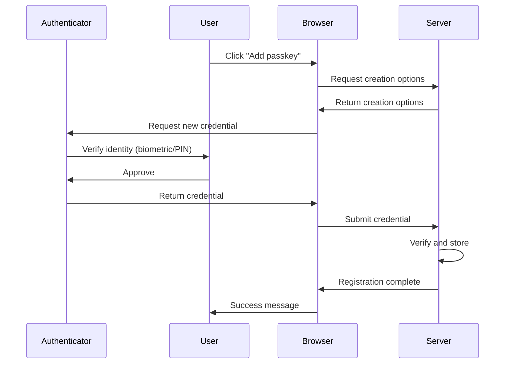
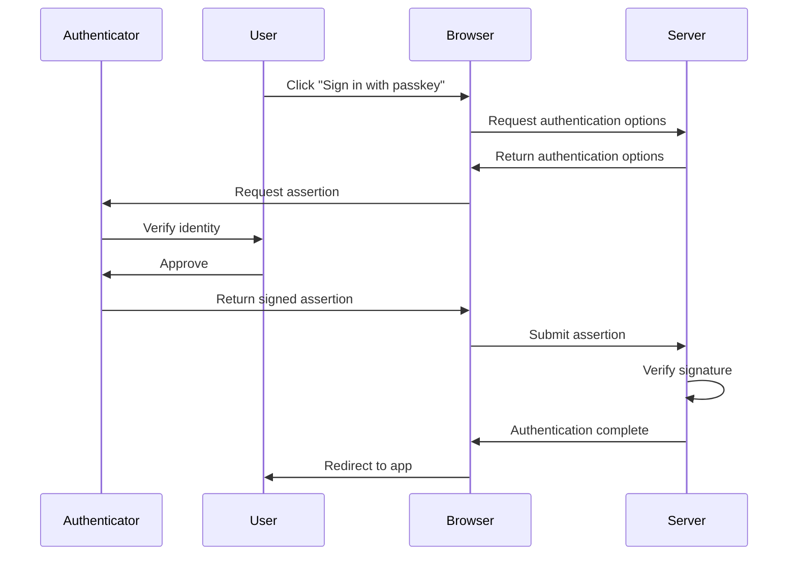
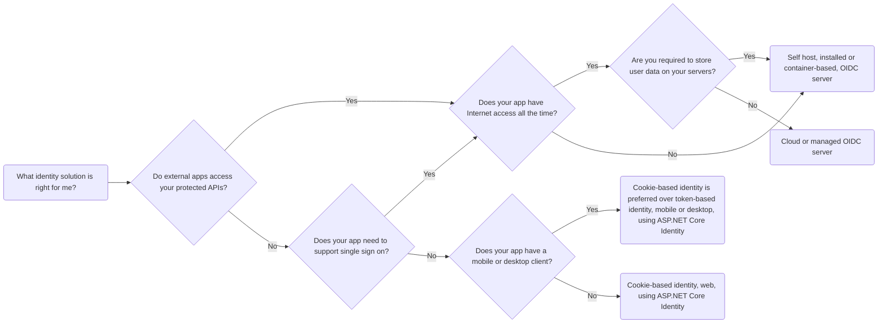

<a id="doc-338c3ef33a5301759b19dfdf"></a>

# dotnet/AspNetCore.Docs / aspnetcore/security/authentication/passkeys/index.md

Upstream: https://github.com/dotnet/AspNetCore.Docs/blob/df9a510cf83fc0f32a71f05f885886c906c84943/aspnetcore/security/authentication/passkeys/index.md

Commit: `df9a510cf83fc0f32a71f05f885886c906c84943`

Retrieved: 2026-10-01T15:18:04.961120+00:00

Kind: official-document

Raw SHA256: `39ef2cec96c544477589bfdf599028cf30d7550541c8920613d7a45185a9f49a`

Source text below is untrusted reference content. Acquisition does not verify technical claims.

License status: UPSTREAM_NOTICES_CAPTURED_PER_FILE_REVIEW_REQUIRED. See this repository's captured license files.

---

---
title: Enable Web Authentication API (WebAuthn) passkeys
ai-usage: ai-assisted
author: guardrex
description: Discover how to enable Web Authentication API (WebAuthn) passkeys in ASP.NET Core apps.
ms.author: wpickett
monikerRange: '>= aspnetcore-10.0'
ms.date: 09/01/2026
uid: security/authentication/passkeys/index
---
# Enable Web Authentication API (WebAuthn) passkeys

<!-- UPDATE 11.0 - Activate the not-latest-version file.

[!INCLUDE[](~/includes/not-latest-version.md)]
[!INCLUDE[](~/includes/not-latest-version-without-not-supported-content.md)]

-->

Passkeys provide a modern, phishing-resistant authentication method based on the [Web Authentication API (WebAuthn)](https://developer.mozilla.org/docs/Web/API/Web_Authentication_API) and [FIDO2](https://www.microsoft.com/security/business/security-101/what-is-fido2) standards. They are a secure alternative to passwords, using public key cryptography and device-based authentication. This article explains how to configure an ASP.NET Core app to use passkeys to authenticate users.

For guidance specific to new and existing Blazor Web Apps, see <xref:security/authentication/passkeys/blazor> after reading this article.

## What are passkeys?

Passkeys are a replacement for passwords that use cryptographic key pairs. The private key is stored securely on the user's device, such as in a hardware security module, platform authenticator (examples: Windows Hello, Touch ID, Face ID), or a password manager, while the public key is stored by the web app. During authentication, the user proves possession of the private key without it ever leaving their device.

Key benefits of passkeys include:

* **Phishing resistance**: Passkeys are bound to specific websites and can't be used on fake sites.
* **No shared secrets**: The server only stores public keys, eliminating the risk of password database breaches.
* **User convenience**: Simple biometric or PIN verification replaces complex password requirements.
* **Cross-device synchronization**: Many passkey providers sync credentials across a user's devices.

For more information, see [Web Authentication API (MDN documentation)](https://developer.mozilla.org/docs/Web/API/Web_Authentication_API).

## Passkeys in ASP.NET Core Identity

ASP.NET Core Identity includes built-in support for passkey registration and authentication:

* Seamless integration with Identity infrastructure.
* User authentication support for the most common WebAuthn scenarios.
* Built into the Blazor Web App project template, so only developer configuration is required.

> [!IMPORTANT]
> The passkey implementation in ASP.NET Core Identity is deliberately scoped to authentication scenarios. It isn't intended as a general-purpose WebAuthn library. Developers requiring full WebAuthn functionality should consider community libraries that provide comprehensive protocol support.

## Supported scenarios

The ASP.NET Core Identity passkey implementation supports the following primary scenarios:

* **Adding passkeys to existing accounts**: Users with password-based accounts can register passkeys as an additional authentication method.
* **Passwordless account creation**: Users can create accounts without a password by registering a passkey on account creation.
* **Passwordless sign-in**: Users can authenticate using only their passkey without entering a password.

## Limitations

The current implementation has the following limitations:

* **Scoped to ASP.NET Core Identity**: The APIs are designed specifically for Identity authentication scenarios.
* **No default attestation validation**: The implementation doesn't validate attestation statements by default.
* **Template support**: Only the Blazor Web App template includes passkey support.
* **No built-in 2FA support**: Passkeys are treated as a primary authentication factor, not as a second factor.

## Core concepts

Two fundamental processes underpin passkey operations: attestation and assertion.

### Attestation (registration)

*Attestation* is the process of creating and registering a new passkey. During attestation, the server generates a unique challenge that the authenticator must include in the returned credential. The authenticator creates a new key pair and returns the public key along with attestation data proving the key's origin. The server then verifies this attestation and stores the public key for future authentication attempts.

### Assertion (authentication)

*Assertion* is the process of authenticating with an existing passkey. The server generates a unique challenge, which the authenticator signs using the private key. The authenticator returns this signed assertion to the server, which verifies the signature using the previously stored public key. If the signature is valid, the user is authenticated.

## Prerequisites

* [.NET SDK](https://dotnet.microsoft.com/download) (.NET 10 or later)
* A modern web browser that supports WebAuthn.
* A device with a platform authenticator, such as Windows Hello or Apple secure enclave, or a security key.

## Security considerations

When implementing passkeys in ASP.NET Core Identity, ensure the app meets the security requirements described in this section.

### Host header validation

The implementation infers the Relying Party ID from the host header when <xref:Microsoft.AspNetCore.Identity.IdentityPasskeyOptions.ServerDomain%2A> isn't explicitly configured. The hosting environment must validate host headers to prevent credential-scoping attacks, which involve using compromised or stolen user credentials (usernames, passwords, tokens) to gain unauthorized access.

**Mitigation**: Either explicitly configure <xref:Microsoft.AspNetCore.Identity.IdentityPasskeyOptions.ServerDomain%2A> in <xref:Microsoft.AspNetCore.Identity.IdentityPasskeyOptions> or ensure that the hosting environment (Kestrel, IIS, reverse proxy) validates host headers. For configuration details, see your hosting platform's documentation. In addition to that, if you use forwarded headers middleware, explicitly configure <xref:Microsoft.AspNetCore.Builder.ForwardedHeadersOptions.AllowedHosts>.

### Subdomain security

ASP.NET Core's passkeys implementation handles subdomain security through the <xref:Microsoft.AspNetCore.Identity.IdentityPasskeyOptions.ServerDomain%2A> configuration option. When <xref:Microsoft.AspNetCore.Identity.IdentityPasskeyOptions.ServerDomain%2A> isn't explicitly specified, the implementation uses the host header to determine the domain. This means that ***the page on which the passkey was registered controls the domain*** for that credential.

For example:

* If a passkey is registered on `app.contoso.com`, it also works on `*.app.contoso.com`.
* If registered on `contoso.com`, it also works on `*.contoso.com`.
* The browser enforces that passkeys can only be used on the domain (and subdomains) where they were registered.

**Requirement**: Apps requiring strict domain control should explicitly set <xref:Microsoft.AspNetCore.Identity.IdentityPasskeyOptions.ServerDomain%2A> rather than relying on the host header. Don't serve untrusted content on any subdomain within the <xref:Microsoft.AspNetCore.Identity.IdentityPasskeyOptions.ServerDomain%2A> scope. If you can't guarantee this, implement [custom origin validation](https://www.w3.org/TR/webauthn-3/#sctn-validating-origin) to restrict passkey usage to specific origins.

### HTTPS requirement

All passkey operations require HTTPS. The implementation stores authentication data in encrypted and signed cookies that could be intercepted over unencrypted connections.

**Requirement**: Always use HTTPS in production. Configure [HTTP Strict Transport Security (HSTS) protocol](xref:security/enforcing-ssl#http-strict-transport-security-hsts-protocol) to prevent protocol downgrade attacks.

### Account recovery

Account recovery is primarily a concern for apps that allow passkeys as the only authentication mechanism. The default Blazor Web App project template already requires users to set up a backup authentication method (password or external provider) when creating an account, so account recovery is handled through these existing mechanisms.

**Recommendations**:

For applications implementing passkey-only authentication, consider:

* Recovery codes generated during account creation.
* Email-based recovery flows.
* Mandatory registration of multiple passkeys.
* Monitoring the <xref:Microsoft.AspNetCore.Identity.UserPasskeyInfo.IsBackedUp%2A> flag on <xref:Microsoft.AspNetCore.Identity.UserPasskeyInfo> to prompt users to add additional credentials.

### Administrative controls

When an authenticator model is discovered to have security vulnerabilities, you may need to revoke affected credentials. The implementation stores the complete attestation object with each credential, including the Authenticator Attestation GUID (AAGUID), which is a 128-bit identifier indicating the key type.

**Implementation**: Extract AAGUIDs from stored attestation objects, compare against known-compromised models, and revoke affected credentials. AAGUID reliability depends on whether your app validates attestation statements. To hook in custom attestation statement validation logic, see [Custom attestation statement validation](#custom-attestation-statement-validation). Third-party libraries are available for attestation validation, such as the [Passkeys - FIDO2 .NET Library (WebAuthn) (`passwordless-lib/fido2-net-lib` GitHub repository)](https://github.com/passwordless-lib/fido2-net-lib)&dagger;.

> [!WARNING]
> &dagger;Third-party libraries, including `passwordless-lib/fido2-net-lib`, aren't owned or maintained by Microsoft and aren't covered by any Microsoft Support Agreement or license. Use caution when adopting a third-party library, especially for security features. Confirm that the library follows official specifications and adopts security best practices. Keep the library's version current to obtain the latest bug fixes.

### Resource limits

To prevent database exhaustion attacks, apps should enforce limits on passkey registration, such as:

* Maximum number of passkeys per user account.
* Maximum length for passkey display names.

The Blazor Web App template enforces these limits by default at the application level. For examples, see the following Razor components in the Blazor Web App project template:

<!-- UPDATE 11.0 - Confirm that the 'BlazorWebCSharp.1' folder 
                   locations for the following links are
                   still correct for release -->

* [`Components/Account/Pages/Manage/Passkeys.razor`](https://github.com/dotnet/aspnetcore/blob/main/src/ProjectTemplates/Web.ProjectTemplates/content/BlazorWeb-CSharp/BlazorWebCSharp.1/Components/Account/Pages/Manage/Passkeys.razor)
* [`Components/Account/Pages/Manage/RenamePasskey.razor`](https://github.com/dotnet/aspnetcore/blob/main/src/ProjectTemplates/Web.ProjectTemplates/content/BlazorWeb-CSharp/BlazorWebCSharp.1/Components/Account/Pages/Manage/RenamePasskey.razor)

[!INCLUDE[](~/includes/aspnetcore-repo-ref-source-links.md)]

## Configure passkey options

ASP.NET Core Identity provides various options to configure passkey behavior through the <xref:Microsoft.AspNetCore.Identity.IdentityPasskeyOptions> class, which include:

* <xref:Microsoft.AspNetCore.Identity.IdentityPasskeyOptions.AuthenticatorTimeout%2A>: Gets or sets the time that the browser should wait for the authenticator to provide a passkey as a <xref:System.TimeSpan>. This option applies to both creating a new passkey and requesting an existing passkey. This option is treated as a hint to the browser, and the browser may ignore the option. The default value is 5 minutes.
* <xref:Microsoft.AspNetCore.Identity.IdentityPasskeyOptions.ChallengeSize%2A>: Gets or sets the size of the challenge in bytes sent to the client during attestation and assertion. This option applies to both creating a new passkey and requesting an existing passkey. The default value is 32 bytes.
* <xref:Microsoft.AspNetCore.Identity.IdentityPasskeyOptions.ServerDomain%2A>: Gets or sets the effective Relying Party ID (domain) of the server. This should be unique and will be used as the identity for the server. This option applies to both creating a new passkey and requesting an existing passkey. If `null`, which is the default value, the server's origin is used. For more information, see [Relying Party Identifier RP ID](https://www.w3.org/TR/webauthn-3/#rp-id).

Example configuration:

```csharp
builder.Services.Configure<IdentityPasskeyOptions>(options =>
{
    options.ServerDomain = "contoso.com";
    options.AuthenticatorTimeout = TimeSpan.FromMinutes(3);
    options.ChallengeSize = 64;
});
```

For a complete list of configuration options, see <xref:Microsoft.AspNetCore.Identity.IdentityPasskeyOptions>. For the most up-to-date browser defaults, see the [W3C WebAuthn specification](https://www.w3.org/TR/webauthn-3/).

> [!NOTE]
> Documentation links to .NET reference source usually load the repository's default branch, which represents the current development for the next preview release of .NET. To select a tag for a specific release, use the **Switch branches or tags** dropdown list. For more information, see [How to select a version tag of ASP.NET Core source code (`dotnet/AspNetCore.Docs` #26205)](https://github.com/dotnet/AspNetCore.Docs/discussions/26205).

## Custom attestation statement validation

By default, ASP.NET Core Identity doesn't validate attestation statements. This is suitable for most consumer authentication scenarios. If your app requires verification of authenticator properties or if you want to disallow specific authenticators from being used, for example, in enterprise environments that require a higher level of security, you can implement custom attestation validation:

```csharp
builder.Services.Configure<IdentityPasskeyOptions>(options =>
{
    options.VerifyAttestationStatement = async (context) =>
    {
        // Custom attestation validation logic
        // Return 'true' if the attestation is valid
        // Return 'false' if the attestation is invalid
        return true;
    };
});
```

> [!WARNING]
> Attestation validation is complex and requires maintaining trust stores for authenticator certificates. Only implement custom validation if your app requires verification of specific authenticator properties.

## Custom origin validation

The default origin validation allows requests from subdomains and disallows cross-origin iframes. To customize this behavior:

```csharp
builder.Services.Configure<IdentityPasskeyOptions>(options =>
{
    options.ValidateOrigin = async (context) =>
    {
        // Custom origin validation logic
        //   Access the origin via 'context.Origin'
        //   Access the HTTP context via 'context.HttpContext'
        // Return 'true' if the origin is valid
        // Return 'false' if the origin is invalid
        return true;
    };
});
```

## Customize the passkey handler

<xref:Microsoft.AspNetCore.Identity.IPasskeyHandler%601> is the service that generates passkey options and performs attestation and assertion. ASP.NET Core Identity registers <xref:Microsoft.AspNetCore.Identity.PasskeyHandler%601> as the default implementation, and <xref:Microsoft.AspNetCore.Identity.SignInManager%601> calls into it. The interface has four methods:

* <xref:Microsoft.AspNetCore.Identity.IPasskeyHandler%601.MakeCreationOptionsAsync%2A>: Generates the creation options and the attestation state for registering a passkey.
* <xref:Microsoft.AspNetCore.Identity.IPasskeyHandler%601.MakeRequestOptionsAsync%2A>: Generates the request options and the assertion state for authenticating with an existing passkey.
* <xref:Microsoft.AspNetCore.Identity.IPasskeyHandler%601.PerformAttestationAsync%2A>: Validates the credential that the browser returns during registration.
* <xref:Microsoft.AspNetCore.Identity.IPasskeyHandler%601.PerformAssertionAsync%2A>: Validates the credential that the browser returns during authentication.

Most apps should use the <xref:Microsoft.AspNetCore.Identity.SignInManager%601> methods shown in the [Registration flow](#registration-flow) and [Authentication flow](#authentication-flow) sections instead of calling the handler directly. Those methods manage the temporary state that the two-request registration and authentication ceremonies require, and they protect that state on the app's behalf.

### When to implement `IPasskeyHandler<TUser>`

For most customizations, use the <xref:Microsoft.AspNetCore.Identity.IdentityPasskeyOptions> callbacks described in the [Custom attestation statement validation](#custom-attestation-statement-validation) and [Custom origin validation](#custom-origin-validation) sections. Implement <xref:Microsoft.AspNetCore.Identity.IPasskeyHandler%601> only for scenarios that the options can't express, such as:

* Varying passkey options per request or per tenant.
* Resolving users from a source other than <xref:Microsoft.AspNetCore.Identity.UserManager%601>.
* Adding checks that run before or after the built-in WebAuthn verification.

Implementing the interface from scratch means reimplementing the WebAuthn verification steps, which is error prone. Where possible, implement the interface as a wrapper that delegates to an inner <xref:Microsoft.AspNetCore.Identity.PasskeyHandler%601> instance and adds only the required behavior.

> [!WARNING]
> An app that calls <xref:Microsoft.AspNetCore.Identity.IPasskeyHandler%601> directly, rather than through <xref:Microsoft.AspNetCore.Identity.SignInManager%601>, becomes responsible for storing the attestation state securely. An app that fails to do so allows an attacker to register a passkey on an account that they don't own.

### Attestation state

Registering a passkey spans two requests. The first request obtains creation options, and the second request submits the new credential. The attestation state is the information that the server remembers between the two requests.

<xref:Microsoft.AspNetCore.Identity.IPasskeyHandler%601.MakeCreationOptionsAsync%2A> returns a <xref:Microsoft.AspNetCore.Identity.PasskeyCreationOptionsResult> with two parts:

* <xref:Microsoft.AspNetCore.Identity.PasskeyCreationOptionsResult.CreationOptionsJson%2A>: Sent to the browser and passed to `navigator.credentials.create()`.
* <xref:Microsoft.AspNetCore.Identity.PasskeyCreationOptionsResult.AttestationState%2A>: Retained by the app and supplied to <xref:Microsoft.AspNetCore.Identity.PasskeyAttestationContext.AttestationState%2A> when the credential is submitted.

The state that the default handler produces holds the challenge and the <xref:Microsoft.AspNetCore.Identity.PasskeyUserEntity> that identifies the account the passkey is registered to. The state is serialized as JSON without a signature or encryption, so it provides no integrity protection of its own.

The state is the only place that records the account. An attestation response from the browser contains a new public key and the signed challenge but nothing that identifies a user, so <xref:Microsoft.AspNetCore.Identity.IPasskeyHandler%601.PerformAttestationAsync%2A> reports the user taken from the state in <xref:Microsoft.AspNetCore.Identity.PasskeyAttestationResult.UserEntity%2A>. If the state is modified before the credential is submitted, the passkey is registered to whichever account the modified state names.

### Validate integrity and ownership

An app that manages the attestation state itself must meet the following three requirements.

**Integrity**: The client must not be able to modify the state. Don't place the state in a hidden form field, a request body, or unprotected browser storage. An attacker who alters the user ID in the state completes registration normally, and their authenticator is stored on the account that the altered state names, which grants them sign-in access to that account. Keep the state on the server or protect it with the [ASP.NET Core Data Protection APIs](xref:security/data-protection/introduction) before sending it to the browser.

**Ownership**: The state must be bound to the session that requested the creation options, and the binding must be checked when the credential is submitted. Compare <xref:Microsoft.AspNetCore.Identity.PasskeyAttestationResult.UserEntity%2A> to the signed-in user before storing the passkey. The handler doesn't perform this check because it has no independent record of the user to compare against.

**Single use and expiration**: Discard the state after reading it and give it a short lifetime. A state that remains valid can be replayed.

For reference, <xref:Microsoft.AspNetCore.Identity.SignInManager%601> meets these requirements by:

* Storing the state in an authentication cookie protected by the Data Protection APIs, which the browser can't read or modify.
* Signing the state out as soon as it's read, which limits the state to a single use.
* Recording whether the state was created for attestation or assertion and rejecting a mismatch.

### Registration example

The following example calls <xref:Microsoft.AspNetCore.Identity.IPasskeyHandler%601> directly and keeps the attestation state in a data-protected cookie. Both endpoints require an authenticated user because the passkey is added to the signed-in account:

```csharp
const string AttestationStateCookieName = "PasskeyAttestationState";
const string AttestationStatePurpose = "Contoso.Passkeys.AttestationState.v1";

app.MapPost("/Account/PasskeyCreationOptions", async (
    HttpContext context,
    UserManager<ApplicationUser> userManager,
    IPasskeyHandler<ApplicationUser> passkeyHandler,
    IDataProtectionProvider dataProtectionProvider) =>
{
    var user = await userManager.GetUserAsync(context.User);

    if (user is null)
    {
        return Results.Unauthorized();
    }

    var userId = await userManager.GetUserIdAsync(user);
    var userName = await userManager.GetUserNameAsync(user) ?? "User";

    var options = await passkeyHandler.MakeCreationOptionsAsync(new()
    {
        Id = userId,
        Name = userName,
        DisplayName = userName
    }, context);

    var attestationState = options.AttestationState 
        ?? throw new InvalidOperationException("No attestation state was created.");

    var protector = 
        dataProtectionProvider.CreateProtector(AttestationStatePurpose);

    context.Response.Cookies.Append(
        AttestationStateCookieName,
        protector.Protect(attestationState),
        new CookieOptions
        {
            HttpOnly = true,
            Secure = true,
            SameSite = SameSiteMode.Strict,
            MaxAge = TimeSpan.FromMinutes(5)
        });

    return TypedResults.Content(options.CreationOptionsJson, 
        contentType: "application/json");
}).RequireAuthorization();
```

The preceding code:

* Protects the attestation state with the data protection APIs before the state reaches the browser, so the client can't read or modify it.
* Limits the cookie to a five minute lifetime, which bounds how long a registration can stay open.

When the credential arrives, the app restores the state, verifies that the attestation belongs to the signed-in user, and only then stores the passkey:

```csharp
app.MapPost("/Account/PasskeyRegistration", async (
    PasskeyRegistrationRequest request,
    HttpContext context,
    UserManager<ApplicationUser> userManager,
    IPasskeyHandler<ApplicationUser> passkeyHandler,
    IDataProtectionProvider dataProtectionProvider) =>
{
    var user = await userManager.GetUserAsync(context.User);

    if (user is null)
    {
        return Results.Unauthorized();
    }

    if (!context.Request.Cookies.TryGetValue(AttestationStateCookieName, 
        out var protectedState))
    {
        return Results.BadRequest("No passkey registration is underway");
    }

    context.Response.Cookies.Delete(AttestationStateCookieName);

    var protector = 
        dataProtectionProvider.CreateProtector(AttestationStatePurpose);
    string attestationState;

    try
    {
        attestationState = protector.Unprotect(protectedState);
    }
    catch (CryptographicException)
    {
        return Results.BadRequest("The passkey registration state isn't valid");
    }

    var attestationResult = await passkeyHandler.PerformAttestationAsync(new()
    {
        HttpContext = context,
        CredentialJson = request.CredentialJson,
        AttestationState = attestationState
    });

    if (!attestationResult.Succeeded)
    {
        return Results.BadRequest($"Error: {attestationResult.Failure.Message}");
    }

    var userId = await userManager.GetUserIdAsync(user);

    if (!string.Equals(attestationResult.UserEntity.Id, userId, 
        StringComparison.Ordinal))
    {
        return Results.BadRequest("The passkey isn't registered to the current user");
    }

    var addResult = 
        await userManager.AddOrUpdatePasskeyAsync(user, attestationResult.Passkey);

    if (!addResult.Succeeded)
    {
        return Results.BadRequest("Failed to store passkey");
    }

    return Results.Ok();
}).RequireAuthorization();
```

The preceding code:

* Deletes the state cookie before the state is used, so the state is good for a single registration.
* Rejects the request when the state can't be unprotected, which happens when the value was tampered with or was protected with a different key.
* Confirms that the attestation result names the signed-in user before the passkey is stored. The handler takes the account from the attestation state, so this check is what stops a passkey from being attached to another account.

The `PasskeyRegistrationRequest` type carries the serialized credential from the browser:

```csharp
public record PasskeyRegistrationRequest(string CredentialJson);
```

### Register a custom handler

`AddSignInManager` registers the default handler with `AddScoped` rather than `TryAddScoped`, so a custom handler must be registered ***after*** the Identity services to be the implementation that's resolved:

```csharp
builder.Services.AddIdentityCore<ApplicationUser>()
    .AddEntityFrameworkStores<ApplicationDbContext>()
    .AddSignInManager();

builder.Services
    .AddScoped<IPasskeyHandler<ApplicationUser>, CustomPasskeyHandler>();
```

## Registration flow

This section walks through each step of the passkey registration process, explaining how ASP.NET Core Identity facilitates the creation and storage of passkey credentials.



### Step 1: Initiating registration

The registration process begins when a user decides to add a passkey to their account. This typically happens through a button or link in the app's user interface. When selected, this element triggers JavaScript code to orchestrate the registration flow.

The client-side implementation varies significantly between apps. In the Blazor Web App template, you can find a complete example in `PasskeySubmit.razor.js`, which shows how a custom web component handles the registration initiation and manages the subsequent WebAuthn API calls.

### Step 2: Requesting creation options

After registration is initiated, the browser must obtain creation options from the server. These options tell the browser what kind of credential to create and include important security parameters, such as the challenge that must be signed.

From the browser's perspective, this step involves making an HTTP request to the server:

:::moniker range=">= aspnetcore-11.0"

```javascript
async function createCredential(signal) {
  // Step 2: Request creation options from the server
  const optionsResponse = 
    await fetchWithErrorHandling('/Account/PasskeyCreationOptions', 
    {
      method: 'POST',
      signal,
    });
  const optionsJson = await optionsResponse.json();
  const options = PublicKeyCredential.parseCreationOptionsFromJSON(optionsJson);
  return await navigator.credentials.create({ publicKey: options, signal });
}
```

:::moniker-end

:::moniker range="< aspnetcore-11.0"

```javascript
async function createCredential(headers, signal) {
  // Step 2: Request creation options from the server
  const optionsResponse = 
    await fetchWithErrorHandling('/Account/PasskeyCreationOptions', 
    {
      method: 'POST',
      headers,
      signal,
    });
  const optionsJson = await optionsResponse.json();
  const options = PublicKeyCredential.parseCreationOptionsFromJSON(optionsJson);
  return await navigator.credentials.create({ publicKey: options, signal });
}
```

:::moniker-end

The application should define an endpoint that generates these options:

```csharp
app.MapPost("/Account/PasskeyCreationOptions", async (
    HttpContext context,
    UserManager<ApplicationUser> userManager,
    SignInManager<ApplicationUser> signInManager) =>
{
    var user = await userManager.GetUserAsync(context.User);

    if (user is null)
    {
        return Results.NotFound();
    }

    var userId = await userManager.GetUserIdAsync(user);
    var userName = await userManager.GetUserNameAsync(user) ?? "User";
    
    var optionsJson = await signInManager.MakePasskeyCreationOptionsAsync(new()
    {
        Id = userId,
        Name = userName,
        DisplayName = userName
    });
    
    return TypedResults.Content(optionsJson, contentType: "application/json");
});
```

The <xref:Microsoft.AspNetCore.Identity.SignInManager%601.MakePasskeyCreationOptionsAsync%2A> method is central to this process. The method accepts a `PasskeyUserEntity` that describes the user for whom the passkey is being created. This entity contains the user's ID, username (typically an email address), and a human-readable display name. The method returns a JSON string that conforms to the WebAuthn `PublicKeyCredentialCreationOptions` schema, which the browser uses in the next step. Behind the scenes, this method also stores temporary state in an authentication cookie to ensure that the response from the browser corresponds to these specific options. Apps that manage this state themselves must protect it, as described in the [Customize the passkey handler](#customize-the-passkey-handler) section.

### Step 3: Server generates options

When <xref:Microsoft.AspNetCore.Identity.SignInManager%601.MakePasskeyCreationOptionsAsync%2A> executes, it uses the app's <xref:Microsoft.AspNetCore.Identity.IdentityPasskeyOptions> configuration to determine the specific parameters for credential creation. These options control various aspects of the passkey creation process.

You can customize these options during application startup. For example:

```csharp
builder.Services.Configure<IdentityPasskeyOptions>(options =>
{
    options.ServerDomain = "contoso.com";
    options.AuthenticatorTimeout = TimeSpan.FromMinutes(3);
    options.UserVerificationRequirement = "required";
    options.ResidentKeyRequirement = "preferred";
});
```

The <xref:Microsoft.AspNetCore.Identity.IdentityPasskeyOptions.UserVerificationRequirement%2A> option determines whether the authenticator must verify the user's identity (through biometric or PIN methods), while <xref:Microsoft.AspNetCore.Identity.IdentityPasskeyOptions.ResidentKeyRequirement%2A> indicates whether the credential should be discoverable, allowing authentication without first providing a username. For more information, see <xref:Microsoft.AspNetCore.Identity.IdentityPasskeyOptions>.

### Step 4: Client requests credential

With the creation options available, the client-side JavaScript passes the options to the WebAuthn API to create a new credential:

:::moniker range=">= aspnetcore-11.0"

```javascript
async function createCredential(signal) {
  // Step 4: Parse the options and request a new credential from the authenticator
  const optionsResponse = 
    await fetchWithErrorHandling('/Account/PasskeyCreationOptions', 
    {
      method: 'POST',
      signal,
    });
  const optionsJson = await optionsResponse.json();
  const options = PublicKeyCredential.parseCreationOptionsFromJSON(optionsJson);
  return await navigator.credentials.create({ publicKey: options, signal });
}
```

:::moniker-end

:::moniker range="< aspnetcore-11.0"

```javascript
async function createCredential(headers, signal) {
  // Step 4: Parse the options and request a new credential from the authenticator
  const optionsResponse = 
    await fetchWithErrorHandling('/Account/PasskeyCreationOptions', 
    {
      method: 'POST',
      headers,
      signal,
    });
  const optionsJson = await optionsResponse.json();
  const options = PublicKeyCredential.parseCreationOptionsFromJSON(optionsJson);
  return await navigator.credentials.create({ publicKey: options, signal });
}
```

:::moniker-end

The `parseCreationOptionsFromJSON` function converts the JSON response into the format expected by the WebAuthn API, and `navigator.credentials.create()` initiates the credential creation process with the authenticator.

### Step 5: Authenticator interaction

At this point, the browser communicates with the authenticator to create the credential. The authenticator prompts the user for verification, which might involve scanning a fingerprint, entering a PIN, or using facial recognition. This interaction is handled entirely by the browser and the authenticator, requiring no app code. The user experience varies depending on the type of authenticator and the platform's capabilities.

### Step 6: Credential submission

After the authenticator creates the credential, the browser must send the credential back to the server for verification and storage. The credential must be serialized to JSON before submission:

:::moniker range=">= aspnetcore-11.0"

```javascript
async function createCredentialJson(signal) {
  const credential = await createCredential(signal);
  return JSON.stringify(credential);
}
```

:::moniker-end

:::moniker range="< aspnetcore-11.0"

```javascript
async function createCredentialJson(headers, signal) {
  const credential = await createCredential(headers, signal);
  return JSON.stringify(credential);
}
```

:::moniker-end

In the Blazor Web App template, the returned credential is automatically serialized and submitted through a form, but the exact submission mechanism varies by application.

### Step 7: Server verification and storage

When the server receives the credential, it must verify its validity and store the public key for future authentication. This is where ASP.NET Core Identity's passkey APIs become crucial.

The <xref:Microsoft.AspNetCore.Identity.SignInManager%601.PerformPasskeyAttestationAsync%2A> method validates the attestation response from the client. This comprehensive validation process:

* Verifies that the credential type matches expectations.
* Validates the client data JSON including origin and challenge.
* Checks authenticator data flags for user presence and verification
* Extracts and validates the public key.

If all checks pass, the method returns a <xref:Microsoft.AspNetCore.Identity.PasskeyAttestationResult> containing the verified passkey information.

After the attestation is verified, the app uses <xref:Microsoft.AspNetCore.Identity.UserManager%601.AddOrUpdatePasskeyAsync%2A> to store the passkey in the database:

```csharp
var attestationResult = 
    await signInManager.PerformPasskeyAttestationAsync(credentialJson);

if (!attestationResult.Succeeded)
{
    return Results.BadRequest($"Error: {attestationResult.Failure.Message}");
}

var addResult = 
    await userManager.AddOrUpdatePasskeyAsync(user, attestationResult.Passkey);

if (!addResult.Succeeded)
{
    return Results.BadRequest("Failed to store passkey");
}
```

The stored <xref:Microsoft.AspNetCore.Identity.UserPasskeyInfo> contains all of the necessary information for future authentication, including the credential ID, public key, signature counter for replay protection, and flags indicating whether the passkey is backed up or eligible for backup.

### Step 8: Post-registration tasks

After successfully registering a passkey, apps often perform additional tasks to improve the user experience. A common pattern is to prompt users to provide a friendly name for their passkey, making it easier to identify among multiple credentials. The <xref:Microsoft.AspNetCore.Identity.UserPasskeyInfo.Name%2A?displayProperty=nameWithType> property stores this user-friendly name, which can be updated using the same <xref:Microsoft.AspNetCore.Identity.UserManager%601.AddOrUpdatePasskeyAsync%2A> method:

```csharp
passkey.Name = "My iPhone";
await userManager.AddOrUpdatePasskeyAsync(user, passkey);
```

## Authentication flow

This section explains how users authenticate with their passkeys, from initiating the sign-in process to establishing an authenticated session.



### Step 1: Initiating authentication

Users typically initiate passkey authentication through a dedicated button or link on the login page. Some apps also support conditional UI, where passkeys appear as autofill suggestions in the username field. The initiation method triggers JavaScript code that manages the authentication flow, similar to the registration process.

### Step 2: Requesting authentication options

The browser requests authentication options from the server to begin the authentication process. These options include a list of acceptable credentials and a new challenge to be signed:

:::moniker range=">= aspnetcore-11.0"

```javascript
async function requestCredential(email, mediation, signal) {
  // Step 2: Request authentication options from the server
  const optionsResponse = 
    await fetchWithErrorHandling(`/Account/PasskeyRequestOptions?username=${encodeURIComponent(email)}`,
    {
      method: 'POST',
      signal,
    });
  const optionsJson = await optionsResponse.json();
  const options = PublicKeyCredential.parseRequestOptionsFromJSON(optionsJson);
  return await navigator.credentials.get({ publicKey: options, mediation, signal });
}
```

:::moniker-end

:::moniker range="< aspnetcore-11.0"

```javascript
async function requestCredential(email, mediation, headers, signal) {
  // Step 2: Request authentication options from the server
  const optionsResponse = 
    await fetchWithErrorHandling(`/Account/PasskeyRequestOptions?username=${encodeURIComponent(email)}`,
    {
      method: 'POST',
      headers,
      signal,
    });
  const optionsJson = await optionsResponse.json();
  const options = PublicKeyCredential.parseRequestOptionsFromJSON(optionsJson);
  return await navigator.credentials.get({ publicKey: options, mediation, signal });
}
```

:::moniker-end

The <xref:Microsoft.AspNetCore.Identity.SignInManager%601.MakePasskeyRequestOptionsAsync%2A> method generates these options. When you provide a specific user, it includes only that user's credentials in the allow list. When called without a user, it generates options suitable for conditional UI or username-less authentication:

```csharp
app.MapPost("/Account/PasskeyRequestOptions", async (
    SignInManager<ApplicationUser> signInManager,
    string? username) =>
{
    var user = string.IsNullOrEmpty(username) 
        ? null 
        : await userManager.FindByNameAsync(username);

    var optionsJson = await signInManager.MakePasskeyRequestOptionsAsync(user);

    return TypedResults.Content(optionsJson, contentType: "application/json");
});
```

### Step 3: Server generates options

The server generates authentication options using the same <xref:Microsoft.AspNetCore.Identity.IdentityPasskeyOptions> configuration used during registration. The <xref:Microsoft.AspNetCore.Identity.IdentityPasskeyOptions.ServerDomain%2A> must match the domain where the passkey was originally registered, or authentication fails. The <xref:Microsoft.AspNetCore.Identity.IdentityPasskeyOptions.UserVerificationRequirement%2A> determines whether the authenticator must verify the user's identity during authentication.

### Step 4: Client requests assertion

The client-side JavaScript passes the authentication options to the WebAuthn API to request an assertion from the authenticator:

:::moniker range=">= aspnetcore-11.0"

```javascript
async function requestCredential(email, mediation, signal) {
  // Step 4: Parse the options and request an assertion from the authenticator
  const optionsResponse = 
    await fetchWithErrorHandling(`/Account/PasskeyRequestOptions?username=${encodeURIComponent(email)}`,
    {
      method: 'POST',
      signal,
    });
  const optionsJson = await optionsResponse.json();
  const options = PublicKeyCredential.parseRequestOptionsFromJSON(optionsJson);
  return await navigator.credentials.get({ publicKey: options, mediation, signal });
}
```

:::moniker-end

:::moniker range="< aspnetcore-11.0"

```javascript
async function requestCredential(email, mediation, headers, signal) {
  // Step 4: Parse the options and request an assertion from the authenticator
  const optionsResponse = 
    await fetchWithErrorHandling(`/Account/PasskeyRequestOptions?username=${encodeURIComponent(email)}`,
    {
      method: 'POST',
      headers,
      signal,
    });
  const optionsJson = await optionsResponse.json();
  const options = PublicKeyCredential.parseRequestOptionsFromJSON(optionsJson);
  return await navigator.credentials.get({ publicKey: options, mediation, signal });
}
```

:::moniker-end

The `navigator.credentials.get()` call initiates the authentication process with the authenticator, which prompts the user for verification.

### Step 5: Authenticator verification

The authenticator verifies the user's identity and signs the challenge with the private key. This process is handled entirely by the browser and authenticator, similar to the verification step during registration. The user experience depends on the authenticator type and may involve biometric verification or PIN entry.

### Step 6: Assertion submission

After the authenticator creates the signed assertion, the browser serializes it to JSON and submits it to the server:

:::moniker range=">= aspnetcore-11.0"

```javascript
async function requestCredentialJson(email, mediation, signal) {
  const credential = await requestCredential(email, mediation, signal);
  return JSON.stringify(credential);
}
```

:::moniker-end

:::moniker range="< aspnetcore-11.0"

```javascript
async function requestCredentialJson(email, mediation, headers, signal) {
  const credential = await requestCredential(email, mediation, headers, signal);
  return JSON.stringify(credential);
}
```

:::moniker-end

The submission mechanism varies by app but typically involves either a form submission or an API call.

### Step 7: Server verification

The server verifies the assertion to authenticate the user. ASP.NET Core Identity provides the <xref:Microsoft.AspNetCore.Identity.SignInManager%601.PasskeySignInAsync%2A> method, which performs the complete authentication flow in a single call:

```csharp
var result = await signInManager.PasskeySignInAsync(credentialJson);

if (result.Succeeded)
{
    return Results.Ok("Authentication successful");
}

return Results.Unauthorized();
```

The <xref:Microsoft.AspNetCore.Identity.SignInManager%601.PasskeySignInAsync%2A> method internally calls <xref:Microsoft.AspNetCore.Identity.SignInManager%601.PerformPasskeyAssertionAsync%2A> to:

* Validate the assertion signature using the stored public key.
* Verify that the challenge matches the one originally sent.
* Check authenticator flags for user presence and verification.
* Update the signature counter to prevent replay attacks.

If all checks pass, the method signs in the user and returns a `SignInResult` indicating success.

:::moniker range=">= aspnetcore-11.0"

The method distinguishes between a recoverable user action and an app error. If the passkey session state is missing or expired, for example because the user took too long to respond to the authenticator, the method returns <xref:Microsoft.AspNetCore.Identity.SignInResult.Failed?displayProperty=nameWithType>. Calling the method without a preceding call to <xref:Microsoft.AspNetCore.Identity.SignInManager%601.MakePasskeyRequestOptionsAsync%2A> throws an <xref:System.InvalidOperationException> because that indicates a problem in the app rather than something the user can retry.

:::moniker-end

For scenarios requiring more control, you can use <xref:Microsoft.AspNetCore.Identity.SignInManager%601.PerformPasskeyAssertionAsync%2A> directly to validate the assertion without immediately signing in the user:

* <xref:Microsoft.AspNetCore.Identity.SignInManager%601.PerformPasskeyAssertionAsync%2A> returns a <xref:Microsoft.AspNetCore.Identity.PasskeyAssertionResult> containing the authenticated user and updated passkey information.
* Because the passkey's sign-in count and authenticator flags may have changed since the last assertion and the updated passkey isn't automatically stored when calling <xref:Microsoft.AspNetCore.Identity.SignInManager%601.PerformPasskeyAssertionAsync%2A>, call <xref:Microsoft.AspNetCore.Identity.UserManager%601.AddOrUpdatePasskeyAsync%2A?displayProperty=nameWithType> with the returned <xref:Microsoft.AspNetCore.Identity.PasskeyAssertionResult>.

### Step 8: Session establishment

Upon successful authentication, ASP.NET Core Identity establishes an authenticated session for the user. The <xref:Microsoft.AspNetCore.Identity.SignInManager%601.PasskeySignInAsync%2A> method handles this automatically, creating the necessary authentication cookies and claims. The app then redirects the user to protected resources or displays personalized content.

## Mitigate `PublicKeyCredential.toJSON` error (`TypeError: Illegal invocation`)

The [`PublicKeyCredential.toJSON` method](https://developer.mozilla.org/docs/Web/API/PublicKeyCredential/toJSON) returns a JSON representation of a [`PublicKeyCredential`](https://developer.mozilla.org/docs/Web/API/PublicKeyCredential). The method is invoked by the password manager when the app attempts to serialize a `PublicKeyCredential` by calling [`JSON.stringify`](https://developer.mozilla.org/docs/Web/JavaScript/Reference/Global_Objects/JSON/stringify) while registering or authenticating a user.

Some password managers don't implement the `PublicKeyCredential.toJSON` method correctly, which is required for `JSON.stringify` to work when serializing passkey credentials. When registering or authenticating a user with an app based on the Blazor Web App project template, the following error is thrown by some password managers when attempting to add a passkey:

> :::no-loc text="Error: Could not add a passkey: Illegal invocation":::

Until your selected password manager is updated to implement the `PublicKeyCredential.toJSON` method correctly, make the following changes to the app. The following code manually JSON serializes the `PublicKeyCredential`.

In the `Components/Account/Shared/PasskeySubmit.razor.js` file, locate the `passkey-submit` custom element definition code block:

```javascript
customElements.define('passkey-submit', class extends HTMLElement {
  ...
});
```

Add the following `convertToBase64` function to the code block:

```javascript
convertToBase64(o) {
  if (!o) {
    return undefined;
  }

  // Normalize Array to Uint8Array
  if (Array.isArray(o)) {
    o = Uint8Array.from(o);
  }

  // Normalize ArrayBuffer to Uint8Array
  if (o instanceof ArrayBuffer) {
    o = new Uint8Array(o);
  }

  // Convert Uint8Array to base64
  if (o instanceof Uint8Array) {
    let str = '';
    for (let i = 0; i < o.byteLength; i++) {
      str += String.fromCharCode(o[i]);
    }
    o = window.btoa(str);
  }

  if (typeof o !== 'string') {
    throw new Error("Could not convert to base64 string");
  }

  // Convert base64 to base64url
  o = o.replace(/\+/g, "-").replace(/\//g, "_").replace(/=*$/g, "");

  return o;
}
```

In the `obtainAndSubmitCredential` function of the code block, locate the line that calls `JSON.stringify` with the user's credential and remove the line:

```diff
- const credentialJson = JSON.stringify(credential);
```

Replace the preceding line with the following code:

```javascript
const credentialJson = JSON.stringify({
  authenticatorAttachment: credential.authenticatorAttachment,
  clientExtensionResults: credential.getClientExtensionResults(),
  id: credential.id,
  rawId: this.convertToBase64(credential.rawId),
  response: {
    attestationObject: this.convertToBase64(credential.response.attestationObject),
    authenticatorData: this.convertToBase64(credential.response.authenticatorData ?? 
      credential.response.getAuthenticatorData?.() ?? undefined),
    clientDataJSON: this.convertToBase64(credential.response.clientDataJSON),
    publicKey: this.convertToBase64(credential.response.getPublicKey?.() ?? undefined),
    publicKeyAlgorithm: credential.response.getPublicKeyAlgorithm?.() ?? undefined,
    transports: credential.response.getTransports?.() ?? undefined,
    signature: this.convertToBase64(credential.response.signature),
    userHandle: this.convertToBase64(credential.response.userHandle),
  },
  type: credential.type,
});
```

The preceding workaround is only required until the password manager is updated to implement the `PublicKeyCredential.toJSON` method correctly. We recommend tracking your password manager's release notes and reverting the preceding changes after the password manager is updated.

## Additional resources

* [Web Authentication API (MDN documentation)](https://developer.mozilla.org/docs/Web/API/Web_Authentication_API)
* [Get started with phishing-resistant passwordless authentication deployment in Microsoft Entra ID](/entra/identity/authentication/how-to-plan-prerequisites-phishing-resistant-passwordless-authentication)


<a id="doc-94cd418a271286d145f10529"></a>

# dotnet/AspNetCore.Docs / aspnetcore/security/authentication/policyschemes.md

Upstream: https://github.com/dotnet/AspNetCore.Docs/blob/df9a510cf83fc0f32a71f05f885886c906c84943/aspnetcore/security/authentication/policyschemes.md

Commit: `df9a510cf83fc0f32a71f05f885886c906c84943`

Retrieved: 2026-10-01T15:18:04.961120+00:00

Kind: official-document

Raw SHA256: `09925ae43e8e73f04c5d064432a4120ca836374c3d7c89131d7fb27aca0ce8f9`

Source text below is untrusted reference content. Acquisition does not verify technical claims.

License status: UPSTREAM_NOTICES_CAPTURED_PER_FILE_REVIEW_REQUIRED. See this repository's captured license files.

---

---
title: Policy schemes in ASP.NET Core
author: wadepickett
description: Authentication policy schemes make it easier to have a single logical authentication scheme
ms.author: wpickett
ms.date: 08/07/2026
uid: security/authentication/policyschemes
---
# Policy schemes in ASP.NET Core

Authentication policy schemes make it easier to have a single logical authentication scheme potentially use multiple approaches. For example, a policy scheme might use Google authentication for challenges, and cookie authentication for everything else. Authentication policy schemes make it:

* Easy to forward any authentication action to another scheme.
* Forward dynamically based on the request.

All authentication schemes that use derived <xref:Microsoft.AspNetCore.Authentication.AuthenticationSchemeOptions> and the associated <xref:Microsoft.AspNetCore.Authentication.AuthenticationHandler%601>:

* Are automatically policy schemes in ASP.NET Core 2.1 or later.
* Can be enabled via configuring the scheme's options.

[!code-csharp[sample](policyschemes/samples/AuthenticationSchemeOptions.cs?name=snippet)]

Framework default forwarding logic checks the following settings:

1. <xref:Microsoft.AspNetCore.Authentication.AuthenticationSchemeOptions.ForwardAuthenticate>
1. <xref:Microsoft.AspNetCore.Authentication.AuthenticationSchemeOptions.ForwardChallenge>
1. <xref:Microsoft.AspNetCore.Authentication.AuthenticationSchemeOptions.ForwardForbid>
1. <xref:Microsoft.AspNetCore.Authentication.AuthenticationSchemeOptions.ForwardSignIn>
1. <xref:Microsoft.AspNetCore.Authentication.AuthenticationSchemeOptions.ForwardSignOut>
1. <xref:Microsoft.AspNetCore.Authentication.AuthenticationSchemeOptions.ForwardDefaultSelector>
1. <xref:Microsoft.AspNetCore.Authentication.AuthenticationSchemeOptions.ForwardDefault>

The first non-`null` result is used as the target scheme for forwarding.

## JWT with multiple schemes

The <xref:Microsoft.AspNetCore.Authentication.AuthenticationBuilder.AddPolicyScheme%2A> method can define multiple authentication schemes and implement logic to select the appropriate scheme based on token properties (for example, issuer, claims). This approach allows for greater flexibility within a single API.

```csharp
services.AddAuthentication(options =>
{
	options.DefaultScheme = Consts.MY_POLICY_SCHEME;
	options.DefaultChallengeScheme = Consts.MY_POLICY_SCHEME;

})
.AddJwtBearer(Consts.MY_FIRST_SCHEME, options =>
{
	options.Authority = "https://your-authority";
	options.Audience = "https://your-audience";
	options.TokenValidationParameters = new TokenValidationParameters
	{
		ValidateIssuer = true,
		ValidateAudience = true,
		ValidateIssuerSigningKey = true,
		ValidAudiences = Configuration.GetSection("ValidAudiences").Get<string[]>(),
		ValidIssuers = Configuration.GetSection("ValidIssuers").Get<string[]>()
	};
})
.AddJwtBearer(Consts.MY_AAD_SCHEME, jwtOptions =>
{
	jwtOptions.Authority = Configuration["AzureAd:Authority"];
	jwtOptions.Audience = Configuration["AzureAd:Audience"]; 
})
.AddPolicyScheme(Consts.MY_POLICY_SCHEME, displayName: null, options =>
{
	options.ForwardDefaultSelector = context =>
	{
		string authorization = context.Request.Headers[HeaderNames.Authorization];
		if (!string.IsNullOrEmpty(authorization) && authorization.StartsWith("Bearer "))
		{
			var token = authorization.Substring("Bearer ".Length).Trim();
			var jwtHandler = new JsonWebTokenHandler();

			if(jwtHandler.CanReadToken(token)) // it's a self contained access token and not encrypted
			{
				var issuer = jwtHandler.ReadJsonWebToken(token).Issuer; //.Equals("B2C-Authority"))
				if (issuer == Consts.MY_THIRD_PARTY_ISS) // Third party identity provider
				{
					return Consts.MY_THIRD_PARTY_SCHEME;
				}

				if (issuer == Consts.MY_AAD_ISS) // AAD
				{
					return Consts.MY_AAD_SCHEME;
				}
			}
		}

		// We don't know with it is
		return Consts.MY_AAD_SCHEME;
	};
});
```

## Examples

The following example shows a higher level scheme that combines lower level schemes. Google authentication is used for challenges, and cookie authentication is used for everything else:

[!code-csharp[sample](policyschemes/samples/Startup.cs?name=snippet1)]

The following example enables dynamic selection of schemes on a per request basis. That is, how to mix cookies and API authentication:

 <!-- REVIEW, missing If set in public Func<HttpContext, string> ForwardDefaultSelector -->

[!code-csharp[sample](policyschemes/samples/Startup.cs?name=snippet2)]


<a id="doc-2971bce82fee56ae1cb01731"></a>

# dotnet/AspNetCore.Docs / aspnetcore/security/authentication/policyschemes/samples/AuthenticationSchemeOptions.cs

Upstream: https://github.com/dotnet/AspNetCore.Docs/blob/df9a510cf83fc0f32a71f05f885886c906c84943/aspnetcore/security/authentication/policyschemes/samples/AuthenticationSchemeOptions.cs

Commit: `df9a510cf83fc0f32a71f05f885886c906c84943`

Retrieved: 2026-10-01T15:18:04.961120+00:00

Kind: upstream-example-code

Raw SHA256: `3f70d91401ef813f21e576db800aa09b6c997486f1f6397657030a82fb96bf7c`

Source text below is untrusted reference content. Acquisition does not verify technical claims.

License status: UPSTREAM_NOTICES_CAPTURED_PER_FILE_REVIEW_REQUIRED. See this repository's captured license files.

---

````text
using Microsoft.AspNetCore.Http;
using System;

namespace policyschemes
{
    #region snippet
    public class AuthenticationSchemeOptions
    {
        /// <summary>
        /// If set, this specifies a default scheme that authentication handlers should 
        /// forward all authentication operations to, by default. The default forwarding 
        /// logic checks in this order:
        /// 1. The most specific ForwardAuthenticate/Challenge/Forbid/SignIn/SignOut 
        /// 2. The ForwardDefaultSelector
        /// 3. ForwardDefault
        /// The first non null result is used as the target scheme to forward to.
        /// </summary>
        public string ForwardDefault { get; set; }

        /// <summary>
        /// If set, this specifies the target scheme that this scheme should forward 
        /// AuthenticateAsync calls to. For example:
        /// Context.AuthenticateAsync("ThisScheme") => 
        ///                Context.AuthenticateAsync("ForwardAuthenticateValue");
        /// Set the target to the current scheme to disable forwarding and allow 
        /// normal processing.
        /// </summary>
        public string ForwardAuthenticate { get; set; }

        /// <summary>
        /// If set, this specifies the target scheme that this scheme should forward 
        /// ChallengeAsync calls to. For example:
        /// Context.ChallengeAsync("ThisScheme") =>
        ///                         Context.ChallengeAsync("ForwardChallengeValue");
        /// Set the target to the current scheme to disable forwarding and allow normal
        /// processing.
        /// </summary>
        public string ForwardChallenge { get; set; }

        /// <summary>
        /// If set, this specifies the target scheme that this scheme should forward 
        /// ForbidAsync calls to.For example:
        /// Context.ForbidAsync("ThisScheme") 
        ///                               => Context.ForbidAsync("ForwardForbidValue");
        /// Set the target to the current scheme to disable forwarding and allow normal 
        /// processing.
        /// </summary>
        public string ForwardForbid { get; set; }

        /// <summary>
        /// If set, this specifies the target scheme that this scheme should forward 
        /// SignInAsync calls to. For example:
        /// Context.SignInAsync("ThisScheme") => 
        ///                                Context.SignInAsync("ForwardSignInValue");
        /// Set the target to the current scheme to disable forwarding and allow normal 
        /// processing.
        /// </summary>
        public string ForwardSignIn { get; set; }

        /// <summary>
        /// If set, this specifies the target scheme that this scheme should forward 
        /// SignOutAsync calls to. For example:
        /// Context.SignOutAsync("ThisScheme") => 
        ///                              Context.SignOutAsync("ForwardSignOutValue");
        /// Set the target to the current scheme to disable forwarding and allow normal 
        /// processing.
        /// </summary>
        public string ForwardSignOut { get; set; }

        /// <summary>
        /// Used to select a default scheme for the current request that authentication
        /// handlers should forward all authentication operations to by default. The 
        /// default forwarding checks in this order:
        /// 1. The most specific ForwardAuthenticate/Challenge/Forbid/SignIn/SignOut
        /// 2. The ForwardDefaultSelector
        /// 3. ForwardDefault. 
        /// The first non null result will be used as the target scheme to forward to.
        /// </summary>
        public Func<HttpContext, string> ForwardDefaultSelector { get; set; }
    }
    #endregion
}

````


<a id="doc-fc34a2687447c90ce12c251b"></a>

# dotnet/AspNetCore.Docs / aspnetcore/security/authentication/policyschemes/samples/Startup.cs

Upstream: https://github.com/dotnet/AspNetCore.Docs/blob/df9a510cf83fc0f32a71f05f885886c906c84943/aspnetcore/security/authentication/policyschemes/samples/Startup.cs

Commit: `df9a510cf83fc0f32a71f05f885886c906c84943`

Retrieved: 2026-10-01T15:18:04.961120+00:00

Kind: upstream-example-code

Raw SHA256: `5ba0c1ca831d500a8e0db3066eff6b021c90cf385b6963ed316e60f4a81cb296`

Source text below is untrusted reference content. Acquisition does not verify technical claims.

License status: UPSTREAM_NOTICES_CAPTURED_PER_FILE_REVIEW_REQUIRED. See this repository's captured license files.

---

````text
//#define S1
using Microsoft.AspNetCore.Authentication.Cookies;
using Microsoft.AspNetCore.Builder;
using Microsoft.AspNetCore.Hosting;
using Microsoft.AspNetCore.Http;
using Microsoft.Extensions.DependencyInjection;

namespace policyschemes
{
    public class Startup
    {
#if S1
        #region snippet1
        public void ConfigureServices(IServiceCollection services)
        {
            services.AddAuthentication(CookieAuthenticationDefaults.AuthenticationScheme)
               .AddCookie(options => options.ForwardChallenge = "Google")
               .AddGoogle(options => { });
        }
        #endregion
#else
        #region snippet2
        public void ConfigureServices(IServiceCollection services)
        {
            services.AddAuthentication(CookieAuthenticationDefaults.AuthenticationScheme)
                .AddCookie(options =>
                {
                    // For example, can foward any requests that start with /api 
                    // to the api scheme.
                    options.ForwardDefaultSelector = ctx => 
                       ctx.Request.Path.StartsWithSegments("/api") ? "Api" : null;
                })
                .AddYourApiAuth("Api");
        }
        #endregion
#endif

        // This method gets called by the runtime. Use this method to configure the HTTP request pipeline.
        public void Configure(IApplicationBuilder app, IHostingEnvironment env)
        {
            if (env.IsDevelopment())
            {
                app.UseDeveloperExceptionPage();
            }

            app.Run(async (context) =>
            {
                await context.Response.WriteAsync("Hello World!");
            });
        }
    }
}

````


<a id="doc-c30376307b45fbbfd796eb5a"></a>

# dotnet/AspNetCore.Docs / aspnetcore/security/authentication/scaffold-identity.md

Upstream: https://github.com/dotnet/AspNetCore.Docs/blob/df9a510cf83fc0f32a71f05f885886c906c84943/aspnetcore/security/authentication/scaffold-identity.md

Commit: `df9a510cf83fc0f32a71f05f885886c906c84943`

Retrieved: 2026-10-01T15:18:04.961120+00:00

Kind: official-document

Raw SHA256: `33c8e01ab4b583b8178b879cc76b2e090017e78366691e0c732da0b06c5315b5`

Source text below is untrusted reference content. Acquisition does not verify technical claims.

License status: UPSTREAM_NOTICES_CAPTURED_PER_FILE_REVIEW_REQUIRED. See this repository's captured license files.

---

---
title: Scaffold Identity in ASP.NET Core projects
author: wadepickett
description: Learn how to scaffold Identity in an ASP.NET Core project.
monikerRange: '>= aspnetcore-3.1'
ms.author: wpickett
ms.date: 05/19/2026
uid: security/authentication/scaffold-identity

# customer intent: As an ASP.NET developer, I want to scaffold Identity in an ASP.NET Core project, so I can customize the components for my app.
---
# Scaffold Identity in ASP.NET Core projects

By [Rick Anderson](https://twitter.com/RickAndMSFT)

<!-- VS add Microsoft.EntityFrameworkCore.Design -->

:::moniker range=">= aspnetcore-8.0"

This article shows how to migrate a database and complete an Identity scaffolding update.

## Blazor Identity scaffolding

ASP.NET Core Identity scaffolding adds [ASP.NET Core Identity](xref:security/authentication/identity) to Blazor Web Apps and Blazor Server apps. After the scaffolder adds the Identity Razor components to the app, you can customize the components to suit your application requirements.

Although the scaffolder generates the necessary C# code to scaffold Identity into the app, you must update the project database with an Entity Framework Core database migration to complete the process. This article describes the steps for migrating a database.

After running the Identity scaffolder, inspect the changes. Use GitHub or another source control system that shows file changes with a revert changes feature.

Services are required when using [two-factor authentication (2FA)](xref:blazor/security/qrcodes-for-authenticator-apps), [account confirmation and password recovery](xref:blazor/security/account-confirmation-and-password-recovery), and other security features with Identity. Services or service stubs aren't generated when scaffolding Identity. Services to enable these features must be added manually.

## Razor Pages and MVC Identity scaffolding

ASP.NET Core provides [ASP.NET Core Identity](xref:security/authentication/identity) as a [Razor class library (RCL)](xref:razor-pages/ui-class). Applications that include Identity can apply the scaffolder to selectively add the source code contained in the Identity RCL. You might want to generate source code so you can modify the code and change the behavior. For example, you could instruct the scaffolder to generate the code used in registration. Customized Identity code overrides the default implementation provided by the Identity RCL. To gain full control of the UI and not use the default RCL, see the [Create full Identity UI source](#create-full-identity-ui-source) section.

Applications that do **not** include authentication can apply the scaffolder to add the RCL Identity package. You have the option of selecting Identity code to generate.

Although the scaffolder generates most of the necessary code, you need to update your project to complete the process. This article shows the steps needed to complete an Identity scaffolding update. After running the Identity scaffolder, inspect the changes. Use a source control system that shows file differences and allows you to back out of changes.

Services are required when using [2FA](xref:security/authentication/identity-enable-qrcodes), [account confirmation and password recovery](xref:security/authentication/accconfirm), and other security features with Identity. Services or service stubs aren't generated when scaffolding Identity. Services to enable these features must be added manually. For example, see [Configure an email provider](xref:security/authentication/accconfirm#configure-an-email-provider) so the app can require email confirmation.

Typically, apps created with individual accounts should ***not*** create a new data context.

## Scaffold Identity into a Blazor project

The scaffolding procedures described in this section apply to Blazor Web Apps and Blazor Server apps.

Run the Identity scaffolder:

# [Visual Studio](#tab/visual-studio)

1. In **Solution Explorer**, right-click the project, and select **Add** > **New Scaffolded Item**.

1. In the left pane of the **Add New Scaffolded Item** dialog, select **Identity**.

1. In the center pane, select **Blazor Identity**, and then select **Add**.

1. In the **Add Blazor Identity** dialog:

   1. Select the plus icon (**+**) and add the database context class, **DbContext class**.

   1. Select the database provider (**Database provider**), which defaults to SQL Server.

   1. Select the plus icon (**+**) and add the user class, **User class**.

   1. Select **Add**.

# [.NET CLI](#tab/net-cli)

To add the required NuGet packages and tools, run the following .NET CLI commands in a command shell opened to the project's root folder.

- Paste the following commands at the prompt (`>`) of the command shell.
- If you paste multiple commands, a warning indicates execution of multiple commands. Select the **Paste anyway** option.
- When you paste multiple commands, all of the commands run, except the last one. To run the last command, select <kbd>Enter</kbd>.

The following commands assume you're using a SQL Server database and the SQL Server Entity Framework Core database provider package ([Microsoft.EntityFrameworkCore.SqlServer](https://www.nuget.org/packages/Microsoft.EntityFrameworkCore.SqlServer)). If you're using a different database, swap the Entity Framework Core database provider package. The scaffolding tool supports the following providers &dagger;:

* SQLServer: [Microsoft.EntityFrameworkCore.SqlServer](https://www.nuget.org/packages/Microsoft.EntityFrameworkCore.SqlServer)
* SQLite: [Microsoft.EntityFrameworkCore.Sqlite](https://www.nuget.org/packages/Microsoft.EntityFrameworkCore.Sqlite)
* Cosmos: [Microsoft.EntityFrameworkCore.Cosmos](https://www.nuget.org/packages/Microsoft.EntityFrameworkCore.Cosmos)
* Postgres: [Npgsql.EntityFrameworkCore.PostgreSQL](https://www.nuget.org/packages/Npgsql.EntityFrameworkCore.PostgreSQL)

&dagger; Microsoft owns, maintains, and supports the SQL Server, SQLite, and Azure Cosmos DB database provider packages. [The Npgsql Development Team](https://www.npgsql.org/) owns, maintains, and supports the PostgreSQL database provider package ([npgsql/efcore.pg GitHub repository](https://github.com/npgsql/efcore.pg)).

1. Run the following commands:

   ```dotnetcli
   dotnet tool install --global dotnet-aspnet-codegenerator
   dotnet tool install --global dotnet-ef
   dotnet add package Microsoft.EntityFrameworkCore.Design
   dotnet add package Microsoft.VisualStudio.Web.CodeGeneration.Design
   dotnet add package Microsoft.EntityFrameworkCore.SqlServer
   dotnet add package Microsoft.EntityFrameworkCore.Tools
   ```

   > [!IMPORTANT]
   > After the first five commands execute, be sure to run the last command by selecting <kbd>Enter</kbd>.

   These commands add:

   * [Command-line interface (CLI) tools](/ef/core/cli/dotnet) for Entity Framework Core
   * The [aspnet-codegenerator](xref:fundamentals/tools/dotnet-aspnet-codegenerator) scaffolding tool
   * Design time tools for Entity Framework Core
   * The SQLite and SQL Server providers with the Entity Framework Core package as a dependency
   * [Microsoft.VisualStudio.Web.CodeGeneration.Design](https://www.nuget.org/packages/Microsoft.VisualStudio.Web.CodeGeneration.Design) for scaffolding

1. Run the following command to list the Identity scaffolder options:

   ```dotnetcli
   dotnet aspnet-codegenerator identity -h
   ```

1. In the project folder, run the Identity scaffolder with the options you want. To scaffold Identity with the default Identity UI and the minimum number of files, run the following command:

   ```dotnetcli
   dotnet aspnet-codegenerator identity --useDefaultUI
   ```

---

The generated Identity database code requires [Entity Framework Core Migrations](/ef/core/managing-schemas/migrations/). The following steps explain how to create and apply a migration to the database.

# [Visual Studio](#tab/visual-studio)

[Visual Studio Connected Services](/visualstudio/azure/overview-connected-services) are used to add an Entity Framework Core migration and update the database.

1. In **Solution Explorer**, double-click **Connected Services**.

1. In the **SQL Server Express LocalDB** area of **Service Dependencies**, select **More action** (**...**) > **Add migration**.

1. Give the migration a **Migration name**, such as `CreateIdentitySchema`, which is a name that describes the migration.

   Wait for the database context to load in the **DbContext class names** field. The action can take a few seconds.
   
1. Select **Finish** to complete the update. After the operation finishes, select **Close**.

1. Select **More actions** (**...**) > **Update database**.

   The **Update database with the latest migration** dialog opens.
   
   Wait for the **DbContext class names** field to update and for prior migrations to load. The action can take a few seconds.

1. Select **Finish** to complete the update. After the operation finishes, select **Close**.

# [.NET CLI](#tab/net-cli)

From the project's root folder, run the following .NET CLI command to add a migration. The `{MIGRATION NAME}` placeholder is used to name the migration, such as `CreateIdentitySchema`. Any name can be used, but the convention is to use a name that describes the migration.

1. In a command shell, run the following command to add the migration:

   ```dotnetcli
   dotnet ef migrations add {MIGRATION NAME}
   ```

   Example:

   ```dotnetcli
   dotnet ef migrations add CreateIdentitySchema
   ```

1. After the migration command completes, run the following command to update the database:

   ```dotnetcli
   dotnet ef database update
   ```

---

The update database command runs the `Up` method migrations that aren't applied in a migration code file created by the scaffolder. In this case, the command runs the `Up` method in the _Migrations/{TIME STAMP}\_{MIGRATION NAME}.cs_ file, which creates the Identity tables, constraints, and indexes. The `{TIME STAMP}` placeholder is a time stamp, and the `{MIGRATION NAME}` placeholder is the migration name.

## Client-side Blazor apps (Standalone Blazor WebAssembly)

Client-side Blazor apps (Standalone Blazor WebAssembly) use their own Identity UI approaches and can't use ASP.NET Core Identity scaffolding.

For more information, see the [Blazor Security and Identity articles](xref:blazor/security/index).

## Scaffold Identity into a Razor project without existing authorization

<!--  Updated for 3.0
set projNam=RPnoAuth
set projType=webapp

dotnet new %projType% -o %projNam%
cd %projNam%
dotnet add package Microsoft.VisualStudio.Web.CodeGeneration.Design
dotnet add package Microsoft.EntityFrameworkCore.Design
dotnet add package Microsoft.AspNetCore.Identity.EntityFrameworkCore
dotnet add package Microsoft.AspNetCore.Identity.UI
dotnet add package Microsoft.EntityFrameworkCore.SqlServer
dotnet add package Microsoft.EntityFrameworkCore.Tools
dotnet aspnet-codegenerator identity --useDefaultUI
dotnet ef database drop
dotnet ef migrations add CreateIdentitySchema0
dotnet ef database update
-->

<!-- ERROR
There is already an object named 'AspNetRoles' in the database.

Fixed via dotnet ef database drop
before dotnet ef database update
-->

[!INCLUDE[](~/includes/scaffold-identity/install-pkg.md)]

[!INCLUDE[](~/includes/scaffold-identity/id-scaffold-dlg.md)]

### Migrations, UseAuthentication, and layout

[!INCLUDE[](~/includes/scaffold-identity/migrations.md)]

<!--
### Enable authentication

Update the `Startup` class with code similar to the following:

[!code-csharp[](scaffold-identity/3.1sample/StartupRP.cs?name=snippet)]

[!INCLUDE[](~/includes/scaffold-identity/hsts.md)] -->

### Layout changes

As an option, you can add the login partial (`_LoginPartial`) to the layout file:

[!code-cshtml[](scaffold-identity/6.0sample/_Layout.cshtml?highlight=29)]

## Scaffold Identity into a Razor project with authorization

[!INCLUDE[](~/includes/scaffold-identity/install-pkg.md)]

<!--
Use >=2.1: dotnet new webapp -au Individual -o RPauth
Use = 2.0: dotnet new razor -au Individual -o RPauth
uld option: Use Local DB, not SQLite

dotnet new webapp -au Individual -uld -o RPauth
cd RPauth
dotnet add package Microsoft.VisualStudio.Web.CodeGeneration.Design
dotnet aspnet-codegenerator identity -dc RPauth.Data.ApplicationDbContext --files "Account.Register;Account.Register"
-->

[!INCLUDE[](~/includes/scaffold-identity/id-scaffold-dlg-auth.md)]

## Scaffold Identity into an MVC project without existing authorization

<!--
set projNam=MvcNoAuth
set projType=mvc
set version=2.1.0

dotnet new %projType% -o %projNam%
cd %projNam%
dotnet add package Microsoft.VisualStudio.Web.CodeGeneration.Design -v %version%
dotnet restore
dotnet aspnet-codegenerator identity --useDefaultUI
dotnet ef migrations add CreateIdentitySchema
dotnet ef database update
-->

[!INCLUDE[](~/includes/scaffold-identity/install-pkg.md)]

[!INCLUDE[](~/includes/scaffold-identity/id-scaffold-dlg.md)]

Optional: Add the login partial (`_LoginPartial`) to the `Views/Shared/_Layout.cshtml` file:

[!code-cshtml[](scaffold-identity/6.0sample/_Layout.cshtml?highlight=29)]

[!INCLUDE[](~/includes/scaffold-identity/migrations.md)]

Add `MapRazorPages` to the _Program.cs_ file as shown in the following highlighted code:

[!code-csharp[](scaffold-identity/6.0sample/ProgramMRP.cs?highlight=39)]

## Scaffold Identity into an MVC project with authorization

<!--
dotnet new mvc -au Individual -o MvcAuth
cd MvcAuth
dotnet add package Microsoft.VisualStudio.Web.CodeGeneration.Design
dotnet restore
dotnet aspnet-codegenerator identity -dc MvcAuth.Data.ApplicationDbContext  --files "Account.Login;Account.Register"
-->

[!INCLUDE[](~/includes/scaffold-identity/install-pkg.md)]

[!INCLUDE[](~/includes/scaffold-identity/id-scaffold-dlg-auth.md)]

## Create full Identity UI source

<!-- remove AllowAreas  #23280 -->
To maintain full control of the Identity UI, run the Identity scaffolder and select **Override all files**.

<!--
uld option: Use Local DB, not SQLite

dotnet new webapp -au Individual -uld -o RPauth
cd RPauth
dotnet add package Microsoft.VisualStudio.Web.CodeGeneration.Design
dotnet aspnet-codegenerator identity -dc RPauth.Data.ApplicationDbContext --files "Account.Register;Account.Login;Account.RegisterConfirmation"
-->

## Password configuration

If <xref:Microsoft.AspNetCore.Identity.PasswordOptions> are configured in `Startup.ConfigureServices`, the [StringLengthAttribute](xref:System.ComponentModel.DataAnnotations.StringLengthAttribute) configuration might be required for the `Password` property in scaffolded Identity pages. The `InputModel` and its `Password` properties are located in the following files:

* _Areas/Identity/Pages/Account/Register.cshtml.cs_
* _Areas/Identity/Pages/Account/ResetPassword.cshtml.cs_

## Disable a page

This section describes how to disable the register page, but you can use the same approach to disable any page.

To disable user registration:

1. Scaffold Identity. Include `Account.Register`, `Account.Login`, and `Account.RegisterConfirmation`. For example:

   ```dotnetcli
   dotnet aspnet-codegenerator identity -dc RPauth.Data.ApplicationDbContext --files "Account.Register;Account.Login;Account.RegisterConfirmation"
   ```

1. Update the _Areas/Identity/Pages/Account/Register.cshtml.cs_ file so users can't register from this endpoint:

   [!code-csharp[](scaffold-identity/sample/Register.cshtml.cs?name=snippet)]

1. Update the _Areas/Identity/Pages/Account/Register.cshtml_ file to be consistent with the preceding changes:

   [!code-cshtml[](scaffold-identity/sample/Register.cshtml)]

1. Comment out or remove the registration link from the _Areas/Identity/Pages/Account/Login.cshtml_ file:

   ```cshtml
   @*
   <p>
       <a asp-page="./Register" asp-route-returnUrl="@Model.ReturnUrl">Register as a new user</a>
   </p>
   *@
   ```

1. Update the `Areas/Identity/Pages/Account/RegisterConfirmation` page.

   * Remove the code and links from the _.cshtml_ file.
   
   * Remove the confirmation code from the `PageModel` implementation:

   ```csharp
   [AllowAnonymous]
   public class RegisterConfirmationModel : PageModel
   {
        public IActionResult OnGet()
        {  
            return Page();
        }
   }
   ```
  
### Use another app to add users

Provide a mechanism to add users outside the web app. Options to add users include:

* A dedicated admin web app
* A console app

The following code outlines one approach for adding users:

* Read the list of users into memory.
* Generate a strong unique password for each user.
* Add the user to the Identity database.
* Notify the user about changing their password.

[!code-csharp[](scaffold-identity/consoleAddUser/Program.cs?name=snippet)]

The following code outlines adding a user:

[!code-csharp[](scaffold-identity/consoleAddUser/Data/SeedData.cs?name=snippet)]

A similar approach can be followed for production scenarios.

## Prevent publish of static Identity assets

To prevent publishing static Identity assets to the web root, see <xref:security/authentication/identity#prevent-publish-of-static-identity-assets>.

:::moniker-end

:::moniker range=">= aspnetcore-6.0 < aspnetcore-8.0"

ASP.NET Core provides [ASP.NET Core Identity](xref:security/authentication/identity) as a [Razor class library (RCL)](xref:razor-pages/ui-class). Applications that include Identity can apply the scaffolder to selectively add the source code contained in the Identity RCL. You might want to generate source code so you can modify the code and change the behavior. For example, you could instruct the scaffolder to generate the code used in registration. Generated code takes precedence over the same code in the Identity RCL. To gain full control of the UI and not use the default RCL, see the section [Create full Identity UI source](#create-full-identity-ui-source).

Applications that do **not** include authentication can apply the scaffolder to add the RCL Identity package. You have the option of selecting Identity code to be generated.

Although the scaffolder generates most of the necessary code, you need to update your project to complete the process. This document explains the steps needed to complete an Identity scaffolding update.

We recommend using a source control system that shows file differences and allows you to back out of changes. Inspect the changes after running the Identity scaffolder.

Services are required when using [Two Factor Authentication](xref:security/authentication/identity-enable-qrcodes), [Account confirmation and password recovery](xref:security/authentication/accconfirm), and other security features with Identity. Services or service stubs aren't generated when scaffolding Identity. Services to enable these features must be added manually. For example, see [Require Email Confirmation](xref:security/authentication/accconfirm#require-email-confirmation).

Typically, apps created with individual accounts should ***not*** create a new data context.

<a name="RPNA"></a>

## Scaffold Identity into a Razor project without existing authorization

<!--  Updated for 3.0
set projNam=RPnoAuth
set projType=webapp

dotnet new %projType% -o %projNam%
cd %projNam%
dotnet add package Microsoft.VisualStudio.Web.CodeGeneration.Design
dotnet add package Microsoft.EntityFrameworkCore.Design
dotnet add package Microsoft.AspNetCore.Identity.EntityFrameworkCore
dotnet add package Microsoft.AspNetCore.Identity.UI
dotnet add package Microsoft.EntityFrameworkCore.SqlServer
dotnet add package Microsoft.EntityFrameworkCore.Tools
dotnet aspnet-codegenerator identity --useDefaultUI
dotnet ef database drop
dotnet ef migrations add CreateIdentitySchema0
dotnet ef database update
-->

<!-- ERROR
There is already an object named 'AspNetRoles' in the database.

Fixed via dotnet ef database drop
before dotnet ef database update
-->

[!INCLUDE[](~/includes/scaffold-identity/install-pkg.md)]

[!INCLUDE[](~/includes/scaffold-identity/id-scaffold-dlg.md)]

### Migrations, UseAuthentication, and layout

[!INCLUDE[](~/includes/scaffold-identity/migrations.md)]

<!--
### Enable authentication

Update the `Startup` class with code similar to the following:

[!code-csharp[](scaffold-identity/3.1sample/StartupRP.cs?name=snippet)]

[!INCLUDE[](~/includes/scaffold-identity/hsts.md)] -->

### Layout changes

Optional: Add the login partial (`_LoginPartial`) to the layout file:

[!code-cshtml[](scaffold-identity/6.0sample/_Layout.cshtml?highlight=29)]

## Scaffold Identity into a Razor project with authorization

[!INCLUDE[](~/includes/scaffold-identity/install-pkg.md)]

<!--
Use >=2.1: dotnet new webapp -au Individual -o RPauth
Use = 2.0: dotnet new razor -au Individual -o RPauth
uld option: Use Local DB, not SQLite

dotnet new webapp -au Individual -uld -o RPauth
cd RPauth
dotnet add package Microsoft.VisualStudio.Web.CodeGeneration.Design
dotnet aspnet-codegenerator identity -dc RPauth.Data.ApplicationDbContext --files "Account.Register;Account.Register"
-->

[!INCLUDE[](~/includes/scaffold-identity/id-scaffold-dlg-auth.md)]

## Scaffold Identity into an MVC project without existing authorization

<!--
set projNam=MvcNoAuth
set projType=mvc
set version=2.1.0

dotnet new %projType% -o %projNam%
cd %projNam%
dotnet add package Microsoft.VisualStudio.Web.CodeGeneration.Design -v %version%
dotnet restore
dotnet aspnet-codegenerator identity --useDefaultUI
dotnet ef migrations add CreateIdentitySchema
dotnet ef database update
-->

[!INCLUDE[](~/includes/scaffold-identity/install-pkg.md)]

[!INCLUDE[](~/includes/scaffold-identity/id-scaffold-dlg.md)]

Optional: Add the login partial (`_LoginPartial`) to the `Views/Shared/_Layout.cshtml` file:

[!code-cshtml[](scaffold-identity/6.0sample/_Layout.cshtml?highlight=29)]

[!INCLUDE[](~/includes/scaffold-identity/migrations.md)]

Add `MapRazorPages` to `Program.cs` as shown in the following highlighted code:

[!code-cshtml[](scaffold-identity/6.0sample/ProgramMRP.cs?highlight=39)]

## Scaffold Identity into an MVC project with authorization

<!--
dotnet new mvc -au Individual -o MvcAuth
cd MvcAuth
dotnet add package Microsoft.VisualStudio.Web.CodeGeneration.Design
dotnet restore
dotnet aspnet-codegenerator identity -dc MvcAuth.Data.ApplicationDbContext  --files "Account.Login;Account.Register"
-->

[!INCLUDE[](~/includes/scaffold-identity/install-pkg.md)]

[!INCLUDE[](~/includes/scaffold-identity/id-scaffold-dlg-auth.md)]

## Scaffold Identity into a server-side Blazor app with authorization

[!INCLUDE[](~/includes/scaffold-identity/install-pkg.md)]

[!INCLUDE[](~/includes/scaffold-identity/id-scaffold-dlg-auth.md)]

### Migrations

[!INCLUDE[](~/includes/scaffold-identity/migrations.md)]

### Style authentication endpoints

Because server-side Blazor apps use Razor Pages Identity pages, the styling of the UI changes when a visitor navigates between Identity pages and components. You have two options to address the incongruous styles:

* [Custom Identity components](#custom-identity-components)
* [Use a custom layout with Blazor app styles](#use-a-custom-layout-with-blazor-app-styles)

#### Custom Identity components

ASP.NET Core Identity is designed to work in the context of HTTP request and response communication, which isn't the primary client-server communication model in Blazor apps. ASP.NET Core apps that use ASP.NET Core Identity for user management should use Razor Pages instead of Razor components for Identity-related UI, such as user registration, login, logout, and other user management tasks.

Because <xref:Microsoft.AspNetCore.Identity.SignInManager%601> and <xref:Microsoft.AspNetCore.Identity.UserManager%601> aren't supported in Razor components, we recommend using web API to manage Identity actions from Razor components via a server-side Identity-enabled ASP.NET Core app. For guidance on creating web APIs for Blazor apps, see <xref:blazor/call-web-api>.

An approach to using Razor components for Identity instead of Razor pages is to build your own custom Identity Razor components, but Microsoft doesn't recommend or support the approach. For additional context, explore the following discussions. In the following discussions, code examples in issue comments and code examples cross-linked in non-Microsoft GitHub repositories aren't supported by Microsoft but might be helpful to some developers:

* [Support Custom Login Component when using Identity (dotnet/aspnetcore #13601)](https://github.com/dotnet/aspnetcore/issues/13601)
* [Reiteration on the `SigninManager<T>` not being supported in Razor Components (dotnet/aspnetcore #34095)](https://github.com/dotnet/aspnetcore/issues/34095)
* [There is no info on how to actually implement custom login form for server-side blazor (dotnet/AspNetCore.Docs #16813)](https://github.com/dotnet/AspNetCore.Docs/issues/16813)

For additional assistance when seeking to build custom Identity Razor components or searching for third-party Razor components, we recommend the following resources:

* [Stack Overflow (tag: `blazor`)](https://stackoverflow.com/questions/tagged/blazor) (Public support forum)
* [ASP.NET Core Slack Team](https://join.slack.com/t/aspnetcore/shared_invite/zt-1mv5487zb-EOZxJ1iqb0A0ajowEbxByQ) (Public support chat)
* [Blazor Gitter](https://gitter.im/aspnet/Blazor) (Public support chat)
* [Awesome Blazor](https://github.com/AdrienTorris/awesome-blazor) (Links to community-maintained Blazor resources)

#### Use a custom layout with Blazor app styles

The Identity pages layout and styles can be modified to produce pages that use styles similar to the default Blazor theme. This approach isn't covered by the documentation.

## Client-side Blazor apps

Client-side Blazor apps use their own Identity UI approaches and can't use ASP.NET Core Identity scaffolding. Server-side ASP.NET Core apps of hosted Blazor solutions can follow the Razor Pages/MVC guidance in this article and are configured just like any other type of ASP.NET Core app that supports Identity.

The Blazor framework doesn't include Razor component versions of Identity UI pages. Identity UI Razor components can be custom built or obtained from unsupported third-party sources.

For more information, see the [Blazor Security and Identity articles](xref:blazor/security/index).

## Create full Identity UI source
<!-- remove AllowAreas  #23280 -->
To maintain full control of the Identity UI, run the Identity scaffolder and select **Override all files**.

<!--
uld option: Use Local DB, not SQLite

dotnet new webapp -au Individual -uld -o RPauth
cd RPauth
dotnet add package Microsoft.VisualStudio.Web.CodeGeneration.Design
dotnet aspnet-codegenerator identity -dc RPauth.Data.ApplicationDbContext --files "Account.Register;Account.Login;Account.RegisterConfirmation"
-->

## Password configuration

If <xref:Microsoft.AspNetCore.Identity.PasswordOptions> are configured in `Startup.ConfigureServices`, [`[StringLength]` attribute](xref:System.ComponentModel.DataAnnotations.StringLengthAttribute) configuration might be required for the `Password` property in scaffolded Identity pages. `InputModel` `Password` properties are found in the following files:

* `Areas/Identity/Pages/Account/Register.cshtml.cs`
* `Areas/Identity/Pages/Account/ResetPassword.cshtml.cs`

## Disable a page

This section shows how to disable the register page but the approach can be used to disable any page.

To disable user registration:

* Scaffold Identity. Include Account.Register, Account.Login, and Account.RegisterConfirmation. For example:

  ```dotnetcli
   dotnet aspnet-codegenerator identity -dc RPauth.Data.ApplicationDbContext --files "Account.Register;Account.Login;Account.RegisterConfirmation"
  ```

* Update `Areas/Identity/Pages/Account/Register.cshtml.cs` so users can't register from this endpoint:

  [!code-csharp[](scaffold-identity/sample/Register.cshtml.cs?name=snippet)]

* Update `Areas/Identity/Pages/Account/Register.cshtml` to be consistent with the preceding changes:

  [!code-cshtml[](scaffold-identity/sample/Register.cshtml)]

* Comment out or remove the registration link from `Areas/Identity/Pages/Account/Login.cshtml`

  ```cshtml
  @*
  <p>
      <a asp-page="./Register" asp-route-returnUrl="@Model.ReturnUrl">Register as a new user</a>
  </p>
  *@
  ```

* Update the `Areas/Identity/Pages/Account/RegisterConfirmation` page.

  * Remove the code and links from the cshtml file.
  * Remove the confirmation code from the `PageModel`:

  ```csharp
   [AllowAnonymous]
    public class RegisterConfirmationModel : PageModel
    {
        public IActionResult OnGet()
        {  
            return Page();
        }
    }
  ```
  
### Use another app to add users

Provide a mechanism to add users outside the web app. Options to add users include:

* A dedicated admin web app.
* A console app.

The following code outlines one approach to adding users:

* A list of users is read into memory.
* A strong unique password is generated for each user.
* The user is added to the Identity database.
* The user is notified and told to change the password.

[!code-csharp[](scaffold-identity/consoleAddUser/Program.cs?name=snippet)]

The following code outlines adding a user:

[!code-csharp[](scaffold-identity/consoleAddUser/Data/SeedData.cs?name=snippet)]

A similar approach can be followed for production scenarios.

## Prevent publish of static Identity assets

To prevent publishing static Identity assets to the web root, see <xref:security/authentication/identity#prevent-publish-of-static-identity-assets>.

:::moniker-end

:::moniker range="< aspnetcore-6.0"

ASP.NET Core provides [ASP.NET Core Identity](xref:security/authentication/identity) as a [Razor class library (RCL)](xref:razor-pages/ui-class). Applications that include Identity can apply the scaffolder to selectively add the source code contained in the Identity RCL. You might want to generate source code so you can modify the code and change the behavior. For example, you could instruct the scaffolder to generate the code used in registration. Generated code takes precedence over the same code in the Identity RCL. To gain full control of the UI and not use the default RCL, see the section [Create full Identity UI source](#create-full-identity-ui-source).

Applications that do **not** include authentication can apply the scaffolder to add the RCL Identity package. You have the option of selecting Identity code to be generated.

Although the scaffolder generates most of the necessary code, you need to update your project to complete the process. This document explains the steps needed to complete an Identity scaffolding update.

We recommend using a source control system that shows file differences and allows you to back out of changes. Inspect the changes after running the Identity scaffolder.

Services are required when using [Two Factor Authentication](xref:security/authentication/identity-enable-qrcodes), [Account confirmation and password recovery](xref:security/authentication/accconfirm), and other security features with Identity. Services or service stubs aren't generated when scaffolding Identity. Services to enable these features must be added manually. For example, see [Require Email Confirmation](xref:security/authentication/accconfirm#require-email-confirmation).

When scaffolding Identity with a new data context into a project with existing individual accounts, open `Startup.ConfigureServices` and remove the calls to:

* `AddDbContext`
* `AddDefaultIdentity`

For example, `AddDbContext` and `AddDefaultIdentity` are commented out in the following code:

[!code-csharp[](scaffold-identity/3.1sample/StartupRemove.cs?name=snippet)]

The preceding code comments out the code that is duplicated in `Areas/Identity/IdentityHostingStartup.cs`

Typically, apps created with individual accounts should ***not*** create a new data context.

## Scaffold Identity into an empty project

[!INCLUDE[](~/includes/scaffold-identity/id-scaffold-dlg.md)]

Update the `Startup` class with code similar to the following:

[!code-csharp[](scaffold-identity/3.1sample/StartupMVC.cs?name=snippet)]

[!INCLUDE[](~/includes/scaffold-identity/hsts.md)]

[!INCLUDE[](~/includes/scaffold-identity/migrations.md)]

## Scaffold Identity into a Razor project without existing authorization

<!--  Updated for 3.0
set projNam=RPnoAuth
set projType=webapp

dotnet new %projType% -o %projNam%
cd %projNam%
dotnet add package Microsoft.VisualStudio.Web.CodeGeneration.Design
dotnet add package Microsoft.EntityFrameworkCore.Design
dotnet add package Microsoft.AspNetCore.Identity.EntityFrameworkCore
dotnet add package Microsoft.AspNetCore.Identity.UI
dotnet add package Microsoft.EntityFrameworkCore.SqlServer
dotnet add package Microsoft.EntityFrameworkCore.Tools
dotnet aspnet-codegenerator identity --useDefaultUI
dotnet ef database drop
dotnet ef migrations add CreateIdentitySchema0
dotnet ef database update
-->

<!-- ERROR
There is already an object named 'AspNetRoles' in the database.

Fixed via dotnet ef database drop
before dotnet ef database update
-->

[!INCLUDE[](~/includes/scaffold-identity/id-scaffold-dlg.md)]

Identity is configured in `Areas/Identity/IdentityHostingStartup.cs`. For more information, see [`IHostingStartup`](xref:fundamentals/configuration/platform-specific-configuration).

### Migrations, UseAuthentication, and layout

[!INCLUDE[](~/includes/scaffold-identity/migrations.md)]

### Enable authentication

Update the `Startup` class with code similar to the following:

[!code-csharp[](scaffold-identity/3.1sample/StartupRP.cs?name=snippet)]

[!INCLUDE[](~/includes/scaffold-identity/hsts.md)]

### Layout changes

Optional: Add the login partial (`_LoginPartial`) to the layout file:

[!code-cshtml[](scaffold-identity/3.1sample/_Layout.cshtml?highlight=20)]

## Scaffold Identity into a Razor project with authorization

<!--
Use >=2.1: dotnet new webapp -au Individual -o RPauth
Use = 2.0: dotnet new razor -au Individual -o RPauth
uld option: Use Local DB, not SQLite

dotnet new webapp -au Individual -uld -o RPauth
cd RPauth
dotnet add package Microsoft.VisualStudio.Web.CodeGeneration.Design
dotnet aspnet-codegenerator identity -dc RPauth.Data.ApplicationDbContext --files "Account.Register;Account.Register"
-->

[!INCLUDE[](~/includes/scaffold-identity/id-scaffold-dlg-auth.md)]

Some Identity options are configured in `Areas/Identity/IdentityHostingStartup.cs`. For more information, see [`IHostingStartup`](xref:fundamentals/configuration/platform-specific-configuration).

## Scaffold Identity into an MVC project without existing authorization

<!--
set projNam=MvcNoAuth
set projType=mvc
set version=2.1.0

dotnet new %projType% -o %projNam%
cd %projNam%
dotnet add package Microsoft.VisualStudio.Web.CodeGeneration.Design -v %version%
dotnet restore
dotnet aspnet-codegenerator identity --useDefaultUI
dotnet ef migrations add CreateIdentitySchema
dotnet ef database update
-->

[!INCLUDE[](~/includes/scaffold-identity/id-scaffold-dlg.md)]

Optional: Add the login partial (`_LoginPartial`) to the `Views/Shared/_Layout.cshtml` file:

[!code-cshtml[](scaffold-identity/3.1sample/_Layout.cshtml?highlight=20)]

Move the `Pages/Shared/_LoginPartial.cshtml` file to `Views/Shared/_LoginPartial.cshtml`.

Identity is configured in `Areas/Identity/IdentityHostingStartup.cs`. For more information, see [`IHostingStartup`](xref:fundamentals/configuration/platform-specific-configuration).

[!INCLUDE[](~/includes/scaffold-identity/migrations.md)]

Update the `Startup` class with code similar to the following:

[!code-csharp[](scaffold-identity/3.1sample/StartupMVC.cs?name=snippet)]

[!INCLUDE[](~/includes/scaffold-identity/hsts.md)]

## Scaffold Identity into an MVC project with authorization

<!--
dotnet new mvc -au Individual -o MvcAuth
cd MvcAuth
dotnet add package Microsoft.VisualStudio.Web.CodeGeneration.Design
dotnet restore
dotnet aspnet-codegenerator identity -dc MvcAuth.Data.ApplicationDbContext  --files "Account.Login;Account.Register"
-->

[!INCLUDE[](~/includes/scaffold-identity/id-scaffold-dlg-auth.md)]

## Scaffold Identity into a server-side Blazor app without existing authorization

[!INCLUDE[](~/includes/scaffold-identity/id-scaffold-dlg.md)]

Identity is configured in `Areas/Identity/IdentityHostingStartup.cs`. For more information, see [`IHostingStartup`](xref:fundamentals/configuration/platform-specific-configuration).

### Migrations

[!INCLUDE[](~/includes/scaffold-identity/migrations.md)]

### Style authentication endpoints

Because server-side Blazor apps use Razor Pages Identity pages, the styling of the UI changes when a visitor navigates between Identity pages and components. You have two options to address the incongruous styles:

* [Custom Identity components](#custom-identity-components)
* [Use a custom layout with Blazor app styles](#use-a-custom-layout-with-blazor-app-styles)

#### Custom Identity components

An approach to using components for Identity instead of pages is to build Identity components. Because `SignInManager` and `UserManager` aren't supported in Razor components, use web API endpoints in the Blazor app to process user account actions.

#### Use a custom layout with Blazor app styles

The Identity pages layout and styles can be modified to produce pages that use styles similar to the default Blazor theme. This approach isn't covered by the documentation.

## Scaffold Identity into a server-side Blazor app with authorization

[!INCLUDE[](~/includes/scaffold-identity/id-scaffold-dlg-auth.md)]

Some Identity options are configured in `Areas/Identity/IdentityHostingStartup.cs`. For more information, see [`IHostingStartup`](xref:fundamentals/configuration/platform-specific-configuration).

## Client-side Blazor apps

Client-side Blazor apps use their own Identity UI approaches and can't use ASP.NET Core Identity scaffolding. Server-side ASP.NET Core apps of hosted Blazor solutions can follow the Razor Pages/MVC guidance in this article and are configured just like any other type of ASP.NET Core app that supports Identity.

The Blazor framework doesn't include Razor component versions of Identity UI pages. Identity UI Razor components can be custom built or obtained from unsupported third-party sources.

For more information, see the [Blazor Security and Identity articles](xref:blazor/security/index).

## Create full Identity UI source
<!-- remove AllowAreas  #23280 -->
To maintain full control of the Identity UI, run the Identity scaffolder and select **Override all files**.

The following highlighted code shows the changes to replace the default Identity UI with Identity in an ASP.NET Core 2.1 web app. You might want to do this to have full control of the Identity UI.

[!code-csharp[](scaffold-identity/sample/StartupFull.cs?name=snippet1&highlight=13-14,17-999)]

The default Identity is replaced in the following code:

[!code-csharp[](scaffold-identity/sample/StartupFull.cs?name=snippet2)]

The following code sets the <xref:Microsoft.AspNetCore.Authentication.Cookies.CookieAuthenticationOptions.LoginPath%2A>, <xref:Microsoft.AspNetCore.Authentication.Cookies.CookieAuthenticationOptions.LogoutPath%2A>, and <xref:Microsoft.AspNetCore.Authentication.Cookies.CookieAuthenticationOptions.AccessDeniedPath%2A>):

[!code-csharp[](scaffold-identity/sample/StartupFull.cs?name=snippet3)]

Register an `IEmailSender` implementation, for example:

[!code-csharp[](scaffold-identity/sample/StartupFull.cs?name=snippet4)]

[!code-csharp[](scaffold-identity/sample/StartupFull.cs?name=snippet)]

<!--
uld option: Use Local DB, not SQLite

dotnet new webapp -au Individual -uld -o RPauth
cd RPauth
dotnet add package Microsoft.VisualStudio.Web.CodeGeneration.Design
dotnet aspnet-codegenerator identity -dc RPauth.Data.ApplicationDbContext --files "Account.Register;Account.Login;Account.RegisterConfirmation"
-->

## Password configuration

If <xref:Microsoft.AspNetCore.Identity.PasswordOptions> are configured in `Startup.ConfigureServices`, [`[StringLength]` attribute](xref:System.ComponentModel.DataAnnotations.StringLengthAttribute) configuration might be required for the `Password` property in scaffolded Identity pages. `InputModel` `Password` properties are found in the following files:

* `Areas/Identity/Pages/Account/Register.cshtml.cs`
* `Areas/Identity/Pages/Account/ResetPassword.cshtml.cs`

## Disable a page

This section shows how to disable the register page but the approach can be used to disable any page.

To disable user registration:

* Scaffold Identity. Include Account.Register, Account.Login, and Account.RegisterConfirmation. For example:

  ```dotnetcli
   dotnet aspnet-codegenerator identity -dc RPauth.Data.ApplicationDbContext --files "Account.Register;Account.Login;Account.RegisterConfirmation"
  ```

* Update `Areas/Identity/Pages/Account/Register.cshtml.cs` so users can't register from this endpoint:

  [!code-csharp[](scaffold-identity/sample/Register.cshtml.cs?name=snippet)]

* Update `Areas/Identity/Pages/Account/Register.cshtml` to be consistent with the preceding changes:

  [!code-cshtml[](scaffold-identity/sample/Register.cshtml)]

* Comment out or remove the registration link from `Areas/Identity/Pages/Account/Login.cshtml`

  ```cshtml
  @*
  <p>
      <a asp-page="./Register" asp-route-returnUrl="@Model.ReturnUrl">Register as a new user</a>
  </p>
  *@
  ```

* Update the `Areas/Identity/Pages/Account/RegisterConfirmation` page.

  * Remove the code and links from the cshtml file.
  * Remove the confirmation code from the `PageModel`:

  ```csharp
   [AllowAnonymous]
    public class RegisterConfirmationModel : PageModel
    {
        public IActionResult OnGet()
        {  
            return Page();
        }
    }
  ```
  
### Use another app to add users

Provide a mechanism to add users outside the web app. Options to add users include:

* A dedicated admin web app.
* A console app.

The following code outlines one approach to adding users:

* A list of users is read into memory.
* A strong unique password is generated for each user.
* The user is added to the Identity database.
* The user is notified and told to change the password.

[!code-csharp[](scaffold-identity/consoleAddUser/Program.cs?name=snippet)]

The following code outlines adding a user:

[!code-csharp[](scaffold-identity/consoleAddUser/Data/SeedData.cs?name=snippet)]

A similar approach can be followed for production scenarios.

## Prevent publish of static Identity assets

To prevent publishing static Identity assets to the web root, see <xref:security/authentication/identity#prevent-publish-of-static-identity-assets>.

## Additional resources

[Changes to authentication code to ASP.NET Core 2.1 or later](xref:migration/20-to-21#changes-to-authentication-code)

:::moniker-end

## Related content

- [ASP.NET Core Identity](xref:security/authentication/identity)
- [Visual Studio Connected Services](/visualstudio/azure/overview-connected-services) 

<a id="doc-02d24c585969617cc432b4d0"></a>

# dotnet/AspNetCore.Docs / aspnetcore/security/authentication/social/additional-claims.md

Upstream: https://github.com/dotnet/AspNetCore.Docs/blob/df9a510cf83fc0f32a71f05f885886c906c84943/aspnetcore/security/authentication/social/additional-claims.md

Commit: `df9a510cf83fc0f32a71f05f885886c906c84943`

Retrieved: 2026-10-01T15:18:04.961120+00:00

Kind: official-document

Raw SHA256: `428c2a83ebaf147ba039af9bc9b78cfc680daf3823e3e8df4c6b50a19cb6824a`

Source text below is untrusted reference content. Acquisition does not verify technical claims.

License status: UPSTREAM_NOTICES_CAPTURED_PER_FILE_REVIEW_REQUIRED. See this repository's captured license files.

---

---
title: Persist additional claims and tokens from external providers in ASP.NET Core
author: tdykstra
description: Learn how to establish additional claims and tokens from external providers.
monikerRange: '>= aspnetcore-2.1'
ms.author: tdykstra
ms.date: 02/18/2021
uid: security/authentication/social/additional-claims
---
# Persist additional claims and tokens from external providers in ASP.NET Core

:::moniker range=">= aspnetcore-6.0"

An ASP.NET Core app can establish additional claims and tokens from external authentication providers, such as Facebook, Google, Microsoft, and Twitter. Each provider reveals different information about users on its platform, but the pattern for receiving and transforming user data into additional claims is the same.

## Prerequisites

Decide which external authentication providers to support in the app. For each provider, register the app and obtain a client ID and client secret. For more information, see <xref:security/authentication/social/index>. The sample app uses the [Google authentication provider](xref:security/authentication/google-logins).

## Set the client ID and client secret

The OAuth authentication provider establishes a trust relationship with an app using a client ID and client secret. Client ID and client secret values are created for the app by the external authentication provider when the app is registered with the provider. Each external provider that the app uses must be configured independently with the provider's client ID and client secret. For more information, see the external authentication provider topics that apply:

* [Facebook authentication](xref:security/authentication/facebook-logins)
* [Google authentication](xref:security/authentication/google-logins)
* [Microsoft authentication](xref:security/authentication/microsoft-logins)
* [Twitter authentication](xref:security/authentication/twitter-logins)
* [Other authentication providers](xref:security/authentication/otherlogins)
* [OpenIdConnect](https://github.com/Azure-Samples/active-directory-aspnetcore-webapp-openidconnect-v2)

Optional claims sent in the ID or access token from the authentication provider are usually configured in the provider's online portal. For example, Microsoft Entra ID permits assigning optional claims to the app's ID token in the app registration's **Token configuration** blade. For more information, see [How to: Provide optional claims to your app (Azure documentation)](/azure/active-directory/develop/active-directory-optional-claims). For other providers, consult their external documentation sets.

The sample app configures the Google authentication provider with a client ID and client secret provided by Google:

[!code-csharp[](additional-claims/samples/6.x/ClaimsSample/Program.cs?name=snippet_AddGoogle&highlight=11-12)]

## Establish the authentication scope

Specify the list of permissions to retrieve from the provider by specifying the <xref:Microsoft.AspNetCore.Authentication.OAuth.OAuthOptions.Scope*>. Authentication scopes for common external providers appear in the following table.

| Provider  | Scope                                                            |
| --------- | ---------------------------------------------------------------- |
| Facebook  | `https://www.facebook.com/dialog/oauth`                          |
| Google    | `profile`, `email`, `openid`                                     |
| Microsoft | `https://login.microsoftonline.com/common/oauth2/v2.0/authorize` |
| Twitter   | `https://api.twitter.com/oauth/authenticate`                     |

In the sample app, Google's `profile`, `email`, and `openid` scopes are automatically added by the framework when `Microsoft.Extensions.DependencyInjection.GoogleOpenIdConnectExtensions.AddGoogleOpenIdConnect` is called on the <xref:Microsoft.AspNetCore.Authentication.AuthenticationBuilder>. If the app requires additional scopes, add them to the options. In the following example, the Google `https://www.googleapis.com/auth/user.birthday.read` scope is added to retrieve a user's birthday:

```csharp
options.Scope.Add("https://www.googleapis.com/auth/user.birthday.read");
```

## Map user data keys and create claims

In the provider's options, specify a <xref:Microsoft.AspNetCore.Authentication.ClaimActionCollectionMapExtensions.MapJsonKey*> or <xref:Microsoft.AspNetCore.Authentication.ClaimActionCollectionMapExtensions.MapJsonSubKey*> for each key or subkey in the external provider's JSON user data for the app identity to read on sign in. For more information on claim types, see <xref:System.Security.Claims.ClaimTypes>.

The sample app creates locale (`urn:google:locale`) and picture (`urn:google:picture`) claims from the `locale` and `picture` keys in Google user data:

[!code-csharp[](additional-claims/samples/6.x/ClaimsSample/Program.cs?name=snippet_AddGoogle2&highlight=6-7)]

In `Microsoft.AspNetCore.Identity.UI.Pages.Account.Internal.ExternalLoginModel.OnPostConfirmationAsync`, an <xref:Microsoft.AspNetCore.Identity.IdentityUser> (`ApplicationUser`) is signed into the app with <xref:Microsoft.AspNetCore.Identity.SignInManager%601.SignInAsync*>. During the sign in process, the <xref:Microsoft.AspNetCore.Identity.UserManager%601> can store an `ApplicationUser` claims for user data available from the <xref:Microsoft.AspNetCore.Identity.ExternalLoginInfo.Principal*>.

In the sample app, `OnPostConfirmationAsync` (`Account/ExternalLogin.cshtml.cs`) establishes the locale (`urn:google:locale`) and picture (`urn:google:picture`) claims for the signed in `ApplicationUser`, including a claim for <xref:System.Security.Claims.ClaimTypes.GivenName>:

[!code-csharp[](additional-claims/samples/6.x/ClaimsSample/Areas/Identity/Pages/Account/ExternalLogin.cshtml.cs?name=snippet_OnPostConfirmationAsync&highlight=27-47)]

By default, a user's claims are stored in the authentication cookie. If the authentication cookie is too large, it can cause the app to fail because:

* The browser detects that the cookie header is too long.
* The overall size of the request is too large.

If a large amount of user data is required for processing user requests:

* Limit the number and size of user claims for request processing to only what the app requires.
* Use a custom <xref:Microsoft.AspNetCore.Authentication.Cookies.ITicketStore> for the cookie authentication middleware's <xref:Microsoft.AspNetCore.Authentication.Cookies.CookieAuthenticationOptions.SessionStore> to store identity across requests. Preserve large quantities of identity information on the server while only sending a small session identifier key to the client.

## Save the access token

<xref:Microsoft.AspNetCore.Authentication.RemoteAuthenticationOptions.SaveTokens*> defines whether access and refresh tokens should be stored in the <xref:Microsoft.AspNetCore.Http.Authentication.AuthenticationProperties> after a successful authorization. `SaveTokens` is set to `false` by default to reduce the size of the final authentication cookie.

The sample app sets the value of `SaveTokens` to `true` in <xref:Microsoft.AspNetCore.Authentication.OpenIdConnect.OpenIdConnectOptions>:

[!code-csharp[](additional-claims/samples/6.x/ClaimsSample/Program.cs?name=snippet_AddGoogle2&highlight=9)]

When `OnPostConfirmationAsync` executes, store the access token ([ExternalLoginInfo.AuthenticationTokens](xref:Microsoft.AspNetCore.Identity.ExternalLoginInfo.AuthenticationTokens*)) from the external provider in the `ApplicationUser`'s `AuthenticationProperties`.

The sample app saves the access token in `OnPostConfirmationAsync` (new user registration) and `OnGetCallbackAsync` (previously registered user) in `Account/ExternalLogin.cshtml.cs`:

[!code-csharp[](additional-claims/samples/6.x/ClaimsSample/Areas/Identity/Pages/Account/ExternalLogin.cshtml.cs?name=snippet_OnPostConfirmationAsync&highlight=49-53,73)]

> [!NOTE]
> For information on passing tokens to the Razor components of a server-side Blazor app, see <xref:blazor/security/additional-scenarios#pass-tokens-to-a-server-side-blazor-app>.

## How to add additional custom tokens

To demonstrate how to add a custom token, which is stored as part of `SaveTokens`, the sample app adds an <xref:Microsoft.AspNetCore.Authentication.AuthenticationToken> with the current <xref:System.DateTime> for an [AuthenticationToken.Name](xref:Microsoft.AspNetCore.Authentication.AuthenticationToken.Name*) of `TicketCreated`:

[!code-csharp[](additional-claims/samples/6.x/ClaimsSample/Program.cs?name=snippet_AddGoogle2&highlight=11-24)]

## Create and add claims

The framework provides common actions and extension methods for creating and adding claims to the collection. For more information, see the <xref:Microsoft.AspNetCore.Authentication.ClaimActionCollectionMapExtensions> and <xref:Microsoft.AspNetCore.Authentication.ClaimActionCollectionUniqueExtensions>.

Users can define custom actions by deriving from <xref:Microsoft.AspNetCore.Authentication.OAuth.Claims.ClaimAction> and implementing the abstract <xref:Microsoft.AspNetCore.Authentication.OAuth.Claims.ClaimAction.Run*> method.

For more information, see <xref:Microsoft.AspNetCore.Authentication.OAuth.Claims>.

## Add and update user claims

Claims are copied from external providers to the user database on first registration, not on sign in. If additional claims are enabled in an app after a user registers to use the app, call [SignInManager.RefreshSignInAsync](xref:Microsoft.AspNetCore.Identity.SignInManager%601) on a user to force the generation of a new authentication cookie.

In the `Development` environment working with test user accounts, delete and recreate the user account. For production systems, new claims added to the app can be backfilled into user accounts. After [scaffolding the `ExternalLogin` page](xref:security/authentication/scaffold-identity) into the app at `Areas/Pages/Identity/Account/Manage`, add the following code to the `ExternalLoginModel` in the `ExternalLogin.cshtml.cs` file.

Add a dictionary of added claims. Use the dictionary keys to hold the claim types, and use the values to hold a default value. Add the following line to the top of the class. The following example assumes that one claim is added for the user's Google picture with a generic headshot image as the default value:

[!code-csharp[](additional-claims/samples/6.x/ClaimsSample/Areas/Identity/Pages/Account/ExternalLogin.cshtml.cs?name=snippet_dict&highlight=49-53)]

Replace the default code of the `OnGetCallbackAsync` method with the following code. The code loops through the claims dictionary. Claims are added (backfilled) or updated for each user. When claims are added or updated, the user sign-in is refreshed using the <xref:Microsoft.AspNetCore.Identity.SignInManager%601>, preserving the existing authentication properties (`AuthenticationProperties`).

[!code-csharp[](additional-claims/samples/6.x/ClaimsSample/Areas/Identity/Pages/Account/ExternalLogin.cshtml.cs?name=snippet_both&highlight=27-69)]

A similar approach is taken when claims change while a user is signed in but a backfill step isn't required. To update a user's claims, call the following on the user:

* [UserManager.ReplaceClaimAsync](xref:Microsoft.AspNetCore.Identity.UserManager%601) on the user for claims stored in the identity database.
* [SignInManager.RefreshSignInAsync](xref:Microsoft.AspNetCore.Identity.SignInManager%601) on the user to force the generation of a new authentication cookie.

## Remove claim actions and claims

[ClaimActionCollection.Remove(String)](xref:Microsoft.AspNetCore.Authentication.OAuth.Claims.ClaimActionCollection.Remove*) removes all claim actions for the given <xref:Microsoft.AspNetCore.Authentication.OAuth.Claims.ClaimAction.ClaimType> from the collection. [ClaimActionCollectionMapExtensions.DeleteClaim(ClaimActionCollection, String)](xref:Microsoft.AspNetCore.Authentication.ClaimActionCollectionMapExtensions.DeleteClaim*) deletes a claim of the given <xref:Microsoft.AspNetCore.Authentication.OAuth.Claims.ClaimAction.ClaimType> from the identity. <xref:Microsoft.AspNetCore.Authentication.ClaimActionCollectionMapExtensions.DeleteClaim*> is primarily used with [OpenID Connect (OIDC)](/azure/active-directory/develop/v2-protocols-oidc) to remove protocol-generated claims.

## Sample app output

Run the [sample app](https://github.com/dotnet/AspNetCore.Docs/tree/main/aspnetcore/security/authentication/social/additional-claims/samples) and select the **MyClaims** link:

```text
User Claims

http://schemas.xmlsoap.org/ws/2005/05/identity/claims/nameidentifier
    9b342344f-7aab-43c2-1ac1-ba75912ca999
http://schemas.xmlsoap.org/ws/2005/05/identity/claims/name
    someone@gmail.com
AspNet.Identity.SecurityStamp
    7D4312MOWRYYBFI1KXRPHGOSTBVWSFDE
http://schemas.xmlsoap.org/ws/2005/05/identity/claims/givenname
    Judy
urn:google:locale
    en
urn:google:picture
    https://lh4.googleusercontent.com/-XXXXXX/XXXXXX/XXXXXX/XXXXXX/photo.jpg

Authentication Properties

.Token.access_token
    yc23.AlvoZqz56...1lxltXV7D-ZWP9
.Token.token_type
    Bearer
.Token.expires_at
    2019-04-11T22:14:51.0000000+00:00
.Token.TicketCreated
    4/11/2019 9:14:52 PM
.TokenNames
    access_token;token_type;expires_at;TicketCreated
.persistent
.issued
    Thu, 11 Apr 2019 20:51:06 GMT
.expires
    Thu, 25 Apr 2019 20:51:06 GMT

```

[!INCLUDE[Forward request information when behind a proxy or load balancer section](includes/forwarded-headers-middleware.md)]

[View or download sample code](https://github.com/dotnet/AspNetCore.Docs/tree/main/aspnetcore/security/authentication/social/additional-claims/samples) ([how to download](xref:fundamentals/index#how-to-download-a-sample))

:::moniker-end

:::moniker range=">= aspnetcore-3.0 < aspnetcore-6.0"

An ASP.NET Core app can establish additional claims and tokens from external authentication providers, such as Facebook, Google, Microsoft, and Twitter. Each provider reveals different information about users on its platform, but the pattern for receiving and transforming user data into additional claims is the same.

[View or download sample code](https://github.com/dotnet/AspNetCore.Docs/tree/main/aspnetcore/security/authentication/social/additional-claims/samples) ([how to download](xref:fundamentals/index#how-to-download-a-sample))

## Prerequisites

Decide which external authentication providers to support in the app. For each provider, register the app and obtain a client ID and client secret. For more information, see <xref:security/authentication/social/index>. The sample app uses the [Google authentication provider](xref:security/authentication/google-logins).

## Set the client ID and client secret

The OAuth authentication provider establishes a trust relationship with an app using a client ID and client secret. Client ID and client secret values are created for the app by the external authentication provider when the app is registered with the provider. Each external provider that the app uses must be configured independently with the provider's client ID and client secret. For more information, see the external authentication provider topics that apply to your scenario:

* [Facebook authentication](xref:security/authentication/facebook-logins)
* [Google authentication](xref:security/authentication/google-logins)
* [Microsoft authentication](xref:security/authentication/microsoft-logins)
* [Twitter authentication](xref:security/authentication/twitter-logins)
* [Other authentication providers](xref:security/authentication/otherlogins)
* [OpenIdConnect](https://github.com/Azure-Samples/active-directory-aspnetcore-webapp-openidconnect-v2)

Optional claims sent in the ID or access token from the authentication provider are usually configured in the provider's online portal. For example, Microsoft Entra ID permits you to assign optional claims to the app's ID token in the app registration's **Token configuration** blade. For more information, see [How to: Provide optional claims to your app (Azure documentation)](/azure/active-directory/develop/active-directory-optional-claims). For other providers, consult their external documentation sets.

The sample app configures the Google authentication provider with a client ID and client secret provided by Google:

[!code-csharp[](additional-claims/samples/3.x/ClaimsSample/Startup.cs?name=snippet_AddGoogle&highlight=4,9)]

## Establish the authentication scope

Specify the list of permissions to retrieve from the provider by specifying the <xref:Microsoft.AspNetCore.Authentication.OAuth.OAuthOptions.Scope*>. Authentication scopes for common external providers appear in the following table.

| Provider  | Scope                                                            |
| --------- | ---------------------------------------------------------------- |
| Facebook  | `https://www.facebook.com/dialog/oauth`                          |
| Google    | `profile`, `email`, `openid`                                     |
| Microsoft | `https://login.microsoftonline.com/common/oauth2/v2.0/authorize` |
| Twitter   | `https://api.twitter.com/oauth/authenticate`                     |

In the sample app, Google's `profile`, `email`, and `openid` scopes are automatically added by the framework when <xref:Microsoft.Extensions.DependencyInjection.GoogleExtensions.AddGoogle%2A> is called on the <xref:Microsoft.AspNetCore.Authentication.AuthenticationBuilder>. If the app requires additional scopes, add them to the options. In the following example, the Google `https://www.googleapis.com/auth/user.birthday.read` scope is added to retrieve a user's birthday:

```csharp
options.Scope.Add("https://www.googleapis.com/auth/user.birthday.read");
```

## Map user data keys and create claims

In the provider's options, specify a <xref:Microsoft.AspNetCore.Authentication.ClaimActionCollectionMapExtensions.MapJsonKey*> or <xref:Microsoft.AspNetCore.Authentication.ClaimActionCollectionMapExtensions.MapJsonSubKey*> for each key/subkey in the external provider's JSON user data for the app identity to read on sign in. For more information on claim types, see <xref:System.Security.Claims.ClaimTypes>.

The sample app creates locale (`urn:google:locale`) and picture (`urn:google:picture`) claims from the `locale` and `picture` keys in Google user data:

[!code-csharp[](additional-claims/samples/3.x/ClaimsSample/Startup.cs?name=snippet_AddGoogle&highlight=13-14)]

In `Microsoft.AspNetCore.Identity.UI.Pages.Account.Internal.ExternalLoginModel.OnPostConfirmationAsync`, an <xref:Microsoft.AspNetCore.Identity.IdentityUser> (`ApplicationUser`) is signed into the app with <xref:Microsoft.AspNetCore.Identity.SignInManager%601.SignInAsync*>. During the sign in process, the <xref:Microsoft.AspNetCore.Identity.UserManager%601> can store an `ApplicationUser` claims for user data available from the <xref:Microsoft.AspNetCore.Identity.ExternalLoginInfo.Principal*>.

In the sample app, `OnPostConfirmationAsync` (`Account/ExternalLogin.cshtml.cs`) establishes the locale (`urn:google:locale`) and picture (`urn:google:picture`) claims for the signed in `ApplicationUser`, including a claim for <xref:System.Security.Claims.ClaimTypes.GivenName>:

[!code-csharp[](additional-claims/samples/3.x/ClaimsSample/Areas/Identity/Pages/Account/ExternalLogin.cshtml.cs?name=snippet_OnPostConfirmationAsync&highlight=35-51)]

By default, a user's claims are stored in the authentication cookie. If the authentication cookie is too large, it can cause the app to fail because:

* The browser detects that the cookie header is too long.
* The overall size of the request is too large.

If a large amount of user data is required for processing user requests:

* Limit the number and size of user claims for request processing to only what the app requires.
* Use a custom <xref:Microsoft.AspNetCore.Authentication.Cookies.ITicketStore> for the cookie authentication middleware's <xref:Microsoft.AspNetCore.Authentication.Cookies.CookieAuthenticationOptions.SessionStore> to store identity across requests. Preserve large quantities of identity information on the server while only sending a small session identifier key to the client.

## Save the access token

<xref:Microsoft.AspNetCore.Authentication.RemoteAuthenticationOptions.SaveTokens*> defines whether access and refresh tokens should be stored in the <xref:Microsoft.AspNetCore.Http.Authentication.AuthenticationProperties> after a successful authorization. `SaveTokens` is set to `false` by default to reduce the size of the final authentication cookie.

The sample app sets the value of `SaveTokens` to `true` in <xref:Microsoft.AspNetCore.Authentication.Google.GoogleOptions>:

[!code-csharp[](additional-claims/samples/3.x/ClaimsSample/Startup.cs?name=snippet_AddGoogle&highlight=15)]

When `OnPostConfirmationAsync` executes, store the access token ([ExternalLoginInfo.AuthenticationTokens](xref:Microsoft.AspNetCore.Identity.ExternalLoginInfo.AuthenticationTokens*)) from the external provider in the `ApplicationUser`'s `AuthenticationProperties`.

The sample app saves the access token in `OnPostConfirmationAsync` (new user registration) and `OnGetCallbackAsync` (previously registered user) in `Account/ExternalLogin.cshtml.cs`:

[!code-csharp[](additional-claims/samples/3.x/ClaimsSample/Areas/Identity/Pages/Account/ExternalLogin.cshtml.cs?name=snippet_OnPostConfirmationAsync&highlight=54-56)]

> [!NOTE]
> For information on passing tokens to the Razor components of a server-side Blazor app, see <xref:blazor/security/additional-scenarios#pass-tokens-to-a-server-side-blazor-app>.

## How to add additional custom tokens

To demonstrate how to add a custom token, which is stored as part of `SaveTokens`, the sample app adds an <xref:Microsoft.AspNetCore.Authentication.AuthenticationToken> with the current <xref:System.DateTime> for an [AuthenticationToken.Name](xref:Microsoft.AspNetCore.Authentication.AuthenticationToken.Name*) of `TicketCreated`:

[!code-csharp[](additional-claims/samples/3.x/ClaimsSample/Startup.cs?name=snippet_AddGoogle&highlight=17-30)]

## Creating and adding claims

The framework provides common actions and extension methods for creating and adding claims to the collection. For more information, see the <xref:Microsoft.AspNetCore.Authentication.ClaimActionCollectionMapExtensions> and <xref:Microsoft.AspNetCore.Authentication.ClaimActionCollectionUniqueExtensions>.

Users can define custom actions by deriving from <xref:Microsoft.AspNetCore.Authentication.OAuth.Claims.ClaimAction> and implementing the abstract <xref:Microsoft.AspNetCore.Authentication.OAuth.Claims.ClaimAction.Run*> method.

For more information, see <xref:Microsoft.AspNetCore.Authentication.OAuth.Claims>.

## Add and update user claims

Claims are copied from external providers to the user database on first registration, not on sign in. If additional claims are enabled in an app after a user registers to use the app, call [SignInManager.RefreshSignInAsync](xref:Microsoft.AspNetCore.Identity.SignInManager%601) on a user to force the generation of a new authentication cookie.

In the `Development` environment working with test user accounts, you can simply delete and recreate the user account. For production systems, new claims added to the app can be backfilled into user accounts. After [scaffolding the `ExternalLogin` page](xref:security/authentication/scaffold-identity) into the app at `Areas/Pages/Identity/Account/Manage`, add the following code to the `ExternalLoginModel` in the `ExternalLogin.cshtml.cs` file.

Add a dictionary of added claims. Use the dictionary keys to hold the claim types, and use the values to hold a default value. Add the following line to the top of the class. The following example assumes that one claim is added for the user's Google picture with a generic headshot image as the default value:

```csharp
private readonly IReadOnlyDictionary<string, string> _claimsToSync = 
    new Dictionary<string, string>()
    {
        { "urn:google:picture", "https://localhost:5001/headshot.png" },
    };
```

Replace the default code of the `OnGetCallbackAsync` method with the following code. The code loops through the claims dictionary. Claims are added (backfilled) or updated for each user. When claims are added or updated, the user sign-in is refreshed using the <xref:Microsoft.AspNetCore.Identity.SignInManager%601>, preserving the existing authentication properties (`AuthenticationProperties`).

```csharp
public async Task<IActionResult> OnGetCallbackAsync(
    string returnUrl = null, string remoteError = null)
{
    returnUrl = returnUrl ?? Url.Content("~/");

    if (remoteError != null)
    {
        ErrorMessage = $"Error from external provider: {remoteError}";

        return RedirectToPage("./Login", new {ReturnUrl = returnUrl });
    }

    var info = await _signInManager.GetExternalLoginInfoAsync();

    if (info == null)
    {
        ErrorMessage = "Error loading external login information.";
        return RedirectToPage("./Login", new { ReturnUrl = returnUrl });
    }

    // Sign in the user with this external login provider if the user already has a 
    // login.
    var result = await _signInManager.ExternalLoginSignInAsync(info.LoginProvider, 
        info.ProviderKey, isPersistent: false, bypassTwoFactor : true);

    if (result.Succeeded)
    {
        _logger.LogInformation("{Name} logged in with {LoginProvider} provider.", 
            info.Principal.Identity.Name, info.LoginProvider);

        if (_claimsToSync.Count > 0)
        {
            var user = await _userManager.FindByLoginAsync(info.LoginProvider, 
                info.ProviderKey);
            var userClaims = await _userManager.GetClaimsAsync(user);
            bool refreshSignIn = false;

            foreach (var addedClaim in _claimsToSync)
            {
                var userClaim = userClaims
                    .FirstOrDefault(c => c.Type == addedClaim.Key);

                if (info.Principal.HasClaim(c => c.Type == addedClaim.Key))
                {
                    var externalClaim = info.Principal.FindFirst(addedClaim.Key);

                    if (userClaim == null)
                    {
                        await _userManager.AddClaimAsync(user, 
                            new Claim(addedClaim.Key, externalClaim.Value));
                        refreshSignIn = true;
                    }
                    else if (userClaim.Value != externalClaim.Value)
                    {
                        await _userManager
                            .ReplaceClaimAsync(user, userClaim, externalClaim);
                        refreshSignIn = true;
                    }
                }
                else if (userClaim == null)
                {
                    // Fill with a default value
                    await _userManager.AddClaimAsync(user, new Claim(addedClaim.Key, 
                        addedClaim.Value));
                    refreshSignIn = true;
                }
            }

            if (refreshSignIn)
            {
                await _signInManager.RefreshSignInAsync(user);
            }
        }

        return LocalRedirect(returnUrl);
    }

    if (result.IsLockedOut)
    {
        return RedirectToPage("./Lockout");
    }
    else
    {
        // If the user does not have an account, then ask the user to create an 
        // account.
        ReturnUrl = returnUrl;
        ProviderDisplayName = info.ProviderDisplayName;

        if (info.Principal.HasClaim(c => c.Type == ClaimTypes.Email))
        {
            Input = new InputModel
            {
                Email = info.Principal.FindFirstValue(ClaimTypes.Email)
            };
        }

        return Page();
    }
}
```

A similar approach is taken when claims change while a user is signed in but a backfill step isn't required. To update a user's claims, call the following on the user:

* [UserManager.ReplaceClaimAsync](xref:Microsoft.AspNetCore.Identity.UserManager%601) on the user for claims stored in the identity database.
* [SignInManager.RefreshSignInAsync](xref:Microsoft.AspNetCore.Identity.SignInManager%601) on the user to force the generation of a new authentication cookie.

## Removal of claim actions and claims

[ClaimActionCollection.Remove(String)](xref:Microsoft.AspNetCore.Authentication.OAuth.Claims.ClaimActionCollection.Remove*) removes all claim actions for the given <xref:Microsoft.AspNetCore.Authentication.OAuth.Claims.ClaimAction.ClaimType> from the collection. [ClaimActionCollectionMapExtensions.DeleteClaim(ClaimActionCollection, String)](xref:Microsoft.AspNetCore.Authentication.ClaimActionCollectionMapExtensions.DeleteClaim*) deletes a claim of the given <xref:Microsoft.AspNetCore.Authentication.OAuth.Claims.ClaimAction.ClaimType> from the identity. <xref:Microsoft.AspNetCore.Authentication.ClaimActionCollectionMapExtensions.DeleteClaim*> is primarily used with [OpenID Connect (OIDC)](/azure/active-directory/develop/v2-protocols-oidc) to remove protocol-generated claims.

## Sample app output

```
User Claims

http://schemas.xmlsoap.org/ws/2005/05/identity/claims/nameidentifier
    9b342344f-7aab-43c2-1ac1-ba75912ca999
http://schemas.xmlsoap.org/ws/2005/05/identity/claims/name
    someone@gmail.com
AspNet.Identity.SecurityStamp
    7D4312MOWRYYBFI1KXRPHGOSTBVWSFDE
http://schemas.xmlsoap.org/ws/2005/05/identity/claims/givenname
    Judy
urn:google:locale
    en
urn:google:picture
    https://lh4.googleusercontent.com/-XXXXXX/XXXXXX/XXXXXX/XXXXXX/photo.jpg

Authentication Properties

.Token.access_token
    yc23.AlvoZqz56...1lxltXV7D-ZWP9
.Token.token_type
    Bearer
.Token.expires_at
    2019-04-11T22:14:51.0000000+00:00
.Token.TicketCreated
    4/11/2019 9:14:52 PM
.TokenNames
    access_token;token_type;expires_at;TicketCreated
.persistent
.issued
    Thu, 11 Apr 2019 20:51:06 GMT
.expires
    Thu, 25 Apr 2019 20:51:06 GMT

```

[!INCLUDE[Forward request information when behind a proxy or load balancer section](includes/forwarded-headers-middleware.md)]

:::moniker-end

:::moniker range="< aspnetcore-3.0"

An ASP.NET Core app can establish additional claims and tokens from external authentication providers, such as Facebook, Google, Microsoft, and Twitter. Each provider reveals different information about users on its platform, but the pattern for receiving and transforming user data into additional claims is the same.

[View or download sample code](https://github.com/dotnet/AspNetCore.Docs/tree/main/aspnetcore/security/authentication/social/additional-claims/samples) ([how to download](xref:fundamentals/index#how-to-download-a-sample))

## Prerequisites

Decide which external authentication providers to support in the app. For each provider, register the app and obtain a client ID and client secret. For more information, see <xref:security/authentication/social/index>. The sample app uses the [Google authentication provider](xref:security/authentication/google-logins).

## Set the client ID and client secret

The OAuth authentication provider establishes a trust relationship with an app using a client ID and client secret. Client ID and client secret values are created for the app by the external authentication provider when the app is registered with the provider. Each external provider that the app uses must be configured independently with the provider's client ID and client secret. For more information, see the external authentication provider topics that apply to your scenario:

* [Facebook authentication](xref:security/authentication/facebook-logins)
* [Google authentication](xref:security/authentication/google-logins)
* [Microsoft authentication](xref:security/authentication/microsoft-logins)
* [Twitter authentication](xref:security/authentication/twitter-logins)
* [Other authentication providers](xref:security/authentication/otherlogins)
* [OpenIdConnect](https://github.com/Azure-Samples/active-directory-aspnetcore-webapp-openidconnect-v2)

The sample app configures the Google authentication provider with a client ID and client secret provided by Google:

[!code-csharp[](additional-claims/samples/2.x/ClaimsSample/Startup.cs?name=snippet_AddGoogle&highlight=4,9)]

## Establish the authentication scope

Specify the list of permissions to retrieve from the provider by specifying the <xref:Microsoft.AspNetCore.Authentication.OAuth.OAuthOptions.Scope*>. Authentication scopes for common external providers appear in the following table.

| Provider  | Scope                                                            |
| --------- | ---------------------------------------------------------------- |
| Facebook  | `https://www.facebook.com/dialog/oauth`                          |
| Google    | `https://www.googleapis.com/auth/userinfo.profile`               |
| Microsoft | `https://login.microsoftonline.com/common/oauth2/v2.0/authorize` |
| Twitter   | `https://api.twitter.com/oauth/authenticate`                     |

In the sample app, Google's `userinfo.profile` scope is automatically added by the framework when <xref:Microsoft.Extensions.DependencyInjection.GoogleExtensions.AddGoogle*> is called on the <xref:Microsoft.AspNetCore.Authentication.AuthenticationBuilder>. If the app requires additional scopes, add them to the options. In the following example, the Google `https://www.googleapis.com/auth/user.birthday.read` scope is added in order to retrieve a user's birthday:

```csharp
options.Scope.Add("https://www.googleapis.com/auth/user.birthday.read");
```

## Map user data keys and create claims

In the provider's options, specify a <xref:Microsoft.AspNetCore.Authentication.ClaimActionCollectionMapExtensions.MapJsonKey*> or <xref:Microsoft.AspNetCore.Authentication.ClaimActionCollectionMapExtensions.MapJsonSubKey*> for each key/subkey in the external provider's JSON user data for the app identity to read on sign in. For more information on claim types, see <xref:System.Security.Claims.ClaimTypes>.

The sample app creates locale (`urn:google:locale`) and picture (`urn:google:picture`) claims from the `locale` and `picture` keys in Google user data:

[!code-csharp[](additional-claims/samples/2.x/ClaimsSample/Startup.cs?name=snippet_AddGoogle&highlight=13-14)]

In `Microsoft.AspNetCore.Identity.UI.Pages.Account.Internal.ExternalLoginModel.OnPostConfirmationAsync`, an <xref:Microsoft.AspNetCore.Identity.IdentityUser> (`ApplicationUser`) is signed into the app with <xref:Microsoft.AspNetCore.Identity.SignInManager%601.SignInAsync*>. During the sign in process, the <xref:Microsoft.AspNetCore.Identity.UserManager%601> can store an `ApplicationUser` claims for user data available from the <xref:Microsoft.AspNetCore.Identity.ExternalLoginInfo.Principal*>.

In the sample app, `OnPostConfirmationAsync` (`Account/ExternalLogin.cshtml.cs`) establishes the locale (`urn:google:locale`) and picture (`urn:google:picture`) claims for the signed in `ApplicationUser`, including a claim for <xref:System.Security.Claims.ClaimTypes.GivenName>:

[!code-csharp[](additional-claims/samples/2.x/ClaimsSample/Areas/Identity/Pages/Account/ExternalLogin.cshtml.cs?name=snippet_OnPostConfirmationAsync&highlight=35-51)]

By default, a user's claims are stored in the authentication cookie. If the authentication cookie is too large, it can cause the app to fail because:

* The browser detects that the cookie header is too long.
* The overall size of the request is too large.

If a large amount of user data is required for processing user requests:

* Limit the number and size of user claims for request processing to only what the app requires.
* Use a custom <xref:Microsoft.AspNetCore.Authentication.Cookies.ITicketStore> for the cookie authentication middleware's <xref:Microsoft.AspNetCore.Authentication.Cookies.CookieAuthenticationOptions.SessionStore> to store identity across requests. Preserve large quantities of identity information on the server while only sending a small session identifier key to the client.

## Save the access token

<xref:Microsoft.AspNetCore.Authentication.RemoteAuthenticationOptions.SaveTokens*> defines whether access and refresh tokens should be stored in the <xref:Microsoft.AspNetCore.Http.Authentication.AuthenticationProperties> after a successful authorization. `SaveTokens` is set to `false` by default to reduce the size of the final authentication cookie.

The sample app sets the value of `SaveTokens` to `true` in <xref:Microsoft.AspNetCore.Authentication.Google.GoogleOptions>:

[!code-csharp[](additional-claims/samples/2.x/ClaimsSample/Startup.cs?name=snippet_AddGoogle&highlight=15)]

When `OnPostConfirmationAsync` executes, store the access token ([ExternalLoginInfo.AuthenticationTokens](xref:Microsoft.AspNetCore.Identity.ExternalLoginInfo.AuthenticationTokens*)) from the external provider in the `ApplicationUser`'s `AuthenticationProperties`.

The sample app saves the access token in `OnPostConfirmationAsync` (new user registration) and `OnGetCallbackAsync` (previously registered user) in `Account/ExternalLogin.cshtml.cs`:

[!code-csharp[](additional-claims/samples/2.x/ClaimsSample/Areas/Identity/Pages/Account/ExternalLogin.cshtml.cs?name=snippet_OnPostConfirmationAsync&highlight=54-56)]

## How to add additional custom tokens

To demonstrate how to add a custom token, which is stored as part of `SaveTokens`, the sample app adds an <xref:Microsoft.AspNetCore.Authentication.AuthenticationToken> with the current <xref:System.DateTime> for an [AuthenticationToken.Name](xref:Microsoft.AspNetCore.Authentication.AuthenticationToken.Name*) of `TicketCreated`:

[!code-csharp[](additional-claims/samples/2.x/ClaimsSample/Startup.cs?name=snippet_AddGoogle&highlight=17-30)]

## Creating and adding claims

The framework provides common actions and extension methods for creating and adding claims to the collection. For more information, see the <xref:Microsoft.AspNetCore.Authentication.ClaimActionCollectionMapExtensions> and <xref:Microsoft.AspNetCore.Authentication.ClaimActionCollectionUniqueExtensions>.

Users can define custom actions by deriving from <xref:Microsoft.AspNetCore.Authentication.OAuth.Claims.ClaimAction> and implementing the abstract <xref:Microsoft.AspNetCore.Authentication.OAuth.Claims.ClaimAction.Run*> method.

For more information, see <xref:Microsoft.AspNetCore.Authentication.OAuth.Claims>.

## Removal of claim actions and claims

[ClaimActionCollection.Remove(String)](xref:Microsoft.AspNetCore.Authentication.OAuth.Claims.ClaimActionCollection.Remove*) removes all claim actions for the given <xref:Microsoft.AspNetCore.Authentication.OAuth.Claims.ClaimAction.ClaimType> from the collection. [ClaimActionCollectionMapExtensions.DeleteClaim(ClaimActionCollection, String)](xref:Microsoft.AspNetCore.Authentication.ClaimActionCollectionMapExtensions.DeleteClaim*) deletes a claim of the given <xref:Microsoft.AspNetCore.Authentication.OAuth.Claims.ClaimAction.ClaimType> from the identity. <xref:Microsoft.AspNetCore.Authentication.ClaimActionCollectionMapExtensions.DeleteClaim*> is primarily used with [OpenID Connect (OIDC)](/azure/active-directory/develop/v2-protocols-oidc) to remove protocol-generated claims.

## Sample app output

```
User Claims

http://schemas.xmlsoap.org/ws/2005/05/identity/claims/nameidentifier
    9b342344f-7aab-43c2-1ac1-ba75912ca999
http://schemas.xmlsoap.org/ws/2005/05/identity/claims/name
    someone@gmail.com
AspNet.Identity.SecurityStamp
    7D4312MOWRYYBFI1KXRPHGOSTBVWSFDE
http://schemas.xmlsoap.org/ws/2005/05/identity/claims/givenname
    Judy
urn:google:locale
    en
urn:google:picture
    https://lh4.googleusercontent.com/-XXXXXX/XXXXXX/XXXXXX/XXXXXX/photo.jpg

Authentication Properties

.Token.access_token
    yc23.AlvoZqz56...1lxltXV7D-ZWP9
.Token.token_type
    Bearer
.Token.expires_at
    2019-04-11T22:14:51.0000000+00:00
.Token.TicketCreated
    4/11/2019 9:14:52 PM
.TokenNames
    access_token;token_type;expires_at;TicketCreated
.persistent
.issued
    Thu, 11 Apr 2019 20:51:06 GMT
.expires
    Thu, 25 Apr 2019 20:51:06 GMT

```

[!INCLUDE[Forward request information when behind a proxy or load balancer section](includes/forwarded-headers-middleware.md)]

:::moniker-end

## Additional resources

* [dotnet/AspNetCore engineering SocialSample app](https://github.com/dotnet/AspNetCore/tree/main/src/Security/Authentication/samples/SocialSample): The linked sample app is on the [dotnet/AspNetCore GitHub repo's](https://github.com/dotnet/AspNetCore) `main` engineering branch. The `main` branch contains code under active development for the next release of ASP.NET Core. To see a version of the sample app for a released version of ASP.NET Core, use the **Branch** drop down list to select a release branch (for example `release/{X.Y}`).


<a id="doc-ff06628d46028f6bc8a7cbd7"></a>

# dotnet/AspNetCore.Docs / aspnetcore/security/authentication/social/additional-claims/samples/2.x/ClaimsSample/Areas/Identity/Data/ClaimsSampleIdentityDbContext.cs

Upstream: https://github.com/dotnet/AspNetCore.Docs/blob/df9a510cf83fc0f32a71f05f885886c906c84943/aspnetcore/security/authentication/social/additional-claims/samples/2.x/ClaimsSample/Areas/Identity/Data/ClaimsSampleIdentityDbContext.cs

Commit: `df9a510cf83fc0f32a71f05f885886c906c84943`

Retrieved: 2026-10-01T15:18:04.961120+00:00

Kind: upstream-example-code

Raw SHA256: `4fec86d37b22258b734fa8916e9aeb30036fc8e28a94cc28aa1d24f0fe424033`

Source text below is untrusted reference content. Acquisition does not verify technical claims.

License status: UPSTREAM_NOTICES_CAPTURED_PER_FILE_REVIEW_REQUIRED. See this repository's captured license files.

---

````text
using System;
using System.Collections.Generic;
using System.Linq;
using System.Threading.Tasks;
using Microsoft.AspNetCore.Identity;
using Microsoft.AspNetCore.Identity.EntityFrameworkCore;
using Microsoft.EntityFrameworkCore;

namespace ClaimsSample.Areas.Identity.Data
{
    public class ClaimsSampleIdentityDbContext : IdentityDbContext<IdentityUser>
    {
        public ClaimsSampleIdentityDbContext(DbContextOptions<ClaimsSampleIdentityDbContext> options)
            : base(options)
        {
        }

        protected override void OnModelCreating(ModelBuilder builder)
        {
            base.OnModelCreating(builder);
            // Customize the ASP.NET Identity model and override the defaults if needed.
            // For example, you can rename the ASP.NET Identity table names and more.
            // Add your customizations after calling base.OnModelCreating(builder);
        }
    }
}

````


<a id="doc-07d45e2c8e4edb833fad256d"></a>

# dotnet/AspNetCore.Docs / aspnetcore/security/authentication/social/additional-claims/samples/2.x/ClaimsSample/Areas/Identity/IdentityHostingStartup.cs

Upstream: https://github.com/dotnet/AspNetCore.Docs/blob/df9a510cf83fc0f32a71f05f885886c906c84943/aspnetcore/security/authentication/social/additional-claims/samples/2.x/ClaimsSample/Areas/Identity/IdentityHostingStartup.cs

Commit: `df9a510cf83fc0f32a71f05f885886c906c84943`

Retrieved: 2026-10-01T15:18:04.961120+00:00

Kind: upstream-example-code

Raw SHA256: `8f818bc194924173ec7c8dd4510c1a2eb7d33f0384176624bd7a428e5677f0c1`

Source text below is untrusted reference content. Acquisition does not verify technical claims.

License status: UPSTREAM_NOTICES_CAPTURED_PER_FILE_REVIEW_REQUIRED. See this repository's captured license files.

---

````text
using System;
using ClaimsSample.Areas.Identity.Data;
using Microsoft.AspNetCore.Hosting;
using Microsoft.AspNetCore.Identity;
using Microsoft.AspNetCore.Identity.UI;
using Microsoft.EntityFrameworkCore;
using Microsoft.Extensions.Configuration;
using Microsoft.Extensions.DependencyInjection;

[assembly: HostingStartup(typeof(ClaimsSample.Areas.Identity.IdentityHostingStartup))]
namespace ClaimsSample.Areas.Identity
{
    public class IdentityHostingStartup : IHostingStartup
    {
        public void Configure(IWebHostBuilder builder)
        {
            builder.ConfigureServices((context, services) => {
                services.AddDbContext<ClaimsSampleIdentityDbContext>(options => 
                    options.UseInMemoryDatabase("InMemoryDb"));

                services.AddDefaultIdentity<IdentityUser>()
                    .AddDefaultUI(UIFramework.Bootstrap4)
                    .AddEntityFrameworkStores<ClaimsSampleIdentityDbContext>();
            });
        }
    }
}
````


<a id="doc-86d010119a0398228a0d0169"></a>

# dotnet/AspNetCore.Docs / aspnetcore/security/authentication/social/additional-claims/samples/2.x/ClaimsSample/Areas/Identity/Pages/Account/AccessDenied.cshtml.cs

Upstream: https://github.com/dotnet/AspNetCore.Docs/blob/df9a510cf83fc0f32a71f05f885886c906c84943/aspnetcore/security/authentication/social/additional-claims/samples/2.x/ClaimsSample/Areas/Identity/Pages/Account/AccessDenied.cshtml.cs

Commit: `df9a510cf83fc0f32a71f05f885886c906c84943`

Retrieved: 2026-10-01T15:18:04.961120+00:00

Kind: upstream-example-code

Raw SHA256: `71e5b30503c4c13c71225cbac8b65e4c4e662d3d4e6e7bdf4a1ae2d6416fc3e1`

Source text below is untrusted reference content. Acquisition does not verify technical claims.

License status: UPSTREAM_NOTICES_CAPTURED_PER_FILE_REVIEW_REQUIRED. See this repository's captured license files.

---

````text
using System;
using System.Collections.Generic;
using System.Linq;
using System.Threading.Tasks;
using Microsoft.AspNetCore.Mvc.RazorPages;

namespace ClaimsSample.Areas.Identity.Pages.Account
{
    public class AccessDeniedModel : PageModel
    {
        public void OnGet()
        {

        }
    }
}


````


<a id="doc-66cf3aac626c0f34eb82b33d"></a>

# dotnet/AspNetCore.Docs / aspnetcore/security/authentication/social/additional-claims/samples/2.x/ClaimsSample/Areas/Identity/Pages/Account/ConfirmEmail.cshtml.cs

Upstream: https://github.com/dotnet/AspNetCore.Docs/blob/df9a510cf83fc0f32a71f05f885886c906c84943/aspnetcore/security/authentication/social/additional-claims/samples/2.x/ClaimsSample/Areas/Identity/Pages/Account/ConfirmEmail.cshtml.cs

Commit: `df9a510cf83fc0f32a71f05f885886c906c84943`

Retrieved: 2026-10-01T15:18:04.961120+00:00

Kind: upstream-example-code

Raw SHA256: `47986f667b7185018570a65c627304ff0b72994a4e400d84563426a7b6ea889d`

Source text below is untrusted reference content. Acquisition does not verify technical claims.

License status: UPSTREAM_NOTICES_CAPTURED_PER_FILE_REVIEW_REQUIRED. See this repository's captured license files.

---

````text
using System;
using System.Collections.Generic;
using System.Linq;
using System.Threading.Tasks;
using Microsoft.AspNetCore.Authorization;
using Microsoft.AspNetCore.Identity;
using Microsoft.AspNetCore.Mvc;
using Microsoft.AspNetCore.Mvc.RazorPages;

namespace ClaimsSample.Areas.Identity.Pages.Account
{
    [AllowAnonymous]
    public class ConfirmEmailModel : PageModel
    {
        private readonly UserManager<IdentityUser> _userManager;

        public ConfirmEmailModel(UserManager<IdentityUser> userManager)
        {
            _userManager = userManager;
        }

        public async Task<IActionResult> OnGetAsync(string userId, string code)
        {
            if (userId == null || code == null)
            {
                return RedirectToPage("/Index");
            }

            var user = await _userManager.FindByIdAsync(userId);
            if (user == null)
            {
                return NotFound($"Unable to load user with ID '{userId}'.");
            }

            var result = await _userManager.ConfirmEmailAsync(user, code);
            if (!result.Succeeded)
            {
                throw new InvalidOperationException($"Error confirming email for user with ID '{userId}':");
            }

            return Page();
        }
    }
}

````


<a id="doc-9af06c2a37a528d70f21e8d9"></a>

# dotnet/AspNetCore.Docs / aspnetcore/security/authentication/social/additional-claims/samples/2.x/ClaimsSample/Areas/Identity/Pages/Account/ExternalLogin.cshtml.cs

Upstream: https://github.com/dotnet/AspNetCore.Docs/blob/df9a510cf83fc0f32a71f05f885886c906c84943/aspnetcore/security/authentication/social/additional-claims/samples/2.x/ClaimsSample/Areas/Identity/Pages/Account/ExternalLogin.cshtml.cs

Commit: `df9a510cf83fc0f32a71f05f885886c906c84943`

Retrieved: 2026-10-01T15:18:04.961120+00:00

Kind: upstream-example-code

Raw SHA256: `5bd612349576b288e7ea7c079a00e79f8532cba7b5908919d911f92eced854dd`

Source text below is untrusted reference content. Acquisition does not verify technical claims.

License status: UPSTREAM_NOTICES_CAPTURED_PER_FILE_REVIEW_REQUIRED. See this repository's captured license files.

---

````text
using System;
using System.Collections.Generic;
using System.ComponentModel.DataAnnotations;
using System.Linq;
using System.Security.Claims;
using System.Threading.Tasks;
using Microsoft.AspNetCore.Authentication;
using Microsoft.AspNetCore.Authorization;
using Microsoft.AspNetCore.Identity;
using Microsoft.AspNetCore.Mvc;
using Microsoft.AspNetCore.Mvc.RazorPages;
using Microsoft.Extensions.Logging;

namespace ClaimsSample.Areas.Identity.Pages.Account
{
    [AllowAnonymous]
    public class ExternalLoginModel : PageModel
    {
        private readonly SignInManager<IdentityUser> _signInManager;
        private readonly UserManager<IdentityUser> _userManager;
        private readonly ILogger<ExternalLoginModel> _logger;

        public ExternalLoginModel(
            SignInManager<IdentityUser> signInManager,
            UserManager<IdentityUser> userManager,
            ILogger<ExternalLoginModel> logger)
        {
            _signInManager = signInManager;
            _userManager = userManager;
            _logger = logger;
        }

        [BindProperty]
        public InputModel Input { get; set; }

        public string LoginProvider { get; set; }

        public string ReturnUrl { get; set; }

        [TempData]
        public string ErrorMessage { get; set; }

        public class InputModel
        {
            [Required]
            [EmailAddress]
            public string Email { get; set; }
        }

        public IActionResult OnGetAsync()
        {
            return RedirectToPage("./Login");
        }

        public IActionResult OnPost(string provider, string returnUrl = null)
        {
            // Request a redirect to the external login provider.
            var redirectUrl = Url.Page("./ExternalLogin", pageHandler: "Callback", values: new { returnUrl });
            var properties = _signInManager.ConfigureExternalAuthenticationProperties(provider, redirectUrl);
            return new ChallengeResult(provider, properties);
        }

        #region snippet_OnGetCallbackAsync
        public async Task<IActionResult> OnGetCallbackAsync(string returnUrl = null, 
            string remoteError = null)
        {
            returnUrl = returnUrl ?? Url.Content("~/");

            if (remoteError != null)
            {
                ErrorMessage = $"Error from external provider: {remoteError}";
                return RedirectToPage("./Login", new {ReturnUrl = returnUrl });
            }

            var info = await _signInManager.GetExternalLoginInfoAsync();

            if (info == null)
            {
                ErrorMessage = "Error loading external login information.";
                return RedirectToPage("./Login", new { ReturnUrl = returnUrl });
            }

            // Sign in the user with this external login provider if the user already 
            // has a login.
            var result = await _signInManager.ExternalLoginSignInAsync(info.LoginProvider, 
                info.ProviderKey, isPersistent: false, bypassTwoFactor : true);

            if (result.Succeeded)
            {
                // Store the access token and resign in so the token is included in
                // in the cookie
                var user = await _userManager.FindByLoginAsync(info.LoginProvider, 
                    info.ProviderKey);

                var props = new AuthenticationProperties();
                props.StoreTokens(info.AuthenticationTokens);

                await _signInManager.SignInAsync(user, props, info.LoginProvider);

                _logger.LogInformation("{Name} logged in with {LoginProvider} provider.", 
                    info.Principal.Identity.Name, info.LoginProvider);

                return LocalRedirect(returnUrl);
            }

            if (result.IsLockedOut)
            {
                return RedirectToPage("./Lockout");
            }
            else
            {
                // If the user does not have an account, then ask the user to create an 
                // account.
                ReturnUrl = returnUrl;
                LoginProvider = info.LoginProvider;

                if (info.Principal.HasClaim(c => c.Type == ClaimTypes.Email))
                {
                    Input = new InputModel
                    {
                        Email = info.Principal.FindFirstValue(ClaimTypes.Email)
                    };
                }

                return Page();
            }
        }
        #endregion

        #region snippet_OnPostConfirmationAsync
        public async Task<IActionResult> OnPostConfirmationAsync(string returnUrl = null)
        {
            returnUrl = returnUrl ?? Url.Content("~/");
            // Get the information about the user from the external login provider
            var info = await _signInManager.GetExternalLoginInfoAsync();

            if (info == null)
            {
                ErrorMessage = 
                    "Error loading external login information during confirmation.";

                return RedirectToPage("./Login", new { ReturnUrl = returnUrl });
            }

            if (ModelState.IsValid)
            {
                var user = new IdentityUser
                {
                    UserName = Input.Email, 
                    Email = Input.Email 
                };

                var result = await _userManager.CreateAsync(user);

                if (result.Succeeded)
                {
                    result = await _userManager.AddLoginAsync(user, info);

                    if (result.Succeeded)
                    {
                        // If they exist, add claims to the user for:
                        //    Given (first) name
                        //    Locale
                        //    Picture
                        if (info.Principal.HasClaim(c => c.Type == ClaimTypes.GivenName))
                        {
                            await _userManager.AddClaimAsync(user, 
                                info.Principal.FindFirst(ClaimTypes.GivenName));
                        }

                        if (info.Principal.HasClaim(c => c.Type == "urn:google:locale"))
                        {
                            await _userManager.AddClaimAsync(user, 
                                info.Principal.FindFirst("urn:google:locale"));
                        }

                        if (info.Principal.HasClaim(c => c.Type == "urn:google:picture"))
                        {
                            await _userManager.AddClaimAsync(user, 
                                info.Principal.FindFirst("urn:google:picture"));
                        }

                        // Include the access token in the properties
                        var props = new AuthenticationProperties();
                        props.StoreTokens(info.AuthenticationTokens);
                        props.IsPersistent = true;

                        await _signInManager.SignInAsync(user, props);

                        _logger.LogInformation(
                            "User created an account using {Name} provider.", 
                            info.LoginProvider);

                        return LocalRedirect(returnUrl);
                    }
                }

                foreach (var error in result.Errors)
                {
                    ModelState.AddModelError(string.Empty, error.Description);
                }
            }

            LoginProvider = info.LoginProvider;
            ReturnUrl = returnUrl;
            return Page();
        }
        #endregion
    }
}

````


<a id="doc-a7c415be9ec9aa7efc3d1092"></a>

# dotnet/AspNetCore.Docs / aspnetcore/security/authentication/social/additional-claims/samples/2.x/ClaimsSample/Areas/Identity/Pages/Account/ForgotPassword.cshtml.cs

Upstream: https://github.com/dotnet/AspNetCore.Docs/blob/df9a510cf83fc0f32a71f05f885886c906c84943/aspnetcore/security/authentication/social/additional-claims/samples/2.x/ClaimsSample/Areas/Identity/Pages/Account/ForgotPassword.cshtml.cs

Commit: `df9a510cf83fc0f32a71f05f885886c906c84943`

Retrieved: 2026-10-01T15:18:04.961120+00:00

Kind: upstream-example-code

Raw SHA256: `30c63b6aebb61683ea784406bc585321341c42da88f5023f00446c88f91bd071`

Source text below is untrusted reference content. Acquisition does not verify technical claims.

License status: UPSTREAM_NOTICES_CAPTURED_PER_FILE_REVIEW_REQUIRED. See this repository's captured license files.

---

````text
using System;
using System.Collections.Generic;
using System.ComponentModel.DataAnnotations;
using System.Text.Encodings.Web;
using System.Threading.Tasks;
using Microsoft.AspNetCore.Authorization;
using Microsoft.AspNetCore.Identity;
using Microsoft.AspNetCore.Identity.UI.Services;
using Microsoft.AspNetCore.Mvc;
using Microsoft.AspNetCore.Mvc.RazorPages;

namespace ClaimsSample.Areas.Identity.Pages.Account
{
    [AllowAnonymous]
    public class ForgotPasswordModel : PageModel
    {
        private readonly UserManager<IdentityUser> _userManager;
        private readonly IEmailSender _emailSender;

        public ForgotPasswordModel(UserManager<IdentityUser> userManager, IEmailSender emailSender)
        {
            _userManager = userManager;
            _emailSender = emailSender;
        }

        [BindProperty]
        public InputModel Input { get; set; }

        public class InputModel
        {
            [Required]
            [EmailAddress]
            public string Email { get; set; }
        }

        public async Task<IActionResult> OnPostAsync()
        {
            if (ModelState.IsValid)
            {
                var user = await _userManager.FindByEmailAsync(Input.Email);
                if (user == null || !(await _userManager.IsEmailConfirmedAsync(user)))
                {
                    // Don't reveal that the user does not exist or is not confirmed
                    return RedirectToPage("./ForgotPasswordConfirmation");
                }

                // For more information on how to enable account confirmation and password reset please 
                // visit https://go.microsoft.com/fwlink/?LinkID=532713
                var code = await _userManager.GeneratePasswordResetTokenAsync(user);
                var callbackUrl = Url.Page(
                    "/Account/ResetPassword",
                    pageHandler: null,
                    values: new { code },
                    protocol: Request.Scheme);

                await _emailSender.SendEmailAsync(
                    Input.Email,
                    "Reset Password",
                    $"Please reset your password by <a href='{HtmlEncoder.Default.Encode(callbackUrl)}'>clicking here</a>.");

                return RedirectToPage("./ForgotPasswordConfirmation");
            }

            return Page();
        }
    }
}

````


<a id="doc-ffc8f044688fbfe2ae77f5e1"></a>

# dotnet/AspNetCore.Docs / aspnetcore/security/authentication/social/additional-claims/samples/2.x/ClaimsSample/Areas/Identity/Pages/Account/ForgotPasswordConfirmation.cshtml.cs

Upstream: https://github.com/dotnet/AspNetCore.Docs/blob/df9a510cf83fc0f32a71f05f885886c906c84943/aspnetcore/security/authentication/social/additional-claims/samples/2.x/ClaimsSample/Areas/Identity/Pages/Account/ForgotPasswordConfirmation.cshtml.cs

Commit: `df9a510cf83fc0f32a71f05f885886c906c84943`

Retrieved: 2026-10-01T15:18:04.961120+00:00

Kind: upstream-example-code

Raw SHA256: `6fd4f2080c7d110d51d12439acbac0906db4f0b6605adb4bfaf4456553b5d584`

Source text below is untrusted reference content. Acquisition does not verify technical claims.

License status: UPSTREAM_NOTICES_CAPTURED_PER_FILE_REVIEW_REQUIRED. See this repository's captured license files.

---

````text
using System;
using System.Collections.Generic;
using System.Threading.Tasks;
using Microsoft.AspNetCore.Authorization;
using Microsoft.AspNetCore.Mvc.RazorPages;

namespace ClaimsSample.Areas.Identity.Pages.Account
{
    [AllowAnonymous]
    public class ForgotPasswordConfirmation : PageModel
    {
        public void OnGet()
        {
        }
    }
}

````


<a id="doc-91d6cf818b1c35903d2de1c1"></a>

# dotnet/AspNetCore.Docs / aspnetcore/security/authentication/social/additional-claims/samples/2.x/ClaimsSample/Areas/Identity/Pages/Account/Lockout.cshtml.cs

Upstream: https://github.com/dotnet/AspNetCore.Docs/blob/df9a510cf83fc0f32a71f05f885886c906c84943/aspnetcore/security/authentication/social/additional-claims/samples/2.x/ClaimsSample/Areas/Identity/Pages/Account/Lockout.cshtml.cs

Commit: `df9a510cf83fc0f32a71f05f885886c906c84943`

Retrieved: 2026-10-01T15:18:04.961120+00:00

Kind: upstream-example-code

Raw SHA256: `94a92909674da459da68522e67e0d1c41f00e0a53ede874bd425cbf566ab6972`

Source text below is untrusted reference content. Acquisition does not verify technical claims.

License status: UPSTREAM_NOTICES_CAPTURED_PER_FILE_REVIEW_REQUIRED. See this repository's captured license files.

---

````text
using System;
using System.Collections.Generic;
using System.Linq;
using System.Threading.Tasks;
using Microsoft.AspNetCore.Authorization;
using Microsoft.AspNetCore.Mvc.RazorPages;

namespace ClaimsSample.Areas.Identity.Pages.Account
{
    [AllowAnonymous]
    public class LockoutModel : PageModel
    {
        public void OnGet()
        {

        }
    }
}

````


<a id="doc-4d7541b5ea10016d5f02316a"></a>

# dotnet/AspNetCore.Docs / aspnetcore/security/authentication/social/additional-claims/samples/2.x/ClaimsSample/Areas/Identity/Pages/Account/Login.cshtml.cs

Upstream: https://github.com/dotnet/AspNetCore.Docs/blob/df9a510cf83fc0f32a71f05f885886c906c84943/aspnetcore/security/authentication/social/additional-claims/samples/2.x/ClaimsSample/Areas/Identity/Pages/Account/Login.cshtml.cs

Commit: `df9a510cf83fc0f32a71f05f885886c906c84943`

Retrieved: 2026-10-01T15:18:04.961120+00:00

Kind: upstream-example-code

Raw SHA256: `3eae2911cf0e87b9d76601f87ece8807c1a7dc5ceb381e2713def01c4c5cb61c`

Source text below is untrusted reference content. Acquisition does not verify technical claims.

License status: UPSTREAM_NOTICES_CAPTURED_PER_FILE_REVIEW_REQUIRED. See this repository's captured license files.

---

````text
using System;
using System.Collections.Generic;
using System.ComponentModel.DataAnnotations;
using System.Linq;
using System.Threading.Tasks;
using Microsoft.AspNetCore.Authorization;
using Microsoft.AspNetCore.Authentication;
using Microsoft.AspNetCore.Identity;
using Microsoft.AspNetCore.Mvc;
using Microsoft.AspNetCore.Mvc.RazorPages;
using Microsoft.Extensions.Logging;

namespace ClaimsSample.Areas.Identity.Pages.Account
{
    [AllowAnonymous]
    public class LoginModel : PageModel
    {
        private readonly SignInManager<IdentityUser> _signInManager;
        private readonly ILogger<LoginModel> _logger;

        public LoginModel(SignInManager<IdentityUser> signInManager, ILogger<LoginModel> logger)
        {
            _signInManager = signInManager;
            _logger = logger;
        }

        [BindProperty]
        public InputModel Input { get; set; }

        public IList<AuthenticationScheme> ExternalLogins { get; set; }

        public string ReturnUrl { get; set; }

        [TempData]
        public string ErrorMessage { get; set; }

        public class InputModel
        {
            [Required]
            [EmailAddress]
            public string Email { get; set; }

            [Required]
            [DataType(DataType.Password)]
            public string Password { get; set; }

            [Display(Name = "Remember me?")]
            public bool RememberMe { get; set; }
        }

        public async Task OnGetAsync(string returnUrl = null)
        {
            if (!string.IsNullOrEmpty(ErrorMessage))
            {
                ModelState.AddModelError(string.Empty, ErrorMessage);
            }

            returnUrl = returnUrl ?? Url.Content("~/");

            // Clear the existing external cookie to ensure a clean login process
            await HttpContext.SignOutAsync(IdentityConstants.ExternalScheme);

            ExternalLogins = (await _signInManager.GetExternalAuthenticationSchemesAsync()).ToList();

            ReturnUrl = returnUrl;
        }

        public async Task<IActionResult> OnPostAsync(string returnUrl = null)
        {
            returnUrl = returnUrl ?? Url.Content("~/");

            if (ModelState.IsValid)
            {
                // This doesn't count login failures towards account lockout
                // To enable password failures to trigger account lockout, set lockoutOnFailure: true
                var result = await _signInManager.PasswordSignInAsync(Input.Email, Input.Password, Input.RememberMe, lockoutOnFailure: true);
                if (result.Succeeded)
                {
                    _logger.LogInformation("User logged in.");
                    return LocalRedirect(returnUrl);
                }
                if (result.RequiresTwoFactor)
                {
                    return RedirectToPage("./LoginWith2fa", new { ReturnUrl = returnUrl, RememberMe = Input.RememberMe });
                }
                if (result.IsLockedOut)
                {
                    _logger.LogWarning("User account locked out.");
                    return RedirectToPage("./Lockout");
                }
                else
                {
                    ModelState.AddModelError(string.Empty, "Invalid login attempt.");
                    return Page();
                }
            }

            // If we got this far, something failed, redisplay form
            return Page();
        }
    }
}

````


<a id="doc-c03529bd44962ac9f165ee90"></a>

# dotnet/AspNetCore.Docs / aspnetcore/security/authentication/social/additional-claims/samples/2.x/ClaimsSample/Areas/Identity/Pages/Account/LoginWith2fa.cshtml.cs

Upstream: https://github.com/dotnet/AspNetCore.Docs/blob/df9a510cf83fc0f32a71f05f885886c906c84943/aspnetcore/security/authentication/social/additional-claims/samples/2.x/ClaimsSample/Areas/Identity/Pages/Account/LoginWith2fa.cshtml.cs

Commit: `df9a510cf83fc0f32a71f05f885886c906c84943`

Retrieved: 2026-10-01T15:18:04.961120+00:00

Kind: upstream-example-code

Raw SHA256: `74d60d1a39d02287c9d26e9950e422e2e09d0aac7a852dc2007f7cee343b0fcd`

Source text below is untrusted reference content. Acquisition does not verify technical claims.

License status: UPSTREAM_NOTICES_CAPTURED_PER_FILE_REVIEW_REQUIRED. See this repository's captured license files.

---

````text
using System;
using System.Collections.Generic;
using System.ComponentModel.DataAnnotations;
using System.Linq;
using System.Threading.Tasks;
using Microsoft.AspNetCore.Authorization;
using Microsoft.AspNetCore.Identity;
using Microsoft.AspNetCore.Mvc;
using Microsoft.AspNetCore.Mvc.RazorPages;
using Microsoft.Extensions.Logging;

namespace ClaimsSample.Areas.Identity.Pages.Account
{
    [AllowAnonymous]
    public class LoginWith2faModel : PageModel
    {
        private readonly SignInManager<IdentityUser> _signInManager;
        private readonly ILogger<LoginWith2faModel> _logger;

        public LoginWith2faModel(SignInManager<IdentityUser> signInManager, ILogger<LoginWith2faModel> logger)
        {
            _signInManager = signInManager;
            _logger = logger;
        }

        [BindProperty]
        public InputModel Input { get; set; }

        public bool RememberMe { get; set; }

        public string ReturnUrl { get; set; }

        public class InputModel
        {
            [Required]
            [StringLength(7, ErrorMessage = "The {0} must be at least {2} and at max {1} characters long.", MinimumLength = 6)]
            [DataType(DataType.Text)]
            [Display(Name = "Authenticator code")]
            public string TwoFactorCode { get; set; }

            [Display(Name = "Remember this machine")]
            public bool RememberMachine { get; set; }
        }

        public async Task<IActionResult> OnGetAsync(bool rememberMe, string returnUrl = null)
        {
            // Ensure the user has gone through the username & password screen first
            var user = await _signInManager.GetTwoFactorAuthenticationUserAsync();

            if (user == null)
            {
                throw new InvalidOperationException($"Unable to load two-factor authentication user.");
            }

            ReturnUrl = returnUrl;
            RememberMe = rememberMe;

            return Page();
        }

        public async Task<IActionResult> OnPostAsync(bool rememberMe, string returnUrl = null)
        {
            if (!ModelState.IsValid)
            {
                return Page();
            }

            returnUrl = returnUrl ?? Url.Content("~/");

            var user = await _signInManager.GetTwoFactorAuthenticationUserAsync();
            if (user == null)
            {
                throw new InvalidOperationException($"Unable to load two-factor authentication user.");
            }

            var authenticatorCode = Input.TwoFactorCode.Replace(" ", string.Empty).Replace("-", string.Empty);

            var result = await _signInManager.TwoFactorAuthenticatorSignInAsync(authenticatorCode, rememberMe, Input.RememberMachine);

            if (result.Succeeded)
            {
                _logger.LogInformation("User with ID '{UserId}' logged in with 2fa.", user.Id);
                return LocalRedirect(returnUrl);
            }
            else if (result.IsLockedOut)
            {
                _logger.LogWarning("User with ID '{UserId}' account locked out.", user.Id);
                return RedirectToPage("./Lockout");
            }
            else
            {
                _logger.LogWarning("Invalid authenticator code entered for user with ID '{UserId}'.", user.Id);
                ModelState.AddModelError(string.Empty, "Invalid authenticator code.");
                return Page();
            }
        }
    }
}

````


<a id="doc-a2d20e0e427bd9ef509e94e6"></a>

# dotnet/AspNetCore.Docs / aspnetcore/security/authentication/social/additional-claims/samples/2.x/ClaimsSample/Areas/Identity/Pages/Account/LoginWithRecoveryCode.cshtml.cs

Upstream: https://github.com/dotnet/AspNetCore.Docs/blob/df9a510cf83fc0f32a71f05f885886c906c84943/aspnetcore/security/authentication/social/additional-claims/samples/2.x/ClaimsSample/Areas/Identity/Pages/Account/LoginWithRecoveryCode.cshtml.cs

Commit: `df9a510cf83fc0f32a71f05f885886c906c84943`

Retrieved: 2026-10-01T15:18:04.961120+00:00

Kind: upstream-example-code

Raw SHA256: `1157f7951706519e1c9f24b23249fb8c4758647bee1739046d03eeefbb624d38`

Source text below is untrusted reference content. Acquisition does not verify technical claims.

License status: UPSTREAM_NOTICES_CAPTURED_PER_FILE_REVIEW_REQUIRED. See this repository's captured license files.

---

````text
using System;
using System.Collections.Generic;
using System.ComponentModel.DataAnnotations;
using System.Linq;
using System.Threading.Tasks;
using Microsoft.AspNetCore.Authorization;
using Microsoft.AspNetCore.Identity;
using Microsoft.AspNetCore.Mvc;
using Microsoft.AspNetCore.Mvc.RazorPages;
using Microsoft.Extensions.Logging;

namespace ClaimsSample.Areas.Identity.Pages.Account
{
    [AllowAnonymous]
    public class LoginWithRecoveryCodeModel : PageModel
    {
        private readonly SignInManager<IdentityUser> _signInManager;
        private readonly ILogger<LoginWithRecoveryCodeModel> _logger;

        public LoginWithRecoveryCodeModel(SignInManager<IdentityUser> signInManager, ILogger<LoginWithRecoveryCodeModel> logger)
        {
            _signInManager = signInManager;
            _logger = logger;
        }

        [BindProperty]
        public InputModel Input { get; set; }

        public string ReturnUrl { get; set; }

        public class InputModel
        {
            [BindProperty]
            [Required]
            [DataType(DataType.Text)]
            [Display(Name = "Recovery Code")]
            public string RecoveryCode { get; set; }
        }

        public async Task<IActionResult> OnGetAsync(string returnUrl = null)
        {
            // Ensure the user has gone through the username & password screen first
            var user = await _signInManager.GetTwoFactorAuthenticationUserAsync();
            if (user == null)
            {
                throw new InvalidOperationException($"Unable to load two-factor authentication user.");
            }

            ReturnUrl = returnUrl;

            return Page();
        }

        public async Task<IActionResult> OnPostAsync(string returnUrl = null)
        {
            if (!ModelState.IsValid)
            {
                return Page();
            }

            var user = await _signInManager.GetTwoFactorAuthenticationUserAsync();
            if (user == null)
            {
                throw new InvalidOperationException($"Unable to load two-factor authentication user.");
            }

            var recoveryCode = Input.RecoveryCode.Replace(" ", string.Empty);

            var result = await _signInManager.TwoFactorRecoveryCodeSignInAsync(recoveryCode);

            if (result.Succeeded)
            {
                _logger.LogInformation("User with ID '{UserId}' logged in with a recovery code.", user.Id);
                return LocalRedirect(returnUrl ?? Url.Content("~/"));
            }
            if (result.IsLockedOut)
            {
                _logger.LogWarning("User with ID '{UserId}' account locked out.", user.Id);
                return RedirectToPage("./Lockout");
            }
            else
            {
                _logger.LogWarning("Invalid recovery code entered for user with ID '{UserId}' ", user.Id);
                ModelState.AddModelError(string.Empty, "Invalid recovery code entered.");
                return Page();
            }
        }
    }
}

````


<a id="doc-0d5a9e0a369ce0737ca3295a"></a>

# dotnet/AspNetCore.Docs / aspnetcore/security/authentication/social/additional-claims/samples/2.x/ClaimsSample/Areas/Identity/Pages/Account/Logout.cshtml.cs

Upstream: https://github.com/dotnet/AspNetCore.Docs/blob/df9a510cf83fc0f32a71f05f885886c906c84943/aspnetcore/security/authentication/social/additional-claims/samples/2.x/ClaimsSample/Areas/Identity/Pages/Account/Logout.cshtml.cs

Commit: `df9a510cf83fc0f32a71f05f885886c906c84943`

Retrieved: 2026-10-01T15:18:04.961120+00:00

Kind: upstream-example-code

Raw SHA256: `cacac73116fc8ab72337d7a55f17c1b2815b79ea039d54c10873392a21381e3b`

Source text below is untrusted reference content. Acquisition does not verify technical claims.

License status: UPSTREAM_NOTICES_CAPTURED_PER_FILE_REVIEW_REQUIRED. See this repository's captured license files.

---

````text
using System;
using System.Collections.Generic;
using System.Linq;
using System.Threading.Tasks;
using Microsoft.AspNetCore.Authorization;
using Microsoft.AspNetCore.Identity;
using Microsoft.AspNetCore.Mvc;
using Microsoft.AspNetCore.Mvc.RazorPages;
using Microsoft.Extensions.Logging;

namespace ClaimsSample.Areas.Identity.Pages.Account
{
    [AllowAnonymous]
    public class LogoutModel : PageModel
    {
        private readonly SignInManager<IdentityUser> _signInManager;
        private readonly ILogger<LogoutModel> _logger;

        public LogoutModel(SignInManager<IdentityUser> signInManager, ILogger<LogoutModel> logger)
        {
            _signInManager = signInManager;
            _logger = logger;
        }

        public void OnGet()
        {
        }

        public async Task<IActionResult> OnPost(string returnUrl = null)
        {
            await _signInManager.SignOutAsync();
            _logger.LogInformation("User logged out.");
            if (returnUrl != null)
            {
                return LocalRedirect(returnUrl);
            }
            else
            {
                return Page();
            }
        }
    }
}
````


<a id="doc-905efcf8064dea72bb0121d2"></a>

# dotnet/AspNetCore.Docs / aspnetcore/security/authentication/social/additional-claims/samples/2.x/ClaimsSample/Areas/Identity/Pages/Account/Manage/ChangePassword.cshtml.cs

Upstream: https://github.com/dotnet/AspNetCore.Docs/blob/df9a510cf83fc0f32a71f05f885886c906c84943/aspnetcore/security/authentication/social/additional-claims/samples/2.x/ClaimsSample/Areas/Identity/Pages/Account/Manage/ChangePassword.cshtml.cs

Commit: `df9a510cf83fc0f32a71f05f885886c906c84943`

Retrieved: 2026-10-01T15:18:04.961120+00:00

Kind: upstream-example-code

Raw SHA256: `82d6b17c44d6f364ba24e3801b27b23e0f8e78389fcfe8ba248cd60cea000e3d`

Source text below is untrusted reference content. Acquisition does not verify technical claims.

License status: UPSTREAM_NOTICES_CAPTURED_PER_FILE_REVIEW_REQUIRED. See this repository's captured license files.

---

````text
using System;
using System.Collections.Generic;
using System.ComponentModel.DataAnnotations;
using System.Linq;
using System.Threading.Tasks;
using Microsoft.AspNetCore.Identity;
using Microsoft.AspNetCore.Mvc;
using Microsoft.AspNetCore.Mvc.RazorPages;
using Microsoft.Extensions.Logging;
namespace ClaimsSample.Areas.Identity.Pages.Account.Manage
{
    public class ChangePasswordModel : PageModel
    {
        private readonly UserManager<IdentityUser> _userManager;
        private readonly SignInManager<IdentityUser> _signInManager;
        private readonly ILogger<ChangePasswordModel> _logger;

        public ChangePasswordModel(
            UserManager<IdentityUser> userManager,
            SignInManager<IdentityUser> signInManager,
            ILogger<ChangePasswordModel> logger)
        {
            _userManager = userManager;
            _signInManager = signInManager;
            _logger = logger;
        }

        [BindProperty]
        public InputModel Input { get; set; }

        [TempData]
        public string StatusMessage { get; set; }

        public class InputModel
        {
            [Required]
            [DataType(DataType.Password)]
            [Display(Name = "Current password")]
            public string OldPassword { get; set; }

            [Required]
            [StringLength(100, ErrorMessage = "The {0} must be at least {2} and at max {1} characters long.", MinimumLength = 6)]
            [DataType(DataType.Password)]
            [Display(Name = "New password")]
            public string NewPassword { get; set; }

            [DataType(DataType.Password)]
            [Display(Name = "Confirm new password")]
            [Compare("NewPassword", ErrorMessage = "The new password and confirmation password do not match.")]
            public string ConfirmPassword { get; set; }
        }

        public async Task<IActionResult> OnGetAsync()
        {
            var user = await _userManager.GetUserAsync(User);
            if (user == null)
            {
                return NotFound($"Unable to load user with ID '{_userManager.GetUserId(User)}'.");
            }

            var hasPassword = await _userManager.HasPasswordAsync(user);
            if (!hasPassword)
            {
                return RedirectToPage("./SetPassword");
            }

            return Page();
        }

        public async Task<IActionResult> OnPostAsync()
        {
            if (!ModelState.IsValid)
            {
                return Page();
            }

            var user = await _userManager.GetUserAsync(User);
            if (user == null)
            {
                return NotFound($"Unable to load user with ID '{_userManager.GetUserId(User)}'.");
            }

            var changePasswordResult = await _userManager.ChangePasswordAsync(user, Input.OldPassword, Input.NewPassword);
            if (!changePasswordResult.Succeeded)
            {
                foreach (var error in changePasswordResult.Errors)
                {
                    ModelState.AddModelError(string.Empty, error.Description);
                }
                return Page();
            }

            await _signInManager.RefreshSignInAsync(user);
            _logger.LogInformation("User changed their password successfully.");
            StatusMessage = "Your password has been changed.";

            return RedirectToPage();
        }
    }
}

````


<a id="doc-14c61c92d8ef5d67318119ab"></a>

# dotnet/AspNetCore.Docs / aspnetcore/security/authentication/social/additional-claims/samples/2.x/ClaimsSample/Areas/Identity/Pages/Account/Manage/DeletePersonalData.cshtml.cs

Upstream: https://github.com/dotnet/AspNetCore.Docs/blob/df9a510cf83fc0f32a71f05f885886c906c84943/aspnetcore/security/authentication/social/additional-claims/samples/2.x/ClaimsSample/Areas/Identity/Pages/Account/Manage/DeletePersonalData.cshtml.cs

Commit: `df9a510cf83fc0f32a71f05f885886c906c84943`

Retrieved: 2026-10-01T15:18:04.961120+00:00

Kind: upstream-example-code

Raw SHA256: `bb4887caa05b14d2a19f2b0d6201172cdbd06b61c5ba425bd5b417398c2639ab`

Source text below is untrusted reference content. Acquisition does not verify technical claims.

License status: UPSTREAM_NOTICES_CAPTURED_PER_FILE_REVIEW_REQUIRED. See this repository's captured license files.

---

````text
using System;
using System.ComponentModel.DataAnnotations;
using System.Threading.Tasks;
using Microsoft.AspNetCore.Identity;
using Microsoft.AspNetCore.Mvc;
using Microsoft.AspNetCore.Mvc.RazorPages;
using Microsoft.Extensions.Logging;

namespace ClaimsSample.Areas.Identity.Pages.Account.Manage
{
    public class DeletePersonalDataModel : PageModel
    {
        private readonly UserManager<IdentityUser> _userManager;
        private readonly SignInManager<IdentityUser> _signInManager;
        private readonly ILogger<DeletePersonalDataModel> _logger;

        public DeletePersonalDataModel(
            UserManager<IdentityUser> userManager,
            SignInManager<IdentityUser> signInManager,
            ILogger<DeletePersonalDataModel> logger)
        {
            _userManager = userManager;
            _signInManager = signInManager;
            _logger = logger;
        }

        [BindProperty]
        public InputModel Input { get; set; }

        public class InputModel
        {
            [Required]
            [DataType(DataType.Password)]
            public string Password { get; set; }
        }

        public bool RequirePassword { get; set; }

        public async Task<IActionResult> OnGet()
        {
            var user = await _userManager.GetUserAsync(User);
            if (user == null)
            {
                return NotFound($"Unable to load user with ID '{_userManager.GetUserId(User)}'.");
            }

            RequirePassword = await _userManager.HasPasswordAsync(user);
            return Page();
        }

        public async Task<IActionResult> OnPostAsync()
        {
            var user = await _userManager.GetUserAsync(User);
            if (user == null)
            {
                return NotFound($"Unable to load user with ID '{_userManager.GetUserId(User)}'.");
            }

            RequirePassword = await _userManager.HasPasswordAsync(user);
            if (RequirePassword)
            {
                if (!await _userManager.CheckPasswordAsync(user, Input.Password))
                {
                    ModelState.AddModelError(string.Empty, "Password not correct.");
                    return Page();
                }
            }

            var result = await _userManager.DeleteAsync(user);
            var userId = await _userManager.GetUserIdAsync(user);
            if (!result.Succeeded)
            {
                throw new InvalidOperationException($"Unexpected error occurred deleteing user with ID '{userId}'.");
            }

            await _signInManager.SignOutAsync();

            _logger.LogInformation("User with ID '{UserId}' deleted themselves.", userId);

            return Redirect("~/");
        }
    }
}
````


<a id="doc-a63f64cd4a65c9562598c81e"></a>

# dotnet/AspNetCore.Docs / aspnetcore/security/authentication/social/additional-claims/samples/2.x/ClaimsSample/Areas/Identity/Pages/Account/Manage/Disable2fa.cshtml.cs

Upstream: https://github.com/dotnet/AspNetCore.Docs/blob/df9a510cf83fc0f32a71f05f885886c906c84943/aspnetcore/security/authentication/social/additional-claims/samples/2.x/ClaimsSample/Areas/Identity/Pages/Account/Manage/Disable2fa.cshtml.cs

Commit: `df9a510cf83fc0f32a71f05f885886c906c84943`

Retrieved: 2026-10-01T15:18:04.961120+00:00

Kind: upstream-example-code

Raw SHA256: `5f6109fc85269d3f8bf27294e5e44c3eafd9f2a6b4d3a96beeadad4831b9f4f1`

Source text below is untrusted reference content. Acquisition does not verify technical claims.

License status: UPSTREAM_NOTICES_CAPTURED_PER_FILE_REVIEW_REQUIRED. See this repository's captured license files.

---

````text
using System;
using System.Collections.Generic;
using System.Linq;
using System.Threading.Tasks;
using Microsoft.AspNetCore.Identity;
using Microsoft.AspNetCore.Mvc;
using Microsoft.AspNetCore.Mvc.RazorPages;
using Microsoft.Extensions.Logging;

namespace ClaimsSample.Areas.Identity.Pages.Account.Manage
{
    public class Disable2faModel : PageModel
    {
        private readonly UserManager<IdentityUser> _userManager;
        private readonly ILogger<Disable2faModel> _logger;

        public Disable2faModel(
            UserManager<IdentityUser> userManager,
            ILogger<Disable2faModel> logger)
        {
            _userManager = userManager;
            _logger = logger;
        }

        [TempData]
        public string StatusMessage { get; set; }

        public async Task<IActionResult> OnGet()
        {
            var user = await _userManager.GetUserAsync(User);
            if (user == null)
            {
                return NotFound($"Unable to load user with ID '{_userManager.GetUserId(User)}'.");
            }

            if (!await _userManager.GetTwoFactorEnabledAsync(user))
            {
                throw new InvalidOperationException($"Cannot disable 2FA for user with ID '{_userManager.GetUserId(User)}' as it's not currently enabled.");
            }

            return Page();
        }

        public async Task<IActionResult> OnPostAsync()
        {
            var user = await _userManager.GetUserAsync(User);
            if (user == null)
            {
                return NotFound($"Unable to load user with ID '{_userManager.GetUserId(User)}'.");
            }

            var disable2faResult = await _userManager.SetTwoFactorEnabledAsync(user, false);
            if (!disable2faResult.Succeeded)
            {
                throw new InvalidOperationException($"Unexpected error occurred disabling 2FA for user with ID '{_userManager.GetUserId(User)}'.");
            }

            _logger.LogInformation("User with ID '{UserId}' has disabled 2fa.", _userManager.GetUserId(User));
            StatusMessage = "2fa has been disabled. You can reenable 2fa when you setup an authenticator app";
            return RedirectToPage("./TwoFactorAuthentication");
        }
    }
}
````


<a id="doc-6ac4733935d154eea844d30d"></a>

# dotnet/AspNetCore.Docs / aspnetcore/security/authentication/social/additional-claims/samples/2.x/ClaimsSample/Areas/Identity/Pages/Account/Manage/DownloadPersonalData.cshtml.cs

Upstream: https://github.com/dotnet/AspNetCore.Docs/blob/df9a510cf83fc0f32a71f05f885886c906c84943/aspnetcore/security/authentication/social/additional-claims/samples/2.x/ClaimsSample/Areas/Identity/Pages/Account/Manage/DownloadPersonalData.cshtml.cs

Commit: `df9a510cf83fc0f32a71f05f885886c906c84943`

Retrieved: 2026-10-01T15:18:04.961120+00:00

Kind: upstream-example-code

Raw SHA256: `67da6c2d6be639280fb5d53f4105ee3fbe44497b513fc46436b8576d7bd56a10`

Source text below is untrusted reference content. Acquisition does not verify technical claims.

License status: UPSTREAM_NOTICES_CAPTURED_PER_FILE_REVIEW_REQUIRED. See this repository's captured license files.

---

````text
using System;
using System.Collections.Generic;
using System.Linq;
using System.Text;
using System.Threading.Tasks;
using Microsoft.AspNetCore.Identity;
using Microsoft.AspNetCore.Mvc;
using Microsoft.AspNetCore.Mvc.RazorPages;
using Microsoft.Extensions.Logging;
using Newtonsoft.Json;

namespace ClaimsSample.Areas.Identity.Pages.Account.Manage
{
    public class DownloadPersonalDataModel : PageModel
    {
        private readonly UserManager<IdentityUser> _userManager;
        private readonly ILogger<DownloadPersonalDataModel> _logger;

        public DownloadPersonalDataModel(
            UserManager<IdentityUser> userManager,
            ILogger<DownloadPersonalDataModel> logger)
        {
            _userManager = userManager;
            _logger = logger;
        }

        public async Task<IActionResult> OnPostAsync()
        {
            var user = await _userManager.GetUserAsync(User);
            if (user == null)
            {
                return NotFound($"Unable to load user with ID '{_userManager.GetUserId(User)}'.");
            }

            _logger.LogInformation("User with ID '{UserId}' asked for their personal data.", _userManager.GetUserId(User));

            // Only include personal data for download
            var personalData = new Dictionary<string, string>();
            var personalDataProps = typeof(IdentityUser).GetProperties().Where(
                            prop => Attribute.IsDefined(prop, typeof(PersonalDataAttribute)));
            foreach (var p in personalDataProps)
            {
                personalData.Add(p.Name, p.GetValue(user)?.ToString() ?? "null");
            }

            Response.Headers.Add("Content-Disposition", "attachment; filename=PersonalData.json");
            return new FileContentResult(Encoding.UTF8.GetBytes(JsonConvert.SerializeObject(personalData)), "text/json");
        }
    }
}

````


<a id="doc-101f6ab469725ff194828157"></a>

# dotnet/AspNetCore.Docs / aspnetcore/security/authentication/social/additional-claims/samples/2.x/ClaimsSample/Areas/Identity/Pages/Account/Manage/EnableAuthenticator.cshtml.cs

Upstream: https://github.com/dotnet/AspNetCore.Docs/blob/df9a510cf83fc0f32a71f05f885886c906c84943/aspnetcore/security/authentication/social/additional-claims/samples/2.x/ClaimsSample/Areas/Identity/Pages/Account/Manage/EnableAuthenticator.cshtml.cs

Commit: `df9a510cf83fc0f32a71f05f885886c906c84943`

Retrieved: 2026-10-01T15:18:04.961120+00:00

Kind: upstream-example-code

Raw SHA256: `de4652899adc2644d47c97e31f4bf9b54f70d45413398b8998406595eff38c99`

Source text below is untrusted reference content. Acquisition does not verify technical claims.

License status: UPSTREAM_NOTICES_CAPTURED_PER_FILE_REVIEW_REQUIRED. See this repository's captured license files.

---

````text
using System;
using System.ComponentModel;
using System.ComponentModel.DataAnnotations;
using System.Collections.Generic;
using System.Text;
using System.Text.Encodings.Web;
using System.Linq;
using System.Threading.Tasks;
using Microsoft.AspNetCore.Identity;
using Microsoft.AspNetCore.Mvc;
using Microsoft.AspNetCore.Mvc.RazorPages;
using Microsoft.Extensions.Logging;

namespace ClaimsSample.Areas.Identity.Pages.Account.Manage
{
    public class EnableAuthenticatorModel : PageModel
    {
        private readonly UserManager<IdentityUser> _userManager;
        private readonly ILogger<EnableAuthenticatorModel> _logger;
        private readonly UrlEncoder _urlEncoder;

        private const string AuthenticatorUriFormat = "otpauth://totp/{0}:{1}?secret={2}&issuer={0}&digits=6";

        public EnableAuthenticatorModel(
            UserManager<IdentityUser> userManager,
            ILogger<EnableAuthenticatorModel> logger,
            UrlEncoder urlEncoder)
        {
            _userManager = userManager;
            _logger = logger;
            _urlEncoder = urlEncoder;
        }

        public string SharedKey { get; set; }

        public string AuthenticatorUri { get; set; }

        [TempData]
        public string[] RecoveryCodes { get; set; }

        [TempData]
        public string StatusMessage { get; set; }

        [BindProperty]
        public InputModel Input { get; set; }

        public class InputModel
        {
            [Required]
            [StringLength(7, ErrorMessage = "The {0} must be at least {2} and at max {1} characters long.", MinimumLength = 6)]
            [DataType(DataType.Text)]
            [Display(Name = "Verification Code")]
            public string Code { get; set; }
        }

        public async Task<IActionResult> OnGetAsync()
        {
            var user = await _userManager.GetUserAsync(User);
            if (user == null)
            {
                return NotFound($"Unable to load user with ID '{_userManager.GetUserId(User)}'.");
            }

            await LoadSharedKeyAndQrCodeUriAsync(user);

            return Page();
        }

        public async Task<IActionResult> OnPostAsync()
        {
            var user = await _userManager.GetUserAsync(User);
            if (user == null)
            {
                return NotFound($"Unable to load user with ID '{_userManager.GetUserId(User)}'.");
            }

            if (!ModelState.IsValid)
            {
                await LoadSharedKeyAndQrCodeUriAsync(user);
                return Page();
            }

            // Strip spaces and hypens
            var verificationCode = Input.Code.Replace(" ", string.Empty).Replace("-", string.Empty);

            var is2faTokenValid = await _userManager.VerifyTwoFactorTokenAsync(
                user, _userManager.Options.Tokens.AuthenticatorTokenProvider, verificationCode);

            if (!is2faTokenValid)
            {
                ModelState.AddModelError("Input.Code", "Verification code is invalid.");
                await LoadSharedKeyAndQrCodeUriAsync(user);
                return Page();
            }

            await _userManager.SetTwoFactorEnabledAsync(user, true);
            var userId = await _userManager.GetUserIdAsync(user);
            _logger.LogInformation("User with ID '{UserId}' has enabled 2FA with an authenticator app.", userId);

            StatusMessage = "Your authenticator app has been verified.";

            if (await _userManager.CountRecoveryCodesAsync(user) == 0)
            {
                var recoveryCodes = await _userManager.GenerateNewTwoFactorRecoveryCodesAsync(user, 10);
                RecoveryCodes = recoveryCodes.ToArray();
                return RedirectToPage("./ShowRecoveryCodes");
            }
            else
            {
                return RedirectToPage("./TwoFactorAuthentication");
            }
        }

        private async Task LoadSharedKeyAndQrCodeUriAsync(IdentityUser user)
        {
            // Load the authenticator key & QR code URI to display on the form
            var unformattedKey = await _userManager.GetAuthenticatorKeyAsync(user);
            if (string.IsNullOrEmpty(unformattedKey))
            {
                await _userManager.ResetAuthenticatorKeyAsync(user);
                unformattedKey = await _userManager.GetAuthenticatorKeyAsync(user);
            }

            SharedKey = FormatKey(unformattedKey);

            var email = await _userManager.GetEmailAsync(user);
            AuthenticatorUri = GenerateQrCodeUri(email, unformattedKey);
        }

        private string FormatKey(string unformattedKey)
        {
            var result = new StringBuilder();
            int currentPosition = 0;
            while (currentPosition + 4 < unformattedKey.Length)
            {
                result.Append(unformattedKey.Substring(currentPosition, 4)).Append(" ");
                currentPosition += 4;
            }
            if (currentPosition < unformattedKey.Length)
            {
                result.Append(unformattedKey.Substring(currentPosition));
            }

            return result.ToString().ToLowerInvariant();
        }

        private string GenerateQrCodeUri(string email, string unformattedKey)
        {
            return string.Format(
                AuthenticatorUriFormat,
                _urlEncoder.Encode("ClaimsSample"),
                _urlEncoder.Encode(email),
                unformattedKey);
        }
    }
}

````


<a id="doc-803308edf19a50cccd9dfe62"></a>

# dotnet/AspNetCore.Docs / aspnetcore/security/authentication/social/additional-claims/samples/2.x/ClaimsSample/Areas/Identity/Pages/Account/Manage/ExternalLogins.cshtml.cs

Upstream: https://github.com/dotnet/AspNetCore.Docs/blob/df9a510cf83fc0f32a71f05f885886c906c84943/aspnetcore/security/authentication/social/additional-claims/samples/2.x/ClaimsSample/Areas/Identity/Pages/Account/Manage/ExternalLogins.cshtml.cs

Commit: `df9a510cf83fc0f32a71f05f885886c906c84943`

Retrieved: 2026-10-01T15:18:04.961120+00:00

Kind: upstream-example-code

Raw SHA256: `af5790887180ac55995dc4d3ebf87c8c317c59c0c18d1e8660c10128931886ef`

Source text below is untrusted reference content. Acquisition does not verify technical claims.

License status: UPSTREAM_NOTICES_CAPTURED_PER_FILE_REVIEW_REQUIRED. See this repository's captured license files.

---

````text
using System;
using System.Collections.Generic;
using System.Linq;
using System.Threading.Tasks;
using Microsoft.AspNetCore.Authentication;
using Microsoft.AspNetCore.Identity;
using Microsoft.AspNetCore.Mvc;
using Microsoft.AspNetCore.Mvc.RazorPages;

namespace ClaimsSample.Areas.Identity.Pages.Account.Manage
{
    public class ExternalLoginsModel : PageModel
    {
        private readonly UserManager<IdentityUser> _userManager;
        private readonly SignInManager<IdentityUser> _signInManager;

        public ExternalLoginsModel(
            UserManager<IdentityUser> userManager,
            SignInManager<IdentityUser> signInManager)
        {
            _userManager = userManager;
            _signInManager = signInManager;
        }

        public IList<UserLoginInfo> CurrentLogins { get; set; }

        public IList<AuthenticationScheme> OtherLogins { get; set; }

        public bool ShowRemoveButton { get; set; }

        [TempData]
        public string StatusMessage { get; set; }

        public async Task<IActionResult> OnGetAsync()
        {
            var user = await _userManager.GetUserAsync(User);
            if (user == null)
            {
                return NotFound($"Unable to load user with ID '{_userManager.GetUserId(User)}'.");
            }

            CurrentLogins = await _userManager.GetLoginsAsync(user);
            OtherLogins = (await _signInManager.GetExternalAuthenticationSchemesAsync())
                .Where(auth => CurrentLogins.All(ul => auth.Name != ul.LoginProvider))
                .ToList();
            ShowRemoveButton = user.PasswordHash != null || CurrentLogins.Count > 1;
            return Page();
        }

        public async Task<IActionResult> OnPostRemoveLoginAsync(string loginProvider, string providerKey)
        {
            var user = await _userManager.GetUserAsync(User);
            if (user == null)
            {
                return NotFound($"Unable to load user with ID '{_userManager.GetUserId(User)}'.");
            }

            var result = await _userManager.RemoveLoginAsync(user, loginProvider, providerKey);
            if (!result.Succeeded)
            {
                var userId = await _userManager.GetUserIdAsync(user);
                throw new InvalidOperationException($"Unexpected error occurred removing external login for user with ID '{userId}'.");
            }

            await _signInManager.RefreshSignInAsync(user);
            StatusMessage = "The external login was removed.";
            return RedirectToPage();
        }

        public async Task<IActionResult> OnPostLinkLoginAsync(string provider)
        {
            // Clear the existing external cookie to ensure a clean login process
            await HttpContext.SignOutAsync(IdentityConstants.ExternalScheme);

            // Request a redirect to the external login provider to link a login for the current user
            var redirectUrl = Url.Page("./ExternalLogins", pageHandler: "LinkLoginCallback");
            var properties = _signInManager.ConfigureExternalAuthenticationProperties(provider, redirectUrl, _userManager.GetUserId(User));
            return new ChallengeResult(provider, properties);
        }

        public async Task<IActionResult> OnGetLinkLoginCallbackAsync()
        {
            var user = await _userManager.GetUserAsync(User);
            if (user == null)
            {
                return NotFound($"Unable to load user with ID '{_userManager.GetUserId(User)}'.");
            }

            var info = await _signInManager.GetExternalLoginInfoAsync(await _userManager.GetUserIdAsync(user));
            if (info == null)
            {
                throw new InvalidOperationException($"Unexpected error occurred loading external login info for user with ID '{user.Id}'.");
            }

            var result = await _userManager.AddLoginAsync(user, info);
            if (!result.Succeeded)
            {
                throw new InvalidOperationException($"Unexpected error occurred adding external login for user with ID '{user.Id}'.");
            }

            // Clear the existing external cookie to ensure a clean login process
            await HttpContext.SignOutAsync(IdentityConstants.ExternalScheme);

            StatusMessage = "The external login was added.";
            return RedirectToPage();
        }
    }
}

````


<a id="doc-262010458cf09ac95d76aa98"></a>

# dotnet/AspNetCore.Docs / aspnetcore/security/authentication/social/additional-claims/samples/2.x/ClaimsSample/Areas/Identity/Pages/Account/Manage/GenerateRecoveryCodes.cshtml.cs

Upstream: https://github.com/dotnet/AspNetCore.Docs/blob/df9a510cf83fc0f32a71f05f885886c906c84943/aspnetcore/security/authentication/social/additional-claims/samples/2.x/ClaimsSample/Areas/Identity/Pages/Account/Manage/GenerateRecoveryCodes.cshtml.cs

Commit: `df9a510cf83fc0f32a71f05f885886c906c84943`

Retrieved: 2026-10-01T15:18:04.961120+00:00

Kind: upstream-example-code

Raw SHA256: `08bee6048a92a0f2b72a13bc17cf1dea82324beda7d9fbba634c3b01a6d0f297`

Source text below is untrusted reference content. Acquisition does not verify technical claims.

License status: UPSTREAM_NOTICES_CAPTURED_PER_FILE_REVIEW_REQUIRED. See this repository's captured license files.

---

````text
using System;
using System.Collections.Generic;
using System.Linq;
using System.Threading.Tasks;
using Microsoft.AspNetCore.Identity;
using Microsoft.AspNetCore.Mvc;
using Microsoft.AspNetCore.Mvc.RazorPages;
using Microsoft.Extensions.Logging;

namespace ClaimsSample.Areas.Identity.Pages.Account.Manage
{
    public class GenerateRecoveryCodesModel : PageModel
    {
        private readonly UserManager<IdentityUser> _userManager;
        private readonly ILogger<GenerateRecoveryCodesModel> _logger;

        public GenerateRecoveryCodesModel(
            UserManager<IdentityUser> userManager,
            ILogger<GenerateRecoveryCodesModel> logger)
        {
            _userManager = userManager;
            _logger = logger;
        }

        [TempData]
        public string[] RecoveryCodes { get; set; }

        [TempData]
        public string StatusMessage { get; set; }

        public async Task<IActionResult> OnGetAsync()
        {
            var user = await _userManager.GetUserAsync(User);
            if (user == null)
            {
                return NotFound($"Unable to load user with ID '{_userManager.GetUserId(User)}'.");
            }

            var isTwoFactorEnabled = await _userManager.GetTwoFactorEnabledAsync(user);
            if (!isTwoFactorEnabled)
            {
                var userId = await _userManager.GetUserIdAsync(user);
                throw new InvalidOperationException($"Cannot generate recovery codes for user with ID '{userId}' because they do not have 2FA enabled.");
            }

            return Page();
        }

        public async Task<IActionResult> OnPostAsync()
        {
            var user = await _userManager.GetUserAsync(User);
            if (user == null)
            {
                return NotFound($"Unable to load user with ID '{_userManager.GetUserId(User)}'.");
            }

            var isTwoFactorEnabled = await _userManager.GetTwoFactorEnabledAsync(user);
            var userId = await _userManager.GetUserIdAsync(user);
            if (!isTwoFactorEnabled)
            {
                throw new InvalidOperationException($"Cannot generate recovery codes for user with ID '{userId}' as they do not have 2FA enabled.");
            }

            var recoveryCodes = await _userManager.GenerateNewTwoFactorRecoveryCodesAsync(user, 10);
            RecoveryCodes = recoveryCodes.ToArray();

            _logger.LogInformation("User with ID '{UserId}' has generated new 2FA recovery codes.", userId);
            StatusMessage = "You have generated new recovery codes.";
            return RedirectToPage("./ShowRecoveryCodes");
        }
    }
}
````


<a id="doc-169f38e5334d924f0eb9fdd0"></a>

# dotnet/AspNetCore.Docs / aspnetcore/security/authentication/social/additional-claims/samples/2.x/ClaimsSample/Areas/Identity/Pages/Account/Manage/Index.cshtml.cs

Upstream: https://github.com/dotnet/AspNetCore.Docs/blob/df9a510cf83fc0f32a71f05f885886c906c84943/aspnetcore/security/authentication/social/additional-claims/samples/2.x/ClaimsSample/Areas/Identity/Pages/Account/Manage/Index.cshtml.cs

Commit: `df9a510cf83fc0f32a71f05f885886c906c84943`

Retrieved: 2026-10-01T15:18:04.961120+00:00

Kind: upstream-example-code

Raw SHA256: `b40a2fd9e70d3838b1875d27b37f52d5d55c52c32b32abbd539ee2bf46e3d08d`

Source text below is untrusted reference content. Acquisition does not verify technical claims.

License status: UPSTREAM_NOTICES_CAPTURED_PER_FILE_REVIEW_REQUIRED. See this repository's captured license files.

---

````text
using System;
using System.Collections.Generic;
using System.ComponentModel.DataAnnotations;
using System.Linq;
using System.Text.Encodings.Web;
using System.Threading.Tasks;
using Microsoft.AspNetCore.Identity;
using Microsoft.AspNetCore.Identity.UI.Services;
using Microsoft.AspNetCore.Mvc;
using Microsoft.AspNetCore.Mvc.RazorPages;

namespace ClaimsSample.Areas.Identity.Pages.Account.Manage
{
    public partial class IndexModel : PageModel
    {
        private readonly UserManager<IdentityUser> _userManager;
        private readonly SignInManager<IdentityUser> _signInManager;
        private readonly IEmailSender _emailSender;

        public IndexModel(
            UserManager<IdentityUser> userManager,
            SignInManager<IdentityUser> signInManager,
            IEmailSender emailSender)
        {
            _userManager = userManager;
            _signInManager = signInManager;
            _emailSender = emailSender;
        }

        public string Username { get; set; }

        public bool IsEmailConfirmed { get; set; }

        [TempData]
        public string StatusMessage { get; set; }

        [BindProperty]
        public InputModel Input { get; set; }

        public class InputModel
        {
            [Required]
            [EmailAddress]
            public string Email { get; set; }

            [Phone]
            [Display(Name = "Phone number")]
            public string PhoneNumber { get; set; }
        }

        public async Task<IActionResult> OnGetAsync()
        {
            var user = await _userManager.GetUserAsync(User);
            if (user == null)
            {
                return NotFound($"Unable to load user with ID '{_userManager.GetUserId(User)}'.");
            }

            var userName = await _userManager.GetUserNameAsync(user);
            var email = await _userManager.GetEmailAsync(user);
            var phoneNumber = await _userManager.GetPhoneNumberAsync(user);

            Username = userName;

            Input = new InputModel
            {
                Email = email,
                PhoneNumber = phoneNumber
            };

            IsEmailConfirmed = await _userManager.IsEmailConfirmedAsync(user);

            return Page();
        }

        public async Task<IActionResult> OnPostAsync()
        {
            if (!ModelState.IsValid)
            {
                return Page();
            }

            var user = await _userManager.GetUserAsync(User);
            if (user == null)
            {
                return NotFound($"Unable to load user with ID '{_userManager.GetUserId(User)}'.");
            }

            var email = await _userManager.GetEmailAsync(user);
            if (Input.Email != email)
            {
                var setEmailResult = await _userManager.SetEmailAsync(user, Input.Email);
                if (!setEmailResult.Succeeded)
                {
                    var userId = await _userManager.GetUserIdAsync(user);
                    throw new InvalidOperationException($"Unexpected error occurred setting email for user with ID '{userId}'.");
                }
            }

            var phoneNumber = await _userManager.GetPhoneNumberAsync(user);
            if (Input.PhoneNumber != phoneNumber)
            {
                var setPhoneResult = await _userManager.SetPhoneNumberAsync(user, Input.PhoneNumber);
                if (!setPhoneResult.Succeeded)
                {
                    var userId = await _userManager.GetUserIdAsync(user);
                    throw new InvalidOperationException($"Unexpected error occurred setting phone number for user with ID '{userId}'.");
                }
            }

            await _signInManager.RefreshSignInAsync(user);
            StatusMessage = "Your profile has been updated";
            return RedirectToPage();
        }

        public async Task<IActionResult> OnPostSendVerificationEmailAsync()
        {
            if (!ModelState.IsValid)
            {
                return Page();
            }

            var user = await _userManager.GetUserAsync(User);
            if (user == null)
            {
                return NotFound($"Unable to load user with ID '{_userManager.GetUserId(User)}'.");
            }


            var userId = await _userManager.GetUserIdAsync(user);
            var email = await _userManager.GetEmailAsync(user);
            var code = await _userManager.GenerateEmailConfirmationTokenAsync(user);
            var callbackUrl = Url.Page(
                "/Account/ConfirmEmail",
                pageHandler: null,
                values: new { userId = userId, code = code },
                protocol: Request.Scheme);
            await _emailSender.SendEmailAsync(
                email,
                "Confirm your email",
                $"Please confirm your account by <a href='{HtmlEncoder.Default.Encode(callbackUrl)}'>clicking here</a>.");

            StatusMessage = "Verification email sent. Please check your email.";
            return RedirectToPage();
        }
    }
}

````


<a id="doc-bb5d5b36c542c95b22f14c15"></a>

# dotnet/AspNetCore.Docs / aspnetcore/security/authentication/social/additional-claims/samples/2.x/ClaimsSample/Areas/Identity/Pages/Account/Manage/ManageNavPages.cs

Upstream: https://github.com/dotnet/AspNetCore.Docs/blob/df9a510cf83fc0f32a71f05f885886c906c84943/aspnetcore/security/authentication/social/additional-claims/samples/2.x/ClaimsSample/Areas/Identity/Pages/Account/Manage/ManageNavPages.cs

Commit: `df9a510cf83fc0f32a71f05f885886c906c84943`

Retrieved: 2026-10-01T15:18:04.961120+00:00

Kind: upstream-example-code

Raw SHA256: `f34e5c6d972f1f7bd359c043547afdc6c6ec4e60cdddde63ec978f5600f25e5d`

Source text below is untrusted reference content. Acquisition does not verify technical claims.

License status: UPSTREAM_NOTICES_CAPTURED_PER_FILE_REVIEW_REQUIRED. See this repository's captured license files.

---

````text
using System;
using Microsoft.AspNetCore.Mvc.Rendering;

namespace ClaimsSample.Areas.Identity.Pages.Account.Manage
{
    public static class ManageNavPages
    {
        public static string Index => "Index";

        public static string ChangePassword => "ChangePassword";

        public static string ExternalLogins => "ExternalLogins";

        public static string PersonalData => "PersonalData";

        public static string TwoFactorAuthentication => "TwoFactorAuthentication";

        public static string IndexNavClass(ViewContext viewContext) => PageNavClass(viewContext, Index);

        public static string ChangePasswordNavClass(ViewContext viewContext) => PageNavClass(viewContext, ChangePassword);

        public static string ExternalLoginsNavClass(ViewContext viewContext) => PageNavClass(viewContext, ExternalLogins);

        public static string PersonalDataNavClass(ViewContext viewContext) => PageNavClass(viewContext, PersonalData);

        public static string TwoFactorAuthenticationNavClass(ViewContext viewContext) => PageNavClass(viewContext, TwoFactorAuthentication);

        private static string PageNavClass(ViewContext viewContext, string page)
        {
            var activePage = viewContext.ViewData["ActivePage"] as string
                ?? System.IO.Path.GetFileNameWithoutExtension(viewContext.ActionDescriptor.DisplayName);
            return string.Equals(activePage, page, StringComparison.OrdinalIgnoreCase) ? "active" : null;
        }
    }
}
````


<a id="doc-8055077138134f027e41ec95"></a>

# dotnet/AspNetCore.Docs / aspnetcore/security/authentication/social/additional-claims/samples/2.x/ClaimsSample/Areas/Identity/Pages/Account/Manage/PersonalData.cshtml.cs

Upstream: https://github.com/dotnet/AspNetCore.Docs/blob/df9a510cf83fc0f32a71f05f885886c906c84943/aspnetcore/security/authentication/social/additional-claims/samples/2.x/ClaimsSample/Areas/Identity/Pages/Account/Manage/PersonalData.cshtml.cs

Commit: `df9a510cf83fc0f32a71f05f885886c906c84943`

Retrieved: 2026-10-01T15:18:04.961120+00:00

Kind: upstream-example-code

Raw SHA256: `115d835a87d77fdea20fc68eadbcbe7e26d0c18b5c8081f49bb2f4a5fd463597`

Source text below is untrusted reference content. Acquisition does not verify technical claims.

License status: UPSTREAM_NOTICES_CAPTURED_PER_FILE_REVIEW_REQUIRED. See this repository's captured license files.

---

````text
using System.Threading.Tasks;
using Microsoft.AspNetCore.Identity;
using Microsoft.AspNetCore.Mvc;
using Microsoft.AspNetCore.Mvc.RazorPages;
using Microsoft.Extensions.Logging;

namespace ClaimsSample.Areas.Identity.Pages.Account.Manage
{
    public class PersonalDataModel : PageModel
    {
        private readonly UserManager<IdentityUser> _userManager;
        private readonly ILogger<PersonalDataModel> _logger;

        public PersonalDataModel(
            UserManager<IdentityUser> userManager,
            ILogger<PersonalDataModel> logger)
        {
            _userManager = userManager;
            _logger = logger;
        }

        public async Task<IActionResult> OnGet()
        {
            var user = await _userManager.GetUserAsync(User);
            if (user == null)
            {
                return NotFound($"Unable to load user with ID '{_userManager.GetUserId(User)}'.");
            }

            return Page();
        }
    }
}
````


<a id="doc-f2972166be7fed8fd7832754"></a>

# dotnet/AspNetCore.Docs / aspnetcore/security/authentication/social/additional-claims/samples/2.x/ClaimsSample/Areas/Identity/Pages/Account/Manage/ResetAuthenticator.cshtml.cs

Upstream: https://github.com/dotnet/AspNetCore.Docs/blob/df9a510cf83fc0f32a71f05f885886c906c84943/aspnetcore/security/authentication/social/additional-claims/samples/2.x/ClaimsSample/Areas/Identity/Pages/Account/Manage/ResetAuthenticator.cshtml.cs

Commit: `df9a510cf83fc0f32a71f05f885886c906c84943`

Retrieved: 2026-10-01T15:18:04.961120+00:00

Kind: upstream-example-code

Raw SHA256: `477723e5c7887c78298e223cf75c479574b9eb742ef901455296aa96cffbd429`

Source text below is untrusted reference content. Acquisition does not verify technical claims.

License status: UPSTREAM_NOTICES_CAPTURED_PER_FILE_REVIEW_REQUIRED. See this repository's captured license files.

---

````text
using System;
using System.Collections.Generic;
using System.Linq;
using System.Threading.Tasks;
using Microsoft.AspNetCore.Identity;
using Microsoft.AspNetCore.Mvc;
using Microsoft.AspNetCore.Mvc.RazorPages;
using Microsoft.Extensions.Logging;

namespace ClaimsSample.Areas.Identity.Pages.Account.Manage
{
    public class ResetAuthenticatorModel : PageModel
    {
        UserManager<IdentityUser> _userManager;
        private readonly SignInManager<IdentityUser> _signInManager;
        ILogger<ResetAuthenticatorModel> _logger;

        public ResetAuthenticatorModel(
            UserManager<IdentityUser> userManager,
            SignInManager<IdentityUser> signInManager,
            ILogger<ResetAuthenticatorModel> logger)
        {
            _userManager = userManager;
            _signInManager = signInManager;
            _logger = logger;
        }

        [TempData]
        public string StatusMessage { get; set; }

        public async Task<IActionResult> OnGet()
        {
            var user = await _userManager.GetUserAsync(User);
            if (user == null)
            {
                return NotFound($"Unable to load user with ID '{_userManager.GetUserId(User)}'.");
            }

            return Page();
        }

        public async Task<IActionResult> OnPostAsync()
        {
            var user = await _userManager.GetUserAsync(User);
            if (user == null)
            {
                return NotFound($"Unable to load user with ID '{_userManager.GetUserId(User)}'.");
            }

            await _userManager.SetTwoFactorEnabledAsync(user, false);
            await _userManager.ResetAuthenticatorKeyAsync(user);
            _logger.LogInformation("User with ID '{UserId}' has reset their authentication app key.", user.Id);

            await _signInManager.RefreshSignInAsync(user);
            StatusMessage = "Your authenticator app key has been reset, you will need to configure your authenticator app using the new key.";

            return RedirectToPage("./EnableAuthenticator");
        }
    }
}
````


<a id="doc-349bf5f20cbc80e0f099b151"></a>

# dotnet/AspNetCore.Docs / aspnetcore/security/authentication/social/additional-claims/samples/2.x/ClaimsSample/Areas/Identity/Pages/Account/Manage/SetPassword.cshtml.cs

Upstream: https://github.com/dotnet/AspNetCore.Docs/blob/df9a510cf83fc0f32a71f05f885886c906c84943/aspnetcore/security/authentication/social/additional-claims/samples/2.x/ClaimsSample/Areas/Identity/Pages/Account/Manage/SetPassword.cshtml.cs

Commit: `df9a510cf83fc0f32a71f05f885886c906c84943`

Retrieved: 2026-10-01T15:18:04.961120+00:00

Kind: upstream-example-code

Raw SHA256: `6f3ddf976c03e4d7f2e8e8227cd89df31c89045eea25aac9400cf21f9152dc03`

Source text below is untrusted reference content. Acquisition does not verify technical claims.

License status: UPSTREAM_NOTICES_CAPTURED_PER_FILE_REVIEW_REQUIRED. See this repository's captured license files.

---

````text
using System;
using System.Collections.Generic;
using System.ComponentModel.DataAnnotations;
using System.Linq;
using System.Threading.Tasks;
using Microsoft.AspNetCore.Identity;
using Microsoft.AspNetCore.Mvc;
using Microsoft.AspNetCore.Mvc.RazorPages;

namespace ClaimsSample.Areas.Identity.Pages.Account.Manage
{
    public class SetPasswordModel : PageModel
    {
        private readonly UserManager<IdentityUser> _userManager;
        private readonly SignInManager<IdentityUser> _signInManager;

        public SetPasswordModel(
            UserManager<IdentityUser> userManager,
            SignInManager<IdentityUser> signInManager)
        {
            _userManager = userManager;
            _signInManager = signInManager;
        }

        [BindProperty]
        public InputModel Input { get; set; }

        [TempData]
        public string StatusMessage { get; set; }

        public class InputModel
        {
            [Required]
            [StringLength(100, ErrorMessage = "The {0} must be at least {2} and at max {1} characters long.", MinimumLength = 6)]
            [DataType(DataType.Password)]
            [Display(Name = "New password")]
            public string NewPassword { get; set; }

            [DataType(DataType.Password)]
            [Display(Name = "Confirm new password")]
            [Compare("NewPassword", ErrorMessage = "The new password and confirmation password do not match.")]
            public string ConfirmPassword { get; set; }
        }

        public async Task<IActionResult> OnGetAsync()
        {
            var user = await _userManager.GetUserAsync(User);
            if (user == null)
            {
                return NotFound($"Unable to load user with ID '{_userManager.GetUserId(User)}'.");
            }

            var hasPassword = await _userManager.HasPasswordAsync(user);

            if (hasPassword)
            {
                return RedirectToPage("./ChangePassword");
            }

            return Page();
        }

        public async Task<IActionResult> OnPostAsync()
        {
            if (!ModelState.IsValid)
            {
                return Page();
            }

            var user = await _userManager.GetUserAsync(User);
            if (user == null)
            {
                return NotFound($"Unable to load user with ID '{_userManager.GetUserId(User)}'.");
            }

            var addPasswordResult = await _userManager.AddPasswordAsync(user, Input.NewPassword);
            if (!addPasswordResult.Succeeded)
            {
                foreach (var error in addPasswordResult.Errors)
                {
                    ModelState.AddModelError(string.Empty, error.Description);
                }
                return Page();
            }

            await _signInManager.RefreshSignInAsync(user);
            StatusMessage = "Your password has been set.";

            return RedirectToPage();
        }
    }
}

````


<a id="doc-eb07939199e38f8986f8e7d3"></a>

# dotnet/AspNetCore.Docs / aspnetcore/security/authentication/social/additional-claims/samples/2.x/ClaimsSample/Areas/Identity/Pages/Account/Manage/TwoFactorAuthentication.cshtml.cs

Upstream: https://github.com/dotnet/AspNetCore.Docs/blob/df9a510cf83fc0f32a71f05f885886c906c84943/aspnetcore/security/authentication/social/additional-claims/samples/2.x/ClaimsSample/Areas/Identity/Pages/Account/Manage/TwoFactorAuthentication.cshtml.cs

Commit: `df9a510cf83fc0f32a71f05f885886c906c84943`

Retrieved: 2026-10-01T15:18:04.961120+00:00

Kind: upstream-example-code

Raw SHA256: `c0c0c21a56fa9a9474b5ca609212d54050b55e407abd7119342bf3bc91913131`

Source text below is untrusted reference content. Acquisition does not verify technical claims.

License status: UPSTREAM_NOTICES_CAPTURED_PER_FILE_REVIEW_REQUIRED. See this repository's captured license files.

---

````text
using System;
using System.Collections.Generic;
using System.Linq;
using System.Threading.Tasks;
using Microsoft.AspNetCore.Identity;
using Microsoft.AspNetCore.Mvc;
using Microsoft.AspNetCore.Mvc.RazorPages;
using Microsoft.Extensions.Logging;

namespace ClaimsSample.Areas.Identity.Pages.Account.Manage
{
    public class TwoFactorAuthenticationModel : PageModel
    {
        private const string AuthenicatorUriFormat = "otpauth://totp/{0}:{1}?secret={2}&issuer={0}";

        private readonly UserManager<IdentityUser> _userManager;
        private readonly SignInManager<IdentityUser> _signInManager;
        private readonly ILogger<TwoFactorAuthenticationModel> _logger;

        public TwoFactorAuthenticationModel(
            UserManager<IdentityUser> userManager,
            SignInManager<IdentityUser> signInManager,
            ILogger<TwoFactorAuthenticationModel> logger)
        {
            _userManager = userManager;
            _signInManager = signInManager;
            _logger = logger;
        }

        public bool HasAuthenticator { get; set; }

        public int RecoveryCodesLeft { get; set; }

        [BindProperty]
        public bool Is2faEnabled { get; set; }

        public bool IsMachineRemembered { get; set; }

        [TempData]
        public string StatusMessage { get; set; }

        public async Task<IActionResult> OnGet()
        {
            var user = await _userManager.GetUserAsync(User);
            if (user == null)
            {
                return NotFound($"Unable to load user with ID '{_userManager.GetUserId(User)}'.");
            }

            HasAuthenticator = await _userManager.GetAuthenticatorKeyAsync(user) != null;
            Is2faEnabled = await _userManager.GetTwoFactorEnabledAsync(user);
            IsMachineRemembered = await _signInManager.IsTwoFactorClientRememberedAsync(user);
            RecoveryCodesLeft = await _userManager.CountRecoveryCodesAsync(user);

            return Page();
        }

        public async Task<IActionResult> OnPost()
        {
            var user = await _userManager.GetUserAsync(User);
            if (user == null)
            {
                return NotFound($"Unable to load user with ID '{_userManager.GetUserId(User)}'.");
            }

            await _signInManager.ForgetTwoFactorClientAsync();
            StatusMessage = "The current browser has been forgotten. When you login again from this browser you will be prompted for your 2fa code.";
            return RedirectToPage();
        }
    }
}
````


<a id="doc-fcc206865bca460921dc9a82"></a>

# dotnet/AspNetCore.Docs / aspnetcore/security/authentication/social/additional-claims/samples/2.x/ClaimsSample/Areas/Identity/Pages/Account/Register.cshtml.cs

Upstream: https://github.com/dotnet/AspNetCore.Docs/blob/df9a510cf83fc0f32a71f05f885886c906c84943/aspnetcore/security/authentication/social/additional-claims/samples/2.x/ClaimsSample/Areas/Identity/Pages/Account/Register.cshtml.cs

Commit: `df9a510cf83fc0f32a71f05f885886c906c84943`

Retrieved: 2026-10-01T15:18:04.961120+00:00

Kind: upstream-example-code

Raw SHA256: `381261d40b997f4dc08ab3a810afb8668d53459ebe964b5a64ea8d33e12f2449`

Source text below is untrusted reference content. Acquisition does not verify technical claims.

License status: UPSTREAM_NOTICES_CAPTURED_PER_FILE_REVIEW_REQUIRED. See this repository's captured license files.

---

````text
using System;
using System.Collections.Generic;
using System.ComponentModel.DataAnnotations;
using System.Text.Encodings.Web;
using System.Threading.Tasks;
using Microsoft.AspNetCore.Authorization;
using Microsoft.AspNetCore.Identity;
using Microsoft.AspNetCore.Identity.UI.Services;
using Microsoft.AspNetCore.Mvc;
using Microsoft.AspNetCore.Mvc.RazorPages;
using Microsoft.Extensions.Logging;

namespace ClaimsSample.Areas.Identity.Pages.Account
{
    [AllowAnonymous]
    public class RegisterModel : PageModel
    {
        private readonly SignInManager<IdentityUser> _signInManager;
        private readonly UserManager<IdentityUser> _userManager;
        private readonly ILogger<RegisterModel> _logger;
        private readonly IEmailSender _emailSender;

        public RegisterModel(
            UserManager<IdentityUser> userManager,
            SignInManager<IdentityUser> signInManager,
            ILogger<RegisterModel> logger,
            IEmailSender emailSender)
        {
            _userManager = userManager;
            _signInManager = signInManager;
            _logger = logger;
            _emailSender = emailSender;
        }

        [BindProperty]
        public InputModel Input { get; set; }

        public string ReturnUrl { get; set; }

        public class InputModel
        {
            [Required]
            [EmailAddress]
            [Display(Name = "Email")]
            public string Email { get; set; }

            [Required]
            [StringLength(100, ErrorMessage = "The {0} must be at least {2} and at max {1} characters long.", MinimumLength = 6)]
            [DataType(DataType.Password)]
            [Display(Name = "Password")]
            public string Password { get; set; }

            [DataType(DataType.Password)]
            [Display(Name = "Confirm password")]
            [Compare("Password", ErrorMessage = "The password and confirmation password do not match.")]
            public string ConfirmPassword { get; set; }
        }

        public void OnGet(string returnUrl = null)
        {
            ReturnUrl = returnUrl;
        }

        public async Task<IActionResult> OnPostAsync(string returnUrl = null)
        {
            returnUrl = returnUrl ?? Url.Content("~/");
            if (ModelState.IsValid)
            {
                var user = new IdentityUser { UserName = Input.Email, Email = Input.Email };
                var result = await _userManager.CreateAsync(user, Input.Password);
                if (result.Succeeded)
                {
                    _logger.LogInformation("User created a new account with password.");

                    var code = await _userManager.GenerateEmailConfirmationTokenAsync(user);
                    var callbackUrl = Url.Page(
                        "/Account/ConfirmEmail",
                        pageHandler: null,
                        values: new { userId = user.Id, code = code },
                        protocol: Request.Scheme);

                    await _emailSender.SendEmailAsync(Input.Email, "Confirm your email",
                        $"Please confirm your account by <a href='{HtmlEncoder.Default.Encode(callbackUrl)}'>clicking here</a>.");

                    await _signInManager.SignInAsync(user, isPersistent: false);
                    return LocalRedirect(returnUrl);
                }
                foreach (var error in result.Errors)
                {
                    ModelState.AddModelError(string.Empty, error.Description);
                }
            }

            // If we got this far, something failed, redisplay form
            return Page();
        }
    }
}

````


<a id="doc-b3969a4c8cfb63a39c93565a"></a>

# dotnet/AspNetCore.Docs / aspnetcore/security/authentication/social/additional-claims/samples/2.x/ClaimsSample/Areas/Identity/Pages/Account/ResetPassword.cshtml.cs

Upstream: https://github.com/dotnet/AspNetCore.Docs/blob/df9a510cf83fc0f32a71f05f885886c906c84943/aspnetcore/security/authentication/social/additional-claims/samples/2.x/ClaimsSample/Areas/Identity/Pages/Account/ResetPassword.cshtml.cs

Commit: `df9a510cf83fc0f32a71f05f885886c906c84943`

Retrieved: 2026-10-01T15:18:04.961120+00:00

Kind: upstream-example-code

Raw SHA256: `14d4e32bd74dd45483cd85deb90e5dd41d5321ea15b3eb907868349c60037285`

Source text below is untrusted reference content. Acquisition does not verify technical claims.

License status: UPSTREAM_NOTICES_CAPTURED_PER_FILE_REVIEW_REQUIRED. See this repository's captured license files.

---

````text
using System;
using System.Collections.Generic;
using System.ComponentModel.DataAnnotations;
using System.Linq;
using System.Threading.Tasks;
using Microsoft.AspNetCore.Authorization;
using Microsoft.AspNetCore.Identity;
using Microsoft.AspNetCore.Mvc;
using Microsoft.AspNetCore.Mvc.RazorPages;

namespace ClaimsSample.Areas.Identity.Pages.Account
{
    [AllowAnonymous]
    public class ResetPasswordModel : PageModel
    {
        private readonly UserManager<IdentityUser> _userManager;

        public ResetPasswordModel(UserManager<IdentityUser> userManager)
        {
            _userManager = userManager;
        }

        [BindProperty]
        public InputModel Input { get; set; }

        public class InputModel
        {
            [Required]
            [EmailAddress]
            public string Email { get; set; }

            [Required]
            [StringLength(100, ErrorMessage = "The {0} must be at least {2} and at max {1} characters long.", MinimumLength = 6)]
            [DataType(DataType.Password)]
            public string Password { get; set; }

            [DataType(DataType.Password)]
            [Display(Name = "Confirm password")]
            [Compare("Password", ErrorMessage = "The password and confirmation password do not match.")]
            public string ConfirmPassword { get; set; }

            public string Code { get; set; }
        }

        public IActionResult OnGet(string code = null)
        {
            if (code == null)
            {
                return BadRequest("A code must be supplied for password reset.");
            }
            else
            {
                Input = new InputModel
                {
                    Code = code
                };
                return Page();
            }
        }

        public async Task<IActionResult> OnPostAsync()
        {
            if (!ModelState.IsValid)
            {
                return Page();
            }

            var user = await _userManager.FindByEmailAsync(Input.Email);
            if (user == null)
            {
                // Don't reveal that the user does not exist
                return RedirectToPage("./ResetPasswordConfirmation");
            }

            var result = await _userManager.ResetPasswordAsync(user, Input.Code, Input.Password);
            if (result.Succeeded)
            {
                return RedirectToPage("./ResetPasswordConfirmation");
            }

            foreach (var error in result.Errors)
            {
                ModelState.AddModelError(string.Empty, error.Description);
            }
            return Page();
        }
    }
}

````


<a id="doc-97de1233d862654dbfa5ad67"></a>

# dotnet/AspNetCore.Docs / aspnetcore/security/authentication/social/additional-claims/samples/2.x/ClaimsSample/Areas/Identity/Pages/Account/ResetPasswordConfirmation.cshtml.cs

Upstream: https://github.com/dotnet/AspNetCore.Docs/blob/df9a510cf83fc0f32a71f05f885886c906c84943/aspnetcore/security/authentication/social/additional-claims/samples/2.x/ClaimsSample/Areas/Identity/Pages/Account/ResetPasswordConfirmation.cshtml.cs

Commit: `df9a510cf83fc0f32a71f05f885886c906c84943`

Retrieved: 2026-10-01T15:18:04.961120+00:00

Kind: upstream-example-code

Raw SHA256: `0145ff90b55a5906d11288525a33eecdc6fad23e774b4936fb474c866f115221`

Source text below is untrusted reference content. Acquisition does not verify technical claims.

License status: UPSTREAM_NOTICES_CAPTURED_PER_FILE_REVIEW_REQUIRED. See this repository's captured license files.

---

````text
using System;
using System.Collections.Generic;
using System.Linq;
using System.Threading.Tasks;
using Microsoft.AspNetCore.Authorization;
using Microsoft.AspNetCore.Mvc.RazorPages;

namespace ClaimsSample.Areas.Identity.Pages.Account
{
    [AllowAnonymous]
    public class ResetPasswordConfirmationModel : PageModel
    {
        public void OnGet()
        {

        }
    }
}

````


<a id="doc-c09423136fdea7f6ade86d5c"></a>

# dotnet/AspNetCore.Docs / aspnetcore/security/authentication/social/additional-claims/samples/2.x/ClaimsSample/Areas/Identity/Pages/Error.cshtml.cs

Upstream: https://github.com/dotnet/AspNetCore.Docs/blob/df9a510cf83fc0f32a71f05f885886c906c84943/aspnetcore/security/authentication/social/additional-claims/samples/2.x/ClaimsSample/Areas/Identity/Pages/Error.cshtml.cs

Commit: `df9a510cf83fc0f32a71f05f885886c906c84943`

Retrieved: 2026-10-01T15:18:04.961120+00:00

Kind: upstream-example-code

Raw SHA256: `de965964594e4bf6fe3da30a934e50c2f8ad91357f6be20a82386430950dc7db`

Source text below is untrusted reference content. Acquisition does not verify technical claims.

License status: UPSTREAM_NOTICES_CAPTURED_PER_FILE_REVIEW_REQUIRED. See this repository's captured license files.

---

````text
using System.Diagnostics;
using Microsoft.AspNetCore.Authorization;
using Microsoft.AspNetCore.Mvc;
using Microsoft.AspNetCore.Mvc.RazorPages;

namespace ClaimsSample.Areas.Identity.Pages
{
    [AllowAnonymous]
    [ResponseCache(Duration = 0, Location = ResponseCacheLocation.None, NoStore = true)]
    public class ErrorModel : PageModel
    {
        public string RequestId { get; set; }

        public bool ShowRequestId => !string.IsNullOrEmpty(RequestId);

        public void OnGet()
        {
            RequestId = Activity.Current?.Id ?? HttpContext.TraceIdentifier;
        }
    }
}

````


<a id="doc-4a4fbad770ddec7542513935"></a>

# dotnet/AspNetCore.Docs / aspnetcore/security/authentication/social/additional-claims/samples/2.x/ClaimsSample/Data/ApplicationDbContext.cs

Upstream: https://github.com/dotnet/AspNetCore.Docs/blob/df9a510cf83fc0f32a71f05f885886c906c84943/aspnetcore/security/authentication/social/additional-claims/samples/2.x/ClaimsSample/Data/ApplicationDbContext.cs

Commit: `df9a510cf83fc0f32a71f05f885886c906c84943`

Retrieved: 2026-10-01T15:18:04.961120+00:00

Kind: upstream-example-code

Raw SHA256: `0ead1ce1238f5ca2e386ac75232fb0f65924de08e97a11a030aa804ff5d9a8ed`

Source text below is untrusted reference content. Acquisition does not verify technical claims.

License status: UPSTREAM_NOTICES_CAPTURED_PER_FILE_REVIEW_REQUIRED. See this repository's captured license files.

---

````text
using System;
using System.Collections.Generic;
using System.Text;
using Microsoft.AspNetCore.Identity.EntityFrameworkCore;
using Microsoft.EntityFrameworkCore;

namespace ClaimsSample.Data
{
    public class ApplicationDbContext : IdentityDbContext
    {
        public ApplicationDbContext(DbContextOptions<ApplicationDbContext> options)
            : base(options)
        {
        }
    }
}

````


<a id="doc-a4b6076c3cdc45c4407b6ef7"></a>

# dotnet/AspNetCore.Docs / aspnetcore/security/authentication/social/additional-claims/samples/2.x/ClaimsSample/Pages/Error.cshtml.cs

Upstream: https://github.com/dotnet/AspNetCore.Docs/blob/df9a510cf83fc0f32a71f05f885886c906c84943/aspnetcore/security/authentication/social/additional-claims/samples/2.x/ClaimsSample/Pages/Error.cshtml.cs

Commit: `df9a510cf83fc0f32a71f05f885886c906c84943`

Retrieved: 2026-10-01T15:18:04.961120+00:00

Kind: upstream-example-code

Raw SHA256: `06cf93ce8cb1ed1578ed12a034b39988aa2ac4992f209f39968e3522dca686db`

Source text below is untrusted reference content. Acquisition does not verify technical claims.

License status: UPSTREAM_NOTICES_CAPTURED_PER_FILE_REVIEW_REQUIRED. See this repository's captured license files.

---

````text
using System;
using System.Collections.Generic;
using System.Diagnostics;
using System.Linq;
using System.Threading.Tasks;
using Microsoft.AspNetCore.Mvc;
using Microsoft.AspNetCore.Mvc.RazorPages;

namespace ClaimsSample.Pages
{
    [ResponseCache(Duration = 0, Location = ResponseCacheLocation.None, NoStore = true)]
    public class ErrorModel : PageModel
    {
        public string RequestId { get; set; }

        public bool ShowRequestId => !string.IsNullOrEmpty(RequestId);

        public void OnGet()
        {
            RequestId = Activity.Current?.Id ?? HttpContext.TraceIdentifier;
        }
    }
}

````


<a id="doc-f69cd5b3b17ea384a2faa0a4"></a>

# dotnet/AspNetCore.Docs / aspnetcore/security/authentication/social/additional-claims/samples/2.x/ClaimsSample/Pages/Index.cshtml.cs

Upstream: https://github.com/dotnet/AspNetCore.Docs/blob/df9a510cf83fc0f32a71f05f885886c906c84943/aspnetcore/security/authentication/social/additional-claims/samples/2.x/ClaimsSample/Pages/Index.cshtml.cs

Commit: `df9a510cf83fc0f32a71f05f885886c906c84943`

Retrieved: 2026-10-01T15:18:04.961120+00:00

Kind: upstream-example-code

Raw SHA256: `717c5c3fc017f6060c2fefc9eee8879f8a066e288579074ce6c55b8ef09cf92e`

Source text below is untrusted reference content. Acquisition does not verify technical claims.

License status: UPSTREAM_NOTICES_CAPTURED_PER_FILE_REVIEW_REQUIRED. See this repository's captured license files.

---

````text
using System.Linq;
using System.Security.Claims;
using Microsoft.AspNetCore.Mvc.RazorPages;

namespace ClaimsSample.Pages
{
    public class IndexModel : PageModel
    {
        public Claim GivenNameClaim { get; set; }
        public Claim LocaleClaim { get; set; }
        public Claim PictureUrlClaim { get; set; }

        public void OnGet()
        {
            GivenNameClaim = HttpContext.User.Claims
                .FirstOrDefault(c => c.Type == ClaimTypes.GivenName);
            LocaleClaim = HttpContext.User.Claims
                .FirstOrDefault(c => c.Type == "urn:google:locale");
            PictureUrlClaim = HttpContext.User.Claims
                .FirstOrDefault(c => c.Type == "urn:google:picture");
        }
    }
}

````


<a id="doc-338a7b28387ac034d9fc0bf5"></a>

# dotnet/AspNetCore.Docs / aspnetcore/security/authentication/social/additional-claims/samples/2.x/ClaimsSample/Pages/MyClaims.cshtml.cs

Upstream: https://github.com/dotnet/AspNetCore.Docs/blob/df9a510cf83fc0f32a71f05f885886c906c84943/aspnetcore/security/authentication/social/additional-claims/samples/2.x/ClaimsSample/Pages/MyClaims.cshtml.cs

Commit: `df9a510cf83fc0f32a71f05f885886c906c84943`

Retrieved: 2026-10-01T15:18:04.961120+00:00

Kind: upstream-example-code

Raw SHA256: `6f55b2ede4f96b71aac2aa33deb806614b096f9db3982f0382a88e228fa4e7b0`

Source text below is untrusted reference content. Acquisition does not verify technical claims.

License status: UPSTREAM_NOTICES_CAPTURED_PER_FILE_REVIEW_REQUIRED. See this repository's captured license files.

---

````text
using System;
using System.Collections.Generic;
using System.Linq;
using System.Threading.Tasks;
using Microsoft.AspNetCore.Authentication;
using Microsoft.AspNetCore.Mvc.RazorPages;

namespace ClaimsSample.Pages
{
    public class MyClaimsModel : PageModel
    {
        public IDictionary<string, string> AuthProperties { get; set; }

        public async void OnGetAsync()
        {
            var authResult = await HttpContext.AuthenticateAsync();
            AuthProperties = authResult.Properties.Items;
        }
    }
}

````


<a id="doc-35c27b98ef9bfa45b63f99a2"></a>

# dotnet/AspNetCore.Docs / aspnetcore/security/authentication/social/additional-claims/samples/2.x/ClaimsSample/Pages/Privacy.cshtml.cs

Upstream: https://github.com/dotnet/AspNetCore.Docs/blob/df9a510cf83fc0f32a71f05f885886c906c84943/aspnetcore/security/authentication/social/additional-claims/samples/2.x/ClaimsSample/Pages/Privacy.cshtml.cs

Commit: `df9a510cf83fc0f32a71f05f885886c906c84943`

Retrieved: 2026-10-01T15:18:04.961120+00:00

Kind: upstream-example-code

Raw SHA256: `52666d8adc5700f281cb3d62bbaa1125e0024aeea6b6bc3221f00731473b4f65`

Source text below is untrusted reference content. Acquisition does not verify technical claims.

License status: UPSTREAM_NOTICES_CAPTURED_PER_FILE_REVIEW_REQUIRED. See this repository's captured license files.

---

````text
using System;
using System.Collections.Generic;
using System.Linq;
using System.Threading.Tasks;
using Microsoft.AspNetCore.Mvc;
using Microsoft.AspNetCore.Mvc.RazorPages;

namespace ClaimsSample.Pages
{
    public class PrivacyModel : PageModel
    {
        public void OnGet()
        {
        }
    }
}
````


<a id="doc-dec482e0956e56a9ff7d04cb"></a>

# dotnet/AspNetCore.Docs / aspnetcore/security/authentication/social/additional-claims/samples/2.x/ClaimsSample/Program.cs

Upstream: https://github.com/dotnet/AspNetCore.Docs/blob/df9a510cf83fc0f32a71f05f885886c906c84943/aspnetcore/security/authentication/social/additional-claims/samples/2.x/ClaimsSample/Program.cs

Commit: `df9a510cf83fc0f32a71f05f885886c906c84943`

Retrieved: 2026-10-01T15:18:04.961120+00:00

Kind: upstream-example-code

Raw SHA256: `413a117edb40e8fcc0c5904f0c971dc9e6274c43f8ab2b6fae46fbfb19f2a762`

Source text below is untrusted reference content. Acquisition does not verify technical claims.

License status: UPSTREAM_NOTICES_CAPTURED_PER_FILE_REVIEW_REQUIRED. See this repository's captured license files.

---

````text
using System;
using System.Collections.Generic;
using System.IO;
using System.Linq;
using System.Threading.Tasks;
using Microsoft.AspNetCore;
using Microsoft.AspNetCore.Hosting;
using Microsoft.Extensions.Configuration;
using Microsoft.Extensions.Logging;

namespace ClaimsSample
{
    public class Program
    {
        public static void Main(string[] args)
        {
            CreateWebHostBuilder(args).Build().Run();
        }

        public static IWebHostBuilder CreateWebHostBuilder(string[] args) =>
            WebHost.CreateDefaultBuilder(args)
                .UseStartup<Startup>();
    }
}

````


<a id="doc-f7daaf3a67f7720cc88167d5"></a>

# dotnet/AspNetCore.Docs / aspnetcore/security/authentication/social/additional-claims/samples/2.x/ClaimsSample/README.md

Upstream: https://github.com/dotnet/AspNetCore.Docs/blob/df9a510cf83fc0f32a71f05f885886c906c84943/aspnetcore/security/authentication/social/additional-claims/samples/2.x/ClaimsSample/README.md

Commit: `df9a510cf83fc0f32a71f05f885886c906c84943`

Retrieved: 2026-10-01T15:18:04.961120+00:00

Kind: official-document

Raw SHA256: `e6f92d58ccbb88d23ad3d8d7f6c13af57d216a1d770abc2b72e08eaba115bbad`

Source text below is untrusted reference content. Acquisition does not verify technical claims.

License status: UPSTREAM_NOTICES_CAPTURED_PER_FILE_REVIEW_REQUIRED. See this repository's captured license files.

---

# Additional Claims Sample App

The sample app demonstrates how to:

* Obtain the user's given name and surname from Google and store the name claims with the values provided by Google.
* Store the Google access token in the user's `AuthenticationProperties`.

To use the sample app:

1. Register the app and obtain a valid client ID and client secret for Google authentication. For more information, see [Google external login setup](https://learn.microsoft.com/aspnet/core/security/authentication/social/google-logins).
1. Provide the client ID and client secret to the app in the [GoogleOptions](https://learn.microsoft.com/dotnet/api/microsoft.aspnetcore.authentication.google.googleoptions) of `Startup.ConfigureServices`.
1. Run the app and request the My Claims page. When the user isn't signed in, the app redirects to Google. Sign in with Google. Google redirects the user back to the app (`/MyClaims`). The user is authenticated, and the My Claims page is loaded. The given name and surname claims are present under **User Claims** with the values provided by Google. The access token is displayed under **Authentication Properties**.


<a id="doc-358738b87d26c3a67e63332a"></a>

# dotnet/AspNetCore.Docs / aspnetcore/security/authentication/social/additional-claims/samples/2.x/ClaimsSample/Startup.cs

Upstream: https://github.com/dotnet/AspNetCore.Docs/blob/df9a510cf83fc0f32a71f05f885886c906c84943/aspnetcore/security/authentication/social/additional-claims/samples/2.x/ClaimsSample/Startup.cs

Commit: `df9a510cf83fc0f32a71f05f885886c906c84943`

Retrieved: 2026-10-01T15:18:04.961120+00:00

Kind: upstream-example-code

Raw SHA256: `3911aede1c2223ca72cf7c7ab8f452032a8b0019bd1e54df5f8cddb724538ce9`

Source text below is untrusted reference content. Acquisition does not verify technical claims.

License status: UPSTREAM_NOTICES_CAPTURED_PER_FILE_REVIEW_REQUIRED. See this repository's captured license files.

---

````text
using System;
using System.Collections.Generic;
using System.Linq;
using System.Threading.Tasks;
using Microsoft.AspNetCore.Authentication;
using Microsoft.AspNetCore.Builder;
using Microsoft.AspNetCore.Hosting;
using Microsoft.AspNetCore.Http;
using Microsoft.AspNetCore.Mvc;
using Microsoft.EntityFrameworkCore;
using Microsoft.Extensions.Configuration;
using Microsoft.Extensions.DependencyInjection;
using ClaimsSample.Data;

namespace ClaimsSample
{
    public class Startup
    {
        public Startup(IConfiguration configuration)
        {
            Configuration = configuration;
        }

        public IConfiguration Configuration { get; }

        // This method gets called by the runtime. Use this method to add services to the container.
        public void ConfigureServices(IServiceCollection services)
        {
            services.Configure<CookiePolicyOptions>(options =>
            {
                // This lambda determines whether user consent for non-essential cookies is needed for a given request.
                options.CheckConsentNeeded = context => true;
                options.MinimumSameSitePolicy = SameSiteMode.None;
            });

            services.AddDbContext<ApplicationDbContext>(options => 
                options.UseInMemoryDatabase("InMemoryDb"));

            #region snippet_AddGoogle
            services.AddAuthentication().AddGoogle(options =>
            {
                // Provide the Google Client ID
                options.ClientId = "XXXXXXXXXXXXXXX.apps.googleusercontent.com";
                // Register with User Secrets using:
                // dotnet user-secrets set "Authentication:Google:ClientId" "{Client ID}"

                // Provide the Google Client Secret
                options.ClientSecret = "{Client Secret}";
                // Register with User Secrets using:
                // dotnet user-secrets set "Authentication:Google:ClientSecret" "{Client Secret}"

                options.ClaimActions.MapJsonKey("urn:google:picture", "picture", "url");
                options.ClaimActions.MapJsonKey("urn:google:locale", "locale", "string");
                options.SaveTokens = true;

                options.Events.OnCreatingTicket = ctx =>
                {
                    List<AuthenticationToken> tokens = ctx.Properties.GetTokens().ToList(); 

                    tokens.Add(new AuthenticationToken()
                    {
                        Name = "TicketCreated", 
                        Value = DateTime.UtcNow.ToString()
                    });

                    ctx.Properties.StoreTokens(tokens);

                    return Task.CompletedTask;
                };
            });
            #endregion

            services.AddMvc()
                .AddRazorPagesOptions(options =>
                {
                    options.Conventions.AuthorizeFolder("/Account/Manage");
                    options.Conventions.AuthorizePage("/Account/Logout");
                    options.Conventions.AuthorizePage("/MyClaims");
                })
                .SetCompatibilityVersion(CompatibilityVersion.Version_2_2);

        }

        // This method gets called by the runtime. Use this method to configure the HTTP request pipeline.
        public void Configure(IApplicationBuilder app, IHostingEnvironment env)
        {
            if (env.IsDevelopment())
            {
                app.UseDeveloperExceptionPage();
                app.UseDatabaseErrorPage();
            }
            else
            {
                app.UseExceptionHandler("/Error");
                // The default HSTS value is 30 days. You may want to change this for production scenarios, see https://aka.ms/aspnetcore-hsts.
                app.UseHsts();
            }

            app.UseHttpsRedirection();
            app.UseStaticFiles();
            app.UseCookiePolicy();

            app.UseAuthentication();

            app.UseMvc();
        }
    }
}

````


<a id="doc-41f54835946ed075030af0f7"></a>

# dotnet/AspNetCore.Docs / aspnetcore/security/authentication/social/additional-claims/samples/2.x/ClaimsSample/wwwroot/js/site.js

Upstream: https://github.com/dotnet/AspNetCore.Docs/blob/df9a510cf83fc0f32a71f05f885886c906c84943/aspnetcore/security/authentication/social/additional-claims/samples/2.x/ClaimsSample/wwwroot/js/site.js

Commit: `df9a510cf83fc0f32a71f05f885886c906c84943`

Retrieved: 2026-10-01T15:18:04.961120+00:00

Kind: upstream-example-code

Raw SHA256: `0f84c5a71bd9051c310624e4a67d8bfeafb306ec81c4af91bddeccd5c03b8cfe`

Source text below is untrusted reference content. Acquisition does not verify technical claims.

License status: UPSTREAM_NOTICES_CAPTURED_PER_FILE_REVIEW_REQUIRED. See this repository's captured license files.

---

````text
// Please see documentation at https://docs.microsoft.com/aspnet/core/client-side/bundling-and-minification
// for details on configuring this project to bundle and minify static web assets.

// Write your Javascript code.

````


<a id="doc-2f9951b8a210c3719358cb5b"></a>

# dotnet/AspNetCore.Docs / aspnetcore/security/authentication/social/additional-claims/samples/2.x/ClaimsSample/wwwroot/lib/bootstrap/LICENSE

Upstream: https://github.com/dotnet/AspNetCore.Docs/blob/df9a510cf83fc0f32a71f05f885886c906c84943/aspnetcore/security/authentication/social/additional-claims/samples/2.x/ClaimsSample/wwwroot/lib/bootstrap/LICENSE

Commit: `df9a510cf83fc0f32a71f05f885886c906c84943`

Retrieved: 2026-10-01T15:18:04.961120+00:00

Kind: license

Raw SHA256: `7bdab4494c73e3d7271a70d395947a9eb2a68f08d98740fc2308843e319298f9`

Source text below is untrusted reference content. Acquisition does not verify technical claims.

License status: UPSTREAM_NOTICES_CAPTURED_PER_FILE_REVIEW_REQUIRED. See this repository's captured license files.

---

````text
The MIT License (MIT)

Copyright (c) 2011-2018 Twitter, Inc.
Copyright (c) 2011-2018 The Bootstrap Authors

Permission is hereby granted, free of charge, to any person obtaining a copy
of this software and associated documentation files (the "Software"), to deal
in the Software without restriction, including without limitation the rights
to use, copy, modify, merge, publish, distribute, sublicense, and/or sell
copies of the Software, and to permit persons to whom the Software is
furnished to do so, subject to the following conditions:

The above copyright notice and this permission notice shall be included in
all copies or substantial portions of the Software.

THE SOFTWARE IS PROVIDED "AS IS", WITHOUT WARRANTY OF ANY KIND, EXPRESS OR
IMPLIED, INCLUDING BUT NOT LIMITED TO THE WARRANTIES OF MERCHANTABILITY,
FITNESS FOR A PARTICULAR PURPOSE AND NONINFRINGEMENT. IN NO EVENT SHALL THE
AUTHORS OR COPYRIGHT HOLDERS BE LIABLE FOR ANY CLAIM, DAMAGES OR OTHER
LIABILITY, WHETHER IN AN ACTION OF CONTRACT, TORT OR OTHERWISE, ARISING FROM,
OUT OF OR IN CONNECTION WITH THE SOFTWARE OR THE USE OR OTHER DEALINGS IN
THE SOFTWARE.

````


<a id="doc-cf239a7beba0811b4b1e5aa4"></a>

# dotnet/AspNetCore.Docs / aspnetcore/security/authentication/social/additional-claims/samples/2.x/ClaimsSample/wwwroot/lib/jquery-validation-unobtrusive/LICENSE.txt

Upstream: https://github.com/dotnet/AspNetCore.Docs/blob/df9a510cf83fc0f32a71f05f885886c906c84943/aspnetcore/security/authentication/social/additional-claims/samples/2.x/ClaimsSample/wwwroot/lib/jquery-validation-unobtrusive/LICENSE.txt

Commit: `df9a510cf83fc0f32a71f05f885886c906c84943`

Retrieved: 2026-10-01T15:18:04.961120+00:00

Kind: license

Raw SHA256: `6c9045c1cf391713484e2b7ee3e766ceae5f4696c111abaf53ed5e23e129ce24`

Source text below is untrusted reference content. Acquisition does not verify technical claims.

License status: UPSTREAM_NOTICES_CAPTURED_PER_FILE_REVIEW_REQUIRED. See this repository's captured license files.

---

````text
Copyright (c) .NET Foundation. All rights reserved.

Licensed under the Apache License, Version 2.0 (the "License"); you may not use
these files except in compliance with the License. You may obtain a copy of the
License at

http://www.apache.org/licenses/LICENSE-2.0

Unless required by applicable law or agreed to in writing, software distributed
under the License is distributed on an "AS IS" BASIS, WITHOUT WARRANTIES OR
CONDITIONS OF ANY KIND, either express or implied. See the License for the
specific language governing permissions and limitations under the License.

````


<a id="doc-ee7abf90f52b0f4fb0c675f6"></a>

# dotnet/AspNetCore.Docs / aspnetcore/security/authentication/social/additional-claims/samples/2.x/ClaimsSample/wwwroot/lib/jquery-validation-unobtrusive/jquery.validate.unobtrusive.js

Upstream: https://github.com/dotnet/AspNetCore.Docs/blob/df9a510cf83fc0f32a71f05f885886c906c84943/aspnetcore/security/authentication/social/additional-claims/samples/2.x/ClaimsSample/wwwroot/lib/jquery-validation-unobtrusive/jquery.validate.unobtrusive.js

Commit: `df9a510cf83fc0f32a71f05f885886c906c84943`

Retrieved: 2026-10-01T15:18:04.961120+00:00

Kind: upstream-example-code

Raw SHA256: `5cd342f044b0dbd8a8a512ee91545ace53f8e13c678c698441a9c72799079ad9`

Source text below is untrusted reference content. Acquisition does not verify technical claims.

License status: UPSTREAM_NOTICES_CAPTURED_PER_FILE_REVIEW_REQUIRED. See this repository's captured license files.

---

````text
// Unobtrusive validation support library for jQuery and jQuery Validate
// Copyright (c) .NET Foundation. All rights reserved.
// Licensed under the Apache License, Version 2.0. See License.txt in the project root for license information.
// @version v3.2.11

/*jslint white: true, browser: true, onevar: true, undef: true, nomen: true, eqeqeq: true, plusplus: true, bitwise: true, regexp: true, newcap: true, immed: true, strict: false */
/*global document: false, jQuery: false */

(function (factory) {
    if (typeof define === 'function' && define.amd) {
        // AMD. Register as an anonymous module.
        define("jquery.validate.unobtrusive", ['jquery-validation'], factory);
    } else if (typeof module === 'object' && module.exports) {
        // CommonJS-like environments that support module.exports     
        module.exports = factory(require('jquery-validation'));
    } else {
        // Browser global
        jQuery.validator.unobtrusive = factory(jQuery);
    }
}(function ($) {
    var $jQval = $.validator,
        adapters,
        data_validation = "unobtrusiveValidation";

    function setValidationValues(options, ruleName, value) {
        options.rules[ruleName] = value;
        if (options.message) {
            options.messages[ruleName] = options.message;
        }
    }

    function splitAndTrim(value) {
        return value.replace(/^\s+|\s+$/g, "").split(/\s*,\s*/g);
    }

    function escapeAttributeValue(value) {
        // As mentioned on http://api.jquery.com/category/selectors/
        return value.replace(/([!"#$%&'()*+,./:;<=>?@\[\\\]^`{|}~])/g, "\\$1");
    }

    function getModelPrefix(fieldName) {
        return fieldName.substr(0, fieldName.lastIndexOf(".") + 1);
    }

    function appendModelPrefix(value, prefix) {
        if (value.indexOf("*.") === 0) {
            value = value.replace("*.", prefix);
        }
        return value;
    }

    function onError(error, inputElement) {  // 'this' is the form element
        var container = $(this).find("[data-valmsg-for='" + escapeAttributeValue(inputElement[0].name) + "']"),
            replaceAttrValue = container.attr("data-valmsg-replace"),
            replace = replaceAttrValue ? $.parseJSON(replaceAttrValue) !== false : null;

        container.removeClass("field-validation-valid").addClass("field-validation-error");
        error.data("unobtrusiveContainer", container);

        if (replace) {
            container.empty();
            error.removeClass("input-validation-error").appendTo(container);
        }
        else {
            error.hide();
        }
    }

    function onErrors(event, validator) {  // 'this' is the form element
        var container = $(this).find("[data-valmsg-summary=true]"),
            list = container.find("ul");

        if (list && list.length && validator.errorList.length) {
            list.empty();
            container.addClass("validation-summary-errors").removeClass("validation-summary-valid");

            $.each(validator.errorList, function () {
                $("<li />").html(this.message).appendTo(list);
            });
        }
    }

    function onSuccess(error) {  // 'this' is the form element
        var container = error.data("unobtrusiveContainer");

        if (container) {
            var replaceAttrValue = container.attr("data-valmsg-replace"),
                replace = replaceAttrValue ? $.parseJSON(replaceAttrValue) : null;

            container.addClass("field-validation-valid").removeClass("field-validation-error");
            error.removeData("unobtrusiveContainer");

            if (replace) {
                container.empty();
            }
        }
    }

    function onReset(event) {  // 'this' is the form element
        var $form = $(this),
            key = '__jquery_unobtrusive_validation_form_reset';
        if ($form.data(key)) {
            return;
        }
        // Set a flag that indicates we're currently resetting the form.
        $form.data(key, true);
        try {
            $form.data("validator").resetForm();
        } finally {
            $form.removeData(key);
        }

        $form.find(".validation-summary-errors")
            .addClass("validation-summary-valid")
            .removeClass("validation-summary-errors");
        $form.find(".field-validation-error")
            .addClass("field-validation-valid")
            .removeClass("field-validation-error")
            .removeData("unobtrusiveContainer")
            .find(">*")  // If we were using valmsg-replace, get the underlying error
            .removeData("unobtrusiveContainer");
    }

    function validationInfo(form) {
        var $form = $(form),
            result = $form.data(data_validation),
            onResetProxy = $.proxy(onReset, form),
            defaultOptions = $jQval.unobtrusive.options || {},
            execInContext = function (name, args) {
                var func = defaultOptions[name];
                func && $.isFunction(func) && func.apply(form, args);
            };

        if (!result) {
            result = {
                options: {  // options structure passed to jQuery Validate's validate() method
                    errorClass: defaultOptions.errorClass || "input-validation-error",
                    errorElement: defaultOptions.errorElement || "span",
                    errorPlacement: function () {
                        onError.apply(form, arguments);
                        execInContext("errorPlacement", arguments);
                    },
                    invalidHandler: function () {
                        onErrors.apply(form, arguments);
                        execInContext("invalidHandler", arguments);
                    },
                    messages: {},
                    rules: {},
                    success: function () {
                        onSuccess.apply(form, arguments);
                        execInContext("success", arguments);
                    }
                },
                attachValidation: function () {
                    $form
                        .off("reset." + data_validation, onResetProxy)
                        .on("reset." + data_validation, onResetProxy)
                        .validate(this.options);
                },
                validate: function () {  // a validation function that is called by unobtrusive Ajax
                    $form.validate();
                    return $form.valid();
                }
            };
            $form.data(data_validation, result);
        }

        return result;
    }

    $jQval.unobtrusive = {
        adapters: [],

        parseElement: function (element, skipAttach) {
            /// <summary>
            /// Parses a single HTML element for unobtrusive validation attributes.
            /// </summary>
            /// <param name="element" domElement="true">The HTML element to be parsed.</param>
            /// <param name="skipAttach" type="Boolean">[Optional] true to skip attaching the
            /// validation to the form. If parsing just this single element, you should specify true.
            /// If parsing several elements, you should specify false, and manually attach the validation
            /// to the form when you are finished. The default is false.</param>
            var $element = $(element),
                form = $element.parents("form")[0],
                valInfo, rules, messages;

            if (!form) {  // Cannot do client-side validation without a form
                return;
            }

            valInfo = validationInfo(form);
            valInfo.options.rules[element.name] = rules = {};
            valInfo.options.messages[element.name] = messages = {};

            $.each(this.adapters, function () {
                var prefix = "data-val-" + this.name,
                    message = $element.attr(prefix),
                    paramValues = {};

                if (message !== undefined) {  // Compare against undefined, because an empty message is legal (and falsy)
                    prefix += "-";

                    $.each(this.params, function () {
                        paramValues[this] = $element.attr(prefix + this);
                    });

                    this.adapt({
                        element: element,
                        form: form,
                        message: message,
                        params: paramValues,
                        rules: rules,
                        messages: messages
                    });
                }
            });

            $.extend(rules, { "__dummy__": true });

            if (!skipAttach) {
                valInfo.attachValidation();
            }
        },

        parse: function (selector) {
            /// <summary>
            /// Parses all the HTML elements in the specified selector. It looks for input elements decorated
            /// with the [data-val=true] attribute value and enables validation according to the data-val-*
            /// attribute values.
            /// </summary>
            /// <param name="selector" type="String">Any valid jQuery selector.</param>

            // $forms includes all forms in selector's DOM hierarchy (parent, children and self) that have at least one
            // element with data-val=true
            var $selector = $(selector),
                $forms = $selector.parents()
                    .addBack()
                    .filter("form")
                    .add($selector.find("form"))
                    .has("[data-val=true]");

            $selector.find("[data-val=true]").each(function () {
                $jQval.unobtrusive.parseElement(this, true);
            });

            $forms.each(function () {
                var info = validationInfo(this);
                if (info) {
                    info.attachValidation();
                }
            });
        }
    };

    adapters = $jQval.unobtrusive.adapters;

    adapters.add = function (adapterName, params, fn) {
        /// <summary>Adds a new adapter to convert unobtrusive HTML into a jQuery Validate validation.</summary>
        /// <param name="adapterName" type="String">The name of the adapter to be added. This matches the name used
        /// in the data-val-nnnn HTML attribute (where nnnn is the adapter name).</param>
        /// <param name="params" type="Array" optional="true">[Optional] An array of parameter names (strings) that will
        /// be extracted from the data-val-nnnn-mmmm HTML attributes (where nnnn is the adapter name, and
        /// mmmm is the parameter name).</param>
        /// <param name="fn" type="Function">The function to call, which adapts the values from the HTML
        /// attributes into jQuery Validate rules and/or messages.</param>
        /// <returns type="jQuery.validator.unobtrusive.adapters" />
        if (!fn) {  // Called with no params, just a function
            fn = params;
            params = [];
        }
        this.push({ name: adapterName, params: params, adapt: fn });
        return this;
    };

    adapters.addBool = function (adapterName, ruleName) {
        /// <summary>Adds a new adapter to convert unobtrusive HTML into a jQuery Validate validation, where
        /// the jQuery Validate validation rule has no parameter values.</summary>
        /// <param name="adapterName" type="String">The name of the adapter to be added. This matches the name used
        /// in the data-val-nnnn HTML attribute (where nnnn is the adapter name).</param>
        /// <param name="ruleName" type="String" optional="true">[Optional] The name of the jQuery Validate rule. If not provided, the value
        /// of adapterName will be used instead.</param>
        /// <returns type="jQuery.validator.unobtrusive.adapters" />
        return this.add(adapterName, function (options) {
            setValidationValues(options, ruleName || adapterName, true);
        });
    };

    adapters.addMinMax = function (adapterName, minRuleName, maxRuleName, minMaxRuleName, minAttribute, maxAttribute) {
        /// <summary>Adds a new adapter to convert unobtrusive HTML into a jQuery Validate validation, where
        /// the jQuery Validate validation has three potential rules (one for min-only, one for max-only, and
        /// one for min-and-max). The HTML parameters are expected to be named -min and -max.</summary>
        /// <param name="adapterName" type="String">The name of the adapter to be added. This matches the name used
        /// in the data-val-nnnn HTML attribute (where nnnn is the adapter name).</param>
        /// <param name="minRuleName" type="String">The name of the jQuery Validate rule to be used when you only
        /// have a minimum value.</param>
        /// <param name="maxRuleName" type="String">The name of the jQuery Validate rule to be used when you only
        /// have a maximum value.</param>
        /// <param name="minMaxRuleName" type="String">The name of the jQuery Validate rule to be used when you
        /// have both a minimum and maximum value.</param>
        /// <param name="minAttribute" type="String" optional="true">[Optional] The name of the HTML attribute that
        /// contains the minimum value. The default is "min".</param>
        /// <param name="maxAttribute" type="String" optional="true">[Optional] The name of the HTML attribute that
        /// contains the maximum value. The default is "max".</param>
        /// <returns type="jQuery.validator.unobtrusive.adapters" />
        return this.add(adapterName, [minAttribute || "min", maxAttribute || "max"], function (options) {
            var min = options.params.min,
                max = options.params.max;

            if (min && max) {
                setValidationValues(options, minMaxRuleName, [min, max]);
            }
            else if (min) {
                setValidationValues(options, minRuleName, min);
            }
            else if (max) {
                setValidationValues(options, maxRuleName, max);
            }
        });
    };

    adapters.addSingleVal = function (adapterName, attribute, ruleName) {
        /// <summary>Adds a new adapter to convert unobtrusive HTML into a jQuery Validate validation, where
        /// the jQuery Validate validation rule has a single value.</summary>
        /// <param name="adapterName" type="String">The name of the adapter to be added. This matches the name used
        /// in the data-val-nnnn HTML attribute(where nnnn is the adapter name).</param>
        /// <param name="attribute" type="String">[Optional] The name of the HTML attribute that contains the value.
        /// The default is "val".</param>
        /// <param name="ruleName" type="String" optional="true">[Optional] The name of the jQuery Validate rule. If not provided, the value
        /// of adapterName will be used instead.</param>
        /// <returns type="jQuery.validator.unobtrusive.adapters" />
        return this.add(adapterName, [attribute || "val"], function (options) {
            setValidationValues(options, ruleName || adapterName, options.params[attribute]);
        });
    };

    $jQval.addMethod("__dummy__", function (value, element, params) {
        return true;
    });

    $jQval.addMethod("regex", function (value, element, params) {
        var match;
        if (this.optional(element)) {
            return true;
        }

        match = new RegExp(params).exec(value);
        return (match && (match.index === 0) && (match[0].length === value.length));
    });

    $jQval.addMethod("nonalphamin", function (value, element, nonalphamin) {
        var match;
        if (nonalphamin) {
            match = value.match(/\W/g);
            match = match && match.length >= nonalphamin;
        }
        return match;
    });

    if ($jQval.methods.extension) {
        adapters.addSingleVal("accept", "mimtype");
        adapters.addSingleVal("extension", "extension");
    } else {
        // for backward compatibility, when the 'extension' validation method does not exist, such as with versions
        // of JQuery Validation plugin prior to 1.10, we should use the 'accept' method for
        // validating the extension, and ignore mime-type validations as they are not supported.
        adapters.addSingleVal("extension", "extension", "accept");
    }

    adapters.addSingleVal("regex", "pattern");
    adapters.addBool("creditcard").addBool("date").addBool("digits").addBool("email").addBool("number").addBool("url");
    adapters.addMinMax("length", "minlength", "maxlength", "rangelength").addMinMax("range", "min", "max", "range");
    adapters.addMinMax("minlength", "minlength").addMinMax("maxlength", "minlength", "maxlength");
    adapters.add("equalto", ["other"], function (options) {
        var prefix = getModelPrefix(options.element.name),
            other = options.params.other,
            fullOtherName = appendModelPrefix(other, prefix),
            element = $(options.form).find(":input").filter("[name='" + escapeAttributeValue(fullOtherName) + "']")[0];

        setValidationValues(options, "equalTo", element);
    });
    adapters.add("required", function (options) {
        // jQuery Validate equates "required" with "mandatory" for checkbox elements
        if (options.element.tagName.toUpperCase() !== "INPUT" || options.element.type.toUpperCase() !== "CHECKBOX") {
            setValidationValues(options, "required", true);
        }
    });
    adapters.add("remote", ["url", "type", "additionalfields"], function (options) {
        var value = {
            url: options.params.url,
            type: options.params.type || "GET",
            data: {}
        },
            prefix = getModelPrefix(options.element.name);

        $.each(splitAndTrim(options.params.additionalfields || options.element.name), function (i, fieldName) {
            var paramName = appendModelPrefix(fieldName, prefix);
            value.data[paramName] = function () {
                var field = $(options.form).find(":input").filter("[name='" + escapeAttributeValue(paramName) + "']");
                // For checkboxes and radio buttons, only pick up values from checked fields.
                if (field.is(":checkbox")) {
                    return field.filter(":checked").val() || field.filter(":hidden").val() || '';
                }
                else if (field.is(":radio")) {
                    return field.filter(":checked").val() || '';
                }
                return field.val();
            };
        });

        setValidationValues(options, "remote", value);
    });
    adapters.add("password", ["min", "nonalphamin", "regex"], function (options) {
        if (options.params.min) {
            setValidationValues(options, "minlength", options.params.min);
        }
        if (options.params.nonalphamin) {
            setValidationValues(options, "nonalphamin", options.params.nonalphamin);
        }
        if (options.params.regex) {
            setValidationValues(options, "regex", options.params.regex);
        }
    });
    adapters.add("fileextensions", ["extensions"], function (options) {
        setValidationValues(options, "extension", options.params.extensions);
    });

    $(function () {
        $jQval.unobtrusive.parse(document);
    });

    return $jQval.unobtrusive;
}));

````


<a id="doc-8446ea53f2b54eb83c89c9ff"></a>

# dotnet/AspNetCore.Docs / aspnetcore/security/authentication/social/additional-claims/samples/2.x/ClaimsSample/wwwroot/lib/jquery-validation/LICENSE.md

Upstream: https://github.com/dotnet/AspNetCore.Docs/blob/df9a510cf83fc0f32a71f05f885886c906c84943/aspnetcore/security/authentication/social/additional-claims/samples/2.x/ClaimsSample/wwwroot/lib/jquery-validation/LICENSE.md

Commit: `df9a510cf83fc0f32a71f05f885886c906c84943`

Retrieved: 2026-10-01T15:18:04.961120+00:00

Kind: license

Raw SHA256: `f398878cab338b869638bdac1aeae76bf3ac11b2b89da6e0b68bc1a645733440`

Source text below is untrusted reference content. Acquisition does not verify technical claims.

License status: UPSTREAM_NOTICES_CAPTURED_PER_FILE_REVIEW_REQUIRED. See this repository's captured license files.

---

````text
The MIT License (MIT)
=====================

Copyright Jörn Zaefferer

Permission is hereby granted, free of charge, to any person obtaining a copy
of this software and associated documentation files (the "Software"), to deal
in the Software without restriction, including without limitation the rights
to use, copy, modify, merge, publish, distribute, sublicense, and/or sell
copies of the Software, and to permit persons to whom the Software is
furnished to do so, subject to the following conditions:

The above copyright notice and this permission notice shall be included in
all copies or substantial portions of the Software.

THE SOFTWARE IS PROVIDED "AS IS", WITHOUT WARRANTY OF ANY KIND, EXPRESS OR
IMPLIED, INCLUDING BUT NOT LIMITED TO THE WARRANTIES OF MERCHANTABILITY,
FITNESS FOR A PARTICULAR PURPOSE AND NONINFRINGEMENT. IN NO EVENT SHALL THE
AUTHORS OR COPYRIGHT HOLDERS BE LIABLE FOR ANY CLAIM, DAMAGES OR OTHER
LIABILITY, WHETHER IN AN ACTION OF CONTRACT, TORT OR OTHERWISE, ARISING FROM,
OUT OF OR IN CONNECTION WITH THE SOFTWARE OR THE USE OR OTHER DEALINGS IN
THE SOFTWARE.

````


<a id="doc-bb2d7870775670d505ad58df"></a>

# dotnet/AspNetCore.Docs / aspnetcore/security/authentication/social/additional-claims/samples/2.x/ClaimsSample/wwwroot/lib/jquery/LICENSE.txt

Upstream: https://github.com/dotnet/AspNetCore.Docs/blob/df9a510cf83fc0f32a71f05f885886c906c84943/aspnetcore/security/authentication/social/additional-claims/samples/2.x/ClaimsSample/wwwroot/lib/jquery/LICENSE.txt

Commit: `df9a510cf83fc0f32a71f05f885886c906c84943`

Retrieved: 2026-10-01T15:18:04.961120+00:00

Kind: license

Raw SHA256: `2b3ed8ba424423a50b023e728530d94bc385cfc7c328ad65a3dfee9c7c0531c5`

Source text below is untrusted reference content. Acquisition does not verify technical claims.

License status: UPSTREAM_NOTICES_CAPTURED_PER_FILE_REVIEW_REQUIRED. See this repository's captured license files.

---

````text
Copyright JS Foundation and other contributors, https://js.foundation/

This software consists of voluntary contributions made by many
individuals. For exact contribution history, see the revision history
available at https://github.com/jquery/jquery

The following license applies to all parts of this software except as
documented below:

====

Permission is hereby granted, free of charge, to any person obtaining
a copy of this software and associated documentation files (the
"Software"), to deal in the Software without restriction, including
without limitation the rights to use, copy, modify, merge, publish,
distribute, sublicense, and/or sell copies of the Software, and to
permit persons to whom the Software is furnished to do so, subject to
the following conditions:

The above copyright notice and this permission notice shall be
included in all copies or substantial portions of the Software.

THE SOFTWARE IS PROVIDED "AS IS", WITHOUT WARRANTY OF ANY KIND,
EXPRESS OR IMPLIED, INCLUDING BUT NOT LIMITED TO THE WARRANTIES OF
MERCHANTABILITY, FITNESS FOR A PARTICULAR PURPOSE AND
NONINFRINGEMENT. IN NO EVENT SHALL THE AUTHORS OR COPYRIGHT HOLDERS BE
LIABLE FOR ANY CLAIM, DAMAGES OR OTHER LIABILITY, WHETHER IN AN ACTION
OF CONTRACT, TORT OR OTHERWISE, ARISING FROM, OUT OF OR IN CONNECTION
WITH THE SOFTWARE OR THE USE OR OTHER DEALINGS IN THE SOFTWARE.

====

All files located in the node_modules and external directories are
externally maintained libraries used by this software which have their
own licenses; we recommend you read them, as their terms may differ from
the terms above.

````


<a id="doc-d70c607b7a02a91486571066"></a>

# dotnet/AspNetCore.Docs / aspnetcore/security/authentication/social/additional-claims/samples/3.x/ClaimsSample/Areas/Identity/Data/ClaimsSampleIdentityDbContext.cs

Upstream: https://github.com/dotnet/AspNetCore.Docs/blob/df9a510cf83fc0f32a71f05f885886c906c84943/aspnetcore/security/authentication/social/additional-claims/samples/3.x/ClaimsSample/Areas/Identity/Data/ClaimsSampleIdentityDbContext.cs

Commit: `df9a510cf83fc0f32a71f05f885886c906c84943`

Retrieved: 2026-10-01T15:18:04.961120+00:00

Kind: upstream-example-code

Raw SHA256: `38e7f6d8bf478e505a69416df4b6ebb37d5dedd84f2567a0e9507a661b93cde2`

Source text below is untrusted reference content. Acquisition does not verify technical claims.

License status: UPSTREAM_NOTICES_CAPTURED_PER_FILE_REVIEW_REQUIRED. See this repository's captured license files.

---

````text
using Microsoft.AspNetCore.Identity;
using Microsoft.AspNetCore.Identity.EntityFrameworkCore;
using Microsoft.EntityFrameworkCore;

namespace ClaimsSample.Areas.Identity.Data
{
    public class ClaimsSampleIdentityDbContext : IdentityDbContext<IdentityUser>
    {
        public ClaimsSampleIdentityDbContext(DbContextOptions<ClaimsSampleIdentityDbContext> options)
            : base(options)
        {
        }

        protected override void OnModelCreating(ModelBuilder builder)
        {
            base.OnModelCreating(builder);
            // Customize the ASP.NET Identity model and override the defaults if needed.
            // For example, you can rename the ASP.NET Identity table names and more.
            // Add your customizations after calling base.OnModelCreating(builder);
        }
    }
}

````


<a id="doc-7f774ee95f8d5445da12c6b6"></a>

# dotnet/AspNetCore.Docs / aspnetcore/security/authentication/social/additional-claims/samples/3.x/ClaimsSample/Areas/Identity/IdentityHostingStartup.cs

Upstream: https://github.com/dotnet/AspNetCore.Docs/blob/df9a510cf83fc0f32a71f05f885886c906c84943/aspnetcore/security/authentication/social/additional-claims/samples/3.x/ClaimsSample/Areas/Identity/IdentityHostingStartup.cs

Commit: `df9a510cf83fc0f32a71f05f885886c906c84943`

Retrieved: 2026-10-01T15:18:04.961120+00:00

Kind: upstream-example-code

Raw SHA256: `13248217f75d6b46ded6c6521696499b18df01e45b28dd65a4e78799650558f8`

Source text below is untrusted reference content. Acquisition does not verify technical claims.

License status: UPSTREAM_NOTICES_CAPTURED_PER_FILE_REVIEW_REQUIRED. See this repository's captured license files.

---

````text
using Microsoft.AspNetCore.Hosting;
using Microsoft.AspNetCore.Identity;
using Microsoft.EntityFrameworkCore;
using Microsoft.Extensions.DependencyInjection;
using ClaimsSample.Areas.Identity.Data;

[assembly: HostingStartup(typeof(ClaimsSample.Areas.Identity.IdentityHostingStartup))]
namespace ClaimsSample.Areas.Identity
{
    public class IdentityHostingStartup : IHostingStartup
    {
        public void Configure(IWebHostBuilder builder)
        {
            builder.ConfigureServices((context, services) => {
                services.AddDbContext<ClaimsSampleIdentityDbContext>(options => 
                    options.UseInMemoryDatabase("InMemoryDb"));

                services.AddDefaultIdentity<IdentityUser>()
                    .AddEntityFrameworkStores<ClaimsSampleIdentityDbContext>();
            });
        }
    }
}
````


<a id="doc-77c3d72f7cc8d144061ba1ff"></a>

# dotnet/AspNetCore.Docs / aspnetcore/security/authentication/social/additional-claims/samples/3.x/ClaimsSample/Areas/Identity/Pages/Account/AccessDenied.cshtml.cs

Upstream: https://github.com/dotnet/AspNetCore.Docs/blob/df9a510cf83fc0f32a71f05f885886c906c84943/aspnetcore/security/authentication/social/additional-claims/samples/3.x/ClaimsSample/Areas/Identity/Pages/Account/AccessDenied.cshtml.cs

Commit: `df9a510cf83fc0f32a71f05f885886c906c84943`

Retrieved: 2026-10-01T15:18:04.961120+00:00

Kind: upstream-example-code

Raw SHA256: `71e5b30503c4c13c71225cbac8b65e4c4e662d3d4e6e7bdf4a1ae2d6416fc3e1`

Source text below is untrusted reference content. Acquisition does not verify technical claims.

License status: UPSTREAM_NOTICES_CAPTURED_PER_FILE_REVIEW_REQUIRED. See this repository's captured license files.

---

````text
using System;
using System.Collections.Generic;
using System.Linq;
using System.Threading.Tasks;
using Microsoft.AspNetCore.Mvc.RazorPages;

namespace ClaimsSample.Areas.Identity.Pages.Account
{
    public class AccessDeniedModel : PageModel
    {
        public void OnGet()
        {

        }
    }
}


````


<a id="doc-aac37e495a7eec79133d0655"></a>

# dotnet/AspNetCore.Docs / aspnetcore/security/authentication/social/additional-claims/samples/3.x/ClaimsSample/Areas/Identity/Pages/Account/ConfirmEmail.cshtml.cs

Upstream: https://github.com/dotnet/AspNetCore.Docs/blob/df9a510cf83fc0f32a71f05f885886c906c84943/aspnetcore/security/authentication/social/additional-claims/samples/3.x/ClaimsSample/Areas/Identity/Pages/Account/ConfirmEmail.cshtml.cs

Commit: `df9a510cf83fc0f32a71f05f885886c906c84943`

Retrieved: 2026-10-01T15:18:04.961120+00:00

Kind: upstream-example-code

Raw SHA256: `47986f667b7185018570a65c627304ff0b72994a4e400d84563426a7b6ea889d`

Source text below is untrusted reference content. Acquisition does not verify technical claims.

License status: UPSTREAM_NOTICES_CAPTURED_PER_FILE_REVIEW_REQUIRED. See this repository's captured license files.

---

````text
using System;
using System.Collections.Generic;
using System.Linq;
using System.Threading.Tasks;
using Microsoft.AspNetCore.Authorization;
using Microsoft.AspNetCore.Identity;
using Microsoft.AspNetCore.Mvc;
using Microsoft.AspNetCore.Mvc.RazorPages;

namespace ClaimsSample.Areas.Identity.Pages.Account
{
    [AllowAnonymous]
    public class ConfirmEmailModel : PageModel
    {
        private readonly UserManager<IdentityUser> _userManager;

        public ConfirmEmailModel(UserManager<IdentityUser> userManager)
        {
            _userManager = userManager;
        }

        public async Task<IActionResult> OnGetAsync(string userId, string code)
        {
            if (userId == null || code == null)
            {
                return RedirectToPage("/Index");
            }

            var user = await _userManager.FindByIdAsync(userId);
            if (user == null)
            {
                return NotFound($"Unable to load user with ID '{userId}'.");
            }

            var result = await _userManager.ConfirmEmailAsync(user, code);
            if (!result.Succeeded)
            {
                throw new InvalidOperationException($"Error confirming email for user with ID '{userId}':");
            }

            return Page();
        }
    }
}

````


<a id="doc-ea800465298f94c13fa71977"></a>

# dotnet/AspNetCore.Docs / aspnetcore/security/authentication/social/additional-claims/samples/3.x/ClaimsSample/Areas/Identity/Pages/Account/ExternalLogin.cshtml.cs

Upstream: https://github.com/dotnet/AspNetCore.Docs/blob/df9a510cf83fc0f32a71f05f885886c906c84943/aspnetcore/security/authentication/social/additional-claims/samples/3.x/ClaimsSample/Areas/Identity/Pages/Account/ExternalLogin.cshtml.cs

Commit: `df9a510cf83fc0f32a71f05f885886c906c84943`

Retrieved: 2026-10-01T15:18:04.961120+00:00

Kind: upstream-example-code

Raw SHA256: `5bd612349576b288e7ea7c079a00e79f8532cba7b5908919d911f92eced854dd`

Source text below is untrusted reference content. Acquisition does not verify technical claims.

License status: UPSTREAM_NOTICES_CAPTURED_PER_FILE_REVIEW_REQUIRED. See this repository's captured license files.

---

````text
using System;
using System.Collections.Generic;
using System.ComponentModel.DataAnnotations;
using System.Linq;
using System.Security.Claims;
using System.Threading.Tasks;
using Microsoft.AspNetCore.Authentication;
using Microsoft.AspNetCore.Authorization;
using Microsoft.AspNetCore.Identity;
using Microsoft.AspNetCore.Mvc;
using Microsoft.AspNetCore.Mvc.RazorPages;
using Microsoft.Extensions.Logging;

namespace ClaimsSample.Areas.Identity.Pages.Account
{
    [AllowAnonymous]
    public class ExternalLoginModel : PageModel
    {
        private readonly SignInManager<IdentityUser> _signInManager;
        private readonly UserManager<IdentityUser> _userManager;
        private readonly ILogger<ExternalLoginModel> _logger;

        public ExternalLoginModel(
            SignInManager<IdentityUser> signInManager,
            UserManager<IdentityUser> userManager,
            ILogger<ExternalLoginModel> logger)
        {
            _signInManager = signInManager;
            _userManager = userManager;
            _logger = logger;
        }

        [BindProperty]
        public InputModel Input { get; set; }

        public string LoginProvider { get; set; }

        public string ReturnUrl { get; set; }

        [TempData]
        public string ErrorMessage { get; set; }

        public class InputModel
        {
            [Required]
            [EmailAddress]
            public string Email { get; set; }
        }

        public IActionResult OnGetAsync()
        {
            return RedirectToPage("./Login");
        }

        public IActionResult OnPost(string provider, string returnUrl = null)
        {
            // Request a redirect to the external login provider.
            var redirectUrl = Url.Page("./ExternalLogin", pageHandler: "Callback", values: new { returnUrl });
            var properties = _signInManager.ConfigureExternalAuthenticationProperties(provider, redirectUrl);
            return new ChallengeResult(provider, properties);
        }

        #region snippet_OnGetCallbackAsync
        public async Task<IActionResult> OnGetCallbackAsync(string returnUrl = null, 
            string remoteError = null)
        {
            returnUrl = returnUrl ?? Url.Content("~/");

            if (remoteError != null)
            {
                ErrorMessage = $"Error from external provider: {remoteError}";
                return RedirectToPage("./Login", new {ReturnUrl = returnUrl });
            }

            var info = await _signInManager.GetExternalLoginInfoAsync();

            if (info == null)
            {
                ErrorMessage = "Error loading external login information.";
                return RedirectToPage("./Login", new { ReturnUrl = returnUrl });
            }

            // Sign in the user with this external login provider if the user already 
            // has a login.
            var result = await _signInManager.ExternalLoginSignInAsync(info.LoginProvider, 
                info.ProviderKey, isPersistent: false, bypassTwoFactor : true);

            if (result.Succeeded)
            {
                // Store the access token and resign in so the token is included in
                // in the cookie
                var user = await _userManager.FindByLoginAsync(info.LoginProvider, 
                    info.ProviderKey);

                var props = new AuthenticationProperties();
                props.StoreTokens(info.AuthenticationTokens);

                await _signInManager.SignInAsync(user, props, info.LoginProvider);

                _logger.LogInformation("{Name} logged in with {LoginProvider} provider.", 
                    info.Principal.Identity.Name, info.LoginProvider);

                return LocalRedirect(returnUrl);
            }

            if (result.IsLockedOut)
            {
                return RedirectToPage("./Lockout");
            }
            else
            {
                // If the user does not have an account, then ask the user to create an 
                // account.
                ReturnUrl = returnUrl;
                LoginProvider = info.LoginProvider;

                if (info.Principal.HasClaim(c => c.Type == ClaimTypes.Email))
                {
                    Input = new InputModel
                    {
                        Email = info.Principal.FindFirstValue(ClaimTypes.Email)
                    };
                }

                return Page();
            }
        }
        #endregion

        #region snippet_OnPostConfirmationAsync
        public async Task<IActionResult> OnPostConfirmationAsync(string returnUrl = null)
        {
            returnUrl = returnUrl ?? Url.Content("~/");
            // Get the information about the user from the external login provider
            var info = await _signInManager.GetExternalLoginInfoAsync();

            if (info == null)
            {
                ErrorMessage = 
                    "Error loading external login information during confirmation.";

                return RedirectToPage("./Login", new { ReturnUrl = returnUrl });
            }

            if (ModelState.IsValid)
            {
                var user = new IdentityUser
                {
                    UserName = Input.Email, 
                    Email = Input.Email 
                };

                var result = await _userManager.CreateAsync(user);

                if (result.Succeeded)
                {
                    result = await _userManager.AddLoginAsync(user, info);

                    if (result.Succeeded)
                    {
                        // If they exist, add claims to the user for:
                        //    Given (first) name
                        //    Locale
                        //    Picture
                        if (info.Principal.HasClaim(c => c.Type == ClaimTypes.GivenName))
                        {
                            await _userManager.AddClaimAsync(user, 
                                info.Principal.FindFirst(ClaimTypes.GivenName));
                        }

                        if (info.Principal.HasClaim(c => c.Type == "urn:google:locale"))
                        {
                            await _userManager.AddClaimAsync(user, 
                                info.Principal.FindFirst("urn:google:locale"));
                        }

                        if (info.Principal.HasClaim(c => c.Type == "urn:google:picture"))
                        {
                            await _userManager.AddClaimAsync(user, 
                                info.Principal.FindFirst("urn:google:picture"));
                        }

                        // Include the access token in the properties
                        var props = new AuthenticationProperties();
                        props.StoreTokens(info.AuthenticationTokens);
                        props.IsPersistent = true;

                        await _signInManager.SignInAsync(user, props);

                        _logger.LogInformation(
                            "User created an account using {Name} provider.", 
                            info.LoginProvider);

                        return LocalRedirect(returnUrl);
                    }
                }

                foreach (var error in result.Errors)
                {
                    ModelState.AddModelError(string.Empty, error.Description);
                }
            }

            LoginProvider = info.LoginProvider;
            ReturnUrl = returnUrl;
            return Page();
        }
        #endregion
    }
}

````


<a id="doc-ca20c1866ec10fc7a5330900"></a>

# dotnet/AspNetCore.Docs / aspnetcore/security/authentication/social/additional-claims/samples/3.x/ClaimsSample/Areas/Identity/Pages/Account/ForgotPassword.cshtml.cs

Upstream: https://github.com/dotnet/AspNetCore.Docs/blob/df9a510cf83fc0f32a71f05f885886c906c84943/aspnetcore/security/authentication/social/additional-claims/samples/3.x/ClaimsSample/Areas/Identity/Pages/Account/ForgotPassword.cshtml.cs

Commit: `df9a510cf83fc0f32a71f05f885886c906c84943`

Retrieved: 2026-10-01T15:18:04.961120+00:00

Kind: upstream-example-code

Raw SHA256: `30c63b6aebb61683ea784406bc585321341c42da88f5023f00446c88f91bd071`

Source text below is untrusted reference content. Acquisition does not verify technical claims.

License status: UPSTREAM_NOTICES_CAPTURED_PER_FILE_REVIEW_REQUIRED. See this repository's captured license files.

---

````text
using System;
using System.Collections.Generic;
using System.ComponentModel.DataAnnotations;
using System.Text.Encodings.Web;
using System.Threading.Tasks;
using Microsoft.AspNetCore.Authorization;
using Microsoft.AspNetCore.Identity;
using Microsoft.AspNetCore.Identity.UI.Services;
using Microsoft.AspNetCore.Mvc;
using Microsoft.AspNetCore.Mvc.RazorPages;

namespace ClaimsSample.Areas.Identity.Pages.Account
{
    [AllowAnonymous]
    public class ForgotPasswordModel : PageModel
    {
        private readonly UserManager<IdentityUser> _userManager;
        private readonly IEmailSender _emailSender;

        public ForgotPasswordModel(UserManager<IdentityUser> userManager, IEmailSender emailSender)
        {
            _userManager = userManager;
            _emailSender = emailSender;
        }

        [BindProperty]
        public InputModel Input { get; set; }

        public class InputModel
        {
            [Required]
            [EmailAddress]
            public string Email { get; set; }
        }

        public async Task<IActionResult> OnPostAsync()
        {
            if (ModelState.IsValid)
            {
                var user = await _userManager.FindByEmailAsync(Input.Email);
                if (user == null || !(await _userManager.IsEmailConfirmedAsync(user)))
                {
                    // Don't reveal that the user does not exist or is not confirmed
                    return RedirectToPage("./ForgotPasswordConfirmation");
                }

                // For more information on how to enable account confirmation and password reset please 
                // visit https://go.microsoft.com/fwlink/?LinkID=532713
                var code = await _userManager.GeneratePasswordResetTokenAsync(user);
                var callbackUrl = Url.Page(
                    "/Account/ResetPassword",
                    pageHandler: null,
                    values: new { code },
                    protocol: Request.Scheme);

                await _emailSender.SendEmailAsync(
                    Input.Email,
                    "Reset Password",
                    $"Please reset your password by <a href='{HtmlEncoder.Default.Encode(callbackUrl)}'>clicking here</a>.");

                return RedirectToPage("./ForgotPasswordConfirmation");
            }

            return Page();
        }
    }
}

````


<a id="doc-219b5a9b99428eca7acf194b"></a>

# dotnet/AspNetCore.Docs / aspnetcore/security/authentication/social/additional-claims/samples/3.x/ClaimsSample/Areas/Identity/Pages/Account/ForgotPasswordConfirmation.cshtml.cs

Upstream: https://github.com/dotnet/AspNetCore.Docs/blob/df9a510cf83fc0f32a71f05f885886c906c84943/aspnetcore/security/authentication/social/additional-claims/samples/3.x/ClaimsSample/Areas/Identity/Pages/Account/ForgotPasswordConfirmation.cshtml.cs

Commit: `df9a510cf83fc0f32a71f05f885886c906c84943`

Retrieved: 2026-10-01T15:18:04.961120+00:00

Kind: upstream-example-code

Raw SHA256: `6fd4f2080c7d110d51d12439acbac0906db4f0b6605adb4bfaf4456553b5d584`

Source text below is untrusted reference content. Acquisition does not verify technical claims.

License status: UPSTREAM_NOTICES_CAPTURED_PER_FILE_REVIEW_REQUIRED. See this repository's captured license files.

---

````text
using System;
using System.Collections.Generic;
using System.Threading.Tasks;
using Microsoft.AspNetCore.Authorization;
using Microsoft.AspNetCore.Mvc.RazorPages;

namespace ClaimsSample.Areas.Identity.Pages.Account
{
    [AllowAnonymous]
    public class ForgotPasswordConfirmation : PageModel
    {
        public void OnGet()
        {
        }
    }
}

````


<a id="doc-f24f7e3de51243f462cd9813"></a>

# dotnet/AspNetCore.Docs / aspnetcore/security/authentication/social/additional-claims/samples/3.x/ClaimsSample/Areas/Identity/Pages/Account/Lockout.cshtml.cs

Upstream: https://github.com/dotnet/AspNetCore.Docs/blob/df9a510cf83fc0f32a71f05f885886c906c84943/aspnetcore/security/authentication/social/additional-claims/samples/3.x/ClaimsSample/Areas/Identity/Pages/Account/Lockout.cshtml.cs

Commit: `df9a510cf83fc0f32a71f05f885886c906c84943`

Retrieved: 2026-10-01T15:18:04.961120+00:00

Kind: upstream-example-code

Raw SHA256: `94a92909674da459da68522e67e0d1c41f00e0a53ede874bd425cbf566ab6972`

Source text below is untrusted reference content. Acquisition does not verify technical claims.

License status: UPSTREAM_NOTICES_CAPTURED_PER_FILE_REVIEW_REQUIRED. See this repository's captured license files.

---

````text
using System;
using System.Collections.Generic;
using System.Linq;
using System.Threading.Tasks;
using Microsoft.AspNetCore.Authorization;
using Microsoft.AspNetCore.Mvc.RazorPages;

namespace ClaimsSample.Areas.Identity.Pages.Account
{
    [AllowAnonymous]
    public class LockoutModel : PageModel
    {
        public void OnGet()
        {

        }
    }
}

````


<a id="doc-9bca3417253eefd29475086f"></a>

# dotnet/AspNetCore.Docs / aspnetcore/security/authentication/social/additional-claims/samples/3.x/ClaimsSample/Areas/Identity/Pages/Account/Login.cshtml.cs

Upstream: https://github.com/dotnet/AspNetCore.Docs/blob/df9a510cf83fc0f32a71f05f885886c906c84943/aspnetcore/security/authentication/social/additional-claims/samples/3.x/ClaimsSample/Areas/Identity/Pages/Account/Login.cshtml.cs

Commit: `df9a510cf83fc0f32a71f05f885886c906c84943`

Retrieved: 2026-10-01T15:18:04.961120+00:00

Kind: upstream-example-code

Raw SHA256: `3eae2911cf0e87b9d76601f87ece8807c1a7dc5ceb381e2713def01c4c5cb61c`

Source text below is untrusted reference content. Acquisition does not verify technical claims.

License status: UPSTREAM_NOTICES_CAPTURED_PER_FILE_REVIEW_REQUIRED. See this repository's captured license files.

---

````text
using System;
using System.Collections.Generic;
using System.ComponentModel.DataAnnotations;
using System.Linq;
using System.Threading.Tasks;
using Microsoft.AspNetCore.Authorization;
using Microsoft.AspNetCore.Authentication;
using Microsoft.AspNetCore.Identity;
using Microsoft.AspNetCore.Mvc;
using Microsoft.AspNetCore.Mvc.RazorPages;
using Microsoft.Extensions.Logging;

namespace ClaimsSample.Areas.Identity.Pages.Account
{
    [AllowAnonymous]
    public class LoginModel : PageModel
    {
        private readonly SignInManager<IdentityUser> _signInManager;
        private readonly ILogger<LoginModel> _logger;

        public LoginModel(SignInManager<IdentityUser> signInManager, ILogger<LoginModel> logger)
        {
            _signInManager = signInManager;
            _logger = logger;
        }

        [BindProperty]
        public InputModel Input { get; set; }

        public IList<AuthenticationScheme> ExternalLogins { get; set; }

        public string ReturnUrl { get; set; }

        [TempData]
        public string ErrorMessage { get; set; }

        public class InputModel
        {
            [Required]
            [EmailAddress]
            public string Email { get; set; }

            [Required]
            [DataType(DataType.Password)]
            public string Password { get; set; }

            [Display(Name = "Remember me?")]
            public bool RememberMe { get; set; }
        }

        public async Task OnGetAsync(string returnUrl = null)
        {
            if (!string.IsNullOrEmpty(ErrorMessage))
            {
                ModelState.AddModelError(string.Empty, ErrorMessage);
            }

            returnUrl = returnUrl ?? Url.Content("~/");

            // Clear the existing external cookie to ensure a clean login process
            await HttpContext.SignOutAsync(IdentityConstants.ExternalScheme);

            ExternalLogins = (await _signInManager.GetExternalAuthenticationSchemesAsync()).ToList();

            ReturnUrl = returnUrl;
        }

        public async Task<IActionResult> OnPostAsync(string returnUrl = null)
        {
            returnUrl = returnUrl ?? Url.Content("~/");

            if (ModelState.IsValid)
            {
                // This doesn't count login failures towards account lockout
                // To enable password failures to trigger account lockout, set lockoutOnFailure: true
                var result = await _signInManager.PasswordSignInAsync(Input.Email, Input.Password, Input.RememberMe, lockoutOnFailure: true);
                if (result.Succeeded)
                {
                    _logger.LogInformation("User logged in.");
                    return LocalRedirect(returnUrl);
                }
                if (result.RequiresTwoFactor)
                {
                    return RedirectToPage("./LoginWith2fa", new { ReturnUrl = returnUrl, RememberMe = Input.RememberMe });
                }
                if (result.IsLockedOut)
                {
                    _logger.LogWarning("User account locked out.");
                    return RedirectToPage("./Lockout");
                }
                else
                {
                    ModelState.AddModelError(string.Empty, "Invalid login attempt.");
                    return Page();
                }
            }

            // If we got this far, something failed, redisplay form
            return Page();
        }
    }
}

````


<a id="doc-178a4d1781aeb185a1301b5e"></a>

# dotnet/AspNetCore.Docs / aspnetcore/security/authentication/social/additional-claims/samples/3.x/ClaimsSample/Areas/Identity/Pages/Account/LoginWith2fa.cshtml.cs

Upstream: https://github.com/dotnet/AspNetCore.Docs/blob/df9a510cf83fc0f32a71f05f885886c906c84943/aspnetcore/security/authentication/social/additional-claims/samples/3.x/ClaimsSample/Areas/Identity/Pages/Account/LoginWith2fa.cshtml.cs

Commit: `df9a510cf83fc0f32a71f05f885886c906c84943`

Retrieved: 2026-10-01T15:18:04.961120+00:00

Kind: upstream-example-code

Raw SHA256: `74d60d1a39d02287c9d26e9950e422e2e09d0aac7a852dc2007f7cee343b0fcd`

Source text below is untrusted reference content. Acquisition does not verify technical claims.

License status: UPSTREAM_NOTICES_CAPTURED_PER_FILE_REVIEW_REQUIRED. See this repository's captured license files.

---

````text
using System;
using System.Collections.Generic;
using System.ComponentModel.DataAnnotations;
using System.Linq;
using System.Threading.Tasks;
using Microsoft.AspNetCore.Authorization;
using Microsoft.AspNetCore.Identity;
using Microsoft.AspNetCore.Mvc;
using Microsoft.AspNetCore.Mvc.RazorPages;
using Microsoft.Extensions.Logging;

namespace ClaimsSample.Areas.Identity.Pages.Account
{
    [AllowAnonymous]
    public class LoginWith2faModel : PageModel
    {
        private readonly SignInManager<IdentityUser> _signInManager;
        private readonly ILogger<LoginWith2faModel> _logger;

        public LoginWith2faModel(SignInManager<IdentityUser> signInManager, ILogger<LoginWith2faModel> logger)
        {
            _signInManager = signInManager;
            _logger = logger;
        }

        [BindProperty]
        public InputModel Input { get; set; }

        public bool RememberMe { get; set; }

        public string ReturnUrl { get; set; }

        public class InputModel
        {
            [Required]
            [StringLength(7, ErrorMessage = "The {0} must be at least {2} and at max {1} characters long.", MinimumLength = 6)]
            [DataType(DataType.Text)]
            [Display(Name = "Authenticator code")]
            public string TwoFactorCode { get; set; }

            [Display(Name = "Remember this machine")]
            public bool RememberMachine { get; set; }
        }

        public async Task<IActionResult> OnGetAsync(bool rememberMe, string returnUrl = null)
        {
            // Ensure the user has gone through the username & password screen first
            var user = await _signInManager.GetTwoFactorAuthenticationUserAsync();

            if (user == null)
            {
                throw new InvalidOperationException($"Unable to load two-factor authentication user.");
            }

            ReturnUrl = returnUrl;
            RememberMe = rememberMe;

            return Page();
        }

        public async Task<IActionResult> OnPostAsync(bool rememberMe, string returnUrl = null)
        {
            if (!ModelState.IsValid)
            {
                return Page();
            }

            returnUrl = returnUrl ?? Url.Content("~/");

            var user = await _signInManager.GetTwoFactorAuthenticationUserAsync();
            if (user == null)
            {
                throw new InvalidOperationException($"Unable to load two-factor authentication user.");
            }

            var authenticatorCode = Input.TwoFactorCode.Replace(" ", string.Empty).Replace("-", string.Empty);

            var result = await _signInManager.TwoFactorAuthenticatorSignInAsync(authenticatorCode, rememberMe, Input.RememberMachine);

            if (result.Succeeded)
            {
                _logger.LogInformation("User with ID '{UserId}' logged in with 2fa.", user.Id);
                return LocalRedirect(returnUrl);
            }
            else if (result.IsLockedOut)
            {
                _logger.LogWarning("User with ID '{UserId}' account locked out.", user.Id);
                return RedirectToPage("./Lockout");
            }
            else
            {
                _logger.LogWarning("Invalid authenticator code entered for user with ID '{UserId}'.", user.Id);
                ModelState.AddModelError(string.Empty, "Invalid authenticator code.");
                return Page();
            }
        }
    }
}

````


<a id="doc-f3c0523437b933d8b7c09f54"></a>

# dotnet/AspNetCore.Docs / aspnetcore/security/authentication/social/additional-claims/samples/3.x/ClaimsSample/Areas/Identity/Pages/Account/LoginWithRecoveryCode.cshtml.cs

Upstream: https://github.com/dotnet/AspNetCore.Docs/blob/df9a510cf83fc0f32a71f05f885886c906c84943/aspnetcore/security/authentication/social/additional-claims/samples/3.x/ClaimsSample/Areas/Identity/Pages/Account/LoginWithRecoveryCode.cshtml.cs

Commit: `df9a510cf83fc0f32a71f05f885886c906c84943`

Retrieved: 2026-10-01T15:18:04.961120+00:00

Kind: upstream-example-code

Raw SHA256: `1157f7951706519e1c9f24b23249fb8c4758647bee1739046d03eeefbb624d38`

Source text below is untrusted reference content. Acquisition does not verify technical claims.

License status: UPSTREAM_NOTICES_CAPTURED_PER_FILE_REVIEW_REQUIRED. See this repository's captured license files.

---

````text
using System;
using System.Collections.Generic;
using System.ComponentModel.DataAnnotations;
using System.Linq;
using System.Threading.Tasks;
using Microsoft.AspNetCore.Authorization;
using Microsoft.AspNetCore.Identity;
using Microsoft.AspNetCore.Mvc;
using Microsoft.AspNetCore.Mvc.RazorPages;
using Microsoft.Extensions.Logging;

namespace ClaimsSample.Areas.Identity.Pages.Account
{
    [AllowAnonymous]
    public class LoginWithRecoveryCodeModel : PageModel
    {
        private readonly SignInManager<IdentityUser> _signInManager;
        private readonly ILogger<LoginWithRecoveryCodeModel> _logger;

        public LoginWithRecoveryCodeModel(SignInManager<IdentityUser> signInManager, ILogger<LoginWithRecoveryCodeModel> logger)
        {
            _signInManager = signInManager;
            _logger = logger;
        }

        [BindProperty]
        public InputModel Input { get; set; }

        public string ReturnUrl { get; set; }

        public class InputModel
        {
            [BindProperty]
            [Required]
            [DataType(DataType.Text)]
            [Display(Name = "Recovery Code")]
            public string RecoveryCode { get; set; }
        }

        public async Task<IActionResult> OnGetAsync(string returnUrl = null)
        {
            // Ensure the user has gone through the username & password screen first
            var user = await _signInManager.GetTwoFactorAuthenticationUserAsync();
            if (user == null)
            {
                throw new InvalidOperationException($"Unable to load two-factor authentication user.");
            }

            ReturnUrl = returnUrl;

            return Page();
        }

        public async Task<IActionResult> OnPostAsync(string returnUrl = null)
        {
            if (!ModelState.IsValid)
            {
                return Page();
            }

            var user = await _signInManager.GetTwoFactorAuthenticationUserAsync();
            if (user == null)
            {
                throw new InvalidOperationException($"Unable to load two-factor authentication user.");
            }

            var recoveryCode = Input.RecoveryCode.Replace(" ", string.Empty);

            var result = await _signInManager.TwoFactorRecoveryCodeSignInAsync(recoveryCode);

            if (result.Succeeded)
            {
                _logger.LogInformation("User with ID '{UserId}' logged in with a recovery code.", user.Id);
                return LocalRedirect(returnUrl ?? Url.Content("~/"));
            }
            if (result.IsLockedOut)
            {
                _logger.LogWarning("User with ID '{UserId}' account locked out.", user.Id);
                return RedirectToPage("./Lockout");
            }
            else
            {
                _logger.LogWarning("Invalid recovery code entered for user with ID '{UserId}' ", user.Id);
                ModelState.AddModelError(string.Empty, "Invalid recovery code entered.");
                return Page();
            }
        }
    }
}

````


<a id="doc-9751fe22982ecbc5eaff92ea"></a>

# dotnet/AspNetCore.Docs / aspnetcore/security/authentication/social/additional-claims/samples/3.x/ClaimsSample/Areas/Identity/Pages/Account/Logout.cshtml.cs

Upstream: https://github.com/dotnet/AspNetCore.Docs/blob/df9a510cf83fc0f32a71f05f885886c906c84943/aspnetcore/security/authentication/social/additional-claims/samples/3.x/ClaimsSample/Areas/Identity/Pages/Account/Logout.cshtml.cs

Commit: `df9a510cf83fc0f32a71f05f885886c906c84943`

Retrieved: 2026-10-01T15:18:04.961120+00:00

Kind: upstream-example-code

Raw SHA256: `cacac73116fc8ab72337d7a55f17c1b2815b79ea039d54c10873392a21381e3b`

Source text below is untrusted reference content. Acquisition does not verify technical claims.

License status: UPSTREAM_NOTICES_CAPTURED_PER_FILE_REVIEW_REQUIRED. See this repository's captured license files.

---

````text
using System;
using System.Collections.Generic;
using System.Linq;
using System.Threading.Tasks;
using Microsoft.AspNetCore.Authorization;
using Microsoft.AspNetCore.Identity;
using Microsoft.AspNetCore.Mvc;
using Microsoft.AspNetCore.Mvc.RazorPages;
using Microsoft.Extensions.Logging;

namespace ClaimsSample.Areas.Identity.Pages.Account
{
    [AllowAnonymous]
    public class LogoutModel : PageModel
    {
        private readonly SignInManager<IdentityUser> _signInManager;
        private readonly ILogger<LogoutModel> _logger;

        public LogoutModel(SignInManager<IdentityUser> signInManager, ILogger<LogoutModel> logger)
        {
            _signInManager = signInManager;
            _logger = logger;
        }

        public void OnGet()
        {
        }

        public async Task<IActionResult> OnPost(string returnUrl = null)
        {
            await _signInManager.SignOutAsync();
            _logger.LogInformation("User logged out.");
            if (returnUrl != null)
            {
                return LocalRedirect(returnUrl);
            }
            else
            {
                return Page();
            }
        }
    }
}
````


<a id="doc-c9c09c49125c8a4f3cb8eda8"></a>

# dotnet/AspNetCore.Docs / aspnetcore/security/authentication/social/additional-claims/samples/3.x/ClaimsSample/Areas/Identity/Pages/Account/Manage/ChangePassword.cshtml.cs

Upstream: https://github.com/dotnet/AspNetCore.Docs/blob/df9a510cf83fc0f32a71f05f885886c906c84943/aspnetcore/security/authentication/social/additional-claims/samples/3.x/ClaimsSample/Areas/Identity/Pages/Account/Manage/ChangePassword.cshtml.cs

Commit: `df9a510cf83fc0f32a71f05f885886c906c84943`

Retrieved: 2026-10-01T15:18:04.961120+00:00

Kind: upstream-example-code

Raw SHA256: `82d6b17c44d6f364ba24e3801b27b23e0f8e78389fcfe8ba248cd60cea000e3d`

Source text below is untrusted reference content. Acquisition does not verify technical claims.

License status: UPSTREAM_NOTICES_CAPTURED_PER_FILE_REVIEW_REQUIRED. See this repository's captured license files.

---

````text
using System;
using System.Collections.Generic;
using System.ComponentModel.DataAnnotations;
using System.Linq;
using System.Threading.Tasks;
using Microsoft.AspNetCore.Identity;
using Microsoft.AspNetCore.Mvc;
using Microsoft.AspNetCore.Mvc.RazorPages;
using Microsoft.Extensions.Logging;
namespace ClaimsSample.Areas.Identity.Pages.Account.Manage
{
    public class ChangePasswordModel : PageModel
    {
        private readonly UserManager<IdentityUser> _userManager;
        private readonly SignInManager<IdentityUser> _signInManager;
        private readonly ILogger<ChangePasswordModel> _logger;

        public ChangePasswordModel(
            UserManager<IdentityUser> userManager,
            SignInManager<IdentityUser> signInManager,
            ILogger<ChangePasswordModel> logger)
        {
            _userManager = userManager;
            _signInManager = signInManager;
            _logger = logger;
        }

        [BindProperty]
        public InputModel Input { get; set; }

        [TempData]
        public string StatusMessage { get; set; }

        public class InputModel
        {
            [Required]
            [DataType(DataType.Password)]
            [Display(Name = "Current password")]
            public string OldPassword { get; set; }

            [Required]
            [StringLength(100, ErrorMessage = "The {0} must be at least {2} and at max {1} characters long.", MinimumLength = 6)]
            [DataType(DataType.Password)]
            [Display(Name = "New password")]
            public string NewPassword { get; set; }

            [DataType(DataType.Password)]
            [Display(Name = "Confirm new password")]
            [Compare("NewPassword", ErrorMessage = "The new password and confirmation password do not match.")]
            public string ConfirmPassword { get; set; }
        }

        public async Task<IActionResult> OnGetAsync()
        {
            var user = await _userManager.GetUserAsync(User);
            if (user == null)
            {
                return NotFound($"Unable to load user with ID '{_userManager.GetUserId(User)}'.");
            }

            var hasPassword = await _userManager.HasPasswordAsync(user);
            if (!hasPassword)
            {
                return RedirectToPage("./SetPassword");
            }

            return Page();
        }

        public async Task<IActionResult> OnPostAsync()
        {
            if (!ModelState.IsValid)
            {
                return Page();
            }

            var user = await _userManager.GetUserAsync(User);
            if (user == null)
            {
                return NotFound($"Unable to load user with ID '{_userManager.GetUserId(User)}'.");
            }

            var changePasswordResult = await _userManager.ChangePasswordAsync(user, Input.OldPassword, Input.NewPassword);
            if (!changePasswordResult.Succeeded)
            {
                foreach (var error in changePasswordResult.Errors)
                {
                    ModelState.AddModelError(string.Empty, error.Description);
                }
                return Page();
            }

            await _signInManager.RefreshSignInAsync(user);
            _logger.LogInformation("User changed their password successfully.");
            StatusMessage = "Your password has been changed.";

            return RedirectToPage();
        }
    }
}

````


<a id="doc-279a0dc683ae45cb226e1e27"></a>

# dotnet/AspNetCore.Docs / aspnetcore/security/authentication/social/additional-claims/samples/3.x/ClaimsSample/Areas/Identity/Pages/Account/Manage/DeletePersonalData.cshtml.cs

Upstream: https://github.com/dotnet/AspNetCore.Docs/blob/df9a510cf83fc0f32a71f05f885886c906c84943/aspnetcore/security/authentication/social/additional-claims/samples/3.x/ClaimsSample/Areas/Identity/Pages/Account/Manage/DeletePersonalData.cshtml.cs

Commit: `df9a510cf83fc0f32a71f05f885886c906c84943`

Retrieved: 2026-10-01T15:18:04.961120+00:00

Kind: upstream-example-code

Raw SHA256: `bb4887caa05b14d2a19f2b0d6201172cdbd06b61c5ba425bd5b417398c2639ab`

Source text below is untrusted reference content. Acquisition does not verify technical claims.

License status: UPSTREAM_NOTICES_CAPTURED_PER_FILE_REVIEW_REQUIRED. See this repository's captured license files.

---

````text
using System;
using System.ComponentModel.DataAnnotations;
using System.Threading.Tasks;
using Microsoft.AspNetCore.Identity;
using Microsoft.AspNetCore.Mvc;
using Microsoft.AspNetCore.Mvc.RazorPages;
using Microsoft.Extensions.Logging;

namespace ClaimsSample.Areas.Identity.Pages.Account.Manage
{
    public class DeletePersonalDataModel : PageModel
    {
        private readonly UserManager<IdentityUser> _userManager;
        private readonly SignInManager<IdentityUser> _signInManager;
        private readonly ILogger<DeletePersonalDataModel> _logger;

        public DeletePersonalDataModel(
            UserManager<IdentityUser> userManager,
            SignInManager<IdentityUser> signInManager,
            ILogger<DeletePersonalDataModel> logger)
        {
            _userManager = userManager;
            _signInManager = signInManager;
            _logger = logger;
        }

        [BindProperty]
        public InputModel Input { get; set; }

        public class InputModel
        {
            [Required]
            [DataType(DataType.Password)]
            public string Password { get; set; }
        }

        public bool RequirePassword { get; set; }

        public async Task<IActionResult> OnGet()
        {
            var user = await _userManager.GetUserAsync(User);
            if (user == null)
            {
                return NotFound($"Unable to load user with ID '{_userManager.GetUserId(User)}'.");
            }

            RequirePassword = await _userManager.HasPasswordAsync(user);
            return Page();
        }

        public async Task<IActionResult> OnPostAsync()
        {
            var user = await _userManager.GetUserAsync(User);
            if (user == null)
            {
                return NotFound($"Unable to load user with ID '{_userManager.GetUserId(User)}'.");
            }

            RequirePassword = await _userManager.HasPasswordAsync(user);
            if (RequirePassword)
            {
                if (!await _userManager.CheckPasswordAsync(user, Input.Password))
                {
                    ModelState.AddModelError(string.Empty, "Password not correct.");
                    return Page();
                }
            }

            var result = await _userManager.DeleteAsync(user);
            var userId = await _userManager.GetUserIdAsync(user);
            if (!result.Succeeded)
            {
                throw new InvalidOperationException($"Unexpected error occurred deleteing user with ID '{userId}'.");
            }

            await _signInManager.SignOutAsync();

            _logger.LogInformation("User with ID '{UserId}' deleted themselves.", userId);

            return Redirect("~/");
        }
    }
}
````


<a id="doc-3e198c26ace05f1cc300d015"></a>

# dotnet/AspNetCore.Docs / aspnetcore/security/authentication/social/additional-claims/samples/3.x/ClaimsSample/Areas/Identity/Pages/Account/Manage/Disable2fa.cshtml.cs

Upstream: https://github.com/dotnet/AspNetCore.Docs/blob/df9a510cf83fc0f32a71f05f885886c906c84943/aspnetcore/security/authentication/social/additional-claims/samples/3.x/ClaimsSample/Areas/Identity/Pages/Account/Manage/Disable2fa.cshtml.cs

Commit: `df9a510cf83fc0f32a71f05f885886c906c84943`

Retrieved: 2026-10-01T15:18:04.961120+00:00

Kind: upstream-example-code

Raw SHA256: `5f6109fc85269d3f8bf27294e5e44c3eafd9f2a6b4d3a96beeadad4831b9f4f1`

Source text below is untrusted reference content. Acquisition does not verify technical claims.

License status: UPSTREAM_NOTICES_CAPTURED_PER_FILE_REVIEW_REQUIRED. See this repository's captured license files.

---

````text
using System;
using System.Collections.Generic;
using System.Linq;
using System.Threading.Tasks;
using Microsoft.AspNetCore.Identity;
using Microsoft.AspNetCore.Mvc;
using Microsoft.AspNetCore.Mvc.RazorPages;
using Microsoft.Extensions.Logging;

namespace ClaimsSample.Areas.Identity.Pages.Account.Manage
{
    public class Disable2faModel : PageModel
    {
        private readonly UserManager<IdentityUser> _userManager;
        private readonly ILogger<Disable2faModel> _logger;

        public Disable2faModel(
            UserManager<IdentityUser> userManager,
            ILogger<Disable2faModel> logger)
        {
            _userManager = userManager;
            _logger = logger;
        }

        [TempData]
        public string StatusMessage { get; set; }

        public async Task<IActionResult> OnGet()
        {
            var user = await _userManager.GetUserAsync(User);
            if (user == null)
            {
                return NotFound($"Unable to load user with ID '{_userManager.GetUserId(User)}'.");
            }

            if (!await _userManager.GetTwoFactorEnabledAsync(user))
            {
                throw new InvalidOperationException($"Cannot disable 2FA for user with ID '{_userManager.GetUserId(User)}' as it's not currently enabled.");
            }

            return Page();
        }

        public async Task<IActionResult> OnPostAsync()
        {
            var user = await _userManager.GetUserAsync(User);
            if (user == null)
            {
                return NotFound($"Unable to load user with ID '{_userManager.GetUserId(User)}'.");
            }

            var disable2faResult = await _userManager.SetTwoFactorEnabledAsync(user, false);
            if (!disable2faResult.Succeeded)
            {
                throw new InvalidOperationException($"Unexpected error occurred disabling 2FA for user with ID '{_userManager.GetUserId(User)}'.");
            }

            _logger.LogInformation("User with ID '{UserId}' has disabled 2fa.", _userManager.GetUserId(User));
            StatusMessage = "2fa has been disabled. You can reenable 2fa when you setup an authenticator app";
            return RedirectToPage("./TwoFactorAuthentication");
        }
    }
}
````


<a id="doc-b5bf699be04bf1772c274560"></a>

# dotnet/AspNetCore.Docs / aspnetcore/security/authentication/social/additional-claims/samples/3.x/ClaimsSample/Areas/Identity/Pages/Account/Manage/DownloadPersonalData.cshtml.cs

Upstream: https://github.com/dotnet/AspNetCore.Docs/blob/df9a510cf83fc0f32a71f05f885886c906c84943/aspnetcore/security/authentication/social/additional-claims/samples/3.x/ClaimsSample/Areas/Identity/Pages/Account/Manage/DownloadPersonalData.cshtml.cs

Commit: `df9a510cf83fc0f32a71f05f885886c906c84943`

Retrieved: 2026-10-01T15:18:04.961120+00:00

Kind: upstream-example-code

Raw SHA256: `67da6c2d6be639280fb5d53f4105ee3fbe44497b513fc46436b8576d7bd56a10`

Source text below is untrusted reference content. Acquisition does not verify technical claims.

License status: UPSTREAM_NOTICES_CAPTURED_PER_FILE_REVIEW_REQUIRED. See this repository's captured license files.

---

````text
using System;
using System.Collections.Generic;
using System.Linq;
using System.Text;
using System.Threading.Tasks;
using Microsoft.AspNetCore.Identity;
using Microsoft.AspNetCore.Mvc;
using Microsoft.AspNetCore.Mvc.RazorPages;
using Microsoft.Extensions.Logging;
using Newtonsoft.Json;

namespace ClaimsSample.Areas.Identity.Pages.Account.Manage
{
    public class DownloadPersonalDataModel : PageModel
    {
        private readonly UserManager<IdentityUser> _userManager;
        private readonly ILogger<DownloadPersonalDataModel> _logger;

        public DownloadPersonalDataModel(
            UserManager<IdentityUser> userManager,
            ILogger<DownloadPersonalDataModel> logger)
        {
            _userManager = userManager;
            _logger = logger;
        }

        public async Task<IActionResult> OnPostAsync()
        {
            var user = await _userManager.GetUserAsync(User);
            if (user == null)
            {
                return NotFound($"Unable to load user with ID '{_userManager.GetUserId(User)}'.");
            }

            _logger.LogInformation("User with ID '{UserId}' asked for their personal data.", _userManager.GetUserId(User));

            // Only include personal data for download
            var personalData = new Dictionary<string, string>();
            var personalDataProps = typeof(IdentityUser).GetProperties().Where(
                            prop => Attribute.IsDefined(prop, typeof(PersonalDataAttribute)));
            foreach (var p in personalDataProps)
            {
                personalData.Add(p.Name, p.GetValue(user)?.ToString() ?? "null");
            }

            Response.Headers.Add("Content-Disposition", "attachment; filename=PersonalData.json");
            return new FileContentResult(Encoding.UTF8.GetBytes(JsonConvert.SerializeObject(personalData)), "text/json");
        }
    }
}

````


<a id="doc-a4749b77fc5597730d61f6f2"></a>

# dotnet/AspNetCore.Docs / aspnetcore/security/authentication/social/additional-claims/samples/3.x/ClaimsSample/Areas/Identity/Pages/Account/Manage/EnableAuthenticator.cshtml.cs

Upstream: https://github.com/dotnet/AspNetCore.Docs/blob/df9a510cf83fc0f32a71f05f885886c906c84943/aspnetcore/security/authentication/social/additional-claims/samples/3.x/ClaimsSample/Areas/Identity/Pages/Account/Manage/EnableAuthenticator.cshtml.cs

Commit: `df9a510cf83fc0f32a71f05f885886c906c84943`

Retrieved: 2026-10-01T15:18:04.961120+00:00

Kind: upstream-example-code

Raw SHA256: `de4652899adc2644d47c97e31f4bf9b54f70d45413398b8998406595eff38c99`

Source text below is untrusted reference content. Acquisition does not verify technical claims.

License status: UPSTREAM_NOTICES_CAPTURED_PER_FILE_REVIEW_REQUIRED. See this repository's captured license files.

---

````text
using System;
using System.ComponentModel;
using System.ComponentModel.DataAnnotations;
using System.Collections.Generic;
using System.Text;
using System.Text.Encodings.Web;
using System.Linq;
using System.Threading.Tasks;
using Microsoft.AspNetCore.Identity;
using Microsoft.AspNetCore.Mvc;
using Microsoft.AspNetCore.Mvc.RazorPages;
using Microsoft.Extensions.Logging;

namespace ClaimsSample.Areas.Identity.Pages.Account.Manage
{
    public class EnableAuthenticatorModel : PageModel
    {
        private readonly UserManager<IdentityUser> _userManager;
        private readonly ILogger<EnableAuthenticatorModel> _logger;
        private readonly UrlEncoder _urlEncoder;

        private const string AuthenticatorUriFormat = "otpauth://totp/{0}:{1}?secret={2}&issuer={0}&digits=6";

        public EnableAuthenticatorModel(
            UserManager<IdentityUser> userManager,
            ILogger<EnableAuthenticatorModel> logger,
            UrlEncoder urlEncoder)
        {
            _userManager = userManager;
            _logger = logger;
            _urlEncoder = urlEncoder;
        }

        public string SharedKey { get; set; }

        public string AuthenticatorUri { get; set; }

        [TempData]
        public string[] RecoveryCodes { get; set; }

        [TempData]
        public string StatusMessage { get; set; }

        [BindProperty]
        public InputModel Input { get; set; }

        public class InputModel
        {
            [Required]
            [StringLength(7, ErrorMessage = "The {0} must be at least {2} and at max {1} characters long.", MinimumLength = 6)]
            [DataType(DataType.Text)]
            [Display(Name = "Verification Code")]
            public string Code { get; set; }
        }

        public async Task<IActionResult> OnGetAsync()
        {
            var user = await _userManager.GetUserAsync(User);
            if (user == null)
            {
                return NotFound($"Unable to load user with ID '{_userManager.GetUserId(User)}'.");
            }

            await LoadSharedKeyAndQrCodeUriAsync(user);

            return Page();
        }

        public async Task<IActionResult> OnPostAsync()
        {
            var user = await _userManager.GetUserAsync(User);
            if (user == null)
            {
                return NotFound($"Unable to load user with ID '{_userManager.GetUserId(User)}'.");
            }

            if (!ModelState.IsValid)
            {
                await LoadSharedKeyAndQrCodeUriAsync(user);
                return Page();
            }

            // Strip spaces and hypens
            var verificationCode = Input.Code.Replace(" ", string.Empty).Replace("-", string.Empty);

            var is2faTokenValid = await _userManager.VerifyTwoFactorTokenAsync(
                user, _userManager.Options.Tokens.AuthenticatorTokenProvider, verificationCode);

            if (!is2faTokenValid)
            {
                ModelState.AddModelError("Input.Code", "Verification code is invalid.");
                await LoadSharedKeyAndQrCodeUriAsync(user);
                return Page();
            }

            await _userManager.SetTwoFactorEnabledAsync(user, true);
            var userId = await _userManager.GetUserIdAsync(user);
            _logger.LogInformation("User with ID '{UserId}' has enabled 2FA with an authenticator app.", userId);

            StatusMessage = "Your authenticator app has been verified.";

            if (await _userManager.CountRecoveryCodesAsync(user) == 0)
            {
                var recoveryCodes = await _userManager.GenerateNewTwoFactorRecoveryCodesAsync(user, 10);
                RecoveryCodes = recoveryCodes.ToArray();
                return RedirectToPage("./ShowRecoveryCodes");
            }
            else
            {
                return RedirectToPage("./TwoFactorAuthentication");
            }
        }

        private async Task LoadSharedKeyAndQrCodeUriAsync(IdentityUser user)
        {
            // Load the authenticator key & QR code URI to display on the form
            var unformattedKey = await _userManager.GetAuthenticatorKeyAsync(user);
            if (string.IsNullOrEmpty(unformattedKey))
            {
                await _userManager.ResetAuthenticatorKeyAsync(user);
                unformattedKey = await _userManager.GetAuthenticatorKeyAsync(user);
            }

            SharedKey = FormatKey(unformattedKey);

            var email = await _userManager.GetEmailAsync(user);
            AuthenticatorUri = GenerateQrCodeUri(email, unformattedKey);
        }

        private string FormatKey(string unformattedKey)
        {
            var result = new StringBuilder();
            int currentPosition = 0;
            while (currentPosition + 4 < unformattedKey.Length)
            {
                result.Append(unformattedKey.Substring(currentPosition, 4)).Append(" ");
                currentPosition += 4;
            }
            if (currentPosition < unformattedKey.Length)
            {
                result.Append(unformattedKey.Substring(currentPosition));
            }

            return result.ToString().ToLowerInvariant();
        }

        private string GenerateQrCodeUri(string email, string unformattedKey)
        {
            return string.Format(
                AuthenticatorUriFormat,
                _urlEncoder.Encode("ClaimsSample"),
                _urlEncoder.Encode(email),
                unformattedKey);
        }
    }
}

````


<a id="doc-15ffa303bd1282df85ee7482"></a>

# dotnet/AspNetCore.Docs / aspnetcore/security/authentication/social/additional-claims/samples/3.x/ClaimsSample/Areas/Identity/Pages/Account/Manage/ExternalLogins.cshtml.cs

Upstream: https://github.com/dotnet/AspNetCore.Docs/blob/df9a510cf83fc0f32a71f05f885886c906c84943/aspnetcore/security/authentication/social/additional-claims/samples/3.x/ClaimsSample/Areas/Identity/Pages/Account/Manage/ExternalLogins.cshtml.cs

Commit: `df9a510cf83fc0f32a71f05f885886c906c84943`

Retrieved: 2026-10-01T15:18:04.961120+00:00

Kind: upstream-example-code

Raw SHA256: `af5790887180ac55995dc4d3ebf87c8c317c59c0c18d1e8660c10128931886ef`

Source text below is untrusted reference content. Acquisition does not verify technical claims.

License status: UPSTREAM_NOTICES_CAPTURED_PER_FILE_REVIEW_REQUIRED. See this repository's captured license files.

---

````text
using System;
using System.Collections.Generic;
using System.Linq;
using System.Threading.Tasks;
using Microsoft.AspNetCore.Authentication;
using Microsoft.AspNetCore.Identity;
using Microsoft.AspNetCore.Mvc;
using Microsoft.AspNetCore.Mvc.RazorPages;

namespace ClaimsSample.Areas.Identity.Pages.Account.Manage
{
    public class ExternalLoginsModel : PageModel
    {
        private readonly UserManager<IdentityUser> _userManager;
        private readonly SignInManager<IdentityUser> _signInManager;

        public ExternalLoginsModel(
            UserManager<IdentityUser> userManager,
            SignInManager<IdentityUser> signInManager)
        {
            _userManager = userManager;
            _signInManager = signInManager;
        }

        public IList<UserLoginInfo> CurrentLogins { get; set; }

        public IList<AuthenticationScheme> OtherLogins { get; set; }

        public bool ShowRemoveButton { get; set; }

        [TempData]
        public string StatusMessage { get; set; }

        public async Task<IActionResult> OnGetAsync()
        {
            var user = await _userManager.GetUserAsync(User);
            if (user == null)
            {
                return NotFound($"Unable to load user with ID '{_userManager.GetUserId(User)}'.");
            }

            CurrentLogins = await _userManager.GetLoginsAsync(user);
            OtherLogins = (await _signInManager.GetExternalAuthenticationSchemesAsync())
                .Where(auth => CurrentLogins.All(ul => auth.Name != ul.LoginProvider))
                .ToList();
            ShowRemoveButton = user.PasswordHash != null || CurrentLogins.Count > 1;
            return Page();
        }

        public async Task<IActionResult> OnPostRemoveLoginAsync(string loginProvider, string providerKey)
        {
            var user = await _userManager.GetUserAsync(User);
            if (user == null)
            {
                return NotFound($"Unable to load user with ID '{_userManager.GetUserId(User)}'.");
            }

            var result = await _userManager.RemoveLoginAsync(user, loginProvider, providerKey);
            if (!result.Succeeded)
            {
                var userId = await _userManager.GetUserIdAsync(user);
                throw new InvalidOperationException($"Unexpected error occurred removing external login for user with ID '{userId}'.");
            }

            await _signInManager.RefreshSignInAsync(user);
            StatusMessage = "The external login was removed.";
            return RedirectToPage();
        }

        public async Task<IActionResult> OnPostLinkLoginAsync(string provider)
        {
            // Clear the existing external cookie to ensure a clean login process
            await HttpContext.SignOutAsync(IdentityConstants.ExternalScheme);

            // Request a redirect to the external login provider to link a login for the current user
            var redirectUrl = Url.Page("./ExternalLogins", pageHandler: "LinkLoginCallback");
            var properties = _signInManager.ConfigureExternalAuthenticationProperties(provider, redirectUrl, _userManager.GetUserId(User));
            return new ChallengeResult(provider, properties);
        }

        public async Task<IActionResult> OnGetLinkLoginCallbackAsync()
        {
            var user = await _userManager.GetUserAsync(User);
            if (user == null)
            {
                return NotFound($"Unable to load user with ID '{_userManager.GetUserId(User)}'.");
            }

            var info = await _signInManager.GetExternalLoginInfoAsync(await _userManager.GetUserIdAsync(user));
            if (info == null)
            {
                throw new InvalidOperationException($"Unexpected error occurred loading external login info for user with ID '{user.Id}'.");
            }

            var result = await _userManager.AddLoginAsync(user, info);
            if (!result.Succeeded)
            {
                throw new InvalidOperationException($"Unexpected error occurred adding external login for user with ID '{user.Id}'.");
            }

            // Clear the existing external cookie to ensure a clean login process
            await HttpContext.SignOutAsync(IdentityConstants.ExternalScheme);

            StatusMessage = "The external login was added.";
            return RedirectToPage();
        }
    }
}

````


<a id="doc-1d68641b8d160ab5dc5b18b9"></a>

# dotnet/AspNetCore.Docs / aspnetcore/security/authentication/social/additional-claims/samples/3.x/ClaimsSample/Areas/Identity/Pages/Account/Manage/GenerateRecoveryCodes.cshtml.cs

Upstream: https://github.com/dotnet/AspNetCore.Docs/blob/df9a510cf83fc0f32a71f05f885886c906c84943/aspnetcore/security/authentication/social/additional-claims/samples/3.x/ClaimsSample/Areas/Identity/Pages/Account/Manage/GenerateRecoveryCodes.cshtml.cs

Commit: `df9a510cf83fc0f32a71f05f885886c906c84943`

Retrieved: 2026-10-01T15:18:04.961120+00:00

Kind: upstream-example-code

Raw SHA256: `08bee6048a92a0f2b72a13bc17cf1dea82324beda7d9fbba634c3b01a6d0f297`

Source text below is untrusted reference content. Acquisition does not verify technical claims.

License status: UPSTREAM_NOTICES_CAPTURED_PER_FILE_REVIEW_REQUIRED. See this repository's captured license files.

---

````text
using System;
using System.Collections.Generic;
using System.Linq;
using System.Threading.Tasks;
using Microsoft.AspNetCore.Identity;
using Microsoft.AspNetCore.Mvc;
using Microsoft.AspNetCore.Mvc.RazorPages;
using Microsoft.Extensions.Logging;

namespace ClaimsSample.Areas.Identity.Pages.Account.Manage
{
    public class GenerateRecoveryCodesModel : PageModel
    {
        private readonly UserManager<IdentityUser> _userManager;
        private readonly ILogger<GenerateRecoveryCodesModel> _logger;

        public GenerateRecoveryCodesModel(
            UserManager<IdentityUser> userManager,
            ILogger<GenerateRecoveryCodesModel> logger)
        {
            _userManager = userManager;
            _logger = logger;
        }

        [TempData]
        public string[] RecoveryCodes { get; set; }

        [TempData]
        public string StatusMessage { get; set; }

        public async Task<IActionResult> OnGetAsync()
        {
            var user = await _userManager.GetUserAsync(User);
            if (user == null)
            {
                return NotFound($"Unable to load user with ID '{_userManager.GetUserId(User)}'.");
            }

            var isTwoFactorEnabled = await _userManager.GetTwoFactorEnabledAsync(user);
            if (!isTwoFactorEnabled)
            {
                var userId = await _userManager.GetUserIdAsync(user);
                throw new InvalidOperationException($"Cannot generate recovery codes for user with ID '{userId}' because they do not have 2FA enabled.");
            }

            return Page();
        }

        public async Task<IActionResult> OnPostAsync()
        {
            var user = await _userManager.GetUserAsync(User);
            if (user == null)
            {
                return NotFound($"Unable to load user with ID '{_userManager.GetUserId(User)}'.");
            }

            var isTwoFactorEnabled = await _userManager.GetTwoFactorEnabledAsync(user);
            var userId = await _userManager.GetUserIdAsync(user);
            if (!isTwoFactorEnabled)
            {
                throw new InvalidOperationException($"Cannot generate recovery codes for user with ID '{userId}' as they do not have 2FA enabled.");
            }

            var recoveryCodes = await _userManager.GenerateNewTwoFactorRecoveryCodesAsync(user, 10);
            RecoveryCodes = recoveryCodes.ToArray();

            _logger.LogInformation("User with ID '{UserId}' has generated new 2FA recovery codes.", userId);
            StatusMessage = "You have generated new recovery codes.";
            return RedirectToPage("./ShowRecoveryCodes");
        }
    }
}
````


<a id="doc-efde3f8258d8ab55f4bab820"></a>

# dotnet/AspNetCore.Docs / aspnetcore/security/authentication/social/additional-claims/samples/3.x/ClaimsSample/Areas/Identity/Pages/Account/Manage/Index.cshtml.cs

Upstream: https://github.com/dotnet/AspNetCore.Docs/blob/df9a510cf83fc0f32a71f05f885886c906c84943/aspnetcore/security/authentication/social/additional-claims/samples/3.x/ClaimsSample/Areas/Identity/Pages/Account/Manage/Index.cshtml.cs

Commit: `df9a510cf83fc0f32a71f05f885886c906c84943`

Retrieved: 2026-10-01T15:18:04.961120+00:00

Kind: upstream-example-code

Raw SHA256: `b40a2fd9e70d3838b1875d27b37f52d5d55c52c32b32abbd539ee2bf46e3d08d`

Source text below is untrusted reference content. Acquisition does not verify technical claims.

License status: UPSTREAM_NOTICES_CAPTURED_PER_FILE_REVIEW_REQUIRED. See this repository's captured license files.

---

````text
using System;
using System.Collections.Generic;
using System.ComponentModel.DataAnnotations;
using System.Linq;
using System.Text.Encodings.Web;
using System.Threading.Tasks;
using Microsoft.AspNetCore.Identity;
using Microsoft.AspNetCore.Identity.UI.Services;
using Microsoft.AspNetCore.Mvc;
using Microsoft.AspNetCore.Mvc.RazorPages;

namespace ClaimsSample.Areas.Identity.Pages.Account.Manage
{
    public partial class IndexModel : PageModel
    {
        private readonly UserManager<IdentityUser> _userManager;
        private readonly SignInManager<IdentityUser> _signInManager;
        private readonly IEmailSender _emailSender;

        public IndexModel(
            UserManager<IdentityUser> userManager,
            SignInManager<IdentityUser> signInManager,
            IEmailSender emailSender)
        {
            _userManager = userManager;
            _signInManager = signInManager;
            _emailSender = emailSender;
        }

        public string Username { get; set; }

        public bool IsEmailConfirmed { get; set; }

        [TempData]
        public string StatusMessage { get; set; }

        [BindProperty]
        public InputModel Input { get; set; }

        public class InputModel
        {
            [Required]
            [EmailAddress]
            public string Email { get; set; }

            [Phone]
            [Display(Name = "Phone number")]
            public string PhoneNumber { get; set; }
        }

        public async Task<IActionResult> OnGetAsync()
        {
            var user = await _userManager.GetUserAsync(User);
            if (user == null)
            {
                return NotFound($"Unable to load user with ID '{_userManager.GetUserId(User)}'.");
            }

            var userName = await _userManager.GetUserNameAsync(user);
            var email = await _userManager.GetEmailAsync(user);
            var phoneNumber = await _userManager.GetPhoneNumberAsync(user);

            Username = userName;

            Input = new InputModel
            {
                Email = email,
                PhoneNumber = phoneNumber
            };

            IsEmailConfirmed = await _userManager.IsEmailConfirmedAsync(user);

            return Page();
        }

        public async Task<IActionResult> OnPostAsync()
        {
            if (!ModelState.IsValid)
            {
                return Page();
            }

            var user = await _userManager.GetUserAsync(User);
            if (user == null)
            {
                return NotFound($"Unable to load user with ID '{_userManager.GetUserId(User)}'.");
            }

            var email = await _userManager.GetEmailAsync(user);
            if (Input.Email != email)
            {
                var setEmailResult = await _userManager.SetEmailAsync(user, Input.Email);
                if (!setEmailResult.Succeeded)
                {
                    var userId = await _userManager.GetUserIdAsync(user);
                    throw new InvalidOperationException($"Unexpected error occurred setting email for user with ID '{userId}'.");
                }
            }

            var phoneNumber = await _userManager.GetPhoneNumberAsync(user);
            if (Input.PhoneNumber != phoneNumber)
            {
                var setPhoneResult = await _userManager.SetPhoneNumberAsync(user, Input.PhoneNumber);
                if (!setPhoneResult.Succeeded)
                {
                    var userId = await _userManager.GetUserIdAsync(user);
                    throw new InvalidOperationException($"Unexpected error occurred setting phone number for user with ID '{userId}'.");
                }
            }

            await _signInManager.RefreshSignInAsync(user);
            StatusMessage = "Your profile has been updated";
            return RedirectToPage();
        }

        public async Task<IActionResult> OnPostSendVerificationEmailAsync()
        {
            if (!ModelState.IsValid)
            {
                return Page();
            }

            var user = await _userManager.GetUserAsync(User);
            if (user == null)
            {
                return NotFound($"Unable to load user with ID '{_userManager.GetUserId(User)}'.");
            }


            var userId = await _userManager.GetUserIdAsync(user);
            var email = await _userManager.GetEmailAsync(user);
            var code = await _userManager.GenerateEmailConfirmationTokenAsync(user);
            var callbackUrl = Url.Page(
                "/Account/ConfirmEmail",
                pageHandler: null,
                values: new { userId = userId, code = code },
                protocol: Request.Scheme);
            await _emailSender.SendEmailAsync(
                email,
                "Confirm your email",
                $"Please confirm your account by <a href='{HtmlEncoder.Default.Encode(callbackUrl)}'>clicking here</a>.");

            StatusMessage = "Verification email sent. Please check your email.";
            return RedirectToPage();
        }
    }
}

````


<a id="doc-a3be3e6cd390ac6566497f20"></a>

# dotnet/AspNetCore.Docs / aspnetcore/security/authentication/social/additional-claims/samples/3.x/ClaimsSample/Areas/Identity/Pages/Account/Manage/ManageNavPages.cs

Upstream: https://github.com/dotnet/AspNetCore.Docs/blob/df9a510cf83fc0f32a71f05f885886c906c84943/aspnetcore/security/authentication/social/additional-claims/samples/3.x/ClaimsSample/Areas/Identity/Pages/Account/Manage/ManageNavPages.cs

Commit: `df9a510cf83fc0f32a71f05f885886c906c84943`

Retrieved: 2026-10-01T15:18:04.961120+00:00

Kind: upstream-example-code

Raw SHA256: `f34e5c6d972f1f7bd359c043547afdc6c6ec4e60cdddde63ec978f5600f25e5d`

Source text below is untrusted reference content. Acquisition does not verify technical claims.

License status: UPSTREAM_NOTICES_CAPTURED_PER_FILE_REVIEW_REQUIRED. See this repository's captured license files.

---

````text
using System;
using Microsoft.AspNetCore.Mvc.Rendering;

namespace ClaimsSample.Areas.Identity.Pages.Account.Manage
{
    public static class ManageNavPages
    {
        public static string Index => "Index";

        public static string ChangePassword => "ChangePassword";

        public static string ExternalLogins => "ExternalLogins";

        public static string PersonalData => "PersonalData";

        public static string TwoFactorAuthentication => "TwoFactorAuthentication";

        public static string IndexNavClass(ViewContext viewContext) => PageNavClass(viewContext, Index);

        public static string ChangePasswordNavClass(ViewContext viewContext) => PageNavClass(viewContext, ChangePassword);

        public static string ExternalLoginsNavClass(ViewContext viewContext) => PageNavClass(viewContext, ExternalLogins);

        public static string PersonalDataNavClass(ViewContext viewContext) => PageNavClass(viewContext, PersonalData);

        public static string TwoFactorAuthenticationNavClass(ViewContext viewContext) => PageNavClass(viewContext, TwoFactorAuthentication);

        private static string PageNavClass(ViewContext viewContext, string page)
        {
            var activePage = viewContext.ViewData["ActivePage"] as string
                ?? System.IO.Path.GetFileNameWithoutExtension(viewContext.ActionDescriptor.DisplayName);
            return string.Equals(activePage, page, StringComparison.OrdinalIgnoreCase) ? "active" : null;
        }
    }
}
````


<a id="doc-87a9c3ce253622ffb4edb17a"></a>

# dotnet/AspNetCore.Docs / aspnetcore/security/authentication/social/additional-claims/samples/3.x/ClaimsSample/Areas/Identity/Pages/Account/Manage/PersonalData.cshtml.cs

Upstream: https://github.com/dotnet/AspNetCore.Docs/blob/df9a510cf83fc0f32a71f05f885886c906c84943/aspnetcore/security/authentication/social/additional-claims/samples/3.x/ClaimsSample/Areas/Identity/Pages/Account/Manage/PersonalData.cshtml.cs

Commit: `df9a510cf83fc0f32a71f05f885886c906c84943`

Retrieved: 2026-10-01T15:18:04.961120+00:00

Kind: upstream-example-code

Raw SHA256: `115d835a87d77fdea20fc68eadbcbe7e26d0c18b5c8081f49bb2f4a5fd463597`

Source text below is untrusted reference content. Acquisition does not verify technical claims.

License status: UPSTREAM_NOTICES_CAPTURED_PER_FILE_REVIEW_REQUIRED. See this repository's captured license files.

---

````text
using System.Threading.Tasks;
using Microsoft.AspNetCore.Identity;
using Microsoft.AspNetCore.Mvc;
using Microsoft.AspNetCore.Mvc.RazorPages;
using Microsoft.Extensions.Logging;

namespace ClaimsSample.Areas.Identity.Pages.Account.Manage
{
    public class PersonalDataModel : PageModel
    {
        private readonly UserManager<IdentityUser> _userManager;
        private readonly ILogger<PersonalDataModel> _logger;

        public PersonalDataModel(
            UserManager<IdentityUser> userManager,
            ILogger<PersonalDataModel> logger)
        {
            _userManager = userManager;
            _logger = logger;
        }

        public async Task<IActionResult> OnGet()
        {
            var user = await _userManager.GetUserAsync(User);
            if (user == null)
            {
                return NotFound($"Unable to load user with ID '{_userManager.GetUserId(User)}'.");
            }

            return Page();
        }
    }
}
````


<a id="doc-f0c485416b75ed777a757261"></a>

# dotnet/AspNetCore.Docs / aspnetcore/security/authentication/social/additional-claims/samples/3.x/ClaimsSample/Areas/Identity/Pages/Account/Manage/ResetAuthenticator.cshtml.cs

Upstream: https://github.com/dotnet/AspNetCore.Docs/blob/df9a510cf83fc0f32a71f05f885886c906c84943/aspnetcore/security/authentication/social/additional-claims/samples/3.x/ClaimsSample/Areas/Identity/Pages/Account/Manage/ResetAuthenticator.cshtml.cs

Commit: `df9a510cf83fc0f32a71f05f885886c906c84943`

Retrieved: 2026-10-01T15:18:04.961120+00:00

Kind: upstream-example-code

Raw SHA256: `477723e5c7887c78298e223cf75c479574b9eb742ef901455296aa96cffbd429`

Source text below is untrusted reference content. Acquisition does not verify technical claims.

License status: UPSTREAM_NOTICES_CAPTURED_PER_FILE_REVIEW_REQUIRED. See this repository's captured license files.

---

````text
using System;
using System.Collections.Generic;
using System.Linq;
using System.Threading.Tasks;
using Microsoft.AspNetCore.Identity;
using Microsoft.AspNetCore.Mvc;
using Microsoft.AspNetCore.Mvc.RazorPages;
using Microsoft.Extensions.Logging;

namespace ClaimsSample.Areas.Identity.Pages.Account.Manage
{
    public class ResetAuthenticatorModel : PageModel
    {
        UserManager<IdentityUser> _userManager;
        private readonly SignInManager<IdentityUser> _signInManager;
        ILogger<ResetAuthenticatorModel> _logger;

        public ResetAuthenticatorModel(
            UserManager<IdentityUser> userManager,
            SignInManager<IdentityUser> signInManager,
            ILogger<ResetAuthenticatorModel> logger)
        {
            _userManager = userManager;
            _signInManager = signInManager;
            _logger = logger;
        }

        [TempData]
        public string StatusMessage { get; set; }

        public async Task<IActionResult> OnGet()
        {
            var user = await _userManager.GetUserAsync(User);
            if (user == null)
            {
                return NotFound($"Unable to load user with ID '{_userManager.GetUserId(User)}'.");
            }

            return Page();
        }

        public async Task<IActionResult> OnPostAsync()
        {
            var user = await _userManager.GetUserAsync(User);
            if (user == null)
            {
                return NotFound($"Unable to load user with ID '{_userManager.GetUserId(User)}'.");
            }

            await _userManager.SetTwoFactorEnabledAsync(user, false);
            await _userManager.ResetAuthenticatorKeyAsync(user);
            _logger.LogInformation("User with ID '{UserId}' has reset their authentication app key.", user.Id);

            await _signInManager.RefreshSignInAsync(user);
            StatusMessage = "Your authenticator app key has been reset, you will need to configure your authenticator app using the new key.";

            return RedirectToPage("./EnableAuthenticator");
        }
    }
}
````


<a id="doc-a5cc59a30b37576244ebfdc6"></a>

# dotnet/AspNetCore.Docs / aspnetcore/security/authentication/social/additional-claims/samples/3.x/ClaimsSample/Areas/Identity/Pages/Account/Manage/SetPassword.cshtml.cs

Upstream: https://github.com/dotnet/AspNetCore.Docs/blob/df9a510cf83fc0f32a71f05f885886c906c84943/aspnetcore/security/authentication/social/additional-claims/samples/3.x/ClaimsSample/Areas/Identity/Pages/Account/Manage/SetPassword.cshtml.cs

Commit: `df9a510cf83fc0f32a71f05f885886c906c84943`

Retrieved: 2026-10-01T15:18:04.961120+00:00

Kind: upstream-example-code

Raw SHA256: `6f3ddf976c03e4d7f2e8e8227cd89df31c89045eea25aac9400cf21f9152dc03`

Source text below is untrusted reference content. Acquisition does not verify technical claims.

License status: UPSTREAM_NOTICES_CAPTURED_PER_FILE_REVIEW_REQUIRED. See this repository's captured license files.

---

````text
using System;
using System.Collections.Generic;
using System.ComponentModel.DataAnnotations;
using System.Linq;
using System.Threading.Tasks;
using Microsoft.AspNetCore.Identity;
using Microsoft.AspNetCore.Mvc;
using Microsoft.AspNetCore.Mvc.RazorPages;

namespace ClaimsSample.Areas.Identity.Pages.Account.Manage
{
    public class SetPasswordModel : PageModel
    {
        private readonly UserManager<IdentityUser> _userManager;
        private readonly SignInManager<IdentityUser> _signInManager;

        public SetPasswordModel(
            UserManager<IdentityUser> userManager,
            SignInManager<IdentityUser> signInManager)
        {
            _userManager = userManager;
            _signInManager = signInManager;
        }

        [BindProperty]
        public InputModel Input { get; set; }

        [TempData]
        public string StatusMessage { get; set; }

        public class InputModel
        {
            [Required]
            [StringLength(100, ErrorMessage = "The {0} must be at least {2} and at max {1} characters long.", MinimumLength = 6)]
            [DataType(DataType.Password)]
            [Display(Name = "New password")]
            public string NewPassword { get; set; }

            [DataType(DataType.Password)]
            [Display(Name = "Confirm new password")]
            [Compare("NewPassword", ErrorMessage = "The new password and confirmation password do not match.")]
            public string ConfirmPassword { get; set; }
        }

        public async Task<IActionResult> OnGetAsync()
        {
            var user = await _userManager.GetUserAsync(User);
            if (user == null)
            {
                return NotFound($"Unable to load user with ID '{_userManager.GetUserId(User)}'.");
            }

            var hasPassword = await _userManager.HasPasswordAsync(user);

            if (hasPassword)
            {
                return RedirectToPage("./ChangePassword");
            }

            return Page();
        }

        public async Task<IActionResult> OnPostAsync()
        {
            if (!ModelState.IsValid)
            {
                return Page();
            }

            var user = await _userManager.GetUserAsync(User);
            if (user == null)
            {
                return NotFound($"Unable to load user with ID '{_userManager.GetUserId(User)}'.");
            }

            var addPasswordResult = await _userManager.AddPasswordAsync(user, Input.NewPassword);
            if (!addPasswordResult.Succeeded)
            {
                foreach (var error in addPasswordResult.Errors)
                {
                    ModelState.AddModelError(string.Empty, error.Description);
                }
                return Page();
            }

            await _signInManager.RefreshSignInAsync(user);
            StatusMessage = "Your password has been set.";

            return RedirectToPage();
        }
    }
}

````


<a id="doc-74595ba4d54d0be2e6829ca4"></a>

# dotnet/AspNetCore.Docs / aspnetcore/security/authentication/social/additional-claims/samples/3.x/ClaimsSample/Areas/Identity/Pages/Account/Manage/TwoFactorAuthentication.cshtml.cs

Upstream: https://github.com/dotnet/AspNetCore.Docs/blob/df9a510cf83fc0f32a71f05f885886c906c84943/aspnetcore/security/authentication/social/additional-claims/samples/3.x/ClaimsSample/Areas/Identity/Pages/Account/Manage/TwoFactorAuthentication.cshtml.cs

Commit: `df9a510cf83fc0f32a71f05f885886c906c84943`

Retrieved: 2026-10-01T15:18:04.961120+00:00

Kind: upstream-example-code

Raw SHA256: `c0c0c21a56fa9a9474b5ca609212d54050b55e407abd7119342bf3bc91913131`

Source text below is untrusted reference content. Acquisition does not verify technical claims.

License status: UPSTREAM_NOTICES_CAPTURED_PER_FILE_REVIEW_REQUIRED. See this repository's captured license files.

---

````text
using System;
using System.Collections.Generic;
using System.Linq;
using System.Threading.Tasks;
using Microsoft.AspNetCore.Identity;
using Microsoft.AspNetCore.Mvc;
using Microsoft.AspNetCore.Mvc.RazorPages;
using Microsoft.Extensions.Logging;

namespace ClaimsSample.Areas.Identity.Pages.Account.Manage
{
    public class TwoFactorAuthenticationModel : PageModel
    {
        private const string AuthenicatorUriFormat = "otpauth://totp/{0}:{1}?secret={2}&issuer={0}";

        private readonly UserManager<IdentityUser> _userManager;
        private readonly SignInManager<IdentityUser> _signInManager;
        private readonly ILogger<TwoFactorAuthenticationModel> _logger;

        public TwoFactorAuthenticationModel(
            UserManager<IdentityUser> userManager,
            SignInManager<IdentityUser> signInManager,
            ILogger<TwoFactorAuthenticationModel> logger)
        {
            _userManager = userManager;
            _signInManager = signInManager;
            _logger = logger;
        }

        public bool HasAuthenticator { get; set; }

        public int RecoveryCodesLeft { get; set; }

        [BindProperty]
        public bool Is2faEnabled { get; set; }

        public bool IsMachineRemembered { get; set; }

        [TempData]
        public string StatusMessage { get; set; }

        public async Task<IActionResult> OnGet()
        {
            var user = await _userManager.GetUserAsync(User);
            if (user == null)
            {
                return NotFound($"Unable to load user with ID '{_userManager.GetUserId(User)}'.");
            }

            HasAuthenticator = await _userManager.GetAuthenticatorKeyAsync(user) != null;
            Is2faEnabled = await _userManager.GetTwoFactorEnabledAsync(user);
            IsMachineRemembered = await _signInManager.IsTwoFactorClientRememberedAsync(user);
            RecoveryCodesLeft = await _userManager.CountRecoveryCodesAsync(user);

            return Page();
        }

        public async Task<IActionResult> OnPost()
        {
            var user = await _userManager.GetUserAsync(User);
            if (user == null)
            {
                return NotFound($"Unable to load user with ID '{_userManager.GetUserId(User)}'.");
            }

            await _signInManager.ForgetTwoFactorClientAsync();
            StatusMessage = "The current browser has been forgotten. When you login again from this browser you will be prompted for your 2fa code.";
            return RedirectToPage();
        }
    }
}
````


<a id="doc-fc2529f9e4b73ba91edd859f"></a>

# dotnet/AspNetCore.Docs / aspnetcore/security/authentication/social/additional-claims/samples/3.x/ClaimsSample/Areas/Identity/Pages/Account/Register.cshtml.cs

Upstream: https://github.com/dotnet/AspNetCore.Docs/blob/df9a510cf83fc0f32a71f05f885886c906c84943/aspnetcore/security/authentication/social/additional-claims/samples/3.x/ClaimsSample/Areas/Identity/Pages/Account/Register.cshtml.cs

Commit: `df9a510cf83fc0f32a71f05f885886c906c84943`

Retrieved: 2026-10-01T15:18:04.961120+00:00

Kind: upstream-example-code

Raw SHA256: `381261d40b997f4dc08ab3a810afb8668d53459ebe964b5a64ea8d33e12f2449`

Source text below is untrusted reference content. Acquisition does not verify technical claims.

License status: UPSTREAM_NOTICES_CAPTURED_PER_FILE_REVIEW_REQUIRED. See this repository's captured license files.

---

````text
using System;
using System.Collections.Generic;
using System.ComponentModel.DataAnnotations;
using System.Text.Encodings.Web;
using System.Threading.Tasks;
using Microsoft.AspNetCore.Authorization;
using Microsoft.AspNetCore.Identity;
using Microsoft.AspNetCore.Identity.UI.Services;
using Microsoft.AspNetCore.Mvc;
using Microsoft.AspNetCore.Mvc.RazorPages;
using Microsoft.Extensions.Logging;

namespace ClaimsSample.Areas.Identity.Pages.Account
{
    [AllowAnonymous]
    public class RegisterModel : PageModel
    {
        private readonly SignInManager<IdentityUser> _signInManager;
        private readonly UserManager<IdentityUser> _userManager;
        private readonly ILogger<RegisterModel> _logger;
        private readonly IEmailSender _emailSender;

        public RegisterModel(
            UserManager<IdentityUser> userManager,
            SignInManager<IdentityUser> signInManager,
            ILogger<RegisterModel> logger,
            IEmailSender emailSender)
        {
            _userManager = userManager;
            _signInManager = signInManager;
            _logger = logger;
            _emailSender = emailSender;
        }

        [BindProperty]
        public InputModel Input { get; set; }

        public string ReturnUrl { get; set; }

        public class InputModel
        {
            [Required]
            [EmailAddress]
            [Display(Name = "Email")]
            public string Email { get; set; }

            [Required]
            [StringLength(100, ErrorMessage = "The {0} must be at least {2} and at max {1} characters long.", MinimumLength = 6)]
            [DataType(DataType.Password)]
            [Display(Name = "Password")]
            public string Password { get; set; }

            [DataType(DataType.Password)]
            [Display(Name = "Confirm password")]
            [Compare("Password", ErrorMessage = "The password and confirmation password do not match.")]
            public string ConfirmPassword { get; set; }
        }

        public void OnGet(string returnUrl = null)
        {
            ReturnUrl = returnUrl;
        }

        public async Task<IActionResult> OnPostAsync(string returnUrl = null)
        {
            returnUrl = returnUrl ?? Url.Content("~/");
            if (ModelState.IsValid)
            {
                var user = new IdentityUser { UserName = Input.Email, Email = Input.Email };
                var result = await _userManager.CreateAsync(user, Input.Password);
                if (result.Succeeded)
                {
                    _logger.LogInformation("User created a new account with password.");

                    var code = await _userManager.GenerateEmailConfirmationTokenAsync(user);
                    var callbackUrl = Url.Page(
                        "/Account/ConfirmEmail",
                        pageHandler: null,
                        values: new { userId = user.Id, code = code },
                        protocol: Request.Scheme);

                    await _emailSender.SendEmailAsync(Input.Email, "Confirm your email",
                        $"Please confirm your account by <a href='{HtmlEncoder.Default.Encode(callbackUrl)}'>clicking here</a>.");

                    await _signInManager.SignInAsync(user, isPersistent: false);
                    return LocalRedirect(returnUrl);
                }
                foreach (var error in result.Errors)
                {
                    ModelState.AddModelError(string.Empty, error.Description);
                }
            }

            // If we got this far, something failed, redisplay form
            return Page();
        }
    }
}

````


<a id="doc-e1c486fc30a6efd30dc51283"></a>

# dotnet/AspNetCore.Docs / aspnetcore/security/authentication/social/additional-claims/samples/3.x/ClaimsSample/Areas/Identity/Pages/Account/ResetPassword.cshtml.cs

Upstream: https://github.com/dotnet/AspNetCore.Docs/blob/df9a510cf83fc0f32a71f05f885886c906c84943/aspnetcore/security/authentication/social/additional-claims/samples/3.x/ClaimsSample/Areas/Identity/Pages/Account/ResetPassword.cshtml.cs

Commit: `df9a510cf83fc0f32a71f05f885886c906c84943`

Retrieved: 2026-10-01T15:18:04.961120+00:00

Kind: upstream-example-code

Raw SHA256: `14d4e32bd74dd45483cd85deb90e5dd41d5321ea15b3eb907868349c60037285`

Source text below is untrusted reference content. Acquisition does not verify technical claims.

License status: UPSTREAM_NOTICES_CAPTURED_PER_FILE_REVIEW_REQUIRED. See this repository's captured license files.

---

````text
using System;
using System.Collections.Generic;
using System.ComponentModel.DataAnnotations;
using System.Linq;
using System.Threading.Tasks;
using Microsoft.AspNetCore.Authorization;
using Microsoft.AspNetCore.Identity;
using Microsoft.AspNetCore.Mvc;
using Microsoft.AspNetCore.Mvc.RazorPages;

namespace ClaimsSample.Areas.Identity.Pages.Account
{
    [AllowAnonymous]
    public class ResetPasswordModel : PageModel
    {
        private readonly UserManager<IdentityUser> _userManager;

        public ResetPasswordModel(UserManager<IdentityUser> userManager)
        {
            _userManager = userManager;
        }

        [BindProperty]
        public InputModel Input { get; set; }

        public class InputModel
        {
            [Required]
            [EmailAddress]
            public string Email { get; set; }

            [Required]
            [StringLength(100, ErrorMessage = "The {0} must be at least {2} and at max {1} characters long.", MinimumLength = 6)]
            [DataType(DataType.Password)]
            public string Password { get; set; }

            [DataType(DataType.Password)]
            [Display(Name = "Confirm password")]
            [Compare("Password", ErrorMessage = "The password and confirmation password do not match.")]
            public string ConfirmPassword { get; set; }

            public string Code { get; set; }
        }

        public IActionResult OnGet(string code = null)
        {
            if (code == null)
            {
                return BadRequest("A code must be supplied for password reset.");
            }
            else
            {
                Input = new InputModel
                {
                    Code = code
                };
                return Page();
            }
        }

        public async Task<IActionResult> OnPostAsync()
        {
            if (!ModelState.IsValid)
            {
                return Page();
            }

            var user = await _userManager.FindByEmailAsync(Input.Email);
            if (user == null)
            {
                // Don't reveal that the user does not exist
                return RedirectToPage("./ResetPasswordConfirmation");
            }

            var result = await _userManager.ResetPasswordAsync(user, Input.Code, Input.Password);
            if (result.Succeeded)
            {
                return RedirectToPage("./ResetPasswordConfirmation");
            }

            foreach (var error in result.Errors)
            {
                ModelState.AddModelError(string.Empty, error.Description);
            }
            return Page();
        }
    }
}

````


<a id="doc-bbccd1a43bebc167f6614ee4"></a>

# dotnet/AspNetCore.Docs / aspnetcore/security/authentication/social/additional-claims/samples/3.x/ClaimsSample/Areas/Identity/Pages/Account/ResetPasswordConfirmation.cshtml.cs

Upstream: https://github.com/dotnet/AspNetCore.Docs/blob/df9a510cf83fc0f32a71f05f885886c906c84943/aspnetcore/security/authentication/social/additional-claims/samples/3.x/ClaimsSample/Areas/Identity/Pages/Account/ResetPasswordConfirmation.cshtml.cs

Commit: `df9a510cf83fc0f32a71f05f885886c906c84943`

Retrieved: 2026-10-01T15:18:04.961120+00:00

Kind: upstream-example-code

Raw SHA256: `0145ff90b55a5906d11288525a33eecdc6fad23e774b4936fb474c866f115221`

Source text below is untrusted reference content. Acquisition does not verify technical claims.

License status: UPSTREAM_NOTICES_CAPTURED_PER_FILE_REVIEW_REQUIRED. See this repository's captured license files.

---

````text
using System;
using System.Collections.Generic;
using System.Linq;
using System.Threading.Tasks;
using Microsoft.AspNetCore.Authorization;
using Microsoft.AspNetCore.Mvc.RazorPages;

namespace ClaimsSample.Areas.Identity.Pages.Account
{
    [AllowAnonymous]
    public class ResetPasswordConfirmationModel : PageModel
    {
        public void OnGet()
        {

        }
    }
}

````


<a id="doc-cbc6a871106e380986767faf"></a>

# dotnet/AspNetCore.Docs / aspnetcore/security/authentication/social/additional-claims/samples/3.x/ClaimsSample/Areas/Identity/Pages/Error.cshtml.cs

Upstream: https://github.com/dotnet/AspNetCore.Docs/blob/df9a510cf83fc0f32a71f05f885886c906c84943/aspnetcore/security/authentication/social/additional-claims/samples/3.x/ClaimsSample/Areas/Identity/Pages/Error.cshtml.cs

Commit: `df9a510cf83fc0f32a71f05f885886c906c84943`

Retrieved: 2026-10-01T15:18:04.961120+00:00

Kind: upstream-example-code

Raw SHA256: `de965964594e4bf6fe3da30a934e50c2f8ad91357f6be20a82386430950dc7db`

Source text below is untrusted reference content. Acquisition does not verify technical claims.

License status: UPSTREAM_NOTICES_CAPTURED_PER_FILE_REVIEW_REQUIRED. See this repository's captured license files.

---

````text
using System.Diagnostics;
using Microsoft.AspNetCore.Authorization;
using Microsoft.AspNetCore.Mvc;
using Microsoft.AspNetCore.Mvc.RazorPages;

namespace ClaimsSample.Areas.Identity.Pages
{
    [AllowAnonymous]
    [ResponseCache(Duration = 0, Location = ResponseCacheLocation.None, NoStore = true)]
    public class ErrorModel : PageModel
    {
        public string RequestId { get; set; }

        public bool ShowRequestId => !string.IsNullOrEmpty(RequestId);

        public void OnGet()
        {
            RequestId = Activity.Current?.Id ?? HttpContext.TraceIdentifier;
        }
    }
}

````


<a id="doc-16fc89f58c2ae58de64d72f9"></a>

# dotnet/AspNetCore.Docs / aspnetcore/security/authentication/social/additional-claims/samples/3.x/ClaimsSample/Data/ApplicationDbContext.cs

Upstream: https://github.com/dotnet/AspNetCore.Docs/blob/df9a510cf83fc0f32a71f05f885886c906c84943/aspnetcore/security/authentication/social/additional-claims/samples/3.x/ClaimsSample/Data/ApplicationDbContext.cs

Commit: `df9a510cf83fc0f32a71f05f885886c906c84943`

Retrieved: 2026-10-01T15:18:04.961120+00:00

Kind: upstream-example-code

Raw SHA256: `7ea46041d9cb0fab7772d2c70973d2f03b2c03b874545526e9e685a99611b2ad`

Source text below is untrusted reference content. Acquisition does not verify technical claims.

License status: UPSTREAM_NOTICES_CAPTURED_PER_FILE_REVIEW_REQUIRED. See this repository's captured license files.

---

````text
using Microsoft.AspNetCore.Identity.EntityFrameworkCore;
using Microsoft.EntityFrameworkCore;

namespace ClaimsSample.Data
{
    public class ApplicationDbContext : IdentityDbContext
    {
        public ApplicationDbContext(DbContextOptions<ApplicationDbContext> options)
            : base(options)
        {
        }
    }
}

````


<a id="doc-8c80670fbf5a1c2e06a4d065"></a>

# dotnet/AspNetCore.Docs / aspnetcore/security/authentication/social/additional-claims/samples/3.x/ClaimsSample/Pages/Error.cshtml.cs

Upstream: https://github.com/dotnet/AspNetCore.Docs/blob/df9a510cf83fc0f32a71f05f885886c906c84943/aspnetcore/security/authentication/social/additional-claims/samples/3.x/ClaimsSample/Pages/Error.cshtml.cs

Commit: `df9a510cf83fc0f32a71f05f885886c906c84943`

Retrieved: 2026-10-01T15:18:04.961120+00:00

Kind: upstream-example-code

Raw SHA256: `164608630b5df9e87402ff63ef528ce08de52acd2da04caf3b304634a879196c`

Source text below is untrusted reference content. Acquisition does not verify technical claims.

License status: UPSTREAM_NOTICES_CAPTURED_PER_FILE_REVIEW_REQUIRED. See this repository's captured license files.

---

````text
using System;
using System.Collections.Generic;
using System.Diagnostics;
using System.Linq;
using System.Threading.Tasks;
using Microsoft.AspNetCore.Mvc;
using Microsoft.AspNetCore.Mvc.RazorPages;
using Microsoft.Extensions.Logging;

namespace ClaimsSample.Pages
{
    [ResponseCache(Duration = 0, Location = ResponseCacheLocation.None, NoStore = true)]
    public class ErrorModel : PageModel
    {
        public string RequestId { get; set; }

        public bool ShowRequestId => !string.IsNullOrEmpty(RequestId);

        private readonly ILogger<ErrorModel> _logger;

        public ErrorModel(ILogger<ErrorModel> logger)
        {
            _logger = logger;
        }

        public void OnGet()
        {
            RequestId = Activity.Current?.Id ?? HttpContext.TraceIdentifier;
        }
    }
}

````


<a id="doc-12bdf5b6374e0700c0f510bb"></a>

# dotnet/AspNetCore.Docs / aspnetcore/security/authentication/social/additional-claims/samples/3.x/ClaimsSample/Pages/Index.cshtml.cs

Upstream: https://github.com/dotnet/AspNetCore.Docs/blob/df9a510cf83fc0f32a71f05f885886c906c84943/aspnetcore/security/authentication/social/additional-claims/samples/3.x/ClaimsSample/Pages/Index.cshtml.cs

Commit: `df9a510cf83fc0f32a71f05f885886c906c84943`

Retrieved: 2026-10-01T15:18:04.961120+00:00

Kind: upstream-example-code

Raw SHA256: `717c5c3fc017f6060c2fefc9eee8879f8a066e288579074ce6c55b8ef09cf92e`

Source text below is untrusted reference content. Acquisition does not verify technical claims.

License status: UPSTREAM_NOTICES_CAPTURED_PER_FILE_REVIEW_REQUIRED. See this repository's captured license files.

---

````text
using System.Linq;
using System.Security.Claims;
using Microsoft.AspNetCore.Mvc.RazorPages;

namespace ClaimsSample.Pages
{
    public class IndexModel : PageModel
    {
        public Claim GivenNameClaim { get; set; }
        public Claim LocaleClaim { get; set; }
        public Claim PictureUrlClaim { get; set; }

        public void OnGet()
        {
            GivenNameClaim = HttpContext.User.Claims
                .FirstOrDefault(c => c.Type == ClaimTypes.GivenName);
            LocaleClaim = HttpContext.User.Claims
                .FirstOrDefault(c => c.Type == "urn:google:locale");
            PictureUrlClaim = HttpContext.User.Claims
                .FirstOrDefault(c => c.Type == "urn:google:picture");
        }
    }
}

````


<a id="doc-e27ebd0aa4b9c6fffeb3fd2e"></a>

# dotnet/AspNetCore.Docs / aspnetcore/security/authentication/social/additional-claims/samples/3.x/ClaimsSample/Pages/MyClaims.cshtml.cs

Upstream: https://github.com/dotnet/AspNetCore.Docs/blob/df9a510cf83fc0f32a71f05f885886c906c84943/aspnetcore/security/authentication/social/additional-claims/samples/3.x/ClaimsSample/Pages/MyClaims.cshtml.cs

Commit: `df9a510cf83fc0f32a71f05f885886c906c84943`

Retrieved: 2026-10-01T15:18:04.961120+00:00

Kind: upstream-example-code

Raw SHA256: `6f55b2ede4f96b71aac2aa33deb806614b096f9db3982f0382a88e228fa4e7b0`

Source text below is untrusted reference content. Acquisition does not verify technical claims.

License status: UPSTREAM_NOTICES_CAPTURED_PER_FILE_REVIEW_REQUIRED. See this repository's captured license files.

---

````text
using System;
using System.Collections.Generic;
using System.Linq;
using System.Threading.Tasks;
using Microsoft.AspNetCore.Authentication;
using Microsoft.AspNetCore.Mvc.RazorPages;

namespace ClaimsSample.Pages
{
    public class MyClaimsModel : PageModel
    {
        public IDictionary<string, string> AuthProperties { get; set; }

        public async void OnGetAsync()
        {
            var authResult = await HttpContext.AuthenticateAsync();
            AuthProperties = authResult.Properties.Items;
        }
    }
}

````


<a id="doc-159255a0747e348670498e57"></a>

# dotnet/AspNetCore.Docs / aspnetcore/security/authentication/social/additional-claims/samples/3.x/ClaimsSample/Pages/Privacy.cshtml.cs

Upstream: https://github.com/dotnet/AspNetCore.Docs/blob/df9a510cf83fc0f32a71f05f885886c906c84943/aspnetcore/security/authentication/social/additional-claims/samples/3.x/ClaimsSample/Pages/Privacy.cshtml.cs

Commit: `df9a510cf83fc0f32a71f05f885886c906c84943`

Retrieved: 2026-10-01T15:18:04.961120+00:00

Kind: upstream-example-code

Raw SHA256: `52666d8adc5700f281cb3d62bbaa1125e0024aeea6b6bc3221f00731473b4f65`

Source text below is untrusted reference content. Acquisition does not verify technical claims.

License status: UPSTREAM_NOTICES_CAPTURED_PER_FILE_REVIEW_REQUIRED. See this repository's captured license files.

---

````text
using System;
using System.Collections.Generic;
using System.Linq;
using System.Threading.Tasks;
using Microsoft.AspNetCore.Mvc;
using Microsoft.AspNetCore.Mvc.RazorPages;

namespace ClaimsSample.Pages
{
    public class PrivacyModel : PageModel
    {
        public void OnGet()
        {
        }
    }
}
````


<a id="doc-355d550109dea765250d12fc"></a>

# dotnet/AspNetCore.Docs / aspnetcore/security/authentication/social/additional-claims/samples/3.x/ClaimsSample/Program.cs

Upstream: https://github.com/dotnet/AspNetCore.Docs/blob/df9a510cf83fc0f32a71f05f885886c906c84943/aspnetcore/security/authentication/social/additional-claims/samples/3.x/ClaimsSample/Program.cs

Commit: `df9a510cf83fc0f32a71f05f885886c906c84943`

Retrieved: 2026-10-01T15:18:04.961120+00:00

Kind: upstream-example-code

Raw SHA256: `6bd355be39dc052008a6a505387ee2e0623f32e6aa3e5f7b0c045f4eba3f498b`

Source text below is untrusted reference content. Acquisition does not verify technical claims.

License status: UPSTREAM_NOTICES_CAPTURED_PER_FILE_REVIEW_REQUIRED. See this repository's captured license files.

---

````text
using System;
using System.Collections.Generic;
using System.Linq;
using Microsoft.Extensions.DependencyInjection;
using Microsoft.AspNetCore.Hosting;
using Microsoft.Extensions.Hosting;
using System.Threading.Tasks;

namespace ClaimsSample
{
    public class Program
    {
        public static void Main(string[] args)
        {
            CreateHostBuilder(args).Build().Run();
        }

        public static IHostBuilder CreateHostBuilder(string[] args) =>
            Host.CreateDefaultBuilder(args)
                .ConfigureWebHostDefaults(webBuilder =>
                {
                    webBuilder.UseStartup<Startup>();
                });
    }
}

````


<a id="doc-6b5eb9cf7a2dd41bfac4b9e5"></a>

# dotnet/AspNetCore.Docs / aspnetcore/security/authentication/social/additional-claims/samples/3.x/ClaimsSample/README.md

Upstream: https://github.com/dotnet/AspNetCore.Docs/blob/df9a510cf83fc0f32a71f05f885886c906c84943/aspnetcore/security/authentication/social/additional-claims/samples/3.x/ClaimsSample/README.md

Commit: `df9a510cf83fc0f32a71f05f885886c906c84943`

Retrieved: 2026-10-01T15:18:04.961120+00:00

Kind: official-document

Raw SHA256: `e6f92d58ccbb88d23ad3d8d7f6c13af57d216a1d770abc2b72e08eaba115bbad`

Source text below is untrusted reference content. Acquisition does not verify technical claims.

License status: UPSTREAM_NOTICES_CAPTURED_PER_FILE_REVIEW_REQUIRED. See this repository's captured license files.

---

# Additional Claims Sample App

The sample app demonstrates how to:

* Obtain the user's given name and surname from Google and store the name claims with the values provided by Google.
* Store the Google access token in the user's `AuthenticationProperties`.

To use the sample app:

1. Register the app and obtain a valid client ID and client secret for Google authentication. For more information, see [Google external login setup](https://learn.microsoft.com/aspnet/core/security/authentication/social/google-logins).
1. Provide the client ID and client secret to the app in the [GoogleOptions](https://learn.microsoft.com/dotnet/api/microsoft.aspnetcore.authentication.google.googleoptions) of `Startup.ConfigureServices`.
1. Run the app and request the My Claims page. When the user isn't signed in, the app redirects to Google. Sign in with Google. Google redirects the user back to the app (`/MyClaims`). The user is authenticated, and the My Claims page is loaded. The given name and surname claims are present under **User Claims** with the values provided by Google. The access token is displayed under **Authentication Properties**.


<a id="doc-88a973c2efdb144f75f97267"></a>

# dotnet/AspNetCore.Docs / aspnetcore/security/authentication/social/additional-claims/samples/3.x/ClaimsSample/Startup.cs

Upstream: https://github.com/dotnet/AspNetCore.Docs/blob/df9a510cf83fc0f32a71f05f885886c906c84943/aspnetcore/security/authentication/social/additional-claims/samples/3.x/ClaimsSample/Startup.cs

Commit: `df9a510cf83fc0f32a71f05f885886c906c84943`

Retrieved: 2026-10-01T15:18:04.961120+00:00

Kind: upstream-example-code

Raw SHA256: `405d9942c7bc2fe6adb52da057690a94d342bbfb02fb61bdbfeac4a967ec9034`

Source text below is untrusted reference content. Acquisition does not verify technical claims.

License status: UPSTREAM_NOTICES_CAPTURED_PER_FILE_REVIEW_REQUIRED. See this repository's captured license files.

---

````text
using System;
using System.Collections.Generic;
using System.Linq;
using System.Threading.Tasks;
using Microsoft.AspNetCore.Authentication;
using Microsoft.AspNetCore.Builder;
using Microsoft.AspNetCore.Hosting;
using Microsoft.AspNetCore.Http;
using Microsoft.AspNetCore.Mvc;
using Microsoft.EntityFrameworkCore;
using Microsoft.Extensions.Configuration;
using Microsoft.Extensions.DependencyInjection;
using Microsoft.Extensions.Hosting;
using ClaimsSample.Data;

namespace ClaimsSample
{
    public class Startup
    {
        public Startup(IConfiguration configuration)
        {
            Configuration = configuration;
        }

        public IConfiguration Configuration { get; }

        // This method gets called by the runtime. Use this method to add services to the container.
        public void ConfigureServices(IServiceCollection services)
        {
            services.AddDbContext<ApplicationDbContext>(options => 
                options.UseInMemoryDatabase("InMemoryDb"));

            #region snippet_AddGoogle
            services.AddAuthentication().AddGoogle(options =>
            {
                // Provide the Google Client ID
                options.ClientId = "XXXXXXXXXXXXXXX.apps.googleusercontent.com";
                // Register with User Secrets using:
                // dotnet user-secrets set "Authentication:Google:ClientId" "{Client ID}"

                // Provide the Google Client Secret
                options.ClientSecret = "{Client Secret}";
                // Register with User Secrets using:
                // dotnet user-secrets set "Authentication:Google:ClientSecret" "{Client Secret}"

                options.ClaimActions.MapJsonKey("urn:google:picture", "picture", "url");
                options.ClaimActions.MapJsonKey("urn:google:locale", "locale", "string");
                options.SaveTokens = true;

                options.Events.OnCreatingTicket = ctx =>
                {
                    List<AuthenticationToken> tokens = ctx.Properties.GetTokens().ToList(); 

                    tokens.Add(new AuthenticationToken()
                    {
                        Name = "TicketCreated", 
                        Value = DateTime.UtcNow.ToString()
                    });

                    ctx.Properties.StoreTokens(tokens);

                    return Task.CompletedTask;
                };
            });
            #endregion

            services.AddRazorPages(options =>
            {
                options.Conventions.AuthorizeFolder("/Account/Manage");
                options.Conventions.AuthorizePage("/Account/Logout");
                options.Conventions.AuthorizePage("/MyClaims");
            });
        }

        // This method gets called by the runtime. Use this method to configure the HTTP request pipeline.
        public void Configure(IApplicationBuilder app, IWebHostEnvironment env)
        {
            if (env.IsDevelopment())
            {
                app.UseDeveloperExceptionPage();
            }
            else
            {
                app.UseExceptionHandler("/Error");
                app.UseHsts();
            }

            app.UseHttpsRedirection();
            app.UseStaticFiles();
            app.UseRouting();
            app.UseAuthentication();
            app.UseAuthorization();

            app.UseEndpoints(endpoints =>
            {
                endpoints.MapRazorPages();
            });
        }
    }
}

````


<a id="doc-338fdb14a7c3df1f8e275629"></a>

# dotnet/AspNetCore.Docs / aspnetcore/security/authentication/social/additional-claims/samples/3.x/ClaimsSample/wwwroot/js/site.js

Upstream: https://github.com/dotnet/AspNetCore.Docs/blob/df9a510cf83fc0f32a71f05f885886c906c84943/aspnetcore/security/authentication/social/additional-claims/samples/3.x/ClaimsSample/wwwroot/js/site.js

Commit: `df9a510cf83fc0f32a71f05f885886c906c84943`

Retrieved: 2026-10-01T15:18:04.961120+00:00

Kind: upstream-example-code

Raw SHA256: `0f84c5a71bd9051c310624e4a67d8bfeafb306ec81c4af91bddeccd5c03b8cfe`

Source text below is untrusted reference content. Acquisition does not verify technical claims.

License status: UPSTREAM_NOTICES_CAPTURED_PER_FILE_REVIEW_REQUIRED. See this repository's captured license files.

---

````text
// Please see documentation at https://docs.microsoft.com/aspnet/core/client-side/bundling-and-minification
// for details on configuring this project to bundle and minify static web assets.

// Write your Javascript code.

````


<a id="doc-9daac8cc4c05482243557694"></a>

# dotnet/AspNetCore.Docs / aspnetcore/security/authentication/social/additional-claims/samples/3.x/ClaimsSample/wwwroot/lib/bootstrap/LICENSE

Upstream: https://github.com/dotnet/AspNetCore.Docs/blob/df9a510cf83fc0f32a71f05f885886c906c84943/aspnetcore/security/authentication/social/additional-claims/samples/3.x/ClaimsSample/wwwroot/lib/bootstrap/LICENSE

Commit: `df9a510cf83fc0f32a71f05f885886c906c84943`

Retrieved: 2026-10-01T15:18:04.961120+00:00

Kind: license

Raw SHA256: `7bdab4494c73e3d7271a70d395947a9eb2a68f08d98740fc2308843e319298f9`

Source text below is untrusted reference content. Acquisition does not verify technical claims.

License status: UPSTREAM_NOTICES_CAPTURED_PER_FILE_REVIEW_REQUIRED. See this repository's captured license files.

---

````text
The MIT License (MIT)

Copyright (c) 2011-2018 Twitter, Inc.
Copyright (c) 2011-2018 The Bootstrap Authors

Permission is hereby granted, free of charge, to any person obtaining a copy
of this software and associated documentation files (the "Software"), to deal
in the Software without restriction, including without limitation the rights
to use, copy, modify, merge, publish, distribute, sublicense, and/or sell
copies of the Software, and to permit persons to whom the Software is
furnished to do so, subject to the following conditions:

The above copyright notice and this permission notice shall be included in
all copies or substantial portions of the Software.

THE SOFTWARE IS PROVIDED "AS IS", WITHOUT WARRANTY OF ANY KIND, EXPRESS OR
IMPLIED, INCLUDING BUT NOT LIMITED TO THE WARRANTIES OF MERCHANTABILITY,
FITNESS FOR A PARTICULAR PURPOSE AND NONINFRINGEMENT. IN NO EVENT SHALL THE
AUTHORS OR COPYRIGHT HOLDERS BE LIABLE FOR ANY CLAIM, DAMAGES OR OTHER
LIABILITY, WHETHER IN AN ACTION OF CONTRACT, TORT OR OTHERWISE, ARISING FROM,
OUT OF OR IN CONNECTION WITH THE SOFTWARE OR THE USE OR OTHER DEALINGS IN
THE SOFTWARE.

````


<a id="doc-edefaf8ac2cc16c71313a23e"></a>

# dotnet/AspNetCore.Docs / aspnetcore/security/authentication/social/additional-claims/samples/3.x/ClaimsSample/wwwroot/lib/jquery-validation-unobtrusive/LICENSE.txt

Upstream: https://github.com/dotnet/AspNetCore.Docs/blob/df9a510cf83fc0f32a71f05f885886c906c84943/aspnetcore/security/authentication/social/additional-claims/samples/3.x/ClaimsSample/wwwroot/lib/jquery-validation-unobtrusive/LICENSE.txt

Commit: `df9a510cf83fc0f32a71f05f885886c906c84943`

Retrieved: 2026-10-01T15:18:04.961120+00:00

Kind: license

Raw SHA256: `6c9045c1cf391713484e2b7ee3e766ceae5f4696c111abaf53ed5e23e129ce24`

Source text below is untrusted reference content. Acquisition does not verify technical claims.

License status: UPSTREAM_NOTICES_CAPTURED_PER_FILE_REVIEW_REQUIRED. See this repository's captured license files.

---

````text
Copyright (c) .NET Foundation. All rights reserved.

Licensed under the Apache License, Version 2.0 (the "License"); you may not use
these files except in compliance with the License. You may obtain a copy of the
License at

http://www.apache.org/licenses/LICENSE-2.0

Unless required by applicable law or agreed to in writing, software distributed
under the License is distributed on an "AS IS" BASIS, WITHOUT WARRANTIES OR
CONDITIONS OF ANY KIND, either express or implied. See the License for the
specific language governing permissions and limitations under the License.

````


<a id="doc-004f74dee55a8c14faef51fa"></a>

# dotnet/AspNetCore.Docs / aspnetcore/security/authentication/social/additional-claims/samples/3.x/ClaimsSample/wwwroot/lib/jquery-validation-unobtrusive/jquery.validate.unobtrusive.js

Upstream: https://github.com/dotnet/AspNetCore.Docs/blob/df9a510cf83fc0f32a71f05f885886c906c84943/aspnetcore/security/authentication/social/additional-claims/samples/3.x/ClaimsSample/wwwroot/lib/jquery-validation-unobtrusive/jquery.validate.unobtrusive.js

Commit: `df9a510cf83fc0f32a71f05f885886c906c84943`

Retrieved: 2026-10-01T15:18:04.961120+00:00

Kind: upstream-example-code

Raw SHA256: `5cd342f044b0dbd8a8a512ee91545ace53f8e13c678c698441a9c72799079ad9`

Source text below is untrusted reference content. Acquisition does not verify technical claims.

License status: UPSTREAM_NOTICES_CAPTURED_PER_FILE_REVIEW_REQUIRED. See this repository's captured license files.

---

````text
// Unobtrusive validation support library for jQuery and jQuery Validate
// Copyright (c) .NET Foundation. All rights reserved.
// Licensed under the Apache License, Version 2.0. See License.txt in the project root for license information.
// @version v3.2.11

/*jslint white: true, browser: true, onevar: true, undef: true, nomen: true, eqeqeq: true, plusplus: true, bitwise: true, regexp: true, newcap: true, immed: true, strict: false */
/*global document: false, jQuery: false */

(function (factory) {
    if (typeof define === 'function' && define.amd) {
        // AMD. Register as an anonymous module.
        define("jquery.validate.unobtrusive", ['jquery-validation'], factory);
    } else if (typeof module === 'object' && module.exports) {
        // CommonJS-like environments that support module.exports     
        module.exports = factory(require('jquery-validation'));
    } else {
        // Browser global
        jQuery.validator.unobtrusive = factory(jQuery);
    }
}(function ($) {
    var $jQval = $.validator,
        adapters,
        data_validation = "unobtrusiveValidation";

    function setValidationValues(options, ruleName, value) {
        options.rules[ruleName] = value;
        if (options.message) {
            options.messages[ruleName] = options.message;
        }
    }

    function splitAndTrim(value) {
        return value.replace(/^\s+|\s+$/g, "").split(/\s*,\s*/g);
    }

    function escapeAttributeValue(value) {
        // As mentioned on http://api.jquery.com/category/selectors/
        return value.replace(/([!"#$%&'()*+,./:;<=>?@\[\\\]^`{|}~])/g, "\\$1");
    }

    function getModelPrefix(fieldName) {
        return fieldName.substr(0, fieldName.lastIndexOf(".") + 1);
    }

    function appendModelPrefix(value, prefix) {
        if (value.indexOf("*.") === 0) {
            value = value.replace("*.", prefix);
        }
        return value;
    }

    function onError(error, inputElement) {  // 'this' is the form element
        var container = $(this).find("[data-valmsg-for='" + escapeAttributeValue(inputElement[0].name) + "']"),
            replaceAttrValue = container.attr("data-valmsg-replace"),
            replace = replaceAttrValue ? $.parseJSON(replaceAttrValue) !== false : null;

        container.removeClass("field-validation-valid").addClass("field-validation-error");
        error.data("unobtrusiveContainer", container);

        if (replace) {
            container.empty();
            error.removeClass("input-validation-error").appendTo(container);
        }
        else {
            error.hide();
        }
    }

    function onErrors(event, validator) {  // 'this' is the form element
        var container = $(this).find("[data-valmsg-summary=true]"),
            list = container.find("ul");

        if (list && list.length && validator.errorList.length) {
            list.empty();
            container.addClass("validation-summary-errors").removeClass("validation-summary-valid");

            $.each(validator.errorList, function () {
                $("<li />").html(this.message).appendTo(list);
            });
        }
    }

    function onSuccess(error) {  // 'this' is the form element
        var container = error.data("unobtrusiveContainer");

        if (container) {
            var replaceAttrValue = container.attr("data-valmsg-replace"),
                replace = replaceAttrValue ? $.parseJSON(replaceAttrValue) : null;

            container.addClass("field-validation-valid").removeClass("field-validation-error");
            error.removeData("unobtrusiveContainer");

            if (replace) {
                container.empty();
            }
        }
    }

    function onReset(event) {  // 'this' is the form element
        var $form = $(this),
            key = '__jquery_unobtrusive_validation_form_reset';
        if ($form.data(key)) {
            return;
        }
        // Set a flag that indicates we're currently resetting the form.
        $form.data(key, true);
        try {
            $form.data("validator").resetForm();
        } finally {
            $form.removeData(key);
        }

        $form.find(".validation-summary-errors")
            .addClass("validation-summary-valid")
            .removeClass("validation-summary-errors");
        $form.find(".field-validation-error")
            .addClass("field-validation-valid")
            .removeClass("field-validation-error")
            .removeData("unobtrusiveContainer")
            .find(">*")  // If we were using valmsg-replace, get the underlying error
            .removeData("unobtrusiveContainer");
    }

    function validationInfo(form) {
        var $form = $(form),
            result = $form.data(data_validation),
            onResetProxy = $.proxy(onReset, form),
            defaultOptions = $jQval.unobtrusive.options || {},
            execInContext = function (name, args) {
                var func = defaultOptions[name];
                func && $.isFunction(func) && func.apply(form, args);
            };

        if (!result) {
            result = {
                options: {  // options structure passed to jQuery Validate's validate() method
                    errorClass: defaultOptions.errorClass || "input-validation-error",
                    errorElement: defaultOptions.errorElement || "span",
                    errorPlacement: function () {
                        onError.apply(form, arguments);
                        execInContext("errorPlacement", arguments);
                    },
                    invalidHandler: function () {
                        onErrors.apply(form, arguments);
                        execInContext("invalidHandler", arguments);
                    },
                    messages: {},
                    rules: {},
                    success: function () {
                        onSuccess.apply(form, arguments);
                        execInContext("success", arguments);
                    }
                },
                attachValidation: function () {
                    $form
                        .off("reset." + data_validation, onResetProxy)
                        .on("reset." + data_validation, onResetProxy)
                        .validate(this.options);
                },
                validate: function () {  // a validation function that is called by unobtrusive Ajax
                    $form.validate();
                    return $form.valid();
                }
            };
            $form.data(data_validation, result);
        }

        return result;
    }

    $jQval.unobtrusive = {
        adapters: [],

        parseElement: function (element, skipAttach) {
            /// <summary>
            /// Parses a single HTML element for unobtrusive validation attributes.
            /// </summary>
            /// <param name="element" domElement="true">The HTML element to be parsed.</param>
            /// <param name="skipAttach" type="Boolean">[Optional] true to skip attaching the
            /// validation to the form. If parsing just this single element, you should specify true.
            /// If parsing several elements, you should specify false, and manually attach the validation
            /// to the form when you are finished. The default is false.</param>
            var $element = $(element),
                form = $element.parents("form")[0],
                valInfo, rules, messages;

            if (!form) {  // Cannot do client-side validation without a form
                return;
            }

            valInfo = validationInfo(form);
            valInfo.options.rules[element.name] = rules = {};
            valInfo.options.messages[element.name] = messages = {};

            $.each(this.adapters, function () {
                var prefix = "data-val-" + this.name,
                    message = $element.attr(prefix),
                    paramValues = {};

                if (message !== undefined) {  // Compare against undefined, because an empty message is legal (and falsy)
                    prefix += "-";

                    $.each(this.params, function () {
                        paramValues[this] = $element.attr(prefix + this);
                    });

                    this.adapt({
                        element: element,
                        form: form,
                        message: message,
                        params: paramValues,
                        rules: rules,
                        messages: messages
                    });
                }
            });

            $.extend(rules, { "__dummy__": true });

            if (!skipAttach) {
                valInfo.attachValidation();
            }
        },

        parse: function (selector) {
            /// <summary>
            /// Parses all the HTML elements in the specified selector. It looks for input elements decorated
            /// with the [data-val=true] attribute value and enables validation according to the data-val-*
            /// attribute values.
            /// </summary>
            /// <param name="selector" type="String">Any valid jQuery selector.</param>

            // $forms includes all forms in selector's DOM hierarchy (parent, children and self) that have at least one
            // element with data-val=true
            var $selector = $(selector),
                $forms = $selector.parents()
                    .addBack()
                    .filter("form")
                    .add($selector.find("form"))
                    .has("[data-val=true]");

            $selector.find("[data-val=true]").each(function () {
                $jQval.unobtrusive.parseElement(this, true);
            });

            $forms.each(function () {
                var info = validationInfo(this);
                if (info) {
                    info.attachValidation();
                }
            });
        }
    };

    adapters = $jQval.unobtrusive.adapters;

    adapters.add = function (adapterName, params, fn) {
        /// <summary>Adds a new adapter to convert unobtrusive HTML into a jQuery Validate validation.</summary>
        /// <param name="adapterName" type="String">The name of the adapter to be added. This matches the name used
        /// in the data-val-nnnn HTML attribute (where nnnn is the adapter name).</param>
        /// <param name="params" type="Array" optional="true">[Optional] An array of parameter names (strings) that will
        /// be extracted from the data-val-nnnn-mmmm HTML attributes (where nnnn is the adapter name, and
        /// mmmm is the parameter name).</param>
        /// <param name="fn" type="Function">The function to call, which adapts the values from the HTML
        /// attributes into jQuery Validate rules and/or messages.</param>
        /// <returns type="jQuery.validator.unobtrusive.adapters" />
        if (!fn) {  // Called with no params, just a function
            fn = params;
            params = [];
        }
        this.push({ name: adapterName, params: params, adapt: fn });
        return this;
    };

    adapters.addBool = function (adapterName, ruleName) {
        /// <summary>Adds a new adapter to convert unobtrusive HTML into a jQuery Validate validation, where
        /// the jQuery Validate validation rule has no parameter values.</summary>
        /// <param name="adapterName" type="String">The name of the adapter to be added. This matches the name used
        /// in the data-val-nnnn HTML attribute (where nnnn is the adapter name).</param>
        /// <param name="ruleName" type="String" optional="true">[Optional] The name of the jQuery Validate rule. If not provided, the value
        /// of adapterName will be used instead.</param>
        /// <returns type="jQuery.validator.unobtrusive.adapters" />
        return this.add(adapterName, function (options) {
            setValidationValues(options, ruleName || adapterName, true);
        });
    };

    adapters.addMinMax = function (adapterName, minRuleName, maxRuleName, minMaxRuleName, minAttribute, maxAttribute) {
        /// <summary>Adds a new adapter to convert unobtrusive HTML into a jQuery Validate validation, where
        /// the jQuery Validate validation has three potential rules (one for min-only, one for max-only, and
        /// one for min-and-max). The HTML parameters are expected to be named -min and -max.</summary>
        /// <param name="adapterName" type="String">The name of the adapter to be added. This matches the name used
        /// in the data-val-nnnn HTML attribute (where nnnn is the adapter name).</param>
        /// <param name="minRuleName" type="String">The name of the jQuery Validate rule to be used when you only
        /// have a minimum value.</param>
        /// <param name="maxRuleName" type="String">The name of the jQuery Validate rule to be used when you only
        /// have a maximum value.</param>
        /// <param name="minMaxRuleName" type="String">The name of the jQuery Validate rule to be used when you
        /// have both a minimum and maximum value.</param>
        /// <param name="minAttribute" type="String" optional="true">[Optional] The name of the HTML attribute that
        /// contains the minimum value. The default is "min".</param>
        /// <param name="maxAttribute" type="String" optional="true">[Optional] The name of the HTML attribute that
        /// contains the maximum value. The default is "max".</param>
        /// <returns type="jQuery.validator.unobtrusive.adapters" />
        return this.add(adapterName, [minAttribute || "min", maxAttribute || "max"], function (options) {
            var min = options.params.min,
                max = options.params.max;

            if (min && max) {
                setValidationValues(options, minMaxRuleName, [min, max]);
            }
            else if (min) {
                setValidationValues(options, minRuleName, min);
            }
            else if (max) {
                setValidationValues(options, maxRuleName, max);
            }
        });
    };

    adapters.addSingleVal = function (adapterName, attribute, ruleName) {
        /// <summary>Adds a new adapter to convert unobtrusive HTML into a jQuery Validate validation, where
        /// the jQuery Validate validation rule has a single value.</summary>
        /// <param name="adapterName" type="String">The name of the adapter to be added. This matches the name used
        /// in the data-val-nnnn HTML attribute(where nnnn is the adapter name).</param>
        /// <param name="attribute" type="String">[Optional] The name of the HTML attribute that contains the value.
        /// The default is "val".</param>
        /// <param name="ruleName" type="String" optional="true">[Optional] The name of the jQuery Validate rule. If not provided, the value
        /// of adapterName will be used instead.</param>
        /// <returns type="jQuery.validator.unobtrusive.adapters" />
        return this.add(adapterName, [attribute || "val"], function (options) {
            setValidationValues(options, ruleName || adapterName, options.params[attribute]);
        });
    };

    $jQval.addMethod("__dummy__", function (value, element, params) {
        return true;
    });

    $jQval.addMethod("regex", function (value, element, params) {
        var match;
        if (this.optional(element)) {
            return true;
        }

        match = new RegExp(params).exec(value);
        return (match && (match.index === 0) && (match[0].length === value.length));
    });

    $jQval.addMethod("nonalphamin", function (value, element, nonalphamin) {
        var match;
        if (nonalphamin) {
            match = value.match(/\W/g);
            match = match && match.length >= nonalphamin;
        }
        return match;
    });

    if ($jQval.methods.extension) {
        adapters.addSingleVal("accept", "mimtype");
        adapters.addSingleVal("extension", "extension");
    } else {
        // for backward compatibility, when the 'extension' validation method does not exist, such as with versions
        // of JQuery Validation plugin prior to 1.10, we should use the 'accept' method for
        // validating the extension, and ignore mime-type validations as they are not supported.
        adapters.addSingleVal("extension", "extension", "accept");
    }

    adapters.addSingleVal("regex", "pattern");
    adapters.addBool("creditcard").addBool("date").addBool("digits").addBool("email").addBool("number").addBool("url");
    adapters.addMinMax("length", "minlength", "maxlength", "rangelength").addMinMax("range", "min", "max", "range");
    adapters.addMinMax("minlength", "minlength").addMinMax("maxlength", "minlength", "maxlength");
    adapters.add("equalto", ["other"], function (options) {
        var prefix = getModelPrefix(options.element.name),
            other = options.params.other,
            fullOtherName = appendModelPrefix(other, prefix),
            element = $(options.form).find(":input").filter("[name='" + escapeAttributeValue(fullOtherName) + "']")[0];

        setValidationValues(options, "equalTo", element);
    });
    adapters.add("required", function (options) {
        // jQuery Validate equates "required" with "mandatory" for checkbox elements
        if (options.element.tagName.toUpperCase() !== "INPUT" || options.element.type.toUpperCase() !== "CHECKBOX") {
            setValidationValues(options, "required", true);
        }
    });
    adapters.add("remote", ["url", "type", "additionalfields"], function (options) {
        var value = {
            url: options.params.url,
            type: options.params.type || "GET",
            data: {}
        },
            prefix = getModelPrefix(options.element.name);

        $.each(splitAndTrim(options.params.additionalfields || options.element.name), function (i, fieldName) {
            var paramName = appendModelPrefix(fieldName, prefix);
            value.data[paramName] = function () {
                var field = $(options.form).find(":input").filter("[name='" + escapeAttributeValue(paramName) + "']");
                // For checkboxes and radio buttons, only pick up values from checked fields.
                if (field.is(":checkbox")) {
                    return field.filter(":checked").val() || field.filter(":hidden").val() || '';
                }
                else if (field.is(":radio")) {
                    return field.filter(":checked").val() || '';
                }
                return field.val();
            };
        });

        setValidationValues(options, "remote", value);
    });
    adapters.add("password", ["min", "nonalphamin", "regex"], function (options) {
        if (options.params.min) {
            setValidationValues(options, "minlength", options.params.min);
        }
        if (options.params.nonalphamin) {
            setValidationValues(options, "nonalphamin", options.params.nonalphamin);
        }
        if (options.params.regex) {
            setValidationValues(options, "regex", options.params.regex);
        }
    });
    adapters.add("fileextensions", ["extensions"], function (options) {
        setValidationValues(options, "extension", options.params.extensions);
    });

    $(function () {
        $jQval.unobtrusive.parse(document);
    });

    return $jQval.unobtrusive;
}));

````


<a id="doc-386975118a6e7beb60866626"></a>

# dotnet/AspNetCore.Docs / aspnetcore/security/authentication/social/additional-claims/samples/3.x/ClaimsSample/wwwroot/lib/jquery-validation/LICENSE.md

Upstream: https://github.com/dotnet/AspNetCore.Docs/blob/df9a510cf83fc0f32a71f05f885886c906c84943/aspnetcore/security/authentication/social/additional-claims/samples/3.x/ClaimsSample/wwwroot/lib/jquery-validation/LICENSE.md

Commit: `df9a510cf83fc0f32a71f05f885886c906c84943`

Retrieved: 2026-10-01T15:18:04.961120+00:00

Kind: license

Raw SHA256: `f398878cab338b869638bdac1aeae76bf3ac11b2b89da6e0b68bc1a645733440`

Source text below is untrusted reference content. Acquisition does not verify technical claims.

License status: UPSTREAM_NOTICES_CAPTURED_PER_FILE_REVIEW_REQUIRED. See this repository's captured license files.

---

````text
The MIT License (MIT)
=====================

Copyright Jörn Zaefferer

Permission is hereby granted, free of charge, to any person obtaining a copy
of this software and associated documentation files (the "Software"), to deal
in the Software without restriction, including without limitation the rights
to use, copy, modify, merge, publish, distribute, sublicense, and/or sell
copies of the Software, and to permit persons to whom the Software is
furnished to do so, subject to the following conditions:

The above copyright notice and this permission notice shall be included in
all copies or substantial portions of the Software.

THE SOFTWARE IS PROVIDED "AS IS", WITHOUT WARRANTY OF ANY KIND, EXPRESS OR
IMPLIED, INCLUDING BUT NOT LIMITED TO THE WARRANTIES OF MERCHANTABILITY,
FITNESS FOR A PARTICULAR PURPOSE AND NONINFRINGEMENT. IN NO EVENT SHALL THE
AUTHORS OR COPYRIGHT HOLDERS BE LIABLE FOR ANY CLAIM, DAMAGES OR OTHER
LIABILITY, WHETHER IN AN ACTION OF CONTRACT, TORT OR OTHERWISE, ARISING FROM,
OUT OF OR IN CONNECTION WITH THE SOFTWARE OR THE USE OR OTHER DEALINGS IN
THE SOFTWARE.

````


<a id="doc-156eaaa4d42ee2ecbe011d21"></a>

# dotnet/AspNetCore.Docs / aspnetcore/security/authentication/social/additional-claims/samples/3.x/ClaimsSample/wwwroot/lib/jquery/LICENSE.txt

Upstream: https://github.com/dotnet/AspNetCore.Docs/blob/df9a510cf83fc0f32a71f05f885886c906c84943/aspnetcore/security/authentication/social/additional-claims/samples/3.x/ClaimsSample/wwwroot/lib/jquery/LICENSE.txt

Commit: `df9a510cf83fc0f32a71f05f885886c906c84943`

Retrieved: 2026-10-01T15:18:04.961120+00:00

Kind: license

Raw SHA256: `2b3ed8ba424423a50b023e728530d94bc385cfc7c328ad65a3dfee9c7c0531c5`

Source text below is untrusted reference content. Acquisition does not verify technical claims.

License status: UPSTREAM_NOTICES_CAPTURED_PER_FILE_REVIEW_REQUIRED. See this repository's captured license files.

---

````text
Copyright JS Foundation and other contributors, https://js.foundation/

This software consists of voluntary contributions made by many
individuals. For exact contribution history, see the revision history
available at https://github.com/jquery/jquery

The following license applies to all parts of this software except as
documented below:

====

Permission is hereby granted, free of charge, to any person obtaining
a copy of this software and associated documentation files (the
"Software"), to deal in the Software without restriction, including
without limitation the rights to use, copy, modify, merge, publish,
distribute, sublicense, and/or sell copies of the Software, and to
permit persons to whom the Software is furnished to do so, subject to
the following conditions:

The above copyright notice and this permission notice shall be
included in all copies or substantial portions of the Software.

THE SOFTWARE IS PROVIDED "AS IS", WITHOUT WARRANTY OF ANY KIND,
EXPRESS OR IMPLIED, INCLUDING BUT NOT LIMITED TO THE WARRANTIES OF
MERCHANTABILITY, FITNESS FOR A PARTICULAR PURPOSE AND
NONINFRINGEMENT. IN NO EVENT SHALL THE AUTHORS OR COPYRIGHT HOLDERS BE
LIABLE FOR ANY CLAIM, DAMAGES OR OTHER LIABILITY, WHETHER IN AN ACTION
OF CONTRACT, TORT OR OTHERWISE, ARISING FROM, OUT OF OR IN CONNECTION
WITH THE SOFTWARE OR THE USE OR OTHER DEALINGS IN THE SOFTWARE.

====

All files located in the node_modules and external directories are
externally maintained libraries used by this software which have their
own licenses; we recommend you read them, as their terms may differ from
the terms above.

````


<a id="doc-ac3ed1cbe10f989db749a1a2"></a>

# dotnet/AspNetCore.Docs / aspnetcore/security/authentication/social/additional-claims/samples/6.x/ClaimsSample/Areas/Identity/Pages/Account/ExternalLogin.cshtml.cs

Upstream: https://github.com/dotnet/AspNetCore.Docs/blob/df9a510cf83fc0f32a71f05f885886c906c84943/aspnetcore/security/authentication/social/additional-claims/samples/6.x/ClaimsSample/Areas/Identity/Pages/Account/ExternalLogin.cshtml.cs

Commit: `df9a510cf83fc0f32a71f05f885886c906c84943`

Retrieved: 2026-10-01T15:18:04.961120+00:00

Kind: upstream-example-code

Raw SHA256: `0998f9150d606561ff2b059ed0c943953b5207721a1ac3dbc9dfb92fee79c84d`

Source text below is untrusted reference content. Acquisition does not verify technical claims.

License status: UPSTREAM_NOTICES_CAPTURED_PER_FILE_REVIEW_REQUIRED. See this repository's captured license files.

---

````text
// Licensed to the .NET Foundation under one or more agreements.
// The .NET Foundation licenses this file to you under the MIT license.
#nullable disable

using System;
using System.ComponentModel.DataAnnotations;
using System.Security.Claims;
using System.Text;
using System.Text.Encodings.Web;
using System.Threading;
using System.Threading.Tasks;
using Microsoft.AspNetCore.Authorization;
using Microsoft.Extensions.Options;
using Microsoft.AspNetCore.Identity;
using Microsoft.AspNetCore.Identity.UI.Services;
using Microsoft.AspNetCore.Mvc;
using Microsoft.AspNetCore.Mvc.RazorPages;
using Microsoft.AspNetCore.WebUtilities;
using Microsoft.Extensions.Logging;
using Microsoft.AspNetCore.Authentication;

namespace WebGoogOauth.Areas.Identity.Pages.Account
{
    [AllowAnonymous]
    public class ExternalLoginModel : PageModel
    {
        private readonly SignInManager<IdentityUser> _signInManager;
        private readonly UserManager<IdentityUser> _userManager;
        private readonly IUserStore<IdentityUser> _userStore;
        private readonly IUserEmailStore<IdentityUser> _emailStore;
        private readonly IEmailSender _emailSender;
        private readonly ILogger<ExternalLoginModel> _logger;

        public ExternalLoginModel(
            SignInManager<IdentityUser> signInManager,
            UserManager<IdentityUser> userManager,
            IUserStore<IdentityUser> userStore,
            ILogger<ExternalLoginModel> logger,
            IEmailSender emailSender)
        {
            _signInManager = signInManager;
            _userManager = userManager;
            _userStore = userStore;
            _emailStore = GetEmailStore();
            _logger = logger;
            _emailSender = emailSender;
        }

        /// <summary>
        ///     This API supports the ASP.NET Core Identity default UI infrastructure and is not intended to be used
        ///     directly from your code. This API may change or be removed in future releases.
        /// </summary>
        [BindProperty]
        public InputModel Input { get; set; }

        /// <summary>
        ///     This API supports the ASP.NET Core Identity default UI infrastructure and is not intended to be used
        ///     directly from your code. This API may change or be removed in future releases.
        /// </summary>
        public string ProviderDisplayName { get; set; }

        /// <summary>
        ///     This API supports the ASP.NET Core Identity default UI infrastructure and is not intended to be used
        ///     directly from your code. This API may change or be removed in future releases.
        /// </summary>
        public string ReturnUrl { get; set; }

        /// <summary>
        ///     This API supports the ASP.NET Core Identity default UI infrastructure and is not intended to be used
        ///     directly from your code. This API may change or be removed in future releases.
        /// </summary>
        [TempData]
        public string ErrorMessage { get; set; }

        /// <summary>
        ///     This API supports the ASP.NET Core Identity default UI infrastructure and is not intended to be used
        ///     directly from your code. This API may change or be removed in future releases.
        /// </summary>
        public class InputModel
        {
            /// <summary>
            ///     This API supports the ASP.NET Core Identity default UI infrastructure and is not intended to be used
            ///     directly from your code. This API may change or be removed in future releases.
            /// </summary>
            [Required]
            [EmailAddress]
            public string Email { get; set; }
        }

        public IActionResult OnGet() => RedirectToPage("./Login");

        public IActionResult OnPost(string provider, string returnUrl = null)
        {
            // Request a redirect to the external login provider.
            var redirectUrl = Url.Page("./ExternalLogin", pageHandler: "Callback", values: new { returnUrl });
            var properties = _signInManager.ConfigureExternalAuthenticationProperties(provider, redirectUrl);
            return new ChallengeResult(provider, properties);
        }

        #region snippet_both
        #region snippet_dict
        private readonly IReadOnlyDictionary<string, string> _claimsToSync =
             new Dictionary<string, string>()
             {
                     { "urn:google:picture", "https://localhost:5001/headshot.png" },
             };
        #endregion

        public async Task<IActionResult> OnGetCallbackAsync(string returnUrl = null, string remoteError = null)
        {
            returnUrl = returnUrl ?? Url.Content("~/");
            if (remoteError != null)
            {
                ErrorMessage = $"Error from external provider: {remoteError}";
                return RedirectToPage("./Login", new { ReturnUrl = returnUrl });
            }
            var info = await _signInManager.GetExternalLoginInfoAsync();
            if (info == null)
            {
                ErrorMessage = "Error loading external login information.";
                return RedirectToPage("./Login", new { ReturnUrl = returnUrl });
            }

            // Sign in the user with this external login provider if the user already has a login.
            var result = await _signInManager.ExternalLoginSignInAsync(info.LoginProvider, info.ProviderKey, isPersistent: false, bypassTwoFactor: true);
            if (result.Succeeded)
            {
                _logger.LogInformation("{Name} logged in with {LoginProvider} provider.", info.Principal.Identity.Name, info.LoginProvider);
                if (_claimsToSync.Count > 0)
                {
                    var user = await _userManager.FindByLoginAsync(info.LoginProvider,
                        info.ProviderKey);
                    var userClaims = await _userManager.GetClaimsAsync(user);
                    bool refreshSignIn = false;

                    foreach (var addedClaim in _claimsToSync)
                    {
                        var userClaim = userClaims
                            .FirstOrDefault(c => c.Type == addedClaim.Key);

                        if (info.Principal.HasClaim(c => c.Type == addedClaim.Key))
                        {
                            var externalClaim = info.Principal.FindFirst(addedClaim.Key);

                            if (userClaim == null)
                            {
                                await _userManager.AddClaimAsync(user,
                                    new Claim(addedClaim.Key, externalClaim.Value));
                                refreshSignIn = true;
                            }
                            else if (userClaim.Value != externalClaim.Value)
                            {
                                await _userManager
                                    .ReplaceClaimAsync(user, userClaim, externalClaim);
                                refreshSignIn = true;
                            }
                        }
                        else if (userClaim == null)
                        {
                            // Fill with a default value
                            await _userManager.AddClaimAsync(user, new Claim(addedClaim.Key,
                                addedClaim.Value));
                            refreshSignIn = true;
                        }
                    }

                    if (refreshSignIn)
                    {
                        await _signInManager.RefreshSignInAsync(user);
                    }
                }

                return LocalRedirect(returnUrl);
            }
            if (result.IsLockedOut)
            {
                return RedirectToPage("./Lockout");
            }
            else
            {
                // If the user does not have an account, then ask the user to create an account.
                ReturnUrl = returnUrl;
                ProviderDisplayName = info.ProviderDisplayName;
                if (info.Principal.HasClaim(c => c.Type == ClaimTypes.Email))
                {
                    Input = new InputModel
                    {
                        Email = info.Principal.FindFirstValue(ClaimTypes.Email)
                    };
                }
                return Page();
            }
        }
        #endregion

        #region snippet_OnPostConfirmationAsync
        public async Task<IActionResult> OnPostConfirmationAsync(string returnUrl = null)
        {
            returnUrl = returnUrl ?? Url.Content("~/");
            // Get the information about the user from the external login provider
            var info = await _signInManager.GetExternalLoginInfoAsync();
            if (info == null)
            {
                ErrorMessage = "Error loading external login information during confirmation.";
                return RedirectToPage("./Login", new { ReturnUrl = returnUrl });
            }

            if (ModelState.IsValid)
            {
                var user = CreateUser();

                await _userStore.SetUserNameAsync(user, Input.Email, CancellationToken.None);
                await _emailStore.SetEmailAsync(user, Input.Email, CancellationToken.None);

                var result = await _userManager.CreateAsync(user);
                if (result.Succeeded)
                {
                    result = await _userManager.AddLoginAsync(user, info);
                    if (result.Succeeded)
                    {
                        _logger.LogInformation("User created an account using {Name} provider.", info.LoginProvider);

                        // If they exist, add claims to the user for:
                        //    Given (first) name
                        //    Locale
                        //    Picture
                        if (info.Principal.HasClaim(c => c.Type == ClaimTypes.GivenName))
                        {
                            await _userManager.AddClaimAsync(user,
                                info.Principal.FindFirst(ClaimTypes.GivenName));
                        }

                        if (info.Principal.HasClaim(c => c.Type == "urn:google:locale"))
                        {
                            await _userManager.AddClaimAsync(user,
                                info.Principal.FindFirst("urn:google:locale"));
                        }

                        if (info.Principal.HasClaim(c => c.Type == "urn:google:picture"))
                        {
                            await _userManager.AddClaimAsync(user,
                                info.Principal.FindFirst("urn:google:picture"));
                        }

                        // Include the access token in the properties
                        // using Microsoft.AspNetCore.Authentication;
                        var props = new AuthenticationProperties();
                        props.StoreTokens(info.AuthenticationTokens);
                        props.IsPersistent = false;

                        var userId = await _userManager.GetUserIdAsync(user);
                        var code = await _userManager.GenerateEmailConfirmationTokenAsync(user);
                        code = WebEncoders.Base64UrlEncode(Encoding.UTF8.GetBytes(code));
                        var callbackUrl = Url.Page(
                            "/Account/ConfirmEmail",
                            pageHandler: null,
                            values: new { area = "Identity", userId = userId, code = code },
                            protocol: Request.Scheme);

                        await _emailSender.SendEmailAsync(Input.Email, "Confirm your email",
                            $"Please confirm your account by <a href='{HtmlEncoder.Default.Encode(callbackUrl)}'>clicking here</a>.");

                        // If account confirmation is required, we need to show the link if we don't have a real email sender
                        if (_userManager.Options.SignIn.RequireConfirmedAccount)
                        {
                            return RedirectToPage("./RegisterConfirmation", new { Email = Input.Email });
                        }

                        await _signInManager.SignInAsync(user, props, info.LoginProvider);
                        return LocalRedirect(returnUrl);
                    }
                }
                foreach (var error in result.Errors)
                {
                    ModelState.AddModelError(string.Empty, error.Description);
                }
            }

            ProviderDisplayName = info.ProviderDisplayName;
            ReturnUrl = returnUrl;
            return Page();
        }
        #endregion


        private IdentityUser CreateUser()
        {
            try
            {
                return Activator.CreateInstance<IdentityUser>();
            }
            catch
            {
                throw new InvalidOperationException($"Can't create an instance of '{nameof(IdentityUser)}'. " +
                    $"Ensure that '{nameof(IdentityUser)}' is not an abstract class and has a parameterless constructor, or alternatively " +
                    $"override the external login page in /Areas/Identity/Pages/Account/ExternalLogin.cshtml");
            }
        }

        private IUserEmailStore<IdentityUser> GetEmailStore()
        {
            if (!_userManager.SupportsUserEmail)
            {
                throw new NotSupportedException("The default UI requires a user store with email support.");
            }
            return (IUserEmailStore<IdentityUser>)_userStore;
        }
    }
}

````


<a id="doc-a2f825a214a98058819f8ad5"></a>

# dotnet/AspNetCore.Docs / aspnetcore/security/authentication/social/additional-claims/samples/6.x/ClaimsSample/Areas/Identity/Pages/Account/Manage/ManageNavPages.cs

Upstream: https://github.com/dotnet/AspNetCore.Docs/blob/df9a510cf83fc0f32a71f05f885886c906c84943/aspnetcore/security/authentication/social/additional-claims/samples/6.x/ClaimsSample/Areas/Identity/Pages/Account/Manage/ManageNavPages.cs

Commit: `df9a510cf83fc0f32a71f05f885886c906c84943`

Retrieved: 2026-10-01T15:18:04.961120+00:00

Kind: upstream-example-code

Raw SHA256: `8c7d893fa5983ef1710242acc9012672facba8f882fa5c583af5e479f35ebf17`

Source text below is untrusted reference content. Acquisition does not verify technical claims.

License status: UPSTREAM_NOTICES_CAPTURED_PER_FILE_REVIEW_REQUIRED. See this repository's captured license files.

---

````text
// Licensed to the .NET Foundation under one or more agreements.
// The .NET Foundation licenses this file to you under the MIT license.
#nullable disable

using System;
using Microsoft.AspNetCore.Mvc.Rendering;

namespace  WebGoogOauth.Areas.Identity.Pages.Account.Manage
{
    /// <summary>
    ///     This API supports the ASP.NET Core Identity default UI infrastructure and is not intended to be used
    ///     directly from your code. This API may change or be removed in future releases.
    /// </summary>
    public static class ManageNavPages
    {
        /// <summary>
        ///     This API supports the ASP.NET Core Identity default UI infrastructure and is not intended to be used
        ///     directly from your code. This API may change or be removed in future releases.
        /// </summary>
        public static string Index => "Index";

        /// <summary>
        ///     This API supports the ASP.NET Core Identity default UI infrastructure and is not intended to be used
        ///     directly from your code. This API may change or be removed in future releases.
        /// </summary>
        public static string Email => "Email";

        /// <summary>
        ///     This API supports the ASP.NET Core Identity default UI infrastructure and is not intended to be used
        ///     directly from your code. This API may change or be removed in future releases.
        /// </summary>
        public static string ChangePassword => "ChangePassword";

        /// <summary>
        ///     This API supports the ASP.NET Core Identity default UI infrastructure and is not intended to be used
        ///     directly from your code. This API may change or be removed in future releases.
        /// </summary>
        public static string DownloadPersonalData => "DownloadPersonalData";

        /// <summary>
        ///     This API supports the ASP.NET Core Identity default UI infrastructure and is not intended to be used
        ///     directly from your code. This API may change or be removed in future releases.
        /// </summary>
        public static string DeletePersonalData => "DeletePersonalData";

        /// <summary>
        ///     This API supports the ASP.NET Core Identity default UI infrastructure and is not intended to be used
        ///     directly from your code. This API may change or be removed in future releases.
        /// </summary>
        public static string ExternalLogins => "ExternalLogins";

        /// <summary>
        ///     This API supports the ASP.NET Core Identity default UI infrastructure and is not intended to be used
        ///     directly from your code. This API may change or be removed in future releases.
        /// </summary>
        public static string PersonalData => "PersonalData";

        /// <summary>
        ///     This API supports the ASP.NET Core Identity default UI infrastructure and is not intended to be used
        ///     directly from your code. This API may change or be removed in future releases.
        /// </summary>
        public static string TwoFactorAuthentication => "TwoFactorAuthentication";

        /// <summary>
        ///     This API supports the ASP.NET Core Identity default UI infrastructure and is not intended to be used
        ///     directly from your code. This API may change or be removed in future releases.
        /// </summary>
        public static string IndexNavClass(ViewContext viewContext) => PageNavClass(viewContext, Index);

        /// <summary>
        ///     This API supports the ASP.NET Core Identity default UI infrastructure and is not intended to be used
        ///     directly from your code. This API may change or be removed in future releases.
        /// </summary>
        public static string EmailNavClass(ViewContext viewContext) => PageNavClass(viewContext, Email);

        /// <summary>
        ///     This API supports the ASP.NET Core Identity default UI infrastructure and is not intended to be used
        ///     directly from your code. This API may change or be removed in future releases.
        /// </summary>
        public static string ChangePasswordNavClass(ViewContext viewContext) => PageNavClass(viewContext, ChangePassword);

        /// <summary>
        ///     This API supports the ASP.NET Core Identity default UI infrastructure and is not intended to be used
        ///     directly from your code. This API may change or be removed in future releases.
        /// </summary>
        public static string DownloadPersonalDataNavClass(ViewContext viewContext) => PageNavClass(viewContext, DownloadPersonalData);

        /// <summary>
        ///     This API supports the ASP.NET Core Identity default UI infrastructure and is not intended to be used
        ///     directly from your code. This API may change or be removed in future releases.
        /// </summary>
        public static string DeletePersonalDataNavClass(ViewContext viewContext) => PageNavClass(viewContext, DeletePersonalData);

        /// <summary>
        ///     This API supports the ASP.NET Core Identity default UI infrastructure and is not intended to be used
        ///     directly from your code. This API may change or be removed in future releases.
        /// </summary>
        public static string ExternalLoginsNavClass(ViewContext viewContext) => PageNavClass(viewContext, ExternalLogins);

        /// <summary>
        ///     This API supports the ASP.NET Core Identity default UI infrastructure and is not intended to be used
        ///     directly from your code. This API may change or be removed in future releases.
        /// </summary>
        public static string PersonalDataNavClass(ViewContext viewContext) => PageNavClass(viewContext, PersonalData);

        /// <summary>
        ///     This API supports the ASP.NET Core Identity default UI infrastructure and is not intended to be used
        ///     directly from your code. This API may change or be removed in future releases.
        /// </summary>
        public static string TwoFactorAuthenticationNavClass(ViewContext viewContext) => PageNavClass(viewContext, TwoFactorAuthentication);

        /// <summary>
        ///     This API supports the ASP.NET Core Identity default UI infrastructure and is not intended to be used
        ///     directly from your code. This API may change or be removed in future releases.
        /// </summary>
        public static string PageNavClass(ViewContext viewContext, string page)
        {
            var activePage = viewContext.ViewData["ActivePage"] as string
                ?? System.IO.Path.GetFileNameWithoutExtension(viewContext.ActionDescriptor.DisplayName);
            return string.Equals(activePage, page, StringComparison.OrdinalIgnoreCase) ? "active" : null;
        }
    }
}

````


<a id="doc-0aa70403f580ba733fe2fcf3"></a>

# dotnet/AspNetCore.Docs / aspnetcore/security/authentication/social/additional-claims/samples/6.x/ClaimsSample/Data/ApplicationDbContext.cs

Upstream: https://github.com/dotnet/AspNetCore.Docs/blob/df9a510cf83fc0f32a71f05f885886c906c84943/aspnetcore/security/authentication/social/additional-claims/samples/6.x/ClaimsSample/Data/ApplicationDbContext.cs

Commit: `df9a510cf83fc0f32a71f05f885886c906c84943`

Retrieved: 2026-10-01T15:18:04.961120+00:00

Kind: upstream-example-code

Raw SHA256: `5e1e97f4542e085f981f8e20c93316c29599c84b7325f0ec4ed8bb7385e10a01`

Source text below is untrusted reference content. Acquisition does not verify technical claims.

License status: UPSTREAM_NOTICES_CAPTURED_PER_FILE_REVIEW_REQUIRED. See this repository's captured license files.

---

````text
using Microsoft.AspNetCore.Identity.EntityFrameworkCore;
using Microsoft.EntityFrameworkCore;

namespace WebGoogOauth.Data
{
    public class ApplicationDbContext : IdentityDbContext
    {
        public ApplicationDbContext(DbContextOptions<ApplicationDbContext> options)
            : base(options)
        {
        }
    }
}
````


<a id="doc-003fc9e2cbebb526ec86fda3"></a>

# dotnet/AspNetCore.Docs / aspnetcore/security/authentication/social/additional-claims/samples/6.x/ClaimsSample/Data/Migrations/00000000000000_CreateIdentitySchema.Designer.cs

Upstream: https://github.com/dotnet/AspNetCore.Docs/blob/df9a510cf83fc0f32a71f05f885886c906c84943/aspnetcore/security/authentication/social/additional-claims/samples/6.x/ClaimsSample/Data/Migrations/00000000000000_CreateIdentitySchema.Designer.cs

Commit: `df9a510cf83fc0f32a71f05f885886c906c84943`

Retrieved: 2026-10-01T15:18:04.961120+00:00

Kind: upstream-example-code

Raw SHA256: `81b995ccd34e0b3b637f0e9112181ff8258be981cae5c508fd00128ce5d2530a`

Source text below is untrusted reference content. Acquisition does not verify technical claims.

License status: UPSTREAM_NOTICES_CAPTURED_PER_FILE_REVIEW_REQUIRED. See this repository's captured license files.

---

````text
// <auto-generated />
using Microsoft.EntityFrameworkCore;
using Microsoft.EntityFrameworkCore.Infrastructure;
using Microsoft.EntityFrameworkCore.Metadata;
using Microsoft.EntityFrameworkCore.Migrations;
using Microsoft.EntityFrameworkCore.Storage.ValueConversion;
using System;
using WebGoogOauth.Data;

namespace WebGoogOauth.Data.Migrations
{
    [DbContext(typeof(ApplicationDbContext))]
    [Migration("00000000000000_CreateIdentitySchema")]
    partial class CreateIdentitySchema
    {
        protected override void BuildTargetModel(ModelBuilder modelBuilder)
        {
#pragma warning disable 612, 618
            modelBuilder
                .HasAnnotation("ProductVersion", "3.0.0")
                .HasAnnotation("Relational:MaxIdentifierLength", 128)
                .HasAnnotation("SqlServer:ValueGenerationStrategy", SqlServerValueGenerationStrategy.IdentityColumn);

            modelBuilder.Entity("Microsoft.AspNetCore.Identity.IdentityRole", b =>
                {
                    b.Property<string>("Id")
                        .HasColumnType("nvarchar(450)");

                    b.Property<string>("ConcurrencyStamp")
                        .IsConcurrencyToken()
                        .HasColumnType("nvarchar(max)");

                    b.Property<string>("Name")
                        .HasColumnType("nvarchar(256)")
                        .HasMaxLength(256);

                    b.Property<string>("NormalizedName")
                        .HasColumnType("nvarchar(256)")
                        .HasMaxLength(256);

                    b.HasKey("Id");

                    b.HasIndex("NormalizedName")
                        .IsUnique()
                        .HasName("RoleNameIndex")
                        .HasFilter("[NormalizedName] IS NOT NULL");

                    b.ToTable("AspNetRoles");
                });

            modelBuilder.Entity("Microsoft.AspNetCore.Identity.IdentityRoleClaim<string>", b =>
                {
                    b.Property<int>("Id")
                        .ValueGeneratedOnAdd()
                        .HasColumnType("int")
                        .HasAnnotation("SqlServer:ValueGenerationStrategy", SqlServerValueGenerationStrategy.IdentityColumn);

                    b.Property<string>("ClaimType")
                        .HasColumnType("nvarchar(max)");

                    b.Property<string>("ClaimValue")
                        .HasColumnType("nvarchar(max)");

                    b.Property<string>("RoleId")
                        .IsRequired()
                        .HasColumnType("nvarchar(450)");

                    b.HasKey("Id");

                    b.HasIndex("RoleId");

                    b.ToTable("AspNetRoleClaims");
                });

            modelBuilder.Entity("Microsoft.AspNetCore.Identity.IdentityUser", b =>
                {
                    b.Property<string>("Id")
                        .HasColumnType("nvarchar(450)");

                    b.Property<int>("AccessFailedCount")
                        .HasColumnType("int");

                    b.Property<string>("ConcurrencyStamp")
                        .IsConcurrencyToken()
                        .HasColumnType("nvarchar(max)");

                    b.Property<string>("Email")
                        .HasColumnType("nvarchar(256)")
                        .HasMaxLength(256);

                    b.Property<bool>("EmailConfirmed")
                        .HasColumnType("bit");

                    b.Property<bool>("LockoutEnabled")
                        .HasColumnType("bit");

                    b.Property<DateTimeOffset?>("LockoutEnd")
                        .HasColumnType("datetimeoffset");

                    b.Property<string>("NormalizedEmail")
                        .HasColumnType("nvarchar(256)")
                        .HasMaxLength(256);

                    b.Property<string>("NormalizedUserName")
                        .HasColumnType("nvarchar(256)")
                        .HasMaxLength(256);

                    b.Property<string>("PasswordHash")
                        .HasColumnType("nvarchar(max)");

                    b.Property<string>("PhoneNumber")
                        .HasColumnType("nvarchar(max)");

                    b.Property<bool>("PhoneNumberConfirmed")
                        .HasColumnType("bit");

                    b.Property<string>("SecurityStamp")
                        .HasColumnType("nvarchar(max)");

                    b.Property<bool>("TwoFactorEnabled")
                        .HasColumnType("bit");

                    b.Property<string>("UserName")
                        .HasColumnType("nvarchar(256)")
                        .HasMaxLength(256);

                    b.HasKey("Id");

                    b.HasIndex("NormalizedEmail")
                        .HasName("EmailIndex");

                    b.HasIndex("NormalizedUserName")
                        .IsUnique()
                        .HasName("UserNameIndex")
                        .HasFilter("[NormalizedUserName] IS NOT NULL");

                    b.ToTable("AspNetUsers");
                });

            modelBuilder.Entity("Microsoft.AspNetCore.Identity.IdentityUserClaim<string>", b =>
                {
                    b.Property<int>("Id")
                        .ValueGeneratedOnAdd()
                        .HasColumnType("int")
                        .HasAnnotation("SqlServer:ValueGenerationStrategy", SqlServerValueGenerationStrategy.IdentityColumn);

                    b.Property<string>("ClaimType")
                        .HasColumnType("nvarchar(max)");

                    b.Property<string>("ClaimValue")
                        .HasColumnType("nvarchar(max)");

                    b.Property<string>("UserId")
                        .IsRequired()
                        .HasColumnType("nvarchar(450)");

                    b.HasKey("Id");

                    b.HasIndex("UserId");

                    b.ToTable("AspNetUserClaims");
                });

            modelBuilder.Entity("Microsoft.AspNetCore.Identity.IdentityUserLogin<string>", b =>
                {
                    b.Property<string>("LoginProvider")
                        .HasColumnType("nvarchar(128)")
                        .HasMaxLength(128);

                    b.Property<string>("ProviderKey")
                        .HasColumnType("nvarchar(128)")
                        .HasMaxLength(128);

                    b.Property<string>("ProviderDisplayName")
                        .HasColumnType("nvarchar(max)");

                    b.Property<string>("UserId")
                        .IsRequired()
                        .HasColumnType("nvarchar(450)");

                    b.HasKey("LoginProvider", "ProviderKey");

                    b.HasIndex("UserId");

                    b.ToTable("AspNetUserLogins");
                });

            modelBuilder.Entity("Microsoft.AspNetCore.Identity.IdentityUserRole<string>", b =>
                {
                    b.Property<string>("UserId")
                        .HasColumnType("nvarchar(450)");

                    b.Property<string>("RoleId")
                        .HasColumnType("nvarchar(450)");

                    b.HasKey("UserId", "RoleId");

                    b.HasIndex("RoleId");

                    b.ToTable("AspNetUserRoles");
                });

            modelBuilder.Entity("Microsoft.AspNetCore.Identity.IdentityUserToken<string>", b =>
                {
                    b.Property<string>("UserId")
                        .HasColumnType("nvarchar(450)");

                    b.Property<string>("LoginProvider")
                        .HasColumnType("nvarchar(128)")
                        .HasMaxLength(128);

                    b.Property<string>("Name")
                        .HasColumnType("nvarchar(128)")
                        .HasMaxLength(128);

                    b.Property<string>("Value")
                        .HasColumnType("nvarchar(max)");

                    b.HasKey("UserId", "LoginProvider", "Name");

                    b.ToTable("AspNetUserTokens");
                });

            modelBuilder.Entity("Microsoft.AspNetCore.Identity.IdentityRoleClaim<string>", b =>
                {
                    b.HasOne("Microsoft.AspNetCore.Identity.IdentityRole", null)
                        .WithMany()
                        .HasForeignKey("RoleId")
                        .OnDelete(DeleteBehavior.Cascade)
                        .IsRequired();
                });

            modelBuilder.Entity("Microsoft.AspNetCore.Identity.IdentityUserClaim<string>", b =>
                {
                    b.HasOne("Microsoft.AspNetCore.Identity.IdentityUser", null)
                        .WithMany()
                        .HasForeignKey("UserId")
                        .OnDelete(DeleteBehavior.Cascade)
                        .IsRequired();
                });

            modelBuilder.Entity("Microsoft.AspNetCore.Identity.IdentityUserLogin<string>", b =>
                {
                    b.HasOne("Microsoft.AspNetCore.Identity.IdentityUser", null)
                        .WithMany()
                        .HasForeignKey("UserId")
                        .OnDelete(DeleteBehavior.Cascade)
                        .IsRequired();
                });

            modelBuilder.Entity("Microsoft.AspNetCore.Identity.IdentityUserRole<string>", b =>
                {
                    b.HasOne("Microsoft.AspNetCore.Identity.IdentityRole", null)
                        .WithMany()
                        .HasForeignKey("RoleId")
                        .OnDelete(DeleteBehavior.Cascade)
                        .IsRequired();

                    b.HasOne("Microsoft.AspNetCore.Identity.IdentityUser", null)
                        .WithMany()
                        .HasForeignKey("UserId")
                        .OnDelete(DeleteBehavior.Cascade)
                        .IsRequired();
                });

            modelBuilder.Entity("Microsoft.AspNetCore.Identity.IdentityUserToken<string>", b =>
                {
                    b.HasOne("Microsoft.AspNetCore.Identity.IdentityUser", null)
                        .WithMany()
                        .HasForeignKey("UserId")
                        .OnDelete(DeleteBehavior.Cascade)
                        .IsRequired();
                });
#pragma warning restore 612, 618
        }
    }
}

````


<a id="doc-8bbf0593ebd45e22757268fc"></a>

# dotnet/AspNetCore.Docs / aspnetcore/security/authentication/social/additional-claims/samples/6.x/ClaimsSample/Data/Migrations/00000000000000_CreateIdentitySchema.cs

Upstream: https://github.com/dotnet/AspNetCore.Docs/blob/df9a510cf83fc0f32a71f05f885886c906c84943/aspnetcore/security/authentication/social/additional-claims/samples/6.x/ClaimsSample/Data/Migrations/00000000000000_CreateIdentitySchema.cs

Commit: `df9a510cf83fc0f32a71f05f885886c906c84943`

Retrieved: 2026-10-01T15:18:04.961120+00:00

Kind: upstream-example-code

Raw SHA256: `52a9f830229bd1ecebe4fb9266ea1a4c4ae28b2a2bab9b1d2d146322e3976283`

Source text below is untrusted reference content. Acquisition does not verify technical claims.

License status: UPSTREAM_NOTICES_CAPTURED_PER_FILE_REVIEW_REQUIRED. See this repository's captured license files.

---

````text
using Microsoft.EntityFrameworkCore.Metadata;
using Microsoft.EntityFrameworkCore.Migrations;
using System;

namespace WebGoogOauth.Data.Migrations
{
    public partial class CreateIdentitySchema : Migration
    {
        protected override void Up(MigrationBuilder migrationBuilder)
        {
            migrationBuilder.CreateTable(
                name: "AspNetRoles",
                columns: table => new
                {
                    Id = table.Column<string>(nullable: false),
                    Name = table.Column<string>(maxLength: 256, nullable: true),
                    NormalizedName = table.Column<string>(maxLength: 256, nullable: true),
                    ConcurrencyStamp = table.Column<string>(nullable: true)
                },
                constraints: table =>
                {
                    table.PrimaryKey("PK_AspNetRoles", x => x.Id);
                });

            migrationBuilder.CreateTable(
                name: "AspNetUsers",
                columns: table => new
                {
                    Id = table.Column<string>(nullable: false),
                    UserName = table.Column<string>(maxLength: 256, nullable: true),
                    NormalizedUserName = table.Column<string>(maxLength: 256, nullable: true),
                    Email = table.Column<string>(maxLength: 256, nullable: true),
                    NormalizedEmail = table.Column<string>(maxLength: 256, nullable: true),
                    EmailConfirmed = table.Column<bool>(nullable: false),
                    PasswordHash = table.Column<string>(nullable: true),
                    SecurityStamp = table.Column<string>(nullable: true),
                    ConcurrencyStamp = table.Column<string>(nullable: true),
                    PhoneNumber = table.Column<string>(nullable: true),
                    PhoneNumberConfirmed = table.Column<bool>(nullable: false),
                    TwoFactorEnabled = table.Column<bool>(nullable: false),
                    LockoutEnd = table.Column<DateTimeOffset>(nullable: true),
                    LockoutEnabled = table.Column<bool>(nullable: false),
                    AccessFailedCount = table.Column<int>(nullable: false)
                },
                constraints: table =>
                {
                    table.PrimaryKey("PK_AspNetUsers", x => x.Id);
                });

            migrationBuilder.CreateTable(
                name: "AspNetRoleClaims",
                columns: table => new
                {
                    Id = table.Column<int>(nullable: false)
                        .Annotation("SqlServer:ValueGenerationStrategy", SqlServerValueGenerationStrategy.IdentityColumn),
                    RoleId = table.Column<string>(nullable: false),
                    ClaimType = table.Column<string>(nullable: true),
                    ClaimValue = table.Column<string>(nullable: true)
                },
                constraints: table =>
                {
                    table.PrimaryKey("PK_AspNetRoleClaims", x => x.Id);
                    table.ForeignKey(
                        name: "FK_AspNetRoleClaims_AspNetRoles_RoleId",
                        column: x => x.RoleId,
                        principalTable: "AspNetRoles",
                        principalColumn: "Id",
                        onDelete: ReferentialAction.Cascade);
                });

            migrationBuilder.CreateTable(
                name: "AspNetUserClaims",
                columns: table => new
                {
                    Id = table.Column<int>(nullable: false)
                        .Annotation("SqlServer:ValueGenerationStrategy", SqlServerValueGenerationStrategy.IdentityColumn),
                    UserId = table.Column<string>(nullable: false),
                    ClaimType = table.Column<string>(nullable: true),
                    ClaimValue = table.Column<string>(nullable: true)
                },
                constraints: table =>
                {
                    table.PrimaryKey("PK_AspNetUserClaims", x => x.Id);
                    table.ForeignKey(
                        name: "FK_AspNetUserClaims_AspNetUsers_UserId",
                        column: x => x.UserId,
                        principalTable: "AspNetUsers",
                        principalColumn: "Id",
                        onDelete: ReferentialAction.Cascade);
                });

            migrationBuilder.CreateTable(
                name: "AspNetUserLogins",
                columns: table => new
                {
                    LoginProvider = table.Column<string>(maxLength: 128, nullable: false),
                    ProviderKey = table.Column<string>(maxLength: 128, nullable: false),
                    ProviderDisplayName = table.Column<string>(nullable: true),
                    UserId = table.Column<string>(nullable: false)
                },
                constraints: table =>
                {
                    table.PrimaryKey("PK_AspNetUserLogins", x => new { x.LoginProvider, x.ProviderKey });
                    table.ForeignKey(
                        name: "FK_AspNetUserLogins_AspNetUsers_UserId",
                        column: x => x.UserId,
                        principalTable: "AspNetUsers",
                        principalColumn: "Id",
                        onDelete: ReferentialAction.Cascade);
                });

            migrationBuilder.CreateTable(
                name: "AspNetUserRoles",
                columns: table => new
                {
                    UserId = table.Column<string>(nullable: false),
                    RoleId = table.Column<string>(nullable: false)
                },
                constraints: table =>
                {
                    table.PrimaryKey("PK_AspNetUserRoles", x => new { x.UserId, x.RoleId });
                    table.ForeignKey(
                        name: "FK_AspNetUserRoles_AspNetRoles_RoleId",
                        column: x => x.RoleId,
                        principalTable: "AspNetRoles",
                        principalColumn: "Id",
                        onDelete: ReferentialAction.Cascade);
                    table.ForeignKey(
                        name: "FK_AspNetUserRoles_AspNetUsers_UserId",
                        column: x => x.UserId,
                        principalTable: "AspNetUsers",
                        principalColumn: "Id",
                        onDelete: ReferentialAction.Cascade);
                });

            migrationBuilder.CreateTable(
                name: "AspNetUserTokens",
                columns: table => new
                {
                    UserId = table.Column<string>(nullable: false),
                    LoginProvider = table.Column<string>(maxLength: 128, nullable: false),
                    Name = table.Column<string>(maxLength: 128, nullable: false),
                    Value = table.Column<string>(nullable: true)
                },
                constraints: table =>
                {
                    table.PrimaryKey("PK_AspNetUserTokens", x => new { x.UserId, x.LoginProvider, x.Name });
                    table.ForeignKey(
                        name: "FK_AspNetUserTokens_AspNetUsers_UserId",
                        column: x => x.UserId,
                        principalTable: "AspNetUsers",
                        principalColumn: "Id",
                        onDelete: ReferentialAction.Cascade);
                });

            migrationBuilder.CreateIndex(
                name: "IX_AspNetRoleClaims_RoleId",
                table: "AspNetRoleClaims",
                column: "RoleId");

            migrationBuilder.CreateIndex(
                name: "RoleNameIndex",
                table: "AspNetRoles",
                column: "NormalizedName",
                unique: true,
                filter: "[NormalizedName] IS NOT NULL");

            migrationBuilder.CreateIndex(
                name: "IX_AspNetUserClaims_UserId",
                table: "AspNetUserClaims",
                column: "UserId");

            migrationBuilder.CreateIndex(
                name: "IX_AspNetUserLogins_UserId",
                table: "AspNetUserLogins",
                column: "UserId");

            migrationBuilder.CreateIndex(
                name: "IX_AspNetUserRoles_RoleId",
                table: "AspNetUserRoles",
                column: "RoleId");

            migrationBuilder.CreateIndex(
                name: "EmailIndex",
                table: "AspNetUsers",
                column: "NormalizedEmail");

            migrationBuilder.CreateIndex(
                name: "UserNameIndex",
                table: "AspNetUsers",
                column: "NormalizedUserName",
                unique: true,
                filter: "[NormalizedUserName] IS NOT NULL");
        }

        protected override void Down(MigrationBuilder migrationBuilder)
        {
            migrationBuilder.DropTable(
                name: "AspNetRoleClaims");

            migrationBuilder.DropTable(
                name: "AspNetUserClaims");

            migrationBuilder.DropTable(
                name: "AspNetUserLogins");

            migrationBuilder.DropTable(
                name: "AspNetUserRoles");

            migrationBuilder.DropTable(
                name: "AspNetUserTokens");

            migrationBuilder.DropTable(
                name: "AspNetRoles");

            migrationBuilder.DropTable(
                name: "AspNetUsers");
        }
    }
}

````


<a id="doc-3b91ecc689f03d50c34398fd"></a>

# dotnet/AspNetCore.Docs / aspnetcore/security/authentication/social/additional-claims/samples/6.x/ClaimsSample/Data/Migrations/ApplicationDbContextModelSnapshot.cs

Upstream: https://github.com/dotnet/AspNetCore.Docs/blob/df9a510cf83fc0f32a71f05f885886c906c84943/aspnetcore/security/authentication/social/additional-claims/samples/6.x/ClaimsSample/Data/Migrations/ApplicationDbContextModelSnapshot.cs

Commit: `df9a510cf83fc0f32a71f05f885886c906c84943`

Retrieved: 2026-10-01T15:18:04.961120+00:00

Kind: upstream-example-code

Raw SHA256: `ad84f3e6aa2ffa0bcc4eb8cb0adaf84580bd9c71c7b91652b082802fcdeffd84`

Source text below is untrusted reference content. Acquisition does not verify technical claims.

License status: UPSTREAM_NOTICES_CAPTURED_PER_FILE_REVIEW_REQUIRED. See this repository's captured license files.

---

````text
// <auto-generated />
using Microsoft.EntityFrameworkCore;
using Microsoft.EntityFrameworkCore.Infrastructure;
using Microsoft.EntityFrameworkCore.Metadata;
using Microsoft.EntityFrameworkCore.Storage.ValueConversion;
using System;
using WebGoogOauth.Data;

namespace WebGoogOauth.Data.Migrations
{
    [DbContext(typeof(ApplicationDbContext))]
    partial class ApplicationDbContextModelSnapshot : ModelSnapshot
    {
        protected override void BuildModel(ModelBuilder modelBuilder)
        {
#pragma warning disable 612, 618
            modelBuilder
                .HasAnnotation("ProductVersion", "3.0.0")
                .HasAnnotation("Relational:MaxIdentifierLength", 128)
                .HasAnnotation("SqlServer:ValueGenerationStrategy", SqlServerValueGenerationStrategy.IdentityColumn);

            modelBuilder.Entity("Microsoft.AspNetCore.Identity.IdentityRole", b =>
                {
                    b.Property<string>("Id")
                        .HasColumnType("nvarchar(450)");

                    b.Property<string>("ConcurrencyStamp")
                        .IsConcurrencyToken()
                        .HasColumnType("nvarchar(max)");

                    b.Property<string>("Name")
                        .HasColumnType("nvarchar(256)")
                        .HasMaxLength(256);

                    b.Property<string>("NormalizedName")
                        .HasColumnType("nvarchar(256)")
                        .HasMaxLength(256);

                    b.HasKey("Id");

                    b.HasIndex("NormalizedName")
                        .IsUnique()
                        .HasName("RoleNameIndex")
                        .HasFilter("[NormalizedName] IS NOT NULL");

                    b.ToTable("AspNetRoles");
                });

            modelBuilder.Entity("Microsoft.AspNetCore.Identity.IdentityRoleClaim<string>", b =>
                {
                    b.Property<int>("Id")
                        .ValueGeneratedOnAdd()
                        .HasColumnType("int")
                        .HasAnnotation("SqlServer:ValueGenerationStrategy", SqlServerValueGenerationStrategy.IdentityColumn);

                    b.Property<string>("ClaimType")
                        .HasColumnType("nvarchar(max)");

                    b.Property<string>("ClaimValue")
                        .HasColumnType("nvarchar(max)");

                    b.Property<string>("RoleId")
                        .IsRequired()
                        .HasColumnType("nvarchar(450)");

                    b.HasKey("Id");

                    b.HasIndex("RoleId");

                    b.ToTable("AspNetRoleClaims");
                });

            modelBuilder.Entity("Microsoft.AspNetCore.Identity.IdentityUser", b =>
                {
                    b.Property<string>("Id")
                        .HasColumnType("nvarchar(450)");

                    b.Property<int>("AccessFailedCount")
                        .HasColumnType("int");

                    b.Property<string>("ConcurrencyStamp")
                        .IsConcurrencyToken()
                        .HasColumnType("nvarchar(max)");

                    b.Property<string>("Email")
                        .HasColumnType("nvarchar(256)")
                        .HasMaxLength(256);

                    b.Property<bool>("EmailConfirmed")
                        .HasColumnType("bit");

                    b.Property<bool>("LockoutEnabled")
                        .HasColumnType("bit");

                    b.Property<DateTimeOffset?>("LockoutEnd")
                        .HasColumnType("datetimeoffset");

                    b.Property<string>("NormalizedEmail")
                        .HasColumnType("nvarchar(256)")
                        .HasMaxLength(256);

                    b.Property<string>("NormalizedUserName")
                        .HasColumnType("nvarchar(256)")
                        .HasMaxLength(256);

                    b.Property<string>("PasswordHash")
                        .HasColumnType("nvarchar(max)");

                    b.Property<string>("PhoneNumber")
                        .HasColumnType("nvarchar(max)");

                    b.Property<bool>("PhoneNumberConfirmed")
                        .HasColumnType("bit");

                    b.Property<string>("SecurityStamp")
                        .HasColumnType("nvarchar(max)");

                    b.Property<bool>("TwoFactorEnabled")
                        .HasColumnType("bit");

                    b.Property<string>("UserName")
                        .HasColumnType("nvarchar(256)")
                        .HasMaxLength(256);

                    b.HasKey("Id");

                    b.HasIndex("NormalizedEmail")
                        .HasName("EmailIndex");

                    b.HasIndex("NormalizedUserName")
                        .IsUnique()
                        .HasName("UserNameIndex")
                        .HasFilter("[NormalizedUserName] IS NOT NULL");

                    b.ToTable("AspNetUsers");
                });

            modelBuilder.Entity("Microsoft.AspNetCore.Identity.IdentityUserClaim<string>", b =>
                {
                    b.Property<int>("Id")
                        .ValueGeneratedOnAdd()
                        .HasColumnType("int")
                        .HasAnnotation("SqlServer:ValueGenerationStrategy", SqlServerValueGenerationStrategy.IdentityColumn);

                    b.Property<string>("ClaimType")
                        .HasColumnType("nvarchar(max)");

                    b.Property<string>("ClaimValue")
                        .HasColumnType("nvarchar(max)");

                    b.Property<string>("UserId")
                        .IsRequired()
                        .HasColumnType("nvarchar(450)");

                    b.HasKey("Id");

                    b.HasIndex("UserId");

                    b.ToTable("AspNetUserClaims");
                });

            modelBuilder.Entity("Microsoft.AspNetCore.Identity.IdentityUserLogin<string>", b =>
                {
                    b.Property<string>("LoginProvider")
                        .HasColumnType("nvarchar(128)")
                        .HasMaxLength(128);

                    b.Property<string>("ProviderKey")
                        .HasColumnType("nvarchar(128)")
                        .HasMaxLength(128);

                    b.Property<string>("ProviderDisplayName")
                        .HasColumnType("nvarchar(max)");

                    b.Property<string>("UserId")
                        .IsRequired()
                        .HasColumnType("nvarchar(450)");

                    b.HasKey("LoginProvider", "ProviderKey");

                    b.HasIndex("UserId");

                    b.ToTable("AspNetUserLogins");
                });

            modelBuilder.Entity("Microsoft.AspNetCore.Identity.IdentityUserRole<string>", b =>
                {
                    b.Property<string>("UserId")
                        .HasColumnType("nvarchar(450)");

                    b.Property<string>("RoleId")
                        .HasColumnType("nvarchar(450)");

                    b.HasKey("UserId", "RoleId");

                    b.HasIndex("RoleId");

                    b.ToTable("AspNetUserRoles");
                });

            modelBuilder.Entity("Microsoft.AspNetCore.Identity.IdentityUserToken<string>", b =>
                {
                    b.Property<string>("UserId")
                        .HasColumnType("nvarchar(450)");

                    b.Property<string>("LoginProvider")
                        .HasColumnType("nvarchar(128)")
                        .HasMaxLength(128);

                    b.Property<string>("Name")
                        .HasColumnType("nvarchar(128)")
                        .HasMaxLength(128);

                    b.Property<string>("Value")
                        .HasColumnType("nvarchar(max)");

                    b.HasKey("UserId", "LoginProvider", "Name");

                    b.ToTable("AspNetUserTokens");
                });

            modelBuilder.Entity("Microsoft.AspNetCore.Identity.IdentityRoleClaim<string>", b =>
                {
                    b.HasOne("Microsoft.AspNetCore.Identity.IdentityRole", null)
                        .WithMany()
                        .HasForeignKey("RoleId")
                        .OnDelete(DeleteBehavior.Cascade)
                        .IsRequired();
                });

            modelBuilder.Entity("Microsoft.AspNetCore.Identity.IdentityUserClaim<string>", b =>
                {
                    b.HasOne("Microsoft.AspNetCore.Identity.IdentityUser", null)
                        .WithMany()
                        .HasForeignKey("UserId")
                        .OnDelete(DeleteBehavior.Cascade)
                        .IsRequired();
                });

            modelBuilder.Entity("Microsoft.AspNetCore.Identity.IdentityUserLogin<string>", b =>
                {
                    b.HasOne("Microsoft.AspNetCore.Identity.IdentityUser", null)
                        .WithMany()
                        .HasForeignKey("UserId")
                        .OnDelete(DeleteBehavior.Cascade)
                        .IsRequired();
                });

            modelBuilder.Entity("Microsoft.AspNetCore.Identity.IdentityUserRole<string>", b =>
                {
                    b.HasOne("Microsoft.AspNetCore.Identity.IdentityRole", null)
                        .WithMany()
                        .HasForeignKey("RoleId")
                        .OnDelete(DeleteBehavior.Cascade)
                        .IsRequired();

                    b.HasOne("Microsoft.AspNetCore.Identity.IdentityUser", null)
                        .WithMany()
                        .HasForeignKey("UserId")
                        .OnDelete(DeleteBehavior.Cascade)
                        .IsRequired();
                });

            modelBuilder.Entity("Microsoft.AspNetCore.Identity.IdentityUserToken<string>", b =>
                {
                    b.HasOne("Microsoft.AspNetCore.Identity.IdentityUser", null)
                        .WithMany()
                        .HasForeignKey("UserId")
                        .OnDelete(DeleteBehavior.Cascade)
                        .IsRequired();
                });
#pragma warning restore 612, 618
        }
    }
}

````


<a id="doc-c7e73f359376c09f2d2768e7"></a>

# dotnet/AspNetCore.Docs / aspnetcore/security/authentication/social/additional-claims/samples/6.x/ClaimsSample/Pages/Error.cshtml.cs

Upstream: https://github.com/dotnet/AspNetCore.Docs/blob/df9a510cf83fc0f32a71f05f885886c906c84943/aspnetcore/security/authentication/social/additional-claims/samples/6.x/ClaimsSample/Pages/Error.cshtml.cs

Commit: `df9a510cf83fc0f32a71f05f885886c906c84943`

Retrieved: 2026-10-01T15:18:04.961120+00:00

Kind: upstream-example-code

Raw SHA256: `50786e3d93d787ab46d9dcc2e2e75795060e49ec7d777c50b87c466a70b9da45`

Source text below is untrusted reference content. Acquisition does not verify technical claims.

License status: UPSTREAM_NOTICES_CAPTURED_PER_FILE_REVIEW_REQUIRED. See this repository's captured license files.

---

````text
using Microsoft.AspNetCore.Mvc;
using Microsoft.AspNetCore.Mvc.RazorPages;
using System.Diagnostics;

namespace WebGoogOauth.Pages
{
    [ResponseCache(Duration = 0, Location = ResponseCacheLocation.None, NoStore = true)]
    [IgnoreAntiforgeryToken]
    public class ErrorModel : PageModel
    {
        public string? RequestId { get; set; }

        public bool ShowRequestId => !string.IsNullOrEmpty(RequestId);

        private readonly ILogger<ErrorModel> _logger;

        public ErrorModel(ILogger<ErrorModel> logger)
        {
            _logger = logger;
        }

        public void OnGet()
        {
            RequestId = Activity.Current?.Id ?? HttpContext.TraceIdentifier;
        }
    }
}
````


<a id="doc-18ff9423ba3416df5b2d3542"></a>

# dotnet/AspNetCore.Docs / aspnetcore/security/authentication/social/additional-claims/samples/6.x/ClaimsSample/Pages/Index.cshtml.cs

Upstream: https://github.com/dotnet/AspNetCore.Docs/blob/df9a510cf83fc0f32a71f05f885886c906c84943/aspnetcore/security/authentication/social/additional-claims/samples/6.x/ClaimsSample/Pages/Index.cshtml.cs

Commit: `df9a510cf83fc0f32a71f05f885886c906c84943`

Retrieved: 2026-10-01T15:18:04.961120+00:00

Kind: upstream-example-code

Raw SHA256: `e884f9d32bb0909c79cb6cca36455fe49ecc4d2df01ec0b43a5da1d85d2fd1e3`

Source text below is untrusted reference content. Acquisition does not verify technical claims.

License status: UPSTREAM_NOTICES_CAPTURED_PER_FILE_REVIEW_REQUIRED. See this repository's captured license files.

---

````text
#nullable disable

using Microsoft.AspNetCore.Mvc.RazorPages;
using System.Security.Claims;

namespace WebGoogOauth.Pages
{
    public class IndexModel : PageModel
    {
        public Claim GivenNameClaim { get; set; }
        public Claim LocaleClaim { get; set; }
        public Claim PictureUrlClaim { get; set; }

        public void OnGet()
        {
            GivenNameClaim = HttpContext.User.Claims
                .FirstOrDefault(c => c.Type == ClaimTypes.GivenName);
            LocaleClaim = HttpContext.User.Claims
                .FirstOrDefault(c => c.Type == "urn:google:locale");
            PictureUrlClaim = HttpContext.User.Claims
                .FirstOrDefault(c => c.Type == "urn:google:picture");
        }
    }
}

````


<a id="doc-d5af2bfe85a7aef3cc0adef0"></a>

# dotnet/AspNetCore.Docs / aspnetcore/security/authentication/social/additional-claims/samples/6.x/ClaimsSample/Pages/Index2.cshtml.cs

Upstream: https://github.com/dotnet/AspNetCore.Docs/blob/df9a510cf83fc0f32a71f05f885886c906c84943/aspnetcore/security/authentication/social/additional-claims/samples/6.x/ClaimsSample/Pages/Index2.cshtml.cs

Commit: `df9a510cf83fc0f32a71f05f885886c906c84943`

Retrieved: 2026-10-01T15:18:04.961120+00:00

Kind: upstream-example-code

Raw SHA256: `f62eace73b1e1c70eb86ba0219749c7ffb12fdf7910ad6bc1dff84bd4f7c4f91`

Source text below is untrusted reference content. Acquisition does not verify technical claims.

License status: UPSTREAM_NOTICES_CAPTURED_PER_FILE_REVIEW_REQUIRED. See this repository's captured license files.

---

````text
using Microsoft.AspNetCore.Mvc;
using Microsoft.AspNetCore.Mvc.RazorPages;

namespace WebGoogOauth.Pages
{
    public class Index2Model : PageModel
    {
        private readonly ILogger<Index2Model> _logger;

        public Index2Model(ILogger<Index2Model> logger)
        {
            _logger = logger;
        }

        public void OnGet()
        {

        }
    }
}
````


<a id="doc-a8b6eede7140166922941faf"></a>

# dotnet/AspNetCore.Docs / aspnetcore/security/authentication/social/additional-claims/samples/6.x/ClaimsSample/Pages/MyClaims.cshtml.cs

Upstream: https://github.com/dotnet/AspNetCore.Docs/blob/df9a510cf83fc0f32a71f05f885886c906c84943/aspnetcore/security/authentication/social/additional-claims/samples/6.x/ClaimsSample/Pages/MyClaims.cshtml.cs

Commit: `df9a510cf83fc0f32a71f05f885886c906c84943`

Retrieved: 2026-10-01T15:18:04.961120+00:00

Kind: upstream-example-code

Raw SHA256: `fb5e97900404a6663b8518109ffc5ef3c4b243a51641a6e0133e377a4d0c88bc`

Source text below is untrusted reference content. Acquisition does not verify technical claims.

License status: UPSTREAM_NOTICES_CAPTURED_PER_FILE_REVIEW_REQUIRED. See this repository's captured license files.

---

````text
#nullable disable

using Microsoft.AspNetCore.Authentication;
using Microsoft.AspNetCore.Mvc.RazorPages;

namespace WebGoogOauth.Pages
{
    public class MyClaimsModel : PageModel
    {
        public IDictionary<string, string> AuthProperties { get; set; }

        public async void OnGetAsync()
        {
            var authResult = await HttpContext.AuthenticateAsync();
            if (authResult != null)
            {
                AuthProperties = authResult.Properties.Items;
            }
        }
    }
}

````


<a id="doc-e252975b05250830c72b4996"></a>

# dotnet/AspNetCore.Docs / aspnetcore/security/authentication/social/additional-claims/samples/6.x/ClaimsSample/Pages/Privacy.cshtml.cs

Upstream: https://github.com/dotnet/AspNetCore.Docs/blob/df9a510cf83fc0f32a71f05f885886c906c84943/aspnetcore/security/authentication/social/additional-claims/samples/6.x/ClaimsSample/Pages/Privacy.cshtml.cs

Commit: `df9a510cf83fc0f32a71f05f885886c906c84943`

Retrieved: 2026-10-01T15:18:04.961120+00:00

Kind: upstream-example-code

Raw SHA256: `ceb95e246cd2897c106daf9ef725d7d1e42f74693722c8b8a03d3fcaa5231f1e`

Source text below is untrusted reference content. Acquisition does not verify technical claims.

License status: UPSTREAM_NOTICES_CAPTURED_PER_FILE_REVIEW_REQUIRED. See this repository's captured license files.

---

````text
using Microsoft.AspNetCore.Mvc;
using Microsoft.AspNetCore.Mvc.RazorPages;

namespace WebGoogOauth.Pages
{
    public class PrivacyModel : PageModel
    {
        private readonly ILogger<PrivacyModel> _logger;

        public PrivacyModel(ILogger<PrivacyModel> logger)
        {
            _logger = logger;
        }

        public void OnGet()
        {
        }
    }
}
````


<a id="doc-aa90d1459dcee323b6b23084"></a>

# dotnet/AspNetCore.Docs / aspnetcore/security/authentication/social/additional-claims/samples/6.x/ClaimsSample/Program.cs

Upstream: https://github.com/dotnet/AspNetCore.Docs/blob/df9a510cf83fc0f32a71f05f885886c906c84943/aspnetcore/security/authentication/social/additional-claims/samples/6.x/ClaimsSample/Program.cs

Commit: `df9a510cf83fc0f32a71f05f885886c906c84943`

Retrieved: 2026-10-01T15:18:04.961120+00:00

Kind: upstream-example-code

Raw SHA256: `94b8a5efbde76d17f7dfef87420a68d61bbbc2833a9859021e9cadbe198b4eb6`

Source text below is untrusted reference content. Acquisition does not verify technical claims.

License status: UPSTREAM_NOTICES_CAPTURED_PER_FILE_REVIEW_REQUIRED. See this repository's captured license files.

---

````text
#region snippet_AddGoogle
using Microsoft.AspNetCore.Authentication;
using Microsoft.AspNetCore.Identity;
using Microsoft.EntityFrameworkCore;
using WebGoogOauth.Data;

var builder = WebApplication.CreateBuilder(args);
var configuration = builder.Configuration;

#region snippet_AddGoogle2
builder.Services.AddAuthentication().AddGoogleOpenIdConnect(googleOptions =>
{
    googleOptions.ClientId = configuration["Authentication:Google:ClientId"];
    googleOptions.ClientSecret = configuration["Authentication:Google:ClientSecret"];

    googleOptions.ClaimActions.MapJsonKey("urn:google:picture", "picture", "url");
    googleOptions.ClaimActions.MapJsonKey("urn:google:locale", "locale", "string");

    googleOptions.SaveTokens = true;

    googleOptions.Events.OnTicketReceived = ctx =>
    {
        List<AuthenticationToken>? tokens = ctx.Properties?.GetTokens().ToList();

        tokens?.Add(new AuthenticationToken()
        {
            Name = "TicketCreated",
            Value = DateTime.UtcNow.ToString()
        });

        if (tokens is not null)
        {
            ctx.Properties?.StoreTokens(tokens);
        }

        return Task.CompletedTask;
    };
});
#endregion

var connectionString = builder.Configuration.GetConnectionString("DefaultConnection");
builder.Services.AddDbContext<ApplicationDbContext>(options =>
    options.UseSqlServer(connectionString));
builder.Services.AddDatabaseDeveloperPageExceptionFilter();

builder.Services.AddDefaultIdentity<IdentityUser>(options => 
                                  options.SignIn.RequireConfirmedAccount = true)
                                 .AddEntityFrameworkStores<ApplicationDbContext>();
builder.Services.AddRazorPages();

var app = builder.Build();

// Remaining code removed for brevity.
#endregion

if (app.Environment.IsDevelopment())
{
    app.UseMigrationsEndPoint();
}
else
{
    app.UseExceptionHandler("/Error");
    app.UseHsts();
}

app.UseHttpsRedirection();
app.UseStaticFiles();

app.UseRouting();

app.UseAuthentication();
app.UseAuthorization();

app.MapRazorPages();

app.Run();

````


<a id="doc-971ede787b73eb7eb2bbd7d8"></a>

# dotnet/AspNetCore.Docs / aspnetcore/security/authentication/social/additional-claims/samples/6.x/ClaimsSample/README.md

Upstream: https://github.com/dotnet/AspNetCore.Docs/blob/df9a510cf83fc0f32a71f05f885886c906c84943/aspnetcore/security/authentication/social/additional-claims/samples/6.x/ClaimsSample/README.md

Commit: `df9a510cf83fc0f32a71f05f885886c906c84943`

Retrieved: 2026-10-01T15:18:04.961120+00:00

Kind: official-document

Raw SHA256: `4a2e54d1de3f82418d1456faf857bcd58001137b32ba7b18394de7da03b1d9b2`

Source text below is untrusted reference content. Acquisition does not verify technical claims.

License status: UPSTREAM_NOTICES_CAPTURED_PER_FILE_REVIEW_REQUIRED. See this repository's captured license files.

---

# Additional Claims Sample App

The sample app demonstrates how to:

* Obtain the user's given name and surname from Google and store the name claims with the values provided by Google.
* Store the Google access token in the user's `AuthenticationProperties`.

To use the sample app:

1. Register the app and obtain a valid client ID and client secret for Google authentication. For more information, see [Google external login setup](https://learn.microsoft.com/aspnet/core/security/authentication/social/google-logins).
1. Provide the client ID and client secret to the app using the Secret Manager.
1. Run the app and request the My Claims page. When the user isn't signed in, the app redirects to Google. Sign in with Google. Google redirects the user back to the app (`/MyClaims`). The user is authenticated, and the My Claims page is loaded. The given name and surname claims are present under **User Claims** with the values provided by Google. The access token is displayed under **Authentication Properties**.


<a id="doc-9766db7b84d26b303be73713"></a>

# dotnet/AspNetCore.Docs / aspnetcore/security/authentication/social/additional-claims/samples/6.x/ClaimsSample/wwwroot/js/site.js

Upstream: https://github.com/dotnet/AspNetCore.Docs/blob/df9a510cf83fc0f32a71f05f885886c906c84943/aspnetcore/security/authentication/social/additional-claims/samples/6.x/ClaimsSample/wwwroot/js/site.js

Commit: `df9a510cf83fc0f32a71f05f885886c906c84943`

Retrieved: 2026-10-01T15:18:04.961120+00:00

Kind: upstream-example-code

Raw SHA256: `071140c3d4542751383727292848c23437a84afaf844f1e2c5d06ae700e791e6`

Source text below is untrusted reference content. Acquisition does not verify technical claims.

License status: UPSTREAM_NOTICES_CAPTURED_PER_FILE_REVIEW_REQUIRED. See this repository's captured license files.

---

````text
// Please see documentation at https://docs.microsoft.com/aspnet/core/client-side/bundling-and-minification
// for details on configuring this project to bundle and minify static web assets.

// Write your JavaScript code.

````


<a id="doc-8d9aca8d7ac083c9f3f4d86c"></a>

# dotnet/AspNetCore.Docs / aspnetcore/security/authentication/social/additional-claims/samples/6.x/ClaimsSample/wwwroot/lib/bootstrap/LICENSE

Upstream: https://github.com/dotnet/AspNetCore.Docs/blob/df9a510cf83fc0f32a71f05f885886c906c84943/aspnetcore/security/authentication/social/additional-claims/samples/6.x/ClaimsSample/wwwroot/lib/bootstrap/LICENSE

Commit: `df9a510cf83fc0f32a71f05f885886c906c84943`

Retrieved: 2026-10-01T15:18:04.961120+00:00

Kind: license

Raw SHA256: `5b30317c9c35bb6f05101c501de866cc6852ab9b655dcf5941733f6644c3ebd0`

Source text below is untrusted reference content. Acquisition does not verify technical claims.

License status: UPSTREAM_NOTICES_CAPTURED_PER_FILE_REVIEW_REQUIRED. See this repository's captured license files.

---

````text
The MIT License (MIT)

Copyright (c) 2011-2021 Twitter, Inc.
Copyright (c) 2011-2021 The Bootstrap Authors

Permission is hereby granted, free of charge, to any person obtaining a copy
of this software and associated documentation files (the "Software"), to deal
in the Software without restriction, including without limitation the rights
to use, copy, modify, merge, publish, distribute, sublicense, and/or sell
copies of the Software, and to permit persons to whom the Software is
furnished to do so, subject to the following conditions:

The above copyright notice and this permission notice shall be included in
all copies or substantial portions of the Software.

THE SOFTWARE IS PROVIDED "AS IS", WITHOUT WARRANTY OF ANY KIND, EXPRESS OR
IMPLIED, INCLUDING BUT NOT LIMITED TO THE WARRANTIES OF MERCHANTABILITY,
FITNESS FOR A PARTICULAR PURPOSE AND NONINFRINGEMENT. IN NO EVENT SHALL THE
AUTHORS OR COPYRIGHT HOLDERS BE LIABLE FOR ANY CLAIM, DAMAGES OR OTHER
LIABILITY, WHETHER IN AN ACTION OF CONTRACT, TORT OR OTHERWISE, ARISING FROM,
OUT OF OR IN CONNECTION WITH THE SOFTWARE OR THE USE OR OTHER DEALINGS IN
THE SOFTWARE.

````


<a id="doc-f695075d109f8719b9e4b7f1"></a>

# dotnet/AspNetCore.Docs / aspnetcore/security/authentication/social/additional-claims/samples/6.x/ClaimsSample/wwwroot/lib/jquery-validation-unobtrusive/LICENSE.txt

Upstream: https://github.com/dotnet/AspNetCore.Docs/blob/df9a510cf83fc0f32a71f05f885886c906c84943/aspnetcore/security/authentication/social/additional-claims/samples/6.x/ClaimsSample/wwwroot/lib/jquery-validation-unobtrusive/LICENSE.txt

Commit: `df9a510cf83fc0f32a71f05f885886c906c84943`

Retrieved: 2026-10-01T15:18:04.961120+00:00

Kind: license

Raw SHA256: `6c9045c1cf391713484e2b7ee3e766ceae5f4696c111abaf53ed5e23e129ce24`

Source text below is untrusted reference content. Acquisition does not verify technical claims.

License status: UPSTREAM_NOTICES_CAPTURED_PER_FILE_REVIEW_REQUIRED. See this repository's captured license files.

---

````text
Copyright (c) .NET Foundation. All rights reserved.

Licensed under the Apache License, Version 2.0 (the "License"); you may not use
these files except in compliance with the License. You may obtain a copy of the
License at

http://www.apache.org/licenses/LICENSE-2.0

Unless required by applicable law or agreed to in writing, software distributed
under the License is distributed on an "AS IS" BASIS, WITHOUT WARRANTIES OR
CONDITIONS OF ANY KIND, either express or implied. See the License for the
specific language governing permissions and limitations under the License.

````


<a id="doc-3e42c763725204e92f9e777e"></a>

# dotnet/AspNetCore.Docs / aspnetcore/security/authentication/social/additional-claims/samples/6.x/ClaimsSample/wwwroot/lib/jquery-validation-unobtrusive/jquery.validate.unobtrusive.js

Upstream: https://github.com/dotnet/AspNetCore.Docs/blob/df9a510cf83fc0f32a71f05f885886c906c84943/aspnetcore/security/authentication/social/additional-claims/samples/6.x/ClaimsSample/wwwroot/lib/jquery-validation-unobtrusive/jquery.validate.unobtrusive.js

Commit: `df9a510cf83fc0f32a71f05f885886c906c84943`

Retrieved: 2026-10-01T15:18:04.961120+00:00

Kind: upstream-example-code

Raw SHA256: `5cd342f044b0dbd8a8a512ee91545ace53f8e13c678c698441a9c72799079ad9`

Source text below is untrusted reference content. Acquisition does not verify technical claims.

License status: UPSTREAM_NOTICES_CAPTURED_PER_FILE_REVIEW_REQUIRED. See this repository's captured license files.

---

````text
// Unobtrusive validation support library for jQuery and jQuery Validate
// Copyright (c) .NET Foundation. All rights reserved.
// Licensed under the Apache License, Version 2.0. See License.txt in the project root for license information.
// @version v3.2.11

/*jslint white: true, browser: true, onevar: true, undef: true, nomen: true, eqeqeq: true, plusplus: true, bitwise: true, regexp: true, newcap: true, immed: true, strict: false */
/*global document: false, jQuery: false */

(function (factory) {
    if (typeof define === 'function' && define.amd) {
        // AMD. Register as an anonymous module.
        define("jquery.validate.unobtrusive", ['jquery-validation'], factory);
    } else if (typeof module === 'object' && module.exports) {
        // CommonJS-like environments that support module.exports     
        module.exports = factory(require('jquery-validation'));
    } else {
        // Browser global
        jQuery.validator.unobtrusive = factory(jQuery);
    }
}(function ($) {
    var $jQval = $.validator,
        adapters,
        data_validation = "unobtrusiveValidation";

    function setValidationValues(options, ruleName, value) {
        options.rules[ruleName] = value;
        if (options.message) {
            options.messages[ruleName] = options.message;
        }
    }

    function splitAndTrim(value) {
        return value.replace(/^\s+|\s+$/g, "").split(/\s*,\s*/g);
    }

    function escapeAttributeValue(value) {
        // As mentioned on http://api.jquery.com/category/selectors/
        return value.replace(/([!"#$%&'()*+,./:;<=>?@\[\\\]^`{|}~])/g, "\\$1");
    }

    function getModelPrefix(fieldName) {
        return fieldName.substr(0, fieldName.lastIndexOf(".") + 1);
    }

    function appendModelPrefix(value, prefix) {
        if (value.indexOf("*.") === 0) {
            value = value.replace("*.", prefix);
        }
        return value;
    }

    function onError(error, inputElement) {  // 'this' is the form element
        var container = $(this).find("[data-valmsg-for='" + escapeAttributeValue(inputElement[0].name) + "']"),
            replaceAttrValue = container.attr("data-valmsg-replace"),
            replace = replaceAttrValue ? $.parseJSON(replaceAttrValue) !== false : null;

        container.removeClass("field-validation-valid").addClass("field-validation-error");
        error.data("unobtrusiveContainer", container);

        if (replace) {
            container.empty();
            error.removeClass("input-validation-error").appendTo(container);
        }
        else {
            error.hide();
        }
    }

    function onErrors(event, validator) {  // 'this' is the form element
        var container = $(this).find("[data-valmsg-summary=true]"),
            list = container.find("ul");

        if (list && list.length && validator.errorList.length) {
            list.empty();
            container.addClass("validation-summary-errors").removeClass("validation-summary-valid");

            $.each(validator.errorList, function () {
                $("<li />").html(this.message).appendTo(list);
            });
        }
    }

    function onSuccess(error) {  // 'this' is the form element
        var container = error.data("unobtrusiveContainer");

        if (container) {
            var replaceAttrValue = container.attr("data-valmsg-replace"),
                replace = replaceAttrValue ? $.parseJSON(replaceAttrValue) : null;

            container.addClass("field-validation-valid").removeClass("field-validation-error");
            error.removeData("unobtrusiveContainer");

            if (replace) {
                container.empty();
            }
        }
    }

    function onReset(event) {  // 'this' is the form element
        var $form = $(this),
            key = '__jquery_unobtrusive_validation_form_reset';
        if ($form.data(key)) {
            return;
        }
        // Set a flag that indicates we're currently resetting the form.
        $form.data(key, true);
        try {
            $form.data("validator").resetForm();
        } finally {
            $form.removeData(key);
        }

        $form.find(".validation-summary-errors")
            .addClass("validation-summary-valid")
            .removeClass("validation-summary-errors");
        $form.find(".field-validation-error")
            .addClass("field-validation-valid")
            .removeClass("field-validation-error")
            .removeData("unobtrusiveContainer")
            .find(">*")  // If we were using valmsg-replace, get the underlying error
            .removeData("unobtrusiveContainer");
    }

    function validationInfo(form) {
        var $form = $(form),
            result = $form.data(data_validation),
            onResetProxy = $.proxy(onReset, form),
            defaultOptions = $jQval.unobtrusive.options || {},
            execInContext = function (name, args) {
                var func = defaultOptions[name];
                func && $.isFunction(func) && func.apply(form, args);
            };

        if (!result) {
            result = {
                options: {  // options structure passed to jQuery Validate's validate() method
                    errorClass: defaultOptions.errorClass || "input-validation-error",
                    errorElement: defaultOptions.errorElement || "span",
                    errorPlacement: function () {
                        onError.apply(form, arguments);
                        execInContext("errorPlacement", arguments);
                    },
                    invalidHandler: function () {
                        onErrors.apply(form, arguments);
                        execInContext("invalidHandler", arguments);
                    },
                    messages: {},
                    rules: {},
                    success: function () {
                        onSuccess.apply(form, arguments);
                        execInContext("success", arguments);
                    }
                },
                attachValidation: function () {
                    $form
                        .off("reset." + data_validation, onResetProxy)
                        .on("reset." + data_validation, onResetProxy)
                        .validate(this.options);
                },
                validate: function () {  // a validation function that is called by unobtrusive Ajax
                    $form.validate();
                    return $form.valid();
                }
            };
            $form.data(data_validation, result);
        }

        return result;
    }

    $jQval.unobtrusive = {
        adapters: [],

        parseElement: function (element, skipAttach) {
            /// <summary>
            /// Parses a single HTML element for unobtrusive validation attributes.
            /// </summary>
            /// <param name="element" domElement="true">The HTML element to be parsed.</param>
            /// <param name="skipAttach" type="Boolean">[Optional] true to skip attaching the
            /// validation to the form. If parsing just this single element, you should specify true.
            /// If parsing several elements, you should specify false, and manually attach the validation
            /// to the form when you are finished. The default is false.</param>
            var $element = $(element),
                form = $element.parents("form")[0],
                valInfo, rules, messages;

            if (!form) {  // Cannot do client-side validation without a form
                return;
            }

            valInfo = validationInfo(form);
            valInfo.options.rules[element.name] = rules = {};
            valInfo.options.messages[element.name] = messages = {};

            $.each(this.adapters, function () {
                var prefix = "data-val-" + this.name,
                    message = $element.attr(prefix),
                    paramValues = {};

                if (message !== undefined) {  // Compare against undefined, because an empty message is legal (and falsy)
                    prefix += "-";

                    $.each(this.params, function () {
                        paramValues[this] = $element.attr(prefix + this);
                    });

                    this.adapt({
                        element: element,
                        form: form,
                        message: message,
                        params: paramValues,
                        rules: rules,
                        messages: messages
                    });
                }
            });

            $.extend(rules, { "__dummy__": true });

            if (!skipAttach) {
                valInfo.attachValidation();
            }
        },

        parse: function (selector) {
            /// <summary>
            /// Parses all the HTML elements in the specified selector. It looks for input elements decorated
            /// with the [data-val=true] attribute value and enables validation according to the data-val-*
            /// attribute values.
            /// </summary>
            /// <param name="selector" type="String">Any valid jQuery selector.</param>

            // $forms includes all forms in selector's DOM hierarchy (parent, children and self) that have at least one
            // element with data-val=true
            var $selector = $(selector),
                $forms = $selector.parents()
                    .addBack()
                    .filter("form")
                    .add($selector.find("form"))
                    .has("[data-val=true]");

            $selector.find("[data-val=true]").each(function () {
                $jQval.unobtrusive.parseElement(this, true);
            });

            $forms.each(function () {
                var info = validationInfo(this);
                if (info) {
                    info.attachValidation();
                }
            });
        }
    };

    adapters = $jQval.unobtrusive.adapters;

    adapters.add = function (adapterName, params, fn) {
        /// <summary>Adds a new adapter to convert unobtrusive HTML into a jQuery Validate validation.</summary>
        /// <param name="adapterName" type="String">The name of the adapter to be added. This matches the name used
        /// in the data-val-nnnn HTML attribute (where nnnn is the adapter name).</param>
        /// <param name="params" type="Array" optional="true">[Optional] An array of parameter names (strings) that will
        /// be extracted from the data-val-nnnn-mmmm HTML attributes (where nnnn is the adapter name, and
        /// mmmm is the parameter name).</param>
        /// <param name="fn" type="Function">The function to call, which adapts the values from the HTML
        /// attributes into jQuery Validate rules and/or messages.</param>
        /// <returns type="jQuery.validator.unobtrusive.adapters" />
        if (!fn) {  // Called with no params, just a function
            fn = params;
            params = [];
        }
        this.push({ name: adapterName, params: params, adapt: fn });
        return this;
    };

    adapters.addBool = function (adapterName, ruleName) {
        /// <summary>Adds a new adapter to convert unobtrusive HTML into a jQuery Validate validation, where
        /// the jQuery Validate validation rule has no parameter values.</summary>
        /// <param name="adapterName" type="String">The name of the adapter to be added. This matches the name used
        /// in the data-val-nnnn HTML attribute (where nnnn is the adapter name).</param>
        /// <param name="ruleName" type="String" optional="true">[Optional] The name of the jQuery Validate rule. If not provided, the value
        /// of adapterName will be used instead.</param>
        /// <returns type="jQuery.validator.unobtrusive.adapters" />
        return this.add(adapterName, function (options) {
            setValidationValues(options, ruleName || adapterName, true);
        });
    };

    adapters.addMinMax = function (adapterName, minRuleName, maxRuleName, minMaxRuleName, minAttribute, maxAttribute) {
        /// <summary>Adds a new adapter to convert unobtrusive HTML into a jQuery Validate validation, where
        /// the jQuery Validate validation has three potential rules (one for min-only, one for max-only, and
        /// one for min-and-max). The HTML parameters are expected to be named -min and -max.</summary>
        /// <param name="adapterName" type="String">The name of the adapter to be added. This matches the name used
        /// in the data-val-nnnn HTML attribute (where nnnn is the adapter name).</param>
        /// <param name="minRuleName" type="String">The name of the jQuery Validate rule to be used when you only
        /// have a minimum value.</param>
        /// <param name="maxRuleName" type="String">The name of the jQuery Validate rule to be used when you only
        /// have a maximum value.</param>
        /// <param name="minMaxRuleName" type="String">The name of the jQuery Validate rule to be used when you
        /// have both a minimum and maximum value.</param>
        /// <param name="minAttribute" type="String" optional="true">[Optional] The name of the HTML attribute that
        /// contains the minimum value. The default is "min".</param>
        /// <param name="maxAttribute" type="String" optional="true">[Optional] The name of the HTML attribute that
        /// contains the maximum value. The default is "max".</param>
        /// <returns type="jQuery.validator.unobtrusive.adapters" />
        return this.add(adapterName, [minAttribute || "min", maxAttribute || "max"], function (options) {
            var min = options.params.min,
                max = options.params.max;

            if (min && max) {
                setValidationValues(options, minMaxRuleName, [min, max]);
            }
            else if (min) {
                setValidationValues(options, minRuleName, min);
            }
            else if (max) {
                setValidationValues(options, maxRuleName, max);
            }
        });
    };

    adapters.addSingleVal = function (adapterName, attribute, ruleName) {
        /// <summary>Adds a new adapter to convert unobtrusive HTML into a jQuery Validate validation, where
        /// the jQuery Validate validation rule has a single value.</summary>
        /// <param name="adapterName" type="String">The name of the adapter to be added. This matches the name used
        /// in the data-val-nnnn HTML attribute(where nnnn is the adapter name).</param>
        /// <param name="attribute" type="String">[Optional] The name of the HTML attribute that contains the value.
        /// The default is "val".</param>
        /// <param name="ruleName" type="String" optional="true">[Optional] The name of the jQuery Validate rule. If not provided, the value
        /// of adapterName will be used instead.</param>
        /// <returns type="jQuery.validator.unobtrusive.adapters" />
        return this.add(adapterName, [attribute || "val"], function (options) {
            setValidationValues(options, ruleName || adapterName, options.params[attribute]);
        });
    };

    $jQval.addMethod("__dummy__", function (value, element, params) {
        return true;
    });

    $jQval.addMethod("regex", function (value, element, params) {
        var match;
        if (this.optional(element)) {
            return true;
        }

        match = new RegExp(params).exec(value);
        return (match && (match.index === 0) && (match[0].length === value.length));
    });

    $jQval.addMethod("nonalphamin", function (value, element, nonalphamin) {
        var match;
        if (nonalphamin) {
            match = value.match(/\W/g);
            match = match && match.length >= nonalphamin;
        }
        return match;
    });

    if ($jQval.methods.extension) {
        adapters.addSingleVal("accept", "mimtype");
        adapters.addSingleVal("extension", "extension");
    } else {
        // for backward compatibility, when the 'extension' validation method does not exist, such as with versions
        // of JQuery Validation plugin prior to 1.10, we should use the 'accept' method for
        // validating the extension, and ignore mime-type validations as they are not supported.
        adapters.addSingleVal("extension", "extension", "accept");
    }

    adapters.addSingleVal("regex", "pattern");
    adapters.addBool("creditcard").addBool("date").addBool("digits").addBool("email").addBool("number").addBool("url");
    adapters.addMinMax("length", "minlength", "maxlength", "rangelength").addMinMax("range", "min", "max", "range");
    adapters.addMinMax("minlength", "minlength").addMinMax("maxlength", "minlength", "maxlength");
    adapters.add("equalto", ["other"], function (options) {
        var prefix = getModelPrefix(options.element.name),
            other = options.params.other,
            fullOtherName = appendModelPrefix(other, prefix),
            element = $(options.form).find(":input").filter("[name='" + escapeAttributeValue(fullOtherName) + "']")[0];

        setValidationValues(options, "equalTo", element);
    });
    adapters.add("required", function (options) {
        // jQuery Validate equates "required" with "mandatory" for checkbox elements
        if (options.element.tagName.toUpperCase() !== "INPUT" || options.element.type.toUpperCase() !== "CHECKBOX") {
            setValidationValues(options, "required", true);
        }
    });
    adapters.add("remote", ["url", "type", "additionalfields"], function (options) {
        var value = {
            url: options.params.url,
            type: options.params.type || "GET",
            data: {}
        },
            prefix = getModelPrefix(options.element.name);

        $.each(splitAndTrim(options.params.additionalfields || options.element.name), function (i, fieldName) {
            var paramName = appendModelPrefix(fieldName, prefix);
            value.data[paramName] = function () {
                var field = $(options.form).find(":input").filter("[name='" + escapeAttributeValue(paramName) + "']");
                // For checkboxes and radio buttons, only pick up values from checked fields.
                if (field.is(":checkbox")) {
                    return field.filter(":checked").val() || field.filter(":hidden").val() || '';
                }
                else if (field.is(":radio")) {
                    return field.filter(":checked").val() || '';
                }
                return field.val();
            };
        });

        setValidationValues(options, "remote", value);
    });
    adapters.add("password", ["min", "nonalphamin", "regex"], function (options) {
        if (options.params.min) {
            setValidationValues(options, "minlength", options.params.min);
        }
        if (options.params.nonalphamin) {
            setValidationValues(options, "nonalphamin", options.params.nonalphamin);
        }
        if (options.params.regex) {
            setValidationValues(options, "regex", options.params.regex);
        }
    });
    adapters.add("fileextensions", ["extensions"], function (options) {
        setValidationValues(options, "extension", options.params.extensions);
    });

    $(function () {
        $jQval.unobtrusive.parse(document);
    });

    return $jQval.unobtrusive;
}));

````


<a id="doc-0c14af5f250460c3f0ac4220"></a>

# dotnet/AspNetCore.Docs / aspnetcore/security/authentication/social/additional-claims/samples/6.x/ClaimsSample/wwwroot/lib/jquery-validation/LICENSE.md

Upstream: https://github.com/dotnet/AspNetCore.Docs/blob/df9a510cf83fc0f32a71f05f885886c906c84943/aspnetcore/security/authentication/social/additional-claims/samples/6.x/ClaimsSample/wwwroot/lib/jquery-validation/LICENSE.md

Commit: `df9a510cf83fc0f32a71f05f885886c906c84943`

Retrieved: 2026-10-01T15:18:04.961120+00:00

Kind: license

Raw SHA256: `f398878cab338b869638bdac1aeae76bf3ac11b2b89da6e0b68bc1a645733440`

Source text below is untrusted reference content. Acquisition does not verify technical claims.

License status: UPSTREAM_NOTICES_CAPTURED_PER_FILE_REVIEW_REQUIRED. See this repository's captured license files.

---

````text
The MIT License (MIT)
=====================

Copyright Jörn Zaefferer

Permission is hereby granted, free of charge, to any person obtaining a copy
of this software and associated documentation files (the "Software"), to deal
in the Software without restriction, including without limitation the rights
to use, copy, modify, merge, publish, distribute, sublicense, and/or sell
copies of the Software, and to permit persons to whom the Software is
furnished to do so, subject to the following conditions:

The above copyright notice and this permission notice shall be included in
all copies or substantial portions of the Software.

THE SOFTWARE IS PROVIDED "AS IS", WITHOUT WARRANTY OF ANY KIND, EXPRESS OR
IMPLIED, INCLUDING BUT NOT LIMITED TO THE WARRANTIES OF MERCHANTABILITY,
FITNESS FOR A PARTICULAR PURPOSE AND NONINFRINGEMENT. IN NO EVENT SHALL THE
AUTHORS OR COPYRIGHT HOLDERS BE LIABLE FOR ANY CLAIM, DAMAGES OR OTHER
LIABILITY, WHETHER IN AN ACTION OF CONTRACT, TORT OR OTHERWISE, ARISING FROM,
OUT OF OR IN CONNECTION WITH THE SOFTWARE OR THE USE OR OTHER DEALINGS IN
THE SOFTWARE.

````


<a id="doc-ba32606b3b80be5022d8ad4a"></a>

# dotnet/AspNetCore.Docs / aspnetcore/security/authentication/social/additional-claims/samples/6.x/ClaimsSample/wwwroot/lib/jquery/LICENSE.txt

Upstream: https://github.com/dotnet/AspNetCore.Docs/blob/df9a510cf83fc0f32a71f05f885886c906c84943/aspnetcore/security/authentication/social/additional-claims/samples/6.x/ClaimsSample/wwwroot/lib/jquery/LICENSE.txt

Commit: `df9a510cf83fc0f32a71f05f885886c906c84943`

Retrieved: 2026-10-01T15:18:04.961120+00:00

Kind: license

Raw SHA256: `2b3ed8ba424423a50b023e728530d94bc385cfc7c328ad65a3dfee9c7c0531c5`

Source text below is untrusted reference content. Acquisition does not verify technical claims.

License status: UPSTREAM_NOTICES_CAPTURED_PER_FILE_REVIEW_REQUIRED. See this repository's captured license files.

---

````text
Copyright JS Foundation and other contributors, https://js.foundation/

This software consists of voluntary contributions made by many
individuals. For exact contribution history, see the revision history
available at https://github.com/jquery/jquery

The following license applies to all parts of this software except as
documented below:

====

Permission is hereby granted, free of charge, to any person obtaining
a copy of this software and associated documentation files (the
"Software"), to deal in the Software without restriction, including
without limitation the rights to use, copy, modify, merge, publish,
distribute, sublicense, and/or sell copies of the Software, and to
permit persons to whom the Software is furnished to do so, subject to
the following conditions:

The above copyright notice and this permission notice shall be
included in all copies or substantial portions of the Software.

THE SOFTWARE IS PROVIDED "AS IS", WITHOUT WARRANTY OF ANY KIND,
EXPRESS OR IMPLIED, INCLUDING BUT NOT LIMITED TO THE WARRANTIES OF
MERCHANTABILITY, FITNESS FOR A PARTICULAR PURPOSE AND
NONINFRINGEMENT. IN NO EVENT SHALL THE AUTHORS OR COPYRIGHT HOLDERS BE
LIABLE FOR ANY CLAIM, DAMAGES OR OTHER LIABILITY, WHETHER IN AN ACTION
OF CONTRACT, TORT OR OTHERWISE, ARISING FROM, OUT OF OR IN CONNECTION
WITH THE SOFTWARE OR THE USE OR OTHER DEALINGS IN THE SOFTWARE.

====

All files located in the node_modules and external directories are
externally maintained libraries used by this software which have their
own licenses; we recommend you read them, as their terms may differ from
the terms above.

````


<a id="doc-2cf43af48db3832c884dcdf4"></a>

# dotnet/AspNetCore.Docs / aspnetcore/security/authentication/social/facebook-logins.md

Upstream: https://github.com/dotnet/AspNetCore.Docs/blob/df9a510cf83fc0f32a71f05f885886c906c84943/aspnetcore/security/authentication/social/facebook-logins.md

Commit: `df9a510cf83fc0f32a71f05f885886c906c84943`

Retrieved: 2026-10-01T15:18:04.961120+00:00

Kind: official-document

Raw SHA256: `33e0664f79e9578bf648aa81f53dbf12b80a6c77218a4b5a8259348bd9aeab4a`

Source text below is untrusted reference content. Acquisition does not verify technical claims.

License status: UPSTREAM_NOTICES_CAPTURED_PER_FILE_REVIEW_REQUIRED. See this repository's captured license files.

---

---
title: Facebook external login setup in ASP.NET Core
ai-usage: ai-assisted
author: wadepickett
description: Tutorial with code examples demonstrating the integration of Facebook account user authentication into an existing ASP.NET Core app.
monikerRange: '>= aspnetcore-3.0'
ms.author: wpickett
ms.date: 02/27/2026
uid: security/authentication/facebook-logins
---

# Facebook external login setup in ASP.NET Core

By [Valeriy Novytskyy](https://github.com/01binary) and [Rick Anderson](https://twitter.com/RickAndMSFT)

This tutorial with code examples shows how to enable your users to sign in with their Facebook account using a sample ASP.NET Core project created on the [previous page](xref:security/authentication/social/index).

## Create the app in Facebook

* Add the [Microsoft.AspNetCore.Authentication.Facebook](https://www.nuget.org/packages/Microsoft.AspNetCore.Authentication.Facebook) NuGet package to the project.

* Follow the [Facebook App Registration](https://developers.facebook.com/docs/apps/register) instructions to create a Facebook app and obtain your **App ID** and **App Secret**.

* Follow the [Facebook Login for Web](https://developers.facebook.com/docs/facebook-login/web) instructions to configure Facebook Login for your app. Add your development URI with */signin-facebook* appended (for example: `https://localhost:44320/signin-facebook`) to the **Valid OAuth Redirect URIs**.

  The Facebook authentication configured later in this tutorial automatically handles requests at the */signin-facebook* route to implement the OAuth flow.

> [!NOTE]
> The URI */signin-facebook* is set as the default callback of the Facebook authentication provider. You can change the default callback URI while configuring the Facebook authentication middleware via the inherited <xref:Microsoft.AspNetCore.Authentication.RemoteAuthenticationOptions.CallbackPath%2A?displayProperty=nameWithType> property of the <xref:Microsoft.AspNetCore.Authentication.Facebook.FacebookOptions> class.

* Follow the [Facebook Login Permissions](https://developers.facebook.com/docs/facebook-login/permissions) guide to enable the **email** permission for your app. The ASP.NET Core Facebook authentication middleware requests the `email` scope by default. If the **email** permission isn't enabled on your Facebook app, authentication may fail or the user's email address will be missing after sign-in.

* Make a note of your **App ID** and **App Secret**. You add both into your ASP.NET Core application in the next section.

* When deploying the site, revisit the **Facebook Login** setup page and register a new public URI.

## Store the Facebook app ID and secret

Store sensitive settings such as the Facebook app ID and secret values with [Secret Manager](xref:security/app-secrets). For this sample, use the following steps:

1. Initialize the project for secret storage per the instructions at [Enable secret storage](xref:security/app-secrets#enable-secret-storage).
1. Store the sensitive settings in the local secret store with the secret keys `Authentication:Facebook:AppId` and `Authentication:Facebook:AppSecret`:

    ```dotnetcli
    dotnet user-secrets set "Authentication:Facebook:AppId" "<app-id>"
    dotnet user-secrets set "Authentication:Facebook:AppSecret" "<app-secret>"
    ```

[!INCLUDE[](~/includes/environmentVarableColon.md)]

## Configure Facebook Authentication

:::moniker range="< aspnetcore-6.0"

Add the Authentication service to the `Startup.ConfigureServices`:

```csharp
services.AddAuthentication().AddFacebook(facebookOptions =>
{
    facebookOptions.AppId = Configuration["Authentication:Facebook:AppId"];
    facebookOptions.AppSecret = Configuration["Authentication:Facebook:AppSecret"];
});
```

:::moniker-end

:::moniker range=">= aspnetcore-6.0"

Add the Authentication service to the `Program`:

[!code-csharp[](~/security/authentication/social/social-code/6.x/ProgramFacebook.cs)]

:::moniker-end

[!INCLUDE [default settings configuration](includes/default-settings.md)]

## Sign in with Facebook

* Run the app and select **Log in**. 
* Under **Use another service to log in.**, select Facebook.
* You are redirected to **Facebook** for authentication.
* Enter your Facebook credentials.
* You are redirected back to your site where you can set your email.

You are now logged in using your Facebook credentials.

<a name="react"></a>

## React to cancel authorize external sign-in

<xref:Microsoft.AspNetCore.Authentication.RemoteAuthenticationOptions.AccessDeniedPath> can provide a redirect path to the user agent when the user doesn't approve the requested authorization demand.

The following code sets the `AccessDeniedPath` to `"/AccessDeniedPathInfo"`:

[!code-csharp[](~/security/authentication/social/social-code/StartupAccessDeniedPath.cs?name=snippetFB)]

We recommend the `AccessDeniedPath` page contains the following information:

* Remote authentication was canceled.
* This app requires authentication.
* To try sign-in again, select the Login link.

### Test AccessDeniedPath

* Navigate to [facebook.com](https://www.facebook.com/)
* If you are signed in, you must sign out.
* Run the app and select Facebook sign-in.
* Select **Not now**. You are redirected to the specified `AccessDeniedPath` page.

<!-- End of React  -->
[!INCLUDE[Forward request information when behind a proxy or load balancer section](includes/forwarded-headers-middleware.md)]

For more information on configuration options supported by Facebook authentication, see the <xref:Microsoft.AspNetCore.Builder.FacebookOptions> API reference. Configuration options can be used to:

* Request different information about the user.
* Add query string arguments to customize the login experience.

## Troubleshooting

* **ASP.NET Core 2.x only:** If Identity isn't configured by calling `services.AddIdentity` in `ConfigureServices`, attempting to authenticate will result in *ArgumentException: The 'SignInScheme' option must be provided*. The project template used in this tutorial ensures that this is done.
* If the site database has not been created by applying the initial migration, you get *A database operation failed while processing the request* error. Tap **Apply Migrations** to create the database and refresh to continue past the error.
* If you receive an error during Facebook sign-in or the user's email address is missing after sign-in, verify that the **email** permission is enabled for your Facebook app. See the [Facebook Login Permissions](https://developers.facebook.com/docs/facebook-login/permissions) guide for details on enabling permissions in the Facebook Developer portal.

## Next steps

* This article showed how you can authenticate with Facebook. You can follow a similar approach to authenticate with other providers listed on the [previous page](xref:security/authentication/social/index).

* Once you publish your web site to Azure web app, you should reset the `AppSecret` in the Facebook developer portal.

* Set the `Authentication:Facebook:AppId` and `Authentication:Facebook:AppSecret` as application settings in the Azure portal. The configuration system is set up to read keys from environment variables.

## Additional resources

[Multiple authentication providers](xref:security/authentication/social/index#multiple-authentication-providers)


<a id="doc-19985d943f82f42a1cc19979"></a>

# dotnet/AspNetCore.Docs / aspnetcore/security/authentication/social/google-logins.md

Upstream: https://github.com/dotnet/AspNetCore.Docs/blob/df9a510cf83fc0f32a71f05f885886c906c84943/aspnetcore/security/authentication/social/google-logins.md

Commit: `df9a510cf83fc0f32a71f05f885886c906c84943`

Retrieved: 2026-10-01T15:18:04.961120+00:00

Kind: official-document

Raw SHA256: `b6bfb5d5681b96dc4bf088195f2895dca2932f31f7828dd23760817b32b22731`

Source text below is untrusted reference content. Acquisition does not verify technical claims.

License status: UPSTREAM_NOTICES_CAPTURED_PER_FILE_REVIEW_REQUIRED. See this repository's captured license files.

---

---
title: Google external login setup in ASP.NET Core
author: wadepickett
description: This tutorial demonstrates the integration of Google account user authentication into an existing ASP.NET Core app.
ms.author: wpickett
ms.date: 04/09/2026
uid: security/authentication/google-logins
---
# Google external login setup in ASP.NET Core

By [Valeriy Novytskyy](https://github.com/01binary), [Rick Anderson](https://twitter.com/RickAndMSFT), and [Sharaf Abacery](https://github.com/sharafabacery)

This tutorial shows how to enable user sign in with Google accounts using a sample ASP.NET Core project created in <xref:security/authentication/social/index>. Follow Google's official guidance in [Sign in with Google for Web: Setup](https://developers.google.com/identity/gsi/web/guides/get-google-api-clientid) to create a Google API client ID.

## Create the app in Google

* Navigate to the [Google API & Services](https://console.cloud.google.com/apis) page of the Google Cloud platform.
* If no project exists, create a new project by selecting the **Create Project** button. To select a different project than an existing project that loads, select the loaded project's button in the top-left corner of the UI, followed by the project. To add a new project, select the loaded project's button in the top-left corner of the UI, followed by the **New project** button.
* When creating a new project:
  * Enter a **Project name**.
  * Optionally, select an **Organization** for the project.
  * Select the **Create** button.

After creating the project, the **Dashboard** page of the project loads, where it's possible to configure the project.

Open the **Credentials** tab to create the OAuth client.

The prerequisite to creating the credentials is to configure the OAuth consent screen. If the consent isn't configured, there's a prompt to configure the consent screen.

* Select **Configure consent screen** or select **OAuth consent screen** in the sidebar.
* In the **OAuth consent screen**, select **Get started**.
* Set the **App name** and **User support email**.
* Set the audience type to **External**.
* Add **Contact information** by entering a contact email address.
* Agree to the terms. 
* Select **Create**.

Create the client credentials for the app by opening the **Clients** sidebar menu item:

* Select the **Create client** button.
* Select **Web application** as the **Application type**.
* Enter a **Name** for the client.
* Add an **Authorized redirect URI**. For local testing, use the default address `https://localhost:{PORT}/signin-google`, where the `{PORT}` placeholder is the app's port.
* Select the **Create** button to create the client.
* Save the **Client ID** and **Client secret**, which are used later in the ASP.NET app configuration.

> [!NOTE]
> The URI segment `/signin-google` is set as the default callback of the Google authentication provider. It's possible to change the default callback URI while configuring the Google authentication middleware via the inherited <xref:Microsoft.AspNetCore.Authentication.RemoteAuthenticationOptions.CallbackPath%2A?displayProperty=nameWithType> property.

When deploying the app, either:

* Update the app's redirect URI in the **Google Console** to the app's deployed redirect URI.
* Create a new Google API registration in the **Google Console** for the production app with its production redirect URI.

## Store the Google client ID and secret

Store sensitive settings, such as the Google client ID and secret values, with [Secret Manager](xref:security/app-secrets). For this sample, follow these steps:

1. Initialize the project for secret storage according to the instructions in <xref:security/app-secrets>.
1. Store the sensitive settings in the local secret store with the secret keys `Authentication:Google:ClientId` (value: `{CLIENT ID}` placeholder) and `Authentication:Google:ClientSecret` (value: `{CLIENT SECRET}` placeholder):

    ```dotnetcli
    dotnet user-secrets set "Authentication:Google:ClientId" "{CLIENT ID}"
    dotnet user-secrets set "Authentication:Google:ClientSecret" "{CLIENT SECRET}"
    ```

[!INCLUDE[](~/includes/environmentVarableColon.md)]

Manage API credentials and usage in the [API Console](https://console.developers.google.com/apis/dashboard).

## Configure Google authentication

:::moniker range=">= aspnetcore-6.0"

Add the [`Google.Apis.Auth.AspNetCore3` NuGet package](https://www.nuget.org/packages/Google.Apis.Auth.AspNetCore3) to the app:

```dotnetcli
dotnet add package Google.Apis.Auth.AspNetCore3
```

Add the authentication service to the `Program` file:

:::code language="csharp" source="~/security/authentication/social/social-code/6.x/ProgramGoogle.cs" id="snippet1":::

:::moniker-end

:::moniker range="< aspnetcore-6.0"

Add the [`Microsoft.AspNetCore.Authentication.Google` NuGet package](https://www.nuget.org/packages/Microsoft.AspNetCore.Authentication.Google) to the app:

```dotnetcli
dotnet add package Microsoft.AspNetCore.Authentication.Google
```

Add the authentication service to `Startup.ConfigureServices`:

```csharp
services.AddAuthentication().AddGoogle(googleOptions =>
{
    googleOptions.ClientId = configuration["Authentication:Google:ClientId"];
    googleOptions.ClientSecret = configuration["Authentication:Google:ClientSecret"];
});
```

:::moniker-end

[!INCLUDE [default settings configuration](includes/default-settings.md)]

## Sign in with Google

* Run the app and select **Log in**. 
* Under **Use another service to log in.**, select Google.
* The browser is redirected to **Google** for authentication.
* Select the Google account to log in or enter Google credentials.
* If this is the first time signing in, there's a prompt to allow the app to access the Google account information.
* The browser is redirected back to the app, where it's possible to set the email.

The user is now logged in using Google credentials.

## Troubleshooting

* If the sign-in doesn't work without receiving any errors, switch to development mode to make the app and Google registration easier to debug.
* If the site's database hasn't been created by applying the initial migration, the following error occurs: *A database operation failed while processing the request*. Select **Apply Migrations** to create the database and refresh the page to continue past the error.
* For information about an HTTP 500 error after successfully authenticating the request by the OAuth 2.0 provider, such as Google, and information on how to implement external authentication with Google for React and other SPA apps, see [Middleware not handling 'signin-google' route after successful authentication in Asp.Net Core Web Api External Login Authentication (`dotnet/AspNetCore.Docs` #14169)](https://github.com/dotnet/AspNetCore.Docs/issues/14169).

## Next steps

* This article demonstrates authentication with Google. For information on authenticating with other external providers, see <xref:security/authentication/social/index>.
* After the app is deployed to Azure, reset the `ClientSecret` in the Google API console.
* Set the `Authentication:Google:ClientId` and `Authentication:Google:ClientSecret` as app settings in the Azure portal. The configuration system is set up to read keys from the environment variables.

## Additional resources

[Multiple authentication providers](xref:security/authentication/social/index#multiple-authentication-providers)


<a id="doc-34cd8219390d49d335867c84"></a>

# dotnet/AspNetCore.Docs / aspnetcore/security/authentication/social/includes/default-settings.md

Upstream: https://github.com/dotnet/AspNetCore.Docs/blob/df9a510cf83fc0f32a71f05f885886c906c84943/aspnetcore/security/authentication/social/includes/default-settings.md

Commit: `df9a510cf83fc0f32a71f05f885886c906c84943`

Retrieved: 2026-10-01T15:18:04.961120+00:00

Kind: official-document

Raw SHA256: `0c2dbaab2b3ea13ae2389eaa7322c904f37131babe4c276399df54caab0cb560`

Source text below is untrusted reference content. Acquisition does not verify technical claims.

License status: UPSTREAM_NOTICES_CAPTURED_PER_FILE_REVIEW_REQUIRED. See this repository's captured license files.

---

<!--Don't update this for 2.2, use the 2.2 version -->
The <xref:Microsoft.Extensions.DependencyInjection.AuthenticationServiceCollectionExtensions.AddAuthentication(Microsoft.Extensions.DependencyInjection.IServiceCollection,System.String)> overload sets the <xref:Microsoft.AspNetCore.Authentication.AuthenticationOptions.DefaultScheme%2A> property. The <xref:Microsoft.Extensions.DependencyInjection.AuthenticationServiceCollectionExtensions.AddAuthentication(Microsoft.Extensions.DependencyInjection.IServiceCollection,System.Action{Microsoft.AspNetCore.Authentication.AuthenticationOptions})> overload allows configuring authentication options, which can be used to set up default authentication schemes for different purposes. Subsequent calls to `AddAuthentication` override previously configured <xref:Microsoft.AspNetCore.Builder.AuthenticationOptions> properties.

<xref:Microsoft.AspNetCore.Authentication.AuthenticationBuilder> extension methods that register an authentication handler may only be called once per authentication scheme. Overloads exist that allow configuring the scheme properties, scheme name, and display name.


<a id="doc-c88cb44b0742eb691a1e3692"></a>

# dotnet/AspNetCore.Docs / aspnetcore/security/authentication/social/includes/default-settings2-2.md

Upstream: https://github.com/dotnet/AspNetCore.Docs/blob/df9a510cf83fc0f32a71f05f885886c906c84943/aspnetcore/security/authentication/social/includes/default-settings2-2.md

Commit: `df9a510cf83fc0f32a71f05f885886c906c84943`

Retrieved: 2026-10-01T15:18:04.961120+00:00

Kind: official-document

Raw SHA256: `20b1d29064cecc795ca91e8751c7676de6320f90fea9ece0e2f0089d162db2d7`

Source text below is untrusted reference content. Acquisition does not verify technical claims.

License status: UPSTREAM_NOTICES_CAPTURED_PER_FILE_REVIEW_REQUIRED. See this repository's captured license files.

---

The call to <xref:Microsoft.Extensions.DependencyInjection.IdentityServiceCollectionExtensions.AddIdentity%2A> configures the default scheme settings. The <xref:Microsoft.Extensions.DependencyInjection.AuthenticationServiceCollectionExtensions.AddAuthentication(Microsoft.Extensions.DependencyInjection.IServiceCollection,System.String)> overload sets the <xref:Microsoft.AspNetCore.Authentication.AuthenticationOptions.DefaultScheme%2A> property. The <xref:Microsoft.Extensions.DependencyInjection.AuthenticationServiceCollectionExtensions.AddAuthentication(Microsoft.Extensions.DependencyInjection.IServiceCollection,System.Action{Microsoft.AspNetCore.Authentication.AuthenticationOptions})> overload allows configuring authentication options, which can be used to set up default authentication schemes for different purposes. Subsequent calls to `AddAuthentication` override previously configured <xref:Microsoft.AspNetCore.Builder.AuthenticationOptions> properties.

<xref:Microsoft.AspNetCore.Authentication.AuthenticationBuilder> extension methods that register an authentication handler may only be called once per authentication scheme. Overloads exist that allow configuring the scheme properties, scheme name, and display name.


<a id="doc-2ec88948318ab11886096063"></a>

# dotnet/AspNetCore.Docs / aspnetcore/security/authentication/social/includes/forwarded-headers-middleware.md

Upstream: https://github.com/dotnet/AspNetCore.Docs/blob/df9a510cf83fc0f32a71f05f885886c906c84943/aspnetcore/security/authentication/social/includes/forwarded-headers-middleware.md

Commit: `df9a510cf83fc0f32a71f05f885886c906c84943`

Retrieved: 2026-10-01T15:18:04.961120+00:00

Kind: official-document

Raw SHA256: `bf1ed78da708e564e0cd536fb9efd2eb3fd98f737fe4caf5ce8a45f9d255a9b9`

Source text below is untrusted reference content. Acquisition does not verify technical claims.

License status: UPSTREAM_NOTICES_CAPTURED_PER_FILE_REVIEW_REQUIRED. See this repository's captured license files.

---

## Forward request information with a proxy or load balancer

If the app is deployed behind a proxy server or load balancer, some of the original request information might be forwarded to the app in request headers. This information usually includes the secure request scheme (`https`), host, and client IP address. Apps don't automatically read these request headers to discover and use the original request information.

The scheme is used in link generation that affects the authentication flow with external providers. Losing the secure scheme (`https`) results in the app generating incorrect insecure redirect URLs.

Use forwarded headers middleware to make the original request information available to the app for request processing.

For more information, see <xref:host-and-deploy/proxy-load-balancer>.


<a id="doc-8d6c8b39d78b7be802d3a03b"></a>

# dotnet/AspNetCore.Docs / aspnetcore/security/authentication/social/index.md

Upstream: https://github.com/dotnet/AspNetCore.Docs/blob/df9a510cf83fc0f32a71f05f885886c906c84943/aspnetcore/security/authentication/social/index.md

Commit: `df9a510cf83fc0f32a71f05f885886c906c84943`

Retrieved: 2026-10-01T15:18:04.961120+00:00

Kind: official-document

Raw SHA256: `fc18fce037c91c0eea1b5f3b5d7d5ba3f30fd4f5bd2102a28afe9f4032b49fb5`

Source text below is untrusted reference content. Acquisition does not verify technical claims.

License status: UPSTREAM_NOTICES_CAPTURED_PER_FILE_REVIEW_REQUIRED. See this repository's captured license files.

---

---
title: Using external login providers with Identity in ASP.NET Core
ai-usage: ai-assisted
author: wadepickett
description: Create an ASP.NET Core app using Identity with external authentication providers such as Facebook, X (formerly Twitter), Google, and Microsoft.
ms.author: wpickett
ms.custom: sfi-image-nochange
ms.date: 04/21/2026
uid: security/authentication/social/index
---
# External provider authentication in ASP.NET Core Identity

By [Valeriy Novytskyy](https://github.com/01binary) and [Rick Anderson](https://x.com/RickAndMSFT)

This article explains how to build an ASP.NET Core app that enables users to sign in using OAuth 2.0 with credentials from external authentication providers.

[Facebook](xref:security/authentication/facebook-logins), [X (formerly Twitter)](xref:security/authentication/twitter-logins), [Google](xref:security/authentication/google-logins), and [Microsoft](xref:security/authentication/microsoft-logins) providers are covered in the following sections and use the starter project created in this article. Other providers are available in third-party packages such as [OpenIddict](https://documentation.openiddict.com/integrations/web-providers), [AspNet.Security.OAuth.Providers](https://github.com/aspnet-contrib/AspNet.Security.OAuth.Providers) and [AspNet.Security.OpenId.Providers](https://github.com/aspnet-contrib/AspNet.Security.OpenId.Providers).

Enabling users to sign in with their existing credentials is convenient for the users and shifts many of the complexities of managing the sign-in process onto a third party.

## Create a New ASP.NET Core Project

# [Visual Studio](#tab/visual-studio)

* Select the **ASP.NET Core Web App** template and select **Next**.
* Name the project and select **Next**.
* In the **Authentication type** dropdown, select **Individual Accounts** and select **Create**.

# [Visual Studio Code / .NET CLI](#tab/visual-studio-code+net-cli)

* Open a command shell. For Visual Studio Code, you can use the [integrated terminal](https://code.visualstudio.com/docs/editor/integrated-terminal).

* Change directories (`cd`) to a folder for the sample app.

* For Windows, run the following command:

  ```dotnetcli
  dotnet new webapp -o WebApp1 -au Individual -uld
  ```

  For macOS and Linux, run the following command:

  ```dotnetcli
  dotnet new webapp -o WebApp1 -au Individual
  ```

  * The `dotnet new` command uses the `-o|--output` option to create a new Razor Pages project in the `WebApp1` folder.
  * `-au Individual` creates the code for Individual authentication.
  * `-uld` uses LocalDB, a lightweight version of SQL Server Express for Windows. Omit `-uld` to use SQLite, which is the default across all platforms.

  For more information, see [`dotnet new <TEMPLATE>`](/dotnet/core/tools/dotnet-new).

---

## Apply migrations

* Run the app and select the **Register** link.
* Enter the email and password for the new account, and then select **Register**.
* Follow the instructions to apply migrations.

[!INCLUDE[Forward request information when behind a proxy or load balancer section](includes/forwarded-headers-middleware.md)]

## Use Secret Manager to store tokens assigned by login providers

Social login providers assign **Application Id** and **Application Secret** tokens during the registration process. The exact token names vary by provider. These tokens represent the credentials that the app uses to access the provider's API. The tokens constitute *user secrets* that can be linked to your app configuration with the help of [Secret Manager](xref:security/app-secrets#secret-manager). User secrets are a more secure alternative to storing the tokens in a configuration file, such as `appsettings.json`.

> [!IMPORTANT]
> Secret Manager is only for local development and testing. Protect staging and production secrets with the [Azure Key Vault configuration provider](xref:security/key-vault-configuration), which can also be used for local development and testing if you prefer not to use the Secret Manager locally.

For guidance on storing the tokens assigned by each login provider, see <xref:security/app-secrets>.

## Configure login providers

Use the following articles to configure login providers and the app:

* [Facebook](xref:security/authentication/facebook-logins) instructions
* [X (formerly Twitter)](xref:security/authentication/twitter-logins) instructions
* [Google](xref:security/authentication/google-logins) instructions
* [Microsoft](xref:security/authentication/microsoft-logins) instructions
* [Other provider](xref:security/authentication/otherlogins) instructions

## Multiple authentication providers

When the app requires multiple providers, chain the provider extension methods on <xref:Microsoft.Extensions.DependencyInjection.AuthenticationServiceCollectionExtensions.AddAuthentication%2A>:

```csharp
builder.Services.AddAuthentication()
    .AddGoogle(options =>
    {
        // Google configuration options
    })
    .AddFacebook(options =>
    {
        // Facebook configuration options
    })
    .AddMicrosoftAccount(options =>
    {
        // Microsoft Account configuration options
    })
    .AddTwitter(options =>
    {
        // X (formerly Twitter) configuration options
    });
```

For detailed configuration guidance on each provider, see their respective articles.

## Optionally set a password

When you register with an external login provider, you don't have a password registered with the app. This alleviates you from creating and remembering a password for the site, but it also makes you completely dependent on the external login provider for site access. If the external login provider is unavailable, you won't be able to sign in to the app.

To create a password and sign in using your email that you set during the sign-in process with external providers:

* Select the **Hello &lt;email alias&gt;** link at the top-right corner to navigate to the **Manage** view:
* Select **Create**:
* Set a valid password, and you can use this credential to sign in with your email address.

## Additional information

* [Sign in with Apple Example Integration](https://github.com/martincostello/SignInWithAppleSample)
* [How to customize the login buttons (`dotnet/AspNetCore.Docs` #10563)](https://github.com/dotnet/AspNetCore.Docs/issues/10563)
* [Persist additional data about the user and their access and refresh tokens](xref:security/authentication/social/additional-claims)
* [Passkeys (FIDO2/WebAuthn) in ASP.NET Core Identity](xref:security/authentication/passkeys/index): A passwordless alternative to social logins introduced in .NET 10.


<a id="doc-eb24f54aafd1648d2c32096f"></a>

# dotnet/AspNetCore.Docs / aspnetcore/security/authentication/social/microsoft-logins.md

Upstream: https://github.com/dotnet/AspNetCore.Docs/blob/df9a510cf83fc0f32a71f05f885886c906c84943/aspnetcore/security/authentication/social/microsoft-logins.md

Commit: `df9a510cf83fc0f32a71f05f885886c906c84943`

Retrieved: 2026-10-01T15:18:04.961120+00:00

Kind: official-document

Raw SHA256: `b82de401c79fe21f8c044c25c2312280b09215322cfe62dde7c303d03acc243b`

Source text below is untrusted reference content. Acquisition does not verify technical claims.

License status: UPSTREAM_NOTICES_CAPTURED_PER_FILE_REVIEW_REQUIRED. See this repository's captured license files.

---

---
title: Microsoft Account external login setup with ASP.NET Core
author: tdykstra
description: This sample demonstrates the integration of Microsoft account user authentication into an existing ASP.NET Core app.
ms.author: tdykstra
ms.date: 04/07/2026
monikerRange: '>= aspnetcore-3.1'
uid: security/authentication/microsoft-logins
---
# Microsoft Account external login setup with ASP.NET Core

By [Valeriy Novytskyy](https://github.com/01binary) and [Rick Anderson](https://twitter.com/RickAndMSFT)

:::moniker range=">= aspnetcore-6.0"

This sample shows how to enable users to sign in with their work, school, or personal Microsoft account using the ASP.NET Core  project created on the [previous page](xref:security/authentication/social/index).

## Create the app in the Microsoft Entra admin center

* Add the [Microsoft.AspNetCore.Authentication.MicrosoftAccount](https://www.nuget.org/packages/Microsoft.AspNetCore.Authentication.MicrosoftAccount/) NuGet package to the project.
* Register the application in the Microsoft Entra admin center by following the steps in [Register an application with the Microsoft identity platform](/entra/identity-platform/quickstart-register-app?tabs=client-secret)

### Create a client secret

Generate a client secret in the Microsoft Entra admin center by following the steps in [Add and manage application credentials in Microsoft Entra ID](/entra/identity-platform/how-to-add-credentials).

## Store the Microsoft client ID and secret

Store sensitive settings such as the Microsoft **Application (client) ID** and **Client Secret** created in the previous step with [Secret Manager](xref:security/app-secrets). For this sample, use the following steps:

1. Initialize the project for secret storage per the instructions at [Enable secret storage](xref:security/app-secrets#enable-secret-storage).
1. Store the sensitive settings in the local secret store with the secret keys `Authentication:Microsoft:ClientId` and `Authentication:Microsoft:ClientSecret`. The `<client-id>` is listed on the Azure App registrations blade under **Application (client) ID**. The `<client-secret>` is on listed under **Certificates & secrets** as the **Value**, not the **Secret ID**. 

    ```dotnetcli
    dotnet user-secrets set "Authentication:Microsoft:ClientId" "<client-id>"
    dotnet user-secrets set "Authentication:Microsoft:ClientSecret" "<client-secret>"
    ```

[!INCLUDE[](~/includes/environmentVarableColon.md)]

## Configure Microsoft Account Authentication

Add the Authentication service to the `Program`:

:::code language="csharp" source="~/security/authentication/social/social-code/6.x/ProgramMS.cs" id="snippet_AddServices":::

[!INCLUDE [default settings configuration](includes/default-settings.md)]

For more information about configuration options supported by Microsoft Account authentication, see the <xref:Microsoft.AspNetCore.Builder.MicrosoftAccountOptions> API reference. This can be used to request different information about the user.

## Sign in with Microsoft Account

* Run the app and select **Log in**. An option to sign in with Microsoft appears.
* Select to sign in with Microsoft to navigate to Microsoft for authentication. After signing in with your Microsoft Account, you'll be prompted to let the app access your info:
* Select **Yes** to navigate back to the web site where to set your email.

You're now logged in using your Microsoft credentials.

To use multiple authentication providers, see <xref:security/authentication/social/index#multiple-authentication-providers>.

[!INCLUDE[Forward request information when behind a proxy or load balancer section](includes/forwarded-headers-middleware.md)]

## Troubleshooting

* If the Microsoft Account provider redirects to a sign in error page, note the error title and description query string parameters directly following the `#` (hashtag) in the Uri.

  Although the error message seems to indicate a problem with Microsoft authentication, the most common cause is your application Uri not matching any of the **Redirect URIs** specified for the **Web** platform.

* If Identity isn't configured by calling `services.AddIdentity` in `ConfigureServices`, attempting to authenticate will result in *ArgumentException: The 'SignInScheme' option must be provided*. The project template used in this sample ensures that this is done.

* If the site database hasn't been created by applying the initial migration, *A database operation failed while processing the request* error occurs. Tap **Apply Migrations** to create the database and refresh to continue past the error.

## Next steps

* This article showed how to authenticate with Microsoft. Follow a similar approach to authenticate with other providers listed on the [previous page](xref:security/authentication/social/index).
* Once the web site is published to Azure web app, create a new client secrets in the Microsoft Entra admin center.
* Set the `Authentication:Microsoft:ClientId` and `Authentication:Microsoft:ClientSecret` as application settings in the Microsoft Entra admin center. The configuration system is set up to read keys from environment variables.

:::moniker-end

:::moniker range="< aspnetcore-6.0"

This sample shows you how to enable users to sign in with their work, school, or personal Microsoft account using the ASP.NET Core 3.0 project created on the [previous page](xref:security/authentication/social/index).

## Create the app in the Microsoft Entra admin center

* Add the [Microsoft.AspNetCore.Authentication.MicrosoftAccount](https://www.nuget.org/packages/Microsoft.AspNetCore.Authentication.MicrosoftAccount/) NuGet package to the project.
* Register the application in the Microsoft Entra admin center by following the steps in [Register an application with the Microsoft identity platform](/entra/identity-platform/quickstart-register-app?tabs=client-secret#register-an-application)

### Create client secret

Generate a client secret in the Microsoft Entra admin center by following the steps in [Add and manage application credentials in Microsoft Entra ID](/entra/identity-platform/how-to-add-credentials).

## Store the Microsoft client ID and secret

Store sensitive settings such as the Microsoft **Application (client) ID** and **Client Secret** you created in the previous step with [Secret Manager](xref:security/app-secrets). For this sample, use the following steps:

1. Initialize the project for secret storage per the instructions at [Enable secret storage](xref:security/app-secrets#enable-secret-storage).
1. Store the sensitive settings in the local secret store with the secret keys `Authentication:Microsoft:ClientId` and `Authentication:Microsoft:ClientSecret`:

    ```dotnetcli
    dotnet user-secrets set "Authentication:Microsoft:ClientId" "<client-id>"
    dotnet user-secrets set "Authentication:Microsoft:ClientSecret" "<client-secret>"
    ```

[!INCLUDE[](~/includes/environmentVarableColon.md)]

## Configure Microsoft Account Authentication

Add the Microsoft Account service to the `Startup.ConfigureServices`:

:::code language="csharp" source="~/security/authentication/social/social-code/3.x/StartupMS3x.cs" id="snippet" highlight="10-14":::

[!INCLUDE [default settings configuration](includes/default-settings.md)]

For more information about configuration options supported by Microsoft Account authentication, see the <xref:Microsoft.AspNetCore.Builder.MicrosoftAccountOptions> API reference. This can be used to request different information about the user.

## Sign in with Microsoft Account

Run the app and select **Log in**. An option to sign in with Microsoft appears. Select **Microsoft** to navigate to Microsoft for authentication. After signing in with your Microsoft Account, you'll be prompted to let the app access your info:

Tap **Yes** and you'll be redirected back to the web site where you can set your email.

You're now logged in using your Microsoft credentials.

[!INCLUDE[Forward request information when behind a proxy or load balancer section](includes/forwarded-headers-middleware.md)]

## Troubleshooting

* If the Microsoft Account provider redirects you to a sign in error page, note the error title and description query string parameters directly following the `#` (hashtag) in the Uri.

  Although the error message seems to indicate a problem with Microsoft authentication, the most common cause is your application Uri not matching any of the **Redirect URIs** specified for the **Web** platform.
* If Identity isn't configured by calling `services.AddIdentity` in `ConfigureServices`, attempting to authenticate will result in *ArgumentException: The 'SignInScheme' option must be provided*. The project template used in this sample ensures that this is done.
* If the site database hasn't been created by applying the initial migration, you'll get *A database operation failed while processing the request* error. Tap **Apply Migrations** to create the database and refresh to continue past the error.

## Next steps

* This article showed how you can authenticate with Microsoft. You can follow a similar approach to authenticate with other providers listed on the [previous page](xref:security/authentication/social/index).
* Once you publish your web site to Azure web app, create a new client secrets in the Microsoft Entra admin center.
* Set the `Authentication:Microsoft:ClientId` and `Authentication:Microsoft:ClientSecret` as application settings in Microsoft Entra admin center. The configuration system is set up to read keys from environment variables.

:::moniker-end

## Additional resources

[Multiple authentication providers](xref:security/authentication/social/index#multiple-authentication-providers)


<a id="doc-8b303edb99ffc62cd3794536"></a>

# dotnet/AspNetCore.Docs / aspnetcore/security/authentication/social/other-logins.md

Upstream: https://github.com/dotnet/AspNetCore.Docs/blob/df9a510cf83fc0f32a71f05f885886c906c84943/aspnetcore/security/authentication/social/other-logins.md

Commit: `df9a510cf83fc0f32a71f05f885886c906c84943`

Retrieved: 2026-10-01T15:18:04.961120+00:00

Kind: official-document

Raw SHA256: `8e198795fa64fe72e7bf103849147ad62cb53a6a78b64aff1308af015ece284c`

Source text below is untrusted reference content. Acquisition does not verify technical claims.

License status: UPSTREAM_NOTICES_CAPTURED_PER_FILE_REVIEW_REQUIRED. See this repository's captured license files.

---

---
title: External OAuth authentication providers
author: tdykstra
description: Discover External OAuth authentication providers that work with ASP.NET Core apps.
ms.author: tdykstra
ms.date: 11/11/2018
uid: security/authentication/otherlogins
---
# External OAuth authentication providers

By [Rick Anderson](https://twitter.com/RickAndMSFT), [Pranav Rastogi](https://github.com/rustd), and [Valeriy Novytskyy](https://github.com/01binary)

The following list includes common external OAuth authentication providers that work with ASP.NET Core apps. Third-party NuGet packages, such as the ones maintained by [OpenIddict](https://documentation.openiddict.com/integrations/web-providers) or [aspnet-contrib](https://www.nuget.org/packages?q=owners%3Aaspnet-contrib+title%3AOAuth), can be used to complement the authentication providers implemented by the ASP.NET Core team.

* [LinkedIn](https://www.linkedin.com/developer/apps)

* [Instagram](https://www.instagram.com/developer/register/)

<!-- DOC AUTHOR NOTE: The preferences page at https://www.reddit.com/login?dest=https%3A%2F%2Fwww.reddit.com%2Fprefs%2Fapps 
                      was linked to 'Reddit', but the URL makes a bad POST that ultimately causes our build system to claim 
                      that the link is broken.
-->

* Reddit ([Instructions](https://github.com/reddit/reddit/wiki/OAuth2-Quick-Start-Example))

* [Github](https://github.com/login?return_to=https%3A%2F%2Fgithub.com%2Fsettings%2Fapplications%2Fnew) ([Instructions](https://developer.github.com/v3/oauth/))

* [Yahoo](https://login.yahoo.com/config/login?src=devnet&.done=http%3A%2F%2Fdeveloper.yahoo.com%2Fapps%2Fcreate%2F) ([Instructions](https://developer.yahoo.com/oauth2/guide/))

* [Tumblr](https://www.tumblr.com/oauth/apps) ([Instructions](https://www.tumblr.com/docs/api/v2#auth))

* [Pinterest](https://www.pinterest.com/login/?next=http%3A%2F%2Fdevsite%2Fapps%2F) ([Instructions](https://developers.pinterest.com/docs/api/overview/?))

* [Flickr](https://www.flickr.com/services/apps/create) ([Instructions](https://www.flickr.com/services/api/auth.oauth.html))

* [Dribbble](https://dribbble.com/signup) ([Instructions](https://developer.dribbble.com))

* [Vimeo](https://vimeo.com/join) ([Instructions](https://developer.vimeo.com/api/authentication))

* [SoundCloud](https://soundcloud.com/you/apps/new) ([Instructions](https://developers.soundcloud.com/blog/we-love-oauth-2))

* [VK](https://vk.com/apps?act=manage) ([Instructions](https://vk.com/pages?oid=-17680044&p=Authorizing_Sites))

To use multiple authentication providers, see <xref:security/authentication/social/index#multiple-authentication-providers>.

[!INCLUDE[Forward request information when behind a proxy or load balancer section](includes/forwarded-headers-middleware.md)]


<a id="doc-23456e79c60cf54a16699f3d"></a>

# dotnet/AspNetCore.Docs / aspnetcore/security/authentication/social/social-without-identity.md

Upstream: https://github.com/dotnet/AspNetCore.Docs/blob/df9a510cf83fc0f32a71f05f885886c906c84943/aspnetcore/security/authentication/social/social-without-identity.md

Commit: `df9a510cf83fc0f32a71f05f885886c906c84943`

Retrieved: 2026-10-01T15:18:04.961120+00:00

Kind: official-document

Raw SHA256: `a60eae2c1ce3eb13b823cea4dac6db59fd6a7882ea19578121e3dfeb28b9fbda`

Source text below is untrusted reference content. Acquisition does not verify technical claims.

License status: UPSTREAM_NOTICES_CAPTURED_PER_FILE_REVIEW_REQUIRED. See this repository's captured license files.

---

---
title: Facebook, Google, and external provider authentication without ASP.NET Core Identity
author: serpent5
description: Use Facebook, Google, Twitter, etc. account user authentication without ASP.NET Core Identity.
monikerRange: '>= aspnetcore-3.1'
ms.author: tdykstra
ms.date: 04/09/2026
uid: security/authentication/social/social-without-identity
---
# Use social sign-in provider authentication without ASP.NET Core Identity

By [Kirk Larkin](https://twitter.com/serpent5) and [Rick Anderson](https://twitter.com/RickAndMSFT)

:::moniker range=">= aspnetcore-6.0"

<xref:security/authentication/social/index> describes how to enable users to sign in using OAuth 2.0 with credentials from external authentication providers. The approach described in that article includes ASP.NET Core Identity as an authentication provider.

This sample demonstrates how to use an external authentication provider **without** ASP.NET Core Identity. This approach is useful for apps that don't require all of the features of ASP.NET Core Identity, but still require integration with a trusted external authentication provider.

This sample uses [Google authentication](xref:security/authentication/google-logins) for authenticating users. Using Google authentication shifts many of the complexities of managing the sign-in process to Google. To integrate with a different external authentication provider, see the following articles:

* [Facebook authentication](xref:security/authentication/facebook-logins)
* [Microsoft authentication](xref:security/authentication/microsoft-logins)
* [Twitter authentication](xref:security/authentication/twitter-logins)
* [Other providers](xref:security/authentication/otherlogins)

## Configuration

In `Program.cs`, configure the app's authentication schemes with the <xref:Microsoft.Extensions.DependencyInjection.AuthenticationServiceCollectionExtensions.AddAuthentication%2A>, <xref:Microsoft.Extensions.DependencyInjection.CookieExtensions.AddCookie%2A>, and <xref:Microsoft.Extensions.DependencyInjection.GoogleExtensions.AddGoogle%2A> methods:

:::code language="csharp" source="social-without-identity/samples/6.x/SocialWithoutIdentitySample/Program.cs" id="snippet_AddAuthentication":::

The call to <xref:Microsoft.Extensions.DependencyInjection.AuthenticationServiceCollectionExtensions.AddAuthentication%2A> sets the app's <xref:Microsoft.AspNetCore.Authentication.AuthenticationOptions.DefaultScheme>. The `DefaultScheme` is the default scheme used by the following `HttpContext` authentication extension methods:

* <xref:Microsoft.AspNetCore.Authentication.AuthenticationHttpContextExtensions.AuthenticateAsync%2A>
* <xref:Microsoft.AspNetCore.Authentication.AuthenticationHttpContextExtensions.ChallengeAsync%2A>
* <xref:Microsoft.AspNetCore.Authentication.AuthenticationHttpContextExtensions.ForbidAsync%2A>
* <xref:Microsoft.AspNetCore.Authentication.AuthenticationHttpContextExtensions.SignInAsync%2A>
* <xref:Microsoft.AspNetCore.Authentication.AuthenticationHttpContextExtensions.SignOutAsync%2A>

Setting the app's `DefaultScheme` to <xref:Microsoft.AspNetCore.Authentication.Cookies.CookieAuthenticationDefaults.AuthenticationScheme?displayProperty=nameWithType> ("Cookies") configures the app to use Cookies as the default scheme for these extension methods. Setting the app's <xref:Microsoft.AspNetCore.Authentication.AuthenticationOptions.DefaultChallengeScheme> to `Google.Apis.Auth.AspNetCore3.GoogleOpenIdConnectDefaults.AuthenticationScheme` ("`GoogleOpenIdConnect`") configures the app to use Google as the default scheme for calls to `ChallengeAsync`. `DefaultChallengeScheme` overrides `DefaultScheme`. See <xref:Microsoft.AspNetCore.Authentication.AuthenticationOptions> for more properties that override `DefaultScheme` when set.

In `Program.cs`, call <xref:Microsoft.AspNetCore.Builder.AuthAppBuilderExtensions.UseAuthentication%2A> and <xref:Microsoft.AspNetCore.Builder.AuthorizationAppBuilderExtensions.UseAuthorization%2A>. This middleware combination sets the <xref:Microsoft.AspNetCore.Http.HttpContext.User%2A?displayProperty=nameWithType> property and runs the authorization middleware for requests:

:::code language="csharp" source="social-without-identity/samples/6.x/SocialWithoutIdentitySample/Program.cs" id="snippet_UseAuthentication" highlight="4-5":::

To learn more about authentication schemes, see [Authentication Concepts](xref:security/authentication/index#authentication-concepts). To learn more about cookie authentication, see <xref:security/authentication/cookie>.

## Apply authorization

Test the app's authentication configuration by applying the [[Authorize]](xref:Microsoft.AspNetCore.Authorization.AuthorizeAttribute) attribute to a controller, action, or page. The following code limits access to the *Privacy* page to users that have been authenticated:

:::code language="csharp" source="social-without-identity/samples/6.x/SocialWithoutIdentitySample/Pages/Privacy.cshtml.cs" id="snippet_Class" highlight="1":::

## Save the access token

<xref:Microsoft.AspNetCore.Authentication.RemoteAuthenticationOptions.SaveTokens%2A> defines whether access and refresh tokens should be stored in the <xref:Microsoft.AspNetCore.Http.Authentication.AuthenticationProperties> after a successful authorization. `SaveTokens` is set to `false` by default to reduce the size of the final authentication cookie.

To save access and refresh tokens after a successful authorization, set `SaveTokens` to `true` in `Program.cs`:

:::code language="csharp" source="social-without-identity/samples/6.x/SocialWithoutIdentitySample/Snippets/Program.cs" id="snippet_SaveTokens" highlight="12":::

To retrieve a saved token, use <xref:Microsoft.AspNetCore.Authentication.AuthenticationTokenExtensions.GetTokenAsync%2A>. The following example retrieves the token named `access_token`:

:::code language="csharp" source="social-without-identity/samples/6.x/SocialWithoutIdentitySample/Snippets/Pages/Privacy.cshtml.cs" id="snippet_OnGetAsync" highlight="3-4":::

## Sign out

To sign out the current user and delete their cookie, call <xref:Microsoft.AspNetCore.Authentication.AuthenticationHttpContextExtensions.SignOutAsync%2A>. The following code adds a `Logout` page handler to the *Index* page:

:::code language="csharp" source="social-without-identity/samples/6.x/SocialWithoutIdentitySample/Pages/Index.cshtml.cs" id="snippet_Class":::

Notice that the call to `SignOutAsync` doesn't specify an authentication scheme. The app uses the `DefaultScheme`, `CookieAuthenticationDefaults.AuthenticationScheme`, as a fallback.

## Additional resources

* <xref:security/authorization/simple>
* <xref:security/authentication/social/additional-claims>

:::moniker-end

:::moniker range="< aspnetcore-6.0"

<xref:security/authentication/social/index> describes how to enable users to sign in using OAuth 2.0 with credentials from external authentication providers. The approach described in that article includes ASP.NET Core Identity as an authentication provider.

This sample demonstrates how to use an external authentication provider **without** ASP.NET Core Identity. This approach is useful for apps that don't require all of the features of ASP.NET Core Identity, but still require integration with a trusted external authentication provider.

This sample uses [Google authentication](xref:security/authentication/google-logins) for authenticating users. Using Google authentication shifts many of the complexities of managing the sign-in process to Google. To integrate with a different external authentication provider, see the following articles:

* [Facebook authentication](xref:security/authentication/facebook-logins)
* [Microsoft authentication](xref:security/authentication/microsoft-logins)
* [Twitter authentication](xref:security/authentication/twitter-logins)
* [Other providers](xref:security/authentication/otherlogins)

## Configuration

In the `ConfigureServices` method, configure the app's authentication schemes with the <xref:Microsoft.Extensions.DependencyInjection.AuthenticationServiceCollectionExtensions.AddAuthentication%2A>, <xref:Microsoft.Extensions.DependencyInjection.CookieExtensions.AddCookie%2A>, and <xref:Microsoft.Extensions.DependencyInjection.GoogleExtensions.AddGoogle%2A> methods:

:::code language="csharp" source="social-without-identity/samples_snapshot/3.x/Startup.cs" id="snippet_ConfigureServices":::

The call to <xref:Microsoft.Extensions.DependencyInjection.AuthenticationServiceCollectionExtensions.AddAuthentication%2A> sets the app's <xref:Microsoft.AspNetCore.Authentication.AuthenticationOptions.DefaultScheme>. The `DefaultScheme` is the default scheme used by the following `HttpContext` authentication extension methods:

* <xref:Microsoft.AspNetCore.Authentication.AuthenticationHttpContextExtensions.AuthenticateAsync%2A>
* <xref:Microsoft.AspNetCore.Authentication.AuthenticationHttpContextExtensions.ChallengeAsync%2A>
* <xref:Microsoft.AspNetCore.Authentication.AuthenticationHttpContextExtensions.ForbidAsync%2A>
* <xref:Microsoft.AspNetCore.Authentication.AuthenticationHttpContextExtensions.SignInAsync%2A>
* <xref:Microsoft.AspNetCore.Authentication.AuthenticationHttpContextExtensions.SignOutAsync%2A>

Setting the app's `DefaultScheme` to <xref:Microsoft.AspNetCore.Authentication.Cookies.CookieAuthenticationDefaults.AuthenticationScheme?displayProperty=nameWithType> ("Cookies") configures the app to use Cookies as the default scheme for these extension methods. Setting the app's <xref:Microsoft.AspNetCore.Authentication.AuthenticationOptions.DefaultChallengeScheme> to <xref:Microsoft.AspNetCore.Authentication.Google.GoogleDefaults.AuthenticationScheme?displayProperty=nameWithType> ("Google") configures the app to use Google as the default scheme for calls to `ChallengeAsync`. `DefaultChallengeScheme` overrides `DefaultScheme`. See <xref:Microsoft.AspNetCore.Authentication.AuthenticationOptions> for more properties that override `DefaultScheme` when set.

In `Startup.Configure`, call <xref:Microsoft.AspNetCore.Builder.AuthAppBuilderExtensions.UseAuthentication%2A> and <xref:Microsoft.AspNetCore.Builder.AuthorizationAppBuilderExtensions.UseAuthorization%2A> between calling <xref:Microsoft.AspNetCore.Builder.EndpointRoutingApplicationBuilderExtensions.UseRouting%2A> and <xref:Microsoft.AspNetCore.Builder.EndpointRoutingApplicationBuilderExtensions.UseEndpoints%2A>. This middleware combination sets the <xref:Microsoft.AspNetCore.Http.HttpContext.User%2A?displayProperty=nameWithType> property and runs the authorization middleware for requests:

:::code language="csharp" source="social-without-identity/samples_snapshot/3.x/Startup.cs" id="snippet_UseAuthentication" highlight="3-4":::

To learn more about authentication schemes, see [Authentication Concepts](xref:security/authentication/index#authentication-concepts). To learn more about cookie authentication, see <xref:security/authentication/cookie>.

## Apply authorization

Test the app's authentication configuration by applying the [[Authorize]](xref:Microsoft.AspNetCore.Authorization.AuthorizeAttribute) attribute to a controller, action, or page. The following code limits access to the *Privacy* page to users that have been authenticated:

:::code language="csharp" source="social-without-identity/samples_snapshot/3.x/Pages/Privacy.cshtml.cs" id="snippet_Class" highlight="1":::

## Sign out

To sign out the current user and delete their cookie, call <xref:Microsoft.AspNetCore.Authentication.AuthenticationHttpContextExtensions.SignOutAsync%2A>. The following code adds a `Logout` page handler to the *Index* page:

:::code language="csharp" source="social-without-identity/samples_snapshot/3.x/Pages/Index.cshtml.cs" id="snippet_Class" highlight="3-7":::

Notice that the call to `SignOutAsync` doesn't specify an authentication scheme. The app's `DefaultScheme` of `CookieAuthenticationDefaults.AuthenticationScheme` is used as a fallback.

## Additional resources

* <xref:security/authorization/simple>
* <xref:security/authentication/social/additional-claims>

:::moniker-end


<a id="doc-800250386f2e13117c41b8c1"></a>

# dotnet/AspNetCore.Docs / aspnetcore/security/authentication/social/social-without-identity/samples/6.x/SocialWithoutIdentitySample/Pages/Error.cshtml.cs

Upstream: https://github.com/dotnet/AspNetCore.Docs/blob/df9a510cf83fc0f32a71f05f885886c906c84943/aspnetcore/security/authentication/social/social-without-identity/samples/6.x/SocialWithoutIdentitySample/Pages/Error.cshtml.cs

Commit: `df9a510cf83fc0f32a71f05f885886c906c84943`

Retrieved: 2026-10-01T15:18:04.961120+00:00

Kind: upstream-example-code

Raw SHA256: `f8f0d533146d664d3614e7b2085c8e11170ce59137f757f98ccbaf902a6c113c`

Source text below is untrusted reference content. Acquisition does not verify technical claims.

License status: UPSTREAM_NOTICES_CAPTURED_PER_FILE_REVIEW_REQUIRED. See this repository's captured license files.

---

````text
using System.Diagnostics;
using Microsoft.AspNetCore.Mvc;
using Microsoft.AspNetCore.Mvc.RazorPages;

namespace SocialWithoutIdentitySample.Pages;

[ResponseCache(Duration = 0, Location = ResponseCacheLocation.None, NoStore = true)]
[IgnoreAntiforgeryToken]
public class ErrorModel : PageModel
{
    public string? RequestId { get; set; }

    public bool ShowRequestId => !string.IsNullOrEmpty(RequestId);

    private readonly ILogger<ErrorModel> _logger;

    public ErrorModel(ILogger<ErrorModel> logger)
    {
        _logger = logger;
    }

    public void OnGet()
    {
        RequestId = Activity.Current?.Id ?? HttpContext.TraceIdentifier;
    }
}


````


<a id="doc-6c1c6fe3d35b7160c4c237de"></a>

# dotnet/AspNetCore.Docs / aspnetcore/security/authentication/social/social-without-identity/samples/6.x/SocialWithoutIdentitySample/Pages/Index.cshtml.cs

Upstream: https://github.com/dotnet/AspNetCore.Docs/blob/df9a510cf83fc0f32a71f05f885886c906c84943/aspnetcore/security/authentication/social/social-without-identity/samples/6.x/SocialWithoutIdentitySample/Pages/Index.cshtml.cs

Commit: `df9a510cf83fc0f32a71f05f885886c906c84943`

Retrieved: 2026-10-01T15:18:04.961120+00:00

Kind: upstream-example-code

Raw SHA256: `ecd50062178772e2eacbfa362cf1679b88f2ce1be1de067a152eabf61b25f4e0`

Source text below is untrusted reference content. Acquisition does not verify technical claims.

License status: UPSTREAM_NOTICES_CAPTURED_PER_FILE_REVIEW_REQUIRED. See this repository's captured license files.

---

````text
using Microsoft.AspNetCore.Authentication;
using Microsoft.AspNetCore.Mvc;
using Microsoft.AspNetCore.Mvc.RazorPages;

namespace SocialWithoutIdentitySample.Pages;

// <snippet_Class>
public class IndexModel : PageModel
{
    public async Task<IActionResult> OnPostLogoutAsync()
    {
        // using Microsoft.AspNetCore.Authentication;
        await HttpContext.SignOutAsync();
        return RedirectToPage();
    }
}
// </snippet_Class>

````


<a id="doc-6ffdf305745c691b585476ce"></a>

# dotnet/AspNetCore.Docs / aspnetcore/security/authentication/social/social-without-identity/samples/6.x/SocialWithoutIdentitySample/Pages/Privacy.cshtml.cs

Upstream: https://github.com/dotnet/AspNetCore.Docs/blob/df9a510cf83fc0f32a71f05f885886c906c84943/aspnetcore/security/authentication/social/social-without-identity/samples/6.x/SocialWithoutIdentitySample/Pages/Privacy.cshtml.cs

Commit: `df9a510cf83fc0f32a71f05f885886c906c84943`

Retrieved: 2026-10-01T15:18:04.961120+00:00

Kind: upstream-example-code

Raw SHA256: `7df703b84cd7eeae319e779275b2ed4dc9056cefd07bbdc15a0aefd739ae62f1`

Source text below is untrusted reference content. Acquisition does not verify technical claims.

License status: UPSTREAM_NOTICES_CAPTURED_PER_FILE_REVIEW_REQUIRED. See this repository's captured license files.

---

````text
using Microsoft.AspNetCore.Authorization;
using Microsoft.AspNetCore.Mvc.RazorPages;

namespace SocialWithoutIdentitySample.Pages;

// <snippet_Class>
[Authorize]
public class PrivacyModel : PageModel
{

}
// </snippet_Class>

````


<a id="doc-4dddeef77eb9ad0ce8d48660"></a>

# dotnet/AspNetCore.Docs / aspnetcore/security/authentication/social/social-without-identity/samples/6.x/SocialWithoutIdentitySample/Program.cs

Upstream: https://github.com/dotnet/AspNetCore.Docs/blob/df9a510cf83fc0f32a71f05f885886c906c84943/aspnetcore/security/authentication/social/social-without-identity/samples/6.x/SocialWithoutIdentitySample/Program.cs

Commit: `df9a510cf83fc0f32a71f05f885886c906c84943`

Retrieved: 2026-10-01T15:18:04.961120+00:00

Kind: upstream-example-code

Raw SHA256: `b1751b7d64540560b454eff25b75439151c8ad2259192b5ab8ea33d205886d7b`

Source text below is untrusted reference content. Acquisition does not verify technical claims.

License status: UPSTREAM_NOTICES_CAPTURED_PER_FILE_REVIEW_REQUIRED. See this repository's captured license files.

---

````text
// <snippet_AddAuthentication>
using Microsoft.AspNetCore.Authentication.Cookies;
using Google.Apis.Auth.AspNetCore3;

var builder = WebApplication.CreateBuilder(args);

builder.Services
    .AddAuthentication(options =>
    {
        options.DefaultScheme = CookieAuthenticationDefaults.AuthenticationScheme;
        options.DefaultChallengeScheme = GoogleOpenIdConnectDefaults.AuthenticationScheme;
    })
    .AddCookie()
    .AddGoogleOpenIdConnect(options =>
    {
        options.ClientId = builder.Configuration["Authentication:Google:ClientId"];
        options.ClientSecret = builder.Configuration["Authentication:Google:ClientSecret"];
    });

builder.Services.AddRazorPages();
// </snippet_AddAuthentication>

var app = builder.Build();

// Configure the HTTP request pipeline.
if (!app.Environment.IsDevelopment())
{
    app.UseExceptionHandler("/Error");
    // The default HSTS value is 30 days. You may want to change this for production scenarios, see https://aka.ms/aspnetcore-hsts.
    app.UseHsts();
}

// <snippet_UseAuthentication>
app.UseHttpsRedirection();
app.UseStaticFiles();

app.UseAuthentication();
app.UseAuthorization();

app.MapRazorPages();
// </snippet_UseAuthentication>

app.Run();

````


<a id="doc-fa62131ac40e73bfcca7613a"></a>

# dotnet/AspNetCore.Docs / aspnetcore/security/authentication/social/social-without-identity/samples/6.x/SocialWithoutIdentitySample/Snippets/Pages/Privacy.cshtml.cs

Upstream: https://github.com/dotnet/AspNetCore.Docs/blob/df9a510cf83fc0f32a71f05f885886c906c84943/aspnetcore/security/authentication/social/social-without-identity/samples/6.x/SocialWithoutIdentitySample/Snippets/Pages/Privacy.cshtml.cs

Commit: `df9a510cf83fc0f32a71f05f885886c906c84943`

Retrieved: 2026-10-01T15:18:04.961120+00:00

Kind: upstream-example-code

Raw SHA256: `7f4274d994d953b88d0a12ef72ce50589a78dfa92b7fcc503d750fdd94f11c7e`

Source text below is untrusted reference content. Acquisition does not verify technical claims.

License status: UPSTREAM_NOTICES_CAPTURED_PER_FILE_REVIEW_REQUIRED. See this repository's captured license files.

---

````text
using Microsoft.AspNetCore.Authentication;
using Google.Apis.Auth.AspNetCore3;
using Microsoft.AspNetCore.Authorization;
using Microsoft.AspNetCore.Mvc.RazorPages;

namespace SocialWithoutIdentitySample.Snippets.Pages;

[Authorize]
public class PrivacyModel : PageModel
{
    // <snippet_OnGetAsync>
    public async Task OnGetAsync()
    {
        var accessToken = await HttpContext.GetTokenAsync(
            GoogleOpenIdConnectDefaults.AuthenticationScheme, "access_token");

        // ...
    }
    // </snippet_OnGetAsync>
}

````


<a id="doc-1f41736dfd1c7293d958c79a"></a>

# dotnet/AspNetCore.Docs / aspnetcore/security/authentication/social/social-without-identity/samples/6.x/SocialWithoutIdentitySample/Snippets/Program.cs

Upstream: https://github.com/dotnet/AspNetCore.Docs/blob/df9a510cf83fc0f32a71f05f885886c906c84943/aspnetcore/security/authentication/social/social-without-identity/samples/6.x/SocialWithoutIdentitySample/Snippets/Program.cs

Commit: `df9a510cf83fc0f32a71f05f885886c906c84943`

Retrieved: 2026-10-01T15:18:04.961120+00:00

Kind: upstream-example-code

Raw SHA256: `e3281ae76417e77962bd184fed50ac3b70e120f2efb4c8614693f2a7f1ccbe37`

Source text below is untrusted reference content. Acquisition does not verify technical claims.

License status: UPSTREAM_NOTICES_CAPTURED_PER_FILE_REVIEW_REQUIRED. See this repository's captured license files.

---

````text
using Microsoft.AspNetCore.Authentication.Cookies;
using Google.Apis.Auth.AspNetCore3;

namespace SocialWithoutIdentitySample.Snippets;

public static class Program
{
    public static void SaveTokens(WebApplicationBuilder builder)
    {
        // <snippet_SaveTokens>
        builder.Services
            .AddAuthentication(options =>
            {
                options.DefaultScheme = CookieAuthenticationDefaults.AuthenticationScheme;
                options.DefaultChallengeScheme = GoogleOpenIdConnectDefaults.AuthenticationScheme;
            })
            .AddCookie()
            .AddGoogleOpenIdConnect(options =>
            {
                options.ClientId = builder.Configuration["Authentication:Google:ClientId"];
                options.ClientSecret = builder.Configuration["Authentication:Google:ClientSecret"];
                options.SaveTokens = true;
            });
        // </snippet_SaveTokens>
    }
}

````


<a id="doc-c365c14b4a7e19beb4c9a711"></a>

# dotnet/AspNetCore.Docs / aspnetcore/security/authentication/social/twitter-logins.md

Upstream: https://github.com/dotnet/AspNetCore.Docs/blob/df9a510cf83fc0f32a71f05f885886c906c84943/aspnetcore/security/authentication/social/twitter-logins.md

Commit: `df9a510cf83fc0f32a71f05f885886c906c84943`

Retrieved: 2026-10-01T15:18:04.961120+00:00

Kind: official-document

Raw SHA256: `4c7a200969e3ad5cfbdbe17f6b4260956221c7ba5a3da672939ce7afc59c782c`

Source text below is untrusted reference content. Acquisition does not verify technical claims.

License status: UPSTREAM_NOTICES_CAPTURED_PER_FILE_REVIEW_REQUIRED. See this repository's captured license files.

---

---
title: Twitter external sign-in setup with ASP.NET Core
author: wadepickett
description: This tutorial demonstrates the integration of Twitter account user authentication into an existing ASP.NET Core app.
ms.author: wpickett
ms.date: 12/08/2021
monikerRange: '>= aspnetcore-3.0'
uid: security/authentication/twitter-logins
---
# Twitter external sign-in setup with ASP.NET Core

By [Valeriy Novytskyy](https://github.com/01binary) and [Rick Anderson](https://twitter.com/RickAndMSFT)

This sample shows how to enable users to [sign in with their Twitter account](https://dev.twitter.com/web/sign-in/desktop-browser) using a sample ASP.NET Core project created on the [previous page](xref:security/authentication/social/index).

> [!NOTE]
> The Microsoft.AspNetCore.Authentication.Twitter package described below uses the OAuth 1.0 APIs provided by Twitter. Twitter has since added OAuth 2.0 APIs with a different set of functionality. The [OpenIddict](https://documentation.openiddict.com/integrations/web-providers) and [AspNet.Security.OAuth.Twitter](https://www.nuget.org/packages/AspNet.Security.OAuth.Twitter/) packages are community implementations that use the new OAuth 2.0 APIs.

## Create the app in Twitter

* Add the [Microsoft.AspNetCore.Authentication.Twitter](https://www.nuget.org/packages/Microsoft.AspNetCore.Authentication.Twitter) NuGet package to the project.

* Navigate to [twitter developer portal Dashboard](https://developer.twitter.com/en/portal/dashboard) and sign in. If you don't already have a Twitter account, use the **[Sign up now](https://twitter.com/signup)** link to create one.

* If you don't have a project, create one.

* Select **+ Add app**. Fill out the **App name** then record the generated API Key, API Key Secret and Bearer Token. These will be needed
later.

* In the **App Settings** page, select **Edit** in the **Authentication settings** section, then:
  * Enable 3-legged OAuth
  * Request email address from users
  * Fill out the required fields and select **Save**

  > [!NOTE]
  > Microsoft.AspNetCore.Identity requires users to have an email address by default. For Callback URLs during development, use `https://localhost:{PORT}/signin-twitter`, where the `{PORT}` placeholder is the app's port.

  > [!NOTE]
  > The URI segment `/signin-twitter` is set as the default callback of the Twitter authentication provider. You can change the default callback URI while configuring the Twitter authentication middleware via the inherited <xref:Microsoft.AspNetCore.Authentication.RemoteAuthenticationOptions.CallbackPath%2A?displayProperty=nameWithType> property of the <xref:Microsoft.AspNetCore.Authentication.Twitter.TwitterOptions> class.


## Store the Twitter consumer API key and secret

Store sensitive settings such as the Twitter consumer API key and secret with [Secret Manager](xref:security/app-secrets). For this sample, use the following steps:

1. Initialize the project for secret storage per the instructions at [Enable secret storage](xref:security/app-secrets#enable-secret-storage).
1. Store the sensitive settings in the local secret store with the secrets keys `Authentication:Twitter:ConsumerKey` and `Authentication:Twitter:ConsumerSecret`:

    ```dotnetcli
    dotnet user-secrets set "Authentication:Twitter:ConsumerAPIKey" "<consumer-api-key>"
    dotnet user-secrets set "Authentication:Twitter:ConsumerSecret" "<consumer-secret>"
    ```

[!INCLUDE[](~/includes/environmentVarableColon.md)]

These tokens can be found on the **Keys and Access Tokens** tab after creating a new Twitter application:

## Configure Twitter Authentication

:::moniker range="< aspnetcore-6.0"

Add the Authentication service to the `Startup.ConfigureServices`:

[!code-csharp[](~/security/authentication/social/social-code/3.x/StartupTwitter3x.cs?name=snippet&highlight=10-15)]

:::moniker-end

:::moniker range=">= aspnetcore-6.0"

[!code-csharp[](~/security/authentication/social/social-code/6.x/ProgramTwitter.cs)]

:::moniker-end

[!INCLUDE [default settings configuration](includes/default-settings.md)]

For more information on configuration options supported by Twitter authentication, see the <xref:Microsoft.AspNetCore.Builder.TwitterOptions> API reference. This can be used to request different information about the user.

## Sign in with Twitter

Run the app and select **Log in**. An option to sign in with Twitter appears:

Selecting **Twitter** redirects to Twitter for authentication:

After entering your Twitter credentials, you are redirected back to the web site where you can set your email.

You are now logged in using your Twitter credentials:

[!INCLUDE[Forward request information when behind a proxy or load balancer section](includes/forwarded-headers-middleware.md)]

<!-- 
### React to cancel Authorize External sign-in
Twitter doesn't support AccessDeniedPath
Rather in the twitter setup, you can provide an External sign-in homepage. The external sign-in homepage doesn't support localhost. Tested with https://cors3.azurewebsites.net/ and that works.
-->

## Troubleshooting

* **ASP.NET Core 2.x only:** If Identity isn't configured by calling `services.AddIdentity` in `ConfigureServices`, attempting to authenticate will result in *ArgumentException: The 'SignInScheme' option must be provided*. The project template used in this sample ensures Identity is configured.
* If the site database has not been created by applying the initial migration, you will get *A database operation failed while processing the request* error. Tap **Apply Migrations** to create the database and refresh to continue past the error.

## Next steps

* This article showed how you can authenticate with Twitter. You can follow a similar approach to authenticate with other providers listed on the [previous page](xref:security/authentication/social/index).

* Once you publish your web site to Azure web app, you should reset the `ConsumerSecret` in the Twitter developer portal.

* Set the `Authentication:Twitter:ConsumerKey` and `Authentication:Twitter:ConsumerSecret` as application settings in the Azure portal. The configuration system is set up to read keys from environment variables.

## Additional resources

[Multiple authentication providers](xref:security/authentication/social/index#multiple-authentication-providers)


<a id="doc-4d777f97c12f6a67a2b233ed"></a>

# dotnet/AspNetCore.Docs / aspnetcore/security/authentication/windowsauth.md

Upstream: https://github.com/dotnet/AspNetCore.Docs/blob/df9a510cf83fc0f32a71f05f885886c906c84943/aspnetcore/security/authentication/windowsauth.md

Commit: `df9a510cf83fc0f32a71f05f885886c906c84943`

Retrieved: 2026-10-01T15:18:04.961120+00:00

Kind: official-document

Raw SHA256: `7132b422dfcbc987337b8aabaf7924b99cc9608c1b81fa5094c53404ea6ea614`

Source text below is untrusted reference content. Acquisition does not verify technical claims.

License status: UPSTREAM_NOTICES_CAPTURED_PER_FILE_REVIEW_REQUIRED. See this repository's captured license files.

---

---
title: Configure Windows Authentication in ASP.NET Core
ai-usage: ai-assisted
author: wadepickett
description: Learn how to configure Windows Authentication in ASP.NET Core for IIS and HTTP.sys.
monikerRange: '>= aspnetcore-3.1'
ms.ai: assisted
ms.author: wpickett
ms.date: 09/18/2026
uid: security/authentication/windowsauth
---
# Configure Windows Authentication in ASP.NET Core

By [Rick Anderson](https://twitter.com/RickAndMSFT) and [Kirk Larkin](https://twitter.com/serpent5)

:::moniker range=">= aspnetcore-6.0"

Windows Authentication (also known as Negotiate, Kerberos, or NTLM authentication) can be configured for ASP.NET Core apps hosted with [IIS](xref:host-and-deploy/iis/index), [Kestrel](xref:fundamentals/servers/kestrel), or [HTTP.sys](xref:fundamentals/servers/httpsys).

Windows Authentication relies on the operating system to authenticate users of ASP.NET Core apps. Windows Authentication is used for servers that run on a corporate network using Active Directory domain identities or Windows accounts to identify users. Windows Authentication is best suited to intranet environments where users, client apps, and web servers belong to the same Windows domain.

## When to use Windows Authentication

Windows Authentication is suitable for web applications that operate within an organization's private internal network, accessible only to employees (and other authorized users) within the same network. The user management is done within Active Directory (AD), and users use their existing Windows domain account to authenticate.

Windows Authentication provides several benefits for intranet applications:

* **Seamless user experience** - Users are automatically authenticated based on their active Windows session, or are prompted to enter their Windows credentials via a standard browser dialog box.
* **Integration with Active Directory** - Leverages existing Windows infrastructure and security policies, including user groups, account lockouts, and multi-factor authentication (MFA).
* **Secure credential handling** - Authentication is handled through secure protocols like Kerberos, with no need to manage separate user credentials.
* **Role-based authorization** - Applications can access user and group information from Active Directory, enabling role-based access control (RBAC) within the application.
* **Reduced administrative overhead** - No need to maintain a separate user database or credential management system.

This makes Windows Authentication ideal for organizations that want to make use of their existing Windows infrastructure, such as intranet portals.

> [!NOTE]
> Windows Authentication isn't supported with HTTP/2. While authentication challenges can be sent over HTTP/2 responses, the client must downgrade to HTTP/1.1 to complete the authentication process. This is a protocol limitation, not a deprecation of Windows Authentication. Once authenticated, normal HTTP/2 communication can resume for subsequent requests.

For public-facing applications Windows Authentication isn't recommended due to security and usability concerns.
These reasons include:
* Windows Authentication is best kept internal to protect Active Directory, exposing it outside an internal network introduces security risks.
* External users don't have Windows domain accounts.
* It's complex to configure the necessary network infrastructure securely, and firewalls or proxies may interfere with the authentication process.
* It's not cross-platform and doesn't provide customization options for designs and user experiences.

### Alternatives for different scenarios

Depending on your application requirements, consider these alternatives:

**For public-facing applications:**

* [OpenID Connect](xref:security/how-to-choose-identity) with external identity providers
* ASP.NET Core Identity with local user accounts (<xref:security/authentication/identity>)
* Azure Active Directory (AAD) for Microsoft 365 environments

**For mixed environments** with both intranet and external users:

* Active Directory Federation Services (ADFS) with OpenID Connect
* Azure Active Directory with hybrid configuration

**For corporate environments using modern authentication:**

* Azure Active Directory with single sign-on
* SAML-based solutions with third-party identity providers

## Proxy and load balancer scenarios

Windows Authentication is a stateful scenario primarily used in an intranet, where a proxy or load balancer doesn't usually handle traffic between clients and servers. If a proxy or load balancer is used, Windows Authentication only works if the proxy or load balancer:

* Handles the authentication.
* Passes the user authentication information to the app (for example, in a request header), which acts on the authentication information.

An alternative to Windows Authentication in environments where proxies and load balancers are used is Active Directory Federated Services (ADFS) with OpenID Connect (OIDC).

## IIS/IIS Express

Add the [`Microsoft.AspNetCore.Authentication.Negotiate` NuGet package](https://www.nuget.org/packages/Microsoft.AspNetCore.Authentication.Negotiate) and authentication services by calling <xref:Microsoft.Extensions.DependencyInjection.AuthenticationServiceCollectionExtensions.AddAuthentication%2A> in `Program.cs`:

[!code-csharp[](windowsauth/6.0samples/WebRPwinAuth/Program.cs?name=snippet1&highlight=5-6)]

The preceding code was generated by the ASP.NET Core Razor Pages template with **Windows Authentication** specified.

### Launch settings (debugger)

Configuration for launch settings only affects the `Properties/launchSettings.json` file for IIS Express and doesn't configure IIS for Windows Authentication. Server configuration is explained in the [IIS](#iis) section.

The **Web Application** templates available via Visual Studio or the .NET CLI can be configured to support Windows Authentication, which updates the `Properties/launchSettings.json` file automatically.

# [Visual Studio](#tab/visual-studio)

**New project**

Create a new Razor Pages or MVC app. In the **Additional information** dialog, set the **Authentication type** to **Windows**.

Run the app. The username appears in the rendered app's user interface.

**Existing project**

The project's properties enable Windows Authentication and disable Anonymous Authentication. Open the launch profiles dialog:

1. In Solution Explorer, right click the project and select **Properties**.
1. Select the **Debug > General** tab and select **Open debug launch profiles UI**.
1. Clear the checkbox for **Enable Anonymous Authentication**.
1. Select the checkbox for **Enable Windows Authentication**.

Alternatively, the properties can be configured in the `iisSettings` node of the `launchSettings.json` file:

[!code-json[](windowsauth/sample_snapshot/launchSettings.json?highlight=2-3)]

# [.NET CLI](#tab/net-cli)

**New project**

Execute the [`dotnet new` command](/dotnet/core/tools/dotnet-new) with the `webapp` argument (ASP.NET Core Web App) and `--auth Windows` switch:

```dotnetcli
dotnet new webapp --auth Windows
```

**Existing project**

Update the `iisSettings` node of the `launchSettings.json` file:

[!code-json[](windowsauth/sample_snapshot/launchSettings.json?highlight=2-3)]

---

### IIS

IIS uses the [ASP.NET Core Module](xref:host-and-deploy/aspnet-core-module) to host ASP.NET Core apps. Windows Authentication is configured for IIS via the *web.config* file. The following sections show how to:

* Provide a local *web.config* file that activates Windows Authentication on the server when the app is deployed.
* Use the IIS Manager to configure the *web.config* file of an ASP.NET Core app that has already been deployed to the server.

If you haven't already done so, enable IIS to host ASP.NET Core apps. For more information, see <xref:host-and-deploy/iis/index>.

Enable the IIS Role Service for Windows Authentication. For more information, see [Enable Windows Authentication in IIS Role Services (see Step 2)](xref:host-and-deploy/iis/advanced#iis-configuration).

[IIS integration middleware](xref:host-and-deploy/iis/index#enable-the-iisintegration-components) is configured to automatically authenticate requests by default. For more information, see [Host ASP.NET Core on Windows with IIS: IIS options (AutomaticAuthentication)](xref:host-and-deploy/iis/index#iis-options).

The ASP.NET Core Module is configured to forward the Windows Authentication token to the app by default. For more information, see [ASP.NET Core Module configuration reference: Attributes of the aspNetCore element](xref:host-and-deploy/aspnet-core-module#attributes-of-the-aspnetcore-element).

Use **either** of the following approaches:

* **Before publishing and deploying the project,** add the following *web.config* file to the project root:

  [!code-xml[](windowsauth/sample_snapshot/web_2.config)]

  When the project is published by the .NET SDK (without the `<IsTransformWebConfigDisabled>` property set to `true` in the project file), the published *web.config* file includes the `<location><system.webServer><security><authentication>` section. For more information on the `<IsTransformWebConfigDisabled>` property, see <xref:host-and-deploy/iis/web-config>.

* **After publishing and deploying the project,** perform server-side configuration with the IIS Manager:

  1. In IIS Manager, select the IIS site under the **Sites** node of the **Connections** sidebar.
  1. Double-click **Authentication** in the **IIS** area.
  1. Select **Anonymous Authentication**. Select **Disable** in the **Actions** sidebar.
  1. Select **Windows Authentication**. Select **Enable** in the **Actions** sidebar.

  When these actions are taken, IIS Manager modifies the app's *web.config* file. A `<system.webServer><security><authentication>` node is added with updated settings for `anonymousAuthentication` and `windowsAuthentication`:

  [!code-xml[](windowsauth/sample_snapshot/web_1.config?highlight=4-5)]

  The `<system.webServer>` section added to the *web.config* file by IIS Manager is outside of the app's `<location>` section added by the .NET SDK when the app is published. Because the section is added outside of the `<location>` node, the settings are inherited by any [sub-apps](xref:host-and-deploy/iis/index#sub-applications) to the current app. To prevent inheritance, move the added `<security>` section inside of the `<location><system.webServer>` section that the .NET SDK provided.

  When IIS Manager is used to add the IIS configuration, it only affects the app's *web.config* file on the server. A subsequent deployment of the app may overwrite the settings on the server if the server's copy of *web.config* is replaced by the project's *web.config* file. Use **either** of the following approaches to manage the settings:

  * Use IIS Manager to reset the settings in the *web.config* file after the file is overwritten on deployment.
  * Add a *web.config file* to the app locally with the settings.

## Kestrel

The [`Microsoft.AspNetCore.Authentication.Negotiate` NuGet package](https://www.nuget.org/packages/Microsoft.AspNetCore.Authentication.Negotiate) can be used with [Kestrel](xref:fundamentals/servers/kestrel) to enable Windows Authentication using Negotiate and Kerberos on Windows, Linux, and macOS.

> [!WARNING]
> Credentials can be persisted across requests on a connection. *Negotiate authentication must not be used with proxies unless the proxy maintains a 1:1 connection affinity (a persistent connection) with Kestrel.*

> [!NOTE]
> The Negotiate handler detects if the underlying server supports Windows Authentication natively and if it is enabled. If the server supports Windows Authentication but it is disabled, an error is thrown asking you to enable the server implementation. When Windows Authentication is enabled in the server, the Negotiate handler transparently forwards authentication requests to it.

Authentication and a fallback authorization policy are enabled by the following highlighted code in `Program.cs`:

[!code-csharp[](windowsauth/6.0samples/WebRPwinAuth/Program.cs?name=snippet1&highlight=1,5-6,8-11,26-27)]

The preceding code was generated by the ASP.NET Core Razor Pages template with **Windows Authentication** specified.

Highlighted lines:

* 5–6: <xref:Microsoft.Extensions.DependencyInjection.AuthenticationServiceCollectionExtensions.AddAuthentication%2A> and <xref:Microsoft.Extensions.DependencyInjection.NegotiateExtensions.AddNegotiate%2A> register and configure the Negotiate authentication handler.
* 8–11: <xref:Microsoft.Extensions.DependencyInjection.AuthorizationServiceCollectionExtensions.AddAuthorization%2A> with a fallback policy enforces authenticated users by default.
* 26: <xref:Microsoft.AspNetCore.Builder.AuthAppBuilderExtensions.UseAuthentication%2A> executes authentication handlers for each request and populates <xref:Microsoft.AspNetCore.Http.HttpContext.User?displayProperty=nameWithType>.
* 27: <xref:Microsoft.AspNetCore.Builder.AuthorizationAppBuilderExtensions.UseAuthorization%2A> evaluates authorization policies, including the fallback policy.

For the rules that determine when the fallback policy is selected instead of a named or default policy, see <xref:security/authorization/policies#default-and-fallback-policies>.

> [!NOTE]
> Calling <xref:Microsoft.Extensions.DependencyInjection.AuthenticationServiceCollectionExtensions.AddAuthentication%2A> and <xref:Microsoft.Extensions.DependencyInjection.NegotiateExtensions.AddNegotiate%2A> registers and configures the Negotiate handler; it does not run authentication per request. The Authentication middleware (<xref:Microsoft.AspNetCore.Builder.AuthAppBuilderExtensions.UseAuthentication%2A>) invokes the handler and populates <xref:Microsoft.AspNetCore.Http.HttpContext.User?displayProperty=nameWithType>, and must appear before <xref:Microsoft.AspNetCore.Builder.AuthorizationAppBuilderExtensions.UseAuthorization%2A> for policy evaluation to work.

<a name="rbac"></a>
### Kerberos authentication and role-based access control (RBAC)

Kerberos authentication on Linux or macOS doesn't provide any role information for an authenticated user. To add role and group information to a Kerberos user, the authentication handler must be configured to retrieve the roles from an LDAP domain. The most basic configuration only specifies an LDAP domain to query against and uses the authenticated user's context to query the LDAP domain:

[!code-csharp[](windowsauth/6.0samples/WebRPwinAuth/Program.cs?name=snippet_rbac&highlight=6-13)]

Some configurations may require specific credentials to query the LDAP domain. The credentials can be specified in the following highlighted options:

[!code-csharp[](windowsauth/6.0samples/WebRPwinAuth/Program.cs?name=snippet_ldap&highlight=11-17)]

By default, the negotiate authentication handler resolves nested domains. In a large or complicated LDAP environment, resolving nested domains may result in a slow lookup or a lot of memory being used for each user. Nested domain resolution can be disabled using the `IgnoreNestedGroups` option.

Anonymous requests are allowed. Use [ASP.NET Core Authorization](xref:security/authorization/introduction) to challenge anonymous requests for authentication.

### Windows environment configuration

The [`Microsoft.AspNetCore.Authentication.Negotiate` API](https://www.nuget.org/packages/Microsoft.AspNetCore.Authentication.Negotiate) performs [User Mode](/windows-hardware/drivers/gettingstarted/user-mode-and-kernel-mode) authentication. Service Principal Names (SPNs) must be added to the user account running the service, not the machine account. Execute `setspn -S HTTP/myservername.mydomain.com myuser` in an administrative command shell.

#### Kerberos vs NTLM

The Negotiate package on Kestrel for ASP.NET Core attempts to use Kerberos, which is a more secure and peformant authentication scheme than [NTLM](/troubleshoot/windows-server/windows-security/ntlm-user-authentication):

[!code-csharp[](windowsauth/6.0samples/WebRPwinAuth/Program.cs?name=snippet11&highlight=5-6)]

<xref:Microsoft.AspNetCore.Authentication.Negotiate.NegotiateDefaults.AuthenticationScheme%2A?displayProperty=nameWithType> specifies Kerberos because it's the default.

IIS, IISExpress, and Kestrel support both Kerberos and [NTLM](/dotnet/framework/wcf/feature-details/understanding-http-authentication).

Examining the [WWW-Authenticate:](https://developer.mozilla.org/docs/Web/HTTP/Headers/WWW-Authenticate) header using IIS or IISExpress with a tool like Fiddler shows either `Negotiate` or NTLM.

Kestrel only shows `WWW-Authenticate: Negotiate`

The `WWW-Authenticate: Negotiate` header means that the server can use NTLM or Kerberos. Kestrel requires the [`Negotiate` header prefix](https://www.ietf.org/rfc/rfc4559.txt), it doesn't support directly specifying `NTLM` in the request or response auth headers. NTLM is supported in Kestrel, but it must be sent as `Negotiate`.

On Kestrel, to see if NTLM or Kerberos is used, Base64 decode the header and it shows either `NTLM` or `HTTP`. `HTTP` indicates Kerberos was used.

### Linux and macOS environment configuration

Instructions for joining a Linux or macOS machine to a Windows domain are available in the [Connect Azure Data Studio to your SQL Server using Windows authentication - Kerberos](/sql/azure-data-studio/enable-kerberos?view=sql-server-2017#join-your-os-to-the-active-directory-domain-controller&preserve-view=true) article. The instructions create a machine account for the Linux machine on the domain. SPNs must be added to that machine account.

> [!NOTE]
> When following the guidance in the [Connect Azure Data Studio to your SQL Server using Windows authentication - Kerberos](/sql/azure-data-studio/enable-kerberos?view=sql-server-2017#join-your-os-to-the-active-directory-domain-controller&preserve-view=true) article, replace `python-software-properties` with `python3-software-properties` if needed.

Once the Linux or macOS machine is joined to the domain, additional steps are required to provide a [keytab file](/archive/blogs/pie/all-you-need-to-know-about-keytab-files) with the SPNs:

* On the domain controller, add new web service SPNs to the machine account:
  * `setspn -S HTTP/mywebservice.mydomain.com mymachine`
  * `setspn -S HTTP/mywebservice@MYDOMAIN.COM mymachine`
* Use [ktpass](/windows-server/administration/windows-commands/ktpass) to generate a keytab file:
  * `ktpass -princ HTTP/mywebservice.mydomain.com@MYDOMAIN.COM -pass myKeyTabFilePassword -mapuser MYDOMAIN\mymachine$ -pType KRB5_NT_PRINCIPAL -out c:\temp\mymachine.HTTP.keytab -crypto AES256-SHA1`
  * Some fields must be specified in uppercase as indicated.
* Copy the keytab file to the Linux or macOS machine.
* Select the keytab file via an environment variable: `export KRB5_KTNAME=/tmp/mymachine.HTTP.keytab`
* Invoke `klist` to show the SPNs currently available for use.

> [!NOTE]
> A keytab file contains domain access credentials and must be protected accordingly.

## HTTP.sys

[HTTP.sys](xref:fundamentals/servers/httpsys) supports [Kernel Mode](/windows-hardware/drivers/gettingstarted/user-mode-and-kernel-mode) Windows Authentication using Negotiate, NTLM, or Basic authentication.

The following code adds authentication and configures the app's web host to use HTTP.sys with Windows Authentication:

[!code-csharp[](windowsauth/6.0samples/WebRPwinAuth/Program.cs?name=snippet_hts&highlight=6,11-17)]

> [!NOTE]
> HTTP.sys delegates to [Kernel Mode](/windows-hardware/drivers/gettingstarted/user-mode-and-kernel-mode) authentication with the Kerberos authentication protocol. [User Mode](/windows-hardware/drivers/gettingstarted/user-mode-and-kernel-mode) authentication isn't supported with Kerberos and HTTP.sys. The machine account must be used to decrypt the Kerberos token/ticket that's obtained from Active Directory and forwarded by the client to the server to authenticate the user. Register the Service Principal Name (SPN) for the host, not the user of the app.

> [!TIP]
> To further protect Windows authentication over HTTPS, consider enabling channel binding token (CBT) hardening. For details, see [Enable channel binding token (CBT) hardening](xref:fundamentals/servers/httpsys#enable-channel-binding-token-cbt-hardening).

<!-- DOC AUTHOR NOTE

     The following hub.docker.com link is a valid URL, 
     but the build system throws a broken link error 
     because the page returns with various 400-series 
     errors. Therefore, the link is code-fenced.
-->

> [!NOTE]
> HTTP.sys isn't supported on Nano Server version 1709 or later. To use Windows Authentication and HTTP.sys with Nano Server, use a Server Core (microsoft/windowsservercore) container (see `https://hub.docker.com/_/microsoft-windows-servercore`). For more information on Server Core, see [What is the Server Core installation option in Windows Server?](/windows-server/administration/server-core/what-is-server-core).

## Authorize users

The configuration state of anonymous access determines the way in which the [`[Authorize]`](xref:Microsoft.AspNetCore.Authorization.AuthorizeAttribute) and [`[AllowAnonymous]`](xref:Microsoft.AspNetCore.Authorization.AllowAnonymousAttribute) attributes are used in the app. The following two sections explain how to handle the disallowed and allowed configuration states of anonymous access.

### Disallow anonymous access

When Windows Authentication is enabled and anonymous access is disabled, the [`[Authorize]`](xref:Microsoft.AspNetCore.Authorization.AuthorizeAttribute) and [`[AllowAnonymous]`](xref:Microsoft.AspNetCore.Authorization.AllowAnonymousAttribute) attributes have no effect. If an IIS site is configured to disallow anonymous access, the request never reaches the app. For this reason, the [`[AllowAnonymous]`](xref:Microsoft.AspNetCore.Authorization.AllowAnonymousAttribute) attribute isn't applicable.

### Allow anonymous access

When both Windows Authentication and anonymous access are enabled, use the [`[Authorize]`](xref:Microsoft.AspNetCore.Authorization.AuthorizeAttribute) and [`[AllowAnonymous]`](xref:Microsoft.AspNetCore.Authorization.AllowAnonymousAttribute) attributes. The [`[Authorize]`](xref:Microsoft.AspNetCore.Authorization.AuthorizeAttribute) attribute allows you to secure endpoints of the app which require authentication. The [`[AllowAnonymous]`](xref:Microsoft.AspNetCore.Authorization.AllowAnonymousAttribute) attribute overrides the [`[Authorize]`](xref:Microsoft.AspNetCore.Authorization.AuthorizeAttribute) attribute in apps that allow anonymous access. For attribute usage details, see <xref:security/authorization/simple>.

> [!NOTE]
> By default, users who lack authorization to access a page are presented with an empty HTTP 403 response. The [status code pages middleware](xref:fundamentals/error-handling#usestatuscodepages) can be configured to provide users with a better "Access Denied" experience.

## Impersonation

ASP.NET Core doesn't implement impersonation. Apps run with the app's identity for all requests, using app pool or process identity. If the app should perform an action on behalf of a user, use <xref:System.Security.Principal.WindowsIdentity.RunImpersonated%2A?displayProperty=nameWithType> or <xref:System.Security.Principal.WindowsIdentity.RunImpersonatedAsync%2A> in a [terminal inline middleware](xref:fundamentals/middleware/index#create-a-middleware-pipeline-with-iapplicationbuilder) in `Program.cs`. Run a single action in this context and then close the context.

[!code-csharp[](windowsauth/6.0samples/WebRPwinAuth/Program.cs?name=snippet_imp&highlight=10-19)]

While the [`Microsoft.AspNetCore.Authentication.Negotiate` package](https://www.nuget.org/packages/Microsoft.AspNetCore.Authentication.Negotiate) enables authentication on Windows, Linux, and macOS, impersonation is only supported on Windows.

## Claims transformations

When hosting with IIS, <xref:Microsoft.AspNetCore.Authentication.AuthenticationService.AuthenticateAsync%2A> isn't called internally to initialize a user. Therefore, an <xref:Microsoft.AspNetCore.Authentication.IClaimsTransformation> implementation used to transform claims after every authentication isn't activated by default. For more information and a code example that activates claims transformations, see [Differences between in-process and out-of-process hosting](xref:host-and-deploy/iis/in-process-hosting#differences-between-in-process-and-out-of-process-hosting).

## Additional resources

* [dotnet publish](/dotnet/core/tools/dotnet-publish)
* <xref:host-and-deploy/iis/index>
* <xref:host-and-deploy/aspnet-core-module>
* <xref:host-and-deploy/visual-studio-publish-profiles>

:::moniker-end

:::moniker range="< aspnetcore-6.0"

Windows Authentication (also known as Negotiate, Kerberos, or NTLM authentication) can be configured for ASP.NET Core apps hosted with [IIS](xref:host-and-deploy/iis/index), [Kestrel](xref:fundamentals/servers/kestrel), or [HTTP.sys](xref:fundamentals/servers/httpsys).

Windows Authentication relies on the operating system to authenticate users of ASP.NET Core apps. You can use Windows Authentication when your server runs on a corporate network using Active Directory domain identities or Windows accounts to identify users. Windows Authentication is best suited to intranet environments where users, client apps, and web servers belong to the same Windows domain.

## When to use Windows Authentication

Windows Authentication is suitable for web applications that operate within an organization's private internal network, accessible only to employees (and other authorized users) within the same network. The user management is done within Active Directory (AD), and users use their existing Windows domain account to authenticate.

Windows Authentication provides several benefits for intranet applications:

* **Seamless user experience** - Users are automatically authenticated based on their active Windows session, or are prompted to enter their Windows credentials via a standard browser dialog box.
* **Integration with Active Directory** - Leverages existing Windows infrastructure and security policies, including user groups, account lockouts, and multi-factor authentication (MFA).
* **Secure credential handling** - Authentication is handled through secure protocols like Kerberos, with no need to manage separate user credentials.
* **Role-based authorization** - Applications can access user and group information from Active Directory, enabling role-based access control (RBAC) within the application.
* **Reduced administrative overhead** - No need to maintain a separate user database or credential management system.

This makes Windows Authentication ideal for organizations that want to make use of their existing Windows infrastructure, such as intranet portals.

> [!NOTE]
> Windows Authentication isn't supported with HTTP/2. While authentication challenges can be sent over HTTP/2 responses, the client must downgrade to HTTP/1.1 to complete the authentication process. This is a protocol limitation, not a deprecation of Windows Authentication. Once authenticated, normal HTTP/2 communication can resume for subsequent requests.

For public-facing applications Windows Authentication isn't recommended due to security and usability concerns.
These reasons include:
* Windows Authentication is best kept internal to protect Active Directory, exposing it outside an internal network introduces security risks.
* External users don't have Windows domain accounts.
* It's complex to configure the necessary network infrastructure securely, and firewalls or proxies may interfere with the authentication process.
* It's not cross-platform and doesn't provide customization options for designs and user experiences.

### Alternatives for different scenarios

Depending on your application requirements, consider these alternatives:

**For public-facing applications:**

* [OpenID Connect](xref:security/how-to-choose-identity) with external identity providers
* ASP.NET Core Identity with local user accounts (<xref:security/authentication/identity>)
* Azure Active Directory (AAD) for Microsoft 365 environments

**For mixed environments** with both intranet and external users:

* Active Directory Federation Services (ADFS) with OpenID Connect
* Azure Active Directory with hybrid configuration

**For corporate environments using modern authentication:**

* Azure Active Directory with single sign-on
* SAML-based solutions with third-party identity providers

## Proxy and load balancer scenarios

Windows Authentication is a stateful scenario primarily used in an intranet, where a proxy or load balancer doesn't usually handle traffic between clients and servers. If a proxy or load balancer is used, Windows Authentication only works if the proxy or load balancer:

* Handles the authentication.
* Passes the user authentication information to the app (for example, in a request header), which acts on the authentication information.

An alternative to Windows Authentication in environments where proxies and load balancers are used is Active Directory Federated Services (ADFS) with OpenID Connect (OIDC).

## IIS/IIS Express

Add authentication services by invoking <xref:Microsoft.Extensions.DependencyInjection.AuthenticationServiceCollectionExtensions.AddAuthentication%2A> (<xref:Microsoft.AspNetCore.Server.IISIntegration?displayProperty=fullName> namespace) in `Startup.ConfigureServices`:

```csharp
services.AddAuthentication(IISDefaults.AuthenticationScheme);
```

### Launch settings (debugger)

Configuration for launch settings only affects the `Properties/launchSettings.json` file for IIS Express and doesn't configure IIS for Windows Authentication. Server configuration is explained in the [IIS](#iis) section.

The **Web Application** template available via Visual Studio or the .NET CLI can be configured to support Windows Authentication, which updates the `Properties/launchSettings.json` file automatically.

# [Visual Studio](#tab/visual-studio)

**New project**

1. Create a new project.
1. Select **ASP.NET Core Web Application**. Select **Next**.
1. Provide a name in the **Project name** field. Confirm the **Location** entry is correct or provide a location for the project. Select **Create**.
1. Select **Change** under **Authentication**.
1. In the **Change Authentication** window, select **Windows Authentication**. Select **OK**.
1. Select **Web Application**.
1. Select **Create**.

Run the app. The username appears in the rendered app's user interface.

**Existing project**

The project's properties enable Windows Authentication and disable Anonymous Authentication:

1. Right-click the project in **Solution Explorer** and select **Properties**.
1. Select the **Debug** tab.
1. Clear the checkbox for **Enable Anonymous Authentication**.
1. Select the checkbox for **Enable Windows Authentication**.
1. Save and close the property page.

Alternatively, the properties can be configured in the `iisSettings` node of the `launchSettings.json` file:

[!code-json[](windowsauth/sample_snapshot/launchSettings.json?highlight=2-3)]

# [.NET CLI](#tab/net-cli)

**New project**

Execute the [dotnet new](/dotnet/core/tools/dotnet-new) command with the `webapp` argument (ASP.NET Core Web App) and `--auth Windows` switch:

```dotnetcli
dotnet new webapp --auth Windows
```

**Existing project**

Update the `iisSettings` node of the `launchSettings.json` file:

[!code-json[](windowsauth/sample_snapshot/launchSettings.json?highlight=2-3)]

---

When modifying an existing project, confirm that the project file includes a package reference for the [`Microsoft.AspNetCore.App` metapackage](xref:fundamentals/metapackage-app) **or** the [`Microsoft.AspNetCore.Authentication` NuGet package](https://www.nuget.org/packages/Microsoft.AspNetCore.Authentication/).

### IIS

IIS uses the [ASP.NET Core Module](xref:host-and-deploy/aspnet-core-module) to host ASP.NET Core apps. Windows Authentication is configured for IIS via the *web.config* file. The following sections show how to:

* Provide a local *web.config* file that activates Windows Authentication on the server when the app is deployed.
* Use the IIS Manager to configure the *web.config* file of an ASP.NET Core app that has already been deployed to the server.

If you haven't already done so, enable IIS to host ASP.NET Core apps. For more information, see <xref:host-and-deploy/iis/index>.

Enable the IIS Role Service for Windows Authentication. For more information, see [Enable Windows Authentication in IIS Role Services (see Step 2)](xref:host-and-deploy/iis/index#iis-configuration).

[IIS integration middleware](xref:host-and-deploy/iis/index#enable-the-iisintegration-components) is configured to automatically authenticate requests by default. For more information, see [Host ASP.NET Core on Windows with IIS: IIS options (AutomaticAuthentication)](xref:host-and-deploy/iis/index#iis-options).

The ASP.NET Core Module is configured to forward the Windows Authentication token to the app by default. For more information, see [ASP.NET Core Module configuration reference: Attributes of the aspNetCore element](xref:host-and-deploy/aspnet-core-module#attributes-of-the-aspnetcore-element).

Use **either** of the following approaches:

* **Before publishing and deploying the project,** add the following *web.config* file to the project root:

  [!code-xml[](windowsauth/sample_snapshot/web_2.config)]

  When the project is published by the .NET SDK (without the `<IsTransformWebConfigDisabled>` property set to `true` in the project file), the published *web.config* file includes the `<location><system.webServer><security><authentication>` section. For more information on the `<IsTransformWebConfigDisabled>` property, see <xref:host-and-deploy/iis/index#webconfig-file>.

* **After publishing and deploying the project,** perform server-side configuration with the IIS Manager:

  1. In IIS Manager, select the IIS site under the **Sites** node of the **Connections** sidebar.
  1. Double-click **Authentication** in the **IIS** area.
  1. Select **Anonymous Authentication**. Select **Disable** in the **Actions** sidebar.
  1. Select **Windows Authentication**. Select **Enable** in the **Actions** sidebar.

  When these actions are taken, IIS Manager modifies the app's *web.config* file. A `<system.webServer><security><authentication>` node is added with updated settings for `anonymousAuthentication` and `windowsAuthentication`:

  [!code-xml[](windowsauth/sample_snapshot/web_1.config?highlight=4-5)]

  The `<system.webServer>` section added to the *web.config* file by IIS Manager is outside of the app's `<location>` section added by the .NET SDK when the app is published. Because the section is added outside of the `<location>` node, the settings are inherited by any [sub-apps](xref:host-and-deploy/iis/index#sub-applications) to the current app. To prevent inheritance, move the added `<security>` section inside of the `<location><system.webServer>` section that the .NET SDK provided.

  When IIS Manager is used to add the IIS configuration, it only affects the app's *web.config* file on the server. A subsequent deployment of the app may overwrite the settings on the server if the server's copy of *web.config* is replaced by the project's *web.config* file. Use **either** of the following approaches to manage the settings:

  * Use IIS Manager to reset the settings in the *web.config* file after the file is overwritten on deployment.
  * Add a *web.config file* to the app locally with the settings.

## Kestrel

The [`Microsoft.AspNetCore.Authentication.Negotiate` NuGet package](https://www.nuget.org/packages/Microsoft.AspNetCore.Authentication.Negotiate) can be used with [Kestrel](xref:fundamentals/servers/kestrel) to support Windows Authentication using Negotiate and Kerberos on Windows, Linux, and macOS.

> [!WARNING]
> Credentials can be persisted across requests on a connection. *Negotiate authentication must not be used with proxies unless the proxy maintains a 1:1 connection affinity (a persistent connection) with Kestrel.*

> [!NOTE]
> The Negotiate handler detects if the underlying server supports Windows Authentication natively and if it is enabled. If the server supports Windows Authentication but it is disabled, an error is thrown asking you to enable the server implementation. When Windows Authentication is enabled in the server, the Negotiate handler transparently forwards authentication requests to it.

Add authentication services by invoking <xref:Microsoft.Extensions.DependencyInjection.AuthenticationServiceCollectionExtensions.AddAuthentication%2A> and <xref:Microsoft.Extensions.DependencyInjection.NegotiateExtensions.AddNegotiate%2A> in `Startup.ConfigureServices`:

 ```csharp
// using Microsoft.AspNetCore.Authentication.Negotiate;
// using Microsoft.Extensions.DependencyInjection;

services.AddAuthentication(NegotiateDefaults.AuthenticationScheme)
    .AddNegotiate();
```

Add authentication middleware by calling <xref:Microsoft.AspNetCore.Builder.AuthAppBuilderExtensions.UseAuthentication%2A> in `Startup.Configure`:

 ```csharp
app.UseAuthentication();
```

For more information on middleware, see <xref:fundamentals/middleware/index>.

<a name="rbac"></a>
### Kerberos authentication and role-based access control (RBAC)

Kerberos authentication on Linux or macOS doesn't provide any role information for an authenticated user. To add role and group information to a Kerberos user, the authentication handler must be configured to retrieve the roles from an LDAP domain. The most basic configuration only specifies an LDAP domain to query against and will use the authenticated user's context to query the LDAP domain:

```csharp
services.AddAuthentication(NegotiateDefaults.AuthenticationScheme)
    .AddNegotiate(options =>
    {
        if (RuntimeInformation.IsOSPlatform(OSPlatform.Linux))
        {
            options.EnableLdap("contoso.com");
        }
    });
```

Some configurations may require specific credentials to query the LDAP domain. The credentials can be specified in the following highlighted options:

[!code-csharp[](windowsauth/sample_snapshot/StartupNegotiateDefaults.cs?name=snippet&highlight=15-20)]

By default, the negotiate authentication handler resolves nested domains. In a large or complicated LDAP environment, resolving nested domains may result in a slow lookup or a lot of memory being used for each user. Nested domain resolution can be disabled using the `IgnoreNestedGroups` option.

Anonymous requests are allowed. Use [ASP.NET Core Authorization](xref:security/authorization/introduction) to challenge anonymous requests for authentication.

<xref:Microsoft.AspNetCore.Authentication.Negotiate.NegotiateDefaults.AuthenticationScheme> requires the [`Microsoft.AspNetCore.Authentication.Negotiate` NuGet package](https://www.nuget.org/packages/Microsoft.AspNetCore.Authentication.Negotiate).

### Windows environment configuration

The [`Microsoft.AspNetCore.Authentication.Negotiate` API](https://www.nuget.org/packages/Microsoft.AspNetCore.Authentication.Negotiate) performs [User Mode](/windows-hardware/drivers/gettingstarted/user-mode-and-kernel-mode) authentication. Service Principal Names (SPNs) must be added to the user account running the service, not the machine account. Execute `setspn -S HTTP/myservername.mydomain.com myuser` in an administrative command shell.

### Linux and macOS environment configuration

Instructions for joining a Linux or macOS machine to a Windows domain are available in the [Connect Azure Data Studio to your SQL Server using Windows authentication - Kerberos](/sql/azure-data-studio/enable-kerberos?view=sql-server-2017#join-your-os-to-the-active-directory-domain-controller&preserve-view=true) article. The instructions create a machine account for the Linux machine on the domain. SPNs must be added to that machine account.

> [!NOTE]
> When following the guidance in the [Connect Azure Data Studio to your SQL Server using Windows authentication - Kerberos](/sql/azure-data-studio/enable-kerberos?view=sql-server-2017#join-your-os-to-the-active-directory-domain-controller&preserve-view=true) article, replace `python-software-properties` with `python3-software-properties` if needed.

Once the Linux or macOS machine is joined to the domain, additional steps are required to provide a [keytab file](/archive/blogs/pie/all-you-need-to-know-about-keytab-files) with the SPNs:

* On the domain controller, add new web service SPNs to the machine account:
  * `setspn -S HTTP/mywebservice.mydomain.com mymachine`
  * `setspn -S HTTP/mywebservice@MYDOMAIN.COM mymachine`
* Use [ktpass](/windows-server/administration/windows-commands/ktpass) to generate a keytab file:
  * `ktpass -princ HTTP/mywebservice.mydomain.com@MYDOMAIN.COM -pass myKeyTabFilePassword -mapuser MYDOMAIN\mymachine$ -pType KRB5_NT_PRINCIPAL -out c:\temp\mymachine.HTTP.keytab -crypto AES256-SHA1`
  * Some fields must be specified in uppercase as indicated.
* Copy the keytab file to the Linux or macOS machine.
* Select the keytab file via an environment variable: `export KRB5_KTNAME=/tmp/mymachine.HTTP.keytab`
* Invoke `klist` to show the SPNs currently available for use.

> [!NOTE]
> A keytab file contains domain access credentials and must be protected accordingly.

## HTTP.sys

[HTTP.sys](xref:fundamentals/servers/httpsys) supports [Kernel Mode](/windows-hardware/drivers/gettingstarted/user-mode-and-kernel-mode) Windows Authentication using Negotiate, NTLM, or Basic authentication.

Add authentication services by invoking <xref:Microsoft.Extensions.DependencyInjection.AuthenticationServiceCollectionExtensions.AddAuthentication%2A> (<xref:Microsoft.AspNetCore.Server.HttpSys?displayProperty=fullName> namespace) in `Startup.ConfigureServices`:

```csharp
services.AddAuthentication(HttpSysDefaults.AuthenticationScheme);
```

Configure the app's web host to use HTTP.sys with Windows Authentication (`Program.cs`). <xref:Microsoft.AspNetCore.Hosting.WebHostBuilderHttpSysExtensions.UseHttpSys%2A> is in the <xref:Microsoft.AspNetCore.Server.HttpSys?displayProperty=fullName> namespace.

[!code-csharp[](windowsauth/sample_snapshot/Program_GenericHost.cs?highlight=13-19)]

> [!NOTE]
> HTTP.sys delegates to [Kernel Mode](/windows-hardware/drivers/gettingstarted/user-mode-and-kernel-mode) authentication with the Kerberos authentication protocol. [User Mode](/windows-hardware/drivers/gettingstarted/user-mode-and-kernel-mode) authentication isn't supported with Kerberos and HTTP.sys. The machine account must be used to decrypt the Kerberos token/ticket that's obtained from Active Directory and forwarded by the client to the server to authenticate the user. Register the Service Principal Name (SPN) for the host, not the user of the app.

<!-- DOC AUTHOR NOTE

     The following hub.docker.com link is a valid URL, 
     but the build system throws a broken link error 
     because the page returns with various 400-series 
     errors. Therefore, the link is code-fenced.
-->

> [!NOTE]
> HTTP.sys isn't supported on Nano Server version 1709 or later. To use Windows Authentication and HTTP.sys with Nano Server, use a Server Core (microsoft/windowsservercore) container (see `https://hub.docker.com/_/microsoft-windows-servercore`). For more information on Server Core, see [What is the Server Core installation option in Windows Server?](/windows-server/administration/server-core/what-is-server-core).

## Authorize users

The configuration state of anonymous access determines the way in which the [`[Authorize]`](xref:Microsoft.AspNetCore.Authorization.AuthorizeAttribute) and [`[AllowAnonymous]`](xref:Microsoft.AspNetCore.Authorization.AllowAnonymousAttribute) attributes are used in the app. The following two sections explain how to handle the disallowed and allowed configuration states of anonymous access.

### Disallow anonymous access

When Windows Authentication is enabled and anonymous access is disabled, the [`[Authorize]`](xref:Microsoft.AspNetCore.Authorization.AuthorizeAttribute) and [`[AllowAnonymous]`](xref:Microsoft.AspNetCore.Authorization.AllowAnonymousAttribute) attributes have no effect. If an IIS site is configured to disallow anonymous access, the request never reaches the app. For this reason, the [`[AllowAnonymous]`](xref:Microsoft.AspNetCore.Authorization.AllowAnonymousAttribute) attribute isn't applicable.

### Allow anonymous access

When both Windows Authentication and anonymous access are enabled, use the [`[Authorize]`](xref:Microsoft.AspNetCore.Authorization.AuthorizeAttribute) and [`[AllowAnonymous]`](xref:Microsoft.AspNetCore.Authorization.AllowAnonymousAttribute) attributes. The [`[Authorize]`](xref:Microsoft.AspNetCore.Authorization.AuthorizeAttribute) attribute allows you to secure endpoints of the app which require authentication. The [`[AllowAnonymous]`](xref:Microsoft.AspNetCore.Authorization.AllowAnonymousAttribute) attribute overrides the [`[Authorize]`](xref:Microsoft.AspNetCore.Authorization.AuthorizeAttribute) attribute in apps that allow anonymous access. For attribute usage details, see <xref:security/authorization/simple>.

> [!NOTE]
> By default, users who lack authorization to access a page are presented with an empty HTTP 403 response. The [status code pages middleware](xref:fundamentals/error-handling#usestatuscodepages) can be configured to provide users with a better "Access Denied" experience.

## Impersonation

ASP.NET Core doesn't implement impersonation. Apps run with the app's identity for all requests, using app pool or process identity. If the app should perform an action on behalf of a user, use [WindowsIdentity.RunImpersonated](xref:System.Security.Principal.WindowsIdentity.RunImpersonated*) or <xref:System.Security.Principal.WindowsIdentity.RunImpersonatedAsync%2A> in a [terminal inline middleware](xref:fundamentals/middleware/index#create-a-middleware-pipeline-with-iapplicationbuilder) in `Startup.Configure`. Run a single action in this context and then close the context.

[!code-csharp[](windowsauth/sample_snapshot/Startup.cs?highlight=10-19)]

While the [`Microsoft.AspNetCore.Authentication.Negotiate` package](https://www.nuget.org/packages/Microsoft.AspNetCore.Authentication.Negotiate) enables authentication on Windows, Linux, and macOS, impersonation is only supported on Windows.

## Claims transformations

When hosting with IIS, <xref:Microsoft.AspNetCore.Authentication.AuthenticationService.AuthenticateAsync%2A> isn't called internally to initialize a user. Therefore, an <xref:Microsoft.AspNetCore.Authentication.IClaimsTransformation> implementation used to transform claims after every authentication isn't activated by default. For more information and a code example that activates claims transformations, see [Differences between in-process and out-of-process hosting](xref:host-and-deploy/iis/in-process-hosting#differences-between-in-process-and-out-of-process-hosting).

## Additional resources

* [dotnet publish](/dotnet/core/tools/dotnet-publish)
* <xref:host-and-deploy/iis/index>
* <xref:host-and-deploy/aspnet-core-module>
* <xref:host-and-deploy/visual-studio-publish-profiles>

:::moniker-end


<a id="doc-fe8c9d42fb2028634c29d893"></a>

# dotnet/AspNetCore.Docs / aspnetcore/security/authentication/windowsauth/6.0samples/WebRPwinAuth/wwwroot/lib/bootstrap/LICENSE

Upstream: https://github.com/dotnet/AspNetCore.Docs/blob/df9a510cf83fc0f32a71f05f885886c906c84943/aspnetcore/security/authentication/windowsauth/6.0samples/WebRPwinAuth/wwwroot/lib/bootstrap/LICENSE

Commit: `df9a510cf83fc0f32a71f05f885886c906c84943`

Retrieved: 2026-10-01T15:18:04.961120+00:00

Kind: license

Raw SHA256: `5b30317c9c35bb6f05101c501de866cc6852ab9b655dcf5941733f6644c3ebd0`

Source text below is untrusted reference content. Acquisition does not verify technical claims.

License status: UPSTREAM_NOTICES_CAPTURED_PER_FILE_REVIEW_REQUIRED. See this repository's captured license files.

---

````text
The MIT License (MIT)

Copyright (c) 2011-2021 Twitter, Inc.
Copyright (c) 2011-2021 The Bootstrap Authors

Permission is hereby granted, free of charge, to any person obtaining a copy
of this software and associated documentation files (the "Software"), to deal
in the Software without restriction, including without limitation the rights
to use, copy, modify, merge, publish, distribute, sublicense, and/or sell
copies of the Software, and to permit persons to whom the Software is
furnished to do so, subject to the following conditions:

The above copyright notice and this permission notice shall be included in
all copies or substantial portions of the Software.

THE SOFTWARE IS PROVIDED "AS IS", WITHOUT WARRANTY OF ANY KIND, EXPRESS OR
IMPLIED, INCLUDING BUT NOT LIMITED TO THE WARRANTIES OF MERCHANTABILITY,
FITNESS FOR A PARTICULAR PURPOSE AND NONINFRINGEMENT. IN NO EVENT SHALL THE
AUTHORS OR COPYRIGHT HOLDERS BE LIABLE FOR ANY CLAIM, DAMAGES OR OTHER
LIABILITY, WHETHER IN AN ACTION OF CONTRACT, TORT OR OTHERWISE, ARISING FROM,
OUT OF OR IN CONNECTION WITH THE SOFTWARE OR THE USE OR OTHER DEALINGS IN
THE SOFTWARE.

````


<a id="doc-139da19481fc983ce82489f5"></a>

# dotnet/AspNetCore.Docs / aspnetcore/security/authentication/windowsauth/6.0samples/WebRPwinAuth/wwwroot/lib/jquery-validation-unobtrusive/LICENSE.txt

Upstream: https://github.com/dotnet/AspNetCore.Docs/blob/df9a510cf83fc0f32a71f05f885886c906c84943/aspnetcore/security/authentication/windowsauth/6.0samples/WebRPwinAuth/wwwroot/lib/jquery-validation-unobtrusive/LICENSE.txt

Commit: `df9a510cf83fc0f32a71f05f885886c906c84943`

Retrieved: 2026-10-01T15:18:04.961120+00:00

Kind: license

Raw SHA256: `6c9045c1cf391713484e2b7ee3e766ceae5f4696c111abaf53ed5e23e129ce24`

Source text below is untrusted reference content. Acquisition does not verify technical claims.

License status: UPSTREAM_NOTICES_CAPTURED_PER_FILE_REVIEW_REQUIRED. See this repository's captured license files.

---

````text
Copyright (c) .NET Foundation. All rights reserved.

Licensed under the Apache License, Version 2.0 (the "License"); you may not use
these files except in compliance with the License. You may obtain a copy of the
License at

http://www.apache.org/licenses/LICENSE-2.0

Unless required by applicable law or agreed to in writing, software distributed
under the License is distributed on an "AS IS" BASIS, WITHOUT WARRANTIES OR
CONDITIONS OF ANY KIND, either express or implied. See the License for the
specific language governing permissions and limitations under the License.

````


<a id="doc-6c29f23ccfb6c70bd00f4550"></a>

# dotnet/AspNetCore.Docs / aspnetcore/security/authentication/windowsauth/6.0samples/WebRPwinAuth/wwwroot/lib/jquery-validation/LICENSE.md

Upstream: https://github.com/dotnet/AspNetCore.Docs/blob/df9a510cf83fc0f32a71f05f885886c906c84943/aspnetcore/security/authentication/windowsauth/6.0samples/WebRPwinAuth/wwwroot/lib/jquery-validation/LICENSE.md

Commit: `df9a510cf83fc0f32a71f05f885886c906c84943`

Retrieved: 2026-10-01T15:18:04.961120+00:00

Kind: license

Raw SHA256: `f398878cab338b869638bdac1aeae76bf3ac11b2b89da6e0b68bc1a645733440`

Source text below is untrusted reference content. Acquisition does not verify technical claims.

License status: UPSTREAM_NOTICES_CAPTURED_PER_FILE_REVIEW_REQUIRED. See this repository's captured license files.

---

````text
The MIT License (MIT)
=====================

Copyright Jörn Zaefferer

Permission is hereby granted, free of charge, to any person obtaining a copy
of this software and associated documentation files (the "Software"), to deal
in the Software without restriction, including without limitation the rights
to use, copy, modify, merge, publish, distribute, sublicense, and/or sell
copies of the Software, and to permit persons to whom the Software is
furnished to do so, subject to the following conditions:

The above copyright notice and this permission notice shall be included in
all copies or substantial portions of the Software.

THE SOFTWARE IS PROVIDED "AS IS", WITHOUT WARRANTY OF ANY KIND, EXPRESS OR
IMPLIED, INCLUDING BUT NOT LIMITED TO THE WARRANTIES OF MERCHANTABILITY,
FITNESS FOR A PARTICULAR PURPOSE AND NONINFRINGEMENT. IN NO EVENT SHALL THE
AUTHORS OR COPYRIGHT HOLDERS BE LIABLE FOR ANY CLAIM, DAMAGES OR OTHER
LIABILITY, WHETHER IN AN ACTION OF CONTRACT, TORT OR OTHERWISE, ARISING FROM,
OUT OF OR IN CONNECTION WITH THE SOFTWARE OR THE USE OR OTHER DEALINGS IN
THE SOFTWARE.

````


<a id="doc-b2353107f4b619d4d43dc94e"></a>

# dotnet/AspNetCore.Docs / aspnetcore/security/authentication/windowsauth/6.0samples/WebRPwinAuth/wwwroot/lib/jquery/LICENSE.txt

Upstream: https://github.com/dotnet/AspNetCore.Docs/blob/df9a510cf83fc0f32a71f05f885886c906c84943/aspnetcore/security/authentication/windowsauth/6.0samples/WebRPwinAuth/wwwroot/lib/jquery/LICENSE.txt

Commit: `df9a510cf83fc0f32a71f05f885886c906c84943`

Retrieved: 2026-10-01T15:18:04.961120+00:00

Kind: license

Raw SHA256: `2b3ed8ba424423a50b023e728530d94bc385cfc7c328ad65a3dfee9c7c0531c5`

Source text below is untrusted reference content. Acquisition does not verify technical claims.

License status: UPSTREAM_NOTICES_CAPTURED_PER_FILE_REVIEW_REQUIRED. See this repository's captured license files.

---

````text
Copyright JS Foundation and other contributors, https://js.foundation/

This software consists of voluntary contributions made by many
individuals. For exact contribution history, see the revision history
available at https://github.com/jquery/jquery

The following license applies to all parts of this software except as
documented below:

====

Permission is hereby granted, free of charge, to any person obtaining
a copy of this software and associated documentation files (the
"Software"), to deal in the Software without restriction, including
without limitation the rights to use, copy, modify, merge, publish,
distribute, sublicense, and/or sell copies of the Software, and to
permit persons to whom the Software is furnished to do so, subject to
the following conditions:

The above copyright notice and this permission notice shall be
included in all copies or substantial portions of the Software.

THE SOFTWARE IS PROVIDED "AS IS", WITHOUT WARRANTY OF ANY KIND,
EXPRESS OR IMPLIED, INCLUDING BUT NOT LIMITED TO THE WARRANTIES OF
MERCHANTABILITY, FITNESS FOR A PARTICULAR PURPOSE AND
NONINFRINGEMENT. IN NO EVENT SHALL THE AUTHORS OR COPYRIGHT HOLDERS BE
LIABLE FOR ANY CLAIM, DAMAGES OR OTHER LIABILITY, WHETHER IN AN ACTION
OF CONTRACT, TORT OR OTHERWISE, ARISING FROM, OUT OF OR IN CONNECTION
WITH THE SOFTWARE OR THE USE OR OTHER DEALINGS IN THE SOFTWARE.

====

All files located in the node_modules and external directories are
externally maintained libraries used by this software which have their
own licenses; we recommend you read them, as their terms may differ from
the terms above.

````


<a id="doc-ab8f23a583cd8ed927f013d7"></a>

# dotnet/AspNetCore.Docs / aspnetcore/security/authentication/ws-federation.md

Upstream: https://github.com/dotnet/AspNetCore.Docs/blob/df9a510cf83fc0f32a71f05f885886c906c84943/aspnetcore/security/authentication/ws-federation.md

Commit: `df9a510cf83fc0f32a71f05f885886c906c84943`

Retrieved: 2026-10-01T15:18:04.961120+00:00

Kind: official-document

Raw SHA256: `f4336e187c5f10baac72876255c333b885e137320879a5e32833e2c53d5b225d`

Source text below is untrusted reference content. Acquisition does not verify technical claims.

License status: UPSTREAM_NOTICES_CAPTURED_PER_FILE_REVIEW_REQUIRED. See this repository's captured license files.

---

---
title: Authenticate users with WS-Federation in ASP.NET Core
ai-usage: ai-assisted
author: chlowell
description: This tutorial demonstrates how to use WS-Federation in an ASP.NET Core app.
monikerRange: '>= aspnetcore-2.1'
ms.author: wpickett
ms.custom: sfi-image-nochange
ms.date: 08/22/2026
uid: security/authentication/ws-federation
---
# Authenticate users with WS-Federation in ASP.NET Core

[!INCLUDE[](~/includes/not-latest-version.md)]

This tutorial demonstrates how to enable users to sign in with a WS-Federation authentication provider like Active Directory Federation Services (ADFS) or [Microsoft Entra ID](/azure/active-directory/). It uses the ASP.NET Core sample app described in [Facebook, Google, and external provider authentication](xref:security/authentication/social/index).

For ASP.NET Core apps, WS-Federation support is provided by [Microsoft.AspNetCore.Authentication.WsFederation](https://www.nuget.org/packages/Microsoft.AspNetCore.Authentication.WsFederation). This component is ported from [Microsoft.Owin.Security.WsFederation](https://www.nuget.org/packages/Microsoft.Owin.Security.WsFederation) and shares many of that component's mechanics. However, the components differ in a couple of important ways.

By default, the new middleware:

* Doesn't allow unsolicited logins. This feature of the WS-Federation protocol is vulnerable to XSRF attacks. However, it can be enabled with the `AllowUnsolicitedLogins` option.
* Doesn't check every form post for sign-in messages. Only requests to the `CallbackPath` are checked for sign-ins. `CallbackPath` defaults to `/signin-wsfed` but can be changed via the inherited <xref:Microsoft.AspNetCore.Authentication.RemoteAuthenticationOptions.CallbackPath%2A?displayProperty=nameWithType> property of the <xref:Microsoft.AspNetCore.Authentication.WsFederation.WsFederationOptions> class. This path can be shared with other authentication providers by enabling the <xref:Microsoft.AspNetCore.Authentication.WsFederation.WsFederationOptions.SkipUnrecognizedRequests%2A> option.

## Register the app with Active Directory

### Active Directory Federation Services

* Open the server's **Add Relying Party Trust Wizard** from the ADFS Management console:


* Choose to enter data manually:


* Enter a display name for the relying party. The name isn't important to the ASP.NET Core app.

* [Microsoft.AspNetCore.Authentication.WsFederation](https://www.nuget.org/packages/Microsoft.AspNetCore.Authentication.WsFederation) lacks support for token encryption, so don't configure a token encryption certificate:


* Enable support for WS-Federation Passive protocol, using the app's URL. Verify the port is correct for the app:


> [!NOTE]
> This must be an HTTPS URL. IIS Express can provide a self-signed certificate when hosting the app during development. Kestrel requires manual certificate configuration. See the [Kestrel documentation](xref:fundamentals/servers/kestrel) for more details.

* Click **Next** through the rest of the wizard and **Close** at the end.

* ASP.NET Core Identity requires a **Name ID** claim. Add one from the **Edit Claim Rules** dialog:


* In the **Add Transform Claim Rule Wizard**, leave the default **Send LDAP Attributes as Claims** template selected, and click **Next**. Add a rule mapping the **SAM-Account-Name** LDAP attribute to the **Name ID** outgoing claim:


* Click **Finish** > **OK** in the **Edit Claim Rules** window.

### Microsoft Entra ID

Microsoft Entra ID can serve as the app's WS-Federation identity provider. Identity provider setup is maintained in the Microsoft Entra documentation. To register the app, follow the [Register an application in Microsoft Entra ID](/entra/identity-platform/quickstart-register-app) quickstart.

After registering the app, provide the following two values to the WS-Federation middleware:

* `MetadataAddress`: The **Federation Metadata Document** URL, listed under the app registration's **Endpoints**.
* `Wtrealm`: The **Application ID URI**, configured under the app registration's **Expose an API**.

## Use WS-Federation without ASP.NET Core Identity

The WS-Federation middleware can be used without Identity. For example:

:::moniker range=">= aspnetcore-3.0"

:::code language="csharp" source="ws-federation/samples/StartupNon31.cs" id="snippet":::

:::moniker-end

:::moniker range="< aspnetcore-3.0"

:::code language="csharp" source="ws-federation/samples/StartupNon21.cs" id="snippet":::

:::moniker-end

## Add WS-Federation as an external login provider for ASP.NET Core Identity

* Add a dependency on [Microsoft.AspNetCore.Authentication.WsFederation](https://www.nuget.org/packages/Microsoft.AspNetCore.Authentication.WsFederation) to the project.

* Add WS-Federation to `Startup.ConfigureServices`:

:::moniker range=">= aspnetcore-3.0"

:::code language="csharp" source="ws-federation/samples/Startup31.cs" id="snippet":::

:::moniker-end

:::moniker range="< aspnetcore-3.0"

:::code language="csharp" source="ws-federation/samples/Startup21.cs" id="snippet":::

:::moniker-end

[!INCLUDE [default settings configuration](social/includes/default-settings.md)]

### Log in with WS-Federation

Browse to the app and click the **Log in** link in the nav header. There's an option to log in with WsFederation:


With ADFS as the provider, the button redirects to an ADFS sign-in page:


With Microsoft Entra ID as the provider, the button redirects to a Microsoft Entra ID sign-in page:


A successful sign-in for a new user redirects to the app's user registration page:


<a id="doc-a47c4a72bfe1b28e060cbeba"></a>

# dotnet/AspNetCore.Docs / aspnetcore/security/authentication/ws-federation/samples/Startup21.cs

Upstream: https://github.com/dotnet/AspNetCore.Docs/blob/df9a510cf83fc0f32a71f05f885886c906c84943/aspnetcore/security/authentication/ws-federation/samples/Startup21.cs

Commit: `df9a510cf83fc0f32a71f05f885886c906c84943`

Retrieved: 2026-10-01T15:18:04.961120+00:00

Kind: upstream-example-code

Raw SHA256: `01b441350d14ff18209eabe0126f4d26c00d82566d302d552d9b0ee846c34f0e`

Source text below is untrusted reference content. Acquisition does not verify technical claims.

License status: UPSTREAM_NOTICES_CAPTURED_PER_FILE_REVIEW_REQUIRED. See this repository's captured license files.

---

````text
using System;
using System.Collections.Generic;
using System.Linq;
using System.Threading.Tasks;
using Microsoft.AspNetCore.Builder;
using Microsoft.AspNetCore.Identity;
using Microsoft.AspNetCore.Hosting;
using Microsoft.AspNetCore.Http;
using Microsoft.AspNetCore.HttpsPolicy;
using Microsoft.AspNetCore.Mvc;
using Microsoft.EntityFrameworkCore;
using WebApp21.Data;
using Microsoft.Extensions.Configuration;
using Microsoft.Extensions.DependencyInjection;

namespace WebApp21
{
    public class Startup
    {
        public Startup(IConfiguration configuration)
        {
            Configuration = configuration;
        }

        public IConfiguration Configuration { get; }

        // This method gets called by the runtime. Use this method to add services to the container.
        // <snippet>
        public void ConfigureServices(IServiceCollection services)
        {
            services.AddDbContext<ApplicationDbContext>(options =>
                options.UseSqlServer(
                    Configuration.GetConnectionString("DefaultConnection")));
            services.AddDefaultIdentity<IdentityUser>()
                .AddEntityFrameworkStores<ApplicationDbContext>();

            services.AddAuthentication()
                .AddWsFederation(options =>
                {
                    // MetadataAddress represents the Active Directory instance used to authenticate users.
                    options.MetadataAddress = "https://<ADFS FQDN or AAD tenant>/FederationMetadata/2007-06/FederationMetadata.xml";

                    // Wtrealm is the app's identifier in the Active Directory instance.
                    // For ADFS, use the relying party's identifier, its WS-Federation Passive protocol URL:
                    options.Wtrealm = "https://localhost:44307/";

                    // For AAD, use the Application ID URI from the app registration's Overview blade:
                    options.Wtrealm = "api://bbd35166-7c13-49f3-8041-9551f2847b69";
                });

            services.AddMvc().SetCompatibilityVersion(CompatibilityVersion.Version_2_1);
        }
        // </snippet>

        // This method gets called by the runtime. Use this method to configure the HTTP request pipeline.
        public void Configure(IApplicationBuilder app, IHostingEnvironment env)
        {
            if (env.IsDevelopment())
            {
                app.UseDeveloperExceptionPage();
                app.UseDatabaseErrorPage();
            }
            else
            {
                app.UseExceptionHandler("/Home/Error");
                app.UseHsts();
            }

            app.UseHttpsRedirection();
            app.UseStaticFiles();
            app.UseCookiePolicy();

            app.UseAuthentication();

            app.UseMvc(routes =>
            {
                routes.MapRoute(
                    name: "default",
                    template: "{controller=Home}/{action=Index}/{id?}");
            });
        }
    }
}

````


<a id="doc-1968e769431a38f04bc285d7"></a>

# dotnet/AspNetCore.Docs / aspnetcore/security/authentication/ws-federation/samples/Startup31.cs

Upstream: https://github.com/dotnet/AspNetCore.Docs/blob/df9a510cf83fc0f32a71f05f885886c906c84943/aspnetcore/security/authentication/ws-federation/samples/Startup31.cs

Commit: `df9a510cf83fc0f32a71f05f885886c906c84943`

Retrieved: 2026-10-01T15:18:04.961120+00:00

Kind: upstream-example-code

Raw SHA256: `908d71b0a9040ffeebc879179c7829c2b1350023119e32f3eab2cce9a470e79b`

Source text below is untrusted reference content. Acquisition does not verify technical claims.

License status: UPSTREAM_NOTICES_CAPTURED_PER_FILE_REVIEW_REQUIRED. See this repository's captured license files.

---

````text
using Microsoft.AspNetCore.Builder;
using Microsoft.AspNetCore.Hosting;
using Microsoft.AspNetCore.Identity;
using Microsoft.EntityFrameworkCore;
using Microsoft.Extensions.Configuration;
using Microsoft.Extensions.DependencyInjection;
using Microsoft.Extensions.Hosting;
using WebApplication88.Data;

namespace WebApplication88
{
    public class Startup
    {
        public Startup(IConfiguration configuration)
        {
            Configuration = configuration;
        }

        public IConfiguration Configuration { get; }

        // <snippet>
        public void ConfigureServices(IServiceCollection services)
        {
            services.AddDbContext<ApplicationDbContext>(options =>
                options.UseSqlServer(
                    Configuration.GetConnectionString("DefaultConnection")));
            services.AddDefaultIdentity<IdentityUser>(options => options.SignIn.RequireConfirmedAccount = true)
                .AddEntityFrameworkStores<ApplicationDbContext>();


            services.AddAuthentication()
                .AddWsFederation(options =>
                {
                    // MetadataAddress represents the Active Directory instance used to authenticate users.
                    options.MetadataAddress = "https://<ADFS FQDN or AAD tenant>/FederationMetadata/2007-06/FederationMetadata.xml";

                    // Wtrealm is the app's identifier in the Active Directory instance.
                    // For ADFS, use the relying party's identifier, its WS-Federation Passive protocol URL:
                    options.Wtrealm = "https://localhost:44307/";

                    // For AAD, use the Application ID URI from the app registration's Overview blade:
                    options.Wtrealm = "api://bbd35166-7c13-49f3-8041-9551f2847b69";
                });

            services.AddControllersWithViews();
            services.AddRazorPages();
        }
        // </snippet>

        // This method gets called by the runtime. Use this method to configure the HTTP request pipeline.
        public void Configure(IApplicationBuilder app, IWebHostEnvironment env)
        {
            if (env.IsDevelopment())
            {
                app.UseDeveloperExceptionPage();
                app.UseDatabaseErrorPage();
            }
            else
            {
                app.UseExceptionHandler("/Home/Error");
                // The default HSTS value is 30 days. You may want to change this for production scenarios, see https://aka.ms/aspnetcore-hsts.
                app.UseHsts();
            }
            app.UseHttpsRedirection();
            app.UseStaticFiles();

            app.UseRouting();

            app.UseAuthentication();
            app.UseAuthorization();

            app.UseEndpoints(endpoints =>
            {
                endpoints.MapControllerRoute(
                    name: "default",
                    pattern: "{controller=Home}/{action=Index}/{id?}");
                endpoints.MapRazorPages();
            });
        }
    }
}

````


<a id="doc-11cf221a4cc3d7d9b35293ad"></a>

# dotnet/AspNetCore.Docs / aspnetcore/security/authentication/ws-federation/samples/StartupNon21.cs

Upstream: https://github.com/dotnet/AspNetCore.Docs/blob/df9a510cf83fc0f32a71f05f885886c906c84943/aspnetcore/security/authentication/ws-federation/samples/StartupNon21.cs

Commit: `df9a510cf83fc0f32a71f05f885886c906c84943`

Retrieved: 2026-10-01T15:18:04.961120+00:00

Kind: upstream-example-code

Raw SHA256: `7a36fcada2fffcb89207dc8001d040407f541dacef9203b31910457cf18c0225`

Source text below is untrusted reference content. Acquisition does not verify technical claims.

License status: UPSTREAM_NOTICES_CAPTURED_PER_FILE_REVIEW_REQUIRED. See this repository's captured license files.

---

````text
using Microsoft.AspNetCore.Authentication.Cookies;
using Microsoft.AspNetCore.Authentication.WsFederation;
using Microsoft.AspNetCore.Builder;
using Microsoft.AspNetCore.Hosting;
using Microsoft.AspNetCore.Mvc;
using Microsoft.Extensions.Configuration;
using Microsoft.Extensions.DependencyInjection;

namespace WebApp21
{
    public class Startup
    {
        public Startup(IConfiguration configuration)
        {
            Configuration = configuration;
        }

        public IConfiguration Configuration { get; }

        // <snippet>
        public void ConfigureServices(IServiceCollection services)
        {
            services.AddAuthentication(sharedOptions =>
            {
                sharedOptions.DefaultScheme = CookieAuthenticationDefaults.AuthenticationScheme;
                sharedOptions.DefaultSignInScheme = CookieAuthenticationDefaults.AuthenticationScheme;
                sharedOptions.DefaultChallengeScheme = WsFederationDefaults.AuthenticationScheme;
            })
            .AddWsFederation(options =>
            {
                options.Wtrealm = Configuration["wsfed:realm"];
                options.MetadataAddress = Configuration["wsfed:metadata"];
            })
            .AddCookie();

            services.AddMvc().SetCompatibilityVersion(CompatibilityVersion.Version_2_1);
        }

        public void Configure(IApplicationBuilder app, IHostingEnvironment env)
        {
            if (env.IsDevelopment())
            {
                app.UseDeveloperExceptionPage();
                app.UseDatabaseErrorPage();
            }
            else
            {
                app.UseExceptionHandler("/Home/Error");
                app.UseHsts();
            }

            app.UseHttpsRedirection();
            app.UseStaticFiles();
            app.UseCookiePolicy();

            app.UseAuthentication();

            app.UseMvc(routes =>
            {
                routes.MapRoute(
                    name: "default",
                    template: "{controller=Home}/{action=Index}/{id?}");
            });
        }
        // </snippet>

    }
}

````


<a id="doc-f7a08966f78a4ee0680ac486"></a>

# dotnet/AspNetCore.Docs / aspnetcore/security/authentication/ws-federation/samples/StartupNon31.cs

Upstream: https://github.com/dotnet/AspNetCore.Docs/blob/df9a510cf83fc0f32a71f05f885886c906c84943/aspnetcore/security/authentication/ws-federation/samples/StartupNon31.cs

Commit: `df9a510cf83fc0f32a71f05f885886c906c84943`

Retrieved: 2026-10-01T15:18:04.961120+00:00

Kind: upstream-example-code

Raw SHA256: `bbd840daee5385d23adbea168f430fa33cf98f77688aec2c9ed7defae7a03b4f`

Source text below is untrusted reference content. Acquisition does not verify technical claims.

License status: UPSTREAM_NOTICES_CAPTURED_PER_FILE_REVIEW_REQUIRED. See this repository's captured license files.

---

````text
using Microsoft.AspNetCore.Authentication.Cookies;
using Microsoft.AspNetCore.Authentication.WsFederation;
using Microsoft.AspNetCore.Builder;
using Microsoft.AspNetCore.Hosting;
using Microsoft.Extensions.Configuration;
using Microsoft.Extensions.DependencyInjection;
using Microsoft.Extensions.Hosting;

namespace WebApplication88
{
    public class Startup
    {
        public Startup(IConfiguration configuration)
        {
            Configuration = configuration;
        }

        public IConfiguration Configuration { get; }

        // <snippet>
        public void ConfigureServices(IServiceCollection services)
        {
            services.AddAuthentication(sharedOptions =>
            {
                sharedOptions.DefaultScheme = CookieAuthenticationDefaults.AuthenticationScheme;
                sharedOptions.DefaultChallengeScheme = WsFederationDefaults.AuthenticationScheme;
            })
             .AddWsFederation(options =>
             {
                 options.Wtrealm = Configuration["wsfed:realm"];
                 options.MetadataAddress = Configuration["wsfed:metadata"];
             })
             .AddCookie();

            services.AddControllersWithViews();
            services.AddRazorPages();
        }

        public void Configure(IApplicationBuilder app, IWebHostEnvironment env)
        {
            if (env.IsDevelopment())
            {
                app.UseDeveloperExceptionPage();
                app.UseDatabaseErrorPage();
            }
            else
            {
                app.UseExceptionHandler("/Home/Error");
                app.UseHsts();
            }
            app.UseHttpsRedirection();
            app.UseStaticFiles();

            app.UseRouting();

            app.UseAuthentication();
            app.UseAuthorization();

            app.UseEndpoints(endpoints =>
            {
                endpoints.MapControllerRoute(
                    name: "default",
                    pattern: "{controller=Home}/{action=Index}/{id?}");
                endpoints.MapRazorPages();
            });
        }
        // </snippet>
    }
}

````


<a id="doc-ae353052c5a2db714feaa1d5"></a>

# dotnet/AspNetCore.Docs / aspnetcore/security/authorization/authorize-with-a-specific-scheme.md

Upstream: https://github.com/dotnet/AspNetCore.Docs/blob/df9a510cf83fc0f32a71f05f885886c906c84943/aspnetcore/security/authorization/authorize-with-a-specific-scheme.md

Commit: `df9a510cf83fc0f32a71f05f885886c906c84943`

Retrieved: 2026-10-01T15:18:04.961120+00:00

Kind: official-document

Raw SHA256: `5b170de07d133db5b560423309c7a26515ec7f6ed82f7c2978b15261a44513ff`

Source text below is untrusted reference content. Acquisition does not verify technical claims.

License status: UPSTREAM_NOTICES_CAPTURED_PER_FILE_REVIEW_REQUIRED. See this repository's captured license files.

---

---
title: Authorize with a specific scheme in ASP.NET Core
ai-usage: ai-assisted
author: wadepickett
description: This article explains how to limit identity to a specific scheme when working with multiple authentication methods.
monikerRange: '>= aspnetcore-3.1'
ms.author: wpickett
ms.date: 08/11/2026
uid: security/authorization/authorize-with-a-specific-scheme
---
# Authorize with a specific scheme in ASP.NET Core

<!-- DOC AUTHOR NOTE: "Bearer," "Cookie," "Cookies," and "JWT bearer" aren't localized globally per the DocFX file. -->

For an introduction to authentication schemes, see [Overview of ASP.NET Core Authentication: Authentication scheme](xref:security/authentication/index#authentication-scheme).

In some scenarios, such as Single Page Applications (SPAs), it's common to use multiple authentication methods. For example, the app may use cookie-based authentication to sign a user into an app and establish their identity and Bearer authentication (often relying on JWTs) for JavaScript-based requests to web API endpoints. In some cases, the app may have multiple instances of an authentication handler. For example, an app has two cookie handlers, where one contains a basic identity and one is created when a multi-factor authentication (MFA) is triggered. MFA may be triggered because the user requested an operation that requires extra security.

For the following <xref:Microsoft.Extensions.DependencyInjection.AuthenticationServiceCollectionExtensions.AddAuthentication%2A> call without a default authentication scheme specified, two authentication handlers are added to the app using their default authentication scheme names:

* Cookie (scheme name: "Cookies"): <xref:Microsoft.Extensions.DependencyInjection.CookieExtensions.AddCookie%2A>
* JWT bearer (scheme name: "Bearer"): <xref:Microsoft.Extensions.DependencyInjection.JwtBearerExtensions.AddJwtBearer%2A>

:::moniker range=">= aspnetcore-6.0"

```csharp
builder.Services.AddAuthentication()
    .AddCookie(options =>
    {
        options.LoginPath = "/Account/Unauthorized/";
        options.AccessDeniedPath = "/Account/Forbidden/";
    })
    .AddJwtBearer(options =>
    {
        options.Audience = "http://localhost:5001/";
        options.Authority = "http://localhost:5000/";
    });
```

:::moniker-end

:::moniker range="< aspnetcore-6.0"

```csharp
services.AddAuthentication()
    .AddCookie(options => {
        options.LoginPath = "/Account/Unauthorized/";
        options.AccessDeniedPath = "/Account/Forbidden/";
    })
    .AddJwtBearer(options => {
        options.Audience = "http://localhost:5001/";
        options.Authority = "http://localhost:5000/";
    });
```

:::moniker-end

Specifying the default scheme when calling <xref:Microsoft.Extensions.DependencyInjection.AuthenticationServiceCollectionExtensions.AddAuthentication%2A> results in setting the <xref:Microsoft.AspNetCore.Http.HttpContext.User%2A?displayProperty=nameWithType> property to a <xref:System.Security.Claims.ClaimsPrincipal> that relies on that identity. If this behavior isn't desired, invoke the parameterless form of <xref:Microsoft.Extensions.DependencyInjection.AuthenticationServiceCollectionExtensions.AddAuthentication%2A>, as shown in the preceding example.

## JWT bearer NuGet package

Several examples in this article rely on API in the [`Microsoft.AspNetCore.Authentication.JwtBearer` NuGet package](https://www.nuget.org/packages/Microsoft.AspNetCore.Authentication.JwtBearer). The package provides middleware that facilitates JSON Web Token (JWT) authentication, enabling secure authentication for APIs and web services.

## Select a scheme with an `[Authorize]` attribute

An app can specify an authentication handler for Razor components, Minimal API endpoints, controllers, action methods, Razor Pages, and <xref:Microsoft.AspNetCore.Mvc.RazorPages.PageModel>s by passing a comma-delimited list of authentication schemes to the [`[Authorize]` attribute](xref:Microsoft.AspNetCore.Authorization.AuthorizeAttribute). The attribute specifies the authentication schemes regardless of whether or not a default scheme is configured. In the following example, the Cookies (<xref:Microsoft.AspNetCore.Authentication.Cookies.CookieAuthenticationDefaults.AuthenticationScheme%2A?displayProperty=nameWithType>) and Bearer (<xref:Microsoft.AspNetCore.Authentication.JwtBearer.JwtBearerDefaults.AuthenticationScheme%2A?displayProperty=nameWithType>) authentication schemes are set.

> [!NOTE]
> The following examples require the following namespaces: <xref:Microsoft.AspNetCore.Authorization?displayProperty=fullName>, <xref:Microsoft.AspNetCore.Authentication.Cookies?displayProperty=fullName>, and <xref:Microsoft.AspNetCore.Authentication.JwtBearer?displayProperty=fullName>.

For a Razor component:

```razor
@attribute [Authorize(AuthenticationSchemes = 
    CookieAuthenticationDefaults.AuthenticationScheme + "," + 
    JwtBearerDefaults.AuthenticationScheme)]
```

For a Minimal API endpoint, decorate the constructor with an <xref:Microsoft.AspNetCore.Authorization.AuthorizeAttribute> to set the schemes:

```csharp
app.MapGet("/api/data", [Authorize(AuthenticationSchemes = 
    CookieAuthenticationDefaults.AuthenticationScheme + "," + 
    JwtBearerDefaults.AuthenticationScheme)] () =>
{
    ...
});
```

Alternatively, you can pass the schemes via a custom policy:

```csharp
app.MapGet("/api/data", () =>
{
    ...
})
.RequireAuthorization(policy => 
    policy.AddAuthenticationSchemes(
        CookieAuthenticationDefaults.AuthenticationScheme + "," + 
        JwtBearerDefaults.AuthenticationScheme));
```

For an MVC controller:

```csharp
[Authorize(AuthenticationSchemes = AuthSchemes)]
public class MixedAuthSchemesController : Controller
{
    private const string AuthSchemes = 
    CookieAuthenticationDefaults.AuthenticationScheme + "," + 
    JwtBearerDefaults.AuthenticationScheme;

    ...
}
```

For a <xref:Microsoft.AspNetCore.Mvc.RazorPages.PageModel> class:

```csharp
[Authorize(AuthenticationSchemes = 
    CookieAuthenticationDefaults.AuthenticationScheme + "," + 
    JwtBearerDefaults.AuthenticationScheme)]
public class MixedAuthSchemesModel : PageModel
{
    ...
}
```

Authorization middleware approves access with any of the specified schemes in the order listed. If both schemes authenticate the user (a valid cookie and a valid bearer token are present), authorization middleware merges the identities into a single <xref:System.Security.Claims.ClaimsPrincipal> context.

By specifying a single scheme, the corresponding handler runs. In the following example, only the handler with the Bearer scheme runs, and any cookie-based identities are ignored for the endpoint:

```razor
@using Microsoft.AspNetCore.Authorization
@using Microsoft.AspNetCore.Authentication.JwtBearer
@attribute [Authorize(AuthenticationSchemes = JwtBearerDefaults.AuthenticationScheme)]
```

## Select the scheme with an authorization policy

If you prefer to specify the desired schemes in a [policy](xref:security/authorization/policies), set the <xref:Microsoft.AspNetCore.Authorization.AuthorizationPolicyBuilder.AuthenticationSchemes%2A> collection when adding the policy.

In the following example, the `Over18` policy only runs against the identity created by the JWT bearer handler (<xref:Microsoft.AspNetCore.Authentication.JwtBearer.JwtBearerDefaults.AuthenticationScheme%2A?displayProperty=nameWithType>). For an example of the `MinimumAgeRequirement` class used in the following example, see <xref:security/authorization/policies>. The <xref:Microsoft.AspNetCore.Authorization.AuthorizationPolicyBuilder.RequireAuthenticatedUser%2A> method enforces user authentication to endpoints where the policy is applied.

> [!NOTE]
> The following example requires the <xref:Microsoft.AspNetCore.Authentication.JwtBearer?displayProperty=fullName> namespace.

:::moniker range=">= aspnetcore-7.0"

```csharp
builder.Services.AddAuthorizationBuilder()
    .AddPolicy("Over18", policy =>
    {
        policy.AuthenticationSchemes.Add(JwtBearerDefaults.AuthenticationScheme);
        policy.RequireAuthenticatedUser();
        policy.Requirements.Add(new MinimumAgeRequirement(18));
    });
```

:::moniker-end

:::moniker range="= aspnetcore-6.0"

```csharp
builder.Services.AddAuthorization(options =>
{
    options.AddPolicy("Over18", policy =>
    {
        policy.AuthenticationSchemes.Add(JwtBearerDefaults.AuthenticationScheme);
        policy.RequireAuthenticatedUser();
        policy.Requirements.Add(new MinimumAgeRequirement(18));
    });
});
```

:::moniker-end

:::moniker range="< aspnetcore-6.0"

```csharp
services.AddAuthorization(options =>
{
    options.AddPolicy("Over18", policy =>
    {
        policy.AuthenticationSchemes.Add(JwtBearerDefaults.AuthenticationScheme);
        policy.RequireAuthenticatedUser();
        policy.Requirements.Add(new MinimumAgeRequirement());
    });
});
```

:::moniker-end

Use the policy by setting <xref:Microsoft.AspNetCore.Authorization.AuthorizeAttribute.Policy%2A?displayProperty=nameWithType>.

For a Razor component:

```razor
@using Microsoft.AspNetCore.Authorization
@attribute [Authorize(Policy = "Over18")]
```

For a Minimal API endpoint, call <xref:Microsoft.AspNetCore.Builder.AuthorizationEndpointConventionBuilderExtensions.RequireAuthorization%2A> with the policy name:

```csharp
app.MapGet("/api/data", () => 
{
    ...
})
.RequireAuthorization("Over18");
```

For a MVC controller:

```csharp
[Authorize(Policy = "Over18")]
public class RegistrationController : Controller
```

For a <xref:Microsoft.AspNetCore.Mvc.RazorPages.PageModel> class:

```csharp
[Authorize(Policy = "Over18")]
public class MixedAuthSchemesModel : PageModel
{
    ...
}
```

## `[Authorize]` attribute scheme and policy scheme interaction

The authorization schemes for an endpoint with one or more [`Authorize` attributes](#select-a-scheme-with-an-authorize-attribute) and one or more [policy-based schemes](#select-the-scheme-with-an-authorization-policy) are *combined* to set the final set of permitted schemes for the endpoint. This forms a union, and any listed scheme may authenticate the request. An attribute adding cookies to a policy restricted to Bearer authentication allows a cookie-only request, assuming the cookie creates a <xref:System.Security.Claims.ClaimsPrincipal> meeting the policy requirements.

## Use multiple authentication schemes

Some apps require support for multiple methods of authentication. A typical scenario involves accepting bearer JWTs issued by several identity providers.

Only one JWT bearer handler is registered with the default authentication scheme <xref:Microsoft.AspNetCore.Authentication.JwtBearer.JwtBearerDefaults.AuthenticationScheme%2A?displayProperty=nameWithType>. Register additional JWT bearer schemes for additional identity providers with unique authentication scheme names. The following example names the second scheme "`MEID`" for the ME-ID issuer.

> [!NOTE]
> The following examples require the <xref:Microsoft.AspNetCore.Authorization?displayProperty=fullName> and <xref:Microsoft.AspNetCore.Authentication.JwtBearer?displayProperty=fullName> namespaces.

:::moniker range=">= aspnetcore-6.0"

```csharp
builder.Services.AddAuthentication(JwtBearerDefaults.AuthenticationScheme)
    .AddJwtBearer(options =>
    {
        options.Audience = "https://localhost:5000/";
        options.Authority = "https://localhost:5000/identity/";
    })
    .AddJwtBearer("MEID", options =>
    {
        options.Audience = "https://localhost:5000/";
        options.Authority = 
            "https://sts.windows.net/00001111-aaaa-2222-bbbb-3333cccc4444/";
    });
```

:::moniker-end

:::moniker range="< aspnetcore-6.0"

```csharp
services.AddAuthentication(JwtBearerDefaults.AuthenticationScheme)
    .AddJwtBearer(options =>
    {
        options.Audience = "https://localhost:5000/";
        options.Authority = "https://localhost:5000/identity/";
    })
    .AddJwtBearer("MEID", options =>
    {
        options.Audience = "https://localhost:5000/";
        options.Authority = 
            "https://sts.windows.net/00001111-aaaa-2222-bbbb-3333cccc4444/";
    });
```

:::moniker-end

Update the default authorization policy to accept both authentication schemes:

:::moniker range=">= aspnetcore-7.0"

```csharp
var defaultAuthorizationPolicyBuilder = new AuthorizationPolicyBuilder(
    JwtBearerDefaults.AuthenticationScheme, "MEID");

defaultAuthorizationPolicyBuilder =
    defaultAuthorizationPolicyBuilder.RequireAuthenticatedUser();

builder.Services.AddAuthorizationBuilder()
    .SetDefaultPolicy(defaultAuthorizationPolicyBuilder.Build());
```

:::moniker-end

:::moniker range="= aspnetcore-6.0"

```csharp
builder.Services.AddAuthorization(options =>
{
    var defaultAuthorizationPolicyBuilder = new AuthorizationPolicyBuilder(
        JwtBearerDefaults.AuthenticationScheme, "MEID");

    defaultAuthorizationPolicyBuilder =
        defaultAuthorizationPolicyBuilder.RequireAuthenticatedUser();

    options.DefaultPolicy = defaultAuthorizationPolicyBuilder.Build();
});
```

:::moniker-end

:::moniker range="< aspnetcore-6.0"

```csharp
services.AddAuthorization(options =>
{
    var defaultAuthorizationPolicyBuilder = new AuthorizationPolicyBuilder(
        JwtBearerDefaults.AuthenticationScheme, "MEID");

    defaultAuthorizationPolicyBuilder = 
        defaultAuthorizationPolicyBuilder.RequireAuthenticatedUser();

    options.DefaultPolicy = defaultAuthorizationPolicyBuilder.Build();
});
```

:::moniker-end

The preceding code configures default authorization with support for multiple authentication schemes:

1. A new <xref:Microsoft.AspNetCore.Authorization.AuthorizationPolicyBuilder> initializes a policy builder that accepts authentication from two schemes:

   * <xref:Microsoft.AspNetCore.Authentication.JwtBearer.JwtBearerDefaults.AuthenticationScheme%2A?displayProperty=nameWithType> (JWT bearer tokens)
   * "MEID" (the custom authentication scheme for ME-ID, defined earlier)

   This means users can authenticate using either JWT tokens or the MEID scheme

2. <xref:Microsoft.AspNetCore.Authorization.AuthorizationPolicyBuilder.RequireAuthenticatedUser%2A> is called to require authenticated users for access to protected endpoints.

3. <xref:Microsoft.AspNetCore.Authorization.AuthorizationBuilder.SetDefaultPolicy%2A> chained to <xref:Microsoft.Extensions.DependencyInjection.PolicyServiceCollectionExtensions.AddAuthorizationBuilder%2A>:

   * Registers authorization services.
   * Sets this policy as the default for all `[Authorize]` attributes that don't specify a custom policy. Any endpoint marked with `[Authorize]` automatically uses this policy

The result of using the preceding API is that protected endpoints in the app require authentication via either JWT bearer tokens or the MEID scheme, providing flexibility in how users authenticate.

## Select a policy scheme based on the `Authorization` header

For guidance on how to use the <xref:Microsoft.AspNetCore.Authentication.AuthenticationBuilder.AddPolicyScheme%2A> method with the <xref:Microsoft.AspNetCore.Authentication.AuthenticationSchemeOptions.ForwardDefaultSelector> property to dynamically select an authentication scheme for each request, see <xref:security/authentication/policyschemes>.

## Additional resources

* <xref:security/authentication/mfa>
* [Protect section with MFA (`dotnet/AspNetCore.Docs` #15791)](https://github.com/dotnet/AspNetCore.Docs/issues/15791#issuecomment-580464195)
* [Multiple jwt authentication schemes can't validate signature key (`dotnet/aspnetcore` #26002)](https://github.com/dotnet/aspnetcore/issues/26002)


<a id="doc-1514c5b02d24f80517fce63b"></a>

# dotnet/AspNetCore.Docs / aspnetcore/security/authorization/claims.md

Upstream: https://github.com/dotnet/AspNetCore.Docs/blob/df9a510cf83fc0f32a71f05f885886c906c84943/aspnetcore/security/authorization/claims.md

Commit: `df9a510cf83fc0f32a71f05f885886c906c84943`

Retrieved: 2026-10-01T15:18:04.961120+00:00

Kind: official-document

Raw SHA256: `4163215faeca000d758b263bc23a3eb3a5897bbd6742545f1b79a3d6078dc1f0`

Source text below is untrusted reference content. Acquisition does not verify technical claims.

License status: UPSTREAM_NOTICES_CAPTURED_PER_FILE_REVIEW_REQUIRED. See this repository's captured license files.

---

---
title: Claim-based authorization in ASP.NET Core
ai-usage: ai-assisted
author: wadepickett
description: Learn how to add claims checks for authorization in an ASP.NET Core app.
monikerRange: '>= aspnetcore-3.1'
ms.author: wpickett
ms.date: 04/07/2026
uid: security/authorization/claims
---
# Claim-based authorization in ASP.NET Core

When an identity is created for an app user upon signing into an app, the identity provider may assign one or more [claims](xref:System.Security.Claims.Claim#remarks) to the user's identity. A claim is a name value pair that represents what the subject (a user, an app or service, or a device/computer) is, not what the subject can do. A claim can be evaluated by the app to determine access rights to data and other secured resources during the process of authorization and can also be used to make or express authentication decisions about a subject. An identity can contain multiple claims with multiple values and can contain multiple claims of the same type. This article explains how to add claims checks for authorization in an ASP.NET Core app.

This article uses Razor component examples and focuses on Blazor authorization scenarios. For additional Blazor guidance, see the [Additional resources](#additional-resources) section. For Razor Pages and MVC guidance, see the following resources:

* <xref:razor-pages/security/authorization/claims>
* <xref:mvc/security/authorization/claims>

## Sample app

The Blazor Web App sample for this article is the [`BlazorWebAppAuthorization` sample app (`dotnet/AspNetCore.Docs.Samples` GitHub repository)](https://github.com/dotnet/AspNetCore.Docs.Samples/tree/main/security/authorization/BlazorWebAppAuthorization) ([how to download](xref:index#how-to-download-a-sample)). The sample app uses seeded accounts with preconfigured claims to demonstrate most of the examples in this article. For more information, see the sample's README file (`README.md`).

> [!CAUTION]
> This sample app uses an in-memory database to store user information, which isn't suitable for production scenarios. The sample app is intended for demonstration purposes only and shouldn't be used as a starting point for production apps.

## Add claim checks

Claim-based authorization checks:

* Are declarative and specify claims via policies that the current user must present to access the requested resource.
* Are applied to Razor components (examples in this article), [Razor Pages](xref:razor-pages/security/authorization/claims), or [MVC controllers or actions within a controller](xref:mvc/security/authorization/claims).

The <xref:Microsoft.AspNetCore.Components.Authorization.AuthorizeView> component ([`AuthorizeView` component in Blazor documentation](xref:blazor/security/index#authorizeview-component)) supports *policy-based* authorization, where the policy requires one or more claims. Alternatively, a claims-based authorization via one or more policy checks can be set up using [`[Authorize]` attributes](xref:Microsoft.AspNetCore.Authorization.AuthorizeAttribute) in Razor components. The developer must build and register a policy expressing the claims requirements. This section covers basic concepts. For complete coverage, see <xref:blazor/security/index>.

The simplest type of claim policy looks for the presence of a claim and doesn't check the value.

:::moniker range=">= aspnetcore-8.0"

Registering the policy takes place as part of the Authorization service configuration in the app's `Program` file:

```csharp
builder.Services.AddAuthorizationBuilder()
    .AddPolicy("EmployeeOnly", policy => policy.RequireClaim("EmployeeNumber"));
```

> [!NOTE]
> `WebApplicationBuilder.ConfigureApplication` ([reference source](https://github.com/dotnet/aspnetcore/blob/main/src/DefaultBuilder/src/WebApplicationBuilder.cs)) automatically adds a call for <xref:Microsoft.AspNetCore.Builder.AuthorizationAppBuilderExtensions.UseAuthorization%2A> when <xref:Microsoft.AspNetCore.Authorization.IAuthorizationHandlerProvider> is registered, which has been the behavior for ASP.NET Core since the release of .NET 8. Therefore, calling <xref:Microsoft.AspNetCore.Builder.AuthorizationAppBuilderExtensions.UseAuthorization%2A> explicitly for server-side Blazor apps in .NET 8 or later is technically redundant, but the call isn't harmful. Calling it in developer code after it has already been called by the framework merely no-ops.

[!INCLUDE[](~/includes/aspnetcore-repo-ref-source-links.md)]

:::moniker-end

:::moniker range=">= aspnetcore-6.0 < aspnetcore-8.0"

Registering the policy takes place as part of the Authorization service configuration in the app's `Program` file:

```csharp
builder.Services.AddAuthorizationBuilder()
    .AddPolicy("EmployeeOnly", policy => policy.RequireClaim("EmployeeNumber"));
```

In Blazor Server apps, call <xref:Microsoft.AspNetCore.Builder.AuthorizationAppBuilderExtensions.UseAuthorization%2A> after the line that calls <xref:Microsoft.AspNetCore.Builder.AuthAppBuilderExtensions.UseAuthentication%2A> (if present):

```csharp
app.UseAuthentication(); // Only present if not called internally
app.UseAuthorization();
```

:::moniker-end

:::moniker range="< aspnetcore-6.0"

Registering the policy takes place as part of the Authorization service configuration in `Startup.ConfigureServices` (`Startup.cs`):

```csharp
services.AddAuthorization(options =>
{
    options.AddPolicy("EmployeeOnly", policy =>
        policy.RequireClaim("EmployeeNumber"));
});
```

In Blazor Server apps, call <xref:Microsoft.AspNetCore.Builder.AuthorizationAppBuilderExtensions.UseAuthorization%2A> in `Startup.Configure` after the line that calls <xref:Microsoft.AspNetCore.Builder.AuthAppBuilderExtensions.UseAuthentication%2A> (if present):

```csharp
app.UseAuthentication(); // Only present if not called internally
app.UseAuthorization();
```

:::moniker-end

:::moniker range=">= aspnetcore-5.0"

Blazor WebAssembly apps call <xref:Microsoft.Extensions.DependencyInjection.AuthorizationServiceCollectionExtensions.AddAuthorizationCore%2A> in the `Program` file to add authorization services:

```csharp
builder.Services.AddAuthorizationCore();
```

:::moniker-end

Apply the policy using the `Policy` property on the [`[Authorize]` attribute](xref:Microsoft.AspNetCore.Authorization.AuthorizeAttribute) to specify the policy name. In the following example, the `EmployeeOnly` policy checks for the presence of an `EmployeeNumber` claim on the current identity:

For policy-based authorization using an <xref:Microsoft.AspNetCore.Components.Authorization.AuthorizeView> component, use the <xref:Microsoft.AspNetCore.Components.Authorization.AuthorizeView.Policy?displayProperty=nameWithType> parameter with a single policy name.

`Pages/PassEmployeeOnlyPolicyWithAuthorizeView.razor`:

```razor
@page "/pass-employeeonly-policy-with-authorizeview"

<h1>Pass 'EmployeeOnly' policy with AuthorizeView</h1>

<AuthorizeView Policy="EmployeeOnly">
    <Authorized>
        <p>You satisfy the 'EmployeeOnly' policy.</p>
    </Authorized>
    <NotAuthorized>
        <p>You <b>don't</b> satisfy the 'EmployeeOnly' policy.</p>
    </NotAuthorized>
</AuthorizeView>
```

Alternatively, apply the policy using the `Policy` property on the [`[Authorize]` attribute](xref:Microsoft.AspNetCore.Authorization.AuthorizeAttribute) to specify the policy name. In the following example, the `EmployeeOnly` policy checks for the presence of an `EmployeeNumber` claim on the current identity:

`Pages/PassEmployeeOnlyPolicyWithAuthorizeAttribute.razor`:

```razor
@page "/pass-employeeonly-policy-with-authorize-attribute"
@using Microsoft.AspNetCore.Authorization
@attribute [Authorize(Policy = "EmployeeOnly")]

<h1>Pass 'EmployeeOnly' policy with [Authorize] attribute</h1>

<p>You satisfy the 'EmployeeOnly' policy.</p>
```

You can specify a list of allowed values when creating a policy. The following policy only passes for employees whose employee number is 1, 2, 3, 4, or 5:

:::moniker range=">= aspnetcore-7.0"

:::code language="csharp" source="~/../AspNetCore.Docs.Samples/security/authorization/claims/7.x/WebAll/Program.cs" id="snippet2" highlight="6-8":::

:::moniker-end

:::moniker range=">= aspnetcore-6.0 < aspnetcore-7.0"

:::code language="csharp" source="~/../AspNetCore.Docs.Samples/security/authorization/claims/6.x/WebAll/Program.cs" id="snippet2" highlight="6-10":::

:::moniker-end

:::moniker range="< aspnetcore-6.0"

```csharp
services.AddAuthorization(options =>
{
    options.AddPolicy("Founder", policy =>
        policy.RequireClaim("EmployeeNumber", "1", "2", "3", "4", "5"));
});
```

:::moniker-end

`Pages/PassFounderPolicyWithAuthorizeView.razor`:

```razor
@page "/pass-founder-policy-with-authorizeview"

<h1>Pass 'Founder' policy with AuthorizeView</h1>

<AuthorizeView Policy="Founder">
    <Authorized>
        <p>You satisfy the 'Founder' policy.</p>
    </Authorized>
    <NotAuthorized>
        <p>You <b>don't</b> satisfy the 'Founder' policy.</p>
    </NotAuthorized>
</AuthorizeView>
```

### Add a generic claim check

If the claim value isn't a single value or you need more flexible claim evaluation logic, such as pattern matching, checking the claim issuer, or parsing complex claim values, use <xref:Microsoft.AspNetCore.Authorization.AuthorizationPolicyBuilder.RequireAssertion%2A> with <xref:System.Security.Claims.ClaimsPrincipal.HasClaim%2A>. For example, the following policy requires that the user's `email` claim ends with a specific domain:

:::moniker range=">= aspnetcore-7.0"

```csharp
builder.Services.AddAuthorizationBuilder()
    .AddPolicy("ContosoOnly", policy =>
        policy.RequireAssertion(context =>
            context.User.HasClaim(c =>
                c.Type == "email" &&
                c.Value.EndsWith("@contoso.com", StringComparison.OrdinalIgnoreCase))));
```

:::moniker-end

:::moniker range=">= aspnetcore-6.0 < aspnetcore-7.0"

```csharp
builder.Services.AddAuthorization(options =>
{
    options.AddPolicy("ContosoOnly", policy =>
        policy.RequireAssertion(context =>
            context.User.HasClaim(c =>
                c.Type == "email" &&
                c.Value.EndsWith("@contoso.com", StringComparison.OrdinalIgnoreCase))));
});
```

:::moniker-end

:::moniker range="< aspnetcore-6.0"

```csharp
services.AddAuthorization(options =>
{
    options.AddPolicy("ContosoOnly", policy =>
        policy.RequireAssertion(context =>
            context.User.HasClaim(c =>
                c.Type == "email" &&
                c.Value.EndsWith("@contoso.com", StringComparison.OrdinalIgnoreCase))));
});
```

:::moniker-end

For more information, see <xref:security/authorization/policies#use-a-func-to-fulfill-a-policy>.

## Evaluate multiple policies

Multiple policies are applied via multiple <xref:Microsoft.AspNetCore.Components.Authorization.AuthorizeView> components. The inner component requires the user to pass its policy and every policy of parent <xref:Microsoft.AspNetCore.Components.Authorization.AuthorizeView> components.

The following example:

* Requires a `CustomerServiceMember` policy, which indicates that the user is in the organization's customer service department because they have a `Department` claim with a value of `Customer Service`.
* Also requires a `HumanResourcesMember` policy, which indicates that the user is in the organization's human resources department because they have a `Department` claim with a value of `Human Resources`.

:::moniker range=">= aspnetcore-7.0"

In the app's `Program` file:

```csharp
builder.Services.AddAuthorizationBuilder()
    .AddPolicy("CustomerServiceMember", policy =>
        policy.RequireClaim("Department", "Customer Service"))
    .AddPolicy("HumanResourcesMember", policy =>
        policy.RequireClaim("Department", "Human Resources"));
```

:::moniker-end

:::moniker range=">= aspnetcore-6.0 < aspnetcore-7.0"

In the app's `Program` file:

```csharp
builder.Services.AddAuthorization(options =>
{
    options.AddPolicy("CustomerServiceMember", policy =>
        policy.RequireClaim("Department", "Customer Service"));
    options.AddPolicy("HumanResourcesMember", policy =>
        policy.RequireClaim("Department", "Human Resources"));
});
```

:::moniker-end

:::moniker range="< aspnetcore-6.0"

In `Startup.ConfigureServices` (`Startup.cs`):

```csharp
services.AddAuthorization(options =>
{
    options.AddPolicy("CustomerServiceMember", policy =>
        policy.RequireClaim("Department", "Customer Service"));
    options.AddPolicy("HumanResourcesMember", policy =>
        policy.RequireClaim("Department", "Human Resources"));
});
```

:::moniker-end

The following example uses <xref:Microsoft.AspNetCore.Components.Authorization.AuthorizeView> components.

`Pages/PassCustomerServiceMemberAndHumanResourcesMemberPoliciesWithAuthorizeViews.razor`:

```razor
@page "/pass-customerservicemember-and-humanresourcesmember-policies-with-authorizeviews"

<h1>Pass 'CustomerServiceMember' and 'HumanResourcesMember' policies with AuthorizeViews</h1>

<AuthorizeView Policy="CustomerServiceMember">
    <Authorized>
        <p>User: @context.User.Identity?.Name</p>
        <AuthorizeView Policy="HumanResourcesMember" Context="innerContext">
            <Authorized>
                <p>
                    You satisfy the 'CustomerServiceMember' and 'HumanResourcesMember' policies.
                </p>
            </Authorized>
            <NotAuthorized>
                <p>
                    You satisfy the 'CustomerServiceMember' policy, but you <b>don't</b> satisfy 
                    the 'HumanResourcesMember' policy.
                </p>
            </NotAuthorized>
        </AuthorizeView>
    </Authorized>
    <NotAuthorized>
        <p>
            You <b>don't</b> satisfy the 'CustomerServiceMember' policy.
        </p>
    </NotAuthorized>
</AuthorizeView>
```

The following example uses [`[Authorize]` attributes](xref:Microsoft.AspNetCore.Authorization.AuthorizeAttribute).

`Pages/PassCustomerServiceMemberAndHumanResourcesMemberPoliciesWithAuthorizeAttributes.razor`:

```razor
@page "/pass-customerservicemember-and-humanresourcesmember-policies-with-authorize-attributes"
@using Microsoft.AspNetCore.Authorization
@attribute [Authorize(Policy = "CustomerServiceMember")]
@attribute [Authorize(Policy = "HumanResourcesMember")]

<h1>
    Pass 'CustomerServiceMember' and 'HumanResourcesMember' policies with [Authorize] attributes
</h1>

<p>
    You satisfy the 'CustomerServiceMember' and 'HumanResourcesMember' policies.
</p>
```

For more complicated policies, such as taking a date of birth claim, calculating an age from it, then checking that the age is 21 or older, use <xref:Microsoft.AspNetCore.Authorization.AuthorizationPolicyBuilder.RequireAssertion%2A> or write [custom policy handlers](xref:security/authorization/policies). Custom policy handlers are useful when you need access to dependency-injected services or want a reusable, testable authorization component.

## Claim case sensitivity

Claim *values* are compared using [`StringComparison.Ordinal`](xref:System.StringComparison?displayProperty=nameWithType). This means `Admin` (uppercase `A`) and `admin` (lowercase `a`) are always treated as different roles, regardless of which authentication handler created the identity.

Separately, the claim *type* comparison (used to locate role claims by their claim type, such as `http://schemas.microsoft.com/ws/2008/06/identity/claims/role`) may be case-sensitive or case-insensitive depending on the <xref:System.Security.Claims.ClaimsIdentity> implementation. With `Microsoft.IdentityModel` in ASP.NET Core 8.0 or later (used by <xref:Microsoft.Extensions.DependencyInjection.JwtBearerExtensions.AddJwtBearer%2A>, <xref:Microsoft.Extensions.DependencyInjection.OpenIdConnectExtensions.AddOpenIdConnect%2A>, <xref:Microsoft.Extensions.DependencyInjection.WsFederationExtensions.AddWsFederation%2A>, and <xref:Microsoft.Identity.Web.AppBuilderExtension.AddMicrosoftIdentityWebApp%2A>/<xref:Microsoft.Identity.Web.AppBuilderExtension.AddMicrosoftIdentityWebApi%2A>), <xref:Microsoft.IdentityModel.Tokens.CaseSensitiveClaimsIdentity> is produced during token validation, which uses case-sensitive claim type matching.

The default <xref:System.Security.Claims.ClaimsIdentity> provided by the .NET runtime (used in most cases, including all cookie-based flows) still uses case-insensitive claim type matching.

In practice, this distinction rarely matters for role authorization because the role claim type is set once during identity creation and matched consistently. Always use consistent casing for role names and claim types to avoid subtle issues.

## Additional resources

* <xref:blazor/security/index>
* <xref:blazor/security/authentication-state>
* <xref:blazor/security/webassembly/additional-scenarios>
* <xref:blazor/security/webassembly/graph-api#customize-user-claims-using-the-graph-sdk>
* <xref:blazor/security/webassembly/index#establish-claims-for-users>
* <xref:razor-pages/security/authorization/claims>
* <xref:mvc/security/authorization/claims>
* [Extend or add custom claims, including role claims, using `IClaimsTransformation`](xref:security/authentication/claims#extend-or-add-custom-claims-using-iclaimstransformation)


<a id="doc-ee683a0da4f3d7825f22c7aa"></a>

# dotnet/AspNetCore.Docs / aspnetcore/security/authorization/custom-authorization-policies-with-iauthorizationrequirementdata.md

Upstream: https://github.com/dotnet/AspNetCore.Docs/blob/df9a510cf83fc0f32a71f05f885886c906c84943/aspnetcore/security/authorization/custom-authorization-policies-with-iauthorizationrequirementdata.md

Commit: `df9a510cf83fc0f32a71f05f885886c906c84943`

Retrieved: 2026-10-01T15:18:04.961120+00:00

Kind: official-document

Raw SHA256: `799d8503dd296706e3368492d50937a7c038f0b30b88a5a5a4dd87744424027f`

Source text below is untrusted reference content. Acquisition does not verify technical claims.

License status: UPSTREAM_NOTICES_CAPTURED_PER_FILE_REVIEW_REQUIRED. See this repository's captured license files.

---

---
title: Custom authorization policies with `IAuthorizationRequirementData`
ai-usage: ai-assisted
author: tdykstra
description: Learn how to specify requirements associated with the authorization policy in attribute definitions with the IAuthorizationRequirementData interface.
monikerRange: '>= aspnetcore-8.0'
ms.author: tdykstra
ms.date: 07/29/2026
uid: security/authorization/iard
---
# Custom authorization policies with `IAuthorizationRequirementData`

Use the <xref:Microsoft.AspNetCore.Authorization.IAuthorizationRequirementData> interface to specify requirements associated with the authorization policy in attribute definitions.

This article uses a [Minimal API](xref:fundamentals/minimal-apis) endpoint within the app and focuses on testing JWT-based authorization. For a demonstration of similar guidance in an MVC app with a controller, see the <xref:mvc/security/authorization/iard>.

:::moniker range=">= aspnetcore-11.0"

You can apply <xref:Microsoft.AspNetCore.Authorization.IAuthorizationRequirementData> attributes to SignalR hubs and hub methods, MVC controllers and actions, and Blazor's [`AuthorizeView`](xref:blazor/security/index#authorizeview-component) and [`AuthorizeRouteView`](xref:blazor/security/authentication-state?pivots=server#implement-a-custom-authenticationstateprovider) components, not just to endpoints. For apps that target releases earlier than .NET 11, these attributes are only enforced on Minimal API and routed endpoints.

:::moniker-end

:::moniker range="< aspnetcore-11.0"

<xref:Microsoft.AspNetCore.Authorization.IAuthorizationRequirementData> isn't supported for authorization attributes applied to:

* SignalR hubs and hub methods
* MVC controllers and actions
* Blazor's [`AuthorizeView`](xref:blazor/security/index#authorizeview-component) and [`AuthorizeRouteView`](xref:blazor/security/authentication-state?pivots=server#implement-a-custom-authenticationstateprovider) components

Support for the preceding is available for apps that target .NET 11 or later.

:::moniker-end
## Sample app

The Blazor Web App sample for this article is the [`AuthRequirementsDataBWA` sample app (`dotnet/AspNetCore.Docs.Samples` GitHub repository)](https://github.com/dotnet/AspNetCore.Docs.Samples/tree/main/security/authorization/AuthRequirementsDataBWA) ([how to download](xref:index#how-to-download-a-sample)). The sample app implements a minimum age handler for users accessing a Minimal API endpoint at `/api/greetings/hello`, requiring a user to present a birth date claim indicating that they're at least 21 years old.

## Minimum age authorize attribute

The `MinimumAgeAuthorizeAttribute` implementation of <xref:Microsoft.AspNetCore.Authorization.IAuthorizationRequirementData> sets an authorization age:

:::code language="csharp" source="~/../AspNetCore.Docs.Samples/security/authorization/AuthRequirementsDataBWA/Authorization/MinimumAgeAuthorizeAttribute.cs":::

## Minimum age authorization handler

The `MinimumAgeAuthorizationHandler` class handles the single <xref:Microsoft.AspNetCore.Authorization.IAuthorizationRequirement> provided by `MinimumAgeAuthorizeAttribute`, as specified by the generic parameter `MinimumAgeAuthorizeAttribute`.

The `HandleRequirementAsync` method:

* Gets the user's birth date claim.
* Obtains the user's age from the claim.
* Adjusts age if the user hasn't had a birthday this year.
* Marks the authorization requirement succeeded if the user meets the age requirement.
* Implements logging for demonstration purposes.

:::code language="csharp" source="~/../AspNetCore.Docs.Samples/security/authorization/AuthRequirementsDataBWA/Authorization/MinimumAgeAuthorizationHandler.cs":::

The `MinimumAgeAuthorizationHandler` is registered as a singleton <xref:Microsoft.AspNetCore.Authorization.IAuthorizationHandler> service in the app's `Program` file:

```csharp
builder.Services.AddSingleton<IAuthorizationHandler,
    MinimumAgeAuthorizationHandler>();
```

A [Minimal API](xref:fundamentals/minimal-apis) endpoint is configured in the app's `Program` file with the <xref:Microsoft.AspNetCore.Builder.AuthorizationEndpointConventionBuilderExtensions.RequireAuthorization%2A> extension method and the `MinimumAgeAuthorizeAttribute`:

```csharp
app.MapGet("/api/greetings/hello", (HttpContext context) =>
{
    return $"Hello {context.User.Identity?.Name}!";
}).RequireAuthorization(new MinimumAgeAuthorizeAttribute(21));
```

The endpoint displays the user's name when they satisfy the minimum age policy, using an age of 21 years old supplied to a `MinimumAgeAuthorizeAttribute` instance.

If the user's birth date claim indicates that they're at least 21 years old, the endpoint displays the greeting string, issuing a 200 (OK) status code. If the user is missing the birth date claim or the claim indicates that they aren't at least 21 years old, the greeting isn't displayed and a 403 (Forbidden) status code is issued.

> [!NOTE]
> For MVC controller guidance that demonstrates the same behavior, see <xref:mvc/security/authorization/iard>.

JWT bearer authentication services are added in the app's `Program` file:

```csharp
builder.Services.AddAuthentication().AddJwtBearer();
```

The app settings file (`appsettings.Development.json`) configures the audience and issuer for JWT bearer authentication:

```json
"Authentication": {
  "Schemes": {
    "Bearer": {
      "ValidAudiences": [
        "https://localhost:5001",
        "http://localhost:5000"
      ],
      "ValidIssuer": "dotnet-user-jwts"
    }
  }
}
```

In the preceding example, the localhost audience matches the localhost address specified by `applicationUrl` in the app's launch profile (`Properties/launchSettings.json`).

## Demonstration

Test the sample with [`dotnet user-jwts`](xref:security/authentication/jwt) and curl.

From the project's folder in a command shell, execute the following command to create a JWT bearer token with a birth date claim that makes the user over 21 years old:

```dotnetcli
dotnet user-jwts create --claim http://schemas.xmlsoap.org/ws/2005/05/identity/claims/dateofbirth=1989-01-01
```

The output produces a token after "`Token:`" in the command shell:

```dotnetcli
New JWT saved with ID '{JWT ID}'.
Name: {USER}
Custom Claims: [http://schemas.xmlsoap.org/ws/2005/05/identity/claims/dateofbirth=1989-01-01]

Token: {TOKEN}
```

Set the value of the token (where the `{TOKEN}` placeholder appears in the preceding output) aside for use later.

You can decode the token in an online JWT decoder, such as [`jwt.ms`](https://jwt.ms/) to see its contents, revealing that it contains a `birthdate` claim with the user's birth date:

```json
{
  "alg": "HS256",
  "typ": "JWT"
}.{
  "unique_name": "{USER}",
  "sub": "{USER}",
  "jti": "6cd613ed",
  "birthdate": "1989-01-01",
  "aud": [
    "https://localhost:5001",
    "http://localhost:5000"
  ],
  "nbf": 1773663513,
  "exp": 1781612313,
  "iat": 1773663515,
  "iss": "dotnet-user-jwts"
}.[Signature]
```

Execute the command again with a `dateofbirth` value that makes the user under the age of 21:

```dotnetcli
dotnet user-jwts create --claim http://schemas.xmlsoap.org/ws/2005/05/identity/claims/dateofbirth=2020-01-01
```

Set the value of second token aside.

Start the app in Visual Studio or with the `dotnet watch` command in a command shell:

```dotnetcli
dotnet watch
```

In a command shell, use the .NET CLI to execute the following `curl.exe` command to request the `api/greetings/hello` endpoint. Replace the `{TOKEN}` placeholder with the first JWT bearer token that you saved earlier:

```dotnetcli
curl.exe -i -H "Authorization: Bearer {TOKEN}" https://localhost:5001/api/greetings/hello
```

The output indicates success because the user's birth date claim indicates that they're at least 21 years old:

```dotnetcli
HTTP/1.1 200 OK
Content-Type: text/plain; charset=utf-8
Date: Thu, 15 May 2025 22:58:10 GMT
Server: Kestrel
Transfer-Encoding: chunked

Hello {USER}!
```

Logging indicates that the age requirement was met:

<!-- DOC AUTHOR NOTE

The following block quote uses two spaces at the ends of lines (except the
last line) to create returns in the rendered content. Don't remove the two 
spaces at the ends of the lines when editing the following content.

-->

> :::no-loc text="MinimumAgeAuthorizationHandler: Information: Evaluating authorization requirement for age >= 21":::  
> :::no-loc text="MinimumAgeAuthorizationHandler: Information: Minimum age authorization requirement 21 satisfied":::

Re-execute the `curl.exe` command with the second token, which indicates the user is under 21 years old. The output indicates that the requirement isn't met. Access to the endpoint is forbidden (status code 403):

```dotnetcli
HTTP/1.1 403 Forbidden
Content-Length: 0
Date: Thu, 15 May 2025 22:58:36 GMT
Server: Kestrel
```

Logging indicates that the age requirement wasn't met:

<!-- DOC AUTHOR NOTE

The following block quote uses two spaces at the ends of lines (except the
last line) to create returns in the rendered content. Don't remove the two 
spaces at the ends of the lines when editing the following content.

-->

> :::no-loc text="MinimumAgeAuthorizationHandler: Information: Evaluating authorization requirement for age >= 21":::  
> :::no-loc text="MinimumAgeAuthorizationHandler: Information: Current user's DateOfBirth claim (2020-01-01) doesn't satisfy the minimum age authorization requirement 21":::

## Additional resources

<xref:mvc/security/authorization/iard>


<a id="doc-a633391e385eb9c707e0f73e"></a>

# dotnet/AspNetCore.Docs / aspnetcore/security/authorization/custom-authorization-policy-providers.md

Upstream: https://github.com/dotnet/AspNetCore.Docs/blob/df9a510cf83fc0f32a71f05f885886c906c84943/aspnetcore/security/authorization/custom-authorization-policy-providers.md

Commit: `df9a510cf83fc0f32a71f05f885886c906c84943`

Retrieved: 2026-10-01T15:18:04.961120+00:00

Kind: official-document

Raw SHA256: `8225671276aa2ec36c081f3ae86eb2bd8883a7d939ffe41bcd6bccb1550217be`

Source text below is untrusted reference content. Acquisition does not verify technical claims.

License status: UPSTREAM_NOTICES_CAPTURED_PER_FILE_REVIEW_REQUIRED. See this repository's captured license files.

---

---
title: Custom authorization policy providers in ASP.NET Core
ai-usage: ai-assisted
author: mjrousos
description: Learn how to use a custom authorization policy provider (IAuthorizationPolicyProvider) in an ASP.NET Core app to dynamically generate authorization policies.
ms.author: wpickett
ms.date: 09/18/2026
uid: security/authorization/custom-authorization-policy-providers
---
# Custom authorization policy providers in ASP.NET Core

By [Mike Rousos](https://github.com/mjrousos)

This article describes how to implement the <xref:Microsoft.AspNetCore.Authorization.IAuthorizationPolicyProvider> interface to create a custom authorization policy provider, including how to create an authorization attribute for the provider.

For a typical implementation of [policy-based authorization](xref:security/authorization/policies), policies are registered by calling <xref:Microsoft.AspNetCore.Authorization.AuthorizationOptions.AddPolicy%2A?displayProperty=nameWithType> during authorization service configuration. Sometimes, it isn't possible or desirable to register many authorization policies in this manner.

For example, an app might require policy-based checks for building room numbers or user ages, where it doesn't make sense to create policies for building room numbers or ages with many <xref:Microsoft.AspNetCore.Authorization.AuthorizationOptions.AddPolicy%2A> calls. These scenarios are best implemented by passing a parameter that represents room numbers or ages to a custom `[Authorize]` attribute backed by a custom authorization policy provider. The custom policy provider receives the parameter value and dynamically creates a single policy to determine if authorization requirements are met. Using this approach, you avoid creating dozens or even hundreds of individual, explicit authorization policies.

Other scenarios where a custom policy provider is useful include:

* To dynamically, flexibly determine authorization requirements based on complex logic.
* To create policies at runtime based on information from an external data source, such as a database.
* When an external service is used to provide policy evaluation.

## Sample app

The Blazor Web App sample for this article is the [`BlazorWebAppAuthorization` sample app (`dotnet/AspNetCore.Docs.Samples` GitHub repository)](https://github.com/dotnet/AspNetCore.Docs.Samples/tree/main/security/authorization/BlazorWebAppAuthorization) ([how to download](xref:index#how-to-download-a-sample)). The sample app uses seeded accounts to demonstrate the examples in this article. For more information, see the sample's README file (`README.md`).

> [!CAUTION]
> This sample app uses an in-memory database to store user information, which isn't suitable for production scenarios. The sample app is intended for demonstration purposes only and shouldn't be used as a starting point for production apps.

For an MVC sample, see the [`CustomPolicyProvider` sample in the `dotnet/aspnetcore` GitHub repository](https://github.com/dotnet/aspnetcore/tree/v3.1.3/src/Security/samples/CustomPolicyProvider).

[!INCLUDE[](~/includes/git-download.md)]

## Customize policy retrieval

The developer decides in advance how custom policies are named by inventing a naming scheme in a string format that's easily parsed to meet one or more requirements for each policy evaluation:

* The custom authorization attribute adopts the policy naming scheme.
* The custom policy provider adopts the same policy naming scheme.

For example, consider a minimum age naming scheme in the format `MinimumAge{AGE}`, where the `{AGE}` placeholder is any given age, for example, `MinimumAge21`. This naming scheme is easily identified by its prefix "`MinimumAge`" with an easily parsed string-based age ("`21`").

The developer customizes how authorization policies are provided by implementing the following APIs in the custom policy provider:

* The <xref:Microsoft.AspNetCore.Authorization.IAuthorizationPolicyProvider.GetPolicyAsync%2A> method returns an authorization policy for a given name.
* The <xref:Microsoft.AspNetCore.Authorization.IAuthorizationPolicyProvider.GetDefaultPolicyAsync%2A> method returns the default authorization policy, which is selected when authorization is required but no specific policy is set.
* The <xref:Microsoft.AspNetCore.Authorization.IAuthorizationPolicyProvider.GetFallbackPolicyAsync%2A> method returns the fallback authorization policy, which is selected when no policy is produced from authorization metadata. By default, the fallback policy is `null`.

For complete named, default, and fallback policy selection rules, see <xref:security/authorization/policies#default-and-fallback-policies>.

The general format of a custom policy provider that either returns a policy for a given matching name (represented by the `{IDENTIFY POLICY BY NAME}` placeholder) or returns `null` when no policy name matches is similar to the following.

Implementing the required default and fallback policies for a custom policy provider (<xref:Microsoft.AspNetCore.Authorization.IAuthorizationPolicyProvider.GetDefaultPolicyAsync%2A>, <xref:Microsoft.AspNetCore.Authorization.IAuthorizationPolicyProvider.GetFallbackPolicyAsync%2A>) are omitted in the following example for brevity but are described and shown in a complete example later in this article.

```csharp
// Omitted for brevity:
//   'GetDefaultPolicyAsync' (default policy)
//   'GetFallbackPolicyAsync' (fallback policy) 
internal class CustomPolicyProvider() : IAuthorizationPolicyProvider
{
    public Task<AuthorizationPolicy?> GetPolicyAsync(string policyName)
    {
        if ({IDENTIFY POLICY BY NAME})
        {
            var policy = new AuthorizationPolicyBuilder(
                IdentityConstants.ApplicationScheme);
            policy.AddRequirements(...);

            return Task.FromResult<AuthorizationPolicy?>(policy.Build());
        }

        return Task.FromResult<AuthorizationPolicy?>(null);
    }
}
```

> [!NOTE]
> Use of <xref:Microsoft.AspNetCore.Identity.IdentityConstants.ApplicationScheme%2A?displayProperty=nameWithType> in the preceding example represents the scheme used to identify application authentication cookies. An empty <xref:Microsoft.AspNetCore.Authorization.AuthorizationPolicyBuilder.AuthenticationSchemes%2A?displayProperty=nameWithType> list evaluates requirements against the default schemes&mdash;it doesn't authenticate every registered scheme.

ASP.NET Core only uses one instance of <xref:Microsoft.AspNetCore.Authorization.IAuthorizationPolicyProvider>. <xref:Microsoft.AspNetCore.Authorization.DefaultAuthorizationPolicyProvider> is the framework's default <xref:Microsoft.AspNetCore.Authorization.IAuthorizationPolicyProvider> implementation for retrieving authorization policies by name. Policy provider behavior is customized by registering a custom policy provider implementation in the app's service container to replace the default implementation.

If a custom policy provider is able to explicitly match and return all of the authorization policies that the app uses, the policy provider can return `Task.FromResult<AuthorizationPolicy>(null)` from the <xref:Microsoft.AspNetCore.Authorization.IAuthorizationPolicyProvider.GetPolicyAsync%2A> method when no policy name matches. However, most apps that implement a custom provider defer traditional policy retrieval, for example to handle role-based and claim-based policies, to the default policy provider. Such an app typically uses a custom provider that:

* Attempts to parse policy names, returning an authorization policy for a matching name with one or more requirements or assertions.
* Uses the framework's <xref:Microsoft.AspNetCore.Authorization.DefaultAuthorizationPolicyProvider> by implementing <xref:Microsoft.AspNetCore.Authorization.IAuthorizationPolicyProvider.GetDefaultPolicyAsync%2A> to provide an authorization policy for `[Authorize]` attributes that don't specify a policy name:

```csharp
public Task<AuthorizationPolicy> GetDefaultPolicyAsync() => 
    DefaultPolicyProvider.GetDefaultPolicyAsync();
```

Any of the following <xref:Microsoft.AspNetCore.Authorization.AuthorizationPolicyBuilder> methods can be used for the custom policy provider's requirements and assertions in its <xref:Microsoft.AspNetCore.Authorization.IAuthorizationPolicyProvider.GetPolicyAsync%2A> method:

* <xref:Microsoft.AspNetCore.Authorization.AuthorizationPolicyBuilder.AddRequirements%2A>
* <xref:Microsoft.AspNetCore.Authorization.AuthorizationPolicyBuilder.RequireClaim%2A>
* <xref:Microsoft.AspNetCore.Authorization.AuthorizationPolicyBuilder.RequireRole%2A>
* <xref:Microsoft.AspNetCore.Authorization.AuthorizationPolicyBuilder.RequireUserName%2A>
* <xref:Microsoft.AspNetCore.Authorization.AuthorizationPolicyBuilder.RequireAssertion%2A>
* <xref:Microsoft.AspNetCore.Authorization.AuthorizationPolicyBuilder.RequireAuthenticatedUser%2A>

The custom policy provider must also implement <xref:Microsoft.AspNetCore.Authorization.IAuthorizationPolicyProvider.GetFallbackPolicyAsync%2A>. Choosing a non-`null` fallback is optional. The following example retrieves the fallback authorization policy by delegating to the default authorization policy provider's implementation:

```csharp
public Task<AuthorizationPolicy?> GetFallbackPolicyAsync() => 
    DefaultPolicyProvider.GetFallbackPolicyAsync();
```

The default policy or fallback policy can [combine policies](xref:Microsoft.AspNetCore.Authorization.AuthorizationPolicy.Combine%2A), which is useful, for example, when middleware-based authorization flows don't specify per-endpoint authorization. All combined requirements must succeed for the combined policy to succeed.

In the following example, the policy combines:

* A standard user policy that requires an authenticated user with a `Status` claim of `Active`.
* A manager policy that requires the `Manager` role with a `Department` claim of `Sales`.

```csharp
var standardUserPolicy = new AuthorizationPolicyBuilder()
    .RequireAuthenticatedUser()
    .RequireClaim("Status", "Active")
    .Build();

var managerPolicy = new AuthorizationPolicyBuilder()
    .RequireRole("Manager")
    .RequireClaim("Department", "Sales")
    .Build();

var combinedPolicy = AuthorizationPolicy.Combine(standardUserPolicy, managerPolicy);

return Task.FromResult<AuthorizationPolicy?>(combinedPolicy);
```

## Custom authorization attribute

The recommended approach for applying policies in concert with a custom policy provider is to use a strongly-typed <xref:Microsoft.AspNetCore.Authorization.AuthorizeAttribute>. A custom attribute implementation maps arguments into a string that's used to retrieve a corresponding authorization policy.

The following `MinimumAgeAuthorizeAttribute` example derives from <xref:Microsoft.AspNetCore.Authorization.AuthorizeAttribute> and makes the `Age` property wrap the <xref:Microsoft.AspNetCore.Authorization.AuthorizeAttribute.Policy%2A?displayProperty=nameWithType> property. The attribute type has a policy string based on the hard-coded prefix (`MinimumAge`) and an integer passed in via its constructor (`MinimumAge{AGE}`), where the `{AGE}` placeholder is the minimum age, for example, `MinimumAge21`. The following attribute is used with the custom policy provider shown later in this article in the [Minimum age custom policy provider example](#minimum-age-custom-policy-provider-example) section.

`Policies/Attributes/MinimumAgeAuthorizeAttribute.cs`:

:::code language="csharp" source="~/../AspNetCore.Docs.Samples/security/authorization/BlazorWebAppAuthorization/Policies/Attributes/MinimumAgeAuthorizeAttribute.cs":::

You can apply the attribute for any given authorized minimum age with an integer parameter for the age. Examples are shown later in this article in the [Use policies from a custom policy provider](#use-policies-from-a-custom-policy-provider) section.

> [!IMPORTANT]
> As with all policy-based authorization scenarios, create a requirement and an authorization handler for the policy. Register the handler in the app's service container.
>
> For examples that work with the custom policy provider in this article, see the parameterized `MinimumAgeRequirement` and `MinimumAgeHandler` code in the *Policy-based authorization* article, which work with the `MinimumAgePolicyProvider` demonstrated in this article:
>
> * [`MinimumAgeRequirement(int)` parameterized class that accepts a minimum age](xref:security/authorization/policies#requirements-and-policy-registration)
> * [`MinimumAgeHandler` class for one requirement](xref:security/authorization/policies#use-a-handler-for-one-requirement)
> * [Register the `MinimumAgeHandler`](xref:security/authorization/policies#handler-registration)

## Minimum age custom policy provider example

Consider a situation where authorization is based on a user's minimum age and the authorization policy names follow the pattern `MinimumAge{AGE}`, where the `{AGE}` placeholder is a string representation of an integer age. This is the same naming scheme established for the `MinimumAgeAuthorizeAttribute` earlier in this article in the [Custom authorization attribute](#custom-authorization-attribute) section.

The custom policy provider should generate authorization policies by completing the following tasks:

* The age is parsed from the policy name.
* An authorization policy builder (<xref:Microsoft.AspNetCore.Authorization.AuthorizationPolicyBuilder>) creates a new <xref:Microsoft.AspNetCore.Authorization.AuthorizationPolicy>.
* The authorization policy builder is constructed with at least one authorization scheme name or always succeeds. Otherwise, there's no information on how to provide a challenge to the user and an exception is thrown. 
* Set the list of authentication schemes in <xref:Microsoft.AspNetCore.Authorization.AuthorizationPolicyBuilder.AuthenticationSchemes%2A?displayProperty=nameWithType> for the built policy. The following example passes <xref:Microsoft.AspNetCore.Identity.IdentityConstants.ApplicationScheme%2A?displayProperty=nameWithType>, which represents the scheme used to identify application authentication cookies. An empty (unassigned) <xref:Microsoft.AspNetCore.Authorization.AuthorizationPolicyBuilder.AuthenticationSchemes%2A> list evaluates requirements against the custom policy provider's default schemes&mdash;it doesn't authenticate every registered scheme.
* Add one or more requirements to the policy for user age evaluations with <xref:Microsoft.AspNetCore.Authorization.AuthorizationPolicyBuilder.AddRequirements%2A>.

The following example demonstrates a minimum age custom policy provider.

`Policies/Providers/MinimumAgePolicyProvider.cs`:

:::code language="csharp" source="~/../AspNetCore.Docs.Samples/security/authorization/BlazorWebAppAuthorization/Policies/Providers/MinimumAgePolicyProvider.cs":::

## Use policies from a custom policy provider

To use custom policies:

* As with all policy-based authorization scenarios, create a requirement and an authorization handler for the policy. Register the handler in the app's service container.

  For examples that work with the custom policy provider in this article, see the parameterized `MinimumAgeRequirement` and `MinimumAgeHandler` code in the *Policy-based authorization* article, which work with the `MinimumAgePolicyProvider` demonstrated in this article:

  * [`MinimumAgeRequirement(int)` parameterized class that accepts a minimum age](xref:security/authorization/policies#requirements-and-policy-registration)
  * [`MinimumAgeHandler` class for one requirement](xref:security/authorization/policies#use-a-handler-for-one-requirement)
  * [Register the `MinimumAgeHandler`](xref:security/authorization/policies#handler-registration)

:::moniker range=">= aspnetcore-6.0"

* Register the custom policy provider type to replace the default policy provider.

  In the app's `Program` file:

  ```csharp
  builder.Services.AddSingleton<IAuthorizationPolicyProvider, MinimumAgePolicyProvider>();
  ```

:::moniker-end

:::moniker range="< aspnetcore-6.0"

* Register the custom policy provider type to replace the default policy provider.

  In `Startup.ConfigureServices` of the `Startup.cs` file:

  ```csharp
  services.AddSingleton<IAuthorizationPolicyProvider, MinimumAgePolicyProvider>();
  ```

:::moniker-end

The [sample app](#sample-app) institutes application cookie redirect mapping with the following code:

* Anonymous Users: When an unauthenticated user requests a protected endpoint, the cookie handler issues a challenge and redirects to <xref:Microsoft.AspNetCore.Builder.CookieAuthenticationOptions.LoginPath%2A?displayProperty=nameWithType> with a return URL parameter.
* Underage Users: When an authenticated user fails the custom minimum age policy, the handler issues a forbid response and redirects to <xref:Microsoft.AspNetCore.Builder.CookieAuthenticationOptions.AccessDeniedPath%2A?displayProperty=nameWithType> instead of the login page.

```csharp
builder.Services.ConfigureApplicationCookie(options =>
{
    options.LoginPath = "/Account/Login";
    options.AccessDeniedPath = "/Account/AccessDenied";
});
```

For demonstration purposes, an `AuthorizeView` component can specify the weakly-typed `MinimumAge21` (`"MinimumAge" + Age`) policy, as the following sample Razor component demonstrates. Using a weakly-typed policy name isn't the best approach for applying a custom authorization policy. After the following example, a strongly-typed <xref:Microsoft.AspNetCore.Authorization.AuthorizeAttribute> is demonstrated using the [`MinimumAgeAuthorizeAttribute` implementation](#custom-authorization-attribute) described in the [Custom authorization attribute](#custom-authorization-attribute) section.

`Components/Pages/PassMinimumAge21Policy.razor`:

:::code language="razor" source="~/../AspNetCore.Docs.Samples/security/authorization/BlazorWebAppAuthorization/Components/Pages/PassMinimumAge21Policy.razor":::

The following component uses the strongly-typed [custom `MinimumAgeAuthorizeAttribute` implementation](#custom-authorization-attribute) described in the [Custom authorization attribute](#custom-authorization-attribute) section. Using a strongly-typed attribute is recommended for production apps.

`Components/Pages/PassMinimumAge21PolicyWithAttribute.razor`:

:::code language="razor" source="~/../AspNetCore.Docs.Samples/security/authorization/BlazorWebAppAuthorization/Components/Pages/PassMinimumAge21PolicyWithAttribute.razor":::

The same approach is useful for securing [Minimal API endpoints](xref:fundamentals/minimal-apis#authorization):

```csharp
app.MapGet("/must-be-21", [MinimumAgeAuthorize(21)] () => 
    "This endpoint requires a 21-year-old birthdate claim.");
```

## Additional resources

* [Complete custom 'IAuthorizationPolicyProvider' sample (`dotnet/aspnetcore` GitHub repository)](https://github.com/dotnet/aspnetcore/tree/v3.1.3/src/Security/samples/CustomPolicyProvider)
* <xref:security/authorization/policies>
* <xref:razor-pages/security/authorization/policies>
* <xref:mvc/security/authorization/policies>


<a id="doc-9798d4abf0837d9740eecf38"></a>

# dotnet/AspNetCore.Docs / aspnetcore/security/authorization/customizingauthorizationmiddlewareresponse.md

Upstream: https://github.com/dotnet/AspNetCore.Docs/blob/df9a510cf83fc0f32a71f05f885886c906c84943/aspnetcore/security/authorization/customizingauthorizationmiddlewareresponse.md

Commit: `df9a510cf83fc0f32a71f05f885886c906c84943`

Retrieved: 2026-10-01T15:18:04.961120+00:00

Kind: official-document

Raw SHA256: `ece7ab297d0d978a0cabccd4eb6c5369f8208b7a1e292e1133cb73b87aa77524`

Source text below is untrusted reference content. Acquisition does not verify technical claims.

License status: UPSTREAM_NOTICES_CAPTURED_PER_FILE_REVIEW_REQUIRED. See this repository's captured license files.

---

---
title: Customize the behavior of AuthorizationMiddleware
author: tdykstra
description: This article explains how to customize the result handling of AuthorizationMiddleware.
ms.author: tdykstra
monikerRange: '>= aspnetcore-5.0'
ms.date: 07/21/2026
uid: security/authorization/authorizationmiddlewareresulthandler
---
# Customize the behavior of authorization middleware

:::moniker range=">= aspnetcore-6.0"
  
Apps can register an <xref:Microsoft.AspNetCore.Authorization.IAuthorizationMiddlewareResultHandler> to customize how <xref:Microsoft.AspNetCore.Authorization.AuthorizationMiddleware> handles authorization results. Apps can use `IAuthorizationMiddlewareResultHandler` to:

* Return customized responses.
* Enhance the default challenge or forbid responses.

The following code shows an example implementation of `IAuthorizationMiddlewareResultHandler` that returns a custom response for specific authorization failures:

:::code language="csharp" source="customizingauthorizationmiddlewareresponse/samples_snapshot/6.x/SampleAuthorizationMiddlewareResultHandler.cs":::

Register this implementation of `IAuthorizationMiddlewareResultHandler` in `Program.cs`:

:::code language="csharp" source="customizingauthorizationmiddlewareresponse/samples_snapshot/6.x/Program.cs" id="snippet_Register":::

:::moniker-end

:::moniker range="< aspnetcore-6.0"

Apps can register an <xref:Microsoft.AspNetCore.Authorization.IAuthorizationMiddlewareResultHandler> to customize how <xref:Microsoft.AspNetCore.Authorization.AuthorizationMiddleware> handles authorization results. Apps can use the `IAuthorizationMiddlewareResultHandler` to:

* Return customized responses.
* Enhance the default challenge or forbid responses.

The following code shows an example implementation of `IAuthorizationMiddlewareResultHandler` that returns a custom response for specific authorization failures:

:::code language="csharp" source="customizingauthorizationmiddlewareresponse/samples_snapshot/5.x/MyAuthorizationMiddlewareResultHandler.cs":::

Register `MyAuthorizationMiddlewareResultHandler` in `Startup.ConfigureServices`:

:::code language="csharp" source="customizingauthorizationmiddlewareresponse/samples_snapshot/5.x/Startup.cs" id="snippet_ConfigureServices":::

:::moniker-end


<a id="doc-b5590bd1c11ce4c2f9c42b8f"></a>

# dotnet/AspNetCore.Docs / aspnetcore/security/authorization/dependencyinjection.md

Upstream: https://github.com/dotnet/AspNetCore.Docs/blob/df9a510cf83fc0f32a71f05f885886c906c84943/aspnetcore/security/authorization/dependencyinjection.md

Commit: `df9a510cf83fc0f32a71f05f885886c906c84943`

Retrieved: 2026-10-01T15:18:04.961120+00:00

Kind: official-document

Raw SHA256: `adf643b5aeded9c3c553ab461b94c4281f9fd1bd2b27a097bb22c43ceebad0e2`

Source text below is untrusted reference content. Acquisition does not verify technical claims.

License status: UPSTREAM_NOTICES_CAPTURED_PER_FILE_REVIEW_REQUIRED. See this repository's captured license files.

---

---
title: Dependency injection in requirement handlers in ASP.NET Core
author: tdykstra
description: Learn how to inject authorization requirement handlers into an ASP.NET Core app using dependency injection.
monikerRange: ">= aspnetcore-2.1"
ms.author: tdykstra
ms.date: 07/21/2026
uid: security/authorization/dependencyinjection
---
# Dependency injection in requirement handlers in ASP.NET Core

:::moniker range=">= aspnetcore-6.0"

[Authorization handlers must be registered](xref:security/authorization/policies#handler-registration) in the service collection during configuration using [dependency injection](xref:fundamentals/dependency-injection).

Suppose you had a repository of rules you wanted to evaluate inside an authorization handler and that repository was registered in the service collection. Authorization resolves and injects that into the constructor.

For example, to use the .NET logging infrastructure, inject <xref:Microsoft.Extensions.Logging.ILoggerFactory> into the handler, as shown in the following example:

```csharp
public class SampleAuthorizationHandler : AuthorizationHandler<SampleRequirement>
{
    private readonly ILogger _logger;

    public SampleAuthorizationHandler(ILoggerFactory loggerFactory)
        => _logger = loggerFactory.CreateLogger(GetType().FullName);

    protected override Task HandleRequirementAsync(
        AuthorizationHandlerContext context, SampleRequirement requirement)
    {
        _logger.LogInformation("Inside my handler");
        
        // ...

        return Task.CompletedTask;
    }
}
```

The preceding handler can be registered with any [service lifetime](/dotnet/core/extensions/dependency-injection/service-lifetimes). The following code uses <xref:Microsoft.Extensions.DependencyInjection.ServiceCollectionServiceExtensions.AddSingleton%2A> to register the preceding handler:

```csharp
builder.Services.AddSingleton<IAuthorizationHandler, SampleAuthorizationHandler>();
```

An instance of the handler is created when the app starts, and DI injects the registered `ILoggerFactory` into its constructor.

> [!NOTE]
> Don't register authorization handlers that use Entity Framework (EF) as singletons.

:::moniker-end

:::moniker range="< aspnetcore-6.0"

[Authorization handlers must be registered](xref:security/authorization/policies#handler-registration) in the service collection during configuration using [dependency injection](xref:fundamentals/dependency-injection).

Suppose you had a repository of rules you wanted to evaluate inside an authorization handler and that repository was registered in the service collection. Authorization resolves and injects that into the constructor.

For example, to use the .NET logging infrastructure, inject <xref:Microsoft.Extensions.Logging.ILoggerFactory> into the handler, as shown in the following example:

```csharp
public class SampleAuthorizationHandler : AuthorizationHandler<SampleRequirement>
{
    private readonly ILogger _logger;

    public SampleAuthorizationHandler(ILoggerFactory loggerFactory)
        => _logger = loggerFactory.CreateLogger(GetType().FullName);

    protected override Task HandleRequirementAsync(
        AuthorizationHandlerContext context, SampleRequirement requirement)
    {
        _logger.LogInformation("Inside my handler");
        
        // ...

        return Task.CompletedTask;
    }
}
```

The preceding handler can be registered with any [service lifetime](/dotnet/core/extensions/dependency-injection/service-lifetimes). The following code uses <xref:Microsoft.Extensions.DependencyInjection.ServiceCollectionServiceExtensions.AddSingleton%2A> to register the preceding handler:

```csharp
services.AddSingleton<IAuthorizationHandler, SampleAuthorizationHandler>();
```

An instance of the handler is created when the app starts, and DI injects the registered `ILoggerFactory` into its constructor.

> [!NOTE]
> Don't register authorization handlers that use Entity Framework (EF) as singletons.

:::moniker-end


<a id="doc-224231bde26eefba3eb79188"></a>

# dotnet/AspNetCore.Docs / aspnetcore/security/authorization/introduction.md

Upstream: https://github.com/dotnet/AspNetCore.Docs/blob/df9a510cf83fc0f32a71f05f885886c906c84943/aspnetcore/security/authorization/introduction.md

Commit: `df9a510cf83fc0f32a71f05f885886c906c84943`

Retrieved: 2026-10-01T15:18:04.961120+00:00

Kind: official-document

Raw SHA256: `567fafa4bc069dd13796420741d25dddaf417218c8e26e6d10f4fccc9570fa74`

Source text below is untrusted reference content. Acquisition does not verify technical claims.

License status: UPSTREAM_NOTICES_CAPTURED_PER_FILE_REVIEW_REQUIRED. See this repository's captured license files.

---

---
title: Introduction to authorization in ASP.NET Core
ai-usage: ai-assisted
author: wadepickett
description: Learn the basics of authorization and how authorization works in ASP.NET Core apps.
ms.author: wpickett
ms.date: 09/18/2026
uid: security/authorization/introduction
---
# Introduction to authorization in ASP.NET Core

Authorization refers to the process that determines what a user is able to do. For example, an administrative user is allowed to create a document library, add documents, edit documents, and delete them. A nonadministrative user working with the library is only authorized to read the documents.

Authorization is separate and distinct from authentication. However, authorization relies on an authentication mechanism. Authentication is the process of verifying a user's identity, which might result in the creation of one or more identity objects for the user.

Configuring authentication doesn't automatically restrict access to endpoints. To [require authenticated users by default](xref:security/authorization/policies#require-global-user-authentication) in a server-side app, configure a fallback authorization policy. For information about how authorization metadata selects named, default, and fallback policies, see <xref:security/authorization/policies#default-and-fallback-policies>.

For more information about authentication in ASP.NET Core, see <xref:security/authentication/index>.

## Authorization types

ASP.NET Core authorization provides a simple declarative [role](xref:security/authorization/roles) and a rich [policy-based](xref:security/authorization/policies) model. Authorization is expressed in requirements, and handlers evaluate a user's claims against requirements. Imperative checks can be based on simple policies or policies that evaluate both the user identity and properties of the resource that the user is attempting to access.

## Namespaces

Authorization components, including the [`[Authorize]` attribute](xref:Microsoft.AspNetCore.Authorization.AuthorizeAttribute) and [`[AllowAnonymous]` attribute](xref:Microsoft.AspNetCore.Authorization.AllowAnonymousAttribute), are defined in the <xref:Microsoft.AspNetCore.Authorization?displayProperty=fullName> namespace.

For more information, see <xref:security/authorization/simple>.

## Additional resources

* <xref:fundamentals/minimal-apis/security>
* <xref:blazor/security/index>
* <xref:razor-pages/security/authorization/conventions>
* Blazor app authorization patterns
  * [Server-side Blazor (Blazor Web Apps, Blazor Server apps)](xref:blazor/security/additional-scenarios#server-side-blazor-app-authorization-patterns)
  * [Blazor WebAssembly](xref:blazor/security/webassembly/index#blazor-webassembly-authorization-patterns)


<a id="doc-f1f2e29eac67431c07eeda8d"></a>

# dotnet/AspNetCore.Docs / aspnetcore/security/authorization/policies.md

Upstream: https://github.com/dotnet/AspNetCore.Docs/blob/df9a510cf83fc0f32a71f05f885886c906c84943/aspnetcore/security/authorization/policies.md

Commit: `df9a510cf83fc0f32a71f05f885886c906c84943`

Retrieved: 2026-10-01T15:18:04.961120+00:00

Kind: official-document

Raw SHA256: `975908fface23af9ba67cb121b9a0155f26298062606b6436685cdcefbff7b7d`

Source text below is untrusted reference content. Acquisition does not verify technical claims.

License status: UPSTREAM_NOTICES_CAPTURED_PER_FILE_REVIEW_REQUIRED. See this repository's captured license files.

---

---
title: Policy-based authorization in ASP.NET Core
ai-usage: ai-assisted
author: wadepickett
description: Learn how to require authenticated users by default and create, select, and use authorization policies in an ASP.NET Core app.
monikerRange: '>= aspnetcore-3.1'
ms.author: wpickett
ms.date: 09/18/2026
uid: security/authorization/policies
---
# Policy-based authorization in ASP.NET Core

An ASP.NET Core authorization policy is a set of one or more authorization requirements that the framework evaluates to decide whether a user is allowed to access a resource. A policy can be registered with a name and applied to resources that require it.

This article explains:

* How to require authenticated users by default.
* How to create requirements.
* How to register and apply policies.
* How named, default, and fallback policies are selected.
* Authorization handlers for single and multiple requirement evaluation.
* How multiple requirements in a single policy are evaluated.

A named policy is applied with `[Authorize(Policy = "...")]` (Razor components, pages, and controllers) or `RequireAuthorization(...)` (endpoints), and the framework uses handlers to evaluate the requirements behind a policy. <xref:Microsoft.AspNetCore.Authorization.IAuthorizationPolicyProvider> (<xref:security/authorization/custom-authorization-policy-providers> documentation) generates policies dynamically instead of registering them at app startup.

[Role-based authorization](xref:security/authorization/roles) and [claims-based authorization](xref:security/authorization/claims) use a requirement, a requirement handler, and a preconfigured authorization policy. These building blocks support the expression of authorization evaluations in code.

This article uses Razor component examples and focuses on [Blazor](xref:blazor/index) authorization scenarios for ASP.NET Core 3.1 or later. For Razor Pages and MVC guidance that applies to all releases of ASP.NET Core, see the following resources after reading this article:

* <xref:razor-pages/security/authorization/policies>
* <xref:mvc/security/authorization/policies>

Some examples in this article (ASP.NET Core 8.0 or later) use *primary constructors*, available in C# 12 (.NET 8) or later. For more information, see [Declare primary constructors for classes and structs (C# documentation tutorial)](/dotnet/csharp/whats-new/tutorials/primary-constructors) and [Primary constructors (C# Guide)](/dotnet/csharp/programming-guide/classes-and-structs/instance-constructors#primary-constructors).

## Require global user authentication

For a server-side app where most or all endpoints require authentication, set a fallback policy that requires an authenticated user. This secure-by-default approach protects newly added endpoints that don't specify authorization metadata.

The fallback policy, not the default policy, applies to endpoints that don't specify authorization metadata. The default policy applies when an endpoint selects it with `[Authorize]` or `RequireAuthorization()` without a policy name. For complete policy selection rules, see the [Default and fallback policies](#default-and-fallback-policies) section.

:::moniker range=">= aspnetcore-7.0"

```csharp
var requireAuthPolicy = new AuthorizationPolicyBuilder()
    .RequireAuthenticatedUser()
    .Build();

builder.Services.AddAuthorizationBuilder()
    .SetFallbackPolicy(requireAuthPolicy);
```

:::moniker-end

:::moniker range=">= aspnetcore-6.0 < aspnetcore-7.0"

```csharp
builder.Services.AddAuthorization(options =>
{
    options.FallbackPolicy = new AuthorizationPolicyBuilder()
        .RequireAuthenticatedUser()
        .Build();
});
```

:::moniker-end

:::moniker range="< aspnetcore-6.0"

In `Startup.ConfigureServices`:

```csharp
services.AddAuthorization(options =>
{
    options.FallbackPolicy = new AuthorizationPolicyBuilder()
        .RequireAuthenticatedUser()
        .Build();
});
```

:::moniker-end

Apply `[AllowAnonymous]` or call `AllowAnonymous()` for endpoints that are intentionally public.

The fallback policy applies to requests processed by the authorization middleware. For example:

* A request that doesn't match an endpoint uses the fallback policy if the authorization middleware runs for the request.
* Static files served by static file middleware before the authorization middleware aren't protected by the fallback policy.
* Public endpoints can depend on static assets that must also allow anonymous access.

For more information, see [Static files in ASP.NET Core](xref:fundamentals/static-files#static-file-authorization) and [Server-side Blazor app authorization patterns](xref:blazor/security/additional-scenarios#server-side-blazor-app-authorization-patterns). Blazor WebAssembly apps don't support a server-side fallback authorization policy. For Blazor WebAssembly authorization patterns, see <xref:blazor/security/webassembly/index#blazor-webassembly-authorization-patterns>.

## Default and fallback policies

The authorization middleware combines the authorization metadata for an endpoint into a policy. The following table describes how the metadata determines which policy is used:

| Authorization metadata | Policy or behavior |
| --- | --- |
| None | The <xref:Microsoft.AspNetCore.Authorization.AuthorizationOptions.FallbackPolicy%2A?displayProperty=nameWithType> is used, if it's configured. By default, the fallback policy is `null`, so authorization isn't required. |
| `[Authorize]` or `RequireAuthorization()` without a policy name | The <xref:Microsoft.AspNetCore.Authorization.AuthorizationOptions.DefaultPolicy%2A?displayProperty=nameWithType> is used unless the endpoint also has an explicit `AuthorizationPolicy` instance. By default, the default policy requires an authenticated user. |
| `[Authorize(Policy = "{POLICY NAME}")]` or `RequireAuthorization("{POLICY NAME}")` | The named policy is used. |
| `[Authorize(Roles = "{ROLES}")]` | A policy is built with the specified roles. The default policy isn't added for this authorization declaration. |
| `RequireAuthorization(policy)` with an `AuthorizationPolicy` instance | The explicit policy is used. If explicit policy metadata is present, bare authorization data and authentication-scheme-only authorization data don't add the default policy. |
| `[Authorize(AuthenticationSchemes = "{SCHEME}")]` without a policy name or roles | The specified authentication scheme is used. The default policy is also used unless the endpoint has an explicit `AuthorizationPolicy` instance. |
| Multiple `[Authorize]` attributes or policy-selecting `RequireAuthorization(...)` calls | The selected named policies, roles, authentication schemes, and explicit policies are combined. Bare authorization data adds the default policy only when no explicit `AuthorizationPolicy` instance is present. All requirements in the combined policy must succeed. The fallback policy isn't used. |
| `[AllowAnonymous]` or `AllowAnonymous()` | The authorization middleware doesn't enforce an authorization failure for the endpoint. Authentication can still run and populate <xref:Microsoft.AspNetCore.Http.HttpContext.User?displayProperty=nameWithType>. |

The fallback policy isn't combined with a named or default policy. For the declarations shown in the preceding table, it's selected only when no authorization policy is produced from the endpoint's authorization metadata. For example, `[Authorize]` uses the default policy instead of the fallback policy, and `[Authorize(Policy = "{POLICY NAME}")]` uses the named policy instead of the fallback policy.

:::moniker range=">= aspnetcore-8.0"

Requirements supplied as endpoint metadata through <xref:Microsoft.AspNetCore.Authorization.IAuthorizationRequirementData> are added after policy selection. If no other authorization metadata produces a policy, these requirements are combined with the fallback policy when a fallback policy is configured.

:::moniker-end

:::moniker range=">= aspnetcore-8.0 < aspnetcore-11.0"

In ASP.NET Core 8.0 through 10.0, attributes that implement <xref:Microsoft.AspNetCore.Authorization.IAuthorizationRequirementData> are only enforced on Minimal API and routed endpoints. For version and hosting model support, see <xref:security/authorization/iard>.

:::moniker-end

## Requirements and policy registration

An authorization policy consists of one or more *requirements*, which are used by a policy to evaluate authorization for the current user principal. A requirement implements <xref:Microsoft.AspNetCore.Authorization.IAuthorizationRequirement>, which is an empty marker interface.

When a requirement doesn't contain data or have properties (parameters), it acts as an empty marker to trigger an associated *authorization handler* (<xref:Microsoft.AspNetCore.Authorization.IAuthorizationHandler>) for processing authorization (described in detail later in this article). Because the handler in this case relies entirely on the HTTP context, user claims, or backend data to make a decision about the user meeting the requirement, the requirement class itself doesn't require internal data or parameters. The requirement only instructs the framework which rule to evaluate.

For example, consider the following minimum age requirement (`MinimumAgeRequirement`), which is implemented merely as a marker class:

```csharp
public class MinimumAgeRequirement : IAuthorizationRequirement { }
```

The preceding requirement is used to create a policy that confirms the user is over a specific age that the handler checks. An `AuthorizationHandler<MinimumAgeRequirement>` inspects the `AuthorizationHandlerContext.User`. If the user has a birth date claim that indicates they're over a certain age, the requirement succeeds. The requirement object doesn't require any properties (parameters) in this case. The next example demonstrates the complete implementation of a minimum age requirement that has a parameter to set the minimum age.

Consider the following `MinimumAgeRequirement` requirement, which describes a single parameter, a minimum age, to evaluate for user authorization:

:::moniker range=">= aspnetcore-8.0"

:::code language="csharp" source="~/../AspNetCore.Docs.Samples/security/authorization/BlazorWebAppAuthorization/Policies/Requirements/MinimumAgeRequirement.cs":::

:::moniker-end

:::moniker range=">= aspnetcore-6.0 < aspnetcore-8.0"

:::code language="csharp" source="~/../AspNetCore.Docs.Samples/security/authorization/policies/6.0/AuthorizationPoliciesSample/Policies/Requirements/MinimumAgeRequirement.cs":::

:::moniker-end

:::moniker range="< aspnetcore-6.0"

:::code language="csharp" source="~/../AspNetCore.Docs.Samples/security/authorization/policies/PoliciesAuthApp1/Services/Requirements/MinimumAgeRequirement.cs":::

:::moniker-end

:::moniker range=">= aspnetcore-7.0"

A policy is registered as part of the authorization service configuration in the app's `Program` file by calling <xref:Microsoft.AspNetCore.Authorization.AuthorizationBuilder.AddPolicy%2A?displayProperty=nameWithType>. The following example creates an `AtLeast21` policy with a single requirement of a minimum age, and it sets the minimum age to 21 years old.

```csharp
builder.Services.AddAuthorizationBuilder()
    .AddPolicy("AtLeast21", policy => 
        policy.Requirements.Add(new MinimumAgeRequirement(21)));
```

:::moniker-end

:::moniker range=">= aspnetcore-6.0 < aspnetcore-7.0"

A policy is registered as part of the authorization service configuration in the app's `Program` file by calling <xref:Microsoft.AspNetCore.Authorization.AuthorizationBuilder.AddPolicy%2A?displayProperty=nameWithType>. The following example creates an `AtLeast21` policy with a single requirement of a minimum age, and it sets the minimum age to 21 years old:

```csharp
builder.Services.AddAuthorization(options =>
{
    options.AddPolicy("AtLeast21", policy =>
        policy.Requirements.Add(new MinimumAgeRequirement(21)));
});
```

:::moniker-end

:::moniker range="< aspnetcore-6.0"

A policy is registered as part of the authorization service configuration in `Startup.ConfigureServices` (`Startup.cs`) by calling <xref:Microsoft.AspNetCore.Authorization.AuthorizationBuilder.AddPolicy%2A?displayProperty=nameWithType>. The following example creates an `AtLeast21` policy with a single requirement of a minimum age, and it sets the minimum age to 21 years old:

```csharp
services.AddAuthorization(options =>
{
    options.AddPolicy("AtLeast21", policy =>
        policy.Requirements.Add(new MinimumAgeRequirement(21)));
});
```

:::moniker-end

If an authorization policy contains multiple authorization requirements, all of the requirements must pass in order for the policy evaluation to succeed. In other words, multiple authorization requirements added to a single authorization policy are treated on an **AND** basis.

## Apply policies to Razor components

Apply policies to Razor components using the `[Authorize]` attribute with the policy name:

```razor
@using Microsoft.AspNetCore.Authorization
@attribute [Authorize(Policy = "CustomerServiceMember")]
```

If multiple policies are applied, ***all*** policies must pass before access is granted:

```razor
@using Microsoft.AspNetCore.Authorization
@attribute [Authorize(Policy = "CustomerServiceMember")]
@attribute [Authorize(Policy = "HumanResourcesMember")]
```

## Apply policies to endpoints

Apply policies to endpoints by using <xref:Microsoft.AspNetCore.Builder.AuthorizationEndpointConventionBuilderExtensions.RequireAuthorization%2A> with the policy name. For example:

:::code language="csharp" source="~/../AspNetCore.Docs.Samples/security/authorization/policies/6.0/AuthorizationPoliciesSample/Program.cs" id="snippet_requireAuthorization":::

## Apply policies in MVC and Razor Pages apps

For guidance on applying policies in Razor Pages and MVC apps, see the following resources:

* <xref:razor-pages/security/authorization/policies>
* <xref:mvc/security/authorization/policies>

## Authorization service interface (`IAuthorizationService`)

<xref:Microsoft.AspNetCore.Authorization.IAuthorizationService> is primarily responsible for determining if authorization is successful when an <xref:Microsoft.AspNetCore.Authorization.IAuthorizationService.AuthorizeAsync%2A?displayProperty=nameWithType> overload is called:

* `AuthorizeAsync(ClaimsPrincipal user, object resource, IEnumerable<IAuthorizationRequirement> requirements)`: Checks if a user meets a specific set of authorization requirements for a specified resource.
* `AuthorizeAsync(ClaimsPrincipal user, object resource, string policyName)`: Checks if a user meets a specific authorization policy for a specified resource.

If a resource isn't required for policy evaluation, `null` is passed for the resource.

The preceding methods return an <xref:Microsoft.AspNetCore.Authorization.AuthorizationResult> wrapped in a <xref:System.Threading.Tasks.Task>.

Each <xref:Microsoft.AspNetCore.Authorization.IAuthorizationHandler> is responsible for checking if requirements are met via <xref:Microsoft.AspNetCore.Authorization.IAuthorizationHandler.HandleAsync%2A?displayProperty=nameWithType>. The <xref:Microsoft.AspNetCore.Authorization.AuthorizationHandlerContext> class contains the authorization information used by the <xref:Microsoft.AspNetCore.Authorization.IAuthorizationHandler> implementation. <xref:Microsoft.AspNetCore.Authorization.IAuthorizationRequirement> is a marker interface with no methods that serves as the mechanism for tracking whether authorization is successful. When <xref:Microsoft.AspNetCore.Authorization.AuthorizationHandlerContext.Succeed%2A?displayProperty=nameWithType> is called with the <xref:Microsoft.AspNetCore.Authorization.IAuthorizationRequirement>, the policy is met:

```csharp
context.Succeed(requirement);
```

## Authorization handlers

An authorization handler is responsible for the evaluation of a requirement's properties. The authorization handler evaluates the requirements against a provided <xref:Microsoft.AspNetCore.Authorization.AuthorizationHandlerContext> to determine if access is allowed.

A requirement can have [multiple handlers](#why-would-i-want-multiple-handlers-for-a-requirement). A handler may inherit <xref:Microsoft.AspNetCore.Authorization.AuthorizationHandler%601>, where `TRequirement` is the requirement to handle. Alternatively, a handler may implement <xref:Microsoft.AspNetCore.Authorization.IAuthorizationHandler> directly to handle more than one type of requirement.

### Use a handler for one requirement

The following example shows a one-to-one relationship in which a minimum age handler handles a single requirement:

:::moniker range=">= aspnetcore-8.0"

:::code language="csharp" source="~/../AspNetCore.Docs.Samples/security/authorization/BlazorWebAppAuthorization/Policies/Handlers/MinimumAgeHandler.cs":::

:::moniker-end

:::moniker range=">= aspnetcore-6.0 < aspnetcore-8.0"

:::code language="csharp" source="~/../AspNetCore.Docs.Samples/security/authorization/policies/6.0/AuthorizationPoliciesSample/Policies/Handlers/MinimumAgeHandler.cs":::

:::moniker-end

:::moniker range="< aspnetcore-6.0"

:::code language="csharp" source="~/../AspNetCore.Docs.Samples/security/authorization/policies/PoliciesAuthApp1/Services/Handlers/MinimumAgeHandler.cs":::

:::moniker-end

The preceding code determines if the current user principal has a date of birth claim. Authorization can't occur when the claim is missing, in which case a completed task is returned. When a claim is present, the user's age is calculated. If the user meets the minimum age defined by the requirement, authorization is considered successful. When authorization is successful, [`context.Succeed`](xref:Microsoft.AspNetCore.Authorization.AuthorizationHandlerContext.Succeed%2A) is invoked with the satisfied requirement as its sole parameter.

### Use a handler for multiple requirements

The following example shows a one-to-many relationship in which a permission handler can handle three different types of requirements:

:::moniker range=">= aspnetcore-6.0"

:::code language="csharp" source="~/../AspNetCore.Docs.Samples/security/authorization/BlazorWebAppAuthorization/Policies/Handlers/PermissionHandler.cs":::

:::moniker-end

:::moniker range="< aspnetcore-6.0"

:::code language="csharp" source="~/../AspNetCore.Docs.Samples/security/authorization/policies/PoliciesAuthApp1/Services/Handlers/PermissionHandler.cs":::

:::moniker-end

The preceding code traverses <xref:Microsoft.AspNetCore.Authorization.AuthorizationHandlerContext.PendingRequirements%2A>&mdash;a property containing requirements not marked as successful. For a `ReadPermission` requirement, the user must be either an owner or a sponsor to access the requested resource. For an `EditPermission` or `DeletePermission` requirement, they must be an owner to access the requested resource.

### Handler registration

Register handlers in the services collection during configuration. The following example registers a minimum age handler (`MinimumAgeHandler`) as a singleton service, but a handler can be registered using any of the built-in [service lifetimes](xref:fundamentals/dependency-injection#service-lifetimes):

:::moniker range=">= aspnetcore-6.0"

```csharp
builder.Services.AddSingleton<IAuthorizationHandler, MinimumAgeHandler>();
```

:::moniker-end

:::moniker range="< aspnetcore-6.0"

```csharp
services.AddSingleton<IAuthorizationHandler, MinimumAgeHandler>();
```

:::moniker-end

It's possible to bundle both a requirement and a handler into a single class implementing both <xref:Microsoft.AspNetCore.Authorization.IAuthorizationRequirement> and <xref:Microsoft.AspNetCore.Authorization.IAuthorizationHandler>. This bundling creates a tight coupling between the handler and requirement and is only recommended for simple requirements and handlers. Creating a class that implements both interfaces removes the need to register the handler in the service container due to the built-in <xref:Microsoft.AspNetCore.Authorization.Infrastructure.PassThroughAuthorizationHandler> that allows requirements to handle themselves.

See the [implementation of the ASP.NET Core `AssertionRequirement` class](https://github.com/dotnet/aspnetcore/blob/main/src/Security/Authorization/Core/src/AssertionRequirement.cs) for an example where the <xref:Microsoft.AspNetCore.Authorization.Infrastructure.AssertionRequirement> is both a requirement and the handler in a fully self-contained class. The <xref:Microsoft.AspNetCore.Authorization.Infrastructure.AssertionRequirement> framework's API allows you to validate access using inline lambda expressions instead of writing separate, boilerplate requirement and handler classes.

[!INCLUDE[](~/includes/aspnetcore-repo-ref-source-links.md)]

### What should a handler return?

The `Handle` method in the [handler example](#use-a-handler-for-one-requirement) returns no value. How is a status of either success or failure indicated?

* A handler indicates success by calling [`context.Succeed`](xref:Microsoft.AspNetCore.Authorization.AuthorizationHandlerContext.Succeed%2A), passing the successfully validated requirement (<xref:Microsoft.AspNetCore.Authorization.IAuthorizationRequirement>).

* A handler isn't required to handle failures generally, as other handlers for the same requirement may succeed.

* To guarantee failure, even if other requirement handlers succeed, call [`context.Fail`](xref:Microsoft.AspNetCore.Authorization.AuthorizationHandlerContext.Fail%2A).

If a handler calls [`context.Succeed`](xref:Microsoft.AspNetCore.Authorization.AuthorizationHandlerContext.Succeed%2A) or [`context.Fail`](xref:Microsoft.AspNetCore.Authorization.AuthorizationHandlerContext.Fail%2A), all other handlers are still called. This allows requirements to produce side effects, such as logging, which takes place even if another handler successfully validates or fails on a requirement. When set to `false`, the <xref:Microsoft.AspNetCore.Authorization.AuthorizationOptions.InvokeHandlersAfterFailure%2A> property short-circuits the execution of handlers when [`context.Fail`](xref:Microsoft.AspNetCore.Authorization.AuthorizationHandlerContext.Fail%2A) is called. <xref:Microsoft.AspNetCore.Authorization.AuthorizationOptions.InvokeHandlersAfterFailure%2A> defaults to `true`, in which case all handlers are called.

> [!NOTE]
> Authorization handlers are called even if authentication fails. Also handlers can execute in any order, so do ***not*** depend on the order of calling handlers.

### Why would I want multiple handlers for a requirement?

In cases where you want evaluation to be on an **OR** basis, implement multiple handlers for a single requirement. For example, assume that the Contoso Corporation has doors that only open with key cards. If you leave your key card at home, the receptionist prints a temporary sticker and opens the door for you. In this scenario, the app has a single requirement but multiple handlers, each one examining a single requirement.

In the following example implementations:

* `BuildingEntryRequirement` is the building entry requirement.
* `BadgeEntryHandler` (the individual has a badge) and `TemporaryStickerHandler` (the individual has a temporary sticker) are separate handlers, each examining a single requirement.

:::moniker range=">= aspnetcore-6.0"

`BuildingEntryRequirement.cs`:

:::code language="csharp" source="~/../AspNetCore.Docs.Samples/security/authorization/BlazorWebAppAuthorization/Policies/Requirements/BuildingEntryRequirement.cs":::

`BadgeEntryHandler.cs`:

:::code language="csharp" source="~/../AspNetCore.Docs.Samples/security/authorization/BlazorWebAppAuthorization/Policies/Handlers/BadgeEntryHandler.cs":::

`TemporaryStickerHandler.cs`:

:::code language="csharp" source="~/../AspNetCore.Docs.Samples/security/authorization/BlazorWebAppAuthorization/Policies/Handlers/TemporaryStickerHandler.cs":::

:::moniker-end

:::moniker range="< aspnetcore-6.0"

`BuildingEntryRequirement.cs`:

:::code language="csharp" source="~/../AspNetCore.Docs.Samples/security/authorization/policies/PoliciesAuthApp1/Services/Requirements/BuildingEntryRequirement.cs":::

`BadgeEntryHandler.cs`:

:::code language="csharp" source="~/../AspNetCore.Docs.Samples/security/authorization/policies/PoliciesAuthApp1/Services/Handlers/BadgeEntryHandler.cs":::

`TemporaryStickerHandler.cs`:

:::code language="csharp" source="~/../AspNetCore.Docs.Samples/security/authorization/policies/PoliciesAuthApp1/Services/Handlers/TemporaryStickerHandler.cs":::

:::moniker-end

Ensure that both handlers are [registered](xref:security/authorization/policies#handler-registration). If either of the handlers succeed when a policy evaluates the `BuildingEntryRequirement`, the policy evaluation succeeds.

## Use a `Func` to fulfill a policy

There are situations where fulfilling a policy is simple to express in code with a `Func<AuthorizationHandlerContext, bool>` delegate when configuring a policy with the `RequireAssertion` policy builder. For example, the preceding `BadgeEntryHandler` can be rewritten as follows:

:::moniker range=">= aspnetcore-6.0"

:::code language="csharp" source="~/../AspNetCore.Docs.Samples/security/authorization/policies/6.0/AuthorizationPoliciesSample/Program.cs" range="20-21,25-29":::

:::moniker-end

:::moniker range="< aspnetcore-6.0"

:::code language="csharp" source="~/../AspNetCore.Docs.Samples/security/authorization/policies/3.0PoliciesAuthApp1/Startup.cs" range="42-43,47-53":::

:::moniker-end

:::moniker range=">= aspnetcore-6.0"

## Authorization via an external service sample

The [Authorization via an external service sample (`dotnet/AspNetCore.Docs.Samples` GitHub repository)](https://github.com/dotnet/AspNetCore.Docs.Samples/tree/main/security/authorization/AuthorizationExternalService) shows how to implement additional authorization requirements with an external authorization service. The solution's `Contoso.API` project is secured with [Microsoft Entra ID](/entra/fundamentals/what-is-entra). An additional authorization check from the `Contoso.Security.API` project returns a payload describing whether the `Contoso.API` client app can invoke the `GetWeather` API.

### Configure the sample

The following demonstration relies on using [NSwag (Swagger/OpenAPI)](https://github.com/RicoSuter/NSwag) or [cURL](https://curl.se/) in a command shell.

In the `Contoso.Security.API` project, set the `AllowedClients` placeholder (`{CLIENT ID}`) to any test GUID value (for example, `00001111-aaaa-2222-bbbb-3333cccc4444`):

:::code language="csharp" source="~/../AspNetCore.Docs.Samples/security/authorization/AuthorizationExternalService/Contoso.Security.API/appsettings.json":::

In a command shell opened to the `Contoso.API` project, use [`dotnet user-jwts`](xref:security/authentication/jwt) to generate an access token with an `appid` claim for the client app's ID, which was created in the preceding step (for example, `00001111-aaaa-2222-bbbb-3333cccc4444`).

```dotnetcli
dotnet user-jwts create --claim appid={GUID}
```

Example:

```dotnetcli
dotnet user-jwts create --claim appid=00001111-aaaa-2222-bbbb-3333cccc4444
```

The output produces a token after "`Token:`" in the command shell:

```dotnetcli
New JWT saved with ID '{JWT ID}'.
Name: {USER}
Custom Claims: [appid=00001111-aaaa-2222-bbbb-3333cccc4444]

Token: {TOKEN}
```

Set the value of the token (where the `{TOKEN}` placeholder appears in the preceding output) aside for use later.

You can decode the token in an online JWT decoder, such as [`jwt.ms`](https://jwt.ms/) to see its contents, revealing that it contains an `appid` claim with the client app's ID:

```json
{
  "alg": "HS256",
  "typ": "JWT"
}.{
  "unique_name": "{USER}",
  "sub": "{USER}",
  "jti": "14ed7729",
  "appid": "{CLIENT ID}",
  "aud": [
    "https://localhost:7250",
    "http://localhost:7251"
  ],
  "nbf": 1780660887,
  "exp": 1788609687,
  "iat": 1780660888,
  "iss": "dotnet-user-jwts"
}.[Signature]
```

Execute the command again with an incorrect client ID (`appid`) value:

```dotnetcli
dotnet user-jwts create --claim appid=aaaabbbb-0000-cccc-1111-dddd2222eeee
```

Set the value of the second token aside.

Start both the `Contoso.API` and `Contoso.Security.API` projects in Visual Studio or with the `dotnet watch` command in a command shell:

```dotnetcli
dotnet watch
```

# [Swagger UI](#tab/swagger-ui)

In the Swagger UI of the `Contoso.API` project (`https://localhost:7250/swagger/index.html`), select the **Authorize** button.

In the **Available authorizations: Bearer** window, enter the access token. Select the **Authorize** button. Close the **Available authorizations** window.

Under **default**, select the **Get** button for the `/WeatherForecast` endpoint. Select the **Try it out** button. Select the **Execute** button.

The output under **Responses** > **Server response** > **Response body** shows the weather forecast JSON returned by the `Contoso.API` project.

Perform the same steps with the access token that was generated with an invalid client app ID. The response is *403 - Forbidden*.

# [cURL in a command shell](#tab/curl-command-shell)

In a command shell, use the .NET CLI to execute the following `curl.exe` command to request the `WeatherForecast` endpoint. Replace the `{TOKEN}` placeholder with the first JWT bearer token that you saved earlier:

```dotnetcli
curl.exe -i -H "Authorization: Bearer {TOKEN}" https://localhost:7250/WeatherForecast
```

The output indicates success because the user's birth date claim indicates that they're at least 21 years old:

```dotnetcli
HTTP/1.1 200 OK
Content-Type: application/json; charset=utf-8
Date: Fri, 05 Jun 2026 12:48:58 GMT
Server: Kestrel
Transfer-Encoding: chunked

[{ ... WEATHER DATA ... }]
```

Execute the command again using the second token with the invalid client ID (`appid`). The result indicates a policy failure:

```dotnetcli
HTTP/1.1 403 Forbidden
Content-Length: 0
Date: Fri, 05 Jun 2026 13:09:56 GMT
Server: Kestrel
```

You can add breakpoints in the `Contoso.Security.API.SecurityPolicyController` and see that the passed client ID (`appid`) is used to assert whether it is allowed to obtain weather data.

You can also send the client ID directly to the `Contoso.Security.API` either via the Swagger UI or cURL in a command shell (for example: `https://localhost:7123/SecurityPolicy/{CLIENT ID}`) to see it return either `true` or `false` for `canGetWeather`.

```dotnetcli
curl.exe -i -H "Authorization: Bearer {TOKEN}" https://localhost:7123/SecurityPolicy/{CLIENT ID}
```

With the correct client ID (`appid`), `canGetWeather` is `true`:

```dotnetcli
HTTP/1.1 200 OK
Content-Type: application/json; charset=utf-8
Date: Fri, 05 Jun 2026 13:19:49 GMT
Server: Kestrel
Transfer-Encoding: chunked

{"canGetWeather":true}
```

---

## Additional resources

* [Quickstart: Configure an application to expose a web API](/entra/identity-platform/quickstart-configure-app-expose-web-apis)
* [Authorization via an external service sample (`dotnet/AspNetCore.Docs.Samples` GitHub repository)](https://github.com/dotnet/AspNetCore.Docs.Samples/tree/main/security/authorization/AuthorizationExternalService)

:::moniker-end


<a id="doc-0d43c66a75b702a65941e02f"></a>

# dotnet/AspNetCore.Docs / aspnetcore/security/authorization/policies/samples/3.0PoliciesAuthApp1/Controllers/AlcoholPurchaseController.cs

Upstream: https://github.com/dotnet/AspNetCore.Docs/blob/df9a510cf83fc0f32a71f05f885886c906c84943/aspnetcore/security/authorization/policies/samples/3.0PoliciesAuthApp1/Controllers/AlcoholPurchaseController.cs

Commit: `df9a510cf83fc0f32a71f05f885886c906c84943`

Retrieved: 2026-10-01T15:18:04.961120+00:00

Kind: upstream-example-code

Raw SHA256: `5e3add711d193752d114d0466228099023ca9fcc07e4a206fa9e1a4c5fcbec4d`

Source text below is untrusted reference content. Acquisition does not verify technical claims.

License status: UPSTREAM_NOTICES_CAPTURED_PER_FILE_REVIEW_REQUIRED. See this repository's captured license files.

---

````text
namespace PoliciesAuthApp1.Controllers
{
    #region snippet_AlcoholPurchaseControllerClass
    using Microsoft.AspNetCore.Authorization;
    using Microsoft.AspNetCore.Mvc;

    [Authorize(Policy = "AtLeast21")]
    public class AlcoholPurchaseController : Controller
    {
        public IActionResult Index() => View();
    }
    #endregion
}

````


<a id="doc-65a685612bd21b7ff552c720"></a>

# dotnet/AspNetCore.Docs / aspnetcore/security/authorization/policies/samples/3.0PoliciesAuthApp1/Controllers/HomeController.cs

Upstream: https://github.com/dotnet/AspNetCore.Docs/blob/df9a510cf83fc0f32a71f05f885886c906c84943/aspnetcore/security/authorization/policies/samples/3.0PoliciesAuthApp1/Controllers/HomeController.cs

Commit: `df9a510cf83fc0f32a71f05f885886c906c84943`

Retrieved: 2026-10-01T15:18:04.961120+00:00

Kind: upstream-example-code

Raw SHA256: `3e1cb0a9a6310557150788e3301c54a8c6ca90169ad42a635b1d16b8888bf939`

Source text below is untrusted reference content. Acquisition does not verify technical claims.

License status: UPSTREAM_NOTICES_CAPTURED_PER_FILE_REVIEW_REQUIRED. See this repository's captured license files.

---

````text
using System;
using System.Collections.Generic;
using System.Diagnostics;
using System.Linq;
using System.Threading.Tasks;
using Microsoft.AspNetCore.Mvc;
using PoliciesAuthApp1.Models;

namespace PoliciesAuthApp1.Controllers
{
    public class HomeController : Controller
    {
        public IActionResult Index()
        {
            return View();
        }

        public IActionResult Privacy()
        {
            return View();
        }

        [ResponseCache(Duration = 0, Location = ResponseCacheLocation.None, NoStore = true)]
        public IActionResult Error()
        {
            return View(new ErrorViewModel { RequestId = Activity.Current?.Id ?? HttpContext.TraceIdentifier });
        }
    }
}

````


<a id="doc-f4e78eec18d32d6ddae35497"></a>

# dotnet/AspNetCore.Docs / aspnetcore/security/authorization/policies/samples/3.0PoliciesAuthApp1/Data/ApplicationDbContext.cs

Upstream: https://github.com/dotnet/AspNetCore.Docs/blob/df9a510cf83fc0f32a71f05f885886c906c84943/aspnetcore/security/authorization/policies/samples/3.0PoliciesAuthApp1/Data/ApplicationDbContext.cs

Commit: `df9a510cf83fc0f32a71f05f885886c906c84943`

Retrieved: 2026-10-01T15:18:04.961120+00:00

Kind: upstream-example-code

Raw SHA256: `3fc7c5bd057be1526bac821968ee85a719e765dfcaf1dd3fc771524116f366f6`

Source text below is untrusted reference content. Acquisition does not verify technical claims.

License status: UPSTREAM_NOTICES_CAPTURED_PER_FILE_REVIEW_REQUIRED. See this repository's captured license files.

---

````text
using System;
using System.Collections.Generic;
using System.Text;
using Microsoft.AspNetCore.Identity.EntityFrameworkCore;
using Microsoft.EntityFrameworkCore;

namespace PoliciesAuthApp1.Data
{
    public class ApplicationDbContext : IdentityDbContext
    {
        public ApplicationDbContext(DbContextOptions<ApplicationDbContext> options)
            : base(options)
        {
        }
    }
}

````


<a id="doc-356ba0fd135adb56a07a4ff3"></a>

# dotnet/AspNetCore.Docs / aspnetcore/security/authorization/policies/samples/3.0PoliciesAuthApp1/Data/Migrations/00000000000000_CreateIdentitySchema.Designer.cs

Upstream: https://github.com/dotnet/AspNetCore.Docs/blob/df9a510cf83fc0f32a71f05f885886c906c84943/aspnetcore/security/authorization/policies/samples/3.0PoliciesAuthApp1/Data/Migrations/00000000000000_CreateIdentitySchema.Designer.cs

Commit: `df9a510cf83fc0f32a71f05f885886c906c84943`

Retrieved: 2026-10-01T15:18:04.961120+00:00

Kind: upstream-example-code

Raw SHA256: `e05df325f256ce274048b68eb6d09f0d6f9f60cf63e0c1344984a205829f8793`

Source text below is untrusted reference content. Acquisition does not verify technical claims.

License status: UPSTREAM_NOTICES_CAPTURED_PER_FILE_REVIEW_REQUIRED. See this repository's captured license files.

---

````text
// <auto-generated />
using System;
using PoliciesAuthApp1.Data;
using Microsoft.EntityFrameworkCore;
using Microsoft.EntityFrameworkCore.Infrastructure;
using Microsoft.EntityFrameworkCore.Metadata;
using Microsoft.EntityFrameworkCore.Migrations;
using Microsoft.EntityFrameworkCore.Storage.ValueConversion;

namespace PoliciesAuthApp1.Data.Migrations
{
    [DbContext(typeof(ApplicationDbContext))]
    [Migration("00000000000000_CreateIdentitySchema")]
    partial class CreateIdentitySchema
    {
        protected override void BuildTargetModel(ModelBuilder modelBuilder)
        {
#pragma warning disable 612, 618
            modelBuilder
                .HasAnnotation("ProductVersion", "2.2.0-preview1")
                .HasAnnotation("Relational:MaxIdentifierLength", 128)
                .HasAnnotation("SqlServer:ValueGenerationStrategy", SqlServerValueGenerationStrategy.IdentityColumn);

            modelBuilder.Entity("Microsoft.AspNetCore.Identity.IdentityRole", b =>
                {
                    b.Property<string>("Id")
                        .ValueGeneratedOnAdd();

                    b.Property<string>("ConcurrencyStamp")
                        .IsConcurrencyToken();

                    b.Property<string>("Name")
                        .HasMaxLength(256);

                    b.Property<string>("NormalizedName")
                        .HasMaxLength(256);

                    b.HasKey("Id");

                    b.HasIndex("NormalizedName")
                        .IsUnique()
                        .HasName("RoleNameIndex")
                        .HasFilter("[NormalizedName] IS NOT NULL");

                    b.ToTable("AspNetRoles");
                });

            modelBuilder.Entity("Microsoft.AspNetCore.Identity.IdentityRoleClaim<string>", b =>
                {
                    b.Property<int>("Id")
                        .ValueGeneratedOnAdd()
                        .HasAnnotation("SqlServer:ValueGenerationStrategy", SqlServerValueGenerationStrategy.IdentityColumn);

                    b.Property<string>("ClaimType");

                    b.Property<string>("ClaimValue");

                    b.Property<string>("RoleId")
                        .IsRequired();

                    b.HasKey("Id");

                    b.HasIndex("RoleId");

                    b.ToTable("AspNetRoleClaims");
                });

            modelBuilder.Entity("Microsoft.AspNetCore.Identity.IdentityUser", b =>
                {
                    b.Property<string>("Id")
                        .ValueGeneratedOnAdd();

                    b.Property<int>("AccessFailedCount");

                    b.Property<string>("ConcurrencyStamp")
                        .IsConcurrencyToken();

                    b.Property<string>("Email")
                        .HasMaxLength(256);

                    b.Property<bool>("EmailConfirmed");

                    b.Property<bool>("LockoutEnabled");

                    b.Property<DateTimeOffset?>("LockoutEnd");

                    b.Property<string>("NormalizedEmail")
                        .HasMaxLength(256);

                    b.Property<string>("NormalizedUserName")
                        .HasMaxLength(256);

                    b.Property<string>("PasswordHash");

                    b.Property<string>("PhoneNumber");

                    b.Property<bool>("PhoneNumberConfirmed");

                    b.Property<string>("SecurityStamp");

                    b.Property<bool>("TwoFactorEnabled");

                    b.Property<string>("UserName")
                        .HasMaxLength(256);

                    b.HasKey("Id");

                    b.HasIndex("NormalizedEmail")
                        .HasName("EmailIndex");

                    b.HasIndex("NormalizedUserName")
                        .IsUnique()
                        .HasName("UserNameIndex")
                        .HasFilter("[NormalizedUserName] IS NOT NULL");

                    b.ToTable("AspNetUsers");
                });

            modelBuilder.Entity("Microsoft.AspNetCore.Identity.IdentityUserClaim<string>", b =>
                {
                    b.Property<int>("Id")
                        .ValueGeneratedOnAdd()
                        .HasAnnotation("SqlServer:ValueGenerationStrategy", SqlServerValueGenerationStrategy.IdentityColumn);

                    b.Property<string>("ClaimType");

                    b.Property<string>("ClaimValue");

                    b.Property<string>("UserId")
                        .IsRequired();

                    b.HasKey("Id");

                    b.HasIndex("UserId");

                    b.ToTable("AspNetUserClaims");
                });

            modelBuilder.Entity("Microsoft.AspNetCore.Identity.IdentityUserLogin<string>", b =>
                {
                    b.Property<string>("LoginProvider")
                        .HasMaxLength(128);

                    b.Property<string>("ProviderKey")
                        .HasMaxLength(128);

                    b.Property<string>("ProviderDisplayName");

                    b.Property<string>("UserId")
                        .IsRequired();

                    b.HasKey("LoginProvider", "ProviderKey");

                    b.HasIndex("UserId");

                    b.ToTable("AspNetUserLogins");
                });

            modelBuilder.Entity("Microsoft.AspNetCore.Identity.IdentityUserRole<string>", b =>
                {
                    b.Property<string>("UserId");

                    b.Property<string>("RoleId");

                    b.HasKey("UserId", "RoleId");

                    b.HasIndex("RoleId");

                    b.ToTable("AspNetUserRoles");
                });

            modelBuilder.Entity("Microsoft.AspNetCore.Identity.IdentityUserToken<string>", b =>
                {
                    b.Property<string>("UserId");

                    b.Property<string>("LoginProvider")
                        .HasMaxLength(128);

                    b.Property<string>("Name")
                        .HasMaxLength(128);

                    b.Property<string>("Value");

                    b.HasKey("UserId", "LoginProvider", "Name");

                    b.ToTable("AspNetUserTokens");
                });

            modelBuilder.Entity("Microsoft.AspNetCore.Identity.IdentityRoleClaim<string>", b =>
                {
                    b.HasOne("Microsoft.AspNetCore.Identity.IdentityRole")
                        .WithMany()
                        .HasForeignKey("RoleId")
                        .OnDelete(DeleteBehavior.Cascade);
                });

            modelBuilder.Entity("Microsoft.AspNetCore.Identity.IdentityUserClaim<string>", b =>
                {
                    b.HasOne("Microsoft.AspNetCore.Identity.IdentityUser")
                        .WithMany()
                        .HasForeignKey("UserId")
                        .OnDelete(DeleteBehavior.Cascade);
                });

            modelBuilder.Entity("Microsoft.AspNetCore.Identity.IdentityUserLogin<string>", b =>
                {
                    b.HasOne("Microsoft.AspNetCore.Identity.IdentityUser")
                        .WithMany()
                        .HasForeignKey("UserId")
                        .OnDelete(DeleteBehavior.Cascade);
                });

            modelBuilder.Entity("Microsoft.AspNetCore.Identity.IdentityUserRole<string>", b =>
                {
                    b.HasOne("Microsoft.AspNetCore.Identity.IdentityRole")
                        .WithMany()
                        .HasForeignKey("RoleId")
                        .OnDelete(DeleteBehavior.Cascade);

                    b.HasOne("Microsoft.AspNetCore.Identity.IdentityUser")
                        .WithMany()
                        .HasForeignKey("UserId")
                        .OnDelete(DeleteBehavior.Cascade);
                });

            modelBuilder.Entity("Microsoft.AspNetCore.Identity.IdentityUserToken<string>", b =>
                {
                    b.HasOne("Microsoft.AspNetCore.Identity.IdentityUser")
                        .WithMany()
                        .HasForeignKey("UserId")
                        .OnDelete(DeleteBehavior.Cascade);
                });
#pragma warning restore 612, 618
        }
    }
}

````


<a id="doc-c944eaf7f90668d2b482cdb6"></a>

# dotnet/AspNetCore.Docs / aspnetcore/security/authorization/policies/samples/3.0PoliciesAuthApp1/Data/Migrations/00000000000000_CreateIdentitySchema.cs

Upstream: https://github.com/dotnet/AspNetCore.Docs/blob/df9a510cf83fc0f32a71f05f885886c906c84943/aspnetcore/security/authorization/policies/samples/3.0PoliciesAuthApp1/Data/Migrations/00000000000000_CreateIdentitySchema.cs

Commit: `df9a510cf83fc0f32a71f05f885886c906c84943`

Retrieved: 2026-10-01T15:18:04.961120+00:00

Kind: upstream-example-code

Raw SHA256: `181d69cf6209bfc9d0da4d8c0bccbd85a231931a9c6faf997777678bb4158553`

Source text below is untrusted reference content. Acquisition does not verify technical claims.

License status: UPSTREAM_NOTICES_CAPTURED_PER_FILE_REVIEW_REQUIRED. See this repository's captured license files.

---

````text
using System;
using Microsoft.EntityFrameworkCore.Metadata;
using Microsoft.EntityFrameworkCore.Migrations;

namespace PoliciesAuthApp1.Data.Migrations
{
    public partial class CreateIdentitySchema : Migration
    {
        protected override void Up(MigrationBuilder migrationBuilder)
        {
            migrationBuilder.CreateTable(
                name: "AspNetRoles",
                columns: table => new
                {
                    Id = table.Column<string>(nullable: false),
                    Name = table.Column<string>(maxLength: 256, nullable: true),
                    NormalizedName = table.Column<string>(maxLength: 256, nullable: true),
                    ConcurrencyStamp = table.Column<string>(nullable: true)
                },
                constraints: table =>
                {
                    table.PrimaryKey("PK_AspNetRoles", x => x.Id);
                });

            migrationBuilder.CreateTable(
                name: "AspNetUsers",
                columns: table => new
                {
                    Id = table.Column<string>(nullable: false),
                    UserName = table.Column<string>(maxLength: 256, nullable: true),
                    NormalizedUserName = table.Column<string>(maxLength: 256, nullable: true),
                    Email = table.Column<string>(maxLength: 256, nullable: true),
                    NormalizedEmail = table.Column<string>(maxLength: 256, nullable: true),
                    EmailConfirmed = table.Column<bool>(nullable: false),
                    PasswordHash = table.Column<string>(nullable: true),
                    SecurityStamp = table.Column<string>(nullable: true),
                    ConcurrencyStamp = table.Column<string>(nullable: true),
                    PhoneNumber = table.Column<string>(nullable: true),
                    PhoneNumberConfirmed = table.Column<bool>(nullable: false),
                    TwoFactorEnabled = table.Column<bool>(nullable: false),
                    LockoutEnd = table.Column<DateTimeOffset>(nullable: true),
                    LockoutEnabled = table.Column<bool>(nullable: false),
                    AccessFailedCount = table.Column<int>(nullable: false)
                },
                constraints: table =>
                {
                    table.PrimaryKey("PK_AspNetUsers", x => x.Id);
                });

            migrationBuilder.CreateTable(
                name: "AspNetRoleClaims",
                columns: table => new
                {
                    Id = table.Column<int>(nullable: false)
                        .Annotation("SqlServer:ValueGenerationStrategy", SqlServerValueGenerationStrategy.IdentityColumn),
                    RoleId = table.Column<string>(nullable: false),
                    ClaimType = table.Column<string>(nullable: true),
                    ClaimValue = table.Column<string>(nullable: true)
                },
                constraints: table =>
                {
                    table.PrimaryKey("PK_AspNetRoleClaims", x => x.Id);
                    table.ForeignKey(
                        name: "FK_AspNetRoleClaims_AspNetRoles_RoleId",
                        column: x => x.RoleId,
                        principalTable: "AspNetRoles",
                        principalColumn: "Id",
                        onDelete: ReferentialAction.Cascade);
                });

            migrationBuilder.CreateTable(
                name: "AspNetUserClaims",
                columns: table => new
                {
                    Id = table.Column<int>(nullable: false)
                        .Annotation("SqlServer:ValueGenerationStrategy", SqlServerValueGenerationStrategy.IdentityColumn),
                    UserId = table.Column<string>(nullable: false),
                    ClaimType = table.Column<string>(nullable: true),
                    ClaimValue = table.Column<string>(nullable: true)
                },
                constraints: table =>
                {
                    table.PrimaryKey("PK_AspNetUserClaims", x => x.Id);
                    table.ForeignKey(
                        name: "FK_AspNetUserClaims_AspNetUsers_UserId",
                        column: x => x.UserId,
                        principalTable: "AspNetUsers",
                        principalColumn: "Id",
                        onDelete: ReferentialAction.Cascade);
                });

            migrationBuilder.CreateTable(
                name: "AspNetUserLogins",
                columns: table => new
                {
                    LoginProvider = table.Column<string>(maxLength: 128, nullable: false),
                    ProviderKey = table.Column<string>(maxLength: 128, nullable: false),
                    ProviderDisplayName = table.Column<string>(nullable: true),
                    UserId = table.Column<string>(nullable: false)
                },
                constraints: table =>
                {
                    table.PrimaryKey("PK_AspNetUserLogins", x => new { x.LoginProvider, x.ProviderKey });
                    table.ForeignKey(
                        name: "FK_AspNetUserLogins_AspNetUsers_UserId",
                        column: x => x.UserId,
                        principalTable: "AspNetUsers",
                        principalColumn: "Id",
                        onDelete: ReferentialAction.Cascade);
                });

            migrationBuilder.CreateTable(
                name: "AspNetUserRoles",
                columns: table => new
                {
                    UserId = table.Column<string>(nullable: false),
                    RoleId = table.Column<string>(nullable: false)
                },
                constraints: table =>
                {
                    table.PrimaryKey("PK_AspNetUserRoles", x => new { x.UserId, x.RoleId });
                    table.ForeignKey(
                        name: "FK_AspNetUserRoles_AspNetRoles_RoleId",
                        column: x => x.RoleId,
                        principalTable: "AspNetRoles",
                        principalColumn: "Id",
                        onDelete: ReferentialAction.Cascade);
                    table.ForeignKey(
                        name: "FK_AspNetUserRoles_AspNetUsers_UserId",
                        column: x => x.UserId,
                        principalTable: "AspNetUsers",
                        principalColumn: "Id",
                        onDelete: ReferentialAction.Cascade);
                });

            migrationBuilder.CreateTable(
                name: "AspNetUserTokens",
                columns: table => new
                {
                    UserId = table.Column<string>(nullable: false),
                    LoginProvider = table.Column<string>(maxLength: 128, nullable: false),
                    Name = table.Column<string>(maxLength: 128, nullable: false),
                    Value = table.Column<string>(nullable: true)
                },
                constraints: table =>
                {
                    table.PrimaryKey("PK_AspNetUserTokens", x => new { x.UserId, x.LoginProvider, x.Name });
                    table.ForeignKey(
                        name: "FK_AspNetUserTokens_AspNetUsers_UserId",
                        column: x => x.UserId,
                        principalTable: "AspNetUsers",
                        principalColumn: "Id",
                        onDelete: ReferentialAction.Cascade);
                });

            migrationBuilder.CreateIndex(
                name: "IX_AspNetRoleClaims_RoleId",
                table: "AspNetRoleClaims",
                column: "RoleId");

            migrationBuilder.CreateIndex(
                name: "RoleNameIndex",
                table: "AspNetRoles",
                column: "NormalizedName",
                unique: true,
                filter: "[NormalizedName] IS NOT NULL");

            migrationBuilder.CreateIndex(
                name: "IX_AspNetUserClaims_UserId",
                table: "AspNetUserClaims",
                column: "UserId");

            migrationBuilder.CreateIndex(
                name: "IX_AspNetUserLogins_UserId",
                table: "AspNetUserLogins",
                column: "UserId");

            migrationBuilder.CreateIndex(
                name: "IX_AspNetUserRoles_RoleId",
                table: "AspNetUserRoles",
                column: "RoleId");

            migrationBuilder.CreateIndex(
                name: "EmailIndex",
                table: "AspNetUsers",
                column: "NormalizedEmail");

            migrationBuilder.CreateIndex(
                name: "UserNameIndex",
                table: "AspNetUsers",
                column: "NormalizedUserName",
                unique: true,
                filter: "[NormalizedUserName] IS NOT NULL");
        }

        protected override void Down(MigrationBuilder migrationBuilder)
        {
            migrationBuilder.DropTable(
                name: "AspNetRoleClaims");

            migrationBuilder.DropTable(
                name: "AspNetUserClaims");

            migrationBuilder.DropTable(
                name: "AspNetUserLogins");

            migrationBuilder.DropTable(
                name: "AspNetUserRoles");

            migrationBuilder.DropTable(
                name: "AspNetUserTokens");

            migrationBuilder.DropTable(
                name: "AspNetRoles");

            migrationBuilder.DropTable(
                name: "AspNetUsers");
        }
    }
}

````


<a id="doc-5d4ad8f7f8013ddb45e38ee3"></a>

# dotnet/AspNetCore.Docs / aspnetcore/security/authorization/policies/samples/3.0PoliciesAuthApp1/Data/Migrations/ApplicationDbContextModelSnapshot.cs

Upstream: https://github.com/dotnet/AspNetCore.Docs/blob/df9a510cf83fc0f32a71f05f885886c906c84943/aspnetcore/security/authorization/policies/samples/3.0PoliciesAuthApp1/Data/Migrations/ApplicationDbContextModelSnapshot.cs

Commit: `df9a510cf83fc0f32a71f05f885886c906c84943`

Retrieved: 2026-10-01T15:18:04.961120+00:00

Kind: upstream-example-code

Raw SHA256: `fcfcbb8548150a63a586815bdbb1f7c3e8b98f966e7bfcb0a7e0001bddc32c02`

Source text below is untrusted reference content. Acquisition does not verify technical claims.

License status: UPSTREAM_NOTICES_CAPTURED_PER_FILE_REVIEW_REQUIRED. See this repository's captured license files.

---

````text
// <auto-generated />
using System;
using PoliciesAuthApp1.Data;
using Microsoft.EntityFrameworkCore;
using Microsoft.EntityFrameworkCore.Infrastructure;
using Microsoft.EntityFrameworkCore.Metadata;
using Microsoft.EntityFrameworkCore.Storage.ValueConversion;

namespace PoliciesAuthApp1.Data.Migrations
{
    [DbContext(typeof(ApplicationDbContext))]
    partial class ApplicationDbContextModelSnapshot : ModelSnapshot
    {
        protected override void BuildModel(ModelBuilder modelBuilder)
        {
#pragma warning disable 612, 618
            modelBuilder
                .HasAnnotation("ProductVersion", "2.2.0-preview1")
                .HasAnnotation("Relational:MaxIdentifierLength", 128)
                .HasAnnotation("SqlServer:ValueGenerationStrategy", SqlServerValueGenerationStrategy.IdentityColumn);

            modelBuilder.Entity("Microsoft.AspNetCore.Identity.IdentityRole", b =>
                {
                    b.Property<string>("Id")
                        .ValueGeneratedOnAdd();

                    b.Property<string>("ConcurrencyStamp")
                        .IsConcurrencyToken();

                    b.Property<string>("Name")
                        .HasMaxLength(256);

                    b.Property<string>("NormalizedName")
                        .HasMaxLength(256);

                    b.HasKey("Id");

                    b.HasIndex("NormalizedName")
                        .IsUnique()
                        .HasName("RoleNameIndex")
                        .HasFilter("[NormalizedName] IS NOT NULL");

                    b.ToTable("AspNetRoles");
                });

            modelBuilder.Entity("Microsoft.AspNetCore.Identity.IdentityRoleClaim<string>", b =>
                {
                    b.Property<int>("Id")
                        .ValueGeneratedOnAdd()
                        .HasAnnotation("SqlServer:ValueGenerationStrategy", SqlServerValueGenerationStrategy.IdentityColumn);

                    b.Property<string>("ClaimType");

                    b.Property<string>("ClaimValue");

                    b.Property<string>("RoleId")
                        .IsRequired();

                    b.HasKey("Id");

                    b.HasIndex("RoleId");

                    b.ToTable("AspNetRoleClaims");
                });

            modelBuilder.Entity("Microsoft.AspNetCore.Identity.IdentityUser", b =>
                {
                    b.Property<string>("Id")
                        .ValueGeneratedOnAdd();

                    b.Property<int>("AccessFailedCount");

                    b.Property<string>("ConcurrencyStamp")
                        .IsConcurrencyToken();

                    b.Property<string>("Email")
                        .HasMaxLength(256);

                    b.Property<bool>("EmailConfirmed");

                    b.Property<bool>("LockoutEnabled");

                    b.Property<DateTimeOffset?>("LockoutEnd");

                    b.Property<string>("NormalizedEmail")
                        .HasMaxLength(256);

                    b.Property<string>("NormalizedUserName")
                        .HasMaxLength(256);

                    b.Property<string>("PasswordHash");

                    b.Property<string>("PhoneNumber");

                    b.Property<bool>("PhoneNumberConfirmed");

                    b.Property<string>("SecurityStamp");

                    b.Property<bool>("TwoFactorEnabled");

                    b.Property<string>("UserName")
                        .HasMaxLength(256);

                    b.HasKey("Id");

                    b.HasIndex("NormalizedEmail")
                        .HasName("EmailIndex");

                    b.HasIndex("NormalizedUserName")
                        .IsUnique()
                        .HasName("UserNameIndex")
                        .HasFilter("[NormalizedUserName] IS NOT NULL");

                    b.ToTable("AspNetUsers");
                });

            modelBuilder.Entity("Microsoft.AspNetCore.Identity.IdentityUserClaim<string>", b =>
                {
                    b.Property<int>("Id")
                        .ValueGeneratedOnAdd()
                        .HasAnnotation("SqlServer:ValueGenerationStrategy", SqlServerValueGenerationStrategy.IdentityColumn);

                    b.Property<string>("ClaimType");

                    b.Property<string>("ClaimValue");

                    b.Property<string>("UserId")
                        .IsRequired();

                    b.HasKey("Id");

                    b.HasIndex("UserId");

                    b.ToTable("AspNetUserClaims");
                });

            modelBuilder.Entity("Microsoft.AspNetCore.Identity.IdentityUserLogin<string>", b =>
                {
                    b.Property<string>("LoginProvider")
                        .HasMaxLength(128);

                    b.Property<string>("ProviderKey")
                        .HasMaxLength(128);

                    b.Property<string>("ProviderDisplayName");

                    b.Property<string>("UserId")
                        .IsRequired();

                    b.HasKey("LoginProvider", "ProviderKey");

                    b.HasIndex("UserId");

                    b.ToTable("AspNetUserLogins");
                });

            modelBuilder.Entity("Microsoft.AspNetCore.Identity.IdentityUserRole<string>", b =>
                {
                    b.Property<string>("UserId");

                    b.Property<string>("RoleId");

                    b.HasKey("UserId", "RoleId");

                    b.HasIndex("RoleId");

                    b.ToTable("AspNetUserRoles");
                });

            modelBuilder.Entity("Microsoft.AspNetCore.Identity.IdentityUserToken<string>", b =>
                {
                    b.Property<string>("UserId");

                    b.Property<string>("LoginProvider")
                        .HasMaxLength(128);

                    b.Property<string>("Name")
                        .HasMaxLength(128);

                    b.Property<string>("Value");

                    b.HasKey("UserId", "LoginProvider", "Name");

                    b.ToTable("AspNetUserTokens");
                });

            modelBuilder.Entity("Microsoft.AspNetCore.Identity.IdentityRoleClaim<string>", b =>
                {
                    b.HasOne("Microsoft.AspNetCore.Identity.IdentityRole")
                        .WithMany()
                        .HasForeignKey("RoleId")
                        .OnDelete(DeleteBehavior.Cascade);
                });

            modelBuilder.Entity("Microsoft.AspNetCore.Identity.IdentityUserClaim<string>", b =>
                {
                    b.HasOne("Microsoft.AspNetCore.Identity.IdentityUser")
                        .WithMany()
                        .HasForeignKey("UserId")
                        .OnDelete(DeleteBehavior.Cascade);
                });

            modelBuilder.Entity("Microsoft.AspNetCore.Identity.IdentityUserLogin<string>", b =>
                {
                    b.HasOne("Microsoft.AspNetCore.Identity.IdentityUser")
                        .WithMany()
                        .HasForeignKey("UserId")
                        .OnDelete(DeleteBehavior.Cascade);
                });

            modelBuilder.Entity("Microsoft.AspNetCore.Identity.IdentityUserRole<string>", b =>
                {
                    b.HasOne("Microsoft.AspNetCore.Identity.IdentityRole")
                        .WithMany()
                        .HasForeignKey("RoleId")
                        .OnDelete(DeleteBehavior.Cascade);

                    b.HasOne("Microsoft.AspNetCore.Identity.IdentityUser")
                        .WithMany()
                        .HasForeignKey("UserId")
                        .OnDelete(DeleteBehavior.Cascade);
                });

            modelBuilder.Entity("Microsoft.AspNetCore.Identity.IdentityUserToken<string>", b =>
                {
                    b.HasOne("Microsoft.AspNetCore.Identity.IdentityUser")
                        .WithMany()
                        .HasForeignKey("UserId")
                        .OnDelete(DeleteBehavior.Cascade);
                });
#pragma warning restore 612, 618
        }
    }
}

````


<a id="doc-4a0f517bf9592d1066db8d72"></a>

# dotnet/AspNetCore.Docs / aspnetcore/security/authorization/policies/samples/3.0PoliciesAuthApp1/Models/ErrorViewModel.cs

Upstream: https://github.com/dotnet/AspNetCore.Docs/blob/df9a510cf83fc0f32a71f05f885886c906c84943/aspnetcore/security/authorization/policies/samples/3.0PoliciesAuthApp1/Models/ErrorViewModel.cs

Commit: `df9a510cf83fc0f32a71f05f885886c906c84943`

Retrieved: 2026-10-01T15:18:04.961120+00:00

Kind: upstream-example-code

Raw SHA256: `8770a85ded5834a0ea51c04bc3ef8c1801852f655a42c5178c7dfcda1bfa233e`

Source text below is untrusted reference content. Acquisition does not verify technical claims.

License status: UPSTREAM_NOTICES_CAPTURED_PER_FILE_REVIEW_REQUIRED. See this repository's captured license files.

---

````text
using System;

namespace PoliciesAuthApp1.Models
{
    public class ErrorViewModel
    {
        public string RequestId { get; set; }

        public bool ShowRequestId => !string.IsNullOrEmpty(RequestId);
    }
}
````


<a id="doc-f3b6dd4d0d09d26dd71eef06"></a>

# dotnet/AspNetCore.Docs / aspnetcore/security/authorization/policies/samples/3.0PoliciesAuthApp1/Program.cs

Upstream: https://github.com/dotnet/AspNetCore.Docs/blob/df9a510cf83fc0f32a71f05f885886c906c84943/aspnetcore/security/authorization/policies/samples/3.0PoliciesAuthApp1/Program.cs

Commit: `df9a510cf83fc0f32a71f05f885886c906c84943`

Retrieved: 2026-10-01T15:18:04.961120+00:00

Kind: upstream-example-code

Raw SHA256: `08c488d1cec88ab6eeed0f4e589e464e967f07687edf977caecf4ed9791ad72d`

Source text below is untrusted reference content. Acquisition does not verify technical claims.

License status: UPSTREAM_NOTICES_CAPTURED_PER_FILE_REVIEW_REQUIRED. See this repository's captured license files.

---

````text
using System;
using System.Collections.Generic;
using System.IO;
using System.Linq;
using System.Threading.Tasks;
using Microsoft.AspNetCore;
using Microsoft.AspNetCore.Hosting;
using Microsoft.Extensions.Configuration;
using Microsoft.Extensions.Logging;

namespace PoliciesAuthApp1
{
    public class Program
    {
        public static void Main(string[] args)
        {
            CreateWebHostBuilder(args).Build().Run();
        }

        public static IWebHostBuilder CreateWebHostBuilder(string[] args) =>
            WebHost.CreateDefaultBuilder(args)
                .UseStartup<Startup>();
    }
}

````


<a id="doc-dca44e23f32f6d71a93143ef"></a>

# dotnet/AspNetCore.Docs / aspnetcore/security/authorization/policies/samples/3.0PoliciesAuthApp1/Services/Handlers/BadgeEntryHandler.cs

Upstream: https://github.com/dotnet/AspNetCore.Docs/blob/df9a510cf83fc0f32a71f05f885886c906c84943/aspnetcore/security/authorization/policies/samples/3.0PoliciesAuthApp1/Services/Handlers/BadgeEntryHandler.cs

Commit: `df9a510cf83fc0f32a71f05f885886c906c84943`

Retrieved: 2026-10-01T15:18:04.961120+00:00

Kind: upstream-example-code

Raw SHA256: `dfd31733935e6e5ceb8083265a8587b81887c517d3645ef62c74370d96cb4cd8`

Source text below is untrusted reference content. Acquisition does not verify technical claims.

License status: UPSTREAM_NOTICES_CAPTURED_PER_FILE_REVIEW_REQUIRED. See this repository's captured license files.

---

````text
namespace PoliciesAuthApp1.Services.Handlers
{
    #region snippet_BadgeEntryHandlerClass
    using System.Security.Claims;
    using System.Threading.Tasks;
    using Microsoft.AspNetCore.Authorization;
    using PoliciesAuthApp1.Services.Requirements;

    public class BadgeEntryHandler : AuthorizationHandler<BuildingEntryRequirement>
    {
        protected override Task HandleRequirementAsync(AuthorizationHandlerContext context,
                                                       BuildingEntryRequirement requirement)
        {
            if (context.User.HasClaim(c => c.Type == "BadgeId" &&
                                           c.Issuer == "http://microsoftsecurity"))
            {
                context.Succeed(requirement);
            }

            //TODO: Use the following if targeting a version of
            //.NET Framework older than 4.6:
            //      return Task.FromResult(0);
            return Task.CompletedTask;
        }
    }
    #endregion
}

````


<a id="doc-b1301f34772c3677d4b7ee66"></a>

# dotnet/AspNetCore.Docs / aspnetcore/security/authorization/policies/samples/3.0PoliciesAuthApp1/Services/Handlers/MinimumAgeHandler.cs

Upstream: https://github.com/dotnet/AspNetCore.Docs/blob/df9a510cf83fc0f32a71f05f885886c906c84943/aspnetcore/security/authorization/policies/samples/3.0PoliciesAuthApp1/Services/Handlers/MinimumAgeHandler.cs

Commit: `df9a510cf83fc0f32a71f05f885886c906c84943`

Retrieved: 2026-10-01T15:18:04.961120+00:00

Kind: upstream-example-code

Raw SHA256: `910997269c136c6af5f65dfcb75d6175c513e78e85ed239a83bd9b20002703b2`

Source text below is untrusted reference content. Acquisition does not verify technical claims.

License status: UPSTREAM_NOTICES_CAPTURED_PER_FILE_REVIEW_REQUIRED. See this repository's captured license files.

---

````text
namespace PoliciesAuthApp1.Services.Handlers
{
    #region snippet_MinimumAgeHandlerClass
    using System;
    using System.Security.Claims;
    using System.Threading.Tasks;
    using Microsoft.AspNetCore.Authorization;
    using PoliciesAuthApp1.Services.Requirements;

    public class MinimumAgeHandler : AuthorizationHandler<MinimumAgeRequirement>
    {
        protected override Task HandleRequirementAsync(AuthorizationHandlerContext context,
                                                       MinimumAgeRequirement requirement)
        {
            if (!context.User.HasClaim(c => c.Type == ClaimTypes.DateOfBirth &&
                                            c.Issuer == "http://contoso.com"))
            {
                //TODO: Use the following if targeting a version of
                //.NET Framework older than 4.6:
                //      return Task.FromResult(0);
                return Task.CompletedTask;
            }

            var dateOfBirth = Convert.ToDateTime(
                context.User.FindFirst(c => c.Type == ClaimTypes.DateOfBirth && 
                                            c.Issuer == "http://contoso.com").Value);

            int calculatedAge = DateTime.Today.Year - dateOfBirth.Year;
            if (dateOfBirth > DateTime.Today.AddYears(-calculatedAge))
            {
                calculatedAge--;
            }

            if (calculatedAge >= requirement.MinimumAge)
            {
                context.Succeed(requirement);
            }

            //TODO: Use the following if targeting a version of
            //.NET Framework older than 4.6:
            //      return Task.FromResult(0);
            return Task.CompletedTask;
        }
    }
    #endregion
}

````


<a id="doc-271ce6a51325e8d261df4d63"></a>

# dotnet/AspNetCore.Docs / aspnetcore/security/authorization/policies/samples/3.0PoliciesAuthApp1/Services/Handlers/PermissionHandler.cs

Upstream: https://github.com/dotnet/AspNetCore.Docs/blob/df9a510cf83fc0f32a71f05f885886c906c84943/aspnetcore/security/authorization/policies/samples/3.0PoliciesAuthApp1/Services/Handlers/PermissionHandler.cs

Commit: `df9a510cf83fc0f32a71f05f885886c906c84943`

Retrieved: 2026-10-01T15:18:04.961120+00:00

Kind: upstream-example-code

Raw SHA256: `d48787eeb57dd2564ca5fc1ee0f093f2b95da855fb0a6b2f8df923817cb43886`

Source text below is untrusted reference content. Acquisition does not verify technical claims.

License status: UPSTREAM_NOTICES_CAPTURED_PER_FILE_REVIEW_REQUIRED. See this repository's captured license files.

---

````text
namespace PoliciesAuthApp1.Services.Handlers
{
    #region snippet_PermissionHandlerClass
    using System.Linq;
    using System.Security.Claims;
    using System.Threading.Tasks;
    using Microsoft.AspNetCore.Authorization;
    using PoliciesAuthApp1.Services.Requirements;

    public class PermissionHandler : IAuthorizationHandler
    {
        public Task HandleAsync(AuthorizationHandlerContext context)
        {
            var pendingRequirements = context.PendingRequirements.ToList();

            foreach (var requirement in pendingRequirements)
            {
                if (requirement is ReadPermission)
                {
                    if (IsOwner(context.User, context.Resource) ||
                        IsSponsor(context.User, context.Resource))
                    {
                        context.Succeed(requirement);
                    }
                }
                else if (requirement is EditPermission ||
                         requirement is DeletePermission)
                {
                    if (IsOwner(context.User, context.Resource))
                    {
                        context.Succeed(requirement);
                    }
                }
            }

            //TODO: Use the following if targeting a version of
            //.NET Framework older than 4.6:
            //      return Task.FromResult(0);
            return Task.CompletedTask;
        }

        private bool IsOwner(ClaimsPrincipal user, object resource)
        {
            // Code omitted for brevity

            return true;
        }

        private bool IsSponsor(ClaimsPrincipal user, object resource)
        {
            // Code omitted for brevity

            return true;
        }
    }
    #endregion
}

````


<a id="doc-0a0fea91ff4c6d24b5444c69"></a>

# dotnet/AspNetCore.Docs / aspnetcore/security/authorization/policies/samples/3.0PoliciesAuthApp1/Services/Handlers/TemporaryStickerHandler.cs

Upstream: https://github.com/dotnet/AspNetCore.Docs/blob/df9a510cf83fc0f32a71f05f885886c906c84943/aspnetcore/security/authorization/policies/samples/3.0PoliciesAuthApp1/Services/Handlers/TemporaryStickerHandler.cs

Commit: `df9a510cf83fc0f32a71f05f885886c906c84943`

Retrieved: 2026-10-01T15:18:04.961120+00:00

Kind: upstream-example-code

Raw SHA256: `0392abcccb7fefaebe7d0946ee0c8fcf03c60cd639f78283441eb5a63b42eff0`

Source text below is untrusted reference content. Acquisition does not verify technical claims.

License status: UPSTREAM_NOTICES_CAPTURED_PER_FILE_REVIEW_REQUIRED. See this repository's captured license files.

---

````text
namespace PoliciesAuthApp1.Services.Handlers
{
    #region snippet_TemporaryStickerHandlerClass
    using System.Security.Claims;
    using System.Threading.Tasks;
    using Microsoft.AspNetCore.Authorization;
    using PoliciesAuthApp1.Services.Requirements;

    public class TemporaryStickerHandler : AuthorizationHandler<BuildingEntryRequirement>
    {
        protected override Task HandleRequirementAsync(AuthorizationHandlerContext context, 
                                                       BuildingEntryRequirement requirement)
        {
            if (context.User.HasClaim(c => c.Type == "TemporaryBadgeId" &&
                                           c.Issuer == "https://microsoftsecurity"))
            {
                // We'd also check the expiration date on the sticker.
                context.Succeed(requirement);
            }

            //TODO: Use the following if targeting a version of
            //.NET Framework older than 4.6:
            //      return Task.FromResult(0);
            return Task.CompletedTask;
        }
    }
    #endregion
}

````


<a id="doc-c2b70b6bc905632a9c08d263"></a>

# dotnet/AspNetCore.Docs / aspnetcore/security/authorization/policies/samples/3.0PoliciesAuthApp1/Services/Requirements/BuildingEntryRequirement.cs

Upstream: https://github.com/dotnet/AspNetCore.Docs/blob/df9a510cf83fc0f32a71f05f885886c906c84943/aspnetcore/security/authorization/policies/samples/3.0PoliciesAuthApp1/Services/Requirements/BuildingEntryRequirement.cs

Commit: `df9a510cf83fc0f32a71f05f885886c906c84943`

Retrieved: 2026-10-01T15:18:04.961120+00:00

Kind: upstream-example-code

Raw SHA256: `374aefc388c25de799c75169c16f1ad75ee1f07f92e2c6e121e6b5dbb2e8090b`

Source text below is untrusted reference content. Acquisition does not verify technical claims.

License status: UPSTREAM_NOTICES_CAPTURED_PER_FILE_REVIEW_REQUIRED. See this repository's captured license files.

---

````text
namespace PoliciesAuthApp1.Services.Requirements
{
    #region snippet_BuildingEntryRequirementClass
    using Microsoft.AspNetCore.Authorization;

    public class BuildingEntryRequirement : IAuthorizationRequirement
    {
    }
    #endregion
}

````


<a id="doc-99b7d760f2a05842cebe13c6"></a>

# dotnet/AspNetCore.Docs / aspnetcore/security/authorization/policies/samples/3.0PoliciesAuthApp1/Services/Requirements/DeletePermission.cs

Upstream: https://github.com/dotnet/AspNetCore.Docs/blob/df9a510cf83fc0f32a71f05f885886c906c84943/aspnetcore/security/authorization/policies/samples/3.0PoliciesAuthApp1/Services/Requirements/DeletePermission.cs

Commit: `df9a510cf83fc0f32a71f05f885886c906c84943`

Retrieved: 2026-10-01T15:18:04.961120+00:00

Kind: upstream-example-code

Raw SHA256: `8f7ca6f63adadc1b9374ee59b64265b857949485c9528af99040782a76cf4233`

Source text below is untrusted reference content. Acquisition does not verify technical claims.

License status: UPSTREAM_NOTICES_CAPTURED_PER_FILE_REVIEW_REQUIRED. See this repository's captured license files.

---

````text
using Microsoft.AspNetCore.Authorization;

namespace PoliciesAuthApp1.Services.Requirements
{
    public class DeletePermission : IAuthorizationRequirement
    {
        // Code omitted for brevity
    }
}
````


<a id="doc-b17b14e49a1fe2281b6d724e"></a>

# dotnet/AspNetCore.Docs / aspnetcore/security/authorization/policies/samples/3.0PoliciesAuthApp1/Services/Requirements/EditPermission.cs

Upstream: https://github.com/dotnet/AspNetCore.Docs/blob/df9a510cf83fc0f32a71f05f885886c906c84943/aspnetcore/security/authorization/policies/samples/3.0PoliciesAuthApp1/Services/Requirements/EditPermission.cs

Commit: `df9a510cf83fc0f32a71f05f885886c906c84943`

Retrieved: 2026-10-01T15:18:04.961120+00:00

Kind: upstream-example-code

Raw SHA256: `11b142e120b352dffee95f4790cbc1975fd210b69ec50dd2926a13db3674889c`

Source text below is untrusted reference content. Acquisition does not verify technical claims.

License status: UPSTREAM_NOTICES_CAPTURED_PER_FILE_REVIEW_REQUIRED. See this repository's captured license files.

---

````text
using Microsoft.AspNetCore.Authorization;

namespace PoliciesAuthApp1.Services.Requirements
{
    public class EditPermission : IAuthorizationRequirement
    {
        // Code omitted for brevity
    }
}
````


<a id="doc-950db5c51e79e5f420082adb"></a>

# dotnet/AspNetCore.Docs / aspnetcore/security/authorization/policies/samples/3.0PoliciesAuthApp1/Services/Requirements/MinimumAgeRequirement.cs

Upstream: https://github.com/dotnet/AspNetCore.Docs/blob/df9a510cf83fc0f32a71f05f885886c906c84943/aspnetcore/security/authorization/policies/samples/3.0PoliciesAuthApp1/Services/Requirements/MinimumAgeRequirement.cs

Commit: `df9a510cf83fc0f32a71f05f885886c906c84943`

Retrieved: 2026-10-01T15:18:04.961120+00:00

Kind: upstream-example-code

Raw SHA256: `d9f21d3925dfda6525c7fee8b3ef8874211a2cd9d9c4ec3c0e92fced5a9a285c`

Source text below is untrusted reference content. Acquisition does not verify technical claims.

License status: UPSTREAM_NOTICES_CAPTURED_PER_FILE_REVIEW_REQUIRED. See this repository's captured license files.

---

````text
namespace PoliciesAuthApp1.Services.Requirements
{
    #region snippet_MinimumAgeRequirementClass
    using Microsoft.AspNetCore.Authorization;

    public class MinimumAgeRequirement : IAuthorizationRequirement
    {
        public int MinimumAge { get; }

        public MinimumAgeRequirement(int minimumAge)
        {
            MinimumAge = minimumAge;
        }
    }
    #endregion
}

````


<a id="doc-62443ae78a20334fe0e2629a"></a>

# dotnet/AspNetCore.Docs / aspnetcore/security/authorization/policies/samples/3.0PoliciesAuthApp1/Services/Requirements/ReadPermission.cs

Upstream: https://github.com/dotnet/AspNetCore.Docs/blob/df9a510cf83fc0f32a71f05f885886c906c84943/aspnetcore/security/authorization/policies/samples/3.0PoliciesAuthApp1/Services/Requirements/ReadPermission.cs

Commit: `df9a510cf83fc0f32a71f05f885886c906c84943`

Retrieved: 2026-10-01T15:18:04.961120+00:00

Kind: upstream-example-code

Raw SHA256: `a093c8408767b421f067af759746f22396868fc1eda4f03eb52640c3ca7e9782`

Source text below is untrusted reference content. Acquisition does not verify technical claims.

License status: UPSTREAM_NOTICES_CAPTURED_PER_FILE_REVIEW_REQUIRED. See this repository's captured license files.

---

````text
using Microsoft.AspNetCore.Authorization;

namespace PoliciesAuthApp1.Services.Requirements
{
    public class ReadPermission : IAuthorizationRequirement
    {
        // Code omitted for brevity
    }
}
````


<a id="doc-e5f8fd6054c2e804fcf77246"></a>

# dotnet/AspNetCore.Docs / aspnetcore/security/authorization/policies/samples/3.0PoliciesAuthApp1/Startup.cs

Upstream: https://github.com/dotnet/AspNetCore.Docs/blob/df9a510cf83fc0f32a71f05f885886c906c84943/aspnetcore/security/authorization/policies/samples/3.0PoliciesAuthApp1/Startup.cs

Commit: `df9a510cf83fc0f32a71f05f885886c906c84943`

Retrieved: 2026-10-01T15:18:04.961120+00:00

Kind: upstream-example-code

Raw SHA256: `1ee1f49762923fea16c349768e43325a305fbbf03227feee5565bd1dab490e7c`

Source text below is untrusted reference content. Acquisition does not verify technical claims.

License status: UPSTREAM_NOTICES_CAPTURED_PER_FILE_REVIEW_REQUIRED. See this repository's captured license files.

---

````text
using System;
using System.Collections.Generic;
using System.Linq;
using System.Threading.Tasks;
using Microsoft.AspNetCore.Builder;
using Microsoft.AspNetCore.Identity;
using Microsoft.AspNetCore.Identity.UI;
using Microsoft.AspNetCore.Hosting;
using Microsoft.AspNetCore.HttpsPolicy;
using Microsoft.EntityFrameworkCore;
using PoliciesAuthApp1.Data;
using Microsoft.Extensions.Configuration;
using Microsoft.Extensions.DependencyInjection;
using Microsoft.Extensions.Hosting;
using PoliciesAuthApp1.Services.Handlers;
using PoliciesAuthApp1.Services.Requirements;
using Microsoft.AspNetCore.Authorization;

namespace PoliciesAuthApp1
{
    public class Startup
    {
        public Startup(IConfiguration configuration)
        {
            Configuration = configuration;
        }

        public IConfiguration Configuration { get; }

        // This method gets called by the runtime. Use this method to add services to the container.
        public void ConfigureServices(IServiceCollection services)
        {
            services.AddDbContext<ApplicationDbContext>(options =>
                options.UseSqlServer(
                    Configuration.GetConnectionString("DefaultConnection")));
            services.AddDefaultIdentity<IdentityUser>(options => options.SignIn.RequireConfirmedAccount = true)
                .AddEntityFrameworkStores<ApplicationDbContext>();

            services.AddControllersWithViews();
            services.AddRazorPages();

            services.AddAuthorization(options =>
            {
                options.AddPolicy("AtLeast21", policy =>
                    policy.Requirements.Add(new MinimumAgeRequirement(21)));

                 options.AddPolicy("BadgeEntry", policy =>
                    policy.RequireAssertion(context =>
                        context.User.HasClaim(c =>
                            (c.Type == "BadgeId" ||
                             c.Type == "TemporaryBadgeId") &&
                             c.Issuer == "https://microsoftsecurity")));
            });

            services.AddSingleton<IAuthorizationHandler, MinimumAgeHandler>();
            services.AddSingleton<IAuthorizationHandler, BadgeEntryHandler>();
            services.AddSingleton<IAuthorizationHandler, TemporaryStickerHandler>();
        }

        // This method gets called by the runtime. Use this method to configure the HTTP request pipeline.
        public void Configure(IApplicationBuilder app, IWebHostEnvironment env)
        {
            if (env.IsDevelopment())
            {
                app.UseDeveloperExceptionPage();
                app.UseDatabaseErrorPage();
            }
            else
            {
                app.UseExceptionHandler("/Home/Error");
                // The default HSTS value is 30 days. You may want to change this for production scenarios, see https://aka.ms/aspnetcore-hsts.
                app.UseHsts();
            }
            app.UseHttpsRedirection();
            app.UseStaticFiles();

            app.UseRouting();

            app.UseAuthentication();
            app.UseAuthorization();

            app.UseEndpoints(endpoints =>
            {
                endpoints.MapControllerRoute(
                    name: "default",
                    pattern: "{controller=Home}/{action=Index}/{id?}");
                endpoints.MapRazorPages();
            });
        }
    }
}

````


<a id="doc-327240d2842eecfead0fa659"></a>

# dotnet/AspNetCore.Docs / aspnetcore/security/authorization/policies/samples/3.0PoliciesAuthApp1/wwwroot/js/site.js

Upstream: https://github.com/dotnet/AspNetCore.Docs/blob/df9a510cf83fc0f32a71f05f885886c906c84943/aspnetcore/security/authorization/policies/samples/3.0PoliciesAuthApp1/wwwroot/js/site.js

Commit: `df9a510cf83fc0f32a71f05f885886c906c84943`

Retrieved: 2026-10-01T15:18:04.961120+00:00

Kind: upstream-example-code

Raw SHA256: `071140c3d4542751383727292848c23437a84afaf844f1e2c5d06ae700e791e6`

Source text below is untrusted reference content. Acquisition does not verify technical claims.

License status: UPSTREAM_NOTICES_CAPTURED_PER_FILE_REVIEW_REQUIRED. See this repository's captured license files.

---

````text
// Please see documentation at https://docs.microsoft.com/aspnet/core/client-side/bundling-and-minification
// for details on configuring this project to bundle and minify static web assets.

// Write your JavaScript code.

````


<a id="doc-7cbcadd0309a87e682f90dea"></a>

# dotnet/AspNetCore.Docs / aspnetcore/security/authorization/policies/samples/3.0PoliciesAuthApp1/wwwroot/lib/bootstrap/LICENSE

Upstream: https://github.com/dotnet/AspNetCore.Docs/blob/df9a510cf83fc0f32a71f05f885886c906c84943/aspnetcore/security/authorization/policies/samples/3.0PoliciesAuthApp1/wwwroot/lib/bootstrap/LICENSE

Commit: `df9a510cf83fc0f32a71f05f885886c906c84943`

Retrieved: 2026-10-01T15:18:04.961120+00:00

Kind: license

Raw SHA256: `7bdab4494c73e3d7271a70d395947a9eb2a68f08d98740fc2308843e319298f9`

Source text below is untrusted reference content. Acquisition does not verify technical claims.

License status: UPSTREAM_NOTICES_CAPTURED_PER_FILE_REVIEW_REQUIRED. See this repository's captured license files.

---

````text
The MIT License (MIT)

Copyright (c) 2011-2018 Twitter, Inc.
Copyright (c) 2011-2018 The Bootstrap Authors

Permission is hereby granted, free of charge, to any person obtaining a copy
of this software and associated documentation files (the "Software"), to deal
in the Software without restriction, including without limitation the rights
to use, copy, modify, merge, publish, distribute, sublicense, and/or sell
copies of the Software, and to permit persons to whom the Software is
furnished to do so, subject to the following conditions:

The above copyright notice and this permission notice shall be included in
all copies or substantial portions of the Software.

THE SOFTWARE IS PROVIDED "AS IS", WITHOUT WARRANTY OF ANY KIND, EXPRESS OR
IMPLIED, INCLUDING BUT NOT LIMITED TO THE WARRANTIES OF MERCHANTABILITY,
FITNESS FOR A PARTICULAR PURPOSE AND NONINFRINGEMENT. IN NO EVENT SHALL THE
AUTHORS OR COPYRIGHT HOLDERS BE LIABLE FOR ANY CLAIM, DAMAGES OR OTHER
LIABILITY, WHETHER IN AN ACTION OF CONTRACT, TORT OR OTHERWISE, ARISING FROM,
OUT OF OR IN CONNECTION WITH THE SOFTWARE OR THE USE OR OTHER DEALINGS IN
THE SOFTWARE.

````


<a id="doc-68ba8fb92821e657760361f9"></a>

# dotnet/AspNetCore.Docs / aspnetcore/security/authorization/policies/samples/3.0PoliciesAuthApp1/wwwroot/lib/jquery-validation-unobtrusive/LICENSE.txt

Upstream: https://github.com/dotnet/AspNetCore.Docs/blob/df9a510cf83fc0f32a71f05f885886c906c84943/aspnetcore/security/authorization/policies/samples/3.0PoliciesAuthApp1/wwwroot/lib/jquery-validation-unobtrusive/LICENSE.txt

Commit: `df9a510cf83fc0f32a71f05f885886c906c84943`

Retrieved: 2026-10-01T15:18:04.961120+00:00

Kind: license

Raw SHA256: `6c9045c1cf391713484e2b7ee3e766ceae5f4696c111abaf53ed5e23e129ce24`

Source text below is untrusted reference content. Acquisition does not verify technical claims.

License status: UPSTREAM_NOTICES_CAPTURED_PER_FILE_REVIEW_REQUIRED. See this repository's captured license files.

---

````text
Copyright (c) .NET Foundation. All rights reserved.

Licensed under the Apache License, Version 2.0 (the "License"); you may not use
these files except in compliance with the License. You may obtain a copy of the
License at

http://www.apache.org/licenses/LICENSE-2.0

Unless required by applicable law or agreed to in writing, software distributed
under the License is distributed on an "AS IS" BASIS, WITHOUT WARRANTIES OR
CONDITIONS OF ANY KIND, either express or implied. See the License for the
specific language governing permissions and limitations under the License.

````


<a id="doc-6e5e9495d4765c11caa8283f"></a>

# dotnet/AspNetCore.Docs / aspnetcore/security/authorization/policies/samples/3.0PoliciesAuthApp1/wwwroot/lib/jquery-validation-unobtrusive/jquery.validate.unobtrusive.js

Upstream: https://github.com/dotnet/AspNetCore.Docs/blob/df9a510cf83fc0f32a71f05f885886c906c84943/aspnetcore/security/authorization/policies/samples/3.0PoliciesAuthApp1/wwwroot/lib/jquery-validation-unobtrusive/jquery.validate.unobtrusive.js

Commit: `df9a510cf83fc0f32a71f05f885886c906c84943`

Retrieved: 2026-10-01T15:18:04.961120+00:00

Kind: upstream-example-code

Raw SHA256: `5cd342f044b0dbd8a8a512ee91545ace53f8e13c678c698441a9c72799079ad9`

Source text below is untrusted reference content. Acquisition does not verify technical claims.

License status: UPSTREAM_NOTICES_CAPTURED_PER_FILE_REVIEW_REQUIRED. See this repository's captured license files.

---

````text
// Unobtrusive validation support library for jQuery and jQuery Validate
// Copyright (c) .NET Foundation. All rights reserved.
// Licensed under the Apache License, Version 2.0. See License.txt in the project root for license information.
// @version v3.2.11

/*jslint white: true, browser: true, onevar: true, undef: true, nomen: true, eqeqeq: true, plusplus: true, bitwise: true, regexp: true, newcap: true, immed: true, strict: false */
/*global document: false, jQuery: false */

(function (factory) {
    if (typeof define === 'function' && define.amd) {
        // AMD. Register as an anonymous module.
        define("jquery.validate.unobtrusive", ['jquery-validation'], factory);
    } else if (typeof module === 'object' && module.exports) {
        // CommonJS-like environments that support module.exports     
        module.exports = factory(require('jquery-validation'));
    } else {
        // Browser global
        jQuery.validator.unobtrusive = factory(jQuery);
    }
}(function ($) {
    var $jQval = $.validator,
        adapters,
        data_validation = "unobtrusiveValidation";

    function setValidationValues(options, ruleName, value) {
        options.rules[ruleName] = value;
        if (options.message) {
            options.messages[ruleName] = options.message;
        }
    }

    function splitAndTrim(value) {
        return value.replace(/^\s+|\s+$/g, "").split(/\s*,\s*/g);
    }

    function escapeAttributeValue(value) {
        // As mentioned on http://api.jquery.com/category/selectors/
        return value.replace(/([!"#$%&'()*+,./:;<=>?@\[\\\]^`{|}~])/g, "\\$1");
    }

    function getModelPrefix(fieldName) {
        return fieldName.substr(0, fieldName.lastIndexOf(".") + 1);
    }

    function appendModelPrefix(value, prefix) {
        if (value.indexOf("*.") === 0) {
            value = value.replace("*.", prefix);
        }
        return value;
    }

    function onError(error, inputElement) {  // 'this' is the form element
        var container = $(this).find("[data-valmsg-for='" + escapeAttributeValue(inputElement[0].name) + "']"),
            replaceAttrValue = container.attr("data-valmsg-replace"),
            replace = replaceAttrValue ? $.parseJSON(replaceAttrValue) !== false : null;

        container.removeClass("field-validation-valid").addClass("field-validation-error");
        error.data("unobtrusiveContainer", container);

        if (replace) {
            container.empty();
            error.removeClass("input-validation-error").appendTo(container);
        }
        else {
            error.hide();
        }
    }

    function onErrors(event, validator) {  // 'this' is the form element
        var container = $(this).find("[data-valmsg-summary=true]"),
            list = container.find("ul");

        if (list && list.length && validator.errorList.length) {
            list.empty();
            container.addClass("validation-summary-errors").removeClass("validation-summary-valid");

            $.each(validator.errorList, function () {
                $("<li />").html(this.message).appendTo(list);
            });
        }
    }

    function onSuccess(error) {  // 'this' is the form element
        var container = error.data("unobtrusiveContainer");

        if (container) {
            var replaceAttrValue = container.attr("data-valmsg-replace"),
                replace = replaceAttrValue ? $.parseJSON(replaceAttrValue) : null;

            container.addClass("field-validation-valid").removeClass("field-validation-error");
            error.removeData("unobtrusiveContainer");

            if (replace) {
                container.empty();
            }
        }
    }

    function onReset(event) {  // 'this' is the form element
        var $form = $(this),
            key = '__jquery_unobtrusive_validation_form_reset';
        if ($form.data(key)) {
            return;
        }
        // Set a flag that indicates we're currently resetting the form.
        $form.data(key, true);
        try {
            $form.data("validator").resetForm();
        } finally {
            $form.removeData(key);
        }

        $form.find(".validation-summary-errors")
            .addClass("validation-summary-valid")
            .removeClass("validation-summary-errors");
        $form.find(".field-validation-error")
            .addClass("field-validation-valid")
            .removeClass("field-validation-error")
            .removeData("unobtrusiveContainer")
            .find(">*")  // If we were using valmsg-replace, get the underlying error
            .removeData("unobtrusiveContainer");
    }

    function validationInfo(form) {
        var $form = $(form),
            result = $form.data(data_validation),
            onResetProxy = $.proxy(onReset, form),
            defaultOptions = $jQval.unobtrusive.options || {},
            execInContext = function (name, args) {
                var func = defaultOptions[name];
                func && $.isFunction(func) && func.apply(form, args);
            };

        if (!result) {
            result = {
                options: {  // options structure passed to jQuery Validate's validate() method
                    errorClass: defaultOptions.errorClass || "input-validation-error",
                    errorElement: defaultOptions.errorElement || "span",
                    errorPlacement: function () {
                        onError.apply(form, arguments);
                        execInContext("errorPlacement", arguments);
                    },
                    invalidHandler: function () {
                        onErrors.apply(form, arguments);
                        execInContext("invalidHandler", arguments);
                    },
                    messages: {},
                    rules: {},
                    success: function () {
                        onSuccess.apply(form, arguments);
                        execInContext("success", arguments);
                    }
                },
                attachValidation: function () {
                    $form
                        .off("reset." + data_validation, onResetProxy)
                        .on("reset." + data_validation, onResetProxy)
                        .validate(this.options);
                },
                validate: function () {  // a validation function that is called by unobtrusive Ajax
                    $form.validate();
                    return $form.valid();
                }
            };
            $form.data(data_validation, result);
        }

        return result;
    }

    $jQval.unobtrusive = {
        adapters: [],

        parseElement: function (element, skipAttach) {
            /// <summary>
            /// Parses a single HTML element for unobtrusive validation attributes.
            /// </summary>
            /// <param name="element" domElement="true">The HTML element to be parsed.</param>
            /// <param name="skipAttach" type="Boolean">[Optional] true to skip attaching the
            /// validation to the form. If parsing just this single element, you should specify true.
            /// If parsing several elements, you should specify false, and manually attach the validation
            /// to the form when you are finished. The default is false.</param>
            var $element = $(element),
                form = $element.parents("form")[0],
                valInfo, rules, messages;

            if (!form) {  // Cannot do client-side validation without a form
                return;
            }

            valInfo = validationInfo(form);
            valInfo.options.rules[element.name] = rules = {};
            valInfo.options.messages[element.name] = messages = {};

            $.each(this.adapters, function () {
                var prefix = "data-val-" + this.name,
                    message = $element.attr(prefix),
                    paramValues = {};

                if (message !== undefined) {  // Compare against undefined, because an empty message is legal (and falsy)
                    prefix += "-";

                    $.each(this.params, function () {
                        paramValues[this] = $element.attr(prefix + this);
                    });

                    this.adapt({
                        element: element,
                        form: form,
                        message: message,
                        params: paramValues,
                        rules: rules,
                        messages: messages
                    });
                }
            });

            $.extend(rules, { "__dummy__": true });

            if (!skipAttach) {
                valInfo.attachValidation();
            }
        },

        parse: function (selector) {
            /// <summary>
            /// Parses all the HTML elements in the specified selector. It looks for input elements decorated
            /// with the [data-val=true] attribute value and enables validation according to the data-val-*
            /// attribute values.
            /// </summary>
            /// <param name="selector" type="String">Any valid jQuery selector.</param>

            // $forms includes all forms in selector's DOM hierarchy (parent, children and self) that have at least one
            // element with data-val=true
            var $selector = $(selector),
                $forms = $selector.parents()
                    .addBack()
                    .filter("form")
                    .add($selector.find("form"))
                    .has("[data-val=true]");

            $selector.find("[data-val=true]").each(function () {
                $jQval.unobtrusive.parseElement(this, true);
            });

            $forms.each(function () {
                var info = validationInfo(this);
                if (info) {
                    info.attachValidation();
                }
            });
        }
    };

    adapters = $jQval.unobtrusive.adapters;

    adapters.add = function (adapterName, params, fn) {
        /// <summary>Adds a new adapter to convert unobtrusive HTML into a jQuery Validate validation.</summary>
        /// <param name="adapterName" type="String">The name of the adapter to be added. This matches the name used
        /// in the data-val-nnnn HTML attribute (where nnnn is the adapter name).</param>
        /// <param name="params" type="Array" optional="true">[Optional] An array of parameter names (strings) that will
        /// be extracted from the data-val-nnnn-mmmm HTML attributes (where nnnn is the adapter name, and
        /// mmmm is the parameter name).</param>
        /// <param name="fn" type="Function">The function to call, which adapts the values from the HTML
        /// attributes into jQuery Validate rules and/or messages.</param>
        /// <returns type="jQuery.validator.unobtrusive.adapters" />
        if (!fn) {  // Called with no params, just a function
            fn = params;
            params = [];
        }
        this.push({ name: adapterName, params: params, adapt: fn });
        return this;
    };

    adapters.addBool = function (adapterName, ruleName) {
        /// <summary>Adds a new adapter to convert unobtrusive HTML into a jQuery Validate validation, where
        /// the jQuery Validate validation rule has no parameter values.</summary>
        /// <param name="adapterName" type="String">The name of the adapter to be added. This matches the name used
        /// in the data-val-nnnn HTML attribute (where nnnn is the adapter name).</param>
        /// <param name="ruleName" type="String" optional="true">[Optional] The name of the jQuery Validate rule. If not provided, the value
        /// of adapterName will be used instead.</param>
        /// <returns type="jQuery.validator.unobtrusive.adapters" />
        return this.add(adapterName, function (options) {
            setValidationValues(options, ruleName || adapterName, true);
        });
    };

    adapters.addMinMax = function (adapterName, minRuleName, maxRuleName, minMaxRuleName, minAttribute, maxAttribute) {
        /// <summary>Adds a new adapter to convert unobtrusive HTML into a jQuery Validate validation, where
        /// the jQuery Validate validation has three potential rules (one for min-only, one for max-only, and
        /// one for min-and-max). The HTML parameters are expected to be named -min and -max.</summary>
        /// <param name="adapterName" type="String">The name of the adapter to be added. This matches the name used
        /// in the data-val-nnnn HTML attribute (where nnnn is the adapter name).</param>
        /// <param name="minRuleName" type="String">The name of the jQuery Validate rule to be used when you only
        /// have a minimum value.</param>
        /// <param name="maxRuleName" type="String">The name of the jQuery Validate rule to be used when you only
        /// have a maximum value.</param>
        /// <param name="minMaxRuleName" type="String">The name of the jQuery Validate rule to be used when you
        /// have both a minimum and maximum value.</param>
        /// <param name="minAttribute" type="String" optional="true">[Optional] The name of the HTML attribute that
        /// contains the minimum value. The default is "min".</param>
        /// <param name="maxAttribute" type="String" optional="true">[Optional] The name of the HTML attribute that
        /// contains the maximum value. The default is "max".</param>
        /// <returns type="jQuery.validator.unobtrusive.adapters" />
        return this.add(adapterName, [minAttribute || "min", maxAttribute || "max"], function (options) {
            var min = options.params.min,
                max = options.params.max;

            if (min && max) {
                setValidationValues(options, minMaxRuleName, [min, max]);
            }
            else if (min) {
                setValidationValues(options, minRuleName, min);
            }
            else if (max) {
                setValidationValues(options, maxRuleName, max);
            }
        });
    };

    adapters.addSingleVal = function (adapterName, attribute, ruleName) {
        /// <summary>Adds a new adapter to convert unobtrusive HTML into a jQuery Validate validation, where
        /// the jQuery Validate validation rule has a single value.</summary>
        /// <param name="adapterName" type="String">The name of the adapter to be added. This matches the name used
        /// in the data-val-nnnn HTML attribute(where nnnn is the adapter name).</param>
        /// <param name="attribute" type="String">[Optional] The name of the HTML attribute that contains the value.
        /// The default is "val".</param>
        /// <param name="ruleName" type="String" optional="true">[Optional] The name of the jQuery Validate rule. If not provided, the value
        /// of adapterName will be used instead.</param>
        /// <returns type="jQuery.validator.unobtrusive.adapters" />
        return this.add(adapterName, [attribute || "val"], function (options) {
            setValidationValues(options, ruleName || adapterName, options.params[attribute]);
        });
    };

    $jQval.addMethod("__dummy__", function (value, element, params) {
        return true;
    });

    $jQval.addMethod("regex", function (value, element, params) {
        var match;
        if (this.optional(element)) {
            return true;
        }

        match = new RegExp(params).exec(value);
        return (match && (match.index === 0) && (match[0].length === value.length));
    });

    $jQval.addMethod("nonalphamin", function (value, element, nonalphamin) {
        var match;
        if (nonalphamin) {
            match = value.match(/\W/g);
            match = match && match.length >= nonalphamin;
        }
        return match;
    });

    if ($jQval.methods.extension) {
        adapters.addSingleVal("accept", "mimtype");
        adapters.addSingleVal("extension", "extension");
    } else {
        // for backward compatibility, when the 'extension' validation method does not exist, such as with versions
        // of JQuery Validation plugin prior to 1.10, we should use the 'accept' method for
        // validating the extension, and ignore mime-type validations as they are not supported.
        adapters.addSingleVal("extension", "extension", "accept");
    }

    adapters.addSingleVal("regex", "pattern");
    adapters.addBool("creditcard").addBool("date").addBool("digits").addBool("email").addBool("number").addBool("url");
    adapters.addMinMax("length", "minlength", "maxlength", "rangelength").addMinMax("range", "min", "max", "range");
    adapters.addMinMax("minlength", "minlength").addMinMax("maxlength", "minlength", "maxlength");
    adapters.add("equalto", ["other"], function (options) {
        var prefix = getModelPrefix(options.element.name),
            other = options.params.other,
            fullOtherName = appendModelPrefix(other, prefix),
            element = $(options.form).find(":input").filter("[name='" + escapeAttributeValue(fullOtherName) + "']")[0];

        setValidationValues(options, "equalTo", element);
    });
    adapters.add("required", function (options) {
        // jQuery Validate equates "required" with "mandatory" for checkbox elements
        if (options.element.tagName.toUpperCase() !== "INPUT" || options.element.type.toUpperCase() !== "CHECKBOX") {
            setValidationValues(options, "required", true);
        }
    });
    adapters.add("remote", ["url", "type", "additionalfields"], function (options) {
        var value = {
            url: options.params.url,
            type: options.params.type || "GET",
            data: {}
        },
            prefix = getModelPrefix(options.element.name);

        $.each(splitAndTrim(options.params.additionalfields || options.element.name), function (i, fieldName) {
            var paramName = appendModelPrefix(fieldName, prefix);
            value.data[paramName] = function () {
                var field = $(options.form).find(":input").filter("[name='" + escapeAttributeValue(paramName) + "']");
                // For checkboxes and radio buttons, only pick up values from checked fields.
                if (field.is(":checkbox")) {
                    return field.filter(":checked").val() || field.filter(":hidden").val() || '';
                }
                else if (field.is(":radio")) {
                    return field.filter(":checked").val() || '';
                }
                return field.val();
            };
        });

        setValidationValues(options, "remote", value);
    });
    adapters.add("password", ["min", "nonalphamin", "regex"], function (options) {
        if (options.params.min) {
            setValidationValues(options, "minlength", options.params.min);
        }
        if (options.params.nonalphamin) {
            setValidationValues(options, "nonalphamin", options.params.nonalphamin);
        }
        if (options.params.regex) {
            setValidationValues(options, "regex", options.params.regex);
        }
    });
    adapters.add("fileextensions", ["extensions"], function (options) {
        setValidationValues(options, "extension", options.params.extensions);
    });

    $(function () {
        $jQval.unobtrusive.parse(document);
    });

    return $jQval.unobtrusive;
}));

````


<a id="doc-0f28f7af0d5951a85b950d21"></a>

# dotnet/AspNetCore.Docs / aspnetcore/security/authorization/policies/samples/3.0PoliciesAuthApp1/wwwroot/lib/jquery-validation/LICENSE.md

Upstream: https://github.com/dotnet/AspNetCore.Docs/blob/df9a510cf83fc0f32a71f05f885886c906c84943/aspnetcore/security/authorization/policies/samples/3.0PoliciesAuthApp1/wwwroot/lib/jquery-validation/LICENSE.md

Commit: `df9a510cf83fc0f32a71f05f885886c906c84943`

Retrieved: 2026-10-01T15:18:04.961120+00:00

Kind: license

Raw SHA256: `f398878cab338b869638bdac1aeae76bf3ac11b2b89da6e0b68bc1a645733440`

Source text below is untrusted reference content. Acquisition does not verify technical claims.

License status: UPSTREAM_NOTICES_CAPTURED_PER_FILE_REVIEW_REQUIRED. See this repository's captured license files.

---

````text
The MIT License (MIT)
=====================

Copyright Jörn Zaefferer

Permission is hereby granted, free of charge, to any person obtaining a copy
of this software and associated documentation files (the "Software"), to deal
in the Software without restriction, including without limitation the rights
to use, copy, modify, merge, publish, distribute, sublicense, and/or sell
copies of the Software, and to permit persons to whom the Software is
furnished to do so, subject to the following conditions:

The above copyright notice and this permission notice shall be included in
all copies or substantial portions of the Software.

THE SOFTWARE IS PROVIDED "AS IS", WITHOUT WARRANTY OF ANY KIND, EXPRESS OR
IMPLIED, INCLUDING BUT NOT LIMITED TO THE WARRANTIES OF MERCHANTABILITY,
FITNESS FOR A PARTICULAR PURPOSE AND NONINFRINGEMENT. IN NO EVENT SHALL THE
AUTHORS OR COPYRIGHT HOLDERS BE LIABLE FOR ANY CLAIM, DAMAGES OR OTHER
LIABILITY, WHETHER IN AN ACTION OF CONTRACT, TORT OR OTHERWISE, ARISING FROM,
OUT OF OR IN CONNECTION WITH THE SOFTWARE OR THE USE OR OTHER DEALINGS IN
THE SOFTWARE.

````


<a id="doc-0c507248c905d8e879661ae2"></a>

# dotnet/AspNetCore.Docs / aspnetcore/security/authorization/policies/samples/3.0PoliciesAuthApp1/wwwroot/lib/jquery/LICENSE.txt

Upstream: https://github.com/dotnet/AspNetCore.Docs/blob/df9a510cf83fc0f32a71f05f885886c906c84943/aspnetcore/security/authorization/policies/samples/3.0PoliciesAuthApp1/wwwroot/lib/jquery/LICENSE.txt

Commit: `df9a510cf83fc0f32a71f05f885886c906c84943`

Retrieved: 2026-10-01T15:18:04.961120+00:00

Kind: license

Raw SHA256: `2b3ed8ba424423a50b023e728530d94bc385cfc7c328ad65a3dfee9c7c0531c5`

Source text below is untrusted reference content. Acquisition does not verify technical claims.

License status: UPSTREAM_NOTICES_CAPTURED_PER_FILE_REVIEW_REQUIRED. See this repository's captured license files.

---

````text
Copyright JS Foundation and other contributors, https://js.foundation/

This software consists of voluntary contributions made by many
individuals. For exact contribution history, see the revision history
available at https://github.com/jquery/jquery

The following license applies to all parts of this software except as
documented below:

====

Permission is hereby granted, free of charge, to any person obtaining
a copy of this software and associated documentation files (the
"Software"), to deal in the Software without restriction, including
without limitation the rights to use, copy, modify, merge, publish,
distribute, sublicense, and/or sell copies of the Software, and to
permit persons to whom the Software is furnished to do so, subject to
the following conditions:

The above copyright notice and this permission notice shall be
included in all copies or substantial portions of the Software.

THE SOFTWARE IS PROVIDED "AS IS", WITHOUT WARRANTY OF ANY KIND,
EXPRESS OR IMPLIED, INCLUDING BUT NOT LIMITED TO THE WARRANTIES OF
MERCHANTABILITY, FITNESS FOR A PARTICULAR PURPOSE AND
NONINFRINGEMENT. IN NO EVENT SHALL THE AUTHORS OR COPYRIGHT HOLDERS BE
LIABLE FOR ANY CLAIM, DAMAGES OR OTHER LIABILITY, WHETHER IN AN ACTION
OF CONTRACT, TORT OR OTHERWISE, ARISING FROM, OUT OF OR IN CONNECTION
WITH THE SOFTWARE OR THE USE OR OTHER DEALINGS IN THE SOFTWARE.

====

All files located in the node_modules and external directories are
externally maintained libraries used by this software which have their
own licenses; we recommend you read them, as their terms may differ from
the terms above.

````


<a id="doc-8fc718d622d5bb8f919f0bdb"></a>

# dotnet/AspNetCore.Docs / aspnetcore/security/authorization/policies/samples/6.0/AuthorizationPoliciesSample/Controllers/AtLeast21Controller.cs

Upstream: https://github.com/dotnet/AspNetCore.Docs/blob/df9a510cf83fc0f32a71f05f885886c906c84943/aspnetcore/security/authorization/policies/samples/6.0/AuthorizationPoliciesSample/Controllers/AtLeast21Controller.cs

Commit: `df9a510cf83fc0f32a71f05f885886c906c84943`

Retrieved: 2026-10-01T15:18:04.961120+00:00

Kind: upstream-example-code

Raw SHA256: `8f26a5f35da55e1f8e1a934f38337308d45b4b7bcafb3644e28591026cdf83bb`

Source text below is untrusted reference content. Acquisition does not verify technical claims.

License status: UPSTREAM_NOTICES_CAPTURED_PER_FILE_REVIEW_REQUIRED. See this repository's captured license files.

---

````text
using Microsoft.AspNetCore.Authorization;
using Microsoft.AspNetCore.Mvc;

namespace AuthorizationPoliciesSample.Controllers;

#region snippet
[Authorize(Policy = "AtLeast21")]
public class AtLeast21Controller : Controller
{
    public IActionResult Index() => View();
}
#endregion

````


<a id="doc-ed1b60720d3565dd669cc449"></a>

# dotnet/AspNetCore.Docs / aspnetcore/security/authorization/policies/samples/6.0/AuthorizationPoliciesSample/Controllers/AtLeast21Controller2.cs

Upstream: https://github.com/dotnet/AspNetCore.Docs/blob/df9a510cf83fc0f32a71f05f885886c906c84943/aspnetcore/security/authorization/policies/samples/6.0/AuthorizationPoliciesSample/Controllers/AtLeast21Controller2.cs

Commit: `df9a510cf83fc0f32a71f05f885886c906c84943`

Retrieved: 2026-10-01T15:18:04.961120+00:00

Kind: upstream-example-code

Raw SHA256: `f8839651a6d1e9780984d8555ca3fab2b788b3ad68b086e771c6d82d60b52783`

Source text below is untrusted reference content. Acquisition does not verify technical claims.

License status: UPSTREAM_NOTICES_CAPTURED_PER_FILE_REVIEW_REQUIRED. See this repository's captured license files.

---

````text
using Microsoft.AspNetCore.Authorization;
using Microsoft.AspNetCore.Mvc;

namespace AuthorizationPoliciesSample.Controllers;

#region snippet
[Authorize(Policy = "AtLeast21")]
public class AtLeast21Controller2 : Controller
{
    [Authorize(Policy = "IdentificationValidated")]
    public IActionResult Index() => View();
}
#endregion

````


<a id="doc-b35f14345d7a23708d70adc0"></a>

# dotnet/AspNetCore.Docs / aspnetcore/security/authorization/policies/samples/6.0/AuthorizationPoliciesSample/Controllers/HomeController.cs

Upstream: https://github.com/dotnet/AspNetCore.Docs/blob/df9a510cf83fc0f32a71f05f885886c906c84943/aspnetcore/security/authorization/policies/samples/6.0/AuthorizationPoliciesSample/Controllers/HomeController.cs

Commit: `df9a510cf83fc0f32a71f05f885886c906c84943`

Retrieved: 2026-10-01T15:18:04.961120+00:00

Kind: upstream-example-code

Raw SHA256: `ebb4dbbc5a74d64598388b391b2cc281ca4a67f9013898b3db1cbf0442140ebc`

Source text below is untrusted reference content. Acquisition does not verify technical claims.

License status: UPSTREAM_NOTICES_CAPTURED_PER_FILE_REVIEW_REQUIRED. See this repository's captured license files.

---

````text
using System.Diagnostics;
using AuthorizationPoliciesSample.Models;
using Microsoft.AspNetCore.Mvc;

namespace AuthorizationPoliciesSample.Controllers
{
    public class HomeController : Controller
    {
        private readonly ILogger<HomeController> _logger;

        public HomeController(ILogger<HomeController> logger)
        {
            _logger = logger;
        }

        public IActionResult Index()
        {
            return View();
        }

        public IActionResult Privacy()
        {
            return View();
        }

        [ResponseCache(Duration = 0, Location = ResponseCacheLocation.None, NoStore = true)]
        public IActionResult Error()
        {
            return View(new ErrorViewModel { RequestId = Activity.Current?.Id ?? HttpContext.TraceIdentifier });
        }
    }
}

````


<a id="doc-76b327b4b28e01c93faa7dc1"></a>

# dotnet/AspNetCore.Docs / aspnetcore/security/authorization/policies/samples/6.0/AuthorizationPoliciesSample/Data/ApplicationDbContext.cs

Upstream: https://github.com/dotnet/AspNetCore.Docs/blob/df9a510cf83fc0f32a71f05f885886c906c84943/aspnetcore/security/authorization/policies/samples/6.0/AuthorizationPoliciesSample/Data/ApplicationDbContext.cs

Commit: `df9a510cf83fc0f32a71f05f885886c906c84943`

Retrieved: 2026-10-01T15:18:04.961120+00:00

Kind: upstream-example-code

Raw SHA256: `365869922993e101d349fd6a6376e86fb5c203094d1cb6ed36c3169dd31cd4fb`

Source text below is untrusted reference content. Acquisition does not verify technical claims.

License status: UPSTREAM_NOTICES_CAPTURED_PER_FILE_REVIEW_REQUIRED. See this repository's captured license files.

---

````text
using Microsoft.AspNetCore.Identity.EntityFrameworkCore;
using Microsoft.EntityFrameworkCore;

namespace AuthorizationPoliciesSample.Data
{
    public class ApplicationDbContext : IdentityDbContext
    {
        public ApplicationDbContext(DbContextOptions<ApplicationDbContext> options)
            : base(options)
        {
        }
    }
}

````


<a id="doc-7040bf8d74cc9721a518c7c5"></a>

# dotnet/AspNetCore.Docs / aspnetcore/security/authorization/policies/samples/6.0/AuthorizationPoliciesSample/Data/Migrations/00000000000000_CreateIdentitySchema.Designer.cs

Upstream: https://github.com/dotnet/AspNetCore.Docs/blob/df9a510cf83fc0f32a71f05f885886c906c84943/aspnetcore/security/authorization/policies/samples/6.0/AuthorizationPoliciesSample/Data/Migrations/00000000000000_CreateIdentitySchema.Designer.cs

Commit: `df9a510cf83fc0f32a71f05f885886c906c84943`

Retrieved: 2026-10-01T15:18:04.961120+00:00

Kind: upstream-example-code

Raw SHA256: `0f77d388cb566c60fe87648359c59c5ba9f296c6dd72e995cb0f16696e43c887`

Source text below is untrusted reference content. Acquisition does not verify technical claims.

License status: UPSTREAM_NOTICES_CAPTURED_PER_FILE_REVIEW_REQUIRED. See this repository's captured license files.

---

````text
// <auto-generated />
using System;
using AuthorizationPoliciesSample.Data;
using Microsoft.EntityFrameworkCore;
using Microsoft.EntityFrameworkCore.Infrastructure;
using Microsoft.EntityFrameworkCore.Metadata;
using Microsoft.EntityFrameworkCore.Migrations;
using Microsoft.EntityFrameworkCore.Storage.ValueConversion;

namespace AuthorizationPoliciesSample.Data.Migrations
{
    [DbContext(typeof(ApplicationDbContext))]
    [Migration("00000000000000_CreateIdentitySchema")]
    partial class CreateIdentitySchema
    {
        protected override void BuildTargetModel(ModelBuilder modelBuilder)
        {
#pragma warning disable 612, 618
            modelBuilder
                .HasAnnotation("ProductVersion", "3.0.0")
                .HasAnnotation("Relational:MaxIdentifierLength", 128)
                .HasAnnotation("SqlServer:ValueGenerationStrategy", SqlServerValueGenerationStrategy.IdentityColumn);

            modelBuilder.Entity("Microsoft.AspNetCore.Identity.IdentityRole", b =>
                {
                    b.Property<string>("Id")
                        .HasColumnType("nvarchar(450)");

                    b.Property<string>("ConcurrencyStamp")
                        .IsConcurrencyToken()
                        .HasColumnType("nvarchar(max)");

                    b.Property<string>("Name")
                        .HasColumnType("nvarchar(256)")
                        .HasMaxLength(256);

                    b.Property<string>("NormalizedName")
                        .HasColumnType("nvarchar(256)")
                        .HasMaxLength(256);

                    b.HasKey("Id");

                    b.HasIndex("NormalizedName")
                        .IsUnique()
                        .HasName("RoleNameIndex")
                        .HasFilter("[NormalizedName] IS NOT NULL");

                    b.ToTable("AspNetRoles");
                });

            modelBuilder.Entity("Microsoft.AspNetCore.Identity.IdentityRoleClaim<string>", b =>
                {
                    b.Property<int>("Id")
                        .ValueGeneratedOnAdd()
                        .HasColumnType("int")
                        .HasAnnotation("SqlServer:ValueGenerationStrategy", SqlServerValueGenerationStrategy.IdentityColumn);

                    b.Property<string>("ClaimType")
                        .HasColumnType("nvarchar(max)");

                    b.Property<string>("ClaimValue")
                        .HasColumnType("nvarchar(max)");

                    b.Property<string>("RoleId")
                        .IsRequired()
                        .HasColumnType("nvarchar(450)");

                    b.HasKey("Id");

                    b.HasIndex("RoleId");

                    b.ToTable("AspNetRoleClaims");
                });

            modelBuilder.Entity("Microsoft.AspNetCore.Identity.IdentityUser", b =>
                {
                    b.Property<string>("Id")
                        .HasColumnType("nvarchar(450)");

                    b.Property<int>("AccessFailedCount")
                        .HasColumnType("int");

                    b.Property<string>("ConcurrencyStamp")
                        .IsConcurrencyToken()
                        .HasColumnType("nvarchar(max)");

                    b.Property<string>("Email")
                        .HasColumnType("nvarchar(256)")
                        .HasMaxLength(256);

                    b.Property<bool>("EmailConfirmed")
                        .HasColumnType("bit");

                    b.Property<bool>("LockoutEnabled")
                        .HasColumnType("bit");

                    b.Property<DateTimeOffset?>("LockoutEnd")
                        .HasColumnType("datetimeoffset");

                    b.Property<string>("NormalizedEmail")
                        .HasColumnType("nvarchar(256)")
                        .HasMaxLength(256);

                    b.Property<string>("NormalizedUserName")
                        .HasColumnType("nvarchar(256)")
                        .HasMaxLength(256);

                    b.Property<string>("PasswordHash")
                        .HasColumnType("nvarchar(max)");

                    b.Property<string>("PhoneNumber")
                        .HasColumnType("nvarchar(max)");

                    b.Property<bool>("PhoneNumberConfirmed")
                        .HasColumnType("bit");

                    b.Property<string>("SecurityStamp")
                        .HasColumnType("nvarchar(max)");

                    b.Property<bool>("TwoFactorEnabled")
                        .HasColumnType("bit");

                    b.Property<string>("UserName")
                        .HasColumnType("nvarchar(256)")
                        .HasMaxLength(256);

                    b.HasKey("Id");

                    b.HasIndex("NormalizedEmail")
                        .HasName("EmailIndex");

                    b.HasIndex("NormalizedUserName")
                        .IsUnique()
                        .HasName("UserNameIndex")
                        .HasFilter("[NormalizedUserName] IS NOT NULL");

                    b.ToTable("AspNetUsers");
                });

            modelBuilder.Entity("Microsoft.AspNetCore.Identity.IdentityUserClaim<string>", b =>
                {
                    b.Property<int>("Id")
                        .ValueGeneratedOnAdd()
                        .HasColumnType("int")
                        .HasAnnotation("SqlServer:ValueGenerationStrategy", SqlServerValueGenerationStrategy.IdentityColumn);

                    b.Property<string>("ClaimType")
                        .HasColumnType("nvarchar(max)");

                    b.Property<string>("ClaimValue")
                        .HasColumnType("nvarchar(max)");

                    b.Property<string>("UserId")
                        .IsRequired()
                        .HasColumnType("nvarchar(450)");

                    b.HasKey("Id");

                    b.HasIndex("UserId");

                    b.ToTable("AspNetUserClaims");
                });

            modelBuilder.Entity("Microsoft.AspNetCore.Identity.IdentityUserLogin<string>", b =>
                {
                    b.Property<string>("LoginProvider")
                        .HasColumnType("nvarchar(128)")
                        .HasMaxLength(128);

                    b.Property<string>("ProviderKey")
                        .HasColumnType("nvarchar(128)")
                        .HasMaxLength(128);

                    b.Property<string>("ProviderDisplayName")
                        .HasColumnType("nvarchar(max)");

                    b.Property<string>("UserId")
                        .IsRequired()
                        .HasColumnType("nvarchar(450)");

                    b.HasKey("LoginProvider", "ProviderKey");

                    b.HasIndex("UserId");

                    b.ToTable("AspNetUserLogins");
                });

            modelBuilder.Entity("Microsoft.AspNetCore.Identity.IdentityUserRole<string>", b =>
                {
                    b.Property<string>("UserId")
                        .HasColumnType("nvarchar(450)");

                    b.Property<string>("RoleId")
                        .HasColumnType("nvarchar(450)");

                    b.HasKey("UserId", "RoleId");

                    b.HasIndex("RoleId");

                    b.ToTable("AspNetUserRoles");
                });

            modelBuilder.Entity("Microsoft.AspNetCore.Identity.IdentityUserToken<string>", b =>
                {
                    b.Property<string>("UserId")
                        .HasColumnType("nvarchar(450)");

                    b.Property<string>("LoginProvider")
                        .HasColumnType("nvarchar(128)")
                        .HasMaxLength(128);

                    b.Property<string>("Name")
                        .HasColumnType("nvarchar(128)")
                        .HasMaxLength(128);

                    b.Property<string>("Value")
                        .HasColumnType("nvarchar(max)");

                    b.HasKey("UserId", "LoginProvider", "Name");

                    b.ToTable("AspNetUserTokens");
                });

            modelBuilder.Entity("Microsoft.AspNetCore.Identity.IdentityRoleClaim<string>", b =>
                {
                    b.HasOne("Microsoft.AspNetCore.Identity.IdentityRole", null)
                        .WithMany()
                        .HasForeignKey("RoleId")
                        .OnDelete(DeleteBehavior.Cascade)
                        .IsRequired();
                });

            modelBuilder.Entity("Microsoft.AspNetCore.Identity.IdentityUserClaim<string>", b =>
                {
                    b.HasOne("Microsoft.AspNetCore.Identity.IdentityUser", null)
                        .WithMany()
                        .HasForeignKey("UserId")
                        .OnDelete(DeleteBehavior.Cascade)
                        .IsRequired();
                });

            modelBuilder.Entity("Microsoft.AspNetCore.Identity.IdentityUserLogin<string>", b =>
                {
                    b.HasOne("Microsoft.AspNetCore.Identity.IdentityUser", null)
                        .WithMany()
                        .HasForeignKey("UserId")
                        .OnDelete(DeleteBehavior.Cascade)
                        .IsRequired();
                });

            modelBuilder.Entity("Microsoft.AspNetCore.Identity.IdentityUserRole<string>", b =>
                {
                    b.HasOne("Microsoft.AspNetCore.Identity.IdentityRole", null)
                        .WithMany()
                        .HasForeignKey("RoleId")
                        .OnDelete(DeleteBehavior.Cascade)
                        .IsRequired();

                    b.HasOne("Microsoft.AspNetCore.Identity.IdentityUser", null)
                        .WithMany()
                        .HasForeignKey("UserId")
                        .OnDelete(DeleteBehavior.Cascade)
                        .IsRequired();
                });

            modelBuilder.Entity("Microsoft.AspNetCore.Identity.IdentityUserToken<string>", b =>
                {
                    b.HasOne("Microsoft.AspNetCore.Identity.IdentityUser", null)
                        .WithMany()
                        .HasForeignKey("UserId")
                        .OnDelete(DeleteBehavior.Cascade)
                        .IsRequired();
                });
#pragma warning restore 612, 618
        }
    }
}

````


<a id="doc-79fbe5c202d6103faee54d5f"></a>

# dotnet/AspNetCore.Docs / aspnetcore/security/authorization/policies/samples/6.0/AuthorizationPoliciesSample/Data/Migrations/00000000000000_CreateIdentitySchema.cs

Upstream: https://github.com/dotnet/AspNetCore.Docs/blob/df9a510cf83fc0f32a71f05f885886c906c84943/aspnetcore/security/authorization/policies/samples/6.0/AuthorizationPoliciesSample/Data/Migrations/00000000000000_CreateIdentitySchema.cs

Commit: `df9a510cf83fc0f32a71f05f885886c906c84943`

Retrieved: 2026-10-01T15:18:04.961120+00:00

Kind: upstream-example-code

Raw SHA256: `251b488974bf5f483db33d795284e03495818b55c1288d0ef20c167f5048bb19`

Source text below is untrusted reference content. Acquisition does not verify technical claims.

License status: UPSTREAM_NOTICES_CAPTURED_PER_FILE_REVIEW_REQUIRED. See this repository's captured license files.

---

````text
using System;
using Microsoft.EntityFrameworkCore.Metadata;
using Microsoft.EntityFrameworkCore.Migrations;

namespace AuthorizationPoliciesSample.Data.Migrations
{
    public partial class CreateIdentitySchema : Migration
    {
        protected override void Up(MigrationBuilder migrationBuilder)
        {
            migrationBuilder.CreateTable(
                name: "AspNetRoles",
                columns: table => new
                {
                    Id = table.Column<string>(nullable: false),
                    Name = table.Column<string>(maxLength: 256, nullable: true),
                    NormalizedName = table.Column<string>(maxLength: 256, nullable: true),
                    ConcurrencyStamp = table.Column<string>(nullable: true)
                },
                constraints: table =>
                {
                    table.PrimaryKey("PK_AspNetRoles", x => x.Id);
                });

            migrationBuilder.CreateTable(
                name: "AspNetUsers",
                columns: table => new
                {
                    Id = table.Column<string>(nullable: false),
                    UserName = table.Column<string>(maxLength: 256, nullable: true),
                    NormalizedUserName = table.Column<string>(maxLength: 256, nullable: true),
                    Email = table.Column<string>(maxLength: 256, nullable: true),
                    NormalizedEmail = table.Column<string>(maxLength: 256, nullable: true),
                    EmailConfirmed = table.Column<bool>(nullable: false),
                    PasswordHash = table.Column<string>(nullable: true),
                    SecurityStamp = table.Column<string>(nullable: true),
                    ConcurrencyStamp = table.Column<string>(nullable: true),
                    PhoneNumber = table.Column<string>(nullable: true),
                    PhoneNumberConfirmed = table.Column<bool>(nullable: false),
                    TwoFactorEnabled = table.Column<bool>(nullable: false),
                    LockoutEnd = table.Column<DateTimeOffset>(nullable: true),
                    LockoutEnabled = table.Column<bool>(nullable: false),
                    AccessFailedCount = table.Column<int>(nullable: false)
                },
                constraints: table =>
                {
                    table.PrimaryKey("PK_AspNetUsers", x => x.Id);
                });

            migrationBuilder.CreateTable(
                name: "AspNetRoleClaims",
                columns: table => new
                {
                    Id = table.Column<int>(nullable: false)
                        .Annotation("SqlServer:ValueGenerationStrategy", SqlServerValueGenerationStrategy.IdentityColumn),
                    RoleId = table.Column<string>(nullable: false),
                    ClaimType = table.Column<string>(nullable: true),
                    ClaimValue = table.Column<string>(nullable: true)
                },
                constraints: table =>
                {
                    table.PrimaryKey("PK_AspNetRoleClaims", x => x.Id);
                    table.ForeignKey(
                        name: "FK_AspNetRoleClaims_AspNetRoles_RoleId",
                        column: x => x.RoleId,
                        principalTable: "AspNetRoles",
                        principalColumn: "Id",
                        onDelete: ReferentialAction.Cascade);
                });

            migrationBuilder.CreateTable(
                name: "AspNetUserClaims",
                columns: table => new
                {
                    Id = table.Column<int>(nullable: false)
                        .Annotation("SqlServer:ValueGenerationStrategy", SqlServerValueGenerationStrategy.IdentityColumn),
                    UserId = table.Column<string>(nullable: false),
                    ClaimType = table.Column<string>(nullable: true),
                    ClaimValue = table.Column<string>(nullable: true)
                },
                constraints: table =>
                {
                    table.PrimaryKey("PK_AspNetUserClaims", x => x.Id);
                    table.ForeignKey(
                        name: "FK_AspNetUserClaims_AspNetUsers_UserId",
                        column: x => x.UserId,
                        principalTable: "AspNetUsers",
                        principalColumn: "Id",
                        onDelete: ReferentialAction.Cascade);
                });

            migrationBuilder.CreateTable(
                name: "AspNetUserLogins",
                columns: table => new
                {
                    LoginProvider = table.Column<string>(maxLength: 128, nullable: false),
                    ProviderKey = table.Column<string>(maxLength: 128, nullable: false),
                    ProviderDisplayName = table.Column<string>(nullable: true),
                    UserId = table.Column<string>(nullable: false)
                },
                constraints: table =>
                {
                    table.PrimaryKey("PK_AspNetUserLogins", x => new { x.LoginProvider, x.ProviderKey });
                    table.ForeignKey(
                        name: "FK_AspNetUserLogins_AspNetUsers_UserId",
                        column: x => x.UserId,
                        principalTable: "AspNetUsers",
                        principalColumn: "Id",
                        onDelete: ReferentialAction.Cascade);
                });

            migrationBuilder.CreateTable(
                name: "AspNetUserRoles",
                columns: table => new
                {
                    UserId = table.Column<string>(nullable: false),
                    RoleId = table.Column<string>(nullable: false)
                },
                constraints: table =>
                {
                    table.PrimaryKey("PK_AspNetUserRoles", x => new { x.UserId, x.RoleId });
                    table.ForeignKey(
                        name: "FK_AspNetUserRoles_AspNetRoles_RoleId",
                        column: x => x.RoleId,
                        principalTable: "AspNetRoles",
                        principalColumn: "Id",
                        onDelete: ReferentialAction.Cascade);
                    table.ForeignKey(
                        name: "FK_AspNetUserRoles_AspNetUsers_UserId",
                        column: x => x.UserId,
                        principalTable: "AspNetUsers",
                        principalColumn: "Id",
                        onDelete: ReferentialAction.Cascade);
                });

            migrationBuilder.CreateTable(
                name: "AspNetUserTokens",
                columns: table => new
                {
                    UserId = table.Column<string>(nullable: false),
                    LoginProvider = table.Column<string>(maxLength: 128, nullable: false),
                    Name = table.Column<string>(maxLength: 128, nullable: false),
                    Value = table.Column<string>(nullable: true)
                },
                constraints: table =>
                {
                    table.PrimaryKey("PK_AspNetUserTokens", x => new { x.UserId, x.LoginProvider, x.Name });
                    table.ForeignKey(
                        name: "FK_AspNetUserTokens_AspNetUsers_UserId",
                        column: x => x.UserId,
                        principalTable: "AspNetUsers",
                        principalColumn: "Id",
                        onDelete: ReferentialAction.Cascade);
                });

            migrationBuilder.CreateIndex(
                name: "IX_AspNetRoleClaims_RoleId",
                table: "AspNetRoleClaims",
                column: "RoleId");

            migrationBuilder.CreateIndex(
                name: "RoleNameIndex",
                table: "AspNetRoles",
                column: "NormalizedName",
                unique: true,
                filter: "[NormalizedName] IS NOT NULL");

            migrationBuilder.CreateIndex(
                name: "IX_AspNetUserClaims_UserId",
                table: "AspNetUserClaims",
                column: "UserId");

            migrationBuilder.CreateIndex(
                name: "IX_AspNetUserLogins_UserId",
                table: "AspNetUserLogins",
                column: "UserId");

            migrationBuilder.CreateIndex(
                name: "IX_AspNetUserRoles_RoleId",
                table: "AspNetUserRoles",
                column: "RoleId");

            migrationBuilder.CreateIndex(
                name: "EmailIndex",
                table: "AspNetUsers",
                column: "NormalizedEmail");

            migrationBuilder.CreateIndex(
                name: "UserNameIndex",
                table: "AspNetUsers",
                column: "NormalizedUserName",
                unique: true,
                filter: "[NormalizedUserName] IS NOT NULL");
        }

        protected override void Down(MigrationBuilder migrationBuilder)
        {
            migrationBuilder.DropTable(
                name: "AspNetRoleClaims");

            migrationBuilder.DropTable(
                name: "AspNetUserClaims");

            migrationBuilder.DropTable(
                name: "AspNetUserLogins");

            migrationBuilder.DropTable(
                name: "AspNetUserRoles");

            migrationBuilder.DropTable(
                name: "AspNetUserTokens");

            migrationBuilder.DropTable(
                name: "AspNetRoles");

            migrationBuilder.DropTable(
                name: "AspNetUsers");
        }
    }
}

````


<a id="doc-fa0c75b9109b37db1f268ff2"></a>

# dotnet/AspNetCore.Docs / aspnetcore/security/authorization/policies/samples/6.0/AuthorizationPoliciesSample/Data/Migrations/ApplicationDbContextModelSnapshot.cs

Upstream: https://github.com/dotnet/AspNetCore.Docs/blob/df9a510cf83fc0f32a71f05f885886c906c84943/aspnetcore/security/authorization/policies/samples/6.0/AuthorizationPoliciesSample/Data/Migrations/ApplicationDbContextModelSnapshot.cs

Commit: `df9a510cf83fc0f32a71f05f885886c906c84943`

Retrieved: 2026-10-01T15:18:04.961120+00:00

Kind: upstream-example-code

Raw SHA256: `632f02d476be595572086e0a90f79285a4c1fa672e315c9d0bd8a6144975eb88`

Source text below is untrusted reference content. Acquisition does not verify technical claims.

License status: UPSTREAM_NOTICES_CAPTURED_PER_FILE_REVIEW_REQUIRED. See this repository's captured license files.

---

````text
// <auto-generated />
using System;
using AuthorizationPoliciesSample.Data;
using Microsoft.EntityFrameworkCore;
using Microsoft.EntityFrameworkCore.Infrastructure;
using Microsoft.EntityFrameworkCore.Metadata;
using Microsoft.EntityFrameworkCore.Storage.ValueConversion;

namespace AuthorizationPoliciesSample.Data.Migrations
{
    [DbContext(typeof(ApplicationDbContext))]
    partial class ApplicationDbContextModelSnapshot : ModelSnapshot
    {
        protected override void BuildModel(ModelBuilder modelBuilder)
        {
#pragma warning disable 612, 618
            modelBuilder
                .HasAnnotation("ProductVersion", "3.0.0")
                .HasAnnotation("Relational:MaxIdentifierLength", 128)
                .HasAnnotation("SqlServer:ValueGenerationStrategy", SqlServerValueGenerationStrategy.IdentityColumn);

            modelBuilder.Entity("Microsoft.AspNetCore.Identity.IdentityRole", b =>
                {
                    b.Property<string>("Id")
                        .HasColumnType("nvarchar(450)");

                    b.Property<string>("ConcurrencyStamp")
                        .IsConcurrencyToken()
                        .HasColumnType("nvarchar(max)");

                    b.Property<string>("Name")
                        .HasColumnType("nvarchar(256)")
                        .HasMaxLength(256);

                    b.Property<string>("NormalizedName")
                        .HasColumnType("nvarchar(256)")
                        .HasMaxLength(256);

                    b.HasKey("Id");

                    b.HasIndex("NormalizedName")
                        .IsUnique()
                        .HasName("RoleNameIndex")
                        .HasFilter("[NormalizedName] IS NOT NULL");

                    b.ToTable("AspNetRoles");
                });

            modelBuilder.Entity("Microsoft.AspNetCore.Identity.IdentityRoleClaim<string>", b =>
                {
                    b.Property<int>("Id")
                        .ValueGeneratedOnAdd()
                        .HasColumnType("int")
                        .HasAnnotation("SqlServer:ValueGenerationStrategy", SqlServerValueGenerationStrategy.IdentityColumn);

                    b.Property<string>("ClaimType")
                        .HasColumnType("nvarchar(max)");

                    b.Property<string>("ClaimValue")
                        .HasColumnType("nvarchar(max)");

                    b.Property<string>("RoleId")
                        .IsRequired()
                        .HasColumnType("nvarchar(450)");

                    b.HasKey("Id");

                    b.HasIndex("RoleId");

                    b.ToTable("AspNetRoleClaims");
                });

            modelBuilder.Entity("Microsoft.AspNetCore.Identity.IdentityUser", b =>
                {
                    b.Property<string>("Id")
                        .HasColumnType("nvarchar(450)");

                    b.Property<int>("AccessFailedCount")
                        .HasColumnType("int");

                    b.Property<string>("ConcurrencyStamp")
                        .IsConcurrencyToken()
                        .HasColumnType("nvarchar(max)");

                    b.Property<string>("Email")
                        .HasColumnType("nvarchar(256)")
                        .HasMaxLength(256);

                    b.Property<bool>("EmailConfirmed")
                        .HasColumnType("bit");

                    b.Property<bool>("LockoutEnabled")
                        .HasColumnType("bit");

                    b.Property<DateTimeOffset?>("LockoutEnd")
                        .HasColumnType("datetimeoffset");

                    b.Property<string>("NormalizedEmail")
                        .HasColumnType("nvarchar(256)")
                        .HasMaxLength(256);

                    b.Property<string>("NormalizedUserName")
                        .HasColumnType("nvarchar(256)")
                        .HasMaxLength(256);

                    b.Property<string>("PasswordHash")
                        .HasColumnType("nvarchar(max)");

                    b.Property<string>("PhoneNumber")
                        .HasColumnType("nvarchar(max)");

                    b.Property<bool>("PhoneNumberConfirmed")
                        .HasColumnType("bit");

                    b.Property<string>("SecurityStamp")
                        .HasColumnType("nvarchar(max)");

                    b.Property<bool>("TwoFactorEnabled")
                        .HasColumnType("bit");

                    b.Property<string>("UserName")
                        .HasColumnType("nvarchar(256)")
                        .HasMaxLength(256);

                    b.HasKey("Id");

                    b.HasIndex("NormalizedEmail")
                        .HasName("EmailIndex");

                    b.HasIndex("NormalizedUserName")
                        .IsUnique()
                        .HasName("UserNameIndex")
                        .HasFilter("[NormalizedUserName] IS NOT NULL");

                    b.ToTable("AspNetUsers");
                });

            modelBuilder.Entity("Microsoft.AspNetCore.Identity.IdentityUserClaim<string>", b =>
                {
                    b.Property<int>("Id")
                        .ValueGeneratedOnAdd()
                        .HasColumnType("int")
                        .HasAnnotation("SqlServer:ValueGenerationStrategy", SqlServerValueGenerationStrategy.IdentityColumn);

                    b.Property<string>("ClaimType")
                        .HasColumnType("nvarchar(max)");

                    b.Property<string>("ClaimValue")
                        .HasColumnType("nvarchar(max)");

                    b.Property<string>("UserId")
                        .IsRequired()
                        .HasColumnType("nvarchar(450)");

                    b.HasKey("Id");

                    b.HasIndex("UserId");

                    b.ToTable("AspNetUserClaims");
                });

            modelBuilder.Entity("Microsoft.AspNetCore.Identity.IdentityUserLogin<string>", b =>
                {
                    b.Property<string>("LoginProvider")
                        .HasColumnType("nvarchar(128)")
                        .HasMaxLength(128);

                    b.Property<string>("ProviderKey")
                        .HasColumnType("nvarchar(128)")
                        .HasMaxLength(128);

                    b.Property<string>("ProviderDisplayName")
                        .HasColumnType("nvarchar(max)");

                    b.Property<string>("UserId")
                        .IsRequired()
                        .HasColumnType("nvarchar(450)");

                    b.HasKey("LoginProvider", "ProviderKey");

                    b.HasIndex("UserId");

                    b.ToTable("AspNetUserLogins");
                });

            modelBuilder.Entity("Microsoft.AspNetCore.Identity.IdentityUserRole<string>", b =>
                {
                    b.Property<string>("UserId")
                        .HasColumnType("nvarchar(450)");

                    b.Property<string>("RoleId")
                        .HasColumnType("nvarchar(450)");

                    b.HasKey("UserId", "RoleId");

                    b.HasIndex("RoleId");

                    b.ToTable("AspNetUserRoles");
                });

            modelBuilder.Entity("Microsoft.AspNetCore.Identity.IdentityUserToken<string>", b =>
                {
                    b.Property<string>("UserId")
                        .HasColumnType("nvarchar(450)");

                    b.Property<string>("LoginProvider")
                        .HasColumnType("nvarchar(128)")
                        .HasMaxLength(128);

                    b.Property<string>("Name")
                        .HasColumnType("nvarchar(128)")
                        .HasMaxLength(128);

                    b.Property<string>("Value")
                        .HasColumnType("nvarchar(max)");

                    b.HasKey("UserId", "LoginProvider", "Name");

                    b.ToTable("AspNetUserTokens");
                });

            modelBuilder.Entity("Microsoft.AspNetCore.Identity.IdentityRoleClaim<string>", b =>
                {
                    b.HasOne("Microsoft.AspNetCore.Identity.IdentityRole", null)
                        .WithMany()
                        .HasForeignKey("RoleId")
                        .OnDelete(DeleteBehavior.Cascade)
                        .IsRequired();
                });

            modelBuilder.Entity("Microsoft.AspNetCore.Identity.IdentityUserClaim<string>", b =>
                {
                    b.HasOne("Microsoft.AspNetCore.Identity.IdentityUser", null)
                        .WithMany()
                        .HasForeignKey("UserId")
                        .OnDelete(DeleteBehavior.Cascade)
                        .IsRequired();
                });

            modelBuilder.Entity("Microsoft.AspNetCore.Identity.IdentityUserLogin<string>", b =>
                {
                    b.HasOne("Microsoft.AspNetCore.Identity.IdentityUser", null)
                        .WithMany()
                        .HasForeignKey("UserId")
                        .OnDelete(DeleteBehavior.Cascade)
                        .IsRequired();
                });

            modelBuilder.Entity("Microsoft.AspNetCore.Identity.IdentityUserRole<string>", b =>
                {
                    b.HasOne("Microsoft.AspNetCore.Identity.IdentityRole", null)
                        .WithMany()
                        .HasForeignKey("RoleId")
                        .OnDelete(DeleteBehavior.Cascade)
                        .IsRequired();

                    b.HasOne("Microsoft.AspNetCore.Identity.IdentityUser", null)
                        .WithMany()
                        .HasForeignKey("UserId")
                        .OnDelete(DeleteBehavior.Cascade)
                        .IsRequired();
                });

            modelBuilder.Entity("Microsoft.AspNetCore.Identity.IdentityUserToken<string>", b =>
                {
                    b.HasOne("Microsoft.AspNetCore.Identity.IdentityUser", null)
                        .WithMany()
                        .HasForeignKey("UserId")
                        .OnDelete(DeleteBehavior.Cascade)
                        .IsRequired();
                });
#pragma warning restore 612, 618
        }
    }
}

````


<a id="doc-7bd9818de3a6d96a66b01770"></a>

# dotnet/AspNetCore.Docs / aspnetcore/security/authorization/policies/samples/6.0/AuthorizationPoliciesSample/Models/ErrorViewModel.cs

Upstream: https://github.com/dotnet/AspNetCore.Docs/blob/df9a510cf83fc0f32a71f05f885886c906c84943/aspnetcore/security/authorization/policies/samples/6.0/AuthorizationPoliciesSample/Models/ErrorViewModel.cs

Commit: `df9a510cf83fc0f32a71f05f885886c906c84943`

Retrieved: 2026-10-01T15:18:04.961120+00:00

Kind: upstream-example-code

Raw SHA256: `ab3dcef131d2dc9e5817ef70a3d46e3e7037cb29f8c5cac858008491b6d2f100`

Source text below is untrusted reference content. Acquisition does not verify technical claims.

License status: UPSTREAM_NOTICES_CAPTURED_PER_FILE_REVIEW_REQUIRED. See this repository's captured license files.

---

````text
namespace AuthorizationPoliciesSample.Models
{
    public class ErrorViewModel
    {
        public string? RequestId { get; set; }

        public bool ShowRequestId => !string.IsNullOrEmpty(RequestId);
    }
}

````


<a id="doc-99eb182bb781345e6ec197b0"></a>

# dotnet/AspNetCore.Docs / aspnetcore/security/authorization/policies/samples/6.0/AuthorizationPoliciesSample/Pages/AtLeast21.cshtml.cs

Upstream: https://github.com/dotnet/AspNetCore.Docs/blob/df9a510cf83fc0f32a71f05f885886c906c84943/aspnetcore/security/authorization/policies/samples/6.0/AuthorizationPoliciesSample/Pages/AtLeast21.cshtml.cs

Commit: `df9a510cf83fc0f32a71f05f885886c906c84943`

Retrieved: 2026-10-01T15:18:04.961120+00:00

Kind: upstream-example-code

Raw SHA256: `651651f65e6f4c173a9680948bf3d01475efb075508a28ffc9cf0e57a2363727`

Source text below is untrusted reference content. Acquisition does not verify technical claims.

License status: UPSTREAM_NOTICES_CAPTURED_PER_FILE_REVIEW_REQUIRED. See this repository's captured license files.

---

````text
using Microsoft.AspNetCore.Authorization;
using Microsoft.AspNetCore.Mvc.RazorPages;

namespace AuthorizationPoliciesSample.Pages;

[Authorize(Policy = "AtLeast21")]
public class AtLeast21Model : PageModel { }

````


<a id="doc-5643048969b6d410b696296d"></a>

# dotnet/AspNetCore.Docs / aspnetcore/security/authorization/policies/samples/6.0/AuthorizationPoliciesSample/Policies/Handlers/BadgeEntryHandler.cs

Upstream: https://github.com/dotnet/AspNetCore.Docs/blob/df9a510cf83fc0f32a71f05f885886c906c84943/aspnetcore/security/authorization/policies/samples/6.0/AuthorizationPoliciesSample/Policies/Handlers/BadgeEntryHandler.cs

Commit: `df9a510cf83fc0f32a71f05f885886c906c84943`

Retrieved: 2026-10-01T15:18:04.961120+00:00

Kind: upstream-example-code

Raw SHA256: `5cb7dc5b4b4827140955a8091158c4d798e2413176cf14deb6a0c943d2bf0090`

Source text below is untrusted reference content. Acquisition does not verify technical claims.

License status: UPSTREAM_NOTICES_CAPTURED_PER_FILE_REVIEW_REQUIRED. See this repository's captured license files.

---

````text
using AuthorizationPoliciesSample.Policies.Requirements;
using Microsoft.AspNetCore.Authorization;

namespace AuthorizationPoliciesSample.Policies.Handlers;

public class BadgeEntryHandler : AuthorizationHandler<BuildingEntryRequirement>
{
    protected override Task HandleRequirementAsync(
        AuthorizationHandlerContext context, BuildingEntryRequirement requirement)
    {
        if (context.User.HasClaim(
            c => c.Type == "BadgeId" && c.Issuer == "https://microsoftsecurity"))
        {
            context.Succeed(requirement);
        }

        return Task.CompletedTask;
    }
}

````


<a id="doc-e6853ff3587720ef60ced312"></a>

# dotnet/AspNetCore.Docs / aspnetcore/security/authorization/policies/samples/6.0/AuthorizationPoliciesSample/Policies/Handlers/MinimumAgeHandler.cs

Upstream: https://github.com/dotnet/AspNetCore.Docs/blob/df9a510cf83fc0f32a71f05f885886c906c84943/aspnetcore/security/authorization/policies/samples/6.0/AuthorizationPoliciesSample/Policies/Handlers/MinimumAgeHandler.cs

Commit: `df9a510cf83fc0f32a71f05f885886c906c84943`

Retrieved: 2026-10-01T15:18:04.961120+00:00

Kind: upstream-example-code

Raw SHA256: `eb5c13e1ca8d3b16fa19891bae7cd4f70e3cbf9fed2abb66f421b626251ce6d6`

Source text below is untrusted reference content. Acquisition does not verify technical claims.

License status: UPSTREAM_NOTICES_CAPTURED_PER_FILE_REVIEW_REQUIRED. See this repository's captured license files.

---

````text
using System.Security.Claims;
using AuthorizationPoliciesSample.Policies.Requirements;
using Microsoft.AspNetCore.Authorization;

namespace AuthorizationPoliciesSample.Policies.Handlers;

public class MinimumAgeHandler : AuthorizationHandler<MinimumAgeRequirement>
{
    protected override Task HandleRequirementAsync(
        AuthorizationHandlerContext context, MinimumAgeRequirement requirement)
    {
        var dateOfBirthClaim = context.User.FindFirst(
            c => c.Type == ClaimTypes.DateOfBirth && c.Issuer == "http://contoso.com");

        if (dateOfBirthClaim is null)
        {
            return Task.CompletedTask;
        }

        var dateOfBirth = Convert.ToDateTime(dateOfBirthClaim.Value);
        int calculatedAge = DateTime.Today.Year - dateOfBirth.Year;
        if (dateOfBirth > DateTime.Today.AddYears(-calculatedAge))
        {
            calculatedAge--;
        }

        if (calculatedAge >= requirement.MinimumAge)
        {
            context.Succeed(requirement);
        }

        return Task.CompletedTask;
    }
}

````


<a id="doc-076d3d5c26c21d131be5e15f"></a>

# dotnet/AspNetCore.Docs / aspnetcore/security/authorization/policies/samples/6.0/AuthorizationPoliciesSample/Policies/Handlers/PermissionHandler.cs

Upstream: https://github.com/dotnet/AspNetCore.Docs/blob/df9a510cf83fc0f32a71f05f885886c906c84943/aspnetcore/security/authorization/policies/samples/6.0/AuthorizationPoliciesSample/Policies/Handlers/PermissionHandler.cs

Commit: `df9a510cf83fc0f32a71f05f885886c906c84943`

Retrieved: 2026-10-01T15:18:04.961120+00:00

Kind: upstream-example-code

Raw SHA256: `8271927d1d050b8c6a23e423a534449c4a49fabd23dc26bb609437d1139b4247`

Source text below is untrusted reference content. Acquisition does not verify technical claims.

License status: UPSTREAM_NOTICES_CAPTURED_PER_FILE_REVIEW_REQUIRED. See this repository's captured license files.

---

````text
using System.Security.Claims;
using AuthorizationPoliciesSample.Policies.Requirements;
using Microsoft.AspNetCore.Authorization;

namespace AuthorizationPoliciesSample.Policies.Handlers;

public class PermissionHandler : IAuthorizationHandler
{
    public Task HandleAsync(AuthorizationHandlerContext context)
    {
        var pendingRequirements = context.PendingRequirements.ToList();

        foreach (var requirement in pendingRequirements)
        {
            if (requirement is ReadPermission)
            {
                if (IsOwner(context.User, context.Resource)
                    || IsSponsor(context.User, context.Resource))
                {
                    context.Succeed(requirement);
                }
            }
            else if (requirement is EditPermission || requirement is DeletePermission)
            {
                if (IsOwner(context.User, context.Resource))
                {
                    context.Succeed(requirement);
                }
            }
        }

        return Task.CompletedTask;
    }

    private static bool IsOwner(ClaimsPrincipal user, object? resource)
    {
        // Code omitted for brevity
        return true;
    }

    private static bool IsSponsor(ClaimsPrincipal user, object? resource)
    {
        // Code omitted for brevity
        return true;
    }
}

````


<a id="doc-83bf6424386fc188a6677eca"></a>

# dotnet/AspNetCore.Docs / aspnetcore/security/authorization/policies/samples/6.0/AuthorizationPoliciesSample/Policies/Handlers/TemporaryStickerHandler.cs

Upstream: https://github.com/dotnet/AspNetCore.Docs/blob/df9a510cf83fc0f32a71f05f885886c906c84943/aspnetcore/security/authorization/policies/samples/6.0/AuthorizationPoliciesSample/Policies/Handlers/TemporaryStickerHandler.cs

Commit: `df9a510cf83fc0f32a71f05f885886c906c84943`

Retrieved: 2026-10-01T15:18:04.961120+00:00

Kind: upstream-example-code

Raw SHA256: `87e995dfee86cb5edd144293b58e3a24598fe13d3c5e847e5679cd3965d48301`

Source text below is untrusted reference content. Acquisition does not verify technical claims.

License status: UPSTREAM_NOTICES_CAPTURED_PER_FILE_REVIEW_REQUIRED. See this repository's captured license files.

---

````text
using AuthorizationPoliciesSample.Policies.Requirements;
using Microsoft.AspNetCore.Authorization;

namespace AuthorizationPoliciesSample.Policies.Handlers;

public class TemporaryStickerHandler : AuthorizationHandler<BuildingEntryRequirement>
{
    protected override Task HandleRequirementAsync(
        AuthorizationHandlerContext context, BuildingEntryRequirement requirement)
    {
        if (context.User.HasClaim(
            c => c.Type == "TemporaryBadgeId" && c.Issuer == "https://microsoftsecurity"))
        {
            // Code to check expiration date omitted for brevity.
            context.Succeed(requirement);
        }

        return Task.CompletedTask;
    }
}

````


<a id="doc-83e281064b282d4acd7b5db1"></a>

# dotnet/AspNetCore.Docs / aspnetcore/security/authorization/policies/samples/6.0/AuthorizationPoliciesSample/Policies/Requirements/BuildingEntryRequirement.cs

Upstream: https://github.com/dotnet/AspNetCore.Docs/blob/df9a510cf83fc0f32a71f05f885886c906c84943/aspnetcore/security/authorization/policies/samples/6.0/AuthorizationPoliciesSample/Policies/Requirements/BuildingEntryRequirement.cs

Commit: `df9a510cf83fc0f32a71f05f885886c906c84943`

Retrieved: 2026-10-01T15:18:04.961120+00:00

Kind: upstream-example-code

Raw SHA256: `3a8be06269fa61a641703b388049789443e7784463e6db0f50023a56f32cc981`

Source text below is untrusted reference content. Acquisition does not verify technical claims.

License status: UPSTREAM_NOTICES_CAPTURED_PER_FILE_REVIEW_REQUIRED. See this repository's captured license files.

---

````text
using Microsoft.AspNetCore.Authorization;

namespace AuthorizationPoliciesSample.Policies.Requirements;

public class BuildingEntryRequirement : IAuthorizationRequirement { }

````


<a id="doc-e662e8f9b115ecc8f0549442"></a>

# dotnet/AspNetCore.Docs / aspnetcore/security/authorization/policies/samples/6.0/AuthorizationPoliciesSample/Policies/Requirements/MinimumAgeRequirement.cs

Upstream: https://github.com/dotnet/AspNetCore.Docs/blob/df9a510cf83fc0f32a71f05f885886c906c84943/aspnetcore/security/authorization/policies/samples/6.0/AuthorizationPoliciesSample/Policies/Requirements/MinimumAgeRequirement.cs

Commit: `df9a510cf83fc0f32a71f05f885886c906c84943`

Retrieved: 2026-10-01T15:18:04.961120+00:00

Kind: upstream-example-code

Raw SHA256: `78be6cb1bf01a3de49adf5259ec426b6568deb8ab2c240b09f7c8f52f29cc387`

Source text below is untrusted reference content. Acquisition does not verify technical claims.

License status: UPSTREAM_NOTICES_CAPTURED_PER_FILE_REVIEW_REQUIRED. See this repository's captured license files.

---

````text
using Microsoft.AspNetCore.Authorization;

namespace AuthorizationPoliciesSample.Policies.Requirements;

public class MinimumAgeRequirement : IAuthorizationRequirement
{
    public MinimumAgeRequirement(int minimumAge) =>
        MinimumAge = minimumAge;

    public int MinimumAge { get; }
}

````


<a id="doc-4700cdcccf760648a33f386e"></a>

# dotnet/AspNetCore.Docs / aspnetcore/security/authorization/policies/samples/6.0/AuthorizationPoliciesSample/Policies/Requirements/Permissions.cs

Upstream: https://github.com/dotnet/AspNetCore.Docs/blob/df9a510cf83fc0f32a71f05f885886c906c84943/aspnetcore/security/authorization/policies/samples/6.0/AuthorizationPoliciesSample/Policies/Requirements/Permissions.cs

Commit: `df9a510cf83fc0f32a71f05f885886c906c84943`

Retrieved: 2026-10-01T15:18:04.961120+00:00

Kind: upstream-example-code

Raw SHA256: `8d8139f63969be5fc8ccdc812d77791966d39b42e81b9cc9413273e5528c0bc2`

Source text below is untrusted reference content. Acquisition does not verify technical claims.

License status: UPSTREAM_NOTICES_CAPTURED_PER_FILE_REVIEW_REQUIRED. See this repository's captured license files.

---

````text
using Microsoft.AspNetCore.Authorization;

namespace AuthorizationPoliciesSample.Policies.Requirements;

public class ReadPermission : IAuthorizationRequirement
{
    // Code omitted for brevity
}

public class EditPermission : IAuthorizationRequirement
{
    // Code omitted for brevity
}

public class DeletePermission : IAuthorizationRequirement
{
    // Code omitted for brevity
}

````


<a id="doc-c98e1823d495690dcc8810ea"></a>

# dotnet/AspNetCore.Docs / aspnetcore/security/authorization/policies/samples/6.0/AuthorizationPoliciesSample/Program.cs

Upstream: https://github.com/dotnet/AspNetCore.Docs/blob/df9a510cf83fc0f32a71f05f885886c906c84943/aspnetcore/security/authorization/policies/samples/6.0/AuthorizationPoliciesSample/Program.cs

Commit: `df9a510cf83fc0f32a71f05f885886c906c84943`

Retrieved: 2026-10-01T15:18:04.961120+00:00

Kind: upstream-example-code

Raw SHA256: `e003154a12eaaabc8d2193039cbca828f99e1c6d7c9cd6b8d854f81b7975c883`

Source text below is untrusted reference content. Acquisition does not verify technical claims.

License status: UPSTREAM_NOTICES_CAPTURED_PER_FILE_REVIEW_REQUIRED. See this repository's captured license files.

---

````text
using AuthorizationPoliciesSample.Data;
using AuthorizationPoliciesSample.Policies.Handlers;
using AuthorizationPoliciesSample.Policies.Requirements;
using Microsoft.AspNetCore.Authorization;
using Microsoft.AspNetCore.Identity;
using Microsoft.EntityFrameworkCore;

var builder = WebApplication.CreateBuilder(args);

// Add services to the container.
var connectionString = builder.Configuration.GetConnectionString("DefaultConnection");
builder.Services.AddDbContext<ApplicationDbContext>(options =>
    options.UseSqlServer(connectionString));
builder.Services.AddDatabaseDeveloperPageExceptionFilter();

builder.Services.AddDefaultIdentity<IdentityUser>(options => options.SignIn.RequireConfirmedAccount = true)
    .AddEntityFrameworkStores<ApplicationDbContext>();
builder.Services.AddControllersWithViews();

builder.Services.AddAuthorization(options =>
{
    options.AddPolicy("AtLeast21", policy =>
        policy.Requirements.Add(new MinimumAgeRequirement(21)));

    options.AddPolicy("BadgeEntry", policy =>
        policy.RequireAssertion(context => context.User.HasClaim(c =>
            (c.Type == "BadgeId" || c.Type == "TemporaryBadgeId")
            && c.Issuer == "https://microsoftsecurity")));
});

// <snippet_minimumAgeHandlerRegistration>
builder.Services.AddSingleton<IAuthorizationHandler, MinimumAgeHandler>();
// </snippet_minimumAgeHandlerRegistration>
builder.Services.AddSingleton<IAuthorizationHandler, PermissionHandler>();
builder.Services.AddSingleton<IAuthorizationHandler, BadgeEntryHandler>();
builder.Services.AddSingleton<IAuthorizationHandler, TemporaryStickerHandler>();

var app = builder.Build();

// Configure the HTTP request pipeline.
if (app.Environment.IsDevelopment())
{
    app.UseMigrationsEndPoint();
}
else
{
    app.UseExceptionHandler("/Home/Error");
}

app.UseHttpsRedirection();
app.UseStaticFiles();

app.UseRouting();

app.UseAuthentication();
app.UseAuthorization();

// <snippet_requireAuthorization>
app.MapGet("/helloworld", () => "Hello World!")
    .RequireAuthorization("AtLeast21");
// </snippet_requireAuthorization>

app.MapDefaultControllerRoute();
app.MapRazorPages();

app.Run();

````


<a id="doc-feaee4be5b688e015c0ebf9e"></a>

# dotnet/AspNetCore.Docs / aspnetcore/security/authorization/policies/samples/6.0/AuthorizationPoliciesSample/wwwroot/js/site.js

Upstream: https://github.com/dotnet/AspNetCore.Docs/blob/df9a510cf83fc0f32a71f05f885886c906c84943/aspnetcore/security/authorization/policies/samples/6.0/AuthorizationPoliciesSample/wwwroot/js/site.js

Commit: `df9a510cf83fc0f32a71f05f885886c906c84943`

Retrieved: 2026-10-01T15:18:04.961120+00:00

Kind: upstream-example-code

Raw SHA256: `071140c3d4542751383727292848c23437a84afaf844f1e2c5d06ae700e791e6`

Source text below is untrusted reference content. Acquisition does not verify technical claims.

License status: UPSTREAM_NOTICES_CAPTURED_PER_FILE_REVIEW_REQUIRED. See this repository's captured license files.

---

````text
// Please see documentation at https://docs.microsoft.com/aspnet/core/client-side/bundling-and-minification
// for details on configuring this project to bundle and minify static web assets.

// Write your JavaScript code.

````


<a id="doc-065d62d2d285c0cde8ec8e50"></a>

# dotnet/AspNetCore.Docs / aspnetcore/security/authorization/policies/samples/6.0/AuthorizationPoliciesSample/wwwroot/lib/bootstrap/LICENSE

Upstream: https://github.com/dotnet/AspNetCore.Docs/blob/df9a510cf83fc0f32a71f05f885886c906c84943/aspnetcore/security/authorization/policies/samples/6.0/AuthorizationPoliciesSample/wwwroot/lib/bootstrap/LICENSE

Commit: `df9a510cf83fc0f32a71f05f885886c906c84943`

Retrieved: 2026-10-01T15:18:04.961120+00:00

Kind: license

Raw SHA256: `5b30317c9c35bb6f05101c501de866cc6852ab9b655dcf5941733f6644c3ebd0`

Source text below is untrusted reference content. Acquisition does not verify technical claims.

License status: UPSTREAM_NOTICES_CAPTURED_PER_FILE_REVIEW_REQUIRED. See this repository's captured license files.

---

````text
The MIT License (MIT)

Copyright (c) 2011-2021 Twitter, Inc.
Copyright (c) 2011-2021 The Bootstrap Authors

Permission is hereby granted, free of charge, to any person obtaining a copy
of this software and associated documentation files (the "Software"), to deal
in the Software without restriction, including without limitation the rights
to use, copy, modify, merge, publish, distribute, sublicense, and/or sell
copies of the Software, and to permit persons to whom the Software is
furnished to do so, subject to the following conditions:

The above copyright notice and this permission notice shall be included in
all copies or substantial portions of the Software.

THE SOFTWARE IS PROVIDED "AS IS", WITHOUT WARRANTY OF ANY KIND, EXPRESS OR
IMPLIED, INCLUDING BUT NOT LIMITED TO THE WARRANTIES OF MERCHANTABILITY,
FITNESS FOR A PARTICULAR PURPOSE AND NONINFRINGEMENT. IN NO EVENT SHALL THE
AUTHORS OR COPYRIGHT HOLDERS BE LIABLE FOR ANY CLAIM, DAMAGES OR OTHER
LIABILITY, WHETHER IN AN ACTION OF CONTRACT, TORT OR OTHERWISE, ARISING FROM,
OUT OF OR IN CONNECTION WITH THE SOFTWARE OR THE USE OR OTHER DEALINGS IN
THE SOFTWARE.

````


<a id="doc-c83598b348204329b8f70905"></a>

# dotnet/AspNetCore.Docs / aspnetcore/security/authorization/policies/samples/6.0/AuthorizationPoliciesSample/wwwroot/lib/jquery-validation-unobtrusive/LICENSE.txt

Upstream: https://github.com/dotnet/AspNetCore.Docs/blob/df9a510cf83fc0f32a71f05f885886c906c84943/aspnetcore/security/authorization/policies/samples/6.0/AuthorizationPoliciesSample/wwwroot/lib/jquery-validation-unobtrusive/LICENSE.txt

Commit: `df9a510cf83fc0f32a71f05f885886c906c84943`

Retrieved: 2026-10-01T15:18:04.961120+00:00

Kind: license

Raw SHA256: `6c9045c1cf391713484e2b7ee3e766ceae5f4696c111abaf53ed5e23e129ce24`

Source text below is untrusted reference content. Acquisition does not verify technical claims.

License status: UPSTREAM_NOTICES_CAPTURED_PER_FILE_REVIEW_REQUIRED. See this repository's captured license files.

---

````text
Copyright (c) .NET Foundation. All rights reserved.

Licensed under the Apache License, Version 2.0 (the "License"); you may not use
these files except in compliance with the License. You may obtain a copy of the
License at

http://www.apache.org/licenses/LICENSE-2.0

Unless required by applicable law or agreed to in writing, software distributed
under the License is distributed on an "AS IS" BASIS, WITHOUT WARRANTIES OR
CONDITIONS OF ANY KIND, either express or implied. See the License for the
specific language governing permissions and limitations under the License.

````


<a id="doc-d598194499e3c5f635cce7af"></a>

# dotnet/AspNetCore.Docs / aspnetcore/security/authorization/policies/samples/6.0/AuthorizationPoliciesSample/wwwroot/lib/jquery-validation-unobtrusive/jquery.validate.unobtrusive.js

Upstream: https://github.com/dotnet/AspNetCore.Docs/blob/df9a510cf83fc0f32a71f05f885886c906c84943/aspnetcore/security/authorization/policies/samples/6.0/AuthorizationPoliciesSample/wwwroot/lib/jquery-validation-unobtrusive/jquery.validate.unobtrusive.js

Commit: `df9a510cf83fc0f32a71f05f885886c906c84943`

Retrieved: 2026-10-01T15:18:04.961120+00:00

Kind: upstream-example-code

Raw SHA256: `5cd342f044b0dbd8a8a512ee91545ace53f8e13c678c698441a9c72799079ad9`

Source text below is untrusted reference content. Acquisition does not verify technical claims.

License status: UPSTREAM_NOTICES_CAPTURED_PER_FILE_REVIEW_REQUIRED. See this repository's captured license files.

---

````text
// Unobtrusive validation support library for jQuery and jQuery Validate
// Copyright (c) .NET Foundation. All rights reserved.
// Licensed under the Apache License, Version 2.0. See License.txt in the project root for license information.
// @version v3.2.11

/*jslint white: true, browser: true, onevar: true, undef: true, nomen: true, eqeqeq: true, plusplus: true, bitwise: true, regexp: true, newcap: true, immed: true, strict: false */
/*global document: false, jQuery: false */

(function (factory) {
    if (typeof define === 'function' && define.amd) {
        // AMD. Register as an anonymous module.
        define("jquery.validate.unobtrusive", ['jquery-validation'], factory);
    } else if (typeof module === 'object' && module.exports) {
        // CommonJS-like environments that support module.exports     
        module.exports = factory(require('jquery-validation'));
    } else {
        // Browser global
        jQuery.validator.unobtrusive = factory(jQuery);
    }
}(function ($) {
    var $jQval = $.validator,
        adapters,
        data_validation = "unobtrusiveValidation";

    function setValidationValues(options, ruleName, value) {
        options.rules[ruleName] = value;
        if (options.message) {
            options.messages[ruleName] = options.message;
        }
    }

    function splitAndTrim(value) {
        return value.replace(/^\s+|\s+$/g, "").split(/\s*,\s*/g);
    }

    function escapeAttributeValue(value) {
        // As mentioned on http://api.jquery.com/category/selectors/
        return value.replace(/([!"#$%&'()*+,./:;<=>?@\[\\\]^`{|}~])/g, "\\$1");
    }

    function getModelPrefix(fieldName) {
        return fieldName.substr(0, fieldName.lastIndexOf(".") + 1);
    }

    function appendModelPrefix(value, prefix) {
        if (value.indexOf("*.") === 0) {
            value = value.replace("*.", prefix);
        }
        return value;
    }

    function onError(error, inputElement) {  // 'this' is the form element
        var container = $(this).find("[data-valmsg-for='" + escapeAttributeValue(inputElement[0].name) + "']"),
            replaceAttrValue = container.attr("data-valmsg-replace"),
            replace = replaceAttrValue ? $.parseJSON(replaceAttrValue) !== false : null;

        container.removeClass("field-validation-valid").addClass("field-validation-error");
        error.data("unobtrusiveContainer", container);

        if (replace) {
            container.empty();
            error.removeClass("input-validation-error").appendTo(container);
        }
        else {
            error.hide();
        }
    }

    function onErrors(event, validator) {  // 'this' is the form element
        var container = $(this).find("[data-valmsg-summary=true]"),
            list = container.find("ul");

        if (list && list.length && validator.errorList.length) {
            list.empty();
            container.addClass("validation-summary-errors").removeClass("validation-summary-valid");

            $.each(validator.errorList, function () {
                $("<li />").html(this.message).appendTo(list);
            });
        }
    }

    function onSuccess(error) {  // 'this' is the form element
        var container = error.data("unobtrusiveContainer");

        if (container) {
            var replaceAttrValue = container.attr("data-valmsg-replace"),
                replace = replaceAttrValue ? $.parseJSON(replaceAttrValue) : null;

            container.addClass("field-validation-valid").removeClass("field-validation-error");
            error.removeData("unobtrusiveContainer");

            if (replace) {
                container.empty();
            }
        }
    }

    function onReset(event) {  // 'this' is the form element
        var $form = $(this),
            key = '__jquery_unobtrusive_validation_form_reset';
        if ($form.data(key)) {
            return;
        }
        // Set a flag that indicates we're currently resetting the form.
        $form.data(key, true);
        try {
            $form.data("validator").resetForm();
        } finally {
            $form.removeData(key);
        }

        $form.find(".validation-summary-errors")
            .addClass("validation-summary-valid")
            .removeClass("validation-summary-errors");
        $form.find(".field-validation-error")
            .addClass("field-validation-valid")
            .removeClass("field-validation-error")
            .removeData("unobtrusiveContainer")
            .find(">*")  // If we were using valmsg-replace, get the underlying error
            .removeData("unobtrusiveContainer");
    }

    function validationInfo(form) {
        var $form = $(form),
            result = $form.data(data_validation),
            onResetProxy = $.proxy(onReset, form),
            defaultOptions = $jQval.unobtrusive.options || {},
            execInContext = function (name, args) {
                var func = defaultOptions[name];
                func && $.isFunction(func) && func.apply(form, args);
            };

        if (!result) {
            result = {
                options: {  // options structure passed to jQuery Validate's validate() method
                    errorClass: defaultOptions.errorClass || "input-validation-error",
                    errorElement: defaultOptions.errorElement || "span",
                    errorPlacement: function () {
                        onError.apply(form, arguments);
                        execInContext("errorPlacement", arguments);
                    },
                    invalidHandler: function () {
                        onErrors.apply(form, arguments);
                        execInContext("invalidHandler", arguments);
                    },
                    messages: {},
                    rules: {},
                    success: function () {
                        onSuccess.apply(form, arguments);
                        execInContext("success", arguments);
                    }
                },
                attachValidation: function () {
                    $form
                        .off("reset." + data_validation, onResetProxy)
                        .on("reset." + data_validation, onResetProxy)
                        .validate(this.options);
                },
                validate: function () {  // a validation function that is called by unobtrusive Ajax
                    $form.validate();
                    return $form.valid();
                }
            };
            $form.data(data_validation, result);
        }

        return result;
    }

    $jQval.unobtrusive = {
        adapters: [],

        parseElement: function (element, skipAttach) {
            /// <summary>
            /// Parses a single HTML element for unobtrusive validation attributes.
            /// </summary>
            /// <param name="element" domElement="true">The HTML element to be parsed.</param>
            /// <param name="skipAttach" type="Boolean">[Optional] true to skip attaching the
            /// validation to the form. If parsing just this single element, you should specify true.
            /// If parsing several elements, you should specify false, and manually attach the validation
            /// to the form when you are finished. The default is false.</param>
            var $element = $(element),
                form = $element.parents("form")[0],
                valInfo, rules, messages;

            if (!form) {  // Cannot do client-side validation without a form
                return;
            }

            valInfo = validationInfo(form);
            valInfo.options.rules[element.name] = rules = {};
            valInfo.options.messages[element.name] = messages = {};

            $.each(this.adapters, function () {
                var prefix = "data-val-" + this.name,
                    message = $element.attr(prefix),
                    paramValues = {};

                if (message !== undefined) {  // Compare against undefined, because an empty message is legal (and falsy)
                    prefix += "-";

                    $.each(this.params, function () {
                        paramValues[this] = $element.attr(prefix + this);
                    });

                    this.adapt({
                        element: element,
                        form: form,
                        message: message,
                        params: paramValues,
                        rules: rules,
                        messages: messages
                    });
                }
            });

            $.extend(rules, { "__dummy__": true });

            if (!skipAttach) {
                valInfo.attachValidation();
            }
        },

        parse: function (selector) {
            /// <summary>
            /// Parses all the HTML elements in the specified selector. It looks for input elements decorated
            /// with the [data-val=true] attribute value and enables validation according to the data-val-*
            /// attribute values.
            /// </summary>
            /// <param name="selector" type="String">Any valid jQuery selector.</param>

            // $forms includes all forms in selector's DOM hierarchy (parent, children and self) that have at least one
            // element with data-val=true
            var $selector = $(selector),
                $forms = $selector.parents()
                    .addBack()
                    .filter("form")
                    .add($selector.find("form"))
                    .has("[data-val=true]");

            $selector.find("[data-val=true]").each(function () {
                $jQval.unobtrusive.parseElement(this, true);
            });

            $forms.each(function () {
                var info = validationInfo(this);
                if (info) {
                    info.attachValidation();
                }
            });
        }
    };

    adapters = $jQval.unobtrusive.adapters;

    adapters.add = function (adapterName, params, fn) {
        /// <summary>Adds a new adapter to convert unobtrusive HTML into a jQuery Validate validation.</summary>
        /// <param name="adapterName" type="String">The name of the adapter to be added. This matches the name used
        /// in the data-val-nnnn HTML attribute (where nnnn is the adapter name).</param>
        /// <param name="params" type="Array" optional="true">[Optional] An array of parameter names (strings) that will
        /// be extracted from the data-val-nnnn-mmmm HTML attributes (where nnnn is the adapter name, and
        /// mmmm is the parameter name).</param>
        /// <param name="fn" type="Function">The function to call, which adapts the values from the HTML
        /// attributes into jQuery Validate rules and/or messages.</param>
        /// <returns type="jQuery.validator.unobtrusive.adapters" />
        if (!fn) {  // Called with no params, just a function
            fn = params;
            params = [];
        }
        this.push({ name: adapterName, params: params, adapt: fn });
        return this;
    };

    adapters.addBool = function (adapterName, ruleName) {
        /// <summary>Adds a new adapter to convert unobtrusive HTML into a jQuery Validate validation, where
        /// the jQuery Validate validation rule has no parameter values.</summary>
        /// <param name="adapterName" type="String">The name of the adapter to be added. This matches the name used
        /// in the data-val-nnnn HTML attribute (where nnnn is the adapter name).</param>
        /// <param name="ruleName" type="String" optional="true">[Optional] The name of the jQuery Validate rule. If not provided, the value
        /// of adapterName will be used instead.</param>
        /// <returns type="jQuery.validator.unobtrusive.adapters" />
        return this.add(adapterName, function (options) {
            setValidationValues(options, ruleName || adapterName, true);
        });
    };

    adapters.addMinMax = function (adapterName, minRuleName, maxRuleName, minMaxRuleName, minAttribute, maxAttribute) {
        /// <summary>Adds a new adapter to convert unobtrusive HTML into a jQuery Validate validation, where
        /// the jQuery Validate validation has three potential rules (one for min-only, one for max-only, and
        /// one for min-and-max). The HTML parameters are expected to be named -min and -max.</summary>
        /// <param name="adapterName" type="String">The name of the adapter to be added. This matches the name used
        /// in the data-val-nnnn HTML attribute (where nnnn is the adapter name).</param>
        /// <param name="minRuleName" type="String">The name of the jQuery Validate rule to be used when you only
        /// have a minimum value.</param>
        /// <param name="maxRuleName" type="String">The name of the jQuery Validate rule to be used when you only
        /// have a maximum value.</param>
        /// <param name="minMaxRuleName" type="String">The name of the jQuery Validate rule to be used when you
        /// have both a minimum and maximum value.</param>
        /// <param name="minAttribute" type="String" optional="true">[Optional] The name of the HTML attribute that
        /// contains the minimum value. The default is "min".</param>
        /// <param name="maxAttribute" type="String" optional="true">[Optional] The name of the HTML attribute that
        /// contains the maximum value. The default is "max".</param>
        /// <returns type="jQuery.validator.unobtrusive.adapters" />
        return this.add(adapterName, [minAttribute || "min", maxAttribute || "max"], function (options) {
            var min = options.params.min,
                max = options.params.max;

            if (min && max) {
                setValidationValues(options, minMaxRuleName, [min, max]);
            }
            else if (min) {
                setValidationValues(options, minRuleName, min);
            }
            else if (max) {
                setValidationValues(options, maxRuleName, max);
            }
        });
    };

    adapters.addSingleVal = function (adapterName, attribute, ruleName) {
        /// <summary>Adds a new adapter to convert unobtrusive HTML into a jQuery Validate validation, where
        /// the jQuery Validate validation rule has a single value.</summary>
        /// <param name="adapterName" type="String">The name of the adapter to be added. This matches the name used
        /// in the data-val-nnnn HTML attribute(where nnnn is the adapter name).</param>
        /// <param name="attribute" type="String">[Optional] The name of the HTML attribute that contains the value.
        /// The default is "val".</param>
        /// <param name="ruleName" type="String" optional="true">[Optional] The name of the jQuery Validate rule. If not provided, the value
        /// of adapterName will be used instead.</param>
        /// <returns type="jQuery.validator.unobtrusive.adapters" />
        return this.add(adapterName, [attribute || "val"], function (options) {
            setValidationValues(options, ruleName || adapterName, options.params[attribute]);
        });
    };

    $jQval.addMethod("__dummy__", function (value, element, params) {
        return true;
    });

    $jQval.addMethod("regex", function (value, element, params) {
        var match;
        if (this.optional(element)) {
            return true;
        }

        match = new RegExp(params).exec(value);
        return (match && (match.index === 0) && (match[0].length === value.length));
    });

    $jQval.addMethod("nonalphamin", function (value, element, nonalphamin) {
        var match;
        if (nonalphamin) {
            match = value.match(/\W/g);
            match = match && match.length >= nonalphamin;
        }
        return match;
    });

    if ($jQval.methods.extension) {
        adapters.addSingleVal("accept", "mimtype");
        adapters.addSingleVal("extension", "extension");
    } else {
        // for backward compatibility, when the 'extension' validation method does not exist, such as with versions
        // of JQuery Validation plugin prior to 1.10, we should use the 'accept' method for
        // validating the extension, and ignore mime-type validations as they are not supported.
        adapters.addSingleVal("extension", "extension", "accept");
    }

    adapters.addSingleVal("regex", "pattern");
    adapters.addBool("creditcard").addBool("date").addBool("digits").addBool("email").addBool("number").addBool("url");
    adapters.addMinMax("length", "minlength", "maxlength", "rangelength").addMinMax("range", "min", "max", "range");
    adapters.addMinMax("minlength", "minlength").addMinMax("maxlength", "minlength", "maxlength");
    adapters.add("equalto", ["other"], function (options) {
        var prefix = getModelPrefix(options.element.name),
            other = options.params.other,
            fullOtherName = appendModelPrefix(other, prefix),
            element = $(options.form).find(":input").filter("[name='" + escapeAttributeValue(fullOtherName) + "']")[0];

        setValidationValues(options, "equalTo", element);
    });
    adapters.add("required", function (options) {
        // jQuery Validate equates "required" with "mandatory" for checkbox elements
        if (options.element.tagName.toUpperCase() !== "INPUT" || options.element.type.toUpperCase() !== "CHECKBOX") {
            setValidationValues(options, "required", true);
        }
    });
    adapters.add("remote", ["url", "type", "additionalfields"], function (options) {
        var value = {
            url: options.params.url,
            type: options.params.type || "GET",
            data: {}
        },
            prefix = getModelPrefix(options.element.name);

        $.each(splitAndTrim(options.params.additionalfields || options.element.name), function (i, fieldName) {
            var paramName = appendModelPrefix(fieldName, prefix);
            value.data[paramName] = function () {
                var field = $(options.form).find(":input").filter("[name='" + escapeAttributeValue(paramName) + "']");
                // For checkboxes and radio buttons, only pick up values from checked fields.
                if (field.is(":checkbox")) {
                    return field.filter(":checked").val() || field.filter(":hidden").val() || '';
                }
                else if (field.is(":radio")) {
                    return field.filter(":checked").val() || '';
                }
                return field.val();
            };
        });

        setValidationValues(options, "remote", value);
    });
    adapters.add("password", ["min", "nonalphamin", "regex"], function (options) {
        if (options.params.min) {
            setValidationValues(options, "minlength", options.params.min);
        }
        if (options.params.nonalphamin) {
            setValidationValues(options, "nonalphamin", options.params.nonalphamin);
        }
        if (options.params.regex) {
            setValidationValues(options, "regex", options.params.regex);
        }
    });
    adapters.add("fileextensions", ["extensions"], function (options) {
        setValidationValues(options, "extension", options.params.extensions);
    });

    $(function () {
        $jQval.unobtrusive.parse(document);
    });

    return $jQval.unobtrusive;
}));

````


<a id="doc-9431824f6ea7afdeb80e5762"></a>

# dotnet/AspNetCore.Docs / aspnetcore/security/authorization/policies/samples/6.0/AuthorizationPoliciesSample/wwwroot/lib/jquery-validation/LICENSE.md

Upstream: https://github.com/dotnet/AspNetCore.Docs/blob/df9a510cf83fc0f32a71f05f885886c906c84943/aspnetcore/security/authorization/policies/samples/6.0/AuthorizationPoliciesSample/wwwroot/lib/jquery-validation/LICENSE.md

Commit: `df9a510cf83fc0f32a71f05f885886c906c84943`

Retrieved: 2026-10-01T15:18:04.961120+00:00

Kind: license

Raw SHA256: `f398878cab338b869638bdac1aeae76bf3ac11b2b89da6e0b68bc1a645733440`

Source text below is untrusted reference content. Acquisition does not verify technical claims.

License status: UPSTREAM_NOTICES_CAPTURED_PER_FILE_REVIEW_REQUIRED. See this repository's captured license files.

---

````text
The MIT License (MIT)
=====================

Copyright Jörn Zaefferer

Permission is hereby granted, free of charge, to any person obtaining a copy
of this software and associated documentation files (the "Software"), to deal
in the Software without restriction, including without limitation the rights
to use, copy, modify, merge, publish, distribute, sublicense, and/or sell
copies of the Software, and to permit persons to whom the Software is
furnished to do so, subject to the following conditions:

The above copyright notice and this permission notice shall be included in
all copies or substantial portions of the Software.

THE SOFTWARE IS PROVIDED "AS IS", WITHOUT WARRANTY OF ANY KIND, EXPRESS OR
IMPLIED, INCLUDING BUT NOT LIMITED TO THE WARRANTIES OF MERCHANTABILITY,
FITNESS FOR A PARTICULAR PURPOSE AND NONINFRINGEMENT. IN NO EVENT SHALL THE
AUTHORS OR COPYRIGHT HOLDERS BE LIABLE FOR ANY CLAIM, DAMAGES OR OTHER
LIABILITY, WHETHER IN AN ACTION OF CONTRACT, TORT OR OTHERWISE, ARISING FROM,
OUT OF OR IN CONNECTION WITH THE SOFTWARE OR THE USE OR OTHER DEALINGS IN
THE SOFTWARE.

````


<a id="doc-b58aaed88e93c3d6e2babfb9"></a>

# dotnet/AspNetCore.Docs / aspnetcore/security/authorization/policies/samples/6.0/AuthorizationPoliciesSample/wwwroot/lib/jquery/LICENSE.txt

Upstream: https://github.com/dotnet/AspNetCore.Docs/blob/df9a510cf83fc0f32a71f05f885886c906c84943/aspnetcore/security/authorization/policies/samples/6.0/AuthorizationPoliciesSample/wwwroot/lib/jquery/LICENSE.txt

Commit: `df9a510cf83fc0f32a71f05f885886c906c84943`

Retrieved: 2026-10-01T15:18:04.961120+00:00

Kind: license

Raw SHA256: `2b3ed8ba424423a50b023e728530d94bc385cfc7c328ad65a3dfee9c7c0531c5`

Source text below is untrusted reference content. Acquisition does not verify technical claims.

License status: UPSTREAM_NOTICES_CAPTURED_PER_FILE_REVIEW_REQUIRED. See this repository's captured license files.

---

````text
Copyright JS Foundation and other contributors, https://js.foundation/

This software consists of voluntary contributions made by many
individuals. For exact contribution history, see the revision history
available at https://github.com/jquery/jquery

The following license applies to all parts of this software except as
documented below:

====

Permission is hereby granted, free of charge, to any person obtaining
a copy of this software and associated documentation files (the
"Software"), to deal in the Software without restriction, including
without limitation the rights to use, copy, modify, merge, publish,
distribute, sublicense, and/or sell copies of the Software, and to
permit persons to whom the Software is furnished to do so, subject to
the following conditions:

The above copyright notice and this permission notice shall be
included in all copies or substantial portions of the Software.

THE SOFTWARE IS PROVIDED "AS IS", WITHOUT WARRANTY OF ANY KIND,
EXPRESS OR IMPLIED, INCLUDING BUT NOT LIMITED TO THE WARRANTIES OF
MERCHANTABILITY, FITNESS FOR A PARTICULAR PURPOSE AND
NONINFRINGEMENT. IN NO EVENT SHALL THE AUTHORS OR COPYRIGHT HOLDERS BE
LIABLE FOR ANY CLAIM, DAMAGES OR OTHER LIABILITY, WHETHER IN AN ACTION
OF CONTRACT, TORT OR OTHERWISE, ARISING FROM, OUT OF OR IN CONNECTION
WITH THE SOFTWARE OR THE USE OR OTHER DEALINGS IN THE SOFTWARE.

====

All files located in the node_modules and external directories are
externally maintained libraries used by this software which have their
own licenses; we recommend you read them, as their terms may differ from
the terms above.

````


<a id="doc-f18c77ff2962e8011e5dcc44"></a>

# dotnet/AspNetCore.Docs / aspnetcore/security/authorization/policies/samples/PoliciesAuthApp1/Controllers/AlcoholPurchaseController.cs

Upstream: https://github.com/dotnet/AspNetCore.Docs/blob/df9a510cf83fc0f32a71f05f885886c906c84943/aspnetcore/security/authorization/policies/samples/PoliciesAuthApp1/Controllers/AlcoholPurchaseController.cs

Commit: `df9a510cf83fc0f32a71f05f885886c906c84943`

Retrieved: 2026-10-01T15:18:04.961120+00:00

Kind: upstream-example-code

Raw SHA256: `d1b0990bf53e1600ec00733c4c936c06f353c9a2d287b752ec5776ec0c752c3c`

Source text below is untrusted reference content. Acquisition does not verify technical claims.

License status: UPSTREAM_NOTICES_CAPTURED_PER_FILE_REVIEW_REQUIRED. See this repository's captured license files.

---

````text
namespace PoliciesAuthApp1.Controllers
{
    // <snippet_AlcoholPurchaseControllerClass>
    using Microsoft.AspNetCore.Authorization;
    using Microsoft.AspNetCore.Mvc;

    [Authorize(Policy = "AtLeast21")]
    public class AlcoholPurchaseController : Controller
    {
        public IActionResult Index() => View();
    }
    // </snippet_AlcoholPurchaseControllerClass>
}

````


<a id="doc-3cbd12df9194f3830d95adef"></a>

# dotnet/AspNetCore.Docs / aspnetcore/security/authorization/policies/samples/PoliciesAuthApp1/Controllers/HomeController.cs

Upstream: https://github.com/dotnet/AspNetCore.Docs/blob/df9a510cf83fc0f32a71f05f885886c906c84943/aspnetcore/security/authorization/policies/samples/PoliciesAuthApp1/Controllers/HomeController.cs

Commit: `df9a510cf83fc0f32a71f05f885886c906c84943`

Retrieved: 2026-10-01T15:18:04.961120+00:00

Kind: upstream-example-code

Raw SHA256: `3e1cb0a9a6310557150788e3301c54a8c6ca90169ad42a635b1d16b8888bf939`

Source text below is untrusted reference content. Acquisition does not verify technical claims.

License status: UPSTREAM_NOTICES_CAPTURED_PER_FILE_REVIEW_REQUIRED. See this repository's captured license files.

---

````text
using System;
using System.Collections.Generic;
using System.Diagnostics;
using System.Linq;
using System.Threading.Tasks;
using Microsoft.AspNetCore.Mvc;
using PoliciesAuthApp1.Models;

namespace PoliciesAuthApp1.Controllers
{
    public class HomeController : Controller
    {
        public IActionResult Index()
        {
            return View();
        }

        public IActionResult Privacy()
        {
            return View();
        }

        [ResponseCache(Duration = 0, Location = ResponseCacheLocation.None, NoStore = true)]
        public IActionResult Error()
        {
            return View(new ErrorViewModel { RequestId = Activity.Current?.Id ?? HttpContext.TraceIdentifier });
        }
    }
}

````


<a id="doc-2d650ee5aa7bf42d1fa19bdd"></a>

# dotnet/AspNetCore.Docs / aspnetcore/security/authorization/policies/samples/PoliciesAuthApp1/Data/ApplicationDbContext.cs

Upstream: https://github.com/dotnet/AspNetCore.Docs/blob/df9a510cf83fc0f32a71f05f885886c906c84943/aspnetcore/security/authorization/policies/samples/PoliciesAuthApp1/Data/ApplicationDbContext.cs

Commit: `df9a510cf83fc0f32a71f05f885886c906c84943`

Retrieved: 2026-10-01T15:18:04.961120+00:00

Kind: upstream-example-code

Raw SHA256: `3fc7c5bd057be1526bac821968ee85a719e765dfcaf1dd3fc771524116f366f6`

Source text below is untrusted reference content. Acquisition does not verify technical claims.

License status: UPSTREAM_NOTICES_CAPTURED_PER_FILE_REVIEW_REQUIRED. See this repository's captured license files.

---

````text
using System;
using System.Collections.Generic;
using System.Text;
using Microsoft.AspNetCore.Identity.EntityFrameworkCore;
using Microsoft.EntityFrameworkCore;

namespace PoliciesAuthApp1.Data
{
    public class ApplicationDbContext : IdentityDbContext
    {
        public ApplicationDbContext(DbContextOptions<ApplicationDbContext> options)
            : base(options)
        {
        }
    }
}

````


<a id="doc-cf9aa34e6cf845a74a342dc2"></a>

# dotnet/AspNetCore.Docs / aspnetcore/security/authorization/policies/samples/PoliciesAuthApp1/Data/Migrations/00000000000000_CreateIdentitySchema.Designer.cs

Upstream: https://github.com/dotnet/AspNetCore.Docs/blob/df9a510cf83fc0f32a71f05f885886c906c84943/aspnetcore/security/authorization/policies/samples/PoliciesAuthApp1/Data/Migrations/00000000000000_CreateIdentitySchema.Designer.cs

Commit: `df9a510cf83fc0f32a71f05f885886c906c84943`

Retrieved: 2026-10-01T15:18:04.961120+00:00

Kind: upstream-example-code

Raw SHA256: `e05df325f256ce274048b68eb6d09f0d6f9f60cf63e0c1344984a205829f8793`

Source text below is untrusted reference content. Acquisition does not verify technical claims.

License status: UPSTREAM_NOTICES_CAPTURED_PER_FILE_REVIEW_REQUIRED. See this repository's captured license files.

---

````text
// <auto-generated />
using System;
using PoliciesAuthApp1.Data;
using Microsoft.EntityFrameworkCore;
using Microsoft.EntityFrameworkCore.Infrastructure;
using Microsoft.EntityFrameworkCore.Metadata;
using Microsoft.EntityFrameworkCore.Migrations;
using Microsoft.EntityFrameworkCore.Storage.ValueConversion;

namespace PoliciesAuthApp1.Data.Migrations
{
    [DbContext(typeof(ApplicationDbContext))]
    [Migration("00000000000000_CreateIdentitySchema")]
    partial class CreateIdentitySchema
    {
        protected override void BuildTargetModel(ModelBuilder modelBuilder)
        {
#pragma warning disable 612, 618
            modelBuilder
                .HasAnnotation("ProductVersion", "2.2.0-preview1")
                .HasAnnotation("Relational:MaxIdentifierLength", 128)
                .HasAnnotation("SqlServer:ValueGenerationStrategy", SqlServerValueGenerationStrategy.IdentityColumn);

            modelBuilder.Entity("Microsoft.AspNetCore.Identity.IdentityRole", b =>
                {
                    b.Property<string>("Id")
                        .ValueGeneratedOnAdd();

                    b.Property<string>("ConcurrencyStamp")
                        .IsConcurrencyToken();

                    b.Property<string>("Name")
                        .HasMaxLength(256);

                    b.Property<string>("NormalizedName")
                        .HasMaxLength(256);

                    b.HasKey("Id");

                    b.HasIndex("NormalizedName")
                        .IsUnique()
                        .HasName("RoleNameIndex")
                        .HasFilter("[NormalizedName] IS NOT NULL");

                    b.ToTable("AspNetRoles");
                });

            modelBuilder.Entity("Microsoft.AspNetCore.Identity.IdentityRoleClaim<string>", b =>
                {
                    b.Property<int>("Id")
                        .ValueGeneratedOnAdd()
                        .HasAnnotation("SqlServer:ValueGenerationStrategy", SqlServerValueGenerationStrategy.IdentityColumn);

                    b.Property<string>("ClaimType");

                    b.Property<string>("ClaimValue");

                    b.Property<string>("RoleId")
                        .IsRequired();

                    b.HasKey("Id");

                    b.HasIndex("RoleId");

                    b.ToTable("AspNetRoleClaims");
                });

            modelBuilder.Entity("Microsoft.AspNetCore.Identity.IdentityUser", b =>
                {
                    b.Property<string>("Id")
                        .ValueGeneratedOnAdd();

                    b.Property<int>("AccessFailedCount");

                    b.Property<string>("ConcurrencyStamp")
                        .IsConcurrencyToken();

                    b.Property<string>("Email")
                        .HasMaxLength(256);

                    b.Property<bool>("EmailConfirmed");

                    b.Property<bool>("LockoutEnabled");

                    b.Property<DateTimeOffset?>("LockoutEnd");

                    b.Property<string>("NormalizedEmail")
                        .HasMaxLength(256);

                    b.Property<string>("NormalizedUserName")
                        .HasMaxLength(256);

                    b.Property<string>("PasswordHash");

                    b.Property<string>("PhoneNumber");

                    b.Property<bool>("PhoneNumberConfirmed");

                    b.Property<string>("SecurityStamp");

                    b.Property<bool>("TwoFactorEnabled");

                    b.Property<string>("UserName")
                        .HasMaxLength(256);

                    b.HasKey("Id");

                    b.HasIndex("NormalizedEmail")
                        .HasName("EmailIndex");

                    b.HasIndex("NormalizedUserName")
                        .IsUnique()
                        .HasName("UserNameIndex")
                        .HasFilter("[NormalizedUserName] IS NOT NULL");

                    b.ToTable("AspNetUsers");
                });

            modelBuilder.Entity("Microsoft.AspNetCore.Identity.IdentityUserClaim<string>", b =>
                {
                    b.Property<int>("Id")
                        .ValueGeneratedOnAdd()
                        .HasAnnotation("SqlServer:ValueGenerationStrategy", SqlServerValueGenerationStrategy.IdentityColumn);

                    b.Property<string>("ClaimType");

                    b.Property<string>("ClaimValue");

                    b.Property<string>("UserId")
                        .IsRequired();

                    b.HasKey("Id");

                    b.HasIndex("UserId");

                    b.ToTable("AspNetUserClaims");
                });

            modelBuilder.Entity("Microsoft.AspNetCore.Identity.IdentityUserLogin<string>", b =>
                {
                    b.Property<string>("LoginProvider")
                        .HasMaxLength(128);

                    b.Property<string>("ProviderKey")
                        .HasMaxLength(128);

                    b.Property<string>("ProviderDisplayName");

                    b.Property<string>("UserId")
                        .IsRequired();

                    b.HasKey("LoginProvider", "ProviderKey");

                    b.HasIndex("UserId");

                    b.ToTable("AspNetUserLogins");
                });

            modelBuilder.Entity("Microsoft.AspNetCore.Identity.IdentityUserRole<string>", b =>
                {
                    b.Property<string>("UserId");

                    b.Property<string>("RoleId");

                    b.HasKey("UserId", "RoleId");

                    b.HasIndex("RoleId");

                    b.ToTable("AspNetUserRoles");
                });

            modelBuilder.Entity("Microsoft.AspNetCore.Identity.IdentityUserToken<string>", b =>
                {
                    b.Property<string>("UserId");

                    b.Property<string>("LoginProvider")
                        .HasMaxLength(128);

                    b.Property<string>("Name")
                        .HasMaxLength(128);

                    b.Property<string>("Value");

                    b.HasKey("UserId", "LoginProvider", "Name");

                    b.ToTable("AspNetUserTokens");
                });

            modelBuilder.Entity("Microsoft.AspNetCore.Identity.IdentityRoleClaim<string>", b =>
                {
                    b.HasOne("Microsoft.AspNetCore.Identity.IdentityRole")
                        .WithMany()
                        .HasForeignKey("RoleId")
                        .OnDelete(DeleteBehavior.Cascade);
                });

            modelBuilder.Entity("Microsoft.AspNetCore.Identity.IdentityUserClaim<string>", b =>
                {
                    b.HasOne("Microsoft.AspNetCore.Identity.IdentityUser")
                        .WithMany()
                        .HasForeignKey("UserId")
                        .OnDelete(DeleteBehavior.Cascade);
                });

            modelBuilder.Entity("Microsoft.AspNetCore.Identity.IdentityUserLogin<string>", b =>
                {
                    b.HasOne("Microsoft.AspNetCore.Identity.IdentityUser")
                        .WithMany()
                        .HasForeignKey("UserId")
                        .OnDelete(DeleteBehavior.Cascade);
                });

            modelBuilder.Entity("Microsoft.AspNetCore.Identity.IdentityUserRole<string>", b =>
                {
                    b.HasOne("Microsoft.AspNetCore.Identity.IdentityRole")
                        .WithMany()
                        .HasForeignKey("RoleId")
                        .OnDelete(DeleteBehavior.Cascade);

                    b.HasOne("Microsoft.AspNetCore.Identity.IdentityUser")
                        .WithMany()
                        .HasForeignKey("UserId")
                        .OnDelete(DeleteBehavior.Cascade);
                });

            modelBuilder.Entity("Microsoft.AspNetCore.Identity.IdentityUserToken<string>", b =>
                {
                    b.HasOne("Microsoft.AspNetCore.Identity.IdentityUser")
                        .WithMany()
                        .HasForeignKey("UserId")
                        .OnDelete(DeleteBehavior.Cascade);
                });
#pragma warning restore 612, 618
        }
    }
}

````


<a id="doc-de974268950a51c7367dfd86"></a>

# dotnet/AspNetCore.Docs / aspnetcore/security/authorization/policies/samples/PoliciesAuthApp1/Data/Migrations/00000000000000_CreateIdentitySchema.cs

Upstream: https://github.com/dotnet/AspNetCore.Docs/blob/df9a510cf83fc0f32a71f05f885886c906c84943/aspnetcore/security/authorization/policies/samples/PoliciesAuthApp1/Data/Migrations/00000000000000_CreateIdentitySchema.cs

Commit: `df9a510cf83fc0f32a71f05f885886c906c84943`

Retrieved: 2026-10-01T15:18:04.961120+00:00

Kind: upstream-example-code

Raw SHA256: `181d69cf6209bfc9d0da4d8c0bccbd85a231931a9c6faf997777678bb4158553`

Source text below is untrusted reference content. Acquisition does not verify technical claims.

License status: UPSTREAM_NOTICES_CAPTURED_PER_FILE_REVIEW_REQUIRED. See this repository's captured license files.

---

````text
using System;
using Microsoft.EntityFrameworkCore.Metadata;
using Microsoft.EntityFrameworkCore.Migrations;

namespace PoliciesAuthApp1.Data.Migrations
{
    public partial class CreateIdentitySchema : Migration
    {
        protected override void Up(MigrationBuilder migrationBuilder)
        {
            migrationBuilder.CreateTable(
                name: "AspNetRoles",
                columns: table => new
                {
                    Id = table.Column<string>(nullable: false),
                    Name = table.Column<string>(maxLength: 256, nullable: true),
                    NormalizedName = table.Column<string>(maxLength: 256, nullable: true),
                    ConcurrencyStamp = table.Column<string>(nullable: true)
                },
                constraints: table =>
                {
                    table.PrimaryKey("PK_AspNetRoles", x => x.Id);
                });

            migrationBuilder.CreateTable(
                name: "AspNetUsers",
                columns: table => new
                {
                    Id = table.Column<string>(nullable: false),
                    UserName = table.Column<string>(maxLength: 256, nullable: true),
                    NormalizedUserName = table.Column<string>(maxLength: 256, nullable: true),
                    Email = table.Column<string>(maxLength: 256, nullable: true),
                    NormalizedEmail = table.Column<string>(maxLength: 256, nullable: true),
                    EmailConfirmed = table.Column<bool>(nullable: false),
                    PasswordHash = table.Column<string>(nullable: true),
                    SecurityStamp = table.Column<string>(nullable: true),
                    ConcurrencyStamp = table.Column<string>(nullable: true),
                    PhoneNumber = table.Column<string>(nullable: true),
                    PhoneNumberConfirmed = table.Column<bool>(nullable: false),
                    TwoFactorEnabled = table.Column<bool>(nullable: false),
                    LockoutEnd = table.Column<DateTimeOffset>(nullable: true),
                    LockoutEnabled = table.Column<bool>(nullable: false),
                    AccessFailedCount = table.Column<int>(nullable: false)
                },
                constraints: table =>
                {
                    table.PrimaryKey("PK_AspNetUsers", x => x.Id);
                });

            migrationBuilder.CreateTable(
                name: "AspNetRoleClaims",
                columns: table => new
                {
                    Id = table.Column<int>(nullable: false)
                        .Annotation("SqlServer:ValueGenerationStrategy", SqlServerValueGenerationStrategy.IdentityColumn),
                    RoleId = table.Column<string>(nullable: false),
                    ClaimType = table.Column<string>(nullable: true),
                    ClaimValue = table.Column<string>(nullable: true)
                },
                constraints: table =>
                {
                    table.PrimaryKey("PK_AspNetRoleClaims", x => x.Id);
                    table.ForeignKey(
                        name: "FK_AspNetRoleClaims_AspNetRoles_RoleId",
                        column: x => x.RoleId,
                        principalTable: "AspNetRoles",
                        principalColumn: "Id",
                        onDelete: ReferentialAction.Cascade);
                });

            migrationBuilder.CreateTable(
                name: "AspNetUserClaims",
                columns: table => new
                {
                    Id = table.Column<int>(nullable: false)
                        .Annotation("SqlServer:ValueGenerationStrategy", SqlServerValueGenerationStrategy.IdentityColumn),
                    UserId = table.Column<string>(nullable: false),
                    ClaimType = table.Column<string>(nullable: true),
                    ClaimValue = table.Column<string>(nullable: true)
                },
                constraints: table =>
                {
                    table.PrimaryKey("PK_AspNetUserClaims", x => x.Id);
                    table.ForeignKey(
                        name: "FK_AspNetUserClaims_AspNetUsers_UserId",
                        column: x => x.UserId,
                        principalTable: "AspNetUsers",
                        principalColumn: "Id",
                        onDelete: ReferentialAction.Cascade);
                });

            migrationBuilder.CreateTable(
                name: "AspNetUserLogins",
                columns: table => new
                {
                    LoginProvider = table.Column<string>(maxLength: 128, nullable: false),
                    ProviderKey = table.Column<string>(maxLength: 128, nullable: false),
                    ProviderDisplayName = table.Column<string>(nullable: true),
                    UserId = table.Column<string>(nullable: false)
                },
                constraints: table =>
                {
                    table.PrimaryKey("PK_AspNetUserLogins", x => new { x.LoginProvider, x.ProviderKey });
                    table.ForeignKey(
                        name: "FK_AspNetUserLogins_AspNetUsers_UserId",
                        column: x => x.UserId,
                        principalTable: "AspNetUsers",
                        principalColumn: "Id",
                        onDelete: ReferentialAction.Cascade);
                });

            migrationBuilder.CreateTable(
                name: "AspNetUserRoles",
                columns: table => new
                {
                    UserId = table.Column<string>(nullable: false),
                    RoleId = table.Column<string>(nullable: false)
                },
                constraints: table =>
                {
                    table.PrimaryKey("PK_AspNetUserRoles", x => new { x.UserId, x.RoleId });
                    table.ForeignKey(
                        name: "FK_AspNetUserRoles_AspNetRoles_RoleId",
                        column: x => x.RoleId,
                        principalTable: "AspNetRoles",
                        principalColumn: "Id",
                        onDelete: ReferentialAction.Cascade);
                    table.ForeignKey(
                        name: "FK_AspNetUserRoles_AspNetUsers_UserId",
                        column: x => x.UserId,
                        principalTable: "AspNetUsers",
                        principalColumn: "Id",
                        onDelete: ReferentialAction.Cascade);
                });

            migrationBuilder.CreateTable(
                name: "AspNetUserTokens",
                columns: table => new
                {
                    UserId = table.Column<string>(nullable: false),
                    LoginProvider = table.Column<string>(maxLength: 128, nullable: false),
                    Name = table.Column<string>(maxLength: 128, nullable: false),
                    Value = table.Column<string>(nullable: true)
                },
                constraints: table =>
                {
                    table.PrimaryKey("PK_AspNetUserTokens", x => new { x.UserId, x.LoginProvider, x.Name });
                    table.ForeignKey(
                        name: "FK_AspNetUserTokens_AspNetUsers_UserId",
                        column: x => x.UserId,
                        principalTable: "AspNetUsers",
                        principalColumn: "Id",
                        onDelete: ReferentialAction.Cascade);
                });

            migrationBuilder.CreateIndex(
                name: "IX_AspNetRoleClaims_RoleId",
                table: "AspNetRoleClaims",
                column: "RoleId");

            migrationBuilder.CreateIndex(
                name: "RoleNameIndex",
                table: "AspNetRoles",
                column: "NormalizedName",
                unique: true,
                filter: "[NormalizedName] IS NOT NULL");

            migrationBuilder.CreateIndex(
                name: "IX_AspNetUserClaims_UserId",
                table: "AspNetUserClaims",
                column: "UserId");

            migrationBuilder.CreateIndex(
                name: "IX_AspNetUserLogins_UserId",
                table: "AspNetUserLogins",
                column: "UserId");

            migrationBuilder.CreateIndex(
                name: "IX_AspNetUserRoles_RoleId",
                table: "AspNetUserRoles",
                column: "RoleId");

            migrationBuilder.CreateIndex(
                name: "EmailIndex",
                table: "AspNetUsers",
                column: "NormalizedEmail");

            migrationBuilder.CreateIndex(
                name: "UserNameIndex",
                table: "AspNetUsers",
                column: "NormalizedUserName",
                unique: true,
                filter: "[NormalizedUserName] IS NOT NULL");
        }

        protected override void Down(MigrationBuilder migrationBuilder)
        {
            migrationBuilder.DropTable(
                name: "AspNetRoleClaims");

            migrationBuilder.DropTable(
                name: "AspNetUserClaims");

            migrationBuilder.DropTable(
                name: "AspNetUserLogins");

            migrationBuilder.DropTable(
                name: "AspNetUserRoles");

            migrationBuilder.DropTable(
                name: "AspNetUserTokens");

            migrationBuilder.DropTable(
                name: "AspNetRoles");

            migrationBuilder.DropTable(
                name: "AspNetUsers");
        }
    }
}

````


<a id="doc-2283cbf26c19ecbafe8c17bb"></a>

# dotnet/AspNetCore.Docs / aspnetcore/security/authorization/policies/samples/PoliciesAuthApp1/Data/Migrations/ApplicationDbContextModelSnapshot.cs

Upstream: https://github.com/dotnet/AspNetCore.Docs/blob/df9a510cf83fc0f32a71f05f885886c906c84943/aspnetcore/security/authorization/policies/samples/PoliciesAuthApp1/Data/Migrations/ApplicationDbContextModelSnapshot.cs

Commit: `df9a510cf83fc0f32a71f05f885886c906c84943`

Retrieved: 2026-10-01T15:18:04.961120+00:00

Kind: upstream-example-code

Raw SHA256: `fcfcbb8548150a63a586815bdbb1f7c3e8b98f966e7bfcb0a7e0001bddc32c02`

Source text below is untrusted reference content. Acquisition does not verify technical claims.

License status: UPSTREAM_NOTICES_CAPTURED_PER_FILE_REVIEW_REQUIRED. See this repository's captured license files.

---

````text
// <auto-generated />
using System;
using PoliciesAuthApp1.Data;
using Microsoft.EntityFrameworkCore;
using Microsoft.EntityFrameworkCore.Infrastructure;
using Microsoft.EntityFrameworkCore.Metadata;
using Microsoft.EntityFrameworkCore.Storage.ValueConversion;

namespace PoliciesAuthApp1.Data.Migrations
{
    [DbContext(typeof(ApplicationDbContext))]
    partial class ApplicationDbContextModelSnapshot : ModelSnapshot
    {
        protected override void BuildModel(ModelBuilder modelBuilder)
        {
#pragma warning disable 612, 618
            modelBuilder
                .HasAnnotation("ProductVersion", "2.2.0-preview1")
                .HasAnnotation("Relational:MaxIdentifierLength", 128)
                .HasAnnotation("SqlServer:ValueGenerationStrategy", SqlServerValueGenerationStrategy.IdentityColumn);

            modelBuilder.Entity("Microsoft.AspNetCore.Identity.IdentityRole", b =>
                {
                    b.Property<string>("Id")
                        .ValueGeneratedOnAdd();

                    b.Property<string>("ConcurrencyStamp")
                        .IsConcurrencyToken();

                    b.Property<string>("Name")
                        .HasMaxLength(256);

                    b.Property<string>("NormalizedName")
                        .HasMaxLength(256);

                    b.HasKey("Id");

                    b.HasIndex("NormalizedName")
                        .IsUnique()
                        .HasName("RoleNameIndex")
                        .HasFilter("[NormalizedName] IS NOT NULL");

                    b.ToTable("AspNetRoles");
                });

            modelBuilder.Entity("Microsoft.AspNetCore.Identity.IdentityRoleClaim<string>", b =>
                {
                    b.Property<int>("Id")
                        .ValueGeneratedOnAdd()
                        .HasAnnotation("SqlServer:ValueGenerationStrategy", SqlServerValueGenerationStrategy.IdentityColumn);

                    b.Property<string>("ClaimType");

                    b.Property<string>("ClaimValue");

                    b.Property<string>("RoleId")
                        .IsRequired();

                    b.HasKey("Id");

                    b.HasIndex("RoleId");

                    b.ToTable("AspNetRoleClaims");
                });

            modelBuilder.Entity("Microsoft.AspNetCore.Identity.IdentityUser", b =>
                {
                    b.Property<string>("Id")
                        .ValueGeneratedOnAdd();

                    b.Property<int>("AccessFailedCount");

                    b.Property<string>("ConcurrencyStamp")
                        .IsConcurrencyToken();

                    b.Property<string>("Email")
                        .HasMaxLength(256);

                    b.Property<bool>("EmailConfirmed");

                    b.Property<bool>("LockoutEnabled");

                    b.Property<DateTimeOffset?>("LockoutEnd");

                    b.Property<string>("NormalizedEmail")
                        .HasMaxLength(256);

                    b.Property<string>("NormalizedUserName")
                        .HasMaxLength(256);

                    b.Property<string>("PasswordHash");

                    b.Property<string>("PhoneNumber");

                    b.Property<bool>("PhoneNumberConfirmed");

                    b.Property<string>("SecurityStamp");

                    b.Property<bool>("TwoFactorEnabled");

                    b.Property<string>("UserName")
                        .HasMaxLength(256);

                    b.HasKey("Id");

                    b.HasIndex("NormalizedEmail")
                        .HasName("EmailIndex");

                    b.HasIndex("NormalizedUserName")
                        .IsUnique()
                        .HasName("UserNameIndex")
                        .HasFilter("[NormalizedUserName] IS NOT NULL");

                    b.ToTable("AspNetUsers");
                });

            modelBuilder.Entity("Microsoft.AspNetCore.Identity.IdentityUserClaim<string>", b =>
                {
                    b.Property<int>("Id")
                        .ValueGeneratedOnAdd()
                        .HasAnnotation("SqlServer:ValueGenerationStrategy", SqlServerValueGenerationStrategy.IdentityColumn);

                    b.Property<string>("ClaimType");

                    b.Property<string>("ClaimValue");

                    b.Property<string>("UserId")
                        .IsRequired();

                    b.HasKey("Id");

                    b.HasIndex("UserId");

                    b.ToTable("AspNetUserClaims");
                });

            modelBuilder.Entity("Microsoft.AspNetCore.Identity.IdentityUserLogin<string>", b =>
                {
                    b.Property<string>("LoginProvider")
                        .HasMaxLength(128);

                    b.Property<string>("ProviderKey")
                        .HasMaxLength(128);

                    b.Property<string>("ProviderDisplayName");

                    b.Property<string>("UserId")
                        .IsRequired();

                    b.HasKey("LoginProvider", "ProviderKey");

                    b.HasIndex("UserId");

                    b.ToTable("AspNetUserLogins");
                });

            modelBuilder.Entity("Microsoft.AspNetCore.Identity.IdentityUserRole<string>", b =>
                {
                    b.Property<string>("UserId");

                    b.Property<string>("RoleId");

                    b.HasKey("UserId", "RoleId");

                    b.HasIndex("RoleId");

                    b.ToTable("AspNetUserRoles");
                });

            modelBuilder.Entity("Microsoft.AspNetCore.Identity.IdentityUserToken<string>", b =>
                {
                    b.Property<string>("UserId");

                    b.Property<string>("LoginProvider")
                        .HasMaxLength(128);

                    b.Property<string>("Name")
                        .HasMaxLength(128);

                    b.Property<string>("Value");

                    b.HasKey("UserId", "LoginProvider", "Name");

                    b.ToTable("AspNetUserTokens");
                });

            modelBuilder.Entity("Microsoft.AspNetCore.Identity.IdentityRoleClaim<string>", b =>
                {
                    b.HasOne("Microsoft.AspNetCore.Identity.IdentityRole")
                        .WithMany()
                        .HasForeignKey("RoleId")
                        .OnDelete(DeleteBehavior.Cascade);
                });

            modelBuilder.Entity("Microsoft.AspNetCore.Identity.IdentityUserClaim<string>", b =>
                {
                    b.HasOne("Microsoft.AspNetCore.Identity.IdentityUser")
                        .WithMany()
                        .HasForeignKey("UserId")
                        .OnDelete(DeleteBehavior.Cascade);
                });

            modelBuilder.Entity("Microsoft.AspNetCore.Identity.IdentityUserLogin<string>", b =>
                {
                    b.HasOne("Microsoft.AspNetCore.Identity.IdentityUser")
                        .WithMany()
                        .HasForeignKey("UserId")
                        .OnDelete(DeleteBehavior.Cascade);
                });

            modelBuilder.Entity("Microsoft.AspNetCore.Identity.IdentityUserRole<string>", b =>
                {
                    b.HasOne("Microsoft.AspNetCore.Identity.IdentityRole")
                        .WithMany()
                        .HasForeignKey("RoleId")
                        .OnDelete(DeleteBehavior.Cascade);

                    b.HasOne("Microsoft.AspNetCore.Identity.IdentityUser")
                        .WithMany()
                        .HasForeignKey("UserId")
                        .OnDelete(DeleteBehavior.Cascade);
                });

            modelBuilder.Entity("Microsoft.AspNetCore.Identity.IdentityUserToken<string>", b =>
                {
                    b.HasOne("Microsoft.AspNetCore.Identity.IdentityUser")
                        .WithMany()
                        .HasForeignKey("UserId")
                        .OnDelete(DeleteBehavior.Cascade);
                });
#pragma warning restore 612, 618
        }
    }
}

````


<a id="doc-9d6d913c191d2e30f99a5d45"></a>

# dotnet/AspNetCore.Docs / aspnetcore/security/authorization/policies/samples/PoliciesAuthApp1/Models/ErrorViewModel.cs

Upstream: https://github.com/dotnet/AspNetCore.Docs/blob/df9a510cf83fc0f32a71f05f885886c906c84943/aspnetcore/security/authorization/policies/samples/PoliciesAuthApp1/Models/ErrorViewModel.cs

Commit: `df9a510cf83fc0f32a71f05f885886c906c84943`

Retrieved: 2026-10-01T15:18:04.961120+00:00

Kind: upstream-example-code

Raw SHA256: `8770a85ded5834a0ea51c04bc3ef8c1801852f655a42c5178c7dfcda1bfa233e`

Source text below is untrusted reference content. Acquisition does not verify technical claims.

License status: UPSTREAM_NOTICES_CAPTURED_PER_FILE_REVIEW_REQUIRED. See this repository's captured license files.

---

````text
using System;

namespace PoliciesAuthApp1.Models
{
    public class ErrorViewModel
    {
        public string RequestId { get; set; }

        public bool ShowRequestId => !string.IsNullOrEmpty(RequestId);
    }
}
````


<a id="doc-952b613990ed5d811db08ba9"></a>

# dotnet/AspNetCore.Docs / aspnetcore/security/authorization/policies/samples/PoliciesAuthApp1/Program.cs

Upstream: https://github.com/dotnet/AspNetCore.Docs/blob/df9a510cf83fc0f32a71f05f885886c906c84943/aspnetcore/security/authorization/policies/samples/PoliciesAuthApp1/Program.cs

Commit: `df9a510cf83fc0f32a71f05f885886c906c84943`

Retrieved: 2026-10-01T15:18:04.961120+00:00

Kind: upstream-example-code

Raw SHA256: `08c488d1cec88ab6eeed0f4e589e464e967f07687edf977caecf4ed9791ad72d`

Source text below is untrusted reference content. Acquisition does not verify technical claims.

License status: UPSTREAM_NOTICES_CAPTURED_PER_FILE_REVIEW_REQUIRED. See this repository's captured license files.

---

````text
using System;
using System.Collections.Generic;
using System.IO;
using System.Linq;
using System.Threading.Tasks;
using Microsoft.AspNetCore;
using Microsoft.AspNetCore.Hosting;
using Microsoft.Extensions.Configuration;
using Microsoft.Extensions.Logging;

namespace PoliciesAuthApp1
{
    public class Program
    {
        public static void Main(string[] args)
        {
            CreateWebHostBuilder(args).Build().Run();
        }

        public static IWebHostBuilder CreateWebHostBuilder(string[] args) =>
            WebHost.CreateDefaultBuilder(args)
                .UseStartup<Startup>();
    }
}

````


<a id="doc-45ae0170d63e8d458a7bd907"></a>

# dotnet/AspNetCore.Docs / aspnetcore/security/authorization/policies/samples/PoliciesAuthApp1/Services/Handlers/BadgeEntryHandler.cs

Upstream: https://github.com/dotnet/AspNetCore.Docs/blob/df9a510cf83fc0f32a71f05f885886c906c84943/aspnetcore/security/authorization/policies/samples/PoliciesAuthApp1/Services/Handlers/BadgeEntryHandler.cs

Commit: `df9a510cf83fc0f32a71f05f885886c906c84943`

Retrieved: 2026-10-01T15:18:04.961120+00:00

Kind: upstream-example-code

Raw SHA256: `7651baf4825721b3a5d475473c183c51a5a2b18292e97aaab9d01728425aaeb5`

Source text below is untrusted reference content. Acquisition does not verify technical claims.

License status: UPSTREAM_NOTICES_CAPTURED_PER_FILE_REVIEW_REQUIRED. See this repository's captured license files.

---

````text
namespace PoliciesAuthApp1.Services.Handlers
{
    // <snippet_BadgeEntryHandlerClass>
    using System.Security.Claims;
    using System.Threading.Tasks;
    using Microsoft.AspNetCore.Authorization;
    using PoliciesAuthApp1.Services.Requirements;

    public class BadgeEntryHandler : AuthorizationHandler<BuildingEntryRequirement>
    {
        protected override Task HandleRequirementAsync(AuthorizationHandlerContext context,
                                                       BuildingEntryRequirement requirement)
        {
            if (context.User.HasClaim(c => c.Type == "BadgeId" &&
                                           c.Issuer == "http://microsoftsecurity"))
            {
                context.Succeed(requirement);
            }

            //TODO: Use the following if targeting a version of
            //.NET Framework older than 4.6:
            //      return Task.FromResult(0);
            return Task.CompletedTask;
        }
    }
    // </snippet_BadgeEntryHandlerClass>
}

````


<a id="doc-d15f4d728b20acdeb8e81c09"></a>

# dotnet/AspNetCore.Docs / aspnetcore/security/authorization/policies/samples/PoliciesAuthApp1/Services/Handlers/MinimumAgeHandler.cs

Upstream: https://github.com/dotnet/AspNetCore.Docs/blob/df9a510cf83fc0f32a71f05f885886c906c84943/aspnetcore/security/authorization/policies/samples/PoliciesAuthApp1/Services/Handlers/MinimumAgeHandler.cs

Commit: `df9a510cf83fc0f32a71f05f885886c906c84943`

Retrieved: 2026-10-01T15:18:04.961120+00:00

Kind: upstream-example-code

Raw SHA256: `738b8de41a3c8c604d1d7dd27ae6d6a1b8942e28aaac13b1e12d5d9c60237935`

Source text below is untrusted reference content. Acquisition does not verify technical claims.

License status: UPSTREAM_NOTICES_CAPTURED_PER_FILE_REVIEW_REQUIRED. See this repository's captured license files.

---

````text
namespace PoliciesAuthApp1.Services.Handlers
{
    // <snippet_MinimumAgeHandlerClass>
    using System;
    using System.Security.Claims;
    using System.Threading.Tasks;
    using Microsoft.AspNetCore.Authorization;
    using PoliciesAuthApp1.Services.Requirements;

    public class MinimumAgeHandler : AuthorizationHandler<MinimumAgeRequirement>
    {
        protected override Task HandleRequirementAsync(AuthorizationHandlerContext context,
                                                       MinimumAgeRequirement requirement)
        {
            if (!context.User.HasClaim(c => c.Type == ClaimTypes.DateOfBirth &&
                                            c.Issuer == "http://contoso.com"))
            {
                //TODO: Use the following if targeting a version of
                //.NET Framework older than 4.6:
                //      return Task.FromResult(0);
                return Task.CompletedTask;
            }

            var dateOfBirth = Convert.ToDateTime(
                context.User.FindFirst(c => c.Type == ClaimTypes.DateOfBirth && 
                                            c.Issuer == "http://contoso.com").Value);

            int calculatedAge = DateTime.Today.Year - dateOfBirth.Year;
            if (dateOfBirth > DateTime.Today.AddYears(-calculatedAge))
            {
                calculatedAge--;
            }

            if (calculatedAge >= requirement.MinimumAge)
            {
                context.Succeed(requirement);
            }

            //TODO: Use the following if targeting a version of
            //.NET Framework older than 4.6:
            //      return Task.FromResult(0);
            return Task.CompletedTask;
        }
    }
    // </snippet_MinimumAgeHandlerClass>
}

````


<a id="doc-f2d6d0841bd2aec7a4e25c5c"></a>

# dotnet/AspNetCore.Docs / aspnetcore/security/authorization/policies/samples/PoliciesAuthApp1/Services/Handlers/PermissionHandler.cs

Upstream: https://github.com/dotnet/AspNetCore.Docs/blob/df9a510cf83fc0f32a71f05f885886c906c84943/aspnetcore/security/authorization/policies/samples/PoliciesAuthApp1/Services/Handlers/PermissionHandler.cs

Commit: `df9a510cf83fc0f32a71f05f885886c906c84943`

Retrieved: 2026-10-01T15:18:04.961120+00:00

Kind: upstream-example-code

Raw SHA256: `b88f4eeac64d25216e1eb8a062ac2464a81bbe7d1478997734cc5eaca8f2dd70`

Source text below is untrusted reference content. Acquisition does not verify technical claims.

License status: UPSTREAM_NOTICES_CAPTURED_PER_FILE_REVIEW_REQUIRED. See this repository's captured license files.

---

````text
namespace PoliciesAuthApp1.Services.Handlers
{
    // <snippet_PermissionHandlerClass>
    using System.Linq;
    using System.Security.Claims;
    using System.Threading.Tasks;
    using Microsoft.AspNetCore.Authorization;
    using PoliciesAuthApp1.Services.Requirements;

    public class PermissionHandler : IAuthorizationHandler
    {
        public Task HandleAsync(AuthorizationHandlerContext context)
        {
            var pendingRequirements = context.PendingRequirements.ToList();

            foreach (var requirement in pendingRequirements)
            {
                if (requirement is ReadPermission)
                {
                    if (IsOwner(context.User, context.Resource) ||
                        IsSponsor(context.User, context.Resource))
                    {
                        context.Succeed(requirement);
                    }
                }
                else if (requirement is EditPermission ||
                         requirement is DeletePermission)
                {
                    if (IsOwner(context.User, context.Resource))
                    {
                        context.Succeed(requirement);
                    }
                }
            }

            //TODO: Use the following if targeting a version of
            //.NET Framework older than 4.6:
            //      return Task.FromResult(0);
            return Task.CompletedTask;
        }

        private bool IsOwner(ClaimsPrincipal user, object resource)
        {
            // Code omitted for brevity

            return true;
        }

        private bool IsSponsor(ClaimsPrincipal user, object resource)
        {
            // Code omitted for brevity

            return true;
        }
    }
    // </snippet_PermissionHandlerClass>
}

````


<a id="doc-b88f09ba280edb1c69a43806"></a>

# dotnet/AspNetCore.Docs / aspnetcore/security/authorization/policies/samples/PoliciesAuthApp1/Services/Handlers/TemporaryStickerHandler.cs

Upstream: https://github.com/dotnet/AspNetCore.Docs/blob/df9a510cf83fc0f32a71f05f885886c906c84943/aspnetcore/security/authorization/policies/samples/PoliciesAuthApp1/Services/Handlers/TemporaryStickerHandler.cs

Commit: `df9a510cf83fc0f32a71f05f885886c906c84943`

Retrieved: 2026-10-01T15:18:04.961120+00:00

Kind: upstream-example-code

Raw SHA256: `1f562e96ff515e2d32b6187df74d995430af1f1037d4861bae8c2d23ba9dc200`

Source text below is untrusted reference content. Acquisition does not verify technical claims.

License status: UPSTREAM_NOTICES_CAPTURED_PER_FILE_REVIEW_REQUIRED. See this repository's captured license files.

---

````text
namespace PoliciesAuthApp1.Services.Handlers
{
    // <snippet_TemporaryStickerHandlerClass>
    using System.Security.Claims;
    using System.Threading.Tasks;
    using Microsoft.AspNetCore.Authorization;
    using PoliciesAuthApp1.Services.Requirements;

    public class TemporaryStickerHandler : AuthorizationHandler<BuildingEntryRequirement>
    {
        protected override Task HandleRequirementAsync(AuthorizationHandlerContext context, 
                                                       BuildingEntryRequirement requirement)
        {
            if (context.User.HasClaim(c => c.Type == "TemporaryBadgeId" &&
                                           c.Issuer == "https://microsoftsecurity"))
            {
                // We'd also check the expiration date on the sticker.
                context.Succeed(requirement);
            }

            //TODO: Use the following if targeting a version of
            //.NET Framework older than 4.6:
            //      return Task.FromResult(0);
            return Task.CompletedTask;
        }
    }
    // </snippet_TemporaryStickerHandlerClass>
}

````


<a id="doc-f7bb169405fb32a4910c0cba"></a>

# dotnet/AspNetCore.Docs / aspnetcore/security/authorization/policies/samples/PoliciesAuthApp1/Services/Requirements/BuildingEntryRequirement.cs

Upstream: https://github.com/dotnet/AspNetCore.Docs/blob/df9a510cf83fc0f32a71f05f885886c906c84943/aspnetcore/security/authorization/policies/samples/PoliciesAuthApp1/Services/Requirements/BuildingEntryRequirement.cs

Commit: `df9a510cf83fc0f32a71f05f885886c906c84943`

Retrieved: 2026-10-01T15:18:04.961120+00:00

Kind: upstream-example-code

Raw SHA256: `dece4977eb530d14b646bc63cf8e3b6edabe460c850f3f3df74d81149fbdaca7`

Source text below is untrusted reference content. Acquisition does not verify technical claims.

License status: UPSTREAM_NOTICES_CAPTURED_PER_FILE_REVIEW_REQUIRED. See this repository's captured license files.

---

````text
namespace PoliciesAuthApp1.Services.Requirements
{
    // <snippet_BuildingEntryRequirementClass>
    using Microsoft.AspNetCore.Authorization;

    public class BuildingEntryRequirement : IAuthorizationRequirement
    {
    }
    // </snippet_BuildingEntryRequirementClass>
}

````


<a id="doc-a8f16f42760bdf32a342ecbc"></a>

# dotnet/AspNetCore.Docs / aspnetcore/security/authorization/policies/samples/PoliciesAuthApp1/Services/Requirements/DeletePermission.cs

Upstream: https://github.com/dotnet/AspNetCore.Docs/blob/df9a510cf83fc0f32a71f05f885886c906c84943/aspnetcore/security/authorization/policies/samples/PoliciesAuthApp1/Services/Requirements/DeletePermission.cs

Commit: `df9a510cf83fc0f32a71f05f885886c906c84943`

Retrieved: 2026-10-01T15:18:04.961120+00:00

Kind: upstream-example-code

Raw SHA256: `8f7ca6f63adadc1b9374ee59b64265b857949485c9528af99040782a76cf4233`

Source text below is untrusted reference content. Acquisition does not verify technical claims.

License status: UPSTREAM_NOTICES_CAPTURED_PER_FILE_REVIEW_REQUIRED. See this repository's captured license files.

---

````text
using Microsoft.AspNetCore.Authorization;

namespace PoliciesAuthApp1.Services.Requirements
{
    public class DeletePermission : IAuthorizationRequirement
    {
        // Code omitted for brevity
    }
}
````


<a id="doc-f4a7306ad21cd697d8739dd2"></a>

# dotnet/AspNetCore.Docs / aspnetcore/security/authorization/policies/samples/PoliciesAuthApp1/Services/Requirements/EditPermission.cs

Upstream: https://github.com/dotnet/AspNetCore.Docs/blob/df9a510cf83fc0f32a71f05f885886c906c84943/aspnetcore/security/authorization/policies/samples/PoliciesAuthApp1/Services/Requirements/EditPermission.cs

Commit: `df9a510cf83fc0f32a71f05f885886c906c84943`

Retrieved: 2026-10-01T15:18:04.961120+00:00

Kind: upstream-example-code

Raw SHA256: `11b142e120b352dffee95f4790cbc1975fd210b69ec50dd2926a13db3674889c`

Source text below is untrusted reference content. Acquisition does not verify technical claims.

License status: UPSTREAM_NOTICES_CAPTURED_PER_FILE_REVIEW_REQUIRED. See this repository's captured license files.

---

````text
using Microsoft.AspNetCore.Authorization;

namespace PoliciesAuthApp1.Services.Requirements
{
    public class EditPermission : IAuthorizationRequirement
    {
        // Code omitted for brevity
    }
}
````


<a id="doc-462c0a7893d0767067789548"></a>

# dotnet/AspNetCore.Docs / aspnetcore/security/authorization/policies/samples/PoliciesAuthApp1/Services/Requirements/MinimumAgeRequirement.cs

Upstream: https://github.com/dotnet/AspNetCore.Docs/blob/df9a510cf83fc0f32a71f05f885886c906c84943/aspnetcore/security/authorization/policies/samples/PoliciesAuthApp1/Services/Requirements/MinimumAgeRequirement.cs

Commit: `df9a510cf83fc0f32a71f05f885886c906c84943`

Retrieved: 2026-10-01T15:18:04.961120+00:00

Kind: upstream-example-code

Raw SHA256: `ffcf286faf1c268f490866b150a8e9504c1535963b08b287cff9c2a1ef32f73e`

Source text below is untrusted reference content. Acquisition does not verify technical claims.

License status: UPSTREAM_NOTICES_CAPTURED_PER_FILE_REVIEW_REQUIRED. See this repository's captured license files.

---

````text
namespace PoliciesAuthApp1.Services.Requirements
{
    // <snippet_MinimumAgeRequirementClass>
    using Microsoft.AspNetCore.Authorization;

    public class MinimumAgeRequirement : IAuthorizationRequirement
    {
        public int MinimumAge { get; }

        public MinimumAgeRequirement(int minimumAge)
        {
            MinimumAge = minimumAge;
        }
    }
    // </snippet_MinimumAgeRequirementClass>
}

````


<a id="doc-aebbc54604da259fae17f16c"></a>

# dotnet/AspNetCore.Docs / aspnetcore/security/authorization/policies/samples/PoliciesAuthApp1/Services/Requirements/ReadPermission.cs

Upstream: https://github.com/dotnet/AspNetCore.Docs/blob/df9a510cf83fc0f32a71f05f885886c906c84943/aspnetcore/security/authorization/policies/samples/PoliciesAuthApp1/Services/Requirements/ReadPermission.cs

Commit: `df9a510cf83fc0f32a71f05f885886c906c84943`

Retrieved: 2026-10-01T15:18:04.961120+00:00

Kind: upstream-example-code

Raw SHA256: `a093c8408767b421f067af759746f22396868fc1eda4f03eb52640c3ca7e9782`

Source text below is untrusted reference content. Acquisition does not verify technical claims.

License status: UPSTREAM_NOTICES_CAPTURED_PER_FILE_REVIEW_REQUIRED. See this repository's captured license files.

---

````text
using Microsoft.AspNetCore.Authorization;

namespace PoliciesAuthApp1.Services.Requirements
{
    public class ReadPermission : IAuthorizationRequirement
    {
        // Code omitted for brevity
    }
}
````


<a id="doc-806922a1786490ea67e203f1"></a>

# dotnet/AspNetCore.Docs / aspnetcore/security/authorization/policies/samples/PoliciesAuthApp1/Startup.cs

Upstream: https://github.com/dotnet/AspNetCore.Docs/blob/df9a510cf83fc0f32a71f05f885886c906c84943/aspnetcore/security/authorization/policies/samples/PoliciesAuthApp1/Startup.cs

Commit: `df9a510cf83fc0f32a71f05f885886c906c84943`

Retrieved: 2026-10-01T15:18:04.961120+00:00

Kind: upstream-example-code

Raw SHA256: `e5ee5cb0b72b92f259c7d005ab010e6f6d7e645efe4d94994361c5ae96404a0a`

Source text below is untrusted reference content. Acquisition does not verify technical claims.

License status: UPSTREAM_NOTICES_CAPTURED_PER_FILE_REVIEW_REQUIRED. See this repository's captured license files.

---

````text
using System;
using System.Collections.Generic;
using System.Linq;
using System.Threading.Tasks;
using Microsoft.AspNetCore.Authorization;
using Microsoft.AspNetCore.Builder;
using Microsoft.AspNetCore.Identity;
using Microsoft.AspNetCore.Identity.UI;
using Microsoft.AspNetCore.Hosting;
using Microsoft.AspNetCore.Http;
using Microsoft.AspNetCore.HttpsPolicy;
using Microsoft.AspNetCore.Mvc;
using Microsoft.EntityFrameworkCore;
using Microsoft.Extensions.Configuration;
using Microsoft.Extensions.DependencyInjection;
using PoliciesAuthApp1.Data;
using PoliciesAuthApp1.Services.Handlers;
using PoliciesAuthApp1.Services.Requirements;

namespace PoliciesAuthApp1
{
    public class Startup
    {
        public Startup(IConfiguration configuration)
        {
            Configuration = configuration;
        }

        public IConfiguration Configuration { get; }

        // This method gets called by the runtime. Use this method to add services to the container.
        public void ConfigureServices(IServiceCollection services)
        {
            services.Configure<CookiePolicyOptions>(options =>
            {
                // This lambda determines whether user consent for non-essential cookies is needed for a given request.
                options.CheckConsentNeeded = context => true;
                options.MinimumSameSitePolicy = SameSiteMode.None;
            });

            services.AddDbContext<ApplicationDbContext>(options =>
                options.UseSqlServer(
                    Configuration.GetConnectionString("DefaultConnection")));
            services.AddDefaultIdentity<IdentityUser>()
                .AddDefaultUI(UIFramework.Bootstrap4)
                .AddEntityFrameworkStores<ApplicationDbContext>();

            services.AddMvc().SetCompatibilityVersion(CompatibilityVersion.Version_2_2);

            services.AddAuthorization(options =>
            {
                options.AddPolicy("AtLeast21", policy =>
                    policy.Requirements.Add(new MinimumAgeRequirement(21)));

                 options.AddPolicy("BadgeEntry", policy =>
                    policy.RequireAssertion(context =>
                        context.User.HasClaim(c =>
                            (c.Type == "BadgeId" ||
                             c.Type == "TemporaryBadgeId") &&
                             c.Issuer == "https://microsoftsecurity")));
            });

            services.AddSingleton<IAuthorizationHandler, MinimumAgeHandler>();
            services.AddSingleton<IAuthorizationHandler, BadgeEntryHandler>();
            services.AddSingleton<IAuthorizationHandler, TemporaryStickerHandler>();
        }

        // This method gets called by the runtime. Use this method to configure the HTTP request pipeline.
        public void Configure(IApplicationBuilder app, IHostingEnvironment env)
        {
            if (env.IsDevelopment())
            {
                app.UseDeveloperExceptionPage();
                app.UseDatabaseErrorPage();
            }
            else
            {
                app.UseExceptionHandler("/Home/Error");
                // The default HSTS value is 30 days. You may want to change this for production scenarios, see https://aka.ms/aspnetcore-hsts.
                app.UseHsts();
            }

            app.UseHttpsRedirection();
            app.UseStaticFiles();
            app.UseCookiePolicy();

            app.UseAuthentication();

            app.UseMvc(routes =>
            {
                routes.MapRoute(
                    name: "default",
                    template: "{controller=Home}/{action=Index}/{id?}");
            });
        }
    }
}

````


<a id="doc-46f594b575b220a34729c538"></a>

# dotnet/AspNetCore.Docs / aspnetcore/security/authorization/policies/samples/PoliciesAuthApp1/wwwroot/js/site.js

Upstream: https://github.com/dotnet/AspNetCore.Docs/blob/df9a510cf83fc0f32a71f05f885886c906c84943/aspnetcore/security/authorization/policies/samples/PoliciesAuthApp1/wwwroot/js/site.js

Commit: `df9a510cf83fc0f32a71f05f885886c906c84943`

Retrieved: 2026-10-01T15:18:04.961120+00:00

Kind: upstream-example-code

Raw SHA256: `071140c3d4542751383727292848c23437a84afaf844f1e2c5d06ae700e791e6`

Source text below is untrusted reference content. Acquisition does not verify technical claims.

License status: UPSTREAM_NOTICES_CAPTURED_PER_FILE_REVIEW_REQUIRED. See this repository's captured license files.

---

````text
// Please see documentation at https://docs.microsoft.com/aspnet/core/client-side/bundling-and-minification
// for details on configuring this project to bundle and minify static web assets.

// Write your JavaScript code.

````


<a id="doc-2b593c9d2da5705f36cf4609"></a>

# dotnet/AspNetCore.Docs / aspnetcore/security/authorization/policies/samples/PoliciesAuthApp1/wwwroot/lib/bootstrap/LICENSE

Upstream: https://github.com/dotnet/AspNetCore.Docs/blob/df9a510cf83fc0f32a71f05f885886c906c84943/aspnetcore/security/authorization/policies/samples/PoliciesAuthApp1/wwwroot/lib/bootstrap/LICENSE

Commit: `df9a510cf83fc0f32a71f05f885886c906c84943`

Retrieved: 2026-10-01T15:18:04.961120+00:00

Kind: license

Raw SHA256: `7bdab4494c73e3d7271a70d395947a9eb2a68f08d98740fc2308843e319298f9`

Source text below is untrusted reference content. Acquisition does not verify technical claims.

License status: UPSTREAM_NOTICES_CAPTURED_PER_FILE_REVIEW_REQUIRED. See this repository's captured license files.

---

````text
The MIT License (MIT)

Copyright (c) 2011-2018 Twitter, Inc.
Copyright (c) 2011-2018 The Bootstrap Authors

Permission is hereby granted, free of charge, to any person obtaining a copy
of this software and associated documentation files (the "Software"), to deal
in the Software without restriction, including without limitation the rights
to use, copy, modify, merge, publish, distribute, sublicense, and/or sell
copies of the Software, and to permit persons to whom the Software is
furnished to do so, subject to the following conditions:

The above copyright notice and this permission notice shall be included in
all copies or substantial portions of the Software.

THE SOFTWARE IS PROVIDED "AS IS", WITHOUT WARRANTY OF ANY KIND, EXPRESS OR
IMPLIED, INCLUDING BUT NOT LIMITED TO THE WARRANTIES OF MERCHANTABILITY,
FITNESS FOR A PARTICULAR PURPOSE AND NONINFRINGEMENT. IN NO EVENT SHALL THE
AUTHORS OR COPYRIGHT HOLDERS BE LIABLE FOR ANY CLAIM, DAMAGES OR OTHER
LIABILITY, WHETHER IN AN ACTION OF CONTRACT, TORT OR OTHERWISE, ARISING FROM,
OUT OF OR IN CONNECTION WITH THE SOFTWARE OR THE USE OR OTHER DEALINGS IN
THE SOFTWARE.

````


<a id="doc-025d5da4a9146ca7a80eb137"></a>

# dotnet/AspNetCore.Docs / aspnetcore/security/authorization/policies/samples/PoliciesAuthApp1/wwwroot/lib/jquery-validation-unobtrusive/LICENSE.txt

Upstream: https://github.com/dotnet/AspNetCore.Docs/blob/df9a510cf83fc0f32a71f05f885886c906c84943/aspnetcore/security/authorization/policies/samples/PoliciesAuthApp1/wwwroot/lib/jquery-validation-unobtrusive/LICENSE.txt

Commit: `df9a510cf83fc0f32a71f05f885886c906c84943`

Retrieved: 2026-10-01T15:18:04.961120+00:00

Kind: license

Raw SHA256: `6c9045c1cf391713484e2b7ee3e766ceae5f4696c111abaf53ed5e23e129ce24`

Source text below is untrusted reference content. Acquisition does not verify technical claims.

License status: UPSTREAM_NOTICES_CAPTURED_PER_FILE_REVIEW_REQUIRED. See this repository's captured license files.

---

````text
Copyright (c) .NET Foundation. All rights reserved.

Licensed under the Apache License, Version 2.0 (the "License"); you may not use
these files except in compliance with the License. You may obtain a copy of the
License at

http://www.apache.org/licenses/LICENSE-2.0

Unless required by applicable law or agreed to in writing, software distributed
under the License is distributed on an "AS IS" BASIS, WITHOUT WARRANTIES OR
CONDITIONS OF ANY KIND, either express or implied. See the License for the
specific language governing permissions and limitations under the License.

````


<a id="doc-66abe8f8df86ccd30ba3f7c2"></a>

# dotnet/AspNetCore.Docs / aspnetcore/security/authorization/policies/samples/PoliciesAuthApp1/wwwroot/lib/jquery-validation-unobtrusive/jquery.validate.unobtrusive.js

Upstream: https://github.com/dotnet/AspNetCore.Docs/blob/df9a510cf83fc0f32a71f05f885886c906c84943/aspnetcore/security/authorization/policies/samples/PoliciesAuthApp1/wwwroot/lib/jquery-validation-unobtrusive/jquery.validate.unobtrusive.js

Commit: `df9a510cf83fc0f32a71f05f885886c906c84943`

Retrieved: 2026-10-01T15:18:04.961120+00:00

Kind: upstream-example-code

Raw SHA256: `5cd342f044b0dbd8a8a512ee91545ace53f8e13c678c698441a9c72799079ad9`

Source text below is untrusted reference content. Acquisition does not verify technical claims.

License status: UPSTREAM_NOTICES_CAPTURED_PER_FILE_REVIEW_REQUIRED. See this repository's captured license files.

---

````text
// Unobtrusive validation support library for jQuery and jQuery Validate
// Copyright (c) .NET Foundation. All rights reserved.
// Licensed under the Apache License, Version 2.0. See License.txt in the project root for license information.
// @version v3.2.11

/*jslint white: true, browser: true, onevar: true, undef: true, nomen: true, eqeqeq: true, plusplus: true, bitwise: true, regexp: true, newcap: true, immed: true, strict: false */
/*global document: false, jQuery: false */

(function (factory) {
    if (typeof define === 'function' && define.amd) {
        // AMD. Register as an anonymous module.
        define("jquery.validate.unobtrusive", ['jquery-validation'], factory);
    } else if (typeof module === 'object' && module.exports) {
        // CommonJS-like environments that support module.exports     
        module.exports = factory(require('jquery-validation'));
    } else {
        // Browser global
        jQuery.validator.unobtrusive = factory(jQuery);
    }
}(function ($) {
    var $jQval = $.validator,
        adapters,
        data_validation = "unobtrusiveValidation";

    function setValidationValues(options, ruleName, value) {
        options.rules[ruleName] = value;
        if (options.message) {
            options.messages[ruleName] = options.message;
        }
    }

    function splitAndTrim(value) {
        return value.replace(/^\s+|\s+$/g, "").split(/\s*,\s*/g);
    }

    function escapeAttributeValue(value) {
        // As mentioned on http://api.jquery.com/category/selectors/
        return value.replace(/([!"#$%&'()*+,./:;<=>?@\[\\\]^`{|}~])/g, "\\$1");
    }

    function getModelPrefix(fieldName) {
        return fieldName.substr(0, fieldName.lastIndexOf(".") + 1);
    }

    function appendModelPrefix(value, prefix) {
        if (value.indexOf("*.") === 0) {
            value = value.replace("*.", prefix);
        }
        return value;
    }

    function onError(error, inputElement) {  // 'this' is the form element
        var container = $(this).find("[data-valmsg-for='" + escapeAttributeValue(inputElement[0].name) + "']"),
            replaceAttrValue = container.attr("data-valmsg-replace"),
            replace = replaceAttrValue ? $.parseJSON(replaceAttrValue) !== false : null;

        container.removeClass("field-validation-valid").addClass("field-validation-error");
        error.data("unobtrusiveContainer", container);

        if (replace) {
            container.empty();
            error.removeClass("input-validation-error").appendTo(container);
        }
        else {
            error.hide();
        }
    }

    function onErrors(event, validator) {  // 'this' is the form element
        var container = $(this).find("[data-valmsg-summary=true]"),
            list = container.find("ul");

        if (list && list.length && validator.errorList.length) {
            list.empty();
            container.addClass("validation-summary-errors").removeClass("validation-summary-valid");

            $.each(validator.errorList, function () {
                $("<li />").html(this.message).appendTo(list);
            });
        }
    }

    function onSuccess(error) {  // 'this' is the form element
        var container = error.data("unobtrusiveContainer");

        if (container) {
            var replaceAttrValue = container.attr("data-valmsg-replace"),
                replace = replaceAttrValue ? $.parseJSON(replaceAttrValue) : null;

            container.addClass("field-validation-valid").removeClass("field-validation-error");
            error.removeData("unobtrusiveContainer");

            if (replace) {
                container.empty();
            }
        }
    }

    function onReset(event) {  // 'this' is the form element
        var $form = $(this),
            key = '__jquery_unobtrusive_validation_form_reset';
        if ($form.data(key)) {
            return;
        }
        // Set a flag that indicates we're currently resetting the form.
        $form.data(key, true);
        try {
            $form.data("validator").resetForm();
        } finally {
            $form.removeData(key);
        }

        $form.find(".validation-summary-errors")
            .addClass("validation-summary-valid")
            .removeClass("validation-summary-errors");
        $form.find(".field-validation-error")
            .addClass("field-validation-valid")
            .removeClass("field-validation-error")
            .removeData("unobtrusiveContainer")
            .find(">*")  // If we were using valmsg-replace, get the underlying error
            .removeData("unobtrusiveContainer");
    }

    function validationInfo(form) {
        var $form = $(form),
            result = $form.data(data_validation),
            onResetProxy = $.proxy(onReset, form),
            defaultOptions = $jQval.unobtrusive.options || {},
            execInContext = function (name, args) {
                var func = defaultOptions[name];
                func && $.isFunction(func) && func.apply(form, args);
            };

        if (!result) {
            result = {
                options: {  // options structure passed to jQuery Validate's validate() method
                    errorClass: defaultOptions.errorClass || "input-validation-error",
                    errorElement: defaultOptions.errorElement || "span",
                    errorPlacement: function () {
                        onError.apply(form, arguments);
                        execInContext("errorPlacement", arguments);
                    },
                    invalidHandler: function () {
                        onErrors.apply(form, arguments);
                        execInContext("invalidHandler", arguments);
                    },
                    messages: {},
                    rules: {},
                    success: function () {
                        onSuccess.apply(form, arguments);
                        execInContext("success", arguments);
                    }
                },
                attachValidation: function () {
                    $form
                        .off("reset." + data_validation, onResetProxy)
                        .on("reset." + data_validation, onResetProxy)
                        .validate(this.options);
                },
                validate: function () {  // a validation function that is called by unobtrusive Ajax
                    $form.validate();
                    return $form.valid();
                }
            };
            $form.data(data_validation, result);
        }

        return result;
    }

    $jQval.unobtrusive = {
        adapters: [],

        parseElement: function (element, skipAttach) {
            /// <summary>
            /// Parses a single HTML element for unobtrusive validation attributes.
            /// </summary>
            /// <param name="element" domElement="true">The HTML element to be parsed.</param>
            /// <param name="skipAttach" type="Boolean">[Optional] true to skip attaching the
            /// validation to the form. If parsing just this single element, you should specify true.
            /// If parsing several elements, you should specify false, and manually attach the validation
            /// to the form when you are finished. The default is false.</param>
            var $element = $(element),
                form = $element.parents("form")[0],
                valInfo, rules, messages;

            if (!form) {  // Cannot do client-side validation without a form
                return;
            }

            valInfo = validationInfo(form);
            valInfo.options.rules[element.name] = rules = {};
            valInfo.options.messages[element.name] = messages = {};

            $.each(this.adapters, function () {
                var prefix = "data-val-" + this.name,
                    message = $element.attr(prefix),
                    paramValues = {};

                if (message !== undefined) {  // Compare against undefined, because an empty message is legal (and falsy)
                    prefix += "-";

                    $.each(this.params, function () {
                        paramValues[this] = $element.attr(prefix + this);
                    });

                    this.adapt({
                        element: element,
                        form: form,
                        message: message,
                        params: paramValues,
                        rules: rules,
                        messages: messages
                    });
                }
            });

            $.extend(rules, { "__dummy__": true });

            if (!skipAttach) {
                valInfo.attachValidation();
            }
        },

        parse: function (selector) {
            /// <summary>
            /// Parses all the HTML elements in the specified selector. It looks for input elements decorated
            /// with the [data-val=true] attribute value and enables validation according to the data-val-*
            /// attribute values.
            /// </summary>
            /// <param name="selector" type="String">Any valid jQuery selector.</param>

            // $forms includes all forms in selector's DOM hierarchy (parent, children and self) that have at least one
            // element with data-val=true
            var $selector = $(selector),
                $forms = $selector.parents()
                    .addBack()
                    .filter("form")
                    .add($selector.find("form"))
                    .has("[data-val=true]");

            $selector.find("[data-val=true]").each(function () {
                $jQval.unobtrusive.parseElement(this, true);
            });

            $forms.each(function () {
                var info = validationInfo(this);
                if (info) {
                    info.attachValidation();
                }
            });
        }
    };

    adapters = $jQval.unobtrusive.adapters;

    adapters.add = function (adapterName, params, fn) {
        /// <summary>Adds a new adapter to convert unobtrusive HTML into a jQuery Validate validation.</summary>
        /// <param name="adapterName" type="String">The name of the adapter to be added. This matches the name used
        /// in the data-val-nnnn HTML attribute (where nnnn is the adapter name).</param>
        /// <param name="params" type="Array" optional="true">[Optional] An array of parameter names (strings) that will
        /// be extracted from the data-val-nnnn-mmmm HTML attributes (where nnnn is the adapter name, and
        /// mmmm is the parameter name).</param>
        /// <param name="fn" type="Function">The function to call, which adapts the values from the HTML
        /// attributes into jQuery Validate rules and/or messages.</param>
        /// <returns type="jQuery.validator.unobtrusive.adapters" />
        if (!fn) {  // Called with no params, just a function
            fn = params;
            params = [];
        }
        this.push({ name: adapterName, params: params, adapt: fn });
        return this;
    };

    adapters.addBool = function (adapterName, ruleName) {
        /// <summary>Adds a new adapter to convert unobtrusive HTML into a jQuery Validate validation, where
        /// the jQuery Validate validation rule has no parameter values.</summary>
        /// <param name="adapterName" type="String">The name of the adapter to be added. This matches the name used
        /// in the data-val-nnnn HTML attribute (where nnnn is the adapter name).</param>
        /// <param name="ruleName" type="String" optional="true">[Optional] The name of the jQuery Validate rule. If not provided, the value
        /// of adapterName will be used instead.</param>
        /// <returns type="jQuery.validator.unobtrusive.adapters" />
        return this.add(adapterName, function (options) {
            setValidationValues(options, ruleName || adapterName, true);
        });
    };

    adapters.addMinMax = function (adapterName, minRuleName, maxRuleName, minMaxRuleName, minAttribute, maxAttribute) {
        /// <summary>Adds a new adapter to convert unobtrusive HTML into a jQuery Validate validation, where
        /// the jQuery Validate validation has three potential rules (one for min-only, one for max-only, and
        /// one for min-and-max). The HTML parameters are expected to be named -min and -max.</summary>
        /// <param name="adapterName" type="String">The name of the adapter to be added. This matches the name used
        /// in the data-val-nnnn HTML attribute (where nnnn is the adapter name).</param>
        /// <param name="minRuleName" type="String">The name of the jQuery Validate rule to be used when you only
        /// have a minimum value.</param>
        /// <param name="maxRuleName" type="String">The name of the jQuery Validate rule to be used when you only
        /// have a maximum value.</param>
        /// <param name="minMaxRuleName" type="String">The name of the jQuery Validate rule to be used when you
        /// have both a minimum and maximum value.</param>
        /// <param name="minAttribute" type="String" optional="true">[Optional] The name of the HTML attribute that
        /// contains the minimum value. The default is "min".</param>
        /// <param name="maxAttribute" type="String" optional="true">[Optional] The name of the HTML attribute that
        /// contains the maximum value. The default is "max".</param>
        /// <returns type="jQuery.validator.unobtrusive.adapters" />
        return this.add(adapterName, [minAttribute || "min", maxAttribute || "max"], function (options) {
            var min = options.params.min,
                max = options.params.max;

            if (min && max) {
                setValidationValues(options, minMaxRuleName, [min, max]);
            }
            else if (min) {
                setValidationValues(options, minRuleName, min);
            }
            else if (max) {
                setValidationValues(options, maxRuleName, max);
            }
        });
    };

    adapters.addSingleVal = function (adapterName, attribute, ruleName) {
        /// <summary>Adds a new adapter to convert unobtrusive HTML into a jQuery Validate validation, where
        /// the jQuery Validate validation rule has a single value.</summary>
        /// <param name="adapterName" type="String">The name of the adapter to be added. This matches the name used
        /// in the data-val-nnnn HTML attribute(where nnnn is the adapter name).</param>
        /// <param name="attribute" type="String">[Optional] The name of the HTML attribute that contains the value.
        /// The default is "val".</param>
        /// <param name="ruleName" type="String" optional="true">[Optional] The name of the jQuery Validate rule. If not provided, the value
        /// of adapterName will be used instead.</param>
        /// <returns type="jQuery.validator.unobtrusive.adapters" />
        return this.add(adapterName, [attribute || "val"], function (options) {
            setValidationValues(options, ruleName || adapterName, options.params[attribute]);
        });
    };

    $jQval.addMethod("__dummy__", function (value, element, params) {
        return true;
    });

    $jQval.addMethod("regex", function (value, element, params) {
        var match;
        if (this.optional(element)) {
            return true;
        }

        match = new RegExp(params).exec(value);
        return (match && (match.index === 0) && (match[0].length === value.length));
    });

    $jQval.addMethod("nonalphamin", function (value, element, nonalphamin) {
        var match;
        if (nonalphamin) {
            match = value.match(/\W/g);
            match = match && match.length >= nonalphamin;
        }
        return match;
    });

    if ($jQval.methods.extension) {
        adapters.addSingleVal("accept", "mimtype");
        adapters.addSingleVal("extension", "extension");
    } else {
        // for backward compatibility, when the 'extension' validation method does not exist, such as with versions
        // of JQuery Validation plugin prior to 1.10, we should use the 'accept' method for
        // validating the extension, and ignore mime-type validations as they are not supported.
        adapters.addSingleVal("extension", "extension", "accept");
    }

    adapters.addSingleVal("regex", "pattern");
    adapters.addBool("creditcard").addBool("date").addBool("digits").addBool("email").addBool("number").addBool("url");
    adapters.addMinMax("length", "minlength", "maxlength", "rangelength").addMinMax("range", "min", "max", "range");
    adapters.addMinMax("minlength", "minlength").addMinMax("maxlength", "minlength", "maxlength");
    adapters.add("equalto", ["other"], function (options) {
        var prefix = getModelPrefix(options.element.name),
            other = options.params.other,
            fullOtherName = appendModelPrefix(other, prefix),
            element = $(options.form).find(":input").filter("[name='" + escapeAttributeValue(fullOtherName) + "']")[0];

        setValidationValues(options, "equalTo", element);
    });
    adapters.add("required", function (options) {
        // jQuery Validate equates "required" with "mandatory" for checkbox elements
        if (options.element.tagName.toUpperCase() !== "INPUT" || options.element.type.toUpperCase() !== "CHECKBOX") {
            setValidationValues(options, "required", true);
        }
    });
    adapters.add("remote", ["url", "type", "additionalfields"], function (options) {
        var value = {
            url: options.params.url,
            type: options.params.type || "GET",
            data: {}
        },
            prefix = getModelPrefix(options.element.name);

        $.each(splitAndTrim(options.params.additionalfields || options.element.name), function (i, fieldName) {
            var paramName = appendModelPrefix(fieldName, prefix);
            value.data[paramName] = function () {
                var field = $(options.form).find(":input").filter("[name='" + escapeAttributeValue(paramName) + "']");
                // For checkboxes and radio buttons, only pick up values from checked fields.
                if (field.is(":checkbox")) {
                    return field.filter(":checked").val() || field.filter(":hidden").val() || '';
                }
                else if (field.is(":radio")) {
                    return field.filter(":checked").val() || '';
                }
                return field.val();
            };
        });

        setValidationValues(options, "remote", value);
    });
    adapters.add("password", ["min", "nonalphamin", "regex"], function (options) {
        if (options.params.min) {
            setValidationValues(options, "minlength", options.params.min);
        }
        if (options.params.nonalphamin) {
            setValidationValues(options, "nonalphamin", options.params.nonalphamin);
        }
        if (options.params.regex) {
            setValidationValues(options, "regex", options.params.regex);
        }
    });
    adapters.add("fileextensions", ["extensions"], function (options) {
        setValidationValues(options, "extension", options.params.extensions);
    });

    $(function () {
        $jQval.unobtrusive.parse(document);
    });

    return $jQval.unobtrusive;
}));

````


<a id="doc-7b75564fc020d4a080e7b63a"></a>

# dotnet/AspNetCore.Docs / aspnetcore/security/authorization/policies/samples/PoliciesAuthApp1/wwwroot/lib/jquery-validation/LICENSE.md

Upstream: https://github.com/dotnet/AspNetCore.Docs/blob/df9a510cf83fc0f32a71f05f885886c906c84943/aspnetcore/security/authorization/policies/samples/PoliciesAuthApp1/wwwroot/lib/jquery-validation/LICENSE.md

Commit: `df9a510cf83fc0f32a71f05f885886c906c84943`

Retrieved: 2026-10-01T15:18:04.961120+00:00

Kind: license

Raw SHA256: `f398878cab338b869638bdac1aeae76bf3ac11b2b89da6e0b68bc1a645733440`

Source text below is untrusted reference content. Acquisition does not verify technical claims.

License status: UPSTREAM_NOTICES_CAPTURED_PER_FILE_REVIEW_REQUIRED. See this repository's captured license files.

---

````text
The MIT License (MIT)
=====================

Copyright Jörn Zaefferer

Permission is hereby granted, free of charge, to any person obtaining a copy
of this software and associated documentation files (the "Software"), to deal
in the Software without restriction, including without limitation the rights
to use, copy, modify, merge, publish, distribute, sublicense, and/or sell
copies of the Software, and to permit persons to whom the Software is
furnished to do so, subject to the following conditions:

The above copyright notice and this permission notice shall be included in
all copies or substantial portions of the Software.

THE SOFTWARE IS PROVIDED "AS IS", WITHOUT WARRANTY OF ANY KIND, EXPRESS OR
IMPLIED, INCLUDING BUT NOT LIMITED TO THE WARRANTIES OF MERCHANTABILITY,
FITNESS FOR A PARTICULAR PURPOSE AND NONINFRINGEMENT. IN NO EVENT SHALL THE
AUTHORS OR COPYRIGHT HOLDERS BE LIABLE FOR ANY CLAIM, DAMAGES OR OTHER
LIABILITY, WHETHER IN AN ACTION OF CONTRACT, TORT OR OTHERWISE, ARISING FROM,
OUT OF OR IN CONNECTION WITH THE SOFTWARE OR THE USE OR OTHER DEALINGS IN
THE SOFTWARE.

````


<a id="doc-838546f672438ce3e866fb4f"></a>

# dotnet/AspNetCore.Docs / aspnetcore/security/authorization/policies/samples/PoliciesAuthApp1/wwwroot/lib/jquery/LICENSE.txt

Upstream: https://github.com/dotnet/AspNetCore.Docs/blob/df9a510cf83fc0f32a71f05f885886c906c84943/aspnetcore/security/authorization/policies/samples/PoliciesAuthApp1/wwwroot/lib/jquery/LICENSE.txt

Commit: `df9a510cf83fc0f32a71f05f885886c906c84943`

Retrieved: 2026-10-01T15:18:04.961120+00:00

Kind: license

Raw SHA256: `2b3ed8ba424423a50b023e728530d94bc385cfc7c328ad65a3dfee9c7c0531c5`

Source text below is untrusted reference content. Acquisition does not verify technical claims.

License status: UPSTREAM_NOTICES_CAPTURED_PER_FILE_REVIEW_REQUIRED. See this repository's captured license files.

---

````text
Copyright JS Foundation and other contributors, https://js.foundation/

This software consists of voluntary contributions made by many
individuals. For exact contribution history, see the revision history
available at https://github.com/jquery/jquery

The following license applies to all parts of this software except as
documented below:

====

Permission is hereby granted, free of charge, to any person obtaining
a copy of this software and associated documentation files (the
"Software"), to deal in the Software without restriction, including
without limitation the rights to use, copy, modify, merge, publish,
distribute, sublicense, and/or sell copies of the Software, and to
permit persons to whom the Software is furnished to do so, subject to
the following conditions:

The above copyright notice and this permission notice shall be
included in all copies or substantial portions of the Software.

THE SOFTWARE IS PROVIDED "AS IS", WITHOUT WARRANTY OF ANY KIND,
EXPRESS OR IMPLIED, INCLUDING BUT NOT LIMITED TO THE WARRANTIES OF
MERCHANTABILITY, FITNESS FOR A PARTICULAR PURPOSE AND
NONINFRINGEMENT. IN NO EVENT SHALL THE AUTHORS OR COPYRIGHT HOLDERS BE
LIABLE FOR ANY CLAIM, DAMAGES OR OTHER LIABILITY, WHETHER IN AN ACTION
OF CONTRACT, TORT OR OTHERWISE, ARISING FROM, OUT OF OR IN CONNECTION
WITH THE SOFTWARE OR THE USE OR OTHER DEALINGS IN THE SOFTWARE.

====

All files located in the node_modules and external directories are
externally maintained libraries used by this software which have their
own licenses; we recommend you read them, as their terms may differ from
the terms above.

````


<a id="doc-e84f8a4464cbf819b15f84da"></a>

# dotnet/AspNetCore.Docs / aspnetcore/security/authorization/policies/samples/PoliciesAuthApp2/Data/ApplicationDbContext.cs

Upstream: https://github.com/dotnet/AspNetCore.Docs/blob/df9a510cf83fc0f32a71f05f885886c906c84943/aspnetcore/security/authorization/policies/samples/PoliciesAuthApp2/Data/ApplicationDbContext.cs

Commit: `df9a510cf83fc0f32a71f05f885886c906c84943`

Retrieved: 2026-10-01T15:18:04.961120+00:00

Kind: upstream-example-code

Raw SHA256: `b97321614a03efa2408c9edde4c1a535e597d5e3caac260131f05e9eb7c1aede`

Source text below is untrusted reference content. Acquisition does not verify technical claims.

License status: UPSTREAM_NOTICES_CAPTURED_PER_FILE_REVIEW_REQUIRED. See this repository's captured license files.

---

````text
using System;
using System.Collections.Generic;
using System.Text;
using Microsoft.AspNetCore.Identity.EntityFrameworkCore;
using Microsoft.EntityFrameworkCore;

namespace PoliciesAuthApp2.Data
{
    public class ApplicationDbContext : IdentityDbContext
    {
        public ApplicationDbContext(DbContextOptions<ApplicationDbContext> options)
            : base(options)
        {
        }
    }
}

````


<a id="doc-a47070be3a52ad5c849ec103"></a>

# dotnet/AspNetCore.Docs / aspnetcore/security/authorization/policies/samples/PoliciesAuthApp2/Data/Migrations/00000000000000_CreateIdentitySchema.Designer.cs

Upstream: https://github.com/dotnet/AspNetCore.Docs/blob/df9a510cf83fc0f32a71f05f885886c906c84943/aspnetcore/security/authorization/policies/samples/PoliciesAuthApp2/Data/Migrations/00000000000000_CreateIdentitySchema.Designer.cs

Commit: `df9a510cf83fc0f32a71f05f885886c906c84943`

Retrieved: 2026-10-01T15:18:04.961120+00:00

Kind: upstream-example-code

Raw SHA256: `ff270a78e5cb7b5a1cd583d5b41ed079c2a76945e505426333151e79d56edd0c`

Source text below is untrusted reference content. Acquisition does not verify technical claims.

License status: UPSTREAM_NOTICES_CAPTURED_PER_FILE_REVIEW_REQUIRED. See this repository's captured license files.

---

````text
// <auto-generated />
using System;
using PoliciesAuthApp2.Data;
using Microsoft.EntityFrameworkCore;
using Microsoft.EntityFrameworkCore.Infrastructure;
using Microsoft.EntityFrameworkCore.Metadata;
using Microsoft.EntityFrameworkCore.Migrations;
using Microsoft.EntityFrameworkCore.Storage.ValueConversion;

namespace PoliciesAuthApp2.Data.Migrations
{
    [DbContext(typeof(ApplicationDbContext))]
    [Migration("00000000000000_CreateIdentitySchema")]
    partial class CreateIdentitySchema
    {
        protected override void BuildTargetModel(ModelBuilder modelBuilder)
        {
#pragma warning disable 612, 618
            modelBuilder
                .HasAnnotation("ProductVersion", "2.2.0-preview1")
                .HasAnnotation("Relational:MaxIdentifierLength", 128)
                .HasAnnotation("SqlServer:ValueGenerationStrategy", SqlServerValueGenerationStrategy.IdentityColumn);

            modelBuilder.Entity("Microsoft.AspNetCore.Identity.IdentityRole", b =>
                {
                    b.Property<string>("Id")
                        .ValueGeneratedOnAdd();

                    b.Property<string>("ConcurrencyStamp")
                        .IsConcurrencyToken();

                    b.Property<string>("Name")
                        .HasMaxLength(256);

                    b.Property<string>("NormalizedName")
                        .HasMaxLength(256);

                    b.HasKey("Id");

                    b.HasIndex("NormalizedName")
                        .IsUnique()
                        .HasName("RoleNameIndex")
                        .HasFilter("[NormalizedName] IS NOT NULL");

                    b.ToTable("AspNetRoles");
                });

            modelBuilder.Entity("Microsoft.AspNetCore.Identity.IdentityRoleClaim<string>", b =>
                {
                    b.Property<int>("Id")
                        .ValueGeneratedOnAdd()
                        .HasAnnotation("SqlServer:ValueGenerationStrategy", SqlServerValueGenerationStrategy.IdentityColumn);

                    b.Property<string>("ClaimType");

                    b.Property<string>("ClaimValue");

                    b.Property<string>("RoleId")
                        .IsRequired();

                    b.HasKey("Id");

                    b.HasIndex("RoleId");

                    b.ToTable("AspNetRoleClaims");
                });

            modelBuilder.Entity("Microsoft.AspNetCore.Identity.IdentityUser", b =>
                {
                    b.Property<string>("Id")
                        .ValueGeneratedOnAdd();

                    b.Property<int>("AccessFailedCount");

                    b.Property<string>("ConcurrencyStamp")
                        .IsConcurrencyToken();

                    b.Property<string>("Email")
                        .HasMaxLength(256);

                    b.Property<bool>("EmailConfirmed");

                    b.Property<bool>("LockoutEnabled");

                    b.Property<DateTimeOffset?>("LockoutEnd");

                    b.Property<string>("NormalizedEmail")
                        .HasMaxLength(256);

                    b.Property<string>("NormalizedUserName")
                        .HasMaxLength(256);

                    b.Property<string>("PasswordHash");

                    b.Property<string>("PhoneNumber");

                    b.Property<bool>("PhoneNumberConfirmed");

                    b.Property<string>("SecurityStamp");

                    b.Property<bool>("TwoFactorEnabled");

                    b.Property<string>("UserName")
                        .HasMaxLength(256);

                    b.HasKey("Id");

                    b.HasIndex("NormalizedEmail")
                        .HasName("EmailIndex");

                    b.HasIndex("NormalizedUserName")
                        .IsUnique()
                        .HasName("UserNameIndex")
                        .HasFilter("[NormalizedUserName] IS NOT NULL");

                    b.ToTable("AspNetUsers");
                });

            modelBuilder.Entity("Microsoft.AspNetCore.Identity.IdentityUserClaim<string>", b =>
                {
                    b.Property<int>("Id")
                        .ValueGeneratedOnAdd()
                        .HasAnnotation("SqlServer:ValueGenerationStrategy", SqlServerValueGenerationStrategy.IdentityColumn);

                    b.Property<string>("ClaimType");

                    b.Property<string>("ClaimValue");

                    b.Property<string>("UserId")
                        .IsRequired();

                    b.HasKey("Id");

                    b.HasIndex("UserId");

                    b.ToTable("AspNetUserClaims");
                });

            modelBuilder.Entity("Microsoft.AspNetCore.Identity.IdentityUserLogin<string>", b =>
                {
                    b.Property<string>("LoginProvider")
                        .HasMaxLength(128);

                    b.Property<string>("ProviderKey")
                        .HasMaxLength(128);

                    b.Property<string>("ProviderDisplayName");

                    b.Property<string>("UserId")
                        .IsRequired();

                    b.HasKey("LoginProvider", "ProviderKey");

                    b.HasIndex("UserId");

                    b.ToTable("AspNetUserLogins");
                });

            modelBuilder.Entity("Microsoft.AspNetCore.Identity.IdentityUserRole<string>", b =>
                {
                    b.Property<string>("UserId");

                    b.Property<string>("RoleId");

                    b.HasKey("UserId", "RoleId");

                    b.HasIndex("RoleId");

                    b.ToTable("AspNetUserRoles");
                });

            modelBuilder.Entity("Microsoft.AspNetCore.Identity.IdentityUserToken<string>", b =>
                {
                    b.Property<string>("UserId");

                    b.Property<string>("LoginProvider")
                        .HasMaxLength(128);

                    b.Property<string>("Name")
                        .HasMaxLength(128);

                    b.Property<string>("Value");

                    b.HasKey("UserId", "LoginProvider", "Name");

                    b.ToTable("AspNetUserTokens");
                });

            modelBuilder.Entity("Microsoft.AspNetCore.Identity.IdentityRoleClaim<string>", b =>
                {
                    b.HasOne("Microsoft.AspNetCore.Identity.IdentityRole")
                        .WithMany()
                        .HasForeignKey("RoleId")
                        .OnDelete(DeleteBehavior.Cascade);
                });

            modelBuilder.Entity("Microsoft.AspNetCore.Identity.IdentityUserClaim<string>", b =>
                {
                    b.HasOne("Microsoft.AspNetCore.Identity.IdentityUser")
                        .WithMany()
                        .HasForeignKey("UserId")
                        .OnDelete(DeleteBehavior.Cascade);
                });

            modelBuilder.Entity("Microsoft.AspNetCore.Identity.IdentityUserLogin<string>", b =>
                {
                    b.HasOne("Microsoft.AspNetCore.Identity.IdentityUser")
                        .WithMany()
                        .HasForeignKey("UserId")
                        .OnDelete(DeleteBehavior.Cascade);
                });

            modelBuilder.Entity("Microsoft.AspNetCore.Identity.IdentityUserRole<string>", b =>
                {
                    b.HasOne("Microsoft.AspNetCore.Identity.IdentityRole")
                        .WithMany()
                        .HasForeignKey("RoleId")
                        .OnDelete(DeleteBehavior.Cascade);

                    b.HasOne("Microsoft.AspNetCore.Identity.IdentityUser")
                        .WithMany()
                        .HasForeignKey("UserId")
                        .OnDelete(DeleteBehavior.Cascade);
                });

            modelBuilder.Entity("Microsoft.AspNetCore.Identity.IdentityUserToken<string>", b =>
                {
                    b.HasOne("Microsoft.AspNetCore.Identity.IdentityUser")
                        .WithMany()
                        .HasForeignKey("UserId")
                        .OnDelete(DeleteBehavior.Cascade);
                });
#pragma warning restore 612, 618
        }
    }
}

````


<a id="doc-4db131026a88dbb913592c28"></a>

# dotnet/AspNetCore.Docs / aspnetcore/security/authorization/policies/samples/PoliciesAuthApp2/Data/Migrations/00000000000000_CreateIdentitySchema.cs

Upstream: https://github.com/dotnet/AspNetCore.Docs/blob/df9a510cf83fc0f32a71f05f885886c906c84943/aspnetcore/security/authorization/policies/samples/PoliciesAuthApp2/Data/Migrations/00000000000000_CreateIdentitySchema.cs

Commit: `df9a510cf83fc0f32a71f05f885886c906c84943`

Retrieved: 2026-10-01T15:18:04.961120+00:00

Kind: upstream-example-code

Raw SHA256: `e1edc9be4b3f95c26f20273d7be70d3b7b1a719d8bfaeb48027d7434fa31ada1`

Source text below is untrusted reference content. Acquisition does not verify technical claims.

License status: UPSTREAM_NOTICES_CAPTURED_PER_FILE_REVIEW_REQUIRED. See this repository's captured license files.

---

````text
using System;
using Microsoft.EntityFrameworkCore.Metadata;
using Microsoft.EntityFrameworkCore.Migrations;

namespace PoliciesAuthApp2.Data.Migrations
{
    public partial class CreateIdentitySchema : Migration
    {
        protected override void Up(MigrationBuilder migrationBuilder)
        {
            migrationBuilder.CreateTable(
                name: "AspNetRoles",
                columns: table => new
                {
                    Id = table.Column<string>(nullable: false),
                    Name = table.Column<string>(maxLength: 256, nullable: true),
                    NormalizedName = table.Column<string>(maxLength: 256, nullable: true),
                    ConcurrencyStamp = table.Column<string>(nullable: true)
                },
                constraints: table =>
                {
                    table.PrimaryKey("PK_AspNetRoles", x => x.Id);
                });

            migrationBuilder.CreateTable(
                name: "AspNetUsers",
                columns: table => new
                {
                    Id = table.Column<string>(nullable: false),
                    UserName = table.Column<string>(maxLength: 256, nullable: true),
                    NormalizedUserName = table.Column<string>(maxLength: 256, nullable: true),
                    Email = table.Column<string>(maxLength: 256, nullable: true),
                    NormalizedEmail = table.Column<string>(maxLength: 256, nullable: true),
                    EmailConfirmed = table.Column<bool>(nullable: false),
                    PasswordHash = table.Column<string>(nullable: true),
                    SecurityStamp = table.Column<string>(nullable: true),
                    ConcurrencyStamp = table.Column<string>(nullable: true),
                    PhoneNumber = table.Column<string>(nullable: true),
                    PhoneNumberConfirmed = table.Column<bool>(nullable: false),
                    TwoFactorEnabled = table.Column<bool>(nullable: false),
                    LockoutEnd = table.Column<DateTimeOffset>(nullable: true),
                    LockoutEnabled = table.Column<bool>(nullable: false),
                    AccessFailedCount = table.Column<int>(nullable: false)
                },
                constraints: table =>
                {
                    table.PrimaryKey("PK_AspNetUsers", x => x.Id);
                });

            migrationBuilder.CreateTable(
                name: "AspNetRoleClaims",
                columns: table => new
                {
                    Id = table.Column<int>(nullable: false)
                        .Annotation("SqlServer:ValueGenerationStrategy", SqlServerValueGenerationStrategy.IdentityColumn),
                    RoleId = table.Column<string>(nullable: false),
                    ClaimType = table.Column<string>(nullable: true),
                    ClaimValue = table.Column<string>(nullable: true)
                },
                constraints: table =>
                {
                    table.PrimaryKey("PK_AspNetRoleClaims", x => x.Id);
                    table.ForeignKey(
                        name: "FK_AspNetRoleClaims_AspNetRoles_RoleId",
                        column: x => x.RoleId,
                        principalTable: "AspNetRoles",
                        principalColumn: "Id",
                        onDelete: ReferentialAction.Cascade);
                });

            migrationBuilder.CreateTable(
                name: "AspNetUserClaims",
                columns: table => new
                {
                    Id = table.Column<int>(nullable: false)
                        .Annotation("SqlServer:ValueGenerationStrategy", SqlServerValueGenerationStrategy.IdentityColumn),
                    UserId = table.Column<string>(nullable: false),
                    ClaimType = table.Column<string>(nullable: true),
                    ClaimValue = table.Column<string>(nullable: true)
                },
                constraints: table =>
                {
                    table.PrimaryKey("PK_AspNetUserClaims", x => x.Id);
                    table.ForeignKey(
                        name: "FK_AspNetUserClaims_AspNetUsers_UserId",
                        column: x => x.UserId,
                        principalTable: "AspNetUsers",
                        principalColumn: "Id",
                        onDelete: ReferentialAction.Cascade);
                });

            migrationBuilder.CreateTable(
                name: "AspNetUserLogins",
                columns: table => new
                {
                    LoginProvider = table.Column<string>(maxLength: 128, nullable: false),
                    ProviderKey = table.Column<string>(maxLength: 128, nullable: false),
                    ProviderDisplayName = table.Column<string>(nullable: true),
                    UserId = table.Column<string>(nullable: false)
                },
                constraints: table =>
                {
                    table.PrimaryKey("PK_AspNetUserLogins", x => new { x.LoginProvider, x.ProviderKey });
                    table.ForeignKey(
                        name: "FK_AspNetUserLogins_AspNetUsers_UserId",
                        column: x => x.UserId,
                        principalTable: "AspNetUsers",
                        principalColumn: "Id",
                        onDelete: ReferentialAction.Cascade);
                });

            migrationBuilder.CreateTable(
                name: "AspNetUserRoles",
                columns: table => new
                {
                    UserId = table.Column<string>(nullable: false),
                    RoleId = table.Column<string>(nullable: false)
                },
                constraints: table =>
                {
                    table.PrimaryKey("PK_AspNetUserRoles", x => new { x.UserId, x.RoleId });
                    table.ForeignKey(
                        name: "FK_AspNetUserRoles_AspNetRoles_RoleId",
                        column: x => x.RoleId,
                        principalTable: "AspNetRoles",
                        principalColumn: "Id",
                        onDelete: ReferentialAction.Cascade);
                    table.ForeignKey(
                        name: "FK_AspNetUserRoles_AspNetUsers_UserId",
                        column: x => x.UserId,
                        principalTable: "AspNetUsers",
                        principalColumn: "Id",
                        onDelete: ReferentialAction.Cascade);
                });

            migrationBuilder.CreateTable(
                name: "AspNetUserTokens",
                columns: table => new
                {
                    UserId = table.Column<string>(nullable: false),
                    LoginProvider = table.Column<string>(maxLength: 128, nullable: false),
                    Name = table.Column<string>(maxLength: 128, nullable: false),
                    Value = table.Column<string>(nullable: true)
                },
                constraints: table =>
                {
                    table.PrimaryKey("PK_AspNetUserTokens", x => new { x.UserId, x.LoginProvider, x.Name });
                    table.ForeignKey(
                        name: "FK_AspNetUserTokens_AspNetUsers_UserId",
                        column: x => x.UserId,
                        principalTable: "AspNetUsers",
                        principalColumn: "Id",
                        onDelete: ReferentialAction.Cascade);
                });

            migrationBuilder.CreateIndex(
                name: "IX_AspNetRoleClaims_RoleId",
                table: "AspNetRoleClaims",
                column: "RoleId");

            migrationBuilder.CreateIndex(
                name: "RoleNameIndex",
                table: "AspNetRoles",
                column: "NormalizedName",
                unique: true,
                filter: "[NormalizedName] IS NOT NULL");

            migrationBuilder.CreateIndex(
                name: "IX_AspNetUserClaims_UserId",
                table: "AspNetUserClaims",
                column: "UserId");

            migrationBuilder.CreateIndex(
                name: "IX_AspNetUserLogins_UserId",
                table: "AspNetUserLogins",
                column: "UserId");

            migrationBuilder.CreateIndex(
                name: "IX_AspNetUserRoles_RoleId",
                table: "AspNetUserRoles",
                column: "RoleId");

            migrationBuilder.CreateIndex(
                name: "EmailIndex",
                table: "AspNetUsers",
                column: "NormalizedEmail");

            migrationBuilder.CreateIndex(
                name: "UserNameIndex",
                table: "AspNetUsers",
                column: "NormalizedUserName",
                unique: true,
                filter: "[NormalizedUserName] IS NOT NULL");
        }

        protected override void Down(MigrationBuilder migrationBuilder)
        {
            migrationBuilder.DropTable(
                name: "AspNetRoleClaims");

            migrationBuilder.DropTable(
                name: "AspNetUserClaims");

            migrationBuilder.DropTable(
                name: "AspNetUserLogins");

            migrationBuilder.DropTable(
                name: "AspNetUserRoles");

            migrationBuilder.DropTable(
                name: "AspNetUserTokens");

            migrationBuilder.DropTable(
                name: "AspNetRoles");

            migrationBuilder.DropTable(
                name: "AspNetUsers");
        }
    }
}

````


<a id="doc-a832cebb3ae0775d69f32525"></a>

# dotnet/AspNetCore.Docs / aspnetcore/security/authorization/policies/samples/PoliciesAuthApp2/Data/Migrations/ApplicationDbContextModelSnapshot.cs

Upstream: https://github.com/dotnet/AspNetCore.Docs/blob/df9a510cf83fc0f32a71f05f885886c906c84943/aspnetcore/security/authorization/policies/samples/PoliciesAuthApp2/Data/Migrations/ApplicationDbContextModelSnapshot.cs

Commit: `df9a510cf83fc0f32a71f05f885886c906c84943`

Retrieved: 2026-10-01T15:18:04.961120+00:00

Kind: upstream-example-code

Raw SHA256: `7caf7136be8263e9ea0c08ea77d5beee4d4843e95cb8c953345174bd63b23550`

Source text below is untrusted reference content. Acquisition does not verify technical claims.

License status: UPSTREAM_NOTICES_CAPTURED_PER_FILE_REVIEW_REQUIRED. See this repository's captured license files.

---

````text
// <auto-generated />
using System;
using PoliciesAuthApp2.Data;
using Microsoft.EntityFrameworkCore;
using Microsoft.EntityFrameworkCore.Infrastructure;
using Microsoft.EntityFrameworkCore.Metadata;
using Microsoft.EntityFrameworkCore.Storage.ValueConversion;

namespace PoliciesAuthApp2.Data.Migrations
{
    [DbContext(typeof(ApplicationDbContext))]
    partial class ApplicationDbContextModelSnapshot : ModelSnapshot
    {
        protected override void BuildModel(ModelBuilder modelBuilder)
        {
#pragma warning disable 612, 618
            modelBuilder
                .HasAnnotation("ProductVersion", "2.2.0-preview1")
                .HasAnnotation("Relational:MaxIdentifierLength", 128)
                .HasAnnotation("SqlServer:ValueGenerationStrategy", SqlServerValueGenerationStrategy.IdentityColumn);

            modelBuilder.Entity("Microsoft.AspNetCore.Identity.IdentityRole", b =>
                {
                    b.Property<string>("Id")
                        .ValueGeneratedOnAdd();

                    b.Property<string>("ConcurrencyStamp")
                        .IsConcurrencyToken();

                    b.Property<string>("Name")
                        .HasMaxLength(256);

                    b.Property<string>("NormalizedName")
                        .HasMaxLength(256);

                    b.HasKey("Id");

                    b.HasIndex("NormalizedName")
                        .IsUnique()
                        .HasName("RoleNameIndex")
                        .HasFilter("[NormalizedName] IS NOT NULL");

                    b.ToTable("AspNetRoles");
                });

            modelBuilder.Entity("Microsoft.AspNetCore.Identity.IdentityRoleClaim<string>", b =>
                {
                    b.Property<int>("Id")
                        .ValueGeneratedOnAdd()
                        .HasAnnotation("SqlServer:ValueGenerationStrategy", SqlServerValueGenerationStrategy.IdentityColumn);

                    b.Property<string>("ClaimType");

                    b.Property<string>("ClaimValue");

                    b.Property<string>("RoleId")
                        .IsRequired();

                    b.HasKey("Id");

                    b.HasIndex("RoleId");

                    b.ToTable("AspNetRoleClaims");
                });

            modelBuilder.Entity("Microsoft.AspNetCore.Identity.IdentityUser", b =>
                {
                    b.Property<string>("Id")
                        .ValueGeneratedOnAdd();

                    b.Property<int>("AccessFailedCount");

                    b.Property<string>("ConcurrencyStamp")
                        .IsConcurrencyToken();

                    b.Property<string>("Email")
                        .HasMaxLength(256);

                    b.Property<bool>("EmailConfirmed");

                    b.Property<bool>("LockoutEnabled");

                    b.Property<DateTimeOffset?>("LockoutEnd");

                    b.Property<string>("NormalizedEmail")
                        .HasMaxLength(256);

                    b.Property<string>("NormalizedUserName")
                        .HasMaxLength(256);

                    b.Property<string>("PasswordHash");

                    b.Property<string>("PhoneNumber");

                    b.Property<bool>("PhoneNumberConfirmed");

                    b.Property<string>("SecurityStamp");

                    b.Property<bool>("TwoFactorEnabled");

                    b.Property<string>("UserName")
                        .HasMaxLength(256);

                    b.HasKey("Id");

                    b.HasIndex("NormalizedEmail")
                        .HasName("EmailIndex");

                    b.HasIndex("NormalizedUserName")
                        .IsUnique()
                        .HasName("UserNameIndex")
                        .HasFilter("[NormalizedUserName] IS NOT NULL");

                    b.ToTable("AspNetUsers");
                });

            modelBuilder.Entity("Microsoft.AspNetCore.Identity.IdentityUserClaim<string>", b =>
                {
                    b.Property<int>("Id")
                        .ValueGeneratedOnAdd()
                        .HasAnnotation("SqlServer:ValueGenerationStrategy", SqlServerValueGenerationStrategy.IdentityColumn);

                    b.Property<string>("ClaimType");

                    b.Property<string>("ClaimValue");

                    b.Property<string>("UserId")
                        .IsRequired();

                    b.HasKey("Id");

                    b.HasIndex("UserId");

                    b.ToTable("AspNetUserClaims");
                });

            modelBuilder.Entity("Microsoft.AspNetCore.Identity.IdentityUserLogin<string>", b =>
                {
                    b.Property<string>("LoginProvider")
                        .HasMaxLength(128);

                    b.Property<string>("ProviderKey")
                        .HasMaxLength(128);

                    b.Property<string>("ProviderDisplayName");

                    b.Property<string>("UserId")
                        .IsRequired();

                    b.HasKey("LoginProvider", "ProviderKey");

                    b.HasIndex("UserId");

                    b.ToTable("AspNetUserLogins");
                });

            modelBuilder.Entity("Microsoft.AspNetCore.Identity.IdentityUserRole<string>", b =>
                {
                    b.Property<string>("UserId");

                    b.Property<string>("RoleId");

                    b.HasKey("UserId", "RoleId");

                    b.HasIndex("RoleId");

                    b.ToTable("AspNetUserRoles");
                });

            modelBuilder.Entity("Microsoft.AspNetCore.Identity.IdentityUserToken<string>", b =>
                {
                    b.Property<string>("UserId");

                    b.Property<string>("LoginProvider")
                        .HasMaxLength(128);

                    b.Property<string>("Name")
                        .HasMaxLength(128);

                    b.Property<string>("Value");

                    b.HasKey("UserId", "LoginProvider", "Name");

                    b.ToTable("AspNetUserTokens");
                });

            modelBuilder.Entity("Microsoft.AspNetCore.Identity.IdentityRoleClaim<string>", b =>
                {
                    b.HasOne("Microsoft.AspNetCore.Identity.IdentityRole")
                        .WithMany()
                        .HasForeignKey("RoleId")
                        .OnDelete(DeleteBehavior.Cascade);
                });

            modelBuilder.Entity("Microsoft.AspNetCore.Identity.IdentityUserClaim<string>", b =>
                {
                    b.HasOne("Microsoft.AspNetCore.Identity.IdentityUser")
                        .WithMany()
                        .HasForeignKey("UserId")
                        .OnDelete(DeleteBehavior.Cascade);
                });

            modelBuilder.Entity("Microsoft.AspNetCore.Identity.IdentityUserLogin<string>", b =>
                {
                    b.HasOne("Microsoft.AspNetCore.Identity.IdentityUser")
                        .WithMany()
                        .HasForeignKey("UserId")
                        .OnDelete(DeleteBehavior.Cascade);
                });

            modelBuilder.Entity("Microsoft.AspNetCore.Identity.IdentityUserRole<string>", b =>
                {
                    b.HasOne("Microsoft.AspNetCore.Identity.IdentityRole")
                        .WithMany()
                        .HasForeignKey("RoleId")
                        .OnDelete(DeleteBehavior.Cascade);

                    b.HasOne("Microsoft.AspNetCore.Identity.IdentityUser")
                        .WithMany()
                        .HasForeignKey("UserId")
                        .OnDelete(DeleteBehavior.Cascade);
                });

            modelBuilder.Entity("Microsoft.AspNetCore.Identity.IdentityUserToken<string>", b =>
                {
                    b.HasOne("Microsoft.AspNetCore.Identity.IdentityUser")
                        .WithMany()
                        .HasForeignKey("UserId")
                        .OnDelete(DeleteBehavior.Cascade);
                });
#pragma warning restore 612, 618
        }
    }
}

````


<a id="doc-b42478922e363a1c656a985f"></a>

# dotnet/AspNetCore.Docs / aspnetcore/security/authorization/policies/samples/PoliciesAuthApp2/Pages/AlcoholPurchase.cshtml.cs

Upstream: https://github.com/dotnet/AspNetCore.Docs/blob/df9a510cf83fc0f32a71f05f885886c906c84943/aspnetcore/security/authorization/policies/samples/PoliciesAuthApp2/Pages/AlcoholPurchase.cshtml.cs

Commit: `df9a510cf83fc0f32a71f05f885886c906c84943`

Retrieved: 2026-10-01T15:18:04.961120+00:00

Kind: upstream-example-code

Raw SHA256: `44c1d77ee8ccb15920ca079d85bd67cb5a565bafe0879e4fb4ad530c86f9af2e`

Source text below is untrusted reference content. Acquisition does not verify technical claims.

License status: UPSTREAM_NOTICES_CAPTURED_PER_FILE_REVIEW_REQUIRED. See this repository's captured license files.

---

````text
namespace PoliciesAuthApp2.Pages
{
    // <snippet_AlcoholPurchaseModelClass>
    using Microsoft.AspNetCore.Authorization;
    using Microsoft.AspNetCore.Mvc.RazorPages;

    [Authorize(Policy = "AtLeast21")]
    public class AlcoholPurchaseModel : PageModel
    {
    }
    // </snippet_AlcoholPurchaseModelClass>
}

````


<a id="doc-5c398aa923d20d915cb1f514"></a>

# dotnet/AspNetCore.Docs / aspnetcore/security/authorization/policies/samples/PoliciesAuthApp2/Pages/Error.cshtml.cs

Upstream: https://github.com/dotnet/AspNetCore.Docs/blob/df9a510cf83fc0f32a71f05f885886c906c84943/aspnetcore/security/authorization/policies/samples/PoliciesAuthApp2/Pages/Error.cshtml.cs

Commit: `df9a510cf83fc0f32a71f05f885886c906c84943`

Retrieved: 2026-10-01T15:18:04.961120+00:00

Kind: upstream-example-code

Raw SHA256: `5a134776b225679f7ceb8501aba7e6d3f03df4166ee8f6db0088a4b507bb5f96`

Source text below is untrusted reference content. Acquisition does not verify technical claims.

License status: UPSTREAM_NOTICES_CAPTURED_PER_FILE_REVIEW_REQUIRED. See this repository's captured license files.

---

````text
using System;
using System.Collections.Generic;
using System.Diagnostics;
using System.Linq;
using System.Threading.Tasks;
using Microsoft.AspNetCore.Mvc;
using Microsoft.AspNetCore.Mvc.RazorPages;

namespace PoliciesAuthApp2.Pages
{
    [ResponseCache(Duration = 0, Location = ResponseCacheLocation.None, NoStore = true)]
    public class ErrorModel : PageModel
    {
        public string RequestId { get; set; }

        public bool ShowRequestId => !string.IsNullOrEmpty(RequestId);

        public void OnGet()
        {
            RequestId = Activity.Current?.Id ?? HttpContext.TraceIdentifier;
        }
    }
}

````


<a id="doc-a98b8f7ea538bd31c5b617dc"></a>

# dotnet/AspNetCore.Docs / aspnetcore/security/authorization/policies/samples/PoliciesAuthApp2/Pages/Index.cshtml.cs

Upstream: https://github.com/dotnet/AspNetCore.Docs/blob/df9a510cf83fc0f32a71f05f885886c906c84943/aspnetcore/security/authorization/policies/samples/PoliciesAuthApp2/Pages/Index.cshtml.cs

Commit: `df9a510cf83fc0f32a71f05f885886c906c84943`

Retrieved: 2026-10-01T15:18:04.961120+00:00

Kind: upstream-example-code

Raw SHA256: `315f1989e4a586e13ec9b1ff66a81cf3b811a0247a6f2ecdfbef30a19d80daa0`

Source text below is untrusted reference content. Acquisition does not verify technical claims.

License status: UPSTREAM_NOTICES_CAPTURED_PER_FILE_REVIEW_REQUIRED. See this repository's captured license files.

---

````text
using System;
using System.Collections.Generic;
using System.Linq;
using System.Threading.Tasks;
using Microsoft.AspNetCore.Mvc;
using Microsoft.AspNetCore.Mvc.RazorPages;

namespace PoliciesAuthApp2.Pages
{
    public class IndexModel : PageModel
    {
        public void OnGet()
        {

        }
    }
}

````


<a id="doc-975c3d55572a41fe6dad523d"></a>

# dotnet/AspNetCore.Docs / aspnetcore/security/authorization/policies/samples/PoliciesAuthApp2/Pages/Privacy.cshtml.cs

Upstream: https://github.com/dotnet/AspNetCore.Docs/blob/df9a510cf83fc0f32a71f05f885886c906c84943/aspnetcore/security/authorization/policies/samples/PoliciesAuthApp2/Pages/Privacy.cshtml.cs

Commit: `df9a510cf83fc0f32a71f05f885886c906c84943`

Retrieved: 2026-10-01T15:18:04.961120+00:00

Kind: upstream-example-code

Raw SHA256: `fe409c1cffc866d7b4c51a685451f3728af66e74845a197ced866f043bbb8fba`

Source text below is untrusted reference content. Acquisition does not verify technical claims.

License status: UPSTREAM_NOTICES_CAPTURED_PER_FILE_REVIEW_REQUIRED. See this repository's captured license files.

---

````text
using System;
using System.Collections.Generic;
using System.Linq;
using System.Threading.Tasks;
using Microsoft.AspNetCore.Mvc;
using Microsoft.AspNetCore.Mvc.RazorPages;

namespace PoliciesAuthApp2.Pages
{
    public class PrivacyModel : PageModel
    {
        public void OnGet()
        {
        }
    }
}
````


<a id="doc-04c09c83b7cd12188b372074"></a>

# dotnet/AspNetCore.Docs / aspnetcore/security/authorization/policies/samples/PoliciesAuthApp2/Program.cs

Upstream: https://github.com/dotnet/AspNetCore.Docs/blob/df9a510cf83fc0f32a71f05f885886c906c84943/aspnetcore/security/authorization/policies/samples/PoliciesAuthApp2/Program.cs

Commit: `df9a510cf83fc0f32a71f05f885886c906c84943`

Retrieved: 2026-10-01T15:18:04.961120+00:00

Kind: upstream-example-code

Raw SHA256: `c9bc23b9daa13bf4281de97be4f7c950f10dffeadeccc6e5be1dc3c8d0b84037`

Source text below is untrusted reference content. Acquisition does not verify technical claims.

License status: UPSTREAM_NOTICES_CAPTURED_PER_FILE_REVIEW_REQUIRED. See this repository's captured license files.

---

````text
using System;
using System.Collections.Generic;
using System.IO;
using System.Linq;
using System.Threading.Tasks;
using Microsoft.AspNetCore;
using Microsoft.AspNetCore.Hosting;
using Microsoft.Extensions.Configuration;
using Microsoft.Extensions.Logging;

namespace PoliciesAuthApp2
{
    public class Program
    {
        public static void Main(string[] args)
        {
            CreateWebHostBuilder(args).Build().Run();
        }

        public static IWebHostBuilder CreateWebHostBuilder(string[] args) =>
            WebHost.CreateDefaultBuilder(args)
                .UseStartup<Startup>();
    }
}

````


<a id="doc-d3a7e76b09691740871429af"></a>

# dotnet/AspNetCore.Docs / aspnetcore/security/authorization/policies/samples/PoliciesAuthApp2/Services/Handlers/BadgeEntryHandler.cs

Upstream: https://github.com/dotnet/AspNetCore.Docs/blob/df9a510cf83fc0f32a71f05f885886c906c84943/aspnetcore/security/authorization/policies/samples/PoliciesAuthApp2/Services/Handlers/BadgeEntryHandler.cs

Commit: `df9a510cf83fc0f32a71f05f885886c906c84943`

Retrieved: 2026-10-01T15:18:04.961120+00:00

Kind: upstream-example-code

Raw SHA256: `72e4e910955410871cbaddb20cbe28255f38e1ffd657a13910f512c13952baab`

Source text below is untrusted reference content. Acquisition does not verify technical claims.

License status: UPSTREAM_NOTICES_CAPTURED_PER_FILE_REVIEW_REQUIRED. See this repository's captured license files.

---

````text
namespace PoliciesAuthApp2.Services.Handlers
{
    #region snippet_BadgeEntryHandlerClass
    using System.Security.Claims;
    using System.Threading.Tasks;
    using Microsoft.AspNetCore.Authorization;
    using PoliciesAuthApp2.Services.Requirements;

    public class BadgeEntryHandler : AuthorizationHandler<BuildingEntryRequirement>
    {
        protected override Task HandleRequirementAsync(AuthorizationHandlerContext context,
                                                       BuildingEntryRequirement requirement)
        {
            if (context.User.HasClaim(c => c.Type == "BadgeId" &&
                                           c.Issuer == "http://microsoftsecurity"))
            {
                context.Succeed(requirement);
            }

            //TODO: Use the following if targeting a version of
            //.NET Framework older than 4.6:
            //      return Task.FromResult(0);
            return Task.CompletedTask;
        }
    }
    #endregion
}

````


<a id="doc-b51fd81cde903aee7f2b420e"></a>

# dotnet/AspNetCore.Docs / aspnetcore/security/authorization/policies/samples/PoliciesAuthApp2/Services/Handlers/MinimumAgeHandler.cs

Upstream: https://github.com/dotnet/AspNetCore.Docs/blob/df9a510cf83fc0f32a71f05f885886c906c84943/aspnetcore/security/authorization/policies/samples/PoliciesAuthApp2/Services/Handlers/MinimumAgeHandler.cs

Commit: `df9a510cf83fc0f32a71f05f885886c906c84943`

Retrieved: 2026-10-01T15:18:04.961120+00:00

Kind: upstream-example-code

Raw SHA256: `2a2d6e687c237299ce2c61b8a6beada15a8637f6ebd795b682992776451c4529`

Source text below is untrusted reference content. Acquisition does not verify technical claims.

License status: UPSTREAM_NOTICES_CAPTURED_PER_FILE_REVIEW_REQUIRED. See this repository's captured license files.

---

````text
namespace PoliciesAuthApp2.Services.Handlers
{
    #region snippet_MinimumAgeHandlerClass
    using System;
    using System.Security.Claims;
    using System.Threading.Tasks;
    using Microsoft.AspNetCore.Authorization;
    using PoliciesAuthApp2.Services.Requirements;

    public class MinimumAgeHandler : AuthorizationHandler<MinimumAgeRequirement>
    {
        protected override Task HandleRequirementAsync(AuthorizationHandlerContext context,
                                                       MinimumAgeRequirement requirement)
        {
            if (!context.User.HasClaim(c => c.Type == ClaimTypes.DateOfBirth &&
                                            c.Issuer == "http://contoso.com"))
            {
                //TODO: Use the following if targeting a version of
                //.NET Framework older than 4.6:
                //      return Task.FromResult(0);
                return Task.CompletedTask;
            }

            var dateOfBirth = Convert.ToDateTime(
                context.User.FindFirst(c => c.Type == ClaimTypes.DateOfBirth && 
                                            c.Issuer == "http://contoso.com").Value);

            int calculatedAge = DateTime.Today.Year - dateOfBirth.Year;
            if (dateOfBirth > DateTime.Today.AddYears(-calculatedAge))
            {
                calculatedAge--;
            }

            if (calculatedAge >= requirement.MinimumAge)
            {
                context.Succeed(requirement);
            }

            //TODO: Use the following if targeting a version of
            //.NET Framework older than 4.6:
            //      return Task.FromResult(0);
            return Task.CompletedTask;
        }
    }
    #endregion
}

````


<a id="doc-efea078fca530e03cdad36e2"></a>

# dotnet/AspNetCore.Docs / aspnetcore/security/authorization/policies/samples/PoliciesAuthApp2/Services/Handlers/PermissionHandler.cs

Upstream: https://github.com/dotnet/AspNetCore.Docs/blob/df9a510cf83fc0f32a71f05f885886c906c84943/aspnetcore/security/authorization/policies/samples/PoliciesAuthApp2/Services/Handlers/PermissionHandler.cs

Commit: `df9a510cf83fc0f32a71f05f885886c906c84943`

Retrieved: 2026-10-01T15:18:04.961120+00:00

Kind: upstream-example-code

Raw SHA256: `e6479c2633b4893f4182873095f265ff7167552434d9c3ee5e03e4505d99df70`

Source text below is untrusted reference content. Acquisition does not verify technical claims.

License status: UPSTREAM_NOTICES_CAPTURED_PER_FILE_REVIEW_REQUIRED. See this repository's captured license files.

---

````text
namespace PoliciesAuthApp2.Services.Handlers
{
    #region snippet_PermissionHandlerClass
    using System.Linq;
    using System.Security.Claims;
    using System.Threading.Tasks;
    using Microsoft.AspNetCore.Authorization;
    using PoliciesAuthApp2.Services.Requirements;

    public class PermissionHandler : IAuthorizationHandler
    {
        public Task HandleAsync(AuthorizationHandlerContext context)
        {
            var pendingRequirements = context.PendingRequirements.ToList();

            foreach (var requirement in pendingRequirements)
            {
                if (requirement is ReadPermission)
                {
                    if (IsOwner(context.User, context.Resource) ||
                        IsSponsor(context.User, context.Resource))
                    {
                        context.Succeed(requirement);
                    }
                }
                else if (requirement is EditPermission ||
                         requirement is DeletePermission)
                {
                    if (IsOwner(context.User, context.Resource))
                    {
                        context.Succeed(requirement);
                    }
                }
            }

            //TODO: Use the following if targeting a version of
            //.NET Framework older than 4.6:
            //      return Task.FromResult(0);
            return Task.CompletedTask;
        }

        private bool IsOwner(ClaimsPrincipal user, object resource)
        {
            // Code omitted for brevity

            return true;
        }

        private bool IsSponsor(ClaimsPrincipal user, object resource)
        {
            // Code omitted for brevity

            return true;
        }
    }
    #endregion
}

````


<a id="doc-889178da43ed8accf16c3be1"></a>

# dotnet/AspNetCore.Docs / aspnetcore/security/authorization/policies/samples/PoliciesAuthApp2/Services/Handlers/TemporaryStickerHandler.cs

Upstream: https://github.com/dotnet/AspNetCore.Docs/blob/df9a510cf83fc0f32a71f05f885886c906c84943/aspnetcore/security/authorization/policies/samples/PoliciesAuthApp2/Services/Handlers/TemporaryStickerHandler.cs

Commit: `df9a510cf83fc0f32a71f05f885886c906c84943`

Retrieved: 2026-10-01T15:18:04.961120+00:00

Kind: upstream-example-code

Raw SHA256: `7547b85c73db4206677e10c65534cbb4df7f4c780818102b1432d044299ea57f`

Source text below is untrusted reference content. Acquisition does not verify technical claims.

License status: UPSTREAM_NOTICES_CAPTURED_PER_FILE_REVIEW_REQUIRED. See this repository's captured license files.

---

````text
namespace PoliciesAuthApp2.Services.Handlers
{
    #region snippet_TemporaryStickerHandlerClass
    using System.Security.Claims;
    using System.Threading.Tasks;
    using Microsoft.AspNetCore.Authorization;
    using PoliciesAuthApp2.Services.Requirements;

    public class TemporaryStickerHandler : AuthorizationHandler<BuildingEntryRequirement>
    {
        protected override Task HandleRequirementAsync(AuthorizationHandlerContext context, 
                                                       BuildingEntryRequirement requirement)
        {
            if (context.User.HasClaim(c => c.Type == "TemporaryBadgeId" &&
                                           c.Issuer == "https://microsoftsecurity"))
            {
                // We'd also check the expiration date on the sticker.
                context.Succeed(requirement);
            }

            //TODO: Use the following if targeting a version of
            //.NET Framework older than 4.6:
            //      return Task.FromResult(0);
            return Task.CompletedTask;
        }
    }
    #endregion
}

````


<a id="doc-af09818dfabbc5121106397a"></a>

# dotnet/AspNetCore.Docs / aspnetcore/security/authorization/policies/samples/PoliciesAuthApp2/Services/Requirements/BuildingEntryRequirement.cs

Upstream: https://github.com/dotnet/AspNetCore.Docs/blob/df9a510cf83fc0f32a71f05f885886c906c84943/aspnetcore/security/authorization/policies/samples/PoliciesAuthApp2/Services/Requirements/BuildingEntryRequirement.cs

Commit: `df9a510cf83fc0f32a71f05f885886c906c84943`

Retrieved: 2026-10-01T15:18:04.961120+00:00

Kind: upstream-example-code

Raw SHA256: `44404db255119db45080c15b3a6f16048be90b9ec856e54f1f6589a6880b3207`

Source text below is untrusted reference content. Acquisition does not verify technical claims.

License status: UPSTREAM_NOTICES_CAPTURED_PER_FILE_REVIEW_REQUIRED. See this repository's captured license files.

---

````text
namespace PoliciesAuthApp2.Services.Requirements
{
    #region snippet_BuildingEntryRequirementClass
    using Microsoft.AspNetCore.Authorization;

    public class BuildingEntryRequirement : IAuthorizationRequirement
    {
    }
    #endregion
}

````


<a id="doc-6e64b05ef377b8f3df0178b2"></a>

# dotnet/AspNetCore.Docs / aspnetcore/security/authorization/policies/samples/PoliciesAuthApp2/Services/Requirements/DeletePermission.cs

Upstream: https://github.com/dotnet/AspNetCore.Docs/blob/df9a510cf83fc0f32a71f05f885886c906c84943/aspnetcore/security/authorization/policies/samples/PoliciesAuthApp2/Services/Requirements/DeletePermission.cs

Commit: `df9a510cf83fc0f32a71f05f885886c906c84943`

Retrieved: 2026-10-01T15:18:04.961120+00:00

Kind: upstream-example-code

Raw SHA256: `9b7255dcb297a509a1f702b3b8a99066ac7b51a04345e7072b8ca0c51da284f2`

Source text below is untrusted reference content. Acquisition does not verify technical claims.

License status: UPSTREAM_NOTICES_CAPTURED_PER_FILE_REVIEW_REQUIRED. See this repository's captured license files.

---

````text
using Microsoft.AspNetCore.Authorization;

namespace PoliciesAuthApp2.Services.Requirements
{
    public class DeletePermission : IAuthorizationRequirement
    {
        // Code omitted for brevity
    }
}
````


<a id="doc-6df83f31aae442cf400d514c"></a>

# dotnet/AspNetCore.Docs / aspnetcore/security/authorization/policies/samples/PoliciesAuthApp2/Services/Requirements/EditPermission.cs

Upstream: https://github.com/dotnet/AspNetCore.Docs/blob/df9a510cf83fc0f32a71f05f885886c906c84943/aspnetcore/security/authorization/policies/samples/PoliciesAuthApp2/Services/Requirements/EditPermission.cs

Commit: `df9a510cf83fc0f32a71f05f885886c906c84943`

Retrieved: 2026-10-01T15:18:04.961120+00:00

Kind: upstream-example-code

Raw SHA256: `fe4a7ef3ee7c8cdd68c1b0bca0f69a0a10a9ebbf49f6d328e233321639144e39`

Source text below is untrusted reference content. Acquisition does not verify technical claims.

License status: UPSTREAM_NOTICES_CAPTURED_PER_FILE_REVIEW_REQUIRED. See this repository's captured license files.

---

````text
using Microsoft.AspNetCore.Authorization;

namespace PoliciesAuthApp2.Services.Requirements
{
    public class EditPermission : IAuthorizationRequirement
    {
        // Code omitted for brevity
    }
}
````


<a id="doc-62c29787efc7ea5a7ea8fba6"></a>

# dotnet/AspNetCore.Docs / aspnetcore/security/authorization/policies/samples/PoliciesAuthApp2/Services/Requirements/MinimumAgeRequirement.cs

Upstream: https://github.com/dotnet/AspNetCore.Docs/blob/df9a510cf83fc0f32a71f05f885886c906c84943/aspnetcore/security/authorization/policies/samples/PoliciesAuthApp2/Services/Requirements/MinimumAgeRequirement.cs

Commit: `df9a510cf83fc0f32a71f05f885886c906c84943`

Retrieved: 2026-10-01T15:18:04.961120+00:00

Kind: upstream-example-code

Raw SHA256: `912f83972575f9a8be4104ba9e3b254ad9ed6afa17f2d91da5b862f5ef619b7a`

Source text below is untrusted reference content. Acquisition does not verify technical claims.

License status: UPSTREAM_NOTICES_CAPTURED_PER_FILE_REVIEW_REQUIRED. See this repository's captured license files.

---

````text
namespace PoliciesAuthApp2.Services.Requirements
{
    #region snippet_MinimumAgeRequirementClass
    using Microsoft.AspNetCore.Authorization;

    public class MinimumAgeRequirement : IAuthorizationRequirement
    {
        public int MinimumAge { get; }

        public MinimumAgeRequirement(int minimumAge)
        {
            MinimumAge = minimumAge;
        }
    }
    #endregion
}

````


<a id="doc-8fa17ac630fa0cef4fe0e2f4"></a>

# dotnet/AspNetCore.Docs / aspnetcore/security/authorization/policies/samples/PoliciesAuthApp2/Services/Requirements/ReadPermission.cs

Upstream: https://github.com/dotnet/AspNetCore.Docs/blob/df9a510cf83fc0f32a71f05f885886c906c84943/aspnetcore/security/authorization/policies/samples/PoliciesAuthApp2/Services/Requirements/ReadPermission.cs

Commit: `df9a510cf83fc0f32a71f05f885886c906c84943`

Retrieved: 2026-10-01T15:18:04.961120+00:00

Kind: upstream-example-code

Raw SHA256: `646da886090653f8018dc87d26566c19c308a0ed1b2515ba8d95c3da0a59f1e9`

Source text below is untrusted reference content. Acquisition does not verify technical claims.

License status: UPSTREAM_NOTICES_CAPTURED_PER_FILE_REVIEW_REQUIRED. See this repository's captured license files.

---

````text
using Microsoft.AspNetCore.Authorization;

namespace PoliciesAuthApp2.Services.Requirements
{
    public class ReadPermission : IAuthorizationRequirement
    {
        // Code omitted for brevity
    }
}
````


<a id="doc-60ee9ef54b5ddee3948a79d6"></a>

# dotnet/AspNetCore.Docs / aspnetcore/security/authorization/policies/samples/PoliciesAuthApp2/Startup.cs

Upstream: https://github.com/dotnet/AspNetCore.Docs/blob/df9a510cf83fc0f32a71f05f885886c906c84943/aspnetcore/security/authorization/policies/samples/PoliciesAuthApp2/Startup.cs

Commit: `df9a510cf83fc0f32a71f05f885886c906c84943`

Retrieved: 2026-10-01T15:18:04.961120+00:00

Kind: upstream-example-code

Raw SHA256: `c889211365956b67c908baab6fb8ba305f2f45193d942fcad4f0cfca1e726d67`

Source text below is untrusted reference content. Acquisition does not verify technical claims.

License status: UPSTREAM_NOTICES_CAPTURED_PER_FILE_REVIEW_REQUIRED. See this repository's captured license files.

---

````text
using System;
using System.Collections.Generic;
using System.Linq;
using System.Threading.Tasks;
using Microsoft.AspNetCore.Authorization;
using Microsoft.AspNetCore.Builder;
using Microsoft.AspNetCore.Identity;
using Microsoft.AspNetCore.Identity.UI;
using Microsoft.AspNetCore.Hosting;
using Microsoft.AspNetCore.Http;
using Microsoft.AspNetCore.HttpsPolicy;
using Microsoft.AspNetCore.Mvc;
using Microsoft.EntityFrameworkCore;
using Microsoft.Extensions.Configuration;
using Microsoft.Extensions.DependencyInjection;
using PoliciesAuthApp2.Data;
using PoliciesAuthApp2.Services.Handlers;
using PoliciesAuthApp2.Services.Requirements;

namespace PoliciesAuthApp2
{
    public class Startup
    {
        public Startup(IConfiguration configuration)
        {
            Configuration = configuration;
        }

        public IConfiguration Configuration { get; }

        // This method gets called by the runtime. Use this method to add services to the container.
        public void ConfigureServices(IServiceCollection services)
        {
            services.Configure<CookiePolicyOptions>(options =>
            {
                // This lambda determines whether user consent for non-essential cookies is needed for a given request.
                options.CheckConsentNeeded = context => true;
                options.MinimumSameSitePolicy = SameSiteMode.None;
            });

            services.AddDbContext<ApplicationDbContext>(options =>
                options.UseSqlServer(
                    Configuration.GetConnectionString("DefaultConnection")));
            services.AddDefaultIdentity<IdentityUser>()
                .AddDefaultUI(UIFramework.Bootstrap4)
                .AddEntityFrameworkStores<ApplicationDbContext>();

            services.AddMvc().SetCompatibilityVersion(CompatibilityVersion.Version_2_2);

            services.AddAuthorization(options =>
            {
                options.AddPolicy("AtLeast21", policy =>
                    policy.Requirements.Add(new MinimumAgeRequirement(21)));

                 options.AddPolicy("BadgeEntry", policy =>
                    policy.RequireAssertion(context =>
                        context.User.HasClaim(c =>
                            (c.Type == "BadgeId" ||
                             c.Type == "TemporaryBadgeId") &&
                             c.Issuer == "https://microsoftsecurity")));
            });

            services.AddSingleton<IAuthorizationHandler, MinimumAgeHandler>();
            services.AddSingleton<IAuthorizationHandler, BadgeEntryHandler>();
            services.AddSingleton<IAuthorizationHandler, TemporaryStickerHandler>();
        }

        // This method gets called by the runtime. Use this method to configure the HTTP request pipeline.
        public void Configure(IApplicationBuilder app, IHostingEnvironment env)
        {
            if (env.IsDevelopment())
            {
                app.UseDeveloperExceptionPage();
                app.UseDatabaseErrorPage();
            }
            else
            {
                app.UseExceptionHandler("/Error");
                // The default HSTS value is 30 days. You may want to change this for production scenarios, see https://aka.ms/aspnetcore-hsts.
                app.UseHsts();
            }

            app.UseHttpsRedirection();
            app.UseStaticFiles();
            app.UseCookiePolicy();

            app.UseAuthentication();

            app.UseMvc();
        }
    }
}

````


<a id="doc-29b8d197ea80b19390ba15ec"></a>

# dotnet/AspNetCore.Docs / aspnetcore/security/authorization/policies/samples/PoliciesAuthApp2/wwwroot/js/site.js

Upstream: https://github.com/dotnet/AspNetCore.Docs/blob/df9a510cf83fc0f32a71f05f885886c906c84943/aspnetcore/security/authorization/policies/samples/PoliciesAuthApp2/wwwroot/js/site.js

Commit: `df9a510cf83fc0f32a71f05f885886c906c84943`

Retrieved: 2026-10-01T15:18:04.961120+00:00

Kind: upstream-example-code

Raw SHA256: `0f84c5a71bd9051c310624e4a67d8bfeafb306ec81c4af91bddeccd5c03b8cfe`

Source text below is untrusted reference content. Acquisition does not verify technical claims.

License status: UPSTREAM_NOTICES_CAPTURED_PER_FILE_REVIEW_REQUIRED. See this repository's captured license files.

---

````text
// Please see documentation at https://docs.microsoft.com/aspnet/core/client-side/bundling-and-minification
// for details on configuring this project to bundle and minify static web assets.

// Write your Javascript code.

````


<a id="doc-b6c3460d5ffe7a3a4add1a9c"></a>

# dotnet/AspNetCore.Docs / aspnetcore/security/authorization/policies/samples/PoliciesAuthApp2/wwwroot/lib/bootstrap/LICENSE

Upstream: https://github.com/dotnet/AspNetCore.Docs/blob/df9a510cf83fc0f32a71f05f885886c906c84943/aspnetcore/security/authorization/policies/samples/PoliciesAuthApp2/wwwroot/lib/bootstrap/LICENSE

Commit: `df9a510cf83fc0f32a71f05f885886c906c84943`

Retrieved: 2026-10-01T15:18:04.961120+00:00

Kind: license

Raw SHA256: `7bdab4494c73e3d7271a70d395947a9eb2a68f08d98740fc2308843e319298f9`

Source text below is untrusted reference content. Acquisition does not verify technical claims.

License status: UPSTREAM_NOTICES_CAPTURED_PER_FILE_REVIEW_REQUIRED. See this repository's captured license files.

---

````text
The MIT License (MIT)

Copyright (c) 2011-2018 Twitter, Inc.
Copyright (c) 2011-2018 The Bootstrap Authors

Permission is hereby granted, free of charge, to any person obtaining a copy
of this software and associated documentation files (the "Software"), to deal
in the Software without restriction, including without limitation the rights
to use, copy, modify, merge, publish, distribute, sublicense, and/or sell
copies of the Software, and to permit persons to whom the Software is
furnished to do so, subject to the following conditions:

The above copyright notice and this permission notice shall be included in
all copies or substantial portions of the Software.

THE SOFTWARE IS PROVIDED "AS IS", WITHOUT WARRANTY OF ANY KIND, EXPRESS OR
IMPLIED, INCLUDING BUT NOT LIMITED TO THE WARRANTIES OF MERCHANTABILITY,
FITNESS FOR A PARTICULAR PURPOSE AND NONINFRINGEMENT. IN NO EVENT SHALL THE
AUTHORS OR COPYRIGHT HOLDERS BE LIABLE FOR ANY CLAIM, DAMAGES OR OTHER
LIABILITY, WHETHER IN AN ACTION OF CONTRACT, TORT OR OTHERWISE, ARISING FROM,
OUT OF OR IN CONNECTION WITH THE SOFTWARE OR THE USE OR OTHER DEALINGS IN
THE SOFTWARE.

````


<a id="doc-8ad7572e43d115385f5cb913"></a>

# dotnet/AspNetCore.Docs / aspnetcore/security/authorization/policies/samples/PoliciesAuthApp2/wwwroot/lib/jquery-validation-unobtrusive/LICENSE.txt

Upstream: https://github.com/dotnet/AspNetCore.Docs/blob/df9a510cf83fc0f32a71f05f885886c906c84943/aspnetcore/security/authorization/policies/samples/PoliciesAuthApp2/wwwroot/lib/jquery-validation-unobtrusive/LICENSE.txt

Commit: `df9a510cf83fc0f32a71f05f885886c906c84943`

Retrieved: 2026-10-01T15:18:04.961120+00:00

Kind: license

Raw SHA256: `6c9045c1cf391713484e2b7ee3e766ceae5f4696c111abaf53ed5e23e129ce24`

Source text below is untrusted reference content. Acquisition does not verify technical claims.

License status: UPSTREAM_NOTICES_CAPTURED_PER_FILE_REVIEW_REQUIRED. See this repository's captured license files.

---

````text
Copyright (c) .NET Foundation. All rights reserved.

Licensed under the Apache License, Version 2.0 (the "License"); you may not use
these files except in compliance with the License. You may obtain a copy of the
License at

http://www.apache.org/licenses/LICENSE-2.0

Unless required by applicable law or agreed to in writing, software distributed
under the License is distributed on an "AS IS" BASIS, WITHOUT WARRANTIES OR
CONDITIONS OF ANY KIND, either express or implied. See the License for the
specific language governing permissions and limitations under the License.

````


<a id="doc-1e61a93aec0c2312aa01c0ff"></a>

# dotnet/AspNetCore.Docs / aspnetcore/security/authorization/policies/samples/PoliciesAuthApp2/wwwroot/lib/jquery-validation-unobtrusive/jquery.validate.unobtrusive.js

Upstream: https://github.com/dotnet/AspNetCore.Docs/blob/df9a510cf83fc0f32a71f05f885886c906c84943/aspnetcore/security/authorization/policies/samples/PoliciesAuthApp2/wwwroot/lib/jquery-validation-unobtrusive/jquery.validate.unobtrusive.js

Commit: `df9a510cf83fc0f32a71f05f885886c906c84943`

Retrieved: 2026-10-01T15:18:04.961120+00:00

Kind: upstream-example-code

Raw SHA256: `5cd342f044b0dbd8a8a512ee91545ace53f8e13c678c698441a9c72799079ad9`

Source text below is untrusted reference content. Acquisition does not verify technical claims.

License status: UPSTREAM_NOTICES_CAPTURED_PER_FILE_REVIEW_REQUIRED. See this repository's captured license files.

---

````text
// Unobtrusive validation support library for jQuery and jQuery Validate
// Copyright (c) .NET Foundation. All rights reserved.
// Licensed under the Apache License, Version 2.0. See License.txt in the project root for license information.
// @version v3.2.11

/*jslint white: true, browser: true, onevar: true, undef: true, nomen: true, eqeqeq: true, plusplus: true, bitwise: true, regexp: true, newcap: true, immed: true, strict: false */
/*global document: false, jQuery: false */

(function (factory) {
    if (typeof define === 'function' && define.amd) {
        // AMD. Register as an anonymous module.
        define("jquery.validate.unobtrusive", ['jquery-validation'], factory);
    } else if (typeof module === 'object' && module.exports) {
        // CommonJS-like environments that support module.exports     
        module.exports = factory(require('jquery-validation'));
    } else {
        // Browser global
        jQuery.validator.unobtrusive = factory(jQuery);
    }
}(function ($) {
    var $jQval = $.validator,
        adapters,
        data_validation = "unobtrusiveValidation";

    function setValidationValues(options, ruleName, value) {
        options.rules[ruleName] = value;
        if (options.message) {
            options.messages[ruleName] = options.message;
        }
    }

    function splitAndTrim(value) {
        return value.replace(/^\s+|\s+$/g, "").split(/\s*,\s*/g);
    }

    function escapeAttributeValue(value) {
        // As mentioned on http://api.jquery.com/category/selectors/
        return value.replace(/([!"#$%&'()*+,./:;<=>?@\[\\\]^`{|}~])/g, "\\$1");
    }

    function getModelPrefix(fieldName) {
        return fieldName.substr(0, fieldName.lastIndexOf(".") + 1);
    }

    function appendModelPrefix(value, prefix) {
        if (value.indexOf("*.") === 0) {
            value = value.replace("*.", prefix);
        }
        return value;
    }

    function onError(error, inputElement) {  // 'this' is the form element
        var container = $(this).find("[data-valmsg-for='" + escapeAttributeValue(inputElement[0].name) + "']"),
            replaceAttrValue = container.attr("data-valmsg-replace"),
            replace = replaceAttrValue ? $.parseJSON(replaceAttrValue) !== false : null;

        container.removeClass("field-validation-valid").addClass("field-validation-error");
        error.data("unobtrusiveContainer", container);

        if (replace) {
            container.empty();
            error.removeClass("input-validation-error").appendTo(container);
        }
        else {
            error.hide();
        }
    }

    function onErrors(event, validator) {  // 'this' is the form element
        var container = $(this).find("[data-valmsg-summary=true]"),
            list = container.find("ul");

        if (list && list.length && validator.errorList.length) {
            list.empty();
            container.addClass("validation-summary-errors").removeClass("validation-summary-valid");

            $.each(validator.errorList, function () {
                $("<li />").html(this.message).appendTo(list);
            });
        }
    }

    function onSuccess(error) {  // 'this' is the form element
        var container = error.data("unobtrusiveContainer");

        if (container) {
            var replaceAttrValue = container.attr("data-valmsg-replace"),
                replace = replaceAttrValue ? $.parseJSON(replaceAttrValue) : null;

            container.addClass("field-validation-valid").removeClass("field-validation-error");
            error.removeData("unobtrusiveContainer");

            if (replace) {
                container.empty();
            }
        }
    }

    function onReset(event) {  // 'this' is the form element
        var $form = $(this),
            key = '__jquery_unobtrusive_validation_form_reset';
        if ($form.data(key)) {
            return;
        }
        // Set a flag that indicates we're currently resetting the form.
        $form.data(key, true);
        try {
            $form.data("validator").resetForm();
        } finally {
            $form.removeData(key);
        }

        $form.find(".validation-summary-errors")
            .addClass("validation-summary-valid")
            .removeClass("validation-summary-errors");
        $form.find(".field-validation-error")
            .addClass("field-validation-valid")
            .removeClass("field-validation-error")
            .removeData("unobtrusiveContainer")
            .find(">*")  // If we were using valmsg-replace, get the underlying error
            .removeData("unobtrusiveContainer");
    }

    function validationInfo(form) {
        var $form = $(form),
            result = $form.data(data_validation),
            onResetProxy = $.proxy(onReset, form),
            defaultOptions = $jQval.unobtrusive.options || {},
            execInContext = function (name, args) {
                var func = defaultOptions[name];
                func && $.isFunction(func) && func.apply(form, args);
            };

        if (!result) {
            result = {
                options: {  // options structure passed to jQuery Validate's validate() method
                    errorClass: defaultOptions.errorClass || "input-validation-error",
                    errorElement: defaultOptions.errorElement || "span",
                    errorPlacement: function () {
                        onError.apply(form, arguments);
                        execInContext("errorPlacement", arguments);
                    },
                    invalidHandler: function () {
                        onErrors.apply(form, arguments);
                        execInContext("invalidHandler", arguments);
                    },
                    messages: {},
                    rules: {},
                    success: function () {
                        onSuccess.apply(form, arguments);
                        execInContext("success", arguments);
                    }
                },
                attachValidation: function () {
                    $form
                        .off("reset." + data_validation, onResetProxy)
                        .on("reset." + data_validation, onResetProxy)
                        .validate(this.options);
                },
                validate: function () {  // a validation function that is called by unobtrusive Ajax
                    $form.validate();
                    return $form.valid();
                }
            };
            $form.data(data_validation, result);
        }

        return result;
    }

    $jQval.unobtrusive = {
        adapters: [],

        parseElement: function (element, skipAttach) {
            /// <summary>
            /// Parses a single HTML element for unobtrusive validation attributes.
            /// </summary>
            /// <param name="element" domElement="true">The HTML element to be parsed.</param>
            /// <param name="skipAttach" type="Boolean">[Optional] true to skip attaching the
            /// validation to the form. If parsing just this single element, you should specify true.
            /// If parsing several elements, you should specify false, and manually attach the validation
            /// to the form when you are finished. The default is false.</param>
            var $element = $(element),
                form = $element.parents("form")[0],
                valInfo, rules, messages;

            if (!form) {  // Cannot do client-side validation without a form
                return;
            }

            valInfo = validationInfo(form);
            valInfo.options.rules[element.name] = rules = {};
            valInfo.options.messages[element.name] = messages = {};

            $.each(this.adapters, function () {
                var prefix = "data-val-" + this.name,
                    message = $element.attr(prefix),
                    paramValues = {};

                if (message !== undefined) {  // Compare against undefined, because an empty message is legal (and falsy)
                    prefix += "-";

                    $.each(this.params, function () {
                        paramValues[this] = $element.attr(prefix + this);
                    });

                    this.adapt({
                        element: element,
                        form: form,
                        message: message,
                        params: paramValues,
                        rules: rules,
                        messages: messages
                    });
                }
            });

            $.extend(rules, { "__dummy__": true });

            if (!skipAttach) {
                valInfo.attachValidation();
            }
        },

        parse: function (selector) {
            /// <summary>
            /// Parses all the HTML elements in the specified selector. It looks for input elements decorated
            /// with the [data-val=true] attribute value and enables validation according to the data-val-*
            /// attribute values.
            /// </summary>
            /// <param name="selector" type="String">Any valid jQuery selector.</param>

            // $forms includes all forms in selector's DOM hierarchy (parent, children and self) that have at least one
            // element with data-val=true
            var $selector = $(selector),
                $forms = $selector.parents()
                    .addBack()
                    .filter("form")
                    .add($selector.find("form"))
                    .has("[data-val=true]");

            $selector.find("[data-val=true]").each(function () {
                $jQval.unobtrusive.parseElement(this, true);
            });

            $forms.each(function () {
                var info = validationInfo(this);
                if (info) {
                    info.attachValidation();
                }
            });
        }
    };

    adapters = $jQval.unobtrusive.adapters;

    adapters.add = function (adapterName, params, fn) {
        /// <summary>Adds a new adapter to convert unobtrusive HTML into a jQuery Validate validation.</summary>
        /// <param name="adapterName" type="String">The name of the adapter to be added. This matches the name used
        /// in the data-val-nnnn HTML attribute (where nnnn is the adapter name).</param>
        /// <param name="params" type="Array" optional="true">[Optional] An array of parameter names (strings) that will
        /// be extracted from the data-val-nnnn-mmmm HTML attributes (where nnnn is the adapter name, and
        /// mmmm is the parameter name).</param>
        /// <param name="fn" type="Function">The function to call, which adapts the values from the HTML
        /// attributes into jQuery Validate rules and/or messages.</param>
        /// <returns type="jQuery.validator.unobtrusive.adapters" />
        if (!fn) {  // Called with no params, just a function
            fn = params;
            params = [];
        }
        this.push({ name: adapterName, params: params, adapt: fn });
        return this;
    };

    adapters.addBool = function (adapterName, ruleName) {
        /// <summary>Adds a new adapter to convert unobtrusive HTML into a jQuery Validate validation, where
        /// the jQuery Validate validation rule has no parameter values.</summary>
        /// <param name="adapterName" type="String">The name of the adapter to be added. This matches the name used
        /// in the data-val-nnnn HTML attribute (where nnnn is the adapter name).</param>
        /// <param name="ruleName" type="String" optional="true">[Optional] The name of the jQuery Validate rule. If not provided, the value
        /// of adapterName will be used instead.</param>
        /// <returns type="jQuery.validator.unobtrusive.adapters" />
        return this.add(adapterName, function (options) {
            setValidationValues(options, ruleName || adapterName, true);
        });
    };

    adapters.addMinMax = function (adapterName, minRuleName, maxRuleName, minMaxRuleName, minAttribute, maxAttribute) {
        /// <summary>Adds a new adapter to convert unobtrusive HTML into a jQuery Validate validation, where
        /// the jQuery Validate validation has three potential rules (one for min-only, one for max-only, and
        /// one for min-and-max). The HTML parameters are expected to be named -min and -max.</summary>
        /// <param name="adapterName" type="String">The name of the adapter to be added. This matches the name used
        /// in the data-val-nnnn HTML attribute (where nnnn is the adapter name).</param>
        /// <param name="minRuleName" type="String">The name of the jQuery Validate rule to be used when you only
        /// have a minimum value.</param>
        /// <param name="maxRuleName" type="String">The name of the jQuery Validate rule to be used when you only
        /// have a maximum value.</param>
        /// <param name="minMaxRuleName" type="String">The name of the jQuery Validate rule to be used when you
        /// have both a minimum and maximum value.</param>
        /// <param name="minAttribute" type="String" optional="true">[Optional] The name of the HTML attribute that
        /// contains the minimum value. The default is "min".</param>
        /// <param name="maxAttribute" type="String" optional="true">[Optional] The name of the HTML attribute that
        /// contains the maximum value. The default is "max".</param>
        /// <returns type="jQuery.validator.unobtrusive.adapters" />
        return this.add(adapterName, [minAttribute || "min", maxAttribute || "max"], function (options) {
            var min = options.params.min,
                max = options.params.max;

            if (min && max) {
                setValidationValues(options, minMaxRuleName, [min, max]);
            }
            else if (min) {
                setValidationValues(options, minRuleName, min);
            }
            else if (max) {
                setValidationValues(options, maxRuleName, max);
            }
        });
    };

    adapters.addSingleVal = function (adapterName, attribute, ruleName) {
        /// <summary>Adds a new adapter to convert unobtrusive HTML into a jQuery Validate validation, where
        /// the jQuery Validate validation rule has a single value.</summary>
        /// <param name="adapterName" type="String">The name of the adapter to be added. This matches the name used
        /// in the data-val-nnnn HTML attribute(where nnnn is the adapter name).</param>
        /// <param name="attribute" type="String">[Optional] The name of the HTML attribute that contains the value.
        /// The default is "val".</param>
        /// <param name="ruleName" type="String" optional="true">[Optional] The name of the jQuery Validate rule. If not provided, the value
        /// of adapterName will be used instead.</param>
        /// <returns type="jQuery.validator.unobtrusive.adapters" />
        return this.add(adapterName, [attribute || "val"], function (options) {
            setValidationValues(options, ruleName || adapterName, options.params[attribute]);
        });
    };

    $jQval.addMethod("__dummy__", function (value, element, params) {
        return true;
    });

    $jQval.addMethod("regex", function (value, element, params) {
        var match;
        if (this.optional(element)) {
            return true;
        }

        match = new RegExp(params).exec(value);
        return (match && (match.index === 0) && (match[0].length === value.length));
    });

    $jQval.addMethod("nonalphamin", function (value, element, nonalphamin) {
        var match;
        if (nonalphamin) {
            match = value.match(/\W/g);
            match = match && match.length >= nonalphamin;
        }
        return match;
    });

    if ($jQval.methods.extension) {
        adapters.addSingleVal("accept", "mimtype");
        adapters.addSingleVal("extension", "extension");
    } else {
        // for backward compatibility, when the 'extension' validation method does not exist, such as with versions
        // of JQuery Validation plugin prior to 1.10, we should use the 'accept' method for
        // validating the extension, and ignore mime-type validations as they are not supported.
        adapters.addSingleVal("extension", "extension", "accept");
    }

    adapters.addSingleVal("regex", "pattern");
    adapters.addBool("creditcard").addBool("date").addBool("digits").addBool("email").addBool("number").addBool("url");
    adapters.addMinMax("length", "minlength", "maxlength", "rangelength").addMinMax("range", "min", "max", "range");
    adapters.addMinMax("minlength", "minlength").addMinMax("maxlength", "minlength", "maxlength");
    adapters.add("equalto", ["other"], function (options) {
        var prefix = getModelPrefix(options.element.name),
            other = options.params.other,
            fullOtherName = appendModelPrefix(other, prefix),
            element = $(options.form).find(":input").filter("[name='" + escapeAttributeValue(fullOtherName) + "']")[0];

        setValidationValues(options, "equalTo", element);
    });
    adapters.add("required", function (options) {
        // jQuery Validate equates "required" with "mandatory" for checkbox elements
        if (options.element.tagName.toUpperCase() !== "INPUT" || options.element.type.toUpperCase() !== "CHECKBOX") {
            setValidationValues(options, "required", true);
        }
    });
    adapters.add("remote", ["url", "type", "additionalfields"], function (options) {
        var value = {
            url: options.params.url,
            type: options.params.type || "GET",
            data: {}
        },
            prefix = getModelPrefix(options.element.name);

        $.each(splitAndTrim(options.params.additionalfields || options.element.name), function (i, fieldName) {
            var paramName = appendModelPrefix(fieldName, prefix);
            value.data[paramName] = function () {
                var field = $(options.form).find(":input").filter("[name='" + escapeAttributeValue(paramName) + "']");
                // For checkboxes and radio buttons, only pick up values from checked fields.
                if (field.is(":checkbox")) {
                    return field.filter(":checked").val() || field.filter(":hidden").val() || '';
                }
                else if (field.is(":radio")) {
                    return field.filter(":checked").val() || '';
                }
                return field.val();
            };
        });

        setValidationValues(options, "remote", value);
    });
    adapters.add("password", ["min", "nonalphamin", "regex"], function (options) {
        if (options.params.min) {
            setValidationValues(options, "minlength", options.params.min);
        }
        if (options.params.nonalphamin) {
            setValidationValues(options, "nonalphamin", options.params.nonalphamin);
        }
        if (options.params.regex) {
            setValidationValues(options, "regex", options.params.regex);
        }
    });
    adapters.add("fileextensions", ["extensions"], function (options) {
        setValidationValues(options, "extension", options.params.extensions);
    });

    $(function () {
        $jQval.unobtrusive.parse(document);
    });

    return $jQval.unobtrusive;
}));

````


<a id="doc-c8eaf12b38fccea1fce5ddd1"></a>

# dotnet/AspNetCore.Docs / aspnetcore/security/authorization/policies/samples/PoliciesAuthApp2/wwwroot/lib/jquery-validation/LICENSE.md

Upstream: https://github.com/dotnet/AspNetCore.Docs/blob/df9a510cf83fc0f32a71f05f885886c906c84943/aspnetcore/security/authorization/policies/samples/PoliciesAuthApp2/wwwroot/lib/jquery-validation/LICENSE.md

Commit: `df9a510cf83fc0f32a71f05f885886c906c84943`

Retrieved: 2026-10-01T15:18:04.961120+00:00

Kind: license

Raw SHA256: `f398878cab338b869638bdac1aeae76bf3ac11b2b89da6e0b68bc1a645733440`

Source text below is untrusted reference content. Acquisition does not verify technical claims.

License status: UPSTREAM_NOTICES_CAPTURED_PER_FILE_REVIEW_REQUIRED. See this repository's captured license files.

---

````text
The MIT License (MIT)
=====================

Copyright Jörn Zaefferer

Permission is hereby granted, free of charge, to any person obtaining a copy
of this software and associated documentation files (the "Software"), to deal
in the Software without restriction, including without limitation the rights
to use, copy, modify, merge, publish, distribute, sublicense, and/or sell
copies of the Software, and to permit persons to whom the Software is
furnished to do so, subject to the following conditions:

The above copyright notice and this permission notice shall be included in
all copies or substantial portions of the Software.

THE SOFTWARE IS PROVIDED "AS IS", WITHOUT WARRANTY OF ANY KIND, EXPRESS OR
IMPLIED, INCLUDING BUT NOT LIMITED TO THE WARRANTIES OF MERCHANTABILITY,
FITNESS FOR A PARTICULAR PURPOSE AND NONINFRINGEMENT. IN NO EVENT SHALL THE
AUTHORS OR COPYRIGHT HOLDERS BE LIABLE FOR ANY CLAIM, DAMAGES OR OTHER
LIABILITY, WHETHER IN AN ACTION OF CONTRACT, TORT OR OTHERWISE, ARISING FROM,
OUT OF OR IN CONNECTION WITH THE SOFTWARE OR THE USE OR OTHER DEALINGS IN
THE SOFTWARE.

````


<a id="doc-5089e2dde85c57f05867542a"></a>

# dotnet/AspNetCore.Docs / aspnetcore/security/authorization/policies/samples/PoliciesAuthApp2/wwwroot/lib/jquery/LICENSE.txt

Upstream: https://github.com/dotnet/AspNetCore.Docs/blob/df9a510cf83fc0f32a71f05f885886c906c84943/aspnetcore/security/authorization/policies/samples/PoliciesAuthApp2/wwwroot/lib/jquery/LICENSE.txt

Commit: `df9a510cf83fc0f32a71f05f885886c906c84943`

Retrieved: 2026-10-01T15:18:04.961120+00:00

Kind: license

Raw SHA256: `2b3ed8ba424423a50b023e728530d94bc385cfc7c328ad65a3dfee9c7c0531c5`

Source text below is untrusted reference content. Acquisition does not verify technical claims.

License status: UPSTREAM_NOTICES_CAPTURED_PER_FILE_REVIEW_REQUIRED. See this repository's captured license files.

---

````text
Copyright JS Foundation and other contributors, https://js.foundation/

This software consists of voluntary contributions made by many
individuals. For exact contribution history, see the revision history
available at https://github.com/jquery/jquery

The following license applies to all parts of this software except as
documented below:

====

Permission is hereby granted, free of charge, to any person obtaining
a copy of this software and associated documentation files (the
"Software"), to deal in the Software without restriction, including
without limitation the rights to use, copy, modify, merge, publish,
distribute, sublicense, and/or sell copies of the Software, and to
permit persons to whom the Software is furnished to do so, subject to
the following conditions:

The above copyright notice and this permission notice shall be
included in all copies or substantial portions of the Software.

THE SOFTWARE IS PROVIDED "AS IS", WITHOUT WARRANTY OF ANY KIND,
EXPRESS OR IMPLIED, INCLUDING BUT NOT LIMITED TO THE WARRANTIES OF
MERCHANTABILITY, FITNESS FOR A PARTICULAR PURPOSE AND
NONINFRINGEMENT. IN NO EVENT SHALL THE AUTHORS OR COPYRIGHT HOLDERS BE
LIABLE FOR ANY CLAIM, DAMAGES OR OTHER LIABILITY, WHETHER IN AN ACTION
OF CONTRACT, TORT OR OTHERWISE, ARISING FROM, OUT OF OR IN CONNECTION
WITH THE SOFTWARE OR THE USE OR OTHER DEALINGS IN THE SOFTWARE.

====

All files located in the node_modules and external directories are
externally maintained libraries used by this software which have their
own licenses; we recommend you read them, as their terms may differ from
the terms above.

````


<a id="doc-ea2de99fa01aad80e5a9ab89"></a>

# dotnet/AspNetCore.Docs / aspnetcore/security/authorization/resource-based.md

Upstream: https://github.com/dotnet/AspNetCore.Docs/blob/df9a510cf83fc0f32a71f05f885886c906c84943/aspnetcore/security/authorization/resource-based.md

Commit: `df9a510cf83fc0f32a71f05f885886c906c84943`

Retrieved: 2026-10-01T15:18:04.961120+00:00

Kind: official-document

Raw SHA256: `f8fb9785c8ccd17cb50a5729950fc520c04149666bd399372c0dba408d237ada`

Source text below is untrusted reference content. Acquisition does not verify technical claims.

License status: UPSTREAM_NOTICES_CAPTURED_PER_FILE_REVIEW_REQUIRED. See this repository's captured license files.

---

---
title: Resource-based authorization in ASP.NET Core
ai-usage: ai-assisted
author: wadepickett
description: Learn how to implement resource-based authorization in an ASP.NET Core app when an [Authorize] attribute doesn't suffice.
ms.author: wpickett
ms.date: 07/21/2026
uid: security/authorization/resource-based
---
# Resource-based authorization in ASP.NET Core

This article describes how to authorize users for access to app resources.

In an app, a *resource* is typically represented by a C# class that includes data stored in a collection, such as a [`byte[]` array](xref:System.Byte). The class usually contains additional metadata pertaining to the resource, such as a unique resource identifier, dates, authors, source information, and a friendly name for display in a UI. The collection that holds resource data is usually loaded from physical file content, a cloud storage object, an in-memory object, or data from a database.

Resource-based authorization requires special attention in ASP.NET Core apps. Attribute evaluation occurs before data binding and before execution of any method that loads a resource. Declarative authorization with an `[Authorize]` attribute doesn't suffice for resource-based authorization. Instead, the app must invoke a custom authorization method&mdash;an approach known as *imperative authorization*.

This article uses Razor component examples and focuses on [Blazor](xref:blazor/index) authorization scenarios for ASP.NET Core 3.1 or later. For Razor Pages and MVC guidance, which apply to all releases of ASP.NET Core, see the following resources:

* <xref:razor-pages/security/authorization/resource-based>
* <xref:mvc/security/authorization/resource-based>

Examples in this article use *primary constructors*, available in C# 12 (.NET 8) or later. For more information, see [Declare primary constructors for classes and structs (C# documentation tutorial)](/dotnet/csharp/whats-new/tutorials/primary-constructors) and [Primary constructors (C# Guide)](/dotnet/csharp/programming-guide/classes-and-structs/instance-constructors#primary-constructors).

## Sample app

The Blazor Web App sample for this article is the [`BlazorWebAppAuthorization` sample app (`dotnet/AspNetCore.Docs.Samples` GitHub repository)](https://github.com/dotnet/AspNetCore.Docs.Samples/tree/main/security/authorization/BlazorWebAppAuthorization) ([how to download](xref:index#how-to-download-a-sample)). The sample app uses seeded accounts with preconfigured document objects to demonstrate the examples in this article. For more information, see the sample's README file (`README.md`).

> [!CAUTION]
> This sample app uses an in-memory database to store user information, which isn't suitable for production scenarios. The sample app is intended for demonstration purposes only and shouldn't be used as a starting point for production apps.

## Use imperative authorization

Authorization is implemented as an <xref:Microsoft.AspNetCore.Authorization.IAuthorizationService>, which is registered in the service collection at app startup *by the ASP.NET Core framework*. The service is made available to Razor components and other classes via [dependency injection](xref:fundamentals/dependency-injection):

```razor
@using Microsoft.AspNetCore.Authorization
@inject IAuthorizationService AuthorizationService
```

<xref:Microsoft.AspNetCore.Authorization.IAuthorizationService> has two <xref:Microsoft.AspNetCore.Authorization.IAuthorizationService.AuthorizeAsync%2A> method overloads. One of the overloads accepts a resource and policy name:

```csharp
Task<AuthorizationResult> AuthorizeAsync(
    ClaimsPrincipal user, 
    object resource, 
    string policyName);
```

The other overload accepts a resource and collection of requirements (<xref:Microsoft.AspNetCore.Authorization.IAuthorizationRequirement>) to evaluate:

```csharp
Task<AuthorizationResult> AuthorizeAsync(
    ClaimsPrincipal user, 
    object resource,
    IEnumerable<IAuthorizationRequirement> requirements);
```

In the following example, which is fully explained in the [Create a resource-based handler](#create-a-resource-based-handler) section, the secured resource is loaded into a custom `Document` object. An <xref:Microsoft.AspNetCore.Authorization.IAuthorizationService.AuthorizeAsync%2A> overload is invoked to determine whether the current user is allowed access to the document based on the "`SameAuthorPolicy`" authorization policy. If [`authorizationResult.Succeeded`](xref:Microsoft.AspNetCore.Authorization.AuthorizationResult.Succeeded%2A) is `true`, the user is authorized for the document because they authored the document (`Document.Author` matches the user's <xref:System.Security.Principal.IIdentity.Name%2A>):

```csharp
protected override async Task OnParametersSetAsync()
{
    var user = (await AuthStateProvider.GetAuthenticationStateAsync()).User;

    if (user.Identity is not null && user.Identity.IsAuthenticated)
    {
        var document = DocumentRepository.Find(DocumentId);

        ...

        var authorizationResult = await AuthorizationService
            .AuthorizeAsync(user, document, "SameAuthorPolicy");

        ...
    }
}
```

## Create a resource-based handler

Creating a resource-based authorization handler is similar to [creating a plain requirements handler](xref:security/authorization/policies#authorization-handlers). Create a custom requirement class and implement a requirement handler class. For more information on creating a requirement class, see <xref:security/authorization/policies#requirements-and-policy-registration>.

The following demonstration `Document` class is used:

```csharp
namespace BlazorWebAppAuthorization.Models;

public class Document
{
    public string? Author { get; set; }

    public byte[]? Content { get; set; }

    public Guid ID { get; set; }

    public string? Title { get; set; }
}
```

The handler class specifies the requirement and resource type. The following example demonstrates a handler utilizing a `SameAuthorRequirement` requirement and a `Document` resource.

`Policies/Handlers/DocumentAuthorizationHandler.cs`:

```csharp
using Microsoft.AspNetCore.Authorization;
using BlazorWebAppAuthorization.Models;

namespace BlazorWebAppAuthorization.Policies.Handlers;

public class DocumentAuthorizationHandler :
    AuthorizationHandler<SameAuthorRequirement, Document>
{
    protected override Task HandleRequirementAsync(
        AuthorizationHandlerContext context, 
        SameAuthorRequirement requirement, 
        Document resource)
    {
        if (context.User.Identity?.Name == resource.Author)
        {
            context.Succeed(requirement);
        }

        return Task.CompletedTask;
    }
}

public class SameAuthorRequirement : IAuthorizationRequirement { }
```

:::moniker range=">= aspnetcore-6.0"

Register the requirement and handler in `Program.cs`:

```csharp
builder.Services.AddAuthorizationBuilder()
    .AddPolicy("SameAuthorPolicy", policy =>
        policy.Requirements.Add(new SameAuthorRequirement()));

builder.Services.AddSingleton<IAuthorizationHandler, DocumentAuthorizationHandler>();
```

:::moniker-end

:::moniker range="< aspnetcore-6.0"

Register the requirement and handler in `Startup.ConfigureServices`:

```csharp
services.AddAuthorization(options =>
{
    options.AddPolicy("SameAuthorPolicy", policy =>
        policy.Requirements.Add(new SameAuthorRequirement()));
});

services.AddSingleton<IAuthorizationHandler, DocumentAuthorizationHandler>();
```

:::moniker-end

For more information on creating authorization policies, see <xref:security/authorization/policies>.

The following `AccessDocument` component calls an <xref:Microsoft.AspNetCore.Authorization.IAuthorizationService.AuthorizeAsync%2A> overload to determine whether the current user is allowed to view a document based on the "`SameAuthorPolicy`" authorization policy. If [`authorizationResult.Succeeded`](xref:Microsoft.AspNetCore.Authorization.AuthorizationResult.Succeeded%2A) is `true`, the user is authorized for the document because they authored the document (`Document.Author` matches the user's <xref:System.Security.Principal.IIdentity.Name%2A>).

`Pages/AccessDocument.razor`:

```razor
@page "/access-document/{documentId}"
@using Microsoft.AspNetCore.Authorization
@using BlazorWebAppAuthorization.Data
@inject AuthenticationStateProvider AuthStateProvider
@inject IAuthorizationService AuthorizationService
@inject IDocumentRepository DocumentRepository

<h1>Access Document</h1>

<AuthorizeView>
    <Authorized>
        <p>Hello, @context.User.Identity?.Name!</p>
        <p>@message</p>
    </Authorized>
    <NotAuthorized>
        <p>You're not authorized to access this page.</p>
    </NotAuthorized>
</AuthorizeView>

@code {
    private string? message;

    [Parameter]
    public string? DocumentId { get; set; }

    protected override async Task OnParametersSetAsync()
    {
        var user = (await AuthStateProvider.GetAuthenticationStateAsync()).User;

        if (user.Identity is not null && user.Identity.IsAuthenticated)
        {
            var document = DocumentRepository.Find(DocumentId);

            if (document == null)
            {
                message = "Document not found.";
                return;
            }

            var authorizationResult = await AuthorizationService
                .AuthorizeAsync(user, document, "SameAuthorPolicy");

            message = authorizationResult.Succeeded
                ? $"You are authorized for document {DocumentId}."
                : $"You are NOT authorized for document {DocumentId}.";
        }
    }
}
```

In the [sample app](#sample-app), each user of the app is authorized access to the seeded document that they authored.

## Operational requirements

To make decisions based on the outcomes of CRUD (Create, Read, Update, Delete) operations, use the <xref:Microsoft.AspNetCore.Authorization.Infrastructure.OperationAuthorizationRequirement> helper class. The helper class enables you to write a single handler instead of an individual class for each operation type. The following `Operations` class establishes all four CRUD operation types:

```csharp
using Microsoft.AspNetCore.Authorization.Infrastructure;

public static class Operations
{
    public static readonly OperationAuthorizationRequirement Create =
        new() { Name = nameof(Create) };
    public static readonly OperationAuthorizationRequirement Delete =
        new() { Name = nameof(Delete) };
    public static readonly OperationAuthorizationRequirement Read =
        new() { Name = nameof(Read) };
    public static readonly OperationAuthorizationRequirement Update =
        new() { Name = nameof(Update) };
}
```

The following `DocumentAuthorizationCrudHandler` authorization handler validates the operation using the resource, the user's identity (role) in some cases, and the requirement's `Name` property:

* All users can read documents.
* Only users in the `Admin` role can create and update documents.
* Only users in the `SuperUser` role can delete documents.

`Policies/Handlers/DocumentAuthorizationCrudHandler.cs`:

```csharp
using Microsoft.AspNetCore.Authorization;
using Microsoft.AspNetCore.Authorization.Infrastructure;
using BlazorWebAppAuthorization.Models;

namespace BlazorWebAppAuthorization.Policies.Handlers;

public class DocumentAuthorizationCrudHandler :
    AuthorizationHandler<OperationAuthorizationRequirement, Document>
{
    protected override Task HandleRequirementAsync(
        AuthorizationHandlerContext context,
        OperationAuthorizationRequirement requirement, 
        Document resource)
    {
        if (requirement.Name == Operations.Create.Name &&
            context.User.IsInRole("Admin"))
        {
            context.Succeed(requirement);
        }

        if (requirement.Name == Operations.Delete.Name &&
            context.User.IsInRole("SuperUser"))
        {
            context.Succeed(requirement);
        }

        if (requirement.Name == Operations.Read.Name)
        {
            context.Succeed(requirement);
        }

        if (requirement.Name == Operations.Update.Name &&
            context.User.IsInRole("Admin"))
        {
            context.Succeed(requirement);
        }

        return Task.CompletedTask;
    }
}
```

Where services are registered in the app:

```csharp
builder.Services.AddSingleton<IAuthorizationHandler, DocumentAuthorizationCrudHandler>();
```

Call the overload of <xref:Microsoft.AspNetCore.Authorization.IAuthorizationService.AuthorizeAsync%2A> with the operation to return the authorization result.

For authorization to *create* a document:

```csharp
var authorizationResult = await AuthorizationService
    .AuthorizeAsync(user, document, Operations.Create);
```

For authorization to *read* a document:

```csharp
var authorizationResult = await AuthorizationService
    .AuthorizeAsync(user, document, Operations.Read);
```

For authorization to *delete* a document:

```csharp
var authorizationResult = await AuthorizationService
    .AuthorizeAsync(user, document, Operations.Delete);
```

For authorization to *update* a document:

```csharp
var authorizationResult = await AuthorizationService
    .AuthorizeAsync(user, document, Operations.Update);
```

In the [sample app](#sample-app)'s `AccessDocumentCrud` page:

* Leela (`leela@contoso.com`), as an `Admin` and `SuperUser`, can perform full CRUD operations on resources.
* Harry (`harry@contoso.com`), as only an `Admin`, can create, read, and update resources.
* Sarah (`sarah@contoso.com`), as only a `SuperUser`, can delete and read resources.


<a id="doc-13848741508052059f032bb6"></a>

# dotnet/AspNetCore.Docs / aspnetcore/security/authorization/roles.md

Upstream: https://github.com/dotnet/AspNetCore.Docs/blob/df9a510cf83fc0f32a71f05f885886c906c84943/aspnetcore/security/authorization/roles.md

Commit: `df9a510cf83fc0f32a71f05f885886c906c84943`

Retrieved: 2026-10-01T15:18:04.961120+00:00

Kind: official-document

Raw SHA256: `2d04537e8b3a772986831290789102afe901175c37efa0c3926517af331d8878`

Source text below is untrusted reference content. Acquisition does not verify technical claims.

License status: UPSTREAM_NOTICES_CAPTURED_PER_FILE_REVIEW_REQUIRED. See this repository's captured license files.

---

---
title: Role-based authorization in ASP.NET Core
ai-usage: ai-assisted
author: wadepickett
description: Learn how to restrict ASP.NET Core Blazor Razor component access with the AuthorizeView component and by passing roles to the Authorize attribute.
monikerRange: '>= aspnetcore-3.1'
ms.author: wpickett
ms.date: 04/07/2026
uid: security/authorization/roles
---
# Role-based authorization in ASP.NET Core

When a user's identity is created after authentication, the user may belong to one or more *roles*, reflecting various authorizations that the user has to access data and perform operations. For example, Tracy may belong to the "Administrator" and "User" roles with access to administrative web pages in the app, while Scott may only belong to the "User" role and not have access to administrative data or operations. How these roles are created and managed depends on the backing store of the authorization process. Roles are exposed to the developer through <xref:System.Security.Claims.ClaimsPrincipal.IsInRole%2A?displayProperty=nameWithType>. <xref:Microsoft.AspNetCore.Identity.IdentityBuilder.AddRoles%2A> must be called to add Role services when setting up the app's identity system.

While roles are claims, not all claims are roles. Depending on the identity issuer, a role may be a collection of users that may apply claims for group members, as well as an actual claim on an identity. However, claims are meant to be information about an individual user. Using roles to add claims to a user can confuse the boundary between the user and their individual claims. This confusion is why the single-page application (SPA) templates aren't designed around roles. In addition, for organizations migrating from an on-premises legacy system, the proliferation of roles over the years can mean a role claim may be too large to be contained within a token usable by a SPA. To secure SPAs, see <xref:security/authentication/identity/spa>.

This article uses Razor component examples and focuses on Blazor authorization scenarios. For additional Blazor guidance, see the [Additional resources](#additional-resources) section. For Razor Pages and MVC guidance, see the following resources:

* <xref:razor-pages/security/authorization/roles>
* <xref:mvc/security/authorization/roles>

:::moniker range="< aspnetcore-6.0"

Identity configuration changed with the release of .NET 6. Examples in this article demonstrate approaches that configure Identity services in the app's `Program` file. For .NET apps prior to the release of .NET 6 (and before Blazor Web Apps were released with .NET 8), services are configured in `Startup.ConfigureServices` of the `Startup.cs` file. The syntax for Identity configuration is shown in the companion [Razor Pages roles-based authorization article](xref:razor-pages/security/authorization/roles) and the [MVC roles-based authorization article](xref:mvc/security/authorization/roles). See the preceding resources and set the article version selector to the version of .NET that your app targets.

:::moniker-end

## Sample app

The Blazor Web App sample for this article is the [`BlazorWebAppAuthorization` sample app (`dotnet/AspNetCore.Docs.Samples` GitHub repository)](https://github.com/dotnet/AspNetCore.Docs.Samples/tree/main/security/authorization/BlazorWebAppAuthorization) ([how to download](xref:index#how-to-download-a-sample)). The sample app uses seeded accounts with preconfigured roles to demonstrate most of the examples in this article. For more information, see the sample's README file (`README.md`).

> [!CAUTION]
> This sample app uses an in-memory database to store user information, which isn't suitable for production scenarios. The sample app is intended for demonstration purposes only and shouldn't be used as a starting point for production apps.

## Add Role services to Identity

:::moniker range=">= aspnetcore-6.0"

Register role-based authorization services in the `Program` file by calling <xref:Microsoft.AspNetCore.Identity.IdentityBuilder.AddRoles%2A> with the role type in the app's Identity configuration. The role type in the following example is `IdentityRole`:

```csharp
builder.Services.AddDefaultIdentity<IdentityUser>( ... )
    .AddRoles<IdentityRole>()
    ...
```

The preceding code requires the [`Microsoft.AspNetCore.Identity.UI` NuGet package](https://www.nuget.org/packages/Microsoft.AspNetCore.Identity.UI) and a `using` directive for <xref:Microsoft.AspNetCore.Identity?displayProperty=fullName>.

In cases where the app takes granular control to build Identity manually, call <xref:Microsoft.AspNetCore.Identity.IdentityBuilder.AddRoles%2A> on <xref:Microsoft.Extensions.DependencyInjection.IdentityServiceCollectionExtensions.AddIdentityCore%2A>:

```csharp
builder.Services.AddIdentityCore<IdentityUser>()
    .AddRoles<IdentityRole>()
    ...
```

:::moniker-end

:::moniker range="< aspnetcore-6.0"

Register role-based authorization services in `Startup.ConfigureServices` (`Startup.cs`) by calling <xref:Microsoft.AspNetCore.Identity.IdentityBuilder.AddRoles%2A> with the role type in the app's Identity configuration. The role type in the following example is `IdentityRole`:

```csharp
services.AddDefaultIdentity<IdentityUser>()
    .AddRoles<IdentityRole>()
    ...
```

The preceding code requires the [`Microsoft.AspNetCore.Identity.UI` NuGet package](https://www.nuget.org/packages/Microsoft.AspNetCore.Identity.UI) and a `using` directive for <xref:Microsoft.AspNetCore.Identity?displayProperty=fullName>.

In cases where the app takes granular control to build Identity manually, call <xref:Microsoft.AspNetCore.Identity.IdentityBuilder.AddRoles%2A> on <xref:Microsoft.Extensions.DependencyInjection.IdentityServiceCollectionExtensions.AddIdentityCore%2A>:

```csharp
services.AddIdentityCore<IdentityUser>()
    .AddRoles<IdentityRole>()
    ...
```

:::moniker-end

:::moniker range=">= aspnetcore-8.0"

In Blazor Web Apps (.NET 8 or later), calling <xref:Microsoft.AspNetCore.Builder.AuthorizationAppBuilderExtensions.UseAuthorization%2A> in the `Program` file isn't required.

In Blazor Server apps, call <xref:Microsoft.AspNetCore.Builder.AuthorizationAppBuilderExtensions.UseAuthorization%2A> in the `Program` file after the line that calls <xref:Microsoft.AspNetCore.Builder.AuthAppBuilderExtensions.UseAuthentication%2A> (if present):

```csharp
app.UseAuthentication(); // Only present if not called internally
app.UseAuthorization();
```

:::moniker-end

:::moniker range=">= aspnetcore-6.0 < aspnetcore-8.0"

In Blazor Server apps (not Blazor Web Apps), call <xref:Microsoft.AspNetCore.Builder.AuthorizationAppBuilderExtensions.UseAuthorization%2A> in the `Program` file after the line that calls <xref:Microsoft.AspNetCore.Builder.AuthAppBuilderExtensions.UseAuthentication%2A> (if present):

```csharp
app.UseAuthentication(); // Only present if not called internally
app.UseAuthorization();
```

:::moniker-end

:::moniker range="< aspnetcore-6.0"

In Blazor Server apps (not Blazor Web Apps), call <xref:Microsoft.AspNetCore.Builder.AuthorizationAppBuilderExtensions.UseAuthorization%2A> in `Startup.Configure` (`Startup.cs`) after the line that calls <xref:Microsoft.AspNetCore.Builder.AuthAppBuilderExtensions.UseAuthentication%2A> (if present):

```csharp
app.UseAuthentication(); // Only present if not called internally
app.UseAuthorization();
```

:::moniker-end

:::moniker range=">= aspnetcore-5.0"

Blazor WebAssembly apps call <xref:Microsoft.Extensions.DependencyInjection.AuthorizationServiceCollectionExtensions.AddAuthorizationCore%2A> in the `Program` file to add authorization services:

```csharp
builder.Services.AddAuthorizationCore();
```

:::moniker-end

## Role-based authorization checks

Role-based authorization checks:

* Are declarative and specify roles that the current user must be a member of to access the requested resource.
* Are applied to Razor components (examples in this article), [Razor Pages](xref:razor-pages/security/authorization/roles), or [MVC controllers or actions within a controller](xref:mvc/security/authorization/roles).

The <xref:Microsoft.AspNetCore.Components.Authorization.AuthorizeView> component ([`AuthorizeView` component in Blazor documentation](xref:blazor/security/index#authorizeview-component)) supports *role-based* authorization. This section covers basic concepts. For complete coverage, see <xref:blazor/security/index>.

For role-based authorization of content in Razor components, use the <xref:Microsoft.AspNetCore.Components.Authorization.AuthorizeView.Roles?displayProperty=nameWithType> parameter.

In the following example:

* The user must have a role claim for either the `Admin` or `SuperUser` roles to see the content of the first <xref:Microsoft.AspNetCore.Components.Authorization.AuthorizeView> component.
* To require both `Admin` and `SuperUser` role claims, the second example nests <xref:Microsoft.AspNetCore.Components.Authorization.AuthorizeView> components.

`Pages/RoleChecksWithAuthorizeView.razor`:

```razor
@page "/role-checks-with-authorizeview"

<h3>Role Checks with AuthorizeView</h3>

<AuthorizeView Roles="Admin, SuperUser">
    <p>User: @context.User.Identity?.Name</p>
    <p>You have an 'Admin' or 'SuperUser' role claim.</p>
</AuthorizeView>

<AuthorizeView Roles="Admin">
    <p>User: @context.User.Identity?.Name</p>
    <p>You have the 'Admin' role claim.</p>
    <AuthorizeView Roles="SuperUser" Context="innerContext">
        <p>User: @innerContext.User.Identity?.Name</p>
        <p>You have both 'Admin' and 'SuperUser' role claims.</p>
    </AuthorizeView>
</AuthorizeView>
```

The preceding code establishes a `Context` for the inner <xref:Microsoft.AspNetCore.Components.Authorization.AuthorizeView> component to prevent an <xref:Microsoft.AspNetCore.Components.Authorization.AuthenticationState> context collision. The <xref:Microsoft.AspNetCore.Components.Authorization.AuthenticationState> context is accessed in the outer <xref:Microsoft.AspNetCore.Components.Authorization.AuthorizeView> with the standard approach for accessing the context (`@context.User`). The context is accessed in the inner <xref:Microsoft.AspNetCore.Components.Authorization.AuthorizeView> with the named `innerContext` context (`@innerContext.User`).

The [`[Authorize]` attribute](xref:Microsoft.AspNetCore.Authorization.AuthorizeAttribute) supports role-based authorization for entire Razor components. Use the <xref:Microsoft.AspNetCore.Authorization.AuthorizeAttribute.Roles?displayProperty=nameWithType> parameter. The following code limits component access to users who are a member of the `Admin` role.

`Pages/RequireAdminRoleWithAuthorizeAttribute.razor`:

```razor
@page "/require-admin-role-with-authorize-attribute"
@using Microsoft.AspNetCore.Authorization
@attribute [Authorize(Roles = "Admin")]

<h1>Require 'Admin' role with [Authorize] attribute</h1>

<p>You can only see this if you're in the 'Admin' role.</p>
```

Multiple roles can be specified as a comma separated list. In the following example, access is limited to users who are members of the `Admin` role *or* the `SuperUser` role.

`Pages/RequireAdminOrSuperUserRoleWithAuthorizeAttribute.razor`:

```razor
@page "/require-admin-or-superuser-role-with-authorize-attribute"
@using Microsoft.AspNetCore.Authorization
@attribute [Authorize(Roles = "Admin, SuperUser")]

<h1>Require 'Admin' or 'SuperUser' role with [Authorize] attribute</h1>

<p>
    You can only see this if you're in the 'Admin' role or the 'SuperUser' role.
</p>
```

When multiple attributes are applied, the user must be a member of *all* of the roles specified. The following example requires *both* `Admin` *and* `SuperUser` roles.

`Pages/RequireAdminAndSuperUserRolesWithAuthorizeAttributes.razor`:

```razor
@page "/require-admin-and-superuser-roles-with-authorize-attributes"
@using Microsoft.AspNetCore.Authorization
@attribute [Authorize(Roles = "Admin")]
@attribute [Authorize(Roles = "SuperUser")]

<h1>Require 'Admin' and 'SuperUser' roles with [Authorize] attributes</h1>

<p>
    You can only see this if you're in both the 'Admin' role 
    and the 'SuperUser' role.
</p>
```

Role matching is typically case-sensitive because role names are stored and compared using .NET string comparisons. For example, `Admin` (uppercase `A`) isn't treated as the same role as `admin` (lowercase `a`). For more information, see <xref:security/authorization/claims#claim-case-sensitivity>.

## Policy-based authorization checks

Role requirements can be expressed using policy syntax, where the app registers a policy at startup as part of the Authorization service configuration.

In the following example:

* The `RequireAdminRole` policy specifies that users must be in the `Admin` role.
* The `RequireSuperUserRole` policy specifies that users must be in the `SuperUser` role.

:::moniker range=">= aspnetcore-7.0"

```csharp
builder.Services.AddAuthorizationBuilder()
    .AddPolicy("RequireAdminRole",
         policy => policy.RequireRole("Admin"))
    .AddPolicy("RequireSuperUserRole",
         policy => policy.RequireRole("SuperUser"));
```

:::moniker-end

:::moniker range=">= aspnetcore-6.0 < aspnetcore-7.0"

```csharp
builder.Services.AddAuthorization(options =>
{
    options.AddPolicy("RequireAdminRole",
        policy => policy.RequireRole("Admin"));
    options.AddPolicy("RequireSuperUserRole",
        policy => policy.RequireRole("SuperUser"));
});
```

:::moniker-end

:::moniker range="< aspnetcore-6.0"

```csharp
services.AddAuthorization(options =>
{
    options.AddPolicy("RequireAdminRole",
        policy => policy.RequireRole("Admin"));
    options.AddPolicy("RequireSuperUserRole",
        policy => policy.RequireRole("SuperUser"));
});
```

:::moniker-end

For policy-based authorization using an <xref:Microsoft.AspNetCore.Components.Authorization.AuthorizeView> component, use the <xref:Microsoft.AspNetCore.Components.Authorization.AuthorizeView.Policy?displayProperty=nameWithType> parameter with a single policy name.

`Pages/PassRequireAdminRolePolicy.razor`:

```razor
@page "/pass-requireadminrole-policy-with-authorizeview"

<h1>Pass 'RequireAdminRole' policy with AuthorizeView</h1>

<AuthorizeView Policy="RequireAdminRole">
    <p>You satisfy the 'RequireAdminRole' policy.</p>
</AuthorizeView>
```

To handle the case where the user should satisfy one of several policies, create a policy that confirms that the user satisfies other policies.

To handle the case where the user must satisfy several policies simultaneously, take *either* of the following approaches:

* Create a policy for <xref:Microsoft.AspNetCore.Components.Authorization.AuthorizeView> that confirms that the user satisfies several other policies.

* Nest the policies in multiple <xref:Microsoft.AspNetCore.Components.Authorization.AuthorizeView> components.

  `Pages/PassRequireAdminRoleAndRequireSuperUserRolePoliciesWithAuthorizeViews.razor`:

  ```razor
  @page "/pass-requireadminrole-and-requiresuperuserrole-policies-with-authorizeviews"

  <h1>
      Pass 'RequireAdminRole' and 'RequireSuperUserRole' policies with AuthorizeViews
  </h1>

  <AuthorizeView Policy="RequireAdminRole">
      <AuthorizeView Policy="RequireSuperUserRole" Context="innerContext">
          <p>
              You satisfy the 'RequireAdminRole' and 
              'RequireSuperUserRole' policies.
          </p>
      </AuthorizeView>
  </AuthorizeView>
  ```

If both <xref:Microsoft.AspNetCore.Components.Authorization.AuthorizeView.Roles> and <xref:Microsoft.AspNetCore.Components.Authorization.AuthorizeView.Policy> are set, authorization succeeds only when both conditions are satisfied. That is, the user must belong to at least one of the specified roles *and* meet the requirements defined by the policy.

If neither <xref:Microsoft.AspNetCore.Components.Authorization.AuthorizeView.Roles> nor <xref:Microsoft.AspNetCore.Components.Authorization.AuthorizeView.Policy> is specified, <xref:Microsoft.AspNetCore.Components.Authorization.AuthorizeView> uses the default policy:

* Authenticated (signed-in) users are authorized.
* Unauthenticated (signed-out) users are unauthorized.

In contrast to role matching, which is typically case-sensitive, ASP.NET Core policy name lookup is typically case-insensitive, so `RequireAdminRole` and `requireadminrole` refer to the same policy.

Policies are applied to an entire Razor component using the <xref:Microsoft.AspNetCore.Authorization.AuthorizeAttribute.Policy> property on the [`[Authorize]` attribute](xref:Microsoft.AspNetCore.Authorization.AuthorizeAttribute).

`Pages/PassRequireAdminRolePolicyWithAuthorizeAttribute.razor`:

```razor
@page "/pass-requireadminrole-policy-with-authorize-attribute"
@using Microsoft.AspNetCore.Authorization
@attribute [Authorize(Policy = "RequireAdminRole")]

<h1>Pass RequireAdminRole policy with [Authorize] attribute</h1>

<p>You can only see this if the 'RequireAdminRole' policy is satisfied.</p>
```

To specify multiple allowed roles in a requirement, specify the roles as parameters to the <xref:Microsoft.AspNetCore.Authorization.AuthorizationPolicyBuilder.RequireRole%2A> method. In the following example, users are authorized if they belong to the `Admin` *or* `SuperUser` roles:

:::moniker range=">= aspnetcore-7.0"

```csharp
builder.Services.AddAuthorizationBuilder()
    .AddPolicy("ElevatedRights", policy =>
        policy.RequireRole("Admin", "SuperUser"));
```

:::moniker-end

:::moniker range=">= aspnetcore-6.0 < aspnetcore-7.0"

```csharp
builder.Services.AddAuthorization(options =>
{
    options.AddPolicy("ElevatedRights", policy =>
        policy.RequireRole("Admin", "SuperUser"));
});
```

:::moniker-end

:::moniker range="< aspnetcore-6.0"

```csharp
services.AddAuthorization(options =>
{
    options.AddPolicy("ElevatedRights", policy =>
        policy.RequireRole("Admin", "SuperUser"));
});
```

:::moniker-end

If you want the policy to require all of the preceding roles, either chain the roles to the policy builder or specify them to the policy builder individually in a [statement lambda](/dotnet/csharp/language-reference/operators/lambda-expressions#statement-lambdas).

Chained to the policy builder:

:::moniker range=">= aspnetcore-7.0"

```csharp
builder.Services.AddAuthorizationBuilder()
    .AddPolicy("ElevatedRights", policy => 
        policy
            .RequireRole("Admin")
            .RequireRole("SuperUser"));
```

Alternatively, use a statement lambda:

```csharp
builder.Services.AddAuthorizationBuilder()
    .AddPolicy("ElevatedRights",
        policy =>
        {
            policy.RequireRole("Admin");
            policy.RequireRole("SuperUser");
        });
```

:::moniker-end

:::moniker range=">= aspnetcore-6.0 < aspnetcore-7.0"

```csharp
builder.Services.AddAuthorization(options =>
{
    options.AddPolicy("ElevatedRights", policy => 
        policy
            .RequireRole("Admin")
            .RequireRole("SuperUser"));
});
```

Alternatively, use a statement lambda:

```csharp
builder.Services.AddAuthorization(options =>
{
    options.AddPolicy("ElevatedRights",
        policy =>
        {
            policy.RequireRole("Admin");
            policy.RequireRole("SuperUser");
        });
});
```

:::moniker-end

:::moniker range="< aspnetcore-6.0"

```csharp
services.AddAuthorization(options =>
{
    options.AddPolicy("ElevatedRights", policy => 
        policy
            .RequireRole("Admin")
            .RequireRole("SuperUser"));
});
```

Alternatively, use a statement lambda:

```csharp
services.AddAuthorization(options =>
{
    options.AddPolicy("ElevatedRights",
        policy =>
        {
            policy.RequireRole("Admin");
            policy.RequireRole("SuperUser");
        });
});
```

:::moniker-end

## Windows Authentication security groups as app roles

:::moniker range=">= aspnetcore-9.0"

After the app is [configured for Windows Authentication](xref:security/authentication/windowsauth) ([Blazor-specific guidance](xref:blazor/security/blazor-web-app-windows-authentication)) with the client and server machines part of the same Windows domain, user security groups are automatically included as claims in the user's <xref:System.Security.Claims.ClaimsPrincipal>.

:::moniker-end

:::moniker range="< aspnetcore-9.0"

After the app is [configured for Windows Authentication](xref:security/authentication/windowsauth) with the client and server machines part of the same Windows domain, user security groups are automatically included as claims in the user's <xref:System.Security.Claims.ClaimsPrincipal>.

:::moniker-end

The `User.Identity` is typically a <xref:System.Security.Principal.WindowsIdentity> when using Windows Authentication, and you can retrieve the SID group claims or check if a user is in a role with the following code, where the `{DOMAIN}` placeholder is the domain and the `{SID GROUP NAME}` is the SID group name:

```csharp
if (User.Identity is WindowsIdentity windowsIdentity)
{
    var groups = windowsIdentity.Groups;

    // If needed, obtain a list of the SID groups
    var securityGroups = 
        groups.Select(g => g.Translate(typeof(NTAccount)).ToString()).ToList();

    // If needed, obtain the user's Windows identity name
    var windowsIdentityName = windowsIdentity.Name;

    // Check if the user is in a specific SID group
    if (User.IsInRole(@"{DOMAIN}\{SID GROUP NAME}"))
    {
        // User is in the specified group
    }
    else
    {
        // User isn't in the specified group
    }
}
else
{
    // The user isn't authenticated with Windows Authentication
}
```

:::moniker range=">= aspnetcore-9.0"

For a demonstration of related code that translates SID group claims into human-readable values in a Blazor app, see the `UserClaims` component in <xref:blazor/security/blazor-web-app-windows-authentication>. Such an approach to retrieving SID group claims can be combined with [adding claims with an `IClaimsTransformation`](xref:security/authentication/claims#extend-or-add-custom-claims-using-iclaimstransformation) to create custom role claims when a user is authenticated.

:::moniker-end

:::moniker range="< aspnetcore-9.0"

An approach similar to the preceding example for retrieving SID group claims can be combined with [adding claims with an `IClaimsTransformation`](xref:security/authentication/claims#extend-or-add-custom-claims-using-iclaimstransformation) to create custom role claims when a user is authenticated.

:::moniker-end

## Additional resources

* <xref:blazor/security/index>
* <xref:blazor/security/webassembly/meid-groups-roles>
* <xref:razor-pages/security/authorization/roles>
* <xref:mvc/security/authorization/roles>
* [Extend or add custom claims, including role claims, using `IClaimsTransformation`](xref:security/authentication/claims#extend-or-add-custom-claims-using-iclaimstransformation)


<a id="doc-7daa4f4c8208e6fe2a7ac88e"></a>

# dotnet/AspNetCore.Docs / aspnetcore/security/authorization/secure-data.md

Upstream: https://github.com/dotnet/AspNetCore.Docs/blob/df9a510cf83fc0f32a71f05f885886c906c84943/aspnetcore/security/authorization/secure-data.md

Commit: `df9a510cf83fc0f32a71f05f885886c906c84943`

Retrieved: 2026-10-01T15:18:04.961120+00:00

Kind: official-document

Raw SHA256: `98edd79bdec15236c56a6d2643879c89560bb81bfe07e9b8b35482fed1072be8`

Source text below is untrusted reference content. Acquisition does not verify technical claims.

License status: UPSTREAM_NOTICES_CAPTURED_PER_FILE_REVIEW_REQUIRED. See this repository's captured license files.

---

---
title: Create an ASP.NET Core app with user data protected by authorization
ai-usage: ai-assisted
author: tdykstra
description: Learn how to create an ASP.NET Core web app with user data protected by authorization. Includes HTTPS, authentication, security, ASP.NET Core Identity.
ms.author: tdykstra
ms.custom: sfi-image-nochange
ms.date: 09/18/2026
ms.sfi.ropc: t
uid: security/authorization/secure-data

# customer intent: As an ASP.NET developer, I want to create a web app with authorization functionality, so I can protect user data with ASP.NET Core Identity.
---

# Create an ASP.NET Core web app with user data protected by authorization

By [Rick Anderson](https://twitter.com/RickAndMSFT) and [Joe Audette](https://twitter.com/joeaudette)

:::moniker range=">= aspnetcore-6.0"

This tutorial shows how to create an ASP.NET Core web app with user data protected by authorization. It displays a list of contacts created by the authenticated (registered) users. The app supports three security groups:

* **Registered users** can view all _Approved_ data and can edit/delete their own data.
* **Managers** can approve or reject contact data. Only contacts marked as _Approved_ are visible to users.
* **Administrators** can approve/reject and edit/delete any data.

> [!NOTE]
> The images in this article don't exactly match the latest templates.

In the following image, the user `rick@contoso.com` is signed in to the web app. This user can view only _Approved_ contacts along with the **Edit**/**Delete**/**Create New** links for the contacts. In this view, only the last record (created by this user) displays the **Edit** and **Delete** links. Other users don't see the last record until a manager or administrator approves the record.

:::image type="content" source="secure-data/_static/rick.png" border="false" alt-text="Screenshot showing the user 'rick@contoso.com' signed in to the web app.":::

In the next image, the `manager@contoso.com` user is signed in and has access to the management features:

:::image type="content" source="secure-data/_static/manager1.png" border="false" alt-text="Screenshot showing the user 'manager@contoso.com' signed in to the web app with visibility of management features.":::

A manager can select a contact to see details about the user, as shown in the following image:

:::image type="content" source="secure-data/_static/manager.png" border="false" alt-text="Screenshot shows the manager view of a contact in the web app.":::

The **Approve** and **Reject** options display for managers and administrators only.

In the following image, the `admin@contoso.com` user is signed in and has access to the administration features:

:::image type="content" source="secure-data/_static/admin.png" border="false" alt-text="Screenshot showing the user 'admin@contoso.com' signed in to the web app with visibility of administration features.":::

An administrator has all privileges. They can read, edit, or delete any contact and change the status of contacts.

The app was created by [scaffolding](xref:tutorials/first-mvc-app/adding-model#scaffold-movie-pages) the following `Contact` model:

[!code-csharp[](secure-data/samples/starter2.1/Models/Contact.cs?name=snippet1)]

The sample contains the following authorization handlers:

* `ContactIsOwnerAuthorizationHandler`: Ensures that a user can only edit their data.
* `ContactManagerAuthorizationHandler`: Allows managers to approve or reject contacts.
* `ContactAdministratorsAuthorizationHandler`: Allows administrators to approve or reject contacts and to edit/delete contacts.

## Prerequisites

This tutorial is advanced. You should be familiar with:

* [ASP.NET Core](xref:tutorials/first-mvc-app/start-mvc)
* [Authentication and ASP.NET Core Identity](xref:security/authentication/identity)
* [Account confirmation and password recovery](xref:security/authentication/accconfirm)
* [Authorization](xref:security/authorization/introduction)
* [Entity Framework Core](xref:data/ef-mvc/intro)

## The starter and completed app

[Download](xref:fundamentals/index#how-to-download-a-sample) the [completed](https://github.com/dotnet/AspNetCore.Docs/tree/main/aspnetcore/security/authorization/secure-data/samples) app. [Test](#test-the-completed-app) the completed app so you become familiar with its security features.

> [!TIP]
> You can use the [git sparse-checkout](https://git-scm.com/docs/git-sparse-checkout) command to download only the sample subfolder.

For example:

```terminal
git clone --depth 1 --filter=blob:none https://github.com/dotnet/AspNetCore.Docs.git --sparse
cd AspNetCore.Docs
git sparse-checkout init --cone
git sparse-checkout set aspnetcore/security/authorization/secure-data/samples
```

### The starter app

[Download](xref:fundamentals/index#how-to-download-a-sample) the [starter](https://github.com/dotnet/AspNetCore.Docs/tree/main/aspnetcore/security/authorization/secure-data/samples/) app.

Run the app, tap the **ContactManager** link, and verify you can create, edit, and delete a contact. To create the starter app, see [Create the starter app](#create-the-starter-app).

## Secure user data

The following sections demonstrate all the major steps to create the secure user data app. You might find it helpful to refer to the completed project.

### Tie the contact data to the user

Use the ASP.NET [Identity](xref:security/authentication/identity) user ID to ensure users can edit their data, but not other users data. Add the `OwnerID` and `ContactStatus` fields to the `Contact` model:

[!code-csharp[](secure-data/samples/final6/Models/Contact.cs?name=snippet1&highlight=5-6,16-999)]

`OwnerID` is the user's ID from the `AspNetUser` table in the [Identity](xref:security/authentication/identity) database. The `Status` field determines if a contact is viewable by general users.

Create a new migration and update the database:

```dotnetcli
dotnet ef migrations add userID_Status
dotnet ef database update
```

### Add Role services to Identity

Enable the app to use Role services by appending the <xref:Microsoft.AspNetCore.Identity.IdentityBuilder.AddRoles%2A> method:

[!code-csharp[](secure-data/samples/final6/Program.cs?name=snippet&highlight=10)]

### Require authenticated users

Set the fallback authorization policy to require users to be authenticated:

[!code-csharp[](secure-data/samples/final6/Program.cs?name=snippet2&highlight=15-99)]

The preceding highlighted code sets the fallback authorization policy to require an authenticated user. The fallback policy is selected when the authorization middleware can't build a policy from authorization metadata. An endpoint with `[Authorize]` uses the default policy, and an endpoint with `[Authorize(Policy = "{POLICY NAME}")]` uses the named policy. Apply `[AllowAnonymous]` to an endpoint that is intentionally public.

The <xref:Microsoft.AspNetCore.Authorization.AuthorizationPolicyBuilder.RequireAuthenticatedUser%2A> method adds the <xref:Microsoft.AspNetCore.Authorization.Infrastructure.DenyAnonymousAuthorizationRequirement> class to the current instance, which enforces that the current user is authenticated.

The fallback authorization policy applies to requests processed by the authorization middleware when no authorization policy is produced from endpoint metadata. It can also apply when a request doesn't match an endpoint. Middleware order determines whether the authorization middleware processes requests for resources such as [static files](xref:fundamentals/static-files#static-file-authorization).

Setting the fallback authorization policy to require users to be authenticated protects newly added Razor Pages and controllers. Having authorization required by default is more secure than relying on new controllers and Razor Pages to include the `[Authorize]` attribute.

For a comparison of named, default, and fallback policies, see <xref:security/authorization/policies#default-and-fallback-policies>.

As an alternate approach, MVC controllers and Razor Pages can add an authorization filter to require all users be authenticated:

[!code-csharp[](secure-data/samples/final6/Program.cs?name=snippet3&highlight=21-27)]

The preceding code uses an authorization filter. Setting a fallback policy is the preferred way to require all users to be authenticated.

Add the [AllowAnonymous](xref:Microsoft.AspNetCore.Authorization.AllowAnonymousAttribute) attribute to the `Index` and `Privacy` pages so anonymous users can get information about the site before they register:

[!code-csharp[](secure-data/samples/final6/Pages/Index.cshtml.cs?highlight=1,6)]

### Configure the test account

The `SeedData` class creates two accounts: administrator and manager. Use the [Secret Manager tool](xref:security/app-secrets) to set a password for these accounts. Set the password from the project directory (the directory containing the _Program.cs_ file):

```dotnetcli
dotnet user-secrets set SeedUserPW <PW>
```

If a weak password is specified, an exception is thrown when the `SeedData.Initialize` method is called.

Update the app to use the test password:

[!code-csharp[](secure-data/samples/final6/Program.cs?name=snippet4&highlight=34-99)]

### Create the test accounts and update the contacts

Create the test accounts by updating the `Initialize` method in the `SeedData` class:

[!code-csharp[](secure-data/samples/final6/Data/SeedData.cs?name=snippet_Initialize)]

Add the administrator user ID and the `ContactStatus` field to the contacts. Mark one of the contacts as _Submitted_ and one as _Rejected_. Add the user ID and status to all the contacts. Only one contact is shown:

[!code-csharp[](secure-data/samples/final6/Data/SeedData.cs?name=snippet1&highlight=17,18)]

## Create owner, manager, and administrator authorization handlers

Create a `ContactIsOwnerAuthorizationHandler` class in the *Authorization* folder. The `ContactIsOwnerAuthorizationHandler` verifies that the user acting on a resource owns the resource.

[!code-csharp[](secure-data/samples/final6/Authorization/ContactIsOwnerAuthorizationHandler.cs)]

The `ContactIsOwnerAuthorizationHandler` calls the [context.Succeed](xref:Microsoft.AspNetCore.Authorization.AuthorizationHandlerContext.Succeed%2A) method if the current authenticated user is the contact owner. 

The authorization handler generally:

* Calls the `context.Succeed` method when the requirements are met.
* When requirements aren't met, it returns `Task.CompletedTask`. When `Task.CompletedTask` is returned without a prior call to `context.Succeed` or `context.Fail`, the result isn't a success or failure. Instead, it allows other authorization handlers to run.

If you need to explicitly fail, call the [context.Fail](xref:Microsoft.AspNetCore.Authorization.AuthorizationHandlerContext.Fail%2A) method.

The app allows contact owners to edit/delete/create their own data. `ContactIsOwnerAuthorizationHandler` doesn't need to check the operation passed in the requirement parameter.

### Create a manager authorization handler

Create a `ContactManagerAuthorizationHandler` class in the *Authorization* folder. The `ContactManagerAuthorizationHandler` verifies the user acting on the resource is a manager. Only managers can approve or reject content changes (new or changed).

[!code-csharp[](secure-data/samples/final6/Authorization/ContactManagerAuthorizationHandler.cs)]

### Create an administrator authorization handler

Create a `ContactAdministratorsAuthorizationHandler` class in the *Authorization* folder. The `ContactAdministratorsAuthorizationHandler` verifies the user acting on the resource is an administrator. Administrator can do all operations.

[!code-csharp[](secure-data/samples/final6/Authorization/ContactAdministratorsAuthorizationHandler.cs)]

## Register the authorization handlers

Services that use Entity Framework Core must be registered for [dependency injection](xref:fundamentals/dependency-injection) with the <xref:Microsoft.Extensions.DependencyInjection.ServiceCollectionServiceExtensions.AddScoped%2A> method. The `ContactIsOwnerAuthorizationHandler` uses ASP.NET Core [Identity](xref:security/authentication/identity), which is built on Entity Framework Core. Register the handlers with the service collection so they're available to the `ContactsController` through [dependency injection](xref:fundamentals/dependency-injection). Add the following code to the end of `ConfigureServices`:

[!code-csharp[](secure-data/samples/final6/Program.cs?name=snippet4&highlight=22-30)]

`ContactAdministratorsAuthorizationHandler` and `ContactManagerAuthorizationHandler` are added as singletons. They're singletons because they don't use Entity Framework and all the information needed is in the `Context` parameter of the `HandleRequirementAsync` method.

## Support authorization

In this section, you update the Razor Pages and add an operations requirements class.

### Review the contact operations requirements class

Review the `ContactOperations` class. This class contains the requirements the app supports:

[!code-csharp[](secure-data/samples/final3/Authorization/ContactOperations.cs)]

### Create a base class for the Contacts Razor Pages

Create a base class that contains the services used in the contacts Razor Pages. The base class puts the initialization code in one location:

[!code-csharp[](secure-data/samples/final3/Pages/Contacts/DI_BasePageModel.cs)]

The preceding code:

* Adds the `IAuthorizationService` service to access to the authorization handlers.
* Adds the Identity `UserManager` service.
* Add the `ApplicationDbContext`.

### Update the CreateModel

Update the create page model:

* Define the constructor to use the `DI_BasePageModel` base class.
* Configure the `OnPostAsync` method to:
  * Add the user ID to the `Contact` model.
  * Call the authorization handler to verify the user has permission to create contacts.

[!code-csharp[](secure-data/samples/final6/Pages/Contacts/Create.cshtml.cs?name=snippet)]

### Update the IndexModel

Update the `OnGetAsync` method so only _Approved_ contacts are shown to standard registered users:

[!code-csharp[](secure-data/samples/final6/Pages/Contacts/Index.cshtml.cs?name=snippet)]

### Update the EditModel

Add an authorization handler to verify the user owns the contact. Because resource authorization is being validated, the `[Authorize]` attribute isn't enough. The app doesn't have access to the resource when attributes are evaluated. Resource-based authorization must be imperative. Checks must be performed after the app has access to the resource, either by loading it in the page model or by loading it within the handler itself. You frequently access the resource by passing in the resource key.

[!code-csharp[](secure-data/samples/final6/Pages/Contacts/Edit.cshtml.cs?name=snippet)]

### Update the DeleteModel

Update the delete page model to use the authorization handler and verify the user has delete permission on the contact.

[!code-csharp[](secure-data/samples/final6/Pages/Contacts/Delete.cshtml.cs?name=snippet)]

## Inject the authorization service into the views

Currently, the UI shows edit and delete links for contacts the user can't modify.

Inject the authorization service in the _Pages/\_ViewImports.cshtml_ file so it's available to all views:

[!code-cshtml[](secure-data/samples/final6/Pages/_ViewImports.cshtml?highlight=6-99)]

The preceding markup adds several `using` statements.

Update the **Edit** and **Delete** links in _Pages/Contacts/Index.cshtml_ file so they're only rendered for users with the appropriate permissions:

[!code-cshtml[](secure-data/samples/final6/Pages/Contacts/Index.cshtml?highlight=34-36,62-999)]

> [!WARNING]
> Hiding links from users that don't have permission to change data doesn't secure the app. Hiding links makes the app more user-friendly by displaying only valid links. Users can hack the generated URLs to invoke edit and delete operations on data they don't own. The Razor Page or controller must enforce access checks to secure the data.

### Update Details

Update the details view so managers can approve or reject contacts:

[!code-cshtml[](secure-data/samples/final6/Pages/Contacts/Details.cshtml?name=snippet)]

### Update the details page model

[!code-csharp[](secure-data/samples/final6/Pages/Contacts/Details.cshtml.cs?name=snippet)]

## Add or remove user roles

Updating a user's role assignments lets you control the privileges available to the user. Remove a user from a role and reduce their ability to change data, such as editing or deleting a contact. Add a user to a role and increase their privileges for making global changes. You can also use role assignments to limit user participation, such as muting a user in a chat conversation.

For more information, see [GitHub dotnet/aspnetcore issue #8502](https://github.com/dotnet/AspNetCore.Docs/issues/8502) - _Mute or remove privileges from a user. Admin changes_.

<a name="challenge"></a>

## Differences between Challenge and Forbid

This app sets the default policy to [require authenticated users](#require-authenticated-users). The following code allows anonymous users. Anonymous users are allowed to show the differences between Challenge versus Forbid.

[!code-csharp[](secure-data/samples/final6/Pages/Contacts/Details2.cshtml.cs?name=snippet)]

In the preceding code:

* When the user is **not** authenticated, a `ChallengeResult` is returned. When a `ChallengeResult` is returned, the user is redirected to the sign-in page.
* When the user is authenticated, but not authorized, a `ForbidResult` is returned. When a `ForbidResult` is returned, the user is redirected to the access denied page.

## Test the completed app

> [!WARNING]
> This article uses the [Secret Manager tool](xref:security/app-secrets) to store the password for the seeded user accounts. The Secret Manager tool is used to store sensitive data during local development. For information on authentication procedures that can be used when an app is deployed to a test or production environment, see [Secure authentication flows](xref:security/index#secure-authentication-flows).

If you haven't already set a password for seeded user accounts, use the [Secret Manager tool](xref:security/app-secrets#secret-manager) to set a password:

* Choose a [strong password](https://support.microsoft.com/account-billing/how-to-help-keep-your-microsoft-account-secure-628538c2-7006-33bb-5ef4-c917657362b9):
  * At least 12 characters long, but 14 or more is better.
  * A combination of uppercase letters, lowercase letters, numbers, and symbols.
  * Not a word that can be found in a dictionary or the name of a person, character, product, or organization.
  * Significantly different from your previous passwords.
  * Easy for you to remember but difficult for others to guess. Consider using a memorable phrase like `6MonkeysRLooking^`.
* Execute the following command from the project's folder, where `<PW>` is the password:

  ```dotnetcli
  dotnet user-secrets set SeedUserPW <PW>
  ```

If the app has contacts:

* Delete all of the records in the `Contact` table.
* Restart the app to seed the database.

An easy way to test the completed app is to launch three different browsers (or incognito/InPrivate sessions). In one browser, register a new user (for example, `test@contoso.com`). Sign in to each browser with a different user. Verify the following operations:

* Registered users can view all of the _Approved_ contact data.
* Registered users can edit/delete their own data.
* Managers can approve/reject contact data. The `Details` view shows **Approve** and **Reject** buttons.
* Administrators can approve/reject and edit/delete all data.

| User                  | Approve/Reject contacts | Options                         |
| --------------------- | :---------------------: | ------------------------------- |
| `test@contoso.com`    | No                      | Edit and delete their data.     |
| `manager@contoso.com` | Yes                     | Edit and delete their data.     |
| `admin@contoso.com`   | Yes                     | Edit and delete ***all*** data. |

Create a contact in the administrator's browser. Copy the URL for delete and edit from the administrator contact. Paste these links into the test user's browser and verify the test user can't perform these operations.

## Create the starter app

* Create a Razor Pages app:

  * Create the app with _Individual Accounts_.
  * Name the app **ContactManager**, so the namespace matches the namespace used in the sample.
  * Use the `-uld` flag to specify LocalDB instead of SQLite.

  ```dotnetcli
  dotnet new webapp -o ContactManager -au Individual -uld
  ```

* Add the _Models/Contact.cs_ file:

  [!code-csharp[](secure-data/samples/starter6/Models/Contact.cs)]

* Scaffold the `Contact` model.

* Create initial migration and update the database:

  ```dotnetcli
  dotnet add package Microsoft.VisualStudio.Web.CodeGeneration.Design
  dotnet tool install -g dotnet-aspnet-codegenerator
  dotnet-aspnet-codegenerator razorpage -m Contact -udl -dc ApplicationDbContext -outDir Pages\Contacts --referenceScriptLibraries
  dotnet ef database drop -f
  dotnet ef migrations add initial
  dotnet ef database update
  ```

  [!INCLUDE[](~/includes/dotnet-tool-install-arch-options.md)]

* Update the **ContactManager** anchor in the _Pages/Shared/\_Layout.cshtml_ file:

  ```cshtml
  <a class="nav-link text-dark" asp-area="" asp-page="/Contacts/Index">Contact Manager</a>
  ```

* Test the app by creating, editing, and deleting a contact

### Seed the database

<!-- Must be sync Task for finished program -->
Add the [SeedData](https://github.com/dotnet/AspNetCore.Docs/tree/main/aspnetcore/security/authorization/secure-data/samples/starter6/Data/SeedData.cs) class to the *Data* folder:

[!code-csharp[](secure-data/samples/starter6/Data/SeedData.cs)]

Call the `SeedData.Initialize` method from the _Program.cs_ file:

[!code-csharp[](secure-data/samples/starter6/Program.cs?highlight=18-23)]

Test the app and confirm the database is seeded. If there are any rows in the contact database, the seed method doesn't run.

:::moniker-end

:::moniker range="< aspnetcore-6.0"

This tutorial shows how to create an ASP.NET Core web app with user data protected by authorization. It displays a list of contacts that authenticated (registered) users have created. There are three security groups:

* **Registered users** can view all the approved data and can edit/delete their own data.
* **Managers** can approve or reject contact data. Only approved contacts are visible to users.
* **Administrators** can approve/reject and edit/delete any data.

The images in this document don't exactly match the latest templates.

In the following image, user Rick (`rick@example.com`) is signed in. Rick can only view approved contacts and **Edit**/**Delete**/**Create New** links for his contacts. Only the last record, created by Rick, displays **Edit** and **Delete** links. Other users won't see the last record until a manager or administrator changes the status to "Approved".


In the following image, `manager@contoso.com` is signed in and in the manager's role:


The following image shows the managers details view of a contact:


The **Approve** and **Reject** buttons are only displayed for managers and administrators.

In the following image, `admin@contoso.com` is signed in and in the administrator's role:


The administrator has all privileges. She can read/edit/delete any contact and change the status of contacts.

The app was created by [scaffolding](xref:tutorials/first-mvc-app/adding-model#scaffold-movie-pages) the following `Contact` model:

[!code-csharp[](secure-data/samples/starter2.1/Models/Contact.cs?name=snippet1)]

The sample contains the following authorization handlers:

* `ContactIsOwnerAuthorizationHandler`: Ensures that a user can only edit their data.
* `ContactManagerAuthorizationHandler`: Allows managers to approve or reject contacts.
* `ContactAdministratorsAuthorizationHandler`: Allows administrators to:
  * Approve or reject contacts
  * Edit and delete contacts

## Prerequisites

This tutorial is advanced. You should be familiar with:

* [ASP.NET Core](xref:tutorials/first-mvc-app/start-mvc)
* [Authentication](xref:security/authentication/identity)
* [Account Confirmation and Password Recovery](xref:security/authentication/accconfirm)
* [Authorization](xref:security/authorization/introduction)
* [Entity Framework Core](xref:data/ef-mvc/intro)

## The starter and completed app

[Download](xref:fundamentals/index#how-to-download-a-sample) the [completed](https://github.com/dotnet/AspNetCore.Docs/tree/main/aspnetcore/security/authorization/secure-data/samples) app. [Test](#test-the-completed-app) the completed app so you become familiar with its security features.

### The starter app

[Download](xref:fundamentals/index#how-to-download-a-sample) the [starter](https://github.com/dotnet/AspNetCore.Docs/tree/main/aspnetcore/security/authorization/secure-data/samples/) app.

Run the app, tap the **ContactManager** link, and verify you can create, edit, and delete a contact. To create the starter app, see [Create the starter app](#create-the-starter-app).

## Secure user data

The following sections have all the major steps to create the secure user data app. You may find it helpful to refer to the completed project.

### Tie the contact data to the user

Use the ASP.NET [Identity](xref:security/authentication/identity) user ID to ensure users can edit their data, but not other users data. Add `OwnerID` and `ContactStatus` to the `Contact` model:

[!code-csharp[](secure-data/samples/final3/Models/Contact.cs?name=snippet1&highlight=5-6,16-999)]

`OwnerID` is the user's ID from the `AspNetUser` table in the [Identity](xref:security/authentication/identity) database. The `Status` field determines if a contact is viewable by general users.

Create a new migration and update the database:

```dotnetcli
dotnet ef migrations add userID_Status
dotnet ef database update
```

### Add Role services to Identity

Append <xref:Microsoft.AspNetCore.Identity.IdentityBuilder.AddRoles%2A> to add Role services:

[!code-csharp[](secure-data/samples/final3/Startup.cs?name=snippet2&highlight=8)]

<a name="rau"></a>

### Require authenticated users

Set the fallback authorization policy to require users to be authenticated:

[!code-csharp[](secure-data/samples/final3/Startup.cs?name=snippet&highlight=13-99)]

The preceding highlighted code sets the fallback authorization policy to require an authenticated user. The fallback policy is selected when the authorization middleware can't build a policy from authorization metadata. An endpoint with `[Authorize]` uses the default policy, and an endpoint with `[Authorize(Policy = "{POLICY NAME}")]` uses the named policy. Apply `[AllowAnonymous]` to an endpoint that is intentionally public.

<xref:Microsoft.AspNetCore.Authorization.AuthorizationPolicyBuilder.RequireAuthenticatedUser%2A> adds <xref:Microsoft.AspNetCore.Authorization.Infrastructure.DenyAnonymousAuthorizationRequirement> to the current instance, which enforces that the current user is authenticated.

The fallback authorization policy applies to requests processed by the authorization middleware when no authorization policy is produced from endpoint metadata. It can also apply when a request doesn't match an endpoint. Middleware order determines whether the authorization middleware processes requests for resources such as [static files](xref:fundamentals/static-files#static-file-authorization).

Setting the fallback authorization policy to require users to be authenticated protects newly added Razor Pages and controllers. Having authorization required by default is more secure than relying on new controllers and Razor Pages to include the `[Authorize]` attribute.

For a comparison of named, default, and fallback policies, see <xref:security/authorization/policies#default-and-fallback-policies>.

An alternative way for MVC controllers and Razor Pages to require all users be authenticated is adding an authorization filter:

[!code-csharp[](secure-data/samples/final3/Startup2.cs?name=snippet&highlight=14-99)]

The preceding code uses an authorization filter. Setting a fallback policy is the preferred way to require all users to be authenticated.

Add [AllowAnonymous](xref:Microsoft.AspNetCore.Authorization.AllowAnonymousAttribute) to the `Index` and `Privacy` pages so anonymous users can get information about the site before they register:

[!code-csharp[](secure-data/samples/final3/Pages/Index.cshtml.cs?highlight=1,7)]

### Configure the test account

The `SeedData` class creates two accounts: administrator and manager. Use the [Secret Manager tool](xref:security/app-secrets) to set a password for these accounts. Set the password from the project directory (the directory containing `Program.cs`):

```dotnetcli
dotnet user-secrets set SeedUserPW <PW>
```

If a strong password is not specified, an exception is thrown when `SeedData.Initialize` is called.

Update `Main` to use the test password:

[!code-csharp[](secure-data/samples/final3/Program.cs?name=snippet)]

### Create the test accounts and update the contacts

Update the `Initialize` method in the `SeedData` class to create the test accounts:

[!code-csharp[](secure-data/samples/final6/Data/SeedData.cs?name=snippet_Initialize)]

Add the administrator user ID and `ContactStatus` to the contacts. Make one of the contacts "Submitted" and one "Rejected". Add the user ID and status to all the contacts. Only one contact is shown:

[!code-csharp[](secure-data/samples/final6/Data/SeedData.cs?name=snippet1&highlight=17,18)]

## Create owner, manager, and administrator authorization handlers

Create a `ContactIsOwnerAuthorizationHandler` class in the *Authorization* folder. The `ContactIsOwnerAuthorizationHandler` verifies that the user acting on a resource owns the resource.

[!code-csharp[](secure-data/samples/final6/Authorization/ContactIsOwnerAuthorizationHandler.cs)]

The `ContactIsOwnerAuthorizationHandler` calls [context.Succeed](xref:Microsoft.AspNetCore.Authorization.AuthorizationHandlerContext.Succeed%2A) if the current authenticated user is the contact owner. Authorization handlers generally:

* Call `context.Succeed` when the requirements are met.
* Return `Task.CompletedTask` when requirements aren't met. Returning `Task.CompletedTask` without a prior call to `context.Success` or `context.Fail`, is not a success or failure, it allows other authorization handlers to run.

If you need to explicitly fail, call [context.Fail](xref:Microsoft.AspNetCore.Authorization.AuthorizationHandlerContext.Fail%2A).

The app allows contact owners to edit/delete/create their own data. `ContactIsOwnerAuthorizationHandler` doesn't need to check the operation passed in the requirement parameter.

### Create a manager authorization handler

Create a `ContactManagerAuthorizationHandler` class in the *Authorization* folder. The `ContactManagerAuthorizationHandler` verifies the user acting on the resource is a manager. Only managers can approve or reject content changes (new or changed).

[!code-csharp[](secure-data/samples/final6/Authorization/ContactManagerAuthorizationHandler.cs)]

### Create an administrator authorization handler

Create a `ContactAdministratorsAuthorizationHandler` class in the *Authorization* folder. The `ContactAdministratorsAuthorizationHandler` verifies the user acting on the resource is an administrator. Administrator can do all operations.

[!code-csharp[](secure-data/samples/final6/Authorization/ContactAdministratorsAuthorizationHandler.cs)]

## Register the authorization handlers

Services using Entity Framework Core must be registered for [dependency injection](xref:fundamentals/dependency-injection) using <xref:Microsoft.Extensions.DependencyInjection.ServiceCollectionServiceExtensions.AddScoped%2A>. The `ContactIsOwnerAuthorizationHandler` uses ASP.NET Core [Identity](xref:security/authentication/identity), which is built on Entity Framework Core. Register the handlers with the service collection so they're available to the `ContactsController` through [dependency injection](xref:fundamentals/dependency-injection). Add the following code to the end of `ConfigureServices`:

[!code-csharp[](secure-data/samples/final3/Startup.cs?name=snippet_defaultPolicy&highlight=23-99)]

`ContactAdministratorsAuthorizationHandler` and `ContactManagerAuthorizationHandler` are added as singletons. They're singletons because they don't use EF and all the information needed is in the `Context` parameter of the `HandleRequirementAsync` method.

## Support authorization

In this section, you update the Razor Pages and add an operations requirements class.

### Review the contact operations requirements class

Review the `ContactOperations` class. This class contains the requirements the app supports:

[!code-csharp[](secure-data/samples/final3/Authorization/ContactOperations.cs)]

### Create a base class for the Contacts Razor Pages

Create a base class that contains the services used in the contacts Razor Pages. The base class puts the initialization code in one location:

[!code-csharp[](secure-data/samples/final3/Pages/Contacts/DI_BasePageModel.cs)]

The preceding code:

* Adds the `IAuthorizationService` service to access to the authorization handlers.
* Adds the Identity `UserManager` service.
* Add the `ApplicationDbContext`.

### Update the CreateModel

Update the create page model constructor to use the `DI_BasePageModel` base class:

[!code-csharp[](secure-data/samples/final3/Pages/Contacts/Create.cshtml.cs?name=snippetCtor)]

Update the `CreateModel.OnPostAsync` method to:

* Add the user ID to the `Contact` model.
* Call the authorization handler to verify the user has permission to create contacts.

[!code-csharp[](secure-data/samples/final3/Pages/Contacts/Create.cshtml.cs?name=snippet_Create)]

### Update the IndexModel

Update the `OnGetAsync` method so only approved contacts are shown to general users:

[!code-csharp[](secure-data/samples/final3/Pages/Contacts/Index.cshtml.cs?name=snippet)]

### Update the EditModel

Add an authorization handler to verify the user owns the contact. Because resource authorization is being validated, the `[Authorize]` attribute is not enough. The app doesn't have access to the resource when attributes are evaluated. Resource-based authorization must be imperative. Checks must be performed once the app has access to the resource, either by loading it in the page model or by loading it within the handler itself. You frequently access the resource by passing in the resource key.

[!code-csharp[](secure-data/samples/final3/Pages/Contacts/Edit.cshtml.cs?name=snippet)]

### Update the DeleteModel

Update the delete page model to use the authorization handler to verify the user has delete permission on the contact.

[!code-csharp[](secure-data/samples/final3/Pages/Contacts/Delete.cshtml.cs?name=snippet)]

## Inject the authorization service into the views

Currently, the UI shows edit and delete links for contacts the user can't modify.

Inject the authorization service in the `Pages/_ViewImports.cshtml` file so it's available to all views:

[!code-cshtml[](secure-data/samples/final3/Pages/_ViewImports.cshtml?highlight=6-99)]

The preceding markup adds several `using` statements.

Update the **Edit** and **Delete** links in `Pages/Contacts/Index.cshtml` so they're only rendered for users with the appropriate permissions:

[!code-cshtml[](secure-data/samples/final3/Pages/Contacts/Index.cshtml?highlight=34-36,62-999)]

> [!WARNING]
> Hiding links from users that don't have permission to change data doesn't secure the app. Hiding links makes the app more user-friendly by displaying only valid links. Users can hack the generated URLs to invoke edit and delete operations on data they don't own. The Razor Page or controller must enforce access checks to secure the data.

### Update Details

Update the details view so managers can approve or reject contacts:

[!code-cshtml[](secure-data/samples/final3/Pages/Contacts/Details.cshtml?name=snippet)]

Update the details page model:

[!code-csharp[](secure-data/samples/final3/Pages/Contacts/Details.cshtml.cs?name=snippet)]

## Add or remove a user to a role

See [this issue](https://github.com/dotnet/AspNetCore.Docs/issues/8502) for information on:

* Removing privileges from a user. For example, muting a user in a chat app.
* Adding privileges to a user.

<a name="challenge"></a>

## Differences between Challenge and Forbid

This app sets the default policy to [require authenticated users](#require-authenticated-users). The following code allows anonymous users. Anonymous users are allowed to show the differences between Challenge vs Forbid.

[!code-csharp[](secure-data/samples/final3/Pages/Contacts/Details2.cshtml.cs?name=snippet)]

In the preceding code:

* When the user is **not** authenticated, a `ChallengeResult` is returned. When a `ChallengeResult` is returned, the user is redirected to the sign-in page.
* When the user is authenticated, but not authorized, a `ForbidResult` is returned. When a `ForbidResult` is returned, the user is redirected to the access denied page.

## Test the completed app

If you haven't already set a password for seeded user accounts, use the [Secret Manager tool](xref:security/app-secrets#secret-manager) to set a password:

* Choose a strong password: Use eight or more characters and at least one upper-case character, number, and symbol. For example, `Passw0rd!` meets the strong password requirements.
* Execute the following command from the project's folder, where `<PW>` is the password:

  ```dotnetcli
  dotnet user-secrets set SeedUserPW <PW>
  ```

If the app has contacts:

* Delete all of the records in the `Contact` table.
* Restart the app to seed the database.

An easy way to test the completed app is to launch three different browsers (or incognito/InPrivate sessions). In one browser, register a new user (for example, `test@example.com`). Sign in to each browser with a different user. Verify the following operations:

* Registered users can view all of the approved contact data.
* Registered users can edit/delete their own data.
* Managers can approve/reject contact data. The `Details` view shows **Approve** and **Reject** buttons.
* Administrators can approve/reject and edit/delete all data.

| User                | Seeded by the app | Options                                  |
| ------------------- | :---------------: | ---------------------------------------- |
| test@example.com    | No                | Edit/delete the own data.                |
| manager@contoso.com | Yes               | Approve/reject and edit/delete own data. |
| admin@contoso.com   | Yes               | Approve/reject and edit/delete all data. |

Create a contact in the administrator's browser. Copy the URL for delete and edit from the administrator contact. Paste these links into the test user's browser to verify the test user can't perform these operations.

## Create the starter app

* Create a Razor Pages app named "ContactManager"
  * Create the app with **Individual Accounts**.
  * Name it "ContactManager" so the namespace matches the namespace used in the sample.
  * `-uld` specifies LocalDB instead of SQLite

  ```dotnetcli
  dotnet new webapp -o ContactManager -au Individual -uld
  ```

* Add `Models/Contact.cs`:

  [!code-csharp[](secure-data/samples/starter2.1/Models/Contact.cs?name=snippet1)]

* Scaffold the `Contact` model.
* Create initial migration and update the database:

```dotnetcli
dotnet add package Microsoft.VisualStudio.Web.CodeGeneration.Design
dotnet tool install -g dotnet-aspnet-codegenerator
dotnet aspnet-codegenerator razorpage -m Contact -udl -dc ApplicationDbContext -outDir Pages\Contacts --referenceScriptLibraries
dotnet ef database drop -f
dotnet ef migrations add initial
dotnet ef database update
```

[!INCLUDE[](~/includes/dotnet-tool-install-arch-options.md)]

If you experience a bug with the `dotnet aspnet-codegenerator razorpage` command, see [this GitHub issue](https://github.com/aspnet/Scaffolding/issues/984).

* Update the **ContactManager** anchor in the `Pages/Shared/_Layout.cshtml` file:

 ```cshtml
<a class="navbar-brand" asp-area="" asp-page="/Contacts/Index">ContactManager</a>
  ```

* Test the app by creating, editing, and deleting a contact

### Seed the database

Add the [SeedData](https://github.com/dotnet/AspNetCore.Docs/tree/main/aspnetcore/security/authorization/secure-data/samples/starter3/Data/SeedData.cs) class to the *Data* folder:

[!code-csharp[](secure-data/samples/starter3/Data/SeedData.cs)]

Call `SeedData.Initialize` from `Main`:

[!code-csharp[](secure-data/samples/starter3/Program.cs)]

Test that the app seeded the database. If there are any rows in the contact DB, the seed method doesn't run.

:::moniker-end

## Related content

* [Tutorial: Build an ASP.NET Core and Azure SQL Database app in Azure App Service](/azure/app-service/tutorial-dotnetcore-sqldb-app)
* [ASP.NET Core Authorization Lab](https://github.com/blowdart/AspNetAuthorizationWorkshop) (extended details on security features)
* <xref:security/authorization/introduction>
* [Custom policy-based authorization](xref:security/authorization/policies)


<a id="doc-9ffb1edb62fcb51ae2dc28cd"></a>

# dotnet/AspNetCore.Docs / aspnetcore/security/authorization/secure-data/samples/final2.1/Authorization/ContactAdministratorsAuthorizationHandler.cs

Upstream: https://github.com/dotnet/AspNetCore.Docs/blob/df9a510cf83fc0f32a71f05f885886c906c84943/aspnetcore/security/authorization/secure-data/samples/final2.1/Authorization/ContactAdministratorsAuthorizationHandler.cs

Commit: `df9a510cf83fc0f32a71f05f885886c906c84943`

Retrieved: 2026-10-01T15:18:04.961120+00:00

Kind: upstream-example-code

Raw SHA256: `84543ded01061c25d476a30ffaa360541440a8d1c7a98f50c6b298af56b43027`

Source text below is untrusted reference content. Acquisition does not verify technical claims.

License status: UPSTREAM_NOTICES_CAPTURED_PER_FILE_REVIEW_REQUIRED. See this repository's captured license files.

---

````text
using System.Threading.Tasks;
using ContactManager.Models;
using Microsoft.AspNetCore.Authorization;
using Microsoft.AspNetCore.Authorization.Infrastructure;

namespace ContactManager.Authorization
{
    public class ContactAdministratorsAuthorizationHandler
                    : AuthorizationHandler<OperationAuthorizationRequirement, Contact>
    {
        protected override Task HandleRequirementAsync(
                                              AuthorizationHandlerContext context,
                                    OperationAuthorizationRequirement requirement, 
                                     Contact resource)
        {
            if (context.User == null)
            {
                return Task.CompletedTask;
            }

            // Administrators can do anything.
            if (context.User.IsInRole(Constants.ContactAdministratorsRole))
            {
                context.Succeed(requirement);
            }

            return Task.CompletedTask;
        }
    }
}

````


<a id="doc-d49f09ef74cee06a1522251c"></a>

# dotnet/AspNetCore.Docs / aspnetcore/security/authorization/secure-data/samples/final2.1/Authorization/ContactIsOwnerAuthorizationHandler.cs

Upstream: https://github.com/dotnet/AspNetCore.Docs/blob/df9a510cf83fc0f32a71f05f885886c906c84943/aspnetcore/security/authorization/secure-data/samples/final2.1/Authorization/ContactIsOwnerAuthorizationHandler.cs

Commit: `df9a510cf83fc0f32a71f05f885886c906c84943`

Retrieved: 2026-10-01T15:18:04.961120+00:00

Kind: upstream-example-code

Raw SHA256: `1a0bbebc2027aa45a92b3b57457a19a182ca84e778b991b3259b7f2e3b373526`

Source text below is untrusted reference content. Acquisition does not verify technical claims.

License status: UPSTREAM_NOTICES_CAPTURED_PER_FILE_REVIEW_REQUIRED. See this repository's captured license files.

---

````text
using System.Threading.Tasks;
using ContactManager.Data;
using ContactManager.Models;
using Microsoft.AspNetCore.Authorization;
using Microsoft.AspNetCore.Authorization.Infrastructure;
using Microsoft.AspNetCore.Identity;

namespace ContactManager.Authorization
{
    public class ContactIsOwnerAuthorizationHandler
                : AuthorizationHandler<OperationAuthorizationRequirement, Contact>
    {
        UserManager<IdentityUser> _userManager;

        public ContactIsOwnerAuthorizationHandler(UserManager<IdentityUser> 
            userManager)
        {
            _userManager = userManager;
        }

        protected override Task
            HandleRequirementAsync(AuthorizationHandlerContext context,
                                   OperationAuthorizationRequirement requirement,
                                   Contact resource)
        {
            if (context.User == null || resource == null)
            {
                // Return Task.FromResult(0) if targeting a version of
                // .NET Framework older than 4.6:
                return Task.CompletedTask;
            }

            // If we're not asking for CRUD permission, return.

            if (requirement.Name != Constants.CreateOperationName &&
                requirement.Name != Constants.ReadOperationName   &&
                requirement.Name != Constants.UpdateOperationName &&
                requirement.Name != Constants.DeleteOperationName )
            {
                return Task.CompletedTask;
            }

            if (resource.OwnerID == _userManager.GetUserId(context.User))
            {
                context.Succeed(requirement);
            }

            return Task.CompletedTask;
        }
    }
}

````


<a id="doc-50cfd6dbca5a6995730dccac"></a>

# dotnet/AspNetCore.Docs / aspnetcore/security/authorization/secure-data/samples/final2.1/Authorization/ContactManagerAuthorizationHandler.cs

Upstream: https://github.com/dotnet/AspNetCore.Docs/blob/df9a510cf83fc0f32a71f05f885886c906c84943/aspnetcore/security/authorization/secure-data/samples/final2.1/Authorization/ContactManagerAuthorizationHandler.cs

Commit: `df9a510cf83fc0f32a71f05f885886c906c84943`

Retrieved: 2026-10-01T15:18:04.961120+00:00

Kind: upstream-example-code

Raw SHA256: `e660e34e934cdca12f945d43004064e7c470343cfe005396db3dc8d61f8c53a1`

Source text below is untrusted reference content. Acquisition does not verify technical claims.

License status: UPSTREAM_NOTICES_CAPTURED_PER_FILE_REVIEW_REQUIRED. See this repository's captured license files.

---

````text
using System.Threading.Tasks;
using ContactManager.Models;
using Microsoft.AspNetCore.Authorization;
using Microsoft.AspNetCore.Authorization.Infrastructure;
using Microsoft.AspNetCore.Identity;

namespace ContactManager.Authorization
{
    public class ContactManagerAuthorizationHandler :
        AuthorizationHandler<OperationAuthorizationRequirement, Contact>
    {
        protected override Task
            HandleRequirementAsync(AuthorizationHandlerContext context,
                                   OperationAuthorizationRequirement requirement,
                                   Contact resource)
        {
            if (context.User == null || resource == null)
            {
                return Task.CompletedTask;
            }

            // If not asking for approval/reject, return.
            if (requirement.Name != Constants.ApproveOperationName &&
                requirement.Name != Constants.RejectOperationName)
            {
                return Task.CompletedTask;
            }

            // Managers can approve or reject.
            if (context.User.IsInRole(Constants.ContactManagersRole))
            {
                context.Succeed(requirement);
            }

            return Task.CompletedTask;
        }
    }
}

````


<a id="doc-805e83114d49b57edc11437e"></a>

# dotnet/AspNetCore.Docs / aspnetcore/security/authorization/secure-data/samples/final2.1/Authorization/ContactOperations.cs

Upstream: https://github.com/dotnet/AspNetCore.Docs/blob/df9a510cf83fc0f32a71f05f885886c906c84943/aspnetcore/security/authorization/secure-data/samples/final2.1/Authorization/ContactOperations.cs

Commit: `df9a510cf83fc0f32a71f05f885886c906c84943`

Retrieved: 2026-10-01T15:18:04.961120+00:00

Kind: upstream-example-code

Raw SHA256: `50e9a839421de2eabc9e13945405e746806db56ba51b41d2f750b7cb21f0eddc`

Source text below is untrusted reference content. Acquisition does not verify technical claims.

License status: UPSTREAM_NOTICES_CAPTURED_PER_FILE_REVIEW_REQUIRED. See this repository's captured license files.

---

````text
using Microsoft.AspNetCore.Authorization.Infrastructure;

namespace ContactManager.Authorization
{
    public static class ContactOperations
    {
        public static OperationAuthorizationRequirement Create =   
          new OperationAuthorizationRequirement {Name=Constants.CreateOperationName};
        public static OperationAuthorizationRequirement Read = 
          new OperationAuthorizationRequirement {Name=Constants.ReadOperationName};  
        public static OperationAuthorizationRequirement Update = 
          new OperationAuthorizationRequirement {Name=Constants.UpdateOperationName}; 
        public static OperationAuthorizationRequirement Delete = 
          new OperationAuthorizationRequirement {Name=Constants.DeleteOperationName};
        public static OperationAuthorizationRequirement Approve = 
          new OperationAuthorizationRequirement {Name=Constants.ApproveOperationName};
        public static OperationAuthorizationRequirement Reject = 
          new OperationAuthorizationRequirement {Name=Constants.RejectOperationName};
    }

    public class Constants
    {
        public static readonly string CreateOperationName = "Create";
        public static readonly string ReadOperationName = "Read";
        public static readonly string UpdateOperationName = "Update";
        public static readonly string DeleteOperationName = "Delete";
        public static readonly string ApproveOperationName = "Approve";
        public static readonly string RejectOperationName = "Reject";

        public static readonly string ContactAdministratorsRole = 
                                                              "ContactAdministrators";
        public static readonly string ContactManagersRole = "ContactManagers";
    }
}
````


<a id="doc-7bc2ca122d3330c53460b600"></a>

# dotnet/AspNetCore.Docs / aspnetcore/security/authorization/secure-data/samples/final2.1/Data/ApplicationDbContext.cs

Upstream: https://github.com/dotnet/AspNetCore.Docs/blob/df9a510cf83fc0f32a71f05f885886c906c84943/aspnetcore/security/authorization/secure-data/samples/final2.1/Data/ApplicationDbContext.cs

Commit: `df9a510cf83fc0f32a71f05f885886c906c84943`

Retrieved: 2026-10-01T15:18:04.961120+00:00

Kind: upstream-example-code

Raw SHA256: `dd7c23ee475ed3a6ab1bfc6f6ea57ad6ce7ce588ea0c8f3b5654d284d8fa14c6`

Source text below is untrusted reference content. Acquisition does not verify technical claims.

License status: UPSTREAM_NOTICES_CAPTURED_PER_FILE_REVIEW_REQUIRED. See this repository's captured license files.

---

````text
using System;
using System.Collections.Generic;
using System.Text;
using Microsoft.AspNetCore.Identity.EntityFrameworkCore;
using Microsoft.EntityFrameworkCore;
using ContactManager.Models;

namespace ContactManager.Data
{
    public class ApplicationDbContext : IdentityDbContext
    {
        public ApplicationDbContext(DbContextOptions<ApplicationDbContext> options)
            : base(options)
        {
        }
        public DbSet<ContactManager.Models.Contact> Contact { get; set; }
    }
}

````


<a id="doc-5946c2c54c3d50b0d28f326a"></a>

# dotnet/AspNetCore.Docs / aspnetcore/security/authorization/secure-data/samples/final2.1/Data/Migrations/00000000000000_CreateIdentitySchema.Designer.cs

Upstream: https://github.com/dotnet/AspNetCore.Docs/blob/df9a510cf83fc0f32a71f05f885886c906c84943/aspnetcore/security/authorization/secure-data/samples/final2.1/Data/Migrations/00000000000000_CreateIdentitySchema.Designer.cs

Commit: `df9a510cf83fc0f32a71f05f885886c906c84943`

Retrieved: 2026-10-01T15:18:04.961120+00:00

Kind: upstream-example-code

Raw SHA256: `8efebac404673c12ec5221aa430268965c7a151fc4b056bc58a4e3896154d92d`

Source text below is untrusted reference content. Acquisition does not verify technical claims.

License status: UPSTREAM_NOTICES_CAPTURED_PER_FILE_REVIEW_REQUIRED. See this repository's captured license files.

---

````text
// <auto-generated />
using System;
using ContactManager.Data;
using Microsoft.EntityFrameworkCore;
using Microsoft.EntityFrameworkCore.Infrastructure;
using Microsoft.EntityFrameworkCore.Metadata;
using Microsoft.EntityFrameworkCore.Migrations;
using Microsoft.EntityFrameworkCore.Storage.ValueConversion;

namespace ContactManager.Data.Migrations
{
    [DbContext(typeof(ApplicationDbContext))]
    [Migration("00000000000000_CreateIdentitySchema")]
    partial class CreateIdentitySchema
    {
        protected override void BuildTargetModel(ModelBuilder modelBuilder)
        {
#pragma warning disable 612, 618
            modelBuilder
                .HasAnnotation("ProductVersion", "2.1.0")
                .HasAnnotation("Relational:MaxIdentifierLength", 128)
                .HasAnnotation("SqlServer:ValueGenerationStrategy", SqlServerValueGenerationStrategy.IdentityColumn);

            modelBuilder.Entity("Microsoft.AspNetCore.Identity.IdentityRole", b =>
                {
                    b.Property<string>("Id")
                        .ValueGeneratedOnAdd();

                    b.Property<string>("ConcurrencyStamp")
                        .IsConcurrencyToken();

                    b.Property<string>("Name")
                        .HasMaxLength(256);

                    b.Property<string>("NormalizedName")
                        .HasMaxLength(256);

                    b.HasKey("Id");

                    b.HasIndex("NormalizedName")
                        .IsUnique()
                        .HasName("RoleNameIndex")
                        .HasFilter("[NormalizedName] IS NOT NULL");

                    b.ToTable("AspNetRoles");
                });

            modelBuilder.Entity("Microsoft.AspNetCore.Identity.IdentityRoleClaim<string>", b =>
                {
                    b.Property<int>("Id")
                        .ValueGeneratedOnAdd()
                        .HasAnnotation("SqlServer:ValueGenerationStrategy", SqlServerValueGenerationStrategy.IdentityColumn);

                    b.Property<string>("ClaimType");

                    b.Property<string>("ClaimValue");

                    b.Property<string>("RoleId")
                        .IsRequired();

                    b.HasKey("Id");

                    b.HasIndex("RoleId");

                    b.ToTable("AspNetRoleClaims");
                });

            modelBuilder.Entity("Microsoft.AspNetCore.Identity.IdentityUser", b =>
                {
                    b.Property<string>("Id")
                        .ValueGeneratedOnAdd();

                    b.Property<int>("AccessFailedCount");

                    b.Property<string>("ConcurrencyStamp")
                        .IsConcurrencyToken();

                    b.Property<string>("Email")
                        .HasMaxLength(256);

                    b.Property<bool>("EmailConfirmed");

                    b.Property<bool>("LockoutEnabled");

                    b.Property<DateTimeOffset?>("LockoutEnd");

                    b.Property<string>("NormalizedEmail")
                        .HasMaxLength(256);

                    b.Property<string>("NormalizedUserName")
                        .HasMaxLength(256);

                    b.Property<string>("PasswordHash");

                    b.Property<string>("PhoneNumber");

                    b.Property<bool>("PhoneNumberConfirmed");

                    b.Property<string>("SecurityStamp");

                    b.Property<bool>("TwoFactorEnabled");

                    b.Property<string>("UserName")
                        .HasMaxLength(256);

                    b.HasKey("Id");

                    b.HasIndex("NormalizedEmail")
                        .HasName("EmailIndex");

                    b.HasIndex("NormalizedUserName")
                        .IsUnique()
                        .HasName("UserNameIndex")
                        .HasFilter("[NormalizedUserName] IS NOT NULL");

                    b.ToTable("AspNetUsers");
                });

            modelBuilder.Entity("Microsoft.AspNetCore.Identity.IdentityUserClaim<string>", b =>
                {
                    b.Property<int>("Id")
                        .ValueGeneratedOnAdd()
                        .HasAnnotation("SqlServer:ValueGenerationStrategy", SqlServerValueGenerationStrategy.IdentityColumn);

                    b.Property<string>("ClaimType");

                    b.Property<string>("ClaimValue");

                    b.Property<string>("UserId")
                        .IsRequired();

                    b.HasKey("Id");

                    b.HasIndex("UserId");

                    b.ToTable("AspNetUserClaims");
                });

            modelBuilder.Entity("Microsoft.AspNetCore.Identity.IdentityUserLogin<string>", b =>
                {
                    b.Property<string>("LoginProvider")
                        .HasMaxLength(128);

                    b.Property<string>("ProviderKey")
                        .HasMaxLength(128);

                    b.Property<string>("ProviderDisplayName");

                    b.Property<string>("UserId")
                        .IsRequired();

                    b.HasKey("LoginProvider", "ProviderKey");

                    b.HasIndex("UserId");

                    b.ToTable("AspNetUserLogins");
                });

            modelBuilder.Entity("Microsoft.AspNetCore.Identity.IdentityUserRole<string>", b =>
                {
                    b.Property<string>("UserId");

                    b.Property<string>("RoleId");

                    b.HasKey("UserId", "RoleId");

                    b.HasIndex("RoleId");

                    b.ToTable("AspNetUserRoles");
                });

            modelBuilder.Entity("Microsoft.AspNetCore.Identity.IdentityUserToken<string>", b =>
                {
                    b.Property<string>("UserId");

                    b.Property<string>("LoginProvider")
                        .HasMaxLength(128);

                    b.Property<string>("Name")
                        .HasMaxLength(128);

                    b.Property<string>("Value");

                    b.HasKey("UserId", "LoginProvider", "Name");

                    b.ToTable("AspNetUserTokens");
                });

            modelBuilder.Entity("Microsoft.AspNetCore.Identity.IdentityRoleClaim<string>", b =>
                {
                    b.HasOne("Microsoft.AspNetCore.Identity.IdentityRole")
                        .WithMany()
                        .HasForeignKey("RoleId")
                        .OnDelete(DeleteBehavior.Cascade);
                });

            modelBuilder.Entity("Microsoft.AspNetCore.Identity.IdentityUserClaim<string>", b =>
                {
                    b.HasOne("Microsoft.AspNetCore.Identity.IdentityUser")
                        .WithMany()
                        .HasForeignKey("UserId")
                        .OnDelete(DeleteBehavior.Cascade);
                });

            modelBuilder.Entity("Microsoft.AspNetCore.Identity.IdentityUserLogin<string>", b =>
                {
                    b.HasOne("Microsoft.AspNetCore.Identity.IdentityUser")
                        .WithMany()
                        .HasForeignKey("UserId")
                        .OnDelete(DeleteBehavior.Cascade);
                });

            modelBuilder.Entity("Microsoft.AspNetCore.Identity.IdentityUserRole<string>", b =>
                {
                    b.HasOne("Microsoft.AspNetCore.Identity.IdentityRole")
                        .WithMany()
                        .HasForeignKey("RoleId")
                        .OnDelete(DeleteBehavior.Cascade);

                    b.HasOne("Microsoft.AspNetCore.Identity.IdentityUser")
                        .WithMany()
                        .HasForeignKey("UserId")
                        .OnDelete(DeleteBehavior.Cascade);
                });

            modelBuilder.Entity("Microsoft.AspNetCore.Identity.IdentityUserToken<string>", b =>
                {
                    b.HasOne("Microsoft.AspNetCore.Identity.IdentityUser")
                        .WithMany()
                        .HasForeignKey("UserId")
                        .OnDelete(DeleteBehavior.Cascade);
                });
#pragma warning restore 612, 618
        }
    }
}

````


<a id="doc-89593b1da77e52ad682822a4"></a>

# dotnet/AspNetCore.Docs / aspnetcore/security/authorization/secure-data/samples/final2.1/Data/Migrations/00000000000000_CreateIdentitySchema.cs

Upstream: https://github.com/dotnet/AspNetCore.Docs/blob/df9a510cf83fc0f32a71f05f885886c906c84943/aspnetcore/security/authorization/secure-data/samples/final2.1/Data/Migrations/00000000000000_CreateIdentitySchema.cs

Commit: `df9a510cf83fc0f32a71f05f885886c906c84943`

Retrieved: 2026-10-01T15:18:04.961120+00:00

Kind: upstream-example-code

Raw SHA256: `f78ea8a61b65ec28f7b1dbc666c28eb76d9f39b700715d612cd563243ad3836c`

Source text below is untrusted reference content. Acquisition does not verify technical claims.

License status: UPSTREAM_NOTICES_CAPTURED_PER_FILE_REVIEW_REQUIRED. See this repository's captured license files.

---

````text
using System;
using Microsoft.EntityFrameworkCore.Metadata;
using Microsoft.EntityFrameworkCore.Migrations;

namespace ContactManager.Data.Migrations
{
    public partial class CreateIdentitySchema : Migration
    {
        protected override void Up(MigrationBuilder migrationBuilder)
        {
            migrationBuilder.CreateTable(
                name: "AspNetRoles",
                columns: table => new
                {
                    Id = table.Column<string>(nullable: false),
                    Name = table.Column<string>(maxLength: 256, nullable: true),
                    NormalizedName = table.Column<string>(maxLength: 256, nullable: true),
                    ConcurrencyStamp = table.Column<string>(nullable: true)
                },
                constraints: table =>
                {
                    table.PrimaryKey("PK_AspNetRoles", x => x.Id);
                });

            migrationBuilder.CreateTable(
                name: "AspNetUsers",
                columns: table => new
                {
                    Id = table.Column<string>(nullable: false),
                    UserName = table.Column<string>(maxLength: 256, nullable: true),
                    NormalizedUserName = table.Column<string>(maxLength: 256, nullable: true),
                    Email = table.Column<string>(maxLength: 256, nullable: true),
                    NormalizedEmail = table.Column<string>(maxLength: 256, nullable: true),
                    EmailConfirmed = table.Column<bool>(nullable: false),
                    PasswordHash = table.Column<string>(nullable: true),
                    SecurityStamp = table.Column<string>(nullable: true),
                    ConcurrencyStamp = table.Column<string>(nullable: true),
                    PhoneNumber = table.Column<string>(nullable: true),
                    PhoneNumberConfirmed = table.Column<bool>(nullable: false),
                    TwoFactorEnabled = table.Column<bool>(nullable: false),
                    LockoutEnd = table.Column<DateTimeOffset>(nullable: true),
                    LockoutEnabled = table.Column<bool>(nullable: false),
                    AccessFailedCount = table.Column<int>(nullable: false)
                },
                constraints: table =>
                {
                    table.PrimaryKey("PK_AspNetUsers", x => x.Id);
                });

            migrationBuilder.CreateTable(
                name: "AspNetRoleClaims",
                columns: table => new
                {
                    Id = table.Column<int>(nullable: false)
                        .Annotation("SqlServer:ValueGenerationStrategy", SqlServerValueGenerationStrategy.IdentityColumn),
                    RoleId = table.Column<string>(nullable: false),
                    ClaimType = table.Column<string>(nullable: true),
                    ClaimValue = table.Column<string>(nullable: true)
                },
                constraints: table =>
                {
                    table.PrimaryKey("PK_AspNetRoleClaims", x => x.Id);
                    table.ForeignKey(
                        name: "FK_AspNetRoleClaims_AspNetRoles_RoleId",
                        column: x => x.RoleId,
                        principalTable: "AspNetRoles",
                        principalColumn: "Id",
                        onDelete: ReferentialAction.Cascade);
                });

            migrationBuilder.CreateTable(
                name: "AspNetUserClaims",
                columns: table => new
                {
                    Id = table.Column<int>(nullable: false)
                        .Annotation("SqlServer:ValueGenerationStrategy", SqlServerValueGenerationStrategy.IdentityColumn),
                    UserId = table.Column<string>(nullable: false),
                    ClaimType = table.Column<string>(nullable: true),
                    ClaimValue = table.Column<string>(nullable: true)
                },
                constraints: table =>
                {
                    table.PrimaryKey("PK_AspNetUserClaims", x => x.Id);
                    table.ForeignKey(
                        name: "FK_AspNetUserClaims_AspNetUsers_UserId",
                        column: x => x.UserId,
                        principalTable: "AspNetUsers",
                        principalColumn: "Id",
                        onDelete: ReferentialAction.Cascade);
                });

            migrationBuilder.CreateTable(
                name: "AspNetUserLogins",
                columns: table => new
                {
                    LoginProvider = table.Column<string>(maxLength: 128, nullable: false),
                    ProviderKey = table.Column<string>(maxLength: 128, nullable: false),
                    ProviderDisplayName = table.Column<string>(nullable: true),
                    UserId = table.Column<string>(nullable: false)
                },
                constraints: table =>
                {
                    table.PrimaryKey("PK_AspNetUserLogins", x => new { x.LoginProvider, x.ProviderKey });
                    table.ForeignKey(
                        name: "FK_AspNetUserLogins_AspNetUsers_UserId",
                        column: x => x.UserId,
                        principalTable: "AspNetUsers",
                        principalColumn: "Id",
                        onDelete: ReferentialAction.Cascade);
                });

            migrationBuilder.CreateTable(
                name: "AspNetUserRoles",
                columns: table => new
                {
                    UserId = table.Column<string>(nullable: false),
                    RoleId = table.Column<string>(nullable: false)
                },
                constraints: table =>
                {
                    table.PrimaryKey("PK_AspNetUserRoles", x => new { x.UserId, x.RoleId });
                    table.ForeignKey(
                        name: "FK_AspNetUserRoles_AspNetRoles_RoleId",
                        column: x => x.RoleId,
                        principalTable: "AspNetRoles",
                        principalColumn: "Id",
                        onDelete: ReferentialAction.Cascade);
                    table.ForeignKey(
                        name: "FK_AspNetUserRoles_AspNetUsers_UserId",
                        column: x => x.UserId,
                        principalTable: "AspNetUsers",
                        principalColumn: "Id",
                        onDelete: ReferentialAction.Cascade);
                });

            migrationBuilder.CreateTable(
                name: "AspNetUserTokens",
                columns: table => new
                {
                    UserId = table.Column<string>(nullable: false),
                    LoginProvider = table.Column<string>(maxLength: 128, nullable: false),
                    Name = table.Column<string>(maxLength: 128, nullable: false),
                    Value = table.Column<string>(nullable: true)
                },
                constraints: table =>
                {
                    table.PrimaryKey("PK_AspNetUserTokens", x => new { x.UserId, x.LoginProvider, x.Name });
                    table.ForeignKey(
                        name: "FK_AspNetUserTokens_AspNetUsers_UserId",
                        column: x => x.UserId,
                        principalTable: "AspNetUsers",
                        principalColumn: "Id",
                        onDelete: ReferentialAction.Cascade);
                });

            migrationBuilder.CreateIndex(
                name: "IX_AspNetRoleClaims_RoleId",
                table: "AspNetRoleClaims",
                column: "RoleId");

            migrationBuilder.CreateIndex(
                name: "RoleNameIndex",
                table: "AspNetRoles",
                column: "NormalizedName",
                unique: true,
                filter: "[NormalizedName] IS NOT NULL");

            migrationBuilder.CreateIndex(
                name: "IX_AspNetUserClaims_UserId",
                table: "AspNetUserClaims",
                column: "UserId");

            migrationBuilder.CreateIndex(
                name: "IX_AspNetUserLogins_UserId",
                table: "AspNetUserLogins",
                column: "UserId");

            migrationBuilder.CreateIndex(
                name: "IX_AspNetUserRoles_RoleId",
                table: "AspNetUserRoles",
                column: "RoleId");

            migrationBuilder.CreateIndex(
                name: "EmailIndex",
                table: "AspNetUsers",
                column: "NormalizedEmail");

            migrationBuilder.CreateIndex(
                name: "UserNameIndex",
                table: "AspNetUsers",
                column: "NormalizedUserName",
                unique: true,
                filter: "[NormalizedUserName] IS NOT NULL");
        }

        protected override void Down(MigrationBuilder migrationBuilder)
        {
            migrationBuilder.DropTable(
                name: "AspNetRoleClaims");

            migrationBuilder.DropTable(
                name: "AspNetUserClaims");

            migrationBuilder.DropTable(
                name: "AspNetUserLogins");

            migrationBuilder.DropTable(
                name: "AspNetUserRoles");

            migrationBuilder.DropTable(
                name: "AspNetUserTokens");

            migrationBuilder.DropTable(
                name: "AspNetRoles");

            migrationBuilder.DropTable(
                name: "AspNetUsers");
        }
    }
}

````


<a id="doc-90e9c6e2304bc87913246d94"></a>

# dotnet/AspNetCore.Docs / aspnetcore/security/authorization/secure-data/samples/final2.1/Data/Migrations/20180716214458_initial.Designer.cs

Upstream: https://github.com/dotnet/AspNetCore.Docs/blob/df9a510cf83fc0f32a71f05f885886c906c84943/aspnetcore/security/authorization/secure-data/samples/final2.1/Data/Migrations/20180716214458_initial.Designer.cs

Commit: `df9a510cf83fc0f32a71f05f885886c906c84943`

Retrieved: 2026-10-01T15:18:04.961120+00:00

Kind: upstream-example-code

Raw SHA256: `b4045568e382bcdf241c34a601ad3e2afdd121da19c0ed246684091eaf4bfbf2`

Source text below is untrusted reference content. Acquisition does not verify technical claims.

License status: UPSTREAM_NOTICES_CAPTURED_PER_FILE_REVIEW_REQUIRED. See this repository's captured license files.

---

````text
// <auto-generated />
using System;
using ContactManager.Data;
using Microsoft.EntityFrameworkCore;
using Microsoft.EntityFrameworkCore.Infrastructure;
using Microsoft.EntityFrameworkCore.Metadata;
using Microsoft.EntityFrameworkCore.Migrations;
using Microsoft.EntityFrameworkCore.Storage.ValueConversion;

namespace ContactManager.Data.Migrations
{
    [DbContext(typeof(ApplicationDbContext))]
    [Migration("20180716214458_initial")]
    partial class initial
    {
        protected override void BuildTargetModel(ModelBuilder modelBuilder)
        {
#pragma warning disable 612, 618
            modelBuilder
                .HasAnnotation("ProductVersion", "2.1.1-rtm-30846")
                .HasAnnotation("Relational:MaxIdentifierLength", 128)
                .HasAnnotation("SqlServer:ValueGenerationStrategy", SqlServerValueGenerationStrategy.IdentityColumn);

            modelBuilder.Entity("ContactManager.Models.Contact", b =>
                {
                    b.Property<int>("ContactId")
                        .ValueGeneratedOnAdd()
                        .HasAnnotation("SqlServer:ValueGenerationStrategy", SqlServerValueGenerationStrategy.IdentityColumn);

                    b.Property<string>("Address");

                    b.Property<string>("City");

                    b.Property<string>("Email");

                    b.Property<string>("Name");

                    b.Property<string>("State");

                    b.Property<string>("Zip");

                    b.HasKey("ContactId");

                    b.ToTable("Contact");
                });

            modelBuilder.Entity("Microsoft.AspNetCore.Identity.IdentityRole", b =>
                {
                    b.Property<string>("Id")
                        .ValueGeneratedOnAdd();

                    b.Property<string>("ConcurrencyStamp")
                        .IsConcurrencyToken();

                    b.Property<string>("Name")
                        .HasMaxLength(256);

                    b.Property<string>("NormalizedName")
                        .HasMaxLength(256);

                    b.HasKey("Id");

                    b.HasIndex("NormalizedName")
                        .IsUnique()
                        .HasName("RoleNameIndex")
                        .HasFilter("[NormalizedName] IS NOT NULL");

                    b.ToTable("AspNetRoles");
                });

            modelBuilder.Entity("Microsoft.AspNetCore.Identity.IdentityRoleClaim<string>", b =>
                {
                    b.Property<int>("Id")
                        .ValueGeneratedOnAdd()
                        .HasAnnotation("SqlServer:ValueGenerationStrategy", SqlServerValueGenerationStrategy.IdentityColumn);

                    b.Property<string>("ClaimType");

                    b.Property<string>("ClaimValue");

                    b.Property<string>("RoleId")
                        .IsRequired();

                    b.HasKey("Id");

                    b.HasIndex("RoleId");

                    b.ToTable("AspNetRoleClaims");
                });

            modelBuilder.Entity("Microsoft.AspNetCore.Identity.IdentityUser", b =>
                {
                    b.Property<string>("Id")
                        .ValueGeneratedOnAdd();

                    b.Property<int>("AccessFailedCount");

                    b.Property<string>("ConcurrencyStamp")
                        .IsConcurrencyToken();

                    b.Property<string>("Email")
                        .HasMaxLength(256);

                    b.Property<bool>("EmailConfirmed");

                    b.Property<bool>("LockoutEnabled");

                    b.Property<DateTimeOffset?>("LockoutEnd");

                    b.Property<string>("NormalizedEmail")
                        .HasMaxLength(256);

                    b.Property<string>("NormalizedUserName")
                        .HasMaxLength(256);

                    b.Property<string>("PasswordHash");

                    b.Property<string>("PhoneNumber");

                    b.Property<bool>("PhoneNumberConfirmed");

                    b.Property<string>("SecurityStamp");

                    b.Property<bool>("TwoFactorEnabled");

                    b.Property<string>("UserName")
                        .HasMaxLength(256);

                    b.HasKey("Id");

                    b.HasIndex("NormalizedEmail")
                        .HasName("EmailIndex");

                    b.HasIndex("NormalizedUserName")
                        .IsUnique()
                        .HasName("UserNameIndex")
                        .HasFilter("[NormalizedUserName] IS NOT NULL");

                    b.ToTable("AspNetUsers");
                });

            modelBuilder.Entity("Microsoft.AspNetCore.Identity.IdentityUserClaim<string>", b =>
                {
                    b.Property<int>("Id")
                        .ValueGeneratedOnAdd()
                        .HasAnnotation("SqlServer:ValueGenerationStrategy", SqlServerValueGenerationStrategy.IdentityColumn);

                    b.Property<string>("ClaimType");

                    b.Property<string>("ClaimValue");

                    b.Property<string>("UserId")
                        .IsRequired();

                    b.HasKey("Id");

                    b.HasIndex("UserId");

                    b.ToTable("AspNetUserClaims");
                });

            modelBuilder.Entity("Microsoft.AspNetCore.Identity.IdentityUserLogin<string>", b =>
                {
                    b.Property<string>("LoginProvider")
                        .HasMaxLength(128);

                    b.Property<string>("ProviderKey")
                        .HasMaxLength(128);

                    b.Property<string>("ProviderDisplayName");

                    b.Property<string>("UserId")
                        .IsRequired();

                    b.HasKey("LoginProvider", "ProviderKey");

                    b.HasIndex("UserId");

                    b.ToTable("AspNetUserLogins");
                });

            modelBuilder.Entity("Microsoft.AspNetCore.Identity.IdentityUserRole<string>", b =>
                {
                    b.Property<string>("UserId");

                    b.Property<string>("RoleId");

                    b.HasKey("UserId", "RoleId");

                    b.HasIndex("RoleId");

                    b.ToTable("AspNetUserRoles");
                });

            modelBuilder.Entity("Microsoft.AspNetCore.Identity.IdentityUserToken<string>", b =>
                {
                    b.Property<string>("UserId");

                    b.Property<string>("LoginProvider")
                        .HasMaxLength(128);

                    b.Property<string>("Name")
                        .HasMaxLength(128);

                    b.Property<string>("Value");

                    b.HasKey("UserId", "LoginProvider", "Name");

                    b.ToTable("AspNetUserTokens");
                });

            modelBuilder.Entity("Microsoft.AspNetCore.Identity.IdentityRoleClaim<string>", b =>
                {
                    b.HasOne("Microsoft.AspNetCore.Identity.IdentityRole")
                        .WithMany()
                        .HasForeignKey("RoleId")
                        .OnDelete(DeleteBehavior.Cascade);
                });

            modelBuilder.Entity("Microsoft.AspNetCore.Identity.IdentityUserClaim<string>", b =>
                {
                    b.HasOne("Microsoft.AspNetCore.Identity.IdentityUser")
                        .WithMany()
                        .HasForeignKey("UserId")
                        .OnDelete(DeleteBehavior.Cascade);
                });

            modelBuilder.Entity("Microsoft.AspNetCore.Identity.IdentityUserLogin<string>", b =>
                {
                    b.HasOne("Microsoft.AspNetCore.Identity.IdentityUser")
                        .WithMany()
                        .HasForeignKey("UserId")
                        .OnDelete(DeleteBehavior.Cascade);
                });

            modelBuilder.Entity("Microsoft.AspNetCore.Identity.IdentityUserRole<string>", b =>
                {
                    b.HasOne("Microsoft.AspNetCore.Identity.IdentityRole")
                        .WithMany()
                        .HasForeignKey("RoleId")
                        .OnDelete(DeleteBehavior.Cascade);

                    b.HasOne("Microsoft.AspNetCore.Identity.IdentityUser")
                        .WithMany()
                        .HasForeignKey("UserId")
                        .OnDelete(DeleteBehavior.Cascade);
                });

            modelBuilder.Entity("Microsoft.AspNetCore.Identity.IdentityUserToken<string>", b =>
                {
                    b.HasOne("Microsoft.AspNetCore.Identity.IdentityUser")
                        .WithMany()
                        .HasForeignKey("UserId")
                        .OnDelete(DeleteBehavior.Cascade);
                });
#pragma warning restore 612, 618
        }
    }
}

````


<a id="doc-7519ae594ed06631c6ea580d"></a>

# dotnet/AspNetCore.Docs / aspnetcore/security/authorization/secure-data/samples/final2.1/Data/Migrations/20180716214458_initial.cs

Upstream: https://github.com/dotnet/AspNetCore.Docs/blob/df9a510cf83fc0f32a71f05f885886c906c84943/aspnetcore/security/authorization/secure-data/samples/final2.1/Data/Migrations/20180716214458_initial.cs

Commit: `df9a510cf83fc0f32a71f05f885886c906c84943`

Retrieved: 2026-10-01T15:18:04.961120+00:00

Kind: upstream-example-code

Raw SHA256: `a7ad42940e3c4348fd5f81cf977794bae2676554db8b2481ba1f5994dab4e11c`

Source text below is untrusted reference content. Acquisition does not verify technical claims.

License status: UPSTREAM_NOTICES_CAPTURED_PER_FILE_REVIEW_REQUIRED. See this repository's captured license files.

---

````text
using Microsoft.EntityFrameworkCore.Metadata;
using Microsoft.EntityFrameworkCore.Migrations;

namespace ContactManager.Data.Migrations
{
    public partial class initial : Migration
    {
        protected override void Up(MigrationBuilder migrationBuilder)
        {
            migrationBuilder.CreateTable(
                name: "Contact",
                columns: table => new
                {
                    ContactId = table.Column<int>(nullable: false)
                        .Annotation("SqlServer:ValueGenerationStrategy", SqlServerValueGenerationStrategy.IdentityColumn),
                    Name = table.Column<string>(nullable: true),
                    Address = table.Column<string>(nullable: true),
                    City = table.Column<string>(nullable: true),
                    State = table.Column<string>(nullable: true),
                    Zip = table.Column<string>(nullable: true),
                    Email = table.Column<string>(nullable: true)
                },
                constraints: table =>
                {
                    table.PrimaryKey("PK_Contact", x => x.ContactId);
                });
        }

        protected override void Down(MigrationBuilder migrationBuilder)
        {
            migrationBuilder.DropTable(
                name: "Contact");
        }
    }
}

````


<a id="doc-6bed77b7d47669a44b342a7d"></a>

# dotnet/AspNetCore.Docs / aspnetcore/security/authorization/secure-data/samples/final2.1/Data/Migrations/20180716222713_userID_Status.Designer.cs

Upstream: https://github.com/dotnet/AspNetCore.Docs/blob/df9a510cf83fc0f32a71f05f885886c906c84943/aspnetcore/security/authorization/secure-data/samples/final2.1/Data/Migrations/20180716222713_userID_Status.Designer.cs

Commit: `df9a510cf83fc0f32a71f05f885886c906c84943`

Retrieved: 2026-10-01T15:18:04.961120+00:00

Kind: upstream-example-code

Raw SHA256: `0c30034c1ef09c0a0218b70cf7ec43094be2ad7b9f61a6b27e6073baab847704`

Source text below is untrusted reference content. Acquisition does not verify technical claims.

License status: UPSTREAM_NOTICES_CAPTURED_PER_FILE_REVIEW_REQUIRED. See this repository's captured license files.

---

````text
// <auto-generated />
using System;
using ContactManager.Data;
using Microsoft.EntityFrameworkCore;
using Microsoft.EntityFrameworkCore.Infrastructure;
using Microsoft.EntityFrameworkCore.Metadata;
using Microsoft.EntityFrameworkCore.Migrations;
using Microsoft.EntityFrameworkCore.Storage.ValueConversion;

namespace ContactManager.Data.Migrations
{
    [DbContext(typeof(ApplicationDbContext))]
    [Migration("20180716222713_userID_Status")]
    partial class userID_Status
    {
        protected override void BuildTargetModel(ModelBuilder modelBuilder)
        {
#pragma warning disable 612, 618
            modelBuilder
                .HasAnnotation("ProductVersion", "2.1.1-rtm-30846")
                .HasAnnotation("Relational:MaxIdentifierLength", 128)
                .HasAnnotation("SqlServer:ValueGenerationStrategy", SqlServerValueGenerationStrategy.IdentityColumn);

            modelBuilder.Entity("ContactManager.Models.Contact", b =>
                {
                    b.Property<int>("ContactId")
                        .ValueGeneratedOnAdd()
                        .HasAnnotation("SqlServer:ValueGenerationStrategy", SqlServerValueGenerationStrategy.IdentityColumn);

                    b.Property<string>("Address");

                    b.Property<string>("City");

                    b.Property<string>("Email");

                    b.Property<string>("Name");

                    b.Property<string>("OwnerID");

                    b.Property<string>("State");

                    b.Property<int>("Status");

                    b.Property<string>("Zip");

                    b.HasKey("ContactId");

                    b.ToTable("Contact");
                });

            modelBuilder.Entity("Microsoft.AspNetCore.Identity.IdentityRole", b =>
                {
                    b.Property<string>("Id")
                        .ValueGeneratedOnAdd();

                    b.Property<string>("ConcurrencyStamp")
                        .IsConcurrencyToken();

                    b.Property<string>("Name")
                        .HasMaxLength(256);

                    b.Property<string>("NormalizedName")
                        .HasMaxLength(256);

                    b.HasKey("Id");

                    b.HasIndex("NormalizedName")
                        .IsUnique()
                        .HasName("RoleNameIndex")
                        .HasFilter("[NormalizedName] IS NOT NULL");

                    b.ToTable("AspNetRoles");
                });

            modelBuilder.Entity("Microsoft.AspNetCore.Identity.IdentityRoleClaim<string>", b =>
                {
                    b.Property<int>("Id")
                        .ValueGeneratedOnAdd()
                        .HasAnnotation("SqlServer:ValueGenerationStrategy", SqlServerValueGenerationStrategy.IdentityColumn);

                    b.Property<string>("ClaimType");

                    b.Property<string>("ClaimValue");

                    b.Property<string>("RoleId")
                        .IsRequired();

                    b.HasKey("Id");

                    b.HasIndex("RoleId");

                    b.ToTable("AspNetRoleClaims");
                });

            modelBuilder.Entity("Microsoft.AspNetCore.Identity.IdentityUser", b =>
                {
                    b.Property<string>("Id")
                        .ValueGeneratedOnAdd();

                    b.Property<int>("AccessFailedCount");

                    b.Property<string>("ConcurrencyStamp")
                        .IsConcurrencyToken();

                    b.Property<string>("Email")
                        .HasMaxLength(256);

                    b.Property<bool>("EmailConfirmed");

                    b.Property<bool>("LockoutEnabled");

                    b.Property<DateTimeOffset?>("LockoutEnd");

                    b.Property<string>("NormalizedEmail")
                        .HasMaxLength(256);

                    b.Property<string>("NormalizedUserName")
                        .HasMaxLength(256);

                    b.Property<string>("PasswordHash");

                    b.Property<string>("PhoneNumber");

                    b.Property<bool>("PhoneNumberConfirmed");

                    b.Property<string>("SecurityStamp");

                    b.Property<bool>("TwoFactorEnabled");

                    b.Property<string>("UserName")
                        .HasMaxLength(256);

                    b.HasKey("Id");

                    b.HasIndex("NormalizedEmail")
                        .HasName("EmailIndex");

                    b.HasIndex("NormalizedUserName")
                        .IsUnique()
                        .HasName("UserNameIndex")
                        .HasFilter("[NormalizedUserName] IS NOT NULL");

                    b.ToTable("AspNetUsers");
                });

            modelBuilder.Entity("Microsoft.AspNetCore.Identity.IdentityUserClaim<string>", b =>
                {
                    b.Property<int>("Id")
                        .ValueGeneratedOnAdd()
                        .HasAnnotation("SqlServer:ValueGenerationStrategy", SqlServerValueGenerationStrategy.IdentityColumn);

                    b.Property<string>("ClaimType");

                    b.Property<string>("ClaimValue");

                    b.Property<string>("UserId")
                        .IsRequired();

                    b.HasKey("Id");

                    b.HasIndex("UserId");

                    b.ToTable("AspNetUserClaims");
                });

            modelBuilder.Entity("Microsoft.AspNetCore.Identity.IdentityUserLogin<string>", b =>
                {
                    b.Property<string>("LoginProvider")
                        .HasMaxLength(128);

                    b.Property<string>("ProviderKey")
                        .HasMaxLength(128);

                    b.Property<string>("ProviderDisplayName");

                    b.Property<string>("UserId")
                        .IsRequired();

                    b.HasKey("LoginProvider", "ProviderKey");

                    b.HasIndex("UserId");

                    b.ToTable("AspNetUserLogins");
                });

            modelBuilder.Entity("Microsoft.AspNetCore.Identity.IdentityUserRole<string>", b =>
                {
                    b.Property<string>("UserId");

                    b.Property<string>("RoleId");

                    b.HasKey("UserId", "RoleId");

                    b.HasIndex("RoleId");

                    b.ToTable("AspNetUserRoles");
                });

            modelBuilder.Entity("Microsoft.AspNetCore.Identity.IdentityUserToken<string>", b =>
                {
                    b.Property<string>("UserId");

                    b.Property<string>("LoginProvider")
                        .HasMaxLength(128);

                    b.Property<string>("Name")
                        .HasMaxLength(128);

                    b.Property<string>("Value");

                    b.HasKey("UserId", "LoginProvider", "Name");

                    b.ToTable("AspNetUserTokens");
                });

            modelBuilder.Entity("Microsoft.AspNetCore.Identity.IdentityRoleClaim<string>", b =>
                {
                    b.HasOne("Microsoft.AspNetCore.Identity.IdentityRole")
                        .WithMany()
                        .HasForeignKey("RoleId")
                        .OnDelete(DeleteBehavior.Cascade);
                });

            modelBuilder.Entity("Microsoft.AspNetCore.Identity.IdentityUserClaim<string>", b =>
                {
                    b.HasOne("Microsoft.AspNetCore.Identity.IdentityUser")
                        .WithMany()
                        .HasForeignKey("UserId")
                        .OnDelete(DeleteBehavior.Cascade);
                });

            modelBuilder.Entity("Microsoft.AspNetCore.Identity.IdentityUserLogin<string>", b =>
                {
                    b.HasOne("Microsoft.AspNetCore.Identity.IdentityUser")
                        .WithMany()
                        .HasForeignKey("UserId")
                        .OnDelete(DeleteBehavior.Cascade);
                });

            modelBuilder.Entity("Microsoft.AspNetCore.Identity.IdentityUserRole<string>", b =>
                {
                    b.HasOne("Microsoft.AspNetCore.Identity.IdentityRole")
                        .WithMany()
                        .HasForeignKey("RoleId")
                        .OnDelete(DeleteBehavior.Cascade);

                    b.HasOne("Microsoft.AspNetCore.Identity.IdentityUser")
                        .WithMany()
                        .HasForeignKey("UserId")
                        .OnDelete(DeleteBehavior.Cascade);
                });

            modelBuilder.Entity("Microsoft.AspNetCore.Identity.IdentityUserToken<string>", b =>
                {
                    b.HasOne("Microsoft.AspNetCore.Identity.IdentityUser")
                        .WithMany()
                        .HasForeignKey("UserId")
                        .OnDelete(DeleteBehavior.Cascade);
                });
#pragma warning restore 612, 618
        }
    }
}

````


<a id="doc-b4856e9ce007adec7ecf3e89"></a>

# dotnet/AspNetCore.Docs / aspnetcore/security/authorization/secure-data/samples/final2.1/Data/Migrations/20180716222713_userID_Status.cs

Upstream: https://github.com/dotnet/AspNetCore.Docs/blob/df9a510cf83fc0f32a71f05f885886c906c84943/aspnetcore/security/authorization/secure-data/samples/final2.1/Data/Migrations/20180716222713_userID_Status.cs

Commit: `df9a510cf83fc0f32a71f05f885886c906c84943`

Retrieved: 2026-10-01T15:18:04.961120+00:00

Kind: upstream-example-code

Raw SHA256: `9ac561230dd12f762f90cd9d34ee200dc37ecfbc755f409952b96d8ba0c120fb`

Source text below is untrusted reference content. Acquisition does not verify technical claims.

License status: UPSTREAM_NOTICES_CAPTURED_PER_FILE_REVIEW_REQUIRED. See this repository's captured license files.

---

````text
using Microsoft.EntityFrameworkCore.Migrations;

namespace ContactManager.Data.Migrations
{
    public partial class userID_Status : Migration
    {
        protected override void Up(MigrationBuilder migrationBuilder)
        {
            migrationBuilder.AddColumn<string>(
                name: "OwnerID",
                table: "Contact",
                nullable: true);

            migrationBuilder.AddColumn<int>(
                name: "Status",
                table: "Contact",
                nullable: false,
                defaultValue: 0);
        }

        protected override void Down(MigrationBuilder migrationBuilder)
        {
            migrationBuilder.DropColumn(
                name: "OwnerID",
                table: "Contact");

            migrationBuilder.DropColumn(
                name: "Status",
                table: "Contact");
        }
    }
}

````


<a id="doc-1d5d2e0288e5c1b95133aaeb"></a>

# dotnet/AspNetCore.Docs / aspnetcore/security/authorization/secure-data/samples/final2.1/Data/Migrations/ApplicationDbContextModelSnapshot.cs

Upstream: https://github.com/dotnet/AspNetCore.Docs/blob/df9a510cf83fc0f32a71f05f885886c906c84943/aspnetcore/security/authorization/secure-data/samples/final2.1/Data/Migrations/ApplicationDbContextModelSnapshot.cs

Commit: `df9a510cf83fc0f32a71f05f885886c906c84943`

Retrieved: 2026-10-01T15:18:04.961120+00:00

Kind: upstream-example-code

Raw SHA256: `eb2b943f0c0b50a5db156fcbf486b28b0681f0ac5ad742dd3a54ed027cae4817`

Source text below is untrusted reference content. Acquisition does not verify technical claims.

License status: UPSTREAM_NOTICES_CAPTURED_PER_FILE_REVIEW_REQUIRED. See this repository's captured license files.

---

````text
// <auto-generated />
using System;
using ContactManager.Data;
using Microsoft.EntityFrameworkCore;
using Microsoft.EntityFrameworkCore.Infrastructure;
using Microsoft.EntityFrameworkCore.Metadata;
using Microsoft.EntityFrameworkCore.Storage.ValueConversion;

namespace ContactManager.Data.Migrations
{
    [DbContext(typeof(ApplicationDbContext))]
    partial class ApplicationDbContextModelSnapshot : ModelSnapshot
    {
        protected override void BuildModel(ModelBuilder modelBuilder)
        {
#pragma warning disable 612, 618
            modelBuilder
                .HasAnnotation("ProductVersion", "2.1.1-rtm-30846")
                .HasAnnotation("Relational:MaxIdentifierLength", 128)
                .HasAnnotation("SqlServer:ValueGenerationStrategy", SqlServerValueGenerationStrategy.IdentityColumn);

            modelBuilder.Entity("ContactManager.Models.Contact", b =>
                {
                    b.Property<int>("ContactId")
                        .ValueGeneratedOnAdd()
                        .HasAnnotation("SqlServer:ValueGenerationStrategy", SqlServerValueGenerationStrategy.IdentityColumn);

                    b.Property<string>("Address");

                    b.Property<string>("City");

                    b.Property<string>("Email");

                    b.Property<string>("Name");

                    b.Property<string>("OwnerID");

                    b.Property<string>("State");

                    b.Property<int>("Status");

                    b.Property<string>("Zip");

                    b.HasKey("ContactId");

                    b.ToTable("Contact");
                });

            modelBuilder.Entity("Microsoft.AspNetCore.Identity.IdentityRole", b =>
                {
                    b.Property<string>("Id")
                        .ValueGeneratedOnAdd();

                    b.Property<string>("ConcurrencyStamp")
                        .IsConcurrencyToken();

                    b.Property<string>("Name")
                        .HasMaxLength(256);

                    b.Property<string>("NormalizedName")
                        .HasMaxLength(256);

                    b.HasKey("Id");

                    b.HasIndex("NormalizedName")
                        .IsUnique()
                        .HasName("RoleNameIndex")
                        .HasFilter("[NormalizedName] IS NOT NULL");

                    b.ToTable("AspNetRoles");
                });

            modelBuilder.Entity("Microsoft.AspNetCore.Identity.IdentityRoleClaim<string>", b =>
                {
                    b.Property<int>("Id")
                        .ValueGeneratedOnAdd()
                        .HasAnnotation("SqlServer:ValueGenerationStrategy", SqlServerValueGenerationStrategy.IdentityColumn);

                    b.Property<string>("ClaimType");

                    b.Property<string>("ClaimValue");

                    b.Property<string>("RoleId")
                        .IsRequired();

                    b.HasKey("Id");

                    b.HasIndex("RoleId");

                    b.ToTable("AspNetRoleClaims");
                });

            modelBuilder.Entity("Microsoft.AspNetCore.Identity.IdentityUser", b =>
                {
                    b.Property<string>("Id")
                        .ValueGeneratedOnAdd();

                    b.Property<int>("AccessFailedCount");

                    b.Property<string>("ConcurrencyStamp")
                        .IsConcurrencyToken();

                    b.Property<string>("Email")
                        .HasMaxLength(256);

                    b.Property<bool>("EmailConfirmed");

                    b.Property<bool>("LockoutEnabled");

                    b.Property<DateTimeOffset?>("LockoutEnd");

                    b.Property<string>("NormalizedEmail")
                        .HasMaxLength(256);

                    b.Property<string>("NormalizedUserName")
                        .HasMaxLength(256);

                    b.Property<string>("PasswordHash");

                    b.Property<string>("PhoneNumber");

                    b.Property<bool>("PhoneNumberConfirmed");

                    b.Property<string>("SecurityStamp");

                    b.Property<bool>("TwoFactorEnabled");

                    b.Property<string>("UserName")
                        .HasMaxLength(256);

                    b.HasKey("Id");

                    b.HasIndex("NormalizedEmail")
                        .HasName("EmailIndex");

                    b.HasIndex("NormalizedUserName")
                        .IsUnique()
                        .HasName("UserNameIndex")
                        .HasFilter("[NormalizedUserName] IS NOT NULL");

                    b.ToTable("AspNetUsers");
                });

            modelBuilder.Entity("Microsoft.AspNetCore.Identity.IdentityUserClaim<string>", b =>
                {
                    b.Property<int>("Id")
                        .ValueGeneratedOnAdd()
                        .HasAnnotation("SqlServer:ValueGenerationStrategy", SqlServerValueGenerationStrategy.IdentityColumn);

                    b.Property<string>("ClaimType");

                    b.Property<string>("ClaimValue");

                    b.Property<string>("UserId")
                        .IsRequired();

                    b.HasKey("Id");

                    b.HasIndex("UserId");

                    b.ToTable("AspNetUserClaims");
                });

            modelBuilder.Entity("Microsoft.AspNetCore.Identity.IdentityUserLogin<string>", b =>
                {
                    b.Property<string>("LoginProvider")
                        .HasMaxLength(128);

                    b.Property<string>("ProviderKey")
                        .HasMaxLength(128);

                    b.Property<string>("ProviderDisplayName");

                    b.Property<string>("UserId")
                        .IsRequired();

                    b.HasKey("LoginProvider", "ProviderKey");

                    b.HasIndex("UserId");

                    b.ToTable("AspNetUserLogins");
                });

            modelBuilder.Entity("Microsoft.AspNetCore.Identity.IdentityUserRole<string>", b =>
                {
                    b.Property<string>("UserId");

                    b.Property<string>("RoleId");

                    b.HasKey("UserId", "RoleId");

                    b.HasIndex("RoleId");

                    b.ToTable("AspNetUserRoles");
                });

            modelBuilder.Entity("Microsoft.AspNetCore.Identity.IdentityUserToken<string>", b =>
                {
                    b.Property<string>("UserId");

                    b.Property<string>("LoginProvider")
                        .HasMaxLength(128);

                    b.Property<string>("Name")
                        .HasMaxLength(128);

                    b.Property<string>("Value");

                    b.HasKey("UserId", "LoginProvider", "Name");

                    b.ToTable("AspNetUserTokens");
                });

            modelBuilder.Entity("Microsoft.AspNetCore.Identity.IdentityRoleClaim<string>", b =>
                {
                    b.HasOne("Microsoft.AspNetCore.Identity.IdentityRole")
                        .WithMany()
                        .HasForeignKey("RoleId")
                        .OnDelete(DeleteBehavior.Cascade);
                });

            modelBuilder.Entity("Microsoft.AspNetCore.Identity.IdentityUserClaim<string>", b =>
                {
                    b.HasOne("Microsoft.AspNetCore.Identity.IdentityUser")
                        .WithMany()
                        .HasForeignKey("UserId")
                        .OnDelete(DeleteBehavior.Cascade);
                });

            modelBuilder.Entity("Microsoft.AspNetCore.Identity.IdentityUserLogin<string>", b =>
                {
                    b.HasOne("Microsoft.AspNetCore.Identity.IdentityUser")
                        .WithMany()
                        .HasForeignKey("UserId")
                        .OnDelete(DeleteBehavior.Cascade);
                });

            modelBuilder.Entity("Microsoft.AspNetCore.Identity.IdentityUserRole<string>", b =>
                {
                    b.HasOne("Microsoft.AspNetCore.Identity.IdentityRole")
                        .WithMany()
                        .HasForeignKey("RoleId")
                        .OnDelete(DeleteBehavior.Cascade);

                    b.HasOne("Microsoft.AspNetCore.Identity.IdentityUser")
                        .WithMany()
                        .HasForeignKey("UserId")
                        .OnDelete(DeleteBehavior.Cascade);
                });

            modelBuilder.Entity("Microsoft.AspNetCore.Identity.IdentityUserToken<string>", b =>
                {
                    b.HasOne("Microsoft.AspNetCore.Identity.IdentityUser")
                        .WithMany()
                        .HasForeignKey("UserId")
                        .OnDelete(DeleteBehavior.Cascade);
                });
#pragma warning restore 612, 618
        }
    }
}

````


<a id="doc-f979e72c8c13fa5dd3b890b8"></a>

# dotnet/AspNetCore.Docs / aspnetcore/security/authorization/secure-data/samples/final2.1/Data/SeedData.cs

Upstream: https://github.com/dotnet/AspNetCore.Docs/blob/df9a510cf83fc0f32a71f05f885886c906c84943/aspnetcore/security/authorization/secure-data/samples/final2.1/Data/SeedData.cs

Commit: `df9a510cf83fc0f32a71f05f885886c906c84943`

Retrieved: 2026-10-01T15:18:04.961120+00:00

Kind: upstream-example-code

Raw SHA256: `80bef76b0f85e98b74ab9badaa13444bab3a7a700aa97379a61863041c69ba7b`

Source text below is untrusted reference content. Acquisition does not verify technical claims.

License status: UPSTREAM_NOTICES_CAPTURED_PER_FILE_REVIEW_REQUIRED. See this repository's captured license files.

---

````text
using ContactManager.Authorization;
using ContactManager.Models;
using Microsoft.AspNetCore.Identity;
using Microsoft.AspNetCore.Identity.EntityFrameworkCore;
using Microsoft.EntityFrameworkCore;
using Microsoft.Extensions.DependencyInjection;
using System;
using System.Linq;
using System.Threading.Tasks;

// dotnet aspnet-codegenerator razorpage -m Contact -dc ApplicationDbContext -outDir Pages\Contacts --referenceScriptLibraries
namespace ContactManager.Data
{
    public static class SeedData
    {
        #region snippet_Initialize
        public static async Task Initialize(IServiceProvider serviceProvider, string testUserPw)
        {
            using (var context = new ApplicationDbContext(
                serviceProvider.GetRequiredService<DbContextOptions<ApplicationDbContext>>()))
            {
                // For sample purposes seed both with the same password.
                // Password is set with the following:
                // dotnet user-secrets set SeedUserPW <pw>
                // The admin user can do anything

                var adminID = await EnsureUser(serviceProvider, testUserPw, "admin@contoso.com");
                await EnsureRole(serviceProvider, adminID, Constants.ContactAdministratorsRole);

                // allowed user can create and edit contacts that they create
                var managerID = await EnsureUser(serviceProvider, testUserPw, "manager@contoso.com");
                await EnsureRole(serviceProvider, managerID, Constants.ContactManagersRole);

                SeedDB(context, adminID);
            }
        }

        private static async Task<string> EnsureUser(IServiceProvider serviceProvider,
                                                    string testUserPw, string UserName)
        {
            var userManager = serviceProvider.GetService<UserManager<IdentityUser>>();

            var user = await userManager.FindByNameAsync(UserName);
            if (user == null)
            {
                user = new IdentityUser { UserName = UserName };
                await userManager.CreateAsync(user, testUserPw);
            }

            return user.Id;
        }

        private static async Task<IdentityResult> EnsureRole(IServiceProvider serviceProvider,
                                                                      string uid, string role)
        {
            IdentityResult IR = null;
            var roleManager = serviceProvider.GetService<RoleManager<IdentityRole>>();

            if (roleManager == null)
            {
                throw new Exception("roleManager null");
            }

            if (!await roleManager.RoleExistsAsync(role))
            {
                IR = await roleManager.CreateAsync(new IdentityRole(role));
            }

            var userManager = serviceProvider.GetService<UserManager<IdentityUser>>();

            var user = await userManager.FindByIdAsync(uid);

            if(user == null)
            {
                throw new Exception("The testUserPw password was probably not strong enough!");
            }
            
            IR = await userManager.AddToRoleAsync(user, role);

            return IR;
        }
        #endregion
        #region snippet1
        public static void SeedDB(ApplicationDbContext context, string adminID)
        {
            if (context.Contact.Any())
            {
                return;   // DB has been seeded
            }

            context.Contact.AddRange(
            #region snippet_Contact
                new Contact
                {
                    Name = "Debra Garcia",
                    Address = "1234 Main St",
                    City = "Redmond",
                    State = "WA",
                    Zip = "10999",
                    Email = "debra@example.com",
                    Status = ContactStatus.Approved,
                    OwnerID = adminID
                },
            #endregion
            #endregion
                new Contact
                {
                    Name = "Thorsten Weinrich",
                    Address = "5678 1st Ave W",
                    City = "Redmond",
                    State = "WA",
                    Zip = "10999",
                    Email = "thorsten@example.com",
                    Status = ContactStatus.Submitted,
                    OwnerID = adminID
                },
                new Contact
                {
                    Name = "Yuhong Li",
                    Address = "9012 State st",
                    City = "Redmond",
                    State = "WA",
                    Zip = "10999",
                    Email = "yuhong@example.com",
                    Status = ContactStatus.Rejected,
                    OwnerID = adminID
                },
                new Contact
                {
                    Name = "Jon Orton",
                    Address = "3456 Maple St",
                    City = "Redmond",
                    State = "WA",
                    Zip = "10999",
                    Email = "jon@example.com",
                    Status = ContactStatus.Submitted,
                    OwnerID = adminID
                },
                new Contact
                {
                    Name = "Diliana Alexieva-Bosseva",
                    Address = "7890 2nd Ave E",
                    City = "Redmond",
                    State = "WA",
                    Zip = "10999",
                    Email = "diliana@example.com",
                    OwnerID = adminID
                }
             );
            context.SaveChanges();
        }
    }
}

````


<a id="doc-06b8fcbcbe2f7bf2632e1612"></a>

# dotnet/AspNetCore.Docs / aspnetcore/security/authorization/secure-data/samples/final2.1/Models/Contact.cs

Upstream: https://github.com/dotnet/AspNetCore.Docs/blob/df9a510cf83fc0f32a71f05f885886c906c84943/aspnetcore/security/authorization/secure-data/samples/final2.1/Models/Contact.cs

Commit: `df9a510cf83fc0f32a71f05f885886c906c84943`

Retrieved: 2026-10-01T15:18:04.961120+00:00

Kind: upstream-example-code

Raw SHA256: `2e9bd317a13041c9bdd1d4f9ad7844a8fa1418356d1cae60025c317ff1494d5f`

Source text below is untrusted reference content. Acquisition does not verify technical claims.

License status: UPSTREAM_NOTICES_CAPTURED_PER_FILE_REVIEW_REQUIRED. See this repository's captured license files.

---

````text
using System.ComponentModel.DataAnnotations;

namespace ContactManager.Models
{
    #region snippet1
    public class Contact
    {
        public int ContactId { get; set; }

        // user ID from AspNetUser table.
        public string OwnerID { get; set; }

        public string Name { get; set; }
        public string Address { get; set; }
        public string City { get; set; }
        public string State { get; set; }
        public string Zip { get; set; }
        [DataType(DataType.EmailAddress)]
        public string Email { get; set; }

        public ContactStatus Status { get; set; }
    }

    public enum ContactStatus
    {
        Submitted,
        Approved,
        Rejected
    }
    #endregion
}
````


<a id="doc-ee670ca6c098306cbe0f581f"></a>

# dotnet/AspNetCore.Docs / aspnetcore/security/authorization/secure-data/samples/final2.1/Pages/About.cshtml.cs

Upstream: https://github.com/dotnet/AspNetCore.Docs/blob/df9a510cf83fc0f32a71f05f885886c906c84943/aspnetcore/security/authorization/secure-data/samples/final2.1/Pages/About.cshtml.cs

Commit: `df9a510cf83fc0f32a71f05f885886c906c84943`

Retrieved: 2026-10-01T15:18:04.961120+00:00

Kind: upstream-example-code

Raw SHA256: `da6bcd9cc4972a3b01ddac5ce6271e233038df587f11a35bc6a8eef3e12b0780`

Source text below is untrusted reference content. Acquisition does not verify technical claims.

License status: UPSTREAM_NOTICES_CAPTURED_PER_FILE_REVIEW_REQUIRED. See this repository's captured license files.

---

````text
using System;
using System.Collections.Generic;
using System.Linq;
using System.Threading.Tasks;
using Microsoft.AspNetCore.Authorization;
using Microsoft.AspNetCore.Mvc.RazorPages;

namespace ContactManager.Pages
{
    [AllowAnonymous]
    public class AboutModel : PageModel
    {
        public string Message { get; set; }

        public void OnGet()
        {
            Message = "Your application description page.";
        }
    }
}

````


<a id="doc-23f8b0268f46125927a8f71a"></a>

# dotnet/AspNetCore.Docs / aspnetcore/security/authorization/secure-data/samples/final2.1/Pages/Contact.cshtml.cs

Upstream: https://github.com/dotnet/AspNetCore.Docs/blob/df9a510cf83fc0f32a71f05f885886c906c84943/aspnetcore/security/authorization/secure-data/samples/final2.1/Pages/Contact.cshtml.cs

Commit: `df9a510cf83fc0f32a71f05f885886c906c84943`

Retrieved: 2026-10-01T15:18:04.961120+00:00

Kind: upstream-example-code

Raw SHA256: `3510de058a1828a96012f8182bd4f343386ce765985f1ad941df3baa487a9802`

Source text below is untrusted reference content. Acquisition does not verify technical claims.

License status: UPSTREAM_NOTICES_CAPTURED_PER_FILE_REVIEW_REQUIRED. See this repository's captured license files.

---

````text
using System;
using System.Collections.Generic;
using System.Linq;
using System.Threading.Tasks;
using Microsoft.AspNetCore.Authorization;
using Microsoft.AspNetCore.Mvc.RazorPages;

namespace ContactManager.Pages
{
    [AllowAnonymous]
    public class ContactModel : PageModel
    {
        public string Message { get; set; }

        public void OnGet()
        {
            Message = "Your contact page.";
        }
    }
}

````


<a id="doc-fc2fafd635567d7cd76c750b"></a>

# dotnet/AspNetCore.Docs / aspnetcore/security/authorization/secure-data/samples/final2.1/Pages/Contacts/Create.cshtml.cs

Upstream: https://github.com/dotnet/AspNetCore.Docs/blob/df9a510cf83fc0f32a71f05f885886c906c84943/aspnetcore/security/authorization/secure-data/samples/final2.1/Pages/Contacts/Create.cshtml.cs

Commit: `df9a510cf83fc0f32a71f05f885886c906c84943`

Retrieved: 2026-10-01T15:18:04.961120+00:00

Kind: upstream-example-code

Raw SHA256: `e5e37af91b37ef04cd2f530326370febb5e2afc70c0173a86e946eeaaafb3407`

Source text below is untrusted reference content. Acquisition does not verify technical claims.

License status: UPSTREAM_NOTICES_CAPTURED_PER_FILE_REVIEW_REQUIRED. See this repository's captured license files.

---

````text
using ContactManager.Authorization;
using ContactManager.Data;
using ContactManager.Models;
using Microsoft.AspNetCore.Authorization;
using Microsoft.AspNetCore.Identity;
using Microsoft.AspNetCore.Mvc;
using Microsoft.AspNetCore.Mvc.RazorPages;
using System.Threading.Tasks;

namespace ContactManager.Pages.Contacts
{
    #region snippetCtor
    public class CreateModel : DI_BasePageModel
    {
        public CreateModel(
            ApplicationDbContext context,
            IAuthorizationService authorizationService,
            UserManager<IdentityUser> userManager)
            : base(context, authorizationService, userManager)
        {
        }
        #endregion

        public IActionResult OnGet()
        {
            Contact = new Contact
            {
                Name = "Rick",
                Address = "123 N 456 S",
                City = "GF",
                State = "MT",
                Zip = "59405",
                Email = "rick@rick.com"
            };
            return Page();
        }

        [BindProperty]
        public Contact Contact { get; set; }

        #region snippet_Create
        public async Task<IActionResult> OnPostAsync()
        {
            if (!ModelState.IsValid)
            {
                return Page();
            }

            Contact.OwnerID = UserManager.GetUserId(User);

            // requires using ContactManager.Authorization;
            var isAuthorized = await AuthorizationService.AuthorizeAsync(
                                                        User, Contact,
                                                        ContactOperations.Create);
            if (!isAuthorized.Succeeded)
            {
                return new ChallengeResult();
            }

            Context.Contact.Add(Contact);
            await Context.SaveChangesAsync();

            return RedirectToPage("./Index");
        }
        #endregion
    }
}
````


<a id="doc-cfb9fae03c3d33658c5a2446"></a>

# dotnet/AspNetCore.Docs / aspnetcore/security/authorization/secure-data/samples/final2.1/Pages/Contacts/DI_BasePageModel.cs

Upstream: https://github.com/dotnet/AspNetCore.Docs/blob/df9a510cf83fc0f32a71f05f885886c906c84943/aspnetcore/security/authorization/secure-data/samples/final2.1/Pages/Contacts/DI_BasePageModel.cs

Commit: `df9a510cf83fc0f32a71f05f885886c906c84943`

Retrieved: 2026-10-01T15:18:04.961120+00:00

Kind: upstream-example-code

Raw SHA256: `d0870f7013838948203a7cbeb46a51cb68d3b057a529c0880f89ef1cbfb77378`

Source text below is untrusted reference content. Acquisition does not verify technical claims.

License status: UPSTREAM_NOTICES_CAPTURED_PER_FILE_REVIEW_REQUIRED. See this repository's captured license files.

---

````text
using ContactManager.Data;
using Microsoft.AspNetCore.Authorization;
using Microsoft.AspNetCore.Identity;
using Microsoft.AspNetCore.Mvc.RazorPages;

namespace ContactManager.Pages.Contacts
{
    public class DI_BasePageModel : PageModel
    {
        protected ApplicationDbContext Context { get; }
        protected IAuthorizationService AuthorizationService { get; }
        protected UserManager<IdentityUser> UserManager { get; }

        public DI_BasePageModel(
            ApplicationDbContext context,
            IAuthorizationService authorizationService,
            UserManager<IdentityUser> userManager) : base()
        {
            Context = context;
            UserManager = userManager;
            AuthorizationService = authorizationService;
        } 
    }
}

````


<a id="doc-d4a8fca6cb2c7a0862e61969"></a>

# dotnet/AspNetCore.Docs / aspnetcore/security/authorization/secure-data/samples/final2.1/Pages/Contacts/Delete.cshtml.cs

Upstream: https://github.com/dotnet/AspNetCore.Docs/blob/df9a510cf83fc0f32a71f05f885886c906c84943/aspnetcore/security/authorization/secure-data/samples/final2.1/Pages/Contacts/Delete.cshtml.cs

Commit: `df9a510cf83fc0f32a71f05f885886c906c84943`

Retrieved: 2026-10-01T15:18:04.961120+00:00

Kind: upstream-example-code

Raw SHA256: `9750ff951c6002b0ce6881cc959eff639961cfd0ba18065805db83b608c43b2d`

Source text below is untrusted reference content. Acquisition does not verify technical claims.

License status: UPSTREAM_NOTICES_CAPTURED_PER_FILE_REVIEW_REQUIRED. See this repository's captured license files.

---

````text
using ContactManager.Authorization;
using ContactManager.Data;
using ContactManager.Models;
using Microsoft.AspNetCore.Authorization;
using Microsoft.AspNetCore.Identity;
using Microsoft.AspNetCore.Mvc;
using Microsoft.AspNetCore.Mvc.RazorPages;
using Microsoft.EntityFrameworkCore;
using System.Threading.Tasks;

namespace ContactManager.Pages.Contacts
{
    #region snippet
    public class DeleteModel : DI_BasePageModel
    {
        public DeleteModel(
            ApplicationDbContext context,
            IAuthorizationService authorizationService,
            UserManager<IdentityUser> userManager)
            : base(context, authorizationService, userManager)
        {
        }

        [BindProperty]
        public Contact Contact { get; set; }

        public async Task<IActionResult> OnGetAsync(int id)
        {
            Contact = await Context.Contact.FirstOrDefaultAsync(
                                                 m => m.ContactId == id);

            if (Contact == null)
            {
                return NotFound();
            }

            var isAuthorized = await AuthorizationService.AuthorizeAsync(
                                                     User, Contact,
                                                     ContactOperations.Delete);
            if (!isAuthorized.Succeeded)
            {
                return new ChallengeResult();
            }

            return Page();
        }

        public async Task<IActionResult> OnPostAsync(int id)
        {
            Contact = await Context.Contact.FindAsync(id);

            var contact = await Context
                .Contact.AsNoTracking()
                .FirstOrDefaultAsync(m => m.ContactId == id);

            if (contact == null)
            {
                return NotFound();
            }

            var isAuthorized = await AuthorizationService.AuthorizeAsync(
                                                     User, contact,
                                                     ContactOperations.Delete);
            if (!isAuthorized.Succeeded)
            {
                return new ChallengeResult();
            }

            Context.Contact.Remove(Contact);
            await Context.SaveChangesAsync();

            return RedirectToPage("./Index");
        }
    }
    #endregion
}

````


<a id="doc-0de0b53ed7936b01342b9a13"></a>

# dotnet/AspNetCore.Docs / aspnetcore/security/authorization/secure-data/samples/final2.1/Pages/Contacts/Details.cshtml.cs

Upstream: https://github.com/dotnet/AspNetCore.Docs/blob/df9a510cf83fc0f32a71f05f885886c906c84943/aspnetcore/security/authorization/secure-data/samples/final2.1/Pages/Contacts/Details.cshtml.cs

Commit: `df9a510cf83fc0f32a71f05f885886c906c84943`

Retrieved: 2026-10-01T15:18:04.961120+00:00

Kind: upstream-example-code

Raw SHA256: `e3c8f598b866665eefd8f3aca16c459aa321381045cb14cec627d8ed7af7c618`

Source text below is untrusted reference content. Acquisition does not verify technical claims.

License status: UPSTREAM_NOTICES_CAPTURED_PER_FILE_REVIEW_REQUIRED. See this repository's captured license files.

---

````text
using ContactManager.Authorization;
using ContactManager.Data;
using ContactManager.Models;
using Microsoft.AspNetCore.Authorization;
using Microsoft.AspNetCore.Identity;
using Microsoft.AspNetCore.Mvc;
using Microsoft.EntityFrameworkCore;
using System.Threading.Tasks;

namespace ContactManager.Pages.Contacts
{
    #region snippet
    public class DetailsModel : DI_BasePageModel
    {
        public DetailsModel(
            ApplicationDbContext context,
            IAuthorizationService authorizationService,
            UserManager<IdentityUser> userManager)
            : base(context, authorizationService, userManager)
        {
        }

        public Contact Contact { get; set; }

        public async Task<IActionResult> OnGetAsync(int id)
        {
            Contact = await Context.Contact.FirstOrDefaultAsync(m => m.ContactId == id);

            if (Contact == null)
            {
                return NotFound();
            }

            var isAuthorized = User.IsInRole(Constants.ContactManagersRole) ||
                               User.IsInRole(Constants.ContactAdministratorsRole);

            var currentUserId = UserManager.GetUserId(User);

            if (!isAuthorized 
                &&  currentUserId != Contact.OwnerID
                && Contact.Status != ContactStatus.Approved) 
            {
                return new ChallengeResult();
            }

            return Page();
        }

        public async Task<IActionResult> OnPostAsync(int id, ContactStatus status)
        {
            var contact = await Context.Contact.FirstOrDefaultAsync(
                                                      m => m.ContactId == id);

            if (contact == null)
            {
                return NotFound();
            }

            var contactOperation = (status == ContactStatus.Approved)
                                                       ? ContactOperations.Approve
                                                       : ContactOperations.Reject;

            var isAuthorized = await AuthorizationService.AuthorizeAsync(User, contact,
                                        contactOperation);
            if (!isAuthorized.Succeeded)
            {
                return new ChallengeResult();
            }
            contact.Status = status;
            Context.Contact.Update(contact);
            await Context.SaveChangesAsync();

            return RedirectToPage("./Index");
        }
    }
    #endregion
}

````


<a id="doc-47c735b878455da09cc59cf2"></a>

# dotnet/AspNetCore.Docs / aspnetcore/security/authorization/secure-data/samples/final2.1/Pages/Contacts/Edit.cshtml.cs

Upstream: https://github.com/dotnet/AspNetCore.Docs/blob/df9a510cf83fc0f32a71f05f885886c906c84943/aspnetcore/security/authorization/secure-data/samples/final2.1/Pages/Contacts/Edit.cshtml.cs

Commit: `df9a510cf83fc0f32a71f05f885886c906c84943`

Retrieved: 2026-10-01T15:18:04.961120+00:00

Kind: upstream-example-code

Raw SHA256: `72f074376c3d3c4038020a898a3ae2df83a85457d84fe98a0a02d194fb0d0a31`

Source text below is untrusted reference content. Acquisition does not verify technical claims.

License status: UPSTREAM_NOTICES_CAPTURED_PER_FILE_REVIEW_REQUIRED. See this repository's captured license files.

---

````text
using ContactManager.Authorization;
using ContactManager.Data;
using ContactManager.Models;
using Microsoft.AspNetCore.Authorization;
using Microsoft.AspNetCore.Identity;
using Microsoft.AspNetCore.Mvc;
using Microsoft.EntityFrameworkCore;
using System.Linq;
using System.Threading.Tasks;

namespace ContactManager.Pages.Contacts
{
    #region snippet
    public class EditModel : DI_BasePageModel
    {
        public EditModel(
            ApplicationDbContext context,
            IAuthorizationService authorizationService,
            UserManager<IdentityUser> userManager)
            : base(context, authorizationService, userManager)
        {
        }

        [BindProperty]
        public Contact Contact { get; set; }

        public async Task<IActionResult> OnGetAsync(int id)
        {
            Contact = await Context.Contact.FirstOrDefaultAsync(
                                                 m => m.ContactId == id);

            if (Contact == null)
            {
                return NotFound();
            }

            var isAuthorized = await AuthorizationService.AuthorizeAsync(
                                                      User, Contact,
                                                      ContactOperations.Update);
            if (!isAuthorized.Succeeded)
            {
                return new ChallengeResult();
            }

            return Page();
        }

        public async Task<IActionResult> OnPostAsync(int id)
        {
            if (!ModelState.IsValid)
            {
                return Page();
            }

            // Fetch Contact from DB to get OwnerID.
            var contact = await Context
                .Contact.AsNoTracking()
                .FirstOrDefaultAsync(m => m.ContactId == id);

            if (contact == null)
            {
                return NotFound();
            }

            var isAuthorized = await AuthorizationService.AuthorizeAsync(
                                                     User, contact,
                                                     ContactOperations.Update);
            if (!isAuthorized.Succeeded)
            {
                return new ChallengeResult();
            }

            Contact.OwnerID = contact.OwnerID;

            Context.Attach(Contact).State = EntityState.Modified;

            if (contact.Status == ContactStatus.Approved)
            {
                // If the contact is updated after approval, 
                // and the user cannot approve,
                // set the status back to submitted so the update can be
                // checked and approved.
                var canApprove = await AuthorizationService.AuthorizeAsync(User,
                                        contact,
                                        ContactOperations.Approve);

                if (!canApprove.Succeeded)
                {
                    contact.Status = ContactStatus.Submitted;
                }
            }

            await Context.SaveChangesAsync();

            return RedirectToPage("./Index");
        }

        private bool ContactExists(int id)
        {
            return Context.Contact.Any(e => e.ContactId == id);
        }
    }
    #endregion
}

````


<a id="doc-9c70b79290d5bc6e5320f41c"></a>

# dotnet/AspNetCore.Docs / aspnetcore/security/authorization/secure-data/samples/final2.1/Pages/Contacts/Index.cshtml.cs

Upstream: https://github.com/dotnet/AspNetCore.Docs/blob/df9a510cf83fc0f32a71f05f885886c906c84943/aspnetcore/security/authorization/secure-data/samples/final2.1/Pages/Contacts/Index.cshtml.cs

Commit: `df9a510cf83fc0f32a71f05f885886c906c84943`

Retrieved: 2026-10-01T15:18:04.961120+00:00

Kind: upstream-example-code

Raw SHA256: `eeaf564078a907597a781b139ca6afb38c2c7a20f0fc95df7df31d25d0c2724f`

Source text below is untrusted reference content. Acquisition does not verify technical claims.

License status: UPSTREAM_NOTICES_CAPTURED_PER_FILE_REVIEW_REQUIRED. See this repository's captured license files.

---

````text
using ContactManager.Authorization;
using ContactManager.Data;
using ContactManager.Models;
using Microsoft.AspNetCore.Authorization;
using Microsoft.AspNetCore.Identity;
using Microsoft.EntityFrameworkCore;
using System.Collections.Generic;
using System.Linq;
using System.Threading.Tasks;

namespace ContactManager.Pages.Contacts
{
    #region snippet
    public class IndexModel : DI_BasePageModel
    {
        public IndexModel(
            ApplicationDbContext context,
            IAuthorizationService authorizationService,
            UserManager<IdentityUser> userManager)
            : base(context, authorizationService, userManager)
        {
        }

        public IList<Contact> Contact { get; set; }

        public async Task OnGetAsync()
        {
            var contacts = from c in Context.Contact
                           select c;

            var isAuthorized = User.IsInRole(Constants.ContactManagersRole) ||
                               User.IsInRole(Constants.ContactAdministratorsRole);

            var currentUserId = UserManager.GetUserId(User);

            // Only approved contacts are shown UNLESS you're authorized to see them
            // or you are the owner.
            if (!isAuthorized)
            {
                contacts = contacts.Where(c => c.Status == ContactStatus.Approved
                                            || c.OwnerID == currentUserId);
            }

            Contact = await contacts.ToListAsync();
        }
    }
    #endregion
}
````


<a id="doc-6365202607d97a96fcb3ce4c"></a>

# dotnet/AspNetCore.Docs / aspnetcore/security/authorization/secure-data/samples/final2.1/Pages/Error.cshtml.cs

Upstream: https://github.com/dotnet/AspNetCore.Docs/blob/df9a510cf83fc0f32a71f05f885886c906c84943/aspnetcore/security/authorization/secure-data/samples/final2.1/Pages/Error.cshtml.cs

Commit: `df9a510cf83fc0f32a71f05f885886c906c84943`

Retrieved: 2026-10-01T15:18:04.961120+00:00

Kind: upstream-example-code

Raw SHA256: `4a12eb431d7f852672972881e0f18dd56cfb5df0a455cf3e106d9d1294f9d133`

Source text below is untrusted reference content. Acquisition does not verify technical claims.

License status: UPSTREAM_NOTICES_CAPTURED_PER_FILE_REVIEW_REQUIRED. See this repository's captured license files.

---

````text
using System;
using System.Collections.Generic;
using System.Diagnostics;
using System.Linq;
using System.Threading.Tasks;
using Microsoft.AspNetCore.Mvc;
using Microsoft.AspNetCore.Mvc.RazorPages;

namespace ContactManager.Pages
{
    [ResponseCache(Duration = 0, Location = ResponseCacheLocation.None, NoStore = true)]
    public class ErrorModel : PageModel
    {
        public string RequestId { get; set; }

        public bool ShowRequestId => !string.IsNullOrEmpty(RequestId);

        public void OnGet()
        {
            RequestId = Activity.Current?.Id ?? HttpContext.TraceIdentifier;
        }
    }
}

````


<a id="doc-618653ccfd51ba642bdeace1"></a>

# dotnet/AspNetCore.Docs / aspnetcore/security/authorization/secure-data/samples/final2.1/Pages/Index.cshtml.cs

Upstream: https://github.com/dotnet/AspNetCore.Docs/blob/df9a510cf83fc0f32a71f05f885886c906c84943/aspnetcore/security/authorization/secure-data/samples/final2.1/Pages/Index.cshtml.cs

Commit: `df9a510cf83fc0f32a71f05f885886c906c84943`

Retrieved: 2026-10-01T15:18:04.961120+00:00

Kind: upstream-example-code

Raw SHA256: `9d3a770e781490488dbd595f70066e5be4be9ab2eb2e5d45b2543938cd8756c7`

Source text below is untrusted reference content. Acquisition does not verify technical claims.

License status: UPSTREAM_NOTICES_CAPTURED_PER_FILE_REVIEW_REQUIRED. See this repository's captured license files.

---

````text
using Microsoft.AspNetCore.Authorization;
using Microsoft.AspNetCore.Mvc.RazorPages;

namespace ContactManager.Pages
{
    [AllowAnonymous]
    public class IndexModel : PageModel
    {
        public void OnGet()
        {

        }
    }
}

````


<a id="doc-9928ca5be0cd14c1a9a8eae7"></a>

# dotnet/AspNetCore.Docs / aspnetcore/security/authorization/secure-data/samples/final2.1/Pages/Privacy.cshtml.cs

Upstream: https://github.com/dotnet/AspNetCore.Docs/blob/df9a510cf83fc0f32a71f05f885886c906c84943/aspnetcore/security/authorization/secure-data/samples/final2.1/Pages/Privacy.cshtml.cs

Commit: `df9a510cf83fc0f32a71f05f885886c906c84943`

Retrieved: 2026-10-01T15:18:04.961120+00:00

Kind: upstream-example-code

Raw SHA256: `6bd9c6c4cd0d4643a0371e7fef2b2696bec16fd2a4b29a3aa00e3f63049a53da`

Source text below is untrusted reference content. Acquisition does not verify technical claims.

License status: UPSTREAM_NOTICES_CAPTURED_PER_FILE_REVIEW_REQUIRED. See this repository's captured license files.

---

````text
using System;
using System.Collections.Generic;
using System.Linq;
using System.Threading.Tasks;
using Microsoft.AspNetCore.Mvc;
using Microsoft.AspNetCore.Mvc.RazorPages;

namespace ContactManager.Pages
{
    public class PrivacyModel : PageModel
    {
        public void OnGet()
        {
        }
    }
}
````


<a id="doc-b4f7d7f9a9188df9eea8103c"></a>

# dotnet/AspNetCore.Docs / aspnetcore/security/authorization/secure-data/samples/final2.1/Program.cs

Upstream: https://github.com/dotnet/AspNetCore.Docs/blob/df9a510cf83fc0f32a71f05f885886c906c84943/aspnetcore/security/authorization/secure-data/samples/final2.1/Program.cs

Commit: `df9a510cf83fc0f32a71f05f885886c906c84943`

Retrieved: 2026-10-01T15:18:04.961120+00:00

Kind: upstream-example-code

Raw SHA256: `b0a84b52504fcb5b04111957ee96a5925860dc24dafb83e592eef8aeea9ce36b`

Source text below is untrusted reference content. Acquisition does not verify technical claims.

License status: UPSTREAM_NOTICES_CAPTURED_PER_FILE_REVIEW_REQUIRED. See this repository's captured license files.

---

````text
using ContactManager.Data;
using Microsoft.AspNetCore;
using Microsoft.AspNetCore.Hosting;
using Microsoft.EntityFrameworkCore;
using Microsoft.Extensions.Configuration;
using Microsoft.Extensions.DependencyInjection;
using Microsoft.Extensions.Logging;
using System;

namespace ContactManager
{
    #region snippet
    public class Program
    {
        public static void Main(string[] args)
        {
            var host = CreateWebHostBuilder(args).Build();

            using (var scope = host.Services.CreateScope())
            {
                var services = scope.ServiceProvider;
                var context = services.GetRequiredService<ApplicationDbContext>();
                context.Database.Migrate();

                // requires using Microsoft.Extensions.Configuration;
                var config = host.Services.GetRequiredService<IConfiguration>();
                // Set password with the Secret Manager tool.
                // dotnet user-secrets set SeedUserPW <pw>

                var testUserPw = config["SeedUserPW"];
                try
                {
                    SeedData.Initialize(services, testUserPw).Wait();
                }
                catch (Exception ex)
                {
                    var logger = services.GetRequiredService<ILogger<Program>>();
                    logger.LogError(ex.Message, "An error occurred seeding the DB.");
                }
            }

            host.Run();
        }

        public static IWebHostBuilder CreateWebHostBuilder(string[] args) =>
            WebHost.CreateDefaultBuilder(args)
                .UseStartup<Startup>();
    }
    #endregion
}
````


<a id="doc-93ed73f7454f6bfa730db740"></a>

# dotnet/AspNetCore.Docs / aspnetcore/security/authorization/secure-data/samples/final2.1/Startup.cs

Upstream: https://github.com/dotnet/AspNetCore.Docs/blob/df9a510cf83fc0f32a71f05f885886c906c84943/aspnetcore/security/authorization/secure-data/samples/final2.1/Startup.cs

Commit: `df9a510cf83fc0f32a71f05f885886c906c84943`

Retrieved: 2026-10-01T15:18:04.961120+00:00

Kind: upstream-example-code

Raw SHA256: `19b67cbaa56dd2ac893dcef702c601f5b12eb7e9c81f19c5520f0c8cc072d1ae`

Source text below is untrusted reference content. Acquisition does not verify technical claims.

License status: UPSTREAM_NOTICES_CAPTURED_PER_FILE_REVIEW_REQUIRED. See this repository's captured license files.

---

````text
using ContactManager.Authorization;
using ContactManager.Data;
using Microsoft.AspNetCore.Authorization;
using Microsoft.AspNetCore.Builder;
using Microsoft.AspNetCore.Hosting;
using Microsoft.AspNetCore.Http;
using Microsoft.AspNetCore.Identity;
using Microsoft.AspNetCore.Mvc;
using Microsoft.AspNetCore.Mvc.Authorization;
using Microsoft.EntityFrameworkCore;
using Microsoft.Extensions.Configuration;
using Microsoft.Extensions.DependencyInjection;

namespace ContactManager
{
    public class Startup
    {
        public Startup(IConfiguration configuration)
        {
            Configuration = configuration;
        }

        public IConfiguration Configuration { get; }

        #region snippet_defaultPolicy
        #region snippet
        #region snippet2
        public void ConfigureServices(IServiceCollection services)
        {
            services.Configure<CookiePolicyOptions>(options =>
            {
                options.CheckConsentNeeded = context => true;
                options.MinimumSameSitePolicy = SameSiteMode.None;
            });

            services.AddDbContext<ApplicationDbContext>(options =>
                options.UseSqlServer(
                    Configuration.GetConnectionString("DefaultConnection")));
            services.AddDefaultIdentity<IdentityUser>().AddRoles<IdentityRole>()
                 .AddEntityFrameworkStores<ApplicationDbContext>();
            #endregion

            services.AddMvc(config =>
            {
                // using Microsoft.AspNetCore.Mvc.Authorization;
                // using Microsoft.AspNetCore.Authorization;
                var policy = new AuthorizationPolicyBuilder()
                                 .RequireAuthenticatedUser()
                                 .Build();
                config.Filters.Add(new AuthorizeFilter(policy));
            })                
               .SetCompatibilityVersion(CompatibilityVersion.Version_2_1);
            #endregion

            // Authorization handlers.
            services.AddScoped<IAuthorizationHandler,
                                  ContactIsOwnerAuthorizationHandler>();

            services.AddSingleton<IAuthorizationHandler,
                                  ContactAdministratorsAuthorizationHandler>();

            services.AddSingleton<IAuthorizationHandler,
                                  ContactManagerAuthorizationHandler>();
        }
        #endregion

        public void Configure(IApplicationBuilder app, IHostingEnvironment env)
        {
            if (env.IsDevelopment())
            {
                app.UseDeveloperExceptionPage();
                app.UseDatabaseErrorPage();
            }
            else
            {
                app.UseExceptionHandler("/Error");
                app.UseHsts();
            }

            app.UseHttpsRedirection();
            app.UseStaticFiles();
            app.UseCookiePolicy();

            app.UseAuthentication();

            app.UseMvc();
        }
    }
}

````


<a id="doc-c4ea673bebca1bd084900c69"></a>

# dotnet/AspNetCore.Docs / aspnetcore/security/authorization/secure-data/samples/final2.1/wwwroot/js/site.js

Upstream: https://github.com/dotnet/AspNetCore.Docs/blob/df9a510cf83fc0f32a71f05f885886c906c84943/aspnetcore/security/authorization/secure-data/samples/final2.1/wwwroot/js/site.js

Commit: `df9a510cf83fc0f32a71f05f885886c906c84943`

Retrieved: 2026-10-01T15:18:04.961120+00:00

Kind: upstream-example-code

Raw SHA256: `0f84c5a71bd9051c310624e4a67d8bfeafb306ec81c4af91bddeccd5c03b8cfe`

Source text below is untrusted reference content. Acquisition does not verify technical claims.

License status: UPSTREAM_NOTICES_CAPTURED_PER_FILE_REVIEW_REQUIRED. See this repository's captured license files.

---

````text
// Please see documentation at https://docs.microsoft.com/aspnet/core/client-side/bundling-and-minification
// for details on configuring this project to bundle and minify static web assets.

// Write your Javascript code.

````


<a id="doc-fe6f8c9c7ea5f6372302c172"></a>

# dotnet/AspNetCore.Docs / aspnetcore/security/authorization/secure-data/samples/final2.1/wwwroot/lib/bootstrap/LICENSE

Upstream: https://github.com/dotnet/AspNetCore.Docs/blob/df9a510cf83fc0f32a71f05f885886c906c84943/aspnetcore/security/authorization/secure-data/samples/final2.1/wwwroot/lib/bootstrap/LICENSE

Commit: `df9a510cf83fc0f32a71f05f885886c906c84943`

Retrieved: 2026-10-01T15:18:04.961120+00:00

Kind: license

Raw SHA256: `8a68c27ad022244b78dc5c9adb4cc5a4c92a994e3e11d356b291f227b2b04eaf`

Source text below is untrusted reference content. Acquisition does not verify technical claims.

License status: UPSTREAM_NOTICES_CAPTURED_PER_FILE_REVIEW_REQUIRED. See this repository's captured license files.

---

````text
The MIT License (MIT)

Copyright (c) 2011-2016 Twitter, Inc.

Permission is hereby granted, free of charge, to any person obtaining a copy
of this software and associated documentation files (the "Software"), to deal
in the Software without restriction, including without limitation the rights
to use, copy, modify, merge, publish, distribute, sublicense, and/or sell
copies of the Software, and to permit persons to whom the Software is
furnished to do so, subject to the following conditions:

The above copyright notice and this permission notice shall be included in
all copies or substantial portions of the Software.

THE SOFTWARE IS PROVIDED "AS IS", WITHOUT WARRANTY OF ANY KIND, EXPRESS OR
IMPLIED, INCLUDING BUT NOT LIMITED TO THE WARRANTIES OF MERCHANTABILITY,
FITNESS FOR A PARTICULAR PURPOSE AND NONINFRINGEMENT. IN NO EVENT SHALL THE
AUTHORS OR COPYRIGHT HOLDERS BE LIABLE FOR ANY CLAIM, DAMAGES OR OTHER
LIABILITY, WHETHER IN AN ACTION OF CONTRACT, TORT OR OTHERWISE, ARISING FROM,
OUT OF OR IN CONNECTION WITH THE SOFTWARE OR THE USE OR OTHER DEALINGS IN
THE SOFTWARE.

````


<a id="doc-f90902861577d7148391612b"></a>

# dotnet/AspNetCore.Docs / aspnetcore/security/authorization/secure-data/samples/final2.1/wwwroot/lib/jquery-validation-unobtrusive/LICENSE.txt

Upstream: https://github.com/dotnet/AspNetCore.Docs/blob/df9a510cf83fc0f32a71f05f885886c906c84943/aspnetcore/security/authorization/secure-data/samples/final2.1/wwwroot/lib/jquery-validation-unobtrusive/LICENSE.txt

Commit: `df9a510cf83fc0f32a71f05f885886c906c84943`

Retrieved: 2026-10-01T15:18:04.961120+00:00

Kind: license

Raw SHA256: `6c9045c1cf391713484e2b7ee3e766ceae5f4696c111abaf53ed5e23e129ce24`

Source text below is untrusted reference content. Acquisition does not verify technical claims.

License status: UPSTREAM_NOTICES_CAPTURED_PER_FILE_REVIEW_REQUIRED. See this repository's captured license files.

---

````text
Copyright (c) .NET Foundation. All rights reserved.

Licensed under the Apache License, Version 2.0 (the "License"); you may not use
these files except in compliance with the License. You may obtain a copy of the
License at

http://www.apache.org/licenses/LICENSE-2.0

Unless required by applicable law or agreed to in writing, software distributed
under the License is distributed on an "AS IS" BASIS, WITHOUT WARRANTIES OR
CONDITIONS OF ANY KIND, either express or implied. See the License for the
specific language governing permissions and limitations under the License.

````


<a id="doc-7970ed0f1a432ea4a276c23f"></a>

# dotnet/AspNetCore.Docs / aspnetcore/security/authorization/secure-data/samples/final2.1/wwwroot/lib/jquery-validation-unobtrusive/jquery.validate.unobtrusive.js

Upstream: https://github.com/dotnet/AspNetCore.Docs/blob/df9a510cf83fc0f32a71f05f885886c906c84943/aspnetcore/security/authorization/secure-data/samples/final2.1/wwwroot/lib/jquery-validation-unobtrusive/jquery.validate.unobtrusive.js

Commit: `df9a510cf83fc0f32a71f05f885886c906c84943`

Retrieved: 2026-10-01T15:18:04.961120+00:00

Kind: upstream-example-code

Raw SHA256: `af945f7afff92be2e6f6c6d505262628cf0192ad62bd0350ca96b62d9346b928`

Source text below is untrusted reference content. Acquisition does not verify technical claims.

License status: UPSTREAM_NOTICES_CAPTURED_PER_FILE_REVIEW_REQUIRED. See this repository's captured license files.

---

````text
// Unobtrusive validation support library for jQuery and jQuery Validate
// Copyright (C) Microsoft Corporation. All rights reserved.
// @version v3.2.9

/*jslint white: true, browser: true, onevar: true, undef: true, nomen: true, eqeqeq: true, plusplus: true, bitwise: true, regexp: true, newcap: true, immed: true, strict: false */
/*global document: false, jQuery: false */

(function (factory) {
    if (typeof define === 'function' && define.amd) {
        // AMD. Register as an anonymous module.
        define("jquery.validate.unobtrusive", ['jquery.validation'], factory);
    } else if (typeof module === 'object' && module.exports) {
        // CommonJS-like environments that support module.exports     
        module.exports = factory(require('jquery-validation'));
    } else {
        // Browser global
        jQuery.validator.unobtrusive = factory(jQuery);
    }
}(function ($) {
    var $jQval = $.validator,
        adapters,
        data_validation = "unobtrusiveValidation";

    function setValidationValues(options, ruleName, value) {
        options.rules[ruleName] = value;
        if (options.message) {
            options.messages[ruleName] = options.message;
        }
    }

    function splitAndTrim(value) {
        return value.replace(/^\s+|\s+$/g, "").split(/\s*,\s*/g);
    }

    function escapeAttributeValue(value) {
        // As mentioned on http://api.jquery.com/category/selectors/
        return value.replace(/([!"#$%&'()*+,./:;<=>?@\[\\\]^`{|}~])/g, "\\$1");
    }

    function getModelPrefix(fieldName) {
        return fieldName.substr(0, fieldName.lastIndexOf(".") + 1);
    }

    function appendModelPrefix(value, prefix) {
        if (value.indexOf("*.") === 0) {
            value = value.replace("*.", prefix);
        }
        return value;
    }

    function onError(error, inputElement) {  // 'this' is the form element
        var container = $(this).find("[data-valmsg-for='" + escapeAttributeValue(inputElement[0].name) + "']"),
            replaceAttrValue = container.attr("data-valmsg-replace"),
            replace = replaceAttrValue ? $.parseJSON(replaceAttrValue) !== false : null;

        container.removeClass("field-validation-valid").addClass("field-validation-error");
        error.data("unobtrusiveContainer", container);

        if (replace) {
            container.empty();
            error.removeClass("input-validation-error").appendTo(container);
        }
        else {
            error.hide();
        }
    }

    function onErrors(event, validator) {  // 'this' is the form element
        var container = $(this).find("[data-valmsg-summary=true]"),
            list = container.find("ul");

        if (list && list.length && validator.errorList.length) {
            list.empty();
            container.addClass("validation-summary-errors").removeClass("validation-summary-valid");

            $.each(validator.errorList, function () {
                $("<li />").html(this.message).appendTo(list);
            });
        }
    }

    function onSuccess(error) {  // 'this' is the form element
        var container = error.data("unobtrusiveContainer");

        if (container) {
            var replaceAttrValue = container.attr("data-valmsg-replace"),
                replace = replaceAttrValue ? $.parseJSON(replaceAttrValue) : null;

            container.addClass("field-validation-valid").removeClass("field-validation-error");
            error.removeData("unobtrusiveContainer");

            if (replace) {
                container.empty();
            }
        }
    }

    function onReset(event) {  // 'this' is the form element
        var $form = $(this),
            key = '__jquery_unobtrusive_validation_form_reset';
        if ($form.data(key)) {
            return;
        }
        // Set a flag that indicates we're currently resetting the form.
        $form.data(key, true);
        try {
            $form.data("validator").resetForm();
        } finally {
            $form.removeData(key);
        }

        $form.find(".validation-summary-errors")
            .addClass("validation-summary-valid")
            .removeClass("validation-summary-errors");
        $form.find(".field-validation-error")
            .addClass("field-validation-valid")
            .removeClass("field-validation-error")
            .removeData("unobtrusiveContainer")
            .find(">*")  // If we were using valmsg-replace, get the underlying error
                .removeData("unobtrusiveContainer");
    }

    function validationInfo(form) {
        var $form = $(form),
            result = $form.data(data_validation),
            onResetProxy = $.proxy(onReset, form),
            defaultOptions = $jQval.unobtrusive.options || {},
            execInContext = function (name, args) {
                var func = defaultOptions[name];
                func && $.isFunction(func) && func.apply(form, args);
            };

        if (!result) {
            result = {
                options: {  // options structure passed to jQuery Validate's validate() method
                    errorClass: defaultOptions.errorClass || "input-validation-error",
                    errorElement: defaultOptions.errorElement || "span",
                    errorPlacement: function () {
                        onError.apply(form, arguments);
                        execInContext("errorPlacement", arguments);
                    },
                    invalidHandler: function () {
                        onErrors.apply(form, arguments);
                        execInContext("invalidHandler", arguments);
                    },
                    messages: {},
                    rules: {},
                    success: function () {
                        onSuccess.apply(form, arguments);
                        execInContext("success", arguments);
                    }
                },
                attachValidation: function () {
                    $form
                        .off("reset." + data_validation, onResetProxy)
                        .on("reset." + data_validation, onResetProxy)
                        .validate(this.options);
                },
                validate: function () {  // a validation function that is called by unobtrusive Ajax
                    $form.validate();
                    return $form.valid();
                }
            };
            $form.data(data_validation, result);
        }

        return result;
    }

    $jQval.unobtrusive = {
        adapters: [],

        parseElement: function (element, skipAttach) {
            /// <summary>
            /// Parses a single HTML element for unobtrusive validation attributes.
            /// </summary>
            /// <param name="element" domElement="true">The HTML element to be parsed.</param>
            /// <param name="skipAttach" type="Boolean">[Optional] true to skip attaching the
            /// validation to the form. If parsing just this single element, you should specify true.
            /// If parsing several elements, you should specify false, and manually attach the validation
            /// to the form when you are finished. The default is false.</param>
            var $element = $(element),
                form = $element.parents("form")[0],
                valInfo, rules, messages;

            if (!form) {  // Cannot do client-side validation without a form
                return;
            }

            valInfo = validationInfo(form);
            valInfo.options.rules[element.name] = rules = {};
            valInfo.options.messages[element.name] = messages = {};

            $.each(this.adapters, function () {
                var prefix = "data-val-" + this.name,
                    message = $element.attr(prefix),
                    paramValues = {};

                if (message !== undefined) {  // Compare against undefined, because an empty message is legal (and falsy)
                    prefix += "-";

                    $.each(this.params, function () {
                        paramValues[this] = $element.attr(prefix + this);
                    });

                    this.adapt({
                        element: element,
                        form: form,
                        message: message,
                        params: paramValues,
                        rules: rules,
                        messages: messages
                    });
                }
            });

            $.extend(rules, { "__dummy__": true });

            if (!skipAttach) {
                valInfo.attachValidation();
            }
        },

        parse: function (selector) {
            /// <summary>
            /// Parses all the HTML elements in the specified selector. It looks for input elements decorated
            /// with the [data-val=true] attribute value and enables validation according to the data-val-*
            /// attribute values.
            /// </summary>
            /// <param name="selector" type="String">Any valid jQuery selector.</param>

            // $forms includes all forms in selector's DOM hierarchy (parent, children and self) that have at least one
            // element with data-val=true
            var $selector = $(selector),
                $forms = $selector.parents()
                                  .addBack()
                                  .filter("form")
                                  .add($selector.find("form"))
                                  .has("[data-val=true]");

            $selector.find("[data-val=true]").each(function () {
                $jQval.unobtrusive.parseElement(this, true);
            });

            $forms.each(function () {
                var info = validationInfo(this);
                if (info) {
                    info.attachValidation();
                }
            });
        }
    };

    adapters = $jQval.unobtrusive.adapters;

    adapters.add = function (adapterName, params, fn) {
        /// <summary>Adds a new adapter to convert unobtrusive HTML into a jQuery Validate validation.</summary>
        /// <param name="adapterName" type="String">The name of the adapter to be added. This matches the name used
        /// in the data-val-nnnn HTML attribute (where nnnn is the adapter name).</param>
        /// <param name="params" type="Array" optional="true">[Optional] An array of parameter names (strings) that will
        /// be extracted from the data-val-nnnn-mmmm HTML attributes (where nnnn is the adapter name, and
        /// mmmm is the parameter name).</param>
        /// <param name="fn" type="Function">The function to call, which adapts the values from the HTML
        /// attributes into jQuery Validate rules and/or messages.</param>
        /// <returns type="jQuery.validator.unobtrusive.adapters" />
        if (!fn) {  // Called with no params, just a function
            fn = params;
            params = [];
        }
        this.push({ name: adapterName, params: params, adapt: fn });
        return this;
    };

    adapters.addBool = function (adapterName, ruleName) {
        /// <summary>Adds a new adapter to convert unobtrusive HTML into a jQuery Validate validation, where
        /// the jQuery Validate validation rule has no parameter values.</summary>
        /// <param name="adapterName" type="String">The name of the adapter to be added. This matches the name used
        /// in the data-val-nnnn HTML attribute (where nnnn is the adapter name).</param>
        /// <param name="ruleName" type="String" optional="true">[Optional] The name of the jQuery Validate rule. If not provided, the value
        /// of adapterName will be used instead.</param>
        /// <returns type="jQuery.validator.unobtrusive.adapters" />
        return this.add(adapterName, function (options) {
            setValidationValues(options, ruleName || adapterName, true);
        });
    };

    adapters.addMinMax = function (adapterName, minRuleName, maxRuleName, minMaxRuleName, minAttribute, maxAttribute) {
        /// <summary>Adds a new adapter to convert unobtrusive HTML into a jQuery Validate validation, where
        /// the jQuery Validate validation has three potential rules (one for min-only, one for max-only, and
        /// one for min-and-max). The HTML parameters are expected to be named -min and -max.</summary>
        /// <param name="adapterName" type="String">The name of the adapter to be added. This matches the name used
        /// in the data-val-nnnn HTML attribute (where nnnn is the adapter name).</param>
        /// <param name="minRuleName" type="String">The name of the jQuery Validate rule to be used when you only
        /// have a minimum value.</param>
        /// <param name="maxRuleName" type="String">The name of the jQuery Validate rule to be used when you only
        /// have a maximum value.</param>
        /// <param name="minMaxRuleName" type="String">The name of the jQuery Validate rule to be used when you
        /// have both a minimum and maximum value.</param>
        /// <param name="minAttribute" type="String" optional="true">[Optional] The name of the HTML attribute that
        /// contains the minimum value. The default is "min".</param>
        /// <param name="maxAttribute" type="String" optional="true">[Optional] The name of the HTML attribute that
        /// contains the maximum value. The default is "max".</param>
        /// <returns type="jQuery.validator.unobtrusive.adapters" />
        return this.add(adapterName, [minAttribute || "min", maxAttribute || "max"], function (options) {
            var min = options.params.min,
                max = options.params.max;

            if (min && max) {
                setValidationValues(options, minMaxRuleName, [min, max]);
            }
            else if (min) {
                setValidationValues(options, minRuleName, min);
            }
            else if (max) {
                setValidationValues(options, maxRuleName, max);
            }
        });
    };

    adapters.addSingleVal = function (adapterName, attribute, ruleName) {
        /// <summary>Adds a new adapter to convert unobtrusive HTML into a jQuery Validate validation, where
        /// the jQuery Validate validation rule has a single value.</summary>
        /// <param name="adapterName" type="String">The name of the adapter to be added. This matches the name used
        /// in the data-val-nnnn HTML attribute(where nnnn is the adapter name).</param>
        /// <param name="attribute" type="String">[Optional] The name of the HTML attribute that contains the value.
        /// The default is "val".</param>
        /// <param name="ruleName" type="String" optional="true">[Optional] The name of the jQuery Validate rule. If not provided, the value
        /// of adapterName will be used instead.</param>
        /// <returns type="jQuery.validator.unobtrusive.adapters" />
        return this.add(adapterName, [attribute || "val"], function (options) {
            setValidationValues(options, ruleName || adapterName, options.params[attribute]);
        });
    };

    $jQval.addMethod("__dummy__", function (value, element, params) {
        return true;
    });

    $jQval.addMethod("regex", function (value, element, params) {
        var match;
        if (this.optional(element)) {
            return true;
        }

        match = new RegExp(params).exec(value);
        return (match && (match.index === 0) && (match[0].length === value.length));
    });

    $jQval.addMethod("nonalphamin", function (value, element, nonalphamin) {
        var match;
        if (nonalphamin) {
            match = value.match(/\W/g);
            match = match && match.length >= nonalphamin;
        }
        return match;
    });

    if ($jQval.methods.extension) {
        adapters.addSingleVal("accept", "mimtype");
        adapters.addSingleVal("extension", "extension");
    } else {
        // for backward compatibility, when the 'extension' validation method does not exist, such as with versions
        // of JQuery Validation plugin prior to 1.10, we should use the 'accept' method for
        // validating the extension, and ignore mime-type validations as they are not supported.
        adapters.addSingleVal("extension", "extension", "accept");
    }

    adapters.addSingleVal("regex", "pattern");
    adapters.addBool("creditcard").addBool("date").addBool("digits").addBool("email").addBool("number").addBool("url");
    adapters.addMinMax("length", "minlength", "maxlength", "rangelength").addMinMax("range", "min", "max", "range");
    adapters.addMinMax("minlength", "minlength").addMinMax("maxlength", "minlength", "maxlength");
    adapters.add("equalto", ["other"], function (options) {
        var prefix = getModelPrefix(options.element.name),
            other = options.params.other,
            fullOtherName = appendModelPrefix(other, prefix),
            element = $(options.form).find(":input").filter("[name='" + escapeAttributeValue(fullOtherName) + "']")[0];

        setValidationValues(options, "equalTo", element);
    });
    adapters.add("required", function (options) {
        // jQuery Validate equates "required" with "mandatory" for checkbox elements
        if (options.element.tagName.toUpperCase() !== "INPUT" || options.element.type.toUpperCase() !== "CHECKBOX") {
            setValidationValues(options, "required", true);
        }
    });
    adapters.add("remote", ["url", "type", "additionalfields"], function (options) {
        var value = {
            url: options.params.url,
            type: options.params.type || "GET",
            data: {}
        },
            prefix = getModelPrefix(options.element.name);

        $.each(splitAndTrim(options.params.additionalfields || options.element.name), function (i, fieldName) {
            var paramName = appendModelPrefix(fieldName, prefix);
            value.data[paramName] = function () {
                var field = $(options.form).find(":input").filter("[name='" + escapeAttributeValue(paramName) + "']");
                // For checkboxes and radio buttons, only pick up values from checked fields.
                if (field.is(":checkbox")) {
                    return field.filter(":checked").val() || field.filter(":hidden").val() || '';
                }
                else if (field.is(":radio")) {
                    return field.filter(":checked").val() || '';
                }
                return field.val();
            };
        });

        setValidationValues(options, "remote", value);
    });
    adapters.add("password", ["min", "nonalphamin", "regex"], function (options) {
        if (options.params.min) {
            setValidationValues(options, "minlength", options.params.min);
        }
        if (options.params.nonalphamin) {
            setValidationValues(options, "nonalphamin", options.params.nonalphamin);
        }
        if (options.params.regex) {
            setValidationValues(options, "regex", options.params.regex);
        }
    });
    adapters.add("fileextensions", ["extensions"], function (options) {
        setValidationValues(options, "extension", options.params.extensions);
    });

    $(function () {
        $jQval.unobtrusive.parse(document);
    });

    return $jQval.unobtrusive;
}));
````


<a id="doc-ba36a1e03dc403ff46bf0a4f"></a>

# dotnet/AspNetCore.Docs / aspnetcore/security/authorization/secure-data/samples/final2.1/wwwroot/lib/jquery-validation/LICENSE.md

Upstream: https://github.com/dotnet/AspNetCore.Docs/blob/df9a510cf83fc0f32a71f05f885886c906c84943/aspnetcore/security/authorization/secure-data/samples/final2.1/wwwroot/lib/jquery-validation/LICENSE.md

Commit: `df9a510cf83fc0f32a71f05f885886c906c84943`

Retrieved: 2026-10-01T15:18:04.961120+00:00

Kind: license

Raw SHA256: `f398878cab338b869638bdac1aeae76bf3ac11b2b89da6e0b68bc1a645733440`

Source text below is untrusted reference content. Acquisition does not verify technical claims.

License status: UPSTREAM_NOTICES_CAPTURED_PER_FILE_REVIEW_REQUIRED. See this repository's captured license files.

---

````text
The MIT License (MIT)
=====================

Copyright Jörn Zaefferer

Permission is hereby granted, free of charge, to any person obtaining a copy
of this software and associated documentation files (the "Software"), to deal
in the Software without restriction, including without limitation the rights
to use, copy, modify, merge, publish, distribute, sublicense, and/or sell
copies of the Software, and to permit persons to whom the Software is
furnished to do so, subject to the following conditions:

The above copyright notice and this permission notice shall be included in
all copies or substantial portions of the Software.

THE SOFTWARE IS PROVIDED "AS IS", WITHOUT WARRANTY OF ANY KIND, EXPRESS OR
IMPLIED, INCLUDING BUT NOT LIMITED TO THE WARRANTIES OF MERCHANTABILITY,
FITNESS FOR A PARTICULAR PURPOSE AND NONINFRINGEMENT. IN NO EVENT SHALL THE
AUTHORS OR COPYRIGHT HOLDERS BE LIABLE FOR ANY CLAIM, DAMAGES OR OTHER
LIABILITY, WHETHER IN AN ACTION OF CONTRACT, TORT OR OTHERWISE, ARISING FROM,
OUT OF OR IN CONNECTION WITH THE SOFTWARE OR THE USE OR OTHER DEALINGS IN
THE SOFTWARE.

````


<a id="doc-4a054517f6ceaa9e47f37aaa"></a>

# dotnet/AspNetCore.Docs / aspnetcore/security/authorization/secure-data/samples/final2.1/wwwroot/lib/jquery/LICENSE.txt

Upstream: https://github.com/dotnet/AspNetCore.Docs/blob/df9a510cf83fc0f32a71f05f885886c906c84943/aspnetcore/security/authorization/secure-data/samples/final2.1/wwwroot/lib/jquery/LICENSE.txt

Commit: `df9a510cf83fc0f32a71f05f885886c906c84943`

Retrieved: 2026-10-01T15:18:04.961120+00:00

Kind: license

Raw SHA256: `2b3ed8ba424423a50b023e728530d94bc385cfc7c328ad65a3dfee9c7c0531c5`

Source text below is untrusted reference content. Acquisition does not verify technical claims.

License status: UPSTREAM_NOTICES_CAPTURED_PER_FILE_REVIEW_REQUIRED. See this repository's captured license files.

---

````text
Copyright JS Foundation and other contributors, https://js.foundation/

This software consists of voluntary contributions made by many
individuals. For exact contribution history, see the revision history
available at https://github.com/jquery/jquery

The following license applies to all parts of this software except as
documented below:

====

Permission is hereby granted, free of charge, to any person obtaining
a copy of this software and associated documentation files (the
"Software"), to deal in the Software without restriction, including
without limitation the rights to use, copy, modify, merge, publish,
distribute, sublicense, and/or sell copies of the Software, and to
permit persons to whom the Software is furnished to do so, subject to
the following conditions:

The above copyright notice and this permission notice shall be
included in all copies or substantial portions of the Software.

THE SOFTWARE IS PROVIDED "AS IS", WITHOUT WARRANTY OF ANY KIND,
EXPRESS OR IMPLIED, INCLUDING BUT NOT LIMITED TO THE WARRANTIES OF
MERCHANTABILITY, FITNESS FOR A PARTICULAR PURPOSE AND
NONINFRINGEMENT. IN NO EVENT SHALL THE AUTHORS OR COPYRIGHT HOLDERS BE
LIABLE FOR ANY CLAIM, DAMAGES OR OTHER LIABILITY, WHETHER IN AN ACTION
OF CONTRACT, TORT OR OTHERWISE, ARISING FROM, OUT OF OR IN CONNECTION
WITH THE SOFTWARE OR THE USE OR OTHER DEALINGS IN THE SOFTWARE.

====

All files located in the node_modules and external directories are
externally maintained libraries used by this software which have their
own licenses; we recommend you read them, as their terms may differ from
the terms above.

````


<a id="doc-50507fe3eadd73f17a5f9183"></a>

# dotnet/AspNetCore.Docs / aspnetcore/security/authorization/secure-data/samples/final3/Authorization/ContactAdministratorsAuthorizationHandler.cs

Upstream: https://github.com/dotnet/AspNetCore.Docs/blob/df9a510cf83fc0f32a71f05f885886c906c84943/aspnetcore/security/authorization/secure-data/samples/final3/Authorization/ContactAdministratorsAuthorizationHandler.cs

Commit: `df9a510cf83fc0f32a71f05f885886c906c84943`

Retrieved: 2026-10-01T15:18:04.961120+00:00

Kind: upstream-example-code

Raw SHA256: `84543ded01061c25d476a30ffaa360541440a8d1c7a98f50c6b298af56b43027`

Source text below is untrusted reference content. Acquisition does not verify technical claims.

License status: UPSTREAM_NOTICES_CAPTURED_PER_FILE_REVIEW_REQUIRED. See this repository's captured license files.

---

````text
using System.Threading.Tasks;
using ContactManager.Models;
using Microsoft.AspNetCore.Authorization;
using Microsoft.AspNetCore.Authorization.Infrastructure;

namespace ContactManager.Authorization
{
    public class ContactAdministratorsAuthorizationHandler
                    : AuthorizationHandler<OperationAuthorizationRequirement, Contact>
    {
        protected override Task HandleRequirementAsync(
                                              AuthorizationHandlerContext context,
                                    OperationAuthorizationRequirement requirement, 
                                     Contact resource)
        {
            if (context.User == null)
            {
                return Task.CompletedTask;
            }

            // Administrators can do anything.
            if (context.User.IsInRole(Constants.ContactAdministratorsRole))
            {
                context.Succeed(requirement);
            }

            return Task.CompletedTask;
        }
    }
}

````


<a id="doc-5bb1da64b8e1246f7d45931d"></a>

# dotnet/AspNetCore.Docs / aspnetcore/security/authorization/secure-data/samples/final3/Authorization/ContactIsOwnerAuthorizationHandler.cs

Upstream: https://github.com/dotnet/AspNetCore.Docs/blob/df9a510cf83fc0f32a71f05f885886c906c84943/aspnetcore/security/authorization/secure-data/samples/final3/Authorization/ContactIsOwnerAuthorizationHandler.cs

Commit: `df9a510cf83fc0f32a71f05f885886c906c84943`

Retrieved: 2026-10-01T15:18:04.961120+00:00

Kind: upstream-example-code

Raw SHA256: `4a9e483d54d905056353faa56fac250eb3e6a503c41fa50eb8a6c6aed8e1add8`

Source text below is untrusted reference content. Acquisition does not verify technical claims.

License status: UPSTREAM_NOTICES_CAPTURED_PER_FILE_REVIEW_REQUIRED. See this repository's captured license files.

---

````text
using ContactManager.Models;
using Microsoft.AspNetCore.Authorization;
using Microsoft.AspNetCore.Authorization.Infrastructure;
using Microsoft.AspNetCore.Identity;
using System.Threading.Tasks;

namespace ContactManager.Authorization
{
    public class ContactIsOwnerAuthorizationHandler
                : AuthorizationHandler<OperationAuthorizationRequirement, Contact>
    {
        UserManager<IdentityUser> _userManager;

        public ContactIsOwnerAuthorizationHandler(UserManager<IdentityUser> 
            userManager)
        {
            _userManager = userManager;
        }

        protected override Task
            HandleRequirementAsync(AuthorizationHandlerContext context,
                                   OperationAuthorizationRequirement requirement,
                                   Contact resource)
        {
            if (context.User == null || resource == null)
            {
                return Task.CompletedTask;
            }

            // If not asking for CRUD permission, return.

            if (requirement.Name != Constants.CreateOperationName &&
                requirement.Name != Constants.ReadOperationName   &&
                requirement.Name != Constants.UpdateOperationName &&
                requirement.Name != Constants.DeleteOperationName )
            {
                return Task.CompletedTask;
            }

            if (resource.OwnerID == _userManager.GetUserId(context.User))
            {
                context.Succeed(requirement);
            }

            return Task.CompletedTask;
        }
    }
}

````


<a id="doc-e2a003659b9f819ecec84532"></a>

# dotnet/AspNetCore.Docs / aspnetcore/security/authorization/secure-data/samples/final3/Authorization/ContactManagerAuthorizationHandler.cs

Upstream: https://github.com/dotnet/AspNetCore.Docs/blob/df9a510cf83fc0f32a71f05f885886c906c84943/aspnetcore/security/authorization/secure-data/samples/final3/Authorization/ContactManagerAuthorizationHandler.cs

Commit: `df9a510cf83fc0f32a71f05f885886c906c84943`

Retrieved: 2026-10-01T15:18:04.961120+00:00

Kind: upstream-example-code

Raw SHA256: `e660e34e934cdca12f945d43004064e7c470343cfe005396db3dc8d61f8c53a1`

Source text below is untrusted reference content. Acquisition does not verify technical claims.

License status: UPSTREAM_NOTICES_CAPTURED_PER_FILE_REVIEW_REQUIRED. See this repository's captured license files.

---

````text
using System.Threading.Tasks;
using ContactManager.Models;
using Microsoft.AspNetCore.Authorization;
using Microsoft.AspNetCore.Authorization.Infrastructure;
using Microsoft.AspNetCore.Identity;

namespace ContactManager.Authorization
{
    public class ContactManagerAuthorizationHandler :
        AuthorizationHandler<OperationAuthorizationRequirement, Contact>
    {
        protected override Task
            HandleRequirementAsync(AuthorizationHandlerContext context,
                                   OperationAuthorizationRequirement requirement,
                                   Contact resource)
        {
            if (context.User == null || resource == null)
            {
                return Task.CompletedTask;
            }

            // If not asking for approval/reject, return.
            if (requirement.Name != Constants.ApproveOperationName &&
                requirement.Name != Constants.RejectOperationName)
            {
                return Task.CompletedTask;
            }

            // Managers can approve or reject.
            if (context.User.IsInRole(Constants.ContactManagersRole))
            {
                context.Succeed(requirement);
            }

            return Task.CompletedTask;
        }
    }
}

````


<a id="doc-82ab4a6d63f236d98414155e"></a>

# dotnet/AspNetCore.Docs / aspnetcore/security/authorization/secure-data/samples/final3/Authorization/ContactOperations.cs

Upstream: https://github.com/dotnet/AspNetCore.Docs/blob/df9a510cf83fc0f32a71f05f885886c906c84943/aspnetcore/security/authorization/secure-data/samples/final3/Authorization/ContactOperations.cs

Commit: `df9a510cf83fc0f32a71f05f885886c906c84943`

Retrieved: 2026-10-01T15:18:04.961120+00:00

Kind: upstream-example-code

Raw SHA256: `50e9a839421de2eabc9e13945405e746806db56ba51b41d2f750b7cb21f0eddc`

Source text below is untrusted reference content. Acquisition does not verify technical claims.

License status: UPSTREAM_NOTICES_CAPTURED_PER_FILE_REVIEW_REQUIRED. See this repository's captured license files.

---

````text
using Microsoft.AspNetCore.Authorization.Infrastructure;

namespace ContactManager.Authorization
{
    public static class ContactOperations
    {
        public static OperationAuthorizationRequirement Create =   
          new OperationAuthorizationRequirement {Name=Constants.CreateOperationName};
        public static OperationAuthorizationRequirement Read = 
          new OperationAuthorizationRequirement {Name=Constants.ReadOperationName};  
        public static OperationAuthorizationRequirement Update = 
          new OperationAuthorizationRequirement {Name=Constants.UpdateOperationName}; 
        public static OperationAuthorizationRequirement Delete = 
          new OperationAuthorizationRequirement {Name=Constants.DeleteOperationName};
        public static OperationAuthorizationRequirement Approve = 
          new OperationAuthorizationRequirement {Name=Constants.ApproveOperationName};
        public static OperationAuthorizationRequirement Reject = 
          new OperationAuthorizationRequirement {Name=Constants.RejectOperationName};
    }

    public class Constants
    {
        public static readonly string CreateOperationName = "Create";
        public static readonly string ReadOperationName = "Read";
        public static readonly string UpdateOperationName = "Update";
        public static readonly string DeleteOperationName = "Delete";
        public static readonly string ApproveOperationName = "Approve";
        public static readonly string RejectOperationName = "Reject";

        public static readonly string ContactAdministratorsRole = 
                                                              "ContactAdministrators";
        public static readonly string ContactManagersRole = "ContactManagers";
    }
}
````


<a id="doc-59ab2b261e847eecb15568e7"></a>

# dotnet/AspNetCore.Docs / aspnetcore/security/authorization/secure-data/samples/final3/Data/ApplicationDbContext.cs

Upstream: https://github.com/dotnet/AspNetCore.Docs/blob/df9a510cf83fc0f32a71f05f885886c906c84943/aspnetcore/security/authorization/secure-data/samples/final3/Data/ApplicationDbContext.cs

Commit: `df9a510cf83fc0f32a71f05f885886c906c84943`

Retrieved: 2026-10-01T15:18:04.961120+00:00

Kind: upstream-example-code

Raw SHA256: `dd7c23ee475ed3a6ab1bfc6f6ea57ad6ce7ce588ea0c8f3b5654d284d8fa14c6`

Source text below is untrusted reference content. Acquisition does not verify technical claims.

License status: UPSTREAM_NOTICES_CAPTURED_PER_FILE_REVIEW_REQUIRED. See this repository's captured license files.

---

````text
using System;
using System.Collections.Generic;
using System.Text;
using Microsoft.AspNetCore.Identity.EntityFrameworkCore;
using Microsoft.EntityFrameworkCore;
using ContactManager.Models;

namespace ContactManager.Data
{
    public class ApplicationDbContext : IdentityDbContext
    {
        public ApplicationDbContext(DbContextOptions<ApplicationDbContext> options)
            : base(options)
        {
        }
        public DbSet<ContactManager.Models.Contact> Contact { get; set; }
    }
}

````


<a id="doc-e1db910b4500fe5122c8e303"></a>

# dotnet/AspNetCore.Docs / aspnetcore/security/authorization/secure-data/samples/final3/Data/SeedData.cs

Upstream: https://github.com/dotnet/AspNetCore.Docs/blob/df9a510cf83fc0f32a71f05f885886c906c84943/aspnetcore/security/authorization/secure-data/samples/final3/Data/SeedData.cs

Commit: `df9a510cf83fc0f32a71f05f885886c906c84943`

Retrieved: 2026-10-01T15:18:04.961120+00:00

Kind: upstream-example-code

Raw SHA256: `97f7743b3c2d97622b8ff8242cb6226f7835dc21c2a52a7b33f3f221a273bdb0`

Source text below is untrusted reference content. Acquisition does not verify technical claims.

License status: UPSTREAM_NOTICES_CAPTURED_PER_FILE_REVIEW_REQUIRED. See this repository's captured license files.

---

````text
using ContactManager.Authorization;
using ContactManager.Models;
using Microsoft.AspNetCore.Identity;
using Microsoft.EntityFrameworkCore;
using Microsoft.Extensions.DependencyInjection;
using System;
using System.Linq;
using System.Threading.Tasks;

// dotnet aspnet-codegenerator razorpage -m Contact -dc ApplicationDbContext -outDir Pages\Contacts --referenceScriptLibraries
namespace ContactManager.Data
{
    public static class SeedData
    {
        #region snippet_Initialize
        public static async Task Initialize(IServiceProvider serviceProvider, string testUserPw)
        {
            using (var context = new ApplicationDbContext(
                serviceProvider.GetRequiredService<DbContextOptions<ApplicationDbContext>>()))
            {
                // For sample purposes seed both with the same password.
                // Password is set with the following:
                // dotnet user-secrets set SeedUserPW <pw>
                // The admin user can do anything

                var adminID = await EnsureUser(serviceProvider, testUserPw, "admin@contoso.com");
                await EnsureRole(serviceProvider, adminID, Constants.ContactAdministratorsRole);

                // allowed user can create and edit contacts that they create
                var managerID = await EnsureUser(serviceProvider, testUserPw, "manager@contoso.com");
                await EnsureRole(serviceProvider, managerID, Constants.ContactManagersRole);

                SeedDB(context, adminID);
            }
        }

        private static async Task<string> EnsureUser(IServiceProvider serviceProvider,
                                                    string testUserPw, string UserName)
        {
            var userManager = serviceProvider.GetService<UserManager<IdentityUser>>();

            var user = await userManager.FindByNameAsync(UserName);
            if (user == null)
            {
                user = new IdentityUser {
                    UserName = UserName,
                    EmailConfirmed = true
                };
                await userManager.CreateAsync(user, testUserPw);
            }

            if (user == null)
            {
                throw new Exception("The password is probably not strong enough!");
            }

            return user.Id;
        }

        private static async Task<IdentityResult> EnsureRole(IServiceProvider serviceProvider,
                                                                      string uid, string role)
        {
            IdentityResult IR = null;
            var roleManager = serviceProvider.GetService<RoleManager<IdentityRole>>();

            if (roleManager == null)
            {
                throw new Exception("roleManager null");
            }

            if (!await roleManager.RoleExistsAsync(role))
            {
                IR = await roleManager.CreateAsync(new IdentityRole(role));
            }

            var userManager = serviceProvider.GetService<UserManager<IdentityUser>>();

            var user = await userManager.FindByIdAsync(uid);

            if(user == null)
            {
                throw new Exception("The testUserPw password was probably not strong enough!");
            }
            
            IR = await userManager.AddToRoleAsync(user, role);

            return IR;
        }
        #endregion
        #region snippet1
        public static void SeedDB(ApplicationDbContext context, string adminID)
        {
            if (context.Contact.Any())
            {
                return;   // DB has been seeded
            }

            context.Contact.AddRange(
            #region snippet_Contact
                new Contact
                {
                    Name = "Debra Garcia",
                    Address = "1234 Main St",
                    City = "Redmond",
                    State = "WA",
                    Zip = "10999",
                    Email = "debra@example.com",
                    Status = ContactStatus.Approved,
                    OwnerID = adminID
                },
            #endregion
            #endregion
                new Contact
                {
                    Name = "Thorsten Weinrich",
                    Address = "5678 1st Ave W",
                    City = "Redmond",
                    State = "WA",
                    Zip = "10999",
                    Email = "thorsten@example.com",
                    Status = ContactStatus.Submitted,
                    OwnerID = adminID
                },
                new Contact
                {
                    Name = "Yuhong Li",
                    Address = "9012 State st",
                    City = "Redmond",
                    State = "WA",
                    Zip = "10999",
                    Email = "yuhong@example.com",
                    Status = ContactStatus.Rejected,
                    OwnerID = adminID
                },
                new Contact
                {
                    Name = "Jon Orton",
                    Address = "3456 Maple St",
                    City = "Redmond",
                    State = "WA",
                    Zip = "10999",
                    Email = "jon@example.com",
                    Status = ContactStatus.Submitted,
                    OwnerID = adminID
                },
                new Contact
                {
                    Name = "Diliana Alexieva-Bosseva",
                    Address = "7890 2nd Ave E",
                    City = "Redmond",
                    State = "WA",
                    Zip = "10999",
                    Email = "diliana@example.com",
                    OwnerID = adminID
                }
             );
            context.SaveChanges();
        }
    }
}

````


<a id="doc-3ce67136dbb8c79bc824b8ed"></a>

# dotnet/AspNetCore.Docs / aspnetcore/security/authorization/secure-data/samples/final3/Migrations/20190710234824_initial.Designer.cs

Upstream: https://github.com/dotnet/AspNetCore.Docs/blob/df9a510cf83fc0f32a71f05f885886c906c84943/aspnetcore/security/authorization/secure-data/samples/final3/Migrations/20190710234824_initial.Designer.cs

Commit: `df9a510cf83fc0f32a71f05f885886c906c84943`

Retrieved: 2026-10-01T15:18:04.961120+00:00

Kind: upstream-example-code

Raw SHA256: `30c8eaa76eb613d85948d080f3e8cea307566e5036ebccaa94877efdc6ab60e7`

Source text below is untrusted reference content. Acquisition does not verify technical claims.

License status: UPSTREAM_NOTICES_CAPTURED_PER_FILE_REVIEW_REQUIRED. See this repository's captured license files.

---

````text
// <auto-generated />
using System;
using ContactManager.Data;
using Microsoft.EntityFrameworkCore;
using Microsoft.EntityFrameworkCore.Infrastructure;
using Microsoft.EntityFrameworkCore.Metadata;
using Microsoft.EntityFrameworkCore.Migrations;
using Microsoft.EntityFrameworkCore.Storage.ValueConversion;

namespace ContactManager.Migrations
{
    [DbContext(typeof(ApplicationDbContext))]
    [Migration("20190710234824_initial")]
    partial class initial
    {
        protected override void BuildTargetModel(ModelBuilder modelBuilder)
        {
#pragma warning disable 612, 618
            modelBuilder
                .HasAnnotation("ProductVersion", "3.0.0-preview7.19352.17")
                .HasAnnotation("Relational:MaxIdentifierLength", 128)
                .HasAnnotation("SqlServer:ValueGenerationStrategy", SqlServerValueGenerationStrategy.IdentityColumn);

            modelBuilder.Entity("ContactManager.Models.Contact", b =>
                {
                    b.Property<int>("ContactId")
                        .ValueGeneratedOnAdd()
                        .HasAnnotation("SqlServer:ValueGenerationStrategy", SqlServerValueGenerationStrategy.IdentityColumn);

                    b.Property<string>("Address");

                    b.Property<string>("City");

                    b.Property<string>("Email");

                    b.Property<string>("Name");

                    b.Property<string>("State");

                    b.Property<string>("Zip");

                    b.HasKey("ContactId");

                    b.ToTable("Contact");
                });

            modelBuilder.Entity("Microsoft.AspNetCore.Identity.IdentityRole", b =>
                {
                    b.Property<string>("Id");

                    b.Property<string>("ConcurrencyStamp")
                        .IsConcurrencyToken();

                    b.Property<string>("Name")
                        .HasMaxLength(256);

                    b.Property<string>("NormalizedName")
                        .HasMaxLength(256);

                    b.HasKey("Id");

                    b.HasIndex("NormalizedName")
                        .IsUnique()
                        .HasName("RoleNameIndex")
                        .HasFilter("[NormalizedName] IS NOT NULL");

                    b.ToTable("AspNetRoles");
                });

            modelBuilder.Entity("Microsoft.AspNetCore.Identity.IdentityRoleClaim<string>", b =>
                {
                    b.Property<int>("Id")
                        .ValueGeneratedOnAdd()
                        .HasAnnotation("SqlServer:ValueGenerationStrategy", SqlServerValueGenerationStrategy.IdentityColumn);

                    b.Property<string>("ClaimType");

                    b.Property<string>("ClaimValue");

                    b.Property<string>("RoleId")
                        .IsRequired();

                    b.HasKey("Id");

                    b.HasIndex("RoleId");

                    b.ToTable("AspNetRoleClaims");
                });

            modelBuilder.Entity("Microsoft.AspNetCore.Identity.IdentityUser", b =>
                {
                    b.Property<string>("Id");

                    b.Property<int>("AccessFailedCount");

                    b.Property<string>("ConcurrencyStamp")
                        .IsConcurrencyToken();

                    b.Property<string>("Email")
                        .HasMaxLength(256);

                    b.Property<bool>("EmailConfirmed");

                    b.Property<bool>("LockoutEnabled");

                    b.Property<DateTimeOffset?>("LockoutEnd");

                    b.Property<string>("NormalizedEmail")
                        .HasMaxLength(256);

                    b.Property<string>("NormalizedUserName")
                        .HasMaxLength(256);

                    b.Property<string>("PasswordHash");

                    b.Property<string>("PhoneNumber");

                    b.Property<bool>("PhoneNumberConfirmed");

                    b.Property<string>("SecurityStamp");

                    b.Property<bool>("TwoFactorEnabled");

                    b.Property<string>("UserName")
                        .HasMaxLength(256);

                    b.HasKey("Id");

                    b.HasIndex("NormalizedEmail")
                        .HasName("EmailIndex");

                    b.HasIndex("NormalizedUserName")
                        .IsUnique()
                        .HasName("UserNameIndex")
                        .HasFilter("[NormalizedUserName] IS NOT NULL");

                    b.ToTable("AspNetUsers");
                });

            modelBuilder.Entity("Microsoft.AspNetCore.Identity.IdentityUserClaim<string>", b =>
                {
                    b.Property<int>("Id")
                        .ValueGeneratedOnAdd()
                        .HasAnnotation("SqlServer:ValueGenerationStrategy", SqlServerValueGenerationStrategy.IdentityColumn);

                    b.Property<string>("ClaimType");

                    b.Property<string>("ClaimValue");

                    b.Property<string>("UserId")
                        .IsRequired();

                    b.HasKey("Id");

                    b.HasIndex("UserId");

                    b.ToTable("AspNetUserClaims");
                });

            modelBuilder.Entity("Microsoft.AspNetCore.Identity.IdentityUserLogin<string>", b =>
                {
                    b.Property<string>("LoginProvider")
                        .HasMaxLength(128);

                    b.Property<string>("ProviderKey")
                        .HasMaxLength(128);

                    b.Property<string>("ProviderDisplayName");

                    b.Property<string>("UserId")
                        .IsRequired();

                    b.HasKey("LoginProvider", "ProviderKey");

                    b.HasIndex("UserId");

                    b.ToTable("AspNetUserLogins");
                });

            modelBuilder.Entity("Microsoft.AspNetCore.Identity.IdentityUserRole<string>", b =>
                {
                    b.Property<string>("UserId");

                    b.Property<string>("RoleId");

                    b.HasKey("UserId", "RoleId");

                    b.HasIndex("RoleId");

                    b.ToTable("AspNetUserRoles");
                });

            modelBuilder.Entity("Microsoft.AspNetCore.Identity.IdentityUserToken<string>", b =>
                {
                    b.Property<string>("UserId");

                    b.Property<string>("LoginProvider")
                        .HasMaxLength(128);

                    b.Property<string>("Name")
                        .HasMaxLength(128);

                    b.Property<string>("Value");

                    b.HasKey("UserId", "LoginProvider", "Name");

                    b.ToTable("AspNetUserTokens");
                });

            modelBuilder.Entity("Microsoft.AspNetCore.Identity.IdentityRoleClaim<string>", b =>
                {
                    b.HasOne("Microsoft.AspNetCore.Identity.IdentityRole", null)
                        .WithMany()
                        .HasForeignKey("RoleId")
                        .OnDelete(DeleteBehavior.Cascade)
                        .IsRequired();
                });

            modelBuilder.Entity("Microsoft.AspNetCore.Identity.IdentityUserClaim<string>", b =>
                {
                    b.HasOne("Microsoft.AspNetCore.Identity.IdentityUser", null)
                        .WithMany()
                        .HasForeignKey("UserId")
                        .OnDelete(DeleteBehavior.Cascade)
                        .IsRequired();
                });

            modelBuilder.Entity("Microsoft.AspNetCore.Identity.IdentityUserLogin<string>", b =>
                {
                    b.HasOne("Microsoft.AspNetCore.Identity.IdentityUser", null)
                        .WithMany()
                        .HasForeignKey("UserId")
                        .OnDelete(DeleteBehavior.Cascade)
                        .IsRequired();
                });

            modelBuilder.Entity("Microsoft.AspNetCore.Identity.IdentityUserRole<string>", b =>
                {
                    b.HasOne("Microsoft.AspNetCore.Identity.IdentityRole", null)
                        .WithMany()
                        .HasForeignKey("RoleId")
                        .OnDelete(DeleteBehavior.Cascade)
                        .IsRequired();

                    b.HasOne("Microsoft.AspNetCore.Identity.IdentityUser", null)
                        .WithMany()
                        .HasForeignKey("UserId")
                        .OnDelete(DeleteBehavior.Cascade)
                        .IsRequired();
                });

            modelBuilder.Entity("Microsoft.AspNetCore.Identity.IdentityUserToken<string>", b =>
                {
                    b.HasOne("Microsoft.AspNetCore.Identity.IdentityUser", null)
                        .WithMany()
                        .HasForeignKey("UserId")
                        .OnDelete(DeleteBehavior.Cascade)
                        .IsRequired();
                });
#pragma warning restore 612, 618
        }
    }
}

````


<a id="doc-88a739932eb6d0c36e174b75"></a>

# dotnet/AspNetCore.Docs / aspnetcore/security/authorization/secure-data/samples/final3/Migrations/20190710234824_initial.cs

Upstream: https://github.com/dotnet/AspNetCore.Docs/blob/df9a510cf83fc0f32a71f05f885886c906c84943/aspnetcore/security/authorization/secure-data/samples/final3/Migrations/20190710234824_initial.cs

Commit: `df9a510cf83fc0f32a71f05f885886c906c84943`

Retrieved: 2026-10-01T15:18:04.961120+00:00

Kind: upstream-example-code

Raw SHA256: `243c028a57b487d8617c557d0041ed346ae0a8250767197607e6e9a76bcba816`

Source text below is untrusted reference content. Acquisition does not verify technical claims.

License status: UPSTREAM_NOTICES_CAPTURED_PER_FILE_REVIEW_REQUIRED. See this repository's captured license files.

---

````text
using System;
using Microsoft.EntityFrameworkCore.Metadata;
using Microsoft.EntityFrameworkCore.Migrations;

namespace ContactManager.Migrations
{
    public partial class initial : Migration
    {
        protected override void Up(MigrationBuilder migrationBuilder)
        {
            migrationBuilder.CreateTable(
                name: "AspNetRoles",
                columns: table => new
                {
                    Id = table.Column<string>(nullable: false),
                    Name = table.Column<string>(maxLength: 256, nullable: true),
                    NormalizedName = table.Column<string>(maxLength: 256, nullable: true),
                    ConcurrencyStamp = table.Column<string>(nullable: true)
                },
                constraints: table =>
                {
                    table.PrimaryKey("PK_AspNetRoles", x => x.Id);
                });

            migrationBuilder.CreateTable(
                name: "AspNetUsers",
                columns: table => new
                {
                    Id = table.Column<string>(nullable: false),
                    UserName = table.Column<string>(maxLength: 256, nullable: true),
                    NormalizedUserName = table.Column<string>(maxLength: 256, nullable: true),
                    Email = table.Column<string>(maxLength: 256, nullable: true),
                    NormalizedEmail = table.Column<string>(maxLength: 256, nullable: true),
                    EmailConfirmed = table.Column<bool>(nullable: false),
                    PasswordHash = table.Column<string>(nullable: true),
                    SecurityStamp = table.Column<string>(nullable: true),
                    ConcurrencyStamp = table.Column<string>(nullable: true),
                    PhoneNumber = table.Column<string>(nullable: true),
                    PhoneNumberConfirmed = table.Column<bool>(nullable: false),
                    TwoFactorEnabled = table.Column<bool>(nullable: false),
                    LockoutEnd = table.Column<DateTimeOffset>(nullable: true),
                    LockoutEnabled = table.Column<bool>(nullable: false),
                    AccessFailedCount = table.Column<int>(nullable: false)
                },
                constraints: table =>
                {
                    table.PrimaryKey("PK_AspNetUsers", x => x.Id);
                });

            migrationBuilder.CreateTable(
                name: "Contact",
                columns: table => new
                {
                    ContactId = table.Column<int>(nullable: false)
                        .Annotation("SqlServer:ValueGenerationStrategy", SqlServerValueGenerationStrategy.IdentityColumn),
                    Name = table.Column<string>(nullable: true),
                    Address = table.Column<string>(nullable: true),
                    City = table.Column<string>(nullable: true),
                    State = table.Column<string>(nullable: true),
                    Zip = table.Column<string>(nullable: true),
                    Email = table.Column<string>(nullable: true)
                },
                constraints: table =>
                {
                    table.PrimaryKey("PK_Contact", x => x.ContactId);
                });

            migrationBuilder.CreateTable(
                name: "AspNetRoleClaims",
                columns: table => new
                {
                    Id = table.Column<int>(nullable: false)
                        .Annotation("SqlServer:ValueGenerationStrategy", SqlServerValueGenerationStrategy.IdentityColumn),
                    RoleId = table.Column<string>(nullable: false),
                    ClaimType = table.Column<string>(nullable: true),
                    ClaimValue = table.Column<string>(nullable: true)
                },
                constraints: table =>
                {
                    table.PrimaryKey("PK_AspNetRoleClaims", x => x.Id);
                    table.ForeignKey(
                        name: "FK_AspNetRoleClaims_AspNetRoles_RoleId",
                        column: x => x.RoleId,
                        principalTable: "AspNetRoles",
                        principalColumn: "Id",
                        onDelete: ReferentialAction.Cascade);
                });

            migrationBuilder.CreateTable(
                name: "AspNetUserClaims",
                columns: table => new
                {
                    Id = table.Column<int>(nullable: false)
                        .Annotation("SqlServer:ValueGenerationStrategy", SqlServerValueGenerationStrategy.IdentityColumn),
                    UserId = table.Column<string>(nullable: false),
                    ClaimType = table.Column<string>(nullable: true),
                    ClaimValue = table.Column<string>(nullable: true)
                },
                constraints: table =>
                {
                    table.PrimaryKey("PK_AspNetUserClaims", x => x.Id);
                    table.ForeignKey(
                        name: "FK_AspNetUserClaims_AspNetUsers_UserId",
                        column: x => x.UserId,
                        principalTable: "AspNetUsers",
                        principalColumn: "Id",
                        onDelete: ReferentialAction.Cascade);
                });

            migrationBuilder.CreateTable(
                name: "AspNetUserLogins",
                columns: table => new
                {
                    LoginProvider = table.Column<string>(maxLength: 128, nullable: false),
                    ProviderKey = table.Column<string>(maxLength: 128, nullable: false),
                    ProviderDisplayName = table.Column<string>(nullable: true),
                    UserId = table.Column<string>(nullable: false)
                },
                constraints: table =>
                {
                    table.PrimaryKey("PK_AspNetUserLogins", x => new { x.LoginProvider, x.ProviderKey });
                    table.ForeignKey(
                        name: "FK_AspNetUserLogins_AspNetUsers_UserId",
                        column: x => x.UserId,
                        principalTable: "AspNetUsers",
                        principalColumn: "Id",
                        onDelete: ReferentialAction.Cascade);
                });

            migrationBuilder.CreateTable(
                name: "AspNetUserRoles",
                columns: table => new
                {
                    UserId = table.Column<string>(nullable: false),
                    RoleId = table.Column<string>(nullable: false)
                },
                constraints: table =>
                {
                    table.PrimaryKey("PK_AspNetUserRoles", x => new { x.UserId, x.RoleId });
                    table.ForeignKey(
                        name: "FK_AspNetUserRoles_AspNetRoles_RoleId",
                        column: x => x.RoleId,
                        principalTable: "AspNetRoles",
                        principalColumn: "Id",
                        onDelete: ReferentialAction.Cascade);
                    table.ForeignKey(
                        name: "FK_AspNetUserRoles_AspNetUsers_UserId",
                        column: x => x.UserId,
                        principalTable: "AspNetUsers",
                        principalColumn: "Id",
                        onDelete: ReferentialAction.Cascade);
                });

            migrationBuilder.CreateTable(
                name: "AspNetUserTokens",
                columns: table => new
                {
                    UserId = table.Column<string>(nullable: false),
                    LoginProvider = table.Column<string>(maxLength: 128, nullable: false),
                    Name = table.Column<string>(maxLength: 128, nullable: false),
                    Value = table.Column<string>(nullable: true)
                },
                constraints: table =>
                {
                    table.PrimaryKey("PK_AspNetUserTokens", x => new { x.UserId, x.LoginProvider, x.Name });
                    table.ForeignKey(
                        name: "FK_AspNetUserTokens_AspNetUsers_UserId",
                        column: x => x.UserId,
                        principalTable: "AspNetUsers",
                        principalColumn: "Id",
                        onDelete: ReferentialAction.Cascade);
                });

            migrationBuilder.CreateIndex(
                name: "IX_AspNetRoleClaims_RoleId",
                table: "AspNetRoleClaims",
                column: "RoleId");

            migrationBuilder.CreateIndex(
                name: "RoleNameIndex",
                table: "AspNetRoles",
                column: "NormalizedName",
                unique: true,
                filter: "[NormalizedName] IS NOT NULL");

            migrationBuilder.CreateIndex(
                name: "IX_AspNetUserClaims_UserId",
                table: "AspNetUserClaims",
                column: "UserId");

            migrationBuilder.CreateIndex(
                name: "IX_AspNetUserLogins_UserId",
                table: "AspNetUserLogins",
                column: "UserId");

            migrationBuilder.CreateIndex(
                name: "IX_AspNetUserRoles_RoleId",
                table: "AspNetUserRoles",
                column: "RoleId");

            migrationBuilder.CreateIndex(
                name: "EmailIndex",
                table: "AspNetUsers",
                column: "NormalizedEmail");

            migrationBuilder.CreateIndex(
                name: "UserNameIndex",
                table: "AspNetUsers",
                column: "NormalizedUserName",
                unique: true,
                filter: "[NormalizedUserName] IS NOT NULL");
        }

        protected override void Down(MigrationBuilder migrationBuilder)
        {
            migrationBuilder.DropTable(
                name: "AspNetRoleClaims");

            migrationBuilder.DropTable(
                name: "AspNetUserClaims");

            migrationBuilder.DropTable(
                name: "AspNetUserLogins");

            migrationBuilder.DropTable(
                name: "AspNetUserRoles");

            migrationBuilder.DropTable(
                name: "AspNetUserTokens");

            migrationBuilder.DropTable(
                name: "Contact");

            migrationBuilder.DropTable(
                name: "AspNetRoles");

            migrationBuilder.DropTable(
                name: "AspNetUsers");
        }
    }
}

````


<a id="doc-12091c535dc9629a7debecbc"></a>

# dotnet/AspNetCore.Docs / aspnetcore/security/authorization/secure-data/samples/final3/Migrations/20190711183526_userID_Status.Designer.cs

Upstream: https://github.com/dotnet/AspNetCore.Docs/blob/df9a510cf83fc0f32a71f05f885886c906c84943/aspnetcore/security/authorization/secure-data/samples/final3/Migrations/20190711183526_userID_Status.Designer.cs

Commit: `df9a510cf83fc0f32a71f05f885886c906c84943`

Retrieved: 2026-10-01T15:18:04.961120+00:00

Kind: upstream-example-code

Raw SHA256: `76f6afb7359e26bc2d5ccf45dd7e72c6c3585f8d8012a3cff741d625d43f2176`

Source text below is untrusted reference content. Acquisition does not verify technical claims.

License status: UPSTREAM_NOTICES_CAPTURED_PER_FILE_REVIEW_REQUIRED. See this repository's captured license files.

---

````text
// <auto-generated />
using System;
using ContactManager.Data;
using Microsoft.EntityFrameworkCore;
using Microsoft.EntityFrameworkCore.Infrastructure;
using Microsoft.EntityFrameworkCore.Metadata;
using Microsoft.EntityFrameworkCore.Migrations;
using Microsoft.EntityFrameworkCore.Storage.ValueConversion;

namespace ContactManager.Migrations
{
    [DbContext(typeof(ApplicationDbContext))]
    [Migration("20190711183526_userID_Status")]
    partial class userID_Status
    {
        protected override void BuildTargetModel(ModelBuilder modelBuilder)
        {
#pragma warning disable 612, 618
            modelBuilder
                .HasAnnotation("ProductVersion", "3.0.0-preview7.19352.17")
                .HasAnnotation("Relational:MaxIdentifierLength", 128)
                .HasAnnotation("SqlServer:ValueGenerationStrategy", SqlServerValueGenerationStrategy.IdentityColumn);

            modelBuilder.Entity("ContactManager.Models.Contact", b =>
                {
                    b.Property<int>("ContactId")
                        .ValueGeneratedOnAdd()
                        .HasAnnotation("SqlServer:ValueGenerationStrategy", SqlServerValueGenerationStrategy.IdentityColumn);

                    b.Property<string>("Address");

                    b.Property<string>("City");

                    b.Property<string>("Email");

                    b.Property<string>("Name");

                    b.Property<string>("OwnerID");

                    b.Property<string>("State");

                    b.Property<int>("Status");

                    b.Property<string>("Zip");

                    b.HasKey("ContactId");

                    b.ToTable("Contact");
                });

            modelBuilder.Entity("Microsoft.AspNetCore.Identity.IdentityRole", b =>
                {
                    b.Property<string>("Id");

                    b.Property<string>("ConcurrencyStamp")
                        .IsConcurrencyToken();

                    b.Property<string>("Name")
                        .HasMaxLength(256);

                    b.Property<string>("NormalizedName")
                        .HasMaxLength(256);

                    b.HasKey("Id");

                    b.HasIndex("NormalizedName")
                        .IsUnique()
                        .HasName("RoleNameIndex")
                        .HasFilter("[NormalizedName] IS NOT NULL");

                    b.ToTable("AspNetRoles");
                });

            modelBuilder.Entity("Microsoft.AspNetCore.Identity.IdentityRoleClaim<string>", b =>
                {
                    b.Property<int>("Id")
                        .ValueGeneratedOnAdd()
                        .HasAnnotation("SqlServer:ValueGenerationStrategy", SqlServerValueGenerationStrategy.IdentityColumn);

                    b.Property<string>("ClaimType");

                    b.Property<string>("ClaimValue");

                    b.Property<string>("RoleId")
                        .IsRequired();

                    b.HasKey("Id");

                    b.HasIndex("RoleId");

                    b.ToTable("AspNetRoleClaims");
                });

            modelBuilder.Entity("Microsoft.AspNetCore.Identity.IdentityUser", b =>
                {
                    b.Property<string>("Id");

                    b.Property<int>("AccessFailedCount");

                    b.Property<string>("ConcurrencyStamp")
                        .IsConcurrencyToken();

                    b.Property<string>("Email")
                        .HasMaxLength(256);

                    b.Property<bool>("EmailConfirmed");

                    b.Property<bool>("LockoutEnabled");

                    b.Property<DateTimeOffset?>("LockoutEnd");

                    b.Property<string>("NormalizedEmail")
                        .HasMaxLength(256);

                    b.Property<string>("NormalizedUserName")
                        .HasMaxLength(256);

                    b.Property<string>("PasswordHash");

                    b.Property<string>("PhoneNumber");

                    b.Property<bool>("PhoneNumberConfirmed");

                    b.Property<string>("SecurityStamp");

                    b.Property<bool>("TwoFactorEnabled");

                    b.Property<string>("UserName")
                        .HasMaxLength(256);

                    b.HasKey("Id");

                    b.HasIndex("NormalizedEmail")
                        .HasName("EmailIndex");

                    b.HasIndex("NormalizedUserName")
                        .IsUnique()
                        .HasName("UserNameIndex")
                        .HasFilter("[NormalizedUserName] IS NOT NULL");

                    b.ToTable("AspNetUsers");
                });

            modelBuilder.Entity("Microsoft.AspNetCore.Identity.IdentityUserClaim<string>", b =>
                {
                    b.Property<int>("Id")
                        .ValueGeneratedOnAdd()
                        .HasAnnotation("SqlServer:ValueGenerationStrategy", SqlServerValueGenerationStrategy.IdentityColumn);

                    b.Property<string>("ClaimType");

                    b.Property<string>("ClaimValue");

                    b.Property<string>("UserId")
                        .IsRequired();

                    b.HasKey("Id");

                    b.HasIndex("UserId");

                    b.ToTable("AspNetUserClaims");
                });

            modelBuilder.Entity("Microsoft.AspNetCore.Identity.IdentityUserLogin<string>", b =>
                {
                    b.Property<string>("LoginProvider")
                        .HasMaxLength(128);

                    b.Property<string>("ProviderKey")
                        .HasMaxLength(128);

                    b.Property<string>("ProviderDisplayName");

                    b.Property<string>("UserId")
                        .IsRequired();

                    b.HasKey("LoginProvider", "ProviderKey");

                    b.HasIndex("UserId");

                    b.ToTable("AspNetUserLogins");
                });

            modelBuilder.Entity("Microsoft.AspNetCore.Identity.IdentityUserRole<string>", b =>
                {
                    b.Property<string>("UserId");

                    b.Property<string>("RoleId");

                    b.HasKey("UserId", "RoleId");

                    b.HasIndex("RoleId");

                    b.ToTable("AspNetUserRoles");
                });

            modelBuilder.Entity("Microsoft.AspNetCore.Identity.IdentityUserToken<string>", b =>
                {
                    b.Property<string>("UserId");

                    b.Property<string>("LoginProvider")
                        .HasMaxLength(128);

                    b.Property<string>("Name")
                        .HasMaxLength(128);

                    b.Property<string>("Value");

                    b.HasKey("UserId", "LoginProvider", "Name");

                    b.ToTable("AspNetUserTokens");
                });

            modelBuilder.Entity("Microsoft.AspNetCore.Identity.IdentityRoleClaim<string>", b =>
                {
                    b.HasOne("Microsoft.AspNetCore.Identity.IdentityRole", null)
                        .WithMany()
                        .HasForeignKey("RoleId")
                        .OnDelete(DeleteBehavior.Cascade)
                        .IsRequired();
                });

            modelBuilder.Entity("Microsoft.AspNetCore.Identity.IdentityUserClaim<string>", b =>
                {
                    b.HasOne("Microsoft.AspNetCore.Identity.IdentityUser", null)
                        .WithMany()
                        .HasForeignKey("UserId")
                        .OnDelete(DeleteBehavior.Cascade)
                        .IsRequired();
                });

            modelBuilder.Entity("Microsoft.AspNetCore.Identity.IdentityUserLogin<string>", b =>
                {
                    b.HasOne("Microsoft.AspNetCore.Identity.IdentityUser", null)
                        .WithMany()
                        .HasForeignKey("UserId")
                        .OnDelete(DeleteBehavior.Cascade)
                        .IsRequired();
                });

            modelBuilder.Entity("Microsoft.AspNetCore.Identity.IdentityUserRole<string>", b =>
                {
                    b.HasOne("Microsoft.AspNetCore.Identity.IdentityRole", null)
                        .WithMany()
                        .HasForeignKey("RoleId")
                        .OnDelete(DeleteBehavior.Cascade)
                        .IsRequired();

                    b.HasOne("Microsoft.AspNetCore.Identity.IdentityUser", null)
                        .WithMany()
                        .HasForeignKey("UserId")
                        .OnDelete(DeleteBehavior.Cascade)
                        .IsRequired();
                });

            modelBuilder.Entity("Microsoft.AspNetCore.Identity.IdentityUserToken<string>", b =>
                {
                    b.HasOne("Microsoft.AspNetCore.Identity.IdentityUser", null)
                        .WithMany()
                        .HasForeignKey("UserId")
                        .OnDelete(DeleteBehavior.Cascade)
                        .IsRequired();
                });
#pragma warning restore 612, 618
        }
    }
}

````


<a id="doc-c08e47078de00ce3a3e9884a"></a>

# dotnet/AspNetCore.Docs / aspnetcore/security/authorization/secure-data/samples/final3/Migrations/20190711183526_userID_Status.cs

Upstream: https://github.com/dotnet/AspNetCore.Docs/blob/df9a510cf83fc0f32a71f05f885886c906c84943/aspnetcore/security/authorization/secure-data/samples/final3/Migrations/20190711183526_userID_Status.cs

Commit: `df9a510cf83fc0f32a71f05f885886c906c84943`

Retrieved: 2026-10-01T15:18:04.961120+00:00

Kind: upstream-example-code

Raw SHA256: `5f4d01eca4c3b03ee5715b8507b5dcf6f585dad430a9ee31564ff7ba3bac5bf4`

Source text below is untrusted reference content. Acquisition does not verify technical claims.

License status: UPSTREAM_NOTICES_CAPTURED_PER_FILE_REVIEW_REQUIRED. See this repository's captured license files.

---

````text
using Microsoft.EntityFrameworkCore.Migrations;

namespace ContactManager.Migrations
{
    public partial class userID_Status : Migration
    {
        protected override void Up(MigrationBuilder migrationBuilder)
        {
            migrationBuilder.AddColumn<string>(
                name: "OwnerID",
                table: "Contact",
                nullable: true);

            migrationBuilder.AddColumn<int>(
                name: "Status",
                table: "Contact",
                nullable: false,
                defaultValue: 0);
        }

        protected override void Down(MigrationBuilder migrationBuilder)
        {
            migrationBuilder.DropColumn(
                name: "OwnerID",
                table: "Contact");

            migrationBuilder.DropColumn(
                name: "Status",
                table: "Contact");
        }
    }
}

````


<a id="doc-8ac0cfd4dedefa725cfc1135"></a>

# dotnet/AspNetCore.Docs / aspnetcore/security/authorization/secure-data/samples/final3/Migrations/ApplicationDbContextModelSnapshot.cs

Upstream: https://github.com/dotnet/AspNetCore.Docs/blob/df9a510cf83fc0f32a71f05f885886c906c84943/aspnetcore/security/authorization/secure-data/samples/final3/Migrations/ApplicationDbContextModelSnapshot.cs

Commit: `df9a510cf83fc0f32a71f05f885886c906c84943`

Retrieved: 2026-10-01T15:18:04.961120+00:00

Kind: upstream-example-code

Raw SHA256: `1d18b5f3a2caba2c5f184ff4fe8e8b68e262cd7389356363bb4c7c58a57abf61`

Source text below is untrusted reference content. Acquisition does not verify technical claims.

License status: UPSTREAM_NOTICES_CAPTURED_PER_FILE_REVIEW_REQUIRED. See this repository's captured license files.

---

````text
// <auto-generated />
using System;
using ContactManager.Data;
using Microsoft.EntityFrameworkCore;
using Microsoft.EntityFrameworkCore.Infrastructure;
using Microsoft.EntityFrameworkCore.Metadata;
using Microsoft.EntityFrameworkCore.Storage.ValueConversion;

namespace ContactManager.Migrations
{
    [DbContext(typeof(ApplicationDbContext))]
    partial class ApplicationDbContextModelSnapshot : ModelSnapshot
    {
        protected override void BuildModel(ModelBuilder modelBuilder)
        {
#pragma warning disable 612, 618
            modelBuilder
                .HasAnnotation("ProductVersion", "3.0.0-preview7.19352.17")
                .HasAnnotation("Relational:MaxIdentifierLength", 128)
                .HasAnnotation("SqlServer:ValueGenerationStrategy", SqlServerValueGenerationStrategy.IdentityColumn);

            modelBuilder.Entity("ContactManager.Models.Contact", b =>
                {
                    b.Property<int>("ContactId")
                        .ValueGeneratedOnAdd()
                        .HasAnnotation("SqlServer:ValueGenerationStrategy", SqlServerValueGenerationStrategy.IdentityColumn);

                    b.Property<string>("Address");

                    b.Property<string>("City");

                    b.Property<string>("Email");

                    b.Property<string>("Name");

                    b.Property<string>("OwnerID");

                    b.Property<string>("State");

                    b.Property<int>("Status");

                    b.Property<string>("Zip");

                    b.HasKey("ContactId");

                    b.ToTable("Contact");
                });

            modelBuilder.Entity("Microsoft.AspNetCore.Identity.IdentityRole", b =>
                {
                    b.Property<string>("Id");

                    b.Property<string>("ConcurrencyStamp")
                        .IsConcurrencyToken();

                    b.Property<string>("Name")
                        .HasMaxLength(256);

                    b.Property<string>("NormalizedName")
                        .HasMaxLength(256);

                    b.HasKey("Id");

                    b.HasIndex("NormalizedName")
                        .IsUnique()
                        .HasName("RoleNameIndex")
                        .HasFilter("[NormalizedName] IS NOT NULL");

                    b.ToTable("AspNetRoles");
                });

            modelBuilder.Entity("Microsoft.AspNetCore.Identity.IdentityRoleClaim<string>", b =>
                {
                    b.Property<int>("Id")
                        .ValueGeneratedOnAdd()
                        .HasAnnotation("SqlServer:ValueGenerationStrategy", SqlServerValueGenerationStrategy.IdentityColumn);

                    b.Property<string>("ClaimType");

                    b.Property<string>("ClaimValue");

                    b.Property<string>("RoleId")
                        .IsRequired();

                    b.HasKey("Id");

                    b.HasIndex("RoleId");

                    b.ToTable("AspNetRoleClaims");
                });

            modelBuilder.Entity("Microsoft.AspNetCore.Identity.IdentityUser", b =>
                {
                    b.Property<string>("Id");

                    b.Property<int>("AccessFailedCount");

                    b.Property<string>("ConcurrencyStamp")
                        .IsConcurrencyToken();

                    b.Property<string>("Email")
                        .HasMaxLength(256);

                    b.Property<bool>("EmailConfirmed");

                    b.Property<bool>("LockoutEnabled");

                    b.Property<DateTimeOffset?>("LockoutEnd");

                    b.Property<string>("NormalizedEmail")
                        .HasMaxLength(256);

                    b.Property<string>("NormalizedUserName")
                        .HasMaxLength(256);

                    b.Property<string>("PasswordHash");

                    b.Property<string>("PhoneNumber");

                    b.Property<bool>("PhoneNumberConfirmed");

                    b.Property<string>("SecurityStamp");

                    b.Property<bool>("TwoFactorEnabled");

                    b.Property<string>("UserName")
                        .HasMaxLength(256);

                    b.HasKey("Id");

                    b.HasIndex("NormalizedEmail")
                        .HasName("EmailIndex");

                    b.HasIndex("NormalizedUserName")
                        .IsUnique()
                        .HasName("UserNameIndex")
                        .HasFilter("[NormalizedUserName] IS NOT NULL");

                    b.ToTable("AspNetUsers");
                });

            modelBuilder.Entity("Microsoft.AspNetCore.Identity.IdentityUserClaim<string>", b =>
                {
                    b.Property<int>("Id")
                        .ValueGeneratedOnAdd()
                        .HasAnnotation("SqlServer:ValueGenerationStrategy", SqlServerValueGenerationStrategy.IdentityColumn);

                    b.Property<string>("ClaimType");

                    b.Property<string>("ClaimValue");

                    b.Property<string>("UserId")
                        .IsRequired();

                    b.HasKey("Id");

                    b.HasIndex("UserId");

                    b.ToTable("AspNetUserClaims");
                });

            modelBuilder.Entity("Microsoft.AspNetCore.Identity.IdentityUserLogin<string>", b =>
                {
                    b.Property<string>("LoginProvider")
                        .HasMaxLength(128);

                    b.Property<string>("ProviderKey")
                        .HasMaxLength(128);

                    b.Property<string>("ProviderDisplayName");

                    b.Property<string>("UserId")
                        .IsRequired();

                    b.HasKey("LoginProvider", "ProviderKey");

                    b.HasIndex("UserId");

                    b.ToTable("AspNetUserLogins");
                });

            modelBuilder.Entity("Microsoft.AspNetCore.Identity.IdentityUserRole<string>", b =>
                {
                    b.Property<string>("UserId");

                    b.Property<string>("RoleId");

                    b.HasKey("UserId", "RoleId");

                    b.HasIndex("RoleId");

                    b.ToTable("AspNetUserRoles");
                });

            modelBuilder.Entity("Microsoft.AspNetCore.Identity.IdentityUserToken<string>", b =>
                {
                    b.Property<string>("UserId");

                    b.Property<string>("LoginProvider")
                        .HasMaxLength(128);

                    b.Property<string>("Name")
                        .HasMaxLength(128);

                    b.Property<string>("Value");

                    b.HasKey("UserId", "LoginProvider", "Name");

                    b.ToTable("AspNetUserTokens");
                });

            modelBuilder.Entity("Microsoft.AspNetCore.Identity.IdentityRoleClaim<string>", b =>
                {
                    b.HasOne("Microsoft.AspNetCore.Identity.IdentityRole", null)
                        .WithMany()
                        .HasForeignKey("RoleId")
                        .OnDelete(DeleteBehavior.Cascade)
                        .IsRequired();
                });

            modelBuilder.Entity("Microsoft.AspNetCore.Identity.IdentityUserClaim<string>", b =>
                {
                    b.HasOne("Microsoft.AspNetCore.Identity.IdentityUser", null)
                        .WithMany()
                        .HasForeignKey("UserId")
                        .OnDelete(DeleteBehavior.Cascade)
                        .IsRequired();
                });

            modelBuilder.Entity("Microsoft.AspNetCore.Identity.IdentityUserLogin<string>", b =>
                {
                    b.HasOne("Microsoft.AspNetCore.Identity.IdentityUser", null)
                        .WithMany()
                        .HasForeignKey("UserId")
                        .OnDelete(DeleteBehavior.Cascade)
                        .IsRequired();
                });

            modelBuilder.Entity("Microsoft.AspNetCore.Identity.IdentityUserRole<string>", b =>
                {
                    b.HasOne("Microsoft.AspNetCore.Identity.IdentityRole", null)
                        .WithMany()
                        .HasForeignKey("RoleId")
                        .OnDelete(DeleteBehavior.Cascade)
                        .IsRequired();

                    b.HasOne("Microsoft.AspNetCore.Identity.IdentityUser", null)
                        .WithMany()
                        .HasForeignKey("UserId")
                        .OnDelete(DeleteBehavior.Cascade)
                        .IsRequired();
                });

            modelBuilder.Entity("Microsoft.AspNetCore.Identity.IdentityUserToken<string>", b =>
                {
                    b.HasOne("Microsoft.AspNetCore.Identity.IdentityUser", null)
                        .WithMany()
                        .HasForeignKey("UserId")
                        .OnDelete(DeleteBehavior.Cascade)
                        .IsRequired();
                });
#pragma warning restore 612, 618
        }
    }
}

````


<a id="doc-0590c1e966759c49ba31532d"></a>

# dotnet/AspNetCore.Docs / aspnetcore/security/authorization/secure-data/samples/final3/Models/Contact.cs

Upstream: https://github.com/dotnet/AspNetCore.Docs/blob/df9a510cf83fc0f32a71f05f885886c906c84943/aspnetcore/security/authorization/secure-data/samples/final3/Models/Contact.cs

Commit: `df9a510cf83fc0f32a71f05f885886c906c84943`

Retrieved: 2026-10-01T15:18:04.961120+00:00

Kind: upstream-example-code

Raw SHA256: `2e9bd317a13041c9bdd1d4f9ad7844a8fa1418356d1cae60025c317ff1494d5f`

Source text below is untrusted reference content. Acquisition does not verify technical claims.

License status: UPSTREAM_NOTICES_CAPTURED_PER_FILE_REVIEW_REQUIRED. See this repository's captured license files.

---

````text
using System.ComponentModel.DataAnnotations;

namespace ContactManager.Models
{
    #region snippet1
    public class Contact
    {
        public int ContactId { get; set; }

        // user ID from AspNetUser table.
        public string OwnerID { get; set; }

        public string Name { get; set; }
        public string Address { get; set; }
        public string City { get; set; }
        public string State { get; set; }
        public string Zip { get; set; }
        [DataType(DataType.EmailAddress)]
        public string Email { get; set; }

        public ContactStatus Status { get; set; }
    }

    public enum ContactStatus
    {
        Submitted,
        Approved,
        Rejected
    }
    #endregion
}
````


<a id="doc-bc0dc6fe2c6ac4f5fc1e7622"></a>

# dotnet/AspNetCore.Docs / aspnetcore/security/authorization/secure-data/samples/final3/Pages/Contacts/Create.cshtml.cs

Upstream: https://github.com/dotnet/AspNetCore.Docs/blob/df9a510cf83fc0f32a71f05f885886c906c84943/aspnetcore/security/authorization/secure-data/samples/final3/Pages/Contacts/Create.cshtml.cs

Commit: `df9a510cf83fc0f32a71f05f885886c906c84943`

Retrieved: 2026-10-01T15:18:04.961120+00:00

Kind: upstream-example-code

Raw SHA256: `027754c97bcab72e6285051338c2db59a2cd0469da981ee9ce26175b81384419`

Source text below is untrusted reference content. Acquisition does not verify technical claims.

License status: UPSTREAM_NOTICES_CAPTURED_PER_FILE_REVIEW_REQUIRED. See this repository's captured license files.

---

````text
using ContactManager.Authorization;
using ContactManager.Data;
using ContactManager.Models;
using Microsoft.AspNetCore.Authorization;
using Microsoft.AspNetCore.Identity;
using Microsoft.AspNetCore.Mvc;
using Microsoft.AspNetCore.Mvc.RazorPages;
using System.Threading.Tasks;

namespace ContactManager.Pages.Contacts
{
    #region snippetCtor
    public class CreateModel : DI_BasePageModel
    {
        public CreateModel(
            ApplicationDbContext context,
            IAuthorizationService authorizationService,
            UserManager<IdentityUser> userManager)
            : base(context, authorizationService, userManager)
        {
        }
        #endregion

        public IActionResult OnGet()
        {
            Contact = new Contact
            {
                Name = "Rick",
                Address = "123 N 456 S",
                City = "GF",
                State = "MT",
                Zip = "59405",
                Email = "rick@rick.com"
            };
            return Page();
        }

        [BindProperty]
        public Contact Contact { get; set; }

        #region snippet_Create
        public async Task<IActionResult> OnPostAsync()
        {
            if (!ModelState.IsValid)
            {
                return Page();
            }

            Contact.OwnerID = UserManager.GetUserId(User);

            // requires using ContactManager.Authorization;
            var isAuthorized = await AuthorizationService.AuthorizeAsync(
                                                        User, Contact,
                                                        ContactOperations.Create);
            if (!isAuthorized.Succeeded)
            {
                return Forbid();
            }

            Context.Contact.Add(Contact);
            await Context.SaveChangesAsync();

            return RedirectToPage("./Index");
        }
        #endregion
    }
}
````


<a id="doc-63d50e3cfc263a498dee487e"></a>

# dotnet/AspNetCore.Docs / aspnetcore/security/authorization/secure-data/samples/final3/Pages/Contacts/DI_BasePageModel.cs

Upstream: https://github.com/dotnet/AspNetCore.Docs/blob/df9a510cf83fc0f32a71f05f885886c906c84943/aspnetcore/security/authorization/secure-data/samples/final3/Pages/Contacts/DI_BasePageModel.cs

Commit: `df9a510cf83fc0f32a71f05f885886c906c84943`

Retrieved: 2026-10-01T15:18:04.961120+00:00

Kind: upstream-example-code

Raw SHA256: `d0870f7013838948203a7cbeb46a51cb68d3b057a529c0880f89ef1cbfb77378`

Source text below is untrusted reference content. Acquisition does not verify technical claims.

License status: UPSTREAM_NOTICES_CAPTURED_PER_FILE_REVIEW_REQUIRED. See this repository's captured license files.

---

````text
using ContactManager.Data;
using Microsoft.AspNetCore.Authorization;
using Microsoft.AspNetCore.Identity;
using Microsoft.AspNetCore.Mvc.RazorPages;

namespace ContactManager.Pages.Contacts
{
    public class DI_BasePageModel : PageModel
    {
        protected ApplicationDbContext Context { get; }
        protected IAuthorizationService AuthorizationService { get; }
        protected UserManager<IdentityUser> UserManager { get; }

        public DI_BasePageModel(
            ApplicationDbContext context,
            IAuthorizationService authorizationService,
            UserManager<IdentityUser> userManager) : base()
        {
            Context = context;
            UserManager = userManager;
            AuthorizationService = authorizationService;
        } 
    }
}

````


<a id="doc-9155534d5a27c24622f4abe5"></a>

# dotnet/AspNetCore.Docs / aspnetcore/security/authorization/secure-data/samples/final3/Pages/Contacts/Delete.cshtml.cs

Upstream: https://github.com/dotnet/AspNetCore.Docs/blob/df9a510cf83fc0f32a71f05f885886c906c84943/aspnetcore/security/authorization/secure-data/samples/final3/Pages/Contacts/Delete.cshtml.cs

Commit: `df9a510cf83fc0f32a71f05f885886c906c84943`

Retrieved: 2026-10-01T15:18:04.961120+00:00

Kind: upstream-example-code

Raw SHA256: `38d7317e1d4d4dd780972d776aeae9be9f37ae38874c42b25c66f9ebd9b0789a`

Source text below is untrusted reference content. Acquisition does not verify technical claims.

License status: UPSTREAM_NOTICES_CAPTURED_PER_FILE_REVIEW_REQUIRED. See this repository's captured license files.

---

````text
using ContactManager.Authorization;
using ContactManager.Data;
using ContactManager.Models;
using Microsoft.AspNetCore.Authorization;
using Microsoft.AspNetCore.Identity;
using Microsoft.AspNetCore.Mvc;
using Microsoft.AspNetCore.Mvc.RazorPages;
using Microsoft.EntityFrameworkCore;
using System.Threading.Tasks;

namespace ContactManager.Pages.Contacts
{
    #region snippet
    public class DeleteModel : DI_BasePageModel
    {
        public DeleteModel(
            ApplicationDbContext context,
            IAuthorizationService authorizationService,
            UserManager<IdentityUser> userManager)
            : base(context, authorizationService, userManager)
        {
        }

        [BindProperty]
        public Contact Contact { get; set; }

        public async Task<IActionResult> OnGetAsync(int id)
        {
            Contact = await Context.Contact.FirstOrDefaultAsync(
                                                 m => m.ContactId == id);

            if (Contact == null)
            {
                return NotFound();
            }

            var isAuthorized = await AuthorizationService.AuthorizeAsync(
                                                     User, Contact,
                                                     ContactOperations.Delete);
            if (!isAuthorized.Succeeded)
            {
                return Forbid();
            }

            return Page();
        }

        public async Task<IActionResult> OnPostAsync(int id)
        {
            var contact = await Context
                .Contact.AsNoTracking()
                .FirstOrDefaultAsync(m => m.ContactId == id);

            if (contact == null)
            {
                return NotFound();
            }

            var isAuthorized = await AuthorizationService.AuthorizeAsync(
                                                     User, contact,
                                                     ContactOperations.Delete);
            if (!isAuthorized.Succeeded)
            {
                return Forbid();
            }

            Context.Contact.Remove(contact);
            await Context.SaveChangesAsync();

            return RedirectToPage("./Index");
        }
    }
    #endregion
}

````


<a id="doc-208195c8abf3e3740796a623"></a>

# dotnet/AspNetCore.Docs / aspnetcore/security/authorization/secure-data/samples/final3/Pages/Contacts/Details.cshtml.cs

Upstream: https://github.com/dotnet/AspNetCore.Docs/blob/df9a510cf83fc0f32a71f05f885886c906c84943/aspnetcore/security/authorization/secure-data/samples/final3/Pages/Contacts/Details.cshtml.cs

Commit: `df9a510cf83fc0f32a71f05f885886c906c84943`

Retrieved: 2026-10-01T15:18:04.961120+00:00

Kind: upstream-example-code

Raw SHA256: `d6e91373beccd36a3fdea33d5301441f83b96c6d6748c22916b3d943bc57f64f`

Source text below is untrusted reference content. Acquisition does not verify technical claims.

License status: UPSTREAM_NOTICES_CAPTURED_PER_FILE_REVIEW_REQUIRED. See this repository's captured license files.

---

````text
using ContactManager.Authorization;
using ContactManager.Data;
using ContactManager.Models;
using Microsoft.AspNetCore.Authorization;
using Microsoft.AspNetCore.Identity;
using Microsoft.AspNetCore.Mvc;
using Microsoft.EntityFrameworkCore;
using System.Threading.Tasks;

namespace ContactManager.Pages.Contacts
{
    #region snippet
    public class DetailsModel : DI_BasePageModel
    {
        public DetailsModel(
            ApplicationDbContext context,
            IAuthorizationService authorizationService,
            UserManager<IdentityUser> userManager)
            : base(context, authorizationService, userManager)
        {
        }

        public Contact Contact { get; set; }

        public async Task<IActionResult> OnGetAsync(int id)
        {
            Contact = await Context.Contact.FirstOrDefaultAsync(m => m.ContactId == id);

            if (Contact == null)
            {
                return NotFound();
            }

            var isAuthorized = User.IsInRole(Constants.ContactManagersRole) ||
                               User.IsInRole(Constants.ContactAdministratorsRole);

            var currentUserId = UserManager.GetUserId(User);

            if (!isAuthorized
                && currentUserId != Contact.OwnerID
                && Contact.Status != ContactStatus.Approved)
            {
                return Forbid();
            }

            return Page();
        }

        public async Task<IActionResult> OnPostAsync(int id, ContactStatus status)
        {
            var contact = await Context.Contact.FirstOrDefaultAsync(
                                                      m => m.ContactId == id);

            if (contact == null)
            {
                return NotFound();
            }

            var contactOperation = (status == ContactStatus.Approved)
                                                       ? ContactOperations.Approve
                                                       : ContactOperations.Reject;

            var isAuthorized = await AuthorizationService.AuthorizeAsync(User, contact,
                                        contactOperation);
            if (!isAuthorized.Succeeded)
            {
                return Forbid();
            }
            contact.Status = status;
            Context.Contact.Update(contact);
            await Context.SaveChangesAsync();

            return RedirectToPage("./Index");
        }
    }
    #endregion
}

````


<a id="doc-9719318af3ea58b3e2b4e3de"></a>

# dotnet/AspNetCore.Docs / aspnetcore/security/authorization/secure-data/samples/final3/Pages/Contacts/Details2.cshtml.cs

Upstream: https://github.com/dotnet/AspNetCore.Docs/blob/df9a510cf83fc0f32a71f05f885886c906c84943/aspnetcore/security/authorization/secure-data/samples/final3/Pages/Contacts/Details2.cshtml.cs

Commit: `df9a510cf83fc0f32a71f05f885886c906c84943`

Retrieved: 2026-10-01T15:18:04.961120+00:00

Kind: upstream-example-code

Raw SHA256: `ad1fc89fc8993529d9229ac8141b1ea79cfb137a2f258c676fda8ddeb33f2db7`

Source text below is untrusted reference content. Acquisition does not verify technical claims.

License status: UPSTREAM_NOTICES_CAPTURED_PER_FILE_REVIEW_REQUIRED. See this repository's captured license files.

---

````text
using ContactManager.Authorization;
using ContactManager.Data;
using ContactManager.Models;
using Microsoft.AspNetCore.Authorization;
using Microsoft.AspNetCore.Identity;
using Microsoft.AspNetCore.Mvc;
using Microsoft.EntityFrameworkCore;
using System.Threading.Tasks;

namespace ContactManager.Pages.Contacts
{
    #region snippet
    [AllowAnonymous]
    public class Details2Model : DI_BasePageModel
    {
        public Details2Model(
            ApplicationDbContext context,
            IAuthorizationService authorizationService,
            UserManager<IdentityUser> userManager)
            : base(context, authorizationService, userManager)
        {
        }

        public Contact Contact { get; set; }

        public async Task<IActionResult> OnGetAsync(int id)
        {
            Contact = await Context.Contact.FirstOrDefaultAsync(m => m.ContactId == id);

            if (Contact == null)
            {
                return NotFound();
            }

            if (!User.Identity.IsAuthenticated)
            {
                return Challenge();
            }

            var isAuthorized = User.IsInRole(Constants.ContactManagersRole) ||
                               User.IsInRole(Constants.ContactAdministratorsRole);

            var currentUserId = UserManager.GetUserId(User);

            if (!isAuthorized
                && currentUserId != Contact.OwnerID
                && Contact.Status != ContactStatus.Approved)
            {
                return Forbid();
            }

            return Page();
        }
    }
    #endregion
}

````


<a id="doc-d8b933903483bc6cf38d86c4"></a>

# dotnet/AspNetCore.Docs / aspnetcore/security/authorization/secure-data/samples/final3/Pages/Contacts/Edit.cshtml.cs

Upstream: https://github.com/dotnet/AspNetCore.Docs/blob/df9a510cf83fc0f32a71f05f885886c906c84943/aspnetcore/security/authorization/secure-data/samples/final3/Pages/Contacts/Edit.cshtml.cs

Commit: `df9a510cf83fc0f32a71f05f885886c906c84943`

Retrieved: 2026-10-01T15:18:04.961120+00:00

Kind: upstream-example-code

Raw SHA256: `f76d404e484f0e39eaafc7eaccb498f1f0e9b98d4cf6d032a83b1bfa7944d427`

Source text below is untrusted reference content. Acquisition does not verify technical claims.

License status: UPSTREAM_NOTICES_CAPTURED_PER_FILE_REVIEW_REQUIRED. See this repository's captured license files.

---

````text
using ContactManager.Authorization;
using ContactManager.Data;
using ContactManager.Models;
using Microsoft.AspNetCore.Authorization;
using Microsoft.AspNetCore.Identity;
using Microsoft.AspNetCore.Mvc;
using Microsoft.EntityFrameworkCore;
using System.Linq;
using System.Threading.Tasks;

namespace ContactManager.Pages.Contacts
{
    #region snippet
    public class EditModel : DI_BasePageModel
    {
        public EditModel(
            ApplicationDbContext context,
            IAuthorizationService authorizationService,
            UserManager<IdentityUser> userManager)
            : base(context, authorizationService, userManager)
        {
        }

        [BindProperty]
        public Contact Contact { get; set; }

        public async Task<IActionResult> OnGetAsync(int id)
        {
            Contact = await Context.Contact.FirstOrDefaultAsync(
                                                 m => m.ContactId == id);

            if (Contact == null)
            {
                return NotFound();
            }

            var isAuthorized = await AuthorizationService.AuthorizeAsync(
                                                      User, Contact,
                                                      ContactOperations.Update);
            if (!isAuthorized.Succeeded)
            {
                return Forbid();
            }

            return Page();
        }

        public async Task<IActionResult> OnPostAsync(int id)
        {
            if (!ModelState.IsValid)
            {
                return Page();
            }

            // Fetch Contact from DB to get OwnerID.
            var contact = await Context
                .Contact.AsNoTracking()
                .FirstOrDefaultAsync(m => m.ContactId == id);

            if (contact == null)
            {
                return NotFound();
            }

            var isAuthorized = await AuthorizationService.AuthorizeAsync(
                                                     User, contact,
                                                     ContactOperations.Update);
            if (!isAuthorized.Succeeded)
            {
                return Forbid();
            }

            Contact.OwnerID = contact.OwnerID;

            Context.Attach(Contact).State = EntityState.Modified;

            if (Contact.Status == ContactStatus.Approved)
            {
                // If the contact is updated after approval, 
                // and the user cannot approve,
                // set the status back to submitted so the update can be
                // checked and approved.
                var canApprove = await AuthorizationService.AuthorizeAsync(User,
                                        Contact,
                                        ContactOperations.Approve);

                if (!canApprove.Succeeded)
                {
                    Contact.Status = ContactStatus.Submitted;
                }
            }

            await Context.SaveChangesAsync();

            return RedirectToPage("./Index");
        }
    }
    #endregion
}

````


<a id="doc-e76122439ee3ff2ab4aba450"></a>

# dotnet/AspNetCore.Docs / aspnetcore/security/authorization/secure-data/samples/final3/Pages/Contacts/Index.cshtml.cs

Upstream: https://github.com/dotnet/AspNetCore.Docs/blob/df9a510cf83fc0f32a71f05f885886c906c84943/aspnetcore/security/authorization/secure-data/samples/final3/Pages/Contacts/Index.cshtml.cs

Commit: `df9a510cf83fc0f32a71f05f885886c906c84943`

Retrieved: 2026-10-01T15:18:04.961120+00:00

Kind: upstream-example-code

Raw SHA256: `eeaf564078a907597a781b139ca6afb38c2c7a20f0fc95df7df31d25d0c2724f`

Source text below is untrusted reference content. Acquisition does not verify technical claims.

License status: UPSTREAM_NOTICES_CAPTURED_PER_FILE_REVIEW_REQUIRED. See this repository's captured license files.

---

````text
using ContactManager.Authorization;
using ContactManager.Data;
using ContactManager.Models;
using Microsoft.AspNetCore.Authorization;
using Microsoft.AspNetCore.Identity;
using Microsoft.EntityFrameworkCore;
using System.Collections.Generic;
using System.Linq;
using System.Threading.Tasks;

namespace ContactManager.Pages.Contacts
{
    #region snippet
    public class IndexModel : DI_BasePageModel
    {
        public IndexModel(
            ApplicationDbContext context,
            IAuthorizationService authorizationService,
            UserManager<IdentityUser> userManager)
            : base(context, authorizationService, userManager)
        {
        }

        public IList<Contact> Contact { get; set; }

        public async Task OnGetAsync()
        {
            var contacts = from c in Context.Contact
                           select c;

            var isAuthorized = User.IsInRole(Constants.ContactManagersRole) ||
                               User.IsInRole(Constants.ContactAdministratorsRole);

            var currentUserId = UserManager.GetUserId(User);

            // Only approved contacts are shown UNLESS you're authorized to see them
            // or you are the owner.
            if (!isAuthorized)
            {
                contacts = contacts.Where(c => c.Status == ContactStatus.Approved
                                            || c.OwnerID == currentUserId);
            }

            Contact = await contacts.ToListAsync();
        }
    }
    #endregion
}
````


<a id="doc-227c7d7755b8f854f6f8f067"></a>

# dotnet/AspNetCore.Docs / aspnetcore/security/authorization/secure-data/samples/final3/Pages/Error.cshtml.cs

Upstream: https://github.com/dotnet/AspNetCore.Docs/blob/df9a510cf83fc0f32a71f05f885886c906c84943/aspnetcore/security/authorization/secure-data/samples/final3/Pages/Error.cshtml.cs

Commit: `df9a510cf83fc0f32a71f05f885886c906c84943`

Retrieved: 2026-10-01T15:18:04.961120+00:00

Kind: upstream-example-code

Raw SHA256: `68d511e436daf942e95dd9e2c0608b5b222891c85a092408fe5cb9234f555ac4`

Source text below is untrusted reference content. Acquisition does not verify technical claims.

License status: UPSTREAM_NOTICES_CAPTURED_PER_FILE_REVIEW_REQUIRED. See this repository's captured license files.

---

````text
using System;
using System.Collections.Generic;
using System.Diagnostics;
using System.Linq;
using System.Threading.Tasks;
using Microsoft.AspNetCore.Mvc;
using Microsoft.AspNetCore.Mvc.RazorPages;
using Microsoft.Extensions.Logging;

namespace ContactManager.Pages
{
    [ResponseCache(Duration = 0, Location = ResponseCacheLocation.None, NoStore = true)]
    public class ErrorModel : PageModel
    {
        public string RequestId { get; set; }

        public bool ShowRequestId => !string.IsNullOrEmpty(RequestId);

        private readonly ILogger<ErrorModel> _logger;

        public ErrorModel(ILogger<ErrorModel> logger)
        {
            _logger = logger;
        }

        public void OnGet()
        {
            RequestId = Activity.Current?.Id ?? HttpContext.TraceIdentifier;
        }
    }
}

````


<a id="doc-14383f4aafca36fa54ad0c4a"></a>

# dotnet/AspNetCore.Docs / aspnetcore/security/authorization/secure-data/samples/final3/Pages/Index.cshtml.cs

Upstream: https://github.com/dotnet/AspNetCore.Docs/blob/df9a510cf83fc0f32a71f05f885886c906c84943/aspnetcore/security/authorization/secure-data/samples/final3/Pages/Index.cshtml.cs

Commit: `df9a510cf83fc0f32a71f05f885886c906c84943`

Retrieved: 2026-10-01T15:18:04.961120+00:00

Kind: upstream-example-code

Raw SHA256: `df250b2ba538400c7a402fb52a4bfcb9f2eb2759de72eb36fc7a9ed5ff141ac9`

Source text below is untrusted reference content. Acquisition does not verify technical claims.

License status: UPSTREAM_NOTICES_CAPTURED_PER_FILE_REVIEW_REQUIRED. See this repository's captured license files.

---

````text
using Microsoft.AspNetCore.Authorization;
using Microsoft.AspNetCore.Mvc.RazorPages;
using Microsoft.Extensions.Logging;

namespace ContactManager.Pages
{
    [AllowAnonymous]
    public class IndexModel : PageModel
    {
        private readonly ILogger<IndexModel> _logger;

        public IndexModel(ILogger<IndexModel> logger)
        {
            _logger = logger;
        }

        public void OnGet()
        {

        }
    }
}

````


<a id="doc-461f46d8b81939c8e2a8182e"></a>

# dotnet/AspNetCore.Docs / aspnetcore/security/authorization/secure-data/samples/final3/Pages/Privacy.cshtml.cs

Upstream: https://github.com/dotnet/AspNetCore.Docs/blob/df9a510cf83fc0f32a71f05f885886c906c84943/aspnetcore/security/authorization/secure-data/samples/final3/Pages/Privacy.cshtml.cs

Commit: `df9a510cf83fc0f32a71f05f885886c906c84943`

Retrieved: 2026-10-01T15:18:04.961120+00:00

Kind: upstream-example-code

Raw SHA256: `6802533605835366d0fb99389b91551eaf80197b1482a33bf4efa6d534be8d01`

Source text below is untrusted reference content. Acquisition does not verify technical claims.

License status: UPSTREAM_NOTICES_CAPTURED_PER_FILE_REVIEW_REQUIRED. See this repository's captured license files.

---

````text
using System;
using System.Collections.Generic;
using System.Linq;
using System.Threading.Tasks;
using Microsoft.AspNetCore.Mvc;
using Microsoft.AspNetCore.Mvc.RazorPages;
using Microsoft.Extensions.Logging;

namespace ContactManager.Pages
{
    public class PrivacyModel : PageModel
    {
        private readonly ILogger<PrivacyModel> _logger;

        public PrivacyModel(ILogger<PrivacyModel> logger)
        {
            _logger = logger;
        }

        public void OnGet()
        {
        }
    }
}

````


<a id="doc-d38153de826084867593df16"></a>

# dotnet/AspNetCore.Docs / aspnetcore/security/authorization/secure-data/samples/final3/Program.cs

Upstream: https://github.com/dotnet/AspNetCore.Docs/blob/df9a510cf83fc0f32a71f05f885886c906c84943/aspnetcore/security/authorization/secure-data/samples/final3/Program.cs

Commit: `df9a510cf83fc0f32a71f05f885886c906c84943`

Retrieved: 2026-10-01T15:18:04.961120+00:00

Kind: upstream-example-code

Raw SHA256: `3fd350d69a6177f8e2c3ac4bc0990033605adf41bc6681d53a8de3b11d03cdba`

Source text below is untrusted reference content. Acquisition does not verify technical claims.

License status: UPSTREAM_NOTICES_CAPTURED_PER_FILE_REVIEW_REQUIRED. See this repository's captured license files.

---

````text
using ContactManager.Data;
using Microsoft.AspNetCore.Hosting;
using Microsoft.EntityFrameworkCore;
using Microsoft.Extensions.Configuration;
using Microsoft.Extensions.DependencyInjection;
using Microsoft.Extensions.Hosting;
using Microsoft.Extensions.Logging;
using System;

namespace ContactManager
{
    #region snippet
    public class Program
    {
        public static void Main(string[] args)
        {
            var host = CreateHostBuilder(args).Build();

            using (var scope = host.Services.CreateScope())
            {
                var services = scope.ServiceProvider;

                try
                {
                    var context = services.GetRequiredService<ApplicationDbContext>();
                    context.Database.Migrate();

                    // requires using Microsoft.Extensions.Configuration;
                    var config = host.Services.GetRequiredService<IConfiguration>();
                    // Set password with the Secret Manager tool.
                    // dotnet user-secrets set SeedUserPW <pw>

                    var testUserPw = config["SeedUserPW"];

                    SeedData.Initialize(services, testUserPw).Wait();
                }
                catch (Exception ex)
                {
                    var logger = services.GetRequiredService<ILogger<Program>>();
                    logger.LogError(ex, "An error occurred seeding the DB.");
                }
            }

            host.Run();
        }

        public static IHostBuilder CreateHostBuilder(string[] args) =>
            Host.CreateDefaultBuilder(args)
                .ConfigureWebHostDefaults(webBuilder =>
                {
                    webBuilder.UseStartup<Startup>();
                });
    }
    #endregion
}

````


<a id="doc-324603053441426c26601b12"></a>

# dotnet/AspNetCore.Docs / aspnetcore/security/authorization/secure-data/samples/final3/Startup.cs

Upstream: https://github.com/dotnet/AspNetCore.Docs/blob/df9a510cf83fc0f32a71f05f885886c906c84943/aspnetcore/security/authorization/secure-data/samples/final3/Startup.cs

Commit: `df9a510cf83fc0f32a71f05f885886c906c84943`

Retrieved: 2026-10-01T15:18:04.961120+00:00

Kind: upstream-example-code

Raw SHA256: `67724dedf8d9185715482792888a6d1e91a41d3c2a18cb2bcf6c71292784a70d`

Source text below is untrusted reference content. Acquisition does not verify technical claims.

License status: UPSTREAM_NOTICES_CAPTURED_PER_FILE_REVIEW_REQUIRED. See this repository's captured license files.

---

````text
using ContactManager.Authorization;
using ContactManager.Data;
using Microsoft.AspNetCore.Authorization;
using Microsoft.AspNetCore.Builder;
using Microsoft.AspNetCore.Hosting;
using Microsoft.AspNetCore.Identity;
using Microsoft.EntityFrameworkCore;
using Microsoft.Extensions.Configuration;
using Microsoft.Extensions.DependencyInjection;
using Microsoft.Extensions.Hosting;

namespace ContactManager
{
    public class Startup
    {
        public Startup(IConfiguration configuration)
        {
            Configuration = configuration;
        }

        public IConfiguration Configuration { get; }

        #region snippet_defaultPolicy
        #region snippet
        #region snippet2
        public void ConfigureServices(IServiceCollection services)
        {
            services.AddDbContext<ApplicationDbContext>(options =>
                options.UseSqlServer(
                    Configuration.GetConnectionString("DefaultConnection")));
            services.AddDefaultIdentity<IdentityUser>(
                options => options.SignIn.RequireConfirmedAccount = true)
                .AddRoles<IdentityRole>()
                .AddEntityFrameworkStores<ApplicationDbContext>();
            #endregion

            services.AddRazorPages();

            services.AddAuthorization(options =>
            {
                options.FallbackPolicy = new AuthorizationPolicyBuilder()
                    .RequireAuthenticatedUser()
                    .Build();
            });
            #endregion

            // Authorization handlers.
            services.AddScoped<IAuthorizationHandler,
                                  ContactIsOwnerAuthorizationHandler>();

            services.AddSingleton<IAuthorizationHandler,
                                  ContactAdministratorsAuthorizationHandler>();

            services.AddSingleton<IAuthorizationHandler,
                                  ContactManagerAuthorizationHandler>();
        }
        #endregion

        // This method gets called by the runtime. Use this method to configure the HTTP request pipeline.
        public void Configure(IApplicationBuilder app, IWebHostEnvironment env)
        {
            if (env.IsDevelopment())
            {
                app.UseDeveloperExceptionPage();
                app.UseDatabaseErrorPage();
            }
            else
            {
                app.UseExceptionHandler("/Error");
                // The default HSTS value is 30 days. You may want to change this for production scenarios, see https://aka.ms/aspnetcore-hsts.
                app.UseHsts();
            }

            app.UseHttpsRedirection();
            app.UseStaticFiles();

            app.UseRouting();

            app.UseAuthentication();
            app.UseAuthorization();

            app.UseEndpoints(endpoints =>
            {
                endpoints.MapRazorPages();
            });
        }
    }
}

````


<a id="doc-2d9a482abdd7280acbe11230"></a>

# dotnet/AspNetCore.Docs / aspnetcore/security/authorization/secure-data/samples/final3/Startup2.cs

Upstream: https://github.com/dotnet/AspNetCore.Docs/blob/df9a510cf83fc0f32a71f05f885886c906c84943/aspnetcore/security/authorization/secure-data/samples/final3/Startup2.cs

Commit: `df9a510cf83fc0f32a71f05f885886c906c84943`

Retrieved: 2026-10-01T15:18:04.961120+00:00

Kind: upstream-example-code

Raw SHA256: `103fb625c566cff67c535a2325e3fe334fb626345e9103f012decd5102772594`

Source text below is untrusted reference content. Acquisition does not verify technical claims.

License status: UPSTREAM_NOTICES_CAPTURED_PER_FILE_REVIEW_REQUIRED. See this repository's captured license files.

---

````text
using System;
using System.Collections.Generic;
using System.Linq;
using System.Threading.Tasks;
using Microsoft.AspNetCore.Builder;
using Microsoft.AspNetCore.Identity;
using Microsoft.AspNetCore.Identity.UI;
using Microsoft.AspNetCore.Hosting;
using Microsoft.AspNetCore.HttpsPolicy;
using Microsoft.EntityFrameworkCore;
using ContactManager.Data;
using Microsoft.Extensions.Configuration;
using Microsoft.Extensions.DependencyInjection;
using Microsoft.Extensions.Hosting;
using Microsoft.AspNetCore.Authorization;
using Microsoft.AspNetCore.Mvc.Authorization;
using ContactManager.Authorization;

namespace ContactManager
{
    public class Startup2
    {
        public Startup2(IConfiguration configuration)
        {
            Configuration = configuration;
        }

        public IConfiguration Configuration { get; }

        #region snippet_defaultPolicy
        #region snippet
        #region snippet2
        public void ConfigureServices(IServiceCollection services)
        {

            services.AddDbContext<ApplicationDbContext>(options =>
                options.UseSqlServer(
                    Configuration.GetConnectionString("DefaultConnection")));
            services.AddDefaultIdentity<IdentityUser>(
                options => options.SignIn.RequireConfirmedAccount = true)
                .AddRoles<IdentityRole>()
                .AddEntityFrameworkStores<ApplicationDbContext>();
            #endregion

            services.AddRazorPages();

            services.AddControllers(config =>
            {
                // using Microsoft.AspNetCore.Mvc.Authorization;
                // using Microsoft.AspNetCore.Authorization;
                var policy = new AuthorizationPolicyBuilder()
                                 .RequireAuthenticatedUser()
                                 .Build();
                config.Filters.Add(new AuthorizeFilter(policy));
            });
            #endregion
            // Authorization handlers.
            services.AddScoped<IAuthorizationHandler,
                                  ContactIsOwnerAuthorizationHandler>();

            services.AddSingleton<IAuthorizationHandler,
                                  ContactAdministratorsAuthorizationHandler>();

            services.AddSingleton<IAuthorizationHandler,
                                  ContactManagerAuthorizationHandler>();
        }
        #endregion

        // This method gets called by the runtime. Use this method to configure the HTTP request pipeline.
        public void Configure(IApplicationBuilder app, IWebHostEnvironment env)
        {
            if (env.IsDevelopment())
            {
                app.UseDeveloperExceptionPage();
                app.UseDatabaseErrorPage();
            }
            else
            {
                app.UseExceptionHandler("/Error");
                // The default HSTS value is 30 days. You may want to change this for production scenarios, see https://aka.ms/aspnetcore-hsts.
                app.UseHsts();
            }

            app.UseHttpsRedirection();
            app.UseStaticFiles();

            app.UseRouting();

            app.UseAuthentication();
            app.UseAuthorization();

            app.UseEndpoints(endpoints =>
            {
                endpoints.MapRazorPages();
            });
        }
    }
}

````


<a id="doc-fcbd7ff6e0cd8601dfe8f9ca"></a>

# dotnet/AspNetCore.Docs / aspnetcore/security/authorization/secure-data/samples/final3/wwwroot/js/site.js

Upstream: https://github.com/dotnet/AspNetCore.Docs/blob/df9a510cf83fc0f32a71f05f885886c906c84943/aspnetcore/security/authorization/secure-data/samples/final3/wwwroot/js/site.js

Commit: `df9a510cf83fc0f32a71f05f885886c906c84943`

Retrieved: 2026-10-01T15:18:04.961120+00:00

Kind: upstream-example-code

Raw SHA256: `0f84c5a71bd9051c310624e4a67d8bfeafb306ec81c4af91bddeccd5c03b8cfe`

Source text below is untrusted reference content. Acquisition does not verify technical claims.

License status: UPSTREAM_NOTICES_CAPTURED_PER_FILE_REVIEW_REQUIRED. See this repository's captured license files.

---

````text
// Please see documentation at https://docs.microsoft.com/aspnet/core/client-side/bundling-and-minification
// for details on configuring this project to bundle and minify static web assets.

// Write your Javascript code.

````


<a id="doc-2b642429ddd42e001b2ed944"></a>

# dotnet/AspNetCore.Docs / aspnetcore/security/authorization/secure-data/samples/final3/wwwroot/lib/bootstrap/LICENSE

Upstream: https://github.com/dotnet/AspNetCore.Docs/blob/df9a510cf83fc0f32a71f05f885886c906c84943/aspnetcore/security/authorization/secure-data/samples/final3/wwwroot/lib/bootstrap/LICENSE

Commit: `df9a510cf83fc0f32a71f05f885886c906c84943`

Retrieved: 2026-10-01T15:18:04.961120+00:00

Kind: license

Raw SHA256: `7bdab4494c73e3d7271a70d395947a9eb2a68f08d98740fc2308843e319298f9`

Source text below is untrusted reference content. Acquisition does not verify technical claims.

License status: UPSTREAM_NOTICES_CAPTURED_PER_FILE_REVIEW_REQUIRED. See this repository's captured license files.

---

````text
The MIT License (MIT)

Copyright (c) 2011-2018 Twitter, Inc.
Copyright (c) 2011-2018 The Bootstrap Authors

Permission is hereby granted, free of charge, to any person obtaining a copy
of this software and associated documentation files (the "Software"), to deal
in the Software without restriction, including without limitation the rights
to use, copy, modify, merge, publish, distribute, sublicense, and/or sell
copies of the Software, and to permit persons to whom the Software is
furnished to do so, subject to the following conditions:

The above copyright notice and this permission notice shall be included in
all copies or substantial portions of the Software.

THE SOFTWARE IS PROVIDED "AS IS", WITHOUT WARRANTY OF ANY KIND, EXPRESS OR
IMPLIED, INCLUDING BUT NOT LIMITED TO THE WARRANTIES OF MERCHANTABILITY,
FITNESS FOR A PARTICULAR PURPOSE AND NONINFRINGEMENT. IN NO EVENT SHALL THE
AUTHORS OR COPYRIGHT HOLDERS BE LIABLE FOR ANY CLAIM, DAMAGES OR OTHER
LIABILITY, WHETHER IN AN ACTION OF CONTRACT, TORT OR OTHERWISE, ARISING FROM,
OUT OF OR IN CONNECTION WITH THE SOFTWARE OR THE USE OR OTHER DEALINGS IN
THE SOFTWARE.

````


<a id="doc-0e6fe371b11178fcbc8443f7"></a>

# dotnet/AspNetCore.Docs / aspnetcore/security/authorization/secure-data/samples/final3/wwwroot/lib/jquery-validation-unobtrusive/LICENSE.txt

Upstream: https://github.com/dotnet/AspNetCore.Docs/blob/df9a510cf83fc0f32a71f05f885886c906c84943/aspnetcore/security/authorization/secure-data/samples/final3/wwwroot/lib/jquery-validation-unobtrusive/LICENSE.txt

Commit: `df9a510cf83fc0f32a71f05f885886c906c84943`

Retrieved: 2026-10-01T15:18:04.961120+00:00

Kind: license

Raw SHA256: `6c9045c1cf391713484e2b7ee3e766ceae5f4696c111abaf53ed5e23e129ce24`

Source text below is untrusted reference content. Acquisition does not verify technical claims.

License status: UPSTREAM_NOTICES_CAPTURED_PER_FILE_REVIEW_REQUIRED. See this repository's captured license files.

---

````text
Copyright (c) .NET Foundation. All rights reserved.

Licensed under the Apache License, Version 2.0 (the "License"); you may not use
these files except in compliance with the License. You may obtain a copy of the
License at

http://www.apache.org/licenses/LICENSE-2.0

Unless required by applicable law or agreed to in writing, software distributed
under the License is distributed on an "AS IS" BASIS, WITHOUT WARRANTIES OR
CONDITIONS OF ANY KIND, either express or implied. See the License for the
specific language governing permissions and limitations under the License.

````


<a id="doc-778834c3f87f50344536bb29"></a>

# dotnet/AspNetCore.Docs / aspnetcore/security/authorization/secure-data/samples/final3/wwwroot/lib/jquery-validation-unobtrusive/jquery.validate.unobtrusive.js

Upstream: https://github.com/dotnet/AspNetCore.Docs/blob/df9a510cf83fc0f32a71f05f885886c906c84943/aspnetcore/security/authorization/secure-data/samples/final3/wwwroot/lib/jquery-validation-unobtrusive/jquery.validate.unobtrusive.js

Commit: `df9a510cf83fc0f32a71f05f885886c906c84943`

Retrieved: 2026-10-01T15:18:04.961120+00:00

Kind: upstream-example-code

Raw SHA256: `5cd342f044b0dbd8a8a512ee91545ace53f8e13c678c698441a9c72799079ad9`

Source text below is untrusted reference content. Acquisition does not verify technical claims.

License status: UPSTREAM_NOTICES_CAPTURED_PER_FILE_REVIEW_REQUIRED. See this repository's captured license files.

---

````text
// Unobtrusive validation support library for jQuery and jQuery Validate
// Copyright (c) .NET Foundation. All rights reserved.
// Licensed under the Apache License, Version 2.0. See License.txt in the project root for license information.
// @version v3.2.11

/*jslint white: true, browser: true, onevar: true, undef: true, nomen: true, eqeqeq: true, plusplus: true, bitwise: true, regexp: true, newcap: true, immed: true, strict: false */
/*global document: false, jQuery: false */

(function (factory) {
    if (typeof define === 'function' && define.amd) {
        // AMD. Register as an anonymous module.
        define("jquery.validate.unobtrusive", ['jquery-validation'], factory);
    } else if (typeof module === 'object' && module.exports) {
        // CommonJS-like environments that support module.exports     
        module.exports = factory(require('jquery-validation'));
    } else {
        // Browser global
        jQuery.validator.unobtrusive = factory(jQuery);
    }
}(function ($) {
    var $jQval = $.validator,
        adapters,
        data_validation = "unobtrusiveValidation";

    function setValidationValues(options, ruleName, value) {
        options.rules[ruleName] = value;
        if (options.message) {
            options.messages[ruleName] = options.message;
        }
    }

    function splitAndTrim(value) {
        return value.replace(/^\s+|\s+$/g, "").split(/\s*,\s*/g);
    }

    function escapeAttributeValue(value) {
        // As mentioned on http://api.jquery.com/category/selectors/
        return value.replace(/([!"#$%&'()*+,./:;<=>?@\[\\\]^`{|}~])/g, "\\$1");
    }

    function getModelPrefix(fieldName) {
        return fieldName.substr(0, fieldName.lastIndexOf(".") + 1);
    }

    function appendModelPrefix(value, prefix) {
        if (value.indexOf("*.") === 0) {
            value = value.replace("*.", prefix);
        }
        return value;
    }

    function onError(error, inputElement) {  // 'this' is the form element
        var container = $(this).find("[data-valmsg-for='" + escapeAttributeValue(inputElement[0].name) + "']"),
            replaceAttrValue = container.attr("data-valmsg-replace"),
            replace = replaceAttrValue ? $.parseJSON(replaceAttrValue) !== false : null;

        container.removeClass("field-validation-valid").addClass("field-validation-error");
        error.data("unobtrusiveContainer", container);

        if (replace) {
            container.empty();
            error.removeClass("input-validation-error").appendTo(container);
        }
        else {
            error.hide();
        }
    }

    function onErrors(event, validator) {  // 'this' is the form element
        var container = $(this).find("[data-valmsg-summary=true]"),
            list = container.find("ul");

        if (list && list.length && validator.errorList.length) {
            list.empty();
            container.addClass("validation-summary-errors").removeClass("validation-summary-valid");

            $.each(validator.errorList, function () {
                $("<li />").html(this.message).appendTo(list);
            });
        }
    }

    function onSuccess(error) {  // 'this' is the form element
        var container = error.data("unobtrusiveContainer");

        if (container) {
            var replaceAttrValue = container.attr("data-valmsg-replace"),
                replace = replaceAttrValue ? $.parseJSON(replaceAttrValue) : null;

            container.addClass("field-validation-valid").removeClass("field-validation-error");
            error.removeData("unobtrusiveContainer");

            if (replace) {
                container.empty();
            }
        }
    }

    function onReset(event) {  // 'this' is the form element
        var $form = $(this),
            key = '__jquery_unobtrusive_validation_form_reset';
        if ($form.data(key)) {
            return;
        }
        // Set a flag that indicates we're currently resetting the form.
        $form.data(key, true);
        try {
            $form.data("validator").resetForm();
        } finally {
            $form.removeData(key);
        }

        $form.find(".validation-summary-errors")
            .addClass("validation-summary-valid")
            .removeClass("validation-summary-errors");
        $form.find(".field-validation-error")
            .addClass("field-validation-valid")
            .removeClass("field-validation-error")
            .removeData("unobtrusiveContainer")
            .find(">*")  // If we were using valmsg-replace, get the underlying error
            .removeData("unobtrusiveContainer");
    }

    function validationInfo(form) {
        var $form = $(form),
            result = $form.data(data_validation),
            onResetProxy = $.proxy(onReset, form),
            defaultOptions = $jQval.unobtrusive.options || {},
            execInContext = function (name, args) {
                var func = defaultOptions[name];
                func && $.isFunction(func) && func.apply(form, args);
            };

        if (!result) {
            result = {
                options: {  // options structure passed to jQuery Validate's validate() method
                    errorClass: defaultOptions.errorClass || "input-validation-error",
                    errorElement: defaultOptions.errorElement || "span",
                    errorPlacement: function () {
                        onError.apply(form, arguments);
                        execInContext("errorPlacement", arguments);
                    },
                    invalidHandler: function () {
                        onErrors.apply(form, arguments);
                        execInContext("invalidHandler", arguments);
                    },
                    messages: {},
                    rules: {},
                    success: function () {
                        onSuccess.apply(form, arguments);
                        execInContext("success", arguments);
                    }
                },
                attachValidation: function () {
                    $form
                        .off("reset." + data_validation, onResetProxy)
                        .on("reset." + data_validation, onResetProxy)
                        .validate(this.options);
                },
                validate: function () {  // a validation function that is called by unobtrusive Ajax
                    $form.validate();
                    return $form.valid();
                }
            };
            $form.data(data_validation, result);
        }

        return result;
    }

    $jQval.unobtrusive = {
        adapters: [],

        parseElement: function (element, skipAttach) {
            /// <summary>
            /// Parses a single HTML element for unobtrusive validation attributes.
            /// </summary>
            /// <param name="element" domElement="true">The HTML element to be parsed.</param>
            /// <param name="skipAttach" type="Boolean">[Optional] true to skip attaching the
            /// validation to the form. If parsing just this single element, you should specify true.
            /// If parsing several elements, you should specify false, and manually attach the validation
            /// to the form when you are finished. The default is false.</param>
            var $element = $(element),
                form = $element.parents("form")[0],
                valInfo, rules, messages;

            if (!form) {  // Cannot do client-side validation without a form
                return;
            }

            valInfo = validationInfo(form);
            valInfo.options.rules[element.name] = rules = {};
            valInfo.options.messages[element.name] = messages = {};

            $.each(this.adapters, function () {
                var prefix = "data-val-" + this.name,
                    message = $element.attr(prefix),
                    paramValues = {};

                if (message !== undefined) {  // Compare against undefined, because an empty message is legal (and falsy)
                    prefix += "-";

                    $.each(this.params, function () {
                        paramValues[this] = $element.attr(prefix + this);
                    });

                    this.adapt({
                        element: element,
                        form: form,
                        message: message,
                        params: paramValues,
                        rules: rules,
                        messages: messages
                    });
                }
            });

            $.extend(rules, { "__dummy__": true });

            if (!skipAttach) {
                valInfo.attachValidation();
            }
        },

        parse: function (selector) {
            /// <summary>
            /// Parses all the HTML elements in the specified selector. It looks for input elements decorated
            /// with the [data-val=true] attribute value and enables validation according to the data-val-*
            /// attribute values.
            /// </summary>
            /// <param name="selector" type="String">Any valid jQuery selector.</param>

            // $forms includes all forms in selector's DOM hierarchy (parent, children and self) that have at least one
            // element with data-val=true
            var $selector = $(selector),
                $forms = $selector.parents()
                    .addBack()
                    .filter("form")
                    .add($selector.find("form"))
                    .has("[data-val=true]");

            $selector.find("[data-val=true]").each(function () {
                $jQval.unobtrusive.parseElement(this, true);
            });

            $forms.each(function () {
                var info = validationInfo(this);
                if (info) {
                    info.attachValidation();
                }
            });
        }
    };

    adapters = $jQval.unobtrusive.adapters;

    adapters.add = function (adapterName, params, fn) {
        /// <summary>Adds a new adapter to convert unobtrusive HTML into a jQuery Validate validation.</summary>
        /// <param name="adapterName" type="String">The name of the adapter to be added. This matches the name used
        /// in the data-val-nnnn HTML attribute (where nnnn is the adapter name).</param>
        /// <param name="params" type="Array" optional="true">[Optional] An array of parameter names (strings) that will
        /// be extracted from the data-val-nnnn-mmmm HTML attributes (where nnnn is the adapter name, and
        /// mmmm is the parameter name).</param>
        /// <param name="fn" type="Function">The function to call, which adapts the values from the HTML
        /// attributes into jQuery Validate rules and/or messages.</param>
        /// <returns type="jQuery.validator.unobtrusive.adapters" />
        if (!fn) {  // Called with no params, just a function
            fn = params;
            params = [];
        }
        this.push({ name: adapterName, params: params, adapt: fn });
        return this;
    };

    adapters.addBool = function (adapterName, ruleName) {
        /// <summary>Adds a new adapter to convert unobtrusive HTML into a jQuery Validate validation, where
        /// the jQuery Validate validation rule has no parameter values.</summary>
        /// <param name="adapterName" type="String">The name of the adapter to be added. This matches the name used
        /// in the data-val-nnnn HTML attribute (where nnnn is the adapter name).</param>
        /// <param name="ruleName" type="String" optional="true">[Optional] The name of the jQuery Validate rule. If not provided, the value
        /// of adapterName will be used instead.</param>
        /// <returns type="jQuery.validator.unobtrusive.adapters" />
        return this.add(adapterName, function (options) {
            setValidationValues(options, ruleName || adapterName, true);
        });
    };

    adapters.addMinMax = function (adapterName, minRuleName, maxRuleName, minMaxRuleName, minAttribute, maxAttribute) {
        /// <summary>Adds a new adapter to convert unobtrusive HTML into a jQuery Validate validation, where
        /// the jQuery Validate validation has three potential rules (one for min-only, one for max-only, and
        /// one for min-and-max). The HTML parameters are expected to be named -min and -max.</summary>
        /// <param name="adapterName" type="String">The name of the adapter to be added. This matches the name used
        /// in the data-val-nnnn HTML attribute (where nnnn is the adapter name).</param>
        /// <param name="minRuleName" type="String">The name of the jQuery Validate rule to be used when you only
        /// have a minimum value.</param>
        /// <param name="maxRuleName" type="String">The name of the jQuery Validate rule to be used when you only
        /// have a maximum value.</param>
        /// <param name="minMaxRuleName" type="String">The name of the jQuery Validate rule to be used when you
        /// have both a minimum and maximum value.</param>
        /// <param name="minAttribute" type="String" optional="true">[Optional] The name of the HTML attribute that
        /// contains the minimum value. The default is "min".</param>
        /// <param name="maxAttribute" type="String" optional="true">[Optional] The name of the HTML attribute that
        /// contains the maximum value. The default is "max".</param>
        /// <returns type="jQuery.validator.unobtrusive.adapters" />
        return this.add(adapterName, [minAttribute || "min", maxAttribute || "max"], function (options) {
            var min = options.params.min,
                max = options.params.max;

            if (min && max) {
                setValidationValues(options, minMaxRuleName, [min, max]);
            }
            else if (min) {
                setValidationValues(options, minRuleName, min);
            }
            else if (max) {
                setValidationValues(options, maxRuleName, max);
            }
        });
    };

    adapters.addSingleVal = function (adapterName, attribute, ruleName) {
        /// <summary>Adds a new adapter to convert unobtrusive HTML into a jQuery Validate validation, where
        /// the jQuery Validate validation rule has a single value.</summary>
        /// <param name="adapterName" type="String">The name of the adapter to be added. This matches the name used
        /// in the data-val-nnnn HTML attribute(where nnnn is the adapter name).</param>
        /// <param name="attribute" type="String">[Optional] The name of the HTML attribute that contains the value.
        /// The default is "val".</param>
        /// <param name="ruleName" type="String" optional="true">[Optional] The name of the jQuery Validate rule. If not provided, the value
        /// of adapterName will be used instead.</param>
        /// <returns type="jQuery.validator.unobtrusive.adapters" />
        return this.add(adapterName, [attribute || "val"], function (options) {
            setValidationValues(options, ruleName || adapterName, options.params[attribute]);
        });
    };

    $jQval.addMethod("__dummy__", function (value, element, params) {
        return true;
    });

    $jQval.addMethod("regex", function (value, element, params) {
        var match;
        if (this.optional(element)) {
            return true;
        }

        match = new RegExp(params).exec(value);
        return (match && (match.index === 0) && (match[0].length === value.length));
    });

    $jQval.addMethod("nonalphamin", function (value, element, nonalphamin) {
        var match;
        if (nonalphamin) {
            match = value.match(/\W/g);
            match = match && match.length >= nonalphamin;
        }
        return match;
    });

    if ($jQval.methods.extension) {
        adapters.addSingleVal("accept", "mimtype");
        adapters.addSingleVal("extension", "extension");
    } else {
        // for backward compatibility, when the 'extension' validation method does not exist, such as with versions
        // of JQuery Validation plugin prior to 1.10, we should use the 'accept' method for
        // validating the extension, and ignore mime-type validations as they are not supported.
        adapters.addSingleVal("extension", "extension", "accept");
    }

    adapters.addSingleVal("regex", "pattern");
    adapters.addBool("creditcard").addBool("date").addBool("digits").addBool("email").addBool("number").addBool("url");
    adapters.addMinMax("length", "minlength", "maxlength", "rangelength").addMinMax("range", "min", "max", "range");
    adapters.addMinMax("minlength", "minlength").addMinMax("maxlength", "minlength", "maxlength");
    adapters.add("equalto", ["other"], function (options) {
        var prefix = getModelPrefix(options.element.name),
            other = options.params.other,
            fullOtherName = appendModelPrefix(other, prefix),
            element = $(options.form).find(":input").filter("[name='" + escapeAttributeValue(fullOtherName) + "']")[0];

        setValidationValues(options, "equalTo", element);
    });
    adapters.add("required", function (options) {
        // jQuery Validate equates "required" with "mandatory" for checkbox elements
        if (options.element.tagName.toUpperCase() !== "INPUT" || options.element.type.toUpperCase() !== "CHECKBOX") {
            setValidationValues(options, "required", true);
        }
    });
    adapters.add("remote", ["url", "type", "additionalfields"], function (options) {
        var value = {
            url: options.params.url,
            type: options.params.type || "GET",
            data: {}
        },
            prefix = getModelPrefix(options.element.name);

        $.each(splitAndTrim(options.params.additionalfields || options.element.name), function (i, fieldName) {
            var paramName = appendModelPrefix(fieldName, prefix);
            value.data[paramName] = function () {
                var field = $(options.form).find(":input").filter("[name='" + escapeAttributeValue(paramName) + "']");
                // For checkboxes and radio buttons, only pick up values from checked fields.
                if (field.is(":checkbox")) {
                    return field.filter(":checked").val() || field.filter(":hidden").val() || '';
                }
                else if (field.is(":radio")) {
                    return field.filter(":checked").val() || '';
                }
                return field.val();
            };
        });

        setValidationValues(options, "remote", value);
    });
    adapters.add("password", ["min", "nonalphamin", "regex"], function (options) {
        if (options.params.min) {
            setValidationValues(options, "minlength", options.params.min);
        }
        if (options.params.nonalphamin) {
            setValidationValues(options, "nonalphamin", options.params.nonalphamin);
        }
        if (options.params.regex) {
            setValidationValues(options, "regex", options.params.regex);
        }
    });
    adapters.add("fileextensions", ["extensions"], function (options) {
        setValidationValues(options, "extension", options.params.extensions);
    });

    $(function () {
        $jQval.unobtrusive.parse(document);
    });

    return $jQval.unobtrusive;
}));

````


<a id="doc-751eb7b44e930ff24d468f59"></a>

# dotnet/AspNetCore.Docs / aspnetcore/security/authorization/secure-data/samples/final3/wwwroot/lib/jquery-validation/LICENSE.md

Upstream: https://github.com/dotnet/AspNetCore.Docs/blob/df9a510cf83fc0f32a71f05f885886c906c84943/aspnetcore/security/authorization/secure-data/samples/final3/wwwroot/lib/jquery-validation/LICENSE.md

Commit: `df9a510cf83fc0f32a71f05f885886c906c84943`

Retrieved: 2026-10-01T15:18:04.961120+00:00

Kind: license

Raw SHA256: `f398878cab338b869638bdac1aeae76bf3ac11b2b89da6e0b68bc1a645733440`

Source text below is untrusted reference content. Acquisition does not verify technical claims.

License status: UPSTREAM_NOTICES_CAPTURED_PER_FILE_REVIEW_REQUIRED. See this repository's captured license files.

---

````text
The MIT License (MIT)
=====================

Copyright Jörn Zaefferer

Permission is hereby granted, free of charge, to any person obtaining a copy
of this software and associated documentation files (the "Software"), to deal
in the Software without restriction, including without limitation the rights
to use, copy, modify, merge, publish, distribute, sublicense, and/or sell
copies of the Software, and to permit persons to whom the Software is
furnished to do so, subject to the following conditions:

The above copyright notice and this permission notice shall be included in
all copies or substantial portions of the Software.

THE SOFTWARE IS PROVIDED "AS IS", WITHOUT WARRANTY OF ANY KIND, EXPRESS OR
IMPLIED, INCLUDING BUT NOT LIMITED TO THE WARRANTIES OF MERCHANTABILITY,
FITNESS FOR A PARTICULAR PURPOSE AND NONINFRINGEMENT. IN NO EVENT SHALL THE
AUTHORS OR COPYRIGHT HOLDERS BE LIABLE FOR ANY CLAIM, DAMAGES OR OTHER
LIABILITY, WHETHER IN AN ACTION OF CONTRACT, TORT OR OTHERWISE, ARISING FROM,
OUT OF OR IN CONNECTION WITH THE SOFTWARE OR THE USE OR OTHER DEALINGS IN
THE SOFTWARE.

````


<a id="doc-4683abcc358244a641fe7bef"></a>

# dotnet/AspNetCore.Docs / aspnetcore/security/authorization/secure-data/samples/final3/wwwroot/lib/jquery/LICENSE.txt

Upstream: https://github.com/dotnet/AspNetCore.Docs/blob/df9a510cf83fc0f32a71f05f885886c906c84943/aspnetcore/security/authorization/secure-data/samples/final3/wwwroot/lib/jquery/LICENSE.txt

Commit: `df9a510cf83fc0f32a71f05f885886c906c84943`

Retrieved: 2026-10-01T15:18:04.961120+00:00

Kind: license

Raw SHA256: `2b3ed8ba424423a50b023e728530d94bc385cfc7c328ad65a3dfee9c7c0531c5`

Source text below is untrusted reference content. Acquisition does not verify technical claims.

License status: UPSTREAM_NOTICES_CAPTURED_PER_FILE_REVIEW_REQUIRED. See this repository's captured license files.

---

````text
Copyright JS Foundation and other contributors, https://js.foundation/

This software consists of voluntary contributions made by many
individuals. For exact contribution history, see the revision history
available at https://github.com/jquery/jquery

The following license applies to all parts of this software except as
documented below:

====

Permission is hereby granted, free of charge, to any person obtaining
a copy of this software and associated documentation files (the
"Software"), to deal in the Software without restriction, including
without limitation the rights to use, copy, modify, merge, publish,
distribute, sublicense, and/or sell copies of the Software, and to
permit persons to whom the Software is furnished to do so, subject to
the following conditions:

The above copyright notice and this permission notice shall be
included in all copies or substantial portions of the Software.

THE SOFTWARE IS PROVIDED "AS IS", WITHOUT WARRANTY OF ANY KIND,
EXPRESS OR IMPLIED, INCLUDING BUT NOT LIMITED TO THE WARRANTIES OF
MERCHANTABILITY, FITNESS FOR A PARTICULAR PURPOSE AND
NONINFRINGEMENT. IN NO EVENT SHALL THE AUTHORS OR COPYRIGHT HOLDERS BE
LIABLE FOR ANY CLAIM, DAMAGES OR OTHER LIABILITY, WHETHER IN AN ACTION
OF CONTRACT, TORT OR OTHERWISE, ARISING FROM, OUT OF OR IN CONNECTION
WITH THE SOFTWARE OR THE USE OR OTHER DEALINGS IN THE SOFTWARE.

====

All files located in the node_modules and external directories are
externally maintained libraries used by this software which have their
own licenses; we recommend you read them, as their terms may differ from
the terms above.

````


<a id="doc-c026bdde58e5fcf2baf14265"></a>

# dotnet/AspNetCore.Docs / aspnetcore/security/authorization/secure-data/samples/final6/Authorization/ContactAdministratorsAuthorizationHandler.cs

Upstream: https://github.com/dotnet/AspNetCore.Docs/blob/df9a510cf83fc0f32a71f05f885886c906c84943/aspnetcore/security/authorization/secure-data/samples/final6/Authorization/ContactAdministratorsAuthorizationHandler.cs

Commit: `df9a510cf83fc0f32a71f05f885886c906c84943`

Retrieved: 2026-10-01T15:18:04.961120+00:00

Kind: upstream-example-code

Raw SHA256: `84543ded01061c25d476a30ffaa360541440a8d1c7a98f50c6b298af56b43027`

Source text below is untrusted reference content. Acquisition does not verify technical claims.

License status: UPSTREAM_NOTICES_CAPTURED_PER_FILE_REVIEW_REQUIRED. See this repository's captured license files.

---

````text
using System.Threading.Tasks;
using ContactManager.Models;
using Microsoft.AspNetCore.Authorization;
using Microsoft.AspNetCore.Authorization.Infrastructure;

namespace ContactManager.Authorization
{
    public class ContactAdministratorsAuthorizationHandler
                    : AuthorizationHandler<OperationAuthorizationRequirement, Contact>
    {
        protected override Task HandleRequirementAsync(
                                              AuthorizationHandlerContext context,
                                    OperationAuthorizationRequirement requirement, 
                                     Contact resource)
        {
            if (context.User == null)
            {
                return Task.CompletedTask;
            }

            // Administrators can do anything.
            if (context.User.IsInRole(Constants.ContactAdministratorsRole))
            {
                context.Succeed(requirement);
            }

            return Task.CompletedTask;
        }
    }
}

````


<a id="doc-a11fb7cac3a7ed591747468f"></a>

# dotnet/AspNetCore.Docs / aspnetcore/security/authorization/secure-data/samples/final6/Authorization/ContactIsOwnerAuthorizationHandler.cs

Upstream: https://github.com/dotnet/AspNetCore.Docs/blob/df9a510cf83fc0f32a71f05f885886c906c84943/aspnetcore/security/authorization/secure-data/samples/final6/Authorization/ContactIsOwnerAuthorizationHandler.cs

Commit: `df9a510cf83fc0f32a71f05f885886c906c84943`

Retrieved: 2026-10-01T15:18:04.961120+00:00

Kind: upstream-example-code

Raw SHA256: `4a9e483d54d905056353faa56fac250eb3e6a503c41fa50eb8a6c6aed8e1add8`

Source text below is untrusted reference content. Acquisition does not verify technical claims.

License status: UPSTREAM_NOTICES_CAPTURED_PER_FILE_REVIEW_REQUIRED. See this repository's captured license files.

---

````text
using ContactManager.Models;
using Microsoft.AspNetCore.Authorization;
using Microsoft.AspNetCore.Authorization.Infrastructure;
using Microsoft.AspNetCore.Identity;
using System.Threading.Tasks;

namespace ContactManager.Authorization
{
    public class ContactIsOwnerAuthorizationHandler
                : AuthorizationHandler<OperationAuthorizationRequirement, Contact>
    {
        UserManager<IdentityUser> _userManager;

        public ContactIsOwnerAuthorizationHandler(UserManager<IdentityUser> 
            userManager)
        {
            _userManager = userManager;
        }

        protected override Task
            HandleRequirementAsync(AuthorizationHandlerContext context,
                                   OperationAuthorizationRequirement requirement,
                                   Contact resource)
        {
            if (context.User == null || resource == null)
            {
                return Task.CompletedTask;
            }

            // If not asking for CRUD permission, return.

            if (requirement.Name != Constants.CreateOperationName &&
                requirement.Name != Constants.ReadOperationName   &&
                requirement.Name != Constants.UpdateOperationName &&
                requirement.Name != Constants.DeleteOperationName )
            {
                return Task.CompletedTask;
            }

            if (resource.OwnerID == _userManager.GetUserId(context.User))
            {
                context.Succeed(requirement);
            }

            return Task.CompletedTask;
        }
    }
}

````


<a id="doc-70159ce56a1e34530b1a90dc"></a>

# dotnet/AspNetCore.Docs / aspnetcore/security/authorization/secure-data/samples/final6/Authorization/ContactManagerAuthorizationHandler.cs

Upstream: https://github.com/dotnet/AspNetCore.Docs/blob/df9a510cf83fc0f32a71f05f885886c906c84943/aspnetcore/security/authorization/secure-data/samples/final6/Authorization/ContactManagerAuthorizationHandler.cs

Commit: `df9a510cf83fc0f32a71f05f885886c906c84943`

Retrieved: 2026-10-01T15:18:04.961120+00:00

Kind: upstream-example-code

Raw SHA256: `e660e34e934cdca12f945d43004064e7c470343cfe005396db3dc8d61f8c53a1`

Source text below is untrusted reference content. Acquisition does not verify technical claims.

License status: UPSTREAM_NOTICES_CAPTURED_PER_FILE_REVIEW_REQUIRED. See this repository's captured license files.

---

````text
using System.Threading.Tasks;
using ContactManager.Models;
using Microsoft.AspNetCore.Authorization;
using Microsoft.AspNetCore.Authorization.Infrastructure;
using Microsoft.AspNetCore.Identity;

namespace ContactManager.Authorization
{
    public class ContactManagerAuthorizationHandler :
        AuthorizationHandler<OperationAuthorizationRequirement, Contact>
    {
        protected override Task
            HandleRequirementAsync(AuthorizationHandlerContext context,
                                   OperationAuthorizationRequirement requirement,
                                   Contact resource)
        {
            if (context.User == null || resource == null)
            {
                return Task.CompletedTask;
            }

            // If not asking for approval/reject, return.
            if (requirement.Name != Constants.ApproveOperationName &&
                requirement.Name != Constants.RejectOperationName)
            {
                return Task.CompletedTask;
            }

            // Managers can approve or reject.
            if (context.User.IsInRole(Constants.ContactManagersRole))
            {
                context.Succeed(requirement);
            }

            return Task.CompletedTask;
        }
    }
}

````


<a id="doc-a14f802be893f0a59988360c"></a>

# dotnet/AspNetCore.Docs / aspnetcore/security/authorization/secure-data/samples/final6/Authorization/ContactOperations.cs

Upstream: https://github.com/dotnet/AspNetCore.Docs/blob/df9a510cf83fc0f32a71f05f885886c906c84943/aspnetcore/security/authorization/secure-data/samples/final6/Authorization/ContactOperations.cs

Commit: `df9a510cf83fc0f32a71f05f885886c906c84943`

Retrieved: 2026-10-01T15:18:04.961120+00:00

Kind: upstream-example-code

Raw SHA256: `50e9a839421de2eabc9e13945405e746806db56ba51b41d2f750b7cb21f0eddc`

Source text below is untrusted reference content. Acquisition does not verify technical claims.

License status: UPSTREAM_NOTICES_CAPTURED_PER_FILE_REVIEW_REQUIRED. See this repository's captured license files.

---

````text
using Microsoft.AspNetCore.Authorization.Infrastructure;

namespace ContactManager.Authorization
{
    public static class ContactOperations
    {
        public static OperationAuthorizationRequirement Create =   
          new OperationAuthorizationRequirement {Name=Constants.CreateOperationName};
        public static OperationAuthorizationRequirement Read = 
          new OperationAuthorizationRequirement {Name=Constants.ReadOperationName};  
        public static OperationAuthorizationRequirement Update = 
          new OperationAuthorizationRequirement {Name=Constants.UpdateOperationName}; 
        public static OperationAuthorizationRequirement Delete = 
          new OperationAuthorizationRequirement {Name=Constants.DeleteOperationName};
        public static OperationAuthorizationRequirement Approve = 
          new OperationAuthorizationRequirement {Name=Constants.ApproveOperationName};
        public static OperationAuthorizationRequirement Reject = 
          new OperationAuthorizationRequirement {Name=Constants.RejectOperationName};
    }

    public class Constants
    {
        public static readonly string CreateOperationName = "Create";
        public static readonly string ReadOperationName = "Read";
        public static readonly string UpdateOperationName = "Update";
        public static readonly string DeleteOperationName = "Delete";
        public static readonly string ApproveOperationName = "Approve";
        public static readonly string RejectOperationName = "Reject";

        public static readonly string ContactAdministratorsRole = 
                                                              "ContactAdministrators";
        public static readonly string ContactManagersRole = "ContactManagers";
    }
}
````


<a id="doc-bea1cd12e716a107919b903c"></a>

# dotnet/AspNetCore.Docs / aspnetcore/security/authorization/secure-data/samples/final6/Data/ApplicationDbContext.cs

Upstream: https://github.com/dotnet/AspNetCore.Docs/blob/df9a510cf83fc0f32a71f05f885886c906c84943/aspnetcore/security/authorization/secure-data/samples/final6/Data/ApplicationDbContext.cs

Commit: `df9a510cf83fc0f32a71f05f885886c906c84943`

Retrieved: 2026-10-01T15:18:04.961120+00:00

Kind: upstream-example-code

Raw SHA256: `ef415c21f9ddefaa3fe7a00d5de3c16e5a4793e03decd72b48082cf377f633fd`

Source text below is untrusted reference content. Acquisition does not verify technical claims.

License status: UPSTREAM_NOTICES_CAPTURED_PER_FILE_REVIEW_REQUIRED. See this repository's captured license files.

---

````text
using Microsoft.AspNetCore.Identity.EntityFrameworkCore;
using Microsoft.EntityFrameworkCore;
using ContactManager.Models;

namespace ContactManager.Data;

public class ApplicationDbContext : IdentityDbContext
{
#pragma warning disable CS8618 // Non-nullable field must contain a non-null value when exiting constructor. Consider declaring as nullable.
    public ApplicationDbContext(DbContextOptions<ApplicationDbContext> options)
#pragma warning restore CS8618 // Non-nullable field must contain a non-null value when exiting constructor. Consider declaring as nullable.
        : base(options)
    {
    }
    public DbSet<Contact> Contact { get; set; }
}

````


<a id="doc-15b5a0b145c4afba0c6bc308"></a>

# dotnet/AspNetCore.Docs / aspnetcore/security/authorization/secure-data/samples/final6/Data/Migrations/00000000000000_CreateIdentitySchema.Designer.cs

Upstream: https://github.com/dotnet/AspNetCore.Docs/blob/df9a510cf83fc0f32a71f05f885886c906c84943/aspnetcore/security/authorization/secure-data/samples/final6/Data/Migrations/00000000000000_CreateIdentitySchema.Designer.cs

Commit: `df9a510cf83fc0f32a71f05f885886c906c84943`

Retrieved: 2026-10-01T15:18:04.961120+00:00

Kind: upstream-example-code

Raw SHA256: `fe51bf7a8e36418496cadec04966af53776ba0d6a94b06adc044cd4e9e5748e8`

Source text below is untrusted reference content. Acquisition does not verify technical claims.

License status: UPSTREAM_NOTICES_CAPTURED_PER_FILE_REVIEW_REQUIRED. See this repository's captured license files.

---

````text
// <auto-generated />
using System;
using ContactManager.Data;
using Microsoft.EntityFrameworkCore;
using Microsoft.EntityFrameworkCore.Infrastructure;
using Microsoft.EntityFrameworkCore.Metadata;
using Microsoft.EntityFrameworkCore.Migrations;
using Microsoft.EntityFrameworkCore.Storage.ValueConversion;

namespace ContactManager.Data.Migrations
{
    [DbContext(typeof(ApplicationDbContext))]
    [Migration("00000000000000_CreateIdentitySchema")]
    partial class CreateIdentitySchema
    {
        protected override void BuildTargetModel(ModelBuilder modelBuilder)
        {
#pragma warning disable 612, 618
            modelBuilder
                .HasAnnotation("ProductVersion", "3.0.0")
                .HasAnnotation("Relational:MaxIdentifierLength", 128)
                .HasAnnotation("SqlServer:ValueGenerationStrategy", SqlServerValueGenerationStrategy.IdentityColumn);

            modelBuilder.Entity("Microsoft.AspNetCore.Identity.IdentityRole", b =>
                {
                    b.Property<string>("Id")
                        .HasColumnType("nvarchar(450)");

                    b.Property<string>("ConcurrencyStamp")
                        .IsConcurrencyToken()
                        .HasColumnType("nvarchar(max)");

                    b.Property<string>("Name")
                        .HasColumnType("nvarchar(256)")
                        .HasMaxLength(256);

                    b.Property<string>("NormalizedName")
                        .HasColumnType("nvarchar(256)")
                        .HasMaxLength(256);

                    b.HasKey("Id");

                    b.HasIndex("NormalizedName")
                        .IsUnique()
                        .HasName("RoleNameIndex")
                        .HasFilter("[NormalizedName] IS NOT NULL");

                    b.ToTable("AspNetRoles");
                });

            modelBuilder.Entity("Microsoft.AspNetCore.Identity.IdentityRoleClaim<string>", b =>
                {
                    b.Property<int>("Id")
                        .ValueGeneratedOnAdd()
                        .HasColumnType("int")
                        .HasAnnotation("SqlServer:ValueGenerationStrategy", SqlServerValueGenerationStrategy.IdentityColumn);

                    b.Property<string>("ClaimType")
                        .HasColumnType("nvarchar(max)");

                    b.Property<string>("ClaimValue")
                        .HasColumnType("nvarchar(max)");

                    b.Property<string>("RoleId")
                        .IsRequired()
                        .HasColumnType("nvarchar(450)");

                    b.HasKey("Id");

                    b.HasIndex("RoleId");

                    b.ToTable("AspNetRoleClaims");
                });

            modelBuilder.Entity("Microsoft.AspNetCore.Identity.IdentityUser", b =>
                {
                    b.Property<string>("Id")
                        .HasColumnType("nvarchar(450)");

                    b.Property<int>("AccessFailedCount")
                        .HasColumnType("int");

                    b.Property<string>("ConcurrencyStamp")
                        .IsConcurrencyToken()
                        .HasColumnType("nvarchar(max)");

                    b.Property<string>("Email")
                        .HasColumnType("nvarchar(256)")
                        .HasMaxLength(256);

                    b.Property<bool>("EmailConfirmed")
                        .HasColumnType("bit");

                    b.Property<bool>("LockoutEnabled")
                        .HasColumnType("bit");

                    b.Property<DateTimeOffset?>("LockoutEnd")
                        .HasColumnType("datetimeoffset");

                    b.Property<string>("NormalizedEmail")
                        .HasColumnType("nvarchar(256)")
                        .HasMaxLength(256);

                    b.Property<string>("NormalizedUserName")
                        .HasColumnType("nvarchar(256)")
                        .HasMaxLength(256);

                    b.Property<string>("PasswordHash")
                        .HasColumnType("nvarchar(max)");

                    b.Property<string>("PhoneNumber")
                        .HasColumnType("nvarchar(max)");

                    b.Property<bool>("PhoneNumberConfirmed")
                        .HasColumnType("bit");

                    b.Property<string>("SecurityStamp")
                        .HasColumnType("nvarchar(max)");

                    b.Property<bool>("TwoFactorEnabled")
                        .HasColumnType("bit");

                    b.Property<string>("UserName")
                        .HasColumnType("nvarchar(256)")
                        .HasMaxLength(256);

                    b.HasKey("Id");

                    b.HasIndex("NormalizedEmail")
                        .HasName("EmailIndex");

                    b.HasIndex("NormalizedUserName")
                        .IsUnique()
                        .HasName("UserNameIndex")
                        .HasFilter("[NormalizedUserName] IS NOT NULL");

                    b.ToTable("AspNetUsers");
                });

            modelBuilder.Entity("Microsoft.AspNetCore.Identity.IdentityUserClaim<string>", b =>
                {
                    b.Property<int>("Id")
                        .ValueGeneratedOnAdd()
                        .HasColumnType("int")
                        .HasAnnotation("SqlServer:ValueGenerationStrategy", SqlServerValueGenerationStrategy.IdentityColumn);

                    b.Property<string>("ClaimType")
                        .HasColumnType("nvarchar(max)");

                    b.Property<string>("ClaimValue")
                        .HasColumnType("nvarchar(max)");

                    b.Property<string>("UserId")
                        .IsRequired()
                        .HasColumnType("nvarchar(450)");

                    b.HasKey("Id");

                    b.HasIndex("UserId");

                    b.ToTable("AspNetUserClaims");
                });

            modelBuilder.Entity("Microsoft.AspNetCore.Identity.IdentityUserLogin<string>", b =>
                {
                    b.Property<string>("LoginProvider")
                        .HasColumnType("nvarchar(128)")
                        .HasMaxLength(128);

                    b.Property<string>("ProviderKey")
                        .HasColumnType("nvarchar(128)")
                        .HasMaxLength(128);

                    b.Property<string>("ProviderDisplayName")
                        .HasColumnType("nvarchar(max)");

                    b.Property<string>("UserId")
                        .IsRequired()
                        .HasColumnType("nvarchar(450)");

                    b.HasKey("LoginProvider", "ProviderKey");

                    b.HasIndex("UserId");

                    b.ToTable("AspNetUserLogins");
                });

            modelBuilder.Entity("Microsoft.AspNetCore.Identity.IdentityUserRole<string>", b =>
                {
                    b.Property<string>("UserId")
                        .HasColumnType("nvarchar(450)");

                    b.Property<string>("RoleId")
                        .HasColumnType("nvarchar(450)");

                    b.HasKey("UserId", "RoleId");

                    b.HasIndex("RoleId");

                    b.ToTable("AspNetUserRoles");
                });

            modelBuilder.Entity("Microsoft.AspNetCore.Identity.IdentityUserToken<string>", b =>
                {
                    b.Property<string>("UserId")
                        .HasColumnType("nvarchar(450)");

                    b.Property<string>("LoginProvider")
                        .HasColumnType("nvarchar(128)")
                        .HasMaxLength(128);

                    b.Property<string>("Name")
                        .HasColumnType("nvarchar(128)")
                        .HasMaxLength(128);

                    b.Property<string>("Value")
                        .HasColumnType("nvarchar(max)");

                    b.HasKey("UserId", "LoginProvider", "Name");

                    b.ToTable("AspNetUserTokens");
                });

            modelBuilder.Entity("Microsoft.AspNetCore.Identity.IdentityRoleClaim<string>", b =>
                {
                    b.HasOne("Microsoft.AspNetCore.Identity.IdentityRole", null)
                        .WithMany()
                        .HasForeignKey("RoleId")
                        .OnDelete(DeleteBehavior.Cascade)
                        .IsRequired();
                });

            modelBuilder.Entity("Microsoft.AspNetCore.Identity.IdentityUserClaim<string>", b =>
                {
                    b.HasOne("Microsoft.AspNetCore.Identity.IdentityUser", null)
                        .WithMany()
                        .HasForeignKey("UserId")
                        .OnDelete(DeleteBehavior.Cascade)
                        .IsRequired();
                });

            modelBuilder.Entity("Microsoft.AspNetCore.Identity.IdentityUserLogin<string>", b =>
                {
                    b.HasOne("Microsoft.AspNetCore.Identity.IdentityUser", null)
                        .WithMany()
                        .HasForeignKey("UserId")
                        .OnDelete(DeleteBehavior.Cascade)
                        .IsRequired();
                });

            modelBuilder.Entity("Microsoft.AspNetCore.Identity.IdentityUserRole<string>", b =>
                {
                    b.HasOne("Microsoft.AspNetCore.Identity.IdentityRole", null)
                        .WithMany()
                        .HasForeignKey("RoleId")
                        .OnDelete(DeleteBehavior.Cascade)
                        .IsRequired();

                    b.HasOne("Microsoft.AspNetCore.Identity.IdentityUser", null)
                        .WithMany()
                        .HasForeignKey("UserId")
                        .OnDelete(DeleteBehavior.Cascade)
                        .IsRequired();
                });

            modelBuilder.Entity("Microsoft.AspNetCore.Identity.IdentityUserToken<string>", b =>
                {
                    b.HasOne("Microsoft.AspNetCore.Identity.IdentityUser", null)
                        .WithMany()
                        .HasForeignKey("UserId")
                        .OnDelete(DeleteBehavior.Cascade)
                        .IsRequired();
                });
#pragma warning restore 612, 618
        }
    }
}

````


<a id="doc-74dcbfcdf697c2e440d0e563"></a>

# dotnet/AspNetCore.Docs / aspnetcore/security/authorization/secure-data/samples/final6/Data/Migrations/00000000000000_CreateIdentitySchema.cs

Upstream: https://github.com/dotnet/AspNetCore.Docs/blob/df9a510cf83fc0f32a71f05f885886c906c84943/aspnetcore/security/authorization/secure-data/samples/final6/Data/Migrations/00000000000000_CreateIdentitySchema.cs

Commit: `df9a510cf83fc0f32a71f05f885886c906c84943`

Retrieved: 2026-10-01T15:18:04.961120+00:00

Kind: upstream-example-code

Raw SHA256: `f78ea8a61b65ec28f7b1dbc666c28eb76d9f39b700715d612cd563243ad3836c`

Source text below is untrusted reference content. Acquisition does not verify technical claims.

License status: UPSTREAM_NOTICES_CAPTURED_PER_FILE_REVIEW_REQUIRED. See this repository's captured license files.

---

````text
using System;
using Microsoft.EntityFrameworkCore.Metadata;
using Microsoft.EntityFrameworkCore.Migrations;

namespace ContactManager.Data.Migrations
{
    public partial class CreateIdentitySchema : Migration
    {
        protected override void Up(MigrationBuilder migrationBuilder)
        {
            migrationBuilder.CreateTable(
                name: "AspNetRoles",
                columns: table => new
                {
                    Id = table.Column<string>(nullable: false),
                    Name = table.Column<string>(maxLength: 256, nullable: true),
                    NormalizedName = table.Column<string>(maxLength: 256, nullable: true),
                    ConcurrencyStamp = table.Column<string>(nullable: true)
                },
                constraints: table =>
                {
                    table.PrimaryKey("PK_AspNetRoles", x => x.Id);
                });

            migrationBuilder.CreateTable(
                name: "AspNetUsers",
                columns: table => new
                {
                    Id = table.Column<string>(nullable: false),
                    UserName = table.Column<string>(maxLength: 256, nullable: true),
                    NormalizedUserName = table.Column<string>(maxLength: 256, nullable: true),
                    Email = table.Column<string>(maxLength: 256, nullable: true),
                    NormalizedEmail = table.Column<string>(maxLength: 256, nullable: true),
                    EmailConfirmed = table.Column<bool>(nullable: false),
                    PasswordHash = table.Column<string>(nullable: true),
                    SecurityStamp = table.Column<string>(nullable: true),
                    ConcurrencyStamp = table.Column<string>(nullable: true),
                    PhoneNumber = table.Column<string>(nullable: true),
                    PhoneNumberConfirmed = table.Column<bool>(nullable: false),
                    TwoFactorEnabled = table.Column<bool>(nullable: false),
                    LockoutEnd = table.Column<DateTimeOffset>(nullable: true),
                    LockoutEnabled = table.Column<bool>(nullable: false),
                    AccessFailedCount = table.Column<int>(nullable: false)
                },
                constraints: table =>
                {
                    table.PrimaryKey("PK_AspNetUsers", x => x.Id);
                });

            migrationBuilder.CreateTable(
                name: "AspNetRoleClaims",
                columns: table => new
                {
                    Id = table.Column<int>(nullable: false)
                        .Annotation("SqlServer:ValueGenerationStrategy", SqlServerValueGenerationStrategy.IdentityColumn),
                    RoleId = table.Column<string>(nullable: false),
                    ClaimType = table.Column<string>(nullable: true),
                    ClaimValue = table.Column<string>(nullable: true)
                },
                constraints: table =>
                {
                    table.PrimaryKey("PK_AspNetRoleClaims", x => x.Id);
                    table.ForeignKey(
                        name: "FK_AspNetRoleClaims_AspNetRoles_RoleId",
                        column: x => x.RoleId,
                        principalTable: "AspNetRoles",
                        principalColumn: "Id",
                        onDelete: ReferentialAction.Cascade);
                });

            migrationBuilder.CreateTable(
                name: "AspNetUserClaims",
                columns: table => new
                {
                    Id = table.Column<int>(nullable: false)
                        .Annotation("SqlServer:ValueGenerationStrategy", SqlServerValueGenerationStrategy.IdentityColumn),
                    UserId = table.Column<string>(nullable: false),
                    ClaimType = table.Column<string>(nullable: true),
                    ClaimValue = table.Column<string>(nullable: true)
                },
                constraints: table =>
                {
                    table.PrimaryKey("PK_AspNetUserClaims", x => x.Id);
                    table.ForeignKey(
                        name: "FK_AspNetUserClaims_AspNetUsers_UserId",
                        column: x => x.UserId,
                        principalTable: "AspNetUsers",
                        principalColumn: "Id",
                        onDelete: ReferentialAction.Cascade);
                });

            migrationBuilder.CreateTable(
                name: "AspNetUserLogins",
                columns: table => new
                {
                    LoginProvider = table.Column<string>(maxLength: 128, nullable: false),
                    ProviderKey = table.Column<string>(maxLength: 128, nullable: false),
                    ProviderDisplayName = table.Column<string>(nullable: true),
                    UserId = table.Column<string>(nullable: false)
                },
                constraints: table =>
                {
                    table.PrimaryKey("PK_AspNetUserLogins", x => new { x.LoginProvider, x.ProviderKey });
                    table.ForeignKey(
                        name: "FK_AspNetUserLogins_AspNetUsers_UserId",
                        column: x => x.UserId,
                        principalTable: "AspNetUsers",
                        principalColumn: "Id",
                        onDelete: ReferentialAction.Cascade);
                });

            migrationBuilder.CreateTable(
                name: "AspNetUserRoles",
                columns: table => new
                {
                    UserId = table.Column<string>(nullable: false),
                    RoleId = table.Column<string>(nullable: false)
                },
                constraints: table =>
                {
                    table.PrimaryKey("PK_AspNetUserRoles", x => new { x.UserId, x.RoleId });
                    table.ForeignKey(
                        name: "FK_AspNetUserRoles_AspNetRoles_RoleId",
                        column: x => x.RoleId,
                        principalTable: "AspNetRoles",
                        principalColumn: "Id",
                        onDelete: ReferentialAction.Cascade);
                    table.ForeignKey(
                        name: "FK_AspNetUserRoles_AspNetUsers_UserId",
                        column: x => x.UserId,
                        principalTable: "AspNetUsers",
                        principalColumn: "Id",
                        onDelete: ReferentialAction.Cascade);
                });

            migrationBuilder.CreateTable(
                name: "AspNetUserTokens",
                columns: table => new
                {
                    UserId = table.Column<string>(nullable: false),
                    LoginProvider = table.Column<string>(maxLength: 128, nullable: false),
                    Name = table.Column<string>(maxLength: 128, nullable: false),
                    Value = table.Column<string>(nullable: true)
                },
                constraints: table =>
                {
                    table.PrimaryKey("PK_AspNetUserTokens", x => new { x.UserId, x.LoginProvider, x.Name });
                    table.ForeignKey(
                        name: "FK_AspNetUserTokens_AspNetUsers_UserId",
                        column: x => x.UserId,
                        principalTable: "AspNetUsers",
                        principalColumn: "Id",
                        onDelete: ReferentialAction.Cascade);
                });

            migrationBuilder.CreateIndex(
                name: "IX_AspNetRoleClaims_RoleId",
                table: "AspNetRoleClaims",
                column: "RoleId");

            migrationBuilder.CreateIndex(
                name: "RoleNameIndex",
                table: "AspNetRoles",
                column: "NormalizedName",
                unique: true,
                filter: "[NormalizedName] IS NOT NULL");

            migrationBuilder.CreateIndex(
                name: "IX_AspNetUserClaims_UserId",
                table: "AspNetUserClaims",
                column: "UserId");

            migrationBuilder.CreateIndex(
                name: "IX_AspNetUserLogins_UserId",
                table: "AspNetUserLogins",
                column: "UserId");

            migrationBuilder.CreateIndex(
                name: "IX_AspNetUserRoles_RoleId",
                table: "AspNetUserRoles",
                column: "RoleId");

            migrationBuilder.CreateIndex(
                name: "EmailIndex",
                table: "AspNetUsers",
                column: "NormalizedEmail");

            migrationBuilder.CreateIndex(
                name: "UserNameIndex",
                table: "AspNetUsers",
                column: "NormalizedUserName",
                unique: true,
                filter: "[NormalizedUserName] IS NOT NULL");
        }

        protected override void Down(MigrationBuilder migrationBuilder)
        {
            migrationBuilder.DropTable(
                name: "AspNetRoleClaims");

            migrationBuilder.DropTable(
                name: "AspNetUserClaims");

            migrationBuilder.DropTable(
                name: "AspNetUserLogins");

            migrationBuilder.DropTable(
                name: "AspNetUserRoles");

            migrationBuilder.DropTable(
                name: "AspNetUserTokens");

            migrationBuilder.DropTable(
                name: "AspNetRoles");

            migrationBuilder.DropTable(
                name: "AspNetUsers");
        }
    }
}

````


<a id="doc-57d4c4ea51fe49b2a43a3551"></a>

# dotnet/AspNetCore.Docs / aspnetcore/security/authorization/secure-data/samples/final6/Data/Migrations/20211130011230_initial.Designer.cs

Upstream: https://github.com/dotnet/AspNetCore.Docs/blob/df9a510cf83fc0f32a71f05f885886c906c84943/aspnetcore/security/authorization/secure-data/samples/final6/Data/Migrations/20211130011230_initial.Designer.cs

Commit: `df9a510cf83fc0f32a71f05f885886c906c84943`

Retrieved: 2026-10-01T15:18:04.961120+00:00

Kind: upstream-example-code

Raw SHA256: `8b9d9c4f5424315b2c7ff1924c0483b483a4ed9fa3930229a245cff620e48b9b`

Source text below is untrusted reference content. Acquisition does not verify technical claims.

License status: UPSTREAM_NOTICES_CAPTURED_PER_FILE_REVIEW_REQUIRED. See this repository's captured license files.

---

````text
// <auto-generated />
using System;
using ContactManager.Data;
using Microsoft.EntityFrameworkCore;
using Microsoft.EntityFrameworkCore.Infrastructure;
using Microsoft.EntityFrameworkCore.Metadata;
using Microsoft.EntityFrameworkCore.Migrations;
using Microsoft.EntityFrameworkCore.Storage.ValueConversion;

#nullable disable

namespace ContactManager.Data.Migrations
{
    [DbContext(typeof(ApplicationDbContext))]
    [Migration("20211130011230_initial")]
    partial class initial
    {
        protected override void BuildTargetModel(ModelBuilder modelBuilder)
        {
#pragma warning disable 612, 618
            modelBuilder
                .HasAnnotation("ProductVersion", "6.0.0")
                .HasAnnotation("Relational:MaxIdentifierLength", 128);

            SqlServerModelBuilderExtensions.UseIdentityColumns(modelBuilder, 1L, 1);

            modelBuilder.Entity("ContactManager.Models.Contact", b =>
                {
                    b.Property<int>("ContactId")
                        .ValueGeneratedOnAdd()
                        .HasColumnType("int");

                    SqlServerPropertyBuilderExtensions.UseIdentityColumn(b.Property<int>("ContactId"), 1L, 1);

                    b.Property<string>("Address")
                        .HasColumnType("nvarchar(max)");

                    b.Property<string>("City")
                        .HasColumnType("nvarchar(max)");

                    b.Property<string>("Email")
                        .HasColumnType("nvarchar(max)");

                    b.Property<string>("Name")
                        .HasColumnType("nvarchar(max)");

                    b.Property<string>("State")
                        .HasColumnType("nvarchar(max)");

                    b.Property<string>("Zip")
                        .HasColumnType("nvarchar(max)");

                    b.HasKey("ContactId");

                    b.ToTable("Contact");
                });

            modelBuilder.Entity("Microsoft.AspNetCore.Identity.IdentityRole", b =>
                {
                    b.Property<string>("Id")
                        .HasColumnType("nvarchar(450)");

                    b.Property<string>("ConcurrencyStamp")
                        .IsConcurrencyToken()
                        .HasColumnType("nvarchar(max)");

                    b.Property<string>("Name")
                        .HasMaxLength(256)
                        .HasColumnType("nvarchar(256)");

                    b.Property<string>("NormalizedName")
                        .HasMaxLength(256)
                        .HasColumnType("nvarchar(256)");

                    b.HasKey("Id");

                    b.HasIndex("NormalizedName")
                        .IsUnique()
                        .HasDatabaseName("RoleNameIndex")
                        .HasFilter("[NormalizedName] IS NOT NULL");

                    b.ToTable("AspNetRoles", (string)null);
                });

            modelBuilder.Entity("Microsoft.AspNetCore.Identity.IdentityRoleClaim<string>", b =>
                {
                    b.Property<int>("Id")
                        .ValueGeneratedOnAdd()
                        .HasColumnType("int");

                    SqlServerPropertyBuilderExtensions.UseIdentityColumn(b.Property<int>("Id"), 1L, 1);

                    b.Property<string>("ClaimType")
                        .HasColumnType("nvarchar(max)");

                    b.Property<string>("ClaimValue")
                        .HasColumnType("nvarchar(max)");

                    b.Property<string>("RoleId")
                        .IsRequired()
                        .HasColumnType("nvarchar(450)");

                    b.HasKey("Id");

                    b.HasIndex("RoleId");

                    b.ToTable("AspNetRoleClaims", (string)null);
                });

            modelBuilder.Entity("Microsoft.AspNetCore.Identity.IdentityUser", b =>
                {
                    b.Property<string>("Id")
                        .HasColumnType("nvarchar(450)");

                    b.Property<int>("AccessFailedCount")
                        .HasColumnType("int");

                    b.Property<string>("ConcurrencyStamp")
                        .IsConcurrencyToken()
                        .HasColumnType("nvarchar(max)");

                    b.Property<string>("Email")
                        .HasMaxLength(256)
                        .HasColumnType("nvarchar(256)");

                    b.Property<bool>("EmailConfirmed")
                        .HasColumnType("bit");

                    b.Property<bool>("LockoutEnabled")
                        .HasColumnType("bit");

                    b.Property<DateTimeOffset?>("LockoutEnd")
                        .HasColumnType("datetimeoffset");

                    b.Property<string>("NormalizedEmail")
                        .HasMaxLength(256)
                        .HasColumnType("nvarchar(256)");

                    b.Property<string>("NormalizedUserName")
                        .HasMaxLength(256)
                        .HasColumnType("nvarchar(256)");

                    b.Property<string>("PasswordHash")
                        .HasColumnType("nvarchar(max)");

                    b.Property<string>("PhoneNumber")
                        .HasColumnType("nvarchar(max)");

                    b.Property<bool>("PhoneNumberConfirmed")
                        .HasColumnType("bit");

                    b.Property<string>("SecurityStamp")
                        .HasColumnType("nvarchar(max)");

                    b.Property<bool>("TwoFactorEnabled")
                        .HasColumnType("bit");

                    b.Property<string>("UserName")
                        .HasMaxLength(256)
                        .HasColumnType("nvarchar(256)");

                    b.HasKey("Id");

                    b.HasIndex("NormalizedEmail")
                        .HasDatabaseName("EmailIndex");

                    b.HasIndex("NormalizedUserName")
                        .IsUnique()
                        .HasDatabaseName("UserNameIndex")
                        .HasFilter("[NormalizedUserName] IS NOT NULL");

                    b.ToTable("AspNetUsers", (string)null);
                });

            modelBuilder.Entity("Microsoft.AspNetCore.Identity.IdentityUserClaim<string>", b =>
                {
                    b.Property<int>("Id")
                        .ValueGeneratedOnAdd()
                        .HasColumnType("int");

                    SqlServerPropertyBuilderExtensions.UseIdentityColumn(b.Property<int>("Id"), 1L, 1);

                    b.Property<string>("ClaimType")
                        .HasColumnType("nvarchar(max)");

                    b.Property<string>("ClaimValue")
                        .HasColumnType("nvarchar(max)");

                    b.Property<string>("UserId")
                        .IsRequired()
                        .HasColumnType("nvarchar(450)");

                    b.HasKey("Id");

                    b.HasIndex("UserId");

                    b.ToTable("AspNetUserClaims", (string)null);
                });

            modelBuilder.Entity("Microsoft.AspNetCore.Identity.IdentityUserLogin<string>", b =>
                {
                    b.Property<string>("LoginProvider")
                        .HasMaxLength(128)
                        .HasColumnType("nvarchar(128)");

                    b.Property<string>("ProviderKey")
                        .HasMaxLength(128)
                        .HasColumnType("nvarchar(128)");

                    b.Property<string>("ProviderDisplayName")
                        .HasColumnType("nvarchar(max)");

                    b.Property<string>("UserId")
                        .IsRequired()
                        .HasColumnType("nvarchar(450)");

                    b.HasKey("LoginProvider", "ProviderKey");

                    b.HasIndex("UserId");

                    b.ToTable("AspNetUserLogins", (string)null);
                });

            modelBuilder.Entity("Microsoft.AspNetCore.Identity.IdentityUserRole<string>", b =>
                {
                    b.Property<string>("UserId")
                        .HasColumnType("nvarchar(450)");

                    b.Property<string>("RoleId")
                        .HasColumnType("nvarchar(450)");

                    b.HasKey("UserId", "RoleId");

                    b.HasIndex("RoleId");

                    b.ToTable("AspNetUserRoles", (string)null);
                });

            modelBuilder.Entity("Microsoft.AspNetCore.Identity.IdentityUserToken<string>", b =>
                {
                    b.Property<string>("UserId")
                        .HasColumnType("nvarchar(450)");

                    b.Property<string>("LoginProvider")
                        .HasMaxLength(128)
                        .HasColumnType("nvarchar(128)");

                    b.Property<string>("Name")
                        .HasMaxLength(128)
                        .HasColumnType("nvarchar(128)");

                    b.Property<string>("Value")
                        .HasColumnType("nvarchar(max)");

                    b.HasKey("UserId", "LoginProvider", "Name");

                    b.ToTable("AspNetUserTokens", (string)null);
                });

            modelBuilder.Entity("Microsoft.AspNetCore.Identity.IdentityRoleClaim<string>", b =>
                {
                    b.HasOne("Microsoft.AspNetCore.Identity.IdentityRole", null)
                        .WithMany()
                        .HasForeignKey("RoleId")
                        .OnDelete(DeleteBehavior.Cascade)
                        .IsRequired();
                });

            modelBuilder.Entity("Microsoft.AspNetCore.Identity.IdentityUserClaim<string>", b =>
                {
                    b.HasOne("Microsoft.AspNetCore.Identity.IdentityUser", null)
                        .WithMany()
                        .HasForeignKey("UserId")
                        .OnDelete(DeleteBehavior.Cascade)
                        .IsRequired();
                });

            modelBuilder.Entity("Microsoft.AspNetCore.Identity.IdentityUserLogin<string>", b =>
                {
                    b.HasOne("Microsoft.AspNetCore.Identity.IdentityUser", null)
                        .WithMany()
                        .HasForeignKey("UserId")
                        .OnDelete(DeleteBehavior.Cascade)
                        .IsRequired();
                });

            modelBuilder.Entity("Microsoft.AspNetCore.Identity.IdentityUserRole<string>", b =>
                {
                    b.HasOne("Microsoft.AspNetCore.Identity.IdentityRole", null)
                        .WithMany()
                        .HasForeignKey("RoleId")
                        .OnDelete(DeleteBehavior.Cascade)
                        .IsRequired();

                    b.HasOne("Microsoft.AspNetCore.Identity.IdentityUser", null)
                        .WithMany()
                        .HasForeignKey("UserId")
                        .OnDelete(DeleteBehavior.Cascade)
                        .IsRequired();
                });

            modelBuilder.Entity("Microsoft.AspNetCore.Identity.IdentityUserToken<string>", b =>
                {
                    b.HasOne("Microsoft.AspNetCore.Identity.IdentityUser", null)
                        .WithMany()
                        .HasForeignKey("UserId")
                        .OnDelete(DeleteBehavior.Cascade)
                        .IsRequired();
                });
#pragma warning restore 612, 618
        }
    }
}

````


<a id="doc-4e68cdbf9d7c244a1f845404"></a>

# dotnet/AspNetCore.Docs / aspnetcore/security/authorization/secure-data/samples/final6/Data/Migrations/20211130011230_initial.cs

Upstream: https://github.com/dotnet/AspNetCore.Docs/blob/df9a510cf83fc0f32a71f05f885886c906c84943/aspnetcore/security/authorization/secure-data/samples/final6/Data/Migrations/20211130011230_initial.cs

Commit: `df9a510cf83fc0f32a71f05f885886c906c84943`

Retrieved: 2026-10-01T15:18:04.961120+00:00

Kind: upstream-example-code

Raw SHA256: `3f3c9dcd036bcb404631ec7a60ce33bc579766cbc77f602949236b4e6bb1f232`

Source text below is untrusted reference content. Acquisition does not verify technical claims.

License status: UPSTREAM_NOTICES_CAPTURED_PER_FILE_REVIEW_REQUIRED. See this repository's captured license files.

---

````text
using Microsoft.EntityFrameworkCore.Migrations;

#nullable disable

namespace ContactManager.Data.Migrations
{
    public partial class initial : Migration
    {
        protected override void Up(MigrationBuilder migrationBuilder)
        {
            migrationBuilder.CreateTable(
                name: "Contact",
                columns: table => new
                {
                    ContactId = table.Column<int>(type: "int", nullable: false)
                        .Annotation("SqlServer:Identity", "1, 1"),
                    Name = table.Column<string>(type: "nvarchar(max)", nullable: true),
                    Address = table.Column<string>(type: "nvarchar(max)", nullable: true),
                    City = table.Column<string>(type: "nvarchar(max)", nullable: true),
                    State = table.Column<string>(type: "nvarchar(max)", nullable: true),
                    Zip = table.Column<string>(type: "nvarchar(max)", nullable: true),
                    Email = table.Column<string>(type: "nvarchar(max)", nullable: true)
                },
                constraints: table =>
                {
                    table.PrimaryKey("PK_Contact", x => x.ContactId);
                });
        }

        protected override void Down(MigrationBuilder migrationBuilder)
        {
            migrationBuilder.DropTable(
                name: "Contact");
        }
    }
}

````


<a id="doc-c660e2ee0e360752fe80a1aa"></a>

# dotnet/AspNetCore.Docs / aspnetcore/security/authorization/secure-data/samples/final6/Data/Migrations/20211130024850_userID_Status.Designer.cs

Upstream: https://github.com/dotnet/AspNetCore.Docs/blob/df9a510cf83fc0f32a71f05f885886c906c84943/aspnetcore/security/authorization/secure-data/samples/final6/Data/Migrations/20211130024850_userID_Status.Designer.cs

Commit: `df9a510cf83fc0f32a71f05f885886c906c84943`

Retrieved: 2026-10-01T15:18:04.961120+00:00

Kind: upstream-example-code

Raw SHA256: `5d120d979d5638eaaa334088138a7316f8d3c6465c14a78f08e153ddc504a84c`

Source text below is untrusted reference content. Acquisition does not verify technical claims.

License status: UPSTREAM_NOTICES_CAPTURED_PER_FILE_REVIEW_REQUIRED. See this repository's captured license files.

---

````text
// <auto-generated />
using System;
using ContactManager.Data;
using Microsoft.EntityFrameworkCore;
using Microsoft.EntityFrameworkCore.Infrastructure;
using Microsoft.EntityFrameworkCore.Metadata;
using Microsoft.EntityFrameworkCore.Migrations;
using Microsoft.EntityFrameworkCore.Storage.ValueConversion;

#nullable disable

namespace ContactManager.Data.Migrations
{
    [DbContext(typeof(ApplicationDbContext))]
    [Migration("20211130024850_userID_Status")]
    partial class userID_Status
    {
        protected override void BuildTargetModel(ModelBuilder modelBuilder)
        {
#pragma warning disable 612, 618
            modelBuilder
                .HasAnnotation("ProductVersion", "6.0.0")
                .HasAnnotation("Relational:MaxIdentifierLength", 128);

            SqlServerModelBuilderExtensions.UseIdentityColumns(modelBuilder, 1L, 1);

            modelBuilder.Entity("ContactManager.Models.Contact", b =>
                {
                    b.Property<int>("ContactId")
                        .ValueGeneratedOnAdd()
                        .HasColumnType("int");

                    SqlServerPropertyBuilderExtensions.UseIdentityColumn(b.Property<int>("ContactId"), 1L, 1);

                    b.Property<string>("Address")
                        .HasColumnType("nvarchar(max)");

                    b.Property<string>("City")
                        .HasColumnType("nvarchar(max)");

                    b.Property<string>("Email")
                        .HasColumnType("nvarchar(max)");

                    b.Property<string>("Name")
                        .HasColumnType("nvarchar(max)");

                    b.Property<string>("OwnerID")
                        .HasColumnType("nvarchar(max)");

                    b.Property<string>("State")
                        .HasColumnType("nvarchar(max)");

                    b.Property<int>("Status")
                        .HasColumnType("int");

                    b.Property<string>("Zip")
                        .HasColumnType("nvarchar(max)");

                    b.HasKey("ContactId");

                    b.ToTable("Contact");
                });

            modelBuilder.Entity("Microsoft.AspNetCore.Identity.IdentityRole", b =>
                {
                    b.Property<string>("Id")
                        .HasColumnType("nvarchar(450)");

                    b.Property<string>("ConcurrencyStamp")
                        .IsConcurrencyToken()
                        .HasColumnType("nvarchar(max)");

                    b.Property<string>("Name")
                        .HasMaxLength(256)
                        .HasColumnType("nvarchar(256)");

                    b.Property<string>("NormalizedName")
                        .HasMaxLength(256)
                        .HasColumnType("nvarchar(256)");

                    b.HasKey("Id");

                    b.HasIndex("NormalizedName")
                        .IsUnique()
                        .HasDatabaseName("RoleNameIndex")
                        .HasFilter("[NormalizedName] IS NOT NULL");

                    b.ToTable("AspNetRoles", (string)null);
                });

            modelBuilder.Entity("Microsoft.AspNetCore.Identity.IdentityRoleClaim<string>", b =>
                {
                    b.Property<int>("Id")
                        .ValueGeneratedOnAdd()
                        .HasColumnType("int");

                    SqlServerPropertyBuilderExtensions.UseIdentityColumn(b.Property<int>("Id"), 1L, 1);

                    b.Property<string>("ClaimType")
                        .HasColumnType("nvarchar(max)");

                    b.Property<string>("ClaimValue")
                        .HasColumnType("nvarchar(max)");

                    b.Property<string>("RoleId")
                        .IsRequired()
                        .HasColumnType("nvarchar(450)");

                    b.HasKey("Id");

                    b.HasIndex("RoleId");

                    b.ToTable("AspNetRoleClaims", (string)null);
                });

            modelBuilder.Entity("Microsoft.AspNetCore.Identity.IdentityUser", b =>
                {
                    b.Property<string>("Id")
                        .HasColumnType("nvarchar(450)");

                    b.Property<int>("AccessFailedCount")
                        .HasColumnType("int");

                    b.Property<string>("ConcurrencyStamp")
                        .IsConcurrencyToken()
                        .HasColumnType("nvarchar(max)");

                    b.Property<string>("Email")
                        .HasMaxLength(256)
                        .HasColumnType("nvarchar(256)");

                    b.Property<bool>("EmailConfirmed")
                        .HasColumnType("bit");

                    b.Property<bool>("LockoutEnabled")
                        .HasColumnType("bit");

                    b.Property<DateTimeOffset?>("LockoutEnd")
                        .HasColumnType("datetimeoffset");

                    b.Property<string>("NormalizedEmail")
                        .HasMaxLength(256)
                        .HasColumnType("nvarchar(256)");

                    b.Property<string>("NormalizedUserName")
                        .HasMaxLength(256)
                        .HasColumnType("nvarchar(256)");

                    b.Property<string>("PasswordHash")
                        .HasColumnType("nvarchar(max)");

                    b.Property<string>("PhoneNumber")
                        .HasColumnType("nvarchar(max)");

                    b.Property<bool>("PhoneNumberConfirmed")
                        .HasColumnType("bit");

                    b.Property<string>("SecurityStamp")
                        .HasColumnType("nvarchar(max)");

                    b.Property<bool>("TwoFactorEnabled")
                        .HasColumnType("bit");

                    b.Property<string>("UserName")
                        .HasMaxLength(256)
                        .HasColumnType("nvarchar(256)");

                    b.HasKey("Id");

                    b.HasIndex("NormalizedEmail")
                        .HasDatabaseName("EmailIndex");

                    b.HasIndex("NormalizedUserName")
                        .IsUnique()
                        .HasDatabaseName("UserNameIndex")
                        .HasFilter("[NormalizedUserName] IS NOT NULL");

                    b.ToTable("AspNetUsers", (string)null);
                });

            modelBuilder.Entity("Microsoft.AspNetCore.Identity.IdentityUserClaim<string>", b =>
                {
                    b.Property<int>("Id")
                        .ValueGeneratedOnAdd()
                        .HasColumnType("int");

                    SqlServerPropertyBuilderExtensions.UseIdentityColumn(b.Property<int>("Id"), 1L, 1);

                    b.Property<string>("ClaimType")
                        .HasColumnType("nvarchar(max)");

                    b.Property<string>("ClaimValue")
                        .HasColumnType("nvarchar(max)");

                    b.Property<string>("UserId")
                        .IsRequired()
                        .HasColumnType("nvarchar(450)");

                    b.HasKey("Id");

                    b.HasIndex("UserId");

                    b.ToTable("AspNetUserClaims", (string)null);
                });

            modelBuilder.Entity("Microsoft.AspNetCore.Identity.IdentityUserLogin<string>", b =>
                {
                    b.Property<string>("LoginProvider")
                        .HasMaxLength(128)
                        .HasColumnType("nvarchar(128)");

                    b.Property<string>("ProviderKey")
                        .HasMaxLength(128)
                        .HasColumnType("nvarchar(128)");

                    b.Property<string>("ProviderDisplayName")
                        .HasColumnType("nvarchar(max)");

                    b.Property<string>("UserId")
                        .IsRequired()
                        .HasColumnType("nvarchar(450)");

                    b.HasKey("LoginProvider", "ProviderKey");

                    b.HasIndex("UserId");

                    b.ToTable("AspNetUserLogins", (string)null);
                });

            modelBuilder.Entity("Microsoft.AspNetCore.Identity.IdentityUserRole<string>", b =>
                {
                    b.Property<string>("UserId")
                        .HasColumnType("nvarchar(450)");

                    b.Property<string>("RoleId")
                        .HasColumnType("nvarchar(450)");

                    b.HasKey("UserId", "RoleId");

                    b.HasIndex("RoleId");

                    b.ToTable("AspNetUserRoles", (string)null);
                });

            modelBuilder.Entity("Microsoft.AspNetCore.Identity.IdentityUserToken<string>", b =>
                {
                    b.Property<string>("UserId")
                        .HasColumnType("nvarchar(450)");

                    b.Property<string>("LoginProvider")
                        .HasMaxLength(128)
                        .HasColumnType("nvarchar(128)");

                    b.Property<string>("Name")
                        .HasMaxLength(128)
                        .HasColumnType("nvarchar(128)");

                    b.Property<string>("Value")
                        .HasColumnType("nvarchar(max)");

                    b.HasKey("UserId", "LoginProvider", "Name");

                    b.ToTable("AspNetUserTokens", (string)null);
                });

            modelBuilder.Entity("Microsoft.AspNetCore.Identity.IdentityRoleClaim<string>", b =>
                {
                    b.HasOne("Microsoft.AspNetCore.Identity.IdentityRole", null)
                        .WithMany()
                        .HasForeignKey("RoleId")
                        .OnDelete(DeleteBehavior.Cascade)
                        .IsRequired();
                });

            modelBuilder.Entity("Microsoft.AspNetCore.Identity.IdentityUserClaim<string>", b =>
                {
                    b.HasOne("Microsoft.AspNetCore.Identity.IdentityUser", null)
                        .WithMany()
                        .HasForeignKey("UserId")
                        .OnDelete(DeleteBehavior.Cascade)
                        .IsRequired();
                });

            modelBuilder.Entity("Microsoft.AspNetCore.Identity.IdentityUserLogin<string>", b =>
                {
                    b.HasOne("Microsoft.AspNetCore.Identity.IdentityUser", null)
                        .WithMany()
                        .HasForeignKey("UserId")
                        .OnDelete(DeleteBehavior.Cascade)
                        .IsRequired();
                });

            modelBuilder.Entity("Microsoft.AspNetCore.Identity.IdentityUserRole<string>", b =>
                {
                    b.HasOne("Microsoft.AspNetCore.Identity.IdentityRole", null)
                        .WithMany()
                        .HasForeignKey("RoleId")
                        .OnDelete(DeleteBehavior.Cascade)
                        .IsRequired();

                    b.HasOne("Microsoft.AspNetCore.Identity.IdentityUser", null)
                        .WithMany()
                        .HasForeignKey("UserId")
                        .OnDelete(DeleteBehavior.Cascade)
                        .IsRequired();
                });

            modelBuilder.Entity("Microsoft.AspNetCore.Identity.IdentityUserToken<string>", b =>
                {
                    b.HasOne("Microsoft.AspNetCore.Identity.IdentityUser", null)
                        .WithMany()
                        .HasForeignKey("UserId")
                        .OnDelete(DeleteBehavior.Cascade)
                        .IsRequired();
                });
#pragma warning restore 612, 618
        }
    }
}

````


<a id="doc-618d9f109683d4c0022e0275"></a>

# dotnet/AspNetCore.Docs / aspnetcore/security/authorization/secure-data/samples/final6/Data/Migrations/20211130024850_userID_Status.cs

Upstream: https://github.com/dotnet/AspNetCore.Docs/blob/df9a510cf83fc0f32a71f05f885886c906c84943/aspnetcore/security/authorization/secure-data/samples/final6/Data/Migrations/20211130024850_userID_Status.cs

Commit: `df9a510cf83fc0f32a71f05f885886c906c84943`

Retrieved: 2026-10-01T15:18:04.961120+00:00

Kind: upstream-example-code

Raw SHA256: `90242e95486f9cdc2ebd0f6db3d4f2115cc5b1846e0c301d7676f7b3688d5d43`

Source text below is untrusted reference content. Acquisition does not verify technical claims.

License status: UPSTREAM_NOTICES_CAPTURED_PER_FILE_REVIEW_REQUIRED. See this repository's captured license files.

---

````text
using Microsoft.EntityFrameworkCore.Migrations;

#nullable disable

namespace ContactManager.Data.Migrations
{
    public partial class userID_Status : Migration
    {
        protected override void Up(MigrationBuilder migrationBuilder)
        {
            migrationBuilder.AddColumn<string>(
                name: "OwnerID",
                table: "Contact",
                type: "nvarchar(max)",
                nullable: true);

            migrationBuilder.AddColumn<int>(
                name: "Status",
                table: "Contact",
                type: "int",
                nullable: false,
                defaultValue: 0);
        }

        protected override void Down(MigrationBuilder migrationBuilder)
        {
            migrationBuilder.DropColumn(
                name: "OwnerID",
                table: "Contact");

            migrationBuilder.DropColumn(
                name: "Status",
                table: "Contact");
        }
    }
}

````


<a id="doc-92743f3730fcf30ce858c4fe"></a>

# dotnet/AspNetCore.Docs / aspnetcore/security/authorization/secure-data/samples/final6/Data/Migrations/ApplicationDbContextModelSnapshot.cs

Upstream: https://github.com/dotnet/AspNetCore.Docs/blob/df9a510cf83fc0f32a71f05f885886c906c84943/aspnetcore/security/authorization/secure-data/samples/final6/Data/Migrations/ApplicationDbContextModelSnapshot.cs

Commit: `df9a510cf83fc0f32a71f05f885886c906c84943`

Retrieved: 2026-10-01T15:18:04.961120+00:00

Kind: upstream-example-code

Raw SHA256: `2e12c9cf4bb358bc37d5aec80376cc01b92eb6b6ee9c4047f7d2f8f9a663c239`

Source text below is untrusted reference content. Acquisition does not verify technical claims.

License status: UPSTREAM_NOTICES_CAPTURED_PER_FILE_REVIEW_REQUIRED. See this repository's captured license files.

---

````text
// <auto-generated />
using System;
using ContactManager.Data;
using Microsoft.EntityFrameworkCore;
using Microsoft.EntityFrameworkCore.Infrastructure;
using Microsoft.EntityFrameworkCore.Metadata;
using Microsoft.EntityFrameworkCore.Storage.ValueConversion;

#nullable disable

namespace ContactManager.Data.Migrations
{
    [DbContext(typeof(ApplicationDbContext))]
    partial class ApplicationDbContextModelSnapshot : ModelSnapshot
    {
        protected override void BuildModel(ModelBuilder modelBuilder)
        {
#pragma warning disable 612, 618
            modelBuilder
                .HasAnnotation("ProductVersion", "6.0.0")
                .HasAnnotation("Relational:MaxIdentifierLength", 128);

            SqlServerModelBuilderExtensions.UseIdentityColumns(modelBuilder, 1L, 1);

            modelBuilder.Entity("ContactManager.Models.Contact", b =>
                {
                    b.Property<int>("ContactId")
                        .ValueGeneratedOnAdd()
                        .HasColumnType("int");

                    SqlServerPropertyBuilderExtensions.UseIdentityColumn(b.Property<int>("ContactId"), 1L, 1);

                    b.Property<string>("Address")
                        .HasColumnType("nvarchar(max)");

                    b.Property<string>("City")
                        .HasColumnType("nvarchar(max)");

                    b.Property<string>("Email")
                        .HasColumnType("nvarchar(max)");

                    b.Property<string>("Name")
                        .HasColumnType("nvarchar(max)");

                    b.Property<string>("OwnerID")
                        .HasColumnType("nvarchar(max)");

                    b.Property<string>("State")
                        .HasColumnType("nvarchar(max)");

                    b.Property<int>("Status")
                        .HasColumnType("int");

                    b.Property<string>("Zip")
                        .HasColumnType("nvarchar(max)");

                    b.HasKey("ContactId");

                    b.ToTable("Contact");
                });

            modelBuilder.Entity("Microsoft.AspNetCore.Identity.IdentityRole", b =>
                {
                    b.Property<string>("Id")
                        .HasColumnType("nvarchar(450)");

                    b.Property<string>("ConcurrencyStamp")
                        .IsConcurrencyToken()
                        .HasColumnType("nvarchar(max)");

                    b.Property<string>("Name")
                        .HasMaxLength(256)
                        .HasColumnType("nvarchar(256)");

                    b.Property<string>("NormalizedName")
                        .HasMaxLength(256)
                        .HasColumnType("nvarchar(256)");

                    b.HasKey("Id");

                    b.HasIndex("NormalizedName")
                        .IsUnique()
                        .HasDatabaseName("RoleNameIndex")
                        .HasFilter("[NormalizedName] IS NOT NULL");

                    b.ToTable("AspNetRoles", (string)null);
                });

            modelBuilder.Entity("Microsoft.AspNetCore.Identity.IdentityRoleClaim<string>", b =>
                {
                    b.Property<int>("Id")
                        .ValueGeneratedOnAdd()
                        .HasColumnType("int");

                    SqlServerPropertyBuilderExtensions.UseIdentityColumn(b.Property<int>("Id"), 1L, 1);

                    b.Property<string>("ClaimType")
                        .HasColumnType("nvarchar(max)");

                    b.Property<string>("ClaimValue")
                        .HasColumnType("nvarchar(max)");

                    b.Property<string>("RoleId")
                        .IsRequired()
                        .HasColumnType("nvarchar(450)");

                    b.HasKey("Id");

                    b.HasIndex("RoleId");

                    b.ToTable("AspNetRoleClaims", (string)null);
                });

            modelBuilder.Entity("Microsoft.AspNetCore.Identity.IdentityUser", b =>
                {
                    b.Property<string>("Id")
                        .HasColumnType("nvarchar(450)");

                    b.Property<int>("AccessFailedCount")
                        .HasColumnType("int");

                    b.Property<string>("ConcurrencyStamp")
                        .IsConcurrencyToken()
                        .HasColumnType("nvarchar(max)");

                    b.Property<string>("Email")
                        .HasMaxLength(256)
                        .HasColumnType("nvarchar(256)");

                    b.Property<bool>("EmailConfirmed")
                        .HasColumnType("bit");

                    b.Property<bool>("LockoutEnabled")
                        .HasColumnType("bit");

                    b.Property<DateTimeOffset?>("LockoutEnd")
                        .HasColumnType("datetimeoffset");

                    b.Property<string>("NormalizedEmail")
                        .HasMaxLength(256)
                        .HasColumnType("nvarchar(256)");

                    b.Property<string>("NormalizedUserName")
                        .HasMaxLength(256)
                        .HasColumnType("nvarchar(256)");

                    b.Property<string>("PasswordHash")
                        .HasColumnType("nvarchar(max)");

                    b.Property<string>("PhoneNumber")
                        .HasColumnType("nvarchar(max)");

                    b.Property<bool>("PhoneNumberConfirmed")
                        .HasColumnType("bit");

                    b.Property<string>("SecurityStamp")
                        .HasColumnType("nvarchar(max)");

                    b.Property<bool>("TwoFactorEnabled")
                        .HasColumnType("bit");

                    b.Property<string>("UserName")
                        .HasMaxLength(256)
                        .HasColumnType("nvarchar(256)");

                    b.HasKey("Id");

                    b.HasIndex("NormalizedEmail")
                        .HasDatabaseName("EmailIndex");

                    b.HasIndex("NormalizedUserName")
                        .IsUnique()
                        .HasDatabaseName("UserNameIndex")
                        .HasFilter("[NormalizedUserName] IS NOT NULL");

                    b.ToTable("AspNetUsers", (string)null);
                });

            modelBuilder.Entity("Microsoft.AspNetCore.Identity.IdentityUserClaim<string>", b =>
                {
                    b.Property<int>("Id")
                        .ValueGeneratedOnAdd()
                        .HasColumnType("int");

                    SqlServerPropertyBuilderExtensions.UseIdentityColumn(b.Property<int>("Id"), 1L, 1);

                    b.Property<string>("ClaimType")
                        .HasColumnType("nvarchar(max)");

                    b.Property<string>("ClaimValue")
                        .HasColumnType("nvarchar(max)");

                    b.Property<string>("UserId")
                        .IsRequired()
                        .HasColumnType("nvarchar(450)");

                    b.HasKey("Id");

                    b.HasIndex("UserId");

                    b.ToTable("AspNetUserClaims", (string)null);
                });

            modelBuilder.Entity("Microsoft.AspNetCore.Identity.IdentityUserLogin<string>", b =>
                {
                    b.Property<string>("LoginProvider")
                        .HasMaxLength(128)
                        .HasColumnType("nvarchar(128)");

                    b.Property<string>("ProviderKey")
                        .HasMaxLength(128)
                        .HasColumnType("nvarchar(128)");

                    b.Property<string>("ProviderDisplayName")
                        .HasColumnType("nvarchar(max)");

                    b.Property<string>("UserId")
                        .IsRequired()
                        .HasColumnType("nvarchar(450)");

                    b.HasKey("LoginProvider", "ProviderKey");

                    b.HasIndex("UserId");

                    b.ToTable("AspNetUserLogins", (string)null);
                });

            modelBuilder.Entity("Microsoft.AspNetCore.Identity.IdentityUserRole<string>", b =>
                {
                    b.Property<string>("UserId")
                        .HasColumnType("nvarchar(450)");

                    b.Property<string>("RoleId")
                        .HasColumnType("nvarchar(450)");

                    b.HasKey("UserId", "RoleId");

                    b.HasIndex("RoleId");

                    b.ToTable("AspNetUserRoles", (string)null);
                });

            modelBuilder.Entity("Microsoft.AspNetCore.Identity.IdentityUserToken<string>", b =>
                {
                    b.Property<string>("UserId")
                        .HasColumnType("nvarchar(450)");

                    b.Property<string>("LoginProvider")
                        .HasMaxLength(128)
                        .HasColumnType("nvarchar(128)");

                    b.Property<string>("Name")
                        .HasMaxLength(128)
                        .HasColumnType("nvarchar(128)");

                    b.Property<string>("Value")
                        .HasColumnType("nvarchar(max)");

                    b.HasKey("UserId", "LoginProvider", "Name");

                    b.ToTable("AspNetUserTokens", (string)null);
                });

            modelBuilder.Entity("Microsoft.AspNetCore.Identity.IdentityRoleClaim<string>", b =>
                {
                    b.HasOne("Microsoft.AspNetCore.Identity.IdentityRole", null)
                        .WithMany()
                        .HasForeignKey("RoleId")
                        .OnDelete(DeleteBehavior.Cascade)
                        .IsRequired();
                });

            modelBuilder.Entity("Microsoft.AspNetCore.Identity.IdentityUserClaim<string>", b =>
                {
                    b.HasOne("Microsoft.AspNetCore.Identity.IdentityUser", null)
                        .WithMany()
                        .HasForeignKey("UserId")
                        .OnDelete(DeleteBehavior.Cascade)
                        .IsRequired();
                });

            modelBuilder.Entity("Microsoft.AspNetCore.Identity.IdentityUserLogin<string>", b =>
                {
                    b.HasOne("Microsoft.AspNetCore.Identity.IdentityUser", null)
                        .WithMany()
                        .HasForeignKey("UserId")
                        .OnDelete(DeleteBehavior.Cascade)
                        .IsRequired();
                });

            modelBuilder.Entity("Microsoft.AspNetCore.Identity.IdentityUserRole<string>", b =>
                {
                    b.HasOne("Microsoft.AspNetCore.Identity.IdentityRole", null)
                        .WithMany()
                        .HasForeignKey("RoleId")
                        .OnDelete(DeleteBehavior.Cascade)
                        .IsRequired();

                    b.HasOne("Microsoft.AspNetCore.Identity.IdentityUser", null)
                        .WithMany()
                        .HasForeignKey("UserId")
                        .OnDelete(DeleteBehavior.Cascade)
                        .IsRequired();
                });

            modelBuilder.Entity("Microsoft.AspNetCore.Identity.IdentityUserToken<string>", b =>
                {
                    b.HasOne("Microsoft.AspNetCore.Identity.IdentityUser", null)
                        .WithMany()
                        .HasForeignKey("UserId")
                        .OnDelete(DeleteBehavior.Cascade)
                        .IsRequired();
                });
#pragma warning restore 612, 618
        }
    }
}

````


<a id="doc-7de08b571647d18621b7c252"></a>

# dotnet/AspNetCore.Docs / aspnetcore/security/authorization/secure-data/samples/final6/Data/SeedData.cs

Upstream: https://github.com/dotnet/AspNetCore.Docs/blob/df9a510cf83fc0f32a71f05f885886c906c84943/aspnetcore/security/authorization/secure-data/samples/final6/Data/SeedData.cs

Commit: `df9a510cf83fc0f32a71f05f885886c906c84943`

Retrieved: 2026-10-01T15:18:04.961120+00:00

Kind: upstream-example-code

Raw SHA256: `14108cb2f5c751b71cec3895ce2eae71896391288be9ab9dd5cb1ca27154780e`

Source text below is untrusted reference content. Acquisition does not verify technical claims.

License status: UPSTREAM_NOTICES_CAPTURED_PER_FILE_REVIEW_REQUIRED. See this repository's captured license files.

---

````text
using ContactManager.Authorization;
using ContactManager.Models;
using Microsoft.AspNetCore.Identity;
using Microsoft.EntityFrameworkCore;

// dotnet aspnet-codegenerator razorpage -m Contact -dc ApplicationDbContext -outDir Pages\Contacts --referenceScriptLibraries
namespace ContactManager.Data
{
    public static class SeedData
    {
#pragma warning disable CS8602 // Dereference of a possibly null reference.
        #region snippet_Initialize
        public static async Task Initialize(IServiceProvider serviceProvider, string testUserPw)
        {
            using (var context = new ApplicationDbContext(
                serviceProvider.GetRequiredService<DbContextOptions<ApplicationDbContext>>()))
            {
                // For sample purposes seed both with the same password.
                // Password is set with the following:
                // dotnet user-secrets set SeedUserPW <pw>
                // The admin user can do anything

                var adminID = await EnsureUser(serviceProvider, testUserPw, "admin@contoso.com");
                await EnsureRole(serviceProvider, adminID, Constants.ContactAdministratorsRole);

                // allowed user can create and edit contacts that they create
                var managerID = await EnsureUser(serviceProvider, testUserPw, "manager@contoso.com");
                await EnsureRole(serviceProvider, managerID, Constants.ContactManagersRole);

                SeedDB(context, adminID);
            }
        }

        private static async Task<string> EnsureUser(IServiceProvider serviceProvider,
                                                    string testUserPw, string UserName)
        {
            var userManager = serviceProvider.GetService<UserManager<IdentityUser>>();

            var user = await userManager.FindByNameAsync(UserName);
            if (user == null)
            {
                user = new IdentityUser
                {
                    UserName = UserName,
                    EmailConfirmed = true
                };
                await userManager.CreateAsync(user, testUserPw);
            }

            if (user == null)
            {
                throw new Exception("The password is probably not strong enough!");
            }

            return user.Id;
        }

        private static async Task<IdentityResult> EnsureRole(IServiceProvider serviceProvider,
                                                                      string uid, string role)
        {
            var roleManager = serviceProvider.GetService<RoleManager<IdentityRole>>();

            if (roleManager == null)
            {
                throw new Exception("roleManager null");
            }

            IdentityResult IR;
            if (!await roleManager.RoleExistsAsync(role))
            {
                IR = await roleManager.CreateAsync(new IdentityRole(role));
            }

            var userManager = serviceProvider.GetService<UserManager<IdentityUser>>();

            //if (userManager == null)
            //{
            //    throw new Exception("userManager is null");
            //}

            var user = await userManager.FindByIdAsync(uid);

            if (user == null)
            {
                throw new Exception("The testUserPw password was probably not strong enough!");
            }

            IR = await userManager.AddToRoleAsync(user, role);

            return IR;
        }
        #endregion
        #region snippet1
        public static void SeedDB(ApplicationDbContext context, string adminID)
        {
            if (context.Contact.Any())
            {
                return;   // DB has been seeded
            }

            context.Contact.AddRange(
            #region snippet_Contact
                new Contact
                {
                    Name = "Debra Garcia",
                    Address = "1234 Main St",
                    City = "Redmond",
                    State = "WA",
                    Zip = "10999",
                    Email = "debra@example.com",
                    Status = ContactStatus.Approved,
                    OwnerID = adminID
                },
            #endregion
            #endregion
                new Contact
                {
                    Name = "Thorsten Weinrich",
                    Address = "5678 1st Ave W",
                    City = "Redmond",
                    State = "WA",
                    Zip = "10999",
                    Email = "thorsten@example.com",
                    Status = ContactStatus.Submitted,
                    OwnerID = adminID
                },
                new Contact
                {
                    Name = "Yuhong Li",
                    Address = "9012 State st",
                    City = "Redmond",
                    State = "WA",
                    Zip = "10999",
                    Email = "yuhong@example.com",
                    Status = ContactStatus.Rejected,
                    OwnerID = adminID
                },
                new Contact
                {
                    Name = "Jon Orton",
                    Address = "3456 Maple St",
                    City = "Redmond",
                    State = "WA",
                    Zip = "10999",
                    Email = "jon@example.com",
                    Status = ContactStatus.Submitted,
                    OwnerID = adminID
                },
                new Contact
                {
                    Name = "Diliana Alexieva-Bosseva",
                    Address = "7890 2nd Ave E",
                    City = "Redmond",
                    State = "WA",
                    Zip = "10999",
                    Email = "diliana@example.com",
                    OwnerID = adminID
                }
             );
            context.SaveChanges();
        }
    }
}
#pragma warning restore CS8602 // Dereference of a possibly null reference.

````


<a id="doc-416fa9f35e8da4598c57e7a0"></a>

# dotnet/AspNetCore.Docs / aspnetcore/security/authorization/secure-data/samples/final6/Models/Contact.cs

Upstream: https://github.com/dotnet/AspNetCore.Docs/blob/df9a510cf83fc0f32a71f05f885886c906c84943/aspnetcore/security/authorization/secure-data/samples/final6/Models/Contact.cs

Commit: `df9a510cf83fc0f32a71f05f885886c906c84943`

Retrieved: 2026-10-01T15:18:04.961120+00:00

Kind: upstream-example-code

Raw SHA256: `fc8559669d863671288f99be399edaf5c9ce3c8f7f5f3eaf72230f76be190a48`

Source text below is untrusted reference content. Acquisition does not verify technical claims.

License status: UPSTREAM_NOTICES_CAPTURED_PER_FILE_REVIEW_REQUIRED. See this repository's captured license files.

---

````text
using System.ComponentModel.DataAnnotations;

namespace ContactManager.Models
{
    #region snippet1
    public class Contact
    {
        public int ContactId { get; set; }

        // user ID from AspNetUser table.
        public string? OwnerID { get; set; }

        public string? Name { get; set; }
        public string? Address { get; set; }
        public string? City { get; set; }
        public string? State { get; set; }
        public string? Zip { get; set; }
        [DataType(DataType.EmailAddress)]
        public string? Email { get; set; }

        public ContactStatus Status { get; set; }
    }

    public enum ContactStatus
    {
        Submitted,
        Approved,
        Rejected
    }
    #endregion
}

````


<a id="doc-e150cd742d5d47f2d9532e0a"></a>

# dotnet/AspNetCore.Docs / aspnetcore/security/authorization/secure-data/samples/final6/Pages/Contacts/Create.cshtml.cs

Upstream: https://github.com/dotnet/AspNetCore.Docs/blob/df9a510cf83fc0f32a71f05f885886c906c84943/aspnetcore/security/authorization/secure-data/samples/final6/Pages/Contacts/Create.cshtml.cs

Commit: `df9a510cf83fc0f32a71f05f885886c906c84943`

Retrieved: 2026-10-01T15:18:04.961120+00:00

Kind: upstream-example-code

Raw SHA256: `8b511e3788dc4f953e2e6da99851301061895e692ae56617c9be5367b7495e87`

Source text below is untrusted reference content. Acquisition does not verify technical claims.

License status: UPSTREAM_NOTICES_CAPTURED_PER_FILE_REVIEW_REQUIRED. See this repository's captured license files.

---

````text
#pragma warning disable CS8618 // Non-nullable field must contain a non-null value when exiting constructor. Consider declaring as nullable.
#region snippet
using ContactManager.Authorization;
using ContactManager.Data;
using ContactManager.Models;
using Microsoft.AspNetCore.Authorization;
using Microsoft.AspNetCore.Identity;
using Microsoft.AspNetCore.Mvc;

namespace ContactManager.Pages.Contacts
{
    public class CreateModel : DI_BasePageModel
    {
        public CreateModel(
            ApplicationDbContext context,
            IAuthorizationService authorizationService,
            UserManager<IdentityUser> userManager)
            : base(context, authorizationService, userManager)
        {
        }

        public IActionResult OnGet()
        {
            return Page();
        }

        [BindProperty]
        public Contact Contact { get; set; }

        public async Task<IActionResult> OnPostAsync()
        {
            if (!ModelState.IsValid)
            {
                return Page();
            }

            Contact.OwnerID = UserManager.GetUserId(User);

            var isAuthorized = await AuthorizationService.AuthorizeAsync(
                                                        User, Contact,
                                                        ContactOperations.Create);
            if (!isAuthorized.Succeeded)
            {
                return Forbid();
            }

            Context.Contact.Add(Contact);
            await Context.SaveChangesAsync();

            return RedirectToPage("./Index");
        }
    }
}
#endregion
#pragma warning restore CS8618 // Non-nullable field must contain a non-null value when exiting constructor. Consider declaring as nullable.

/*
#pragma warning disable CS8618 // Non-nullable field must contain a non-null value when exiting constructor. Consider declaring as nullable.
public CreateModel(ApplicationDbContext context)
#pragma warning restore CS8618 // Non-nullable field must contain a non-null value when exiting constructor. Consider declaring as nullable.
*/
````


<a id="doc-0c091eff8ca0ff1a8cc4030d"></a>

# dotnet/AspNetCore.Docs / aspnetcore/security/authorization/secure-data/samples/final6/Pages/Contacts/DI_BasePageModel.cs

Upstream: https://github.com/dotnet/AspNetCore.Docs/blob/df9a510cf83fc0f32a71f05f885886c906c84943/aspnetcore/security/authorization/secure-data/samples/final6/Pages/Contacts/DI_BasePageModel.cs

Commit: `df9a510cf83fc0f32a71f05f885886c906c84943`

Retrieved: 2026-10-01T15:18:04.961120+00:00

Kind: upstream-example-code

Raw SHA256: `d0870f7013838948203a7cbeb46a51cb68d3b057a529c0880f89ef1cbfb77378`

Source text below is untrusted reference content. Acquisition does not verify technical claims.

License status: UPSTREAM_NOTICES_CAPTURED_PER_FILE_REVIEW_REQUIRED. See this repository's captured license files.

---

````text
using ContactManager.Data;
using Microsoft.AspNetCore.Authorization;
using Microsoft.AspNetCore.Identity;
using Microsoft.AspNetCore.Mvc.RazorPages;

namespace ContactManager.Pages.Contacts
{
    public class DI_BasePageModel : PageModel
    {
        protected ApplicationDbContext Context { get; }
        protected IAuthorizationService AuthorizationService { get; }
        protected UserManager<IdentityUser> UserManager { get; }

        public DI_BasePageModel(
            ApplicationDbContext context,
            IAuthorizationService authorizationService,
            UserManager<IdentityUser> userManager) : base()
        {
            Context = context;
            UserManager = userManager;
            AuthorizationService = authorizationService;
        } 
    }
}

````


<a id="doc-5f2195f555fcc4f9fd82cb96"></a>

# dotnet/AspNetCore.Docs / aspnetcore/security/authorization/secure-data/samples/final6/Pages/Contacts/Delete.cshtml.cs

Upstream: https://github.com/dotnet/AspNetCore.Docs/blob/df9a510cf83fc0f32a71f05f885886c906c84943/aspnetcore/security/authorization/secure-data/samples/final6/Pages/Contacts/Delete.cshtml.cs

Commit: `df9a510cf83fc0f32a71f05f885886c906c84943`

Retrieved: 2026-10-01T15:18:04.961120+00:00

Kind: upstream-example-code

Raw SHA256: `bb99129c401f433c5df52565e61e770ff548286a18b04b8c43581bce0c14d689`

Source text below is untrusted reference content. Acquisition does not verify technical claims.

License status: UPSTREAM_NOTICES_CAPTURED_PER_FILE_REVIEW_REQUIRED. See this repository's captured license files.

---

````text
using ContactManager.Authorization;
using ContactManager.Data;
using ContactManager.Models;
using Microsoft.AspNetCore.Authorization;
using Microsoft.AspNetCore.Identity;
using Microsoft.AspNetCore.Mvc;
using Microsoft.EntityFrameworkCore;

namespace ContactManager.Pages.Contacts
{
#pragma warning disable CS8618 // Non-nullable field must contain a non-null value when exiting constructor. Consider declaring as nullable.
    #region snippet
    public class DeleteModel : DI_BasePageModel
    {
        public DeleteModel(
            ApplicationDbContext context,
            IAuthorizationService authorizationService,
            UserManager<IdentityUser> userManager)
            : base(context, authorizationService, userManager)
        {
        }

        [BindProperty]
        public Contact Contact { get; set; }

        public async Task<IActionResult> OnGetAsync(int id)
        {
            Contact? _contact = await Context.Contact.FirstOrDefaultAsync(
                                                 m => m.ContactId == id);

            if (_contact == null)
            {
                return NotFound();
            }
            Contact = _contact;

            var isAuthorized = await AuthorizationService.AuthorizeAsync(
                                                     User, Contact,
                                                     ContactOperations.Delete);
            if (!isAuthorized.Succeeded)
            {
                return Forbid();
            }

            return Page();
        }

        public async Task<IActionResult> OnPostAsync(int id)
        {
            var contact = await Context
                .Contact.AsNoTracking()
                .FirstOrDefaultAsync(m => m.ContactId == id);

            if (contact == null)
            {
                return NotFound();
            }

            var isAuthorized = await AuthorizationService.AuthorizeAsync(
                                                     User, contact,
                                                     ContactOperations.Delete);
            if (!isAuthorized.Succeeded)
            {
                return Forbid();
            }

            Context.Contact.Remove(contact);
            await Context.SaveChangesAsync();

            return RedirectToPage("./Index");
        }
    }
    #endregion
#pragma warning restore CS8618 // Non-nullable field must contain a non-null value when exiting constructor. Consider declaring as nullable.
}

````


<a id="doc-9bf59a862c713765f1d67e50"></a>

# dotnet/AspNetCore.Docs / aspnetcore/security/authorization/secure-data/samples/final6/Pages/Contacts/Details.cshtml.cs

Upstream: https://github.com/dotnet/AspNetCore.Docs/blob/df9a510cf83fc0f32a71f05f885886c906c84943/aspnetcore/security/authorization/secure-data/samples/final6/Pages/Contacts/Details.cshtml.cs

Commit: `df9a510cf83fc0f32a71f05f885886c906c84943`

Retrieved: 2026-10-01T15:18:04.961120+00:00

Kind: upstream-example-code

Raw SHA256: `4ca81c6a600a924e544c8ea6798d3297a2bf454393bf9ee5ca9b1cb211968c6d`

Source text below is untrusted reference content. Acquisition does not verify technical claims.

License status: UPSTREAM_NOTICES_CAPTURED_PER_FILE_REVIEW_REQUIRED. See this repository's captured license files.

---

````text
using ContactManager.Authorization;
using ContactManager.Data;
using ContactManager.Models;
using Microsoft.AspNetCore.Authorization;
using Microsoft.AspNetCore.Identity;
using Microsoft.AspNetCore.Mvc;
using Microsoft.EntityFrameworkCore;

namespace ContactManager.Pages.Contacts
{
#pragma warning disable CS8618 // Non-nullable field must contain a non-null value when exiting constructor. Consider declaring as nullable.
    #region snippet
    public class DetailsModel : DI_BasePageModel
    {
        public DetailsModel(
            ApplicationDbContext context,
            IAuthorizationService authorizationService,
            UserManager<IdentityUser> userManager)
            : base(context, authorizationService, userManager)
        {
        }

        public Contact Contact { get; set; }

        public async Task<IActionResult> OnGetAsync(int id)
        {
            Contact? _contact = await Context.Contact.FirstOrDefaultAsync(m => m.ContactId == id);

            if (_contact == null)
            {
                return NotFound();
            }
            Contact = _contact;

            var isAuthorized = User.IsInRole(Constants.ContactManagersRole) ||
                               User.IsInRole(Constants.ContactAdministratorsRole);

            var currentUserId = UserManager.GetUserId(User);

            if (!isAuthorized
                && currentUserId != Contact.OwnerID
                && Contact.Status != ContactStatus.Approved)
            {
                return Forbid();
            }

            return Page();
        }

        public async Task<IActionResult> OnPostAsync(int id, ContactStatus status)
        {
            var contact = await Context.Contact.FirstOrDefaultAsync(
                                                      m => m.ContactId == id);

            if (contact == null)
            {
                return NotFound();
            }

            var contactOperation = (status == ContactStatus.Approved)
                                                       ? ContactOperations.Approve
                                                       : ContactOperations.Reject;

            var isAuthorized = await AuthorizationService.AuthorizeAsync(User, contact,
                                        contactOperation);
            if (!isAuthorized.Succeeded)
            {
                return Forbid();
            }
            contact.Status = status;
            Context.Contact.Update(contact);
            await Context.SaveChangesAsync();

            return RedirectToPage("./Index");
        }
    }
    #endregion
#pragma warning restore CS8618 // Non-nullable field must contain a non-null value when exiting constructor. Consider declaring as nullable.
}

````


<a id="doc-c02e4c7ff3bfc46dc3e4583a"></a>

# dotnet/AspNetCore.Docs / aspnetcore/security/authorization/secure-data/samples/final6/Pages/Contacts/Details2.cshtml.cs

Upstream: https://github.com/dotnet/AspNetCore.Docs/blob/df9a510cf83fc0f32a71f05f885886c906c84943/aspnetcore/security/authorization/secure-data/samples/final6/Pages/Contacts/Details2.cshtml.cs

Commit: `df9a510cf83fc0f32a71f05f885886c906c84943`

Retrieved: 2026-10-01T15:18:04.961120+00:00

Kind: upstream-example-code

Raw SHA256: `b6b3c234c28a366ac0baaaa35fb8555e0e04a90c3c46e6f73c736bea05e4ae62`

Source text below is untrusted reference content. Acquisition does not verify technical claims.

License status: UPSTREAM_NOTICES_CAPTURED_PER_FILE_REVIEW_REQUIRED. See this repository's captured license files.

---

````text
using ContactManager.Authorization;
using ContactManager.Data;
using ContactManager.Models;
using Microsoft.AspNetCore.Authorization;
using Microsoft.AspNetCore.Identity;
using Microsoft.AspNetCore.Mvc;
using Microsoft.EntityFrameworkCore;

namespace ContactManager.Pages.Contacts
{
#pragma warning disable CS8618 // Non-nullable field must contain a non-null value when exiting constructor. Consider declaring as nullable.
    #region snippet
    [AllowAnonymous]
    public class Details2Model : DI_BasePageModel
    {
        public Details2Model(
            ApplicationDbContext context,
            IAuthorizationService authorizationService,
            UserManager<IdentityUser> userManager)
            : base(context, authorizationService, userManager)
        {
        }

        public Contact Contact { get; set; }

        public async Task<IActionResult> OnGetAsync(int id)
        {
            Contact? _contact = await Context.Contact.FirstOrDefaultAsync(m => m.ContactId == id);

            if (_contact == null)
            {
                return NotFound();
            }
            Contact = _contact;

            if (!User.Identity!.IsAuthenticated)
            {
                return Challenge();
            }

            var isAuthorized = User.IsInRole(Constants.ContactManagersRole) ||
                               User.IsInRole(Constants.ContactAdministratorsRole);

            var currentUserId = UserManager.GetUserId(User);

            if (!isAuthorized
                && currentUserId != Contact.OwnerID
                && Contact.Status != ContactStatus.Approved)
            {
                return Forbid();
            }

            return Page();
        }
    }
    #endregion
#pragma warning restore CS8618 // Non-nullable field must contain a non-null value when exiting constructor. Consider declaring as nullable.

}

````


<a id="doc-de19560e8be361f6187a8215"></a>

# dotnet/AspNetCore.Docs / aspnetcore/security/authorization/secure-data/samples/final6/Pages/Contacts/Edit.cshtml.cs

Upstream: https://github.com/dotnet/AspNetCore.Docs/blob/df9a510cf83fc0f32a71f05f885886c906c84943/aspnetcore/security/authorization/secure-data/samples/final6/Pages/Contacts/Edit.cshtml.cs

Commit: `df9a510cf83fc0f32a71f05f885886c906c84943`

Retrieved: 2026-10-01T15:18:04.961120+00:00

Kind: upstream-example-code

Raw SHA256: `58253780a326c47f7b606515061f3bdc5c0694721afef1957b5f97e82c8c7bcb`

Source text below is untrusted reference content. Acquisition does not verify technical claims.

License status: UPSTREAM_NOTICES_CAPTURED_PER_FILE_REVIEW_REQUIRED. See this repository's captured license files.

---

````text
using ContactManager.Authorization;
using ContactManager.Data;
using ContactManager.Models;
using Microsoft.AspNetCore.Authorization;
using Microsoft.AspNetCore.Identity;
using Microsoft.AspNetCore.Mvc;
using Microsoft.AspNetCore.Mvc.RazorPages;
using Microsoft.EntityFrameworkCore;

namespace ContactManager.Pages.Contacts
{
#pragma warning disable CS8618 // Non-nullable field must contain a non-null value when exiting constructor. Consider declaring as nullable.
    #region snippet
    public class EditModel : DI_BasePageModel
    {
        public EditModel(
            ApplicationDbContext context,
            IAuthorizationService authorizationService,
            UserManager<IdentityUser> userManager)
            : base(context, authorizationService, userManager)
        {
        }

        [BindProperty]
        public Contact Contact { get; set; }

        public async Task<IActionResult> OnGetAsync(int id)
        {
            Contact? contact = await Context.Contact.FirstOrDefaultAsync(
                                                             m => m.ContactId == id);
            if (contact == null)
            {
                return NotFound();
            }

            Contact = contact;

            var isAuthorized = await AuthorizationService.AuthorizeAsync(
                                                      User, Contact,
                                                      ContactOperations.Update);
            if (!isAuthorized.Succeeded)
            {
                return Forbid();
            }

            return Page();
        }

        public async Task<IActionResult> OnPostAsync(int id)
        {
            if (!ModelState.IsValid)
            {
                return Page();
            }

            // Fetch Contact from DB to get OwnerID.
            var contact = await Context
                .Contact.AsNoTracking()
                .FirstOrDefaultAsync(m => m.ContactId == id);

            if (contact == null)
            {
                return NotFound();
            }

            var isAuthorized = await AuthorizationService.AuthorizeAsync(
                                                     User, contact,
                                                     ContactOperations.Update);
            if (!isAuthorized.Succeeded)
            {
                return Forbid();
            }

            Contact.OwnerID = contact.OwnerID;

            Context.Attach(Contact).State = EntityState.Modified;

            if (Contact.Status == ContactStatus.Approved)
            {
                // If the contact is updated after approval, 
                // and the user cannot approve,
                // set the status back to submitted so the update can be
                // checked and approved.
                var canApprove = await AuthorizationService.AuthorizeAsync(User,
                                        Contact,
                                        ContactOperations.Approve);

                if (!canApprove.Succeeded)
                {
                    Contact.Status = ContactStatus.Submitted;
                }
            }

            await Context.SaveChangesAsync();

            return RedirectToPage("./Index");
        }
    }
    #endregion
    #pragma warning restore CS8618 // Non-nullable field must contain a non-null value when exiting constructor. Consider declaring as nullable.

}

````


<a id="doc-83ecb56b0eff9bc1a48d92ca"></a>

# dotnet/AspNetCore.Docs / aspnetcore/security/authorization/secure-data/samples/final6/Pages/Contacts/Index.cshtml.cs

Upstream: https://github.com/dotnet/AspNetCore.Docs/blob/df9a510cf83fc0f32a71f05f885886c906c84943/aspnetcore/security/authorization/secure-data/samples/final6/Pages/Contacts/Index.cshtml.cs

Commit: `df9a510cf83fc0f32a71f05f885886c906c84943`

Retrieved: 2026-10-01T15:18:04.961120+00:00

Kind: upstream-example-code

Raw SHA256: `94f26c0301da33c8317a9a7e6cd7df99154cd73d1637e7831a2031b7c95bf76b`

Source text below is untrusted reference content. Acquisition does not verify technical claims.

License status: UPSTREAM_NOTICES_CAPTURED_PER_FILE_REVIEW_REQUIRED. See this repository's captured license files.

---

````text
using ContactManager.Authorization;
using ContactManager.Data;
using ContactManager.Models;
using Microsoft.AspNetCore.Authorization;
using Microsoft.AspNetCore.Identity;
using Microsoft.EntityFrameworkCore;

namespace ContactManager.Pages.Contacts
{
#pragma warning disable CS8618 // Non-nullable field must contain a non-null value when exiting constructor. Consider declaring as nullable.
    #region snippet
    public class IndexModel : DI_BasePageModel
    {
        public IndexModel(
            ApplicationDbContext context,
            IAuthorizationService authorizationService,
            UserManager<IdentityUser> userManager)
            : base(context, authorizationService, userManager)
        {
        }

        public IList<Contact> Contact { get; set; }

        public async Task OnGetAsync()
        {
            var contacts = from c in Context.Contact
                           select c;

            var isAuthorized = User.IsInRole(Constants.ContactManagersRole) ||
                               User.IsInRole(Constants.ContactAdministratorsRole);

            var currentUserId = UserManager.GetUserId(User);

            // Only approved contacts are shown UNLESS you're authorized to see them
            // or you are the owner.
            if (!isAuthorized)
            {
                contacts = contacts.Where(c => c.Status == ContactStatus.Approved
                                            || c.OwnerID == currentUserId);
            }

            Contact = await contacts.ToListAsync();
        }
    }
    #endregion
#pragma warning restore CS8618 // Non-nullable field must contain a non-null value when exiting constructor. Consider declaring as nullable.

}

````


<a id="doc-0da308d65275d4c33e776a59"></a>

# dotnet/AspNetCore.Docs / aspnetcore/security/authorization/secure-data/samples/final6/Pages/Error.cshtml.cs

Upstream: https://github.com/dotnet/AspNetCore.Docs/blob/df9a510cf83fc0f32a71f05f885886c906c84943/aspnetcore/security/authorization/secure-data/samples/final6/Pages/Error.cshtml.cs

Commit: `df9a510cf83fc0f32a71f05f885886c906c84943`

Retrieved: 2026-10-01T15:18:04.961120+00:00

Kind: upstream-example-code

Raw SHA256: `c05ccc45fd2c48ee9906f16c17deded13d35319ac59923e32e2e756d69ad7910`

Source text below is untrusted reference content. Acquisition does not verify technical claims.

License status: UPSTREAM_NOTICES_CAPTURED_PER_FILE_REVIEW_REQUIRED. See this repository's captured license files.

---

````text
using System.Diagnostics;
using Microsoft.AspNetCore.Mvc;
using Microsoft.AspNetCore.Mvc.RazorPages;

namespace ContactManager.Pages;

[ResponseCache(Duration = 0, Location = ResponseCacheLocation.None, NoStore = true)]
[IgnoreAntiforgeryToken]
public class ErrorModel : PageModel
{
    public string? RequestId { get; set; }

    public bool ShowRequestId => !string.IsNullOrEmpty(RequestId);

    private readonly ILogger<ErrorModel> _logger;

    public ErrorModel(ILogger<ErrorModel> logger)
    {
        _logger = logger;
    }

    public void OnGet()
    {
        RequestId = Activity.Current?.Id ?? HttpContext.TraceIdentifier;
    }
}


````


<a id="doc-6cf805ff2888d7d8193cf8ca"></a>

# dotnet/AspNetCore.Docs / aspnetcore/security/authorization/secure-data/samples/final6/Pages/Index.cshtml.cs

Upstream: https://github.com/dotnet/AspNetCore.Docs/blob/df9a510cf83fc0f32a71f05f885886c906c84943/aspnetcore/security/authorization/secure-data/samples/final6/Pages/Index.cshtml.cs

Commit: `df9a510cf83fc0f32a71f05f885886c906c84943`

Retrieved: 2026-10-01T15:18:04.961120+00:00

Kind: upstream-example-code

Raw SHA256: `2f8c25b00f158099b50b3e36f144232c7c26ef82f568b01add0973aec739717d`

Source text below is untrusted reference content. Acquisition does not verify technical claims.

License status: UPSTREAM_NOTICES_CAPTURED_PER_FILE_REVIEW_REQUIRED. See this repository's captured license files.

---

````text
using Microsoft.AspNetCore.Authorization;
using Microsoft.AspNetCore.Mvc.RazorPages;

namespace ContactManager.Pages;

[AllowAnonymous]
public class IndexModel : PageModel
{
    private readonly ILogger<IndexModel> _logger;

    public IndexModel(ILogger<IndexModel> logger)
    {
        _logger = logger;
    }

    public void OnGet()
    {

    }
}

````


<a id="doc-d3a9db31d5ef89a9fd044ae4"></a>

# dotnet/AspNetCore.Docs / aspnetcore/security/authorization/secure-data/samples/final6/Pages/Privacy.cshtml.cs

Upstream: https://github.com/dotnet/AspNetCore.Docs/blob/df9a510cf83fc0f32a71f05f885886c906c84943/aspnetcore/security/authorization/secure-data/samples/final6/Pages/Privacy.cshtml.cs

Commit: `df9a510cf83fc0f32a71f05f885886c906c84943`

Retrieved: 2026-10-01T15:18:04.961120+00:00

Kind: upstream-example-code

Raw SHA256: `095c9a379c9ba960ffa68a64453262ce4d7ffe41d6eb94765142835c9b679bdb`

Source text below is untrusted reference content. Acquisition does not verify technical claims.

License status: UPSTREAM_NOTICES_CAPTURED_PER_FILE_REVIEW_REQUIRED. See this repository's captured license files.

---

````text
using Microsoft.AspNetCore.Authorization;
using Microsoft.AspNetCore.Mvc.RazorPages;

namespace ContactManager.Pages;

[AllowAnonymous]
public class PrivacyModel : PageModel
{
    private readonly ILogger<PrivacyModel> _logger;

    public PrivacyModel(ILogger<PrivacyModel> logger)
    {
        _logger = logger;
    }

    public void OnGet()
    {
    }
}


````


<a id="doc-515b62841d94666af2c208b1"></a>

# dotnet/AspNetCore.Docs / aspnetcore/security/authorization/secure-data/samples/final6/Program.cs

Upstream: https://github.com/dotnet/AspNetCore.Docs/blob/df9a510cf83fc0f32a71f05f885886c906c84943/aspnetcore/security/authorization/secure-data/samples/final6/Program.cs

Commit: `df9a510cf83fc0f32a71f05f885886c906c84943`

Retrieved: 2026-10-01T15:18:04.961120+00:00

Kind: upstream-example-code

Raw SHA256: `58d6c4ecf2aa71fa139b77f28d3d9289b476f306a8f8f84d82458027b8e8e325`

Source text below is untrusted reference content. Acquisition does not verify technical claims.

License status: UPSTREAM_NOTICES_CAPTURED_PER_FILE_REVIEW_REQUIRED. See this repository's captured license files.

---

````text
#define DEFAULT // ALT DEFAULT
#if NEVER
#elif DEFAULT
using Microsoft.AspNetCore.Identity;
using Microsoft.EntityFrameworkCore;
using ContactManager.Data;
using Microsoft.AspNetCore.Authorization;
using ContactManager.Authorization;

// snippet3 used in next define
#region snippet4  
#region snippet2
#region snippet
var builder = WebApplication.CreateBuilder(args);

var connectionString = builder.Configuration.GetConnectionString("DefaultConnection");
builder.Services.AddDbContext<ApplicationDbContext>(options =>
    options.UseSqlServer(connectionString));
builder.Services.AddDatabaseDeveloperPageExceptionFilter();

builder.Services.AddDefaultIdentity<IdentityUser>(
    options => options.SignIn.RequireConfirmedAccount = true)
    .AddRoles<IdentityRole>()
    .AddEntityFrameworkStores<ApplicationDbContext>();
#endregion

builder.Services.AddRazorPages();

builder.Services.AddAuthorization(options =>
{
    options.FallbackPolicy = new AuthorizationPolicyBuilder()
        .RequireAuthenticatedUser()
        .Build();
});
#endregion

// Authorization handlers.
builder.Services.AddScoped<IAuthorizationHandler,
                      ContactIsOwnerAuthorizationHandler>();

builder.Services.AddSingleton<IAuthorizationHandler,
                      ContactAdministratorsAuthorizationHandler>();

builder.Services.AddSingleton<IAuthorizationHandler,
                      ContactManagerAuthorizationHandler>();

var app = builder.Build();

using (var scope = app.Services.CreateScope())
{
    var services = scope.ServiceProvider;
    var context = services.GetRequiredService<ApplicationDbContext>();
    context.Database.Migrate();
    // requires using Microsoft.Extensions.Configuration;
    // Set password with the Secret Manager tool.
    // dotnet user-secrets set SeedUserPW <pw>

    var testUserPw = builder.Configuration.GetValue<string>("SeedUserPW");

   await SeedData.Initialize(services, testUserPw);
}
#endregion

if (app.Environment.IsDevelopment())
{
    app.UseMigrationsEndPoint();
}
else
{
    app.UseExceptionHandler("/Error");
    app.UseHsts();
}

app.UseHttpsRedirection();
app.UseStaticFiles();

app.UseRouting();

app.UseAuthentication();

app.UseAuthorization();

app.MapRazorPages();

app.Run();
#elif ALT
#region snippet3
using Microsoft.AspNetCore.Identity;
using Microsoft.EntityFrameworkCore;
using ContactManager.Data;
using Microsoft.AspNetCore.Authorization;
using Microsoft.AspNetCore.Mvc.Authorization;

var builder = WebApplication.CreateBuilder(args);

var connectionString = builder.Configuration.GetConnectionString("DefaultConnection");
builder.Services.AddDbContext<ApplicationDbContext>(options =>
    options.UseSqlServer(connectionString));
builder.Services.AddDatabaseDeveloperPageExceptionFilter();

builder.Services.AddDefaultIdentity<IdentityUser>(
    options => options.SignIn.RequireConfirmedAccount = true)
    .AddRoles<IdentityRole>()
    .AddEntityFrameworkStores<ApplicationDbContext>();

builder.Services.AddRazorPages();

builder.Services.AddControllers(config =>
{
    var policy = new AuthorizationPolicyBuilder()
                     .RequireAuthenticatedUser()
                     .Build();
    config.Filters.Add(new AuthorizeFilter(policy));
});

var app = builder.Build();
#endregion

using (var scope = app.Services.CreateScope())
{
    var services = scope.ServiceProvider;

    SeedData.Initialize(services);
}

if (app.Environment.IsDevelopment())
{
    app.UseMigrationsEndPoint();
}
else
{
    app.UseExceptionHandler("/Error");
    app.UseHsts();
}

app.UseHttpsRedirection();
app.UseStaticFiles();

app.UseRouting();

app.UseAuthentication();

app.UseAuthorization();

app.MapRazorPages();

app.Run();
#endif
````


<a id="doc-fc25c9b418acb53043aba2c6"></a>

# dotnet/AspNetCore.Docs / aspnetcore/security/authorization/secure-data/samples/final6/wwwroot/js/site.js

Upstream: https://github.com/dotnet/AspNetCore.Docs/blob/df9a510cf83fc0f32a71f05f885886c906c84943/aspnetcore/security/authorization/secure-data/samples/final6/wwwroot/js/site.js

Commit: `df9a510cf83fc0f32a71f05f885886c906c84943`

Retrieved: 2026-10-01T15:18:04.961120+00:00

Kind: upstream-example-code

Raw SHA256: `071140c3d4542751383727292848c23437a84afaf844f1e2c5d06ae700e791e6`

Source text below is untrusted reference content. Acquisition does not verify technical claims.

License status: UPSTREAM_NOTICES_CAPTURED_PER_FILE_REVIEW_REQUIRED. See this repository's captured license files.

---

````text
// Please see documentation at https://docs.microsoft.com/aspnet/core/client-side/bundling-and-minification
// for details on configuring this project to bundle and minify static web assets.

// Write your JavaScript code.

````


<a id="doc-dc0565a758b0a5b0f9397964"></a>

# dotnet/AspNetCore.Docs / aspnetcore/security/authorization/secure-data/samples/final6/wwwroot/lib/bootstrap/LICENSE

Upstream: https://github.com/dotnet/AspNetCore.Docs/blob/df9a510cf83fc0f32a71f05f885886c906c84943/aspnetcore/security/authorization/secure-data/samples/final6/wwwroot/lib/bootstrap/LICENSE

Commit: `df9a510cf83fc0f32a71f05f885886c906c84943`

Retrieved: 2026-10-01T15:18:04.961120+00:00

Kind: license

Raw SHA256: `5b30317c9c35bb6f05101c501de866cc6852ab9b655dcf5941733f6644c3ebd0`

Source text below is untrusted reference content. Acquisition does not verify technical claims.

License status: UPSTREAM_NOTICES_CAPTURED_PER_FILE_REVIEW_REQUIRED. See this repository's captured license files.

---

````text
The MIT License (MIT)

Copyright (c) 2011-2021 Twitter, Inc.
Copyright (c) 2011-2021 The Bootstrap Authors

Permission is hereby granted, free of charge, to any person obtaining a copy
of this software and associated documentation files (the "Software"), to deal
in the Software without restriction, including without limitation the rights
to use, copy, modify, merge, publish, distribute, sublicense, and/or sell
copies of the Software, and to permit persons to whom the Software is
furnished to do so, subject to the following conditions:

The above copyright notice and this permission notice shall be included in
all copies or substantial portions of the Software.

THE SOFTWARE IS PROVIDED "AS IS", WITHOUT WARRANTY OF ANY KIND, EXPRESS OR
IMPLIED, INCLUDING BUT NOT LIMITED TO THE WARRANTIES OF MERCHANTABILITY,
FITNESS FOR A PARTICULAR PURPOSE AND NONINFRINGEMENT. IN NO EVENT SHALL THE
AUTHORS OR COPYRIGHT HOLDERS BE LIABLE FOR ANY CLAIM, DAMAGES OR OTHER
LIABILITY, WHETHER IN AN ACTION OF CONTRACT, TORT OR OTHERWISE, ARISING FROM,
OUT OF OR IN CONNECTION WITH THE SOFTWARE OR THE USE OR OTHER DEALINGS IN
THE SOFTWARE.

````


<a id="doc-963f281941805476f16cfbd9"></a>

# dotnet/AspNetCore.Docs / aspnetcore/security/authorization/secure-data/samples/final6/wwwroot/lib/jquery-validation-unobtrusive/LICENSE.txt

Upstream: https://github.com/dotnet/AspNetCore.Docs/blob/df9a510cf83fc0f32a71f05f885886c906c84943/aspnetcore/security/authorization/secure-data/samples/final6/wwwroot/lib/jquery-validation-unobtrusive/LICENSE.txt

Commit: `df9a510cf83fc0f32a71f05f885886c906c84943`

Retrieved: 2026-10-01T15:18:04.961120+00:00

Kind: license

Raw SHA256: `6c9045c1cf391713484e2b7ee3e766ceae5f4696c111abaf53ed5e23e129ce24`

Source text below is untrusted reference content. Acquisition does not verify technical claims.

License status: UPSTREAM_NOTICES_CAPTURED_PER_FILE_REVIEW_REQUIRED. See this repository's captured license files.

---

````text
Copyright (c) .NET Foundation. All rights reserved.

Licensed under the Apache License, Version 2.0 (the "License"); you may not use
these files except in compliance with the License. You may obtain a copy of the
License at

http://www.apache.org/licenses/LICENSE-2.0

Unless required by applicable law or agreed to in writing, software distributed
under the License is distributed on an "AS IS" BASIS, WITHOUT WARRANTIES OR
CONDITIONS OF ANY KIND, either express or implied. See the License for the
specific language governing permissions and limitations under the License.

````


<a id="doc-72e2651bc01e0b1c88c13bde"></a>

# dotnet/AspNetCore.Docs / aspnetcore/security/authorization/secure-data/samples/final6/wwwroot/lib/jquery-validation-unobtrusive/jquery.validate.unobtrusive.js

Upstream: https://github.com/dotnet/AspNetCore.Docs/blob/df9a510cf83fc0f32a71f05f885886c906c84943/aspnetcore/security/authorization/secure-data/samples/final6/wwwroot/lib/jquery-validation-unobtrusive/jquery.validate.unobtrusive.js

Commit: `df9a510cf83fc0f32a71f05f885886c906c84943`

Retrieved: 2026-10-01T15:18:04.961120+00:00

Kind: upstream-example-code

Raw SHA256: `5cd342f044b0dbd8a8a512ee91545ace53f8e13c678c698441a9c72799079ad9`

Source text below is untrusted reference content. Acquisition does not verify technical claims.

License status: UPSTREAM_NOTICES_CAPTURED_PER_FILE_REVIEW_REQUIRED. See this repository's captured license files.

---

````text
// Unobtrusive validation support library for jQuery and jQuery Validate
// Copyright (c) .NET Foundation. All rights reserved.
// Licensed under the Apache License, Version 2.0. See License.txt in the project root for license information.
// @version v3.2.11

/*jslint white: true, browser: true, onevar: true, undef: true, nomen: true, eqeqeq: true, plusplus: true, bitwise: true, regexp: true, newcap: true, immed: true, strict: false */
/*global document: false, jQuery: false */

(function (factory) {
    if (typeof define === 'function' && define.amd) {
        // AMD. Register as an anonymous module.
        define("jquery.validate.unobtrusive", ['jquery-validation'], factory);
    } else if (typeof module === 'object' && module.exports) {
        // CommonJS-like environments that support module.exports     
        module.exports = factory(require('jquery-validation'));
    } else {
        // Browser global
        jQuery.validator.unobtrusive = factory(jQuery);
    }
}(function ($) {
    var $jQval = $.validator,
        adapters,
        data_validation = "unobtrusiveValidation";

    function setValidationValues(options, ruleName, value) {
        options.rules[ruleName] = value;
        if (options.message) {
            options.messages[ruleName] = options.message;
        }
    }

    function splitAndTrim(value) {
        return value.replace(/^\s+|\s+$/g, "").split(/\s*,\s*/g);
    }

    function escapeAttributeValue(value) {
        // As mentioned on http://api.jquery.com/category/selectors/
        return value.replace(/([!"#$%&'()*+,./:;<=>?@\[\\\]^`{|}~])/g, "\\$1");
    }

    function getModelPrefix(fieldName) {
        return fieldName.substr(0, fieldName.lastIndexOf(".") + 1);
    }

    function appendModelPrefix(value, prefix) {
        if (value.indexOf("*.") === 0) {
            value = value.replace("*.", prefix);
        }
        return value;
    }

    function onError(error, inputElement) {  // 'this' is the form element
        var container = $(this).find("[data-valmsg-for='" + escapeAttributeValue(inputElement[0].name) + "']"),
            replaceAttrValue = container.attr("data-valmsg-replace"),
            replace = replaceAttrValue ? $.parseJSON(replaceAttrValue) !== false : null;

        container.removeClass("field-validation-valid").addClass("field-validation-error");
        error.data("unobtrusiveContainer", container);

        if (replace) {
            container.empty();
            error.removeClass("input-validation-error").appendTo(container);
        }
        else {
            error.hide();
        }
    }

    function onErrors(event, validator) {  // 'this' is the form element
        var container = $(this).find("[data-valmsg-summary=true]"),
            list = container.find("ul");

        if (list && list.length && validator.errorList.length) {
            list.empty();
            container.addClass("validation-summary-errors").removeClass("validation-summary-valid");

            $.each(validator.errorList, function () {
                $("<li />").html(this.message).appendTo(list);
            });
        }
    }

    function onSuccess(error) {  // 'this' is the form element
        var container = error.data("unobtrusiveContainer");

        if (container) {
            var replaceAttrValue = container.attr("data-valmsg-replace"),
                replace = replaceAttrValue ? $.parseJSON(replaceAttrValue) : null;

            container.addClass("field-validation-valid").removeClass("field-validation-error");
            error.removeData("unobtrusiveContainer");

            if (replace) {
                container.empty();
            }
        }
    }

    function onReset(event) {  // 'this' is the form element
        var $form = $(this),
            key = '__jquery_unobtrusive_validation_form_reset';
        if ($form.data(key)) {
            return;
        }
        // Set a flag that indicates we're currently resetting the form.
        $form.data(key, true);
        try {
            $form.data("validator").resetForm();
        } finally {
            $form.removeData(key);
        }

        $form.find(".validation-summary-errors")
            .addClass("validation-summary-valid")
            .removeClass("validation-summary-errors");
        $form.find(".field-validation-error")
            .addClass("field-validation-valid")
            .removeClass("field-validation-error")
            .removeData("unobtrusiveContainer")
            .find(">*")  // If we were using valmsg-replace, get the underlying error
            .removeData("unobtrusiveContainer");
    }

    function validationInfo(form) {
        var $form = $(form),
            result = $form.data(data_validation),
            onResetProxy = $.proxy(onReset, form),
            defaultOptions = $jQval.unobtrusive.options || {},
            execInContext = function (name, args) {
                var func = defaultOptions[name];
                func && $.isFunction(func) && func.apply(form, args);
            };

        if (!result) {
            result = {
                options: {  // options structure passed to jQuery Validate's validate() method
                    errorClass: defaultOptions.errorClass || "input-validation-error",
                    errorElement: defaultOptions.errorElement || "span",
                    errorPlacement: function () {
                        onError.apply(form, arguments);
                        execInContext("errorPlacement", arguments);
                    },
                    invalidHandler: function () {
                        onErrors.apply(form, arguments);
                        execInContext("invalidHandler", arguments);
                    },
                    messages: {},
                    rules: {},
                    success: function () {
                        onSuccess.apply(form, arguments);
                        execInContext("success", arguments);
                    }
                },
                attachValidation: function () {
                    $form
                        .off("reset." + data_validation, onResetProxy)
                        .on("reset." + data_validation, onResetProxy)
                        .validate(this.options);
                },
                validate: function () {  // a validation function that is called by unobtrusive Ajax
                    $form.validate();
                    return $form.valid();
                }
            };
            $form.data(data_validation, result);
        }

        return result;
    }

    $jQval.unobtrusive = {
        adapters: [],

        parseElement: function (element, skipAttach) {
            /// <summary>
            /// Parses a single HTML element for unobtrusive validation attributes.
            /// </summary>
            /// <param name="element" domElement="true">The HTML element to be parsed.</param>
            /// <param name="skipAttach" type="Boolean">[Optional] true to skip attaching the
            /// validation to the form. If parsing just this single element, you should specify true.
            /// If parsing several elements, you should specify false, and manually attach the validation
            /// to the form when you are finished. The default is false.</param>
            var $element = $(element),
                form = $element.parents("form")[0],
                valInfo, rules, messages;

            if (!form) {  // Cannot do client-side validation without a form
                return;
            }

            valInfo = validationInfo(form);
            valInfo.options.rules[element.name] = rules = {};
            valInfo.options.messages[element.name] = messages = {};

            $.each(this.adapters, function () {
                var prefix = "data-val-" + this.name,
                    message = $element.attr(prefix),
                    paramValues = {};

                if (message !== undefined) {  // Compare against undefined, because an empty message is legal (and falsy)
                    prefix += "-";

                    $.each(this.params, function () {
                        paramValues[this] = $element.attr(prefix + this);
                    });

                    this.adapt({
                        element: element,
                        form: form,
                        message: message,
                        params: paramValues,
                        rules: rules,
                        messages: messages
                    });
                }
            });

            $.extend(rules, { "__dummy__": true });

            if (!skipAttach) {
                valInfo.attachValidation();
            }
        },

        parse: function (selector) {
            /// <summary>
            /// Parses all the HTML elements in the specified selector. It looks for input elements decorated
            /// with the [data-val=true] attribute value and enables validation according to the data-val-*
            /// attribute values.
            /// </summary>
            /// <param name="selector" type="String">Any valid jQuery selector.</param>

            // $forms includes all forms in selector's DOM hierarchy (parent, children and self) that have at least one
            // element with data-val=true
            var $selector = $(selector),
                $forms = $selector.parents()
                    .addBack()
                    .filter("form")
                    .add($selector.find("form"))
                    .has("[data-val=true]");

            $selector.find("[data-val=true]").each(function () {
                $jQval.unobtrusive.parseElement(this, true);
            });

            $forms.each(function () {
                var info = validationInfo(this);
                if (info) {
                    info.attachValidation();
                }
            });
        }
    };

    adapters = $jQval.unobtrusive.adapters;

    adapters.add = function (adapterName, params, fn) {
        /// <summary>Adds a new adapter to convert unobtrusive HTML into a jQuery Validate validation.</summary>
        /// <param name="adapterName" type="String">The name of the adapter to be added. This matches the name used
        /// in the data-val-nnnn HTML attribute (where nnnn is the adapter name).</param>
        /// <param name="params" type="Array" optional="true">[Optional] An array of parameter names (strings) that will
        /// be extracted from the data-val-nnnn-mmmm HTML attributes (where nnnn is the adapter name, and
        /// mmmm is the parameter name).</param>
        /// <param name="fn" type="Function">The function to call, which adapts the values from the HTML
        /// attributes into jQuery Validate rules and/or messages.</param>
        /// <returns type="jQuery.validator.unobtrusive.adapters" />
        if (!fn) {  // Called with no params, just a function
            fn = params;
            params = [];
        }
        this.push({ name: adapterName, params: params, adapt: fn });
        return this;
    };

    adapters.addBool = function (adapterName, ruleName) {
        /// <summary>Adds a new adapter to convert unobtrusive HTML into a jQuery Validate validation, where
        /// the jQuery Validate validation rule has no parameter values.</summary>
        /// <param name="adapterName" type="String">The name of the adapter to be added. This matches the name used
        /// in the data-val-nnnn HTML attribute (where nnnn is the adapter name).</param>
        /// <param name="ruleName" type="String" optional="true">[Optional] The name of the jQuery Validate rule. If not provided, the value
        /// of adapterName will be used instead.</param>
        /// <returns type="jQuery.validator.unobtrusive.adapters" />
        return this.add(adapterName, function (options) {
            setValidationValues(options, ruleName || adapterName, true);
        });
    };

    adapters.addMinMax = function (adapterName, minRuleName, maxRuleName, minMaxRuleName, minAttribute, maxAttribute) {
        /// <summary>Adds a new adapter to convert unobtrusive HTML into a jQuery Validate validation, where
        /// the jQuery Validate validation has three potential rules (one for min-only, one for max-only, and
        /// one for min-and-max). The HTML parameters are expected to be named -min and -max.</summary>
        /// <param name="adapterName" type="String">The name of the adapter to be added. This matches the name used
        /// in the data-val-nnnn HTML attribute (where nnnn is the adapter name).</param>
        /// <param name="minRuleName" type="String">The name of the jQuery Validate rule to be used when you only
        /// have a minimum value.</param>
        /// <param name="maxRuleName" type="String">The name of the jQuery Validate rule to be used when you only
        /// have a maximum value.</param>
        /// <param name="minMaxRuleName" type="String">The name of the jQuery Validate rule to be used when you
        /// have both a minimum and maximum value.</param>
        /// <param name="minAttribute" type="String" optional="true">[Optional] The name of the HTML attribute that
        /// contains the minimum value. The default is "min".</param>
        /// <param name="maxAttribute" type="String" optional="true">[Optional] The name of the HTML attribute that
        /// contains the maximum value. The default is "max".</param>
        /// <returns type="jQuery.validator.unobtrusive.adapters" />
        return this.add(adapterName, [minAttribute || "min", maxAttribute || "max"], function (options) {
            var min = options.params.min,
                max = options.params.max;

            if (min && max) {
                setValidationValues(options, minMaxRuleName, [min, max]);
            }
            else if (min) {
                setValidationValues(options, minRuleName, min);
            }
            else if (max) {
                setValidationValues(options, maxRuleName, max);
            }
        });
    };

    adapters.addSingleVal = function (adapterName, attribute, ruleName) {
        /// <summary>Adds a new adapter to convert unobtrusive HTML into a jQuery Validate validation, where
        /// the jQuery Validate validation rule has a single value.</summary>
        /// <param name="adapterName" type="String">The name of the adapter to be added. This matches the name used
        /// in the data-val-nnnn HTML attribute(where nnnn is the adapter name).</param>
        /// <param name="attribute" type="String">[Optional] The name of the HTML attribute that contains the value.
        /// The default is "val".</param>
        /// <param name="ruleName" type="String" optional="true">[Optional] The name of the jQuery Validate rule. If not provided, the value
        /// of adapterName will be used instead.</param>
        /// <returns type="jQuery.validator.unobtrusive.adapters" />
        return this.add(adapterName, [attribute || "val"], function (options) {
            setValidationValues(options, ruleName || adapterName, options.params[attribute]);
        });
    };

    $jQval.addMethod("__dummy__", function (value, element, params) {
        return true;
    });

    $jQval.addMethod("regex", function (value, element, params) {
        var match;
        if (this.optional(element)) {
            return true;
        }

        match = new RegExp(params).exec(value);
        return (match && (match.index === 0) && (match[0].length === value.length));
    });

    $jQval.addMethod("nonalphamin", function (value, element, nonalphamin) {
        var match;
        if (nonalphamin) {
            match = value.match(/\W/g);
            match = match && match.length >= nonalphamin;
        }
        return match;
    });

    if ($jQval.methods.extension) {
        adapters.addSingleVal("accept", "mimtype");
        adapters.addSingleVal("extension", "extension");
    } else {
        // for backward compatibility, when the 'extension' validation method does not exist, such as with versions
        // of JQuery Validation plugin prior to 1.10, we should use the 'accept' method for
        // validating the extension, and ignore mime-type validations as they are not supported.
        adapters.addSingleVal("extension", "extension", "accept");
    }

    adapters.addSingleVal("regex", "pattern");
    adapters.addBool("creditcard").addBool("date").addBool("digits").addBool("email").addBool("number").addBool("url");
    adapters.addMinMax("length", "minlength", "maxlength", "rangelength").addMinMax("range", "min", "max", "range");
    adapters.addMinMax("minlength", "minlength").addMinMax("maxlength", "minlength", "maxlength");
    adapters.add("equalto", ["other"], function (options) {
        var prefix = getModelPrefix(options.element.name),
            other = options.params.other,
            fullOtherName = appendModelPrefix(other, prefix),
            element = $(options.form).find(":input").filter("[name='" + escapeAttributeValue(fullOtherName) + "']")[0];

        setValidationValues(options, "equalTo", element);
    });
    adapters.add("required", function (options) {
        // jQuery Validate equates "required" with "mandatory" for checkbox elements
        if (options.element.tagName.toUpperCase() !== "INPUT" || options.element.type.toUpperCase() !== "CHECKBOX") {
            setValidationValues(options, "required", true);
        }
    });
    adapters.add("remote", ["url", "type", "additionalfields"], function (options) {
        var value = {
            url: options.params.url,
            type: options.params.type || "GET",
            data: {}
        },
            prefix = getModelPrefix(options.element.name);

        $.each(splitAndTrim(options.params.additionalfields || options.element.name), function (i, fieldName) {
            var paramName = appendModelPrefix(fieldName, prefix);
            value.data[paramName] = function () {
                var field = $(options.form).find(":input").filter("[name='" + escapeAttributeValue(paramName) + "']");
                // For checkboxes and radio buttons, only pick up values from checked fields.
                if (field.is(":checkbox")) {
                    return field.filter(":checked").val() || field.filter(":hidden").val() || '';
                }
                else if (field.is(":radio")) {
                    return field.filter(":checked").val() || '';
                }
                return field.val();
            };
        });

        setValidationValues(options, "remote", value);
    });
    adapters.add("password", ["min", "nonalphamin", "regex"], function (options) {
        if (options.params.min) {
            setValidationValues(options, "minlength", options.params.min);
        }
        if (options.params.nonalphamin) {
            setValidationValues(options, "nonalphamin", options.params.nonalphamin);
        }
        if (options.params.regex) {
            setValidationValues(options, "regex", options.params.regex);
        }
    });
    adapters.add("fileextensions", ["extensions"], function (options) {
        setValidationValues(options, "extension", options.params.extensions);
    });

    $(function () {
        $jQval.unobtrusive.parse(document);
    });

    return $jQval.unobtrusive;
}));

````


<a id="doc-da8e5636e1d138e51d4f67b8"></a>

# dotnet/AspNetCore.Docs / aspnetcore/security/authorization/secure-data/samples/final6/wwwroot/lib/jquery-validation/LICENSE.md

Upstream: https://github.com/dotnet/AspNetCore.Docs/blob/df9a510cf83fc0f32a71f05f885886c906c84943/aspnetcore/security/authorization/secure-data/samples/final6/wwwroot/lib/jquery-validation/LICENSE.md

Commit: `df9a510cf83fc0f32a71f05f885886c906c84943`

Retrieved: 2026-10-01T15:18:04.961120+00:00

Kind: license

Raw SHA256: `f398878cab338b869638bdac1aeae76bf3ac11b2b89da6e0b68bc1a645733440`

Source text below is untrusted reference content. Acquisition does not verify technical claims.

License status: UPSTREAM_NOTICES_CAPTURED_PER_FILE_REVIEW_REQUIRED. See this repository's captured license files.

---

````text
The MIT License (MIT)
=====================

Copyright Jörn Zaefferer

Permission is hereby granted, free of charge, to any person obtaining a copy
of this software and associated documentation files (the "Software"), to deal
in the Software without restriction, including without limitation the rights
to use, copy, modify, merge, publish, distribute, sublicense, and/or sell
copies of the Software, and to permit persons to whom the Software is
furnished to do so, subject to the following conditions:

The above copyright notice and this permission notice shall be included in
all copies or substantial portions of the Software.

THE SOFTWARE IS PROVIDED "AS IS", WITHOUT WARRANTY OF ANY KIND, EXPRESS OR
IMPLIED, INCLUDING BUT NOT LIMITED TO THE WARRANTIES OF MERCHANTABILITY,
FITNESS FOR A PARTICULAR PURPOSE AND NONINFRINGEMENT. IN NO EVENT SHALL THE
AUTHORS OR COPYRIGHT HOLDERS BE LIABLE FOR ANY CLAIM, DAMAGES OR OTHER
LIABILITY, WHETHER IN AN ACTION OF CONTRACT, TORT OR OTHERWISE, ARISING FROM,
OUT OF OR IN CONNECTION WITH THE SOFTWARE OR THE USE OR OTHER DEALINGS IN
THE SOFTWARE.

````


<a id="doc-e418279e97383147f89dbd2e"></a>

# dotnet/AspNetCore.Docs / aspnetcore/security/authorization/secure-data/samples/final6/wwwroot/lib/jquery/LICENSE.txt

Upstream: https://github.com/dotnet/AspNetCore.Docs/blob/df9a510cf83fc0f32a71f05f885886c906c84943/aspnetcore/security/authorization/secure-data/samples/final6/wwwroot/lib/jquery/LICENSE.txt

Commit: `df9a510cf83fc0f32a71f05f885886c906c84943`

Retrieved: 2026-10-01T15:18:04.961120+00:00

Kind: license

Raw SHA256: `2b3ed8ba424423a50b023e728530d94bc385cfc7c328ad65a3dfee9c7c0531c5`

Source text below is untrusted reference content. Acquisition does not verify technical claims.

License status: UPSTREAM_NOTICES_CAPTURED_PER_FILE_REVIEW_REQUIRED. See this repository's captured license files.

---

````text
Copyright JS Foundation and other contributors, https://js.foundation/

This software consists of voluntary contributions made by many
individuals. For exact contribution history, see the revision history
available at https://github.com/jquery/jquery

The following license applies to all parts of this software except as
documented below:

====

Permission is hereby granted, free of charge, to any person obtaining
a copy of this software and associated documentation files (the
"Software"), to deal in the Software without restriction, including
without limitation the rights to use, copy, modify, merge, publish,
distribute, sublicense, and/or sell copies of the Software, and to
permit persons to whom the Software is furnished to do so, subject to
the following conditions:

The above copyright notice and this permission notice shall be
included in all copies or substantial portions of the Software.

THE SOFTWARE IS PROVIDED "AS IS", WITHOUT WARRANTY OF ANY KIND,
EXPRESS OR IMPLIED, INCLUDING BUT NOT LIMITED TO THE WARRANTIES OF
MERCHANTABILITY, FITNESS FOR A PARTICULAR PURPOSE AND
NONINFRINGEMENT. IN NO EVENT SHALL THE AUTHORS OR COPYRIGHT HOLDERS BE
LIABLE FOR ANY CLAIM, DAMAGES OR OTHER LIABILITY, WHETHER IN AN ACTION
OF CONTRACT, TORT OR OTHERWISE, ARISING FROM, OUT OF OR IN CONNECTION
WITH THE SOFTWARE OR THE USE OR OTHER DEALINGS IN THE SOFTWARE.

====

All files located in the node_modules and external directories are
externally maintained libraries used by this software which have their
own licenses; we recommend you read them, as their terms may differ from
the terms above.

````


<a id="doc-d69992215fcc018c7c940d86"></a>

# dotnet/AspNetCore.Docs / aspnetcore/security/authorization/secure-data/samples/starter2.1/Authorization/ContactOperations.cs

Upstream: https://github.com/dotnet/AspNetCore.Docs/blob/df9a510cf83fc0f32a71f05f885886c906c84943/aspnetcore/security/authorization/secure-data/samples/starter2.1/Authorization/ContactOperations.cs

Commit: `df9a510cf83fc0f32a71f05f885886c906c84943`

Retrieved: 2026-10-01T15:18:04.961120+00:00

Kind: upstream-example-code

Raw SHA256: `50e9a839421de2eabc9e13945405e746806db56ba51b41d2f750b7cb21f0eddc`

Source text below is untrusted reference content. Acquisition does not verify technical claims.

License status: UPSTREAM_NOTICES_CAPTURED_PER_FILE_REVIEW_REQUIRED. See this repository's captured license files.

---

````text
using Microsoft.AspNetCore.Authorization.Infrastructure;

namespace ContactManager.Authorization
{
    public static class ContactOperations
    {
        public static OperationAuthorizationRequirement Create =   
          new OperationAuthorizationRequirement {Name=Constants.CreateOperationName};
        public static OperationAuthorizationRequirement Read = 
          new OperationAuthorizationRequirement {Name=Constants.ReadOperationName};  
        public static OperationAuthorizationRequirement Update = 
          new OperationAuthorizationRequirement {Name=Constants.UpdateOperationName}; 
        public static OperationAuthorizationRequirement Delete = 
          new OperationAuthorizationRequirement {Name=Constants.DeleteOperationName};
        public static OperationAuthorizationRequirement Approve = 
          new OperationAuthorizationRequirement {Name=Constants.ApproveOperationName};
        public static OperationAuthorizationRequirement Reject = 
          new OperationAuthorizationRequirement {Name=Constants.RejectOperationName};
    }

    public class Constants
    {
        public static readonly string CreateOperationName = "Create";
        public static readonly string ReadOperationName = "Read";
        public static readonly string UpdateOperationName = "Update";
        public static readonly string DeleteOperationName = "Delete";
        public static readonly string ApproveOperationName = "Approve";
        public static readonly string RejectOperationName = "Reject";

        public static readonly string ContactAdministratorsRole = 
                                                              "ContactAdministrators";
        public static readonly string ContactManagersRole = "ContactManagers";
    }
}
````


<a id="doc-89d1134ae515e13b3291f17b"></a>

# dotnet/AspNetCore.Docs / aspnetcore/security/authorization/secure-data/samples/starter2.1/Data/ApplicationDbContext.cs

Upstream: https://github.com/dotnet/AspNetCore.Docs/blob/df9a510cf83fc0f32a71f05f885886c906c84943/aspnetcore/security/authorization/secure-data/samples/starter2.1/Data/ApplicationDbContext.cs

Commit: `df9a510cf83fc0f32a71f05f885886c906c84943`

Retrieved: 2026-10-01T15:18:04.961120+00:00

Kind: upstream-example-code

Raw SHA256: `dd7c23ee475ed3a6ab1bfc6f6ea57ad6ce7ce588ea0c8f3b5654d284d8fa14c6`

Source text below is untrusted reference content. Acquisition does not verify technical claims.

License status: UPSTREAM_NOTICES_CAPTURED_PER_FILE_REVIEW_REQUIRED. See this repository's captured license files.

---

````text
using System;
using System.Collections.Generic;
using System.Text;
using Microsoft.AspNetCore.Identity.EntityFrameworkCore;
using Microsoft.EntityFrameworkCore;
using ContactManager.Models;

namespace ContactManager.Data
{
    public class ApplicationDbContext : IdentityDbContext
    {
        public ApplicationDbContext(DbContextOptions<ApplicationDbContext> options)
            : base(options)
        {
        }
        public DbSet<ContactManager.Models.Contact> Contact { get; set; }
    }
}

````


<a id="doc-e595561a3ef0ba59bc3a4d8b"></a>

# dotnet/AspNetCore.Docs / aspnetcore/security/authorization/secure-data/samples/starter2.1/Data/Migrations/00000000000000_CreateIdentitySchema.Designer.cs

Upstream: https://github.com/dotnet/AspNetCore.Docs/blob/df9a510cf83fc0f32a71f05f885886c906c84943/aspnetcore/security/authorization/secure-data/samples/starter2.1/Data/Migrations/00000000000000_CreateIdentitySchema.Designer.cs

Commit: `df9a510cf83fc0f32a71f05f885886c906c84943`

Retrieved: 2026-10-01T15:18:04.961120+00:00

Kind: upstream-example-code

Raw SHA256: `8efebac404673c12ec5221aa430268965c7a151fc4b056bc58a4e3896154d92d`

Source text below is untrusted reference content. Acquisition does not verify technical claims.

License status: UPSTREAM_NOTICES_CAPTURED_PER_FILE_REVIEW_REQUIRED. See this repository's captured license files.

---

````text
// <auto-generated />
using System;
using ContactManager.Data;
using Microsoft.EntityFrameworkCore;
using Microsoft.EntityFrameworkCore.Infrastructure;
using Microsoft.EntityFrameworkCore.Metadata;
using Microsoft.EntityFrameworkCore.Migrations;
using Microsoft.EntityFrameworkCore.Storage.ValueConversion;

namespace ContactManager.Data.Migrations
{
    [DbContext(typeof(ApplicationDbContext))]
    [Migration("00000000000000_CreateIdentitySchema")]
    partial class CreateIdentitySchema
    {
        protected override void BuildTargetModel(ModelBuilder modelBuilder)
        {
#pragma warning disable 612, 618
            modelBuilder
                .HasAnnotation("ProductVersion", "2.1.0")
                .HasAnnotation("Relational:MaxIdentifierLength", 128)
                .HasAnnotation("SqlServer:ValueGenerationStrategy", SqlServerValueGenerationStrategy.IdentityColumn);

            modelBuilder.Entity("Microsoft.AspNetCore.Identity.IdentityRole", b =>
                {
                    b.Property<string>("Id")
                        .ValueGeneratedOnAdd();

                    b.Property<string>("ConcurrencyStamp")
                        .IsConcurrencyToken();

                    b.Property<string>("Name")
                        .HasMaxLength(256);

                    b.Property<string>("NormalizedName")
                        .HasMaxLength(256);

                    b.HasKey("Id");

                    b.HasIndex("NormalizedName")
                        .IsUnique()
                        .HasName("RoleNameIndex")
                        .HasFilter("[NormalizedName] IS NOT NULL");

                    b.ToTable("AspNetRoles");
                });

            modelBuilder.Entity("Microsoft.AspNetCore.Identity.IdentityRoleClaim<string>", b =>
                {
                    b.Property<int>("Id")
                        .ValueGeneratedOnAdd()
                        .HasAnnotation("SqlServer:ValueGenerationStrategy", SqlServerValueGenerationStrategy.IdentityColumn);

                    b.Property<string>("ClaimType");

                    b.Property<string>("ClaimValue");

                    b.Property<string>("RoleId")
                        .IsRequired();

                    b.HasKey("Id");

                    b.HasIndex("RoleId");

                    b.ToTable("AspNetRoleClaims");
                });

            modelBuilder.Entity("Microsoft.AspNetCore.Identity.IdentityUser", b =>
                {
                    b.Property<string>("Id")
                        .ValueGeneratedOnAdd();

                    b.Property<int>("AccessFailedCount");

                    b.Property<string>("ConcurrencyStamp")
                        .IsConcurrencyToken();

                    b.Property<string>("Email")
                        .HasMaxLength(256);

                    b.Property<bool>("EmailConfirmed");

                    b.Property<bool>("LockoutEnabled");

                    b.Property<DateTimeOffset?>("LockoutEnd");

                    b.Property<string>("NormalizedEmail")
                        .HasMaxLength(256);

                    b.Property<string>("NormalizedUserName")
                        .HasMaxLength(256);

                    b.Property<string>("PasswordHash");

                    b.Property<string>("PhoneNumber");

                    b.Property<bool>("PhoneNumberConfirmed");

                    b.Property<string>("SecurityStamp");

                    b.Property<bool>("TwoFactorEnabled");

                    b.Property<string>("UserName")
                        .HasMaxLength(256);

                    b.HasKey("Id");

                    b.HasIndex("NormalizedEmail")
                        .HasName("EmailIndex");

                    b.HasIndex("NormalizedUserName")
                        .IsUnique()
                        .HasName("UserNameIndex")
                        .HasFilter("[NormalizedUserName] IS NOT NULL");

                    b.ToTable("AspNetUsers");
                });

            modelBuilder.Entity("Microsoft.AspNetCore.Identity.IdentityUserClaim<string>", b =>
                {
                    b.Property<int>("Id")
                        .ValueGeneratedOnAdd()
                        .HasAnnotation("SqlServer:ValueGenerationStrategy", SqlServerValueGenerationStrategy.IdentityColumn);

                    b.Property<string>("ClaimType");

                    b.Property<string>("ClaimValue");

                    b.Property<string>("UserId")
                        .IsRequired();

                    b.HasKey("Id");

                    b.HasIndex("UserId");

                    b.ToTable("AspNetUserClaims");
                });

            modelBuilder.Entity("Microsoft.AspNetCore.Identity.IdentityUserLogin<string>", b =>
                {
                    b.Property<string>("LoginProvider")
                        .HasMaxLength(128);

                    b.Property<string>("ProviderKey")
                        .HasMaxLength(128);

                    b.Property<string>("ProviderDisplayName");

                    b.Property<string>("UserId")
                        .IsRequired();

                    b.HasKey("LoginProvider", "ProviderKey");

                    b.HasIndex("UserId");

                    b.ToTable("AspNetUserLogins");
                });

            modelBuilder.Entity("Microsoft.AspNetCore.Identity.IdentityUserRole<string>", b =>
                {
                    b.Property<string>("UserId");

                    b.Property<string>("RoleId");

                    b.HasKey("UserId", "RoleId");

                    b.HasIndex("RoleId");

                    b.ToTable("AspNetUserRoles");
                });

            modelBuilder.Entity("Microsoft.AspNetCore.Identity.IdentityUserToken<string>", b =>
                {
                    b.Property<string>("UserId");

                    b.Property<string>("LoginProvider")
                        .HasMaxLength(128);

                    b.Property<string>("Name")
                        .HasMaxLength(128);

                    b.Property<string>("Value");

                    b.HasKey("UserId", "LoginProvider", "Name");

                    b.ToTable("AspNetUserTokens");
                });

            modelBuilder.Entity("Microsoft.AspNetCore.Identity.IdentityRoleClaim<string>", b =>
                {
                    b.HasOne("Microsoft.AspNetCore.Identity.IdentityRole")
                        .WithMany()
                        .HasForeignKey("RoleId")
                        .OnDelete(DeleteBehavior.Cascade);
                });

            modelBuilder.Entity("Microsoft.AspNetCore.Identity.IdentityUserClaim<string>", b =>
                {
                    b.HasOne("Microsoft.AspNetCore.Identity.IdentityUser")
                        .WithMany()
                        .HasForeignKey("UserId")
                        .OnDelete(DeleteBehavior.Cascade);
                });

            modelBuilder.Entity("Microsoft.AspNetCore.Identity.IdentityUserLogin<string>", b =>
                {
                    b.HasOne("Microsoft.AspNetCore.Identity.IdentityUser")
                        .WithMany()
                        .HasForeignKey("UserId")
                        .OnDelete(DeleteBehavior.Cascade);
                });

            modelBuilder.Entity("Microsoft.AspNetCore.Identity.IdentityUserRole<string>", b =>
                {
                    b.HasOne("Microsoft.AspNetCore.Identity.IdentityRole")
                        .WithMany()
                        .HasForeignKey("RoleId")
                        .OnDelete(DeleteBehavior.Cascade);

                    b.HasOne("Microsoft.AspNetCore.Identity.IdentityUser")
                        .WithMany()
                        .HasForeignKey("UserId")
                        .OnDelete(DeleteBehavior.Cascade);
                });

            modelBuilder.Entity("Microsoft.AspNetCore.Identity.IdentityUserToken<string>", b =>
                {
                    b.HasOne("Microsoft.AspNetCore.Identity.IdentityUser")
                        .WithMany()
                        .HasForeignKey("UserId")
                        .OnDelete(DeleteBehavior.Cascade);
                });
#pragma warning restore 612, 618
        }
    }
}

````


<a id="doc-5335a21418115650ce63fa0b"></a>

# dotnet/AspNetCore.Docs / aspnetcore/security/authorization/secure-data/samples/starter2.1/Data/Migrations/00000000000000_CreateIdentitySchema.cs

Upstream: https://github.com/dotnet/AspNetCore.Docs/blob/df9a510cf83fc0f32a71f05f885886c906c84943/aspnetcore/security/authorization/secure-data/samples/starter2.1/Data/Migrations/00000000000000_CreateIdentitySchema.cs

Commit: `df9a510cf83fc0f32a71f05f885886c906c84943`

Retrieved: 2026-10-01T15:18:04.961120+00:00

Kind: upstream-example-code

Raw SHA256: `f78ea8a61b65ec28f7b1dbc666c28eb76d9f39b700715d612cd563243ad3836c`

Source text below is untrusted reference content. Acquisition does not verify technical claims.

License status: UPSTREAM_NOTICES_CAPTURED_PER_FILE_REVIEW_REQUIRED. See this repository's captured license files.

---

````text
using System;
using Microsoft.EntityFrameworkCore.Metadata;
using Microsoft.EntityFrameworkCore.Migrations;

namespace ContactManager.Data.Migrations
{
    public partial class CreateIdentitySchema : Migration
    {
        protected override void Up(MigrationBuilder migrationBuilder)
        {
            migrationBuilder.CreateTable(
                name: "AspNetRoles",
                columns: table => new
                {
                    Id = table.Column<string>(nullable: false),
                    Name = table.Column<string>(maxLength: 256, nullable: true),
                    NormalizedName = table.Column<string>(maxLength: 256, nullable: true),
                    ConcurrencyStamp = table.Column<string>(nullable: true)
                },
                constraints: table =>
                {
                    table.PrimaryKey("PK_AspNetRoles", x => x.Id);
                });

            migrationBuilder.CreateTable(
                name: "AspNetUsers",
                columns: table => new
                {
                    Id = table.Column<string>(nullable: false),
                    UserName = table.Column<string>(maxLength: 256, nullable: true),
                    NormalizedUserName = table.Column<string>(maxLength: 256, nullable: true),
                    Email = table.Column<string>(maxLength: 256, nullable: true),
                    NormalizedEmail = table.Column<string>(maxLength: 256, nullable: true),
                    EmailConfirmed = table.Column<bool>(nullable: false),
                    PasswordHash = table.Column<string>(nullable: true),
                    SecurityStamp = table.Column<string>(nullable: true),
                    ConcurrencyStamp = table.Column<string>(nullable: true),
                    PhoneNumber = table.Column<string>(nullable: true),
                    PhoneNumberConfirmed = table.Column<bool>(nullable: false),
                    TwoFactorEnabled = table.Column<bool>(nullable: false),
                    LockoutEnd = table.Column<DateTimeOffset>(nullable: true),
                    LockoutEnabled = table.Column<bool>(nullable: false),
                    AccessFailedCount = table.Column<int>(nullable: false)
                },
                constraints: table =>
                {
                    table.PrimaryKey("PK_AspNetUsers", x => x.Id);
                });

            migrationBuilder.CreateTable(
                name: "AspNetRoleClaims",
                columns: table => new
                {
                    Id = table.Column<int>(nullable: false)
                        .Annotation("SqlServer:ValueGenerationStrategy", SqlServerValueGenerationStrategy.IdentityColumn),
                    RoleId = table.Column<string>(nullable: false),
                    ClaimType = table.Column<string>(nullable: true),
                    ClaimValue = table.Column<string>(nullable: true)
                },
                constraints: table =>
                {
                    table.PrimaryKey("PK_AspNetRoleClaims", x => x.Id);
                    table.ForeignKey(
                        name: "FK_AspNetRoleClaims_AspNetRoles_RoleId",
                        column: x => x.RoleId,
                        principalTable: "AspNetRoles",
                        principalColumn: "Id",
                        onDelete: ReferentialAction.Cascade);
                });

            migrationBuilder.CreateTable(
                name: "AspNetUserClaims",
                columns: table => new
                {
                    Id = table.Column<int>(nullable: false)
                        .Annotation("SqlServer:ValueGenerationStrategy", SqlServerValueGenerationStrategy.IdentityColumn),
                    UserId = table.Column<string>(nullable: false),
                    ClaimType = table.Column<string>(nullable: true),
                    ClaimValue = table.Column<string>(nullable: true)
                },
                constraints: table =>
                {
                    table.PrimaryKey("PK_AspNetUserClaims", x => x.Id);
                    table.ForeignKey(
                        name: "FK_AspNetUserClaims_AspNetUsers_UserId",
                        column: x => x.UserId,
                        principalTable: "AspNetUsers",
                        principalColumn: "Id",
                        onDelete: ReferentialAction.Cascade);
                });

            migrationBuilder.CreateTable(
                name: "AspNetUserLogins",
                columns: table => new
                {
                    LoginProvider = table.Column<string>(maxLength: 128, nullable: false),
                    ProviderKey = table.Column<string>(maxLength: 128, nullable: false),
                    ProviderDisplayName = table.Column<string>(nullable: true),
                    UserId = table.Column<string>(nullable: false)
                },
                constraints: table =>
                {
                    table.PrimaryKey("PK_AspNetUserLogins", x => new { x.LoginProvider, x.ProviderKey });
                    table.ForeignKey(
                        name: "FK_AspNetUserLogins_AspNetUsers_UserId",
                        column: x => x.UserId,
                        principalTable: "AspNetUsers",
                        principalColumn: "Id",
                        onDelete: ReferentialAction.Cascade);
                });

            migrationBuilder.CreateTable(
                name: "AspNetUserRoles",
                columns: table => new
                {
                    UserId = table.Column<string>(nullable: false),
                    RoleId = table.Column<string>(nullable: false)
                },
                constraints: table =>
                {
                    table.PrimaryKey("PK_AspNetUserRoles", x => new { x.UserId, x.RoleId });
                    table.ForeignKey(
                        name: "FK_AspNetUserRoles_AspNetRoles_RoleId",
                        column: x => x.RoleId,
                        principalTable: "AspNetRoles",
                        principalColumn: "Id",
                        onDelete: ReferentialAction.Cascade);
                    table.ForeignKey(
                        name: "FK_AspNetUserRoles_AspNetUsers_UserId",
                        column: x => x.UserId,
                        principalTable: "AspNetUsers",
                        principalColumn: "Id",
                        onDelete: ReferentialAction.Cascade);
                });

            migrationBuilder.CreateTable(
                name: "AspNetUserTokens",
                columns: table => new
                {
                    UserId = table.Column<string>(nullable: false),
                    LoginProvider = table.Column<string>(maxLength: 128, nullable: false),
                    Name = table.Column<string>(maxLength: 128, nullable: false),
                    Value = table.Column<string>(nullable: true)
                },
                constraints: table =>
                {
                    table.PrimaryKey("PK_AspNetUserTokens", x => new { x.UserId, x.LoginProvider, x.Name });
                    table.ForeignKey(
                        name: "FK_AspNetUserTokens_AspNetUsers_UserId",
                        column: x => x.UserId,
                        principalTable: "AspNetUsers",
                        principalColumn: "Id",
                        onDelete: ReferentialAction.Cascade);
                });

            migrationBuilder.CreateIndex(
                name: "IX_AspNetRoleClaims_RoleId",
                table: "AspNetRoleClaims",
                column: "RoleId");

            migrationBuilder.CreateIndex(
                name: "RoleNameIndex",
                table: "AspNetRoles",
                column: "NormalizedName",
                unique: true,
                filter: "[NormalizedName] IS NOT NULL");

            migrationBuilder.CreateIndex(
                name: "IX_AspNetUserClaims_UserId",
                table: "AspNetUserClaims",
                column: "UserId");

            migrationBuilder.CreateIndex(
                name: "IX_AspNetUserLogins_UserId",
                table: "AspNetUserLogins",
                column: "UserId");

            migrationBuilder.CreateIndex(
                name: "IX_AspNetUserRoles_RoleId",
                table: "AspNetUserRoles",
                column: "RoleId");

            migrationBuilder.CreateIndex(
                name: "EmailIndex",
                table: "AspNetUsers",
                column: "NormalizedEmail");

            migrationBuilder.CreateIndex(
                name: "UserNameIndex",
                table: "AspNetUsers",
                column: "NormalizedUserName",
                unique: true,
                filter: "[NormalizedUserName] IS NOT NULL");
        }

        protected override void Down(MigrationBuilder migrationBuilder)
        {
            migrationBuilder.DropTable(
                name: "AspNetRoleClaims");

            migrationBuilder.DropTable(
                name: "AspNetUserClaims");

            migrationBuilder.DropTable(
                name: "AspNetUserLogins");

            migrationBuilder.DropTable(
                name: "AspNetUserRoles");

            migrationBuilder.DropTable(
                name: "AspNetUserTokens");

            migrationBuilder.DropTable(
                name: "AspNetRoles");

            migrationBuilder.DropTable(
                name: "AspNetUsers");
        }
    }
}

````


<a id="doc-b2bd377c4feb0a3aee4c953e"></a>

# dotnet/AspNetCore.Docs / aspnetcore/security/authorization/secure-data/samples/starter2.1/Data/Migrations/20180716214458_initial.Designer.cs

Upstream: https://github.com/dotnet/AspNetCore.Docs/blob/df9a510cf83fc0f32a71f05f885886c906c84943/aspnetcore/security/authorization/secure-data/samples/starter2.1/Data/Migrations/20180716214458_initial.Designer.cs

Commit: `df9a510cf83fc0f32a71f05f885886c906c84943`

Retrieved: 2026-10-01T15:18:04.961120+00:00

Kind: upstream-example-code

Raw SHA256: `b4045568e382bcdf241c34a601ad3e2afdd121da19c0ed246684091eaf4bfbf2`

Source text below is untrusted reference content. Acquisition does not verify technical claims.

License status: UPSTREAM_NOTICES_CAPTURED_PER_FILE_REVIEW_REQUIRED. See this repository's captured license files.

---

````text
// <auto-generated />
using System;
using ContactManager.Data;
using Microsoft.EntityFrameworkCore;
using Microsoft.EntityFrameworkCore.Infrastructure;
using Microsoft.EntityFrameworkCore.Metadata;
using Microsoft.EntityFrameworkCore.Migrations;
using Microsoft.EntityFrameworkCore.Storage.ValueConversion;

namespace ContactManager.Data.Migrations
{
    [DbContext(typeof(ApplicationDbContext))]
    [Migration("20180716214458_initial")]
    partial class initial
    {
        protected override void BuildTargetModel(ModelBuilder modelBuilder)
        {
#pragma warning disable 612, 618
            modelBuilder
                .HasAnnotation("ProductVersion", "2.1.1-rtm-30846")
                .HasAnnotation("Relational:MaxIdentifierLength", 128)
                .HasAnnotation("SqlServer:ValueGenerationStrategy", SqlServerValueGenerationStrategy.IdentityColumn);

            modelBuilder.Entity("ContactManager.Models.Contact", b =>
                {
                    b.Property<int>("ContactId")
                        .ValueGeneratedOnAdd()
                        .HasAnnotation("SqlServer:ValueGenerationStrategy", SqlServerValueGenerationStrategy.IdentityColumn);

                    b.Property<string>("Address");

                    b.Property<string>("City");

                    b.Property<string>("Email");

                    b.Property<string>("Name");

                    b.Property<string>("State");

                    b.Property<string>("Zip");

                    b.HasKey("ContactId");

                    b.ToTable("Contact");
                });

            modelBuilder.Entity("Microsoft.AspNetCore.Identity.IdentityRole", b =>
                {
                    b.Property<string>("Id")
                        .ValueGeneratedOnAdd();

                    b.Property<string>("ConcurrencyStamp")
                        .IsConcurrencyToken();

                    b.Property<string>("Name")
                        .HasMaxLength(256);

                    b.Property<string>("NormalizedName")
                        .HasMaxLength(256);

                    b.HasKey("Id");

                    b.HasIndex("NormalizedName")
                        .IsUnique()
                        .HasName("RoleNameIndex")
                        .HasFilter("[NormalizedName] IS NOT NULL");

                    b.ToTable("AspNetRoles");
                });

            modelBuilder.Entity("Microsoft.AspNetCore.Identity.IdentityRoleClaim<string>", b =>
                {
                    b.Property<int>("Id")
                        .ValueGeneratedOnAdd()
                        .HasAnnotation("SqlServer:ValueGenerationStrategy", SqlServerValueGenerationStrategy.IdentityColumn);

                    b.Property<string>("ClaimType");

                    b.Property<string>("ClaimValue");

                    b.Property<string>("RoleId")
                        .IsRequired();

                    b.HasKey("Id");

                    b.HasIndex("RoleId");

                    b.ToTable("AspNetRoleClaims");
                });

            modelBuilder.Entity("Microsoft.AspNetCore.Identity.IdentityUser", b =>
                {
                    b.Property<string>("Id")
                        .ValueGeneratedOnAdd();

                    b.Property<int>("AccessFailedCount");

                    b.Property<string>("ConcurrencyStamp")
                        .IsConcurrencyToken();

                    b.Property<string>("Email")
                        .HasMaxLength(256);

                    b.Property<bool>("EmailConfirmed");

                    b.Property<bool>("LockoutEnabled");

                    b.Property<DateTimeOffset?>("LockoutEnd");

                    b.Property<string>("NormalizedEmail")
                        .HasMaxLength(256);

                    b.Property<string>("NormalizedUserName")
                        .HasMaxLength(256);

                    b.Property<string>("PasswordHash");

                    b.Property<string>("PhoneNumber");

                    b.Property<bool>("PhoneNumberConfirmed");

                    b.Property<string>("SecurityStamp");

                    b.Property<bool>("TwoFactorEnabled");

                    b.Property<string>("UserName")
                        .HasMaxLength(256);

                    b.HasKey("Id");

                    b.HasIndex("NormalizedEmail")
                        .HasName("EmailIndex");

                    b.HasIndex("NormalizedUserName")
                        .IsUnique()
                        .HasName("UserNameIndex")
                        .HasFilter("[NormalizedUserName] IS NOT NULL");

                    b.ToTable("AspNetUsers");
                });

            modelBuilder.Entity("Microsoft.AspNetCore.Identity.IdentityUserClaim<string>", b =>
                {
                    b.Property<int>("Id")
                        .ValueGeneratedOnAdd()
                        .HasAnnotation("SqlServer:ValueGenerationStrategy", SqlServerValueGenerationStrategy.IdentityColumn);

                    b.Property<string>("ClaimType");

                    b.Property<string>("ClaimValue");

                    b.Property<string>("UserId")
                        .IsRequired();

                    b.HasKey("Id");

                    b.HasIndex("UserId");

                    b.ToTable("AspNetUserClaims");
                });

            modelBuilder.Entity("Microsoft.AspNetCore.Identity.IdentityUserLogin<string>", b =>
                {
                    b.Property<string>("LoginProvider")
                        .HasMaxLength(128);

                    b.Property<string>("ProviderKey")
                        .HasMaxLength(128);

                    b.Property<string>("ProviderDisplayName");

                    b.Property<string>("UserId")
                        .IsRequired();

                    b.HasKey("LoginProvider", "ProviderKey");

                    b.HasIndex("UserId");

                    b.ToTable("AspNetUserLogins");
                });

            modelBuilder.Entity("Microsoft.AspNetCore.Identity.IdentityUserRole<string>", b =>
                {
                    b.Property<string>("UserId");

                    b.Property<string>("RoleId");

                    b.HasKey("UserId", "RoleId");

                    b.HasIndex("RoleId");

                    b.ToTable("AspNetUserRoles");
                });

            modelBuilder.Entity("Microsoft.AspNetCore.Identity.IdentityUserToken<string>", b =>
                {
                    b.Property<string>("UserId");

                    b.Property<string>("LoginProvider")
                        .HasMaxLength(128);

                    b.Property<string>("Name")
                        .HasMaxLength(128);

                    b.Property<string>("Value");

                    b.HasKey("UserId", "LoginProvider", "Name");

                    b.ToTable("AspNetUserTokens");
                });

            modelBuilder.Entity("Microsoft.AspNetCore.Identity.IdentityRoleClaim<string>", b =>
                {
                    b.HasOne("Microsoft.AspNetCore.Identity.IdentityRole")
                        .WithMany()
                        .HasForeignKey("RoleId")
                        .OnDelete(DeleteBehavior.Cascade);
                });

            modelBuilder.Entity("Microsoft.AspNetCore.Identity.IdentityUserClaim<string>", b =>
                {
                    b.HasOne("Microsoft.AspNetCore.Identity.IdentityUser")
                        .WithMany()
                        .HasForeignKey("UserId")
                        .OnDelete(DeleteBehavior.Cascade);
                });

            modelBuilder.Entity("Microsoft.AspNetCore.Identity.IdentityUserLogin<string>", b =>
                {
                    b.HasOne("Microsoft.AspNetCore.Identity.IdentityUser")
                        .WithMany()
                        .HasForeignKey("UserId")
                        .OnDelete(DeleteBehavior.Cascade);
                });

            modelBuilder.Entity("Microsoft.AspNetCore.Identity.IdentityUserRole<string>", b =>
                {
                    b.HasOne("Microsoft.AspNetCore.Identity.IdentityRole")
                        .WithMany()
                        .HasForeignKey("RoleId")
                        .OnDelete(DeleteBehavior.Cascade);

                    b.HasOne("Microsoft.AspNetCore.Identity.IdentityUser")
                        .WithMany()
                        .HasForeignKey("UserId")
                        .OnDelete(DeleteBehavior.Cascade);
                });

            modelBuilder.Entity("Microsoft.AspNetCore.Identity.IdentityUserToken<string>", b =>
                {
                    b.HasOne("Microsoft.AspNetCore.Identity.IdentityUser")
                        .WithMany()
                        .HasForeignKey("UserId")
                        .OnDelete(DeleteBehavior.Cascade);
                });
#pragma warning restore 612, 618
        }
    }
}

````


<a id="doc-c2efaf0c316451d74c537a45"></a>

# dotnet/AspNetCore.Docs / aspnetcore/security/authorization/secure-data/samples/starter2.1/Data/Migrations/20180716214458_initial.cs

Upstream: https://github.com/dotnet/AspNetCore.Docs/blob/df9a510cf83fc0f32a71f05f885886c906c84943/aspnetcore/security/authorization/secure-data/samples/starter2.1/Data/Migrations/20180716214458_initial.cs

Commit: `df9a510cf83fc0f32a71f05f885886c906c84943`

Retrieved: 2026-10-01T15:18:04.961120+00:00

Kind: upstream-example-code

Raw SHA256: `a7ad42940e3c4348fd5f81cf977794bae2676554db8b2481ba1f5994dab4e11c`

Source text below is untrusted reference content. Acquisition does not verify technical claims.

License status: UPSTREAM_NOTICES_CAPTURED_PER_FILE_REVIEW_REQUIRED. See this repository's captured license files.

---

````text
using Microsoft.EntityFrameworkCore.Metadata;
using Microsoft.EntityFrameworkCore.Migrations;

namespace ContactManager.Data.Migrations
{
    public partial class initial : Migration
    {
        protected override void Up(MigrationBuilder migrationBuilder)
        {
            migrationBuilder.CreateTable(
                name: "Contact",
                columns: table => new
                {
                    ContactId = table.Column<int>(nullable: false)
                        .Annotation("SqlServer:ValueGenerationStrategy", SqlServerValueGenerationStrategy.IdentityColumn),
                    Name = table.Column<string>(nullable: true),
                    Address = table.Column<string>(nullable: true),
                    City = table.Column<string>(nullable: true),
                    State = table.Column<string>(nullable: true),
                    Zip = table.Column<string>(nullable: true),
                    Email = table.Column<string>(nullable: true)
                },
                constraints: table =>
                {
                    table.PrimaryKey("PK_Contact", x => x.ContactId);
                });
        }

        protected override void Down(MigrationBuilder migrationBuilder)
        {
            migrationBuilder.DropTable(
                name: "Contact");
        }
    }
}

````


<a id="doc-42da079d7608919d73783deb"></a>

# dotnet/AspNetCore.Docs / aspnetcore/security/authorization/secure-data/samples/starter2.1/Data/Migrations/ApplicationDbContextModelSnapshot.cs

Upstream: https://github.com/dotnet/AspNetCore.Docs/blob/df9a510cf83fc0f32a71f05f885886c906c84943/aspnetcore/security/authorization/secure-data/samples/starter2.1/Data/Migrations/ApplicationDbContextModelSnapshot.cs

Commit: `df9a510cf83fc0f32a71f05f885886c906c84943`

Retrieved: 2026-10-01T15:18:04.961120+00:00

Kind: upstream-example-code

Raw SHA256: `5e491966dfd165a2cc5dab69a00daa15bab062c250739c7ae039d4809f503b7c`

Source text below is untrusted reference content. Acquisition does not verify technical claims.

License status: UPSTREAM_NOTICES_CAPTURED_PER_FILE_REVIEW_REQUIRED. See this repository's captured license files.

---

````text
// <auto-generated />
using System;
using ContactManager.Data;
using Microsoft.EntityFrameworkCore;
using Microsoft.EntityFrameworkCore.Infrastructure;
using Microsoft.EntityFrameworkCore.Metadata;
using Microsoft.EntityFrameworkCore.Storage.ValueConversion;

namespace ContactManager.Data.Migrations
{
    [DbContext(typeof(ApplicationDbContext))]
    partial class ApplicationDbContextModelSnapshot : ModelSnapshot
    {
        protected override void BuildModel(ModelBuilder modelBuilder)
        {
#pragma warning disable 612, 618
            modelBuilder
                .HasAnnotation("ProductVersion", "2.1.1-rtm-30846")
                .HasAnnotation("Relational:MaxIdentifierLength", 128)
                .HasAnnotation("SqlServer:ValueGenerationStrategy", SqlServerValueGenerationStrategy.IdentityColumn);

            modelBuilder.Entity("ContactManager.Models.Contact", b =>
                {
                    b.Property<int>("ContactId")
                        .ValueGeneratedOnAdd()
                        .HasAnnotation("SqlServer:ValueGenerationStrategy", SqlServerValueGenerationStrategy.IdentityColumn);

                    b.Property<string>("Address");

                    b.Property<string>("City");

                    b.Property<string>("Email");

                    b.Property<string>("Name");

                    b.Property<string>("State");

                    b.Property<string>("Zip");

                    b.HasKey("ContactId");

                    b.ToTable("Contact");
                });

            modelBuilder.Entity("Microsoft.AspNetCore.Identity.IdentityRole", b =>
                {
                    b.Property<string>("Id")
                        .ValueGeneratedOnAdd();

                    b.Property<string>("ConcurrencyStamp")
                        .IsConcurrencyToken();

                    b.Property<string>("Name")
                        .HasMaxLength(256);

                    b.Property<string>("NormalizedName")
                        .HasMaxLength(256);

                    b.HasKey("Id");

                    b.HasIndex("NormalizedName")
                        .IsUnique()
                        .HasName("RoleNameIndex")
                        .HasFilter("[NormalizedName] IS NOT NULL");

                    b.ToTable("AspNetRoles");
                });

            modelBuilder.Entity("Microsoft.AspNetCore.Identity.IdentityRoleClaim<string>", b =>
                {
                    b.Property<int>("Id")
                        .ValueGeneratedOnAdd()
                        .HasAnnotation("SqlServer:ValueGenerationStrategy", SqlServerValueGenerationStrategy.IdentityColumn);

                    b.Property<string>("ClaimType");

                    b.Property<string>("ClaimValue");

                    b.Property<string>("RoleId")
                        .IsRequired();

                    b.HasKey("Id");

                    b.HasIndex("RoleId");

                    b.ToTable("AspNetRoleClaims");
                });

            modelBuilder.Entity("Microsoft.AspNetCore.Identity.IdentityUser", b =>
                {
                    b.Property<string>("Id")
                        .ValueGeneratedOnAdd();

                    b.Property<int>("AccessFailedCount");

                    b.Property<string>("ConcurrencyStamp")
                        .IsConcurrencyToken();

                    b.Property<string>("Email")
                        .HasMaxLength(256);

                    b.Property<bool>("EmailConfirmed");

                    b.Property<bool>("LockoutEnabled");

                    b.Property<DateTimeOffset?>("LockoutEnd");

                    b.Property<string>("NormalizedEmail")
                        .HasMaxLength(256);

                    b.Property<string>("NormalizedUserName")
                        .HasMaxLength(256);

                    b.Property<string>("PasswordHash");

                    b.Property<string>("PhoneNumber");

                    b.Property<bool>("PhoneNumberConfirmed");

                    b.Property<string>("SecurityStamp");

                    b.Property<bool>("TwoFactorEnabled");

                    b.Property<string>("UserName")
                        .HasMaxLength(256);

                    b.HasKey("Id");

                    b.HasIndex("NormalizedEmail")
                        .HasName("EmailIndex");

                    b.HasIndex("NormalizedUserName")
                        .IsUnique()
                        .HasName("UserNameIndex")
                        .HasFilter("[NormalizedUserName] IS NOT NULL");

                    b.ToTable("AspNetUsers");
                });

            modelBuilder.Entity("Microsoft.AspNetCore.Identity.IdentityUserClaim<string>", b =>
                {
                    b.Property<int>("Id")
                        .ValueGeneratedOnAdd()
                        .HasAnnotation("SqlServer:ValueGenerationStrategy", SqlServerValueGenerationStrategy.IdentityColumn);

                    b.Property<string>("ClaimType");

                    b.Property<string>("ClaimValue");

                    b.Property<string>("UserId")
                        .IsRequired();

                    b.HasKey("Id");

                    b.HasIndex("UserId");

                    b.ToTable("AspNetUserClaims");
                });

            modelBuilder.Entity("Microsoft.AspNetCore.Identity.IdentityUserLogin<string>", b =>
                {
                    b.Property<string>("LoginProvider")
                        .HasMaxLength(128);

                    b.Property<string>("ProviderKey")
                        .HasMaxLength(128);

                    b.Property<string>("ProviderDisplayName");

                    b.Property<string>("UserId")
                        .IsRequired();

                    b.HasKey("LoginProvider", "ProviderKey");

                    b.HasIndex("UserId");

                    b.ToTable("AspNetUserLogins");
                });

            modelBuilder.Entity("Microsoft.AspNetCore.Identity.IdentityUserRole<string>", b =>
                {
                    b.Property<string>("UserId");

                    b.Property<string>("RoleId");

                    b.HasKey("UserId", "RoleId");

                    b.HasIndex("RoleId");

                    b.ToTable("AspNetUserRoles");
                });

            modelBuilder.Entity("Microsoft.AspNetCore.Identity.IdentityUserToken<string>", b =>
                {
                    b.Property<string>("UserId");

                    b.Property<string>("LoginProvider")
                        .HasMaxLength(128);

                    b.Property<string>("Name")
                        .HasMaxLength(128);

                    b.Property<string>("Value");

                    b.HasKey("UserId", "LoginProvider", "Name");

                    b.ToTable("AspNetUserTokens");
                });

            modelBuilder.Entity("Microsoft.AspNetCore.Identity.IdentityRoleClaim<string>", b =>
                {
                    b.HasOne("Microsoft.AspNetCore.Identity.IdentityRole")
                        .WithMany()
                        .HasForeignKey("RoleId")
                        .OnDelete(DeleteBehavior.Cascade);
                });

            modelBuilder.Entity("Microsoft.AspNetCore.Identity.IdentityUserClaim<string>", b =>
                {
                    b.HasOne("Microsoft.AspNetCore.Identity.IdentityUser")
                        .WithMany()
                        .HasForeignKey("UserId")
                        .OnDelete(DeleteBehavior.Cascade);
                });

            modelBuilder.Entity("Microsoft.AspNetCore.Identity.IdentityUserLogin<string>", b =>
                {
                    b.HasOne("Microsoft.AspNetCore.Identity.IdentityUser")
                        .WithMany()
                        .HasForeignKey("UserId")
                        .OnDelete(DeleteBehavior.Cascade);
                });

            modelBuilder.Entity("Microsoft.AspNetCore.Identity.IdentityUserRole<string>", b =>
                {
                    b.HasOne("Microsoft.AspNetCore.Identity.IdentityRole")
                        .WithMany()
                        .HasForeignKey("RoleId")
                        .OnDelete(DeleteBehavior.Cascade);

                    b.HasOne("Microsoft.AspNetCore.Identity.IdentityUser")
                        .WithMany()
                        .HasForeignKey("UserId")
                        .OnDelete(DeleteBehavior.Cascade);
                });

            modelBuilder.Entity("Microsoft.AspNetCore.Identity.IdentityUserToken<string>", b =>
                {
                    b.HasOne("Microsoft.AspNetCore.Identity.IdentityUser")
                        .WithMany()
                        .HasForeignKey("UserId")
                        .OnDelete(DeleteBehavior.Cascade);
                });
#pragma warning restore 612, 618
        }
    }
}

````


<a id="doc-3b751f0551c9e6e7dfddb55c"></a>

# dotnet/AspNetCore.Docs / aspnetcore/security/authorization/secure-data/samples/starter2.1/Data/SeedData.cs

Upstream: https://github.com/dotnet/AspNetCore.Docs/blob/df9a510cf83fc0f32a71f05f885886c906c84943/aspnetcore/security/authorization/secure-data/samples/starter2.1/Data/SeedData.cs

Commit: `df9a510cf83fc0f32a71f05f885886c906c84943`

Retrieved: 2026-10-01T15:18:04.961120+00:00

Kind: upstream-example-code

Raw SHA256: `a893323fe3e028c614c21ce7c44f763083b23172827df7d28dcc3cce6ea693f0`

Source text below is untrusted reference content. Acquisition does not verify technical claims.

License status: UPSTREAM_NOTICES_CAPTURED_PER_FILE_REVIEW_REQUIRED. See this repository's captured license files.

---

````text
using ContactManager.Models;
using Microsoft.EntityFrameworkCore;
using Microsoft.Extensions.DependencyInjection;
using System;
using System.Linq;
using System.Threading.Tasks;

// dotnet aspnet-codegenerator razorpage -m Contact -dc ApplicationDbContext -udl -outDir Pages\Contacts --referenceScriptLibraries

namespace ContactManager.Data
{
    public static class SeedData
    {
        public static async Task Initialize(IServiceProvider serviceProvider, string testUserPw)
        {
            using (var context = new ApplicationDbContext(
                serviceProvider.GetRequiredService<DbContextOptions<ApplicationDbContext>>()))
            {              
                SeedDB(context, "0");
            }
        }        

        public static void SeedDB(ApplicationDbContext context, string adminID)
        {
            if (context.Contact.Any())
            {
                return;   // DB has been seeded
            }

            context.Contact.AddRange(
                new Contact
                {
                    Name = "Debra Garcia",
                    Address = "1234 Main St",
                    City = "Redmond",
                    State = "WA",
                    Zip = "10999",
                    Email = "debra@example.com"
                },
                new Contact
                {
                    Name = "Thorsten Weinrich",
                    Address = "5678 1st Ave W",
                    City = "Redmond",
                    State = "WA",
                    Zip = "10999",
                    Email = "thorsten@example.com"
                },
                new Contact
                {
                    Name = "Yuhong Li",
                    Address = "9012 State st",
                    City = "Redmond",
                    State = "WA",
                    Zip = "10999",
                    Email = "yuhong@example.com"
                },
                new Contact
                {
                    Name = "Jon Orton",
                    Address = "3456 Maple St",
                    City = "Redmond",
                    State = "WA",
                    Zip = "10999",
                    Email = "jon@example.com"
                },
                new Contact
                {
                    Name = "Diliana Alexieva-Bosseva",
                    Address = "7890 2nd Ave E",
                    City = "Redmond",
                    State = "WA",
                    Zip = "10999",
                    Email = "diliana@example.com"
                }
             );
            context.SaveChanges();
        }

    }
}

````


<a id="doc-825196a71a0eda5ae1bb3ed3"></a>

# dotnet/AspNetCore.Docs / aspnetcore/security/authorization/secure-data/samples/starter2.1/Models/Contact.cs

Upstream: https://github.com/dotnet/AspNetCore.Docs/blob/df9a510cf83fc0f32a71f05f885886c906c84943/aspnetcore/security/authorization/secure-data/samples/starter2.1/Models/Contact.cs

Commit: `df9a510cf83fc0f32a71f05f885886c906c84943`

Retrieved: 2026-10-01T15:18:04.961120+00:00

Kind: upstream-example-code

Raw SHA256: `19829e477847a442e07135dfbbd4abc7207d7bd9133605a4d3b1ee07bf6be414`

Source text below is untrusted reference content. Acquisition does not verify technical claims.

License status: UPSTREAM_NOTICES_CAPTURED_PER_FILE_REVIEW_REQUIRED. See this repository's captured license files.

---

````text
using System.ComponentModel.DataAnnotations;

namespace ContactManager.Models
{
    #region snippet1
    public class Contact
    {
        public int ContactId { get; set; }
        public string Name { get; set; }
        public string Address { get; set; }
        public string City { get; set; }
        public string State { get; set; }
        public string Zip { get; set; }
        [DataType(DataType.EmailAddress)]
        public string Email { get; set; }
    }
    #endregion
}
````


<a id="doc-c3798fe19611817270fb4a96"></a>

# dotnet/AspNetCore.Docs / aspnetcore/security/authorization/secure-data/samples/starter2.1/Pages/About.cshtml.cs

Upstream: https://github.com/dotnet/AspNetCore.Docs/blob/df9a510cf83fc0f32a71f05f885886c906c84943/aspnetcore/security/authorization/secure-data/samples/starter2.1/Pages/About.cshtml.cs

Commit: `df9a510cf83fc0f32a71f05f885886c906c84943`

Retrieved: 2026-10-01T15:18:04.961120+00:00

Kind: upstream-example-code

Raw SHA256: `4f22aa9354ab3ae85ae7522f64fdcddcc707407d47e68858cf69e3a74ab6921c`

Source text below is untrusted reference content. Acquisition does not verify technical claims.

License status: UPSTREAM_NOTICES_CAPTURED_PER_FILE_REVIEW_REQUIRED. See this repository's captured license files.

---

````text
using System;
using System.Collections.Generic;
using System.Linq;
using System.Threading.Tasks;
using Microsoft.AspNetCore.Mvc.RazorPages;

namespace ContactManager.Pages
{
    public class AboutModel : PageModel
    {
        public string Message { get; set; }

        public void OnGet()
        {
            Message = "Your application description page.";
        }
    }
}

````


<a id="doc-0f6fffa16a3064101417130f"></a>

# dotnet/AspNetCore.Docs / aspnetcore/security/authorization/secure-data/samples/starter2.1/Pages/Contact.cshtml.cs

Upstream: https://github.com/dotnet/AspNetCore.Docs/blob/df9a510cf83fc0f32a71f05f885886c906c84943/aspnetcore/security/authorization/secure-data/samples/starter2.1/Pages/Contact.cshtml.cs

Commit: `df9a510cf83fc0f32a71f05f885886c906c84943`

Retrieved: 2026-10-01T15:18:04.961120+00:00

Kind: upstream-example-code

Raw SHA256: `9a2d0dc434c689e01014781762619bf61e27538521668c73953d581bb31b8cb7`

Source text below is untrusted reference content. Acquisition does not verify technical claims.

License status: UPSTREAM_NOTICES_CAPTURED_PER_FILE_REVIEW_REQUIRED. See this repository's captured license files.

---

````text
using System;
using System.Collections.Generic;
using System.Linq;
using System.Threading.Tasks;
using Microsoft.AspNetCore.Mvc.RazorPages;

namespace ContactManager.Pages
{
    public class ContactModel : PageModel
    {
        public string Message { get; set; }

        public void OnGet()
        {
            Message = "Your contact page.";
        }
    }
}

````


<a id="doc-fcf88c37c327e33e87978acc"></a>

# dotnet/AspNetCore.Docs / aspnetcore/security/authorization/secure-data/samples/starter2.1/Pages/Contacts/Create.cshtml.cs

Upstream: https://github.com/dotnet/AspNetCore.Docs/blob/df9a510cf83fc0f32a71f05f885886c906c84943/aspnetcore/security/authorization/secure-data/samples/starter2.1/Pages/Contacts/Create.cshtml.cs

Commit: `df9a510cf83fc0f32a71f05f885886c906c84943`

Retrieved: 2026-10-01T15:18:04.961120+00:00

Kind: upstream-example-code

Raw SHA256: `792513854463cb26a1acb324568f0f76fd823a9a378c5b03f7b8325cf5ca5cb3`

Source text below is untrusted reference content. Acquisition does not verify technical claims.

License status: UPSTREAM_NOTICES_CAPTURED_PER_FILE_REVIEW_REQUIRED. See this repository's captured license files.

---

````text
using System;
using System.Collections.Generic;
using System.Linq;
using System.Threading.Tasks;
using Microsoft.AspNetCore.Mvc;
using Microsoft.AspNetCore.Mvc.RazorPages;
using Microsoft.AspNetCore.Mvc.Rendering;
using ContactManager.Data;
using ContactManager.Models;

namespace ContactManager.Pages.Contacts
{
    public class CreateModel : PageModel
    {
        private readonly ContactManager.Data.ApplicationDbContext _context;

        public CreateModel(ContactManager.Data.ApplicationDbContext context)
        {
            _context = context;
        }

        public IActionResult OnGet()
        {
            Contact = new Contact
            {
                Name = "Rick",
                Address = "123 N 456 S",
                City = "GF",
                State = "MT",
                Zip = "59405",
                Email = "rick@rick.com"
            };
            return Page();
        }

        [BindProperty]
        public Contact Contact { get; set; }

        public async Task<IActionResult> OnPostAsync()
        {
            if (!ModelState.IsValid)
            {
                return Page();
            }

            _context.Contact.Add(Contact);
            await _context.SaveChangesAsync();

            return RedirectToPage("./Index");
        }
    }
}
````


<a id="doc-8b384c1cfb689e3e35224966"></a>

# dotnet/AspNetCore.Docs / aspnetcore/security/authorization/secure-data/samples/starter2.1/Pages/Contacts/Delete.cshtml.cs

Upstream: https://github.com/dotnet/AspNetCore.Docs/blob/df9a510cf83fc0f32a71f05f885886c906c84943/aspnetcore/security/authorization/secure-data/samples/starter2.1/Pages/Contacts/Delete.cshtml.cs

Commit: `df9a510cf83fc0f32a71f05f885886c906c84943`

Retrieved: 2026-10-01T15:18:04.961120+00:00

Kind: upstream-example-code

Raw SHA256: `dbd8f2167445e1256c4099965981d1c8badad9ec39720a0934eee254fd9eafec`

Source text below is untrusted reference content. Acquisition does not verify technical claims.

License status: UPSTREAM_NOTICES_CAPTURED_PER_FILE_REVIEW_REQUIRED. See this repository's captured license files.

---

````text
using System;
using System.Collections.Generic;
using System.Linq;
using System.Threading.Tasks;
using Microsoft.AspNetCore.Mvc;
using Microsoft.AspNetCore.Mvc.RazorPages;
using Microsoft.EntityFrameworkCore;
using ContactManager.Data;
using ContactManager.Models;

namespace ContactManager.Pages.Contacts
{
    public class DeleteModel : PageModel
    {
        private readonly ContactManager.Data.ApplicationDbContext _context;

        public DeleteModel(ContactManager.Data.ApplicationDbContext context)
        {
            _context = context;
        }

        [BindProperty]
        public Contact Contact { get; set; }

        public async Task<IActionResult> OnGetAsync(int? id)
        {
            if (id == null)
            {
                return NotFound();
            }

            Contact = await _context.Contact.FirstOrDefaultAsync(m => m.ContactId == id);

            if (Contact == null)
            {
                return NotFound();
            }
            return Page();
        }

        public async Task<IActionResult> OnPostAsync(int? id)
        {
            if (id == null)
            {
                return NotFound();
            }

            Contact = await _context.Contact.FindAsync(id);

            if (Contact != null)
            {
                _context.Contact.Remove(Contact);
                await _context.SaveChangesAsync();
            }

            return RedirectToPage("./Index");
        }
    }
}

````


<a id="doc-e1db706db4beccff3a6b5445"></a>

# dotnet/AspNetCore.Docs / aspnetcore/security/authorization/secure-data/samples/starter2.1/Pages/Contacts/Details.cshtml.cs

Upstream: https://github.com/dotnet/AspNetCore.Docs/blob/df9a510cf83fc0f32a71f05f885886c906c84943/aspnetcore/security/authorization/secure-data/samples/starter2.1/Pages/Contacts/Details.cshtml.cs

Commit: `df9a510cf83fc0f32a71f05f885886c906c84943`

Retrieved: 2026-10-01T15:18:04.961120+00:00

Kind: upstream-example-code

Raw SHA256: `d7d3d694ca6a802418d3f6db25b4c94f633d376c41d3e6aee42951679e664b9b`

Source text below is untrusted reference content. Acquisition does not verify technical claims.

License status: UPSTREAM_NOTICES_CAPTURED_PER_FILE_REVIEW_REQUIRED. See this repository's captured license files.

---

````text
using System;
using System.Collections.Generic;
using System.Linq;
using System.Threading.Tasks;
using Microsoft.AspNetCore.Mvc;
using Microsoft.AspNetCore.Mvc.RazorPages;
using Microsoft.EntityFrameworkCore;
using ContactManager.Data;
using ContactManager.Models;

namespace ContactManager.Pages.Contacts
{
    public class DetailsModel : PageModel
    {
        private readonly ContactManager.Data.ApplicationDbContext _context;

        public DetailsModel(ContactManager.Data.ApplicationDbContext context)
        {
            _context = context;
        }

        public Contact Contact { get; set; }

        public async Task<IActionResult> OnGetAsync(int? id)
        {
            if (id == null)
            {
                return NotFound();
            }

            Contact = await _context.Contact.FirstOrDefaultAsync(m => m.ContactId == id);

            if (Contact == null)
            {
                return NotFound();
            }
            return Page();
        }
    }
}

````


<a id="doc-c9c709ac52079364be2a73d9"></a>

# dotnet/AspNetCore.Docs / aspnetcore/security/authorization/secure-data/samples/starter2.1/Pages/Contacts/Edit.cshtml.cs

Upstream: https://github.com/dotnet/AspNetCore.Docs/blob/df9a510cf83fc0f32a71f05f885886c906c84943/aspnetcore/security/authorization/secure-data/samples/starter2.1/Pages/Contacts/Edit.cshtml.cs

Commit: `df9a510cf83fc0f32a71f05f885886c906c84943`

Retrieved: 2026-10-01T15:18:04.961120+00:00

Kind: upstream-example-code

Raw SHA256: `b248d759465ac06fbf6b7678d464e176a8e3df0bb951f16cd2b0beacd8582457`

Source text below is untrusted reference content. Acquisition does not verify technical claims.

License status: UPSTREAM_NOTICES_CAPTURED_PER_FILE_REVIEW_REQUIRED. See this repository's captured license files.

---

````text
using System;
using System.Collections.Generic;
using System.Linq;
using System.Threading.Tasks;
using Microsoft.AspNetCore.Mvc;
using Microsoft.AspNetCore.Mvc.RazorPages;
using Microsoft.AspNetCore.Mvc.Rendering;
using Microsoft.EntityFrameworkCore;
using ContactManager.Data;
using ContactManager.Models;

namespace ContactManager.Pages.Contacts
{
    public class EditModel : PageModel
    {
        private readonly ContactManager.Data.ApplicationDbContext _context;

        public EditModel(ContactManager.Data.ApplicationDbContext context)
        {
            _context = context;
        }

        [BindProperty]
        public Contact Contact { get; set; }

        public async Task<IActionResult> OnGetAsync(int? id)
        {
            if (id == null)
            {
                return NotFound();
            }

            Contact = await _context.Contact.FirstOrDefaultAsync(m => m.ContactId == id);

            if (Contact == null)
            {
                return NotFound();
            }
            return Page();
        }

        public async Task<IActionResult> OnPostAsync()
        {
            if (!ModelState.IsValid)
            {
                return Page();
            }

            _context.Attach(Contact).State = EntityState.Modified;

            try
            {
                await _context.SaveChangesAsync();
            }
            catch (DbUpdateConcurrencyException)
            {
                if (!ContactExists(Contact.ContactId))
                {
                    return NotFound();
                }
                else
                {
                    throw;
                }
            }

            return RedirectToPage("./Index");
        }

        private bool ContactExists(int id)
        {
            return _context.Contact.Any(e => e.ContactId == id);
        }
    }
}

````


<a id="doc-a689b16f7f10c8176a073275"></a>

# dotnet/AspNetCore.Docs / aspnetcore/security/authorization/secure-data/samples/starter2.1/Pages/Contacts/Index.cshtml.cs

Upstream: https://github.com/dotnet/AspNetCore.Docs/blob/df9a510cf83fc0f32a71f05f885886c906c84943/aspnetcore/security/authorization/secure-data/samples/starter2.1/Pages/Contacts/Index.cshtml.cs

Commit: `df9a510cf83fc0f32a71f05f885886c906c84943`

Retrieved: 2026-10-01T15:18:04.961120+00:00

Kind: upstream-example-code

Raw SHA256: `1a0cfa63c3453da9bccad9499482fd7424492b0b5929e30ee19ef9aadacd325a`

Source text below is untrusted reference content. Acquisition does not verify technical claims.

License status: UPSTREAM_NOTICES_CAPTURED_PER_FILE_REVIEW_REQUIRED. See this repository's captured license files.

---

````text
using System;
using System.Collections.Generic;
using System.Linq;
using System.Threading.Tasks;
using Microsoft.AspNetCore.Mvc;
using Microsoft.AspNetCore.Mvc.RazorPages;
using Microsoft.EntityFrameworkCore;
using ContactManager.Data;
using ContactManager.Models;

namespace ContactManager.Pages.Contacts
{
    public class IndexModel : PageModel
    {
        private readonly ContactManager.Data.ApplicationDbContext _context;

        public IndexModel(ContactManager.Data.ApplicationDbContext context)
        {
            _context = context;
        }

        public IList<Contact> Contact { get;set; }

        public async Task OnGetAsync()
        {
            Contact = await _context.Contact.ToListAsync();
        }
    }
}

````


<a id="doc-57bc802cb672a0d4bfcadfd1"></a>

# dotnet/AspNetCore.Docs / aspnetcore/security/authorization/secure-data/samples/starter2.1/Pages/Error.cshtml.cs

Upstream: https://github.com/dotnet/AspNetCore.Docs/blob/df9a510cf83fc0f32a71f05f885886c906c84943/aspnetcore/security/authorization/secure-data/samples/starter2.1/Pages/Error.cshtml.cs

Commit: `df9a510cf83fc0f32a71f05f885886c906c84943`

Retrieved: 2026-10-01T15:18:04.961120+00:00

Kind: upstream-example-code

Raw SHA256: `4a12eb431d7f852672972881e0f18dd56cfb5df0a455cf3e106d9d1294f9d133`

Source text below is untrusted reference content. Acquisition does not verify technical claims.

License status: UPSTREAM_NOTICES_CAPTURED_PER_FILE_REVIEW_REQUIRED. See this repository's captured license files.

---

````text
using System;
using System.Collections.Generic;
using System.Diagnostics;
using System.Linq;
using System.Threading.Tasks;
using Microsoft.AspNetCore.Mvc;
using Microsoft.AspNetCore.Mvc.RazorPages;

namespace ContactManager.Pages
{
    [ResponseCache(Duration = 0, Location = ResponseCacheLocation.None, NoStore = true)]
    public class ErrorModel : PageModel
    {
        public string RequestId { get; set; }

        public bool ShowRequestId => !string.IsNullOrEmpty(RequestId);

        public void OnGet()
        {
            RequestId = Activity.Current?.Id ?? HttpContext.TraceIdentifier;
        }
    }
}

````


<a id="doc-154ed500b665bfdba53850bf"></a>

# dotnet/AspNetCore.Docs / aspnetcore/security/authorization/secure-data/samples/starter2.1/Pages/Index.cshtml.cs

Upstream: https://github.com/dotnet/AspNetCore.Docs/blob/df9a510cf83fc0f32a71f05f885886c906c84943/aspnetcore/security/authorization/secure-data/samples/starter2.1/Pages/Index.cshtml.cs

Commit: `df9a510cf83fc0f32a71f05f885886c906c84943`

Retrieved: 2026-10-01T15:18:04.961120+00:00

Kind: upstream-example-code

Raw SHA256: `1854e0a7a4ec60c9ca9d2211564b533147d7e31ec7ed7a25ca4edd20090c0250`

Source text below is untrusted reference content. Acquisition does not verify technical claims.

License status: UPSTREAM_NOTICES_CAPTURED_PER_FILE_REVIEW_REQUIRED. See this repository's captured license files.

---

````text
using System;
using System.Collections.Generic;
using System.Linq;
using System.Threading.Tasks;
using Microsoft.AspNetCore.Mvc;
using Microsoft.AspNetCore.Mvc.RazorPages;

namespace ContactManager.Pages
{
    public class IndexModel : PageModel
    {
        public void OnGet()
        {

        }
    }
}

````


<a id="doc-df75616e90985785817941ea"></a>

# dotnet/AspNetCore.Docs / aspnetcore/security/authorization/secure-data/samples/starter2.1/Pages/Privacy.cshtml.cs

Upstream: https://github.com/dotnet/AspNetCore.Docs/blob/df9a510cf83fc0f32a71f05f885886c906c84943/aspnetcore/security/authorization/secure-data/samples/starter2.1/Pages/Privacy.cshtml.cs

Commit: `df9a510cf83fc0f32a71f05f885886c906c84943`

Retrieved: 2026-10-01T15:18:04.961120+00:00

Kind: upstream-example-code

Raw SHA256: `6bd9c6c4cd0d4643a0371e7fef2b2696bec16fd2a4b29a3aa00e3f63049a53da`

Source text below is untrusted reference content. Acquisition does not verify technical claims.

License status: UPSTREAM_NOTICES_CAPTURED_PER_FILE_REVIEW_REQUIRED. See this repository's captured license files.

---

````text
using System;
using System.Collections.Generic;
using System.Linq;
using System.Threading.Tasks;
using Microsoft.AspNetCore.Mvc;
using Microsoft.AspNetCore.Mvc.RazorPages;

namespace ContactManager.Pages
{
    public class PrivacyModel : PageModel
    {
        public void OnGet()
        {
        }
    }
}
````


<a id="doc-e89a19396f5dc642da0ba05b"></a>

# dotnet/AspNetCore.Docs / aspnetcore/security/authorization/secure-data/samples/starter2.1/Program.cs

Upstream: https://github.com/dotnet/AspNetCore.Docs/blob/df9a510cf83fc0f32a71f05f885886c906c84943/aspnetcore/security/authorization/secure-data/samples/starter2.1/Program.cs

Commit: `df9a510cf83fc0f32a71f05f885886c906c84943`

Retrieved: 2026-10-01T15:18:04.961120+00:00

Kind: upstream-example-code

Raw SHA256: `0805657372dea7d9aaa0323c94734bd27610ad5484220b2af5db3415896e78ce`

Source text below is untrusted reference content. Acquisition does not verify technical claims.

License status: UPSTREAM_NOTICES_CAPTURED_PER_FILE_REVIEW_REQUIRED. See this repository's captured license files.

---

````text
using ContactManager.Data;
using Microsoft.AspNetCore;
using Microsoft.AspNetCore.Hosting;
using Microsoft.EntityFrameworkCore;
using Microsoft.Extensions.DependencyInjection;
using Microsoft.Extensions.Logging;
using System;

namespace ContactManager
{
    #region snippet
    public class Program
    {
        public static void Main(string[] args)
        {
            var host = CreateWebHostBuilder(args).Build();

            using (var scope = host.Services.CreateScope())
            {
                var services = scope.ServiceProvider;

                try
                {
                    var context = services.GetRequiredService<ApplicationDbContext>();
                    context.Database.Migrate();
                    SeedData.Initialize(services, "not used");
                }
                catch (Exception ex)
                {
                    var logger = services.GetRequiredService<ILogger<Program>>();
                    logger.LogError(ex, "An error occurred seeding the DB.");
                }
            }

            host.Run();
        }

        public static IWebHostBuilder CreateWebHostBuilder(string[] args) =>
            WebHost.CreateDefaultBuilder(args)
                .UseStartup<Startup>();
    }
    #endregion
}
````


<a id="doc-e86ba9c3b670a22b7d8d0848"></a>

# dotnet/AspNetCore.Docs / aspnetcore/security/authorization/secure-data/samples/starter2.1/Startup.cs

Upstream: https://github.com/dotnet/AspNetCore.Docs/blob/df9a510cf83fc0f32a71f05f885886c906c84943/aspnetcore/security/authorization/secure-data/samples/starter2.1/Startup.cs

Commit: `df9a510cf83fc0f32a71f05f885886c906c84943`

Retrieved: 2026-10-01T15:18:04.961120+00:00

Kind: upstream-example-code

Raw SHA256: `b6dcbcfd6d1edda82e0fe6432a8c983a7c8f7545cb14ced5b1e0c14ca19ef987`

Source text below is untrusted reference content. Acquisition does not verify technical claims.

License status: UPSTREAM_NOTICES_CAPTURED_PER_FILE_REVIEW_REQUIRED. See this repository's captured license files.

---

````text
using System;
using System.Collections.Generic;
using System.Linq;
using System.Threading.Tasks;
using Microsoft.AspNetCore.Builder;
using Microsoft.AspNetCore.Identity;
using Microsoft.AspNetCore.Hosting;
using Microsoft.AspNetCore.Http;
using Microsoft.AspNetCore.HttpsPolicy;
using Microsoft.AspNetCore.Mvc;
using Microsoft.EntityFrameworkCore;
using ContactManager.Data;
using Microsoft.Extensions.Configuration;
using Microsoft.Extensions.DependencyInjection;

namespace ContactManager
{
    public class Startup
    {
        public Startup(IConfiguration configuration)
        {
            Configuration = configuration;
        }

        public IConfiguration Configuration { get; }

        // This method gets called by the runtime. Use this method to add services to the container.
        public void ConfigureServices(IServiceCollection services)
        {
            services.Configure<CookiePolicyOptions>(options =>
            {
                // This lambda determines whether user consent for non-essential cookies is needed for a given request.
                options.CheckConsentNeeded = context => true;
                options.MinimumSameSitePolicy = SameSiteMode.None;
            });

            services.AddDbContext<ApplicationDbContext>(options =>
                options.UseSqlServer(
                    Configuration.GetConnectionString("DefaultConnection")));
            services.AddDefaultIdentity<IdentityUser>()
                .AddEntityFrameworkStores<ApplicationDbContext>();


            services.AddMvc().SetCompatibilityVersion(CompatibilityVersion.Version_2_1);
        }

        // This method gets called by the runtime. Use this method to configure the HTTP request pipeline.
        public void Configure(IApplicationBuilder app, IHostingEnvironment env)
        {
            if (env.IsDevelopment())
            {
                app.UseDeveloperExceptionPage();
                app.UseDatabaseErrorPage();
            }
            else
            {
                app.UseExceptionHandler("/Error");
                app.UseHsts();
            }

            app.UseHttpsRedirection();
            app.UseStaticFiles();
            app.UseCookiePolicy();

            app.UseAuthentication();

            app.UseMvc();
        }
    }
}

````


<a id="doc-15008cc946f0ad0658b07f42"></a>

# dotnet/AspNetCore.Docs / aspnetcore/security/authorization/secure-data/samples/starter2.1/wwwroot/js/site.js

Upstream: https://github.com/dotnet/AspNetCore.Docs/blob/df9a510cf83fc0f32a71f05f885886c906c84943/aspnetcore/security/authorization/secure-data/samples/starter2.1/wwwroot/js/site.js

Commit: `df9a510cf83fc0f32a71f05f885886c906c84943`

Retrieved: 2026-10-01T15:18:04.961120+00:00

Kind: upstream-example-code

Raw SHA256: `0f84c5a71bd9051c310624e4a67d8bfeafb306ec81c4af91bddeccd5c03b8cfe`

Source text below is untrusted reference content. Acquisition does not verify technical claims.

License status: UPSTREAM_NOTICES_CAPTURED_PER_FILE_REVIEW_REQUIRED. See this repository's captured license files.

---

````text
// Please see documentation at https://docs.microsoft.com/aspnet/core/client-side/bundling-and-minification
// for details on configuring this project to bundle and minify static web assets.

// Write your Javascript code.

````


<a id="doc-24b5c8ee211c1a175fd9cc7b"></a>

# dotnet/AspNetCore.Docs / aspnetcore/security/authorization/secure-data/samples/starter2.1/wwwroot/lib/bootstrap/LICENSE

Upstream: https://github.com/dotnet/AspNetCore.Docs/blob/df9a510cf83fc0f32a71f05f885886c906c84943/aspnetcore/security/authorization/secure-data/samples/starter2.1/wwwroot/lib/bootstrap/LICENSE

Commit: `df9a510cf83fc0f32a71f05f885886c906c84943`

Retrieved: 2026-10-01T15:18:04.961120+00:00

Kind: license

Raw SHA256: `8a68c27ad022244b78dc5c9adb4cc5a4c92a994e3e11d356b291f227b2b04eaf`

Source text below is untrusted reference content. Acquisition does not verify technical claims.

License status: UPSTREAM_NOTICES_CAPTURED_PER_FILE_REVIEW_REQUIRED. See this repository's captured license files.

---

````text
The MIT License (MIT)

Copyright (c) 2011-2016 Twitter, Inc.

Permission is hereby granted, free of charge, to any person obtaining a copy
of this software and associated documentation files (the "Software"), to deal
in the Software without restriction, including without limitation the rights
to use, copy, modify, merge, publish, distribute, sublicense, and/or sell
copies of the Software, and to permit persons to whom the Software is
furnished to do so, subject to the following conditions:

The above copyright notice and this permission notice shall be included in
all copies or substantial portions of the Software.

THE SOFTWARE IS PROVIDED "AS IS", WITHOUT WARRANTY OF ANY KIND, EXPRESS OR
IMPLIED, INCLUDING BUT NOT LIMITED TO THE WARRANTIES OF MERCHANTABILITY,
FITNESS FOR A PARTICULAR PURPOSE AND NONINFRINGEMENT. IN NO EVENT SHALL THE
AUTHORS OR COPYRIGHT HOLDERS BE LIABLE FOR ANY CLAIM, DAMAGES OR OTHER
LIABILITY, WHETHER IN AN ACTION OF CONTRACT, TORT OR OTHERWISE, ARISING FROM,
OUT OF OR IN CONNECTION WITH THE SOFTWARE OR THE USE OR OTHER DEALINGS IN
THE SOFTWARE.

````


<a id="doc-85c8571c180b4f124c686cdf"></a>

# dotnet/AspNetCore.Docs / aspnetcore/security/authorization/secure-data/samples/starter2.1/wwwroot/lib/jquery-validation-unobtrusive/LICENSE.txt

Upstream: https://github.com/dotnet/AspNetCore.Docs/blob/df9a510cf83fc0f32a71f05f885886c906c84943/aspnetcore/security/authorization/secure-data/samples/starter2.1/wwwroot/lib/jquery-validation-unobtrusive/LICENSE.txt

Commit: `df9a510cf83fc0f32a71f05f885886c906c84943`

Retrieved: 2026-10-01T15:18:04.961120+00:00

Kind: license

Raw SHA256: `6c9045c1cf391713484e2b7ee3e766ceae5f4696c111abaf53ed5e23e129ce24`

Source text below is untrusted reference content. Acquisition does not verify technical claims.

License status: UPSTREAM_NOTICES_CAPTURED_PER_FILE_REVIEW_REQUIRED. See this repository's captured license files.

---

````text
Copyright (c) .NET Foundation. All rights reserved.

Licensed under the Apache License, Version 2.0 (the "License"); you may not use
these files except in compliance with the License. You may obtain a copy of the
License at

http://www.apache.org/licenses/LICENSE-2.0

Unless required by applicable law or agreed to in writing, software distributed
under the License is distributed on an "AS IS" BASIS, WITHOUT WARRANTIES OR
CONDITIONS OF ANY KIND, either express or implied. See the License for the
specific language governing permissions and limitations under the License.

````


<a id="doc-5b0bf4c6aed870a8b1acc2d7"></a>

# dotnet/AspNetCore.Docs / aspnetcore/security/authorization/secure-data/samples/starter2.1/wwwroot/lib/jquery-validation-unobtrusive/jquery.validate.unobtrusive.js

Upstream: https://github.com/dotnet/AspNetCore.Docs/blob/df9a510cf83fc0f32a71f05f885886c906c84943/aspnetcore/security/authorization/secure-data/samples/starter2.1/wwwroot/lib/jquery-validation-unobtrusive/jquery.validate.unobtrusive.js

Commit: `df9a510cf83fc0f32a71f05f885886c906c84943`

Retrieved: 2026-10-01T15:18:04.961120+00:00

Kind: upstream-example-code

Raw SHA256: `af945f7afff92be2e6f6c6d505262628cf0192ad62bd0350ca96b62d9346b928`

Source text below is untrusted reference content. Acquisition does not verify technical claims.

License status: UPSTREAM_NOTICES_CAPTURED_PER_FILE_REVIEW_REQUIRED. See this repository's captured license files.

---

````text
// Unobtrusive validation support library for jQuery and jQuery Validate
// Copyright (C) Microsoft Corporation. All rights reserved.
// @version v3.2.9

/*jslint white: true, browser: true, onevar: true, undef: true, nomen: true, eqeqeq: true, plusplus: true, bitwise: true, regexp: true, newcap: true, immed: true, strict: false */
/*global document: false, jQuery: false */

(function (factory) {
    if (typeof define === 'function' && define.amd) {
        // AMD. Register as an anonymous module.
        define("jquery.validate.unobtrusive", ['jquery.validation'], factory);
    } else if (typeof module === 'object' && module.exports) {
        // CommonJS-like environments that support module.exports     
        module.exports = factory(require('jquery-validation'));
    } else {
        // Browser global
        jQuery.validator.unobtrusive = factory(jQuery);
    }
}(function ($) {
    var $jQval = $.validator,
        adapters,
        data_validation = "unobtrusiveValidation";

    function setValidationValues(options, ruleName, value) {
        options.rules[ruleName] = value;
        if (options.message) {
            options.messages[ruleName] = options.message;
        }
    }

    function splitAndTrim(value) {
        return value.replace(/^\s+|\s+$/g, "").split(/\s*,\s*/g);
    }

    function escapeAttributeValue(value) {
        // As mentioned on http://api.jquery.com/category/selectors/
        return value.replace(/([!"#$%&'()*+,./:;<=>?@\[\\\]^`{|}~])/g, "\\$1");
    }

    function getModelPrefix(fieldName) {
        return fieldName.substr(0, fieldName.lastIndexOf(".") + 1);
    }

    function appendModelPrefix(value, prefix) {
        if (value.indexOf("*.") === 0) {
            value = value.replace("*.", prefix);
        }
        return value;
    }

    function onError(error, inputElement) {  // 'this' is the form element
        var container = $(this).find("[data-valmsg-for='" + escapeAttributeValue(inputElement[0].name) + "']"),
            replaceAttrValue = container.attr("data-valmsg-replace"),
            replace = replaceAttrValue ? $.parseJSON(replaceAttrValue) !== false : null;

        container.removeClass("field-validation-valid").addClass("field-validation-error");
        error.data("unobtrusiveContainer", container);

        if (replace) {
            container.empty();
            error.removeClass("input-validation-error").appendTo(container);
        }
        else {
            error.hide();
        }
    }

    function onErrors(event, validator) {  // 'this' is the form element
        var container = $(this).find("[data-valmsg-summary=true]"),
            list = container.find("ul");

        if (list && list.length && validator.errorList.length) {
            list.empty();
            container.addClass("validation-summary-errors").removeClass("validation-summary-valid");

            $.each(validator.errorList, function () {
                $("<li />").html(this.message).appendTo(list);
            });
        }
    }

    function onSuccess(error) {  // 'this' is the form element
        var container = error.data("unobtrusiveContainer");

        if (container) {
            var replaceAttrValue = container.attr("data-valmsg-replace"),
                replace = replaceAttrValue ? $.parseJSON(replaceAttrValue) : null;

            container.addClass("field-validation-valid").removeClass("field-validation-error");
            error.removeData("unobtrusiveContainer");

            if (replace) {
                container.empty();
            }
        }
    }

    function onReset(event) {  // 'this' is the form element
        var $form = $(this),
            key = '__jquery_unobtrusive_validation_form_reset';
        if ($form.data(key)) {
            return;
        }
        // Set a flag that indicates we're currently resetting the form.
        $form.data(key, true);
        try {
            $form.data("validator").resetForm();
        } finally {
            $form.removeData(key);
        }

        $form.find(".validation-summary-errors")
            .addClass("validation-summary-valid")
            .removeClass("validation-summary-errors");
        $form.find(".field-validation-error")
            .addClass("field-validation-valid")
            .removeClass("field-validation-error")
            .removeData("unobtrusiveContainer")
            .find(">*")  // If we were using valmsg-replace, get the underlying error
                .removeData("unobtrusiveContainer");
    }

    function validationInfo(form) {
        var $form = $(form),
            result = $form.data(data_validation),
            onResetProxy = $.proxy(onReset, form),
            defaultOptions = $jQval.unobtrusive.options || {},
            execInContext = function (name, args) {
                var func = defaultOptions[name];
                func && $.isFunction(func) && func.apply(form, args);
            };

        if (!result) {
            result = {
                options: {  // options structure passed to jQuery Validate's validate() method
                    errorClass: defaultOptions.errorClass || "input-validation-error",
                    errorElement: defaultOptions.errorElement || "span",
                    errorPlacement: function () {
                        onError.apply(form, arguments);
                        execInContext("errorPlacement", arguments);
                    },
                    invalidHandler: function () {
                        onErrors.apply(form, arguments);
                        execInContext("invalidHandler", arguments);
                    },
                    messages: {},
                    rules: {},
                    success: function () {
                        onSuccess.apply(form, arguments);
                        execInContext("success", arguments);
                    }
                },
                attachValidation: function () {
                    $form
                        .off("reset." + data_validation, onResetProxy)
                        .on("reset." + data_validation, onResetProxy)
                        .validate(this.options);
                },
                validate: function () {  // a validation function that is called by unobtrusive Ajax
                    $form.validate();
                    return $form.valid();
                }
            };
            $form.data(data_validation, result);
        }

        return result;
    }

    $jQval.unobtrusive = {
        adapters: [],

        parseElement: function (element, skipAttach) {
            /// <summary>
            /// Parses a single HTML element for unobtrusive validation attributes.
            /// </summary>
            /// <param name="element" domElement="true">The HTML element to be parsed.</param>
            /// <param name="skipAttach" type="Boolean">[Optional] true to skip attaching the
            /// validation to the form. If parsing just this single element, you should specify true.
            /// If parsing several elements, you should specify false, and manually attach the validation
            /// to the form when you are finished. The default is false.</param>
            var $element = $(element),
                form = $element.parents("form")[0],
                valInfo, rules, messages;

            if (!form) {  // Cannot do client-side validation without a form
                return;
            }

            valInfo = validationInfo(form);
            valInfo.options.rules[element.name] = rules = {};
            valInfo.options.messages[element.name] = messages = {};

            $.each(this.adapters, function () {
                var prefix = "data-val-" + this.name,
                    message = $element.attr(prefix),
                    paramValues = {};

                if (message !== undefined) {  // Compare against undefined, because an empty message is legal (and falsy)
                    prefix += "-";

                    $.each(this.params, function () {
                        paramValues[this] = $element.attr(prefix + this);
                    });

                    this.adapt({
                        element: element,
                        form: form,
                        message: message,
                        params: paramValues,
                        rules: rules,
                        messages: messages
                    });
                }
            });

            $.extend(rules, { "__dummy__": true });

            if (!skipAttach) {
                valInfo.attachValidation();
            }
        },

        parse: function (selector) {
            /// <summary>
            /// Parses all the HTML elements in the specified selector. It looks for input elements decorated
            /// with the [data-val=true] attribute value and enables validation according to the data-val-*
            /// attribute values.
            /// </summary>
            /// <param name="selector" type="String">Any valid jQuery selector.</param>

            // $forms includes all forms in selector's DOM hierarchy (parent, children and self) that have at least one
            // element with data-val=true
            var $selector = $(selector),
                $forms = $selector.parents()
                                  .addBack()
                                  .filter("form")
                                  .add($selector.find("form"))
                                  .has("[data-val=true]");

            $selector.find("[data-val=true]").each(function () {
                $jQval.unobtrusive.parseElement(this, true);
            });

            $forms.each(function () {
                var info = validationInfo(this);
                if (info) {
                    info.attachValidation();
                }
            });
        }
    };

    adapters = $jQval.unobtrusive.adapters;

    adapters.add = function (adapterName, params, fn) {
        /// <summary>Adds a new adapter to convert unobtrusive HTML into a jQuery Validate validation.</summary>
        /// <param name="adapterName" type="String">The name of the adapter to be added. This matches the name used
        /// in the data-val-nnnn HTML attribute (where nnnn is the adapter name).</param>
        /// <param name="params" type="Array" optional="true">[Optional] An array of parameter names (strings) that will
        /// be extracted from the data-val-nnnn-mmmm HTML attributes (where nnnn is the adapter name, and
        /// mmmm is the parameter name).</param>
        /// <param name="fn" type="Function">The function to call, which adapts the values from the HTML
        /// attributes into jQuery Validate rules and/or messages.</param>
        /// <returns type="jQuery.validator.unobtrusive.adapters" />
        if (!fn) {  // Called with no params, just a function
            fn = params;
            params = [];
        }
        this.push({ name: adapterName, params: params, adapt: fn });
        return this;
    };

    adapters.addBool = function (adapterName, ruleName) {
        /// <summary>Adds a new adapter to convert unobtrusive HTML into a jQuery Validate validation, where
        /// the jQuery Validate validation rule has no parameter values.</summary>
        /// <param name="adapterName" type="String">The name of the adapter to be added. This matches the name used
        /// in the data-val-nnnn HTML attribute (where nnnn is the adapter name).</param>
        /// <param name="ruleName" type="String" optional="true">[Optional] The name of the jQuery Validate rule. If not provided, the value
        /// of adapterName will be used instead.</param>
        /// <returns type="jQuery.validator.unobtrusive.adapters" />
        return this.add(adapterName, function (options) {
            setValidationValues(options, ruleName || adapterName, true);
        });
    };

    adapters.addMinMax = function (adapterName, minRuleName, maxRuleName, minMaxRuleName, minAttribute, maxAttribute) {
        /// <summary>Adds a new adapter to convert unobtrusive HTML into a jQuery Validate validation, where
        /// the jQuery Validate validation has three potential rules (one for min-only, one for max-only, and
        /// one for min-and-max). The HTML parameters are expected to be named -min and -max.</summary>
        /// <param name="adapterName" type="String">The name of the adapter to be added. This matches the name used
        /// in the data-val-nnnn HTML attribute (where nnnn is the adapter name).</param>
        /// <param name="minRuleName" type="String">The name of the jQuery Validate rule to be used when you only
        /// have a minimum value.</param>
        /// <param name="maxRuleName" type="String">The name of the jQuery Validate rule to be used when you only
        /// have a maximum value.</param>
        /// <param name="minMaxRuleName" type="String">The name of the jQuery Validate rule to be used when you
        /// have both a minimum and maximum value.</param>
        /// <param name="minAttribute" type="String" optional="true">[Optional] The name of the HTML attribute that
        /// contains the minimum value. The default is "min".</param>
        /// <param name="maxAttribute" type="String" optional="true">[Optional] The name of the HTML attribute that
        /// contains the maximum value. The default is "max".</param>
        /// <returns type="jQuery.validator.unobtrusive.adapters" />
        return this.add(adapterName, [minAttribute || "min", maxAttribute || "max"], function (options) {
            var min = options.params.min,
                max = options.params.max;

            if (min && max) {
                setValidationValues(options, minMaxRuleName, [min, max]);
            }
            else if (min) {
                setValidationValues(options, minRuleName, min);
            }
            else if (max) {
                setValidationValues(options, maxRuleName, max);
            }
        });
    };

    adapters.addSingleVal = function (adapterName, attribute, ruleName) {
        /// <summary>Adds a new adapter to convert unobtrusive HTML into a jQuery Validate validation, where
        /// the jQuery Validate validation rule has a single value.</summary>
        /// <param name="adapterName" type="String">The name of the adapter to be added. This matches the name used
        /// in the data-val-nnnn HTML attribute(where nnnn is the adapter name).</param>
        /// <param name="attribute" type="String">[Optional] The name of the HTML attribute that contains the value.
        /// The default is "val".</param>
        /// <param name="ruleName" type="String" optional="true">[Optional] The name of the jQuery Validate rule. If not provided, the value
        /// of adapterName will be used instead.</param>
        /// <returns type="jQuery.validator.unobtrusive.adapters" />
        return this.add(adapterName, [attribute || "val"], function (options) {
            setValidationValues(options, ruleName || adapterName, options.params[attribute]);
        });
    };

    $jQval.addMethod("__dummy__", function (value, element, params) {
        return true;
    });

    $jQval.addMethod("regex", function (value, element, params) {
        var match;
        if (this.optional(element)) {
            return true;
        }

        match = new RegExp(params).exec(value);
        return (match && (match.index === 0) && (match[0].length === value.length));
    });

    $jQval.addMethod("nonalphamin", function (value, element, nonalphamin) {
        var match;
        if (nonalphamin) {
            match = value.match(/\W/g);
            match = match && match.length >= nonalphamin;
        }
        return match;
    });

    if ($jQval.methods.extension) {
        adapters.addSingleVal("accept", "mimtype");
        adapters.addSingleVal("extension", "extension");
    } else {
        // for backward compatibility, when the 'extension' validation method does not exist, such as with versions
        // of JQuery Validation plugin prior to 1.10, we should use the 'accept' method for
        // validating the extension, and ignore mime-type validations as they are not supported.
        adapters.addSingleVal("extension", "extension", "accept");
    }

    adapters.addSingleVal("regex", "pattern");
    adapters.addBool("creditcard").addBool("date").addBool("digits").addBool("email").addBool("number").addBool("url");
    adapters.addMinMax("length", "minlength", "maxlength", "rangelength").addMinMax("range", "min", "max", "range");
    adapters.addMinMax("minlength", "minlength").addMinMax("maxlength", "minlength", "maxlength");
    adapters.add("equalto", ["other"], function (options) {
        var prefix = getModelPrefix(options.element.name),
            other = options.params.other,
            fullOtherName = appendModelPrefix(other, prefix),
            element = $(options.form).find(":input").filter("[name='" + escapeAttributeValue(fullOtherName) + "']")[0];

        setValidationValues(options, "equalTo", element);
    });
    adapters.add("required", function (options) {
        // jQuery Validate equates "required" with "mandatory" for checkbox elements
        if (options.element.tagName.toUpperCase() !== "INPUT" || options.element.type.toUpperCase() !== "CHECKBOX") {
            setValidationValues(options, "required", true);
        }
    });
    adapters.add("remote", ["url", "type", "additionalfields"], function (options) {
        var value = {
            url: options.params.url,
            type: options.params.type || "GET",
            data: {}
        },
            prefix = getModelPrefix(options.element.name);

        $.each(splitAndTrim(options.params.additionalfields || options.element.name), function (i, fieldName) {
            var paramName = appendModelPrefix(fieldName, prefix);
            value.data[paramName] = function () {
                var field = $(options.form).find(":input").filter("[name='" + escapeAttributeValue(paramName) + "']");
                // For checkboxes and radio buttons, only pick up values from checked fields.
                if (field.is(":checkbox")) {
                    return field.filter(":checked").val() || field.filter(":hidden").val() || '';
                }
                else if (field.is(":radio")) {
                    return field.filter(":checked").val() || '';
                }
                return field.val();
            };
        });

        setValidationValues(options, "remote", value);
    });
    adapters.add("password", ["min", "nonalphamin", "regex"], function (options) {
        if (options.params.min) {
            setValidationValues(options, "minlength", options.params.min);
        }
        if (options.params.nonalphamin) {
            setValidationValues(options, "nonalphamin", options.params.nonalphamin);
        }
        if (options.params.regex) {
            setValidationValues(options, "regex", options.params.regex);
        }
    });
    adapters.add("fileextensions", ["extensions"], function (options) {
        setValidationValues(options, "extension", options.params.extensions);
    });

    $(function () {
        $jQval.unobtrusive.parse(document);
    });

    return $jQval.unobtrusive;
}));
````


<a id="doc-196d274ac9fcb7514d7dc4a3"></a>

# dotnet/AspNetCore.Docs / aspnetcore/security/authorization/secure-data/samples/starter2.1/wwwroot/lib/jquery-validation/LICENSE.md

Upstream: https://github.com/dotnet/AspNetCore.Docs/blob/df9a510cf83fc0f32a71f05f885886c906c84943/aspnetcore/security/authorization/secure-data/samples/starter2.1/wwwroot/lib/jquery-validation/LICENSE.md

Commit: `df9a510cf83fc0f32a71f05f885886c906c84943`

Retrieved: 2026-10-01T15:18:04.961120+00:00

Kind: license

Raw SHA256: `f398878cab338b869638bdac1aeae76bf3ac11b2b89da6e0b68bc1a645733440`

Source text below is untrusted reference content. Acquisition does not verify technical claims.

License status: UPSTREAM_NOTICES_CAPTURED_PER_FILE_REVIEW_REQUIRED. See this repository's captured license files.

---

````text
The MIT License (MIT)
=====================

Copyright Jörn Zaefferer

Permission is hereby granted, free of charge, to any person obtaining a copy
of this software and associated documentation files (the "Software"), to deal
in the Software without restriction, including without limitation the rights
to use, copy, modify, merge, publish, distribute, sublicense, and/or sell
copies of the Software, and to permit persons to whom the Software is
furnished to do so, subject to the following conditions:

The above copyright notice and this permission notice shall be included in
all copies or substantial portions of the Software.

THE SOFTWARE IS PROVIDED "AS IS", WITHOUT WARRANTY OF ANY KIND, EXPRESS OR
IMPLIED, INCLUDING BUT NOT LIMITED TO THE WARRANTIES OF MERCHANTABILITY,
FITNESS FOR A PARTICULAR PURPOSE AND NONINFRINGEMENT. IN NO EVENT SHALL THE
AUTHORS OR COPYRIGHT HOLDERS BE LIABLE FOR ANY CLAIM, DAMAGES OR OTHER
LIABILITY, WHETHER IN AN ACTION OF CONTRACT, TORT OR OTHERWISE, ARISING FROM,
OUT OF OR IN CONNECTION WITH THE SOFTWARE OR THE USE OR OTHER DEALINGS IN
THE SOFTWARE.

````


<a id="doc-dbe26f8693b63c2e818ce57c"></a>

# dotnet/AspNetCore.Docs / aspnetcore/security/authorization/secure-data/samples/starter2.1/wwwroot/lib/jquery/LICENSE.txt

Upstream: https://github.com/dotnet/AspNetCore.Docs/blob/df9a510cf83fc0f32a71f05f885886c906c84943/aspnetcore/security/authorization/secure-data/samples/starter2.1/wwwroot/lib/jquery/LICENSE.txt

Commit: `df9a510cf83fc0f32a71f05f885886c906c84943`

Retrieved: 2026-10-01T15:18:04.961120+00:00

Kind: license

Raw SHA256: `2b3ed8ba424423a50b023e728530d94bc385cfc7c328ad65a3dfee9c7c0531c5`

Source text below is untrusted reference content. Acquisition does not verify technical claims.

License status: UPSTREAM_NOTICES_CAPTURED_PER_FILE_REVIEW_REQUIRED. See this repository's captured license files.

---

````text
Copyright JS Foundation and other contributors, https://js.foundation/

This software consists of voluntary contributions made by many
individuals. For exact contribution history, see the revision history
available at https://github.com/jquery/jquery

The following license applies to all parts of this software except as
documented below:

====

Permission is hereby granted, free of charge, to any person obtaining
a copy of this software and associated documentation files (the
"Software"), to deal in the Software without restriction, including
without limitation the rights to use, copy, modify, merge, publish,
distribute, sublicense, and/or sell copies of the Software, and to
permit persons to whom the Software is furnished to do so, subject to
the following conditions:

The above copyright notice and this permission notice shall be
included in all copies or substantial portions of the Software.

THE SOFTWARE IS PROVIDED "AS IS", WITHOUT WARRANTY OF ANY KIND,
EXPRESS OR IMPLIED, INCLUDING BUT NOT LIMITED TO THE WARRANTIES OF
MERCHANTABILITY, FITNESS FOR A PARTICULAR PURPOSE AND
NONINFRINGEMENT. IN NO EVENT SHALL THE AUTHORS OR COPYRIGHT HOLDERS BE
LIABLE FOR ANY CLAIM, DAMAGES OR OTHER LIABILITY, WHETHER IN AN ACTION
OF CONTRACT, TORT OR OTHERWISE, ARISING FROM, OUT OF OR IN CONNECTION
WITH THE SOFTWARE OR THE USE OR OTHER DEALINGS IN THE SOFTWARE.

====

All files located in the node_modules and external directories are
externally maintained libraries used by this software which have their
own licenses; we recommend you read them, as their terms may differ from
the terms above.

````


<a id="doc-00b9b4e1a87ab547caa1fef9"></a>

# dotnet/AspNetCore.Docs / aspnetcore/security/authorization/secure-data/samples/starter3/Data/ApplicationDbContext.cs

Upstream: https://github.com/dotnet/AspNetCore.Docs/blob/df9a510cf83fc0f32a71f05f885886c906c84943/aspnetcore/security/authorization/secure-data/samples/starter3/Data/ApplicationDbContext.cs

Commit: `df9a510cf83fc0f32a71f05f885886c906c84943`

Retrieved: 2026-10-01T15:18:04.961120+00:00

Kind: upstream-example-code

Raw SHA256: `dd7c23ee475ed3a6ab1bfc6f6ea57ad6ce7ce588ea0c8f3b5654d284d8fa14c6`

Source text below is untrusted reference content. Acquisition does not verify technical claims.

License status: UPSTREAM_NOTICES_CAPTURED_PER_FILE_REVIEW_REQUIRED. See this repository's captured license files.

---

````text
using System;
using System.Collections.Generic;
using System.Text;
using Microsoft.AspNetCore.Identity.EntityFrameworkCore;
using Microsoft.EntityFrameworkCore;
using ContactManager.Models;

namespace ContactManager.Data
{
    public class ApplicationDbContext : IdentityDbContext
    {
        public ApplicationDbContext(DbContextOptions<ApplicationDbContext> options)
            : base(options)
        {
        }
        public DbSet<ContactManager.Models.Contact> Contact { get; set; }
    }
}

````


<a id="doc-890c4a08bb679fb648ae3293"></a>

# dotnet/AspNetCore.Docs / aspnetcore/security/authorization/secure-data/samples/starter3/Data/SeedData.cs

Upstream: https://github.com/dotnet/AspNetCore.Docs/blob/df9a510cf83fc0f32a71f05f885886c906c84943/aspnetcore/security/authorization/secure-data/samples/starter3/Data/SeedData.cs

Commit: `df9a510cf83fc0f32a71f05f885886c906c84943`

Retrieved: 2026-10-01T15:18:04.961120+00:00

Kind: upstream-example-code

Raw SHA256: `a893323fe3e028c614c21ce7c44f763083b23172827df7d28dcc3cce6ea693f0`

Source text below is untrusted reference content. Acquisition does not verify technical claims.

License status: UPSTREAM_NOTICES_CAPTURED_PER_FILE_REVIEW_REQUIRED. See this repository's captured license files.

---

````text
using ContactManager.Models;
using Microsoft.EntityFrameworkCore;
using Microsoft.Extensions.DependencyInjection;
using System;
using System.Linq;
using System.Threading.Tasks;

// dotnet aspnet-codegenerator razorpage -m Contact -dc ApplicationDbContext -udl -outDir Pages\Contacts --referenceScriptLibraries

namespace ContactManager.Data
{
    public static class SeedData
    {
        public static async Task Initialize(IServiceProvider serviceProvider, string testUserPw)
        {
            using (var context = new ApplicationDbContext(
                serviceProvider.GetRequiredService<DbContextOptions<ApplicationDbContext>>()))
            {              
                SeedDB(context, "0");
            }
        }        

        public static void SeedDB(ApplicationDbContext context, string adminID)
        {
            if (context.Contact.Any())
            {
                return;   // DB has been seeded
            }

            context.Contact.AddRange(
                new Contact
                {
                    Name = "Debra Garcia",
                    Address = "1234 Main St",
                    City = "Redmond",
                    State = "WA",
                    Zip = "10999",
                    Email = "debra@example.com"
                },
                new Contact
                {
                    Name = "Thorsten Weinrich",
                    Address = "5678 1st Ave W",
                    City = "Redmond",
                    State = "WA",
                    Zip = "10999",
                    Email = "thorsten@example.com"
                },
                new Contact
                {
                    Name = "Yuhong Li",
                    Address = "9012 State st",
                    City = "Redmond",
                    State = "WA",
                    Zip = "10999",
                    Email = "yuhong@example.com"
                },
                new Contact
                {
                    Name = "Jon Orton",
                    Address = "3456 Maple St",
                    City = "Redmond",
                    State = "WA",
                    Zip = "10999",
                    Email = "jon@example.com"
                },
                new Contact
                {
                    Name = "Diliana Alexieva-Bosseva",
                    Address = "7890 2nd Ave E",
                    City = "Redmond",
                    State = "WA",
                    Zip = "10999",
                    Email = "diliana@example.com"
                }
             );
            context.SaveChanges();
        }

    }
}

````


<a id="doc-cb4d2bd55da5e31c518d7f98"></a>

# dotnet/AspNetCore.Docs / aspnetcore/security/authorization/secure-data/samples/starter3/Migrations/20190710234824_initial.Designer.cs

Upstream: https://github.com/dotnet/AspNetCore.Docs/blob/df9a510cf83fc0f32a71f05f885886c906c84943/aspnetcore/security/authorization/secure-data/samples/starter3/Migrations/20190710234824_initial.Designer.cs

Commit: `df9a510cf83fc0f32a71f05f885886c906c84943`

Retrieved: 2026-10-01T15:18:04.961120+00:00

Kind: upstream-example-code

Raw SHA256: `30c8eaa76eb613d85948d080f3e8cea307566e5036ebccaa94877efdc6ab60e7`

Source text below is untrusted reference content. Acquisition does not verify technical claims.

License status: UPSTREAM_NOTICES_CAPTURED_PER_FILE_REVIEW_REQUIRED. See this repository's captured license files.

---

````text
// <auto-generated />
using System;
using ContactManager.Data;
using Microsoft.EntityFrameworkCore;
using Microsoft.EntityFrameworkCore.Infrastructure;
using Microsoft.EntityFrameworkCore.Metadata;
using Microsoft.EntityFrameworkCore.Migrations;
using Microsoft.EntityFrameworkCore.Storage.ValueConversion;

namespace ContactManager.Migrations
{
    [DbContext(typeof(ApplicationDbContext))]
    [Migration("20190710234824_initial")]
    partial class initial
    {
        protected override void BuildTargetModel(ModelBuilder modelBuilder)
        {
#pragma warning disable 612, 618
            modelBuilder
                .HasAnnotation("ProductVersion", "3.0.0-preview7.19352.17")
                .HasAnnotation("Relational:MaxIdentifierLength", 128)
                .HasAnnotation("SqlServer:ValueGenerationStrategy", SqlServerValueGenerationStrategy.IdentityColumn);

            modelBuilder.Entity("ContactManager.Models.Contact", b =>
                {
                    b.Property<int>("ContactId")
                        .ValueGeneratedOnAdd()
                        .HasAnnotation("SqlServer:ValueGenerationStrategy", SqlServerValueGenerationStrategy.IdentityColumn);

                    b.Property<string>("Address");

                    b.Property<string>("City");

                    b.Property<string>("Email");

                    b.Property<string>("Name");

                    b.Property<string>("State");

                    b.Property<string>("Zip");

                    b.HasKey("ContactId");

                    b.ToTable("Contact");
                });

            modelBuilder.Entity("Microsoft.AspNetCore.Identity.IdentityRole", b =>
                {
                    b.Property<string>("Id");

                    b.Property<string>("ConcurrencyStamp")
                        .IsConcurrencyToken();

                    b.Property<string>("Name")
                        .HasMaxLength(256);

                    b.Property<string>("NormalizedName")
                        .HasMaxLength(256);

                    b.HasKey("Id");

                    b.HasIndex("NormalizedName")
                        .IsUnique()
                        .HasName("RoleNameIndex")
                        .HasFilter("[NormalizedName] IS NOT NULL");

                    b.ToTable("AspNetRoles");
                });

            modelBuilder.Entity("Microsoft.AspNetCore.Identity.IdentityRoleClaim<string>", b =>
                {
                    b.Property<int>("Id")
                        .ValueGeneratedOnAdd()
                        .HasAnnotation("SqlServer:ValueGenerationStrategy", SqlServerValueGenerationStrategy.IdentityColumn);

                    b.Property<string>("ClaimType");

                    b.Property<string>("ClaimValue");

                    b.Property<string>("RoleId")
                        .IsRequired();

                    b.HasKey("Id");

                    b.HasIndex("RoleId");

                    b.ToTable("AspNetRoleClaims");
                });

            modelBuilder.Entity("Microsoft.AspNetCore.Identity.IdentityUser", b =>
                {
                    b.Property<string>("Id");

                    b.Property<int>("AccessFailedCount");

                    b.Property<string>("ConcurrencyStamp")
                        .IsConcurrencyToken();

                    b.Property<string>("Email")
                        .HasMaxLength(256);

                    b.Property<bool>("EmailConfirmed");

                    b.Property<bool>("LockoutEnabled");

                    b.Property<DateTimeOffset?>("LockoutEnd");

                    b.Property<string>("NormalizedEmail")
                        .HasMaxLength(256);

                    b.Property<string>("NormalizedUserName")
                        .HasMaxLength(256);

                    b.Property<string>("PasswordHash");

                    b.Property<string>("PhoneNumber");

                    b.Property<bool>("PhoneNumberConfirmed");

                    b.Property<string>("SecurityStamp");

                    b.Property<bool>("TwoFactorEnabled");

                    b.Property<string>("UserName")
                        .HasMaxLength(256);

                    b.HasKey("Id");

                    b.HasIndex("NormalizedEmail")
                        .HasName("EmailIndex");

                    b.HasIndex("NormalizedUserName")
                        .IsUnique()
                        .HasName("UserNameIndex")
                        .HasFilter("[NormalizedUserName] IS NOT NULL");

                    b.ToTable("AspNetUsers");
                });

            modelBuilder.Entity("Microsoft.AspNetCore.Identity.IdentityUserClaim<string>", b =>
                {
                    b.Property<int>("Id")
                        .ValueGeneratedOnAdd()
                        .HasAnnotation("SqlServer:ValueGenerationStrategy", SqlServerValueGenerationStrategy.IdentityColumn);

                    b.Property<string>("ClaimType");

                    b.Property<string>("ClaimValue");

                    b.Property<string>("UserId")
                        .IsRequired();

                    b.HasKey("Id");

                    b.HasIndex("UserId");

                    b.ToTable("AspNetUserClaims");
                });

            modelBuilder.Entity("Microsoft.AspNetCore.Identity.IdentityUserLogin<string>", b =>
                {
                    b.Property<string>("LoginProvider")
                        .HasMaxLength(128);

                    b.Property<string>("ProviderKey")
                        .HasMaxLength(128);

                    b.Property<string>("ProviderDisplayName");

                    b.Property<string>("UserId")
                        .IsRequired();

                    b.HasKey("LoginProvider", "ProviderKey");

                    b.HasIndex("UserId");

                    b.ToTable("AspNetUserLogins");
                });

            modelBuilder.Entity("Microsoft.AspNetCore.Identity.IdentityUserRole<string>", b =>
                {
                    b.Property<string>("UserId");

                    b.Property<string>("RoleId");

                    b.HasKey("UserId", "RoleId");

                    b.HasIndex("RoleId");

                    b.ToTable("AspNetUserRoles");
                });

            modelBuilder.Entity("Microsoft.AspNetCore.Identity.IdentityUserToken<string>", b =>
                {
                    b.Property<string>("UserId");

                    b.Property<string>("LoginProvider")
                        .HasMaxLength(128);

                    b.Property<string>("Name")
                        .HasMaxLength(128);

                    b.Property<string>("Value");

                    b.HasKey("UserId", "LoginProvider", "Name");

                    b.ToTable("AspNetUserTokens");
                });

            modelBuilder.Entity("Microsoft.AspNetCore.Identity.IdentityRoleClaim<string>", b =>
                {
                    b.HasOne("Microsoft.AspNetCore.Identity.IdentityRole", null)
                        .WithMany()
                        .HasForeignKey("RoleId")
                        .OnDelete(DeleteBehavior.Cascade)
                        .IsRequired();
                });

            modelBuilder.Entity("Microsoft.AspNetCore.Identity.IdentityUserClaim<string>", b =>
                {
                    b.HasOne("Microsoft.AspNetCore.Identity.IdentityUser", null)
                        .WithMany()
                        .HasForeignKey("UserId")
                        .OnDelete(DeleteBehavior.Cascade)
                        .IsRequired();
                });

            modelBuilder.Entity("Microsoft.AspNetCore.Identity.IdentityUserLogin<string>", b =>
                {
                    b.HasOne("Microsoft.AspNetCore.Identity.IdentityUser", null)
                        .WithMany()
                        .HasForeignKey("UserId")
                        .OnDelete(DeleteBehavior.Cascade)
                        .IsRequired();
                });

            modelBuilder.Entity("Microsoft.AspNetCore.Identity.IdentityUserRole<string>", b =>
                {
                    b.HasOne("Microsoft.AspNetCore.Identity.IdentityRole", null)
                        .WithMany()
                        .HasForeignKey("RoleId")
                        .OnDelete(DeleteBehavior.Cascade)
                        .IsRequired();

                    b.HasOne("Microsoft.AspNetCore.Identity.IdentityUser", null)
                        .WithMany()
                        .HasForeignKey("UserId")
                        .OnDelete(DeleteBehavior.Cascade)
                        .IsRequired();
                });

            modelBuilder.Entity("Microsoft.AspNetCore.Identity.IdentityUserToken<string>", b =>
                {
                    b.HasOne("Microsoft.AspNetCore.Identity.IdentityUser", null)
                        .WithMany()
                        .HasForeignKey("UserId")
                        .OnDelete(DeleteBehavior.Cascade)
                        .IsRequired();
                });
#pragma warning restore 612, 618
        }
    }
}

````


<a id="doc-d95543984a9bcbac8d87f665"></a>

# dotnet/AspNetCore.Docs / aspnetcore/security/authorization/secure-data/samples/starter3/Migrations/20190710234824_initial.cs

Upstream: https://github.com/dotnet/AspNetCore.Docs/blob/df9a510cf83fc0f32a71f05f885886c906c84943/aspnetcore/security/authorization/secure-data/samples/starter3/Migrations/20190710234824_initial.cs

Commit: `df9a510cf83fc0f32a71f05f885886c906c84943`

Retrieved: 2026-10-01T15:18:04.961120+00:00

Kind: upstream-example-code

Raw SHA256: `243c028a57b487d8617c557d0041ed346ae0a8250767197607e6e9a76bcba816`

Source text below is untrusted reference content. Acquisition does not verify technical claims.

License status: UPSTREAM_NOTICES_CAPTURED_PER_FILE_REVIEW_REQUIRED. See this repository's captured license files.

---

````text
using System;
using Microsoft.EntityFrameworkCore.Metadata;
using Microsoft.EntityFrameworkCore.Migrations;

namespace ContactManager.Migrations
{
    public partial class initial : Migration
    {
        protected override void Up(MigrationBuilder migrationBuilder)
        {
            migrationBuilder.CreateTable(
                name: "AspNetRoles",
                columns: table => new
                {
                    Id = table.Column<string>(nullable: false),
                    Name = table.Column<string>(maxLength: 256, nullable: true),
                    NormalizedName = table.Column<string>(maxLength: 256, nullable: true),
                    ConcurrencyStamp = table.Column<string>(nullable: true)
                },
                constraints: table =>
                {
                    table.PrimaryKey("PK_AspNetRoles", x => x.Id);
                });

            migrationBuilder.CreateTable(
                name: "AspNetUsers",
                columns: table => new
                {
                    Id = table.Column<string>(nullable: false),
                    UserName = table.Column<string>(maxLength: 256, nullable: true),
                    NormalizedUserName = table.Column<string>(maxLength: 256, nullable: true),
                    Email = table.Column<string>(maxLength: 256, nullable: true),
                    NormalizedEmail = table.Column<string>(maxLength: 256, nullable: true),
                    EmailConfirmed = table.Column<bool>(nullable: false),
                    PasswordHash = table.Column<string>(nullable: true),
                    SecurityStamp = table.Column<string>(nullable: true),
                    ConcurrencyStamp = table.Column<string>(nullable: true),
                    PhoneNumber = table.Column<string>(nullable: true),
                    PhoneNumberConfirmed = table.Column<bool>(nullable: false),
                    TwoFactorEnabled = table.Column<bool>(nullable: false),
                    LockoutEnd = table.Column<DateTimeOffset>(nullable: true),
                    LockoutEnabled = table.Column<bool>(nullable: false),
                    AccessFailedCount = table.Column<int>(nullable: false)
                },
                constraints: table =>
                {
                    table.PrimaryKey("PK_AspNetUsers", x => x.Id);
                });

            migrationBuilder.CreateTable(
                name: "Contact",
                columns: table => new
                {
                    ContactId = table.Column<int>(nullable: false)
                        .Annotation("SqlServer:ValueGenerationStrategy", SqlServerValueGenerationStrategy.IdentityColumn),
                    Name = table.Column<string>(nullable: true),
                    Address = table.Column<string>(nullable: true),
                    City = table.Column<string>(nullable: true),
                    State = table.Column<string>(nullable: true),
                    Zip = table.Column<string>(nullable: true),
                    Email = table.Column<string>(nullable: true)
                },
                constraints: table =>
                {
                    table.PrimaryKey("PK_Contact", x => x.ContactId);
                });

            migrationBuilder.CreateTable(
                name: "AspNetRoleClaims",
                columns: table => new
                {
                    Id = table.Column<int>(nullable: false)
                        .Annotation("SqlServer:ValueGenerationStrategy", SqlServerValueGenerationStrategy.IdentityColumn),
                    RoleId = table.Column<string>(nullable: false),
                    ClaimType = table.Column<string>(nullable: true),
                    ClaimValue = table.Column<string>(nullable: true)
                },
                constraints: table =>
                {
                    table.PrimaryKey("PK_AspNetRoleClaims", x => x.Id);
                    table.ForeignKey(
                        name: "FK_AspNetRoleClaims_AspNetRoles_RoleId",
                        column: x => x.RoleId,
                        principalTable: "AspNetRoles",
                        principalColumn: "Id",
                        onDelete: ReferentialAction.Cascade);
                });

            migrationBuilder.CreateTable(
                name: "AspNetUserClaims",
                columns: table => new
                {
                    Id = table.Column<int>(nullable: false)
                        .Annotation("SqlServer:ValueGenerationStrategy", SqlServerValueGenerationStrategy.IdentityColumn),
                    UserId = table.Column<string>(nullable: false),
                    ClaimType = table.Column<string>(nullable: true),
                    ClaimValue = table.Column<string>(nullable: true)
                },
                constraints: table =>
                {
                    table.PrimaryKey("PK_AspNetUserClaims", x => x.Id);
                    table.ForeignKey(
                        name: "FK_AspNetUserClaims_AspNetUsers_UserId",
                        column: x => x.UserId,
                        principalTable: "AspNetUsers",
                        principalColumn: "Id",
                        onDelete: ReferentialAction.Cascade);
                });

            migrationBuilder.CreateTable(
                name: "AspNetUserLogins",
                columns: table => new
                {
                    LoginProvider = table.Column<string>(maxLength: 128, nullable: false),
                    ProviderKey = table.Column<string>(maxLength: 128, nullable: false),
                    ProviderDisplayName = table.Column<string>(nullable: true),
                    UserId = table.Column<string>(nullable: false)
                },
                constraints: table =>
                {
                    table.PrimaryKey("PK_AspNetUserLogins", x => new { x.LoginProvider, x.ProviderKey });
                    table.ForeignKey(
                        name: "FK_AspNetUserLogins_AspNetUsers_UserId",
                        column: x => x.UserId,
                        principalTable: "AspNetUsers",
                        principalColumn: "Id",
                        onDelete: ReferentialAction.Cascade);
                });

            migrationBuilder.CreateTable(
                name: "AspNetUserRoles",
                columns: table => new
                {
                    UserId = table.Column<string>(nullable: false),
                    RoleId = table.Column<string>(nullable: false)
                },
                constraints: table =>
                {
                    table.PrimaryKey("PK_AspNetUserRoles", x => new { x.UserId, x.RoleId });
                    table.ForeignKey(
                        name: "FK_AspNetUserRoles_AspNetRoles_RoleId",
                        column: x => x.RoleId,
                        principalTable: "AspNetRoles",
                        principalColumn: "Id",
                        onDelete: ReferentialAction.Cascade);
                    table.ForeignKey(
                        name: "FK_AspNetUserRoles_AspNetUsers_UserId",
                        column: x => x.UserId,
                        principalTable: "AspNetUsers",
                        principalColumn: "Id",
                        onDelete: ReferentialAction.Cascade);
                });

            migrationBuilder.CreateTable(
                name: "AspNetUserTokens",
                columns: table => new
                {
                    UserId = table.Column<string>(nullable: false),
                    LoginProvider = table.Column<string>(maxLength: 128, nullable: false),
                    Name = table.Column<string>(maxLength: 128, nullable: false),
                    Value = table.Column<string>(nullable: true)
                },
                constraints: table =>
                {
                    table.PrimaryKey("PK_AspNetUserTokens", x => new { x.UserId, x.LoginProvider, x.Name });
                    table.ForeignKey(
                        name: "FK_AspNetUserTokens_AspNetUsers_UserId",
                        column: x => x.UserId,
                        principalTable: "AspNetUsers",
                        principalColumn: "Id",
                        onDelete: ReferentialAction.Cascade);
                });

            migrationBuilder.CreateIndex(
                name: "IX_AspNetRoleClaims_RoleId",
                table: "AspNetRoleClaims",
                column: "RoleId");

            migrationBuilder.CreateIndex(
                name: "RoleNameIndex",
                table: "AspNetRoles",
                column: "NormalizedName",
                unique: true,
                filter: "[NormalizedName] IS NOT NULL");

            migrationBuilder.CreateIndex(
                name: "IX_AspNetUserClaims_UserId",
                table: "AspNetUserClaims",
                column: "UserId");

            migrationBuilder.CreateIndex(
                name: "IX_AspNetUserLogins_UserId",
                table: "AspNetUserLogins",
                column: "UserId");

            migrationBuilder.CreateIndex(
                name: "IX_AspNetUserRoles_RoleId",
                table: "AspNetUserRoles",
                column: "RoleId");

            migrationBuilder.CreateIndex(
                name: "EmailIndex",
                table: "AspNetUsers",
                column: "NormalizedEmail");

            migrationBuilder.CreateIndex(
                name: "UserNameIndex",
                table: "AspNetUsers",
                column: "NormalizedUserName",
                unique: true,
                filter: "[NormalizedUserName] IS NOT NULL");
        }

        protected override void Down(MigrationBuilder migrationBuilder)
        {
            migrationBuilder.DropTable(
                name: "AspNetRoleClaims");

            migrationBuilder.DropTable(
                name: "AspNetUserClaims");

            migrationBuilder.DropTable(
                name: "AspNetUserLogins");

            migrationBuilder.DropTable(
                name: "AspNetUserRoles");

            migrationBuilder.DropTable(
                name: "AspNetUserTokens");

            migrationBuilder.DropTable(
                name: "Contact");

            migrationBuilder.DropTable(
                name: "AspNetRoles");

            migrationBuilder.DropTable(
                name: "AspNetUsers");
        }
    }
}

````


<a id="doc-c4d0479a06f51ce3c8af6ee2"></a>

# dotnet/AspNetCore.Docs / aspnetcore/security/authorization/secure-data/samples/starter3/Migrations/ApplicationDbContextModelSnapshot.cs

Upstream: https://github.com/dotnet/AspNetCore.Docs/blob/df9a510cf83fc0f32a71f05f885886c906c84943/aspnetcore/security/authorization/secure-data/samples/starter3/Migrations/ApplicationDbContextModelSnapshot.cs

Commit: `df9a510cf83fc0f32a71f05f885886c906c84943`

Retrieved: 2026-10-01T15:18:04.961120+00:00

Kind: upstream-example-code

Raw SHA256: `398d4a14072b15d9ae1796ca9fbb2e5f2d07e03d929c8c20f1e46543e87cf210`

Source text below is untrusted reference content. Acquisition does not verify technical claims.

License status: UPSTREAM_NOTICES_CAPTURED_PER_FILE_REVIEW_REQUIRED. See this repository's captured license files.

---

````text
// <auto-generated />
using System;
using ContactManager.Data;
using Microsoft.EntityFrameworkCore;
using Microsoft.EntityFrameworkCore.Infrastructure;
using Microsoft.EntityFrameworkCore.Metadata;
using Microsoft.EntityFrameworkCore.Storage.ValueConversion;

namespace ContactManager.Migrations
{
    [DbContext(typeof(ApplicationDbContext))]
    partial class ApplicationDbContextModelSnapshot : ModelSnapshot
    {
        protected override void BuildModel(ModelBuilder modelBuilder)
        {
#pragma warning disable 612, 618
            modelBuilder
                .HasAnnotation("ProductVersion", "3.0.0-preview7.19352.17")
                .HasAnnotation("Relational:MaxIdentifierLength", 128)
                .HasAnnotation("SqlServer:ValueGenerationStrategy", SqlServerValueGenerationStrategy.IdentityColumn);

            modelBuilder.Entity("ContactManager.Models.Contact", b =>
                {
                    b.Property<int>("ContactId")
                        .ValueGeneratedOnAdd()
                        .HasAnnotation("SqlServer:ValueGenerationStrategy", SqlServerValueGenerationStrategy.IdentityColumn);

                    b.Property<string>("Address");

                    b.Property<string>("City");

                    b.Property<string>("Email");

                    b.Property<string>("Name");

                    b.Property<string>("State");

                    b.Property<string>("Zip");

                    b.HasKey("ContactId");

                    b.ToTable("Contact");
                });

            modelBuilder.Entity("Microsoft.AspNetCore.Identity.IdentityRole", b =>
                {
                    b.Property<string>("Id");

                    b.Property<string>("ConcurrencyStamp")
                        .IsConcurrencyToken();

                    b.Property<string>("Name")
                        .HasMaxLength(256);

                    b.Property<string>("NormalizedName")
                        .HasMaxLength(256);

                    b.HasKey("Id");

                    b.HasIndex("NormalizedName")
                        .IsUnique()
                        .HasName("RoleNameIndex")
                        .HasFilter("[NormalizedName] IS NOT NULL");

                    b.ToTable("AspNetRoles");
                });

            modelBuilder.Entity("Microsoft.AspNetCore.Identity.IdentityRoleClaim<string>", b =>
                {
                    b.Property<int>("Id")
                        .ValueGeneratedOnAdd()
                        .HasAnnotation("SqlServer:ValueGenerationStrategy", SqlServerValueGenerationStrategy.IdentityColumn);

                    b.Property<string>("ClaimType");

                    b.Property<string>("ClaimValue");

                    b.Property<string>("RoleId")
                        .IsRequired();

                    b.HasKey("Id");

                    b.HasIndex("RoleId");

                    b.ToTable("AspNetRoleClaims");
                });

            modelBuilder.Entity("Microsoft.AspNetCore.Identity.IdentityUser", b =>
                {
                    b.Property<string>("Id");

                    b.Property<int>("AccessFailedCount");

                    b.Property<string>("ConcurrencyStamp")
                        .IsConcurrencyToken();

                    b.Property<string>("Email")
                        .HasMaxLength(256);

                    b.Property<bool>("EmailConfirmed");

                    b.Property<bool>("LockoutEnabled");

                    b.Property<DateTimeOffset?>("LockoutEnd");

                    b.Property<string>("NormalizedEmail")
                        .HasMaxLength(256);

                    b.Property<string>("NormalizedUserName")
                        .HasMaxLength(256);

                    b.Property<string>("PasswordHash");

                    b.Property<string>("PhoneNumber");

                    b.Property<bool>("PhoneNumberConfirmed");

                    b.Property<string>("SecurityStamp");

                    b.Property<bool>("TwoFactorEnabled");

                    b.Property<string>("UserName")
                        .HasMaxLength(256);

                    b.HasKey("Id");

                    b.HasIndex("NormalizedEmail")
                        .HasName("EmailIndex");

                    b.HasIndex("NormalizedUserName")
                        .IsUnique()
                        .HasName("UserNameIndex")
                        .HasFilter("[NormalizedUserName] IS NOT NULL");

                    b.ToTable("AspNetUsers");
                });

            modelBuilder.Entity("Microsoft.AspNetCore.Identity.IdentityUserClaim<string>", b =>
                {
                    b.Property<int>("Id")
                        .ValueGeneratedOnAdd()
                        .HasAnnotation("SqlServer:ValueGenerationStrategy", SqlServerValueGenerationStrategy.IdentityColumn);

                    b.Property<string>("ClaimType");

                    b.Property<string>("ClaimValue");

                    b.Property<string>("UserId")
                        .IsRequired();

                    b.HasKey("Id");

                    b.HasIndex("UserId");

                    b.ToTable("AspNetUserClaims");
                });

            modelBuilder.Entity("Microsoft.AspNetCore.Identity.IdentityUserLogin<string>", b =>
                {
                    b.Property<string>("LoginProvider")
                        .HasMaxLength(128);

                    b.Property<string>("ProviderKey")
                        .HasMaxLength(128);

                    b.Property<string>("ProviderDisplayName");

                    b.Property<string>("UserId")
                        .IsRequired();

                    b.HasKey("LoginProvider", "ProviderKey");

                    b.HasIndex("UserId");

                    b.ToTable("AspNetUserLogins");
                });

            modelBuilder.Entity("Microsoft.AspNetCore.Identity.IdentityUserRole<string>", b =>
                {
                    b.Property<string>("UserId");

                    b.Property<string>("RoleId");

                    b.HasKey("UserId", "RoleId");

                    b.HasIndex("RoleId");

                    b.ToTable("AspNetUserRoles");
                });

            modelBuilder.Entity("Microsoft.AspNetCore.Identity.IdentityUserToken<string>", b =>
                {
                    b.Property<string>("UserId");

                    b.Property<string>("LoginProvider")
                        .HasMaxLength(128);

                    b.Property<string>("Name")
                        .HasMaxLength(128);

                    b.Property<string>("Value");

                    b.HasKey("UserId", "LoginProvider", "Name");

                    b.ToTable("AspNetUserTokens");
                });

            modelBuilder.Entity("Microsoft.AspNetCore.Identity.IdentityRoleClaim<string>", b =>
                {
                    b.HasOne("Microsoft.AspNetCore.Identity.IdentityRole", null)
                        .WithMany()
                        .HasForeignKey("RoleId")
                        .OnDelete(DeleteBehavior.Cascade)
                        .IsRequired();
                });

            modelBuilder.Entity("Microsoft.AspNetCore.Identity.IdentityUserClaim<string>", b =>
                {
                    b.HasOne("Microsoft.AspNetCore.Identity.IdentityUser", null)
                        .WithMany()
                        .HasForeignKey("UserId")
                        .OnDelete(DeleteBehavior.Cascade)
                        .IsRequired();
                });

            modelBuilder.Entity("Microsoft.AspNetCore.Identity.IdentityUserLogin<string>", b =>
                {
                    b.HasOne("Microsoft.AspNetCore.Identity.IdentityUser", null)
                        .WithMany()
                        .HasForeignKey("UserId")
                        .OnDelete(DeleteBehavior.Cascade)
                        .IsRequired();
                });

            modelBuilder.Entity("Microsoft.AspNetCore.Identity.IdentityUserRole<string>", b =>
                {
                    b.HasOne("Microsoft.AspNetCore.Identity.IdentityRole", null)
                        .WithMany()
                        .HasForeignKey("RoleId")
                        .OnDelete(DeleteBehavior.Cascade)
                        .IsRequired();

                    b.HasOne("Microsoft.AspNetCore.Identity.IdentityUser", null)
                        .WithMany()
                        .HasForeignKey("UserId")
                        .OnDelete(DeleteBehavior.Cascade)
                        .IsRequired();
                });

            modelBuilder.Entity("Microsoft.AspNetCore.Identity.IdentityUserToken<string>", b =>
                {
                    b.HasOne("Microsoft.AspNetCore.Identity.IdentityUser", null)
                        .WithMany()
                        .HasForeignKey("UserId")
                        .OnDelete(DeleteBehavior.Cascade)
                        .IsRequired();
                });
#pragma warning restore 612, 618
        }
    }
}

````


<a id="doc-24aa7454df53afe9b27d62e1"></a>

# dotnet/AspNetCore.Docs / aspnetcore/security/authorization/secure-data/samples/starter3/Models/Contact.cs

Upstream: https://github.com/dotnet/AspNetCore.Docs/blob/df9a510cf83fc0f32a71f05f885886c906c84943/aspnetcore/security/authorization/secure-data/samples/starter3/Models/Contact.cs

Commit: `df9a510cf83fc0f32a71f05f885886c906c84943`

Retrieved: 2026-10-01T15:18:04.961120+00:00

Kind: upstream-example-code

Raw SHA256: `19829e477847a442e07135dfbbd4abc7207d7bd9133605a4d3b1ee07bf6be414`

Source text below is untrusted reference content. Acquisition does not verify technical claims.

License status: UPSTREAM_NOTICES_CAPTURED_PER_FILE_REVIEW_REQUIRED. See this repository's captured license files.

---

````text
using System.ComponentModel.DataAnnotations;

namespace ContactManager.Models
{
    #region snippet1
    public class Contact
    {
        public int ContactId { get; set; }
        public string Name { get; set; }
        public string Address { get; set; }
        public string City { get; set; }
        public string State { get; set; }
        public string Zip { get; set; }
        [DataType(DataType.EmailAddress)]
        public string Email { get; set; }
    }
    #endregion
}
````


<a id="doc-472b03b64c2d740c6d28ce7f"></a>

# dotnet/AspNetCore.Docs / aspnetcore/security/authorization/secure-data/samples/starter3/Pages/Contacts/Create.cshtml.cs

Upstream: https://github.com/dotnet/AspNetCore.Docs/blob/df9a510cf83fc0f32a71f05f885886c906c84943/aspnetcore/security/authorization/secure-data/samples/starter3/Pages/Contacts/Create.cshtml.cs

Commit: `df9a510cf83fc0f32a71f05f885886c906c84943`

Retrieved: 2026-10-01T15:18:04.961120+00:00

Kind: upstream-example-code

Raw SHA256: `bd1de7495a610288cd166f00f4f8ee2ce62e9045889606566e400d148d2be11e`

Source text below is untrusted reference content. Acquisition does not verify technical claims.

License status: UPSTREAM_NOTICES_CAPTURED_PER_FILE_REVIEW_REQUIRED. See this repository's captured license files.

---

````text
using System;
using System.Collections.Generic;
using System.Linq;
using System.Threading.Tasks;
using Microsoft.AspNetCore.Mvc;
using Microsoft.AspNetCore.Mvc.RazorPages;
using Microsoft.AspNetCore.Mvc.Rendering;
using ContactManager.Data;
using ContactManager.Models;

namespace ContactManager.Pages.Contacts
{
    public class CreateModel : PageModel
    {
        private readonly ContactManager.Data.ApplicationDbContext _context;

        public CreateModel(ContactManager.Data.ApplicationDbContext context)
        {
            _context = context;
        }

        public IActionResult OnGet()
        {
            Contact = new Contact
            {
                Name = "Rick",
                Address = "123 N 456 S",
                City = "GF",
                State = "MT",
                Zip = "59405",
                Email = "rick@example.com"
            };
            return Page();
        }

        [BindProperty]
        public Contact Contact { get; set; }

        public async Task<IActionResult> OnPostAsync()
        {
            if (!ModelState.IsValid)
            {
                return Page();
            }

            _context.Contact.Add(Contact);
            await _context.SaveChangesAsync();

            return RedirectToPage("./Index");
        }
    }
}
````


<a id="doc-5e91050ba08f968d6a8893fe"></a>

# dotnet/AspNetCore.Docs / aspnetcore/security/authorization/secure-data/samples/starter3/Pages/Contacts/Delete.cshtml.cs

Upstream: https://github.com/dotnet/AspNetCore.Docs/blob/df9a510cf83fc0f32a71f05f885886c906c84943/aspnetcore/security/authorization/secure-data/samples/starter3/Pages/Contacts/Delete.cshtml.cs

Commit: `df9a510cf83fc0f32a71f05f885886c906c84943`

Retrieved: 2026-10-01T15:18:04.961120+00:00

Kind: upstream-example-code

Raw SHA256: `84cad3f702bfd34f7ed357cbc5325ebcf937cbb0b55eb2adeef0cfc653636a6b`

Source text below is untrusted reference content. Acquisition does not verify technical claims.

License status: UPSTREAM_NOTICES_CAPTURED_PER_FILE_REVIEW_REQUIRED. See this repository's captured license files.

---

````text
using System;
using System.Collections.Generic;
using System.Linq;
using System.Threading.Tasks;
using Microsoft.AspNetCore.Mvc;
using Microsoft.AspNetCore.Mvc.RazorPages;
using Microsoft.EntityFrameworkCore;
using ContactManager.Data;
using ContactManager.Models;

namespace ContactManager.Pages.Contacts
{
    public class DeleteModel : PageModel
    {
        private readonly ContactManager.Data.ApplicationDbContext _context;

        public DeleteModel(ContactManager.Data.ApplicationDbContext context)
        {
            _context = context;
        }

        [BindProperty]
        public Contact Contact { get; set; }

        public async Task<IActionResult> OnGetAsync(int? id)
        {
            if (id == null)
            {
                return NotFound();
            }

            Contact = await _context.Contact.FirstOrDefaultAsync(m => m.ContactId == id);

            if (Contact == null)
            {
                return NotFound();
            }
            return Page();
        }

        public async Task<IActionResult> OnPostAsync(int? id)
        {
            if (id == null)
            {
                return NotFound();
            }

            Contact = await _context.Contact.FindAsync(id);

            if (Contact != null)
            {
                _context.Contact.Remove(Contact);
                await _context.SaveChangesAsync();
            }

            return RedirectToPage("./Index");
        }
    }
}

````


<a id="doc-08192e2ea71a3dab3e4b58af"></a>

# dotnet/AspNetCore.Docs / aspnetcore/security/authorization/secure-data/samples/starter3/Pages/Contacts/Details.cshtml.cs

Upstream: https://github.com/dotnet/AspNetCore.Docs/blob/df9a510cf83fc0f32a71f05f885886c906c84943/aspnetcore/security/authorization/secure-data/samples/starter3/Pages/Contacts/Details.cshtml.cs

Commit: `df9a510cf83fc0f32a71f05f885886c906c84943`

Retrieved: 2026-10-01T15:18:04.961120+00:00

Kind: upstream-example-code

Raw SHA256: `5131e302949eb18c4e402644e7353ac7b84c59c7ca011e04bbb2aba08c4ab4c6`

Source text below is untrusted reference content. Acquisition does not verify technical claims.

License status: UPSTREAM_NOTICES_CAPTURED_PER_FILE_REVIEW_REQUIRED. See this repository's captured license files.

---

````text
using System;
using System.Collections.Generic;
using System.Linq;
using System.Threading.Tasks;
using Microsoft.AspNetCore.Mvc;
using Microsoft.AspNetCore.Mvc.RazorPages;
using Microsoft.EntityFrameworkCore;
using ContactManager.Data;
using ContactManager.Models;

namespace ContactManager.Pages.Contacts
{
    public class DetailsModel : PageModel
    {
        private readonly ContactManager.Data.ApplicationDbContext _context;

        public DetailsModel(ContactManager.Data.ApplicationDbContext context)
        {
            _context = context;
        }

        public Contact Contact { get; set; }

        public async Task<IActionResult> OnGetAsync(int? id)
        {
            if (id == null)
            {
                return NotFound();
            }

            Contact = await _context.Contact.FirstOrDefaultAsync(m => m.ContactId == id);

            if (Contact == null)
            {
                return NotFound();
            }
            return Page();
        }
    }
}

````


<a id="doc-db174a1f26a724de8e406b58"></a>

# dotnet/AspNetCore.Docs / aspnetcore/security/authorization/secure-data/samples/starter3/Pages/Contacts/Edit.cshtml.cs

Upstream: https://github.com/dotnet/AspNetCore.Docs/blob/df9a510cf83fc0f32a71f05f885886c906c84943/aspnetcore/security/authorization/secure-data/samples/starter3/Pages/Contacts/Edit.cshtml.cs

Commit: `df9a510cf83fc0f32a71f05f885886c906c84943`

Retrieved: 2026-10-01T15:18:04.961120+00:00

Kind: upstream-example-code

Raw SHA256: `d996aa78db80c3eb6ac4a9ecfb4d0153bce7894ae87f8cc78bc99306c2e13255`

Source text below is untrusted reference content. Acquisition does not verify technical claims.

License status: UPSTREAM_NOTICES_CAPTURED_PER_FILE_REVIEW_REQUIRED. See this repository's captured license files.

---

````text
using System;
using System.Collections.Generic;
using System.Linq;
using System.Threading.Tasks;
using Microsoft.AspNetCore.Mvc;
using Microsoft.AspNetCore.Mvc.RazorPages;
using Microsoft.AspNetCore.Mvc.Rendering;
using Microsoft.EntityFrameworkCore;
using ContactManager.Data;
using ContactManager.Models;

namespace ContactManager.Pages.Contacts
{
    public class EditModel : PageModel
    {
        private readonly ContactManager.Data.ApplicationDbContext _context;

        public EditModel(ContactManager.Data.ApplicationDbContext context)
        {
            _context = context;
        }

        [BindProperty]
        public Contact Contact { get; set; }

        public async Task<IActionResult> OnGetAsync(int? id)
        {
            if (id == null)
            {
                return NotFound();
            }

            Contact = await _context.Contact.FirstOrDefaultAsync(m => m.ContactId == id);

            if (Contact == null)
            {
                return NotFound();
            }
            return Page();
        }

        public async Task<IActionResult> OnPostAsync()
        {
            if (!ModelState.IsValid)
            {
                return Page();
            }

            _context.Attach(Contact).State = EntityState.Modified;

            try
            {
                await _context.SaveChangesAsync();
            }
            catch (DbUpdateConcurrencyException)
            {
                if (!ContactExists(Contact.ContactId))
                {
                    return NotFound();
                }
                else
                {
                    throw;
                }
            }

            return RedirectToPage("./Index");
        }

        private bool ContactExists(int id)
        {
            return _context.Contact.Any(e => e.ContactId == id);
        }
    }
}

````


<a id="doc-d060159bfd421e95a77fad69"></a>

# dotnet/AspNetCore.Docs / aspnetcore/security/authorization/secure-data/samples/starter3/Pages/Contacts/Index.cshtml.cs

Upstream: https://github.com/dotnet/AspNetCore.Docs/blob/df9a510cf83fc0f32a71f05f885886c906c84943/aspnetcore/security/authorization/secure-data/samples/starter3/Pages/Contacts/Index.cshtml.cs

Commit: `df9a510cf83fc0f32a71f05f885886c906c84943`

Retrieved: 2026-10-01T15:18:04.961120+00:00

Kind: upstream-example-code

Raw SHA256: `a37b405512fc80dad55a6305ddf508587770218bb5401fb944ed82273575ae40`

Source text below is untrusted reference content. Acquisition does not verify technical claims.

License status: UPSTREAM_NOTICES_CAPTURED_PER_FILE_REVIEW_REQUIRED. See this repository's captured license files.

---

````text
using System;
using System.Collections.Generic;
using System.Linq;
using System.Threading.Tasks;
using Microsoft.AspNetCore.Mvc;
using Microsoft.AspNetCore.Mvc.RazorPages;
using Microsoft.EntityFrameworkCore;
using ContactManager.Data;
using ContactManager.Models;

namespace ContactManager.Pages.Contacts
{
    public class IndexModel : PageModel
    {
        private readonly ContactManager.Data.ApplicationDbContext _context;

        public IndexModel(ContactManager.Data.ApplicationDbContext context)
        {
            _context = context;
        }

        public IList<Contact> Contact { get;set; }

        public async Task OnGetAsync()
        {
            Contact = await _context.Contact.ToListAsync();
        }
    }
}

````


<a id="doc-6565b5c39adb4bc5e6d47acc"></a>

# dotnet/AspNetCore.Docs / aspnetcore/security/authorization/secure-data/samples/starter3/Pages/Error.cshtml.cs

Upstream: https://github.com/dotnet/AspNetCore.Docs/blob/df9a510cf83fc0f32a71f05f885886c906c84943/aspnetcore/security/authorization/secure-data/samples/starter3/Pages/Error.cshtml.cs

Commit: `df9a510cf83fc0f32a71f05f885886c906c84943`

Retrieved: 2026-10-01T15:18:04.961120+00:00

Kind: upstream-example-code

Raw SHA256: `68d511e436daf942e95dd9e2c0608b5b222891c85a092408fe5cb9234f555ac4`

Source text below is untrusted reference content. Acquisition does not verify technical claims.

License status: UPSTREAM_NOTICES_CAPTURED_PER_FILE_REVIEW_REQUIRED. See this repository's captured license files.

---

````text
using System;
using System.Collections.Generic;
using System.Diagnostics;
using System.Linq;
using System.Threading.Tasks;
using Microsoft.AspNetCore.Mvc;
using Microsoft.AspNetCore.Mvc.RazorPages;
using Microsoft.Extensions.Logging;

namespace ContactManager.Pages
{
    [ResponseCache(Duration = 0, Location = ResponseCacheLocation.None, NoStore = true)]
    public class ErrorModel : PageModel
    {
        public string RequestId { get; set; }

        public bool ShowRequestId => !string.IsNullOrEmpty(RequestId);

        private readonly ILogger<ErrorModel> _logger;

        public ErrorModel(ILogger<ErrorModel> logger)
        {
            _logger = logger;
        }

        public void OnGet()
        {
            RequestId = Activity.Current?.Id ?? HttpContext.TraceIdentifier;
        }
    }
}

````


<a id="doc-344a690c78395280b370c8fb"></a>

# dotnet/AspNetCore.Docs / aspnetcore/security/authorization/secure-data/samples/starter3/Pages/Index.cshtml.cs

Upstream: https://github.com/dotnet/AspNetCore.Docs/blob/df9a510cf83fc0f32a71f05f885886c906c84943/aspnetcore/security/authorization/secure-data/samples/starter3/Pages/Index.cshtml.cs

Commit: `df9a510cf83fc0f32a71f05f885886c906c84943`

Retrieved: 2026-10-01T15:18:04.961120+00:00

Kind: upstream-example-code

Raw SHA256: `d3818622ffa3bbfc944567d9ab31651f0c13aec7609ab4e25a14df0086c663cc`

Source text below is untrusted reference content. Acquisition does not verify technical claims.

License status: UPSTREAM_NOTICES_CAPTURED_PER_FILE_REVIEW_REQUIRED. See this repository's captured license files.

---

````text
using System;
using System.Collections.Generic;
using System.Linq;
using System.Threading.Tasks;
using Microsoft.AspNetCore.Mvc;
using Microsoft.AspNetCore.Mvc.RazorPages;
using Microsoft.Extensions.Logging;

namespace ContactManager.Pages
{
    public class IndexModel : PageModel
    {
        private readonly ILogger<IndexModel> _logger;

        public IndexModel(ILogger<IndexModel> logger)
        {
            _logger = logger;
        }

        public void OnGet()
        {

        }
    }
}

````


<a id="doc-7e072344ea3b9727bdf394bd"></a>

# dotnet/AspNetCore.Docs / aspnetcore/security/authorization/secure-data/samples/starter3/Pages/Privacy.cshtml.cs

Upstream: https://github.com/dotnet/AspNetCore.Docs/blob/df9a510cf83fc0f32a71f05f885886c906c84943/aspnetcore/security/authorization/secure-data/samples/starter3/Pages/Privacy.cshtml.cs

Commit: `df9a510cf83fc0f32a71f05f885886c906c84943`

Retrieved: 2026-10-01T15:18:04.961120+00:00

Kind: upstream-example-code

Raw SHA256: `6802533605835366d0fb99389b91551eaf80197b1482a33bf4efa6d534be8d01`

Source text below is untrusted reference content. Acquisition does not verify technical claims.

License status: UPSTREAM_NOTICES_CAPTURED_PER_FILE_REVIEW_REQUIRED. See this repository's captured license files.

---

````text
using System;
using System.Collections.Generic;
using System.Linq;
using System.Threading.Tasks;
using Microsoft.AspNetCore.Mvc;
using Microsoft.AspNetCore.Mvc.RazorPages;
using Microsoft.Extensions.Logging;

namespace ContactManager.Pages
{
    public class PrivacyModel : PageModel
    {
        private readonly ILogger<PrivacyModel> _logger;

        public PrivacyModel(ILogger<PrivacyModel> logger)
        {
            _logger = logger;
        }

        public void OnGet()
        {
        }
    }
}

````


<a id="doc-23d61fa09e553d101b7ba5dc"></a>

# dotnet/AspNetCore.Docs / aspnetcore/security/authorization/secure-data/samples/starter3/Program.cs

Upstream: https://github.com/dotnet/AspNetCore.Docs/blob/df9a510cf83fc0f32a71f05f885886c906c84943/aspnetcore/security/authorization/secure-data/samples/starter3/Program.cs

Commit: `df9a510cf83fc0f32a71f05f885886c906c84943`

Retrieved: 2026-10-01T15:18:04.961120+00:00

Kind: upstream-example-code

Raw SHA256: `6a5a92f12a7aa267a9adcb30a2a15b808160368d7da9c35095cb00f75dad4b6a`

Source text below is untrusted reference content. Acquisition does not verify technical claims.

License status: UPSTREAM_NOTICES_CAPTURED_PER_FILE_REVIEW_REQUIRED. See this repository's captured license files.

---

````text
using ContactManager.Data;
using Microsoft.AspNetCore.Hosting;
using Microsoft.EntityFrameworkCore;
using Microsoft.Extensions.DependencyInjection;
using Microsoft.Extensions.Hosting;
using Microsoft.Extensions.Logging;
using System;

namespace ContactManager
{
    public class Program
    {
        public static void Main(string[] args)
        {
            var host = CreateHostBuilder(args).Build();

            using (var scope = host.Services.CreateScope())
            {
                var services = scope.ServiceProvider;

                try
                {
                    var context = services.GetRequiredService<ApplicationDbContext>();
                    context.Database.Migrate();
                    SeedData.Initialize(services, "not used");
                }
                catch (Exception ex)
                {
                    var logger = services.GetRequiredService<ILogger<Program>>();
                    logger.LogError(ex, "An error occurred seeding the DB.");
                }
            }

            host.Run();
        }

        public static IHostBuilder CreateHostBuilder(string[] args) =>
            Host.CreateDefaultBuilder(args)
                .ConfigureWebHostDefaults(webBuilder =>
                {
                    webBuilder.UseStartup<Startup>();
                });
    }
}

````


<a id="doc-629b9a14ef85ae8d6c2f7cc5"></a>

# dotnet/AspNetCore.Docs / aspnetcore/security/authorization/secure-data/samples/starter3/Startup.cs

Upstream: https://github.com/dotnet/AspNetCore.Docs/blob/df9a510cf83fc0f32a71f05f885886c906c84943/aspnetcore/security/authorization/secure-data/samples/starter3/Startup.cs

Commit: `df9a510cf83fc0f32a71f05f885886c906c84943`

Retrieved: 2026-10-01T15:18:04.961120+00:00

Kind: upstream-example-code

Raw SHA256: `fdf0ff901eda84e62f11aef483f15ff008c5bb11d51b8a2de368f3ada4202d57`

Source text below is untrusted reference content. Acquisition does not verify technical claims.

License status: UPSTREAM_NOTICES_CAPTURED_PER_FILE_REVIEW_REQUIRED. See this repository's captured license files.

---

````text
using System;
using System.Collections.Generic;
using System.Linq;
using System.Threading.Tasks;
using Microsoft.AspNetCore.Builder;
using Microsoft.AspNetCore.Identity;
using Microsoft.AspNetCore.Identity.UI;
using Microsoft.AspNetCore.Hosting;
using Microsoft.AspNetCore.HttpsPolicy;
using Microsoft.EntityFrameworkCore;
using ContactManager.Data;
using Microsoft.Extensions.Configuration;
using Microsoft.Extensions.DependencyInjection;
using Microsoft.Extensions.Hosting;

namespace ContactManager
{
    public class Startup
    {
        public Startup(IConfiguration configuration)
        {
            Configuration = configuration;
        }

        public IConfiguration Configuration { get; }

        // This method gets called by the runtime. Use this method to add services to the container.
        public void ConfigureServices(IServiceCollection services)
        {

            services.AddDbContext<ApplicationDbContext>(options =>
                options.UseSqlServer(
                    Configuration.GetConnectionString("DefaultConnection")));
            services.AddDefaultIdentity<IdentityUser>(options => options.SignIn.RequireConfirmedAccount = true)
                .AddEntityFrameworkStores<ApplicationDbContext>();

            services.AddRazorPages();
        }

        // This method gets called by the runtime. Use this method to configure the HTTP request pipeline.
        public void Configure(IApplicationBuilder app, IWebHostEnvironment env)
        {
            if (env.IsDevelopment())
            {
                app.UseDeveloperExceptionPage();
                app.UseDatabaseErrorPage();
            }
            else
            {
                app.UseExceptionHandler("/Error");
                // The default HSTS value is 30 days. You may want to change this for production scenarios, see https://aka.ms/aspnetcore-hsts.
                app.UseHsts();
            }

            app.UseHttpsRedirection();
            app.UseStaticFiles();

            app.UseRouting();

            app.UseAuthentication();
            app.UseAuthorization();

            app.UseEndpoints(endpoints =>
            {
                endpoints.MapRazorPages();
            });
        }
    }
}

````


<a id="doc-7595804be4f91d072f4ab6ee"></a>

# dotnet/AspNetCore.Docs / aspnetcore/security/authorization/secure-data/samples/starter3/wwwroot/js/site.js

Upstream: https://github.com/dotnet/AspNetCore.Docs/blob/df9a510cf83fc0f32a71f05f885886c906c84943/aspnetcore/security/authorization/secure-data/samples/starter3/wwwroot/js/site.js

Commit: `df9a510cf83fc0f32a71f05f885886c906c84943`

Retrieved: 2026-10-01T15:18:04.961120+00:00

Kind: upstream-example-code

Raw SHA256: `0f84c5a71bd9051c310624e4a67d8bfeafb306ec81c4af91bddeccd5c03b8cfe`

Source text below is untrusted reference content. Acquisition does not verify technical claims.

License status: UPSTREAM_NOTICES_CAPTURED_PER_FILE_REVIEW_REQUIRED. See this repository's captured license files.

---

````text
// Please see documentation at https://docs.microsoft.com/aspnet/core/client-side/bundling-and-minification
// for details on configuring this project to bundle and minify static web assets.

// Write your Javascript code.

````


<a id="doc-14915680d9383b8d5297dfb1"></a>

# dotnet/AspNetCore.Docs / aspnetcore/security/authorization/secure-data/samples/starter3/wwwroot/lib/bootstrap/LICENSE

Upstream: https://github.com/dotnet/AspNetCore.Docs/blob/df9a510cf83fc0f32a71f05f885886c906c84943/aspnetcore/security/authorization/secure-data/samples/starter3/wwwroot/lib/bootstrap/LICENSE

Commit: `df9a510cf83fc0f32a71f05f885886c906c84943`

Retrieved: 2026-10-01T15:18:04.961120+00:00

Kind: license

Raw SHA256: `7bdab4494c73e3d7271a70d395947a9eb2a68f08d98740fc2308843e319298f9`

Source text below is untrusted reference content. Acquisition does not verify technical claims.

License status: UPSTREAM_NOTICES_CAPTURED_PER_FILE_REVIEW_REQUIRED. See this repository's captured license files.

---

````text
The MIT License (MIT)

Copyright (c) 2011-2018 Twitter, Inc.
Copyright (c) 2011-2018 The Bootstrap Authors

Permission is hereby granted, free of charge, to any person obtaining a copy
of this software and associated documentation files (the "Software"), to deal
in the Software without restriction, including without limitation the rights
to use, copy, modify, merge, publish, distribute, sublicense, and/or sell
copies of the Software, and to permit persons to whom the Software is
furnished to do so, subject to the following conditions:

The above copyright notice and this permission notice shall be included in
all copies or substantial portions of the Software.

THE SOFTWARE IS PROVIDED "AS IS", WITHOUT WARRANTY OF ANY KIND, EXPRESS OR
IMPLIED, INCLUDING BUT NOT LIMITED TO THE WARRANTIES OF MERCHANTABILITY,
FITNESS FOR A PARTICULAR PURPOSE AND NONINFRINGEMENT. IN NO EVENT SHALL THE
AUTHORS OR COPYRIGHT HOLDERS BE LIABLE FOR ANY CLAIM, DAMAGES OR OTHER
LIABILITY, WHETHER IN AN ACTION OF CONTRACT, TORT OR OTHERWISE, ARISING FROM,
OUT OF OR IN CONNECTION WITH THE SOFTWARE OR THE USE OR OTHER DEALINGS IN
THE SOFTWARE.

````


<a id="doc-ee681b1dbe3b6c080851cf27"></a>

# dotnet/AspNetCore.Docs / aspnetcore/security/authorization/secure-data/samples/starter3/wwwroot/lib/jquery-validation-unobtrusive/LICENSE.txt

Upstream: https://github.com/dotnet/AspNetCore.Docs/blob/df9a510cf83fc0f32a71f05f885886c906c84943/aspnetcore/security/authorization/secure-data/samples/starter3/wwwroot/lib/jquery-validation-unobtrusive/LICENSE.txt

Commit: `df9a510cf83fc0f32a71f05f885886c906c84943`

Retrieved: 2026-10-01T15:18:04.961120+00:00

Kind: license

Raw SHA256: `6c9045c1cf391713484e2b7ee3e766ceae5f4696c111abaf53ed5e23e129ce24`

Source text below is untrusted reference content. Acquisition does not verify technical claims.

License status: UPSTREAM_NOTICES_CAPTURED_PER_FILE_REVIEW_REQUIRED. See this repository's captured license files.

---

````text
Copyright (c) .NET Foundation. All rights reserved.

Licensed under the Apache License, Version 2.0 (the "License"); you may not use
these files except in compliance with the License. You may obtain a copy of the
License at

http://www.apache.org/licenses/LICENSE-2.0

Unless required by applicable law or agreed to in writing, software distributed
under the License is distributed on an "AS IS" BASIS, WITHOUT WARRANTIES OR
CONDITIONS OF ANY KIND, either express or implied. See the License for the
specific language governing permissions and limitations under the License.

````


<a id="doc-fe2018fd8dce68cbd7e8cfde"></a>

# dotnet/AspNetCore.Docs / aspnetcore/security/authorization/secure-data/samples/starter3/wwwroot/lib/jquery-validation-unobtrusive/jquery.validate.unobtrusive.js

Upstream: https://github.com/dotnet/AspNetCore.Docs/blob/df9a510cf83fc0f32a71f05f885886c906c84943/aspnetcore/security/authorization/secure-data/samples/starter3/wwwroot/lib/jquery-validation-unobtrusive/jquery.validate.unobtrusive.js

Commit: `df9a510cf83fc0f32a71f05f885886c906c84943`

Retrieved: 2026-10-01T15:18:04.961120+00:00

Kind: upstream-example-code

Raw SHA256: `5cd342f044b0dbd8a8a512ee91545ace53f8e13c678c698441a9c72799079ad9`

Source text below is untrusted reference content. Acquisition does not verify technical claims.

License status: UPSTREAM_NOTICES_CAPTURED_PER_FILE_REVIEW_REQUIRED. See this repository's captured license files.

---

````text
// Unobtrusive validation support library for jQuery and jQuery Validate
// Copyright (c) .NET Foundation. All rights reserved.
// Licensed under the Apache License, Version 2.0. See License.txt in the project root for license information.
// @version v3.2.11

/*jslint white: true, browser: true, onevar: true, undef: true, nomen: true, eqeqeq: true, plusplus: true, bitwise: true, regexp: true, newcap: true, immed: true, strict: false */
/*global document: false, jQuery: false */

(function (factory) {
    if (typeof define === 'function' && define.amd) {
        // AMD. Register as an anonymous module.
        define("jquery.validate.unobtrusive", ['jquery-validation'], factory);
    } else if (typeof module === 'object' && module.exports) {
        // CommonJS-like environments that support module.exports     
        module.exports = factory(require('jquery-validation'));
    } else {
        // Browser global
        jQuery.validator.unobtrusive = factory(jQuery);
    }
}(function ($) {
    var $jQval = $.validator,
        adapters,
        data_validation = "unobtrusiveValidation";

    function setValidationValues(options, ruleName, value) {
        options.rules[ruleName] = value;
        if (options.message) {
            options.messages[ruleName] = options.message;
        }
    }

    function splitAndTrim(value) {
        return value.replace(/^\s+|\s+$/g, "").split(/\s*,\s*/g);
    }

    function escapeAttributeValue(value) {
        // As mentioned on http://api.jquery.com/category/selectors/
        return value.replace(/([!"#$%&'()*+,./:;<=>?@\[\\\]^`{|}~])/g, "\\$1");
    }

    function getModelPrefix(fieldName) {
        return fieldName.substr(0, fieldName.lastIndexOf(".") + 1);
    }

    function appendModelPrefix(value, prefix) {
        if (value.indexOf("*.") === 0) {
            value = value.replace("*.", prefix);
        }
        return value;
    }

    function onError(error, inputElement) {  // 'this' is the form element
        var container = $(this).find("[data-valmsg-for='" + escapeAttributeValue(inputElement[0].name) + "']"),
            replaceAttrValue = container.attr("data-valmsg-replace"),
            replace = replaceAttrValue ? $.parseJSON(replaceAttrValue) !== false : null;

        container.removeClass("field-validation-valid").addClass("field-validation-error");
        error.data("unobtrusiveContainer", container);

        if (replace) {
            container.empty();
            error.removeClass("input-validation-error").appendTo(container);
        }
        else {
            error.hide();
        }
    }

    function onErrors(event, validator) {  // 'this' is the form element
        var container = $(this).find("[data-valmsg-summary=true]"),
            list = container.find("ul");

        if (list && list.length && validator.errorList.length) {
            list.empty();
            container.addClass("validation-summary-errors").removeClass("validation-summary-valid");

            $.each(validator.errorList, function () {
                $("<li />").html(this.message).appendTo(list);
            });
        }
    }

    function onSuccess(error) {  // 'this' is the form element
        var container = error.data("unobtrusiveContainer");

        if (container) {
            var replaceAttrValue = container.attr("data-valmsg-replace"),
                replace = replaceAttrValue ? $.parseJSON(replaceAttrValue) : null;

            container.addClass("field-validation-valid").removeClass("field-validation-error");
            error.removeData("unobtrusiveContainer");

            if (replace) {
                container.empty();
            }
        }
    }

    function onReset(event) {  // 'this' is the form element
        var $form = $(this),
            key = '__jquery_unobtrusive_validation_form_reset';
        if ($form.data(key)) {
            return;
        }
        // Set a flag that indicates we're currently resetting the form.
        $form.data(key, true);
        try {
            $form.data("validator").resetForm();
        } finally {
            $form.removeData(key);
        }

        $form.find(".validation-summary-errors")
            .addClass("validation-summary-valid")
            .removeClass("validation-summary-errors");
        $form.find(".field-validation-error")
            .addClass("field-validation-valid")
            .removeClass("field-validation-error")
            .removeData("unobtrusiveContainer")
            .find(">*")  // If we were using valmsg-replace, get the underlying error
            .removeData("unobtrusiveContainer");
    }

    function validationInfo(form) {
        var $form = $(form),
            result = $form.data(data_validation),
            onResetProxy = $.proxy(onReset, form),
            defaultOptions = $jQval.unobtrusive.options || {},
            execInContext = function (name, args) {
                var func = defaultOptions[name];
                func && $.isFunction(func) && func.apply(form, args);
            };

        if (!result) {
            result = {
                options: {  // options structure passed to jQuery Validate's validate() method
                    errorClass: defaultOptions.errorClass || "input-validation-error",
                    errorElement: defaultOptions.errorElement || "span",
                    errorPlacement: function () {
                        onError.apply(form, arguments);
                        execInContext("errorPlacement", arguments);
                    },
                    invalidHandler: function () {
                        onErrors.apply(form, arguments);
                        execInContext("invalidHandler", arguments);
                    },
                    messages: {},
                    rules: {},
                    success: function () {
                        onSuccess.apply(form, arguments);
                        execInContext("success", arguments);
                    }
                },
                attachValidation: function () {
                    $form
                        .off("reset." + data_validation, onResetProxy)
                        .on("reset." + data_validation, onResetProxy)
                        .validate(this.options);
                },
                validate: function () {  // a validation function that is called by unobtrusive Ajax
                    $form.validate();
                    return $form.valid();
                }
            };
            $form.data(data_validation, result);
        }

        return result;
    }

    $jQval.unobtrusive = {
        adapters: [],

        parseElement: function (element, skipAttach) {
            /// <summary>
            /// Parses a single HTML element for unobtrusive validation attributes.
            /// </summary>
            /// <param name="element" domElement="true">The HTML element to be parsed.</param>
            /// <param name="skipAttach" type="Boolean">[Optional] true to skip attaching the
            /// validation to the form. If parsing just this single element, you should specify true.
            /// If parsing several elements, you should specify false, and manually attach the validation
            /// to the form when you are finished. The default is false.</param>
            var $element = $(element),
                form = $element.parents("form")[0],
                valInfo, rules, messages;

            if (!form) {  // Cannot do client-side validation without a form
                return;
            }

            valInfo = validationInfo(form);
            valInfo.options.rules[element.name] = rules = {};
            valInfo.options.messages[element.name] = messages = {};

            $.each(this.adapters, function () {
                var prefix = "data-val-" + this.name,
                    message = $element.attr(prefix),
                    paramValues = {};

                if (message !== undefined) {  // Compare against undefined, because an empty message is legal (and falsy)
                    prefix += "-";

                    $.each(this.params, function () {
                        paramValues[this] = $element.attr(prefix + this);
                    });

                    this.adapt({
                        element: element,
                        form: form,
                        message: message,
                        params: paramValues,
                        rules: rules,
                        messages: messages
                    });
                }
            });

            $.extend(rules, { "__dummy__": true });

            if (!skipAttach) {
                valInfo.attachValidation();
            }
        },

        parse: function (selector) {
            /// <summary>
            /// Parses all the HTML elements in the specified selector. It looks for input elements decorated
            /// with the [data-val=true] attribute value and enables validation according to the data-val-*
            /// attribute values.
            /// </summary>
            /// <param name="selector" type="String">Any valid jQuery selector.</param>

            // $forms includes all forms in selector's DOM hierarchy (parent, children and self) that have at least one
            // element with data-val=true
            var $selector = $(selector),
                $forms = $selector.parents()
                    .addBack()
                    .filter("form")
                    .add($selector.find("form"))
                    .has("[data-val=true]");

            $selector.find("[data-val=true]").each(function () {
                $jQval.unobtrusive.parseElement(this, true);
            });

            $forms.each(function () {
                var info = validationInfo(this);
                if (info) {
                    info.attachValidation();
                }
            });
        }
    };

    adapters = $jQval.unobtrusive.adapters;

    adapters.add = function (adapterName, params, fn) {
        /// <summary>Adds a new adapter to convert unobtrusive HTML into a jQuery Validate validation.</summary>
        /// <param name="adapterName" type="String">The name of the adapter to be added. This matches the name used
        /// in the data-val-nnnn HTML attribute (where nnnn is the adapter name).</param>
        /// <param name="params" type="Array" optional="true">[Optional] An array of parameter names (strings) that will
        /// be extracted from the data-val-nnnn-mmmm HTML attributes (where nnnn is the adapter name, and
        /// mmmm is the parameter name).</param>
        /// <param name="fn" type="Function">The function to call, which adapts the values from the HTML
        /// attributes into jQuery Validate rules and/or messages.</param>
        /// <returns type="jQuery.validator.unobtrusive.adapters" />
        if (!fn) {  // Called with no params, just a function
            fn = params;
            params = [];
        }
        this.push({ name: adapterName, params: params, adapt: fn });
        return this;
    };

    adapters.addBool = function (adapterName, ruleName) {
        /// <summary>Adds a new adapter to convert unobtrusive HTML into a jQuery Validate validation, where
        /// the jQuery Validate validation rule has no parameter values.</summary>
        /// <param name="adapterName" type="String">The name of the adapter to be added. This matches the name used
        /// in the data-val-nnnn HTML attribute (where nnnn is the adapter name).</param>
        /// <param name="ruleName" type="String" optional="true">[Optional] The name of the jQuery Validate rule. If not provided, the value
        /// of adapterName will be used instead.</param>
        /// <returns type="jQuery.validator.unobtrusive.adapters" />
        return this.add(adapterName, function (options) {
            setValidationValues(options, ruleName || adapterName, true);
        });
    };

    adapters.addMinMax = function (adapterName, minRuleName, maxRuleName, minMaxRuleName, minAttribute, maxAttribute) {
        /// <summary>Adds a new adapter to convert unobtrusive HTML into a jQuery Validate validation, where
        /// the jQuery Validate validation has three potential rules (one for min-only, one for max-only, and
        /// one for min-and-max). The HTML parameters are expected to be named -min and -max.</summary>
        /// <param name="adapterName" type="String">The name of the adapter to be added. This matches the name used
        /// in the data-val-nnnn HTML attribute (where nnnn is the adapter name).</param>
        /// <param name="minRuleName" type="String">The name of the jQuery Validate rule to be used when you only
        /// have a minimum value.</param>
        /// <param name="maxRuleName" type="String">The name of the jQuery Validate rule to be used when you only
        /// have a maximum value.</param>
        /// <param name="minMaxRuleName" type="String">The name of the jQuery Validate rule to be used when you
        /// have both a minimum and maximum value.</param>
        /// <param name="minAttribute" type="String" optional="true">[Optional] The name of the HTML attribute that
        /// contains the minimum value. The default is "min".</param>
        /// <param name="maxAttribute" type="String" optional="true">[Optional] The name of the HTML attribute that
        /// contains the maximum value. The default is "max".</param>
        /// <returns type="jQuery.validator.unobtrusive.adapters" />
        return this.add(adapterName, [minAttribute || "min", maxAttribute || "max"], function (options) {
            var min = options.params.min,
                max = options.params.max;

            if (min && max) {
                setValidationValues(options, minMaxRuleName, [min, max]);
            }
            else if (min) {
                setValidationValues(options, minRuleName, min);
            }
            else if (max) {
                setValidationValues(options, maxRuleName, max);
            }
        });
    };

    adapters.addSingleVal = function (adapterName, attribute, ruleName) {
        /// <summary>Adds a new adapter to convert unobtrusive HTML into a jQuery Validate validation, where
        /// the jQuery Validate validation rule has a single value.</summary>
        /// <param name="adapterName" type="String">The name of the adapter to be added. This matches the name used
        /// in the data-val-nnnn HTML attribute(where nnnn is the adapter name).</param>
        /// <param name="attribute" type="String">[Optional] The name of the HTML attribute that contains the value.
        /// The default is "val".</param>
        /// <param name="ruleName" type="String" optional="true">[Optional] The name of the jQuery Validate rule. If not provided, the value
        /// of adapterName will be used instead.</param>
        /// <returns type="jQuery.validator.unobtrusive.adapters" />
        return this.add(adapterName, [attribute || "val"], function (options) {
            setValidationValues(options, ruleName || adapterName, options.params[attribute]);
        });
    };

    $jQval.addMethod("__dummy__", function (value, element, params) {
        return true;
    });

    $jQval.addMethod("regex", function (value, element, params) {
        var match;
        if (this.optional(element)) {
            return true;
        }

        match = new RegExp(params).exec(value);
        return (match && (match.index === 0) && (match[0].length === value.length));
    });

    $jQval.addMethod("nonalphamin", function (value, element, nonalphamin) {
        var match;
        if (nonalphamin) {
            match = value.match(/\W/g);
            match = match && match.length >= nonalphamin;
        }
        return match;
    });

    if ($jQval.methods.extension) {
        adapters.addSingleVal("accept", "mimtype");
        adapters.addSingleVal("extension", "extension");
    } else {
        // for backward compatibility, when the 'extension' validation method does not exist, such as with versions
        // of JQuery Validation plugin prior to 1.10, we should use the 'accept' method for
        // validating the extension, and ignore mime-type validations as they are not supported.
        adapters.addSingleVal("extension", "extension", "accept");
    }

    adapters.addSingleVal("regex", "pattern");
    adapters.addBool("creditcard").addBool("date").addBool("digits").addBool("email").addBool("number").addBool("url");
    adapters.addMinMax("length", "minlength", "maxlength", "rangelength").addMinMax("range", "min", "max", "range");
    adapters.addMinMax("minlength", "minlength").addMinMax("maxlength", "minlength", "maxlength");
    adapters.add("equalto", ["other"], function (options) {
        var prefix = getModelPrefix(options.element.name),
            other = options.params.other,
            fullOtherName = appendModelPrefix(other, prefix),
            element = $(options.form).find(":input").filter("[name='" + escapeAttributeValue(fullOtherName) + "']")[0];

        setValidationValues(options, "equalTo", element);
    });
    adapters.add("required", function (options) {
        // jQuery Validate equates "required" with "mandatory" for checkbox elements
        if (options.element.tagName.toUpperCase() !== "INPUT" || options.element.type.toUpperCase() !== "CHECKBOX") {
            setValidationValues(options, "required", true);
        }
    });
    adapters.add("remote", ["url", "type", "additionalfields"], function (options) {
        var value = {
            url: options.params.url,
            type: options.params.type || "GET",
            data: {}
        },
            prefix = getModelPrefix(options.element.name);

        $.each(splitAndTrim(options.params.additionalfields || options.element.name), function (i, fieldName) {
            var paramName = appendModelPrefix(fieldName, prefix);
            value.data[paramName] = function () {
                var field = $(options.form).find(":input").filter("[name='" + escapeAttributeValue(paramName) + "']");
                // For checkboxes and radio buttons, only pick up values from checked fields.
                if (field.is(":checkbox")) {
                    return field.filter(":checked").val() || field.filter(":hidden").val() || '';
                }
                else if (field.is(":radio")) {
                    return field.filter(":checked").val() || '';
                }
                return field.val();
            };
        });

        setValidationValues(options, "remote", value);
    });
    adapters.add("password", ["min", "nonalphamin", "regex"], function (options) {
        if (options.params.min) {
            setValidationValues(options, "minlength", options.params.min);
        }
        if (options.params.nonalphamin) {
            setValidationValues(options, "nonalphamin", options.params.nonalphamin);
        }
        if (options.params.regex) {
            setValidationValues(options, "regex", options.params.regex);
        }
    });
    adapters.add("fileextensions", ["extensions"], function (options) {
        setValidationValues(options, "extension", options.params.extensions);
    });

    $(function () {
        $jQval.unobtrusive.parse(document);
    });

    return $jQval.unobtrusive;
}));

````


<a id="doc-fed6eeee11c839cbacc8634e"></a>

# dotnet/AspNetCore.Docs / aspnetcore/security/authorization/secure-data/samples/starter3/wwwroot/lib/jquery-validation/LICENSE.md

Upstream: https://github.com/dotnet/AspNetCore.Docs/blob/df9a510cf83fc0f32a71f05f885886c906c84943/aspnetcore/security/authorization/secure-data/samples/starter3/wwwroot/lib/jquery-validation/LICENSE.md

Commit: `df9a510cf83fc0f32a71f05f885886c906c84943`

Retrieved: 2026-10-01T15:18:04.961120+00:00

Kind: license

Raw SHA256: `f398878cab338b869638bdac1aeae76bf3ac11b2b89da6e0b68bc1a645733440`

Source text below is untrusted reference content. Acquisition does not verify technical claims.

License status: UPSTREAM_NOTICES_CAPTURED_PER_FILE_REVIEW_REQUIRED. See this repository's captured license files.

---

````text
The MIT License (MIT)
=====================

Copyright Jörn Zaefferer

Permission is hereby granted, free of charge, to any person obtaining a copy
of this software and associated documentation files (the "Software"), to deal
in the Software without restriction, including without limitation the rights
to use, copy, modify, merge, publish, distribute, sublicense, and/or sell
copies of the Software, and to permit persons to whom the Software is
furnished to do so, subject to the following conditions:

The above copyright notice and this permission notice shall be included in
all copies or substantial portions of the Software.

THE SOFTWARE IS PROVIDED "AS IS", WITHOUT WARRANTY OF ANY KIND, EXPRESS OR
IMPLIED, INCLUDING BUT NOT LIMITED TO THE WARRANTIES OF MERCHANTABILITY,
FITNESS FOR A PARTICULAR PURPOSE AND NONINFRINGEMENT. IN NO EVENT SHALL THE
AUTHORS OR COPYRIGHT HOLDERS BE LIABLE FOR ANY CLAIM, DAMAGES OR OTHER
LIABILITY, WHETHER IN AN ACTION OF CONTRACT, TORT OR OTHERWISE, ARISING FROM,
OUT OF OR IN CONNECTION WITH THE SOFTWARE OR THE USE OR OTHER DEALINGS IN
THE SOFTWARE.

````


<a id="doc-9ff3146cb07ef52356d9cb71"></a>

# dotnet/AspNetCore.Docs / aspnetcore/security/authorization/secure-data/samples/starter3/wwwroot/lib/jquery/LICENSE.txt

Upstream: https://github.com/dotnet/AspNetCore.Docs/blob/df9a510cf83fc0f32a71f05f885886c906c84943/aspnetcore/security/authorization/secure-data/samples/starter3/wwwroot/lib/jquery/LICENSE.txt

Commit: `df9a510cf83fc0f32a71f05f885886c906c84943`

Retrieved: 2026-10-01T15:18:04.961120+00:00

Kind: license

Raw SHA256: `2b3ed8ba424423a50b023e728530d94bc385cfc7c328ad65a3dfee9c7c0531c5`

Source text below is untrusted reference content. Acquisition does not verify technical claims.

License status: UPSTREAM_NOTICES_CAPTURED_PER_FILE_REVIEW_REQUIRED. See this repository's captured license files.

---

````text
Copyright JS Foundation and other contributors, https://js.foundation/

This software consists of voluntary contributions made by many
individuals. For exact contribution history, see the revision history
available at https://github.com/jquery/jquery

The following license applies to all parts of this software except as
documented below:

====

Permission is hereby granted, free of charge, to any person obtaining
a copy of this software and associated documentation files (the
"Software"), to deal in the Software without restriction, including
without limitation the rights to use, copy, modify, merge, publish,
distribute, sublicense, and/or sell copies of the Software, and to
permit persons to whom the Software is furnished to do so, subject to
the following conditions:

The above copyright notice and this permission notice shall be
included in all copies or substantial portions of the Software.

THE SOFTWARE IS PROVIDED "AS IS", WITHOUT WARRANTY OF ANY KIND,
EXPRESS OR IMPLIED, INCLUDING BUT NOT LIMITED TO THE WARRANTIES OF
MERCHANTABILITY, FITNESS FOR A PARTICULAR PURPOSE AND
NONINFRINGEMENT. IN NO EVENT SHALL THE AUTHORS OR COPYRIGHT HOLDERS BE
LIABLE FOR ANY CLAIM, DAMAGES OR OTHER LIABILITY, WHETHER IN AN ACTION
OF CONTRACT, TORT OR OTHERWISE, ARISING FROM, OUT OF OR IN CONNECTION
WITH THE SOFTWARE OR THE USE OR OTHER DEALINGS IN THE SOFTWARE.

====

All files located in the node_modules and external directories are
externally maintained libraries used by this software which have their
own licenses; we recommend you read them, as their terms may differ from
the terms above.

````


<a id="doc-cda3f8956fbc6cd869990883"></a>

# dotnet/AspNetCore.Docs / aspnetcore/security/authorization/secure-data/samples/starter6/Data/ApplicationDbContext.cs

Upstream: https://github.com/dotnet/AspNetCore.Docs/blob/df9a510cf83fc0f32a71f05f885886c906c84943/aspnetcore/security/authorization/secure-data/samples/starter6/Data/ApplicationDbContext.cs

Commit: `df9a510cf83fc0f32a71f05f885886c906c84943`

Retrieved: 2026-10-01T15:18:04.961120+00:00

Kind: upstream-example-code

Raw SHA256: `ef415c21f9ddefaa3fe7a00d5de3c16e5a4793e03decd72b48082cf377f633fd`

Source text below is untrusted reference content. Acquisition does not verify technical claims.

License status: UPSTREAM_NOTICES_CAPTURED_PER_FILE_REVIEW_REQUIRED. See this repository's captured license files.

---

````text
using Microsoft.AspNetCore.Identity.EntityFrameworkCore;
using Microsoft.EntityFrameworkCore;
using ContactManager.Models;

namespace ContactManager.Data;

public class ApplicationDbContext : IdentityDbContext
{
#pragma warning disable CS8618 // Non-nullable field must contain a non-null value when exiting constructor. Consider declaring as nullable.
    public ApplicationDbContext(DbContextOptions<ApplicationDbContext> options)
#pragma warning restore CS8618 // Non-nullable field must contain a non-null value when exiting constructor. Consider declaring as nullable.
        : base(options)
    {
    }
    public DbSet<Contact> Contact { get; set; }
}

````


<a id="doc-b51f9d9f415625bce175dbf6"></a>

# dotnet/AspNetCore.Docs / aspnetcore/security/authorization/secure-data/samples/starter6/Data/Migrations/00000000000000_CreateIdentitySchema.Designer.cs

Upstream: https://github.com/dotnet/AspNetCore.Docs/blob/df9a510cf83fc0f32a71f05f885886c906c84943/aspnetcore/security/authorization/secure-data/samples/starter6/Data/Migrations/00000000000000_CreateIdentitySchema.Designer.cs

Commit: `df9a510cf83fc0f32a71f05f885886c906c84943`

Retrieved: 2026-10-01T15:18:04.961120+00:00

Kind: upstream-example-code

Raw SHA256: `fe51bf7a8e36418496cadec04966af53776ba0d6a94b06adc044cd4e9e5748e8`

Source text below is untrusted reference content. Acquisition does not verify technical claims.

License status: UPSTREAM_NOTICES_CAPTURED_PER_FILE_REVIEW_REQUIRED. See this repository's captured license files.

---

````text
// <auto-generated />
using System;
using ContactManager.Data;
using Microsoft.EntityFrameworkCore;
using Microsoft.EntityFrameworkCore.Infrastructure;
using Microsoft.EntityFrameworkCore.Metadata;
using Microsoft.EntityFrameworkCore.Migrations;
using Microsoft.EntityFrameworkCore.Storage.ValueConversion;

namespace ContactManager.Data.Migrations
{
    [DbContext(typeof(ApplicationDbContext))]
    [Migration("00000000000000_CreateIdentitySchema")]
    partial class CreateIdentitySchema
    {
        protected override void BuildTargetModel(ModelBuilder modelBuilder)
        {
#pragma warning disable 612, 618
            modelBuilder
                .HasAnnotation("ProductVersion", "3.0.0")
                .HasAnnotation("Relational:MaxIdentifierLength", 128)
                .HasAnnotation("SqlServer:ValueGenerationStrategy", SqlServerValueGenerationStrategy.IdentityColumn);

            modelBuilder.Entity("Microsoft.AspNetCore.Identity.IdentityRole", b =>
                {
                    b.Property<string>("Id")
                        .HasColumnType("nvarchar(450)");

                    b.Property<string>("ConcurrencyStamp")
                        .IsConcurrencyToken()
                        .HasColumnType("nvarchar(max)");

                    b.Property<string>("Name")
                        .HasColumnType("nvarchar(256)")
                        .HasMaxLength(256);

                    b.Property<string>("NormalizedName")
                        .HasColumnType("nvarchar(256)")
                        .HasMaxLength(256);

                    b.HasKey("Id");

                    b.HasIndex("NormalizedName")
                        .IsUnique()
                        .HasName("RoleNameIndex")
                        .HasFilter("[NormalizedName] IS NOT NULL");

                    b.ToTable("AspNetRoles");
                });

            modelBuilder.Entity("Microsoft.AspNetCore.Identity.IdentityRoleClaim<string>", b =>
                {
                    b.Property<int>("Id")
                        .ValueGeneratedOnAdd()
                        .HasColumnType("int")
                        .HasAnnotation("SqlServer:ValueGenerationStrategy", SqlServerValueGenerationStrategy.IdentityColumn);

                    b.Property<string>("ClaimType")
                        .HasColumnType("nvarchar(max)");

                    b.Property<string>("ClaimValue")
                        .HasColumnType("nvarchar(max)");

                    b.Property<string>("RoleId")
                        .IsRequired()
                        .HasColumnType("nvarchar(450)");

                    b.HasKey("Id");

                    b.HasIndex("RoleId");

                    b.ToTable("AspNetRoleClaims");
                });

            modelBuilder.Entity("Microsoft.AspNetCore.Identity.IdentityUser", b =>
                {
                    b.Property<string>("Id")
                        .HasColumnType("nvarchar(450)");

                    b.Property<int>("AccessFailedCount")
                        .HasColumnType("int");

                    b.Property<string>("ConcurrencyStamp")
                        .IsConcurrencyToken()
                        .HasColumnType("nvarchar(max)");

                    b.Property<string>("Email")
                        .HasColumnType("nvarchar(256)")
                        .HasMaxLength(256);

                    b.Property<bool>("EmailConfirmed")
                        .HasColumnType("bit");

                    b.Property<bool>("LockoutEnabled")
                        .HasColumnType("bit");

                    b.Property<DateTimeOffset?>("LockoutEnd")
                        .HasColumnType("datetimeoffset");

                    b.Property<string>("NormalizedEmail")
                        .HasColumnType("nvarchar(256)")
                        .HasMaxLength(256);

                    b.Property<string>("NormalizedUserName")
                        .HasColumnType("nvarchar(256)")
                        .HasMaxLength(256);

                    b.Property<string>("PasswordHash")
                        .HasColumnType("nvarchar(max)");

                    b.Property<string>("PhoneNumber")
                        .HasColumnType("nvarchar(max)");

                    b.Property<bool>("PhoneNumberConfirmed")
                        .HasColumnType("bit");

                    b.Property<string>("SecurityStamp")
                        .HasColumnType("nvarchar(max)");

                    b.Property<bool>("TwoFactorEnabled")
                        .HasColumnType("bit");

                    b.Property<string>("UserName")
                        .HasColumnType("nvarchar(256)")
                        .HasMaxLength(256);

                    b.HasKey("Id");

                    b.HasIndex("NormalizedEmail")
                        .HasName("EmailIndex");

                    b.HasIndex("NormalizedUserName")
                        .IsUnique()
                        .HasName("UserNameIndex")
                        .HasFilter("[NormalizedUserName] IS NOT NULL");

                    b.ToTable("AspNetUsers");
                });

            modelBuilder.Entity("Microsoft.AspNetCore.Identity.IdentityUserClaim<string>", b =>
                {
                    b.Property<int>("Id")
                        .ValueGeneratedOnAdd()
                        .HasColumnType("int")
                        .HasAnnotation("SqlServer:ValueGenerationStrategy", SqlServerValueGenerationStrategy.IdentityColumn);

                    b.Property<string>("ClaimType")
                        .HasColumnType("nvarchar(max)");

                    b.Property<string>("ClaimValue")
                        .HasColumnType("nvarchar(max)");

                    b.Property<string>("UserId")
                        .IsRequired()
                        .HasColumnType("nvarchar(450)");

                    b.HasKey("Id");

                    b.HasIndex("UserId");

                    b.ToTable("AspNetUserClaims");
                });

            modelBuilder.Entity("Microsoft.AspNetCore.Identity.IdentityUserLogin<string>", b =>
                {
                    b.Property<string>("LoginProvider")
                        .HasColumnType("nvarchar(128)")
                        .HasMaxLength(128);

                    b.Property<string>("ProviderKey")
                        .HasColumnType("nvarchar(128)")
                        .HasMaxLength(128);

                    b.Property<string>("ProviderDisplayName")
                        .HasColumnType("nvarchar(max)");

                    b.Property<string>("UserId")
                        .IsRequired()
                        .HasColumnType("nvarchar(450)");

                    b.HasKey("LoginProvider", "ProviderKey");

                    b.HasIndex("UserId");

                    b.ToTable("AspNetUserLogins");
                });

            modelBuilder.Entity("Microsoft.AspNetCore.Identity.IdentityUserRole<string>", b =>
                {
                    b.Property<string>("UserId")
                        .HasColumnType("nvarchar(450)");

                    b.Property<string>("RoleId")
                        .HasColumnType("nvarchar(450)");

                    b.HasKey("UserId", "RoleId");

                    b.HasIndex("RoleId");

                    b.ToTable("AspNetUserRoles");
                });

            modelBuilder.Entity("Microsoft.AspNetCore.Identity.IdentityUserToken<string>", b =>
                {
                    b.Property<string>("UserId")
                        .HasColumnType("nvarchar(450)");

                    b.Property<string>("LoginProvider")
                        .HasColumnType("nvarchar(128)")
                        .HasMaxLength(128);

                    b.Property<string>("Name")
                        .HasColumnType("nvarchar(128)")
                        .HasMaxLength(128);

                    b.Property<string>("Value")
                        .HasColumnType("nvarchar(max)");

                    b.HasKey("UserId", "LoginProvider", "Name");

                    b.ToTable("AspNetUserTokens");
                });

            modelBuilder.Entity("Microsoft.AspNetCore.Identity.IdentityRoleClaim<string>", b =>
                {
                    b.HasOne("Microsoft.AspNetCore.Identity.IdentityRole", null)
                        .WithMany()
                        .HasForeignKey("RoleId")
                        .OnDelete(DeleteBehavior.Cascade)
                        .IsRequired();
                });

            modelBuilder.Entity("Microsoft.AspNetCore.Identity.IdentityUserClaim<string>", b =>
                {
                    b.HasOne("Microsoft.AspNetCore.Identity.IdentityUser", null)
                        .WithMany()
                        .HasForeignKey("UserId")
                        .OnDelete(DeleteBehavior.Cascade)
                        .IsRequired();
                });

            modelBuilder.Entity("Microsoft.AspNetCore.Identity.IdentityUserLogin<string>", b =>
                {
                    b.HasOne("Microsoft.AspNetCore.Identity.IdentityUser", null)
                        .WithMany()
                        .HasForeignKey("UserId")
                        .OnDelete(DeleteBehavior.Cascade)
                        .IsRequired();
                });

            modelBuilder.Entity("Microsoft.AspNetCore.Identity.IdentityUserRole<string>", b =>
                {
                    b.HasOne("Microsoft.AspNetCore.Identity.IdentityRole", null)
                        .WithMany()
                        .HasForeignKey("RoleId")
                        .OnDelete(DeleteBehavior.Cascade)
                        .IsRequired();

                    b.HasOne("Microsoft.AspNetCore.Identity.IdentityUser", null)
                        .WithMany()
                        .HasForeignKey("UserId")
                        .OnDelete(DeleteBehavior.Cascade)
                        .IsRequired();
                });

            modelBuilder.Entity("Microsoft.AspNetCore.Identity.IdentityUserToken<string>", b =>
                {
                    b.HasOne("Microsoft.AspNetCore.Identity.IdentityUser", null)
                        .WithMany()
                        .HasForeignKey("UserId")
                        .OnDelete(DeleteBehavior.Cascade)
                        .IsRequired();
                });
#pragma warning restore 612, 618
        }
    }
}

````


<a id="doc-6b78ca9eb4389e2e012553cc"></a>

# dotnet/AspNetCore.Docs / aspnetcore/security/authorization/secure-data/samples/starter6/Data/Migrations/00000000000000_CreateIdentitySchema.cs

Upstream: https://github.com/dotnet/AspNetCore.Docs/blob/df9a510cf83fc0f32a71f05f885886c906c84943/aspnetcore/security/authorization/secure-data/samples/starter6/Data/Migrations/00000000000000_CreateIdentitySchema.cs

Commit: `df9a510cf83fc0f32a71f05f885886c906c84943`

Retrieved: 2026-10-01T15:18:04.961120+00:00

Kind: upstream-example-code

Raw SHA256: `f78ea8a61b65ec28f7b1dbc666c28eb76d9f39b700715d612cd563243ad3836c`

Source text below is untrusted reference content. Acquisition does not verify technical claims.

License status: UPSTREAM_NOTICES_CAPTURED_PER_FILE_REVIEW_REQUIRED. See this repository's captured license files.

---

````text
using System;
using Microsoft.EntityFrameworkCore.Metadata;
using Microsoft.EntityFrameworkCore.Migrations;

namespace ContactManager.Data.Migrations
{
    public partial class CreateIdentitySchema : Migration
    {
        protected override void Up(MigrationBuilder migrationBuilder)
        {
            migrationBuilder.CreateTable(
                name: "AspNetRoles",
                columns: table => new
                {
                    Id = table.Column<string>(nullable: false),
                    Name = table.Column<string>(maxLength: 256, nullable: true),
                    NormalizedName = table.Column<string>(maxLength: 256, nullable: true),
                    ConcurrencyStamp = table.Column<string>(nullable: true)
                },
                constraints: table =>
                {
                    table.PrimaryKey("PK_AspNetRoles", x => x.Id);
                });

            migrationBuilder.CreateTable(
                name: "AspNetUsers",
                columns: table => new
                {
                    Id = table.Column<string>(nullable: false),
                    UserName = table.Column<string>(maxLength: 256, nullable: true),
                    NormalizedUserName = table.Column<string>(maxLength: 256, nullable: true),
                    Email = table.Column<string>(maxLength: 256, nullable: true),
                    NormalizedEmail = table.Column<string>(maxLength: 256, nullable: true),
                    EmailConfirmed = table.Column<bool>(nullable: false),
                    PasswordHash = table.Column<string>(nullable: true),
                    SecurityStamp = table.Column<string>(nullable: true),
                    ConcurrencyStamp = table.Column<string>(nullable: true),
                    PhoneNumber = table.Column<string>(nullable: true),
                    PhoneNumberConfirmed = table.Column<bool>(nullable: false),
                    TwoFactorEnabled = table.Column<bool>(nullable: false),
                    LockoutEnd = table.Column<DateTimeOffset>(nullable: true),
                    LockoutEnabled = table.Column<bool>(nullable: false),
                    AccessFailedCount = table.Column<int>(nullable: false)
                },
                constraints: table =>
                {
                    table.PrimaryKey("PK_AspNetUsers", x => x.Id);
                });

            migrationBuilder.CreateTable(
                name: "AspNetRoleClaims",
                columns: table => new
                {
                    Id = table.Column<int>(nullable: false)
                        .Annotation("SqlServer:ValueGenerationStrategy", SqlServerValueGenerationStrategy.IdentityColumn),
                    RoleId = table.Column<string>(nullable: false),
                    ClaimType = table.Column<string>(nullable: true),
                    ClaimValue = table.Column<string>(nullable: true)
                },
                constraints: table =>
                {
                    table.PrimaryKey("PK_AspNetRoleClaims", x => x.Id);
                    table.ForeignKey(
                        name: "FK_AspNetRoleClaims_AspNetRoles_RoleId",
                        column: x => x.RoleId,
                        principalTable: "AspNetRoles",
                        principalColumn: "Id",
                        onDelete: ReferentialAction.Cascade);
                });

            migrationBuilder.CreateTable(
                name: "AspNetUserClaims",
                columns: table => new
                {
                    Id = table.Column<int>(nullable: false)
                        .Annotation("SqlServer:ValueGenerationStrategy", SqlServerValueGenerationStrategy.IdentityColumn),
                    UserId = table.Column<string>(nullable: false),
                    ClaimType = table.Column<string>(nullable: true),
                    ClaimValue = table.Column<string>(nullable: true)
                },
                constraints: table =>
                {
                    table.PrimaryKey("PK_AspNetUserClaims", x => x.Id);
                    table.ForeignKey(
                        name: "FK_AspNetUserClaims_AspNetUsers_UserId",
                        column: x => x.UserId,
                        principalTable: "AspNetUsers",
                        principalColumn: "Id",
                        onDelete: ReferentialAction.Cascade);
                });

            migrationBuilder.CreateTable(
                name: "AspNetUserLogins",
                columns: table => new
                {
                    LoginProvider = table.Column<string>(maxLength: 128, nullable: false),
                    ProviderKey = table.Column<string>(maxLength: 128, nullable: false),
                    ProviderDisplayName = table.Column<string>(nullable: true),
                    UserId = table.Column<string>(nullable: false)
                },
                constraints: table =>
                {
                    table.PrimaryKey("PK_AspNetUserLogins", x => new { x.LoginProvider, x.ProviderKey });
                    table.ForeignKey(
                        name: "FK_AspNetUserLogins_AspNetUsers_UserId",
                        column: x => x.UserId,
                        principalTable: "AspNetUsers",
                        principalColumn: "Id",
                        onDelete: ReferentialAction.Cascade);
                });

            migrationBuilder.CreateTable(
                name: "AspNetUserRoles",
                columns: table => new
                {
                    UserId = table.Column<string>(nullable: false),
                    RoleId = table.Column<string>(nullable: false)
                },
                constraints: table =>
                {
                    table.PrimaryKey("PK_AspNetUserRoles", x => new { x.UserId, x.RoleId });
                    table.ForeignKey(
                        name: "FK_AspNetUserRoles_AspNetRoles_RoleId",
                        column: x => x.RoleId,
                        principalTable: "AspNetRoles",
                        principalColumn: "Id",
                        onDelete: ReferentialAction.Cascade);
                    table.ForeignKey(
                        name: "FK_AspNetUserRoles_AspNetUsers_UserId",
                        column: x => x.UserId,
                        principalTable: "AspNetUsers",
                        principalColumn: "Id",
                        onDelete: ReferentialAction.Cascade);
                });

            migrationBuilder.CreateTable(
                name: "AspNetUserTokens",
                columns: table => new
                {
                    UserId = table.Column<string>(nullable: false),
                    LoginProvider = table.Column<string>(maxLength: 128, nullable: false),
                    Name = table.Column<string>(maxLength: 128, nullable: false),
                    Value = table.Column<string>(nullable: true)
                },
                constraints: table =>
                {
                    table.PrimaryKey("PK_AspNetUserTokens", x => new { x.UserId, x.LoginProvider, x.Name });
                    table.ForeignKey(
                        name: "FK_AspNetUserTokens_AspNetUsers_UserId",
                        column: x => x.UserId,
                        principalTable: "AspNetUsers",
                        principalColumn: "Id",
                        onDelete: ReferentialAction.Cascade);
                });

            migrationBuilder.CreateIndex(
                name: "IX_AspNetRoleClaims_RoleId",
                table: "AspNetRoleClaims",
                column: "RoleId");

            migrationBuilder.CreateIndex(
                name: "RoleNameIndex",
                table: "AspNetRoles",
                column: "NormalizedName",
                unique: true,
                filter: "[NormalizedName] IS NOT NULL");

            migrationBuilder.CreateIndex(
                name: "IX_AspNetUserClaims_UserId",
                table: "AspNetUserClaims",
                column: "UserId");

            migrationBuilder.CreateIndex(
                name: "IX_AspNetUserLogins_UserId",
                table: "AspNetUserLogins",
                column: "UserId");

            migrationBuilder.CreateIndex(
                name: "IX_AspNetUserRoles_RoleId",
                table: "AspNetUserRoles",
                column: "RoleId");

            migrationBuilder.CreateIndex(
                name: "EmailIndex",
                table: "AspNetUsers",
                column: "NormalizedEmail");

            migrationBuilder.CreateIndex(
                name: "UserNameIndex",
                table: "AspNetUsers",
                column: "NormalizedUserName",
                unique: true,
                filter: "[NormalizedUserName] IS NOT NULL");
        }

        protected override void Down(MigrationBuilder migrationBuilder)
        {
            migrationBuilder.DropTable(
                name: "AspNetRoleClaims");

            migrationBuilder.DropTable(
                name: "AspNetUserClaims");

            migrationBuilder.DropTable(
                name: "AspNetUserLogins");

            migrationBuilder.DropTable(
                name: "AspNetUserRoles");

            migrationBuilder.DropTable(
                name: "AspNetUserTokens");

            migrationBuilder.DropTable(
                name: "AspNetRoles");

            migrationBuilder.DropTable(
                name: "AspNetUsers");
        }
    }
}

````


<a id="doc-b1ad81e8478c7ab6781077f3"></a>

# dotnet/AspNetCore.Docs / aspnetcore/security/authorization/secure-data/samples/starter6/Data/Migrations/20211130011230_initial.Designer.cs

Upstream: https://github.com/dotnet/AspNetCore.Docs/blob/df9a510cf83fc0f32a71f05f885886c906c84943/aspnetcore/security/authorization/secure-data/samples/starter6/Data/Migrations/20211130011230_initial.Designer.cs

Commit: `df9a510cf83fc0f32a71f05f885886c906c84943`

Retrieved: 2026-10-01T15:18:04.961120+00:00

Kind: upstream-example-code

Raw SHA256: `8b9d9c4f5424315b2c7ff1924c0483b483a4ed9fa3930229a245cff620e48b9b`

Source text below is untrusted reference content. Acquisition does not verify technical claims.

License status: UPSTREAM_NOTICES_CAPTURED_PER_FILE_REVIEW_REQUIRED. See this repository's captured license files.

---

````text
// <auto-generated />
using System;
using ContactManager.Data;
using Microsoft.EntityFrameworkCore;
using Microsoft.EntityFrameworkCore.Infrastructure;
using Microsoft.EntityFrameworkCore.Metadata;
using Microsoft.EntityFrameworkCore.Migrations;
using Microsoft.EntityFrameworkCore.Storage.ValueConversion;

#nullable disable

namespace ContactManager.Data.Migrations
{
    [DbContext(typeof(ApplicationDbContext))]
    [Migration("20211130011230_initial")]
    partial class initial
    {
        protected override void BuildTargetModel(ModelBuilder modelBuilder)
        {
#pragma warning disable 612, 618
            modelBuilder
                .HasAnnotation("ProductVersion", "6.0.0")
                .HasAnnotation("Relational:MaxIdentifierLength", 128);

            SqlServerModelBuilderExtensions.UseIdentityColumns(modelBuilder, 1L, 1);

            modelBuilder.Entity("ContactManager.Models.Contact", b =>
                {
                    b.Property<int>("ContactId")
                        .ValueGeneratedOnAdd()
                        .HasColumnType("int");

                    SqlServerPropertyBuilderExtensions.UseIdentityColumn(b.Property<int>("ContactId"), 1L, 1);

                    b.Property<string>("Address")
                        .HasColumnType("nvarchar(max)");

                    b.Property<string>("City")
                        .HasColumnType("nvarchar(max)");

                    b.Property<string>("Email")
                        .HasColumnType("nvarchar(max)");

                    b.Property<string>("Name")
                        .HasColumnType("nvarchar(max)");

                    b.Property<string>("State")
                        .HasColumnType("nvarchar(max)");

                    b.Property<string>("Zip")
                        .HasColumnType("nvarchar(max)");

                    b.HasKey("ContactId");

                    b.ToTable("Contact");
                });

            modelBuilder.Entity("Microsoft.AspNetCore.Identity.IdentityRole", b =>
                {
                    b.Property<string>("Id")
                        .HasColumnType("nvarchar(450)");

                    b.Property<string>("ConcurrencyStamp")
                        .IsConcurrencyToken()
                        .HasColumnType("nvarchar(max)");

                    b.Property<string>("Name")
                        .HasMaxLength(256)
                        .HasColumnType("nvarchar(256)");

                    b.Property<string>("NormalizedName")
                        .HasMaxLength(256)
                        .HasColumnType("nvarchar(256)");

                    b.HasKey("Id");

                    b.HasIndex("NormalizedName")
                        .IsUnique()
                        .HasDatabaseName("RoleNameIndex")
                        .HasFilter("[NormalizedName] IS NOT NULL");

                    b.ToTable("AspNetRoles", (string)null);
                });

            modelBuilder.Entity("Microsoft.AspNetCore.Identity.IdentityRoleClaim<string>", b =>
                {
                    b.Property<int>("Id")
                        .ValueGeneratedOnAdd()
                        .HasColumnType("int");

                    SqlServerPropertyBuilderExtensions.UseIdentityColumn(b.Property<int>("Id"), 1L, 1);

                    b.Property<string>("ClaimType")
                        .HasColumnType("nvarchar(max)");

                    b.Property<string>("ClaimValue")
                        .HasColumnType("nvarchar(max)");

                    b.Property<string>("RoleId")
                        .IsRequired()
                        .HasColumnType("nvarchar(450)");

                    b.HasKey("Id");

                    b.HasIndex("RoleId");

                    b.ToTable("AspNetRoleClaims", (string)null);
                });

            modelBuilder.Entity("Microsoft.AspNetCore.Identity.IdentityUser", b =>
                {
                    b.Property<string>("Id")
                        .HasColumnType("nvarchar(450)");

                    b.Property<int>("AccessFailedCount")
                        .HasColumnType("int");

                    b.Property<string>("ConcurrencyStamp")
                        .IsConcurrencyToken()
                        .HasColumnType("nvarchar(max)");

                    b.Property<string>("Email")
                        .HasMaxLength(256)
                        .HasColumnType("nvarchar(256)");

                    b.Property<bool>("EmailConfirmed")
                        .HasColumnType("bit");

                    b.Property<bool>("LockoutEnabled")
                        .HasColumnType("bit");

                    b.Property<DateTimeOffset?>("LockoutEnd")
                        .HasColumnType("datetimeoffset");

                    b.Property<string>("NormalizedEmail")
                        .HasMaxLength(256)
                        .HasColumnType("nvarchar(256)");

                    b.Property<string>("NormalizedUserName")
                        .HasMaxLength(256)
                        .HasColumnType("nvarchar(256)");

                    b.Property<string>("PasswordHash")
                        .HasColumnType("nvarchar(max)");

                    b.Property<string>("PhoneNumber")
                        .HasColumnType("nvarchar(max)");

                    b.Property<bool>("PhoneNumberConfirmed")
                        .HasColumnType("bit");

                    b.Property<string>("SecurityStamp")
                        .HasColumnType("nvarchar(max)");

                    b.Property<bool>("TwoFactorEnabled")
                        .HasColumnType("bit");

                    b.Property<string>("UserName")
                        .HasMaxLength(256)
                        .HasColumnType("nvarchar(256)");

                    b.HasKey("Id");

                    b.HasIndex("NormalizedEmail")
                        .HasDatabaseName("EmailIndex");

                    b.HasIndex("NormalizedUserName")
                        .IsUnique()
                        .HasDatabaseName("UserNameIndex")
                        .HasFilter("[NormalizedUserName] IS NOT NULL");

                    b.ToTable("AspNetUsers", (string)null);
                });

            modelBuilder.Entity("Microsoft.AspNetCore.Identity.IdentityUserClaim<string>", b =>
                {
                    b.Property<int>("Id")
                        .ValueGeneratedOnAdd()
                        .HasColumnType("int");

                    SqlServerPropertyBuilderExtensions.UseIdentityColumn(b.Property<int>("Id"), 1L, 1);

                    b.Property<string>("ClaimType")
                        .HasColumnType("nvarchar(max)");

                    b.Property<string>("ClaimValue")
                        .HasColumnType("nvarchar(max)");

                    b.Property<string>("UserId")
                        .IsRequired()
                        .HasColumnType("nvarchar(450)");

                    b.HasKey("Id");

                    b.HasIndex("UserId");

                    b.ToTable("AspNetUserClaims", (string)null);
                });

            modelBuilder.Entity("Microsoft.AspNetCore.Identity.IdentityUserLogin<string>", b =>
                {
                    b.Property<string>("LoginProvider")
                        .HasMaxLength(128)
                        .HasColumnType("nvarchar(128)");

                    b.Property<string>("ProviderKey")
                        .HasMaxLength(128)
                        .HasColumnType("nvarchar(128)");

                    b.Property<string>("ProviderDisplayName")
                        .HasColumnType("nvarchar(max)");

                    b.Property<string>("UserId")
                        .IsRequired()
                        .HasColumnType("nvarchar(450)");

                    b.HasKey("LoginProvider", "ProviderKey");

                    b.HasIndex("UserId");

                    b.ToTable("AspNetUserLogins", (string)null);
                });

            modelBuilder.Entity("Microsoft.AspNetCore.Identity.IdentityUserRole<string>", b =>
                {
                    b.Property<string>("UserId")
                        .HasColumnType("nvarchar(450)");

                    b.Property<string>("RoleId")
                        .HasColumnType("nvarchar(450)");

                    b.HasKey("UserId", "RoleId");

                    b.HasIndex("RoleId");

                    b.ToTable("AspNetUserRoles", (string)null);
                });

            modelBuilder.Entity("Microsoft.AspNetCore.Identity.IdentityUserToken<string>", b =>
                {
                    b.Property<string>("UserId")
                        .HasColumnType("nvarchar(450)");

                    b.Property<string>("LoginProvider")
                        .HasMaxLength(128)
                        .HasColumnType("nvarchar(128)");

                    b.Property<string>("Name")
                        .HasMaxLength(128)
                        .HasColumnType("nvarchar(128)");

                    b.Property<string>("Value")
                        .HasColumnType("nvarchar(max)");

                    b.HasKey("UserId", "LoginProvider", "Name");

                    b.ToTable("AspNetUserTokens", (string)null);
                });

            modelBuilder.Entity("Microsoft.AspNetCore.Identity.IdentityRoleClaim<string>", b =>
                {
                    b.HasOne("Microsoft.AspNetCore.Identity.IdentityRole", null)
                        .WithMany()
                        .HasForeignKey("RoleId")
                        .OnDelete(DeleteBehavior.Cascade)
                        .IsRequired();
                });

            modelBuilder.Entity("Microsoft.AspNetCore.Identity.IdentityUserClaim<string>", b =>
                {
                    b.HasOne("Microsoft.AspNetCore.Identity.IdentityUser", null)
                        .WithMany()
                        .HasForeignKey("UserId")
                        .OnDelete(DeleteBehavior.Cascade)
                        .IsRequired();
                });

            modelBuilder.Entity("Microsoft.AspNetCore.Identity.IdentityUserLogin<string>", b =>
                {
                    b.HasOne("Microsoft.AspNetCore.Identity.IdentityUser", null)
                        .WithMany()
                        .HasForeignKey("UserId")
                        .OnDelete(DeleteBehavior.Cascade)
                        .IsRequired();
                });

            modelBuilder.Entity("Microsoft.AspNetCore.Identity.IdentityUserRole<string>", b =>
                {
                    b.HasOne("Microsoft.AspNetCore.Identity.IdentityRole", null)
                        .WithMany()
                        .HasForeignKey("RoleId")
                        .OnDelete(DeleteBehavior.Cascade)
                        .IsRequired();

                    b.HasOne("Microsoft.AspNetCore.Identity.IdentityUser", null)
                        .WithMany()
                        .HasForeignKey("UserId")
                        .OnDelete(DeleteBehavior.Cascade)
                        .IsRequired();
                });

            modelBuilder.Entity("Microsoft.AspNetCore.Identity.IdentityUserToken<string>", b =>
                {
                    b.HasOne("Microsoft.AspNetCore.Identity.IdentityUser", null)
                        .WithMany()
                        .HasForeignKey("UserId")
                        .OnDelete(DeleteBehavior.Cascade)
                        .IsRequired();
                });
#pragma warning restore 612, 618
        }
    }
}

````


<a id="doc-583f425c853db928bf9b836a"></a>

# dotnet/AspNetCore.Docs / aspnetcore/security/authorization/secure-data/samples/starter6/Data/Migrations/20211130011230_initial.cs

Upstream: https://github.com/dotnet/AspNetCore.Docs/blob/df9a510cf83fc0f32a71f05f885886c906c84943/aspnetcore/security/authorization/secure-data/samples/starter6/Data/Migrations/20211130011230_initial.cs

Commit: `df9a510cf83fc0f32a71f05f885886c906c84943`

Retrieved: 2026-10-01T15:18:04.961120+00:00

Kind: upstream-example-code

Raw SHA256: `3f3c9dcd036bcb404631ec7a60ce33bc579766cbc77f602949236b4e6bb1f232`

Source text below is untrusted reference content. Acquisition does not verify technical claims.

License status: UPSTREAM_NOTICES_CAPTURED_PER_FILE_REVIEW_REQUIRED. See this repository's captured license files.

---

````text
using Microsoft.EntityFrameworkCore.Migrations;

#nullable disable

namespace ContactManager.Data.Migrations
{
    public partial class initial : Migration
    {
        protected override void Up(MigrationBuilder migrationBuilder)
        {
            migrationBuilder.CreateTable(
                name: "Contact",
                columns: table => new
                {
                    ContactId = table.Column<int>(type: "int", nullable: false)
                        .Annotation("SqlServer:Identity", "1, 1"),
                    Name = table.Column<string>(type: "nvarchar(max)", nullable: true),
                    Address = table.Column<string>(type: "nvarchar(max)", nullable: true),
                    City = table.Column<string>(type: "nvarchar(max)", nullable: true),
                    State = table.Column<string>(type: "nvarchar(max)", nullable: true),
                    Zip = table.Column<string>(type: "nvarchar(max)", nullable: true),
                    Email = table.Column<string>(type: "nvarchar(max)", nullable: true)
                },
                constraints: table =>
                {
                    table.PrimaryKey("PK_Contact", x => x.ContactId);
                });
        }

        protected override void Down(MigrationBuilder migrationBuilder)
        {
            migrationBuilder.DropTable(
                name: "Contact");
        }
    }
}

````


<a id="doc-b8c5770c2357c928d152841f"></a>

# dotnet/AspNetCore.Docs / aspnetcore/security/authorization/secure-data/samples/starter6/Data/Migrations/ApplicationDbContextModelSnapshot.cs

Upstream: https://github.com/dotnet/AspNetCore.Docs/blob/df9a510cf83fc0f32a71f05f885886c906c84943/aspnetcore/security/authorization/secure-data/samples/starter6/Data/Migrations/ApplicationDbContextModelSnapshot.cs

Commit: `df9a510cf83fc0f32a71f05f885886c906c84943`

Retrieved: 2026-10-01T15:18:04.961120+00:00

Kind: upstream-example-code

Raw SHA256: `c53f97ff02f4c551e6ea6330759e3e2301a15be8126e3f08a34887dc723cf029`

Source text below is untrusted reference content. Acquisition does not verify technical claims.

License status: UPSTREAM_NOTICES_CAPTURED_PER_FILE_REVIEW_REQUIRED. See this repository's captured license files.

---

````text
// <auto-generated />
using System;
using ContactManager.Data;
using Microsoft.EntityFrameworkCore;
using Microsoft.EntityFrameworkCore.Infrastructure;
using Microsoft.EntityFrameworkCore.Metadata;
using Microsoft.EntityFrameworkCore.Storage.ValueConversion;

#nullable disable

namespace ContactManager.Data.Migrations
{
    [DbContext(typeof(ApplicationDbContext))]
    partial class ApplicationDbContextModelSnapshot : ModelSnapshot
    {
        protected override void BuildModel(ModelBuilder modelBuilder)
        {
#pragma warning disable 612, 618
            modelBuilder
                .HasAnnotation("ProductVersion", "6.0.0")
                .HasAnnotation("Relational:MaxIdentifierLength", 128);

            SqlServerModelBuilderExtensions.UseIdentityColumns(modelBuilder, 1L, 1);

            modelBuilder.Entity("ContactManager.Models.Contact", b =>
                {
                    b.Property<int>("ContactId")
                        .ValueGeneratedOnAdd()
                        .HasColumnType("int");

                    SqlServerPropertyBuilderExtensions.UseIdentityColumn(b.Property<int>("ContactId"), 1L, 1);

                    b.Property<string>("Address")
                        .HasColumnType("nvarchar(max)");

                    b.Property<string>("City")
                        .HasColumnType("nvarchar(max)");

                    b.Property<string>("Email")
                        .HasColumnType("nvarchar(max)");

                    b.Property<string>("Name")
                        .HasColumnType("nvarchar(max)");

                    b.Property<string>("State")
                        .HasColumnType("nvarchar(max)");

                    b.Property<string>("Zip")
                        .HasColumnType("nvarchar(max)");

                    b.HasKey("ContactId");

                    b.ToTable("Contact");
                });

            modelBuilder.Entity("Microsoft.AspNetCore.Identity.IdentityRole", b =>
                {
                    b.Property<string>("Id")
                        .HasColumnType("nvarchar(450)");

                    b.Property<string>("ConcurrencyStamp")
                        .IsConcurrencyToken()
                        .HasColumnType("nvarchar(max)");

                    b.Property<string>("Name")
                        .HasMaxLength(256)
                        .HasColumnType("nvarchar(256)");

                    b.Property<string>("NormalizedName")
                        .HasMaxLength(256)
                        .HasColumnType("nvarchar(256)");

                    b.HasKey("Id");

                    b.HasIndex("NormalizedName")
                        .IsUnique()
                        .HasDatabaseName("RoleNameIndex")
                        .HasFilter("[NormalizedName] IS NOT NULL");

                    b.ToTable("AspNetRoles", (string)null);
                });

            modelBuilder.Entity("Microsoft.AspNetCore.Identity.IdentityRoleClaim<string>", b =>
                {
                    b.Property<int>("Id")
                        .ValueGeneratedOnAdd()
                        .HasColumnType("int");

                    SqlServerPropertyBuilderExtensions.UseIdentityColumn(b.Property<int>("Id"), 1L, 1);

                    b.Property<string>("ClaimType")
                        .HasColumnType("nvarchar(max)");

                    b.Property<string>("ClaimValue")
                        .HasColumnType("nvarchar(max)");

                    b.Property<string>("RoleId")
                        .IsRequired()
                        .HasColumnType("nvarchar(450)");

                    b.HasKey("Id");

                    b.HasIndex("RoleId");

                    b.ToTable("AspNetRoleClaims", (string)null);
                });

            modelBuilder.Entity("Microsoft.AspNetCore.Identity.IdentityUser", b =>
                {
                    b.Property<string>("Id")
                        .HasColumnType("nvarchar(450)");

                    b.Property<int>("AccessFailedCount")
                        .HasColumnType("int");

                    b.Property<string>("ConcurrencyStamp")
                        .IsConcurrencyToken()
                        .HasColumnType("nvarchar(max)");

                    b.Property<string>("Email")
                        .HasMaxLength(256)
                        .HasColumnType("nvarchar(256)");

                    b.Property<bool>("EmailConfirmed")
                        .HasColumnType("bit");

                    b.Property<bool>("LockoutEnabled")
                        .HasColumnType("bit");

                    b.Property<DateTimeOffset?>("LockoutEnd")
                        .HasColumnType("datetimeoffset");

                    b.Property<string>("NormalizedEmail")
                        .HasMaxLength(256)
                        .HasColumnType("nvarchar(256)");

                    b.Property<string>("NormalizedUserName")
                        .HasMaxLength(256)
                        .HasColumnType("nvarchar(256)");

                    b.Property<string>("PasswordHash")
                        .HasColumnType("nvarchar(max)");

                    b.Property<string>("PhoneNumber")
                        .HasColumnType("nvarchar(max)");

                    b.Property<bool>("PhoneNumberConfirmed")
                        .HasColumnType("bit");

                    b.Property<string>("SecurityStamp")
                        .HasColumnType("nvarchar(max)");

                    b.Property<bool>("TwoFactorEnabled")
                        .HasColumnType("bit");

                    b.Property<string>("UserName")
                        .HasMaxLength(256)
                        .HasColumnType("nvarchar(256)");

                    b.HasKey("Id");

                    b.HasIndex("NormalizedEmail")
                        .HasDatabaseName("EmailIndex");

                    b.HasIndex("NormalizedUserName")
                        .IsUnique()
                        .HasDatabaseName("UserNameIndex")
                        .HasFilter("[NormalizedUserName] IS NOT NULL");

                    b.ToTable("AspNetUsers", (string)null);
                });

            modelBuilder.Entity("Microsoft.AspNetCore.Identity.IdentityUserClaim<string>", b =>
                {
                    b.Property<int>("Id")
                        .ValueGeneratedOnAdd()
                        .HasColumnType("int");

                    SqlServerPropertyBuilderExtensions.UseIdentityColumn(b.Property<int>("Id"), 1L, 1);

                    b.Property<string>("ClaimType")
                        .HasColumnType("nvarchar(max)");

                    b.Property<string>("ClaimValue")
                        .HasColumnType("nvarchar(max)");

                    b.Property<string>("UserId")
                        .IsRequired()
                        .HasColumnType("nvarchar(450)");

                    b.HasKey("Id");

                    b.HasIndex("UserId");

                    b.ToTable("AspNetUserClaims", (string)null);
                });

            modelBuilder.Entity("Microsoft.AspNetCore.Identity.IdentityUserLogin<string>", b =>
                {
                    b.Property<string>("LoginProvider")
                        .HasMaxLength(128)
                        .HasColumnType("nvarchar(128)");

                    b.Property<string>("ProviderKey")
                        .HasMaxLength(128)
                        .HasColumnType("nvarchar(128)");

                    b.Property<string>("ProviderDisplayName")
                        .HasColumnType("nvarchar(max)");

                    b.Property<string>("UserId")
                        .IsRequired()
                        .HasColumnType("nvarchar(450)");

                    b.HasKey("LoginProvider", "ProviderKey");

                    b.HasIndex("UserId");

                    b.ToTable("AspNetUserLogins", (string)null);
                });

            modelBuilder.Entity("Microsoft.AspNetCore.Identity.IdentityUserRole<string>", b =>
                {
                    b.Property<string>("UserId")
                        .HasColumnType("nvarchar(450)");

                    b.Property<string>("RoleId")
                        .HasColumnType("nvarchar(450)");

                    b.HasKey("UserId", "RoleId");

                    b.HasIndex("RoleId");

                    b.ToTable("AspNetUserRoles", (string)null);
                });

            modelBuilder.Entity("Microsoft.AspNetCore.Identity.IdentityUserToken<string>", b =>
                {
                    b.Property<string>("UserId")
                        .HasColumnType("nvarchar(450)");

                    b.Property<string>("LoginProvider")
                        .HasMaxLength(128)
                        .HasColumnType("nvarchar(128)");

                    b.Property<string>("Name")
                        .HasMaxLength(128)
                        .HasColumnType("nvarchar(128)");

                    b.Property<string>("Value")
                        .HasColumnType("nvarchar(max)");

                    b.HasKey("UserId", "LoginProvider", "Name");

                    b.ToTable("AspNetUserTokens", (string)null);
                });

            modelBuilder.Entity("Microsoft.AspNetCore.Identity.IdentityRoleClaim<string>", b =>
                {
                    b.HasOne("Microsoft.AspNetCore.Identity.IdentityRole", null)
                        .WithMany()
                        .HasForeignKey("RoleId")
                        .OnDelete(DeleteBehavior.Cascade)
                        .IsRequired();
                });

            modelBuilder.Entity("Microsoft.AspNetCore.Identity.IdentityUserClaim<string>", b =>
                {
                    b.HasOne("Microsoft.AspNetCore.Identity.IdentityUser", null)
                        .WithMany()
                        .HasForeignKey("UserId")
                        .OnDelete(DeleteBehavior.Cascade)
                        .IsRequired();
                });

            modelBuilder.Entity("Microsoft.AspNetCore.Identity.IdentityUserLogin<string>", b =>
                {
                    b.HasOne("Microsoft.AspNetCore.Identity.IdentityUser", null)
                        .WithMany()
                        .HasForeignKey("UserId")
                        .OnDelete(DeleteBehavior.Cascade)
                        .IsRequired();
                });

            modelBuilder.Entity("Microsoft.AspNetCore.Identity.IdentityUserRole<string>", b =>
                {
                    b.HasOne("Microsoft.AspNetCore.Identity.IdentityRole", null)
                        .WithMany()
                        .HasForeignKey("RoleId")
                        .OnDelete(DeleteBehavior.Cascade)
                        .IsRequired();

                    b.HasOne("Microsoft.AspNetCore.Identity.IdentityUser", null)
                        .WithMany()
                        .HasForeignKey("UserId")
                        .OnDelete(DeleteBehavior.Cascade)
                        .IsRequired();
                });

            modelBuilder.Entity("Microsoft.AspNetCore.Identity.IdentityUserToken<string>", b =>
                {
                    b.HasOne("Microsoft.AspNetCore.Identity.IdentityUser", null)
                        .WithMany()
                        .HasForeignKey("UserId")
                        .OnDelete(DeleteBehavior.Cascade)
                        .IsRequired();
                });
#pragma warning restore 612, 618
        }
    }
}

````


<a id="doc-ac2ada177362609c16a03184"></a>

# dotnet/AspNetCore.Docs / aspnetcore/security/authorization/secure-data/samples/starter6/Data/SeedData.cs

Upstream: https://github.com/dotnet/AspNetCore.Docs/blob/df9a510cf83fc0f32a71f05f885886c906c84943/aspnetcore/security/authorization/secure-data/samples/starter6/Data/SeedData.cs

Commit: `df9a510cf83fc0f32a71f05f885886c906c84943`

Retrieved: 2026-10-01T15:18:04.961120+00:00

Kind: upstream-example-code

Raw SHA256: `6e79cea0ed3486fa96a326eb68f2b8d24f7c0fb150b41af3c0ee437ecab4405a`

Source text below is untrusted reference content. Acquisition does not verify technical claims.

License status: UPSTREAM_NOTICES_CAPTURED_PER_FILE_REVIEW_REQUIRED. See this repository's captured license files.

---

````text
using ContactManager.Models;
using Microsoft.EntityFrameworkCore;

// dotnet aspnet-codegenerator razorpage -m Contact -dc ApplicationDbContext -udl -outDir Pages\Contacts --referenceScriptLibraries

namespace ContactManager.Data
{
    public static class SeedData
    {
        public static async Task Initialize(IServiceProvider serviceProvider, string testUserPw="")
        {
            using (var context = new ApplicationDbContext(
                serviceProvider.GetRequiredService<DbContextOptions<ApplicationDbContext>>()))
            {
                SeedDB(context, testUserPw);
            }
        }

        public static void SeedDB(ApplicationDbContext context, string adminID)
        {
            if (context.Contact.Any())
            {
                return;   // DB has been seeded
            }

            context.Contact.AddRange(
                new Contact
                {
                    Name = "Debra Garcia",
                    Address = "1234 Main St",
                    City = "Redmond",
                    State = "WA",
                    Zip = "10999",
                    Email = "debra@example.com"
                },
                new Contact
                {
                    Name = "Thorsten Weinrich",
                    Address = "5678 1st Ave W",
                    City = "Redmond",
                    State = "WA",
                    Zip = "10999",
                    Email = "thorsten@example.com"
                },
                new Contact
                {
                    Name = "Yuhong Li",
                    Address = "9012 State st",
                    City = "Redmond",
                    State = "WA",
                    Zip = "10999",
                    Email = "yuhong@example.com"
                },
                new Contact
                {
                    Name = "Jon Orton",
                    Address = "3456 Maple St",
                    City = "Redmond",
                    State = "WA",
                    Zip = "10999",
                    Email = "jon@example.com"
                },
                new Contact
                {
                    Name = "Diliana Alexieva-Bosseva",
                    Address = "7890 2nd Ave E",
                    City = "Redmond",
                    State = "WA",
                    Zip = "10999",
                    Email = "diliana@example.com"
                }
             );
            context.SaveChanges();
        }

    }
}

````


<a id="doc-506d82b72aed04ec81c7fe48"></a>

# dotnet/AspNetCore.Docs / aspnetcore/security/authorization/secure-data/samples/starter6/Models/Contact.cs

Upstream: https://github.com/dotnet/AspNetCore.Docs/blob/df9a510cf83fc0f32a71f05f885886c906c84943/aspnetcore/security/authorization/secure-data/samples/starter6/Models/Contact.cs

Commit: `df9a510cf83fc0f32a71f05f885886c906c84943`

Retrieved: 2026-10-01T15:18:04.961120+00:00

Kind: upstream-example-code

Raw SHA256: `432334fb1aee65ca6de7f2d461e351f857dc76fb96c687127691b83b837fb4bf`

Source text below is untrusted reference content. Acquisition does not verify technical claims.

License status: UPSTREAM_NOTICES_CAPTURED_PER_FILE_REVIEW_REQUIRED. See this repository's captured license files.

---

````text
using System.ComponentModel.DataAnnotations;

namespace ContactManager.Models
{
    public class Contact
    {
        public int ContactId { get; set; }
        public string? Name { get; set; }
        public string? Address { get; set; }
        public string? City { get; set; }
        public string? State { get; set; }
        public string? Zip { get; set; }
        [DataType(DataType.EmailAddress)]
        public string? Email { get; set; }
    }
}

````


<a id="doc-2b0acfa1f058a42e94a4057e"></a>

# dotnet/AspNetCore.Docs / aspnetcore/security/authorization/secure-data/samples/starter6/Pages/Contacts/Create.cshtml.cs

Upstream: https://github.com/dotnet/AspNetCore.Docs/blob/df9a510cf83fc0f32a71f05f885886c906c84943/aspnetcore/security/authorization/secure-data/samples/starter6/Pages/Contacts/Create.cshtml.cs

Commit: `df9a510cf83fc0f32a71f05f885886c906c84943`

Retrieved: 2026-10-01T15:18:04.961120+00:00

Kind: upstream-example-code

Raw SHA256: `25d26f7afb64bdc3027f74f23a8a55c94d84cc6e57ddfcf4f206ec6a604b4434`

Source text below is untrusted reference content. Acquisition does not verify technical claims.

License status: UPSTREAM_NOTICES_CAPTURED_PER_FILE_REVIEW_REQUIRED. See this repository's captured license files.

---

````text
using System;
using System.Collections.Generic;
using System.Linq;
using System.Threading.Tasks;
using Microsoft.AspNetCore.Mvc;
using Microsoft.AspNetCore.Mvc.RazorPages;
using Microsoft.AspNetCore.Mvc.Rendering;
using ContactManager.Data;
using ContactManager.Models;

namespace ContactManager.Pages.Contacts
{
    public class CreateModel : PageModel
    {
        private readonly ApplicationDbContext _context;

#pragma warning disable CS8618 // Non-nullable field must contain a non-null value when exiting constructor. Consider declaring as nullable.
        public CreateModel(ApplicationDbContext context)
#pragma warning restore CS8618 // Non-nullable field must contain a non-null value when exiting constructor. Consider declaring as nullable.
        {
            _context = context;
        }

        public IActionResult OnGet()
        {
            return Page();
        }

        [BindProperty]
        public Contact Contact { get; set; }

        // To protect from overposting attacks, see https://aka.ms/RazorPagesCRUD
        public async Task<IActionResult> OnPostAsync()
        {
            if (!ModelState.IsValid)
            {
                return Page();
            }

            _context.Contact.Add(Contact);
            await _context.SaveChangesAsync();

            return RedirectToPage("./Index");
        }
    }
}

````


<a id="doc-22853071f42f6ea9ed33bf65"></a>

# dotnet/AspNetCore.Docs / aspnetcore/security/authorization/secure-data/samples/starter6/Pages/Contacts/Delete.cshtml.cs

Upstream: https://github.com/dotnet/AspNetCore.Docs/blob/df9a510cf83fc0f32a71f05f885886c906c84943/aspnetcore/security/authorization/secure-data/samples/starter6/Pages/Contacts/Delete.cshtml.cs

Commit: `df9a510cf83fc0f32a71f05f885886c906c84943`

Retrieved: 2026-10-01T15:18:04.961120+00:00

Kind: upstream-example-code

Raw SHA256: `06c4682058f9f632fbd627514f0824d7d668e447ecfb219336e3ff54ab98b11d`

Source text below is untrusted reference content. Acquisition does not verify technical claims.

License status: UPSTREAM_NOTICES_CAPTURED_PER_FILE_REVIEW_REQUIRED. See this repository's captured license files.

---

````text
using System;
using System.Collections.Generic;
using System.Linq;
using System.Threading.Tasks;
using Microsoft.AspNetCore.Mvc;
using Microsoft.AspNetCore.Mvc.RazorPages;
using Microsoft.EntityFrameworkCore;
using ContactManager.Data;
using ContactManager.Models;

namespace ContactManager.Pages.Contacts
{
    public class DeleteModel : PageModel
    {
        private readonly ApplicationDbContext _context;

#pragma warning disable CS8618 // Non-nullable field must contain a non-null value when exiting constructor. Consider declaring as nullable.
        public DeleteModel(ApplicationDbContext context)
#pragma warning restore CS8618 // Non-nullable field must contain a non-null value when exiting constructor. Consider declaring as nullable.
        {
            _context = context;
        }

        [BindProperty]
        public Contact Contact { get; set; }

        public async Task<IActionResult> OnGetAsync(int? id)
        {
            if (id == null)
            {
                return NotFound();
            }

#pragma warning disable CS8601 // Possible null reference assignment.
            Contact = await _context.Contact.FirstOrDefaultAsync(m => m.ContactId == id);
#pragma warning restore CS8601 // Possible null reference assignment.

            if (Contact == null)
            {
                return NotFound();
            }
            return Page();
        }

        public async Task<IActionResult> OnPostAsync(int? id)
        {
            if (id == null)
            {
                return NotFound();
            }

#pragma warning disable CS8601 // Possible null reference assignment.
            Contact = await _context.Contact.FindAsync(id);
#pragma warning restore CS8601 // Possible null reference assignment.

            if (Contact != null)
            {
                _context.Contact.Remove(Contact);
                await _context.SaveChangesAsync();
            }

            return RedirectToPage("./Index");
        }
    }
}

````


<a id="doc-8d77d8d2ab95aa00cc589e67"></a>

# dotnet/AspNetCore.Docs / aspnetcore/security/authorization/secure-data/samples/starter6/Pages/Contacts/Details.cshtml.cs

Upstream: https://github.com/dotnet/AspNetCore.Docs/blob/df9a510cf83fc0f32a71f05f885886c906c84943/aspnetcore/security/authorization/secure-data/samples/starter6/Pages/Contacts/Details.cshtml.cs

Commit: `df9a510cf83fc0f32a71f05f885886c906c84943`

Retrieved: 2026-10-01T15:18:04.961120+00:00

Kind: upstream-example-code

Raw SHA256: `d0c3c2a1d72bbd29c706372c1e7c132b47ac1217a69cb5cabbd38c5f3404a763`

Source text below is untrusted reference content. Acquisition does not verify technical claims.

License status: UPSTREAM_NOTICES_CAPTURED_PER_FILE_REVIEW_REQUIRED. See this repository's captured license files.

---

````text
using System;
using System.Collections.Generic;
using System.Linq;
using System.Threading.Tasks;
using Microsoft.AspNetCore.Mvc;
using Microsoft.AspNetCore.Mvc.RazorPages;
using Microsoft.EntityFrameworkCore;
using ContactManager.Data;
using ContactManager.Models;

namespace ContactManager.Pages.Contacts
{
    public class DetailsModel : PageModel
    {
        private readonly ApplicationDbContext _context;

#pragma warning disable CS8618 // Non-nullable field must contain a non-null value when exiting constructor. Consider declaring as nullable.
        public DetailsModel(ApplicationDbContext context)
#pragma warning restore CS8618 // Non-nullable field must contain a non-null value when exiting constructor. Consider declaring as nullable.
        {
            _context = context;
        }

        public Contact Contact { get; set; }

        public async Task<IActionResult> OnGetAsync(int? id)
        {
            if (id == null)
            {
                return NotFound();
            }

#pragma warning disable CS8601 // Possible null reference assignment.
            Contact = await _context.Contact.FirstOrDefaultAsync(m => m.ContactId == id);
#pragma warning restore CS8601 // Possible null reference assignment.

            if (Contact == null)
            {
                return NotFound();
            }
            return Page();
        }
    }
}

````


<a id="doc-2a20b613cc6c6fab40087390"></a>

# dotnet/AspNetCore.Docs / aspnetcore/security/authorization/secure-data/samples/starter6/Pages/Contacts/Edit.cshtml.cs

Upstream: https://github.com/dotnet/AspNetCore.Docs/blob/df9a510cf83fc0f32a71f05f885886c906c84943/aspnetcore/security/authorization/secure-data/samples/starter6/Pages/Contacts/Edit.cshtml.cs

Commit: `df9a510cf83fc0f32a71f05f885886c906c84943`

Retrieved: 2026-10-01T15:18:04.961120+00:00

Kind: upstream-example-code

Raw SHA256: `caa67577c1353a6fb68d915ce8d3690937caabc27930cfdcc703093b6d81f7c2`

Source text below is untrusted reference content. Acquisition does not verify technical claims.

License status: UPSTREAM_NOTICES_CAPTURED_PER_FILE_REVIEW_REQUIRED. See this repository's captured license files.

---

````text
using ContactManager.Data;
using ContactManager.Models;
using Microsoft.AspNetCore.Mvc;
using Microsoft.AspNetCore.Mvc.RazorPages;
using Microsoft.EntityFrameworkCore;

namespace ContactManager.Pages.Contacts
{
    public class EditModel : PageModel
    {
        private readonly ApplicationDbContext _context;

#pragma warning disable CS8618 // Non-nullable field must contain a non-null value when exiting constructor. Consider declaring as nullable.
        public EditModel(ApplicationDbContext context)
#pragma warning restore CS8618 // Non-nullable field must contain a non-null value when exiting constructor. Consider declaring as nullable.
        {
            _context = context;
        }

        [BindProperty]
        public Contact Contact { get; set; }

        public async Task<IActionResult> OnGetAsync(int? id)
        {
            if (id == null)
            {
                return NotFound();
            }

#pragma warning disable CS8601 // Possible null reference assignment.
            Contact = await _context.Contact.FirstOrDefaultAsync(m => m.ContactId == id);
#pragma warning restore CS8601 // Possible null reference assignment.

            if (Contact == null)
            {
                return NotFound();
            }
            return Page();
        }

        public async Task<IActionResult> OnPostAsync()
        {
            if (!ModelState.IsValid)
            {
                return Page();
            }

            _context.Attach(Contact).State = EntityState.Modified;

            try
            {
                await _context.SaveChangesAsync();
            }
            catch (DbUpdateConcurrencyException)
            {
                if (!ContactExists(Contact.ContactId))
                {
                    return NotFound();
                }
                else
                {
                    throw;
                }
            }

            return RedirectToPage("./Index");
        }

        private bool ContactExists(int id)
        {
            return _context.Contact.Any(e => e.ContactId == id);
        }
    }
}

````


<a id="doc-6c227ffd3d5fb92c796f4660"></a>

# dotnet/AspNetCore.Docs / aspnetcore/security/authorization/secure-data/samples/starter6/Pages/Contacts/Index.cshtml.cs

Upstream: https://github.com/dotnet/AspNetCore.Docs/blob/df9a510cf83fc0f32a71f05f885886c906c84943/aspnetcore/security/authorization/secure-data/samples/starter6/Pages/Contacts/Index.cshtml.cs

Commit: `df9a510cf83fc0f32a71f05f885886c906c84943`

Retrieved: 2026-10-01T15:18:04.961120+00:00

Kind: upstream-example-code

Raw SHA256: `e29c4becd4d1d5dab219891f749fe400e26c39558d9fb8c913a711aaae5f0fdd`

Source text below is untrusted reference content. Acquisition does not verify technical claims.

License status: UPSTREAM_NOTICES_CAPTURED_PER_FILE_REVIEW_REQUIRED. See this repository's captured license files.

---

````text
using ContactManager.Data;
using ContactManager.Models;
using Microsoft.AspNetCore.Mvc.RazorPages;
using Microsoft.EntityFrameworkCore;

namespace ContactManager.Pages.Contacts
{
    public class IndexModel : PageModel
    {
        private readonly ApplicationDbContext _context;

#pragma warning disable CS8618 // Non-nullable field must contain a non-null value when exiting constructor. Consider declaring as nullable.
        public IndexModel(ApplicationDbContext context)
#pragma warning restore CS8618 // Non-nullable field must contain a non-null value when exiting constructor. Consider declaring as nullable.
        {
            _context = context;
        }

        public IList<Contact> Contact { get;set; }

        public async Task OnGetAsync()
        {
            Contact = await _context.Contact.ToListAsync();
        }
    }
}

````


<a id="doc-8e974bd83e0363cb79a86750"></a>

# dotnet/AspNetCore.Docs / aspnetcore/security/authorization/secure-data/samples/starter6/Pages/Error.cshtml.cs

Upstream: https://github.com/dotnet/AspNetCore.Docs/blob/df9a510cf83fc0f32a71f05f885886c906c84943/aspnetcore/security/authorization/secure-data/samples/starter6/Pages/Error.cshtml.cs

Commit: `df9a510cf83fc0f32a71f05f885886c906c84943`

Retrieved: 2026-10-01T15:18:04.961120+00:00

Kind: upstream-example-code

Raw SHA256: `c05ccc45fd2c48ee9906f16c17deded13d35319ac59923e32e2e756d69ad7910`

Source text below is untrusted reference content. Acquisition does not verify technical claims.

License status: UPSTREAM_NOTICES_CAPTURED_PER_FILE_REVIEW_REQUIRED. See this repository's captured license files.

---

````text
using System.Diagnostics;
using Microsoft.AspNetCore.Mvc;
using Microsoft.AspNetCore.Mvc.RazorPages;

namespace ContactManager.Pages;

[ResponseCache(Duration = 0, Location = ResponseCacheLocation.None, NoStore = true)]
[IgnoreAntiforgeryToken]
public class ErrorModel : PageModel
{
    public string? RequestId { get; set; }

    public bool ShowRequestId => !string.IsNullOrEmpty(RequestId);

    private readonly ILogger<ErrorModel> _logger;

    public ErrorModel(ILogger<ErrorModel> logger)
    {
        _logger = logger;
    }

    public void OnGet()
    {
        RequestId = Activity.Current?.Id ?? HttpContext.TraceIdentifier;
    }
}


````


<a id="doc-d3338d917903a9ef38b367eb"></a>

# dotnet/AspNetCore.Docs / aspnetcore/security/authorization/secure-data/samples/starter6/Pages/Index.cshtml.cs

Upstream: https://github.com/dotnet/AspNetCore.Docs/blob/df9a510cf83fc0f32a71f05f885886c906c84943/aspnetcore/security/authorization/secure-data/samples/starter6/Pages/Index.cshtml.cs

Commit: `df9a510cf83fc0f32a71f05f885886c906c84943`

Retrieved: 2026-10-01T15:18:04.961120+00:00

Kind: upstream-example-code

Raw SHA256: `1bb28d89dfe72a9335a655f2fb075588f13bd74e59f88759635ee42431eaa921`

Source text below is untrusted reference content. Acquisition does not verify technical claims.

License status: UPSTREAM_NOTICES_CAPTURED_PER_FILE_REVIEW_REQUIRED. See this repository's captured license files.

---

````text
using Microsoft.AspNetCore.Mvc;
using Microsoft.AspNetCore.Mvc.RazorPages;

namespace ContactManager.Pages;

public class IndexModel : PageModel
{
    private readonly ILogger<IndexModel> _logger;

    public IndexModel(ILogger<IndexModel> logger)
    {
        _logger = logger;
    }

    public void OnGet()
    {

    }
}

````


<a id="doc-46ab923007013d65cba3b724"></a>

# dotnet/AspNetCore.Docs / aspnetcore/security/authorization/secure-data/samples/starter6/Pages/Privacy.cshtml.cs

Upstream: https://github.com/dotnet/AspNetCore.Docs/blob/df9a510cf83fc0f32a71f05f885886c906c84943/aspnetcore/security/authorization/secure-data/samples/starter6/Pages/Privacy.cshtml.cs

Commit: `df9a510cf83fc0f32a71f05f885886c906c84943`

Retrieved: 2026-10-01T15:18:04.961120+00:00

Kind: upstream-example-code

Raw SHA256: `a1d49cf9d08cbd3e911afa587725aeadaec73ac07ed24614a0419656e8c64b1f`

Source text below is untrusted reference content. Acquisition does not verify technical claims.

License status: UPSTREAM_NOTICES_CAPTURED_PER_FILE_REVIEW_REQUIRED. See this repository's captured license files.

---

````text
using Microsoft.AspNetCore.Mvc;
using Microsoft.AspNetCore.Mvc.RazorPages;

namespace ContactManager.Pages;

public class PrivacyModel : PageModel
{
    private readonly ILogger<PrivacyModel> _logger;

    public PrivacyModel(ILogger<PrivacyModel> logger)
    {
        _logger = logger;
    }

    public void OnGet()
    {
    }
}


````


<a id="doc-833dc135766c3cc3c3c11add"></a>

# dotnet/AspNetCore.Docs / aspnetcore/security/authorization/secure-data/samples/starter6/Program.cs

Upstream: https://github.com/dotnet/AspNetCore.Docs/blob/df9a510cf83fc0f32a71f05f885886c906c84943/aspnetcore/security/authorization/secure-data/samples/starter6/Program.cs

Commit: `df9a510cf83fc0f32a71f05f885886c906c84943`

Retrieved: 2026-10-01T15:18:04.961120+00:00

Kind: upstream-example-code

Raw SHA256: `d8891973a281e0897827b771b4e44096e85a2abc4c253cfbf3150686091cc11a`

Source text below is untrusted reference content. Acquisition does not verify technical claims.

License status: UPSTREAM_NOTICES_CAPTURED_PER_FILE_REVIEW_REQUIRED. See this repository's captured license files.

---

````text
using Microsoft.AspNetCore.Identity;
using Microsoft.EntityFrameworkCore;
using ContactManager.Data;

var builder = WebApplication.CreateBuilder(args);

var connectionString = builder.Configuration.GetConnectionString("DefaultConnection");
builder.Services.AddDbContext<ApplicationDbContext>(options =>
    options.UseSqlServer(connectionString));
builder.Services.AddDatabaseDeveloperPageExceptionFilter();

builder.Services.AddDefaultIdentity<IdentityUser>(options => options.SignIn.RequireConfirmedAccount = true)
    .AddEntityFrameworkStores<ApplicationDbContext>();
builder.Services.AddRazorPages();

var app = builder.Build();

using (var scope = app.Services.CreateScope())
{
    var services = scope.ServiceProvider;

    await SeedData.Initialize(services);
}

if (app.Environment.IsDevelopment())
{
    app.UseMigrationsEndPoint();
}
else
{
    app.UseExceptionHandler("/Error");
    app.UseHsts();
}

app.UseHttpsRedirection();
app.UseStaticFiles();

app.UseRouting();

app.UseAuthentication();
app.UseAuthorization();

app.MapRazorPages();

app.Run();

````


<a id="doc-b9fb76ca2e1b6ff2e2615e67"></a>

# dotnet/AspNetCore.Docs / aspnetcore/security/authorization/secure-data/samples/starter6/wwwroot/js/site.js

Upstream: https://github.com/dotnet/AspNetCore.Docs/blob/df9a510cf83fc0f32a71f05f885886c906c84943/aspnetcore/security/authorization/secure-data/samples/starter6/wwwroot/js/site.js

Commit: `df9a510cf83fc0f32a71f05f885886c906c84943`

Retrieved: 2026-10-01T15:18:04.961120+00:00

Kind: upstream-example-code

Raw SHA256: `071140c3d4542751383727292848c23437a84afaf844f1e2c5d06ae700e791e6`

Source text below is untrusted reference content. Acquisition does not verify technical claims.

License status: UPSTREAM_NOTICES_CAPTURED_PER_FILE_REVIEW_REQUIRED. See this repository's captured license files.

---

````text
// Please see documentation at https://docs.microsoft.com/aspnet/core/client-side/bundling-and-minification
// for details on configuring this project to bundle and minify static web assets.

// Write your JavaScript code.

````


<a id="doc-5ecc3fce37b8871ed2235995"></a>

# dotnet/AspNetCore.Docs / aspnetcore/security/authorization/secure-data/samples/starter6/wwwroot/lib/bootstrap/LICENSE

Upstream: https://github.com/dotnet/AspNetCore.Docs/blob/df9a510cf83fc0f32a71f05f885886c906c84943/aspnetcore/security/authorization/secure-data/samples/starter6/wwwroot/lib/bootstrap/LICENSE

Commit: `df9a510cf83fc0f32a71f05f885886c906c84943`

Retrieved: 2026-10-01T15:18:04.961120+00:00

Kind: license

Raw SHA256: `5b30317c9c35bb6f05101c501de866cc6852ab9b655dcf5941733f6644c3ebd0`

Source text below is untrusted reference content. Acquisition does not verify technical claims.

License status: UPSTREAM_NOTICES_CAPTURED_PER_FILE_REVIEW_REQUIRED. See this repository's captured license files.

---

````text
The MIT License (MIT)

Copyright (c) 2011-2021 Twitter, Inc.
Copyright (c) 2011-2021 The Bootstrap Authors

Permission is hereby granted, free of charge, to any person obtaining a copy
of this software and associated documentation files (the "Software"), to deal
in the Software without restriction, including without limitation the rights
to use, copy, modify, merge, publish, distribute, sublicense, and/or sell
copies of the Software, and to permit persons to whom the Software is
furnished to do so, subject to the following conditions:

The above copyright notice and this permission notice shall be included in
all copies or substantial portions of the Software.

THE SOFTWARE IS PROVIDED "AS IS", WITHOUT WARRANTY OF ANY KIND, EXPRESS OR
IMPLIED, INCLUDING BUT NOT LIMITED TO THE WARRANTIES OF MERCHANTABILITY,
FITNESS FOR A PARTICULAR PURPOSE AND NONINFRINGEMENT. IN NO EVENT SHALL THE
AUTHORS OR COPYRIGHT HOLDERS BE LIABLE FOR ANY CLAIM, DAMAGES OR OTHER
LIABILITY, WHETHER IN AN ACTION OF CONTRACT, TORT OR OTHERWISE, ARISING FROM,
OUT OF OR IN CONNECTION WITH THE SOFTWARE OR THE USE OR OTHER DEALINGS IN
THE SOFTWARE.

````


<a id="doc-f500e73dcb153eb14c91ccb4"></a>

# dotnet/AspNetCore.Docs / aspnetcore/security/authorization/secure-data/samples/starter6/wwwroot/lib/jquery-validation-unobtrusive/LICENSE.txt

Upstream: https://github.com/dotnet/AspNetCore.Docs/blob/df9a510cf83fc0f32a71f05f885886c906c84943/aspnetcore/security/authorization/secure-data/samples/starter6/wwwroot/lib/jquery-validation-unobtrusive/LICENSE.txt

Commit: `df9a510cf83fc0f32a71f05f885886c906c84943`

Retrieved: 2026-10-01T15:18:04.961120+00:00

Kind: license

Raw SHA256: `6c9045c1cf391713484e2b7ee3e766ceae5f4696c111abaf53ed5e23e129ce24`

Source text below is untrusted reference content. Acquisition does not verify technical claims.

License status: UPSTREAM_NOTICES_CAPTURED_PER_FILE_REVIEW_REQUIRED. See this repository's captured license files.

---

````text
Copyright (c) .NET Foundation. All rights reserved.

Licensed under the Apache License, Version 2.0 (the "License"); you may not use
these files except in compliance with the License. You may obtain a copy of the
License at

http://www.apache.org/licenses/LICENSE-2.0

Unless required by applicable law or agreed to in writing, software distributed
under the License is distributed on an "AS IS" BASIS, WITHOUT WARRANTIES OR
CONDITIONS OF ANY KIND, either express or implied. See the License for the
specific language governing permissions and limitations under the License.

````


<a id="doc-e26c2aa34557d703b47e0ebc"></a>

# dotnet/AspNetCore.Docs / aspnetcore/security/authorization/secure-data/samples/starter6/wwwroot/lib/jquery-validation-unobtrusive/jquery.validate.unobtrusive.js

Upstream: https://github.com/dotnet/AspNetCore.Docs/blob/df9a510cf83fc0f32a71f05f885886c906c84943/aspnetcore/security/authorization/secure-data/samples/starter6/wwwroot/lib/jquery-validation-unobtrusive/jquery.validate.unobtrusive.js

Commit: `df9a510cf83fc0f32a71f05f885886c906c84943`

Retrieved: 2026-10-01T15:18:04.961120+00:00

Kind: upstream-example-code

Raw SHA256: `5cd342f044b0dbd8a8a512ee91545ace53f8e13c678c698441a9c72799079ad9`

Source text below is untrusted reference content. Acquisition does not verify technical claims.

License status: UPSTREAM_NOTICES_CAPTURED_PER_FILE_REVIEW_REQUIRED. See this repository's captured license files.

---

````text
// Unobtrusive validation support library for jQuery and jQuery Validate
// Copyright (c) .NET Foundation. All rights reserved.
// Licensed under the Apache License, Version 2.0. See License.txt in the project root for license information.
// @version v3.2.11

/*jslint white: true, browser: true, onevar: true, undef: true, nomen: true, eqeqeq: true, plusplus: true, bitwise: true, regexp: true, newcap: true, immed: true, strict: false */
/*global document: false, jQuery: false */

(function (factory) {
    if (typeof define === 'function' && define.amd) {
        // AMD. Register as an anonymous module.
        define("jquery.validate.unobtrusive", ['jquery-validation'], factory);
    } else if (typeof module === 'object' && module.exports) {
        // CommonJS-like environments that support module.exports     
        module.exports = factory(require('jquery-validation'));
    } else {
        // Browser global
        jQuery.validator.unobtrusive = factory(jQuery);
    }
}(function ($) {
    var $jQval = $.validator,
        adapters,
        data_validation = "unobtrusiveValidation";

    function setValidationValues(options, ruleName, value) {
        options.rules[ruleName] = value;
        if (options.message) {
            options.messages[ruleName] = options.message;
        }
    }

    function splitAndTrim(value) {
        return value.replace(/^\s+|\s+$/g, "").split(/\s*,\s*/g);
    }

    function escapeAttributeValue(value) {
        // As mentioned on http://api.jquery.com/category/selectors/
        return value.replace(/([!"#$%&'()*+,./:;<=>?@\[\\\]^`{|}~])/g, "\\$1");
    }

    function getModelPrefix(fieldName) {
        return fieldName.substr(0, fieldName.lastIndexOf(".") + 1);
    }

    function appendModelPrefix(value, prefix) {
        if (value.indexOf("*.") === 0) {
            value = value.replace("*.", prefix);
        }
        return value;
    }

    function onError(error, inputElement) {  // 'this' is the form element
        var container = $(this).find("[data-valmsg-for='" + escapeAttributeValue(inputElement[0].name) + "']"),
            replaceAttrValue = container.attr("data-valmsg-replace"),
            replace = replaceAttrValue ? $.parseJSON(replaceAttrValue) !== false : null;

        container.removeClass("field-validation-valid").addClass("field-validation-error");
        error.data("unobtrusiveContainer", container);

        if (replace) {
            container.empty();
            error.removeClass("input-validation-error").appendTo(container);
        }
        else {
            error.hide();
        }
    }

    function onErrors(event, validator) {  // 'this' is the form element
        var container = $(this).find("[data-valmsg-summary=true]"),
            list = container.find("ul");

        if (list && list.length && validator.errorList.length) {
            list.empty();
            container.addClass("validation-summary-errors").removeClass("validation-summary-valid");

            $.each(validator.errorList, function () {
                $("<li />").html(this.message).appendTo(list);
            });
        }
    }

    function onSuccess(error) {  // 'this' is the form element
        var container = error.data("unobtrusiveContainer");

        if (container) {
            var replaceAttrValue = container.attr("data-valmsg-replace"),
                replace = replaceAttrValue ? $.parseJSON(replaceAttrValue) : null;

            container.addClass("field-validation-valid").removeClass("field-validation-error");
            error.removeData("unobtrusiveContainer");

            if (replace) {
                container.empty();
            }
        }
    }

    function onReset(event) {  // 'this' is the form element
        var $form = $(this),
            key = '__jquery_unobtrusive_validation_form_reset';
        if ($form.data(key)) {
            return;
        }
        // Set a flag that indicates we're currently resetting the form.
        $form.data(key, true);
        try {
            $form.data("validator").resetForm();
        } finally {
            $form.removeData(key);
        }

        $form.find(".validation-summary-errors")
            .addClass("validation-summary-valid")
            .removeClass("validation-summary-errors");
        $form.find(".field-validation-error")
            .addClass("field-validation-valid")
            .removeClass("field-validation-error")
            .removeData("unobtrusiveContainer")
            .find(">*")  // If we were using valmsg-replace, get the underlying error
            .removeData("unobtrusiveContainer");
    }

    function validationInfo(form) {
        var $form = $(form),
            result = $form.data(data_validation),
            onResetProxy = $.proxy(onReset, form),
            defaultOptions = $jQval.unobtrusive.options || {},
            execInContext = function (name, args) {
                var func = defaultOptions[name];
                func && $.isFunction(func) && func.apply(form, args);
            };

        if (!result) {
            result = {
                options: {  // options structure passed to jQuery Validate's validate() method
                    errorClass: defaultOptions.errorClass || "input-validation-error",
                    errorElement: defaultOptions.errorElement || "span",
                    errorPlacement: function () {
                        onError.apply(form, arguments);
                        execInContext("errorPlacement", arguments);
                    },
                    invalidHandler: function () {
                        onErrors.apply(form, arguments);
                        execInContext("invalidHandler", arguments);
                    },
                    messages: {},
                    rules: {},
                    success: function () {
                        onSuccess.apply(form, arguments);
                        execInContext("success", arguments);
                    }
                },
                attachValidation: function () {
                    $form
                        .off("reset." + data_validation, onResetProxy)
                        .on("reset." + data_validation, onResetProxy)
                        .validate(this.options);
                },
                validate: function () {  // a validation function that is called by unobtrusive Ajax
                    $form.validate();
                    return $form.valid();
                }
            };
            $form.data(data_validation, result);
        }

        return result;
    }

    $jQval.unobtrusive = {
        adapters: [],

        parseElement: function (element, skipAttach) {
            /// <summary>
            /// Parses a single HTML element for unobtrusive validation attributes.
            /// </summary>
            /// <param name="element" domElement="true">The HTML element to be parsed.</param>
            /// <param name="skipAttach" type="Boolean">[Optional] true to skip attaching the
            /// validation to the form. If parsing just this single element, you should specify true.
            /// If parsing several elements, you should specify false, and manually attach the validation
            /// to the form when you are finished. The default is false.</param>
            var $element = $(element),
                form = $element.parents("form")[0],
                valInfo, rules, messages;

            if (!form) {  // Cannot do client-side validation without a form
                return;
            }

            valInfo = validationInfo(form);
            valInfo.options.rules[element.name] = rules = {};
            valInfo.options.messages[element.name] = messages = {};

            $.each(this.adapters, function () {
                var prefix = "data-val-" + this.name,
                    message = $element.attr(prefix),
                    paramValues = {};

                if (message !== undefined) {  // Compare against undefined, because an empty message is legal (and falsy)
                    prefix += "-";

                    $.each(this.params, function () {
                        paramValues[this] = $element.attr(prefix + this);
                    });

                    this.adapt({
                        element: element,
                        form: form,
                        message: message,
                        params: paramValues,
                        rules: rules,
                        messages: messages
                    });
                }
            });

            $.extend(rules, { "__dummy__": true });

            if (!skipAttach) {
                valInfo.attachValidation();
            }
        },

        parse: function (selector) {
            /// <summary>
            /// Parses all the HTML elements in the specified selector. It looks for input elements decorated
            /// with the [data-val=true] attribute value and enables validation according to the data-val-*
            /// attribute values.
            /// </summary>
            /// <param name="selector" type="String">Any valid jQuery selector.</param>

            // $forms includes all forms in selector's DOM hierarchy (parent, children and self) that have at least one
            // element with data-val=true
            var $selector = $(selector),
                $forms = $selector.parents()
                    .addBack()
                    .filter("form")
                    .add($selector.find("form"))
                    .has("[data-val=true]");

            $selector.find("[data-val=true]").each(function () {
                $jQval.unobtrusive.parseElement(this, true);
            });

            $forms.each(function () {
                var info = validationInfo(this);
                if (info) {
                    info.attachValidation();
                }
            });
        }
    };

    adapters = $jQval.unobtrusive.adapters;

    adapters.add = function (adapterName, params, fn) {
        /// <summary>Adds a new adapter to convert unobtrusive HTML into a jQuery Validate validation.</summary>
        /// <param name="adapterName" type="String">The name of the adapter to be added. This matches the name used
        /// in the data-val-nnnn HTML attribute (where nnnn is the adapter name).</param>
        /// <param name="params" type="Array" optional="true">[Optional] An array of parameter names (strings) that will
        /// be extracted from the data-val-nnnn-mmmm HTML attributes (where nnnn is the adapter name, and
        /// mmmm is the parameter name).</param>
        /// <param name="fn" type="Function">The function to call, which adapts the values from the HTML
        /// attributes into jQuery Validate rules and/or messages.</param>
        /// <returns type="jQuery.validator.unobtrusive.adapters" />
        if (!fn) {  // Called with no params, just a function
            fn = params;
            params = [];
        }
        this.push({ name: adapterName, params: params, adapt: fn });
        return this;
    };

    adapters.addBool = function (adapterName, ruleName) {
        /// <summary>Adds a new adapter to convert unobtrusive HTML into a jQuery Validate validation, where
        /// the jQuery Validate validation rule has no parameter values.</summary>
        /// <param name="adapterName" type="String">The name of the adapter to be added. This matches the name used
        /// in the data-val-nnnn HTML attribute (where nnnn is the adapter name).</param>
        /// <param name="ruleName" type="String" optional="true">[Optional] The name of the jQuery Validate rule. If not provided, the value
        /// of adapterName will be used instead.</param>
        /// <returns type="jQuery.validator.unobtrusive.adapters" />
        return this.add(adapterName, function (options) {
            setValidationValues(options, ruleName || adapterName, true);
        });
    };

    adapters.addMinMax = function (adapterName, minRuleName, maxRuleName, minMaxRuleName, minAttribute, maxAttribute) {
        /// <summary>Adds a new adapter to convert unobtrusive HTML into a jQuery Validate validation, where
        /// the jQuery Validate validation has three potential rules (one for min-only, one for max-only, and
        /// one for min-and-max). The HTML parameters are expected to be named -min and -max.</summary>
        /// <param name="adapterName" type="String">The name of the adapter to be added. This matches the name used
        /// in the data-val-nnnn HTML attribute (where nnnn is the adapter name).</param>
        /// <param name="minRuleName" type="String">The name of the jQuery Validate rule to be used when you only
        /// have a minimum value.</param>
        /// <param name="maxRuleName" type="String">The name of the jQuery Validate rule to be used when you only
        /// have a maximum value.</param>
        /// <param name="minMaxRuleName" type="String">The name of the jQuery Validate rule to be used when you
        /// have both a minimum and maximum value.</param>
        /// <param name="minAttribute" type="String" optional="true">[Optional] The name of the HTML attribute that
        /// contains the minimum value. The default is "min".</param>
        /// <param name="maxAttribute" type="String" optional="true">[Optional] The name of the HTML attribute that
        /// contains the maximum value. The default is "max".</param>
        /// <returns type="jQuery.validator.unobtrusive.adapters" />
        return this.add(adapterName, [minAttribute || "min", maxAttribute || "max"], function (options) {
            var min = options.params.min,
                max = options.params.max;

            if (min && max) {
                setValidationValues(options, minMaxRuleName, [min, max]);
            }
            else if (min) {
                setValidationValues(options, minRuleName, min);
            }
            else if (max) {
                setValidationValues(options, maxRuleName, max);
            }
        });
    };

    adapters.addSingleVal = function (adapterName, attribute, ruleName) {
        /// <summary>Adds a new adapter to convert unobtrusive HTML into a jQuery Validate validation, where
        /// the jQuery Validate validation rule has a single value.</summary>
        /// <param name="adapterName" type="String">The name of the adapter to be added. This matches the name used
        /// in the data-val-nnnn HTML attribute(where nnnn is the adapter name).</param>
        /// <param name="attribute" type="String">[Optional] The name of the HTML attribute that contains the value.
        /// The default is "val".</param>
        /// <param name="ruleName" type="String" optional="true">[Optional] The name of the jQuery Validate rule. If not provided, the value
        /// of adapterName will be used instead.</param>
        /// <returns type="jQuery.validator.unobtrusive.adapters" />
        return this.add(adapterName, [attribute || "val"], function (options) {
            setValidationValues(options, ruleName || adapterName, options.params[attribute]);
        });
    };

    $jQval.addMethod("__dummy__", function (value, element, params) {
        return true;
    });

    $jQval.addMethod("regex", function (value, element, params) {
        var match;
        if (this.optional(element)) {
            return true;
        }

        match = new RegExp(params).exec(value);
        return (match && (match.index === 0) && (match[0].length === value.length));
    });

    $jQval.addMethod("nonalphamin", function (value, element, nonalphamin) {
        var match;
        if (nonalphamin) {
            match = value.match(/\W/g);
            match = match && match.length >= nonalphamin;
        }
        return match;
    });

    if ($jQval.methods.extension) {
        adapters.addSingleVal("accept", "mimtype");
        adapters.addSingleVal("extension", "extension");
    } else {
        // for backward compatibility, when the 'extension' validation method does not exist, such as with versions
        // of JQuery Validation plugin prior to 1.10, we should use the 'accept' method for
        // validating the extension, and ignore mime-type validations as they are not supported.
        adapters.addSingleVal("extension", "extension", "accept");
    }

    adapters.addSingleVal("regex", "pattern");
    adapters.addBool("creditcard").addBool("date").addBool("digits").addBool("email").addBool("number").addBool("url");
    adapters.addMinMax("length", "minlength", "maxlength", "rangelength").addMinMax("range", "min", "max", "range");
    adapters.addMinMax("minlength", "minlength").addMinMax("maxlength", "minlength", "maxlength");
    adapters.add("equalto", ["other"], function (options) {
        var prefix = getModelPrefix(options.element.name),
            other = options.params.other,
            fullOtherName = appendModelPrefix(other, prefix),
            element = $(options.form).find(":input").filter("[name='" + escapeAttributeValue(fullOtherName) + "']")[0];

        setValidationValues(options, "equalTo", element);
    });
    adapters.add("required", function (options) {
        // jQuery Validate equates "required" with "mandatory" for checkbox elements
        if (options.element.tagName.toUpperCase() !== "INPUT" || options.element.type.toUpperCase() !== "CHECKBOX") {
            setValidationValues(options, "required", true);
        }
    });
    adapters.add("remote", ["url", "type", "additionalfields"], function (options) {
        var value = {
            url: options.params.url,
            type: options.params.type || "GET",
            data: {}
        },
            prefix = getModelPrefix(options.element.name);

        $.each(splitAndTrim(options.params.additionalfields || options.element.name), function (i, fieldName) {
            var paramName = appendModelPrefix(fieldName, prefix);
            value.data[paramName] = function () {
                var field = $(options.form).find(":input").filter("[name='" + escapeAttributeValue(paramName) + "']");
                // For checkboxes and radio buttons, only pick up values from checked fields.
                if (field.is(":checkbox")) {
                    return field.filter(":checked").val() || field.filter(":hidden").val() || '';
                }
                else if (field.is(":radio")) {
                    return field.filter(":checked").val() || '';
                }
                return field.val();
            };
        });

        setValidationValues(options, "remote", value);
    });
    adapters.add("password", ["min", "nonalphamin", "regex"], function (options) {
        if (options.params.min) {
            setValidationValues(options, "minlength", options.params.min);
        }
        if (options.params.nonalphamin) {
            setValidationValues(options, "nonalphamin", options.params.nonalphamin);
        }
        if (options.params.regex) {
            setValidationValues(options, "regex", options.params.regex);
        }
    });
    adapters.add("fileextensions", ["extensions"], function (options) {
        setValidationValues(options, "extension", options.params.extensions);
    });

    $(function () {
        $jQval.unobtrusive.parse(document);
    });

    return $jQval.unobtrusive;
}));

````


<a id="doc-d5c4989928b3943e98655ca6"></a>

# dotnet/AspNetCore.Docs / aspnetcore/security/authorization/secure-data/samples/starter6/wwwroot/lib/jquery-validation/LICENSE.md

Upstream: https://github.com/dotnet/AspNetCore.Docs/blob/df9a510cf83fc0f32a71f05f885886c906c84943/aspnetcore/security/authorization/secure-data/samples/starter6/wwwroot/lib/jquery-validation/LICENSE.md

Commit: `df9a510cf83fc0f32a71f05f885886c906c84943`

Retrieved: 2026-10-01T15:18:04.961120+00:00

Kind: license

Raw SHA256: `f398878cab338b869638bdac1aeae76bf3ac11b2b89da6e0b68bc1a645733440`

Source text below is untrusted reference content. Acquisition does not verify technical claims.

License status: UPSTREAM_NOTICES_CAPTURED_PER_FILE_REVIEW_REQUIRED. See this repository's captured license files.

---

````text
The MIT License (MIT)
=====================

Copyright Jörn Zaefferer

Permission is hereby granted, free of charge, to any person obtaining a copy
of this software and associated documentation files (the "Software"), to deal
in the Software without restriction, including without limitation the rights
to use, copy, modify, merge, publish, distribute, sublicense, and/or sell
copies of the Software, and to permit persons to whom the Software is
furnished to do so, subject to the following conditions:

The above copyright notice and this permission notice shall be included in
all copies or substantial portions of the Software.

THE SOFTWARE IS PROVIDED "AS IS", WITHOUT WARRANTY OF ANY KIND, EXPRESS OR
IMPLIED, INCLUDING BUT NOT LIMITED TO THE WARRANTIES OF MERCHANTABILITY,
FITNESS FOR A PARTICULAR PURPOSE AND NONINFRINGEMENT. IN NO EVENT SHALL THE
AUTHORS OR COPYRIGHT HOLDERS BE LIABLE FOR ANY CLAIM, DAMAGES OR OTHER
LIABILITY, WHETHER IN AN ACTION OF CONTRACT, TORT OR OTHERWISE, ARISING FROM,
OUT OF OR IN CONNECTION WITH THE SOFTWARE OR THE USE OR OTHER DEALINGS IN
THE SOFTWARE.

````


<a id="doc-998b0e15e8ab5d8d07c44736"></a>

# dotnet/AspNetCore.Docs / aspnetcore/security/authorization/secure-data/samples/starter6/wwwroot/lib/jquery/LICENSE.txt

Upstream: https://github.com/dotnet/AspNetCore.Docs/blob/df9a510cf83fc0f32a71f05f885886c906c84943/aspnetcore/security/authorization/secure-data/samples/starter6/wwwroot/lib/jquery/LICENSE.txt

Commit: `df9a510cf83fc0f32a71f05f885886c906c84943`

Retrieved: 2026-10-01T15:18:04.961120+00:00

Kind: license

Raw SHA256: `2b3ed8ba424423a50b023e728530d94bc385cfc7c328ad65a3dfee9c7c0531c5`

Source text below is untrusted reference content. Acquisition does not verify technical claims.

License status: UPSTREAM_NOTICES_CAPTURED_PER_FILE_REVIEW_REQUIRED. See this repository's captured license files.

---

````text
Copyright JS Foundation and other contributors, https://js.foundation/

This software consists of voluntary contributions made by many
individuals. For exact contribution history, see the revision history
available at https://github.com/jquery/jquery

The following license applies to all parts of this software except as
documented below:

====

Permission is hereby granted, free of charge, to any person obtaining
a copy of this software and associated documentation files (the
"Software"), to deal in the Software without restriction, including
without limitation the rights to use, copy, modify, merge, publish,
distribute, sublicense, and/or sell copies of the Software, and to
permit persons to whom the Software is furnished to do so, subject to
the following conditions:

The above copyright notice and this permission notice shall be
included in all copies or substantial portions of the Software.

THE SOFTWARE IS PROVIDED "AS IS", WITHOUT WARRANTY OF ANY KIND,
EXPRESS OR IMPLIED, INCLUDING BUT NOT LIMITED TO THE WARRANTIES OF
MERCHANTABILITY, FITNESS FOR A PARTICULAR PURPOSE AND
NONINFRINGEMENT. IN NO EVENT SHALL THE AUTHORS OR COPYRIGHT HOLDERS BE
LIABLE FOR ANY CLAIM, DAMAGES OR OTHER LIABILITY, WHETHER IN AN ACTION
OF CONTRACT, TORT OR OTHERWISE, ARISING FROM, OUT OF OR IN CONNECTION
WITH THE SOFTWARE OR THE USE OR OTHER DEALINGS IN THE SOFTWARE.

====

All files located in the node_modules and external directories are
externally maintained libraries used by this software which have their
own licenses; we recommend you read them, as their terms may differ from
the terms above.

````


<a id="doc-38aa865e4a02e2931c902e2a"></a>

# dotnet/AspNetCore.Docs / aspnetcore/security/authorization/simple.md

Upstream: https://github.com/dotnet/AspNetCore.Docs/blob/df9a510cf83fc0f32a71f05f885886c906c84943/aspnetcore/security/authorization/simple.md

Commit: `df9a510cf83fc0f32a71f05f885886c906c84943`

Retrieved: 2026-10-01T15:18:04.961120+00:00

Kind: official-document

Raw SHA256: `403421a6c6eb9f805c4dc0d550242d55083b6c91bbee17a388a4a4e7261ab69e`

Source text below is untrusted reference content. Acquisition does not verify technical claims.

License status: UPSTREAM_NOTICES_CAPTURED_PER_FILE_REVIEW_REQUIRED. See this repository's captured license files.

---

---
title: Simple authorization in ASP.NET Core
ai-usage: ai-assisted
author: tdykstra
description: Learn how to use the [Authorize] attribute to restrict access in ASP.NET Core apps.
monikerRange: '>= aspnetcore-3.1'
ms.author: tdykstra
ms.date: 09/18/2026
uid: security/authorization/simple
---
# Simple authorization in ASP.NET Core

Authorization in ASP.NET Core is controlled with the [`[Authorize]` attribute](xref:Microsoft.AspNetCore.Authorization.AuthorizeAttribute) and its various parameters. In its most basic form, applying the `[Authorize]` attribute to a Razor component, controller, action, or Razor Page, limits access to that component to authenticated users.

This article uses Blazor Razor component examples and focuses on Blazor authorization scenarios. For Razor Pages and MVC guidance, see the following resources after reading this article:

* <xref:razor-pages/security/authorization/simple>
* <xref:mvc/security/authorization/simple>

## `[Authorize]` attribute

In Blazor apps, specify the [`[Authorize]` attribute](xref:Microsoft.AspNetCore.Authorization.AuthorizeAttribute) at the top of a Razor component file (`.razor`). In the following example, only authenticated users can access the page:

```razor
@page "/"
@using Microsoft.AspNetCore.Authorization
@attribute [Authorize]

You can only see this if you're signed in.
```

> [!IMPORTANT]
> Only use the [`[Authorize]` attribute](xref:Microsoft.AspNetCore.Authorization.AuthorizeAttribute) on `@page` components reached via the Blazor router. Authorization is only performed as an aspect of routing and *not* for child components rendered within a page. To authorize the display of specific parts within a page, use an <xref:Microsoft.AspNetCore.Components.Authorization.AuthorizeView> component instead, which is described in <xref:blazor/security/index#authorizeview-component>.

The [`[Authorize]` attribute](xref:Microsoft.AspNetCore.Authorization.AuthorizeAttribute) can also be applied to all of the Razor components in a Blazor app or a subset of Razor components in a folder using an imports file (`_Imports.razor`). Add an [`@using`](xref:mvc/views/razor#using) directive for the <xref:Microsoft.AspNetCore.Authorization?displayProperty=fullName> namespace with an [`@attribute`](xref:mvc/views/razor#attribute) directive for the [`[Authorize]` attribute](xref:blazor/security/index#authorize-attribute):

```razor
@using Microsoft.AspNetCore.Authorization
@attribute [Authorize]
```

The [`[Authorize]` attribute](xref:Microsoft.AspNetCore.Authorization.AuthorizeAttribute) also supports role-based or policy-based authorization. For role-based authorization, use the <xref:Microsoft.AspNetCore.Authorization.AuthorizeAttribute.Roles> parameter. In the following example, the user can only access the page if they're in the `Admin` or `Superuser` role:

```razor
@page "/"
@attribute [Authorize(Roles = "Admin, Superuser")]

<p>You can only see this if you're in the 'Admin' or 'Superuser' role.</p>
```

For policy-based authorization, use the <xref:Microsoft.AspNetCore.Authorization.AuthorizeAttribute.Policy> parameter. In the following example, the user can only access the page if they satisfy the requirements of the `Over21` [authorization policy](xref:security/authorization/policies):

```razor
@page "/"
@attribute [Authorize(Policy = "Over21")]

<p>You can only see this if you satisfy the 'Over21' policy.</p>
```

If neither <xref:Microsoft.AspNetCore.Authorization.AuthorizeAttribute.Roles> nor <xref:Microsoft.AspNetCore.Authorization.AuthorizeAttribute.Policy> is specified, [`[Authorize]`](xref:Microsoft.AspNetCore.Authorization.AuthorizeAttribute) uses the default policy:

* Authenticated (signed-in) users are authorized.
* Unauthenticated (signed-out) users are unauthorized.

Endpoints without authorization metadata don't use the default policy. Such endpoints don't require authorization unless the app configures a fallback policy. For a comparison of named, default, and fallback policies, see <xref:security/authorization/policies#default-and-fallback-policies>.

When the user isn't authorized and if the app doesn't [customize unauthorized content with the `Router` component](xref:blazor/security/index#customize-unauthorized-content-with-the-router-component), the framework automatically displays the following fallback message:

```html
Not authorized.
```

For more information on Blazor authentication and authorization, see <xref:blazor/security/index>.

Use the [`[AllowAnonymous]` attribute](xref:Microsoft.AspNetCore.Authorization.AllowAnonymousAttribute) to allow access by non-authenticated users to individual actions:

```razor
@using Microsoft.AspNetCore.Authorization
@attribute [AllowAnonymous]
```

For server-side apps where most endpoints require authentication, see [Require global user authentication](xref:security/authorization/policies#require-global-user-authentication).

## Additional resources

* <xref:razor-pages/security/authorization/simple>
* <xref:mvc/security/authorization/simple>


<a id="doc-1ae8056415d3e7a4b8b6a97a"></a>

# dotnet/AspNetCore.Docs / aspnetcore/security/cookie-sharing.md

Upstream: https://github.com/dotnet/AspNetCore.Docs/blob/df9a510cf83fc0f32a71f05f885886c906c84943/aspnetcore/security/cookie-sharing.md

Commit: `df9a510cf83fc0f32a71f05f885886c906c84943`

Retrieved: 2026-10-01T15:18:04.961120+00:00

Kind: official-document

Raw SHA256: `0d6924b50dd6973e663728e5e18e3df2e45f485955423064fc84d1de521dc432`

Source text below is untrusted reference content. Acquisition does not verify technical claims.

License status: UPSTREAM_NOTICES_CAPTURED_PER_FILE_REVIEW_REQUIRED. See this repository's captured license files.

---

---
title: Share authentication cookies among ASP.NET apps
author: wadepickett
description: Learn how to share authentication cookies among ASP.NET 4.x and ASP.NET Core apps.
monikerRange: '>= aspnetcore-2.1'
ms.author: wpickett
ms.date: 6/6/2022
uid: security/cookie-sharing
---
# Share authentication cookies among ASP.NET apps

By [Rick Anderson](https://twitter.com/RickAndMSFT)

Websites often consist of individual web apps working together. To provide a single sign-on (SSO) experience, web apps within a site must share authentication cookies. To support this scenario, the data protection stack allows sharing Katana cookie authentication and ASP.NET Core cookie authentication tickets.

:::moniker range=">= aspnetcore-6.0"

In the examples that follow:

* The authentication cookie name is set to a common value of `.AspNet.SharedCookie`.
* The `AuthenticationType` is set to `Identity.Application` either explicitly or by default.
* A common app name, `SharedCookieApp`, is used to enable the data protection system to share data protection keys.
* `Identity.Application` is used as the authentication scheme. Whatever scheme is used, it must be used consistently *within and across* the shared cookie apps either as the default scheme or by explicitly setting it. The scheme is used when encrypting and decrypting cookies, so a consistent scheme must be used across apps.
* A common [data protection key](xref:security/data-protection/implementation/key-management) storage location is used.
  * In ASP.NET Core apps, <xref:Microsoft.AspNetCore.DataProtection.DataProtectionBuilderExtensions.PersistKeysToFileSystem*> is used to set the key storage location.
  * In .NET Framework apps, cookie authentication middleware uses an implementation of <xref:Microsoft.AspNetCore.DataProtection.DataProtectionProvider>. `DataProtectionProvider` provides data protection services for the encryption and decryption of authentication cookie payload data. The `DataProtectionProvider` instance is isolated from the data protection system used by other parts of the app. [DataProtectionProvider.Create(System.IO.DirectoryInfo, Action\<IDataProtectionBuilder>)](xref:Microsoft.AspNetCore.DataProtection.DataProtectionProvider.Create*) accepts a <xref:System.IO.DirectoryInfo> to specify the location for data protection key storage.
* `DataProtectionProvider` requires the [Microsoft.AspNetCore.DataProtection.Extensions](https://www.nuget.org/packages/Microsoft.AspNetCore.DataProtection.Extensions/) NuGet package:
  * In .NET Framework apps, add a package reference to [Microsoft.AspNetCore.DataProtection.Extensions](https://www.nuget.org/packages/Microsoft.AspNetCore.DataProtection.Extensions/).
* <xref:Microsoft.AspNetCore.DataProtection.DataProtectionBuilderExtensions.SetApplicationName*> sets the common app name.

## Share authentication cookies with ASP.NET Core Identity

When using ASP.NET Core Identity:

* Data protection keys and the app name must be shared among apps. A common key storage location is provided to the <xref:Microsoft.AspNetCore.DataProtection.DataProtectionBuilderExtensions.PersistKeysToFileSystem*> method in the following examples. Use <xref:Microsoft.AspNetCore.DataProtection.DataProtectionBuilderExtensions.SetApplicationName*> to configure a common shared app name (`SharedCookieApp` in the following examples). For more information, see <xref:security/data-protection/configuration/overview>.
* Use the <xref:Microsoft.Extensions.DependencyInjection.IdentityServiceCollectionExtensions.ConfigureApplicationCookie*> extension method to set up the data protection service for cookies.
* The default authentication type is `Identity.Application`.

In `Program.cs`:

[!code-csharp[](~/security/cookie-sharing/samples/WebCookieShare/Program.cs?name=snippet&highlight=7-13)]

**Note:** The preceding instructions don't work with `ITicketStore` (`CookieAuthenticationOptions.SessionStore`).  For more information, see [this GitHub issue](https://github.com/dotnet/AspNetCore.Docs/issues/21163).

[!INCLUDE[](~/includes/cookies-not-compressed.md)]

## Share authentication cookies without ASP.NET Core Identity

When using cookies directly without ASP.NET Core Identity, configure data protection and authentication. In the following example, the authentication type is set to `Identity.Application`:

[!code-csharp[](~/security/cookie-sharing/samples/WebCookieShare/Program.cs?name=snippet_swo&highlight=7-15)]

[!INCLUDE[](~/includes/cookies-not-compressed.md)]

## Share cookies across different base paths

An authentication cookie uses the [HttpRequest.PathBase](xref:Microsoft.AspNetCore.Http.HttpRequest.PathBase) as its default [Cookie.Path](xref:Microsoft.AspNetCore.Http.CookieBuilder.Path). If the app's cookie must be shared across different base paths, `Path` must be overridden:

[!code-csharp[](~/security/cookie-sharing/samples/WebCookieShare/Program.cs?name=snippet_dbp&highlight=7-15)]

## Share cookies across subdomains

When hosting apps that share cookies across subdomains, specify a common domain in the [Cookie.Domain](xref:Microsoft.AspNetCore.Http.CookieBuilder.Domain) property. To share cookies across apps at `contoso.com`, such as `first_subdomain.contoso.com` and `second_subdomain.contoso.com`, specify the `Cookie.Domain` as `.contoso.com`:

```csharp
options.Cookie.Domain = ".contoso.com";
```

## Encrypt data protection keys at rest

For production deployments, configure the `DataProtectionProvider` to encrypt keys at rest with DPAPI or an X509Certificate. For more information, see <xref:security/data-protection/implementation/key-encryption-at-rest>. In the following example, a certificate thumbprint is provided to <xref:Microsoft.AspNetCore.DataProtection.DataProtectionBuilderExtensions.ProtectKeysWithCertificate*>:

[!code-csharp[](~/security/cookie-sharing/samples/WebCookieShare/Program.cs?name=snippet_Encrypt&highlight=7-8)]

## Use a common user database

When apps use the same Identity schema (same version of Identity), confirm that the Identity system for each app is pointed at the same user database. Otherwise, the identity system produces failures at runtime when it attempts to match the information in the authentication cookie against the information in its database.

When the Identity schema is different among apps, usually because apps are using different Identity versions, sharing a common database based on the latest version of Identity isn't possible without remapping and adding columns in other app's Identity schemas. It's often more efficient to upgrade the other apps to use the latest Identity version so that a common database can be shared by the apps.

[!INCLUDE[](~/includes/appname6.md)]

## Share authentication cookies between ASP.NET 4.x and ASP.NET Core apps

ASP.NET 4.x apps that use Microsoft.Owin cookie authentication middleware can be configured to generate authentication cookies that are compatible with the ASP.NET Core cookie authentication middleware. This can be useful if a web application consists of both ASP.NET 4.x apps and ASP.NET Core apps that must share a single sign-on experience. A specific example of such a scenario is [incrementally migrating](xref:migration/fx-to-core/index) a web app from ASP.NET to ASP.NET Core. In such scenarios, it's common for some parts of an app to be served by the original ASP.NET app while others are served by the new ASP.NET Core app. Users should only have to sign in once, though. This can be accomplished by either of the following approaches:

* Using the System.Web adapters' [remote authentication](xref:migration/fx-to-core/areas/authentication#remote-authentication) feature, which uses the ASP.NET app to sign users in.
* Configuring the ASP.NET app to use Microsoft.Owin cookie authentication middleware so that authentication cookies are shared with the ASP.NET Core app.

To configure ASP.NET Microsoft.Owin cookie authentication middleware to share cookies with an ASP.NET Core app, follow the preceding instructions to configure the ASP.NET Core app to use a specific cookie name, app name, and to persist data protection keys to a well-known location. See [Configure ASP.NET Core Data Protection](xref:security/data-protection/configuration/overview) for more information on persisting data protection keys.

In the ASP.NET app, install the [`Microsoft.Owin.Security.Interop`](https://www.nuget.org/packages/Microsoft.Owin.Security.Interop/) package.

Update the `UseCookieAuthentication` call in Startup.Auth.cs to configure an AspNetTicketDataFormat to match the ASP.NET Core app's settings:

[!code-csharp[](~/security/cookie-sharing/samples/WebCookieShare-NetFx/App_Start/Startup.Auth.cs?name=snippet_netfx_cookie_auth&highlight=11-23)]

Important items configured here include:

* The cookie name is set to the same name as in the ASP.NET Core app.
* A data protection provider is created using the same key ring path. Note that in these examples, data protection keys are stored on disk but other data protection providers can be used. For example, Redis or Azure Blob Storage can be used for data protection providers as long as the configuration matches between the apps. See [Configure ASP.NET Core Data Protection](xref:security/data-protection/configuration/overview) for more information on persisting data protection keys.
* The app name is set to be the same as the app name used in the ASP.NET Core app.
* The authentication type is set to the name of the authentication scheme in the ASP.NET Core app.
* `System.Web.Helpers.AntiForgeryConfig.UniqueClaimTypeIdentifier` is set to a claim from the ASP.NET Core identity that will be unique to a user.

Because the authentication type was changed to match the authentication scheme of the ASP.NET Core app, it's also necessary to update how the ASP.NET app generates new identities to use that same name. This is typically done in `Models/IdentityModels.cs`:

[!code-csharp[](~/security/cookie-sharing/samples/WebCookieShare-NetFx/Models/IdentityModels.cs?name=snippet_generate_identity&highlight=5-6)]

With these changes, the ASP.NET and ASP.NET Core apps are able to use the same authentication cookies so that users signing in or out of one app are reflected in the other app.

Note that because there are differences between ASP.NET Identity and ASP.NET Core Identity's database schemas, it is recommended that users only *sign-in* using one of the apps - either the ASP.NET or ASP.NET Core app. Once users are signed in, the steps documented in this section will allow the authentication cookie to be *used* by either app and both apps should be able to log users out.

## Additional resources

* <xref:host-and-deploy/web-farm>
* [A primer on OWIN cookie authentication middleware for the ASP.NET developer](https://brockallen.com/2013/10/24/a-primer-on-owin-cookie-authentication-middleware-for-the-asp-net-developer/) by [Brock Allen](https://brockallen.com/)
* [OWIN authentication middleware Architecture](https://brockallen.com/2013/08/07/owin-authentication-middleware-architecture/) by [Brock Allen](https://brockallen.com/)
* [Posts from the 'OWIN / Katana' Category](https://brockallen.com/category/owin-katana/) by [Brock Allen](https://brockallen.com/)

:::moniker-end

:::moniker range="< aspnetcore-6.0"

In the examples that follow:

* The authentication cookie name is set to a common value of `.AspNet.SharedCookie`.
* The `AuthenticationType` is set to `Identity.Application` either explicitly or by default.
* A common app name is used to enable the data protection system to share data protection keys (`SharedCookieApp`).
* `Identity.Application` is used as the authentication scheme. Whatever scheme is used, it must be used consistently *within and across* the shared cookie apps either as the default scheme or by explicitly setting it. The scheme is used when encrypting and decrypting cookies, so a consistent scheme must be used across apps.
* A common [data protection key](xref:security/data-protection/implementation/key-management) storage location is used.
  * In ASP.NET Core apps, <xref:Microsoft.AspNetCore.DataProtection.DataProtectionBuilderExtensions.PersistKeysToFileSystem*> is used to set the key storage location.
  * In .NET Framework apps, cookie authentication middleware uses an implementation of <xref:Microsoft.AspNetCore.DataProtection.DataProtectionProvider>. `DataProtectionProvider` provides data protection services for the encryption and decryption of authentication cookie payload data. The `DataProtectionProvider` instance is isolated from the data protection system used by other parts of the app. [DataProtectionProvider.Create(System.IO.DirectoryInfo, Action\<IDataProtectionBuilder>)](xref:Microsoft.AspNetCore.DataProtection.DataProtectionProvider.Create*) accepts a <xref:System.IO.DirectoryInfo> to specify the location for data protection key storage.
* `DataProtectionProvider` requires the [Microsoft.AspNetCore.DataProtection.Extensions](https://www.nuget.org/packages/Microsoft.AspNetCore.DataProtection.Extensions/) NuGet package:
  * In ASP.NET Core 2.x apps, reference the [Microsoft.AspNetCore.App metapackage](xref:fundamentals/metapackage-app).
  * In .NET Framework apps, add a package reference to [Microsoft.AspNetCore.DataProtection.Extensions](https://www.nuget.org/packages/Microsoft.AspNetCore.DataProtection.Extensions/).
* <xref:Microsoft.AspNetCore.DataProtection.DataProtectionBuilderExtensions.SetApplicationName*> sets the common app name.

## Share authentication cookies with ASP.NET Core Identity

When using ASP.NET Core Identity:

* Data protection keys and the app name must be shared among apps. A common key storage location is provided to the <xref:Microsoft.AspNetCore.DataProtection.DataProtectionBuilderExtensions.PersistKeysToFileSystem*> method in the following examples. Use <xref:Microsoft.AspNetCore.DataProtection.DataProtectionBuilderExtensions.SetApplicationName*> to configure a common shared app name (`SharedCookieApp` in the following examples). For more information, see <xref:security/data-protection/configuration/overview>.
* Use the <xref:Microsoft.Extensions.DependencyInjection.IdentityServiceCollectionExtensions.ConfigureApplicationCookie*> extension method to set up the data protection service for cookies.
* The default authentication type is `Identity.Application`.

In `Startup.ConfigureServices`:

```csharp
services.AddDataProtection()
    .PersistKeysToFileSystem("{PATH TO COMMON KEY RING FOLDER}")
    .SetApplicationName("SharedCookieApp");

services.ConfigureApplicationCookie(options => {
    options.Cookie.Name = ".AspNet.SharedCookie";
});
```

**Note:** The preceding instructions don't work with `ITicketStore` (`CookieAuthenticationOptions.SessionStore`).  For more information, see [this GitHub issue](https://github.com/dotnet/AspNetCore.Docs/issues/21163).

[!INCLUDE[](~/includes/cookies-not-compressed.md)]

## Share authentication cookies without ASP.NET Core Identity

When using cookies directly without ASP.NET Core Identity, configure data protection and authentication in `Startup.ConfigureServices`. In the following example, the authentication type is set to `Identity.Application`:

```csharp
services.AddDataProtection()
    .PersistKeysToFileSystem("{PATH TO COMMON KEY RING FOLDER}")
    .SetApplicationName("SharedCookieApp");

services.AddAuthentication("Identity.Application")
    .AddCookie("Identity.Application", options =>
    {
        options.Cookie.Name = ".AspNet.SharedCookie";
    });
```

[!INCLUDE[](~/includes/cookies-not-compressed.md)]

## Share cookies across different base paths

An authentication cookie uses the [HttpRequest.PathBase](xref:Microsoft.AspNetCore.Http.HttpRequest.PathBase) as its default [Cookie.Path](xref:Microsoft.AspNetCore.Http.CookieBuilder.Path). If the app's cookie must be shared across different base paths, `Path` must be overridden:

```csharp
services.AddDataProtection()
    .PersistKeysToFileSystem("{PATH TO COMMON KEY RING FOLDER}")
    .SetApplicationName("SharedCookieApp");

services.ConfigureApplicationCookie(options => {
    options.Cookie.Name = ".AspNet.SharedCookie";
    options.Cookie.Path = "/";
});
```

## Share cookies across subdomains

When hosting apps that share cookies across subdomains, specify a common domain in the [Cookie.Domain](xref:Microsoft.AspNetCore.Http.CookieBuilder.Domain) property. To share cookies across apps at `contoso.com`, such as `first_subdomain.contoso.com` and `second_subdomain.contoso.com`, specify the `Cookie.Domain` as `.contoso.com`:

```csharp
options.Cookie.Domain = ".contoso.com";
```

## Encrypt data protection keys at rest

For production deployments, configure the `DataProtectionProvider` to encrypt keys at rest with DPAPI or an X509Certificate. For more information, see <xref:security/data-protection/implementation/key-encryption-at-rest>. In the following example, a certificate thumbprint is provided to <xref:Microsoft.AspNetCore.DataProtection.DataProtectionBuilderExtensions.ProtectKeysWithCertificate*>:

```csharp
services.AddDataProtection()
    .ProtectKeysWithCertificate("{CERTIFICATE THUMBPRINT}");
```

## Share authentication cookies between ASP.NET 4.x and ASP.NET Core apps

ASP.NET 4.x apps that use Katana cookie authentication middleware can be configured to generate authentication cookies that are compatible with the ASP.NET Core cookie authentication middleware. For more information, see [Share authentication cookies between ASP.NET 4.x and ASP.NET Core apps (dotnet/AspNetCore.Docs #21987)](https://github.com/dotnet/AspNetCore.Docs/issues/21987).

## Use a common user database

When apps use the same Identity schema (same version of Identity), confirm that the Identity system for each app is pointed at the same user database. Otherwise, the identity system produces failures at runtime when it attempts to match the information in the authentication cookie against the information in its database.

When the Identity schema is different among apps, usually because apps are using different Identity versions, sharing a common database based on the latest version of Identity isn't possible without remapping and adding columns in other app's Identity schemas. It's often more efficient to upgrade the other apps to use the latest Identity version so that a common database can be shared by the apps.

## Additional resources

* <xref:host-and-deploy/web-farm>
* [A primer on OWIN cookie authentication middleware for the ASP.NET developer](https://brockallen.com/2013/10/24/a-primer-on-owin-cookie-authentication-middleware-for-the-asp-net-developer/)
:::moniker-end


<a id="doc-f47ab86e6801c503075966e7"></a>

# dotnet/AspNetCore.Docs / aspnetcore/security/cookie-sharing/samples/WebCookieShare-NetFx/App_Start/BundleConfig.cs

Upstream: https://github.com/dotnet/AspNetCore.Docs/blob/df9a510cf83fc0f32a71f05f885886c906c84943/aspnetcore/security/cookie-sharing/samples/WebCookieShare-NetFx/App_Start/BundleConfig.cs

Commit: `df9a510cf83fc0f32a71f05f885886c906c84943`

Retrieved: 2026-10-01T15:18:04.961120+00:00

Kind: upstream-example-code

Raw SHA256: `c022c51f2195a4c31f9f9091dc4999c9f9b39ee7d9c3f53118cae750bdc54869`

Source text below is untrusted reference content. Acquisition does not verify technical claims.

License status: UPSTREAM_NOTICES_CAPTURED_PER_FILE_REVIEW_REQUIRED. See this repository's captured license files.

---

````text
using System.Web;
using System.Web.Optimization;

namespace WebCookieShare_NetFx
{
    public class BundleConfig
    {
        // For more information on bundling, visit https://go.microsoft.com/fwlink/?LinkId=301862
        public static void RegisterBundles(BundleCollection bundles)
        {
            bundles.Add(new ScriptBundle("~/bundles/jquery").Include(
                        "~/Scripts/jquery-{version}.js"));

            bundles.Add(new ScriptBundle("~/bundles/jqueryval").Include(
                        "~/Scripts/jquery.validate*"));

            // Use the development version of Modernizr to develop with and learn from. Then, when you're
            // ready for production, use the build tool at https://modernizr.com to pick only the tests you need.
            bundles.Add(new ScriptBundle("~/bundles/modernizr").Include(
                        "~/Scripts/modernizr-*"));

            bundles.Add(new ScriptBundle("~/bundles/bootstrap").Include(
                      "~/Scripts/bootstrap.js"));

            bundles.Add(new StyleBundle("~/Content/css").Include(
                      "~/Content/bootstrap.css",
                      "~/Content/site.css"));
        }
    }
}

````


<a id="doc-f18c1899b8d96f36f435e40e"></a>

# dotnet/AspNetCore.Docs / aspnetcore/security/cookie-sharing/samples/WebCookieShare-NetFx/App_Start/FilterConfig.cs

Upstream: https://github.com/dotnet/AspNetCore.Docs/blob/df9a510cf83fc0f32a71f05f885886c906c84943/aspnetcore/security/cookie-sharing/samples/WebCookieShare-NetFx/App_Start/FilterConfig.cs

Commit: `df9a510cf83fc0f32a71f05f885886c906c84943`

Retrieved: 2026-10-01T15:18:04.961120+00:00

Kind: upstream-example-code

Raw SHA256: `ae24a29f7b2ceae4d1c6680142b9134d339f7c1269299955604b59437797733a`

Source text below is untrusted reference content. Acquisition does not verify technical claims.

License status: UPSTREAM_NOTICES_CAPTURED_PER_FILE_REVIEW_REQUIRED. See this repository's captured license files.

---

````text
using System.Web;
using System.Web.Mvc;

namespace WebCookieShare_NetFx
{
    public class FilterConfig
    {
        public static void RegisterGlobalFilters(GlobalFilterCollection filters)
        {
            filters.Add(new HandleErrorAttribute());
        }
    }
}

````


<a id="doc-af39f2f62fe7852bec02a489"></a>

# dotnet/AspNetCore.Docs / aspnetcore/security/cookie-sharing/samples/WebCookieShare-NetFx/App_Start/IdentityConfig.cs

Upstream: https://github.com/dotnet/AspNetCore.Docs/blob/df9a510cf83fc0f32a71f05f885886c906c84943/aspnetcore/security/cookie-sharing/samples/WebCookieShare-NetFx/App_Start/IdentityConfig.cs

Commit: `df9a510cf83fc0f32a71f05f885886c906c84943`

Retrieved: 2026-10-01T15:18:04.961120+00:00

Kind: upstream-example-code

Raw SHA256: `b3e6fc018774a881b2d46d594d21a1b5ae73d763030f06cc90f8a0a78caf5068`

Source text below is untrusted reference content. Acquisition does not verify technical claims.

License status: UPSTREAM_NOTICES_CAPTURED_PER_FILE_REVIEW_REQUIRED. See this repository's captured license files.

---

````text
using System;
using System.Collections.Generic;
using System.Data.Entity;
using System.Linq;
using System.Security.Claims;
using System.Threading.Tasks;
using System.Web;
using Microsoft.AspNet.Identity;
using Microsoft.AspNet.Identity.EntityFramework;
using Microsoft.AspNet.Identity.Owin;
using Microsoft.Owin;
using Microsoft.Owin.Security;
using WebCookieShare_NetFx.Models;

namespace WebCookieShare_NetFx
{
    public class EmailService : IIdentityMessageService
    {
        public Task SendAsync(IdentityMessage message)
        {
            // Plug in your email service here to send an email.
            return Task.FromResult(0);
        }
    }

    public class SmsService : IIdentityMessageService
    {
        public Task SendAsync(IdentityMessage message)
        {
            // Plug in your SMS service here to send a text message.
            return Task.FromResult(0);
        }
    }

    // Configure the application user manager used in this application. UserManager is defined in ASP.NET Identity and is used by the application.
    public class ApplicationUserManager : UserManager<ApplicationUser>
    {
        public ApplicationUserManager(IUserStore<ApplicationUser> store)
            : base(store)
        {
        }

        public static ApplicationUserManager Create(IdentityFactoryOptions<ApplicationUserManager> options, IOwinContext context) 
        {
            var manager = new ApplicationUserManager(new UserStore<ApplicationUser>(context.Get<ApplicationDbContext>()));
            // Configure validation logic for usernames
            manager.UserValidator = new UserValidator<ApplicationUser>(manager)
            {
                AllowOnlyAlphanumericUserNames = false,
                RequireUniqueEmail = true
            };

            // Configure validation logic for passwords
            manager.PasswordValidator = new PasswordValidator
            {
                RequiredLength = 6,
                RequireNonLetterOrDigit = true,
                RequireDigit = true,
                RequireLowercase = true,
                RequireUppercase = true,
            };

            // Configure user lockout defaults
            manager.UserLockoutEnabledByDefault = true;
            manager.DefaultAccountLockoutTimeSpan = TimeSpan.FromMinutes(5);
            manager.MaxFailedAccessAttemptsBeforeLockout = 5;

            // Register two factor authentication providers. This application uses Phone and Emails as a step of receiving a code for verifying the user
            // You can write your own provider and plug it in here.
            manager.RegisterTwoFactorProvider("Phone Code", new PhoneNumberTokenProvider<ApplicationUser>
            {
                MessageFormat = "Your security code is {0}"
            });
            manager.RegisterTwoFactorProvider("Email Code", new EmailTokenProvider<ApplicationUser>
            {
                Subject = "Security Code",
                BodyFormat = "Your security code is {0}"
            });
            manager.EmailService = new EmailService();
            manager.SmsService = new SmsService();
            var dataProtectionProvider = options.DataProtectionProvider;
            if (dataProtectionProvider != null)
            {
                manager.UserTokenProvider = 
                    new DataProtectorTokenProvider<ApplicationUser>(dataProtectionProvider.Create("ASP.NET Identity"));
            }
            return manager;
        }
    }

    // Configure the application sign-in manager which is used in this application.
    public class ApplicationSignInManager : SignInManager<ApplicationUser, string>
    {
        public ApplicationSignInManager(ApplicationUserManager userManager, IAuthenticationManager authenticationManager)
            : base(userManager, authenticationManager)
        {
        }

        public override Task<ClaimsIdentity> CreateUserIdentityAsync(ApplicationUser user)
        {
            return user.GenerateUserIdentityAsync((ApplicationUserManager)UserManager);
        }

        public static ApplicationSignInManager Create(IdentityFactoryOptions<ApplicationSignInManager> options, IOwinContext context)
        {
            return new ApplicationSignInManager(context.GetUserManager<ApplicationUserManager>(), context.Authentication);
        }
    }
}

````


<a id="doc-52031c0dce7a96e5c87f2918"></a>

# dotnet/AspNetCore.Docs / aspnetcore/security/cookie-sharing/samples/WebCookieShare-NetFx/App_Start/RouteConfig.cs

Upstream: https://github.com/dotnet/AspNetCore.Docs/blob/df9a510cf83fc0f32a71f05f885886c906c84943/aspnetcore/security/cookie-sharing/samples/WebCookieShare-NetFx/App_Start/RouteConfig.cs

Commit: `df9a510cf83fc0f32a71f05f885886c906c84943`

Retrieved: 2026-10-01T15:18:04.961120+00:00

Kind: upstream-example-code

Raw SHA256: `7151bb6859990641e18eda87b8cebf75ef69ed7f7ee21c3d6fa33ae8608e0c21`

Source text below is untrusted reference content. Acquisition does not verify technical claims.

License status: UPSTREAM_NOTICES_CAPTURED_PER_FILE_REVIEW_REQUIRED. See this repository's captured license files.

---

````text
using System;
using System.Collections.Generic;
using System.Linq;
using System.Web;
using System.Web.Mvc;
using System.Web.Routing;

namespace WebCookieShare_NetFx
{
    public class RouteConfig
    {
        public static void RegisterRoutes(RouteCollection routes)
        {
            routes.IgnoreRoute("{resource}.axd/{*pathInfo}");

            routes.MapRoute(
                name: "Default",
                url: "{controller}/{action}/{id}",
                defaults: new { controller = "Home", action = "Index", id = UrlParameter.Optional }
            );
        }
    }
}

````


<a id="doc-7afdd15f4ba3c68a613b7a73"></a>

# dotnet/AspNetCore.Docs / aspnetcore/security/cookie-sharing/samples/WebCookieShare-NetFx/App_Start/Startup.Auth.cs

Upstream: https://github.com/dotnet/AspNetCore.Docs/blob/df9a510cf83fc0f32a71f05f885886c906c84943/aspnetcore/security/cookie-sharing/samples/WebCookieShare-NetFx/App_Start/Startup.Auth.cs

Commit: `df9a510cf83fc0f32a71f05f885886c906c84943`

Retrieved: 2026-10-01T15:18:04.961120+00:00

Kind: upstream-example-code

Raw SHA256: `b32a925e4c5374f5c0a58c955fb32cd8cb84ceb5c7028a55ee6690863cc85632`

Source text below is untrusted reference content. Acquisition does not verify technical claims.

License status: UPSTREAM_NOTICES_CAPTURED_PER_FILE_REVIEW_REQUIRED. See this repository's captured license files.

---

````text
using System;
using System.IO;
using Microsoft.AspNet.Identity;
using Microsoft.AspNet.Identity.Owin;
using Microsoft.AspNetCore.DataProtection;
using Microsoft.Owin;
using Microsoft.Owin.Security.Cookies;
using Microsoft.Owin.Security.Google;
using Microsoft.Owin.Security.Interop;
using Owin;
using WebCookieShare_NetFx.Models;

namespace WebCookieShare_NetFx
{
    public partial class Startup
    {
        // For more information on configuring authentication, please visit https://go.microsoft.com/fwlink/?LinkId=301864
        public void ConfigureAuth(IAppBuilder app)
        {
            // Configure the db context, user manager and signin manager to use a single instance per request
            app.CreatePerOwinContext(ApplicationDbContext.Create);
            app.CreatePerOwinContext<ApplicationUserManager>(ApplicationUserManager.Create);
            app.CreatePerOwinContext<ApplicationSignInManager>(ApplicationSignInManager.Create);

            // Enable the application to use a cookie to store information for the signed in user
            // and to use a cookie to temporarily store information about a user logging in with a third party login provider
            // Configure the sign in cookie
            #region snippet_netfx_cookie_auth
            app.UseCookieAuthentication(new CookieAuthenticationOptions
            {
                LoginPath = new PathString("/Account/Login"),
                Provider = new CookieAuthenticationProvider
                { 
                    OnValidateIdentity = SecurityStampValidator.OnValidateIdentity<ApplicationUserManager, ApplicationUser>(
                        validateInterval: TimeSpan.FromMinutes(30),
                        regenerateIdentity: (manager, user) => user.GenerateUserIdentityAsync(manager))
                },

                // Settings to configure shared cookie with ASP.NET Core app
                CookieName = ".AspNet.ApplicationCookie",
                AuthenticationType = "Identity.Application",                
                TicketDataFormat = new AspNetTicketDataFormat(
                    new DataProtectorShim(
                        DataProtectionProvider.Create(new DirectoryInfo(@"c:\PATH TO COMMON KEY RING FOLDER"),
                        builder => builder.SetApplicationName("SharedCookieApp"))
                        .CreateProtector(
                            "Microsoft.AspNetCore.Authentication.Cookies.CookieAuthenticationMiddleware",
                            // Must match the Scheme name used in the ASP.NET Core app, i.e. IdentityConstants.ApplicationScheme
                            "Identity.Application",
                            "v2"))),
                CookieManager = new ChunkingCookieManager()
            });
            #endregion

            // Specify the claim that will uniquely identify users
            System.Web.Helpers.AntiForgeryConfig.UniqueClaimTypeIdentifier =
                "http://schemas.xmlsoap.org/ws/2005/05/identity/claims/name";

            app.UseExternalSignInCookie(DefaultAuthenticationTypes.ExternalCookie);

            // Enables the application to temporarily store user information when they are verifying the second factor in the two-factor authentication process.
            app.UseTwoFactorSignInCookie(DefaultAuthenticationTypes.TwoFactorCookie, TimeSpan.FromMinutes(5));

            // Enables the application to remember the second login verification factor such as phone or email.
            // Once you check this option, your second step of verification during the login process will be remembered on the device where you logged in from.
            // This is similar to the RememberMe option when you log in.
            app.UseTwoFactorRememberBrowserCookie(DefaultAuthenticationTypes.TwoFactorRememberBrowserCookie);

            // Uncomment the following lines to enable logging in with third party login providers
            //app.UseMicrosoftAccountAuthentication(
            //    clientId: "",
            //    clientSecret: "");

            //app.UseTwitterAuthentication(
            //   consumerKey: "",
            //   consumerSecret: "");

            //app.UseFacebookAuthentication(
            //   appId: "",
            //   appSecret: "");

            //app.UseGoogleAuthentication(new GoogleOAuth2AuthenticationOptions()
            //{
            //    ClientId = "",
            //    ClientSecret = ""
            //});
        }
    }
}

````


<a id="doc-03741c1a0b341e0ecfd4e8d9"></a>

# dotnet/AspNetCore.Docs / aspnetcore/security/cookie-sharing/samples/WebCookieShare-NetFx/Controllers/AccountController.cs

Upstream: https://github.com/dotnet/AspNetCore.Docs/blob/df9a510cf83fc0f32a71f05f885886c906c84943/aspnetcore/security/cookie-sharing/samples/WebCookieShare-NetFx/Controllers/AccountController.cs

Commit: `df9a510cf83fc0f32a71f05f885886c906c84943`

Retrieved: 2026-10-01T15:18:04.961120+00:00

Kind: upstream-example-code

Raw SHA256: `fa8670b5630f9269a1cbdbe8dbdae63811945d650993095b4b497979671517d4`

Source text below is untrusted reference content. Acquisition does not verify technical claims.

License status: UPSTREAM_NOTICES_CAPTURED_PER_FILE_REVIEW_REQUIRED. See this repository's captured license files.

---

````text
using System;
using System.Globalization;
using System.Linq;
using System.Security.Claims;
using System.Threading.Tasks;
using System.Web;
using System.Web.Mvc;
using Microsoft.AspNet.Identity;
using Microsoft.AspNet.Identity.Owin;
using Microsoft.Owin.Security;
using WebCookieShare_NetFx.Models;

namespace WebCookieShare_NetFx.Controllers
{
    [Authorize]
    public class AccountController : Controller
    {
        private ApplicationSignInManager _signInManager;
        private ApplicationUserManager _userManager;

        public AccountController()
        {
        }

        public AccountController(ApplicationUserManager userManager, ApplicationSignInManager signInManager )
        {
            UserManager = userManager;
            SignInManager = signInManager;
        }

        public ApplicationSignInManager SignInManager
        {
            get
            {
                return _signInManager ?? HttpContext.GetOwinContext().Get<ApplicationSignInManager>();
            }
            private set 
            { 
                _signInManager = value; 
            }
        }

        public ApplicationUserManager UserManager
        {
            get
            {
                return _userManager ?? HttpContext.GetOwinContext().GetUserManager<ApplicationUserManager>();
            }
            private set
            {
                _userManager = value;
            }
        }

        //
        // GET: /Account/Login
        [AllowAnonymous]
        public ActionResult Login(string returnUrl)
        {
            ViewBag.ReturnUrl = returnUrl;
            return View();
        }

        //
        // POST: /Account/Login
        [HttpPost]
        [AllowAnonymous]
        [ValidateAntiForgeryToken]
        public async Task<ActionResult> Login(LoginViewModel model, string returnUrl)
        {
            if (!ModelState.IsValid)
            {
                return View(model);
            }

            // This doesn't count login failures towards account lockout
            // To enable password failures to trigger account lockout, change to shouldLockout: true
            var result = await SignInManager.PasswordSignInAsync(model.Email, model.Password, model.RememberMe, shouldLockout: false);
            switch (result)
            {
                case SignInStatus.Success:
                    return RedirectToLocal(returnUrl);
                case SignInStatus.LockedOut:
                    return View("Lockout");
                case SignInStatus.RequiresVerification:
                    return RedirectToAction("SendCode", new { ReturnUrl = returnUrl, RememberMe = model.RememberMe });
                case SignInStatus.Failure:
                default:
                    ModelState.AddModelError("", "Invalid login attempt.");
                    return View(model);
            }
        }

        //
        // GET: /Account/VerifyCode
        [AllowAnonymous]
        public async Task<ActionResult> VerifyCode(string provider, string returnUrl, bool rememberMe)
        {
            // Require that the user has already logged in via username/password or external login
            if (!await SignInManager.HasBeenVerifiedAsync())
            {
                return View("Error");
            }
            return View(new VerifyCodeViewModel { Provider = provider, ReturnUrl = returnUrl, RememberMe = rememberMe });
        }

        //
        // POST: /Account/VerifyCode
        [HttpPost]
        [AllowAnonymous]
        [ValidateAntiForgeryToken]
        public async Task<ActionResult> VerifyCode(VerifyCodeViewModel model)
        {
            if (!ModelState.IsValid)
            {
                return View(model);
            }

            // The following code protects for brute force attacks against the two factor codes. 
            // If a user enters incorrect codes for a specified amount of time then the user account 
            // will be locked out for a specified amount of time. 
            // You can configure the account lockout settings in IdentityConfig
            var result = await SignInManager.TwoFactorSignInAsync(model.Provider, model.Code, isPersistent:  model.RememberMe, rememberBrowser: model.RememberBrowser);
            switch (result)
            {
                case SignInStatus.Success:
                    return RedirectToLocal(model.ReturnUrl);
                case SignInStatus.LockedOut:
                    return View("Lockout");
                case SignInStatus.Failure:
                default:
                    ModelState.AddModelError("", "Invalid code.");
                    return View(model);
            }
        }

        //
        // GET: /Account/Register
        [AllowAnonymous]
        public ActionResult Register()
        {
            return View();
        }

        //
        // POST: /Account/Register
        [HttpPost]
        [AllowAnonymous]
        [ValidateAntiForgeryToken]
        public async Task<ActionResult> Register(RegisterViewModel model)
        {
            if (ModelState.IsValid)
            {
                var user = new ApplicationUser { UserName = model.Email, Email = model.Email };
                var result = await UserManager.CreateAsync(user, model.Password);
                if (result.Succeeded)
                {
                    await SignInManager.SignInAsync(user, isPersistent:false, rememberBrowser:false);
                    
                    // For more information on how to enable account confirmation and password reset please visit https://go.microsoft.com/fwlink/?LinkID=320771
                    // Send an email with this link
                    // string code = await UserManager.GenerateEmailConfirmationTokenAsync(user.Id);
                    // var callbackUrl = Url.Action("ConfirmEmail", "Account", new { userId = user.Id, code = code }, protocol: Request.Url.Scheme);
                    // await UserManager.SendEmailAsync(user.Id, "Confirm your account", "Please confirm your account by clicking <a href=\"" + callbackUrl + "\">here</a>");

                    return RedirectToAction("Index", "Home");
                }
                AddErrors(result);
            }

            // If we got this far, something failed, redisplay form
            return View(model);
        }

        //
        // GET: /Account/ConfirmEmail
        [AllowAnonymous]
        public async Task<ActionResult> ConfirmEmail(string userId, string code)
        {
            if (userId == null || code == null)
            {
                return View("Error");
            }
            var result = await UserManager.ConfirmEmailAsync(userId, code);
            return View(result.Succeeded ? "ConfirmEmail" : "Error");
        }

        //
        // GET: /Account/ForgotPassword
        [AllowAnonymous]
        public ActionResult ForgotPassword()
        {
            return View();
        }

        //
        // POST: /Account/ForgotPassword
        [HttpPost]
        [AllowAnonymous]
        [ValidateAntiForgeryToken]
        public async Task<ActionResult> ForgotPassword(ForgotPasswordViewModel model)
        {
            if (ModelState.IsValid)
            {
                var user = await UserManager.FindByNameAsync(model.Email);
                if (user == null || !(await UserManager.IsEmailConfirmedAsync(user.Id)))
                {
                    // Don't reveal that the user does not exist or is not confirmed
                    return View("ForgotPasswordConfirmation");
                }

                // For more information on how to enable account confirmation and password reset please visit https://go.microsoft.com/fwlink/?LinkID=320771
                // Send an email with this link
                // string code = await UserManager.GeneratePasswordResetTokenAsync(user.Id);
                // var callbackUrl = Url.Action("ResetPassword", "Account", new { userId = user.Id, code = code }, protocol: Request.Url.Scheme);		
                // await UserManager.SendEmailAsync(user.Id, "Reset Password", "Please reset your password by clicking <a href=\"" + callbackUrl + "\">here</a>");
                // return RedirectToAction("ForgotPasswordConfirmation", "Account");
            }

            // If we got this far, something failed, redisplay form
            return View(model);
        }

        //
        // GET: /Account/ForgotPasswordConfirmation
        [AllowAnonymous]
        public ActionResult ForgotPasswordConfirmation()
        {
            return View();
        }

        //
        // GET: /Account/ResetPassword
        [AllowAnonymous]
        public ActionResult ResetPassword(string code)
        {
            return code == null ? View("Error") : View();
        }

        //
        // POST: /Account/ResetPassword
        [HttpPost]
        [AllowAnonymous]
        [ValidateAntiForgeryToken]
        public async Task<ActionResult> ResetPassword(ResetPasswordViewModel model)
        {
            if (!ModelState.IsValid)
            {
                return View(model);
            }
            var user = await UserManager.FindByNameAsync(model.Email);
            if (user == null)
            {
                // Don't reveal that the user does not exist
                return RedirectToAction("ResetPasswordConfirmation", "Account");
            }
            var result = await UserManager.ResetPasswordAsync(user.Id, model.Code, model.Password);
            if (result.Succeeded)
            {
                return RedirectToAction("ResetPasswordConfirmation", "Account");
            }
            AddErrors(result);
            return View();
        }

        //
        // GET: /Account/ResetPasswordConfirmation
        [AllowAnonymous]
        public ActionResult ResetPasswordConfirmation()
        {
            return View();
        }

        //
        // POST: /Account/ExternalLogin
        [HttpPost]
        [AllowAnonymous]
        [ValidateAntiForgeryToken]
        public ActionResult ExternalLogin(string provider, string returnUrl)
        {
            // Request a redirect to the external login provider
            return new ChallengeResult(provider, Url.Action("ExternalLoginCallback", "Account", new { ReturnUrl = returnUrl }));
        }

        //
        // GET: /Account/SendCode
        [AllowAnonymous]
        public async Task<ActionResult> SendCode(string returnUrl, bool rememberMe)
        {
            var userId = await SignInManager.GetVerifiedUserIdAsync();
            if (userId == null)
            {
                return View("Error");
            }
            var userFactors = await UserManager.GetValidTwoFactorProvidersAsync(userId);
            var factorOptions = userFactors.Select(purpose => new SelectListItem { Text = purpose, Value = purpose }).ToList();
            return View(new SendCodeViewModel { Providers = factorOptions, ReturnUrl = returnUrl, RememberMe = rememberMe });
        }

        //
        // POST: /Account/SendCode
        [HttpPost]
        [AllowAnonymous]
        [ValidateAntiForgeryToken]
        public async Task<ActionResult> SendCode(SendCodeViewModel model)
        {
            if (!ModelState.IsValid)
            {
                return View();
            }

            // Generate the token and send it
            if (!await SignInManager.SendTwoFactorCodeAsync(model.SelectedProvider))
            {
                return View("Error");
            }
            return RedirectToAction("VerifyCode", new { Provider = model.SelectedProvider, ReturnUrl = model.ReturnUrl, RememberMe = model.RememberMe });
        }

        //
        // GET: /Account/ExternalLoginCallback
        [AllowAnonymous]
        public async Task<ActionResult> ExternalLoginCallback(string returnUrl)
        {
            var loginInfo = await AuthenticationManager.GetExternalLoginInfoAsync();
            if (loginInfo == null)
            {
                return RedirectToAction("Login");
            }

            // Sign in the user with this external login provider if the user already has a login
            var result = await SignInManager.ExternalSignInAsync(loginInfo, isPersistent: false);
            switch (result)
            {
                case SignInStatus.Success:
                    return RedirectToLocal(returnUrl);
                case SignInStatus.LockedOut:
                    return View("Lockout");
                case SignInStatus.RequiresVerification:
                    return RedirectToAction("SendCode", new { ReturnUrl = returnUrl, RememberMe = false });
                case SignInStatus.Failure:
                default:
                    // If the user does not have an account, then prompt the user to create an account
                    ViewBag.ReturnUrl = returnUrl;
                    ViewBag.LoginProvider = loginInfo.Login.LoginProvider;
                    return View("ExternalLoginConfirmation", new ExternalLoginConfirmationViewModel { Email = loginInfo.Email });
            }
        }

        //
        // POST: /Account/ExternalLoginConfirmation
        [HttpPost]
        [AllowAnonymous]
        [ValidateAntiForgeryToken]
        public async Task<ActionResult> ExternalLoginConfirmation(ExternalLoginConfirmationViewModel model, string returnUrl)
        {
            if (User.Identity.IsAuthenticated)
            {
                return RedirectToAction("Index", "Manage");
            }

            if (ModelState.IsValid)
            {
                // Get the information about the user from the external login provider
                var info = await AuthenticationManager.GetExternalLoginInfoAsync();
                if (info == null)
                {
                    return View("ExternalLoginFailure");
                }
                var user = new ApplicationUser { UserName = model.Email, Email = model.Email };
                var result = await UserManager.CreateAsync(user);
                if (result.Succeeded)
                {
                    result = await UserManager.AddLoginAsync(user.Id, info.Login);
                    if (result.Succeeded)
                    {
                        await SignInManager.SignInAsync(user, isPersistent: false, rememberBrowser: false);
                        return RedirectToLocal(returnUrl);
                    }
                }
                AddErrors(result);
            }

            ViewBag.ReturnUrl = returnUrl;
            return View(model);
        }

        //
        // POST: /Account/LogOff
        [HttpPost]
        [ValidateAntiForgeryToken]
        public ActionResult LogOff()
        {
            AuthenticationManager.SignOut(DefaultAuthenticationTypes.ApplicationCookie);
            return RedirectToAction("Index", "Home");
        }

        //
        // GET: /Account/ExternalLoginFailure
        [AllowAnonymous]
        public ActionResult ExternalLoginFailure()
        {
            return View();
        }

        protected override void Dispose(bool disposing)
        {
            if (disposing)
            {
                if (_userManager != null)
                {
                    _userManager.Dispose();
                    _userManager = null;
                }

                if (_signInManager != null)
                {
                    _signInManager.Dispose();
                    _signInManager = null;
                }
            }

            base.Dispose(disposing);
        }

        #region Helpers
        // Used for XSRF protection when adding external logins
        private const string XsrfKey = "XsrfId";

        private IAuthenticationManager AuthenticationManager
        {
            get
            {
                return HttpContext.GetOwinContext().Authentication;
            }
        }

        private void AddErrors(IdentityResult result)
        {
            foreach (var error in result.Errors)
            {
                ModelState.AddModelError("", error);
            }
        }

        private ActionResult RedirectToLocal(string returnUrl)
        {
            if (Url.IsLocalUrl(returnUrl))
            {
                return Redirect(returnUrl);
            }
            return RedirectToAction("Index", "Home");
        }

        internal class ChallengeResult : HttpUnauthorizedResult
        {
            public ChallengeResult(string provider, string redirectUri)
                : this(provider, redirectUri, null)
            {
            }

            public ChallengeResult(string provider, string redirectUri, string userId)
            {
                LoginProvider = provider;
                RedirectUri = redirectUri;
                UserId = userId;
            }

            public string LoginProvider { get; set; }
            public string RedirectUri { get; set; }
            public string UserId { get; set; }

            public override void ExecuteResult(ControllerContext context)
            {
                var properties = new AuthenticationProperties { RedirectUri = RedirectUri };
                if (UserId != null)
                {
                    properties.Dictionary[XsrfKey] = UserId;
                }
                context.HttpContext.GetOwinContext().Authentication.Challenge(properties, LoginProvider);
            }
        }
        #endregion
    }
}
````


<a id="doc-efb8ea82eabecf93b1447857"></a>

# dotnet/AspNetCore.Docs / aspnetcore/security/cookie-sharing/samples/WebCookieShare-NetFx/Controllers/HomeController.cs

Upstream: https://github.com/dotnet/AspNetCore.Docs/blob/df9a510cf83fc0f32a71f05f885886c906c84943/aspnetcore/security/cookie-sharing/samples/WebCookieShare-NetFx/Controllers/HomeController.cs

Commit: `df9a510cf83fc0f32a71f05f885886c906c84943`

Retrieved: 2026-10-01T15:18:04.961120+00:00

Kind: upstream-example-code

Raw SHA256: `b748893c5a8b567fefa05ffa95c41a89620fa3e5880e452b81a583a7fce8656b`

Source text below is untrusted reference content. Acquisition does not verify technical claims.

License status: UPSTREAM_NOTICES_CAPTURED_PER_FILE_REVIEW_REQUIRED. See this repository's captured license files.

---

````text
using System;
using System.Collections.Generic;
using System.Linq;
using System.Web;
using System.Web.Mvc;

namespace WebCookieShare_NetFx.Controllers
{
    public class HomeController : Controller
    {
        public ActionResult Index()
        {
            return View();
        }

        public ActionResult About()
        {
            ViewBag.Message = "Your application description page.";

            return View();
        }

        public ActionResult Contact()
        {
            ViewBag.Message = "Your contact page.";

            return View();
        }
    }
}
````


<a id="doc-d3370812ea31002fc68c8f5d"></a>

# dotnet/AspNetCore.Docs / aspnetcore/security/cookie-sharing/samples/WebCookieShare-NetFx/Controllers/ManageController.cs

Upstream: https://github.com/dotnet/AspNetCore.Docs/blob/df9a510cf83fc0f32a71f05f885886c906c84943/aspnetcore/security/cookie-sharing/samples/WebCookieShare-NetFx/Controllers/ManageController.cs

Commit: `df9a510cf83fc0f32a71f05f885886c906c84943`

Retrieved: 2026-10-01T15:18:04.961120+00:00

Kind: upstream-example-code

Raw SHA256: `49642eca4ed80aa3a3fcf7756b455356fc65fe1f247cdabe35e65990c4f4069f`

Source text below is untrusted reference content. Acquisition does not verify technical claims.

License status: UPSTREAM_NOTICES_CAPTURED_PER_FILE_REVIEW_REQUIRED. See this repository's captured license files.

---

````text
using System;
using System.Linq;
using System.Threading.Tasks;
using System.Web;
using System.Web.Mvc;
using Microsoft.AspNet.Identity;
using Microsoft.AspNet.Identity.Owin;
using Microsoft.Owin.Security;
using WebCookieShare_NetFx.Models;

namespace WebCookieShare_NetFx.Controllers
{
    [Authorize]
    public class ManageController : Controller
    {
        private ApplicationSignInManager _signInManager;
        private ApplicationUserManager _userManager;

        public ManageController()
        {
        }

        public ManageController(ApplicationUserManager userManager, ApplicationSignInManager signInManager)
        {
            UserManager = userManager;
            SignInManager = signInManager;
        }

        public ApplicationSignInManager SignInManager
        {
            get
            {
                return _signInManager ?? HttpContext.GetOwinContext().Get<ApplicationSignInManager>();
            }
            private set 
            { 
                _signInManager = value; 
            }
        }

        public ApplicationUserManager UserManager
        {
            get
            {
                return _userManager ?? HttpContext.GetOwinContext().GetUserManager<ApplicationUserManager>();
            }
            private set
            {
                _userManager = value;
            }
        }

        //
        // GET: /Manage/Index
        public async Task<ActionResult> Index(ManageMessageId? message)
        {
            ViewBag.StatusMessage =
                message == ManageMessageId.ChangePasswordSuccess ? "Your password has been changed."
                : message == ManageMessageId.SetPasswordSuccess ? "Your password has been set."
                : message == ManageMessageId.SetTwoFactorSuccess ? "Your two-factor authentication provider has been set."
                : message == ManageMessageId.Error ? "An error has occurred."
                : message == ManageMessageId.AddPhoneSuccess ? "Your phone number was added."
                : message == ManageMessageId.RemovePhoneSuccess ? "Your phone number was removed."
                : "";

            var userId = User.Identity.GetUserId();
            var model = new IndexViewModel
            {
                HasPassword = HasPassword(),
                PhoneNumber = await UserManager.GetPhoneNumberAsync(userId),
                TwoFactor = await UserManager.GetTwoFactorEnabledAsync(userId),
                Logins = await UserManager.GetLoginsAsync(userId),
                BrowserRemembered = await AuthenticationManager.TwoFactorBrowserRememberedAsync(userId)
            };
            return View(model);
        }

        //
        // POST: /Manage/RemoveLogin
        [HttpPost]
        [ValidateAntiForgeryToken]
        public async Task<ActionResult> RemoveLogin(string loginProvider, string providerKey)
        {
            ManageMessageId? message;
            var result = await UserManager.RemoveLoginAsync(User.Identity.GetUserId(), new UserLoginInfo(loginProvider, providerKey));
            if (result.Succeeded)
            {
                var user = await UserManager.FindByIdAsync(User.Identity.GetUserId());
                if (user != null)
                {
                    await SignInManager.SignInAsync(user, isPersistent: false, rememberBrowser: false);
                }
                message = ManageMessageId.RemoveLoginSuccess;
            }
            else
            {
                message = ManageMessageId.Error;
            }
            return RedirectToAction("ManageLogins", new { Message = message });
        }

        //
        // GET: /Manage/AddPhoneNumber
        public ActionResult AddPhoneNumber()
        {
            return View();
        }

        //
        // POST: /Manage/AddPhoneNumber
        [HttpPost]
        [ValidateAntiForgeryToken]
        public async Task<ActionResult> AddPhoneNumber(AddPhoneNumberViewModel model)
        {
            if (!ModelState.IsValid)
            {
                return View(model);
            }
            // Generate the token and send it
            var code = await UserManager.GenerateChangePhoneNumberTokenAsync(User.Identity.GetUserId(), model.Number);
            if (UserManager.SmsService != null)
            {
                var message = new IdentityMessage
                {
                    Destination = model.Number,
                    Body = "Your security code is: " + code
                };
                await UserManager.SmsService.SendAsync(message);
            }
            return RedirectToAction("VerifyPhoneNumber", new { PhoneNumber = model.Number });
        }

        //
        // POST: /Manage/EnableTwoFactorAuthentication
        [HttpPost]
        [ValidateAntiForgeryToken]
        public async Task<ActionResult> EnableTwoFactorAuthentication()
        {
            await UserManager.SetTwoFactorEnabledAsync(User.Identity.GetUserId(), true);
            var user = await UserManager.FindByIdAsync(User.Identity.GetUserId());
            if (user != null)
            {
                await SignInManager.SignInAsync(user, isPersistent: false, rememberBrowser: false);
            }
            return RedirectToAction("Index", "Manage");
        }

        //
        // POST: /Manage/DisableTwoFactorAuthentication
        [HttpPost]
        [ValidateAntiForgeryToken]
        public async Task<ActionResult> DisableTwoFactorAuthentication()
        {
            await UserManager.SetTwoFactorEnabledAsync(User.Identity.GetUserId(), false);
            var user = await UserManager.FindByIdAsync(User.Identity.GetUserId());
            if (user != null)
            {
                await SignInManager.SignInAsync(user, isPersistent: false, rememberBrowser: false);
            }
            return RedirectToAction("Index", "Manage");
        }

        //
        // GET: /Manage/VerifyPhoneNumber
        public async Task<ActionResult> VerifyPhoneNumber(string phoneNumber)
        {
            var code = await UserManager.GenerateChangePhoneNumberTokenAsync(User.Identity.GetUserId(), phoneNumber);
            // Send an SMS through the SMS provider to verify the phone number
            return phoneNumber == null ? View("Error") : View(new VerifyPhoneNumberViewModel { PhoneNumber = phoneNumber });
        }

        //
        // POST: /Manage/VerifyPhoneNumber
        [HttpPost]
        [ValidateAntiForgeryToken]
        public async Task<ActionResult> VerifyPhoneNumber(VerifyPhoneNumberViewModel model)
        {
            if (!ModelState.IsValid)
            {
                return View(model);
            }
            var result = await UserManager.ChangePhoneNumberAsync(User.Identity.GetUserId(), model.PhoneNumber, model.Code);
            if (result.Succeeded)
            {
                var user = await UserManager.FindByIdAsync(User.Identity.GetUserId());
                if (user != null)
                {
                    await SignInManager.SignInAsync(user, isPersistent: false, rememberBrowser: false);
                }
                return RedirectToAction("Index", new { Message = ManageMessageId.AddPhoneSuccess });
            }
            // If we got this far, something failed, redisplay form
            ModelState.AddModelError("", "Failed to verify phone");
            return View(model);
        }

        //
        // POST: /Manage/RemovePhoneNumber
        [HttpPost]
        [ValidateAntiForgeryToken]
        public async Task<ActionResult> RemovePhoneNumber()
        {
            var result = await UserManager.SetPhoneNumberAsync(User.Identity.GetUserId(), null);
            if (!result.Succeeded)
            {
                return RedirectToAction("Index", new { Message = ManageMessageId.Error });
            }
            var user = await UserManager.FindByIdAsync(User.Identity.GetUserId());
            if (user != null)
            {
                await SignInManager.SignInAsync(user, isPersistent: false, rememberBrowser: false);
            }
            return RedirectToAction("Index", new { Message = ManageMessageId.RemovePhoneSuccess });
        }

        //
        // GET: /Manage/ChangePassword
        public ActionResult ChangePassword()
        {
            return View();
        }

        //
        // POST: /Manage/ChangePassword
        [HttpPost]
        [ValidateAntiForgeryToken]
        public async Task<ActionResult> ChangePassword(ChangePasswordViewModel model)
        {
            if (!ModelState.IsValid)
            {
                return View(model);
            }
            var result = await UserManager.ChangePasswordAsync(User.Identity.GetUserId(), model.OldPassword, model.NewPassword);
            if (result.Succeeded)
            {
                var user = await UserManager.FindByIdAsync(User.Identity.GetUserId());
                if (user != null)
                {
                    await SignInManager.SignInAsync(user, isPersistent: false, rememberBrowser: false);
                }
                return RedirectToAction("Index", new { Message = ManageMessageId.ChangePasswordSuccess });
            }
            AddErrors(result);
            return View(model);
        }

        //
        // GET: /Manage/SetPassword
        public ActionResult SetPassword()
        {
            return View();
        }

        //
        // POST: /Manage/SetPassword
        [HttpPost]
        [ValidateAntiForgeryToken]
        public async Task<ActionResult> SetPassword(SetPasswordViewModel model)
        {
            if (ModelState.IsValid)
            {
                var result = await UserManager.AddPasswordAsync(User.Identity.GetUserId(), model.NewPassword);
                if (result.Succeeded)
                {
                    var user = await UserManager.FindByIdAsync(User.Identity.GetUserId());
                    if (user != null)
                    {
                        await SignInManager.SignInAsync(user, isPersistent: false, rememberBrowser: false);
                    }
                    return RedirectToAction("Index", new { Message = ManageMessageId.SetPasswordSuccess });
                }
                AddErrors(result);
            }

            // If we got this far, something failed, redisplay form
            return View(model);
        }

        //
        // GET: /Manage/ManageLogins
        public async Task<ActionResult> ManageLogins(ManageMessageId? message)
        {
            ViewBag.StatusMessage =
                message == ManageMessageId.RemoveLoginSuccess ? "The external login was removed."
                : message == ManageMessageId.Error ? "An error has occurred."
                : "";
            var user = await UserManager.FindByIdAsync(User.Identity.GetUserId());
            if (user == null)
            {
                return View("Error");
            }
            var userLogins = await UserManager.GetLoginsAsync(User.Identity.GetUserId());
            var otherLogins = AuthenticationManager.GetExternalAuthenticationTypes().Where(auth => userLogins.All(ul => auth.AuthenticationType != ul.LoginProvider)).ToList();
            ViewBag.ShowRemoveButton = user.PasswordHash != null || userLogins.Count > 1;
            return View(new ManageLoginsViewModel
            {
                CurrentLogins = userLogins,
                OtherLogins = otherLogins
            });
        }

        //
        // POST: /Manage/LinkLogin
        [HttpPost]
        [ValidateAntiForgeryToken]
        public ActionResult LinkLogin(string provider)
        {
            // Request a redirect to the external login provider to link a login for the current user
            return new AccountController.ChallengeResult(provider, Url.Action("LinkLoginCallback", "Manage"), User.Identity.GetUserId());
        }

        //
        // GET: /Manage/LinkLoginCallback
        public async Task<ActionResult> LinkLoginCallback()
        {
            var loginInfo = await AuthenticationManager.GetExternalLoginInfoAsync(XsrfKey, User.Identity.GetUserId());
            if (loginInfo == null)
            {
                return RedirectToAction("ManageLogins", new { Message = ManageMessageId.Error });
            }
            var result = await UserManager.AddLoginAsync(User.Identity.GetUserId(), loginInfo.Login);
            return result.Succeeded ? RedirectToAction("ManageLogins") : RedirectToAction("ManageLogins", new { Message = ManageMessageId.Error });
        }

        protected override void Dispose(bool disposing)
        {
            if (disposing && _userManager != null)
            {
                _userManager.Dispose();
                _userManager = null;
            }

            base.Dispose(disposing);
        }

#region Helpers
        // Used for XSRF protection when adding external logins
        private const string XsrfKey = "XsrfId";

        private IAuthenticationManager AuthenticationManager
        {
            get
            {
                return HttpContext.GetOwinContext().Authentication;
            }
        }

        private void AddErrors(IdentityResult result)
        {
            foreach (var error in result.Errors)
            {
                ModelState.AddModelError("", error);
            }
        }

        private bool HasPassword()
        {
            var user = UserManager.FindById(User.Identity.GetUserId());
            if (user != null)
            {
                return user.PasswordHash != null;
            }
            return false;
        }

        private bool HasPhoneNumber()
        {
            var user = UserManager.FindById(User.Identity.GetUserId());
            if (user != null)
            {
                return user.PhoneNumber != null;
            }
            return false;
        }

        public enum ManageMessageId
        {
            AddPhoneSuccess,
            ChangePasswordSuccess,
            SetTwoFactorSuccess,
            SetPasswordSuccess,
            RemoveLoginSuccess,
            RemovePhoneSuccess,
            Error
        }

#endregion
    }
}
````


<a id="doc-e397acb23a1ee18b8f44c4aa"></a>

# dotnet/AspNetCore.Docs / aspnetcore/security/cookie-sharing/samples/WebCookieShare-NetFx/Global.asax.cs

Upstream: https://github.com/dotnet/AspNetCore.Docs/blob/df9a510cf83fc0f32a71f05f885886c906c84943/aspnetcore/security/cookie-sharing/samples/WebCookieShare-NetFx/Global.asax.cs

Commit: `df9a510cf83fc0f32a71f05f885886c906c84943`

Retrieved: 2026-10-01T15:18:04.961120+00:00

Kind: upstream-example-code

Raw SHA256: `47eee0e328e4c8d6f858caf24c01289945970f9ccd7a6d185064789823b588fa`

Source text below is untrusted reference content. Acquisition does not verify technical claims.

License status: UPSTREAM_NOTICES_CAPTURED_PER_FILE_REVIEW_REQUIRED. See this repository's captured license files.

---

````text
using System;
using System.Collections.Generic;
using System.Linq;
using System.Web;
using System.Web.Mvc;
using System.Web.Optimization;
using System.Web.Routing;

namespace WebCookieShare_NetFx
{
    public class MvcApplication : System.Web.HttpApplication
    {
        protected void Application_Start()
        {
            AreaRegistration.RegisterAllAreas();
            FilterConfig.RegisterGlobalFilters(GlobalFilters.Filters);
            RouteConfig.RegisterRoutes(RouteTable.Routes);
            BundleConfig.RegisterBundles(BundleTable.Bundles);
        }
    }
}

````


<a id="doc-9db4db292b4f757f4b77d082"></a>

# dotnet/AspNetCore.Docs / aspnetcore/security/cookie-sharing/samples/WebCookieShare-NetFx/Models/AccountViewModels.cs

Upstream: https://github.com/dotnet/AspNetCore.Docs/blob/df9a510cf83fc0f32a71f05f885886c906c84943/aspnetcore/security/cookie-sharing/samples/WebCookieShare-NetFx/Models/AccountViewModels.cs

Commit: `df9a510cf83fc0f32a71f05f885886c906c84943`

Retrieved: 2026-10-01T15:18:04.961120+00:00

Kind: upstream-example-code

Raw SHA256: `14c75dcd5f2cf9ae3cc5156a7659930208887e29ef31844f478416a8bfc1da96`

Source text below is untrusted reference content. Acquisition does not verify technical claims.

License status: UPSTREAM_NOTICES_CAPTURED_PER_FILE_REVIEW_REQUIRED. See this repository's captured license files.

---

````text
using System.Collections.Generic;
using System.ComponentModel.DataAnnotations;

namespace WebCookieShare_NetFx.Models
{
    public class ExternalLoginConfirmationViewModel
    {
        [Required]
        [Display(Name = "Email")]
        public string Email { get; set; }
    }

    public class ExternalLoginListViewModel
    {
        public string ReturnUrl { get; set; }
    }

    public class SendCodeViewModel
    {
        public string SelectedProvider { get; set; }
        public ICollection<System.Web.Mvc.SelectListItem> Providers { get; set; }
        public string ReturnUrl { get; set; }
        public bool RememberMe { get; set; }
    }

    public class VerifyCodeViewModel
    {
        [Required]
        public string Provider { get; set; }

        [Required]
        [Display(Name = "Code")]
        public string Code { get; set; }
        public string ReturnUrl { get; set; }

        [Display(Name = "Remember this browser?")]
        public bool RememberBrowser { get; set; }

        public bool RememberMe { get; set; }
    }

    public class ForgotViewModel
    {
        [Required]
        [Display(Name = "Email")]
        public string Email { get; set; }
    }

    public class LoginViewModel
    {
        [Required]
        [Display(Name = "Email")]
        [EmailAddress]
        public string Email { get; set; }

        [Required]
        [DataType(DataType.Password)]
        [Display(Name = "Password")]
        public string Password { get; set; }

        [Display(Name = "Remember me?")]
        public bool RememberMe { get; set; }
    }

    public class RegisterViewModel
    {
        [Required]
        [EmailAddress]
        [Display(Name = "Email")]
        public string Email { get; set; }

        [Required]
        [StringLength(100, ErrorMessage = "The {0} must be at least {2} characters long.", MinimumLength = 6)]
        [DataType(DataType.Password)]
        [Display(Name = "Password")]
        public string Password { get; set; }

        [DataType(DataType.Password)]
        [Display(Name = "Confirm password")]
        [Compare("Password", ErrorMessage = "The password and confirmation password do not match.")]
        public string ConfirmPassword { get; set; }
    }

    public class ResetPasswordViewModel
    {
        [Required]
        [EmailAddress]
        [Display(Name = "Email")]
        public string Email { get; set; }

        [Required]
        [StringLength(100, ErrorMessage = "The {0} must be at least {2} characters long.", MinimumLength = 6)]
        [DataType(DataType.Password)]
        [Display(Name = "Password")]
        public string Password { get; set; }

        [DataType(DataType.Password)]
        [Display(Name = "Confirm password")]
        [Compare("Password", ErrorMessage = "The password and confirmation password do not match.")]
        public string ConfirmPassword { get; set; }

        public string Code { get; set; }
    }

    public class ForgotPasswordViewModel
    {
        [Required]
        [EmailAddress]
        [Display(Name = "Email")]
        public string Email { get; set; }
    }
}

````


<a id="doc-e87fe38a7a8d742c9d3c14c0"></a>

# dotnet/AspNetCore.Docs / aspnetcore/security/cookie-sharing/samples/WebCookieShare-NetFx/Models/IdentityModels.cs

Upstream: https://github.com/dotnet/AspNetCore.Docs/blob/df9a510cf83fc0f32a71f05f885886c906c84943/aspnetcore/security/cookie-sharing/samples/WebCookieShare-NetFx/Models/IdentityModels.cs

Commit: `df9a510cf83fc0f32a71f05f885886c906c84943`

Retrieved: 2026-10-01T15:18:04.961120+00:00

Kind: upstream-example-code

Raw SHA256: `4b10dd6b159ca9fba523b0f77177fca1ef74c94e5241812f3e03f019cb2e20cd`

Source text below is untrusted reference content. Acquisition does not verify technical claims.

License status: UPSTREAM_NOTICES_CAPTURED_PER_FILE_REVIEW_REQUIRED. See this repository's captured license files.

---

````text
using System.Data.Entity;
using System.Security.Claims;
using System.Threading.Tasks;
using Microsoft.AspNet.Identity;
using Microsoft.AspNet.Identity.EntityFramework;

namespace WebCookieShare_NetFx.Models
{
    // You can add profile data for the user by adding more properties to your ApplicationUser class, please visit https://go.microsoft.com/fwlink/?LinkID=317594 to learn more.
    #region snippet_generate_identity
    public class ApplicationUser : IdentityUser
    {
        public async Task<ClaimsIdentity> GenerateUserIdentityAsync(UserManager<ApplicationUser> manager)
        {
            // Note the authenticationType must match the one defined in CookieAuthenticationOptions.AuthenticationType
            var userIdentity = await manager.CreateIdentityAsync(this, "Identity.Application");
            
            // Add custom user claims here
            return userIdentity;
        }
    }
    #endregion

    public class ApplicationDbContext : IdentityDbContext<ApplicationUser>
    {
        public ApplicationDbContext()
            : base("DefaultConnection", throwIfV1Schema: false)
        {
        }

        public static ApplicationDbContext Create()
        {
            return new ApplicationDbContext();
        }
    }
}

````


<a id="doc-41041b96c4c56a775663a2e0"></a>

# dotnet/AspNetCore.Docs / aspnetcore/security/cookie-sharing/samples/WebCookieShare-NetFx/Models/ManageViewModels.cs

Upstream: https://github.com/dotnet/AspNetCore.Docs/blob/df9a510cf83fc0f32a71f05f885886c906c84943/aspnetcore/security/cookie-sharing/samples/WebCookieShare-NetFx/Models/ManageViewModels.cs

Commit: `df9a510cf83fc0f32a71f05f885886c906c84943`

Retrieved: 2026-10-01T15:18:04.961120+00:00

Kind: upstream-example-code

Raw SHA256: `4259528cb08a6884d25a4c5b3960d5b3cf5bd0cb621b6b397564b4dad630e2f0`

Source text below is untrusted reference content. Acquisition does not verify technical claims.

License status: UPSTREAM_NOTICES_CAPTURED_PER_FILE_REVIEW_REQUIRED. See this repository's captured license files.

---

````text
using System.Collections.Generic;
using System.ComponentModel.DataAnnotations;
using Microsoft.AspNet.Identity;
using Microsoft.Owin.Security;

namespace WebCookieShare_NetFx.Models
{
    public class IndexViewModel
    {
        public bool HasPassword { get; set; }
        public IList<UserLoginInfo> Logins { get; set; }
        public string PhoneNumber { get; set; }
        public bool TwoFactor { get; set; }
        public bool BrowserRemembered { get; set; }
    }

    public class ManageLoginsViewModel
    {
        public IList<UserLoginInfo> CurrentLogins { get; set; }
        public IList<AuthenticationDescription> OtherLogins { get; set; }
    }

    public class FactorViewModel
    {
        public string Purpose { get; set; }
    }

    public class SetPasswordViewModel
    {
        [Required]
        [StringLength(100, ErrorMessage = "The {0} must be at least {2} characters long.", MinimumLength = 6)]
        [DataType(DataType.Password)]
        [Display(Name = "New password")]
        public string NewPassword { get; set; }

        [DataType(DataType.Password)]
        [Display(Name = "Confirm new password")]
        [Compare("NewPassword", ErrorMessage = "The new password and confirmation password do not match.")]
        public string ConfirmPassword { get; set; }
    }

    public class ChangePasswordViewModel
    {
        [Required]
        [DataType(DataType.Password)]
        [Display(Name = "Current password")]
        public string OldPassword { get; set; }

        [Required]
        [StringLength(100, ErrorMessage = "The {0} must be at least {2} characters long.", MinimumLength = 6)]
        [DataType(DataType.Password)]
        [Display(Name = "New password")]
        public string NewPassword { get; set; }

        [DataType(DataType.Password)]
        [Display(Name = "Confirm new password")]
        [Compare("NewPassword", ErrorMessage = "The new password and confirmation password do not match.")]
        public string ConfirmPassword { get; set; }
    }

    public class AddPhoneNumberViewModel
    {
        [Required]
        [Phone]
        [Display(Name = "Phone Number")]
        public string Number { get; set; }
    }

    public class VerifyPhoneNumberViewModel
    {
        [Required]
        [Display(Name = "Code")]
        public string Code { get; set; }

        [Required]
        [Phone]
        [Display(Name = "Phone Number")]
        public string PhoneNumber { get; set; }
    }

    public class ConfigureTwoFactorViewModel
    {
        public string SelectedProvider { get; set; }
        public ICollection<System.Web.Mvc.SelectListItem> Providers { get; set; }
    }
}
````


<a id="doc-f5d48efd3587a550ca54d47f"></a>

# dotnet/AspNetCore.Docs / aspnetcore/security/cookie-sharing/samples/WebCookieShare-NetFx/Scripts/bootstrap.js

Upstream: https://github.com/dotnet/AspNetCore.Docs/blob/df9a510cf83fc0f32a71f05f885886c906c84943/aspnetcore/security/cookie-sharing/samples/WebCookieShare-NetFx/Scripts/bootstrap.js

Commit: `df9a510cf83fc0f32a71f05f885886c906c84943`

Retrieved: 2026-10-01T15:18:04.961120+00:00

Kind: upstream-example-code

Raw SHA256: `dbd2a35e72edc7d6bde483481a912f1c38aa57fab2747d9b071d317339ee03a2`

Source text below is untrusted reference content. Acquisition does not verify technical claims.

License status: UPSTREAM_NOTICES_CAPTURED_PER_FILE_REVIEW_REQUIRED. See this repository's captured license files.

---

````text
/*!
 * Bootstrap v3.4.1 (https://getbootstrap.com/)
 * Copyright 2011-2019 Twitter, Inc.
 * Licensed under the MIT license
 */

if (typeof jQuery === 'undefined') {
  throw new Error('Bootstrap\'s JavaScript requires jQuery')
}

+function ($) {
  'use strict';
  var version = $.fn.jquery.split(' ')[0].split('.')
  if ((version[0] < 2 && version[1] < 9) || (version[0] == 1 && version[1] == 9 && version[2] < 1) || (version[0] > 3)) {
    throw new Error('Bootstrap\'s JavaScript requires jQuery version 1.9.1 or higher, but lower than version 4')
  }
}(jQuery);

/* ========================================================================
 * Bootstrap: transition.js v3.4.1
 * https://getbootstrap.com/docs/3.4/javascript/#transitions
 * ========================================================================
 * Copyright 2011-2019 Twitter, Inc.
 * Licensed under MIT (https://github.com/twbs/bootstrap/blob/master/LICENSE)
 * ======================================================================== */


+function ($) {
  'use strict';

  // CSS TRANSITION SUPPORT (Shoutout: https://modernizr.com/)
  // ============================================================

  function transitionEnd() {
    var el = document.createElement('bootstrap')

    var transEndEventNames = {
      WebkitTransition : 'webkitTransitionEnd',
      MozTransition    : 'transitionend',
      OTransition      : 'oTransitionEnd otransitionend',
      transition       : 'transitionend'
    }

    for (var name in transEndEventNames) {
      if (el.style[name] !== undefined) {
        return { end: transEndEventNames[name] }
      }
    }

    return false // explicit for ie8 (  ._.)
  }

  // https://blog.alexmaccaw.com/css-transitions
  $.fn.emulateTransitionEnd = function (duration) {
    var called = false
    var $el = this
    $(this).one('bsTransitionEnd', function () { called = true })
    var callback = function () { if (!called) $($el).trigger($.support.transition.end) }
    setTimeout(callback, duration)
    return this
  }

  $(function () {
    $.support.transition = transitionEnd()

    if (!$.support.transition) return

    $.event.special.bsTransitionEnd = {
      bindType: $.support.transition.end,
      delegateType: $.support.transition.end,
      handle: function (e) {
        if ($(e.target).is(this)) return e.handleObj.handler.apply(this, arguments)
      }
    }
  })

}(jQuery);

/* ========================================================================
 * Bootstrap: alert.js v3.4.1
 * https://getbootstrap.com/docs/3.4/javascript/#alerts
 * ========================================================================
 * Copyright 2011-2019 Twitter, Inc.
 * Licensed under MIT (https://github.com/twbs/bootstrap/blob/master/LICENSE)
 * ======================================================================== */


+function ($) {
  'use strict';

  // ALERT CLASS DEFINITION
  // ======================

  var dismiss = '[data-dismiss="alert"]'
  var Alert   = function (el) {
    $(el).on('click', dismiss, this.close)
  }

  Alert.VERSION = '3.4.1'

  Alert.TRANSITION_DURATION = 150

  Alert.prototype.close = function (e) {
    var $this    = $(this)
    var selector = $this.attr('data-target')

    if (!selector) {
      selector = $this.attr('href')
      selector = selector && selector.replace(/.*(?=#[^\s]*$)/, '') // strip for ie7
    }

    selector    = selector === '#' ? [] : selector
    var $parent = $(document).find(selector)

    if (e) e.preventDefault()

    if (!$parent.length) {
      $parent = $this.closest('.alert')
    }

    $parent.trigger(e = $.Event('close.bs.alert'))

    if (e.isDefaultPrevented()) return

    $parent.removeClass('in')

    function removeElement() {
      // detach from parent, fire event then clean up data
      $parent.detach().trigger('closed.bs.alert').remove()
    }

    $.support.transition && $parent.hasClass('fade') ?
      $parent
        .one('bsTransitionEnd', removeElement)
        .emulateTransitionEnd(Alert.TRANSITION_DURATION) :
      removeElement()
  }


  // ALERT PLUGIN DEFINITION
  // =======================

  function Plugin(option) {
    return this.each(function () {
      var $this = $(this)
      var data  = $this.data('bs.alert')

      if (!data) $this.data('bs.alert', (data = new Alert(this)))
      if (typeof option == 'string') data[option].call($this)
    })
  }

  var old = $.fn.alert

  $.fn.alert             = Plugin
  $.fn.alert.Constructor = Alert


  // ALERT NO CONFLICT
  // =================

  $.fn.alert.noConflict = function () {
    $.fn.alert = old
    return this
  }


  // ALERT DATA-API
  // ==============

  $(document).on('click.bs.alert.data-api', dismiss, Alert.prototype.close)

}(jQuery);

/* ========================================================================
 * Bootstrap: button.js v3.4.1
 * https://getbootstrap.com/docs/3.4/javascript/#buttons
 * ========================================================================
 * Copyright 2011-2019 Twitter, Inc.
 * Licensed under MIT (https://github.com/twbs/bootstrap/blob/master/LICENSE)
 * ======================================================================== */


+function ($) {
  'use strict';

  // BUTTON PUBLIC CLASS DEFINITION
  // ==============================

  var Button = function (element, options) {
    this.$element  = $(element)
    this.options   = $.extend({}, Button.DEFAULTS, options)
    this.isLoading = false
  }

  Button.VERSION  = '3.4.1'

  Button.DEFAULTS = {
    loadingText: 'loading...'
  }

  Button.prototype.setState = function (state) {
    var d    = 'disabled'
    var $el  = this.$element
    var val  = $el.is('input') ? 'val' : 'html'
    var data = $el.data()

    state += 'Text'

    if (data.resetText == null) $el.data('resetText', $el[val]())

    // push to event loop to allow forms to submit
    setTimeout($.proxy(function () {
      $el[val](data[state] == null ? this.options[state] : data[state])

      if (state == 'loadingText') {
        this.isLoading = true
        $el.addClass(d).attr(d, d).prop(d, true)
      } else if (this.isLoading) {
        this.isLoading = false
        $el.removeClass(d).removeAttr(d).prop(d, false)
      }
    }, this), 0)
  }

  Button.prototype.toggle = function () {
    var changed = true
    var $parent = this.$element.closest('[data-toggle="buttons"]')

    if ($parent.length) {
      var $input = this.$element.find('input')
      if ($input.prop('type') == 'radio') {
        if ($input.prop('checked')) changed = false
        $parent.find('.active').removeClass('active')
        this.$element.addClass('active')
      } else if ($input.prop('type') == 'checkbox') {
        if (($input.prop('checked')) !== this.$element.hasClass('active')) changed = false
        this.$element.toggleClass('active')
      }
      $input.prop('checked', this.$element.hasClass('active'))
      if (changed) $input.trigger('change')
    } else {
      this.$element.attr('aria-pressed', !this.$element.hasClass('active'))
      this.$element.toggleClass('active')
    }
  }


  // BUTTON PLUGIN DEFINITION
  // ========================

  function Plugin(option) {
    return this.each(function () {
      var $this   = $(this)
      var data    = $this.data('bs.button')
      var options = typeof option == 'object' && option

      if (!data) $this.data('bs.button', (data = new Button(this, options)))

      if (option == 'toggle') data.toggle()
      else if (option) data.setState(option)
    })
  }

  var old = $.fn.button

  $.fn.button             = Plugin
  $.fn.button.Constructor = Button


  // BUTTON NO CONFLICT
  // ==================

  $.fn.button.noConflict = function () {
    $.fn.button = old
    return this
  }


  // BUTTON DATA-API
  // ===============

  $(document)
    .on('click.bs.button.data-api', '[data-toggle^="button"]', function (e) {
      var $btn = $(e.target).closest('.btn')
      Plugin.call($btn, 'toggle')
      if (!($(e.target).is('input[type="radio"], input[type="checkbox"]'))) {
        // Prevent double click on radios, and the double selections (so cancellation) on checkboxes
        e.preventDefault()
        // The target component still receive the focus
        if ($btn.is('input,button')) $btn.trigger('focus')
        else $btn.find('input:visible,button:visible').first().trigger('focus')
      }
    })
    .on('focus.bs.button.data-api blur.bs.button.data-api', '[data-toggle^="button"]', function (e) {
      $(e.target).closest('.btn').toggleClass('focus', /^focus(in)?$/.test(e.type))
    })

}(jQuery);

/* ========================================================================
 * Bootstrap: carousel.js v3.4.1
 * https://getbootstrap.com/docs/3.4/javascript/#carousel
 * ========================================================================
 * Copyright 2011-2019 Twitter, Inc.
 * Licensed under MIT (https://github.com/twbs/bootstrap/blob/master/LICENSE)
 * ======================================================================== */


+function ($) {
  'use strict';

  // CAROUSEL CLASS DEFINITION
  // =========================

  var Carousel = function (element, options) {
    this.$element    = $(element)
    this.$indicators = this.$element.find('.carousel-indicators')
    this.options     = options
    this.paused      = null
    this.sliding     = null
    this.interval    = null
    this.$active     = null
    this.$items      = null

    this.options.keyboard && this.$element.on('keydown.bs.carousel', $.proxy(this.keydown, this))

    this.options.pause == 'hover' && !('ontouchstart' in document.documentElement) && this.$element
      .on('mouseenter.bs.carousel', $.proxy(this.pause, this))
      .on('mouseleave.bs.carousel', $.proxy(this.cycle, this))
  }

  Carousel.VERSION  = '3.4.1'

  Carousel.TRANSITION_DURATION = 600

  Carousel.DEFAULTS = {
    interval: 5000,
    pause: 'hover',
    wrap: true,
    keyboard: true
  }

  Carousel.prototype.keydown = function (e) {
    if (/input|textarea/i.test(e.target.tagName)) return
    switch (e.which) {
      case 37: this.prev(); break
      case 39: this.next(); break
      default: return
    }

    e.preventDefault()
  }

  Carousel.prototype.cycle = function (e) {
    e || (this.paused = false)

    this.interval && clearInterval(this.interval)

    this.options.interval
      && !this.paused
      && (this.interval = setInterval($.proxy(this.next, this), this.options.interval))

    return this
  }

  Carousel.prototype.getItemIndex = function (item) {
    this.$items = item.parent().children('.item')
    return this.$items.index(item || this.$active)
  }

  Carousel.prototype.getItemForDirection = function (direction, active) {
    var activeIndex = this.getItemIndex(active)
    var willWrap = (direction == 'prev' && activeIndex === 0)
                || (direction == 'next' && activeIndex == (this.$items.length - 1))
    if (willWrap && !this.options.wrap) return active
    var delta = direction == 'prev' ? -1 : 1
    var itemIndex = (activeIndex + delta) % this.$items.length
    return this.$items.eq(itemIndex)
  }

  Carousel.prototype.to = function (pos) {
    var that        = this
    var activeIndex = this.getItemIndex(this.$active = this.$element.find('.item.active'))

    if (pos > (this.$items.length - 1) || pos < 0) return

    if (this.sliding)       return this.$element.one('slid.bs.carousel', function () { that.to(pos) }) // yes, "slid"
    if (activeIndex == pos) return this.pause().cycle()

    return this.slide(pos > activeIndex ? 'next' : 'prev', this.$items.eq(pos))
  }

  Carousel.prototype.pause = function (e) {
    e || (this.paused = true)

    if (this.$element.find('.next, .prev').length && $.support.transition) {
      this.$element.trigger($.support.transition.end)
      this.cycle(true)
    }

    this.interval = clearInterval(this.interval)

    return this
  }

  Carousel.prototype.next = function () {
    if (this.sliding) return
    return this.slide('next')
  }

  Carousel.prototype.prev = function () {
    if (this.sliding) return
    return this.slide('prev')
  }

  Carousel.prototype.slide = function (type, next) {
    var $active   = this.$element.find('.item.active')
    var $next     = next || this.getItemForDirection(type, $active)
    var isCycling = this.interval
    var direction = type == 'next' ? 'left' : 'right'
    var that      = this

    if ($next.hasClass('active')) return (this.sliding = false)

    var relatedTarget = $next[0]
    var slideEvent = $.Event('slide.bs.carousel', {
      relatedTarget: relatedTarget,
      direction: direction
    })
    this.$element.trigger(slideEvent)
    if (slideEvent.isDefaultPrevented()) return

    this.sliding = true

    isCycling && this.pause()

    if (this.$indicators.length) {
      this.$indicators.find('.active').removeClass('active')
      var $nextIndicator = $(this.$indicators.children()[this.getItemIndex($next)])
      $nextIndicator && $nextIndicator.addClass('active')
    }

    var slidEvent = $.Event('slid.bs.carousel', { relatedTarget: relatedTarget, direction: direction }) // yes, "slid"
    if ($.support.transition && this.$element.hasClass('slide')) {
      $next.addClass(type)
      if (typeof $next === 'object' && $next.length) {
        $next[0].offsetWidth // force reflow
      }
      $active.addClass(direction)
      $next.addClass(direction)
      $active
        .one('bsTransitionEnd', function () {
          $next.removeClass([type, direction].join(' ')).addClass('active')
          $active.removeClass(['active', direction].join(' '))
          that.sliding = false
          setTimeout(function () {
            that.$element.trigger(slidEvent)
          }, 0)
        })
        .emulateTransitionEnd(Carousel.TRANSITION_DURATION)
    } else {
      $active.removeClass('active')
      $next.addClass('active')
      this.sliding = false
      this.$element.trigger(slidEvent)
    }

    isCycling && this.cycle()

    return this
  }


  // CAROUSEL PLUGIN DEFINITION
  // ==========================

  function Plugin(option) {
    return this.each(function () {
      var $this   = $(this)
      var data    = $this.data('bs.carousel')
      var options = $.extend({}, Carousel.DEFAULTS, $this.data(), typeof option == 'object' && option)
      var action  = typeof option == 'string' ? option : options.slide

      if (!data) $this.data('bs.carousel', (data = new Carousel(this, options)))
      if (typeof option == 'number') data.to(option)
      else if (action) data[action]()
      else if (options.interval) data.pause().cycle()
    })
  }

  var old = $.fn.carousel

  $.fn.carousel             = Plugin
  $.fn.carousel.Constructor = Carousel


  // CAROUSEL NO CONFLICT
  // ====================

  $.fn.carousel.noConflict = function () {
    $.fn.carousel = old
    return this
  }


  // CAROUSEL DATA-API
  // =================

  var clickHandler = function (e) {
    var $this   = $(this)
    var href    = $this.attr('href')
    if (href) {
      href = href.replace(/.*(?=#[^\s]+$)/, '') // strip for ie7
    }

    var target  = $this.attr('data-target') || href
    var $target = $(document).find(target)

    if (!$target.hasClass('carousel')) return

    var options = $.extend({}, $target.data(), $this.data())
    var slideIndex = $this.attr('data-slide-to')
    if (slideIndex) options.interval = false

    Plugin.call($target, options)

    if (slideIndex) {
      $target.data('bs.carousel').to(slideIndex)
    }

    e.preventDefault()
  }

  $(document)
    .on('click.bs.carousel.data-api', '[data-slide]', clickHandler)
    .on('click.bs.carousel.data-api', '[data-slide-to]', clickHandler)

  $(window).on('load', function () {
    $('[data-ride="carousel"]').each(function () {
      var $carousel = $(this)
      Plugin.call($carousel, $carousel.data())
    })
  })

}(jQuery);

/* ========================================================================
 * Bootstrap: collapse.js v3.4.1
 * https://getbootstrap.com/docs/3.4/javascript/#collapse
 * ========================================================================
 * Copyright 2011-2019 Twitter, Inc.
 * Licensed under MIT (https://github.com/twbs/bootstrap/blob/master/LICENSE)
 * ======================================================================== */

/* jshint latedef: false */

+function ($) {
  'use strict';

  // COLLAPSE PUBLIC CLASS DEFINITION
  // ================================

  var Collapse = function (element, options) {
    this.$element      = $(element)
    this.options       = $.extend({}, Collapse.DEFAULTS, options)
    this.$trigger      = $('[data-toggle="collapse"][href="#' + element.id + '"],' +
                           '[data-toggle="collapse"][data-target="#' + element.id + '"]')
    this.transitioning = null

    if (this.options.parent) {
      this.$parent = this.getParent()
    } else {
      this.addAriaAndCollapsedClass(this.$element, this.$trigger)
    }

    if (this.options.toggle) this.toggle()
  }

  Collapse.VERSION  = '3.4.1'

  Collapse.TRANSITION_DURATION = 350

  Collapse.DEFAULTS = {
    toggle: true
  }

  Collapse.prototype.dimension = function () {
    var hasWidth = this.$element.hasClass('width')
    return hasWidth ? 'width' : 'height'
  }

  Collapse.prototype.show = function () {
    if (this.transitioning || this.$element.hasClass('in')) return

    var activesData
    var actives = this.$parent && this.$parent.children('.panel').children('.in, .collapsing')

    if (actives && actives.length) {
      activesData = actives.data('bs.collapse')
      if (activesData && activesData.transitioning) return
    }

    var startEvent = $.Event('show.bs.collapse')
    this.$element.trigger(startEvent)
    if (startEvent.isDefaultPrevented()) return

    if (actives && actives.length) {
      Plugin.call(actives, 'hide')
      activesData || actives.data('bs.collapse', null)
    }

    var dimension = this.dimension()

    this.$element
      .removeClass('collapse')
      .addClass('collapsing')[dimension](0)
      .attr('aria-expanded', true)

    this.$trigger
      .removeClass('collapsed')
      .attr('aria-expanded', true)

    this.transitioning = 1

    var complete = function () {
      this.$element
        .removeClass('collapsing')
        .addClass('collapse in')[dimension]('')
      this.transitioning = 0
      this.$element
        .trigger('shown.bs.collapse')
    }

    if (!$.support.transition) return complete.call(this)

    var scrollSize = $.camelCase(['scroll', dimension].join('-'))

    this.$element
      .one('bsTransitionEnd', $.proxy(complete, this))
      .emulateTransitionEnd(Collapse.TRANSITION_DURATION)[dimension](this.$element[0][scrollSize])
  }

  Collapse.prototype.hide = function () {
    if (this.transitioning || !this.$element.hasClass('in')) return

    var startEvent = $.Event('hide.bs.collapse')
    this.$element.trigger(startEvent)
    if (startEvent.isDefaultPrevented()) return

    var dimension = this.dimension()

    this.$element[dimension](this.$element[dimension]())[0].offsetHeight

    this.$element
      .addClass('collapsing')
      .removeClass('collapse in')
      .attr('aria-expanded', false)

    this.$trigger
      .addClass('collapsed')
      .attr('aria-expanded', false)

    this.transitioning = 1

    var complete = function () {
      this.transitioning = 0
      this.$element
        .removeClass('collapsing')
        .addClass('collapse')
        .trigger('hidden.bs.collapse')
    }

    if (!$.support.transition) return complete.call(this)

    this.$element
      [dimension](0)
      .one('bsTransitionEnd', $.proxy(complete, this))
      .emulateTransitionEnd(Collapse.TRANSITION_DURATION)
  }

  Collapse.prototype.toggle = function () {
    this[this.$element.hasClass('in') ? 'hide' : 'show']()
  }

  Collapse.prototype.getParent = function () {
    return $(document).find(this.options.parent)
      .find('[data-toggle="collapse"][data-parent="' + this.options.parent + '"]')
      .each($.proxy(function (i, element) {
        var $element = $(element)
        this.addAriaAndCollapsedClass(getTargetFromTrigger($element), $element)
      }, this))
      .end()
  }

  Collapse.prototype.addAriaAndCollapsedClass = function ($element, $trigger) {
    var isOpen = $element.hasClass('in')

    $element.attr('aria-expanded', isOpen)
    $trigger
      .toggleClass('collapsed', !isOpen)
      .attr('aria-expanded', isOpen)
  }

  function getTargetFromTrigger($trigger) {
    var href
    var target = $trigger.attr('data-target')
      || (href = $trigger.attr('href')) && href.replace(/.*(?=#[^\s]+$)/, '') // strip for ie7

    return $(document).find(target)
  }


  // COLLAPSE PLUGIN DEFINITION
  // ==========================

  function Plugin(option) {
    return this.each(function () {
      var $this   = $(this)
      var data    = $this.data('bs.collapse')
      var options = $.extend({}, Collapse.DEFAULTS, $this.data(), typeof option == 'object' && option)

      if (!data && options.toggle && /show|hide/.test(option)) options.toggle = false
      if (!data) $this.data('bs.collapse', (data = new Collapse(this, options)))
      if (typeof option == 'string') data[option]()
    })
  }

  var old = $.fn.collapse

  $.fn.collapse             = Plugin
  $.fn.collapse.Constructor = Collapse


  // COLLAPSE NO CONFLICT
  // ====================

  $.fn.collapse.noConflict = function () {
    $.fn.collapse = old
    return this
  }


  // COLLAPSE DATA-API
  // =================

  $(document).on('click.bs.collapse.data-api', '[data-toggle="collapse"]', function (e) {
    var $this   = $(this)

    if (!$this.attr('data-target')) e.preventDefault()

    var $target = getTargetFromTrigger($this)
    var data    = $target.data('bs.collapse')
    var option  = data ? 'toggle' : $this.data()

    Plugin.call($target, option)
  })

}(jQuery);

/* ========================================================================
 * Bootstrap: dropdown.js v3.4.1
 * https://getbootstrap.com/docs/3.4/javascript/#dropdowns
 * ========================================================================
 * Copyright 2011-2019 Twitter, Inc.
 * Licensed under MIT (https://github.com/twbs/bootstrap/blob/master/LICENSE)
 * ======================================================================== */


+function ($) {
  'use strict';

  // DROPDOWN CLASS DEFINITION
  // =========================

  var backdrop = '.dropdown-backdrop'
  var toggle   = '[data-toggle="dropdown"]'
  var Dropdown = function (element) {
    $(element).on('click.bs.dropdown', this.toggle)
  }

  Dropdown.VERSION = '3.4.1'

  function getParent($this) {
    var selector = $this.attr('data-target')

    if (!selector) {
      selector = $this.attr('href')
      selector = selector && /#[A-Za-z]/.test(selector) && selector.replace(/.*(?=#[^\s]*$)/, '') // strip for ie7
    }

    var $parent = selector !== '#' ? $(document).find(selector) : null

    return $parent && $parent.length ? $parent : $this.parent()
  }

  function clearMenus(e) {
    if (e && e.which === 3) return
    $(backdrop).remove()
    $(toggle).each(function () {
      var $this         = $(this)
      var $parent       = getParent($this)
      var relatedTarget = { relatedTarget: this }

      if (!$parent.hasClass('open')) return

      if (e && e.type == 'click' && /input|textarea/i.test(e.target.tagName) && $.contains($parent[0], e.target)) return

      $parent.trigger(e = $.Event('hide.bs.dropdown', relatedTarget))

      if (e.isDefaultPrevented()) return

      $this.attr('aria-expanded', 'false')
      $parent.removeClass('open').trigger($.Event('hidden.bs.dropdown', relatedTarget))
    })
  }

  Dropdown.prototype.toggle = function (e) {
    var $this = $(this)

    if ($this.is('.disabled, :disabled')) return

    var $parent  = getParent($this)
    var isActive = $parent.hasClass('open')

    clearMenus()

    if (!isActive) {
      if ('ontouchstart' in document.documentElement && !$parent.closest('.navbar-nav').length) {
        // if mobile we use a backdrop because click events don't delegate
        $(document.createElement('div'))
          .addClass('dropdown-backdrop')
          .insertAfter($(this))
          .on('click', clearMenus)
      }

      var relatedTarget = { relatedTarget: this }
      $parent.trigger(e = $.Event('show.bs.dropdown', relatedTarget))

      if (e.isDefaultPrevented()) return

      $this
        .trigger('focus')
        .attr('aria-expanded', 'true')

      $parent
        .toggleClass('open')
        .trigger($.Event('shown.bs.dropdown', relatedTarget))
    }

    return false
  }

  Dropdown.prototype.keydown = function (e) {
    if (!/(38|40|27|32)/.test(e.which) || /input|textarea/i.test(e.target.tagName)) return

    var $this = $(this)

    e.preventDefault()
    e.stopPropagation()

    if ($this.is('.disabled, :disabled')) return

    var $parent  = getParent($this)
    var isActive = $parent.hasClass('open')

    if (!isActive && e.which != 27 || isActive && e.which == 27) {
      if (e.which == 27) $parent.find(toggle).trigger('focus')
      return $this.trigger('click')
    }

    var desc = ' li:not(.disabled):visible a'
    var $items = $parent.find('.dropdown-menu' + desc)

    if (!$items.length) return

    var index = $items.index(e.target)

    if (e.which == 38 && index > 0)                 index--         // up
    if (e.which == 40 && index < $items.length - 1) index++         // down
    if (!~index)                                    index = 0

    $items.eq(index).trigger('focus')
  }


  // DROPDOWN PLUGIN DEFINITION
  // ==========================

  function Plugin(option) {
    return this.each(function () {
      var $this = $(this)
      var data  = $this.data('bs.dropdown')

      if (!data) $this.data('bs.dropdown', (data = new Dropdown(this)))
      if (typeof option == 'string') data[option].call($this)
    })
  }

  var old = $.fn.dropdown

  $.fn.dropdown             = Plugin
  $.fn.dropdown.Constructor = Dropdown


  // DROPDOWN NO CONFLICT
  // ====================

  $.fn.dropdown.noConflict = function () {
    $.fn.dropdown = old
    return this
  }


  // APPLY TO STANDARD DROPDOWN ELEMENTS
  // ===================================

  $(document)
    .on('click.bs.dropdown.data-api', clearMenus)
    .on('click.bs.dropdown.data-api', '.dropdown form', function (e) { e.stopPropagation() })
    .on('click.bs.dropdown.data-api', toggle, Dropdown.prototype.toggle)
    .on('keydown.bs.dropdown.data-api', toggle, Dropdown.prototype.keydown)
    .on('keydown.bs.dropdown.data-api', '.dropdown-menu', Dropdown.prototype.keydown)

}(jQuery);

/* ========================================================================
 * Bootstrap: modal.js v3.4.1
 * https://getbootstrap.com/docs/3.4/javascript/#modals
 * ========================================================================
 * Copyright 2011-2019 Twitter, Inc.
 * Licensed under MIT (https://github.com/twbs/bootstrap/blob/master/LICENSE)
 * ======================================================================== */


+function ($) {
  'use strict';

  // MODAL CLASS DEFINITION
  // ======================

  var Modal = function (element, options) {
    this.options = options
    this.$body = $(document.body)
    this.$element = $(element)
    this.$dialog = this.$element.find('.modal-dialog')
    this.$backdrop = null
    this.isShown = null
    this.originalBodyPad = null
    this.scrollbarWidth = 0
    this.ignoreBackdropClick = false
    this.fixedContent = '.navbar-fixed-top, .navbar-fixed-bottom'

    if (this.options.remote) {
      this.$element
        .find('.modal-content')
        .load(this.options.remote, $.proxy(function () {
          this.$element.trigger('loaded.bs.modal')
        }, this))
    }
  }

  Modal.VERSION = '3.4.1'

  Modal.TRANSITION_DURATION = 300
  Modal.BACKDROP_TRANSITION_DURATION = 150

  Modal.DEFAULTS = {
    backdrop: true,
    keyboard: true,
    show: true
  }

  Modal.prototype.toggle = function (_relatedTarget) {
    return this.isShown ? this.hide() : this.show(_relatedTarget)
  }

  Modal.prototype.show = function (_relatedTarget) {
    var that = this
    var e = $.Event('show.bs.modal', { relatedTarget: _relatedTarget })

    this.$element.trigger(e)

    if (this.isShown || e.isDefaultPrevented()) return

    this.isShown = true

    this.checkScrollbar()
    this.setScrollbar()
    this.$body.addClass('modal-open')

    this.escape()
    this.resize()

    this.$element.on('click.dismiss.bs.modal', '[data-dismiss="modal"]', $.proxy(this.hide, this))

    this.$dialog.on('mousedown.dismiss.bs.modal', function () {
      that.$element.one('mouseup.dismiss.bs.modal', function (e) {
        if ($(e.target).is(that.$element)) that.ignoreBackdropClick = true
      })
    })

    this.backdrop(function () {
      var transition = $.support.transition && that.$element.hasClass('fade')

      if (!that.$element.parent().length) {
        that.$element.appendTo(that.$body) // don't move modals dom position
      }

      that.$element
        .show()
        .scrollTop(0)

      that.adjustDialog()

      if (transition) {
        that.$element[0].offsetWidth // force reflow
      }

      that.$element.addClass('in')

      that.enforceFocus()

      var e = $.Event('shown.bs.modal', { relatedTarget: _relatedTarget })

      transition ?
        that.$dialog // wait for modal to slide in
          .one('bsTransitionEnd', function () {
            that.$element.trigger('focus').trigger(e)
          })
          .emulateTransitionEnd(Modal.TRANSITION_DURATION) :
        that.$element.trigger('focus').trigger(e)
    })
  }

  Modal.prototype.hide = function (e) {
    if (e) e.preventDefault()

    e = $.Event('hide.bs.modal')

    this.$element.trigger(e)

    if (!this.isShown || e.isDefaultPrevented()) return

    this.isShown = false

    this.escape()
    this.resize()

    $(document).off('focusin.bs.modal')

    this.$element
      .removeClass('in')
      .off('click.dismiss.bs.modal')
      .off('mouseup.dismiss.bs.modal')

    this.$dialog.off('mousedown.dismiss.bs.modal')

    $.support.transition && this.$element.hasClass('fade') ?
      this.$element
        .one('bsTransitionEnd', $.proxy(this.hideModal, this))
        .emulateTransitionEnd(Modal.TRANSITION_DURATION) :
      this.hideModal()
  }

  Modal.prototype.enforceFocus = function () {
    $(document)
      .off('focusin.bs.modal') // guard against infinite focus loop
      .on('focusin.bs.modal', $.proxy(function (e) {
        if (document !== e.target &&
          this.$element[0] !== e.target &&
          !this.$element.has(e.target).length) {
          this.$element.trigger('focus')
        }
      }, this))
  }

  Modal.prototype.escape = function () {
    if (this.isShown && this.options.keyboard) {
      this.$element.on('keydown.dismiss.bs.modal', $.proxy(function (e) {
        e.which == 27 && this.hide()
      }, this))
    } else if (!this.isShown) {
      this.$element.off('keydown.dismiss.bs.modal')
    }
  }

  Modal.prototype.resize = function () {
    if (this.isShown) {
      $(window).on('resize.bs.modal', $.proxy(this.handleUpdate, this))
    } else {
      $(window).off('resize.bs.modal')
    }
  }

  Modal.prototype.hideModal = function () {
    var that = this
    this.$element.hide()
    this.backdrop(function () {
      that.$body.removeClass('modal-open')
      that.resetAdjustments()
      that.resetScrollbar()
      that.$element.trigger('hidden.bs.modal')
    })
  }

  Modal.prototype.removeBackdrop = function () {
    this.$backdrop && this.$backdrop.remove()
    this.$backdrop = null
  }

  Modal.prototype.backdrop = function (callback) {
    var that = this
    var animate = this.$element.hasClass('fade') ? 'fade' : ''

    if (this.isShown && this.options.backdrop) {
      var doAnimate = $.support.transition && animate

      this.$backdrop = $(document.createElement('div'))
        .addClass('modal-backdrop ' + animate)
        .appendTo(this.$body)

      this.$element.on('click.dismiss.bs.modal', $.proxy(function (e) {
        if (this.ignoreBackdropClick) {
          this.ignoreBackdropClick = false
          return
        }
        if (e.target !== e.currentTarget) return
        this.options.backdrop == 'static'
          ? this.$element[0].focus()
          : this.hide()
      }, this))

      if (doAnimate) this.$backdrop[0].offsetWidth // force reflow

      this.$backdrop.addClass('in')

      if (!callback) return

      doAnimate ?
        this.$backdrop
          .one('bsTransitionEnd', callback)
          .emulateTransitionEnd(Modal.BACKDROP_TRANSITION_DURATION) :
        callback()

    } else if (!this.isShown && this.$backdrop) {
      this.$backdrop.removeClass('in')

      var callbackRemove = function () {
        that.removeBackdrop()
        callback && callback()
      }
      $.support.transition && this.$element.hasClass('fade') ?
        this.$backdrop
          .one('bsTransitionEnd', callbackRemove)
          .emulateTransitionEnd(Modal.BACKDROP_TRANSITION_DURATION) :
        callbackRemove()

    } else if (callback) {
      callback()
    }
  }

  // these following methods are used to handle overflowing modals

  Modal.prototype.handleUpdate = function () {
    this.adjustDialog()
  }

  Modal.prototype.adjustDialog = function () {
    var modalIsOverflowing = this.$element[0].scrollHeight > document.documentElement.clientHeight

    this.$element.css({
      paddingLeft: !this.bodyIsOverflowing && modalIsOverflowing ? this.scrollbarWidth : '',
      paddingRight: this.bodyIsOverflowing && !modalIsOverflowing ? this.scrollbarWidth : ''
    })
  }

  Modal.prototype.resetAdjustments = function () {
    this.$element.css({
      paddingLeft: '',
      paddingRight: ''
    })
  }

  Modal.prototype.checkScrollbar = function () {
    var fullWindowWidth = window.innerWidth
    if (!fullWindowWidth) { // workaround for missing window.innerWidth in IE8
      var documentElementRect = document.documentElement.getBoundingClientRect()
      fullWindowWidth = documentElementRect.right - Math.abs(documentElementRect.left)
    }
    this.bodyIsOverflowing = document.body.clientWidth < fullWindowWidth
    this.scrollbarWidth = this.measureScrollbar()
  }

  Modal.prototype.setScrollbar = function () {
    var bodyPad = parseInt((this.$body.css('padding-right') || 0), 10)
    this.originalBodyPad = document.body.style.paddingRight || ''
    var scrollbarWidth = this.scrollbarWidth
    if (this.bodyIsOverflowing) {
      this.$body.css('padding-right', bodyPad + scrollbarWidth)
      $(this.fixedContent).each(function (index, element) {
        var actualPadding = element.style.paddingRight
        var calculatedPadding = $(element).css('padding-right')
        $(element)
          .data('padding-right', actualPadding)
          .css('padding-right', parseFloat(calculatedPadding) + scrollbarWidth + 'px')
      })
    }
  }

  Modal.prototype.resetScrollbar = function () {
    this.$body.css('padding-right', this.originalBodyPad)
    $(this.fixedContent).each(function (index, element) {
      var padding = $(element).data('padding-right')
      $(element).removeData('padding-right')
      element.style.paddingRight = padding ? padding : ''
    })
  }

  Modal.prototype.measureScrollbar = function () { // thx walsh
    var scrollDiv = document.createElement('div')
    scrollDiv.className = 'modal-scrollbar-measure'
    this.$body.append(scrollDiv)
    var scrollbarWidth = scrollDiv.offsetWidth - scrollDiv.clientWidth
    this.$body[0].removeChild(scrollDiv)
    return scrollbarWidth
  }


  // MODAL PLUGIN DEFINITION
  // =======================

  function Plugin(option, _relatedTarget) {
    return this.each(function () {
      var $this = $(this)
      var data = $this.data('bs.modal')
      var options = $.extend({}, Modal.DEFAULTS, $this.data(), typeof option == 'object' && option)

      if (!data) $this.data('bs.modal', (data = new Modal(this, options)))
      if (typeof option == 'string') data[option](_relatedTarget)
      else if (options.show) data.show(_relatedTarget)
    })
  }

  var old = $.fn.modal

  $.fn.modal = Plugin
  $.fn.modal.Constructor = Modal


  // MODAL NO CONFLICT
  // =================

  $.fn.modal.noConflict = function () {
    $.fn.modal = old
    return this
  }


  // MODAL DATA-API
  // ==============

  $(document).on('click.bs.modal.data-api', '[data-toggle="modal"]', function (e) {
    var $this = $(this)
    var href = $this.attr('href')
    var target = $this.attr('data-target') ||
      (href && href.replace(/.*(?=#[^\s]+$)/, '')) // strip for ie7

    var $target = $(document).find(target)
    var option = $target.data('bs.modal') ? 'toggle' : $.extend({ remote: !/#/.test(href) && href }, $target.data(), $this.data())

    if ($this.is('a')) e.preventDefault()

    $target.one('show.bs.modal', function (showEvent) {
      if (showEvent.isDefaultPrevented()) return // only register focus restorer if modal will actually get shown
      $target.one('hidden.bs.modal', function () {
        $this.is(':visible') && $this.trigger('focus')
      })
    })
    Plugin.call($target, option, this)
  })

}(jQuery);

/* ========================================================================
 * Bootstrap: tooltip.js v3.4.1
 * https://getbootstrap.com/docs/3.4/javascript/#tooltip
 * Inspired by the original jQuery.tipsy by Jason Frame
 * ========================================================================
 * Copyright 2011-2019 Twitter, Inc.
 * Licensed under MIT (https://github.com/twbs/bootstrap/blob/master/LICENSE)
 * ======================================================================== */

+function ($) {
  'use strict';

  var DISALLOWED_ATTRIBUTES = ['sanitize', 'whiteList', 'sanitizeFn']

  var uriAttrs = [
    'background',
    'cite',
    'href',
    'itemtype',
    'longdesc',
    'poster',
    'src',
    'xlink:href'
  ]

  var ARIA_ATTRIBUTE_PATTERN = /^aria-[\w-]*$/i

  var DefaultWhitelist = {
    // Global attributes allowed on any supplied element below.
    '*': ['class', 'dir', 'id', 'lang', 'role', ARIA_ATTRIBUTE_PATTERN],
    a: ['target', 'href', 'title', 'rel'],
    area: [],
    b: [],
    br: [],
    col: [],
    code: [],
    div: [],
    em: [],
    hr: [],
    h1: [],
    h2: [],
    h3: [],
    h4: [],
    h5: [],
    h6: [],
    i: [],
    img: ['src', 'alt', 'title', 'width', 'height'],
    li: [],
    ol: [],
    p: [],
    pre: [],
    s: [],
    small: [],
    span: [],
    sub: [],
    sup: [],
    strong: [],
    u: [],
    ul: []
  }

  /**
   * A pattern that recognizes a commonly useful subset of URLs that are safe.
   *
   * Shoutout to Angular 7 https://github.com/angular/angular/blob/7.2.4/packages/core/src/sanitization/url_sanitizer.ts
   */
  var SAFE_URL_PATTERN = /^(?:(?:https?|mailto|ftp|tel|file):|[^&:/?#]*(?:[/?#]|$))/gi

  /**
   * A pattern that matches safe data URLs. Only matches image, video and audio types.
   *
   * Shoutout to Angular 7 https://github.com/angular/angular/blob/7.2.4/packages/core/src/sanitization/url_sanitizer.ts
   */
  var DATA_URL_PATTERN = /^data:(?:image\/(?:bmp|gif|jpeg|jpg|png|tiff|webp)|video\/(?:mpeg|mp4|ogg|webm)|audio\/(?:mp3|oga|ogg|opus));base64,[a-z0-9+/]+=*$/i

  function allowedAttribute(attr, allowedAttributeList) {
    var attrName = attr.nodeName.toLowerCase()

    if ($.inArray(attrName, allowedAttributeList) !== -1) {
      if ($.inArray(attrName, uriAttrs) !== -1) {
        return Boolean(attr.nodeValue.match(SAFE_URL_PATTERN) || attr.nodeValue.match(DATA_URL_PATTERN))
      }

      return true
    }

    var regExp = $(allowedAttributeList).filter(function (index, value) {
      return value instanceof RegExp
    })

    // Check if a regular expression validates the attribute.
    for (var i = 0, l = regExp.length; i < l; i++) {
      if (attrName.match(regExp[i])) {
        return true
      }
    }

    return false
  }

  function sanitizeHtml(unsafeHtml, whiteList, sanitizeFn) {
    if (unsafeHtml.length === 0) {
      return unsafeHtml
    }

    if (sanitizeFn && typeof sanitizeFn === 'function') {
      return sanitizeFn(unsafeHtml)
    }

    // IE 8 and below don't support createHTMLDocument
    if (!document.implementation || !document.implementation.createHTMLDocument) {
      return unsafeHtml
    }

    var createdDocument = document.implementation.createHTMLDocument('sanitization')
    createdDocument.body.innerHTML = unsafeHtml

    var whitelistKeys = $.map(whiteList, function (el, i) { return i })
    var elements = $(createdDocument.body).find('*')

    for (var i = 0, len = elements.length; i < len; i++) {
      var el = elements[i]
      var elName = el.nodeName.toLowerCase()

      if ($.inArray(elName, whitelistKeys) === -1) {
        el.parentNode.removeChild(el)

        continue
      }

      var attributeList = $.map(el.attributes, function (el) { return el })
      var whitelistedAttributes = [].concat(whiteList['*'] || [], whiteList[elName] || [])

      for (var j = 0, len2 = attributeList.length; j < len2; j++) {
        if (!allowedAttribute(attributeList[j], whitelistedAttributes)) {
          el.removeAttribute(attributeList[j].nodeName)
        }
      }
    }

    return createdDocument.body.innerHTML
  }

  // TOOLTIP PUBLIC CLASS DEFINITION
  // ===============================

  var Tooltip = function (element, options) {
    this.type       = null
    this.options    = null
    this.enabled    = null
    this.timeout    = null
    this.hoverState = null
    this.$element   = null
    this.inState    = null

    this.init('tooltip', element, options)
  }

  Tooltip.VERSION  = '3.4.1'

  Tooltip.TRANSITION_DURATION = 150

  Tooltip.DEFAULTS = {
    animation: true,
    placement: 'top',
    selector: false,
    template: '<div class="tooltip" role="tooltip"><div class="tooltip-arrow"></div><div class="tooltip-inner"></div></div>',
    trigger: 'hover focus',
    title: '',
    delay: 0,
    html: false,
    container: false,
    viewport: {
      selector: 'body',
      padding: 0
    },
    sanitize : true,
    sanitizeFn : null,
    whiteList : DefaultWhitelist
  }

  Tooltip.prototype.init = function (type, element, options) {
    this.enabled   = true
    this.type      = type
    this.$element  = $(element)
    this.options   = this.getOptions(options)
    this.$viewport = this.options.viewport && $(document).find($.isFunction(this.options.viewport) ? this.options.viewport.call(this, this.$element) : (this.options.viewport.selector || this.options.viewport))
    this.inState   = { click: false, hover: false, focus: false }

    if (this.$element[0] instanceof document.constructor && !this.options.selector) {
      throw new Error('`selector` option must be specified when initializing ' + this.type + ' on the window.document object!')
    }

    var triggers = this.options.trigger.split(' ')

    for (var i = triggers.length; i--;) {
      var trigger = triggers[i]

      if (trigger == 'click') {
        this.$element.on('click.' + this.type, this.options.selector, $.proxy(this.toggle, this))
      } else if (trigger != 'manual') {
        var eventIn  = trigger == 'hover' ? 'mouseenter' : 'focusin'
        var eventOut = trigger == 'hover' ? 'mouseleave' : 'focusout'

        this.$element.on(eventIn  + '.' + this.type, this.options.selector, $.proxy(this.enter, this))
        this.$element.on(eventOut + '.' + this.type, this.options.selector, $.proxy(this.leave, this))
      }
    }

    this.options.selector ?
      (this._options = $.extend({}, this.options, { trigger: 'manual', selector: '' })) :
      this.fixTitle()
  }

  Tooltip.prototype.getDefaults = function () {
    return Tooltip.DEFAULTS
  }

  Tooltip.prototype.getOptions = function (options) {
    var dataAttributes = this.$element.data()

    for (var dataAttr in dataAttributes) {
      if (dataAttributes.hasOwnProperty(dataAttr) && $.inArray(dataAttr, DISALLOWED_ATTRIBUTES) !== -1) {
        delete dataAttributes[dataAttr]
      }
    }

    options = $.extend({}, this.getDefaults(), dataAttributes, options)

    if (options.delay && typeof options.delay == 'number') {
      options.delay = {
        show: options.delay,
        hide: options.delay
      }
    }

    if (options.sanitize) {
      options.template = sanitizeHtml(options.template, options.whiteList, options.sanitizeFn)
    }

    return options
  }

  Tooltip.prototype.getDelegateOptions = function () {
    var options  = {}
    var defaults = this.getDefaults()

    this._options && $.each(this._options, function (key, value) {
      if (defaults[key] != value) options[key] = value
    })

    return options
  }

  Tooltip.prototype.enter = function (obj) {
    var self = obj instanceof this.constructor ?
      obj : $(obj.currentTarget).data('bs.' + this.type)

    if (!self) {
      self = new this.constructor(obj.currentTarget, this.getDelegateOptions())
      $(obj.currentTarget).data('bs.' + this.type, self)
    }

    if (obj instanceof $.Event) {
      self.inState[obj.type == 'focusin' ? 'focus' : 'hover'] = true
    }

    if (self.tip().hasClass('in') || self.hoverState == 'in') {
      self.hoverState = 'in'
      return
    }

    clearTimeout(self.timeout)

    self.hoverState = 'in'

    if (!self.options.delay || !self.options.delay.show) return self.show()

    self.timeout = setTimeout(function () {
      if (self.hoverState == 'in') self.show()
    }, self.options.delay.show)
  }

  Tooltip.prototype.isInStateTrue = function () {
    for (var key in this.inState) {
      if (this.inState[key]) return true
    }

    return false
  }

  Tooltip.prototype.leave = function (obj) {
    var self = obj instanceof this.constructor ?
      obj : $(obj.currentTarget).data('bs.' + this.type)

    if (!self) {
      self = new this.constructor(obj.currentTarget, this.getDelegateOptions())
      $(obj.currentTarget).data('bs.' + this.type, self)
    }

    if (obj instanceof $.Event) {
      self.inState[obj.type == 'focusout' ? 'focus' : 'hover'] = false
    }

    if (self.isInStateTrue()) return

    clearTimeout(self.timeout)

    self.hoverState = 'out'

    if (!self.options.delay || !self.options.delay.hide) return self.hide()

    self.timeout = setTimeout(function () {
      if (self.hoverState == 'out') self.hide()
    }, self.options.delay.hide)
  }

  Tooltip.prototype.show = function () {
    var e = $.Event('show.bs.' + this.type)

    if (this.hasContent() && this.enabled) {
      this.$element.trigger(e)

      var inDom = $.contains(this.$element[0].ownerDocument.documentElement, this.$element[0])
      if (e.isDefaultPrevented() || !inDom) return
      var that = this

      var $tip = this.tip()

      var tipId = this.getUID(this.type)

      this.setContent()
      $tip.attr('id', tipId)
      this.$element.attr('aria-describedby', tipId)

      if (this.options.animation) $tip.addClass('fade')

      var placement = typeof this.options.placement == 'function' ?
        this.options.placement.call(this, $tip[0], this.$element[0]) :
        this.options.placement

      var autoToken = /\s?auto?\s?/i
      var autoPlace = autoToken.test(placement)
      if (autoPlace) placement = placement.replace(autoToken, '') || 'top'

      $tip
        .detach()
        .css({ top: 0, left: 0, display: 'block' })
        .addClass(placement)
        .data('bs.' + this.type, this)

      this.options.container ? $tip.appendTo($(document).find(this.options.container)) : $tip.insertAfter(this.$element)
      this.$element.trigger('inserted.bs.' + this.type)

      var pos          = this.getPosition()
      var actualWidth  = $tip[0].offsetWidth
      var actualHeight = $tip[0].offsetHeight

      if (autoPlace) {
        var orgPlacement = placement
        var viewportDim = this.getPosition(this.$viewport)

        placement = placement == 'bottom' && pos.bottom + actualHeight > viewportDim.bottom ? 'top'    :
                    placement == 'top'    && pos.top    - actualHeight < viewportDim.top    ? 'bottom' :
                    placement == 'right'  && pos.right  + actualWidth  > viewportDim.width  ? 'left'   :
                    placement == 'left'   && pos.left   - actualWidth  < viewportDim.left   ? 'right'  :
                    placement

        $tip
          .removeClass(orgPlacement)
          .addClass(placement)
      }

      var calculatedOffset = this.getCalculatedOffset(placement, pos, actualWidth, actualHeight)

      this.applyPlacement(calculatedOffset, placement)

      var complete = function () {
        var prevHoverState = that.hoverState
        that.$element.trigger('shown.bs.' + that.type)
        that.hoverState = null

        if (prevHoverState == 'out') that.leave(that)
      }

      $.support.transition && this.$tip.hasClass('fade') ?
        $tip
          .one('bsTransitionEnd', complete)
          .emulateTransitionEnd(Tooltip.TRANSITION_DURATION) :
        complete()
    }
  }

  Tooltip.prototype.applyPlacement = function (offset, placement) {
    var $tip   = this.tip()
    var width  = $tip[0].offsetWidth
    var height = $tip[0].offsetHeight

    // manually read margins because getBoundingClientRect includes difference
    var marginTop = parseInt($tip.css('margin-top'), 10)
    var marginLeft = parseInt($tip.css('margin-left'), 10)

    // we must check for NaN for ie 8/9
    if (isNaN(marginTop))  marginTop  = 0
    if (isNaN(marginLeft)) marginLeft = 0

    offset.top  += marginTop
    offset.left += marginLeft

    // $.fn.offset doesn't round pixel values
    // so we use setOffset directly with our own function B-0
    $.offset.setOffset($tip[0], $.extend({
      using: function (props) {
        $tip.css({
          top: Math.round(props.top),
          left: Math.round(props.left)
        })
      }
    }, offset), 0)

    $tip.addClass('in')

    // check to see if placing tip in new offset caused the tip to resize itself
    var actualWidth  = $tip[0].offsetWidth
    var actualHeight = $tip[0].offsetHeight

    if (placement == 'top' && actualHeight != height) {
      offset.top = offset.top + height - actualHeight
    }

    var delta = this.getViewportAdjustedDelta(placement, offset, actualWidth, actualHeight)

    if (delta.left) offset.left += delta.left
    else offset.top += delta.top

    var isVertical          = /top|bottom/.test(placement)
    var arrowDelta          = isVertical ? delta.left * 2 - width + actualWidth : delta.top * 2 - height + actualHeight
    var arrowOffsetPosition = isVertical ? 'offsetWidth' : 'offsetHeight'

    $tip.offset(offset)
    this.replaceArrow(arrowDelta, $tip[0][arrowOffsetPosition], isVertical)
  }

  Tooltip.prototype.replaceArrow = function (delta, dimension, isVertical) {
    this.arrow()
      .css(isVertical ? 'left' : 'top', 50 * (1 - delta / dimension) + '%')
      .css(isVertical ? 'top' : 'left', '')
  }

  Tooltip.prototype.setContent = function () {
    var $tip  = this.tip()
    var title = this.getTitle()

    if (this.options.html) {
      if (this.options.sanitize) {
        title = sanitizeHtml(title, this.options.whiteList, this.options.sanitizeFn)
      }

      $tip.find('.tooltip-inner').html(title)
    } else {
      $tip.find('.tooltip-inner').text(title)
    }

    $tip.removeClass('fade in top bottom left right')
  }

  Tooltip.prototype.hide = function (callback) {
    var that = this
    var $tip = $(this.$tip)
    var e    = $.Event('hide.bs.' + this.type)

    function complete() {
      if (that.hoverState != 'in') $tip.detach()
      if (that.$element) { // TODO: Check whether guarding this code with this `if` is really necessary.
        that.$element
          .removeAttr('aria-describedby')
          .trigger('hidden.bs.' + that.type)
      }
      callback && callback()
    }

    this.$element.trigger(e)

    if (e.isDefaultPrevented()) return

    $tip.removeClass('in')

    $.support.transition && $tip.hasClass('fade') ?
      $tip
        .one('bsTransitionEnd', complete)
        .emulateTransitionEnd(Tooltip.TRANSITION_DURATION) :
      complete()

    this.hoverState = null

    return this
  }

  Tooltip.prototype.fixTitle = function () {
    var $e = this.$element
    if ($e.attr('title') || typeof $e.attr('data-original-title') != 'string') {
      $e.attr('data-original-title', $e.attr('title') || '').attr('title', '')
    }
  }

  Tooltip.prototype.hasContent = function () {
    return this.getTitle()
  }

  Tooltip.prototype.getPosition = function ($element) {
    $element   = $element || this.$element

    var el     = $element[0]
    var isBody = el.tagName == 'BODY'

    var elRect    = el.getBoundingClientRect()
    if (elRect.width == null) {
      // width and height are missing in IE8, so compute them manually; see https://github.com/twbs/bootstrap/issues/14093
      elRect = $.extend({}, elRect, { width: elRect.right - elRect.left, height: elRect.bottom - elRect.top })
    }
    var isSvg = window.SVGElement && el instanceof window.SVGElement
    // Avoid using $.offset() on SVGs since it gives incorrect results in jQuery 3.
    // See https://github.com/twbs/bootstrap/issues/20280
    var elOffset  = isBody ? { top: 0, left: 0 } : (isSvg ? null : $element.offset())
    var scroll    = { scroll: isBody ? document.documentElement.scrollTop || document.body.scrollTop : $element.scrollTop() }
    var outerDims = isBody ? { width: $(window).width(), height: $(window).height() } : null

    return $.extend({}, elRect, scroll, outerDims, elOffset)
  }

  Tooltip.prototype.getCalculatedOffset = function (placement, pos, actualWidth, actualHeight) {
    return placement == 'bottom' ? { top: pos.top + pos.height,   left: pos.left + pos.width / 2 - actualWidth / 2 } :
           placement == 'top'    ? { top: pos.top - actualHeight, left: pos.left + pos.width / 2 - actualWidth / 2 } :
           placement == 'left'   ? { top: pos.top + pos.height / 2 - actualHeight / 2, left: pos.left - actualWidth } :
        /* placement == 'right' */ { top: pos.top + pos.height / 2 - actualHeight / 2, left: pos.left + pos.width }

  }

  Tooltip.prototype.getViewportAdjustedDelta = function (placement, pos, actualWidth, actualHeight) {
    var delta = { top: 0, left: 0 }
    if (!this.$viewport) return delta

    var viewportPadding = this.options.viewport && this.options.viewport.padding || 0
    var viewportDimensions = this.getPosition(this.$viewport)

    if (/right|left/.test(placement)) {
      var topEdgeOffset    = pos.top - viewportPadding - viewportDimensions.scroll
      var bottomEdgeOffset = pos.top + viewportPadding - viewportDimensions.scroll + actualHeight
      if (topEdgeOffset < viewportDimensions.top) { // top overflow
        delta.top = viewportDimensions.top - topEdgeOffset
      } else if (bottomEdgeOffset > viewportDimensions.top + viewportDimensions.height) { // bottom overflow
        delta.top = viewportDimensions.top + viewportDimensions.height - bottomEdgeOffset
      }
    } else {
      var leftEdgeOffset  = pos.left - viewportPadding
      var rightEdgeOffset = pos.left + viewportPadding + actualWidth
      if (leftEdgeOffset < viewportDimensions.left) { // left overflow
        delta.left = viewportDimensions.left - leftEdgeOffset
      } else if (rightEdgeOffset > viewportDimensions.right) { // right overflow
        delta.left = viewportDimensions.left + viewportDimensions.width - rightEdgeOffset
      }
    }

    return delta
  }

  Tooltip.prototype.getTitle = function () {
    var title
    var $e = this.$element
    var o  = this.options

    title = $e.attr('data-original-title')
      || (typeof o.title == 'function' ? o.title.call($e[0]) :  o.title)

    return title
  }

  Tooltip.prototype.getUID = function (prefix) {
    do prefix += ~~(Math.random() * 1000000)
    while (document.getElementById(prefix))
    return prefix
  }

  Tooltip.prototype.tip = function () {
    if (!this.$tip) {
      this.$tip = $(this.options.template)
      if (this.$tip.length != 1) {
        throw new Error(this.type + ' `template` option must consist of exactly 1 top-level element!')
      }
    }
    return this.$tip
  }

  Tooltip.prototype.arrow = function () {
    return (this.$arrow = this.$arrow || this.tip().find('.tooltip-arrow'))
  }

  Tooltip.prototype.enable = function () {
    this.enabled = true
  }

  Tooltip.prototype.disable = function () {
    this.enabled = false
  }

  Tooltip.prototype.toggleEnabled = function () {
    this.enabled = !this.enabled
  }

  Tooltip.prototype.toggle = function (e) {
    var self = this
    if (e) {
      self = $(e.currentTarget).data('bs.' + this.type)
      if (!self) {
        self = new this.constructor(e.currentTarget, this.getDelegateOptions())
        $(e.currentTarget).data('bs.' + this.type, self)
      }
    }

    if (e) {
      self.inState.click = !self.inState.click
      if (self.isInStateTrue()) self.enter(self)
      else self.leave(self)
    } else {
      self.tip().hasClass('in') ? self.leave(self) : self.enter(self)
    }
  }

  Tooltip.prototype.destroy = function () {
    var that = this
    clearTimeout(this.timeout)
    this.hide(function () {
      that.$element.off('.' + that.type).removeData('bs.' + that.type)
      if (that.$tip) {
        that.$tip.detach()
      }
      that.$tip = null
      that.$arrow = null
      that.$viewport = null
      that.$element = null
    })
  }

  Tooltip.prototype.sanitizeHtml = function (unsafeHtml) {
    return sanitizeHtml(unsafeHtml, this.options.whiteList, this.options.sanitizeFn)
  }

  // TOOLTIP PLUGIN DEFINITION
  // =========================

  function Plugin(option) {
    return this.each(function () {
      var $this   = $(this)
      var data    = $this.data('bs.tooltip')
      var options = typeof option == 'object' && option

      if (!data && /destroy|hide/.test(option)) return
      if (!data) $this.data('bs.tooltip', (data = new Tooltip(this, options)))
      if (typeof option == 'string') data[option]()
    })
  }

  var old = $.fn.tooltip

  $.fn.tooltip             = Plugin
  $.fn.tooltip.Constructor = Tooltip


  // TOOLTIP NO CONFLICT
  // ===================

  $.fn.tooltip.noConflict = function () {
    $.fn.tooltip = old
    return this
  }

}(jQuery);

/* ========================================================================
 * Bootstrap: popover.js v3.4.1
 * https://getbootstrap.com/docs/3.4/javascript/#popovers
 * ========================================================================
 * Copyright 2011-2019 Twitter, Inc.
 * Licensed under MIT (https://github.com/twbs/bootstrap/blob/master/LICENSE)
 * ======================================================================== */


+function ($) {
  'use strict';

  // POPOVER PUBLIC CLASS DEFINITION
  // ===============================

  var Popover = function (element, options) {
    this.init('popover', element, options)
  }

  if (!$.fn.tooltip) throw new Error('Popover requires tooltip.js')

  Popover.VERSION  = '3.4.1'

  Popover.DEFAULTS = $.extend({}, $.fn.tooltip.Constructor.DEFAULTS, {
    placement: 'right',
    trigger: 'click',
    content: '',
    template: '<div class="popover" role="tooltip"><div class="arrow"></div><h3 class="popover-title"></h3><div class="popover-content"></div></div>'
  })


  // NOTE: POPOVER EXTENDS tooltip.js
  // ================================

  Popover.prototype = $.extend({}, $.fn.tooltip.Constructor.prototype)

  Popover.prototype.constructor = Popover

  Popover.prototype.getDefaults = function () {
    return Popover.DEFAULTS
  }

  Popover.prototype.setContent = function () {
    var $tip    = this.tip()
    var title   = this.getTitle()
    var content = this.getContent()

    if (this.options.html) {
      var typeContent = typeof content

      if (this.options.sanitize) {
        title = this.sanitizeHtml(title)

        if (typeContent === 'string') {
          content = this.sanitizeHtml(content)
        }
      }

      $tip.find('.popover-title').html(title)
      $tip.find('.popover-content').children().detach().end()[
        typeContent === 'string' ? 'html' : 'append'
      ](content)
    } else {
      $tip.find('.popover-title').text(title)
      $tip.find('.popover-content').children().detach().end().text(content)
    }

    $tip.removeClass('fade top bottom left right in')

    // IE8 doesn't accept hiding via the `:empty` pseudo selector, we have to do
    // this manually by checking the contents.
    if (!$tip.find('.popover-title').html()) $tip.find('.popover-title').hide()
  }

  Popover.prototype.hasContent = function () {
    return this.getTitle() || this.getContent()
  }

  Popover.prototype.getContent = function () {
    var $e = this.$element
    var o  = this.options

    return $e.attr('data-content')
      || (typeof o.content == 'function' ?
        o.content.call($e[0]) :
        o.content)
  }

  Popover.prototype.arrow = function () {
    return (this.$arrow = this.$arrow || this.tip().find('.arrow'))
  }


  // POPOVER PLUGIN DEFINITION
  // =========================

  function Plugin(option) {
    return this.each(function () {
      var $this   = $(this)
      var data    = $this.data('bs.popover')
      var options = typeof option == 'object' && option

      if (!data && /destroy|hide/.test(option)) return
      if (!data) $this.data('bs.popover', (data = new Popover(this, options)))
      if (typeof option == 'string') data[option]()
    })
  }

  var old = $.fn.popover

  $.fn.popover             = Plugin
  $.fn.popover.Constructor = Popover


  // POPOVER NO CONFLICT
  // ===================

  $.fn.popover.noConflict = function () {
    $.fn.popover = old
    return this
  }

}(jQuery);

/* ========================================================================
 * Bootstrap: scrollspy.js v3.4.1
 * https://getbootstrap.com/docs/3.4/javascript/#scrollspy
 * ========================================================================
 * Copyright 2011-2019 Twitter, Inc.
 * Licensed under MIT (https://github.com/twbs/bootstrap/blob/master/LICENSE)
 * ======================================================================== */


+function ($) {
  'use strict';

  // SCROLLSPY CLASS DEFINITION
  // ==========================

  function ScrollSpy(element, options) {
    this.$body          = $(document.body)
    this.$scrollElement = $(element).is(document.body) ? $(window) : $(element)
    this.options        = $.extend({}, ScrollSpy.DEFAULTS, options)
    this.selector       = (this.options.target || '') + ' .nav li > a'
    this.offsets        = []
    this.targets        = []
    this.activeTarget   = null
    this.scrollHeight   = 0

    this.$scrollElement.on('scroll.bs.scrollspy', $.proxy(this.process, this))
    this.refresh()
    this.process()
  }

  ScrollSpy.VERSION  = '3.4.1'

  ScrollSpy.DEFAULTS = {
    offset: 10
  }

  ScrollSpy.prototype.getScrollHeight = function () {
    return this.$scrollElement[0].scrollHeight || Math.max(this.$body[0].scrollHeight, document.documentElement.scrollHeight)
  }

  ScrollSpy.prototype.refresh = function () {
    var that          = this
    var offsetMethod  = 'offset'
    var offsetBase    = 0

    this.offsets      = []
    this.targets      = []
    this.scrollHeight = this.getScrollHeight()

    if (!$.isWindow(this.$scrollElement[0])) {
      offsetMethod = 'position'
      offsetBase   = this.$scrollElement.scrollTop()
    }

    this.$body
      .find(this.selector)
      .map(function () {
        var $el   = $(this)
        var href  = $el.data('target') || $el.attr('href')
        var $href = /^#./.test(href) && $(href)

        return ($href
          && $href.length
          && $href.is(':visible')
          && [[$href[offsetMethod]().top + offsetBase, href]]) || null
      })
      .sort(function (a, b) { return a[0] - b[0] })
      .each(function () {
        that.offsets.push(this[0])
        that.targets.push(this[1])
      })
  }

  ScrollSpy.prototype.process = function () {
    var scrollTop    = this.$scrollElement.scrollTop() + this.options.offset
    var scrollHeight = this.getScrollHeight()
    var maxScroll    = this.options.offset + scrollHeight - this.$scrollElement.height()
    var offsets      = this.offsets
    var targets      = this.targets
    var activeTarget = this.activeTarget
    var i

    if (this.scrollHeight != scrollHeight) {
      this.refresh()
    }

    if (scrollTop >= maxScroll) {
      return activeTarget != (i = targets[targets.length - 1]) && this.activate(i)
    }

    if (activeTarget && scrollTop < offsets[0]) {
      this.activeTarget = null
      return this.clear()
    }

    for (i = offsets.length; i--;) {
      activeTarget != targets[i]
        && scrollTop >= offsets[i]
        && (offsets[i + 1] === undefined || scrollTop < offsets[i + 1])
        && this.activate(targets[i])
    }
  }

  ScrollSpy.prototype.activate = function (target) {
    this.activeTarget = target

    this.clear()

    var selector = this.selector +
      '[data-target="' + target + '"],' +
      this.selector + '[href="' + target + '"]'

    var active = $(selector)
      .parents('li')
      .addClass('active')

    if (active.parent('.dropdown-menu').length) {
      active = active
        .closest('li.dropdown')
        .addClass('active')
    }

    active.trigger('activate.bs.scrollspy')
  }

  ScrollSpy.prototype.clear = function () {
    $(this.selector)
      .parentsUntil(this.options.target, '.active')
      .removeClass('active')
  }


  // SCROLLSPY PLUGIN DEFINITION
  // ===========================

  function Plugin(option) {
    return this.each(function () {
      var $this   = $(this)
      var data    = $this.data('bs.scrollspy')
      var options = typeof option == 'object' && option

      if (!data) $this.data('bs.scrollspy', (data = new ScrollSpy(this, options)))
      if (typeof option == 'string') data[option]()
    })
  }

  var old = $.fn.scrollspy

  $.fn.scrollspy             = Plugin
  $.fn.scrollspy.Constructor = ScrollSpy


  // SCROLLSPY NO CONFLICT
  // =====================

  $.fn.scrollspy.noConflict = function () {
    $.fn.scrollspy = old
    return this
  }


  // SCROLLSPY DATA-API
  // ==================

  $(window).on('load.bs.scrollspy.data-api', function () {
    $('[data-spy="scroll"]').each(function () {
      var $spy = $(this)
      Plugin.call($spy, $spy.data())
    })
  })

}(jQuery);

/* ========================================================================
 * Bootstrap: tab.js v3.4.1
 * https://getbootstrap.com/docs/3.4/javascript/#tabs
 * ========================================================================
 * Copyright 2011-2019 Twitter, Inc.
 * Licensed under MIT (https://github.com/twbs/bootstrap/blob/master/LICENSE)
 * ======================================================================== */


+function ($) {
  'use strict';

  // TAB CLASS DEFINITION
  // ====================

  var Tab = function (element) {
    // jscs:disable requireDollarBeforejQueryAssignment
    this.element = $(element)
    // jscs:enable requireDollarBeforejQueryAssignment
  }

  Tab.VERSION = '3.4.1'

  Tab.TRANSITION_DURATION = 150

  Tab.prototype.show = function () {
    var $this    = this.element
    var $ul      = $this.closest('ul:not(.dropdown-menu)')
    var selector = $this.data('target')

    if (!selector) {
      selector = $this.attr('href')
      selector = selector && selector.replace(/.*(?=#[^\s]*$)/, '') // strip for ie7
    }

    if ($this.parent('li').hasClass('active')) return

    var $previous = $ul.find('.active:last a')
    var hideEvent = $.Event('hide.bs.tab', {
      relatedTarget: $this[0]
    })
    var showEvent = $.Event('show.bs.tab', {
      relatedTarget: $previous[0]
    })

    $previous.trigger(hideEvent)
    $this.trigger(showEvent)

    if (showEvent.isDefaultPrevented() || hideEvent.isDefaultPrevented()) return

    var $target = $(document).find(selector)

    this.activate($this.closest('li'), $ul)
    this.activate($target, $target.parent(), function () {
      $previous.trigger({
        type: 'hidden.bs.tab',
        relatedTarget: $this[0]
      })
      $this.trigger({
        type: 'shown.bs.tab',
        relatedTarget: $previous[0]
      })
    })
  }

  Tab.prototype.activate = function (element, container, callback) {
    var $active    = container.find('> .active')
    var transition = callback
      && $.support.transition
      && ($active.length && $active.hasClass('fade') || !!container.find('> .fade').length)

    function next() {
      $active
        .removeClass('active')
        .find('> .dropdown-menu > .active')
        .removeClass('active')
        .end()
        .find('[data-toggle="tab"]')
        .attr('aria-expanded', false)

      element
        .addClass('active')
        .find('[data-toggle="tab"]')
        .attr('aria-expanded', true)

      if (transition) {
        element[0].offsetWidth // reflow for transition
        element.addClass('in')
      } else {
        element.removeClass('fade')
      }

      if (element.parent('.dropdown-menu').length) {
        element
          .closest('li.dropdown')
          .addClass('active')
          .end()
          .find('[data-toggle="tab"]')
          .attr('aria-expanded', true)
      }

      callback && callback()
    }

    $active.length && transition ?
      $active
        .one('bsTransitionEnd', next)
        .emulateTransitionEnd(Tab.TRANSITION_DURATION) :
      next()

    $active.removeClass('in')
  }


  // TAB PLUGIN DEFINITION
  // =====================

  function Plugin(option) {
    return this.each(function () {
      var $this = $(this)
      var data  = $this.data('bs.tab')

      if (!data) $this.data('bs.tab', (data = new Tab(this)))
      if (typeof option == 'string') data[option]()
    })
  }

  var old = $.fn.tab

  $.fn.tab             = Plugin
  $.fn.tab.Constructor = Tab


  // TAB NO CONFLICT
  // ===============

  $.fn.tab.noConflict = function () {
    $.fn.tab = old
    return this
  }


  // TAB DATA-API
  // ============

  var clickHandler = function (e) {
    e.preventDefault()
    Plugin.call($(this), 'show')
  }

  $(document)
    .on('click.bs.tab.data-api', '[data-toggle="tab"]', clickHandler)
    .on('click.bs.tab.data-api', '[data-toggle="pill"]', clickHandler)

}(jQuery);

/* ========================================================================
 * Bootstrap: affix.js v3.4.1
 * https://getbootstrap.com/docs/3.4/javascript/#affix
 * ========================================================================
 * Copyright 2011-2019 Twitter, Inc.
 * Licensed under MIT (https://github.com/twbs/bootstrap/blob/master/LICENSE)
 * ======================================================================== */


+function ($) {
  'use strict';

  // AFFIX CLASS DEFINITION
  // ======================

  var Affix = function (element, options) {
    this.options = $.extend({}, Affix.DEFAULTS, options)

    var target = this.options.target === Affix.DEFAULTS.target ? $(this.options.target) : $(document).find(this.options.target)

    this.$target = target
      .on('scroll.bs.affix.data-api', $.proxy(this.checkPosition, this))
      .on('click.bs.affix.data-api',  $.proxy(this.checkPositionWithEventLoop, this))

    this.$element     = $(element)
    this.affixed      = null
    this.unpin        = null
    this.pinnedOffset = null

    this.checkPosition()
  }

  Affix.VERSION  = '3.4.1'

  Affix.RESET    = 'affix affix-top affix-bottom'

  Affix.DEFAULTS = {
    offset: 0,
    target: window
  }

  Affix.prototype.getState = function (scrollHeight, height, offsetTop, offsetBottom) {
    var scrollTop    = this.$target.scrollTop()
    var position     = this.$element.offset()
    var targetHeight = this.$target.height()

    if (offsetTop != null && this.affixed == 'top') return scrollTop < offsetTop ? 'top' : false

    if (this.affixed == 'bottom') {
      if (offsetTop != null) return (scrollTop + this.unpin <= position.top) ? false : 'bottom'
      return (scrollTop + targetHeight <= scrollHeight - offsetBottom) ? false : 'bottom'
    }

    var initializing   = this.affixed == null
    var colliderTop    = initializing ? scrollTop : position.top
    var colliderHeight = initializing ? targetHeight : height

    if (offsetTop != null && scrollTop <= offsetTop) return 'top'
    if (offsetBottom != null && (colliderTop + colliderHeight >= scrollHeight - offsetBottom)) return 'bottom'

    return false
  }

  Affix.prototype.getPinnedOffset = function () {
    if (this.pinnedOffset) return this.pinnedOffset
    this.$element.removeClass(Affix.RESET).addClass('affix')
    var scrollTop = this.$target.scrollTop()
    var position  = this.$element.offset()
    return (this.pinnedOffset = position.top - scrollTop)
  }

  Affix.prototype.checkPositionWithEventLoop = function () {
    setTimeout($.proxy(this.checkPosition, this), 1)
  }

  Affix.prototype.checkPosition = function () {
    if (!this.$element.is(':visible')) return

    var height       = this.$element.height()
    var offset       = this.options.offset
    var offsetTop    = offset.top
    var offsetBottom = offset.bottom
    var scrollHeight = Math.max($(document).height(), $(document.body).height())

    if (typeof offset != 'object')         offsetBottom = offsetTop = offset
    if (typeof offsetTop == 'function')    offsetTop    = offset.top(this.$element)
    if (typeof offsetBottom == 'function') offsetBottom = offset.bottom(this.$element)

    var affix = this.getState(scrollHeight, height, offsetTop, offsetBottom)

    if (this.affixed != affix) {
      if (this.unpin != null) this.$element.css('top', '')

      var affixType = 'affix' + (affix ? '-' + affix : '')
      var e         = $.Event(affixType + '.bs.affix')

      this.$element.trigger(e)

      if (e.isDefaultPrevented()) return

      this.affixed = affix
      this.unpin = affix == 'bottom' ? this.getPinnedOffset() : null

      this.$element
        .removeClass(Affix.RESET)
        .addClass(affixType)
        .trigger(affixType.replace('affix', 'affixed') + '.bs.affix')
    }

    if (affix == 'bottom') {
      this.$element.offset({
        top: scrollHeight - height - offsetBottom
      })
    }
  }


  // AFFIX PLUGIN DEFINITION
  // =======================

  function Plugin(option) {
    return this.each(function () {
      var $this   = $(this)
      var data    = $this.data('bs.affix')
      var options = typeof option == 'object' && option

      if (!data) $this.data('bs.affix', (data = new Affix(this, options)))
      if (typeof option == 'string') data[option]()
    })
  }

  var old = $.fn.affix

  $.fn.affix             = Plugin
  $.fn.affix.Constructor = Affix


  // AFFIX NO CONFLICT
  // =================

  $.fn.affix.noConflict = function () {
    $.fn.affix = old
    return this
  }


  // AFFIX DATA-API
  // ==============

  $(window).on('load', function () {
    $('[data-spy="affix"]').each(function () {
      var $spy = $(this)
      var data = $spy.data()

      data.offset = data.offset || {}

      if (data.offsetBottom != null) data.offset.bottom = data.offsetBottom
      if (data.offsetTop    != null) data.offset.top    = data.offsetTop

      Plugin.call($spy, data)
    })
  })

}(jQuery);

````


<a id="doc-3daf4f63ccf22a41e3aae86c"></a>

# dotnet/AspNetCore.Docs / aspnetcore/security/cookie-sharing/samples/WebCookieShare-NetFx/Scripts/jquery-3.4.1.intellisense.js

Upstream: https://github.com/dotnet/AspNetCore.Docs/blob/df9a510cf83fc0f32a71f05f885886c906c84943/aspnetcore/security/cookie-sharing/samples/WebCookieShare-NetFx/Scripts/jquery-3.4.1.intellisense.js

Commit: `df9a510cf83fc0f32a71f05f885886c906c84943`

Retrieved: 2026-10-01T15:18:04.961120+00:00

Kind: upstream-example-code

Raw SHA256: `cd0a557e0e26acb25fa66328161fcc8874dbd462b3d99eed7bc623fb49f4e266`

Source text below is untrusted reference content. Acquisition does not verify technical claims.

License status: UPSTREAM_NOTICES_CAPTURED_PER_FILE_REVIEW_REQUIRED. See this repository's captured license files.

---

````text
intellisense.annotate(jQuery, {
  'ajax': function() {
    /// <signature>
    ///   <summary>Perform an asynchronous HTTP (Ajax) request.</summary>
    ///   <param name="url" type="String">A string containing the URL to which the request is sent.</param>
    ///   <param name="settings" type="PlainObject">A set of key/value pairs that configure the Ajax request. All settings are optional. A default can be set for any option with $.ajaxSetup(). See jQuery.ajax( settings ) below for a complete list of all settings.</param>
    ///   <returns type="jqXHR" />
    /// </signature>
    /// <signature>
    ///   <summary>Perform an asynchronous HTTP (Ajax) request.</summary>
    ///   <param name="settings" type="PlainObject">A set of key/value pairs that configure the Ajax request. All settings are optional. A default can be set for any option with $.ajaxSetup().</param>
    ///   <returns type="jqXHR" />
    /// </signature>
  },
  'ajaxPrefilter': function() {
    /// <signature>
    ///   <summary>Handle custom Ajax options or modify existing options before each request is sent and before they are processed by $.ajax().</summary>
    ///   <param name="dataTypes" type="String">An optional string containing one or more space-separated dataTypes</param>
    ///   <param name="handler(options, originalOptions, jqXHR)" type="Function">A handler to set default values for future Ajax requests.</param>
    /// </signature>
  },
  'ajaxSetup': function() {
    /// <signature>
    ///   <summary>Set default values for future Ajax requests. Its use is not recommended.</summary>
    ///   <param name="options" type="PlainObject">A set of key/value pairs that configure the default Ajax request. All options are optional.</param>
    /// </signature>
  },
  'ajaxTransport': function() {
    /// <signature>
    ///   <summary>Creates an object that handles the actual transmission of Ajax data.</summary>
    ///   <param name="dataType" type="String">A string identifying the data type to use</param>
    ///   <param name="handler(options, originalOptions, jqXHR)" type="Function">A handler to return the new transport object to use with the data type provided in the first argument.</param>
    /// </signature>
  },
  'boxModel': function() {
    /// <summary>Deprecated in jQuery 1.3 (see jQuery.support). States if the current page, in the user's browser, is being rendered using the W3C CSS Box Model.</summary>
    /// <returns type="Boolean" />
  },
  'browser': function() {
    /// <summary>Contains flags for the useragent, read from navigator.userAgent. This property was removed in jQuery 1.9 and is available only through the jQuery.migrate plugin. Please try to use feature detection instead.</summary>
    /// <returns type="PlainObject" />
  },
  'browser.version': function() {
    /// <summary>The version number of the rendering engine for the user's browser. This property was removed in jQuery 1.9 and is available only through the jQuery.migrate plugin.</summary>
    /// <returns type="String" />
  },
  'Callbacks': function() {
    /// <signature>
    ///   <summary>A multi-purpose callbacks list object that provides a powerful way to manage callback lists.</summary>
    ///   <param name="flags" type="String">An optional list of space-separated flags that change how the callback list behaves.</param>
    ///   <returns type="Callbacks" />
    /// </signature>
  },
  'contains': function() {
    /// <signature>
    ///   <summary>Check to see if a DOM element is a descendant of another DOM element.</summary>
    ///   <param name="container" type="Element">The DOM element that may contain the other element.</param>
    ///   <param name="contained" type="Element">The DOM element that may be contained by (a descendant of) the other element.</param>
    ///   <returns type="Boolean" />
    /// </signature>
  },
  'cssHooks': function() {
    /// <summary>Hook directly into jQuery to override how particular CSS properties are retrieved or set, normalize CSS property naming, or create custom properties.</summary>
    /// <returns type="Object" />
  },
  'data': function() {
    /// <signature>
    ///   <summary>Returns value at named data store for the element, as set by jQuery.data(element, name, value), or the full data store for the element.</summary>
    ///   <param name="element" type="Element">The DOM element to query for the data.</param>
    ///   <param name="key" type="String">Name of the data stored.</param>
    ///   <returns type="Object" />
    /// </signature>
    /// <signature>
    ///   <summary>Returns value at named data store for the element, as set by jQuery.data(element, name, value), or the full data store for the element.</summary>
    ///   <param name="element" type="Element">The DOM element to query for the data.</param>
    ///   <returns type="Object" />
    /// </signature>
  },
  'Deferred': function() {
    /// <signature>
    ///   <summary>A constructor function that returns a chainable utility object with methods to register multiple callbacks into callback queues, invoke callback queues, and relay the success or failure state of any synchronous or asynchronous function.</summary>
    ///   <param name="beforeStart" type="Function">A function that is called just before the constructor returns.</param>
    ///   <returns type="Deferred" />
    /// </signature>
  },
  'dequeue': function() {
    /// <signature>
    ///   <summary>Execute the next function on the queue for the matched element.</summary>
    ///   <param name="element" type="Element">A DOM element from which to remove and execute a queued function.</param>
    ///   <param name="queueName" type="String">A string containing the name of the queue. Defaults to fx, the standard effects queue.</param>
    /// </signature>
  },
  'each': function() {
    /// <signature>
    ///   <summary>A generic iterator function, which can be used to seamlessly iterate over both objects and arrays. Arrays and array-like objects with a length property (such as a function's arguments object) are iterated by numeric index, from 0 to length-1. Other objects are iterated via their named properties.</summary>
    ///   <param name="collection" type="Object">The object or array to iterate over.</param>
    ///   <param name="callback(indexInArray, valueOfElement)" type="Function">The function that will be executed on every object.</param>
    ///   <returns type="Object" />
    /// </signature>
  },
  'error': function() {
    /// <signature>
    ///   <summary>Takes a string and throws an exception containing it.</summary>
    ///   <param name="message" type="String">The message to send out.</param>
    /// </signature>
  },
  'extend': function() {
    /// <signature>
    ///   <summary>Merge the contents of two or more objects together into the first object.</summary>
    ///   <param name="target" type="Object">An object that will receive the new properties if additional objects are passed in or that will extend the jQuery namespace if it is the sole argument.</param>
    ///   <param name="object1" type="Object">An object containing additional properties to merge in.</param>
    ///   <param name="objectN" type="Object">Additional objects containing properties to merge in.</param>
    ///   <returns type="Object" />
    /// </signature>
    /// <signature>
    ///   <summary>Merge the contents of two or more objects together into the first object.</summary>
    ///   <param name="deep" type="Boolean">If true, the merge becomes recursive (aka. deep copy).</param>
    ///   <param name="target" type="Object">The object to extend. It will receive the new properties.</param>
    ///   <param name="object1" type="Object">An object containing additional properties to merge in.</param>
    ///   <param name="objectN" type="Object">Additional objects containing properties to merge in.</param>
    ///   <returns type="Object" />
    /// </signature>
  },
  'fn.extend': function() {
    /// <signature>
    ///   <summary>Merge the contents of an object onto the jQuery prototype to provide new jQuery instance methods.</summary>
    ///   <param name="object" type="Object">An object to merge onto the jQuery prototype.</param>
    ///   <returns type="Object" />
    /// </signature>
  },
  'get': function() {
    /// <signature>
    ///   <summary>Load data from the server using a HTTP GET request.</summary>
    ///   <param name="url" type="String">A string containing the URL to which the request is sent.</param>
    ///   <param name="data" type="">A plain object or string that is sent to the server with the request.</param>
    ///   <param name="success(data, textStatus, jqXHR)" type="Function">A callback function that is executed if the request succeeds.</param>
    ///   <param name="dataType" type="String">The type of data expected from the server. Default: Intelligent Guess (xml, json, script, or html).</param>
    ///   <returns type="jqXHR" />
    /// </signature>
  },
  'getJSON': function() {
    /// <signature>
    ///   <summary>Load JSON-encoded data from the server using a GET HTTP request.</summary>
    ///   <param name="url" type="String">A string containing the URL to which the request is sent.</param>
    ///   <param name="data" type="PlainObject">A plain object or string that is sent to the server with the request.</param>
    ///   <param name="success(data, textStatus, jqXHR)" type="Function">A callback function that is executed if the request succeeds.</param>
    ///   <returns type="jqXHR" />
    /// </signature>
  },
  'getScript': function() {
    /// <signature>
    ///   <summary>Load a JavaScript file from the server using a GET HTTP request, then execute it.</summary>
    ///   <param name="url" type="String">A string containing the URL to which the request is sent.</param>
    ///   <param name="success(script, textStatus, jqXHR)" type="Function">A callback function that is executed if the request succeeds.</param>
    ///   <returns type="jqXHR" />
    /// </signature>
  },
  'globalEval': function() {
    /// <signature>
    ///   <summary>Execute some JavaScript code globally.</summary>
    ///   <param name="code" type="String">The JavaScript code to execute.</param>
    /// </signature>
  },
  'grep': function() {
    /// <signature>
    ///   <summary>Finds the elements of an array which satisfy a filter function. The original array is not affected.</summary>
    ///   <param name="array" type="Array">The array to search through.</param>
    ///   <param name="function(elementOfArray, indexInArray)" type="Function">The function to process each item against.  The first argument to the function is the item, and the second argument is the index.  The function should return a Boolean value.  this will be the global window object.</param>
    ///   <param name="invert" type="Boolean">If "invert" is false, or not provided, then the function returns an array consisting of all elements for which "callback" returns true.  If "invert" is true, then the function returns an array consisting of all elements for which "callback" returns false.</param>
    ///   <returns type="Array" />
    /// </signature>
  },
  'hasData': function() {
    /// <signature>
    ///   <summary>Determine whether an element has any jQuery data associated with it.</summary>
    ///   <param name="element" type="Element">A DOM element to be checked for data.</param>
    ///   <returns type="Boolean" />
    /// </signature>
  },
  'holdReady': function() {
    /// <signature>
    ///   <summary>Holds or releases the execution of jQuery's ready event.</summary>
    ///   <param name="hold" type="Boolean">Indicates whether the ready hold is being requested or released</param>
    /// </signature>
  },
  'inArray': function() {
    /// <signature>
    ///   <summary>Search for a specified value within an array and return its index (or -1 if not found).</summary>
    ///   <param name="value" type="Anything">The value to search for.</param>
    ///   <param name="array" type="Array">An array through which to search.</param>
    ///   <param name="fromIndex" type="Number">The index of the array at which to begin the search. The default is 0, which will search the whole array.</param>
    ///   <returns type="Number" />
    /// </signature>
  },
  'isArray': function() {
    /// <signature>
    ///   <summary>Determine whether the argument is an array.</summary>
    ///   <param name="obj" type="Object">Object to test whether or not it is an array.</param>
    ///   <returns type="Boolean" />
    /// </signature>
  },
  'isEmptyObject': function() {
    /// <signature>
    ///   <summary>Check to see if an object is empty (contains no enumerable properties).</summary>
    ///   <param name="object" type="Object">The object that will be checked to see if it's empty.</param>
    ///   <returns type="Boolean" />
    /// </signature>
  },
  'isFunction': function() {
    /// <signature>
    ///   <summary>Determine if the argument passed is a Javascript function object.</summary>
    ///   <param name="obj" type="PlainObject">Object to test whether or not it is a function.</param>
    ///   <returns type="Boolean" />
    /// </signature>
  },
  'isNumeric': function() {
    /// <signature>
    ///   <summary>Determines whether its argument is a number.</summary>
    ///   <param name="value" type="PlainObject">The value to be tested.</param>
    ///   <returns type="Boolean" />
    /// </signature>
  },
  'isPlainObject': function() {
    /// <signature>
    ///   <summary>Check to see if an object is a plain object (created using "{}" or "new Object").</summary>
    ///   <param name="object" type="PlainObject">The object that will be checked to see if it's a plain object.</param>
    ///   <returns type="Boolean" />
    /// </signature>
  },
  'isWindow': function() {
    /// <signature>
    ///   <summary>Determine whether the argument is a window.</summary>
    ///   <param name="obj" type="PlainObject">Object to test whether or not it is a window.</param>
    ///   <returns type="Boolean" />
    /// </signature>
  },
  'isXMLDoc': function() {
    /// <signature>
    ///   <summary>Check to see if a DOM node is within an XML document (or is an XML document).</summary>
    ///   <param name="node" type="Element">The DOM node that will be checked to see if it's in an XML document.</param>
    ///   <returns type="Boolean" />
    /// </signature>
  },
  'makeArray': function() {
    /// <signature>
    ///   <summary>Convert an array-like object into a true JavaScript array.</summary>
    ///   <param name="obj" type="PlainObject">Any object to turn into a native Array.</param>
    ///   <returns type="Array" />
    /// </signature>
  },
  'map': function() {
    /// <signature>
    ///   <summary>Translate all items in an array or object to new array of items.</summary>
    ///   <param name="array" type="Array">The Array to translate.</param>
    ///   <param name="callback(elementOfArray, indexInArray)" type="Function">The function to process each item against.  The first argument to the function is the array item, the second argument is the index in array The function can return any value. Within the function, this refers to the global (window) object.</param>
    ///   <returns type="Array" />
    /// </signature>
    /// <signature>
    ///   <summary>Translate all items in an array or object to new array of items.</summary>
    ///   <param name="arrayOrObject" type="">The Array or Object to translate.</param>
    ///   <param name="callback( value, indexOrKey )" type="Function">The function to process each item against.  The first argument to the function is the value; the second argument is the index or key of the array or object property. The function can return any value to add to the array. A returned array will be flattened into the resulting array. Within the function, this refers to the global (window) object.</param>
    ///   <returns type="Array" />
    /// </signature>
  },
  'merge': function() {
    /// <signature>
    ///   <summary>Merge the contents of two arrays together into the first array.</summary>
    ///   <param name="first" type="Array">The first array to merge, the elements of second added.</param>
    ///   <param name="second" type="Array">The second array to merge into the first, unaltered.</param>
    ///   <returns type="Array" />
    /// </signature>
  },
  'noConflict': function() {
    /// <signature>
    ///   <summary>Relinquish jQuery's control of the $ variable.</summary>
    ///   <param name="removeAll" type="Boolean">A Boolean indicating whether to remove all jQuery variables from the global scope (including jQuery itself).</param>
    ///   <returns type="Object" />
    /// </signature>
  },
  'noop': function() {
    /// <summary>An empty function.</summary>
  },
  'now': function() {
    /// <summary>Return a number representing the current time.</summary>
    /// <returns type="Number" />
  },
  'param': function() {
    /// <signature>
    ///   <summary>Create a serialized representation of an array or object, suitable for use in a URL query string or Ajax request.</summary>
    ///   <param name="obj" type="">An array or object to serialize.</param>
    ///   <returns type="String" />
    /// </signature>
    /// <signature>
    ///   <summary>Create a serialized representation of an array or object, suitable for use in a URL query string or Ajax request.</summary>
    ///   <param name="obj" type="">An array or object to serialize.</param>
    ///   <param name="traditional" type="Boolean">A Boolean indicating whether to perform a traditional "shallow" serialization.</param>
    ///   <returns type="String" />
    /// </signature>
  },
  'parseHTML': function() {
    /// <signature>
    ///   <summary>Parses a string into an array of DOM nodes.</summary>
    ///   <param name="data" type="String">HTML string to be parsed</param>
    ///   <param name="context" type="Element">Document element to serve as the context in which the HTML fragment will be created</param>
    ///   <param name="keepScripts" type="Boolean">A Boolean indicating whether to include scripts passed in the HTML string</param>
    ///   <returns type="Array" />
    /// </signature>
  },
  'parseJSON': function() {
    /// <signature>
    ///   <summary>Takes a well-formed JSON string and returns the resulting JavaScript object.</summary>
    ///   <param name="json" type="String">The JSON string to parse.</param>
    ///   <returns type="Object" />
    /// </signature>
  },
  'parseXML': function() {
    /// <signature>
    ///   <summary>Parses a string into an XML document.</summary>
    ///   <param name="data" type="String">a well-formed XML string to be parsed</param>
    ///   <returns type="XMLDocument" />
    /// </signature>
  },
  'post': function() {
    /// <signature>
    ///   <summary>Load data from the server using a HTTP POST request.</summary>
    ///   <param name="url" type="String">A string containing the URL to which the request is sent.</param>
    ///   <param name="data" type="">A plain object or string that is sent to the server with the request.</param>
    ///   <param name="success(data, textStatus, jqXHR)" type="Function">A callback function that is executed if the request succeeds. Required if dataType is provided, but can be null in that case.</param>
    ///   <param name="dataType" type="String">The type of data expected from the server. Default: Intelligent Guess (xml, json, script, text, html).</param>
    ///   <returns type="jqXHR" />
    /// </signature>
  },
  'proxy': function() {
    /// <signature>
    ///   <summary>Takes a function and returns a new one that will always have a particular context.</summary>
    ///   <param name="function" type="Function">The function whose context will be changed.</param>
    ///   <param name="context" type="PlainObject">The object to which the context (this) of the function should be set.</param>
    ///   <returns type="Function" />
    /// </signature>
    /// <signature>
    ///   <summary>Takes a function and returns a new one that will always have a particular context.</summary>
    ///   <param name="context" type="PlainObject">The object to which the context of the function should be set.</param>
    ///   <param name="name" type="String">The name of the function whose context will be changed (should be a property of the context object).</param>
    ///   <returns type="Function" />
    /// </signature>
    /// <signature>
    ///   <summary>Takes a function and returns a new one that will always have a particular context.</summary>
    ///   <param name="function" type="Function">The function whose context will be changed.</param>
    ///   <param name="context" type="PlainObject">The object to which the context (this) of the function should be set.</param>
    ///   <param name="additionalArguments" type="Anything">Any number of arguments to be passed to the function referenced in the function argument.</param>
    ///   <returns type="Function" />
    /// </signature>
    /// <signature>
    ///   <summary>Takes a function and returns a new one that will always have a particular context.</summary>
    ///   <param name="context" type="PlainObject">The object to which the context of the function should be set.</param>
    ///   <param name="name" type="String">The name of the function whose context will be changed (should be a property of the context object).</param>
    ///   <param name="additionalArguments" type="Anything">Any number of arguments to be passed to the function named in the name argument.</param>
    ///   <returns type="Function" />
    /// </signature>
  },
  'queue': function() {
    /// <signature>
    ///   <summary>Manipulate the queue of functions to be executed on the matched element.</summary>
    ///   <param name="element" type="Element">A DOM element where the array of queued functions is attached.</param>
    ///   <param name="queueName" type="String">A string containing the name of the queue. Defaults to fx, the standard effects queue.</param>
    ///   <param name="newQueue" type="Array">An array of functions to replace the current queue contents.</param>
    ///   <returns type="jQuery" />
    /// </signature>
    /// <signature>
    ///   <summary>Manipulate the queue of functions to be executed on the matched element.</summary>
    ///   <param name="element" type="Element">A DOM element on which to add a queued function.</param>
    ///   <param name="queueName" type="String">A string containing the name of the queue. Defaults to fx, the standard effects queue.</param>
    ///   <param name="callback()" type="Function">The new function to add to the queue.</param>
    ///   <returns type="jQuery" />
    /// </signature>
  },
  'removeData': function() {
    /// <signature>
    ///   <summary>Remove a previously-stored piece of data.</summary>
    ///   <param name="element" type="Element">A DOM element from which to remove data.</param>
    ///   <param name="name" type="String">A string naming the piece of data to remove.</param>
    ///   <returns type="jQuery" />
    /// </signature>
  },
  'sub': function() {
    /// <summary>Creates a new copy of jQuery whose properties and methods can be modified without affecting the original jQuery object.</summary>
    /// <returns type="jQuery" />
  },
  'support': function() {
    /// <summary>A collection of properties that represent the presence of different browser features or bugs. Primarily intended for jQuery's internal use; specific properties may be removed when they are no longer needed internally to improve page startup performance.</summary>
    /// <returns type="Object" />
  },
  'trim': function() {
    /// <signature>
    ///   <summary>Remove the whitespace from the beginning and end of a string.</summary>
    ///   <param name="str" type="String">The string to trim.</param>
    ///   <returns type="String" />
    /// </signature>
  },
  'type': function() {
    /// <signature>
    ///   <summary>Determine the internal JavaScript [[Class]] of an object.</summary>
    ///   <param name="obj" type="PlainObject">Object to get the internal JavaScript [[Class]] of.</param>
    ///   <returns type="String" />
    /// </signature>
  },
  'unique': function() {
    /// <signature>
    ///   <summary>Sorts an array of DOM elements, in place, with the duplicates removed. Note that this only works on arrays of DOM elements, not strings or numbers.</summary>
    ///   <param name="array" type="Array">The Array of DOM elements.</param>
    ///   <returns type="Array" />
    /// </signature>
  },
  'when': function() {
    /// <signature>
    ///   <summary>Provides a way to execute callback functions based on one or more objects, usually Deferred objects that represent asynchronous events.</summary>
    ///   <param name="deferreds" type="Deferred">One or more Deferred objects, or plain JavaScript objects.</param>
    ///   <returns type="Promise" />
    /// </signature>
  },
});

var _1228819969 = jQuery.Callbacks;
jQuery.Callbacks = function(flags) {
var _object = _1228819969(flags);
intellisense.annotate(_object, {
  'add': function() {
    /// <signature>
    ///   <summary>Add a callback or a collection of callbacks to a callback list.</summary>
    ///   <param name="callbacks" type="">A function, or array of functions, that are to be added to the callback list.</param>
    ///   <returns type="Callbacks" />
    /// </signature>
  },
  'disable': function() {
    /// <summary>Disable a callback list from doing anything more.</summary>
    /// <returns type="Callbacks" />
  },
  'disabled': function() {
    /// <summary>Determine if the callbacks list has been disabled.</summary>
    /// <returns type="Boolean" />
  },
  'empty': function() {
    /// <summary>Remove all of the callbacks from a list.</summary>
    /// <returns type="Callbacks" />
  },
  'fire': function() {
    /// <signature>
    ///   <summary>Call all of the callbacks with the given arguments</summary>
    ///   <param name="arguments" type="Anything">The argument or list of arguments to pass back to the callback list.</param>
    ///   <returns type="Callbacks" />
    /// </signature>
  },
  'fired': function() {
    /// <summary>Determine if the callbacks have already been called at least once.</summary>
    /// <returns type="Boolean" />
  },
  'fireWith': function() {
    /// <signature>
    ///   <summary>Call all callbacks in a list with the given context and arguments.</summary>
    ///   <param name="context" type="">A reference to the context in which the callbacks in the list should be fired.</param>
    ///   <param name="args" type="">An argument, or array of arguments, to pass to the callbacks in the list.</param>
    ///   <returns type="Callbacks" />
    /// </signature>
  },
  'has': function() {
    /// <signature>
    ///   <summary>Determine whether a supplied callback is in a list</summary>
    ///   <param name="callback" type="Function">The callback to search for.</param>
    ///   <returns type="Boolean" />
    /// </signature>
  },
  'lock': function() {
    /// <summary>Lock a callback list in its current state.</summary>
    /// <returns type="Callbacks" />
  },
  'locked': function() {
    /// <summary>Determine if the callbacks list has been locked.</summary>
    /// <returns type="Boolean" />
  },
  'remove': function() {
    /// <signature>
    ///   <summary>Remove a callback or a collection of callbacks from a callback list.</summary>
    ///   <param name="callbacks" type="">A function, or array of functions, that are to be removed from the callback list.</param>
    ///   <returns type="Callbacks" />
    /// </signature>
  },
});

return _object;
};
intellisense.redirectDefinition(jQuery.Callbacks, _1228819969);

var _731531622 = jQuery.Deferred;
jQuery.Deferred = function(func) {
var _object = _731531622(func);
intellisense.annotate(_object, {
  'always': function() {
    /// <signature>
    ///   <summary>Add handlers to be called when the Deferred object is either resolved or rejected.</summary>
    ///   <param name="alwaysCallbacks" type="Function">A function, or array of functions, that is called when the Deferred is resolved or rejected.</param>
    ///   <param name="alwaysCallbacks" type="Function">Optional additional functions, or arrays of functions, that are called when the Deferred is resolved or rejected.</param>
    ///   <returns type="Deferred" />
    /// </signature>
  },
  'done': function() {
    /// <signature>
    ///   <summary>Add handlers to be called when the Deferred object is resolved.</summary>
    ///   <param name="doneCallbacks" type="Function">A function, or array of functions, that are called when the Deferred is resolved.</param>
    ///   <param name="doneCallbacks" type="Function">Optional additional functions, or arrays of functions, that are called when the Deferred is resolved.</param>
    ///   <returns type="Deferred" />
    /// </signature>
  },
  'fail': function() {
    /// <signature>
    ///   <summary>Add handlers to be called when the Deferred object is rejected.</summary>
    ///   <param name="failCallbacks" type="Function">A function, or array of functions, that are called when the Deferred is rejected.</param>
    ///   <param name="failCallbacks" type="Function">Optional additional functions, or arrays of functions, that are called when the Deferred is rejected.</param>
    ///   <returns type="Deferred" />
    /// </signature>
  },
  'isRejected': function() {
    /// <summary>Determine whether a Deferred object has been rejected.</summary>
    /// <returns type="Boolean" />
  },
  'isResolved': function() {
    /// <summary>Determine whether a Deferred object has been resolved.</summary>
    /// <returns type="Boolean" />
  },
  'notify': function() {
    /// <signature>
    ///   <summary>Call the progressCallbacks on a Deferred object with the given args.</summary>
    ///   <param name="args" type="Object">Optional arguments that are passed to the progressCallbacks.</param>
    ///   <returns type="Deferred" />
    /// </signature>
  },
  'notifyWith': function() {
    /// <signature>
    ///   <summary>Call the progressCallbacks on a Deferred object with the given context and args.</summary>
    ///   <param name="context" type="Object">Context passed to the progressCallbacks as the this object.</param>
    ///   <param name="args" type="Object">Optional arguments that are passed to the progressCallbacks.</param>
    ///   <returns type="Deferred" />
    /// </signature>
  },
  'pipe': function() {
    /// <signature>
    ///   <summary>Utility method to filter and/or chain Deferreds.</summary>
    ///   <param name="doneFilter" type="Function">An optional function that is called when the Deferred is resolved.</param>
    ///   <param name="failFilter" type="Function">An optional function that is called when the Deferred is rejected.</param>
    ///   <returns type="Promise" />
    /// </signature>
    /// <signature>
    ///   <summary>Utility method to filter and/or chain Deferreds.</summary>
    ///   <param name="doneFilter" type="Function">An optional function that is called when the Deferred is resolved.</param>
    ///   <param name="failFilter" type="Function">An optional function that is called when the Deferred is rejected.</param>
    ///   <param name="progressFilter" type="Function">An optional function that is called when progress notifications are sent to the Deferred.</param>
    ///   <returns type="Promise" />
    /// </signature>
  },
  'progress': function() {
    /// <signature>
    ///   <summary>Add handlers to be called when the Deferred object generates progress notifications.</summary>
    ///   <param name="progressCallbacks" type="">A function, or array of functions, to be called when the Deferred generates progress notifications.</param>
    ///   <returns type="Deferred" />
    /// </signature>
  },
  'promise': function() {
    /// <signature>
    ///   <summary>Return a Deferred's Promise object.</summary>
    ///   <param name="target" type="Object">Object onto which the promise methods have to be attached</param>
    ///   <returns type="Promise" />
    /// </signature>
  },
  'reject': function() {
    /// <signature>
    ///   <summary>Reject a Deferred object and call any failCallbacks with the given args.</summary>
    ///   <param name="args" type="Anything">Optional arguments that are passed to the failCallbacks.</param>
    ///   <returns type="Deferred" />
    /// </signature>
  },
  'rejectWith': function() {
    /// <signature>
    ///   <summary>Reject a Deferred object and call any failCallbacks with the given context and args.</summary>
    ///   <param name="context" type="Object">Context passed to the failCallbacks as the this object.</param>
    ///   <param name="args" type="Array">An optional array of arguments that are passed to the failCallbacks.</param>
    ///   <returns type="Deferred" />
    /// </signature>
  },
  'resolve': function() {
    /// <signature>
    ///   <summary>Resolve a Deferred object and call any doneCallbacks with the given args.</summary>
    ///   <param name="args" type="Anything">Optional arguments that are passed to the doneCallbacks.</param>
    ///   <returns type="Deferred" />
    /// </signature>
  },
  'resolveWith': function() {
    /// <signature>
    ///   <summary>Resolve a Deferred object and call any doneCallbacks with the given context and args.</summary>
    ///   <param name="context" type="Object">Context passed to the doneCallbacks as the this object.</param>
    ///   <param name="args" type="Array">An optional array of arguments that are passed to the doneCallbacks.</param>
    ///   <returns type="Deferred" />
    /// </signature>
  },
  'state': function() {
    /// <summary>Determine the current state of a Deferred object.</summary>
    /// <returns type="String" />
  },
  'then': function() {
    /// <signature>
    ///   <summary>Add handlers to be called when the Deferred object is resolved, rejected, or still in progress.</summary>
    ///   <param name="doneFilter" type="Function">A function that is called when the Deferred is resolved.</param>
    ///   <param name="failFilter" type="Function">An optional function that is called when the Deferred is rejected.</param>
    ///   <param name="progressFilter" type="Function">An optional function that is called when progress notifications are sent to the Deferred.</param>
    ///   <returns type="Promise" />
    /// </signature>
    /// <signature>
    ///   <summary>Add handlers to be called when the Deferred object is resolved, rejected, or still in progress.</summary>
    ///   <param name="doneCallbacks" type="Function">A function, or array of functions, called when the Deferred is resolved.</param>
    ///   <param name="failCallbacks" type="Function">A function, or array of functions, called when the Deferred is rejected.</param>
    ///   <returns type="Promise" />
    /// </signature>
    /// <signature>
    ///   <summary>Add handlers to be called when the Deferred object is resolved, rejected, or still in progress.</summary>
    ///   <param name="doneCallbacks" type="Function">A function, or array of functions, called when the Deferred is resolved.</param>
    ///   <param name="failCallbacks" type="Function">A function, or array of functions, called when the Deferred is rejected.</param>
    ///   <param name="progressCallbacks" type="Function">A function, or array of functions, called when the Deferred notifies progress.</param>
    ///   <returns type="Promise" />
    /// </signature>
  },
});

return _object;
};
intellisense.redirectDefinition(jQuery.Callbacks, _731531622);

intellisense.annotate(jQuery.Event.prototype, {
  'currentTarget': function() {
    /// <summary>The current DOM element within the event bubbling phase.</summary>
    /// <returns type="Element" />
  },
  'data': function() {
    /// <summary>An optional object of data passed to an event method when the current executing handler is bound.</summary>
    /// <returns type="Object" />
  },
  'delegateTarget': function() {
    /// <summary>The element where the currently-called jQuery event handler was attached.</summary>
    /// <returns type="Element" />
  },
  'isDefaultPrevented': function() {
    /// <summary>Returns whether event.preventDefault() was ever called on this event object.</summary>
    /// <returns type="Boolean" />
  },
  'isImmediatePropagationStopped': function() {
    /// <summary>Returns whether event.stopImmediatePropagation() was ever called on this event object.</summary>
    /// <returns type="Boolean" />
  },
  'isPropagationStopped': function() {
    /// <summary>Returns whether event.stopPropagation() was ever called on this event object.</summary>
    /// <returns type="Boolean" />
  },
  'metaKey': function() {
    /// <summary>Indicates whether the META key was pressed when the event fired.</summary>
    /// <returns type="Boolean" />
  },
  'namespace': function() {
    /// <summary>The namespace specified when the event was triggered.</summary>
    /// <returns type="String" />
  },
  'pageX': function() {
    /// <summary>The mouse position relative to the left edge of the document.</summary>
    /// <returns type="Number" />
  },
  'pageY': function() {
    /// <summary>The mouse position relative to the top edge of the document.</summary>
    /// <returns type="Number" />
  },
  'preventDefault': function() {
    /// <summary>If this method is called, the default action of the event will not be triggered.</summary>
  },
  'relatedTarget': function() {
    /// <summary>The other DOM element involved in the event, if any.</summary>
    /// <returns type="Element" />
  },
  'result': function() {
    /// <summary>The last value returned by an event handler that was triggered by this event, unless the value was undefined.</summary>
    /// <returns type="Object" />
  },
  'stopImmediatePropagation': function() {
    /// <summary>Keeps the rest of the handlers from being executed and prevents the event from bubbling up the DOM tree.</summary>
  },
  'stopPropagation': function() {
    /// <summary>Prevents the event from bubbling up the DOM tree, preventing any parent handlers from being notified of the event.</summary>
  },
  'target': function() {
    /// <summary>The DOM element that initiated the event.</summary>
    /// <returns type="Element" />
  },
  'timeStamp': function() {
    /// <summary>The difference in milliseconds between the time the browser created the event and January 1, 1970.</summary>
    /// <returns type="Number" />
  },
  'type': function() {
    /// <summary>Describes the nature of the event.</summary>
    /// <returns type="String" />
  },
  'which': function() {
    /// <summary>For key or mouse events, this property indicates the specific key or button that was pressed.</summary>
    /// <returns type="Number" />
  },
});

intellisense.annotate(jQuery.fn, {
  'add': function() {
    /// <signature>
    ///   <summary>Add elements to the set of matched elements.</summary>
    ///   <param name="selector" type="String">A string representing a selector expression to find additional elements to add to the set of matched elements.</param>
    ///   <returns type="jQuery" />
    /// </signature>
    /// <signature>
    ///   <summary>Add elements to the set of matched elements.</summary>
    ///   <param name="elements" type="Array">One or more elements to add to the set of matched elements.</param>
    ///   <returns type="jQuery" />
    /// </signature>
    /// <signature>
    ///   <summary>Add elements to the set of matched elements.</summary>
    ///   <param name="html" type="htmlString">An HTML fragment to add to the set of matched elements.</param>
    ///   <returns type="jQuery" />
    /// </signature>
    /// <signature>
    ///   <summary>Add elements to the set of matched elements.</summary>
    ///   <param name="jQuery object" type="jQuery object ">An existing jQuery object to add to the set of matched elements.</param>
    ///   <returns type="jQuery" />
    /// </signature>
    /// <signature>
    ///   <summary>Add elements to the set of matched elements.</summary>
    ///   <param name="selector" type="String">A string representing a selector expression to find additional elements to add to the set of matched elements.</param>
    ///   <param name="context" type="Element">The point in the document at which the selector should begin matching; similar to the context argument of the $(selector, context) method.</param>
    ///   <returns type="jQuery" />
    /// </signature>
  },
  'addBack': function() {
    /// <signature>
    ///   <summary>Add the previous set of elements on the stack to the current set, optionally filtered by a selector.</summary>
    ///   <param name="selector" type="String">A string containing a selector expression to match the current set of elements against.</param>
    ///   <returns type="jQuery" />
    /// </signature>
  },
  'addClass': function() {
    /// <signature>
    ///   <summary>Adds the specified class(es) to each of the set of matched elements.</summary>
    ///   <param name="className" type="String">One or more space-separated classes to be added to the class attribute of each matched element.</param>
    ///   <returns type="jQuery" />
    /// </signature>
    /// <signature>
    ///   <summary>Adds the specified class(es) to each of the set of matched elements.</summary>
    ///   <param name="function(index, currentClass)" type="Function">A function returning one or more space-separated class names to be added to the existing class name(s). Receives the index position of the element in the set and the existing class name(s) as arguments. Within the function, this refers to the current element in the set.</param>
    ///   <returns type="jQuery" />
    /// </signature>
  },
  'after': function() {
    /// <signature>
    ///   <summary>Insert content, specified by the parameter, after each element in the set of matched elements.</summary>
    ///   <param name="content" type="">HTML string, DOM element, or jQuery object to insert after each element in the set of matched elements.</param>
    ///   <param name="content" type="">One or more additional DOM elements, arrays of elements, HTML strings, or jQuery objects to insert after each element in the set of matched elements.</param>
    ///   <returns type="jQuery" />
    /// </signature>
    /// <signature>
    ///   <summary>Insert content, specified by the parameter, after each element in the set of matched elements.</summary>
    ///   <param name="function(index)" type="Function">A function that returns an HTML string, DOM element(s), or jQuery object to insert after each element in the set of matched elements. Receives the index position of the element in the set as an argument. Within the function, this refers to the current element in the set.</param>
    ///   <returns type="jQuery" />
    /// </signature>
  },
  'ajaxComplete': function() {
    /// <signature>
    ///   <summary>Register a handler to be called when Ajax requests complete. This is an AjaxEvent.</summary>
    ///   <param name="handler(event, XMLHttpRequest, ajaxOptions)" type="Function">The function to be invoked.</param>
    ///   <returns type="jQuery" />
    /// </signature>
  },
  'ajaxError': function() {
    /// <signature>
    ///   <summary>Register a handler to be called when Ajax requests complete with an error. This is an Ajax Event.</summary>
    ///   <param name="handler(event, jqXHR, ajaxSettings, thrownError)" type="Function">The function to be invoked.</param>
    ///   <returns type="jQuery" />
    /// </signature>
  },
  'ajaxSend': function() {
    /// <signature>
    ///   <summary>Attach a function to be executed before an Ajax request is sent. This is an Ajax Event.</summary>
    ///   <param name="handler(event, jqXHR, ajaxOptions)" type="Function">The function to be invoked.</param>
    ///   <returns type="jQuery" />
    /// </signature>
  },
  'ajaxStart': function() {
    /// <signature>
    ///   <summary>Register a handler to be called when the first Ajax request begins. This is an Ajax Event.</summary>
    ///   <param name="handler()" type="Function">The function to be invoked.</param>
    ///   <returns type="jQuery" />
    /// </signature>
  },
  'ajaxStop': function() {
    /// <signature>
    ///   <summary>Register a handler to be called when all Ajax requests have completed. This is an Ajax Event.</summary>
    ///   <param name="handler()" type="Function">The function to be invoked.</param>
    ///   <returns type="jQuery" />
    /// </signature>
  },
  'ajaxSuccess': function() {
    /// <signature>
    ///   <summary>Attach a function to be executed whenever an Ajax request completes successfully. This is an Ajax Event.</summary>
    ///   <param name="handler(event, XMLHttpRequest, ajaxOptions)" type="Function">The function to be invoked.</param>
    ///   <returns type="jQuery" />
    /// </signature>
  },
  'all': function() {
    /// <summary>Selects all elements.</summary>
  },
  'andSelf': function() {
    /// <summary>Add the previous set of elements on the stack to the current set.</summary>
    /// <returns type="jQuery" />
  },
  'animate': function() {
    /// <signature>
    ///   <summary>Perform a custom animation of a set of CSS properties.</summary>
    ///   <param name="properties" type="PlainObject">An object of CSS properties and values that the animation will move toward.</param>
    ///   <param name="duration" type="">A string or number determining how long the animation will run.</param>
    ///   <param name="easing" type="String">A string indicating which easing function to use for the transition.</param>
    ///   <param name="complete" type="Function">A function to call once the animation is complete.</param>
    ///   <returns type="jQuery" />
    /// </signature>
    /// <signature>
    ///   <summary>Perform a custom animation of a set of CSS properties.</summary>
    ///   <param name="properties" type="PlainObject">An object of CSS properties and values that the animation will move toward.</param>
    ///   <param name="options" type="PlainObject">A map of additional options to pass to the method.</param>
    ///   <returns type="jQuery" />
    /// </signature>
  },
  'animated': function() {
    /// <summary>Select all elements that are in the progress of an animation at the time the selector is run.</summary>
  },
  'append': function() {
    /// <signature>
    ///   <summary>Insert content, specified by the parameter, to the end of each element in the set of matched elements.</summary>
    ///   <param name="content" type="">DOM element, HTML string, or jQuery object to insert at the end of each element in the set of matched elements.</param>
    ///   <param name="content" type="">One or more additional DOM elements, arrays of elements, HTML strings, or jQuery objects to insert at the end of each element in the set of matched elements.</param>
    ///   <returns type="jQuery" />
    /// </signature>
    /// <signature>
    ///   <summary>Insert content, specified by the parameter, to the end of each element in the set of matched elements.</summary>
    ///   <param name="function(index, html)" type="Function">A function that returns an HTML string, DOM element(s), or jQuery object to insert at the end of each element in the set of matched elements. Receives the index position of the element in the set and the old HTML value of the element as arguments. Within the function, this refers to the current element in the set.</param>
    ///   <returns type="jQuery" />
    /// </signature>
  },
  'appendTo': function() {
    /// <signature>
    ///   <summary>Insert every element in the set of matched elements to the end of the target.</summary>
    ///   <param name="target" type="">A selector, element, HTML string, or jQuery object; the matched set of elements will be inserted at the end of the element(s) specified by this parameter.</param>
    ///   <returns type="jQuery" />
    /// </signature>
  },
  'attr': function() {
    /// <signature>
    ///   <summary>Set one or more attributes for the set of matched elements.</summary>
    ///   <param name="attributeName" type="String">The name of the attribute to set.</param>
    ///   <param name="value" type="">A value to set for the attribute.</param>
    ///   <returns type="jQuery" />
    /// </signature>
    /// <signature>
    ///   <summary>Set one or more attributes for the set of matched elements.</summary>
    ///   <param name="attributes" type="PlainObject">An object of attribute-value pairs to set.</param>
    ///   <returns type="jQuery" />
    /// </signature>
    /// <signature>
    ///   <summary>Set one or more attributes for the set of matched elements.</summary>
    ///   <param name="attributeName" type="String">The name of the attribute to set.</param>
    ///   <param name="function(index, attr)" type="Function">A function returning the value to set. this is the current element. Receives the index position of the element in the set and the old attribute value as arguments.</param>
    ///   <returns type="jQuery" />
    /// </signature>
  },
  'attributeContains': function() {
    /// <signature>
    ///   <summary>Selects elements that have the specified attribute with a value containing the a given substring.</summary>
    ///   <param name="attribute" type="String">An attribute name.</param>
    ///   <param name="value" type="String">An attribute value. Can be either an unquoted single word or a quoted string.</param>
    /// </signature>
  },
  'attributeContainsPrefix': function() {
    /// <signature>
    ///   <summary>Selects elements that have the specified attribute with a value either equal to a given string or starting with that string followed by a hyphen (-).</summary>
    ///   <param name="attribute" type="String">An attribute name.</param>
    ///   <param name="value" type="String">An attribute value. Can be either an unquoted single word or a quoted string.</param>
    /// </signature>
  },
  'attributeContainsWord': function() {
    /// <signature>
    ///   <summary>Selects elements that have the specified attribute with a value containing a given word, delimited by spaces.</summary>
    ///   <param name="attribute" type="String">An attribute name.</param>
    ///   <param name="value" type="String">An attribute value. Can be either an unquoted single word or a quoted string.</param>
    /// </signature>
  },
  'attributeEndsWith': function() {
    /// <signature>
    ///   <summary>Selects elements that have the specified attribute with a value ending exactly with a given string. The comparison is case sensitive.</summary>
    ///   <param name="attribute" type="String">An attribute name.</param>
    ///   <param name="value" type="String">An attribute value. Can be either an unquoted single word or a quoted string.</param>
    /// </signature>
  },
  'attributeEquals': function() {
    /// <signature>
    ///   <summary>Selects elements that have the specified attribute with a value exactly equal to a certain value.</summary>
    ///   <param name="attribute" type="String">An attribute name.</param>
    ///   <param name="value" type="String">An attribute value. Can be either an unquoted single word or a quoted string.</param>
    /// </signature>
  },
  'attributeHas': function() {
    /// <signature>
    ///   <summary>Selects elements that have the specified attribute, with any value.</summary>
    ///   <param name="attribute" type="String">An attribute name.</param>
    /// </signature>
  },
  'attributeMultiple': function() {
    /// <signature>
    ///   <summary>Matches elements that match all of the specified attribute filters.</summary>
    ///   <param name="attributeFilter1" type="String">An attribute filter.</param>
    ///   <param name="attributeFilter2" type="String">Another attribute filter, reducing the selection even more</param>
    ///   <param name="attributeFilterN" type="String">As many more attribute filters as necessary</param>
    /// </signature>
  },
  'attributeNotEqual': function() {
    /// <signature>
    ///   <summary>Select elements that either don't have the specified attribute, or do have the specified attribute but not with a certain value.</summary>
    ///   <param name="attribute" type="String">An attribute name.</param>
    ///   <param name="value" type="String">An attribute value. Can be either an unquoted single word or a quoted string.</param>
    /// </signature>
  },
  'attributeStartsWith': function() {
    /// <signature>
    ///   <summary>Selects elements that have the specified attribute with a value beginning exactly with a given string.</summary>
    ///   <param name="attribute" type="String">An attribute name.</param>
    ///   <param name="value" type="String">An attribute value. Can be either an unquoted single word or a quoted string.</param>
    /// </signature>
  },
  'before': function() {
    /// <signature>
    ///   <summary>Insert content, specified by the parameter, before each element in the set of matched elements.</summary>
    ///   <param name="content" type="">HTML string, DOM element, or jQuery object to insert before each element in the set of matched elements.</param>
    ///   <param name="content" type="">One or more additional DOM elements, arrays of elements, HTML strings, or jQuery objects to insert before each element in the set of matched elements.</param>
    ///   <returns type="jQuery" />
    /// </signature>
    /// <signature>
    ///   <summary>Insert content, specified by the parameter, before each element in the set of matched elements.</summary>
    ///   <param name="function" type="Function">A function that returns an HTML string, DOM element(s), or jQuery object to insert before each element in the set of matched elements. Receives the index position of the element in the set as an argument. Within the function, this refers to the current element in the set.</param>
    ///   <returns type="jQuery" />
    /// </signature>
  },
  'bind': function() {
    /// <signature>
    ///   <summary>Attach a handler to an event for the elements.</summary>
    ///   <param name="eventType" type="String">A string containing one or more DOM event types, such as "click" or "submit," or custom event names.</param>
    ///   <param name="eventData" type="Object">An object containing data that will be passed to the event handler.</param>
    ///   <param name="handler(eventObject)" type="Function">A function to execute each time the event is triggered.</param>
    ///   <returns type="jQuery" />
    /// </signature>
    /// <signature>
    ///   <summary>Attach a handler to an event for the elements.</summary>
    ///   <param name="eventType" type="String">A string containing one or more DOM event types, such as "click" or "submit," or custom event names.</param>
    ///   <param name="eventData" type="Object">An object containing data that will be passed to the event handler.</param>
    ///   <param name="preventBubble" type="Boolean">Setting the third argument to false will attach a function that prevents the default action from occurring and stops the event from bubbling. The default is true.</param>
    ///   <returns type="jQuery" />
    /// </signature>
    /// <signature>
    ///   <summary>Attach a handler to an event for the elements.</summary>
    ///   <param name="events" type="Object">An object containing one or more DOM event types and functions to execute for them.</param>
    ///   <returns type="jQuery" />
    /// </signature>
  },
  'blur': function() {
    /// <signature>
    ///   <summary>Bind an event handler to the "blur" JavaScript event, or trigger that event on an element.</summary>
    ///   <param name="handler(eventObject)" type="Function">A function to execute each time the event is triggered.</param>
    ///   <returns type="jQuery" />
    /// </signature>
    /// <signature>
    ///   <summary>Bind an event handler to the "blur" JavaScript event, or trigger that event on an element.</summary>
    ///   <param name="eventData" type="Object">An object containing data that will be passed to the event handler.</param>
    ///   <param name="handler(eventObject)" type="Function">A function to execute each time the event is triggered.</param>
    ///   <returns type="jQuery" />
    /// </signature>
  },
  'button': function() {
    /// <summary>Selects all button elements and elements of type button.</summary>
  },
  'change': function() {
    /// <signature>
    ///   <summary>Bind an event handler to the "change" JavaScript event, or trigger that event on an element.</summary>
    ///   <param name="handler(eventObject)" type="Function">A function to execute each time the event is triggered.</param>
    ///   <returns type="jQuery" />
    /// </signature>
    /// <signature>
    ///   <summary>Bind an event handler to the "change" JavaScript event, or trigger that event on an element.</summary>
    ///   <param name="eventData" type="Object">An object containing data that will be passed to the event handler.</param>
    ///   <param name="handler(eventObject)" type="Function">A function to execute each time the event is triggered.</param>
    ///   <returns type="jQuery" />
    /// </signature>
  },
  'checkbox': function() {
    /// <summary>Selects all elements of type checkbox.</summary>
  },
  'checked': function() {
    /// <summary>Matches all elements that are checked or selected.</summary>
  },
  'child': function() {
    /// <signature>
    ///   <summary>Selects all direct child elements specified by "child" of elements specified by "parent".</summary>
    ///   <param name="parent" type="String">Any valid selector.</param>
    ///   <param name="child" type="String">A selector to filter the child elements.</param>
    /// </signature>
  },
  'children': function() {
    /// <signature>
    ///   <summary>Get the children of each element in the set of matched elements, optionally filtered by a selector.</summary>
    ///   <param name="selector" type="String">A string containing a selector expression to match elements against.</param>
    ///   <returns type="jQuery" />
    /// </signature>
  },
  'class': function() {
    /// <signature>
    ///   <summary>Selects all elements with the given class.</summary>
    ///   <param name="class" type="String">A class to search for. An element can have multiple classes; only one of them must match.</param>
    /// </signature>
  },
  'clearQueue': function() {
    /// <signature>
    ///   <summary>Remove from the queue all items that have not yet been run.</summary>
    ///   <param name="queueName" type="String">A string containing the name of the queue. Defaults to fx, the standard effects queue.</param>
    ///   <returns type="jQuery" />
    /// </signature>
  },
  'click': function() {
    /// <signature>
    ///   <summary>Bind an event handler to the "click" JavaScript event, or trigger that event on an element.</summary>
    ///   <param name="handler(eventObject)" type="Function">A function to execute each time the event is triggered.</param>
    ///   <returns type="jQuery" />
    /// </signature>
    /// <signature>
    ///   <summary>Bind an event handler to the "click" JavaScript event, or trigger that event on an element.</summary>
    ///   <param name="eventData" type="Object">An object containing data that will be passed to the event handler.</param>
    ///   <param name="handler(eventObject)" type="Function">A function to execute each time the event is triggered.</param>
    ///   <returns type="jQuery" />
    /// </signature>
  },
  'clone': function() {
    /// <signature>
    ///   <summary>Create a deep copy of the set of matched elements.</summary>
    ///   <param name="withDataAndEvents" type="Boolean">A Boolean indicating whether event handlers should be copied along with the elements. As of jQuery 1.4, element data will be copied as well.</param>
    ///   <returns type="jQuery" />
    /// </signature>
    /// <signature>
    ///   <summary>Create a deep copy of the set of matched elements.</summary>
    ///   <param name="withDataAndEvents" type="Boolean">A Boolean indicating whether event handlers and data should be copied along with the elements. The default value is false. *In jQuery 1.5.0 the default value was incorrectly true; it was changed back to false in 1.5.1 and up.</param>
    ///   <param name="deepWithDataAndEvents" type="Boolean">A Boolean indicating whether event handlers and data for all children of the cloned element should be copied. By default its value matches the first argument's value (which defaults to false).</param>
    ///   <returns type="jQuery" />
    /// </signature>
  },
  'closest': function() {
    /// <signature>
    ///   <summary>For each element in the set, get the first element that matches the selector by testing the element itself and traversing up through its ancestors in the DOM tree.</summary>
    ///   <param name="selector" type="String">A string containing a selector expression to match elements against.</param>
    ///   <returns type="jQuery" />
    /// </signature>
    /// <signature>
    ///   <summary>For each element in the set, get the first element that matches the selector by testing the element itself and traversing up through its ancestors in the DOM tree.</summary>
    ///   <param name="selector" type="String">A string containing a selector expression to match elements against.</param>
    ///   <param name="context" type="Element">A DOM element within which a matching element may be found. If no context is passed in then the context of the jQuery set will be used instead.</param>
    ///   <returns type="jQuery" />
    /// </signature>
    /// <signature>
    ///   <summary>For each element in the set, get the first element that matches the selector by testing the element itself and traversing up through its ancestors in the DOM tree.</summary>
    ///   <param name="jQuery object" type="jQuery">A jQuery object to match elements against.</param>
    ///   <returns type="jQuery" />
    /// </signature>
    /// <signature>
    ///   <summary>For each element in the set, get the first element that matches the selector by testing the element itself and traversing up through its ancestors in the DOM tree.</summary>
    ///   <param name="element" type="Element">An element to match elements against.</param>
    ///   <returns type="jQuery" />
    /// </signature>
  },
  'contains': function() {
    /// <signature>
    ///   <summary>Select all elements that contain the specified text.</summary>
    ///   <param name="text" type="String">A string of text to look for. It's case sensitive.</param>
    /// </signature>
  },
  'contents': function() {
    /// <summary>Get the children of each element in the set of matched elements, including text and comment nodes.</summary>
    /// <returns type="jQuery" />
  },
  'context': function() {
    /// <summary>The DOM node context originally passed to jQuery(); if none was passed then context will likely be the document.</summary>
    /// <returns type="Element" />
  },
  'css': function() {
    /// <signature>
    ///   <summary>Set one or more CSS properties for the set of matched elements.</summary>
    ///   <param name="propertyName" type="String">A CSS property name.</param>
    ///   <param name="value" type="">A value to set for the property.</param>
    ///   <returns type="jQuery" />
    /// </signature>
    /// <signature>
    ///   <summary>Set one or more CSS properties for the set of matched elements.</summary>
    ///   <param name="propertyName" type="String">A CSS property name.</param>
    ///   <param name="function(index, value)" type="Function">A function returning the value to set. this is the current element. Receives the index position of the element in the set and the old value as arguments.</param>
    ///   <returns type="jQuery" />
    /// </signature>
    /// <signature>
    ///   <summary>Set one or more CSS properties for the set of matched elements.</summary>
    ///   <param name="properties" type="PlainObject">An object of property-value pairs to set.</param>
    ///   <returns type="jQuery" />
    /// </signature>
  },
  'data': function() {
    /// <signature>
    ///   <summary>Store arbitrary data associated with the matched elements.</summary>
    ///   <param name="key" type="String">A string naming the piece of data to set.</param>
    ///   <param name="value" type="Object">The new data value; it can be any Javascript type including Array or Object.</param>
    ///   <returns type="jQuery" />
    /// </signature>
    /// <signature>
    ///   <summary>Store arbitrary data associated with the matched elements.</summary>
    ///   <param name="obj" type="Object">An object of key-value pairs of data to update.</param>
    ///   <returns type="jQuery" />
    /// </signature>
  },
  'dblclick': function() {
    /// <signature>
    ///   <summary>Bind an event handler to the "dblclick" JavaScript event, or trigger that event on an element.</summary>
    ///   <param name="handler(eventObject)" type="Function">A function to execute each time the event is triggered.</param>
    ///   <returns type="jQuery" />
    /// </signature>
    /// <signature>
    ///   <summary>Bind an event handler to the "dblclick" JavaScript event, or trigger that event on an element.</summary>
    ///   <param name="eventData" type="Object">An object containing data that will be passed to the event handler.</param>
    ///   <param name="handler(eventObject)" type="Function">A function to execute each time the event is triggered.</param>
    ///   <returns type="jQuery" />
    /// </signature>
  },
  'delay': function() {
    /// <signature>
    ///   <summary>Set a timer to delay execution of subsequent items in the queue.</summary>
    ///   <param name="duration" type="Number">An integer indicating the number of milliseconds to delay execution of the next item in the queue.</param>
    ///   <param name="queueName" type="String">A string containing the name of the queue. Defaults to fx, the standard effects queue.</param>
    ///   <returns type="jQuery" />
    /// </signature>
  },
  'delegate': function() {
    /// <signature>
    ///   <summary>Attach a handler to one or more events for all elements that match the selector, now or in the future, based on a specific set of root elements.</summary>
    ///   <param name="selector" type="String">A selector to filter the elements that trigger the event.</param>
    ///   <param name="eventType" type="String">A string containing one or more space-separated JavaScript event types, such as "click" or "keydown," or custom event names.</param>
    ///   <param name="handler(eventObject)" type="Function">A function to execute at the time the event is triggered.</param>
    ///   <returns type="jQuery" />
    /// </signature>
    /// <signature>
    ///   <summary>Attach a handler to one or more events for all elements that match the selector, now or in the future, based on a specific set of root elements.</summary>
    ///   <param name="selector" type="String">A selector to filter the elements that trigger the event.</param>
    ///   <param name="eventType" type="String">A string containing one or more space-separated JavaScript event types, such as "click" or "keydown," or custom event names.</param>
    ///   <param name="eventData" type="Object">An object containing data that will be passed to the event handler.</param>
    ///   <param name="handler(eventObject)" type="Function">A function to execute at the time the event is triggered.</param>
    ///   <returns type="jQuery" />
    /// </signature>
    /// <signature>
    ///   <summary>Attach a handler to one or more events for all elements that match the selector, now or in the future, based on a specific set of root elements.</summary>
    ///   <param name="selector" type="String">A selector to filter the elements that trigger the event.</param>
    ///   <param name="events" type="PlainObject">A plain object of one or more event types and functions to execute for them.</param>
    ///   <returns type="jQuery" />
    /// </signature>
  },
  'dequeue': function() {
    /// <signature>
    ///   <summary>Execute the next function on the queue for the matched elements.</summary>
    ///   <param name="queueName" type="String">A string containing the name of the queue. Defaults to fx, the standard effects queue.</param>
    ///   <returns type="jQuery" />
    /// </signature>
  },
  'descendant': function() {
    /// <signature>
    ///   <summary>Selects all elements that are descendants of a given ancestor.</summary>
    ///   <param name="ancestor" type="String">Any valid selector.</param>
    ///   <param name="descendant" type="String">A selector to filter the descendant elements.</param>
    /// </signature>
  },
  'detach': function() {
    /// <signature>
    ///   <summary>Remove the set of matched elements from the DOM.</summary>
    ///   <param name="selector" type="String">A selector expression that filters the set of matched elements to be removed.</param>
    ///   <returns type="jQuery" />
    /// </signature>
  },
  'die': function() {
    /// <signature>
    ///   <summary>Remove event handlers previously attached using .live() from the elements.</summary>
    ///   <param name="eventType" type="String">A string containing a JavaScript event type, such as click or keydown.</param>
    ///   <param name="handler" type="String">The function that is no longer to be executed.</param>
    ///   <returns type="jQuery" />
    /// </signature>
    /// <signature>
    ///   <summary>Remove event handlers previously attached using .live() from the elements.</summary>
    ///   <param name="events" type="PlainObject">A plain object of one or more event types, such as click or keydown and their corresponding functions that are no longer to be executed.</param>
    ///   <returns type="jQuery" />
    /// </signature>
  },
  'disabled': function() {
    /// <summary>Selects all elements that are disabled.</summary>
  },
  'each': function() {
    /// <signature>
    ///   <summary>Iterate over a jQuery object, executing a function for each matched element.</summary>
    ///   <param name="function(index, Element)" type="Function">A function to execute for each matched element.</param>
    ///   <returns type="jQuery" />
    /// </signature>
  },
  'element': function() {
    /// <signature>
    ///   <summary>Selects all elements with the given tag name.</summary>
    ///   <param name="element" type="String">An element to search for. Refers to the tagName of DOM nodes.</param>
    /// </signature>
  },
  'empty': function() {
    /// <summary>Select all elements that have no children (including text nodes).</summary>
  },
  'enabled': function() {
    /// <summary>Selects all elements that are enabled.</summary>
  },
  'end': function() {
    /// <summary>End the most recent filtering operation in the current chain and return the set of matched elements to its previous state.</summary>
    /// <returns type="jQuery" />
  },
  'eq': function() {
    /// <signature>
    ///   <summary>Select the element at index n within the matched set.</summary>
    ///   <param name="index" type="Number">Zero-based index of the element to match.</param>
    /// </signature>
    /// <signature>
    ///   <summary>Select the element at index n within the matched set.</summary>
    ///   <param name="-index" type="Number">Zero-based index of the element to match, counting backwards from the last element.</param>
    /// </signature>
  },
  'error': function() {
    /// <signature>
    ///   <summary>Bind an event handler to the "error" JavaScript event.</summary>
    ///   <param name="handler(eventObject)" type="Function">A function to execute when the event is triggered.</param>
    ///   <returns type="jQuery" />
    /// </signature>
    /// <signature>
    ///   <summary>Bind an event handler to the "error" JavaScript event.</summary>
    ///   <param name="eventData" type="Object">An object containing data that will be passed to the event handler.</param>
    ///   <param name="handler(eventObject)" type="Function">A function to execute each time the event is triggered.</param>
    ///   <returns type="jQuery" />
    /// </signature>
  },
  'even': function() {
    /// <summary>Selects even elements, zero-indexed.  See also odd.</summary>
  },
  'fadeIn': function() {
    /// <signature>
    ///   <summary>Display the matched elements by fading them to opaque.</summary>
    ///   <param name="duration" type="">A string or number determining how long the animation will run.</param>
    ///   <param name="complete" type="Function">A function to call once the animation is complete.</param>
    ///   <returns type="jQuery" />
    /// </signature>
    /// <signature>
    ///   <summary>Display the matched elements by fading them to opaque.</summary>
    ///   <param name="options" type="PlainObject">A map of additional options to pass to the method.</param>
    ///   <returns type="jQuery" />
    /// </signature>
    /// <signature>
    ///   <summary>Display the matched elements by fading them to opaque.</summary>
    ///   <param name="duration" type="">A string or number determining how long the animation will run.</param>
    ///   <param name="easing" type="String">A string indicating which easing function to use for the transition.</param>
    ///   <param name="complete" type="Function">A function to call once the animation is complete.</param>
    ///   <returns type="jQuery" />
    /// </signature>
  },
  'fadeOut': function() {
    /// <signature>
    ///   <summary>Hide the matched elements by fading them to transparent.</summary>
    ///   <param name="duration" type="">A string or number determining how long the animation will run.</param>
    ///   <param name="complete" type="Function">A function to call once the animation is complete.</param>
    ///   <returns type="jQuery" />
    /// </signature>
    /// <signature>
    ///   <summary>Hide the matched elements by fading them to transparent.</summary>
    ///   <param name="options" type="PlainObject">A map of additional options to pass to the method.</param>
    ///   <returns type="jQuery" />
    /// </signature>
    /// <signature>
    ///   <summary>Hide the matched elements by fading them to transparent.</summary>
    ///   <param name="duration" type="">A string or number determining how long the animation will run.</param>
    ///   <param name="easing" type="String">A string indicating which easing function to use for the transition.</param>
    ///   <param name="complete" type="Function">A function to call once the animation is complete.</param>
    ///   <returns type="jQuery" />
    /// </signature>
  },
  'fadeTo': function() {
    /// <signature>
    ///   <summary>Adjust the opacity of the matched elements.</summary>
    ///   <param name="duration" type="">A string or number determining how long the animation will run.</param>
    ///   <param name="opacity" type="Number">A number between 0 and 1 denoting the target opacity.</param>
    ///   <param name="complete" type="Function">A function to call once the animation is complete.</param>
    ///   <returns type="jQuery" />
    /// </signature>
    /// <signature>
    ///   <summary>Adjust the opacity of the matched elements.</summary>
    ///   <param name="duration" type="">A string or number determining how long the animation will run.</param>
    ///   <param name="opacity" type="Number">A number between 0 and 1 denoting the target opacity.</param>
    ///   <param name="easing" type="String">A string indicating which easing function to use for the transition.</param>
    ///   <param name="complete" type="Function">A function to call once the animation is complete.</param>
    ///   <returns type="jQuery" />
    /// </signature>
  },
  'fadeToggle': function() {
    /// <signature>
    ///   <summary>Display or hide the matched elements by animating their opacity.</summary>
    ///   <param name="duration" type="">A string or number determining how long the animation will run.</param>
    ///   <param name="easing" type="String">A string indicating which easing function to use for the transition.</param>
    ///   <param name="complete" type="Function">A function to call once the animation is complete.</param>
    ///   <returns type="jQuery" />
    /// </signature>
    /// <signature>
    ///   <summary>Display or hide the matched elements by animating their opacity.</summary>
    ///   <param name="options" type="PlainObject">A map of additional options to pass to the method.</param>
    ///   <returns type="jQuery" />
    /// </signature>
  },
  'file': function() {
    /// <summary>Selects all elements of type file.</summary>
  },
  'filter': function() {
    /// <signature>
    ///   <summary>Reduce the set of matched elements to those that match the selector or pass the function's test.</summary>
    ///   <param name="selector" type="String">A string containing a selector expression to match the current set of elements against.</param>
    ///   <returns type="jQuery" />
    /// </signature>
    /// <signature>
    ///   <summary>Reduce the set of matched elements to those that match the selector or pass the function's test.</summary>
    ///   <param name="function(index)" type="Function">A function used as a test for each element in the set. this is the current DOM element.</param>
    ///   <returns type="jQuery" />
    /// </signature>
    /// <signature>
    ///   <summary>Reduce the set of matched elements to those that match the selector or pass the function's test.</summary>
    ///   <param name="element" type="Element">An element to match the current set of elements against.</param>
    ///   <returns type="jQuery" />
    /// </signature>
    /// <signature>
    ///   <summary>Reduce the set of matched elements to those that match the selector or pass the function's test.</summary>
    ///   <param name="jQuery object" type="Object">An existing jQuery object to match the current set of elements against.</param>
    ///   <returns type="jQuery" />
    /// </signature>
  },
  'find': function() {
    /// <signature>
    ///   <summary>Get the descendants of each element in the current set of matched elements, filtered by a selector, jQuery object, or element.</summary>
    ///   <param name="selector" type="String">A string containing a selector expression to match elements against.</param>
    ///   <returns type="jQuery" />
    /// </signature>
    /// <signature>
    ///   <summary>Get the descendants of each element in the current set of matched elements, filtered by a selector, jQuery object, or element.</summary>
    ///   <param name="jQuery object" type="Object">A jQuery object to match elements against.</param>
    ///   <returns type="jQuery" />
    /// </signature>
    /// <signature>
    ///   <summary>Get the descendants of each element in the current set of matched elements, filtered by a selector, jQuery object, or element.</summary>
    ///   <param name="element" type="Element">An element to match elements against.</param>
    ///   <returns type="jQuery" />
    /// </signature>
  },
  'finish': function() {
    /// <signature>
    ///   <summary>Stop the currently-running animation, remove all queued animations, and complete all animations for the matched elements.</summary>
    ///   <param name="queue" type="String">The name of the queue in which to stop animations.</param>
    ///   <returns type="jQuery" />
    /// </signature>
  },
  'first': function() {
    /// <summary>Selects the first matched element.</summary>
  },
  'first-child': function() {
    /// <summary>Selects all elements that are the first child of their parent.</summary>
  },
  'first-of-type': function() {
    /// <summary>Selects all elements that are the first among siblings of the same element name.</summary>
  },
  'focus': function() {
    /// <signature>
    ///   <summary>Bind an event handler to the "focus" JavaScript event, or trigger that event on an element.</summary>
    ///   <param name="handler(eventObject)" type="Function">A function to execute each time the event is triggered.</param>
    ///   <returns type="jQuery" />
    /// </signature>
    /// <signature>
    ///   <summary>Bind an event handler to the "focus" JavaScript event, or trigger that event on an element.</summary>
    ///   <param name="eventData" type="Object">An object containing data that will be passed to the event handler.</param>
    ///   <param name="handler(eventObject)" type="Function">A function to execute each time the event is triggered.</param>
    ///   <returns type="jQuery" />
    /// </signature>
  },
  'focusin': function() {
    /// <signature>
    ///   <summary>Bind an event handler to the "focusin" event.</summary>
    ///   <param name="handler(eventObject)" type="Function">A function to execute each time the event is triggered.</param>
    ///   <returns type="jQuery" />
    /// </signature>
    /// <signature>
    ///   <summary>Bind an event handler to the "focusin" event.</summary>
    ///   <param name="eventData" type="Object">An object containing data that will be passed to the event handler.</param>
    ///   <param name="handler(eventObject)" type="Function">A function to execute each time the event is triggered.</param>
    ///   <returns type="jQuery" />
    /// </signature>
  },
  'focusout': function() {
    /// <signature>
    ///   <summary>Bind an event handler to the "focusout" JavaScript event.</summary>
    ///   <param name="handler(eventObject)" type="Function">A function to execute each time the event is triggered.</param>
    ///   <returns type="jQuery" />
    /// </signature>
    /// <signature>
    ///   <summary>Bind an event handler to the "focusout" JavaScript event.</summary>
    ///   <param name="eventData" type="Object">An object containing data that will be passed to the event handler.</param>
    ///   <param name="handler(eventObject)" type="Function">A function to execute each time the event is triggered.</param>
    ///   <returns type="jQuery" />
    /// </signature>
  },
  'get': function() {
    /// <signature>
    ///   <summary>Retrieve one of the DOM elements matched by the jQuery object.</summary>
    ///   <param name="index" type="Number">A zero-based integer indicating which element to retrieve.</param>
    ///   <returns type="Element" />
    /// </signature>
  },
  'gt': function() {
    /// <signature>
    ///   <summary>Select all elements at an index greater than index within the matched set.</summary>
    ///   <param name="index" type="Number">Zero-based index.</param>
    /// </signature>
    /// <signature>
    ///   <summary>Select all elements at an index greater than index within the matched set.</summary>
    ///   <param name="-index" type="Number">Zero-based index, counting backwards from the last element.</param>
    /// </signature>
  },
  'has': function() {
    /// <signature>
    ///   <summary>Reduce the set of matched elements to those that have a descendant that matches the selector or DOM element.</summary>
    ///   <param name="selector" type="String">A string containing a selector expression to match elements against.</param>
    ///   <returns type="jQuery" />
    /// </signature>
    /// <signature>
    ///   <summary>Reduce the set of matched elements to those that have a descendant that matches the selector or DOM element.</summary>
    ///   <param name="contained" type="Element">A DOM element to match elements against.</param>
    ///   <returns type="jQuery" />
    /// </signature>
  },
  'hasClass': function() {
    /// <signature>
    ///   <summary>Determine whether any of the matched elements are assigned the given class.</summary>
    ///   <param name="className" type="String">The class name to search for.</param>
    ///   <returns type="Boolean" />
    /// </signature>
  },
  'header': function() {
    /// <summary>Selects all elements that are headers, like h1, h2, h3 and so on.</summary>
  },
  'height': function() {
    /// <signature>
    ///   <summary>Set the CSS height of every matched element.</summary>
    ///   <param name="value" type="">An integer representing the number of pixels, or an integer with an optional unit of measure appended (as a string).</param>
    ///   <returns type="jQuery" />
    /// </signature>
    /// <signature>
    ///   <summary>Set the CSS height of every matched element.</summary>
    ///   <param name="function(index, height)" type="Function">A function returning the height to set. Receives the index position of the element in the set and the old height as arguments. Within the function, this refers to the current element in the set.</param>
    ///   <returns type="jQuery" />
    /// </signature>
  },
  'hidden': function() {
    /// <summary>Selects all elements that are hidden.</summary>
  },
  'hide': function() {
    /// <signature>
    ///   <summary>Hide the matched elements.</summary>
    ///   <param name="duration" type="">A string or number determining how long the animation will run.</param>
    ///   <param name="complete" type="Function">A function to call once the animation is complete.</param>
    ///   <returns type="jQuery" />
    /// </signature>
    /// <signature>
    ///   <summary>Hide the matched elements.</summary>
    ///   <param name="options" type="PlainObject">A map of additional options to pass to the method.</param>
    ///   <returns type="jQuery" />
    /// </signature>
    /// <signature>
    ///   <summary>Hide the matched elements.</summary>
    ///   <param name="duration" type="">A string or number determining how long the animation will run.</param>
    ///   <param name="easing" type="String">A string indicating which easing function to use for the transition.</param>
    ///   <param name="complete" type="Function">A function to call once the animation is complete.</param>
    ///   <returns type="jQuery" />
    /// </signature>
  },
  'hover': function() {
    /// <signature>
    ///   <summary>Bind two handlers to the matched elements, to be executed when the mouse pointer enters and leaves the elements.</summary>
    ///   <param name="handlerIn(eventObject)" type="Function">A function to execute when the mouse pointer enters the element.</param>
    ///   <param name="handlerOut(eventObject)" type="Function">A function to execute when the mouse pointer leaves the element.</param>
    ///   <returns type="jQuery" />
    /// </signature>
  },
  'html': function() {
    /// <signature>
    ///   <summary>Set the HTML contents of each element in the set of matched elements.</summary>
    ///   <param name="htmlString" type="htmlString">A string of HTML to set as the content of each matched element.</param>
    ///   <returns type="jQuery" />
    /// </signature>
    /// <signature>
    ///   <summary>Set the HTML contents of each element in the set of matched elements.</summary>
    ///   <param name="function(index, oldhtml)" type="Function">A function returning the HTML content to set. Receives the           index position of the element in the set and the old HTML value as arguments.           jQuery empties the element before calling the function;           use the oldhtml argument to reference the previous content.           Within the function, this refers to the current element in the set.</param>
    ///   <returns type="jQuery" />
    /// </signature>
  },
  'id': function() {
    /// <signature>
    ///   <summary>Selects a single element with the given id attribute.</summary>
    ///   <param name="id" type="String">An ID to search for, specified via the id attribute of an element.</param>
    /// </signature>
  },
  'image': function() {
    /// <summary>Selects all elements of type image.</summary>
  },
  'index': function() {
    /// <signature>
    ///   <summary>Search for a given element from among the matched elements.</summary>
    ///   <param name="selector" type="String">A selector representing a jQuery collection in which to look for an element.</param>
    ///   <returns type="Number" />
    /// </signature>
    /// <signature>
    ///   <summary>Search for a given element from among the matched elements.</summary>
    ///   <param name="element" type="">The DOM element or first element within the jQuery object to look for.</param>
    ///   <returns type="Number" />
    /// </signature>
  },
  'init': function() {
    /// <signature>
    ///   <summary>Accepts a string containing a CSS selector which is then used to match a set of elements.</summary>
    ///   <param name="selector" type="String">A string containing a selector expression</param>
    ///   <param name="context" type="">A DOM Element, Document, or jQuery to use as context</param>
    ///   <returns type="jQuery" />
    /// </signature>
    /// <signature>
    ///   <summary>Accepts a string containing a CSS selector which is then used to match a set of elements.</summary>
    ///   <param name="element" type="Element">A DOM element to wrap in a jQuery object.</param>
    ///   <returns type="jQuery" />
    /// </signature>
    /// <signature>
    ///   <summary>Accepts a string containing a CSS selector which is then used to match a set of elements.</summary>
    ///   <param name="elementArray" type="Array">An array containing a set of DOM elements to wrap in a jQuery object.</param>
    ///   <returns type="jQuery" />
    /// </signature>
    /// <signature>
    ///   <summary>Accepts a string containing a CSS selector which is then used to match a set of elements.</summary>
    ///   <param name="object" type="PlainObject">A plain object to wrap in a jQuery object.</param>
    ///   <returns type="jQuery" />
    /// </signature>
    /// <signature>
    ///   <summary>Accepts a string containing a CSS selector which is then used to match a set of elements.</summary>
    ///   <param name="jQuery object" type="PlainObject">An existing jQuery object to clone.</param>
    ///   <returns type="jQuery" />
    /// </signature>
  },
  'innerHeight': function() {
    /// <summary>Get the current computed height for the first element in the set of matched elements, including padding but not border.</summary>
    /// <returns type="Number" />
  },
  'innerWidth': function() {
    /// <summary>Get the current computed width for the first element in the set of matched elements, including padding but not border.</summary>
    /// <returns type="Number" />
  },
  'input': function() {
    /// <summary>Selects all input, textarea, select and button elements.</summary>
  },
  'insertAfter': function() {
    /// <signature>
    ///   <summary>Insert every element in the set of matched elements after the target.</summary>
    ///   <param name="target" type="">A selector, element, HTML string, or jQuery object; the matched set of elements will be inserted after the element(s) specified by this parameter.</param>
    ///   <returns type="jQuery" />
    /// </signature>
  },
  'insertBefore': function() {
    /// <signature>
    ///   <summary>Insert every element in the set of matched elements before the target.</summary>
    ///   <param name="target" type="">A selector, element, HTML string, or jQuery object; the matched set of elements will be inserted before the element(s) specified by this parameter.</param>
    ///   <returns type="jQuery" />
    /// </signature>
  },
  'is': function() {
    /// <signature>
    ///   <summary>Check the current matched set of elements against a selector, element, or jQuery object and return true if at least one of these elements matches the given arguments.</summary>
    ///   <param name="selector" type="String">A string containing a selector expression to match elements against.</param>
    ///   <returns type="Boolean" />
    /// </signature>
    /// <signature>
    ///   <summary>Check the current matched set of elements against a selector, element, or jQuery object and return true if at least one of these elements matches the given arguments.</summary>
    ///   <param name="function(index)" type="Function">A function used as a test for the set of elements. It accepts one argument, index, which is the element's index in the jQuery collection.Within the function, this refers to the current DOM element.</param>
    ///   <returns type="Boolean" />
    /// </signature>
    /// <signature>
    ///   <summary>Check the current matched set of elements against a selector, element, or jQuery object and return true if at least one of these elements matches the given arguments.</summary>
    ///   <param name="jQuery object" type="Object">An existing jQuery object to match the current set of elements against.</param>
    ///   <returns type="Boolean" />
    /// </signature>
    /// <signature>
    ///   <summary>Check the current matched set of elements against a selector, element, or jQuery object and return true if at least one of these elements matches the given arguments.</summary>
    ///   <param name="element" type="Element">An element to match the current set of elements against.</param>
    ///   <returns type="Boolean" />
    /// </signature>
  },
  'jquery': function() {
    /// <summary>A string containing the jQuery version number.</summary>
    /// <returns type="String" />
  },
  'keydown': function() {
    /// <signature>
    ///   <summary>Bind an event handler to the "keydown" JavaScript event, or trigger that event on an element.</summary>
    ///   <param name="handler(eventObject)" type="Function">A function to execute each time the event is triggered.</param>
    ///   <returns type="jQuery" />
    /// </signature>
    /// <signature>
    ///   <summary>Bind an event handler to the "keydown" JavaScript event, or trigger that event on an element.</summary>
    ///   <param name="eventData" type="PlainObject">An object containing data that will be passed to the event handler.</param>
    ///   <param name="handler(eventObject)" type="Function">A function to execute each time the event is triggered.</param>
    ///   <returns type="jQuery" />
    /// </signature>
  },
  'keypress': function() {
    /// <signature>
    ///   <summary>Bind an event handler to the "keypress" JavaScript event, or trigger that event on an element.</summary>
    ///   <param name="handler(eventObject)" type="Function">A function to execute each time the event is triggered.</param>
    ///   <returns type="jQuery" />
    /// </signature>
    /// <signature>
    ///   <summary>Bind an event handler to the "keypress" JavaScript event, or trigger that event on an element.</summary>
    ///   <param name="eventData" type="PlainObject">An object containing data that will be passed to the event handler.</param>
    ///   <param name="handler(eventObject)" type="Function">A function to execute each time the event is triggered.</param>
    ///   <returns type="jQuery" />
    /// </signature>
  },
  'keyup': function() {
    /// <signature>
    ///   <summary>Bind an event handler to the "keyup" JavaScript event, or trigger that event on an element.</summary>
    ///   <param name="handler(eventObject)" type="Function">A function to execute each time the event is triggered.</param>
    ///   <returns type="jQuery" />
    /// </signature>
    /// <signature>
    ///   <summary>Bind an event handler to the "keyup" JavaScript event, or trigger that event on an element.</summary>
    ///   <param name="eventData" type="PlainObject">An object containing data that will be passed to the event handler.</param>
    ///   <param name="handler(eventObject)" type="Function">A function to execute each time the event is triggered.</param>
    ///   <returns type="jQuery" />
    /// </signature>
  },
  'lang': function() {
    /// <signature>
    ///   <summary>Selects all elements of the specified language.</summary>
    ///   <param name="language" type="String">A language code.</param>
    /// </signature>
  },
  'last': function() {
    /// <summary>Selects the last matched element.</summary>
  },
  'last-child': function() {
    /// <summary>Selects all elements that are the last child of their parent.</summary>
  },
  'last-of-type': function() {
    /// <summary>Selects all elements that are the last among siblings of the same element name.</summary>
  },
  'length': function() {
    /// <summary>The number of elements in the jQuery object.</summary>
    /// <returns type="Number" />
  },
  'live': function() {
    /// <signature>
    ///   <summary>Attach an event handler for all elements which match the current selector, now and in the future.</summary>
    ///   <param name="events" type="String">A string containing a JavaScript event type, such as "click" or "keydown." As of jQuery 1.4 the string can contain multiple, space-separated event types or custom event names.</param>
    ///   <param name="handler(eventObject)" type="Function">A function to execute at the time the event is triggered.</param>
    ///   <returns type="jQuery" />
    /// </signature>
    /// <signature>
    ///   <summary>Attach an event handler for all elements which match the current selector, now and in the future.</summary>
    ///   <param name="events" type="String">A string containing a JavaScript event type, such as "click" or "keydown." As of jQuery 1.4 the string can contain multiple, space-separated event types or custom event names.</param>
    ///   <param name="data" type="PlainObject">An object containing data that will be passed to the event handler.</param>
    ///   <param name="handler(eventObject)" type="Function">A function to execute at the time the event is triggered.</param>
    ///   <returns type="jQuery" />
    /// </signature>
    /// <signature>
    ///   <summary>Attach an event handler for all elements which match the current selector, now and in the future.</summary>
    ///   <param name="events" type="PlainObject">A plain object of one or more JavaScript event types and functions to execute for them.</param>
    ///   <returns type="jQuery" />
    /// </signature>
  },
  'load': function() {
    /// <signature>
    ///   <summary>Bind an event handler to the "load" JavaScript event.</summary>
    ///   <param name="handler(eventObject)" type="Function">A function to execute when the event is triggered.</param>
    ///   <returns type="jQuery" />
    /// </signature>
    /// <signature>
    ///   <summary>Bind an event handler to the "load" JavaScript event.</summary>
    ///   <param name="eventData" type="PlainObject">An object containing data that will be passed to the event handler.</param>
    ///   <param name="handler(eventObject)" type="Function">A function to execute each time the event is triggered.</param>
    ///   <returns type="jQuery" />
    /// </signature>
  },
  'lt': function() {
    /// <signature>
    ///   <summary>Select all elements at an index less than index within the matched set.</summary>
    ///   <param name="index" type="Number">Zero-based index.</param>
    /// </signature>
    /// <signature>
    ///   <summary>Select all elements at an index less than index within the matched set.</summary>
    ///   <param name="-index" type="Number">Zero-based index, counting backwards from the last element.</param>
    /// </signature>
  },
  'map': function() {
    /// <signature>
    ///   <summary>Pass each element in the current matched set through a function, producing a new jQuery object containing the return values.</summary>
    ///   <param name="callback(index, domElement)" type="Function">A function object that will be invoked for each element in the current set.</param>
    ///   <returns type="jQuery" />
    /// </signature>
  },
  'mousedown': function() {
    /// <signature>
    ///   <summary>Bind an event handler to the "mousedown" JavaScript event, or trigger that event on an element.</summary>
    ///   <param name="handler(eventObject)" type="Function">A function to execute each time the event is triggered.</param>
    ///   <returns type="jQuery" />
    /// </signature>
    /// <signature>
    ///   <summary>Bind an event handler to the "mousedown" JavaScript event, or trigger that event on an element.</summary>
    ///   <param name="eventData" type="PlainObject">An object containing data that will be passed to the event handler.</param>
    ///   <param name="handler(eventObject)" type="Function">A function to execute each time the event is triggered.</param>
    ///   <returns type="jQuery" />
    /// </signature>
  },
  'mouseenter': function() {
    /// <signature>
    ///   <summary>Bind an event handler to be fired when the mouse enters an element, or trigger that handler on an element.</summary>
    ///   <param name="handler(eventObject)" type="Function">A function to execute each time the event is triggered.</param>
    ///   <returns type="jQuery" />
    /// </signature>
    /// <signature>
    ///   <summary>Bind an event handler to be fired when the mouse enters an element, or trigger that handler on an element.</summary>
    ///   <param name="eventData" type="PlainObject">An object containing data that will be passed to the event handler.</param>
    ///   <param name="handler(eventObject)" type="Function">A function to execute each time the event is triggered.</param>
    ///   <returns type="jQuery" />
    /// </signature>
  },
  'mouseleave': function() {
    /// <signature>
    ///   <summary>Bind an event handler to be fired when the mouse leaves an element, or trigger that handler on an element.</summary>
    ///   <param name="handler(eventObject)" type="Function">A function to execute each time the event is triggered.</param>
    ///   <returns type="jQuery" />
    /// </signature>
    /// <signature>
    ///   <summary>Bind an event handler to be fired when the mouse leaves an element, or trigger that handler on an element.</summary>
    ///   <param name="eventData" type="PlainObject">An object containing data that will be passed to the event handler.</param>
    ///   <param name="handler(eventObject)" type="Function">A function to execute each time the event is triggered.</param>
    ///   <returns type="jQuery" />
    /// </signature>
  },
  'mousemove': function() {
    /// <signature>
    ///   <summary>Bind an event handler to the "mousemove" JavaScript event, or trigger that event on an element.</summary>
    ///   <param name="handler(eventObject)" type="Function">A function to execute each time the event is triggered.</param>
    ///   <returns type="jQuery" />
    /// </signature>
    /// <signature>
    ///   <summary>Bind an event handler to the "mousemove" JavaScript event, or trigger that event on an element.</summary>
    ///   <param name="eventData" type="PlainObject">An object containing data that will be passed to the event handler.</param>
    ///   <param name="handler(eventObject)" type="Function">A function to execute each time the event is triggered.</param>
    ///   <returns type="jQuery" />
    /// </signature>
  },
  'mouseout': function() {
    /// <signature>
    ///   <summary>Bind an event handler to the "mouseout" JavaScript event, or trigger that event on an element.</summary>
    ///   <param name="handler(eventObject)" type="Function">A function to execute each time the event is triggered.</param>
    ///   <returns type="jQuery" />
    /// </signature>
    /// <signature>
    ///   <summary>Bind an event handler to the "mouseout" JavaScript event, or trigger that event on an element.</summary>
    ///   <param name="eventData" type="PlainObject">An object containing data that will be passed to the event handler.</param>
    ///   <param name="handler(eventObject)" type="Function">A function to execute each time the event is triggered.</param>
    ///   <returns type="jQuery" />
    /// </signature>
  },
  'mouseover': function() {
    /// <signature>
    ///   <summary>Bind an event handler to the "mouseover" JavaScript event, or trigger that event on an element.</summary>
    ///   <param name="handler(eventObject)" type="Function">A function to execute each time the event is triggered.</param>
    ///   <returns type="jQuery" />
    /// </signature>
    /// <signature>
    ///   <summary>Bind an event handler to the "mouseover" JavaScript event, or trigger that event on an element.</summary>
    ///   <param name="eventData" type="PlainObject">An object containing data that will be passed to the event handler.</param>
    ///   <param name="handler(eventObject)" type="Function">A function to execute each time the event is triggered.</param>
    ///   <returns type="jQuery" />
    /// </signature>
  },
  'mouseup': function() {
    /// <signature>
    ///   <summary>Bind an event handler to the "mouseup" JavaScript event, or trigger that event on an element.</summary>
    ///   <param name="handler(eventObject)" type="Function">A function to execute each time the event is triggered.</param>
    ///   <returns type="jQuery" />
    /// </signature>
    /// <signature>
    ///   <summary>Bind an event handler to the "mouseup" JavaScript event, or trigger that event on an element.</summary>
    ///   <param name="eventData" type="PlainObject">An object containing data that will be passed to the event handler.</param>
    ///   <param name="handler(eventObject)" type="Function">A function to execute each time the event is triggered.</param>
    ///   <returns type="jQuery" />
    /// </signature>
  },
  'multiple': function() {
    /// <signature>
    ///   <summary>Selects the combined results of all the specified selectors.</summary>
    ///   <param name="selector1" type="String">Any valid selector.</param>
    ///   <param name="selector2" type="String">Another valid selector.</param>
    ///   <param name="selectorN" type="String">As many more valid selectors as you like.</param>
    /// </signature>
  },
  'next': function() {
    /// <signature>
    ///   <summary>Get the immediately following sibling of each element in the set of matched elements. If a selector is provided, it retrieves the next sibling only if it matches that selector.</summary>
    ///   <param name="selector" type="String">A string containing a selector expression to match elements against.</param>
    ///   <returns type="jQuery" />
    /// </signature>
  },
  'next adjacent': function() {
    /// <signature>
    ///   <summary>Selects all next elements matching "next" that are immediately preceded by a sibling "prev".</summary>
    ///   <param name="prev" type="String">Any valid selector.</param>
    ///   <param name="next" type="String">A selector to match the element that is next to the first selector.</param>
    /// </signature>
  },
  'next siblings': function() {
    /// <signature>
    ///   <summary>Selects all sibling elements that follow after the "prev" element, have the same parent, and match the filtering "siblings" selector.</summary>
    ///   <param name="prev" type="String">Any valid selector.</param>
    ///   <param name="siblings" type="String">A selector to filter elements that are the following siblings of the first selector.</param>
    /// </signature>
  },
  'nextAll': function() {
    /// <signature>
    ///   <summary>Get all following siblings of each element in the set of matched elements, optionally filtered by a selector.</summary>
    ///   <param name="selector" type="String">A string containing a selector expression to match elements against.</param>
    ///   <returns type="jQuery" />
    /// </signature>
  },
  'nextUntil': function() {
    /// <signature>
    ///   <summary>Get all following siblings of each element up to but not including the element matched by the selector, DOM node, or jQuery object passed.</summary>
    ///   <param name="selector" type="String">A string containing a selector expression to indicate where to stop matching following sibling elements.</param>
    ///   <param name="filter" type="String">A string containing a selector expression to match elements against.</param>
    ///   <returns type="jQuery" />
    /// </signature>
    /// <signature>
    ///   <summary>Get all following siblings of each element up to but not including the element matched by the selector, DOM node, or jQuery object passed.</summary>
    ///   <param name="element" type="Element">A DOM node or jQuery object indicating where to stop matching following sibling elements.</param>
    ///   <param name="filter" type="String">A string containing a selector expression to match elements against.</param>
    ///   <returns type="jQuery" />
    /// </signature>
  },
  'not': function() {
    /// <signature>
    ///   <summary>Remove elements from the set of matched elements.</summary>
    ///   <param name="selector" type="String">A string containing a selector expression to match elements against.</param>
    ///   <returns type="jQuery" />
    /// </signature>
    /// <signature>
    ///   <summary>Remove elements from the set of matched elements.</summary>
    ///   <param name="elements" type="Array">One or more DOM elements to remove from the matched set.</param>
    ///   <returns type="jQuery" />
    /// </signature>
    /// <signature>
    ///   <summary>Remove elements from the set of matched elements.</summary>
    ///   <param name="function(index)" type="Function">A function used as a test for each element in the set. this is the current DOM element.</param>
    ///   <returns type="jQuery" />
    /// </signature>
    /// <signature>
    ///   <summary>Remove elements from the set of matched elements.</summary>
    ///   <param name="jQuery object" type="PlainObject">An existing jQuery object to match the current set of elements against.</param>
    ///   <returns type="jQuery" />
    /// </signature>
  },
  'nth-child': function() {
    /// <signature>
    ///   <summary>Selects all elements that are the nth-child of their parent.</summary>
    ///   <param name="index" type="String">The index of each child to match, starting with 1, the string even or odd, or an equation ( eg. :nth-child(even), :nth-child(4n) )</param>
    /// </signature>
  },
  'nth-last-child': function() {
    /// <signature>
    ///   <summary>Selects all elements that are the nth-child of their parent, counting from the last element to the first.</summary>
    ///   <param name="index" type="String">The index of each child to match, starting with the last one (1), the string even or odd, or an equation ( eg. :nth-last-child(even), :nth-last-child(4n) )</param>
    /// </signature>
  },
  'nth-last-of-type': function() {
    /// <signature>
    ///   <summary>Selects all elements that are the nth-child of their parent, counting from the last element to the first.</summary>
    ///   <param name="index" type="String">The index of each child to match, starting with the last one (1), the string even or odd, or an equation ( eg. :nth-last-of-type(even), :nth-last-of-type(4n) )</param>
    /// </signature>
  },
  'nth-of-type': function() {
    /// <signature>
    ///   <summary>Selects all elements that are the nth child of their parent in relation to siblings with the same element name.</summary>
    ///   <param name="index" type="String">The index of each child to match, starting with 1, the string even or odd, or an equation ( eg. :nth-of-type(even), :nth-of-type(4n) )</param>
    /// </signature>
  },
  'odd': function() {
    /// <summary>Selects odd elements, zero-indexed.  See also even.</summary>
  },
  'off': function() {
    /// <signature>
    ///   <summary>Remove an event handler.</summary>
    ///   <param name="events" type="String">One or more space-separated event types and optional namespaces, or just namespaces, such as "click", "keydown.myPlugin", or ".myPlugin".</param>
    ///   <param name="selector" type="String">A selector which should match the one originally passed to .on() when attaching event handlers.</param>
    ///   <param name="handler(eventObject)" type="Function">A handler function previously attached for the event(s), or the special value false.</param>
    ///   <returns type="jQuery" />
    /// </signature>
    /// <signature>
    ///   <summary>Remove an event handler.</summary>
    ///   <param name="events" type="PlainObject">An object where the string keys represent one or more space-separated event types and optional namespaces, and the values represent handler functions previously attached for the event(s).</param>
    ///   <param name="selector" type="String">A selector which should match the one originally passed to .on() when attaching event handlers.</param>
    ///   <returns type="jQuery" />
    /// </signature>
  },
  'offset': function() {
    /// <signature>
    ///   <summary>Set the current coordinates of every element in the set of matched elements, relative to the document.</summary>
    ///   <param name="coordinates" type="PlainObject">An object containing the properties top and left, which are integers indicating the new top and left coordinates for the elements.</param>
    ///   <returns type="jQuery" />
    /// </signature>
    /// <signature>
    ///   <summary>Set the current coordinates of every element in the set of matched elements, relative to the document.</summary>
    ///   <param name="function(index, coords)" type="Function">A function to return the coordinates to set. Receives the index of the element in the collection as the first argument and the current coordinates as the second argument. The function should return an object with the new top and left properties.</param>
    ///   <returns type="jQuery" />
    /// </signature>
  },
  'offsetParent': function() {
    /// <summary>Get the closest ancestor element that is positioned.</summary>
    /// <returns type="jQuery" />
  },
  'on': function() {
    /// <signature>
    ///   <summary>Attach an event handler function for one or more events to the selected elements.</summary>
    ///   <param name="events" type="String">One or more space-separated event types and optional namespaces, such as "click" or "keydown.myPlugin".</param>
    ///   <param name="selector" type="String">A selector string to filter the descendants of the selected elements that trigger the event. If the selector is null or omitted, the event is always triggered when it reaches the selected element.</param>
    ///   <param name="data" type="Anything">Data to be passed to the handler in event.data when an event is triggered.</param>
    ///   <param name="handler(eventObject)" type="Function">A function to execute when the event is triggered. The value false is also allowed as a shorthand for a function that simply does return false.</param>
    ///   <returns type="jQuery" />
    /// </signature>
    /// <signature>
    ///   <summary>Attach an event handler function for one or more events to the selected elements.</summary>
    ///   <param name="events" type="PlainObject">An object in which the string keys represent one or more space-separated event types and optional namespaces, and the values represent a handler function to be called for the event(s).</param>
    ///   <param name="selector" type="String">A selector string to filter the descendants of the selected elements that will call the handler. If the selector is null or omitted, the handler is always called when it reaches the selected element.</param>
    ///   <param name="data" type="Anything">Data to be passed to the handler in event.data when an event occurs.</param>
    ///   <returns type="jQuery" />
    /// </signature>
  },
  'one': function() {
    /// <signature>
    ///   <summary>Attach a handler to an event for the elements. The handler is executed at most once per element.</summary>
    ///   <param name="events" type="String">A string containing one or more JavaScript event types, such as "click" or "submit," or custom event names.</param>
    ///   <param name="data" type="PlainObject">An object containing data that will be passed to the event handler.</param>
    ///   <param name="handler(eventObject)" type="Function">A function to execute at the time the event is triggered.</param>
    ///   <returns type="jQuery" />
    /// </signature>
    /// <signature>
    ///   <summary>Attach a handler to an event for the elements. The handler is executed at most once per element.</summary>
    ///   <param name="events" type="String">One or more space-separated event types and optional namespaces, such as "click" or "keydown.myPlugin".</param>
    ///   <param name="selector" type="String">A selector string to filter the descendants of the selected elements that trigger the event. If the selector is null or omitted, the event is always triggered when it reaches the selected element.</param>
    ///   <param name="data" type="Anything">Data to be passed to the handler in event.data when an event is triggered.</param>
    ///   <param name="handler(eventObject)" type="Function">A function to execute when the event is triggered. The value false is also allowed as a shorthand for a function that simply does return false.</param>
    ///   <returns type="jQuery" />
    /// </signature>
    /// <signature>
    ///   <summary>Attach a handler to an event for the elements. The handler is executed at most once per element.</summary>
    ///   <param name="events" type="PlainObject">An object in which the string keys represent one or more space-separated event types and optional namespaces, and the values represent a handler function to be called for the event(s).</param>
    ///   <param name="selector" type="String">A selector string to filter the descendants of the selected elements that will call the handler. If the selector is null or omitted, the handler is always called when it reaches the selected element.</param>
    ///   <param name="data" type="Anything">Data to be passed to the handler in event.data when an event occurs.</param>
    ///   <returns type="jQuery" />
    /// </signature>
  },
  'only-child': function() {
    /// <summary>Selects all elements that are the only child of their parent.</summary>
  },
  'only-of-type': function() {
    /// <summary>Selects all elements that have no siblings with the same element name.</summary>
  },
  'outerHeight': function() {
    /// <signature>
    ///   <summary>Get the current computed height for the first element in the set of matched elements, including padding, border, and optionally margin. Returns an integer (without "px") representation of the value or null if called on an empty set of elements.</summary>
    ///   <param name="includeMargin" type="Boolean">A Boolean indicating whether to include the element's margin in the calculation.</param>
    ///   <returns type="Number" />
    /// </signature>
  },
  'outerWidth': function() {
    /// <signature>
    ///   <summary>Get the current computed width for the first element in the set of matched elements, including padding and border.</summary>
    ///   <param name="includeMargin" type="Boolean">A Boolean indicating whether to include the element's margin in the calculation.</param>
    ///   <returns type="Number" />
    /// </signature>
  },
  'parent': function() {
    /// <signature>
    ///   <summary>Get the parent of each element in the current set of matched elements, optionally filtered by a selector.</summary>
    ///   <param name="selector" type="String">A string containing a selector expression to match elements against.</param>
    ///   <returns type="jQuery" />
    /// </signature>
  },
  'parents': function() {
    /// <signature>
    ///   <summary>Get the ancestors of each element in the current set of matched elements, optionally filtered by a selector.</summary>
    ///   <param name="selector" type="String">A string containing a selector expression to match elements against.</param>
    ///   <returns type="jQuery" />
    /// </signature>
  },
  'parentsUntil': function() {
    /// <signature>
    ///   <summary>Get the ancestors of each element in the current set of matched elements, up to but not including the element matched by the selector, DOM node, or jQuery object.</summary>
    ///   <param name="selector" type="String">A string containing a selector expression to indicate where to stop matching ancestor elements.</param>
    ///   <param name="filter" type="String">A string containing a selector expression to match elements against.</param>
    ///   <returns type="jQuery" />
    /// </signature>
    /// <signature>
    ///   <summary>Get the ancestors of each element in the current set of matched elements, up to but not including the element matched by the selector, DOM node, or jQuery object.</summary>
    ///   <param name="element" type="Element">A DOM node or jQuery object indicating where to stop matching ancestor elements.</param>
    ///   <param name="filter" type="String">A string containing a selector expression to match elements against.</param>
    ///   <returns type="jQuery" />
    /// </signature>
  },
  'password': function() {
    /// <summary>Selects all elements of type password.</summary>
  },
  'position': function() {
    /// <summary>Get the current coordinates of the first element in the set of matched elements, relative to the offset parent.</summary>
    /// <returns type="Object" />
  },
  'prepend': function() {
    /// <signature>
    ///   <summary>Insert content, specified by the parameter, to the beginning of each element in the set of matched elements.</summary>
    ///   <param name="content" type="">DOM element, array of elements, HTML string, or jQuery object to insert at the beginning of each element in the set of matched elements.</param>
    ///   <param name="content" type="">One or more additional DOM elements, arrays of elements, HTML strings, or jQuery objects to insert at the beginning of each element in the set of matched elements.</param>
    ///   <returns type="jQuery" />
    /// </signature>
    /// <signature>
    ///   <summary>Insert content, specified by the parameter, to the beginning of each element in the set of matched elements.</summary>
    ///   <param name="function(index, html)" type="Function">A function that returns an HTML string, DOM element(s), or jQuery object to insert at the beginning of each element in the set of matched elements. Receives the index position of the element in the set and the old HTML value of the element as arguments. Within the function, this refers to the current element in the set.</param>
    ///   <returns type="jQuery" />
    /// </signature>
  },
  'prependTo': function() {
    /// <signature>
    ///   <summary>Insert every element in the set of matched elements to the beginning of the target.</summary>
    ///   <param name="target" type="">A selector, element, HTML string, or jQuery object; the matched set of elements will be inserted at the beginning of the element(s) specified by this parameter.</param>
    ///   <returns type="jQuery" />
    /// </signature>
  },
  'prev': function() {
    /// <signature>
    ///   <summary>Get the immediately preceding sibling of each element in the set of matched elements, optionally filtered by a selector.</summary>
    ///   <param name="selector" type="String">A string containing a selector expression to match elements against.</param>
    ///   <returns type="jQuery" />
    /// </signature>
  },
  'prevAll': function() {
    /// <signature>
    ///   <summary>Get all preceding siblings of each element in the set of matched elements, optionally filtered by a selector.</summary>
    ///   <param name="selector" type="String">A string containing a selector expression to match elements against.</param>
    ///   <returns type="jQuery" />
    /// </signature>
  },
  'prevUntil': function() {
    /// <signature>
    ///   <summary>Get all preceding siblings of each element up to but not including the element matched by the selector, DOM node, or jQuery object.</summary>
    ///   <param name="selector" type="String">A string containing a selector expression to indicate where to stop matching preceding sibling elements.</param>
    ///   <param name="filter" type="String">A string containing a selector expression to match elements against.</param>
    ///   <returns type="jQuery" />
    /// </signature>
    /// <signature>
    ///   <summary>Get all preceding siblings of each element up to but not including the element matched by the selector, DOM node, or jQuery object.</summary>
    ///   <param name="element" type="Element">A DOM node or jQuery object indicating where to stop matching preceding sibling elements.</param>
    ///   <param name="filter" type="String">A string containing a selector expression to match elements against.</param>
    ///   <returns type="jQuery" />
    /// </signature>
  },
  'promise': function() {
    /// <signature>
    ///   <summary>Return a Promise object to observe when all actions of a certain type bound to the collection, queued or not, have finished.</summary>
    ///   <param name="type" type="String">The type of queue that needs to be observed.</param>
    ///   <param name="target" type="PlainObject">Object onto which the promise methods have to be attached</param>
    ///   <returns type="Promise" />
    /// </signature>
  },
  'prop': function() {
    /// <signature>
    ///   <summary>Set one or more properties for the set of matched elements.</summary>
    ///   <param name="propertyName" type="String">The name of the property to set.</param>
    ///   <param name="value" type="">A value to set for the property.</param>
    ///   <returns type="jQuery" />
    /// </signature>
    /// <signature>
    ///   <summary>Set one or more properties for the set of matched elements.</summary>
    ///   <param name="properties" type="PlainObject">An object of property-value pairs to set.</param>
    ///   <returns type="jQuery" />
    /// </signature>
    /// <signature>
    ///   <summary>Set one or more properties for the set of matched elements.</summary>
    ///   <param name="propertyName" type="String">The name of the property to set.</param>
    ///   <param name="function(index, oldPropertyValue)" type="Function">A function returning the value to set. Receives the index position of the element in the set and the old property value as arguments. Within the function, the keyword this refers to the current element.</param>
    ///   <returns type="jQuery" />
    /// </signature>
  },
  'pushStack': function() {
    /// <signature>
    ///   <summary>Add a collection of DOM elements onto the jQuery stack.</summary>
    ///   <param name="elements" type="Array">An array of elements to push onto the stack and make into a new jQuery object.</param>
    ///   <returns type="jQuery" />
    /// </signature>
    /// <signature>
    ///   <summary>Add a collection of DOM elements onto the jQuery stack.</summary>
    ///   <param name="elements" type="Array">An array of elements to push onto the stack and make into a new jQuery object.</param>
    ///   <param name="name" type="String">The name of a jQuery method that generated the array of elements.</param>
    ///   <param name="arguments" type="Array">The arguments that were passed in to the jQuery method (for serialization).</param>
    ///   <returns type="jQuery" />
    /// </signature>
  },
  'queue': function() {
    /// <signature>
    ///   <summary>Manipulate the queue of functions to be executed, once for each matched element.</summary>
    ///   <param name="queueName" type="String">A string containing the name of the queue. Defaults to fx, the standard effects queue.</param>
    ///   <param name="newQueue" type="Array">An array of functions to replace the current queue contents.</param>
    ///   <returns type="jQuery" />
    /// </signature>
    /// <signature>
    ///   <summary>Manipulate the queue of functions to be executed, once for each matched element.</summary>
    ///   <param name="queueName" type="String">A string containing the name of the queue. Defaults to fx, the standard effects queue.</param>
    ///   <param name="callback( next )" type="Function">The new function to add to the queue, with a function to call that will dequeue the next item.</param>
    ///   <returns type="jQuery" />
    /// </signature>
  },
  'radio': function() {
    /// <summary>Selects all  elements of type radio.</summary>
  },
  'ready': function() {
    /// <signature>
    ///   <summary>Specify a function to execute when the DOM is fully loaded.</summary>
    ///   <param name="handler" type="Function">A function to execute after the DOM is ready.</param>
    ///   <returns type="jQuery" />
    /// </signature>
  },
  'remove': function() {
    /// <signature>
    ///   <summary>Remove the set of matched elements from the DOM.</summary>
    ///   <param name="selector" type="String">A selector expression that filters the set of matched elements to be removed.</param>
    ///   <returns type="jQuery" />
    /// </signature>
  },
  'removeAttr': function() {
    /// <signature>
    ///   <summary>Remove an attribute from each element in the set of matched elements.</summary>
    ///   <param name="attributeName" type="String">An attribute to remove; as of version 1.7, it can be a space-separated list of attributes.</param>
    ///   <returns type="jQuery" />
    /// </signature>
  },
  'removeClass': function() {
    /// <signature>
    ///   <summary>Remove a single class, multiple classes, or all classes from each element in the set of matched elements.</summary>
    ///   <param name="className" type="String">One or more space-separated classes to be removed from the class attribute of each matched element.</param>
    ///   <returns type="jQuery" />
    /// </signature>
    /// <signature>
    ///   <summary>Remove a single class, multiple classes, or all classes from each element in the set of matched elements.</summary>
    ///   <param name="function(index, class)" type="Function">A function returning one or more space-separated class names to be removed. Receives the index position of the element in the set and the old class value as arguments.</param>
    ///   <returns type="jQuery" />
    /// </signature>
  },
  'removeData': function() {
    /// <signature>
    ///   <summary>Remove a previously-stored piece of data.</summary>
    ///   <param name="name" type="String">A string naming the piece of data to delete.</param>
    ///   <returns type="jQuery" />
    /// </signature>
    /// <signature>
    ///   <summary>Remove a previously-stored piece of data.</summary>
    ///   <param name="list" type="">An array or space-separated string naming the pieces of data to delete.</param>
    ///   <returns type="jQuery" />
    /// </signature>
  },
  'removeProp': function() {
    /// <signature>
    ///   <summary>Remove a property for the set of matched elements.</summary>
    ///   <param name="propertyName" type="String">The name of the property to remove.</param>
    ///   <returns type="jQuery" />
    /// </signature>
  },
  'replaceAll': function() {
    /// <signature>
    ///   <summary>Replace each target element with the set of matched elements.</summary>
    ///   <param name="target" type="">A selector string, jQuery object, or DOM element reference indicating which element(s) to replace.</param>
    ///   <returns type="jQuery" />
    /// </signature>
  },
  'replaceWith': function() {
    /// <signature>
    ///   <summary>Replace each element in the set of matched elements with the provided new content and return the set of elements that was removed.</summary>
    ///   <param name="newContent" type="">The content to insert. May be an HTML string, DOM element, or jQuery object.</param>
    ///   <returns type="jQuery" />
    /// </signature>
    /// <signature>
    ///   <summary>Replace each element in the set of matched elements with the provided new content and return the set of elements that was removed.</summary>
    ///   <param name="function" type="Function">A function that returns content with which to replace the set of matched elements.</param>
    ///   <returns type="jQuery" />
    /// </signature>
  },
  'reset': function() {
    /// <summary>Selects all elements of type reset.</summary>
  },
  'resize': function() {
    /// <signature>
    ///   <summary>Bind an event handler to the "resize" JavaScript event, or trigger that event on an element.</summary>
    ///   <param name="handler(eventObject)" type="Function">A function to execute each time the event is triggered.</param>
    ///   <returns type="jQuery" />
    /// </signature>
    /// <signature>
    ///   <summary>Bind an event handler to the "resize" JavaScript event, or trigger that event on an element.</summary>
    ///   <param name="eventData" type="PlainObject">An object containing data that will be passed to the event handler.</param>
    ///   <param name="handler(eventObject)" type="Function">A function to execute each time the event is triggered.</param>
    ///   <returns type="jQuery" />
    /// </signature>
  },
  'root': function() {
    /// <summary>Selects the element that is the root of the document.</summary>
  },
  'scroll': function() {
    /// <signature>
    ///   <summary>Bind an event handler to the "scroll" JavaScript event, or trigger that event on an element.</summary>
    ///   <param name="handler(eventObject)" type="Function">A function to execute each time the event is triggered.</param>
    ///   <returns type="jQuery" />
    /// </signature>
    /// <signature>
    ///   <summary>Bind an event handler to the "scroll" JavaScript event, or trigger that event on an element.</summary>
    ///   <param name="eventData" type="PlainObject">An object containing data that will be passed to the event handler.</param>
    ///   <param name="handler(eventObject)" type="Function">A function to execute each time the event is triggered.</param>
    ///   <returns type="jQuery" />
    /// </signature>
  },
  'scrollLeft': function() {
    /// <signature>
    ///   <summary>Set the current horizontal position of the scroll bar for each of the set of matched elements.</summary>
    ///   <param name="value" type="Number">An integer indicating the new position to set the scroll bar to.</param>
    ///   <returns type="jQuery" />
    /// </signature>
  },
  'scrollTop': function() {
    /// <signature>
    ///   <summary>Set the current vertical position of the scroll bar for each of the set of matched elements.</summary>
    ///   <param name="value" type="Number">An integer indicating the new position to set the scroll bar to.</param>
    ///   <returns type="jQuery" />
    /// </signature>
  },
  'select': function() {
    /// <signature>
    ///   <summary>Bind an event handler to the "select" JavaScript event, or trigger that event on an element.</summary>
    ///   <param name="handler(eventObject)" type="Function">A function to execute each time the event is triggered.</param>
    ///   <returns type="jQuery" />
    /// </signature>
    /// <signature>
    ///   <summary>Bind an event handler to the "select" JavaScript event, or trigger that event on an element.</summary>
    ///   <param name="eventData" type="PlainObject">An object containing data that will be passed to the event handler.</param>
    ///   <param name="handler(eventObject)" type="Function">A function to execute each time the event is triggered.</param>
    ///   <returns type="jQuery" />
    /// </signature>
  },
  'selected': function() {
    /// <summary>Selects all elements that are selected.</summary>
  },
  'selector': function() {
    /// <summary>A selector representing selector passed to jQuery(), if any, when creating the original set.</summary>
    /// <returns type="String" />
  },
  'serialize': function() {
    /// <summary>Encode a set of form elements as a string for submission.</summary>
    /// <returns type="String" />
  },
  'serializeArray': function() {
    /// <summary>Encode a set of form elements as an array of names and values.</summary>
    /// <returns type="Array" />
  },
  'show': function() {
    /// <signature>
    ///   <summary>Display the matched elements.</summary>
    ///   <param name="duration" type="">A string or number determining how long the animation will run.</param>
    ///   <param name="complete" type="Function">A function to call once the animation is complete.</param>
    ///   <returns type="jQuery" />
    /// </signature>
    /// <signature>
    ///   <summary>Display the matched elements.</summary>
    ///   <param name="options" type="PlainObject">A map of additional options to pass to the method.</param>
    ///   <returns type="jQuery" />
    /// </signature>
    /// <signature>
    ///   <summary>Display the matched elements.</summary>
    ///   <param name="duration" type="">A string or number determining how long the animation will run.</param>
    ///   <param name="easing" type="String">A string indicating which easing function to use for the transition.</param>
    ///   <param name="complete" type="Function">A function to call once the animation is complete.</param>
    ///   <returns type="jQuery" />
    /// </signature>
  },
  'siblings': function() {
    /// <signature>
    ///   <summary>Get the siblings of each element in the set of matched elements, optionally filtered by a selector.</summary>
    ///   <param name="selector" type="String">A string containing a selector expression to match elements against.</param>
    ///   <returns type="jQuery" />
    /// </signature>
  },
  'size': function() {
    /// <summary>Return the number of elements in the jQuery object.</summary>
    /// <returns type="Number" />
  },
  'slice': function() {
    /// <signature>
    ///   <summary>Reduce the set of matched elements to a subset specified by a range of indices.</summary>
    ///   <param name="start" type="Number">An integer indicating the 0-based position at which the elements begin to be selected. If negative, it indicates an offset from the end of the set.</param>
    ///   <param name="end" type="Number">An integer indicating the 0-based position at which the elements stop being selected. If negative, it indicates an offset from the end of the set. If omitted, the range continues until the end of the set.</param>
    ///   <returns type="jQuery" />
    /// </signature>
  },
  'slideDown': function() {
    /// <signature>
    ///   <summary>Display the matched elements with a sliding motion.</summary>
    ///   <param name="duration" type="">A string or number determining how long the animation will run.</param>
    ///   <param name="complete" type="Function">A function to call once the animation is complete.</param>
    ///   <returns type="jQuery" />
    /// </signature>
    /// <signature>
    ///   <summary>Display the matched elements with a sliding motion.</summary>
    ///   <param name="options" type="PlainObject">A map of additional options to pass to the method.</param>
    ///   <returns type="jQuery" />
    /// </signature>
    /// <signature>
    ///   <summary>Display the matched elements with a sliding motion.</summary>
    ///   <param name="duration" type="">A string or number determining how long the animation will run.</param>
    ///   <param name="easing" type="String">A string indicating which easing function to use for the transition.</param>
    ///   <param name="complete" type="Function">A function to call once the animation is complete.</param>
    ///   <returns type="jQuery" />
    /// </signature>
  },
  'slideToggle': function() {
    /// <signature>
    ///   <summary>Display or hide the matched elements with a sliding motion.</summary>
    ///   <param name="duration" type="">A string or number determining how long the animation will run.</param>
    ///   <param name="complete" type="Function">A function to call once the animation is complete.</param>
    ///   <returns type="jQuery" />
    /// </signature>
    /// <signature>
    ///   <summary>Display or hide the matched elements with a sliding motion.</summary>
    ///   <param name="options" type="PlainObject">A map of additional options to pass to the method.</param>
    ///   <returns type="jQuery" />
    /// </signature>
    /// <signature>
    ///   <summary>Display or hide the matched elements with a sliding motion.</summary>
    ///   <param name="duration" type="">A string or number determining how long the animation will run.</param>
    ///   <param name="easing" type="String">A string indicating which easing function to use for the transition.</param>
    ///   <param name="complete" type="Function">A function to call once the animation is complete.</param>
    ///   <returns type="jQuery" />
    /// </signature>
  },
  'slideUp': function() {
    /// <signature>
    ///   <summary>Hide the matched elements with a sliding motion.</summary>
    ///   <param name="duration" type="">A string or number determining how long the animation will run.</param>
    ///   <param name="complete" type="Function">A function to call once the animation is complete.</param>
    ///   <returns type="jQuery" />
    /// </signature>
    /// <signature>
    ///   <summary>Hide the matched elements with a sliding motion.</summary>
    ///   <param name="options" type="PlainObject">A map of additional options to pass to the method.</param>
    ///   <returns type="jQuery" />
    /// </signature>
    /// <signature>
    ///   <summary>Hide the matched elements with a sliding motion.</summary>
    ///   <param name="duration" type="">A string or number determining how long the animation will run.</param>
    ///   <param name="easing" type="String">A string indicating which easing function to use for the transition.</param>
    ///   <param name="complete" type="Function">A function to call once the animation is complete.</param>
    ///   <returns type="jQuery" />
    /// </signature>
  },
  'stop': function() {
    /// <signature>
    ///   <summary>Stop the currently-running animation on the matched elements.</summary>
    ///   <param name="clearQueue" type="Boolean">A Boolean indicating whether to remove queued animation as well. Defaults to false.</param>
    ///   <param name="jumpToEnd" type="Boolean">A Boolean indicating whether to complete the current animation immediately. Defaults to false.</param>
    ///   <returns type="jQuery" />
    /// </signature>
    /// <signature>
    ///   <summary>Stop the currently-running animation on the matched elements.</summary>
    ///   <param name="queue" type="String">The name of the queue in which to stop animations.</param>
    ///   <param name="clearQueue" type="Boolean">A Boolean indicating whether to remove queued animation as well. Defaults to false.</param>
    ///   <param name="jumpToEnd" type="Boolean">A Boolean indicating whether to complete the current animation immediately. Defaults to false.</param>
    ///   <returns type="jQuery" />
    /// </signature>
  },
  'submit': function() {
    /// <signature>
    ///   <summary>Bind an event handler to the "submit" JavaScript event, or trigger that event on an element.</summary>
    ///   <param name="handler(eventObject)" type="Function">A function to execute each time the event is triggered.</param>
    ///   <returns type="jQuery" />
    /// </signature>
    /// <signature>
    ///   <summary>Bind an event handler to the "submit" JavaScript event, or trigger that event on an element.</summary>
    ///   <param name="eventData" type="PlainObject">An object containing data that will be passed to the event handler.</param>
    ///   <param name="handler(eventObject)" type="Function">A function to execute each time the event is triggered.</param>
    ///   <returns type="jQuery" />
    /// </signature>
  },
  'target': function() {
    /// <summary>Selects the target element indicated by the fragment identifier of the document's URI.</summary>
  },
  'text': function() {
    /// <signature>
    ///   <summary>Set the content of each element in the set of matched elements to the specified text.</summary>
    ///   <param name="textString" type="String">A string of text to set as the content of each matched element.</param>
    ///   <returns type="jQuery" />
    /// </signature>
    /// <signature>
    ///   <summary>Set the content of each element in the set of matched elements to the specified text.</summary>
    ///   <param name="function(index, text)" type="Function">A function returning the text content to set. Receives the index position of the element in the set and the old text value as arguments.</param>
    ///   <returns type="jQuery" />
    /// </signature>
  },
  'toArray': function() {
    /// <summary>Retrieve all the DOM elements contained in the jQuery set, as an array.</summary>
    /// <returns type="Array" />
  },
  'toggle': function() {
    /// <signature>
    ///   <summary>Display or hide the matched elements.</summary>
    ///   <param name="duration" type="">A string or number determining how long the animation will run.</param>
    ///   <param name="complete" type="Function">A function to call once the animation is complete.</param>
    ///   <returns type="jQuery" />
    /// </signature>
    /// <signature>
    ///   <summary>Display or hide the matched elements.</summary>
    ///   <param name="options" type="PlainObject">A map of additional options to pass to the method.</param>
    ///   <returns type="jQuery" />
    /// </signature>
    /// <signature>
    ///   <summary>Display or hide the matched elements.</summary>
    ///   <param name="duration" type="">A string or number determining how long the animation will run.</param>
    ///   <param name="easing" type="String">A string indicating which easing function to use for the transition.</param>
    ///   <param name="complete" type="Function">A function to call once the animation is complete.</param>
    ///   <returns type="jQuery" />
    /// </signature>
    /// <signature>
    ///   <summary>Display or hide the matched elements.</summary>
    ///   <param name="showOrHide" type="Boolean">A Boolean indicating whether to show or hide the elements.</param>
    ///   <returns type="jQuery" />
    /// </signature>
  },
  'toggleClass': function() {
    /// <signature>
    ///   <summary>Add or remove one or more classes from each element in the set of matched elements, depending on either the class's presence or the value of the switch argument.</summary>
    ///   <param name="className" type="String">One or more class names (separated by spaces) to be toggled for each element in the matched set.</param>
    ///   <returns type="jQuery" />
    /// </signature>
    /// <signature>
    ///   <summary>Add or remove one or more classes from each element in the set of matched elements, depending on either the class's presence or the value of the switch argument.</summary>
    ///   <param name="className" type="String">One or more class names (separated by spaces) to be toggled for each element in the matched set.</param>
    ///   <param name="switch" type="Boolean">A Boolean (not just truthy/falsy) value to determine whether the class should be added or removed.</param>
    ///   <returns type="jQuery" />
    /// </signature>
    /// <signature>
    ///   <summary>Add or remove one or more classes from each element in the set of matched elements, depending on either the class's presence or the value of the switch argument.</summary>
    ///   <param name="switch" type="Boolean">A boolean value to determine whether the class should be added or removed.</param>
    ///   <returns type="jQuery" />
    /// </signature>
    /// <signature>
    ///   <summary>Add or remove one or more classes from each element in the set of matched elements, depending on either the class's presence or the value of the switch argument.</summary>
    ///   <param name="function(index, class, switch)" type="Function">A function that returns class names to be toggled in the class attribute of each element in the matched set. Receives the index position of the element in the set, the old class value, and the switch as arguments.</param>
    ///   <param name="switch" type="Boolean">A boolean value to determine whether the class should be added or removed.</param>
    ///   <returns type="jQuery" />
    /// </signature>
  },
  'trigger': function() {
    /// <signature>
    ///   <summary>Execute all handlers and behaviors attached to the matched elements for the given event type.</summary>
    ///   <param name="eventType" type="String">A string containing a JavaScript event type, such as click or submit.</param>
    ///   <param name="extraParameters" type="">Additional parameters to pass along to the event handler.</param>
    ///   <returns type="jQuery" />
    /// </signature>
    /// <signature>
    ///   <summary>Execute all handlers and behaviors attached to the matched elements for the given event type.</summary>
    ///   <param name="event" type="Event">A jQuery.Event object.</param>
    ///   <param name="extraParameters" type="">Additional parameters to pass along to the event handler.</param>
    ///   <returns type="jQuery" />
    /// </signature>
  },
  'triggerHandler': function() {
    /// <signature>
    ///   <summary>Execute all handlers attached to an element for an event.</summary>
    ///   <param name="eventType" type="String">A string containing a JavaScript event type, such as click or submit.</param>
    ///   <param name="extraParameters" type="Array">An array of additional parameters to pass along to the event handler.</param>
    ///   <returns type="Object" />
    /// </signature>
  },
  'unbind': function() {
    /// <signature>
    ///   <summary>Remove a previously-attached event handler from the elements.</summary>
    ///   <param name="eventType" type="String">A string containing a JavaScript event type, such as click or submit.</param>
    ///   <param name="handler(eventObject)" type="Function">The function that is to be no longer executed.</param>
    ///   <returns type="jQuery" />
    /// </signature>
    /// <signature>
    ///   <summary>Remove a previously-attached event handler from the elements.</summary>
    ///   <param name="eventType" type="String">A string containing a JavaScript event type, such as click or submit.</param>
    ///   <param name="false" type="Boolean">Unbinds the corresponding 'return false' function that was bound using .bind( eventType, false ).</param>
    ///   <returns type="jQuery" />
    /// </signature>
    /// <signature>
    ///   <summary>Remove a previously-attached event handler from the elements.</summary>
    ///   <param name="event" type="Object">A JavaScript event object as passed to an event handler.</param>
    ///   <returns type="jQuery" />
    /// </signature>
  },
  'undelegate': function() {
    /// <signature>
    ///   <summary>Remove a handler from the event for all elements which match the current selector, based upon a specific set of root elements.</summary>
    ///   <param name="selector" type="String">A selector which will be used to filter the event results.</param>
    ///   <param name="eventType" type="String">A string containing a JavaScript event type, such as "click" or "keydown"</param>
    ///   <returns type="jQuery" />
    /// </signature>
    /// <signature>
    ///   <summary>Remove a handler from the event for all elements which match the current selector, based upon a specific set of root elements.</summary>
    ///   <param name="selector" type="String">A selector which will be used to filter the event results.</param>
    ///   <param name="eventType" type="String">A string containing a JavaScript event type, such as "click" or "keydown"</param>
    ///   <param name="handler(eventObject)" type="Function">A function to execute at the time the event is triggered.</param>
    ///   <returns type="jQuery" />
    /// </signature>
    /// <signature>
    ///   <summary>Remove a handler from the event for all elements which match the current selector, based upon a specific set of root elements.</summary>
    ///   <param name="selector" type="String">A selector which will be used to filter the event results.</param>
    ///   <param name="events" type="PlainObject">An object of one or more event types and previously bound functions to unbind from them.</param>
    ///   <returns type="jQuery" />
    /// </signature>
    /// <signature>
    ///   <summary>Remove a handler from the event for all elements which match the current selector, based upon a specific set of root elements.</summary>
    ///   <param name="namespace" type="String">A string containing a namespace to unbind all events from.</param>
    ///   <returns type="jQuery" />
    /// </signature>
  },
  'unload': function() {
    /// <signature>
    ///   <summary>Bind an event handler to the "unload" JavaScript event.</summary>
    ///   <param name="handler(eventObject)" type="Function">A function to execute when the event is triggered.</param>
    ///   <returns type="jQuery" />
    /// </signature>
    /// <signature>
    ///   <summary>Bind an event handler to the "unload" JavaScript event.</summary>
    ///   <param name="eventData" type="Object">A plain object of data that will be passed to the event handler.</param>
    ///   <param name="handler(eventObject)" type="Function">A function to execute each time the event is triggered.</param>
    ///   <returns type="jQuery" />
    /// </signature>
  },
  'unwrap': function() {
    /// <summary>Remove the parents of the set of matched elements from the DOM, leaving the matched elements in their place.</summary>
    /// <returns type="jQuery" />
  },
  'val': function() {
    /// <signature>
    ///   <summary>Set the value of each element in the set of matched elements.</summary>
    ///   <param name="value" type="">A string of text or an array of strings corresponding to the value of each matched element to set as selected/checked.</param>
    ///   <returns type="jQuery" />
    /// </signature>
    /// <signature>
    ///   <summary>Set the value of each element in the set of matched elements.</summary>
    ///   <param name="function(index, value)" type="Function">A function returning the value to set. this is the current element. Receives the index position of the element in the set and the old value as arguments.</param>
    ///   <returns type="jQuery" />
    /// </signature>
  },
  'visible': function() {
    /// <summary>Selects all elements that are visible.</summary>
  },
  'width': function() {
    /// <signature>
    ///   <summary>Set the CSS width of each element in the set of matched elements.</summary>
    ///   <param name="value" type="">An integer representing the number of pixels, or an integer along with an optional unit of measure appended (as a string).</param>
    ///   <returns type="jQuery" />
    /// </signature>
    /// <signature>
    ///   <summary>Set the CSS width of each element in the set of matched elements.</summary>
    ///   <param name="function(index, width)" type="Function">A function returning the width to set. Receives the index position of the element in the set and the old width as arguments. Within the function, this refers to the current element in the set.</param>
    ///   <returns type="jQuery" />
    /// </signature>
  },
  'wrap': function() {
    /// <signature>
    ///   <summary>Wrap an HTML structure around each element in the set of matched elements.</summary>
    ///   <param name="wrappingElement" type="">A selector, element, HTML string, or jQuery object specifying the structure to wrap around the matched elements.</param>
    ///   <returns type="jQuery" />
    /// </signature>
    /// <signature>
    ///   <summary>Wrap an HTML structure around each element in the set of matched elements.</summary>
    ///   <param name="function(index)" type="Function">A callback function returning the HTML content or jQuery object to wrap around the matched elements. Receives the index position of the element in the set as an argument. Within the function, this refers to the current element in the set.</param>
    ///   <returns type="jQuery" />
    /// </signature>
  },
  'wrapAll': function() {
    /// <signature>
    ///   <summary>Wrap an HTML structure around all elements in the set of matched elements.</summary>
    ///   <param name="wrappingElement" type="">A selector, element, HTML string, or jQuery object specifying the structure to wrap around the matched elements.</param>
    ///   <returns type="jQuery" />
    /// </signature>
  },
  'wrapInner': function() {
    /// <signature>
    ///   <summary>Wrap an HTML structure around the content of each element in the set of matched elements.</summary>
    ///   <param name="wrappingElement" type="String">An HTML snippet, selector expression, jQuery object, or DOM element specifying the structure to wrap around the content of the matched elements.</param>
    ///   <returns type="jQuery" />
    /// </signature>
    /// <signature>
    ///   <summary>Wrap an HTML structure around the content of each element in the set of matched elements.</summary>
    ///   <param name="function(index)" type="Function">A callback function which generates a structure to wrap around the content of the matched elements. Receives the index position of the element in the set as an argument. Within the function, this refers to the current element in the set.</param>
    ///   <returns type="jQuery" />
    /// </signature>
  },
});

intellisense.annotate(window, {
  '$': function() {
    /// <signature>
    ///   <summary>Accepts a string containing a CSS selector which is then used to match a set of elements.</summary>
    ///   <param name="selector" type="String">A string containing a selector expression</param>
    ///   <param name="context" type="">A DOM Element, Document, or jQuery to use as context</param>
    ///   <returns type="jQuery" />
    /// </signature>
    /// <signature>
    ///   <summary>Accepts a string containing a CSS selector which is then used to match a set of elements.</summary>
    ///   <param name="element" type="Element">A DOM element to wrap in a jQuery object.</param>
    ///   <returns type="jQuery" />
    /// </signature>
    /// <signature>
    ///   <summary>Accepts a string containing a CSS selector which is then used to match a set of elements.</summary>
    ///   <param name="elementArray" type="Array">An array containing a set of DOM elements to wrap in a jQuery object.</param>
    ///   <returns type="jQuery" />
    /// </signature>
    /// <signature>
    ///   <summary>Accepts a string containing a CSS selector which is then used to match a set of elements.</summary>
    ///   <param name="object" type="PlainObject">A plain object to wrap in a jQuery object.</param>
    ///   <returns type="jQuery" />
    /// </signature>
    /// <signature>
    ///   <summary>Accepts a string containing a CSS selector which is then used to match a set of elements.</summary>
    ///   <param name="jQuery object" type="PlainObject">An existing jQuery object to clone.</param>
    ///   <returns type="jQuery" />
    /// </signature>
  },
});


````


<a id="doc-c7641bb6760d50a2ea77262a"></a>

# dotnet/AspNetCore.Docs / aspnetcore/security/cookie-sharing/samples/WebCookieShare-NetFx/Scripts/jquery-3.4.1.js

Upstream: https://github.com/dotnet/AspNetCore.Docs/blob/df9a510cf83fc0f32a71f05f885886c906c84943/aspnetcore/security/cookie-sharing/samples/WebCookieShare-NetFx/Scripts/jquery-3.4.1.js

Commit: `df9a510cf83fc0f32a71f05f885886c906c84943`

Retrieved: 2026-10-01T15:18:04.961120+00:00

Kind: upstream-example-code

Raw SHA256: `5a93a88493aa32aab228bf4571c01207d3b42b0002409a454d404b4d8395bd55`

Source text below is untrusted reference content. Acquisition does not verify technical claims.

License status: UPSTREAM_NOTICES_CAPTURED_PER_FILE_REVIEW_REQUIRED. See this repository's captured license files.

---

````text
/*!
 * jQuery JavaScript Library v3.4.1
 * https://jquery.com/
 *
 * Includes Sizzle.js
 * https://sizzlejs.com/
 *
 * Copyright JS Foundation and other contributors
 * Released under the MIT license
 * https://jquery.org/license
 *
 * Date: 2019-05-01T21:04Z
 */
( function( global, factory ) {

	"use strict";

	if ( typeof module === "object" && typeof module.exports === "object" ) {

		// For CommonJS and CommonJS-like environments where a proper `window`
		// is present, execute the factory and get jQuery.
		// For environments that do not have a `window` with a `document`
		// (such as Node.js), expose a factory as module.exports.
		// This accentuates the need for the creation of a real `window`.
		// e.g. var jQuery = require("jquery")(window);
		// See ticket #14549 for more info.
		module.exports = global.document ?
			factory( global, true ) :
			function( w ) {
				if ( !w.document ) {
					throw new Error( "jQuery requires a window with a document" );
				}
				return factory( w );
			};
	} else {
		factory( global );
	}

// Pass this if window is not defined yet
} )( typeof window !== "undefined" ? window : this, function( window, noGlobal ) {

// Edge <= 12 - 13+, Firefox <=18 - 45+, IE 10 - 11, Safari 5.1 - 9+, iOS 6 - 9.1
// throw exceptions when non-strict code (e.g., ASP.NET 4.5) accesses strict mode
// arguments.callee.caller (trac-13335). But as of jQuery 3.0 (2016), strict mode should be common
// enough that all such attempts are guarded in a try block.
"use strict";

var arr = [];

var document = window.document;

var getProto = Object.getPrototypeOf;

var slice = arr.slice;

var concat = arr.concat;

var push = arr.push;

var indexOf = arr.indexOf;

var class2type = {};

var toString = class2type.toString;

var hasOwn = class2type.hasOwnProperty;

var fnToString = hasOwn.toString;

var ObjectFunctionString = fnToString.call( Object );

var support = {};

var isFunction = function isFunction( obj ) {

      // Support: Chrome <=57, Firefox <=52
      // In some browsers, typeof returns "function" for HTML <object> elements
      // (i.e., `typeof document.createElement( "object" ) === "function"`).
      // We don't want to classify *any* DOM node as a function.
      return typeof obj === "function" && typeof obj.nodeType !== "number";
  };


var isWindow = function isWindow( obj ) {
		return obj != null && obj === obj.window;
	};


	var preservedScriptAttributes = {
		type: true,
		src: true,
		nonce: true,
		noModule: true
	};

	function DOMEval( code, node, doc ) {
		doc = doc || document;

		var i, val,
			script = doc.createElement( "script" );

		script.text = code;
		if ( node ) {
			for ( i in preservedScriptAttributes ) {

				// Support: Firefox 64+, Edge 18+
				// Some browsers don't support the "nonce" property on scripts.
				// On the other hand, just using `getAttribute` is not enough as
				// the `nonce` attribute is reset to an empty string whenever it
				// becomes browsing-context connected.
				// See https://github.com/whatwg/html/issues/2369
				// See https://html.spec.whatwg.org/#nonce-attributes
				// The `node.getAttribute` check was added for the sake of
				// `jQuery.globalEval` so that it can fake a nonce-containing node
				// via an object.
				val = node[ i ] || node.getAttribute && node.getAttribute( i );
				if ( val ) {
					script.setAttribute( i, val );
				}
			}
		}
		doc.head.appendChild( script ).parentNode.removeChild( script );
	}


function toType( obj ) {
	if ( obj == null ) {
		return obj + "";
	}

	// Support: Android <=2.3 only (functionish RegExp)
	return typeof obj === "object" || typeof obj === "function" ?
		class2type[ toString.call( obj ) ] || "object" :
		typeof obj;
}
/* global Symbol */
// Defining this global in .eslintrc.json would create a danger of using the global
// unguarded in another place, it seems safer to define global only for this module


var
	version = "3.4.1",

	// Define a local copy of jQuery
	jQuery = function( selector, context ) {

		// The jQuery object is actually just the init constructor 'enhanced'
		// Need init if jQuery is called (just allow error to be thrown if not included)
		return new jQuery.fn.init( selector, context );
	},

	// Support: Android <=4.0 only
	// Make sure we trim BOM and NBSP
	rtrim = /^[\s\uFEFF\xA0]+|[\s\uFEFF\xA0]+$/g;

jQuery.fn = jQuery.prototype = {

	// The current version of jQuery being used
	jquery: version,

	constructor: jQuery,

	// The default length of a jQuery object is 0
	length: 0,

	toArray: function() {
		return slice.call( this );
	},

	// Get the Nth element in the matched element set OR
	// Get the whole matched element set as a clean array
	get: function( num ) {

		// Return all the elements in a clean array
		if ( num == null ) {
			return slice.call( this );
		}

		// Return just the one element from the set
		return num < 0 ? this[ num + this.length ] : this[ num ];
	},

	// Take an array of elements and push it onto the stack
	// (returning the new matched element set)
	pushStack: function( elems ) {

		// Build a new jQuery matched element set
		var ret = jQuery.merge( this.constructor(), elems );

		// Add the old object onto the stack (as a reference)
		ret.prevObject = this;

		// Return the newly-formed element set
		return ret;
	},

	// Execute a callback for every element in the matched set.
	each: function( callback ) {
		return jQuery.each( this, callback );
	},

	map: function( callback ) {
		return this.pushStack( jQuery.map( this, function( elem, i ) {
			return callback.call( elem, i, elem );
		} ) );
	},

	slice: function() {
		return this.pushStack( slice.apply( this, arguments ) );
	},

	first: function() {
		return this.eq( 0 );
	},

	last: function() {
		return this.eq( -1 );
	},

	eq: function( i ) {
		var len = this.length,
			j = +i + ( i < 0 ? len : 0 );
		return this.pushStack( j >= 0 && j < len ? [ this[ j ] ] : [] );
	},

	end: function() {
		return this.prevObject || this.constructor();
	},

	// For internal use only.
	// Behaves like an Array's method, not like a jQuery method.
	push: push,
	sort: arr.sort,
	splice: arr.splice
};

jQuery.extend = jQuery.fn.extend = function() {
	var options, name, src, copy, copyIsArray, clone,
		target = arguments[ 0 ] || {},
		i = 1,
		length = arguments.length,
		deep = false;

	// Handle a deep copy situation
	if ( typeof target === "boolean" ) {
		deep = target;

		// Skip the boolean and the target
		target = arguments[ i ] || {};
		i++;
	}

	// Handle case when target is a string or something (possible in deep copy)
	if ( typeof target !== "object" && !isFunction( target ) ) {
		target = {};
	}

	// Extend jQuery itself if only one argument is passed
	if ( i === length ) {
		target = this;
		i--;
	}

	for ( ; i < length; i++ ) {

		// Only deal with non-null/undefined values
		if ( ( options = arguments[ i ] ) != null ) {

			// Extend the base object
			for ( name in options ) {
				copy = options[ name ];

				// Prevent Object.prototype pollution
				// Prevent never-ending loop
				if ( name === "__proto__" || target === copy ) {
					continue;
				}

				// Recurse if we're merging plain objects or arrays
				if ( deep && copy && ( jQuery.isPlainObject( copy ) ||
					( copyIsArray = Array.isArray( copy ) ) ) ) {
					src = target[ name ];

					// Ensure proper type for the source value
					if ( copyIsArray && !Array.isArray( src ) ) {
						clone = [];
					} else if ( !copyIsArray && !jQuery.isPlainObject( src ) ) {
						clone = {};
					} else {
						clone = src;
					}
					copyIsArray = false;

					// Never move original objects, clone them
					target[ name ] = jQuery.extend( deep, clone, copy );

				// Don't bring in undefined values
				} else if ( copy !== undefined ) {
					target[ name ] = copy;
				}
			}
		}
	}

	// Return the modified object
	return target;
};

jQuery.extend( {

	// Unique for each copy of jQuery on the page
	expando: "jQuery" + ( version + Math.random() ).replace( /\D/g, "" ),

	// Assume jQuery is ready without the ready module
	isReady: true,

	error: function( msg ) {
		throw new Error( msg );
	},

	noop: function() {},

	isPlainObject: function( obj ) {
		var proto, Ctor;

		// Detect obvious negatives
		// Use toString instead of jQuery.type to catch host objects
		if ( !obj || toString.call( obj ) !== "[object Object]" ) {
			return false;
		}

		proto = getProto( obj );

		// Objects with no prototype (e.g., `Object.create( null )`) are plain
		if ( !proto ) {
			return true;
		}

		// Objects with prototype are plain iff they were constructed by a global Object function
		Ctor = hasOwn.call( proto, "constructor" ) && proto.constructor;
		return typeof Ctor === "function" && fnToString.call( Ctor ) === ObjectFunctionString;
	},

	isEmptyObject: function( obj ) {
		var name;

		for ( name in obj ) {
			return false;
		}
		return true;
	},

	// Evaluates a script in a global context
	globalEval: function( code, options ) {
		DOMEval( code, { nonce: options && options.nonce } );
	},

	each: function( obj, callback ) {
		var length, i = 0;

		if ( isArrayLike( obj ) ) {
			length = obj.length;
			for ( ; i < length; i++ ) {
				if ( callback.call( obj[ i ], i, obj[ i ] ) === false ) {
					break;
				}
			}
		} else {
			for ( i in obj ) {
				if ( callback.call( obj[ i ], i, obj[ i ] ) === false ) {
					break;
				}
			}
		}

		return obj;
	},

	// Support: Android <=4.0 only
	trim: function( text ) {
		return text == null ?
			"" :
			( text + "" ).replace( rtrim, "" );
	},

	// results is for internal usage only
	makeArray: function( arr, results ) {
		var ret = results || [];

		if ( arr != null ) {
			if ( isArrayLike( Object( arr ) ) ) {
				jQuery.merge( ret,
					typeof arr === "string" ?
					[ arr ] : arr
				);
			} else {
				push.call( ret, arr );
			}
		}

		return ret;
	},

	inArray: function( elem, arr, i ) {
		return arr == null ? -1 : indexOf.call( arr, elem, i );
	},

	// Support: Android <=4.0 only, PhantomJS 1 only
	// push.apply(_, arraylike) throws on ancient WebKit
	merge: function( first, second ) {
		var len = +second.length,
			j = 0,
			i = first.length;

		for ( ; j < len; j++ ) {
			first[ i++ ] = second[ j ];
		}

		first.length = i;

		return first;
	},

	grep: function( elems, callback, invert ) {
		var callbackInverse,
			matches = [],
			i = 0,
			length = elems.length,
			callbackExpect = !invert;

		// Go through the array, only saving the items
		// that pass the validator function
		for ( ; i < length; i++ ) {
			callbackInverse = !callback( elems[ i ], i );
			if ( callbackInverse !== callbackExpect ) {
				matches.push( elems[ i ] );
			}
		}

		return matches;
	},

	// arg is for internal usage only
	map: function( elems, callback, arg ) {
		var length, value,
			i = 0,
			ret = [];

		// Go through the array, translating each of the items to their new values
		if ( isArrayLike( elems ) ) {
			length = elems.length;
			for ( ; i < length; i++ ) {
				value = callback( elems[ i ], i, arg );

				if ( value != null ) {
					ret.push( value );
				}
			}

		// Go through every key on the object,
		} else {
			for ( i in elems ) {
				value = callback( elems[ i ], i, arg );

				if ( value != null ) {
					ret.push( value );
				}
			}
		}

		// Flatten any nested arrays
		return concat.apply( [], ret );
	},

	// A global GUID counter for objects
	guid: 1,

	// jQuery.support is not used in Core but other projects attach their
	// properties to it so it needs to exist.
	support: support
} );

if ( typeof Symbol === "function" ) {
	jQuery.fn[ Symbol.iterator ] = arr[ Symbol.iterator ];
}

// Populate the class2type map
jQuery.each( "Boolean Number String Function Array Date RegExp Object Error Symbol".split( " " ),
function( i, name ) {
	class2type[ "[object " + name + "]" ] = name.toLowerCase();
} );

function isArrayLike( obj ) {

	// Support: real iOS 8.2 only (not reproducible in simulator)
	// `in` check used to prevent JIT error (gh-2145)
	// hasOwn isn't used here due to false negatives
	// regarding Nodelist length in IE
	var length = !!obj && "length" in obj && obj.length,
		type = toType( obj );

	if ( isFunction( obj ) || isWindow( obj ) ) {
		return false;
	}

	return type === "array" || length === 0 ||
		typeof length === "number" && length > 0 && ( length - 1 ) in obj;
}
var Sizzle =
/*!
 * Sizzle CSS Selector Engine v2.3.4
 * https://sizzlejs.com/
 *
 * Copyright JS Foundation and other contributors
 * Released under the MIT license
 * https://js.foundation/
 *
 * Date: 2019-04-08
 */
(function( window ) {

var i,
	support,
	Expr,
	getText,
	isXML,
	tokenize,
	compile,
	select,
	outermostContext,
	sortInput,
	hasDuplicate,

	// Local document vars
	setDocument,
	document,
	docElem,
	documentIsHTML,
	rbuggyQSA,
	rbuggyMatches,
	matches,
	contains,

	// Instance-specific data
	expando = "sizzle" + 1 * new Date(),
	preferredDoc = window.document,
	dirruns = 0,
	done = 0,
	classCache = createCache(),
	tokenCache = createCache(),
	compilerCache = createCache(),
	nonnativeSelectorCache = createCache(),
	sortOrder = function( a, b ) {
		if ( a === b ) {
			hasDuplicate = true;
		}
		return 0;
	},

	// Instance methods
	hasOwn = ({}).hasOwnProperty,
	arr = [],
	pop = arr.pop,
	push_native = arr.push,
	push = arr.push,
	slice = arr.slice,
	// Use a stripped-down indexOf as it's faster than native
	// https://jsperf.com/thor-indexof-vs-for/5
	indexOf = function( list, elem ) {
		var i = 0,
			len = list.length;
		for ( ; i < len; i++ ) {
			if ( list[i] === elem ) {
				return i;
			}
		}
		return -1;
	},

	booleans = "checked|selected|async|autofocus|autoplay|controls|defer|disabled|hidden|ismap|loop|multiple|open|readonly|required|scoped",

	// Regular expressions

	// http://www.w3.org/TR/css3-selectors/#whitespace
	whitespace = "[\\x20\\t\\r\\n\\f]",

	// http://www.w3.org/TR/CSS21/syndata.html#value-def-identifier
	identifier = "(?:\\\\.|[\\w-]|[^\0-\\xa0])+",

	// Attribute selectors: http://www.w3.org/TR/selectors/#attribute-selectors
	attributes = "\\[" + whitespace + "*(" + identifier + ")(?:" + whitespace +
		// Operator (capture 2)
		"*([*^$|!~]?=)" + whitespace +
		// "Attribute values must be CSS identifiers [capture 5] or strings [capture 3 or capture 4]"
		"*(?:'((?:\\\\.|[^\\\\'])*)'|\"((?:\\\\.|[^\\\\\"])*)\"|(" + identifier + "))|)" + whitespace +
		"*\\]",

	pseudos = ":(" + identifier + ")(?:\\((" +
		// To reduce the number of selectors needing tokenize in the preFilter, prefer arguments:
		// 1. quoted (capture 3; capture 4 or capture 5)
		"('((?:\\\\.|[^\\\\'])*)'|\"((?:\\\\.|[^\\\\\"])*)\")|" +
		// 2. simple (capture 6)
		"((?:\\\\.|[^\\\\()[\\]]|" + attributes + ")*)|" +
		// 3. anything else (capture 2)
		".*" +
		")\\)|)",

	// Leading and non-escaped trailing whitespace, capturing some non-whitespace characters preceding the latter
	rwhitespace = new RegExp( whitespace + "+", "g" ),
	rtrim = new RegExp( "^" + whitespace + "+|((?:^|[^\\\\])(?:\\\\.)*)" + whitespace + "+$", "g" ),

	rcomma = new RegExp( "^" + whitespace + "*," + whitespace + "*" ),
	rcombinators = new RegExp( "^" + whitespace + "*([>+~]|" + whitespace + ")" + whitespace + "*" ),
	rdescend = new RegExp( whitespace + "|>" ),

	rpseudo = new RegExp( pseudos ),
	ridentifier = new RegExp( "^" + identifier + "$" ),

	matchExpr = {
		"ID": new RegExp( "^#(" + identifier + ")" ),
		"CLASS": new RegExp( "^\\.(" + identifier + ")" ),
		"TAG": new RegExp( "^(" + identifier + "|[*])" ),
		"ATTR": new RegExp( "^" + attributes ),
		"PSEUDO": new RegExp( "^" + pseudos ),
		"CHILD": new RegExp( "^:(only|first|last|nth|nth-last)-(child|of-type)(?:\\(" + whitespace +
			"*(even|odd|(([+-]|)(\\d*)n|)" + whitespace + "*(?:([+-]|)" + whitespace +
			"*(\\d+)|))" + whitespace + "*\\)|)", "i" ),
		"bool": new RegExp( "^(?:" + booleans + ")$", "i" ),
		// For use in libraries implementing .is()
		// We use this for POS matching in `select`
		"needsContext": new RegExp( "^" + whitespace + "*[>+~]|:(even|odd|eq|gt|lt|nth|first|last)(?:\\(" +
			whitespace + "*((?:-\\d)?\\d*)" + whitespace + "*\\)|)(?=[^-]|$)", "i" )
	},

	rhtml = /HTML$/i,
	rinputs = /^(?:input|select|textarea|button)$/i,
	rheader = /^h\d$/i,

	rnative = /^[^{]+\{\s*\[native \w/,

	// Easily-parseable/retrievable ID or TAG or CLASS selectors
	rquickExpr = /^(?:#([\w-]+)|(\w+)|\.([\w-]+))$/,

	rsibling = /[+~]/,

	// CSS escapes
	// http://www.w3.org/TR/CSS21/syndata.html#escaped-characters
	runescape = new RegExp( "\\\\([\\da-f]{1,6}" + whitespace + "?|(" + whitespace + ")|.)", "ig" ),
	funescape = function( _, escaped, escapedWhitespace ) {
		var high = "0x" + escaped - 0x10000;
		// NaN means non-codepoint
		// Support: Firefox<24
		// Workaround erroneous numeric interpretation of +"0x"
		return high !== high || escapedWhitespace ?
			escaped :
			high < 0 ?
				// BMP codepoint
				String.fromCharCode( high + 0x10000 ) :
				// Supplemental Plane codepoint (surrogate pair)
				String.fromCharCode( high >> 10 | 0xD800, high & 0x3FF | 0xDC00 );
	},

	// CSS string/identifier serialization
	// https://drafts.csswg.org/cssom/#common-serializing-idioms
	rcssescape = /([\0-\x1f\x7f]|^-?\d)|^-$|[^\0-\x1f\x7f-\uFFFF\w-]/g,
	fcssescape = function( ch, asCodePoint ) {
		if ( asCodePoint ) {

			// U+0000 NULL becomes U+FFFD REPLACEMENT CHARACTER
			if ( ch === "\0" ) {
				return "\uFFFD";
			}

			// Control characters and (dependent upon position) numbers get escaped as code points
			return ch.slice( 0, -1 ) + "\\" + ch.charCodeAt( ch.length - 1 ).toString( 16 ) + " ";
		}

		// Other potentially-special ASCII characters get backslash-escaped
		return "\\" + ch;
	},

	// Used for iframes
	// See setDocument()
	// Removing the function wrapper causes a "Permission Denied"
	// error in IE
	unloadHandler = function() {
		setDocument();
	},

	inDisabledFieldset = addCombinator(
		function( elem ) {
			return elem.disabled === true && elem.nodeName.toLowerCase() === "fieldset";
		},
		{ dir: "parentNode", next: "legend" }
	);

// Optimize for push.apply( _, NodeList )
try {
	push.apply(
		(arr = slice.call( preferredDoc.childNodes )),
		preferredDoc.childNodes
	);
	// Support: Android<4.0
	// Detect silently failing push.apply
	arr[ preferredDoc.childNodes.length ].nodeType;
} catch ( e ) {
	push = { apply: arr.length ?

		// Leverage slice if possible
		function( target, els ) {
			push_native.apply( target, slice.call(els) );
		} :

		// Support: IE<9
		// Otherwise append directly
		function( target, els ) {
			var j = target.length,
				i = 0;
			// Can't trust NodeList.length
			while ( (target[j++] = els[i++]) ) {}
			target.length = j - 1;
		}
	};
}

function Sizzle( selector, context, results, seed ) {
	var m, i, elem, nid, match, groups, newSelector,
		newContext = context && context.ownerDocument,

		// nodeType defaults to 9, since context defaults to document
		nodeType = context ? context.nodeType : 9;

	results = results || [];

	// Return early from calls with invalid selector or context
	if ( typeof selector !== "string" || !selector ||
		nodeType !== 1 && nodeType !== 9 && nodeType !== 11 ) {

		return results;
	}

	// Try to shortcut find operations (as opposed to filters) in HTML documents
	if ( !seed ) {

		if ( ( context ? context.ownerDocument || context : preferredDoc ) !== document ) {
			setDocument( context );
		}
		context = context || document;

		if ( documentIsHTML ) {

			// If the selector is sufficiently simple, try using a "get*By*" DOM method
			// (excepting DocumentFragment context, where the methods don't exist)
			if ( nodeType !== 11 && (match = rquickExpr.exec( selector )) ) {

				// ID selector
				if ( (m = match[1]) ) {

					// Document context
					if ( nodeType === 9 ) {
						if ( (elem = context.getElementById( m )) ) {

							// Support: IE, Opera, Webkit
							// TODO: identify versions
							// getElementById can match elements by name instead of ID
							if ( elem.id === m ) {
								results.push( elem );
								return results;
							}
						} else {
							return results;
						}

					// Element context
					} else {

						// Support: IE, Opera, Webkit
						// TODO: identify versions
						// getElementById can match elements by name instead of ID
						if ( newContext && (elem = newContext.getElementById( m )) &&
							contains( context, elem ) &&
							elem.id === m ) {

							results.push( elem );
							return results;
						}
					}

				// Type selector
				} else if ( match[2] ) {
					push.apply( results, context.getElementsByTagName( selector ) );
					return results;

				// Class selector
				} else if ( (m = match[3]) && support.getElementsByClassName &&
					context.getElementsByClassName ) {

					push.apply( results, context.getElementsByClassName( m ) );
					return results;
				}
			}

			// Take advantage of querySelectorAll
			if ( support.qsa &&
				!nonnativeSelectorCache[ selector + " " ] &&
				(!rbuggyQSA || !rbuggyQSA.test( selector )) &&

				// Support: IE 8 only
				// Exclude object elements
				(nodeType !== 1 || context.nodeName.toLowerCase() !== "object") ) {

				newSelector = selector;
				newContext = context;

				// qSA considers elements outside a scoping root when evaluating child or
				// descendant combinators, which is not what we want.
				// In such cases, we work around the behavior by prefixing every selector in the
				// list with an ID selector referencing the scope context.
				// Thanks to Andrew Dupont for this technique.
				if ( nodeType === 1 && rdescend.test( selector ) ) {

					// Capture the context ID, setting it first if necessary
					if ( (nid = context.getAttribute( "id" )) ) {
						nid = nid.replace( rcssescape, fcssescape );
					} else {
						context.setAttribute( "id", (nid = expando) );
					}

					// Prefix every selector in the list
					groups = tokenize( selector );
					i = groups.length;
					while ( i-- ) {
						groups[i] = "#" + nid + " " + toSelector( groups[i] );
					}
					newSelector = groups.join( "," );

					// Expand context for sibling selectors
					newContext = rsibling.test( selector ) && testContext( context.parentNode ) ||
						context;
				}

				try {
					push.apply( results,
						newContext.querySelectorAll( newSelector )
					);
					return results;
				} catch ( qsaError ) {
					nonnativeSelectorCache( selector, true );
				} finally {
					if ( nid === expando ) {
						context.removeAttribute( "id" );
					}
				}
			}
		}
	}

	// All others
	return select( selector.replace( rtrim, "$1" ), context, results, seed );
}

/**
 * Create key-value caches of limited size
 * @returns {function(string, object)} Returns the Object data after storing it on itself with
 *	property name the (space-suffixed) string and (if the cache is larger than Expr.cacheLength)
 *	deleting the oldest entry
 */
function createCache() {
	var keys = [];

	function cache( key, value ) {
		// Use (key + " ") to avoid collision with native prototype properties (see Issue #157)
		if ( keys.push( key + " " ) > Expr.cacheLength ) {
			// Only keep the most recent entries
			delete cache[ keys.shift() ];
		}
		return (cache[ key + " " ] = value);
	}
	return cache;
}

/**
 * Mark a function for special use by Sizzle
 * @param {Function} fn The function to mark
 */
function markFunction( fn ) {
	fn[ expando ] = true;
	return fn;
}

/**
 * Support testing using an element
 * @param {Function} fn Passed the created element and returns a boolean result
 */
function assert( fn ) {
	var el = document.createElement("fieldset");

	try {
		return !!fn( el );
	} catch (e) {
		return false;
	} finally {
		// Remove from its parent by default
		if ( el.parentNode ) {
			el.parentNode.removeChild( el );
		}
		// release memory in IE
		el = null;
	}
}

/**
 * Adds the same handler for all of the specified attrs
 * @param {String} attrs Pipe-separated list of attributes
 * @param {Function} handler The method that will be applied
 */
function addHandle( attrs, handler ) {
	var arr = attrs.split("|"),
		i = arr.length;

	while ( i-- ) {
		Expr.attrHandle[ arr[i] ] = handler;
	}
}

/**
 * Checks document order of two siblings
 * @param {Element} a
 * @param {Element} b
 * @returns {Number} Returns less than 0 if a precedes b, greater than 0 if a follows b
 */
function siblingCheck( a, b ) {
	var cur = b && a,
		diff = cur && a.nodeType === 1 && b.nodeType === 1 &&
			a.sourceIndex - b.sourceIndex;

	// Use IE sourceIndex if available on both nodes
	if ( diff ) {
		return diff;
	}

	// Check if b follows a
	if ( cur ) {
		while ( (cur = cur.nextSibling) ) {
			if ( cur === b ) {
				return -1;
			}
		}
	}

	return a ? 1 : -1;
}

/**
 * Returns a function to use in pseudos for input types
 * @param {String} type
 */
function createInputPseudo( type ) {
	return function( elem ) {
		var name = elem.nodeName.toLowerCase();
		return name === "input" && elem.type === type;
	};
}

/**
 * Returns a function to use in pseudos for buttons
 * @param {String} type
 */
function createButtonPseudo( type ) {
	return function( elem ) {
		var name = elem.nodeName.toLowerCase();
		return (name === "input" || name === "button") && elem.type === type;
	};
}

/**
 * Returns a function to use in pseudos for :enabled/:disabled
 * @param {Boolean} disabled true for :disabled; false for :enabled
 */
function createDisabledPseudo( disabled ) {

	// Known :disabled false positives: fieldset[disabled] > legend:nth-of-type(n+2) :can-disable
	return function( elem ) {

		// Only certain elements can match :enabled or :disabled
		// https://html.spec.whatwg.org/multipage/scripting.html#selector-enabled
		// https://html.spec.whatwg.org/multipage/scripting.html#selector-disabled
		if ( "form" in elem ) {

			// Check for inherited disabledness on relevant non-disabled elements:
			// * listed form-associated elements in a disabled fieldset
			//   https://html.spec.whatwg.org/multipage/forms.html#category-listed
			//   https://html.spec.whatwg.org/multipage/forms.html#concept-fe-disabled
			// * option elements in a disabled optgroup
			//   https://html.spec.whatwg.org/multipage/forms.html#concept-option-disabled
			// All such elements have a "form" property.
			if ( elem.parentNode && elem.disabled === false ) {

				// Option elements defer to a parent optgroup if present
				if ( "label" in elem ) {
					if ( "label" in elem.parentNode ) {
						return elem.parentNode.disabled === disabled;
					} else {
						return elem.disabled === disabled;
					}
				}

				// Support: IE 6 - 11
				// Use the isDisabled shortcut property to check for disabled fieldset ancestors
				return elem.isDisabled === disabled ||

					// Where there is no isDisabled, check manually
					/* jshint -W018 */
					elem.isDisabled !== !disabled &&
						inDisabledFieldset( elem ) === disabled;
			}

			return elem.disabled === disabled;

		// Try to winnow out elements that can't be disabled before trusting the disabled property.
		// Some victims get caught in our net (label, legend, menu, track), but it shouldn't
		// even exist on them, let alone have a boolean value.
		} else if ( "label" in elem ) {
			return elem.disabled === disabled;
		}

		// Remaining elements are neither :enabled nor :disabled
		return false;
	};
}

/**
 * Returns a function to use in pseudos for positionals
 * @param {Function} fn
 */
function createPositionalPseudo( fn ) {
	return markFunction(function( argument ) {
		argument = +argument;
		return markFunction(function( seed, matches ) {
			var j,
				matchIndexes = fn( [], seed.length, argument ),
				i = matchIndexes.length;

			// Match elements found at the specified indexes
			while ( i-- ) {
				if ( seed[ (j = matchIndexes[i]) ] ) {
					seed[j] = !(matches[j] = seed[j]);
				}
			}
		});
	});
}

/**
 * Checks a node for validity as a Sizzle context
 * @param {Element|Object=} context
 * @returns {Element|Object|Boolean} The input node if acceptable, otherwise a falsy value
 */
function testContext( context ) {
	return context && typeof context.getElementsByTagName !== "undefined" && context;
}

// Expose support vars for convenience
support = Sizzle.support = {};

/**
 * Detects XML nodes
 * @param {Element|Object} elem An element or a document
 * @returns {Boolean} True iff elem is a non-HTML XML node
 */
isXML = Sizzle.isXML = function( elem ) {
	var namespace = elem.namespaceURI,
		docElem = (elem.ownerDocument || elem).documentElement;

	// Support: IE <=8
	// Assume HTML when documentElement doesn't yet exist, such as inside loading iframes
	// https://bugs.jquery.com/ticket/4833
	return !rhtml.test( namespace || docElem && docElem.nodeName || "HTML" );
};

/**
 * Sets document-related variables once based on the current document
 * @param {Element|Object} [doc] An element or document object to use to set the document
 * @returns {Object} Returns the current document
 */
setDocument = Sizzle.setDocument = function( node ) {
	var hasCompare, subWindow,
		doc = node ? node.ownerDocument || node : preferredDoc;

	// Return early if doc is invalid or already selected
	if ( doc === document || doc.nodeType !== 9 || !doc.documentElement ) {
		return document;
	}

	// Update global variables
	document = doc;
	docElem = document.documentElement;
	documentIsHTML = !isXML( document );

	// Support: IE 9-11, Edge
	// Accessing iframe documents after unload throws "permission denied" errors (jQuery #13936)
	if ( preferredDoc !== document &&
		(subWindow = document.defaultView) && subWindow.top !== subWindow ) {

		// Support: IE 11, Edge
		if ( subWindow.addEventListener ) {
			subWindow.addEventListener( "unload", unloadHandler, false );

		// Support: IE 9 - 10 only
		} else if ( subWindow.attachEvent ) {
			subWindow.attachEvent( "onunload", unloadHandler );
		}
	}

	/* Attributes
	---------------------------------------------------------------------- */

	// Support: IE<8
	// Verify that getAttribute really returns attributes and not properties
	// (excepting IE8 booleans)
	support.attributes = assert(function( el ) {
		el.className = "i";
		return !el.getAttribute("className");
	});

	/* getElement(s)By*
	---------------------------------------------------------------------- */

	// Check if getElementsByTagName("*") returns only elements
	support.getElementsByTagName = assert(function( el ) {
		el.appendChild( document.createComment("") );
		return !el.getElementsByTagName("*").length;
	});

	// Support: IE<9
	support.getElementsByClassName = rnative.test( document.getElementsByClassName );

	// Support: IE<10
	// Check if getElementById returns elements by name
	// The broken getElementById methods don't pick up programmatically-set names,
	// so use a roundabout getElementsByName test
	support.getById = assert(function( el ) {
		docElem.appendChild( el ).id = expando;
		return !document.getElementsByName || !document.getElementsByName( expando ).length;
	});

	// ID filter and find
	if ( support.getById ) {
		Expr.filter["ID"] = function( id ) {
			var attrId = id.replace( runescape, funescape );
			return function( elem ) {
				return elem.getAttribute("id") === attrId;
			};
		};
		Expr.find["ID"] = function( id, context ) {
			if ( typeof context.getElementById !== "undefined" && documentIsHTML ) {
				var elem = context.getElementById( id );
				return elem ? [ elem ] : [];
			}
		};
	} else {
		Expr.filter["ID"] =  function( id ) {
			var attrId = id.replace( runescape, funescape );
			return function( elem ) {
				var node = typeof elem.getAttributeNode !== "undefined" &&
					elem.getAttributeNode("id");
				return node && node.value === attrId;
			};
		};

		// Support: IE 6 - 7 only
		// getElementById is not reliable as a find shortcut
		Expr.find["ID"] = function( id, context ) {
			if ( typeof context.getElementById !== "undefined" && documentIsHTML ) {
				var node, i, elems,
					elem = context.getElementById( id );

				if ( elem ) {

					// Verify the id attribute
					node = elem.getAttributeNode("id");
					if ( node && node.value === id ) {
						return [ elem ];
					}

					// Fall back on getElementsByName
					elems = context.getElementsByName( id );
					i = 0;
					while ( (elem = elems[i++]) ) {
						node = elem.getAttributeNode("id");
						if ( node && node.value === id ) {
							return [ elem ];
						}
					}
				}

				return [];
			}
		};
	}

	// Tag
	Expr.find["TAG"] = support.getElementsByTagName ?
		function( tag, context ) {
			if ( typeof context.getElementsByTagName !== "undefined" ) {
				return context.getElementsByTagName( tag );

			// DocumentFragment nodes don't have gEBTN
			} else if ( support.qsa ) {
				return context.querySelectorAll( tag );
			}
		} :

		function( tag, context ) {
			var elem,
				tmp = [],
				i = 0,
				// By happy coincidence, a (broken) gEBTN appears on DocumentFragment nodes too
				results = context.getElementsByTagName( tag );

			// Filter out possible comments
			if ( tag === "*" ) {
				while ( (elem = results[i++]) ) {
					if ( elem.nodeType === 1 ) {
						tmp.push( elem );
					}
				}

				return tmp;
			}
			return results;
		};

	// Class
	Expr.find["CLASS"] = support.getElementsByClassName && function( className, context ) {
		if ( typeof context.getElementsByClassName !== "undefined" && documentIsHTML ) {
			return context.getElementsByClassName( className );
		}
	};

	/* QSA/matchesSelector
	---------------------------------------------------------------------- */

	// QSA and matchesSelector support

	// matchesSelector(:active) reports false when true (IE9/Opera 11.5)
	rbuggyMatches = [];

	// qSa(:focus) reports false when true (Chrome 21)
	// We allow this because of a bug in IE8/9 that throws an error
	// whenever `document.activeElement` is accessed on an iframe
	// So, we allow :focus to pass through QSA all the time to avoid the IE error
	// See https://bugs.jquery.com/ticket/13378
	rbuggyQSA = [];

	if ( (support.qsa = rnative.test( document.querySelectorAll )) ) {
		// Build QSA regex
		// Regex strategy adopted from Diego Perini
		assert(function( el ) {
			// Select is set to empty string on purpose
			// This is to test IE's treatment of not explicitly
			// setting a boolean content attribute,
			// since its presence should be enough
			// https://bugs.jquery.com/ticket/12359
			docElem.appendChild( el ).innerHTML = "<a id='" + expando + "'></a>" +
				"<select id='" + expando + "-\r\\' msallowcapture=''>" +
				"<option selected=''></option></select>";

			// Support: IE8, Opera 11-12.16
			// Nothing should be selected when empty strings follow ^= or $= or *=
			// The test attribute must be unknown in Opera but "safe" for WinRT
			// https://msdn.microsoft.com/en-us/library/ie/hh465388.aspx#attribute_section
			if ( el.querySelectorAll("[msallowcapture^='']").length ) {
				rbuggyQSA.push( "[*^$]=" + whitespace + "*(?:''|\"\")" );
			}

			// Support: IE8
			// Boolean attributes and "value" are not treated correctly
			if ( !el.querySelectorAll("[selected]").length ) {
				rbuggyQSA.push( "\\[" + whitespace + "*(?:value|" + booleans + ")" );
			}

			// Support: Chrome<29, Android<4.4, Safari<7.0+, iOS<7.0+, PhantomJS<1.9.8+
			if ( !el.querySelectorAll( "[id~=" + expando + "-]" ).length ) {
				rbuggyQSA.push("~=");
			}

			// Webkit/Opera - :checked should return selected option elements
			// http://www.w3.org/TR/2011/REC-css3-selectors-20110929/#checked
			// IE8 throws error here and will not see later tests
			if ( !el.querySelectorAll(":checked").length ) {
				rbuggyQSA.push(":checked");
			}

			// Support: Safari 8+, iOS 8+
			// https://bugs.webkit.org/show_bug.cgi?id=136851
			// In-page `selector#id sibling-combinator selector` fails
			if ( !el.querySelectorAll( "a#" + expando + "+*" ).length ) {
				rbuggyQSA.push(".#.+[+~]");
			}
		});

		assert(function( el ) {
			el.innerHTML = "<a href='' disabled='disabled'></a>" +
				"<select disabled='disabled'><option/></select>";

			// Support: Windows 8 Native Apps
			// The type and name attributes are restricted during .innerHTML assignment
			var input = document.createElement("input");
			input.setAttribute( "type", "hidden" );
			el.appendChild( input ).setAttribute( "name", "D" );

			// Support: IE8
			// Enforce case-sensitivity of name attribute
			if ( el.querySelectorAll("[name=d]").length ) {
				rbuggyQSA.push( "name" + whitespace + "*[*^$|!~]?=" );
			}

			// FF 3.5 - :enabled/:disabled and hidden elements (hidden elements are still enabled)
			// IE8 throws error here and will not see later tests
			if ( el.querySelectorAll(":enabled").length !== 2 ) {
				rbuggyQSA.push( ":enabled", ":disabled" );
			}

			// Support: IE9-11+
			// IE's :disabled selector does not pick up the children of disabled fieldsets
			docElem.appendChild( el ).disabled = true;
			if ( el.querySelectorAll(":disabled").length !== 2 ) {
				rbuggyQSA.push( ":enabled", ":disabled" );
			}

			// Opera 10-11 does not throw on post-comma invalid pseudos
			el.querySelectorAll("*,:x");
			rbuggyQSA.push(",.*:");
		});
	}

	if ( (support.matchesSelector = rnative.test( (matches = docElem.matches ||
		docElem.webkitMatchesSelector ||
		docElem.mozMatchesSelector ||
		docElem.oMatchesSelector ||
		docElem.msMatchesSelector) )) ) {

		assert(function( el ) {
			// Check to see if it's possible to do matchesSelector
			// on a disconnected node (IE 9)
			support.disconnectedMatch = matches.call( el, "*" );

			// This should fail with an exception
			// Gecko does not error, returns false instead
			matches.call( el, "[s!='']:x" );
			rbuggyMatches.push( "!=", pseudos );
		});
	}

	rbuggyQSA = rbuggyQSA.length && new RegExp( rbuggyQSA.join("|") );
	rbuggyMatches = rbuggyMatches.length && new RegExp( rbuggyMatches.join("|") );

	/* Contains
	---------------------------------------------------------------------- */
	hasCompare = rnative.test( docElem.compareDocumentPosition );

	// Element contains another
	// Purposefully self-exclusive
	// As in, an element does not contain itself
	contains = hasCompare || rnative.test( docElem.contains ) ?
		function( a, b ) {
			var adown = a.nodeType === 9 ? a.documentElement : a,
				bup = b && b.parentNode;
			return a === bup || !!( bup && bup.nodeType === 1 && (
				adown.contains ?
					adown.contains( bup ) :
					a.compareDocumentPosition && a.compareDocumentPosition( bup ) & 16
			));
		} :
		function( a, b ) {
			if ( b ) {
				while ( (b = b.parentNode) ) {
					if ( b === a ) {
						return true;
					}
				}
			}
			return false;
		};

	/* Sorting
	---------------------------------------------------------------------- */

	// Document order sorting
	sortOrder = hasCompare ?
	function( a, b ) {

		// Flag for duplicate removal
		if ( a === b ) {
			hasDuplicate = true;
			return 0;
		}

		// Sort on method existence if only one input has compareDocumentPosition
		var compare = !a.compareDocumentPosition - !b.compareDocumentPosition;
		if ( compare ) {
			return compare;
		}

		// Calculate position if both inputs belong to the same document
		compare = ( a.ownerDocument || a ) === ( b.ownerDocument || b ) ?
			a.compareDocumentPosition( b ) :

			// Otherwise we know they are disconnected
			1;

		// Disconnected nodes
		if ( compare & 1 ||
			(!support.sortDetached && b.compareDocumentPosition( a ) === compare) ) {

			// Choose the first element that is related to our preferred document
			if ( a === document || a.ownerDocument === preferredDoc && contains(preferredDoc, a) ) {
				return -1;
			}
			if ( b === document || b.ownerDocument === preferredDoc && contains(preferredDoc, b) ) {
				return 1;
			}

			// Maintain original order
			return sortInput ?
				( indexOf( sortInput, a ) - indexOf( sortInput, b ) ) :
				0;
		}

		return compare & 4 ? -1 : 1;
	} :
	function( a, b ) {
		// Exit early if the nodes are identical
		if ( a === b ) {
			hasDuplicate = true;
			return 0;
		}

		var cur,
			i = 0,
			aup = a.parentNode,
			bup = b.parentNode,
			ap = [ a ],
			bp = [ b ];

		// Parentless nodes are either documents or disconnected
		if ( !aup || !bup ) {
			return a === document ? -1 :
				b === document ? 1 :
				aup ? -1 :
				bup ? 1 :
				sortInput ?
				( indexOf( sortInput, a ) - indexOf( sortInput, b ) ) :
				0;

		// If the nodes are siblings, we can do a quick check
		} else if ( aup === bup ) {
			return siblingCheck( a, b );
		}

		// Otherwise we need full lists of their ancestors for comparison
		cur = a;
		while ( (cur = cur.parentNode) ) {
			ap.unshift( cur );
		}
		cur = b;
		while ( (cur = cur.parentNode) ) {
			bp.unshift( cur );
		}

		// Walk down the tree looking for a discrepancy
		while ( ap[i] === bp[i] ) {
			i++;
		}

		return i ?
			// Do a sibling check if the nodes have a common ancestor
			siblingCheck( ap[i], bp[i] ) :

			// Otherwise nodes in our document sort first
			ap[i] === preferredDoc ? -1 :
			bp[i] === preferredDoc ? 1 :
			0;
	};

	return document;
};

Sizzle.matches = function( expr, elements ) {
	return Sizzle( expr, null, null, elements );
};

Sizzle.matchesSelector = function( elem, expr ) {
	// Set document vars if needed
	if ( ( elem.ownerDocument || elem ) !== document ) {
		setDocument( elem );
	}

	if ( support.matchesSelector && documentIsHTML &&
		!nonnativeSelectorCache[ expr + " " ] &&
		( !rbuggyMatches || !rbuggyMatches.test( expr ) ) &&
		( !rbuggyQSA     || !rbuggyQSA.test( expr ) ) ) {

		try {
			var ret = matches.call( elem, expr );

			// IE 9's matchesSelector returns false on disconnected nodes
			if ( ret || support.disconnectedMatch ||
					// As well, disconnected nodes are said to be in a document
					// fragment in IE 9
					elem.document && elem.document.nodeType !== 11 ) {
				return ret;
			}
		} catch (e) {
			nonnativeSelectorCache( expr, true );
		}
	}

	return Sizzle( expr, document, null, [ elem ] ).length > 0;
};

Sizzle.contains = function( context, elem ) {
	// Set document vars if needed
	if ( ( context.ownerDocument || context ) !== document ) {
		setDocument( context );
	}
	return contains( context, elem );
};

Sizzle.attr = function( elem, name ) {
	// Set document vars if needed
	if ( ( elem.ownerDocument || elem ) !== document ) {
		setDocument( elem );
	}

	var fn = Expr.attrHandle[ name.toLowerCase() ],
		// Don't get fooled by Object.prototype properties (jQuery #13807)
		val = fn && hasOwn.call( Expr.attrHandle, name.toLowerCase() ) ?
			fn( elem, name, !documentIsHTML ) :
			undefined;

	return val !== undefined ?
		val :
		support.attributes || !documentIsHTML ?
			elem.getAttribute( name ) :
			(val = elem.getAttributeNode(name)) && val.specified ?
				val.value :
				null;
};

Sizzle.escape = function( sel ) {
	return (sel + "").replace( rcssescape, fcssescape );
};

Sizzle.error = function( msg ) {
	throw new Error( "Syntax error, unrecognized expression: " + msg );
};

/**
 * Document sorting and removing duplicates
 * @param {ArrayLike} results
 */
Sizzle.uniqueSort = function( results ) {
	var elem,
		duplicates = [],
		j = 0,
		i = 0;

	// Unless we *know* we can detect duplicates, assume their presence
	hasDuplicate = !support.detectDuplicates;
	sortInput = !support.sortStable && results.slice( 0 );
	results.sort( sortOrder );

	if ( hasDuplicate ) {
		while ( (elem = results[i++]) ) {
			if ( elem === results[ i ] ) {
				j = duplicates.push( i );
			}
		}
		while ( j-- ) {
			results.splice( duplicates[ j ], 1 );
		}
	}

	// Clear input after sorting to release objects
	// See https://github.com/jquery/sizzle/pull/225
	sortInput = null;

	return results;
};

/**
 * Utility function for retrieving the text value of an array of DOM nodes
 * @param {Array|Element} elem
 */
getText = Sizzle.getText = function( elem ) {
	var node,
		ret = "",
		i = 0,
		nodeType = elem.nodeType;

	if ( !nodeType ) {
		// If no nodeType, this is expected to be an array
		while ( (node = elem[i++]) ) {
			// Do not traverse comment nodes
			ret += getText( node );
		}
	} else if ( nodeType === 1 || nodeType === 9 || nodeType === 11 ) {
		// Use textContent for elements
		// innerText usage removed for consistency of new lines (jQuery #11153)
		if ( typeof elem.textContent === "string" ) {
			return elem.textContent;
		} else {
			// Traverse its children
			for ( elem = elem.firstChild; elem; elem = elem.nextSibling ) {
				ret += getText( elem );
			}
		}
	} else if ( nodeType === 3 || nodeType === 4 ) {
		return elem.nodeValue;
	}
	// Do not include comment or processing instruction nodes

	return ret;
};

Expr = Sizzle.selectors = {

	// Can be adjusted by the user
	cacheLength: 50,

	createPseudo: markFunction,

	match: matchExpr,

	attrHandle: {},

	find: {},

	relative: {
		">": { dir: "parentNode", first: true },
		" ": { dir: "parentNode" },
		"+": { dir: "previousSibling", first: true },
		"~": { dir: "previousSibling" }
	},

	preFilter: {
		"ATTR": function( match ) {
			match[1] = match[1].replace( runescape, funescape );

			// Move the given value to match[3] whether quoted or unquoted
			match[3] = ( match[3] || match[4] || match[5] || "" ).replace( runescape, funescape );

			if ( match[2] === "~=" ) {
				match[3] = " " + match[3] + " ";
			}

			return match.slice( 0, 4 );
		},

		"CHILD": function( match ) {
			/* matches from matchExpr["CHILD"]
				1 type (only|nth|...)
				2 what (child|of-type)
				3 argument (even|odd|\d*|\d*n([+-]\d+)?|...)
				4 xn-component of xn+y argument ([+-]?\d*n|)
				5 sign of xn-component
				6 x of xn-component
				7 sign of y-component
				8 y of y-component
			*/
			match[1] = match[1].toLowerCase();

			if ( match[1].slice( 0, 3 ) === "nth" ) {
				// nth-* requires argument
				if ( !match[3] ) {
					Sizzle.error( match[0] );
				}

				// numeric x and y parameters for Expr.filter.CHILD
				// remember that false/true cast respectively to 0/1
				match[4] = +( match[4] ? match[5] + (match[6] || 1) : 2 * ( match[3] === "even" || match[3] === "odd" ) );
				match[5] = +( ( match[7] + match[8] ) || match[3] === "odd" );

			// other types prohibit arguments
			} else if ( match[3] ) {
				Sizzle.error( match[0] );
			}

			return match;
		},

		"PSEUDO": function( match ) {
			var excess,
				unquoted = !match[6] && match[2];

			if ( matchExpr["CHILD"].test( match[0] ) ) {
				return null;
			}

			// Accept quoted arguments as-is
			if ( match[3] ) {
				match[2] = match[4] || match[5] || "";

			// Strip excess characters from unquoted arguments
			} else if ( unquoted && rpseudo.test( unquoted ) &&
				// Get excess from tokenize (recursively)
				(excess = tokenize( unquoted, true )) &&
				// advance to the next closing parenthesis
				(excess = unquoted.indexOf( ")", unquoted.length - excess ) - unquoted.length) ) {

				// excess is a negative index
				match[0] = match[0].slice( 0, excess );
				match[2] = unquoted.slice( 0, excess );
			}

			// Return only captures needed by the pseudo filter method (type and argument)
			return match.slice( 0, 3 );
		}
	},

	filter: {

		"TAG": function( nodeNameSelector ) {
			var nodeName = nodeNameSelector.replace( runescape, funescape ).toLowerCase();
			return nodeNameSelector === "*" ?
				function() { return true; } :
				function( elem ) {
					return elem.nodeName && elem.nodeName.toLowerCase() === nodeName;
				};
		},

		"CLASS": function( className ) {
			var pattern = classCache[ className + " " ];

			return pattern ||
				(pattern = new RegExp( "(^|" + whitespace + ")" + className + "(" + whitespace + "|$)" )) &&
				classCache( className, function( elem ) {
					return pattern.test( typeof elem.className === "string" && elem.className || typeof elem.getAttribute !== "undefined" && elem.getAttribute("class") || "" );
				});
		},

		"ATTR": function( name, operator, check ) {
			return function( elem ) {
				var result = Sizzle.attr( elem, name );

				if ( result == null ) {
					return operator === "!=";
				}
				if ( !operator ) {
					return true;
				}

				result += "";

				return operator === "=" ? result === check :
					operator === "!=" ? result !== check :
					operator === "^=" ? check && result.indexOf( check ) === 0 :
					operator === "*=" ? check && result.indexOf( check ) > -1 :
					operator === "$=" ? check && result.slice( -check.length ) === check :
					operator === "~=" ? ( " " + result.replace( rwhitespace, " " ) + " " ).indexOf( check ) > -1 :
					operator === "|=" ? result === check || result.slice( 0, check.length + 1 ) === check + "-" :
					false;
			};
		},

		"CHILD": function( type, what, argument, first, last ) {
			var simple = type.slice( 0, 3 ) !== "nth",
				forward = type.slice( -4 ) !== "last",
				ofType = what === "of-type";

			return first === 1 && last === 0 ?

				// Shortcut for :nth-*(n)
				function( elem ) {
					return !!elem.parentNode;
				} :

				function( elem, context, xml ) {
					var cache, uniqueCache, outerCache, node, nodeIndex, start,
						dir = simple !== forward ? "nextSibling" : "previousSibling",
						parent = elem.parentNode,
						name = ofType && elem.nodeName.toLowerCase(),
						useCache = !xml && !ofType,
						diff = false;

					if ( parent ) {

						// :(first|last|only)-(child|of-type)
						if ( simple ) {
							while ( dir ) {
								node = elem;
								while ( (node = node[ dir ]) ) {
									if ( ofType ?
										node.nodeName.toLowerCase() === name :
										node.nodeType === 1 ) {

										return false;
									}
								}
								// Reverse direction for :only-* (if we haven't yet done so)
								start = dir = type === "only" && !start && "nextSibling";
							}
							return true;
						}

						start = [ forward ? parent.firstChild : parent.lastChild ];

						// non-xml :nth-child(...) stores cache data on `parent`
						if ( forward && useCache ) {

							// Seek `elem` from a previously-cached index

							// ...in a gzip-friendly way
							node = parent;
							outerCache = node[ expando ] || (node[ expando ] = {});

							// Support: IE <9 only
							// Defend against cloned attroperties (jQuery gh-1709)
							uniqueCache = outerCache[ node.uniqueID ] ||
								(outerCache[ node.uniqueID ] = {});

							cache = uniqueCache[ type ] || [];
							nodeIndex = cache[ 0 ] === dirruns && cache[ 1 ];
							diff = nodeIndex && cache[ 2 ];
							node = nodeIndex && parent.childNodes[ nodeIndex ];

							while ( (node = ++nodeIndex && node && node[ dir ] ||

								// Fallback to seeking `elem` from the start
								(diff = nodeIndex = 0) || start.pop()) ) {

								// When found, cache indexes on `parent` and break
								if ( node.nodeType === 1 && ++diff && node === elem ) {
									uniqueCache[ type ] = [ dirruns, nodeIndex, diff ];
									break;
								}
							}

						} else {
							// Use previously-cached element index if available
							if ( useCache ) {
								// ...in a gzip-friendly way
								node = elem;
								outerCache = node[ expando ] || (node[ expando ] = {});

								// Support: IE <9 only
								// Defend against cloned attroperties (jQuery gh-1709)
								uniqueCache = outerCache[ node.uniqueID ] ||
									(outerCache[ node.uniqueID ] = {});

								cache = uniqueCache[ type ] || [];
								nodeIndex = cache[ 0 ] === dirruns && cache[ 1 ];
								diff = nodeIndex;
							}

							// xml :nth-child(...)
							// or :nth-last-child(...) or :nth(-last)?-of-type(...)
							if ( diff === false ) {
								// Use the same loop as above to seek `elem` from the start
								while ( (node = ++nodeIndex && node && node[ dir ] ||
									(diff = nodeIndex = 0) || start.pop()) ) {

									if ( ( ofType ?
										node.nodeName.toLowerCase() === name :
										node.nodeType === 1 ) &&
										++diff ) {

										// Cache the index of each encountered element
										if ( useCache ) {
											outerCache = node[ expando ] || (node[ expando ] = {});

											// Support: IE <9 only
											// Defend against cloned attroperties (jQuery gh-1709)
											uniqueCache = outerCache[ node.uniqueID ] ||
												(outerCache[ node.uniqueID ] = {});

											uniqueCache[ type ] = [ dirruns, diff ];
										}

										if ( node === elem ) {
											break;
										}
									}
								}
							}
						}

						// Incorporate the offset, then check against cycle size
						diff -= last;
						return diff === first || ( diff % first === 0 && diff / first >= 0 );
					}
				};
		},

		"PSEUDO": function( pseudo, argument ) {
			// pseudo-class names are case-insensitive
			// http://www.w3.org/TR/selectors/#pseudo-classes
			// Prioritize by case sensitivity in case custom pseudos are added with uppercase letters
			// Remember that setFilters inherits from pseudos
			var args,
				fn = Expr.pseudos[ pseudo ] || Expr.setFilters[ pseudo.toLowerCase() ] ||
					Sizzle.error( "unsupported pseudo: " + pseudo );

			// The user may use createPseudo to indicate that
			// arguments are needed to create the filter function
			// just as Sizzle does
			if ( fn[ expando ] ) {
				return fn( argument );
			}

			// But maintain support for old signatures
			if ( fn.length > 1 ) {
				args = [ pseudo, pseudo, "", argument ];
				return Expr.setFilters.hasOwnProperty( pseudo.toLowerCase() ) ?
					markFunction(function( seed, matches ) {
						var idx,
							matched = fn( seed, argument ),
							i = matched.length;
						while ( i-- ) {
							idx = indexOf( seed, matched[i] );
							seed[ idx ] = !( matches[ idx ] = matched[i] );
						}
					}) :
					function( elem ) {
						return fn( elem, 0, args );
					};
			}

			return fn;
		}
	},

	pseudos: {
		// Potentially complex pseudos
		"not": markFunction(function( selector ) {
			// Trim the selector passed to compile
			// to avoid treating leading and trailing
			// spaces as combinators
			var input = [],
				results = [],
				matcher = compile( selector.replace( rtrim, "$1" ) );

			return matcher[ expando ] ?
				markFunction(function( seed, matches, context, xml ) {
					var elem,
						unmatched = matcher( seed, null, xml, [] ),
						i = seed.length;

					// Match elements unmatched by `matcher`
					while ( i-- ) {
						if ( (elem = unmatched[i]) ) {
							seed[i] = !(matches[i] = elem);
						}
					}
				}) :
				function( elem, context, xml ) {
					input[0] = elem;
					matcher( input, null, xml, results );
					// Don't keep the element (issue #299)
					input[0] = null;
					return !results.pop();
				};
		}),

		"has": markFunction(function( selector ) {
			return function( elem ) {
				return Sizzle( selector, elem ).length > 0;
			};
		}),

		"contains": markFunction(function( text ) {
			text = text.replace( runescape, funescape );
			return function( elem ) {
				return ( elem.textContent || getText( elem ) ).indexOf( text ) > -1;
			};
		}),

		// "Whether an element is represented by a :lang() selector
		// is based solely on the element's language value
		// being equal to the identifier C,
		// or beginning with the identifier C immediately followed by "-".
		// The matching of C against the element's language value is performed case-insensitively.
		// The identifier C does not have to be a valid language name."
		// http://www.w3.org/TR/selectors/#lang-pseudo
		"lang": markFunction( function( lang ) {
			// lang value must be a valid identifier
			if ( !ridentifier.test(lang || "") ) {
				Sizzle.error( "unsupported lang: " + lang );
			}
			lang = lang.replace( runescape, funescape ).toLowerCase();
			return function( elem ) {
				var elemLang;
				do {
					if ( (elemLang = documentIsHTML ?
						elem.lang :
						elem.getAttribute("xml:lang") || elem.getAttribute("lang")) ) {

						elemLang = elemLang.toLowerCase();
						return elemLang === lang || elemLang.indexOf( lang + "-" ) === 0;
					}
				} while ( (elem = elem.parentNode) && elem.nodeType === 1 );
				return false;
			};
		}),

		// Miscellaneous
		"target": function( elem ) {
			var hash = window.location && window.location.hash;
			return hash && hash.slice( 1 ) === elem.id;
		},

		"root": function( elem ) {
			return elem === docElem;
		},

		"focus": function( elem ) {
			return elem === document.activeElement && (!document.hasFocus || document.hasFocus()) && !!(elem.type || elem.href || ~elem.tabIndex);
		},

		// Boolean properties
		"enabled": createDisabledPseudo( false ),
		"disabled": createDisabledPseudo( true ),

		"checked": function( elem ) {
			// In CSS3, :checked should return both checked and selected elements
			// http://www.w3.org/TR/2011/REC-css3-selectors-20110929/#checked
			var nodeName = elem.nodeName.toLowerCase();
			return (nodeName === "input" && !!elem.checked) || (nodeName === "option" && !!elem.selected);
		},

		"selected": function( elem ) {
			// Accessing this property makes selected-by-default
			// options in Safari work properly
			if ( elem.parentNode ) {
				elem.parentNode.selectedIndex;
			}

			return elem.selected === true;
		},

		// Contents
		"empty": function( elem ) {
			// http://www.w3.org/TR/selectors/#empty-pseudo
			// :empty is negated by element (1) or content nodes (text: 3; cdata: 4; entity ref: 5),
			//   but not by others (comment: 8; processing instruction: 7; etc.)
			// nodeType < 6 works because attributes (2) do not appear as children
			for ( elem = elem.firstChild; elem; elem = elem.nextSibling ) {
				if ( elem.nodeType < 6 ) {
					return false;
				}
			}
			return true;
		},

		"parent": function( elem ) {
			return !Expr.pseudos["empty"]( elem );
		},

		// Element/input types
		"header": function( elem ) {
			return rheader.test( elem.nodeName );
		},

		"input": function( elem ) {
			return rinputs.test( elem.nodeName );
		},

		"button": function( elem ) {
			var name = elem.nodeName.toLowerCase();
			return name === "input" && elem.type === "button" || name === "button";
		},

		"text": function( elem ) {
			var attr;
			return elem.nodeName.toLowerCase() === "input" &&
				elem.type === "text" &&

				// Support: IE<8
				// New HTML5 attribute values (e.g., "search") appear with elem.type === "text"
				( (attr = elem.getAttribute("type")) == null || attr.toLowerCase() === "text" );
		},

		// Position-in-collection
		"first": createPositionalPseudo(function() {
			return [ 0 ];
		}),

		"last": createPositionalPseudo(function( matchIndexes, length ) {
			return [ length - 1 ];
		}),

		"eq": createPositionalPseudo(function( matchIndexes, length, argument ) {
			return [ argument < 0 ? argument + length : argument ];
		}),

		"even": createPositionalPseudo(function( matchIndexes, length ) {
			var i = 0;
			for ( ; i < length; i += 2 ) {
				matchIndexes.push( i );
			}
			return matchIndexes;
		}),

		"odd": createPositionalPseudo(function( matchIndexes, length ) {
			var i = 1;
			for ( ; i < length; i += 2 ) {
				matchIndexes.push( i );
			}
			return matchIndexes;
		}),

		"lt": createPositionalPseudo(function( matchIndexes, length, argument ) {
			var i = argument < 0 ?
				argument + length :
				argument > length ?
					length :
					argument;
			for ( ; --i >= 0; ) {
				matchIndexes.push( i );
			}
			return matchIndexes;
		}),

		"gt": createPositionalPseudo(function( matchIndexes, length, argument ) {
			var i = argument < 0 ? argument + length : argument;
			for ( ; ++i < length; ) {
				matchIndexes.push( i );
			}
			return matchIndexes;
		})
	}
};

Expr.pseudos["nth"] = Expr.pseudos["eq"];

// Add button/input type pseudos
for ( i in { radio: true, checkbox: true, file: true, password: true, image: true } ) {
	Expr.pseudos[ i ] = createInputPseudo( i );
}
for ( i in { submit: true, reset: true } ) {
	Expr.pseudos[ i ] = createButtonPseudo( i );
}

// Easy API for creating new setFilters
function setFilters() {}
setFilters.prototype = Expr.filters = Expr.pseudos;
Expr.setFilters = new setFilters();

tokenize = Sizzle.tokenize = function( selector, parseOnly ) {
	var matched, match, tokens, type,
		soFar, groups, preFilters,
		cached = tokenCache[ selector + " " ];

	if ( cached ) {
		return parseOnly ? 0 : cached.slice( 0 );
	}

	soFar = selector;
	groups = [];
	preFilters = Expr.preFilter;

	while ( soFar ) {

		// Comma and first run
		if ( !matched || (match = rcomma.exec( soFar )) ) {
			if ( match ) {
				// Don't consume trailing commas as valid
				soFar = soFar.slice( match[0].length ) || soFar;
			}
			groups.push( (tokens = []) );
		}

		matched = false;

		// Combinators
		if ( (match = rcombinators.exec( soFar )) ) {
			matched = match.shift();
			tokens.push({
				value: matched,
				// Cast descendant combinators to space
				type: match[0].replace( rtrim, " " )
			});
			soFar = soFar.slice( matched.length );
		}

		// Filters
		for ( type in Expr.filter ) {
			if ( (match = matchExpr[ type ].exec( soFar )) && (!preFilters[ type ] ||
				(match = preFilters[ type ]( match ))) ) {
				matched = match.shift();
				tokens.push({
					value: matched,
					type: type,
					matches: match
				});
				soFar = soFar.slice( matched.length );
			}
		}

		if ( !matched ) {
			break;
		}
	}

	// Return the length of the invalid excess
	// if we're just parsing
	// Otherwise, throw an error or return tokens
	return parseOnly ?
		soFar.length :
		soFar ?
			Sizzle.error( selector ) :
			// Cache the tokens
			tokenCache( selector, groups ).slice( 0 );
};

function toSelector( tokens ) {
	var i = 0,
		len = tokens.length,
		selector = "";
	for ( ; i < len; i++ ) {
		selector += tokens[i].value;
	}
	return selector;
}

function addCombinator( matcher, combinator, base ) {
	var dir = combinator.dir,
		skip = combinator.next,
		key = skip || dir,
		checkNonElements = base && key === "parentNode",
		doneName = done++;

	return combinator.first ?
		// Check against closest ancestor/preceding element
		function( elem, context, xml ) {
			while ( (elem = elem[ dir ]) ) {
				if ( elem.nodeType === 1 || checkNonElements ) {
					return matcher( elem, context, xml );
				}
			}
			return false;
		} :

		// Check against all ancestor/preceding elements
		function( elem, context, xml ) {
			var oldCache, uniqueCache, outerCache,
				newCache = [ dirruns, doneName ];

			// We can't set arbitrary data on XML nodes, so they don't benefit from combinator caching
			if ( xml ) {
				while ( (elem = elem[ dir ]) ) {
					if ( elem.nodeType === 1 || checkNonElements ) {
						if ( matcher( elem, context, xml ) ) {
							return true;
						}
					}
				}
			} else {
				while ( (elem = elem[ dir ]) ) {
					if ( elem.nodeType === 1 || checkNonElements ) {
						outerCache = elem[ expando ] || (elem[ expando ] = {});

						// Support: IE <9 only
						// Defend against cloned attroperties (jQuery gh-1709)
						uniqueCache = outerCache[ elem.uniqueID ] || (outerCache[ elem.uniqueID ] = {});

						if ( skip && skip === elem.nodeName.toLowerCase() ) {
							elem = elem[ dir ] || elem;
						} else if ( (oldCache = uniqueCache[ key ]) &&
							oldCache[ 0 ] === dirruns && oldCache[ 1 ] === doneName ) {

							// Assign to newCache so results back-propagate to previous elements
							return (newCache[ 2 ] = oldCache[ 2 ]);
						} else {
							// Reuse newcache so results back-propagate to previous elements
							uniqueCache[ key ] = newCache;

							// A match means we're done; a fail means we have to keep checking
							if ( (newCache[ 2 ] = matcher( elem, context, xml )) ) {
								return true;
							}
						}
					}
				}
			}
			return false;
		};
}

function elementMatcher( matchers ) {
	return matchers.length > 1 ?
		function( elem, context, xml ) {
			var i = matchers.length;
			while ( i-- ) {
				if ( !matchers[i]( elem, context, xml ) ) {
					return false;
				}
			}
			return true;
		} :
		matchers[0];
}

function multipleContexts( selector, contexts, results ) {
	var i = 0,
		len = contexts.length;
	for ( ; i < len; i++ ) {
		Sizzle( selector, contexts[i], results );
	}
	return results;
}

function condense( unmatched, map, filter, context, xml ) {
	var elem,
		newUnmatched = [],
		i = 0,
		len = unmatched.length,
		mapped = map != null;

	for ( ; i < len; i++ ) {
		if ( (elem = unmatched[i]) ) {
			if ( !filter || filter( elem, context, xml ) ) {
				newUnmatched.push( elem );
				if ( mapped ) {
					map.push( i );
				}
			}
		}
	}

	return newUnmatched;
}

function setMatcher( preFilter, selector, matcher, postFilter, postFinder, postSelector ) {
	if ( postFilter && !postFilter[ expando ] ) {
		postFilter = setMatcher( postFilter );
	}
	if ( postFinder && !postFinder[ expando ] ) {
		postFinder = setMatcher( postFinder, postSelector );
	}
	return markFunction(function( seed, results, context, xml ) {
		var temp, i, elem,
			preMap = [],
			postMap = [],
			preexisting = results.length,

			// Get initial elements from seed or context
			elems = seed || multipleContexts( selector || "*", context.nodeType ? [ context ] : context, [] ),

			// Prefilter to get matcher input, preserving a map for seed-results synchronization
			matcherIn = preFilter && ( seed || !selector ) ?
				condense( elems, preMap, preFilter, context, xml ) :
				elems,

			matcherOut = matcher ?
				// If we have a postFinder, or filtered seed, or non-seed postFilter or preexisting results,
				postFinder || ( seed ? preFilter : preexisting || postFilter ) ?

					// ...intermediate processing is necessary
					[] :

					// ...otherwise use results directly
					results :
				matcherIn;

		// Find primary matches
		if ( matcher ) {
			matcher( matcherIn, matcherOut, context, xml );
		}

		// Apply postFilter
		if ( postFilter ) {
			temp = condense( matcherOut, postMap );
			postFilter( temp, [], context, xml );

			// Un-match failing elements by moving them back to matcherIn
			i = temp.length;
			while ( i-- ) {
				if ( (elem = temp[i]) ) {
					matcherOut[ postMap[i] ] = !(matcherIn[ postMap[i] ] = elem);
				}
			}
		}

		if ( seed ) {
			if ( postFinder || preFilter ) {
				if ( postFinder ) {
					// Get the final matcherOut by condensing this intermediate into postFinder contexts
					temp = [];
					i = matcherOut.length;
					while ( i-- ) {
						if ( (elem = matcherOut[i]) ) {
							// Restore matcherIn since elem is not yet a final match
							temp.push( (matcherIn[i] = elem) );
						}
					}
					postFinder( null, (matcherOut = []), temp, xml );
				}

				// Move matched elements from seed to results to keep them synchronized
				i = matcherOut.length;
				while ( i-- ) {
					if ( (elem = matcherOut[i]) &&
						(temp = postFinder ? indexOf( seed, elem ) : preMap[i]) > -1 ) {

						seed[temp] = !(results[temp] = elem);
					}
				}
			}

		// Add elements to results, through postFinder if defined
		} else {
			matcherOut = condense(
				matcherOut === results ?
					matcherOut.splice( preexisting, matcherOut.length ) :
					matcherOut
			);
			if ( postFinder ) {
				postFinder( null, results, matcherOut, xml );
			} else {
				push.apply( results, matcherOut );
			}
		}
	});
}

function matcherFromTokens( tokens ) {
	var checkContext, matcher, j,
		len = tokens.length,
		leadingRelative = Expr.relative[ tokens[0].type ],
		implicitRelative = leadingRelative || Expr.relative[" "],
		i = leadingRelative ? 1 : 0,

		// The foundational matcher ensures that elements are reachable from top-level context(s)
		matchContext = addCombinator( function( elem ) {
			return elem === checkContext;
		}, implicitRelative, true ),
		matchAnyContext = addCombinator( function( elem ) {
			return indexOf( checkContext, elem ) > -1;
		}, implicitRelative, true ),
		matchers = [ function( elem, context, xml ) {
			var ret = ( !leadingRelative && ( xml || context !== outermostContext ) ) || (
				(checkContext = context).nodeType ?
					matchContext( elem, context, xml ) :
					matchAnyContext( elem, context, xml ) );
			// Avoid hanging onto element (issue #299)
			checkContext = null;
			return ret;
		} ];

	for ( ; i < len; i++ ) {
		if ( (matcher = Expr.relative[ tokens[i].type ]) ) {
			matchers = [ addCombinator(elementMatcher( matchers ), matcher) ];
		} else {
			matcher = Expr.filter[ tokens[i].type ].apply( null, tokens[i].matches );

			// Return special upon seeing a positional matcher
			if ( matcher[ expando ] ) {
				// Find the next relative operator (if any) for proper handling
				j = ++i;
				for ( ; j < len; j++ ) {
					if ( Expr.relative[ tokens[j].type ] ) {
						break;
					}
				}
				return setMatcher(
					i > 1 && elementMatcher( matchers ),
					i > 1 && toSelector(
						// If the preceding token was a descendant combinator, insert an implicit any-element `*`
						tokens.slice( 0, i - 1 ).concat({ value: tokens[ i - 2 ].type === " " ? "*" : "" })
					).replace( rtrim, "$1" ),
					matcher,
					i < j && matcherFromTokens( tokens.slice( i, j ) ),
					j < len && matcherFromTokens( (tokens = tokens.slice( j )) ),
					j < len && toSelector( tokens )
				);
			}
			matchers.push( matcher );
		}
	}

	return elementMatcher( matchers );
}

function matcherFromGroupMatchers( elementMatchers, setMatchers ) {
	var bySet = setMatchers.length > 0,
		byElement = elementMatchers.length > 0,
		superMatcher = function( seed, context, xml, results, outermost ) {
			var elem, j, matcher,
				matchedCount = 0,
				i = "0",
				unmatched = seed && [],
				setMatched = [],
				contextBackup = outermostContext,
				// We must always have either seed elements or outermost context
				elems = seed || byElement && Expr.find["TAG"]( "*", outermost ),
				// Use integer dirruns iff this is the outermost matcher
				dirrunsUnique = (dirruns += contextBackup == null ? 1 : Math.random() || 0.1),
				len = elems.length;

			if ( outermost ) {
				outermostContext = context === document || context || outermost;
			}

			// Add elements passing elementMatchers directly to results
			// Support: IE<9, Safari
			// Tolerate NodeList properties (IE: "length"; Safari: <number>) matching elements by id
			for ( ; i !== len && (elem = elems[i]) != null; i++ ) {
				if ( byElement && elem ) {
					j = 0;
					if ( !context && elem.ownerDocument !== document ) {
						setDocument( elem );
						xml = !documentIsHTML;
					}
					while ( (matcher = elementMatchers[j++]) ) {
						if ( matcher( elem, context || document, xml) ) {
							results.push( elem );
							break;
						}
					}
					if ( outermost ) {
						dirruns = dirrunsUnique;
					}
				}

				// Track unmatched elements for set filters
				if ( bySet ) {
					// They will have gone through all possible matchers
					if ( (elem = !matcher && elem) ) {
						matchedCount--;
					}

					// Lengthen the array for every element, matched or not
					if ( seed ) {
						unmatched.push( elem );
					}
				}
			}

			// `i` is now the count of elements visited above, and adding it to `matchedCount`
			// makes the latter nonnegative.
			matchedCount += i;

			// Apply set filters to unmatched elements
			// NOTE: This can be skipped if there are no unmatched elements (i.e., `matchedCount`
			// equals `i`), unless we didn't visit _any_ elements in the above loop because we have
			// no element matchers and no seed.
			// Incrementing an initially-string "0" `i` allows `i` to remain a string only in that
			// case, which will result in a "00" `matchedCount` that differs from `i` but is also
			// numerically zero.
			if ( bySet && i !== matchedCount ) {
				j = 0;
				while ( (matcher = setMatchers[j++]) ) {
					matcher( unmatched, setMatched, context, xml );
				}

				if ( seed ) {
					// Reintegrate element matches to eliminate the need for sorting
					if ( matchedCount > 0 ) {
						while ( i-- ) {
							if ( !(unmatched[i] || setMatched[i]) ) {
								setMatched[i] = pop.call( results );
							}
						}
					}

					// Discard index placeholder values to get only actual matches
					setMatched = condense( setMatched );
				}

				// Add matches to results
				push.apply( results, setMatched );

				// Seedless set matches succeeding multiple successful matchers stipulate sorting
				if ( outermost && !seed && setMatched.length > 0 &&
					( matchedCount + setMatchers.length ) > 1 ) {

					Sizzle.uniqueSort( results );
				}
			}

			// Override manipulation of globals by nested matchers
			if ( outermost ) {
				dirruns = dirrunsUnique;
				outermostContext = contextBackup;
			}

			return unmatched;
		};

	return bySet ?
		markFunction( superMatcher ) :
		superMatcher;
}

compile = Sizzle.compile = function( selector, match /* Internal Use Only */ ) {
	var i,
		setMatchers = [],
		elementMatchers = [],
		cached = compilerCache[ selector + " " ];

	if ( !cached ) {
		// Generate a function of recursive functions that can be used to check each element
		if ( !match ) {
			match = tokenize( selector );
		}
		i = match.length;
		while ( i-- ) {
			cached = matcherFromTokens( match[i] );
			if ( cached[ expando ] ) {
				setMatchers.push( cached );
			} else {
				elementMatchers.push( cached );
			}
		}

		// Cache the compiled function
		cached = compilerCache( selector, matcherFromGroupMatchers( elementMatchers, setMatchers ) );

		// Save selector and tokenization
		cached.selector = selector;
	}
	return cached;
};

/**
 * A low-level selection function that works with Sizzle's compiled
 *  selector functions
 * @param {String|Function} selector A selector or a pre-compiled
 *  selector function built with Sizzle.compile
 * @param {Element} context
 * @param {Array} [results]
 * @param {Array} [seed] A set of elements to match against
 */
select = Sizzle.select = function( selector, context, results, seed ) {
	var i, tokens, token, type, find,
		compiled = typeof selector === "function" && selector,
		match = !seed && tokenize( (selector = compiled.selector || selector) );

	results = results || [];

	// Try to minimize operations if there is only one selector in the list and no seed
	// (the latter of which guarantees us context)
	if ( match.length === 1 ) {

		// Reduce context if the leading compound selector is an ID
		tokens = match[0] = match[0].slice( 0 );
		if ( tokens.length > 2 && (token = tokens[0]).type === "ID" &&
				context.nodeType === 9 && documentIsHTML && Expr.relative[ tokens[1].type ] ) {

			context = ( Expr.find["ID"]( token.matches[0].replace(runescape, funescape), context ) || [] )[0];
			if ( !context ) {
				return results;

			// Precompiled matchers will still verify ancestry, so step up a level
			} else if ( compiled ) {
				context = context.parentNode;
			}

			selector = selector.slice( tokens.shift().value.length );
		}

		// Fetch a seed set for right-to-left matching
		i = matchExpr["needsContext"].test( selector ) ? 0 : tokens.length;
		while ( i-- ) {
			token = tokens[i];

			// Abort if we hit a combinator
			if ( Expr.relative[ (type = token.type) ] ) {
				break;
			}
			if ( (find = Expr.find[ type ]) ) {
				// Search, expanding context for leading sibling combinators
				if ( (seed = find(
					token.matches[0].replace( runescape, funescape ),
					rsibling.test( tokens[0].type ) && testContext( context.parentNode ) || context
				)) ) {

					// If seed is empty or no tokens remain, we can return early
					tokens.splice( i, 1 );
					selector = seed.length && toSelector( tokens );
					if ( !selector ) {
						push.apply( results, seed );
						return results;
					}

					break;
				}
			}
		}
	}

	// Compile and execute a filtering function if one is not provided
	// Provide `match` to avoid retokenization if we modified the selector above
	( compiled || compile( selector, match ) )(
		seed,
		context,
		!documentIsHTML,
		results,
		!context || rsibling.test( selector ) && testContext( context.parentNode ) || context
	);
	return results;
};

// One-time assignments

// Sort stability
support.sortStable = expando.split("").sort( sortOrder ).join("") === expando;

// Support: Chrome 14-35+
// Always assume duplicates if they aren't passed to the comparison function
support.detectDuplicates = !!hasDuplicate;

// Initialize against the default document
setDocument();

// Support: Webkit<537.32 - Safari 6.0.3/Chrome 25 (fixed in Chrome 27)
// Detached nodes confoundingly follow *each other*
support.sortDetached = assert(function( el ) {
	// Should return 1, but returns 4 (following)
	return el.compareDocumentPosition( document.createElement("fieldset") ) & 1;
});

// Support: IE<8
// Prevent attribute/property "interpolation"
// https://msdn.microsoft.com/en-us/library/ms536429%28VS.85%29.aspx
if ( !assert(function( el ) {
	el.innerHTML = "<a href='#'></a>";
	return el.firstChild.getAttribute("href") === "#" ;
}) ) {
	addHandle( "type|href|height|width", function( elem, name, isXML ) {
		if ( !isXML ) {
			return elem.getAttribute( name, name.toLowerCase() === "type" ? 1 : 2 );
		}
	});
}

// Support: IE<9
// Use defaultValue in place of getAttribute("value")
if ( !support.attributes || !assert(function( el ) {
	el.innerHTML = "<input/>";
	el.firstChild.setAttribute( "value", "" );
	return el.firstChild.getAttribute( "value" ) === "";
}) ) {
	addHandle( "value", function( elem, name, isXML ) {
		if ( !isXML && elem.nodeName.toLowerCase() === "input" ) {
			return elem.defaultValue;
		}
	});
}

// Support: IE<9
// Use getAttributeNode to fetch booleans when getAttribute lies
if ( !assert(function( el ) {
	return el.getAttribute("disabled") == null;
}) ) {
	addHandle( booleans, function( elem, name, isXML ) {
		var val;
		if ( !isXML ) {
			return elem[ name ] === true ? name.toLowerCase() :
					(val = elem.getAttributeNode( name )) && val.specified ?
					val.value :
				null;
		}
	});
}

return Sizzle;

})( window );


jQuery.find = Sizzle;
jQuery.expr = Sizzle.selectors;

// Deprecated
jQuery.expr[ ":" ] = jQuery.expr.pseudos;
jQuery.uniqueSort = jQuery.unique = Sizzle.uniqueSort;
jQuery.text = Sizzle.getText;
jQuery.isXMLDoc = Sizzle.isXML;
jQuery.contains = Sizzle.contains;
jQuery.escapeSelector = Sizzle.escape;


var dir = function( elem, dir, until ) {
	var matched = [],
		truncate = until !== undefined;

	while ( ( elem = elem[ dir ] ) && elem.nodeType !== 9 ) {
		if ( elem.nodeType === 1 ) {
			if ( truncate && jQuery( elem ).is( until ) ) {
				break;
			}
			matched.push( elem );
		}
	}
	return matched;
};


var siblings = function( n, elem ) {
	var matched = [];

	for ( ; n; n = n.nextSibling ) {
		if ( n.nodeType === 1 && n !== elem ) {
			matched.push( n );
		}
	}

	return matched;
};


var rneedsContext = jQuery.expr.match.needsContext;


function nodeName( elem, name ) {

  return elem.nodeName && elem.nodeName.toLowerCase() === name.toLowerCase();

};
var rsingleTag = ( /^<([a-z][^\/\0>:\x20\t\r\n\f]*)[\x20\t\r\n\f]*\/?>(?:<\/\1>|)$/i );


// Implement the identical functionality for filter and not
function winnow( elements, qualifier, not ) {
	if ( isFunction( qualifier ) ) {
		return jQuery.grep( elements, function( elem, i ) {
			return !!qualifier.call( elem, i, elem ) !== not;
		} );
	}

	// Single element
	if ( qualifier.nodeType ) {
		return jQuery.grep( elements, function( elem ) {
			return ( elem === qualifier ) !== not;
		} );
	}

	// Arraylike of elements (jQuery, arguments, Array)
	if ( typeof qualifier !== "string" ) {
		return jQuery.grep( elements, function( elem ) {
			return ( indexOf.call( qualifier, elem ) > -1 ) !== not;
		} );
	}

	// Filtered directly for both simple and complex selectors
	return jQuery.filter( qualifier, elements, not );
}

jQuery.filter = function( expr, elems, not ) {
	var elem = elems[ 0 ];

	if ( not ) {
		expr = ":not(" + expr + ")";
	}

	if ( elems.length === 1 && elem.nodeType === 1 ) {
		return jQuery.find.matchesSelector( elem, expr ) ? [ elem ] : [];
	}

	return jQuery.find.matches( expr, jQuery.grep( elems, function( elem ) {
		return elem.nodeType === 1;
	} ) );
};

jQuery.fn.extend( {
	find: function( selector ) {
		var i, ret,
			len = this.length,
			self = this;

		if ( typeof selector !== "string" ) {
			return this.pushStack( jQuery( selector ).filter( function() {
				for ( i = 0; i < len; i++ ) {
					if ( jQuery.contains( self[ i ], this ) ) {
						return true;
					}
				}
			} ) );
		}

		ret = this.pushStack( [] );

		for ( i = 0; i < len; i++ ) {
			jQuery.find( selector, self[ i ], ret );
		}

		return len > 1 ? jQuery.uniqueSort( ret ) : ret;
	},
	filter: function( selector ) {
		return this.pushStack( winnow( this, selector || [], false ) );
	},
	not: function( selector ) {
		return this.pushStack( winnow( this, selector || [], true ) );
	},
	is: function( selector ) {
		return !!winnow(
			this,

			// If this is a positional/relative selector, check membership in the returned set
			// so $("p:first").is("p:last") won't return true for a doc with two "p".
			typeof selector === "string" && rneedsContext.test( selector ) ?
				jQuery( selector ) :
				selector || [],
			false
		).length;
	}
} );


// Initialize a jQuery object


// A central reference to the root jQuery(document)
var rootjQuery,

	// A simple way to check for HTML strings
	// Prioritize #id over <tag> to avoid XSS via location.hash (#9521)
	// Strict HTML recognition (#11290: must start with <)
	// Shortcut simple #id case for speed
	rquickExpr = /^(?:\s*(<[\w\W]+>)[^>]*|#([\w-]+))$/,

	init = jQuery.fn.init = function( selector, context, root ) {
		var match, elem;

		// HANDLE: $(""), $(null), $(undefined), $(false)
		if ( !selector ) {
			return this;
		}

		// Method init() accepts an alternate rootjQuery
		// so migrate can support jQuery.sub (gh-2101)
		root = root || rootjQuery;

		// Handle HTML strings
		if ( typeof selector === "string" ) {
			if ( selector[ 0 ] === "<" &&
				selector[ selector.length - 1 ] === ">" &&
				selector.length >= 3 ) {

				// Assume that strings that start and end with <> are HTML and skip the regex check
				match = [ null, selector, null ];

			} else {
				match = rquickExpr.exec( selector );
			}

			// Match html or make sure no context is specified for #id
			if ( match && ( match[ 1 ] || !context ) ) {

				// HANDLE: $(html) -> $(array)
				if ( match[ 1 ] ) {
					context = context instanceof jQuery ? context[ 0 ] : context;

					// Option to run scripts is true for back-compat
					// Intentionally let the error be thrown if parseHTML is not present
					jQuery.merge( this, jQuery.parseHTML(
						match[ 1 ],
						context && context.nodeType ? context.ownerDocument || context : document,
						true
					) );

					// HANDLE: $(html, props)
					if ( rsingleTag.test( match[ 1 ] ) && jQuery.isPlainObject( context ) ) {
						for ( match in context ) {

							// Properties of context are called as methods if possible
							if ( isFunction( this[ match ] ) ) {
								this[ match ]( context[ match ] );

							// ...and otherwise set as attributes
							} else {
								this.attr( match, context[ match ] );
							}
						}
					}

					return this;

				// HANDLE: $(#id)
				} else {
					elem = document.getElementById( match[ 2 ] );

					if ( elem ) {

						// Inject the element directly into the jQuery object
						this[ 0 ] = elem;
						this.length = 1;
					}
					return this;
				}

			// HANDLE: $(expr, $(...))
			} else if ( !context || context.jquery ) {
				return ( context || root ).find( selector );

			// HANDLE: $(expr, context)
			// (which is just equivalent to: $(context).find(expr)
			} else {
				return this.constructor( context ).find( selector );
			}

		// HANDLE: $(DOMElement)
		} else if ( selector.nodeType ) {
			this[ 0 ] = selector;
			this.length = 1;
			return this;

		// HANDLE: $(function)
		// Shortcut for document ready
		} else if ( isFunction( selector ) ) {
			return root.ready !== undefined ?
				root.ready( selector ) :

				// Execute immediately if ready is not present
				selector( jQuery );
		}

		return jQuery.makeArray( selector, this );
	};

// Give the init function the jQuery prototype for later instantiation
init.prototype = jQuery.fn;

// Initialize central reference
rootjQuery = jQuery( document );


var rparentsprev = /^(?:parents|prev(?:Until|All))/,

	// Methods guaranteed to produce a unique set when starting from a unique set
	guaranteedUnique = {
		children: true,
		contents: true,
		next: true,
		prev: true
	};

jQuery.fn.extend( {
	has: function( target ) {
		var targets = jQuery( target, this ),
			l = targets.length;

		return this.filter( function() {
			var i = 0;
			for ( ; i < l; i++ ) {
				if ( jQuery.contains( this, targets[ i ] ) ) {
					return true;
				}
			}
		} );
	},

	closest: function( selectors, context ) {
		var cur,
			i = 0,
			l = this.length,
			matched = [],
			targets = typeof selectors !== "string" && jQuery( selectors );

		// Positional selectors never match, since there's no _selection_ context
		if ( !rneedsContext.test( selectors ) ) {
			for ( ; i < l; i++ ) {
				for ( cur = this[ i ]; cur && cur !== context; cur = cur.parentNode ) {

					// Always skip document fragments
					if ( cur.nodeType < 11 && ( targets ?
						targets.index( cur ) > -1 :

						// Don't pass non-elements to Sizzle
						cur.nodeType === 1 &&
							jQuery.find.matchesSelector( cur, selectors ) ) ) {

						matched.push( cur );
						break;
					}
				}
			}
		}

		return this.pushStack( matched.length > 1 ? jQuery.uniqueSort( matched ) : matched );
	},

	// Determine the position of an element within the set
	index: function( elem ) {

		// No argument, return index in parent
		if ( !elem ) {
			return ( this[ 0 ] && this[ 0 ].parentNode ) ? this.first().prevAll().length : -1;
		}

		// Index in selector
		if ( typeof elem === "string" ) {
			return indexOf.call( jQuery( elem ), this[ 0 ] );
		}

		// Locate the position of the desired element
		return indexOf.call( this,

			// If it receives a jQuery object, the first element is used
			elem.jquery ? elem[ 0 ] : elem
		);
	},

	add: function( selector, context ) {
		return this.pushStack(
			jQuery.uniqueSort(
				jQuery.merge( this.get(), jQuery( selector, context ) )
			)
		);
	},

	addBack: function( selector ) {
		return this.add( selector == null ?
			this.prevObject : this.prevObject.filter( selector )
		);
	}
} );

function sibling( cur, dir ) {
	while ( ( cur = cur[ dir ] ) && cur.nodeType !== 1 ) {}
	return cur;
}

jQuery.each( {
	parent: function( elem ) {
		var parent = elem.parentNode;
		return parent && parent.nodeType !== 11 ? parent : null;
	},
	parents: function( elem ) {
		return dir( elem, "parentNode" );
	},
	parentsUntil: function( elem, i, until ) {
		return dir( elem, "parentNode", until );
	},
	next: function( elem ) {
		return sibling( elem, "nextSibling" );
	},
	prev: function( elem ) {
		return sibling( elem, "previousSibling" );
	},
	nextAll: function( elem ) {
		return dir( elem, "nextSibling" );
	},
	prevAll: function( elem ) {
		return dir( elem, "previousSibling" );
	},
	nextUntil: function( elem, i, until ) {
		return dir( elem, "nextSibling", until );
	},
	prevUntil: function( elem, i, until ) {
		return dir( elem, "previousSibling", until );
	},
	siblings: function( elem ) {
		return siblings( ( elem.parentNode || {} ).firstChild, elem );
	},
	children: function( elem ) {
		return siblings( elem.firstChild );
	},
	contents: function( elem ) {
		if ( typeof elem.contentDocument !== "undefined" ) {
			return elem.contentDocument;
		}

		// Support: IE 9 - 11 only, iOS 7 only, Android Browser <=4.3 only
		// Treat the template element as a regular one in browsers that
		// don't support it.
		if ( nodeName( elem, "template" ) ) {
			elem = elem.content || elem;
		}

		return jQuery.merge( [], elem.childNodes );
	}
}, function( name, fn ) {
	jQuery.fn[ name ] = function( until, selector ) {
		var matched = jQuery.map( this, fn, until );

		if ( name.slice( -5 ) !== "Until" ) {
			selector = until;
		}

		if ( selector && typeof selector === "string" ) {
			matched = jQuery.filter( selector, matched );
		}

		if ( this.length > 1 ) {

			// Remove duplicates
			if ( !guaranteedUnique[ name ] ) {
				jQuery.uniqueSort( matched );
			}

			// Reverse order for parents* and prev-derivatives
			if ( rparentsprev.test( name ) ) {
				matched.reverse();
			}
		}

		return this.pushStack( matched );
	};
} );
var rnothtmlwhite = ( /[^\x20\t\r\n\f]+/g );


// Convert String-formatted options into Object-formatted ones
function createOptions( options ) {
	var object = {};
	jQuery.each( options.match( rnothtmlwhite ) || [], function( _, flag ) {
		object[ flag ] = true;
	} );
	return object;
}

/*
 * Create a callback list using the following parameters:
 *
 *	options: an optional list of space-separated options that will change how
 *			the callback list behaves or a more traditional option object
 *
 * By default a callback list will act like an event callback list and can be
 * "fired" multiple times.
 *
 * Possible options:
 *
 *	once:			will ensure the callback list can only be fired once (like a Deferred)
 *
 *	memory:			will keep track of previous values and will call any callback added
 *					after the list has been fired right away with the latest "memorized"
 *					values (like a Deferred)
 *
 *	unique:			will ensure a callback can only be added once (no duplicate in the list)
 *
 *	stopOnFalse:	interrupt callings when a callback returns false
 *
 */
jQuery.Callbacks = function( options ) {

	// Convert options from String-formatted to Object-formatted if needed
	// (we check in cache first)
	options = typeof options === "string" ?
		createOptions( options ) :
		jQuery.extend( {}, options );

	var // Flag to know if list is currently firing
		firing,

		// Last fire value for non-forgettable lists
		memory,

		// Flag to know if list was already fired
		fired,

		// Flag to prevent firing
		locked,

		// Actual callback list
		list = [],

		// Queue of execution data for repeatable lists
		queue = [],

		// Index of currently firing callback (modified by add/remove as needed)
		firingIndex = -1,

		// Fire callbacks
		fire = function() {

			// Enforce single-firing
			locked = locked || options.once;

			// Execute callbacks for all pending executions,
			// respecting firingIndex overrides and runtime changes
			fired = firing = true;
			for ( ; queue.length; firingIndex = -1 ) {
				memory = queue.shift();
				while ( ++firingIndex < list.length ) {

					// Run callback and check for early termination
					if ( list[ firingIndex ].apply( memory[ 0 ], memory[ 1 ] ) === false &&
						options.stopOnFalse ) {

						// Jump to end and forget the data so .add doesn't re-fire
						firingIndex = list.length;
						memory = false;
					}
				}
			}

			// Forget the data if we're done with it
			if ( !options.memory ) {
				memory = false;
			}

			firing = false;

			// Clean up if we're done firing for good
			if ( locked ) {

				// Keep an empty list if we have data for future add calls
				if ( memory ) {
					list = [];

				// Otherwise, this object is spent
				} else {
					list = "";
				}
			}
		},

		// Actual Callbacks object
		self = {

			// Add a callback or a collection of callbacks to the list
			add: function() {
				if ( list ) {

					// If we have memory from a past run, we should fire after adding
					if ( memory && !firing ) {
						firingIndex = list.length - 1;
						queue.push( memory );
					}

					( function add( args ) {
						jQuery.each( args, function( _, arg ) {
							if ( isFunction( arg ) ) {
								if ( !options.unique || !self.has( arg ) ) {
									list.push( arg );
								}
							} else if ( arg && arg.length && toType( arg ) !== "string" ) {

								// Inspect recursively
								add( arg );
							}
						} );
					} )( arguments );

					if ( memory && !firing ) {
						fire();
					}
				}
				return this;
			},

			// Remove a callback from the list
			remove: function() {
				jQuery.each( arguments, function( _, arg ) {
					var index;
					while ( ( index = jQuery.inArray( arg, list, index ) ) > -1 ) {
						list.splice( index, 1 );

						// Handle firing indexes
						if ( index <= firingIndex ) {
							firingIndex--;
						}
					}
				} );
				return this;
			},

			// Check if a given callback is in the list.
			// If no argument is given, return whether or not list has callbacks attached.
			has: function( fn ) {
				return fn ?
					jQuery.inArray( fn, list ) > -1 :
					list.length > 0;
			},

			// Remove all callbacks from the list
			empty: function() {
				if ( list ) {
					list = [];
				}
				return this;
			},

			// Disable .fire and .add
			// Abort any current/pending executions
			// Clear all callbacks and values
			disable: function() {
				locked = queue = [];
				list = memory = "";
				return this;
			},
			disabled: function() {
				return !list;
			},

			// Disable .fire
			// Also disable .add unless we have memory (since it would have no effect)
			// Abort any pending executions
			lock: function() {
				locked = queue = [];
				if ( !memory && !firing ) {
					list = memory = "";
				}
				return this;
			},
			locked: function() {
				return !!locked;
			},

			// Call all callbacks with the given context and arguments
			fireWith: function( context, args ) {
				if ( !locked ) {
					args = args || [];
					args = [ context, args.slice ? args.slice() : args ];
					queue.push( args );
					if ( !firing ) {
						fire();
					}
				}
				return this;
			},

			// Call all the callbacks with the given arguments
			fire: function() {
				self.fireWith( this, arguments );
				return this;
			},

			// To know if the callbacks have already been called at least once
			fired: function() {
				return !!fired;
			}
		};

	return self;
};


function Identity( v ) {
	return v;
}
function Thrower( ex ) {
	throw ex;
}

function adoptValue( value, resolve, reject, noValue ) {
	var method;

	try {

		// Check for promise aspect first to privilege synchronous behavior
		if ( value && isFunction( ( method = value.promise ) ) ) {
			method.call( value ).done( resolve ).fail( reject );

		// Other thenables
		} else if ( value && isFunction( ( method = value.then ) ) ) {
			method.call( value, resolve, reject );

		// Other non-thenables
		} else {

			// Control `resolve` arguments by letting Array#slice cast boolean `noValue` to integer:
			// * false: [ value ].slice( 0 ) => resolve( value )
			// * true: [ value ].slice( 1 ) => resolve()
			resolve.apply( undefined, [ value ].slice( noValue ) );
		}

	// For Promises/A+, convert exceptions into rejections
	// Since jQuery.when doesn't unwrap thenables, we can skip the extra checks appearing in
	// Deferred#then to conditionally suppress rejection.
	} catch ( value ) {

		// Support: Android 4.0 only
		// Strict mode functions invoked without .call/.apply get global-object context
		reject.apply( undefined, [ value ] );
	}
}

jQuery.extend( {

	Deferred: function( func ) {
		var tuples = [

				// action, add listener, callbacks,
				// ... .then handlers, argument index, [final state]
				[ "notify", "progress", jQuery.Callbacks( "memory" ),
					jQuery.Callbacks( "memory" ), 2 ],
				[ "resolve", "done", jQuery.Callbacks( "once memory" ),
					jQuery.Callbacks( "once memory" ), 0, "resolved" ],
				[ "reject", "fail", jQuery.Callbacks( "once memory" ),
					jQuery.Callbacks( "once memory" ), 1, "rejected" ]
			],
			state = "pending",
			promise = {
				state: function() {
					return state;
				},
				always: function() {
					deferred.done( arguments ).fail( arguments );
					return this;
				},
				"catch": function( fn ) {
					return promise.then( null, fn );
				},

				// Keep pipe for back-compat
				pipe: function( /* fnDone, fnFail, fnProgress */ ) {
					var fns = arguments;

					return jQuery.Deferred( function( newDefer ) {
						jQuery.each( tuples, function( i, tuple ) {

							// Map tuples (progress, done, fail) to arguments (done, fail, progress)
							var fn = isFunction( fns[ tuple[ 4 ] ] ) && fns[ tuple[ 4 ] ];

							// deferred.progress(function() { bind to newDefer or newDefer.notify })
							// deferred.done(function() { bind to newDefer or newDefer.resolve })
							// deferred.fail(function() { bind to newDefer or newDefer.reject })
							deferred[ tuple[ 1 ] ]( function() {
								var returned = fn && fn.apply( this, arguments );
								if ( returned && isFunction( returned.promise ) ) {
									returned.promise()
										.progress( newDefer.notify )
										.done( newDefer.resolve )
										.fail( newDefer.reject );
								} else {
									newDefer[ tuple[ 0 ] + "With" ](
										this,
										fn ? [ returned ] : arguments
									);
								}
							} );
						} );
						fns = null;
					} ).promise();
				},
				then: function( onFulfilled, onRejected, onProgress ) {
					var maxDepth = 0;
					function resolve( depth, deferred, handler, special ) {
						return function() {
							var that = this,
								args = arguments,
								mightThrow = function() {
									var returned, then;

									// Support: Promises/A+ section 2.3.3.3.3
									// https://promisesaplus.com/#point-59
									// Ignore double-resolution attempts
									if ( depth < maxDepth ) {
										return;
									}

									returned = handler.apply( that, args );

									// Support: Promises/A+ section 2.3.1
									// https://promisesaplus.com/#point-48
									if ( returned === deferred.promise() ) {
										throw new TypeError( "Thenable self-resolution" );
									}

									// Support: Promises/A+ sections 2.3.3.1, 3.5
									// https://promisesaplus.com/#point-54
									// https://promisesaplus.com/#point-75
									// Retrieve `then` only once
									then = returned &&

										// Support: Promises/A+ section 2.3.4
										// https://promisesaplus.com/#point-64
										// Only check objects and functions for thenability
										( typeof returned === "object" ||
											typeof returned === "function" ) &&
										returned.then;

									// Handle a returned thenable
									if ( isFunction( then ) ) {

										// Special processors (notify) just wait for resolution
										if ( special ) {
											then.call(
												returned,
												resolve( maxDepth, deferred, Identity, special ),
												resolve( maxDepth, deferred, Thrower, special )
											);

										// Normal processors (resolve) also hook into progress
										} else {

											// ...and disregard older resolution values
											maxDepth++;

											then.call(
												returned,
												resolve( maxDepth, deferred, Identity, special ),
												resolve( maxDepth, deferred, Thrower, special ),
												resolve( maxDepth, deferred, Identity,
													deferred.notifyWith )
											);
										}

									// Handle all other returned values
									} else {

										// Only substitute handlers pass on context
										// and multiple values (non-spec behavior)
										if ( handler !== Identity ) {
											that = undefined;
											args = [ returned ];
										}

										// Process the value(s)
										// Default process is resolve
										( special || deferred.resolveWith )( that, args );
									}
								},

								// Only normal processors (resolve) catch and reject exceptions
								process = special ?
									mightThrow :
									function() {
										try {
											mightThrow();
										} catch ( e ) {

											if ( jQuery.Deferred.exceptionHook ) {
												jQuery.Deferred.exceptionHook( e,
													process.stackTrace );
											}

											// Support: Promises/A+ section 2.3.3.3.4.1
											// https://promisesaplus.com/#point-61
											// Ignore post-resolution exceptions
											if ( depth + 1 >= maxDepth ) {

												// Only substitute handlers pass on context
												// and multiple values (non-spec behavior)
												if ( handler !== Thrower ) {
													that = undefined;
													args = [ e ];
												}

												deferred.rejectWith( that, args );
											}
										}
									};

							// Support: Promises/A+ section 2.3.3.3.1
							// https://promisesaplus.com/#point-57
							// Re-resolve promises immediately to dodge false rejection from
							// subsequent errors
							if ( depth ) {
								process();
							} else {

								// Call an optional hook to record the stack, in case of exception
								// since it's otherwise lost when execution goes async
								if ( jQuery.Deferred.getStackHook ) {
									process.stackTrace = jQuery.Deferred.getStackHook();
								}
								window.setTimeout( process );
							}
						};
					}

					return jQuery.Deferred( function( newDefer ) {

						// progress_handlers.add( ... )
						tuples[ 0 ][ 3 ].add(
							resolve(
								0,
								newDefer,
								isFunction( onProgress ) ?
									onProgress :
									Identity,
								newDefer.notifyWith
							)
						);

						// fulfilled_handlers.add( ... )
						tuples[ 1 ][ 3 ].add(
							resolve(
								0,
								newDefer,
								isFunction( onFulfilled ) ?
									onFulfilled :
									Identity
							)
						);

						// rejected_handlers.add( ... )
						tuples[ 2 ][ 3 ].add(
							resolve(
								0,
								newDefer,
								isFunction( onRejected ) ?
									onRejected :
									Thrower
							)
						);
					} ).promise();
				},

				// Get a promise for this deferred
				// If obj is provided, the promise aspect is added to the object
				promise: function( obj ) {
					return obj != null ? jQuery.extend( obj, promise ) : promise;
				}
			},
			deferred = {};

		// Add list-specific methods
		jQuery.each( tuples, function( i, tuple ) {
			var list = tuple[ 2 ],
				stateString = tuple[ 5 ];

			// promise.progress = list.add
			// promise.done = list.add
			// promise.fail = list.add
			promise[ tuple[ 1 ] ] = list.add;

			// Handle state
			if ( stateString ) {
				list.add(
					function() {

						// state = "resolved" (i.e., fulfilled)
						// state = "rejected"
						state = stateString;
					},

					// rejected_callbacks.disable
					// fulfilled_callbacks.disable
					tuples[ 3 - i ][ 2 ].disable,

					// rejected_handlers.disable
					// fulfilled_handlers.disable
					tuples[ 3 - i ][ 3 ].disable,

					// progress_callbacks.lock
					tuples[ 0 ][ 2 ].lock,

					// progress_handlers.lock
					tuples[ 0 ][ 3 ].lock
				);
			}

			// progress_handlers.fire
			// fulfilled_handlers.fire
			// rejected_handlers.fire
			list.add( tuple[ 3 ].fire );

			// deferred.notify = function() { deferred.notifyWith(...) }
			// deferred.resolve = function() { deferred.resolveWith(...) }
			// deferred.reject = function() { deferred.rejectWith(...) }
			deferred[ tuple[ 0 ] ] = function() {
				deferred[ tuple[ 0 ] + "With" ]( this === deferred ? undefined : this, arguments );
				return this;
			};

			// deferred.notifyWith = list.fireWith
			// deferred.resolveWith = list.fireWith
			// deferred.rejectWith = list.fireWith
			deferred[ tuple[ 0 ] + "With" ] = list.fireWith;
		} );

		// Make the deferred a promise
		promise.promise( deferred );

		// Call given func if any
		if ( func ) {
			func.call( deferred, deferred );
		}

		// All done!
		return deferred;
	},

	// Deferred helper
	when: function( singleValue ) {
		var

			// count of uncompleted subordinates
			remaining = arguments.length,

			// count of unprocessed arguments
			i = remaining,

			// subordinate fulfillment data
			resolveContexts = Array( i ),
			resolveValues = slice.call( arguments ),

			// the master Deferred
			master = jQuery.Deferred(),

			// subordinate callback factory
			updateFunc = function( i ) {
				return function( value ) {
					resolveContexts[ i ] = this;
					resolveValues[ i ] = arguments.length > 1 ? slice.call( arguments ) : value;
					if ( !( --remaining ) ) {
						master.resolveWith( resolveContexts, resolveValues );
					}
				};
			};

		// Single- and empty arguments are adopted like Promise.resolve
		if ( remaining <= 1 ) {
			adoptValue( singleValue, master.done( updateFunc( i ) ).resolve, master.reject,
				!remaining );

			// Use .then() to unwrap secondary thenables (cf. gh-3000)
			if ( master.state() === "pending" ||
				isFunction( resolveValues[ i ] && resolveValues[ i ].then ) ) {

				return master.then();
			}
		}

		// Multiple arguments are aggregated like Promise.all array elements
		while ( i-- ) {
			adoptValue( resolveValues[ i ], updateFunc( i ), master.reject );
		}

		return master.promise();
	}
} );


// These usually indicate a programmer mistake during development,
// warn about them ASAP rather than swallowing them by default.
var rerrorNames = /^(Eval|Internal|Range|Reference|Syntax|Type|URI)Error$/;

jQuery.Deferred.exceptionHook = function( error, stack ) {

	// Support: IE 8 - 9 only
	// Console exists when dev tools are open, which can happen at any time
	if ( window.console && window.console.warn && error && rerrorNames.test( error.name ) ) {
		window.console.warn( "jQuery.Deferred exception: " + error.message, error.stack, stack );
	}
};


jQuery.readyException = function( error ) {
	window.setTimeout( function() {
		throw error;
	} );
};


// The deferred used on DOM ready
var readyList = jQuery.Deferred();

jQuery.fn.ready = function( fn ) {

	readyList
		.then( fn )

		// Wrap jQuery.readyException in a function so that the lookup
		// happens at the time of error handling instead of callback
		// registration.
		.catch( function( error ) {
			jQuery.readyException( error );
		} );

	return this;
};

jQuery.extend( {

	// Is the DOM ready to be used? Set to true once it occurs.
	isReady: false,

	// A counter to track how many items to wait for before
	// the ready event fires. See #6781
	readyWait: 1,

	// Handle when the DOM is ready
	ready: function( wait ) {

		// Abort if there are pending holds or we're already ready
		if ( wait === true ? --jQuery.readyWait : jQuery.isReady ) {
			return;
		}

		// Remember that the DOM is ready
		jQuery.isReady = true;

		// If a normal DOM Ready event fired, decrement, and wait if need be
		if ( wait !== true && --jQuery.readyWait > 0 ) {
			return;
		}

		// If there are functions bound, to execute
		readyList.resolveWith( document, [ jQuery ] );
	}
} );

jQuery.ready.then = readyList.then;

// The ready event handler and self cleanup method
function completed() {
	document.removeEventListener( "DOMContentLoaded", completed );
	window.removeEventListener( "load", completed );
	jQuery.ready();
}

// Catch cases where $(document).ready() is called
// after the browser event has already occurred.
// Support: IE <=9 - 10 only
// Older IE sometimes signals "interactive" too soon
if ( document.readyState === "complete" ||
	( document.readyState !== "loading" && !document.documentElement.doScroll ) ) {

	// Handle it asynchronously to allow scripts the opportunity to delay ready
	window.setTimeout( jQuery.ready );

} else {

	// Use the handy event callback
	document.addEventListener( "DOMContentLoaded", completed );

	// A fallback to window.onload, that will always work
	window.addEventListener( "load", completed );
}


// Multifunctional method to get and set values of a collection
// The value/s can optionally be executed if it's a function
var access = function( elems, fn, key, value, chainable, emptyGet, raw ) {
	var i = 0,
		len = elems.length,
		bulk = key == null;

	// Sets many values
	if ( toType( key ) === "object" ) {
		chainable = true;
		for ( i in key ) {
			access( elems, fn, i, key[ i ], true, emptyGet, raw );
		}

	// Sets one value
	} else if ( value !== undefined ) {
		chainable = true;

		if ( !isFunction( value ) ) {
			raw = true;
		}

		if ( bulk ) {

			// Bulk operations run against the entire set
			if ( raw ) {
				fn.call( elems, value );
				fn = null;

			// ...except when executing function values
			} else {
				bulk = fn;
				fn = function( elem, key, value ) {
					return bulk.call( jQuery( elem ), value );
				};
			}
		}

		if ( fn ) {
			for ( ; i < len; i++ ) {
				fn(
					elems[ i ], key, raw ?
					value :
					value.call( elems[ i ], i, fn( elems[ i ], key ) )
				);
			}
		}
	}

	if ( chainable ) {
		return elems;
	}

	// Gets
	if ( bulk ) {
		return fn.call( elems );
	}

	return len ? fn( elems[ 0 ], key ) : emptyGet;
};


// Matches dashed string for camelizing
var rmsPrefix = /^-ms-/,
	rdashAlpha = /-([a-z])/g;

// Used by camelCase as callback to replace()
function fcamelCase( all, letter ) {
	return letter.toUpperCase();
}

// Convert dashed to camelCase; used by the css and data modules
// Support: IE <=9 - 11, Edge 12 - 15
// Microsoft forgot to hump their vendor prefix (#9572)
function camelCase( string ) {
	return string.replace( rmsPrefix, "ms-" ).replace( rdashAlpha, fcamelCase );
}
var acceptData = function( owner ) {

	// Accepts only:
	//  - Node
	//    - Node.ELEMENT_NODE
	//    - Node.DOCUMENT_NODE
	//  - Object
	//    - Any
	return owner.nodeType === 1 || owner.nodeType === 9 || !( +owner.nodeType );
};


function Data() {
	this.expando = jQuery.expando + Data.uid++;
}

Data.uid = 1;

Data.prototype = {

	cache: function( owner ) {

		// Check if the owner object already has a cache
		var value = owner[ this.expando ];

		// If not, create one
		if ( !value ) {
			value = {};

			// We can accept data for non-element nodes in modern browsers,
			// but we should not, see #8335.
			// Always return an empty object.
			if ( acceptData( owner ) ) {

				// If it is a node unlikely to be stringify-ed or looped over
				// use plain assignment
				if ( owner.nodeType ) {
					owner[ this.expando ] = value;

				// Otherwise secure it in a non-enumerable property
				// configurable must be true to allow the property to be
				// deleted when data is removed
				} else {
					Object.defineProperty( owner, this.expando, {
						value: value,
						configurable: true
					} );
				}
			}
		}

		return value;
	},
	set: function( owner, data, value ) {
		var prop,
			cache = this.cache( owner );

		// Handle: [ owner, key, value ] args
		// Always use camelCase key (gh-2257)
		if ( typeof data === "string" ) {
			cache[ camelCase( data ) ] = value;

		// Handle: [ owner, { properties } ] args
		} else {

			// Copy the properties one-by-one to the cache object
			for ( prop in data ) {
				cache[ camelCase( prop ) ] = data[ prop ];
			}
		}
		return cache;
	},
	get: function( owner, key ) {
		return key === undefined ?
			this.cache( owner ) :

			// Always use camelCase key (gh-2257)
			owner[ this.expando ] && owner[ this.expando ][ camelCase( key ) ];
	},
	access: function( owner, key, value ) {

		// In cases where either:
		//
		//   1. No key was specified
		//   2. A string key was specified, but no value provided
		//
		// Take the "read" path and allow the get method to determine
		// which value to return, respectively either:
		//
		//   1. The entire cache object
		//   2. The data stored at the key
		//
		if ( key === undefined ||
				( ( key && typeof key === "string" ) && value === undefined ) ) {

			return this.get( owner, key );
		}

		// When the key is not a string, or both a key and value
		// are specified, set or extend (existing objects) with either:
		//
		//   1. An object of properties
		//   2. A key and value
		//
		this.set( owner, key, value );

		// Since the "set" path can have two possible entry points
		// return the expected data based on which path was taken[*]
		return value !== undefined ? value : key;
	},
	remove: function( owner, key ) {
		var i,
			cache = owner[ this.expando ];

		if ( cache === undefined ) {
			return;
		}

		if ( key !== undefined ) {

			// Support array or space separated string of keys
			if ( Array.isArray( key ) ) {

				// If key is an array of keys...
				// We always set camelCase keys, so remove that.
				key = key.map( camelCase );
			} else {
				key = camelCase( key );

				// If a key with the spaces exists, use it.
				// Otherwise, create an array by matching non-whitespace
				key = key in cache ?
					[ key ] :
					( key.match( rnothtmlwhite ) || [] );
			}

			i = key.length;

			while ( i-- ) {
				delete cache[ key[ i ] ];
			}
		}

		// Remove the expando if there's no more data
		if ( key === undefined || jQuery.isEmptyObject( cache ) ) {

			// Support: Chrome <=35 - 45
			// Webkit & Blink performance suffers when deleting properties
			// from DOM nodes, so set to undefined instead
			// https://bugs.chromium.org/p/chromium/issues/detail?id=378607 (bug restricted)
			if ( owner.nodeType ) {
				owner[ this.expando ] = undefined;
			} else {
				delete owner[ this.expando ];
			}
		}
	},
	hasData: function( owner ) {
		var cache = owner[ this.expando ];
		return cache !== undefined && !jQuery.isEmptyObject( cache );
	}
};
var dataPriv = new Data();

var dataUser = new Data();


//	Implementation Summary
//
//	1. Enforce API surface and semantic compatibility with 1.9.x branch
//	2. Improve the module's maintainability by reducing the storage
//		paths to a single mechanism.
//	3. Use the same single mechanism to support "private" and "user" data.
//	4. _Never_ expose "private" data to user code (TODO: Drop _data, _removeData)
//	5. Avoid exposing implementation details on user objects (eg. expando properties)
//	6. Provide a clear path for implementation upgrade to WeakMap in 2014

var rbrace = /^(?:\{[\w\W]*\}|\[[\w\W]*\])$/,
	rmultiDash = /[A-Z]/g;

function getData( data ) {
	if ( data === "true" ) {
		return true;
	}

	if ( data === "false" ) {
		return false;
	}

	if ( data === "null" ) {
		return null;
	}

	// Only convert to a number if it doesn't change the string
	if ( data === +data + "" ) {
		return +data;
	}

	if ( rbrace.test( data ) ) {
		return JSON.parse( data );
	}

	return data;
}

function dataAttr( elem, key, data ) {
	var name;

	// If nothing was found internally, try to fetch any
	// data from the HTML5 data-* attribute
	if ( data === undefined && elem.nodeType === 1 ) {
		name = "data-" + key.replace( rmultiDash, "-$&" ).toLowerCase();
		data = elem.getAttribute( name );

		if ( typeof data === "string" ) {
			try {
				data = getData( data );
			} catch ( e ) {}

			// Make sure we set the data so it isn't changed later
			dataUser.set( elem, key, data );
		} else {
			data = undefined;
		}
	}
	return data;
}

jQuery.extend( {
	hasData: function( elem ) {
		return dataUser.hasData( elem ) || dataPriv.hasData( elem );
	},

	data: function( elem, name, data ) {
		return dataUser.access( elem, name, data );
	},

	removeData: function( elem, name ) {
		dataUser.remove( elem, name );
	},

	// TODO: Now that all calls to _data and _removeData have been replaced
	// with direct calls to dataPriv methods, these can be deprecated.
	_data: function( elem, name, data ) {
		return dataPriv.access( elem, name, data );
	},

	_removeData: function( elem, name ) {
		dataPriv.remove( elem, name );
	}
} );

jQuery.fn.extend( {
	data: function( key, value ) {
		var i, name, data,
			elem = this[ 0 ],
			attrs = elem && elem.attributes;

		// Gets all values
		if ( key === undefined ) {
			if ( this.length ) {
				data = dataUser.get( elem );

				if ( elem.nodeType === 1 && !dataPriv.get( elem, "hasDataAttrs" ) ) {
					i = attrs.length;
					while ( i-- ) {

						// Support: IE 11 only
						// The attrs elements can be null (#14894)
						if ( attrs[ i ] ) {
							name = attrs[ i ].name;
							if ( name.indexOf( "data-" ) === 0 ) {
								name = camelCase( name.slice( 5 ) );
								dataAttr( elem, name, data[ name ] );
							}
						}
					}
					dataPriv.set( elem, "hasDataAttrs", true );
				}
			}

			return data;
		}

		// Sets multiple values
		if ( typeof key === "object" ) {
			return this.each( function() {
				dataUser.set( this, key );
			} );
		}

		return access( this, function( value ) {
			var data;

			// The calling jQuery object (element matches) is not empty
			// (and therefore has an element appears at this[ 0 ]) and the
			// `value` parameter was not undefined. An empty jQuery object
			// will result in `undefined` for elem = this[ 0 ] which will
			// throw an exception if an attempt to read a data cache is made.
			if ( elem && value === undefined ) {

				// Attempt to get data from the cache
				// The key will always be camelCased in Data
				data = dataUser.get( elem, key );
				if ( data !== undefined ) {
					return data;
				}

				// Attempt to "discover" the data in
				// HTML5 custom data-* attrs
				data = dataAttr( elem, key );
				if ( data !== undefined ) {
					return data;
				}

				// We tried really hard, but the data doesn't exist.
				return;
			}

			// Set the data...
			this.each( function() {

				// We always store the camelCased key
				dataUser.set( this, key, value );
			} );
		}, null, value, arguments.length > 1, null, true );
	},

	removeData: function( key ) {
		return this.each( function() {
			dataUser.remove( this, key );
		} );
	}
} );


jQuery.extend( {
	queue: function( elem, type, data ) {
		var queue;

		if ( elem ) {
			type = ( type || "fx" ) + "queue";
			queue = dataPriv.get( elem, type );

			// Speed up dequeue by getting out quickly if this is just a lookup
			if ( data ) {
				if ( !queue || Array.isArray( data ) ) {
					queue = dataPriv.access( elem, type, jQuery.makeArray( data ) );
				} else {
					queue.push( data );
				}
			}
			return queue || [];
		}
	},

	dequeue: function( elem, type ) {
		type = type || "fx";

		var queue = jQuery.queue( elem, type ),
			startLength = queue.length,
			fn = queue.shift(),
			hooks = jQuery._queueHooks( elem, type ),
			next = function() {
				jQuery.dequeue( elem, type );
			};

		// If the fx queue is dequeued, always remove the progress sentinel
		if ( fn === "inprogress" ) {
			fn = queue.shift();
			startLength--;
		}

		if ( fn ) {

			// Add a progress sentinel to prevent the fx queue from being
			// automatically dequeued
			if ( type === "fx" ) {
				queue.unshift( "inprogress" );
			}

			// Clear up the last queue stop function
			delete hooks.stop;
			fn.call( elem, next, hooks );
		}

		if ( !startLength && hooks ) {
			hooks.empty.fire();
		}
	},

	// Not public - generate a queueHooks object, or return the current one
	_queueHooks: function( elem, type ) {
		var key = type + "queueHooks";
		return dataPriv.get( elem, key ) || dataPriv.access( elem, key, {
			empty: jQuery.Callbacks( "once memory" ).add( function() {
				dataPriv.remove( elem, [ type + "queue", key ] );
			} )
		} );
	}
} );

jQuery.fn.extend( {
	queue: function( type, data ) {
		var setter = 2;

		if ( typeof type !== "string" ) {
			data = type;
			type = "fx";
			setter--;
		}

		if ( arguments.length < setter ) {
			return jQuery.queue( this[ 0 ], type );
		}

		return data === undefined ?
			this :
			this.each( function() {
				var queue = jQuery.queue( this, type, data );

				// Ensure a hooks for this queue
				jQuery._queueHooks( this, type );

				if ( type === "fx" && queue[ 0 ] !== "inprogress" ) {
					jQuery.dequeue( this, type );
				}
			} );
	},
	dequeue: function( type ) {
		return this.each( function() {
			jQuery.dequeue( this, type );
		} );
	},
	clearQueue: function( type ) {
		return this.queue( type || "fx", [] );
	},

	// Get a promise resolved when queues of a certain type
	// are emptied (fx is the type by default)
	promise: function( type, obj ) {
		var tmp,
			count = 1,
			defer = jQuery.Deferred(),
			elements = this,
			i = this.length,
			resolve = function() {
				if ( !( --count ) ) {
					defer.resolveWith( elements, [ elements ] );
				}
			};

		if ( typeof type !== "string" ) {
			obj = type;
			type = undefined;
		}
		type = type || "fx";

		while ( i-- ) {
			tmp = dataPriv.get( elements[ i ], type + "queueHooks" );
			if ( tmp && tmp.empty ) {
				count++;
				tmp.empty.add( resolve );
			}
		}
		resolve();
		return defer.promise( obj );
	}
} );
var pnum = ( /[+-]?(?:\d*\.|)\d+(?:[eE][+-]?\d+|)/ ).source;

var rcssNum = new RegExp( "^(?:([+-])=|)(" + pnum + ")([a-z%]*)$", "i" );


var cssExpand = [ "Top", "Right", "Bottom", "Left" ];

var documentElement = document.documentElement;


	var isAttached = function( elem ) {
			return jQuery.contains( elem.ownerDocument, elem );
		},
		composed = { composed: true };

	// Support: IE 9 - 11+, Edge 12 - 18+, iOS 10.0 - 10.2 only
	// Check attachment across shadow DOM boundaries when possible (gh-3504)
	// Support: iOS 10.0-10.2 only
	// Early iOS 10 versions support `attachShadow` but not `getRootNode`,
	// leading to errors. We need to check for `getRootNode`.
	if ( documentElement.getRootNode ) {
		isAttached = function( elem ) {
			return jQuery.contains( elem.ownerDocument, elem ) ||
				elem.getRootNode( composed ) === elem.ownerDocument;
		};
	}
var isHiddenWithinTree = function( elem, el ) {

		// isHiddenWithinTree might be called from jQuery#filter function;
		// in that case, element will be second argument
		elem = el || elem;

		// Inline style trumps all
		return elem.style.display === "none" ||
			elem.style.display === "" &&

			// Otherwise, check computed style
			// Support: Firefox <=43 - 45
			// Disconnected elements can have computed display: none, so first confirm that elem is
			// in the document.
			isAttached( elem ) &&

			jQuery.css( elem, "display" ) === "none";
	};

var swap = function( elem, options, callback, args ) {
	var ret, name,
		old = {};

	// Remember the old values, and insert the new ones
	for ( name in options ) {
		old[ name ] = elem.style[ name ];
		elem.style[ name ] = options[ name ];
	}

	ret = callback.apply( elem, args || [] );

	// Revert the old values
	for ( name in options ) {
		elem.style[ name ] = old[ name ];
	}

	return ret;
};


function adjustCSS( elem, prop, valueParts, tween ) {
	var adjusted, scale,
		maxIterations = 20,
		currentValue = tween ?
			function() {
				return tween.cur();
			} :
			function() {
				return jQuery.css( elem, prop, "" );
			},
		initial = currentValue(),
		unit = valueParts && valueParts[ 3 ] || ( jQuery.cssNumber[ prop ] ? "" : "px" ),

		// Starting value computation is required for potential unit mismatches
		initialInUnit = elem.nodeType &&
			( jQuery.cssNumber[ prop ] || unit !== "px" && +initial ) &&
			rcssNum.exec( jQuery.css( elem, prop ) );

	if ( initialInUnit && initialInUnit[ 3 ] !== unit ) {

		// Support: Firefox <=54
		// Halve the iteration target value to prevent interference from CSS upper bounds (gh-2144)
		initial = initial / 2;

		// Trust units reported by jQuery.css
		unit = unit || initialInUnit[ 3 ];

		// Iteratively approximate from a nonzero starting point
		initialInUnit = +initial || 1;

		while ( maxIterations-- ) {

			// Evaluate and update our best guess (doubling guesses that zero out).
			// Finish if the scale equals or crosses 1 (making the old*new product non-positive).
			jQuery.style( elem, prop, initialInUnit + unit );
			if ( ( 1 - scale ) * ( 1 - ( scale = currentValue() / initial || 0.5 ) ) <= 0 ) {
				maxIterations = 0;
			}
			initialInUnit = initialInUnit / scale;

		}

		initialInUnit = initialInUnit * 2;
		jQuery.style( elem, prop, initialInUnit + unit );

		// Make sure we update the tween properties later on
		valueParts = valueParts || [];
	}

	if ( valueParts ) {
		initialInUnit = +initialInUnit || +initial || 0;

		// Apply relative offset (+=/-=) if specified
		adjusted = valueParts[ 1 ] ?
			initialInUnit + ( valueParts[ 1 ] + 1 ) * valueParts[ 2 ] :
			+valueParts[ 2 ];
		if ( tween ) {
			tween.unit = unit;
			tween.start = initialInUnit;
			tween.end = adjusted;
		}
	}
	return adjusted;
}


var defaultDisplayMap = {};

function getDefaultDisplay( elem ) {
	var temp,
		doc = elem.ownerDocument,
		nodeName = elem.nodeName,
		display = defaultDisplayMap[ nodeName ];

	if ( display ) {
		return display;
	}

	temp = doc.body.appendChild( doc.createElement( nodeName ) );
	display = jQuery.css( temp, "display" );

	temp.parentNode.removeChild( temp );

	if ( display === "none" ) {
		display = "block";
	}
	defaultDisplayMap[ nodeName ] = display;

	return display;
}

function showHide( elements, show ) {
	var display, elem,
		values = [],
		index = 0,
		length = elements.length;

	// Determine new display value for elements that need to change
	for ( ; index < length; index++ ) {
		elem = elements[ index ];
		if ( !elem.style ) {
			continue;
		}

		display = elem.style.display;
		if ( show ) {

			// Since we force visibility upon cascade-hidden elements, an immediate (and slow)
			// check is required in this first loop unless we have a nonempty display value (either
			// inline or about-to-be-restored)
			if ( display === "none" ) {
				values[ index ] = dataPriv.get( elem, "display" ) || null;
				if ( !values[ index ] ) {
					elem.style.display = "";
				}
			}
			if ( elem.style.display === "" && isHiddenWithinTree( elem ) ) {
				values[ index ] = getDefaultDisplay( elem );
			}
		} else {
			if ( display !== "none" ) {
				values[ index ] = "none";

				// Remember what we're overwriting
				dataPriv.set( elem, "display", display );
			}
		}
	}

	// Set the display of the elements in a second loop to avoid constant reflow
	for ( index = 0; index < length; index++ ) {
		if ( values[ index ] != null ) {
			elements[ index ].style.display = values[ index ];
		}
	}

	return elements;
}

jQuery.fn.extend( {
	show: function() {
		return showHide( this, true );
	},
	hide: function() {
		return showHide( this );
	},
	toggle: function( state ) {
		if ( typeof state === "boolean" ) {
			return state ? this.show() : this.hide();
		}

		return this.each( function() {
			if ( isHiddenWithinTree( this ) ) {
				jQuery( this ).show();
			} else {
				jQuery( this ).hide();
			}
		} );
	}
} );
var rcheckableType = ( /^(?:checkbox|radio)$/i );

var rtagName = ( /<([a-z][^\/\0>\x20\t\r\n\f]*)/i );

var rscriptType = ( /^$|^module$|\/(?:java|ecma)script/i );


// We have to close these tags to support XHTML (#13200)
var wrapMap = {

	// Support: IE <=9 only
	option: [ 1, "<select multiple='multiple'>", "</select>" ],

	// XHTML parsers do not magically insert elements in the
	// same way that tag soup parsers do. So we cannot shorten
	// this by omitting <tbody> or other required elements.
	thead: [ 1, "<table>", "</table>" ],
	col: [ 2, "<table><colgroup>", "</colgroup></table>" ],
	tr: [ 2, "<table><tbody>", "</tbody></table>" ],
	td: [ 3, "<table><tbody><tr>", "</tr></tbody></table>" ],

	_default: [ 0, "", "" ]
};

// Support: IE <=9 only
wrapMap.optgroup = wrapMap.option;

wrapMap.tbody = wrapMap.tfoot = wrapMap.colgroup = wrapMap.caption = wrapMap.thead;
wrapMap.th = wrapMap.td;


function getAll( context, tag ) {

	// Support: IE <=9 - 11 only
	// Use typeof to avoid zero-argument method invocation on host objects (#15151)
	var ret;

	if ( typeof context.getElementsByTagName !== "undefined" ) {
		ret = context.getElementsByTagName( tag || "*" );

	} else if ( typeof context.querySelectorAll !== "undefined" ) {
		ret = context.querySelectorAll( tag || "*" );

	} else {
		ret = [];
	}

	if ( tag === undefined || tag && nodeName( context, tag ) ) {
		return jQuery.merge( [ context ], ret );
	}

	return ret;
}


// Mark scripts as having already been evaluated
function setGlobalEval( elems, refElements ) {
	var i = 0,
		l = elems.length;

	for ( ; i < l; i++ ) {
		dataPriv.set(
			elems[ i ],
			"globalEval",
			!refElements || dataPriv.get( refElements[ i ], "globalEval" )
		);
	}
}


var rhtml = /<|&#?\w+;/;

function buildFragment( elems, context, scripts, selection, ignored ) {
	var elem, tmp, tag, wrap, attached, j,
		fragment = context.createDocumentFragment(),
		nodes = [],
		i = 0,
		l = elems.length;

	for ( ; i < l; i++ ) {
		elem = elems[ i ];

		if ( elem || elem === 0 ) {

			// Add nodes directly
			if ( toType( elem ) === "object" ) {

				// Support: Android <=4.0 only, PhantomJS 1 only
				// push.apply(_, arraylike) throws on ancient WebKit
				jQuery.merge( nodes, elem.nodeType ? [ elem ] : elem );

			// Convert non-html into a text node
			} else if ( !rhtml.test( elem ) ) {
				nodes.push( context.createTextNode( elem ) );

			// Convert html into DOM nodes
			} else {
				tmp = tmp || fragment.appendChild( context.createElement( "div" ) );

				// Deserialize a standard representation
				tag = ( rtagName.exec( elem ) || [ "", "" ] )[ 1 ].toLowerCase();
				wrap = wrapMap[ tag ] || wrapMap._default;
				tmp.innerHTML = wrap[ 1 ] + jQuery.htmlPrefilter( elem ) + wrap[ 2 ];

				// Descend through wrappers to the right content
				j = wrap[ 0 ];
				while ( j-- ) {
					tmp = tmp.lastChild;
				}

				// Support: Android <=4.0 only, PhantomJS 1 only
				// push.apply(_, arraylike) throws on ancient WebKit
				jQuery.merge( nodes, tmp.childNodes );

				// Remember the top-level container
				tmp = fragment.firstChild;

				// Ensure the created nodes are orphaned (#12392)
				tmp.textContent = "";
			}
		}
	}

	// Remove wrapper from fragment
	fragment.textContent = "";

	i = 0;
	while ( ( elem = nodes[ i++ ] ) ) {

		// Skip elements already in the context collection (trac-4087)
		if ( selection && jQuery.inArray( elem, selection ) > -1 ) {
			if ( ignored ) {
				ignored.push( elem );
			}
			continue;
		}

		attached = isAttached( elem );

		// Append to fragment
		tmp = getAll( fragment.appendChild( elem ), "script" );

		// Preserve script evaluation history
		if ( attached ) {
			setGlobalEval( tmp );
		}

		// Capture executables
		if ( scripts ) {
			j = 0;
			while ( ( elem = tmp[ j++ ] ) ) {
				if ( rscriptType.test( elem.type || "" ) ) {
					scripts.push( elem );
				}
			}
		}
	}

	return fragment;
}


( function() {
	var fragment = document.createDocumentFragment(),
		div = fragment.appendChild( document.createElement( "div" ) ),
		input = document.createElement( "input" );

	// Support: Android 4.0 - 4.3 only
	// Check state lost if the name is set (#11217)
	// Support: Windows Web Apps (WWA)
	// `name` and `type` must use .setAttribute for WWA (#14901)
	input.setAttribute( "type", "radio" );
	input.setAttribute( "checked", "checked" );
	input.setAttribute( "name", "t" );

	div.appendChild( input );

	// Support: Android <=4.1 only
	// Older WebKit doesn't clone checked state correctly in fragments
	support.checkClone = div.cloneNode( true ).cloneNode( true ).lastChild.checked;

	// Support: IE <=11 only
	// Make sure textarea (and checkbox) defaultValue is properly cloned
	div.innerHTML = "<textarea>x</textarea>";
	support.noCloneChecked = !!div.cloneNode( true ).lastChild.defaultValue;
} )();


var
	rkeyEvent = /^key/,
	rmouseEvent = /^(?:mouse|pointer|contextmenu|drag|drop)|click/,
	rtypenamespace = /^([^.]*)(?:\.(.+)|)/;

function returnTrue() {
	return true;
}

function returnFalse() {
	return false;
}

// Support: IE <=9 - 11+
// focus() and blur() are asynchronous, except when they are no-op.
// So expect focus to be synchronous when the element is already active,
// and blur to be synchronous when the element is not already active.
// (focus and blur are always synchronous in other supported browsers,
// this just defines when we can count on it).
function expectSync( elem, type ) {
	return ( elem === safeActiveElement() ) === ( type === "focus" );
}

// Support: IE <=9 only
// Accessing document.activeElement can throw unexpectedly
// https://bugs.jquery.com/ticket/13393
function safeActiveElement() {
	try {
		return document.activeElement;
	} catch ( err ) { }
}

function on( elem, types, selector, data, fn, one ) {
	var origFn, type;

	// Types can be a map of types/handlers
	if ( typeof types === "object" ) {

		// ( types-Object, selector, data )
		if ( typeof selector !== "string" ) {

			// ( types-Object, data )
			data = data || selector;
			selector = undefined;
		}
		for ( type in types ) {
			on( elem, type, selector, data, types[ type ], one );
		}
		return elem;
	}

	if ( data == null && fn == null ) {

		// ( types, fn )
		fn = selector;
		data = selector = undefined;
	} else if ( fn == null ) {
		if ( typeof selector === "string" ) {

			// ( types, selector, fn )
			fn = data;
			data = undefined;
		} else {

			// ( types, data, fn )
			fn = data;
			data = selector;
			selector = undefined;
		}
	}
	if ( fn === false ) {
		fn = returnFalse;
	} else if ( !fn ) {
		return elem;
	}

	if ( one === 1 ) {
		origFn = fn;
		fn = function( event ) {

			// Can use an empty set, since event contains the info
			jQuery().off( event );
			return origFn.apply( this, arguments );
		};

		// Use same guid so caller can remove using origFn
		fn.guid = origFn.guid || ( origFn.guid = jQuery.guid++ );
	}
	return elem.each( function() {
		jQuery.event.add( this, types, fn, data, selector );
	} );
}

/*
 * Helper functions for managing events -- not part of the public interface.
 * Props to Dean Edwards' addEvent library for many of the ideas.
 */
jQuery.event = {

	global: {},

	add: function( elem, types, handler, data, selector ) {

		var handleObjIn, eventHandle, tmp,
			events, t, handleObj,
			special, handlers, type, namespaces, origType,
			elemData = dataPriv.get( elem );

		// Don't attach events to noData or text/comment nodes (but allow plain objects)
		if ( !elemData ) {
			return;
		}

		// Caller can pass in an object of custom data in lieu of the handler
		if ( handler.handler ) {
			handleObjIn = handler;
			handler = handleObjIn.handler;
			selector = handleObjIn.selector;
		}

		// Ensure that invalid selectors throw exceptions at attach time
		// Evaluate against documentElement in case elem is a non-element node (e.g., document)
		if ( selector ) {
			jQuery.find.matchesSelector( documentElement, selector );
		}

		// Make sure that the handler has a unique ID, used to find/remove it later
		if ( !handler.guid ) {
			handler.guid = jQuery.guid++;
		}

		// Init the element's event structure and main handler, if this is the first
		if ( !( events = elemData.events ) ) {
			events = elemData.events = {};
		}
		if ( !( eventHandle = elemData.handle ) ) {
			eventHandle = elemData.handle = function( e ) {

				// Discard the second event of a jQuery.event.trigger() and
				// when an event is called after a page has unloaded
				return typeof jQuery !== "undefined" && jQuery.event.triggered !== e.type ?
					jQuery.event.dispatch.apply( elem, arguments ) : undefined;
			};
		}

		// Handle multiple events separated by a space
		types = ( types || "" ).match( rnothtmlwhite ) || [ "" ];
		t = types.length;
		while ( t-- ) {
			tmp = rtypenamespace.exec( types[ t ] ) || [];
			type = origType = tmp[ 1 ];
			namespaces = ( tmp[ 2 ] || "" ).split( "." ).sort();

			// There *must* be a type, no attaching namespace-only handlers
			if ( !type ) {
				continue;
			}

			// If event changes its type, use the special event handlers for the changed type
			special = jQuery.event.special[ type ] || {};

			// If selector defined, determine special event api type, otherwise given type
			type = ( selector ? special.delegateType : special.bindType ) || type;

			// Update special based on newly reset type
			special = jQuery.event.special[ type ] || {};

			// handleObj is passed to all event handlers
			handleObj = jQuery.extend( {
				type: type,
				origType: origType,
				data: data,
				handler: handler,
				guid: handler.guid,
				selector: selector,
				needsContext: selector && jQuery.expr.match.needsContext.test( selector ),
				namespace: namespaces.join( "." )
			}, handleObjIn );

			// Init the event handler queue if we're the first
			if ( !( handlers = events[ type ] ) ) {
				handlers = events[ type ] = [];
				handlers.delegateCount = 0;

				// Only use addEventListener if the special events handler returns false
				if ( !special.setup ||
					special.setup.call( elem, data, namespaces, eventHandle ) === false ) {

					if ( elem.addEventListener ) {
						elem.addEventListener( type, eventHandle );
					}
				}
			}

			if ( special.add ) {
				special.add.call( elem, handleObj );

				if ( !handleObj.handler.guid ) {
					handleObj.handler.guid = handler.guid;
				}
			}

			// Add to the element's handler list, delegates in front
			if ( selector ) {
				handlers.splice( handlers.delegateCount++, 0, handleObj );
			} else {
				handlers.push( handleObj );
			}

			// Keep track of which events have ever been used, for event optimization
			jQuery.event.global[ type ] = true;
		}

	},

	// Detach an event or set of events from an element
	remove: function( elem, types, handler, selector, mappedTypes ) {

		var j, origCount, tmp,
			events, t, handleObj,
			special, handlers, type, namespaces, origType,
			elemData = dataPriv.hasData( elem ) && dataPriv.get( elem );

		if ( !elemData || !( events = elemData.events ) ) {
			return;
		}

		// Once for each type.namespace in types; type may be omitted
		types = ( types || "" ).match( rnothtmlwhite ) || [ "" ];
		t = types.length;
		while ( t-- ) {
			tmp = rtypenamespace.exec( types[ t ] ) || [];
			type = origType = tmp[ 1 ];
			namespaces = ( tmp[ 2 ] || "" ).split( "." ).sort();

			// Unbind all events (on this namespace, if provided) for the element
			if ( !type ) {
				for ( type in events ) {
					jQuery.event.remove( elem, type + types[ t ], handler, selector, true );
				}
				continue;
			}

			special = jQuery.event.special[ type ] || {};
			type = ( selector ? special.delegateType : special.bindType ) || type;
			handlers = events[ type ] || [];
			tmp = tmp[ 2 ] &&
				new RegExp( "(^|\\.)" + namespaces.join( "\\.(?:.*\\.|)" ) + "(\\.|$)" );

			// Remove matching events
			origCount = j = handlers.length;
			while ( j-- ) {
				handleObj = handlers[ j ];

				if ( ( mappedTypes || origType === handleObj.origType ) &&
					( !handler || handler.guid === handleObj.guid ) &&
					( !tmp || tmp.test( handleObj.namespace ) ) &&
					( !selector || selector === handleObj.selector ||
						selector === "**" && handleObj.selector ) ) {
					handlers.splice( j, 1 );

					if ( handleObj.selector ) {
						handlers.delegateCount--;
					}
					if ( special.remove ) {
						special.remove.call( elem, handleObj );
					}
				}
			}

			// Remove generic event handler if we removed something and no more handlers exist
			// (avoids potential for endless recursion during removal of special event handlers)
			if ( origCount && !handlers.length ) {
				if ( !special.teardown ||
					special.teardown.call( elem, namespaces, elemData.handle ) === false ) {

					jQuery.removeEvent( elem, type, elemData.handle );
				}

				delete events[ type ];
			}
		}

		// Remove data and the expando if it's no longer used
		if ( jQuery.isEmptyObject( events ) ) {
			dataPriv.remove( elem, "handle events" );
		}
	},

	dispatch: function( nativeEvent ) {

		// Make a writable jQuery.Event from the native event object
		var event = jQuery.event.fix( nativeEvent );

		var i, j, ret, matched, handleObj, handlerQueue,
			args = new Array( arguments.length ),
			handlers = ( dataPriv.get( this, "events" ) || {} )[ event.type ] || [],
			special = jQuery.event.special[ event.type ] || {};

		// Use the fix-ed jQuery.Event rather than the (read-only) native event
		args[ 0 ] = event;

		for ( i = 1; i < arguments.length; i++ ) {
			args[ i ] = arguments[ i ];
		}

		event.delegateTarget = this;

		// Call the preDispatch hook for the mapped type, and let it bail if desired
		if ( special.preDispatch && special.preDispatch.call( this, event ) === false ) {
			return;
		}

		// Determine handlers
		handlerQueue = jQuery.event.handlers.call( this, event, handlers );

		// Run delegates first; they may want to stop propagation beneath us
		i = 0;
		while ( ( matched = handlerQueue[ i++ ] ) && !event.isPropagationStopped() ) {
			event.currentTarget = matched.elem;

			j = 0;
			while ( ( handleObj = matched.handlers[ j++ ] ) &&
				!event.isImmediatePropagationStopped() ) {

				// If the event is namespaced, then each handler is only invoked if it is
				// specially universal or its namespaces are a superset of the event's.
				if ( !event.rnamespace || handleObj.namespace === false ||
					event.rnamespace.test( handleObj.namespace ) ) {

					event.handleObj = handleObj;
					event.data = handleObj.data;

					ret = ( ( jQuery.event.special[ handleObj.origType ] || {} ).handle ||
						handleObj.handler ).apply( matched.elem, args );

					if ( ret !== undefined ) {
						if ( ( event.result = ret ) === false ) {
							event.preventDefault();
							event.stopPropagation();
						}
					}
				}
			}
		}

		// Call the postDispatch hook for the mapped type
		if ( special.postDispatch ) {
			special.postDispatch.call( this, event );
		}

		return event.result;
	},

	handlers: function( event, handlers ) {
		var i, handleObj, sel, matchedHandlers, matchedSelectors,
			handlerQueue = [],
			delegateCount = handlers.delegateCount,
			cur = event.target;

		// Find delegate handlers
		if ( delegateCount &&

			// Support: IE <=9
			// Black-hole SVG <use> instance trees (trac-13180)
			cur.nodeType &&

			// Support: Firefox <=42
			// Suppress spec-violating clicks indicating a non-primary pointer button (trac-3861)
			// https://www.w3.org/TR/DOM-Level-3-Events/#event-type-click
			// Support: IE 11 only
			// ...but not arrow key "clicks" of radio inputs, which can have `button` -1 (gh-2343)
			!( event.type === "click" && event.button >= 1 ) ) {

			for ( ; cur !== this; cur = cur.parentNode || this ) {

				// Don't check non-elements (#13208)
				// Don't process clicks on disabled elements (#6911, #8165, #11382, #11764)
				if ( cur.nodeType === 1 && !( event.type === "click" && cur.disabled === true ) ) {
					matchedHandlers = [];
					matchedSelectors = {};
					for ( i = 0; i < delegateCount; i++ ) {
						handleObj = handlers[ i ];

						// Don't conflict with Object.prototype properties (#13203)
						sel = handleObj.selector + " ";

						if ( matchedSelectors[ sel ] === undefined ) {
							matchedSelectors[ sel ] = handleObj.needsContext ?
								jQuery( sel, this ).index( cur ) > -1 :
								jQuery.find( sel, this, null, [ cur ] ).length;
						}
						if ( matchedSelectors[ sel ] ) {
							matchedHandlers.push( handleObj );
						}
					}
					if ( matchedHandlers.length ) {
						handlerQueue.push( { elem: cur, handlers: matchedHandlers } );
					}
				}
			}
		}

		// Add the remaining (directly-bound) handlers
		cur = this;
		if ( delegateCount < handlers.length ) {
			handlerQueue.push( { elem: cur, handlers: handlers.slice( delegateCount ) } );
		}

		return handlerQueue;
	},

	addProp: function( name, hook ) {
		Object.defineProperty( jQuery.Event.prototype, name, {
			enumerable: true,
			configurable: true,

			get: isFunction( hook ) ?
				function() {
					if ( this.originalEvent ) {
							return hook( this.originalEvent );
					}
				} :
				function() {
					if ( this.originalEvent ) {
							return this.originalEvent[ name ];
					}
				},

			set: function( value ) {
				Object.defineProperty( this, name, {
					enumerable: true,
					configurable: true,
					writable: true,
					value: value
				} );
			}
		} );
	},

	fix: function( originalEvent ) {
		return originalEvent[ jQuery.expando ] ?
			originalEvent :
			new jQuery.Event( originalEvent );
	},

	special: {
		load: {

			// Prevent triggered image.load events from bubbling to window.load
			noBubble: true
		},
		click: {

			// Utilize native event to ensure correct state for checkable inputs
			setup: function( data ) {

				// For mutual compressibility with _default, replace `this` access with a local var.
				// `|| data` is dead code meant only to preserve the variable through minification.
				var el = this || data;

				// Claim the first handler
				if ( rcheckableType.test( el.type ) &&
					el.click && nodeName( el, "input" ) ) {

					// dataPriv.set( el, "click", ... )
					leverageNative( el, "click", returnTrue );
				}

				// Return false to allow normal processing in the caller
				return false;
			},
			trigger: function( data ) {

				// For mutual compressibility with _default, replace `this` access with a local var.
				// `|| data` is dead code meant only to preserve the variable through minification.
				var el = this || data;

				// Force setup before triggering a click
				if ( rcheckableType.test( el.type ) &&
					el.click && nodeName( el, "input" ) ) {

					leverageNative( el, "click" );
				}

				// Return non-false to allow normal event-path propagation
				return true;
			},

			// For cross-browser consistency, suppress native .click() on links
			// Also prevent it if we're currently inside a leveraged native-event stack
			_default: function( event ) {
				var target = event.target;
				return rcheckableType.test( target.type ) &&
					target.click && nodeName( target, "input" ) &&
					dataPriv.get( target, "click" ) ||
					nodeName( target, "a" );
			}
		},

		beforeunload: {
			postDispatch: function( event ) {

				// Support: Firefox 20+
				// Firefox doesn't alert if the returnValue field is not set.
				if ( event.result !== undefined && event.originalEvent ) {
					event.originalEvent.returnValue = event.result;
				}
			}
		}
	}
};

// Ensure the presence of an event listener that handles manually-triggered
// synthetic events by interrupting progress until reinvoked in response to
// *native* events that it fires directly, ensuring that state changes have
// already occurred before other listeners are invoked.
function leverageNative( el, type, expectSync ) {

	// Missing expectSync indicates a trigger call, which must force setup through jQuery.event.add
	if ( !expectSync ) {
		if ( dataPriv.get( el, type ) === undefined ) {
			jQuery.event.add( el, type, returnTrue );
		}
		return;
	}

	// Register the controller as a special universal handler for all event namespaces
	dataPriv.set( el, type, false );
	jQuery.event.add( el, type, {
		namespace: false,
		handler: function( event ) {
			var notAsync, result,
				saved = dataPriv.get( this, type );

			if ( ( event.isTrigger & 1 ) && this[ type ] ) {

				// Interrupt processing of the outer synthetic .trigger()ed event
				// Saved data should be false in such cases, but might be a leftover capture object
				// from an async native handler (gh-4350)
				if ( !saved.length ) {

					// Store arguments for use when handling the inner native event
					// There will always be at least one argument (an event object), so this array
					// will not be confused with a leftover capture object.
					saved = slice.call( arguments );
					dataPriv.set( this, type, saved );

					// Trigger the native event and capture its result
					// Support: IE <=9 - 11+
					// focus() and blur() are asynchronous
					notAsync = expectSync( this, type );
					this[ type ]();
					result = dataPriv.get( this, type );
					if ( saved !== result || notAsync ) {
						dataPriv.set( this, type, false );
					} else {
						result = {};
					}
					if ( saved !== result ) {

						// Cancel the outer synthetic event
						event.stopImmediatePropagation();
						event.preventDefault();
						return result.value;
					}

				// If this is an inner synthetic event for an event with a bubbling surrogate
				// (focus or blur), assume that the surrogate already propagated from triggering the
				// native event and prevent that from happening again here.
				// This technically gets the ordering wrong w.r.t. to `.trigger()` (in which the
				// bubbling surrogate propagates *after* the non-bubbling base), but that seems
				// less bad than duplication.
				} else if ( ( jQuery.event.special[ type ] || {} ).delegateType ) {
					event.stopPropagation();
				}

			// If this is a native event triggered above, everything is now in order
			// Fire an inner synthetic event with the original arguments
			} else if ( saved.length ) {

				// ...and capture the result
				dataPriv.set( this, type, {
					value: jQuery.event.trigger(

						// Support: IE <=9 - 11+
						// Extend with the prototype to reset the above stopImmediatePropagation()
						jQuery.extend( saved[ 0 ], jQuery.Event.prototype ),
						saved.slice( 1 ),
						this
					)
				} );

				// Abort handling of the native event
				event.stopImmediatePropagation();
			}
		}
	} );
}

jQuery.removeEvent = function( elem, type, handle ) {

	// This "if" is needed for plain objects
	if ( elem.removeEventListener ) {
		elem.removeEventListener( type, handle );
	}
};

jQuery.Event = function( src, props ) {

	// Allow instantiation without the 'new' keyword
	if ( !( this instanceof jQuery.Event ) ) {
		return new jQuery.Event( src, props );
	}

	// Event object
	if ( src && src.type ) {
		this.originalEvent = src;
		this.type = src.type;

		// Events bubbling up the document may have been marked as prevented
		// by a handler lower down the tree; reflect the correct value.
		this.isDefaultPrevented = src.defaultPrevented ||
				src.defaultPrevented === undefined &&

				// Support: Android <=2.3 only
				src.returnValue === false ?
			returnTrue :
			returnFalse;

		// Create target properties
		// Support: Safari <=6 - 7 only
		// Target should not be a text node (#504, #13143)
		this.target = ( src.target && src.target.nodeType === 3 ) ?
			src.target.parentNode :
			src.target;

		this.currentTarget = src.currentTarget;
		this.relatedTarget = src.relatedTarget;

	// Event type
	} else {
		this.type = src;
	}

	// Put explicitly provided properties onto the event object
	if ( props ) {
		jQuery.extend( this, props );
	}

	// Create a timestamp if incoming event doesn't have one
	this.timeStamp = src && src.timeStamp || Date.now();

	// Mark it as fixed
	this[ jQuery.expando ] = true;
};

// jQuery.Event is based on DOM3 Events as specified by the ECMAScript Language Binding
// https://www.w3.org/TR/2003/WD-DOM-Level-3-Events-20030331/ecma-script-binding.html
jQuery.Event.prototype = {
	constructor: jQuery.Event,
	isDefaultPrevented: returnFalse,
	isPropagationStopped: returnFalse,
	isImmediatePropagationStopped: returnFalse,
	isSimulated: false,

	preventDefault: function() {
		var e = this.originalEvent;

		this.isDefaultPrevented = returnTrue;

		if ( e && !this.isSimulated ) {
			e.preventDefault();
		}
	},
	stopPropagation: function() {
		var e = this.originalEvent;

		this.isPropagationStopped = returnTrue;

		if ( e && !this.isSimulated ) {
			e.stopPropagation();
		}
	},
	stopImmediatePropagation: function() {
		var e = this.originalEvent;

		this.isImmediatePropagationStopped = returnTrue;

		if ( e && !this.isSimulated ) {
			e.stopImmediatePropagation();
		}

		this.stopPropagation();
	}
};

// Includes all common event props including KeyEvent and MouseEvent specific props
jQuery.each( {
	altKey: true,
	bubbles: true,
	cancelable: true,
	changedTouches: true,
	ctrlKey: true,
	detail: true,
	eventPhase: true,
	metaKey: true,
	pageX: true,
	pageY: true,
	shiftKey: true,
	view: true,
	"char": true,
	code: true,
	charCode: true,
	key: true,
	keyCode: true,
	button: true,
	buttons: true,
	clientX: true,
	clientY: true,
	offsetX: true,
	offsetY: true,
	pointerId: true,
	pointerType: true,
	screenX: true,
	screenY: true,
	targetTouches: true,
	toElement: true,
	touches: true,

	which: function( event ) {
		var button = event.button;

		// Add which for key events
		if ( event.which == null && rkeyEvent.test( event.type ) ) {
			return event.charCode != null ? event.charCode : event.keyCode;
		}

		// Add which for click: 1 === left; 2 === middle; 3 === right
		if ( !event.which && button !== undefined && rmouseEvent.test( event.type ) ) {
			if ( button & 1 ) {
				return 1;
			}

			if ( button & 2 ) {
				return 3;
			}

			if ( button & 4 ) {
				return 2;
			}

			return 0;
		}

		return event.which;
	}
}, jQuery.event.addProp );

jQuery.each( { focus: "focusin", blur: "focusout" }, function( type, delegateType ) {
	jQuery.event.special[ type ] = {

		// Utilize native event if possible so blur/focus sequence is correct
		setup: function() {

			// Claim the first handler
			// dataPriv.set( this, "focus", ... )
			// dataPriv.set( this, "blur", ... )
			leverageNative( this, type, expectSync );

			// Return false to allow normal processing in the caller
			return false;
		},
		trigger: function() {

			// Force setup before trigger
			leverageNative( this, type );

			// Return non-false to allow normal event-path propagation
			return true;
		},

		delegateType: delegateType
	};
} );

// Create mouseenter/leave events using mouseover/out and event-time checks
// so that event delegation works in jQuery.
// Do the same for pointerenter/pointerleave and pointerover/pointerout
//
// Support: Safari 7 only
// Safari sends mouseenter too often; see:
// https://bugs.chromium.org/p/chromium/issues/detail?id=470258
// for the description of the bug (it existed in older Chrome versions as well).
jQuery.each( {
	mouseenter: "mouseover",
	mouseleave: "mouseout",
	pointerenter: "pointerover",
	pointerleave: "pointerout"
}, function( orig, fix ) {
	jQuery.event.special[ orig ] = {
		delegateType: fix,
		bindType: fix,

		handle: function( event ) {
			var ret,
				target = this,
				related = event.relatedTarget,
				handleObj = event.handleObj;

			// For mouseenter/leave call the handler if related is outside the target.
			// NB: No relatedTarget if the mouse left/entered the browser window
			if ( !related || ( related !== target && !jQuery.contains( target, related ) ) ) {
				event.type = handleObj.origType;
				ret = handleObj.handler.apply( this, arguments );
				event.type = fix;
			}
			return ret;
		}
	};
} );

jQuery.fn.extend( {

	on: function( types, selector, data, fn ) {
		return on( this, types, selector, data, fn );
	},
	one: function( types, selector, data, fn ) {
		return on( this, types, selector, data, fn, 1 );
	},
	off: function( types, selector, fn ) {
		var handleObj, type;
		if ( types && types.preventDefault && types.handleObj ) {

			// ( event )  dispatched jQuery.Event
			handleObj = types.handleObj;
			jQuery( types.delegateTarget ).off(
				handleObj.namespace ?
					handleObj.origType + "." + handleObj.namespace :
					handleObj.origType,
				handleObj.selector,
				handleObj.handler
			);
			return this;
		}
		if ( typeof types === "object" ) {

			// ( types-object [, selector] )
			for ( type in types ) {
				this.off( type, selector, types[ type ] );
			}
			return this;
		}
		if ( selector === false || typeof selector === "function" ) {

			// ( types [, fn] )
			fn = selector;
			selector = undefined;
		}
		if ( fn === false ) {
			fn = returnFalse;
		}
		return this.each( function() {
			jQuery.event.remove( this, types, fn, selector );
		} );
	}
} );


var

	/* eslint-disable max-len */

	// See https://github.com/eslint/eslint/issues/3229
	rxhtmlTag = /<(?!area|br|col|embed|hr|img|input|link|meta|param)(([a-z][^\/\0>\x20\t\r\n\f]*)[^>]*)\/>/gi,

	/* eslint-enable */

	// Support: IE <=10 - 11, Edge 12 - 13 only
	// In IE/Edge using regex groups here causes severe slowdowns.
	// See https://connect.microsoft.com/IE/feedback/details/1736512/
	rnoInnerhtml = /<script|<style|<link/i,

	// checked="checked" or checked
	rchecked = /checked\s*(?:[^=]|=\s*.checked.)/i,
	rcleanScript = /^\s*<!(?:\[CDATA\[|--)|(?:\]\]|--)>\s*$/g;

// Prefer a tbody over its parent table for containing new rows
function manipulationTarget( elem, content ) {
	if ( nodeName( elem, "table" ) &&
		nodeName( content.nodeType !== 11 ? content : content.firstChild, "tr" ) ) {

		return jQuery( elem ).children( "tbody" )[ 0 ] || elem;
	}

	return elem;
}

// Replace/restore the type attribute of script elements for safe DOM manipulation
function disableScript( elem ) {
	elem.type = ( elem.getAttribute( "type" ) !== null ) + "/" + elem.type;
	return elem;
}
function restoreScript( elem ) {
	if ( ( elem.type || "" ).slice( 0, 5 ) === "true/" ) {
		elem.type = elem.type.slice( 5 );
	} else {
		elem.removeAttribute( "type" );
	}

	return elem;
}

function cloneCopyEvent( src, dest ) {
	var i, l, type, pdataOld, pdataCur, udataOld, udataCur, events;

	if ( dest.nodeType !== 1 ) {
		return;
	}

	// 1. Copy private data: events, handlers, etc.
	if ( dataPriv.hasData( src ) ) {
		pdataOld = dataPriv.access( src );
		pdataCur = dataPriv.set( dest, pdataOld );
		events = pdataOld.events;

		if ( events ) {
			delete pdataCur.handle;
			pdataCur.events = {};

			for ( type in events ) {
				for ( i = 0, l = events[ type ].length; i < l; i++ ) {
					jQuery.event.add( dest, type, events[ type ][ i ] );
				}
			}
		}
	}

	// 2. Copy user data
	if ( dataUser.hasData( src ) ) {
		udataOld = dataUser.access( src );
		udataCur = jQuery.extend( {}, udataOld );

		dataUser.set( dest, udataCur );
	}
}

// Fix IE bugs, see support tests
function fixInput( src, dest ) {
	var nodeName = dest.nodeName.toLowerCase();

	// Fails to persist the checked state of a cloned checkbox or radio button.
	if ( nodeName === "input" && rcheckableType.test( src.type ) ) {
		dest.checked = src.checked;

	// Fails to return the selected option to the default selected state when cloning options
	} else if ( nodeName === "input" || nodeName === "textarea" ) {
		dest.defaultValue = src.defaultValue;
	}
}

function domManip( collection, args, callback, ignored ) {

	// Flatten any nested arrays
	args = concat.apply( [], args );

	var fragment, first, scripts, hasScripts, node, doc,
		i = 0,
		l = collection.length,
		iNoClone = l - 1,
		value = args[ 0 ],
		valueIsFunction = isFunction( value );

	// We can't cloneNode fragments that contain checked, in WebKit
	if ( valueIsFunction ||
			( l > 1 && typeof value === "string" &&
				!support.checkClone && rchecked.test( value ) ) ) {
		return collection.each( function( index ) {
			var self = collection.eq( index );
			if ( valueIsFunction ) {
				args[ 0 ] = value.call( this, index, self.html() );
			}
			domManip( self, args, callback, ignored );
		} );
	}

	if ( l ) {
		fragment = buildFragment( args, collection[ 0 ].ownerDocument, false, collection, ignored );
		first = fragment.firstChild;

		if ( fragment.childNodes.length === 1 ) {
			fragment = first;
		}

		// Require either new content or an interest in ignored elements to invoke the callback
		if ( first || ignored ) {
			scripts = jQuery.map( getAll( fragment, "script" ), disableScript );
			hasScripts = scripts.length;

			// Use the original fragment for the last item
			// instead of the first because it can end up
			// being emptied incorrectly in certain situations (#8070).
			for ( ; i < l; i++ ) {
				node = fragment;

				if ( i !== iNoClone ) {
					node = jQuery.clone( node, true, true );

					// Keep references to cloned scripts for later restoration
					if ( hasScripts ) {

						// Support: Android <=4.0 only, PhantomJS 1 only
						// push.apply(_, arraylike) throws on ancient WebKit
						jQuery.merge( scripts, getAll( node, "script" ) );
					}
				}

				callback.call( collection[ i ], node, i );
			}

			if ( hasScripts ) {
				doc = scripts[ scripts.length - 1 ].ownerDocument;

				// Reenable scripts
				jQuery.map( scripts, restoreScript );

				// Evaluate executable scripts on first document insertion
				for ( i = 0; i < hasScripts; i++ ) {
					node = scripts[ i ];
					if ( rscriptType.test( node.type || "" ) &&
						!dataPriv.access( node, "globalEval" ) &&
						jQuery.contains( doc, node ) ) {

						if ( node.src && ( node.type || "" ).toLowerCase()  !== "module" ) {

							// Optional AJAX dependency, but won't run scripts if not present
							if ( jQuery._evalUrl && !node.noModule ) {
								jQuery._evalUrl( node.src, {
									nonce: node.nonce || node.getAttribute( "nonce" )
								} );
							}
						} else {
							DOMEval( node.textContent.replace( rcleanScript, "" ), node, doc );
						}
					}
				}
			}
		}
	}

	return collection;
}

function remove( elem, selector, keepData ) {
	var node,
		nodes = selector ? jQuery.filter( selector, elem ) : elem,
		i = 0;

	for ( ; ( node = nodes[ i ] ) != null; i++ ) {
		if ( !keepData && node.nodeType === 1 ) {
			jQuery.cleanData( getAll( node ) );
		}

		if ( node.parentNode ) {
			if ( keepData && isAttached( node ) ) {
				setGlobalEval( getAll( node, "script" ) );
			}
			node.parentNode.removeChild( node );
		}
	}

	return elem;
}

jQuery.extend( {
	htmlPrefilter: function( html ) {
		return html.replace( rxhtmlTag, "<$1></$2>" );
	},

	clone: function( elem, dataAndEvents, deepDataAndEvents ) {
		var i, l, srcElements, destElements,
			clone = elem.cloneNode( true ),
			inPage = isAttached( elem );

		// Fix IE cloning issues
		if ( !support.noCloneChecked && ( elem.nodeType === 1 || elem.nodeType === 11 ) &&
				!jQuery.isXMLDoc( elem ) ) {

			// We eschew Sizzle here for performance reasons: https://jsperf.com/getall-vs-sizzle/2
			destElements = getAll( clone );
			srcElements = getAll( elem );

			for ( i = 0, l = srcElements.length; i < l; i++ ) {
				fixInput( srcElements[ i ], destElements[ i ] );
			}
		}

		// Copy the events from the original to the clone
		if ( dataAndEvents ) {
			if ( deepDataAndEvents ) {
				srcElements = srcElements || getAll( elem );
				destElements = destElements || getAll( clone );

				for ( i = 0, l = srcElements.length; i < l; i++ ) {
					cloneCopyEvent( srcElements[ i ], destElements[ i ] );
				}
			} else {
				cloneCopyEvent( elem, clone );
			}
		}

		// Preserve script evaluation history
		destElements = getAll( clone, "script" );
		if ( destElements.length > 0 ) {
			setGlobalEval( destElements, !inPage && getAll( elem, "script" ) );
		}

		// Return the cloned set
		return clone;
	},

	cleanData: function( elems ) {
		var data, elem, type,
			special = jQuery.event.special,
			i = 0;

		for ( ; ( elem = elems[ i ] ) !== undefined; i++ ) {
			if ( acceptData( elem ) ) {
				if ( ( data = elem[ dataPriv.expando ] ) ) {
					if ( data.events ) {
						for ( type in data.events ) {
							if ( special[ type ] ) {
								jQuery.event.remove( elem, type );

							// This is a shortcut to avoid jQuery.event.remove's overhead
							} else {
								jQuery.removeEvent( elem, type, data.handle );
							}
						}
					}

					// Support: Chrome <=35 - 45+
					// Assign undefined instead of using delete, see Data#remove
					elem[ dataPriv.expando ] = undefined;
				}
				if ( elem[ dataUser.expando ] ) {

					// Support: Chrome <=35 - 45+
					// Assign undefined instead of using delete, see Data#remove
					elem[ dataUser.expando ] = undefined;
				}
			}
		}
	}
} );

jQuery.fn.extend( {
	detach: function( selector ) {
		return remove( this, selector, true );
	},

	remove: function( selector ) {
		return remove( this, selector );
	},

	text: function( value ) {
		return access( this, function( value ) {
			return value === undefined ?
				jQuery.text( this ) :
				this.empty().each( function() {
					if ( this.nodeType === 1 || this.nodeType === 11 || this.nodeType === 9 ) {
						this.textContent = value;
					}
				} );
		}, null, value, arguments.length );
	},

	append: function() {
		return domManip( this, arguments, function( elem ) {
			if ( this.nodeType === 1 || this.nodeType === 11 || this.nodeType === 9 ) {
				var target = manipulationTarget( this, elem );
				target.appendChild( elem );
			}
		} );
	},

	prepend: function() {
		return domManip( this, arguments, function( elem ) {
			if ( this.nodeType === 1 || this.nodeType === 11 || this.nodeType === 9 ) {
				var target = manipulationTarget( this, elem );
				target.insertBefore( elem, target.firstChild );
			}
		} );
	},

	before: function() {
		return domManip( this, arguments, function( elem ) {
			if ( this.parentNode ) {
				this.parentNode.insertBefore( elem, this );
			}
		} );
	},

	after: function() {
		return domManip( this, arguments, function( elem ) {
			if ( this.parentNode ) {
				this.parentNode.insertBefore( elem, this.nextSibling );
			}
		} );
	},

	empty: function() {
		var elem,
			i = 0;

		for ( ; ( elem = this[ i ] ) != null; i++ ) {
			if ( elem.nodeType === 1 ) {

				// Prevent memory leaks
				jQuery.cleanData( getAll( elem, false ) );

				// Remove any remaining nodes
				elem.textContent = "";
			}
		}

		return this;
	},

	clone: function( dataAndEvents, deepDataAndEvents ) {
		dataAndEvents = dataAndEvents == null ? false : dataAndEvents;
		deepDataAndEvents = deepDataAndEvents == null ? dataAndEvents : deepDataAndEvents;

		return this.map( function() {
			return jQuery.clone( this, dataAndEvents, deepDataAndEvents );
		} );
	},

	html: function( value ) {
		return access( this, function( value ) {
			var elem = this[ 0 ] || {},
				i = 0,
				l = this.length;

			if ( value === undefined && elem.nodeType === 1 ) {
				return elem.innerHTML;
			}

			// See if we can take a shortcut and just use innerHTML
			if ( typeof value === "string" && !rnoInnerhtml.test( value ) &&
				!wrapMap[ ( rtagName.exec( value ) || [ "", "" ] )[ 1 ].toLowerCase() ] ) {

				value = jQuery.htmlPrefilter( value );

				try {
					for ( ; i < l; i++ ) {
						elem = this[ i ] || {};

						// Remove element nodes and prevent memory leaks
						if ( elem.nodeType === 1 ) {
							jQuery.cleanData( getAll( elem, false ) );
							elem.innerHTML = value;
						}
					}

					elem = 0;

				// If using innerHTML throws an exception, use the fallback method
				} catch ( e ) {}
			}

			if ( elem ) {
				this.empty().append( value );
			}
		}, null, value, arguments.length );
	},

	replaceWith: function() {
		var ignored = [];

		// Make the changes, replacing each non-ignored context element with the new content
		return domManip( this, arguments, function( elem ) {
			var parent = this.parentNode;

			if ( jQuery.inArray( this, ignored ) < 0 ) {
				jQuery.cleanData( getAll( this ) );
				if ( parent ) {
					parent.replaceChild( elem, this );
				}
			}

		// Force callback invocation
		}, ignored );
	}
} );

jQuery.each( {
	appendTo: "append",
	prependTo: "prepend",
	insertBefore: "before",
	insertAfter: "after",
	replaceAll: "replaceWith"
}, function( name, original ) {
	jQuery.fn[ name ] = function( selector ) {
		var elems,
			ret = [],
			insert = jQuery( selector ),
			last = insert.length - 1,
			i = 0;

		for ( ; i <= last; i++ ) {
			elems = i === last ? this : this.clone( true );
			jQuery( insert[ i ] )[ original ]( elems );

			// Support: Android <=4.0 only, PhantomJS 1 only
			// .get() because push.apply(_, arraylike) throws on ancient WebKit
			push.apply( ret, elems.get() );
		}

		return this.pushStack( ret );
	};
} );
var rnumnonpx = new RegExp( "^(" + pnum + ")(?!px)[a-z%]+$", "i" );

var getStyles = function( elem ) {

		// Support: IE <=11 only, Firefox <=30 (#15098, #14150)
		// IE throws on elements created in popups
		// FF meanwhile throws on frame elements through "defaultView.getComputedStyle"
		var view = elem.ownerDocument.defaultView;

		if ( !view || !view.opener ) {
			view = window;
		}

		return view.getComputedStyle( elem );
	};

var rboxStyle = new RegExp( cssExpand.join( "|" ), "i" );


( function() {

	// Executing both pixelPosition & boxSizingReliable tests require only one layout
	// so they're executed at the same time to save the second computation.
	function computeStyleTests() {

		// This is a singleton, we need to execute it only once
		if ( !div ) {
			return;
		}

		container.style.cssText = "position:absolute;left:-11111px;width:60px;" +
			"margin-top:1px;padding:0;border:0";
		div.style.cssText =
			"position:relative;display:block;box-sizing:border-box;overflow:scroll;" +
			"margin:auto;border:1px;padding:1px;" +
			"width:60%;top:1%";
		documentElement.appendChild( container ).appendChild( div );

		var divStyle = window.getComputedStyle( div );
		pixelPositionVal = divStyle.top !== "1%";

		// Support: Android 4.0 - 4.3 only, Firefox <=3 - 44
		reliableMarginLeftVal = roundPixelMeasures( divStyle.marginLeft ) === 12;

		// Support: Android 4.0 - 4.3 only, Safari <=9.1 - 10.1, iOS <=7.0 - 9.3
		// Some styles come back with percentage values, even though they shouldn't
		div.style.right = "60%";
		pixelBoxStylesVal = roundPixelMeasures( divStyle.right ) === 36;

		// Support: IE 9 - 11 only
		// Detect misreporting of content dimensions for box-sizing:border-box elements
		boxSizingReliableVal = roundPixelMeasures( divStyle.width ) === 36;

		// Support: IE 9 only
		// Detect overflow:scroll screwiness (gh-3699)
		// Support: Chrome <=64
		// Don't get tricked when zoom affects offsetWidth (gh-4029)
		div.style.position = "absolute";
		scrollboxSizeVal = roundPixelMeasures( div.offsetWidth / 3 ) === 12;

		documentElement.removeChild( container );

		// Nullify the div so it wouldn't be stored in the memory and
		// it will also be a sign that checks already performed
		div = null;
	}

	function roundPixelMeasures( measure ) {
		return Math.round( parseFloat( measure ) );
	}

	var pixelPositionVal, boxSizingReliableVal, scrollboxSizeVal, pixelBoxStylesVal,
		reliableMarginLeftVal,
		container = document.createElement( "div" ),
		div = document.createElement( "div" );

	// Finish early in limited (non-browser) environments
	if ( !div.style ) {
		return;
	}

	// Support: IE <=9 - 11 only
	// Style of cloned element affects source element cloned (#8908)
	div.style.backgroundClip = "content-box";
	div.cloneNode( true ).style.backgroundClip = "";
	support.clearCloneStyle = div.style.backgroundClip === "content-box";

	jQuery.extend( support, {
		boxSizingReliable: function() {
			computeStyleTests();
			return boxSizingReliableVal;
		},
		pixelBoxStyles: function() {
			computeStyleTests();
			return pixelBoxStylesVal;
		},
		pixelPosition: function() {
			computeStyleTests();
			return pixelPositionVal;
		},
		reliableMarginLeft: function() {
			computeStyleTests();
			return reliableMarginLeftVal;
		},
		scrollboxSize: function() {
			computeStyleTests();
			return scrollboxSizeVal;
		}
	} );
} )();


function curCSS( elem, name, computed ) {
	var width, minWidth, maxWidth, ret,

		// Support: Firefox 51+
		// Retrieving style before computed somehow
		// fixes an issue with getting wrong values
		// on detached elements
		style = elem.style;

	computed = computed || getStyles( elem );

	// getPropertyValue is needed for:
	//   .css('filter') (IE 9 only, #12537)
	//   .css('--customProperty) (#3144)
	if ( computed ) {
		ret = computed.getPropertyValue( name ) || computed[ name ];

		if ( ret === "" && !isAttached( elem ) ) {
			ret = jQuery.style( elem, name );
		}

		// A tribute to the "awesome hack by Dean Edwards"
		// Android Browser returns percentage for some values,
		// but width seems to be reliably pixels.
		// This is against the CSSOM draft spec:
		// https://drafts.csswg.org/cssom/#resolved-values
		if ( !support.pixelBoxStyles() && rnumnonpx.test( ret ) && rboxStyle.test( name ) ) {

			// Remember the original values
			width = style.width;
			minWidth = style.minWidth;
			maxWidth = style.maxWidth;

			// Put in the new values to get a computed value out
			style.minWidth = style.maxWidth = style.width = ret;
			ret = computed.width;

			// Revert the changed values
			style.width = width;
			style.minWidth = minWidth;
			style.maxWidth = maxWidth;
		}
	}

	return ret !== undefined ?

		// Support: IE <=9 - 11 only
		// IE returns zIndex value as an integer.
		ret + "" :
		ret;
}


function addGetHookIf( conditionFn, hookFn ) {

	// Define the hook, we'll check on the first run if it's really needed.
	return {
		get: function() {
			if ( conditionFn() ) {

				// Hook not needed (or it's not possible to use it due
				// to missing dependency), remove it.
				delete this.get;
				return;
			}

			// Hook needed; redefine it so that the support test is not executed again.
			return ( this.get = hookFn ).apply( this, arguments );
		}
	};
}


var cssPrefixes = [ "Webkit", "Moz", "ms" ],
	emptyStyle = document.createElement( "div" ).style,
	vendorProps = {};

// Return a vendor-prefixed property or undefined
function vendorPropName( name ) {

	// Check for vendor prefixed names
	var capName = name[ 0 ].toUpperCase() + name.slice( 1 ),
		i = cssPrefixes.length;

	while ( i-- ) {
		name = cssPrefixes[ i ] + capName;
		if ( name in emptyStyle ) {
			return name;
		}
	}
}

// Return a potentially-mapped jQuery.cssProps or vendor prefixed property
function finalPropName( name ) {
	var final = jQuery.cssProps[ name ] || vendorProps[ name ];

	if ( final ) {
		return final;
	}
	if ( name in emptyStyle ) {
		return name;
	}
	return vendorProps[ name ] = vendorPropName( name ) || name;
}


var

	// Swappable if display is none or starts with table
	// except "table", "table-cell", or "table-caption"
	// See here for display values: https://developer.mozilla.org/en-US/docs/CSS/display
	rdisplayswap = /^(none|table(?!-c[ea]).+)/,
	rcustomProp = /^--/,
	cssShow = { position: "absolute", visibility: "hidden", display: "block" },
	cssNormalTransform = {
		letterSpacing: "0",
		fontWeight: "400"
	};

function setPositiveNumber( elem, value, subtract ) {

	// Any relative (+/-) values have already been
	// normalized at this point
	var matches = rcssNum.exec( value );
	return matches ?

		// Guard against undefined "subtract", e.g., when used as in cssHooks
		Math.max( 0, matches[ 2 ] - ( subtract || 0 ) ) + ( matches[ 3 ] || "px" ) :
		value;
}

function boxModelAdjustment( elem, dimension, box, isBorderBox, styles, computedVal ) {
	var i = dimension === "width" ? 1 : 0,
		extra = 0,
		delta = 0;

	// Adjustment may not be necessary
	if ( box === ( isBorderBox ? "border" : "content" ) ) {
		return 0;
	}

	for ( ; i < 4; i += 2 ) {

		// Both box models exclude margin
		if ( box === "margin" ) {
			delta += jQuery.css( elem, box + cssExpand[ i ], true, styles );
		}

		// If we get here with a content-box, we're seeking "padding" or "border" or "margin"
		if ( !isBorderBox ) {

			// Add padding
			delta += jQuery.css( elem, "padding" + cssExpand[ i ], true, styles );

			// For "border" or "margin", add border
			if ( box !== "padding" ) {
				delta += jQuery.css( elem, "border" + cssExpand[ i ] + "Width", true, styles );

			// But still keep track of it otherwise
			} else {
				extra += jQuery.css( elem, "border" + cssExpand[ i ] + "Width", true, styles );
			}

		// If we get here with a border-box (content + padding + border), we're seeking "content" or
		// "padding" or "margin"
		} else {

			// For "content", subtract padding
			if ( box === "content" ) {
				delta -= jQuery.css( elem, "padding" + cssExpand[ i ], true, styles );
			}

			// For "content" or "padding", subtract border
			if ( box !== "margin" ) {
				delta -= jQuery.css( elem, "border" + cssExpand[ i ] + "Width", true, styles );
			}
		}
	}

	// Account for positive content-box scroll gutter when requested by providing computedVal
	if ( !isBorderBox && computedVal >= 0 ) {

		// offsetWidth/offsetHeight is a rounded sum of content, padding, scroll gutter, and border
		// Assuming integer scroll gutter, subtract the rest and round down
		delta += Math.max( 0, Math.ceil(
			elem[ "offset" + dimension[ 0 ].toUpperCase() + dimension.slice( 1 ) ] -
			computedVal -
			delta -
			extra -
			0.5

		// If offsetWidth/offsetHeight is unknown, then we can't determine content-box scroll gutter
		// Use an explicit zero to avoid NaN (gh-3964)
		) ) || 0;
	}

	return delta;
}

function getWidthOrHeight( elem, dimension, extra ) {

	// Start with computed style
	var styles = getStyles( elem ),

		// To avoid forcing a reflow, only fetch boxSizing if we need it (gh-4322).
		// Fake content-box until we know it's needed to know the true value.
		boxSizingNeeded = !support.boxSizingReliable() || extra,
		isBorderBox = boxSizingNeeded &&
			jQuery.css( elem, "boxSizing", false, styles ) === "border-box",
		valueIsBorderBox = isBorderBox,

		val = curCSS( elem, dimension, styles ),
		offsetProp = "offset" + dimension[ 0 ].toUpperCase() + dimension.slice( 1 );

	// Support: Firefox <=54
	// Return a confounding non-pixel value or feign ignorance, as appropriate.
	if ( rnumnonpx.test( val ) ) {
		if ( !extra ) {
			return val;
		}
		val = "auto";
	}


	// Fall back to offsetWidth/offsetHeight when value is "auto"
	// This happens for inline elements with no explicit setting (gh-3571)
	// Support: Android <=4.1 - 4.3 only
	// Also use offsetWidth/offsetHeight for misreported inline dimensions (gh-3602)
	// Support: IE 9-11 only
	// Also use offsetWidth/offsetHeight for when box sizing is unreliable
	// We use getClientRects() to check for hidden/disconnected.
	// In those cases, the computed value can be trusted to be border-box
	if ( ( !support.boxSizingReliable() && isBorderBox ||
		val === "auto" ||
		!parseFloat( val ) && jQuery.css( elem, "display", false, styles ) === "inline" ) &&
		elem.getClientRects().length ) {

		isBorderBox = jQuery.css( elem, "boxSizing", false, styles ) === "border-box";

		// Where available, offsetWidth/offsetHeight approximate border box dimensions.
		// Where not available (e.g., SVG), assume unreliable box-sizing and interpret the
		// retrieved value as a content box dimension.
		valueIsBorderBox = offsetProp in elem;
		if ( valueIsBorderBox ) {
			val = elem[ offsetProp ];
		}
	}

	// Normalize "" and auto
	val = parseFloat( val ) || 0;

	// Adjust for the element's box model
	return ( val +
		boxModelAdjustment(
			elem,
			dimension,
			extra || ( isBorderBox ? "border" : "content" ),
			valueIsBorderBox,
			styles,

			// Provide the current computed size to request scroll gutter calculation (gh-3589)
			val
		)
	) + "px";
}

jQuery.extend( {

	// Add in style property hooks for overriding the default
	// behavior of getting and setting a style property
	cssHooks: {
		opacity: {
			get: function( elem, computed ) {
				if ( computed ) {

					// We should always get a number back from opacity
					var ret = curCSS( elem, "opacity" );
					return ret === "" ? "1" : ret;
				}
			}
		}
	},

	// Don't automatically add "px" to these possibly-unitless properties
	cssNumber: {
		"animationIterationCount": true,
		"columnCount": true,
		"fillOpacity": true,
		"flexGrow": true,
		"flexShrink": true,
		"fontWeight": true,
		"gridArea": true,
		"gridColumn": true,
		"gridColumnEnd": true,
		"gridColumnStart": true,
		"gridRow": true,
		"gridRowEnd": true,
		"gridRowStart": true,
		"lineHeight": true,
		"opacity": true,
		"order": true,
		"orphans": true,
		"widows": true,
		"zIndex": true,
		"zoom": true
	},

	// Add in properties whose names you wish to fix before
	// setting or getting the value
	cssProps: {},

	// Get and set the style property on a DOM Node
	style: function( elem, name, value, extra ) {

		// Don't set styles on text and comment nodes
		if ( !elem || elem.nodeType === 3 || elem.nodeType === 8 || !elem.style ) {
			return;
		}

		// Make sure that we're working with the right name
		var ret, type, hooks,
			origName = camelCase( name ),
			isCustomProp = rcustomProp.test( name ),
			style = elem.style;

		// Make sure that we're working with the right name. We don't
		// want to query the value if it is a CSS custom property
		// since they are user-defined.
		if ( !isCustomProp ) {
			name = finalPropName( origName );
		}

		// Gets hook for the prefixed version, then unprefixed version
		hooks = jQuery.cssHooks[ name ] || jQuery.cssHooks[ origName ];

		// Check if we're setting a value
		if ( value !== undefined ) {
			type = typeof value;

			// Convert "+=" or "-=" to relative numbers (#7345)
			if ( type === "string" && ( ret = rcssNum.exec( value ) ) && ret[ 1 ] ) {
				value = adjustCSS( elem, name, ret );

				// Fixes bug #9237
				type = "number";
			}

			// Make sure that null and NaN values aren't set (#7116)
			if ( value == null || value !== value ) {
				return;
			}

			// If a number was passed in, add the unit (except for certain CSS properties)
			// The isCustomProp check can be removed in jQuery 4.0 when we only auto-append
			// "px" to a few hardcoded values.
			if ( type === "number" && !isCustomProp ) {
				value += ret && ret[ 3 ] || ( jQuery.cssNumber[ origName ] ? "" : "px" );
			}

			// background-* props affect original clone's values
			if ( !support.clearCloneStyle && value === "" && name.indexOf( "background" ) === 0 ) {
				style[ name ] = "inherit";
			}

			// If a hook was provided, use that value, otherwise just set the specified value
			if ( !hooks || !( "set" in hooks ) ||
				( value = hooks.set( elem, value, extra ) ) !== undefined ) {

				if ( isCustomProp ) {
					style.setProperty( name, value );
				} else {
					style[ name ] = value;
				}
			}

		} else {

			// If a hook was provided get the non-computed value from there
			if ( hooks && "get" in hooks &&
				( ret = hooks.get( elem, false, extra ) ) !== undefined ) {

				return ret;
			}

			// Otherwise just get the value from the style object
			return style[ name ];
		}
	},

	css: function( elem, name, extra, styles ) {
		var val, num, hooks,
			origName = camelCase( name ),
			isCustomProp = rcustomProp.test( name );

		// Make sure that we're working with the right name. We don't
		// want to modify the value if it is a CSS custom property
		// since they are user-defined.
		if ( !isCustomProp ) {
			name = finalPropName( origName );
		}

		// Try prefixed name followed by the unprefixed name
		hooks = jQuery.cssHooks[ name ] || jQuery.cssHooks[ origName ];

		// If a hook was provided get the computed value from there
		if ( hooks && "get" in hooks ) {
			val = hooks.get( elem, true, extra );
		}

		// Otherwise, if a way to get the computed value exists, use that
		if ( val === undefined ) {
			val = curCSS( elem, name, styles );
		}

		// Convert "normal" to computed value
		if ( val === "normal" && name in cssNormalTransform ) {
			val = cssNormalTransform[ name ];
		}

		// Make numeric if forced or a qualifier was provided and val looks numeric
		if ( extra === "" || extra ) {
			num = parseFloat( val );
			return extra === true || isFinite( num ) ? num || 0 : val;
		}

		return val;
	}
} );

jQuery.each( [ "height", "width" ], function( i, dimension ) {
	jQuery.cssHooks[ dimension ] = {
		get: function( elem, computed, extra ) {
			if ( computed ) {

				// Certain elements can have dimension info if we invisibly show them
				// but it must have a current display style that would benefit
				return rdisplayswap.test( jQuery.css( elem, "display" ) ) &&

					// Support: Safari 8+
					// Table columns in Safari have non-zero offsetWidth & zero
					// getBoundingClientRect().width unless display is changed.
					// Support: IE <=11 only
					// Running getBoundingClientRect on a disconnected node
					// in IE throws an error.
					( !elem.getClientRects().length || !elem.getBoundingClientRect().width ) ?
						swap( elem, cssShow, function() {
							return getWidthOrHeight( elem, dimension, extra );
						} ) :
						getWidthOrHeight( elem, dimension, extra );
			}
		},

		set: function( elem, value, extra ) {
			var matches,
				styles = getStyles( elem ),

				// Only read styles.position if the test has a chance to fail
				// to avoid forcing a reflow.
				scrollboxSizeBuggy = !support.scrollboxSize() &&
					styles.position === "absolute",

				// To avoid forcing a reflow, only fetch boxSizing if we need it (gh-3991)
				boxSizingNeeded = scrollboxSizeBuggy || extra,
				isBorderBox = boxSizingNeeded &&
					jQuery.css( elem, "boxSizing", false, styles ) === "border-box",
				subtract = extra ?
					boxModelAdjustment(
						elem,
						dimension,
						extra,
						isBorderBox,
						styles
					) :
					0;

			// Account for unreliable border-box dimensions by comparing offset* to computed and
			// faking a content-box to get border and padding (gh-3699)
			if ( isBorderBox && scrollboxSizeBuggy ) {
				subtract -= Math.ceil(
					elem[ "offset" + dimension[ 0 ].toUpperCase() + dimension.slice( 1 ) ] -
					parseFloat( styles[ dimension ] ) -
					boxModelAdjustment( elem, dimension, "border", false, styles ) -
					0.5
				);
			}

			// Convert to pixels if value adjustment is needed
			if ( subtract && ( matches = rcssNum.exec( value ) ) &&
				( matches[ 3 ] || "px" ) !== "px" ) {

				elem.style[ dimension ] = value;
				value = jQuery.css( elem, dimension );
			}

			return setPositiveNumber( elem, value, subtract );
		}
	};
} );

jQuery.cssHooks.marginLeft = addGetHookIf( support.reliableMarginLeft,
	function( elem, computed ) {
		if ( computed ) {
			return ( parseFloat( curCSS( elem, "marginLeft" ) ) ||
				elem.getBoundingClientRect().left -
					swap( elem, { marginLeft: 0 }, function() {
						return elem.getBoundingClientRect().left;
					} )
				) + "px";
		}
	}
);

// These hooks are used by animate to expand properties
jQuery.each( {
	margin: "",
	padding: "",
	border: "Width"
}, function( prefix, suffix ) {
	jQuery.cssHooks[ prefix + suffix ] = {
		expand: function( value ) {
			var i = 0,
				expanded = {},

				// Assumes a single number if not a string
				parts = typeof value === "string" ? value.split( " " ) : [ value ];

			for ( ; i < 4; i++ ) {
				expanded[ prefix + cssExpand[ i ] + suffix ] =
					parts[ i ] || parts[ i - 2 ] || parts[ 0 ];
			}

			return expanded;
		}
	};

	if ( prefix !== "margin" ) {
		jQuery.cssHooks[ prefix + suffix ].set = setPositiveNumber;
	}
} );

jQuery.fn.extend( {
	css: function( name, value ) {
		return access( this, function( elem, name, value ) {
			var styles, len,
				map = {},
				i = 0;

			if ( Array.isArray( name ) ) {
				styles = getStyles( elem );
				len = name.length;

				for ( ; i < len; i++ ) {
					map[ name[ i ] ] = jQuery.css( elem, name[ i ], false, styles );
				}

				return map;
			}

			return value !== undefined ?
				jQuery.style( elem, name, value ) :
				jQuery.css( elem, name );
		}, name, value, arguments.length > 1 );
	}
} );


function Tween( elem, options, prop, end, easing ) {
	return new Tween.prototype.init( elem, options, prop, end, easing );
}
jQuery.Tween = Tween;

Tween.prototype = {
	constructor: Tween,
	init: function( elem, options, prop, end, easing, unit ) {
		this.elem = elem;
		this.prop = prop;
		this.easing = easing || jQuery.easing._default;
		this.options = options;
		this.start = this.now = this.cur();
		this.end = end;
		this.unit = unit || ( jQuery.cssNumber[ prop ] ? "" : "px" );
	},
	cur: function() {
		var hooks = Tween.propHooks[ this.prop ];

		return hooks && hooks.get ?
			hooks.get( this ) :
			Tween.propHooks._default.get( this );
	},
	run: function( percent ) {
		var eased,
			hooks = Tween.propHooks[ this.prop ];

		if ( this.options.duration ) {
			this.pos = eased = jQuery.easing[ this.easing ](
				percent, this.options.duration * percent, 0, 1, this.options.duration
			);
		} else {
			this.pos = eased = percent;
		}
		this.now = ( this.end - this.start ) * eased + this.start;

		if ( this.options.step ) {
			this.options.step.call( this.elem, this.now, this );
		}

		if ( hooks && hooks.set ) {
			hooks.set( this );
		} else {
			Tween.propHooks._default.set( this );
		}
		return this;
	}
};

Tween.prototype.init.prototype = Tween.prototype;

Tween.propHooks = {
	_default: {
		get: function( tween ) {
			var result;

			// Use a property on the element directly when it is not a DOM element,
			// or when there is no matching style property that exists.
			if ( tween.elem.nodeType !== 1 ||
				tween.elem[ tween.prop ] != null && tween.elem.style[ tween.prop ] == null ) {
				return tween.elem[ tween.prop ];
			}

			// Passing an empty string as a 3rd parameter to .css will automatically
			// attempt a parseFloat and fallback to a string if the parse fails.
			// Simple values such as "10px" are parsed to Float;
			// complex values such as "rotate(1rad)" are returned as-is.
			result = jQuery.css( tween.elem, tween.prop, "" );

			// Empty strings, null, undefined and "auto" are converted to 0.
			return !result || result === "auto" ? 0 : result;
		},
		set: function( tween ) {

			// Use step hook for back compat.
			// Use cssHook if its there.
			// Use .style if available and use plain properties where available.
			if ( jQuery.fx.step[ tween.prop ] ) {
				jQuery.fx.step[ tween.prop ]( tween );
			} else if ( tween.elem.nodeType === 1 && (
					jQuery.cssHooks[ tween.prop ] ||
					tween.elem.style[ finalPropName( tween.prop ) ] != null ) ) {
				jQuery.style( tween.elem, tween.prop, tween.now + tween.unit );
			} else {
				tween.elem[ tween.prop ] = tween.now;
			}
		}
	}
};

// Support: IE <=9 only
// Panic based approach to setting things on disconnected nodes
Tween.propHooks.scrollTop = Tween.propHooks.scrollLeft = {
	set: function( tween ) {
		if ( tween.elem.nodeType && tween.elem.parentNode ) {
			tween.elem[ tween.prop ] = tween.now;
		}
	}
};

jQuery.easing = {
	linear: function( p ) {
		return p;
	},
	swing: function( p ) {
		return 0.5 - Math.cos( p * Math.PI ) / 2;
	},
	_default: "swing"
};

jQuery.fx = Tween.prototype.init;

// Back compat <1.8 extension point
jQuery.fx.step = {};


var
	fxNow, inProgress,
	rfxtypes = /^(?:toggle|show|hide)$/,
	rrun = /queueHooks$/;

function schedule() {
	if ( inProgress ) {
		if ( document.hidden === false && window.requestAnimationFrame ) {
			window.requestAnimationFrame( schedule );
		} else {
			window.setTimeout( schedule, jQuery.fx.interval );
		}

		jQuery.fx.tick();
	}
}

// Animations created synchronously will run synchronously
function createFxNow() {
	window.setTimeout( function() {
		fxNow = undefined;
	} );
	return ( fxNow = Date.now() );
}

// Generate parameters to create a standard animation
function genFx( type, includeWidth ) {
	var which,
		i = 0,
		attrs = { height: type };

	// If we include width, step value is 1 to do all cssExpand values,
	// otherwise step value is 2 to skip over Left and Right
	includeWidth = includeWidth ? 1 : 0;
	for ( ; i < 4; i += 2 - includeWidth ) {
		which = cssExpand[ i ];
		attrs[ "margin" + which ] = attrs[ "padding" + which ] = type;
	}

	if ( includeWidth ) {
		attrs.opacity = attrs.width = type;
	}

	return attrs;
}

function createTween( value, prop, animation ) {
	var tween,
		collection = ( Animation.tweeners[ prop ] || [] ).concat( Animation.tweeners[ "*" ] ),
		index = 0,
		length = collection.length;
	for ( ; index < length; index++ ) {
		if ( ( tween = collection[ index ].call( animation, prop, value ) ) ) {

			// We're done with this property
			return tween;
		}
	}
}

function defaultPrefilter( elem, props, opts ) {
	var prop, value, toggle, hooks, oldfire, propTween, restoreDisplay, display,
		isBox = "width" in props || "height" in props,
		anim = this,
		orig = {},
		style = elem.style,
		hidden = elem.nodeType && isHiddenWithinTree( elem ),
		dataShow = dataPriv.get( elem, "fxshow" );

	// Queue-skipping animations hijack the fx hooks
	if ( !opts.queue ) {
		hooks = jQuery._queueHooks( elem, "fx" );
		if ( hooks.unqueued == null ) {
			hooks.unqueued = 0;
			oldfire = hooks.empty.fire;
			hooks.empty.fire = function() {
				if ( !hooks.unqueued ) {
					oldfire();
				}
			};
		}
		hooks.unqueued++;

		anim.always( function() {

			// Ensure the complete handler is called before this completes
			anim.always( function() {
				hooks.unqueued--;
				if ( !jQuery.queue( elem, "fx" ).length ) {
					hooks.empty.fire();
				}
			} );
		} );
	}

	// Detect show/hide animations
	for ( prop in props ) {
		value = props[ prop ];
		if ( rfxtypes.test( value ) ) {
			delete props[ prop ];
			toggle = toggle || value === "toggle";
			if ( value === ( hidden ? "hide" : "show" ) ) {

				// Pretend to be hidden if this is a "show" and
				// there is still data from a stopped show/hide
				if ( value === "show" && dataShow && dataShow[ prop ] !== undefined ) {
					hidden = true;

				// Ignore all other no-op show/hide data
				} else {
					continue;
				}
			}
			orig[ prop ] = dataShow && dataShow[ prop ] || jQuery.style( elem, prop );
		}
	}

	// Bail out if this is a no-op like .hide().hide()
	propTween = !jQuery.isEmptyObject( props );
	if ( !propTween && jQuery.isEmptyObject( orig ) ) {
		return;
	}

	// Restrict "overflow" and "display" styles during box animations
	if ( isBox && elem.nodeType === 1 ) {

		// Support: IE <=9 - 11, Edge 12 - 15
		// Record all 3 overflow attributes because IE does not infer the shorthand
		// from identically-valued overflowX and overflowY and Edge just mirrors
		// the overflowX value there.
		opts.overflow = [ style.overflow, style.overflowX, style.overflowY ];

		// Identify a display type, preferring old show/hide data over the CSS cascade
		restoreDisplay = dataShow && dataShow.display;
		if ( restoreDisplay == null ) {
			restoreDisplay = dataPriv.get( elem, "display" );
		}
		display = jQuery.css( elem, "display" );
		if ( display === "none" ) {
			if ( restoreDisplay ) {
				display = restoreDisplay;
			} else {

				// Get nonempty value(s) by temporarily forcing visibility
				showHide( [ elem ], true );
				restoreDisplay = elem.style.display || restoreDisplay;
				display = jQuery.css( elem, "display" );
				showHide( [ elem ] );
			}
		}

		// Animate inline elements as inline-block
		if ( display === "inline" || display === "inline-block" && restoreDisplay != null ) {
			if ( jQuery.css( elem, "float" ) === "none" ) {

				// Restore the original display value at the end of pure show/hide animations
				if ( !propTween ) {
					anim.done( function() {
						style.display = restoreDisplay;
					} );
					if ( restoreDisplay == null ) {
						display = style.display;
						restoreDisplay = display === "none" ? "" : display;
					}
				}
				style.display = "inline-block";
			}
		}
	}

	if ( opts.overflow ) {
		style.overflow = "hidden";
		anim.always( function() {
			style.overflow = opts.overflow[ 0 ];
			style.overflowX = opts.overflow[ 1 ];
			style.overflowY = opts.overflow[ 2 ];
		} );
	}

	// Implement show/hide animations
	propTween = false;
	for ( prop in orig ) {

		// General show/hide setup for this element animation
		if ( !propTween ) {
			if ( dataShow ) {
				if ( "hidden" in dataShow ) {
					hidden = dataShow.hidden;
				}
			} else {
				dataShow = dataPriv.access( elem, "fxshow", { display: restoreDisplay } );
			}

			// Store hidden/visible for toggle so `.stop().toggle()` "reverses"
			if ( toggle ) {
				dataShow.hidden = !hidden;
			}

			// Show elements before animating them
			if ( hidden ) {
				showHide( [ elem ], true );
			}

			/* eslint-disable no-loop-func */

			anim.done( function() {

			/* eslint-enable no-loop-func */

				// The final step of a "hide" animation is actually hiding the element
				if ( !hidden ) {
					showHide( [ elem ] );
				}
				dataPriv.remove( elem, "fxshow" );
				for ( prop in orig ) {
					jQuery.style( elem, prop, orig[ prop ] );
				}
			} );
		}

		// Per-property setup
		propTween = createTween( hidden ? dataShow[ prop ] : 0, prop, anim );
		if ( !( prop in dataShow ) ) {
			dataShow[ prop ] = propTween.start;
			if ( hidden ) {
				propTween.end = propTween.start;
				propTween.start = 0;
			}
		}
	}
}

function propFilter( props, specialEasing ) {
	var index, name, easing, value, hooks;

	// camelCase, specialEasing and expand cssHook pass
	for ( index in props ) {
		name = camelCase( index );
		easing = specialEasing[ name ];
		value = props[ index ];
		if ( Array.isArray( value ) ) {
			easing = value[ 1 ];
			value = props[ index ] = value[ 0 ];
		}

		if ( index !== name ) {
			props[ name ] = value;
			delete props[ index ];
		}

		hooks = jQuery.cssHooks[ name ];
		if ( hooks && "expand" in hooks ) {
			value = hooks.expand( value );
			delete props[ name ];

			// Not quite $.extend, this won't overwrite existing keys.
			// Reusing 'index' because we have the correct "name"
			for ( index in value ) {
				if ( !( index in props ) ) {
					props[ index ] = value[ index ];
					specialEasing[ index ] = easing;
				}
			}
		} else {
			specialEasing[ name ] = easing;
		}
	}
}

function Animation( elem, properties, options ) {
	var result,
		stopped,
		index = 0,
		length = Animation.prefilters.length,
		deferred = jQuery.Deferred().always( function() {

			// Don't match elem in the :animated selector
			delete tick.elem;
		} ),
		tick = function() {
			if ( stopped ) {
				return false;
			}
			var currentTime = fxNow || createFxNow(),
				remaining = Math.max( 0, animation.startTime + animation.duration - currentTime ),

				// Support: Android 2.3 only
				// Archaic crash bug won't allow us to use `1 - ( 0.5 || 0 )` (#12497)
				temp = remaining / animation.duration || 0,
				percent = 1 - temp,
				index = 0,
				length = animation.tweens.length;

			for ( ; index < length; index++ ) {
				animation.tweens[ index ].run( percent );
			}

			deferred.notifyWith( elem, [ animation, percent, remaining ] );

			// If there's more to do, yield
			if ( percent < 1 && length ) {
				return remaining;
			}

			// If this was an empty animation, synthesize a final progress notification
			if ( !length ) {
				deferred.notifyWith( elem, [ animation, 1, 0 ] );
			}

			// Resolve the animation and report its conclusion
			deferred.resolveWith( elem, [ animation ] );
			return false;
		},
		animation = deferred.promise( {
			elem: elem,
			props: jQuery.extend( {}, properties ),
			opts: jQuery.extend( true, {
				specialEasing: {},
				easing: jQuery.easing._default
			}, options ),
			originalProperties: properties,
			originalOptions: options,
			startTime: fxNow || createFxNow(),
			duration: options.duration,
			tweens: [],
			createTween: function( prop, end ) {
				var tween = jQuery.Tween( elem, animation.opts, prop, end,
						animation.opts.specialEasing[ prop ] || animation.opts.easing );
				animation.tweens.push( tween );
				return tween;
			},
			stop: function( gotoEnd ) {
				var index = 0,

					// If we are going to the end, we want to run all the tweens
					// otherwise we skip this part
					length = gotoEnd ? animation.tweens.length : 0;
				if ( stopped ) {
					return this;
				}
				stopped = true;
				for ( ; index < length; index++ ) {
					animation.tweens[ index ].run( 1 );
				}

				// Resolve when we played the last frame; otherwise, reject
				if ( gotoEnd ) {
					deferred.notifyWith( elem, [ animation, 1, 0 ] );
					deferred.resolveWith( elem, [ animation, gotoEnd ] );
				} else {
					deferred.rejectWith( elem, [ animation, gotoEnd ] );
				}
				return this;
			}
		} ),
		props = animation.props;

	propFilter( props, animation.opts.specialEasing );

	for ( ; index < length; index++ ) {
		result = Animation.prefilters[ index ].call( animation, elem, props, animation.opts );
		if ( result ) {
			if ( isFunction( result.stop ) ) {
				jQuery._queueHooks( animation.elem, animation.opts.queue ).stop =
					result.stop.bind( result );
			}
			return result;
		}
	}

	jQuery.map( props, createTween, animation );

	if ( isFunction( animation.opts.start ) ) {
		animation.opts.start.call( elem, animation );
	}

	// Attach callbacks from options
	animation
		.progress( animation.opts.progress )
		.done( animation.opts.done, animation.opts.complete )
		.fail( animation.opts.fail )
		.always( animation.opts.always );

	jQuery.fx.timer(
		jQuery.extend( tick, {
			elem: elem,
			anim: animation,
			queue: animation.opts.queue
		} )
	);

	return animation;
}

jQuery.Animation = jQuery.extend( Animation, {

	tweeners: {
		"*": [ function( prop, value ) {
			var tween = this.createTween( prop, value );
			adjustCSS( tween.elem, prop, rcssNum.exec( value ), tween );
			return tween;
		} ]
	},

	tweener: function( props, callback ) {
		if ( isFunction( props ) ) {
			callback = props;
			props = [ "*" ];
		} else {
			props = props.match( rnothtmlwhite );
		}

		var prop,
			index = 0,
			length = props.length;

		for ( ; index < length; index++ ) {
			prop = props[ index ];
			Animation.tweeners[ prop ] = Animation.tweeners[ prop ] || [];
			Animation.tweeners[ prop ].unshift( callback );
		}
	},

	prefilters: [ defaultPrefilter ],

	prefilter: function( callback, prepend ) {
		if ( prepend ) {
			Animation.prefilters.unshift( callback );
		} else {
			Animation.prefilters.push( callback );
		}
	}
} );

jQuery.speed = function( speed, easing, fn ) {
	var opt = speed && typeof speed === "object" ? jQuery.extend( {}, speed ) : {
		complete: fn || !fn && easing ||
			isFunction( speed ) && speed,
		duration: speed,
		easing: fn && easing || easing && !isFunction( easing ) && easing
	};

	// Go to the end state if fx are off
	if ( jQuery.fx.off ) {
		opt.duration = 0;

	} else {
		if ( typeof opt.duration !== "number" ) {
			if ( opt.duration in jQuery.fx.speeds ) {
				opt.duration = jQuery.fx.speeds[ opt.duration ];

			} else {
				opt.duration = jQuery.fx.speeds._default;
			}
		}
	}

	// Normalize opt.queue - true/undefined/null -> "fx"
	if ( opt.queue == null || opt.queue === true ) {
		opt.queue = "fx";
	}

	// Queueing
	opt.old = opt.complete;

	opt.complete = function() {
		if ( isFunction( opt.old ) ) {
			opt.old.call( this );
		}

		if ( opt.queue ) {
			jQuery.dequeue( this, opt.queue );
		}
	};

	return opt;
};

jQuery.fn.extend( {
	fadeTo: function( speed, to, easing, callback ) {

		// Show any hidden elements after setting opacity to 0
		return this.filter( isHiddenWithinTree ).css( "opacity", 0 ).show()

			// Animate to the value specified
			.end().animate( { opacity: to }, speed, easing, callback );
	},
	animate: function( prop, speed, easing, callback ) {
		var empty = jQuery.isEmptyObject( prop ),
			optall = jQuery.speed( speed, easing, callback ),
			doAnimation = function() {

				// Operate on a copy of prop so per-property easing won't be lost
				var anim = Animation( this, jQuery.extend( {}, prop ), optall );

				// Empty animations, or finishing resolves immediately
				if ( empty || dataPriv.get( this, "finish" ) ) {
					anim.stop( true );
				}
			};
			doAnimation.finish = doAnimation;

		return empty || optall.queue === false ?
			this.each( doAnimation ) :
			this.queue( optall.queue, doAnimation );
	},
	stop: function( type, clearQueue, gotoEnd ) {
		var stopQueue = function( hooks ) {
			var stop = hooks.stop;
			delete hooks.stop;
			stop( gotoEnd );
		};

		if ( typeof type !== "string" ) {
			gotoEnd = clearQueue;
			clearQueue = type;
			type = undefined;
		}
		if ( clearQueue && type !== false ) {
			this.queue( type || "fx", [] );
		}

		return this.each( function() {
			var dequeue = true,
				index = type != null && type + "queueHooks",
				timers = jQuery.timers,
				data = dataPriv.get( this );

			if ( index ) {
				if ( data[ index ] && data[ index ].stop ) {
					stopQueue( data[ index ] );
				}
			} else {
				for ( index in data ) {
					if ( data[ index ] && data[ index ].stop && rrun.test( index ) ) {
						stopQueue( data[ index ] );
					}
				}
			}

			for ( index = timers.length; index--; ) {
				if ( timers[ index ].elem === this &&
					( type == null || timers[ index ].queue === type ) ) {

					timers[ index ].anim.stop( gotoEnd );
					dequeue = false;
					timers.splice( index, 1 );
				}
			}

			// Start the next in the queue if the last step wasn't forced.
			// Timers currently will call their complete callbacks, which
			// will dequeue but only if they were gotoEnd.
			if ( dequeue || !gotoEnd ) {
				jQuery.dequeue( this, type );
			}
		} );
	},
	finish: function( type ) {
		if ( type !== false ) {
			type = type || "fx";
		}
		return this.each( function() {
			var index,
				data = dataPriv.get( this ),
				queue = data[ type + "queue" ],
				hooks = data[ type + "queueHooks" ],
				timers = jQuery.timers,
				length = queue ? queue.length : 0;

			// Enable finishing flag on private data
			data.finish = true;

			// Empty the queue first
			jQuery.queue( this, type, [] );

			if ( hooks && hooks.stop ) {
				hooks.stop.call( this, true );
			}

			// Look for any active animations, and finish them
			for ( index = timers.length; index--; ) {
				if ( timers[ index ].elem === this && timers[ index ].queue === type ) {
					timers[ index ].anim.stop( true );
					timers.splice( index, 1 );
				}
			}

			// Look for any animations in the old queue and finish them
			for ( index = 0; index < length; index++ ) {
				if ( queue[ index ] && queue[ index ].finish ) {
					queue[ index ].finish.call( this );
				}
			}

			// Turn off finishing flag
			delete data.finish;
		} );
	}
} );

jQuery.each( [ "toggle", "show", "hide" ], function( i, name ) {
	var cssFn = jQuery.fn[ name ];
	jQuery.fn[ name ] = function( speed, easing, callback ) {
		return speed == null || typeof speed === "boolean" ?
			cssFn.apply( this, arguments ) :
			this.animate( genFx( name, true ), speed, easing, callback );
	};
} );

// Generate shortcuts for custom animations
jQuery.each( {
	slideDown: genFx( "show" ),
	slideUp: genFx( "hide" ),
	slideToggle: genFx( "toggle" ),
	fadeIn: { opacity: "show" },
	fadeOut: { opacity: "hide" },
	fadeToggle: { opacity: "toggle" }
}, function( name, props ) {
	jQuery.fn[ name ] = function( speed, easing, callback ) {
		return this.animate( props, speed, easing, callback );
	};
} );

jQuery.timers = [];
jQuery.fx.tick = function() {
	var timer,
		i = 0,
		timers = jQuery.timers;

	fxNow = Date.now();

	for ( ; i < timers.length; i++ ) {
		timer = timers[ i ];

		// Run the timer and safely remove it when done (allowing for external removal)
		if ( !timer() && timers[ i ] === timer ) {
			timers.splice( i--, 1 );
		}
	}

	if ( !timers.length ) {
		jQuery.fx.stop();
	}
	fxNow = undefined;
};

jQuery.fx.timer = function( timer ) {
	jQuery.timers.push( timer );
	jQuery.fx.start();
};

jQuery.fx.interval = 13;
jQuery.fx.start = function() {
	if ( inProgress ) {
		return;
	}

	inProgress = true;
	schedule();
};

jQuery.fx.stop = function() {
	inProgress = null;
};

jQuery.fx.speeds = {
	slow: 600,
	fast: 200,

	// Default speed
	_default: 400
};


// Based off of the plugin by Clint Helfers, with permission.
// https://web.archive.org/web/20100324014747/http://blindsignals.com/index.php/2009/07/jquery-delay/
jQuery.fn.delay = function( time, type ) {
	time = jQuery.fx ? jQuery.fx.speeds[ time ] || time : time;
	type = type || "fx";

	return this.queue( type, function( next, hooks ) {
		var timeout = window.setTimeout( next, time );
		hooks.stop = function() {
			window.clearTimeout( timeout );
		};
	} );
};


( function() {
	var input = document.createElement( "input" ),
		select = document.createElement( "select" ),
		opt = select.appendChild( document.createElement( "option" ) );

	input.type = "checkbox";

	// Support: Android <=4.3 only
	// Default value for a checkbox should be "on"
	support.checkOn = input.value !== "";

	// Support: IE <=11 only
	// Must access selectedIndex to make default options select
	support.optSelected = opt.selected;

	// Support: IE <=11 only
	// An input loses its value after becoming a radio
	input = document.createElement( "input" );
	input.value = "t";
	input.type = "radio";
	support.radioValue = input.value === "t";
} )();


var boolHook,
	attrHandle = jQuery.expr.attrHandle;

jQuery.fn.extend( {
	attr: function( name, value ) {
		return access( this, jQuery.attr, name, value, arguments.length > 1 );
	},

	removeAttr: function( name ) {
		return this.each( function() {
			jQuery.removeAttr( this, name );
		} );
	}
} );

jQuery.extend( {
	attr: function( elem, name, value ) {
		var ret, hooks,
			nType = elem.nodeType;

		// Don't get/set attributes on text, comment and attribute nodes
		if ( nType === 3 || nType === 8 || nType === 2 ) {
			return;
		}

		// Fallback to prop when attributes are not supported
		if ( typeof elem.getAttribute === "undefined" ) {
			return jQuery.prop( elem, name, value );
		}

		// Attribute hooks are determined by the lowercase version
		// Grab necessary hook if one is defined
		if ( nType !== 1 || !jQuery.isXMLDoc( elem ) ) {
			hooks = jQuery.attrHooks[ name.toLowerCase() ] ||
				( jQuery.expr.match.bool.test( name ) ? boolHook : undefined );
		}

		if ( value !== undefined ) {
			if ( value === null ) {
				jQuery.removeAttr( elem, name );
				return;
			}

			if ( hooks && "set" in hooks &&
				( ret = hooks.set( elem, value, name ) ) !== undefined ) {
				return ret;
			}

			elem.setAttribute( name, value + "" );
			return value;
		}

		if ( hooks && "get" in hooks && ( ret = hooks.get( elem, name ) ) !== null ) {
			return ret;
		}

		ret = jQuery.find.attr( elem, name );

		// Non-existent attributes return null, we normalize to undefined
		return ret == null ? undefined : ret;
	},

	attrHooks: {
		type: {
			set: function( elem, value ) {
				if ( !support.radioValue && value === "radio" &&
					nodeName( elem, "input" ) ) {
					var val = elem.value;
					elem.setAttribute( "type", value );
					if ( val ) {
						elem.value = val;
					}
					return value;
				}
			}
		}
	},

	removeAttr: function( elem, value ) {
		var name,
			i = 0,

			// Attribute names can contain non-HTML whitespace characters
			// https://html.spec.whatwg.org/multipage/syntax.html#attributes-2
			attrNames = value && value.match( rnothtmlwhite );

		if ( attrNames && elem.nodeType === 1 ) {
			while ( ( name = attrNames[ i++ ] ) ) {
				elem.removeAttribute( name );
			}
		}
	}
} );

// Hooks for boolean attributes
boolHook = {
	set: function( elem, value, name ) {
		if ( value === false ) {

			// Remove boolean attributes when set to false
			jQuery.removeAttr( elem, name );
		} else {
			elem.setAttribute( name, name );
		}
		return name;
	}
};

jQuery.each( jQuery.expr.match.bool.source.match( /\w+/g ), function( i, name ) {
	var getter = attrHandle[ name ] || jQuery.find.attr;

	attrHandle[ name ] = function( elem, name, isXML ) {
		var ret, handle,
			lowercaseName = name.toLowerCase();

		if ( !isXML ) {

			// Avoid an infinite loop by temporarily removing this function from the getter
			handle = attrHandle[ lowercaseName ];
			attrHandle[ lowercaseName ] = ret;
			ret = getter( elem, name, isXML ) != null ?
				lowercaseName :
				null;
			attrHandle[ lowercaseName ] = handle;
		}
		return ret;
	};
} );


var rfocusable = /^(?:input|select|textarea|button)$/i,
	rclickable = /^(?:a|area)$/i;

jQuery.fn.extend( {
	prop: function( name, value ) {
		return access( this, jQuery.prop, name, value, arguments.length > 1 );
	},

	removeProp: function( name ) {
		return this.each( function() {
			delete this[ jQuery.propFix[ name ] || name ];
		} );
	}
} );

jQuery.extend( {
	prop: function( elem, name, value ) {
		var ret, hooks,
			nType = elem.nodeType;

		// Don't get/set properties on text, comment and attribute nodes
		if ( nType === 3 || nType === 8 || nType === 2 ) {
			return;
		}

		if ( nType !== 1 || !jQuery.isXMLDoc( elem ) ) {

			// Fix name and attach hooks
			name = jQuery.propFix[ name ] || name;
			hooks = jQuery.propHooks[ name ];
		}

		if ( value !== undefined ) {
			if ( hooks && "set" in hooks &&
				( ret = hooks.set( elem, value, name ) ) !== undefined ) {
				return ret;
			}

			return ( elem[ name ] = value );
		}

		if ( hooks && "get" in hooks && ( ret = hooks.get( elem, name ) ) !== null ) {
			return ret;
		}

		return elem[ name ];
	},

	propHooks: {
		tabIndex: {
			get: function( elem ) {

				// Support: IE <=9 - 11 only
				// elem.tabIndex doesn't always return the
				// correct value when it hasn't been explicitly set
				// https://web.archive.org/web/20141116233347/http://fluidproject.org/blog/2008/01/09/getting-setting-and-removing-tabindex-values-with-javascript/
				// Use proper attribute retrieval(#12072)
				var tabindex = jQuery.find.attr( elem, "tabindex" );

				if ( tabindex ) {
					return parseInt( tabindex, 10 );
				}

				if (
					rfocusable.test( elem.nodeName ) ||
					rclickable.test( elem.nodeName ) &&
					elem.href
				) {
					return 0;
				}

				return -1;
			}
		}
	},

	propFix: {
		"for": "htmlFor",
		"class": "className"
	}
} );

// Support: IE <=11 only
// Accessing the selectedIndex property
// forces the browser to respect setting selected
// on the option
// The getter ensures a default option is selected
// when in an optgroup
// eslint rule "no-unused-expressions" is disabled for this code
// since it considers such accessions noop
if ( !support.optSelected ) {
	jQuery.propHooks.selected = {
		get: function( elem ) {

			/* eslint no-unused-expressions: "off" */

			var parent = elem.parentNode;
			if ( parent && parent.parentNode ) {
				parent.parentNode.selectedIndex;
			}
			return null;
		},
		set: function( elem ) {

			/* eslint no-unused-expressions: "off" */

			var parent = elem.parentNode;
			if ( parent ) {
				parent.selectedIndex;

				if ( parent.parentNode ) {
					parent.parentNode.selectedIndex;
				}
			}
		}
	};
}

jQuery.each( [
	"tabIndex",
	"readOnly",
	"maxLength",
	"cellSpacing",
	"cellPadding",
	"rowSpan",
	"colSpan",
	"useMap",
	"frameBorder",
	"contentEditable"
], function() {
	jQuery.propFix[ this.toLowerCase() ] = this;
} );


	// Strip and collapse whitespace according to HTML spec
	// https://infra.spec.whatwg.org/#strip-and-collapse-ascii-whitespace
	function stripAndCollapse( value ) {
		var tokens = value.match( rnothtmlwhite ) || [];
		return tokens.join( " " );
	}


function getClass( elem ) {
	return elem.getAttribute && elem.getAttribute( "class" ) || "";
}

function classesToArray( value ) {
	if ( Array.isArray( value ) ) {
		return value;
	}
	if ( typeof value === "string" ) {
		return value.match( rnothtmlwhite ) || [];
	}
	return [];
}

jQuery.fn.extend( {
	addClass: function( value ) {
		var classes, elem, cur, curValue, clazz, j, finalValue,
			i = 0;

		if ( isFunction( value ) ) {
			return this.each( function( j ) {
				jQuery( this ).addClass( value.call( this, j, getClass( this ) ) );
			} );
		}

		classes = classesToArray( value );

		if ( classes.length ) {
			while ( ( elem = this[ i++ ] ) ) {
				curValue = getClass( elem );
				cur = elem.nodeType === 1 && ( " " + stripAndCollapse( curValue ) + " " );

				if ( cur ) {
					j = 0;
					while ( ( clazz = classes[ j++ ] ) ) {
						if ( cur.indexOf( " " + clazz + " " ) < 0 ) {
							cur += clazz + " ";
						}
					}

					// Only assign if different to avoid unneeded rendering.
					finalValue = stripAndCollapse( cur );
					if ( curValue !== finalValue ) {
						elem.setAttribute( "class", finalValue );
					}
				}
			}
		}

		return this;
	},

	removeClass: function( value ) {
		var classes, elem, cur, curValue, clazz, j, finalValue,
			i = 0;

		if ( isFunction( value ) ) {
			return this.each( function( j ) {
				jQuery( this ).removeClass( value.call( this, j, getClass( this ) ) );
			} );
		}

		if ( !arguments.length ) {
			return this.attr( "class", "" );
		}

		classes = classesToArray( value );

		if ( classes.length ) {
			while ( ( elem = this[ i++ ] ) ) {
				curValue = getClass( elem );

				// This expression is here for better compressibility (see addClass)
				cur = elem.nodeType === 1 && ( " " + stripAndCollapse( curValue ) + " " );

				if ( cur ) {
					j = 0;
					while ( ( clazz = classes[ j++ ] ) ) {

						// Remove *all* instances
						while ( cur.indexOf( " " + clazz + " " ) > -1 ) {
							cur = cur.replace( " " + clazz + " ", " " );
						}
					}

					// Only assign if different to avoid unneeded rendering.
					finalValue = stripAndCollapse( cur );
					if ( curValue !== finalValue ) {
						elem.setAttribute( "class", finalValue );
					}
				}
			}
		}

		return this;
	},

	toggleClass: function( value, stateVal ) {
		var type = typeof value,
			isValidValue = type === "string" || Array.isArray( value );

		if ( typeof stateVal === "boolean" && isValidValue ) {
			return stateVal ? this.addClass( value ) : this.removeClass( value );
		}

		if ( isFunction( value ) ) {
			return this.each( function( i ) {
				jQuery( this ).toggleClass(
					value.call( this, i, getClass( this ), stateVal ),
					stateVal
				);
			} );
		}

		return this.each( function() {
			var className, i, self, classNames;

			if ( isValidValue ) {

				// Toggle individual class names
				i = 0;
				self = jQuery( this );
				classNames = classesToArray( value );

				while ( ( className = classNames[ i++ ] ) ) {

					// Check each className given, space separated list
					if ( self.hasClass( className ) ) {
						self.removeClass( className );
					} else {
						self.addClass( className );
					}
				}

			// Toggle whole class name
			} else if ( value === undefined || type === "boolean" ) {
				className = getClass( this );
				if ( className ) {

					// Store className if set
					dataPriv.set( this, "__className__", className );
				}

				// If the element has a class name or if we're passed `false`,
				// then remove the whole classname (if there was one, the above saved it).
				// Otherwise bring back whatever was previously saved (if anything),
				// falling back to the empty string if nothing was stored.
				if ( this.setAttribute ) {
					this.setAttribute( "class",
						className || value === false ?
						"" :
						dataPriv.get( this, "__className__" ) || ""
					);
				}
			}
		} );
	},

	hasClass: function( selector ) {
		var className, elem,
			i = 0;

		className = " " + selector + " ";
		while ( ( elem = this[ i++ ] ) ) {
			if ( elem.nodeType === 1 &&
				( " " + stripAndCollapse( getClass( elem ) ) + " " ).indexOf( className ) > -1 ) {
					return true;
			}
		}

		return false;
	}
} );


var rreturn = /\r/g;

jQuery.fn.extend( {
	val: function( value ) {
		var hooks, ret, valueIsFunction,
			elem = this[ 0 ];

		if ( !arguments.length ) {
			if ( elem ) {
				hooks = jQuery.valHooks[ elem.type ] ||
					jQuery.valHooks[ elem.nodeName.toLowerCase() ];

				if ( hooks &&
					"get" in hooks &&
					( ret = hooks.get( elem, "value" ) ) !== undefined
				) {
					return ret;
				}

				ret = elem.value;

				// Handle most common string cases
				if ( typeof ret === "string" ) {
					return ret.replace( rreturn, "" );
				}

				// Handle cases where value is null/undef or number
				return ret == null ? "" : ret;
			}

			return;
		}

		valueIsFunction = isFunction( value );

		return this.each( function( i ) {
			var val;

			if ( this.nodeType !== 1 ) {
				return;
			}

			if ( valueIsFunction ) {
				val = value.call( this, i, jQuery( this ).val() );
			} else {
				val = value;
			}

			// Treat null/undefined as ""; convert numbers to string
			if ( val == null ) {
				val = "";

			} else if ( typeof val === "number" ) {
				val += "";

			} else if ( Array.isArray( val ) ) {
				val = jQuery.map( val, function( value ) {
					return value == null ? "" : value + "";
				} );
			}

			hooks = jQuery.valHooks[ this.type ] || jQuery.valHooks[ this.nodeName.toLowerCase() ];

			// If set returns undefined, fall back to normal setting
			if ( !hooks || !( "set" in hooks ) || hooks.set( this, val, "value" ) === undefined ) {
				this.value = val;
			}
		} );
	}
} );

jQuery.extend( {
	valHooks: {
		option: {
			get: function( elem ) {

				var val = jQuery.find.attr( elem, "value" );
				return val != null ?
					val :

					// Support: IE <=10 - 11 only
					// option.text throws exceptions (#14686, #14858)
					// Strip and collapse whitespace
					// https://html.spec.whatwg.org/#strip-and-collapse-whitespace
					stripAndCollapse( jQuery.text( elem ) );
			}
		},
		select: {
			get: function( elem ) {
				var value, option, i,
					options = elem.options,
					index = elem.selectedIndex,
					one = elem.type === "select-one",
					values = one ? null : [],
					max = one ? index + 1 : options.length;

				if ( index < 0 ) {
					i = max;

				} else {
					i = one ? index : 0;
				}

				// Loop through all the selected options
				for ( ; i < max; i++ ) {
					option = options[ i ];

					// Support: IE <=9 only
					// IE8-9 doesn't update selected after form reset (#2551)
					if ( ( option.selected || i === index ) &&

							// Don't return options that are disabled or in a disabled optgroup
							!option.disabled &&
							( !option.parentNode.disabled ||
								!nodeName( option.parentNode, "optgroup" ) ) ) {

						// Get the specific value for the option
						value = jQuery( option ).val();

						// We don't need an array for one selects
						if ( one ) {
							return value;
						}

						// Multi-Selects return an array
						values.push( value );
					}
				}

				return values;
			},

			set: function( elem, value ) {
				var optionSet, option,
					options = elem.options,
					values = jQuery.makeArray( value ),
					i = options.length;

				while ( i-- ) {
					option = options[ i ];

					/* eslint-disable no-cond-assign */

					if ( option.selected =
						jQuery.inArray( jQuery.valHooks.option.get( option ), values ) > -1
					) {
						optionSet = true;
					}

					/* eslint-enable no-cond-assign */
				}

				// Force browsers to behave consistently when non-matching value is set
				if ( !optionSet ) {
					elem.selectedIndex = -1;
				}
				return values;
			}
		}
	}
} );

// Radios and checkboxes getter/setter
jQuery.each( [ "radio", "checkbox" ], function() {
	jQuery.valHooks[ this ] = {
		set: function( elem, value ) {
			if ( Array.isArray( value ) ) {
				return ( elem.checked = jQuery.inArray( jQuery( elem ).val(), value ) > -1 );
			}
		}
	};
	if ( !support.checkOn ) {
		jQuery.valHooks[ this ].get = function( elem ) {
			return elem.getAttribute( "value" ) === null ? "on" : elem.value;
		};
	}
} );


// Return jQuery for attributes-only inclusion


support.focusin = "onfocusin" in window;


var rfocusMorph = /^(?:focusinfocus|focusoutblur)$/,
	stopPropagationCallback = function( e ) {
		e.stopPropagation();
	};

jQuery.extend( jQuery.event, {

	trigger: function( event, data, elem, onlyHandlers ) {

		var i, cur, tmp, bubbleType, ontype, handle, special, lastElement,
			eventPath = [ elem || document ],
			type = hasOwn.call( event, "type" ) ? event.type : event,
			namespaces = hasOwn.call( event, "namespace" ) ? event.namespace.split( "." ) : [];

		cur = lastElement = tmp = elem = elem || document;

		// Don't do events on text and comment nodes
		if ( elem.nodeType === 3 || elem.nodeType === 8 ) {
			return;
		}

		// focus/blur morphs to focusin/out; ensure we're not firing them right now
		if ( rfocusMorph.test( type + jQuery.event.triggered ) ) {
			return;
		}

		if ( type.indexOf( "." ) > -1 ) {

			// Namespaced trigger; create a regexp to match event type in handle()
			namespaces = type.split( "." );
			type = namespaces.shift();
			namespaces.sort();
		}
		ontype = type.indexOf( ":" ) < 0 && "on" + type;

		// Caller can pass in a jQuery.Event object, Object, or just an event type string
		event = event[ jQuery.expando ] ?
			event :
			new jQuery.Event( type, typeof event === "object" && event );

		// Trigger bitmask: & 1 for native handlers; & 2 for jQuery (always true)
		event.isTrigger = onlyHandlers ? 2 : 3;
		event.namespace = namespaces.join( "." );
		event.rnamespace = event.namespace ?
			new RegExp( "(^|\\.)" + namespaces.join( "\\.(?:.*\\.|)" ) + "(\\.|$)" ) :
			null;

		// Clean up the event in case it is being reused
		event.result = undefined;
		if ( !event.target ) {
			event.target = elem;
		}

		// Clone any incoming data and prepend the event, creating the handler arg list
		data = data == null ?
			[ event ] :
			jQuery.makeArray( data, [ event ] );

		// Allow special events to draw outside the lines
		special = jQuery.event.special[ type ] || {};
		if ( !onlyHandlers && special.trigger && special.trigger.apply( elem, data ) === false ) {
			return;
		}

		// Determine event propagation path in advance, per W3C events spec (#9951)
		// Bubble up to document, then to window; watch for a global ownerDocument var (#9724)
		if ( !onlyHandlers && !special.noBubble && !isWindow( elem ) ) {

			bubbleType = special.delegateType || type;
			if ( !rfocusMorph.test( bubbleType + type ) ) {
				cur = cur.parentNode;
			}
			for ( ; cur; cur = cur.parentNode ) {
				eventPath.push( cur );
				tmp = cur;
			}

			// Only add window if we got to document (e.g., not plain obj or detached DOM)
			if ( tmp === ( elem.ownerDocument || document ) ) {
				eventPath.push( tmp.defaultView || tmp.parentWindow || window );
			}
		}

		// Fire handlers on the event path
		i = 0;
		while ( ( cur = eventPath[ i++ ] ) && !event.isPropagationStopped() ) {
			lastElement = cur;
			event.type = i > 1 ?
				bubbleType :
				special.bindType || type;

			// jQuery handler
			handle = ( dataPriv.get( cur, "events" ) || {} )[ event.type ] &&
				dataPriv.get( cur, "handle" );
			if ( handle ) {
				handle.apply( cur, data );
			}

			// Native handler
			handle = ontype && cur[ ontype ];
			if ( handle && handle.apply && acceptData( cur ) ) {
				event.result = handle.apply( cur, data );
				if ( event.result === false ) {
					event.preventDefault();
				}
			}
		}
		event.type = type;

		// If nobody prevented the default action, do it now
		if ( !onlyHandlers && !event.isDefaultPrevented() ) {

			if ( ( !special._default ||
				special._default.apply( eventPath.pop(), data ) === false ) &&
				acceptData( elem ) ) {

				// Call a native DOM method on the target with the same name as the event.
				// Don't do default actions on window, that's where global variables be (#6170)
				if ( ontype && isFunction( elem[ type ] ) && !isWindow( elem ) ) {

					// Don't re-trigger an onFOO event when we call its FOO() method
					tmp = elem[ ontype ];

					if ( tmp ) {
						elem[ ontype ] = null;
					}

					// Prevent re-triggering of the same event, since we already bubbled it above
					jQuery.event.triggered = type;

					if ( event.isPropagationStopped() ) {
						lastElement.addEventListener( type, stopPropagationCallback );
					}

					elem[ type ]();

					if ( event.isPropagationStopped() ) {
						lastElement.removeEventListener( type, stopPropagationCallback );
					}

					jQuery.event.triggered = undefined;

					if ( tmp ) {
						elem[ ontype ] = tmp;
					}
				}
			}
		}

		return event.result;
	},

	// Piggyback on a donor event to simulate a different one
	// Used only for `focus(in | out)` events
	simulate: function( type, elem, event ) {
		var e = jQuery.extend(
			new jQuery.Event(),
			event,
			{
				type: type,
				isSimulated: true
			}
		);

		jQuery.event.trigger( e, null, elem );
	}

} );

jQuery.fn.extend( {

	trigger: function( type, data ) {
		return this.each( function() {
			jQuery.event.trigger( type, data, this );
		} );
	},
	triggerHandler: function( type, data ) {
		var elem = this[ 0 ];
		if ( elem ) {
			return jQuery.event.trigger( type, data, elem, true );
		}
	}
} );


// Support: Firefox <=44
// Firefox doesn't have focus(in | out) events
// Related ticket - https://bugzilla.mozilla.org/show_bug.cgi?id=687787
//
// Support: Chrome <=48 - 49, Safari <=9.0 - 9.1
// focus(in | out) events fire after focus & blur events,
// which is spec violation - http://www.w3.org/TR/DOM-Level-3-Events/#events-focusevent-event-order
// Related ticket - https://bugs.chromium.org/p/chromium/issues/detail?id=449857
if ( !support.focusin ) {
	jQuery.each( { focus: "focusin", blur: "focusout" }, function( orig, fix ) {

		// Attach a single capturing handler on the document while someone wants focusin/focusout
		var handler = function( event ) {
			jQuery.event.simulate( fix, event.target, jQuery.event.fix( event ) );
		};

		jQuery.event.special[ fix ] = {
			setup: function() {
				var doc = this.ownerDocument || this,
					attaches = dataPriv.access( doc, fix );

				if ( !attaches ) {
					doc.addEventListener( orig, handler, true );
				}
				dataPriv.access( doc, fix, ( attaches || 0 ) + 1 );
			},
			teardown: function() {
				var doc = this.ownerDocument || this,
					attaches = dataPriv.access( doc, fix ) - 1;

				if ( !attaches ) {
					doc.removeEventListener( orig, handler, true );
					dataPriv.remove( doc, fix );

				} else {
					dataPriv.access( doc, fix, attaches );
				}
			}
		};
	} );
}
var location = window.location;

var nonce = Date.now();

var rquery = ( /\?/ );


// Cross-browser xml parsing
jQuery.parseXML = function( data ) {
	var xml;
	if ( !data || typeof data !== "string" ) {
		return null;
	}

	// Support: IE 9 - 11 only
	// IE throws on parseFromString with invalid input.
	try {
		xml = ( new window.DOMParser() ).parseFromString( data, "text/xml" );
	} catch ( e ) {
		xml = undefined;
	}

	if ( !xml || xml.getElementsByTagName( "parsererror" ).length ) {
		jQuery.error( "Invalid XML: " + data );
	}
	return xml;
};


var
	rbracket = /\[\]$/,
	rCRLF = /\r?\n/g,
	rsubmitterTypes = /^(?:submit|button|image|reset|file)$/i,
	rsubmittable = /^(?:input|select|textarea|keygen)/i;

function buildParams( prefix, obj, traditional, add ) {
	var name;

	if ( Array.isArray( obj ) ) {

		// Serialize array item.
		jQuery.each( obj, function( i, v ) {
			if ( traditional || rbracket.test( prefix ) ) {

				// Treat each array item as a scalar.
				add( prefix, v );

			} else {

				// Item is non-scalar (array or object), encode its numeric index.
				buildParams(
					prefix + "[" + ( typeof v === "object" && v != null ? i : "" ) + "]",
					v,
					traditional,
					add
				);
			}
		} );

	} else if ( !traditional && toType( obj ) === "object" ) {

		// Serialize object item.
		for ( name in obj ) {
			buildParams( prefix + "[" + name + "]", obj[ name ], traditional, add );
		}

	} else {

		// Serialize scalar item.
		add( prefix, obj );
	}
}

// Serialize an array of form elements or a set of
// key/values into a query string
jQuery.param = function( a, traditional ) {
	var prefix,
		s = [],
		add = function( key, valueOrFunction ) {

			// If value is a function, invoke it and use its return value
			var value = isFunction( valueOrFunction ) ?
				valueOrFunction() :
				valueOrFunction;

			s[ s.length ] = encodeURIComponent( key ) + "=" +
				encodeURIComponent( value == null ? "" : value );
		};

	if ( a == null ) {
		return "";
	}

	// If an array was passed in, assume that it is an array of form elements.
	if ( Array.isArray( a ) || ( a.jquery && !jQuery.isPlainObject( a ) ) ) {

		// Serialize the form elements
		jQuery.each( a, function() {
			add( this.name, this.value );
		} );

	} else {

		// If traditional, encode the "old" way (the way 1.3.2 or older
		// did it), otherwise encode params recursively.
		for ( prefix in a ) {
			buildParams( prefix, a[ prefix ], traditional, add );
		}
	}

	// Return the resulting serialization
	return s.join( "&" );
};

jQuery.fn.extend( {
	serialize: function() {
		return jQuery.param( this.serializeArray() );
	},
	serializeArray: function() {
		return this.map( function() {

			// Can add propHook for "elements" to filter or add form elements
			var elements = jQuery.prop( this, "elements" );
			return elements ? jQuery.makeArray( elements ) : this;
		} )
		.filter( function() {
			var type = this.type;

			// Use .is( ":disabled" ) so that fieldset[disabled] works
			return this.name && !jQuery( this ).is( ":disabled" ) &&
				rsubmittable.test( this.nodeName ) && !rsubmitterTypes.test( type ) &&
				( this.checked || !rcheckableType.test( type ) );
		} )
		.map( function( i, elem ) {
			var val = jQuery( this ).val();

			if ( val == null ) {
				return null;
			}

			if ( Array.isArray( val ) ) {
				return jQuery.map( val, function( val ) {
					return { name: elem.name, value: val.replace( rCRLF, "\r\n" ) };
				} );
			}

			return { name: elem.name, value: val.replace( rCRLF, "\r\n" ) };
		} ).get();
	}
} );


var
	r20 = /%20/g,
	rhash = /#.*$/,
	rantiCache = /([?&])_=[^&]*/,
	rheaders = /^(.*?):[ \t]*([^\r\n]*)$/mg,

	// #7653, #8125, #8152: local protocol detection
	rlocalProtocol = /^(?:about|app|app-storage|.+-extension|file|res|widget):$/,
	rnoContent = /^(?:GET|HEAD)$/,
	rprotocol = /^\/\//,

	/* Prefilters
	 * 1) They are useful to introduce custom dataTypes (see ajax/jsonp.js for an example)
	 * 2) These are called:
	 *    - BEFORE asking for a transport
	 *    - AFTER param serialization (s.data is a string if s.processData is true)
	 * 3) key is the dataType
	 * 4) the catchall symbol "*" can be used
	 * 5) execution will start with transport dataType and THEN continue down to "*" if needed
	 */
	prefilters = {},

	/* Transports bindings
	 * 1) key is the dataType
	 * 2) the catchall symbol "*" can be used
	 * 3) selection will start with transport dataType and THEN go to "*" if needed
	 */
	transports = {},

	// Avoid comment-prolog char sequence (#10098); must appease lint and evade compression
	allTypes = "*/".concat( "*" ),

	// Anchor tag for parsing the document origin
	originAnchor = document.createElement( "a" );
	originAnchor.href = location.href;

// Base "constructor" for jQuery.ajaxPrefilter and jQuery.ajaxTransport
function addToPrefiltersOrTransports( structure ) {

	// dataTypeExpression is optional and defaults to "*"
	return function( dataTypeExpression, func ) {

		if ( typeof dataTypeExpression !== "string" ) {
			func = dataTypeExpression;
			dataTypeExpression = "*";
		}

		var dataType,
			i = 0,
			dataTypes = dataTypeExpression.toLowerCase().match( rnothtmlwhite ) || [];

		if ( isFunction( func ) ) {

			// For each dataType in the dataTypeExpression
			while ( ( dataType = dataTypes[ i++ ] ) ) {

				// Prepend if requested
				if ( dataType[ 0 ] === "+" ) {
					dataType = dataType.slice( 1 ) || "*";
					( structure[ dataType ] = structure[ dataType ] || [] ).unshift( func );

				// Otherwise append
				} else {
					( structure[ dataType ] = structure[ dataType ] || [] ).push( func );
				}
			}
		}
	};
}

// Base inspection function for prefilters and transports
function inspectPrefiltersOrTransports( structure, options, originalOptions, jqXHR ) {

	var inspected = {},
		seekingTransport = ( structure === transports );

	function inspect( dataType ) {
		var selected;
		inspected[ dataType ] = true;
		jQuery.each( structure[ dataType ] || [], function( _, prefilterOrFactory ) {
			var dataTypeOrTransport = prefilterOrFactory( options, originalOptions, jqXHR );
			if ( typeof dataTypeOrTransport === "string" &&
				!seekingTransport && !inspected[ dataTypeOrTransport ] ) {

				options.dataTypes.unshift( dataTypeOrTransport );
				inspect( dataTypeOrTransport );
				return false;
			} else if ( seekingTransport ) {
				return !( selected = dataTypeOrTransport );
			}
		} );
		return selected;
	}

	return inspect( options.dataTypes[ 0 ] ) || !inspected[ "*" ] && inspect( "*" );
}

// A special extend for ajax options
// that takes "flat" options (not to be deep extended)
// Fixes #9887
function ajaxExtend( target, src ) {
	var key, deep,
		flatOptions = jQuery.ajaxSettings.flatOptions || {};

	for ( key in src ) {
		if ( src[ key ] !== undefined ) {
			( flatOptions[ key ] ? target : ( deep || ( deep = {} ) ) )[ key ] = src[ key ];
		}
	}
	if ( deep ) {
		jQuery.extend( true, target, deep );
	}

	return target;
}

/* Handles responses to an ajax request:
 * - finds the right dataType (mediates between content-type and expected dataType)
 * - returns the corresponding response
 */
function ajaxHandleResponses( s, jqXHR, responses ) {

	var ct, type, finalDataType, firstDataType,
		contents = s.contents,
		dataTypes = s.dataTypes;

	// Remove auto dataType and get content-type in the process
	while ( dataTypes[ 0 ] === "*" ) {
		dataTypes.shift();
		if ( ct === undefined ) {
			ct = s.mimeType || jqXHR.getResponseHeader( "Content-Type" );
		}
	}

	// Check if we're dealing with a known content-type
	if ( ct ) {
		for ( type in contents ) {
			if ( contents[ type ] && contents[ type ].test( ct ) ) {
				dataTypes.unshift( type );
				break;
			}
		}
	}

	// Check to see if we have a response for the expected dataType
	if ( dataTypes[ 0 ] in responses ) {
		finalDataType = dataTypes[ 0 ];
	} else {

		// Try convertible dataTypes
		for ( type in responses ) {
			if ( !dataTypes[ 0 ] || s.converters[ type + " " + dataTypes[ 0 ] ] ) {
				finalDataType = type;
				break;
			}
			if ( !firstDataType ) {
				firstDataType = type;
			}
		}

		// Or just use first one
		finalDataType = finalDataType || firstDataType;
	}

	// If we found a dataType
	// We add the dataType to the list if needed
	// and return the corresponding response
	if ( finalDataType ) {
		if ( finalDataType !== dataTypes[ 0 ] ) {
			dataTypes.unshift( finalDataType );
		}
		return responses[ finalDataType ];
	}
}

/* Chain conversions given the request and the original response
 * Also sets the responseXXX fields on the jqXHR instance
 */
function ajaxConvert( s, response, jqXHR, isSuccess ) {
	var conv2, current, conv, tmp, prev,
		converters = {},

		// Work with a copy of dataTypes in case we need to modify it for conversion
		dataTypes = s.dataTypes.slice();

	// Create converters map with lowercased keys
	if ( dataTypes[ 1 ] ) {
		for ( conv in s.converters ) {
			converters[ conv.toLowerCase() ] = s.converters[ conv ];
		}
	}

	current = dataTypes.shift();

	// Convert to each sequential dataType
	while ( current ) {

		if ( s.responseFields[ current ] ) {
			jqXHR[ s.responseFields[ current ] ] = response;
		}

		// Apply the dataFilter if provided
		if ( !prev && isSuccess && s.dataFilter ) {
			response = s.dataFilter( response, s.dataType );
		}

		prev = current;
		current = dataTypes.shift();

		if ( current ) {

			// There's only work to do if current dataType is non-auto
			if ( current === "*" ) {

				current = prev;

			// Convert response if prev dataType is non-auto and differs from current
			} else if ( prev !== "*" && prev !== current ) {

				// Seek a direct converter
				conv = converters[ prev + " " + current ] || converters[ "* " + current ];

				// If none found, seek a pair
				if ( !conv ) {
					for ( conv2 in converters ) {

						// If conv2 outputs current
						tmp = conv2.split( " " );
						if ( tmp[ 1 ] === current ) {

							// If prev can be converted to accepted input
							conv = converters[ prev + " " + tmp[ 0 ] ] ||
								converters[ "* " + tmp[ 0 ] ];
							if ( conv ) {

								// Condense equivalence converters
								if ( conv === true ) {
									conv = converters[ conv2 ];

								// Otherwise, insert the intermediate dataType
								} else if ( converters[ conv2 ] !== true ) {
									current = tmp[ 0 ];
									dataTypes.unshift( tmp[ 1 ] );
								}
								break;
							}
						}
					}
				}

				// Apply converter (if not an equivalence)
				if ( conv !== true ) {

					// Unless errors are allowed to bubble, catch and return them
					if ( conv && s.throws ) {
						response = conv( response );
					} else {
						try {
							response = conv( response );
						} catch ( e ) {
							return {
								state: "parsererror",
								error: conv ? e : "No conversion from " + prev + " to " + current
							};
						}
					}
				}
			}
		}
	}

	return { state: "success", data: response };
}

jQuery.extend( {

	// Counter for holding the number of active queries
	active: 0,

	// Last-Modified header cache for next request
	lastModified: {},
	etag: {},

	ajaxSettings: {
		url: location.href,
		type: "GET",
		isLocal: rlocalProtocol.test( location.protocol ),
		global: true,
		processData: true,
		async: true,
		contentType: "application/x-www-form-urlencoded; charset=UTF-8",

		/*
		timeout: 0,
		data: null,
		dataType: null,
		username: null,
		password: null,
		cache: null,
		throws: false,
		traditional: false,
		headers: {},
		*/

		accepts: {
			"*": allTypes,
			text: "text/plain",
			html: "text/html",
			xml: "application/xml, text/xml",
			json: "application/json, text/javascript"
		},

		contents: {
			xml: /\bxml\b/,
			html: /\bhtml/,
			json: /\bjson\b/
		},

		responseFields: {
			xml: "responseXML",
			text: "responseText",
			json: "responseJSON"
		},

		// Data converters
		// Keys separate source (or catchall "*") and destination types with a single space
		converters: {

			// Convert anything to text
			"* text": String,

			// Text to html (true = no transformation)
			"text html": true,

			// Evaluate text as a json expression
			"text json": JSON.parse,

			// Parse text as xml
			"text xml": jQuery.parseXML
		},

		// For options that shouldn't be deep extended:
		// you can add your own custom options here if
		// and when you create one that shouldn't be
		// deep extended (see ajaxExtend)
		flatOptions: {
			url: true,
			context: true
		}
	},

	// Creates a full fledged settings object into target
	// with both ajaxSettings and settings fields.
	// If target is omitted, writes into ajaxSettings.
	ajaxSetup: function( target, settings ) {
		return settings ?

			// Building a settings object
			ajaxExtend( ajaxExtend( target, jQuery.ajaxSettings ), settings ) :

			// Extending ajaxSettings
			ajaxExtend( jQuery.ajaxSettings, target );
	},

	ajaxPrefilter: addToPrefiltersOrTransports( prefilters ),
	ajaxTransport: addToPrefiltersOrTransports( transports ),

	// Main method
	ajax: function( url, options ) {

		// If url is an object, simulate pre-1.5 signature
		if ( typeof url === "object" ) {
			options = url;
			url = undefined;
		}

		// Force options to be an object
		options = options || {};

		var transport,

			// URL without anti-cache param
			cacheURL,

			// Response headers
			responseHeadersString,
			responseHeaders,

			// timeout handle
			timeoutTimer,

			// Url cleanup var
			urlAnchor,

			// Request state (becomes false upon send and true upon completion)
			completed,

			// To know if global events are to be dispatched
			fireGlobals,

			// Loop variable
			i,

			// uncached part of the url
			uncached,

			// Create the final options object
			s = jQuery.ajaxSetup( {}, options ),

			// Callbacks context
			callbackContext = s.context || s,

			// Context for global events is callbackContext if it is a DOM node or jQuery collection
			globalEventContext = s.context &&
				( callbackContext.nodeType || callbackContext.jquery ) ?
					jQuery( callbackContext ) :
					jQuery.event,

			// Deferreds
			deferred = jQuery.Deferred(),
			completeDeferred = jQuery.Callbacks( "once memory" ),

			// Status-dependent callbacks
			statusCode = s.statusCode || {},

			// Headers (they are sent all at once)
			requestHeaders = {},
			requestHeadersNames = {},

			// Default abort message
			strAbort = "canceled",

			// Fake xhr
			jqXHR = {
				readyState: 0,

				// Builds headers hashtable if needed
				getResponseHeader: function( key ) {
					var match;
					if ( completed ) {
						if ( !responseHeaders ) {
							responseHeaders = {};
							while ( ( match = rheaders.exec( responseHeadersString ) ) ) {
								responseHeaders[ match[ 1 ].toLowerCase() + " " ] =
									( responseHeaders[ match[ 1 ].toLowerCase() + " " ] || [] )
										.concat( match[ 2 ] );
							}
						}
						match = responseHeaders[ key.toLowerCase() + " " ];
					}
					return match == null ? null : match.join( ", " );
				},

				// Raw string
				getAllResponseHeaders: function() {
					return completed ? responseHeadersString : null;
				},

				// Caches the header
				setRequestHeader: function( name, value ) {
					if ( completed == null ) {
						name = requestHeadersNames[ name.toLowerCase() ] =
							requestHeadersNames[ name.toLowerCase() ] || name;
						requestHeaders[ name ] = value;
					}
					return this;
				},

				// Overrides response content-type header
				overrideMimeType: function( type ) {
					if ( completed == null ) {
						s.mimeType = type;
					}
					return this;
				},

				// Status-dependent callbacks
				statusCode: function( map ) {
					var code;
					if ( map ) {
						if ( completed ) {

							// Execute the appropriate callbacks
							jqXHR.always( map[ jqXHR.status ] );
						} else {

							// Lazy-add the new callbacks in a way that preserves old ones
							for ( code in map ) {
								statusCode[ code ] = [ statusCode[ code ], map[ code ] ];
							}
						}
					}
					return this;
				},

				// Cancel the request
				abort: function( statusText ) {
					var finalText = statusText || strAbort;
					if ( transport ) {
						transport.abort( finalText );
					}
					done( 0, finalText );
					return this;
				}
			};

		// Attach deferreds
		deferred.promise( jqXHR );

		// Add protocol if not provided (prefilters might expect it)
		// Handle falsy url in the settings object (#10093: consistency with old signature)
		// We also use the url parameter if available
		s.url = ( ( url || s.url || location.href ) + "" )
			.replace( rprotocol, location.protocol + "//" );

		// Alias method option to type as per ticket #12004
		s.type = options.method || options.type || s.method || s.type;

		// Extract dataTypes list
		s.dataTypes = ( s.dataType || "*" ).toLowerCase().match( rnothtmlwhite ) || [ "" ];

		// A cross-domain request is in order when the origin doesn't match the current origin.
		if ( s.crossDomain == null ) {
			urlAnchor = document.createElement( "a" );

			// Support: IE <=8 - 11, Edge 12 - 15
			// IE throws exception on accessing the href property if url is malformed,
			// e.g. http://example.com:80x/
			try {
				urlAnchor.href = s.url;

				// Support: IE <=8 - 11 only
				// Anchor's host property isn't correctly set when s.url is relative
				urlAnchor.href = urlAnchor.href;
				s.crossDomain = originAnchor.protocol + "//" + originAnchor.host !==
					urlAnchor.protocol + "//" + urlAnchor.host;
			} catch ( e ) {

				// If there is an error parsing the URL, assume it is crossDomain,
				// it can be rejected by the transport if it is invalid
				s.crossDomain = true;
			}
		}

		// Convert data if not already a string
		if ( s.data && s.processData && typeof s.data !== "string" ) {
			s.data = jQuery.param( s.data, s.traditional );
		}

		// Apply prefilters
		inspectPrefiltersOrTransports( prefilters, s, options, jqXHR );

		// If request was aborted inside a prefilter, stop there
		if ( completed ) {
			return jqXHR;
		}

		// We can fire global events as of now if asked to
		// Don't fire events if jQuery.event is undefined in an AMD-usage scenario (#15118)
		fireGlobals = jQuery.event && s.global;

		// Watch for a new set of requests
		if ( fireGlobals && jQuery.active++ === 0 ) {
			jQuery.event.trigger( "ajaxStart" );
		}

		// Uppercase the type
		s.type = s.type.toUpperCase();

		// Determine if request has content
		s.hasContent = !rnoContent.test( s.type );

		// Save the URL in case we're toying with the If-Modified-Since
		// and/or If-None-Match header later on
		// Remove hash to simplify url manipulation
		cacheURL = s.url.replace( rhash, "" );

		// More options handling for requests with no content
		if ( !s.hasContent ) {

			// Remember the hash so we can put it back
			uncached = s.url.slice( cacheURL.length );

			// If data is available and should be processed, append data to url
			if ( s.data && ( s.processData || typeof s.data === "string" ) ) {
				cacheURL += ( rquery.test( cacheURL ) ? "&" : "?" ) + s.data;

				// #9682: remove data so that it's not used in an eventual retry
				delete s.data;
			}

			// Add or update anti-cache param if needed
			if ( s.cache === false ) {
				cacheURL = cacheURL.replace( rantiCache, "$1" );
				uncached = ( rquery.test( cacheURL ) ? "&" : "?" ) + "_=" + ( nonce++ ) + uncached;
			}

			// Put hash and anti-cache on the URL that will be requested (gh-1732)
			s.url = cacheURL + uncached;

		// Change '%20' to '+' if this is encoded form body content (gh-2658)
		} else if ( s.data && s.processData &&
			( s.contentType || "" ).indexOf( "application/x-www-form-urlencoded" ) === 0 ) {
			s.data = s.data.replace( r20, "+" );
		}

		// Set the If-Modified-Since and/or If-None-Match header, if in ifModified mode.
		if ( s.ifModified ) {
			if ( jQuery.lastModified[ cacheURL ] ) {
				jqXHR.setRequestHeader( "If-Modified-Since", jQuery.lastModified[ cacheURL ] );
			}
			if ( jQuery.etag[ cacheURL ] ) {
				jqXHR.setRequestHeader( "If-None-Match", jQuery.etag[ cacheURL ] );
			}
		}

		// Set the correct header, if data is being sent
		if ( s.data && s.hasContent && s.contentType !== false || options.contentType ) {
			jqXHR.setRequestHeader( "Content-Type", s.contentType );
		}

		// Set the Accepts header for the server, depending on the dataType
		jqXHR.setRequestHeader(
			"Accept",
			s.dataTypes[ 0 ] && s.accepts[ s.dataTypes[ 0 ] ] ?
				s.accepts[ s.dataTypes[ 0 ] ] +
					( s.dataTypes[ 0 ] !== "*" ? ", " + allTypes + "; q=0.01" : "" ) :
				s.accepts[ "*" ]
		);

		// Check for headers option
		for ( i in s.headers ) {
			jqXHR.setRequestHeader( i, s.headers[ i ] );
		}

		// Allow custom headers/mimetypes and early abort
		if ( s.beforeSend &&
			( s.beforeSend.call( callbackContext, jqXHR, s ) === false || completed ) ) {

			// Abort if not done already and return
			return jqXHR.abort();
		}

		// Aborting is no longer a cancellation
		strAbort = "abort";

		// Install callbacks on deferreds
		completeDeferred.add( s.complete );
		jqXHR.done( s.success );
		jqXHR.fail( s.error );

		// Get transport
		transport = inspectPrefiltersOrTransports( transports, s, options, jqXHR );

		// If no transport, we auto-abort
		if ( !transport ) {
			done( -1, "No Transport" );
		} else {
			jqXHR.readyState = 1;

			// Send global event
			if ( fireGlobals ) {
				globalEventContext.trigger( "ajaxSend", [ jqXHR, s ] );
			}

			// If request was aborted inside ajaxSend, stop there
			if ( completed ) {
				return jqXHR;
			}

			// Timeout
			if ( s.async && s.timeout > 0 ) {
				timeoutTimer = window.setTimeout( function() {
					jqXHR.abort( "timeout" );
				}, s.timeout );
			}

			try {
				completed = false;
				transport.send( requestHeaders, done );
			} catch ( e ) {

				// Rethrow post-completion exceptions
				if ( completed ) {
					throw e;
				}

				// Propagate others as results
				done( -1, e );
			}
		}

		// Callback for when everything is done
		function done( status, nativeStatusText, responses, headers ) {
			var isSuccess, success, error, response, modified,
				statusText = nativeStatusText;

			// Ignore repeat invocations
			if ( completed ) {
				return;
			}

			completed = true;

			// Clear timeout if it exists
			if ( timeoutTimer ) {
				window.clearTimeout( timeoutTimer );
			}

			// Dereference transport for early garbage collection
			// (no matter how long the jqXHR object will be used)
			transport = undefined;

			// Cache response headers
			responseHeadersString = headers || "";

			// Set readyState
			jqXHR.readyState = status > 0 ? 4 : 0;

			// Determine if successful
			isSuccess = status >= 200 && status < 300 || status === 304;

			// Get response data
			if ( responses ) {
				response = ajaxHandleResponses( s, jqXHR, responses );
			}

			// Convert no matter what (that way responseXXX fields are always set)
			response = ajaxConvert( s, response, jqXHR, isSuccess );

			// If successful, handle type chaining
			if ( isSuccess ) {

				// Set the If-Modified-Since and/or If-None-Match header, if in ifModified mode.
				if ( s.ifModified ) {
					modified = jqXHR.getResponseHeader( "Last-Modified" );
					if ( modified ) {
						jQuery.lastModified[ cacheURL ] = modified;
					}
					modified = jqXHR.getResponseHeader( "etag" );
					if ( modified ) {
						jQuery.etag[ cacheURL ] = modified;
					}
				}

				// if no content
				if ( status === 204 || s.type === "HEAD" ) {
					statusText = "nocontent";

				// if not modified
				} else if ( status === 304 ) {
					statusText = "notmodified";

				// If we have data, let's convert it
				} else {
					statusText = response.state;
					success = response.data;
					error = response.error;
					isSuccess = !error;
				}
			} else {

				// Extract error from statusText and normalize for non-aborts
				error = statusText;
				if ( status || !statusText ) {
					statusText = "error";
					if ( status < 0 ) {
						status = 0;
					}
				}
			}

			// Set data for the fake xhr object
			jqXHR.status = status;
			jqXHR.statusText = ( nativeStatusText || statusText ) + "";

			// Success/Error
			if ( isSuccess ) {
				deferred.resolveWith( callbackContext, [ success, statusText, jqXHR ] );
			} else {
				deferred.rejectWith( callbackContext, [ jqXHR, statusText, error ] );
			}

			// Status-dependent callbacks
			jqXHR.statusCode( statusCode );
			statusCode = undefined;

			if ( fireGlobals ) {
				globalEventContext.trigger( isSuccess ? "ajaxSuccess" : "ajaxError",
					[ jqXHR, s, isSuccess ? success : error ] );
			}

			// Complete
			completeDeferred.fireWith( callbackContext, [ jqXHR, statusText ] );

			if ( fireGlobals ) {
				globalEventContext.trigger( "ajaxComplete", [ jqXHR, s ] );

				// Handle the global AJAX counter
				if ( !( --jQuery.active ) ) {
					jQuery.event.trigger( "ajaxStop" );
				}
			}
		}

		return jqXHR;
	},

	getJSON: function( url, data, callback ) {
		return jQuery.get( url, data, callback, "json" );
	},

	getScript: function( url, callback ) {
		return jQuery.get( url, undefined, callback, "script" );
	}
} );

jQuery.each( [ "get", "post" ], function( i, method ) {
	jQuery[ method ] = function( url, data, callback, type ) {

		// Shift arguments if data argument was omitted
		if ( isFunction( data ) ) {
			type = type || callback;
			callback = data;
			data = undefined;
		}

		// The url can be an options object (which then must have .url)
		return jQuery.ajax( jQuery.extend( {
			url: url,
			type: method,
			dataType: type,
			data: data,
			success: callback
		}, jQuery.isPlainObject( url ) && url ) );
	};
} );


jQuery._evalUrl = function( url, options ) {
	return jQuery.ajax( {
		url: url,

		// Make this explicit, since user can override this through ajaxSetup (#11264)
		type: "GET",
		dataType: "script",
		cache: true,
		async: false,
		global: false,

		// Only evaluate the response if it is successful (gh-4126)
		// dataFilter is not invoked for failure responses, so using it instead
		// of the default converter is kludgy but it works.
		converters: {
			"text script": function() {}
		},
		dataFilter: function( response ) {
			jQuery.globalEval( response, options );
		}
	} );
};


jQuery.fn.extend( {
	wrapAll: function( html ) {
		var wrap;

		if ( this[ 0 ] ) {
			if ( isFunction( html ) ) {
				html = html.call( this[ 0 ] );
			}

			// The elements to wrap the target around
			wrap = jQuery( html, this[ 0 ].ownerDocument ).eq( 0 ).clone( true );

			if ( this[ 0 ].parentNode ) {
				wrap.insertBefore( this[ 0 ] );
			}

			wrap.map( function() {
				var elem = this;

				while ( elem.firstElementChild ) {
					elem = elem.firstElementChild;
				}

				return elem;
			} ).append( this );
		}

		return this;
	},

	wrapInner: function( html ) {
		if ( isFunction( html ) ) {
			return this.each( function( i ) {
				jQuery( this ).wrapInner( html.call( this, i ) );
			} );
		}

		return this.each( function() {
			var self = jQuery( this ),
				contents = self.contents();

			if ( contents.length ) {
				contents.wrapAll( html );

			} else {
				self.append( html );
			}
		} );
	},

	wrap: function( html ) {
		var htmlIsFunction = isFunction( html );

		return this.each( function( i ) {
			jQuery( this ).wrapAll( htmlIsFunction ? html.call( this, i ) : html );
		} );
	},

	unwrap: function( selector ) {
		this.parent( selector ).not( "body" ).each( function() {
			jQuery( this ).replaceWith( this.childNodes );
		} );
		return this;
	}
} );


jQuery.expr.pseudos.hidden = function( elem ) {
	return !jQuery.expr.pseudos.visible( elem );
};
jQuery.expr.pseudos.visible = function( elem ) {
	return !!( elem.offsetWidth || elem.offsetHeight || elem.getClientRects().length );
};


jQuery.ajaxSettings.xhr = function() {
	try {
		return new window.XMLHttpRequest();
	} catch ( e ) {}
};

var xhrSuccessStatus = {

		// File protocol always yields status code 0, assume 200
		0: 200,

		// Support: IE <=9 only
		// #1450: sometimes IE returns 1223 when it should be 204
		1223: 204
	},
	xhrSupported = jQuery.ajaxSettings.xhr();

support.cors = !!xhrSupported && ( "withCredentials" in xhrSupported );
support.ajax = xhrSupported = !!xhrSupported;

jQuery.ajaxTransport( function( options ) {
	var callback, errorCallback;

	// Cross domain only allowed if supported through XMLHttpRequest
	if ( support.cors || xhrSupported && !options.crossDomain ) {
		return {
			send: function( headers, complete ) {
				var i,
					xhr = options.xhr();

				xhr.open(
					options.type,
					options.url,
					options.async,
					options.username,
					options.password
				);

				// Apply custom fields if provided
				if ( options.xhrFields ) {
					for ( i in options.xhrFields ) {
						xhr[ i ] = options.xhrFields[ i ];
					}
				}

				// Override mime type if needed
				if ( options.mimeType && xhr.overrideMimeType ) {
					xhr.overrideMimeType( options.mimeType );
				}

				// X-Requested-With header
				// For cross-domain requests, seeing as conditions for a preflight are
				// akin to a jigsaw puzzle, we simply never set it to be sure.
				// (it can always be set on a per-request basis or even using ajaxSetup)
				// For same-domain requests, won't change header if already provided.
				if ( !options.crossDomain && !headers[ "X-Requested-With" ] ) {
					headers[ "X-Requested-With" ] = "XMLHttpRequest";
				}

				// Set headers
				for ( i in headers ) {
					xhr.setRequestHeader( i, headers[ i ] );
				}

				// Callback
				callback = function( type ) {
					return function() {
						if ( callback ) {
							callback = errorCallback = xhr.onload =
								xhr.onerror = xhr.onabort = xhr.ontimeout =
									xhr.onreadystatechange = null;

							if ( type === "abort" ) {
								xhr.abort();
							} else if ( type === "error" ) {

								// Support: IE <=9 only
								// On a manual native abort, IE9 throws
								// errors on any property access that is not readyState
								if ( typeof xhr.status !== "number" ) {
									complete( 0, "error" );
								} else {
									complete(

										// File: protocol always yields status 0; see #8605, #14207
										xhr.status,
										xhr.statusText
									);
								}
							} else {
								complete(
									xhrSuccessStatus[ xhr.status ] || xhr.status,
									xhr.statusText,

									// Support: IE <=9 only
									// IE9 has no XHR2 but throws on binary (trac-11426)
									// For XHR2 non-text, let the caller handle it (gh-2498)
									( xhr.responseType || "text" ) !== "text"  ||
									typeof xhr.responseText !== "string" ?
										{ binary: xhr.response } :
										{ text: xhr.responseText },
									xhr.getAllResponseHeaders()
								);
							}
						}
					};
				};

				// Listen to events
				xhr.onload = callback();
				errorCallback = xhr.onerror = xhr.ontimeout = callback( "error" );

				// Support: IE 9 only
				// Use onreadystatechange to replace onabort
				// to handle uncaught aborts
				if ( xhr.onabort !== undefined ) {
					xhr.onabort = errorCallback;
				} else {
					xhr.onreadystatechange = function() {

						// Check readyState before timeout as it changes
						if ( xhr.readyState === 4 ) {

							// Allow onerror to be called first,
							// but that will not handle a native abort
							// Also, save errorCallback to a variable
							// as xhr.onerror cannot be accessed
							window.setTimeout( function() {
								if ( callback ) {
									errorCallback();
								}
							} );
						}
					};
				}

				// Create the abort callback
				callback = callback( "abort" );

				try {

					// Do send the request (this may raise an exception)
					xhr.send( options.hasContent && options.data || null );
				} catch ( e ) {

					// #14683: Only rethrow if this hasn't been notified as an error yet
					if ( callback ) {
						throw e;
					}
				}
			},

			abort: function() {
				if ( callback ) {
					callback();
				}
			}
		};
	}
} );


// Prevent auto-execution of scripts when no explicit dataType was provided (See gh-2432)
jQuery.ajaxPrefilter( function( s ) {
	if ( s.crossDomain ) {
		s.contents.script = false;
	}
} );

// Install script dataType
jQuery.ajaxSetup( {
	accepts: {
		script: "text/javascript, application/javascript, " +
			"application/ecmascript, application/x-ecmascript"
	},
	contents: {
		script: /\b(?:java|ecma)script\b/
	},
	converters: {
		"text script": function( text ) {
			jQuery.globalEval( text );
			return text;
		}
	}
} );

// Handle cache's special case and crossDomain
jQuery.ajaxPrefilter( "script", function( s ) {
	if ( s.cache === undefined ) {
		s.cache = false;
	}
	if ( s.crossDomain ) {
		s.type = "GET";
	}
} );

// Bind script tag hack transport
jQuery.ajaxTransport( "script", function( s ) {

	// This transport only deals with cross domain or forced-by-attrs requests
	if ( s.crossDomain || s.scriptAttrs ) {
		var script, callback;
		return {
			send: function( _, complete ) {
				script = jQuery( "<script>" )
					.attr( s.scriptAttrs || {} )
					.prop( { charset: s.scriptCharset, src: s.url } )
					.on( "load error", callback = function( evt ) {
						script.remove();
						callback = null;
						if ( evt ) {
							complete( evt.type === "error" ? 404 : 200, evt.type );
						}
					} );

				// Use native DOM manipulation to avoid our domManip AJAX trickery
				document.head.appendChild( script[ 0 ] );
			},
			abort: function() {
				if ( callback ) {
					callback();
				}
			}
		};
	}
} );


var oldCallbacks = [],
	rjsonp = /(=)\?(?=&|$)|\?\?/;

// Default jsonp settings
jQuery.ajaxSetup( {
	jsonp: "callback",
	jsonpCallback: function() {
		var callback = oldCallbacks.pop() || ( jQuery.expando + "_" + ( nonce++ ) );
		this[ callback ] = true;
		return callback;
	}
} );

// Detect, normalize options and install callbacks for jsonp requests
jQuery.ajaxPrefilter( "json jsonp", function( s, originalSettings, jqXHR ) {

	var callbackName, overwritten, responseContainer,
		jsonProp = s.jsonp !== false && ( rjsonp.test( s.url ) ?
			"url" :
			typeof s.data === "string" &&
				( s.contentType || "" )
					.indexOf( "application/x-www-form-urlencoded" ) === 0 &&
				rjsonp.test( s.data ) && "data"
		);

	// Handle iff the expected data type is "jsonp" or we have a parameter to set
	if ( jsonProp || s.dataTypes[ 0 ] === "jsonp" ) {

		// Get callback name, remembering preexisting value associated with it
		callbackName = s.jsonpCallback = isFunction( s.jsonpCallback ) ?
			s.jsonpCallback() :
			s.jsonpCallback;

		// Insert callback into url or form data
		if ( jsonProp ) {
			s[ jsonProp ] = s[ jsonProp ].replace( rjsonp, "$1" + callbackName );
		} else if ( s.jsonp !== false ) {
			s.url += ( rquery.test( s.url ) ? "&" : "?" ) + s.jsonp + "=" + callbackName;
		}

		// Use data converter to retrieve json after script execution
		s.converters[ "script json" ] = function() {
			if ( !responseContainer ) {
				jQuery.error( callbackName + " was not called" );
			}
			return responseContainer[ 0 ];
		};

		// Force json dataType
		s.dataTypes[ 0 ] = "json";

		// Install callback
		overwritten = window[ callbackName ];
		window[ callbackName ] = function() {
			responseContainer = arguments;
		};

		// Clean-up function (fires after converters)
		jqXHR.always( function() {

			// If previous value didn't exist - remove it
			if ( overwritten === undefined ) {
				jQuery( window ).removeProp( callbackName );

			// Otherwise restore preexisting value
			} else {
				window[ callbackName ] = overwritten;
			}

			// Save back as free
			if ( s[ callbackName ] ) {

				// Make sure that re-using the options doesn't screw things around
				s.jsonpCallback = originalSettings.jsonpCallback;

				// Save the callback name for future use
				oldCallbacks.push( callbackName );
			}

			// Call if it was a function and we have a response
			if ( responseContainer && isFunction( overwritten ) ) {
				overwritten( responseContainer[ 0 ] );
			}

			responseContainer = overwritten = undefined;
		} );

		// Delegate to script
		return "script";
	}
} );


// Support: Safari 8 only
// In Safari 8 documents created via document.implementation.createHTMLDocument
// collapse sibling forms: the second one becomes a child of the first one.
// Because of that, this security measure has to be disabled in Safari 8.
// https://bugs.webkit.org/show_bug.cgi?id=137337
support.createHTMLDocument = ( function() {
	var body = document.implementation.createHTMLDocument( "" ).body;
	body.innerHTML = "<form></form><form></form>";
	return body.childNodes.length === 2;
} )();


// Argument "data" should be string of html
// context (optional): If specified, the fragment will be created in this context,
// defaults to document
// keepScripts (optional): If true, will include scripts passed in the html string
jQuery.parseHTML = function( data, context, keepScripts ) {
	if ( typeof data !== "string" ) {
		return [];
	}
	if ( typeof context === "boolean" ) {
		keepScripts = context;
		context = false;
	}

	var base, parsed, scripts;

	if ( !context ) {

		// Stop scripts or inline event handlers from being executed immediately
		// by using document.implementation
		if ( support.createHTMLDocument ) {
			context = document.implementation.createHTMLDocument( "" );

			// Set the base href for the created document
			// so any parsed elements with URLs
			// are based on the document's URL (gh-2965)
			base = context.createElement( "base" );
			base.href = document.location.href;
			context.head.appendChild( base );
		} else {
			context = document;
		}
	}

	parsed = rsingleTag.exec( data );
	scripts = !keepScripts && [];

	// Single tag
	if ( parsed ) {
		return [ context.createElement( parsed[ 1 ] ) ];
	}

	parsed = buildFragment( [ data ], context, scripts );

	if ( scripts && scripts.length ) {
		jQuery( scripts ).remove();
	}

	return jQuery.merge( [], parsed.childNodes );
};


/**
 * Load a url into a page
 */
jQuery.fn.load = function( url, params, callback ) {
	var selector, type, response,
		self = this,
		off = url.indexOf( " " );

	if ( off > -1 ) {
		selector = stripAndCollapse( url.slice( off ) );
		url = url.slice( 0, off );
	}

	// If it's a function
	if ( isFunction( params ) ) {

		// We assume that it's the callback
		callback = params;
		params = undefined;

	// Otherwise, build a param string
	} else if ( params && typeof params === "object" ) {
		type = "POST";
	}

	// If we have elements to modify, make the request
	if ( self.length > 0 ) {
		jQuery.ajax( {
			url: url,

			// If "type" variable is undefined, then "GET" method will be used.
			// Make value of this field explicit since
			// user can override it through ajaxSetup method
			type: type || "GET",
			dataType: "html",
			data: params
		} ).done( function( responseText ) {

			// Save response for use in complete callback
			response = arguments;

			self.html( selector ?

				// If a selector was specified, locate the right elements in a dummy div
				// Exclude scripts to avoid IE 'Permission Denied' errors
				jQuery( "<div>" ).append( jQuery.parseHTML( responseText ) ).find( selector ) :

				// Otherwise use the full result
				responseText );

		// If the request succeeds, this function gets "data", "status", "jqXHR"
		// but they are ignored because response was set above.
		// If it fails, this function gets "jqXHR", "status", "error"
		} ).always( callback && function( jqXHR, status ) {
			self.each( function() {
				callback.apply( this, response || [ jqXHR.responseText, status, jqXHR ] );
			} );
		} );
	}

	return this;
};


// Attach a bunch of functions for handling common AJAX events
jQuery.each( [
	"ajaxStart",
	"ajaxStop",
	"ajaxComplete",
	"ajaxError",
	"ajaxSuccess",
	"ajaxSend"
], function( i, type ) {
	jQuery.fn[ type ] = function( fn ) {
		return this.on( type, fn );
	};
} );


jQuery.expr.pseudos.animated = function( elem ) {
	return jQuery.grep( jQuery.timers, function( fn ) {
		return elem === fn.elem;
	} ).length;
};


jQuery.offset = {
	setOffset: function( elem, options, i ) {
		var curPosition, curLeft, curCSSTop, curTop, curOffset, curCSSLeft, calculatePosition,
			position = jQuery.css( elem, "position" ),
			curElem = jQuery( elem ),
			props = {};

		// Set position first, in-case top/left are set even on static elem
		if ( position === "static" ) {
			elem.style.position = "relative";
		}

		curOffset = curElem.offset();
		curCSSTop = jQuery.css( elem, "top" );
		curCSSLeft = jQuery.css( elem, "left" );
		calculatePosition = ( position === "absolute" || position === "fixed" ) &&
			( curCSSTop + curCSSLeft ).indexOf( "auto" ) > -1;

		// Need to be able to calculate position if either
		// top or left is auto and position is either absolute or fixed
		if ( calculatePosition ) {
			curPosition = curElem.position();
			curTop = curPosition.top;
			curLeft = curPosition.left;

		} else {
			curTop = parseFloat( curCSSTop ) || 0;
			curLeft = parseFloat( curCSSLeft ) || 0;
		}

		if ( isFunction( options ) ) {

			// Use jQuery.extend here to allow modification of coordinates argument (gh-1848)
			options = options.call( elem, i, jQuery.extend( {}, curOffset ) );
		}

		if ( options.top != null ) {
			props.top = ( options.top - curOffset.top ) + curTop;
		}
		if ( options.left != null ) {
			props.left = ( options.left - curOffset.left ) + curLeft;
		}

		if ( "using" in options ) {
			options.using.call( elem, props );

		} else {
			curElem.css( props );
		}
	}
};

jQuery.fn.extend( {

	// offset() relates an element's border box to the document origin
	offset: function( options ) {

		// Preserve chaining for setter
		if ( arguments.length ) {
			return options === undefined ?
				this :
				this.each( function( i ) {
					jQuery.offset.setOffset( this, options, i );
				} );
		}

		var rect, win,
			elem = this[ 0 ];

		if ( !elem ) {
			return;
		}

		// Return zeros for disconnected and hidden (display: none) elements (gh-2310)
		// Support: IE <=11 only
		// Running getBoundingClientRect on a
		// disconnected node in IE throws an error
		if ( !elem.getClientRects().length ) {
			return { top: 0, left: 0 };
		}

		// Get document-relative position by adding viewport scroll to viewport-relative gBCR
		rect = elem.getBoundingClientRect();
		win = elem.ownerDocument.defaultView;
		return {
			top: rect.top + win.pageYOffset,
			left: rect.left + win.pageXOffset
		};
	},

	// position() relates an element's margin box to its offset parent's padding box
	// This corresponds to the behavior of CSS absolute positioning
	position: function() {
		if ( !this[ 0 ] ) {
			return;
		}

		var offsetParent, offset, doc,
			elem = this[ 0 ],
			parentOffset = { top: 0, left: 0 };

		// position:fixed elements are offset from the viewport, which itself always has zero offset
		if ( jQuery.css( elem, "position" ) === "fixed" ) {

			// Assume position:fixed implies availability of getBoundingClientRect
			offset = elem.getBoundingClientRect();

		} else {
			offset = this.offset();

			// Account for the *real* offset parent, which can be the document or its root element
			// when a statically positioned element is identified
			doc = elem.ownerDocument;
			offsetParent = elem.offsetParent || doc.documentElement;
			while ( offsetParent &&
				( offsetParent === doc.body || offsetParent === doc.documentElement ) &&
				jQuery.css( offsetParent, "position" ) === "static" ) {

				offsetParent = offsetParent.parentNode;
			}
			if ( offsetParent && offsetParent !== elem && offsetParent.nodeType === 1 ) {

				// Incorporate borders into its offset, since they are outside its content origin
				parentOffset = jQuery( offsetParent ).offset();
				parentOffset.top += jQuery.css( offsetParent, "borderTopWidth", true );
				parentOffset.left += jQuery.css( offsetParent, "borderLeftWidth", true );
			}
		}

		// Subtract parent offsets and element margins
		return {
			top: offset.top - parentOffset.top - jQuery.css( elem, "marginTop", true ),
			left: offset.left - parentOffset.left - jQuery.css( elem, "marginLeft", true )
		};
	},

	// This method will return documentElement in the following cases:
	// 1) For the element inside the iframe without offsetParent, this method will return
	//    documentElement of the parent window
	// 2) For the hidden or detached element
	// 3) For body or html element, i.e. in case of the html node - it will return itself
	//
	// but those exceptions were never presented as a real life use-cases
	// and might be considered as more preferable results.
	//
	// This logic, however, is not guaranteed and can change at any point in the future
	offsetParent: function() {
		return this.map( function() {
			var offsetParent = this.offsetParent;

			while ( offsetParent && jQuery.css( offsetParent, "position" ) === "static" ) {
				offsetParent = offsetParent.offsetParent;
			}

			return offsetParent || documentElement;
		} );
	}
} );

// Create scrollLeft and scrollTop methods
jQuery.each( { scrollLeft: "pageXOffset", scrollTop: "pageYOffset" }, function( method, prop ) {
	var top = "pageYOffset" === prop;

	jQuery.fn[ method ] = function( val ) {
		return access( this, function( elem, method, val ) {

			// Coalesce documents and windows
			var win;
			if ( isWindow( elem ) ) {
				win = elem;
			} else if ( elem.nodeType === 9 ) {
				win = elem.defaultView;
			}

			if ( val === undefined ) {
				return win ? win[ prop ] : elem[ method ];
			}

			if ( win ) {
				win.scrollTo(
					!top ? val : win.pageXOffset,
					top ? val : win.pageYOffset
				);

			} else {
				elem[ method ] = val;
			}
		}, method, val, arguments.length );
	};
} );

// Support: Safari <=7 - 9.1, Chrome <=37 - 49
// Add the top/left cssHooks using jQuery.fn.position
// Webkit bug: https://bugs.webkit.org/show_bug.cgi?id=29084
// Blink bug: https://bugs.chromium.org/p/chromium/issues/detail?id=589347
// getComputedStyle returns percent when specified for top/left/bottom/right;
// rather than make the css module depend on the offset module, just check for it here
jQuery.each( [ "top", "left" ], function( i, prop ) {
	jQuery.cssHooks[ prop ] = addGetHookIf( support.pixelPosition,
		function( elem, computed ) {
			if ( computed ) {
				computed = curCSS( elem, prop );

				// If curCSS returns percentage, fallback to offset
				return rnumnonpx.test( computed ) ?
					jQuery( elem ).position()[ prop ] + "px" :
					computed;
			}
		}
	);
} );


// Create innerHeight, innerWidth, height, width, outerHeight and outerWidth methods
jQuery.each( { Height: "height", Width: "width" }, function( name, type ) {
	jQuery.each( { padding: "inner" + name, content: type, "": "outer" + name },
		function( defaultExtra, funcName ) {

		// Margin is only for outerHeight, outerWidth
		jQuery.fn[ funcName ] = function( margin, value ) {
			var chainable = arguments.length && ( defaultExtra || typeof margin !== "boolean" ),
				extra = defaultExtra || ( margin === true || value === true ? "margin" : "border" );

			return access( this, function( elem, type, value ) {
				var doc;

				if ( isWindow( elem ) ) {

					// $( window ).outerWidth/Height return w/h including scrollbars (gh-1729)
					return funcName.indexOf( "outer" ) === 0 ?
						elem[ "inner" + name ] :
						elem.document.documentElement[ "client" + name ];
				}

				// Get document width or height
				if ( elem.nodeType === 9 ) {
					doc = elem.documentElement;

					// Either scroll[Width/Height] or offset[Width/Height] or client[Width/Height],
					// whichever is greatest
					return Math.max(
						elem.body[ "scroll" + name ], doc[ "scroll" + name ],
						elem.body[ "offset" + name ], doc[ "offset" + name ],
						doc[ "client" + name ]
					);
				}

				return value === undefined ?

					// Get width or height on the element, requesting but not forcing parseFloat
					jQuery.css( elem, type, extra ) :

					// Set width or height on the element
					jQuery.style( elem, type, value, extra );
			}, type, chainable ? margin : undefined, chainable );
		};
	} );
} );


jQuery.each( ( "blur focus focusin focusout resize scroll click dblclick " +
	"mousedown mouseup mousemove mouseover mouseout mouseenter mouseleave " +
	"change select submit keydown keypress keyup contextmenu" ).split( " " ),
	function( i, name ) {

	// Handle event binding
	jQuery.fn[ name ] = function( data, fn ) {
		return arguments.length > 0 ?
			this.on( name, null, data, fn ) :
			this.trigger( name );
	};
} );

jQuery.fn.extend( {
	hover: function( fnOver, fnOut ) {
		return this.mouseenter( fnOver ).mouseleave( fnOut || fnOver );
	}
} );


jQuery.fn.extend( {

	bind: function( types, data, fn ) {
		return this.on( types, null, data, fn );
	},
	unbind: function( types, fn ) {
		return this.off( types, null, fn );
	},

	delegate: function( selector, types, data, fn ) {
		return this.on( types, selector, data, fn );
	},
	undelegate: function( selector, types, fn ) {

		// ( namespace ) or ( selector, types [, fn] )
		return arguments.length === 1 ?
			this.off( selector, "**" ) :
			this.off( types, selector || "**", fn );
	}
} );

// Bind a function to a context, optionally partially applying any
// arguments.
// jQuery.proxy is deprecated to promote standards (specifically Function#bind)
// However, it is not slated for removal any time soon
jQuery.proxy = function( fn, context ) {
	var tmp, args, proxy;

	if ( typeof context === "string" ) {
		tmp = fn[ context ];
		context = fn;
		fn = tmp;
	}

	// Quick check to determine if target is callable, in the spec
	// this throws a TypeError, but we will just return undefined.
	if ( !isFunction( fn ) ) {
		return undefined;
	}

	// Simulated bind
	args = slice.call( arguments, 2 );
	proxy = function() {
		return fn.apply( context || this, args.concat( slice.call( arguments ) ) );
	};

	// Set the guid of unique handler to the same of original handler, so it can be removed
	proxy.guid = fn.guid = fn.guid || jQuery.guid++;

	return proxy;
};

jQuery.holdReady = function( hold ) {
	if ( hold ) {
		jQuery.readyWait++;
	} else {
		jQuery.ready( true );
	}
};
jQuery.isArray = Array.isArray;
jQuery.parseJSON = JSON.parse;
jQuery.nodeName = nodeName;
jQuery.isFunction = isFunction;
jQuery.isWindow = isWindow;
jQuery.camelCase = camelCase;
jQuery.type = toType;

jQuery.now = Date.now;

jQuery.isNumeric = function( obj ) {

	// As of jQuery 3.0, isNumeric is limited to
	// strings and numbers (primitives or objects)
	// that can be coerced to finite numbers (gh-2662)
	var type = jQuery.type( obj );
	return ( type === "number" || type === "string" ) &&

		// parseFloat NaNs numeric-cast false positives ("")
		// ...but misinterprets leading-number strings, particularly hex literals ("0x...")
		// subtraction forces infinities to NaN
		!isNaN( obj - parseFloat( obj ) );
};


// Register as a named AMD module, since jQuery can be concatenated with other
// files that may use define, but not via a proper concatenation script that
// understands anonymous AMD modules. A named AMD is safest and most robust
// way to register. Lowercase jquery is used because AMD module names are
// derived from file names, and jQuery is normally delivered in a lowercase
// file name. Do this after creating the global so that if an AMD module wants
// to call noConflict to hide this version of jQuery, it will work.

// Note that for maximum portability, libraries that are not jQuery should
// declare themselves as anonymous modules, and avoid setting a global if an
// AMD loader is present. jQuery is a special case. For more information, see
// https://github.com/jrburke/requirejs/wiki/Updating-existing-libraries#wiki-anon

if ( typeof define === "function" && define.amd ) {
	define( "jquery", [], function() {
		return jQuery;
	} );
}


var

	// Map over jQuery in case of overwrite
	_jQuery = window.jQuery,

	// Map over the $ in case of overwrite
	_$ = window.$;

jQuery.noConflict = function( deep ) {
	if ( window.$ === jQuery ) {
		window.$ = _$;
	}

	if ( deep && window.jQuery === jQuery ) {
		window.jQuery = _jQuery;
	}

	return jQuery;
};

// Expose jQuery and $ identifiers, even in AMD
// (#7102#comment:10, https://github.com/jquery/jquery/pull/557)
// and CommonJS for browser emulators (#13566)
if ( !noGlobal ) {
	window.jQuery = window.$ = jQuery;
}


return jQuery;
} );

````


<a id="doc-3377f5072f3faf1da73316e3"></a>

# dotnet/AspNetCore.Docs / aspnetcore/security/cookie-sharing/samples/WebCookieShare-NetFx/Scripts/jquery-3.4.1.slim.js

Upstream: https://github.com/dotnet/AspNetCore.Docs/blob/df9a510cf83fc0f32a71f05f885886c906c84943/aspnetcore/security/cookie-sharing/samples/WebCookieShare-NetFx/Scripts/jquery-3.4.1.slim.js

Commit: `df9a510cf83fc0f32a71f05f885886c906c84943`

Retrieved: 2026-10-01T15:18:04.961120+00:00

Kind: upstream-example-code

Raw SHA256: `0539537503bdfdf6ac701d5dade92b0d591a29df4f93007298c9473a21bea8b2`

Source text below is untrusted reference content. Acquisition does not verify technical claims.

License status: UPSTREAM_NOTICES_CAPTURED_PER_FILE_REVIEW_REQUIRED. See this repository's captured license files.

---

````text
/*!
 * jQuery JavaScript Library v3.4.1 -ajax,-ajax/jsonp,-ajax/load,-ajax/parseXML,-ajax/script,-ajax/var/location,-ajax/var/nonce,-ajax/var/rquery,-ajax/xhr,-manipulation/_evalUrl,-event/ajax,-effects,-effects/Tween,-effects/animatedSelector
 * https://jquery.com/
 *
 * Includes Sizzle.js
 * https://sizzlejs.com/
 *
 * Copyright JS Foundation and other contributors
 * Released under the MIT license
 * https://jquery.org/license
 *
 * Date: 2019-05-01T21:04Z
 */
( function( global, factory ) {

	"use strict";

	if ( typeof module === "object" && typeof module.exports === "object" ) {

		// For CommonJS and CommonJS-like environments where a proper `window`
		// is present, execute the factory and get jQuery.
		// For environments that do not have a `window` with a `document`
		// (such as Node.js), expose a factory as module.exports.
		// This accentuates the need for the creation of a real `window`.
		// e.g. var jQuery = require("jquery")(window);
		// See ticket #14549 for more info.
		module.exports = global.document ?
			factory( global, true ) :
			function( w ) {
				if ( !w.document ) {
					throw new Error( "jQuery requires a window with a document" );
				}
				return factory( w );
			};
	} else {
		factory( global );
	}

// Pass this if window is not defined yet
} )( typeof window !== "undefined" ? window : this, function( window, noGlobal ) {

// Edge <= 12 - 13+, Firefox <=18 - 45+, IE 10 - 11, Safari 5.1 - 9+, iOS 6 - 9.1
// throw exceptions when non-strict code (e.g., ASP.NET 4.5) accesses strict mode
// arguments.callee.caller (trac-13335). But as of jQuery 3.0 (2016), strict mode should be common
// enough that all such attempts are guarded in a try block.
"use strict";

var arr = [];

var document = window.document;

var getProto = Object.getPrototypeOf;

var slice = arr.slice;

var concat = arr.concat;

var push = arr.push;

var indexOf = arr.indexOf;

var class2type = {};

var toString = class2type.toString;

var hasOwn = class2type.hasOwnProperty;

var fnToString = hasOwn.toString;

var ObjectFunctionString = fnToString.call( Object );

var support = {};

var isFunction = function isFunction( obj ) {

      // Support: Chrome <=57, Firefox <=52
      // In some browsers, typeof returns "function" for HTML <object> elements
      // (i.e., `typeof document.createElement( "object" ) === "function"`).
      // We don't want to classify *any* DOM node as a function.
      return typeof obj === "function" && typeof obj.nodeType !== "number";
  };


var isWindow = function isWindow( obj ) {
		return obj != null && obj === obj.window;
	};


	var preservedScriptAttributes = {
		type: true,
		src: true,
		nonce: true,
		noModule: true
	};

	function DOMEval( code, node, doc ) {
		doc = doc || document;

		var i, val,
			script = doc.createElement( "script" );

		script.text = code;
		if ( node ) {
			for ( i in preservedScriptAttributes ) {

				// Support: Firefox 64+, Edge 18+
				// Some browsers don't support the "nonce" property on scripts.
				// On the other hand, just using `getAttribute` is not enough as
				// the `nonce` attribute is reset to an empty string whenever it
				// becomes browsing-context connected.
				// See https://github.com/whatwg/html/issues/2369
				// See https://html.spec.whatwg.org/#nonce-attributes
				// The `node.getAttribute` check was added for the sake of
				// `jQuery.globalEval` so that it can fake a nonce-containing node
				// via an object.
				val = node[ i ] || node.getAttribute && node.getAttribute( i );
				if ( val ) {
					script.setAttribute( i, val );
				}
			}
		}
		doc.head.appendChild( script ).parentNode.removeChild( script );
	}


function toType( obj ) {
	if ( obj == null ) {
		return obj + "";
	}

	// Support: Android <=2.3 only (functionish RegExp)
	return typeof obj === "object" || typeof obj === "function" ?
		class2type[ toString.call( obj ) ] || "object" :
		typeof obj;
}
/* global Symbol */
// Defining this global in .eslintrc.json would create a danger of using the global
// unguarded in another place, it seems safer to define global only for this module


var
	version = "3.4.1 -ajax,-ajax/jsonp,-ajax/load,-ajax/parseXML,-ajax/script,-ajax/var/location,-ajax/var/nonce,-ajax/var/rquery,-ajax/xhr,-manipulation/_evalUrl,-event/ajax,-effects,-effects/Tween,-effects/animatedSelector",

	// Define a local copy of jQuery
	jQuery = function( selector, context ) {

		// The jQuery object is actually just the init constructor 'enhanced'
		// Need init if jQuery is called (just allow error to be thrown if not included)
		return new jQuery.fn.init( selector, context );
	},

	// Support: Android <=4.0 only
	// Make sure we trim BOM and NBSP
	rtrim = /^[\s\uFEFF\xA0]+|[\s\uFEFF\xA0]+$/g;

jQuery.fn = jQuery.prototype = {

	// The current version of jQuery being used
	jquery: version,

	constructor: jQuery,

	// The default length of a jQuery object is 0
	length: 0,

	toArray: function() {
		return slice.call( this );
	},

	// Get the Nth element in the matched element set OR
	// Get the whole matched element set as a clean array
	get: function( num ) {

		// Return all the elements in a clean array
		if ( num == null ) {
			return slice.call( this );
		}

		// Return just the one element from the set
		return num < 0 ? this[ num + this.length ] : this[ num ];
	},

	// Take an array of elements and push it onto the stack
	// (returning the new matched element set)
	pushStack: function( elems ) {

		// Build a new jQuery matched element set
		var ret = jQuery.merge( this.constructor(), elems );

		// Add the old object onto the stack (as a reference)
		ret.prevObject = this;

		// Return the newly-formed element set
		return ret;
	},

	// Execute a callback for every element in the matched set.
	each: function( callback ) {
		return jQuery.each( this, callback );
	},

	map: function( callback ) {
		return this.pushStack( jQuery.map( this, function( elem, i ) {
			return callback.call( elem, i, elem );
		} ) );
	},

	slice: function() {
		return this.pushStack( slice.apply( this, arguments ) );
	},

	first: function() {
		return this.eq( 0 );
	},

	last: function() {
		return this.eq( -1 );
	},

	eq: function( i ) {
		var len = this.length,
			j = +i + ( i < 0 ? len : 0 );
		return this.pushStack( j >= 0 && j < len ? [ this[ j ] ] : [] );
	},

	end: function() {
		return this.prevObject || this.constructor();
	},

	// For internal use only.
	// Behaves like an Array's method, not like a jQuery method.
	push: push,
	sort: arr.sort,
	splice: arr.splice
};

jQuery.extend = jQuery.fn.extend = function() {
	var options, name, src, copy, copyIsArray, clone,
		target = arguments[ 0 ] || {},
		i = 1,
		length = arguments.length,
		deep = false;

	// Handle a deep copy situation
	if ( typeof target === "boolean" ) {
		deep = target;

		// Skip the boolean and the target
		target = arguments[ i ] || {};
		i++;
	}

	// Handle case when target is a string or something (possible in deep copy)
	if ( typeof target !== "object" && !isFunction( target ) ) {
		target = {};
	}

	// Extend jQuery itself if only one argument is passed
	if ( i === length ) {
		target = this;
		i--;
	}

	for ( ; i < length; i++ ) {

		// Only deal with non-null/undefined values
		if ( ( options = arguments[ i ] ) != null ) {

			// Extend the base object
			for ( name in options ) {
				copy = options[ name ];

				// Prevent Object.prototype pollution
				// Prevent never-ending loop
				if ( name === "__proto__" || target === copy ) {
					continue;
				}

				// Recurse if we're merging plain objects or arrays
				if ( deep && copy && ( jQuery.isPlainObject( copy ) ||
					( copyIsArray = Array.isArray( copy ) ) ) ) {
					src = target[ name ];

					// Ensure proper type for the source value
					if ( copyIsArray && !Array.isArray( src ) ) {
						clone = [];
					} else if ( !copyIsArray && !jQuery.isPlainObject( src ) ) {
						clone = {};
					} else {
						clone = src;
					}
					copyIsArray = false;

					// Never move original objects, clone them
					target[ name ] = jQuery.extend( deep, clone, copy );

				// Don't bring in undefined values
				} else if ( copy !== undefined ) {
					target[ name ] = copy;
				}
			}
		}
	}

	// Return the modified object
	return target;
};

jQuery.extend( {

	// Unique for each copy of jQuery on the page
	expando: "jQuery" + ( version + Math.random() ).replace( /\D/g, "" ),

	// Assume jQuery is ready without the ready module
	isReady: true,

	error: function( msg ) {
		throw new Error( msg );
	},

	noop: function() {},

	isPlainObject: function( obj ) {
		var proto, Ctor;

		// Detect obvious negatives
		// Use toString instead of jQuery.type to catch host objects
		if ( !obj || toString.call( obj ) !== "[object Object]" ) {
			return false;
		}

		proto = getProto( obj );

		// Objects with no prototype (e.g., `Object.create( null )`) are plain
		if ( !proto ) {
			return true;
		}

		// Objects with prototype are plain iff they were constructed by a global Object function
		Ctor = hasOwn.call( proto, "constructor" ) && proto.constructor;
		return typeof Ctor === "function" && fnToString.call( Ctor ) === ObjectFunctionString;
	},

	isEmptyObject: function( obj ) {
		var name;

		for ( name in obj ) {
			return false;
		}
		return true;
	},

	// Evaluates a script in a global context
	globalEval: function( code, options ) {
		DOMEval( code, { nonce: options && options.nonce } );
	},

	each: function( obj, callback ) {
		var length, i = 0;

		if ( isArrayLike( obj ) ) {
			length = obj.length;
			for ( ; i < length; i++ ) {
				if ( callback.call( obj[ i ], i, obj[ i ] ) === false ) {
					break;
				}
			}
		} else {
			for ( i in obj ) {
				if ( callback.call( obj[ i ], i, obj[ i ] ) === false ) {
					break;
				}
			}
		}

		return obj;
	},

	// Support: Android <=4.0 only
	trim: function( text ) {
		return text == null ?
			"" :
			( text + "" ).replace( rtrim, "" );
	},

	// results is for internal usage only
	makeArray: function( arr, results ) {
		var ret = results || [];

		if ( arr != null ) {
			if ( isArrayLike( Object( arr ) ) ) {
				jQuery.merge( ret,
					typeof arr === "string" ?
					[ arr ] : arr
				);
			} else {
				push.call( ret, arr );
			}
		}

		return ret;
	},

	inArray: function( elem, arr, i ) {
		return arr == null ? -1 : indexOf.call( arr, elem, i );
	},

	// Support: Android <=4.0 only, PhantomJS 1 only
	// push.apply(_, arraylike) throws on ancient WebKit
	merge: function( first, second ) {
		var len = +second.length,
			j = 0,
			i = first.length;

		for ( ; j < len; j++ ) {
			first[ i++ ] = second[ j ];
		}

		first.length = i;

		return first;
	},

	grep: function( elems, callback, invert ) {
		var callbackInverse,
			matches = [],
			i = 0,
			length = elems.length,
			callbackExpect = !invert;

		// Go through the array, only saving the items
		// that pass the validator function
		for ( ; i < length; i++ ) {
			callbackInverse = !callback( elems[ i ], i );
			if ( callbackInverse !== callbackExpect ) {
				matches.push( elems[ i ] );
			}
		}

		return matches;
	},

	// arg is for internal usage only
	map: function( elems, callback, arg ) {
		var length, value,
			i = 0,
			ret = [];

		// Go through the array, translating each of the items to their new values
		if ( isArrayLike( elems ) ) {
			length = elems.length;
			for ( ; i < length; i++ ) {
				value = callback( elems[ i ], i, arg );

				if ( value != null ) {
					ret.push( value );
				}
			}

		// Go through every key on the object,
		} else {
			for ( i in elems ) {
				value = callback( elems[ i ], i, arg );

				if ( value != null ) {
					ret.push( value );
				}
			}
		}

		// Flatten any nested arrays
		return concat.apply( [], ret );
	},

	// A global GUID counter for objects
	guid: 1,

	// jQuery.support is not used in Core but other projects attach their
	// properties to it so it needs to exist.
	support: support
} );

if ( typeof Symbol === "function" ) {
	jQuery.fn[ Symbol.iterator ] = arr[ Symbol.iterator ];
}

// Populate the class2type map
jQuery.each( "Boolean Number String Function Array Date RegExp Object Error Symbol".split( " " ),
function( i, name ) {
	class2type[ "[object " + name + "]" ] = name.toLowerCase();
} );

function isArrayLike( obj ) {

	// Support: real iOS 8.2 only (not reproducible in simulator)
	// `in` check used to prevent JIT error (gh-2145)
	// hasOwn isn't used here due to false negatives
	// regarding Nodelist length in IE
	var length = !!obj && "length" in obj && obj.length,
		type = toType( obj );

	if ( isFunction( obj ) || isWindow( obj ) ) {
		return false;
	}

	return type === "array" || length === 0 ||
		typeof length === "number" && length > 0 && ( length - 1 ) in obj;
}
var Sizzle =
/*!
 * Sizzle CSS Selector Engine v2.3.4
 * https://sizzlejs.com/
 *
 * Copyright JS Foundation and other contributors
 * Released under the MIT license
 * https://js.foundation/
 *
 * Date: 2019-04-08
 */
(function( window ) {

var i,
	support,
	Expr,
	getText,
	isXML,
	tokenize,
	compile,
	select,
	outermostContext,
	sortInput,
	hasDuplicate,

	// Local document vars
	setDocument,
	document,
	docElem,
	documentIsHTML,
	rbuggyQSA,
	rbuggyMatches,
	matches,
	contains,

	// Instance-specific data
	expando = "sizzle" + 1 * new Date(),
	preferredDoc = window.document,
	dirruns = 0,
	done = 0,
	classCache = createCache(),
	tokenCache = createCache(),
	compilerCache = createCache(),
	nonnativeSelectorCache = createCache(),
	sortOrder = function( a, b ) {
		if ( a === b ) {
			hasDuplicate = true;
		}
		return 0;
	},

	// Instance methods
	hasOwn = ({}).hasOwnProperty,
	arr = [],
	pop = arr.pop,
	push_native = arr.push,
	push = arr.push,
	slice = arr.slice,
	// Use a stripped-down indexOf as it's faster than native
	// https://jsperf.com/thor-indexof-vs-for/5
	indexOf = function( list, elem ) {
		var i = 0,
			len = list.length;
		for ( ; i < len; i++ ) {
			if ( list[i] === elem ) {
				return i;
			}
		}
		return -1;
	},

	booleans = "checked|selected|async|autofocus|autoplay|controls|defer|disabled|hidden|ismap|loop|multiple|open|readonly|required|scoped",

	// Regular expressions

	// http://www.w3.org/TR/css3-selectors/#whitespace
	whitespace = "[\\x20\\t\\r\\n\\f]",

	// http://www.w3.org/TR/CSS21/syndata.html#value-def-identifier
	identifier = "(?:\\\\.|[\\w-]|[^\0-\\xa0])+",

	// Attribute selectors: http://www.w3.org/TR/selectors/#attribute-selectors
	attributes = "\\[" + whitespace + "*(" + identifier + ")(?:" + whitespace +
		// Operator (capture 2)
		"*([*^$|!~]?=)" + whitespace +
		// "Attribute values must be CSS identifiers [capture 5] or strings [capture 3 or capture 4]"
		"*(?:'((?:\\\\.|[^\\\\'])*)'|\"((?:\\\\.|[^\\\\\"])*)\"|(" + identifier + "))|)" + whitespace +
		"*\\]",

	pseudos = ":(" + identifier + ")(?:\\((" +
		// To reduce the number of selectors needing tokenize in the preFilter, prefer arguments:
		// 1. quoted (capture 3; capture 4 or capture 5)
		"('((?:\\\\.|[^\\\\'])*)'|\"((?:\\\\.|[^\\\\\"])*)\")|" +
		// 2. simple (capture 6)
		"((?:\\\\.|[^\\\\()[\\]]|" + attributes + ")*)|" +
		// 3. anything else (capture 2)
		".*" +
		")\\)|)",

	// Leading and non-escaped trailing whitespace, capturing some non-whitespace characters preceding the latter
	rwhitespace = new RegExp( whitespace + "+", "g" ),
	rtrim = new RegExp( "^" + whitespace + "+|((?:^|[^\\\\])(?:\\\\.)*)" + whitespace + "+$", "g" ),

	rcomma = new RegExp( "^" + whitespace + "*," + whitespace + "*" ),
	rcombinators = new RegExp( "^" + whitespace + "*([>+~]|" + whitespace + ")" + whitespace + "*" ),
	rdescend = new RegExp( whitespace + "|>" ),

	rpseudo = new RegExp( pseudos ),
	ridentifier = new RegExp( "^" + identifier + "$" ),

	matchExpr = {
		"ID": new RegExp( "^#(" + identifier + ")" ),
		"CLASS": new RegExp( "^\\.(" + identifier + ")" ),
		"TAG": new RegExp( "^(" + identifier + "|[*])" ),
		"ATTR": new RegExp( "^" + attributes ),
		"PSEUDO": new RegExp( "^" + pseudos ),
		"CHILD": new RegExp( "^:(only|first|last|nth|nth-last)-(child|of-type)(?:\\(" + whitespace +
			"*(even|odd|(([+-]|)(\\d*)n|)" + whitespace + "*(?:([+-]|)" + whitespace +
			"*(\\d+)|))" + whitespace + "*\\)|)", "i" ),
		"bool": new RegExp( "^(?:" + booleans + ")$", "i" ),
		// For use in libraries implementing .is()
		// We use this for POS matching in `select`
		"needsContext": new RegExp( "^" + whitespace + "*[>+~]|:(even|odd|eq|gt|lt|nth|first|last)(?:\\(" +
			whitespace + "*((?:-\\d)?\\d*)" + whitespace + "*\\)|)(?=[^-]|$)", "i" )
	},

	rhtml = /HTML$/i,
	rinputs = /^(?:input|select|textarea|button)$/i,
	rheader = /^h\d$/i,

	rnative = /^[^{]+\{\s*\[native \w/,

	// Easily-parseable/retrievable ID or TAG or CLASS selectors
	rquickExpr = /^(?:#([\w-]+)|(\w+)|\.([\w-]+))$/,

	rsibling = /[+~]/,

	// CSS escapes
	// http://www.w3.org/TR/CSS21/syndata.html#escaped-characters
	runescape = new RegExp( "\\\\([\\da-f]{1,6}" + whitespace + "?|(" + whitespace + ")|.)", "ig" ),
	funescape = function( _, escaped, escapedWhitespace ) {
		var high = "0x" + escaped - 0x10000;
		// NaN means non-codepoint
		// Support: Firefox<24
		// Workaround erroneous numeric interpretation of +"0x"
		return high !== high || escapedWhitespace ?
			escaped :
			high < 0 ?
				// BMP codepoint
				String.fromCharCode( high + 0x10000 ) :
				// Supplemental Plane codepoint (surrogate pair)
				String.fromCharCode( high >> 10 | 0xD800, high & 0x3FF | 0xDC00 );
	},

	// CSS string/identifier serialization
	// https://drafts.csswg.org/cssom/#common-serializing-idioms
	rcssescape = /([\0-\x1f\x7f]|^-?\d)|^-$|[^\0-\x1f\x7f-\uFFFF\w-]/g,
	fcssescape = function( ch, asCodePoint ) {
		if ( asCodePoint ) {

			// U+0000 NULL becomes U+FFFD REPLACEMENT CHARACTER
			if ( ch === "\0" ) {
				return "\uFFFD";
			}

			// Control characters and (dependent upon position) numbers get escaped as code points
			return ch.slice( 0, -1 ) + "\\" + ch.charCodeAt( ch.length - 1 ).toString( 16 ) + " ";
		}

		// Other potentially-special ASCII characters get backslash-escaped
		return "\\" + ch;
	},

	// Used for iframes
	// See setDocument()
	// Removing the function wrapper causes a "Permission Denied"
	// error in IE
	unloadHandler = function() {
		setDocument();
	},

	inDisabledFieldset = addCombinator(
		function( elem ) {
			return elem.disabled === true && elem.nodeName.toLowerCase() === "fieldset";
		},
		{ dir: "parentNode", next: "legend" }
	);

// Optimize for push.apply( _, NodeList )
try {
	push.apply(
		(arr = slice.call( preferredDoc.childNodes )),
		preferredDoc.childNodes
	);
	// Support: Android<4.0
	// Detect silently failing push.apply
	arr[ preferredDoc.childNodes.length ].nodeType;
} catch ( e ) {
	push = { apply: arr.length ?

		// Leverage slice if possible
		function( target, els ) {
			push_native.apply( target, slice.call(els) );
		} :

		// Support: IE<9
		// Otherwise append directly
		function( target, els ) {
			var j = target.length,
				i = 0;
			// Can't trust NodeList.length
			while ( (target[j++] = els[i++]) ) {}
			target.length = j - 1;
		}
	};
}

function Sizzle( selector, context, results, seed ) {
	var m, i, elem, nid, match, groups, newSelector,
		newContext = context && context.ownerDocument,

		// nodeType defaults to 9, since context defaults to document
		nodeType = context ? context.nodeType : 9;

	results = results || [];

	// Return early from calls with invalid selector or context
	if ( typeof selector !== "string" || !selector ||
		nodeType !== 1 && nodeType !== 9 && nodeType !== 11 ) {

		return results;
	}

	// Try to shortcut find operations (as opposed to filters) in HTML documents
	if ( !seed ) {

		if ( ( context ? context.ownerDocument || context : preferredDoc ) !== document ) {
			setDocument( context );
		}
		context = context || document;

		if ( documentIsHTML ) {

			// If the selector is sufficiently simple, try using a "get*By*" DOM method
			// (excepting DocumentFragment context, where the methods don't exist)
			if ( nodeType !== 11 && (match = rquickExpr.exec( selector )) ) {

				// ID selector
				if ( (m = match[1]) ) {

					// Document context
					if ( nodeType === 9 ) {
						if ( (elem = context.getElementById( m )) ) {

							// Support: IE, Opera, Webkit
							// TODO: identify versions
							// getElementById can match elements by name instead of ID
							if ( elem.id === m ) {
								results.push( elem );
								return results;
							}
						} else {
							return results;
						}

					// Element context
					} else {

						// Support: IE, Opera, Webkit
						// TODO: identify versions
						// getElementById can match elements by name instead of ID
						if ( newContext && (elem = newContext.getElementById( m )) &&
							contains( context, elem ) &&
							elem.id === m ) {

							results.push( elem );
							return results;
						}
					}

				// Type selector
				} else if ( match[2] ) {
					push.apply( results, context.getElementsByTagName( selector ) );
					return results;

				// Class selector
				} else if ( (m = match[3]) && support.getElementsByClassName &&
					context.getElementsByClassName ) {

					push.apply( results, context.getElementsByClassName( m ) );
					return results;
				}
			}

			// Take advantage of querySelectorAll
			if ( support.qsa &&
				!nonnativeSelectorCache[ selector + " " ] &&
				(!rbuggyQSA || !rbuggyQSA.test( selector )) &&

				// Support: IE 8 only
				// Exclude object elements
				(nodeType !== 1 || context.nodeName.toLowerCase() !== "object") ) {

				newSelector = selector;
				newContext = context;

				// qSA considers elements outside a scoping root when evaluating child or
				// descendant combinators, which is not what we want.
				// In such cases, we work around the behavior by prefixing every selector in the
				// list with an ID selector referencing the scope context.
				// Thanks to Andrew Dupont for this technique.
				if ( nodeType === 1 && rdescend.test( selector ) ) {

					// Capture the context ID, setting it first if necessary
					if ( (nid = context.getAttribute( "id" )) ) {
						nid = nid.replace( rcssescape, fcssescape );
					} else {
						context.setAttribute( "id", (nid = expando) );
					}

					// Prefix every selector in the list
					groups = tokenize( selector );
					i = groups.length;
					while ( i-- ) {
						groups[i] = "#" + nid + " " + toSelector( groups[i] );
					}
					newSelector = groups.join( "," );

					// Expand context for sibling selectors
					newContext = rsibling.test( selector ) && testContext( context.parentNode ) ||
						context;
				}

				try {
					push.apply( results,
						newContext.querySelectorAll( newSelector )
					);
					return results;
				} catch ( qsaError ) {
					nonnativeSelectorCache( selector, true );
				} finally {
					if ( nid === expando ) {
						context.removeAttribute( "id" );
					}
				}
			}
		}
	}

	// All others
	return select( selector.replace( rtrim, "$1" ), context, results, seed );
}

/**
 * Create key-value caches of limited size
 * @returns {function(string, object)} Returns the Object data after storing it on itself with
 *	property name the (space-suffixed) string and (if the cache is larger than Expr.cacheLength)
 *	deleting the oldest entry
 */
function createCache() {
	var keys = [];

	function cache( key, value ) {
		// Use (key + " ") to avoid collision with native prototype properties (see Issue #157)
		if ( keys.push( key + " " ) > Expr.cacheLength ) {
			// Only keep the most recent entries
			delete cache[ keys.shift() ];
		}
		return (cache[ key + " " ] = value);
	}
	return cache;
}

/**
 * Mark a function for special use by Sizzle
 * @param {Function} fn The function to mark
 */
function markFunction( fn ) {
	fn[ expando ] = true;
	return fn;
}

/**
 * Support testing using an element
 * @param {Function} fn Passed the created element and returns a boolean result
 */
function assert( fn ) {
	var el = document.createElement("fieldset");

	try {
		return !!fn( el );
	} catch (e) {
		return false;
	} finally {
		// Remove from its parent by default
		if ( el.parentNode ) {
			el.parentNode.removeChild( el );
		}
		// release memory in IE
		el = null;
	}
}

/**
 * Adds the same handler for all of the specified attrs
 * @param {String} attrs Pipe-separated list of attributes
 * @param {Function} handler The method that will be applied
 */
function addHandle( attrs, handler ) {
	var arr = attrs.split("|"),
		i = arr.length;

	while ( i-- ) {
		Expr.attrHandle[ arr[i] ] = handler;
	}
}

/**
 * Checks document order of two siblings
 * @param {Element} a
 * @param {Element} b
 * @returns {Number} Returns less than 0 if a precedes b, greater than 0 if a follows b
 */
function siblingCheck( a, b ) {
	var cur = b && a,
		diff = cur && a.nodeType === 1 && b.nodeType === 1 &&
			a.sourceIndex - b.sourceIndex;

	// Use IE sourceIndex if available on both nodes
	if ( diff ) {
		return diff;
	}

	// Check if b follows a
	if ( cur ) {
		while ( (cur = cur.nextSibling) ) {
			if ( cur === b ) {
				return -1;
			}
		}
	}

	return a ? 1 : -1;
}

/**
 * Returns a function to use in pseudos for input types
 * @param {String} type
 */
function createInputPseudo( type ) {
	return function( elem ) {
		var name = elem.nodeName.toLowerCase();
		return name === "input" && elem.type === type;
	};
}

/**
 * Returns a function to use in pseudos for buttons
 * @param {String} type
 */
function createButtonPseudo( type ) {
	return function( elem ) {
		var name = elem.nodeName.toLowerCase();
		return (name === "input" || name === "button") && elem.type === type;
	};
}

/**
 * Returns a function to use in pseudos for :enabled/:disabled
 * @param {Boolean} disabled true for :disabled; false for :enabled
 */
function createDisabledPseudo( disabled ) {

	// Known :disabled false positives: fieldset[disabled] > legend:nth-of-type(n+2) :can-disable
	return function( elem ) {

		// Only certain elements can match :enabled or :disabled
		// https://html.spec.whatwg.org/multipage/scripting.html#selector-enabled
		// https://html.spec.whatwg.org/multipage/scripting.html#selector-disabled
		if ( "form" in elem ) {

			// Check for inherited disabledness on relevant non-disabled elements:
			// * listed form-associated elements in a disabled fieldset
			//   https://html.spec.whatwg.org/multipage/forms.html#category-listed
			//   https://html.spec.whatwg.org/multipage/forms.html#concept-fe-disabled
			// * option elements in a disabled optgroup
			//   https://html.spec.whatwg.org/multipage/forms.html#concept-option-disabled
			// All such elements have a "form" property.
			if ( elem.parentNode && elem.disabled === false ) {

				// Option elements defer to a parent optgroup if present
				if ( "label" in elem ) {
					if ( "label" in elem.parentNode ) {
						return elem.parentNode.disabled === disabled;
					} else {
						return elem.disabled === disabled;
					}
				}

				// Support: IE 6 - 11
				// Use the isDisabled shortcut property to check for disabled fieldset ancestors
				return elem.isDisabled === disabled ||

					// Where there is no isDisabled, check manually
					/* jshint -W018 */
					elem.isDisabled !== !disabled &&
						inDisabledFieldset( elem ) === disabled;
			}

			return elem.disabled === disabled;

		// Try to winnow out elements that can't be disabled before trusting the disabled property.
		// Some victims get caught in our net (label, legend, menu, track), but it shouldn't
		// even exist on them, let alone have a boolean value.
		} else if ( "label" in elem ) {
			return elem.disabled === disabled;
		}

		// Remaining elements are neither :enabled nor :disabled
		return false;
	};
}

/**
 * Returns a function to use in pseudos for positionals
 * @param {Function} fn
 */
function createPositionalPseudo( fn ) {
	return markFunction(function( argument ) {
		argument = +argument;
		return markFunction(function( seed, matches ) {
			var j,
				matchIndexes = fn( [], seed.length, argument ),
				i = matchIndexes.length;

			// Match elements found at the specified indexes
			while ( i-- ) {
				if ( seed[ (j = matchIndexes[i]) ] ) {
					seed[j] = !(matches[j] = seed[j]);
				}
			}
		});
	});
}

/**
 * Checks a node for validity as a Sizzle context
 * @param {Element|Object=} context
 * @returns {Element|Object|Boolean} The input node if acceptable, otherwise a falsy value
 */
function testContext( context ) {
	return context && typeof context.getElementsByTagName !== "undefined" && context;
}

// Expose support vars for convenience
support = Sizzle.support = {};

/**
 * Detects XML nodes
 * @param {Element|Object} elem An element or a document
 * @returns {Boolean} True iff elem is a non-HTML XML node
 */
isXML = Sizzle.isXML = function( elem ) {
	var namespace = elem.namespaceURI,
		docElem = (elem.ownerDocument || elem).documentElement;

	// Support: IE <=8
	// Assume HTML when documentElement doesn't yet exist, such as inside loading iframes
	// https://bugs.jquery.com/ticket/4833
	return !rhtml.test( namespace || docElem && docElem.nodeName || "HTML" );
};

/**
 * Sets document-related variables once based on the current document
 * @param {Element|Object} [doc] An element or document object to use to set the document
 * @returns {Object} Returns the current document
 */
setDocument = Sizzle.setDocument = function( node ) {
	var hasCompare, subWindow,
		doc = node ? node.ownerDocument || node : preferredDoc;

	// Return early if doc is invalid or already selected
	if ( doc === document || doc.nodeType !== 9 || !doc.documentElement ) {
		return document;
	}

	// Update global variables
	document = doc;
	docElem = document.documentElement;
	documentIsHTML = !isXML( document );

	// Support: IE 9-11, Edge
	// Accessing iframe documents after unload throws "permission denied" errors (jQuery #13936)
	if ( preferredDoc !== document &&
		(subWindow = document.defaultView) && subWindow.top !== subWindow ) {

		// Support: IE 11, Edge
		if ( subWindow.addEventListener ) {
			subWindow.addEventListener( "unload", unloadHandler, false );

		// Support: IE 9 - 10 only
		} else if ( subWindow.attachEvent ) {
			subWindow.attachEvent( "onunload", unloadHandler );
		}
	}

	/* Attributes
	---------------------------------------------------------------------- */

	// Support: IE<8
	// Verify that getAttribute really returns attributes and not properties
	// (excepting IE8 booleans)
	support.attributes = assert(function( el ) {
		el.className = "i";
		return !el.getAttribute("className");
	});

	/* getElement(s)By*
	---------------------------------------------------------------------- */

	// Check if getElementsByTagName("*") returns only elements
	support.getElementsByTagName = assert(function( el ) {
		el.appendChild( document.createComment("") );
		return !el.getElementsByTagName("*").length;
	});

	// Support: IE<9
	support.getElementsByClassName = rnative.test( document.getElementsByClassName );

	// Support: IE<10
	// Check if getElementById returns elements by name
	// The broken getElementById methods don't pick up programmatically-set names,
	// so use a roundabout getElementsByName test
	support.getById = assert(function( el ) {
		docElem.appendChild( el ).id = expando;
		return !document.getElementsByName || !document.getElementsByName( expando ).length;
	});

	// ID filter and find
	if ( support.getById ) {
		Expr.filter["ID"] = function( id ) {
			var attrId = id.replace( runescape, funescape );
			return function( elem ) {
				return elem.getAttribute("id") === attrId;
			};
		};
		Expr.find["ID"] = function( id, context ) {
			if ( typeof context.getElementById !== "undefined" && documentIsHTML ) {
				var elem = context.getElementById( id );
				return elem ? [ elem ] : [];
			}
		};
	} else {
		Expr.filter["ID"] =  function( id ) {
			var attrId = id.replace( runescape, funescape );
			return function( elem ) {
				var node = typeof elem.getAttributeNode !== "undefined" &&
					elem.getAttributeNode("id");
				return node && node.value === attrId;
			};
		};

		// Support: IE 6 - 7 only
		// getElementById is not reliable as a find shortcut
		Expr.find["ID"] = function( id, context ) {
			if ( typeof context.getElementById !== "undefined" && documentIsHTML ) {
				var node, i, elems,
					elem = context.getElementById( id );

				if ( elem ) {

					// Verify the id attribute
					node = elem.getAttributeNode("id");
					if ( node && node.value === id ) {
						return [ elem ];
					}

					// Fall back on getElementsByName
					elems = context.getElementsByName( id );
					i = 0;
					while ( (elem = elems[i++]) ) {
						node = elem.getAttributeNode("id");
						if ( node && node.value === id ) {
							return [ elem ];
						}
					}
				}

				return [];
			}
		};
	}

	// Tag
	Expr.find["TAG"] = support.getElementsByTagName ?
		function( tag, context ) {
			if ( typeof context.getElementsByTagName !== "undefined" ) {
				return context.getElementsByTagName( tag );

			// DocumentFragment nodes don't have gEBTN
			} else if ( support.qsa ) {
				return context.querySelectorAll( tag );
			}
		} :

		function( tag, context ) {
			var elem,
				tmp = [],
				i = 0,
				// By happy coincidence, a (broken) gEBTN appears on DocumentFragment nodes too
				results = context.getElementsByTagName( tag );

			// Filter out possible comments
			if ( tag === "*" ) {
				while ( (elem = results[i++]) ) {
					if ( elem.nodeType === 1 ) {
						tmp.push( elem );
					}
				}

				return tmp;
			}
			return results;
		};

	// Class
	Expr.find["CLASS"] = support.getElementsByClassName && function( className, context ) {
		if ( typeof context.getElementsByClassName !== "undefined" && documentIsHTML ) {
			return context.getElementsByClassName( className );
		}
	};

	/* QSA/matchesSelector
	---------------------------------------------------------------------- */

	// QSA and matchesSelector support

	// matchesSelector(:active) reports false when true (IE9/Opera 11.5)
	rbuggyMatches = [];

	// qSa(:focus) reports false when true (Chrome 21)
	// We allow this because of a bug in IE8/9 that throws an error
	// whenever `document.activeElement` is accessed on an iframe
	// So, we allow :focus to pass through QSA all the time to avoid the IE error
	// See https://bugs.jquery.com/ticket/13378
	rbuggyQSA = [];

	if ( (support.qsa = rnative.test( document.querySelectorAll )) ) {
		// Build QSA regex
		// Regex strategy adopted from Diego Perini
		assert(function( el ) {
			// Select is set to empty string on purpose
			// This is to test IE's treatment of not explicitly
			// setting a boolean content attribute,
			// since its presence should be enough
			// https://bugs.jquery.com/ticket/12359
			docElem.appendChild( el ).innerHTML = "<a id='" + expando + "'></a>" +
				"<select id='" + expando + "-\r\\' msallowcapture=''>" +
				"<option selected=''></option></select>";

			// Support: IE8, Opera 11-12.16
			// Nothing should be selected when empty strings follow ^= or $= or *=
			// The test attribute must be unknown in Opera but "safe" for WinRT
			// https://msdn.microsoft.com/en-us/library/ie/hh465388.aspx#attribute_section
			if ( el.querySelectorAll("[msallowcapture^='']").length ) {
				rbuggyQSA.push( "[*^$]=" + whitespace + "*(?:''|\"\")" );
			}

			// Support: IE8
			// Boolean attributes and "value" are not treated correctly
			if ( !el.querySelectorAll("[selected]").length ) {
				rbuggyQSA.push( "\\[" + whitespace + "*(?:value|" + booleans + ")" );
			}

			// Support: Chrome<29, Android<4.4, Safari<7.0+, iOS<7.0+, PhantomJS<1.9.8+
			if ( !el.querySelectorAll( "[id~=" + expando + "-]" ).length ) {
				rbuggyQSA.push("~=");
			}

			// Webkit/Opera - :checked should return selected option elements
			// http://www.w3.org/TR/2011/REC-css3-selectors-20110929/#checked
			// IE8 throws error here and will not see later tests
			if ( !el.querySelectorAll(":checked").length ) {
				rbuggyQSA.push(":checked");
			}

			// Support: Safari 8+, iOS 8+
			// https://bugs.webkit.org/show_bug.cgi?id=136851
			// In-page `selector#id sibling-combinator selector` fails
			if ( !el.querySelectorAll( "a#" + expando + "+*" ).length ) {
				rbuggyQSA.push(".#.+[+~]");
			}
		});

		assert(function( el ) {
			el.innerHTML = "<a href='' disabled='disabled'></a>" +
				"<select disabled='disabled'><option/></select>";

			// Support: Windows 8 Native Apps
			// The type and name attributes are restricted during .innerHTML assignment
			var input = document.createElement("input");
			input.setAttribute( "type", "hidden" );
			el.appendChild( input ).setAttribute( "name", "D" );

			// Support: IE8
			// Enforce case-sensitivity of name attribute
			if ( el.querySelectorAll("[name=d]").length ) {
				rbuggyQSA.push( "name" + whitespace + "*[*^$|!~]?=" );
			}

			// FF 3.5 - :enabled/:disabled and hidden elements (hidden elements are still enabled)
			// IE8 throws error here and will not see later tests
			if ( el.querySelectorAll(":enabled").length !== 2 ) {
				rbuggyQSA.push( ":enabled", ":disabled" );
			}

			// Support: IE9-11+
			// IE's :disabled selector does not pick up the children of disabled fieldsets
			docElem.appendChild( el ).disabled = true;
			if ( el.querySelectorAll(":disabled").length !== 2 ) {
				rbuggyQSA.push( ":enabled", ":disabled" );
			}

			// Opera 10-11 does not throw on post-comma invalid pseudos
			el.querySelectorAll("*,:x");
			rbuggyQSA.push(",.*:");
		});
	}

	if ( (support.matchesSelector = rnative.test( (matches = docElem.matches ||
		docElem.webkitMatchesSelector ||
		docElem.mozMatchesSelector ||
		docElem.oMatchesSelector ||
		docElem.msMatchesSelector) )) ) {

		assert(function( el ) {
			// Check to see if it's possible to do matchesSelector
			// on a disconnected node (IE 9)
			support.disconnectedMatch = matches.call( el, "*" );

			// This should fail with an exception
			// Gecko does not error, returns false instead
			matches.call( el, "[s!='']:x" );
			rbuggyMatches.push( "!=", pseudos );
		});
	}

	rbuggyQSA = rbuggyQSA.length && new RegExp( rbuggyQSA.join("|") );
	rbuggyMatches = rbuggyMatches.length && new RegExp( rbuggyMatches.join("|") );

	/* Contains
	---------------------------------------------------------------------- */
	hasCompare = rnative.test( docElem.compareDocumentPosition );

	// Element contains another
	// Purposefully self-exclusive
	// As in, an element does not contain itself
	contains = hasCompare || rnative.test( docElem.contains ) ?
		function( a, b ) {
			var adown = a.nodeType === 9 ? a.documentElement : a,
				bup = b && b.parentNode;
			return a === bup || !!( bup && bup.nodeType === 1 && (
				adown.contains ?
					adown.contains( bup ) :
					a.compareDocumentPosition && a.compareDocumentPosition( bup ) & 16
			));
		} :
		function( a, b ) {
			if ( b ) {
				while ( (b = b.parentNode) ) {
					if ( b === a ) {
						return true;
					}
				}
			}
			return false;
		};

	/* Sorting
	---------------------------------------------------------------------- */

	// Document order sorting
	sortOrder = hasCompare ?
	function( a, b ) {

		// Flag for duplicate removal
		if ( a === b ) {
			hasDuplicate = true;
			return 0;
		}

		// Sort on method existence if only one input has compareDocumentPosition
		var compare = !a.compareDocumentPosition - !b.compareDocumentPosition;
		if ( compare ) {
			return compare;
		}

		// Calculate position if both inputs belong to the same document
		compare = ( a.ownerDocument || a ) === ( b.ownerDocument || b ) ?
			a.compareDocumentPosition( b ) :

			// Otherwise we know they are disconnected
			1;

		// Disconnected nodes
		if ( compare & 1 ||
			(!support.sortDetached && b.compareDocumentPosition( a ) === compare) ) {

			// Choose the first element that is related to our preferred document
			if ( a === document || a.ownerDocument === preferredDoc && contains(preferredDoc, a) ) {
				return -1;
			}
			if ( b === document || b.ownerDocument === preferredDoc && contains(preferredDoc, b) ) {
				return 1;
			}

			// Maintain original order
			return sortInput ?
				( indexOf( sortInput, a ) - indexOf( sortInput, b ) ) :
				0;
		}

		return compare & 4 ? -1 : 1;
	} :
	function( a, b ) {
		// Exit early if the nodes are identical
		if ( a === b ) {
			hasDuplicate = true;
			return 0;
		}

		var cur,
			i = 0,
			aup = a.parentNode,
			bup = b.parentNode,
			ap = [ a ],
			bp = [ b ];

		// Parentless nodes are either documents or disconnected
		if ( !aup || !bup ) {
			return a === document ? -1 :
				b === document ? 1 :
				aup ? -1 :
				bup ? 1 :
				sortInput ?
				( indexOf( sortInput, a ) - indexOf( sortInput, b ) ) :
				0;

		// If the nodes are siblings, we can do a quick check
		} else if ( aup === bup ) {
			return siblingCheck( a, b );
		}

		// Otherwise we need full lists of their ancestors for comparison
		cur = a;
		while ( (cur = cur.parentNode) ) {
			ap.unshift( cur );
		}
		cur = b;
		while ( (cur = cur.parentNode) ) {
			bp.unshift( cur );
		}

		// Walk down the tree looking for a discrepancy
		while ( ap[i] === bp[i] ) {
			i++;
		}

		return i ?
			// Do a sibling check if the nodes have a common ancestor
			siblingCheck( ap[i], bp[i] ) :

			// Otherwise nodes in our document sort first
			ap[i] === preferredDoc ? -1 :
			bp[i] === preferredDoc ? 1 :
			0;
	};

	return document;
};

Sizzle.matches = function( expr, elements ) {
	return Sizzle( expr, null, null, elements );
};

Sizzle.matchesSelector = function( elem, expr ) {
	// Set document vars if needed
	if ( ( elem.ownerDocument || elem ) !== document ) {
		setDocument( elem );
	}

	if ( support.matchesSelector && documentIsHTML &&
		!nonnativeSelectorCache[ expr + " " ] &&
		( !rbuggyMatches || !rbuggyMatches.test( expr ) ) &&
		( !rbuggyQSA     || !rbuggyQSA.test( expr ) ) ) {

		try {
			var ret = matches.call( elem, expr );

			// IE 9's matchesSelector returns false on disconnected nodes
			if ( ret || support.disconnectedMatch ||
					// As well, disconnected nodes are said to be in a document
					// fragment in IE 9
					elem.document && elem.document.nodeType !== 11 ) {
				return ret;
			}
		} catch (e) {
			nonnativeSelectorCache( expr, true );
		}
	}

	return Sizzle( expr, document, null, [ elem ] ).length > 0;
};

Sizzle.contains = function( context, elem ) {
	// Set document vars if needed
	if ( ( context.ownerDocument || context ) !== document ) {
		setDocument( context );
	}
	return contains( context, elem );
};

Sizzle.attr = function( elem, name ) {
	// Set document vars if needed
	if ( ( elem.ownerDocument || elem ) !== document ) {
		setDocument( elem );
	}

	var fn = Expr.attrHandle[ name.toLowerCase() ],
		// Don't get fooled by Object.prototype properties (jQuery #13807)
		val = fn && hasOwn.call( Expr.attrHandle, name.toLowerCase() ) ?
			fn( elem, name, !documentIsHTML ) :
			undefined;

	return val !== undefined ?
		val :
		support.attributes || !documentIsHTML ?
			elem.getAttribute( name ) :
			(val = elem.getAttributeNode(name)) && val.specified ?
				val.value :
				null;
};

Sizzle.escape = function( sel ) {
	return (sel + "").replace( rcssescape, fcssescape );
};

Sizzle.error = function( msg ) {
	throw new Error( "Syntax error, unrecognized expression: " + msg );
};

/**
 * Document sorting and removing duplicates
 * @param {ArrayLike} results
 */
Sizzle.uniqueSort = function( results ) {
	var elem,
		duplicates = [],
		j = 0,
		i = 0;

	// Unless we *know* we can detect duplicates, assume their presence
	hasDuplicate = !support.detectDuplicates;
	sortInput = !support.sortStable && results.slice( 0 );
	results.sort( sortOrder );

	if ( hasDuplicate ) {
		while ( (elem = results[i++]) ) {
			if ( elem === results[ i ] ) {
				j = duplicates.push( i );
			}
		}
		while ( j-- ) {
			results.splice( duplicates[ j ], 1 );
		}
	}

	// Clear input after sorting to release objects
	// See https://github.com/jquery/sizzle/pull/225
	sortInput = null;

	return results;
};

/**
 * Utility function for retrieving the text value of an array of DOM nodes
 * @param {Array|Element} elem
 */
getText = Sizzle.getText = function( elem ) {
	var node,
		ret = "",
		i = 0,
		nodeType = elem.nodeType;

	if ( !nodeType ) {
		// If no nodeType, this is expected to be an array
		while ( (node = elem[i++]) ) {
			// Do not traverse comment nodes
			ret += getText( node );
		}
	} else if ( nodeType === 1 || nodeType === 9 || nodeType === 11 ) {
		// Use textContent for elements
		// innerText usage removed for consistency of new lines (jQuery #11153)
		if ( typeof elem.textContent === "string" ) {
			return elem.textContent;
		} else {
			// Traverse its children
			for ( elem = elem.firstChild; elem; elem = elem.nextSibling ) {
				ret += getText( elem );
			}
		}
	} else if ( nodeType === 3 || nodeType === 4 ) {
		return elem.nodeValue;
	}
	// Do not include comment or processing instruction nodes

	return ret;
};

Expr = Sizzle.selectors = {

	// Can be adjusted by the user
	cacheLength: 50,

	createPseudo: markFunction,

	match: matchExpr,

	attrHandle: {},

	find: {},

	relative: {
		">": { dir: "parentNode", first: true },
		" ": { dir: "parentNode" },
		"+": { dir: "previousSibling", first: true },
		"~": { dir: "previousSibling" }
	},

	preFilter: {
		"ATTR": function( match ) {
			match[1] = match[1].replace( runescape, funescape );

			// Move the given value to match[3] whether quoted or unquoted
			match[3] = ( match[3] || match[4] || match[5] || "" ).replace( runescape, funescape );

			if ( match[2] === "~=" ) {
				match[3] = " " + match[3] + " ";
			}

			return match.slice( 0, 4 );
		},

		"CHILD": function( match ) {
			/* matches from matchExpr["CHILD"]
				1 type (only|nth|...)
				2 what (child|of-type)
				3 argument (even|odd|\d*|\d*n([+-]\d+)?|...)
				4 xn-component of xn+y argument ([+-]?\d*n|)
				5 sign of xn-component
				6 x of xn-component
				7 sign of y-component
				8 y of y-component
			*/
			match[1] = match[1].toLowerCase();

			if ( match[1].slice( 0, 3 ) === "nth" ) {
				// nth-* requires argument
				if ( !match[3] ) {
					Sizzle.error( match[0] );
				}

				// numeric x and y parameters for Expr.filter.CHILD
				// remember that false/true cast respectively to 0/1
				match[4] = +( match[4] ? match[5] + (match[6] || 1) : 2 * ( match[3] === "even" || match[3] === "odd" ) );
				match[5] = +( ( match[7] + match[8] ) || match[3] === "odd" );

			// other types prohibit arguments
			} else if ( match[3] ) {
				Sizzle.error( match[0] );
			}

			return match;
		},

		"PSEUDO": function( match ) {
			var excess,
				unquoted = !match[6] && match[2];

			if ( matchExpr["CHILD"].test( match[0] ) ) {
				return null;
			}

			// Accept quoted arguments as-is
			if ( match[3] ) {
				match[2] = match[4] || match[5] || "";

			// Strip excess characters from unquoted arguments
			} else if ( unquoted && rpseudo.test( unquoted ) &&
				// Get excess from tokenize (recursively)
				(excess = tokenize( unquoted, true )) &&
				// advance to the next closing parenthesis
				(excess = unquoted.indexOf( ")", unquoted.length - excess ) - unquoted.length) ) {

				// excess is a negative index
				match[0] = match[0].slice( 0, excess );
				match[2] = unquoted.slice( 0, excess );
			}

			// Return only captures needed by the pseudo filter method (type and argument)
			return match.slice( 0, 3 );
		}
	},

	filter: {

		"TAG": function( nodeNameSelector ) {
			var nodeName = nodeNameSelector.replace( runescape, funescape ).toLowerCase();
			return nodeNameSelector === "*" ?
				function() { return true; } :
				function( elem ) {
					return elem.nodeName && elem.nodeName.toLowerCase() === nodeName;
				};
		},

		"CLASS": function( className ) {
			var pattern = classCache[ className + " " ];

			return pattern ||
				(pattern = new RegExp( "(^|" + whitespace + ")" + className + "(" + whitespace + "|$)" )) &&
				classCache( className, function( elem ) {
					return pattern.test( typeof elem.className === "string" && elem.className || typeof elem.getAttribute !== "undefined" && elem.getAttribute("class") || "" );
				});
		},

		"ATTR": function( name, operator, check ) {
			return function( elem ) {
				var result = Sizzle.attr( elem, name );

				if ( result == null ) {
					return operator === "!=";
				}
				if ( !operator ) {
					return true;
				}

				result += "";

				return operator === "=" ? result === check :
					operator === "!=" ? result !== check :
					operator === "^=" ? check && result.indexOf( check ) === 0 :
					operator === "*=" ? check && result.indexOf( check ) > -1 :
					operator === "$=" ? check && result.slice( -check.length ) === check :
					operator === "~=" ? ( " " + result.replace( rwhitespace, " " ) + " " ).indexOf( check ) > -1 :
					operator === "|=" ? result === check || result.slice( 0, check.length + 1 ) === check + "-" :
					false;
			};
		},

		"CHILD": function( type, what, argument, first, last ) {
			var simple = type.slice( 0, 3 ) !== "nth",
				forward = type.slice( -4 ) !== "last",
				ofType = what === "of-type";

			return first === 1 && last === 0 ?

				// Shortcut for :nth-*(n)
				function( elem ) {
					return !!elem.parentNode;
				} :

				function( elem, context, xml ) {
					var cache, uniqueCache, outerCache, node, nodeIndex, start,
						dir = simple !== forward ? "nextSibling" : "previousSibling",
						parent = elem.parentNode,
						name = ofType && elem.nodeName.toLowerCase(),
						useCache = !xml && !ofType,
						diff = false;

					if ( parent ) {

						// :(first|last|only)-(child|of-type)
						if ( simple ) {
							while ( dir ) {
								node = elem;
								while ( (node = node[ dir ]) ) {
									if ( ofType ?
										node.nodeName.toLowerCase() === name :
										node.nodeType === 1 ) {

										return false;
									}
								}
								// Reverse direction for :only-* (if we haven't yet done so)
								start = dir = type === "only" && !start && "nextSibling";
							}
							return true;
						}

						start = [ forward ? parent.firstChild : parent.lastChild ];

						// non-xml :nth-child(...) stores cache data on `parent`
						if ( forward && useCache ) {

							// Seek `elem` from a previously-cached index

							// ...in a gzip-friendly way
							node = parent;
							outerCache = node[ expando ] || (node[ expando ] = {});

							// Support: IE <9 only
							// Defend against cloned attroperties (jQuery gh-1709)
							uniqueCache = outerCache[ node.uniqueID ] ||
								(outerCache[ node.uniqueID ] = {});

							cache = uniqueCache[ type ] || [];
							nodeIndex = cache[ 0 ] === dirruns && cache[ 1 ];
							diff = nodeIndex && cache[ 2 ];
							node = nodeIndex && parent.childNodes[ nodeIndex ];

							while ( (node = ++nodeIndex && node && node[ dir ] ||

								// Fallback to seeking `elem` from the start
								(diff = nodeIndex = 0) || start.pop()) ) {

								// When found, cache indexes on `parent` and break
								if ( node.nodeType === 1 && ++diff && node === elem ) {
									uniqueCache[ type ] = [ dirruns, nodeIndex, diff ];
									break;
								}
							}

						} else {
							// Use previously-cached element index if available
							if ( useCache ) {
								// ...in a gzip-friendly way
								node = elem;
								outerCache = node[ expando ] || (node[ expando ] = {});

								// Support: IE <9 only
								// Defend against cloned attroperties (jQuery gh-1709)
								uniqueCache = outerCache[ node.uniqueID ] ||
									(outerCache[ node.uniqueID ] = {});

								cache = uniqueCache[ type ] || [];
								nodeIndex = cache[ 0 ] === dirruns && cache[ 1 ];
								diff = nodeIndex;
							}

							// xml :nth-child(...)
							// or :nth-last-child(...) or :nth(-last)?-of-type(...)
							if ( diff === false ) {
								// Use the same loop as above to seek `elem` from the start
								while ( (node = ++nodeIndex && node && node[ dir ] ||
									(diff = nodeIndex = 0) || start.pop()) ) {

									if ( ( ofType ?
										node.nodeName.toLowerCase() === name :
										node.nodeType === 1 ) &&
										++diff ) {

										// Cache the index of each encountered element
										if ( useCache ) {
											outerCache = node[ expando ] || (node[ expando ] = {});

											// Support: IE <9 only
											// Defend against cloned attroperties (jQuery gh-1709)
											uniqueCache = outerCache[ node.uniqueID ] ||
												(outerCache[ node.uniqueID ] = {});

											uniqueCache[ type ] = [ dirruns, diff ];
										}

										if ( node === elem ) {
											break;
										}
									}
								}
							}
						}

						// Incorporate the offset, then check against cycle size
						diff -= last;
						return diff === first || ( diff % first === 0 && diff / first >= 0 );
					}
				};
		},

		"PSEUDO": function( pseudo, argument ) {
			// pseudo-class names are case-insensitive
			// http://www.w3.org/TR/selectors/#pseudo-classes
			// Prioritize by case sensitivity in case custom pseudos are added with uppercase letters
			// Remember that setFilters inherits from pseudos
			var args,
				fn = Expr.pseudos[ pseudo ] || Expr.setFilters[ pseudo.toLowerCase() ] ||
					Sizzle.error( "unsupported pseudo: " + pseudo );

			// The user may use createPseudo to indicate that
			// arguments are needed to create the filter function
			// just as Sizzle does
			if ( fn[ expando ] ) {
				return fn( argument );
			}

			// But maintain support for old signatures
			if ( fn.length > 1 ) {
				args = [ pseudo, pseudo, "", argument ];
				return Expr.setFilters.hasOwnProperty( pseudo.toLowerCase() ) ?
					markFunction(function( seed, matches ) {
						var idx,
							matched = fn( seed, argument ),
							i = matched.length;
						while ( i-- ) {
							idx = indexOf( seed, matched[i] );
							seed[ idx ] = !( matches[ idx ] = matched[i] );
						}
					}) :
					function( elem ) {
						return fn( elem, 0, args );
					};
			}

			return fn;
		}
	},

	pseudos: {
		// Potentially complex pseudos
		"not": markFunction(function( selector ) {
			// Trim the selector passed to compile
			// to avoid treating leading and trailing
			// spaces as combinators
			var input = [],
				results = [],
				matcher = compile( selector.replace( rtrim, "$1" ) );

			return matcher[ expando ] ?
				markFunction(function( seed, matches, context, xml ) {
					var elem,
						unmatched = matcher( seed, null, xml, [] ),
						i = seed.length;

					// Match elements unmatched by `matcher`
					while ( i-- ) {
						if ( (elem = unmatched[i]) ) {
							seed[i] = !(matches[i] = elem);
						}
					}
				}) :
				function( elem, context, xml ) {
					input[0] = elem;
					matcher( input, null, xml, results );
					// Don't keep the element (issue #299)
					input[0] = null;
					return !results.pop();
				};
		}),

		"has": markFunction(function( selector ) {
			return function( elem ) {
				return Sizzle( selector, elem ).length > 0;
			};
		}),

		"contains": markFunction(function( text ) {
			text = text.replace( runescape, funescape );
			return function( elem ) {
				return ( elem.textContent || getText( elem ) ).indexOf( text ) > -1;
			};
		}),

		// "Whether an element is represented by a :lang() selector
		// is based solely on the element's language value
		// being equal to the identifier C,
		// or beginning with the identifier C immediately followed by "-".
		// The matching of C against the element's language value is performed case-insensitively.
		// The identifier C does not have to be a valid language name."
		// http://www.w3.org/TR/selectors/#lang-pseudo
		"lang": markFunction( function( lang ) {
			// lang value must be a valid identifier
			if ( !ridentifier.test(lang || "") ) {
				Sizzle.error( "unsupported lang: " + lang );
			}
			lang = lang.replace( runescape, funescape ).toLowerCase();
			return function( elem ) {
				var elemLang;
				do {
					if ( (elemLang = documentIsHTML ?
						elem.lang :
						elem.getAttribute("xml:lang") || elem.getAttribute("lang")) ) {

						elemLang = elemLang.toLowerCase();
						return elemLang === lang || elemLang.indexOf( lang + "-" ) === 0;
					}
				} while ( (elem = elem.parentNode) && elem.nodeType === 1 );
				return false;
			};
		}),

		// Miscellaneous
		"target": function( elem ) {
			var hash = window.location && window.location.hash;
			return hash && hash.slice( 1 ) === elem.id;
		},

		"root": function( elem ) {
			return elem === docElem;
		},

		"focus": function( elem ) {
			return elem === document.activeElement && (!document.hasFocus || document.hasFocus()) && !!(elem.type || elem.href || ~elem.tabIndex);
		},

		// Boolean properties
		"enabled": createDisabledPseudo( false ),
		"disabled": createDisabledPseudo( true ),

		"checked": function( elem ) {
			// In CSS3, :checked should return both checked and selected elements
			// http://www.w3.org/TR/2011/REC-css3-selectors-20110929/#checked
			var nodeName = elem.nodeName.toLowerCase();
			return (nodeName === "input" && !!elem.checked) || (nodeName === "option" && !!elem.selected);
		},

		"selected": function( elem ) {
			// Accessing this property makes selected-by-default
			// options in Safari work properly
			if ( elem.parentNode ) {
				elem.parentNode.selectedIndex;
			}

			return elem.selected === true;
		},

		// Contents
		"empty": function( elem ) {
			// http://www.w3.org/TR/selectors/#empty-pseudo
			// :empty is negated by element (1) or content nodes (text: 3; cdata: 4; entity ref: 5),
			//   but not by others (comment: 8; processing instruction: 7; etc.)
			// nodeType < 6 works because attributes (2) do not appear as children
			for ( elem = elem.firstChild; elem; elem = elem.nextSibling ) {
				if ( elem.nodeType < 6 ) {
					return false;
				}
			}
			return true;
		},

		"parent": function( elem ) {
			return !Expr.pseudos["empty"]( elem );
		},

		// Element/input types
		"header": function( elem ) {
			return rheader.test( elem.nodeName );
		},

		"input": function( elem ) {
			return rinputs.test( elem.nodeName );
		},

		"button": function( elem ) {
			var name = elem.nodeName.toLowerCase();
			return name === "input" && elem.type === "button" || name === "button";
		},

		"text": function( elem ) {
			var attr;
			return elem.nodeName.toLowerCase() === "input" &&
				elem.type === "text" &&

				// Support: IE<8
				// New HTML5 attribute values (e.g., "search") appear with elem.type === "text"
				( (attr = elem.getAttribute("type")) == null || attr.toLowerCase() === "text" );
		},

		// Position-in-collection
		"first": createPositionalPseudo(function() {
			return [ 0 ];
		}),

		"last": createPositionalPseudo(function( matchIndexes, length ) {
			return [ length - 1 ];
		}),

		"eq": createPositionalPseudo(function( matchIndexes, length, argument ) {
			return [ argument < 0 ? argument + length : argument ];
		}),

		"even": createPositionalPseudo(function( matchIndexes, length ) {
			var i = 0;
			for ( ; i < length; i += 2 ) {
				matchIndexes.push( i );
			}
			return matchIndexes;
		}),

		"odd": createPositionalPseudo(function( matchIndexes, length ) {
			var i = 1;
			for ( ; i < length; i += 2 ) {
				matchIndexes.push( i );
			}
			return matchIndexes;
		}),

		"lt": createPositionalPseudo(function( matchIndexes, length, argument ) {
			var i = argument < 0 ?
				argument + length :
				argument > length ?
					length :
					argument;
			for ( ; --i >= 0; ) {
				matchIndexes.push( i );
			}
			return matchIndexes;
		}),

		"gt": createPositionalPseudo(function( matchIndexes, length, argument ) {
			var i = argument < 0 ? argument + length : argument;
			for ( ; ++i < length; ) {
				matchIndexes.push( i );
			}
			return matchIndexes;
		})
	}
};

Expr.pseudos["nth"] = Expr.pseudos["eq"];

// Add button/input type pseudos
for ( i in { radio: true, checkbox: true, file: true, password: true, image: true } ) {
	Expr.pseudos[ i ] = createInputPseudo( i );
}
for ( i in { submit: true, reset: true } ) {
	Expr.pseudos[ i ] = createButtonPseudo( i );
}

// Easy API for creating new setFilters
function setFilters() {}
setFilters.prototype = Expr.filters = Expr.pseudos;
Expr.setFilters = new setFilters();

tokenize = Sizzle.tokenize = function( selector, parseOnly ) {
	var matched, match, tokens, type,
		soFar, groups, preFilters,
		cached = tokenCache[ selector + " " ];

	if ( cached ) {
		return parseOnly ? 0 : cached.slice( 0 );
	}

	soFar = selector;
	groups = [];
	preFilters = Expr.preFilter;

	while ( soFar ) {

		// Comma and first run
		if ( !matched || (match = rcomma.exec( soFar )) ) {
			if ( match ) {
				// Don't consume trailing commas as valid
				soFar = soFar.slice( match[0].length ) || soFar;
			}
			groups.push( (tokens = []) );
		}

		matched = false;

		// Combinators
		if ( (match = rcombinators.exec( soFar )) ) {
			matched = match.shift();
			tokens.push({
				value: matched,
				// Cast descendant combinators to space
				type: match[0].replace( rtrim, " " )
			});
			soFar = soFar.slice( matched.length );
		}

		// Filters
		for ( type in Expr.filter ) {
			if ( (match = matchExpr[ type ].exec( soFar )) && (!preFilters[ type ] ||
				(match = preFilters[ type ]( match ))) ) {
				matched = match.shift();
				tokens.push({
					value: matched,
					type: type,
					matches: match
				});
				soFar = soFar.slice( matched.length );
			}
		}

		if ( !matched ) {
			break;
		}
	}

	// Return the length of the invalid excess
	// if we're just parsing
	// Otherwise, throw an error or return tokens
	return parseOnly ?
		soFar.length :
		soFar ?
			Sizzle.error( selector ) :
			// Cache the tokens
			tokenCache( selector, groups ).slice( 0 );
};

function toSelector( tokens ) {
	var i = 0,
		len = tokens.length,
		selector = "";
	for ( ; i < len; i++ ) {
		selector += tokens[i].value;
	}
	return selector;
}

function addCombinator( matcher, combinator, base ) {
	var dir = combinator.dir,
		skip = combinator.next,
		key = skip || dir,
		checkNonElements = base && key === "parentNode",
		doneName = done++;

	return combinator.first ?
		// Check against closest ancestor/preceding element
		function( elem, context, xml ) {
			while ( (elem = elem[ dir ]) ) {
				if ( elem.nodeType === 1 || checkNonElements ) {
					return matcher( elem, context, xml );
				}
			}
			return false;
		} :

		// Check against all ancestor/preceding elements
		function( elem, context, xml ) {
			var oldCache, uniqueCache, outerCache,
				newCache = [ dirruns, doneName ];

			// We can't set arbitrary data on XML nodes, so they don't benefit from combinator caching
			if ( xml ) {
				while ( (elem = elem[ dir ]) ) {
					if ( elem.nodeType === 1 || checkNonElements ) {
						if ( matcher( elem, context, xml ) ) {
							return true;
						}
					}
				}
			} else {
				while ( (elem = elem[ dir ]) ) {
					if ( elem.nodeType === 1 || checkNonElements ) {
						outerCache = elem[ expando ] || (elem[ expando ] = {});

						// Support: IE <9 only
						// Defend against cloned attroperties (jQuery gh-1709)
						uniqueCache = outerCache[ elem.uniqueID ] || (outerCache[ elem.uniqueID ] = {});

						if ( skip && skip === elem.nodeName.toLowerCase() ) {
							elem = elem[ dir ] || elem;
						} else if ( (oldCache = uniqueCache[ key ]) &&
							oldCache[ 0 ] === dirruns && oldCache[ 1 ] === doneName ) {

							// Assign to newCache so results back-propagate to previous elements
							return (newCache[ 2 ] = oldCache[ 2 ]);
						} else {
							// Reuse newcache so results back-propagate to previous elements
							uniqueCache[ key ] = newCache;

							// A match means we're done; a fail means we have to keep checking
							if ( (newCache[ 2 ] = matcher( elem, context, xml )) ) {
								return true;
							}
						}
					}
				}
			}
			return false;
		};
}

function elementMatcher( matchers ) {
	return matchers.length > 1 ?
		function( elem, context, xml ) {
			var i = matchers.length;
			while ( i-- ) {
				if ( !matchers[i]( elem, context, xml ) ) {
					return false;
				}
			}
			return true;
		} :
		matchers[0];
}

function multipleContexts( selector, contexts, results ) {
	var i = 0,
		len = contexts.length;
	for ( ; i < len; i++ ) {
		Sizzle( selector, contexts[i], results );
	}
	return results;
}

function condense( unmatched, map, filter, context, xml ) {
	var elem,
		newUnmatched = [],
		i = 0,
		len = unmatched.length,
		mapped = map != null;

	for ( ; i < len; i++ ) {
		if ( (elem = unmatched[i]) ) {
			if ( !filter || filter( elem, context, xml ) ) {
				newUnmatched.push( elem );
				if ( mapped ) {
					map.push( i );
				}
			}
		}
	}

	return newUnmatched;
}

function setMatcher( preFilter, selector, matcher, postFilter, postFinder, postSelector ) {
	if ( postFilter && !postFilter[ expando ] ) {
		postFilter = setMatcher( postFilter );
	}
	if ( postFinder && !postFinder[ expando ] ) {
		postFinder = setMatcher( postFinder, postSelector );
	}
	return markFunction(function( seed, results, context, xml ) {
		var temp, i, elem,
			preMap = [],
			postMap = [],
			preexisting = results.length,

			// Get initial elements from seed or context
			elems = seed || multipleContexts( selector || "*", context.nodeType ? [ context ] : context, [] ),

			// Prefilter to get matcher input, preserving a map for seed-results synchronization
			matcherIn = preFilter && ( seed || !selector ) ?
				condense( elems, preMap, preFilter, context, xml ) :
				elems,

			matcherOut = matcher ?
				// If we have a postFinder, or filtered seed, or non-seed postFilter or preexisting results,
				postFinder || ( seed ? preFilter : preexisting || postFilter ) ?

					// ...intermediate processing is necessary
					[] :

					// ...otherwise use results directly
					results :
				matcherIn;

		// Find primary matches
		if ( matcher ) {
			matcher( matcherIn, matcherOut, context, xml );
		}

		// Apply postFilter
		if ( postFilter ) {
			temp = condense( matcherOut, postMap );
			postFilter( temp, [], context, xml );

			// Un-match failing elements by moving them back to matcherIn
			i = temp.length;
			while ( i-- ) {
				if ( (elem = temp[i]) ) {
					matcherOut[ postMap[i] ] = !(matcherIn[ postMap[i] ] = elem);
				}
			}
		}

		if ( seed ) {
			if ( postFinder || preFilter ) {
				if ( postFinder ) {
					// Get the final matcherOut by condensing this intermediate into postFinder contexts
					temp = [];
					i = matcherOut.length;
					while ( i-- ) {
						if ( (elem = matcherOut[i]) ) {
							// Restore matcherIn since elem is not yet a final match
							temp.push( (matcherIn[i] = elem) );
						}
					}
					postFinder( null, (matcherOut = []), temp, xml );
				}

				// Move matched elements from seed to results to keep them synchronized
				i = matcherOut.length;
				while ( i-- ) {
					if ( (elem = matcherOut[i]) &&
						(temp = postFinder ? indexOf( seed, elem ) : preMap[i]) > -1 ) {

						seed[temp] = !(results[temp] = elem);
					}
				}
			}

		// Add elements to results, through postFinder if defined
		} else {
			matcherOut = condense(
				matcherOut === results ?
					matcherOut.splice( preexisting, matcherOut.length ) :
					matcherOut
			);
			if ( postFinder ) {
				postFinder( null, results, matcherOut, xml );
			} else {
				push.apply( results, matcherOut );
			}
		}
	});
}

function matcherFromTokens( tokens ) {
	var checkContext, matcher, j,
		len = tokens.length,
		leadingRelative = Expr.relative[ tokens[0].type ],
		implicitRelative = leadingRelative || Expr.relative[" "],
		i = leadingRelative ? 1 : 0,

		// The foundational matcher ensures that elements are reachable from top-level context(s)
		matchContext = addCombinator( function( elem ) {
			return elem === checkContext;
		}, implicitRelative, true ),
		matchAnyContext = addCombinator( function( elem ) {
			return indexOf( checkContext, elem ) > -1;
		}, implicitRelative, true ),
		matchers = [ function( elem, context, xml ) {
			var ret = ( !leadingRelative && ( xml || context !== outermostContext ) ) || (
				(checkContext = context).nodeType ?
					matchContext( elem, context, xml ) :
					matchAnyContext( elem, context, xml ) );
			// Avoid hanging onto element (issue #299)
			checkContext = null;
			return ret;
		} ];

	for ( ; i < len; i++ ) {
		if ( (matcher = Expr.relative[ tokens[i].type ]) ) {
			matchers = [ addCombinator(elementMatcher( matchers ), matcher) ];
		} else {
			matcher = Expr.filter[ tokens[i].type ].apply( null, tokens[i].matches );

			// Return special upon seeing a positional matcher
			if ( matcher[ expando ] ) {
				// Find the next relative operator (if any) for proper handling
				j = ++i;
				for ( ; j < len; j++ ) {
					if ( Expr.relative[ tokens[j].type ] ) {
						break;
					}
				}
				return setMatcher(
					i > 1 && elementMatcher( matchers ),
					i > 1 && toSelector(
						// If the preceding token was a descendant combinator, insert an implicit any-element `*`
						tokens.slice( 0, i - 1 ).concat({ value: tokens[ i - 2 ].type === " " ? "*" : "" })
					).replace( rtrim, "$1" ),
					matcher,
					i < j && matcherFromTokens( tokens.slice( i, j ) ),
					j < len && matcherFromTokens( (tokens = tokens.slice( j )) ),
					j < len && toSelector( tokens )
				);
			}
			matchers.push( matcher );
		}
	}

	return elementMatcher( matchers );
}

function matcherFromGroupMatchers( elementMatchers, setMatchers ) {
	var bySet = setMatchers.length > 0,
		byElement = elementMatchers.length > 0,
		superMatcher = function( seed, context, xml, results, outermost ) {
			var elem, j, matcher,
				matchedCount = 0,
				i = "0",
				unmatched = seed && [],
				setMatched = [],
				contextBackup = outermostContext,
				// We must always have either seed elements or outermost context
				elems = seed || byElement && Expr.find["TAG"]( "*", outermost ),
				// Use integer dirruns iff this is the outermost matcher
				dirrunsUnique = (dirruns += contextBackup == null ? 1 : Math.random() || 0.1),
				len = elems.length;

			if ( outermost ) {
				outermostContext = context === document || context || outermost;
			}

			// Add elements passing elementMatchers directly to results
			// Support: IE<9, Safari
			// Tolerate NodeList properties (IE: "length"; Safari: <number>) matching elements by id
			for ( ; i !== len && (elem = elems[i]) != null; i++ ) {
				if ( byElement && elem ) {
					j = 0;
					if ( !context && elem.ownerDocument !== document ) {
						setDocument( elem );
						xml = !documentIsHTML;
					}
					while ( (matcher = elementMatchers[j++]) ) {
						if ( matcher( elem, context || document, xml) ) {
							results.push( elem );
							break;
						}
					}
					if ( outermost ) {
						dirruns = dirrunsUnique;
					}
				}

				// Track unmatched elements for set filters
				if ( bySet ) {
					// They will have gone through all possible matchers
					if ( (elem = !matcher && elem) ) {
						matchedCount--;
					}

					// Lengthen the array for every element, matched or not
					if ( seed ) {
						unmatched.push( elem );
					}
				}
			}

			// `i` is now the count of elements visited above, and adding it to `matchedCount`
			// makes the latter nonnegative.
			matchedCount += i;

			// Apply set filters to unmatched elements
			// NOTE: This can be skipped if there are no unmatched elements (i.e., `matchedCount`
			// equals `i`), unless we didn't visit _any_ elements in the above loop because we have
			// no element matchers and no seed.
			// Incrementing an initially-string "0" `i` allows `i` to remain a string only in that
			// case, which will result in a "00" `matchedCount` that differs from `i` but is also
			// numerically zero.
			if ( bySet && i !== matchedCount ) {
				j = 0;
				while ( (matcher = setMatchers[j++]) ) {
					matcher( unmatched, setMatched, context, xml );
				}

				if ( seed ) {
					// Reintegrate element matches to eliminate the need for sorting
					if ( matchedCount > 0 ) {
						while ( i-- ) {
							if ( !(unmatched[i] || setMatched[i]) ) {
								setMatched[i] = pop.call( results );
							}
						}
					}

					// Discard index placeholder values to get only actual matches
					setMatched = condense( setMatched );
				}

				// Add matches to results
				push.apply( results, setMatched );

				// Seedless set matches succeeding multiple successful matchers stipulate sorting
				if ( outermost && !seed && setMatched.length > 0 &&
					( matchedCount + setMatchers.length ) > 1 ) {

					Sizzle.uniqueSort( results );
				}
			}

			// Override manipulation of globals by nested matchers
			if ( outermost ) {
				dirruns = dirrunsUnique;
				outermostContext = contextBackup;
			}

			return unmatched;
		};

	return bySet ?
		markFunction( superMatcher ) :
		superMatcher;
}

compile = Sizzle.compile = function( selector, match /* Internal Use Only */ ) {
	var i,
		setMatchers = [],
		elementMatchers = [],
		cached = compilerCache[ selector + " " ];

	if ( !cached ) {
		// Generate a function of recursive functions that can be used to check each element
		if ( !match ) {
			match = tokenize( selector );
		}
		i = match.length;
		while ( i-- ) {
			cached = matcherFromTokens( match[i] );
			if ( cached[ expando ] ) {
				setMatchers.push( cached );
			} else {
				elementMatchers.push( cached );
			}
		}

		// Cache the compiled function
		cached = compilerCache( selector, matcherFromGroupMatchers( elementMatchers, setMatchers ) );

		// Save selector and tokenization
		cached.selector = selector;
	}
	return cached;
};

/**
 * A low-level selection function that works with Sizzle's compiled
 *  selector functions
 * @param {String|Function} selector A selector or a pre-compiled
 *  selector function built with Sizzle.compile
 * @param {Element} context
 * @param {Array} [results]
 * @param {Array} [seed] A set of elements to match against
 */
select = Sizzle.select = function( selector, context, results, seed ) {
	var i, tokens, token, type, find,
		compiled = typeof selector === "function" && selector,
		match = !seed && tokenize( (selector = compiled.selector || selector) );

	results = results || [];

	// Try to minimize operations if there is only one selector in the list and no seed
	// (the latter of which guarantees us context)
	if ( match.length === 1 ) {

		// Reduce context if the leading compound selector is an ID
		tokens = match[0] = match[0].slice( 0 );
		if ( tokens.length > 2 && (token = tokens[0]).type === "ID" &&
				context.nodeType === 9 && documentIsHTML && Expr.relative[ tokens[1].type ] ) {

			context = ( Expr.find["ID"]( token.matches[0].replace(runescape, funescape), context ) || [] )[0];
			if ( !context ) {
				return results;

			// Precompiled matchers will still verify ancestry, so step up a level
			} else if ( compiled ) {
				context = context.parentNode;
			}

			selector = selector.slice( tokens.shift().value.length );
		}

		// Fetch a seed set for right-to-left matching
		i = matchExpr["needsContext"].test( selector ) ? 0 : tokens.length;
		while ( i-- ) {
			token = tokens[i];

			// Abort if we hit a combinator
			if ( Expr.relative[ (type = token.type) ] ) {
				break;
			}
			if ( (find = Expr.find[ type ]) ) {
				// Search, expanding context for leading sibling combinators
				if ( (seed = find(
					token.matches[0].replace( runescape, funescape ),
					rsibling.test( tokens[0].type ) && testContext( context.parentNode ) || context
				)) ) {

					// If seed is empty or no tokens remain, we can return early
					tokens.splice( i, 1 );
					selector = seed.length && toSelector( tokens );
					if ( !selector ) {
						push.apply( results, seed );
						return results;
					}

					break;
				}
			}
		}
	}

	// Compile and execute a filtering function if one is not provided
	// Provide `match` to avoid retokenization if we modified the selector above
	( compiled || compile( selector, match ) )(
		seed,
		context,
		!documentIsHTML,
		results,
		!context || rsibling.test( selector ) && testContext( context.parentNode ) || context
	);
	return results;
};

// One-time assignments

// Sort stability
support.sortStable = expando.split("").sort( sortOrder ).join("") === expando;

// Support: Chrome 14-35+
// Always assume duplicates if they aren't passed to the comparison function
support.detectDuplicates = !!hasDuplicate;

// Initialize against the default document
setDocument();

// Support: Webkit<537.32 - Safari 6.0.3/Chrome 25 (fixed in Chrome 27)
// Detached nodes confoundingly follow *each other*
support.sortDetached = assert(function( el ) {
	// Should return 1, but returns 4 (following)
	return el.compareDocumentPosition( document.createElement("fieldset") ) & 1;
});

// Support: IE<8
// Prevent attribute/property "interpolation"
// https://msdn.microsoft.com/en-us/library/ms536429%28VS.85%29.aspx
if ( !assert(function( el ) {
	el.innerHTML = "<a href='#'></a>";
	return el.firstChild.getAttribute("href") === "#" ;
}) ) {
	addHandle( "type|href|height|width", function( elem, name, isXML ) {
		if ( !isXML ) {
			return elem.getAttribute( name, name.toLowerCase() === "type" ? 1 : 2 );
		}
	});
}

// Support: IE<9
// Use defaultValue in place of getAttribute("value")
if ( !support.attributes || !assert(function( el ) {
	el.innerHTML = "<input/>";
	el.firstChild.setAttribute( "value", "" );
	return el.firstChild.getAttribute( "value" ) === "";
}) ) {
	addHandle( "value", function( elem, name, isXML ) {
		if ( !isXML && elem.nodeName.toLowerCase() === "input" ) {
			return elem.defaultValue;
		}
	});
}

// Support: IE<9
// Use getAttributeNode to fetch booleans when getAttribute lies
if ( !assert(function( el ) {
	return el.getAttribute("disabled") == null;
}) ) {
	addHandle( booleans, function( elem, name, isXML ) {
		var val;
		if ( !isXML ) {
			return elem[ name ] === true ? name.toLowerCase() :
					(val = elem.getAttributeNode( name )) && val.specified ?
					val.value :
				null;
		}
	});
}

return Sizzle;

})( window );


jQuery.find = Sizzle;
jQuery.expr = Sizzle.selectors;

// Deprecated
jQuery.expr[ ":" ] = jQuery.expr.pseudos;
jQuery.uniqueSort = jQuery.unique = Sizzle.uniqueSort;
jQuery.text = Sizzle.getText;
jQuery.isXMLDoc = Sizzle.isXML;
jQuery.contains = Sizzle.contains;
jQuery.escapeSelector = Sizzle.escape;


var dir = function( elem, dir, until ) {
	var matched = [],
		truncate = until !== undefined;

	while ( ( elem = elem[ dir ] ) && elem.nodeType !== 9 ) {
		if ( elem.nodeType === 1 ) {
			if ( truncate && jQuery( elem ).is( until ) ) {
				break;
			}
			matched.push( elem );
		}
	}
	return matched;
};


var siblings = function( n, elem ) {
	var matched = [];

	for ( ; n; n = n.nextSibling ) {
		if ( n.nodeType === 1 && n !== elem ) {
			matched.push( n );
		}
	}

	return matched;
};


var rneedsContext = jQuery.expr.match.needsContext;


function nodeName( elem, name ) {

  return elem.nodeName && elem.nodeName.toLowerCase() === name.toLowerCase();

};
var rsingleTag = ( /^<([a-z][^\/\0>:\x20\t\r\n\f]*)[\x20\t\r\n\f]*\/?>(?:<\/\1>|)$/i );


// Implement the identical functionality for filter and not
function winnow( elements, qualifier, not ) {
	if ( isFunction( qualifier ) ) {
		return jQuery.grep( elements, function( elem, i ) {
			return !!qualifier.call( elem, i, elem ) !== not;
		} );
	}

	// Single element
	if ( qualifier.nodeType ) {
		return jQuery.grep( elements, function( elem ) {
			return ( elem === qualifier ) !== not;
		} );
	}

	// Arraylike of elements (jQuery, arguments, Array)
	if ( typeof qualifier !== "string" ) {
		return jQuery.grep( elements, function( elem ) {
			return ( indexOf.call( qualifier, elem ) > -1 ) !== not;
		} );
	}

	// Filtered directly for both simple and complex selectors
	return jQuery.filter( qualifier, elements, not );
}

jQuery.filter = function( expr, elems, not ) {
	var elem = elems[ 0 ];

	if ( not ) {
		expr = ":not(" + expr + ")";
	}

	if ( elems.length === 1 && elem.nodeType === 1 ) {
		return jQuery.find.matchesSelector( elem, expr ) ? [ elem ] : [];
	}

	return jQuery.find.matches( expr, jQuery.grep( elems, function( elem ) {
		return elem.nodeType === 1;
	} ) );
};

jQuery.fn.extend( {
	find: function( selector ) {
		var i, ret,
			len = this.length,
			self = this;

		if ( typeof selector !== "string" ) {
			return this.pushStack( jQuery( selector ).filter( function() {
				for ( i = 0; i < len; i++ ) {
					if ( jQuery.contains( self[ i ], this ) ) {
						return true;
					}
				}
			} ) );
		}

		ret = this.pushStack( [] );

		for ( i = 0; i < len; i++ ) {
			jQuery.find( selector, self[ i ], ret );
		}

		return len > 1 ? jQuery.uniqueSort( ret ) : ret;
	},
	filter: function( selector ) {
		return this.pushStack( winnow( this, selector || [], false ) );
	},
	not: function( selector ) {
		return this.pushStack( winnow( this, selector || [], true ) );
	},
	is: function( selector ) {
		return !!winnow(
			this,

			// If this is a positional/relative selector, check membership in the returned set
			// so $("p:first").is("p:last") won't return true for a doc with two "p".
			typeof selector === "string" && rneedsContext.test( selector ) ?
				jQuery( selector ) :
				selector || [],
			false
		).length;
	}
} );


// Initialize a jQuery object


// A central reference to the root jQuery(document)
var rootjQuery,

	// A simple way to check for HTML strings
	// Prioritize #id over <tag> to avoid XSS via location.hash (#9521)
	// Strict HTML recognition (#11290: must start with <)
	// Shortcut simple #id case for speed
	rquickExpr = /^(?:\s*(<[\w\W]+>)[^>]*|#([\w-]+))$/,

	init = jQuery.fn.init = function( selector, context, root ) {
		var match, elem;

		// HANDLE: $(""), $(null), $(undefined), $(false)
		if ( !selector ) {
			return this;
		}

		// Method init() accepts an alternate rootjQuery
		// so migrate can support jQuery.sub (gh-2101)
		root = root || rootjQuery;

		// Handle HTML strings
		if ( typeof selector === "string" ) {
			if ( selector[ 0 ] === "<" &&
				selector[ selector.length - 1 ] === ">" &&
				selector.length >= 3 ) {

				// Assume that strings that start and end with <> are HTML and skip the regex check
				match = [ null, selector, null ];

			} else {
				match = rquickExpr.exec( selector );
			}

			// Match html or make sure no context is specified for #id
			if ( match && ( match[ 1 ] || !context ) ) {

				// HANDLE: $(html) -> $(array)
				if ( match[ 1 ] ) {
					context = context instanceof jQuery ? context[ 0 ] : context;

					// Option to run scripts is true for back-compat
					// Intentionally let the error be thrown if parseHTML is not present
					jQuery.merge( this, jQuery.parseHTML(
						match[ 1 ],
						context && context.nodeType ? context.ownerDocument || context : document,
						true
					) );

					// HANDLE: $(html, props)
					if ( rsingleTag.test( match[ 1 ] ) && jQuery.isPlainObject( context ) ) {
						for ( match in context ) {

							// Properties of context are called as methods if possible
							if ( isFunction( this[ match ] ) ) {
								this[ match ]( context[ match ] );

							// ...and otherwise set as attributes
							} else {
								this.attr( match, context[ match ] );
							}
						}
					}

					return this;

				// HANDLE: $(#id)
				} else {
					elem = document.getElementById( match[ 2 ] );

					if ( elem ) {

						// Inject the element directly into the jQuery object
						this[ 0 ] = elem;
						this.length = 1;
					}
					return this;
				}

			// HANDLE: $(expr, $(...))
			} else if ( !context || context.jquery ) {
				return ( context || root ).find( selector );

			// HANDLE: $(expr, context)
			// (which is just equivalent to: $(context).find(expr)
			} else {
				return this.constructor( context ).find( selector );
			}

		// HANDLE: $(DOMElement)
		} else if ( selector.nodeType ) {
			this[ 0 ] = selector;
			this.length = 1;
			return this;

		// HANDLE: $(function)
		// Shortcut for document ready
		} else if ( isFunction( selector ) ) {
			return root.ready !== undefined ?
				root.ready( selector ) :

				// Execute immediately if ready is not present
				selector( jQuery );
		}

		return jQuery.makeArray( selector, this );
	};

// Give the init function the jQuery prototype for later instantiation
init.prototype = jQuery.fn;

// Initialize central reference
rootjQuery = jQuery( document );


var rparentsprev = /^(?:parents|prev(?:Until|All))/,

	// Methods guaranteed to produce a unique set when starting from a unique set
	guaranteedUnique = {
		children: true,
		contents: true,
		next: true,
		prev: true
	};

jQuery.fn.extend( {
	has: function( target ) {
		var targets = jQuery( target, this ),
			l = targets.length;

		return this.filter( function() {
			var i = 0;
			for ( ; i < l; i++ ) {
				if ( jQuery.contains( this, targets[ i ] ) ) {
					return true;
				}
			}
		} );
	},

	closest: function( selectors, context ) {
		var cur,
			i = 0,
			l = this.length,
			matched = [],
			targets = typeof selectors !== "string" && jQuery( selectors );

		// Positional selectors never match, since there's no _selection_ context
		if ( !rneedsContext.test( selectors ) ) {
			for ( ; i < l; i++ ) {
				for ( cur = this[ i ]; cur && cur !== context; cur = cur.parentNode ) {

					// Always skip document fragments
					if ( cur.nodeType < 11 && ( targets ?
						targets.index( cur ) > -1 :

						// Don't pass non-elements to Sizzle
						cur.nodeType === 1 &&
							jQuery.find.matchesSelector( cur, selectors ) ) ) {

						matched.push( cur );
						break;
					}
				}
			}
		}

		return this.pushStack( matched.length > 1 ? jQuery.uniqueSort( matched ) : matched );
	},

	// Determine the position of an element within the set
	index: function( elem ) {

		// No argument, return index in parent
		if ( !elem ) {
			return ( this[ 0 ] && this[ 0 ].parentNode ) ? this.first().prevAll().length : -1;
		}

		// Index in selector
		if ( typeof elem === "string" ) {
			return indexOf.call( jQuery( elem ), this[ 0 ] );
		}

		// Locate the position of the desired element
		return indexOf.call( this,

			// If it receives a jQuery object, the first element is used
			elem.jquery ? elem[ 0 ] : elem
		);
	},

	add: function( selector, context ) {
		return this.pushStack(
			jQuery.uniqueSort(
				jQuery.merge( this.get(), jQuery( selector, context ) )
			)
		);
	},

	addBack: function( selector ) {
		return this.add( selector == null ?
			this.prevObject : this.prevObject.filter( selector )
		);
	}
} );

function sibling( cur, dir ) {
	while ( ( cur = cur[ dir ] ) && cur.nodeType !== 1 ) {}
	return cur;
}

jQuery.each( {
	parent: function( elem ) {
		var parent = elem.parentNode;
		return parent && parent.nodeType !== 11 ? parent : null;
	},
	parents: function( elem ) {
		return dir( elem, "parentNode" );
	},
	parentsUntil: function( elem, i, until ) {
		return dir( elem, "parentNode", until );
	},
	next: function( elem ) {
		return sibling( elem, "nextSibling" );
	},
	prev: function( elem ) {
		return sibling( elem, "previousSibling" );
	},
	nextAll: function( elem ) {
		return dir( elem, "nextSibling" );
	},
	prevAll: function( elem ) {
		return dir( elem, "previousSibling" );
	},
	nextUntil: function( elem, i, until ) {
		return dir( elem, "nextSibling", until );
	},
	prevUntil: function( elem, i, until ) {
		return dir( elem, "previousSibling", until );
	},
	siblings: function( elem ) {
		return siblings( ( elem.parentNode || {} ).firstChild, elem );
	},
	children: function( elem ) {
		return siblings( elem.firstChild );
	},
	contents: function( elem ) {
		if ( typeof elem.contentDocument !== "undefined" ) {
			return elem.contentDocument;
		}

		// Support: IE 9 - 11 only, iOS 7 only, Android Browser <=4.3 only
		// Treat the template element as a regular one in browsers that
		// don't support it.
		if ( nodeName( elem, "template" ) ) {
			elem = elem.content || elem;
		}

		return jQuery.merge( [], elem.childNodes );
	}
}, function( name, fn ) {
	jQuery.fn[ name ] = function( until, selector ) {
		var matched = jQuery.map( this, fn, until );

		if ( name.slice( -5 ) !== "Until" ) {
			selector = until;
		}

		if ( selector && typeof selector === "string" ) {
			matched = jQuery.filter( selector, matched );
		}

		if ( this.length > 1 ) {

			// Remove duplicates
			if ( !guaranteedUnique[ name ] ) {
				jQuery.uniqueSort( matched );
			}

			// Reverse order for parents* and prev-derivatives
			if ( rparentsprev.test( name ) ) {
				matched.reverse();
			}
		}

		return this.pushStack( matched );
	};
} );
var rnothtmlwhite = ( /[^\x20\t\r\n\f]+/g );


// Convert String-formatted options into Object-formatted ones
function createOptions( options ) {
	var object = {};
	jQuery.each( options.match( rnothtmlwhite ) || [], function( _, flag ) {
		object[ flag ] = true;
	} );
	return object;
}

/*
 * Create a callback list using the following parameters:
 *
 *	options: an optional list of space-separated options that will change how
 *			the callback list behaves or a more traditional option object
 *
 * By default a callback list will act like an event callback list and can be
 * "fired" multiple times.
 *
 * Possible options:
 *
 *	once:			will ensure the callback list can only be fired once (like a Deferred)
 *
 *	memory:			will keep track of previous values and will call any callback added
 *					after the list has been fired right away with the latest "memorized"
 *					values (like a Deferred)
 *
 *	unique:			will ensure a callback can only be added once (no duplicate in the list)
 *
 *	stopOnFalse:	interrupt callings when a callback returns false
 *
 */
jQuery.Callbacks = function( options ) {

	// Convert options from String-formatted to Object-formatted if needed
	// (we check in cache first)
	options = typeof options === "string" ?
		createOptions( options ) :
		jQuery.extend( {}, options );

	var // Flag to know if list is currently firing
		firing,

		// Last fire value for non-forgettable lists
		memory,

		// Flag to know if list was already fired
		fired,

		// Flag to prevent firing
		locked,

		// Actual callback list
		list = [],

		// Queue of execution data for repeatable lists
		queue = [],

		// Index of currently firing callback (modified by add/remove as needed)
		firingIndex = -1,

		// Fire callbacks
		fire = function() {

			// Enforce single-firing
			locked = locked || options.once;

			// Execute callbacks for all pending executions,
			// respecting firingIndex overrides and runtime changes
			fired = firing = true;
			for ( ; queue.length; firingIndex = -1 ) {
				memory = queue.shift();
				while ( ++firingIndex < list.length ) {

					// Run callback and check for early termination
					if ( list[ firingIndex ].apply( memory[ 0 ], memory[ 1 ] ) === false &&
						options.stopOnFalse ) {

						// Jump to end and forget the data so .add doesn't re-fire
						firingIndex = list.length;
						memory = false;
					}
				}
			}

			// Forget the data if we're done with it
			if ( !options.memory ) {
				memory = false;
			}

			firing = false;

			// Clean up if we're done firing for good
			if ( locked ) {

				// Keep an empty list if we have data for future add calls
				if ( memory ) {
					list = [];

				// Otherwise, this object is spent
				} else {
					list = "";
				}
			}
		},

		// Actual Callbacks object
		self = {

			// Add a callback or a collection of callbacks to the list
			add: function() {
				if ( list ) {

					// If we have memory from a past run, we should fire after adding
					if ( memory && !firing ) {
						firingIndex = list.length - 1;
						queue.push( memory );
					}

					( function add( args ) {
						jQuery.each( args, function( _, arg ) {
							if ( isFunction( arg ) ) {
								if ( !options.unique || !self.has( arg ) ) {
									list.push( arg );
								}
							} else if ( arg && arg.length && toType( arg ) !== "string" ) {

								// Inspect recursively
								add( arg );
							}
						} );
					} )( arguments );

					if ( memory && !firing ) {
						fire();
					}
				}
				return this;
			},

			// Remove a callback from the list
			remove: function() {
				jQuery.each( arguments, function( _, arg ) {
					var index;
					while ( ( index = jQuery.inArray( arg, list, index ) ) > -1 ) {
						list.splice( index, 1 );

						// Handle firing indexes
						if ( index <= firingIndex ) {
							firingIndex--;
						}
					}
				} );
				return this;
			},

			// Check if a given callback is in the list.
			// If no argument is given, return whether or not list has callbacks attached.
			has: function( fn ) {
				return fn ?
					jQuery.inArray( fn, list ) > -1 :
					list.length > 0;
			},

			// Remove all callbacks from the list
			empty: function() {
				if ( list ) {
					list = [];
				}
				return this;
			},

			// Disable .fire and .add
			// Abort any current/pending executions
			// Clear all callbacks and values
			disable: function() {
				locked = queue = [];
				list = memory = "";
				return this;
			},
			disabled: function() {
				return !list;
			},

			// Disable .fire
			// Also disable .add unless we have memory (since it would have no effect)
			// Abort any pending executions
			lock: function() {
				locked = queue = [];
				if ( !memory && !firing ) {
					list = memory = "";
				}
				return this;
			},
			locked: function() {
				return !!locked;
			},

			// Call all callbacks with the given context and arguments
			fireWith: function( context, args ) {
				if ( !locked ) {
					args = args || [];
					args = [ context, args.slice ? args.slice() : args ];
					queue.push( args );
					if ( !firing ) {
						fire();
					}
				}
				return this;
			},

			// Call all the callbacks with the given arguments
			fire: function() {
				self.fireWith( this, arguments );
				return this;
			},

			// To know if the callbacks have already been called at least once
			fired: function() {
				return !!fired;
			}
		};

	return self;
};


function Identity( v ) {
	return v;
}
function Thrower( ex ) {
	throw ex;
}

function adoptValue( value, resolve, reject, noValue ) {
	var method;

	try {

		// Check for promise aspect first to privilege synchronous behavior
		if ( value && isFunction( ( method = value.promise ) ) ) {
			method.call( value ).done( resolve ).fail( reject );

		// Other thenables
		} else if ( value && isFunction( ( method = value.then ) ) ) {
			method.call( value, resolve, reject );

		// Other non-thenables
		} else {

			// Control `resolve` arguments by letting Array#slice cast boolean `noValue` to integer:
			// * false: [ value ].slice( 0 ) => resolve( value )
			// * true: [ value ].slice( 1 ) => resolve()
			resolve.apply( undefined, [ value ].slice( noValue ) );
		}

	// For Promises/A+, convert exceptions into rejections
	// Since jQuery.when doesn't unwrap thenables, we can skip the extra checks appearing in
	// Deferred#then to conditionally suppress rejection.
	} catch ( value ) {

		// Support: Android 4.0 only
		// Strict mode functions invoked without .call/.apply get global-object context
		reject.apply( undefined, [ value ] );
	}
}

jQuery.extend( {

	Deferred: function( func ) {
		var tuples = [

				// action, add listener, callbacks,
				// ... .then handlers, argument index, [final state]
				[ "notify", "progress", jQuery.Callbacks( "memory" ),
					jQuery.Callbacks( "memory" ), 2 ],
				[ "resolve", "done", jQuery.Callbacks( "once memory" ),
					jQuery.Callbacks( "once memory" ), 0, "resolved" ],
				[ "reject", "fail", jQuery.Callbacks( "once memory" ),
					jQuery.Callbacks( "once memory" ), 1, "rejected" ]
			],
			state = "pending",
			promise = {
				state: function() {
					return state;
				},
				always: function() {
					deferred.done( arguments ).fail( arguments );
					return this;
				},
				"catch": function( fn ) {
					return promise.then( null, fn );
				},

				// Keep pipe for back-compat
				pipe: function( /* fnDone, fnFail, fnProgress */ ) {
					var fns = arguments;

					return jQuery.Deferred( function( newDefer ) {
						jQuery.each( tuples, function( i, tuple ) {

							// Map tuples (progress, done, fail) to arguments (done, fail, progress)
							var fn = isFunction( fns[ tuple[ 4 ] ] ) && fns[ tuple[ 4 ] ];

							// deferred.progress(function() { bind to newDefer or newDefer.notify })
							// deferred.done(function() { bind to newDefer or newDefer.resolve })
							// deferred.fail(function() { bind to newDefer or newDefer.reject })
							deferred[ tuple[ 1 ] ]( function() {
								var returned = fn && fn.apply( this, arguments );
								if ( returned && isFunction( returned.promise ) ) {
									returned.promise()
										.progress( newDefer.notify )
										.done( newDefer.resolve )
										.fail( newDefer.reject );
								} else {
									newDefer[ tuple[ 0 ] + "With" ](
										this,
										fn ? [ returned ] : arguments
									);
								}
							} );
						} );
						fns = null;
					} ).promise();
				},
				then: function( onFulfilled, onRejected, onProgress ) {
					var maxDepth = 0;
					function resolve( depth, deferred, handler, special ) {
						return function() {
							var that = this,
								args = arguments,
								mightThrow = function() {
									var returned, then;

									// Support: Promises/A+ section 2.3.3.3.3
									// https://promisesaplus.com/#point-59
									// Ignore double-resolution attempts
									if ( depth < maxDepth ) {
										return;
									}

									returned = handler.apply( that, args );

									// Support: Promises/A+ section 2.3.1
									// https://promisesaplus.com/#point-48
									if ( returned === deferred.promise() ) {
										throw new TypeError( "Thenable self-resolution" );
									}

									// Support: Promises/A+ sections 2.3.3.1, 3.5
									// https://promisesaplus.com/#point-54
									// https://promisesaplus.com/#point-75
									// Retrieve `then` only once
									then = returned &&

										// Support: Promises/A+ section 2.3.4
										// https://promisesaplus.com/#point-64
										// Only check objects and functions for thenability
										( typeof returned === "object" ||
											typeof returned === "function" ) &&
										returned.then;

									// Handle a returned thenable
									if ( isFunction( then ) ) {

										// Special processors (notify) just wait for resolution
										if ( special ) {
											then.call(
												returned,
												resolve( maxDepth, deferred, Identity, special ),
												resolve( maxDepth, deferred, Thrower, special )
											);

										// Normal processors (resolve) also hook into progress
										} else {

											// ...and disregard older resolution values
											maxDepth++;

											then.call(
												returned,
												resolve( maxDepth, deferred, Identity, special ),
												resolve( maxDepth, deferred, Thrower, special ),
												resolve( maxDepth, deferred, Identity,
													deferred.notifyWith )
											);
										}

									// Handle all other returned values
									} else {

										// Only substitute handlers pass on context
										// and multiple values (non-spec behavior)
										if ( handler !== Identity ) {
											that = undefined;
											args = [ returned ];
										}

										// Process the value(s)
										// Default process is resolve
										( special || deferred.resolveWith )( that, args );
									}
								},

								// Only normal processors (resolve) catch and reject exceptions
								process = special ?
									mightThrow :
									function() {
										try {
											mightThrow();
										} catch ( e ) {

											if ( jQuery.Deferred.exceptionHook ) {
												jQuery.Deferred.exceptionHook( e,
													process.stackTrace );
											}

											// Support: Promises/A+ section 2.3.3.3.4.1
											// https://promisesaplus.com/#point-61
											// Ignore post-resolution exceptions
											if ( depth + 1 >= maxDepth ) {

												// Only substitute handlers pass on context
												// and multiple values (non-spec behavior)
												if ( handler !== Thrower ) {
													that = undefined;
													args = [ e ];
												}

												deferred.rejectWith( that, args );
											}
										}
									};

							// Support: Promises/A+ section 2.3.3.3.1
							// https://promisesaplus.com/#point-57
							// Re-resolve promises immediately to dodge false rejection from
							// subsequent errors
							if ( depth ) {
								process();
							} else {

								// Call an optional hook to record the stack, in case of exception
								// since it's otherwise lost when execution goes async
								if ( jQuery.Deferred.getStackHook ) {
									process.stackTrace = jQuery.Deferred.getStackHook();
								}
								window.setTimeout( process );
							}
						};
					}

					return jQuery.Deferred( function( newDefer ) {

						// progress_handlers.add( ... )
						tuples[ 0 ][ 3 ].add(
							resolve(
								0,
								newDefer,
								isFunction( onProgress ) ?
									onProgress :
									Identity,
								newDefer.notifyWith
							)
						);

						// fulfilled_handlers.add( ... )
						tuples[ 1 ][ 3 ].add(
							resolve(
								0,
								newDefer,
								isFunction( onFulfilled ) ?
									onFulfilled :
									Identity
							)
						);

						// rejected_handlers.add( ... )
						tuples[ 2 ][ 3 ].add(
							resolve(
								0,
								newDefer,
								isFunction( onRejected ) ?
									onRejected :
									Thrower
							)
						);
					} ).promise();
				},

				// Get a promise for this deferred
				// If obj is provided, the promise aspect is added to the object
				promise: function( obj ) {
					return obj != null ? jQuery.extend( obj, promise ) : promise;
				}
			},
			deferred = {};

		// Add list-specific methods
		jQuery.each( tuples, function( i, tuple ) {
			var list = tuple[ 2 ],
				stateString = tuple[ 5 ];

			// promise.progress = list.add
			// promise.done = list.add
			// promise.fail = list.add
			promise[ tuple[ 1 ] ] = list.add;

			// Handle state
			if ( stateString ) {
				list.add(
					function() {

						// state = "resolved" (i.e., fulfilled)
						// state = "rejected"
						state = stateString;
					},

					// rejected_callbacks.disable
					// fulfilled_callbacks.disable
					tuples[ 3 - i ][ 2 ].disable,

					// rejected_handlers.disable
					// fulfilled_handlers.disable
					tuples[ 3 - i ][ 3 ].disable,

					// progress_callbacks.lock
					tuples[ 0 ][ 2 ].lock,

					// progress_handlers.lock
					tuples[ 0 ][ 3 ].lock
				);
			}

			// progress_handlers.fire
			// fulfilled_handlers.fire
			// rejected_handlers.fire
			list.add( tuple[ 3 ].fire );

			// deferred.notify = function() { deferred.notifyWith(...) }
			// deferred.resolve = function() { deferred.resolveWith(...) }
			// deferred.reject = function() { deferred.rejectWith(...) }
			deferred[ tuple[ 0 ] ] = function() {
				deferred[ tuple[ 0 ] + "With" ]( this === deferred ? undefined : this, arguments );
				return this;
			};

			// deferred.notifyWith = list.fireWith
			// deferred.resolveWith = list.fireWith
			// deferred.rejectWith = list.fireWith
			deferred[ tuple[ 0 ] + "With" ] = list.fireWith;
		} );

		// Make the deferred a promise
		promise.promise( deferred );

		// Call given func if any
		if ( func ) {
			func.call( deferred, deferred );
		}

		// All done!
		return deferred;
	},

	// Deferred helper
	when: function( singleValue ) {
		var

			// count of uncompleted subordinates
			remaining = arguments.length,

			// count of unprocessed arguments
			i = remaining,

			// subordinate fulfillment data
			resolveContexts = Array( i ),
			resolveValues = slice.call( arguments ),

			// the master Deferred
			master = jQuery.Deferred(),

			// subordinate callback factory
			updateFunc = function( i ) {
				return function( value ) {
					resolveContexts[ i ] = this;
					resolveValues[ i ] = arguments.length > 1 ? slice.call( arguments ) : value;
					if ( !( --remaining ) ) {
						master.resolveWith( resolveContexts, resolveValues );
					}
				};
			};

		// Single- and empty arguments are adopted like Promise.resolve
		if ( remaining <= 1 ) {
			adoptValue( singleValue, master.done( updateFunc( i ) ).resolve, master.reject,
				!remaining );

			// Use .then() to unwrap secondary thenables (cf. gh-3000)
			if ( master.state() === "pending" ||
				isFunction( resolveValues[ i ] && resolveValues[ i ].then ) ) {

				return master.then();
			}
		}

		// Multiple arguments are aggregated like Promise.all array elements
		while ( i-- ) {
			adoptValue( resolveValues[ i ], updateFunc( i ), master.reject );
		}

		return master.promise();
	}
} );


// These usually indicate a programmer mistake during development,
// warn about them ASAP rather than swallowing them by default.
var rerrorNames = /^(Eval|Internal|Range|Reference|Syntax|Type|URI)Error$/;

jQuery.Deferred.exceptionHook = function( error, stack ) {

	// Support: IE 8 - 9 only
	// Console exists when dev tools are open, which can happen at any time
	if ( window.console && window.console.warn && error && rerrorNames.test( error.name ) ) {
		window.console.warn( "jQuery.Deferred exception: " + error.message, error.stack, stack );
	}
};


jQuery.readyException = function( error ) {
	window.setTimeout( function() {
		throw error;
	} );
};


// The deferred used on DOM ready
var readyList = jQuery.Deferred();

jQuery.fn.ready = function( fn ) {

	readyList
		.then( fn )

		// Wrap jQuery.readyException in a function so that the lookup
		// happens at the time of error handling instead of callback
		// registration.
		.catch( function( error ) {
			jQuery.readyException( error );
		} );

	return this;
};

jQuery.extend( {

	// Is the DOM ready to be used? Set to true once it occurs.
	isReady: false,

	// A counter to track how many items to wait for before
	// the ready event fires. See #6781
	readyWait: 1,

	// Handle when the DOM is ready
	ready: function( wait ) {

		// Abort if there are pending holds or we're already ready
		if ( wait === true ? --jQuery.readyWait : jQuery.isReady ) {
			return;
		}

		// Remember that the DOM is ready
		jQuery.isReady = true;

		// If a normal DOM Ready event fired, decrement, and wait if need be
		if ( wait !== true && --jQuery.readyWait > 0 ) {
			return;
		}

		// If there are functions bound, to execute
		readyList.resolveWith( document, [ jQuery ] );
	}
} );

jQuery.ready.then = readyList.then;

// The ready event handler and self cleanup method
function completed() {
	document.removeEventListener( "DOMContentLoaded", completed );
	window.removeEventListener( "load", completed );
	jQuery.ready();
}

// Catch cases where $(document).ready() is called
// after the browser event has already occurred.
// Support: IE <=9 - 10 only
// Older IE sometimes signals "interactive" too soon
if ( document.readyState === "complete" ||
	( document.readyState !== "loading" && !document.documentElement.doScroll ) ) {

	// Handle it asynchronously to allow scripts the opportunity to delay ready
	window.setTimeout( jQuery.ready );

} else {

	// Use the handy event callback
	document.addEventListener( "DOMContentLoaded", completed );

	// A fallback to window.onload, that will always work
	window.addEventListener( "load", completed );
}


// Multifunctional method to get and set values of a collection
// The value/s can optionally be executed if it's a function
var access = function( elems, fn, key, value, chainable, emptyGet, raw ) {
	var i = 0,
		len = elems.length,
		bulk = key == null;

	// Sets many values
	if ( toType( key ) === "object" ) {
		chainable = true;
		for ( i in key ) {
			access( elems, fn, i, key[ i ], true, emptyGet, raw );
		}

	// Sets one value
	} else if ( value !== undefined ) {
		chainable = true;

		if ( !isFunction( value ) ) {
			raw = true;
		}

		if ( bulk ) {

			// Bulk operations run against the entire set
			if ( raw ) {
				fn.call( elems, value );
				fn = null;

			// ...except when executing function values
			} else {
				bulk = fn;
				fn = function( elem, key, value ) {
					return bulk.call( jQuery( elem ), value );
				};
			}
		}

		if ( fn ) {
			for ( ; i < len; i++ ) {
				fn(
					elems[ i ], key, raw ?
					value :
					value.call( elems[ i ], i, fn( elems[ i ], key ) )
				);
			}
		}
	}

	if ( chainable ) {
		return elems;
	}

	// Gets
	if ( bulk ) {
		return fn.call( elems );
	}

	return len ? fn( elems[ 0 ], key ) : emptyGet;
};


// Matches dashed string for camelizing
var rmsPrefix = /^-ms-/,
	rdashAlpha = /-([a-z])/g;

// Used by camelCase as callback to replace()
function fcamelCase( all, letter ) {
	return letter.toUpperCase();
}

// Convert dashed to camelCase; used by the css and data modules
// Support: IE <=9 - 11, Edge 12 - 15
// Microsoft forgot to hump their vendor prefix (#9572)
function camelCase( string ) {
	return string.replace( rmsPrefix, "ms-" ).replace( rdashAlpha, fcamelCase );
}
var acceptData = function( owner ) {

	// Accepts only:
	//  - Node
	//    - Node.ELEMENT_NODE
	//    - Node.DOCUMENT_NODE
	//  - Object
	//    - Any
	return owner.nodeType === 1 || owner.nodeType === 9 || !( +owner.nodeType );
};


function Data() {
	this.expando = jQuery.expando + Data.uid++;
}

Data.uid = 1;

Data.prototype = {

	cache: function( owner ) {

		// Check if the owner object already has a cache
		var value = owner[ this.expando ];

		// If not, create one
		if ( !value ) {
			value = {};

			// We can accept data for non-element nodes in modern browsers,
			// but we should not, see #8335.
			// Always return an empty object.
			if ( acceptData( owner ) ) {

				// If it is a node unlikely to be stringify-ed or looped over
				// use plain assignment
				if ( owner.nodeType ) {
					owner[ this.expando ] = value;

				// Otherwise secure it in a non-enumerable property
				// configurable must be true to allow the property to be
				// deleted when data is removed
				} else {
					Object.defineProperty( owner, this.expando, {
						value: value,
						configurable: true
					} );
				}
			}
		}

		return value;
	},
	set: function( owner, data, value ) {
		var prop,
			cache = this.cache( owner );

		// Handle: [ owner, key, value ] args
		// Always use camelCase key (gh-2257)
		if ( typeof data === "string" ) {
			cache[ camelCase( data ) ] = value;

		// Handle: [ owner, { properties } ] args
		} else {

			// Copy the properties one-by-one to the cache object
			for ( prop in data ) {
				cache[ camelCase( prop ) ] = data[ prop ];
			}
		}
		return cache;
	},
	get: function( owner, key ) {
		return key === undefined ?
			this.cache( owner ) :

			// Always use camelCase key (gh-2257)
			owner[ this.expando ] && owner[ this.expando ][ camelCase( key ) ];
	},
	access: function( owner, key, value ) {

		// In cases where either:
		//
		//   1. No key was specified
		//   2. A string key was specified, but no value provided
		//
		// Take the "read" path and allow the get method to determine
		// which value to return, respectively either:
		//
		//   1. The entire cache object
		//   2. The data stored at the key
		//
		if ( key === undefined ||
				( ( key && typeof key === "string" ) && value === undefined ) ) {

			return this.get( owner, key );
		}

		// When the key is not a string, or both a key and value
		// are specified, set or extend (existing objects) with either:
		//
		//   1. An object of properties
		//   2. A key and value
		//
		this.set( owner, key, value );

		// Since the "set" path can have two possible entry points
		// return the expected data based on which path was taken[*]
		return value !== undefined ? value : key;
	},
	remove: function( owner, key ) {
		var i,
			cache = owner[ this.expando ];

		if ( cache === undefined ) {
			return;
		}

		if ( key !== undefined ) {

			// Support array or space separated string of keys
			if ( Array.isArray( key ) ) {

				// If key is an array of keys...
				// We always set camelCase keys, so remove that.
				key = key.map( camelCase );
			} else {
				key = camelCase( key );

				// If a key with the spaces exists, use it.
				// Otherwise, create an array by matching non-whitespace
				key = key in cache ?
					[ key ] :
					( key.match( rnothtmlwhite ) || [] );
			}

			i = key.length;

			while ( i-- ) {
				delete cache[ key[ i ] ];
			}
		}

		// Remove the expando if there's no more data
		if ( key === undefined || jQuery.isEmptyObject( cache ) ) {

			// Support: Chrome <=35 - 45
			// Webkit & Blink performance suffers when deleting properties
			// from DOM nodes, so set to undefined instead
			// https://bugs.chromium.org/p/chromium/issues/detail?id=378607 (bug restricted)
			if ( owner.nodeType ) {
				owner[ this.expando ] = undefined;
			} else {
				delete owner[ this.expando ];
			}
		}
	},
	hasData: function( owner ) {
		var cache = owner[ this.expando ];
		return cache !== undefined && !jQuery.isEmptyObject( cache );
	}
};
var dataPriv = new Data();

var dataUser = new Data();


//	Implementation Summary
//
//	1. Enforce API surface and semantic compatibility with 1.9.x branch
//	2. Improve the module's maintainability by reducing the storage
//		paths to a single mechanism.
//	3. Use the same single mechanism to support "private" and "user" data.
//	4. _Never_ expose "private" data to user code (TODO: Drop _data, _removeData)
//	5. Avoid exposing implementation details on user objects (eg. expando properties)
//	6. Provide a clear path for implementation upgrade to WeakMap in 2014

var rbrace = /^(?:\{[\w\W]*\}|\[[\w\W]*\])$/,
	rmultiDash = /[A-Z]/g;

function getData( data ) {
	if ( data === "true" ) {
		return true;
	}

	if ( data === "false" ) {
		return false;
	}

	if ( data === "null" ) {
		return null;
	}

	// Only convert to a number if it doesn't change the string
	if ( data === +data + "" ) {
		return +data;
	}

	if ( rbrace.test( data ) ) {
		return JSON.parse( data );
	}

	return data;
}

function dataAttr( elem, key, data ) {
	var name;

	// If nothing was found internally, try to fetch any
	// data from the HTML5 data-* attribute
	if ( data === undefined && elem.nodeType === 1 ) {
		name = "data-" + key.replace( rmultiDash, "-$&" ).toLowerCase();
		data = elem.getAttribute( name );

		if ( typeof data === "string" ) {
			try {
				data = getData( data );
			} catch ( e ) {}

			// Make sure we set the data so it isn't changed later
			dataUser.set( elem, key, data );
		} else {
			data = undefined;
		}
	}
	return data;
}

jQuery.extend( {
	hasData: function( elem ) {
		return dataUser.hasData( elem ) || dataPriv.hasData( elem );
	},

	data: function( elem, name, data ) {
		return dataUser.access( elem, name, data );
	},

	removeData: function( elem, name ) {
		dataUser.remove( elem, name );
	},

	// TODO: Now that all calls to _data and _removeData have been replaced
	// with direct calls to dataPriv methods, these can be deprecated.
	_data: function( elem, name, data ) {
		return dataPriv.access( elem, name, data );
	},

	_removeData: function( elem, name ) {
		dataPriv.remove( elem, name );
	}
} );

jQuery.fn.extend( {
	data: function( key, value ) {
		var i, name, data,
			elem = this[ 0 ],
			attrs = elem && elem.attributes;

		// Gets all values
		if ( key === undefined ) {
			if ( this.length ) {
				data = dataUser.get( elem );

				if ( elem.nodeType === 1 && !dataPriv.get( elem, "hasDataAttrs" ) ) {
					i = attrs.length;
					while ( i-- ) {

						// Support: IE 11 only
						// The attrs elements can be null (#14894)
						if ( attrs[ i ] ) {
							name = attrs[ i ].name;
							if ( name.indexOf( "data-" ) === 0 ) {
								name = camelCase( name.slice( 5 ) );
								dataAttr( elem, name, data[ name ] );
							}
						}
					}
					dataPriv.set( elem, "hasDataAttrs", true );
				}
			}

			return data;
		}

		// Sets multiple values
		if ( typeof key === "object" ) {
			return this.each( function() {
				dataUser.set( this, key );
			} );
		}

		return access( this, function( value ) {
			var data;

			// The calling jQuery object (element matches) is not empty
			// (and therefore has an element appears at this[ 0 ]) and the
			// `value` parameter was not undefined. An empty jQuery object
			// will result in `undefined` for elem = this[ 0 ] which will
			// throw an exception if an attempt to read a data cache is made.
			if ( elem && value === undefined ) {

				// Attempt to get data from the cache
				// The key will always be camelCased in Data
				data = dataUser.get( elem, key );
				if ( data !== undefined ) {
					return data;
				}

				// Attempt to "discover" the data in
				// HTML5 custom data-* attrs
				data = dataAttr( elem, key );
				if ( data !== undefined ) {
					return data;
				}

				// We tried really hard, but the data doesn't exist.
				return;
			}

			// Set the data...
			this.each( function() {

				// We always store the camelCased key
				dataUser.set( this, key, value );
			} );
		}, null, value, arguments.length > 1, null, true );
	},

	removeData: function( key ) {
		return this.each( function() {
			dataUser.remove( this, key );
		} );
	}
} );


jQuery.extend( {
	queue: function( elem, type, data ) {
		var queue;

		if ( elem ) {
			type = ( type || "fx" ) + "queue";
			queue = dataPriv.get( elem, type );

			// Speed up dequeue by getting out quickly if this is just a lookup
			if ( data ) {
				if ( !queue || Array.isArray( data ) ) {
					queue = dataPriv.access( elem, type, jQuery.makeArray( data ) );
				} else {
					queue.push( data );
				}
			}
			return queue || [];
		}
	},

	dequeue: function( elem, type ) {
		type = type || "fx";

		var queue = jQuery.queue( elem, type ),
			startLength = queue.length,
			fn = queue.shift(),
			hooks = jQuery._queueHooks( elem, type ),
			next = function() {
				jQuery.dequeue( elem, type );
			};

		// If the fx queue is dequeued, always remove the progress sentinel
		if ( fn === "inprogress" ) {
			fn = queue.shift();
			startLength--;
		}

		if ( fn ) {

			// Add a progress sentinel to prevent the fx queue from being
			// automatically dequeued
			if ( type === "fx" ) {
				queue.unshift( "inprogress" );
			}

			// Clear up the last queue stop function
			delete hooks.stop;
			fn.call( elem, next, hooks );
		}

		if ( !startLength && hooks ) {
			hooks.empty.fire();
		}
	},

	// Not public - generate a queueHooks object, or return the current one
	_queueHooks: function( elem, type ) {
		var key = type + "queueHooks";
		return dataPriv.get( elem, key ) || dataPriv.access( elem, key, {
			empty: jQuery.Callbacks( "once memory" ).add( function() {
				dataPriv.remove( elem, [ type + "queue", key ] );
			} )
		} );
	}
} );

jQuery.fn.extend( {
	queue: function( type, data ) {
		var setter = 2;

		if ( typeof type !== "string" ) {
			data = type;
			type = "fx";
			setter--;
		}

		if ( arguments.length < setter ) {
			return jQuery.queue( this[ 0 ], type );
		}

		return data === undefined ?
			this :
			this.each( function() {
				var queue = jQuery.queue( this, type, data );

				// Ensure a hooks for this queue
				jQuery._queueHooks( this, type );

				if ( type === "fx" && queue[ 0 ] !== "inprogress" ) {
					jQuery.dequeue( this, type );
				}
			} );
	},
	dequeue: function( type ) {
		return this.each( function() {
			jQuery.dequeue( this, type );
		} );
	},
	clearQueue: function( type ) {
		return this.queue( type || "fx", [] );
	},

	// Get a promise resolved when queues of a certain type
	// are emptied (fx is the type by default)
	promise: function( type, obj ) {
		var tmp,
			count = 1,
			defer = jQuery.Deferred(),
			elements = this,
			i = this.length,
			resolve = function() {
				if ( !( --count ) ) {
					defer.resolveWith( elements, [ elements ] );
				}
			};

		if ( typeof type !== "string" ) {
			obj = type;
			type = undefined;
		}
		type = type || "fx";

		while ( i-- ) {
			tmp = dataPriv.get( elements[ i ], type + "queueHooks" );
			if ( tmp && tmp.empty ) {
				count++;
				tmp.empty.add( resolve );
			}
		}
		resolve();
		return defer.promise( obj );
	}
} );
var pnum = ( /[+-]?(?:\d*\.|)\d+(?:[eE][+-]?\d+|)/ ).source;

var rcssNum = new RegExp( "^(?:([+-])=|)(" + pnum + ")([a-z%]*)$", "i" );


var cssExpand = [ "Top", "Right", "Bottom", "Left" ];

var documentElement = document.documentElement;


	var isAttached = function( elem ) {
			return jQuery.contains( elem.ownerDocument, elem );
		},
		composed = { composed: true };

	// Support: IE 9 - 11+, Edge 12 - 18+, iOS 10.0 - 10.2 only
	// Check attachment across shadow DOM boundaries when possible (gh-3504)
	// Support: iOS 10.0-10.2 only
	// Early iOS 10 versions support `attachShadow` but not `getRootNode`,
	// leading to errors. We need to check for `getRootNode`.
	if ( documentElement.getRootNode ) {
		isAttached = function( elem ) {
			return jQuery.contains( elem.ownerDocument, elem ) ||
				elem.getRootNode( composed ) === elem.ownerDocument;
		};
	}
var isHiddenWithinTree = function( elem, el ) {

		// isHiddenWithinTree might be called from jQuery#filter function;
		// in that case, element will be second argument
		elem = el || elem;

		// Inline style trumps all
		return elem.style.display === "none" ||
			elem.style.display === "" &&

			// Otherwise, check computed style
			// Support: Firefox <=43 - 45
			// Disconnected elements can have computed display: none, so first confirm that elem is
			// in the document.
			isAttached( elem ) &&

			jQuery.css( elem, "display" ) === "none";
	};

var swap = function( elem, options, callback, args ) {
	var ret, name,
		old = {};

	// Remember the old values, and insert the new ones
	for ( name in options ) {
		old[ name ] = elem.style[ name ];
		elem.style[ name ] = options[ name ];
	}

	ret = callback.apply( elem, args || [] );

	// Revert the old values
	for ( name in options ) {
		elem.style[ name ] = old[ name ];
	}

	return ret;
};


function adjustCSS( elem, prop, valueParts, tween ) {
	var adjusted, scale,
		maxIterations = 20,
		currentValue = tween ?
			function() {
				return tween.cur();
			} :
			function() {
				return jQuery.css( elem, prop, "" );
			},
		initial = currentValue(),
		unit = valueParts && valueParts[ 3 ] || ( jQuery.cssNumber[ prop ] ? "" : "px" ),

		// Starting value computation is required for potential unit mismatches
		initialInUnit = elem.nodeType &&
			( jQuery.cssNumber[ prop ] || unit !== "px" && +initial ) &&
			rcssNum.exec( jQuery.css( elem, prop ) );

	if ( initialInUnit && initialInUnit[ 3 ] !== unit ) {

		// Support: Firefox <=54
		// Halve the iteration target value to prevent interference from CSS upper bounds (gh-2144)
		initial = initial / 2;

		// Trust units reported by jQuery.css
		unit = unit || initialInUnit[ 3 ];

		// Iteratively approximate from a nonzero starting point
		initialInUnit = +initial || 1;

		while ( maxIterations-- ) {

			// Evaluate and update our best guess (doubling guesses that zero out).
			// Finish if the scale equals or crosses 1 (making the old*new product non-positive).
			jQuery.style( elem, prop, initialInUnit + unit );
			if ( ( 1 - scale ) * ( 1 - ( scale = currentValue() / initial || 0.5 ) ) <= 0 ) {
				maxIterations = 0;
			}
			initialInUnit = initialInUnit / scale;

		}

		initialInUnit = initialInUnit * 2;
		jQuery.style( elem, prop, initialInUnit + unit );

		// Make sure we update the tween properties later on
		valueParts = valueParts || [];
	}

	if ( valueParts ) {
		initialInUnit = +initialInUnit || +initial || 0;

		// Apply relative offset (+=/-=) if specified
		adjusted = valueParts[ 1 ] ?
			initialInUnit + ( valueParts[ 1 ] + 1 ) * valueParts[ 2 ] :
			+valueParts[ 2 ];
		if ( tween ) {
			tween.unit = unit;
			tween.start = initialInUnit;
			tween.end = adjusted;
		}
	}
	return adjusted;
}


var defaultDisplayMap = {};

function getDefaultDisplay( elem ) {
	var temp,
		doc = elem.ownerDocument,
		nodeName = elem.nodeName,
		display = defaultDisplayMap[ nodeName ];

	if ( display ) {
		return display;
	}

	temp = doc.body.appendChild( doc.createElement( nodeName ) );
	display = jQuery.css( temp, "display" );

	temp.parentNode.removeChild( temp );

	if ( display === "none" ) {
		display = "block";
	}
	defaultDisplayMap[ nodeName ] = display;

	return display;
}

function showHide( elements, show ) {
	var display, elem,
		values = [],
		index = 0,
		length = elements.length;

	// Determine new display value for elements that need to change
	for ( ; index < length; index++ ) {
		elem = elements[ index ];
		if ( !elem.style ) {
			continue;
		}

		display = elem.style.display;
		if ( show ) {

			// Since we force visibility upon cascade-hidden elements, an immediate (and slow)
			// check is required in this first loop unless we have a nonempty display value (either
			// inline or about-to-be-restored)
			if ( display === "none" ) {
				values[ index ] = dataPriv.get( elem, "display" ) || null;
				if ( !values[ index ] ) {
					elem.style.display = "";
				}
			}
			if ( elem.style.display === "" && isHiddenWithinTree( elem ) ) {
				values[ index ] = getDefaultDisplay( elem );
			}
		} else {
			if ( display !== "none" ) {
				values[ index ] = "none";

				// Remember what we're overwriting
				dataPriv.set( elem, "display", display );
			}
		}
	}

	// Set the display of the elements in a second loop to avoid constant reflow
	for ( index = 0; index < length; index++ ) {
		if ( values[ index ] != null ) {
			elements[ index ].style.display = values[ index ];
		}
	}

	return elements;
}

jQuery.fn.extend( {
	show: function() {
		return showHide( this, true );
	},
	hide: function() {
		return showHide( this );
	},
	toggle: function( state ) {
		if ( typeof state === "boolean" ) {
			return state ? this.show() : this.hide();
		}

		return this.each( function() {
			if ( isHiddenWithinTree( this ) ) {
				jQuery( this ).show();
			} else {
				jQuery( this ).hide();
			}
		} );
	}
} );
var rcheckableType = ( /^(?:checkbox|radio)$/i );

var rtagName = ( /<([a-z][^\/\0>\x20\t\r\n\f]*)/i );

var rscriptType = ( /^$|^module$|\/(?:java|ecma)script/i );


// We have to close these tags to support XHTML (#13200)
var wrapMap = {

	// Support: IE <=9 only
	option: [ 1, "<select multiple='multiple'>", "</select>" ],

	// XHTML parsers do not magically insert elements in the
	// same way that tag soup parsers do. So we cannot shorten
	// this by omitting <tbody> or other required elements.
	thead: [ 1, "<table>", "</table>" ],
	col: [ 2, "<table><colgroup>", "</colgroup></table>" ],
	tr: [ 2, "<table><tbody>", "</tbody></table>" ],
	td: [ 3, "<table><tbody><tr>", "</tr></tbody></table>" ],

	_default: [ 0, "", "" ]
};

// Support: IE <=9 only
wrapMap.optgroup = wrapMap.option;

wrapMap.tbody = wrapMap.tfoot = wrapMap.colgroup = wrapMap.caption = wrapMap.thead;
wrapMap.th = wrapMap.td;


function getAll( context, tag ) {

	// Support: IE <=9 - 11 only
	// Use typeof to avoid zero-argument method invocation on host objects (#15151)
	var ret;

	if ( typeof context.getElementsByTagName !== "undefined" ) {
		ret = context.getElementsByTagName( tag || "*" );

	} else if ( typeof context.querySelectorAll !== "undefined" ) {
		ret = context.querySelectorAll( tag || "*" );

	} else {
		ret = [];
	}

	if ( tag === undefined || tag && nodeName( context, tag ) ) {
		return jQuery.merge( [ context ], ret );
	}

	return ret;
}


// Mark scripts as having already been evaluated
function setGlobalEval( elems, refElements ) {
	var i = 0,
		l = elems.length;

	for ( ; i < l; i++ ) {
		dataPriv.set(
			elems[ i ],
			"globalEval",
			!refElements || dataPriv.get( refElements[ i ], "globalEval" )
		);
	}
}


var rhtml = /<|&#?\w+;/;

function buildFragment( elems, context, scripts, selection, ignored ) {
	var elem, tmp, tag, wrap, attached, j,
		fragment = context.createDocumentFragment(),
		nodes = [],
		i = 0,
		l = elems.length;

	for ( ; i < l; i++ ) {
		elem = elems[ i ];

		if ( elem || elem === 0 ) {

			// Add nodes directly
			if ( toType( elem ) === "object" ) {

				// Support: Android <=4.0 only, PhantomJS 1 only
				// push.apply(_, arraylike) throws on ancient WebKit
				jQuery.merge( nodes, elem.nodeType ? [ elem ] : elem );

			// Convert non-html into a text node
			} else if ( !rhtml.test( elem ) ) {
				nodes.push( context.createTextNode( elem ) );

			// Convert html into DOM nodes
			} else {
				tmp = tmp || fragment.appendChild( context.createElement( "div" ) );

				// Deserialize a standard representation
				tag = ( rtagName.exec( elem ) || [ "", "" ] )[ 1 ].toLowerCase();
				wrap = wrapMap[ tag ] || wrapMap._default;
				tmp.innerHTML = wrap[ 1 ] + jQuery.htmlPrefilter( elem ) + wrap[ 2 ];

				// Descend through wrappers to the right content
				j = wrap[ 0 ];
				while ( j-- ) {
					tmp = tmp.lastChild;
				}

				// Support: Android <=4.0 only, PhantomJS 1 only
				// push.apply(_, arraylike) throws on ancient WebKit
				jQuery.merge( nodes, tmp.childNodes );

				// Remember the top-level container
				tmp = fragment.firstChild;

				// Ensure the created nodes are orphaned (#12392)
				tmp.textContent = "";
			}
		}
	}

	// Remove wrapper from fragment
	fragment.textContent = "";

	i = 0;
	while ( ( elem = nodes[ i++ ] ) ) {

		// Skip elements already in the context collection (trac-4087)
		if ( selection && jQuery.inArray( elem, selection ) > -1 ) {
			if ( ignored ) {
				ignored.push( elem );
			}
			continue;
		}

		attached = isAttached( elem );

		// Append to fragment
		tmp = getAll( fragment.appendChild( elem ), "script" );

		// Preserve script evaluation history
		if ( attached ) {
			setGlobalEval( tmp );
		}

		// Capture executables
		if ( scripts ) {
			j = 0;
			while ( ( elem = tmp[ j++ ] ) ) {
				if ( rscriptType.test( elem.type || "" ) ) {
					scripts.push( elem );
				}
			}
		}
	}

	return fragment;
}


( function() {
	var fragment = document.createDocumentFragment(),
		div = fragment.appendChild( document.createElement( "div" ) ),
		input = document.createElement( "input" );

	// Support: Android 4.0 - 4.3 only
	// Check state lost if the name is set (#11217)
	// Support: Windows Web Apps (WWA)
	// `name` and `type` must use .setAttribute for WWA (#14901)
	input.setAttribute( "type", "radio" );
	input.setAttribute( "checked", "checked" );
	input.setAttribute( "name", "t" );

	div.appendChild( input );

	// Support: Android <=4.1 only
	// Older WebKit doesn't clone checked state correctly in fragments
	support.checkClone = div.cloneNode( true ).cloneNode( true ).lastChild.checked;

	// Support: IE <=11 only
	// Make sure textarea (and checkbox) defaultValue is properly cloned
	div.innerHTML = "<textarea>x</textarea>";
	support.noCloneChecked = !!div.cloneNode( true ).lastChild.defaultValue;
} )();


var
	rkeyEvent = /^key/,
	rmouseEvent = /^(?:mouse|pointer|contextmenu|drag|drop)|click/,
	rtypenamespace = /^([^.]*)(?:\.(.+)|)/;

function returnTrue() {
	return true;
}

function returnFalse() {
	return false;
}

// Support: IE <=9 - 11+
// focus() and blur() are asynchronous, except when they are no-op.
// So expect focus to be synchronous when the element is already active,
// and blur to be synchronous when the element is not already active.
// (focus and blur are always synchronous in other supported browsers,
// this just defines when we can count on it).
function expectSync( elem, type ) {
	return ( elem === safeActiveElement() ) === ( type === "focus" );
}

// Support: IE <=9 only
// Accessing document.activeElement can throw unexpectedly
// https://bugs.jquery.com/ticket/13393
function safeActiveElement() {
	try {
		return document.activeElement;
	} catch ( err ) { }
}

function on( elem, types, selector, data, fn, one ) {
	var origFn, type;

	// Types can be a map of types/handlers
	if ( typeof types === "object" ) {

		// ( types-Object, selector, data )
		if ( typeof selector !== "string" ) {

			// ( types-Object, data )
			data = data || selector;
			selector = undefined;
		}
		for ( type in types ) {
			on( elem, type, selector, data, types[ type ], one );
		}
		return elem;
	}

	if ( data == null && fn == null ) {

		// ( types, fn )
		fn = selector;
		data = selector = undefined;
	} else if ( fn == null ) {
		if ( typeof selector === "string" ) {

			// ( types, selector, fn )
			fn = data;
			data = undefined;
		} else {

			// ( types, data, fn )
			fn = data;
			data = selector;
			selector = undefined;
		}
	}
	if ( fn === false ) {
		fn = returnFalse;
	} else if ( !fn ) {
		return elem;
	}

	if ( one === 1 ) {
		origFn = fn;
		fn = function( event ) {

			// Can use an empty set, since event contains the info
			jQuery().off( event );
			return origFn.apply( this, arguments );
		};

		// Use same guid so caller can remove using origFn
		fn.guid = origFn.guid || ( origFn.guid = jQuery.guid++ );
	}
	return elem.each( function() {
		jQuery.event.add( this, types, fn, data, selector );
	} );
}

/*
 * Helper functions for managing events -- not part of the public interface.
 * Props to Dean Edwards' addEvent library for many of the ideas.
 */
jQuery.event = {

	global: {},

	add: function( elem, types, handler, data, selector ) {

		var handleObjIn, eventHandle, tmp,
			events, t, handleObj,
			special, handlers, type, namespaces, origType,
			elemData = dataPriv.get( elem );

		// Don't attach events to noData or text/comment nodes (but allow plain objects)
		if ( !elemData ) {
			return;
		}

		// Caller can pass in an object of custom data in lieu of the handler
		if ( handler.handler ) {
			handleObjIn = handler;
			handler = handleObjIn.handler;
			selector = handleObjIn.selector;
		}

		// Ensure that invalid selectors throw exceptions at attach time
		// Evaluate against documentElement in case elem is a non-element node (e.g., document)
		if ( selector ) {
			jQuery.find.matchesSelector( documentElement, selector );
		}

		// Make sure that the handler has a unique ID, used to find/remove it later
		if ( !handler.guid ) {
			handler.guid = jQuery.guid++;
		}

		// Init the element's event structure and main handler, if this is the first
		if ( !( events = elemData.events ) ) {
			events = elemData.events = {};
		}
		if ( !( eventHandle = elemData.handle ) ) {
			eventHandle = elemData.handle = function( e ) {

				// Discard the second event of a jQuery.event.trigger() and
				// when an event is called after a page has unloaded
				return typeof jQuery !== "undefined" && jQuery.event.triggered !== e.type ?
					jQuery.event.dispatch.apply( elem, arguments ) : undefined;
			};
		}

		// Handle multiple events separated by a space
		types = ( types || "" ).match( rnothtmlwhite ) || [ "" ];
		t = types.length;
		while ( t-- ) {
			tmp = rtypenamespace.exec( types[ t ] ) || [];
			type = origType = tmp[ 1 ];
			namespaces = ( tmp[ 2 ] || "" ).split( "." ).sort();

			// There *must* be a type, no attaching namespace-only handlers
			if ( !type ) {
				continue;
			}

			// If event changes its type, use the special event handlers for the changed type
			special = jQuery.event.special[ type ] || {};

			// If selector defined, determine special event api type, otherwise given type
			type = ( selector ? special.delegateType : special.bindType ) || type;

			// Update special based on newly reset type
			special = jQuery.event.special[ type ] || {};

			// handleObj is passed to all event handlers
			handleObj = jQuery.extend( {
				type: type,
				origType: origType,
				data: data,
				handler: handler,
				guid: handler.guid,
				selector: selector,
				needsContext: selector && jQuery.expr.match.needsContext.test( selector ),
				namespace: namespaces.join( "." )
			}, handleObjIn );

			// Init the event handler queue if we're the first
			if ( !( handlers = events[ type ] ) ) {
				handlers = events[ type ] = [];
				handlers.delegateCount = 0;

				// Only use addEventListener if the special events handler returns false
				if ( !special.setup ||
					special.setup.call( elem, data, namespaces, eventHandle ) === false ) {

					if ( elem.addEventListener ) {
						elem.addEventListener( type, eventHandle );
					}
				}
			}

			if ( special.add ) {
				special.add.call( elem, handleObj );

				if ( !handleObj.handler.guid ) {
					handleObj.handler.guid = handler.guid;
				}
			}

			// Add to the element's handler list, delegates in front
			if ( selector ) {
				handlers.splice( handlers.delegateCount++, 0, handleObj );
			} else {
				handlers.push( handleObj );
			}

			// Keep track of which events have ever been used, for event optimization
			jQuery.event.global[ type ] = true;
		}

	},

	// Detach an event or set of events from an element
	remove: function( elem, types, handler, selector, mappedTypes ) {

		var j, origCount, tmp,
			events, t, handleObj,
			special, handlers, type, namespaces, origType,
			elemData = dataPriv.hasData( elem ) && dataPriv.get( elem );

		if ( !elemData || !( events = elemData.events ) ) {
			return;
		}

		// Once for each type.namespace in types; type may be omitted
		types = ( types || "" ).match( rnothtmlwhite ) || [ "" ];
		t = types.length;
		while ( t-- ) {
			tmp = rtypenamespace.exec( types[ t ] ) || [];
			type = origType = tmp[ 1 ];
			namespaces = ( tmp[ 2 ] || "" ).split( "." ).sort();

			// Unbind all events (on this namespace, if provided) for the element
			if ( !type ) {
				for ( type in events ) {
					jQuery.event.remove( elem, type + types[ t ], handler, selector, true );
				}
				continue;
			}

			special = jQuery.event.special[ type ] || {};
			type = ( selector ? special.delegateType : special.bindType ) || type;
			handlers = events[ type ] || [];
			tmp = tmp[ 2 ] &&
				new RegExp( "(^|\\.)" + namespaces.join( "\\.(?:.*\\.|)" ) + "(\\.|$)" );

			// Remove matching events
			origCount = j = handlers.length;
			while ( j-- ) {
				handleObj = handlers[ j ];

				if ( ( mappedTypes || origType === handleObj.origType ) &&
					( !handler || handler.guid === handleObj.guid ) &&
					( !tmp || tmp.test( handleObj.namespace ) ) &&
					( !selector || selector === handleObj.selector ||
						selector === "**" && handleObj.selector ) ) {
					handlers.splice( j, 1 );

					if ( handleObj.selector ) {
						handlers.delegateCount--;
					}
					if ( special.remove ) {
						special.remove.call( elem, handleObj );
					}
				}
			}

			// Remove generic event handler if we removed something and no more handlers exist
			// (avoids potential for endless recursion during removal of special event handlers)
			if ( origCount && !handlers.length ) {
				if ( !special.teardown ||
					special.teardown.call( elem, namespaces, elemData.handle ) === false ) {

					jQuery.removeEvent( elem, type, elemData.handle );
				}

				delete events[ type ];
			}
		}

		// Remove data and the expando if it's no longer used
		if ( jQuery.isEmptyObject( events ) ) {
			dataPriv.remove( elem, "handle events" );
		}
	},

	dispatch: function( nativeEvent ) {

		// Make a writable jQuery.Event from the native event object
		var event = jQuery.event.fix( nativeEvent );

		var i, j, ret, matched, handleObj, handlerQueue,
			args = new Array( arguments.length ),
			handlers = ( dataPriv.get( this, "events" ) || {} )[ event.type ] || [],
			special = jQuery.event.special[ event.type ] || {};

		// Use the fix-ed jQuery.Event rather than the (read-only) native event
		args[ 0 ] = event;

		for ( i = 1; i < arguments.length; i++ ) {
			args[ i ] = arguments[ i ];
		}

		event.delegateTarget = this;

		// Call the preDispatch hook for the mapped type, and let it bail if desired
		if ( special.preDispatch && special.preDispatch.call( this, event ) === false ) {
			return;
		}

		// Determine handlers
		handlerQueue = jQuery.event.handlers.call( this, event, handlers );

		// Run delegates first; they may want to stop propagation beneath us
		i = 0;
		while ( ( matched = handlerQueue[ i++ ] ) && !event.isPropagationStopped() ) {
			event.currentTarget = matched.elem;

			j = 0;
			while ( ( handleObj = matched.handlers[ j++ ] ) &&
				!event.isImmediatePropagationStopped() ) {

				// If the event is namespaced, then each handler is only invoked if it is
				// specially universal or its namespaces are a superset of the event's.
				if ( !event.rnamespace || handleObj.namespace === false ||
					event.rnamespace.test( handleObj.namespace ) ) {

					event.handleObj = handleObj;
					event.data = handleObj.data;

					ret = ( ( jQuery.event.special[ handleObj.origType ] || {} ).handle ||
						handleObj.handler ).apply( matched.elem, args );

					if ( ret !== undefined ) {
						if ( ( event.result = ret ) === false ) {
							event.preventDefault();
							event.stopPropagation();
						}
					}
				}
			}
		}

		// Call the postDispatch hook for the mapped type
		if ( special.postDispatch ) {
			special.postDispatch.call( this, event );
		}

		return event.result;
	},

	handlers: function( event, handlers ) {
		var i, handleObj, sel, matchedHandlers, matchedSelectors,
			handlerQueue = [],
			delegateCount = handlers.delegateCount,
			cur = event.target;

		// Find delegate handlers
		if ( delegateCount &&

			// Support: IE <=9
			// Black-hole SVG <use> instance trees (trac-13180)
			cur.nodeType &&

			// Support: Firefox <=42
			// Suppress spec-violating clicks indicating a non-primary pointer button (trac-3861)
			// https://www.w3.org/TR/DOM-Level-3-Events/#event-type-click
			// Support: IE 11 only
			// ...but not arrow key "clicks" of radio inputs, which can have `button` -1 (gh-2343)
			!( event.type === "click" && event.button >= 1 ) ) {

			for ( ; cur !== this; cur = cur.parentNode || this ) {

				// Don't check non-elements (#13208)
				// Don't process clicks on disabled elements (#6911, #8165, #11382, #11764)
				if ( cur.nodeType === 1 && !( event.type === "click" && cur.disabled === true ) ) {
					matchedHandlers = [];
					matchedSelectors = {};
					for ( i = 0; i < delegateCount; i++ ) {
						handleObj = handlers[ i ];

						// Don't conflict with Object.prototype properties (#13203)
						sel = handleObj.selector + " ";

						if ( matchedSelectors[ sel ] === undefined ) {
							matchedSelectors[ sel ] = handleObj.needsContext ?
								jQuery( sel, this ).index( cur ) > -1 :
								jQuery.find( sel, this, null, [ cur ] ).length;
						}
						if ( matchedSelectors[ sel ] ) {
							matchedHandlers.push( handleObj );
						}
					}
					if ( matchedHandlers.length ) {
						handlerQueue.push( { elem: cur, handlers: matchedHandlers } );
					}
				}
			}
		}

		// Add the remaining (directly-bound) handlers
		cur = this;
		if ( delegateCount < handlers.length ) {
			handlerQueue.push( { elem: cur, handlers: handlers.slice( delegateCount ) } );
		}

		return handlerQueue;
	},

	addProp: function( name, hook ) {
		Object.defineProperty( jQuery.Event.prototype, name, {
			enumerable: true,
			configurable: true,

			get: isFunction( hook ) ?
				function() {
					if ( this.originalEvent ) {
							return hook( this.originalEvent );
					}
				} :
				function() {
					if ( this.originalEvent ) {
							return this.originalEvent[ name ];
					}
				},

			set: function( value ) {
				Object.defineProperty( this, name, {
					enumerable: true,
					configurable: true,
					writable: true,
					value: value
				} );
			}
		} );
	},

	fix: function( originalEvent ) {
		return originalEvent[ jQuery.expando ] ?
			originalEvent :
			new jQuery.Event( originalEvent );
	},

	special: {
		load: {

			// Prevent triggered image.load events from bubbling to window.load
			noBubble: true
		},
		click: {

			// Utilize native event to ensure correct state for checkable inputs
			setup: function( data ) {

				// For mutual compressibility with _default, replace `this` access with a local var.
				// `|| data` is dead code meant only to preserve the variable through minification.
				var el = this || data;

				// Claim the first handler
				if ( rcheckableType.test( el.type ) &&
					el.click && nodeName( el, "input" ) ) {

					// dataPriv.set( el, "click", ... )
					leverageNative( el, "click", returnTrue );
				}

				// Return false to allow normal processing in the caller
				return false;
			},
			trigger: function( data ) {

				// For mutual compressibility with _default, replace `this` access with a local var.
				// `|| data` is dead code meant only to preserve the variable through minification.
				var el = this || data;

				// Force setup before triggering a click
				if ( rcheckableType.test( el.type ) &&
					el.click && nodeName( el, "input" ) ) {

					leverageNative( el, "click" );
				}

				// Return non-false to allow normal event-path propagation
				return true;
			},

			// For cross-browser consistency, suppress native .click() on links
			// Also prevent it if we're currently inside a leveraged native-event stack
			_default: function( event ) {
				var target = event.target;
				return rcheckableType.test( target.type ) &&
					target.click && nodeName( target, "input" ) &&
					dataPriv.get( target, "click" ) ||
					nodeName( target, "a" );
			}
		},

		beforeunload: {
			postDispatch: function( event ) {

				// Support: Firefox 20+
				// Firefox doesn't alert if the returnValue field is not set.
				if ( event.result !== undefined && event.originalEvent ) {
					event.originalEvent.returnValue = event.result;
				}
			}
		}
	}
};

// Ensure the presence of an event listener that handles manually-triggered
// synthetic events by interrupting progress until reinvoked in response to
// *native* events that it fires directly, ensuring that state changes have
// already occurred before other listeners are invoked.
function leverageNative( el, type, expectSync ) {

	// Missing expectSync indicates a trigger call, which must force setup through jQuery.event.add
	if ( !expectSync ) {
		if ( dataPriv.get( el, type ) === undefined ) {
			jQuery.event.add( el, type, returnTrue );
		}
		return;
	}

	// Register the controller as a special universal handler for all event namespaces
	dataPriv.set( el, type, false );
	jQuery.event.add( el, type, {
		namespace: false,
		handler: function( event ) {
			var notAsync, result,
				saved = dataPriv.get( this, type );

			if ( ( event.isTrigger & 1 ) && this[ type ] ) {

				// Interrupt processing of the outer synthetic .trigger()ed event
				// Saved data should be false in such cases, but might be a leftover capture object
				// from an async native handler (gh-4350)
				if ( !saved.length ) {

					// Store arguments for use when handling the inner native event
					// There will always be at least one argument (an event object), so this array
					// will not be confused with a leftover capture object.
					saved = slice.call( arguments );
					dataPriv.set( this, type, saved );

					// Trigger the native event and capture its result
					// Support: IE <=9 - 11+
					// focus() and blur() are asynchronous
					notAsync = expectSync( this, type );
					this[ type ]();
					result = dataPriv.get( this, type );
					if ( saved !== result || notAsync ) {
						dataPriv.set( this, type, false );
					} else {
						result = {};
					}
					if ( saved !== result ) {

						// Cancel the outer synthetic event
						event.stopImmediatePropagation();
						event.preventDefault();
						return result.value;
					}

				// If this is an inner synthetic event for an event with a bubbling surrogate
				// (focus or blur), assume that the surrogate already propagated from triggering the
				// native event and prevent that from happening again here.
				// This technically gets the ordering wrong w.r.t. to `.trigger()` (in which the
				// bubbling surrogate propagates *after* the non-bubbling base), but that seems
				// less bad than duplication.
				} else if ( ( jQuery.event.special[ type ] || {} ).delegateType ) {
					event.stopPropagation();
				}

			// If this is a native event triggered above, everything is now in order
			// Fire an inner synthetic event with the original arguments
			} else if ( saved.length ) {

				// ...and capture the result
				dataPriv.set( this, type, {
					value: jQuery.event.trigger(

						// Support: IE <=9 - 11+
						// Extend with the prototype to reset the above stopImmediatePropagation()
						jQuery.extend( saved[ 0 ], jQuery.Event.prototype ),
						saved.slice( 1 ),
						this
					)
				} );

				// Abort handling of the native event
				event.stopImmediatePropagation();
			}
		}
	} );
}

jQuery.removeEvent = function( elem, type, handle ) {

	// This "if" is needed for plain objects
	if ( elem.removeEventListener ) {
		elem.removeEventListener( type, handle );
	}
};

jQuery.Event = function( src, props ) {

	// Allow instantiation without the 'new' keyword
	if ( !( this instanceof jQuery.Event ) ) {
		return new jQuery.Event( src, props );
	}

	// Event object
	if ( src && src.type ) {
		this.originalEvent = src;
		this.type = src.type;

		// Events bubbling up the document may have been marked as prevented
		// by a handler lower down the tree; reflect the correct value.
		this.isDefaultPrevented = src.defaultPrevented ||
				src.defaultPrevented === undefined &&

				// Support: Android <=2.3 only
				src.returnValue === false ?
			returnTrue :
			returnFalse;

		// Create target properties
		// Support: Safari <=6 - 7 only
		// Target should not be a text node (#504, #13143)
		this.target = ( src.target && src.target.nodeType === 3 ) ?
			src.target.parentNode :
			src.target;

		this.currentTarget = src.currentTarget;
		this.relatedTarget = src.relatedTarget;

	// Event type
	} else {
		this.type = src;
	}

	// Put explicitly provided properties onto the event object
	if ( props ) {
		jQuery.extend( this, props );
	}

	// Create a timestamp if incoming event doesn't have one
	this.timeStamp = src && src.timeStamp || Date.now();

	// Mark it as fixed
	this[ jQuery.expando ] = true;
};

// jQuery.Event is based on DOM3 Events as specified by the ECMAScript Language Binding
// https://www.w3.org/TR/2003/WD-DOM-Level-3-Events-20030331/ecma-script-binding.html
jQuery.Event.prototype = {
	constructor: jQuery.Event,
	isDefaultPrevented: returnFalse,
	isPropagationStopped: returnFalse,
	isImmediatePropagationStopped: returnFalse,
	isSimulated: false,

	preventDefault: function() {
		var e = this.originalEvent;

		this.isDefaultPrevented = returnTrue;

		if ( e && !this.isSimulated ) {
			e.preventDefault();
		}
	},
	stopPropagation: function() {
		var e = this.originalEvent;

		this.isPropagationStopped = returnTrue;

		if ( e && !this.isSimulated ) {
			e.stopPropagation();
		}
	},
	stopImmediatePropagation: function() {
		var e = this.originalEvent;

		this.isImmediatePropagationStopped = returnTrue;

		if ( e && !this.isSimulated ) {
			e.stopImmediatePropagation();
		}

		this.stopPropagation();
	}
};

// Includes all common event props including KeyEvent and MouseEvent specific props
jQuery.each( {
	altKey: true,
	bubbles: true,
	cancelable: true,
	changedTouches: true,
	ctrlKey: true,
	detail: true,
	eventPhase: true,
	metaKey: true,
	pageX: true,
	pageY: true,
	shiftKey: true,
	view: true,
	"char": true,
	code: true,
	charCode: true,
	key: true,
	keyCode: true,
	button: true,
	buttons: true,
	clientX: true,
	clientY: true,
	offsetX: true,
	offsetY: true,
	pointerId: true,
	pointerType: true,
	screenX: true,
	screenY: true,
	targetTouches: true,
	toElement: true,
	touches: true,

	which: function( event ) {
		var button = event.button;

		// Add which for key events
		if ( event.which == null && rkeyEvent.test( event.type ) ) {
			return event.charCode != null ? event.charCode : event.keyCode;
		}

		// Add which for click: 1 === left; 2 === middle; 3 === right
		if ( !event.which && button !== undefined && rmouseEvent.test( event.type ) ) {
			if ( button & 1 ) {
				return 1;
			}

			if ( button & 2 ) {
				return 3;
			}

			if ( button & 4 ) {
				return 2;
			}

			return 0;
		}

		return event.which;
	}
}, jQuery.event.addProp );

jQuery.each( { focus: "focusin", blur: "focusout" }, function( type, delegateType ) {
	jQuery.event.special[ type ] = {

		// Utilize native event if possible so blur/focus sequence is correct
		setup: function() {

			// Claim the first handler
			// dataPriv.set( this, "focus", ... )
			// dataPriv.set( this, "blur", ... )
			leverageNative( this, type, expectSync );

			// Return false to allow normal processing in the caller
			return false;
		},
		trigger: function() {

			// Force setup before trigger
			leverageNative( this, type );

			// Return non-false to allow normal event-path propagation
			return true;
		},

		delegateType: delegateType
	};
} );

// Create mouseenter/leave events using mouseover/out and event-time checks
// so that event delegation works in jQuery.
// Do the same for pointerenter/pointerleave and pointerover/pointerout
//
// Support: Safari 7 only
// Safari sends mouseenter too often; see:
// https://bugs.chromium.org/p/chromium/issues/detail?id=470258
// for the description of the bug (it existed in older Chrome versions as well).
jQuery.each( {
	mouseenter: "mouseover",
	mouseleave: "mouseout",
	pointerenter: "pointerover",
	pointerleave: "pointerout"
}, function( orig, fix ) {
	jQuery.event.special[ orig ] = {
		delegateType: fix,
		bindType: fix,

		handle: function( event ) {
			var ret,
				target = this,
				related = event.relatedTarget,
				handleObj = event.handleObj;

			// For mouseenter/leave call the handler if related is outside the target.
			// NB: No relatedTarget if the mouse left/entered the browser window
			if ( !related || ( related !== target && !jQuery.contains( target, related ) ) ) {
				event.type = handleObj.origType;
				ret = handleObj.handler.apply( this, arguments );
				event.type = fix;
			}
			return ret;
		}
	};
} );

jQuery.fn.extend( {

	on: function( types, selector, data, fn ) {
		return on( this, types, selector, data, fn );
	},
	one: function( types, selector, data, fn ) {
		return on( this, types, selector, data, fn, 1 );
	},
	off: function( types, selector, fn ) {
		var handleObj, type;
		if ( types && types.preventDefault && types.handleObj ) {

			// ( event )  dispatched jQuery.Event
			handleObj = types.handleObj;
			jQuery( types.delegateTarget ).off(
				handleObj.namespace ?
					handleObj.origType + "." + handleObj.namespace :
					handleObj.origType,
				handleObj.selector,
				handleObj.handler
			);
			return this;
		}
		if ( typeof types === "object" ) {

			// ( types-object [, selector] )
			for ( type in types ) {
				this.off( type, selector, types[ type ] );
			}
			return this;
		}
		if ( selector === false || typeof selector === "function" ) {

			// ( types [, fn] )
			fn = selector;
			selector = undefined;
		}
		if ( fn === false ) {
			fn = returnFalse;
		}
		return this.each( function() {
			jQuery.event.remove( this, types, fn, selector );
		} );
	}
} );


var

	/* eslint-disable max-len */

	// See https://github.com/eslint/eslint/issues/3229
	rxhtmlTag = /<(?!area|br|col|embed|hr|img|input|link|meta|param)(([a-z][^\/\0>\x20\t\r\n\f]*)[^>]*)\/>/gi,

	/* eslint-enable */

	// Support: IE <=10 - 11, Edge 12 - 13 only
	// In IE/Edge using regex groups here causes severe slowdowns.
	// See https://connect.microsoft.com/IE/feedback/details/1736512/
	rnoInnerhtml = /<script|<style|<link/i,

	// checked="checked" or checked
	rchecked = /checked\s*(?:[^=]|=\s*.checked.)/i,
	rcleanScript = /^\s*<!(?:\[CDATA\[|--)|(?:\]\]|--)>\s*$/g;

// Prefer a tbody over its parent table for containing new rows
function manipulationTarget( elem, content ) {
	if ( nodeName( elem, "table" ) &&
		nodeName( content.nodeType !== 11 ? content : content.firstChild, "tr" ) ) {

		return jQuery( elem ).children( "tbody" )[ 0 ] || elem;
	}

	return elem;
}

// Replace/restore the type attribute of script elements for safe DOM manipulation
function disableScript( elem ) {
	elem.type = ( elem.getAttribute( "type" ) !== null ) + "/" + elem.type;
	return elem;
}
function restoreScript( elem ) {
	if ( ( elem.type || "" ).slice( 0, 5 ) === "true/" ) {
		elem.type = elem.type.slice( 5 );
	} else {
		elem.removeAttribute( "type" );
	}

	return elem;
}

function cloneCopyEvent( src, dest ) {
	var i, l, type, pdataOld, pdataCur, udataOld, udataCur, events;

	if ( dest.nodeType !== 1 ) {
		return;
	}

	// 1. Copy private data: events, handlers, etc.
	if ( dataPriv.hasData( src ) ) {
		pdataOld = dataPriv.access( src );
		pdataCur = dataPriv.set( dest, pdataOld );
		events = pdataOld.events;

		if ( events ) {
			delete pdataCur.handle;
			pdataCur.events = {};

			for ( type in events ) {
				for ( i = 0, l = events[ type ].length; i < l; i++ ) {
					jQuery.event.add( dest, type, events[ type ][ i ] );
				}
			}
		}
	}

	// 2. Copy user data
	if ( dataUser.hasData( src ) ) {
		udataOld = dataUser.access( src );
		udataCur = jQuery.extend( {}, udataOld );

		dataUser.set( dest, udataCur );
	}
}

// Fix IE bugs, see support tests
function fixInput( src, dest ) {
	var nodeName = dest.nodeName.toLowerCase();

	// Fails to persist the checked state of a cloned checkbox or radio button.
	if ( nodeName === "input" && rcheckableType.test( src.type ) ) {
		dest.checked = src.checked;

	// Fails to return the selected option to the default selected state when cloning options
	} else if ( nodeName === "input" || nodeName === "textarea" ) {
		dest.defaultValue = src.defaultValue;
	}
}

function domManip( collection, args, callback, ignored ) {

	// Flatten any nested arrays
	args = concat.apply( [], args );

	var fragment, first, scripts, hasScripts, node, doc,
		i = 0,
		l = collection.length,
		iNoClone = l - 1,
		value = args[ 0 ],
		valueIsFunction = isFunction( value );

	// We can't cloneNode fragments that contain checked, in WebKit
	if ( valueIsFunction ||
			( l > 1 && typeof value === "string" &&
				!support.checkClone && rchecked.test( value ) ) ) {
		return collection.each( function( index ) {
			var self = collection.eq( index );
			if ( valueIsFunction ) {
				args[ 0 ] = value.call( this, index, self.html() );
			}
			domManip( self, args, callback, ignored );
		} );
	}

	if ( l ) {
		fragment = buildFragment( args, collection[ 0 ].ownerDocument, false, collection, ignored );
		first = fragment.firstChild;

		if ( fragment.childNodes.length === 1 ) {
			fragment = first;
		}

		// Require either new content or an interest in ignored elements to invoke the callback
		if ( first || ignored ) {
			scripts = jQuery.map( getAll( fragment, "script" ), disableScript );
			hasScripts = scripts.length;

			// Use the original fragment for the last item
			// instead of the first because it can end up
			// being emptied incorrectly in certain situations (#8070).
			for ( ; i < l; i++ ) {
				node = fragment;

				if ( i !== iNoClone ) {
					node = jQuery.clone( node, true, true );

					// Keep references to cloned scripts for later restoration
					if ( hasScripts ) {

						// Support: Android <=4.0 only, PhantomJS 1 only
						// push.apply(_, arraylike) throws on ancient WebKit
						jQuery.merge( scripts, getAll( node, "script" ) );
					}
				}

				callback.call( collection[ i ], node, i );
			}

			if ( hasScripts ) {
				doc = scripts[ scripts.length - 1 ].ownerDocument;

				// Reenable scripts
				jQuery.map( scripts, restoreScript );

				// Evaluate executable scripts on first document insertion
				for ( i = 0; i < hasScripts; i++ ) {
					node = scripts[ i ];
					if ( rscriptType.test( node.type || "" ) &&
						!dataPriv.access( node, "globalEval" ) &&
						jQuery.contains( doc, node ) ) {

						if ( node.src && ( node.type || "" ).toLowerCase()  !== "module" ) {

							// Optional AJAX dependency, but won't run scripts if not present
							if ( jQuery._evalUrl && !node.noModule ) {
								jQuery._evalUrl( node.src, {
									nonce: node.nonce || node.getAttribute( "nonce" )
								} );
							}
						} else {
							DOMEval( node.textContent.replace( rcleanScript, "" ), node, doc );
						}
					}
				}
			}
		}
	}

	return collection;
}

function remove( elem, selector, keepData ) {
	var node,
		nodes = selector ? jQuery.filter( selector, elem ) : elem,
		i = 0;

	for ( ; ( node = nodes[ i ] ) != null; i++ ) {
		if ( !keepData && node.nodeType === 1 ) {
			jQuery.cleanData( getAll( node ) );
		}

		if ( node.parentNode ) {
			if ( keepData && isAttached( node ) ) {
				setGlobalEval( getAll( node, "script" ) );
			}
			node.parentNode.removeChild( node );
		}
	}

	return elem;
}

jQuery.extend( {
	htmlPrefilter: function( html ) {
		return html.replace( rxhtmlTag, "<$1></$2>" );
	},

	clone: function( elem, dataAndEvents, deepDataAndEvents ) {
		var i, l, srcElements, destElements,
			clone = elem.cloneNode( true ),
			inPage = isAttached( elem );

		// Fix IE cloning issues
		if ( !support.noCloneChecked && ( elem.nodeType === 1 || elem.nodeType === 11 ) &&
				!jQuery.isXMLDoc( elem ) ) {

			// We eschew Sizzle here for performance reasons: https://jsperf.com/getall-vs-sizzle/2
			destElements = getAll( clone );
			srcElements = getAll( elem );

			for ( i = 0, l = srcElements.length; i < l; i++ ) {
				fixInput( srcElements[ i ], destElements[ i ] );
			}
		}

		// Copy the events from the original to the clone
		if ( dataAndEvents ) {
			if ( deepDataAndEvents ) {
				srcElements = srcElements || getAll( elem );
				destElements = destElements || getAll( clone );

				for ( i = 0, l = srcElements.length; i < l; i++ ) {
					cloneCopyEvent( srcElements[ i ], destElements[ i ] );
				}
			} else {
				cloneCopyEvent( elem, clone );
			}
		}

		// Preserve script evaluation history
		destElements = getAll( clone, "script" );
		if ( destElements.length > 0 ) {
			setGlobalEval( destElements, !inPage && getAll( elem, "script" ) );
		}

		// Return the cloned set
		return clone;
	},

	cleanData: function( elems ) {
		var data, elem, type,
			special = jQuery.event.special,
			i = 0;

		for ( ; ( elem = elems[ i ] ) !== undefined; i++ ) {
			if ( acceptData( elem ) ) {
				if ( ( data = elem[ dataPriv.expando ] ) ) {
					if ( data.events ) {
						for ( type in data.events ) {
							if ( special[ type ] ) {
								jQuery.event.remove( elem, type );

							// This is a shortcut to avoid jQuery.event.remove's overhead
							} else {
								jQuery.removeEvent( elem, type, data.handle );
							}
						}
					}

					// Support: Chrome <=35 - 45+
					// Assign undefined instead of using delete, see Data#remove
					elem[ dataPriv.expando ] = undefined;
				}
				if ( elem[ dataUser.expando ] ) {

					// Support: Chrome <=35 - 45+
					// Assign undefined instead of using delete, see Data#remove
					elem[ dataUser.expando ] = undefined;
				}
			}
		}
	}
} );

jQuery.fn.extend( {
	detach: function( selector ) {
		return remove( this, selector, true );
	},

	remove: function( selector ) {
		return remove( this, selector );
	},

	text: function( value ) {
		return access( this, function( value ) {
			return value === undefined ?
				jQuery.text( this ) :
				this.empty().each( function() {
					if ( this.nodeType === 1 || this.nodeType === 11 || this.nodeType === 9 ) {
						this.textContent = value;
					}
				} );
		}, null, value, arguments.length );
	},

	append: function() {
		return domManip( this, arguments, function( elem ) {
			if ( this.nodeType === 1 || this.nodeType === 11 || this.nodeType === 9 ) {
				var target = manipulationTarget( this, elem );
				target.appendChild( elem );
			}
		} );
	},

	prepend: function() {
		return domManip( this, arguments, function( elem ) {
			if ( this.nodeType === 1 || this.nodeType === 11 || this.nodeType === 9 ) {
				var target = manipulationTarget( this, elem );
				target.insertBefore( elem, target.firstChild );
			}
		} );
	},

	before: function() {
		return domManip( this, arguments, function( elem ) {
			if ( this.parentNode ) {
				this.parentNode.insertBefore( elem, this );
			}
		} );
	},

	after: function() {
		return domManip( this, arguments, function( elem ) {
			if ( this.parentNode ) {
				this.parentNode.insertBefore( elem, this.nextSibling );
			}
		} );
	},

	empty: function() {
		var elem,
			i = 0;

		for ( ; ( elem = this[ i ] ) != null; i++ ) {
			if ( elem.nodeType === 1 ) {

				// Prevent memory leaks
				jQuery.cleanData( getAll( elem, false ) );

				// Remove any remaining nodes
				elem.textContent = "";
			}
		}

		return this;
	},

	clone: function( dataAndEvents, deepDataAndEvents ) {
		dataAndEvents = dataAndEvents == null ? false : dataAndEvents;
		deepDataAndEvents = deepDataAndEvents == null ? dataAndEvents : deepDataAndEvents;

		return this.map( function() {
			return jQuery.clone( this, dataAndEvents, deepDataAndEvents );
		} );
	},

	html: function( value ) {
		return access( this, function( value ) {
			var elem = this[ 0 ] || {},
				i = 0,
				l = this.length;

			if ( value === undefined && elem.nodeType === 1 ) {
				return elem.innerHTML;
			}

			// See if we can take a shortcut and just use innerHTML
			if ( typeof value === "string" && !rnoInnerhtml.test( value ) &&
				!wrapMap[ ( rtagName.exec( value ) || [ "", "" ] )[ 1 ].toLowerCase() ] ) {

				value = jQuery.htmlPrefilter( value );

				try {
					for ( ; i < l; i++ ) {
						elem = this[ i ] || {};

						// Remove element nodes and prevent memory leaks
						if ( elem.nodeType === 1 ) {
							jQuery.cleanData( getAll( elem, false ) );
							elem.innerHTML = value;
						}
					}

					elem = 0;

				// If using innerHTML throws an exception, use the fallback method
				} catch ( e ) {}
			}

			if ( elem ) {
				this.empty().append( value );
			}
		}, null, value, arguments.length );
	},

	replaceWith: function() {
		var ignored = [];

		// Make the changes, replacing each non-ignored context element with the new content
		return domManip( this, arguments, function( elem ) {
			var parent = this.parentNode;

			if ( jQuery.inArray( this, ignored ) < 0 ) {
				jQuery.cleanData( getAll( this ) );
				if ( parent ) {
					parent.replaceChild( elem, this );
				}
			}

		// Force callback invocation
		}, ignored );
	}
} );

jQuery.each( {
	appendTo: "append",
	prependTo: "prepend",
	insertBefore: "before",
	insertAfter: "after",
	replaceAll: "replaceWith"
}, function( name, original ) {
	jQuery.fn[ name ] = function( selector ) {
		var elems,
			ret = [],
			insert = jQuery( selector ),
			last = insert.length - 1,
			i = 0;

		for ( ; i <= last; i++ ) {
			elems = i === last ? this : this.clone( true );
			jQuery( insert[ i ] )[ original ]( elems );

			// Support: Android <=4.0 only, PhantomJS 1 only
			// .get() because push.apply(_, arraylike) throws on ancient WebKit
			push.apply( ret, elems.get() );
		}

		return this.pushStack( ret );
	};
} );
var rnumnonpx = new RegExp( "^(" + pnum + ")(?!px)[a-z%]+$", "i" );

var getStyles = function( elem ) {

		// Support: IE <=11 only, Firefox <=30 (#15098, #14150)
		// IE throws on elements created in popups
		// FF meanwhile throws on frame elements through "defaultView.getComputedStyle"
		var view = elem.ownerDocument.defaultView;

		if ( !view || !view.opener ) {
			view = window;
		}

		return view.getComputedStyle( elem );
	};

var rboxStyle = new RegExp( cssExpand.join( "|" ), "i" );


( function() {

	// Executing both pixelPosition & boxSizingReliable tests require only one layout
	// so they're executed at the same time to save the second computation.
	function computeStyleTests() {

		// This is a singleton, we need to execute it only once
		if ( !div ) {
			return;
		}

		container.style.cssText = "position:absolute;left:-11111px;width:60px;" +
			"margin-top:1px;padding:0;border:0";
		div.style.cssText =
			"position:relative;display:block;box-sizing:border-box;overflow:scroll;" +
			"margin:auto;border:1px;padding:1px;" +
			"width:60%;top:1%";
		documentElement.appendChild( container ).appendChild( div );

		var divStyle = window.getComputedStyle( div );
		pixelPositionVal = divStyle.top !== "1%";

		// Support: Android 4.0 - 4.3 only, Firefox <=3 - 44
		reliableMarginLeftVal = roundPixelMeasures( divStyle.marginLeft ) === 12;

		// Support: Android 4.0 - 4.3 only, Safari <=9.1 - 10.1, iOS <=7.0 - 9.3
		// Some styles come back with percentage values, even though they shouldn't
		div.style.right = "60%";
		pixelBoxStylesVal = roundPixelMeasures( divStyle.right ) === 36;

		// Support: IE 9 - 11 only
		// Detect misreporting of content dimensions for box-sizing:border-box elements
		boxSizingReliableVal = roundPixelMeasures( divStyle.width ) === 36;

		// Support: IE 9 only
		// Detect overflow:scroll screwiness (gh-3699)
		// Support: Chrome <=64
		// Don't get tricked when zoom affects offsetWidth (gh-4029)
		div.style.position = "absolute";
		scrollboxSizeVal = roundPixelMeasures( div.offsetWidth / 3 ) === 12;

		documentElement.removeChild( container );

		// Nullify the div so it wouldn't be stored in the memory and
		// it will also be a sign that checks already performed
		div = null;
	}

	function roundPixelMeasures( measure ) {
		return Math.round( parseFloat( measure ) );
	}

	var pixelPositionVal, boxSizingReliableVal, scrollboxSizeVal, pixelBoxStylesVal,
		reliableMarginLeftVal,
		container = document.createElement( "div" ),
		div = document.createElement( "div" );

	// Finish early in limited (non-browser) environments
	if ( !div.style ) {
		return;
	}

	// Support: IE <=9 - 11 only
	// Style of cloned element affects source element cloned (#8908)
	div.style.backgroundClip = "content-box";
	div.cloneNode( true ).style.backgroundClip = "";
	support.clearCloneStyle = div.style.backgroundClip === "content-box";

	jQuery.extend( support, {
		boxSizingReliable: function() {
			computeStyleTests();
			return boxSizingReliableVal;
		},
		pixelBoxStyles: function() {
			computeStyleTests();
			return pixelBoxStylesVal;
		},
		pixelPosition: function() {
			computeStyleTests();
			return pixelPositionVal;
		},
		reliableMarginLeft: function() {
			computeStyleTests();
			return reliableMarginLeftVal;
		},
		scrollboxSize: function() {
			computeStyleTests();
			return scrollboxSizeVal;
		}
	} );
} )();


function curCSS( elem, name, computed ) {
	var width, minWidth, maxWidth, ret,

		// Support: Firefox 51+
		// Retrieving style before computed somehow
		// fixes an issue with getting wrong values
		// on detached elements
		style = elem.style;

	computed = computed || getStyles( elem );

	// getPropertyValue is needed for:
	//   .css('filter') (IE 9 only, #12537)
	//   .css('--customProperty) (#3144)
	if ( computed ) {
		ret = computed.getPropertyValue( name ) || computed[ name ];

		if ( ret === "" && !isAttached( elem ) ) {
			ret = jQuery.style( elem, name );
		}

		// A tribute to the "awesome hack by Dean Edwards"
		// Android Browser returns percentage for some values,
		// but width seems to be reliably pixels.
		// This is against the CSSOM draft spec:
		// https://drafts.csswg.org/cssom/#resolved-values
		if ( !support.pixelBoxStyles() && rnumnonpx.test( ret ) && rboxStyle.test( name ) ) {

			// Remember the original values
			width = style.width;
			minWidth = style.minWidth;
			maxWidth = style.maxWidth;

			// Put in the new values to get a computed value out
			style.minWidth = style.maxWidth = style.width = ret;
			ret = computed.width;

			// Revert the changed values
			style.width = width;
			style.minWidth = minWidth;
			style.maxWidth = maxWidth;
		}
	}

	return ret !== undefined ?

		// Support: IE <=9 - 11 only
		// IE returns zIndex value as an integer.
		ret + "" :
		ret;
}


function addGetHookIf( conditionFn, hookFn ) {

	// Define the hook, we'll check on the first run if it's really needed.
	return {
		get: function() {
			if ( conditionFn() ) {

				// Hook not needed (or it's not possible to use it due
				// to missing dependency), remove it.
				delete this.get;
				return;
			}

			// Hook needed; redefine it so that the support test is not executed again.
			return ( this.get = hookFn ).apply( this, arguments );
		}
	};
}


var cssPrefixes = [ "Webkit", "Moz", "ms" ],
	emptyStyle = document.createElement( "div" ).style,
	vendorProps = {};

// Return a vendor-prefixed property or undefined
function vendorPropName( name ) {

	// Check for vendor prefixed names
	var capName = name[ 0 ].toUpperCase() + name.slice( 1 ),
		i = cssPrefixes.length;

	while ( i-- ) {
		name = cssPrefixes[ i ] + capName;
		if ( name in emptyStyle ) {
			return name;
		}
	}
}

// Return a potentially-mapped jQuery.cssProps or vendor prefixed property
function finalPropName( name ) {
	var final = jQuery.cssProps[ name ] || vendorProps[ name ];

	if ( final ) {
		return final;
	}
	if ( name in emptyStyle ) {
		return name;
	}
	return vendorProps[ name ] = vendorPropName( name ) || name;
}


var

	// Swappable if display is none or starts with table
	// except "table", "table-cell", or "table-caption"
	// See here for display values: https://developer.mozilla.org/en-US/docs/CSS/display
	rdisplayswap = /^(none|table(?!-c[ea]).+)/,
	rcustomProp = /^--/,
	cssShow = { position: "absolute", visibility: "hidden", display: "block" },
	cssNormalTransform = {
		letterSpacing: "0",
		fontWeight: "400"
	};

function setPositiveNumber( elem, value, subtract ) {

	// Any relative (+/-) values have already been
	// normalized at this point
	var matches = rcssNum.exec( value );
	return matches ?

		// Guard against undefined "subtract", e.g., when used as in cssHooks
		Math.max( 0, matches[ 2 ] - ( subtract || 0 ) ) + ( matches[ 3 ] || "px" ) :
		value;
}

function boxModelAdjustment( elem, dimension, box, isBorderBox, styles, computedVal ) {
	var i = dimension === "width" ? 1 : 0,
		extra = 0,
		delta = 0;

	// Adjustment may not be necessary
	if ( box === ( isBorderBox ? "border" : "content" ) ) {
		return 0;
	}

	for ( ; i < 4; i += 2 ) {

		// Both box models exclude margin
		if ( box === "margin" ) {
			delta += jQuery.css( elem, box + cssExpand[ i ], true, styles );
		}

		// If we get here with a content-box, we're seeking "padding" or "border" or "margin"
		if ( !isBorderBox ) {

			// Add padding
			delta += jQuery.css( elem, "padding" + cssExpand[ i ], true, styles );

			// For "border" or "margin", add border
			if ( box !== "padding" ) {
				delta += jQuery.css( elem, "border" + cssExpand[ i ] + "Width", true, styles );

			// But still keep track of it otherwise
			} else {
				extra += jQuery.css( elem, "border" + cssExpand[ i ] + "Width", true, styles );
			}

		// If we get here with a border-box (content + padding + border), we're seeking "content" or
		// "padding" or "margin"
		} else {

			// For "content", subtract padding
			if ( box === "content" ) {
				delta -= jQuery.css( elem, "padding" + cssExpand[ i ], true, styles );
			}

			// For "content" or "padding", subtract border
			if ( box !== "margin" ) {
				delta -= jQuery.css( elem, "border" + cssExpand[ i ] + "Width", true, styles );
			}
		}
	}

	// Account for positive content-box scroll gutter when requested by providing computedVal
	if ( !isBorderBox && computedVal >= 0 ) {

		// offsetWidth/offsetHeight is a rounded sum of content, padding, scroll gutter, and border
		// Assuming integer scroll gutter, subtract the rest and round down
		delta += Math.max( 0, Math.ceil(
			elem[ "offset" + dimension[ 0 ].toUpperCase() + dimension.slice( 1 ) ] -
			computedVal -
			delta -
			extra -
			0.5

		// If offsetWidth/offsetHeight is unknown, then we can't determine content-box scroll gutter
		// Use an explicit zero to avoid NaN (gh-3964)
		) ) || 0;
	}

	return delta;
}

function getWidthOrHeight( elem, dimension, extra ) {

	// Start with computed style
	var styles = getStyles( elem ),

		// To avoid forcing a reflow, only fetch boxSizing if we need it (gh-4322).
		// Fake content-box until we know it's needed to know the true value.
		boxSizingNeeded = !support.boxSizingReliable() || extra,
		isBorderBox = boxSizingNeeded &&
			jQuery.css( elem, "boxSizing", false, styles ) === "border-box",
		valueIsBorderBox = isBorderBox,

		val = curCSS( elem, dimension, styles ),
		offsetProp = "offset" + dimension[ 0 ].toUpperCase() + dimension.slice( 1 );

	// Support: Firefox <=54
	// Return a confounding non-pixel value or feign ignorance, as appropriate.
	if ( rnumnonpx.test( val ) ) {
		if ( !extra ) {
			return val;
		}
		val = "auto";
	}


	// Fall back to offsetWidth/offsetHeight when value is "auto"
	// This happens for inline elements with no explicit setting (gh-3571)
	// Support: Android <=4.1 - 4.3 only
	// Also use offsetWidth/offsetHeight for misreported inline dimensions (gh-3602)
	// Support: IE 9-11 only
	// Also use offsetWidth/offsetHeight for when box sizing is unreliable
	// We use getClientRects() to check for hidden/disconnected.
	// In those cases, the computed value can be trusted to be border-box
	if ( ( !support.boxSizingReliable() && isBorderBox ||
		val === "auto" ||
		!parseFloat( val ) && jQuery.css( elem, "display", false, styles ) === "inline" ) &&
		elem.getClientRects().length ) {

		isBorderBox = jQuery.css( elem, "boxSizing", false, styles ) === "border-box";

		// Where available, offsetWidth/offsetHeight approximate border box dimensions.
		// Where not available (e.g., SVG), assume unreliable box-sizing and interpret the
		// retrieved value as a content box dimension.
		valueIsBorderBox = offsetProp in elem;
		if ( valueIsBorderBox ) {
			val = elem[ offsetProp ];
		}
	}

	// Normalize "" and auto
	val = parseFloat( val ) || 0;

	// Adjust for the element's box model
	return ( val +
		boxModelAdjustment(
			elem,
			dimension,
			extra || ( isBorderBox ? "border" : "content" ),
			valueIsBorderBox,
			styles,

			// Provide the current computed size to request scroll gutter calculation (gh-3589)
			val
		)
	) + "px";
}

jQuery.extend( {

	// Add in style property hooks for overriding the default
	// behavior of getting and setting a style property
	cssHooks: {
		opacity: {
			get: function( elem, computed ) {
				if ( computed ) {

					// We should always get a number back from opacity
					var ret = curCSS( elem, "opacity" );
					return ret === "" ? "1" : ret;
				}
			}
		}
	},

	// Don't automatically add "px" to these possibly-unitless properties
	cssNumber: {
		"animationIterationCount": true,
		"columnCount": true,
		"fillOpacity": true,
		"flexGrow": true,
		"flexShrink": true,
		"fontWeight": true,
		"gridArea": true,
		"gridColumn": true,
		"gridColumnEnd": true,
		"gridColumnStart": true,
		"gridRow": true,
		"gridRowEnd": true,
		"gridRowStart": true,
		"lineHeight": true,
		"opacity": true,
		"order": true,
		"orphans": true,
		"widows": true,
		"zIndex": true,
		"zoom": true
	},

	// Add in properties whose names you wish to fix before
	// setting or getting the value
	cssProps: {},

	// Get and set the style property on a DOM Node
	style: function( elem, name, value, extra ) {

		// Don't set styles on text and comment nodes
		if ( !elem || elem.nodeType === 3 || elem.nodeType === 8 || !elem.style ) {
			return;
		}

		// Make sure that we're working with the right name
		var ret, type, hooks,
			origName = camelCase( name ),
			isCustomProp = rcustomProp.test( name ),
			style = elem.style;

		// Make sure that we're working with the right name. We don't
		// want to query the value if it is a CSS custom property
		// since they are user-defined.
		if ( !isCustomProp ) {
			name = finalPropName( origName );
		}

		// Gets hook for the prefixed version, then unprefixed version
		hooks = jQuery.cssHooks[ name ] || jQuery.cssHooks[ origName ];

		// Check if we're setting a value
		if ( value !== undefined ) {
			type = typeof value;

			// Convert "+=" or "-=" to relative numbers (#7345)
			if ( type === "string" && ( ret = rcssNum.exec( value ) ) && ret[ 1 ] ) {
				value = adjustCSS( elem, name, ret );

				// Fixes bug #9237
				type = "number";
			}

			// Make sure that null and NaN values aren't set (#7116)
			if ( value == null || value !== value ) {
				return;
			}

			// If a number was passed in, add the unit (except for certain CSS properties)
			// The isCustomProp check can be removed in jQuery 4.0 when we only auto-append
			// "px" to a few hardcoded values.
			if ( type === "number" && !isCustomProp ) {
				value += ret && ret[ 3 ] || ( jQuery.cssNumber[ origName ] ? "" : "px" );
			}

			// background-* props affect original clone's values
			if ( !support.clearCloneStyle && value === "" && name.indexOf( "background" ) === 0 ) {
				style[ name ] = "inherit";
			}

			// If a hook was provided, use that value, otherwise just set the specified value
			if ( !hooks || !( "set" in hooks ) ||
				( value = hooks.set( elem, value, extra ) ) !== undefined ) {

				if ( isCustomProp ) {
					style.setProperty( name, value );
				} else {
					style[ name ] = value;
				}
			}

		} else {

			// If a hook was provided get the non-computed value from there
			if ( hooks && "get" in hooks &&
				( ret = hooks.get( elem, false, extra ) ) !== undefined ) {

				return ret;
			}

			// Otherwise just get the value from the style object
			return style[ name ];
		}
	},

	css: function( elem, name, extra, styles ) {
		var val, num, hooks,
			origName = camelCase( name ),
			isCustomProp = rcustomProp.test( name );

		// Make sure that we're working with the right name. We don't
		// want to modify the value if it is a CSS custom property
		// since they are user-defined.
		if ( !isCustomProp ) {
			name = finalPropName( origName );
		}

		// Try prefixed name followed by the unprefixed name
		hooks = jQuery.cssHooks[ name ] || jQuery.cssHooks[ origName ];

		// If a hook was provided get the computed value from there
		if ( hooks && "get" in hooks ) {
			val = hooks.get( elem, true, extra );
		}

		// Otherwise, if a way to get the computed value exists, use that
		if ( val === undefined ) {
			val = curCSS( elem, name, styles );
		}

		// Convert "normal" to computed value
		if ( val === "normal" && name in cssNormalTransform ) {
			val = cssNormalTransform[ name ];
		}

		// Make numeric if forced or a qualifier was provided and val looks numeric
		if ( extra === "" || extra ) {
			num = parseFloat( val );
			return extra === true || isFinite( num ) ? num || 0 : val;
		}

		return val;
	}
} );

jQuery.each( [ "height", "width" ], function( i, dimension ) {
	jQuery.cssHooks[ dimension ] = {
		get: function( elem, computed, extra ) {
			if ( computed ) {

				// Certain elements can have dimension info if we invisibly show them
				// but it must have a current display style that would benefit
				return rdisplayswap.test( jQuery.css( elem, "display" ) ) &&

					// Support: Safari 8+
					// Table columns in Safari have non-zero offsetWidth & zero
					// getBoundingClientRect().width unless display is changed.
					// Support: IE <=11 only
					// Running getBoundingClientRect on a disconnected node
					// in IE throws an error.
					( !elem.getClientRects().length || !elem.getBoundingClientRect().width ) ?
						swap( elem, cssShow, function() {
							return getWidthOrHeight( elem, dimension, extra );
						} ) :
						getWidthOrHeight( elem, dimension, extra );
			}
		},

		set: function( elem, value, extra ) {
			var matches,
				styles = getStyles( elem ),

				// Only read styles.position if the test has a chance to fail
				// to avoid forcing a reflow.
				scrollboxSizeBuggy = !support.scrollboxSize() &&
					styles.position === "absolute",

				// To avoid forcing a reflow, only fetch boxSizing if we need it (gh-3991)
				boxSizingNeeded = scrollboxSizeBuggy || extra,
				isBorderBox = boxSizingNeeded &&
					jQuery.css( elem, "boxSizing", false, styles ) === "border-box",
				subtract = extra ?
					boxModelAdjustment(
						elem,
						dimension,
						extra,
						isBorderBox,
						styles
					) :
					0;

			// Account for unreliable border-box dimensions by comparing offset* to computed and
			// faking a content-box to get border and padding (gh-3699)
			if ( isBorderBox && scrollboxSizeBuggy ) {
				subtract -= Math.ceil(
					elem[ "offset" + dimension[ 0 ].toUpperCase() + dimension.slice( 1 ) ] -
					parseFloat( styles[ dimension ] ) -
					boxModelAdjustment( elem, dimension, "border", false, styles ) -
					0.5
				);
			}

			// Convert to pixels if value adjustment is needed
			if ( subtract && ( matches = rcssNum.exec( value ) ) &&
				( matches[ 3 ] || "px" ) !== "px" ) {

				elem.style[ dimension ] = value;
				value = jQuery.css( elem, dimension );
			}

			return setPositiveNumber( elem, value, subtract );
		}
	};
} );

jQuery.cssHooks.marginLeft = addGetHookIf( support.reliableMarginLeft,
	function( elem, computed ) {
		if ( computed ) {
			return ( parseFloat( curCSS( elem, "marginLeft" ) ) ||
				elem.getBoundingClientRect().left -
					swap( elem, { marginLeft: 0 }, function() {
						return elem.getBoundingClientRect().left;
					} )
				) + "px";
		}
	}
);

// These hooks are used by animate to expand properties
jQuery.each( {
	margin: "",
	padding: "",
	border: "Width"
}, function( prefix, suffix ) {
	jQuery.cssHooks[ prefix + suffix ] = {
		expand: function( value ) {
			var i = 0,
				expanded = {},

				// Assumes a single number if not a string
				parts = typeof value === "string" ? value.split( " " ) : [ value ];

			for ( ; i < 4; i++ ) {
				expanded[ prefix + cssExpand[ i ] + suffix ] =
					parts[ i ] || parts[ i - 2 ] || parts[ 0 ];
			}

			return expanded;
		}
	};

	if ( prefix !== "margin" ) {
		jQuery.cssHooks[ prefix + suffix ].set = setPositiveNumber;
	}
} );

jQuery.fn.extend( {
	css: function( name, value ) {
		return access( this, function( elem, name, value ) {
			var styles, len,
				map = {},
				i = 0;

			if ( Array.isArray( name ) ) {
				styles = getStyles( elem );
				len = name.length;

				for ( ; i < len; i++ ) {
					map[ name[ i ] ] = jQuery.css( elem, name[ i ], false, styles );
				}

				return map;
			}

			return value !== undefined ?
				jQuery.style( elem, name, value ) :
				jQuery.css( elem, name );
		}, name, value, arguments.length > 1 );
	}
} );


// Based off of the plugin by Clint Helfers, with permission.
// https://web.archive.org/web/20100324014747/http://blindsignals.com/index.php/2009/07/jquery-delay/
jQuery.fn.delay = function( time, type ) {
	time = jQuery.fx ? jQuery.fx.speeds[ time ] || time : time;
	type = type || "fx";

	return this.queue( type, function( next, hooks ) {
		var timeout = window.setTimeout( next, time );
		hooks.stop = function() {
			window.clearTimeout( timeout );
		};
	} );
};


( function() {
	var input = document.createElement( "input" ),
		select = document.createElement( "select" ),
		opt = select.appendChild( document.createElement( "option" ) );

	input.type = "checkbox";

	// Support: Android <=4.3 only
	// Default value for a checkbox should be "on"
	support.checkOn = input.value !== "";

	// Support: IE <=11 only
	// Must access selectedIndex to make default options select
	support.optSelected = opt.selected;

	// Support: IE <=11 only
	// An input loses its value after becoming a radio
	input = document.createElement( "input" );
	input.value = "t";
	input.type = "radio";
	support.radioValue = input.value === "t";
} )();


var boolHook,
	attrHandle = jQuery.expr.attrHandle;

jQuery.fn.extend( {
	attr: function( name, value ) {
		return access( this, jQuery.attr, name, value, arguments.length > 1 );
	},

	removeAttr: function( name ) {
		return this.each( function() {
			jQuery.removeAttr( this, name );
		} );
	}
} );

jQuery.extend( {
	attr: function( elem, name, value ) {
		var ret, hooks,
			nType = elem.nodeType;

		// Don't get/set attributes on text, comment and attribute nodes
		if ( nType === 3 || nType === 8 || nType === 2 ) {
			return;
		}

		// Fallback to prop when attributes are not supported
		if ( typeof elem.getAttribute === "undefined" ) {
			return jQuery.prop( elem, name, value );
		}

		// Attribute hooks are determined by the lowercase version
		// Grab necessary hook if one is defined
		if ( nType !== 1 || !jQuery.isXMLDoc( elem ) ) {
			hooks = jQuery.attrHooks[ name.toLowerCase() ] ||
				( jQuery.expr.match.bool.test( name ) ? boolHook : undefined );
		}

		if ( value !== undefined ) {
			if ( value === null ) {
				jQuery.removeAttr( elem, name );
				return;
			}

			if ( hooks && "set" in hooks &&
				( ret = hooks.set( elem, value, name ) ) !== undefined ) {
				return ret;
			}

			elem.setAttribute( name, value + "" );
			return value;
		}

		if ( hooks && "get" in hooks && ( ret = hooks.get( elem, name ) ) !== null ) {
			return ret;
		}

		ret = jQuery.find.attr( elem, name );

		// Non-existent attributes return null, we normalize to undefined
		return ret == null ? undefined : ret;
	},

	attrHooks: {
		type: {
			set: function( elem, value ) {
				if ( !support.radioValue && value === "radio" &&
					nodeName( elem, "input" ) ) {
					var val = elem.value;
					elem.setAttribute( "type", value );
					if ( val ) {
						elem.value = val;
					}
					return value;
				}
			}
		}
	},

	removeAttr: function( elem, value ) {
		var name,
			i = 0,

			// Attribute names can contain non-HTML whitespace characters
			// https://html.spec.whatwg.org/multipage/syntax.html#attributes-2
			attrNames = value && value.match( rnothtmlwhite );

		if ( attrNames && elem.nodeType === 1 ) {
			while ( ( name = attrNames[ i++ ] ) ) {
				elem.removeAttribute( name );
			}
		}
	}
} );

// Hooks for boolean attributes
boolHook = {
	set: function( elem, value, name ) {
		if ( value === false ) {

			// Remove boolean attributes when set to false
			jQuery.removeAttr( elem, name );
		} else {
			elem.setAttribute( name, name );
		}
		return name;
	}
};

jQuery.each( jQuery.expr.match.bool.source.match( /\w+/g ), function( i, name ) {
	var getter = attrHandle[ name ] || jQuery.find.attr;

	attrHandle[ name ] = function( elem, name, isXML ) {
		var ret, handle,
			lowercaseName = name.toLowerCase();

		if ( !isXML ) {

			// Avoid an infinite loop by temporarily removing this function from the getter
			handle = attrHandle[ lowercaseName ];
			attrHandle[ lowercaseName ] = ret;
			ret = getter( elem, name, isXML ) != null ?
				lowercaseName :
				null;
			attrHandle[ lowercaseName ] = handle;
		}
		return ret;
	};
} );


var rfocusable = /^(?:input|select|textarea|button)$/i,
	rclickable = /^(?:a|area)$/i;

jQuery.fn.extend( {
	prop: function( name, value ) {
		return access( this, jQuery.prop, name, value, arguments.length > 1 );
	},

	removeProp: function( name ) {
		return this.each( function() {
			delete this[ jQuery.propFix[ name ] || name ];
		} );
	}
} );

jQuery.extend( {
	prop: function( elem, name, value ) {
		var ret, hooks,
			nType = elem.nodeType;

		// Don't get/set properties on text, comment and attribute nodes
		if ( nType === 3 || nType === 8 || nType === 2 ) {
			return;
		}

		if ( nType !== 1 || !jQuery.isXMLDoc( elem ) ) {

			// Fix name and attach hooks
			name = jQuery.propFix[ name ] || name;
			hooks = jQuery.propHooks[ name ];
		}

		if ( value !== undefined ) {
			if ( hooks && "set" in hooks &&
				( ret = hooks.set( elem, value, name ) ) !== undefined ) {
				return ret;
			}

			return ( elem[ name ] = value );
		}

		if ( hooks && "get" in hooks && ( ret = hooks.get( elem, name ) ) !== null ) {
			return ret;
		}

		return elem[ name ];
	},

	propHooks: {
		tabIndex: {
			get: function( elem ) {

				// Support: IE <=9 - 11 only
				// elem.tabIndex doesn't always return the
				// correct value when it hasn't been explicitly set
				// https://web.archive.org/web/20141116233347/http://fluidproject.org/blog/2008/01/09/getting-setting-and-removing-tabindex-values-with-javascript/
				// Use proper attribute retrieval(#12072)
				var tabindex = jQuery.find.attr( elem, "tabindex" );

				if ( tabindex ) {
					return parseInt( tabindex, 10 );
				}

				if (
					rfocusable.test( elem.nodeName ) ||
					rclickable.test( elem.nodeName ) &&
					elem.href
				) {
					return 0;
				}

				return -1;
			}
		}
	},

	propFix: {
		"for": "htmlFor",
		"class": "className"
	}
} );

// Support: IE <=11 only
// Accessing the selectedIndex property
// forces the browser to respect setting selected
// on the option
// The getter ensures a default option is selected
// when in an optgroup
// eslint rule "no-unused-expressions" is disabled for this code
// since it considers such accessions noop
if ( !support.optSelected ) {
	jQuery.propHooks.selected = {
		get: function( elem ) {

			/* eslint no-unused-expressions: "off" */

			var parent = elem.parentNode;
			if ( parent && parent.parentNode ) {
				parent.parentNode.selectedIndex;
			}
			return null;
		},
		set: function( elem ) {

			/* eslint no-unused-expressions: "off" */

			var parent = elem.parentNode;
			if ( parent ) {
				parent.selectedIndex;

				if ( parent.parentNode ) {
					parent.parentNode.selectedIndex;
				}
			}
		}
	};
}

jQuery.each( [
	"tabIndex",
	"readOnly",
	"maxLength",
	"cellSpacing",
	"cellPadding",
	"rowSpan",
	"colSpan",
	"useMap",
	"frameBorder",
	"contentEditable"
], function() {
	jQuery.propFix[ this.toLowerCase() ] = this;
} );


	// Strip and collapse whitespace according to HTML spec
	// https://infra.spec.whatwg.org/#strip-and-collapse-ascii-whitespace
	function stripAndCollapse( value ) {
		var tokens = value.match( rnothtmlwhite ) || [];
		return tokens.join( " " );
	}


function getClass( elem ) {
	return elem.getAttribute && elem.getAttribute( "class" ) || "";
}

function classesToArray( value ) {
	if ( Array.isArray( value ) ) {
		return value;
	}
	if ( typeof value === "string" ) {
		return value.match( rnothtmlwhite ) || [];
	}
	return [];
}

jQuery.fn.extend( {
	addClass: function( value ) {
		var classes, elem, cur, curValue, clazz, j, finalValue,
			i = 0;

		if ( isFunction( value ) ) {
			return this.each( function( j ) {
				jQuery( this ).addClass( value.call( this, j, getClass( this ) ) );
			} );
		}

		classes = classesToArray( value );

		if ( classes.length ) {
			while ( ( elem = this[ i++ ] ) ) {
				curValue = getClass( elem );
				cur = elem.nodeType === 1 && ( " " + stripAndCollapse( curValue ) + " " );

				if ( cur ) {
					j = 0;
					while ( ( clazz = classes[ j++ ] ) ) {
						if ( cur.indexOf( " " + clazz + " " ) < 0 ) {
							cur += clazz + " ";
						}
					}

					// Only assign if different to avoid unneeded rendering.
					finalValue = stripAndCollapse( cur );
					if ( curValue !== finalValue ) {
						elem.setAttribute( "class", finalValue );
					}
				}
			}
		}

		return this;
	},

	removeClass: function( value ) {
		var classes, elem, cur, curValue, clazz, j, finalValue,
			i = 0;

		if ( isFunction( value ) ) {
			return this.each( function( j ) {
				jQuery( this ).removeClass( value.call( this, j, getClass( this ) ) );
			} );
		}

		if ( !arguments.length ) {
			return this.attr( "class", "" );
		}

		classes = classesToArray( value );

		if ( classes.length ) {
			while ( ( elem = this[ i++ ] ) ) {
				curValue = getClass( elem );

				// This expression is here for better compressibility (see addClass)
				cur = elem.nodeType === 1 && ( " " + stripAndCollapse( curValue ) + " " );

				if ( cur ) {
					j = 0;
					while ( ( clazz = classes[ j++ ] ) ) {

						// Remove *all* instances
						while ( cur.indexOf( " " + clazz + " " ) > -1 ) {
							cur = cur.replace( " " + clazz + " ", " " );
						}
					}

					// Only assign if different to avoid unneeded rendering.
					finalValue = stripAndCollapse( cur );
					if ( curValue !== finalValue ) {
						elem.setAttribute( "class", finalValue );
					}
				}
			}
		}

		return this;
	},

	toggleClass: function( value, stateVal ) {
		var type = typeof value,
			isValidValue = type === "string" || Array.isArray( value );

		if ( typeof stateVal === "boolean" && isValidValue ) {
			return stateVal ? this.addClass( value ) : this.removeClass( value );
		}

		if ( isFunction( value ) ) {
			return this.each( function( i ) {
				jQuery( this ).toggleClass(
					value.call( this, i, getClass( this ), stateVal ),
					stateVal
				);
			} );
		}

		return this.each( function() {
			var className, i, self, classNames;

			if ( isValidValue ) {

				// Toggle individual class names
				i = 0;
				self = jQuery( this );
				classNames = classesToArray( value );

				while ( ( className = classNames[ i++ ] ) ) {

					// Check each className given, space separated list
					if ( self.hasClass( className ) ) {
						self.removeClass( className );
					} else {
						self.addClass( className );
					}
				}

			// Toggle whole class name
			} else if ( value === undefined || type === "boolean" ) {
				className = getClass( this );
				if ( className ) {

					// Store className if set
					dataPriv.set( this, "__className__", className );
				}

				// If the element has a class name or if we're passed `false`,
				// then remove the whole classname (if there was one, the above saved it).
				// Otherwise bring back whatever was previously saved (if anything),
				// falling back to the empty string if nothing was stored.
				if ( this.setAttribute ) {
					this.setAttribute( "class",
						className || value === false ?
						"" :
						dataPriv.get( this, "__className__" ) || ""
					);
				}
			}
		} );
	},

	hasClass: function( selector ) {
		var className, elem,
			i = 0;

		className = " " + selector + " ";
		while ( ( elem = this[ i++ ] ) ) {
			if ( elem.nodeType === 1 &&
				( " " + stripAndCollapse( getClass( elem ) ) + " " ).indexOf( className ) > -1 ) {
					return true;
			}
		}

		return false;
	}
} );


var rreturn = /\r/g;

jQuery.fn.extend( {
	val: function( value ) {
		var hooks, ret, valueIsFunction,
			elem = this[ 0 ];

		if ( !arguments.length ) {
			if ( elem ) {
				hooks = jQuery.valHooks[ elem.type ] ||
					jQuery.valHooks[ elem.nodeName.toLowerCase() ];

				if ( hooks &&
					"get" in hooks &&
					( ret = hooks.get( elem, "value" ) ) !== undefined
				) {
					return ret;
				}

				ret = elem.value;

				// Handle most common string cases
				if ( typeof ret === "string" ) {
					return ret.replace( rreturn, "" );
				}

				// Handle cases where value is null/undef or number
				return ret == null ? "" : ret;
			}

			return;
		}

		valueIsFunction = isFunction( value );

		return this.each( function( i ) {
			var val;

			if ( this.nodeType !== 1 ) {
				return;
			}

			if ( valueIsFunction ) {
				val = value.call( this, i, jQuery( this ).val() );
			} else {
				val = value;
			}

			// Treat null/undefined as ""; convert numbers to string
			if ( val == null ) {
				val = "";

			} else if ( typeof val === "number" ) {
				val += "";

			} else if ( Array.isArray( val ) ) {
				val = jQuery.map( val, function( value ) {
					return value == null ? "" : value + "";
				} );
			}

			hooks = jQuery.valHooks[ this.type ] || jQuery.valHooks[ this.nodeName.toLowerCase() ];

			// If set returns undefined, fall back to normal setting
			if ( !hooks || !( "set" in hooks ) || hooks.set( this, val, "value" ) === undefined ) {
				this.value = val;
			}
		} );
	}
} );

jQuery.extend( {
	valHooks: {
		option: {
			get: function( elem ) {

				var val = jQuery.find.attr( elem, "value" );
				return val != null ?
					val :

					// Support: IE <=10 - 11 only
					// option.text throws exceptions (#14686, #14858)
					// Strip and collapse whitespace
					// https://html.spec.whatwg.org/#strip-and-collapse-whitespace
					stripAndCollapse( jQuery.text( elem ) );
			}
		},
		select: {
			get: function( elem ) {
				var value, option, i,
					options = elem.options,
					index = elem.selectedIndex,
					one = elem.type === "select-one",
					values = one ? null : [],
					max = one ? index + 1 : options.length;

				if ( index < 0 ) {
					i = max;

				} else {
					i = one ? index : 0;
				}

				// Loop through all the selected options
				for ( ; i < max; i++ ) {
					option = options[ i ];

					// Support: IE <=9 only
					// IE8-9 doesn't update selected after form reset (#2551)
					if ( ( option.selected || i === index ) &&

							// Don't return options that are disabled or in a disabled optgroup
							!option.disabled &&
							( !option.parentNode.disabled ||
								!nodeName( option.parentNode, "optgroup" ) ) ) {

						// Get the specific value for the option
						value = jQuery( option ).val();

						// We don't need an array for one selects
						if ( one ) {
							return value;
						}

						// Multi-Selects return an array
						values.push( value );
					}
				}

				return values;
			},

			set: function( elem, value ) {
				var optionSet, option,
					options = elem.options,
					values = jQuery.makeArray( value ),
					i = options.length;

				while ( i-- ) {
					option = options[ i ];

					/* eslint-disable no-cond-assign */

					if ( option.selected =
						jQuery.inArray( jQuery.valHooks.option.get( option ), values ) > -1
					) {
						optionSet = true;
					}

					/* eslint-enable no-cond-assign */
				}

				// Force browsers to behave consistently when non-matching value is set
				if ( !optionSet ) {
					elem.selectedIndex = -1;
				}
				return values;
			}
		}
	}
} );

// Radios and checkboxes getter/setter
jQuery.each( [ "radio", "checkbox" ], function() {
	jQuery.valHooks[ this ] = {
		set: function( elem, value ) {
			if ( Array.isArray( value ) ) {
				return ( elem.checked = jQuery.inArray( jQuery( elem ).val(), value ) > -1 );
			}
		}
	};
	if ( !support.checkOn ) {
		jQuery.valHooks[ this ].get = function( elem ) {
			return elem.getAttribute( "value" ) === null ? "on" : elem.value;
		};
	}
} );


// Return jQuery for attributes-only inclusion


support.focusin = "onfocusin" in window;


var rfocusMorph = /^(?:focusinfocus|focusoutblur)$/,
	stopPropagationCallback = function( e ) {
		e.stopPropagation();
	};

jQuery.extend( jQuery.event, {

	trigger: function( event, data, elem, onlyHandlers ) {

		var i, cur, tmp, bubbleType, ontype, handle, special, lastElement,
			eventPath = [ elem || document ],
			type = hasOwn.call( event, "type" ) ? event.type : event,
			namespaces = hasOwn.call( event, "namespace" ) ? event.namespace.split( "." ) : [];

		cur = lastElement = tmp = elem = elem || document;

		// Don't do events on text and comment nodes
		if ( elem.nodeType === 3 || elem.nodeType === 8 ) {
			return;
		}

		// focus/blur morphs to focusin/out; ensure we're not firing them right now
		if ( rfocusMorph.test( type + jQuery.event.triggered ) ) {
			return;
		}

		if ( type.indexOf( "." ) > -1 ) {

			// Namespaced trigger; create a regexp to match event type in handle()
			namespaces = type.split( "." );
			type = namespaces.shift();
			namespaces.sort();
		}
		ontype = type.indexOf( ":" ) < 0 && "on" + type;

		// Caller can pass in a jQuery.Event object, Object, or just an event type string
		event = event[ jQuery.expando ] ?
			event :
			new jQuery.Event( type, typeof event === "object" && event );

		// Trigger bitmask: & 1 for native handlers; & 2 for jQuery (always true)
		event.isTrigger = onlyHandlers ? 2 : 3;
		event.namespace = namespaces.join( "." );
		event.rnamespace = event.namespace ?
			new RegExp( "(^|\\.)" + namespaces.join( "\\.(?:.*\\.|)" ) + "(\\.|$)" ) :
			null;

		// Clean up the event in case it is being reused
		event.result = undefined;
		if ( !event.target ) {
			event.target = elem;
		}

		// Clone any incoming data and prepend the event, creating the handler arg list
		data = data == null ?
			[ event ] :
			jQuery.makeArray( data, [ event ] );

		// Allow special events to draw outside the lines
		special = jQuery.event.special[ type ] || {};
		if ( !onlyHandlers && special.trigger && special.trigger.apply( elem, data ) === false ) {
			return;
		}

		// Determine event propagation path in advance, per W3C events spec (#9951)
		// Bubble up to document, then to window; watch for a global ownerDocument var (#9724)
		if ( !onlyHandlers && !special.noBubble && !isWindow( elem ) ) {

			bubbleType = special.delegateType || type;
			if ( !rfocusMorph.test( bubbleType + type ) ) {
				cur = cur.parentNode;
			}
			for ( ; cur; cur = cur.parentNode ) {
				eventPath.push( cur );
				tmp = cur;
			}

			// Only add window if we got to document (e.g., not plain obj or detached DOM)
			if ( tmp === ( elem.ownerDocument || document ) ) {
				eventPath.push( tmp.defaultView || tmp.parentWindow || window );
			}
		}

		// Fire handlers on the event path
		i = 0;
		while ( ( cur = eventPath[ i++ ] ) && !event.isPropagationStopped() ) {
			lastElement = cur;
			event.type = i > 1 ?
				bubbleType :
				special.bindType || type;

			// jQuery handler
			handle = ( dataPriv.get( cur, "events" ) || {} )[ event.type ] &&
				dataPriv.get( cur, "handle" );
			if ( handle ) {
				handle.apply( cur, data );
			}

			// Native handler
			handle = ontype && cur[ ontype ];
			if ( handle && handle.apply && acceptData( cur ) ) {
				event.result = handle.apply( cur, data );
				if ( event.result === false ) {
					event.preventDefault();
				}
			}
		}
		event.type = type;

		// If nobody prevented the default action, do it now
		if ( !onlyHandlers && !event.isDefaultPrevented() ) {

			if ( ( !special._default ||
				special._default.apply( eventPath.pop(), data ) === false ) &&
				acceptData( elem ) ) {

				// Call a native DOM method on the target with the same name as the event.
				// Don't do default actions on window, that's where global variables be (#6170)
				if ( ontype && isFunction( elem[ type ] ) && !isWindow( elem ) ) {

					// Don't re-trigger an onFOO event when we call its FOO() method
					tmp = elem[ ontype ];

					if ( tmp ) {
						elem[ ontype ] = null;
					}

					// Prevent re-triggering of the same event, since we already bubbled it above
					jQuery.event.triggered = type;

					if ( event.isPropagationStopped() ) {
						lastElement.addEventListener( type, stopPropagationCallback );
					}

					elem[ type ]();

					if ( event.isPropagationStopped() ) {
						lastElement.removeEventListener( type, stopPropagationCallback );
					}

					jQuery.event.triggered = undefined;

					if ( tmp ) {
						elem[ ontype ] = tmp;
					}
				}
			}
		}

		return event.result;
	},

	// Piggyback on a donor event to simulate a different one
	// Used only for `focus(in | out)` events
	simulate: function( type, elem, event ) {
		var e = jQuery.extend(
			new jQuery.Event(),
			event,
			{
				type: type,
				isSimulated: true
			}
		);

		jQuery.event.trigger( e, null, elem );
	}

} );

jQuery.fn.extend( {

	trigger: function( type, data ) {
		return this.each( function() {
			jQuery.event.trigger( type, data, this );
		} );
	},
	triggerHandler: function( type, data ) {
		var elem = this[ 0 ];
		if ( elem ) {
			return jQuery.event.trigger( type, data, elem, true );
		}
	}
} );


// Support: Firefox <=44
// Firefox doesn't have focus(in | out) events
// Related ticket - https://bugzilla.mozilla.org/show_bug.cgi?id=687787
//
// Support: Chrome <=48 - 49, Safari <=9.0 - 9.1
// focus(in | out) events fire after focus & blur events,
// which is spec violation - http://www.w3.org/TR/DOM-Level-3-Events/#events-focusevent-event-order
// Related ticket - https://bugs.chromium.org/p/chromium/issues/detail?id=449857
if ( !support.focusin ) {
	jQuery.each( { focus: "focusin", blur: "focusout" }, function( orig, fix ) {

		// Attach a single capturing handler on the document while someone wants focusin/focusout
		var handler = function( event ) {
			jQuery.event.simulate( fix, event.target, jQuery.event.fix( event ) );
		};

		jQuery.event.special[ fix ] = {
			setup: function() {
				var doc = this.ownerDocument || this,
					attaches = dataPriv.access( doc, fix );

				if ( !attaches ) {
					doc.addEventListener( orig, handler, true );
				}
				dataPriv.access( doc, fix, ( attaches || 0 ) + 1 );
			},
			teardown: function() {
				var doc = this.ownerDocument || this,
					attaches = dataPriv.access( doc, fix ) - 1;

				if ( !attaches ) {
					doc.removeEventListener( orig, handler, true );
					dataPriv.remove( doc, fix );

				} else {
					dataPriv.access( doc, fix, attaches );
				}
			}
		};
	} );
}


var
	rbracket = /\[\]$/,
	rCRLF = /\r?\n/g,
	rsubmitterTypes = /^(?:submit|button|image|reset|file)$/i,
	rsubmittable = /^(?:input|select|textarea|keygen)/i;

function buildParams( prefix, obj, traditional, add ) {
	var name;

	if ( Array.isArray( obj ) ) {

		// Serialize array item.
		jQuery.each( obj, function( i, v ) {
			if ( traditional || rbracket.test( prefix ) ) {

				// Treat each array item as a scalar.
				add( prefix, v );

			} else {

				// Item is non-scalar (array or object), encode its numeric index.
				buildParams(
					prefix + "[" + ( typeof v === "object" && v != null ? i : "" ) + "]",
					v,
					traditional,
					add
				);
			}
		} );

	} else if ( !traditional && toType( obj ) === "object" ) {

		// Serialize object item.
		for ( name in obj ) {
			buildParams( prefix + "[" + name + "]", obj[ name ], traditional, add );
		}

	} else {

		// Serialize scalar item.
		add( prefix, obj );
	}
}

// Serialize an array of form elements or a set of
// key/values into a query string
jQuery.param = function( a, traditional ) {
	var prefix,
		s = [],
		add = function( key, valueOrFunction ) {

			// If value is a function, invoke it and use its return value
			var value = isFunction( valueOrFunction ) ?
				valueOrFunction() :
				valueOrFunction;

			s[ s.length ] = encodeURIComponent( key ) + "=" +
				encodeURIComponent( value == null ? "" : value );
		};

	if ( a == null ) {
		return "";
	}

	// If an array was passed in, assume that it is an array of form elements.
	if ( Array.isArray( a ) || ( a.jquery && !jQuery.isPlainObject( a ) ) ) {

		// Serialize the form elements
		jQuery.each( a, function() {
			add( this.name, this.value );
		} );

	} else {

		// If traditional, encode the "old" way (the way 1.3.2 or older
		// did it), otherwise encode params recursively.
		for ( prefix in a ) {
			buildParams( prefix, a[ prefix ], traditional, add );
		}
	}

	// Return the resulting serialization
	return s.join( "&" );
};

jQuery.fn.extend( {
	serialize: function() {
		return jQuery.param( this.serializeArray() );
	},
	serializeArray: function() {
		return this.map( function() {

			// Can add propHook for "elements" to filter or add form elements
			var elements = jQuery.prop( this, "elements" );
			return elements ? jQuery.makeArray( elements ) : this;
		} )
		.filter( function() {
			var type = this.type;

			// Use .is( ":disabled" ) so that fieldset[disabled] works
			return this.name && !jQuery( this ).is( ":disabled" ) &&
				rsubmittable.test( this.nodeName ) && !rsubmitterTypes.test( type ) &&
				( this.checked || !rcheckableType.test( type ) );
		} )
		.map( function( i, elem ) {
			var val = jQuery( this ).val();

			if ( val == null ) {
				return null;
			}

			if ( Array.isArray( val ) ) {
				return jQuery.map( val, function( val ) {
					return { name: elem.name, value: val.replace( rCRLF, "\r\n" ) };
				} );
			}

			return { name: elem.name, value: val.replace( rCRLF, "\r\n" ) };
		} ).get();
	}
} );


jQuery.fn.extend( {
	wrapAll: function( html ) {
		var wrap;

		if ( this[ 0 ] ) {
			if ( isFunction( html ) ) {
				html = html.call( this[ 0 ] );
			}

			// The elements to wrap the target around
			wrap = jQuery( html, this[ 0 ].ownerDocument ).eq( 0 ).clone( true );

			if ( this[ 0 ].parentNode ) {
				wrap.insertBefore( this[ 0 ] );
			}

			wrap.map( function() {
				var elem = this;

				while ( elem.firstElementChild ) {
					elem = elem.firstElementChild;
				}

				return elem;
			} ).append( this );
		}

		return this;
	},

	wrapInner: function( html ) {
		if ( isFunction( html ) ) {
			return this.each( function( i ) {
				jQuery( this ).wrapInner( html.call( this, i ) );
			} );
		}

		return this.each( function() {
			var self = jQuery( this ),
				contents = self.contents();

			if ( contents.length ) {
				contents.wrapAll( html );

			} else {
				self.append( html );
			}
		} );
	},

	wrap: function( html ) {
		var htmlIsFunction = isFunction( html );

		return this.each( function( i ) {
			jQuery( this ).wrapAll( htmlIsFunction ? html.call( this, i ) : html );
		} );
	},

	unwrap: function( selector ) {
		this.parent( selector ).not( "body" ).each( function() {
			jQuery( this ).replaceWith( this.childNodes );
		} );
		return this;
	}
} );


jQuery.expr.pseudos.hidden = function( elem ) {
	return !jQuery.expr.pseudos.visible( elem );
};
jQuery.expr.pseudos.visible = function( elem ) {
	return !!( elem.offsetWidth || elem.offsetHeight || elem.getClientRects().length );
};


// Support: Safari 8 only
// In Safari 8 documents created via document.implementation.createHTMLDocument
// collapse sibling forms: the second one becomes a child of the first one.
// Because of that, this security measure has to be disabled in Safari 8.
// https://bugs.webkit.org/show_bug.cgi?id=137337
support.createHTMLDocument = ( function() {
	var body = document.implementation.createHTMLDocument( "" ).body;
	body.innerHTML = "<form></form><form></form>";
	return body.childNodes.length === 2;
} )();


// Argument "data" should be string of html
// context (optional): If specified, the fragment will be created in this context,
// defaults to document
// keepScripts (optional): If true, will include scripts passed in the html string
jQuery.parseHTML = function( data, context, keepScripts ) {
	if ( typeof data !== "string" ) {
		return [];
	}
	if ( typeof context === "boolean" ) {
		keepScripts = context;
		context = false;
	}

	var base, parsed, scripts;

	if ( !context ) {

		// Stop scripts or inline event handlers from being executed immediately
		// by using document.implementation
		if ( support.createHTMLDocument ) {
			context = document.implementation.createHTMLDocument( "" );

			// Set the base href for the created document
			// so any parsed elements with URLs
			// are based on the document's URL (gh-2965)
			base = context.createElement( "base" );
			base.href = document.location.href;
			context.head.appendChild( base );
		} else {
			context = document;
		}
	}

	parsed = rsingleTag.exec( data );
	scripts = !keepScripts && [];

	// Single tag
	if ( parsed ) {
		return [ context.createElement( parsed[ 1 ] ) ];
	}

	parsed = buildFragment( [ data ], context, scripts );

	if ( scripts && scripts.length ) {
		jQuery( scripts ).remove();
	}

	return jQuery.merge( [], parsed.childNodes );
};


jQuery.offset = {
	setOffset: function( elem, options, i ) {
		var curPosition, curLeft, curCSSTop, curTop, curOffset, curCSSLeft, calculatePosition,
			position = jQuery.css( elem, "position" ),
			curElem = jQuery( elem ),
			props = {};

		// Set position first, in-case top/left are set even on static elem
		if ( position === "static" ) {
			elem.style.position = "relative";
		}

		curOffset = curElem.offset();
		curCSSTop = jQuery.css( elem, "top" );
		curCSSLeft = jQuery.css( elem, "left" );
		calculatePosition = ( position === "absolute" || position === "fixed" ) &&
			( curCSSTop + curCSSLeft ).indexOf( "auto" ) > -1;

		// Need to be able to calculate position if either
		// top or left is auto and position is either absolute or fixed
		if ( calculatePosition ) {
			curPosition = curElem.position();
			curTop = curPosition.top;
			curLeft = curPosition.left;

		} else {
			curTop = parseFloat( curCSSTop ) || 0;
			curLeft = parseFloat( curCSSLeft ) || 0;
		}

		if ( isFunction( options ) ) {

			// Use jQuery.extend here to allow modification of coordinates argument (gh-1848)
			options = options.call( elem, i, jQuery.extend( {}, curOffset ) );
		}

		if ( options.top != null ) {
			props.top = ( options.top - curOffset.top ) + curTop;
		}
		if ( options.left != null ) {
			props.left = ( options.left - curOffset.left ) + curLeft;
		}

		if ( "using" in options ) {
			options.using.call( elem, props );

		} else {
			curElem.css( props );
		}
	}
};

jQuery.fn.extend( {

	// offset() relates an element's border box to the document origin
	offset: function( options ) {

		// Preserve chaining for setter
		if ( arguments.length ) {
			return options === undefined ?
				this :
				this.each( function( i ) {
					jQuery.offset.setOffset( this, options, i );
				} );
		}

		var rect, win,
			elem = this[ 0 ];

		if ( !elem ) {
			return;
		}

		// Return zeros for disconnected and hidden (display: none) elements (gh-2310)
		// Support: IE <=11 only
		// Running getBoundingClientRect on a
		// disconnected node in IE throws an error
		if ( !elem.getClientRects().length ) {
			return { top: 0, left: 0 };
		}

		// Get document-relative position by adding viewport scroll to viewport-relative gBCR
		rect = elem.getBoundingClientRect();
		win = elem.ownerDocument.defaultView;
		return {
			top: rect.top + win.pageYOffset,
			left: rect.left + win.pageXOffset
		};
	},

	// position() relates an element's margin box to its offset parent's padding box
	// This corresponds to the behavior of CSS absolute positioning
	position: function() {
		if ( !this[ 0 ] ) {
			return;
		}

		var offsetParent, offset, doc,
			elem = this[ 0 ],
			parentOffset = { top: 0, left: 0 };

		// position:fixed elements are offset from the viewport, which itself always has zero offset
		if ( jQuery.css( elem, "position" ) === "fixed" ) {

			// Assume position:fixed implies availability of getBoundingClientRect
			offset = elem.getBoundingClientRect();

		} else {
			offset = this.offset();

			// Account for the *real* offset parent, which can be the document or its root element
			// when a statically positioned element is identified
			doc = elem.ownerDocument;
			offsetParent = elem.offsetParent || doc.documentElement;
			while ( offsetParent &&
				( offsetParent === doc.body || offsetParent === doc.documentElement ) &&
				jQuery.css( offsetParent, "position" ) === "static" ) {

				offsetParent = offsetParent.parentNode;
			}
			if ( offsetParent && offsetParent !== elem && offsetParent.nodeType === 1 ) {

				// Incorporate borders into its offset, since they are outside its content origin
				parentOffset = jQuery( offsetParent ).offset();
				parentOffset.top += jQuery.css( offsetParent, "borderTopWidth", true );
				parentOffset.left += jQuery.css( offsetParent, "borderLeftWidth", true );
			}
		}

		// Subtract parent offsets and element margins
		return {
			top: offset.top - parentOffset.top - jQuery.css( elem, "marginTop", true ),
			left: offset.left - parentOffset.left - jQuery.css( elem, "marginLeft", true )
		};
	},

	// This method will return documentElement in the following cases:
	// 1) For the element inside the iframe without offsetParent, this method will return
	//    documentElement of the parent window
	// 2) For the hidden or detached element
	// 3) For body or html element, i.e. in case of the html node - it will return itself
	//
	// but those exceptions were never presented as a real life use-cases
	// and might be considered as more preferable results.
	//
	// This logic, however, is not guaranteed and can change at any point in the future
	offsetParent: function() {
		return this.map( function() {
			var offsetParent = this.offsetParent;

			while ( offsetParent && jQuery.css( offsetParent, "position" ) === "static" ) {
				offsetParent = offsetParent.offsetParent;
			}

			return offsetParent || documentElement;
		} );
	}
} );

// Create scrollLeft and scrollTop methods
jQuery.each( { scrollLeft: "pageXOffset", scrollTop: "pageYOffset" }, function( method, prop ) {
	var top = "pageYOffset" === prop;

	jQuery.fn[ method ] = function( val ) {
		return access( this, function( elem, method, val ) {

			// Coalesce documents and windows
			var win;
			if ( isWindow( elem ) ) {
				win = elem;
			} else if ( elem.nodeType === 9 ) {
				win = elem.defaultView;
			}

			if ( val === undefined ) {
				return win ? win[ prop ] : elem[ method ];
			}

			if ( win ) {
				win.scrollTo(
					!top ? val : win.pageXOffset,
					top ? val : win.pageYOffset
				);

			} else {
				elem[ method ] = val;
			}
		}, method, val, arguments.length );
	};
} );

// Support: Safari <=7 - 9.1, Chrome <=37 - 49
// Add the top/left cssHooks using jQuery.fn.position
// Webkit bug: https://bugs.webkit.org/show_bug.cgi?id=29084
// Blink bug: https://bugs.chromium.org/p/chromium/issues/detail?id=589347
// getComputedStyle returns percent when specified for top/left/bottom/right;
// rather than make the css module depend on the offset module, just check for it here
jQuery.each( [ "top", "left" ], function( i, prop ) {
	jQuery.cssHooks[ prop ] = addGetHookIf( support.pixelPosition,
		function( elem, computed ) {
			if ( computed ) {
				computed = curCSS( elem, prop );

				// If curCSS returns percentage, fallback to offset
				return rnumnonpx.test( computed ) ?
					jQuery( elem ).position()[ prop ] + "px" :
					computed;
			}
		}
	);
} );


// Create innerHeight, innerWidth, height, width, outerHeight and outerWidth methods
jQuery.each( { Height: "height", Width: "width" }, function( name, type ) {
	jQuery.each( { padding: "inner" + name, content: type, "": "outer" + name },
		function( defaultExtra, funcName ) {

		// Margin is only for outerHeight, outerWidth
		jQuery.fn[ funcName ] = function( margin, value ) {
			var chainable = arguments.length && ( defaultExtra || typeof margin !== "boolean" ),
				extra = defaultExtra || ( margin === true || value === true ? "margin" : "border" );

			return access( this, function( elem, type, value ) {
				var doc;

				if ( isWindow( elem ) ) {

					// $( window ).outerWidth/Height return w/h including scrollbars (gh-1729)
					return funcName.indexOf( "outer" ) === 0 ?
						elem[ "inner" + name ] :
						elem.document.documentElement[ "client" + name ];
				}

				// Get document width or height
				if ( elem.nodeType === 9 ) {
					doc = elem.documentElement;

					// Either scroll[Width/Height] or offset[Width/Height] or client[Width/Height],
					// whichever is greatest
					return Math.max(
						elem.body[ "scroll" + name ], doc[ "scroll" + name ],
						elem.body[ "offset" + name ], doc[ "offset" + name ],
						doc[ "client" + name ]
					);
				}

				return value === undefined ?

					// Get width or height on the element, requesting but not forcing parseFloat
					jQuery.css( elem, type, extra ) :

					// Set width or height on the element
					jQuery.style( elem, type, value, extra );
			}, type, chainable ? margin : undefined, chainable );
		};
	} );
} );


jQuery.each( ( "blur focus focusin focusout resize scroll click dblclick " +
	"mousedown mouseup mousemove mouseover mouseout mouseenter mouseleave " +
	"change select submit keydown keypress keyup contextmenu" ).split( " " ),
	function( i, name ) {

	// Handle event binding
	jQuery.fn[ name ] = function( data, fn ) {
		return arguments.length > 0 ?
			this.on( name, null, data, fn ) :
			this.trigger( name );
	};
} );

jQuery.fn.extend( {
	hover: function( fnOver, fnOut ) {
		return this.mouseenter( fnOver ).mouseleave( fnOut || fnOver );
	}
} );


jQuery.fn.extend( {

	bind: function( types, data, fn ) {
		return this.on( types, null, data, fn );
	},
	unbind: function( types, fn ) {
		return this.off( types, null, fn );
	},

	delegate: function( selector, types, data, fn ) {
		return this.on( types, selector, data, fn );
	},
	undelegate: function( selector, types, fn ) {

		// ( namespace ) or ( selector, types [, fn] )
		return arguments.length === 1 ?
			this.off( selector, "**" ) :
			this.off( types, selector || "**", fn );
	}
} );

// Bind a function to a context, optionally partially applying any
// arguments.
// jQuery.proxy is deprecated to promote standards (specifically Function#bind)
// However, it is not slated for removal any time soon
jQuery.proxy = function( fn, context ) {
	var tmp, args, proxy;

	if ( typeof context === "string" ) {
		tmp = fn[ context ];
		context = fn;
		fn = tmp;
	}

	// Quick check to determine if target is callable, in the spec
	// this throws a TypeError, but we will just return undefined.
	if ( !isFunction( fn ) ) {
		return undefined;
	}

	// Simulated bind
	args = slice.call( arguments, 2 );
	proxy = function() {
		return fn.apply( context || this, args.concat( slice.call( arguments ) ) );
	};

	// Set the guid of unique handler to the same of original handler, so it can be removed
	proxy.guid = fn.guid = fn.guid || jQuery.guid++;

	return proxy;
};

jQuery.holdReady = function( hold ) {
	if ( hold ) {
		jQuery.readyWait++;
	} else {
		jQuery.ready( true );
	}
};
jQuery.isArray = Array.isArray;
jQuery.parseJSON = JSON.parse;
jQuery.nodeName = nodeName;
jQuery.isFunction = isFunction;
jQuery.isWindow = isWindow;
jQuery.camelCase = camelCase;
jQuery.type = toType;

jQuery.now = Date.now;

jQuery.isNumeric = function( obj ) {

	// As of jQuery 3.0, isNumeric is limited to
	// strings and numbers (primitives or objects)
	// that can be coerced to finite numbers (gh-2662)
	var type = jQuery.type( obj );
	return ( type === "number" || type === "string" ) &&

		// parseFloat NaNs numeric-cast false positives ("")
		// ...but misinterprets leading-number strings, particularly hex literals ("0x...")
		// subtraction forces infinities to NaN
		!isNaN( obj - parseFloat( obj ) );
};


// Register as a named AMD module, since jQuery can be concatenated with other
// files that may use define, but not via a proper concatenation script that
// understands anonymous AMD modules. A named AMD is safest and most robust
// way to register. Lowercase jquery is used because AMD module names are
// derived from file names, and jQuery is normally delivered in a lowercase
// file name. Do this after creating the global so that if an AMD module wants
// to call noConflict to hide this version of jQuery, it will work.

// Note that for maximum portability, libraries that are not jQuery should
// declare themselves as anonymous modules, and avoid setting a global if an
// AMD loader is present. jQuery is a special case. For more information, see
// https://github.com/jrburke/requirejs/wiki/Updating-existing-libraries#wiki-anon

if ( typeof define === "function" && define.amd ) {
	define( "jquery", [], function() {
		return jQuery;
	} );
}


var

	// Map over jQuery in case of overwrite
	_jQuery = window.jQuery,

	// Map over the $ in case of overwrite
	_$ = window.$;

jQuery.noConflict = function( deep ) {
	if ( window.$ === jQuery ) {
		window.$ = _$;
	}

	if ( deep && window.jQuery === jQuery ) {
		window.jQuery = _jQuery;
	}

	return jQuery;
};

// Expose jQuery and $ identifiers, even in AMD
// (#7102#comment:10, https://github.com/jquery/jquery/pull/557)
// and CommonJS for browser emulators (#13566)
if ( !noGlobal ) {
	window.jQuery = window.$ = jQuery;
}


return jQuery;
} );

````


<a id="doc-417bc37719be32e0fb6868f5"></a>

# dotnet/AspNetCore.Docs / aspnetcore/security/cookie-sharing/samples/WebCookieShare-NetFx/Scripts/jquery.validate-vsdoc.js

Upstream: https://github.com/dotnet/AspNetCore.Docs/blob/df9a510cf83fc0f32a71f05f885886c906c84943/aspnetcore/security/cookie-sharing/samples/WebCookieShare-NetFx/Scripts/jquery.validate-vsdoc.js

Commit: `df9a510cf83fc0f32a71f05f885886c906c84943`

Retrieved: 2026-10-01T15:18:04.961120+00:00

Kind: upstream-example-code

Raw SHA256: `b630522418d9c7b7c209eb747703df3bfb92c3385da9d1d574636ed8c053c629`

Source text below is untrusted reference content. Acquisition does not verify technical claims.

License status: UPSTREAM_NOTICES_CAPTURED_PER_FILE_REVIEW_REQUIRED. See this repository's captured license files.

---

````text
/*
* This file has been commented to support Visual Studio Intellisense.
* You should not use this file at runtime inside the browser--it is only
* intended to be used only for design-time IntelliSense.  Please use the
* standard jQuery library for all production use.
*
* Comment version: 1.17.0
*/

/*
* Note: While Microsoft is not the author of this file, Microsoft is
* offering you a license subject to the terms of the Microsoft Software
* License Terms for Microsoft ASP.NET Model View Controller 3.
* Microsoft reserves all other rights. The notices below are provided
* for informational purposes only and are not the license terms under
* which Microsoft distributed this file.
*
* jQuery Validation Plugin - v1.17.0 - 12/5/2016
* https://github.com/jzaefferer/jquery-validation
* Copyright (c) 2013 Jörn Zaefferer; Licensed MIT
*
*/

(function($) {

$.extend($.fn, {
	// http://docs.jquery.com/Plugins/Validation/validate
	validate: function( options ) {
		/// <summary>
		/// Validates the selected form. This method sets up event handlers for submit, focus,
		/// keyup, blur and click to trigger validation of the entire form or individual
		/// elements. Each one can be disabled, see the onxxx options (onsubmit, onfocusout,
		/// onkeyup, onclick). focusInvalid focuses elements when submitting a invalid form.
		/// </summary>
		/// <param name="options" type="Object">
		/// A set of key/value pairs that configure the validate. All options are optional.
		/// </param>

		// if nothing is selected, return nothing; can't chain anyway
		if (!this.length) {
			options && options.debug && window.console && console.warn( "nothing selected, can't validate, returning nothing" );
			return;
		}

		// check if a validator for this form was already created
		var validator = $.data(this[0], 'validator');
		if ( validator ) {
			return validator;
		}
		
		validator = new $.validator( options, this[0] );
		$.data(this[0], 'validator', validator); 
		
		if ( validator.settings.onsubmit ) {
		
			// allow suppresing validation by adding a cancel class to the submit button
			this.find("input, button").filter(".cancel").click(function() {
				validator.cancelSubmit = true;
			});
			
			// when a submitHandler is used, capture the submitting button
			if (validator.settings.submitHandler) {
				this.find("input, button").filter(":submit").click(function() {
					validator.submitButton = this;
				});
			}
		
			// validate the form on submit
			this.submit( function( event ) {
				if ( validator.settings.debug )
					// prevent form submit to be able to see console output
					event.preventDefault();
					
				function handle() {
					if ( validator.settings.submitHandler ) {
						if (validator.submitButton) {
							// insert a hidden input as a replacement for the missing submit button
							var hidden = $("<input type='hidden'/>").attr("name", validator.submitButton.name).val(validator.submitButton.value).appendTo(validator.currentForm);
						}
						validator.settings.submitHandler.call( validator, validator.currentForm );
						if (validator.submitButton) {
							// and clean up afterwards; thanks to no-block-scope, hidden can be referenced
							hidden.remove();
						}
						return false;
					}
					return true;
				}
					
				// prevent submit for invalid forms or custom submit handlers
				if ( validator.cancelSubmit ) {
					validator.cancelSubmit = false;
					return handle();
				}
				if ( validator.form() ) {
					if ( validator.pendingRequest ) {
						validator.formSubmitted = true;
						return false;
					}
					return handle();
				} else {
					validator.focusInvalid();
					return false;
				}
			});
		}
		
		return validator;
	},
	// http://docs.jquery.com/Plugins/Validation/valid
	valid: function() {
		/// <summary>
		/// Checks if the selected form is valid or if all selected elements are valid.
		/// validate() needs to be called on the form before checking it using this method.
		/// </summary>
		/// <returns type="Boolean" />

        if ( $(this[0]).is('form')) {
            return this.validate().form();
        } else {
            var valid = true;
            var validator = $(this[0].form).validate();
            this.each(function() {
				valid &= validator.element(this);
            });
            return valid;
        }
    },
	// attributes: space seperated list of attributes to retrieve and remove
	removeAttrs: function(attributes) {
		/// <summary>
		/// Remove the specified attributes from the first matched element and return them.
		/// </summary>
		/// <param name="attributes" type="String">
		/// A space-seperated list of attribute names to remove.
		/// </param>

		var result = {},
			$element = this;
		$.each(attributes.split(/\s/), function(index, value) {
			result[value] = $element.attr(value);
			$element.removeAttr(value);
		});
		return result;
	},
	// http://docs.jquery.com/Plugins/Validation/rules
	rules: function(command, argument) {
		/// <summary>
		/// Return the validations rules for the first selected element.
		/// </summary>
		/// <param name="command" type="String">
		/// Can be either "add" or "remove".
		/// </param>
		/// <param name="argument" type="">
		/// A list of rules to add or remove.
		/// </param>

		var element = this[0];
		
		if (command) {
			var settings = $.data(element.form, 'validator').settings;
			var staticRules = settings.rules;
			var existingRules = $.validator.staticRules(element);
			switch(command) {
			case "add":
				$.extend(existingRules, $.validator.normalizeRule(argument));
				staticRules[element.name] = existingRules;
				if (argument.messages)
					settings.messages[element.name] = $.extend( settings.messages[element.name], argument.messages );
				break;
			case "remove":
				if (!argument) {
					delete staticRules[element.name];
					return existingRules;
				}
				var filtered = {};
				$.each(argument.split(/\s/), function(index, method) {
					filtered[method] = existingRules[method];
					delete existingRules[method];
				});
				return filtered;
			}
		}
		
		var data = $.validator.normalizeRules(
		$.extend(
			{},
			$.validator.metadataRules(element),
			$.validator.classRules(element),
			$.validator.attributeRules(element),
			$.validator.staticRules(element)
		), element);
		
		// make sure required is at front
		if (data.required) {
			var param = data.required;
			delete data.required;
			data = $.extend({required: param}, data);
		}
		
		return data;
	}
});

// Custom selectors
$.extend($.expr[":"], {
	// http://docs.jquery.com/Plugins/Validation/blank
	blank: function(a) {return !$.trim("" + a.value);},
	// http://docs.jquery.com/Plugins/Validation/filled
	filled: function(a) {return !!$.trim("" + a.value);},
	// http://docs.jquery.com/Plugins/Validation/unchecked
	unchecked: function(a) {return !a.checked;}
});

// constructor for validator
$.validator = function( options, form ) {
	this.settings = $.extend( true, {}, $.validator.defaults, options );
	this.currentForm = form;
	this.init();
};

$.validator.format = function(source, params) {
	/// <summary>
	/// Replaces {n} placeholders with arguments.
	/// One or more arguments can be passed, in addition to the string template itself, to insert
	/// into the string.
	/// </summary>
	/// <param name="source" type="String">
	/// The string to format.
	/// </param>
	/// <param name="params" type="String">
	/// The first argument to insert, or an array of Strings to insert
	/// </param>
	/// <returns type="String" />

	if ( arguments.length == 1 ) 
		return function() {
			var args = $.makeArray(arguments);
			args.unshift(source);
			return $.validator.format.apply( this, args );
		};
	if ( arguments.length > 2 && params.constructor != Array  ) {
		params = $.makeArray(arguments).slice(1);
	}
	if ( params.constructor != Array ) {
		params = [ params ];
	}
	$.each(params, function(i, n) {
		source = source.replace(new RegExp("\\{" + i + "\\}", "g"), n);
	});
	return source;
};

$.extend($.validator, {
	
	defaults: {
		messages: {},
		groups: {},
		rules: {},
		errorClass: "error",
		validClass: "valid",
		errorElement: "label",
		focusInvalid: true,
		errorContainer: $( [] ),
		errorLabelContainer: $( [] ),
		onsubmit: true,
		ignore: [],
		ignoreTitle: false,
		onfocusin: function(element) {
			this.lastActive = element;
				
			// hide error label and remove error class on focus if enabled
			if ( this.settings.focusCleanup && !this.blockFocusCleanup ) {
				this.settings.unhighlight && this.settings.unhighlight.call( this, element, this.settings.errorClass, this.settings.validClass );
				this.addWrapper(this.errorsFor(element)).hide();
			}
		},
		onfocusout: function(element) {
			if ( !this.checkable(element) && (element.name in this.submitted || !this.optional(element)) ) {
				this.element(element);
			}
		},
		onkeyup: function(element) {
			if ( element.name in this.submitted || element == this.lastElement ) {
				this.element(element);
			}
		},
		onclick: function(element) {
			// click on selects, radiobuttons and checkboxes
			if ( element.name in this.submitted )
				this.element(element);
			// or option elements, check parent select in that case
			else if (element.parentNode.name in this.submitted)
				this.element(element.parentNode);
		},
		highlight: function( element, errorClass, validClass ) {
			$(element).addClass(errorClass).removeClass(validClass);
		},
		unhighlight: function( element, errorClass, validClass ) {
			$(element).removeClass(errorClass).addClass(validClass);
		}
	},

	// http://docs.jquery.com/Plugins/Validation/Validator/setDefaults
	setDefaults: function(settings) {
		/// <summary>
		/// Modify default settings for validation.
		/// Accepts everything that Plugins/Validation/validate accepts.
		/// </summary>
		/// <param name="settings" type="Options">
		/// Options to set as default.
		/// </param>

		$.extend( $.validator.defaults, settings );
	},

	messages: {
		required: "This field is required.",
		remote: "Please fix this field.",
		email: "Please enter a valid email address.",
		url: "Please enter a valid URL.",
		date: "Please enter a valid date.",
		dateISO: "Please enter a valid date (ISO).",
		number: "Please enter a valid number.",
		digits: "Please enter only digits.",
		creditcard: "Please enter a valid credit card number.",
		equalTo: "Please enter the same value again.",
		accept: "Please enter a value with a valid extension.",
		maxlength: $.validator.format("Please enter no more than {0} characters."),
		minlength: $.validator.format("Please enter at least {0} characters."),
		rangelength: $.validator.format("Please enter a value between {0} and {1} characters long."),
		range: $.validator.format("Please enter a value between {0} and {1}."),
		max: $.validator.format("Please enter a value less than or equal to {0}."),
		min: $.validator.format("Please enter a value greater than or equal to {0}.")
	},
	
	autoCreateRanges: false,
	
	prototype: {
		
		init: function() {
			this.labelContainer = $(this.settings.errorLabelContainer);
			this.errorContext = this.labelContainer.length && this.labelContainer || $(this.currentForm);
			this.containers = $(this.settings.errorContainer).add( this.settings.errorLabelContainer );
			this.submitted = {};
			this.valueCache = {};
			this.pendingRequest = 0;
			this.pending = {};
			this.invalid = {};
			this.reset();
			
			var groups = (this.groups = {});
			$.each(this.settings.groups, function(key, value) {
				$.each(value.split(/\s/), function(index, name) {
					groups[name] = key;
				});
			});
			var rules = this.settings.rules;
			$.each(rules, function(key, value) {
				rules[key] = $.validator.normalizeRule(value);
			});
			
			function delegate(event) {
				var validator = $.data(this[0].form, "validator"),
					eventType = "on" + event.type.replace(/^validate/, "");
				validator.settings[eventType] && validator.settings[eventType].call(validator, this[0] );
			}
			$(this.currentForm)
				.validateDelegate(":text, :password, :file, select, textarea", "focusin focusout keyup", delegate)
				.validateDelegate(":radio, :checkbox, select, option", "click", delegate);

			if (this.settings.invalidHandler)
				$(this.currentForm).bind("invalid-form.validate", this.settings.invalidHandler);
		},

		// http://docs.jquery.com/Plugins/Validation/Validator/form
		form: function() {
			/// <summary>
			/// Validates the form, returns true if it is valid, false otherwise.
			/// This behaves as a normal submit event, but returns the result.
			/// </summary>
			/// <returns type="Boolean" />

			this.checkForm();
			$.extend(this.submitted, this.errorMap);
			this.invalid = $.extend({}, this.errorMap);
			if (!this.valid())
				$(this.currentForm).triggerHandler("invalid-form", [this]);
			this.showErrors();
			return this.valid();
		},
		
		checkForm: function() {
			this.prepareForm();
			for ( var i = 0, elements = (this.currentElements = this.elements()); elements[i]; i++ ) {
				this.check( elements[i] );
			}
			return this.valid(); 
		},
		
		// http://docs.jquery.com/Plugins/Validation/Validator/element
		element: function( element ) {
			/// <summary>
			/// Validates a single element, returns true if it is valid, false otherwise.
			/// This behaves as validation on blur or keyup, but returns the result.
			/// </summary>
			/// <param name="element" type="Selector">
			/// An element to validate, must be inside the validated form.
			/// </param>
			/// <returns type="Boolean" />

			element = this.clean( element );
			this.lastElement = element;
			this.prepareElement( element );
			this.currentElements = $(element);
			var result = this.check( element );
			if ( result ) {
				delete this.invalid[element.name];
			} else {
				this.invalid[element.name] = true;
			}
			if ( !this.numberOfInvalids() ) {
				// Hide error containers on last error
				this.toHide = this.toHide.add( this.containers );
			}
			this.showErrors();
			return result;
		},

		// http://docs.jquery.com/Plugins/Validation/Validator/showErrors
		showErrors: function(errors) {
			/// <summary>
			/// Show the specified messages.
			/// Keys have to refer to the names of elements, values are displayed for those elements, using the configured error placement.
			/// </summary>
			/// <param name="errors" type="Object">
			/// One or more key/value pairs of input names and messages.
			/// </param>

			if(errors) {
				// add items to error list and map
				$.extend( this.errorMap, errors );
				this.errorList = [];
				for ( var name in errors ) {
					this.errorList.push({
						message: errors[name],
						element: this.findByName(name)[0]
					});
				}
				// remove items from success list
				this.successList = $.grep( this.successList, function(element) {
					return !(element.name in errors);
				});
			}
			this.settings.showErrors
				? this.settings.showErrors.call( this, this.errorMap, this.errorList )
				: this.defaultShowErrors();
		},
		
		// http://docs.jquery.com/Plugins/Validation/Validator/resetForm
		resetForm: function() {
			/// <summary>
			/// Resets the controlled form.
			/// Resets input fields to their original value (requires form plugin), removes classes
			/// indicating invalid elements and hides error messages.
			/// </summary>

			if ( $.fn.resetForm )
				$( this.currentForm ).resetForm();
			this.submitted = {};
			this.prepareForm();
			this.hideErrors();
			this.elements().removeClass( this.settings.errorClass );
		},
		
		numberOfInvalids: function() {
			/// <summary>
			/// Returns the number of invalid fields.
			/// This depends on the internal validator state. It covers all fields only after
			/// validating the complete form (on submit or via $("form").valid()). After validating
			/// a single element, only that element is counted. Most useful in combination with the
			/// invalidHandler-option.
			/// </summary>
			/// <returns type="Number" />

			return this.objectLength(this.invalid);
		},
		
		objectLength: function( obj ) {
			var count = 0;
			for ( var i in obj )
				count++;
			return count;
		},
		
		hideErrors: function() {
			this.addWrapper( this.toHide ).hide();
		},
		
		valid: function() {
			return this.size() == 0;
		},
		
		size: function() {
			return this.errorList.length;
		},
		
		focusInvalid: function() {
			if( this.settings.focusInvalid ) {
				try {
					$(this.findLastActive() || this.errorList.length && this.errorList[0].element || [])
					.filter(":visible")
					.focus()
					// manually trigger focusin event; without it, focusin handler isn't called, findLastActive won't have anything to find
					.trigger("focusin");
				} catch(e) {
					// ignore IE throwing errors when focusing hidden elements
				}
			}
		},
		
		findLastActive: function() {
			var lastActive = this.lastActive;
			return lastActive && $.grep(this.errorList, function(n) {
				return n.element.name == lastActive.name;
			}).length == 1 && lastActive;
		},
		
		elements: function() {
			var validator = this,
				rulesCache = {};
			
			// select all valid inputs inside the form (no submit or reset buttons)
			// workaround $Query([]).add until http://dev.jquery.com/ticket/2114 is solved
			return $([]).add(this.currentForm.elements)
			.filter(":input")
			.not(":submit, :reset, :image, [disabled]")
			.not( this.settings.ignore )
			.filter(function() {
				!this.name && validator.settings.debug && window.console && console.error( "%o has no name assigned", this);
			
				// select only the first element for each name, and only those with rules specified
				if ( this.name in rulesCache || !validator.objectLength($(this).rules()) )
					return false;
				
				rulesCache[this.name] = true;
				return true;
			});
		},
		
		clean: function( selector ) {
			return $( selector )[0];
		},
		
		errors: function() {
			return $( this.settings.errorElement + "." + this.settings.errorClass, this.errorContext );
		},
		
		reset: function() {
			this.successList = [];
			this.errorList = [];
			this.errorMap = {};
			this.toShow = $([]);
			this.toHide = $([]);
			this.currentElements = $([]);
		},
		
		prepareForm: function() {
			this.reset();
			this.toHide = this.errors().add( this.containers );
		},
		
		prepareElement: function( element ) {
			this.reset();
			this.toHide = this.errorsFor(element);
		},
	
		check: function( element ) {
			element = this.clean( element );
			
			// if radio/checkbox, validate first element in group instead
			if (this.checkable(element)) {
			    element = this.findByName(element.name).not(this.settings.ignore)[0];
			}
			
			var rules = $(element).rules();
			var dependencyMismatch = false;
			for (var method in rules) {
				var rule = { method: method, parameters: rules[method] };
				try {
					var result = $.validator.methods[method].call( this, element.value.replace(/\r/g, ""), element, rule.parameters );
					
					// if a method indicates that the field is optional and therefore valid,
					// don't mark it as valid when there are no other rules
					if ( result == "dependency-mismatch" ) {
						dependencyMismatch = true;
						continue;
					}
					dependencyMismatch = false;
					
					if ( result == "pending" ) {
						this.toHide = this.toHide.not( this.errorsFor(element) );
						return;
					}
					
					if( !result ) {
						this.formatAndAdd( element, rule );
						return false;
					}
				} catch(e) {
					this.settings.debug && window.console && console.log("exception occured when checking element " + element.id
						 + ", check the '" + rule.method + "' method", e);
					throw e;
				}
			}
			if (dependencyMismatch)
				return;
			if ( this.objectLength(rules) )
				this.successList.push(element);
			return true;
		},
		
		// return the custom message for the given element and validation method
		// specified in the element's "messages" metadata
		customMetaMessage: function(element, method) {
			if (!$.metadata)
				return;
			
			var meta = this.settings.meta
				? $(element).metadata()[this.settings.meta]
				: $(element).metadata();
			
			return meta && meta.messages && meta.messages[method];
		},
		
		// return the custom message for the given element name and validation method
		customMessage: function( name, method ) {
			var m = this.settings.messages[name];
			return m && (m.constructor == String
				? m
				: m[method]);
		},
		
		// return the first defined argument, allowing empty strings
		findDefined: function() {
			for(var i = 0; i < arguments.length; i++) {
				if (arguments[i] !== undefined)
					return arguments[i];
			}
			return undefined;
		},
		
		defaultMessage: function( element, method) {
			return this.findDefined(
				this.customMessage( element.name, method ),
				this.customMetaMessage( element, method ),
				// title is never undefined, so handle empty string as undefined
				!this.settings.ignoreTitle && element.title || undefined,
				$.validator.messages[method],
				"<strong>Warning: No message defined for " + element.name + "</strong>"
			);
		},
		
		formatAndAdd: function( element, rule ) {
			var message = this.defaultMessage( element, rule.method ),
				theregex = /\$?\{(\d+)\}/g;
			if ( typeof message == "function" ) {
				message = message.call(this, rule.parameters, element);
			} else if (theregex.test(message)) {
				message = jQuery.format(message.replace(theregex, '{$1}'), rule.parameters);
			}			
			this.errorList.push({
				message: message,
				element: element
			});
			
			this.errorMap[element.name] = message;
			this.submitted[element.name] = message;
		},
		
		addWrapper: function(toToggle) {
			if ( this.settings.wrapper )
				toToggle = toToggle.add( toToggle.parent( this.settings.wrapper ) );
			return toToggle;
		},
		
		defaultShowErrors: function() {
			for ( var i = 0; this.errorList[i]; i++ ) {
				var error = this.errorList[i];
				this.settings.highlight && this.settings.highlight.call( this, error.element, this.settings.errorClass, this.settings.validClass );
				this.showLabel( error.element, error.message );
			}
			if( this.errorList.length ) {
				this.toShow = this.toShow.add( this.containers );
			}
			if (this.settings.success) {
				for ( var i = 0; this.successList[i]; i++ ) {
					this.showLabel( this.successList[i] );
				}
			}
			if (this.settings.unhighlight) {
				for ( var i = 0, elements = this.validElements(); elements[i]; i++ ) {
					this.settings.unhighlight.call( this, elements[i], this.settings.errorClass, this.settings.validClass );
				}
			}
			this.toHide = this.toHide.not( this.toShow );
			this.hideErrors();
			this.addWrapper( this.toShow ).show();
		},
		
		validElements: function() {
			return this.currentElements.not(this.invalidElements());
		},
		
		invalidElements: function() {
			return $(this.errorList).map(function() {
				return this.element;
			});
		},
		
		showLabel: function(element, message) {
			var label = this.errorsFor( element );
			if ( label.length ) {
				// refresh error/success class
				label.removeClass().addClass( this.settings.errorClass );
			
				// check if we have a generated label, replace the message then
				label.attr("generated") && label.html(message);
			} else {
				// create label
				label = $("<" + this.settings.errorElement + "/>")
					.attr({"for":  this.idOrName(element), generated: true})
					.addClass(this.settings.errorClass)
					.html(message || "");
				if ( this.settings.wrapper ) {
					// make sure the element is visible, even in IE
					// actually showing the wrapped element is handled elsewhere
					label = label.hide().show().wrap("<" + this.settings.wrapper + "/>").parent();
				}
				if ( !this.labelContainer.append(label).length )
					this.settings.errorPlacement
						? this.settings.errorPlacement(label, $(element) )
						: label.insertAfter(element);
			}
			if ( !message && this.settings.success ) {
				label.text("");
				typeof this.settings.success == "string"
					? label.addClass( this.settings.success )
					: this.settings.success( label );
			}
			this.toShow = this.toShow.add(label);
		},
		
		errorsFor: function(element) {
			var name = this.idOrName(element);
    		return this.errors().filter(function() {
				return $(this).attr('for') == name;
			});
		},
		
		idOrName: function(element) {
			return this.groups[element.name] || (this.checkable(element) ? element.name : element.id || element.name);
		},

		checkable: function( element ) {
			return /radio|checkbox/i.test(element.type);
		},
		
		findByName: function( name ) {
			// select by name and filter by form for performance over form.find("[name=...]")
			var form = this.currentForm;
			return $(document.getElementsByName(name)).map(function(index, element) {
				return element.form == form && element.name == name && element  || null;
			});
		},
		
		getLength: function(value, element) {
			switch( element.nodeName.toLowerCase() ) {
			case 'select':
				return $("option:selected", element).length;
			case 'input':
				if( this.checkable( element) )
					return this.findByName(element.name).filter(':checked').length;
			}
			return value.length;
		},
	
		depend: function(param, element) {
			return this.dependTypes[typeof param]
				? this.dependTypes[typeof param](param, element)
				: true;
		},
	
		dependTypes: {
			"boolean": function(param, element) {
				return param;
			},
			"string": function(param, element) {
				return !!$(param, element.form).length;
			},
			"function": function(param, element) {
				return param(element);
			}
		},
		
		optional: function(element) {
			return !$.validator.methods.required.call(this, $.trim(element.value), element) && "dependency-mismatch";
		},
		
		startRequest: function(element) {
			if (!this.pending[element.name]) {
				this.pendingRequest++;
				this.pending[element.name] = true;
			}
		},
		
		stopRequest: function(element, valid) {
			this.pendingRequest--;
			// sometimes synchronization fails, make sure pendingRequest is never < 0
			if (this.pendingRequest < 0)
				this.pendingRequest = 0;
			delete this.pending[element.name];
			if ( valid && this.pendingRequest == 0 && this.formSubmitted && this.form() ) {
				$(this.currentForm).submit();
				this.formSubmitted = false;
			} else if (!valid && this.pendingRequest == 0 && this.formSubmitted) {
				$(this.currentForm).triggerHandler("invalid-form", [this]);
				this.formSubmitted = false;
			}
		},
		
		previousValue: function(element) {
			return $.data(element, "previousValue") || $.data(element, "previousValue", {
				old: null,
				valid: true,
				message: this.defaultMessage( element, "remote" )
			});
		}
		
	},
	
	classRuleSettings: {
		required: {required: true},
		email: {email: true},
		url: {url: true},
		date: {date: true},
		dateISO: {dateISO: true},
		dateDE: {dateDE: true},
		number: {number: true},
		numberDE: {numberDE: true},
		digits: {digits: true},
		creditcard: {creditcard: true}
	},
	
	addClassRules: function(className, rules) {
		/// <summary>
		/// Add a compound class method - useful to refactor common combinations of rules into a single
		/// class.
		/// </summary>
		/// <param name="name" type="String">
		/// The name of the class rule to add
		/// </param>
		/// <param name="rules" type="Options">
		/// The compound rules
		/// </param>

		className.constructor == String ?
			this.classRuleSettings[className] = rules :
			$.extend(this.classRuleSettings, className);
	},
	
	classRules: function(element) {
		var rules = {};
		var classes = $(element).attr('class');
		classes && $.each(classes.split(' '), function() {
			if (this in $.validator.classRuleSettings) {
				$.extend(rules, $.validator.classRuleSettings[this]);
			}
		});
		return rules;
	},
	
	attributeRules: function(element) {
		var rules = {};
		var $element = $(element);

		for (var method in $.validator.methods) {
			var value = $element.attr(method);
			if (value) {
				rules[method] = value;
			}
		}
		
		// maxlength may be returned as -1, 2147483647 (IE) and 524288 (safari) for text inputs
		if (rules.maxlength && /-1|2147483647|524288/.test(rules.maxlength)) {
			delete rules.maxlength;
		}
		
		return rules;
	},
	
	metadataRules: function(element) {
		if (!$.metadata) return {};
		
		var meta = $.data(element.form, 'validator').settings.meta;
		return meta ?
			$(element).metadata()[meta] :
			$(element).metadata();
	},
	
	staticRules: function(element) {
		var rules = {};
		var validator = $.data(element.form, 'validator');
		if (validator.settings.rules) {
			rules = $.validator.normalizeRule(validator.settings.rules[element.name]) || {};
		}
		return rules;
	},
	
	normalizeRules: function(rules, element) {
		// handle dependency check
		$.each(rules, function(prop, val) {
			// ignore rule when param is explicitly false, eg. required:false
			if (val === false) {
				delete rules[prop];
				return;
			}
			if (val.param || val.depends) {
				var keepRule = true;
				switch (typeof val.depends) {
					case "string":
						keepRule = !!$(val.depends, element.form).length;
						break;
					case "function":
						keepRule = val.depends.call(element, element);
						break;
				}
				if (keepRule) {
					rules[prop] = val.param !== undefined ? val.param : true;
				} else {
					delete rules[prop];
				}
			}
		});
		
		// evaluate parameters
		$.each(rules, function(rule, parameter) {
			rules[rule] = $.isFunction(parameter) ? parameter(element) : parameter;
		});
		
		// clean number parameters
		$.each(['minlength', 'maxlength', 'min', 'max'], function() {
			if (rules[this]) {
				rules[this] = Number(rules[this]);
			}
		});
		$.each(['rangelength', 'range'], function() {
			if (rules[this]) {
				rules[this] = [Number(rules[this][0]), Number(rules[this][1])];
			}
		});
		
		if ($.validator.autoCreateRanges) {
			// auto-create ranges
			if (rules.min && rules.max) {
				rules.range = [rules.min, rules.max];
				delete rules.min;
				delete rules.max;
			}
			if (rules.minlength && rules.maxlength) {
				rules.rangelength = [rules.minlength, rules.maxlength];
				delete rules.minlength;
				delete rules.maxlength;
			}
		}
		
		// To support custom messages in metadata ignore rule methods titled "messages"
		if (rules.messages) {
			delete rules.messages;
		}
		
		return rules;
	},
	
	// Converts a simple string to a {string: true} rule, e.g., "required" to {required:true}
	normalizeRule: function(data) {
		if( typeof data == "string" ) {
			var transformed = {};
			$.each(data.split(/\s/), function() {
				transformed[this] = true;
			});
			data = transformed;
		}
		return data;
	},
	
	// http://docs.jquery.com/Plugins/Validation/Validator/addMethod
	addMethod: function(name, method, message) {
		/// <summary>
		/// Add a custom validation method. It must consist of a name (must be a legal javascript 
		/// identifier), a javascript based function and a default string message.
		/// </summary>
		/// <param name="name" type="String">
		/// The name of the method, used to identify and referencing it, must be a valid javascript
		/// identifier
		/// </param>
		/// <param name="method" type="Function">
		/// The actual method implementation, returning true if an element is valid
		/// </param>
		/// <param name="message" type="String" optional="true">
		/// (Optional) The default message to display for this method. Can be a function created by 
		/// jQuery.validator.format(value). When undefined, an already existing message is used 
		/// (handy for localization), otherwise the field-specific messages have to be defined.
		/// </param>

		$.validator.methods[name] = method;
		$.validator.messages[name] = message != undefined ? message : $.validator.messages[name];
		if (method.length < 3) {
			$.validator.addClassRules(name, $.validator.normalizeRule(name));
		}
	},

	methods: {

		// http://docs.jquery.com/Plugins/Validation/Methods/required
		required: function(value, element, param) {
			// check if dependency is met
			if ( !this.depend(param, element) )
				return "dependency-mismatch";
			switch( element.nodeName.toLowerCase() ) {
			case 'select':
				// could be an array for select-multiple or a string, both are fine this way
				var val = $(element).val();
				return val && val.length > 0;
			case 'input':
				if ( this.checkable(element) )
					return this.getLength(value, element) > 0;
			default:
				return $.trim(value).length > 0;
			}
		},
		
		// http://docs.jquery.com/Plugins/Validation/Methods/remote
		remote: function(value, element, param) {
			if ( this.optional(element) )
				return "dependency-mismatch";
			
			var previous = this.previousValue(element);
			if (!this.settings.messages[element.name] )
				this.settings.messages[element.name] = {};
			previous.originalMessage = this.settings.messages[element.name].remote;
			this.settings.messages[element.name].remote = previous.message;
			
			param = typeof param == "string" && {url:param} || param; 
			
			if ( this.pending[element.name] ) {
				return "pending";
			}
			if ( previous.old === value ) {
				return previous.valid;
			}

			previous.old = value;
			var validator = this;
			this.startRequest(element);
			var data = {};
			data[element.name] = value;
			$.ajax($.extend(true, {
				url: param,
				mode: "abort",
				port: "validate" + element.name,
				dataType: "json",
				data: data,
				success: function(response) {
					validator.settings.messages[element.name].remote = previous.originalMessage;
					var valid = response === true;
					if ( valid ) {
						var submitted = validator.formSubmitted;
						validator.prepareElement(element);
						validator.formSubmitted = submitted;
						validator.successList.push(element);
						validator.showErrors();
					} else {
						var errors = {};
						var message = response || validator.defaultMessage(element, "remote");
						errors[element.name] = previous.message = $.isFunction(message) ? message(value) : message;
						validator.showErrors(errors);
					}
					previous.valid = valid;
					validator.stopRequest(element, valid);
				}
			}, param));
			return "pending";
		},

		// http://docs.jquery.com/Plugins/Validation/Methods/minlength
		minlength: function(value, element, param) {
			return this.optional(element) || this.getLength($.trim(value), element) >= param;
		},
		
		// http://docs.jquery.com/Plugins/Validation/Methods/maxlength
		maxlength: function(value, element, param) {
			return this.optional(element) || this.getLength($.trim(value), element) <= param;
		},
		
		// http://docs.jquery.com/Plugins/Validation/Methods/rangelength
		rangelength: function(value, element, param) {
			var length = this.getLength($.trim(value), element);
			return this.optional(element) || ( length >= param[0] && length <= param[1] );
		},
		
		// http://docs.jquery.com/Plugins/Validation/Methods/min
		min: function( value, element, param ) {
			return this.optional(element) || value >= param;
		},
		
		// http://docs.jquery.com/Plugins/Validation/Methods/max
		max: function( value, element, param ) {
			return this.optional(element) || value <= param;
		},
		
		// http://docs.jquery.com/Plugins/Validation/Methods/range
		range: function( value, element, param ) {
			return this.optional(element) || ( value >= param[0] && value <= param[1] );
		},
		
		// http://docs.jquery.com/Plugins/Validation/Methods/email
		email: function(value, element) {
			// contributed by Scott Gonzalez: http://projects.scottsplayground.com/email_address_validation/
			return this.optional(element) || /^((([a-z]|\d|[!#\$%&'\*\+\-\/=\?\^_`{\|}~]|[\u00A0-\uD7FF\uF900-\uFDCF\uFDF0-\uFFEF])+(\.([a-z]|\d|[!#\$%&'\*\+\-\/=\?\^_`{\|}~]|[\u00A0-\uD7FF\uF900-\uFDCF\uFDF0-\uFFEF])+)*)|((\x22)((((\x20|\x09)*(\x0d\x0a))?(\x20|\x09)+)?(([\x01-\x08\x0b\x0c\x0e-\x1f\x7f]|\x21|[\x23-\x5b]|[\x5d-\x7e]|[\u00A0-\uD7FF\uF900-\uFDCF\uFDF0-\uFFEF])|(\\([\x01-\x09\x0b\x0c\x0d-\x7f]|[\u00A0-\uD7FF\uF900-\uFDCF\uFDF0-\uFFEF]))))*(((\x20|\x09)*(\x0d\x0a))?(\x20|\x09)+)?(\x22)))@((([a-z]|\d|[\u00A0-\uD7FF\uF900-\uFDCF\uFDF0-\uFFEF])|(([a-z]|\d|[\u00A0-\uD7FF\uF900-\uFDCF\uFDF0-\uFFEF])([a-z]|\d|-|\.|_|~|[\u00A0-\uD7FF\uF900-\uFDCF\uFDF0-\uFFEF])*([a-z]|\d|[\u00A0-\uD7FF\uF900-\uFDCF\uFDF0-\uFFEF])))\.)+(([a-z]|[\u00A0-\uD7FF\uF900-\uFDCF\uFDF0-\uFFEF])|(([a-z]|[\u00A0-\uD7FF\uF900-\uFDCF\uFDF0-\uFFEF])([a-z]|\d|-|\.|_|~|[\u00A0-\uD7FF\uF900-\uFDCF\uFDF0-\uFFEF])*([a-z]|[\u00A0-\uD7FF\uF900-\uFDCF\uFDF0-\uFFEF])))\.?$/i.test(value);
		},
	
		// http://docs.jquery.com/Plugins/Validation/Methods/url
		url: function(value, element) {
			// contributed by Scott Gonzalez: http://projects.scottsplayground.com/iri/
			return this.optional(element) || /^(https?|ftp):\/\/(((([a-z]|\d|-|\.|_|~|[\u00A0-\uD7FF\uF900-\uFDCF\uFDF0-\uFFEF])|(%[\da-f]{2})|[!\$&'\(\)\*\+,;=]|:)*@)?(((\d|[1-9]\d|1\d\d|2[0-4]\d|25[0-5])\.(\d|[1-9]\d|1\d\d|2[0-4]\d|25[0-5])\.(\d|[1-9]\d|1\d\d|2[0-4]\d|25[0-5])\.(\d|[1-9]\d|1\d\d|2[0-4]\d|25[0-5]))|((([a-z]|\d|[\u00A0-\uD7FF\uF900-\uFDCF\uFDF0-\uFFEF])|(([a-z]|\d|[\u00A0-\uD7FF\uF900-\uFDCF\uFDF0-\uFFEF])([a-z]|\d|-|\.|_|~|[\u00A0-\uD7FF\uF900-\uFDCF\uFDF0-\uFFEF])*([a-z]|\d|[\u00A0-\uD7FF\uF900-\uFDCF\uFDF0-\uFFEF])))\.)+(([a-z]|[\u00A0-\uD7FF\uF900-\uFDCF\uFDF0-\uFFEF])|(([a-z]|[\u00A0-\uD7FF\uF900-\uFDCF\uFDF0-\uFFEF])([a-z]|\d|-|\.|_|~|[\u00A0-\uD7FF\uF900-\uFDCF\uFDF0-\uFFEF])*([a-z]|[\u00A0-\uD7FF\uF900-\uFDCF\uFDF0-\uFFEF])))\.?)(:\d*)?)(\/((([a-z]|\d|-|\.|_|~|[\u00A0-\uD7FF\uF900-\uFDCF\uFDF0-\uFFEF])|(%[\da-f]{2})|[!\$&'\(\)\*\+,;=]|:|@)+(\/(([a-z]|\d|-|\.|_|~|[\u00A0-\uD7FF\uF900-\uFDCF\uFDF0-\uFFEF])|(%[\da-f]{2})|[!\$&'\(\)\*\+,;=]|:|@)*)*)?)?(\?((([a-z]|\d|-|\.|_|~|[\u00A0-\uD7FF\uF900-\uFDCF\uFDF0-\uFFEF])|(%[\da-f]{2})|[!\$&'\(\)\*\+,;=]|:|@)|[\uE000-\uF8FF]|\/|\?)*)?(\#((([a-z]|\d|-|\.|_|~|[\u00A0-\uD7FF\uF900-\uFDCF\uFDF0-\uFFEF])|(%[\da-f]{2})|[!\$&'\(\)\*\+,;=]|:|@)|\/|\?)*)?$/i.test(value);
		},
        
		// http://docs.jquery.com/Plugins/Validation/Methods/date
		date: function(value, element) {
			return this.optional(element) || !/Invalid|NaN/.test(new Date(value));
		},
	
		// http://docs.jquery.com/Plugins/Validation/Methods/dateISO
		dateISO: function(value, element) {
			return this.optional(element) || /^\d{4}[\/-]\d{1,2}[\/-]\d{1,2}$/.test(value);
		},
	
		// http://docs.jquery.com/Plugins/Validation/Methods/number
		number: function(value, element) {
			return this.optional(element) || /^-?(?:\d+|\d{1,3}(?:,\d{3})+)(?:\.\d+)?$/.test(value);
		},
	
		// http://docs.jquery.com/Plugins/Validation/Methods/digits
		digits: function(value, element) {
			return this.optional(element) || /^\d+$/.test(value);
		},
		
		// http://docs.jquery.com/Plugins/Validation/Methods/creditcard
		// based on http://en.wikipedia.org/wiki/Luhn
		creditcard: function(value, element) {
			if ( this.optional(element) )
				return "dependency-mismatch";
			// accept only digits and dashes
			if (/[^0-9-]+/.test(value))
				return false;
			var nCheck = 0,
				nDigit = 0,
				bEven = false;

			value = value.replace(/\D/g, "");

			for (var n = value.length - 1; n >= 0; n--) {
				var cDigit = value.charAt(n);
				var nDigit = parseInt(cDigit, 10);
				if (bEven) {
					if ((nDigit *= 2) > 9)
						nDigit -= 9;
				}
				nCheck += nDigit;
				bEven = !bEven;
			}

			return (nCheck % 10) == 0;
		},
		
		// http://docs.jquery.com/Plugins/Validation/Methods/accept
		accept: function(value, element, param) {
			param = typeof param == "string" ? param.replace(/,/g, '|') : "png|jpe?g|gif";
			return this.optional(element) || value.match(new RegExp(".(" + param + ")$", "i")); 
		},
		
		// http://docs.jquery.com/Plugins/Validation/Methods/equalTo
		equalTo: function(value, element, param) {
			// bind to the blur event of the target in order to revalidate whenever the target field is updated
			// TODO find a way to bind the event just once, avoiding the unbind-rebind overhead
			var target = $(param).unbind(".validate-equalTo").bind("blur.validate-equalTo", function() {
				$(element).valid();
			});
			return value == target.val();
		}
		
	}
	
});

// deprecated, use $.validator.format instead
$.format = $.validator.format;

})(jQuery);

// ajax mode: abort
// usage: $.ajax({ mode: "abort"[, port: "uniqueport"]});
// if mode:"abort" is used, the previous request on that port (port can be undefined) is aborted via XMLHttpRequest.abort() 
;(function($) {
	var pendingRequests = {};
		// Use a prefilter if available (1.5+)
	if ( $.ajaxPrefilter ) {
		$.ajaxPrefilter(function(settings, _, xhr) {
		    var port = settings.port;
		    if (settings.mode == "abort") {
			    if ( pendingRequests[port] ) {
				    pendingRequests[port].abort();
			    }				pendingRequests[port] = xhr;
		    }
	    });
	} else {
		// Proxy ajax
		var ajax = $.ajax;
		$.ajax = function(settings) {
			var mode = ( "mode" in settings ? settings : $.ajaxSettings ).mode,
				port = ( "port" in settings ? settings : $.ajaxSettings ).port;
			if (mode == "abort") {
				if ( pendingRequests[port] ) {
					pendingRequests[port].abort();
				}

			    return (pendingRequests[port] = ajax.apply(this, arguments));
		    }
		    return ajax.apply(this, arguments);
	    };
    }
})(jQuery);

// provides cross-browser focusin and focusout events
// IE has native support, in other browsers, use event caputuring (neither bubbles)

// provides delegate(type: String, delegate: Selector, handler: Callback) plugin for easier event delegation
// handler is only called when $(event.target).is(delegate), in the scope of the jquery-object for event.target 
;(function($) {
	// only implement if not provided by jQuery core (since 1.4)
	// TODO verify if jQuery 1.4's implementation is compatible with older jQuery special-event APIs
	if (!jQuery.event.special.focusin && !jQuery.event.special.focusout && document.addEventListener) {
		$.each({
			focus: 'focusin',
			blur: 'focusout'	
		}, function( original, fix ){
			$.event.special[fix] = {
				setup:function() {
					this.addEventListener( original, handler, true );
				},
				teardown:function() {
					this.removeEventListener( original, handler, true );
				},
				handler: function(e) {
					arguments[0] = $.event.fix(e);
					arguments[0].type = fix;
					return $.event.handle.apply(this, arguments);
				}
			};
			function handler(e) {
				e = $.event.fix(e);
				e.type = fix;
				return $.event.handle.call(this, e);
			}
		});
	};
	$.extend($.fn, {
		validateDelegate: function(delegate, type, handler) {
			return this.bind(type, function(event) {
				var target = $(event.target);
				if (target.is(delegate)) {
					return handler.apply(target, arguments);
				}
			});
		}
	});
})(jQuery);

````


<a id="doc-7b1b4ef75599ec8732c5acd7"></a>

# dotnet/AspNetCore.Docs / aspnetcore/security/cookie-sharing/samples/WebCookieShare-NetFx/Scripts/jquery.validate.js

Upstream: https://github.com/dotnet/AspNetCore.Docs/blob/df9a510cf83fc0f32a71f05f885886c906c84943/aspnetcore/security/cookie-sharing/samples/WebCookieShare-NetFx/Scripts/jquery.validate.js

Commit: `df9a510cf83fc0f32a71f05f885886c906c84943`

Retrieved: 2026-10-01T15:18:04.961120+00:00

Kind: upstream-example-code

Raw SHA256: `c9acdf688876497bbcacf7a7c83d9fdfaa4a82b92fe574fe0d0083a59fde0daa`

Source text below is untrusted reference content. Acquisition does not verify technical claims.

License status: UPSTREAM_NOTICES_CAPTURED_PER_FILE_REVIEW_REQUIRED. See this repository's captured license files.

---

````text
/*!
 * jQuery Validation Plugin v1.17.0
 *
 * https://jqueryvalidation.org/
 *
 * Copyright (c) 2017 Jörn Zaefferer
 * Released under the MIT license
 */
(function( factory ) {
	if ( typeof define === "function" && define.amd ) {
		define( ["jquery"], factory );
	} else if (typeof module === "object" && module.exports) {
		module.exports = factory( require( "jquery" ) );
	} else {
		factory( jQuery );
	}
}(function( $ ) {

$.extend( $.fn, {

	// https://jqueryvalidation.org/validate/
	validate: function( options ) {

		// If nothing is selected, return nothing; can't chain anyway
		if ( !this.length ) {
			if ( options && options.debug && window.console ) {
				console.warn( "Nothing selected, can't validate, returning nothing." );
			}
			return;
		}

		// Check if a validator for this form was already created
		var validator = $.data( this[ 0 ], "validator" );
		if ( validator ) {
			return validator;
		}

		// Add novalidate tag if HTML5.
		this.attr( "novalidate", "novalidate" );

		validator = new $.validator( options, this[ 0 ] );
		$.data( this[ 0 ], "validator", validator );

		if ( validator.settings.onsubmit ) {

			this.on( "click.validate", ":submit", function( event ) {

				// Track the used submit button to properly handle scripted
				// submits later.
				validator.submitButton = event.currentTarget;

				// Allow suppressing validation by adding a cancel class to the submit button
				if ( $( this ).hasClass( "cancel" ) ) {
					validator.cancelSubmit = true;
				}

				// Allow suppressing validation by adding the html5 formnovalidate attribute to the submit button
				if ( $( this ).attr( "formnovalidate" ) !== undefined ) {
					validator.cancelSubmit = true;
				}
			} );

			// Validate the form on submit
			this.on( "submit.validate", function( event ) {
				if ( validator.settings.debug ) {

					// Prevent form submit to be able to see console output
					event.preventDefault();
				}
				function handle() {
					var hidden, result;

					// Insert a hidden input as a replacement for the missing submit button
					// The hidden input is inserted in two cases:
					//   - A user defined a `submitHandler`
					//   - There was a pending request due to `remote` method and `stopRequest()`
					//     was called to submit the form in case it's valid
					if ( validator.submitButton && ( validator.settings.submitHandler || validator.formSubmitted ) ) {
						hidden = $( "<input type='hidden'/>" )
							.attr( "name", validator.submitButton.name )
							.val( $( validator.submitButton ).val() )
							.appendTo( validator.currentForm );
					}

					if ( validator.settings.submitHandler ) {
						result = validator.settings.submitHandler.call( validator, validator.currentForm, event );
						if ( hidden ) {

							// And clean up afterwards; thanks to no-block-scope, hidden can be referenced
							hidden.remove();
						}
						if ( result !== undefined ) {
							return result;
						}
						return false;
					}
					return true;
				}

				// Prevent submit for invalid forms or custom submit handlers
				if ( validator.cancelSubmit ) {
					validator.cancelSubmit = false;
					return handle();
				}
				if ( validator.form() ) {
					if ( validator.pendingRequest ) {
						validator.formSubmitted = true;
						return false;
					}
					return handle();
				} else {
					validator.focusInvalid();
					return false;
				}
			} );
		}

		return validator;
	},

	// https://jqueryvalidation.org/valid/
	valid: function() {
		var valid, validator, errorList;

		if ( $( this[ 0 ] ).is( "form" ) ) {
			valid = this.validate().form();
		} else {
			errorList = [];
			valid = true;
			validator = $( this[ 0 ].form ).validate();
			this.each( function() {
				valid = validator.element( this ) && valid;
				if ( !valid ) {
					errorList = errorList.concat( validator.errorList );
				}
			} );
			validator.errorList = errorList;
		}
		return valid;
	},

	// https://jqueryvalidation.org/rules/
	rules: function( command, argument ) {
		var element = this[ 0 ],
			settings, staticRules, existingRules, data, param, filtered;

		// If nothing is selected, return empty object; can't chain anyway
		if ( element == null ) {
			return;
		}

		if ( !element.form && element.hasAttribute( "contenteditable" ) ) {
			element.form = this.closest( "form" )[ 0 ];
			element.name = this.attr( "name" );
		}

		if ( element.form == null ) {
			return;
		}

		if ( command ) {
			settings = $.data( element.form, "validator" ).settings;
			staticRules = settings.rules;
			existingRules = $.validator.staticRules( element );
			switch ( command ) {
			case "add":
				$.extend( existingRules, $.validator.normalizeRule( argument ) );

				// Remove messages from rules, but allow them to be set separately
				delete existingRules.messages;
				staticRules[ element.name ] = existingRules;
				if ( argument.messages ) {
					settings.messages[ element.name ] = $.extend( settings.messages[ element.name ], argument.messages );
				}
				break;
			case "remove":
				if ( !argument ) {
					delete staticRules[ element.name ];
					return existingRules;
				}
				filtered = {};
				$.each( argument.split( /\s/ ), function( index, method ) {
					filtered[ method ] = existingRules[ method ];
					delete existingRules[ method ];
				} );
				return filtered;
			}
		}

		data = $.validator.normalizeRules(
		$.extend(
			{},
			$.validator.classRules( element ),
			$.validator.attributeRules( element ),
			$.validator.dataRules( element ),
			$.validator.staticRules( element )
		), element );

		// Make sure required is at front
		if ( data.required ) {
			param = data.required;
			delete data.required;
			data = $.extend( { required: param }, data );
		}

		// Make sure remote is at back
		if ( data.remote ) {
			param = data.remote;
			delete data.remote;
			data = $.extend( data, { remote: param } );
		}

		return data;
	}
} );

// Custom selectors
$.extend( $.expr.pseudos || $.expr[ ":" ], {		// '|| $.expr[ ":" ]' here enables backwards compatibility to jQuery 1.7. Can be removed when dropping jQ 1.7.x support

	// https://jqueryvalidation.org/blank-selector/
	blank: function( a ) {
		return !$.trim( "" + $( a ).val() );
	},

	// https://jqueryvalidation.org/filled-selector/
	filled: function( a ) {
		var val = $( a ).val();
		return val !== null && !!$.trim( "" + val );
	},

	// https://jqueryvalidation.org/unchecked-selector/
	unchecked: function( a ) {
		return !$( a ).prop( "checked" );
	}
} );

// Constructor for validator
$.validator = function( options, form ) {
	this.settings = $.extend( true, {}, $.validator.defaults, options );
	this.currentForm = form;
	this.init();
};

// https://jqueryvalidation.org/jQuery.validator.format/
$.validator.format = function( source, params ) {
	if ( arguments.length === 1 ) {
		return function() {
			var args = $.makeArray( arguments );
			args.unshift( source );
			return $.validator.format.apply( this, args );
		};
	}
	if ( params === undefined ) {
		return source;
	}
	if ( arguments.length > 2 && params.constructor !== Array  ) {
		params = $.makeArray( arguments ).slice( 1 );
	}
	if ( params.constructor !== Array ) {
		params = [ params ];
	}
	$.each( params, function( i, n ) {
		source = source.replace( new RegExp( "\\{" + i + "\\}", "g" ), function() {
			return n;
		} );
	} );
	return source;
};

$.extend( $.validator, {

	defaults: {
		messages: {},
		groups: {},
		rules: {},
		errorClass: "error",
		pendingClass: "pending",
		validClass: "valid",
		errorElement: "label",
		focusCleanup: false,
		focusInvalid: true,
		errorContainer: $( [] ),
		errorLabelContainer: $( [] ),
		onsubmit: true,
		ignore: ":hidden",
		ignoreTitle: false,
		onfocusin: function( element ) {
			this.lastActive = element;

			// Hide error label and remove error class on focus if enabled
			if ( this.settings.focusCleanup ) {
				if ( this.settings.unhighlight ) {
					this.settings.unhighlight.call( this, element, this.settings.errorClass, this.settings.validClass );
				}
				this.hideThese( this.errorsFor( element ) );
			}
		},
		onfocusout: function( element ) {
			if ( !this.checkable( element ) && ( element.name in this.submitted || !this.optional( element ) ) ) {
				this.element( element );
			}
		},
		onkeyup: function( element, event ) {

			// Avoid revalidate the field when pressing one of the following keys
			// Shift       => 16
			// Ctrl        => 17
			// Alt         => 18
			// Caps lock   => 20
			// End         => 35
			// Home        => 36
			// Left arrow  => 37
			// Up arrow    => 38
			// Right arrow => 39
			// Down arrow  => 40
			// Insert      => 45
			// Num lock    => 144
			// AltGr key   => 225
			var excludedKeys = [
				16, 17, 18, 20, 35, 36, 37,
				38, 39, 40, 45, 144, 225
			];

			if ( event.which === 9 && this.elementValue( element ) === "" || $.inArray( event.keyCode, excludedKeys ) !== -1 ) {
				return;
			} else if ( element.name in this.submitted || element.name in this.invalid ) {
				this.element( element );
			}
		},
		onclick: function( element ) {

			// Click on selects, radiobuttons and checkboxes
			if ( element.name in this.submitted ) {
				this.element( element );

			// Or option elements, check parent select in that case
			} else if ( element.parentNode.name in this.submitted ) {
				this.element( element.parentNode );
			}
		},
		highlight: function( element, errorClass, validClass ) {
			if ( element.type === "radio" ) {
				this.findByName( element.name ).addClass( errorClass ).removeClass( validClass );
			} else {
				$( element ).addClass( errorClass ).removeClass( validClass );
			}
		},
		unhighlight: function( element, errorClass, validClass ) {
			if ( element.type === "radio" ) {
				this.findByName( element.name ).removeClass( errorClass ).addClass( validClass );
			} else {
				$( element ).removeClass( errorClass ).addClass( validClass );
			}
		}
	},

	// https://jqueryvalidation.org/jQuery.validator.setDefaults/
	setDefaults: function( settings ) {
		$.extend( $.validator.defaults, settings );
	},

	messages: {
		required: "This field is required.",
		remote: "Please fix this field.",
		email: "Please enter a valid email address.",
		url: "Please enter a valid URL.",
		date: "Please enter a valid date.",
		dateISO: "Please enter a valid date (ISO).",
		number: "Please enter a valid number.",
		digits: "Please enter only digits.",
		equalTo: "Please enter the same value again.",
		maxlength: $.validator.format( "Please enter no more than {0} characters." ),
		minlength: $.validator.format( "Please enter at least {0} characters." ),
		rangelength: $.validator.format( "Please enter a value between {0} and {1} characters long." ),
		range: $.validator.format( "Please enter a value between {0} and {1}." ),
		max: $.validator.format( "Please enter a value less than or equal to {0}." ),
		min: $.validator.format( "Please enter a value greater than or equal to {0}." ),
		step: $.validator.format( "Please enter a multiple of {0}." )
	},

	autoCreateRanges: false,

	prototype: {

		init: function() {
			this.labelContainer = $( this.settings.errorLabelContainer );
			this.errorContext = this.labelContainer.length && this.labelContainer || $( this.currentForm );
			this.containers = $( this.settings.errorContainer ).add( this.settings.errorLabelContainer );
			this.submitted = {};
			this.valueCache = {};
			this.pendingRequest = 0;
			this.pending = {};
			this.invalid = {};
			this.reset();

			var groups = ( this.groups = {} ),
				rules;
			$.each( this.settings.groups, function( key, value ) {
				if ( typeof value === "string" ) {
					value = value.split( /\s/ );
				}
				$.each( value, function( index, name ) {
					groups[ name ] = key;
				} );
			} );
			rules = this.settings.rules;
			$.each( rules, function( key, value ) {
				rules[ key ] = $.validator.normalizeRule( value );
			} );

			function delegate( event ) {

				// Set form expando on contenteditable
				if ( !this.form && this.hasAttribute( "contenteditable" ) ) {
					this.form = $( this ).closest( "form" )[ 0 ];
					this.name = $( this ).attr( "name" );
				}

				var validator = $.data( this.form, "validator" ),
					eventType = "on" + event.type.replace( /^validate/, "" ),
					settings = validator.settings;
				if ( settings[ eventType ] && !$( this ).is( settings.ignore ) ) {
					settings[ eventType ].call( validator, this, event );
				}
			}

			$( this.currentForm )
				.on( "focusin.validate focusout.validate keyup.validate",
					":text, [type='password'], [type='file'], select, textarea, [type='number'], [type='search'], " +
					"[type='tel'], [type='url'], [type='email'], [type='datetime'], [type='date'], [type='month'], " +
					"[type='week'], [type='time'], [type='datetime-local'], [type='range'], [type='color'], " +
					"[type='radio'], [type='checkbox'], [contenteditable], [type='button']", delegate )

				// Support: Chrome, oldIE
				// "select" is provided as event.target when clicking a option
				.on( "click.validate", "select, option, [type='radio'], [type='checkbox']", delegate );

			if ( this.settings.invalidHandler ) {
				$( this.currentForm ).on( "invalid-form.validate", this.settings.invalidHandler );
			}
		},

		// https://jqueryvalidation.org/Validator.form/
		form: function() {
			this.checkForm();
			$.extend( this.submitted, this.errorMap );
			this.invalid = $.extend( {}, this.errorMap );
			if ( !this.valid() ) {
				$( this.currentForm ).triggerHandler( "invalid-form", [ this ] );
			}
			this.showErrors();
			return this.valid();
		},

		checkForm: function() {
			this.prepareForm();
			for ( var i = 0, elements = ( this.currentElements = this.elements() ); elements[ i ]; i++ ) {
				this.check( elements[ i ] );
			}
			return this.valid();
		},

		// https://jqueryvalidation.org/Validator.element/
		element: function( element ) {
			var cleanElement = this.clean( element ),
				checkElement = this.validationTargetFor( cleanElement ),
				v = this,
				result = true,
				rs, group;

			if ( checkElement === undefined ) {
				delete this.invalid[ cleanElement.name ];
			} else {
				this.prepareElement( checkElement );
				this.currentElements = $( checkElement );

				// If this element is grouped, then validate all group elements already
				// containing a value
				group = this.groups[ checkElement.name ];
				if ( group ) {
					$.each( this.groups, function( name, testgroup ) {
						if ( testgroup === group && name !== checkElement.name ) {
							cleanElement = v.validationTargetFor( v.clean( v.findByName( name ) ) );
							if ( cleanElement && cleanElement.name in v.invalid ) {
								v.currentElements.push( cleanElement );
								result = v.check( cleanElement ) && result;
							}
						}
					} );
				}

				rs = this.check( checkElement ) !== false;
				result = result && rs;
				if ( rs ) {
					this.invalid[ checkElement.name ] = false;
				} else {
					this.invalid[ checkElement.name ] = true;
				}

				if ( !this.numberOfInvalids() ) {

					// Hide error containers on last error
					this.toHide = this.toHide.add( this.containers );
				}
				this.showErrors();

				// Add aria-invalid status for screen readers
				$( element ).attr( "aria-invalid", !rs );
			}

			return result;
		},

		// https://jqueryvalidation.org/Validator.showErrors/
		showErrors: function( errors ) {
			if ( errors ) {
				var validator = this;

				// Add items to error list and map
				$.extend( this.errorMap, errors );
				this.errorList = $.map( this.errorMap, function( message, name ) {
					return {
						message: message,
						element: validator.findByName( name )[ 0 ]
					};
				} );

				// Remove items from success list
				this.successList = $.grep( this.successList, function( element ) {
					return !( element.name in errors );
				} );
			}
			if ( this.settings.showErrors ) {
				this.settings.showErrors.call( this, this.errorMap, this.errorList );
			} else {
				this.defaultShowErrors();
			}
		},

		// https://jqueryvalidation.org/Validator.resetForm/
		resetForm: function() {
			if ( $.fn.resetForm ) {
				$( this.currentForm ).resetForm();
			}
			this.invalid = {};
			this.submitted = {};
			this.prepareForm();
			this.hideErrors();
			var elements = this.elements()
				.removeData( "previousValue" )
				.removeAttr( "aria-invalid" );

			this.resetElements( elements );
		},

		resetElements: function( elements ) {
			var i;

			if ( this.settings.unhighlight ) {
				for ( i = 0; elements[ i ]; i++ ) {
					this.settings.unhighlight.call( this, elements[ i ],
						this.settings.errorClass, "" );
					this.findByName( elements[ i ].name ).removeClass( this.settings.validClass );
				}
			} else {
				elements
					.removeClass( this.settings.errorClass )
					.removeClass( this.settings.validClass );
			}
		},

		numberOfInvalids: function() {
			return this.objectLength( this.invalid );
		},

		objectLength: function( obj ) {
			/* jshint unused: false */
			var count = 0,
				i;
			for ( i in obj ) {

				// This check allows counting elements with empty error
				// message as invalid elements
				if ( obj[ i ] !== undefined && obj[ i ] !== null && obj[ i ] !== false ) {
					count++;
				}
			}
			return count;
		},

		hideErrors: function() {
			this.hideThese( this.toHide );
		},

		hideThese: function( errors ) {
			errors.not( this.containers ).text( "" );
			this.addWrapper( errors ).hide();
		},

		valid: function() {
			return this.size() === 0;
		},

		size: function() {
			return this.errorList.length;
		},

		focusInvalid: function() {
			if ( this.settings.focusInvalid ) {
				try {
					$( this.findLastActive() || this.errorList.length && this.errorList[ 0 ].element || [] )
					.filter( ":visible" )
					.focus()

					// Manually trigger focusin event; without it, focusin handler isn't called, findLastActive won't have anything to find
					.trigger( "focusin" );
				} catch ( e ) {

					// Ignore IE throwing errors when focusing hidden elements
				}
			}
		},

		findLastActive: function() {
			var lastActive = this.lastActive;
			return lastActive && $.grep( this.errorList, function( n ) {
				return n.element.name === lastActive.name;
			} ).length === 1 && lastActive;
		},

		elements: function() {
			var validator = this,
				rulesCache = {};

			// Select all valid inputs inside the form (no submit or reset buttons)
			return $( this.currentForm )
			.find( "input, select, textarea, [contenteditable]" )
			.not( ":submit, :reset, :image, :disabled" )
			.not( this.settings.ignore )
			.filter( function() {
				var name = this.name || $( this ).attr( "name" ); // For contenteditable
				if ( !name && validator.settings.debug && window.console ) {
					console.error( "%o has no name assigned", this );
				}

				// Set form expando on contenteditable
				if ( this.hasAttribute( "contenteditable" ) ) {
					this.form = $( this ).closest( "form" )[ 0 ];
					this.name = name;
				}

				// Select only the first element for each name, and only those with rules specified
				if ( name in rulesCache || !validator.objectLength( $( this ).rules() ) ) {
					return false;
				}

				rulesCache[ name ] = true;
				return true;
			} );
		},

		clean: function( selector ) {
			return $( selector )[ 0 ];
		},

		errors: function() {
			var errorClass = this.settings.errorClass.split( " " ).join( "." );
			return $( this.settings.errorElement + "." + errorClass, this.errorContext );
		},

		resetInternals: function() {
			this.successList = [];
			this.errorList = [];
			this.errorMap = {};
			this.toShow = $( [] );
			this.toHide = $( [] );
		},

		reset: function() {
			this.resetInternals();
			this.currentElements = $( [] );
		},

		prepareForm: function() {
			this.reset();
			this.toHide = this.errors().add( this.containers );
		},

		prepareElement: function( element ) {
			this.reset();
			this.toHide = this.errorsFor( element );
		},

		elementValue: function( element ) {
			var $element = $( element ),
				type = element.type,
				val, idx;

			if ( type === "radio" || type === "checkbox" ) {
				return this.findByName( element.name ).filter( ":checked" ).val();
			} else if ( type === "number" && typeof element.validity !== "undefined" ) {
				return element.validity.badInput ? "NaN" : $element.val();
			}

			if ( element.hasAttribute( "contenteditable" ) ) {
				val = $element.text();
			} else {
				val = $element.val();
			}

			if ( type === "file" ) {

				// Modern browser (chrome & safari)
				if ( val.substr( 0, 12 ) === "C:\\fakepath\\" ) {
					return val.substr( 12 );
				}

				// Legacy browsers
				// Unix-based path
				idx = val.lastIndexOf( "/" );
				if ( idx >= 0 ) {
					return val.substr( idx + 1 );
				}

				// Windows-based path
				idx = val.lastIndexOf( "\\" );
				if ( idx >= 0 ) {
					return val.substr( idx + 1 );
				}

				// Just the file name
				return val;
			}

			if ( typeof val === "string" ) {
				return val.replace( /\r/g, "" );
			}
			return val;
		},

		check: function( element ) {
			element = this.validationTargetFor( this.clean( element ) );

			var rules = $( element ).rules(),
				rulesCount = $.map( rules, function( n, i ) {
					return i;
				} ).length,
				dependencyMismatch = false,
				val = this.elementValue( element ),
				result, method, rule, normalizer;

			// Prioritize the local normalizer defined for this element over the global one
			// if the former exists, otherwise user the global one in case it exists.
			if ( typeof rules.normalizer === "function" ) {
				normalizer = rules.normalizer;
			} else if (	typeof this.settings.normalizer === "function" ) {
				normalizer = this.settings.normalizer;
			}

			// If normalizer is defined, then call it to retreive the changed value instead
			// of using the real one.
			// Note that `this` in the normalizer is `element`.
			if ( normalizer ) {
				val = normalizer.call( element, val );

				if ( typeof val !== "string" ) {
					throw new TypeError( "The normalizer should return a string value." );
				}

				// Delete the normalizer from rules to avoid treating it as a pre-defined method.
				delete rules.normalizer;
			}

			for ( method in rules ) {
				rule = { method: method, parameters: rules[ method ] };
				try {
					result = $.validator.methods[ method ].call( this, val, element, rule.parameters );

					// If a method indicates that the field is optional and therefore valid,
					// don't mark it as valid when there are no other rules
					if ( result === "dependency-mismatch" && rulesCount === 1 ) {
						dependencyMismatch = true;
						continue;
					}
					dependencyMismatch = false;

					if ( result === "pending" ) {
						this.toHide = this.toHide.not( this.errorsFor( element ) );
						return;
					}

					if ( !result ) {
						this.formatAndAdd( element, rule );
						return false;
					}
				} catch ( e ) {
					if ( this.settings.debug && window.console ) {
						console.log( "Exception occurred when checking element " + element.id + ", check the '" + rule.method + "' method.", e );
					}
					if ( e instanceof TypeError ) {
						e.message += ".  Exception occurred when checking element " + element.id + ", check the '" + rule.method + "' method.";
					}

					throw e;
				}
			}
			if ( dependencyMismatch ) {
				return;
			}
			if ( this.objectLength( rules ) ) {
				this.successList.push( element );
			}
			return true;
		},

		// Return the custom message for the given element and validation method
		// specified in the element's HTML5 data attribute
		// return the generic message if present and no method specific message is present
		customDataMessage: function( element, method ) {
			return $( element ).data( "msg" + method.charAt( 0 ).toUpperCase() +
				method.substring( 1 ).toLowerCase() ) || $( element ).data( "msg" );
		},

		// Return the custom message for the given element name and validation method
		customMessage: function( name, method ) {
			var m = this.settings.messages[ name ];
			return m && ( m.constructor === String ? m : m[ method ] );
		},

		// Return the first defined argument, allowing empty strings
		findDefined: function() {
			for ( var i = 0; i < arguments.length; i++ ) {
				if ( arguments[ i ] !== undefined ) {
					return arguments[ i ];
				}
			}
			return undefined;
		},

		// The second parameter 'rule' used to be a string, and extended to an object literal
		// of the following form:
		// rule = {
		//     method: "method name",
		//     parameters: "the given method parameters"
		// }
		//
		// The old behavior still supported, kept to maintain backward compatibility with
		// old code, and will be removed in the next major release.
		defaultMessage: function( element, rule ) {
			if ( typeof rule === "string" ) {
				rule = { method: rule };
			}

			var message = this.findDefined(
					this.customMessage( element.name, rule.method ),
					this.customDataMessage( element, rule.method ),

					// 'title' is never undefined, so handle empty string as undefined
					!this.settings.ignoreTitle && element.title || undefined,
					$.validator.messages[ rule.method ],
					"<strong>Warning: No message defined for " + element.name + "</strong>"
				),
				theregex = /\$?\{(\d+)\}/g;
			if ( typeof message === "function" ) {
				message = message.call( this, rule.parameters, element );
			} else if ( theregex.test( message ) ) {
				message = $.validator.format( message.replace( theregex, "{$1}" ), rule.parameters );
			}

			return message;
		},

		formatAndAdd: function( element, rule ) {
			var message = this.defaultMessage( element, rule );

			this.errorList.push( {
				message: message,
				element: element,
				method: rule.method
			} );

			this.errorMap[ element.name ] = message;
			this.submitted[ element.name ] = message;
		},

		addWrapper: function( toToggle ) {
			if ( this.settings.wrapper ) {
				toToggle = toToggle.add( toToggle.parent( this.settings.wrapper ) );
			}
			return toToggle;
		},

		defaultShowErrors: function() {
			var i, elements, error;
			for ( i = 0; this.errorList[ i ]; i++ ) {
				error = this.errorList[ i ];
				if ( this.settings.highlight ) {
					this.settings.highlight.call( this, error.element, this.settings.errorClass, this.settings.validClass );
				}
				this.showLabel( error.element, error.message );
			}
			if ( this.errorList.length ) {
				this.toShow = this.toShow.add( this.containers );
			}
			if ( this.settings.success ) {
				for ( i = 0; this.successList[ i ]; i++ ) {
					this.showLabel( this.successList[ i ] );
				}
			}
			if ( this.settings.unhighlight ) {
				for ( i = 0, elements = this.validElements(); elements[ i ]; i++ ) {
					this.settings.unhighlight.call( this, elements[ i ], this.settings.errorClass, this.settings.validClass );
				}
			}
			this.toHide = this.toHide.not( this.toShow );
			this.hideErrors();
			this.addWrapper( this.toShow ).show();
		},

		validElements: function() {
			return this.currentElements.not( this.invalidElements() );
		},

		invalidElements: function() {
			return $( this.errorList ).map( function() {
				return this.element;
			} );
		},

		showLabel: function( element, message ) {
			var place, group, errorID, v,
				error = this.errorsFor( element ),
				elementID = this.idOrName( element ),
				describedBy = $( element ).attr( "aria-describedby" );

			if ( error.length ) {

				// Refresh error/success class
				error.removeClass( this.settings.validClass ).addClass( this.settings.errorClass );

				// Replace message on existing label
				error.html( message );
			} else {

				// Create error element
				error = $( "<" + this.settings.errorElement + ">" )
					.attr( "id", elementID + "-error" )
					.addClass( this.settings.errorClass )
					.html( message || "" );

				// Maintain reference to the element to be placed into the DOM
				place = error;
				if ( this.settings.wrapper ) {

					// Make sure the element is visible, even in IE
					// actually showing the wrapped element is handled elsewhere
					place = error.hide().show().wrap( "<" + this.settings.wrapper + "/>" ).parent();
				}
				if ( this.labelContainer.length ) {
					this.labelContainer.append( place );
				} else if ( this.settings.errorPlacement ) {
					this.settings.errorPlacement.call( this, place, $( element ) );
				} else {
					place.insertAfter( element );
				}

				// Link error back to the element
				if ( error.is( "label" ) ) {

					// If the error is a label, then associate using 'for'
					error.attr( "for", elementID );

					// If the element is not a child of an associated label, then it's necessary
					// to explicitly apply aria-describedby
				} else if ( error.parents( "label[for='" + this.escapeCssMeta( elementID ) + "']" ).length === 0 ) {
					errorID = error.attr( "id" );

					// Respect existing non-error aria-describedby
					if ( !describedBy ) {
						describedBy = errorID;
					} else if ( !describedBy.match( new RegExp( "\\b" + this.escapeCssMeta( errorID ) + "\\b" ) ) ) {

						// Add to end of list if not already present
						describedBy += " " + errorID;
					}
					$( element ).attr( "aria-describedby", describedBy );

					// If this element is grouped, then assign to all elements in the same group
					group = this.groups[ element.name ];
					if ( group ) {
						v = this;
						$.each( v.groups, function( name, testgroup ) {
							if ( testgroup === group ) {
								$( "[name='" + v.escapeCssMeta( name ) + "']", v.currentForm )
									.attr( "aria-describedby", error.attr( "id" ) );
							}
						} );
					}
				}
			}
			if ( !message && this.settings.success ) {
				error.text( "" );
				if ( typeof this.settings.success === "string" ) {
					error.addClass( this.settings.success );
				} else {
					this.settings.success( error, element );
				}
			}
			this.toShow = this.toShow.add( error );
		},

		errorsFor: function( element ) {
			var name = this.escapeCssMeta( this.idOrName( element ) ),
				describer = $( element ).attr( "aria-describedby" ),
				selector = "label[for='" + name + "'], label[for='" + name + "'] *";

			// 'aria-describedby' should directly reference the error element
			if ( describer ) {
				selector = selector + ", #" + this.escapeCssMeta( describer )
					.replace( /\s+/g, ", #" );
			}

			return this
				.errors()
				.filter( selector );
		},

		// See https://api.jquery.com/category/selectors/, for CSS
		// meta-characters that should be escaped in order to be used with JQuery
		// as a literal part of a name/id or any selector.
		escapeCssMeta: function( string ) {
			return string.replace( /([\\!"#$%&'()*+,./:;<=>?@\[\]^`{|}~])/g, "\\$1" );
		},

		idOrName: function( element ) {
			return this.groups[ element.name ] || ( this.checkable( element ) ? element.name : element.id || element.name );
		},

		validationTargetFor: function( element ) {

			// If radio/checkbox, validate first element in group instead
			if ( this.checkable( element ) ) {
				element = this.findByName( element.name );
			}

			// Always apply ignore filter
			return $( element ).not( this.settings.ignore )[ 0 ];
		},

		checkable: function( element ) {
			return ( /radio|checkbox/i ).test( element.type );
		},

		findByName: function( name ) {
			return $( this.currentForm ).find( "[name='" + this.escapeCssMeta( name ) + "']" );
		},

		getLength: function( value, element ) {
			switch ( element.nodeName.toLowerCase() ) {
			case "select":
				return $( "option:selected", element ).length;
			case "input":
				if ( this.checkable( element ) ) {
					return this.findByName( element.name ).filter( ":checked" ).length;
				}
			}
			return value.length;
		},

		depend: function( param, element ) {
			return this.dependTypes[ typeof param ] ? this.dependTypes[ typeof param ]( param, element ) : true;
		},

		dependTypes: {
			"boolean": function( param ) {
				return param;
			},
			"string": function( param, element ) {
				return !!$( param, element.form ).length;
			},
			"function": function( param, element ) {
				return param( element );
			}
		},

		optional: function( element ) {
			var val = this.elementValue( element );
			return !$.validator.methods.required.call( this, val, element ) && "dependency-mismatch";
		},

		startRequest: function( element ) {
			if ( !this.pending[ element.name ] ) {
				this.pendingRequest++;
				$( element ).addClass( this.settings.pendingClass );
				this.pending[ element.name ] = true;
			}
		},

		stopRequest: function( element, valid ) {
			this.pendingRequest--;

			// Sometimes synchronization fails, make sure pendingRequest is never < 0
			if ( this.pendingRequest < 0 ) {
				this.pendingRequest = 0;
			}
			delete this.pending[ element.name ];
			$( element ).removeClass( this.settings.pendingClass );
			if ( valid && this.pendingRequest === 0 && this.formSubmitted && this.form() ) {
				$( this.currentForm ).submit();

				// Remove the hidden input that was used as a replacement for the
				// missing submit button. The hidden input is added by `handle()`
				// to ensure that the value of the used submit button is passed on
				// for scripted submits triggered by this method
				if ( this.submitButton ) {
					$( "input:hidden[name='" + this.submitButton.name + "']", this.currentForm ).remove();
				}

				this.formSubmitted = false;
			} else if ( !valid && this.pendingRequest === 0 && this.formSubmitted ) {
				$( this.currentForm ).triggerHandler( "invalid-form", [ this ] );
				this.formSubmitted = false;
			}
		},

		previousValue: function( element, method ) {
			method = typeof method === "string" && method || "remote";

			return $.data( element, "previousValue" ) || $.data( element, "previousValue", {
				old: null,
				valid: true,
				message: this.defaultMessage( element, { method: method } )
			} );
		},

		// Cleans up all forms and elements, removes validator-specific events
		destroy: function() {
			this.resetForm();

			$( this.currentForm )
				.off( ".validate" )
				.removeData( "validator" )
				.find( ".validate-equalTo-blur" )
					.off( ".validate-equalTo" )
					.removeClass( "validate-equalTo-blur" );
		}

	},

	classRuleSettings: {
		required: { required: true },
		email: { email: true },
		url: { url: true },
		date: { date: true },
		dateISO: { dateISO: true },
		number: { number: true },
		digits: { digits: true },
		creditcard: { creditcard: true }
	},

	addClassRules: function( className, rules ) {
		if ( className.constructor === String ) {
			this.classRuleSettings[ className ] = rules;
		} else {
			$.extend( this.classRuleSettings, className );
		}
	},

	classRules: function( element ) {
		var rules = {},
			classes = $( element ).attr( "class" );

		if ( classes ) {
			$.each( classes.split( " " ), function() {
				if ( this in $.validator.classRuleSettings ) {
					$.extend( rules, $.validator.classRuleSettings[ this ] );
				}
			} );
		}
		return rules;
	},

	normalizeAttributeRule: function( rules, type, method, value ) {

		// Convert the value to a number for number inputs, and for text for backwards compability
		// allows type="date" and others to be compared as strings
		if ( /min|max|step/.test( method ) && ( type === null || /number|range|text/.test( type ) ) ) {
			value = Number( value );

			// Support Opera Mini, which returns NaN for undefined minlength
			if ( isNaN( value ) ) {
				value = undefined;
			}
		}

		if ( value || value === 0 ) {
			rules[ method ] = value;
		} else if ( type === method && type !== "range" ) {

			// Exception: the jquery validate 'range' method
			// does not test for the html5 'range' type
			rules[ method ] = true;
		}
	},

	attributeRules: function( element ) {
		var rules = {},
			$element = $( element ),
			type = element.getAttribute( "type" ),
			method, value;

		for ( method in $.validator.methods ) {

			// Support for <input required> in both html5 and older browsers
			if ( method === "required" ) {
				value = element.getAttribute( method );

				// Some browsers return an empty string for the required attribute
				// and non-HTML5 browsers might have required="" markup
				if ( value === "" ) {
					value = true;
				}

				// Force non-HTML5 browsers to return bool
				value = !!value;
			} else {
				value = $element.attr( method );
			}

			this.normalizeAttributeRule( rules, type, method, value );
		}

		// 'maxlength' may be returned as -1, 2147483647 ( IE ) and 524288 ( safari ) for text inputs
		if ( rules.maxlength && /-1|2147483647|524288/.test( rules.maxlength ) ) {
			delete rules.maxlength;
		}

		return rules;
	},

	dataRules: function( element ) {
		var rules = {},
			$element = $( element ),
			type = element.getAttribute( "type" ),
			method, value;

		for ( method in $.validator.methods ) {
			value = $element.data( "rule" + method.charAt( 0 ).toUpperCase() + method.substring( 1 ).toLowerCase() );
			this.normalizeAttributeRule( rules, type, method, value );
		}
		return rules;
	},

	staticRules: function( element ) {
		var rules = {},
			validator = $.data( element.form, "validator" );

		if ( validator.settings.rules ) {
			rules = $.validator.normalizeRule( validator.settings.rules[ element.name ] ) || {};
		}
		return rules;
	},

	normalizeRules: function( rules, element ) {

		// Handle dependency check
		$.each( rules, function( prop, val ) {

			// Ignore rule when param is explicitly false, eg. required:false
			if ( val === false ) {
				delete rules[ prop ];
				return;
			}
			if ( val.param || val.depends ) {
				var keepRule = true;
				switch ( typeof val.depends ) {
				case "string":
					keepRule = !!$( val.depends, element.form ).length;
					break;
				case "function":
					keepRule = val.depends.call( element, element );
					break;
				}
				if ( keepRule ) {
					rules[ prop ] = val.param !== undefined ? val.param : true;
				} else {
					$.data( element.form, "validator" ).resetElements( $( element ) );
					delete rules[ prop ];
				}
			}
		} );

		// Evaluate parameters
		$.each( rules, function( rule, parameter ) {
			rules[ rule ] = $.isFunction( parameter ) && rule !== "normalizer" ? parameter( element ) : parameter;
		} );

		// Clean number parameters
		$.each( [ "minlength", "maxlength" ], function() {
			if ( rules[ this ] ) {
				rules[ this ] = Number( rules[ this ] );
			}
		} );
		$.each( [ "rangelength", "range" ], function() {
			var parts;
			if ( rules[ this ] ) {
				if ( $.isArray( rules[ this ] ) ) {
					rules[ this ] = [ Number( rules[ this ][ 0 ] ), Number( rules[ this ][ 1 ] ) ];
				} else if ( typeof rules[ this ] === "string" ) {
					parts = rules[ this ].replace( /[\[\]]/g, "" ).split( /[\s,]+/ );
					rules[ this ] = [ Number( parts[ 0 ] ), Number( parts[ 1 ] ) ];
				}
			}
		} );

		if ( $.validator.autoCreateRanges ) {

			// Auto-create ranges
			if ( rules.min != null && rules.max != null ) {
				rules.range = [ rules.min, rules.max ];
				delete rules.min;
				delete rules.max;
			}
			if ( rules.minlength != null && rules.maxlength != null ) {
				rules.rangelength = [ rules.minlength, rules.maxlength ];
				delete rules.minlength;
				delete rules.maxlength;
			}
		}

		return rules;
	},

	// Converts a simple string to a {string: true} rule, e.g., "required" to {required:true}
	normalizeRule: function( data ) {
		if ( typeof data === "string" ) {
			var transformed = {};
			$.each( data.split( /\s/ ), function() {
				transformed[ this ] = true;
			} );
			data = transformed;
		}
		return data;
	},

	// https://jqueryvalidation.org/jQuery.validator.addMethod/
	addMethod: function( name, method, message ) {
		$.validator.methods[ name ] = method;
		$.validator.messages[ name ] = message !== undefined ? message : $.validator.messages[ name ];
		if ( method.length < 3 ) {
			$.validator.addClassRules( name, $.validator.normalizeRule( name ) );
		}
	},

	// https://jqueryvalidation.org/jQuery.validator.methods/
	methods: {

		// https://jqueryvalidation.org/required-method/
		required: function( value, element, param ) {

			// Check if dependency is met
			if ( !this.depend( param, element ) ) {
				return "dependency-mismatch";
			}
			if ( element.nodeName.toLowerCase() === "select" ) {

				// Could be an array for select-multiple or a string, both are fine this way
				var val = $( element ).val();
				return val && val.length > 0;
			}
			if ( this.checkable( element ) ) {
				return this.getLength( value, element ) > 0;
			}
			return value.length > 0;
		},

		// https://jqueryvalidation.org/email-method/
		email: function( value, element ) {

			// From https://html.spec.whatwg.org/multipage/forms.html#valid-e-mail-address
			// Retrieved 2014-01-14
			// If you have a problem with this implementation, report a bug against the above spec
			// Or use custom methods to implement your own email validation
			return this.optional( element ) || /^[a-zA-Z0-9.!#$%&'*+\/=?^_`{|}~-]+@[a-zA-Z0-9](?:[a-zA-Z0-9-]{0,61}[a-zA-Z0-9])?(?:\.[a-zA-Z0-9](?:[a-zA-Z0-9-]{0,61}[a-zA-Z0-9])?)*$/.test( value );
		},

		// https://jqueryvalidation.org/url-method/
		url: function( value, element ) {

			// Copyright (c) 2010-2013 Diego Perini, MIT licensed
			// https://gist.github.com/dperini/729294
			// see also https://mathiasbynens.be/demo/url-regex
			// modified to allow protocol-relative URLs
			return this.optional( element ) || /^(?:(?:(?:https?|ftp):)?\/\/)(?:\S+(?::\S*)?@)?(?:(?!(?:10|127)(?:\.\d{1,3}){3})(?!(?:169\.254|192\.168)(?:\.\d{1,3}){2})(?!172\.(?:1[6-9]|2\d|3[0-1])(?:\.\d{1,3}){2})(?:[1-9]\d?|1\d\d|2[01]\d|22[0-3])(?:\.(?:1?\d{1,2}|2[0-4]\d|25[0-5])){2}(?:\.(?:[1-9]\d?|1\d\d|2[0-4]\d|25[0-4]))|(?:(?:[a-z\u00a1-\uffff0-9]-*)*[a-z\u00a1-\uffff0-9]+)(?:\.(?:[a-z\u00a1-\uffff0-9]-*)*[a-z\u00a1-\uffff0-9]+)*(?:\.(?:[a-z\u00a1-\uffff]{2,})).?)(?::\d{2,5})?(?:[/?#]\S*)?$/i.test( value );
		},

		// https://jqueryvalidation.org/date-method/
		date: function( value, element ) {
			return this.optional( element ) || !/Invalid|NaN/.test( new Date( value ).toString() );
		},

		// https://jqueryvalidation.org/dateISO-method/
		dateISO: function( value, element ) {
			return this.optional( element ) || /^\d{4}[\/\-](0?[1-9]|1[012])[\/\-](0?[1-9]|[12][0-9]|3[01])$/.test( value );
		},

		// https://jqueryvalidation.org/number-method/
		number: function( value, element ) {
			return this.optional( element ) || /^(?:-?\d+|-?\d{1,3}(?:,\d{3})+)?(?:\.\d+)?$/.test( value );
		},

		// https://jqueryvalidation.org/digits-method/
		digits: function( value, element ) {
			return this.optional( element ) || /^\d+$/.test( value );
		},

		// https://jqueryvalidation.org/minlength-method/
		minlength: function( value, element, param ) {
			var length = $.isArray( value ) ? value.length : this.getLength( value, element );
			return this.optional( element ) || length >= param;
		},

		// https://jqueryvalidation.org/maxlength-method/
		maxlength: function( value, element, param ) {
			var length = $.isArray( value ) ? value.length : this.getLength( value, element );
			return this.optional( element ) || length <= param;
		},

		// https://jqueryvalidation.org/rangelength-method/
		rangelength: function( value, element, param ) {
			var length = $.isArray( value ) ? value.length : this.getLength( value, element );
			return this.optional( element ) || ( length >= param[ 0 ] && length <= param[ 1 ] );
		},

		// https://jqueryvalidation.org/min-method/
		min: function( value, element, param ) {
			return this.optional( element ) || value >= param;
		},

		// https://jqueryvalidation.org/max-method/
		max: function( value, element, param ) {
			return this.optional( element ) || value <= param;
		},

		// https://jqueryvalidation.org/range-method/
		range: function( value, element, param ) {
			return this.optional( element ) || ( value >= param[ 0 ] && value <= param[ 1 ] );
		},

		// https://jqueryvalidation.org/step-method/
		step: function( value, element, param ) {
			var type = $( element ).attr( "type" ),
				errorMessage = "Step attribute on input type " + type + " is not supported.",
				supportedTypes = [ "text", "number", "range" ],
				re = new RegExp( "\\b" + type + "\\b" ),
				notSupported = type && !re.test( supportedTypes.join() ),
				decimalPlaces = function( num ) {
					var match = ( "" + num ).match( /(?:\.(\d+))?$/ );
					if ( !match ) {
						return 0;
					}

					// Number of digits right of decimal point.
					return match[ 1 ] ? match[ 1 ].length : 0;
				},
				toInt = function( num ) {
					return Math.round( num * Math.pow( 10, decimals ) );
				},
				valid = true,
				decimals;

			// Works only for text, number and range input types
			// TODO find a way to support input types date, datetime, datetime-local, month, time and week
			if ( notSupported ) {
				throw new Error( errorMessage );
			}

			decimals = decimalPlaces( param );

			// Value can't have too many decimals
			if ( decimalPlaces( value ) > decimals || toInt( value ) % toInt( param ) !== 0 ) {
				valid = false;
			}

			return this.optional( element ) || valid;
		},

		// https://jqueryvalidation.org/equalTo-method/
		equalTo: function( value, element, param ) {

			// Bind to the blur event of the target in order to revalidate whenever the target field is updated
			var target = $( param );
			if ( this.settings.onfocusout && target.not( ".validate-equalTo-blur" ).length ) {
				target.addClass( "validate-equalTo-blur" ).on( "blur.validate-equalTo", function() {
					$( element ).valid();
				} );
			}
			return value === target.val();
		},

		// https://jqueryvalidation.org/remote-method/
		remote: function( value, element, param, method ) {
			if ( this.optional( element ) ) {
				return "dependency-mismatch";
			}

			method = typeof method === "string" && method || "remote";

			var previous = this.previousValue( element, method ),
				validator, data, optionDataString;

			if ( !this.settings.messages[ element.name ] ) {
				this.settings.messages[ element.name ] = {};
			}
			previous.originalMessage = previous.originalMessage || this.settings.messages[ element.name ][ method ];
			this.settings.messages[ element.name ][ method ] = previous.message;

			param = typeof param === "string" && { url: param } || param;
			optionDataString = $.param( $.extend( { data: value }, param.data ) );
			if ( previous.old === optionDataString ) {
				return previous.valid;
			}

			previous.old = optionDataString;
			validator = this;
			this.startRequest( element );
			data = {};
			data[ element.name ] = value;
			$.ajax( $.extend( true, {
				mode: "abort",
				port: "validate" + element.name,
				dataType: "json",
				data: data,
				context: validator.currentForm,
				success: function( response ) {
					var valid = response === true || response === "true",
						errors, message, submitted;

					validator.settings.messages[ element.name ][ method ] = previous.originalMessage;
					if ( valid ) {
						submitted = validator.formSubmitted;
						validator.resetInternals();
						validator.toHide = validator.errorsFor( element );
						validator.formSubmitted = submitted;
						validator.successList.push( element );
						validator.invalid[ element.name ] = false;
						validator.showErrors();
					} else {
						errors = {};
						message = response || validator.defaultMessage( element, { method: method, parameters: value } );
						errors[ element.name ] = previous.message = message;
						validator.invalid[ element.name ] = true;
						validator.showErrors( errors );
					}
					previous.valid = valid;
					validator.stopRequest( element, valid );
				}
			}, param ) );
			return "pending";
		}
	}

} );

// Ajax mode: abort
// usage: $.ajax({ mode: "abort"[, port: "uniqueport"]});
// if mode:"abort" is used, the previous request on that port (port can be undefined) is aborted via XMLHttpRequest.abort()

var pendingRequests = {},
	ajax;

// Use a prefilter if available (1.5+)
if ( $.ajaxPrefilter ) {
	$.ajaxPrefilter( function( settings, _, xhr ) {
		var port = settings.port;
		if ( settings.mode === "abort" ) {
			if ( pendingRequests[ port ] ) {
				pendingRequests[ port ].abort();
			}
			pendingRequests[ port ] = xhr;
		}
	} );
} else {

	// Proxy ajax
	ajax = $.ajax;
	$.ajax = function( settings ) {
		var mode = ( "mode" in settings ? settings : $.ajaxSettings ).mode,
			port = ( "port" in settings ? settings : $.ajaxSettings ).port;
		if ( mode === "abort" ) {
			if ( pendingRequests[ port ] ) {
				pendingRequests[ port ].abort();
			}
			pendingRequests[ port ] = ajax.apply( this, arguments );
			return pendingRequests[ port ];
		}
		return ajax.apply( this, arguments );
	};
}
return $;
}));
````


<a id="doc-6f737c6f2e9dce40b44c0bbf"></a>

# dotnet/AspNetCore.Docs / aspnetcore/security/cookie-sharing/samples/WebCookieShare-NetFx/Scripts/jquery.validate.unobtrusive.js

Upstream: https://github.com/dotnet/AspNetCore.Docs/blob/df9a510cf83fc0f32a71f05f885886c906c84943/aspnetcore/security/cookie-sharing/samples/WebCookieShare-NetFx/Scripts/jquery.validate.unobtrusive.js

Commit: `df9a510cf83fc0f32a71f05f885886c906c84943`

Retrieved: 2026-10-01T15:18:04.961120+00:00

Kind: upstream-example-code

Raw SHA256: `5cd342f044b0dbd8a8a512ee91545ace53f8e13c678c698441a9c72799079ad9`

Source text below is untrusted reference content. Acquisition does not verify technical claims.

License status: UPSTREAM_NOTICES_CAPTURED_PER_FILE_REVIEW_REQUIRED. See this repository's captured license files.

---

````text
// Unobtrusive validation support library for jQuery and jQuery Validate
// Copyright (c) .NET Foundation. All rights reserved.
// Licensed under the Apache License, Version 2.0. See License.txt in the project root for license information.
// @version v3.2.11

/*jslint white: true, browser: true, onevar: true, undef: true, nomen: true, eqeqeq: true, plusplus: true, bitwise: true, regexp: true, newcap: true, immed: true, strict: false */
/*global document: false, jQuery: false */

(function (factory) {
    if (typeof define === 'function' && define.amd) {
        // AMD. Register as an anonymous module.
        define("jquery.validate.unobtrusive", ['jquery-validation'], factory);
    } else if (typeof module === 'object' && module.exports) {
        // CommonJS-like environments that support module.exports     
        module.exports = factory(require('jquery-validation'));
    } else {
        // Browser global
        jQuery.validator.unobtrusive = factory(jQuery);
    }
}(function ($) {
    var $jQval = $.validator,
        adapters,
        data_validation = "unobtrusiveValidation";

    function setValidationValues(options, ruleName, value) {
        options.rules[ruleName] = value;
        if (options.message) {
            options.messages[ruleName] = options.message;
        }
    }

    function splitAndTrim(value) {
        return value.replace(/^\s+|\s+$/g, "").split(/\s*,\s*/g);
    }

    function escapeAttributeValue(value) {
        // As mentioned on http://api.jquery.com/category/selectors/
        return value.replace(/([!"#$%&'()*+,./:;<=>?@\[\\\]^`{|}~])/g, "\\$1");
    }

    function getModelPrefix(fieldName) {
        return fieldName.substr(0, fieldName.lastIndexOf(".") + 1);
    }

    function appendModelPrefix(value, prefix) {
        if (value.indexOf("*.") === 0) {
            value = value.replace("*.", prefix);
        }
        return value;
    }

    function onError(error, inputElement) {  // 'this' is the form element
        var container = $(this).find("[data-valmsg-for='" + escapeAttributeValue(inputElement[0].name) + "']"),
            replaceAttrValue = container.attr("data-valmsg-replace"),
            replace = replaceAttrValue ? $.parseJSON(replaceAttrValue) !== false : null;

        container.removeClass("field-validation-valid").addClass("field-validation-error");
        error.data("unobtrusiveContainer", container);

        if (replace) {
            container.empty();
            error.removeClass("input-validation-error").appendTo(container);
        }
        else {
            error.hide();
        }
    }

    function onErrors(event, validator) {  // 'this' is the form element
        var container = $(this).find("[data-valmsg-summary=true]"),
            list = container.find("ul");

        if (list && list.length && validator.errorList.length) {
            list.empty();
            container.addClass("validation-summary-errors").removeClass("validation-summary-valid");

            $.each(validator.errorList, function () {
                $("<li />").html(this.message).appendTo(list);
            });
        }
    }

    function onSuccess(error) {  // 'this' is the form element
        var container = error.data("unobtrusiveContainer");

        if (container) {
            var replaceAttrValue = container.attr("data-valmsg-replace"),
                replace = replaceAttrValue ? $.parseJSON(replaceAttrValue) : null;

            container.addClass("field-validation-valid").removeClass("field-validation-error");
            error.removeData("unobtrusiveContainer");

            if (replace) {
                container.empty();
            }
        }
    }

    function onReset(event) {  // 'this' is the form element
        var $form = $(this),
            key = '__jquery_unobtrusive_validation_form_reset';
        if ($form.data(key)) {
            return;
        }
        // Set a flag that indicates we're currently resetting the form.
        $form.data(key, true);
        try {
            $form.data("validator").resetForm();
        } finally {
            $form.removeData(key);
        }

        $form.find(".validation-summary-errors")
            .addClass("validation-summary-valid")
            .removeClass("validation-summary-errors");
        $form.find(".field-validation-error")
            .addClass("field-validation-valid")
            .removeClass("field-validation-error")
            .removeData("unobtrusiveContainer")
            .find(">*")  // If we were using valmsg-replace, get the underlying error
            .removeData("unobtrusiveContainer");
    }

    function validationInfo(form) {
        var $form = $(form),
            result = $form.data(data_validation),
            onResetProxy = $.proxy(onReset, form),
            defaultOptions = $jQval.unobtrusive.options || {},
            execInContext = function (name, args) {
                var func = defaultOptions[name];
                func && $.isFunction(func) && func.apply(form, args);
            };

        if (!result) {
            result = {
                options: {  // options structure passed to jQuery Validate's validate() method
                    errorClass: defaultOptions.errorClass || "input-validation-error",
                    errorElement: defaultOptions.errorElement || "span",
                    errorPlacement: function () {
                        onError.apply(form, arguments);
                        execInContext("errorPlacement", arguments);
                    },
                    invalidHandler: function () {
                        onErrors.apply(form, arguments);
                        execInContext("invalidHandler", arguments);
                    },
                    messages: {},
                    rules: {},
                    success: function () {
                        onSuccess.apply(form, arguments);
                        execInContext("success", arguments);
                    }
                },
                attachValidation: function () {
                    $form
                        .off("reset." + data_validation, onResetProxy)
                        .on("reset." + data_validation, onResetProxy)
                        .validate(this.options);
                },
                validate: function () {  // a validation function that is called by unobtrusive Ajax
                    $form.validate();
                    return $form.valid();
                }
            };
            $form.data(data_validation, result);
        }

        return result;
    }

    $jQval.unobtrusive = {
        adapters: [],

        parseElement: function (element, skipAttach) {
            /// <summary>
            /// Parses a single HTML element for unobtrusive validation attributes.
            /// </summary>
            /// <param name="element" domElement="true">The HTML element to be parsed.</param>
            /// <param name="skipAttach" type="Boolean">[Optional] true to skip attaching the
            /// validation to the form. If parsing just this single element, you should specify true.
            /// If parsing several elements, you should specify false, and manually attach the validation
            /// to the form when you are finished. The default is false.</param>
            var $element = $(element),
                form = $element.parents("form")[0],
                valInfo, rules, messages;

            if (!form) {  // Cannot do client-side validation without a form
                return;
            }

            valInfo = validationInfo(form);
            valInfo.options.rules[element.name] = rules = {};
            valInfo.options.messages[element.name] = messages = {};

            $.each(this.adapters, function () {
                var prefix = "data-val-" + this.name,
                    message = $element.attr(prefix),
                    paramValues = {};

                if (message !== undefined) {  // Compare against undefined, because an empty message is legal (and falsy)
                    prefix += "-";

                    $.each(this.params, function () {
                        paramValues[this] = $element.attr(prefix + this);
                    });

                    this.adapt({
                        element: element,
                        form: form,
                        message: message,
                        params: paramValues,
                        rules: rules,
                        messages: messages
                    });
                }
            });

            $.extend(rules, { "__dummy__": true });

            if (!skipAttach) {
                valInfo.attachValidation();
            }
        },

        parse: function (selector) {
            /// <summary>
            /// Parses all the HTML elements in the specified selector. It looks for input elements decorated
            /// with the [data-val=true] attribute value and enables validation according to the data-val-*
            /// attribute values.
            /// </summary>
            /// <param name="selector" type="String">Any valid jQuery selector.</param>

            // $forms includes all forms in selector's DOM hierarchy (parent, children and self) that have at least one
            // element with data-val=true
            var $selector = $(selector),
                $forms = $selector.parents()
                    .addBack()
                    .filter("form")
                    .add($selector.find("form"))
                    .has("[data-val=true]");

            $selector.find("[data-val=true]").each(function () {
                $jQval.unobtrusive.parseElement(this, true);
            });

            $forms.each(function () {
                var info = validationInfo(this);
                if (info) {
                    info.attachValidation();
                }
            });
        }
    };

    adapters = $jQval.unobtrusive.adapters;

    adapters.add = function (adapterName, params, fn) {
        /// <summary>Adds a new adapter to convert unobtrusive HTML into a jQuery Validate validation.</summary>
        /// <param name="adapterName" type="String">The name of the adapter to be added. This matches the name used
        /// in the data-val-nnnn HTML attribute (where nnnn is the adapter name).</param>
        /// <param name="params" type="Array" optional="true">[Optional] An array of parameter names (strings) that will
        /// be extracted from the data-val-nnnn-mmmm HTML attributes (where nnnn is the adapter name, and
        /// mmmm is the parameter name).</param>
        /// <param name="fn" type="Function">The function to call, which adapts the values from the HTML
        /// attributes into jQuery Validate rules and/or messages.</param>
        /// <returns type="jQuery.validator.unobtrusive.adapters" />
        if (!fn) {  // Called with no params, just a function
            fn = params;
            params = [];
        }
        this.push({ name: adapterName, params: params, adapt: fn });
        return this;
    };

    adapters.addBool = function (adapterName, ruleName) {
        /// <summary>Adds a new adapter to convert unobtrusive HTML into a jQuery Validate validation, where
        /// the jQuery Validate validation rule has no parameter values.</summary>
        /// <param name="adapterName" type="String">The name of the adapter to be added. This matches the name used
        /// in the data-val-nnnn HTML attribute (where nnnn is the adapter name).</param>
        /// <param name="ruleName" type="String" optional="true">[Optional] The name of the jQuery Validate rule. If not provided, the value
        /// of adapterName will be used instead.</param>
        /// <returns type="jQuery.validator.unobtrusive.adapters" />
        return this.add(adapterName, function (options) {
            setValidationValues(options, ruleName || adapterName, true);
        });
    };

    adapters.addMinMax = function (adapterName, minRuleName, maxRuleName, minMaxRuleName, minAttribute, maxAttribute) {
        /// <summary>Adds a new adapter to convert unobtrusive HTML into a jQuery Validate validation, where
        /// the jQuery Validate validation has three potential rules (one for min-only, one for max-only, and
        /// one for min-and-max). The HTML parameters are expected to be named -min and -max.</summary>
        /// <param name="adapterName" type="String">The name of the adapter to be added. This matches the name used
        /// in the data-val-nnnn HTML attribute (where nnnn is the adapter name).</param>
        /// <param name="minRuleName" type="String">The name of the jQuery Validate rule to be used when you only
        /// have a minimum value.</param>
        /// <param name="maxRuleName" type="String">The name of the jQuery Validate rule to be used when you only
        /// have a maximum value.</param>
        /// <param name="minMaxRuleName" type="String">The name of the jQuery Validate rule to be used when you
        /// have both a minimum and maximum value.</param>
        /// <param name="minAttribute" type="String" optional="true">[Optional] The name of the HTML attribute that
        /// contains the minimum value. The default is "min".</param>
        /// <param name="maxAttribute" type="String" optional="true">[Optional] The name of the HTML attribute that
        /// contains the maximum value. The default is "max".</param>
        /// <returns type="jQuery.validator.unobtrusive.adapters" />
        return this.add(adapterName, [minAttribute || "min", maxAttribute || "max"], function (options) {
            var min = options.params.min,
                max = options.params.max;

            if (min && max) {
                setValidationValues(options, minMaxRuleName, [min, max]);
            }
            else if (min) {
                setValidationValues(options, minRuleName, min);
            }
            else if (max) {
                setValidationValues(options, maxRuleName, max);
            }
        });
    };

    adapters.addSingleVal = function (adapterName, attribute, ruleName) {
        /// <summary>Adds a new adapter to convert unobtrusive HTML into a jQuery Validate validation, where
        /// the jQuery Validate validation rule has a single value.</summary>
        /// <param name="adapterName" type="String">The name of the adapter to be added. This matches the name used
        /// in the data-val-nnnn HTML attribute(where nnnn is the adapter name).</param>
        /// <param name="attribute" type="String">[Optional] The name of the HTML attribute that contains the value.
        /// The default is "val".</param>
        /// <param name="ruleName" type="String" optional="true">[Optional] The name of the jQuery Validate rule. If not provided, the value
        /// of adapterName will be used instead.</param>
        /// <returns type="jQuery.validator.unobtrusive.adapters" />
        return this.add(adapterName, [attribute || "val"], function (options) {
            setValidationValues(options, ruleName || adapterName, options.params[attribute]);
        });
    };

    $jQval.addMethod("__dummy__", function (value, element, params) {
        return true;
    });

    $jQval.addMethod("regex", function (value, element, params) {
        var match;
        if (this.optional(element)) {
            return true;
        }

        match = new RegExp(params).exec(value);
        return (match && (match.index === 0) && (match[0].length === value.length));
    });

    $jQval.addMethod("nonalphamin", function (value, element, nonalphamin) {
        var match;
        if (nonalphamin) {
            match = value.match(/\W/g);
            match = match && match.length >= nonalphamin;
        }
        return match;
    });

    if ($jQval.methods.extension) {
        adapters.addSingleVal("accept", "mimtype");
        adapters.addSingleVal("extension", "extension");
    } else {
        // for backward compatibility, when the 'extension' validation method does not exist, such as with versions
        // of JQuery Validation plugin prior to 1.10, we should use the 'accept' method for
        // validating the extension, and ignore mime-type validations as they are not supported.
        adapters.addSingleVal("extension", "extension", "accept");
    }

    adapters.addSingleVal("regex", "pattern");
    adapters.addBool("creditcard").addBool("date").addBool("digits").addBool("email").addBool("number").addBool("url");
    adapters.addMinMax("length", "minlength", "maxlength", "rangelength").addMinMax("range", "min", "max", "range");
    adapters.addMinMax("minlength", "minlength").addMinMax("maxlength", "minlength", "maxlength");
    adapters.add("equalto", ["other"], function (options) {
        var prefix = getModelPrefix(options.element.name),
            other = options.params.other,
            fullOtherName = appendModelPrefix(other, prefix),
            element = $(options.form).find(":input").filter("[name='" + escapeAttributeValue(fullOtherName) + "']")[0];

        setValidationValues(options, "equalTo", element);
    });
    adapters.add("required", function (options) {
        // jQuery Validate equates "required" with "mandatory" for checkbox elements
        if (options.element.tagName.toUpperCase() !== "INPUT" || options.element.type.toUpperCase() !== "CHECKBOX") {
            setValidationValues(options, "required", true);
        }
    });
    adapters.add("remote", ["url", "type", "additionalfields"], function (options) {
        var value = {
            url: options.params.url,
            type: options.params.type || "GET",
            data: {}
        },
            prefix = getModelPrefix(options.element.name);

        $.each(splitAndTrim(options.params.additionalfields || options.element.name), function (i, fieldName) {
            var paramName = appendModelPrefix(fieldName, prefix);
            value.data[paramName] = function () {
                var field = $(options.form).find(":input").filter("[name='" + escapeAttributeValue(paramName) + "']");
                // For checkboxes and radio buttons, only pick up values from checked fields.
                if (field.is(":checkbox")) {
                    return field.filter(":checked").val() || field.filter(":hidden").val() || '';
                }
                else if (field.is(":radio")) {
                    return field.filter(":checked").val() || '';
                }
                return field.val();
            };
        });

        setValidationValues(options, "remote", value);
    });
    adapters.add("password", ["min", "nonalphamin", "regex"], function (options) {
        if (options.params.min) {
            setValidationValues(options, "minlength", options.params.min);
        }
        if (options.params.nonalphamin) {
            setValidationValues(options, "nonalphamin", options.params.nonalphamin);
        }
        if (options.params.regex) {
            setValidationValues(options, "regex", options.params.regex);
        }
    });
    adapters.add("fileextensions", ["extensions"], function (options) {
        setValidationValues(options, "extension", options.params.extensions);
    });

    $(function () {
        $jQval.unobtrusive.parse(document);
    });

    return $jQval.unobtrusive;
}));

````


<a id="doc-8c45957b36cbc08b4e987777"></a>

# dotnet/AspNetCore.Docs / aspnetcore/security/cookie-sharing/samples/WebCookieShare-NetFx/Scripts/modernizr-2.8.3.js

Upstream: https://github.com/dotnet/AspNetCore.Docs/blob/df9a510cf83fc0f32a71f05f885886c906c84943/aspnetcore/security/cookie-sharing/samples/WebCookieShare-NetFx/Scripts/modernizr-2.8.3.js

Commit: `df9a510cf83fc0f32a71f05f885886c906c84943`

Retrieved: 2026-10-01T15:18:04.961120+00:00

Kind: upstream-example-code

Raw SHA256: `7dfc3ef73c1284c7aff3c5cdac3812d212c8b899037d7860c8ba20a1defb9a7f`

Source text below is untrusted reference content. Acquisition does not verify technical claims.

License status: UPSTREAM_NOTICES_CAPTURED_PER_FILE_REVIEW_REQUIRED. See this repository's captured license files.

---

````text
/*!
 * Modernizr v2.8.3
 * www.modernizr.com
 *
 * Copyright (c) Faruk Ates, Paul Irish, Alex Sexton
 * Available under the BSD and MIT licenses: www.modernizr.com/license/
 */

/*
 * Modernizr tests which native CSS3 and HTML5 features are available in
 * the current UA and makes the results available to you in two ways:
 * as properties on a global Modernizr object, and as classes on the
 * <html> element. This information allows you to progressively enhance
 * your pages with a granular level of control over the experience.
 *
 * Modernizr has an optional (not included) conditional resource loader
 * called Modernizr.load(), based on Yepnope.js (yepnopejs.com).
 * To get a build that includes Modernizr.load(), as well as choosing
 * which tests to include, go to www.modernizr.com/download/
 *
 * Authors        Faruk Ates, Paul Irish, Alex Sexton
 * Contributors   Ryan Seddon, Ben Alman
 */

window.Modernizr = (function( window, document, undefined ) {

    var version = '2.8.3',

    Modernizr = {},

    /*>>cssclasses*/
    // option for enabling the HTML classes to be added
    enableClasses = true,
    /*>>cssclasses*/

    docElement = document.documentElement,

    /**
     * Create our "modernizr" element that we do most feature tests on.
     */
    mod = 'modernizr',
    modElem = document.createElement(mod),
    mStyle = modElem.style,

    /**
     * Create the input element for various Web Forms feature tests.
     */
    inputElem /*>>inputelem*/ = document.createElement('input') /*>>inputelem*/ ,

    /*>>smile*/
    smile = ':)',
    /*>>smile*/

    toString = {}.toString,

    // TODO :: make the prefixes more granular
    /*>>prefixes*/
    // List of property values to set for css tests. See ticket #21
    prefixes = ' -webkit- -moz- -o- -ms- '.split(' '),
    /*>>prefixes*/

    /*>>domprefixes*/
    // Following spec is to expose vendor-specific style properties as:
    //   elem.style.WebkitBorderRadius
    // and the following would be incorrect:
    //   elem.style.webkitBorderRadius

    // Webkit ghosts their properties in lowercase but Opera & Moz do not.
    // Microsoft uses a lowercase `ms` instead of the correct `Ms` in IE8+
    //   erik.eae.net/archives/2008/03/10/21.48.10/

    // More here: github.com/Modernizr/Modernizr/issues/issue/21
    omPrefixes = 'Webkit Moz O ms',

    cssomPrefixes = omPrefixes.split(' '),

    domPrefixes = omPrefixes.toLowerCase().split(' '),
    /*>>domprefixes*/

    /*>>ns*/
    ns = {'svg': 'http://www.w3.org/2000/svg'},
    /*>>ns*/

    tests = {},
    inputs = {},
    attrs = {},

    classes = [],

    slice = classes.slice,

    featureName, // used in testing loop


    /*>>teststyles*/
    // Inject element with style element and some CSS rules
    injectElementWithStyles = function( rule, callback, nodes, testnames ) {

      var style, ret, node, docOverflow,
          div = document.createElement('div'),
          // After page load injecting a fake body doesn't work so check if body exists
          body = document.body,
          // IE6 and 7 won't return offsetWidth or offsetHeight unless it's in the body element, so we fake it.
          fakeBody = body || document.createElement('body');

      if ( parseInt(nodes, 10) ) {
          // In order not to give false positives we create a node for each test
          // This also allows the method to scale for unspecified uses
          while ( nodes-- ) {
              node = document.createElement('div');
              node.id = testnames ? testnames[nodes] : mod + (nodes + 1);
              div.appendChild(node);
          }
      }

      // <style> elements in IE6-9 are considered 'NoScope' elements and therefore will be removed
      // when injected with innerHTML. To get around this you need to prepend the 'NoScope' element
      // with a 'scoped' element, in our case the soft-hyphen entity as it won't mess with our measurements.
      // msdn.microsoft.com/en-us/library/ms533897%28VS.85%29.aspx
      // Documents served as xml will throw if using &shy; so use xml friendly encoded version. See issue #277
      style = ['&#173;','<style id="s', mod, '">', rule, '</style>'].join('');
      div.id = mod;
      // IE6 will false positive on some tests due to the style element inside the test div somehow interfering offsetHeight, so insert it into body or fakebody.
      // Opera will act all quirky when injecting elements in documentElement when page is served as xml, needs fakebody too. #270
      (body ? div : fakeBody).innerHTML += style;
      fakeBody.appendChild(div);
      if ( !body ) {
          //avoid crashing IE8, if background image is used
          fakeBody.style.background = '';
          //Safari 5.13/5.1.4 OSX stops loading if ::-webkit-scrollbar is used and scrollbars are visible
          fakeBody.style.overflow = 'hidden';
          docOverflow = docElement.style.overflow;
          docElement.style.overflow = 'hidden';
          docElement.appendChild(fakeBody);
      }

      ret = callback(div, rule);
      // If this is done after page load we don't want to remove the body so check if body exists
      if ( !body ) {
          fakeBody.parentNode.removeChild(fakeBody);
          docElement.style.overflow = docOverflow;
      } else {
          div.parentNode.removeChild(div);
      }

      return !!ret;

    },
    /*>>teststyles*/

    /*>>mq*/
    // adapted from matchMedia polyfill
    // by Scott Jehl and Paul Irish
    // gist.github.com/786768
    testMediaQuery = function( mq ) {

      var matchMedia = window.matchMedia || window.msMatchMedia;
      if ( matchMedia ) {
        return matchMedia(mq) && matchMedia(mq).matches || false;
      }

      var bool;

      injectElementWithStyles('@media ' + mq + ' { #' + mod + ' { position: absolute; } }', function( node ) {
        bool = (window.getComputedStyle ?
                  getComputedStyle(node, null) :
                  node.currentStyle)['position'] == 'absolute';
      });

      return bool;

     },
     /*>>mq*/


    /*>>hasevent*/
    //
    // isEventSupported determines if a given element supports the given event
    // kangax.github.com/iseventsupported/
    //
    // The following results are known incorrects:
    //   Modernizr.hasEvent("webkitTransitionEnd", elem) // false negative
    //   Modernizr.hasEvent("textInput") // in Webkit. github.com/Modernizr/Modernizr/issues/333
    //   ...
    isEventSupported = (function() {

      var TAGNAMES = {
        'select': 'input', 'change': 'input',
        'submit': 'form', 'reset': 'form',
        'error': 'img', 'load': 'img', 'abort': 'img'
      };

      function isEventSupported( eventName, element ) {

        element = element || document.createElement(TAGNAMES[eventName] || 'div');
        eventName = 'on' + eventName;

        // When using `setAttribute`, IE skips "unload", WebKit skips "unload" and "resize", whereas `in` "catches" those
        var isSupported = eventName in element;

        if ( !isSupported ) {
          // If it has no `setAttribute` (i.e. doesn't implement Node interface), try generic element
          if ( !element.setAttribute ) {
            element = document.createElement('div');
          }
          if ( element.setAttribute && element.removeAttribute ) {
            element.setAttribute(eventName, '');
            isSupported = is(element[eventName], 'function');

            // If property was created, "remove it" (by setting value to `undefined`)
            if ( !is(element[eventName], 'undefined') ) {
              element[eventName] = undefined;
            }
            element.removeAttribute(eventName);
          }
        }

        element = null;
        return isSupported;
      }
      return isEventSupported;
    })(),
    /*>>hasevent*/

    // TODO :: Add flag for hasownprop ? didn't last time

    // hasOwnProperty shim by kangax needed for Safari 2.0 support
    _hasOwnProperty = ({}).hasOwnProperty, hasOwnProp;

    if ( !is(_hasOwnProperty, 'undefined') && !is(_hasOwnProperty.call, 'undefined') ) {
      hasOwnProp = function (object, property) {
        return _hasOwnProperty.call(object, property);
      };
    }
    else {
      hasOwnProp = function (object, property) { /* yes, this can give false positives/negatives, but most of the time we don't care about those */
        return ((property in object) && is(object.constructor.prototype[property], 'undefined'));
      };
    }

    // Adapted from ES5-shim https://github.com/kriskowal/es5-shim/blob/master/es5-shim.js
    // es5.github.com/#x15.3.4.5

    if (!Function.prototype.bind) {
      Function.prototype.bind = function bind(that) {

        var target = this;

        if (typeof target != "function") {
            throw new TypeError();
        }

        var args = slice.call(arguments, 1),
            bound = function () {

            if (this instanceof bound) {

              var F = function(){};
              F.prototype = target.prototype;
              var self = new F();

              var result = target.apply(
                  self,
                  args.concat(slice.call(arguments))
              );
              if (Object(result) === result) {
                  return result;
              }
              return self;

            } else {

              return target.apply(
                  that,
                  args.concat(slice.call(arguments))
              );

            }

        };

        return bound;
      };
    }

    /**
     * setCss applies given styles to the Modernizr DOM node.
     */
    function setCss( str ) {
        mStyle.cssText = str;
    }

    /**
     * setCssAll extrapolates all vendor-specific css strings.
     */
    function setCssAll( str1, str2 ) {
        return setCss(prefixes.join(str1 + ';') + ( str2 || '' ));
    }

    /**
     * is returns a boolean for if typeof obj is exactly type.
     */
    function is( obj, type ) {
        return typeof obj === type;
    }

    /**
     * contains returns a boolean for if substr is found within str.
     */
    function contains( str, substr ) {
        return !!~('' + str).indexOf(substr);
    }

    /*>>testprop*/

    // testProps is a generic CSS / DOM property test.

    // In testing support for a given CSS property, it's legit to test:
    //    `elem.style[styleName] !== undefined`
    // If the property is supported it will return an empty string,
    // if unsupported it will return undefined.

    // We'll take advantage of this quick test and skip setting a style
    // on our modernizr element, but instead just testing undefined vs
    // empty string.

    // Because the testing of the CSS property names (with "-", as
    // opposed to the camelCase DOM properties) is non-portable and
    // non-standard but works in WebKit and IE (but not Gecko or Opera),
    // we explicitly reject properties with dashes so that authors
    // developing in WebKit or IE first don't end up with
    // browser-specific content by accident.

    function testProps( props, prefixed ) {
        for ( var i in props ) {
            var prop = props[i];
            if ( !contains(prop, "-") && mStyle[prop] !== undefined ) {
                return prefixed == 'pfx' ? prop : true;
            }
        }
        return false;
    }
    /*>>testprop*/

    // TODO :: add testDOMProps
    /**
     * testDOMProps is a generic DOM property test; if a browser supports
     *   a certain property, it won't return undefined for it.
     */
    function testDOMProps( props, obj, elem ) {
        for ( var i in props ) {
            var item = obj[props[i]];
            if ( item !== undefined) {

                // return the property name as a string
                if (elem === false) return props[i];

                // let's bind a function
                if (is(item, 'function')){
                  // default to autobind unless override
                  return item.bind(elem || obj);
                }

                // return the unbound function or obj or value
                return item;
            }
        }
        return false;
    }

    /*>>testallprops*/
    /**
     * testPropsAll tests a list of DOM properties we want to check against.
     *   We specify literally ALL possible (known and/or likely) properties on
     *   the element including the non-vendor prefixed one, for forward-
     *   compatibility.
     */
    function testPropsAll( prop, prefixed, elem ) {

        var ucProp  = prop.charAt(0).toUpperCase() + prop.slice(1),
            props   = (prop + ' ' + cssomPrefixes.join(ucProp + ' ') + ucProp).split(' ');

        // did they call .prefixed('boxSizing') or are we just testing a prop?
        if(is(prefixed, "string") || is(prefixed, "undefined")) {
          return testProps(props, prefixed);

        // otherwise, they called .prefixed('requestAnimationFrame', window[, elem])
        } else {
          props = (prop + ' ' + (domPrefixes).join(ucProp + ' ') + ucProp).split(' ');
          return testDOMProps(props, prefixed, elem);
        }
    }
    /*>>testallprops*/


    /**
     * Tests
     * -----
     */

    // The *new* flexbox
    // dev.w3.org/csswg/css3-flexbox

    tests['flexbox'] = function() {
      return testPropsAll('flexWrap');
    };

    // The *old* flexbox
    // www.w3.org/TR/2009/WD-css3-flexbox-20090723/

    tests['flexboxlegacy'] = function() {
        return testPropsAll('boxDirection');
    };

    // On the S60 and BB Storm, getContext exists, but always returns undefined
    // so we actually have to call getContext() to verify
    // github.com/Modernizr/Modernizr/issues/issue/97/

    tests['canvas'] = function() {
        var elem = document.createElement('canvas');
        return !!(elem.getContext && elem.getContext('2d'));
    };

    tests['canvastext'] = function() {
        return !!(Modernizr['canvas'] && is(document.createElement('canvas').getContext('2d').fillText, 'function'));
    };

    // webk.it/70117 is tracking a legit WebGL feature detect proposal

    // We do a soft detect which may false positive in order to avoid
    // an expensive context creation: bugzil.la/732441

    tests['webgl'] = function() {
        return !!window.WebGLRenderingContext;
    };

    /*
     * The Modernizr.touch test only indicates if the browser supports
     *    touch events, which does not necessarily reflect a touchscreen
     *    device, as evidenced by tablets running Windows 7 or, alas,
     *    the Palm Pre / WebOS (touch) phones.
     *
     * Additionally, Chrome (desktop) used to lie about its support on this,
     *    but that has since been rectified: crbug.com/36415
     *
     * We also test for Firefox 4 Multitouch Support.
     *
     * For more info, see: modernizr.github.com/Modernizr/touch.html
     */

    tests['touch'] = function() {
        var bool;

        if(('ontouchstart' in window) || window.DocumentTouch && document instanceof DocumentTouch) {
          bool = true;
        } else {
          injectElementWithStyles(['@media (',prefixes.join('touch-enabled),('),mod,')','{#modernizr{top:9px;position:absolute}}'].join(''), function( node ) {
            bool = node.offsetTop === 9;
          });
        }

        return bool;
    };


    // geolocation is often considered a trivial feature detect...
    // Turns out, it's quite tricky to get right:
    //
    // Using !!navigator.geolocation does two things we don't want. It:
    //   1. Leaks memory in IE9: github.com/Modernizr/Modernizr/issues/513
    //   2. Disables page caching in WebKit: webk.it/43956
    //
    // Meanwhile, in Firefox < 8, an about:config setting could expose
    // a false positive that would throw an exception: bugzil.la/688158

    tests['geolocation'] = function() {
        return 'geolocation' in navigator;
    };


    tests['postmessage'] = function() {
      return !!window.postMessage;
    };


    // Chrome incognito mode used to throw an exception when using openDatabase
    // It doesn't anymore.
    tests['websqldatabase'] = function() {
      return !!window.openDatabase;
    };

    // Vendors had inconsistent prefixing with the experimental Indexed DB:
    // - Webkit's implementation is accessible through webkitIndexedDB
    // - Firefox shipped moz_indexedDB before FF4b9, but since then has been mozIndexedDB
    // For speed, we don't test the legacy (and beta-only) indexedDB
    tests['indexedDB'] = function() {
      return !!testPropsAll("indexedDB", window);
    };

    // documentMode logic from YUI to filter out IE8 Compat Mode
    //   which false positives.
    tests['hashchange'] = function() {
      return isEventSupported('hashchange', window) && (document.documentMode === undefined || document.documentMode > 7);
    };

    // Per 1.6:
    // This used to be Modernizr.historymanagement but the longer
    // name has been deprecated in favor of a shorter and property-matching one.
    // The old API is still available in 1.6, but as of 2.0 will throw a warning,
    // and in the first release thereafter disappear entirely.
    tests['history'] = function() {
      return !!(window.history && history.pushState);
    };

    tests['draganddrop'] = function() {
        var div = document.createElement('div');
        return ('draggable' in div) || ('ondragstart' in div && 'ondrop' in div);
    };

    // FF3.6 was EOL'ed on 4/24/12, but the ESR version of FF10
    // will be supported until FF19 (2/12/13), at which time, ESR becomes FF17.
    // FF10 still uses prefixes, so check for it until then.
    // for more ESR info, see: mozilla.org/en-US/firefox/organizations/faq/
    tests['websockets'] = function() {
        return 'WebSocket' in window || 'MozWebSocket' in window;
    };


    // css-tricks.com/rgba-browser-support/
    tests['rgba'] = function() {
        // Set an rgba() color and check the returned value

        setCss('background-color:rgba(150,255,150,.5)');

        return contains(mStyle.backgroundColor, 'rgba');
    };

    tests['hsla'] = function() {
        // Same as rgba(), in fact, browsers re-map hsla() to rgba() internally,
        //   except IE9 who retains it as hsla

        setCss('background-color:hsla(120,40%,100%,.5)');

        return contains(mStyle.backgroundColor, 'rgba') || contains(mStyle.backgroundColor, 'hsla');
    };

    tests['multiplebgs'] = function() {
        // Setting multiple images AND a color on the background shorthand property
        //  and then querying the style.background property value for the number of
        //  occurrences of "url(" is a reliable method for detecting ACTUAL support for this!

        setCss('background:url(https://),url(https://),red url(https://)');

        // If the UA supports multiple backgrounds, there should be three occurrences
        //   of the string "url(" in the return value for elemStyle.background

        return (/(url\s*\(.*?){3}/).test(mStyle.background);
    };


    // this will false positive in Opera Mini
    //   github.com/Modernizr/Modernizr/issues/396

    tests['backgroundsize'] = function() {
        return testPropsAll('backgroundSize');
    };

    tests['borderimage'] = function() {
        return testPropsAll('borderImage');
    };


    // Super comprehensive table about all the unique implementations of
    // border-radius: muddledramblings.com/table-of-css3-border-radius-compliance

    tests['borderradius'] = function() {
        return testPropsAll('borderRadius');
    };

    // WebOS unfortunately false positives on this test.
    tests['boxshadow'] = function() {
        return testPropsAll('boxShadow');
    };

    // FF3.0 will false positive on this test
    tests['textshadow'] = function() {
        return document.createElement('div').style.textShadow === '';
    };


    tests['opacity'] = function() {
        // Browsers that actually have CSS Opacity implemented have done so
        //  according to spec, which means their return values are within the
        //  range of [0.0,1.0] - including the leading zero.

        setCssAll('opacity:.55');

        // The non-literal . in this regex is intentional:
        //   German Chrome returns this value as 0,55
        // github.com/Modernizr/Modernizr/issues/#issue/59/comment/516632
        return (/^0.55$/).test(mStyle.opacity);
    };


    // Note, Android < 4 will pass this test, but can only animate
    //   a single property at a time
    //   goo.gl/v3V4Gp
    tests['cssanimations'] = function() {
        return testPropsAll('animationName');
    };


    tests['csscolumns'] = function() {
        return testPropsAll('columnCount');
    };


    tests['cssgradients'] = function() {
        /**
         * For CSS Gradients syntax, please see:
         * webkit.org/blog/175/introducing-css-gradients/
         * developer.mozilla.org/en/CSS/-moz-linear-gradient
         * developer.mozilla.org/en/CSS/-moz-radial-gradient
         * dev.w3.org/csswg/css3-images/#gradients-
         */

        var str1 = 'background-image:',
            str2 = 'gradient(linear,left top,right bottom,from(#9f9),to(white));',
            str3 = 'linear-gradient(left top,#9f9, white);';

        setCss(
             // legacy webkit syntax (FIXME: remove when syntax not in use anymore)
              (str1 + '-webkit- '.split(' ').join(str2 + str1) +
             // standard syntax             // trailing 'background-image:'
              prefixes.join(str3 + str1)).slice(0, -str1.length)
        );

        return contains(mStyle.backgroundImage, 'gradient');
    };


    tests['cssreflections'] = function() {
        return testPropsAll('boxReflect');
    };


    tests['csstransforms'] = function() {
        return !!testPropsAll('transform');
    };


    tests['csstransforms3d'] = function() {

        var ret = !!testPropsAll('perspective');

        // Webkit's 3D transforms are passed off to the browser's own graphics renderer.
        //   It works fine in Safari on Leopard and Snow Leopard, but not in Chrome in
        //   some conditions. As a result, Webkit typically recognizes the syntax but
        //   will sometimes throw a false positive, thus we must do a more thorough check:
        if ( ret && 'webkitPerspective' in docElement.style ) {

          // Webkit allows this media query to succeed only if the feature is enabled.
          // `@media (transform-3d),(-webkit-transform-3d){ ... }`
          injectElementWithStyles('@media (transform-3d),(-webkit-transform-3d){#modernizr{left:9px;position:absolute;height:3px;}}', function( node, rule ) {
            ret = node.offsetLeft === 9 && node.offsetHeight === 3;
          });
        }
        return ret;
    };


    tests['csstransitions'] = function() {
        return testPropsAll('transition');
    };


    /*>>fontface*/
    // @font-face detection routine by Diego Perini
    // javascript.nwbox.com/CSSSupport/

    // false positives:
    //   WebOS github.com/Modernizr/Modernizr/issues/342
    //   WP7   github.com/Modernizr/Modernizr/issues/538
    tests['fontface'] = function() {
        var bool;

        injectElementWithStyles('@font-face {font-family:"font";src:url("https://")}', function( node, rule ) {
          var style = document.getElementById('smodernizr'),
              sheet = style.sheet || style.styleSheet,
              cssText = sheet ? (sheet.cssRules && sheet.cssRules[0] ? sheet.cssRules[0].cssText : sheet.cssText || '') : '';

          bool = /src/i.test(cssText) && cssText.indexOf(rule.split(' ')[0]) === 0;
        });

        return bool;
    };
    /*>>fontface*/

    // CSS generated content detection
    tests['generatedcontent'] = function() {
        var bool;

        injectElementWithStyles(['#',mod,'{font:0/0 a}#',mod,':after{content:"',smile,'";visibility:hidden;font:3px/1 a}'].join(''), function( node ) {
          bool = node.offsetHeight >= 3;
        });

        return bool;
    };


    // These tests evaluate support of the video/audio elements, as well as
    // testing what types of content they support.
    //
    // We're using the Boolean constructor here, so that we can extend the value
    // e.g.  Modernizr.video     // true
    //       Modernizr.video.ogg // 'probably'
    //
    // Codec values from : github.com/NielsLeenheer/html5test/blob/9106a8/index.html#L845
    //                     thx to NielsLeenheer and zcorpan

    // Note: in some older browsers, "no" was a return value instead of empty string.
    //   It was live in FF3.5.0 and 3.5.1, but fixed in 3.5.2
    //   It was also live in Safari 4.0.0 - 4.0.4, but fixed in 4.0.5

    tests['video'] = function() {
        var elem = document.createElement('video'),
            bool = false;

        // IE9 Running on Windows Server SKU can cause an exception to be thrown, bug #224
        try {
            if ( bool = !!elem.canPlayType ) {
                bool      = new Boolean(bool);
                bool.ogg  = elem.canPlayType('video/ogg; codecs="theora"')      .replace(/^no$/,'');

                // Without QuickTime, this value will be `undefined`. github.com/Modernizr/Modernizr/issues/546
                bool.h264 = elem.canPlayType('video/mp4; codecs="avc1.42E01E"') .replace(/^no$/,'');

                bool.webm = elem.canPlayType('video/webm; codecs="vp8, vorbis"').replace(/^no$/,'');
            }

        } catch(e) { }

        return bool;
    };

    tests['audio'] = function() {
        var elem = document.createElement('audio'),
            bool = false;

        try {
            if ( bool = !!elem.canPlayType ) {
                bool      = new Boolean(bool);
                bool.ogg  = elem.canPlayType('audio/ogg; codecs="vorbis"').replace(/^no$/,'');
                bool.mp3  = elem.canPlayType('audio/mpeg;')               .replace(/^no$/,'');

                // Mimetypes accepted:
                //   developer.mozilla.org/En/Media_formats_supported_by_the_audio_and_video_elements
                //   bit.ly/iphoneoscodecs
                bool.wav  = elem.canPlayType('audio/wav; codecs="1"')     .replace(/^no$/,'');
                bool.m4a  = ( elem.canPlayType('audio/x-m4a;')            ||
                              elem.canPlayType('audio/aac;'))             .replace(/^no$/,'');
            }
        } catch(e) { }

        return bool;
    };


    // In FF4, if disabled, window.localStorage should === null.

    // Normally, we could not test that directly and need to do a
    //   `('localStorage' in window) && ` test first because otherwise Firefox will
    //   throw bugzil.la/365772 if cookies are disabled

    // Also in iOS5 Private Browsing mode, attempting to use localStorage.setItem
    // will throw the exception:
    //   QUOTA_EXCEEDED_ERRROR DOM Exception 22.
    // Peculiarly, getItem and removeItem calls do not throw.

    // Because we are forced to try/catch this, we'll go aggressive.

    // Just FWIW: IE8 Compat mode supports these features completely:
    //   www.quirksmode.org/dom/html5.html
    // But IE8 doesn't support either with local files

    tests['localstorage'] = function() {
        try {
            localStorage.setItem(mod, mod);
            localStorage.removeItem(mod);
            return true;
        } catch(e) {
            return false;
        }
    };

    tests['sessionstorage'] = function() {
        try {
            sessionStorage.setItem(mod, mod);
            sessionStorage.removeItem(mod);
            return true;
        } catch(e) {
            return false;
        }
    };


    tests['webworkers'] = function() {
        return !!window.Worker;
    };


    tests['applicationcache'] = function() {
        return !!window.applicationCache;
    };


    // Thanks to Erik Dahlstrom
    tests['svg'] = function() {
        return !!document.createElementNS && !!document.createElementNS(ns.svg, 'svg').createSVGRect;
    };

    // specifically for SVG inline in HTML, not within XHTML
    // test page: paulirish.com/demo/inline-svg
    tests['inlinesvg'] = function() {
      var div = document.createElement('div');
      div.innerHTML = '<svg/>';
      return (div.firstChild && div.firstChild.namespaceURI) == ns.svg;
    };

    // SVG SMIL animation
    tests['smil'] = function() {
        return !!document.createElementNS && /SVGAnimate/.test(toString.call(document.createElementNS(ns.svg, 'animate')));
    };

    // This test is only for clip paths in SVG proper, not clip paths on HTML content
    // demo: srufaculty.sru.edu/david.dailey/svg/newstuff/clipPath4.svg

    // However read the comments to dig into applying SVG clippaths to HTML content here:
    //   github.com/Modernizr/Modernizr/issues/213#issuecomment-1149491
    tests['svgclippaths'] = function() {
        return !!document.createElementNS && /SVGClipPath/.test(toString.call(document.createElementNS(ns.svg, 'clipPath')));
    };

    /*>>webforms*/
    // input features and input types go directly onto the ret object, bypassing the tests loop.
    // Hold this guy to execute in a moment.
    function webforms() {
        /*>>input*/
        // Run through HTML5's new input attributes to see if the UA understands any.
        // We're using f which is the <input> element created early on
        // Mike Taylr has created a comprehensive resource for testing these attributes
        //   when applied to all input types:
        //   miketaylr.com/code/input-type-attr.html
        // spec: www.whatwg.org/specs/web-apps/current-work/multipage/the-input-element.html#input-type-attr-summary

        // Only input placeholder is tested while textarea's placeholder is not.
        // Currently Safari 4 and Opera 11 have support only for the input placeholder
        // Both tests are available in feature-detects/forms-placeholder.js
        Modernizr['input'] = (function( props ) {
            for ( var i = 0, len = props.length; i < len; i++ ) {
                attrs[ props[i] ] = !!(props[i] in inputElem);
            }
            if (attrs.list){
              // safari false positive's on datalist: webk.it/74252
              // see also github.com/Modernizr/Modernizr/issues/146
              attrs.list = !!(document.createElement('datalist') && window.HTMLDataListElement);
            }
            return attrs;
        })('autocomplete autofocus list placeholder max min multiple pattern required step'.split(' '));
        /*>>input*/

        /*>>inputtypes*/
        // Run through HTML5's new input types to see if the UA understands any.
        //   This is put behind the tests runloop because it doesn't return a
        //   true/false like all the other tests; instead, it returns an object
        //   containing each input type with its corresponding true/false value

        // Big thanks to @miketaylr for the html5 forms expertise. miketaylr.com/
        Modernizr['inputtypes'] = (function(props) {

            for ( var i = 0, bool, inputElemType, defaultView, len = props.length; i < len; i++ ) {

                inputElem.setAttribute('type', inputElemType = props[i]);
                bool = inputElem.type !== 'text';

                // We first check to see if the type we give it sticks..
                // If the type does, we feed it a textual value, which shouldn't be valid.
                // If the value doesn't stick, we know there's input sanitization which infers a custom UI
                if ( bool ) {

                    inputElem.value         = smile;
                    inputElem.style.cssText = 'position:absolute;visibility:hidden;';

                    if ( /^range$/.test(inputElemType) && inputElem.style.WebkitAppearance !== undefined ) {

                      docElement.appendChild(inputElem);
                      defaultView = document.defaultView;

                      // Safari 2-4 allows the smiley as a value, despite making a slider
                      bool =  defaultView.getComputedStyle &&
                              defaultView.getComputedStyle(inputElem, null).WebkitAppearance !== 'textfield' &&
                              // Mobile android web browser has false positive, so must
                              // check the height to see if the widget is actually there.
                              (inputElem.offsetHeight !== 0);

                      docElement.removeChild(inputElem);

                    } else if ( /^(search|tel)$/.test(inputElemType) ){
                      // Spec doesn't define any special parsing or detectable UI
                      //   behaviors so we pass these through as true

                      // Interestingly, opera fails the earlier test, so it doesn't
                      //  even make it here.

                    } else if ( /^(url|email)$/.test(inputElemType) ) {
                      // Real url and email support comes with prebaked validation.
                      bool = inputElem.checkValidity && inputElem.checkValidity() === false;

                    } else {
                      // If the upgraded input compontent rejects the :) text, we got a winner
                      bool = inputElem.value != smile;
                    }
                }

                inputs[ props[i] ] = !!bool;
            }
            return inputs;
        })('search tel url email datetime date month week time datetime-local number range color'.split(' '));
        /*>>inputtypes*/
    }
    /*>>webforms*/


    // End of test definitions
    // -----------------------


    // Run through all tests and detect their support in the current UA.
    // todo: hypothetically we could be doing an array of tests and use a basic loop here.
    for ( var feature in tests ) {
        if ( hasOwnProp(tests, feature) ) {
            // run the test, throw the return value into the Modernizr,
            //   then based on that boolean, define an appropriate className
            //   and push it into an array of classes we'll join later.
            featureName  = feature.toLowerCase();
            Modernizr[featureName] = tests[feature]();

            classes.push((Modernizr[featureName] ? '' : 'no-') + featureName);
        }
    }

    /*>>webforms*/
    // input tests need to run.
    Modernizr.input || webforms();
    /*>>webforms*/


    /**
     * addTest allows the user to define their own feature tests
     * the result will be added onto the Modernizr object,
     * as well as an appropriate className set on the html element
     *
     * @param feature - String naming the feature
     * @param test - Function returning true if feature is supported, false if not
     */
     Modernizr.addTest = function ( feature, test ) {
       if ( typeof feature == 'object' ) {
         for ( var key in feature ) {
           if ( hasOwnProp( feature, key ) ) {
             Modernizr.addTest( key, feature[ key ] );
           }
         }
       } else {

         feature = feature.toLowerCase();

         if ( Modernizr[feature] !== undefined ) {
           // we're going to quit if you're trying to overwrite an existing test
           // if we were to allow it, we'd do this:
           //   var re = new RegExp("\\b(no-)?" + feature + "\\b");
           //   docElement.className = docElement.className.replace( re, '' );
           // but, no rly, stuff 'em.
           return Modernizr;
         }

         test = typeof test == 'function' ? test() : test;

         if (typeof enableClasses !== "undefined" && enableClasses) {
           docElement.className += ' ' + (test ? '' : 'no-') + feature;
         }
         Modernizr[feature] = test;

       }

       return Modernizr; // allow chaining.
     };


    // Reset modElem.cssText to nothing to reduce memory footprint.
    setCss('');
    modElem = inputElem = null;

    /*>>shiv*/
    /**
     * @preserve HTML5 Shiv prev3.7.1 | @afarkas @jdalton @jon_neal @rem | MIT/GPL2 Licensed
     */
    ;(function(window, document) {
        /*jshint evil:true */
        /** version */
        var version = '3.7.0';

        /** Preset options */
        var options = window.html5 || {};

        /** Used to skip problem elements */
        var reSkip = /^<|^(?:button|map|select|textarea|object|iframe|option|optgroup)$/i;

        /** Not all elements can be cloned in IE **/
        var saveClones = /^(?:a|b|code|div|fieldset|h1|h2|h3|h4|h5|h6|i|label|li|ol|p|q|span|strong|style|table|tbody|td|th|tr|ul)$/i;

        /** Detect whether the browser supports default html5 styles */
        var supportsHtml5Styles;

        /** Name of the expando, to work with multiple documents or to re-shiv one document */
        var expando = '_html5shiv';

        /** The id for the the documents expando */
        var expanID = 0;

        /** Cached data for each document */
        var expandoData = {};

        /** Detect whether the browser supports unknown elements */
        var supportsUnknownElements;

        (function() {
          try {
            var a = document.createElement('a');
            a.innerHTML = '<xyz></xyz>';
            //if the hidden property is implemented we can assume, that the browser supports basic HTML5 Styles
            supportsHtml5Styles = ('hidden' in a);

            supportsUnknownElements = a.childNodes.length == 1 || (function() {
              // assign a false positive if unable to shiv
              (document.createElement)('a');
              var frag = document.createDocumentFragment();
              return (
                typeof frag.cloneNode == 'undefined' ||
                typeof frag.createDocumentFragment == 'undefined' ||
                typeof frag.createElement == 'undefined'
              );
            }());
          } catch(e) {
            // assign a false positive if detection fails => unable to shiv
            supportsHtml5Styles = true;
            supportsUnknownElements = true;
          }

        }());

        /*--------------------------------------------------------------------------*/

        /**
         * Creates a style sheet with the given CSS text and adds it to the document.
         * @private
         * @param {Document} ownerDocument The document.
         * @param {String} cssText The CSS text.
         * @returns {StyleSheet} The style element.
         */
        function addStyleSheet(ownerDocument, cssText) {
          var p = ownerDocument.createElement('p'),
          parent = ownerDocument.getElementsByTagName('head')[0] || ownerDocument.documentElement;

          p.innerHTML = 'x<style>' + cssText + '</style>';
          return parent.insertBefore(p.lastChild, parent.firstChild);
        }

        /**
         * Returns the value of `html5.elements` as an array.
         * @private
         * @returns {Array} An array of shived element node names.
         */
        function getElements() {
          var elements = html5.elements;
          return typeof elements == 'string' ? elements.split(' ') : elements;
        }

        /**
         * Returns the data associated to the given document
         * @private
         * @param {Document} ownerDocument The document.
         * @returns {Object} An object of data.
         */
        function getExpandoData(ownerDocument) {
          var data = expandoData[ownerDocument[expando]];
          if (!data) {
            data = {};
            expanID++;
            ownerDocument[expando] = expanID;
            expandoData[expanID] = data;
          }
          return data;
        }

        /**
         * returns a shived element for the given nodeName and document
         * @memberOf html5
         * @param {String} nodeName name of the element
         * @param {Document} ownerDocument The context document.
         * @returns {Object} The shived element.
         */
        function createElement(nodeName, ownerDocument, data){
          if (!ownerDocument) {
            ownerDocument = document;
          }
          if(supportsUnknownElements){
            return ownerDocument.createElement(nodeName);
          }
          if (!data) {
            data = getExpandoData(ownerDocument);
          }
          var node;

          if (data.cache[nodeName]) {
            node = data.cache[nodeName].cloneNode();
          } else if (saveClones.test(nodeName)) {
            node = (data.cache[nodeName] = data.createElem(nodeName)).cloneNode();
          } else {
            node = data.createElem(nodeName);
          }

          // Avoid adding some elements to fragments in IE < 9 because
          // * Attributes like `name` or `type` cannot be set/changed once an element
          //   is inserted into a document/fragment
          // * Link elements with `src` attributes that are inaccessible, as with
          //   a 403 response, will cause the tab/window to crash
          // * Script elements appended to fragments will execute when their `src`
          //   or `text` property is set
          return node.canHaveChildren && !reSkip.test(nodeName) && !node.tagUrn ? data.frag.appendChild(node) : node;
        }

        /**
         * returns a shived DocumentFragment for the given document
         * @memberOf html5
         * @param {Document} ownerDocument The context document.
         * @returns {Object} The shived DocumentFragment.
         */
        function createDocumentFragment(ownerDocument, data){
          if (!ownerDocument) {
            ownerDocument = document;
          }
          if(supportsUnknownElements){
            return ownerDocument.createDocumentFragment();
          }
          data = data || getExpandoData(ownerDocument);
          var clone = data.frag.cloneNode(),
          i = 0,
          elems = getElements(),
          l = elems.length;
          for(;i<l;i++){
            clone.createElement(elems[i]);
          }
          return clone;
        }

        /**
         * Shivs the `createElement` and `createDocumentFragment` methods of the document.
         * @private
         * @param {Document|DocumentFragment} ownerDocument The document.
         * @param {Object} data of the document.
         */
        function shivMethods(ownerDocument, data) {
          if (!data.cache) {
            data.cache = {};
            data.createElem = ownerDocument.createElement;
            data.createFrag = ownerDocument.createDocumentFragment;
            data.frag = data.createFrag();
          }


          ownerDocument.createElement = function(nodeName) {
            //abort shiv
            if (!html5.shivMethods) {
              return data.createElem(nodeName);
            }
            return createElement(nodeName, ownerDocument, data);
          };

          ownerDocument.createDocumentFragment = Function('h,f', 'return function(){' +
                                                          'var n=f.cloneNode(),c=n.createElement;' +
                                                          'h.shivMethods&&(' +
                                                          // unroll the `createElement` calls
                                                          getElements().join().replace(/[\w\-]+/g, function(nodeName) {
            data.createElem(nodeName);
            data.frag.createElement(nodeName);
            return 'c("' + nodeName + '")';
          }) +
            ');return n}'
                                                         )(html5, data.frag);
        }

        /*--------------------------------------------------------------------------*/

        /**
         * Shivs the given document.
         * @memberOf html5
         * @param {Document} ownerDocument The document to shiv.
         * @returns {Document} The shived document.
         */
        function shivDocument(ownerDocument) {
          if (!ownerDocument) {
            ownerDocument = document;
          }
          var data = getExpandoData(ownerDocument);

          if (html5.shivCSS && !supportsHtml5Styles && !data.hasCSS) {
            data.hasCSS = !!addStyleSheet(ownerDocument,
                                          // corrects block display not defined in IE6/7/8/9
                                          'article,aside,dialog,figcaption,figure,footer,header,hgroup,main,nav,section{display:block}' +
                                            // adds styling not present in IE6/7/8/9
                                            'mark{background:#FF0;color:#000}' +
                                            // hides non-rendered elements
                                            'template{display:none}'
                                         );
          }
          if (!supportsUnknownElements) {
            shivMethods(ownerDocument, data);
          }
          return ownerDocument;
        }

        /*--------------------------------------------------------------------------*/

        /**
         * The `html5` object is exposed so that more elements can be shived and
         * existing shiving can be detected on iframes.
         * @type Object
         * @example
         *
         * // options can be changed before the script is included
         * html5 = { 'elements': 'mark section', 'shivCSS': false, 'shivMethods': false };
         */
        var html5 = {

          /**
           * An array or space separated string of node names of the elements to shiv.
           * @memberOf html5
           * @type Array|String
           */
          'elements': options.elements || 'abbr article aside audio bdi canvas data datalist details dialog figcaption figure footer header hgroup main mark meter nav output progress section summary template time video',

          /**
           * current version of html5shiv
           */
          'version': version,

          /**
           * A flag to indicate that the HTML5 style sheet should be inserted.
           * @memberOf html5
           * @type Boolean
           */
          'shivCSS': (options.shivCSS !== false),

          /**
           * Is equal to true if a browser supports creating unknown/HTML5 elements
           * @memberOf html5
           * @type boolean
           */
          'supportsUnknownElements': supportsUnknownElements,

          /**
           * A flag to indicate that the document's `createElement` and `createDocumentFragment`
           * methods should be overwritten.
           * @memberOf html5
           * @type Boolean
           */
          'shivMethods': (options.shivMethods !== false),

          /**
           * A string to describe the type of `html5` object ("default" or "default print").
           * @memberOf html5
           * @type String
           */
          'type': 'default',

          // shivs the document according to the specified `html5` object options
          'shivDocument': shivDocument,

          //creates a shived element
          createElement: createElement,

          //creates a shived documentFragment
          createDocumentFragment: createDocumentFragment
        };

        /*--------------------------------------------------------------------------*/

        // expose html5
        window.html5 = html5;

        // shiv the document
        shivDocument(document);

    }(this, document));
    /*>>shiv*/

    // Assign private properties to the return object with prefix
    Modernizr._version      = version;

    // expose these for the plugin API. Look in the source for how to join() them against your input
    /*>>prefixes*/
    Modernizr._prefixes     = prefixes;
    /*>>prefixes*/
    /*>>domprefixes*/
    Modernizr._domPrefixes  = domPrefixes;
    Modernizr._cssomPrefixes  = cssomPrefixes;
    /*>>domprefixes*/

    /*>>mq*/
    // Modernizr.mq tests a given media query, live against the current state of the window
    // A few important notes:
    //   * If a browser does not support media queries at all (eg. oldIE) the mq() will always return false
    //   * A max-width or orientation query will be evaluated against the current state, which may change later.
    //   * You must specify values. Eg. If you are testing support for the min-width media query use:
    //       Modernizr.mq('(min-width:0)')
    // usage:
    // Modernizr.mq('only screen and (max-width:768)')
    Modernizr.mq            = testMediaQuery;
    /*>>mq*/

    /*>>hasevent*/
    // Modernizr.hasEvent() detects support for a given event, with an optional element to test on
    // Modernizr.hasEvent('gesturestart', elem)
    Modernizr.hasEvent      = isEventSupported;
    /*>>hasevent*/

    /*>>testprop*/
    // Modernizr.testProp() investigates whether a given style property is recognized
    // Note that the property names must be provided in the camelCase variant.
    // Modernizr.testProp('pointerEvents')
    Modernizr.testProp      = function(prop){
        return testProps([prop]);
    };
    /*>>testprop*/

    /*>>testallprops*/
    // Modernizr.testAllProps() investigates whether a given style property,
    //   or any of its vendor-prefixed variants, is recognized
    // Note that the property names must be provided in the camelCase variant.
    // Modernizr.testAllProps('boxSizing')
    Modernizr.testAllProps  = testPropsAll;
    /*>>testallprops*/


    /*>>teststyles*/
    // Modernizr.testStyles() allows you to add custom styles to the document and test an element afterwards
    // Modernizr.testStyles('#modernizr { position:absolute }', function(elem, rule){ ... })
    Modernizr.testStyles    = injectElementWithStyles;
    /*>>teststyles*/


    /*>>prefixed*/
    // Modernizr.prefixed() returns the prefixed or nonprefixed property name variant of your input
    // Modernizr.prefixed('boxSizing') // 'MozBoxSizing'

    // Properties must be passed as dom-style camelcase, rather than `box-sizing` hypentated style.
    // Return values will also be the camelCase variant, if you need to translate that to hypenated style use:
    //
    //     str.replace(/([A-Z])/g, function(str,m1){ return '-' + m1.toLowerCase(); }).replace(/^ms-/,'-ms-');

    // If you're trying to ascertain which transition end event to bind to, you might do something like...
    //
    //     var transEndEventNames = {
    //       'WebkitTransition' : 'webkitTransitionEnd',
    //       'MozTransition'    : 'transitionend',
    //       'OTransition'      : 'oTransitionEnd',
    //       'msTransition'     : 'MSTransitionEnd',
    //       'transition'       : 'transitionend'
    //     },
    //     transEndEventName = transEndEventNames[ Modernizr.prefixed('transition') ];

    Modernizr.prefixed      = function(prop, obj, elem){
      if(!obj) {
        return testPropsAll(prop, 'pfx');
      } else {
        // Testing DOM property e.g. Modernizr.prefixed('requestAnimationFrame', window) // 'mozRequestAnimationFrame'
        return testPropsAll(prop, obj, elem);
      }
    };
    /*>>prefixed*/


    /*>>cssclasses*/
    // Remove "no-js" class from <html> element, if it exists:
    docElement.className = docElement.className.replace(/(^|\s)no-js(\s|$)/, '$1$2') +

                            // Add the new classes to the <html> element.
                            (enableClasses ? ' js ' + classes.join(' ') : '');
    /*>>cssclasses*/

    return Modernizr;

})(this, this.document);

````


<a id="doc-6cd9520b558c1fda7f19bbfe"></a>

# dotnet/AspNetCore.Docs / aspnetcore/security/cookie-sharing/samples/WebCookieShare-NetFx/Startup.cs

Upstream: https://github.com/dotnet/AspNetCore.Docs/blob/df9a510cf83fc0f32a71f05f885886c906c84943/aspnetcore/security/cookie-sharing/samples/WebCookieShare-NetFx/Startup.cs

Commit: `df9a510cf83fc0f32a71f05f885886c906c84943`

Retrieved: 2026-10-01T15:18:04.961120+00:00

Kind: upstream-example-code

Raw SHA256: `79b451d89638fdd8d3c7b74779a397e764962bc23fd026df15a3228a41cb6ce8`

Source text below is untrusted reference content. Acquisition does not verify technical claims.

License status: UPSTREAM_NOTICES_CAPTURED_PER_FILE_REVIEW_REQUIRED. See this repository's captured license files.

---

````text
using Microsoft.Owin;
using Owin;

[assembly: OwinStartupAttribute(typeof(WebCookieShare_NetFx.Startup))]
namespace WebCookieShare_NetFx
{
    public partial class Startup
    {
        public void Configuration(IAppBuilder app)
        {
            ConfigureAuth(app);
        }
    }
}

````


<a id="doc-94fedb3425c37cb4aa857baf"></a>

# dotnet/AspNetCore.Docs / aspnetcore/security/cookie-sharing/samples/WebCookieShare/Pages/Error.cshtml.cs

Upstream: https://github.com/dotnet/AspNetCore.Docs/blob/df9a510cf83fc0f32a71f05f885886c906c84943/aspnetcore/security/cookie-sharing/samples/WebCookieShare/Pages/Error.cshtml.cs

Commit: `df9a510cf83fc0f32a71f05f885886c906c84943`

Retrieved: 2026-10-01T15:18:04.961120+00:00

Kind: upstream-example-code

Raw SHA256: `4bcd45f79182ef8ad0021c0b4d0521bc183f987efa36246def82802f197b4a25`

Source text below is untrusted reference content. Acquisition does not verify technical claims.

License status: UPSTREAM_NOTICES_CAPTURED_PER_FILE_REVIEW_REQUIRED. See this repository's captured license files.

---

````text
using Microsoft.AspNetCore.Mvc;
using Microsoft.AspNetCore.Mvc.RazorPages;
using System.Diagnostics;

namespace WebCookieShare.Pages
{
    [ResponseCache(Duration = 0, Location = ResponseCacheLocation.None, NoStore = true)]
    [IgnoreAntiforgeryToken]
    public class ErrorModel : PageModel
    {
        public string? RequestId { get; set; }

        public bool ShowRequestId => !string.IsNullOrEmpty(RequestId);

        private readonly ILogger<ErrorModel> _logger;

        public ErrorModel(ILogger<ErrorModel> logger)
        {
            _logger = logger;
        }

        public void OnGet()
        {
            RequestId = Activity.Current?.Id ?? HttpContext.TraceIdentifier;
        }
    }
}
````


<a id="doc-bd71f40fbb2134dbff46e865"></a>

# dotnet/AspNetCore.Docs / aspnetcore/security/cookie-sharing/samples/WebCookieShare/Pages/Index.cshtml.cs

Upstream: https://github.com/dotnet/AspNetCore.Docs/blob/df9a510cf83fc0f32a71f05f885886c906c84943/aspnetcore/security/cookie-sharing/samples/WebCookieShare/Pages/Index.cshtml.cs

Commit: `df9a510cf83fc0f32a71f05f885886c906c84943`

Retrieved: 2026-10-01T15:18:04.961120+00:00

Kind: upstream-example-code

Raw SHA256: `aa5571a17b5b7d973e307d3788c0250f94deec31d8abc480a15327469429e181`

Source text below is untrusted reference content. Acquisition does not verify technical claims.

License status: UPSTREAM_NOTICES_CAPTURED_PER_FILE_REVIEW_REQUIRED. See this repository's captured license files.

---

````text
using Microsoft.AspNetCore.Mvc;
using Microsoft.AspNetCore.Mvc.RazorPages;

namespace WebCookieShare.Pages
{
    public class IndexModel : PageModel
    {
        private readonly ILogger<IndexModel> _logger;

        public IndexModel(ILogger<IndexModel> logger)
        {
            _logger = logger;
        }

        public void OnGet()
        {

        }
    }
}
````


<a id="doc-9b391d724da7976a03864aae"></a>

# dotnet/AspNetCore.Docs / aspnetcore/security/cookie-sharing/samples/WebCookieShare/Pages/Privacy.cshtml.cs

Upstream: https://github.com/dotnet/AspNetCore.Docs/blob/df9a510cf83fc0f32a71f05f885886c906c84943/aspnetcore/security/cookie-sharing/samples/WebCookieShare/Pages/Privacy.cshtml.cs

Commit: `df9a510cf83fc0f32a71f05f885886c906c84943`

Retrieved: 2026-10-01T15:18:04.961120+00:00

Kind: upstream-example-code

Raw SHA256: `f3e6ec8de5cb817a08fd0db4f725f45ef92cb22c1512be9f0662f4d89558a281`

Source text below is untrusted reference content. Acquisition does not verify technical claims.

License status: UPSTREAM_NOTICES_CAPTURED_PER_FILE_REVIEW_REQUIRED. See this repository's captured license files.

---

````text
using Microsoft.AspNetCore.Mvc;
using Microsoft.AspNetCore.Mvc.RazorPages;

namespace WebCookieShare.Pages
{
    public class PrivacyModel : PageModel
    {
        private readonly ILogger<PrivacyModel> _logger;

        public PrivacyModel(ILogger<PrivacyModel> logger)
        {
            _logger = logger;
        }

        public void OnGet()
        {
        }
    }
}
````


<a id="doc-1a37c9fa1b8c332c1e311bfe"></a>

# dotnet/AspNetCore.Docs / aspnetcore/security/cookie-sharing/samples/WebCookieShare/Program.cs

Upstream: https://github.com/dotnet/AspNetCore.Docs/blob/df9a510cf83fc0f32a71f05f885886c906c84943/aspnetcore/security/cookie-sharing/samples/WebCookieShare/Program.cs

Commit: `df9a510cf83fc0f32a71f05f885886c906c84943`

Retrieved: 2026-10-01T15:18:04.961120+00:00

Kind: upstream-example-code

Raw SHA256: `3ada09b6b4a34b6359c53c7cd45cea231c327815fae52e4ea6092d27a8b6060b`

Source text below is untrusted reference content. Acquisition does not verify technical claims.

License status: UPSTREAM_NOTICES_CAPTURED_PER_FILE_REVIEW_REQUIRED. See this repository's captured license files.

---

````text
#define Encrypt  // FIRST DBP SWO Encrypt
#if NEVER
#elif FIRST
#region snippet
using Microsoft.AspNetCore.DataProtection;

var builder = WebApplication.CreateBuilder(args);

builder.Services.AddRazorPages();

builder.Services.AddDataProtection()
    .PersistKeysToFileSystem(new DirectoryInfo(@"c:\PATH TO COMMON KEY RING FOLDER"))
    .SetApplicationName("SharedCookieApp");

builder.Services.ConfigureApplicationCookie(options => {
    options.Cookie.Name = ".AspNet.SharedCookie";
});

var app = builder.Build();
#endregion

if (!app.Environment.IsDevelopment())
{
    app.UseExceptionHandler("/Error");
    app.UseHsts();
}

app.UseHttpsRedirection();
app.UseStaticFiles();

app.UseRouting();

app.UseAuthorization();

app.MapRazorPages();

app.Run();
#elif SWO
#region snippet_swo
using Microsoft.AspNetCore.DataProtection;

var builder = WebApplication.CreateBuilder(args);

builder.Services.AddRazorPages();

builder.Services.AddDataProtection()
    .PersistKeysToFileSystem(new DirectoryInfo(@"c:\PATH TO COMMON KEY RING FOLDER"))
    .SetApplicationName("SharedCookieApp");

builder.Services.AddAuthentication("Identity.Application")
    .AddCookie("Identity.Application", options =>
    {
        options.Cookie.Name = ".AspNet.SharedCookie";
    });

var app = builder.Build();
#endregion

if (!app.Environment.IsDevelopment())
{
    app.UseExceptionHandler("/Error");
    app.UseHsts();
}

app.UseHttpsRedirection();
app.UseStaticFiles();

app.UseRouting();

app.UseAuthorization();

app.MapRazorPages();

app.Run();
#elif DBP
#region snippet_dbp
using Microsoft.AspNetCore.DataProtection;

var builder = WebApplication.CreateBuilder(args);

builder.Services.AddRazorPages();

builder.Services.AddDataProtection()
    .PersistKeysToFileSystem(new DirectoryInfo(@"c:\PATH TO COMMON KEY RING FOLDER"))
    .SetApplicationName("SharedCookieApp");

builder.Services.ConfigureApplicationCookie(options => {
    options.Cookie.Name = ".AspNet.SharedCookie";
    options.Cookie.Path = "/";
});

var app = builder.Build();
#endregion

if (!app.Environment.IsDevelopment())
{
    app.UseExceptionHandler("/Error");
    app.UseHsts();
}

app.UseHttpsRedirection();
app.UseStaticFiles();

app.UseRouting();

app.UseAuthorization();

app.MapRazorPages();

app.Run();
#elif Encrypt 
#region snippet_Encrypt 
using Microsoft.AspNetCore.DataProtection;

var builder = WebApplication.CreateBuilder(args);

builder.Services.AddRazorPages();

builder.Services.AddDataProtection()
    .ProtectKeysWithCertificate("{CERTIFICATE THUMBPRINT}");
#endregion

var app = builder.Build();

if (!app.Environment.IsDevelopment())
{
    app.UseExceptionHandler("/Error");
    app.UseHsts();
}

app.UseHttpsRedirection();
app.UseStaticFiles();

app.UseRouting();

app.UseAuthorization();

app.MapRazorPages();

app.Run();

#endif

````


<a id="doc-53690f3c87e245b7802e73cf"></a>

# dotnet/AspNetCore.Docs / aspnetcore/security/cookie-sharing/samples/WebCookieShare/wwwroot/js/site.js

Upstream: https://github.com/dotnet/AspNetCore.Docs/blob/df9a510cf83fc0f32a71f05f885886c906c84943/aspnetcore/security/cookie-sharing/samples/WebCookieShare/wwwroot/js/site.js

Commit: `df9a510cf83fc0f32a71f05f885886c906c84943`

Retrieved: 2026-10-01T15:18:04.961120+00:00

Kind: upstream-example-code

Raw SHA256: `071140c3d4542751383727292848c23437a84afaf844f1e2c5d06ae700e791e6`

Source text below is untrusted reference content. Acquisition does not verify technical claims.

License status: UPSTREAM_NOTICES_CAPTURED_PER_FILE_REVIEW_REQUIRED. See this repository's captured license files.

---

````text
// Please see documentation at https://docs.microsoft.com/aspnet/core/client-side/bundling-and-minification
// for details on configuring this project to bundle and minify static web assets.

// Write your JavaScript code.

````


<a id="doc-ade902bf5b948c52dfc38ceb"></a>

# dotnet/AspNetCore.Docs / aspnetcore/security/cookie-sharing/samples/WebCookieShare/wwwroot/lib/bootstrap/LICENSE

Upstream: https://github.com/dotnet/AspNetCore.Docs/blob/df9a510cf83fc0f32a71f05f885886c906c84943/aspnetcore/security/cookie-sharing/samples/WebCookieShare/wwwroot/lib/bootstrap/LICENSE

Commit: `df9a510cf83fc0f32a71f05f885886c906c84943`

Retrieved: 2026-10-01T15:18:04.961120+00:00

Kind: license

Raw SHA256: `5b30317c9c35bb6f05101c501de866cc6852ab9b655dcf5941733f6644c3ebd0`

Source text below is untrusted reference content. Acquisition does not verify technical claims.

License status: UPSTREAM_NOTICES_CAPTURED_PER_FILE_REVIEW_REQUIRED. See this repository's captured license files.

---

````text
The MIT License (MIT)

Copyright (c) 2011-2021 Twitter, Inc.
Copyright (c) 2011-2021 The Bootstrap Authors

Permission is hereby granted, free of charge, to any person obtaining a copy
of this software and associated documentation files (the "Software"), to deal
in the Software without restriction, including without limitation the rights
to use, copy, modify, merge, publish, distribute, sublicense, and/or sell
copies of the Software, and to permit persons to whom the Software is
furnished to do so, subject to the following conditions:

The above copyright notice and this permission notice shall be included in
all copies or substantial portions of the Software.

THE SOFTWARE IS PROVIDED "AS IS", WITHOUT WARRANTY OF ANY KIND, EXPRESS OR
IMPLIED, INCLUDING BUT NOT LIMITED TO THE WARRANTIES OF MERCHANTABILITY,
FITNESS FOR A PARTICULAR PURPOSE AND NONINFRINGEMENT. IN NO EVENT SHALL THE
AUTHORS OR COPYRIGHT HOLDERS BE LIABLE FOR ANY CLAIM, DAMAGES OR OTHER
LIABILITY, WHETHER IN AN ACTION OF CONTRACT, TORT OR OTHERWISE, ARISING FROM,
OUT OF OR IN CONNECTION WITH THE SOFTWARE OR THE USE OR OTHER DEALINGS IN
THE SOFTWARE.

````


<a id="doc-98d64fd49bb45bdd9430697d"></a>

# dotnet/AspNetCore.Docs / aspnetcore/security/cookie-sharing/samples/WebCookieShare/wwwroot/lib/jquery-validation-unobtrusive/LICENSE.txt

Upstream: https://github.com/dotnet/AspNetCore.Docs/blob/df9a510cf83fc0f32a71f05f885886c906c84943/aspnetcore/security/cookie-sharing/samples/WebCookieShare/wwwroot/lib/jquery-validation-unobtrusive/LICENSE.txt

Commit: `df9a510cf83fc0f32a71f05f885886c906c84943`

Retrieved: 2026-10-01T15:18:04.961120+00:00

Kind: license

Raw SHA256: `6c9045c1cf391713484e2b7ee3e766ceae5f4696c111abaf53ed5e23e129ce24`

Source text below is untrusted reference content. Acquisition does not verify technical claims.

License status: UPSTREAM_NOTICES_CAPTURED_PER_FILE_REVIEW_REQUIRED. See this repository's captured license files.

---

````text
Copyright (c) .NET Foundation. All rights reserved.

Licensed under the Apache License, Version 2.0 (the "License"); you may not use
these files except in compliance with the License. You may obtain a copy of the
License at

http://www.apache.org/licenses/LICENSE-2.0

Unless required by applicable law or agreed to in writing, software distributed
under the License is distributed on an "AS IS" BASIS, WITHOUT WARRANTIES OR
CONDITIONS OF ANY KIND, either express or implied. See the License for the
specific language governing permissions and limitations under the License.

````


<a id="doc-0320a9ca26c13bf7d86b946a"></a>

# dotnet/AspNetCore.Docs / aspnetcore/security/cookie-sharing/samples/WebCookieShare/wwwroot/lib/jquery-validation-unobtrusive/jquery.validate.unobtrusive.js

Upstream: https://github.com/dotnet/AspNetCore.Docs/blob/df9a510cf83fc0f32a71f05f885886c906c84943/aspnetcore/security/cookie-sharing/samples/WebCookieShare/wwwroot/lib/jquery-validation-unobtrusive/jquery.validate.unobtrusive.js

Commit: `df9a510cf83fc0f32a71f05f885886c906c84943`

Retrieved: 2026-10-01T15:18:04.961120+00:00

Kind: upstream-example-code

Raw SHA256: `5cd342f044b0dbd8a8a512ee91545ace53f8e13c678c698441a9c72799079ad9`

Source text below is untrusted reference content. Acquisition does not verify technical claims.

License status: UPSTREAM_NOTICES_CAPTURED_PER_FILE_REVIEW_REQUIRED. See this repository's captured license files.

---

````text
// Unobtrusive validation support library for jQuery and jQuery Validate
// Copyright (c) .NET Foundation. All rights reserved.
// Licensed under the Apache License, Version 2.0. See License.txt in the project root for license information.
// @version v3.2.11

/*jslint white: true, browser: true, onevar: true, undef: true, nomen: true, eqeqeq: true, plusplus: true, bitwise: true, regexp: true, newcap: true, immed: true, strict: false */
/*global document: false, jQuery: false */

(function (factory) {
    if (typeof define === 'function' && define.amd) {
        // AMD. Register as an anonymous module.
        define("jquery.validate.unobtrusive", ['jquery-validation'], factory);
    } else if (typeof module === 'object' && module.exports) {
        // CommonJS-like environments that support module.exports     
        module.exports = factory(require('jquery-validation'));
    } else {
        // Browser global
        jQuery.validator.unobtrusive = factory(jQuery);
    }
}(function ($) {
    var $jQval = $.validator,
        adapters,
        data_validation = "unobtrusiveValidation";

    function setValidationValues(options, ruleName, value) {
        options.rules[ruleName] = value;
        if (options.message) {
            options.messages[ruleName] = options.message;
        }
    }

    function splitAndTrim(value) {
        return value.replace(/^\s+|\s+$/g, "").split(/\s*,\s*/g);
    }

    function escapeAttributeValue(value) {
        // As mentioned on http://api.jquery.com/category/selectors/
        return value.replace(/([!"#$%&'()*+,./:;<=>?@\[\\\]^`{|}~])/g, "\\$1");
    }

    function getModelPrefix(fieldName) {
        return fieldName.substr(0, fieldName.lastIndexOf(".") + 1);
    }

    function appendModelPrefix(value, prefix) {
        if (value.indexOf("*.") === 0) {
            value = value.replace("*.", prefix);
        }
        return value;
    }

    function onError(error, inputElement) {  // 'this' is the form element
        var container = $(this).find("[data-valmsg-for='" + escapeAttributeValue(inputElement[0].name) + "']"),
            replaceAttrValue = container.attr("data-valmsg-replace"),
            replace = replaceAttrValue ? $.parseJSON(replaceAttrValue) !== false : null;

        container.removeClass("field-validation-valid").addClass("field-validation-error");
        error.data("unobtrusiveContainer", container);

        if (replace) {
            container.empty();
            error.removeClass("input-validation-error").appendTo(container);
        }
        else {
            error.hide();
        }
    }

    function onErrors(event, validator) {  // 'this' is the form element
        var container = $(this).find("[data-valmsg-summary=true]"),
            list = container.find("ul");

        if (list && list.length && validator.errorList.length) {
            list.empty();
            container.addClass("validation-summary-errors").removeClass("validation-summary-valid");

            $.each(validator.errorList, function () {
                $("<li />").html(this.message).appendTo(list);
            });
        }
    }

    function onSuccess(error) {  // 'this' is the form element
        var container = error.data("unobtrusiveContainer");

        if (container) {
            var replaceAttrValue = container.attr("data-valmsg-replace"),
                replace = replaceAttrValue ? $.parseJSON(replaceAttrValue) : null;

            container.addClass("field-validation-valid").removeClass("field-validation-error");
            error.removeData("unobtrusiveContainer");

            if (replace) {
                container.empty();
            }
        }
    }

    function onReset(event) {  // 'this' is the form element
        var $form = $(this),
            key = '__jquery_unobtrusive_validation_form_reset';
        if ($form.data(key)) {
            return;
        }
        // Set a flag that indicates we're currently resetting the form.
        $form.data(key, true);
        try {
            $form.data("validator").resetForm();
        } finally {
            $form.removeData(key);
        }

        $form.find(".validation-summary-errors")
            .addClass("validation-summary-valid")
            .removeClass("validation-summary-errors");
        $form.find(".field-validation-error")
            .addClass("field-validation-valid")
            .removeClass("field-validation-error")
            .removeData("unobtrusiveContainer")
            .find(">*")  // If we were using valmsg-replace, get the underlying error
            .removeData("unobtrusiveContainer");
    }

    function validationInfo(form) {
        var $form = $(form),
            result = $form.data(data_validation),
            onResetProxy = $.proxy(onReset, form),
            defaultOptions = $jQval.unobtrusive.options || {},
            execInContext = function (name, args) {
                var func = defaultOptions[name];
                func && $.isFunction(func) && func.apply(form, args);
            };

        if (!result) {
            result = {
                options: {  // options structure passed to jQuery Validate's validate() method
                    errorClass: defaultOptions.errorClass || "input-validation-error",
                    errorElement: defaultOptions.errorElement || "span",
                    errorPlacement: function () {
                        onError.apply(form, arguments);
                        execInContext("errorPlacement", arguments);
                    },
                    invalidHandler: function () {
                        onErrors.apply(form, arguments);
                        execInContext("invalidHandler", arguments);
                    },
                    messages: {},
                    rules: {},
                    success: function () {
                        onSuccess.apply(form, arguments);
                        execInContext("success", arguments);
                    }
                },
                attachValidation: function () {
                    $form
                        .off("reset." + data_validation, onResetProxy)
                        .on("reset." + data_validation, onResetProxy)
                        .validate(this.options);
                },
                validate: function () {  // a validation function that is called by unobtrusive Ajax
                    $form.validate();
                    return $form.valid();
                }
            };
            $form.data(data_validation, result);
        }

        return result;
    }

    $jQval.unobtrusive = {
        adapters: [],

        parseElement: function (element, skipAttach) {
            /// <summary>
            /// Parses a single HTML element for unobtrusive validation attributes.
            /// </summary>
            /// <param name="element" domElement="true">The HTML element to be parsed.</param>
            /// <param name="skipAttach" type="Boolean">[Optional] true to skip attaching the
            /// validation to the form. If parsing just this single element, you should specify true.
            /// If parsing several elements, you should specify false, and manually attach the validation
            /// to the form when you are finished. The default is false.</param>
            var $element = $(element),
                form = $element.parents("form")[0],
                valInfo, rules, messages;

            if (!form) {  // Cannot do client-side validation without a form
                return;
            }

            valInfo = validationInfo(form);
            valInfo.options.rules[element.name] = rules = {};
            valInfo.options.messages[element.name] = messages = {};

            $.each(this.adapters, function () {
                var prefix = "data-val-" + this.name,
                    message = $element.attr(prefix),
                    paramValues = {};

                if (message !== undefined) {  // Compare against undefined, because an empty message is legal (and falsy)
                    prefix += "-";

                    $.each(this.params, function () {
                        paramValues[this] = $element.attr(prefix + this);
                    });

                    this.adapt({
                        element: element,
                        form: form,
                        message: message,
                        params: paramValues,
                        rules: rules,
                        messages: messages
                    });
                }
            });

            $.extend(rules, { "__dummy__": true });

            if (!skipAttach) {
                valInfo.attachValidation();
            }
        },

        parse: function (selector) {
            /// <summary>
            /// Parses all the HTML elements in the specified selector. It looks for input elements decorated
            /// with the [data-val=true] attribute value and enables validation according to the data-val-*
            /// attribute values.
            /// </summary>
            /// <param name="selector" type="String">Any valid jQuery selector.</param>

            // $forms includes all forms in selector's DOM hierarchy (parent, children and self) that have at least one
            // element with data-val=true
            var $selector = $(selector),
                $forms = $selector.parents()
                    .addBack()
                    .filter("form")
                    .add($selector.find("form"))
                    .has("[data-val=true]");

            $selector.find("[data-val=true]").each(function () {
                $jQval.unobtrusive.parseElement(this, true);
            });

            $forms.each(function () {
                var info = validationInfo(this);
                if (info) {
                    info.attachValidation();
                }
            });
        }
    };

    adapters = $jQval.unobtrusive.adapters;

    adapters.add = function (adapterName, params, fn) {
        /// <summary>Adds a new adapter to convert unobtrusive HTML into a jQuery Validate validation.</summary>
        /// <param name="adapterName" type="String">The name of the adapter to be added. This matches the name used
        /// in the data-val-nnnn HTML attribute (where nnnn is the adapter name).</param>
        /// <param name="params" type="Array" optional="true">[Optional] An array of parameter names (strings) that will
        /// be extracted from the data-val-nnnn-mmmm HTML attributes (where nnnn is the adapter name, and
        /// mmmm is the parameter name).</param>
        /// <param name="fn" type="Function">The function to call, which adapts the values from the HTML
        /// attributes into jQuery Validate rules and/or messages.</param>
        /// <returns type="jQuery.validator.unobtrusive.adapters" />
        if (!fn) {  // Called with no params, just a function
            fn = params;
            params = [];
        }
        this.push({ name: adapterName, params: params, adapt: fn });
        return this;
    };

    adapters.addBool = function (adapterName, ruleName) {
        /// <summary>Adds a new adapter to convert unobtrusive HTML into a jQuery Validate validation, where
        /// the jQuery Validate validation rule has no parameter values.</summary>
        /// <param name="adapterName" type="String">The name of the adapter to be added. This matches the name used
        /// in the data-val-nnnn HTML attribute (where nnnn is the adapter name).</param>
        /// <param name="ruleName" type="String" optional="true">[Optional] The name of the jQuery Validate rule. If not provided, the value
        /// of adapterName will be used instead.</param>
        /// <returns type="jQuery.validator.unobtrusive.adapters" />
        return this.add(adapterName, function (options) {
            setValidationValues(options, ruleName || adapterName, true);
        });
    };

    adapters.addMinMax = function (adapterName, minRuleName, maxRuleName, minMaxRuleName, minAttribute, maxAttribute) {
        /// <summary>Adds a new adapter to convert unobtrusive HTML into a jQuery Validate validation, where
        /// the jQuery Validate validation has three potential rules (one for min-only, one for max-only, and
        /// one for min-and-max). The HTML parameters are expected to be named -min and -max.</summary>
        /// <param name="adapterName" type="String">The name of the adapter to be added. This matches the name used
        /// in the data-val-nnnn HTML attribute (where nnnn is the adapter name).</param>
        /// <param name="minRuleName" type="String">The name of the jQuery Validate rule to be used when you only
        /// have a minimum value.</param>
        /// <param name="maxRuleName" type="String">The name of the jQuery Validate rule to be used when you only
        /// have a maximum value.</param>
        /// <param name="minMaxRuleName" type="String">The name of the jQuery Validate rule to be used when you
        /// have both a minimum and maximum value.</param>
        /// <param name="minAttribute" type="String" optional="true">[Optional] The name of the HTML attribute that
        /// contains the minimum value. The default is "min".</param>
        /// <param name="maxAttribute" type="String" optional="true">[Optional] The name of the HTML attribute that
        /// contains the maximum value. The default is "max".</param>
        /// <returns type="jQuery.validator.unobtrusive.adapters" />
        return this.add(adapterName, [minAttribute || "min", maxAttribute || "max"], function (options) {
            var min = options.params.min,
                max = options.params.max;

            if (min && max) {
                setValidationValues(options, minMaxRuleName, [min, max]);
            }
            else if (min) {
                setValidationValues(options, minRuleName, min);
            }
            else if (max) {
                setValidationValues(options, maxRuleName, max);
            }
        });
    };

    adapters.addSingleVal = function (adapterName, attribute, ruleName) {
        /// <summary>Adds a new adapter to convert unobtrusive HTML into a jQuery Validate validation, where
        /// the jQuery Validate validation rule has a single value.</summary>
        /// <param name="adapterName" type="String">The name of the adapter to be added. This matches the name used
        /// in the data-val-nnnn HTML attribute(where nnnn is the adapter name).</param>
        /// <param name="attribute" type="String">[Optional] The name of the HTML attribute that contains the value.
        /// The default is "val".</param>
        /// <param name="ruleName" type="String" optional="true">[Optional] The name of the jQuery Validate rule. If not provided, the value
        /// of adapterName will be used instead.</param>
        /// <returns type="jQuery.validator.unobtrusive.adapters" />
        return this.add(adapterName, [attribute || "val"], function (options) {
            setValidationValues(options, ruleName || adapterName, options.params[attribute]);
        });
    };

    $jQval.addMethod("__dummy__", function (value, element, params) {
        return true;
    });

    $jQval.addMethod("regex", function (value, element, params) {
        var match;
        if (this.optional(element)) {
            return true;
        }

        match = new RegExp(params).exec(value);
        return (match && (match.index === 0) && (match[0].length === value.length));
    });

    $jQval.addMethod("nonalphamin", function (value, element, nonalphamin) {
        var match;
        if (nonalphamin) {
            match = value.match(/\W/g);
            match = match && match.length >= nonalphamin;
        }
        return match;
    });

    if ($jQval.methods.extension) {
        adapters.addSingleVal("accept", "mimtype");
        adapters.addSingleVal("extension", "extension");
    } else {
        // for backward compatibility, when the 'extension' validation method does not exist, such as with versions
        // of JQuery Validation plugin prior to 1.10, we should use the 'accept' method for
        // validating the extension, and ignore mime-type validations as they are not supported.
        adapters.addSingleVal("extension", "extension", "accept");
    }

    adapters.addSingleVal("regex", "pattern");
    adapters.addBool("creditcard").addBool("date").addBool("digits").addBool("email").addBool("number").addBool("url");
    adapters.addMinMax("length", "minlength", "maxlength", "rangelength").addMinMax("range", "min", "max", "range");
    adapters.addMinMax("minlength", "minlength").addMinMax("maxlength", "minlength", "maxlength");
    adapters.add("equalto", ["other"], function (options) {
        var prefix = getModelPrefix(options.element.name),
            other = options.params.other,
            fullOtherName = appendModelPrefix(other, prefix),
            element = $(options.form).find(":input").filter("[name='" + escapeAttributeValue(fullOtherName) + "']")[0];

        setValidationValues(options, "equalTo", element);
    });
    adapters.add("required", function (options) {
        // jQuery Validate equates "required" with "mandatory" for checkbox elements
        if (options.element.tagName.toUpperCase() !== "INPUT" || options.element.type.toUpperCase() !== "CHECKBOX") {
            setValidationValues(options, "required", true);
        }
    });
    adapters.add("remote", ["url", "type", "additionalfields"], function (options) {
        var value = {
            url: options.params.url,
            type: options.params.type || "GET",
            data: {}
        },
            prefix = getModelPrefix(options.element.name);

        $.each(splitAndTrim(options.params.additionalfields || options.element.name), function (i, fieldName) {
            var paramName = appendModelPrefix(fieldName, prefix);
            value.data[paramName] = function () {
                var field = $(options.form).find(":input").filter("[name='" + escapeAttributeValue(paramName) + "']");
                // For checkboxes and radio buttons, only pick up values from checked fields.
                if (field.is(":checkbox")) {
                    return field.filter(":checked").val() || field.filter(":hidden").val() || '';
                }
                else if (field.is(":radio")) {
                    return field.filter(":checked").val() || '';
                }
                return field.val();
            };
        });

        setValidationValues(options, "remote", value);
    });
    adapters.add("password", ["min", "nonalphamin", "regex"], function (options) {
        if (options.params.min) {
            setValidationValues(options, "minlength", options.params.min);
        }
        if (options.params.nonalphamin) {
            setValidationValues(options, "nonalphamin", options.params.nonalphamin);
        }
        if (options.params.regex) {
            setValidationValues(options, "regex", options.params.regex);
        }
    });
    adapters.add("fileextensions", ["extensions"], function (options) {
        setValidationValues(options, "extension", options.params.extensions);
    });

    $(function () {
        $jQval.unobtrusive.parse(document);
    });

    return $jQval.unobtrusive;
}));

````


<a id="doc-b71130536d66a265403ea87f"></a>

# dotnet/AspNetCore.Docs / aspnetcore/security/cookie-sharing/samples/WebCookieShare/wwwroot/lib/jquery-validation/LICENSE.md

Upstream: https://github.com/dotnet/AspNetCore.Docs/blob/df9a510cf83fc0f32a71f05f885886c906c84943/aspnetcore/security/cookie-sharing/samples/WebCookieShare/wwwroot/lib/jquery-validation/LICENSE.md

Commit: `df9a510cf83fc0f32a71f05f885886c906c84943`

Retrieved: 2026-10-01T15:18:04.961120+00:00

Kind: license

Raw SHA256: `f398878cab338b869638bdac1aeae76bf3ac11b2b89da6e0b68bc1a645733440`

Source text below is untrusted reference content. Acquisition does not verify technical claims.

License status: UPSTREAM_NOTICES_CAPTURED_PER_FILE_REVIEW_REQUIRED. See this repository's captured license files.

---

````text
The MIT License (MIT)
=====================

Copyright Jörn Zaefferer

Permission is hereby granted, free of charge, to any person obtaining a copy
of this software and associated documentation files (the "Software"), to deal
in the Software without restriction, including without limitation the rights
to use, copy, modify, merge, publish, distribute, sublicense, and/or sell
copies of the Software, and to permit persons to whom the Software is
furnished to do so, subject to the following conditions:

The above copyright notice and this permission notice shall be included in
all copies or substantial portions of the Software.

THE SOFTWARE IS PROVIDED "AS IS", WITHOUT WARRANTY OF ANY KIND, EXPRESS OR
IMPLIED, INCLUDING BUT NOT LIMITED TO THE WARRANTIES OF MERCHANTABILITY,
FITNESS FOR A PARTICULAR PURPOSE AND NONINFRINGEMENT. IN NO EVENT SHALL THE
AUTHORS OR COPYRIGHT HOLDERS BE LIABLE FOR ANY CLAIM, DAMAGES OR OTHER
LIABILITY, WHETHER IN AN ACTION OF CONTRACT, TORT OR OTHERWISE, ARISING FROM,
OUT OF OR IN CONNECTION WITH THE SOFTWARE OR THE USE OR OTHER DEALINGS IN
THE SOFTWARE.

````


<a id="doc-4032db1bcb32b5dc7926fe58"></a>

# dotnet/AspNetCore.Docs / aspnetcore/security/cookie-sharing/samples/WebCookieShare/wwwroot/lib/jquery/LICENSE.txt

Upstream: https://github.com/dotnet/AspNetCore.Docs/blob/df9a510cf83fc0f32a71f05f885886c906c84943/aspnetcore/security/cookie-sharing/samples/WebCookieShare/wwwroot/lib/jquery/LICENSE.txt

Commit: `df9a510cf83fc0f32a71f05f885886c906c84943`

Retrieved: 2026-10-01T15:18:04.961120+00:00

Kind: license

Raw SHA256: `2b3ed8ba424423a50b023e728530d94bc385cfc7c328ad65a3dfee9c7c0531c5`

Source text below is untrusted reference content. Acquisition does not verify technical claims.

License status: UPSTREAM_NOTICES_CAPTURED_PER_FILE_REVIEW_REQUIRED. See this repository's captured license files.

---

````text
Copyright JS Foundation and other contributors, https://js.foundation/

This software consists of voluntary contributions made by many
individuals. For exact contribution history, see the revision history
available at https://github.com/jquery/jquery

The following license applies to all parts of this software except as
documented below:

====

Permission is hereby granted, free of charge, to any person obtaining
a copy of this software and associated documentation files (the
"Software"), to deal in the Software without restriction, including
without limitation the rights to use, copy, modify, merge, publish,
distribute, sublicense, and/or sell copies of the Software, and to
permit persons to whom the Software is furnished to do so, subject to
the following conditions:

The above copyright notice and this permission notice shall be
included in all copies or substantial portions of the Software.

THE SOFTWARE IS PROVIDED "AS IS", WITHOUT WARRANTY OF ANY KIND,
EXPRESS OR IMPLIED, INCLUDING BUT NOT LIMITED TO THE WARRANTIES OF
MERCHANTABILITY, FITNESS FOR A PARTICULAR PURPOSE AND
NONINFRINGEMENT. IN NO EVENT SHALL THE AUTHORS OR COPYRIGHT HOLDERS BE
LIABLE FOR ANY CLAIM, DAMAGES OR OTHER LIABILITY, WHETHER IN AN ACTION
OF CONTRACT, TORT OR OTHERWISE, ARISING FROM, OUT OF OR IN CONNECTION
WITH THE SOFTWARE OR THE USE OR OTHER DEALINGS IN THE SOFTWARE.

====

All files located in the node_modules and external directories are
externally maintained libraries used by this software which have their
own licenses; we recommend you read them, as their terms may differ from
the terms above.

````


<a id="doc-ba1f9b4d1caf6599d55ba26c"></a>

# dotnet/AspNetCore.Docs / aspnetcore/security/cors.md

Upstream: https://github.com/dotnet/AspNetCore.Docs/blob/df9a510cf83fc0f32a71f05f885886c906c84943/aspnetcore/security/cors.md

Commit: `df9a510cf83fc0f32a71f05f885886c906c84943`

Retrieved: 2026-10-01T15:18:04.961120+00:00

Kind: official-document

Raw SHA256: `ef5d8640e3d686f165b1d5b68f0c8be4fe3eb54c05f288813f5957b79a1a0d22`

Source text below is untrusted reference content. Acquisition does not verify technical claims.

License status: UPSTREAM_NOTICES_CAPTURED_PER_FILE_REVIEW_REQUIRED. See this repository's captured license files.

---

---
title: Enable Cross-Origin Requests (CORS) in ASP.NET Core
ai-usage: ai-assisted
author: tdykstra
description: Learn how CORS as a standard for allowing or rejecting cross-origin requests in an ASP.NET Core app.
ms.author: tdykstra
ms.date: 05/12/2026
uid: security/cors
---
# Enable Cross-Origin Requests (CORS) in ASP.NET Core

[!INCLUDE[](~/includes/not-latest-version.md)]

:::moniker range=">= aspnetcore-8.0"

By [Rick Anderson](https://twitter.com/RickAndMSFT) and [Kirk Larkin](https://twitter.com/serpent5)

This article shows how **C**ross-**O**rigin **R**esource **S**haring ([CORS](https://developer.mozilla.org/docs/Web/HTTP/CORS)) is enabled in an ASP.NET Core app.

Browser security prevents a web page from making requests to a different domain than the one that served the web page. This restriction is called the *same-origin policy*. The same-origin policy prevents a malicious site from reading sensitive data from another site. Sometimes, you might want to allow other sites to make cross-origin requests to your app. For more information, see the [Mozilla CORS article](https://developer.mozilla.org/docs/Web/HTTP/CORS).

[Cross Origin Resource Sharing](https://www.w3.org/TR/cors/) (CORS):

* Is a W3C standard that allows a server to relax the same-origin policy.
* Is **not** a security feature, CORS relaxes security. An API is not safer by allowing CORS. For more information, see [How CORS works](#how-cors).
* Allows a server to explicitly allow some cross-origin requests while rejecting others.
* Is safer and more flexible than earlier techniques, such as [JSONP](/dotnet/framework/wcf/samples/jsonp).

[View or download sample code](https://github.com/dotnet/AspNetCore.Docs/tree/main/aspnetcore/security/cors/8.0sample/Cors/Web2API) ([how to download](xref:fundamentals/index#how-to-download-a-sample))

## Same origin

Two URLs have the same origin if they have identical schemes, hosts, and ports ([RFC 6454](https://tools.ietf.org/html/rfc6454)).

These two URLs have the same origin:

* `https://example.com/foo.html`
* `https://example.com/bar.html`

These URLs have different origins than the previous two URLs:

* `https://example.net`: Different domain
* `https://contoso.example.com/foo.html`: Different subdomain
* `http://example.com/foo.html`: Different scheme
* `https://example.com:9000/foo.html`: Different port

## Enable CORS

There are three ways to enable CORS:

* In middleware using a [named policy](#np) or [default policy](#dp).
* Using [endpoint routing](#ecors6).
* With the [[EnableCors]](#attr) attribute.

Using the [[EnableCors]](#attr) attribute with a named policy provides the finest control in limiting endpoints that support CORS.

> [!WARNING]
> <xref:Microsoft.AspNetCore.Builder.CorsMiddlewareExtensions.UseCors%2A> must be called in the correct order. For more information, see [Middleware order](xref:fundamentals/middleware/index#middleware-order). For example, `UseCors` must be called before <xref:Microsoft.AspNetCore.Builder.ResponseCachingExtensions.UseResponseCaching%2A> when using `UseResponseCaching`.

Each approach is detailed in the following sections.

<a name="np"></a>

## CORS with named policy and middleware

CORS middleware handles cross-origin requests. The following code applies a CORS policy to all the app's endpoints with the specified origins:

[!code-csharp[](~/security/cors/8.0sample/Cors/Web2API/Program.cs?name=snippet&highlight=1,5-13,24)]

The preceding code:

* Sets the policy name to `_myAllowSpecificOrigins`. The policy name is arbitrary.
* Calls the <xref:Microsoft.AspNetCore.Builder.CorsMiddlewareExtensions.UseCors%2A> extension method and specifies the  `_myAllowSpecificOrigins` CORS policy. `UseCors` adds the CORS middleware. The call to `UseCors` must be placed after `UseRouting`, but before `UseAuthorization`. For more information, see [Middleware order](xref:fundamentals/middleware/index#middleware-order).
* Calls <xref:Microsoft.Extensions.DependencyInjection.CorsServiceCollectionExtensions.AddCors%2A> with a [lambda expression](/dotnet/csharp/programming-guide/statements-expressions-operators/lambda-expressions). The lambda takes a <xref:Microsoft.AspNetCore.Cors.Infrastructure.CorsPolicyBuilder> object. [Configuration options](#cors-policy-options), such as `WithOrigins`, are described later in this article.
* Enables the `_myAllowSpecificOrigins` CORS policy for all controller endpoints. See [endpoint routing](#ecors6) to apply a CORS policy to specific endpoints.
* When using [response caching middleware](xref:performance/caching/middleware), call <xref:Microsoft.AspNetCore.Builder.CorsMiddlewareExtensions.UseCors%2A> before <xref:Microsoft.AspNetCore.Builder.ResponseCachingExtensions.UseResponseCaching%2A>.

With endpoint routing, the CORS middleware **must** be configured to execute between the calls to `UseRouting` and  `UseEndpoints`.

The <xref:Microsoft.Extensions.DependencyInjection.MvcCorsMvcCoreBuilderExtensions.AddCors%2A> method call adds CORS services to the app's service container:

[!code-csharp[](~/security/cors/8.0sample/Cors/Web2API/Program.cs?name=snippet&highlight=5-13)]

For more information, see [CORS policy options](#cpo6) in this document.

The <xref:Microsoft.AspNetCore.Cors.Infrastructure.CorsPolicyBuilder> methods can be chained, as shown in the following code:

[!code-csharp[](~/security/cors/8.0sample/Cors/Web2API/Program.cs?name=snippet2)]

Note: The specified URL must **not** contain a trailing slash (`/`). If the URL terminates with `/`, the comparison returns `false` and no header is returned.

<a name="uc1"></a>

## UseCors and UseStaticFiles order

Typically, `UseStaticFiles` is called before `UseCors`. Apps that use JavaScript to retrieve static files cross site must call `UseCors` before `UseStaticFiles`.

<a name="dp"></a>

### CORS with default policy and middleware

The following highlighted code enables the default CORS policy:

[!code-csharp[](~/security/cors/8.0sample/Cors/Web2API/Program.cs?name=snippet3&highlight=5,21)]

The preceding code applies the default CORS policy to all controller endpoints.

<a name="ecors6"></a>

## Enable Cors with endpoint routing

With endpoint routing, CORS can be enabled on a per-endpoint basis using the <xref:Microsoft.AspNetCore.Builder.CorsEndpointConventionBuilderExtensions.RequireCors%2A> set of extension methods:

[!code-csharp[](~/security/cors/8.0sample/Cors/Web2API/Program.cs?name=snippet_endp&highlight=1,5-13,24,32,35,38)]

In the preceding code:

* `app.UseCors` enables the CORS middleware. Because a default policy hasn't been configured, `app.UseCors()` alone doesn't enable CORS.
* The `/echo` and controller endpoints allow cross-origin requests using the specified policy.
* The `/echo2` and Razor Pages endpoints do **not** allow cross-origin requests because no default policy was specified.

The [[DisableCors]](#dc6) attribute does **not**  disable CORS that has been enabled by endpoint routing with `RequireCors`.

See [Test CORS with [EnableCors] attribute and RequireCors method](#tcer) for instructions on testing code similar to the preceding.

<a name="attr"></a>

## Enable CORS with attributes

Enabling CORS with the [[EnableCors]](xref:Microsoft.AspNetCore.Cors.EnableCorsAttribute) attribute and applying a named policy to only those endpoints that require CORS provides the finest control.

The [[EnableCors]](xref:Microsoft.AspNetCore.Cors.EnableCorsAttribute) attribute provides an alternative to applying CORS globally. The `[EnableCors]` attribute enables CORS for selected endpoints, rather than all endpoints:

* `[EnableCors]` specifies the default policy.
* `[EnableCors("{Policy String}")]` specifies a named policy.

The `[EnableCors]` attribute can be applied to:

* Razor Page `PageModel`
* Controller
* Controller action method

Different policies can be applied to controllers, page models, or action methods with the `[EnableCors]` attribute. When the `[EnableCors]` attribute is applied to a controller, page model, or action method, and CORS is enabled in middleware, **both** policies are applied. **We recommend against combining policies. Use the** `[EnableCors]` **attribute or middleware, not both in the same app.**

The following code applies a different policy to each method:

[!code-csharp[](~/security/cors/8.0sample/Cors/Web2API/Controllers/WidgetController.cs?name=snippet&highlight=6,14)]

The following code creates two CORS policies:

[!code-csharp[](~/security/cors/8.0sample/Cors/Web2API/Program.cs?name=snippet_attr)]

For the finest control of limiting CORS requests:

* Use `[EnableCors("MyPolicy")]` with a named policy.
* Don't define a default policy.
* Don't use [endpoint routing](#ecors6).

The code in the next section meets the preceding list.


<a name="dc6"></a>

### Disable CORS

The [[DisableCors]](xref:Microsoft.AspNetCore.Cors.DisableCorsAttribute) attribute does **not**  disable CORS that has been enabled by [endpoint routing](#ecors6).

The following code defines the CORS policy `"MyPolicy"`:

[!code-csharp[](~/security/cors/8.0sample/Cors/Web2API/Program.cs?name=snippet_dcors)]

The following code disables CORS for the `GetValues2` action:

[!code-csharp[](~/security/cors/8.0sample/Cors/Web2API/Controllers/ValuesController.cs?name=snippet&highlight=1,23)]

The preceding code:

* Doesn't enable CORS with [endpoint routing](#ecors6).
* Doesn't define a [default CORS policy](#dp).
* Uses [[EnableCors("MyPolicy")]](#attr) to enable the `"MyPolicy"` CORS policy for the controller.
* Disables CORS for the `GetValues2` method.

See [Test CORS](#testc6) for instructions on testing the preceding code.

<a name="cpo6"></a>

## CORS policy options

This section describes the various options that can be set in a CORS policy:

* [Set the allowed origins](#set-the-allowed-origins)
* [Set the allowed HTTP methods](#set-the-allowed-http-methods)
* [Set the allowed request headers](#set-the-allowed-request-headers)
* [Set the exposed response headers](#set-the-exposed-response-headers)
* [Credentials in cross-origin requests](#credentials-in-cross-origin-requests)
* [Set the preflight expiration time](#set-the-preflight-expiration-time)

<xref:Microsoft.AspNetCore.Cors.Infrastructure.CorsOptions.AddPolicy%2A> is called in `Program.cs`. For some options, it may be helpful to read the [How CORS works](#how-cors) section first.

## Set the allowed origins

<xref:Microsoft.AspNetCore.Cors.Infrastructure.CorsPolicyBuilder.AllowAnyOrigin%2A>: Allows CORS requests from all origins with any scheme (`http` or `https`). `AllowAnyOrigin` is insecure because *any website* can make cross-origin requests to the app.

> [!WARNING]
> Specifying `AllowAnyOrigin` and `AllowCredentials` is an insecure configuration and can result in cross-site request forgery. The CORS service returns an invalid CORS response when an app is configured with both methods. Bypassing the built-in checks by using `SetIsOriginAllowed(_ => true)` together with `AllowCredentials` is also an insecure configuration.

`AllowAnyOrigin` affects preflight requests and the `Access-Control-Allow-Origin` header. For more information, see the [Preflight requests](#preflight-requests) section.

<xref:Microsoft.AspNetCore.Cors.Infrastructure.CorsPolicyBuilder.SetIsOriginAllowedToAllowWildcardSubdomains%2A>: Sets the <xref:Microsoft.AspNetCore.Cors.Infrastructure.CorsPolicy.IsOriginAllowed%2A> property of the policy to be a function that allows origins to match a configured wildcard domain when evaluating if the origin is allowed.

[!code-csharp[](~/security/cors/8.0sample/Cors/Web2API/Program.cs?name=snippet_aa)]

In the preceding code, `SetIsOriginAllowedToAllowWildcardSubdomains` is called with the wildcard origin `"https://*.example.com"`. This configuration allows CORS requests from any subdomain of `example.com`, such as `https://subdomain.example.com` or `https://api.example.com`. The `*` wildcard character must be included in the origin to enable wildcard subdomain matching.

### Set the allowed HTTP methods

<xref:Microsoft.AspNetCore.Cors.Infrastructure.CorsPolicyBuilder.AllowAnyMethod%2A>:

* Allows any HTTP method:
* Affects preflight requests and the `Access-Control-Allow-Methods` header. For more information, see the [Preflight requests](#preflight-requests) section.

### Set the allowed request headers

To allow specific headers to be sent in a CORS request, called *author request headers*, call <xref:Microsoft.AspNetCore.Cors.Infrastructure.CorsPolicyBuilder.WithHeaders%2A> and specify the allowed headers:

[!code-csharp[](~/security/cors/8.0sample/Cors/Web2API/Program.cs?name=snippet_sa)]

To allow all author request headers, call <xref:Microsoft.AspNetCore.Cors.Infrastructure.CorsPolicyBuilder.AllowAnyHeader%2A>:

[!code-csharp[](~/security/cors/8.0sample/Cors/Web2API/Program.cs?name=snippet_aah)]

`AllowAnyHeader` affects preflight requests and the [Access-Control-Request-Headers](https://developer.mozilla.org/docs/Web/HTTP/Headers/Access-Control-Request-Method) header. For more information, see the [Preflight requests](#preflight-requests) section.

A CORS middleware policy match to specific headers specified by `WithHeaders` is only possible when the headers sent in `Access-Control-Request-Headers` exactly match the headers stated in `WithHeaders`.

For instance, consider an app configured as follows:

```csharp
app.UseCors(policy => policy.WithHeaders(HeaderNames.CacheControl));
```

CORS middleware declines a preflight request with the following request header because `Content-Language` ([HeaderNames.ContentLanguage](xref:Microsoft.Net.Http.Headers.HeaderNames.ContentLanguage)) isn't listed in `WithHeaders`:

```
Access-Control-Request-Headers: Cache-Control, Content-Language
```

The app returns a `204 No Content` response but doesn't send the CORS headers back. Therefore, the browser doesn't attempt the cross-origin request.

### Set the exposed response headers

By default, the browser doesn't expose all of the response headers to the app. For more information, see [W3C Cross-Origin Resource Sharing (Terminology): Simple Response Header](https://www.w3.org/TR/cors/#simple-response-header).

The response headers that are available by default are:

* `Cache-Control`
* `Content-Language`
* `Content-Type`
* `Expires`
* `Last-Modified`
* `Pragma`

The CORS specification calls these headers *simple response headers*. To make other headers available to the app, call <xref:Microsoft.AspNetCore.Cors.Infrastructure.CorsPolicyBuilder.WithExposedHeaders%2A>:

[!code-csharp[](~/security/cors/8.0sample/Cors/Web2API/Program.cs?name=snippet_erh)]

### Credentials in cross-origin requests

Credentials require special handling in a CORS request. By default, the browser doesn't send credentials with a cross-origin request. Credentials include cookies and HTTP authentication schemes. To send credentials with a cross-origin request, the client must set `XMLHttpRequest.withCredentials` to `true`.

Using `XMLHttpRequest` directly:

```javascript
var xhr = new XMLHttpRequest();
xhr.open('get', 'https://www.example.com/api/test');
xhr.withCredentials = true;
```

Using jQuery:

```javascript
$.ajax({
  type: 'get',
  url: 'https://www.example.com/api/test',
  xhrFields: {
    withCredentials: true
  }
});
```

Using the [Fetch API](https://developer.mozilla.org/docs/Web/API/Fetch_API):

```javascript
fetch('https://www.example.com/api/test', {
    credentials: 'include'
});
```

The server must allow the credentials. To allow cross-origin credentials, call <xref:Microsoft.AspNetCore.Cors.Infrastructure.CorsPolicyBuilder.AllowCredentials%2A>:

[!code-csharp[](~/security/cors/8.0sample/Cors/Web2API/Program.cs?name=snippet_cco)]

The HTTP response includes an `Access-Control-Allow-Credentials` header, which tells the browser that the server allows credentials for a cross-origin request.

If the browser sends credentials but the response doesn't include a valid `Access-Control-Allow-Credentials` header, the browser doesn't expose the response to the app, and the cross-origin request fails.

Allowing cross-origin credentials is a security risk. A website at another domain can send a signed-in user's credentials to the app on the user's behalf without the user's knowledge. <!-- TODO Review: When using `AllowCredentials`, all CORS enabled domains must be trusted.
I don't like "all CORS enabled domains must be trusted", because it implies that if you're not using  `AllowCredentials`, domains don't need to be trusted. -->

The CORS specification also states that setting origins to `"*"` (all origins) is invalid if the `Access-Control-Allow-Credentials` header is present.

<a name="pref"></a>

## Preflight requests

For some CORS requests, the browser sends an additional [OPTIONS](https://developer.mozilla.org/docs/Web/HTTP/Methods/OPTIONS) request before making the actual request. This request is called a [preflight request](https://developer.mozilla.org/docs/Glossary/Preflight_request). The browser can skip the preflight request if **all** the following conditions are true:

* The request method is GET, HEAD, or POST.
* The app doesn't set request headers other than `Accept`, `Accept-Language`, `Content-Language`, `Content-Type`, or `Last-Event-ID`.
* The `Content-Type` header, if set, has one of the following values:
  * `application/x-www-form-urlencoded`
  * `multipart/form-data`
  * `text/plain`

The rule on request headers set for the client request applies to headers that the app sets by calling `setRequestHeader` on the `XMLHttpRequest` object. The CORS specification calls these headers *author request headers*. The rule doesn't apply to headers the browser can set, such as `User-Agent`, `Host`, or `Content-Length`.

> [!NOTE]
> This article contains URLs created by deploying the [sample code](https://github.com/dotnet/AspNetCore.Docs/tree/live/aspnetcore/security/cors/8.0sample/Cors) to two Azure web sites, `https://cors3.azurewebsites.net` and `https://cors.azurewebsites.net`.

The following is an example response similar to the preflight request made from the **[Put test]** button in the [Test CORS](#testc6) section of this document.

```
General:
Request URL: https://cors3.azurewebsites.net/api/values/5
Request Method: OPTIONS
Status Code: 204 No Content

Response Headers:
Access-Control-Allow-Methods: PUT,DELETE,GET
Access-Control-Allow-Origin: https://cors1.azurewebsites.net
Server: Microsoft-IIS/10.0
Set-Cookie: ARRAffinity=8f8...8;Path=/;HttpOnly;Domain=cors1.azurewebsites.net
Vary: Origin

Request Headers:
Accept: */*
Accept-Encoding: gzip, deflate, br
Accept-Language: en-US,en;q=0.9
Access-Control-Request-Method: PUT
Connection: keep-alive
Host: cors3.azurewebsites.net
Origin: https://cors1.azurewebsites.net
Referer: https://cors1.azurewebsites.net/
Sec-Fetch-Dest: empty
Sec-Fetch-Mode: cors
Sec-Fetch-Site: cross-site
User-Agent: Mozilla/5.0
```

The preflight request uses the [HTTP OPTIONS](https://developer.mozilla.org/docs/Web/HTTP/Methods/OPTIONS) method. It may include the following headers:

* [Access-Control-Request-Method](https://developer.mozilla.org/docs/Web/HTTP/Headers/Access-Control-Request-Method): The HTTP method that will be used for the actual request.
* [Access-Control-Request-Headers](https://developer.mozilla.org/docs/Web/HTTP/Headers/Access-Control-Allow-Headers): A list of request headers that the app sets on the actual request. As stated earlier, this doesn't include headers that the browser sets, such as `User-Agent`.

If the preflight request is denied, the app returns a `204 No Content` response but doesn't set the CORS headers. Therefore, the browser doesn't attempt the cross-origin request. For an example of a denied preflight request, see the [Test CORS](#testc6) section of this document.

Using the F12 tools, the console app shows an error similar to one of the following, depending on the browser:

* Firefox: Cross-Origin Request Blocked: The Same Origin Policy disallows reading the remote resource at `https://cors1.azurewebsites.net/api/TodoItems1/MyDelete2/5`. (Reason: CORS request did not succeed). [Learn More](https://developer.mozilla.org/docs/Web/HTTP/CORS/Errors/CORSDidNotSucceed)
* Chromium based: Access to fetch at 'https://cors1.azurewebsites.net/api/TodoItems1/MyDelete2/5' from origin 'https://cors3.azurewebsites.net' has been blocked by CORS policy: Response to preflight request doesn't pass access control check: No 'Access-Control-Allow-Origin' header is present on the requested resource. If an opaque response serves your needs, set the request's mode to 'no-cors' to fetch the resource with CORS disabled.

To allow specific headers, call <xref:Microsoft.AspNetCore.Cors.Infrastructure.CorsPolicyBuilder.WithHeaders%2A>:

[!code-csharp[](~/security/cors/8.0sample/Cors/Web2API/Program.cs?name=snippet_whx)]

To allow all author request headers, call <xref:Microsoft.AspNetCore.Cors.Infrastructure.CorsPolicyBuilder.AllowAnyHeader%2A>:

[!code-csharp[](~/security/cors/8.0sample/Cors/Web2API/Program.cs?name=snippet_aah2)]

Browsers aren't consistent in how they set `Access-Control-Request-Headers`. If either:

* Headers are set to anything other than `"*"`
* <xref:Microsoft.AspNetCore.Cors.Infrastructure.CorsPolicy.AllowAnyHeader%2A> is called:
  Include at least `Accept`, `Content-Type`, and `Origin`, plus any custom headers that you want to support.

<a name="apf"></a>

### Automatic preflight request code

When the CORS policy is applied either:

* Globally by calling `app.UseCors` in  `Program.cs`.
* Using the `[EnableCors]` attribute.

ASP.NET Core responds to the preflight OPTIONS request.

The [Test CORS](#testc6) section of this document demonstrates this behavior.

<a name="pro6"></a>

### [HttpOptions] attribute for preflight requests

When CORS is enabled with the appropriate policy, ASP.NET Core generally responds to CORS preflight requests automatically.

The following code uses the [[HttpOptions]](xref:Microsoft.AspNetCore.Mvc.HttpOptionsAttribute) attribute to create endpoints for OPTIONS requests:

[!code-csharp[](~/security/cors/8.0sample/Cors/Web2API/Controllers/TodoItems2Controller.cs?name=snippet&highlight=5-17)]

See [Test CORS with [EnableCors] attribute and RequireCors method](#tcer) for instructions on testing the preceding code.

### Set the preflight expiration time

The `Access-Control-Max-Age` header specifies how long the response to the preflight request can be cached. To set this header, call <xref:Microsoft.AspNetCore.Cors.Infrastructure.CorsPolicyBuilder.SetPreflightMaxAge%2A>:

[!code-csharp[](~/security/cors/8.0sample/Cors/Web2API/Program.cs?name=snippet_pfx)]

## Enable CORS on an endpoint

<a name="how-cors"></a>

## How CORS works

This section describes what happens in a [CORS](https://developer.mozilla.org/docs/Web/HTTP/CORS) request at the level of the HTTP messages.

* CORS is **not** a security feature. CORS is a W3C standard that allows a server to relax the same-origin policy.
  * For example, a malicious actor could use [Cross-Site Scripting (XSS)](xref:security/cross-site-scripting) against your site and execute a cross-site request to their CORS enabled site to steal information.
* An API isn't safer by allowing CORS.
  * It's up to the client (browser) to enforce CORS. The server executes the request and returns the response, it's the client that returns an error and blocks the response. For example, any of the following tools will display the server response:
    * [Fiddler](https://www.telerik.com/fiddler)
    * [.NET HttpClient](/dotnet/csharp/tutorials/console-webapiclient)
    * A web browser by entering the URL in the address bar.
* It's a way for a server to allow browsers to execute a cross-origin [XHR](https://developer.mozilla.org/docs/Web/API/XMLHttpRequest) or [Fetch API](https://developer.mozilla.org/docs/Web/API/Fetch_API) request that otherwise would be forbidden.
  * Browsers without CORS can't do cross-origin requests. Before CORS, [JSONP](https://www.w3schools.com/js/js_json_jsonp.asp) was used to circumvent this restriction. JSONP doesn't use XHR, it uses the `<script>` tag to receive the response. Scripts are allowed to be loaded cross-origin.

The [CORS specification](https://www.w3.org/TR/cors/) introduced several new HTTP headers that enable cross-origin requests. If a browser supports CORS, it sets these headers automatically for cross-origin requests. Custom JavaScript code isn't required to enable CORS.

The following is an example of a cross-origin request from the **Values** test button to `https://cors1.azurewebsites.net/api/values`. The `Origin` header:

* Provides the domain of the site that's making the request.
* Is required and must be different from the host.

**General headers**

```
Request URL: https://cors1.azurewebsites.net/api/values
Request Method: GET
Status Code: 200 OK
```

**Response headers**

```
Content-Encoding: gzip
Content-Type: text/plain; charset=utf-8
Server: Microsoft-IIS/10.0
Set-Cookie: ARRAffinity=8f...;Path=/;HttpOnly;Domain=cors1.azurewebsites.net
Transfer-Encoding: chunked
Vary: Accept-Encoding
X-Powered-By: ASP.NET
```

**Request headers**

```
Accept: */*
Accept-Encoding: gzip, deflate, br
Accept-Language: en-US,en;q=0.9
Connection: keep-alive
Host: cors1.azurewebsites.net
Origin: https://cors3.azurewebsites.net
Referer: https://cors3.azurewebsites.net/
Sec-Fetch-Dest: empty
Sec-Fetch-Mode: cors
Sec-Fetch-Site: cross-site
User-Agent: Mozilla/5.0 ...
```

In `OPTIONS` requests, the server sets the **Response headers** `Access-Control-Allow-Origin: {allowed origin}` header in the response. For example, in the [sample code](https://github.com/dotnet/AspNetCore.Docs/tree/main/aspnetcore/security/cors/8.0sample/Cors/Web2API), the ` Delete [EnableCors]` button `OPTIONS` request contains the following  headers:

**General headers**

```
Request URL: https://cors3.azurewebsites.net/api/TodoItems2/MyDelete2/5
Request Method: OPTIONS
Status Code: 204 No Content
```

**Response headers**

```
Access-Control-Allow-Headers: Content-Type,x-custom-header
Access-Control-Allow-Methods: PUT,DELETE,GET,OPTIONS
Access-Control-Allow-Origin: https://cors1.azurewebsites.net
Server: Microsoft-IIS/10.0
Set-Cookie: ARRAffinity=8f...;Path=/;HttpOnly;Domain=cors3.azurewebsites.net
Vary: Origin
X-Powered-By: ASP.NET
```

**Request headers**

```
Accept: */*
Accept-Encoding: gzip, deflate, br
Accept-Language: en-US,en;q=0.9
Access-Control-Request-Headers: content-type
Access-Control-Request-Method: DELETE
Connection: keep-alive
Host: cors3.azurewebsites.net
Origin: https://cors1.azurewebsites.net
Referer: https://cors1.azurewebsites.net/test?number=2
Sec-Fetch-Dest: empty
Sec-Fetch-Mode: cors
Sec-Fetch-Site: cross-site
User-Agent: Mozilla/5.0
```

In the preceding **Response headers**, the server sets the [Access-Control-Allow-Origin](https://developer.mozilla.org/docs/Web/HTTP/Headers/Access-Control-Allow-Origin) header in the response. The `https://cors1.azurewebsites.net` value of this header matches the `Origin` header from the request.

If <xref:Microsoft.AspNetCore.Cors.Infrastructure.CorsPolicyBuilder.AllowAnyOrigin%2A> is called, the `Access-Control-Allow-Origin: *`, the wildcard value, is returned. `AllowAnyOrigin` allows any origin.

If the response doesn't include the `Access-Control-Allow-Origin` header, the cross-origin request fails. Specifically, the browser disallows the request. Even if the server returns a successful response, the browser doesn't make the response available to the client app.

<a name="no-http"></a>

### HTTP redirection to HTTPS causes ERR_INVALID_REDIRECT on the CORS preflight request

Requests to an endpoint using HTTP that are redirected to HTTPS by <xref:Microsoft.AspNetCore.Builder.HttpsPolicyBuilderExtensions.UseHttpsRedirection%2A> fail with `ERR_INVALID_REDIRECT on the CORS preflight request`.

API projects can reject HTTP requests rather than use `UseHttpsRedirection` to redirect requests to HTTPS.

<a name="options"></a>

## CORS in IIS

When deploying to IIS, CORS has to run before Windows Authentication if the server isn't configured to allow anonymous access. To support this scenario, the [IIS CORS module](https://www.iis.net/downloads/microsoft/iis-cors-module)
needs to be installed and configured for the app.

<a name="testc6"></a>

## Test CORS

The [sample download](https://github.com/dotnet/AspNetCore.Docs/tree/main/aspnetcore/security/cors/8.0sample/Cors/Web2API) has code to test CORS. See [how to download](xref:fundamentals/index#how-to-download-a-sample). The sample is an API project with Razor Pages added:

[!code-csharp[](~/security/cors/8.0sample/Cors/Web2API/ProgramTest.cs?name=snippet_test)]

  > [!WARNING]
  > `WithOrigins("https://localhost:<port>");` should only be used for testing a sample app similar to the [download sample code](https://github.com/dotnet/AspNetCore.Docs/tree/live/aspnetcore/security/cors/8.0sample/Cors).

> [!NOTE]
> If you're using `launchSettings.json` in Visual Studio or [configuring C# debug settings in VS Code](https://code.visualstudio.com/docs/csharp/debugger-settings), and using IIS Express to debug locally, ensure that you've configured IIS Express for `"anonymousAuthentication": true`. When `"anonymousAuthentication"` is `false`, the ASP.NET Core web environment host will not see any preflight requests. In particular, if you're using NTLM authentication (`"windowsAuthentication": true`), the first step of the NTLM challenge-response is to send the web browser a 401 challenge, which can make it challenging to verify your preflight route is configured correctly.

The following `ValuesController` provides the endpoints for testing:

[!code-csharp[](~/security/cors/8.0sample/Cors/Web2API/Controllers/ValuesController.cs?name=snippet)]

[MyDisplayRouteInfo](https://github.com/Rick-Anderson/RouteInfo/blob/master/Microsoft.Docs.Samples.RouteInfo/ControllerContextExtensions.cs) is provided by the [Rick.Docs.Samples.RouteInfo](https://www.nuget.org/packages/Rick.Docs.Samples.RouteInfo) NuGet package and displays route information.

Test the preceding sample code by using one of the following approaches:

* Run the sample with `dotnet run` using the default URL of `https://localhost:5001`.
* Run the sample from Visual Studio with the port set to 44398 for a URL of `https://localhost:44398`.

Using a browser with the F12 tools:

* Select the **Values** button and review the headers in the **Network** tab.
* Select the **PUT test** button. See [Display OPTIONS requests](#options) for instructions on displaying the OPTIONS request. The **PUT test** creates two requests, an OPTIONS preflight request and the PUT request.
* Select the **`GetValues2 [DisableCors]`** button to trigger a failed CORS request. As mentioned in the document, the response returns 200 success, but the CORS request is not made. Select the **Console** tab to see the CORS error. Depending on the browser, an error similar to the following is displayed:

     Access to fetch at `'https://cors1.azurewebsites.net/api/values/GetValues2'` from origin `'https://cors3.azurewebsites.net'` has been blocked by CORS policy: No 'Access-Control-Allow-Origin' header is present on the requested resource. If an opaque response serves your needs, set the request's mode to 'no-cors' to fetch the resource with CORS disabled.
     
CORS-enabled endpoints can be tested with a tool, such as [curl](https://curl.haxx.se/) or [Fiddler](https://www.telerik.com/fiddler). When using a tool, the origin of the request specified by the `Origin` header must differ from the host receiving the request. If the request isn't *cross-origin* based on the value of the `Origin` header:

* There's no need for CORS middleware to process the request.
* CORS headers aren't returned in the response.

The following command uses `curl` to issue an OPTIONS request with information:

```bash
curl -X OPTIONS https://cors3.azurewebsites.net/api/TodoItems2/5 -i
```

<!--
curl come with Git. Add to path variable
C:\Program Files\Git\mingw64\bin\

-->

<a name="tcer"></a>

### Test CORS with [EnableCors] attribute and RequireCors method

Consider the following code which uses [endpoint routing](#ecors6) to enable CORS on a per-endpoint basis using `RequireCors`:

[!code-csharp[](~/security/cors/8.0sample/Cors/Web2API/ProgramTest.cs?name=snippet_teste)]

Notice that only the `/echo` endpoint is using the `RequireCors` to allow cross-origin requests using the specified policy. The controllers below enable CORS using [EnableCors] attribute.

The following `TodoItems1Controller` provides endpoints for testing:

[!code-csharp[](~/security/cors/8.0sample/Cors/Web2API/Controllers/TodoItems1Controller.cs?name=snippet2)]


The **Delete [EnableCors]** and **GET [EnableCors]** buttons succeed, because the endpoints have `[EnableCors]` and respond to preflight requests. The other endpoints fails. The **GET** button fails, because the [JavaScript](https://github.com/dotnet/AspNetCore.Docs/tree/main/aspnetcore/security/cors/8.0sample/Cors/Web2API/wwwroot/js/MyJS.js) sends:

```javascript
 headers: {
      "Content-Type": "x-custom-header"
 },
```

The following `TodoItems2Controller` provides similar endpoints, but includes explicit code to respond to OPTIONS requests:

[!code-csharp[](~/security/cors/8.0sample/Cors/Web2API/Controllers/TodoItems2Controller.cs?name=snippet2)]

The preceding code can be tested by deploying the sample to Azure. In the **Controller** drop down list, select **Preflight** and then **Set Controller**. All the CORS calls to the `TodoItems2Controller` endpoints succeed.

## Additional resources

* [Cross-Origin Resource Sharing (CORS)](https://developer.mozilla.org/docs/Web/HTTP/CORS)
* [IIS CORS module Configuration Reference](/iis/extensions/cors-module/cors-module-configuration-reference)

:::moniker-end

[!INCLUDE[](~/security/cors/includes/cors7.md)]

[!INCLUDE[](~/security/cors/includes/cors56.md)]


<a id="doc-f5b9bb4b22a2d59a62a1fa16"></a>

# dotnet/AspNetCore.Docs / aspnetcore/security/cors/includes/cors56.md

Upstream: https://github.com/dotnet/AspNetCore.Docs/blob/df9a510cf83fc0f32a71f05f885886c906c84943/aspnetcore/security/cors/includes/cors56.md

Commit: `df9a510cf83fc0f32a71f05f885886c906c84943`

Retrieved: 2026-10-01T15:18:04.961120+00:00

Kind: official-document

Raw SHA256: `357c13f46d6707c9ddc29981e2992cff5be96daaa40c05fe282e0692e544290e`

Source text below is untrusted reference content. Acquisition does not verify technical claims.

License status: UPSTREAM_NOTICES_CAPTURED_PER_FILE_REVIEW_REQUIRED. See this repository's captured license files.

---


:::moniker range="= aspnetcore-6.0"

By [Rick Anderson](https://twitter.com/RickAndMSFT) and [Kirk Larkin](https://twitter.com/serpent5)

This article shows how to enable CORS in an ASP.NET Core app.

Browser security prevents a web page from making requests to a different domain than the one that served the web page. This restriction is called the *same-origin policy*. The same-origin policy prevents a malicious site from reading sensitive data from another site. Sometimes, you might want to allow other sites to make cross-origin requests to your app. For more information, see the [Mozilla CORS article](https://developer.mozilla.org/docs/Web/HTTP/CORS).

[Cross Origin Resource Sharing](https://www.w3.org/TR/cors/) (CORS):

* Is a W3C standard that allows a server to relax the same-origin policy.
* Is **not** a security feature, CORS relaxes security. An API is not safer by allowing CORS. For more information, see [How CORS works](#how-cors).
* Allows a server to explicitly allow some cross-origin requests while rejecting others.
* Is safer and more flexible than earlier techniques, such as [JSONP](/dotnet/framework/wcf/samples/jsonp).

[View or download sample code](https://github.com/dotnet/AspNetCore.Docs/tree/main/aspnetcore/security/cors/6.0sample/Cors/WebAPI) ([how to download](xref:fundamentals/index#how-to-download-a-sample))

## Same origin

Two URLs have the same origin if they have identical schemes, hosts, and ports ([RFC 6454](https://tools.ietf.org/html/rfc6454)).

These two URLs have the same origin:

* `https://example.com/foo.html`
* `https://example.com/bar.html`

These URLs have different origins than the previous two URLs:

* `https://example.net`: Different domain
* `https://www.example.com/foo.html`: Different subdomain
* `http://example.com/foo.html`: Different scheme
* `https://example.com:9000/foo.html`: Different port

## Enable CORS

There are three ways to enable CORS:

* In middleware using a [named policy](#np) or [default policy](#dp).
* Using [endpoint routing](#ecors6).
* With the [[EnableCors]](#attr) attribute.

Using the [[EnableCors]](#attr) attribute with a named policy provides the finest control in limiting endpoints that support CORS.

> [!WARNING]
> <xref:Microsoft.AspNetCore.Builder.CorsMiddlewareExtensions.UseCors%2A> must be called in the correct order. For more information, see [Middleware order](xref:fundamentals/middleware/index#middleware-order). For example, `UseCors` must be called before <xref:Microsoft.AspNetCore.Builder.ResponseCachingExtensions.UseResponseCaching%2A> when using `UseResponseCaching`.

Each approach is detailed in the following sections.

<a name="np"></a>

## CORS with named policy and middleware

CORS middleware handles cross-origin requests. The following code applies a CORS policy to all the app's endpoints with the specified origins:

[!code-csharp[](~/security/cors/6.0sample/Cors/WebAPI/Program.cs?name=snippet&highlight=1,5-13,24)]

The preceding code:

* Sets the policy name to `_myAllowSpecificOrigins`. The policy name is arbitrary.
* Calls the <xref:Microsoft.AspNetCore.Builder.CorsMiddlewareExtensions.UseCors%2A> extension method and specifies the  `_myAllowSpecificOrigins` CORS policy. `UseCors` adds the CORS middleware. The call to `UseCors` must be placed after `UseRouting`, but before `UseAuthorization`. For more information, see [Middleware order](xref:fundamentals/middleware/index#middleware-order).
* Calls <xref:Microsoft.Extensions.DependencyInjection.CorsServiceCollectionExtensions.AddCors%2A> with a [lambda expression](/dotnet/csharp/programming-guide/statements-expressions-operators/lambda-expressions). The lambda takes a <xref:Microsoft.AspNetCore.Cors.Infrastructure.CorsPolicyBuilder> object. [Configuration options](#cors-policy-options), such as `WithOrigins`, are described later in this article.
* Enables the `_myAllowSpecificOrigins` CORS policy for all controller endpoints. See [endpoint routing](#ecors6) to apply a CORS policy to specific endpoints.
* When using [response caching middleware](xref:performance/caching/middleware), call <xref:Microsoft.AspNetCore.Builder.CorsMiddlewareExtensions.UseCors%2A> before <xref:Microsoft.AspNetCore.Builder.ResponseCachingExtensions.UseResponseCaching%2A>.

With endpoint routing, the CORS middleware **must** be configured to execute between the calls to `UseRouting` and  `UseEndpoints`.


The <xref:Microsoft.Extensions.DependencyInjection.MvcCorsMvcCoreBuilderExtensions.AddCors%2A> method call adds CORS services to the app's service container:

[!code-csharp[](~/security/cors/6.0sample/Cors/WebAPI/Program.cs?name=snippet&highlight=5-13)]

For more information, see [CORS policy options](#cpo6) in this document.

The <xref:Microsoft.AspNetCore.Cors.Infrastructure.CorsPolicyBuilder> methods can be chained, as shown in the following code:

[!code-csharp[](~/security/cors/6.0sample/Cors/WebAPI/Program.cs?name=snippet2)]

Note: The specified URL must **not** contain a trailing slash (`/`). If the URL terminates with `/`, the comparison returns `false` and no header is returned.

<a name="uc1"></a>

> [!WARNING]
>  `UseCors` must be placed after `UseRouting` and before `UseAuthorization`. This is to ensure that CORS headers are included in the response for both authorized and unauthorized calls.

## UseCors and UseStaticFiles order

Typically, `UseStaticFiles` is called before `UseCors`. Apps that use JavaScript to retrieve static files cross site must call `UseCors` before `UseStaticFiles`.

<a name="dp"></a>

### CORS with default policy and middleware

The following highlighted code enables the default CORS policy:

[!code-csharp[](~/security/cors/6.0sample/Cors/WebAPI/Program.cs?name=snippet3&highlight=5,21)]

The preceding code applies the default CORS policy to all controller endpoints.

<a name="ecors6"></a>

## Enable Cors with endpoint routing

Enabling CORS on a per-endpoint basis using `RequireCors` ***does not support [automatic preflight requests](#apf).*** For more information, see [this GitHub issue](https://github.com/dotnet/aspnetcore/issues/20709) and [Test CORS with endpoint routing and [HttpOptions]](#tcer).

With endpoint routing, CORS can be enabled on a per-endpoint basis using the <xref:Microsoft.AspNetCore.Builder.CorsEndpointConventionBuilderExtensions.RequireCors%2A> set of extension methods:

[!code-csharp[](~/security/cors/6.0sample/Cors/WebAPI/Program.cs?name=snippet_endp&highlight=1,5-13,24,32,35,38)]

In the preceding code:

* `app.UseCors` enables the CORS middleware. Because a default policy hasn't been configured, `app.UseCors()` alone doesn't enable CORS.
* The `/echo` and controller endpoints allow cross-origin requests using the specified policy.
* The `/echo2` and Razor Pages endpoints do **not** allow cross-origin requests because no default policy was specified.

The [[DisableCors]](#dc6) attribute does **not**  disable CORS that has been enabled by endpoint routing with `RequireCors`.

See [Test CORS with endpoint routing and [HttpOptions]](#tcer) for instructions on testing code similar to the preceding.

<a name="attr"></a>

## Enable CORS with attributes

Enabling CORS with the [[EnableCors]](xref:Microsoft.AspNetCore.Cors.EnableCorsAttribute) attribute and applying a named policy to only those endpoints that require CORS provides the finest control.

The [[EnableCors]](xref:Microsoft.AspNetCore.Cors.EnableCorsAttribute) attribute provides an alternative to applying CORS globally. The `[EnableCors]` attribute enables CORS for selected endpoints, rather than all endpoints:

* `[EnableCors]` specifies the default policy.
* `[EnableCors("{Policy String}")]` specifies a named policy.

The `[EnableCors]` attribute can be applied to:

* Razor Page `PageModel`
* Controller
* Controller action method

Different policies can be applied to controllers, page models, or action methods with the `[EnableCors]` attribute. When the `[EnableCors]` attribute is applied to a controller, page model, or action method, and CORS is enabled in middleware, **both** policies are applied. **We recommend against combining policies. Use the** `[EnableCors]` **attribute or middleware, not both in the same app.**

The following code applies a different policy to each method:

[!code-csharp[](~/security/cors/6.0sample/Cors/WebAPI/Controllers/WidgetController.cs?name=snippet&highlight=6,14)]

The following code creates two CORS policies:

[!code-csharp[](~/security/cors/6.0sample/Cors/WebAPI/Program.cs?name=snippet_attr)]

For the finest control of limiting CORS requests:

* Use `[EnableCors("MyPolicy")]` with a named policy.
* Don't define a default policy.
* Don't use [endpoint routing](#ecors6).

The code in the next section meets the preceding list.


<a name="dc6"></a>

### Disable CORS

The [[DisableCors]](xref:Microsoft.AspNetCore.Cors.DisableCorsAttribute) attribute does **not**  disable CORS that has been enabled by [endpoint routing](#ecors6).

The following code defines the CORS policy `"MyPolicy"`:

[!code-csharp[](~/security/cors/6.0sample/Cors/WebAPI/Program.cs?name=snippet_dcors)]

The following code disables CORS for the `GetValues2` action:

[!code-csharp[](~/security/cors/6.0sample/Cors/WebAPI/Controllers/ValuesController.cs?name=snippet&highlight=1,23)]

The preceding code:

* Doesn't enable CORS with [endpoint routing](#ecors6).
* Doesn't define a [default CORS policy](#dp).
* Uses [[EnableCors("MyPolicy")]](#attr) to enable the `"MyPolicy"` CORS policy for the controller.
* Disables CORS for the `GetValues2` method.

See [Test CORS](#testc6) for instructions on testing the preceding code.

<a name="cpo6"></a>

## CORS policy options

This section describes the various options that can be set in a CORS policy:

* [Set the allowed origins](#set-the-allowed-origins)
* [Set the allowed HTTP methods](#set-the-allowed-http-methods)
* [Set the allowed request headers](#set-the-allowed-request-headers)
* [Set the exposed response headers](#set-the-exposed-response-headers)
* [Credentials in cross-origin requests](#credentials-in-cross-origin-requests)
* [Set the preflight expiration time](#set-the-preflight-expiration-time)

<xref:Microsoft.AspNetCore.Cors.Infrastructure.CorsOptions.AddPolicy%2A> is called in `Program.cs`. For some options, it may be helpful to read the [How CORS works](#how-cors) section first.

## Set the allowed origins

<xref:Microsoft.AspNetCore.Cors.Infrastructure.CorsPolicyBuilder.AllowAnyOrigin%2A>: Allows CORS requests from all origins with any scheme (`http` or `https`). `AllowAnyOrigin` is insecure because *any website* can make cross-origin requests to the app.

> [!NOTE]
> Specifying `AllowAnyOrigin` and `AllowCredentials` is an insecure configuration and can result in cross-site request forgery. The CORS service returns an invalid CORS response when an app is configured with both methods.

`AllowAnyOrigin` affects preflight requests and the `Access-Control-Allow-Origin` header. For more information, see the [Preflight requests](#preflight-requests) section.

<xref:Microsoft.AspNetCore.Cors.Infrastructure.CorsPolicyBuilder.SetIsOriginAllowedToAllowWildcardSubdomains%2A>: Sets the <xref:Microsoft.AspNetCore.Cors.Infrastructure.CorsPolicy.IsOriginAllowed%2A> property of the policy to be a function that allows origins to match a configured wildcard domain when evaluating if the origin is allowed.

[!code-csharp[](~/security/cors/6.0sample/Cors/WebAPI/Program.cs?name=snippet_aa)]

In the preceding code, `SetIsOriginAllowedToAllowWildcardSubdomains` is called with the wildcard origin `"https://*.example.com"`. This configuration allows CORS requests from any subdomain of `example.com`, such as `https://subdomain.example.com` or `https://api.example.com`. The `*` wildcard character must be included in the origin to enable wildcard subdomain matching.

### Set the allowed HTTP methods

<xref:Microsoft.AspNetCore.Cors.Infrastructure.CorsPolicyBuilder.AllowAnyMethod%2A>:

* Allows any HTTP method:
* Affects preflight requests and the `Access-Control-Allow-Methods` header. For more information, see the [Preflight requests](#preflight-requests) section.

### Set the allowed request headers

To allow specific headers to be sent in a CORS request, called [author request headers](https://xhr.spec.whatwg.org/#request), call <xref:Microsoft.AspNetCore.Cors.Infrastructure.CorsPolicyBuilder.WithHeaders%2A> and specify the allowed headers:

[!code-csharp[](~/security/cors/6.0sample/Cors/WebAPI/Program.cs?name=snippet_sa)]

To allow all [author request headers](https://www.w3.org/TR/cors/#author-request-headers), call <xref:Microsoft.AspNetCore.Cors.Infrastructure.CorsPolicyBuilder.AllowAnyHeader%2A>:

[!code-csharp[](~/security/cors/6.0sample/Cors/WebAPI/Program.cs?name=snippet_aah)]

`AllowAnyHeader` affects preflight requests and the [Access-Control-Request-Headers](https://developer.mozilla.org/docs/Web/HTTP/Headers/Access-Control-Request-Method) header. For more information, see the [Preflight requests](#preflight-requests) section.

A CORS middleware policy match to specific headers specified by `WithHeaders` is only possible when the headers sent in `Access-Control-Request-Headers` exactly match the headers stated in `WithHeaders`.

For instance, consider an app configured as follows:

```csharp
app.UseCors(policy => policy.WithHeaders(HeaderNames.CacheControl));
```

CORS middleware declines a preflight request with the following request header because `Content-Language` ([HeaderNames.ContentLanguage](xref:Microsoft.Net.Http.Headers.HeaderNames.ContentLanguage)) isn't listed in `WithHeaders`:

```
Access-Control-Request-Headers: Cache-Control, Content-Language
```

The app returns a *200 OK* response but doesn't send the CORS headers back. Therefore, the browser doesn't attempt the cross-origin request.

### Set the exposed response headers

By default, the browser doesn't expose all of the response headers to the app. For more information, see [W3C Cross-Origin Resource Sharing (Terminology): Simple Response Header](https://www.w3.org/TR/cors/#simple-response-header).

The response headers that are available by default are:

* `Cache-Control`
* `Content-Language`
* `Content-Type`
* `Expires`
* `Last-Modified`
* `Pragma`

The CORS specification calls these headers *simple response headers*. To make other headers available to the app, call <xref:Microsoft.AspNetCore.Cors.Infrastructure.CorsPolicyBuilder.WithExposedHeaders%2A>:

[!code-csharp[](~/security/cors/6.0sample/Cors/WebAPI/Program.cs?name=snippet_erh)]

### Credentials in cross-origin requests

Credentials require special handling in a CORS request. By default, the browser doesn't send credentials with a cross-origin request. Credentials include cookies and HTTP authentication schemes. To send credentials with a cross-origin request, the client must set `XMLHttpRequest.withCredentials` to `true`.

Using `XMLHttpRequest` directly:

```javascript
var xhr = new XMLHttpRequest();
xhr.open('get', 'https://www.example.com/api/test');
xhr.withCredentials = true;
```

Using jQuery:

```javascript
$.ajax({
  type: 'get',
  url: 'https://www.example.com/api/test',
  xhrFields: {
    withCredentials: true
  }
});
```

Using the [Fetch API](https://developer.mozilla.org/docs/Web/API/Fetch_API):

```javascript
fetch('https://www.example.com/api/test', {
    credentials: 'include'
});
```

The server must allow the credentials. To allow cross-origin credentials, call <xref:Microsoft.AspNetCore.Cors.Infrastructure.CorsPolicyBuilder.AllowCredentials%2A>:

[!code-csharp[](~/security/cors/6.0sample/Cors/WebAPI/Program.cs?name=snippet_cco)]

The HTTP response includes an `Access-Control-Allow-Credentials` header, which tells the browser that the server allows credentials for a cross-origin request.

If the browser sends credentials but the response doesn't include a valid `Access-Control-Allow-Credentials` header, the browser doesn't expose the response to the app, and the cross-origin request fails.

Allowing cross-origin credentials is a security risk. A website at another domain can send a signed-in user's credentials to the app on the user's behalf without the user's knowledge. <!-- TODO Review: When using `AllowCredentials`, all CORS enabled domains must be trusted.
I don't like "all CORS enabled domains must be trusted", because it implies that if you're not using  `AllowCredentials`, domains don't need to be trusted. -->

The CORS specification also states that setting origins to `"*"` (all origins) is invalid if the `Access-Control-Allow-Credentials` header is present.

<a name="pref"></a>

## Preflight requests

For some CORS requests, the browser sends an additional [OPTIONS](https://developer.mozilla.org/docs/Web/HTTP/Methods/OPTIONS) request before making the actual request. This request is called a [preflight request](https://developer.mozilla.org/docs/Glossary/Preflight_request). The browser can skip the preflight request if **all** the following conditions are true:

* The request method is GET, HEAD, or POST.
* The app doesn't set request headers other than `Accept`, `Accept-Language`, `Content-Language`, `Content-Type`, or `Last-Event-ID`.
* The `Content-Type` header, if set, has one of the following values:
  * `application/x-www-form-urlencoded`
  * `multipart/form-data`
  * `text/plain`

The rule on request headers set for the client request applies to headers that the app sets by calling `setRequestHeader` on the `XMLHttpRequest` object. The CORS specification calls these headers [author request headers](https://www.w3.org/TR/cors/#author-request-headers). The rule doesn't apply to headers the browser can set, such as `User-Agent`, `Host`, or `Content-Length`.


The following is an example response similar to the preflight request made from the **[Put test]** button in the [Test CORS](#testc6) section of this document.

```
General:
Request URL: https://cors3.azurewebsites.net/api/values/5
Request Method: OPTIONS
Status Code: 204 No Content

Response Headers:
Access-Control-Allow-Methods: PUT,DELETE,GET
Access-Control-Allow-Origin: https://cors1.azurewebsites.net
Server: Microsoft-IIS/10.0
Set-Cookie: ARRAffinity=8f8...8;Path=/;HttpOnly;Domain=cors1.azurewebsites.net
Vary: Origin

Request Headers:
Accept: */*
Accept-Encoding: gzip, deflate, br
Accept-Language: en-US,en;q=0.9
Access-Control-Request-Method: PUT
Connection: keep-alive
Host: cors3.azurewebsites.net
Origin: https://cors1.azurewebsites.net
Referer: https://cors1.azurewebsites.net/
Sec-Fetch-Dest: empty
Sec-Fetch-Mode: cors
Sec-Fetch-Site: cross-site
User-Agent: Mozilla/5.0
```

The preflight request uses the [HTTP OPTIONS](https://developer.mozilla.org/docs/Web/HTTP/Methods/OPTIONS) method. It may include the following headers:

* [Access-Control-Request-Method](https://developer.mozilla.org/docs/Web/HTTP/Headers/Access-Control-Request-Method): The HTTP method that will be used for the actual request.
* [Access-Control-Request-Headers](https://developer.mozilla.org/docs/Web/HTTP/Headers/Access-Control-Allow-Headers): A list of request headers that the app sets on the actual request. As stated earlier, this doesn't include headers that the browser sets, such as `User-Agent`.
* [Access-Control-Allow-Methods](https://developer.mozilla.org/docs/Web/HTTP/Headers/Access-Control-Allow-Methods)

If the preflight request is denied, the app returns a `200 OK` response but doesn't set the CORS headers. Therefore, the browser doesn't attempt the cross-origin request. For an example of a denied preflight request, see the [Test CORS](#testc6) section of this document.

Using the F12 tools, the console app shows an error similar to one of the following, depending on the browser:

* Firefox: Cross-Origin Request Blocked: The Same Origin Policy disallows reading the remote resource at `https://cors1.azurewebsites.net/api/TodoItems1/MyDelete2/5`. (Reason: CORS request did not succeed). [Learn More](https://developer.mozilla.org/docs/Web/HTTP/CORS/Errors/CORSDidNotSucceed)
* Chromium based: Access to fetch at 'https://cors1.azurewebsites.net/api/TodoItems1/MyDelete2/5' from origin 'https://cors3.azurewebsites.net' has been blocked by CORS policy: Response to preflight request doesn't pass access control check: No 'Access-Control-Allow-Origin' header is present on the requested resource. If an opaque response serves your needs, set the request's mode to 'no-cors' to fetch the resource with CORS disabled.

To allow specific headers, call <xref:Microsoft.AspNetCore.Cors.Infrastructure.CorsPolicyBuilder.WithHeaders%2A>:

[!code-csharp[](~/security/cors/6.0sample/Cors/WebAPI/Program.cs?name=snippet_whx)]

To allow all [author request headers](https://www.w3.org/TR/cors/#author-request-headers), call <xref:Microsoft.AspNetCore.Cors.Infrastructure.CorsPolicyBuilder.AllowAnyHeader%2A>:

[!code-csharp[](~/security/cors/6.0sample/Cors/WebAPI/Program.cs?name=snippet_aah2)]

Browsers aren't consistent in how they set `Access-Control-Request-Headers`. If either:

* Headers are set to anything other than `"*"`
* <xref:Microsoft.AspNetCore.Cors.Infrastructure.CorsPolicy.AllowAnyHeader%2A> is called:
  Include at least `Accept`, `Content-Type`, and `Origin`, plus any custom headers that you want to support.

<a name="apf"></a>

### Automatic preflight request code

When the CORS policy is applied either:

* Globally by calling `app.UseCors` in  `Program.cs`.
* Using the `[EnableCors]` attribute.

ASP.NET Core responds to the preflight OPTIONS request.

Enabling CORS on a per-endpoint basis using `RequireCors` currently does **not** support automatic preflight requests.

The [Test CORS](#testc6) section of this document demonstrates this behavior.

<a name="pro6"></a>

### [HttpOptions] attribute for preflight requests

When CORS is enabled with the appropriate policy, ASP.NET Core generally responds to CORS preflight requests automatically. In some scenarios, this may not be the case. For example, using [CORS with endpoint routing](#ecors6).

The following code uses the [[HttpOptions]](xref:Microsoft.AspNetCore.Mvc.HttpOptionsAttribute) attribute to create endpoints for OPTIONS requests:

[!code-csharp[](~/security/cors/6.0sample/Cors/WebAPI/Controllers/TodoItems2Controller.cs?name=snippet&highlight=5-17)]

See [Test CORS with endpoint routing and [HttpOptions]](#tcer) for instructions on testing the preceding code.

### Set the preflight expiration time

The `Access-Control-Max-Age` header specifies how long the response to the preflight request can be cached. To set this header, call <xref:Microsoft.AspNetCore.Cors.Infrastructure.CorsPolicyBuilder.SetPreflightMaxAge%2A>:

[!code-csharp[](~/security/cors/6.0sample/Cors/WebAPI/Program.cs?name=snippet_pfx)]

<a name="how-cors"></a>

## How CORS works

This section describes what happens in a [CORS](https://developer.mozilla.org/docs/Web/HTTP/CORS) request at the level of the HTTP messages.

* CORS is **not** a security feature. CORS is a W3C standard that allows a server to relax the same-origin policy.
  * For example, a malicious actor could use [Cross-Site Scripting (XSS)](xref:security/cross-site-scripting) against your site and execute a cross-site request to their CORS enabled site to steal information.
* An API isn't safer by allowing CORS.
  * It's up to the client (browser) to enforce CORS. The server executes the request and returns the response, it's the client that returns an error and blocks the response. For example, any of the following tools will display the server response:
    * [Fiddler](https://www.telerik.com/fiddler)
    * [.NET HttpClient](/dotnet/csharp/tutorials/console-webapiclient)
    * A web browser by entering the URL in the address bar.
* It's a way for a server to allow browsers to execute a cross-origin [XHR](https://developer.mozilla.org/docs/Web/API/XMLHttpRequest) or [Fetch API](https://developer.mozilla.org/docs/Web/API/Fetch_API) request that otherwise would be forbidden.
  * Browsers without CORS can't do cross-origin requests. Before CORS, [JSONP](https://www.w3schools.com/js/js_json_jsonp.asp) was used to circumvent this restriction. JSONP doesn't use XHR, it uses the `<script>` tag to receive the response. Scripts are allowed to be loaded cross-origin.

The [CORS specification](https://www.w3.org/TR/cors/) introduced several new HTTP headers that enable cross-origin requests. If a browser supports CORS, it sets these headers automatically for cross-origin requests. Custom JavaScript code isn't required to enable CORS.

The following is an example of a cross-origin request from the **Values** test button to `https://cors1.azurewebsites.net/api/values`. The `Origin` header:

* Provides the domain of the site that's making the request.
* Is required and must be different from the host.

**General headers**

```
Request URL: https://cors1.azurewebsites.net/api/values
Request Method: GET
Status Code: 200 OK
```

**Response headers**

```
Content-Encoding: gzip
Content-Type: text/plain; charset=utf-8
Server: Microsoft-IIS/10.0
Set-Cookie: ARRAffinity=8f...;Path=/;HttpOnly;Domain=cors1.azurewebsites.net
Transfer-Encoding: chunked
Vary: Accept-Encoding
X-Powered-By: ASP.NET
```

**Request headers**

```
Accept: */*
Accept-Encoding: gzip, deflate, br
Accept-Language: en-US,en;q=0.9
Connection: keep-alive
Host: cors1.azurewebsites.net
Origin: https://cors3.azurewebsites.net
Referer: https://cors3.azurewebsites.net/
Sec-Fetch-Dest: empty
Sec-Fetch-Mode: cors
Sec-Fetch-Site: cross-site
User-Agent: Mozilla/5.0 ...
```

In `OPTIONS` requests, the server sets the **Response headers** `Access-Control-Allow-Origin: {allowed origin}` header in the response. For example, the deployed [sample](https://github.com/dotnet/AspNetCore.Docs/tree/main/aspnetcore/security/cors/3.1sample/Cors/WebAPI), Delete button `OPTIONS` request contains the following  headers:

**General headers**

```
Request URL: https://cors3.azurewebsites.net/api/TodoItems2/MyDelete2/5
Request Method: OPTIONS
Status Code: 204 No Content
```

**Response headers**

```
Access-Control-Allow-Headers: Content-Type,x-custom-header
Access-Control-Allow-Methods: PUT,DELETE,GET,OPTIONS
Access-Control-Allow-Origin: https://cors1.azurewebsites.net
Server: Microsoft-IIS/10.0
Set-Cookie: ARRAffinity=8f...;Path=/;HttpOnly;Domain=cors3.azurewebsites.net
Vary: Origin
X-Powered-By: ASP.NET
```

**Request headers**

```
Accept: */*
Accept-Encoding: gzip, deflate, br
Accept-Language: en-US,en;q=0.9
Access-Control-Request-Headers: content-type
Access-Control-Request-Method: DELETE
Connection: keep-alive
Host: cors3.azurewebsites.net
Origin: https://cors1.azurewebsites.net
Referer: https://cors1.azurewebsites.net/test?number=2
Sec-Fetch-Dest: empty
Sec-Fetch-Mode: cors
Sec-Fetch-Site: cross-site
User-Agent: Mozilla/5.0
```

In the preceding **Response headers**, the server sets the [Access-Control-Allow-Origin](https://developer.mozilla.org/docs/Web/HTTP/Headers/Access-Control-Allow-Origin) header in the response. The `https://cors1.azurewebsites.net` value of this header matches the `Origin` header from the request.

If <xref:Microsoft.AspNetCore.Cors.Infrastructure.CorsPolicyBuilder.AllowAnyOrigin%2A> is called, the `Access-Control-Allow-Origin: *`, the wildcard value, is returned. `AllowAnyOrigin` allows any origin.

If the response doesn't include the `Access-Control-Allow-Origin` header, the cross-origin request fails. Specifically, the browser disallows the request. Even if the server returns a successful response, the browser doesn't make the response available to the client app.

<a name="no-http"></a>

### HTTP redirection to HTTPS causes ERR_INVALID_REDIRECT on the CORS preflight request

Requests to an endpoint using HTTP that are redirected to HTTPS by <xref:Microsoft.AspNetCore.Builder.HttpsPolicyBuilderExtensions.UseHttpsRedirection%2A> fail with `ERR_INVALID_REDIRECT on the CORS preflight request`.

API projects can reject HTTP requests rather than use `UseHttpsRedirection` to redirect requests to HTTPS.

<a name="options"></a>

### Display OPTIONS requests

By default, the Chrome and Edge browsers don't show OPTIONS requests on the network tab of the F12 tools. To display OPTIONS requests in these browsers:

* `chrome://flags/#out-of-blink-cors` or `edge://flags/#out-of-blink-cors`
* disable the flag.
* restart.

Firefox shows OPTIONS requests by default.

## CORS in IIS

When deploying to IIS, CORS has to run before Windows Authentication if the server isn't configured to allow anonymous access. To support this scenario, the [IIS CORS module](https://www.iis.net/downloads/microsoft/iis-cors-module)
needs to be installed and configured for the app.

<a name="testc6"></a>

## Test CORS

The [sample download](https://github.com/dotnet/AspNetCore.Docs/tree/main/aspnetcore/security/cors/3.1sample/Cors/WebAPI) has code to test CORS. See [how to download](xref:fundamentals/index#how-to-download-a-sample). The sample is an API project with Razor Pages added:

[!code-csharp[](~/security/cors/6.0sample/Cors/WebAPI/ProgramTest.cs?name=snippet_test)]

  > [!WARNING]
  > `WithOrigins("https://localhost:<port>");` should only be used for testing a sample app similar to the [download sample code](https://github.com/dotnet/AspNetCore.Docs/tree/live/aspnetcore/security/cors/3.1sample/Cors).

The following `ValuesController` provides the endpoints for testing:

[!code-csharp[](~/security/cors/6.0sample/Cors/WebAPI/Controllers/ValuesController.cs?name=snippet)]

[MyDisplayRouteInfo](https://github.com/Rick-Anderson/RouteInfo/blob/master/Microsoft.Docs.Samples.RouteInfo/ControllerContextExtensions.cs) is provided by the [Rick.Docs.Samples.RouteInfo](https://www.nuget.org/packages/Rick.Docs.Samples.RouteInfo) NuGet package and displays route information.

Test the preceding sample code by using one of the following approaches:


* Run the sample with `dotnet run` using the default URL of `https://localhost:5001`.
* Run the sample from Visual Studio with the port set to 44398 for a URL of `https://localhost:44398`.

Using a browser with the F12 tools:

* Select the **Values** button and review the headers in the **Network** tab.
* Select the **PUT test** button. See [Display OPTIONS requests](#options) for instructions on displaying the OPTIONS request. The **PUT test** creates two requests, an OPTIONS preflight request and the PUT request.
* Select the **`GetValues2 [DisableCors]`** button to trigger a failed CORS request. As mentioned in the document, the response returns 200 success, but the CORS request is not made. Select the **Console** tab to see the CORS error. Depending on the browser, an error similar to the following is displayed:

     Access to fetch at `'https://cors1.azurewebsites.net/api/values/GetValues2'` from origin `'https://cors3.azurewebsites.net'` has been blocked by CORS policy: No 'Access-Control-Allow-Origin' header is present on the requested resource. If an opaque response serves your needs, set the request's mode to 'no-cors' to fetch the resource with CORS disabled.
     
CORS-enabled endpoints can be tested with a tool, such as [curl](https://curl.haxx.se/) or [Fiddler](https://www.telerik.com/fiddler). When using a tool, the origin of the request specified by the `Origin` header must differ from the host receiving the request. If the request isn't *cross-origin* based on the value of the `Origin` header:

* There's no need for CORS middleware to process the request.
* CORS headers aren't returned in the response.

The following command uses `curl` to issue an OPTIONS request with information:

```bash
curl -X OPTIONS https://cors3.azurewebsites.net/api/TodoItems2/5 -i
```

<!--
curl come with Git. Add to path variable
C:\Program Files\Git\mingw64\bin\

-->

<a name="tcer"></a>

### Test CORS with endpoint routing and [HttpOptions]

Enabling CORS on a per-endpoint basis using `RequireCors` currently does **not** support [automatic preflight requests](#apf). Consider the following code which uses [endpoint routing to enable CORS](#ecors6):

[!code-csharp[](~/security/cors/6.0sample/Cors/WebAPI/ProgramTest.cs?name=snippet_teste)]

The following `TodoItems1Controller` provides endpoints for testing:

[!code-csharp[](~/security/cors/6.0sample/Cors/WebAPI/Controllers/TodoItems1Controller.cs?name=snippet2)]

Test the preceding code from the test page (`https://cors1.azurewebsites.net/test?number=1`) of the deployed [sample](https://github.com/dotnet/AspNetCore.Docs/tree/main/aspnetcore/security/cors/3.1sample/Cors/WebAPI).

The **Delete [EnableCors]** and **GET [EnableCors]** buttons succeed, because the endpoints have `[EnableCors]` and respond to preflight requests. The other endpoints fails. The **GET** button fails, because the [JavaScript](https://github.com/dotnet/AspNetCore.Docs/tree/main/aspnetcore/security/cors/3.1sample/Cors/WebAPI/wwwroot/js/MyJS.js) sends:

```javascript
 headers: {
      "Content-Type": "x-custom-header"
 },
```

The following `TodoItems2Controller` provides similar endpoints, but includes explicit code to respond to OPTIONS requests:

[!code-csharp[](~/security/cors/6.0sample/Cors/WebAPI/Controllers/TodoItems2Controller.cs?name=snippet2)]

The preceding code can be tested by deploying the sample to Azure.In the **Controller** drop down list, select **Preflight** and then **Set Controller**. All the CORS calls to the `TodoItems2Controller` endpoints succeed.

## Additional resources

* [Cross-Origin Resource Sharing (CORS)](https://developer.mozilla.org/docs/Web/HTTP/CORS)
* [IIS CORS module Configuration Reference](/iis/extensions/cors-module/cors-module-configuration-reference)

:::moniker-end

:::moniker range="< aspnetcore-6.0"

By [Rick Anderson](https://twitter.com/RickAndMSFT) and [Kirk Larkin](https://twitter.com/serpent5)

This article shows how to enable CORS in an ASP.NET Core app.

Browser security prevents a web page from making requests to a different domain than the one that served the web page. This restriction is called the *same-origin policy*. The same-origin policy prevents a malicious site from reading sensitive data from another site. Sometimes, you might want to allow other sites to make cross-origin requests to your app. For more information, see the [Mozilla CORS article](https://developer.mozilla.org/docs/Web/HTTP/CORS).

[Cross Origin Resource Sharing](https://www.w3.org/TR/cors/) (CORS):

* Is a W3C standard that allows a server to relax the same-origin policy.
* Is **not** a security feature, CORS relaxes security. An API is not safer by allowing CORS. For more information, see [How CORS works](#how-cors).
* Allows a server to explicitly allow some cross-origin requests while rejecting others.
* Is safer and more flexible than earlier techniques, such as [JSONP](/dotnet/framework/wcf/samples/jsonp).

[View or download sample code](https://github.com/dotnet/AspNetCore.Docs/tree/main/aspnetcore/security/cors/3.1sample/Cors/WebAPI) ([how to download](xref:fundamentals/index#how-to-download-a-sample))

## Same origin

Two URLs have the same origin if they have identical schemes, hosts, and ports ([RFC 6454](https://tools.ietf.org/html/rfc6454)).

These two URLs have the same origin:

* `https://example.com/foo.html`
* `https://example.com/bar.html`

These URLs have different origins than the previous two URLs:

* `https://example.net`: Different domain
* `https://www.example.com/foo.html`: Different subdomain
* `http://example.com/foo.html`: Different scheme
* `https://example.com:9000/foo.html`: Different port

## Enable CORS

There are three ways to enable CORS:

* In middleware using a [named policy](#np) or [default policy](#dp).
* Using [endpoint routing](#ecors).
* With the [[EnableCors]](#attr) attribute.

Using the [[EnableCors]](#attr) attribute with a named policy provides the finest control in limiting endpoints that support CORS.

> [!WARNING]
> <xref:Microsoft.AspNetCore.Builder.CorsMiddlewareExtensions.UseCors%2A> must be called in the correct order. For more information, see [Middleware order](xref:fundamentals/middleware/index#middleware-order). For example, `UseCors` must be called before <xref:Microsoft.AspNetCore.Builder.ResponseCachingExtensions.UseResponseCaching%2A> when using `UseResponseCaching`.

Each approach is detailed in the following sections.

<a name="np"></a>

## CORS with named policy and middleware

CORS middleware handles cross-origin requests. The following code applies a CORS policy to all the app's endpoints with the specified origins:

[!code-csharp[](~/security/cors/3.1sample/Cors/WebAPI/Startup.cs?name=snippet&highlight=3,9,32)]

The preceding code:

* Sets the policy name to `_myAllowSpecificOrigins`. The policy name is arbitrary.
* Calls the <xref:Microsoft.AspNetCore.Builder.CorsMiddlewareExtensions.UseCors%2A> extension method and specifies the  `_myAllowSpecificOrigins` CORS policy. `UseCors` adds the CORS middleware. The call to `UseCors` must be placed after `UseRouting`, but before `UseAuthorization`. For more information, see [Middleware order](xref:fundamentals/middleware/index#middleware-order).
* Calls <xref:Microsoft.Extensions.DependencyInjection.CorsServiceCollectionExtensions.AddCors%2A> with a [lambda expression](/dotnet/csharp/programming-guide/statements-expressions-operators/lambda-expressions). The lambda takes a <xref:Microsoft.AspNetCore.Cors.Infrastructure.CorsPolicyBuilder> object. [Configuration options](#cors-policy-options), such as `WithOrigins`, are described later in this article.
* Enables the `_myAllowSpecificOrigins` CORS policy for all controller endpoints. See [endpoint routing](#ecors) to apply a CORS policy to specific endpoints.
* When using [response caching middleware](xref:performance/caching/middleware), call <xref:Microsoft.AspNetCore.Builder.CorsMiddlewareExtensions.UseCors%2A> before <xref:Microsoft.AspNetCore.Builder.ResponseCachingExtensions.UseResponseCaching%2A>.

With endpoint routing, the CORS middleware **must** be configured to execute between the calls to `UseRouting` and `UseEndpoints`.

See [Test CORS](#testc) for instructions on testing code similar to the preceding code.

The <xref:Microsoft.Extensions.DependencyInjection.MvcCorsMvcCoreBuilderExtensions.AddCors%2A> method call adds CORS services to the app's service container:

[!code-csharp[](~/security/cors/3.1sample/Cors/WebAPI/Startup.cs?name=snippet2)]

For more information, see [CORS policy options](#cpo) in this document.

The <xref:Microsoft.AspNetCore.Cors.Infrastructure.CorsPolicyBuilder> methods can be chained, as shown in the following code:

[!code-csharp[](~/security/cors/3.1sample/Cors/WebAPI/Startup2.cs?name=snippet)]

Note: The specified URL must **not** contain a trailing slash (`/`). If the URL terminates with `/`, the comparison returns `false` and no header is returned.

<a name="dp"></a>

### CORS with default policy and middleware

The following highlighted code enables the default CORS policy:

[!code-csharp[](~/security/cors/3.1sample/Cors/WebAPI/StartupDefaultPolicy.cs?name=snippet2&highlight=7,29)]

The preceding code applies the default CORS policy to all controller endpoints.

<a name="ecors"></a>

## Enable Cors with endpoint routing

Enabling CORS on a per-endpoint basis using `RequireCors` ***does not support [automatic preflight requests](#apf).*** For more information, see [this GitHub issue](https://github.com/dotnet/aspnetcore/issues/20709) and [Test CORS with endpoint routing and [HttpOptions]](#tcer).

With endpoint routing, CORS can be enabled on a per-endpoint basis using the <xref:Microsoft.AspNetCore.Builder.CorsEndpointConventionBuilderExtensions.RequireCors%2A> set of extension methods:

[!code-csharp[](~/security/cors/3.1sample/Cors/WebAPI/StartupEndPt.cs?name=snippet2&highlight=3,7-15,32,40,43)]

In the preceding code:

* `app.UseCors` enables the CORS middleware. Because a default policy hasn't been configured, `app.UseCors()` alone doesn't enable CORS.
* The `/echo` and controller endpoints allow cross-origin requests using the specified policy.
* The `/echo2` and Razor Pages endpoints do **not** allow cross-origin requests because no default policy was specified.

The [[DisableCors]](#dc) attribute does **not**  disable CORS that has been enabled by endpoint routing with `RequireCors`.

See [Test CORS with endpoint routing and [HttpOptions]](#tcer) for instructions on testing code similar to the preceding.

<a name="attr"></a>

## Enable CORS with attributes

Enabling CORS with the [[EnableCors]](xref:Microsoft.AspNetCore.Cors.EnableCorsAttribute) attribute and applying a named policy to only those endpoints that require CORS provides the finest control.

The [[EnableCors]](xref:Microsoft.AspNetCore.Cors.EnableCorsAttribute) attribute provides an alternative to applying CORS globally. The `[EnableCors]` attribute enables CORS for selected endpoints, rather than all endpoints:

* `[EnableCors]` specifies the default policy.
* `[EnableCors("{Policy String}")]` specifies a named policy.

The `[EnableCors]` attribute can be applied to:

* Razor Page `PageModel`
* Controller
* Controller action method

Different policies can be applied to controllers, page models, or action methods with the `[EnableCors]` attribute. When the `[EnableCors]` attribute is applied to a controller, page model, or action method, and CORS is enabled in middleware, **both** policies are applied. **We recommend against combining policies. Use the** `[EnableCors]` **attribute or middleware, not both in the same app.**

The following code applies a different policy to each method:

[!code-csharp[](~/security/cors/3.1sample/Cors/WebAPI/Controllers/WidgetController.cs?name=snippet&highlight=6,14)]

The following code creates two CORS policies:

[!code-csharp[](~/security/cors/3.1sample/Cors/WebAPI/Startup3.cs?name=snippet&highlight=12-28,44)]

For the finest control of limiting CORS requests:

* Use `[EnableCors("MyPolicy")]` with a named policy.
* Don't define a default policy.
* Don't use [endpoint routing](#ecors).

The code in the next section meets the preceding list.

See [Test CORS](#testc) for instructions on testing code similar to the preceding code.

<a name="dc"></a>

### Disable CORS

The [[DisableCors]](xref:Microsoft.AspNetCore.Cors.DisableCorsAttribute) attribute does **not**  disable CORS that has been enabled by [endpoint routing](#ecors).

The following code defines the CORS policy `"MyPolicy"`:

[!code-csharp[](~/security/cors/3.1sample/Cors/WebAPI/StartupTestMyPolicy.cs?name=snippet)]

The following code disables CORS for the `GetValues2` action:

[!code-csharp[](~/security/cors/3.1sample/Cors/WebAPI/Controllers/ValuesController.cs?name=snippet&highlight=1,23)]

The preceding code:

* Doesn't enable CORS with [endpoint routing](#ecors).
* Doesn't define a [default CORS policy](#dp).
* Uses [[EnableCors("MyPolicy")]](#attr) to enable the `"MyPolicy"` CORS policy for the controller.
* Disables CORS for the `GetValues2` method.

See [Test CORS](#testc) for instructions on testing the preceding code.

<a name="cpo"></a>

## CORS policy options

This section describes the various options that can be set in a CORS policy:

* [Set the allowed origins](#set-the-allowed-origins)
* [Set the allowed HTTP methods](#set-the-allowed-http-methods)
* [Set the allowed request headers](#set-the-allowed-request-headers)
* [Set the exposed response headers](#set-the-exposed-response-headers)
* [Credentials in cross-origin requests](#credentials-in-cross-origin-requests)
* [Set the preflight expiration time](#set-the-preflight-expiration-time)

<xref:Microsoft.AspNetCore.Cors.Infrastructure.CorsOptions.AddPolicy%2A> is called in `Startup.ConfigureServices`. For some options, it may be helpful to read the [How CORS works](#how-cors) section first.

## Set the allowed origins

<xref:Microsoft.AspNetCore.Cors.Infrastructure.CorsPolicyBuilder.AllowAnyOrigin%2A>: Allows CORS requests from all origins with any scheme (`http` or `https`). `AllowAnyOrigin` is insecure because *any website* can make cross-origin requests to the app.

> [!NOTE]
> Specifying `AllowAnyOrigin` and `AllowCredentials` is an insecure configuration and can result in cross-site request forgery. The CORS service returns an invalid CORS response when an app is configured with both methods.

`AllowAnyOrigin` affects preflight requests and the `Access-Control-Allow-Origin` header. For more information, see the [Preflight requests](#preflight-requests) section.

<xref:Microsoft.AspNetCore.Cors.Infrastructure.CorsPolicyBuilder.SetIsOriginAllowedToAllowWildcardSubdomains%2A>: Sets the <xref:Microsoft.AspNetCore.Cors.Infrastructure.CorsPolicy.IsOriginAllowed%2A> property of the policy to be a function that allows origins to match a configured wildcard domain when evaluating if the origin is allowed.

[!code-csharp[](~/security/cors/3.1sample/Cors/WebAPI/StartupAllowSubdomain.cs?name=snippet)]

In the preceding code, `SetIsOriginAllowedToAllowWildcardSubdomains` is called with the wildcard origin `"https://*.example.com"`. This configuration allows CORS requests from any subdomain of `example.com`, such as `https://subdomain.example.com` or `https://api.example.com`. The `*` wildcard character must be included in the origin to enable wildcard subdomain matching.

### Set the allowed HTTP methods

<xref:Microsoft.AspNetCore.Cors.Infrastructure.CorsPolicyBuilder.AllowAnyMethod%2A>:

* Allows any HTTP method:
* Affects preflight requests and the `Access-Control-Allow-Methods` header. For more information, see the [Preflight requests](#preflight-requests) section.

### Set the allowed request headers

To allow specific headers to be sent in a CORS request, called [author request headers](https://xhr.spec.whatwg.org/#request), call <xref:Microsoft.AspNetCore.Cors.Infrastructure.CorsPolicyBuilder.WithHeaders%2A> and specify the allowed headers:

[!code-csharp[](~/security/cors/3.1sample/Cors/WebAPI/StartupAllowSubdomain.cs?name=snippet2)]

To allow all [author request headers](https://www.w3.org/TR/cors/#author-request-headers), call <xref:Microsoft.AspNetCore.Cors.Infrastructure.CorsPolicyBuilder.AllowAnyHeader%2A>:

[!code-csharp[](~/security/cors/3.1sample/Cors/WebAPI/StartupAllowSubdomain.cs?name=snippet3)]

`AllowAnyHeader` affects preflight requests and the [Access-Control-Request-Headers](https://developer.mozilla.org/docs/Web/HTTP/Headers/Access-Control-Request-Method) header. For more information, see the [Preflight requests](#preflight-requests) section.

A CORS middleware policy match to specific headers specified by `WithHeaders` is only possible when the headers sent in `Access-Control-Request-Headers` exactly match the headers stated in `WithHeaders`.

For instance, consider an app configured as follows:

[!code-csharp[](~/security/cors/3.1sample/Cors/WebAPI/StartupAllowSubdomain.cs?name=snippet4)]

CORS middleware declines a preflight request with the following request header because `Content-Language` ([HeaderNames.ContentLanguage](xref:Microsoft.Net.Http.Headers.HeaderNames.ContentLanguage)) isn't listed in `WithHeaders`:

```
Access-Control-Request-Headers: Cache-Control, Content-Language
```

The app returns a *200 OK* response but doesn't send the CORS headers back. Therefore, the browser doesn't attempt the cross-origin request.

### Set the exposed response headers

By default, the browser doesn't expose all of the response headers to the app. For more information, see [W3C Cross-Origin Resource Sharing (Terminology): Simple Response Header](https://www.w3.org/TR/cors/#simple-response-header).

The response headers that are available by default are:

* `Cache-Control`
* `Content-Language`
* `Content-Type`
* `Expires`
* `Last-Modified`
* `Pragma`

The CORS specification calls these headers *simple response headers*. To make other headers available to the app, call <xref:Microsoft.AspNetCore.Cors.Infrastructure.CorsPolicyBuilder.WithExposedHeaders%2A>:

[!code-csharp[](~/security/cors/3.1sample/Cors/WebAPI/StartupAllowSubdomain.cs?name=snippet5)]

### Credentials in cross-origin requests

Credentials require special handling in a CORS request. By default, the browser doesn't send credentials with a cross-origin request. Credentials include cookies and HTTP authentication schemes. To send credentials with a cross-origin request, the client must set `XMLHttpRequest.withCredentials` to `true`.

Using `XMLHttpRequest` directly:

```javascript
var xhr = new XMLHttpRequest();
xhr.open('get', 'https://www.example.com/api/test');
xhr.withCredentials = true;
```

Using jQuery:

```javascript
$.ajax({
  type: 'get',
  url: 'https://www.example.com/api/test',
  xhrFields: {
    withCredentials: true
  }
});
```

Using the [Fetch API](https://developer.mozilla.org/docs/Web/API/Fetch_API):

```javascript
fetch('https://www.example.com/api/test', {
    credentials: 'include'
});
```

The server must allow the credentials. To allow cross-origin credentials, call <xref:Microsoft.AspNetCore.Cors.Infrastructure.CorsPolicyBuilder.AllowCredentials%2A>:

[!code-csharp[](~/security/cors/3.1sample/Cors/WebAPI/StartupAllowSubdomain.cs?name=snippet6)]

The HTTP response includes an `Access-Control-Allow-Credentials` header, which tells the browser that the server allows credentials for a cross-origin request.

If the browser sends credentials but the response doesn't include a valid `Access-Control-Allow-Credentials` header, the browser doesn't expose the response to the app, and the cross-origin request fails.

Allowing cross-origin credentials is a security risk. A website at another domain can send a signed-in user's credentials to the app on the user's behalf without the user's knowledge. <!-- TODO Review: When using `AllowCredentials`, all CORS enabled domains must be trusted.
I don't like "all CORS enabled domains must be trusted", because it implies that if you're not using  `AllowCredentials`, domains don't need to be trusted. -->

The CORS specification also states that setting origins to `"*"` (all origins) is invalid if the `Access-Control-Allow-Credentials` header is present.

<a name="pref"></a>

## Preflight requests

For some CORS requests, the browser sends an additional [OPTIONS](https://developer.mozilla.org/docs/Web/HTTP/Methods/OPTIONS) request before making the actual request. This request is called a [preflight request](https://developer.mozilla.org/docs/Glossary/Preflight_request). The browser can skip the preflight request if **all** the following conditions are true:

* The request method is GET, HEAD, or POST.
* The app doesn't set request headers other than `Accept`, `Accept-Language`, `Content-Language`, `Content-Type`, or `Last-Event-ID`.
* The `Content-Type` header, if set, has one of the following values:
  * `application/x-www-form-urlencoded`
  * `multipart/form-data`
  * `text/plain`

The rule on request headers set for the client request applies to headers that the app sets by calling `setRequestHeader` on the `XMLHttpRequest` object. The CORS specification calls these headers [author request headers](https://www.w3.org/TR/cors/#author-request-headers). The rule doesn't apply to headers the browser can set, such as `User-Agent`, `Host`, or `Content-Length`.


The following is an example response similar to the preflight request made from the **[Put test]** button in the [Test CORS](#testc) section of this document.

```
General:
Request URL: https://cors3.azurewebsites.net/api/values/5
Request Method: OPTIONS
Status Code: 204 No Content

Response Headers:
Access-Control-Allow-Methods: PUT,DELETE,GET
Access-Control-Allow-Origin: https://cors1.azurewebsites.net
Server: Microsoft-IIS/10.0
Set-Cookie: ARRAffinity=8f8...8;Path=/;HttpOnly;Domain=cors1.azurewebsites.net
Vary: Origin

Request Headers:
Accept: */*
Accept-Encoding: gzip, deflate, br
Accept-Language: en-US,en;q=0.9
Access-Control-Request-Method: PUT
Connection: keep-alive
Host: cors3.azurewebsites.net
Origin: https://cors1.azurewebsites.net
Referer: https://cors1.azurewebsites.net/
Sec-Fetch-Dest: empty
Sec-Fetch-Mode: cors
Sec-Fetch-Site: cross-site
User-Agent: Mozilla/5.0
```

The preflight request uses the [HTTP OPTIONS](https://developer.mozilla.org/docs/Web/HTTP/Methods/OPTIONS) method. It may include the following headers:

* [Access-Control-Request-Method](https://developer.mozilla.org/docs/Web/HTTP/Headers/Access-Control-Request-Method): The HTTP method that will be used for the actual request.
* [Access-Control-Request-Headers](https://developer.mozilla.org/docs/Web/HTTP/Headers/Access-Control-Allow-Headers): A list of request headers that the app sets on the actual request. As stated earlier, this doesn't include headers that the browser sets, such as `User-Agent`.
* [Access-Control-Allow-Methods](https://developer.mozilla.org/docs/Web/HTTP/Headers/Access-Control-Allow-Methods)

If the preflight request is denied, the app returns a `200 OK` response but doesn't set the CORS headers. Therefore, the browser doesn't attempt the cross-origin request. For an example of a denied preflight request, see the [Test CORS](#testc) section of this document.

Using the F12 tools, the console app shows an error similar to one of the following, depending on the browser:

* Firefox: Cross-Origin Request Blocked: The Same Origin Policy disallows reading the remote resource at `https://cors1.azurewebsites.net/api/TodoItems1/MyDelete2/5`. (Reason: CORS request did not succeed). [Learn More](https://developer.mozilla.org/docs/Web/HTTP/CORS/Errors/CORSDidNotSucceed)
* Chromium based: Access to fetch at 'https://cors1.azurewebsites.net/api/TodoItems1/MyDelete2/5' from origin 'https://cors3.azurewebsites.net' has been blocked by CORS policy: Response to preflight request doesn't pass access control check: No 'Access-Control-Allow-Origin' header is present on the requested resource. If an opaque response serves your needs, set the request's mode to 'no-cors' to fetch the resource with CORS disabled.

To allow specific headers, call <xref:Microsoft.AspNetCore.Cors.Infrastructure.CorsPolicyBuilder.WithHeaders%2A>:

[!code-csharp[](~/security/cors/3.1sample/Cors/WebAPI/StartupAllowSubdomain.cs?name=snippet2)]

To allow all [author request headers](https://www.w3.org/TR/cors/#author-request-headers), call <xref:Microsoft.AspNetCore.Cors.Infrastructure.CorsPolicyBuilder.AllowAnyHeader%2A>:

[!code-csharp[](~/security/cors/3.1sample/Cors/WebAPI/StartupAllowSubdomain.cs?name=snippet3)]

Browsers aren't consistent in how they set `Access-Control-Request-Headers`. If either:

* Headers are set to anything other than `"*"`
* <xref:Microsoft.AspNetCore.Cors.Infrastructure.CorsPolicy.AllowAnyHeader%2A> is called:
  Include at least `Accept`, `Content-Type`, and `Origin`, plus any custom headers that you want to support.

<a name="apf"></a>

### Automatic preflight request code

When the CORS policy is applied either:

* Globally by calling `app.UseCors` in `Startup.Configure`.
* Using the `[EnableCors]` attribute.

ASP.NET Core responds to the preflight OPTIONS request.

Enabling CORS on a per-endpoint basis using `RequireCors` currently does **not** support automatic preflight requests.

The [Test CORS](#testc) section of this document demonstrates this behavior.

<a name="pro"></a>

### [HttpOptions] attribute for preflight requests

When CORS is enabled with the appropriate policy, ASP.NET Core generally responds to CORS preflight requests automatically. In some scenarios, this may not be the case. For example, using [CORS with endpoint routing](#ecors).

The following code uses the [[HttpOptions]](xref:Microsoft.AspNetCore.Mvc.HttpOptionsAttribute) attribute to create endpoints for OPTIONS requests:

[!code-csharp[](~/security/cors/3.1sample/Cors/WebAPI/Controllers/TodoItems2Controller.cs?name=snippet&highlight=5-17)]

See [Test CORS with endpoint routing and [HttpOptions]](#tcer) for instructions on testing the preceding code.

### Set the preflight expiration time

The `Access-Control-Max-Age` header specifies how long the response to the preflight request can be cached. To set this header, call <xref:Microsoft.AspNetCore.Cors.Infrastructure.CorsPolicyBuilder.SetPreflightMaxAge%2A>:

[!code-csharp[](~/security/cors/3.1sample/Cors/WebAPI/StartupAllowSubdomain.cs?name=snippet7)]
<a name="how-cors"></a>

## How CORS works

This section describes what happens in a [CORS](https://developer.mozilla.org/docs/Web/HTTP/CORS) request at the level of the HTTP messages.

* CORS is **not** a security feature. CORS is a W3C standard that allows a server to relax the same-origin policy.
  * For example, a malicious actor could use [Cross-Site Scripting (XSS)](xref:security/cross-site-scripting) against your site and execute a cross-site request to their CORS enabled site to steal information.
* An API isn't safer by allowing CORS.
  * It's up to the client (browser) to enforce CORS. The server executes the request and returns the response, it's the client that returns an error and blocks the response. For example, any of the following tools will display the server response:
    * [Fiddler](https://www.telerik.com/fiddler)
    * [.NET HttpClient](/dotnet/csharp/tutorials/console-webapiclient)
    * A web browser by entering the URL in the address bar.
* It's a way for a server to allow browsers to execute a cross-origin [XHR](https://developer.mozilla.org/docs/Web/API/XMLHttpRequest) or [Fetch API](https://developer.mozilla.org/docs/Web/API/Fetch_API) request that otherwise would be forbidden.
  * Browsers without CORS can't do cross-origin requests. Before CORS, [JSONP](https://www.w3schools.com/js/js_json_jsonp.asp) was used to circumvent this restriction. JSONP doesn't use XHR, it uses the `<script>` tag to receive the response. Scripts are allowed to be loaded cross-origin.

The [CORS specification](https://www.w3.org/TR/cors/) introduced several new HTTP headers that enable cross-origin requests. If a browser supports CORS, it sets these headers automatically for cross-origin requests. Custom JavaScript code isn't required to enable CORS.

The following is an example of a cross-origin request from the **Values** test button to `https://cors1.azurewebsites.net/api/values`. The `Origin` header:

* Provides the domain of the site that's making the request.
* Is required and must be different from the host.

**General headers**

```
Request URL: https://cors1.azurewebsites.net/api/values
Request Method: GET
Status Code: 200 OK
```

**Response headers**

```
Content-Encoding: gzip
Content-Type: text/plain; charset=utf-8
Server: Microsoft-IIS/10.0
Set-Cookie: ARRAffinity=8f...;Path=/;HttpOnly;Domain=cors1.azurewebsites.net
Transfer-Encoding: chunked
Vary: Accept-Encoding
X-Powered-By: ASP.NET
```

**Request headers**

```
Accept: */*
Accept-Encoding: gzip, deflate, br
Accept-Language: en-US,en;q=0.9
Connection: keep-alive
Host: cors1.azurewebsites.net
Origin: https://cors3.azurewebsites.net
Referer: https://cors3.azurewebsites.net/
Sec-Fetch-Dest: empty
Sec-Fetch-Mode: cors
Sec-Fetch-Site: cross-site
User-Agent: Mozilla/5.0 ...
```

In `OPTIONS` requests, the server sets the **Response headers** `Access-Control-Allow-Origin: {allowed origin}` header in the response. For example, the deployed [sample](https://github.com/dotnet/AspNetCore.Docs/tree/main/aspnetcore/security/cors/3.1sample/Cors/WebAPI), Delete button `OPTIONS` request contains the following  headers:

**General headers**

```
Request URL: https://cors3.azurewebsites.net/api/TodoItems2/MyDelete2/5
Request Method: OPTIONS
Status Code: 204 No Content
```

**Response headers**

```
Access-Control-Allow-Headers: Content-Type,x-custom-header
Access-Control-Allow-Methods: PUT,DELETE,GET,OPTIONS
Access-Control-Allow-Origin: https://cors1.azurewebsites.net
Server: Microsoft-IIS/10.0
Set-Cookie: ARRAffinity=8f...;Path=/;HttpOnly;Domain=cors3.azurewebsites.net
Vary: Origin
X-Powered-By: ASP.NET
```

**Request headers**

```
Accept: */*
Accept-Encoding: gzip, deflate, br
Accept-Language: en-US,en;q=0.9
Access-Control-Request-Headers: content-type
Access-Control-Request-Method: DELETE
Connection: keep-alive
Host: cors3.azurewebsites.net
Origin: https://cors1.azurewebsites.net
Referer: https://cors1.azurewebsites.net/test?number=2
Sec-Fetch-Dest: empty
Sec-Fetch-Mode: cors
Sec-Fetch-Site: cross-site
User-Agent: Mozilla/5.0
```

In the preceding **Response headers**, the server sets the [Access-Control-Allow-Origin](https://developer.mozilla.org/docs/Web/HTTP/Headers/Access-Control-Allow-Origin) header in the response. The `https://cors1.azurewebsites.net` value of this header matches the `Origin` header from the request.

If <xref:Microsoft.AspNetCore.Cors.Infrastructure.CorsPolicyBuilder.AllowAnyOrigin%2A> is called, the `Access-Control-Allow-Origin: *`, the wildcard value, is returned. `AllowAnyOrigin` allows any origin.

If the response doesn't include the `Access-Control-Allow-Origin` header, the cross-origin request fails. Specifically, the browser disallows the request. Even if the server returns a successful response, the browser doesn't make the response available to the client app.

<a name="options"></a>

### Display OPTIONS requests

By default, the Chrome and Edge browsers don't show OPTIONS requests on the network tab of the F12 tools. To display OPTIONS requests in these browsers:

* `chrome://flags/#out-of-blink-cors` or `edge://flags/#out-of-blink-cors`
* disable the flag.
* restart.

Firefox shows OPTIONS requests by default.

## CORS in IIS

When deploying to IIS, CORS has to run before Windows Authentication if the server isn't configured to allow anonymous access. To support this scenario, the [IIS CORS module](https://www.iis.net/downloads/microsoft/iis-cors-module)
needs to be installed and configured for the app.

<a name="testc"></a>

## Test CORS

The [sample download](https://github.com/dotnet/AspNetCore.Docs/tree/main/aspnetcore/security/cors/3.1sample/Cors/WebAPI) has code to test CORS. See [how to download](xref:fundamentals/index#how-to-download-a-sample). The sample is an API project with Razor Pages added:

[!code-csharp[](~/security/cors/3.1sample/Cors/WebAPI/StartupTest2.cs?name=snippet2)]

  > [!WARNING]
  > `WithOrigins("https://localhost:<port>");` should only be used for testing a sample app similar to the [download sample code](https://github.com/dotnet/AspNetCore.Docs/tree/live/aspnetcore/security/cors/3.1sample/Cors).

The following `ValuesController` provides the endpoints for testing:

[!code-csharp[](~/security/cors/3.1sample/Cors/WebAPI/Controllers/ValuesController.cs?name=snippet)]

[MyDisplayRouteInfo](https://github.com/Rick-Anderson/RouteInfo/blob/master/Microsoft.Docs.Samples.RouteInfo/ControllerContextExtensions.cs) is provided by the [Rick.Docs.Samples.RouteInfo](https://www.nuget.org/packages/Rick.Docs.Samples.RouteInfo) NuGet package and displays route information.

Test the preceding sample code by using one of the following approaches:


* Run the sample with `dotnet run` using the default URL of `https://localhost:5001`.
* Run the sample from Visual Studio with the port set to 44398 for a URL of `https://localhost:44398`.

Using a browser with the F12 tools:

* Select the **Values** button and review the headers in the **Network** tab.
* Select the **PUT test** button. See [Display OPTIONS requests](#options) for instructions on displaying the OPTIONS request. The **PUT test** creates two requests, an OPTIONS preflight request and the PUT request.
* Select the **`GetValues2 [DisableCors]`** button to trigger a failed CORS request. As mentioned in the document, the response returns 200 success, but the CORS request is not made. Select the **Console** tab to see the CORS error. Depending on the browser, an error similar to the following is displayed:

     Access to fetch at `'https://cors1.azurewebsites.net/api/values/GetValues2'` from origin `'https://cors3.azurewebsites.net'` has been blocked by CORS policy: No 'Access-Control-Allow-Origin' header is present on the requested resource. If an opaque response serves your needs, set the request's mode to 'no-cors' to fetch the resource with CORS disabled.
     
CORS-enabled endpoints can be tested with a tool, such as [curl](https://curl.haxx.se/) or [Fiddler](https://www.telerik.com/fiddler). When using a tool, the origin of the request specified by the `Origin` header must differ from the host receiving the request. If the request isn't *cross-origin* based on the value of the `Origin` header:

* There's no need for CORS middleware to process the request.
* CORS headers aren't returned in the response.

The following command uses `curl` to issue an OPTIONS request with information:

```bash
curl -X OPTIONS https://cors3.azurewebsites.net/api/TodoItems2/5 -i
```

<!--
curl come with Git. Add to path variable
C:\Program Files\Git\mingw64\bin\
-->

<a name="tcer"></a>

### Test CORS with endpoint routing and [HttpOptions]

Enabling CORS on a per-endpoint basis using `RequireCors` currently does **not** support [automatic preflight requests](#apf). Consider the following code which uses [endpoint routing to enable CORS](#ecors):

[!code-csharp[](~/security/cors/3.1sample/Cors/WebAPI/StartupEndPointBugTest.cs?name=snippet2)]

The following `TodoItems1Controller` provides endpoints for testing:

[!code-csharp[](~/security/cors/3.1sample/Cors/WebAPI/Controllers/TodoItems1Controller.cs?name=snippet2)]

Test the preceding code from the test page (`https://cors1.azurewebsites.net/test?number=1`) of the deployed [sample](https://github.com/dotnet/AspNetCore.Docs/tree/main/aspnetcore/security/cors/3.1sample/Cors/WebAPI).

The **Delete [EnableCors]** and **GET [EnableCors]** buttons succeed, because the endpoints have `[EnableCors]` and respond to preflight requests. The other endpoints fails. The **GET** button fails, because the [JavaScript](https://github.com/dotnet/AspNetCore.Docs/tree/main/aspnetcore/security/cors/3.1sample/Cors/WebAPI/wwwroot/js/MyJS.js) sends:

```javascript
 headers: {
      "Content-Type": "x-custom-header"
 },
```

The following `TodoItems2Controller` provides similar endpoints, but includes explicit code to respond to OPTIONS requests:

[!code-csharp[](~/security/cors/3.1sample/Cors/WebAPI/Controllers/TodoItems2Controller.cs?name=snippet2)]

The preceding code can be tested by deploying the sample to Azure.In the **Controller** drop down list, select **Preflight** and then **Set Controller**. All the CORS calls to the `TodoItems2Controller` endpoints succeed.

## Additional resources

* [Cross-Origin Resource Sharing (CORS)](https://developer.mozilla.org/docs/Web/HTTP/CORS)
* [IIS CORS module Configuration Reference](/iis/extensions/cors-module/cors-module-configuration-reference)

:::moniker-end


<a id="doc-b3ce332df074c5f21c92cfb5"></a>

# dotnet/AspNetCore.Docs / aspnetcore/security/cors/includes/cors7.md

Upstream: https://github.com/dotnet/AspNetCore.Docs/blob/df9a510cf83fc0f32a71f05f885886c906c84943/aspnetcore/security/cors/includes/cors7.md

Commit: `df9a510cf83fc0f32a71f05f885886c906c84943`

Retrieved: 2026-10-01T15:18:04.961120+00:00

Kind: official-document

Raw SHA256: `5fb12967a3890fbd9450a5a90a0f7b521dfaef1ed7e5bc5d73a3e3c371e3177b`

Source text below is untrusted reference content. Acquisition does not verify technical claims.

License status: UPSTREAM_NOTICES_CAPTURED_PER_FILE_REVIEW_REQUIRED. See this repository's captured license files.

---

:::moniker range="= aspnetcore-7.0"

By [Rick Anderson](https://twitter.com/RickAndMSFT) and [Kirk Larkin](https://twitter.com/serpent5)

This article shows how to enable CORS in an ASP.NET Core app.

Browser security prevents a web page from making requests to a different domain than the one that served the web page. This restriction is called the *same-origin policy*. The same-origin policy prevents a malicious site from reading sensitive data from another site. Sometimes, you might want to allow other sites to make cross-origin requests to your app. For more information, see the [Mozilla CORS article](https://developer.mozilla.org/docs/Web/HTTP/CORS).

[Cross Origin Resource Sharing](https://www.w3.org/TR/cors/) (CORS):

* Is a W3C standard that allows a server to relax the same-origin policy.
* Is **not** a security feature, CORS relaxes security. An API is not safer by allowing CORS. For more information, see [How CORS works](#how-cors).
* Allows a server to explicitly allow some cross-origin requests while rejecting others.
* Is safer and more flexible than earlier techniques, such as [JSONP](/dotnet/framework/wcf/samples/jsonp).

[View or download sample code](https://github.com/dotnet/AspNetCore.Docs/tree/main/aspnetcore/security/cors/8.0sample/Cors/Web2API) ([how to download](xref:fundamentals/index#how-to-download-a-sample))

## Same origin

Two URLs have the same origin if they have identical schemes, hosts, and ports ([RFC 6454](https://tools.ietf.org/html/rfc6454)).

These two URLs have the same origin:

* `https://example.com/foo.html`
* `https://example.com/bar.html`

These URLs have different origins than the previous two URLs:

* `https://example.net`: Different domain
* `https://www.example.com/foo.html`: Different subdomain
* `http://example.com/foo.html`: Different scheme
* `https://example.com:9000/foo.html`: Different port

## Enable CORS

There are three ways to enable CORS:

* In middleware using a [named policy](#np) or [default policy](#dp).
* Using [endpoint routing](#ecors6).
* With the [[EnableCors]](#attr) attribute.

Using the [[EnableCors]](#attr) attribute with a named policy provides the finest control in limiting endpoints that support CORS.

> [!WARNING]
> <xref:Microsoft.AspNetCore.Builder.CorsMiddlewareExtensions.UseCors%2A> must be called in the correct order. For more information, see [Middleware order](xref:fundamentals/middleware/index#middleware-order). For example, `UseCors` must be called before <xref:Microsoft.AspNetCore.Builder.ResponseCachingExtensions.UseResponseCaching%2A> when using `UseResponseCaching`.

Each approach is detailed in the following sections.

<a name="np"></a>

## CORS with named policy and middleware

CORS middleware handles cross-origin requests. The following code applies a CORS policy to all the app's endpoints with the specified origins:

[!code-csharp[](~/security/cors/8.0sample/Cors/Web2API/Program.cs?name=snippet&highlight=1,5-13,24)]

The preceding code:

* Sets the policy name to `_myAllowSpecificOrigins`. The policy name is arbitrary.
* Calls the <xref:Microsoft.AspNetCore.Builder.CorsMiddlewareExtensions.UseCors%2A> extension method and specifies the  `_myAllowSpecificOrigins` CORS policy. `UseCors` adds the CORS middleware. The call to `UseCors` must be placed after `UseRouting`, but before `UseAuthorization`. For more information, see [Middleware order](xref:fundamentals/middleware/index#middleware-order).
* Calls <xref:Microsoft.Extensions.DependencyInjection.CorsServiceCollectionExtensions.AddCors%2A> with a [lambda expression](/dotnet/csharp/programming-guide/statements-expressions-operators/lambda-expressions). The lambda takes a <xref:Microsoft.AspNetCore.Cors.Infrastructure.CorsPolicyBuilder> object. [Configuration options](#cors-policy-options), such as `WithOrigins`, are described later in this article.
* Enables the `_myAllowSpecificOrigins` CORS policy for all controller endpoints. See [endpoint routing](#ecors6) to apply a CORS policy to specific endpoints.
* When using [response caching middleware](xref:performance/caching/middleware), call <xref:Microsoft.AspNetCore.Builder.CorsMiddlewareExtensions.UseCors%2A> before <xref:Microsoft.AspNetCore.Builder.ResponseCachingExtensions.UseResponseCaching%2A>.

With endpoint routing, the CORS middleware **must** be configured to execute between the calls to `UseRouting` and  `UseEndpoints`.


The <xref:Microsoft.Extensions.DependencyInjection.MvcCorsMvcCoreBuilderExtensions.AddCors%2A> method call adds CORS services to the app's service container:

[!code-csharp[](~/security/cors/8.0sample/Cors/Web2API/Program.cs?name=snippet&highlight=5-13)]

For more information, see [CORS policy options](#cpo6) in this document.

The <xref:Microsoft.AspNetCore.Cors.Infrastructure.CorsPolicyBuilder> methods can be chained, as shown in the following code:

[!code-csharp[](~/security/cors/8.0sample/Cors/Web2API/Program.cs?name=snippet2)]

Note: The specified URL must **not** contain a trailing slash (`/`). If the URL terminates with `/`, the comparison returns `false` and no header is returned.

<a name="uc1"></a>

> [!WARNING]
>  `UseCors` must be placed after `UseRouting` and before `UseAuthorization`. This is to ensure that CORS headers are included in the response for both authorized and unauthorized calls.

## UseCors and UseStaticFiles order

Typically, `UseStaticFiles` is called before `UseCors`. Apps that use JavaScript to retrieve static files cross site must call `UseCors` before `UseStaticFiles`.

<a name="dp"></a>

### CORS with default policy and middleware

The following highlighted code enables the default CORS policy:

[!code-csharp[](~/security/cors/8.0sample/Cors/Web2API/Program.cs?name=snippet3&highlight=5,21)]

The preceding code applies the default CORS policy to all controller endpoints.

<a name="ecors6"></a>

## Enable Cors with endpoint routing

With endpoint routing, CORS can be enabled on a per-endpoint basis using the <xref:Microsoft.AspNetCore.Builder.CorsEndpointConventionBuilderExtensions.RequireCors%2A> set of extension methods:

[!code-csharp[](~/security/cors/8.0sample/Cors/Web2API/Program.cs?name=snippet_endp&highlight=1,5-13,24,32,35,38)]

In the preceding code:

* `app.UseCors` enables the CORS middleware. Because a default policy hasn't been configured, `app.UseCors()` alone doesn't enable CORS.
* The `/echo` and controller endpoints allow cross-origin requests using the specified policy.
* The `/echo2` and Razor Pages endpoints do **not** allow cross-origin requests because no default policy was specified.

The [[DisableCors]](#dc6) attribute does **not**  disable CORS that has been enabled by endpoint routing with `RequireCors`.

In .NET 7, the `[EnableCors]` attribute must pass a parameter or an [ASP0023](xref:diagnostics/asp0023) warning is generated from an ambiguous match on the route. .NET 8 or later doesn't generate the `ASP0023` warning.

[!code-csharp[](~/security/cors/8.0sample/Cors/Web2API/Controllers/TodoItems2Controller.cs?name=snippet2&highlight=35-38,47)]

See [Test CORS with [EnableCors] attribute and RequireCors method](#tcer) for instructions on testing code similar to the preceding.

<a name="attr"></a>

## Enable CORS with attributes

Enabling CORS with the [[EnableCors]](xref:Microsoft.AspNetCore.Cors.EnableCorsAttribute) attribute and applying a named policy to only those endpoints that require CORS provides the finest control.

The [[EnableCors]](xref:Microsoft.AspNetCore.Cors.EnableCorsAttribute) attribute provides an alternative to applying CORS globally. The `[EnableCors]` attribute enables CORS for selected endpoints, rather than all endpoints:

* `[EnableCors]` specifies the default policy.
* `[EnableCors("{Policy String}")]` specifies a named policy.

The `[EnableCors]` attribute can be applied to:

* Razor Page `PageModel`
* Controller
* Controller action method

Different policies can be applied to controllers, page models, or action methods with the `[EnableCors]` attribute. When the `[EnableCors]` attribute is applied to a controller, page model, or action method, and CORS is enabled in middleware, **both** policies are applied. **We recommend against combining policies. Use the** `[EnableCors]` **attribute or middleware, not both in the same app.**

The following code applies a different policy to each method:

[!code-csharp[](~/security/cors/8.0sample/Cors/Web2API/Controllers/WidgetController.cs?name=snippet&highlight=6,14)]

The following code creates two CORS policies:

[!code-csharp[](~/security/cors/8.0sample/Cors/Web2API/Program.cs?name=snippet_attr)]

For the finest control of limiting CORS requests:

* Use `[EnableCors("MyPolicy")]` with a named policy.
* Don't define a default policy.
* Don't use [endpoint routing](#ecors6).

The code in the next section meets the preceding list.


<a name="dc6"></a>

### Disable CORS

The [[DisableCors]](xref:Microsoft.AspNetCore.Cors.DisableCorsAttribute) attribute does **not**  disable CORS that has been enabled by [endpoint routing](#ecors6).

The following code defines the CORS policy `"MyPolicy"`:

[!code-csharp[](~/security/cors/8.0sample/Cors/Web2API/Program.cs?name=snippet_dcors)]

The following code disables CORS for the `GetValues2` action:

[!code-csharp[](~/security/cors/8.0sample/Cors/Web2API/Controllers/ValuesController.cs?name=snippet&highlight=1,23)]

The preceding code:

* Doesn't enable CORS with [endpoint routing](#ecors6).
* Doesn't define a [default CORS policy](#dp).
* Uses [[EnableCors("MyPolicy")]](#attr) to enable the `"MyPolicy"` CORS policy for the controller.
* Disables CORS for the `GetValues2` method.

See [Test CORS](#testc6) for instructions on testing the preceding code.

<a name="cpo6"></a>

## CORS policy options

This section describes the various options that can be set in a CORS policy:

* [Set the allowed origins](#set-the-allowed-origins)
* [Set the allowed HTTP methods](#set-the-allowed-http-methods)
* [Set the allowed request headers](#set-the-allowed-request-headers)
* [Set the exposed response headers](#set-the-exposed-response-headers)
* [Credentials in cross-origin requests](#credentials-in-cross-origin-requests)
* [Set the preflight expiration time](#set-the-preflight-expiration-time)

<xref:Microsoft.AspNetCore.Cors.Infrastructure.CorsOptions.AddPolicy%2A> is called in `Program.cs`. For some options, it may be helpful to read the [How CORS works](#how-cors) section first.

## Set the allowed origins

<xref:Microsoft.AspNetCore.Cors.Infrastructure.CorsPolicyBuilder.AllowAnyOrigin%2A>: Allows CORS requests from all origins with any scheme (`http` or `https`). `AllowAnyOrigin` is insecure because *any website* can make cross-origin requests to the app.

> [!NOTE]
> Specifying `AllowAnyOrigin` and `AllowCredentials` is an insecure configuration and can result in cross-site request forgery. The CORS service returns an invalid CORS response when an app is configured with both methods.

`AllowAnyOrigin` affects preflight requests and the `Access-Control-Allow-Origin` header. For more information, see the [Preflight requests](#preflight-requests) section.

<xref:Microsoft.AspNetCore.Cors.Infrastructure.CorsPolicyBuilder.SetIsOriginAllowedToAllowWildcardSubdomains%2A>: Sets the <xref:Microsoft.AspNetCore.Cors.Infrastructure.CorsPolicy.IsOriginAllowed%2A> property of the policy to be a function that allows origins to match a configured wildcard domain when evaluating if the origin is allowed.

[!code-csharp[](~/security/cors/8.0sample/Cors/Web2API/Program.cs?name=snippet_aa)]

In the preceding code, `SetIsOriginAllowedToAllowWildcardSubdomains` is called with the wildcard origin `"https://*.example.com"`. This configuration allows CORS requests from any subdomain of `example.com`, such as `https://subdomain.example.com` or `https://api.example.com`. The `*` wildcard character must be included in the origin to enable wildcard subdomain matching.

### Set the allowed HTTP methods

<xref:Microsoft.AspNetCore.Cors.Infrastructure.CorsPolicyBuilder.AllowAnyMethod%2A>:

* Allows any HTTP method:
* Affects preflight requests and the `Access-Control-Allow-Methods` header. For more information, see the [Preflight requests](#preflight-requests) section.

### Set the allowed request headers

To allow specific headers to be sent in a CORS request, called [author request headers](https://xhr.spec.whatwg.org/#request), call <xref:Microsoft.AspNetCore.Cors.Infrastructure.CorsPolicyBuilder.WithHeaders%2A> and specify the allowed headers:

[!code-csharp[](~/security/cors/8.0sample/Cors/Web2API/Program.cs?name=snippet_sa)]

To allow all [author request headers](https://www.w3.org/TR/cors/#author-request-headers), call <xref:Microsoft.AspNetCore.Cors.Infrastructure.CorsPolicyBuilder.AllowAnyHeader%2A>:

[!code-csharp[](~/security/cors/8.0sample/Cors/Web2API/Program.cs?name=snippet_aah)]

`AllowAnyHeader` affects preflight requests and the [Access-Control-Request-Headers](https://developer.mozilla.org/docs/Web/HTTP/Headers/Access-Control-Request-Method) header. For more information, see the [Preflight requests](#preflight-requests) section.

A CORS middleware policy match to specific headers specified by `WithHeaders` is only possible when the headers sent in `Access-Control-Request-Headers` exactly match the headers stated in `WithHeaders`.

For instance, consider an app configured as follows:

```csharp
app.UseCors(policy => policy.WithHeaders(HeaderNames.CacheControl));
```

CORS middleware declines a preflight request with the following request header because `Content-Language` ([HeaderNames.ContentLanguage](xref:Microsoft.Net.Http.Headers.HeaderNames.ContentLanguage)) isn't listed in `WithHeaders`:

```
Access-Control-Request-Headers: Cache-Control, Content-Language
```

The app returns a *200 OK* response but doesn't send the CORS headers back. Therefore, the browser doesn't attempt the cross-origin request.

### Set the exposed response headers

By default, the browser doesn't expose all of the response headers to the app. For more information, see [W3C Cross-Origin Resource Sharing (Terminology): Simple Response Header](https://www.w3.org/TR/cors/#simple-response-header).

The response headers that are available by default are:

* `Cache-Control`
* `Content-Language`
* `Content-Type`
* `Expires`
* `Last-Modified`
* `Pragma`

The CORS specification calls these headers *simple response headers*. To make other headers available to the app, call <xref:Microsoft.AspNetCore.Cors.Infrastructure.CorsPolicyBuilder.WithExposedHeaders%2A>:

[!code-csharp[](~/security/cors/8.0sample/Cors/Web2API/Program.cs?name=snippet_erh)]

### Credentials in cross-origin requests

Credentials require special handling in a CORS request. By default, the browser doesn't send credentials with a cross-origin request. Credentials include cookies and HTTP authentication schemes. To send credentials with a cross-origin request, the client must set `XMLHttpRequest.withCredentials` to `true`.

Using `XMLHttpRequest` directly:

```javascript
var xhr = new XMLHttpRequest();
xhr.open('get', 'https://www.example.com/api/test');
xhr.withCredentials = true;
```

Using jQuery:

```javascript
$.ajax({
  type: 'get',
  url: 'https://www.example.com/api/test',
  xhrFields: {
    withCredentials: true
  }
});
```

Using the [Fetch API](https://developer.mozilla.org/docs/Web/API/Fetch_API):

```javascript
fetch('https://www.example.com/api/test', {
    credentials: 'include'
});
```

The server must allow the credentials. To allow cross-origin credentials, call <xref:Microsoft.AspNetCore.Cors.Infrastructure.CorsPolicyBuilder.AllowCredentials%2A>:

[!code-csharp[](~/security/cors/8.0sample/Cors/Web2API/Program.cs?name=snippet_cco)]

The HTTP response includes an `Access-Control-Allow-Credentials` header, which tells the browser that the server allows credentials for a cross-origin request.

If the browser sends credentials but the response doesn't include a valid `Access-Control-Allow-Credentials` header, the browser doesn't expose the response to the app, and the cross-origin request fails.

Allowing cross-origin credentials is a security risk. A website at another domain can send a signed-in user's credentials to the app on the user's behalf without the user's knowledge. <!-- TODO Review: When using `AllowCredentials`, all CORS enabled domains must be trusted.
I don't like "all CORS enabled domains must be trusted", because it implies that if you're not using  `AllowCredentials`, domains don't need to be trusted. -->

The CORS specification also states that setting origins to `"*"` (all origins) is invalid if the `Access-Control-Allow-Credentials` header is present.

<a name="pref"></a>

## Preflight requests

For some CORS requests, the browser sends an additional [OPTIONS](https://developer.mozilla.org/docs/Web/HTTP/Methods/OPTIONS) request before making the actual request. This request is called a [preflight request](https://developer.mozilla.org/docs/Glossary/Preflight_request). The browser can skip the preflight request if **all** the following conditions are true:

* The request method is GET, HEAD, or POST.
* The app doesn't set request headers other than `Accept`, `Accept-Language`, `Content-Language`, `Content-Type`, or `Last-Event-ID`.
* The `Content-Type` header, if set, has one of the following values:
  * `application/x-www-form-urlencoded`
  * `multipart/form-data`
  * `text/plain`

The rule on request headers set for the client request applies to headers that the app sets by calling `setRequestHeader` on the `XMLHttpRequest` object. The CORS specification calls these headers [author request headers](https://www.w3.org/TR/cors/#author-request-headers). The rule doesn't apply to headers the browser can set, such as `User-Agent`, `Host`, or `Content-Length`.


The following is an example response similar to the preflight request made from the **[Put test]** button in the [Test CORS](#testc6) section of this document.

```
General:
Request URL: https://cors3.azurewebsites.net/api/values/5
Request Method: OPTIONS
Status Code: 204 No Content

Response Headers:
Access-Control-Allow-Methods: PUT,DELETE,GET
Access-Control-Allow-Origin: https://cors1.azurewebsites.net
Server: Microsoft-IIS/10.0
Set-Cookie: ARRAffinity=8f8...8;Path=/;HttpOnly;Domain=cors1.azurewebsites.net
Vary: Origin

Request Headers:
Accept: */*
Accept-Encoding: gzip, deflate, br
Accept-Language: en-US,en;q=0.9
Access-Control-Request-Method: PUT
Connection: keep-alive
Host: cors3.azurewebsites.net
Origin: https://cors1.azurewebsites.net
Referer: https://cors1.azurewebsites.net/
Sec-Fetch-Dest: empty
Sec-Fetch-Mode: cors
Sec-Fetch-Site: cross-site
User-Agent: Mozilla/5.0
```

The preflight request uses the [HTTP OPTIONS](https://developer.mozilla.org/docs/Web/HTTP/Methods/OPTIONS) method. It may include the following headers:

* [Access-Control-Request-Method](https://developer.mozilla.org/docs/Web/HTTP/Headers/Access-Control-Request-Method): The HTTP method that will be used for the actual request.
* [Access-Control-Request-Headers](https://developer.mozilla.org/docs/Web/HTTP/Headers/Access-Control-Allow-Headers): A list of request headers that the app sets on the actual request. As stated earlier, this doesn't include headers that the browser sets, such as `User-Agent`.
* [Access-Control-Allow-Methods](https://developer.mozilla.org/docs/Web/HTTP/Headers/Access-Control-Allow-Methods)

If the preflight request is denied, the app returns a `200 OK` response but doesn't set the CORS headers. Therefore, the browser doesn't attempt the cross-origin request. For an example of a denied preflight request, see the [Test CORS](#testc6) section of this document.

Using the F12 tools, the console app shows an error similar to one of the following, depending on the browser:

* Firefox: Cross-Origin Request Blocked: The Same Origin Policy disallows reading the remote resource at `https://cors1.azurewebsites.net/api/TodoItems1/MyDelete2/5`. (Reason: CORS request did not succeed). [Learn More](https://developer.mozilla.org/docs/Web/HTTP/CORS/Errors/CORSDidNotSucceed)
* Chromium based: Access to fetch at 'https://cors1.azurewebsites.net/api/TodoItems1/MyDelete2/5' from origin 'https://cors3.azurewebsites.net' has been blocked by CORS policy: Response to preflight request doesn't pass access control check: No 'Access-Control-Allow-Origin' header is present on the requested resource. If an opaque response serves your needs, set the request's mode to 'no-cors' to fetch the resource with CORS disabled.

To allow specific headers, call <xref:Microsoft.AspNetCore.Cors.Infrastructure.CorsPolicyBuilder.WithHeaders%2A>:

[!code-csharp[](~/security/cors/8.0sample/Cors/Web2API/Program.cs?name=snippet_whx)]

To allow all [author request headers](https://www.w3.org/TR/cors/#author-request-headers), call <xref:Microsoft.AspNetCore.Cors.Infrastructure.CorsPolicyBuilder.AllowAnyHeader%2A>:

[!code-csharp[](~/security/cors/8.0sample/Cors/Web2API/Program.cs?name=snippet_aah2)]

Browsers aren't consistent in how they set `Access-Control-Request-Headers`. If either:

* Headers are set to anything other than `"*"`
* <xref:Microsoft.AspNetCore.Cors.Infrastructure.CorsPolicy.AllowAnyHeader%2A> is called:
  Include at least `Accept`, `Content-Type`, and `Origin`, plus any custom headers that you want to support.

<a name="apf"></a>

### Automatic preflight request code

When the CORS policy is applied either:

* Globally by calling `app.UseCors` in  `Program.cs`.
* Using the `[EnableCors]` attribute.

ASP.NET Core responds to the preflight OPTIONS request.

The [Test CORS](#testc6) section of this document demonstrates this behavior.

<a name="pro6"></a>

### [HttpOptions] attribute for preflight requests

When CORS is enabled with the appropriate policy, ASP.NET Core generally responds to CORS preflight requests automatically.

The following code uses the [[HttpOptions]](xref:Microsoft.AspNetCore.Mvc.HttpOptionsAttribute) attribute to create endpoints for OPTIONS requests:

[!code-csharp[](~/security/cors/8.0sample/Cors/Web2API/Controllers/TodoItems2Controller.cs?name=snippet&highlight=5-17)]

See [Test CORS with [EnableCors] attribute and RequireCors method](#tcer) for instructions on testing the preceding code.

### Set the preflight expiration time

The `Access-Control-Max-Age` header specifies how long the response to the preflight request can be cached. To set this header, call <xref:Microsoft.AspNetCore.Cors.Infrastructure.CorsPolicyBuilder.SetPreflightMaxAge%2A>:

[!code-csharp[](~/security/cors/8.0sample/Cors/Web2API/Program.cs?name=snippet_pfx)]

## Enable CORS on an endpoint

<a name="how-cors"></a>

## How CORS works

This section describes what happens in a [CORS](https://developer.mozilla.org/docs/Web/HTTP/CORS) request at the level of the HTTP messages.

* CORS is **not** a security feature. CORS is a W3C standard that allows a server to relax the same-origin policy.
  * For example, a malicious actor could use [Cross-Site Scripting (XSS)](xref:security/cross-site-scripting) against your site and execute a cross-site request to their CORS enabled site to steal information.
* An API isn't safer by allowing CORS.
  * It's up to the client (browser) to enforce CORS. The server executes the request and returns the response, it's the client that returns an error and blocks the response. For example, any of the following tools will display the server response:
    * [Fiddler](https://www.telerik.com/fiddler)
    * [.NET HttpClient](/dotnet/csharp/tutorials/console-webapiclient)
    * A web browser by entering the URL in the address bar.
* It's a way for a server to allow browsers to execute a cross-origin [XHR](https://developer.mozilla.org/docs/Web/API/XMLHttpRequest) or [Fetch API](https://developer.mozilla.org/docs/Web/API/Fetch_API) request that otherwise would be forbidden.
  * Browsers without CORS can't do cross-origin requests. Before CORS, [JSONP](https://www.w3schools.com/js/js_json_jsonp.asp) was used to circumvent this restriction. JSONP doesn't use XHR, it uses the `<script>` tag to receive the response. Scripts are allowed to be loaded cross-origin.

The [CORS specification](https://www.w3.org/TR/cors/) introduced several new HTTP headers that enable cross-origin requests. If a browser supports CORS, it sets these headers automatically for cross-origin requests. Custom JavaScript code isn't required to enable CORS.

Select the **PUT** test button on the deployed sample.
 The `Origin` header:

* Provides the domain of the site that's making the request.
* Is required and must be different from the host.

**General headers**

```
Request URL: https://cors1.azurewebsites.net/api/values
Request Method: GET
Status Code: 200 OK
```

**Response headers**

```
Content-Encoding: gzip
Content-Type: text/plain; charset=utf-8
Server: Microsoft-IIS/10.0
Set-Cookie: ARRAffinity=8f...;Path=/;HttpOnly;Domain=cors1.azurewebsites.net
Transfer-Encoding: chunked
Vary: Accept-Encoding
X-Powered-By: ASP.NET
```

**Request headers**

```
Accept: */*
Accept-Encoding: gzip, deflate, br
Accept-Language: en-US,en;q=0.9
Connection: keep-alive
Host: cors1.azurewebsites.net
Origin: https://cors3.azurewebsites.net
Referer: https://cors3.azurewebsites.net/
Sec-Fetch-Dest: empty
Sec-Fetch-Mode: cors
Sec-Fetch-Site: cross-site
User-Agent: Mozilla/5.0 ...
```

In `OPTIONS` requests, the server sets the **Response headers** `Access-Control-Allow-Origin: {allowed origin}` header in the response. For example, in the [sample code](https://github.com/dotnet/AspNetCore.Docs/tree/main/aspnetcore/security/cors/8.0sample/Cors/Web2API), the ` Delete [EnableCors]` button `OPTIONS` request contains the following  headers:

**General headers**

```
Request URL: https://cors3.azurewebsites.net/api/TodoItems2/MyDelete2/5
Request Method: OPTIONS
Status Code: 204 No Content
```

**Response headers**

```
Access-Control-Allow-Headers: Content-Type,x-custom-header
Access-Control-Allow-Methods: PUT,DELETE,GET,OPTIONS
Access-Control-Allow-Origin: https://cors1.azurewebsites.net
Server: Microsoft-IIS/10.0
Set-Cookie: ARRAffinity=8f...;Path=/;HttpOnly;Domain=cors3.azurewebsites.net
Vary: Origin
X-Powered-By: ASP.NET
```

**Request headers**

```
Accept: */*
Accept-Encoding: gzip, deflate, br
Accept-Language: en-US,en;q=0.9
Access-Control-Request-Headers: content-type
Access-Control-Request-Method: DELETE
Connection: keep-alive
Host: cors3.azurewebsites.net
Origin: https://cors1.azurewebsites.net
Referer: https://cors1.azurewebsites.net/test?number=2
Sec-Fetch-Dest: empty
Sec-Fetch-Mode: cors
Sec-Fetch-Site: cross-site
User-Agent: Mozilla/5.0
```

In the preceding **Response headers**, the server sets the [Access-Control-Allow-Origin](https://developer.mozilla.org/docs/Web/HTTP/Headers/Access-Control-Allow-Origin) header in the response. The `https://cors1.azurewebsites.net` value of this header matches the `Origin` header from the request.

If <xref:Microsoft.AspNetCore.Cors.Infrastructure.CorsPolicyBuilder.AllowAnyOrigin%2A> is called, the `Access-Control-Allow-Origin: *`, the wildcard value, is returned. `AllowAnyOrigin` allows any origin.

If the response doesn't include the `Access-Control-Allow-Origin` header, the cross-origin request fails. Specifically, the browser disallows the request. Even if the server returns a successful response, the browser doesn't make the response available to the client app.

<a name="no-http"></a>

### HTTP redirection to HTTPS causes ERR_INVALID_REDIRECT on the CORS preflight request

Requests to an endpoint using HTTP that are redirected to HTTPS by <xref:Microsoft.AspNetCore.Builder.HttpsPolicyBuilderExtensions.UseHttpsRedirection%2A> fail with `ERR_INVALID_REDIRECT on the CORS preflight request`.

API projects can reject HTTP requests rather than use `UseHttpsRedirection` to redirect requests to HTTPS.

<a name="options"></a>

## CORS in IIS

When deploying to IIS, CORS has to run before Windows Authentication if the server isn't configured to allow anonymous access. To support this scenario, the [IIS CORS module](https://www.iis.net/downloads/microsoft/iis-cors-module)
needs to be installed and configured for the app.

<a name="testc6"></a>

## Test CORS

The [sample download](https://github.com/dotnet/AspNetCore.Docs/tree/main/aspnetcore/security/cors/8.0sample/Cors/Web2API) has code to test CORS. See [how to download](xref:fundamentals/index#how-to-download-a-sample). The sample is an API project with Razor Pages added:

[!code-csharp[](~/security/cors/8.0sample/Cors/Web2API/ProgramTest.cs?name=snippet_test)]

  > [!WARNING]
  > `WithOrigins("https://localhost:<port>");` should only be used for testing a sample app similar to the [download sample code](https://github.com/dotnet/AspNetCore.Docs/tree/live/aspnetcore/security/cors/8.0sample/Cors).

The following `ValuesController` provides the endpoints for testing:

[!code-csharp[](~/security/cors/8.0sample/Cors/Web2API/Controllers/ValuesController.cs?name=snippet)]

[MyDisplayRouteInfo](https://github.com/Rick-Anderson/RouteInfo/blob/master/Microsoft.Docs.Samples.RouteInfo/ControllerContextExtensions.cs) is provided by the [Rick.Docs.Samples.RouteInfo](https://www.nuget.org/packages/Rick.Docs.Samples.RouteInfo) NuGet package and displays route information.

Test the preceding sample code by using one of the following approaches:


* Run the sample with `dotnet run` using the default URL of `https://localhost:5001`.
* Run the sample from Visual Studio with the port set to 44398 for a URL of `https://localhost:44398`.

Using a browser with the F12 tools:

* Select the **Values** button and review the headers in the **Network** tab.
* Select the **PUT test** button. See [Display OPTIONS requests](#options) for instructions on displaying the OPTIONS request. The **PUT test** creates two requests, an OPTIONS preflight request and the PUT request.
* Select the **`GetValues2 [DisableCors]`** button to trigger a failed CORS request. As mentioned in the document, the response returns 200 success, but the CORS request is not made. Select the **Console** tab to see the CORS error. Depending on the browser, an error similar to the following is displayed:

     Access to fetch at `'https://cors1.azurewebsites.net/api/values/GetValues2'` from origin `'https://cors3.azurewebsites.net'` has been blocked by CORS policy: No 'Access-Control-Allow-Origin' header is present on the requested resource. If an opaque response serves your needs, set the request's mode to 'no-cors' to fetch the resource with CORS disabled.
     
CORS-enabled endpoints can be tested with a tool, such as [curl](https://curl.haxx.se/) or [Fiddler](https://www.telerik.com/fiddler). When using a tool, the origin of the request specified by the `Origin` header must differ from the host receiving the request. If the request isn't *cross-origin* based on the value of the `Origin` header:

* There's no need for CORS middleware to process the request.
* CORS headers aren't returned in the response.

The following command uses `curl` to issue an OPTIONS request with information:

```bash
curl -X OPTIONS https://cors3.azurewebsites.net/api/TodoItems2/5 -i
```

<!--
curl come with Git. Add to path variable
C:\Program Files\Git\mingw64\bin\

-->

<a name="tcer"></a>

### Test CORS with [EnableCors] attribute and RequireCors method

Consider the following code which uses [endpoint routing](#ecors6) to enable CORS on a per-endpoint basis using `RequireCors`:

[!code-csharp[](~/security/cors/8.0sample/Cors/Web2API/ProgramTest.cs?name=snippet_teste)]

Notice that only the `/echo` endpoint is using the `RequireCors` to allow cross-origin requests using the specified policy. The controllers below enable CORS using [EnableCors] attribute.

The following `TodoItems1Controller` provides endpoints for testing:

[!code-csharp[](~/security/cors/8.0sample/Cors/Web2API/Controllers/TodoItems1Controller.cs?name=snippet2)]


The **Delete [EnableCors]** and **GET [EnableCors]** buttons succeed, because the endpoints have `[EnableCors]` and respond to preflight requests. The other endpoints fails. The **GET** button fails, because the [JavaScript](https://github.com/dotnet/AspNetCore.Docs/tree/main/aspnetcore/security/cors/8.0sample/Cors/Web2API/wwwroot/js/MyJS.js) sends:

```javascript
 headers: {
      "Content-Type": "x-custom-header"
 },
```

The following `TodoItems2Controller` provides similar endpoints, but includes explicit code to respond to OPTIONS requests:

[!code-csharp[](~/security/cors/8.0sample/Cors/Web2API/Controllers/TodoItems2Controller.cs?name=snippet2)]

The preceding code can be tested by deploying the sample to Azure.In the **Controller** drop down list, select **Preflight** and then **Set Controller**. All the CORS calls to the `TodoItems2Controller` endpoints succeed.

## Additional resources

* [Cross-Origin Resource Sharing (CORS)](https://developer.mozilla.org/docs/Web/HTTP/CORS)
* [IIS CORS module Configuration Reference](/iis/extensions/cors-module/cors-module-configuration-reference)

:::moniker-end


<a id="doc-e6d42dcdd1b5d306dd04d566"></a>

# dotnet/AspNetCore.Docs / aspnetcore/security/cors/sample/Cors/ClientApp/wwwroot/lib/bootstrap/LICENSE

Upstream: https://github.com/dotnet/AspNetCore.Docs/blob/df9a510cf83fc0f32a71f05f885886c906c84943/aspnetcore/security/cors/sample/Cors/ClientApp/wwwroot/lib/bootstrap/LICENSE

Commit: `df9a510cf83fc0f32a71f05f885886c906c84943`

Retrieved: 2026-10-01T15:18:04.961120+00:00

Kind: license

Raw SHA256: `7bdab4494c73e3d7271a70d395947a9eb2a68f08d98740fc2308843e319298f9`

Source text below is untrusted reference content. Acquisition does not verify technical claims.

License status: UPSTREAM_NOTICES_CAPTURED_PER_FILE_REVIEW_REQUIRED. See this repository's captured license files.

---

````text
The MIT License (MIT)

Copyright (c) 2011-2018 Twitter, Inc.
Copyright (c) 2011-2018 The Bootstrap Authors

Permission is hereby granted, free of charge, to any person obtaining a copy
of this software and associated documentation files (the "Software"), to deal
in the Software without restriction, including without limitation the rights
to use, copy, modify, merge, publish, distribute, sublicense, and/or sell
copies of the Software, and to permit persons to whom the Software is
furnished to do so, subject to the following conditions:

The above copyright notice and this permission notice shall be included in
all copies or substantial portions of the Software.

THE SOFTWARE IS PROVIDED "AS IS", WITHOUT WARRANTY OF ANY KIND, EXPRESS OR
IMPLIED, INCLUDING BUT NOT LIMITED TO THE WARRANTIES OF MERCHANTABILITY,
FITNESS FOR A PARTICULAR PURPOSE AND NONINFRINGEMENT. IN NO EVENT SHALL THE
AUTHORS OR COPYRIGHT HOLDERS BE LIABLE FOR ANY CLAIM, DAMAGES OR OTHER
LIABILITY, WHETHER IN AN ACTION OF CONTRACT, TORT OR OTHERWISE, ARISING FROM,
OUT OF OR IN CONNECTION WITH THE SOFTWARE OR THE USE OR OTHER DEALINGS IN
THE SOFTWARE.

````


<a id="doc-b67c10c6ca848faa4711b86c"></a>

# dotnet/AspNetCore.Docs / aspnetcore/security/cors/sample/Cors/ClientApp/wwwroot/lib/jquery-validation-unobtrusive/LICENSE.txt

Upstream: https://github.com/dotnet/AspNetCore.Docs/blob/df9a510cf83fc0f32a71f05f885886c906c84943/aspnetcore/security/cors/sample/Cors/ClientApp/wwwroot/lib/jquery-validation-unobtrusive/LICENSE.txt

Commit: `df9a510cf83fc0f32a71f05f885886c906c84943`

Retrieved: 2026-10-01T15:18:04.961120+00:00

Kind: license

Raw SHA256: `6c9045c1cf391713484e2b7ee3e766ceae5f4696c111abaf53ed5e23e129ce24`

Source text below is untrusted reference content. Acquisition does not verify technical claims.

License status: UPSTREAM_NOTICES_CAPTURED_PER_FILE_REVIEW_REQUIRED. See this repository's captured license files.

---

````text
Copyright (c) .NET Foundation. All rights reserved.

Licensed under the Apache License, Version 2.0 (the "License"); you may not use
these files except in compliance with the License. You may obtain a copy of the
License at

http://www.apache.org/licenses/LICENSE-2.0

Unless required by applicable law or agreed to in writing, software distributed
under the License is distributed on an "AS IS" BASIS, WITHOUT WARRANTIES OR
CONDITIONS OF ANY KIND, either express or implied. See the License for the
specific language governing permissions and limitations under the License.

````


<a id="doc-373c3bb2e6e575d8d1cabf51"></a>

# dotnet/AspNetCore.Docs / aspnetcore/security/cors/sample/Cors/ClientApp/wwwroot/lib/jquery-validation/LICENSE.md

Upstream: https://github.com/dotnet/AspNetCore.Docs/blob/df9a510cf83fc0f32a71f05f885886c906c84943/aspnetcore/security/cors/sample/Cors/ClientApp/wwwroot/lib/jquery-validation/LICENSE.md

Commit: `df9a510cf83fc0f32a71f05f885886c906c84943`

Retrieved: 2026-10-01T15:18:04.961120+00:00

Kind: license

Raw SHA256: `f398878cab338b869638bdac1aeae76bf3ac11b2b89da6e0b68bc1a645733440`

Source text below is untrusted reference content. Acquisition does not verify technical claims.

License status: UPSTREAM_NOTICES_CAPTURED_PER_FILE_REVIEW_REQUIRED. See this repository's captured license files.

---

````text
The MIT License (MIT)
=====================

Copyright Jörn Zaefferer

Permission is hereby granted, free of charge, to any person obtaining a copy
of this software and associated documentation files (the "Software"), to deal
in the Software without restriction, including without limitation the rights
to use, copy, modify, merge, publish, distribute, sublicense, and/or sell
copies of the Software, and to permit persons to whom the Software is
furnished to do so, subject to the following conditions:

The above copyright notice and this permission notice shall be included in
all copies or substantial portions of the Software.

THE SOFTWARE IS PROVIDED "AS IS", WITHOUT WARRANTY OF ANY KIND, EXPRESS OR
IMPLIED, INCLUDING BUT NOT LIMITED TO THE WARRANTIES OF MERCHANTABILITY,
FITNESS FOR A PARTICULAR PURPOSE AND NONINFRINGEMENT. IN NO EVENT SHALL THE
AUTHORS OR COPYRIGHT HOLDERS BE LIABLE FOR ANY CLAIM, DAMAGES OR OTHER
LIABILITY, WHETHER IN AN ACTION OF CONTRACT, TORT OR OTHERWISE, ARISING FROM,
OUT OF OR IN CONNECTION WITH THE SOFTWARE OR THE USE OR OTHER DEALINGS IN
THE SOFTWARE.

````


<a id="doc-6ec1667d07586854d7526686"></a>

# dotnet/AspNetCore.Docs / aspnetcore/security/cors/sample/Cors/ClientApp/wwwroot/lib/jquery/LICENSE.txt

Upstream: https://github.com/dotnet/AspNetCore.Docs/blob/df9a510cf83fc0f32a71f05f885886c906c84943/aspnetcore/security/cors/sample/Cors/ClientApp/wwwroot/lib/jquery/LICENSE.txt

Commit: `df9a510cf83fc0f32a71f05f885886c906c84943`

Retrieved: 2026-10-01T15:18:04.961120+00:00

Kind: license

Raw SHA256: `2b3ed8ba424423a50b023e728530d94bc385cfc7c328ad65a3dfee9c7c0531c5`

Source text below is untrusted reference content. Acquisition does not verify technical claims.

License status: UPSTREAM_NOTICES_CAPTURED_PER_FILE_REVIEW_REQUIRED. See this repository's captured license files.

---

````text
Copyright JS Foundation and other contributors, https://js.foundation/

This software consists of voluntary contributions made by many
individuals. For exact contribution history, see the revision history
available at https://github.com/jquery/jquery

The following license applies to all parts of this software except as
documented below:

====

Permission is hereby granted, free of charge, to any person obtaining
a copy of this software and associated documentation files (the
"Software"), to deal in the Software without restriction, including
without limitation the rights to use, copy, modify, merge, publish,
distribute, sublicense, and/or sell copies of the Software, and to
permit persons to whom the Software is furnished to do so, subject to
the following conditions:

The above copyright notice and this permission notice shall be
included in all copies or substantial portions of the Software.

THE SOFTWARE IS PROVIDED "AS IS", WITHOUT WARRANTY OF ANY KIND,
EXPRESS OR IMPLIED, INCLUDING BUT NOT LIMITED TO THE WARRANTIES OF
MERCHANTABILITY, FITNESS FOR A PARTICULAR PURPOSE AND
NONINFRINGEMENT. IN NO EVENT SHALL THE AUTHORS OR COPYRIGHT HOLDERS BE
LIABLE FOR ANY CLAIM, DAMAGES OR OTHER LIABILITY, WHETHER IN AN ACTION
OF CONTRACT, TORT OR OTHERWISE, ARISING FROM, OUT OF OR IN CONNECTION
WITH THE SOFTWARE OR THE USE OR OTHER DEALINGS IN THE SOFTWARE.

====

All files located in the node_modules and external directories are
externally maintained libraries used by this software which have their
own licenses; we recommend you read them, as their terms may differ from
the terms above.

````


<a id="doc-323a5281da33c49b9761c971"></a>

# dotnet/AspNetCore.Docs / aspnetcore/security/cross-site-scripting.md

Upstream: https://github.com/dotnet/AspNetCore.Docs/blob/df9a510cf83fc0f32a71f05f885886c906c84943/aspnetcore/security/cross-site-scripting.md

Commit: `df9a510cf83fc0f32a71f05f885886c906c84943`

Retrieved: 2026-10-01T15:18:04.961120+00:00

Kind: official-document

Raw SHA256: `d1ae2ae548fae5620ea89524bd96742a4a223325829169ee99ebbe7907243a51`

Source text below is untrusted reference content. Acquisition does not verify technical claims.

License status: UPSTREAM_NOTICES_CAPTURED_PER_FILE_REVIEW_REQUIRED. See this repository's captured license files.

---

---
title: Prevent Cross-Site Scripting (XSS) in ASP.NET Core
author: tdykstra
description: Learn about Cross-Site Scripting (XSS) and techniques for addressing this vulnerability in an ASP.NET Core app.
ms.author: tdykstra
monikerRange: '>= aspnetcore-3.1'
ms.date: 05/13/2026
uid: security/cross-site-scripting
ai-usage: ai-assisted

# customer intent: As an ASP.NET Core developer, I want to prevent Cross-Site Scripting in my ASP.NET Core app, so I can protect my apps against this vulnerability.
---
# Prevent Cross-Site Scripting (XSS) in ASP.NET Core

By [Rick Anderson](https://twitter.com/RickAndMSFT)

Cross-Site Scripting (XSS) is a security vulnerability that enables a cyberattacker to place client side scripts (usually JavaScript) into web pages. When other users load affected pages, the cyberattacker's scripts run. The cyberattacker can then steal cookies and session tokens, change the contents of the web page through DOM manipulation, or redirect the browser to another page. XSS vulnerabilities generally occur when an application takes user input and outputs it to a page without validating, encoding, or escaping it.

This article applies primarily to ASP.NET Core MVC with views, Razor Pages, and other apps that return HTML that can be vulnerable to XSS. Web APIs that return data in the form of HTML, XML, or JSON can trigger XSS attacks in their client apps if they don't properly sanitize user input. This behavior depends on how much trust the client app places in the API. If an API accepts user-generated content and returns it in an HTML response, the data is open to attack. A cyberattacker can inject malicious scripts into the content that executes when the response is rendered in the user's browser.

To prevent XSS attacks, web APIs should implement input validation and output encoding. Input validation ensures that user input meets expected criteria and doesn't include malicious code. Output encoding ensures that any data returned by the API is properly sanitized so it can't be executed as code by the user's browser. For more information, see [GitHub dotnet/aspnetcore.docs issue #28789](https://github.com/dotnet/AspNetCore.Docs/issues/28789).

## Protect your application against XSS

At a basic level, XSS works by tricking your application into inserting a `<script>` tag into your rendered page, or by inserting an `On*` event into an element.

To avoid introducing XSS into the application, developers should implement the following prevention techniques:

- Never put untrusted data into your HTML input, unless you follow the other techniques listed in this section.

   Untrusted data is any data controllable by a cyberattacker. Examples include HTML form inputs, query strings, HTTP headers, or even data sourced from a database. A cyberattacker might be able to breach your database even if they can't breach your application.

- Before you put untrusted data into an HTML element, ensure the data is HTML encoded.

   HTML encoding takes characters such as the left angle bracket or _less than_ (`<`) and changes them into a safe form like (`&lt;`).

- Before you put untrusted data into an HTML attribute, ensure the data is HTML-attribute encoded.

   This specialized form of HTML encoding handles double quote (`"`), single quote (`'`), ampersand (`&`), and less than (`<`) characters. When dealing with untrusted input, use HTML encoding for general HTML content and HTML attribute encoding for HTML attributes.

- Before you put untrusted data into JavaScript, place the data in an HTML element whose contents you retrieve at runtime.

   If you can't follow this technique, ensure the data is JavaScript encoded. JavaScript encoding converts dangerous characters for JavaScript into a hexadecimal equivalent value. For example, JavaScript encoding changes the less than (`<`) character into the hex value `\u003C`.

- Before you put untrusted data into a URL query string, ensure the data is URL encoded.

## Explore HTML encoding with Razor

The Razor engine used in MVC automatically encodes all output sourced from variables, unless you work to prevent this behavior. It uses HTML attribute encoding rules whenever you use the at symbol `@` directive. Because HTML attribute encoding is a superset of HTML encoding, you don't have to consider whether to use HTML encoding or HTML-attribute encoding. You must ensure that you only use the at symbol `@` in an HTML context, and not when attempting to insert untrusted input directly into JavaScript. [Razor Tag Helpers](xref:mvc/views/tag-helpers/intro) also encode input you use in tag parameters.

Consider the following Razor view:

```cshtml
@{
    var untrustedInput = "<\"123\">";
}

@untrustedInput
```

This view outputs the contents of the `untrustedInput` variable. The variable includes some characters used in XSS attacks: less than (`<`), double quote (`"`), and right angle bracket or _greater than_ (`>`). Examining the source shows the rendered output encoded as:

```html
&lt;&quot;123&quot;&gt;
```

> [!WARNING]
> ASP.NET Core MVC provides an `HtmlString` class that isn't automatically encoded upon output. This class should never be used in combination with untrusted input because it exposes an XSS vulnerability.

## Explore JavaScript encoding with Razor

In some instances, you might want to insert a value into JavaScript to process in your view. There are two ways to accomplish this task. The safest way to insert values is to place the value in a data attribute of a tag and retrieve it in your JavaScript. For example:

```cshtml
@{
    var untrustedInput = "<script>alert(1)</script>";
}

<div id="injectedData"
     data-untrustedinput="@untrustedInput" />

<div id="scriptedWrite" />
<div id="scriptedWrite-html5" />

<script>
    var injectedData = document.getElementById("injectedData");

    // All clients
    var clientSideUntrustedInputOldStyle =
        injectedData.getAttribute("data-untrustedinput");

    // HTML 5 clients only
    var clientSideUntrustedInputHtml5 =
        injectedData.dataset.untrustedinput;

    // Put the injected, untrusted data into the scriptedWrite div tag.
    // Do NOT use document.write() on dynamically generated data as it can lead to XSS.

    document.getElementById("scriptedWrite").innerText += clientSideUntrustedInputOldStyle;

    // Or, you can use createElement() to dynamically create document elements.
    // This instance uses textContent to ensure the data is properly encoded.
    var x = document.createElement("div");
    x.textContent = clientSideUntrustedInputHtml5;
    document.body.appendChild(x);

    // You can also use createTextNode on an element to ensure data is properly encoded.
    var y = document.createElement("div");
    y.appendChild(document.createTextNode(clientSideUntrustedInputHtml5));
    document.body.appendChild(y);

</script>
```

The preceding markup generates the following HTML:

```html
<div id="injectedData"
     data-untrustedinput="&lt;script&gt;alert(1)&lt;/script&gt;" />

<div id="scriptedWrite" />
<div id="scriptedWrite-html5" />

<script>
    var injectedData = document.getElementById("injectedData");

    // All clients
    var clientSideUntrustedInputOldStyle =
        injectedData.getAttribute("data-untrustedinput");

    // HTML 5 clients only
    var clientSideUntrustedInputHtml5 =
        injectedData.dataset.untrustedinput;

    // Put the injected, untrusted data into the scriptedWrite div tag.
    // Do NOT use document.write() on dynamically generated data as it can lead to XSS.

    document.getElementById("scriptedWrite").innerText += clientSideUntrustedInputOldStyle;

    // Or, you can use createElement() to dynamically create document elements.
    // This instance uses textContent to ensure the data is properly encoded.
    var x = document.createElement("div");
    x.textContent = clientSideUntrustedInputHtml5;
    document.body.appendChild(x);

    // You can also use createTextNode on an element to ensure data is properly encoded.
    var y = document.createElement("div");
    y.appendChild(document.createTextNode(clientSideUntrustedInputHtml5));
    document.body.appendChild(y);

</script>
```

The preceding code generates the following output:

```output
<script>alert(1)</script>
<script>alert(1)</script>
<script>alert(1)</script>
```

> [!WARNING]
> Don't concatenate untrusted input in JavaScript to create DOM elements or use `document.write()` on dynamically generated content.
>
> Instead, use one of the following approaches to prevent code from being exposed to DOM-based XSS:
>
> * Call `createElement()` and assign property values with appropriate methods or properties, such as `node.textContent=` or `node.InnerText=`.
> * Call the `document.CreateTextNode()` method and append it in the appropriate DOM location.
> * Call the `element.SetAttribute()` method.
> * Use the `element[attribute]=` assignment.

## Access encoders in code

You can use HTML, JavaScript, and URL encoders in your code in two ways:

* Inject them via [dependency injection](xref:fundamentals/dependency-injection).
* Use the default encoders contained in the `System.Text.Encodings.Web` namespace.

When you use the default encoders, any customizations applied to character ranges (so they're treated as safe) don't take effect. The default encoders use the safest encoding rules possible.

To use the configurable encoders via dependency injection, your constructors should take an `HtmlEncoder`, `JavaScriptEncoder`, and `UrlEncoder` parameter, as appropriate.

For example:

```csharp
public class HomeController : Controller
{
    HtmlEncoder _htmlEncoder;
    JavaScriptEncoder _javaScriptEncoder;
    UrlEncoder _urlEncoder;

    public HomeController(HtmlEncoder htmlEncoder,
                          JavaScriptEncoder javascriptEncoder,
                          UrlEncoder urlEncoder)
    {
        _htmlEncoder = htmlEncoder;
        _javaScriptEncoder = javascriptEncoder;
        _urlEncoder = urlEncoder;
    }
}
```

## Encode URL parameters

If you want to build a URL query string with untrusted input as a value, use the `UrlEncoder` parameter to encode the value:

```csharp
var example = "\"Quoted Value with spaces and &\"";
var encodedValue = _urlEncoder.Encode(example);
```

After encoding, the `encodedValue` variable contains the string `%22Quoted%20Value%20with%20spaces%20and%20%26%22`. Spaces, quotes, punctuation, and other unsafe characters are percent encoded to their hexadecimal value. For example, a space character is converted to `%20`.

> [!WARNING]
> Don't use untrusted input as part of a URL path. Always pass untrusted input as a query string value.

## Customize the encoders

By default, encoders use a safe list limited to the Basic Latin Unicode range. All characters outside of the indicated range are encoded as their character code equivalents. This behavior also affects rendering by Razor Tag Helpers and HTML Helpers because they use the encoders to output your strings.

The purpose for this behavior is to protect against unknown or future browser bugs. Previous browser bugs tripped up parsing based on the processing of non-English characters. If your web site makes heavy use of non-Latin characters, such as Chinese, Cyrillic, or others, this behavior is probably not suited for your configuration.

:::moniker range=">= aspnetcore-6.0"

You can customize the encoder safe lists to include Unicode ranges appropriate to the app during startup. Make the customizations in the _Program.cs_ file.

For example, you can use the default configuration with a Razor HTML Helper similar to the following HTML:

```html
<p>This link text is in Chinese: @Html.ActionLink("汉语/漢語", "Index")</p>
```

The preceding markup is rendered with Chinese text encoded:

```html
<p>This link text is in Chinese: <a href="/">&#x6C49;&#x8BED;/&#x6F22;&#x8A9E;</a></p>
```

To widen the range of characters treated as safe by the encoder, insert the following line into the _Program.cs_ file:

```csharp
builder.Services.AddSingleton<HtmlEncoder>(
     HtmlEncoder.Create(allowedRanges: new[] { UnicodeRanges.BasicLatin,
                                               UnicodeRanges.CjkUnifiedIdeographs }));
```

:::moniker-end

:::moniker range="< aspnetcore-6.0"

You can customize the encoder safe lists to include Unicode ranges appropriate to your application during startup, in `ConfigureServices()`.

For example, using the default configuration you might use a Razor HtmlHelper like so;

```html
<p>This link text is in Chinese: @Html.ActionLink("汉语/漢語", "Index")</p>
```

When you view the source of the web page you'll see it has been rendered as follows, with the Chinese text encoded;

```html
<p>This link text is in Chinese: <a href="/">&#x6C49;&#x8BED;/&#x6F22;&#x8A9E;</a></p>
```

To widen the characters treated as safe by the encoder you would insert the following line into the `ConfigureServices()` method in `startup.cs`;

```csharp
services.AddSingleton<HtmlEncoder>(
     HtmlEncoder.Create(allowedRanges: new[] { UnicodeRanges.BasicLatin,
                                               UnicodeRanges.CjkUnifiedIdeographs }));
```

:::moniker-end

This example widens the safe list to include the Unicode Range [CJK Unified Ideographs](https://wikipedia.org/wiki/CJK_Unified_Ideographs). The following output shows the rendered view for the wider range of safe characters:

```html
<p>This link text is in Chinese: <a href="/">汉语/漢語</a></p>
```

Safe list ranges are specified as Unicode code charts, not languages. The [Unicode standard](https://unicode.org/) has a list of [code charts](https://www.unicode.org/charts/index.html) you can use to find the chart that contains your characters. Each encoder (HTML, JavaScript, URL) must be configured separately.

> [!NOTE]
> Customization of the safe list only affects encoders sourced via dependency injection.
> If you directly access an encoder via `System.Text.Encodings.Web.*Encoder.Default`, only the default safe list is used, Basic Latin.

## Determine when and where to encode

In general, the accepted practice is that encoding takes place at the point of output and encoded values should never be stored in a database.

Encoding at the point of output allows you to change the use of data. For example, change from HTML to a query string value. This approach enables you to easily search your data without having to encode values before searching. It also allows you to take advantage of any changes or bug fixes made to encoders.

## Use validation as an XSS prevention technique

Validation can be a useful tool in limiting XSS attacks. For example, a numeric string containing only the characters 0-9 doesn't trigger an XSS attack.

Validation is more complicated when HTML is accepted in user input. Parsing HTML input can be difficult, and sometimes, impossible. Markdown, coupled with a parser that strips embedded HTML, is a safer option for accepting rich input.

Never rely on validation alone. Always encode untrusted input before output, no matter what validation or sanitization is performed.

## Related content

- <xref:fundamentals/dependency-injection>
- [Unicode 17.0 Character Code Charts](https://www.unicode.org/charts/index.html)
- [Razor Tag Helpers](xref:mvc/views/tag-helpers/intro)


<a id="doc-79b20992533c916ba31203cb"></a>

# dotnet/AspNetCore.Docs / aspnetcore/security/data-protection/compatibility/index.md

Upstream: https://github.com/dotnet/AspNetCore.Docs/blob/df9a510cf83fc0f32a71f05f885886c906c84943/aspnetcore/security/data-protection/compatibility/index.md

Commit: `df9a510cf83fc0f32a71f05f885886c906c84943`

Retrieved: 2026-10-01T15:18:04.961120+00:00

Kind: official-document

Raw SHA256: `c1a4176ac68c49d61ea81488dffe8905f354f52c9a2a923504f8ca1703dd9d1e`

Source text below is untrusted reference content. Acquisition does not verify technical claims.

License status: UPSTREAM_NOTICES_CAPTURED_PER_FILE_REVIEW_REQUIRED. See this repository's captured license files.

---

---
title: Compatibility in ASP.NET Core
author: tdykstra
description: This document serves as a table of contents for various ASP.NET Core data protection compatibility topics.
ms.author: tdykstra
ms.date: 10/14/2016
uid: security/data-protection/compatibility/index
---
# Compatibility in ASP.NET Core

* [Replacing ASP.NET \<machineKey> in ASP.NET Core](xref:security/data-protection/compatibility/replacing-machinekey)


<a id="doc-aecbdd87ee967fa847f53595"></a>

# dotnet/AspNetCore.Docs / aspnetcore/security/data-protection/compatibility/replacing-machinekey.md

Upstream: https://github.com/dotnet/AspNetCore.Docs/blob/df9a510cf83fc0f32a71f05f885886c906c84943/aspnetcore/security/data-protection/compatibility/replacing-machinekey.md

Commit: `df9a510cf83fc0f32a71f05f885886c906c84943`

Retrieved: 2026-10-01T15:18:04.961120+00:00

Kind: official-document

Raw SHA256: `9f186befd38e430894b1750b374436eced980393b3d4f9b65c7ec8e4c2616136`

Source text below is untrusted reference content. Acquisition does not verify technical claims.

License status: UPSTREAM_NOTICES_CAPTURED_PER_FILE_REVIEW_REQUIRED. See this repository's captured license files.

---

---
title: Replace the ASP.NET machineKey in ASP.NET Core
author: tdykstra
description: Discover how to replace machineKey in ASP.NET to allow the use of a new and more secure data protection system.
ms.author: tdykstra
ms.date: 04/06/2019
uid: security/data-protection/compatibility/replacing-machinekey
---
# Replace the ASP.NET machineKey in ASP.NET Core

<a name="compatibility-replacing-machinekey"></a>

The implementation of the `<machineKey>` element in ASP.NET [is replaceable](https://blogs.msdn.microsoft.com/webdev/2012/10/23/cryptographic-improvements-in-asp-net-4-5-pt-2/). This allows most calls to ASP.NET cryptographic routines to be routed through a replacement data protection mechanism, including the new data protection system.

## Package installation

> [!NOTE]
> The new data protection system can only be installed into an existing ASP.NET application targeting .NET Framework 4.5.1 or later. Installation will fail if the application targets .NET Framework 4.5 or lower.

To install the new data protection system into an existing .NET Framework 4.5.1+ project, install the package Microsoft.AspNetCore.DataProtection.SystemWeb. This will instantiate the data protection system using the [default configuration](xref:security/data-protection/configuration/default-settings) settings.

When you install the package, it inserts a line into *Web.config* that tells ASP.NET to use it for [most cryptographic operations](https://blogs.msdn.microsoft.com/webdev/2012/10/23/cryptographic-improvements-in-asp-net-4-5-pt-2/), including forms authentication, view state, and calls to MachineKey.Protect. It does not use the [data protection API](xref:security/data-protection/using-data-protection). The line that's inserted reads as follows.

```xml
<machineKey compatibilityMode="Framework45" dataProtectorType="..." />
```

>[!TIP]
> You can tell if the new data protection system is active by inspecting fields like `__VIEWSTATE`, which should begin with "CfDJ8" as in the example below. "CfDJ8" is the base64 representation of the magic "09 F0 C9 F0" header that identifies a payload protected by the data protection system.

```html
<input type="hidden" name="__VIEWSTATE" id="__VIEWSTATE" value="CfDJ8AWPr2EQPTBGs3L2GCZOpk...">
```

## Package configuration

The data protection system is instantiated with a default zero-setup configuration. However, since by default keys are persisted to the local file system, this won't work for applications which are deployed in a farm. To resolve this, you can provide configuration by creating a type which subclasses DataProtectionStartup and overrides its ConfigureServices method.

Below is an example of a custom data protection startup type which configured both where keys are persisted and how they're encrypted at rest. It also overrides the default app isolation policy by providing its own application name.

```csharp
using System;
using System.IO;
using Microsoft.AspNetCore.DataProtection;
using Microsoft.AspNetCore.DataProtection.SystemWeb;
using Microsoft.Extensions.DependencyInjection;

namespace DataProtectionDemo
{
    public class MyDataProtectionStartup : DataProtectionStartup
    {
        public override void ConfigureServices(IServiceCollection services)
        {
            services.AddDataProtection()
                .SetApplicationName("my-app")
                .PersistKeysToFileSystem(new DirectoryInfo(@"\\server\share\myapp-keys\"))
                .ProtectKeysWithCertificate("thumbprint");
        }
    }
}
```

>[!TIP]
> You can also use `<machineKey applicationName="my-app" ... />` in place of an explicit call to SetApplicationName. This is a convenience mechanism to avoid forcing the developer to create a DataProtectionStartup-derived type if all they wanted to configure was setting the application name.

To enable this custom configuration, go back to Web.config and look for the `<appSettings>` element that the package install added to the config file. It will look like the following markup:

```xml
<appSettings>
  <!--
  If you want to customize the behavior of the ASP.NET Core Data Protection stack, set the
  "aspnet:dataProtectionStartupType" switch below to be the fully-qualified name of a
  type which subclasses Microsoft.AspNetCore.DataProtection.SystemWeb.DataProtectionStartup.
  -->
  <add key="aspnet:dataProtectionStartupType" value="" />
</appSettings>
```

Fill in the blank value with the assembly-qualified name of the DataProtectionStartup-derived type you just created. If the name of the application is DataProtectionDemo, this would look like the below.

```xml
<add key="aspnet:dataProtectionStartupType"
     value="DataProtectionDemo.MyDataProtectionStartup, DataProtectionDemo" />
```

The newly-configured data protection system is now ready for use inside the application.


<a id="doc-be4e83ba9cfd2c5918625965"></a>

# dotnet/AspNetCore.Docs / aspnetcore/security/data-protection/configuration/default-settings.md

Upstream: https://github.com/dotnet/AspNetCore.Docs/blob/df9a510cf83fc0f32a71f05f885886c906c84943/aspnetcore/security/data-protection/configuration/default-settings.md

Commit: `df9a510cf83fc0f32a71f05f885886c906c84943`

Retrieved: 2026-10-01T15:18:04.961120+00:00

Kind: official-document

Raw SHA256: `c8d0d61673d8fe2e27643a30d0e789250095d908fe5561278ddea4ab0dc2125e`

Source text below is untrusted reference content. Acquisition does not verify technical claims.

License status: UPSTREAM_NOTICES_CAPTURED_PER_FILE_REVIEW_REQUIRED. See this repository's captured license files.

---

---
title: Data Protection key management and lifetime in ASP.NET Core
author: tdykstra
description: Learn about Data Protection key management and lifetime in ASP.NET Core.
ms.author: tdykstra
ms.date: 10/14/2016
uid: security/data-protection/configuration/default-settings
---
# Data Protection key management and lifetime in ASP.NET Core

By [Rick Anderson](https://twitter.com/RickAndMSFT)

:::moniker range=">= aspnetcore-9.0"

## Key management

The app attempts to detect its operational environment and handle key configuration on its own.

1. If the app is hosted in [Azure Apps](https://azure.microsoft.com/services/app-service/), keys are persisted to the *%HOME%\ASP.NET\DataProtection-Keys* folder. This folder is backed by network storage and is synchronized across all machines hosting the app.
   * Keys aren't protected at rest.
   * The *DataProtection-Keys* folder supplies the key ring to all instances of an app in a single deployment slot.
   * Separate deployment slots, such as Staging and Production, don't share a key ring. When you swap between deployment slots, for example swapping Staging to Production or using A/B testing, any app using Data Protection won't be able to decrypt stored data using the key ring inside the previous slot. This leads to users being logged out of an app that uses the standard ASP.NET Core cookie authentication, as it uses Data Protection to protect its cookies. If you desire slot-independent key rings, use an external key ring provider, such as Azure Blob Storage, Azure Key Vault, a SQL store, or Redis cache.

1. If the user profile is available, keys are persisted to the *%LOCALAPPDATA%\ASP.NET\DataProtection-Keys* folder. If the operating system is Windows, the keys are encrypted at rest using DPAPI.

   The app pool's [setProfileEnvironment attribute](/iis/configuration/system.applicationhost/applicationpools/add/processmodel#configuration) must also be enabled. The default value of `setProfileEnvironment` is `true`. In some scenarios (for example, Windows OS), `setProfileEnvironment` is set to `false`. If keys aren't stored in the user profile directory as expected:

   1. Navigate to the *%windir%/system32/inetsrv/config* folder.
   1. Open the *applicationHost.config* file.
   1. Locate the `<system.applicationHost><applicationPools><applicationPoolDefaults><processModel>` element.
   1. Confirm that the `setProfileEnvironment` attribute isn't present, which defaults the value to `true`, or explicitly set the attribute's value to `true`.

1. If the app is hosted in IIS, keys are persisted to the HKLM registry in a special registry key that's ACLed only to the worker process account. Keys are encrypted at rest using DPAPI.

1. If none of these conditions match, keys aren't persisted outside of the current process. When the process shuts down, all generated keys are lost.

The developer is always in full control and can override how and where keys are stored. The first three options above should provide good defaults for most apps similar to how the ASP.NET **\<machineKey>** auto-generation routines worked in the past. The final, fallback option is the only scenario that requires the developer to specify [configuration](xref:security/data-protection/configuration/overview) upfront if they want key persistence, but this fallback only occurs in rare situations.

When hosting in a Docker container, keys should be persisted in a folder that's a Docker volume (a shared volume or a host-mounted volume that persists beyond the container's lifetime) or in an external provider, such as [Azure Key Vault](https://azure.microsoft.com/services/key-vault/) or [Redis](https://redis.io/). An external provider is also useful in web farm scenarios if apps can't access a shared network volume (see [PersistKeysToFileSystem](xref:security/data-protection/configuration/overview#persist-keys-to-the-file-system-persistkeystofilesystem) for more information).

> [!WARNING]
> If the developer overrides the rules outlined above and points the Data Protection system at a specific key repository, automatic encryption of keys at rest is disabled. At-rest protection can be re-enabled via [configuration](xref:security/data-protection/configuration/overview).

## Key lifetime

Keys have a 90-day lifetime by default. When a key expires, the app automatically generates a new key and sets the new key as the active key. As long as retired keys remain on the system, your app can decrypt any data protected with them. See [key management](xref:security/data-protection/implementation/key-management#key-expiration-and-rolling) for more information.

## Default algorithms

The default payload protection algorithm used is AES-256-CBC for confidentiality and HMACSHA256 for authenticity. A 512-bit master key, changed every 90 days, is used to derive the two sub-keys used for these algorithms on a per-payload basis. See [subkey derivation](xref:security/data-protection/implementation/subkeyderivation#additional-authenticated-data-and-subkey-derivation) for more information.

### Delete keys

Deleting a key makes its protected data permanently inaccessible. To mitigate that risk, we recommend not deleting keys. The resulting accumulation of keys generally has minimal impact because they're small. In exceptional cases, such as extremely long-running services, keys can be deleted. Only delete keys:

* That are old (no longer in use).
* When you can accept the risk of data loss in exchange for storage savings.

We recommend not deleting data protection keys.

:::code language="csharp" source="~/security/data-protection/configuration/samples/9.x/deleteKeys/Program.cs":::

## Additional resources

* <xref:security/data-protection/extensibility/key-management>
* <xref:host-and-deploy/web-farm>

:::moniker-end

[!INCLUDE[](~/security/data-protection/configuration/default-settings/includes/default-settings8.md)]


<a id="doc-621d21b96f339e80f22cd6f0"></a>

# dotnet/AspNetCore.Docs / aspnetcore/security/data-protection/configuration/default-settings/includes/default-settings8.md

Upstream: https://github.com/dotnet/AspNetCore.Docs/blob/df9a510cf83fc0f32a71f05f885886c906c84943/aspnetcore/security/data-protection/configuration/default-settings/includes/default-settings8.md

Commit: `df9a510cf83fc0f32a71f05f885886c906c84943`

Retrieved: 2026-10-01T15:18:04.961120+00:00

Kind: official-document

Raw SHA256: `d49c177badb98219760ffdb7a2b041e7d579170f2ea0118f729f1411dd476bef`

Source text below is untrusted reference content. Acquisition does not verify technical claims.

License status: UPSTREAM_NOTICES_CAPTURED_PER_FILE_REVIEW_REQUIRED. See this repository's captured license files.

---

:::moniker range="< aspnetcore-9.0"

## Key management

The app attempts to detect its operational environment and handle key configuration on its own.

1. If the app is hosted in [Azure Apps](https://azure.microsoft.com/services/app-service/), keys are persisted to the *%HOME%\ASP.NET\DataProtection-Keys* folder. This folder is backed by network storage and is synchronized across all machines hosting the app.
   * Keys aren't protected at rest.
   * The *DataProtection-Keys* folder supplies the key ring to all instances of an app in a single deployment slot.
   * Separate deployment slots, such as Staging and Production, don't share a key ring. When you swap between deployment slots, for example swapping Staging to Production or using A/B testing, any app using Data Protection won't be able to decrypt stored data using the key ring inside the previous slot. This leads to users being logged out of an app that uses the standard ASP.NET Core cookie authentication, as it uses Data Protection to protect its cookies. If you desire slot-independent key rings, use an external key ring provider, such as Azure Blob Storage, Azure Key Vault, a SQL store, or Redis cache.

1. If the user profile is available, keys are persisted to the *%LOCALAPPDATA%\ASP.NET\DataProtection-Keys* folder. If the operating system is Windows, the keys are encrypted at rest using DPAPI.

   The app pool's [setProfileEnvironment attribute](/iis/configuration/system.applicationhost/applicationpools/add/processmodel#configuration) must also be enabled. The default value of `setProfileEnvironment` is `true`. In some scenarios (for example, Windows OS), `setProfileEnvironment` is set to `false`. If keys aren't stored in the user profile directory as expected:

   1. Navigate to the *%windir%/system32/inetsrv/config* folder.
   1. Open the *applicationHost.config* file.
   1. Locate the `<system.applicationHost><applicationPools><applicationPoolDefaults><processModel>` element.
   1. Confirm that the `setProfileEnvironment` attribute isn't present, which defaults the value to `true`, or explicitly set the attribute's value to `true`.

1. If the app is hosted in IIS, keys are persisted to the HKLM registry in a special registry key that's ACLed only to the worker process account. Keys are encrypted at rest using DPAPI.

1. If none of these conditions match, keys aren't persisted outside of the current process. When the process shuts down, all generated keys are lost.

The developer is always in full control and can override how and where keys are stored. The first three options above should provide good defaults for most apps similar to how the ASP.NET **\<machineKey>** auto-generation routines worked in the past. The final, fallback option is the only scenario that requires the developer to specify [configuration](xref:security/data-protection/configuration/overview) upfront if they want key persistence, but this fallback only occurs in rare situations.

When hosting in a Docker container, keys should be persisted in a folder that's a Docker volume (a shared volume or a host-mounted volume that persists beyond the container's lifetime) or in an external provider, such as [Azure Key Vault](https://azure.microsoft.com/services/key-vault/) or [Redis](https://redis.io/). An external provider is also useful in web farm scenarios if apps can't access a shared network volume (see [PersistKeysToFileSystem](xref:security/data-protection/configuration/overview#persist-keys-to-the-file-system-persistkeystofilesystem) for more information).

> [!WARNING]
> If the developer overrides the rules outlined above and points the Data Protection system at a specific key repository, automatic encryption of keys at rest is disabled. At-rest protection can be re-enabled via [configuration](xref:security/data-protection/configuration/overview).

## Key lifetime

Keys have a 90-day lifetime by default. When a key expires, the app automatically generates a new key and sets the new key as the active key. As long as retired keys remain on the system, your app can decrypt any data protected with them. See [key management](xref:security/data-protection/implementation/key-management#key-expiration-and-rolling) for more information.

## Default algorithms

The default payload protection algorithm used is AES-256-CBC for confidentiality and HMACSHA256 for authenticity. A 512-bit master key, changed every 90 days, is used to derive the two sub-keys used for these algorithms on a per-payload basis. See [subkey derivation](xref:security/data-protection/implementation/subkeyderivation#additional-authenticated-data-and-subkey-derivation) for more information.

## Additional resources

* <xref:security/data-protection/extensibility/key-management>
* <xref:host-and-deploy/web-farm>

:::moniker-end


<a id="doc-fcdc16fe4ba52cbf472b37a9"></a>

# dotnet/AspNetCore.Docs / aspnetcore/security/data-protection/configuration/index.md

Upstream: https://github.com/dotnet/AspNetCore.Docs/blob/df9a510cf83fc0f32a71f05f885886c906c84943/aspnetcore/security/data-protection/configuration/index.md

Commit: `df9a510cf83fc0f32a71f05f885886c906c84943`

Retrieved: 2026-10-01T15:18:04.961120+00:00

Kind: official-document

Raw SHA256: `a85b720c9633fa0cda8711cf4dadeea4fde0d94601e8176d8cb4704745e7afce`

Source text below is untrusted reference content. Acquisition does not verify technical claims.

License status: UPSTREAM_NOTICES_CAPTURED_PER_FILE_REVIEW_REQUIRED. See this repository's captured license files.

---

---
title: Data Protection configuration in ASP.NET Core
author: wadepickett
description: Discover topics that explain how to configure Data Protection in ASP.NET Core.
ms.author: wpickett
ms.date: 07/28/2025
uid: security/data-protection/configuration/index
---
# Data Protection configuration in ASP.NET Core

Visit these topics to learn about Data Protection configuration in ASP.NET Core:

* [Configure ASP.NET Core Data Protection](xref:security/data-protection/configuration/overview)  
  An overview on configuring ASP.NET Core Data Protection.

* [Data Protection key management and lifetime](xref:security/data-protection/configuration/default-settings)  
  Information on Data Protection key management and lifetime.

* [Data Protection machine-wide policy support](xref:security/data-protection/configuration/machine-wide-policy)  
  Details on setting a default machine-wide policy for all apps that use Data Protection.

* [Non-DI aware scenarios for Data Protection in ASP.NET Core](xref:security/data-protection/configuration/non-di-scenarios)  
  How to use the <xref:Microsoft.AspNetCore.DataProtection.DataProtectionProvider> concrete type to use Data Protection without going through DI-specific code paths.


<a id="doc-5be7abdd831b79a57491d25c"></a>

# dotnet/AspNetCore.Docs / aspnetcore/security/data-protection/configuration/machine-wide-policy.md

Upstream: https://github.com/dotnet/AspNetCore.Docs/blob/df9a510cf83fc0f32a71f05f885886c906c84943/aspnetcore/security/data-protection/configuration/machine-wide-policy.md

Commit: `df9a510cf83fc0f32a71f05f885886c906c84943`

Retrieved: 2026-10-01T15:18:04.961120+00:00

Kind: official-document

Raw SHA256: `181b64f099a4364d733bee8bf82212bb0db0e97ff2eeb0affcc62afe4695010c`

Source text below is untrusted reference content. Acquisition does not verify technical claims.

License status: UPSTREAM_NOTICES_CAPTURED_PER_FILE_REVIEW_REQUIRED. See this repository's captured license files.

---

---
title: Data Protection machine-wide policy support in ASP.NET Core
author: tdykstra
description: Learn about support for setting a default machine-wide policy for all apps that consume ASP.NET Core Data Protection.
ms.author: tdykstra
ms.date: 10/14/2016
uid: security/data-protection/configuration/machine-wide-policy
---
# Data Protection machine-wide policy support in ASP.NET Core

By [Rick Anderson](https://twitter.com/RickAndMSFT)

When running on Windows, the Data Protection system has limited support for setting a default machine-wide policy for all apps that consume ASP.NET Core Data Protection. The general idea is that an administrator might wish to change a default setting, such as the algorithms used or key lifetime, without the need to manually update every app on the machine.

> [!WARNING]
> The system administrator can set default policy, but they can't enforce it. The app developer can always override any value with one of their own choosing. The default policy only affects apps where the developer hasn't specified an explicit value for a setting.

## Setting default policy

To set default policy, an administrator can set known values in the system registry under the following registry key:

**HKLM\SOFTWARE\Microsoft\DotNetPackages\Microsoft.AspNetCore.DataProtection**

If you're on a 64-bit operating system and want to affect the behavior of 32-bit apps, remember to configure the Wow6432Node equivalent of the above key.

The supported values are shown below.

| Value              | Type   | Description |
| ------------------ | :----: | ----------- |
| EncryptionType     | string | Specifies which algorithms should be used for data protection. The value must be CNG-CBC, CNG-GCM, or Managed and is described in more detail below. |
| DefaultKeyLifetime | DWORD  | Specifies the lifetime for newly-generated keys. The value is specified in days and must be >= 7. |
| KeyEscrowSinks     | string | Specifies the types that are used for key escrow. The value is a semicolon-delimited list of key escrow sinks, where each element in the list is the assembly-qualified name of a type that implements <xref:Microsoft.AspNetCore.DataProtection.KeyManagement.IKeyEscrowSink>. |

## Encryption types

If EncryptionType is CNG-CBC, the system is configured to use a CBC-mode symmetric block cipher for confidentiality and HMAC for authenticity with services provided by Windows CNG (see [Specifying custom Windows CNG algorithms](xref:security/data-protection/configuration/overview#specifying-custom-windows-cng-algorithms) for more details). The following additional values are supported, each of which corresponds to a property on the CngCbcAuthenticatedEncryptionSettings type.

| Value                       | Type   | Description |
| --------------------------- | :----: | ----------- |
| EncryptionAlgorithm         | string | The name of a symmetric block cipher algorithm understood by CNG. This algorithm is opened in CBC mode. |
| EncryptionAlgorithmProvider | string | The name of the CNG provider implementation that can produce the algorithm EncryptionAlgorithm. |
| EncryptionAlgorithmKeySize  | DWORD  | The length (in bits) of the key to derive for the symmetric block cipher algorithm. |
| HashAlgorithm               | string | The name of a hash algorithm understood by CNG. This algorithm is opened in HMAC mode. |
| HashAlgorithmProvider       | string | The name of the CNG provider implementation that can produce the algorithm HashAlgorithm. |

If EncryptionType is CNG-GCM, the system is configured to use a Galois/Counter Mode symmetric block cipher for confidentiality and authenticity with services provided by Windows CNG (see [Specifying custom Windows CNG algorithms](xref:security/data-protection/configuration/overview#specifying-custom-windows-cng-algorithms) for more details). The following additional values are supported, each of which corresponds to a property on the CngGcmAuthenticatedEncryptionSettings type.

| Value                       | Type   | Description |
| --------------------------- | :----: | ----------- |
| EncryptionAlgorithm         | string | The name of a symmetric block cipher algorithm understood by CNG. This algorithm is opened in Galois/Counter Mode. |
| EncryptionAlgorithmProvider | string | The name of the CNG provider implementation that can produce the algorithm EncryptionAlgorithm. |
| EncryptionAlgorithmKeySize  | DWORD  | The length (in bits) of the key to derive for the symmetric block cipher algorithm. |

If EncryptionType is Managed, the system is configured to use a managed SymmetricAlgorithm for confidentiality and KeyedHashAlgorithm for authenticity (see [Specifying custom managed algorithms](xref:security/data-protection/configuration/overview#specifying-custom-managed-algorithms) for more details). The following additional values are supported, each of which corresponds to a property on the ManagedAuthenticatedEncryptionSettings type.

| Value                      | Type   | Description |
| -------------------------- | :----: | ----------- |
| EncryptionAlgorithmType    | string | The assembly-qualified name of a type that implements SymmetricAlgorithm. |
| EncryptionAlgorithmKeySize | DWORD  | The length (in bits) of the key to derive for the symmetric encryption algorithm. |
| ValidationAlgorithmType    | string | The assembly-qualified name of a type that implements KeyedHashAlgorithm. |

If EncryptionType has any other value other than null or empty, the Data Protection system throws an exception at startup.

> [!WARNING]
> When configuring a default policy setting that involves type names (EncryptionAlgorithmType, ValidationAlgorithmType, KeyEscrowSinks), the types must be available to the app. For ASP.NET Core apps, the packages that contain these types should be installed.


<a id="doc-4d9ae9f546f4abc46f0a4378"></a>

# dotnet/AspNetCore.Docs / aspnetcore/security/data-protection/configuration/non-di-scenarios.md

Upstream: https://github.com/dotnet/AspNetCore.Docs/blob/df9a510cf83fc0f32a71f05f885886c906c84943/aspnetcore/security/data-protection/configuration/non-di-scenarios.md

Commit: `df9a510cf83fc0f32a71f05f885886c906c84943`

Retrieved: 2026-10-01T15:18:04.961120+00:00

Kind: official-document

Raw SHA256: `a178f180b93dc4684676f92e5485702fe3e72664c38b45c48dfd98aff1a5c3c3`

Source text below is untrusted reference content. Acquisition does not verify technical claims.

License status: UPSTREAM_NOTICES_CAPTURED_PER_FILE_REVIEW_REQUIRED. See this repository's captured license files.

---

---
title: Non-DI aware scenarios for Data Protection in ASP.NET Core
author: tdykstra
description: Learn how to support data protection scenarios where you can't or don't want to use a service provided by dependency injection.
ms.author: tdykstra
ms.date: 10/14/2016
uid: security/data-protection/configuration/non-di-scenarios
---
# Non-DI aware scenarios for Data Protection in ASP.NET Core

By [Rick Anderson](https://twitter.com/RickAndMSFT)

The ASP.NET Core Data Protection system is normally [added to a service container](xref:security/data-protection/consumer-apis/overview) and consumed by dependent components via dependency injection (DI). However, there are cases where this isn't feasible or desired, especially when importing the system into an existing app.

To support these scenarios, the [Microsoft.AspNetCore.DataProtection.Extensions](https://www.nuget.org/packages/Microsoft.AspNetCore.DataProtection.Extensions/) package provides a concrete type, <xref:Microsoft.AspNetCore.DataProtection.DataProtectionProvider>, which offers a simple way to use Data Protection without relying on DI. The `DataProtectionProvider` type implements <xref:Microsoft.AspNetCore.DataProtection.IDataProtectionProvider>. Constructing `DataProtectionProvider` only requires providing a <xref:System.IO.DirectoryInfo> instance to indicate where the provider's cryptographic keys should be stored, as seen in the following code sample:

[!code-csharp[](non-di-scenarios/_static/nodisample1.cs)]

By default, the `DataProtectionProvider` concrete type doesn't encrypt raw key material before persisting it to the file system. This is to support scenarios where the developer points to a network share and the Data Protection system can't automatically deduce an appropriate at-rest key encryption mechanism.

Additionally, the `DataProtectionProvider` concrete type doesn't [isolate apps](xref:security/data-protection/configuration/overview#per-application-isolation) by default. All apps using the same key directory can share payloads as long as their [purpose parameters](xref:security/data-protection/consumer-apis/purpose-strings) match.

The <xref:Microsoft.AspNetCore.DataProtection.DataProtectionProvider> constructor accepts an optional configuration callback that can be used to adjust the behaviors of the system. The sample below demonstrates restoring isolation with an explicit call to <xref:Microsoft.AspNetCore.DataProtection.DataProtectionBuilderExtensions.SetApplicationName%2A>. The sample also demonstrates configuring the system to automatically encrypt persisted keys using Windows DPAPI. If the directory points to a UNC share, you may wish to distribute a shared certificate across all relevant machines and to configure the system to use certificate-based encryption with a call to <xref:Microsoft.AspNetCore.DataProtection.DataProtectionBuilderExtensions.ProtectKeysWithCertificate%2A>.

[!code-csharp[](non-di-scenarios/_static/nodisample2.cs)]

> [!TIP]
> Instances of the `DataProtectionProvider` concrete type are expensive to create. If an app maintains multiple instances of this type and if they're all using the same key storage directory, app performance might degrade. If you use the `DataProtectionProvider` type, we recommend that you create this type once and reuse it as much as possible. The `DataProtectionProvider` type and all <xref:Microsoft.AspNetCore.DataProtection.IDataProtector> instances created from it are thread-safe for multiple callers.


<a id="doc-9e8f8939a630dca570221b15"></a>

# dotnet/AspNetCore.Docs / aspnetcore/security/data-protection/configuration/overview.md

Upstream: https://github.com/dotnet/AspNetCore.Docs/blob/df9a510cf83fc0f32a71f05f885886c906c84943/aspnetcore/security/data-protection/configuration/overview.md

Commit: `df9a510cf83fc0f32a71f05f885886c906c84943`

Retrieved: 2026-10-01T15:18:04.961120+00:00

Kind: official-document

Raw SHA256: `997f458761b27b989dbefafe3bf1d8d877b578d9bf6878b7ef657bb13bd89813`

Source text below is untrusted reference content. Acquisition does not verify technical claims.

License status: UPSTREAM_NOTICES_CAPTURED_PER_FILE_REVIEW_REQUIRED. See this repository's captured license files.

---

---
title: Configure ASP.NET Core Data Protection
author: tdykstra
description: Learn how to configure Data Protection in ASP.NET Core.
monikerRange: '>= aspnetcore-3.1'
ms.author: tdykstra
ms.date: 10/08/2025
uid: security/data-protection/configuration/overview
---
# Configure ASP.NET Core Data Protection
<!-- ms.sfi.ropc: t -->

:::moniker range=">= aspnetcore-6.0"

When the Data Protection system is initialized, it applies [default settings](xref:security/data-protection/configuration/default-settings) based on the operational environment. These settings are appropriate for apps running on a single machine. However, there are cases where a developer may want to change the default settings:

* The app is spread across multiple machines.
* For compliance reasons.

For these scenarios, the Data Protection system offers a rich configuration API.

> [!WARNING]
> Similar to configuration files, the data protection key ring should be protected using appropriate permissions. You can choose to encrypt keys at rest, but this doesn't prevent cyberattackers from creating new keys. Consequently, your app's security is impacted. The storage location configured with Data Protection should have its access limited to the app itself, similar to the way you would protect configuration files. For example, if you choose to store your key ring on disk, use file system permissions. Ensure only the identity under which your web app runs has read, write, and create access to that directory. If you use Azure Blob Storage, only the web app should have the ability to read, write, or create new entries in the blob store, etc.
>
> The extension method <xref:Microsoft.Extensions.DependencyInjection.DataProtectionServiceCollectionExtensions.AddDataProtection%2A> returns an <xref:Microsoft.AspNetCore.DataProtection.IDataProtectionBuilder>. `IDataProtectionBuilder` exposes extension methods that you can chain together to configure Data Protection options.

> [!NOTE]
> This article was written for an app that runs within a docker container. In a docker container the app always has the same path and, therefore, the same application discriminator. Apps that need to run in multiple environments (for example local and deployed), must set the default application discriminator for the environment.
> Running an app in multiple environments is beyond the scope of this article.

The following NuGet packages are required for the Data Protection extensions used in this article:

* [`Azure.Extensions.AspNetCore.DataProtection.Blobs`](https://www.nuget.org/packages/Azure.Extensions.AspNetCore.DataProtection.Blobs)
* [`Azure.Extensions.AspNetCore.DataProtection.Keys`](https://www.nuget.org/packages/Azure.Extensions.AspNetCore.DataProtection.Keys)

## Protect keys with Azure Key Vault (`ProtectKeysWithAzureKeyVault`)

To interact with [Azure Key Vault](https://azure.microsoft.com/services/key-vault/) locally using developer credentials, either sign into your storage account in Visual Studio or sign in with the [Azure CLI](/cli/azure/). If you haven't already installed the Azure CLI, see [How to install the Azure CLI](/cli/azure/install-azure-cli). You can execute the following command in the Developer PowerShell panel in Visual Studio or from a command shell when not using Visual Studio:

```azurecli
az login
```

For more information, see [Sign-in to Azure using developer tooling](/dotnet/azure/sdk/authentication/local-development-dev-accounts#sign-in-to-azure-using-developer-tooling).

When [establishing the key vault in the Entra or Azure portal](/azure/key-vault/general/quick-create-portal):

* Configure the key vault to use Azure role-based access control (RABC). If you aren't operating on an [Azure Virtual Network](/azure/virtual-network/virtual-networks-overview), including for local development and testing, confirm that public access on the **Networking** step is **enabled** (checked). Enabling public access only exposes the key vault endpoint. Authenticated accounts are still required for access.

* Create an Azure Managed Identity (or add a role to the existing Managed Identity that you plan to use) with the **Key Vault Crypto User** role. Assign the Managed Identity to the Azure App Service that's hosting the deployment: **Settings** > **Identity** > **User assigned** > **Add**.

  > [!NOTE]
  > If you also plan to run an app locally with an authorized user for blob access using the [Azure CLI](/cli/azure/) or Visual Studio's Azure Service Authentication, add your developer Azure user account in **Access Control (IAM)** with the **Key Vault Crypto User** role. If you want to use the Azure CLI through Visual Studio, execute the `az login` command from the Developer PowerShell panel and follow the prompts to authenticate with the tenant.

* When key encryption is active, keys in the key file include the comment, ":::no-loc text="This key is encrypted with Azure Key Vault.":::" After starting the app, select the **View/edit** command from the context menu at the end of the key row to confirm that a key is present with key vault security applied.

* Optionally, you can enable automatic key vault key rotation without concern about decrypting payloads with data protection keys based on expired/rotated key vault keys. Each generated data protection key includes a reference to the key vault key used to encrypted it. Just make sure that you retain expired key vault keys, don't delete them in the key vault. Also, use a versionless key identifier in the app's key vault configuration, where no key GUID is placed at the end of the identifier (example: `https://contoso.vault.azure.net/keys/data-protection`). Use a similar rotation period for both keys with the key vault key rotating more frequently than the data protection key to ensure that a new key vault key is used at the time of data protection key rotation.

Protecting keys with Azure Key Vault implements an <xref:Microsoft.AspNetCore.DataProtection.XmlEncryption.IXmlEncryptor> that disables automatic data protection settings, including the key ring storage location. To configure the Azure Blob Storage provider to store the keys in blob storage, follow the guidance in <xref:security/data-protection/implementation/key-storage-providers#azure-storage> and call one of the <xref:Microsoft.AspNetCore.DataProtection.AzureDataProtectionBuilderExtensions.PersistKeysToAzureBlobStorage%2A> overloads in the app. The following example uses the overload that accepts a blob URI and token credential (<xref:Azure.Core.TokenCredential>), relying on an Azure Managed Identity for role-based access control (RBAC).

To configure the Azure Key Vault provider, call one of the <xref:Microsoft.AspNetCore.DataProtection.AzureDataProtectionKeyVaultKeyBuilderExtensions.ProtectKeysWithAzureKeyVault%2A> overloads. The following example uses the overload that accepts key identifier and token credential (<xref:Azure.Core.TokenCredential>), relying on a Managed Identity for RBAC in production (<xref:Azure.Identity.ManagedIdentityCredential>) or a <xref:Azure.Identity.DefaultAzureCredential> during development and testing. Other overloads accept either a key vault client or an app client ID with client secret. For more information, see <xref:security/data-protection/implementation/key-storage-providers#azure-storage>.

For more information on the Azure SDK's API and authentication, see [Authenticate .NET apps to Azure services using the Azure Identity library](/dotnet/azure/sdk/authentication/) and [Provide access to Key Vault keys, certificates, and secrets with Azure role-based access control](/azure/key-vault/general/rbac-guide?tabs=azure-cli). For logging guidance, see [Logging with the Azure SDK for .NET: Logging without client registration](/dotnet/azure/sdk/logging#logging-without-client-registration). For apps using dependency injection, an app can call <xref:Microsoft.Extensions.Azure.AzureClientServiceCollectionExtensions.AddAzureClientsCore%2A>, passing `true` for `enableLogForwarding`, to create and wire up the logging infrastructure.

To create a key in the Azure portal, see [Quickstart: Set and retrieve a key from Azure Key Vault using the Azure portal](/azure/key-vault/keys/quick-create-portal). Give the key at least `Get`, `Unwrap Key`, and `Wrap Key` permissions. Record the key identifier for use with the app's configuration. If you plan to enable automatic rotation of the key vault key, record the *versionless* key identifier, where no key GUID is placed at the end of the identifier (example: `https://contoso.vault.azure.net/keys/data-protection`).

In the `Program` file where services are registered:

```csharp
TokenCredential? credential;

if (builder.Environment.IsProduction())
{
    credential = new ManagedIdentityCredential("{MANAGED IDENTITY CLIENT ID}");
}
else
{
    // Local development and testing only
    DefaultAzureCredentialOptions options = new()
    {
        // Specify the tenant ID to use the dev credentials when running the app locally
        // in Visual Studio.
        VisualStudioTenantId = "{TENANT ID}",
        SharedTokenCacheTenantId = "{TENANT ID}"
    };

    credential = new DefaultAzureCredential(options);
}

builder.Services.AddDataProtection()
    .SetApplicationName("{APPLICATION NAME}")
    .PersistKeysToAzureBlobStorage(new Uri("{BLOB URI}"), credential)
    .ProtectKeysWithAzureKeyVault(new Uri("{KEY IDENTIFIER}"), credential);
```

`{MANAGED IDENTITY CLIENT ID}`: The Azure Managed Identity Client ID (GUID).

`{TENANT ID}`: Tenant ID.

`{APPLICATION NAME}`: <xref:Microsoft.AspNetCore.DataProtection.DataProtectionBuilderExtensions.SetApplicationName%2A> sets the unique name of this app within the data protection system. The value should match across deployments of the app.

`{BLOB URI}`: Full URI to the key file. The URI is generated by Azure Storage when you create the key file. Do not use a SAS.

`{KEY IDENTIFIER}`: Azure Key Vault key identifier used for key encryption. An access policy allows the application to access the key vault with `Get`, `Unwrap Key`, and `Wrap Key` permissions. The version of the key is obtained from the key in the Entra or Azure portal after it's created. If you enable automatic rotation of the key vault key, make sure that you use a *versionless* key identifier in the app's key vault configuration, where no key GUID is placed at the end of the identifier (example: `https://contoso.vault.azure.net/keys/data-protection`).

For an app to communicate and authorize itself with Azure Key Vault, the [`Azure.Identity` NuGet package](https://www.nuget.org/packages/Azure.Identity/) must be referenced by the app.

[!INCLUDE[](~/includes/package-reference.md)]

> [!NOTE]
> In non-`Production` environments, the preceding example uses <xref:Azure.Identity.DefaultAzureCredential> to simplify authentication while developing apps that deploy to Azure by combining credentials used in Azure hosting environments with credentials used in local development. For more information, see [Authenticate Azure-hosted .NET apps to Azure resources using a system-assigned managed identity](/dotnet/azure/sdk/authentication/system-assigned-managed-identity).

If the app uses the older Azure packages (`Microsoft.AspNetCore.DataProtection.AzureStorage` and `Microsoft.AspNetCore.DataProtection.AzureKeyVault`), we recommend ***removing*** these references and upgrading to the [`Azure.Extensions.AspNetCore.DataProtection.Blobs`](https://www.nuget.org/packages/Azure.Extensions.AspNetCore.DataProtection.Blobs) and [`Azure.Extensions.AspNetCore.DataProtection.Keys`](https://www.nuget.org/packages/Azure.Extensions.AspNetCore.DataProtection.Keys) packages. The newer packages address key security and stability issues.

**Alternative shared-access signature (SAS) approach**: As an alternative to using a Managed Identity for access to the key blob in Azure Blob Storage, you can call the <xref:Microsoft.AspNetCore.DataProtection.AzureDataProtectionBuilderExtensions.PersistKeysToAzureBlobStorage%2A> overload that accepts a blob URI with a SAS token. The following example continues to use either a <xref:Azure.Identity.ManagedIdentityCredential> (production) or <xref:Azure.Identity.DefaultAzureCredential> (development and testing) for its <xref:Azure.Core.TokenCredential>, as seen in the preceding example:

```csharp
builder.Services.AddDataProtection()
    .SetApplicationName("{APPLICATION NAME}")
    .PersistKeysToAzureBlobStorage(new Uri("{BLOB URI WITH SAS}"))
    .ProtectKeysWithAzureKeyVault(new Uri("{KEY IDENTIFIER}"), credential);
```

`{APPLICATION NAME}`: <xref:Microsoft.AspNetCore.DataProtection.DataProtectionBuilderExtensions.SetApplicationName%2A> sets the unique name of this app within the data protection system. The value should match across deployments of the app.

`{BLOB URI WITH SAS}`: The full URI where the key file should be stored with the SAS token as a query string parameter. The URI is generated by Azure Storage when you request a SAS for the uploaded key file.

`{KEY IDENTIFIER}`: Azure Key Vault key identifier used for key encryption. An access policy allows the application to access the key vault with `Get`, `Unwrap Key`, and `Wrap Key` permissions. The version of the key is obtained from the key in the Entra or Azure portal after it's created. If you enable automatic rotation of the key vault key, make sure that you use a versionless key identifier in the app's key vault configuration, where no key GUID is placed at the end of the identifier (example: `https://contoso.vault.azure.net/keys/data-protection`).

## Persist keys to the file system (`PersistKeysToFileSystem`)

To store keys on a UNC share instead of at the *%LOCALAPPDATA%* default location, configure the system with <xref:Microsoft.AspNetCore.DataProtection.DataProtectionBuilderExtensions.PersistKeysToFileSystem%2A>:

:::code language="csharp" source="samples/6.x/DataProtectionConfigurationSample/Snippets/Program.cs" id="snippet_AddDataProtectionPersistKeysToFileSystem":::

> [!WARNING]
> If you change the key persistence location, the system no longer automatically encrypts keys at rest, since it doesn't know whether DPAPI is an appropriate encryption mechanism.

## Persist keys in a database (`PersistKeysToDbContext`)

To store keys in a database using EntityFramework, configure the system with the [Microsoft.AspNetCore.DataProtection.EntityFrameworkCore](https://www.nuget.org/packages/Microsoft.AspNetCore.DataProtection.EntityFrameworkCore/) package:

:::code language="csharp" source="samples/6.x/DataProtectionConfigurationSample/Snippets/Program.cs" id="snippet_AddDataProtectionPersistKeysToDbContext":::

The preceding code stores the keys in the configured database. The database context being used must implement `IDataProtectionKeyContext`.  `IDataProtectionKeyContext` exposes the property `DataProtectionKeys` 

:::code language="csharp" source="samples/6.x/DataProtectionConfigurationSample/Snippets/SampleDbContext.cs" id="snippet_DataProtectionKeys":::

This property represents the table in which the keys are stored. Create the table manually or with `DbContext` Migrations. For more information, see <xref:Microsoft.AspNetCore.DataProtection.EntityFrameworkCore.DataProtectionKey>.

## Protect keys configuration API (`ProtectKeysWith\*`)

You can configure the system to protect keys at rest by calling any of the [`ProtectKeysWith\*`](xref:Microsoft.AspNetCore.DataProtection.DataProtectionBuilderExtensions) configuration APIs. Consider the example below, which stores keys on a UNC share and encrypts those keys at rest with a specific X.509 certificate.

:::moniker-end

:::moniker range=">= aspnetcore-9.0"

You can provide an <xref:System.Security.Cryptography.X509Certificates.X509Certificate2> to <xref:Microsoft.AspNetCore.DataProtection.DataProtectionBuilderExtensions.ProtectKeysWithCertificate%2A> from a file by calling <xref:System.Security.Cryptography.X509Certificates.X509CertificateLoader.LoadCertificateFromFile%2A?displayProperty=nameWithType>:

:::code language="csharp" source="samples/6.x/DataProtectionConfigurationSample/Snippets/Program.cs" id="snippet_AddDataProtectionProtectKeysWithCertificateX509Certificate2":::

The following code example demonstrates how to load a certificate using a thumbprint:

:::code language="csharp" source="samples/6.x/DataProtectionConfigurationSample/Snippets/Program.cs" id="snippet_AddDataProtectionProtectKeysWithCertificate":::

:::moniker-end

:::moniker range=">= aspnetcore-6.0 < aspnetcore-9.0"

You can provide an <xref:System.Security.Cryptography.X509Certificates.X509Certificate2> to <xref:Microsoft.AspNetCore.DataProtection.DataProtectionBuilderExtensions.ProtectKeysWithCertificate%2A>, such as a certificate loaded from a file:

:::code language="csharp" source="samples/6.x/DataProtectionConfigurationSample/Snippets/Program.cs" id="snippet_AddDataProtectionProtectKeysWithCertificateX509Certificate2":::

The following code example demonstrates how to load a certificate using a thumbprint:

:::code language="csharp" source="samples/6.x/DataProtectionConfigurationSample/Snippets/Program.cs" id="snippet_AddDataProtectionProtectKeysWithCertificate":::

:::moniker-end

:::moniker range=">= aspnetcore-6.0"

For examples and discussion on the built-in key encryption mechanisms, see <xref:security/data-protection/implementation/key-encryption-at-rest>.

## Unprotect keys with any certificate (`UnprotectKeysWithAnyCertificate`)

You can rotate certificates and decrypt keys at rest using an array of <xref:System.Security.Cryptography.X509Certificates.X509Certificate2> certificates with <xref:Microsoft.AspNetCore.DataProtection.DataProtectionBuilderExtensions.UnprotectKeysWithAnyCertificate%2A>:

:::code language="csharp" source="samples/6.x/DataProtectionConfigurationSample/Snippets/Program.cs" id="snippet_AddDataProtectionUnprotectKeysWithAnyCertificate":::

## Set the default key lifetime (`SetDefaultKeyLifetime`)

To configure the system to use a key lifetime of 14 days instead of the default 90 days, use <xref:Microsoft.AspNetCore.DataProtection.DataProtectionBuilderExtensions.SetDefaultKeyLifetime%2A>:

:::code language="csharp" source="samples/6.x/DataProtectionConfigurationSample/Snippets/Program.cs" id="snippet_AddDataProtectionSetDefaultKeyLifetime":::

## Set the application name (`SetApplicationName`)

By default, the Data Protection system isolates apps from one another based on their [content root](xref:fundamentals/index#content-root) paths, even if they share the same physical key repository. This isolation prevents the apps from understanding each other's protected payloads.

To share protected payloads among apps:

* Configure <xref:Microsoft.AspNetCore.DataProtection.DataProtectionBuilderExtensions.SetApplicationName%2A> in each app with the same value.
* Use the same version of the Data Protection API stack across the apps. Perform **either** of the following in the apps' project files:
  * Reference the same shared framework version via the [Microsoft.AspNetCore.App metapackage](xref:fundamentals/metapackage-app).
  * Reference the same [Data Protection package](xref:security/data-protection/introduction#package-layout) version.

:::code language="csharp" source="samples/6.x/DataProtectionConfigurationSample/Snippets/Program.cs" id="snippet_AddDataProtectionSetApplicationName":::

<xref:Microsoft.AspNetCore.DataProtection.DataProtectionBuilderExtensions.SetApplicationName%2A> internally sets <xref:Microsoft.AspNetCore.DataProtection.DataProtectionOptions.ApplicationDiscriminator?displayProperty=nameWithType>. For troubleshooting purposes, the value assigned to the discriminator by the framework can be logged with the following code placed after the <xref:Microsoft.AspNetCore.Builder.WebApplication> is built in `Program.cs`:

```csharp
var discriminator = app.Services.GetRequiredService<IOptions<DataProtectionOptions>>()
    .Value.ApplicationDiscriminator;
app.Logger.LogInformation("ApplicationDiscriminator: {ApplicationDiscriminator}", discriminator);
```

For more information on how the discriminator is used, see the following sections later in this article:

* [Per-application isolation](#per-application-isolation)
* [Data Protection and app isolation](#data-protection-and-app-isolation)

> [!WARNING]
> In .NET 6, <xref:Microsoft.AspNetCore.Builder.WebApplicationBuilder> normalizes the content root path to end with a <xref:System.IO.Path.DirectorySeparatorChar>. For example, on Windows the content root path ends in `\` and on Linux `/`. Other hosts don't normalize the path. Most apps migrating from <xref:Microsoft.Extensions.Hosting.HostBuilder> or  <xref:Microsoft.AspNetCore.Hosting.WebHostBuilder> won't share the same app name because they won't have the terminating `DirectorySeparatorChar`. To work around this issue, remove the directory separator character and set the app name manually, as shown in the following code:
>
> ```csharp
> using System.Reflection;
> using Microsoft.AspNetCore.DataProtection;
> 
> var builder = WebApplication.CreateBuilder(args);
>
> var trimmedContentRootPath = 
>     builder.Environment.ContentRootPath.TrimEnd(Path.DirectorySeparatorChar);
>
> builder.Services.AddDataProtection().SetApplicationName(trimmedContentRootPath);
>
> var app = builder.Build();
> 
> app.MapGet("/", () => Assembly.GetEntryAssembly()!.GetName().Name);
> 
> app.Run();
> ```

## Disable automatic key generation (`DisableAutomaticKeyGeneration`)

You may have a scenario where you don't want an app to automatically roll keys (create new keys) as they approach expiration. One example of this scenario might be apps set up in a primary/secondary relationship, where only the primary app is responsible for key management concerns and secondary apps simply have a read-only view of the key ring. The secondary apps can be configured to treat the key ring as read-only by configuring the system with <xref:Microsoft.AspNetCore.DataProtection.DataProtectionBuilderExtensions.DisableAutomaticKeyGeneration%2A>:

:::code language="csharp" source="samples/6.x/DataProtectionConfigurationSample/Snippets/Program.cs" id="snippet_AddDataProtectionDisableAutomaticKeyGeneration":::

## Per-application isolation

When the Data Protection system is provided by an ASP.NET Core host, it automatically isolates apps from one another, even if those apps are running under the same worker process account and are using the same master keying material. This is similar to the IsolateApps modifier from System.Web's `<machineKey>` element.

The isolation mechanism works by considering each app on the local machine as a unique tenant, thus the <xref:Microsoft.AspNetCore.DataProtection.IDataProtector> rooted for any given app automatically includes the app ID as a discriminator (<xref:Microsoft.AspNetCore.DataProtection.DataProtectionOptions.ApplicationDiscriminator>). The app's unique ID is the app's physical path:

* For apps hosted in IIS, the unique ID is the IIS physical path of the app. If an app is deployed in a web farm environment, this value is stable assuming that the IIS environments are configured similarly across all machines in the web farm.
* For self-hosted apps running on the [Kestrel server](xref:fundamentals/servers/index#kestrel), the unique ID is the physical path to the app on disk.

The unique identifier is designed to survive resets&mdash;both of the individual app and of the machine itself.

This isolation mechanism assumes that the apps aren't malicious. A malicious app can always impact any other app running under the same worker process account. In a shared hosting environment where apps are mutually untrusted, the hosting provider should take steps to ensure OS-level isolation between apps, including separating the apps' underlying key repositories.

If the Data Protection system isn't provided by an ASP.NET Core host (for example, if you instantiate it via the `DataProtectionProvider` concrete type) app isolation is disabled by default. When app isolation is disabled, all apps backed by the same keying material can share payloads as long as they provide the appropriate [purposes](xref:security/data-protection/consumer-apis/purpose-strings). To provide app isolation in this environment, call the [`SetApplicationName`](#set-the-application-name-setapplicationname) method on the configuration object and provide a unique name for each app.

### Data Protection and app isolation

Consider the following points for app isolation:

* When multiple apps are pointed at the same key repository, the intention is that the apps share the same master key material. Data Protection is developed with the assumption that all apps sharing a key ring can access all items in that key ring. The application unique identifier is used to isolate application specific keys derived from the key ring provided keys. It doesn't expect item level permissions, such as those provided by Azure KeyVault to be used to enforce extra isolation. Attempting item level permissions generates application errors. If you don't want to rely on the built-in application isolation, separate key store locations should be used and not shared between applications.

* The application discriminator (<xref:Microsoft.AspNetCore.DataProtection.DataProtectionOptions.ApplicationDiscriminator>) is used to allow different apps to share the same master key material but to keep their cryptographic payloads distinct from one another. <!-- The docs already draw an analogy between this and multi-tenancy.--> For the apps to be able to read each other's cryptographic payloads, they must have the same application discriminator, which can be set by calling [`SetApplicationName`](#set-the-application-name-setapplicationname).

* If an app is compromised (for example, by an RCE attack), all master key material accessible to that app must also be considered compromised, regardless of its protection-at-rest state. This implies that if two apps are pointed at the same repository, even if they use different app discriminators, a compromise of one is functionally equivalent to a compromise of both.

  This "functionally equivalent to a compromise of both" clause holds even if the two apps use different mechanisms for key protection at rest. Typically, this isn't an expected configuration. The protection-at-rest mechanism is intended to provide protection in the event a cyberattacker gains read access to the repository. A cyberattacker who gains write access to the repository (perhaps because they attained code execution permission within an app) can insert malicious keys into storage. The Data Protection system intentionally doesn't provide protection against a cyberattacker who gains write access to the key repository.

* If apps need to remain truly isolated from one another, they should use different key repositories. This naturally falls out of the definition of "isolated". Apps are ***not*** isolated if they all have Read and Write access to each other's data stores.

## Changing algorithms with `UseCryptographicAlgorithms`

The Data Protection stack allows you to change the default algorithm used by newly generated keys. The simplest way to do this is to call <xref:Microsoft.AspNetCore.DataProtection.DataProtectionBuilderExtensions.UseCryptographicAlgorithms%2A> from the configuration callback:

:::code language="csharp" source="samples/6.x/DataProtectionConfigurationSample/Snippets/Program.cs" id="snippet_AddDataProtectionUseCryptographicAlgorithms":::

The default EncryptionAlgorithm is AES-256-CBC, and the default ValidationAlgorithm is HMACSHA256. The default policy can be set by a system administrator via a [machine-wide policy](xref:security/data-protection/configuration/machine-wide-policy), but an explicit call to `UseCryptographicAlgorithms` overrides the default policy.

Calling `UseCryptographicAlgorithms` allows you to specify the desired algorithm from a predefined built-in list. You don't need to worry about the implementation of the algorithm. In the scenario above, the Data Protection system attempts to use the CNG implementation of AES if running on Windows. Otherwise, it falls back to the managed <xref:System.Security.Cryptography.Aes?displayProperty=fullName> class.

You can manually specify an implementation via a call to <xref:Microsoft.AspNetCore.DataProtection.DataProtectionBuilderExtensions.UseCustomCryptographicAlgorithms%2A>.

> [!TIP]
> Changing algorithms doesn't affect existing keys in the key ring. It only affects newly-generated keys.

### Specifying custom managed algorithms

To specify custom managed algorithms, create a <xref:Microsoft.AspNetCore.DataProtection.AuthenticatedEncryption.ConfigurationModel.ManagedAuthenticatedEncryptorConfiguration> instance that points to the implementation types:

:::code language="csharp" source="samples/6.x/DataProtectionConfigurationSample/Snippets/Program.cs" id="snippet_AddDataProtectionUseCustomCryptographicAlgorithms":::

Generally the \*Type properties must point to concrete, instantiable (via a public parameterless ctor) implementations of <xref:System.Security.Cryptography.SymmetricAlgorithm> and <xref:System.Security.Cryptography.KeyedHashAlgorithm>, though the system special-cases some values like `typeof(Aes)` for convenience.

> [!NOTE]
> The SymmetricAlgorithm must have a key length of ≥ 128 bits and a block size of ≥ 64 bits, and it must support CBC-mode encryption with PKCS #7 padding. The KeyedHashAlgorithm must have a digest size of >= 128 bits, and it must support keys of length equal to the hash algorithm's digest length. The KeyedHashAlgorithm isn't strictly required to be HMAC.

### Specifying custom Windows CNG algorithms

To specify a custom Windows CNG algorithm using CBC-mode encryption with HMAC validation, create a <xref:Microsoft.AspNetCore.DataProtection.AuthenticatedEncryption.ConfigurationModel.CngCbcAuthenticatedEncryptorConfiguration> instance that contains the algorithmic information:

:::code language="csharp" source="samples/6.x/DataProtectionConfigurationSample/Snippets/Program.cs" id="snippet_AddDataProtectionUseCustomCryptographicAlgorithmsCngCbc":::

> [!NOTE]
> The symmetric block cipher algorithm must have a key length of >= 128 bits, a block size of >= 64 bits, and it must support CBC-mode encryption with PKCS #7 padding. The hash algorithm must have a digest size of >= 128 bits and must support being opened with the BCRYPT\_ALG\_HANDLE\_HMAC\_FLAG flag. The \*Provider properties can be set to null to use the default provider for the specified algorithm. For more information, see the [BCryptOpenAlgorithmProvider](/windows/win32/api/bcrypt/nf-bcrypt-bcryptopenalgorithmprovider) documentation.

To specify a custom Windows CNG algorithm using Galois/Counter Mode encryption with validation, create a <xref:Microsoft.AspNetCore.DataProtection.AuthenticatedEncryption.ConfigurationModel.CngGcmAuthenticatedEncryptorConfiguration> instance that contains the algorithmic information:

:::code language="csharp" source="samples/6.x/DataProtectionConfigurationSample/Snippets/Program.cs" id="snippet_AddDataProtectionUseCustomCryptographicAlgorithmsCngGcm":::

> [!NOTE]
> The symmetric block cipher algorithm must have a key length of >= 128 bits, a block size of exactly 128 bits, and it must support GCM encryption. You can set the <xref:Microsoft.AspNetCore.DataProtection.AuthenticatedEncryption.ConfigurationModel.CngCbcAuthenticatedEncryptorConfiguration.EncryptionAlgorithmProvider> property to null to use the default provider for the specified algorithm. For more information, see the [BCryptOpenAlgorithmProvider](/windows/win32/api/bcrypt/nf-bcrypt-bcryptopenalgorithmprovider) documentation.

### Specifying other custom algorithms

Though not exposed as a first-class API, the Data Protection system is extensible enough to allow specifying almost any kind of algorithm. For example, it's possible to keep all keys contained within a Hardware Security Module (HSM) and to provide a custom implementation of the core encryption and decryption routines. For more information, see <xref:Microsoft.AspNetCore.DataProtection.AuthenticatedEncryption.IAuthenticatedEncryptor> in [Core cryptography extensibility](xref:security/data-protection/extensibility/core-crypto).

## Persisting keys when hosting in a Docker container

When hosting in a [Docker](/dotnet/standard/microservices-architecture/container-docker-introduction/) container, keys should be maintained in either:

* A folder that's a Docker volume that persists beyond the container's lifetime, such as a shared volume or a host-mounted volume.
* An external provider, such as [Azure Blob Storage](/azure/storage/blobs/storage-blobs-introduction) (shown in the [`ProtectKeysWithAzureKeyVault`](#protect-keys-with-azure-key-vault-protectkeyswithazurekeyvault) section) or [Redis](https://redis.io).

## Persisting keys with Redis

Only Redis versions supporting [Redis Data Persistence](/azure/azure-cache-for-redis/cache-how-to-premium-persistence) should be used to store keys. [Azure Blob storage](/azure/storage/blobs/storage-blobs-introduction) is persistent and can be used to store keys. For more information, see [this GitHub issue](https://github.com/dotnet/AspNetCore/issues/13476).

## Logging

Enable the `Information` or lower level of logging to diagnose problems. The following `appsettings.json` file enables information logging of the Data Protection API:

:::code language="csharp" source="samples/6.x/DataProtectionConfigurationSample/appsettings.json" highlight="6":::

For more information on logging, see <xref:fundamentals/logging/index>.

## Additional resources

* <xref:security/data-protection/configuration/non-di-scenarios>
* <xref:security/data-protection/configuration/machine-wide-policy>
* <xref:host-and-deploy/web-farm>
* <xref:security/data-protection/implementation/key-storage-providers>

:::moniker-end

:::moniker range="< aspnetcore-6.0"

When the Data Protection system is initialized, it applies [default settings](xref:security/data-protection/configuration/default-settings) based on the operational environment. These settings are appropriate for apps running on a single machine. However, there are cases where a developer may want to change the default settings:

* The app is spread across multiple machines.
* For compliance reasons.

For these scenarios, the Data Protection system offers a rich configuration API.

> [!WARNING]
> Similar to configuration files, the data protection key ring should be protected using appropriate permissions. You can choose to encrypt keys at rest, but this doesn't prevent cyberattackers from creating new keys. Consequently, your app's security is impacted. The storage location configured with Data Protection should have its access limited to the app itself, similar to the way you would protect configuration files. For example, if you choose to store your key ring on disk, use file system permissions. Ensure only the identity under which your web app runs has read, write, and create access to that directory. If you use Azure Blob Storage, only the web app should have the ability to read, write, or create new entries in the blob store.
>
> The extension method <xref:Microsoft.Extensions.DependencyInjection.DataProtectionServiceCollectionExtensions.AddDataProtection%2A> returns an <xref:Microsoft.AspNetCore.DataProtection.IDataProtectionBuilder>, which exposes extension methods that you can chain together to configure Data Protection options.

The following NuGet packages are required for the Data Protection extensions used in this article:

* [`Azure.Extensions.AspNetCore.DataProtection.Blobs`](https://www.nuget.org/packages/Azure.Extensions.AspNetCore.DataProtection.Blobs)
* [`Azure.Extensions.AspNetCore.DataProtection.Keys`](https://www.nuget.org/packages/Azure.Extensions.AspNetCore.DataProtection.Keys)

[!INCLUDE[](~/includes/package-reference.md)]

## Protect keys with Azure Key Vault (`ProtectKeysWithAzureKeyVault`)

To interact with [Azure Key Vault](https://azure.microsoft.com/services/key-vault/) locally using developer credentials, either sign into your storage account in Visual Studio or sign in with the [Azure CLI](/cli/azure/). If you haven't already installed the Azure CLI, see [How to install the Azure CLI](/cli/azure/install-azure-cli). You can execute the following command in the Developer PowerShell panel in Visual Studio or from a command shell when not using Visual Studio:

```azurecli
az login
```

For more information, see [Sign-in to Azure using developer tooling](/dotnet/azure/sdk/authentication/local-development-dev-accounts#sign-in-to-azure-using-developer-tooling).

When [establishing the key vault in the Entra or Azure portal](/azure/key-vault/general/quick-create-portal):

* Configure the key vault to use Azure role-based access control (RABC). If you aren't operating on an [Azure Virtual Network](/azure/virtual-network/virtual-networks-overview), including for local development and testing, confirm that public access on the **Networking** step is **enabled** (checked). Enabling public access only exposes the key vault endpoint. Authenticated accounts are still required for access.

* Create an Azure Managed Identity (or add a role to the existing Managed Identity that you plan to use) with the **Key Vault Crypto User** role. Assign the Managed Identity to the Azure App Service that's hosting the deployment: **Settings** > **Identity** > **User assigned** > **Add**.

  > [!NOTE]
  > If you also plan to run an app locally with an authorized user for blob access using the [Azure CLI](/cli/azure/) or Visual Studio's Azure Service Authentication, add your developer Azure user account in **Access Control (IAM)** with the **Key Vault Crypto User** role. If you want to use the Azure CLI through Visual Studio, execute the `az login` command from the Developer PowerShell panel and follow the prompts to authenticate with the tenant.

* When key encryption is active, keys in the key file include the comment, ":::no-loc text="This key is encrypted with Azure Key Vault.":::" After starting the app, select the **View/edit** command from the context menu at the end of the key row to confirm that a key is present with key vault security applied.

* Optionally, you can enable automatic key vault key rotation without concern about decrypting payloads with data protection keys based on expired/rotated key vault keys. Each generated data protection key includes a reference to the key vault key used to encrypted it. Just make sure that you retain expired key vault keys, don't delete them in the key vault. Also, use a versionless key identifier in the app's key vault configuration, where no key GUID is placed at the end of the identifier (example: `https://contoso.vault.azure.net/keys/data-protection`). Use a similar rotation period for both keys with the key vault key rotating more frequently than the data protection key to ensure that a new key vault key is used at the time of data protection key rotation.

Protecting keys with Azure Key Vault implements an <xref:Microsoft.AspNetCore.DataProtection.XmlEncryption.IXmlEncryptor> that disables automatic data protection settings, including the key ring storage location. To configure the Azure Blob Storage provider to store the keys in blob storage, follow the guidance in <xref:security/data-protection/implementation/key-storage-providers#azure-storage> and call one of the <xref:Microsoft.AspNetCore.DataProtection.AzureDataProtectionBuilderExtensions.PersistKeysToAzureBlobStorage%2A> overloads in the app. The following example uses the overload that accepts a blob URI and token credential (<xref:Azure.Core.TokenCredential>), relying on an Azure Managed Identity for role-based access control (RBAC).

To configure the Azure Key Vault provider, call one of the <xref:Microsoft.AspNetCore.DataProtection.AzureDataProtectionKeyVaultKeyBuilderExtensions.ProtectKeysWithAzureKeyVault%2A> overloads. The following example uses the overload that accepts key identifier and token credential (<xref:Azure.Core.TokenCredential>), relying on a Managed Identity for RBAC in production (<xref:Azure.Identity.ManagedIdentityCredential>) or a <xref:Azure.Identity.DefaultAzureCredential> during development and testing. Other overloads accept either a key vault client or an app client ID with client secret. For more information, see <xref:security/data-protection/implementation/key-storage-providers#azure-storage>.

For more information on the Azure SDK's API and authentication, see [Authenticate .NET apps to Azure services using the Azure Identity library](/dotnet/azure/sdk/authentication/) and [Provide access to Key Vault keys, certificates, and secrets with Azure role-based access control](/azure/key-vault/general/rbac-guide?tabs=azure-cli). For logging guidance, see [Logging with the Azure SDK for .NET: Logging without client registration](/dotnet/azure/sdk/logging#logging-without-client-registration). For apps using dependency injection, an app can call <xref:Microsoft.Extensions.Azure.AzureClientServiceCollectionExtensions.AddAzureClientsCore%2A>, passing `true` for `enableLogForwarding`, to create and wire up the logging infrastructure.

To create a key in the Azure portal, see [Quickstart: Set and retrieve a key from Azure Key Vault using the Azure portal](/azure/key-vault/keys/quick-create-portal). Give the key at least `Get`, `Unwrap Key`, and `Wrap Key` permissions. Record the key identifier for use with the app's configuration. If you plan to enable automatic rotation of the key vault key, record the *versionless* key identifier, where no key GUID is placed at the end of the identifier (example: `https://contoso.vault.azure.net/keys/data-protection`).

In the `Program` file where services are registered:

```csharp
TokenCredential? credential;

if (builder.Environment.IsProduction())
{
    credential = new ManagedIdentityCredential("{MANAGED IDENTITY CLIENT ID}");
}
else
{
    // Local development and testing only
    DefaultAzureCredentialOptions options = new()
    {
        // Specify the tenant ID to use the dev credentials when running the app locally
        // in Visual Studio.
        VisualStudioTenantId = "{TENANT ID}",
        SharedTokenCacheTenantId = "{TENANT ID}"
    };

    credential = new DefaultAzureCredential(options);
}

services.AddDataProtection()
    .SetApplicationName("{APPLICATION NAME}")
    .PersistKeysToAzureBlobStorage(new Uri("{BLOB URI}"), credential)
    .ProtectKeysWithAzureKeyVault(new Uri("{KEY IDENTIFIER}"), credential);
```

`{MANAGED IDENTITY CLIENT ID}`: The Azure Managed Identity Client ID (GUID).

`{TENANT ID}`: Tenant ID.

`{APPLICATION NAME}`: <xref:Microsoft.AspNetCore.DataProtection.DataProtectionBuilderExtensions.SetApplicationName%2A> sets the unique name of this app within the data protection system. The value should match across deployments of the app.

`{BLOB URI}`: Full URI to the key file. The URI is generated by Azure Storage when you create the key file. Do not use a SAS.

`{KEY IDENTIFIER}`: Azure Key Vault key identifier used for key encryption. An access policy allows the application to access the key vault with `Get`, `Unwrap Key`, and `Wrap Key` permissions. The version of the key is obtained from the key in the Entra or Azure portal after it's created. If you enable automatic rotation of the key vault key, make sure that you use a *versionless* key identifier in the app's key vault configuration, where no key GUID is placed at the end of the identifier (example: `https://contoso.vault.azure.net/keys/data-protection`).

For an app to communicate and authorize itself with Azure Key Vault, the [`Azure.Identity` NuGet package](https://www.nuget.org/packages/Azure.Identity/) must be referenced by the app.

[!INCLUDE[](~/includes/package-reference.md)]

> [!NOTE]
> In non-`Production` environments, the preceding example uses <xref:Azure.Identity.DefaultAzureCredential> to simplify authentication while developing apps that deploy to Azure by combining credentials used in Azure hosting environments with credentials used in local development. For more information, see [Authenticate Azure-hosted .NET apps to Azure resources using a system-assigned managed identity](/dotnet/azure/sdk/authentication/system-assigned-managed-identity).

If the app uses the older Azure packages (`Microsoft.AspNetCore.DataProtection.AzureStorage` and `Microsoft.AspNetCore.DataProtection.AzureKeyVault`), we recommend ***removing*** these references and upgrading to the [`Azure.Extensions.AspNetCore.DataProtection.Blobs`](https://www.nuget.org/packages/Azure.Extensions.AspNetCore.DataProtection.Blobs) and [`Azure.Extensions.AspNetCore.DataProtection.Keys`](https://www.nuget.org/packages/Azure.Extensions.AspNetCore.DataProtection.Keys) packages. The newer packages address key security and stability issues.

**Alternative shared-access signature (SAS) approach**: As an alternative to using a Managed Identity for access to the key blob in Azure Blob Storage, you can call the <xref:Microsoft.AspNetCore.DataProtection.AzureDataProtectionBuilderExtensions.PersistKeysToAzureBlobStorage%2A> overload that accepts a blob URI with a SAS token. The following example continues to use either a <xref:Azure.Identity.ManagedIdentityCredential> (production) or <xref:Azure.Identity.DefaultAzureCredential> (development and testing) for its <xref:Azure.Core.TokenCredential>, as seen in the preceding example:

```csharp
services.AddDataProtection()
    .SetApplicationName("{APPLICATION NAME}")
    .PersistKeysToAzureBlobStorage(new Uri("{BLOB URI WITH SAS}"))
    .ProtectKeysWithAzureKeyVault(new Uri("{KEY IDENTIFIER}"), credential);
```

`{APPLICATION NAME}`: <xref:Microsoft.AspNetCore.DataProtection.DataProtectionBuilderExtensions.SetApplicationName%2A> sets the unique name of this app within the data protection system. The value should match across deployments of the app.

`{BLOB URI WITH SAS}`: The full URI where the key file should be stored with the SAS token as a query string parameter. The URI is generated by Azure Storage when you request a SAS for the uploaded key file.

`{KEY IDENTIFIER}`: Azure Key Vault key identifier used for key encryption. An access policy allows the application to access the key vault with `Get`, `Unwrap Key`, and `Wrap Key` permissions. The version of the key is obtained from the key in the Entra or Azure portal after it's created. If you enable automatic rotation of the key vault key, make sure that you use a versionless key identifier in the app's key vault configuration, where no key GUID is placed at the end of the identifier (example: `https://contoso.vault.azure.net/keys/data-protection`).

## Persist keys to the file system (`PersistKeysToFileSystem`)

To store keys on a UNC share instead of at the *%LOCALAPPDATA%* default location, configure the system with <xref:Microsoft.AspNetCore.DataProtection.DataProtectionBuilderExtensions.PersistKeysToFileSystem%2A>:

```csharp
public void ConfigureServices(IServiceCollection services)
{
    services.AddDataProtection()
        .PersistKeysToFileSystem(new DirectoryInfo(@"\\server\share\directory\"));
}
```

> [!WARNING]
> If you change the key persistence location, the system no longer automatically encrypts keys at rest, since it doesn't know whether DPAPI is an appropriate encryption mechanism.

## Persist keys in a database (`PersistKeysToDbContext`)

To store keys in a database using EntityFramework, configure the system with the [Microsoft.AspNetCore.DataProtection.EntityFrameworkCore](https://www.nuget.org/packages/Microsoft.AspNetCore.DataProtection.EntityFrameworkCore/) package:

```csharp
public void ConfigureServices(IServiceCollection services)
{
    services.AddDataProtection()
        .PersistKeysToDbContext<DbContext>()
}
```

The preceding code stores the keys in the configured database. The database context being used must implement `IDataProtectionKeyContext`.  `IDataProtectionKeyContext` exposes the property `DataProtectionKeys` 

```csharp
public DbSet<DataProtectionKey> DataProtectionKeys { get; set; }
```

This property represents the table in which the keys are stored. Create the table manually or with `DbContext` Migrations. For more information, see <xref:Microsoft.AspNetCore.DataProtection.EntityFrameworkCore.DataProtectionKey>.

## Protect keys configuration API (`ProtectKeysWith\*`)

You can configure the system to protect keys at rest by calling any of the [`ProtectKeysWith\*`](xref:Microsoft.AspNetCore.DataProtection.DataProtectionBuilderExtensions) configuration APIs. Consider the example below, which stores keys on a UNC share and encrypts those keys at rest with a specific X.509 certificate:

```csharp
public void ConfigureServices(IServiceCollection services)
{
    services.AddDataProtection()
        .PersistKeysToFileSystem(new DirectoryInfo(@"\\server\share\directory\"))
        .ProtectKeysWithCertificate(Configuration["Thumbprint"]);
}
```

You can provide an <xref:System.Security.Cryptography.X509Certificates.X509Certificate2> to <xref:Microsoft.AspNetCore.DataProtection.DataProtectionBuilderExtensions.ProtectKeysWithCertificate%2A>, such as a certificate loaded from a file:

```csharp
public void ConfigureServices(IServiceCollection services)
{
    services.AddDataProtection()
        .PersistKeysToFileSystem(new DirectoryInfo(@"\\server\share\directory\"))
        .ProtectKeysWithCertificate(
            new X509Certificate2("certificate.pfx", Configuration["Thumbprint"]));
}
```

For more examples and discussion on the built-in key encryption mechanisms, see <xref:security/data-protection/implementation/key-encryption-at-rest>.

## Unprotect keys with any certificate (`UnprotectKeysWithAnyCertificate`)

You can rotate certificates and decrypt keys at rest using an array of <xref:System.Security.Cryptography.X509Certificates.X509Certificate2> certificates with <xref:Microsoft.AspNetCore.DataProtection.DataProtectionBuilderExtensions.UnprotectKeysWithAnyCertificate%2A>:

```csharp
public void ConfigureServices(IServiceCollection services)
{
    services.AddDataProtection()
        .PersistKeysToFileSystem(new DirectoryInfo(@"\\server\share\directory\"))
        .ProtectKeysWithCertificate(
            new X509Certificate2("certificate.pfx", Configuration["MyPasswordKey"));
        .UnprotectKeysWithAnyCertificate(
            new X509Certificate2("certificate_old_1.pfx", Configuration["MyPasswordKey_1"]),
            new X509Certificate2("certificate_old_2.pfx", Configuration["MyPasswordKey_2"]));
}
```

## Set the default key lifetime (`SetDefaultKeyLifetime`)

To configure the system to use a key lifetime of 14 days instead of the default 90 days, use <xref:Microsoft.AspNetCore.DataProtection.DataProtectionBuilderExtensions.SetDefaultKeyLifetime%2A>:

```csharp
public void ConfigureServices(IServiceCollection services)
{
    services.AddDataProtection()
        .SetDefaultKeyLifetime(TimeSpan.FromDays(14));
}
```

## Set the application name (`SetApplicationName`)

By default, the Data Protection system isolates apps from one another based on their [content root](xref:fundamentals/index#content-root) paths, even if they share the same physical key repository. This isolation prevents the apps from understanding each other's protected payloads.

To share protected payloads among apps:

* Configure <xref:Microsoft.AspNetCore.DataProtection.DataProtectionBuilderExtensions.SetApplicationName%2A> in each app with the same value.
* Use the same version of the Data Protection API stack across the apps. Perform **either** of the following in the apps' project files:
  * Reference the same shared framework version via the [Microsoft.AspNetCore.App metapackage](xref:fundamentals/metapackage-app).
  * Reference the same [Data Protection package](xref:security/data-protection/introduction#package-layout) version.

```csharp
public void ConfigureServices(IServiceCollection services)
{
    services.AddDataProtection()
        .SetApplicationName("{APPLICATION NAME}");
}
```

<xref:Microsoft.AspNetCore.DataProtection.DataProtectionBuilderExtensions.SetApplicationName%2A> internally sets <xref:Microsoft.AspNetCore.DataProtection.DataProtectionOptions.ApplicationDiscriminator?displayProperty=nameWithType>. For more information on how the discriminator is used, see the following sections later in this article:

* [Per-application isolation](#per-application-isolation)
* [Data Protection and app isolation](#data-protection-and-app-isolation)

## Disable automatic key generation (`DisableAutomaticKeyGeneration`)

You may have a scenario where you don't want an app to automatically roll keys (create new keys) as they approach expiration. One example of this scenario might be apps set up in a primary/secondary relationship, where only the primary app is responsible for key management concerns and secondary apps simply have a read-only view of the key ring. The secondary apps can be configured to treat the key ring as read-only by configuring the system with <xref:Microsoft.AspNetCore.DataProtection.DataProtectionBuilderExtensions.DisableAutomaticKeyGeneration%2A>:

```csharp
public void ConfigureServices(IServiceCollection services)
{
    services.AddDataProtection()
        .DisableAutomaticKeyGeneration();
}
```

## Per-application isolation

When the Data Protection system is provided by an ASP.NET Core host, it automatically isolates apps from one another, even if those apps are running under the same worker process account and are using the same master keying material. This is similar to the IsolateApps modifier from System.Web's `<machineKey>` element.

The isolation mechanism works by considering each app on the local machine as a unique tenant, thus the <xref:Microsoft.AspNetCore.DataProtection.IDataProtector> rooted for any given app automatically includes the app ID as a discriminator (<xref:Microsoft.AspNetCore.DataProtection.DataProtectionOptions.ApplicationDiscriminator>). The app's unique ID is the app's physical path:

* For apps hosted in IIS, the unique ID is the IIS physical path of the app. If an app is deployed in a web farm environment, this value is stable assuming that the IIS environments are configured similarly across all machines in the web farm.
* For self-hosted apps running on the [Kestrel server](xref:fundamentals/servers/index#kestrel), the unique ID is the physical path to the app on disk.

The unique identifier is designed to survive resets&mdash;both of the individual app and of the machine itself.

This isolation mechanism assumes that the apps aren't malicious. A malicious app can always impact any other app running under the same worker process account. In a shared hosting environment where apps are mutually untrusted, the hosting provider should take steps to ensure OS-level isolation between apps, including separating the apps' underlying key repositories.

If the Data Protection system isn't provided by an ASP.NET Core host (for example, if you instantiate it via the `DataProtectionProvider` concrete type) app isolation is disabled by default. When app isolation is disabled, all apps backed by the same keying material can share payloads as long as they provide the appropriate [purposes](xref:security/data-protection/consumer-apis/purpose-strings). To provide app isolation in this environment, call the [SetApplicationName](#set-the-application-name-setapplicationname) method on the configuration object and provide a unique name for each app.

### Data Protection and app isolation

Consider the following points for app isolation:

* When multiple apps are pointed at the same key repository, the intention is that the apps share the same master key material. Data Protection is developed with the assumption that all apps sharing a key ring can access all items in that key ring. The application unique identifier is used to isolate application specific keys derived from the key ring provided keys. It doesn't expect item level permissions, such as those provided by Azure KeyVault to be used to enforce extra isolation. Attempting item level permissions generates application errors. If you don't want to rely on the built-in application isolation, separate key store locations should be used and not shared between applications.

* The application discriminator (<xref:Microsoft.AspNetCore.DataProtection.DataProtectionOptions.ApplicationDiscriminator>) is used to allow different apps to share the same master key material but to keep their cryptographic payloads distinct from one another. <!-- The docs already draw an analogy between this and multi-tenancy.--> For the apps to be able to read each other's cryptographic payloads, they must have the same application discriminator, which can be set by calling [`SetApplicationName`](#set-the-application-name-setapplicationname).

* If an app is compromised (for example, by an RCE attack), all master key material accessible to that app must also be considered compromised, regardless of its protection-at-rest state. This implies that if two apps are pointed at the same repository, even if they use different app discriminators, a compromise of one is functionally equivalent to a compromise of both.

  This "functionally equivalent to a compromise of both" clause holds even if the two apps use different mechanisms for key protection at rest. Typically, this isn't an expected configuration. The protection-at-rest mechanism is intended to provide protection in the event a cyberattacker gains read access to the repository. A cyberattacker who gains write access to the repository (perhaps because they attained code execution permission within an app) can insert malicious keys into storage. The Data Protection system intentionally doesn't provide protection against a cyberattacker who gains write access to the key repository.

* If apps need to remain truly isolated from one another, they should use different key repositories. This naturally falls out of the definition of "isolated". Apps are ***not*** isolated if they all have Read and Write access to each other's data stores.

## Changing algorithms with `UseCryptographicAlgorithms`

The Data Protection stack allows you to change the default algorithm used by newly generated keys. The simplest way to do this is to call <xref:Microsoft.AspNetCore.DataProtection.DataProtectionBuilderExtensions.UseCryptographicAlgorithms%2A> from the configuration callback:

```csharp
services.AddDataProtection()
    .UseCryptographicAlgorithms(
        new AuthenticatedEncryptorConfiguration()
    {
        EncryptionAlgorithm = EncryptionAlgorithm.AES_256_CBC,
        ValidationAlgorithm = ValidationAlgorithm.HMACSHA256
    });
```

The default EncryptionAlgorithm is AES-256-CBC, and the default ValidationAlgorithm is HMACSHA256. The default policy can be set by a system administrator via a [machine-wide policy](xref:security/data-protection/configuration/machine-wide-policy), but an explicit call to `UseCryptographicAlgorithms` overrides the default policy.

Calling `UseCryptographicAlgorithms` allows you to specify the desired algorithm from a predefined built-in list. You don't need to worry about the implementation of the algorithm. In the scenario above, the Data Protection system attempts to use the CNG implementation of AES if running on Windows. Otherwise, it falls back to the managed <xref:System.Security.Cryptography.Aes?displayProperty=fullName> class.

You can manually specify an implementation via a call to <xref:Microsoft.AspNetCore.DataProtection.DataProtectionBuilderExtensions.UseCustomCryptographicAlgorithms%2A>.

> [!TIP]
> Changing algorithms doesn't affect existing keys in the key ring. It only affects newly-generated keys.

### Specifying custom managed algorithms

To specify custom managed algorithms, create a <xref:Microsoft.AspNetCore.DataProtection.AuthenticatedEncryption.ConfigurationModel.ManagedAuthenticatedEncryptorConfiguration> instance that points to the implementation types:

```csharp
serviceCollection.AddDataProtection()
    .UseCustomCryptographicAlgorithms(
        new ManagedAuthenticatedEncryptorConfiguration()
    {
        // A type that subclasses SymmetricAlgorithm
        EncryptionAlgorithmType = typeof(Aes),

        // Specified in bits
        EncryptionAlgorithmKeySize = 256,

        // A type that subclasses KeyedHashAlgorithm
        ValidationAlgorithmType = typeof(HMACSHA256)
    });
```

Generally the \*Type properties must point to concrete, instantiable (via a public parameterless ctor) implementations of <xref:System.Security.Cryptography.SymmetricAlgorithm> and <xref:System.Security.Cryptography.KeyedHashAlgorithm>, though the system special-cases some values like `typeof(Aes)` for convenience.

> [!NOTE]
> The SymmetricAlgorithm must have a key length of ≥ 128 bits and a block size of ≥ 64 bits, and it must support CBC-mode encryption with PKCS #7 padding. The KeyedHashAlgorithm must have a digest size of >= 128 bits, and it must support keys of length equal to the hash algorithm's digest length. The KeyedHashAlgorithm isn't strictly required to be HMAC.

### Specifying custom Windows CNG algorithms

To specify a custom Windows CNG algorithm using CBC-mode encryption with HMAC validation, create a <xref:Microsoft.AspNetCore.DataProtection.AuthenticatedEncryption.ConfigurationModel.CngCbcAuthenticatedEncryptorConfiguration> instance that contains the algorithmic information:

```csharp
services.AddDataProtection()
    .UseCustomCryptographicAlgorithms(
        new CngCbcAuthenticatedEncryptorConfiguration()
    {
        // Passed to BCryptOpenAlgorithmProvider
        EncryptionAlgorithm = "AES",
        EncryptionAlgorithmProvider = null,

        // Specified in bits
        EncryptionAlgorithmKeySize = 256,

        // Passed to BCryptOpenAlgorithmProvider
        HashAlgorithm = "SHA256",
        HashAlgorithmProvider = null
    });
```

> [!NOTE]
> The symmetric block cipher algorithm must have a key length of >= 128 bits, a block size of >= 64 bits, and it must support CBC-mode encryption with PKCS #7 padding. The hash algorithm must have a digest size of >= 128 bits and must support being opened with the BCRYPT\_ALG\_HANDLE\_HMAC\_FLAG flag. The \*Provider properties can be set to null to use the default provider for the specified algorithm. For more information, see the [BCryptOpenAlgorithmProvider](/windows/win32/api/bcrypt/nf-bcrypt-bcryptopenalgorithmprovider) documentation.

To specify a custom Windows CNG algorithm using Galois/Counter Mode encryption with validation, create a <xref:Microsoft.AspNetCore.DataProtection.AuthenticatedEncryption.ConfigurationModel.CngGcmAuthenticatedEncryptorConfiguration> instance that contains the algorithmic information:

```csharp
services.AddDataProtection()
    .UseCustomCryptographicAlgorithms(
        new CngGcmAuthenticatedEncryptorConfiguration()
    {
        // Passed to BCryptOpenAlgorithmProvider
        EncryptionAlgorithm = "AES",
        EncryptionAlgorithmProvider = null,

        // Specified in bits
        EncryptionAlgorithmKeySize = 256
    });
```

> [!NOTE]
> The symmetric block cipher algorithm must have a key length of >= 128 bits, a block size of exactly 128 bits, and it must support GCM encryption. You can set the <xref:Microsoft.AspNetCore.DataProtection.AuthenticatedEncryption.ConfigurationModel.CngCbcAuthenticatedEncryptorConfiguration.EncryptionAlgorithmProvider> property to null to use the default provider for the specified algorithm. For more information, see the [BCryptOpenAlgorithmProvider](/windows/win32/api/bcrypt/nf-bcrypt-bcryptopenalgorithmprovider) documentation.

### Specifying other custom algorithms

Though not exposed as a first-class API, the Data Protection system is extensible enough to allow specifying almost any kind of algorithm. For example, it's possible to keep all keys contained within a Hardware Security Module (HSM) and to provide a custom implementation of the core encryption and decryption routines. For more information, see <xref:Microsoft.AspNetCore.DataProtection.AuthenticatedEncryption.IAuthenticatedEncryptor> in [Core cryptography extensibility](xref:security/data-protection/extensibility/core-crypto).

## Persisting keys when hosting in a Docker container

When hosting in a [Docker](/dotnet/standard/microservices-architecture/container-docker-introduction/) container, keys should be maintained in either:

* A folder that's a Docker volume that persists beyond the container's lifetime, such as a shared volume or a host-mounted volume.
* An external provider, such as [Azure Blob Storage](/azure/storage/blobs/storage-blobs-introduction) (shown in the [Protect keys with Azure Key Vault (`ProtectKeysWithAzureKeyVault`)](#protect-keys-with-azure-key-vault-protectkeyswithazurekeyvault) section) or [Redis](https://redis.io).

## Persisting keys with Redis

Only Redis versions supporting [Redis Data Persistence](/azure/azure-cache-for-redis/cache-how-to-premium-persistence) should be used to store keys. [Azure Blob storage](/azure/storage/blobs/storage-blobs-introduction) is persistent and can be used to store keys. For more information, see [this GitHub issue](https://github.com/dotnet/AspNetCore/issues/13476).

## Logging

Enable the `Information` or lower level of logging to diagnose problems. The following `appsettings.json` file enables information logging of the Data Protection API:

```json
{
  "Logging": {
    "LogLevel": {
      "Microsoft.AspNetCore.DataProtection": "Information"
    }
  }
}
```

For more information on logging, see <xref:fundamentals/logging/index>.

## Additional resources

* <xref:security/data-protection/configuration/non-di-scenarios>
* <xref:security/data-protection/configuration/machine-wide-policy>
* <xref:host-and-deploy/web-farm>
* <xref:security/data-protection/implementation/key-storage-providers>

:::moniker-end


<a id="doc-43141ebeb93621a9acef71e1"></a>

# dotnet/AspNetCore.Docs / aspnetcore/security/data-protection/configuration/samples/6.x/DataProtectionConfigurationSample/Program.cs

Upstream: https://github.com/dotnet/AspNetCore.Docs/blob/df9a510cf83fc0f32a71f05f885886c906c84943/aspnetcore/security/data-protection/configuration/samples/6.x/DataProtectionConfigurationSample/Program.cs

Commit: `df9a510cf83fc0f32a71f05f885886c906c84943`

Retrieved: 2026-10-01T15:18:04.961120+00:00

Kind: upstream-example-code

Raw SHA256: `701db3fc7bc2e63dd0acc70ec6169741e34d105650fdca7fabcee56b4cebfbad`

Source text below is untrusted reference content. Acquisition does not verify technical claims.

License status: UPSTREAM_NOTICES_CAPTURED_PER_FILE_REVIEW_REQUIRED. See this repository's captured license files.

---

````text
var builder = WebApplication.CreateBuilder(args);
var app = builder.Build();

app.MapGet("/", () => "Hello World!");

app.Run();

````


<a id="doc-22cb328670e95c6f763c3ae8"></a>

# dotnet/AspNetCore.Docs / aspnetcore/security/data-protection/configuration/samples/6.x/DataProtectionConfigurationSample/Snippets/Program.cs

Upstream: https://github.com/dotnet/AspNetCore.Docs/blob/df9a510cf83fc0f32a71f05f885886c906c84943/aspnetcore/security/data-protection/configuration/samples/6.x/DataProtectionConfigurationSample/Snippets/Program.cs

Commit: `df9a510cf83fc0f32a71f05f885886c906c84943`

Retrieved: 2026-10-01T15:18:04.961120+00:00

Kind: upstream-example-code

Raw SHA256: `c7a8ee3b748f800d0856bdf443d4053c56220df0ab7d074d2f4ba3c113421f22`

Source text below is untrusted reference content. Acquisition does not verify technical claims.

License status: UPSTREAM_NOTICES_CAPTURED_PER_FILE_REVIEW_REQUIRED. See this repository's captured license files.

---

````text
using System.Security.Cryptography;
using System.Security.Cryptography.X509Certificates;
using Azure.Identity;
using Microsoft.AspNetCore.DataProtection;
using Microsoft.AspNetCore.DataProtection.AuthenticatedEncryption;
using Microsoft.AspNetCore.DataProtection.AuthenticatedEncryption.ConfigurationModel;

namespace DataProtectionConfigurationSample.Snippets;

public static class Program
{
    public static void AddDataProtectionProtectKeysWithAzureKeyVault(WebApplicationBuilder builder)
    {
        // <snippet_AddDataProtectionProtectKeysWithAzureKeyVault>
        builder.Services.AddDataProtection()
            .PersistKeysToAzureBlobStorage(new Uri("<blobUriWithSasToken>"))
            .ProtectKeysWithAzureKeyVault(new Uri("<keyIdentifier>"), new DefaultAzureCredential());
        // </snippet_AddDataProtectionProtectKeysWithAzureKeyVault>
    }

    public static void AddDataProtectionProtectKeysWithAzureKeyVaultConnectionString(WebApplicationBuilder builder)
    {
        // <snippet_AddDataProtectionProtectKeysWithAzureKeyVaultConnectionString>
        builder.Services.AddDataProtection()
            // This blob must already exist before the application is run
            .PersistKeysToAzureBlobStorage("<storageAccountConnectionString", "<containerName>", "<blobName>")
            // Removing this line below for an initial run will ensure the file is created correctly
            .ProtectKeysWithAzureKeyVault(new Uri("<keyIdentifier>"), new DefaultAzureCredential());
        // </snippet_AddDataProtectionProtectKeysWithAzureKeyVaultConnectionString>
    }

    public static void AddDataProtectionPersistKeysToFileSystem(WebApplicationBuilder builder)
    {
        // <snippet_AddDataProtectionPersistKeysToFileSystem>
        builder.Services.AddDataProtection()
            .PersistKeysToFileSystem(new DirectoryInfo(@"\\server\share\directory\"));
        // </snippet_AddDataProtectionPersistKeysToFileSystem>
    }

    public static void AddDataProtectionPersistKeysToDbContext(WebApplicationBuilder builder)
    {
        // <snippet_AddDataProtectionPersistKeysToDbContext>
        builder.Services.AddDataProtection()
            .PersistKeysToDbContext<SampleDbContext>();
        // </snippet_AddDataProtectionPersistKeysToDbContext>
    }

    public static void AddDataProtectionProtectKeysWithCertificate(WebApplicationBuilder builder)
    {
        // <snippet_AddDataProtectionProtectKeysWithCertificate>
        builder.Services.AddDataProtection()
            .PersistKeysToFileSystem(new DirectoryInfo(@"\\server\share\directory\"))
            .ProtectKeysWithCertificate(builder.Configuration["CertificateThumbprint"]);
        // </snippet_AddDataProtectionProtectKeysWithCertificate>
    }

    public static void AddDataProtectionProtectKeysWithCertificateX509Certificate2(WebApplicationBuilder builder)
    {
        // <snippet_AddDataProtectionProtectKeysWithCertificateX509Certificate2>
        builder.Services.AddDataProtection()
            .PersistKeysToFileSystem(new DirectoryInfo(@"\\server\share\directory\"))
            .ProtectKeysWithCertificate(
                new X509Certificate2("certificate.pfx", builder.Configuration["CertificatePassword"]));
        // </snippet_AddDataProtectionProtectKeysWithCertificateX509Certificate2>
    }

    public static void AddDataProtectionUnprotectKeysWithAnyCertificate(WebApplicationBuilder builder)
    {
        // <snippet_AddDataProtectionUnprotectKeysWithAnyCertificate>
        builder.Services.AddDataProtection()
            .PersistKeysToFileSystem(new DirectoryInfo(@"\\server\share\directory\"))
            .ProtectKeysWithCertificate(
                new X509Certificate2("certificate.pfx", builder.Configuration["CertificatePassword"]))
            .UnprotectKeysWithAnyCertificate(
                new X509Certificate2("certificate_1.pfx", builder.Configuration["CertificatePassword_1"]),
                new X509Certificate2("certificate_2.pfx", builder.Configuration["CertificatePassword_2"]));
        // </snippet_AddDataProtectionUnprotectKeysWithAnyCertificate>
    }

    public static void AddDataProtectionSetDefaultKeyLifetime(WebApplicationBuilder builder)
    {
        // <snippet_AddDataProtectionSetDefaultKeyLifetime>
        builder.Services.AddDataProtection()
            .SetDefaultKeyLifetime(TimeSpan.FromDays(14));
        // </snippet_AddDataProtectionSetDefaultKeyLifetime>
    }

    public static void AddDataProtectionSetApplicationName(WebApplicationBuilder builder)
    {
        // <snippet_AddDataProtectionSetApplicationName>
        builder.Services.AddDataProtection()
            .SetApplicationName("<sharedApplicationName>");
        // </snippet_AddDataProtectionSetApplicationName>
    }

    public static void AddDataProtectionDisableAutomaticKeyGeneration(WebApplicationBuilder builder)
    {
        // <snippet_AddDataProtectionDisableAutomaticKeyGeneration>
        builder.Services.AddDataProtection()
            .DisableAutomaticKeyGeneration();
        // </snippet_AddDataProtectionDisableAutomaticKeyGeneration>
    }

    public static void AddDataProtectionUseCryptographicAlgorithms(WebApplicationBuilder builder)
    {
        // <snippet_AddDataProtectionUseCryptographicAlgorithms>
        builder.Services.AddDataProtection()
            .UseCryptographicAlgorithms(new AuthenticatedEncryptorConfiguration
            {
                EncryptionAlgorithm = EncryptionAlgorithm.AES_256_CBC,
                ValidationAlgorithm = ValidationAlgorithm.HMACSHA256
            });
        // </snippet_AddDataProtectionUseCryptographicAlgorithms>
    }

    public static void AddDataProtectionUseCustomCryptographicAlgorithms(WebApplicationBuilder builder)
    {
        // <snippet_AddDataProtectionUseCustomCryptographicAlgorithms>
        builder.Services.AddDataProtection()
            .UseCustomCryptographicAlgorithms(new ManagedAuthenticatedEncryptorConfiguration
            {
                // A type that subclasses SymmetricAlgorithm
                EncryptionAlgorithmType = typeof(Aes),

                // Specified in bits
                EncryptionAlgorithmKeySize = 256,

                // A type that subclasses KeyedHashAlgorithm
                ValidationAlgorithmType = typeof(HMACSHA256)
            });
        // </snippet_AddDataProtectionUseCustomCryptographicAlgorithms>
    }

#pragma warning disable CA1416 // Validate platform compatibility
    public static void AddDataProtectionUseCustomCryptographicAlgorithmsCngCbc(WebApplicationBuilder builder)
    {
        // <snippet_AddDataProtectionUseCustomCryptographicAlgorithmsCngCbc>
        builder.Services.AddDataProtection()
            .UseCustomCryptographicAlgorithms(new CngCbcAuthenticatedEncryptorConfiguration
            {
                // Passed to BCryptOpenAlgorithmProvider
                EncryptionAlgorithm = "AES",
                EncryptionAlgorithmProvider = null,

                // Specified in bits
                EncryptionAlgorithmKeySize = 256,

                // Passed to BCryptOpenAlgorithmProvider
                HashAlgorithm = "SHA256",
                HashAlgorithmProvider = null
            });
        // </snippet_AddDataProtectionUseCustomCryptographicAlgorithmsCngCbc>
    }

    public static void AddDataProtectionUseCustomCryptographicAlgorithmsCngGcm(WebApplicationBuilder builder)
    {
        // <snippet_AddDataProtectionUseCustomCryptographicAlgorithmsCngGcm>
        builder.Services.AddDataProtection()
            .UseCustomCryptographicAlgorithms(new CngGcmAuthenticatedEncryptorConfiguration
            {
                // Passed to BCryptOpenAlgorithmProvider
                EncryptionAlgorithm = "AES",
                EncryptionAlgorithmProvider = null,

                // Specified in bits
                EncryptionAlgorithmKeySize = 256
            });
        // </snippet_AddDataProtectionUseCustomCryptographicAlgorithmsCngGcm>
    }
#pragma warning restore CA1416 // Validate platform compatibility
}

````


<a id="doc-f650968e7c743d014c0b394b"></a>

# dotnet/AspNetCore.Docs / aspnetcore/security/data-protection/configuration/samples/6.x/DataProtectionConfigurationSample/Snippets/SampleDbContext.cs

Upstream: https://github.com/dotnet/AspNetCore.Docs/blob/df9a510cf83fc0f32a71f05f885886c906c84943/aspnetcore/security/data-protection/configuration/samples/6.x/DataProtectionConfigurationSample/Snippets/SampleDbContext.cs

Commit: `df9a510cf83fc0f32a71f05f885886c906c84943`

Retrieved: 2026-10-01T15:18:04.961120+00:00

Kind: upstream-example-code

Raw SHA256: `749f98e4d2eee3034247d8f7ff5a8a25c86bfb2333b330b0f518d905b39d0735`

Source text below is untrusted reference content. Acquisition does not verify technical claims.

License status: UPSTREAM_NOTICES_CAPTURED_PER_FILE_REVIEW_REQUIRED. See this repository's captured license files.

---

````text
using Microsoft.AspNetCore.DataProtection.EntityFrameworkCore;
using Microsoft.EntityFrameworkCore;

namespace DataProtectionConfigurationSample.Snippets;

public class SampleDbContext : DbContext, IDataProtectionKeyContext
{
    public SampleDbContext(DbContextOptions<SampleDbContext> dbContextOptions)
        : base(dbContextOptions) { }

    // <snippet_DataProtectionKeys>
    public DbSet<DataProtectionKey> DataProtectionKeys { get; set; } = null!;
    // </snippet_DataProtectionKeys>
}

````


<a id="doc-7d79df4aa3c9f21e26844023"></a>

# dotnet/AspNetCore.Docs / aspnetcore/security/data-protection/configuration/samples/9.x/DataProtectionConfigurationSample/Program.cs

Upstream: https://github.com/dotnet/AspNetCore.Docs/blob/df9a510cf83fc0f32a71f05f885886c906c84943/aspnetcore/security/data-protection/configuration/samples/9.x/DataProtectionConfigurationSample/Program.cs

Commit: `df9a510cf83fc0f32a71f05f885886c906c84943`

Retrieved: 2026-10-01T15:18:04.961120+00:00

Kind: upstream-example-code

Raw SHA256: `701db3fc7bc2e63dd0acc70ec6169741e34d105650fdca7fabcee56b4cebfbad`

Source text below is untrusted reference content. Acquisition does not verify technical claims.

License status: UPSTREAM_NOTICES_CAPTURED_PER_FILE_REVIEW_REQUIRED. See this repository's captured license files.

---

````text
var builder = WebApplication.CreateBuilder(args);
var app = builder.Build();

app.MapGet("/", () => "Hello World!");

app.Run();

````


<a id="doc-5c85836cc82e5ea814f86c37"></a>

# dotnet/AspNetCore.Docs / aspnetcore/security/data-protection/configuration/samples/9.x/DataProtectionConfigurationSample/Snippets/Program.cs

Upstream: https://github.com/dotnet/AspNetCore.Docs/blob/df9a510cf83fc0f32a71f05f885886c906c84943/aspnetcore/security/data-protection/configuration/samples/9.x/DataProtectionConfigurationSample/Snippets/Program.cs

Commit: `df9a510cf83fc0f32a71f05f885886c906c84943`

Retrieved: 2026-10-01T15:18:04.961120+00:00

Kind: upstream-example-code

Raw SHA256: `a680282f54088631dca584adcd22e4dd06d9c2574302db87df085f0d26c664d2`

Source text below is untrusted reference content. Acquisition does not verify technical claims.

License status: UPSTREAM_NOTICES_CAPTURED_PER_FILE_REVIEW_REQUIRED. See this repository's captured license files.

---

````text
using System.Security.Cryptography;
using System.Security.Cryptography.X509Certificates;
using Azure.Identity;
using Microsoft.AspNetCore.DataProtection;
using Microsoft.AspNetCore.DataProtection.AuthenticatedEncryption;
using Microsoft.AspNetCore.DataProtection.AuthenticatedEncryption.ConfigurationModel;

namespace DataProtectionConfigurationSample.Snippets;

public static class Program
{
    public static void AddDataProtectionProtectKeysWithAzureKeyVault(WebApplicationBuilder builder)
    {
        // <snippet_AddDataProtectionProtectKeysWithAzureKeyVault>
        builder.Services.AddDataProtection()
            .PersistKeysToAzureBlobStorage(new Uri("<blobUriWithSasToken>"))
            .ProtectKeysWithAzureKeyVault(new Uri("<keyIdentifier>"),
                new DefaultAzureCredential());
        // </snippet_AddDataProtectionProtectKeysWithAzureKeyVault>
    }

    public static void AddDataProtectionProtectKeysWithAzureKeyVaultConnectionString(WebApplicationBuilder builder)
    {
        // <snippet_AddDataProtectionProtectKeysWithAzureKeyVaultConnectionString>
        builder.Services.AddDataProtection()
            // This blob must already exist before the application is run
            .PersistKeysToAzureBlobStorage(
                "<storageAccountConnectionString", "<containerName>", "<blobName>")
            // Removing this line below for an initial run will ensure the file is
            // created correctly
            .ProtectKeysWithAzureKeyVault(new Uri("<keyIdentifier>"),
                new DefaultAzureCredential());
        // </snippet_AddDataProtectionProtectKeysWithAzureKeyVaultConnectionString>
    }

    public static void AddDataProtectionPersistKeysToFileSystem(WebApplicationBuilder builder)
    {
        // <snippet_AddDataProtectionPersistKeysToFileSystem>
        builder.Services.AddDataProtection()
            .PersistKeysToFileSystem(
                new DirectoryInfo(@"\\server\share\directory\"));
        // </snippet_AddDataProtectionPersistKeysToFileSystem>
    }

    public static void AddDataProtectionPersistKeysToDbContext(WebApplicationBuilder builder)
    {
        // <snippet_AddDataProtectionPersistKeysToDbContext>
        builder.Services.AddDataProtection()
            .PersistKeysToDbContext<SampleDbContext>();
        // </snippet_AddDataProtectionPersistKeysToDbContext>
    }

    public static void AddDataProtectionProtectKeysWithCertificate(WebApplicationBuilder builder)
    {
        // <snippet_AddDataProtectionProtectKeysWithCertificate>
        builder.Services.AddDataProtection()
            .PersistKeysToFileSystem(
                new DirectoryInfo(builder.Configuration["CertificatePath"] ?? 
                throw new Exception("No path")))
            .ProtectKeysWithCertificate(
                builder.Configuration["CertificateThumbprint"] ?? 
                throw new Exception("No thumbprint"));
        // </snippet_AddDataProtectionProtectKeysWithCertificate>
    }

    public static void AddDataProtectionProtectKeysWithCertificateX509Certificate2(WebApplicationBuilder builder)
    {
        // <snippet_AddDataProtectionProtectKeysWithCertificateX509Certificate2>
        builder.Services.AddDataProtection()
            .PersistKeysToFileSystem(new DirectoryInfo(
                builder.Configuration["CertificatePath"] ?? 
                throw new Exception("No path")))
            .ProtectKeysWithCertificate(
                X509CertificateLoader.LoadCertificateFromFile(
                builder.Configuration["CertificateFileName"] ?? 
                throw new Exception("No file name")));
        // </snippet_AddDataProtectionProtectKeysWithCertificateX509Certificate2>
    }

    public static void AddDataProtectionUnprotectKeysWithAnyCertificate(WebApplicationBuilder builder)
    {
        // <snippet_AddDataProtectionUnprotectKeysWithAnyCertificate>
        builder.Services.AddDataProtection()
            .PersistKeysToFileSystem(new DirectoryInfo(@"\\server\share\directory\"))
            .ProtectKeysWithCertificate(
                X509CertificateLoader.LoadCertificateFromFile(
                builder.Configuration["CertificateFileName"] ?? 
                throw new Exception("No file name")))
            .UnprotectKeysWithAnyCertificate(
                X509CertificateLoader.LoadCertificateFromFile(
                builder.Configuration["CertificateFileName1"] ?? 
                throw new Exception("No file name 1")),
                X509CertificateLoader.LoadCertificateFromFile(
                builder.Configuration["CertificateFileName2"] ?? 
                throw new Exception("No file name 2")));
        // </snippet_AddDataProtectionUnprotectKeysWithAnyCertificate>
    }

    public static void AddDataProtectionSetDefaultKeyLifetime(WebApplicationBuilder builder)
    {
        // <snippet_AddDataProtectionSetDefaultKeyLifetime>
        builder.Services.AddDataProtection()
            .SetDefaultKeyLifetime(TimeSpan.FromDays(14));
        // </snippet_AddDataProtectionSetDefaultKeyLifetime>
    }

    public static void AddDataProtectionSetApplicationName(WebApplicationBuilder builder)
    {
        // <snippet_AddDataProtectionSetApplicationName>
        builder.Services.AddDataProtection()
            .SetApplicationName("<sharedApplicationName>");
        // </snippet_AddDataProtectionSetApplicationName>
    }

    public static void AddDataProtectionDisableAutomaticKeyGeneration(WebApplicationBuilder builder)
    {
        // <snippet_AddDataProtectionDisableAutomaticKeyGeneration>
        builder.Services.AddDataProtection()
            .DisableAutomaticKeyGeneration();
        // </snippet_AddDataProtectionDisableAutomaticKeyGeneration>
    }

    public static void AddDataProtectionUseCryptographicAlgorithms(WebApplicationBuilder builder)
    {
        // <snippet_AddDataProtectionUseCryptographicAlgorithms>
        builder.Services.AddDataProtection()
            .UseCryptographicAlgorithms(new AuthenticatedEncryptorConfiguration
            {
                EncryptionAlgorithm = EncryptionAlgorithm.AES_256_CBC,
                ValidationAlgorithm = ValidationAlgorithm.HMACSHA256
            });
        // </snippet_AddDataProtectionUseCryptographicAlgorithms>
    }

    public static void AddDataProtectionUseCustomCryptographicAlgorithms(WebApplicationBuilder builder)
    {
        // <snippet_AddDataProtectionUseCustomCryptographicAlgorithms>
        builder.Services.AddDataProtection()
            .UseCustomCryptographicAlgorithms(
                new ManagedAuthenticatedEncryptorConfiguration
                {
                    // A type that subclasses SymmetricAlgorithm
                    EncryptionAlgorithmType = typeof(Aes),

                    // Specified in bits
                    EncryptionAlgorithmKeySize = 256,

                    // A type that subclasses KeyedHashAlgorithm
                    ValidationAlgorithmType = typeof(HMACSHA256)
                });
        // </snippet_AddDataProtectionUseCustomCryptographicAlgorithms>
    }

#pragma warning disable CA1416 // Validate platform compatibility
    public static void AddDataProtectionUseCustomCryptographicAlgorithmsCngCbc(WebApplicationBuilder builder)
    {
        // <snippet_AddDataProtectionUseCustomCryptographicAlgorithmsCngCbc>
        builder.Services.AddDataProtection()
            .UseCustomCryptographicAlgorithms(
                new CngCbcAuthenticatedEncryptorConfiguration
                {
                    // Passed to BCryptOpenAlgorithmProvider
                    EncryptionAlgorithm = "AES",
                    EncryptionAlgorithmProvider = null,

                    // Specified in bits
                    EncryptionAlgorithmKeySize = 256,

                    // Passed to BCryptOpenAlgorithmProvider
                    HashAlgorithm = "SHA256",
                    HashAlgorithmProvider = null
                });
        // </snippet_AddDataProtectionUseCustomCryptographicAlgorithmsCngCbc>
    }

    public static void AddDataProtectionUseCustomCryptographicAlgorithmsCngGcm(WebApplicationBuilder builder)
    {
        // <snippet_AddDataProtectionUseCustomCryptographicAlgorithmsCngGcm>
        builder.Services.AddDataProtection()
            .UseCustomCryptographicAlgorithms(
                new CngGcmAuthenticatedEncryptorConfiguration
                {
                    // Passed to BCryptOpenAlgorithmProvider
                    EncryptionAlgorithm = "AES",
                    EncryptionAlgorithmProvider = null,

                    // Specified in bits
                    EncryptionAlgorithmKeySize = 256
                });
        // </snippet_AddDataProtectionUseCustomCryptographicAlgorithmsCngGcm>
    }
#pragma warning restore CA1416 // Validate platform compatibility
}

````


<a id="doc-2dad5009a10c2ed69e6a6803"></a>

# dotnet/AspNetCore.Docs / aspnetcore/security/data-protection/configuration/samples/9.x/DataProtectionConfigurationSample/Snippets/SampleDbContext.cs

Upstream: https://github.com/dotnet/AspNetCore.Docs/blob/df9a510cf83fc0f32a71f05f885886c906c84943/aspnetcore/security/data-protection/configuration/samples/9.x/DataProtectionConfigurationSample/Snippets/SampleDbContext.cs

Commit: `df9a510cf83fc0f32a71f05f885886c906c84943`

Retrieved: 2026-10-01T15:18:04.961120+00:00

Kind: upstream-example-code

Raw SHA256: `749f98e4d2eee3034247d8f7ff5a8a25c86bfb2333b330b0f518d905b39d0735`

Source text below is untrusted reference content. Acquisition does not verify technical claims.

License status: UPSTREAM_NOTICES_CAPTURED_PER_FILE_REVIEW_REQUIRED. See this repository's captured license files.

---

````text
using Microsoft.AspNetCore.DataProtection.EntityFrameworkCore;
using Microsoft.EntityFrameworkCore;

namespace DataProtectionConfigurationSample.Snippets;

public class SampleDbContext : DbContext, IDataProtectionKeyContext
{
    public SampleDbContext(DbContextOptions<SampleDbContext> dbContextOptions)
        : base(dbContextOptions) { }

    // <snippet_DataProtectionKeys>
    public DbSet<DataProtectionKey> DataProtectionKeys { get; set; } = null!;
    // </snippet_DataProtectionKeys>
}

````


<a id="doc-457bdd708dc14dc7675e4398"></a>

# dotnet/AspNetCore.Docs / aspnetcore/security/data-protection/configuration/samples/9.x/deleteKeys/Program.cs

Upstream: https://github.com/dotnet/AspNetCore.Docs/blob/df9a510cf83fc0f32a71f05f885886c906c84943/aspnetcore/security/data-protection/configuration/samples/9.x/deleteKeys/Program.cs

Commit: `df9a510cf83fc0f32a71f05f885886c906c84943`

Retrieved: 2026-10-01T15:18:04.961120+00:00

Kind: upstream-example-code

Raw SHA256: `6aee5f824f51092db1d1b3fe79f05a4528cac7aeb2f52b8be6e21fe8ccfe7eb4`

Source text below is untrusted reference content. Acquisition does not verify technical claims.

License status: UPSTREAM_NOTICES_CAPTURED_PER_FILE_REVIEW_REQUIRED. See this repository's captured license files.

---

````text
using Microsoft.AspNetCore.DataProtection.KeyManagement;

var services = new ServiceCollection();
services.AddDataProtection();

var serviceProvider = services.BuildServiceProvider();

var keyManager = serviceProvider.GetService<IKeyManager>();

if (keyManager is IDeletableKeyManager deletableKeyManager)
{
    var utcNow = DateTimeOffset.UtcNow;
    var yearAgo = utcNow.AddYears(-1);

    if (!deletableKeyManager.DeleteKeys(key => key.ExpirationDate < yearAgo))
    {
        Console.WriteLine("Failed to delete keys.");
    }
    else
    {
        Console.WriteLine("Old keys deleted successfully.");
    }
}
else
{
    Console.WriteLine("Key manager does not support deletion.");
}
````


<a id="doc-f1b6c398a7a1eff1c7de29ad"></a>

# dotnet/AspNetCore.Docs / aspnetcore/security/data-protection/consumer-apis/dangerous-unprotect.md

Upstream: https://github.com/dotnet/AspNetCore.Docs/blob/df9a510cf83fc0f32a71f05f885886c906c84943/aspnetcore/security/data-protection/consumer-apis/dangerous-unprotect.md

Commit: `df9a510cf83fc0f32a71f05f885886c906c84943`

Retrieved: 2026-10-01T15:18:04.961120+00:00

Kind: official-document

Raw SHA256: `5092e3b044e2afca168848a7b9536e632031617ff339aa36dc8036b0a15b8504`

Source text below is untrusted reference content. Acquisition does not verify technical claims.

License status: UPSTREAM_NOTICES_CAPTURED_PER_FILE_REVIEW_REQUIRED. See this repository's captured license files.

---

---
title: Unprotect payloads whose keys have been revoked in ASP.NET Core
author: wadepickett
description: Learn how to unprotect data, protected with keys that have since been revoked, in an ASP.NET Core app.
ms.author: wpickett
ms.date: 10/24/2018
uid: security/data-protection/consumer-apis/dangerous-unprotect
---

# Unprotect payloads whose keys have been revoked in ASP.NET Core

<a name="data-protection-consumer-apis-dangerous-unprotect"></a>

The ASP.NET Core data protection APIs are not primarily intended for indefinite persistence of confidential payloads. Other technologies like [Windows CNG DPAPI](/windows/win32/seccng/cng-dpapi) and [Azure Rights Management](/rights-management/) are more suited to the scenario of indefinite storage, and they have correspondingly strong key management capabilities. That said, there's nothing prohibiting a developer from using the ASP.NET Core data protection APIs for long-term protection of confidential data. Keys are never removed from the key ring, so `IDataProtector.Unprotect` can always recover existing payloads as long as the keys are available and valid.

However, an issue arises when the developer tries to unprotect data that has been protected with a revoked key, as `IDataProtector.Unprotect` will throw an exception in this case. This might be fine for short-lived or transient payloads (like authentication tokens), as these kinds of payloads can easily be recreated by the system, and at worst the site visitor might be required to log in again. But for persisted payloads, having `Unprotect` throw could lead to unacceptable data loss.

## IPersistedDataProtector

To support the scenario of allowing payloads to be unprotected even in the face of revoked keys, the data protection system contains an `IPersistedDataProtector` type. To get an instance of `IPersistedDataProtector`, simply get an instance of `IDataProtector` in the normal fashion and try casting the `IDataProtector` to `IPersistedDataProtector`.

> [!NOTE]
> Not all `IDataProtector` instances can be cast to `IPersistedDataProtector`. Developers should use the C# as operator or similar to avoid runtime exceptions caused by invalid casts, and they should be prepared to handle the failure case appropriately.

`IPersistedDataProtector` exposes the following API surface:

```csharp
DangerousUnprotect(byte[] protectedData, bool ignoreRevocationErrors,
     out bool requiresMigration, out bool wasRevoked) : byte[]
```

This API takes the protected payload (as a byte array) and returns the unprotected payload. There's no string-based overload. The two out parameters are as follows.

* `requiresMigration`: Is set to `true` if the key used to protect this payload is no longer the active default key. For example, the key used to protect this payload is old and a key rolling operation has since taken place. The caller may wish to consider reprotecting the payload depending on their business needs.

* `wasRevoked`: Is set to `true` if the key used to protect this payload was revoked.

>[!WARNING]
> Exercise extreme caution when passing `ignoreRevocationErrors: true` to the `DangerousUnprotect` method. If after calling this method the `wasRevoked` value is true, then the key used to protect this payload was revoked, and the payload's authenticity should be treated as suspect. In this case, only continue operating on the unprotected payload if you have some separate assurance that it's authentic, for example that it's coming from a secure database rather than being sent by an untrusted web client.

[!code-csharp[](dangerous-unprotect/samples/dangerous-unprotect.cs)]


<a id="doc-106ad367a0fcfa1a1068cb94"></a>

# dotnet/AspNetCore.Docs / aspnetcore/security/data-protection/consumer-apis/dangerous-unprotect/samples/dangerous-unprotect.cs

Upstream: https://github.com/dotnet/AspNetCore.Docs/blob/df9a510cf83fc0f32a71f05f885886c906c84943/aspnetcore/security/data-protection/consumer-apis/dangerous-unprotect/samples/dangerous-unprotect.cs

Commit: `df9a510cf83fc0f32a71f05f885886c906c84943`

Retrieved: 2026-10-01T15:18:04.961120+00:00

Kind: upstream-example-code

Raw SHA256: `c21ec8a68ca6bcaf0fd50e39c63b608d96fc46a124c48f687f609738463ba644`

Source text below is untrusted reference content. Acquisition does not verify technical claims.

License status: UPSTREAM_NOTICES_CAPTURED_PER_FILE_REVIEW_REQUIRED. See this repository's captured license files.

---

````text
using System;
using System.IO;
using System.Text;
using Microsoft.AspNetCore.DataProtection;
using Microsoft.AspNetCore.DataProtection.KeyManagement;
using Microsoft.Extensions.DependencyInjection;

public class Program
{
    public static void Main(string[] args)
    {
        var serviceCollection = new ServiceCollection();
        serviceCollection.AddDataProtection()
            // point at a specific folder and use DPAPI to encrypt keys
            .PersistKeysToFileSystem(new DirectoryInfo(@"c:\temp-keys"))
            .ProtectKeysWithDpapi();
        var services = serviceCollection.BuildServiceProvider();

        // get a protector and perform a protect operation
        var protector = services.GetDataProtector("Sample.DangerousUnprotect");
        Console.Write("Input: ");
        byte[] input = Encoding.UTF8.GetBytes(Console.ReadLine());
        var protectedData = protector.Protect(input);
        Console.WriteLine($"Protected payload: {Convert.ToBase64String(protectedData)}");

        // demonstrate that the payload round-trips properly
        var roundTripped = protector.Unprotect(protectedData);
        Console.WriteLine($"Round-tripped payload: {Encoding.UTF8.GetString(roundTripped)}");

        // get a reference to the key manager and revoke all keys in the key ring
        var keyManager = services.GetService<IKeyManager>();
        Console.WriteLine("Revoking all keys in the key ring...");
        keyManager.RevokeAllKeys(DateTimeOffset.Now, "Sample revocation.");

        // try calling Protect - this should throw
        Console.WriteLine("Calling Unprotect...");
        try
        {
            var unprotectedPayload = protector.Unprotect(protectedData);
            Console.WriteLine($"Unprotected payload: {Encoding.UTF8.GetString(unprotectedPayload)}");
        }
        catch (Exception ex)
        {
            Console.WriteLine($"{ex.GetType().Name}: {ex.Message}");
        }

        // try calling DangerousUnprotect
        Console.WriteLine("Calling DangerousUnprotect...");
        try
        {
            IPersistedDataProtector persistedProtector = protector as IPersistedDataProtector;
            if (persistedProtector == null)
            {
                throw new Exception("Can't call DangerousUnprotect.");
            }

            bool requiresMigration, wasRevoked;
            var unprotectedPayload = persistedProtector.DangerousUnprotect(
                protectedData: protectedData,
                ignoreRevocationErrors: true,
                requiresMigration: out requiresMigration,
                wasRevoked: out wasRevoked);
            Console.WriteLine($"Unprotected payload: {Encoding.UTF8.GetString(unprotectedPayload)}");
            Console.WriteLine($"Requires migration = {requiresMigration}, was revoked = {wasRevoked}");
        }
        catch (Exception ex)
        {
            Console.WriteLine($"{ex.GetType().Name}: {ex.Message}");
        }
    }
}

/*
 * SAMPLE OUTPUT
 *
 * Input: Hello!
 * Protected payload: CfDJ8LHIzUCX1ZVBn2BZ...
 * Round-tripped payload: Hello!
 * Revoking all keys in the key ring...
 * Calling Unprotect...
 * CryptographicException: The key {...} has been revoked.
 * Calling DangerousUnprotect...
 * Unprotected payload: Hello!
 * Requires migration = True, was revoked = True
 */
````


<a id="doc-9ba1bb7dd239d1765e05ea6a"></a>

# dotnet/AspNetCore.Docs / aspnetcore/security/data-protection/consumer-apis/limited-lifetime-payloads.md

Upstream: https://github.com/dotnet/AspNetCore.Docs/blob/df9a510cf83fc0f32a71f05f885886c906c84943/aspnetcore/security/data-protection/consumer-apis/limited-lifetime-payloads.md

Commit: `df9a510cf83fc0f32a71f05f885886c906c84943`

Retrieved: 2026-10-01T15:18:04.961120+00:00

Kind: official-document

Raw SHA256: `15c8af481c8d72861359043629216d9ec31e3b48baf8aa361b7b7fb203a5276a`

Source text below is untrusted reference content. Acquisition does not verify technical claims.

License status: UPSTREAM_NOTICES_CAPTURED_PER_FILE_REVIEW_REQUIRED. See this repository's captured license files.

---

---
title: Limit the lifetime of protected payloads in ASP.NET Core
author: wadepickett
description: Learn how to limit the lifetime of a protected payload using the ASP.NET Core Data Protection APIs.
ms.author: wpickett
ms.date: 10/14/2016
uid: security/data-protection/consumer-apis/limited-lifetime-payloads
---
# Limit the lifetime of protected payloads in ASP.NET Core

There are scenarios where the application developer wants to create a protected payload that expires after a set period of time. For instance, the protected payload might represent a password reset token that should only be valid for one hour. It's certainly possible for the developer to create their own payload format that contains an embedded expiration date, and advanced developers may wish to do this anyway, but for the majority of developers managing these expirations can grow tedious.

To make this easier for our developer audience, the package [Microsoft.AspNetCore.DataProtection.Extensions](https://www.nuget.org/packages/Microsoft.AspNetCore.DataProtection.Extensions/) contains utility APIs for creating payloads that automatically expire after a set period of time. These APIs implement the `ITimeLimitedDataProtector` interface.

## API usage

The `ITimeLimitedDataProtector` interface is the core interface for protecting and unprotecting time-limited / self-expiring payloads. To create an instance of an `ITimeLimitedDataProtector`, you'll first need an instance of a regular [IDataProtector](xref:security/data-protection/consumer-apis/overview) constructed with a specific purpose. Once the `IDataProtector` instance is available, call the `IDataProtector.ToTimeLimitedDataProtector` extension method to get back a protector with built-in expiration capabilities.

`ITimeLimitedDataProtector` exposes the following API surface and extension methods:

* CreateProtector(string purpose) : ITimeLimitedDataProtector - This API is similar to the existing `IDataProtectionProvider.CreateProtector` in that it can be used to create [purpose chains](xref:security/data-protection/consumer-apis/purpose-strings) from a root time-limited protector.

* Protect(byte[] plaintext, DateTimeOffset expiration) : byte[]

* Protect(byte[] plaintext, TimeSpan lifetime) : byte[]

* Protect(byte[] plaintext) : byte[]

* Protect(string plaintext, DateTimeOffset expiration) : string

* Protect(string plaintext, TimeSpan lifetime) : string

* Protect(string plaintext) : string

In addition to the core `Protect` methods which take only the plaintext, there are new overloads which allow specifying the payload's expiration date. The expiration date can be specified as an absolute date (via a `DateTimeOffset`) or as a relative time (from the current system time, via a `TimeSpan`). If an overload which doesn't take an expiration is called, the payload is assumed never to expire.

* Unprotect(byte[] protectedData, out DateTimeOffset expiration) : byte[]

* Unprotect(byte[] protectedData) : byte[]

* Unprotect(string protectedData, out DateTimeOffset expiration) : string

* Unprotect(string protectedData) : string

The `Unprotect` methods return the original unprotected data. If the payload hasn't yet expired, the absolute expiration is returned as an optional out parameter along with the original unprotected data. If the payload is expired, all overloads of the Unprotect method will throw CryptographicException.

>[!WARNING]
> It's not advised to use these APIs to protect payloads which require long-term or indefinite persistence. "Can I afford for the protected payloads to be permanently unrecoverable after a month?" can serve as a good rule of thumb; if the answer is no then developers should consider alternative APIs.

The sample below uses the [non-DI code paths](xref:security/data-protection/configuration/non-di-scenarios) for instantiating the data protection system. To run this sample, ensure that you have first added a reference to the Microsoft.AspNetCore.DataProtection.Extensions package.

[!code-csharp[](limited-lifetime-payloads/samples/limitedlifetimepayloads.cs)]


<a id="doc-c79a72eb0a26d126e9cacabf"></a>

# dotnet/AspNetCore.Docs / aspnetcore/security/data-protection/consumer-apis/limited-lifetime-payloads/samples/limitedlifetimepayloads.cs

Upstream: https://github.com/dotnet/AspNetCore.Docs/blob/df9a510cf83fc0f32a71f05f885886c906c84943/aspnetcore/security/data-protection/consumer-apis/limited-lifetime-payloads/samples/limitedlifetimepayloads.cs

Commit: `df9a510cf83fc0f32a71f05f885886c906c84943`

Retrieved: 2026-10-01T15:18:04.961120+00:00

Kind: upstream-example-code

Raw SHA256: `f48f93b2877818e4ee55764eecc149592183e55bdbdd3f94adae81dac16f61e8`

Source text below is untrusted reference content. Acquisition does not verify technical claims.

License status: UPSTREAM_NOTICES_CAPTURED_PER_FILE_REVIEW_REQUIRED. See this repository's captured license files.

---

````text
using System;
using System.IO;
using System.Threading;
using Microsoft.AspNetCore.DataProtection;
 
public class Program
{
    public static void Main(string[] args)
    {
        // create a protector for my application
 
        var provider = DataProtectionProvider.Create(new DirectoryInfo(@"c:\myapp-keys\"));
        var baseProtector = provider.CreateProtector("Contoso.TimeLimitedSample");
 
        // convert the normal protector into a time-limited protector
        var timeLimitedProtector = baseProtector.ToTimeLimitedDataProtector();
 
        // get some input and protect it for five seconds
        Console.Write("Enter input: ");
        string input = Console.ReadLine();
        string protectedData = timeLimitedProtector.Protect(input, lifetime: TimeSpan.FromSeconds(5));
        Console.WriteLine($"Protected data: {protectedData}");
 
        // unprotect it to demonstrate that round-tripping works properly
        string roundtripped = timeLimitedProtector.Unprotect(protectedData);
        Console.WriteLine($"Round-tripped data: {roundtripped}");
 
        // wait 6 seconds and perform another unprotect, demonstrating that the payload self-expires
        Console.WriteLine("Waiting 6 seconds...");
        Thread.Sleep(6000);
        timeLimitedProtector.Unprotect(protectedData);
    }
}
 
/*
 * SAMPLE OUTPUT
 *
 * Enter input: Hello!
 * Protected data: CfDJ8Hu5z0zwxn...nLk7Ok
 * Round-tripped data: Hello!
 * Waiting 6 seconds...
 * <<throws CryptographicException with message 'The payload expired at ...'>>

 */
````


<a id="doc-09a638b33464ec237e6d8bd5"></a>

# dotnet/AspNetCore.Docs / aspnetcore/security/data-protection/consumer-apis/overview.md

Upstream: https://github.com/dotnet/AspNetCore.Docs/blob/df9a510cf83fc0f32a71f05f885886c906c84943/aspnetcore/security/data-protection/consumer-apis/overview.md

Commit: `df9a510cf83fc0f32a71f05f885886c906c84943`

Retrieved: 2026-10-01T15:18:04.961120+00:00

Kind: official-document

Raw SHA256: `48029d6e84e24e88970477f0778a413233c80e28929405acd7e4f325c2cb1e5e`

Source text below is untrusted reference content. Acquisition does not verify technical claims.

License status: UPSTREAM_NOTICES_CAPTURED_PER_FILE_REVIEW_REQUIRED. See this repository's captured license files.

---

---
title: Consumer APIs overview for ASP.NET Core
author: tdykstra
description: Receive a brief overview of the various consumer APIs available within the ASP.NET Core data protection library.
ms.author: tdykstra
ms.date: 06/11/2019
uid: security/data-protection/consumer-apis/overview
---
# Consumer APIs overview for ASP.NET Core

The `IDataProtectionProvider` and `IDataProtector` interfaces are the basic interfaces through which consumers use the data protection system. They're located in the [Microsoft.AspNetCore.DataProtection.Abstractions](https://www.nuget.org/packages/Microsoft.AspNetCore.DataProtection.Abstractions/) package.

## IDataProtectionProvider

The provider interface represents the root of the data protection system. It cannot directly be used to protect or unprotect data. Instead, the consumer must get a reference to an `IDataProtector` by calling `IDataProtectionProvider.CreateProtector(purpose)`, where purpose is a string that describes the intended consumer use case. See [Purpose Strings](xref:security/data-protection/consumer-apis/purpose-strings) for much more information on the intent of this parameter and how to choose an appropriate value.

## IDataProtector

The protector interface is returned by a call to `CreateProtector`, and it's this interface which consumers can use to perform protect and unprotect operations.

To protect a piece of data, pass the data to the `Protect` method. The basic interface defines a method which converts byte[] -> byte[], but there's also an overload (provided as an extension method) which converts string -> string. The security offered by the two methods is identical; the developer should choose whichever overload is most convenient for their use case. Irrespective of the overload chosen, the value returned by the Protect method is now protected (enciphered and tamper-proofed), and the application can send it to an untrusted client.

To unprotect a previously-protected piece of data, pass the protected data to the `Unprotect` method. (There are byte[]-based and string-based overloads for developer convenience.) If the protected payload was generated by an earlier call to `Protect` on this same `IDataProtector`, the `Unprotect` method will return the original unprotected payload. If the protected payload has been tampered with or was produced by a different `IDataProtector`, the `Unprotect` method will throw CryptographicException.

The concept of same vs. different `IDataProtector` ties back to the concept of purpose. If two `IDataProtector` instances were generated from the same root `IDataProtectionProvider` but via different purpose strings in the call to `IDataProtectionProvider.CreateProtector`, then they're considered [different protectors](xref:security/data-protection/consumer-apis/purpose-strings), and one won't be able to unprotect payloads generated by the other.

## Consuming these interfaces

For a DI-aware component, the intended usage is that the component takes an `IDataProtectionProvider` parameter in its constructor and that the DI system automatically provides this service when the component is instantiated.

> [!NOTE]
> Some applications (such as console applications or ASP.NET 4.x applications) might not be DI-aware so cannot use the mechanism described here. For these scenarios consult the [Non DI Aware Scenarios](xref:security/data-protection/configuration/non-di-scenarios) document for more information on getting an instance of an `IDataProtection` provider without going through DI.

The following sample demonstrates three concepts:

1. [Add the data protection system](xref:security/data-protection/configuration/overview) to the service container,

2. Using DI to receive an instance of an `IDataProtectionProvider`, and

3. Creating an `IDataProtector` from an `IDataProtectionProvider` and using it to protect and unprotect data.

## Console app

[!code-csharp[](../using-data-protection/samples/protectunprotect.cs?highlight=26,34,35,36,37,38,39,40)]

## Web app
Call <xref:Microsoft.Extensions.DependencyInjection.DataProtectionServiceCollectionExtensions.AddDataProtection(Microsoft.Extensions.DependencyInjection.IServiceCollection,System.Action{Microsoft.AspNetCore.DataProtection.DataProtectionOptions})> in `Program.cs`:

[!code-csharp[](~/security/data-protection/using-data-protection/samples/webappexample1.cs?highlight=5)]

The following highlighted code shows how to use <xref:Microsoft.AspNetCore.DataProtection.IDataProtector> in a controller:

[!code-csharp[](~/security/data-protection/using-data-protection/samples/webappexample2.cs?highlight=3,4,5,6,7,8,18,22)]

The package `Microsoft.AspNetCore.DataProtection.Abstractions` contains an extension method <xref:Microsoft.AspNetCore.DataProtection.DataProtectionCommonExtensions.GetDataProtector%2A> as a developer convenience. It encapsulates as a single operation both retrieving an <xref:Microsoft.AspNetCore.DataProtection.IDataProtectionProvider> from the service provider and calling [`IDataProtectionProvider.CreateProtector`](xref:Microsoft.AspNetCore.DataProtection.IDataProtectionProvider.CreateProtector%2A). The following sample demonstrates its usage:

[!code-csharp[](./overview/samples/getdataprotector.cs?highlight=15)]

>[!TIP]
> Instances of `IDataProtectionProvider` and `IDataProtector` are thread-safe for multiple callers. It's intended that once a component gets a reference to an `IDataProtector` via a call to `CreateProtector`, it will use that reference for multiple calls to `Protect` and `Unprotect`. A call to `Unprotect` will throw CryptographicException if the protected payload cannot be verified or deciphered. Some components may wish to ignore errors during unprotect operations; a component which reads authentication cookies might handle this error and treat the request as if it had no cookie at all rather than fail the request outright. Components which want this behavior should specifically catch CryptographicException instead of swallowing all exceptions.


<a id="doc-3b4ec6adcd8d8435f05a2309"></a>

# dotnet/AspNetCore.Docs / aspnetcore/security/data-protection/consumer-apis/overview/samples/getdataprotector.cs

Upstream: https://github.com/dotnet/AspNetCore.Docs/blob/df9a510cf83fc0f32a71f05f885886c906c84943/aspnetcore/security/data-protection/consumer-apis/overview/samples/getdataprotector.cs

Commit: `df9a510cf83fc0f32a71f05f885886c906c84943`

Retrieved: 2026-10-01T15:18:04.961120+00:00

Kind: upstream-example-code

Raw SHA256: `7a7ffec0c1628e5388f76e2f14d7161ae34434cb7eb243274c28740023457f49`

Source text below is untrusted reference content. Acquisition does not verify technical claims.

License status: UPSTREAM_NOTICES_CAPTURED_PER_FILE_REVIEW_REQUIRED. See this repository's captured license files.

---

````text
using System;
using Microsoft.AspNetCore.DataProtection;
using Microsoft.Extensions.DependencyInjection;
 
public class Program
{
    public static void Main(string[] args)
    {
        // add data protection services
        var serviceCollection = new ServiceCollection();
        serviceCollection.AddDataProtection();
        var services = serviceCollection.BuildServiceProvider();
 
        // get an IDataProtector from the IServiceProvider
        var protector = services.GetDataProtector("Contoso.Example.v2");
        Console.Write("Enter input: ");
        string input = Console.ReadLine();
 
        // protect the payload
        string protectedPayload = protector.Protect(input);
        Console.WriteLine($"Protect returned: {protectedPayload}");
 
        // unprotect the payload
        string unprotectedPayload = protector.Unprotect(protectedPayload);
        Console.WriteLine($"Unprotect returned: {unprotectedPayload}");
    }
}

````


<a id="doc-c17596d45a7b27e9a08f2e44"></a>

# dotnet/AspNetCore.Docs / aspnetcore/security/data-protection/consumer-apis/password-hashing.md

Upstream: https://github.com/dotnet/AspNetCore.Docs/blob/df9a510cf83fc0f32a71f05f885886c906c84943/aspnetcore/security/data-protection/consumer-apis/password-hashing.md

Commit: `df9a510cf83fc0f32a71f05f885886c906c84943`

Retrieved: 2026-10-01T15:18:04.961120+00:00

Kind: official-document

Raw SHA256: `5c8bae1cd7ece1fee87c911cada16b6fed0d791b10dade20805436780345cc49`

Source text below is untrusted reference content. Acquisition does not verify technical claims.

License status: UPSTREAM_NOTICES_CAPTURED_PER_FILE_REVIEW_REQUIRED. See this repository's captured license files.

---

---
title: Hash passwords in ASP.NET Core
author: wadepickett
description: Learn how to hash passwords using the ASP.NET Core Data Protection APIs.
ms.author: wpickett
ms.date: 05/15/2026
uid: security/data-protection/consumer-apis/password-hashing

# customer intent: As an ASP.NET developer, I want to use the Data Protection APIs, so I can hash passwords in my ASP.NET Core apps.
---

# Hash passwords in ASP.NET Core

This article shows how to call the [KeyDerivation.Pbkdf2](/dotnet/api/microsoft.aspnetcore.cryptography.keyderivation.keyderivation.pbkdf2) method, which allows hashing a password with the PBKDF2 algorithm, as described in [RFC 2898, Section 5.2](https://datatracker.ietf.org/doc/html/rfc2898#section-5.2).

The `KeyDerivation.Pbkdf2` API is a low-level cryptographic primitive. The intended use is for integrating apps into an existing protocol or cryptographic system.

> [!WARNING]
> `KeyDerivation.Pbkdf2` shouldn't be used in new apps that support password-based sign in and which need to store hashed passwords in a datastore. New apps should use the [PasswordHasher](/dotnet/api/microsoft.aspnetcore.identity.passwordhasher-1) class. For more information, see [Exploring the ASP.NET Core Identity PasswordHasher](https://andrewlock.net/exploring-the-asp-net-core-identity-passwordhasher/).

The data protection code base includes a NuGet package [Microsoft.AspNetCore.Cryptography.KeyDerivation](https://www.nuget.org/packages/Microsoft.AspNetCore.Cryptography.KeyDerivation/) that contains cryptographic key derivation functions. This package is a standalone component and has no dependencies on the rest of the data protection system. The package can be used independently. The source exists alongside the data protection code base as a convenience.

## Generate key with 'KeyDerivation.Pbkdf2'

The following code shows how to use the `KeyDerivation.Pbkdf2` method to generate a shared secret key. 

> [!WARNING]
> Don't call the `KeyDerivation.Pbkdf2` method to hash a password for storage in a datastore.

<!-- See https://github.com/dotnet/AspNetCore.Docs/pull/26253#issuecomment-1187984822 for detailed reasoning -->

:::moniker range=">= aspnetcore-6.0"

[!code-csharp[](password-hashing/samples/6.x/passwordhasher.cs)]

:::moniker-end

:::moniker range="< aspnetcore-6.0"

[!code-csharp[](password-hashing/samples/5.x/passwordhasher.cs)]

:::moniker-end

For a real-world use case of the ASP.NET Core Identity `PasswordHasher` type, see the [source code](https://github.com/dotnet/AspNetCore/blob/main/src/Identity/Extensions.Core/src/PasswordHasher.cs) on GitHub.

[!INCLUDE[](~/includes/aspnetcore-repo-ref-source-links.md)]

## Related content

- [Exploring the ASP.NET Core Identity 'PasswordHasher' type](https://andrewlock.net/exploring-the-asp-net-core-identity-passwordhasher/)
- [KeyDerivation.Pbkdf2](/dotnet/api/microsoft.aspnetcore.cryptography.keyderivation.keyderivation.pbkdf2)


<a id="doc-d3ef0c5a9c980b6def8d3cf8"></a>

# dotnet/AspNetCore.Docs / aspnetcore/security/data-protection/consumer-apis/password-hashing/samples/5.x/passwordhasher.cs

Upstream: https://github.com/dotnet/AspNetCore.Docs/blob/df9a510cf83fc0f32a71f05f885886c906c84943/aspnetcore/security/data-protection/consumer-apis/password-hashing/samples/5.x/passwordhasher.cs

Commit: `df9a510cf83fc0f32a71f05f885886c906c84943`

Retrieved: 2026-10-01T15:18:04.961120+00:00

Kind: upstream-example-code

Raw SHA256: `f06de2eaf3e2aac3e959bec19e01922cdb78ca06bf1202baf67073f4f27d27fd`

Source text below is untrusted reference content. Acquisition does not verify technical claims.

License status: UPSTREAM_NOTICES_CAPTURED_PER_FILE_REVIEW_REQUIRED. See this repository's captured license files.

---

````text
using System;
using System.Security.Cryptography;
using Microsoft.AspNetCore.Cryptography.KeyDerivation;

public class Program
{
    public static void Main(string[] args)
    {
        Console.Write("Enter a password: ");
        string password = Console.ReadLine();

        // generate a 128-bit salt using a cryptographically strong random sequence of nonzero values
        byte[] salt = new byte[128 / 8];
        using (var rngCsp = new RNGCryptoServiceProvider())
        {
            rngCsp.GetNonZeroBytes(salt);
        }
        Console.WriteLine($"Salt: {Convert.ToBase64String(salt)}");

        // derive a 256-bit subkey (use HMACSHA256 with 100,000 iterations)
        string hashed = Convert.ToBase64String(KeyDerivation.Pbkdf2(
            password: password,
            salt: salt,
            prf: KeyDerivationPrf.HMACSHA256,
            iterationCount: 100000,
            numBytesRequested: 256 / 8));
        Console.WriteLine($"Hashed: {hashed}");
    }
}

/*
 * SAMPLE OUTPUT
 *
 * Enter a password: Xtw9NMgx
 * Salt: CGYzqeN4plZekNC88Umm1Q==
 * Hashed: Gt9Yc4AiIvmsC1QQbe2RZsCIqvoYlst2xbz0Fs8aHnw=
 */
 
````


<a id="doc-1e2c12b88507dbd85457afb6"></a>

# dotnet/AspNetCore.Docs / aspnetcore/security/data-protection/consumer-apis/password-hashing/samples/6.x/passwordhasher.cs

Upstream: https://github.com/dotnet/AspNetCore.Docs/blob/df9a510cf83fc0f32a71f05f885886c906c84943/aspnetcore/security/data-protection/consumer-apis/password-hashing/samples/6.x/passwordhasher.cs

Commit: `df9a510cf83fc0f32a71f05f885886c906c84943`

Retrieved: 2026-10-01T15:18:04.961120+00:00

Kind: upstream-example-code

Raw SHA256: `0a4ebfa566ee45ea9aca121cf44c8172e18e2430a9ccdc65ba4a4a8d954d6dc0`

Source text below is untrusted reference content. Acquisition does not verify technical claims.

License status: UPSTREAM_NOTICES_CAPTURED_PER_FILE_REVIEW_REQUIRED. See this repository's captured license files.

---

````text
using Microsoft.AspNetCore.Cryptography.KeyDerivation;
using System.Security.Cryptography;

Console.Write("Enter a password: ");
string? password = Console.ReadLine();

// Generate a 128-bit salt using a sequence of
// cryptographically strong random bytes.
byte[] salt = RandomNumberGenerator.GetBytes(128 / 8); // divide by 8 to convert bits to bytes
Console.WriteLine($"Salt: {Convert.ToBase64String(salt)}");

// derive a 256-bit subkey (use HMACSHA256 with 100,000 iterations)
string hashed = Convert.ToBase64String(KeyDerivation.Pbkdf2(
    password: password!,
    salt: salt,
    prf: KeyDerivationPrf.HMACSHA256,
    iterationCount: 100000,
    numBytesRequested: 256 / 8));

Console.WriteLine($"Hashed: {hashed}");

/*
 * SAMPLE OUTPUT
 *
 * Enter a password: Xtw9NMgx
 * Salt: CGYzqeN4plZekNC88Umm1Q==
 * Hashed: Gt9Yc4AiIvmsC1QQbe2RZsCIqvoYlst2xbz0Fs8aHnw=
 */

````


<a id="doc-8d36b05758a1aeceed9730ff"></a>

# dotnet/AspNetCore.Docs / aspnetcore/security/data-protection/consumer-apis/purpose-strings-multitenancy.md

Upstream: https://github.com/dotnet/AspNetCore.Docs/blob/df9a510cf83fc0f32a71f05f885886c906c84943/aspnetcore/security/data-protection/consumer-apis/purpose-strings-multitenancy.md

Commit: `df9a510cf83fc0f32a71f05f885886c906c84943`

Retrieved: 2026-10-01T15:18:04.961120+00:00

Kind: official-document

Raw SHA256: `a229cf2af08ffdabaa8797eadf15b1c69326984b377cfaf3b90bfc31bf5c0cf8`

Source text below is untrusted reference content. Acquisition does not verify technical claims.

License status: UPSTREAM_NOTICES_CAPTURED_PER_FILE_REVIEW_REQUIRED. See this repository's captured license files.

---

---
title: Purpose hierarchy and multi-tenancy in ASP.NET Core
author: wadepickett
description: Learn about purpose string hierarchy and multi-tenancy as it relates to the ASP.NET Core Data Protection APIs.
ms.author: wpickett
ms.date: 10/14/2016
uid: security/data-protection/consumer-apis/purpose-strings-multitenancy
---
# Purpose hierarchy and multi-tenancy in ASP.NET Core

Since an `IDataProtector` is also implicitly an `IDataProtectionProvider`, purposes can be chained together. In this sense, `provider.CreateProtector([ "purpose1", "purpose2" ])` is equivalent to `provider.CreateProtector("purpose1").CreateProtector("purpose2")`.

This allows for some interesting hierarchical relationships through the data protection system. In the earlier example of [Contoso.Messaging.SecureMessage](xref:security/data-protection/consumer-apis/purpose-strings#data-protection-contoso-purpose), the SecureMessage component can call `provider.CreateProtector("Contoso.Messaging.SecureMessage")` once up-front and cache the result into a private `_myProvider` field. Future protectors can then be created via calls to `_myProvider.CreateProtector("User: username")`, and these protectors would be used for securing the individual messages.

This can also be flipped. Consider a single logical application which hosts multiple tenants (a CMS seems reasonable), and each tenant can be configured with its own authentication and state management system. The umbrella application has a single master provider, and it calls `provider.CreateProtector("Tenant 1")` and `provider.CreateProtector("Tenant 2")` to give each tenant its own isolated slice of the data protection system. The tenants could then derive their own individual protectors based on their own needs, but no matter how hard they try they cannot create protectors which collide with any other tenant in the system. Graphically, this is represented as below.


>[!WARNING]
> This assumes the umbrella application controls which APIs are available to individual tenants and that tenants cannot execute arbitrary code on the server. If a tenant can execute arbitrary code, they could perform private reflection to break the isolation guarantees, or they could just read the master keying material directly and derive whatever subkeys they desire.

The data protection system actually uses a sort of multi-tenancy in its default out-of-the-box configuration. By default master keying material is stored in the worker process account's user profile folder (or the registry, for IIS application pool identities). But it's actually fairly common to use a single account to run multiple applications, and thus all these applications would end up sharing the master keying material. To solve this, the data protection system automatically inserts a unique-per-application identifier as the first element in the overall purpose chain. This implicit purpose serves to [isolate individual applications](xref:security/data-protection/configuration/overview#per-application-isolation) from one another by effectively treating each application as a unique tenant within the system, and the protector creation process looks identical to the image above.


<a id="doc-9e6a26170243cce14a5b7c6b"></a>

# dotnet/AspNetCore.Docs / aspnetcore/security/data-protection/consumer-apis/purpose-strings.md

Upstream: https://github.com/dotnet/AspNetCore.Docs/blob/df9a510cf83fc0f32a71f05f885886c906c84943/aspnetcore/security/data-protection/consumer-apis/purpose-strings.md

Commit: `df9a510cf83fc0f32a71f05f885886c906c84943`

Retrieved: 2026-10-01T15:18:04.961120+00:00

Kind: official-document

Raw SHA256: `86a3c245eb2ffda7a73d121ee9fb610723f2a69f6a86ee1e4298dfa6cf65cce0`

Source text below is untrusted reference content. Acquisition does not verify technical claims.

License status: UPSTREAM_NOTICES_CAPTURED_PER_FILE_REVIEW_REQUIRED. See this repository's captured license files.

---

---
title: Purpose strings in ASP.NET Core
author: tdykstra
description: Learn how purpose strings are used in the ASP.NET Core Data Protection APIs.
ms.author: tdykstra
ms.date: 10/14/2016
uid: security/data-protection/consumer-apis/purpose-strings
---
# Purpose strings in ASP.NET Core

<a name="data-protection-consumer-apis-purposes"></a>

Components which consume `IDataProtectionProvider` must pass a unique *purposes* parameter to the `CreateProtector` method. The purposes *parameter* is inherent to the security of the data protection system, as it provides isolation between cryptographic consumers, even if the root cryptographic keys are the same.

When a consumer specifies a purpose, the purpose string is used along with the root cryptographic keys to derive cryptographic subkeys unique to that consumer. This isolates the consumer from all other cryptographic consumers in the application: no other component can read its payloads, and it cannot read any other component's payloads. This isolation also renders infeasible entire categories of attack against the component.


In the diagram above, `IDataProtector` instances A and B **cannot** read each other's payloads, only their own.

The purpose string doesn't have to be secret. It should simply be unique in the sense that no other well-behaved component will ever provide the same purpose string.

>[!TIP]
> Using the namespace and type name of the component consuming the data protection APIs is a good rule of thumb, as in practice this information will never conflict.
>
>A Contoso-authored component which is responsible for minting bearer tokens might use Contoso.Security.BearerToken as its purpose string. Or - even better - it might use Contoso.Security.BearerToken.v1 as its purpose string. Appending the version number allows a future version to use Contoso.Security.BearerToken.v2 as its purpose, and the different versions would be completely isolated from one another as far as payloads go.

Since the purposes parameter to `CreateProtector` is a string array, the above could've been instead specified as `[ "Contoso.Security.BearerToken", "v1" ]`. This allows establishing a hierarchy of purposes and opens up the possibility of multi-tenancy scenarios with the data protection system.

<a name="data-protection-contoso-purpose"></a>

>[!WARNING]
> Components shouldn't allow untrusted user input to be the sole source of input for the purposes chain.
>
>For example, consider a component Contoso.Messaging.SecureMessage which is responsible for storing secure messages. If the secure messaging component were to call `CreateProtector([ username ])`, then a malicious user might create an account with username "Contoso.Security.BearerToken" in an attempt to get the component to call `CreateProtector([ "Contoso.Security.BearerToken" ])`, thus inadvertently causing the secure messaging system to mint payloads that could be perceived as authentication tokens.
>
>A better purposes chain for the messaging component would be `CreateProtector([ "Contoso.Messaging.SecureMessage", $"User: {username}" ])`, which provides proper isolation.

The isolation provided by and behaviors of `IDataProtectionProvider`, `IDataProtector`, and purposes are as follows:

* For a given `IDataProtectionProvider` object, the `CreateProtector` method will create an `IDataProtector` object uniquely tied to both the `IDataProtectionProvider` object which created it and the purposes parameter which was passed into the method.

* The purpose parameter must not be null. (If purposes is specified as an array, this means that the array must not be of zero length and all elements of the array must be non-null.) An empty string purpose is technically allowed but is discouraged.

* Two purposes arguments are equivalent if and only if they contain the same strings (using an ordinal comparer) in the same order. A single purpose argument is equivalent to the corresponding single-element purposes array.

* Two `IDataProtector` objects are equivalent if and only if they're created from equivalent `IDataProtectionProvider` objects with equivalent purposes parameters.

* For a given `IDataProtector` object, a call to `Unprotect(protectedData)` will return the original `unprotectedData` if and only if `protectedData := Protect(unprotectedData)` for an equivalent `IDataProtector` object.

> [!NOTE]
> We're not considering the case where some component intentionally chooses a purpose string which is known to conflict with another component. Such a component would essentially be considered malicious, and this system isn't intended to provide security guarantees in the event that malicious code is already running inside of the worker process.


<a id="doc-dc593cd79fbaafb5ced7314f"></a>

# dotnet/AspNetCore.Docs / aspnetcore/security/data-protection/extensibility/core-crypto.md

Upstream: https://github.com/dotnet/AspNetCore.Docs/blob/df9a510cf83fc0f32a71f05f885886c906c84943/aspnetcore/security/data-protection/extensibility/core-crypto.md

Commit: `df9a510cf83fc0f32a71f05f885886c906c84943`

Retrieved: 2026-10-01T15:18:04.961120+00:00

Kind: official-document

Raw SHA256: `32fc3dee388b2cf9275109cfe5ee84c78e1e290e0dd5c42119cee1c00dffcd0c`

Source text below is untrusted reference content. Acquisition does not verify technical claims.

License status: UPSTREAM_NOTICES_CAPTURED_PER_FILE_REVIEW_REQUIRED. See this repository's captured license files.

---

---
title: Core cryptography extensibility in ASP.NET Core
author: tdykstra
description: Learn about IAuthenticatedEncryptor, IAuthenticatedEncryptorDescriptor, IAuthenticatedEncryptorDescriptorDeserializer, and the top-level factory.
ms.author: tdykstra
ms.date: 08/11/2017
uid: security/data-protection/extensibility/core-crypto
---
# Core cryptography extensibility in ASP.NET Core

<a name="data-protection-extensibility-core-crypto"></a>

>[!WARNING]
> Types that implement any of the following interfaces should be thread-safe for multiple callers.

<a name="data-protection-extensibility-core-crypto-iauthenticatedencryptor"></a>

## IAuthenticatedEncryptor

The **IAuthenticatedEncryptor** interface is the basic building block of the cryptographic subsystem. There's generally one IAuthenticatedEncryptor per key, and the IAuthenticatedEncryptor instance wraps all cryptographic key material and algorithmic information necessary to perform cryptographic operations.

As its name suggests, the type is responsible for providing authenticated encryption and decryption services. It exposes the following two APIs.

* `Decrypt(ArraySegment<byte> ciphertext, ArraySegment<byte> additionalAuthenticatedData) : byte[]`

* `Encrypt(ArraySegment<byte> plaintext, ArraySegment<byte> additionalAuthenticatedData) : byte[]`

The Encrypt method returns a blob that includes the enciphered plaintext and an authentication tag. The authentication tag must encompass the additional authenticated data (AAD), though the AAD itself need not be recoverable from the final payload. The Decrypt method validates the authentication tag and returns the deciphered payload. All failures (except ArgumentNullException and similar) should be homogenized to CryptographicException.

> [!NOTE]
> The IAuthenticatedEncryptor instance itself doesn't actually need to contain the key material. For example, the implementation could delegate to an HSM for all operations.

<a name="data-protection-extensibility-core-crypto-iauthenticatedencryptorfactory"></a>
<a name="data-protection-extensibility-core-crypto-iauthenticatedencryptordescriptor"></a>

## How to create an IAuthenticatedEncryptor

# [ASP.NET Core 2.x](#tab/aspnetcore2x)

The **IAuthenticatedEncryptorFactory** interface represents a type that knows how to create an [IAuthenticatedEncryptor](xref:security/data-protection/extensibility/core-crypto#data-protection-extensibility-core-crypto-iauthenticatedencryptor) instance. Its API is as follows.

* CreateEncryptorInstance(IKey key) : IAuthenticatedEncryptor

For any given IKey instance, any authenticated encryptors created by its CreateEncryptorInstance method should be considered equivalent, as in the below code sample.

```csharp
// we have an IAuthenticatedEncryptorFactory instance and an IKey instance
IAuthenticatedEncryptorFactory factory = ...;
IKey key = ...;

// get an encryptor instance and perform an authenticated encryption operation
ArraySegment<byte> plaintext = new ArraySegment<byte>(Encoding.UTF8.GetBytes("plaintext"));
ArraySegment<byte> aad = new ArraySegment<byte>(Encoding.UTF8.GetBytes("AAD"));
var encryptor1 = factory.CreateEncryptorInstance(key);
byte[] ciphertext = encryptor1.Encrypt(plaintext, aad);

// get another encryptor instance and perform an authenticated decryption operation
var encryptor2 = factory.CreateEncryptorInstance(key);
byte[] roundTripped = encryptor2.Decrypt(new ArraySegment<byte>(ciphertext), aad);


// the 'roundTripped' and 'plaintext' buffers should be equivalent
```

# [ASP.NET Core 1.x](#tab/aspnetcore1x)

The **IAuthenticatedEncryptorDescriptor** interface represents a type that knows how to create an [IAuthenticatedEncryptor](xref:security/data-protection/extensibility/core-crypto#data-protection-extensibility-core-crypto-iauthenticatedencryptor) instance. Its API is as follows.

* CreateEncryptorInstance() : IAuthenticatedEncryptor

* ExportToXml() : XmlSerializedDescriptorInfo

Like IAuthenticatedEncryptor, an instance of IAuthenticatedEncryptorDescriptor is assumed to wrap one specific key. This means that for any given IAuthenticatedEncryptorDescriptor instance, any authenticated encryptors created by its CreateEncryptorInstance method should be considered equivalent, as in the below code sample.

```csharp
// we have an IAuthenticatedEncryptorDescriptor instance
IAuthenticatedEncryptorDescriptor descriptor = ...;

// get an encryptor instance and perform an authenticated encryption operation
ArraySegment<byte> plaintext = new ArraySegment<byte>(Encoding.UTF8.GetBytes("plaintext"));
ArraySegment<byte> aad = new ArraySegment<byte>(Encoding.UTF8.GetBytes("AAD"));
var encryptor1 = descriptor.CreateEncryptorInstance();
byte[] ciphertext = encryptor1.Encrypt(plaintext, aad);

// get another encryptor instance and perform an authenticated decryption operation
var encryptor2 = descriptor.CreateEncryptorInstance();
byte[] roundTripped = encryptor2.Decrypt(new ArraySegment<byte>(ciphertext), aad);


// the 'roundTripped' and 'plaintext' buffers should be equivalent
```

---

<a name="data-protection-extensibility-core-crypto-iauthenticatedencryptordescriptor"></a>

## IAuthenticatedEncryptorDescriptor (ASP.NET Core 2.x only)

# [ASP.NET Core 2.x](#tab/aspnetcore2x)

The **IAuthenticatedEncryptorDescriptor** interface represents a type that knows how to export itself to XML. Its API is as follows.

* ExportToXml() : XmlSerializedDescriptorInfo

# [ASP.NET Core 1.x](#tab/aspnetcore1x)

---

## XML Serialization

The primary difference between IAuthenticatedEncryptor and IAuthenticatedEncryptorDescriptor is that the descriptor knows how to create the encryptor and supply it with valid arguments. Consider an IAuthenticatedEncryptor whose implementation relies on SymmetricAlgorithm and KeyedHashAlgorithm. The encryptor's job is to consume these types, but it doesn't necessarily know where these types came from, so it can't really write out a proper description of how to recreate itself if the application restarts. The descriptor acts as a higher level on top of this. Since the descriptor knows how to create the encryptor instance (for example it knows how to create the required algorithms), it can serialize that knowledge in XML form so that the encryptor instance can be recreated after an application reset.

<a name="data-protection-extensibility-core-crypto-exporttoxml"></a>

The descriptor can be serialized via its ExportToXml routine. This routine returns an XmlSerializedDescriptorInfo which contains two properties: the XElement representation of the descriptor and the Type which represents an [IAuthenticatedEncryptorDescriptorDeserializer](xref:security/data-protection/extensibility/core-crypto#data-protection-extensibility-core-crypto-iauthenticatedencryptordescriptordeserializer) which can be used to resurrect this descriptor given the corresponding XElement.

The serialized descriptor may contain sensitive information such as cryptographic key material. The data protection system has built-in support for encrypting information before it's persisted to storage. To take advantage of this, the descriptor should mark the element which contains sensitive information with the attribute name "requiresEncryption" (xmlns `"<http://schemas.asp.net/2015/03/dataProtection>"`), value "true".

>[!TIP]
> There's a helper API for setting this attribute. Call the extension method XElement.MarkAsRequiresEncryption() located in namespace Microsoft.AspNetCore.DataProtection.AuthenticatedEncryption.ConfigurationModel.

There can also be cases where the serialized descriptor doesn't contain sensitive information. Consider again the case of a cryptographic key stored in an HSM. The descriptor cannot write out the key material when serializing itself since the HSM won't expose the material in plaintext form. Instead, the descriptor might write out the key-wrapped version of the key (if the HSM allows export in this fashion) or the HSM's own unique identifier for the key.

<a name="data-protection-extensibility-core-crypto-iauthenticatedencryptordescriptordeserializer"></a>

## IAuthenticatedEncryptorDescriptorDeserializer

The **IAuthenticatedEncryptorDescriptorDeserializer** interface represents a type that knows how to deserialize an IAuthenticatedEncryptorDescriptor instance from an XElement. It exposes a single method:

* ImportFromXml(XElement element) : IAuthenticatedEncryptorDescriptor

The ImportFromXml method takes the XElement that was returned by [IAuthenticatedEncryptorDescriptor.ExportToXml](xref:security/data-protection/extensibility/core-crypto#data-protection-extensibility-core-crypto-exporttoxml) and creates an equivalent of the original IAuthenticatedEncryptorDescriptor.

Types which implement IAuthenticatedEncryptorDescriptorDeserializer should have one of the following two public constructors:

* .ctor(IServiceProvider)

* .ctor()

> [!NOTE]
> The IServiceProvider passed to the constructor may be null.

## The top-level factory

# [ASP.NET Core 2.x](#tab/aspnetcore2x)

The **AlgorithmConfiguration** class represents a type which knows how to create [IAuthenticatedEncryptorDescriptor](xref:security/data-protection/extensibility/core-crypto#data-protection-extensibility-core-crypto-iauthenticatedencryptordescriptor) instances. It exposes a single API.

* CreateNewDescriptor() : IAuthenticatedEncryptorDescriptor

Think of AlgorithmConfiguration as the top-level factory. The configuration serves as a template. It wraps algorithmic information (for example this configuration produces descriptors with an AES-128-GCM master key), but it's not yet associated with a specific key.

When CreateNewDescriptor is called, fresh key material is created solely for this call, and a new IAuthenticatedEncryptorDescriptor is produced which wraps this key material and the algorithmic information required to consume the material. The key material could be created in software (and held in memory), it could be created and held within an HSM, and so on. The crucial point is that any two calls to CreateNewDescriptor should never create equivalent IAuthenticatedEncryptorDescriptor instances.

The AlgorithmConfiguration type serves as the entry point for key creation routines such as [automatic key rolling](xref:security/data-protection/implementation/key-management#key-expiration-and-rolling). To change the implementation for all future keys, set the AuthenticatedEncryptorConfiguration property in KeyManagementOptions.

# [ASP.NET Core 1.x](#tab/aspnetcore1x)

The **IAuthenticatedEncryptorConfiguration** interface represents a type which knows how to create [IAuthenticatedEncryptorDescriptor](xref:security/data-protection/extensibility/core-crypto#data-protection-extensibility-core-crypto-iauthenticatedencryptordescriptor) instances. It exposes a single API.

* CreateNewDescriptor() : IAuthenticatedEncryptorDescriptor

Think of IAuthenticatedEncryptorConfiguration as the top-level factory. The configuration serves as a template. It wraps algorithmic information (for example this configuration produces descriptors with an AES-128-GCM master key), but it's not yet associated with a specific key.

When CreateNewDescriptor is called, fresh key material is created solely for this call, and a new IAuthenticatedEncryptorDescriptor is produced which wraps this key material and the algorithmic information required to consume the material. The key material could be created in software (and held in memory), it could be created and held within an HSM, and so on. The crucial point is that any two calls to CreateNewDescriptor should never create equivalent IAuthenticatedEncryptorDescriptor instances.

The IAuthenticatedEncryptorConfiguration type serves as the entry point for key creation routines such as [automatic key rolling](xref:security/data-protection/implementation/key-management#key-expiration-and-rolling). To change the implementation for all future keys, register a singleton IAuthenticatedEncryptorConfiguration in the service container.

---


<a id="doc-ccfbf2cf1b7d7ecac5b7c8e0"></a>

# dotnet/AspNetCore.Docs / aspnetcore/security/data-protection/extensibility/index.md

Upstream: https://github.com/dotnet/AspNetCore.Docs/blob/df9a510cf83fc0f32a71f05f885886c906c84943/aspnetcore/security/data-protection/extensibility/index.md

Commit: `df9a510cf83fc0f32a71f05f885886c906c84943`

Retrieved: 2026-10-01T15:18:04.961120+00:00

Kind: official-document

Raw SHA256: `fb3976024867fe653633e2c1c6c2be6a233ce5fb759f49619ebf3c66c0fd90f6`

Source text below is untrusted reference content. Acquisition does not verify technical claims.

License status: UPSTREAM_NOTICES_CAPTURED_PER_FILE_REVIEW_REQUIRED. See this repository's captured license files.

---

---
title: ASP.NET Core Data Protection extensibility APIs
author: tdykstra
description: Discover the various ASP.NET Core Data Protection extensibility topics.
ms.author: tdykstra
ms.date: 10/14/2016
uid: security/data-protection/extensibility/index
---
# ASP.NET Core Data Protection extensibility APIs

* [Core cryptography extensibility](xref:security/data-protection/extensibility/core-crypto)

* [Key management extensibility](xref:security/data-protection/extensibility/key-management)

* [Miscellaneous APIs](xref:security/data-protection/extensibility/misc-apis)


<a id="doc-2507507542c814eed0c00eab"></a>

# dotnet/AspNetCore.Docs / aspnetcore/security/data-protection/extensibility/key-management.md

Upstream: https://github.com/dotnet/AspNetCore.Docs/blob/df9a510cf83fc0f32a71f05f885886c906c84943/aspnetcore/security/data-protection/extensibility/key-management.md

Commit: `df9a510cf83fc0f32a71f05f885886c906c84943`

Retrieved: 2026-10-01T15:18:04.961120+00:00

Kind: official-document

Raw SHA256: `25cf7febc2ea2b5f57da538c82c594a8b1058806cdb4caf257ab7c1c313a731d`

Source text below is untrusted reference content. Acquisition does not verify technical claims.

License status: UPSTREAM_NOTICES_CAPTURED_PER_FILE_REVIEW_REQUIRED. See this repository's captured license files.

---

---
title: Key management extensibility in ASP.NET Core
author: tdykstra
description: Learn about ASP.NET Core Data Protection key management extensibility.
ms.author: tdykstra
ms.date: 10/24/2018
uid: security/data-protection/extensibility/key-management
---
# Key management extensibility in ASP.NET Core

Read the [key management](xref:security/data-protection/implementation/key-management#data-protection-implementation-key-management) section before reading this section, as it explains some of the fundamental concepts behind these APIs.

**Warning**: Types that implement any of the following interfaces should be thread-safe for multiple callers.

## Key

The `IKey` interface is the basic representation of a key in cryptosystem. The term key is used here in the abstract sense, not in the literal sense of "cryptographic key material". A key has the following properties:

* Activation, creation, and expiration dates

* Revocation status

* Key identifier (a GUID)

:::moniker range=">= aspnetcore-2.0"

Additionally, `IKey` exposes a `CreateEncryptor` method which can be used to create an [IAuthenticatedEncryptor](xref:security/data-protection/extensibility/core-crypto#data-protection-extensibility-core-crypto-iauthenticatedencryptor) instance tied to this key.

:::moniker-end

:::moniker range="< aspnetcore-2.0"

Additionally, `IKey` exposes a `CreateEncryptorInstance` method which can be used to create an [IAuthenticatedEncryptor](xref:security/data-protection/extensibility/core-crypto#data-protection-extensibility-core-crypto-iauthenticatedencryptor) instance tied to this key.

:::moniker-end

> [!NOTE]
> There's no API to retrieve the raw cryptographic material from an `IKey` instance.

## IKeyManager

The `IKeyManager` interface represents an object responsible for general key storage, retrieval, and manipulation. It exposes three high-level operations:

* Create a new key and persist it to storage.

* Get all keys from storage.

* Revoke one or more keys and persist the revocation information to storage.

>[!WARNING]
> Writing an `IKeyManager` is a very advanced task, and the majority of developers shouldn't attempt it. Instead, most developers should take advantage of the facilities offered by the [XmlKeyManager](#xmlkeymanager) class.

## XmlKeyManager

The `XmlKeyManager` type is the in-box concrete implementation of `IKeyManager`. It provides several useful facilities, including key escrow and encryption of keys at rest. Keys in this system are represented as XML elements (specifically, [XElement](/dotnet/csharp/programming-guide/concepts/linq/xelement-class-overview)).

`XmlKeyManager` depends on several other components in the course of fulfilling its tasks:

:::moniker range=">= aspnetcore-2.0"

* `AlgorithmConfiguration`, which dictates the algorithms used by new keys.

* `IXmlRepository`, which controls where keys are persisted in storage.

* `IXmlEncryptor` [optional], which allows encrypting keys at rest.

* `IKeyEscrowSink` [optional], which provides key escrow services.

:::moniker-end

:::moniker range="< aspnetcore-2.0"

* `IXmlRepository`, which controls where keys are persisted in storage.

* `IXmlEncryptor` [optional], which allows encrypting keys at rest.

* `IKeyEscrowSink` [optional], which provides key escrow services.

:::moniker-end

Below are high-level diagrams which indicate how these components are wired together within `XmlKeyManager`.

:::moniker range=">= aspnetcore-2.0"


*Key Creation / CreateNewKey*

In the implementation of `CreateNewKey`, the `AlgorithmConfiguration` component is used to create a unique `IAuthenticatedEncryptorDescriptor`, which is then serialized as XML. If a key escrow sink is present, the raw (unencrypted) XML is provided to the sink for long-term storage. The unencrypted XML is then run through an `IXmlEncryptor` (if required) to generate the encrypted XML document. This encrypted document is persisted to long-term storage via the `IXmlRepository`. (If no `IXmlEncryptor` is configured, the unencrypted document is persisted in the `IXmlRepository`.)


:::moniker-end

:::moniker range="< aspnetcore-2.0"


*Key Creation / CreateNewKey*

In the implementation of `CreateNewKey`, the `IAuthenticatedEncryptorConfiguration` component is used to create a unique `IAuthenticatedEncryptorDescriptor`, which is then serialized as XML. If a key escrow sink is present, the raw (unencrypted) XML is provided to the sink for long-term storage. The unencrypted XML is then run through an `IXmlEncryptor` (if required) to generate the encrypted XML document. This encrypted document is persisted to long-term storage via the `IXmlRepository`. (If no `IXmlEncryptor` is configured, the unencrypted document is persisted in the `IXmlRepository`.)


:::moniker-end

*Key Retrieval / GetAllKeys*

In the implementation of `GetAllKeys`, the XML documents representing keys and revocations are read from the underlying `IXmlRepository`. If these documents are encrypted, the system will automatically decrypt them. `XmlKeyManager` creates the appropriate `IAuthenticatedEncryptorDescriptorDeserializer` instances to deserialize the documents back into `IAuthenticatedEncryptorDescriptor` instances, which are then wrapped in individual `IKey` instances. This collection of `IKey` instances is returned to the caller.

Further information on the particular XML elements can be found in the [key storage format document](xref:security/data-protection/implementation/key-storage-format#data-protection-implementation-key-storage-format).

## IXmlRepository

The `IXmlRepository` interface represents a type that can persist XML to and retrieve XML from a backing store. It exposes two APIs:

* `GetAllElements` :`IReadOnlyCollection<XElement>`

* `StoreElement(XElement element, string friendlyName)`

Implementations of `IXmlRepository` don't need to parse the XML passing through them. They should treat the XML documents as opaque and let higher layers worry about generating and parsing the documents.

There are four built-in concrete types which implement `IXmlRepository`:

:::moniker range=">= aspnetcore-2.2"

* <xref:Microsoft.AspNetCore.DataProtection.Repositories.FileSystemXmlRepository>
* <xref:Microsoft.AspNetCore.DataProtection.Repositories.RegistryXmlRepository>
* [AzureStorage.AzureBlobXmlRepository](xref:Microsoft.AspNetCore.DataProtection.AzureStorage.AzureBlobXmlRepository)
* <xref:Microsoft.AspNetCore.DataProtection.StackExchangeRedis.RedisXmlRepository>

:::moniker-end

:::moniker range="< aspnetcore-2.2"

* <xref:Microsoft.AspNetCore.DataProtection.Repositories.FileSystemXmlRepository>
* <xref:Microsoft.AspNetCore.DataProtection.Repositories.RegistryXmlRepository>
* [AzureStorage.AzureBlobXmlRepository](xref:Microsoft.AspNetCore.DataProtection.AzureStorage.AzureBlobXmlRepository)
* <xref:Microsoft.AspNetCore.DataProtection.RedisXmlRepository>

:::moniker-end

See the [key storage providers document](xref:security/data-protection/implementation/key-storage-providers) for more information.

Registering a custom `IXmlRepository` is appropriate when using a different backing store (for example, Azure Table Storage).

To change the default repository application-wide, register a custom `IXmlRepository` instance:

:::moniker range=">= aspnetcore-2.0"

```csharp
services.Configure<KeyManagementOptions>(options => options.XmlRepository = new MyCustomXmlRepository());
```

:::moniker-end

:::moniker range="< aspnetcore-2.0"

```csharp
services.AddSingleton<IXmlRepository>(new MyCustomXmlRepository());
```

:::moniker-end

## IXmlEncryptor

The `IXmlEncryptor` interface represents a type that can encrypt a plaintext XML element. It exposes a single API:

* Encrypt(XElement plaintextElement) : EncryptedXmlInfo

If a serialized `IAuthenticatedEncryptorDescriptor` contains any elements marked as "requires encryption", then `XmlKeyManager` will run those elements through the configured `IXmlEncryptor`'s `Encrypt` method, and it will persist the enciphered element rather than the plaintext element to the `IXmlRepository`. The output of the `Encrypt` method is an `EncryptedXmlInfo` object. This object is a wrapper which contains both the resultant enciphered `XElement` and the Type which represents an `IXmlDecryptor` which can be used to decipher the corresponding element.

There are four built-in concrete types which implement `IXmlEncryptor`:

* <xref:Microsoft.AspNetCore.DataProtection.XmlEncryption.CertificateXmlEncryptor>
* <xref:Microsoft.AspNetCore.DataProtection.XmlEncryption.DpapiNGXmlEncryptor>
* <xref:Microsoft.AspNetCore.DataProtection.XmlEncryption.DpapiXmlEncryptor>
* <xref:Microsoft.AspNetCore.DataProtection.XmlEncryption.NullXmlEncryptor>

See the [key encryption at rest document](xref:security/data-protection/implementation/key-encryption-at-rest) for more information.

To change the default key-encryption-at-rest mechanism application-wide, register a custom `IXmlEncryptor` instance:

:::moniker range=">= aspnetcore-2.0"

```csharp
services.Configure<KeyManagementOptions>(options => options.XmlEncryptor = new MyCustomXmlEncryptor());
```

:::moniker-end

:::moniker range="< aspnetcore-2.0"

```csharp
services.AddSingleton<IXmlEncryptor>(new MyCustomXmlEncryptor());
```

:::moniker-end

## IXmlDecryptor

The `IXmlDecryptor` interface represents a type that knows how to decrypt an `XElement` that was enciphered via an `IXmlEncryptor`. It exposes a single API:

* Decrypt(XElement encryptedElement) : XElement

The `Decrypt` method undoes the encryption performed by `IXmlEncryptor.Encrypt`. Generally, each concrete `IXmlEncryptor` implementation will have a corresponding concrete `IXmlDecryptor` implementation.

Types which implement `IXmlDecryptor` should have one of the following two public constructors:

* .ctor(IServiceProvider)
* .ctor()

> [!NOTE]
> The `IServiceProvider` passed to the constructor may be null.

## IKeyEscrowSink

The `IKeyEscrowSink` interface represents a type that can perform escrow of sensitive information. Recall that serialized descriptors might contain sensitive information (such as cryptographic material), and this is what led to the introduction of the [IXmlEncryptor](#ixmlencryptor) type in the first place. However, accidents happen, and key rings can be deleted or become corrupted.

The escrow interface provides an emergency escape hatch, allowing access to the raw serialized XML before it's transformed by any configured [IXmlEncryptor](#ixmlencryptor). The interface exposes a single API:

* Store(Guid keyId, XElement element)

It's up to the `IKeyEscrowSink` implementation to handle the provided element in a secure manner consistent with business policy. One possible implementation could be for the escrow sink to encrypt the XML element using a known corporate X.509 certificate where the certificate's private key has been escrowed; the `CertificateXmlEncryptor` type can assist with this. The `IKeyEscrowSink` implementation is also responsible for persisting the provided element appropriately.

By default no escrow mechanism is enabled, though server administrators can [configure this globally](xref:security/data-protection/configuration/machine-wide-policy). It can also be configured programmatically via the `IDataProtectionBuilder.AddKeyEscrowSink` method as shown in the sample below. The `AddKeyEscrowSink` method overloads mirror the `IServiceCollection.AddSingleton` and `IServiceCollection.AddInstance` overloads, as `IKeyEscrowSink` instances are intended to be singletons. If multiple `IKeyEscrowSink` instances are registered, each one will be called during key generation, so keys can be escrowed to multiple mechanisms simultaneously.

There's no API to read material from an `IKeyEscrowSink` instance. This is consistent with the design theory of the escrow mechanism: it's intended to make the key material accessible to a trusted authority, and since the application is itself not a trusted authority, it shouldn't have access to its own escrowed material.

The following sample code demonstrates creating and registering an `IKeyEscrowSink` where keys are escrowed such that only members of "CONTOSODomain Admins" can recover them.

> [!NOTE]
> To run this sample, you must be on a domain-joined Windows 8 / Windows Server 2012 machine, and the domain controller must be Windows Server 2012 or later.

[!code-csharp[](key-management/samples/key-management-extensibility.cs)]


<a id="doc-5b5243de51c1666230e0eae8"></a>

# dotnet/AspNetCore.Docs / aspnetcore/security/data-protection/extensibility/key-management/samples/key-management-extensibility.cs

Upstream: https://github.com/dotnet/AspNetCore.Docs/blob/df9a510cf83fc0f32a71f05f885886c906c84943/aspnetcore/security/data-protection/extensibility/key-management/samples/key-management-extensibility.cs

Commit: `df9a510cf83fc0f32a71f05f885886c906c84943`

Retrieved: 2026-10-01T15:18:04.961120+00:00

Kind: upstream-example-code

Raw SHA256: `c964bc691638c433e8837fb7de9db6eee24fbb9f0a1b10e14e4cfe673e6818ff`

Source text below is untrusted reference content. Acquisition does not verify technical claims.

License status: UPSTREAM_NOTICES_CAPTURED_PER_FILE_REVIEW_REQUIRED. See this repository's captured license files.

---

````text
using System;
using System.IO;
using System.Xml.Linq;
using Microsoft.AspNetCore.DataProtection;
using Microsoft.AspNetCore.DataProtection.KeyManagement;
using Microsoft.AspNetCore.DataProtection.XmlEncryption;
using Microsoft.Extensions.DependencyInjection;
using Microsoft.Extensions.Logging;

public class Program
{
    public static void Main(string[] args)
    {
        var serviceCollection = new ServiceCollection();
        serviceCollection.AddDataProtection()
            .PersistKeysToFileSystem(new DirectoryInfo(@"c:\temp-keys"))
            .ProtectKeysWithDpapi()
            .AddKeyEscrowSink(sp => new MyKeyEscrowSink(sp));
        var services = serviceCollection.BuildServiceProvider();

        // get a reference to the key manager and force a new key to be generated
        Console.WriteLine("Generating new key...");
        var keyManager = services.GetService<IKeyManager>();
        keyManager.CreateNewKey(
            activationDate: DateTimeOffset.Now,
            expirationDate: DateTimeOffset.Now.AddDays(7));
    }

    // A key escrow sink where keys are escrowed such that they
    // can be read by members of the CONTOSO\Domain Admins group.
    private class MyKeyEscrowSink : IKeyEscrowSink
    {
        private readonly IXmlEncryptor _escrowEncryptor;

        public MyKeyEscrowSink(IServiceProvider services)
        {
            // Assuming I'm on a machine that's a member of the CONTOSO
            // domain, I can use the Domain Admins SID to generate an
            // encrypted payload that only they can read. Sample SID from
            // https://technet.microsoft.com/library/cc778824(v=ws.10).aspx.
            _escrowEncryptor = new DpapiNGXmlEncryptor(
                "SID=S-1-5-21-1004336348-1177238915-682003330-512",
                DpapiNGProtectionDescriptorFlags.None,
                new LoggerFactory());
        }

        public void Store(Guid keyId, XElement element)
        {
            // Encrypt the key element to the escrow encryptor.
            var encryptedXmlInfo = _escrowEncryptor.Encrypt(element);

            // A real implementation would save the escrowed key to a
            // write-only file share or some other stable storage, but
            // in this sample we'll just write it out to the console.
            Console.WriteLine($"Escrowing key {keyId}");
            Console.WriteLine(encryptedXmlInfo.EncryptedElement);

            // Note: We cannot read the escrowed key material ourselves.
            // We need to get a member of CONTOSO\Domain Admins to read
            // it for us in the event we need to recover it.
        }
    }
}

/*
 * SAMPLE OUTPUT
 *
 * Generating new key...
 * Escrowing key 38e74534-c1b8-4b43-aea1-79e856a822e5
 * <encryptedKey>
 *   <!-- This key is encrypted with Windows DPAPI-NG. -->
 *   <!-- Rule: SID=S-1-5-21-1004336348-1177238915-682003330-512 -->
 *   <value>MIIIfAYJKoZIhvcNAQcDoIIIbTCCCGkCAQ...T5rA4g==</value>
 * </encryptedKey>
 */

````


<a id="doc-6ced6a5747bf9df5d0fb48f3"></a>

# dotnet/AspNetCore.Docs / aspnetcore/security/data-protection/extensibility/misc-apis.md

Upstream: https://github.com/dotnet/AspNetCore.Docs/blob/df9a510cf83fc0f32a71f05f885886c906c84943/aspnetcore/security/data-protection/extensibility/misc-apis.md

Commit: `df9a510cf83fc0f32a71f05f885886c906c84943`

Retrieved: 2026-10-01T15:18:04.961120+00:00

Kind: official-document

Raw SHA256: `7efc7394cee58cc8de720e8d99fe3e51f6f6dd7420bb65a1888075f866881ef5`

Source text below is untrusted reference content. Acquisition does not verify technical claims.

License status: UPSTREAM_NOTICES_CAPTURED_PER_FILE_REVIEW_REQUIRED. See this repository's captured license files.

---

---
title: Miscellaneous ASP.NET Core Data Protection APIs
author: wadepickett
description: Learn about the ASP.NET Core Data Protection ISecret interface.
ms.author: wpickett
ms.date: 10/14/2016
uid: security/data-protection/extensibility/misc-apis
---
# Miscellaneous ASP.NET Core Data Protection APIs

<a name="data-protection-extensibility-mics-apis"></a>

>[!WARNING]
> Types that implement any of the following interfaces should be thread-safe for multiple callers.

## ISecret

The `ISecret` interface represents a secret value, such as cryptographic key material. It contains the following API surface:

* `Length`: `int`

* `Dispose()`: `void`

* `WriteSecretIntoBuffer(ArraySegment<byte> buffer)`: `void`

The `WriteSecretIntoBuffer` method populates the supplied buffer with the raw secret value. The reason this API takes the buffer as a parameter rather than returning a `byte[]` directly is that this gives the caller the opportunity to pin the buffer object, limiting secret exposure to the managed garbage collector.

The `Secret` type is a concrete implementation of `ISecret` where the secret value is stored in in-process memory. On Windows platforms, the secret value is encrypted via [CryptProtectMemory](/windows/win32/api/dpapi/nf-dpapi-cryptprotectmemory).


<a id="doc-7187d30e192c9890f9265af9"></a>

# dotnet/AspNetCore.Docs / aspnetcore/security/data-protection/implementation/authenticated-encryption-details.md

Upstream: https://github.com/dotnet/AspNetCore.Docs/blob/df9a510cf83fc0f32a71f05f885886c906c84943/aspnetcore/security/data-protection/implementation/authenticated-encryption-details.md

Commit: `df9a510cf83fc0f32a71f05f885886c906c84943`

Retrieved: 2026-10-01T15:18:04.961120+00:00

Kind: official-document

Raw SHA256: `21c6ed2ff54d190b3ff75ec3ef191266d41bdca7b1c5560fa0675239471b315e`

Source text below is untrusted reference content. Acquisition does not verify technical claims.

License status: UPSTREAM_NOTICES_CAPTURED_PER_FILE_REVIEW_REQUIRED. See this repository's captured license files.

---

---
title: Authenticated encryption details in ASP.NET Core
author: tdykstra
description: Learn implementation details of ASP.NET Core Data Protection authenticated encryption.
ms.author: tdykstra
ms.date: 10/14/2016
uid: security/data-protection/implementation/authenticated-encryption-details
---
# Authenticated encryption details in ASP.NET Core

<a name="data-protection-implementation-authenticated-encryption-details"></a>

Calls to IDataProtector.Protect are authenticated encryption operations. The Protect method offers both confidentiality and authenticity, and it's tied to the purpose chain that was used to derive this particular IDataProtector instance from its root IDataProtectionProvider.

IDataProtector.Protect takes a byte[] plaintext parameter and produces a byte[] protected payload, whose format is described below. (There's also an extension method overload which takes a string plaintext parameter and returns a string protected payload. If this API is used the protected payload format will still have the below structure, but it will be [base64url-encoded](https://tools.ietf.org/html/rfc4648#section-5).)

## Protected payload format

The protected payload format consists of three primary components:

* A 32-bit magic header that identifies the version of the data protection system.

* A 128-bit key id that identifies the key used to protect this particular payload.

* The remainder of the protected payload is [specific to the encryptor encapsulated by this key](xref:security/data-protection/implementation/subkeyderivation#data-protection-implementation-subkey-derivation). In the example below, the key represents an AES-256-CBC + HMACSHA256 encryptor, and the payload is further subdivided as follows:
  * A 128-bit key modifier.
  * A 128-bit initialization vector.
  * 48 bytes of AES-256-CBC output.
  * An HMACSHA256 authentication tag.

A sample protected payload is illustrated below.

```
09 F0 C9 F0 80 9C 81 0C 19 66 19 40 95 36 53 F8
AA FF EE 57 57 2F 40 4C 3F 7F CC 9D CC D9 32 3E
84 17 99 16 EC BA 1F 4A A1 18 45 1F 2D 13 7A 28
79 6B 86 9C F8 B7 84 F9 26 31 FC B1 86 0A F1 56
61 CF 14 58 D3 51 6F CF 36 50 85 82 08 2D 3F 73
5F B0 AD 9E 1A B2 AE 13 57 90 C8 F5 7C 95 4E 6A
8A AA 06 EF 43 CA 19 62 84 7C 11 B2 C8 71 9D AA
52 19 2E 5B 4C 1E 54 F0 55 BE 88 92 12 C1 4B 5E
52 C9 74 A0
```

From the payload format above the first 32 bits, or 4 bytes are the magic header identifying the version (09 F0 C9 F0)

The next 128 bits, or 16 bytes is the key identifier (80 9C 81 0C 19 66 19 40 95 36 53 F8 AA FF EE 57)

The remainder contains the payload and is specific to the format used.

> [!WARNING]
> All payloads protected to a given key will begin with the same 20-byte (magic value, key id) header. Administrators can use this fact for diagnostic purposes to approximate when a payload was generated. For example, the payload above corresponds to key {aaaaaaaa-0b0b-1c1c-2d2d-333333333333}. If after checking the key repository you find that this specific key's activation date was 2015-01-01 and its expiration date was 2015-03-01, then it's reasonable to assume that the payload (if not tampered with) was generated within that window, give or take a small fudge factor on either side.


<a id="doc-a02a8efb4fc25c70442d3645"></a>

# dotnet/AspNetCore.Docs / aspnetcore/security/data-protection/implementation/authenticated-encryption-details/_static/protectedpayload.txt

Upstream: https://github.com/dotnet/AspNetCore.Docs/blob/df9a510cf83fc0f32a71f05f885886c906c84943/aspnetcore/security/data-protection/implementation/authenticated-encryption-details/_static/protectedpayload.txt

Commit: `df9a510cf83fc0f32a71f05f885886c906c84943`

Retrieved: 2026-10-01T15:18:04.961120+00:00

Kind: official-document

Raw SHA256: `0a8995434951302c851adffa7a15ab0553aa04f730da86ec1e44e824d78ce03e`

Source text below is untrusted reference content. Acquisition does not verify technical claims.

License status: UPSTREAM_NOTICES_CAPTURED_PER_FILE_REVIEW_REQUIRED. See this repository's captured license files.

---

09 F0 C9 F0 80 9C 81 0C 19 66 19 40 95 36 53 F8
AA FF EE 57 57 2F 40 4C 3F 7F CC 9D CC D9 32 3E
84 17 99 16 EC BA 1F 4A A1 18 45 1F 2D 13 7A 28
79 6B 86 9C F8 B7 84 F9 26 31 FC B1 86 0A F1 56
61 CF 14 58 D3 51 6F CF 36 50 85 82 08 2D 3F 73
5F B0 AD 9E 1A B2 AE 13 57 90 C8 F5 7C 95 4E 6A
8A AA 06 EF 43 CA 19 62 84 7C 11 B2 C8 71 9D AA
52 19 2E 5B 4C 1E 54 F0 55 BE 88 92 12 C1 4B 5E
52 C9 74 A0

<a id="doc-e883508a418a292e8475a1ba"></a>

# dotnet/AspNetCore.Docs / aspnetcore/security/data-protection/implementation/context-headers.md

Upstream: https://github.com/dotnet/AspNetCore.Docs/blob/df9a510cf83fc0f32a71f05f885886c906c84943/aspnetcore/security/data-protection/implementation/context-headers.md

Commit: `df9a510cf83fc0f32a71f05f885886c906c84943`

Retrieved: 2026-10-01T15:18:04.961120+00:00

Kind: official-document

Raw SHA256: `461f8c3d45fb0372d6de14b133e09b61763ea9a934d8366cb3e8d7c2b19ba21f`

Source text below is untrusted reference content. Acquisition does not verify technical claims.

License status: UPSTREAM_NOTICES_CAPTURED_PER_FILE_REVIEW_REQUIRED. See this repository's captured license files.

---

---
title: Context headers in ASP.NET Core
author: tdykstra
description: Learn implementation details of ASP.NET Core Data Protection context headers.
ms.author: tdykstra
ms.date: 10/14/2016
uid: security/data-protection/implementation/context-headers
---
# Context headers in ASP.NET Core

<a name="data-protection-implementation-context-headers"></a>

## Background and theory

In the data protection system, a "key" means an object that can provide authenticated encryption services. Each key is identified by a unique id (a GUID), and it carries with it algorithmic information and entropic material. It's intended that each key carry unique entropy, but the system cannot enforce that, and we also need to account for developers who might change the key ring manually by modifying the algorithmic information of an existing key in the key ring. To achieve our security requirements given these cases the data protection system has a concept of [cryptographic agility](https://www.microsoft.com/research/publication/cryptographic-agility-and-its-relation-to-circular-encryption), which allows securely using a single entropic value across multiple cryptographic algorithms.

Most systems which support cryptographic agility do so by including some identifying information about the algorithm inside the payload. The algorithm's OID is generally a good candidate for this. However, one problem that we ran into is that there are multiple ways to specify the same algorithm: "AES" (CNG) and the managed Aes, AesManaged, AesCryptoServiceProvider, AesCng, and RijndaelManaged (given specific parameters) classes are all actually the same thing, and we'd need to maintain a mapping of all of these to the correct OID. If a developer wanted to provide a custom algorithm (or even another implementation of AES!), they'd have to tell us its OID. This extra registration step makes system configuration particularly painful.

Stepping back, we decided that we were approaching the problem from the wrong direction. An OID tells you what the algorithm is, but we don't actually care about this. If we need to use a single entropic value securely in two different algorithms, it's not necessary for us to know what the algorithms actually are. What we actually care about is how they behave. Any decent symmetric block cipher algorithm is also a strong pseudorandom permutation (PRP): fix the inputs (key, chaining mode, IV, plaintext) and the ciphertext output will with overwhelming probability be distinct from any other symmetric block cipher algorithm given the same inputs. Similarly, any decent keyed hash function is also a strong pseudorandom function (PRF), and given a fixed input set its output will overwhelmingly be distinct from any other keyed hash function.

We use this concept of strong PRPs and PRFs to build up a context header. This context header essentially acts as a stable thumbprint over the algorithms in use for any given operation, and it provides the cryptographic agility needed by the data protection system. This header is reproducible and is used later as part of the [subkey derivation process](xref:security/data-protection/implementation/subkeyderivation#data-protection-implementation-subkey-derivation). There are two different ways to build the context header depending on the modes of operation of the underlying algorithms.

## CBC-mode encryption + HMAC authentication

<a name="data-protection-implementation-context-headers-cbc-components"></a>

The context header consists of the following components:

* [16 bits] The value 00 00, which is a marker meaning "CBC encryption + HMAC authentication".

* [32 bits] The key length (in bytes, big-endian) of the symmetric block cipher algorithm.

* [32 bits] The block size (in bytes, big-endian) of the symmetric block cipher algorithm.

* [32 bits] The key length (in bytes, big-endian) of the HMAC algorithm. (Currently the key size always matches the digest size.)

* [32 bits] The digest size (in bytes, big-endian) of the HMAC algorithm.

* `EncCBC(K_E, IV, "")`, which is the output of the symmetric block cipher algorithm given an empty string input and where IV is an all-zero vector. The construction of `K_E` is described below.

* `MAC(K_H, "")`, which is the output of the HMAC algorithm given an empty string input. The construction of `K_H` is described below.

Ideally, we could pass all-zero vectors for `K_E` and `K_H`. However, we want to avoid the situation where the underlying algorithm checks for the existence of weak keys before performing any operations (notably DES and 3DES), which precludes using a simple or repeatable pattern like an all-zero vector.

Instead, we use the NIST SP800-108 KDF in Counter Mode (see [NIST SP800-108](https://nvlpubs.nist.gov/nistpubs/Legacy/SP/nistspecialpublication800-108.pdf), Sec. 5.1) with a zero-length key, label, and context and HMACSHA512 as the underlying PRF. We derive `| K_E | + | K_H |` bytes of output, then decompose the result into `K_E` and `K_H` themselves. Mathematically, this is represented as follows.

`( K_E || K_H ) = SP800_108_CTR(prf = HMACSHA512, key = "", label = "", context = "")`

### Example: AES-192-CBC + HMACSHA256

As an example, consider the case where the symmetric block cipher algorithm is AES-192-CBC and the validation algorithm is HMACSHA256. The system would generate the context header using the following steps.

First, let `( K_E || K_H ) = SP800_108_CTR(prf = HMACSHA512, key = "", label = "", context = "")`, where `| K_E | = 192 bits` and `| K_H | = 256 bits` per the specified algorithms. This leads to `K_E = 5BB6..21DD` and `K_H = A04A..00A9` in the example below:

```
5B B6 C9 83 13 78 22 1D 8E 10 73 CA CF 65 8E B0
61 62 42 71 CB 83 21 DD A0 4A 05 00 5B AB C0 A2
49 6F A5 61 E3 E2 49 87 AA 63 55 CD 74 0A DA C4
B7 92 3D BF 59 90 00 A9
```

Next, compute `Enc_CBC (K_E, IV, "")` for AES-192-CBC given `IV = 0*` and `K_E` as above.

`result := F474B1872B3B53E4721DE19C0841DB6F`

Next, compute `MAC(K_H, "")` for HMACSHA256 given `K_H` as above.

`result := D4791184B996092EE1202F36E8608FA8FBD98ABDFF5402F264B1D7211536220C`

This produces the full context header below:

```
00 00 00 00 00 18 00 00 00 10 00 00 00 20 00 00
00 20 F4 74 B1 87 2B 3B 53 E4 72 1D E1 9C 08 41
DB 6F D4 79 11 84 B9 96 09 2E E1 20 2F 36 E8 60
8F A8 FB D9 8A BD FF 54 02 F2 64 B1 D7 21 15 36
22 0C
```

This context header is the thumbprint of the authenticated encryption algorithm pair (AES-192-CBC encryption + HMACSHA256 validation). The components, as described [above](xref:security/data-protection/implementation/context-headers#data-protection-implementation-context-headers-cbc-components) are:

* the marker `(00 00)`

* the block cipher key length `(00 00 00 18)`

* the block cipher block size `(00 00 00 10)`

* the HMAC key length `(00 00 00 20)`

* the HMAC digest size `(00 00 00 20)`

* the block cipher PRP output `(F4 74 - DB 6F)` and

* the HMAC PRF output `(D4 79 - end)`.

> [!NOTE]
> The CBC-mode encryption + HMAC authentication context header is built the same way regardless of whether the algorithms implementations are provided by Windows CNG or by managed SymmetricAlgorithm and KeyedHashAlgorithm types. This allows applications running on different operating systems to reliably produce the same context header even though the implementations of the algorithms differ between OSes. (In practice, the KeyedHashAlgorithm doesn't have to be a proper HMAC. It can be any keyed hash algorithm type.)

### Example: 3DES-192-CBC + HMACSHA1

First, let `( K_E || K_H ) = SP800_108_CTR(prf = HMACSHA512, key = "", label = "", context = "")`, where `| K_E | = 192 bits` and `| K_H | = 160 bits` per the specified algorithms. This leads to `K_E = A219..E2BB` and `K_H = DC4A..B464` in the example below:

```
A2 19 60 2F 83 A9 13 EA B0 61 3A 39 B8 A6 7E 22
61 D9 F8 6C 10 51 E2 BB DC 4A 00 D7 03 A2 48 3E
D1 F7 5A 34 EB 28 3E D7 D4 67 B4 64
```

Next, compute `Enc_CBC (K_E, IV, "")` for 3DES-192-CBC given `IV = 0*` and `K_E` as above.

`result := ABB100F81E53E10E`

Next, compute `MAC(K_H, "")` for HMACSHA1 given `K_H` as above.

`result := 76EB189B35CF03461DDF877CD9F4B1B4D63A7555`

This produces the full context header which is a thumbprint of the authenticated encryption algorithm pair (3DES-192-CBC encryption + HMACSHA1 validation), shown below:

```
00 00 00 00 00 18 00 00 00 08 00 00 00 14 00 00
00 14 AB B1 00 F8 1E 53 E1 0E 76 EB 18 9B 35 CF
03 46 1D DF 87 7C D9 F4 B1 B4 D6 3A 75 55
```

The components break down as follows:

* the marker `(00 00)`

* the block cipher key length `(00 00 00 18)`

* the block cipher block size `(00 00 00 08)`

* the HMAC key length `(00 00 00 14)`

* the HMAC digest size `(00 00 00 14)`

* the block cipher PRP output `(AB B1 - E1 0E)` and

* the HMAC PRF output `(76 EB - end)`.

## Galois/Counter Mode encryption + authentication

The context header consists of the following components:

* [16 bits] The value 00 01, which is a marker meaning "GCM encryption + authentication".

* [32 bits] The key length (in bytes, big-endian) of the symmetric block cipher algorithm.

* [32 bits] The nonce size (in bytes, big-endian) used during authenticated encryption operations. (For our system, this is fixed at nonce size = 96 bits.)

* [32 bits] The block size (in bytes, big-endian) of the symmetric block cipher algorithm. (For GCM, this is fixed at block size = 128 bits.)

* [32 bits] The authentication tag size (in bytes, big-endian) produced by the authenticated encryption function. (For our system, this is fixed at tag size = 128 bits.)

* [128 bits] The tag of `Enc_GCM (K_E, nonce, "")`, which is the output of the symmetric block cipher algorithm given an empty string input and where nonce is a 96-bit all-zero vector.

`K_E` is derived using the same mechanism as in the CBC encryption + HMAC authentication scenario. However, since there's no `K_H` in play here, we essentially have `| K_H | = 0`, and the algorithm collapses to the below form.

`K_E = SP800_108_CTR(prf = HMACSHA512, key = "", label = "", context = "")`

### Example: AES-256-GCM

First, let `K_E = SP800_108_CTR(prf = HMACSHA512, key = "", label = "", context = "")`, where `| K_E | = 256 bits`.

`K_E := 22BC6F1B171C08C4AE2F27444AF8FC8B3087A90006CAEA91FDCFB47C1B8733B8`

Next, compute the authentication tag of `Enc_GCM (K_E, nonce, "")` for AES-256-GCM given `nonce = 096` and `K_E` as above.

`result := E7DCCE66DF855A323A6BB7BD7A59BE45`

This produces the full context header below:

```
00 01 00 00 00 20 00 00 00 0C 00 00 00 10 00 00
00 10 E7 DC CE 66 DF 85 5A 32 3A 6B B7 BD 7A 59
BE 45
```

The components break down as follows:

* the marker `(00 01)`

* the block cipher key length `(00 00 00 20)`

* the nonce size `(00 00 00 0C)`

* the block cipher block size `(00 00 00 10)`

* the authentication tag size `(00 00 00 10)` and

* the authentication tag from running the block cipher `(E7 DC - end)`.


<a id="doc-a053d1c08a7082acf86abf3e"></a>

# dotnet/AspNetCore.Docs / aspnetcore/security/data-protection/implementation/index.md

Upstream: https://github.com/dotnet/AspNetCore.Docs/blob/df9a510cf83fc0f32a71f05f885886c906c84943/aspnetcore/security/data-protection/implementation/index.md

Commit: `df9a510cf83fc0f32a71f05f885886c906c84943`

Retrieved: 2026-10-01T15:18:04.961120+00:00

Kind: official-document

Raw SHA256: `d72748dfa0aeed3a98c000f7300b36bf9a5f95047206c325f42e0b09d6181028`

Source text below is untrusted reference content. Acquisition does not verify technical claims.

License status: UPSTREAM_NOTICES_CAPTURED_PER_FILE_REVIEW_REQUIRED. See this repository's captured license files.

---

---
title: ASP.NET Core Data Protection implementation
author: tdykstra
description: Discover the various ASP.NET Core Data Protection implementation topics.
ms.author: tdykstra
ms.date: 10/14/2016
uid: security/data-protection/implementation/index
---
# ASP.NET Core Data Protection implementation

* [Authenticated encryption details](xref:security/data-protection/implementation/authenticated-encryption-details)

* [Subkey Derivation and Authenticated Encryption](xref:security/data-protection/implementation/subkeyderivation)

* [Context headers](xref:security/data-protection/implementation/context-headers)

* [Key Management](xref:security/data-protection/implementation/key-management)

* [Key Storage Providers](xref:security/data-protection/implementation/key-storage-providers)

* [Key Encryption At Rest](xref:security/data-protection/implementation/key-encryption-at-rest)

* [Key immutability and settings](xref:security/data-protection/implementation/key-immutability)

* [Key Storage Format](xref:security/data-protection/implementation/key-storage-format)

* [Ephemeral data protection providers](xref:security/data-protection/implementation/key-storage-ephemeral)


<a id="doc-4e6450fbc86984458a27046b"></a>

# dotnet/AspNetCore.Docs / aspnetcore/security/data-protection/implementation/key-encryption-at-rest.md

Upstream: https://github.com/dotnet/AspNetCore.Docs/blob/df9a510cf83fc0f32a71f05f885886c906c84943/aspnetcore/security/data-protection/implementation/key-encryption-at-rest.md

Commit: `df9a510cf83fc0f32a71f05f885886c906c84943`

Retrieved: 2026-10-01T15:18:04.961120+00:00

Kind: official-document

Raw SHA256: `8ab11b989ede84a96877d5b1c19a639164b02c9d374ad1e6dcca5418a0ebdc04`

Source text below is untrusted reference content. Acquisition does not verify technical claims.

License status: UPSTREAM_NOTICES_CAPTURED_PER_FILE_REVIEW_REQUIRED. See this repository's captured license files.

---

---
title: Key encryption at rest in Windows and Azure using ASP.NET Core
author: tdykstra
description: Learn implementation details of ASP.NET Core Data Protection key encryption at rest.
ms.author: tdykstra
ms.date: 06/06/2025
uid: security/data-protection/implementation/key-encryption-at-rest
---
# Key encryption at rest in Windows and Azure using ASP.NET Core

The data protection system [employs a discovery mechanism by default](xref:security/data-protection/configuration/default-settings) to determine how cryptographic keys should be encrypted at rest. The developer can override the discovery mechanism and manually specify how keys should be encrypted at rest.

> [!WARNING]
> If you specify an explicit [key persistence location](xref:security/data-protection/implementation/key-storage-providers), the data protection system deregisters the default key encryption at rest mechanism. Consequently, keys are no longer encrypted at rest. We recommend that you [specify an explicit key encryption mechanism](xref:security/data-protection/implementation/key-encryption-at-rest) for production deployments. The encryption-at-rest mechanism options are described in this topic.

:::moniker range=">= aspnetcore-2.1"

## Azure Key Vault

For more information, see <xref:security/data-protection/configuration/overview#protect-keys-with-azure-key-vault-protectkeyswithazurekeyvault>.

:::moniker-end

## Windows DPAPI

**Only applies to Windows deployments.**

When Windows DPAPI is used, key material is encrypted with [CryptProtectData](/windows/desktop/api/dpapi/nf-dpapi-cryptprotectdata) before being persisted to storage. DPAPI is an appropriate encryption mechanism for data that's never read outside of the current machine (though it's possible to back these keys up to Active Directory). To configure DPAPI key-at-rest encryption, call one of the <xref:Microsoft.AspNetCore.DataProtection.DataProtectionBuilderExtensions.ProtectKeysWithDpapi%2A>) extension methods:

```csharp
// Only the local user account can decrypt the keys
services.AddDataProtection()
    .ProtectKeysWithDpapi();
```

If `ProtectKeysWithDpapi` is called with no parameters, only the current Windows user account can decipher the persisted key ring. You can optionally specify that any user account on the machine (not just the current user account) be able to decipher the key ring:

```csharp
// All user accounts on the machine can decrypt the keys
services.AddDataProtection()
    .ProtectKeysWithDpapi(protectToLocalMachine: true);
```

:::moniker range=">= aspnetcore-2.0"

## X.509 certificate

If the app is spread across multiple machines, it may be convenient to distribute a shared X.509 certificate (`.pfx` format) across the machines and configure the hosted apps to use the certificate for encryption of keys at rest.

In the following example, the certificate's thumbprint is passed to <xref:Microsoft.AspNetCore.DataProtection.DataProtectionBuilderExtensions.ProtectKeysWithCertificate%2A>:

```csharp
services.AddDataProtection()
    .ProtectKeysWithCertificate("{CERTIFICATE THUMBPRINT}");
```

In the following example, an <xref:System.Security.Cryptography.X509Certificates.X509Certificate2> is passed to <xref:Microsoft.AspNetCore.DataProtection.DataProtectionBuilderExtensions.ProtectKeysWithCertificate%2A>:

```csharp
var cert = new X509Certificate2(...);

services.AddDataProtection()
    .ProtectKeysWithCertificate(cert);
```

To create the certificate, use one of the following approaches or any other suitable tool or online service:

* [`dotnet dev-certs` command](/dotnet/core/tools/dotnet-dev-certs)
* [`New-SelfSignedCertificate` PowerShell command](/powershell/module/pki/new-selfsignedcertificate)
* [Azure Key Vault](/azure/key-vault/certificates/quick-create-portal#add-a-certificate-to-key-vault)
* [MakeCert on Windows](/windows/desktop/seccrypto/makecert)
* [OpenSSL](https://www.openssl.org)

For more information, see [Generate self-signed certificates with the .NET CLI](/dotnet/core/additional-tools/self-signed-certificates-guide).

Due to .NET Framework limitations, only certificates with CAPI private keys are supported. See the content below for possible workarounds to these limitations.

:::moniker-end

## Windows DPAPI-NG

**This mechanism is available only on Windows 8/Windows Server 2012 or later.**

Beginning with Windows 8, Windows OS supports DPAPI-NG (also called CNG DPAPI). For more information, see [About CNG DPAPI](/windows/desktop/SecCNG/cng-dpapi).

The principal is encoded as a protection descriptor rule. In the following example that calls <xref:Microsoft.AspNetCore.DataProtection.DataProtectionBuilderExtensions.ProtectKeysWithDpapiNG%2A>, only the domain-joined user with the specified SID can decrypt the key ring:

```csharp
public void ConfigureServices(IServiceCollection services)
{
    // Uses the descriptor rule "SID=S-1-5-21-..."
    services.AddDataProtection()
        .ProtectKeysWithDpapiNG("SID=S-1-5-21-...",
        flags: DpapiNGProtectionDescriptorFlags.None);
}
```

There's also a parameterless overload of `ProtectKeysWithDpapiNG`. Use this convenience method to specify the rule "SID={CURRENT_ACCOUNT_SID}", where *CURRENT_ACCOUNT_SID* is the SID of the current Windows user account:

```csharp
public void ConfigureServices(IServiceCollection services)
{
    // Use the descriptor rule "SID={current account SID}"
    services.AddDataProtection()
        .ProtectKeysWithDpapiNG();
}
```

In this scenario, the AD domain controller is responsible for distributing the encryption keys used by the DPAPI-NG operations. The target user can decipher the encrypted payload from any domain-joined machine (provided that the process is running under their identity).

## Certificate-based encryption with Windows DPAPI-NG

If the app is running on Windows 8.1/Windows Server 2012 R2 or later, you can use Windows DPAPI-NG to perform certificate-based encryption. Use the rule descriptor string "CERTIFICATE=HashId:{CERTIFICATE THUMBPRINT}", where the `{CERTIFICATE THUMBPRINT}` placeholder is the hex-encoded SHA1 thumbprint of the certificate:

```csharp
public void ConfigureServices(IServiceCollection services)
{
    services.AddDataProtection()
        .ProtectKeysWithDpapiNG("CERTIFICATE=HashId:{CERTIFICATE THUMBPRINT}",
            flags: DpapiNGProtectionDescriptorFlags.None);
}
```

Any app pointed at this repository must be running on Windows 8.1/Windows Server 2012 R2 or later to decipher the keys.

## Custom key encryption

If the in-box mechanisms aren't appropriate, the developer can specify their own key encryption mechanism by providing a custom <xref:Microsoft.AspNetCore.DataProtection.XmlEncryption.IXmlEncryptor>.


<a id="doc-ee942b19abdcb8b475b959bd"></a>

# dotnet/AspNetCore.Docs / aspnetcore/security/data-protection/implementation/key-immutability.md

Upstream: https://github.com/dotnet/AspNetCore.Docs/blob/df9a510cf83fc0f32a71f05f885886c906c84943/aspnetcore/security/data-protection/implementation/key-immutability.md

Commit: `df9a510cf83fc0f32a71f05f885886c906c84943`

Retrieved: 2026-10-01T15:18:04.961120+00:00

Kind: official-document

Raw SHA256: `dc44e5da2dfd3b05b245e24c4668e76c1aeadacba685226b5da952da37a21feb`

Source text below is untrusted reference content. Acquisition does not verify technical claims.

License status: UPSTREAM_NOTICES_CAPTURED_PER_FILE_REVIEW_REQUIRED. See this repository's captured license files.

---

---
title: Key immutability and key settings in ASP.NET Core
author: tdykstra
description: Learn the implementation details of the ASP.NET Core Data Protection key immutability APIs.
ms.author: tdykstra
ms.date: 10/14/2016
uid: security/data-protection/implementation/key-immutability
---

# Key immutability and key settings in ASP.NET Core

Once an object is persisted to the backing store, its representation is forever fixed. New data can be added to the backing store, but existing data can never be mutated. The primary purpose of this behavior is to prevent data corruption.

One consequence of this behavior is that once a key is written to the backing store, it's immutable. Its creation, activation, and expiration dates can never be changed, though it can revoked by using `IKeyManager`. Additionally, its underlying algorithmic information, master keying material, and encryption at rest properties are also immutable.

If the developer changes any setting that affects key persistence, those changes won't go into effect until the next time a key is generated, either via an explicit call to `IKeyManager.CreateNewKey` or via the data protection system's own [automatic key generation](xref:security/data-protection/implementation/key-management#data-protection-implementation-key-management) behavior. The settings that affect key persistence are as follows:

* [The default key lifetime](xref:security/data-protection/implementation/key-management#data-protection-implementation-key-management)

* [The key encryption at rest mechanism](xref:security/data-protection/implementation/key-encryption-at-rest)

* [The algorithmic information contained within the key](xref:security/data-protection/configuration/overview#changing-algorithms-with-usecryptographicalgorithms)

If you need these settings to kick in earlier than the next automatic key rolling time, consider making an explicit call to `IKeyManager.CreateNewKey` to force the creation of a new key. Remember to provide an explicit activation date ({ now + 2 days } is a good rule of thumb to allow time for the change to propagate) and expiration date in the call.

>[!TIP]
> All applications touching the repository should specify the same settings with the `IDataProtectionBuilder` extension methods. Otherwise, the properties of the persisted key will be dependent on the particular application that invoked the key generation routines.


<a id="doc-2d1a9b41cd141e0b5094c2fd"></a>

# dotnet/AspNetCore.Docs / aspnetcore/security/data-protection/implementation/key-management.md

Upstream: https://github.com/dotnet/AspNetCore.Docs/blob/df9a510cf83fc0f32a71f05f885886c906c84943/aspnetcore/security/data-protection/implementation/key-management.md

Commit: `df9a510cf83fc0f32a71f05f885886c906c84943`

Retrieved: 2026-10-01T15:18:04.961120+00:00

Kind: official-document

Raw SHA256: `e35ef081bec644ed66c2c42ab338dee83d6a73f90849d57555a8a61b8391ec3a`

Source text below is untrusted reference content. Acquisition does not verify technical claims.

License status: UPSTREAM_NOTICES_CAPTURED_PER_FILE_REVIEW_REQUIRED. See this repository's captured license files.

---

---
title: Key management in ASP.NET Core
author: tdykstra
description: Learn implementation details of the ASP.NET Core Data Protection key management APIs.
ms.author: tdykstra
ms.date: 10/14/2016
uid: security/data-protection/implementation/key-management
---
# Key management in ASP.NET Core

<a name="data-protection-implementation-key-management"></a>

The data protection system automatically manages the lifetime of master keys used to protect and unprotect payloads. Each key can exist in one of four stages:

* Created - the key exists in the key ring but has not yet been activated. The key shouldn't be used for new Protect operations until sufficient time has elapsed that the key has had a chance to propagate to all machines that are consuming this key ring.

* Active - the key exists in the key ring and should be used for all new Protect operations.

* Expired - the key has run its natural lifetime and should no longer be used for new Protect operations.

* Revoked - the key is compromised and must not be used for new Protect operations.

Created, active, and expired keys may all be used to unprotect incoming payloads. Revoked keys by default may not be used to unprotect payloads, but the application developer can [override this behavior](xref:security/data-protection/consumer-apis/dangerous-unprotect#data-protection-consumer-apis-dangerous-unprotect) if necessary.

>[!WARNING]
> The developer might be tempted to delete a key from the key ring (for example by deleting the corresponding file from the file system). At that point, all data protected by the key is permanently undecipherable, and there's no emergency override like there's with revoked keys. Deleting a key is truly destructive behavior.

## Default key selection

When the data protection system reads the key ring from the backing repository, it will attempt to locate a "default" key from the key ring. The default key is used for new Protect operations.

The general heuristic is that the data protection system chooses the key with the most recent activation date as the default key. (There's a small fudge factor to allow for server-to-server clock skew.) If the key is expired or revoked, and if the application has not disabled automatic key generation, then a new key will be generated with immediate activation per the [key expiration and rolling](xref:security/data-protection/implementation/key-management#data-protection-implementation-key-management-expiration) policy below.

The reason the data protection system generates a new key immediately rather than falling back to a different key is that new key generation should be treated as an implicit expiration of all keys that were activated prior to the new key. The general idea is that new keys may have been configured with different algorithms or encryption-at-rest mechanisms than old keys, and the system should prefer the current configuration over falling back.

There's an exception. If the application developer has [disabled automatic key generation](xref:security/data-protection/configuration/overview#disableautomatickeygeneration), then the data protection system must choose something as the default key. In this fallback scenario, the system will choose the non-revoked key with the most recent activation date, with preference given to keys that have had time to propagate to other machines in the cluster. The fallback system may end up choosing an expired default key as a result. The fallback system will never choose a revoked key as the default key, and if the key ring is empty or every key has been revoked then the system will produce an error upon initialization.

<a name="data-protection-implementation-key-management-expiration"></a>

## Key expiration and rolling

When a key is created, it's automatically given an activation date of { now + 2 days } and an expiration date of { now + 90 days }. The 2-day delay before activation gives the key time to propagate through the system. That is, it allows other applications pointing at the backing store to observe the key at their next auto-refresh period, thus maximizing the chances that when the key ring does become active it has propagated to all applications that might need to use it.

If the default key will expire within 2 days and if the key ring doesn't already have a key that will be active upon expiration of the default key, then the data protection system will automatically persist a new key to the key ring. This new key has an activation date of { default key's expiration date } and an expiration date of { now + 90 days }. This allows the system to automatically roll keys on a regular basis with no interruption of service.

There might be circumstances where a key will be created with immediate activation. One example would be when the application hasn't run for a time and all keys in the key ring are expired. When this happens, the key is given an activation date of { now } without the normal 2-day activation delay.

The default key lifetime is 90 days, though this is configurable as in the following example.

```csharp
services.AddDataProtection()
       // use 14-day lifetime instead of 90-day lifetime
       .SetDefaultKeyLifetime(TimeSpan.FromDays(14));
```

An administrator can also change the default system-wide, though an explicit call to `SetDefaultKeyLifetime` will override any system-wide policy. The default key lifetime cannot be shorter than 7 days.

## Automatic key ring refresh

When the data protection system initializes, it reads the key ring from the underlying repository and caches it in memory. This cache allows Protect and Unprotect operations to proceed without hitting the backing store. The system will automatically check the backing store for changes approximately every 24 hours or when the current default key expires, whichever comes first.

>[!WARNING]
> Developers should very rarely (if ever) need to use the key management APIs directly. The data protection system will perform automatic key management as described above.

The data protection system exposes an interface `IKeyManager` that can be used to inspect and make changes to the key ring. The DI system that provided the instance of `IDataProtectionProvider` can also provide an instance of `IKeyManager` for your consumption. Alternatively, you can pull the `IKeyManager` straight from the `IServiceProvider` as in the example below.

Any operation which modifies the key ring (creating a new key explicitly or performing a revocation) will invalidate the in-memory cache in the process performing that operation. It doesn't automatically invalidate caches in other processes sharing the repository. The next call to `Protect` or `Unprotect` will cause the data protection system to reread the key ring and recreate the cache.

> [!IMPORTANT]
> In a multi-instance deployment, Data Protection key-ring caches are maintained independently by each process. Revoking a key in one instance updates the shared key repository and invalidates that instance's cache, but it doesn't immediately invalidate caches in other running instances.
>
> Other instances normally observe the revocation during their next key-ring refresh or another local refresh event. Until then, a warmed instance might continue to unprotect data created with the revoked key or use that key for new protection operations.
>
> If revocation must take effect immediately across the deployment, persist the revocation and then restart or recycle every application instance, or use an application-specific mechanism that causes every instance to reload its key ring. Verify that all instances have refreshed before considering revocation complete. Plan for the availability impact of coordinated restarts.

The sample below demonstrates using the `IKeyManager` interface to inspect and manipulate the key ring, including revoking existing keys and generating a new key manually.

[!code-csharp[](key-management/samples/key-management.cs)]

## Key storage

The data protection system has a heuristic whereby it attempts to deduce an appropriate key storage location and encryption-at-rest mechanism automatically. The key persistence mechanism is also configurable by the app developer. The following documents discuss the in-box implementations of these mechanisms:

* <xref:security/data-protection/implementation/key-storage-providers>
* <xref:security/data-protection/implementation/key-encryption-at-rest>


<a id="doc-114144462bcdf520070c8b95"></a>

# dotnet/AspNetCore.Docs / aspnetcore/security/data-protection/implementation/key-management/samples/key-management.cs

Upstream: https://github.com/dotnet/AspNetCore.Docs/blob/df9a510cf83fc0f32a71f05f885886c906c84943/aspnetcore/security/data-protection/implementation/key-management/samples/key-management.cs

Commit: `df9a510cf83fc0f32a71f05f885886c906c84943`

Retrieved: 2026-10-01T15:18:04.961120+00:00

Kind: upstream-example-code

Raw SHA256: `c5b6b73e646ddf0edf04370f515116405f3ca91b1cd0baa0ea448f66b94dcc99`

Source text below is untrusted reference content. Acquisition does not verify technical claims.

License status: UPSTREAM_NOTICES_CAPTURED_PER_FILE_REVIEW_REQUIRED. See this repository's captured license files.

---

````text
using System;
using System.IO;
using System.Threading;
using Microsoft.AspNetCore.DataProtection;
using Microsoft.AspNetCore.DataProtection.KeyManagement;
using Microsoft.Extensions.DependencyInjection;

public class Program
{
    public static void Main(string[] args)
    {
        var serviceCollection = new ServiceCollection();
        serviceCollection.AddDataProtection()
            // point at a specific folder and use DPAPI to encrypt keys
            .PersistKeysToFileSystem(new DirectoryInfo(@"c:\temp-keys"))
            .ProtectKeysWithDpapi();
        var services = serviceCollection.BuildServiceProvider();

        // perform a protect operation to force the system to put at least
        // one key in the key ring
        services.GetDataProtector("Sample.KeyManager.v1").Protect("payload");
        Console.WriteLine("Performed a protect operation.");
        Thread.Sleep(2000);

        // get a reference to the key manager
        var keyManager = services.GetService<IKeyManager>();

        // list all keys in the key ring
        var allKeys = keyManager.GetAllKeys();
        Console.WriteLine($"The key ring contains {allKeys.Count} key(s).");
        foreach (var key in allKeys)
        {
            Console.WriteLine($"Key {key.KeyId:B}: Created = {key.CreationDate:u}, IsRevoked = {key.IsRevoked}");
        }

        // revoke all keys in the key ring
        keyManager.RevokeAllKeys(DateTimeOffset.Now, reason: "Revocation reason here.");
        Console.WriteLine("Revoked all existing keys.");

        // add a new key to the key ring with immediate activation and a 1-month expiration
        keyManager.CreateNewKey(
            activationDate: DateTimeOffset.Now,
            expirationDate: DateTimeOffset.Now.AddMonths(1));
        Console.WriteLine("Added a new key.");

        // list all keys in the key ring
        allKeys = keyManager.GetAllKeys();
        Console.WriteLine($"The key ring contains {allKeys.Count} key(s).");
        foreach (var key in allKeys)
        {
            Console.WriteLine($"Key {key.KeyId:B}: Created = {key.CreationDate:u}, IsRevoked = {key.IsRevoked}");
        }
    }
}

/*
 * SAMPLE OUTPUT
 *
 * Performed a protect operation.
 * The key ring contains 1 key(s).
 * Key {1b948618-be1f-440b-b204-64ff5a152552}: Created = 2015-03-18 22:20:49Z, IsRevoked = False
 * Revoked all existing keys.
 * Added a new key.
 * The key ring contains 2 key(s).
 * Key {1b948618-be1f-440b-b204-64ff5a152552}: Created = 2015-03-18 22:20:49Z, IsRevoked = True
 * Key {2266fc40-e2fb-48c6-8ce2-5fde6b1493f7}: Created = 2015-03-18 22:20:51Z, IsRevoked = False
 */

````


<a id="doc-7d7ecbd454c7c6c24f51de1c"></a>

# dotnet/AspNetCore.Docs / aspnetcore/security/data-protection/implementation/key-storage-ephemeral.md

Upstream: https://github.com/dotnet/AspNetCore.Docs/blob/df9a510cf83fc0f32a71f05f885886c906c84943/aspnetcore/security/data-protection/implementation/key-storage-ephemeral.md

Commit: `df9a510cf83fc0f32a71f05f885886c906c84943`

Retrieved: 2026-10-01T15:18:04.961120+00:00

Kind: official-document

Raw SHA256: `565ac9e70bac60610775aba40f7c7ea1183d85bdfa2c08d385a176325c8bf9ab`

Source text below is untrusted reference content. Acquisition does not verify technical claims.

License status: UPSTREAM_NOTICES_CAPTURED_PER_FILE_REVIEW_REQUIRED. See this repository's captured license files.

---

---
title: Ephemeral data protection providers in ASP.NET Core
author: tdykstra
description: Learn implementation details of the ASP.NET Core ephemeral data protection providers.
ms.author: tdykstra
ms.date: 10/14/2016
uid: security/data-protection/implementation/key-storage-ephemeral
---
# Ephemeral data protection providers in ASP.NET Core

<a name="data-protection-implementation-key-storage-ephemeral"></a>

There are scenarios where an application needs a throwaway `IDataProtectionProvider`. For example, the developer might just be experimenting in a one-off console application, or the application itself is transient (it's scripted or a unit test project). To support these scenarios the [Microsoft.AspNetCore.DataProtection](https://www.nuget.org/packages/Microsoft.AspNetCore.DataProtection/) package includes a type `EphemeralDataProtectionProvider`. This type provides a basic implementation of `IDataProtectionProvider` whose key repository is held solely in-memory and isn't written out to any backing store.

Each instance of `EphemeralDataProtectionProvider` uses its own unique primary key. Therefore, if an `IDataProtector` rooted at an `EphemeralDataProtectionProvider` generates a protected payload, that payload can only be unprotected by an equivalent `IDataProtector` (given the same [purpose](xref:security/data-protection/consumer-apis/purpose-strings#data-protection-consumer-apis-purposes) chain) rooted at the same `EphemeralDataProtectionProvider` instance.

The following sample demonstrates instantiating an `EphemeralDataProtectionProvider` and using it to protect and unprotect data.

```csharp
using System;
using Microsoft.AspNetCore.DataProtection;

public class Program
{
    public static void Main(string[] args)
    {
        const string purpose = "Ephemeral.App.v1";

        // create an ephemeral provider and demonstrate that it can round-trip a payload
        var provider = new EphemeralDataProtectionProvider();
        var protector = provider.CreateProtector(purpose);
        Console.Write("Enter input: ");
        string input = Console.ReadLine();

        // protect the payload
        string protectedPayload = protector.Protect(input);
        Console.WriteLine($"Protect returned: {protectedPayload}");

        // unprotect the payload
        string unprotectedPayload = protector.Unprotect(protectedPayload);
        Console.WriteLine($"Unprotect returned: {unprotectedPayload}");

        // if I create a new ephemeral provider, it won't be able to unprotect existing
        // payloads, even if I specify the same purpose
        provider = new EphemeralDataProtectionProvider();
        protector = provider.CreateProtector(purpose);
        unprotectedPayload = protector.Unprotect(protectedPayload); // THROWS
    }
}

/*
* SAMPLE OUTPUT
*
* Enter input: Hello!
* Protect returned: CfDJ8AAAAAAAAAAAAAAAAAAAAA...uGoxWLjGKtm1SkNACQ
* Unprotect returned: Hello!
* << throws CryptographicException >>
*/
```


<a id="doc-d1e844f50141edc2d0a7417b"></a>

# dotnet/AspNetCore.Docs / aspnetcore/security/data-protection/implementation/key-storage-format.md

Upstream: https://github.com/dotnet/AspNetCore.Docs/blob/df9a510cf83fc0f32a71f05f885886c906c84943/aspnetcore/security/data-protection/implementation/key-storage-format.md

Commit: `df9a510cf83fc0f32a71f05f885886c906c84943`

Retrieved: 2026-10-01T15:18:04.961120+00:00

Kind: official-document

Raw SHA256: `9f17f59a2c6c5db903f7652b99ff8d6573e72ec608163f500e03d953c632c004`

Source text below is untrusted reference content. Acquisition does not verify technical claims.

License status: UPSTREAM_NOTICES_CAPTURED_PER_FILE_REVIEW_REQUIRED. See this repository's captured license files.

---

---
title: Key storage format in ASP.NET Core
author: tdykstra
description: Learn implementation details of the ASP.NET Core Data Protection key storage format.
ms.author: tdykstra
ms.date: 04/08/2020
uid: security/data-protection/implementation/key-storage-format
---
# Key storage format in ASP.NET Core

<a name="data-protection-implementation-key-storage-format"></a>

Objects are stored at rest in XML representation. The default directory for key storage is:

* Windows: *%LOCALAPPDATA%\ASP.NET\DataProtection-Keys\*
* macOS / Linux: *$HOME/.aspnet/DataProtection-Keys*

## The \<key> element

Keys exist as top-level objects in the key repository. By convention keys have the filename *`key-{guid}.xml`*, where {guid} is the id of the key. Each such file contains a single key. The format of the file is as follows.

```xml
<?xml version="1.0" encoding="utf-8"?>
<key id="aaaaaaaa-0b0b-1c1c-2d2d-333333333333" version="1">
  <creationDate>2015-03-19T23:32:02.3949887Z</creationDate>
  <activationDate>2015-03-19T23:32:02.3839429Z</activationDate>
  <expirationDate>2015-06-17T23:32:02.3839429Z</expirationDate>
  <descriptor deserializerType="{deserializerType}">
    <descriptor>
      <encryption algorithm="AES_256_CBC" />
      <validation algorithm="HMACSHA256" />
      <enc:encryptedSecret decryptorType="{decryptorType}" xmlns:enc="...">
        <encryptedKey>
          <!-- This key is encrypted with Windows DPAPI. -->
          <value>AQAAANCM...8/zeP8lcwAg==</value>
        </encryptedKey>
      </enc:encryptedSecret>
    </descriptor>
  </descriptor>
</key>
```

The \<key> element contains the following attributes and child elements:

* The key id. This value is treated as authoritative; the filename is simply a nicety for human readability.

* The version of the \<key> element, currently fixed at 1.

* The key's creation, activation, and expiration dates.

* A \<descriptor> element, which contains information on the authenticated encryption implementation contained within this key.

In the above example, the key's id is {aaaaaaaa-0b0b-1c1c-2d2d-333333333333}, it was created and activated on March 19, 2015, and it has a lifetime of 90 days. (Occasionally the activation date might be slightly before the creation date as in this example. This is due to a nit in how the APIs work and is harmless in practice.)

## The \<descriptor> element

The outer \<descriptor> element contains an attribute deserializerType, which is the assembly-qualified name of a type which implements IAuthenticatedEncryptorDescriptorDeserializer. This type is responsible for reading the inner \<descriptor> element and for parsing the information contained within.

The particular format of the \<descriptor> element depends on the authenticated encryptor implementation encapsulated by the key, and each deserializer type expects a slightly different format for this. In general, though, this element will contain algorithmic information (names, types, OIDs, or similar) and secret key material. In the above example, the descriptor specifies that this key wraps AES-256-CBC encryption + HMACSHA256 validation.

## The \<encryptedSecret> element

An **&lt;encryptedSecret&gt;** element which contains the encrypted form of the secret key material may be present if [encryption of secrets at rest is enabled](xref:security/data-protection/implementation/key-encryption-at-rest). The attribute `decryptorType` is the assembly-qualified name of a type which implements <xref:Microsoft.AspNetCore.DataProtection.XmlEncryption.IXmlDecryptor>. This type is responsible for reading the inner **&lt;encryptedKey&gt;** element and decrypting it to recover the original plaintext.

As with `<descriptor>`, the particular format of the `<encryptedSecret>` element depends on the at-rest encryption mechanism in use. In the above example, the master key is encrypted using Windows DPAPI per the comment.

## The \<revocation> element

Revocations exist as top-level objects in the key repository. By convention revocations have the filename *`revocation-{timestamp}.xml`* (for revoking all keys before a specific date) or *`revocation-{guid}.xml`* (for revoking a specific key). Each file contains a single \<revocation> element.

For revocations of individual keys, the file contents will be as below.

```xml
<?xml version="1.0" encoding="utf-8"?>
<revocation version="1">
  <revocationDate>2015-03-20T22:45:30.2616742Z</revocationDate>
  <key id="bbbbbbbb-1c1c-2d2d-3e3e-444444444444" />
  <reason>human-readable reason</reason>
</revocation>
```

In this case, only the specified key is revoked. If the key id is "*", however, as in the below example, all keys whose creation date is prior to the specified revocation date are revoked.

```xml
<?xml version="1.0" encoding="utf-8"?>
<revocation version="1">
  <revocationDate>2015-03-20T15:45:45.7366491-07:00</revocationDate>
  <!-- All keys created before the revocation date are revoked. -->
  <key id="*" />
  <reason>human-readable reason</reason>
</revocation>
```

The \<reason> element is never read by the system. It's simply a convenient place to store a human-readable reason for revocation.


<a id="doc-17985bf3ee11cbca689fb3e5"></a>

# dotnet/AspNetCore.Docs / aspnetcore/security/data-protection/implementation/key-storage-providers.md

Upstream: https://github.com/dotnet/AspNetCore.Docs/blob/df9a510cf83fc0f32a71f05f885886c906c84943/aspnetcore/security/data-protection/implementation/key-storage-providers.md

Commit: `df9a510cf83fc0f32a71f05f885886c906c84943`

Retrieved: 2026-10-01T15:18:04.961120+00:00

Kind: official-document

Raw SHA256: `4c2f23f14788c8eddf32c43005f392aab490b2cb23a29e2ad4d622c72ef4e284`

Source text below is untrusted reference content. Acquisition does not verify technical claims.

License status: UPSTREAM_NOTICES_CAPTURED_PER_FILE_REVIEW_REQUIRED. See this repository's captured license files.

---

---
title: Key storage providers in ASP.NET Core
author: tdykstra
description: Learn about key storage providers in ASP.NET Core and how to configure key storage locations.
ms.author: tdykstra
ms.date: 11/07/2025
uid: security/data-protection/implementation/key-storage-providers
---
<!-- ms.sfi.ropc: t -->
# Key storage providers in ASP.NET Core

The data protection system [employs a discovery mechanism by default](xref:security/data-protection/configuration/default-settings) to determine where cryptographic keys should be persisted. The developer can override the default discovery mechanism and manually specify the location.

> [!WARNING]
> If you specify an explicit key persistence location, the data protection system deregisters the default key encryption at rest mechanism, so keys are no longer encrypted at rest. It's recommended that you additionally [specify an explicit key encryption mechanism](xref:security/data-protection/implementation/key-encryption-at-rest) for production deployments.

## File system

To configure a file system-based key repository, call the <xref:Microsoft.AspNetCore.DataProtection.DataProtectionBuilderExtensions.PersistKeysToFileSystem%2A> configuration routine as shown below. Provide a <xref:System.IO.DirectoryInfo> pointing to the repository where keys should be stored:

```csharp
public void ConfigureServices(IServiceCollection services)
{
    services.AddDataProtection()
        .PersistKeysToFileSystem(new DirectoryInfo(@"c:\temp-keys\"));
}
```

The `DirectoryInfo` can point to a directory on the local machine, or it can point to a folder on a network share. If pointing to a directory on the local machine (and the scenario is that only apps on the local machine require access to use this repository), consider using [Windows DPAPI](xref:security/data-protection/implementation/key-encryption-at-rest) (on Windows) to encrypt the keys at rest. Otherwise, consider using an [X.509 certificate](xref:security/data-protection/implementation/key-encryption-at-rest) to encrypt keys at rest.

## Azure Storage

The [`Azure.Extensions.AspNetCore.DataProtection.Blobs` NuGet package](https://www.nuget.org/packages/Azure.Extensions.AspNetCore.DataProtection.Blobs) provides API for storing data protection keys in Azure Blob Storage. Keys can be shared across several instances of a web app. Apps can share authentication cookies or CSRF protection across multiple servers.

[!INCLUDE[](~/includes/package-reference.md)]

To interact with [Azure Key Vault](https://azure.microsoft.com/services/key-vault/) locally using developer credentials, either sign into your storage account in Visual Studio or sign in with the [Azure CLI](/cli/azure/). If you haven't already installed the Azure CLI, see [How to install the Azure CLI](/cli/azure/install-azure-cli). You can execute the following command in the Developer PowerShell panel in Visual Studio or from a command shell when not using Visual Studio:

```azurecli
az login
```

For more information, see [Sign-in to Azure using developer tooling](/dotnet/azure/sdk/authentication/local-development-dev-accounts#sign-in-to-azure-using-developer-tooling).

Configure Azure Blob Storage to maintain data protection keys:

* Create an Azure storage account.

* Create a container to hold the data protection key file.

* We recommend using Azure Managed Identity and role-based access control (RBAC) to access the key storage blob. ***You don't need to create a key file and upload it to the container of the storage account.*** The framework creates the file for you. To inspect the contents of a key file, use the context menu's **View/edit** command at the end of a key row in the portal.
  
> [!NOTE]
> If you plan to use a blob URI with a shared access signature (SAS) instead of a Managed Identity, use a text editor to create an XML key file on your local machine:
>
>  ```xml
>  <?xml version="1.0" encoding="utf-8"?>
>  <repository>
>  </repository>
>  ```
>
>  Upload the key file to the container of the storage account. Use the context menu's **View/edit** command at the end of the key row in the portal to confirm that the blob contains the preceding content. By creating the file manually, you're able to obtain the blob URI with SAS from the portal for configuring the app in a later step.

* Create an Azure Managed Identity (or add a role to the existing Managed Identity that you plan to use) with the **Storage Blob Data Contributor** role. Assign the Managed Identity to the Azure App Service that's hosting the deployment: **Settings** > **Identity** > **User assigned** > **Add**.

  > [!NOTE]
  > If you also plan to run an app locally with an authorized user for blob access using the [Azure CLI](/cli/azure/) or Visual Studio's Azure Service Authentication, add your developer Azure user account in **Access Control (IAM)** with the **Storage Blob Data Contributor** role. If you want to use the Azure CLI through Visual Studio, execute the `az login` command from the Developer PowerShell panel and follow the prompts to authenticate with the tenant.

To configure the Azure Blob Storage provider, call one of the <xref:Microsoft.AspNetCore.DataProtection.AzureDataProtectionBuilderExtensions.PersistKeysToAzureBlobStorage%2A> overloads in the app. The following example uses the overload that accepts a blob URI and token credential (<xref:Azure.Core.TokenCredential>), relying on an Azure Managed Identity for role-based access control (RBAC).

Other overloads are based on:

* A blob URI and storage shared key credential (<xref:Azure.Storage.StorageSharedKeyCredential>).
* A blob URI with a shared access signature (SAS).
* A connection string, container name, and blob name.
* A blob client (<xref:Azure.Storage.Blobs.BlobClient>).

For more information on the Azure SDK's API and authentication, see [Authenticate .NET apps to Azure services using the Azure Identity library](/dotnet/azure/sdk/authentication/). For logging guidance, see [Logging with the Azure SDK for .NET: Logging without client registration](/dotnet/azure/sdk/logging#logging-without-client-registration). For apps using dependency injection, an app can call <xref:Microsoft.Extensions.Azure.AzureClientServiceCollectionExtensions.AddAzureClientsCore%2A>, passing `true` for `enableLogForwarding`, to create and wire up the logging infrastructure.

:::moniker range=">= aspnetcore-6.0"

In the `Program` file where services are registered:

```csharp
TokenCredential? credential;

if (builder.Environment.IsProduction())
{
    credential = new ManagedIdentityCredential("{MANAGED IDENTITY CLIENT ID}");
}
else
{
    // Local development and testing only
    DefaultAzureCredentialOptions options = new()
    {
        // Specify the tenant ID to use the dev credentials when running the app locally
        // in Visual Studio.
        VisualStudioTenantId = "{TENANT ID}",
        SharedTokenCacheTenantId = "{TENANT ID}"
    };

    credential = new DefaultAzureCredential(options);
}

builder.Services.AddDataProtection()
    .SetApplicationName("{APPLICATION NAME}")
    .PersistKeysToAzureBlobStorage(new Uri("{BLOB URI}"), credential);
```

`{MANAGED IDENTITY CLIENT ID}`: The Azure Managed Identity Client ID (GUID).

`{TENANT ID}`: Tenant ID.

`{APPLICATION NAME}`: <xref:Microsoft.AspNetCore.DataProtection.DataProtectionBuilderExtensions.SetApplicationName%2A> sets the unique name of this app within the data protection system. The value should match across deployments of the app.

`{BLOB URI}`: Full URI to the key file. The URI is generated by Azure Storage when you create the key file. Do not use a SAS.

**Alternative shared-access signature (SAS) approach**: As an alternative to using a Managed Identity for access to the key blob in Azure Blob Storage, you can call the <xref:Microsoft.AspNetCore.DataProtection.AzureDataProtectionBuilderExtensions.PersistKeysToAzureBlobStorage%2A> overload that accepts a blob URI with a SAS token:

```csharp
builder.Services.AddDataProtection()
    .SetApplicationName("{APPLICATION NAME}")
    .PersistKeysToAzureBlobStorage(new Uri("{BLOB URI WITH SAS}"));
```

:::moniker-end

:::moniker range="< aspnetcore-6.0"

In `Startup.ConfigureServices`:

```csharp
TokenCredential? credential;

if (_env.IsProduction())
{
    credential = new ManagedIdentityCredential("{MANAGED IDENTITY CLIENT ID}");
}
else
{
    // Local development and testing only
    DefaultAzureCredentialOptions options = new()
    {
        // Specify the tenant ID to use the dev credentials when running the app locally
        // in Visual Studio.
        VisualStudioTenantId = "{TENANT ID}",
        SharedTokenCacheTenantId = "{TENANT ID}"
    };

    credential = new DefaultAzureCredential(options);
}

services.AddDataProtection()
    .SetApplicationName("{APPLICATION NAME}")
    .PersistKeysToAzureBlobStorage(new Uri("{BLOB URI}"), credential);
```

`{MANAGED IDENTITY CLIENT ID}`: The Azure Managed Identity Client ID (GUID).

`{TENANT ID}`: Tenant ID.

`{APPLICATION NAME}`: <xref:Microsoft.AspNetCore.DataProtection.DataProtectionBuilderExtensions.SetApplicationName%2A> sets the unique name of this app within the data protection system. The value should match across deployments of the app.

`{BLOB URI}`: Full URI to the key file. The URI is generated by Azure Storage when you create the key file. Do not use a SAS.

Example:

> :::no-loc text="https://contoso.blob.core.windows.net/data-protection/keys.xml":::

**Alternative shared-access signature (SAS) approach**: As an alternative to using a Managed Identity for access to the key blob in Azure Blob Storage, you can call the <xref:Microsoft.AspNetCore.DataProtection.AzureDataProtectionBuilderExtensions.PersistKeysToAzureBlobStorage%2A> overload that accepts a blob URI with a SAS token:

```csharp
services.AddDataProtection()
    .SetApplicationName("{APPLICATION NAME}")
    .PersistKeysToAzureBlobStorage(new Uri("{BLOB URI WITH SAS}"));
```

:::moniker-end

`{APPLICATION NAME}`: <xref:Microsoft.AspNetCore.DataProtection.DataProtectionBuilderExtensions.SetApplicationName%2A> sets the unique name of this app within the data protection system. The value should match across deployments of the app.

`{BLOB URI WITH SAS}`: The full URI where the key file should be stored with the SAS token as a query string parameter. The URI is generated by Azure Storage when you request a SAS for the uploaded key file. In the following example, the container name is `data-protection`, and the storage account name is `contoso`. The key file is named `keys.xml`. The shared access signature (SAS) query string is at the end of the URI (`{SHARED ACCESS SIGNATURE}` placeholder).

Example:

> :::no-loc text="https://contoso.blob.core.windows.net/data-protection/keys.xml{SHARED ACCESS SIGNATURE}":::

If the web app is running as an Azure service, a connection string can be used to authenticate to Azure Storage using <xref:Azure.Storage.Blobs.BlobContainerClient>, as seen in the following example.

[!INCLUDE [managed-identities](~/includes/managed-identities-conn-strings.md)]

The optional call to <xref:Azure.Storage.Blobs.BlobContainerClient.CreateIfNotExistsAsync%2A> provisions the container automatically if it doesn't exist.

The connection string (`{CONNECTION STRING}` placeholder) to the storage account can be found in the Entra or Azure portal under the "Access Keys" section or by running the following Azure CLI command:

```azurecli
az storage account show-connection-string --name <account_name> --resource-group <resource_group>
```

:::moniker range=">= aspnetcore-6.0"

In the `Program` file where services are registered:

```csharp
string connectionString = "{CONNECTION STRING}";
string containerName = "{CONTAINER NAME}";
string blobName = "keys.xml";
var container = new BlobContainerClient(connectionString, containerName);
await container.CreateIfNotExistsAsync();
BlobClient blobClient = container.GetBlobClient(blobName);

builder.Services.AddDataProtection().PersistKeysToAzureBlobStorage(blobClient);
```

:::moniker-end

:::moniker range="< aspnetcore-6.0"

In `Startup.ConfigureServices`:

```csharp
string connectionString = "{CONNECTION STRING}";
string containerName = "{CONTAINER NAME}";
string blobName = "keys.xml";
var container = new BlobContainerClient(connectionString, containerName);
await container.CreateIfNotExistsAsync();
BlobClient blobClient = container.GetBlobClient(blobName);

services.AddDataProtection().PersistKeysToAzureBlobStorage(blobClient);
```

:::moniker-end

## Redis

:::moniker range=">= aspnetcore-2.2"

The [Microsoft.AspNetCore.DataProtection.StackExchangeRedis](https://www.nuget.org/packages/Microsoft.AspNetCore.DataProtection.StackExchangeRedis/) package allows storing data protection keys in a Redis cache. Keys can be shared across several instances of a web app. Apps can share authentication cookies or CSRF protection across multiple servers.

:::moniker-end

:::moniker range="< aspnetcore-2.2"

The [Microsoft.AspNetCore.DataProtection.Redis](https://www.nuget.org/packages/Microsoft.AspNetCore.DataProtection.Redis/) package allows storing data protection keys in a Redis cache. Keys can be shared across several instances of a web app. Apps can share authentication cookies or CSRF protection across multiple servers.

:::moniker-end

:::moniker range=">= aspnetcore-2.2"

To configure on Redis, call one of the <xref:Microsoft.AspNetCore.DataProtection.StackExchangeRedisDataProtectionBuilderExtensions.PersistKeysToStackExchangeRedis%2A> overloads:

```csharp
public void ConfigureServices(IServiceCollection services)
{
    var redis = ConnectionMultiplexer.Connect("<URI>");
    services.AddDataProtection()
        .PersistKeysToStackExchangeRedis(redis, "DataProtection-Keys");
}
```

:::moniker-end

:::moniker range="< aspnetcore-2.2"

To configure on Redis, call one of the <xref:Microsoft.AspNetCore.DataProtection.RedisDataProtectionBuilderExtensions.PersistKeysToRedis%2A> overloads:

```csharp
public void ConfigureServices(IServiceCollection services)
{
    var redis = ConnectionMultiplexer.Connect("<URI>");
    services.AddDataProtection()
        .PersistKeysToRedis(redis, "DataProtection-Keys");
}
```

:::moniker-end

> [!WARNING]
> When using Redis to persist data protection keys, be aware that Redis doesn't persist data by default when restarting. This can cause Data Protection to issue new keys, invalidating previously protected data.
> 
> You can configure Redis to enable data persistence to mitigate this: Redis documentation has information on [how to configure persistence](https://redis.io/docs/latest/operate/oss_and_stack/management/persistence/).
> If you're using [Azure Managed Redis](/azure/redis/how-to-persistence), ensure you have enabled data persistence. [Azure Cache for Redis](/azure/azure-cache-for-redis/cache-how-to-premium-persistence?tabs=premium) needs a premium or higher tier to enable data persistence.

For more information, see the following topics:

* [StackExchange.Redis ConnectionMultiplexer](https://github.com/StackExchange/StackExchange.Redis/blob/main/docs/Basics.md)
* [Azure Redis Cache](/azure/redis/dotnet-how-to-use-azure-redis-cache)
* [ASP.NET Core DataProtection samples](https://github.com/dotnet/AspNetCore/tree/2.2.0/src/DataProtection/samples)

## Registry

**Only applies to Windows deployments.**

Sometimes the app might not have write access to the file system. Consider a scenario where an app is running as a virtual service account (such as *w3wp.exe*'s app pool identity). In these cases, the administrator can provision a registry key that's accessible by the service account identity. Call the <xref:Microsoft.AspNetCore.DataProtection.DataProtectionBuilderExtensions.PersistKeysToRegistry%2A> extension method as shown below. Provide a <xref:Microsoft.AspNetCore.DataProtection.Repositories.RegistryXmlRepository.RegistryKey%2A> pointing to the location where cryptographic keys should be stored:

```csharp
public void ConfigureServices(IServiceCollection services)
{
    services.AddDataProtection()
        .PersistKeysToRegistry(Registry.CurrentUser.OpenSubKey(@"SOFTWARE\Sample\keys", true));
}
```

> [!IMPORTANT]
> We recommend using [Windows DPAPI](xref:security/data-protection/implementation/key-encryption-at-rest) to encrypt the keys at rest.

:::moniker range=">= aspnetcore-2.2"

## Entity Framework Core

The [Microsoft.AspNetCore.DataProtection.EntityFrameworkCore](https://www.nuget.org/packages/Microsoft.AspNetCore.DataProtection.EntityFrameworkCore/) package provides a mechanism for storing data protection keys to a database using Entity Framework Core. The `Microsoft.AspNetCore.DataProtection.EntityFrameworkCore` NuGet package must be added to the project file, it's not part of the [Microsoft.AspNetCore.App metapackage](xref:fundamentals/metapackage-app).

With this package, keys can be shared across multiple instances of a web app.

To configure the EF Core provider, call the <xref:Microsoft.AspNetCore.DataProtection.EntityFrameworkCoreDataProtectionExtensions.PersistKeysToDbContext%2A> method:

[!code-csharp[Main](key-storage-providers/sample/Startup.cs?name=snippet&highlight=13-20)]

The generic parameter, `TContext`, must inherit from <xref:Microsoft.EntityFrameworkCore.DbContext> and implement <xref:Microsoft.AspNetCore.DataProtection.EntityFrameworkCore.IDataProtectionKeyContext>:

[!code-csharp[Main](key-storage-providers/sample/MyKeysContext.cs)]

Create the `DataProtectionKeys` table.

# [Visual Studio](#tab/visual-studio)

Execute the following commands in the **Package Manager Console** (PMC) window:

```powershell
Add-Migration AddDataProtectionKeys -Context MyKeysContext
Update-Database -Context MyKeysContext
```

# [.NET CLI](#tab/net-cli)

Execute the following commands in a command shell:

```dotnetcli
dotnet ef migrations add AddDataProtectionKeys --context MyKeysContext
dotnet ef database update --context MyKeysContext
```

---

`MyKeysContext` is the `DbContext` defined in the preceding code sample. If you're using a `DbContext` with a different name, substitute your `DbContext` name for `MyKeysContext`.

The `DataProtectionKeys` class/entity adopts the structure shown in the following table.

| Property/Field | CLR Type | SQL Type              |
| -------------- | -------- | --------------------- |
| `Id`           | `int`    | `int`, PK, `IDENTITY(1,1)`, not null   |
| `FriendlyName` | `string` | `nvarchar(MAX)`, null |
| `Xml`          | `string` | `nvarchar(MAX)`, null |

:::moniker-end

## Custom key repository

If the in-box mechanisms aren't appropriate, the developer can specify their own key persistence mechanism by providing a custom <xref:Microsoft.AspNetCore.DataProtection.Repositories.IXmlRepository>.


<a id="doc-290c35282895242d1c04fcf7"></a>

# dotnet/AspNetCore.Docs / aspnetcore/security/data-protection/implementation/subkeyderivation.md

Upstream: https://github.com/dotnet/AspNetCore.Docs/blob/df9a510cf83fc0f32a71f05f885886c906c84943/aspnetcore/security/data-protection/implementation/subkeyderivation.md

Commit: `df9a510cf83fc0f32a71f05f885886c906c84943`

Retrieved: 2026-10-01T15:18:04.961120+00:00

Kind: official-document

Raw SHA256: `4fcb8817e46feee33ebb5b7c60671d94f06e438a35e7cbd54f22afa6a16ed3ba`

Source text below is untrusted reference content. Acquisition does not verify technical claims.

License status: UPSTREAM_NOTICES_CAPTURED_PER_FILE_REVIEW_REQUIRED. See this repository's captured license files.

---

---
title: Subkey derivation and authenticated encryption in ASP.NET Core
author: tdykstra
description: Learn implementation details of ASP.NET Core Data Protection subkey derivation and authenticated encryption.
ms.author: tdykstra
ms.date: 10/14/2016
uid: security/data-protection/implementation/subkeyderivation
---
# Subkey derivation and authenticated encryption in ASP.NET Core

<a name="data-protection-implementation-subkey-derivation"></a>

Most keys in the key ring will contain some form of entropy and will have algorithmic information stating "CBC-mode encryption + HMAC validation" or "GCM encryption + validation". In these cases, we refer to the embedded entropy as the master keying material (or KM) for this key, and we perform a key derivation function to derive the keys that will be used for the actual cryptographic operations.

> [!NOTE]
> Keys are abstract, and a custom implementation might not behave as below. If the key provides its own implementation of `IAuthenticatedEncryptor` rather than using one of our built-in factories, the mechanism described in this section no longer applies.

<a name="data-protection-implementation-subkey-derivation-aad"></a>

## Additional authenticated data and subkey derivation

The `IAuthenticatedEncryptor` interface serves as the core interface for all authenticated encryption operations. Its `Encrypt` method takes two buffers: plaintext and additionalAuthenticatedData (AAD). The plaintext contents flow unchanged the call to `IDataProtector.Protect`, but the AAD is generated by the system and consists of three components:

1. The 32-bit magic header 09 F0 C9 F0 that identifies this version of the data protection system.

2. The 128-bit key id.

3. A variable-length string formed from the purpose chain that created the `IDataProtector` that's performing this operation.

Because the AAD is unique for the tuple of all three components, we can use it to derive new keys from KM instead of using KM itself in all of our cryptographic operations. For every call to `IAuthenticatedEncryptor.Encrypt`, the following key derivation process takes place:

`( K_E, K_H ) = SP800_108_CTR_HMACSHA512(K_M, AAD, contextHeader || keyModifier)`

Here, we're calling the NIST SP800-108 KDF in Counter Mode (see [NIST SP800-108](https://nvlpubs.nist.gov/nistpubs/Legacy/SP/nistspecialpublication800-108.pdf), Sec. 5.1) with the following parameters:

* Key derivation key (KDK) = `K_M`

* PRF = HMACSHA512

* label = additionalAuthenticatedData

* context = contextHeader || keyModifier

The context header is of variable length and essentially serves as a thumbprint of the algorithms for which we're deriving `K_E` and `K_H`. The key modifier is a 128-bit string randomly generated for each call to `Encrypt` and serves to ensure with overwhelming probability that KE and KH are unique for this specific authentication encryption operation, even if all other input to the KDF is constant.

For CBC-mode encryption + HMAC validation operations, `| K_E |` is the length of the symmetric block cipher key, and `| K_H |` is the digest size of the HMAC routine. For GCM encryption + validation operations, `| K_H | = 0`.

## CBC-mode encryption + HMAC validation

Once `K_E` is generated via the above mechanism, we generate a random initialization vector and run the symmetric block cipher algorithm to encipher the plaintext. The initialization vector and ciphertext are then run through the HMAC routine initialized with the key `K_H` to produce the MAC. This process and the return value is represented graphically below.


`output:= keyModifier || iv || E_cbc (K_E,iv,data) || HMAC(K_H, iv || E_cbc (K_E,iv,data))`

> [!NOTE]
> The `IDataProtector.Protect` implementation will [prepend the magic header and key id](xref:security/data-protection/implementation/authenticated-encryption-details) to output before returning it to the caller. Because the magic header and key id are implicitly part of [AAD](xref:security/data-protection/implementation/subkeyderivation#data-protection-implementation-subkey-derivation-aad), and because the key modifier is fed as input to the KDF, this means that every single byte of the final returned payload is authenticated by the MAC.

## Galois/Counter Mode encryption + validation

Once `K_E` is generated via the above mechanism, we generate a random 96-bit nonce and run the symmetric block cipher algorithm to encipher the plaintext and produce the 128-bit authentication tag.


`output := keyModifier || nonce || E_gcm (K_E,nonce,data) || authTag`

> [!NOTE]
> Even though GCM natively supports the concept of AAD, we're still feeding AAD only to the original KDF, opting to pass an empty string into GCM for its AAD parameter. The reason for this is two-fold. First, [to support agility](xref:security/data-protection/implementation/context-headers#data-protection-implementation-context-headers) we never want to use `K_M` directly as the encryption key. Additionally, GCM imposes very strict uniqueness requirements on its inputs. The probability that the GCM encryption routine is ever invoked on two or more distinct sets of input data with the same (key, nonce) pair must not exceed 2^-32. If we fix `K_E` we cannot perform more than 2^32 encryption operations before we run afoul of the 2^-32 limit. This might seem like a very large number of operations, but a high-traffic web server can go through 4 billion requests in mere days, well within the normal lifetime for these keys. To stay compliant of the 2^-32 probability limit, we continue to use a 128-bit key modifier and 96-bit nonce, which radically extends the usable operation count for any given `K_M`. For simplicity of design we share the KDF code path between CBC and GCM operations, and since AAD is already considered in the KDF there's no need to forward it to the GCM routine.


<a id="doc-90d89777be706f470886c47f"></a>

# dotnet/AspNetCore.Docs / aspnetcore/security/data-protection/includes/introduction7.md

Upstream: https://github.com/dotnet/AspNetCore.Docs/blob/df9a510cf83fc0f32a71f05f885886c906c84943/aspnetcore/security/data-protection/includes/introduction7.md

Commit: `df9a510cf83fc0f32a71f05f885886c906c84943`

Retrieved: 2026-10-01T15:18:04.961120+00:00

Kind: official-document

Raw SHA256: `6a5675215da8df02e0b8e7d8663cc16e0de565042d5d55b2ddaf6ba5918ed2b4`

Source text below is untrusted reference content. Acquisition does not verify technical claims.

License status: UPSTREAM_NOTICES_CAPTURED_PER_FILE_REVIEW_REQUIRED. See this repository's captured license files.

---

:::moniker range="< aspnetcore-8.0"

ASP.NET Core provides a cryptographic API to protect data, including key management and rotation.

Web apps often need to store sensitive data. The Windows data protection API ([DPAPI](/dotnet/standard/security/how-to-use-data-protection)) isn't intended for use in web apps.

The ASP.NET Core data protection stack was designed to:

* Provide a built in solution for most Web scenarios.
* Address many of the deficiencies of the previous encryption system. 
* Serve as the replacement for the `<machineKey>` element in ASP.NET 1.x - 4.x.

## Problem statement

*I need to persist trusted information for later retrieval, but I don't trust the persistence mechanism.* In web terms, this might be written as *I need to round-trip trusted state via an untrusted client.*

Authenticity, integrity, and tamper-proofing is a requirement. The canonical example of this is an authentication cookie or bearer token. The server generates an ***I am Groot and have xyz permissions*** token and sends it to the client. The client presents that token back to the server, but the server needs some kind of assurance that the client hasn't forged the token. 

Confidentiality is a requirement. Since the persisted state is trusted by the server, this state could contain information that shouldn't be disclosed to an untrusted client. For example:

* A file path.
* A permission.
* A handle or other indirect reference.
* Some server-specific data.

Isolation is a requirement. Since modern apps are componentized, individual components want to take advantage of this system without regard to other components in the system. For instance, consider a bearer token component using this stack. It should operate without any interference, for example, from an anti-CSRF mechanism also using the same stack.

Some common assumptions can narrow the scope of requirements:

* All services operating within the cryptosystem are equally trusted.
* The data doesn't need to be generated or consumed outside of the services under our direct control.
* Operations must be fast since each request to the web service might go through the cryptosystem one or more times. The speed requirement makes symmetric cryptography ideal. Asymmetric cryptography isn't used until it's required.

## Design philosophy

ASP.NET Core data protection is an [easy to use](xref:security/data-protection/using-data-protection) data protection stack. It's based on the following principles:

* Ease of configuration. The system strives for zero configuration. In situations where developers need to configure a specific aspect, such as the key repository, those specific configurations aren't difficult.
* Offer a basic consumer-facing API. The APIs are straight forward to use correctly and difficult to use incorrectly.
* Developers don't have to learn key management principles. The system handles algorithm selection and key lifetime on behalf of the developer. The developer doesn't have access to the raw key material.
* Keys are protected at rest as much as possible. The system figures out an appropriate default protection mechanism and applies it automatically.

The data protection APIs aren't primarily intended for indefinite persistence of confidential payloads. Other technologies, such as [Windows CNG DPAPI](/windows/win32/seccng/cng-dpapi) and [Azure Rights Management](/rights-management/) are more suited to the scenario of indefinite storage. They have correspondingly strong key management capabilities. That said, the ASP.NET Core data protection APIs can be used for long-term protection of confidential data.

## Audience

The data protection system provides APIs that target three main audiences:

1. The [consumer APIs](xref:security/data-protection/consumer-apis/overview) target application and framework developers.

   *I don't want to learn about how the stack operates or about how it's configured. I just want to perform some operation with high probability of using the APIs successfully.*

2. The [configuration APIs](xref:security/data-protection/configuration/overview) target app developers and system administrators.

   *I need to tell the data protection system that my environment requires non-default paths or settings.*

3. The extensibility APIs target developers in charge of implementing custom policy. Usage of these APIs is limited to rare situations and developers with security experience.

   *I need to replace an entire component within the system because I have truly unique behavioral requirements. I'm willing to learn uncommonly used parts of the API surface in order to build a plugin that fulfills my requirements.*

## Package layout

The data protection stack consists of five packages:

* [Microsoft.AspNetCore.DataProtection.Abstractions](https://www.nuget.org/packages/Microsoft.AspNetCore.DataProtection.Abstractions/) contains:

  * <xref:Microsoft.AspNetCore.DataProtection.IDataProtectionProvider> and <xref:Microsoft.AspNetCore.DataProtection.IDataProtector> interfaces to create data protection services.
  * Useful extension methods for working with these types. for example, [IDataProtector.Protect](xref:Microsoft.AspNetCore.DataProtection.IDataProtector.Protect%2A)

  If the data protection system is instantiated elsewhere and you're consuming the API, reference `Microsoft.AspNetCore.DataProtection.Abstractions`.

* [Microsoft.AspNetCore.DataProtection](https://www.nuget.org/packages/Microsoft.AspNetCore.DataProtection/) contains the core implementation of the data protection system, including:

  * Core cryptographic operations.
  * Key management.
  * Configuration and extensibility.

  To instantiate the data protection system, reference `Microsoft.AspNetCore.DataProtection`. You might need to reference the data protection system when:

  * Adding it to an <xref:Microsoft.Extensions.DependencyInjection.IServiceCollection>.
  * Modifying or extending its behavior.

* [Microsoft.AspNetCore.DataProtection.Extensions](https://www.nuget.org/packages/Microsoft.AspNetCore.DataProtection.Extensions/) contains additional APIs which developers might find useful but which don't belong in the core package. For instance, this package contains:

  * Factory methods to instantiate the data protection system to store keys at a location on the file system without dependency injection. See <xref:Microsoft.AspNetCore.DataProtection.DataProtectionProvider>.
  * Extension methods for limiting the lifetime of protected payloads. See <xref:Microsoft.AspNetCore.DataProtection.ITimeLimitedDataProtector>.

* [Microsoft.AspNetCore.DataProtection.SystemWeb](https://www.nuget.org/packages/Microsoft.AspNetCore.DataProtection.SystemWeb/) can be installed into an existing ASP.NET 4.x app to redirect its `<machineKey>` operations to use the new ASP.NET Core data protection stack. For more information, see <xref:security/data-protection/compatibility/replacing-machinekey>.

* [Microsoft.AspNetCore.Cryptography.KeyDerivation](https://www.nuget.org/packages/Microsoft.AspNetCore.Cryptography.KeyDerivation/) provides an implementation of the PBKDF2 password hashing routine and can be used by systems that must handle user passwords securely. For more information, see <xref:security/data-protection/consumer-apis/password-hashing>.

## Additional resources

* <xref:security/data-protection/using-data-protection>
* <xref:host-and-deploy/web-farm>

:::moniker-end


<a id="doc-a6b16c6917f4e4242c5ac31d"></a>

# dotnet/AspNetCore.Docs / aspnetcore/security/data-protection/introduction.md

Upstream: https://github.com/dotnet/AspNetCore.Docs/blob/df9a510cf83fc0f32a71f05f885886c906c84943/aspnetcore/security/data-protection/introduction.md

Commit: `df9a510cf83fc0f32a71f05f885886c906c84943`

Retrieved: 2026-10-01T15:18:04.961120+00:00

Kind: official-document

Raw SHA256: `51d51e6340c05a6cc543df73872be8d897dd032a05f827836573fe3af14f02be`

Source text below is untrusted reference content. Acquisition does not verify technical claims.

License status: UPSTREAM_NOTICES_CAPTURED_PER_FILE_REVIEW_REQUIRED. See this repository's captured license files.

---

---
title: ASP.NET Core Data Protection Overview
author: tdykstra
description: Learn about the concept of data protection and the design principles of the ASP.NET Core Data Protection APIs.
ms.author: tdykstra
ms.date: 05/13/2026
uid: security/data-protection/introduction

# customer intent: As a developer, I want to learn about data protection and design principles of the ASP.NET Core Data Protection APIs, so I can use the APIs in my apps.
---

# ASP.NET Core data protection overview

:::moniker range=">= aspnetcore-8.0"

ASP.NET Core provides a cryptographic API to protect data, including key management and rotation.

Web apps often need to store sensitive data. The Windows data protection API ([DPAPI](/dotnet/standard/security/how-to-use-data-protection)) isn't intended for use in web apps.

The ASP.NET Core data protection stack is designed to:

* Provide a built-in solution for most web scenarios.
* Address many deficiencies of the previous encryption system. 
* Serve as the replacement for the `<machineKey>` element in ASP.NET 1.x - 4.x.

## Problem statement

*I need to persist trusted information for later retrieval, but I don't trust the persistence mechanism.* In web terms, this statement might be written as *I need to round-trip trusted state via an untrusted client.*

Authenticity, integrity, and tamper-proofing are requirements. The canonical example of this scenario is an authentication cookie or bearer token. The server generates an ***I am Groot and have xyz permissions*** token and sends it to the client. The client presents that token back to the server, but the server needs some kind of assurance that the client didn't forge the token. 

Confidentiality is a requirement. Because the persisted state is trusted by the server, this state might contain information that shouldn't be disclosed to an untrusted client. For example:

* A file path
* A permission
* A handle or other indirect reference
* Some server-specific data

Isolation is a requirement. Because modern apps are componentized, individual components want to take advantage of this system without regard to other components in the system. For instance, consider a bearer token component using this stack. It should operate without any interference, for example, from an anti-CSRF mechanism also using the same stack.

Some common assumptions can narrow the scope of requirements:

* All services operating within the cryptosystem are equally trusted.
* The data doesn't need to be generated or consumed outside of the services under our direct control.
* Operations must be fast because each request to the web service might go through the cryptosystem one or more times. The speed requirement makes symmetric cryptography ideal. Asymmetric cryptography isn't used until it's required.

## Design philosophy

ASP.NET Core data protection is an [easy to use](xref:security/data-protection/using-data-protection) data protection stack based on the following principles:

* **Configuration should be easy**. The system strives for zero configuration. In situations where developers need to configure a specific aspect, such as the key repository, those specific configurations aren't difficult.
* **Offer basic consumer-facing APIs**. The APIs are straight forward to use correctly and difficult to use incorrectly.
* **Don't require the developer to learn the principles of managing keys**. The system handles algorithm selection and key lifetime on behalf of the developer. Developers don't have access to the raw key material, so they don't need expert knowledge of the principles.
* **Protect keys at rest as much as possible**. The system figures out an appropriate default protection mechanism and applies it automatically.

The data protection APIs aren't primarily intended for indefinite persistence of confidential payloads. Other technologies, such as [Windows CNG DPAPI](/windows/win32/seccng/cng-dpapi) and [Azure Rights Management](/purview/azure-rights-management-learn-about) are more suited to the scenario of indefinite storage. They have correspondingly strong key management capabilities. That said, the ASP.NET Core data protection APIs can be used for long-term protection of confidential data.

## Target audience

The data protection system provides APIs that target three main audiences:

- The [consumer APIs](xref:security/data-protection/consumer-apis/overview) target application and framework developers.

   *I don't want to learn about how the stack operates or about how it's configured. I just want to perform some operation with high probability of using the APIs successfully.*

- The [configuration APIs](xref:security/data-protection/configuration/overview) target app developers and system administrators.

   *I need to tell the data protection system that my environment requires nondefault paths or settings.*

- The [extensibility APIs](xref:security/data-protection/extensibility/index) target developers in charge of implementing custom policy. Usage of these APIs is limited to rare situations and developers with security experience.

   *I need to replace an entire component within the system because I have truly unique behavioral requirements. I'm willing to learn uncommonly used parts of the API surface so I can build a plugin that fulfills my requirements.*

## Package layout

The data protection stack consists of five packages:

* [Microsoft.AspNetCore.DataProtection.Abstractions](https://www.nuget.org/packages/Microsoft.AspNetCore.DataProtection.Abstractions/) contains:

  * <xref:Microsoft.AspNetCore.DataProtection.IDataProtectionProvider> and <xref:Microsoft.AspNetCore.DataProtection.IDataProtector> interfaces to create data protection services.
  * Useful extension methods for working with these types, such as [IDataProtector.Protect](xref:Microsoft.AspNetCore.DataProtection.IDataProtector.Protect%2A).

  If the data protection system is instantiated elsewhere and you're consuming the API, reference `Microsoft.AspNetCore.DataProtection.Abstractions`.

* [Microsoft.AspNetCore.DataProtection](https://www.nuget.org/packages/Microsoft.AspNetCore.DataProtection/) contains the core implementation of the data protection system, including:

  * Core cryptographic operations
  * Key management
  * Configuration and extensibility

  To instantiate the data protection system, reference `Microsoft.AspNetCore.DataProtection`. You might need to reference the data protection system when:

  * Adding it to an <xref:Microsoft.Extensions.DependencyInjection.IServiceCollection>.
  * Modifying or extending its behavior.

* [Microsoft.AspNetCore.DataProtection.Extensions](https://www.nuget.org/packages/Microsoft.AspNetCore.DataProtection.Extensions/) contains more APIs which developers might find useful but, which don't belong in the core package. For instance, this package contains:

  * Factory methods to instantiate the data protection system to store keys at a location on the file system without dependency injection. For more information, see <xref:Microsoft.AspNetCore.DataProtection.DataProtectionProvider>.
  * Extension methods for limiting the lifetime of protected payloads. For more information, see <xref:Microsoft.AspNetCore.DataProtection.ITimeLimitedDataProtector>.

* [Microsoft.AspNetCore.DataProtection.SystemWeb](https://www.nuget.org/packages/Microsoft.AspNetCore.DataProtection.SystemWeb/) can be installed into an existing ASP.NET 4.x app to redirect its `<machineKey>` operations to use the new ASP.NET Core data protection stack. For more information, see <xref:security/data-protection/compatibility/replacing-machinekey>.

* [Microsoft.AspNetCore.Cryptography.KeyDerivation](https://www.nuget.org/packages/Microsoft.AspNetCore.Cryptography.KeyDerivation/) provides an implementation of the PBKDF2 password hashing routine. It's convenient for systems that must handle user passwords securely. For more information, see <xref:security/data-protection/consumer-apis/password-hashing>.

## Related content

* <xref:security/data-protection/using-data-protection>
* <xref:host-and-deploy/web-farm>

:::moniker-end

[!INCLUDE[](~/security/data-protection/includes/introduction7.md)]


<a id="doc-fbffb7547a777d94a84fcf49"></a>

# dotnet/AspNetCore.Docs / aspnetcore/security/data-protection/thread-safety-included.txt

Upstream: https://github.com/dotnet/AspNetCore.Docs/blob/df9a510cf83fc0f32a71f05f885886c906c84943/aspnetcore/security/data-protection/thread-safety-included.txt

Commit: `df9a510cf83fc0f32a71f05f885886c906c84943`

Retrieved: 2026-10-01T15:18:04.961120+00:00

Kind: official-document

Raw SHA256: `6a90fe94d5fbada7cbeaca0ac4c2d65f95bb41db0281d32681544d89a6c85e0a`

Source text below is untrusted reference content. Acquisition does not verify technical claims.

License status: UPSTREAM_NOTICES_CAPTURED_PER_FILE_REVIEW_REQUIRED. See this repository's captured license files.

---

.. TIP::
  Instances of IDataProtectionProvider and IDataProtector are thread-safe for multiple callers. It is intended that once a component gets a reference to an IDataProtector via a call to CreateProtector, it will use that reference for multiple calls to Protect and Unprotect.

  A call to Unprotect will throw CryptographicException if the protected payload cannot be verified or deciphered. Some components may wish to ignore errors during unprotect operations; a component which reads authentication cookies might handle this error and treat the request as if it had no cookie at all rather than fail the request outright. Components which want this behavior should specifically catch CryptographicException instead of swallowing all exceptions.


<a id="doc-94af371a110976a967c907f5"></a>

# dotnet/AspNetCore.Docs / aspnetcore/security/data-protection/using-data-protection.md

Upstream: https://github.com/dotnet/AspNetCore.Docs/blob/df9a510cf83fc0f32a71f05f885886c906c84943/aspnetcore/security/data-protection/using-data-protection.md

Commit: `df9a510cf83fc0f32a71f05f885886c906c84943`

Retrieved: 2026-10-01T15:18:04.961120+00:00

Kind: official-document

Raw SHA256: `4d8dc960d2441154c047dae071ac83a3e982d65f07ab88610f0e5d474c96ba5f`

Source text below is untrusted reference content. Acquisition does not verify technical claims.

License status: UPSTREAM_NOTICES_CAPTURED_PER_FILE_REVIEW_REQUIRED. See this repository's captured license files.

---

---
title: Get started with the Data Protection APIs in ASP.NET Core
author: tdykstra
description: Learn how to use the ASP.NET Core data protection APIs for protecting and unprotecting data in an app.
ms.author: tdykstra
ms.date: 11/12/2019
uid: security/data-protection/using-data-protection
---
# Get started with the Data Protection APIs in ASP.NET Core

<a name="security-data-protection-getting-started"></a>

Basically, protecting data consists of the following steps:

1. Create a data protector from a data protection provider.
1. Call the `Protect` method with the data you want to protect.
1. Call the `Unprotect` method with the data you want to turn back into plain text.

Most frameworks and app models, such as ASP.NET Core or SignalR, already configure the data protection system and add it to a service container that is accessed via [dependency injection](xref:fundamentals/dependency-injection). The following sample demonstrates:

* Configuring a service container for dependency injection and registering the data protection stack.
* Receiving the data protection provider via DI.
* Creating a protector.
* Protecting then unprotecting data.

[!code-csharp[](../../security/data-protection/using-data-protection/samples/protectunprotect.cs?highlight=26,34,35,36,37,38,39,40)]

When you create a protector you must provide one or more [Purpose Strings](xref:security/data-protection/consumer-apis/purpose-strings). A purpose string provides isolation between consumers. For example, a protector created with a purpose string of "green" wouldn't be able to unprotect data provided by a protector with a purpose of "purple".

>[!TIP]
> Instances of `IDataProtectionProvider` and `IDataProtector` are thread-safe for multiple callers. It's intended that once a component gets a reference to an `IDataProtector` via a call to `CreateProtector`, it will use that reference for multiple calls to `Protect` and `Unprotect`.
>
>A call to `Unprotect` will throw CryptographicException if the protected payload cannot be verified or deciphered. Some components may wish to ignore errors during unprotect operations; a component which reads authentication cookies might handle this error and treat the request as if it had no cookie at all rather than fail the request outright. Components which want this behavior should specifically catch CryptographicException instead of swallowing all exceptions.

<a name="add-opt"></a>

## Use AddOptions to configure custom repository

Consider the following code which uses a service provider because the implementation of `IXmlRepository` has a dependency on a singleton service:

```csharp
public void ConfigureServices(IServiceCollection services)
{
    // ...

    var sp = services.BuildServiceProvider();
    services.AddDataProtection()
      .AddKeyManagementOptions(o => o.XmlRepository = sp.GetService<IXmlRepository>());
}
```

The preceding code logs the following warning:

  *Calling 'BuildServiceProvider' from application code results in an additional copy of singleton services being created. Consider alternatives such as dependency injecting services as parameters to 'Configure'.*

The following code provides the `IXmlRepository` implementation without having to build the service provider and therefore making additional copies of singleton services:

[!code-csharp[](~/security/data-protection/using-data-protection/samples/CustomXMLrepo/CustomXMLrepo/Startup.cs?name=snippet)]

The preceding code removes the call to `GetService` and hides `IConfigureOptions<T>`.

The following code shows the custom XML repository:

[!code-csharp[](~/security/data-protection/using-data-protection/samples/CustomXMLrepo/CustomXMLrepo/CustomXmlRepository.cs)]

The following code shows the XmlKey class:

[!code-csharp[](~/security/data-protection/using-data-protection/samples/CustomXMLrepo/CustomXMLrepo/XmlKey.cs?name=snippet)]

<a id="doc-375beaa0511e143387a6afb1"></a>

# dotnet/AspNetCore.Docs / aspnetcore/security/data-protection/using-data-protection/samples/CustomXMLrepo/CustomXMLrepo/CustomXmlRepository.cs

Upstream: https://github.com/dotnet/AspNetCore.Docs/blob/df9a510cf83fc0f32a71f05f885886c906c84943/aspnetcore/security/data-protection/using-data-protection/samples/CustomXMLrepo/CustomXMLrepo/CustomXmlRepository.cs

Commit: `df9a510cf83fc0f32a71f05f885886c906c84943`

Retrieved: 2026-10-01T15:18:04.961120+00:00

Kind: upstream-example-code

Raw SHA256: `70791e261cbd70c81450703805df50b606f32069b3e8f305b696bc9c2b5b7e1e`

Source text below is untrusted reference content. Acquisition does not verify technical claims.

License status: UPSTREAM_NOTICES_CAPTURED_PER_FILE_REVIEW_REQUIRED. See this repository's captured license files.

---

````text
using CustomXMLrepo.Data;
using Microsoft.AspNetCore.DataProtection.Repositories;
using Microsoft.Extensions.DependencyInjection;
using System.Collections.Generic;
using System.Linq;
using System.Xml.Linq;

public class CustomXmlRepository : IXmlRepository
{
    private readonly IServiceScopeFactory factory;

    public CustomXmlRepository(IServiceScopeFactory factory)
    {
        this.factory = factory;
    }

    public IReadOnlyCollection<XElement> GetAllElements()
    {
        using (var scope = factory.CreateScope())
        {
            var context = scope.ServiceProvider.GetRequiredService<DataProtectionDbContext>();
            var keys = context.XmlKeys.ToList()
                .Select(x => XElement.Parse(x.Xml))
                .ToList();
            return keys;
        }
    }

    public void StoreElement(XElement element, string friendlyName)
    {
        var key = new XmlKey
        {
            Xml = element.ToString(SaveOptions.DisableFormatting)
        };

        using (var scope = factory.CreateScope())
        {
            var context = scope.ServiceProvider.GetRequiredService<DataProtectionDbContext>();
            context.XmlKeys.Add(key);
            context.SaveChanges();
        }
    }
}
````


<a id="doc-d27ee4957b690cb67201e442"></a>

# dotnet/AspNetCore.Docs / aspnetcore/security/data-protection/using-data-protection/samples/CustomXMLrepo/CustomXMLrepo/Data/DataProtectionDbContext.cs

Upstream: https://github.com/dotnet/AspNetCore.Docs/blob/df9a510cf83fc0f32a71f05f885886c906c84943/aspnetcore/security/data-protection/using-data-protection/samples/CustomXMLrepo/CustomXMLrepo/Data/DataProtectionDbContext.cs

Commit: `df9a510cf83fc0f32a71f05f885886c906c84943`

Retrieved: 2026-10-01T15:18:04.961120+00:00

Kind: upstream-example-code

Raw SHA256: `9b1d52273e68321f19e4553b7f3cf0b57422ad5028ca9942208fb5033c817327`

Source text below is untrusted reference content. Acquisition does not verify technical claims.

License status: UPSTREAM_NOTICES_CAPTURED_PER_FILE_REVIEW_REQUIRED. See this repository's captured license files.

---

````text
using Microsoft.EntityFrameworkCore;

namespace CustomXMLrepo.Data
{
    #region snippet
    public class DataProtectionDbContext : DbContext
    {
        public DataProtectionDbContext(DbContextOptions<DataProtectionDbContext> options)
            : base(options)
        {
        }
        public DbSet<XmlKey> XmlKeys { get; set; }

        protected override void OnModelCreating(ModelBuilder builder)
        {
            base.OnModelCreating(builder);

            builder.Entity<XmlKey>().Property(x => x.Xml).HasColumnType("TEXT");
        }
    }
    #endregion
}

````


<a id="doc-0c823f1ed4489c1563cd4e7c"></a>

# dotnet/AspNetCore.Docs / aspnetcore/security/data-protection/using-data-protection/samples/CustomXMLrepo/CustomXMLrepo/Migrations/20210520005802_initial.Designer.cs

Upstream: https://github.com/dotnet/AspNetCore.Docs/blob/df9a510cf83fc0f32a71f05f885886c906c84943/aspnetcore/security/data-protection/using-data-protection/samples/CustomXMLrepo/CustomXMLrepo/Migrations/20210520005802_initial.Designer.cs

Commit: `df9a510cf83fc0f32a71f05f885886c906c84943`

Retrieved: 2026-10-01T15:18:04.961120+00:00

Kind: upstream-example-code

Raw SHA256: `8e5ba9b4940762f7d9bcafd369fc2050f065cfee6c51bc9dce900c8c366250d6`

Source text below is untrusted reference content. Acquisition does not verify technical claims.

License status: UPSTREAM_NOTICES_CAPTURED_PER_FILE_REVIEW_REQUIRED. See this repository's captured license files.

---

````text
// <auto-generated />
using System;
using CustomXMLrepo.Data;
using Microsoft.EntityFrameworkCore;
using Microsoft.EntityFrameworkCore.Infrastructure;
using Microsoft.EntityFrameworkCore.Metadata;
using Microsoft.EntityFrameworkCore.Migrations;
using Microsoft.EntityFrameworkCore.Storage.ValueConversion;

namespace CustomXMLrepo.Migrations
{
    [DbContext(typeof(DataProtectionDbContext))]
    [Migration("20210520005802_initial")]
    partial class initial
    {
        protected override void BuildTargetModel(ModelBuilder modelBuilder)
        {
#pragma warning disable 612, 618
            modelBuilder
                .HasAnnotation("Relational:MaxIdentifierLength", 128)
                .HasAnnotation("ProductVersion", "5.0.6")
                .HasAnnotation("SqlServer:ValueGenerationStrategy", SqlServerValueGenerationStrategy.IdentityColumn);

            modelBuilder.Entity("XmlKey", b =>
                {
                    b.Property<Guid>("Id")
                        .ValueGeneratedOnAdd()
                        .HasColumnType("uniqueidentifier");

                    b.Property<string>("Xml")
                        .HasColumnType("TEXT");

                    b.HasKey("Id");

                    b.ToTable("XmlKeys");
                });
#pragma warning restore 612, 618
        }
    }
}

````


<a id="doc-6b09c5b7de3d3af5ba987fca"></a>

# dotnet/AspNetCore.Docs / aspnetcore/security/data-protection/using-data-protection/samples/CustomXMLrepo/CustomXMLrepo/Migrations/20210520005802_initial.cs

Upstream: https://github.com/dotnet/AspNetCore.Docs/blob/df9a510cf83fc0f32a71f05f885886c906c84943/aspnetcore/security/data-protection/using-data-protection/samples/CustomXMLrepo/CustomXMLrepo/Migrations/20210520005802_initial.cs

Commit: `df9a510cf83fc0f32a71f05f885886c906c84943`

Retrieved: 2026-10-01T15:18:04.961120+00:00

Kind: upstream-example-code

Raw SHA256: `9aef41f901729565854cb5ae8a85ac6a0e804026b5d5c34408f1a2704efa9483`

Source text below is untrusted reference content. Acquisition does not verify technical claims.

License status: UPSTREAM_NOTICES_CAPTURED_PER_FILE_REVIEW_REQUIRED. See this repository's captured license files.

---

````text
using System;
using Microsoft.EntityFrameworkCore.Migrations;

namespace CustomXMLrepo.Migrations
{
    public partial class initial : Migration
    {
        protected override void Up(MigrationBuilder migrationBuilder)
        {
            migrationBuilder.CreateTable(
                name: "XmlKeys",
                columns: table => new
                {
                    Id = table.Column<Guid>(type: "uniqueidentifier", nullable: false),
                    Xml = table.Column<string>(type: "TEXT", nullable: true)
                },
                constraints: table =>
                {
                    table.PrimaryKey("PK_XmlKeys", x => x.Id);
                });
        }

        protected override void Down(MigrationBuilder migrationBuilder)
        {
            migrationBuilder.DropTable(
                name: "XmlKeys");
        }
    }
}

````


<a id="doc-10d6ad79bb8dad22b5328f93"></a>

# dotnet/AspNetCore.Docs / aspnetcore/security/data-protection/using-data-protection/samples/CustomXMLrepo/CustomXMLrepo/Migrations/DataProtectionDbContextModelSnapshot.cs

Upstream: https://github.com/dotnet/AspNetCore.Docs/blob/df9a510cf83fc0f32a71f05f885886c906c84943/aspnetcore/security/data-protection/using-data-protection/samples/CustomXMLrepo/CustomXMLrepo/Migrations/DataProtectionDbContextModelSnapshot.cs

Commit: `df9a510cf83fc0f32a71f05f885886c906c84943`

Retrieved: 2026-10-01T15:18:04.961120+00:00

Kind: upstream-example-code

Raw SHA256: `109f495cef48b2b6a7beae473f5249285cac4654d37a178a85f81b24414e9cce`

Source text below is untrusted reference content. Acquisition does not verify technical claims.

License status: UPSTREAM_NOTICES_CAPTURED_PER_FILE_REVIEW_REQUIRED. See this repository's captured license files.

---

````text
// <auto-generated />
using System;
using CustomXMLrepo.Data;
using Microsoft.EntityFrameworkCore;
using Microsoft.EntityFrameworkCore.Infrastructure;
using Microsoft.EntityFrameworkCore.Metadata;
using Microsoft.EntityFrameworkCore.Storage.ValueConversion;

namespace CustomXMLrepo.Migrations
{
    [DbContext(typeof(DataProtectionDbContext))]
    partial class DataProtectionDbContextModelSnapshot : ModelSnapshot
    {
        protected override void BuildModel(ModelBuilder modelBuilder)
        {
#pragma warning disable 612, 618
            modelBuilder
                .HasAnnotation("Relational:MaxIdentifierLength", 128)
                .HasAnnotation("ProductVersion", "5.0.6")
                .HasAnnotation("SqlServer:ValueGenerationStrategy", SqlServerValueGenerationStrategy.IdentityColumn);

            modelBuilder.Entity("XmlKey", b =>
                {
                    b.Property<Guid>("Id")
                        .ValueGeneratedOnAdd()
                        .HasColumnType("uniqueidentifier");

                    b.Property<string>("Xml")
                        .HasColumnType("TEXT");

                    b.HasKey("Id");

                    b.ToTable("XmlKeys");
                });
#pragma warning restore 612, 618
        }
    }
}

````


<a id="doc-470978dd437d34bb6d770fb9"></a>

# dotnet/AspNetCore.Docs / aspnetcore/security/data-protection/using-data-protection/samples/CustomXMLrepo/CustomXMLrepo/Pages/Error.cshtml.cs

Upstream: https://github.com/dotnet/AspNetCore.Docs/blob/df9a510cf83fc0f32a71f05f885886c906c84943/aspnetcore/security/data-protection/using-data-protection/samples/CustomXMLrepo/CustomXMLrepo/Pages/Error.cshtml.cs

Commit: `df9a510cf83fc0f32a71f05f885886c906c84943`

Retrieved: 2026-10-01T15:18:04.961120+00:00

Kind: upstream-example-code

Raw SHA256: `654bcfa11d134c460f5bc607460afe1d245460e222eb8b23e85e6d5646ebc9ca`

Source text below is untrusted reference content. Acquisition does not verify technical claims.

License status: UPSTREAM_NOTICES_CAPTURED_PER_FILE_REVIEW_REQUIRED. See this repository's captured license files.

---

````text
using Microsoft.AspNetCore.Mvc;
using Microsoft.AspNetCore.Mvc.RazorPages;
using Microsoft.Extensions.Logging;
using System;
using System.Collections.Generic;
using System.Diagnostics;
using System.Linq;
using System.Threading.Tasks;

namespace CustomXMLrepo.Pages
{
    [ResponseCache(Duration = 0, Location = ResponseCacheLocation.None, NoStore = true)]
    [IgnoreAntiforgeryToken]
    public class ErrorModel : PageModel
    {
        public string RequestId { get; set; }

        public bool ShowRequestId => !string.IsNullOrEmpty(RequestId);

        private readonly ILogger<ErrorModel> _logger;

        public ErrorModel(ILogger<ErrorModel> logger)
        {
            _logger = logger;
        }

        public void OnGet()
        {
            RequestId = Activity.Current?.Id ?? HttpContext.TraceIdentifier;
        }
    }
}

````


<a id="doc-75480b27e6559fceed84d190"></a>

# dotnet/AspNetCore.Docs / aspnetcore/security/data-protection/using-data-protection/samples/CustomXMLrepo/CustomXMLrepo/Pages/Index.cshtml.cs

Upstream: https://github.com/dotnet/AspNetCore.Docs/blob/df9a510cf83fc0f32a71f05f885886c906c84943/aspnetcore/security/data-protection/using-data-protection/samples/CustomXMLrepo/CustomXMLrepo/Pages/Index.cshtml.cs

Commit: `df9a510cf83fc0f32a71f05f885886c906c84943`

Retrieved: 2026-10-01T15:18:04.961120+00:00

Kind: upstream-example-code

Raw SHA256: `1610cd96f54a175bdf0dd6432db4c29747182bf6cb96e36bc3b8dcf218f20c18`

Source text below is untrusted reference content. Acquisition does not verify technical claims.

License status: UPSTREAM_NOTICES_CAPTURED_PER_FILE_REVIEW_REQUIRED. See this repository's captured license files.

---

````text
using CustomXMLrepo.Data;
using Microsoft.AspNetCore.Mvc.RazorPages;
using Microsoft.EntityFrameworkCore;
using Microsoft.Extensions.Configuration;
using Microsoft.Extensions.Logging;
using System.Collections.Generic;
using System.Linq;
using System.Threading.Tasks;

namespace CustomXMLrepo.Pages
{
    public class IndexModel : PageModel
    {
        private readonly ILogger<IndexModel> _logger;
        private readonly DataProtectionDbContext _context;

        public IndexModel(ILogger<IndexModel> logger, DataProtectionDbContext dataProtectionDbContext)
        {
            _logger = logger;
            _context = dataProtectionDbContext;
        }

        public IList<XmlKey> XmlKey { get; set; }

        public async Task<Microsoft.AspNetCore.Mvc.ContentResult> OnGetAsync()
        {
            XmlKey = await _context.XmlKeys.ToListAsync();
            var count = XmlKey.Count();
            return Content($"Key Count = {count}");
        }
    }
}
````


<a id="doc-159d45afda146c09f85c5c8c"></a>

# dotnet/AspNetCore.Docs / aspnetcore/security/data-protection/using-data-protection/samples/CustomXMLrepo/CustomXMLrepo/Pages/Privacy.cshtml.cs

Upstream: https://github.com/dotnet/AspNetCore.Docs/blob/df9a510cf83fc0f32a71f05f885886c906c84943/aspnetcore/security/data-protection/using-data-protection/samples/CustomXMLrepo/CustomXMLrepo/Pages/Privacy.cshtml.cs

Commit: `df9a510cf83fc0f32a71f05f885886c906c84943`

Retrieved: 2026-10-01T15:18:04.961120+00:00

Kind: upstream-example-code

Raw SHA256: `d100bc75f6df162d32318e68e19b891a13829a788703572af3ef4df51a8f2966`

Source text below is untrusted reference content. Acquisition does not verify technical claims.

License status: UPSTREAM_NOTICES_CAPTURED_PER_FILE_REVIEW_REQUIRED. See this repository's captured license files.

---

````text
using Microsoft.AspNetCore.Mvc;
using Microsoft.AspNetCore.Mvc.RazorPages;
using Microsoft.Extensions.Logging;
using System;
using System.Collections.Generic;
using System.Linq;
using System.Threading.Tasks;

namespace CustomXMLrepo.Pages
{
    public class PrivacyModel : PageModel
    {
        private readonly ILogger<PrivacyModel> _logger;

        public PrivacyModel(ILogger<PrivacyModel> logger)
        {
            _logger = logger;
        }

        public void OnGet()
        {
        }
    }
}

````


<a id="doc-b53606e00a392799e61cb45c"></a>

# dotnet/AspNetCore.Docs / aspnetcore/security/data-protection/using-data-protection/samples/CustomXMLrepo/CustomXMLrepo/Program.cs

Upstream: https://github.com/dotnet/AspNetCore.Docs/blob/df9a510cf83fc0f32a71f05f885886c906c84943/aspnetcore/security/data-protection/using-data-protection/samples/CustomXMLrepo/CustomXMLrepo/Program.cs

Commit: `df9a510cf83fc0f32a71f05f885886c906c84943`

Retrieved: 2026-10-01T15:18:04.961120+00:00

Kind: upstream-example-code

Raw SHA256: `9d23953f77b4f6aabc6d65743b2eaa52476d4c0f5fe0e93f8094e59a6d4a870a`

Source text below is untrusted reference content. Acquisition does not verify technical claims.

License status: UPSTREAM_NOTICES_CAPTURED_PER_FILE_REVIEW_REQUIRED. See this repository's captured license files.

---

````text
using Microsoft.AspNetCore.Hosting;
using Microsoft.Extensions.Configuration;
using Microsoft.Extensions.Hosting;
using Microsoft.Extensions.Logging;
using System;
using System.Collections.Generic;
using System.Linq;
using System.Threading.Tasks;

namespace CustomXMLrepo
{
    public class Program
    {
        public static void Main(string[] args)
        {
            CreateHostBuilder(args).Build().Run();
        }

        public static IHostBuilder CreateHostBuilder(string[] args) =>
            Host.CreateDefaultBuilder(args)
                .ConfigureWebHostDefaults(webBuilder =>
                {
                    webBuilder.UseStartup<Startup>();
                });
    }
}

````


<a id="doc-3b5388bab3176c1fd96b0863"></a>

# dotnet/AspNetCore.Docs / aspnetcore/security/data-protection/using-data-protection/samples/CustomXMLrepo/CustomXMLrepo/Startup.cs

Upstream: https://github.com/dotnet/AspNetCore.Docs/blob/df9a510cf83fc0f32a71f05f885886c906c84943/aspnetcore/security/data-protection/using-data-protection/samples/CustomXMLrepo/CustomXMLrepo/Startup.cs

Commit: `df9a510cf83fc0f32a71f05f885886c906c84943`

Retrieved: 2026-10-01T15:18:04.961120+00:00

Kind: upstream-example-code

Raw SHA256: `8a4f7ec2933b7e6e6a266acb6809c976d012b4c5147d8d5420df42cf76da0897`

Source text below is untrusted reference content. Acquisition does not verify technical claims.

License status: UPSTREAM_NOTICES_CAPTURED_PER_FILE_REVIEW_REQUIRED. See this repository's captured license files.

---

````text
using CustomXMLrepo.Data;
using Microsoft.AspNetCore.Builder;
using Microsoft.AspNetCore.DataProtection.KeyManagement;
using Microsoft.AspNetCore.Hosting;
using Microsoft.EntityFrameworkCore;
using Microsoft.Extensions.Configuration;
using Microsoft.Extensions.DependencyInjection;
using Microsoft.Extensions.Hosting;

namespace CustomXMLrepo
{
    public class Startup
    {
        public Startup(IConfiguration configuration)
        {
            Configuration = configuration;
        }

        public IConfiguration Configuration { get; }
        #region snippet
        public void ConfigureServices(IServiceCollection services)
        {
            services.AddDbContext<DataProtectionDbContext>(options =>
                options.UseSqlServer(
                    Configuration.GetConnectionString("DefaultConnection")));

            // Register XmlRepository for data protection.
            services.AddOptions<KeyManagementOptions>()
            .Configure<IServiceScopeFactory>((options, factory) =>
            {
                options.XmlRepository = new CustomXmlRepository(factory);
            });

            services.AddRazorPages();
        }
        #endregion

        public void Configure(IApplicationBuilder app, IWebHostEnvironment env)
        {
            if (env.IsDevelopment())
            {
                app.UseDeveloperExceptionPage();
            }
            else
            {
                app.UseExceptionHandler("/Error");
                app.UseHsts();
            }

            app.UseHttpsRedirection();
            app.UseStaticFiles();

            app.UseRouting();

            app.UseAuthorization();

            app.UseEndpoints(endpoints =>
            {
                endpoints.MapRazorPages();
            });
        }
    }
}

````


<a id="doc-ac660fdc40c6ea32089ce0cd"></a>

# dotnet/AspNetCore.Docs / aspnetcore/security/data-protection/using-data-protection/samples/CustomXMLrepo/CustomXMLrepo/XmlKey.cs

Upstream: https://github.com/dotnet/AspNetCore.Docs/blob/df9a510cf83fc0f32a71f05f885886c906c84943/aspnetcore/security/data-protection/using-data-protection/samples/CustomXMLrepo/CustomXMLrepo/XmlKey.cs

Commit: `df9a510cf83fc0f32a71f05f885886c906c84943`

Retrieved: 2026-10-01T15:18:04.961120+00:00

Kind: upstream-example-code

Raw SHA256: `db089404badbbe00d0e115763842105da08f088065b42bbf7b9aebae50d61c2d`

Source text below is untrusted reference content. Acquisition does not verify technical claims.

License status: UPSTREAM_NOTICES_CAPTURED_PER_FILE_REVIEW_REQUIRED. See this repository's captured license files.

---

````text
using System;
#region snippet
public class XmlKey
{
    public Guid Id { get; set; }
    public string Xml { get; set; }

    public XmlKey()
    {
        this.Id = Guid.NewGuid();
    }
}
#endregion

````


<a id="doc-67409f69ff466937475e6b55"></a>

# dotnet/AspNetCore.Docs / aspnetcore/security/data-protection/using-data-protection/samples/CustomXMLrepo/CustomXMLrepo/wwwroot/js/site.js

Upstream: https://github.com/dotnet/AspNetCore.Docs/blob/df9a510cf83fc0f32a71f05f885886c906c84943/aspnetcore/security/data-protection/using-data-protection/samples/CustomXMLrepo/CustomXMLrepo/wwwroot/js/site.js

Commit: `df9a510cf83fc0f32a71f05f885886c906c84943`

Retrieved: 2026-10-01T15:18:04.961120+00:00

Kind: upstream-example-code

Raw SHA256: `071140c3d4542751383727292848c23437a84afaf844f1e2c5d06ae700e791e6`

Source text below is untrusted reference content. Acquisition does not verify technical claims.

License status: UPSTREAM_NOTICES_CAPTURED_PER_FILE_REVIEW_REQUIRED. See this repository's captured license files.

---

````text
// Please see documentation at https://docs.microsoft.com/aspnet/core/client-side/bundling-and-minification
// for details on configuring this project to bundle and minify static web assets.

// Write your JavaScript code.

````


<a id="doc-0f1f86b8a92af9bf33aceb4a"></a>

# dotnet/AspNetCore.Docs / aspnetcore/security/data-protection/using-data-protection/samples/CustomXMLrepo/CustomXMLrepo/wwwroot/lib/bootstrap/LICENSE

Upstream: https://github.com/dotnet/AspNetCore.Docs/blob/df9a510cf83fc0f32a71f05f885886c906c84943/aspnetcore/security/data-protection/using-data-protection/samples/CustomXMLrepo/CustomXMLrepo/wwwroot/lib/bootstrap/LICENSE

Commit: `df9a510cf83fc0f32a71f05f885886c906c84943`

Retrieved: 2026-10-01T15:18:04.961120+00:00

Kind: license

Raw SHA256: `7bdab4494c73e3d7271a70d395947a9eb2a68f08d98740fc2308843e319298f9`

Source text below is untrusted reference content. Acquisition does not verify technical claims.

License status: UPSTREAM_NOTICES_CAPTURED_PER_FILE_REVIEW_REQUIRED. See this repository's captured license files.

---

````text
The MIT License (MIT)

Copyright (c) 2011-2018 Twitter, Inc.
Copyright (c) 2011-2018 The Bootstrap Authors

Permission is hereby granted, free of charge, to any person obtaining a copy
of this software and associated documentation files (the "Software"), to deal
in the Software without restriction, including without limitation the rights
to use, copy, modify, merge, publish, distribute, sublicense, and/or sell
copies of the Software, and to permit persons to whom the Software is
furnished to do so, subject to the following conditions:

The above copyright notice and this permission notice shall be included in
all copies or substantial portions of the Software.

THE SOFTWARE IS PROVIDED "AS IS", WITHOUT WARRANTY OF ANY KIND, EXPRESS OR
IMPLIED, INCLUDING BUT NOT LIMITED TO THE WARRANTIES OF MERCHANTABILITY,
FITNESS FOR A PARTICULAR PURPOSE AND NONINFRINGEMENT. IN NO EVENT SHALL THE
AUTHORS OR COPYRIGHT HOLDERS BE LIABLE FOR ANY CLAIM, DAMAGES OR OTHER
LIABILITY, WHETHER IN AN ACTION OF CONTRACT, TORT OR OTHERWISE, ARISING FROM,
OUT OF OR IN CONNECTION WITH THE SOFTWARE OR THE USE OR OTHER DEALINGS IN
THE SOFTWARE.

````


<a id="doc-8ef44e04bb017eb21a56bc68"></a>

# dotnet/AspNetCore.Docs / aspnetcore/security/data-protection/using-data-protection/samples/CustomXMLrepo/CustomXMLrepo/wwwroot/lib/jquery-validation-unobtrusive/LICENSE.txt

Upstream: https://github.com/dotnet/AspNetCore.Docs/blob/df9a510cf83fc0f32a71f05f885886c906c84943/aspnetcore/security/data-protection/using-data-protection/samples/CustomXMLrepo/CustomXMLrepo/wwwroot/lib/jquery-validation-unobtrusive/LICENSE.txt

Commit: `df9a510cf83fc0f32a71f05f885886c906c84943`

Retrieved: 2026-10-01T15:18:04.961120+00:00

Kind: license

Raw SHA256: `6c9045c1cf391713484e2b7ee3e766ceae5f4696c111abaf53ed5e23e129ce24`

Source text below is untrusted reference content. Acquisition does not verify technical claims.

License status: UPSTREAM_NOTICES_CAPTURED_PER_FILE_REVIEW_REQUIRED. See this repository's captured license files.

---

````text
Copyright (c) .NET Foundation. All rights reserved.

Licensed under the Apache License, Version 2.0 (the "License"); you may not use
these files except in compliance with the License. You may obtain a copy of the
License at

http://www.apache.org/licenses/LICENSE-2.0

Unless required by applicable law or agreed to in writing, software distributed
under the License is distributed on an "AS IS" BASIS, WITHOUT WARRANTIES OR
CONDITIONS OF ANY KIND, either express or implied. See the License for the
specific language governing permissions and limitations under the License.

````


<a id="doc-d8fbbb8c56ca18a5ab9ff50f"></a>

# dotnet/AspNetCore.Docs / aspnetcore/security/data-protection/using-data-protection/samples/CustomXMLrepo/CustomXMLrepo/wwwroot/lib/jquery-validation-unobtrusive/jquery.validate.unobtrusive.js

Upstream: https://github.com/dotnet/AspNetCore.Docs/blob/df9a510cf83fc0f32a71f05f885886c906c84943/aspnetcore/security/data-protection/using-data-protection/samples/CustomXMLrepo/CustomXMLrepo/wwwroot/lib/jquery-validation-unobtrusive/jquery.validate.unobtrusive.js

Commit: `df9a510cf83fc0f32a71f05f885886c906c84943`

Retrieved: 2026-10-01T15:18:04.961120+00:00

Kind: upstream-example-code

Raw SHA256: `5cd342f044b0dbd8a8a512ee91545ace53f8e13c678c698441a9c72799079ad9`

Source text below is untrusted reference content. Acquisition does not verify technical claims.

License status: UPSTREAM_NOTICES_CAPTURED_PER_FILE_REVIEW_REQUIRED. See this repository's captured license files.

---

````text
// Unobtrusive validation support library for jQuery and jQuery Validate
// Copyright (c) .NET Foundation. All rights reserved.
// Licensed under the Apache License, Version 2.0. See License.txt in the project root for license information.
// @version v3.2.11

/*jslint white: true, browser: true, onevar: true, undef: true, nomen: true, eqeqeq: true, plusplus: true, bitwise: true, regexp: true, newcap: true, immed: true, strict: false */
/*global document: false, jQuery: false */

(function (factory) {
    if (typeof define === 'function' && define.amd) {
        // AMD. Register as an anonymous module.
        define("jquery.validate.unobtrusive", ['jquery-validation'], factory);
    } else if (typeof module === 'object' && module.exports) {
        // CommonJS-like environments that support module.exports     
        module.exports = factory(require('jquery-validation'));
    } else {
        // Browser global
        jQuery.validator.unobtrusive = factory(jQuery);
    }
}(function ($) {
    var $jQval = $.validator,
        adapters,
        data_validation = "unobtrusiveValidation";

    function setValidationValues(options, ruleName, value) {
        options.rules[ruleName] = value;
        if (options.message) {
            options.messages[ruleName] = options.message;
        }
    }

    function splitAndTrim(value) {
        return value.replace(/^\s+|\s+$/g, "").split(/\s*,\s*/g);
    }

    function escapeAttributeValue(value) {
        // As mentioned on http://api.jquery.com/category/selectors/
        return value.replace(/([!"#$%&'()*+,./:;<=>?@\[\\\]^`{|}~])/g, "\\$1");
    }

    function getModelPrefix(fieldName) {
        return fieldName.substr(0, fieldName.lastIndexOf(".") + 1);
    }

    function appendModelPrefix(value, prefix) {
        if (value.indexOf("*.") === 0) {
            value = value.replace("*.", prefix);
        }
        return value;
    }

    function onError(error, inputElement) {  // 'this' is the form element
        var container = $(this).find("[data-valmsg-for='" + escapeAttributeValue(inputElement[0].name) + "']"),
            replaceAttrValue = container.attr("data-valmsg-replace"),
            replace = replaceAttrValue ? $.parseJSON(replaceAttrValue) !== false : null;

        container.removeClass("field-validation-valid").addClass("field-validation-error");
        error.data("unobtrusiveContainer", container);

        if (replace) {
            container.empty();
            error.removeClass("input-validation-error").appendTo(container);
        }
        else {
            error.hide();
        }
    }

    function onErrors(event, validator) {  // 'this' is the form element
        var container = $(this).find("[data-valmsg-summary=true]"),
            list = container.find("ul");

        if (list && list.length && validator.errorList.length) {
            list.empty();
            container.addClass("validation-summary-errors").removeClass("validation-summary-valid");

            $.each(validator.errorList, function () {
                $("<li />").html(this.message).appendTo(list);
            });
        }
    }

    function onSuccess(error) {  // 'this' is the form element
        var container = error.data("unobtrusiveContainer");

        if (container) {
            var replaceAttrValue = container.attr("data-valmsg-replace"),
                replace = replaceAttrValue ? $.parseJSON(replaceAttrValue) : null;

            container.addClass("field-validation-valid").removeClass("field-validation-error");
            error.removeData("unobtrusiveContainer");

            if (replace) {
                container.empty();
            }
        }
    }

    function onReset(event) {  // 'this' is the form element
        var $form = $(this),
            key = '__jquery_unobtrusive_validation_form_reset';
        if ($form.data(key)) {
            return;
        }
        // Set a flag that indicates we're currently resetting the form.
        $form.data(key, true);
        try {
            $form.data("validator").resetForm();
        } finally {
            $form.removeData(key);
        }

        $form.find(".validation-summary-errors")
            .addClass("validation-summary-valid")
            .removeClass("validation-summary-errors");
        $form.find(".field-validation-error")
            .addClass("field-validation-valid")
            .removeClass("field-validation-error")
            .removeData("unobtrusiveContainer")
            .find(">*")  // If we were using valmsg-replace, get the underlying error
            .removeData("unobtrusiveContainer");
    }

    function validationInfo(form) {
        var $form = $(form),
            result = $form.data(data_validation),
            onResetProxy = $.proxy(onReset, form),
            defaultOptions = $jQval.unobtrusive.options || {},
            execInContext = function (name, args) {
                var func = defaultOptions[name];
                func && $.isFunction(func) && func.apply(form, args);
            };

        if (!result) {
            result = {
                options: {  // options structure passed to jQuery Validate's validate() method
                    errorClass: defaultOptions.errorClass || "input-validation-error",
                    errorElement: defaultOptions.errorElement || "span",
                    errorPlacement: function () {
                        onError.apply(form, arguments);
                        execInContext("errorPlacement", arguments);
                    },
                    invalidHandler: function () {
                        onErrors.apply(form, arguments);
                        execInContext("invalidHandler", arguments);
                    },
                    messages: {},
                    rules: {},
                    success: function () {
                        onSuccess.apply(form, arguments);
                        execInContext("success", arguments);
                    }
                },
                attachValidation: function () {
                    $form
                        .off("reset." + data_validation, onResetProxy)
                        .on("reset." + data_validation, onResetProxy)
                        .validate(this.options);
                },
                validate: function () {  // a validation function that is called by unobtrusive Ajax
                    $form.validate();
                    return $form.valid();
                }
            };
            $form.data(data_validation, result);
        }

        return result;
    }

    $jQval.unobtrusive = {
        adapters: [],

        parseElement: function (element, skipAttach) {
            /// <summary>
            /// Parses a single HTML element for unobtrusive validation attributes.
            /// </summary>
            /// <param name="element" domElement="true">The HTML element to be parsed.</param>
            /// <param name="skipAttach" type="Boolean">[Optional] true to skip attaching the
            /// validation to the form. If parsing just this single element, you should specify true.
            /// If parsing several elements, you should specify false, and manually attach the validation
            /// to the form when you are finished. The default is false.</param>
            var $element = $(element),
                form = $element.parents("form")[0],
                valInfo, rules, messages;

            if (!form) {  // Cannot do client-side validation without a form
                return;
            }

            valInfo = validationInfo(form);
            valInfo.options.rules[element.name] = rules = {};
            valInfo.options.messages[element.name] = messages = {};

            $.each(this.adapters, function () {
                var prefix = "data-val-" + this.name,
                    message = $element.attr(prefix),
                    paramValues = {};

                if (message !== undefined) {  // Compare against undefined, because an empty message is legal (and falsy)
                    prefix += "-";

                    $.each(this.params, function () {
                        paramValues[this] = $element.attr(prefix + this);
                    });

                    this.adapt({
                        element: element,
                        form: form,
                        message: message,
                        params: paramValues,
                        rules: rules,
                        messages: messages
                    });
                }
            });

            $.extend(rules, { "__dummy__": true });

            if (!skipAttach) {
                valInfo.attachValidation();
            }
        },

        parse: function (selector) {
            /// <summary>
            /// Parses all the HTML elements in the specified selector. It looks for input elements decorated
            /// with the [data-val=true] attribute value and enables validation according to the data-val-*
            /// attribute values.
            /// </summary>
            /// <param name="selector" type="String">Any valid jQuery selector.</param>

            // $forms includes all forms in selector's DOM hierarchy (parent, children and self) that have at least one
            // element with data-val=true
            var $selector = $(selector),
                $forms = $selector.parents()
                    .addBack()
                    .filter("form")
                    .add($selector.find("form"))
                    .has("[data-val=true]");

            $selector.find("[data-val=true]").each(function () {
                $jQval.unobtrusive.parseElement(this, true);
            });

            $forms.each(function () {
                var info = validationInfo(this);
                if (info) {
                    info.attachValidation();
                }
            });
        }
    };

    adapters = $jQval.unobtrusive.adapters;

    adapters.add = function (adapterName, params, fn) {
        /// <summary>Adds a new adapter to convert unobtrusive HTML into a jQuery Validate validation.</summary>
        /// <param name="adapterName" type="String">The name of the adapter to be added. This matches the name used
        /// in the data-val-nnnn HTML attribute (where nnnn is the adapter name).</param>
        /// <param name="params" type="Array" optional="true">[Optional] An array of parameter names (strings) that will
        /// be extracted from the data-val-nnnn-mmmm HTML attributes (where nnnn is the adapter name, and
        /// mmmm is the parameter name).</param>
        /// <param name="fn" type="Function">The function to call, which adapts the values from the HTML
        /// attributes into jQuery Validate rules and/or messages.</param>
        /// <returns type="jQuery.validator.unobtrusive.adapters" />
        if (!fn) {  // Called with no params, just a function
            fn = params;
            params = [];
        }
        this.push({ name: adapterName, params: params, adapt: fn });
        return this;
    };

    adapters.addBool = function (adapterName, ruleName) {
        /// <summary>Adds a new adapter to convert unobtrusive HTML into a jQuery Validate validation, where
        /// the jQuery Validate validation rule has no parameter values.</summary>
        /// <param name="adapterName" type="String">The name of the adapter to be added. This matches the name used
        /// in the data-val-nnnn HTML attribute (where nnnn is the adapter name).</param>
        /// <param name="ruleName" type="String" optional="true">[Optional] The name of the jQuery Validate rule. If not provided, the value
        /// of adapterName will be used instead.</param>
        /// <returns type="jQuery.validator.unobtrusive.adapters" />
        return this.add(adapterName, function (options) {
            setValidationValues(options, ruleName || adapterName, true);
        });
    };

    adapters.addMinMax = function (adapterName, minRuleName, maxRuleName, minMaxRuleName, minAttribute, maxAttribute) {
        /// <summary>Adds a new adapter to convert unobtrusive HTML into a jQuery Validate validation, where
        /// the jQuery Validate validation has three potential rules (one for min-only, one for max-only, and
        /// one for min-and-max). The HTML parameters are expected to be named -min and -max.</summary>
        /// <param name="adapterName" type="String">The name of the adapter to be added. This matches the name used
        /// in the data-val-nnnn HTML attribute (where nnnn is the adapter name).</param>
        /// <param name="minRuleName" type="String">The name of the jQuery Validate rule to be used when you only
        /// have a minimum value.</param>
        /// <param name="maxRuleName" type="String">The name of the jQuery Validate rule to be used when you only
        /// have a maximum value.</param>
        /// <param name="minMaxRuleName" type="String">The name of the jQuery Validate rule to be used when you
        /// have both a minimum and maximum value.</param>
        /// <param name="minAttribute" type="String" optional="true">[Optional] The name of the HTML attribute that
        /// contains the minimum value. The default is "min".</param>
        /// <param name="maxAttribute" type="String" optional="true">[Optional] The name of the HTML attribute that
        /// contains the maximum value. The default is "max".</param>
        /// <returns type="jQuery.validator.unobtrusive.adapters" />
        return this.add(adapterName, [minAttribute || "min", maxAttribute || "max"], function (options) {
            var min = options.params.min,
                max = options.params.max;

            if (min && max) {
                setValidationValues(options, minMaxRuleName, [min, max]);
            }
            else if (min) {
                setValidationValues(options, minRuleName, min);
            }
            else if (max) {
                setValidationValues(options, maxRuleName, max);
            }
        });
    };

    adapters.addSingleVal = function (adapterName, attribute, ruleName) {
        /// <summary>Adds a new adapter to convert unobtrusive HTML into a jQuery Validate validation, where
        /// the jQuery Validate validation rule has a single value.</summary>
        /// <param name="adapterName" type="String">The name of the adapter to be added. This matches the name used
        /// in the data-val-nnnn HTML attribute(where nnnn is the adapter name).</param>
        /// <param name="attribute" type="String">[Optional] The name of the HTML attribute that contains the value.
        /// The default is "val".</param>
        /// <param name="ruleName" type="String" optional="true">[Optional] The name of the jQuery Validate rule. If not provided, the value
        /// of adapterName will be used instead.</param>
        /// <returns type="jQuery.validator.unobtrusive.adapters" />
        return this.add(adapterName, [attribute || "val"], function (options) {
            setValidationValues(options, ruleName || adapterName, options.params[attribute]);
        });
    };

    $jQval.addMethod("__dummy__", function (value, element, params) {
        return true;
    });

    $jQval.addMethod("regex", function (value, element, params) {
        var match;
        if (this.optional(element)) {
            return true;
        }

        match = new RegExp(params).exec(value);
        return (match && (match.index === 0) && (match[0].length === value.length));
    });

    $jQval.addMethod("nonalphamin", function (value, element, nonalphamin) {
        var match;
        if (nonalphamin) {
            match = value.match(/\W/g);
            match = match && match.length >= nonalphamin;
        }
        return match;
    });

    if ($jQval.methods.extension) {
        adapters.addSingleVal("accept", "mimtype");
        adapters.addSingleVal("extension", "extension");
    } else {
        // for backward compatibility, when the 'extension' validation method does not exist, such as with versions
        // of JQuery Validation plugin prior to 1.10, we should use the 'accept' method for
        // validating the extension, and ignore mime-type validations as they are not supported.
        adapters.addSingleVal("extension", "extension", "accept");
    }

    adapters.addSingleVal("regex", "pattern");
    adapters.addBool("creditcard").addBool("date").addBool("digits").addBool("email").addBool("number").addBool("url");
    adapters.addMinMax("length", "minlength", "maxlength", "rangelength").addMinMax("range", "min", "max", "range");
    adapters.addMinMax("minlength", "minlength").addMinMax("maxlength", "minlength", "maxlength");
    adapters.add("equalto", ["other"], function (options) {
        var prefix = getModelPrefix(options.element.name),
            other = options.params.other,
            fullOtherName = appendModelPrefix(other, prefix),
            element = $(options.form).find(":input").filter("[name='" + escapeAttributeValue(fullOtherName) + "']")[0];

        setValidationValues(options, "equalTo", element);
    });
    adapters.add("required", function (options) {
        // jQuery Validate equates "required" with "mandatory" for checkbox elements
        if (options.element.tagName.toUpperCase() !== "INPUT" || options.element.type.toUpperCase() !== "CHECKBOX") {
            setValidationValues(options, "required", true);
        }
    });
    adapters.add("remote", ["url", "type", "additionalfields"], function (options) {
        var value = {
            url: options.params.url,
            type: options.params.type || "GET",
            data: {}
        },
            prefix = getModelPrefix(options.element.name);

        $.each(splitAndTrim(options.params.additionalfields || options.element.name), function (i, fieldName) {
            var paramName = appendModelPrefix(fieldName, prefix);
            value.data[paramName] = function () {
                var field = $(options.form).find(":input").filter("[name='" + escapeAttributeValue(paramName) + "']");
                // For checkboxes and radio buttons, only pick up values from checked fields.
                if (field.is(":checkbox")) {
                    return field.filter(":checked").val() || field.filter(":hidden").val() || '';
                }
                else if (field.is(":radio")) {
                    return field.filter(":checked").val() || '';
                }
                return field.val();
            };
        });

        setValidationValues(options, "remote", value);
    });
    adapters.add("password", ["min", "nonalphamin", "regex"], function (options) {
        if (options.params.min) {
            setValidationValues(options, "minlength", options.params.min);
        }
        if (options.params.nonalphamin) {
            setValidationValues(options, "nonalphamin", options.params.nonalphamin);
        }
        if (options.params.regex) {
            setValidationValues(options, "regex", options.params.regex);
        }
    });
    adapters.add("fileextensions", ["extensions"], function (options) {
        setValidationValues(options, "extension", options.params.extensions);
    });

    $(function () {
        $jQval.unobtrusive.parse(document);
    });

    return $jQval.unobtrusive;
}));

````


<a id="doc-93eda591287ad6869e405e9d"></a>

# dotnet/AspNetCore.Docs / aspnetcore/security/data-protection/using-data-protection/samples/CustomXMLrepo/CustomXMLrepo/wwwroot/lib/jquery-validation/LICENSE.md

Upstream: https://github.com/dotnet/AspNetCore.Docs/blob/df9a510cf83fc0f32a71f05f885886c906c84943/aspnetcore/security/data-protection/using-data-protection/samples/CustomXMLrepo/CustomXMLrepo/wwwroot/lib/jquery-validation/LICENSE.md

Commit: `df9a510cf83fc0f32a71f05f885886c906c84943`

Retrieved: 2026-10-01T15:18:04.961120+00:00

Kind: license

Raw SHA256: `f398878cab338b869638bdac1aeae76bf3ac11b2b89da6e0b68bc1a645733440`

Source text below is untrusted reference content. Acquisition does not verify technical claims.

License status: UPSTREAM_NOTICES_CAPTURED_PER_FILE_REVIEW_REQUIRED. See this repository's captured license files.

---

````text
The MIT License (MIT)
=====================

Copyright Jörn Zaefferer

Permission is hereby granted, free of charge, to any person obtaining a copy
of this software and associated documentation files (the "Software"), to deal
in the Software without restriction, including without limitation the rights
to use, copy, modify, merge, publish, distribute, sublicense, and/or sell
copies of the Software, and to permit persons to whom the Software is
furnished to do so, subject to the following conditions:

The above copyright notice and this permission notice shall be included in
all copies or substantial portions of the Software.

THE SOFTWARE IS PROVIDED "AS IS", WITHOUT WARRANTY OF ANY KIND, EXPRESS OR
IMPLIED, INCLUDING BUT NOT LIMITED TO THE WARRANTIES OF MERCHANTABILITY,
FITNESS FOR A PARTICULAR PURPOSE AND NONINFRINGEMENT. IN NO EVENT SHALL THE
AUTHORS OR COPYRIGHT HOLDERS BE LIABLE FOR ANY CLAIM, DAMAGES OR OTHER
LIABILITY, WHETHER IN AN ACTION OF CONTRACT, TORT OR OTHERWISE, ARISING FROM,
OUT OF OR IN CONNECTION WITH THE SOFTWARE OR THE USE OR OTHER DEALINGS IN
THE SOFTWARE.

````


<a id="doc-0a69f3b502565f32294520d4"></a>

# dotnet/AspNetCore.Docs / aspnetcore/security/data-protection/using-data-protection/samples/CustomXMLrepo/CustomXMLrepo/wwwroot/lib/jquery/LICENSE.txt

Upstream: https://github.com/dotnet/AspNetCore.Docs/blob/df9a510cf83fc0f32a71f05f885886c906c84943/aspnetcore/security/data-protection/using-data-protection/samples/CustomXMLrepo/CustomXMLrepo/wwwroot/lib/jquery/LICENSE.txt

Commit: `df9a510cf83fc0f32a71f05f885886c906c84943`

Retrieved: 2026-10-01T15:18:04.961120+00:00

Kind: license

Raw SHA256: `2b3ed8ba424423a50b023e728530d94bc385cfc7c328ad65a3dfee9c7c0531c5`

Source text below is untrusted reference content. Acquisition does not verify technical claims.

License status: UPSTREAM_NOTICES_CAPTURED_PER_FILE_REVIEW_REQUIRED. See this repository's captured license files.

---

````text
Copyright JS Foundation and other contributors, https://js.foundation/

This software consists of voluntary contributions made by many
individuals. For exact contribution history, see the revision history
available at https://github.com/jquery/jquery

The following license applies to all parts of this software except as
documented below:

====

Permission is hereby granted, free of charge, to any person obtaining
a copy of this software and associated documentation files (the
"Software"), to deal in the Software without restriction, including
without limitation the rights to use, copy, modify, merge, publish,
distribute, sublicense, and/or sell copies of the Software, and to
permit persons to whom the Software is furnished to do so, subject to
the following conditions:

The above copyright notice and this permission notice shall be
included in all copies or substantial portions of the Software.

THE SOFTWARE IS PROVIDED "AS IS", WITHOUT WARRANTY OF ANY KIND,
EXPRESS OR IMPLIED, INCLUDING BUT NOT LIMITED TO THE WARRANTIES OF
MERCHANTABILITY, FITNESS FOR A PARTICULAR PURPOSE AND
NONINFRINGEMENT. IN NO EVENT SHALL THE AUTHORS OR COPYRIGHT HOLDERS BE
LIABLE FOR ANY CLAIM, DAMAGES OR OTHER LIABILITY, WHETHER IN AN ACTION
OF CONTRACT, TORT OR OTHERWISE, ARISING FROM, OUT OF OR IN CONNECTION
WITH THE SOFTWARE OR THE USE OR OTHER DEALINGS IN THE SOFTWARE.

====

All files located in the node_modules and external directories are
externally maintained libraries used by this software which have their
own licenses; we recommend you read them, as their terms may differ from
the terms above.

````


<a id="doc-bf8bbc8ccf96cff6a52c3fac"></a>

# dotnet/AspNetCore.Docs / aspnetcore/security/data-protection/using-data-protection/samples/protectunprotect.cs

Upstream: https://github.com/dotnet/AspNetCore.Docs/blob/df9a510cf83fc0f32a71f05f885886c906c84943/aspnetcore/security/data-protection/using-data-protection/samples/protectunprotect.cs

Commit: `df9a510cf83fc0f32a71f05f885886c906c84943`

Retrieved: 2026-10-01T15:18:04.961120+00:00

Kind: upstream-example-code

Raw SHA256: `86aa11bbb6a09d0ac599964873facd2c3eec22e55b8b2615246516036551a81f`

Source text below is untrusted reference content. Acquisition does not verify technical claims.

License status: UPSTREAM_NOTICES_CAPTURED_PER_FILE_REVIEW_REQUIRED. See this repository's captured license files.

---

````text
using System;
using Microsoft.AspNetCore.DataProtection;
using Microsoft.Extensions.DependencyInjection;

public class Program
{
    public static void Main(string[] args)
    {
        // add data protection services
        var serviceCollection = new ServiceCollection();
        serviceCollection.AddDataProtection();
        var services = serviceCollection.BuildServiceProvider();

        // create an instance of MyClass using the service provider
        var instance = ActivatorUtilities.CreateInstance<MyClass>(services);
        instance.RunSample();
    }

    public class MyClass
    {
        IDataProtector _protector;

        // the 'provider' parameter is provided by DI
        public MyClass(IDataProtectionProvider provider)
        {
            _protector = provider.CreateProtector("Contoso.MyClass.v1");
        }

        public void RunSample()
        {
            Console.Write("Enter input: ");
            string input = Console.ReadLine();

            // protect the payload
            string protectedPayload = _protector.Protect(input);
            Console.WriteLine($"Protect returned: {protectedPayload}");

            // unprotect the payload
            string unprotectedPayload = _protector.Unprotect(protectedPayload);
            Console.WriteLine($"Unprotect returned: {unprotectedPayload}");
        }
    }
}

/*
 * SAMPLE OUTPUT
 *
 * Enter input: Hello world!
 * Protect returned: CfDJ8ICcgQwZZhlAlTZT...OdfH66i1PnGmpCR5e441xQ
 * Unprotect returned: Hello world!
 */

````


<a id="doc-e0ee1433f13a07e160d4e1df"></a>

# dotnet/AspNetCore.Docs / aspnetcore/security/data-protection/using-data-protection/samples/webappexample1.cs

Upstream: https://github.com/dotnet/AspNetCore.Docs/blob/df9a510cf83fc0f32a71f05f885886c906c84943/aspnetcore/security/data-protection/using-data-protection/samples/webappexample1.cs

Commit: `df9a510cf83fc0f32a71f05f885886c906c84943`

Retrieved: 2026-10-01T15:18:04.961120+00:00

Kind: upstream-example-code

Raw SHA256: `ca48c4520786d85fd1493b86b981cae5a8c90703e8bb6217f0c4ff313d71c78a`

Source text below is untrusted reference content. Acquisition does not verify technical claims.

License status: UPSTREAM_NOTICES_CAPTURED_PER_FILE_REVIEW_REQUIRED. See this repository's captured license files.

---

````text
var builder = WebApplication.CreateBuilder(args);

// Add services to the container.
builder.Services.AddControllersWithViews();
builder.Services.AddDataProtection();

var app = builder.Build();

````


<a id="doc-3e84e065348c0029417a29ee"></a>

# dotnet/AspNetCore.Docs / aspnetcore/security/data-protection/using-data-protection/samples/webappexample2.cs

Upstream: https://github.com/dotnet/AspNetCore.Docs/blob/df9a510cf83fc0f32a71f05f885886c906c84943/aspnetcore/security/data-protection/using-data-protection/samples/webappexample2.cs

Commit: `df9a510cf83fc0f32a71f05f885886c906c84943`

Retrieved: 2026-10-01T15:18:04.961120+00:00

Kind: upstream-example-code

Raw SHA256: `8dd75ebbee53ded4f3625c9bdcafee61a429e0766b9a0c6f9b3bf6c8aa7b5b20`

Source text below is untrusted reference content. Acquisition does not verify technical claims.

License status: UPSTREAM_NOTICES_CAPTURED_PER_FILE_REVIEW_REQUIRED. See this repository's captured license files.

---

````text
public class HomeController : Controller
{
    private readonly IDataProtector _dataProtector;

    public HomeController(IDataProtectionProvider dataProtectionProvider)
    {
        _dataProtector = dataProtectionProvider.CreateProtector("HomeControllerPurpose");
    }

    // ...

    public IActionResult Privacy()
    {
        // The original data to protect
        string originalData = "original data";

        // Protect the data (encrypt)
        string protectedData = _dataProtector.Protect(originalData);
        Console.WriteLine($"Protected Data: {protectedData}");

        // Unprotect the data (decrypt)
        string unprotectedData = _dataProtector.Unprotect(protectedData);
        Console.WriteLine($"Unprotected Data: {unprotectedData}");

        return View();
    }
    
    // ...

````


<a id="doc-59ea2ef9f125e1e54dcc2196"></a>

# dotnet/AspNetCore.Docs / aspnetcore/security/docker-compose-https.md

Upstream: https://github.com/dotnet/AspNetCore.Docs/blob/df9a510cf83fc0f32a71f05f885886c906c84943/aspnetcore/security/docker-compose-https.md

Commit: `df9a510cf83fc0f32a71f05f885886c906c84943`

Retrieved: 2026-10-01T15:18:04.961120+00:00

Kind: official-document

Raw SHA256: `fd648a0fb5309401d6621cf27754bf1afa29ed4c1ea42007b2addc11965063cf`

Source text below is untrusted reference content. Acquisition does not verify technical claims.

License status: UPSTREAM_NOTICES_CAPTURED_PER_FILE_REVIEW_REQUIRED. See this repository's captured license files.

---

---
title: Hosting ASP.NET Core image in container using docker compose with HTTPS
author: ravipal
description: Learn how to host ASP.NET Core Images with Docker Compose over HTTPS
ms.author: wpickett
ms.custom: sfi-ropc-nochange
ms.date: 09/07/2024
uid: security/docker-compose-https
---
# Hosting ASP.NET Core images with Docker Compose over HTTPS

:::moniker range=">= aspnetcore-8.0"

ASP.NET Core uses [HTTPS by default](~/security/enforcing-ssl.md). [HTTPS](https://en.wikipedia.org/wiki/HTTPS) relies on [certificates](https://en.wikipedia.org/wiki/Public_key_certificate) for trust, identity, and encryption.

This document explains how to run pre-built container images with HTTPS.

See [Developing ASP.NET Core Applications with Docker over HTTPS](https://github.com/dotnet/dotnet-docker/blob/main/samples/run-aspnetcore-https-development.md) for development scenarios.

This sample requires [Docker 17.06](https://docs.docker.com/release-notes/docker-ce) or later of the [Docker client](https://www.docker.com/products/docker).

## Prerequisites

The [.NET Core 2.2 SDK](https://dotnet.microsoft.com/download) or later is required for some of the instructions in this document.

## Certificates

A certificate from a [certificate authority](https://wikipedia.org/wiki/Certificate_authority) is required for [production hosting](https://blogs.msdn.microsoft.com/webdev/2017/11/29/configuring-https-in-asp-net-core-across-different-platforms/) for a domain. [:::no-loc text="Let's Encrypt":::](https://letsencrypt.org/) is a certificate authority that offers free certificates.

This document uses [self-signed development certificates](https://wikipedia.org/wiki/Self-signed_certificate) for hosting pre-built images over `localhost`. The instructions are similar to using production certificates.

For production certificates:

* The `dotnet dev-certs` tool is not required.
* Certificates don't need to be stored in the location used in the instructions. Store the certificates in any location outside the site directory.

The instructions contained in the following section volume mount certificates into containers using the `volumes` property in *docker-compose.yml.* You could add certificates into container images with a `COPY` command in a *Dockerfile*, but it's not recommended. Copying certificates into an image isn't recommended for the following reasons:

* It makes it difficult to use the same image for testing with developer certificates.
* It makes it difficult to use the same image for Hosting with production certificates.
* There is significant risk of certificate disclosure.

## Starting a container with https support using docker compose

Use the following instructions for your operating system configuration.

### Windows using Linux containers

Generate certificate and configure local machine:

```powershell
dotnet dev-certs https -ep "$env:USERPROFILE\.aspnet\https\aspnetapp.pfx"  -p $CREDENTIAL_PLACEHOLDER$
dotnet dev-certs https --trust
```

The previous command using the .NET CLI:

```dotnetcli
dotnet dev-certs https -ep %USERPROFILE%\.aspnet\https\aspnetapp.pfx -p $CREDENTIAL_PLACEHOLDER$
dotnet dev-certs https --trust
```

In the preceding commands, replace `$CREDENTIAL_PLACEHOLDER$` with a password.

Create a _docker-compose.debug.yml_ file with the following content:

```yaml
version: '3.4'

services:
  webapp:
    image: mcr.microsoft.com/dotnet/samples:aspnetapp
    ports:
      - 80
      - 443
    environment:
      - ASPNETCORE_ENVIRONMENT=Development
      - ASPNETCORE_URLS=https://+:443;http://+:80
      - ASPNETCORE_Kestrel__Certificates__Default__Password=-\0pw-
      - ASPNETCORE_Kestrel__Certificates__Default__Path=/https/aspnetapp.pfx
    volumes:
      - ~/.aspnet/https:/https:ro
```
The password specified in the docker compose file must match the password used for the certificate.

Start the container with ASP.NET Core configured for HTTPS:

```console
docker-compose -f "docker-compose.debug.yml" up -d
```

### macOS or Linux

Generate certificate and configure local machine:

```dotnetcli
dotnet dev-certs https -ep ${HOME}/.aspnet/https/aspnetapp.pfx -p $CREDENTIAL_PLACEHOLDER$
dotnet dev-certs https --trust
```

On Linux, `dotnet dev-certs https --trust` requires .NET 9 or later SDK. For Linux on .NET 8.0.401 or earlier SDK, see your Linux distribution's documentation for trusting a certificate.

In the preceding commands, replace `$CREDENTIAL_PLACEHOLDER$` with a password.

Create a _docker-compose.debug.yml_ file with the following content:

```yaml
version: '3.4'

services:
  webapp:
    image: mcr.microsoft.com/dotnet/samples:aspnetapp
    ports:
      - 80
      - 443
    environment:
      - ASPNETCORE_ENVIRONMENT=Development
      - ASPNETCORE_URLS=https://+:443;http://+:80
      - ASPNETCORE_Kestrel__Certificates__Default__Password=-\0pw-
      - ASPNETCORE_Kestrel__Certificates__Default__Path=/https/aspnetapp.pfx
    volumes:
      - ~/.aspnet/https:/https:ro
```
The password specified in the docker compose file must match the password used for the certificate.

Start the container with ASP.NET Core configured for HTTPS:

```console
docker-compose -f "docker-compose.debug.yml" up -d
```

### Windows using Windows containers

Generate certificate and configure local machine:

```dotnetcli
dotnet dev-certs https -ep %USERPROFILE%\.aspnet\https\aspnetapp.pfx -p $CREDENTIAL_PLACEHOLDER$
dotnet dev-certs https --trust
```

In the preceding commands, replace `$CREDENTIAL_PLACEHOLDER$` with a password.

Create a _docker-compose.debug.yml_ file with the following content:

```yaml
version: '3.4'

services:
  webapp:
    image: mcr.microsoft.com/dotnet/samples:aspnetapp
    ports:
      - 80
      - 443
    environment:
      - ASPNETCORE_ENVIRONMENT=Development
      - ASPNETCORE_URLS=https://+:443;http://+:80
      - ASPNETCORE_Kestrel__Certificates__Default__Password=-\0pw-
      - ASPNETCORE_Kestrel__Certificates__Default__Path=C:\https\aspnetapp.pfx
    volumes:
      - ${USERPROFILE}\.aspnet\https:C:\https:ro
```
The password specified in the docker compose file must match the password used for the certificate.

Start the container with ASP.NET Core configured for HTTPS:

```console
docker-compose -f "docker-compose.debug.yml" up -d
```

## See also

* [`dotnet dev-certs`](/dotnet/core/tools/dotnet-dev-certs)

:::moniker-end

[!INCLUDE[](~/security/includes/docker-compose-https7.md)]


<a id="doc-7af425578c2c8a0085d58bb6"></a>

# dotnet/AspNetCore.Docs / aspnetcore/security/docker-https.md

Upstream: https://github.com/dotnet/AspNetCore.Docs/blob/df9a510cf83fc0f32a71f05f885886c906c84943/aspnetcore/security/docker-https.md

Commit: `df9a510cf83fc0f32a71f05f885886c906c84943`

Retrieved: 2026-10-01T15:18:04.961120+00:00

Kind: official-document

Raw SHA256: `3e213bffaf5463648c3947b551458e7427d7135ce2050dc47098e8c223bc9f86`

Source text below is untrusted reference content. Acquisition does not verify technical claims.

License status: UPSTREAM_NOTICES_CAPTURED_PER_FILE_REVIEW_REQUIRED. See this repository's captured license files.

---

---
title: Hosting ASP.NET Core Images with Docker over HTTPS
ai-usage: ai-assisted
author: wadepickett
description: Learn how to host ASP.NET Core Images with Docker over HTTPS
ms.author: wpickett
ms.custom: sfi-ropc-nochange
ms.date: 07/29/2026
uid: security/docker-https
---
# Hosting ASP.NET Core images with Docker over HTTPS

:::moniker range=">= aspnetcore-8.0"

By [Rick Anderson](https://twitter.com/RickAndMSFT)

ASP.NET Core uses [HTTPS by default](~/security/enforcing-ssl.md). [HTTPS](https://en.wikipedia.org/wiki/HTTPS) relies on [certificates](https://en.wikipedia.org/wiki/Public_key_certificate) for trust, identity, and encryption.

This document explains how to run pre-built container images with HTTPS using the [.NET command-line interface (CLI)](/dotnet/core/tools/). For instructions on how to run Docker in development with Visual Studio, see [Developing ASP.NET Core Applications with Docker over HTTPS](https://github.com/dotnet/dotnet-docker/blob/main/samples/run-aspnetcore-https-development.md).

This sample requires [Docker 17.06](https://docs.docker.com/release-notes/docker-ce) or later of the [Docker client](https://www.docker.com/products/docker).

## Prerequisites

The current [.NET SDK](https://dotnet.microsoft.com/download).

## Certificates

A certificate from a [certificate authority](https://wikipedia.org/wiki/Certificate_authority) is required for [production hosting](https://blogs.msdn.microsoft.com/webdev/2017/11/29/configuring-https-in-asp-net-core-across-different-platforms/) for a domain. [:::no-loc text="Let's Encrypt":::](https://letsencrypt.org/) is a certificate authority that offers free certificates.

This document uses [self-signed development certificates](https://en.wikipedia.org/wiki/Self-signed_certificate) for hosting pre-built images over `localhost`. The instructions are similar to using production certificates. The certificate generated by `dotnet dev-certs` is for use with `localhost` only and should ***not*** be used in an environment like Kubernetes. To support HTTPS within a Kubernetes cluster, use the tools provided by [Manage TLS Certificates in a Cluster](https://kubernetes.io/docs/tasks/tls/managing-tls-in-a-cluster/) to setup TLS within pods.

Use [`dotnet dev-certs`](/dotnet/core/tools/dotnet-dev-certs) to create self-signed certificates for development and testing.

For production certs:

* The `dotnet dev-certs` tool is not required.
* Certificates do not need to be stored in the location used in the instructions. Any location should work, although storing certs within your site directory is not recommended.

The instructions contained in the following section volume mount certificates into containers using Docker's `-v` command-line option. You could add certificates into container images with a `COPY` command in a *Dockerfile*, but it's not recommended. Copying certificates into an image isn't recommended for the following reasons:

* It's difficult to use the same image for testing with developer certificates.
* It's difficult to use the same image for Hosting with production certificates.
* There is significant risk of certificate disclosure.

## Running pre-built container images with HTTPS

Use the following instructions for your operating system configuration.

### Windows using Linux containers

Generate a certificate and configure the local machine:

```dotnetcli
dotnet dev-certs https -ep %USERPROFILE%\.aspnet\https\aspnetapp.pfx -p <CREDENTIAL_PLACEHOLDER>
dotnet dev-certs https --trust
```

In the preceding commands, replace `<CREDENTIAL_PLACEHOLDER>` with a password.

Run the container image with ASP.NET Core configured for HTTPS in a command shell:

```console
docker pull mcr.microsoft.com/dotnet/samples:aspnetapp
docker run --rm -it -p 8000:80 -p 8001:443 -e ASPNETCORE_URLS="https://+;http://+" -e ASPNETCORE_HTTPS_PORTS=443 -e ASPNETCORE_Kestrel__Certificates__Default__Password="<CREDENTIAL_PLACEHOLDER>" -e ASPNETCORE_Kestrel__Certificates__Default__Path=/https/aspnetapp.pfx -v %USERPROFILE%\.aspnet\https:/https/ mcr.microsoft.com/dotnet/samples:aspnetapp
```

In the preceding code, replace `<CREDENTIAL_PLACEHOLDER>` with the password. The password must match the password used for the certificate.

When using [PowerShell](/powershell/scripting/overview), replace `%USERPROFILE%` with `$env:USERPROFILE`.

The certificate in this case must be a `.pfx` file.  Utilizing a `.crt` or `.key` file with or without the password isn't supported with the sample container.  For example, when specifying a `.crt` file, the container may return error messages such as 'The server mode SSL must use a certificate with the associated private key.'. When using [WSL](/windows/wsl/about), validate the mount path to ensure that the certificate loads correctly.

> [!NOTE]
> Don't confuse the `HTTPS_PORTS` configuration key and `ASPNETCORE_HTTPS_PORTS` environment variable, which set the ports for Kestrel/HTTP.sys endpoint configuration, with the `HTTPS_PORT` configuration key and `ASPNETCORE_HTTPS_PORT` environment variable, which set the port for [HTTPS redirection middleware](xref:security/enforcing-ssl#https-redirection-middleware-usehttpsredirection).

### macOS or Linux

Generate certificate and configure local machine:

```dotnetcli
dotnet dev-certs https -ep ${HOME}/.aspnet/https/aspnetapp.pfx -p <CREDENTIAL_PLACEHOLDER>
dotnet dev-certs https --trust
```

On Linux, `dotnet dev-certs https --trust` requires .NET 9 or later SDK. For Linux on .NET 8.0.401 or earlier SDK, see your Linux distribution's documentation for trusting a certificate.

In the preceding commands, replace `<CREDENTIAL_PLACEHOLDER>` with a password.

Run the container image with ASP.NET Core configured for HTTPS:

```console
docker pull mcr.microsoft.com/dotnet/samples:aspnetapp
docker run --rm -it -p 8000:80 -p 8001:443 -e ASPNETCORE_URLS="https://+;http://+" -e ASPNETCORE_HTTPS_PORTS=443 -e ASPNETCORE_Kestrel__Certificates__Default__Password="<CREDENTIAL_PLACEHOLDER>" -e ASPNETCORE_Kestrel__Certificates__Default__Path=/https/aspnetapp.pfx -v ${HOME}/.aspnet/https:/https/ mcr.microsoft.com/dotnet/samples:aspnetapp
```

In the preceding code, replace `<CREDENTIAL_PLACEHOLDER>` with the password. The password must match the password used for the certificate.

> [!NOTE]
> Don't confuse the `HTTPS_PORTS` configuration key and `ASPNETCORE_HTTPS_PORTS` environment variable, which set the ports for Kestrel/HTTP.sys endpoint configuration, with the `HTTPS_PORT` configuration key and `ASPNETCORE_HTTPS_PORT` environment variable, which set the port for [HTTPS redirection middleware](xref:security/enforcing-ssl#https-redirection-middleware-usehttpsredirection).

### Windows using Windows containers

Generate certificate and configure local machine:

```dotnetcli
dotnet dev-certs https -ep %USERPROFILE%\.aspnet\https\aspnetapp.pfx -p <CREDENTIAL_PLACEHOLDER>
dotnet dev-certs https --trust
```

In the preceding commands, replace `<CREDENTIAL_PLACEHOLDER>` with a password. When using [PowerShell](/powershell/scripting/overview), replace `%USERPROFILE%` with `$env:USERPROFILE`.

Run the container image with ASP.NET Core configured for HTTPS:

```console
docker pull mcr.microsoft.com/dotnet/samples:aspnetapp
docker run --rm -it -p 8000:80 -p 8001:443 -e ASPNETCORE_URLS="https://+;http://+" -e ASPNETCORE_HTTPS_PORTS=443 -e ASPNETCORE_Kestrel__Certificates__Default__Password="<CREDENTIAL_PLACEHOLDER>" -e ASPNETCORE_Kestrel__Certificates__Default__Path=c:\https\aspnetapp.pfx -v %USERPROFILE%\.aspnet\https:C:\https\ --user ContainerAdministrator mcr.microsoft.com/dotnet/samples:aspnetapp
```

***NOTE:*** `<CREDENTIAL_PLACEHOLDER>` is a placeholder for the Kestrel certificates default password.

The password must match the password used for the certificate. When using [PowerShell](/powershell/scripting/overview), replace `%USERPROFILE%` with `$env:USERPROFILE`.

## Developing ASP.NET Core Applications with Docker over HTTPS

See [Developing ASP.NET Core Applications with Docker over HTTPS](https://github.com/dotnet/dotnet-docker/blob/master/samples/run-aspnetcore-https-development.md) for information and samples on how to develop ASP.NET Core applications with HTTPS in Docker containers.

## See also

* [Developing ASP.NET Core Applications with Docker over HTTPS](https://github.com/dotnet/dotnet-docker/blob/main/samples/run-aspnetcore-https-development.md)
* [`dotnet dev-certs`](/dotnet/core/tools/dotnet-dev-certs)

:::moniker-end

[!INCLUDE[](~/security/includes/docker-https6.md)]


<a id="doc-6a83e4bdda0ababb16278dd7"></a>

# dotnet/AspNetCore.Docs / aspnetcore/security/enforcing-ssl.md

Upstream: https://github.com/dotnet/AspNetCore.Docs/blob/df9a510cf83fc0f32a71f05f885886c906c84943/aspnetcore/security/enforcing-ssl.md

Commit: `df9a510cf83fc0f32a71f05f885886c906c84943`

Retrieved: 2026-10-01T15:18:04.961120+00:00

Kind: official-document

Raw SHA256: `431a7db3152362d0d02dda1840b02bae6573131d2c43a09c4456bd4bf98ca88c`

Source text below is untrusted reference content. Acquisition does not verify technical claims.

License status: UPSTREAM_NOTICES_CAPTURED_PER_FILE_REVIEW_REQUIRED. See this repository's captured license files.

---

---
title: Enforce HTTPS in ASP.NET Core
author: tdykstra
description: Learn how to require HTTPS/TLS in an ASP.NET Core web app, and find troubleshooting steps for untrusted certificate issues.
ms.author: tdykstra
monikerRange: '>= aspnetcore-3.0'
ms.custom: linux-related-content
ms.date: 09/24/2026
uid: security/enforcing-ssl

# customer intent: As an ASP.NET Core web app developer, I want to force incoming requests to use HTTPS/TLS, so I can avoid insecure interaction with my apps.
---
# Enforce HTTPS in ASP.NET Core

By [David Galvan](https://www.linkedin.com/in/dave-galvan/) and [Rick Anderson](https://twitter.com/RickAndMSFT)

To enforce incoming requests to your ASP.NET Core apps to use HTTPS/TLS, you can:

* Require HTTPS for all requests.
* Redirect all HTTP requests to HTTPS.

No API can prevent a client from sending sensitive data on the first request.

This article describes how to configure your ASP.NET Core apps to require HTTPS/TLS or redirect HTTP requests to HTTPS/TLS for secure interaction. Troubleshooting steps are provided for various platforms to resolve untrusted certificate issues.

:::moniker range=">= aspnetcore-9.0"

## API projects

Projects that use Web APIs should either:

* Not listen on HTTP.
* Close the connection with status code 400 (Bad Request) and not serve the request.

To disable HTTP redirection in an API, set the `ASPNETCORE_URLS` environment variable or use the `--urls` command line flag. For more information, see <xref:fundamentals/environments> and [8 ways to set the URLs for an ASP.NET Core app](https://andrewlock.net/8-ways-to-set-the-urls-for-an-aspnetcore-app/) by Andrew Lock.

> [!WARNING]
> Do **not** use <xref:Microsoft.AspNetCore.Mvc.RequireHttpsAttribute> on Web APIs that receive sensitive information.
> `RequireHttpsAttribute` uses HTTP status codes to redirect browsers from HTTP to HTTPS.
> API clients might not understand or obey redirects from HTTP to HTTPS, and they might send information over HTTP.

### HSTS and API projects

The secure approach for [HTTP Strict Transport Security (HSTS) protocol](#hsts) is to configure API projects to only listen to and respond over HTTPS.

> [!WARNING]
> The default API projects don't include [HSTS](https://developer.mozilla.org/docs/Web/HTTP/Headers/Strict-Transport-Security) because it's generally a browser only instruction. Other callers, such as phone or desktop apps, do **not** obey the instruction. Even within browsers, a single authenticated call to an API over HTTP has risks on insecure networks.

### HTTP redirect to HTTPS (ERR_INVALID_REDIRECT on CORS preflight request)

When a request to an endpoint using HTTP is redirected to HTTPS with the <xref:Microsoft.AspNetCore.Builder.HttpsPolicyBuilderExtensions.UseHttpsRedirection%2A> method, the redirection fails with the `ERR_INVALID_REDIRECT` error on the CORS preflight request.

API projects can reject HTTP requests rather than use the `UseHttpsRedirection` method to redirect requests to HTTPS.

## Require HTTPS

For production ASP.NET Core web apps, the following approach is recommended:

* To redirect HTTP requests to HTTPS, use HTTPS redirection middleware (<xref:Microsoft.AspNetCore.Builder.HttpsPolicyBuilderExtensions.UseHttpsRedirection%2A>).

* To send HSTS headers to clients, use HSTS middleware via the [UseHsts](#hsts) method.

> [!NOTE]
> Apps deployed in a reverse proxy configuration allow the proxy to handle connection security (HTTPS). If the proxy also handles HTTPS redirection, there's no need to use HTTPS redirection middleware. If the proxy server also handles writing HSTS headers (for example, [native HSTS support in Internet Information Services (IIS) 10.0 version 1709 or later](/iis/get-started/whats-new-in-iis-10-version-1709/iis-10-version-1709-hsts#iis-100-version-1709-native-hsts-support)), then the app doesn't require HSTS middleware. For more information, see [Opt-out of HTTPS/HSTS on project creation](#opt-out-of-httpshsts-on-project-creation).

### HTTPS redirection middleware (`UseHttpsRedirection`)

The following code calls the <xref:Microsoft.AspNetCore.Builder.HttpsPolicyBuilderExtensions.UseHttpsRedirection%2A> method in the _Program.cs_ file:

[!code-csharp[](enforcing-ssl/sample-snapshot/6.x/Program.cs?highlight=13)]

The preceding highlighted code:

* Uses the default <xref:Microsoft.AspNetCore.HttpsPolicy.HttpsRedirectionOptions.RedirectStatusCode?displayProperty=nameWithType> property with the <xref:Microsoft.AspNetCore.Http.StatusCodes.Status307TemporaryRedirect> code.
* Uses the default <xref:Microsoft.AspNetCore.HttpsPolicy.HttpsRedirectionOptions.HttpsPort?displayProperty=nameWithType> property (passing null), unless overridden by the `ASPNETCORE_HTTPS_PORT` environment variable or <xref:Microsoft.AspNetCore.Hosting.Server.Features.IServerAddressesFeature>.

The recommended approach is to use temporary redirects rather than permanent redirects. Link caching can cause unstable behavior in development environments. If you prefer to send a permanent redirect status code when the app is in a non-`Development` environment, see the [Configure permanent redirects in production](#configure-permanent-redirects-in-production) section. Use [HSTS](#hsts) to signal to clients that only secure resource requests should be sent to the app (only in production).

> [!NOTE]
> Don't confuse the `HTTPS_PORT` configuration key and `ASPNETCORE_HTTPS_PORT` environment variable, which set the port for HTTPS redirection middleware, with the `HTTPS_PORTS` configuration key and `ASPNETCORE_HTTPS_PORTS` environment variable, which set the ports for Kestrel/HTTP.sys endpoint configuration.

### Port configuration

A port must be available for the middleware to redirect an insecure request to HTTPS. If no port is available:

* Redirection to HTTPS doesn't occur.
* The middleware logs the warning _Failed to determine the https port for redirect_.

Specify the HTTPS port by using any of the following approaches:

* Set [HttpsRedirectionOptions.HttpsPort](#options).
* Set the `https_port` [host setting](xref:fundamentals/host/generic-host#https-port):
   * In host configuration.
   * By setting the `ASPNETCORE_HTTPS_PORT` environment variable.
   * By adding a top-level entry in the _appsettings.json_ file:

      [!code-json[](enforcing-ssl/sample-snapshot/6.x/appsettings.json?highlight=2)]

* Indicate a port with the secure scheme by using the [ASPNETCORE_URLS environment variable](xref:fundamentals/host/generic-host#server-urls). The environment variable configures the server. The middleware indirectly discovers the HTTPS port via <xref:Microsoft.AspNetCore.Hosting.Server.Features.IServerAddressesFeature>. This approach doesn't work in reverse proxy deployments.
* The ASP.NET Core web templates set an HTTPS URL in the _Properties/launchsettings.json_ file for both Kestrel and IIS Express. The _launchsettings.json_ file is used on the local machine only.
* Configure an HTTPS URL endpoint for a public-facing edge deployment of [Kestrel](xref:fundamentals/servers/kestrel) server or [HTTP.sys](xref:fundamentals/servers/httpsys) server. Only **one HTTPS port** is used by the app. The middleware discovers the port via <xref:Microsoft.AspNetCore.Hosting.Server.Features.IServerAddressesFeature>.

> [!NOTE]
> When an app runs in a reverse proxy configuration, <xref:Microsoft.AspNetCore.Hosting.Server.Features.IServerAddressesFeature> isn't available. Set the port by using one of the other approaches described in this section.

### Edge deployments

When [Kestrel](xref:fundamentals/servers/kestrel) or [HTTP.sys](xref:fundamentals/servers/httpsys) is used as a public-facing edge server, Kestrel or HTTP.sys must be configured to listen on both:

* The secure port where the client is redirected (typically, 443 in production and 5001 in development).
* The insecure port (typically, 80 in production and 5000 in development).

The insecure port must be accessible by the client for the app to receive an insecure request and redirect the client to the secure port.

For more information, see [Kestrel endpoint configuration](xref:fundamentals/servers/kestrel/endpoints) or <xref:fundamentals/servers/httpsys>.

### Deployment scenarios

Any firewall between the client and server must also have communication ports open for traffic.

If requests are forwarded in a reverse proxy configuration, use [forwarded headers middleware](xref:host-and-deploy/proxy-load-balancer) before calling HTTPS redirection middleware. Forwarded headers middleware updates the `Request.Scheme` by using the `X-Forwarded-Proto` header. The middleware permits redirect URIs and other security policies to work correctly. When forwarded headers middleware isn't used, the back-end app might not receive the correct scheme and get caught in a redirect loop. A common end user error message is there are too many redirects.

When deploying to Azure App Service, follow the guidance in [Enable HTTPS for a custom domain in Azure App Service](/azure/app-service/configure-ssl-bindings).

### Options

The following highlighted code calls the <xref:Microsoft.AspNetCore.Builder.HttpsRedirectionServicesExtensions.AddHttpsRedirection%2A> method to configure middleware options:

[!code-csharp[](enforcing-ssl/sample-snapshot/6.x/Program2.cs?highlight=16-20)]

Calling `AddHttpsRedirection` is only necessary to change the values of `HttpsPort` or `RedirectStatusCode`.

The preceding highlighted code:

* Sets the <xref:Microsoft.AspNetCore.HttpsPolicy.HttpsRedirectionOptions.RedirectStatusCode%2A?displayProperty=nameWithType> property to the <xref:Microsoft.AspNetCore.Http.StatusCodes.Status307TemporaryRedirect> code, which is the default value. Use the fields of the <xref:Microsoft.AspNetCore.Http.StatusCodes> class for assignments to `RedirectStatusCode`.
* Sets the HTTPS port to 5001.

#### Configure permanent redirects in production

The middleware defaults to sending a <xref:Microsoft.AspNetCore.Http.StatusCodes.Status307TemporaryRedirect> code with all redirects. If you prefer to send a permanent redirect status code when the app is in a non-`Development` environment, wrap the middleware options configuration in a conditional check for a non-`Development` environment.

The following code shows configuration of services in the _Program.cs_ file:

[!code-csharp[](enforcing-ssl/sample-snapshot/6.x/Program3.cs?highlight=7-14)]

## HTTPS redirection middleware alternative approach

An alternative to using HTTPS redirection middleware (with the `UseHttpsRedirection` method) is to use URL rewriting middleware (via the `AddRedirectToHttps` method). `AddRedirectToHttps` can also set the status code and port when the redirect is executed. For more information, see [URL rewriting middleware](xref:fundamentals/url-rewriting).

When the app redirects to HTTPS without the requirement for other redirect rules, the recommendation is to use HTTPS redirection middleware (`UseHttpsRedirection`) as described in this article.

## HTTP Strict Transport Security (HSTS) protocol

Per [OWASP](https://owasp.org/about/), [HSTS](https://cheatsheetseries.owasp.org/cheatsheets/HTTP_Strict_Transport_Security_Cheat_Sheet.html) is an opt-in security enhancement specified by a web app via a response header. When a [browser that supports HSTS](https://cheatsheetseries.owasp.org/cheatsheets/HTTP_Strict_Transport_Security_Cheat_Sheet.html#browser-support) receives this header:

* The browser stores configuration for the domain that prevents sending any communication over HTTP. The browser forces all communication over HTTPS.
* The browser prevents the user from using untrusted or invalid certificates. The browser disables prompts that allow a user to temporarily trust such a certificate.

Because the client enforces [HSTS](https://developer.mozilla.org/docs/Web/HTTP/Reference/Headers/Strict-Transport-Security), there are some limitations:

* The client must support HSTS.
* HSTS requires at least one successful HTTPS request to establish the HSTS policy.
* The application must check every HTTP request and redirect or reject the HTTP request.

ASP.NET Core implements HSTS with the <xref:Microsoft.AspNetCore.Builder.HstsBuilderExtensions.UseHsts%2A> extension method. The following code calls `UseHsts` when the app isn't in [development mode](xref:fundamentals/environments):

[!code-csharp[](enforcing-ssl/sample-snapshot/6.x/Program.cs?highlight=10)]

`UseHsts` isn't recommended in development because the HSTS settings are highly cacheable by browsers. By default, `UseHsts` excludes the local loopback address.

For production environments that are implementing HTTPS for the first time, set the initial <xref:Microsoft.AspNetCore.HttpsPolicy.HstsOptions.MaxAge%2A?displayProperty=nameWithType> property value to a small amount by using one of the <xref:System.TimeSpan> methods. Set the value from hours to no more than a single day, in case you need to revert the HTTPS infrastructure to HTTP. After you're confident in the sustainability of the HTTPS configuration, increase the HSTS `max-age` value (commonly, one year).

The following highlighted code:

[!code-csharp[](enforcing-ssl/sample-snapshot/6.x/Program2.cs?highlight=7-14)]

* Sets the preload parameter of the `Strict-Transport-Security` header. Preload isn't part of the [RFC 6797 HSTS specification](https://datatracker.ietf.org/doc/html/rfc6797). Web browsers support preload of HSTS sites on fresh install. For more information, see [https://hstspreload.org/](https://hstspreload.org/).
* Enables the `includeSubDomain` directive, which applies the HSTS policy to host subdomains. For more information, see [RFC 6797 HSTS specification (Section 6.1.2)](https://datatracker.ietf.org/doc/html/rfc6797#section-6.1.2).
* Explicitly sets the `max-age` parameter of the `Strict-Transport-Security` header to 60 days. If not set, it defaults to 30 days. For more information, see the `max-age` directive in [RFC 6797 HSTS specification (Section 6.1.1)](https://datatracker.ietf.org/doc/html/rfc6797#section-6.1.1).
* Adds `example.com` to the list of hosts to exclude.

`UseHsts` excludes the following loopback hosts:

* `localhost`: The IPv4 loopback address.
* `127.0.0.1`: The IPv4 loopback address.
* `[::1]`: The IPv6 loopback address.

## Opt out of HTTPS/HSTS on project creation

In some back-end service scenarios where connection security is handled at the public-facing edge of the network, configuring connection security at each node isn't required. Web apps that are generated from the templates in Visual Studio or from the [dotnet new](/dotnet/core/tools/dotnet-new) command enable [HTTPS redirection](#require-https) and [HSTS](#hsts). For deployments that don't require these scenarios, you can opt out of HTTPS/HSTS when the app is created from the template.

To opt out of HTTPS/HSTS:

# [Visual Studio](#tab/visual-studio) 

When you create a new ASP.NET Core web app, unselect the **Configure for HTTPS** option:

:::image type="content" source="enforcing-ssl/_static/out-vs2022.png" border="false" alt-text="Screenshot that shows the 'Create a new ASP.NET Core web application' dialog in Visual Studio, and 'Configure for HTTPS' unselected.":::

# [.NET CLI](#tab/net-cli) 

Use the `--no-https` option with the `dotnet new webapp` command, for example:

```dotnetcli
dotnet new webapp --no-https
```

---

<a name="trust"></a>

## Trust the ASP.NET Core HTTPS development certificate

The .NET SDK includes an HTTPS development certificate. The certificate is installed as part of the first-run experience. For example, the `dotnet --info` command produces a variation of the following output:

```cli
ASP.NET Core
------------
Successfully installed the ASP.NET Core HTTPS Development Certificate.
To trust the certificate run 'dotnet dev-certs https --trust' (Windows and macOS only).
For establishing trust on other platforms refer to the platform specific documentation.
For more information on configuring HTTPS see https://go.microsoft.com/fwlink/?linkid=848054.
```

Installing the .NET SDK installs the ASP.NET Core HTTPS development certificate to the local user certificate store. The certificate is installed, but it isn't trusted. To trust the certificate, perform the one-time step to run the `dotnet dev-certs` tool:

```dotnetcli
dotnet dev-certs https --trust
```

The following command provides help on the `dotnet dev-certs` tool:

```dotnetcli
dotnet dev-certs https --help
```

> [!WARNING]
> Don't create a development certificate in an environment planned for redistribution, such as a container image or virtual machine. This scenario can lead to spoofing and elevation of privilege. To help prevent this situation, set the `DOTNET_GENERATE_ASPNET_CERTIFICATE` environment variable to `false` before calling the .NET CLI for the first time. This approach skips the automatic generation of the ASP.NET Core development certificate during the CLI's first-run experience.

## Set up developer certificate for Docker

To configure the developer certificate for Docker, see [GitHub dotnet/aspnetcore.docs issue #6199](https://github.com/dotnet/AspNetCore.Docs/issues/6199) - _How to set up the dev certificate when using Docker in development_.

## Linux-specific considerations

Linux distributions differ substantially in how they mark certificates as trusted.

The `dotnet dev-certs` tool is expected to be broadly applicable, but official support is available for Ubuntu and Fedora only. The support specifically aims to ensure trust in Firefox and Chromium-based browsers (Microsoft Edge, Chrome, and Chromium).

### Dependencies

* To establish OpenSSL trust, the `openssl` tool must be on the path.
* To establish browser trust (for example in Microsoft Edge or Firefox), the `certutil` tool must be on the path.

### OpenSSL trust

When an ASP.NET Core development certificate is trusted, the certificate is exported to a folder in the current user's home directory. To have [OpenSSL](https://www.openssl.org/) (and clients that consume it) pick up this folder, you need to set the `SSL_CERT_DIR` environment variable. You can set the variable in a single session by running a command like `export SSL_CERT_DIR=$HOME/.aspnet/dev-certs/trust:/usr/lib/ssl/certs` (the exact value is in the output when `--verbose` is passed) or by adding it your (distro- and shell-specific) configuration file (for example _.profile_).

This approach is required to make tools like `curl` trust the development certificate. Alternatively, you can pass `-CAfile` or `-CApath` to each individual `curl` invocation.

> [!NOTE]
> Requires 1.1.1h or later or 3.0.0 or later, depending on which major version you're using.

If OpenSSL trust gets into a bad state (for example if `dotnet dev-certs https --clean` fails to remove it), you can frequently resolve the situation by using the [c_rehash](https://docs.openssl.org/master/man1/openssl-rehash/) tool.

### Overrides

If you're using another browser with its own Network Security Services (NSS) store, you can use the `DOTNET_DEV_CERTS_NSSDB_PATHS` environment variable to specify a colon-delimited list of NSS directories (for example, the directory containing `cert9.db`). You can then add the development certificate location to the list in the variable.

If you store the certificates you want OpenSSL to trust in a specific directory, you can use the `DOTNET_DEV_CERTS_OPENSSL_CERTIFICATE_DIRECTORY` environment variable to indicate the certificate location.

> [!WARNING]
> If you set either variable, be sure to set the same values each time trust is updated. If the values change, the tool doesn't know about certificates in the former locations (for example, during certificate cleanup).

### Using sudo

As on other platforms, development certificates are stored and trusted separately for each user. 

If you run `dotnet dev-certs` as a different user (for example, by using `sudo`), then _that_ specific user (for example `root`) trusts the development certificate.

### Trust HTTPS certificate on Linux with linux-dev-certs

[linux-dev-certs](https://github.com/tmds/linux-dev-certs) is an open-source, community-supported, .NET global tool that provides a convenient way to create and trust a developer certificate on Linux. Microsoft doesn't maintain or support the tool.

The following commands install the tool and create a trusted developer certificate:

```cli
dotnet tool update -g linux-dev-certs
dotnet linux-dev-certs install
```

For more information or to report issues, see the [linux-dev-certs GitHub repository](https://github.com/tmds/linux-dev-certs).

### Trust the certificate on SUSE Linux Enterprise Server (SLES) and openSUSE

`dotnet dev-certs https --trust` isn't officially supported on SLES. Use the following steps to export the development certificate and trust it in Chromium-based browsers, Firefox, and command-line tools. The steps were verified on SLES 15 SP7 and openSUSE Leap 15.6.

> [!WARNING]
> The following instructions are intended for development purposes only. Don't use the development certificate in a production environment.

> [!NOTE]
> Adding the certificate to the system trust store (`/etc/pki/trust/anchors/` followed by `update-ca-certificates`) doesn't work for the development certificate. The certificate isn't a certificate authority (`CA:FALSE`), so `p11-kit` lists it as an anchor but doesn't include it in the generated bundles, and OpenSSL continues to reject it. Trust it per application as shown below instead.

#### Install dependencies

The `certutil` tool used to manage browser certificate stores is provided by the `mozilla-nss-tools` package:

```sh
sudo zypper install mozilla-nss-tools openssl
```

#### Export the development certificate

Replace `${CertificateDirectory}` with a directory outside your source repositories, for example `$HOME/.aspnet/https`:

```sh
mkdir -p ${CertificateDirectory}
dotnet dev-certs https -ep ${CertificateDirectory}/aspnetcore.crt --format PEM --no-password
```

#### Trust the certificate in Chromium-based browsers (Microsoft Edge, Chrome, Chromium)

```sh
certutil -d sql:$HOME/.pki/nssdb -A -t "P,," -n aspnetcore -i ${CertificateDirectory}/aspnetcore.crt
```

If `$HOME/.pki/nssdb` doesn't exist yet, create it first with `certutil -d sql:$HOME/.pki/nssdb -N --empty-password`. Restart the browser after importing.

#### Trust the certificate in Firefox

Replace `${UserProfile}` with the name of your Firefox profile directory (see `about:profiles` in Firefox):

```sh
certutil -d sql:$HOME/.mozilla/firefox/${UserProfile}/ -A -t "C,," -n aspnetcore -i ${CertificateDirectory}/aspnetcore.crt
```

#### Trust the certificate in curl and other OpenSSL clients

Pass the exported certificate explicitly:

```sh
curl --cacert ${CertificateDirectory}/aspnetcore.crt https://localhost:5001
```

Alternatively, point `SSL_CERT_DIR` at a directory that contains the certificate as described in [OpenSSL trust](#openssl-trust).

#### Remove the development certificate

```sh
certutil -d sql:$HOME/.pki/nssdb -D -n aspnetcore
certutil -d sql:$HOME/.mozilla/firefox/${UserProfile}/ -D -n aspnetcore
rm ${CertificateDirectory}/aspnetcore.crt
dotnet dev-certs https --clean
```

### Trust the certificate on Red Hat Enterprise Linux (RHEL)

`dotnet dev-certs https --trust` isn't officially supported on RHEL. The following steps mirror the [SLES instructions](#trust-the-certificate-on-suse-linux-enterprise-server-sles-and-opensuse), adapted for RHEL package names.

> [!WARNING]
> The following instructions are intended for development purposes only. Don't use the development certificate in a production environment.

> [!NOTE]
> As on SLES, adding the certificate to the system trust store (`/etc/pki/ca-trust/source/anchors/` followed by `update-ca-trust`) doesn't work for the development certificate. The certificate isn't a certificate authority (`CA:FALSE`), so trust it per application as shown below instead.

#### Install dependencies

The `certutil` tool used to manage browser certificate stores is provided by the `nss-tools` package:

```sh
sudo dnf install nss-tools openssl
```

#### Export the development certificate

Replace `${CertificateDirectory}` with a directory outside your source repositories, for example `$HOME/.aspnet/https`:

```sh
mkdir -p ${CertificateDirectory}
dotnet dev-certs https -ep ${CertificateDirectory}/aspnetcore.crt --format PEM --no-password
```

#### Trust the certificate in Chromium-based browsers (Microsoft Edge, Chrome, Chromium)

```sh
certutil -d sql:$HOME/.pki/nssdb -A -t "P,," -n aspnetcore -i ${CertificateDirectory}/aspnetcore.crt
```

If `$HOME/.pki/nssdb` doesn't exist yet, create it first with `certutil -d sql:$HOME/.pki/nssdb -N --empty-password`. Restart the browser after importing.

#### Trust the certificate in Firefox

Replace `${UserProfile}` with the name of your Firefox profile directory (see `about:profiles` in Firefox):

```sh
certutil -d sql:$HOME/.mozilla/firefox/${UserProfile}/ -A -t "C,," -n aspnetcore -i ${CertificateDirectory}/aspnetcore.crt
```

#### Trust the certificate in curl and other OpenSSL clients

Pass the exported certificate explicitly:

```sh
curl --cacert ${CertificateDirectory}/aspnetcore.crt https://localhost:5001
```

Alternatively, create an OpenSSL hashed certificate directory and point `SSL_CERT_DIR` at it:

```sh
mkdir -p ${CertificateDirectory}/certs
cp ${CertificateDirectory}/aspnetcore.crt ${CertificateDirectory}/certs/
openssl rehash ${CertificateDirectory}/certs
export SSL_CERT_DIR=${CertificateDirectory}/certs
```

#### Remove the development certificate

```sh
certutil -d sql:$HOME/.pki/nssdb -D -n aspnetcore
certutil -d sql:$HOME/.mozilla/firefox/${UserProfile}/ -D -n aspnetcore
rm ${CertificateDirectory}/aspnetcore.crt
dotnet dev-certs https --clean
```

## Troubleshoot certificate problems (certificate not trusted)

Sometimes when an ASP.NET Core HTTPS development certificate is [installed and trusted](#trust), the browser warns that the certificate is untrusted. The following sections provide help for troubleshooting this issue.

The ASP.NET Core HTTPS development certificate is used by [Kestrel](xref:fundamentals/servers/kestrel).

To repair the IIS Express certificate, see [Stack Overflow issue #20036984 / answer #20048613](https://stackoverflow.com/questions/20036984/how-do-i-restore-a-missing-iis-express-ssl-certificate/20048613#20048613) - _How do I restore a missing IIS Express SSL Certificate?_

### All platforms - certificate not trusted

For all platforms, try to resolve the untrusted certificate issues with the following steps:

1. Run the following commands:

   ```dotnetcli
   dotnet dev-certs https --clean
   dotnet dev-certs https --trust
   ```

1. Close any open browser instances, and open the app in a new browser window.

   The browser cache stores whether a certificate is trusted. The close/open process helps to refresh the browser cache settings for certificates.

The `dotnet dev-certs https` commands usually solve most browser trust issues. If the `dotnet dev-certs https --clean` command fails and the browser still doesn't trust the certificate, try the platform-specific suggestions in the following sections.

### Docker - certificate not trusted

If you're using Docker, try to resolve the issue with the following steps:

1. Delete the _C:\Users\{USER}\AppData\Roaming\ASP.NET\Https_ folder.

1. Clean the solution. Delete the _bin_ and _obj_ folders.

1. Restart the development tool. For example, Visual Studio or Visual Studio Code.

### Windows - certificate not trusted

If you're working in Windows, complete the following troubleshooting steps:

1. Check the certificates in the certificate store. Look for a `localhost` certificate with the `ASP.NET Core HTTPS development certificate` friendly name in two folders:

   * _Current User > Personal > Certificates_
   * _Current User > Trusted root certification authorities > Certificates_

1. Remove all certificates from both Personal and Trusted root certification authorities.

   > [!IMPORTANT]
   > Do **not** remove the IIS Express localhost certificate.

1. Run the following commands:

   ```dotnetcli
   dotnet dev-certs https --clean
   dotnet dev-certs https --trust
   ```

1. Close any open browser instances, and open the app in a new browser window.

### OS X - certificate not trusted

If you're working with OS X, try to resolve the issue with the following steps:

1. Open KeyChain Access, and then select the System keychain.

1. Check for the presence of a localhost certificate.

1. Confirm the certificate shows the plus (`+`) symbol on the icon, which indicates the certificate is trusted for all users.

1. Remove the certificate from the system keychain.

1. Run the following commands:

   ```dotnetcli
   dotnet dev-certs https --clean
   dotnet dev-certs https --trust
   ```

1. Close any open browser instances, and open the app in a new browser window.

For more information about troubleshooting certificate issues with Visual Studio, see [GitHub dotnet/aspnetcore issue #16892)](https://github.com/dotnet/AspNetCore/issues/16892) - _HTTPS Error using IIS Express_.

### Linux - certificate not trusted

If you're running Linux, follow these steps to troubleshoot the untrusted certificate:

1. Confirm the certificate you're investigating is the user HTTPS developer certificate planned for use by the Kestrel server.

1. Check the current user default HTTPS developer Kestrel certificate at the following location:

   ```cmd
   ls -la ~/.dotnet/corefx/cryptography/x509stores/my
   ```

   The HTTPS developer Kestrel certificate file is the SHA1 thumbprint. When the file is deleted with the `dotnet dev-certs https --clean` command, the file is regenerated when needed with a different thumbprint.

1. Verify the thumbprint of the exported certificate matches by running the following command:

   ```cmd
   openssl x509 -noout -fingerprint -sha1 -inform pem -in /usr/local/share/ca-certificates/aspnet/https.crt
   ```

   If the certificate thumbprint doesn't match, investigate the following conditions:

   * Check if the certificate is old.

   * Check if the certificate is an exported developer certificate for the root user.

      * If it is, export the certificate.

1. Check the root user certificate in the following folder:

   ```cmd
   ls -la /root/.dotnet/corefx/cryptography/x509stores/my
   ```

### IIS Express SSL certificate used with Visual Studio

To fix problems with the IIS Express certificate, select **Repair** in the Visual Studio installer. For more information, see [GitHub dotnet/aspnetcore issue #16892)](https://github.com/dotnet/AspNetCore/issues/16892) - _HTTPS Error using IIS Express_.

### Group policy prevents trusting self-signed certificates

In some cases, group policy can prevent self-signed certificates from being trusted. For more information, see [GitHub dotnet/aspnetcore issue #21173](https://github.com/dotnet/aspnetcore/issues/21173) - _Error trusting HTTPS developer certificate_.

## Related content

* <xref:host-and-deploy/proxy-load-balancer>
* [Host ASP.NET Core on Linux with Nginx: HTTPS configuration](xref:host-and-deploy/linux-nginx#https-configuration)
* [Set up SSL on IIS 7 or later](/iis/manage/configuring-security/how-to-set-up-ssl-on-iis)
* <xref:fundamentals/servers/kestrel/endpoints>
* [OWASP HSTS browser support](https://cheatsheetseries.owasp.org/cheatsheets/HTTP_Strict_Transport_Security_Cheat_Sheet.html#browser-support)

:::moniker-end

[!INCLUDE[](~//security/enforcing-ssl/includes/enforcing-ssl6.md)]
[!INCLUDE[](~//security/enforcing-ssl/includes/enforcing-ssl7.md)]
[!INCLUDE[](~//security/enforcing-ssl/includes/enforcing-ssl8.md)]


<a id="doc-aa70e0b29bc8b82b52d43a11"></a>

# dotnet/AspNetCore.Docs / aspnetcore/security/enforcing-ssl/includes/enforcing-ssl6.md

Upstream: https://github.com/dotnet/AspNetCore.Docs/blob/df9a510cf83fc0f32a71f05f885886c906c84943/aspnetcore/security/enforcing-ssl/includes/enforcing-ssl6.md

Commit: `df9a510cf83fc0f32a71f05f885886c906c84943`

Retrieved: 2026-10-01T15:18:04.961120+00:00

Kind: official-document

Raw SHA256: `58350e3f146854eda62712bf49477f2c70bed3e3937aebff9eed1b9d66922508`

Source text below is untrusted reference content. Acquisition does not verify technical claims.

License status: UPSTREAM_NOTICES_CAPTURED_PER_FILE_REVIEW_REQUIRED. See this repository's captured license files.

---

:::moniker range="=aspnetcore-6.0"

> [!NOTE]
> If you're using .NET 9 or later SDK, see the updated Linux procedures in the [.NET 9 version of this article](?view=aspnetcore-9.0&preserve-view=true).

> [!WARNING]
> ## API projects
>
> Do **not** use <xref:Microsoft.AspNetCore.Mvc.RequireHttpsAttribute> on Web APIs that receive sensitive information. `RequireHttpsAttribute` uses HTTP status codes to redirect browsers from HTTP to HTTPS. API clients may not understand or obey redirects from HTTP to HTTPS. Such clients may send information over HTTP. Web APIs should either:
>
> * Not listen on HTTP.
> * Close the connection with status code 400 (Bad Request) and not serve the request.
>
> To disable HTTP redirection in an API, set the `ASPNETCORE_URLS` environment variable or use the `--urls` command line flag. For more information, see <xref:fundamentals/environments> and [8 ways to set the URLs for an ASP.NET Core app](https://andrewlock.net/8-ways-to-set-the-urls-for-an-aspnetcore-app/) by Andrew Lock.
>
> ## HSTS and API projects
>
> The default API projects don't include [HSTS](#hsts) because [HSTS](https://developer.mozilla.org/docs/Web/HTTP/Headers/Strict-Transport-Security) is generally a browser only instruction. Other callers, such as phone or desktop apps, do **not** obey the instruction. Even within browsers, a single authenticated call to an API over HTTP has risks on insecure networks. The secure approach is to configure API projects to only listen to and respond over HTTPS.

<a name="no-http"></a>

### HTTP redirection to HTTPS causes ERR_INVALID_REDIRECT on the CORS preflight request

Requests to an endpoint using HTTP that are redirected to HTTPS by <xref:Microsoft.AspNetCore.Builder.HttpsPolicyBuilderExtensions.UseHttpsRedirection%2A> fail with `ERR_INVALID_REDIRECT` on the CORS preflight request.

API projects can reject HTTP requests rather than use `UseHttpsRedirection` to redirect requests to HTTPS.

## Require HTTPS

We recommend that production ASP.NET Core web apps use:

* HTTPS redirection middleware (<xref:Microsoft.AspNetCore.Builder.HttpsPolicyBuilderExtensions.UseHttpsRedirection%2A>) to redirect HTTP requests to HTTPS.
* HSTS middleware ([UseHsts](#http-strict-transport-security-hsts-protocol)) to send HTTP Strict Transport Security (HSTS) protocol headers to clients.

> [!NOTE]
> Apps deployed in a reverse proxy configuration allow the proxy to handle connection security (HTTPS). If the proxy also handles HTTPS redirection, there's no need to use HTTPS redirection middleware. If the proxy server also handles writing HSTS headers (for example, [native HSTS support in IIS 10.0 (1709) or later](/iis/get-started/whats-new-in-iis-10-version-1709/iis-10-version-1709-hsts#iis-100-version-1709-native-hsts-support)), HSTS middleware isn't required by the app. For more information, see [Opt-out of HTTPS/HSTS on project creation](#opt-out-of-httpshsts-on-project-creation).

### HTTPS redirection middleware (`UseHttpsRedirection`)

The following code calls <xref:Microsoft.AspNetCore.Builder.HttpsPolicyBuilderExtensions.UseHttpsRedirection%2A> in the `Program.cs` file:

[!code-csharp[](~/security/enforcing-ssl/sample-snapshot/6.x/Program.cs?highlight=13)]

The preceding highlighted code:

* Uses the default <xref:Microsoft.AspNetCore.HttpsPolicy.HttpsRedirectionOptions.RedirectStatusCode?displayProperty=nameWithType> (<xref:Microsoft.AspNetCore.Http.StatusCodes.Status307TemporaryRedirect>).
* Uses the default <xref:Microsoft.AspNetCore.HttpsPolicy.HttpsRedirectionOptions.HttpsPort?displayProperty=nameWithType> (null) unless overridden by the `ASPNETCORE_HTTPS_PORT` environment variable or <xref:Microsoft.AspNetCore.Hosting.Server.Features.IServerAddressesFeature>.

We recommend using temporary redirects rather than permanent redirects. Link caching can cause unstable behavior in development environments. If you prefer to send a permanent redirect status code when the app is in a non-`Development` environment, see the [Configure permanent redirects in production](#configure-permanent-redirects-in-production) section. We recommend using [HSTS](#http-strict-transport-security-hsts-protocol) to signal to clients that only secure resource requests should be sent to the app (only in production).

### Port configuration

A port must be available for the middleware to redirect an insecure request to HTTPS. If no port is available:

* Redirection to HTTPS doesn't occur.
* The middleware logs the warning "Failed to determine the https port for redirect."

Specify the HTTPS port using any of the following approaches:

* Set [HttpsRedirectionOptions.HttpsPort](#options).
* Set the `https_port` [host setting](xref:fundamentals/host/generic-host#https_port):

  * In host configuration.
  * By setting the `ASPNETCORE_HTTPS_PORT` environment variable.
  * By adding a top-level entry in `appsettings.json`:

    [!code-json[](~/security/enforcing-ssl/sample-snapshot/6.x/appsettings.json?highlight=2)]

* Indicate a port with the secure scheme using the [ASPNETCORE_URLS environment variable](xref:fundamentals/host/generic-host#urls). The environment variable configures the server. The middleware indirectly discovers the HTTPS port via <xref:Microsoft.AspNetCore.Hosting.Server.Features.IServerAddressesFeature>. This approach doesn't work in reverse proxy deployments.
* The ASP.NET Core web templates set an HTTPS URL in `Properties/launchsettings.json` for both Kestrel and IIS Express. `launchsettings.json` is only used on the local machine.
* Configure an HTTPS URL endpoint for a public-facing edge deployment of [Kestrel](xref:fundamentals/servers/kestrel) server or [HTTP.sys](xref:fundamentals/servers/httpsys) server. Only **one HTTPS port** is used by the app. The middleware discovers the port via <xref:Microsoft.AspNetCore.Hosting.Server.Features.IServerAddressesFeature>.

> [!NOTE]
> When an app is run in a reverse proxy configuration, <xref:Microsoft.AspNetCore.Hosting.Server.Features.IServerAddressesFeature> isn't available. Set the port using one of the other approaches described in this section.

### Edge deployments

When [Kestrel](xref:fundamentals/servers/kestrel) or [HTTP.sys](xref:fundamentals/servers/httpsys) is used as a public-facing edge server, Kestrel or HTTP.sys must be configured to listen on both:

* The secure port where the client is redirected (typically, 443 in production and 5001 in development).
* The insecure port (typically, 80 in production and 5000 in development).

The insecure port must be accessible by the client in order for the app to receive an insecure request and redirect the client to the secure port.

For more information, see [Kestrel endpoint configuration](xref:fundamentals/servers/kestrel#endpoint-configuration) or <xref:fundamentals/servers/httpsys>.

### Deployment scenarios

Any firewall between the client and server must also have communication ports open for traffic.

If requests are forwarded in a reverse proxy configuration, use [forwarded headers middleware](xref:host-and-deploy/proxy-load-balancer) before calling HTTPS redirection middleware. Forwarded headers middleware updates the `Request.Scheme`, using the `X-Forwarded-Proto` header. The middleware permits redirect URIs and other security policies to work correctly. When forwarded headers middleware isn't used, the backend app might not receive the correct scheme and end up in a redirect loop. A common end user error message is that too many redirects have occurred.

When deploying to Azure App Service, follow the guidance in [Tutorial: Bind an existing custom SSL certificate to Azure Web Apps](/azure/app-service/app-service-web-tutorial-custom-ssl).

### Options

The following highlighted code calls <xref:Microsoft.AspNetCore.Builder.HttpsRedirectionServicesExtensions.AddHttpsRedirection%2A> to configure middleware options:

[!code-csharp[](~/security/enforcing-ssl/sample-snapshot/6.x/Program2.cs?highlight=16-20)]

Calling `AddHttpsRedirection` is only necessary to change the values of `HttpsPort` or `RedirectStatusCode`.

The preceding highlighted code:

* Sets <xref:Microsoft.AspNetCore.HttpsPolicy.HttpsRedirectionOptions.RedirectStatusCode%2A?displayProperty=nameWithType> to <xref:Microsoft.AspNetCore.Http.StatusCodes.Status307TemporaryRedirect>, which is the default value. Use the fields of the <xref:Microsoft.AspNetCore.Http.StatusCodes> class for assignments to `RedirectStatusCode`.
* Sets the HTTPS port to 5001.

#### Configure permanent redirects in production

The middleware defaults to sending a <xref:Microsoft.AspNetCore.Http.StatusCodes.Status307TemporaryRedirect> with all redirects. If you prefer to send a permanent redirect status code when the app is in a non-`Development` environment, wrap the middleware options configuration in a conditional check for a non-`Development` environment.

When configuring services in `Program.cs`:

[!code-csharp[](~/security/enforcing-ssl/sample-snapshot/6.x/Program3.cs?highlight=7-14)]

## HTTPS redirection middleware alternative approach

An alternative to using HTTPS redirection middleware (`UseHttpsRedirection`) is to use URL rewriting middleware (`AddRedirectToHttps`). `AddRedirectToHttps` can also set the status code and port when the redirect is executed. For more information, see [URL rewriting middleware](xref:fundamentals/url-rewriting).

When redirecting to HTTPS without the requirement for additional redirect rules, we recommend using HTTPS redirection middleware (`UseHttpsRedirection`) described in this article.

<a name="hsts"></a>

## HTTP Strict Transport Security (HSTS) protocol

Per [OWASP](https://www.owasp.org/index.php/About_The_Open_Web_Application_Security_Project), [HTTP Strict Transport Security (HSTS)](https://cheatsheetseries.owasp.org/cheatsheets/HTTP_Strict_Transport_Security_Cheat_Sheet.html) is an opt-in security enhancement that's specified by a web app through the use of a response header. When a [browser that supports HSTS](https://cheatsheetseries.owasp.org/cheatsheets/Transport_Layer_Protection_Cheat_Sheet.html#browser-support) receives this header:

* The browser stores configuration for the domain that prevents sending any communication over HTTP. The browser forces all communication over HTTPS.
* The browser prevents the user from using untrusted or invalid certificates. The browser disables prompts that allow a user to temporarily trust such a certificate.

Because [HSTS](https://developer.mozilla.org/docs/Web/HTTP/Headers/Strict-Transport-Security) is enforced by the client, it has some limitations:

* The client must support HSTS.
* HSTS requires at least one successful HTTPS request to establish the HSTS policy.
* The application must check every HTTP request and redirect or reject the HTTP request.

ASP.NET Core implements HSTS with the <xref:Microsoft.AspNetCore.Builder.HstsBuilderExtensions.UseHsts%2A> extension method. The following code calls `UseHsts` when the app isn't in [development mode](xref:fundamentals/environments):

[!code-csharp[](~/security/enforcing-ssl/sample-snapshot/6.x/Program.cs?highlight=10)]

`UseHsts` isn't recommended in development because the HSTS settings are highly cacheable by browsers. By default, `UseHsts` excludes the local loopback address.

For production environments that are implementing HTTPS for the first time, set the initial <xref:Microsoft.AspNetCore.HttpsPolicy.HstsOptions.MaxAge%2A?displayProperty=nameWithType> to a small value using one of the <xref:System.TimeSpan> methods. Set the value from hours to no more than a single day in case you need to revert the HTTPS infrastructure to HTTP. After you're confident in the sustainability of the HTTPS configuration, increase the HSTS `max-age` value; a commonly used value is one year.

The following highlighted code:

[!code-csharp[](~/security/enforcing-ssl/sample-snapshot/6.x/Program2.cs?highlight=7-14)]

* Sets the preload parameter of the `Strict-Transport-Security` header. Preload isn't part of the [RFC HSTS specification](https://tools.ietf.org/html/rfc6797), but is supported by web browsers to preload HSTS sites on fresh install. For more information, see [https://hstspreload.org/](https://hstspreload.org/).
* Enables [includeSubDomain](https://tools.ietf.org/html/rfc6797#section-6.1.2), which applies the HSTS policy to Host subdomains.
* Explicitly sets the `max-age` parameter of the `Strict-Transport-Security` header to 60 days. If not set, defaults to 30 days. For more information, see the [max-age directive](https://tools.ietf.org/html/rfc6797#section-6.1.1).
* Adds `example.com` to the list of hosts to exclude.

`UseHsts` excludes the following loopback hosts:

* `localhost` : The IPv4 loopback address.
* `127.0.0.1` : The IPv4 loopback address.
* `[::1]` : The IPv6 loopback address.

## Opt-out of HTTPS/HSTS on project creation

In some backend service scenarios where connection security is handled at the public-facing edge of the network, configuring connection security at each node isn't required. Web apps that are generated from the templates in Visual Studio or from the [dotnet new](/dotnet/core/tools/dotnet-new) command enable [HTTPS redirection](#require-https) and [HSTS](#http-strict-transport-security-hsts-protocol). For deployments that don't require these scenarios, you can opt-out of HTTPS/HSTS when the app is created from the template.

To opt-out of HTTPS/HSTS:

# [Visual Studio](#tab/visual-studio) 

Uncheck the **Configure for HTTPS** checkbox.


# [.NET CLI](#tab/net-cli) 

Use the `--no-https` option. For example

```dotnetcli
dotnet new webapp --no-https
```

---

<a name="trust"></a>

## Trust the ASP.NET Core HTTPS development certificate on Windows and macOS

For the Firefox browser, see the next section.

The .NET Core SDK includes an HTTPS development certificate. The certificate is installed as part of the first-run experience. For example, `dotnet --info` produces a variation of the following output:

```cli
ASP.NET Core
------------
Successfully installed the ASP.NET Core HTTPS Development Certificate.
To trust the certificate run 'dotnet dev-certs https --trust' (Windows and macOS only).
For establishing trust on other platforms refer to the platform specific documentation.
For more information on configuring HTTPS see https://go.microsoft.com/fwlink/?linkid=848054.
```

Installing the .NET Core SDK installs the ASP.NET Core HTTPS development certificate to the local user certificate store. The certificate has been installed, but it's not trusted. To trust the certificate, perform the one-time step to run the `dotnet dev-certs` tool:

```dotnetcli
dotnet dev-certs https --trust
```

The following command provides help on the `dotnet dev-certs` tool:

```dotnetcli
dotnet dev-certs https --help
```

> [!WARNING]
> Do not create a development certificate in an environment that will be redistributed, such as a container image or virtual machine. Doing so can lead to spoofing and elevation of privilege. To help prevent this, set the `DOTNET_GENERATE_ASPNET_CERTIFICATE` environment variable to `false` prior to calling the .NET CLI for the first time. This will skip the automatic generation of the ASP.NET Core development certificate during the CLI's first-run experience.

<a name="trust-ff"></a>

### Trust the HTTPS certificate with Firefox to prevent SEC_ERROR_INADEQUATE_KEY_USAGE error

The Firefox browser uses its own certificate store, and therefore doesn't trust the [IIS Express](/iis/extensions/introduction-to-iis-express/iis-express-overview) or [Kestrel](xref:fundamentals/servers/kestrel) developer certificates.

There are two approaches to trusting the HTTPS certificate with Firefox, create a policy file or configure with the FireFox browser. Configuring with the browser creates the policy file, so the two approaches are equivalent.

#### Create a policy file to trust HTTPS certificate with Firefox

Create a policy file (`policies.json`) at:

* Windows: `%PROGRAMFILES%\Mozilla Firefox\distribution\`
* MacOS: `Firefox.app/Contents/Resources/distribution`
* Linux: See [Trust the certificate with Firefox on Linux](#trust-ff-linux) in this article.

Add the following JSON to the Firefox policy file:

```json
{
  "policies": {
    "Certificates": {
      "ImportEnterpriseRoots": true
    }
  }
}
```

The preceding policy file makes Firefox trust certificates from the trusted certificates in the Windows certificate store. The next section provides an alternative approach to create the preceding policy file by using the Firefox browser.

<a name="trust-ff-ba"></a>

### Configure trust of HTTPS certificate using Firefox browser

Set  `security.enterprise_roots.enabled` = `true` using the following instructions:

1. Enter `about:config` in the FireFox browser.
1. Select **Accept the Risk and Continue** if you accept the risk.
1. Select **Show All**
1. Set `security.enterprise_roots.enabled` = `true`
1. Exit and restart Firefox

For more information, see [Setting Up Certificate Authorities (CAs) in Firefox](https://support.mozilla.org/kb/setting-certificate-authorities-firefox) and the [mozilla/policy-templates/README file](https://github.com/mozilla/policy-templates/blob/master/README.md).

## How to set up a developer certificate for Docker

See [this GitHub issue](https://github.com/dotnet/AspNetCore.Docs/issues/6199).

## Trust HTTPS certificate on Linux

Establishing trust is distribution and browser specific. The following sections provide instructions for some popular distributions and the Chromium browsers (Edge and Chrome) and for Firefox.

<!-- Uncomment when linus-dev-certs supports .NET 6>
### Trust HTTPS certificate on Linux with linux-dev-certs

[linux-dev-certs](https://github.com/tmds/linux-dev-certs) is an open-source, community-supported, .NET global tool that provides a convenient way to create and trust a developer certificate on Linux. The tool is not maintained or supported by Microsoft.

The following commands install the tool and create a trusted developer certificate:

```cli
dotnet tool update -g linux-dev-certs
dotnet linux-dev-certs install
```

For more information or to report issues, see the [linux-dev-certs GitHub repository](https://github.com/tmds/linux-dev-certs).
-->

### Ubuntu trust the certificate for service-to-service communication

The following instructions don't work for some Ubuntu versions, such as 20.04. For more information, see GitHub issue [dotnet/AspNetCore.Docs #23686](https://github.com/dotnet/AspNetCore.Docs/issues/23686).

1. Install [OpenSSL](https://www.openssl.org/) 1.1.1h or later. See your distribution for instructions on how to update OpenSSL.
1. Run the following commands:

    ```cli
    dotnet dev-certs https
    sudo -E dotnet dev-certs https -ep /usr/local/share/ca-certificates/aspnet/https.crt --format PEM
    sudo update-ca-certificates
    ```

The preceding commands:

* Ensure the current user's developer certificate is created.
* Exports the certificate with elevated permissions needed for the `ca-certificates` folder, using the current user's environment.
* Removing the `-E`  flag exports the root user certificate, generating it if necessary. Each newly generated certificate has a different thumbprint. When running as root, `sudo`  and  `-E` are not needed.

The path in the preceding command is specific for Ubuntu. For other distributions, select an appropriate path or use the path for the Certificate Authorities (CAs).

<a name="ssl-linux"></a>

### Trust HTTPS certificate on Linux using Edge or Chrome

# [Ubuntu](#tab/linux-ubuntu)

For chromium browsers on Linux:

* Install the `libnss3-tools` for your distribution.
* Create or verify the `$HOME/.pki/nssdb` folder exists on the machine.
* Export the certificate with the following command:

   ```cli
   dotnet dev-certs https
   sudo -E dotnet dev-certs https -ep /usr/local/share/ca-certificates/aspnet/https.crt --format PEM
   ```

   The path in the preceding command is specific for Ubuntu. For other distributions, select an appropriate path or use the path for the Certificate Authorities (CAs).

* Run the following commands:

   ```cli
   certutil -d sql:$HOME/.pki/nssdb -A -t "P,," -n localhost -i /usr/local/share/ca-certificates/aspnet/https.crt
   ```

* Exit and restart the browser.

<a name="trust-ff-linux"></a>

#### Trust the certificate with Firefox on Linux

* Export the certificate with the following command:

  ```vstscli
  dotnet dev-certs https
  sudo -E dotnet dev-certs https -ep /usr/local/share/ca-certificates/aspnet/https.crt --format PEM
  ```

  The path in the preceding command is specific for Ubuntu. For other distributions, select an appropriate path or use the path for the Certificate Authorities (CAs).

* Create a JSON file at `/usr/lib/firefox/distribution/policies.json` with the following command:

```sh
cat <<EOF | sudo tee /usr/lib/firefox/distribution/policies.json
{
    "policies": {
        "Certificates": {
            "Install": [
                "/usr/local/share/ca-certificates/aspnet/https.crt"
            ]
        }
    }
}
EOF
```
Note: Ubuntu 21.10 Firefox comes as a snap package and the installation folder is `/snap/firefox/current/usr/lib/firefox`.
  
See [Configure trust of HTTPS certificate using Firefox browser](#trust-ff-ba) in this article for an alternative way to configure the policy file using the browser.

# [Red Hat Enterprise Linux](#tab/linux-rhel)

> [!WARNING]
> The following instructions are intended for development purposes only. Do not use the certificates generated in these instructions for a production environment.

These instructions use Mozilla's *legacy* tool `certutil` at  `https://firefox-source-docs.mozilla.org/security/nss/legacy/tools/nss_tools_certutil/index.html`. Instructions may be updated as modern utilities and practices are discovered.

> [!CAUTION]
> Improper use of TLS certificates could lead to spoofing.

> [!TIP]
> Instructions for valid production certificates can be found in the RHEL Documentation.
> [RHEL8 TLS Certificates](https://access.redhat.com/documentation/en-us/red_hat_enterprise_linux/8/html-single/securing_networks/index#creating-and-managing-tls-keys-and-certificates_securing-networks)
> [RHEL9 TLS Certificates](https://access.redhat.com/documentation/en-us/red_hat_enterprise_linux/9/html-single/securing_networks/index#creating-and-managing-tls-keys-and-certificates_securing-networks)
> [RHEL9 Certificate System](https://access.redhat.com/documentation/en-us/red_hat_certificate_system/9)

### Install Dependencies

```sh
dnf install nss-tools
```

### Export The ASP.NET Core Development Certificate

> [!IMPORTANT]
> Replace `${ProjectDirectory}` with your projects directory.
> Replace `${CertificateName}` with a name you'll be able to identify in the future.

```sh
cd ${ProjectDirectory}
dotnet dev-certs https -ep ${ProjectDirectory}/${CertificateName}.crt --format PEM
```

> [!CAUTION]
> If using git, add your certificate to your `${ProjectDirectory}/.gitignore` or `${ProjectDirectory}/.git/info/exclude`.
> View the [git documentation](https://git-scm.com/docs/gitignore) for information about these files.

> [!TIP]
> You can move your exported certificate outside of your Git repository and replace the occurrences of `${ProjectDirectory}`, in the following instructions, with the new location.

### Import The ASP.NET Core Development Certificate

> [!IMPORTANT]
> Replace `${UserProfile}` with the profile you intend to use.
> Do not replace `$HOME`, it is the environment variable to your user directory.

#### Chromium-based Browsers

```sh
certutil -d sql:$HOME/.pki/nssdb -A -t "P,," -n ${CertificateName} -i ${ProjectDirectory}/${CertificateName}.crt
certutil -d sql:$HOME/.pki/nssdb -A -t "C,," -n ${CertificateName} -i ${ProjectDirectory}/${CertificateName}.crt
```

#### Mozilla Firefox

```sh
certutil -d sql:$HOME/.mozilla/firefox/${UserProfile}/ -A -t "P,," -n ${CertificateName} -i ${ProjectDirectory}/${CertificateName}.crt
certutil -d sql:$HOME/.mozilla/firefox/${UserProfile}/ -A -t "C,," -n ${CertificateName} -i ${ProjectDirectory}/${CertificateName}.crt
```

#### Create An Alias To Test With Curl

> [!IMPORTANT]
>
> Don't delete the exported certificate if you plan to test with curl.
> You'll need to create an alias referencing it in your `$SHELL`'s profile

```sh
alias curl="curl --cacert ${ProjectDirectory}/${CertificateName}.crt"
```

### Cleaning up the Development Certificates

```sh
certutil -d sql:$HOME/.pki/nssdb -D -n ${CertificateName}
certutil -d sql:$HOME/.mozilla/firefox/${UserProfile}/ -D -n ${CertificateName}
rm ${ProjectDirectory}/${CertificateName}.crt
dotnet dev-certs https --clean
```

>[!NOTE]
> Remove the curl alias you created earlier

# [SUSE Linux Enterprise Server](#tab/linux-sles)

See [this GitHub issue](https://github.com/dotnet/AspNetCore.Docs/issues/28292)

<!--
> [!WARNING]
> The following instructions are intended for development purposes only. Do not use the certificates generated in these instructions for a production environment.

These instructions use Mozilla's *legacy* tool [certutil](https://firefox-source-docs.mozilla.org/security/nss/legacy/tools/nss_tools_certutil/index.html). Instructions may be updated as modern utilities and practices are discovered.

> [!CAUTION]
> Improper use of TLS certificates could lead to spoofing.

> [!TIP]
> Instructions for valid production certificates can be found in the RHEL Documentation.
> [RHEL8 TLS Certificates](https://access.redhat.com/documentation/en-us/red_hat_enterprise_linux/8/html-single/securing_networks/index#creating-and-managing-tls-keys-and-certificates_securing-networks)
> [RHEL9 TLS Certificates](https://access.redhat.com/documentation/en-us/red_hat_enterprise_linux/9/html-single/securing_networks/index#creating-and-managing-tls-keys-and-certificates_securing-networks)
> [RHEL9 Certificate System](https://access.redhat.com/documentation/en-us/red_hat_certificate_system/9)

### Install Dependencies

```sh
dnf install nss-tools
```

### Export The ASP.NET Core Development Certificate

> [!IMPORTANT]
> Replace `${ProjectDirectory}` with your projects directory.
> Replace `${CertificateName}` with a name you'll be able to identify in the future.

```sh
cd ${ProjectDirectory}
dotnet dev-certs https -ep ${ProjectDirectory}/${CertificateName}.crt --format PEM
```

> [!CAUTION]
> If using git, add your certificate to your `${ProjectDirectory}/.gitignore` or `${ProjectDirectory}/.git/info/exclude`.
> View the [git documentation](https://git-scm.com/docs/gitignore) for information about these files.

> [!TIP]
> You can move your exported certificate outside of your Git repository and replace the occurrences of `${ProjectDirectory}`, in the following instructions, with the new location.

### Import The ASP.NET Core Development Certificate

> [!IMPORTANT]
> Replace `${UserProfile}` with the profile you intend to use.
> Do not replace `$HOME`, it is the environment variable to your user directory.

#### Chromium-based Browsers

```sh
certutil -d sql:$HOME/.pki/nssdb -A -t "P,," -n ${CertificateName} -i ${ProjectDirectory}/${CertificateName}.crt
certutil -d sql:$HOME/.pki/nssdb -A -t "C,," -n ${CertificateName} -i ${ProjectDirectory}/${CertificateName}.crt
```

#### Mozilla Firefox

```sh
certutil -d sql:$HOME/.mozilla/firefox/${UserProfile}/ -A -t "P,," -n ${CertificateName} -i ${ProjectDirectory}/${CertificateName}.crt
certutil -d sql:$HOME/.mozilla/firefox/${UserProfile}/ -A -t "C,," -n ${CertificateName} -i ${ProjectDirectory}/${CertificateName}.crt
```

#### Create An Alias To Test With Curl

> [!IMPORTANT]
>
> Don't delete the exported certificate if you plan to test with curl.
> You'll need to create an alias referencing it in your `$SHELL`'s profile

```sh
alias curl="curl --cacert ${ProjectDirectory}/${CertificateName}.crt"
```

### Cleaning up the Development Certificates

```sh
certutil -d sql:$HOME/.pki/nssdb -D -n ${CertificateName}
certutil -d sql:$HOME/.mozilla/firefox/${UserProfile}/ -D -n ${CertificateName}
rm ${ProjectDirectory}/${CertificateName}.crt
dotnet dev-certs https --clean
```

>[!NOTE]
> Remove the curl alias you created earlier
-->

---

<a name="wsl"></a>

### Trust the certificate with Fedora 34

See:

* [This GitHub comment](https://github.com/dotnet/aspnetcore/issues/32361#issuecomment-837111639)
* [Fedora: Using Shared System Certificates](https://docs.fedoraproject.org/en-US/quick-docs/using-shared-system-certificates/)
* [Set up a .NET development environment](https://fedoramagazine.org/set-up-a-net-development-environment/) on Fedora.

### Trust the certificate with other distros

See [this GitHub issue](https://github.com/dotnet/aspnetcore/issues/32842).

## Trust HTTPS certificate from Windows Subsystem for Linux

The following instructions don't work for some Linux distributions, such as Ubuntu 20.04. For more information, see GitHub issue [dotnet/AspNetCore.Docs #23686](https://github.com/dotnet/AspNetCore.Docs/issues/23686).

The [Windows Subsystem for Linux (WSL)](/windows/wsl/about) generates an HTTPS self-signed development certificate, which by default isn't trusted in Windows. The easiest way to have Windows trust the WSL certificate, is to configure WSL to use the same certificate as Windows:

* On ***Windows***, export the developer certificate to a file:

  ```
  dotnet dev-certs https -ep https.pfx -p $CREDENTIAL_PLACEHOLDER$ --trust
  ```
  Where `$CREDENTIAL_PLACEHOLDER$` is a password.

* In a WSL window, import the exported certificate on the WSL instance:

  ```
  dotnet dev-certs https --clean --import <<path-to-pfx>> --password $CREDENTIAL_PLACEHOLDER$
  ```

The preceding approach is a one time operation per certificate and per WSL distribution. It's easier than exporting the certificate over and over. If you update or regenerate the certificate on windows, you might need to run the preceding commands again.

<a name="tcp"></a>

## Troubleshoot certificate problems such as certificate not trusted

This section provides help when the ASP.NET Core HTTPS development certificate has been [installed and trusted](#trust), but you still have browser warnings that the certificate is not trusted. The ASP.NET Core HTTPS development certificate is used by [Kestrel](xref:fundamentals/servers/kestrel).

To repair the IIS Express certificate, see [this Stackoverflow](https://stackoverflow.com/a/20048613/502537) issue.

### All platforms - certificate not trusted

Run the following commands:

```dotnetcli
dotnet dev-certs https --clean
dotnet dev-certs https --trust
```

Close any browser instances open. Open a new browser window to app. Certificate trust is cached by browsers.

### dotnet dev-certs https --clean Fails

The preceding commands solve most browser trust issues. If the browser is still not trusting the certificate, follow the platform-specific suggestions that follow.

### Docker - certificate not trusted

* Delete the *C:\Users\{USER}\AppData\Roaming\ASP.NET\Https* folder.
* Clean the solution. Delete the *bin* and *obj* folders.
* Restart the development tool. For example, Visual Studio or Visual Studio Code.

### Windows - certificate not trusted

* Check the certificates in the certificate store. There should be a `localhost` certificate with the `ASP.NET Core HTTPS development certificate` friendly name both under `Current User > Personal > Certificates` and `Current User > Trusted root certification authorities > Certificates`
* Remove all the found certificates from both Personal and Trusted root certification authorities. Do **not** remove the IIS Express localhost certificate.
* Run the following commands:

```dotnetcli
dotnet dev-certs https --clean
dotnet dev-certs https --trust
```

Close any browser instances open. Open a new browser window to app.

### OS X - certificate not trusted

* Open KeyChain Access.
* Select the System keychain.
* Check for the presence of a localhost certificate.
* Check that it contains a `+` symbol on the icon to indicate it's trusted for all users.
* Remove the certificate from the system keychain.
* Run the following commands:

```dotnetcli
dotnet dev-certs https --clean
dotnet dev-certs https --trust
```

Close any browser instances open. Open a new browser window to app.

See [HTTPS Error using IIS Express (dotnet/AspNetCore #16892)](https://github.com/dotnet/AspNetCore/issues/16892) for troubleshooting certificate issues with Visual Studio.

### Linux certificate not trusted

Check that the certificate being configured for trust is the user HTTPS developer certificate that will be used by the Kestrel server.

Check the current user default HTTPS developer Kestrel certificate at the following location:

```
ls -la ~/.dotnet/corefx/cryptography/x509stores/my
```

The HTTPS developer Kestrel certificate file is the SHA1 thumbprint. When the file is deleted via `dotnet dev-certs https --clean`, it's regenerated when needed with a different thumbprint.
Check the thumbprint of the exported certificate matches with the following command:

```
openssl x509 -noout -fingerprint -sha1 -inform pem -in /usr/local/share/ca-certificates/aspnet/https.crt
```

If the certificate doesn't match, it could be one of the following:

* An old certificate.
* An exported a developer certificate for the root user. For this case, export the  certificate.

The root user certificate can be checked at:

```
ls -la /root/.dotnet/corefx/cryptography/x509stores/my
```

### IIS Express SSL certificate used with Visual Studio

To fix problems with the IIS Express certificate, select **Repair** from the Visual Studio installer. For more information, see [this GitHub issue](https://github.com/dotnet/aspnetcore/issues/16892).

### Group policy prevents self-signed certificates from being trusted

In some cases, group policy may prevent self-signed certificates from being trusted. For more information, see [this GitHub issue](https://github.com/dotnet/aspnetcore/issues/21173).

## Additional information

* <xref:host-and-deploy/proxy-load-balancer>
* [Host ASP.NET Core on Linux with Nginx: HTTPS configuration](xref:host-and-deploy/linux-nginx#https-configuration)
* [How to Set Up SSL on IIS](/iis/manage/configuring-security/how-to-set-up-ssl-on-iis)
* <xref:fundamentals/servers/kestrel/endpoints>
* [OWASP HSTS browser support](https://www.owasp.org/index.php/HTTP_Strict_Transport_Security_Cheat_Sheet#Browser_Support)

:::moniker-end

:::moniker range="< aspnetcore-6.0"

> [!WARNING]
> ## API projects
>
> Do **not** use <xref:Microsoft.AspNetCore.Mvc.RequireHttpsAttribute> on Web APIs that receive sensitive information. `RequireHttpsAttribute` uses HTTP status codes to redirect browsers from HTTP to HTTPS. API clients may not understand or obey redirects from HTTP to HTTPS. Such clients may send information over HTTP. Web APIs should either:
>
> * Not listen on HTTP.
> * Close the connection with status code 400 (Bad Request) and not serve the request.
>
> To disable HTTP redirection in an API, set the `ASPNETCORE_URLS` environment variable or use the `--urls` command line flag. For more information, see <xref:fundamentals/environments> and [5 ways to set the URLs for an ASP.NET Core app](https://andrewlock.net/5-ways-to-set-the-urls-for-an-aspnetcore-app/) by Andrew Lock.
>
> ## HSTS and API projects
>
> The default API projects don't include [HSTS](#hsts) because HSTS is generally a browser only instruction. Other callers, such as phone or desktop apps, do **not** obey the instruction. Even within browsers, a single authenticated call to an API over HTTP has risks on insecure networks. The secure approach is to configure API projects to only listen to and respond over HTTPS.

## Require HTTPS

We recommend that production ASP.NET Core web apps use:

* HTTPS redirection middleware (<xref:Microsoft.AspNetCore.Builder.HttpsPolicyBuilderExtensions.UseHttpsRedirection%2A>) to redirect HTTP requests to HTTPS.
* HSTS middleware ([UseHsts](#http-strict-transport-security-hsts-protocol)) to send HTTP Strict Transport Security (HSTS) protocol headers to clients.

> [!NOTE]
> Apps deployed in a reverse proxy configuration allow the proxy to handle connection security (HTTPS). If the proxy also handles HTTPS redirection, there's no need to use HTTPS redirection middleware. If the proxy server also handles writing HSTS headers (for example, [native HSTS support in IIS 10.0 (1709) or later](/iis/get-started/whats-new-in-iis-10-version-1709/iis-10-version-1709-hsts#iis-100-version-1709-native-hsts-support)), HSTS middleware isn't required by the app. For more information, see [Opt-out of HTTPS/HSTS on project creation](#opt-out-of-httpshsts-on-project-creation).

### UseHttpsRedirection

The following code calls `UseHttpsRedirection` in the `Startup` class:

[!code-csharp[](~/security/enforcing-ssl/sample-snapshot/3.x/Startup.cs?name=snippet1&highlight=14)]

The preceding highlighted code:

* Uses the default <xref:Microsoft.AspNetCore.HttpsPolicy.HttpsRedirectionOptions.RedirectStatusCode?displayProperty=nameWithType> (<xref:Microsoft.AspNetCore.Http.StatusCodes.Status307TemporaryRedirect>).
* Uses the default <xref:Microsoft.AspNetCore.HttpsPolicy.HttpsRedirectionOptions.HttpsPort?displayProperty=nameWithType> (null) unless overridden by the `ASPNETCORE_HTTPS_PORT` environment variable or <xref:Microsoft.AspNetCore.Hosting.Server.Features.IServerAddressesFeature>.

We recommend using temporary redirects rather than permanent redirects. Link caching can cause unstable behavior in development environments. If you prefer to send a permanent redirect status code when the app is in a non-`Development` environment, see the [Configure permanent redirects in production](#configure-permanent-redirects-in-production) section. We recommend using [HSTS](#http-strict-transport-security-hsts-protocol) to signal to clients that only secure resource requests should be sent to the app (only in production).

### Port configuration

A port must be available for the middleware to redirect an insecure request to HTTPS. If no port is available:

* Redirection to HTTPS doesn't occur.
* The middleware logs the warning "Failed to determine the https port for redirect."

Specify the HTTPS port using any of the following approaches:

* Set [HttpsRedirectionOptions.HttpsPort](#options).
* Set the `https_port` [host setting](xref:fundamentals/host/generic-host#https_port):

  * In host configuration.
  * By setting the `ASPNETCORE_HTTPS_PORT` environment variable.
  * By adding a top-level entry in `appsettings.json`:

    [!code-json[](~/security/enforcing-ssl/sample-snapshot/3.x/appsettings.json?highlight=2)]

* Indicate a port with the secure scheme using the [ASPNETCORE_URLS environment variable](xref:fundamentals/host/generic-host#urls). The environment variable configures the server. The middleware indirectly discovers the HTTPS port via <xref:Microsoft.AspNetCore.Hosting.Server.Features.IServerAddressesFeature>. This approach doesn't work in reverse proxy deployments.
* In development, set an HTTPS URL in `launchsettings.json`. Enable HTTPS when IIS Express is used.

* Configure an HTTPS URL endpoint for a public-facing edge deployment of [Kestrel](xref:fundamentals/servers/kestrel) server or [HTTP.sys](xref:fundamentals/servers/httpsys) server. Only **one HTTPS port** is used by the app. The middleware discovers the port via <xref:Microsoft.AspNetCore.Hosting.Server.Features.IServerAddressesFeature>.

> [!NOTE]
> When an app is run in a reverse proxy configuration, <xref:Microsoft.AspNetCore.Hosting.Server.Features.IServerAddressesFeature> isn't available. Set the port using one of the other approaches described in this section.

### Edge deployments 

When Kestrel or HTTP.sys is used as a public-facing edge server, Kestrel or HTTP.sys must be configured to listen on both:

* The secure port where the client is redirected (typically, 443 in production and 5001 in development).
* The insecure port (typically, 80 in production and 5000 in development).

The insecure port must be accessible by the client in order for the app to receive an insecure request and redirect the client to the secure port.

For more information, see [Kestrel endpoint configuration](xref:fundamentals/servers/kestrel#endpoint-configuration) or <xref:fundamentals/servers/httpsys>.

### Deployment scenarios

Any firewall between the client and server must also have communication ports open for traffic.

If requests are forwarded in a reverse proxy configuration, use [forwarded headers middleware](xref:host-and-deploy/proxy-load-balancer) before calling HTTPS redirection middleware. Forwarded headers middleware updates the `Request.Scheme`, using the `X-Forwarded-Proto` header. The middleware permits redirect URIs and other security policies to work correctly. When forwarded headers middleware isn't used, the backend app might not receive the correct scheme and end up in a redirect loop. A common end user error message is that too many redirects have occurred.

When deploying to Azure App Service, follow the guidance in [Tutorial: Bind an existing custom SSL certificate to Azure Web Apps](/azure/app-service/app-service-web-tutorial-custom-ssl).

### Options

The following highlighted code calls <xref:Microsoft.AspNetCore.Builder.HttpsRedirectionServicesExtensions.AddHttpsRedirection%2A> to configure middleware options:

[!code-csharp[](~/security/enforcing-ssl/sample-snapshot/3.x/Startup.cs?name=snippet2&highlight=14-18)]

Calling `AddHttpsRedirection` is only necessary to change the values of `HttpsPort` or `RedirectStatusCode`.

The preceding highlighted code:

* Sets <xref:Microsoft.AspNetCore.HttpsPolicy.HttpsRedirectionOptions.RedirectStatusCode%2A?displayProperty=nameWithType> to <xref:Microsoft.AspNetCore.Http.StatusCodes.Status307TemporaryRedirect>, which is the default value. Use the fields of the <xref:Microsoft.AspNetCore.Http.StatusCodes> class for assignments to `RedirectStatusCode`.
* Sets the HTTPS port to 5001.

#### Configure permanent redirects in production

The middleware defaults to sending a <xref:Microsoft.AspNetCore.Http.StatusCodes.Status307TemporaryRedirect> with all redirects. If you prefer to send a permanent redirect status code when the app is in a non-`Development` environment, wrap the middleware options configuration in a conditional check for a non-`Development` environment.

When configuring services in `Startup.cs`:

```csharp
public void ConfigureServices(IServiceCollection services)
{
    // IWebHostEnvironment (stored in _env) is injected into the Startup class.
    if (!_env.IsDevelopment())
    {
        services.AddHttpsRedirection(options =>
        {
            options.RedirectStatusCode = (int) HttpStatusCode.PermanentRedirect;
            options.HttpsPort = 443;
        });
    }
}
```

## HTTPS redirection middleware alternative approach

An alternative to using HTTPS redirection middleware (`UseHttpsRedirection`) is to use URL rewriting middleware (`AddRedirectToHttps`). `AddRedirectToHttps` can also set the status code and port when the redirect is executed. For more information, see [URL rewriting middleware](xref:fundamentals/url-rewriting).

When redirecting to HTTPS without the requirement for additional redirect rules, we recommend using HTTPS redirection middleware (`UseHttpsRedirection`) described in this article.

<a name="hsts"></a>

## HTTP Strict Transport Security (HSTS) protocol

Per [OWASP](https://www.owasp.org/index.php/About_The_Open_Web_Application_Security_Project), [HTTP Strict Transport Security (HSTS)](https://cheatsheetseries.owasp.org/cheatsheets/HTTP_Strict_Transport_Security_Cheat_Sheet.html) is an opt-in security enhancement that's specified by a web app through the use of a response header. When a [browser that supports HSTS](https://cheatsheetseries.owasp.org/cheatsheets/Transport_Layer_Protection_Cheat_Sheet.html#browser-support) receives this header:

* The browser stores configuration for the domain that prevents sending any communication over HTTP. The browser forces all communication over HTTPS.
* The browser prevents the user from using untrusted or invalid certificates. The browser disables prompts that allow a user to temporarily trust such a certificate.

Because HSTS is enforced by the client, it has some limitations:

* The client must support HSTS.
* HSTS requires at least one successful HTTPS request to establish the HSTS policy.
* The application must check every HTTP request and redirect or reject the HTTP request.

ASP.NET Core implements HSTS with the `UseHsts` extension method. The following code calls `UseHsts` when the app isn't in [development mode](xref:fundamentals/environments):

[!code-csharp[](~/security/enforcing-ssl/sample-snapshot/3.x/Startup.cs?name=snippet1&highlight=11)]

`UseHsts` isn't recommended in development because the HSTS settings are highly cacheable by browsers. By default, `UseHsts` excludes the local loopback address.

For production environments that are implementing HTTPS for the first time, set the initial <xref:Microsoft.AspNetCore.HttpsPolicy.HstsOptions.MaxAge%2A?displayProperty=nameWithType> to a small value using one of the <xref:System.TimeSpan> methods. Set the value from hours to no more than a single day in case you need to revert the HTTPS infrastructure to HTTP. After you're confident in the sustainability of the HTTPS configuration, increase the HSTS `max-age` value; a commonly used value is one year.

The following code:

[!code-csharp[](~/security/enforcing-ssl/sample-snapshot/3.x/Startup.cs?name=snippet2&highlight=5-12)]

* Sets the preload parameter of the `Strict-Transport-Security` header. Preload isn't part of the [RFC HSTS specification](https://tools.ietf.org/html/rfc6797), but is supported by web browsers to preload HSTS sites on fresh install. For more information, see [https://hstspreload.org/](https://hstspreload.org/).
* Enables [includeSubDomain](https://tools.ietf.org/html/rfc6797#section-6.1.2), which applies the HSTS policy to Host subdomains.
* Explicitly sets the `max-age` parameter of the `Strict-Transport-Security` header to 60 days. If not set, defaults to 30 days. For more information, see the [max-age directive](https://tools.ietf.org/html/rfc6797#section-6.1.1).
* Adds `example.com` to the list of hosts to exclude.

`UseHsts` excludes the following loopback hosts:

* `localhost` : The IPv4 loopback address.
* `127.0.0.1` : The IPv4 loopback address.
* `[::1]` : The IPv6 loopback address.

## Opt-out of HTTPS/HSTS on project creation

In some backend service scenarios where connection security is handled at the public-facing edge of the network, configuring connection security at each node isn't required. Web apps that are generated from the templates in Visual Studio or from the [dotnet new](/dotnet/core/tools/dotnet-new) command enable [HTTPS redirection](#require-https) and [HSTS](#http-strict-transport-security-hsts-protocol). For deployments that don't require these scenarios, you can opt-out of HTTPS/HSTS when the app is created from the template.

To opt-out of HTTPS/HSTS:

# [Visual Studio](#tab/visual-studio) 

Uncheck the **Configure for HTTPS** checkbox.


# [.NET CLI](#tab/net-cli) 

Use the `--no-https` option. For example

```dotnetcli
dotnet new webapp --no-https
```

---

<a name="trust"></a>

## Trust the ASP.NET Core HTTPS development certificate on Windows and macOS

For the Firefox browser, see the next section.

The .NET Core SDK includes an HTTPS development certificate. The certificate is installed as part of the first-run experience. For example, running `dotnet new webapp` for the first time produces a variation of the following output:

```output
Installed an ASP.NET Core HTTPS development certificate.
To trust the certificate, run 'dotnet dev-certs https --trust'
Learn about HTTPS: https://aka.ms/dotnet-https
```

Installing the .NET Core SDK installs the ASP.NET Core HTTPS development certificate to the local user certificate store. The certificate has been installed, but it's not trusted. To trust the certificate, perform the one-time step to run the `dotnet dev-certs` tool:

```dotnetcli
dotnet dev-certs https --trust
```

The following command provides help on the `dotnet dev-certs` tool:

```dotnetcli
dotnet dev-certs https --help
```

> [!WARNING]
> Do not create a development certificate in an environment that will be redistributed, such as a container image or virtual machine. Doing so can lead to spoofing and elevation of privilege. To help prevent this, set the `DOTNET_GENERATE_ASPNET_CERTIFICATE` environment variable to `false` prior to calling the .NET CLI for the first time. This will skip the automatic generation of the ASP.NET Core development certificate during the CLI's first-run experience.

<a name="trust-ff"></a>

### Trust the HTTPS certificate with Firefox to prevent SEC_ERROR_INADEQUATE_KEY_USAGE error

The Firefox browser uses its own certificate store, and therefore doesn't trust the [IIS Express](/iis/extensions/introduction-to-iis-express/iis-express-overview) or [Kestrel](xref:fundamentals/servers/kestrel) developer certificates.

There are two approaches to trusting the HTTPS certificate with Firefox, create a policy file or configure with the FireFox browser. Configuring with the browser creates the policy file, so the two approaches are equivalent.

#### Create a policy file to trust HTTPS certificate with Firefox

Create a policy file (`policies.json`) at:

* Windows: `%PROGRAMFILES%\Mozilla Firefox\distribution\`
* MacOS: `Firefox.app/Contents/Resources/distribution`
* Linux: See [Trust the certificate with Firefox on Linux](#trust-ff-linux) later in this article.

Add the following JSON to the Firefox policy file:

```json
{
  "policies": {
    "Certificates": {
      "ImportEnterpriseRoots": true
    }
  }
}
```

The preceding policy file makes Firefox trust certificates from the trusted certificates in the Windows certificate store. The next section provides an alternative approach to create the preceding policy file by using the Firefox browser.

<a name="trust-ff-ba"></a>

### Configure trust of HTTPS certificate using Firefox browser

Set  `security.enterprise_roots.enabled` = `true` using the following instructions:

1. Enter `about:config` in the FireFox browser.
1. Select **Accept the Risk and Continue** if you accept the risk.
1. Select **Show All**.
1. Set `security.enterprise_roots.enabled` = `true`.
1. Exit and restart Firefox.

For more information, see [Setting Up Certificate Authorities (CAs) in Firefox](https://support.mozilla.org/kb/setting-certificate-authorities-firefox) and the [mozilla/policy-templates/README file](https://github.com/mozilla/policy-templates/blob/master/README.md).

## How to set up a developer certificate for Docker

See [this GitHub issue](https://github.com/dotnet/AspNetCore.Docs/issues/6199).

## Trust HTTPS certificate on Linux

Establishing trust is distribution and browser specific. The following sections provide instructions for some popular distributions and the Chromium browsers (Edge and Chrome) and for Firefox.

### Ubuntu trust the certificate for service-to-service communication

1. Install [OpenSSL](https://www.openssl.org/) 1.1.1h or later. See your distribution for instructions on how to update OpenSSL.
1. Run the following commands:

    ```cli
    dotnet dev-certs https
    sudo -E dotnet dev-certs https -ep /usr/local/share/ca-certificates/aspnet/https.crt --format PEM
    sudo update-ca-certificates
    ```

The preceding commands:

* Ensure the current user's developer certificate is created.
* Export the certificate with elevated permissions needed for the `ca-certificates` folder, using the current user's environment.
* Remove the `-E`  flag to export the root user certificate, generating it if necessary. Each newly generated certificate has a different thumbprint. When running as root, `sudo`  and  `-E` are not needed.


The path in the preceding command is specific for Ubuntu. For other distributions, select an appropriate path or use the path for the Certificate Authorities (CAs).

<a name="ssl-linux"></a>

### Trust HTTPS certificate on Linux using Edge or Chrome

For chromium browsers on Linux:

* Install the `libnss3-tools` for your distribution.
* Create or verify the `$HOME/.pki/nssdb` folder exists on the machine.
* Export the certificate with the following command:
  
   ```cli
   dotnet dev-certs https
   sudo -E dotnet dev-certs https -ep /usr/local/share/ca-certificates/aspnet/https.crt --format PEM
   ```

   The path in the preceding command is specific for Ubuntu. For other distributions, select an appropriate path or use the path for the Certificate Authorities (CAs).

* Run the following commands:
  
   ```cli
   certutil -d sql:$HOME/.pki/nssdb -A -t "P,," -n localhost -i /usr/local/share/ca-certificates/aspnet/https.crt
   ```

* Exit and restart the browser.

<a name="trust-ff-linux"></a>

### Trust the certificate with Firefox on Linux

* Export the certificate with the following command:

  ```vstscli
  dotnet dev-certs https
  sudo -E dotnet dev-certs https -ep /usr/local/share/ca-certificates/aspnet/https.crt --format PEM
  ```

  The path in the preceding command is specific for Ubuntu. For other distributions, select an appropriate path or use the path for the Certificate Authorities (CAs).

* Create a JSON file at `/usr/lib/firefox/distribution/policies.json` with the following contents:

```sh
cat <<EOF | sudo tee /usr/lib/firefox/distribution/policies.json
{
    "policies": {
        "Certificates": {
            "Install": [
                "/usr/local/share/ca-certificates/aspnet/https.crt"
            ]
        }
    }
}
EOF
```
  
See [Configure trust of HTTPS certificate using Firefox browser](#trust-ff-ba) in this article for an alternative way to configure the policy file using the browser.

<a name="wsl"></a>

### Trust the certificate with Fedora 34

#### Firefox on Fedora

```bash
echo 'pref("general.config.filename", "firefox.cfg");
pref("general.config.obscure_value", 0);' > ./autoconfig.js

echo '//Enable policies.json
lockPref("browser.policies.perUserDir", false);' > firefox.cfg

echo "{
    \"policies\": {
        \"Certificates\": {
            \"Install\": [
                \"aspnetcore-localhost-https.crt\"
            ]
        }
    }
}" > policies.json

dotnet dev-certs https -ep localhost.crt --format PEM

sudo mv autoconfig.js /usr/lib64/firefox/
sudo mv firefox.cfg /usr/lib64/firefox/
sudo mv policies.json /usr/lib64/firefox/distribution/
mkdir -p ~/.mozilla/certificates
cp localhost.crt ~/.mozilla/certificates/aspnetcore-localhost-https.crt
rm localhost.crt
```

#### Trust dotnet-to-dotnet on Fedora

```bash
sudo cp localhost.crt /etc/pki/tls/certs/localhost.pem
sudo update-ca-trust
rm localhost.crt
```

See [this GitHub comment](https://github.com/dotnet/aspnetcore/issues/32361#issuecomment-837111639) for more information.

### Trust the certificate with other distros

See [this GitHub issue](https://github.com/dotnet/aspnetcore/issues/32842).


## Trust HTTPS certificate from Windows Subsystem for Linux

The [Windows Subsystem for Linux (WSL)](/windows/wsl/about) generates an HTTPS self-signed development certificate. To configure the Windows certificate store to trust the WSL certificate:

* Export the developer certificate to a file on ***Windows***:

  ```
  dotnet dev-certs https -ep C:\<<path-to-folder>>\aspnetcore.pfx -p $CREDENTIAL_PLACEHOLDER$
  ```
  Where `$CREDENTIAL_PLACEHOLDER$` is a password.

* In a WSL window, import the exported certificate on the WSL instance:

  ```
  dotnet dev-certs https --clean --import /mnt/c/<<path-to-folder>>/aspnetcore.pfx -p $CREDENTIAL_PLACEHOLDER$
  ```

The preceding approach is a one time operation per certificate and per WSL distribution. It's easier than exporting the certificate over and over. If you update or regenerate the certificate on windows, you might need to run the preceding commands again.

<a name="tcp"></a>

## Troubleshoot certificate problems such as certificate not trusted

This section provides help when the ASP.NET Core HTTPS development certificate has been [installed and trusted](#trust), but you still have browser warnings that the certificate is not trusted. The ASP.NET Core HTTPS development certificate is used by [Kestrel](xref:fundamentals/servers/kestrel).

To repair the IIS Express certificate, see [this Stackoverflow](https://stackoverflow.com/a/20048613/502537) issue.

### All platforms - certificate not trusted

Run the following commands:

```dotnetcli
dotnet dev-certs https --clean
dotnet dev-certs https --trust
```

Close any browser instances that are open. Open a new browser window to the app. Certificate trust is cached by browsers.

### dotnet dev-certs https --clean fails

The preceding commands solve most browser trust issues. If the browser is still not trusting the certificate, follow the platform-specific suggestions that follow.

### Docker - certificate not trusted

* Delete the *C:\Users\{USER}\AppData\Roaming\ASP.NET\Https* folder.
* Clean the solution. Delete the *bin* and *obj* folders.
* Restart the development tool. For example, Visual Studio, Visual Studio Code, or Visual Studio for Mac.

### Windows - certificate not trusted

* Check the certificates in the certificate store. There should be a `localhost` certificate with the `ASP.NET Core HTTPS development certificate` friendly name both under `Current User > Personal > Certificates` and `Current User > Trusted root certification authorities > Certificates`
* Remove all the found certificates from both Personal and Trusted root certification authorities. Do **not** remove the IIS Express localhost certificate.
* Run the following commands:

```dotnetcli
dotnet dev-certs https --clean
dotnet dev-certs https --trust
```

Close any browser instances that are open. Open a new browser window to the app. Certificate trust is cached by browsers.

### OS X - certificate not trusted

* Open KeyChain Access.
* Select the System keychain.
* Check for the presence of a localhost certificate.
* Check that it contains a `+` symbol on the icon to indicate it's trusted for all users.
* Remove the certificate from the system keychain.
* Run the following commands:

```dotnetcli
dotnet dev-certs https --clean
dotnet dev-certs https --trust
```

Close any browser instances that are open. Open a new browser window to the app. Certificate trust is cached by browsers.

See [HTTPS Error using IIS Express (dotnet/AspNetCore #16892)](https://github.com/dotnet/AspNetCore/issues/16892) for troubleshooting certificate issues with Visual Studio.

### Linux certificate not trusted

Check that the certificate being configured for trust is the user HTTPS developer certificate that will be used by the Kestrel server.

Check the current user default HTTPS developer Kestrel certificate at the following location:

```
ls -la ~/.dotnet/corefx/cryptography/x509stores/my
```

The HTTPS developer Kestrel certificate file is the SHA1 thumbprint. When the file is deleted via `dotnet dev-certs https --clean`, it's regenerated when needed with a different thumbprint.
Check the thumbprint of the exported certificate matches with the following command:

```
openssl x509 -noout -fingerprint -sha1 -inform pem -in /usr/local/share/ca-certificates/aspnet/https.crt
```

If the certificate doesn't match, it could be one of the following:

* An old certificate.
* An exported a developer certificate for the root user. For this case, export the  certificate.

The root user certificate can be checked at:

```
ls -la /root/.dotnet/corefx/cryptography/x509stores/my
```

### IIS Express SSL certificate used with Visual Studio

To fix problems with the IIS Express certificate, select **Repair** from the Visual Studio installer. For more information, see [this GitHub issue](https://github.com/dotnet/aspnetcore/issues/16892).

## Additional information

* <xref:host-and-deploy/proxy-load-balancer>
* [Host ASP.NET Core on Linux with Nginx: HTTPS configuration](xref:host-and-deploy/linux-nginx#https-configuration)
* [How to Set Up SSL on IIS](/iis/manage/configuring-security/how-to-set-up-ssl-on-iis)
* [OWASP HSTS browser support](https://www.owasp.org/index.php/HTTP_Strict_Transport_Security_Cheat_Sheet#Browser_Support)
* [`dotnet dev-certs`](/dotnet/core/tools/dotnet-dev-certs)

:::moniker-end


<a id="doc-4f46f3d9e6a14bbdaa72109d"></a>

# dotnet/AspNetCore.Docs / aspnetcore/security/enforcing-ssl/includes/enforcing-ssl7.md

Upstream: https://github.com/dotnet/AspNetCore.Docs/blob/df9a510cf83fc0f32a71f05f885886c906c84943/aspnetcore/security/enforcing-ssl/includes/enforcing-ssl7.md

Commit: `df9a510cf83fc0f32a71f05f885886c906c84943`

Retrieved: 2026-10-01T15:18:04.961120+00:00

Kind: official-document

Raw SHA256: `0188d06ff2a1ce2424986502c37173810f33ba2d2bcdd9e4ed1111d4ff6612ac`

Source text below is untrusted reference content. Acquisition does not verify technical claims.

License status: UPSTREAM_NOTICES_CAPTURED_PER_FILE_REVIEW_REQUIRED. See this repository's captured license files.

---

:::moniker range="= aspnetcore-7.0"

> [!NOTE]
> If you're using .NET 9 or later SDK, see the updated Linux procedures in the [.NET 9 version of this article](?view=aspnetcore-9.0&preserve-view=true).

> [!WARNING]
> ## API projects
>
> Do **not** use <xref:Microsoft.AspNetCore.Mvc.RequireHttpsAttribute> on Web APIs that receive sensitive information. `RequireHttpsAttribute` uses HTTP status codes to redirect browsers from HTTP to HTTPS. API clients may not understand or obey redirects from HTTP to HTTPS. Such clients may send information over HTTP. Web APIs should either:
>
> * Not listen on HTTP.
> * Close the connection with status code 400 (Bad Request) and not serve the request.
>
> To disable HTTP redirection in an API, set the `ASPNETCORE_URLS` environment variable or use the `--urls` command line flag. For more information, see <xref:fundamentals/environments> and [8 ways to set the URLs for an ASP.NET Core app](https://andrewlock.net/8-ways-to-set-the-urls-for-an-aspnetcore-app/) by Andrew Lock.
>
> ## HSTS and API projects
>
> The default API projects don't include [HSTS](#hsts) because [HSTS](https://developer.mozilla.org/docs/Web/HTTP/Headers/Strict-Transport-Security) is generally a browser only instruction. Other callers, such as phone or desktop apps, do **not** obey the instruction. Even within browsers, a single authenticated call to an API over HTTP has risks on insecure networks. The secure approach is to configure API projects to only listen to and respond over HTTPS.

<a name="no-http"></a>

### HTTP redirection to HTTPS causes ERR_INVALID_REDIRECT on the CORS preflight request

Requests to an endpoint using HTTP that are redirected to HTTPS by <xref:Microsoft.AspNetCore.Builder.HttpsPolicyBuilderExtensions.UseHttpsRedirection%2A> fail with `ERR_INVALID_REDIRECT` on the CORS preflight request.

API projects can reject HTTP requests rather than use `UseHttpsRedirection` to redirect requests to HTTPS.

## Require HTTPS

We recommend that production ASP.NET Core web apps use:

* HTTPS redirection middleware (<xref:Microsoft.AspNetCore.Builder.HttpsPolicyBuilderExtensions.UseHttpsRedirection%2A>) to redirect HTTP requests to HTTPS.
* HSTS middleware ([UseHsts](#http-strict-transport-security-hsts-protocol)) to send HTTP Strict Transport Security (HSTS) protocol headers to clients.

> [!NOTE]
> Apps deployed in a reverse proxy configuration allow the proxy to handle connection security (HTTPS). If the proxy also handles HTTPS redirection, there's no need to use HTTPS redirection middleware. If the proxy server also handles writing HSTS headers (for example, [native HSTS support in IIS 10.0 (1709) or later](/iis/get-started/whats-new-in-iis-10-version-1709/iis-10-version-1709-hsts#iis-100-version-1709-native-hsts-support)), HSTS middleware isn't required by the app. For more information, see [Opt-out of HTTPS/HSTS on project creation](#opt-out-of-httpshsts-on-project-creation).

### HTTPS redirection middleware (`UseHttpsRedirection`)

The following code calls <xref:Microsoft.AspNetCore.Builder.HttpsPolicyBuilderExtensions.UseHttpsRedirection%2A> in the `Program.cs` file:

[!code-csharp[](~/security/enforcing-ssl/sample-snapshot/6.x/Program.cs?highlight=13)]

The preceding highlighted code:

* Uses the default <xref:Microsoft.AspNetCore.HttpsPolicy.HttpsRedirectionOptions.RedirectStatusCode?displayProperty=nameWithType> (<xref:Microsoft.AspNetCore.Http.StatusCodes.Status307TemporaryRedirect>).
* Uses the default <xref:Microsoft.AspNetCore.HttpsPolicy.HttpsRedirectionOptions.HttpsPort?displayProperty=nameWithType> (null) unless overridden by the `ASPNETCORE_HTTPS_PORT` environment variable or <xref:Microsoft.AspNetCore.Hosting.Server.Features.IServerAddressesFeature>.

We recommend using temporary redirects rather than permanent redirects. Link caching can cause unstable behavior in development environments. If you prefer to send a permanent redirect status code when the app is in a non-`Development` environment, see the [Configure permanent redirects in production](#configure-permanent-redirects-in-production) section. We recommend using [HSTS](#http-strict-transport-security-hsts-protocol) to signal to clients that only secure resource requests should be sent to the app (only in production).

### Port configuration

A port must be available for the middleware to redirect an insecure request to HTTPS. If no port is available:

* Redirection to HTTPS doesn't occur.
* The middleware logs the warning "Failed to determine the https port for redirect."

Specify the HTTPS port using any of the following approaches:

* Set [HttpsRedirectionOptions.HttpsPort](#options).
* Set the `https_port` [host setting](xref:fundamentals/host/generic-host#https_port):

  * In host configuration.
  * By setting the `ASPNETCORE_HTTPS_PORT` environment variable.
  * By adding a top-level entry in `appsettings.json`:

    [!code-json[](~/security/enforcing-ssl/sample-snapshot/6.x/appsettings.json?highlight=2)]

* Indicate a port with the secure scheme using the [ASPNETCORE_URLS environment variable](xref:fundamentals/host/generic-host#urls). The environment variable configures the server. The middleware indirectly discovers the HTTPS port via <xref:Microsoft.AspNetCore.Hosting.Server.Features.IServerAddressesFeature>. This approach doesn't work in reverse proxy deployments.
* The ASP.NET Core web templates set an HTTPS URL in `Properties/launchsettings.json` for both Kestrel and IIS Express. `launchsettings.json` is only used on the local machine.
* Configure an HTTPS URL endpoint for a public-facing edge deployment of [Kestrel](xref:fundamentals/servers/kestrel) server or [HTTP.sys](xref:fundamentals/servers/httpsys) server. Only **one HTTPS port** is used by the app. The middleware discovers the port via <xref:Microsoft.AspNetCore.Hosting.Server.Features.IServerAddressesFeature>.

> [!NOTE]
> When an app is run in a reverse proxy configuration, <xref:Microsoft.AspNetCore.Hosting.Server.Features.IServerAddressesFeature> isn't available. Set the port using one of the other approaches described in this section.

### Edge deployments

When [Kestrel](xref:fundamentals/servers/kestrel) or [HTTP.sys](xref:fundamentals/servers/httpsys) is used as a public-facing edge server, Kestrel or HTTP.sys must be configured to listen on both:

* The secure port where the client is redirected (typically, 443 in production and 5001 in development).
* The insecure port (typically, 80 in production and 5000 in development).

The insecure port must be accessible by the client in order for the app to receive an insecure request and redirect the client to the secure port.

For more information, see [Kestrel endpoint configuration](xref:fundamentals/servers/kestrel#endpoint-configuration) or <xref:fundamentals/servers/httpsys>.

### Deployment scenarios

Any firewall between the client and server must also have communication ports open for traffic.

If requests are forwarded in a reverse proxy configuration, use [forwarded headers middleware](xref:host-and-deploy/proxy-load-balancer) before calling HTTPS redirection middleware. Forwarded headers middleware updates the `Request.Scheme`, using the `X-Forwarded-Proto` header. The middleware permits redirect URIs and other security policies to work correctly. When forwarded headers middleware isn't used, the backend app might not receive the correct scheme and end up in a redirect loop. A common end user error message is that too many redirects have occurred.

When deploying to Azure App Service, follow the guidance in [Tutorial: Bind an existing custom SSL certificate to Azure Web Apps](/azure/app-service/app-service-web-tutorial-custom-ssl).

### Options

The following highlighted code calls <xref:Microsoft.AspNetCore.Builder.HttpsRedirectionServicesExtensions.AddHttpsRedirection%2A> to configure middleware options:

[!code-csharp[](~/security/enforcing-ssl/sample-snapshot/6.x/Program2.cs?highlight=16-20)]

Calling `AddHttpsRedirection` is only necessary to change the values of `HttpsPort` or `RedirectStatusCode`.

The preceding highlighted code:

* Sets <xref:Microsoft.AspNetCore.HttpsPolicy.HttpsRedirectionOptions.RedirectStatusCode%2A?displayProperty=nameWithType> to <xref:Microsoft.AspNetCore.Http.StatusCodes.Status307TemporaryRedirect>, which is the default value. Use the fields of the <xref:Microsoft.AspNetCore.Http.StatusCodes> class for assignments to `RedirectStatusCode`.
* Sets the HTTPS port to 5001.

#### Configure permanent redirects in production

The middleware defaults to sending a <xref:Microsoft.AspNetCore.Http.StatusCodes.Status307TemporaryRedirect> with all redirects. If you prefer to send a permanent redirect status code when the app is in a non-`Development` environment, wrap the middleware options configuration in a conditional check for a non-`Development` environment.

When configuring services in `Program.cs`:

[!code-csharp[](~/security/enforcing-ssl/sample-snapshot/6.x/Program3.cs?highlight=7-14)]

## HTTPS redirection middleware alternative approach

An alternative to using HTTPS redirection middleware (`UseHttpsRedirection`) is to use URL rewriting middleware (`AddRedirectToHttps`). `AddRedirectToHttps` can also set the status code and port when the redirect is executed. For more information, see [URL rewriting middleware](xref:fundamentals/url-rewriting).

When redirecting to HTTPS without the requirement for additional redirect rules, we recommend using HTTPS redirection middleware (`UseHttpsRedirection`) described in this article.

<a name="hsts"></a>

## HTTP Strict Transport Security (HSTS) protocol

Per [OWASP](https://www.owasp.org/index.php/About_The_Open_Web_Application_Security_Project), [HTTP Strict Transport Security (HSTS)](https://cheatsheetseries.owasp.org/cheatsheets/HTTP_Strict_Transport_Security_Cheat_Sheet.html) is an opt-in security enhancement that's specified by a web app through the use of a response header. When a [browser that supports HSTS](https://cheatsheetseries.owasp.org/cheatsheets/Transport_Layer_Protection_Cheat_Sheet.html#browser-support) receives this header:

* The browser stores configuration for the domain that prevents sending any communication over HTTP. The browser forces all communication over HTTPS.
* The browser prevents the user from using untrusted or invalid certificates. The browser disables prompts that allow a user to temporarily trust such a certificate.

Because [HSTS](https://developer.mozilla.org/docs/Web/HTTP/Headers/Strict-Transport-Security) is enforced by the client, it has some limitations:

* The client must support HSTS.
* HSTS requires at least one successful HTTPS request to establish the HSTS policy.
* The application must check every HTTP request and redirect or reject the HTTP request.

ASP.NET Core implements HSTS with the <xref:Microsoft.AspNetCore.Builder.HstsBuilderExtensions.UseHsts%2A> extension method. The following code calls `UseHsts` when the app isn't in [development mode](xref:fundamentals/environments):

[!code-csharp[](~/security/enforcing-ssl/sample-snapshot/6.x/Program.cs?highlight=10)]

`UseHsts` isn't recommended in development because the HSTS settings are highly cacheable by browsers. By default, `UseHsts` excludes the local loopback address.

For production environments that are implementing HTTPS for the first time, set the initial <xref:Microsoft.AspNetCore.HttpsPolicy.HstsOptions.MaxAge%2A?displayProperty=nameWithType> to a small value using one of the <xref:System.TimeSpan> methods. Set the value from hours to no more than a single day in case you need to revert the HTTPS infrastructure to HTTP. After you're confident in the sustainability of the HTTPS configuration, increase the HSTS `max-age` value; a commonly used value is one year.

The following highlighted code:

[!code-csharp[](~/security/enforcing-ssl/sample-snapshot/6.x/Program2.cs?highlight=7-14)]

* Sets the preload parameter of the `Strict-Transport-Security` header. Preload isn't part of the [RFC HSTS specification](https://tools.ietf.org/html/rfc6797), but is supported by web browsers to preload HSTS sites on fresh install. For more information, see [https://hstspreload.org/](https://hstspreload.org/).
* Enables [includeSubDomain](https://tools.ietf.org/html/rfc6797#section-6.1.2), which applies the HSTS policy to Host subdomains.
* Explicitly sets the `max-age` parameter of the `Strict-Transport-Security` header to 60 days. If not set, defaults to 30 days. For more information, see the [max-age directive](https://tools.ietf.org/html/rfc6797#section-6.1.1).
* Adds `example.com` to the list of hosts to exclude.

`UseHsts` excludes the following loopback hosts:

* `localhost` : The IPv4 loopback address.
* `127.0.0.1` : The IPv4 loopback address.
* `[::1]` : The IPv6 loopback address.

## Opt-out of HTTPS/HSTS on project creation

In some backend service scenarios where connection security is handled at the public-facing edge of the network, configuring connection security at each node isn't required. Web apps that are generated from the templates in Visual Studio or from the [dotnet new](/dotnet/core/tools/dotnet-new) command enable [HTTPS redirection](#require-https) and [HSTS](#http-strict-transport-security-hsts-protocol). For deployments that don't require these scenarios, you can opt-out of HTTPS/HSTS when the app is created from the template.

To opt-out of HTTPS/HSTS:

# [Visual Studio](#tab/visual-studio) 

Uncheck the **Configure for HTTPS** checkbox.


# [.NET CLI](#tab/net-cli) 

Use the `--no-https` option. For example

```dotnetcli
dotnet new webapp --no-https
```

---

<a name="trust"></a>

## Trust the ASP.NET Core HTTPS development certificate on Windows and macOS

For the Firefox browser, see the next section.

The .NET Core SDK includes an HTTPS development certificate. The certificate is installed as part of the first-run experience. For example, `dotnet --info` produces a variation of the following output:

```cli
ASP.NET Core
------------
Successfully installed the ASP.NET Core HTTPS Development Certificate.
To trust the certificate run 'dotnet dev-certs https --trust' (Windows and macOS only).
For establishing trust on other platforms refer to the platform specific documentation.
For more information on configuring HTTPS see https://go.microsoft.com/fwlink/?linkid=848054.
```

Installing the .NET Core SDK installs the ASP.NET Core HTTPS development certificate to the local user certificate store. The certificate has been installed, but it's not trusted. To trust the certificate, perform the one-time step to run the `dotnet dev-certs` tool:

```dotnetcli
dotnet dev-certs https --trust
```

The following command provides help on the `dotnet dev-certs` tool:

```dotnetcli
dotnet dev-certs https --help
```

> [!WARNING]
> Do not create a development certificate in an environment that will be redistributed, such as a container image or virtual machine. Doing so can lead to spoofing and elevation of privilege. To help prevent this, set the `DOTNET_GENERATE_ASPNET_CERTIFICATE` environment variable to `false` prior to calling the .NET CLI for the first time. This will skip the automatic generation of the ASP.NET Core development certificate during the CLI's first-run experience.

<a name="trust-ff"></a>

### Trust the HTTPS certificate with Firefox to prevent SEC_ERROR_INADEQUATE_KEY_USAGE error

The Firefox browser uses its own certificate store, and therefore doesn't trust the [IIS Express](/iis/extensions/introduction-to-iis-express/iis-express-overview) or [Kestrel](xref:fundamentals/servers/kestrel) developer certificates.

There are two approaches to trusting the HTTPS certificate with Firefox, create a policy file or configure with the FireFox browser. Configuring with the browser creates the policy file, so the two approaches are equivalent.

#### Create a policy file to trust HTTPS certificate with Firefox

Create a policy file (`policies.json`) at:

* Windows: `%PROGRAMFILES%\Mozilla Firefox\distribution\`
* MacOS: `Firefox.app/Contents/Resources/distribution`
* Linux: See [Trust the certificate with Firefox on Linux](#trust-ff-linux) in this article.

Add the following JSON to the Firefox policy file:

```json
{
  "policies": {
    "Certificates": {
      "ImportEnterpriseRoots": true
    }
  }
}
```

The preceding policy file makes Firefox trust certificates from the trusted certificates in the Windows certificate store. The next section provides an alternative approach to create the preceding policy file by using the Firefox browser.

<a name="trust-ff-ba"></a>

### Configure trust of HTTPS certificate using Firefox browser

Set  `security.enterprise_roots.enabled` = `true` using the following instructions:

1. Enter `about:config` in the FireFox browser.
1. Select **Accept the Risk and Continue** if you accept the risk.
1. Select **Show All**
1. Set `security.enterprise_roots.enabled` = `true`
1. Exit and restart Firefox

For more information, see [Setting Up Certificate Authorities (CAs) in Firefox](https://support.mozilla.org/kb/setting-certificate-authorities-firefox) and the [mozilla/policy-templates/README file](https://github.com/mozilla/policy-templates/blob/master/README.md).

## How to set up a developer certificate for Docker

See [this GitHub issue](https://github.com/dotnet/AspNetCore.Docs/issues/6199).

## Trust HTTPS certificate on Linux

Establishing trust is distribution and browser specific. The following sections provide instructions for some popular distributions and the Chromium browsers (Edge and Chrome) and for Firefox.

<!-- Uncomment when linus-dev-certs supports .NET 7>
### Trust HTTPS certificate on Linux with linux-dev-certs

[linux-dev-certs](https://github.com/tmds/linux-dev-certs) is an open-source, community-supported, .NET global tool that provides a convenient way to create and trust a developer certificate on Linux. The tool is not maintained or supported by Microsoft.

The following commands install the tool and create a trusted developer certificate:

```cli
dotnet tool update -g linux-dev-certs
dotnet linux-dev-certs install
```

For more information or to report issues, see the [linux-dev-certs GitHub repository](https://github.com/tmds/linux-dev-certs).
-->

### Ubuntu trust the certificate for service-to-service communication

The following instructions don't work for some Ubuntu versions, such as 20.04. For more information, see GitHub issue [dotnet/AspNetCore.Docs #23686](https://github.com/dotnet/AspNetCore.Docs/issues/23686).

1. Install [OpenSSL](https://www.openssl.org/) 1.1.1h or later. See your distribution for instructions on how to update OpenSSL.
1. Run the following commands:

    ```cli
    dotnet dev-certs https
    sudo -E dotnet dev-certs https -ep /usr/local/share/ca-certificates/aspnet/https.crt --format PEM
    sudo update-ca-certificates
    ```

The preceding commands:

* Ensure the current user's developer certificate is created.
* Exports the certificate with elevated permissions needed for the `ca-certificates` folder, using the current user's environment.
* Removing the `-E`  flag exports the root user certificate, generating it if necessary. Each newly generated certificate has a different thumbprint. When running as root, `sudo`  and  `-E` are not needed.

The path in the preceding command is specific for Ubuntu. For other distributions, select an appropriate path or use the path for the Certificate Authorities (CAs).

<a name="ssl-linux"></a>

### Trust HTTPS certificate on Linux using Edge or Chrome

# [Ubuntu](#tab/linux-ubuntu)

For chromium browsers on Linux:

* Install the `libnss3-tools` for your distribution.
* Create or verify the `$HOME/.pki/nssdb` folder exists on the machine.
* Export the certificate with the following command:

   ```cli
   dotnet dev-certs https
   sudo -E dotnet dev-certs https -ep /usr/local/share/ca-certificates/aspnet/https.crt --format PEM
   ```

   The path in the preceding command is specific for Ubuntu. For other distributions, select an appropriate path or use the path for the Certificate Authorities (CAs).

* Run the following commands:

   ```cli
   certutil -d sql:$HOME/.pki/nssdb -A -t "P,," -n localhost -i /usr/local/share/ca-certificates/aspnet/https.crt
   ```

* Exit and restart the browser.

<a name="trust-ff-linux"></a>

#### Trust the certificate with Firefox on Linux

* Export the certificate with the following command:

  ```vstscli
  dotnet dev-certs https
  sudo -E dotnet dev-certs https -ep /usr/local/share/ca-certificates/aspnet/https.crt --format PEM
  ```

  The path in the preceding command is specific for Ubuntu. For other distributions, select an appropriate path or use the path for the Certificate Authorities (CAs).

* Create a JSON file at `/usr/lib/firefox/distribution/policies.json` with the following command:

```sh
cat <<EOF | sudo tee /usr/lib/firefox/distribution/policies.json
{
    "policies": {
        "Certificates": {
            "Install": [
                "/usr/local/share/ca-certificates/aspnet/https.crt"
            ]
        }
    }
}
EOF
```
Note: Ubuntu 21.10 Firefox comes as a snap package and the installation folder is `/snap/firefox/current/usr/lib/firefox`.
  
See [Configure trust of HTTPS certificate using Firefox browser](#trust-ff-ba) in this article for an alternative way to configure the policy file using the browser.

# [Red Hat Enterprise Linux](#tab/linux-rhel)

> [!WARNING]
> The following instructions are intended for development purposes only. Do not use the certificates generated in these instructions for a production environment.

These instructions use Mozilla's *legacy* tool `certutil` at  `https://firefox-source-docs.mozilla.org/security/nss/legacy/tools/nss_tools_certutil/index.html`. Instructions may be updated as modern utilities and practices are discovered.

> [!CAUTION]
> Improper use of TLS certificates could lead to spoofing.

> [!TIP]
> Instructions for valid production certificates can be found in the RHEL Documentation.
> [RHEL8 TLS Certificates](https://access.redhat.com/documentation/en-us/red_hat_enterprise_linux/8/html-single/securing_networks/index#creating-and-managing-tls-keys-and-certificates_securing-networks)
> [RHEL9 TLS Certificates](https://access.redhat.com/documentation/en-us/red_hat_enterprise_linux/9/html-single/securing_networks/index#creating-and-managing-tls-keys-and-certificates_securing-networks)
> [RHEL9 Certificate System](https://access.redhat.com/documentation/en-us/red_hat_certificate_system/9)

### Install Dependencies

```sh
dnf install nss-tools
```

### Export The ASP.NET Core Development Certificate

> [!IMPORTANT]
> Replace `${ProjectDirectory}` with your projects directory.
> Replace `${CertificateName}` with a name you'll be able to identify in the future.

```sh
cd ${ProjectDirectory}
dotnet dev-certs https -ep ${ProjectDirectory}/${CertificateName}.crt --format PEM
```

> [!CAUTION]
> If using git, add your certificate to your `${ProjectDirectory}/.gitignore` or `${ProjectDirectory}/.git/info/exclude`.
> View the [git documentation](https://git-scm.com/docs/gitignore) for information about these files.

> [!TIP]
> You can move your exported certificate outside of your Git repository and replace the occurrences of `${ProjectDirectory}`, in the following instructions, with the new location.

### Import The ASP.NET Core Development Certificate

> [!IMPORTANT]
> Replace `${UserProfile}` with the profile you intend to use.
> Do not replace `$HOME`, it is the environment variable to your user directory.

#### Chromium-based Browsers

```sh
certutil -d sql:$HOME/.pki/nssdb -A -t "P,," -n ${CertificateName} -i ${ProjectDirectory}/${CertificateName}.crt
certutil -d sql:$HOME/.pki/nssdb -A -t "C,," -n ${CertificateName} -i ${ProjectDirectory}/${CertificateName}.crt
```

#### Mozilla Firefox

```sh
certutil -d sql:$HOME/.mozilla/firefox/${UserProfile}/ -A -t "P,," -n ${CertificateName} -i ${ProjectDirectory}/${CertificateName}.crt
certutil -d sql:$HOME/.mozilla/firefox/${UserProfile}/ -A -t "C,," -n ${CertificateName} -i ${ProjectDirectory}/${CertificateName}.crt
```

#### Create An Alias To Test With Curl

> [!IMPORTANT]
>
> Don't delete the exported certificate if you plan to test with curl.
> You'll need to create an alias referencing it in your `$SHELL`'s profile

```sh
alias curl="curl --cacert ${ProjectDirectory}/${CertificateName}.crt"
```

### Cleaning up the Development Certificates

```sh
certutil -d sql:$HOME/.pki/nssdb -D -n ${CertificateName}
certutil -d sql:$HOME/.mozilla/firefox/${UserProfile}/ -D -n ${CertificateName}
rm ${ProjectDirectory}/${CertificateName}.crt
dotnet dev-certs https --clean
```

>[!NOTE]
> Remove the curl alias you created earlier

# [SUSE Linux Enterprise Server](#tab/linux-sles)

See [this GitHub issue](https://github.com/dotnet/AspNetCore.Docs/issues/28292)

<!--
> [!WARNING]
> The following instructions are intended for development purposes only. Do not use the certificates generated in these instructions for a production environment.

These instructions use Mozilla's *legacy* tool [certutil](https://firefox-source-docs.mozilla.org/security/nss/legacy/tools/nss_tools_certutil/index.html). Instructions may be updated as modern utilities and practices are discovered.

> [!CAUTION]
> Improper use of TLS certificates could lead to spoofing.

> [!TIP]
> Instructions for valid production certificates can be found in the RHEL Documentation.
> [RHEL8 TLS Certificates](https://access.redhat.com/documentation/en-us/red_hat_enterprise_linux/8/html-single/securing_networks/index#creating-and-managing-tls-keys-and-certificates_securing-networks)
> [RHEL9 TLS Certificates](https://access.redhat.com/documentation/en-us/red_hat_enterprise_linux/9/html-single/securing_networks/index#creating-and-managing-tls-keys-and-certificates_securing-networks)
> [RHEL9 Certificate System](https://access.redhat.com/documentation/en-us/red_hat_certificate_system/9)

### Install Dependencies

```sh
dnf install nss-tools
```

### Export The ASP.NET Core Development Certificate

> [!IMPORTANT]
> Replace `${ProjectDirectory}` with your projects directory.
> Replace `${CertificateName}` with a name you'll be able to identify in the future.

```sh
cd ${ProjectDirectory}
dotnet dev-certs https -ep ${ProjectDirectory}/${CertificateName}.crt --format PEM
```

> [!CAUTION]
> If using git, add your certificate to your `${ProjectDirectory}/.gitignore` or `${ProjectDirectory}/.git/info/exclude`.
> View the [git documentation](https://git-scm.com/docs/gitignore) for information about these files.

> [!TIP]
> You can move your exported certificate outside of your Git repository and replace the occurrences of `${ProjectDirectory}`, in the following instructions, with the new location.

### Import The ASP.NET Core Development Certificate

> [!IMPORTANT]
> Replace `${UserProfile}` with the profile you intend to use.
> Do not replace `$HOME`, it is the environment variable to your user directory.

#### Chromium-based Browsers

```sh
certutil -d sql:$HOME/.pki/nssdb -A -t "P,," -n ${CertificateName} -i ${ProjectDirectory}/${CertificateName}.crt
certutil -d sql:$HOME/.pki/nssdb -A -t "C,," -n ${CertificateName} -i ${ProjectDirectory}/${CertificateName}.crt
```

#### Mozilla Firefox

```sh
certutil -d sql:$HOME/.mozilla/firefox/${UserProfile}/ -A -t "P,," -n ${CertificateName} -i ${ProjectDirectory}/${CertificateName}.crt
certutil -d sql:$HOME/.mozilla/firefox/${UserProfile}/ -A -t "C,," -n ${CertificateName} -i ${ProjectDirectory}/${CertificateName}.crt
```

#### Create An Alias To Test With Curl

> [!IMPORTANT]
>
> Don't delete the exported certificate if you plan to test with curl.
> You'll need to create an alias referencing it in your `$SHELL`'s profile

```sh
alias curl="curl --cacert ${ProjectDirectory}/${CertificateName}.crt"
```

### Cleaning up the Development Certificates

```sh
certutil -d sql:$HOME/.pki/nssdb -D -n ${CertificateName}
certutil -d sql:$HOME/.mozilla/firefox/${UserProfile}/ -D -n ${CertificateName}
rm ${ProjectDirectory}/${CertificateName}.crt
dotnet dev-certs https --clean
```

>[!NOTE]
> Remove the curl alias you created earlier
-->

---

<a name="wsl"></a>

### Trust the certificate with Fedora 34

See:

* [This GitHub comment](https://github.com/dotnet/aspnetcore/issues/32361#issuecomment-837111639)
* [Fedora: Using Shared System Certificates](https://docs.fedoraproject.org/en-US/quick-docs/using-shared-system-certificates/)
* [Set up a .NET development environment](https://fedoramagazine.org/set-up-a-net-development-environment/) on Fedora.

### Trust the certificate with other distros

See [this GitHub issue](https://github.com/dotnet/aspnetcore/issues/32842).

## Trust HTTPS certificate from Windows Subsystem for Linux

The following instructions don't work for some Linux distributions, such as Ubuntu 20.04. For more information, see GitHub issue [dotnet/AspNetCore.Docs #23686](https://github.com/dotnet/AspNetCore.Docs/issues/23686).

The [Windows Subsystem for Linux (WSL)](/windows/wsl/about) generates an HTTPS self-signed development certificate, which by default isn't trusted in Windows. The easiest way to have Windows trust the WSL certificate, is to configure WSL to use the same certificate as Windows:

* On ***Windows***, export the developer certificate to a file:

  ```
  dotnet dev-certs https -ep https.pfx -p $CREDENTIAL_PLACEHOLDER$ --trust
  ```
  Where `$CREDENTIAL_PLACEHOLDER$` is a password.

* In a WSL window, import the exported certificate on the WSL instance:

  ```
  dotnet dev-certs https --clean --import <<path-to-pfx>> --password $CREDENTIAL_PLACEHOLDER$
  ```

The preceding approach is a one time operation per certificate and per WSL distribution. It's easier than exporting the certificate over and over. If you update or regenerate the certificate on windows, you might need to run the preceding commands again.

<a name="tcp"></a>

## Troubleshoot certificate problems such as certificate not trusted

This section provides help when the ASP.NET Core HTTPS development certificate has been [installed and trusted](#trust), but you still have browser warnings that the certificate is not trusted. The ASP.NET Core HTTPS development certificate is used by [Kestrel](xref:fundamentals/servers/kestrel).

To repair the IIS Express certificate, see [this Stackoverflow](https://stackoverflow.com/a/20048613/502537) issue.

### All platforms - certificate not trusted

Run the following commands:

```dotnetcli
dotnet dev-certs https --clean
dotnet dev-certs https --trust
```

Close any browser instances open. Open a new browser window to app. Certificate trust is cached by browsers.

### dotnet dev-certs https --clean Fails

The preceding commands solve most browser trust issues. If the browser is still not trusting the certificate, follow the platform-specific suggestions that follow.

### Docker - certificate not trusted

* Delete the *C:\Users\{USER}\AppData\Roaming\ASP.NET\Https* folder.
* Clean the solution. Delete the *bin* and *obj* folders.
* Restart the development tool. For example, Visual Studio or Visual Studio Code.

### Windows - certificate not trusted

* Check the certificates in the certificate store. There should be a `localhost` certificate with the `ASP.NET Core HTTPS development certificate` friendly name both under `Current User > Personal > Certificates` and `Current User > Trusted root certification authorities > Certificates`
* Remove all the found certificates from both Personal and Trusted root certification authorities. Do **not** remove the IIS Express localhost certificate.
* Run the following commands:

```dotnetcli
dotnet dev-certs https --clean
dotnet dev-certs https --trust
```

Close any browser instances open. Open a new browser window to app.

### OS X - certificate not trusted

* Open KeyChain Access.
* Select the System keychain.
* Check for the presence of a localhost certificate.
* Check that it contains a `+` symbol on the icon to indicate it's trusted for all users.
* Remove the certificate from the system keychain.
* Run the following commands:

```dotnetcli
dotnet dev-certs https --clean
dotnet dev-certs https --trust
```

Close any browser instances open. Open a new browser window to app.

See [HTTPS Error using IIS Express (dotnet/AspNetCore #16892)](https://github.com/dotnet/AspNetCore/issues/16892) for troubleshooting certificate issues with Visual Studio.

### Linux certificate not trusted

Check that the certificate being configured for trust is the user HTTPS developer certificate that will be used by the Kestrel server.

Check the current user default HTTPS developer Kestrel certificate at the following location:

```
ls -la ~/.dotnet/corefx/cryptography/x509stores/my
```

The HTTPS developer Kestrel certificate file is the SHA1 thumbprint. When the file is deleted via `dotnet dev-certs https --clean`, it's regenerated when needed with a different thumbprint.
Check the thumbprint of the exported certificate matches with the following command:

```
openssl x509 -noout -fingerprint -sha1 -inform pem -in /usr/local/share/ca-certificates/aspnet/https.crt
```

If the certificate doesn't match, it could be one of the following:

* An old certificate.
* An exported a developer certificate for the root user. For this case, export the  certificate.

The root user certificate can be checked at:

```
ls -la /root/.dotnet/corefx/cryptography/x509stores/my
```

### IIS Express SSL certificate used with Visual Studio

To fix problems with the IIS Express certificate, select **Repair** from the Visual Studio installer. For more information, see [this GitHub issue](https://github.com/dotnet/aspnetcore/issues/16892).

### Group policy prevents self-signed certificates from being trusted

In some cases, group policy may prevent self-signed certificates from being trusted. For more information, see [this GitHub issue](https://github.com/dotnet/aspnetcore/issues/21173).

## Additional information

* <xref:host-and-deploy/proxy-load-balancer>
* [Host ASP.NET Core on Linux with Nginx: HTTPS configuration](xref:host-and-deploy/linux-nginx#https-configuration)
* [How to Set Up SSL on IIS](/iis/manage/configuring-security/how-to-set-up-ssl-on-iis)
* <xref:fundamentals/servers/kestrel/endpoints>
* [OWASP HSTS browser support](https://www.owasp.org/index.php/HTTP_Strict_Transport_Security_Cheat_Sheet#Browser_Support)

:::moniker-end


<a id="doc-78a2ad78eb625edb6314b9d0"></a>

# dotnet/AspNetCore.Docs / aspnetcore/security/enforcing-ssl/includes/enforcing-ssl8.md

Upstream: https://github.com/dotnet/AspNetCore.Docs/blob/df9a510cf83fc0f32a71f05f885886c906c84943/aspnetcore/security/enforcing-ssl/includes/enforcing-ssl8.md

Commit: `df9a510cf83fc0f32a71f05f885886c906c84943`

Retrieved: 2026-10-01T15:18:04.961120+00:00

Kind: official-document

Raw SHA256: `70bc72a6d6bd67ebb84129262eb4ca46aec9f1694bdbaefa1cdc7001039a7502`

Source text below is untrusted reference content. Acquisition does not verify technical claims.

License status: UPSTREAM_NOTICES_CAPTURED_PER_FILE_REVIEW_REQUIRED. See this repository's captured license files.

---

:::moniker range="= aspnetcore-8.0"

> [!NOTE]
> If you're using .NET 9 or later SDK, see the updated Linux procedures in the [.NET 9 version of this article](?view=aspnetcore-9.0&preserve-view=true).

> [!WARNING]
> ## API projects
>
> Do **not** use <xref:Microsoft.AspNetCore.Mvc.RequireHttpsAttribute> on Web APIs that receive sensitive information. `RequireHttpsAttribute` uses HTTP status codes to redirect browsers from HTTP to HTTPS. API clients may not understand or obey redirects from HTTP to HTTPS. Such clients may send information over HTTP. Web APIs should either:
>
> * Not listen on HTTP.
> * Close the connection with status code 400 (Bad Request) and not serve the request.
>
> To disable HTTP redirection in an API, set the `ASPNETCORE_URLS` environment variable or use the `--urls` command line flag. For more information, see <xref:fundamentals/environments> and [8 ways to set the URLs for an ASP.NET Core app](https://andrewlock.net/8-ways-to-set-the-urls-for-an-aspnetcore-app/) by Andrew Lock.
>
> ## HSTS and API projects
>
> The default API projects don't include [HSTS](#hsts) because [HSTS](https://developer.mozilla.org/docs/Web/HTTP/Headers/Strict-Transport-Security) is generally a browser only instruction. Other callers, such as phone or desktop apps, do **not** obey the instruction. Even within browsers, a single authenticated call to an API over HTTP has risks on insecure networks. The secure approach is to configure API projects to only listen to and respond over HTTPS.

<a name="no-http"></a>

### HTTP redirection to HTTPS causes ERR_INVALID_REDIRECT on the CORS preflight request

Requests to an endpoint using HTTP that are redirected to HTTPS by <xref:Microsoft.AspNetCore.Builder.HttpsPolicyBuilderExtensions.UseHttpsRedirection%2A> fail with `ERR_INVALID_REDIRECT` on the CORS preflight request.

API projects can reject HTTP requests rather than use `UseHttpsRedirection` to redirect requests to HTTPS.

## Require HTTPS

We recommend that production ASP.NET Core web apps use:

* HTTPS redirection middleware (<xref:Microsoft.AspNetCore.Builder.HttpsPolicyBuilderExtensions.UseHttpsRedirection%2A>) to redirect HTTP requests to HTTPS.
* HSTS middleware ([UseHsts](#http-strict-transport-security-hsts-protocol)) to send HTTP Strict Transport Security (HSTS) protocol headers to clients.

> [!NOTE]
> Apps deployed in a reverse proxy configuration allow the proxy to handle connection security (HTTPS). If the proxy also handles HTTPS redirection, there's no need to use HTTPS redirection middleware. If the proxy server also handles writing HSTS headers (for example, [native HSTS support in IIS 10.0 (1709) or later](/iis/get-started/whats-new-in-iis-10-version-1709/iis-10-version-1709-hsts#iis-100-version-1709-native-hsts-support)), HSTS middleware isn't required by the app. For more information, see [Opt-out of HTTPS/HSTS on project creation](#opt-out-of-httpshsts-on-project-creation).

### HTTPS redirection middleware (`UseHttpsRedirection`)

The following code calls <xref:Microsoft.AspNetCore.Builder.HttpsPolicyBuilderExtensions.UseHttpsRedirection%2A> in the `Program.cs` file:

[!code-csharp[](~/security/enforcing-ssl/sample-snapshot/6.x/Program.cs?highlight=13)]

The preceding highlighted code:

* Uses the default <xref:Microsoft.AspNetCore.HttpsPolicy.HttpsRedirectionOptions.RedirectStatusCode?displayProperty=nameWithType> (<xref:Microsoft.AspNetCore.Http.StatusCodes.Status307TemporaryRedirect>).
* Uses the default <xref:Microsoft.AspNetCore.HttpsPolicy.HttpsRedirectionOptions.HttpsPort?displayProperty=nameWithType> (null) unless overridden by the `ASPNETCORE_HTTPS_PORT` environment variable or <xref:Microsoft.AspNetCore.Hosting.Server.Features.IServerAddressesFeature>.

We recommend using temporary redirects rather than permanent redirects. Link caching can cause unstable behavior in development environments. If you prefer to send a permanent redirect status code when the app is in a non-`Development` environment, see the [Configure permanent redirects in production](#configure-permanent-redirects-in-production) section. We recommend using [HSTS](#http-strict-transport-security-hsts-protocol) to signal to clients that only secure resource requests should be sent to the app (only in production).

> [!NOTE]
> Don't confuse the `HTTPS_PORT` configuration key and `ASPNETCORE_HTTPS_PORT` environment variable, which set the port for HTTPS redirection middleware, with the `HTTPS_PORTS` configuration key and `ASPNETCORE_HTTPS_PORTS` environment variable, which set the ports for Kestrel/HTTP.sys endpoint configuration.

### Port configuration

A port must be available for the middleware to redirect an insecure request to HTTPS. If no port is available:

* Redirection to HTTPS doesn't occur.
* The middleware logs the warning "Failed to determine the https port for redirect."

Specify the HTTPS port using any of the following approaches:

* Set [HttpsRedirectionOptions.HttpsPort](#options).
* Set the `https_port` [host setting](xref:fundamentals/host/generic-host#https_port):

  * In host configuration.
  * By setting the `ASPNETCORE_HTTPS_PORT` environment variable.
  * By adding a top-level entry in `appsettings.json`:

    [!code-json[](~/security/enforcing-ssl/sample-snapshot/6.x/appsettings.json?highlight=2)]

* Indicate a port with the secure scheme using the [ASPNETCORE_URLS environment variable](xref:fundamentals/host/generic-host#urls). The environment variable configures the server. The middleware indirectly discovers the HTTPS port via <xref:Microsoft.AspNetCore.Hosting.Server.Features.IServerAddressesFeature>. This approach doesn't work in reverse proxy deployments.
* The ASP.NET Core web templates set an HTTPS URL in `Properties/launchsettings.json` for both Kestrel and IIS Express. `launchsettings.json` is only used on the local machine.
* Configure an HTTPS URL endpoint for a public-facing edge deployment of [Kestrel](xref:fundamentals/servers/kestrel) server or [HTTP.sys](xref:fundamentals/servers/httpsys) server. Only **one HTTPS port** is used by the app. The middleware discovers the port via <xref:Microsoft.AspNetCore.Hosting.Server.Features.IServerAddressesFeature>.

> [!NOTE]
> When an app is run in a reverse proxy configuration, <xref:Microsoft.AspNetCore.Hosting.Server.Features.IServerAddressesFeature> isn't available. Set the port using one of the other approaches described in this section.

### Edge deployments

When [Kestrel](xref:fundamentals/servers/kestrel) or [HTTP.sys](xref:fundamentals/servers/httpsys) is used as a public-facing edge server, Kestrel or HTTP.sys must be configured to listen on both:

* The secure port where the client is redirected (typically, 443 in production and 5001 in development).
* The insecure port (typically, 80 in production and 5000 in development).

The insecure port must be accessible by the client in order for the app to receive an insecure request and redirect the client to the secure port.

For more information, see [Kestrel endpoint configuration](xref:fundamentals/servers/kestrel#endpoint-configuration) or <xref:fundamentals/servers/httpsys>.

### Deployment scenarios

Any firewall between the client and server must also have communication ports open for traffic.

If requests are forwarded in a reverse proxy configuration, use [forwarded headers middleware](xref:host-and-deploy/proxy-load-balancer) before calling HTTPS redirection middleware. Forwarded headers middleware updates the `Request.Scheme`, using the `X-Forwarded-Proto` header. The middleware permits redirect URIs and other security policies to work correctly. When forwarded headers middleware isn't used, the backend app might not receive the correct scheme and end up in a redirect loop. A common end user error message is that too many redirects have occurred.

When deploying to Azure App Service, follow the guidance in [Tutorial: Bind an existing custom SSL certificate to Azure Web Apps](/azure/app-service/app-service-web-tutorial-custom-ssl).

### Options

The following highlighted code calls <xref:Microsoft.AspNetCore.Builder.HttpsRedirectionServicesExtensions.AddHttpsRedirection%2A> to configure middleware options:

[!code-csharp[](~/security/enforcing-ssl/sample-snapshot/6.x/Program2.cs?highlight=16-20)]

Calling `AddHttpsRedirection` is only necessary to change the values of `HttpsPort` or `RedirectStatusCode`.

The preceding highlighted code:

* Sets <xref:Microsoft.AspNetCore.HttpsPolicy.HttpsRedirectionOptions.RedirectStatusCode%2A?displayProperty=nameWithType> to <xref:Microsoft.AspNetCore.Http.StatusCodes.Status307TemporaryRedirect>, which is the default value. Use the fields of the <xref:Microsoft.AspNetCore.Http.StatusCodes> class for assignments to `RedirectStatusCode`.
* Sets the HTTPS port to 5001.

#### Configure permanent redirects in production

The middleware defaults to sending a <xref:Microsoft.AspNetCore.Http.StatusCodes.Status307TemporaryRedirect> with all redirects. If you prefer to send a permanent redirect status code when the app is in a non-`Development` environment, wrap the middleware options configuration in a conditional check for a non-`Development` environment.

When configuring services in `Program.cs`:

[!code-csharp[](~/security/enforcing-ssl/sample-snapshot/6.x/Program3.cs?highlight=7-14)]

## HTTPS redirection middleware alternative approach

An alternative to using HTTPS redirection middleware (`UseHttpsRedirection`) is to use URL rewriting middleware (`AddRedirectToHttps`). `AddRedirectToHttps` can also set the status code and port when the redirect is executed. For more information, see [URL rewriting middleware](xref:fundamentals/url-rewriting).

When redirecting to HTTPS without the requirement for additional redirect rules, we recommend using HTTPS redirection middleware (`UseHttpsRedirection`) described in this article.

<a name="hsts"></a>

## HTTP Strict Transport Security (HSTS) protocol

Per [OWASP](https://www.owasp.org/index.php/About_The_Open_Web_Application_Security_Project), [HTTP Strict Transport Security (HSTS)](https://cheatsheetseries.owasp.org/cheatsheets/HTTP_Strict_Transport_Security_Cheat_Sheet.html) is an opt-in security enhancement that's specified by a web app through the use of a response header. When a [browser that supports HSTS](https://cheatsheetseries.owasp.org/cheatsheets/Transport_Layer_Protection_Cheat_Sheet.html#browser-support) receives this header:

* The browser stores configuration for the domain that prevents sending any communication over HTTP. The browser forces all communication over HTTPS.
* The browser prevents the user from using untrusted or invalid certificates. The browser disables prompts that allow a user to temporarily trust such a certificate.

Because [HSTS](https://developer.mozilla.org/docs/Web/HTTP/Headers/Strict-Transport-Security) is enforced by the client, it has some limitations:

* The client must support HSTS.
* HSTS requires at least one successful HTTPS request to establish the HSTS policy.
* The application must check every HTTP request and redirect or reject the HTTP request.

ASP.NET Core implements HSTS with the <xref:Microsoft.AspNetCore.Builder.HstsBuilderExtensions.UseHsts%2A> extension method. The following code calls `UseHsts` when the app isn't in [development mode](xref:fundamentals/environments):

[!code-csharp[](~/security/enforcing-ssl/sample-snapshot/6.x/Program.cs?highlight=10)]

`UseHsts` isn't recommended in development because the HSTS settings are highly cacheable by browsers. By default, `UseHsts` excludes the local loopback address.

For production environments that are implementing HTTPS for the first time, set the initial <xref:Microsoft.AspNetCore.HttpsPolicy.HstsOptions.MaxAge%2A?displayProperty=nameWithType> to a small value using one of the <xref:System.TimeSpan> methods. Set the value from hours to no more than a single day in case you need to revert the HTTPS infrastructure to HTTP. After you're confident in the sustainability of the HTTPS configuration, increase the HSTS `max-age` value; a commonly used value is one year.

The following highlighted code:

[!code-csharp[](~/security/enforcing-ssl/sample-snapshot/6.x/Program2.cs?highlight=7-14)]

* Sets the preload parameter of the `Strict-Transport-Security` header. Preload isn't part of the [RFC HSTS specification](https://tools.ietf.org/html/rfc6797), but is supported by web browsers to preload HSTS sites on fresh install. For more information, see [https://hstspreload.org/](https://hstspreload.org/).
* Enables [includeSubDomain](https://tools.ietf.org/html/rfc6797#section-6.1.2), which applies the HSTS policy to Host subdomains.
* Explicitly sets the `max-age` parameter of the `Strict-Transport-Security` header to 60 days. If not set, defaults to 30 days. For more information, see the [max-age directive](https://tools.ietf.org/html/rfc6797#section-6.1.1).
* Adds `example.com` to the list of hosts to exclude.

`UseHsts` excludes the following loopback hosts:

* `localhost` : The IPv4 loopback address.
* `127.0.0.1` : The IPv4 loopback address.
* `[::1]` : The IPv6 loopback address.

## Opt-out of HTTPS/HSTS on project creation

In some backend service scenarios where connection security is handled at the public-facing edge of the network, configuring connection security at each node isn't required. Web apps that are generated from the templates in Visual Studio or from the [dotnet new](/dotnet/core/tools/dotnet-new) command enable [HTTPS redirection](#require-https) and [HSTS](#http-strict-transport-security-hsts-protocol). For deployments that don't require these scenarios, you can opt-out of HTTPS/HSTS when the app is created from the template.

To opt-out of HTTPS/HSTS:

# [Visual Studio](#tab/visual-studio) 

Uncheck the **Configure for HTTPS** checkbox.


# [.NET CLI](#tab/net-cli) 

Use the `--no-https` option. For example

```dotnetcli
dotnet new webapp --no-https
```

---

<a name="trust"></a>

## Trust the ASP.NET Core HTTPS development certificate on Windows and macOS

For the Firefox browser, see the next section.

The .NET SDK includes an HTTPS development certificate. The certificate is installed as part of the first-run experience. For example, `dotnet --info` produces a variation of the following output:

```cli
ASP.NET Core
------------
Successfully installed the ASP.NET Core HTTPS Development Certificate.
To trust the certificate run 'dotnet dev-certs https --trust' (Windows and macOS only).
For establishing trust on other platforms refer to the platform specific documentation.
For more information on configuring HTTPS see https://go.microsoft.com/fwlink/?linkid=848054.
```

Installing the .NET SDK installs the ASP.NET Core HTTPS development certificate to the local user certificate store. The certificate has been installed, but it's not trusted. To trust the certificate, perform the one-time step to run the `dotnet dev-certs` tool:

```dotnetcli
dotnet dev-certs https --trust
```

The following command provides help on the `dotnet dev-certs` tool:

```dotnetcli
dotnet dev-certs https --help
```

> [!WARNING]
> Do not create a development certificate in an environment that will be redistributed, such as a container image or virtual machine. Doing so can lead to spoofing and elevation of privilege. To help prevent this, set the `DOTNET_GENERATE_ASPNET_CERTIFICATE` environment variable to `false` prior to calling the .NET CLI for the first time. This will skip the automatic generation of the ASP.NET Core development certificate during the CLI's first-run experience.

<a name="trust-ff"></a>

### Trust the HTTPS certificate with Firefox to prevent SEC_ERROR_INADEQUATE_KEY_USAGE error

The Firefox browser uses its own certificate store, and therefore doesn't trust the [IIS Express](/iis/extensions/introduction-to-iis-express/iis-express-overview) or [Kestrel](xref:fundamentals/servers/kestrel) developer certificates.

There are two approaches to trusting the HTTPS certificate with Firefox, create a policy file or configure with the FireFox browser. Configuring with the browser creates the policy file, so the two approaches are equivalent.

#### Create a policy file to trust HTTPS certificate with Firefox

Create a policy file (`policies.json`) at:

* Windows: `%PROGRAMFILES%\Mozilla Firefox\distribution\`
* MacOS: `Firefox.app/Contents/Resources/distribution`
* Linux: See [Trust the certificate with Firefox on Linux](/aspnet/core/security/enforcing-ssl?tabs=visual-studio%2Clinux-ubuntu%2Clinux-sles#trust-the-certificate-with-firefox-on-linux) in this article.

Add the following JSON to the Firefox policy file:

```json
{
  "policies": {
    "Certificates": {
      "ImportEnterpriseRoots": true
    }
  }
}
```

The preceding policy file makes Firefox trust certificates from the trusted certificates in the Windows certificate store. The next section provides an alternative approach to create the preceding policy file by using the Firefox browser.

<a name="trust-ff-ba"></a>

### Configure trust of HTTPS certificate using Firefox browser

Set  `security.enterprise_roots.enabled` = `true` using the following instructions:

1. Enter `about:config` in the FireFox browser.
1. Select **Accept the Risk and Continue** if you accept the risk.
1. Select **Show All**
1. Set `security.enterprise_roots.enabled` = `true`
1. Exit and restart Firefox

For more information, see [Setting Up Certificate Authorities (CAs) in Firefox](https://support.mozilla.org/kb/setting-certificate-authorities-firefox) and the [mozilla/policy-templates/README file](https://github.com/mozilla/policy-templates/blob/master/README.md).

## How to set up a developer certificate for Docker

See [this GitHub issue](https://github.com/dotnet/AspNetCore.Docs/issues/6199).

## Trust HTTPS certificate on Linux

Establishing trust is distribution and browser specific. The following sections provide instructions for some popular distributions and the Chromium browsers (Edge and Chrome) and for Firefox.

### Trust HTTPS certificate on Linux with linux-dev-certs

[linux-dev-certs](https://github.com/tmds/linux-dev-certs) is an open-source, community-supported, .NET global tool that provides a convenient way to create and trust a developer certificate on Linux. The tool is not maintained or supported by Microsoft.

The following commands install the tool and create a trusted developer certificate:

```cli
dotnet tool update -g linux-dev-certs
dotnet linux-dev-certs install
```

For more information or to report issues, see the [linux-dev-certs GitHub repository](https://github.com/tmds/linux-dev-certs).

### Ubuntu trust the certificate for service-to-service communication

The following instructions don't work for some Ubuntu versions, such as 20.04. For more information, see GitHub issue [dotnet/AspNetCore.Docs #23686](https://github.com/dotnet/AspNetCore.Docs/issues/23686).

1. Install [OpenSSL](https://www.openssl.org/) 1.1.1h or later. See your distribution for instructions on how to update OpenSSL.
1. Run the following commands:

    ```cli
    dotnet dev-certs https
    sudo -E dotnet dev-certs https -ep /usr/local/share/ca-certificates/aspnet/https.crt --format PEM
    sudo update-ca-certificates
    ```

The preceding commands:

* Ensure the current user's developer certificate is created.
* Exports the certificate with elevated permissions needed for the `ca-certificates` folder, using the current user's environment.
* Removing the `-E`  flag exports the root user certificate, generating it if necessary. Each newly generated certificate has a different thumbprint. When running as root, `sudo`  and  `-E` are not needed.

The path in the preceding command is specific for Ubuntu. For other distributions, select an appropriate path or use the path for the Certificate Authorities (CAs).

<a name="ssl-linux"></a>

### Trust HTTPS certificate on Linux using Edge or Chrome

# [Ubuntu](#tab/linux-ubuntu)

For chromium browsers on Linux:

* Install the `libnss3-tools` for your distribution.
* Create or verify the `$HOME/.pki/nssdb` folder exists on the machine.
* Export the certificate with the following command:

   ```cli
   dotnet dev-certs https
   sudo -E dotnet dev-certs https -ep /usr/local/share/ca-certificates/aspnet/https.crt --format PEM
   ```

   The path in the preceding command is specific for Ubuntu. For other distributions, select an appropriate path or use the path for the Certificate Authorities (CAs).

* Run the following commands:

   ```cli
   certutil -d sql:$HOME/.pki/nssdb -A -t "P,," -n localhost -i /usr/local/share/ca-certificates/aspnet/https.crt
   ```

* Exit and restart the browser.

<a name="trust-ff-linux8"></a>

#### Trust the certificate with Firefox on Linux

* Export the certificate with the following command:

  ```vstscli
  dotnet dev-certs https
  sudo -E dotnet dev-certs https -ep /usr/local/share/ca-certificates/aspnet/https.crt --format PEM
  ```

  The path in the preceding command is specific for Ubuntu. For other distributions, select an appropriate path or use the path for the Certificate Authorities (CAs).

* Create a JSON file at `/usr/lib/firefox/distribution/policies.json` with the following command:

```sh
cat <<EOF | sudo tee /usr/lib/firefox/distribution/policies.json
{
    "policies": {
        "Certificates": {
            "Install": [
                "/usr/local/share/ca-certificates/aspnet/https.crt"
            ]
        }
    }
}
EOF
```
Note: Ubuntu 21.10 Firefox comes as a snap package and the installation folder is `/snap/firefox/current/usr/lib/firefox`.
  
See [Configure trust of HTTPS certificate using Firefox browser](#trust-ff-ba) in this article for an alternative way to configure the policy file using the browser.

# [Red Hat Enterprise Linux](#tab/linux-rhel)

> [!WARNING]
> The following instructions are intended for development purposes only. Do not use the certificates generated in these instructions for a production environment.

These instructions use Mozilla's *legacy* tool `certutil` at  `https://firefox-source-docs.mozilla.org/security/nss/legacy/tools/nss_tools_certutil/index.html`. Instructions may be updated as modern utilities and practices are discovered.

> [!CAUTION]
> Improper use of TLS certificates could lead to spoofing.

> [!TIP]
> Instructions for valid production certificates can be found in the RHEL Documentation.
> [RHEL8 TLS Certificates](https://access.redhat.com/documentation/en-us/red_hat_enterprise_linux/8/html-single/securing_networks/index#creating-and-managing-tls-keys-and-certificates_securing-networks)
> [RHEL9 TLS Certificates](https://access.redhat.com/documentation/en-us/red_hat_enterprise_linux/9/html-single/securing_networks/index#creating-and-managing-tls-keys-and-certificates_securing-networks)
> [RHEL9 Certificate System](https://access.redhat.com/documentation/en-us/red_hat_certificate_system/9)

### Install Dependencies

```sh
dnf install nss-tools
```

### Export The ASP.NET Core Development Certificate

> [!IMPORTANT]
> Replace `${ProjectDirectory}` with your projects directory.
> Replace `${CertificateName}` with a name you'll be able to identify in the future.

```sh
cd ${ProjectDirectory}
dotnet dev-certs https -ep ${ProjectDirectory}/${CertificateName}.crt --format PEM
```

> [!CAUTION]
> If using git, add your certificate to your `${ProjectDirectory}/.gitignore` or `${ProjectDirectory}/.git/info/exclude`.
> View the [git documentation](https://git-scm.com/docs/gitignore) for information about these files.

> [!TIP]
> You can move your exported certificate outside of your Git repository and replace the occurrences of `${ProjectDirectory}`, in the following instructions, with the new location.

### Import The ASP.NET Core Development Certificate

> [!IMPORTANT]
> Replace `${UserProfile}` with the profile you intend to use.
> Do not replace `$HOME`, it is the environment variable to your user directory.

#### Chromium-based Browsers

```sh
certutil -d sql:$HOME/.pki/nssdb -A -t "P,," -n ${CertificateName} -i ${ProjectDirectory}/${CertificateName}.crt
certutil -d sql:$HOME/.pki/nssdb -A -t "C,," -n ${CertificateName} -i ${ProjectDirectory}/${CertificateName}.crt
```

#### Mozilla Firefox

```sh
certutil -d sql:$HOME/.mozilla/firefox/${UserProfile}/ -A -t "P,," -n ${CertificateName} -i ${ProjectDirectory}/${CertificateName}.crt
certutil -d sql:$HOME/.mozilla/firefox/${UserProfile}/ -A -t "C,," -n ${CertificateName} -i ${ProjectDirectory}/${CertificateName}.crt
```

#### Create An Alias To Test With Curl

> [!IMPORTANT]
>
> Don't delete the exported certificate if you plan to test with curl.
> You'll need to create an alias referencing it in your `$SHELL`'s profile

```sh
alias curl="curl --cacert ${ProjectDirectory}/${CertificateName}.crt"
```

### Cleaning up the Development Certificates

```sh
certutil -d sql:$HOME/.pki/nssdb -D -n ${CertificateName}
certutil -d sql:$HOME/.mozilla/firefox/${UserProfile}/ -D -n ${CertificateName}
rm ${ProjectDirectory}/${CertificateName}.crt
dotnet dev-certs https --clean
```

>[!NOTE]
> Remove the curl alias you created earlier

# [SUSE Linux Enterprise Server](#tab/linux-sles)

See [this GitHub issue](https://github.com/dotnet/AspNetCore.Docs/issues/28292)

<!--
> [!WARNING]
> The following instructions are intended for development purposes only. Do not use the certificates generated in these instructions for a production environment.

These instructions use Mozilla's *legacy* tool [certutil](https://firefox-source-docs.mozilla.org/security/nss/legacy/tools/nss_tools_certutil/index.html). Instructions may be updated as modern utilities and practices are discovered.

> [!CAUTION]
> Improper use of TLS certificates could lead to spoofing.

> [!TIP]
> Instructions for valid production certificates can be found in the RHEL Documentation.
> [RHEL8 TLS Certificates](https://access.redhat.com/documentation/en-us/red_hat_enterprise_linux/8/html-single/securing_networks/index#creating-and-managing-tls-keys-and-certificates_securing-networks)
> [RHEL9 TLS Certificates](https://access.redhat.com/documentation/en-us/red_hat_enterprise_linux/9/html-single/securing_networks/index#creating-and-managing-tls-keys-and-certificates_securing-networks)
> [RHEL9 Certificate System](https://access.redhat.com/documentation/en-us/red_hat_certificate_system/9)

### Install Dependencies

```sh
dnf install nss-tools
```

### Export The ASP.NET Core Development Certificate

> [!IMPORTANT]
> Replace `${ProjectDirectory}` with your projects directory.
> Replace `${CertificateName}` with a name you'll be able to identify in the future.

```sh
cd ${ProjectDirectory}
dotnet dev-certs https -ep ${ProjectDirectory}/${CertificateName}.crt --format PEM
```

> [!CAUTION]
> If using git, add your certificate to your `${ProjectDirectory}/.gitignore` or `${ProjectDirectory}/.git/info/exclude`.
> View the [git documentation](https://git-scm.com/docs/gitignore) for information about these files.

> [!TIP]
> You can move your exported certificate outside of your Git repository and replace the occurrences of `${ProjectDirectory}`, in the following instructions, with the new location.

### Import The ASP.NET Core Development Certificate

> [!IMPORTANT]
> Replace `${UserProfile}` with the profile you intend to use.
> Do not replace `$HOME`, it is the environment variable to your user directory.

#### Chromium-based Browsers

```sh
certutil -d sql:$HOME/.pki/nssdb -A -t "P,," -n ${CertificateName} -i ${ProjectDirectory}/${CertificateName}.crt
certutil -d sql:$HOME/.pki/nssdb -A -t "C,," -n ${CertificateName} -i ${ProjectDirectory}/${CertificateName}.crt
```

#### Mozilla Firefox

```sh
certutil -d sql:$HOME/.mozilla/firefox/${UserProfile}/ -A -t "P,," -n ${CertificateName} -i ${ProjectDirectory}/${CertificateName}.crt
certutil -d sql:$HOME/.mozilla/firefox/${UserProfile}/ -A -t "C,," -n ${CertificateName} -i ${ProjectDirectory}/${CertificateName}.crt
```

#### Create An Alias To Test With Curl

> [!IMPORTANT]
>
> Don't delete the exported certificate if you plan to test with curl.
> You'll need to create an alias referencing it in your `$SHELL`'s profile

```sh
alias curl="curl --cacert ${ProjectDirectory}/${CertificateName}.crt"
```

### Cleaning up the Development Certificates

```sh
certutil -d sql:$HOME/.pki/nssdb -D -n ${CertificateName}
certutil -d sql:$HOME/.mozilla/firefox/${UserProfile}/ -D -n ${CertificateName}
rm ${ProjectDirectory}/${CertificateName}.crt
dotnet dev-certs https --clean
```

>[!NOTE]
> Remove the curl alias you created earlier
-->

---

<a name="wsl"></a>

### Trust the certificate with Fedora 34

See:

* [This GitHub comment](https://github.com/dotnet/aspnetcore/issues/32361#issuecomment-837111639)
* [Fedora: Using Shared System Certificates](https://docs.fedoraproject.org/en-US/quick-docs/using-shared-system-certificates/)
* [Set up a .NET development environment](https://fedoramagazine.org/set-up-a-net-development-environment/) on Fedora.

### Trust the certificate with other distros

See [this GitHub issue](https://github.com/dotnet/aspnetcore/issues/32842).

## Trust HTTPS certificate from Windows Subsystem for Linux

The following instructions don't work for some Linux distributions, such as Ubuntu 20.04. For more information, see GitHub issue [dotnet/AspNetCore.Docs #23686](https://github.com/dotnet/AspNetCore.Docs/issues/23686).

The [Windows Subsystem for Linux (WSL)](/windows/wsl/about) generates an HTTPS self-signed development certificate, which by default isn't trusted in Windows. The easiest way to have Windows trust the WSL certificate, is to configure WSL to use the same certificate as Windows:

* On ***Windows***, export the developer certificate to a file:

  ```
  dotnet dev-certs https -ep https.pfx -p $CREDENTIAL_PLACEHOLDER$ --trust
  ```
  Where `$CREDENTIAL_PLACEHOLDER$` is a password.

* In a WSL window, import the exported certificate on the WSL instance:

  ```
  dotnet dev-certs https --clean --import <<path-to-pfx>> --password $CREDENTIAL_PLACEHOLDER$
  ```

The preceding approach is a one time operation per certificate and per WSL distribution. It's easier than exporting the certificate over and over. If you update or regenerate the certificate on windows, you might need to run the preceding commands again.

<a name="tcp"></a>

## Troubleshoot certificate problems such as certificate not trusted

This section provides help when the ASP.NET Core HTTPS development certificate has been [installed and trusted](#trust), but you still have browser warnings that the certificate is not trusted. The ASP.NET Core HTTPS development certificate is used by [Kestrel](xref:fundamentals/servers/kestrel).

To repair the IIS Express certificate, see [this Stackoverflow](https://stackoverflow.com/a/20048613/502537) issue.

### All platforms - certificate not trusted

Run the following commands:

```dotnetcli
dotnet dev-certs https --clean
dotnet dev-certs https --trust
```

Close any browser instances open. Open a new browser window to app. Certificate trust is cached by browsers.

### dotnet dev-certs https --clean Fails

The preceding commands solve most browser trust issues. If the browser is still not trusting the certificate, follow the platform-specific suggestions that follow.

### Docker - certificate not trusted

* Delete the *C:\Users\{USER}\AppData\Roaming\ASP.NET\Https* folder.
* Clean the solution. Delete the *bin* and *obj* folders.
* Restart the development tool. For example, Visual Studio or Visual Studio Code.

### Windows - certificate not trusted

* Check the certificates in the certificate store. There should be a `localhost` certificate with the `ASP.NET Core HTTPS development certificate` friendly name both under `Current User > Personal > Certificates` and `Current User > Trusted root certification authorities > Certificates`
* Remove all the found certificates from both Personal and Trusted root certification authorities. Do **not** remove the IIS Express localhost certificate.
* Run the following commands:

```dotnetcli
dotnet dev-certs https --clean
dotnet dev-certs https --trust
```

Close any browser instances open. Open a new browser window to app.

### OS X - certificate not trusted

* Open KeyChain Access.
* Select the System keychain.
* Check for the presence of a localhost certificate.
* Check that it contains a `+` symbol on the icon to indicate it's trusted for all users.
* Remove the certificate from the system keychain.
* Run the following commands:

```dotnetcli
dotnet dev-certs https --clean
dotnet dev-certs https --trust
```

Close any browser instances open. Open a new browser window to app.

See [HTTPS Error using IIS Express (dotnet/AspNetCore #16892)](https://github.com/dotnet/AspNetCore/issues/16892) for troubleshooting certificate issues with Visual Studio.

### Linux certificate not trusted

Check that the certificate being configured for trust is the user HTTPS developer certificate that will be used by the Kestrel server.

Check the current user default HTTPS developer Kestrel certificate at the following location:

```
ls -la ~/.dotnet/corefx/cryptography/x509stores/my
```

The HTTPS developer Kestrel certificate file is the SHA1 thumbprint. When the file is deleted via `dotnet dev-certs https --clean`, it's regenerated when needed with a different thumbprint.
Check the thumbprint of the exported certificate matches with the following command:

```
openssl x509 -noout -fingerprint -sha1 -inform pem -in /usr/local/share/ca-certificates/aspnet/https.crt
```

If the certificate doesn't match, it could be one of the following:

* An old certificate.
* An exported a developer certificate for the root user. For this case, export the  certificate.

The root user certificate can be checked at:

```
ls -la /root/.dotnet/corefx/cryptography/x509stores/my
```

### IIS Express SSL certificate used with Visual Studio

To fix problems with the IIS Express certificate, select **Repair** from the Visual Studio installer. For more information, see [this GitHub issue](https://github.com/dotnet/aspnetcore/issues/16892).

### Group policy prevents self-signed certificates from being trusted

In some cases, group policy may prevent self-signed certificates from being trusted. For more information, see [this GitHub issue](https://github.com/dotnet/aspnetcore/issues/21173).

## Additional information

* <xref:host-and-deploy/proxy-load-balancer>
* [Host ASP.NET Core on Linux with Nginx: HTTPS configuration](xref:host-and-deploy/linux-nginx#https-configuration)
* [How to Set Up SSL on IIS](/iis/manage/configuring-security/how-to-set-up-ssl-on-iis)
* <xref:fundamentals/servers/kestrel/endpoints>
* [OWASP HSTS browser support](https://www.owasp.org/index.php/HTTP_Strict_Transport_Security_Cheat_Sheet#Browser_Support)

:::moniker-end


<a id="doc-cd3efe4374e00e9402e41f92"></a>

# dotnet/AspNetCore.Docs / aspnetcore/security/gdpr.md

Upstream: https://github.com/dotnet/AspNetCore.Docs/blob/df9a510cf83fc0f32a71f05f885886c906c84943/aspnetcore/security/gdpr.md

Commit: `df9a510cf83fc0f32a71f05f885886c906c84943`

Retrieved: 2026-10-01T15:18:04.961120+00:00

Kind: official-document

Raw SHA256: `61304ab69b00103defc257e5580b578a9bc161bbbd7546f00a569eb8bfa26974`

Source text below is untrusted reference content. Acquisition does not verify technical claims.

License status: UPSTREAM_NOTICES_CAPTURED_PER_FILE_REVIEW_REQUIRED. See this repository's captured license files.

---

---
title: General Data Protection Regulation (GDPR) support in ASP.NET Core
author: tdykstra
description: Learn how to access the GDPR extension points in an ASP.NET Core web app.
ms.author: tdykstra
ms.date: 07/11/2019
uid: security/gdpr
---
# EU General Data Protection Regulation (GDPR) support in ASP.NET Core

By [Rick Anderson](https://twitter.com/RickAndMSFT)

ASP.NET Core provides APIs and templates to help meet some of the [EU General Data Protection Regulation (GDPR)](https://ec.europa.eu/info/law/law-topic/data-protection/reform/what-does-general-data-protection-regulation-gdpr-govern_en) requirements:

:::moniker range=">= aspnetcore-7.0"

* The project templates include extension points and stubbed markup that you can replace with your privacy and cookie use policy.
* The `Pages/Privacy.cshtml` page or `Views/Home/Privacy.cshtml` view provides a page to detail your site's privacy policy.

For GDPR guidance that applies to Blazor apps, see <xref:blazor/security/gdpr>.

To enable the default cookie consent feature like that found in the ASP.NET Core 2.2 templates in a current ASP.NET Core template generated app, add the following highlighted code to `Program.cs`:

  [!code-csharp[Main](~/security/gdpr/sample/RP6.0/WebGDPR/Program.cs?name=snippet_1&highlight=4-11,23)]

In the preceding code, <xref:Microsoft.AspNetCore.Builder.CookiePolicyOptions> and <xref:Microsoft.AspNetCore.Builder.CookiePolicyAppBuilderExtensions.UseCookiePolicy%2A> are used.

* Add the cookie consent partial to the `_Layout.cshtml` file:

  [!code-cshtml[Main](~/security/gdpr/sample/RP6.0/WebGDPR/Pages/Shared/_Layout.cshtml?name=snippet&highlight=4)]

* Add the `_CookieConsentPartial.cshtml` file to the project:

  [!code-cshtml[Main](~/security/gdpr/sample/RP6.0/WebGDPR/Pages/Shared/_CookieConsentPartial.cshtml)]

* Select the ASP.NET Core [2.2 version](xref:security/gdpr?view=aspnetcore-2.2&preserve-view=true) of this article to read about the cookie consent feature.

## Customize the cookie consent value

Specify the value used to track if the user consented to the cookie use policy using the [`CookiePolicyOptions.ConsentCookieValue`](/dotnet/api/microsoft.aspnetcore.builder.cookiepolicyoptions.consentcookievalue) property:

[!code-csharp[Main](~/security/gdpr/sample/RP6.0/WebGDPR/Program.cs?name=snippet_2&highlight=8)]

## Encryption at rest

Some databases and storage mechanisms allow for encryption at rest. Encryption at rest:

* Encrypts stored data automatically.
* Encrypts without configuration, programming, or other work for the software that accesses the data.
* Is the easiest and safest option.
* Allows the database to manage keys and encryption.

For example:

* Microsoft SQL and Azure SQL provide [Transparent Data Encryption](/sql/relational-databases/security/encryption/transparent-data-encryption) (TDE).
* [SQL Azure encrypts the database by default](https://azure.microsoft.com/updates/newly-created-azure-sql-databases-encrypted-by-default/)
* [Azure Blobs, Files, Table, and Queue Storage are encrypted by default](https://azure.microsoft.com/blog/announcing-default-encryption-for-azure-blobs-files-table-and-queue-storage/).

For databases that don't provide built-in encryption at rest, you may be able to use disk encryption to provide the same protection. For example:

* [BitLocker for Windows Server](/windows/security/information-protection/bitlocker/bitlocker-how-to-deploy-on-windows-server)
* Linux:
  * [eCryptfs](https://launchpad.net/ecryptfs)
  * [EncFS](https://github.com/vgough/encfs).

## Additional resources

* [Microsoft Trust Center: Safeguard individual privacy with cloud services from Microsoft: GDPR](https://www.microsoft.com/trust-center/privacy/gdpr-overview)
* [European Commission: Data protection explained](https://ec.europa.eu/info/law/law-topic/data-protection/reform/what-does-general-data-protection-regulation-gdpr-govern_en)

:::moniker-end

[!INCLUDE[](~//security/gdpr/includes/gdpr2.md)]
[!INCLUDE[](~//security/gdpr/includes/gdpr35.md)]
[!INCLUDE[](~//security/gdpr/includes/gdpr6.md)]

<a id="doc-b771cc821ac09628498638d7"></a>

# dotnet/AspNetCore.Docs / aspnetcore/security/gdpr/includes/gdpr2.md

Upstream: https://github.com/dotnet/AspNetCore.Docs/blob/df9a510cf83fc0f32a71f05f885886c906c84943/aspnetcore/security/gdpr/includes/gdpr2.md

Commit: `df9a510cf83fc0f32a71f05f885886c906c84943`

Retrieved: 2026-10-01T15:18:04.961120+00:00

Kind: official-document

Raw SHA256: `bf52013737d68d9a7455765dfb9a3d0fee721f2027ff81d2094d0723ef12a462`

Source text below is untrusted reference content. Acquisition does not verify technical claims.

License status: UPSTREAM_NOTICES_CAPTURED_PER_FILE_REVIEW_REQUIRED. See this repository's captured license files.

---

:::moniker range="= aspnetcore-2.2"

* The project templates include extension points and stubbed markup that you can replace with your privacy and cookie use policy.
* A cookie consent feature allows you to ask for (and track) consent from your users for storing personal information. If a user hasn't consented to data collection and the app has <xref:Microsoft.AspNetCore.Builder.CookiePolicyOptions.CheckConsentNeeded%2A> set to `true`, non-essential cookies aren't sent to the browser.
* Cookies can be marked as essential. Essential cookies are sent to the browser even when the user hasn't consented and tracking is disabled.
* [TempData and Session cookies](#tempdata) aren't functional when tracking is disabled.
* The [Identity manage](#pd) page provides a link to download and delete user data.

The [sample app](https://github.com/dotnet/AspNetCore.Docs/tree/live/aspnetcore/security/gdpr/sample) allows you to test most of the GDPR extension points and APIs added to the ASP.NET Core 2.1 templates. See the [ReadMe](https://github.com/dotnet/AspNetCore.Docs/tree/live/aspnetcore/security/gdpr/sample) file for testing instructions.

[View or download sample code](https://github.com/dotnet/AspNetCore.Docs/tree/live/aspnetcore/security/gdpr/sample) ([how to download](xref:fundamentals/index#how-to-download-a-sample))

## ASP.NET Core GDPR support in template-generated code

Razor Pages and MVC projects created with the project templates include the following GDPR support:

* <xref:Microsoft.AspNetCore.Builder.CookiePolicyOptions> and <xref:Microsoft.AspNetCore.Builder.CookiePolicyAppBuilderExtensions.UseCookiePolicy%2A> are set in the `Startup` class.
* The *\_CookieConsentPartial.cshtml* [partial view](xref:mvc/views/tag-helpers/builtin-th/partial-tag-helper). An **Accept** button is included in this file. When the user clicks the **Accept** button, consent to store cookies is provided.
* The `Pages/Privacy.cshtml` page or `Views/Home/Privacy.cshtml` view provides a page to detail your site's privacy policy. The *\_CookieConsentPartial.cshtml* file generates a link to the Privacy page.
* For apps created with individual user accounts, the Manage page provides links to download and delete [personal user data](#pd).

### CookiePolicyOptions and UseCookiePolicy

<xref:Microsoft.AspNetCore.Builder.CookiePolicyOptions> are initialized in `Startup.ConfigureServices`:

[!code-csharp[Main](~/security/gdpr/sample/Startup.cs?name=snippet1&highlight=14-20)]

<xref:Microsoft.AspNetCore.Builder.CookiePolicyAppBuilderExtensions.UseCookiePolicy%2A> is called in `Startup.Configure`:

[!code-csharp[](~/security/gdpr/sample/Startup.cs?name=snippet1&highlight=51)]

### \_CookieConsentPartial.cshtml partial view

The *\_CookieConsentPartial.cshtml* partial view:

[!code-cshtml[](~/security/gdpr/sample/RP2.2/Pages/Shared/_CookieConsentPartial.cshtml)]

This partial:

* Obtains the state of tracking for the user. If the app is configured to require consent, the user must consent before cookies can be tracked. If consent is required, the cookie consent panel is fixed at top of the navigation bar created by the *\_Layout.cshtml* file.
* Provides an HTML `<p>` element to summarize your privacy and cookie use policy.
* Provides a link to Privacy page or view where you can detail your site's privacy policy.

## Essential cookies

If consent to store cookies hasn't been provided, only cookies marked essential are sent to the browser. The following code makes a cookie essential:

[!code-csharp[Main](~/security/gdpr/sample/RP2.2/Pages/Cookie.cshtml.cs?name=snippet1&highlight=5)]

<a name="tempdata"></a>

### TempData provider and session state cookies aren't essential

The [TempData provider](xref:fundamentals/app-state#tempdata) cookie isn't essential. If tracking is disabled, the TempData provider isn't functional. To enable the TempData provider when tracking is disabled, mark the TempData cookie as essential in `Startup.ConfigureServices`:

[!code-csharp[Main](~/security/gdpr/sample/RP2.2/Startup.cs?name=snippet1)]

[Session state](xref:fundamentals/app-state) cookies are not essential. Session state isn't functional when tracking is disabled. The following code makes session cookies essential:

[!code-csharp[](~/security/gdpr/sample/RP2.2/Startup.cs?name=snippet2)]

<a name="pd"></a>

## Personal data

ASP.NET Core apps created with individual user accounts include code to download and delete personal data.

Select the user name and then select **Personal data**:


Notes:

* To generate the `Account/Manage` code, see [Scaffold Identity](xref:security/authentication/scaffold-identity).
* The **Delete** and **Download** links only act on the default identity data. Apps that create custom user data must be extended to delete/download the custom user data. For more information, see [Add, download, and delete custom user data to Identity](xref:security/authentication/add-user-data).
* Saved tokens for the user that are stored in the Identity database table `AspNetUserTokens` are deleted when the user is deleted via the cascading delete behavior due to the [foreign key](https://github.com/aspnet/Identity/blob/release/2.1/src/EF/IdentityUserContext.cs#L152).
* [External provider authentication](xref:security/authentication/social/index), such as Facebook and Google, isn't available before the cookie policy is accepted.

## Encryption at rest

Some databases and storage mechanisms allow for encryption at rest. Encryption at rest:

* Encrypts stored data automatically.
* Encrypts without configuration, programming, or other work for the software that accesses the data.
* Is the easiest and safest option.
* Allows the database to manage keys and encryption.

For example:

* Microsoft SQL and Azure SQL provide [Transparent Data Encryption](/sql/relational-databases/security/encryption/transparent-data-encryption) (TDE).
* [SQL Azure encrypts the database by default](https://azure.microsoft.com/updates/newly-created-azure-sql-databases-encrypted-by-default/)
* [Azure Blobs, Files, Table, and Queue Storage are encrypted by default](https://azure.microsoft.com/blog/announcing-default-encryption-for-azure-blobs-files-table-and-queue-storage/).

For databases that don't provide built-in encryption at rest, you may be able to use disk encryption to provide the same protection. For example:

* [BitLocker for Windows Server](/windows/security/information-protection/bitlocker/bitlocker-how-to-deploy-on-windows-server)
* Linux:
  * [eCryptfs](https://launchpad.net/ecryptfs)
  * [EncFS](https://github.com/vgough/encfs).

## Additional resources

* [Microsoft.com/GDPR](https://www.microsoft.com/trustcenter/Privacy/GDPR)
:::moniker-end


<a id="doc-6245a3df522ba102c7fdc6dc"></a>

# dotnet/AspNetCore.Docs / aspnetcore/security/gdpr/includes/gdpr35.md

Upstream: https://github.com/dotnet/AspNetCore.Docs/blob/df9a510cf83fc0f32a71f05f885886c906c84943/aspnetcore/security/gdpr/includes/gdpr35.md

Commit: `df9a510cf83fc0f32a71f05f885886c906c84943`

Retrieved: 2026-10-01T15:18:04.961120+00:00

Kind: official-document

Raw SHA256: `f584828cfdd8b4103df4f24f3eec6e1f0948f869b4b25016b43b52b6fe2fb8a6`

Source text below is untrusted reference content. Acquisition does not verify technical claims.

License status: UPSTREAM_NOTICES_CAPTURED_PER_FILE_REVIEW_REQUIRED. See this repository's captured license files.

---

:::moniker range=">= aspnetcore-3.0 < aspnetcore-6.0"

* The project templates include extension points and stubbed markup that you can replace with your privacy and cookie use policy.
* The `Pages/Privacy.cshtml` page or `Views/Home/Privacy.cshtml` view provides a page to detail your site's privacy policy.

To enable the default cookie consent feature like that found in the ASP.NET Core 2.2 templates in a current ASP.NET Core template generated app:

* Add `using Microsoft.AspNetCore.Http` to the list of using directives.
* Add <xref:Microsoft.AspNetCore.Builder.CookiePolicyOptions> to `Startup.ConfigureServices` and <xref:Microsoft.AspNetCore.Builder.CookiePolicyAppBuilderExtensions.UseCookiePolicy%2A> to `Startup.Configure`:

  [!code-csharp[Main](~/security/gdpr/sample/RP3.0/Startup.cs?name=snippet1&highlight=12-19,38)]

* Add the cookie consent partial to the `_Layout.cshtml` file:

  [!code-cshtml[Main](~/security/gdpr/sample/RP3.0/Pages/Shared/_Layout.cshtml?name=snippet&highlight=4)]

* Add the *\_CookieConsentPartial.cshtml* file to the project:

  [!code-cshtml[Main](~/security/gdpr/sample/RP3.0/Pages/Shared/_CookieConsentPartial.cshtml)]

* Select the ASP.NET Core 2.2 version of this article to read about the cookie consent feature.

:::moniker-end


<a id="doc-ff4d19ec2cedb2dd8f78f1b3"></a>

# dotnet/AspNetCore.Docs / aspnetcore/security/gdpr/includes/gdpr6.md

Upstream: https://github.com/dotnet/AspNetCore.Docs/blob/df9a510cf83fc0f32a71f05f885886c906c84943/aspnetcore/security/gdpr/includes/gdpr6.md

Commit: `df9a510cf83fc0f32a71f05f885886c906c84943`

Retrieved: 2026-10-01T15:18:04.961120+00:00

Kind: official-document

Raw SHA256: `aa763b8e799734fd6306d13a43de1634bb389c9363c4a360c9b1f6216ebf3dc2`

Source text below is untrusted reference content. Acquisition does not verify technical claims.

License status: UPSTREAM_NOTICES_CAPTURED_PER_FILE_REVIEW_REQUIRED. See this repository's captured license files.

---

:::moniker range="= aspnetcore-6.0"

* The project templates include extension points and stubbed markup that you can replace with your privacy and cookie use policy.
* The `Pages/Privacy.cshtml` page or `Views/Home/Privacy.cshtml` view provides a page to detail your site's privacy policy.

To enable the default cookie consent feature like that found in the ASP.NET Core 2.2 templates in a current ASP.NET Core template generated app, add the following highlighted code to `Program.cs`:

  [!code-csharp[Main](~/security/gdpr/sample/RP6.0/WebGDPR/Program.cs?name=snippet_1&highlight=4-11,23)]

In the preceding code, <xref:Microsoft.AspNetCore.Builder.CookiePolicyOptions> and <xref:Microsoft.AspNetCore.Builder.CookiePolicyAppBuilderExtensions.UseCookiePolicy%2A> are used.

* Add the cookie consent partial to the `_Layout.cshtml` file:

  [!code-cshtml[Main](~/security/gdpr/sample/RP6.0/WebGDPR/Pages/Shared/_Layout.cshtml?name=snippet&highlight=4)]

* Add the `_CookieConsentPartial.cshtml` file to the project:

  [!code-cshtml[Main](~/security/gdpr/sample/RP6.0/WebGDPR/Pages/Shared/_CookieConsentPartial.cshtml)]

* Select the ASP.NET Core [2.2 version](xref:security/gdpr?view=aspnetcore-2.2&preserve-view=true) of this article to read about the cookie consent feature.

## Encryption at rest

Some databases and storage mechanisms allow for encryption at rest. Encryption at rest:

* Encrypts stored data automatically.
* Encrypts without configuration, programming, or other work for the software that accesses the data.
* Is the easiest and safest option.
* Allows the database to manage keys and encryption.

For example:

* Microsoft SQL and Azure SQL provide [Transparent Data Encryption](/sql/relational-databases/security/encryption/transparent-data-encryption) (TDE).
* [SQL Azure encrypts the database by default](https://azure.microsoft.com/updates/newly-created-azure-sql-databases-encrypted-by-default/)
* [Azure Blobs, Files, Table, and Queue Storage are encrypted by default](https://azure.microsoft.com/blog/announcing-default-encryption-for-azure-blobs-files-table-and-queue-storage/).

For databases that don't provide built-in encryption at rest, you may be able to use disk encryption to provide the same protection. For example:

* [BitLocker for Windows Server](/windows/security/information-protection/bitlocker/bitlocker-how-to-deploy-on-windows-server)
* Linux:
  * [eCryptfs](https://launchpad.net/ecryptfs)
  * [EncFS](https://github.com/vgough/encfs).

## Additional resources

* [Microsoft.com/GDPR](https://www.microsoft.com/trustcenter/Privacy/GDPR)

:::moniker-end

<a id="doc-0da7bb0abf41436fab18d447"></a>

# dotnet/AspNetCore.Docs / aspnetcore/security/gdpr/sample/README.md

Upstream: https://github.com/dotnet/AspNetCore.Docs/blob/df9a510cf83fc0f32a71f05f885886c906c84943/aspnetcore/security/gdpr/sample/README.md

Commit: `df9a510cf83fc0f32a71f05f885886c906c84943`

Retrieved: 2026-10-01T15:18:04.961120+00:00

Kind: official-document

Raw SHA256: `b28d50dbd2ae6436bd520bd91977697b9a2dff184c4d4613dfe1519fb3d9e108`

Source text below is untrusted reference content. Acquisition does not verify technical claims.

License status: UPSTREAM_NOTICES_CAPTURED_PER_FILE_REVIEW_REQUIRED. See this repository's captured license files.

---

# GDPR Sample

* In `appsettings.json`, set `CheckNotConsentNeeded` to `false` to require consent; otherwise set to true or omit. Test the app with `CheckNotConsentNeeded` set to `false` and set to `true`.
* Create essential and non-essential cookies with each variation of `CheckConsentNeeded` and consent granted.
* Register a user.
* Delete cookies.


<a id="doc-f70ab3fa2957f9f888fba309"></a>

# dotnet/AspNetCore.Docs / aspnetcore/security/gdpr/sample/RP2.2/wwwroot/lib/bootstrap/LICENSE

Upstream: https://github.com/dotnet/AspNetCore.Docs/blob/df9a510cf83fc0f32a71f05f885886c906c84943/aspnetcore/security/gdpr/sample/RP2.2/wwwroot/lib/bootstrap/LICENSE

Commit: `df9a510cf83fc0f32a71f05f885886c906c84943`

Retrieved: 2026-10-01T15:18:04.961120+00:00

Kind: license

Raw SHA256: `8a68c27ad022244b78dc5c9adb4cc5a4c92a994e3e11d356b291f227b2b04eaf`

Source text below is untrusted reference content. Acquisition does not verify technical claims.

License status: UPSTREAM_NOTICES_CAPTURED_PER_FILE_REVIEW_REQUIRED. See this repository's captured license files.

---

````text
The MIT License (MIT)

Copyright (c) 2011-2016 Twitter, Inc.

Permission is hereby granted, free of charge, to any person obtaining a copy
of this software and associated documentation files (the "Software"), to deal
in the Software without restriction, including without limitation the rights
to use, copy, modify, merge, publish, distribute, sublicense, and/or sell
copies of the Software, and to permit persons to whom the Software is
furnished to do so, subject to the following conditions:

The above copyright notice and this permission notice shall be included in
all copies or substantial portions of the Software.

THE SOFTWARE IS PROVIDED "AS IS", WITHOUT WARRANTY OF ANY KIND, EXPRESS OR
IMPLIED, INCLUDING BUT NOT LIMITED TO THE WARRANTIES OF MERCHANTABILITY,
FITNESS FOR A PARTICULAR PURPOSE AND NONINFRINGEMENT. IN NO EVENT SHALL THE
AUTHORS OR COPYRIGHT HOLDERS BE LIABLE FOR ANY CLAIM, DAMAGES OR OTHER
LIABILITY, WHETHER IN AN ACTION OF CONTRACT, TORT OR OTHERWISE, ARISING FROM,
OUT OF OR IN CONNECTION WITH THE SOFTWARE OR THE USE OR OTHER DEALINGS IN
THE SOFTWARE.

````


<a id="doc-e1ca049400bc50a5bb291f89"></a>

# dotnet/AspNetCore.Docs / aspnetcore/security/gdpr/sample/RP2.2/wwwroot/lib/jquery-validation-unobtrusive/LICENSE.txt

Upstream: https://github.com/dotnet/AspNetCore.Docs/blob/df9a510cf83fc0f32a71f05f885886c906c84943/aspnetcore/security/gdpr/sample/RP2.2/wwwroot/lib/jquery-validation-unobtrusive/LICENSE.txt

Commit: `df9a510cf83fc0f32a71f05f885886c906c84943`

Retrieved: 2026-10-01T15:18:04.961120+00:00

Kind: license

Raw SHA256: `6c9045c1cf391713484e2b7ee3e766ceae5f4696c111abaf53ed5e23e129ce24`

Source text below is untrusted reference content. Acquisition does not verify technical claims.

License status: UPSTREAM_NOTICES_CAPTURED_PER_FILE_REVIEW_REQUIRED. See this repository's captured license files.

---

````text
Copyright (c) .NET Foundation. All rights reserved.

Licensed under the Apache License, Version 2.0 (the "License"); you may not use
these files except in compliance with the License. You may obtain a copy of the
License at

http://www.apache.org/licenses/LICENSE-2.0

Unless required by applicable law or agreed to in writing, software distributed
under the License is distributed on an "AS IS" BASIS, WITHOUT WARRANTIES OR
CONDITIONS OF ANY KIND, either express or implied. See the License for the
specific language governing permissions and limitations under the License.

````


<a id="doc-80ca0a6fcae189b260b63341"></a>

# dotnet/AspNetCore.Docs / aspnetcore/security/gdpr/sample/RP2.2/wwwroot/lib/jquery-validation/LICENSE.md

Upstream: https://github.com/dotnet/AspNetCore.Docs/blob/df9a510cf83fc0f32a71f05f885886c906c84943/aspnetcore/security/gdpr/sample/RP2.2/wwwroot/lib/jquery-validation/LICENSE.md

Commit: `df9a510cf83fc0f32a71f05f885886c906c84943`

Retrieved: 2026-10-01T15:18:04.961120+00:00

Kind: license

Raw SHA256: `f398878cab338b869638bdac1aeae76bf3ac11b2b89da6e0b68bc1a645733440`

Source text below is untrusted reference content. Acquisition does not verify technical claims.

License status: UPSTREAM_NOTICES_CAPTURED_PER_FILE_REVIEW_REQUIRED. See this repository's captured license files.

---

````text
The MIT License (MIT)
=====================

Copyright Jörn Zaefferer

Permission is hereby granted, free of charge, to any person obtaining a copy
of this software and associated documentation files (the "Software"), to deal
in the Software without restriction, including without limitation the rights
to use, copy, modify, merge, publish, distribute, sublicense, and/or sell
copies of the Software, and to permit persons to whom the Software is
furnished to do so, subject to the following conditions:

The above copyright notice and this permission notice shall be included in
all copies or substantial portions of the Software.

THE SOFTWARE IS PROVIDED "AS IS", WITHOUT WARRANTY OF ANY KIND, EXPRESS OR
IMPLIED, INCLUDING BUT NOT LIMITED TO THE WARRANTIES OF MERCHANTABILITY,
FITNESS FOR A PARTICULAR PURPOSE AND NONINFRINGEMENT. IN NO EVENT SHALL THE
AUTHORS OR COPYRIGHT HOLDERS BE LIABLE FOR ANY CLAIM, DAMAGES OR OTHER
LIABILITY, WHETHER IN AN ACTION OF CONTRACT, TORT OR OTHERWISE, ARISING FROM,
OUT OF OR IN CONNECTION WITH THE SOFTWARE OR THE USE OR OTHER DEALINGS IN
THE SOFTWARE.

````


<a id="doc-c865e059f4f3355855d31da9"></a>

# dotnet/AspNetCore.Docs / aspnetcore/security/gdpr/sample/RP2.2/wwwroot/lib/jquery/LICENSE.txt

Upstream: https://github.com/dotnet/AspNetCore.Docs/blob/df9a510cf83fc0f32a71f05f885886c906c84943/aspnetcore/security/gdpr/sample/RP2.2/wwwroot/lib/jquery/LICENSE.txt

Commit: `df9a510cf83fc0f32a71f05f885886c906c84943`

Retrieved: 2026-10-01T15:18:04.961120+00:00

Kind: license

Raw SHA256: `2b3ed8ba424423a50b023e728530d94bc385cfc7c328ad65a3dfee9c7c0531c5`

Source text below is untrusted reference content. Acquisition does not verify technical claims.

License status: UPSTREAM_NOTICES_CAPTURED_PER_FILE_REVIEW_REQUIRED. See this repository's captured license files.

---

````text
Copyright JS Foundation and other contributors, https://js.foundation/

This software consists of voluntary contributions made by many
individuals. For exact contribution history, see the revision history
available at https://github.com/jquery/jquery

The following license applies to all parts of this software except as
documented below:

====

Permission is hereby granted, free of charge, to any person obtaining
a copy of this software and associated documentation files (the
"Software"), to deal in the Software without restriction, including
without limitation the rights to use, copy, modify, merge, publish,
distribute, sublicense, and/or sell copies of the Software, and to
permit persons to whom the Software is furnished to do so, subject to
the following conditions:

The above copyright notice and this permission notice shall be
included in all copies or substantial portions of the Software.

THE SOFTWARE IS PROVIDED "AS IS", WITHOUT WARRANTY OF ANY KIND,
EXPRESS OR IMPLIED, INCLUDING BUT NOT LIMITED TO THE WARRANTIES OF
MERCHANTABILITY, FITNESS FOR A PARTICULAR PURPOSE AND
NONINFRINGEMENT. IN NO EVENT SHALL THE AUTHORS OR COPYRIGHT HOLDERS BE
LIABLE FOR ANY CLAIM, DAMAGES OR OTHER LIABILITY, WHETHER IN AN ACTION
OF CONTRACT, TORT OR OTHERWISE, ARISING FROM, OUT OF OR IN CONNECTION
WITH THE SOFTWARE OR THE USE OR OTHER DEALINGS IN THE SOFTWARE.

====

All files located in the node_modules and external directories are
externally maintained libraries used by this software which have their
own licenses; we recommend you read them, as their terms may differ from
the terms above.

````


<a id="doc-3b9747f6bdd717f8345b9ae6"></a>

# dotnet/AspNetCore.Docs / aspnetcore/security/gdpr/sample/RP6.0/WebGDPR/wwwroot/lib/bootstrap/LICENSE

Upstream: https://github.com/dotnet/AspNetCore.Docs/blob/df9a510cf83fc0f32a71f05f885886c906c84943/aspnetcore/security/gdpr/sample/RP6.0/WebGDPR/wwwroot/lib/bootstrap/LICENSE

Commit: `df9a510cf83fc0f32a71f05f885886c906c84943`

Retrieved: 2026-10-01T15:18:04.961120+00:00

Kind: license

Raw SHA256: `5b30317c9c35bb6f05101c501de866cc6852ab9b655dcf5941733f6644c3ebd0`

Source text below is untrusted reference content. Acquisition does not verify technical claims.

License status: UPSTREAM_NOTICES_CAPTURED_PER_FILE_REVIEW_REQUIRED. See this repository's captured license files.

---

````text
The MIT License (MIT)

Copyright (c) 2011-2021 Twitter, Inc.
Copyright (c) 2011-2021 The Bootstrap Authors

Permission is hereby granted, free of charge, to any person obtaining a copy
of this software and associated documentation files (the "Software"), to deal
in the Software without restriction, including without limitation the rights
to use, copy, modify, merge, publish, distribute, sublicense, and/or sell
copies of the Software, and to permit persons to whom the Software is
furnished to do so, subject to the following conditions:

The above copyright notice and this permission notice shall be included in
all copies or substantial portions of the Software.

THE SOFTWARE IS PROVIDED "AS IS", WITHOUT WARRANTY OF ANY KIND, EXPRESS OR
IMPLIED, INCLUDING BUT NOT LIMITED TO THE WARRANTIES OF MERCHANTABILITY,
FITNESS FOR A PARTICULAR PURPOSE AND NONINFRINGEMENT. IN NO EVENT SHALL THE
AUTHORS OR COPYRIGHT HOLDERS BE LIABLE FOR ANY CLAIM, DAMAGES OR OTHER
LIABILITY, WHETHER IN AN ACTION OF CONTRACT, TORT OR OTHERWISE, ARISING FROM,
OUT OF OR IN CONNECTION WITH THE SOFTWARE OR THE USE OR OTHER DEALINGS IN
THE SOFTWARE.

````


<a id="doc-7930cf71c50f4ad7f2702ef1"></a>

# dotnet/AspNetCore.Docs / aspnetcore/security/gdpr/sample/RP6.0/WebGDPR/wwwroot/lib/jquery-validation-unobtrusive/LICENSE.txt

Upstream: https://github.com/dotnet/AspNetCore.Docs/blob/df9a510cf83fc0f32a71f05f885886c906c84943/aspnetcore/security/gdpr/sample/RP6.0/WebGDPR/wwwroot/lib/jquery-validation-unobtrusive/LICENSE.txt

Commit: `df9a510cf83fc0f32a71f05f885886c906c84943`

Retrieved: 2026-10-01T15:18:04.961120+00:00

Kind: license

Raw SHA256: `6c9045c1cf391713484e2b7ee3e766ceae5f4696c111abaf53ed5e23e129ce24`

Source text below is untrusted reference content. Acquisition does not verify technical claims.

License status: UPSTREAM_NOTICES_CAPTURED_PER_FILE_REVIEW_REQUIRED. See this repository's captured license files.

---

````text
Copyright (c) .NET Foundation. All rights reserved.

Licensed under the Apache License, Version 2.0 (the "License"); you may not use
these files except in compliance with the License. You may obtain a copy of the
License at

http://www.apache.org/licenses/LICENSE-2.0

Unless required by applicable law or agreed to in writing, software distributed
under the License is distributed on an "AS IS" BASIS, WITHOUT WARRANTIES OR
CONDITIONS OF ANY KIND, either express or implied. See the License for the
specific language governing permissions and limitations under the License.

````


<a id="doc-efc45dbf471e1d976765dee9"></a>

# dotnet/AspNetCore.Docs / aspnetcore/security/gdpr/sample/RP6.0/WebGDPR/wwwroot/lib/jquery-validation/LICENSE.md

Upstream: https://github.com/dotnet/AspNetCore.Docs/blob/df9a510cf83fc0f32a71f05f885886c906c84943/aspnetcore/security/gdpr/sample/RP6.0/WebGDPR/wwwroot/lib/jquery-validation/LICENSE.md

Commit: `df9a510cf83fc0f32a71f05f885886c906c84943`

Retrieved: 2026-10-01T15:18:04.961120+00:00

Kind: license

Raw SHA256: `f398878cab338b869638bdac1aeae76bf3ac11b2b89da6e0b68bc1a645733440`

Source text below is untrusted reference content. Acquisition does not verify technical claims.

License status: UPSTREAM_NOTICES_CAPTURED_PER_FILE_REVIEW_REQUIRED. See this repository's captured license files.

---

````text
The MIT License (MIT)
=====================

Copyright Jörn Zaefferer

Permission is hereby granted, free of charge, to any person obtaining a copy
of this software and associated documentation files (the "Software"), to deal
in the Software without restriction, including without limitation the rights
to use, copy, modify, merge, publish, distribute, sublicense, and/or sell
copies of the Software, and to permit persons to whom the Software is
furnished to do so, subject to the following conditions:

The above copyright notice and this permission notice shall be included in
all copies or substantial portions of the Software.

THE SOFTWARE IS PROVIDED "AS IS", WITHOUT WARRANTY OF ANY KIND, EXPRESS OR
IMPLIED, INCLUDING BUT NOT LIMITED TO THE WARRANTIES OF MERCHANTABILITY,
FITNESS FOR A PARTICULAR PURPOSE AND NONINFRINGEMENT. IN NO EVENT SHALL THE
AUTHORS OR COPYRIGHT HOLDERS BE LIABLE FOR ANY CLAIM, DAMAGES OR OTHER
LIABILITY, WHETHER IN AN ACTION OF CONTRACT, TORT OR OTHERWISE, ARISING FROM,
OUT OF OR IN CONNECTION WITH THE SOFTWARE OR THE USE OR OTHER DEALINGS IN
THE SOFTWARE.

````


<a id="doc-5e5abd497d99462ede2a19e2"></a>

# dotnet/AspNetCore.Docs / aspnetcore/security/gdpr/sample/RP6.0/WebGDPR/wwwroot/lib/jquery/LICENSE.txt

Upstream: https://github.com/dotnet/AspNetCore.Docs/blob/df9a510cf83fc0f32a71f05f885886c906c84943/aspnetcore/security/gdpr/sample/RP6.0/WebGDPR/wwwroot/lib/jquery/LICENSE.txt

Commit: `df9a510cf83fc0f32a71f05f885886c906c84943`

Retrieved: 2026-10-01T15:18:04.961120+00:00

Kind: license

Raw SHA256: `2b3ed8ba424423a50b023e728530d94bc385cfc7c328ad65a3dfee9c7c0531c5`

Source text below is untrusted reference content. Acquisition does not verify technical claims.

License status: UPSTREAM_NOTICES_CAPTURED_PER_FILE_REVIEW_REQUIRED. See this repository's captured license files.

---

````text
Copyright JS Foundation and other contributors, https://js.foundation/

This software consists of voluntary contributions made by many
individuals. For exact contribution history, see the revision history
available at https://github.com/jquery/jquery

The following license applies to all parts of this software except as
documented below:

====

Permission is hereby granted, free of charge, to any person obtaining
a copy of this software and associated documentation files (the
"Software"), to deal in the Software without restriction, including
without limitation the rights to use, copy, modify, merge, publish,
distribute, sublicense, and/or sell copies of the Software, and to
permit persons to whom the Software is furnished to do so, subject to
the following conditions:

The above copyright notice and this permission notice shall be
included in all copies or substantial portions of the Software.

THE SOFTWARE IS PROVIDED "AS IS", WITHOUT WARRANTY OF ANY KIND,
EXPRESS OR IMPLIED, INCLUDING BUT NOT LIMITED TO THE WARRANTIES OF
MERCHANTABILITY, FITNESS FOR A PARTICULAR PURPOSE AND
NONINFRINGEMENT. IN NO EVENT SHALL THE AUTHORS OR COPYRIGHT HOLDERS BE
LIABLE FOR ANY CLAIM, DAMAGES OR OTHER LIABILITY, WHETHER IN AN ACTION
OF CONTRACT, TORT OR OTHERWISE, ARISING FROM, OUT OF OR IN CONNECTION
WITH THE SOFTWARE OR THE USE OR OTHER DEALINGS IN THE SOFTWARE.

====

All files located in the node_modules and external directories are
externally maintained libraries used by this software which have their
own licenses; we recommend you read them, as their terms may differ from
the terms above.

````


<a id="doc-a04dd742933bc9d321e2b2b8"></a>

# dotnet/AspNetCore.Docs / aspnetcore/security/how-to-choose-identity-solution.md

Upstream: https://github.com/dotnet/AspNetCore.Docs/blob/df9a510cf83fc0f32a71f05f885886c906c84943/aspnetcore/security/how-to-choose-identity-solution.md

Commit: `df9a510cf83fc0f32a71f05f885886c906c84943`

Retrieved: 2026-10-01T15:18:04.961120+00:00

Kind: official-document

Raw SHA256: `474d327e44ffd32053f52a59e2d5a523d71cd7240916701438c42216ab73b7e8`

Source text below is untrusted reference content. Acquisition does not verify technical claims.

License status: UPSTREAM_NOTICES_CAPTURED_PER_FILE_REVIEW_REQUIRED. See this repository's captured license files.

---

---
title: Choose an identity management solution
description: A guide to help choose the right identity management solution for a secure .NET web app.
author: JeremyLikness
ms.author: wpickett
ms.reviewer: jeliknes
ms.topic: how-to
ms.date: 07/21/2026
uid: security/how-to-choose-identity
---
# Choose an identity management solution

Most web apps support authentication to ensure that users are who they claim to be. A *user* might be a person or another app. Management of access ensures users are only able to see and modify the information they're authorized to see and modify. For example, an end user shouldn't have access to the administrative section of a website. Identity management solutions are built to handle the requirements of authentication and authorization-related tasks. To learn more about identity management, see [What is identity and access management?](/azure/active-directory/fundamentals/introduction-identity-access-management). Many [identity management solutions for .NET web apps](xref:security/identity-management-solutions) are available, each with different capabilities and requirements to use or install. This article provides guidance on how to choose the right solution.

## Basic identity management with ASP.NET Core Identity

ASP.NET Core includes the built-in [ASP.NET Core Identity](xref:security/authentication/identity) authentication provider. The provider includes the APIs, UI, and backend database configuration to support managing user identities, storing user credentials, and granting or revoking permissions. Additional features include:

* [External logins](xref:security/authentication/social/index)
* [Multi-factor authentication (MFA)](xref:security/authentication/mfa)
* [Password management](xref:security/authentication/accconfirm)
* Account lockout and reactivation
* Authenticator apps

For most scenarios, this may be the only provider needed. In other scenarios, a server or service that manages authentication and identity may be beneficial.

For more information, see <xref:security/authentication/identity>.

## Determine if an OIDC server is needed

Web apps require a way to *remember* past actions because the web, by default, is stateless. Otherwise, users would be forced to enter their credentials every time they navigated to a new page. The common solution for remembering state is *cookies*, a browser-based mechanism for storing data. The web server sends the initial cookie, then the browser stores it and sends it back with each request. This is done automatically without the need for the developer to write any code. Cookies are easy to use and built into the browser but are designed for use within a single website or web domain. The default solution that is built into ASP.NET Core uses cookie-based authentication.

Tokens are containers with metadata that are explicitly passed through the headers or body of HTTP requests. The main advantage of tokens over cookies is that they are not tied to a specific app or domain. Instead, tokens are usually *signed* with asymmetric cryptography. For example, OIDC servers issue tokens with information about identity using the [JSON Web Token (JWT)](https://en.wikipedia.org/wiki/JSON_Web_Token) format which includes signing. Asymmetric cryptography uses a combination of a private key known only to the signer, and a public key which everyone can know. Tokens may also be encrypted. 

The signed token can't be tampered with due to the private key. The public key:

* Makes it possible to validate the token to ensure it hasn't been changed.
* Guarantees that it was generated by the entity holding the private key.

The main disadvantage to using tokens is that they require a service (typically an OIDC server) to both issue and provide validation for tokens. The service must be installed, configured, and maintained.

A common reason an OIDC server is required is for applications that expose web-based APIs that are consumed by other apps. For exposed web-based APIs, client UIs such as Single Page Applications (SPA), mobile clients, and desktop clients are considered to be part of the same app. SPA examples include Angular, React, and Blazor WebAssembly. If apps other than your web app or any client UIs must make a secure API call to your app, you'll likely want to use tokens. If you only have client UIs, ASP.NET Core Identity provides the option to acquire a token during authentication. The authentication token issued by ASP.NET Core Identity:

* Can be used by mobile and desktop clients. Cookies are preferred over tokens for both security and simplicity.
* Isn't suitable for managing access from third-party apps.

Another reason an OIDC server is required is for sharing sign-ins with other apps. Commonly referred to as *single sign on*, this feature enables users to:

* Sign in once with a web app's form.
* Use the resulting credentials to authenticate with other apps without having to sign-in again or choose a different password.

An OIDC server is typically preferred to provide a secure and scalable solution for single sign on. 

For apps that don't share logins with other apps, the simplest way to quickly secure an app is to use the built-in ASP.NET Core Identity provider. Otherwise, an OIDC server provided by a third-party identity management solution is needed. OIDC servers are available as:

* Products you install on your server, called *self-host*.
* Containers run in a host like Docker.
* Web-based services you integrate with to manage identity.

Some solutions are free and open source, while others are commercially licensed. See [identity management solutions](xref:security/identity-management-solutions) for a list of available options. It's possible that your organization already uses an identity provider. In that case, it may make sense to use the existing provider instead of going with a different solution. All of the major solutions provide documentation for configuring ASP.NET Core to use their product or service.

## Disconnected scenarios

Many solutions, such as [Microsoft Entra ID](/entra/fundamentals/what-is-entra), are cloud-based and require an Internet connection to work. If your environment doesn't allow Internet connectivity, you won't be able to use the service. 

ASP.NET Core Identity works perfectly well in disconnected scenarios, such as:

* The app can't access the Internet.
* The app must still function on the local network even if the Internet is disconnected.

If you require a full OIDC server for a disconnected scenario, choose one of the following options:

* A solution that allows you to install and run the service on your own machines.
* Run the authentication service locally as a container.

## Decide where user data such as sign-ins are stored

Another important factor to consider is where the user sign-in data is stored. Many developers choose external, cloud-based services like Microsoft Entra ID to manage identity. A cloud-based service provider:

* Takes on the responsibilities of securely storing data.
* keeps the software up to date with the latest security patches and releases.
* Complies with privacy regulations.

Others prefer to store data on their own servers due to regulations, compliance, policy, or other reasons.

If the data is stored on your servers, you'll most likely need to choose an installable or container-based solution.

## Identity vs OIDC server

Use the following diagram to help you decide whether to use the ASP.NET Core Identity system or an OIDC server for authentication and authorization:


The following table lists some of the things to consider when choosing your identity management solution.

|**Feature**  |**Self-host (infrastructure or container)**  |**Cloud** |
|--------------|--------------------------------|------------|
|**App integration**|Local solutions that are implemented as libraries or frameworks can often be integrated directly in your own app. Container-based solutions require a hand-off to occur between your web app and the container-based service.|Cloud-based solutions typically integrate at specific points in your sign-in flow and provide configuration to update the UI to match your theme, but the level of customization available is limited.|
|**Configuration**|Self host solutions require configuring the software for the environment in addition to setting up how you want to manage identities. Container-based solutions typically provide a web-based UI for configuration.|Cloud-based solutions typically provide a web-based UI for configuration.|
|**Customization**|Self-host solutions are usually highly customizable, including code-based changes. Although containerized solutions provide extensibility options, they are often more limited.|Cloud-based services allow customization, but it's typically limited to configuration-based changes.|
|**Maintenance**|Installed products require a dedicated resource to ensure all security patches are applied in a timely fashion and to manage upgrades. The upgrade and patch process for containers is usually lower-friction and involves simply installing the provided container image.|The service provider maintains their cloud-based solution, including applying needed patches and handling upgrades.|
|**User credentials storage**|You are responsible for data governance and handling breaches.|Managing the risks associated with handling user credentials, and complying with regulations. is delegated to the service provider.|

For more information about available options, see [Identity management solutions for ASP.NET Core](xref:security/identity-management-solutions).

## Next steps

* Learn about [JSON Web Tokens](https://auth0.com/docs/secure/tokens/json-web-tokens)
* Browse [sample apps with authentication/authorization and identity for ASP.NET Core](/aspnet/core/security/authentication/samples).
* Follow a tutorial to [secure a .NET web app using built-in ASP.NET Core Identity](/training/modules/secure-aspnet-core-identity).
* Learn more about how to [protect web APIs](/azure/active-directory/develop/index-web-api).


<a id="doc-df4afd44b209803bfe9c9ec9"></a>

# dotnet/AspNetCore.Docs / aspnetcore/security/identity-management-solutions.md

Upstream: https://github.com/dotnet/AspNetCore.Docs/blob/df9a510cf83fc0f32a71f05f885886c906c84943/aspnetcore/security/identity-management-solutions.md

Commit: `df9a510cf83fc0f32a71f05f885886c906c84943`

Retrieved: 2026-10-01T15:18:04.961120+00:00

Kind: official-document

Raw SHA256: `049b7344e9f702fb289da0142eea42528c9c0e0b6e50f07f85e3e20beb2ee674`

Source text below is untrusted reference content. Acquisition does not verify technical claims.

License status: UPSTREAM_NOTICES_CAPTURED_PER_FILE_REVIEW_REQUIRED. See this repository's captured license files.

---

---
title: Identity management solutions for .NET web apps
author: guardrex
description: A list of available products, packages, and services that enable identity management, including authentication and authorization, for ASP.NET Core web apps.
ms.author: wpickett
ms.date: 12/22/2025
uid: security/identity-management-solutions
---
# Identity management solutions for .NET web apps

The following table provides a nonexhaustive overview of identity management solutions for ASP.NET Core apps in alphabetical order. These solutions offer features and capabilities to manage [user authentication](xref:security/authentication/index), [authorization](xref:security/authorization/introduction), and [user identity](xref:security/authentication/identity), including options for apps that are:

* Container-based.
* Self-hosted, where you manage the app's installation and infrastructure on your own hardware.
* Managed in a cloud-based service, such as [Microsoft Entra](xref:security/authentication/azure-active-directory/index).

Depending on your company size and app requirements, many commercial licenses provide "community" or free options.

Name | Type | License Type | Documentation
--- | --- | --- | ---
[ASP.NET Core Identity](xref:security/authentication/identity) | Self host | [OSS (MIT)](https://github.com/dotnet/aspnetcore/blob/main/LICENSE.txt) | <xref:security/authentication/identity>
[Auth0](https://auth0.com/) | Managed | [Commercial](https://auth0.com/pricing) | [Get started](https://auth0.com/docs/get-started)
[Duende IdentityServer](https://duendesoftware.com/products/identityserver) | Self host | [Commercial](https://duendesoftware.com/products/identityserver#pricing) | [ASP.NET Identity integration](https://docs.duendesoftware.com)
[Keycloak](https://www.keycloak.org) | Container | [OSS (Apache 2.0)](https://github.com/keycloak/keycloak/blob/master/LICENSE.txt) | [Keycloak securing apps documentation](https://www.keycloak.org/guides#securing-apps)
[Microsoft Entra ID](https://www.microsoft.com/security/business/identity-access/microsoft-entra-id) | Managed | [Commercial](https://www.microsoft.com/en-us/security/business/identity-access/microsoft-entra-id#Plansandpricing) | [Entra documentation](/entra/fundamentals/what-is-entra)
[Okta](https://www.okta.com) | Managed | [Commercial](https://www.okta.com/pricing/) | [Okta for ASP.NET Core](https://developer.okta.com/code/)
[OpenIddict](https://github.com/openiddict/openiddict-core) | Self host | [OSS (Apache 2.0)](https://github.com/openiddict/openiddict-core/blob/dev/LICENSE.md) | [OpenIddict documentation](https://documentation.openiddict.com/)


<a id="doc-2d01c1a26985257eb9fde273"></a>

# dotnet/AspNetCore.Docs / aspnetcore/security/includes/choose-identity-diagram.md

Upstream: https://github.com/dotnet/AspNetCore.Docs/blob/df9a510cf83fc0f32a71f05f885886c906c84943/aspnetcore/security/includes/choose-identity-diagram.md

Commit: `df9a510cf83fc0f32a71f05f885886c906c84943`

Retrieved: 2026-10-01T15:18:04.961120+00:00

Kind: official-document

Raw SHA256: `195f3c8e298587768c8190723e0d52d5074a5200780f1c9843f765743b3e6768`

Source text below is untrusted reference content. Acquisition does not verify technical claims.

License status: UPSTREAM_NOTICES_CAPTURED_PER_FILE_REVIEW_REQUIRED. See this repository's captured license files.

---




<a id="doc-a02d6ba86ead2775ebcaaff8"></a>

# dotnet/AspNetCore.Docs / aspnetcore/security/includes/docker-compose-https7.md

Upstream: https://github.com/dotnet/AspNetCore.Docs/blob/df9a510cf83fc0f32a71f05f885886c906c84943/aspnetcore/security/includes/docker-compose-https7.md

Commit: `df9a510cf83fc0f32a71f05f885886c906c84943`

Retrieved: 2026-10-01T15:18:04.961120+00:00

Kind: official-document

Raw SHA256: `b556552fcd6c00c326ccbd93af3dc16d643582e1e39e126caeaf302e0f45a520`

Source text below is untrusted reference content. Acquisition does not verify technical claims.

License status: UPSTREAM_NOTICES_CAPTURED_PER_FILE_REVIEW_REQUIRED. See this repository's captured license files.

---

:::moniker range=">= aspnetcore-2.1 < aspnetcore-8.0"

ASP.NET Core uses [HTTPS by default](~/security/enforcing-ssl.md). [HTTPS](https://en.wikipedia.org/wiki/HTTPS) relies on [certificates](https://en.wikipedia.org/wiki/Public_key_certificate) for trust, identity, and encryption.

This document explains how to run pre-built container images with HTTPS.

See [Developing ASP.NET Core Applications with Docker over HTTPS](https://github.com/dotnet/dotnet-docker/blob/main/samples/run-aspnetcore-https-development.md) for development scenarios.

This sample requires [Docker 17.06](https://docs.docker.com/release-notes/docker-ce) or later of the [Docker client](https://www.docker.com/products/docker).

## Prerequisites

The [.NET Core 2.2 SDK](https://dotnet.microsoft.com/download) or later is required for some of the instructions in this document.

## Certificates

A certificate from a [certificate authority](https://wikipedia.org/wiki/Certificate_authority) is required for [production hosting](https://blogs.msdn.microsoft.com/webdev/2017/11/29/configuring-https-in-asp-net-core-across-different-platforms/) for a domain. [:::no-loc text="Let's Encrypt":::](https://letsencrypt.org/) is a certificate authority that offers free certificates.

This document uses [self-signed development certificates](https://wikipedia.org/wiki/Self-signed_certificate) for hosting pre-built images over `localhost`. The instructions are similar to using production certificates.

For production certificates:

* The `dotnet dev-certs` tool is not required.
* Certificates don't need to be stored in the location used in the instructions. Store the certificates in any location outside the site directory.

The instructions contained in the following section volume mount certificates into containers using the `volumes` property in *docker-compose.yml.* You could add certificates into container images with a `COPY` command in a *Dockerfile*, but it's not recommended. Copying certificates into an image isn't recommended for the following reasons:

* It makes it difficult to use the same image for testing with developer certificates.
* It makes it difficult to use the same image for Hosting with production certificates.
* There is significant risk of certificate disclosure.

## Starting a container with https support using docker compose

Use the following instructions for your operating system configuration.

### Windows using Linux containers

Generate certificate and configure local machine:

```powershell
dotnet dev-certs https -ep "$env:USERPROFILE\.aspnet\https\aspnetapp.pfx"  -p $CREDENTIAL_PLACEHOLDER$
dotnet dev-certs https --trust
```

The previous command using the .NET CLI:

```dotnetcli
dotnet dev-certs https -ep %USERPROFILE%\.aspnet\https\aspnetapp.pfx -p $CREDENTIAL_PLACEHOLDER$
dotnet dev-certs https --trust
```

In the preceding commands, replace `$CREDENTIAL_PLACEHOLDER$` with a password.

Create a _docker-compose.debug.yml_ file with the following content:

```yaml
version: '3.4'

services:
  webapp:
    image: mcr.microsoft.com/dotnet/samples:aspnetapp
    ports:
      - 80
      - 443
    environment:
      - ASPNETCORE_ENVIRONMENT=Development
      - ASPNETCORE_URLS=https://+:443;http://+:80
      - ASPNETCORE_Kestrel__Certificates__Default__Password=-\0pw-
      - ASPNETCORE_Kestrel__Certificates__Default__Path=/https/aspnetapp.pfx
    volumes:
      - ~/.aspnet/https:/https:ro
```
The password specified in the docker compose file must match the password used for the certificate. In the preceding commands, replace `-\0pw-` with a password.


Start the container with ASP.NET Core configured for HTTPS:

```console
docker-compose -f "docker-compose.debug.yml" up -d
```

### macOS or Linux

Generate certificate and configure local machine:

```dotnetcli
dotnet dev-certs https -ep ${HOME}/.aspnet/https/aspnetapp.pfx -p $CREDENTIAL_PLACEHOLDER$
dotnet dev-certs https --trust
```

`dotnet dev-certs https --trust` is only supported on macOS and Windows. You need to trust certificates on Linux in the way that is supported by your distribution. It is likely that you need to trust the certificate in your browser.

In the preceding commands, replace `$CREDENTIAL_PLACEHOLDER$` with a password.

Create a _docker-compose.debug.yml_ file with the following content:

```yaml
version: '3.4'

services:
  webapp:
    image: mcr.microsoft.com/dotnet/samples:aspnetapp
    ports:
      - 80
      - 443
    environment:
      - ASPNETCORE_ENVIRONMENT=Development
      - ASPNETCORE_URLS=https://+:443;http://+:80
      - ASPNETCORE_Kestrel__Certificates__Default__Password=password
      - ASPNETCORE_Kestrel__Certificates__Default__Path=/https/aspnetapp.pfx
    volumes:
      - ~/.aspnet/https:/https:ro
```
The password specified in the docker compose file must match the password used for the certificate.

Start the container with ASP.NET Core configured for HTTPS:

```console
docker-compose -f "docker-compose.debug.yml" up -d
```

### Windows using Windows containers

Generate certificate and configure local machine:

```dotnetcli
dotnet dev-certs https -ep %USERPROFILE%\.aspnet\https\aspnetapp.pfx -p $CREDENTIAL_PLACEHOLDER$
dotnet dev-certs https --trust
```

In the preceding commands, replace `$CREDENTIAL_PLACEHOLDER$` with a password.

Create a _docker-compose.debug.yml_ file with the following content:

```yaml
version: '3.4'

services:
  webapp:
    image: mcr.microsoft.com/dotnet/samples:aspnetapp
    ports:
      - 80
      - 443
    environment:
      - ASPNETCORE_ENVIRONMENT=Development
      - ASPNETCORE_URLS=https://+:443;http://+:80
      - ASPNETCORE_Kestrel__Certificates__Default__Password=-\0pw-
      - ASPNETCORE_Kestrel__Certificates__Default__Path=C:\https\aspnetapp.pfx
    volumes:
      - ${USERPROFILE}\.aspnet\https:C:\https:ro
```
```suggestion
The password specified in the docker compose file must match the password used for the certificate. In the preceding commands, replace `-\0pw-` with a password.


Start the container with ASP.NET Core configured for HTTPS:

```console
docker-compose -f "docker-compose.debug.yml" up -d
```

## See also

* [`dotnet dev-certs`](/dotnet/core/tools/dotnet-dev-certs)
:::moniker-end


<a id="doc-2ba7a6295e117bee5c7f147e"></a>

# dotnet/AspNetCore.Docs / aspnetcore/security/includes/docker-https6.md

Upstream: https://github.com/dotnet/AspNetCore.Docs/blob/df9a510cf83fc0f32a71f05f885886c906c84943/aspnetcore/security/includes/docker-https6.md

Commit: `df9a510cf83fc0f32a71f05f885886c906c84943`

Retrieved: 2026-10-01T15:18:04.961120+00:00

Kind: official-document

Raw SHA256: `815dbc450af754568f000cafcca955f15ddc11fc75a5235c47031b3e58e6c5ee`

Source text below is untrusted reference content. Acquisition does not verify technical claims.

License status: UPSTREAM_NOTICES_CAPTURED_PER_FILE_REVIEW_REQUIRED. See this repository's captured license files.

---

:::moniker range=">= aspnetcore-2.1 < aspnetcore-8.0"

ASP.NET Core uses [HTTPS by default](~/security/enforcing-ssl.md). [HTTPS](https://en.wikipedia.org/wiki/HTTPS) relies on [certificates](https://en.wikipedia.org/wiki/Public_key_certificate) for trust, identity, and encryption.

This document explains how to run pre-built container images with HTTPS using the [.NET command-line interface (CLI)](/dotnet/core/tools/). For instructions on how to run Docker in development with Visual Studio, see [Developing ASP.NET Core Applications with Docker over HTTPS](https://github.com/dotnet/dotnet-docker/blob/main/samples/run-aspnetcore-https-development.md).

This sample requires [Docker 17.06](https://docs.docker.com/release-notes/docker-ce) or later of the [Docker client](https://www.docker.com/products/docker).

## Prerequisites

The current [.NET SDK](https://dotnet.microsoft.com/download).

## Certificates

A certificate from a [certificate authority](https://wikipedia.org/wiki/Certificate_authority) is required for [production hosting](https://blogs.msdn.microsoft.com/webdev/2017/11/29/configuring-https-in-asp-net-core-across-different-platforms/) for a domain. [:::no-loc text="Let's Encrypt":::](https://letsencrypt.org/) is a certificate authority that offers free certificates.

This document uses [self-signed development certificates](https://en.wikipedia.org/wiki/Self-signed_certificate) for hosting pre-built images over `localhost`. The instructions are similar to using production certificates. The certificate generated by `dotnet dev-certs` is for use with `localhost` only and should ***not*** be used in an environment like Kubernetes. To support HTTPS within a Kubernetes cluster, use the tools provided by [Manage TLS Certificates in a Cluster](https://kubernetes.io/docs/tasks/tls/managing-tls-in-a-cluster/) to setup TLS within pods.

Use [`dotnet dev-certs`](/dotnet/core/tools/dotnet-dev-certs) to create self-signed certificates for development and testing.

For production certs:

* The `dotnet dev-certs` tool is not required.
* Certificates do not need to be stored in the location used in the instructions. Any location should work, although storing certs within your site directory is not recommended.

The instructions contained in the following section volume mount certificates into containers using Docker's `-v` command-line option. You could add certificates into container images with a `COPY` command in a *Dockerfile*, but it's not recommended. Copying certificates into an image isn't recommended for the following reasons:

* It's difficult to use the same image for testing with developer certificates.
* It's difficult to use the same image for Hosting with production certificates.
* There is significant risk of certificate disclosure.

## Running pre-built container images with HTTPS

Use the following instructions for your operating system configuration.

### Windows using Linux containers

Generate a certificate and configure the local machine:

```dotnetcli
dotnet dev-certs https -ep %USERPROFILE%\.aspnet\https\aspnetapp.pfx -p <CREDENTIAL_PLACEHOLDER>
dotnet dev-certs https --trust
```

In the preceding commands, replace `<CREDENTIAL_PLACEHOLDER>` with a password.

Run the container image with ASP.NET Core configured for HTTPS in a command shell:

```console
docker pull mcr.microsoft.com/dotnet/samples:aspnetapp
docker run --rm -it -p 8000:80 -p 8001:443 -e ASPNETCORE_URLS="https://+:443;http://+" -e ASPNETCORE_Kestrel__Certificates__Default__Password="<CREDENTIAL_PLACEHOLDER>" -e ASPNETCORE_Kestrel__Certificates__Default__Path=/https/aspnetapp.pfx -v %USERPROFILE%\.aspnet\https:/https/ mcr.microsoft.com/dotnet/samples:aspnetapp
```

In the preceding code, replace `<CREDENTIAL_PLACEHOLDER>` with the password. The password must match the password used for the certificate.

When using [PowerShell](/powershell/scripting/overview), replace `%USERPROFILE%` with `$env:USERPROFILE`.

Note: The certificate in this case must be a `.pfx` file.  Utilizing a `.crt` or `.key` file with or without the password isn't supported with the sample container.  For example, when specifying a `.crt` file, the container may return error messages such as 'The server mode SSL must use a certificate with the associated private key.'. When using [WSL](/windows/wsl/about), validate the mount path to ensure that the certificate loads correctly.

### macOS or Linux

Generate certificate and configure local machine:

```dotnetcli
dotnet dev-certs https -ep ${HOME}/.aspnet/https/aspnetapp.pfx -p <CREDENTIAL_PLACEHOLDER>
dotnet dev-certs https --trust
```

`dotnet dev-certs https --trust` is only supported on macOS and Windows. You need to trust certs on Linux in the way that is supported by your distribution. It is likely that you need to trust the certificate in your browser.

In the preceding commands, replace `<CREDENTIAL_PLACEHOLDER>` with a password.

Run the container image with ASP.NET Core configured for HTTPS:

```console
docker pull mcr.microsoft.com/dotnet/samples:aspnetapp
docker run --rm -it -p 8000:80 -p 8001:443 -e ASPNETCORE_URLS="https://+:443;http://+" -e ASPNETCORE_Kestrel__Certificates__Default__Password="<CREDENTIAL_PLACEHOLDER>" -e ASPNETCORE_Kestrel__Certificates__Default__Path=/https/aspnetapp.pfx -v ${HOME}/.aspnet/https:/https/ mcr.microsoft.com/dotnet/samples:aspnetapp
```

In the preceding code, replace `<CREDENTIAL_PLACEHOLDER>` with the password. The password must match the password used for the certificate.

### Windows using Windows containers

Generate certificate and configure local machine:

```dotnetcli
dotnet dev-certs https -ep %USERPROFILE%\.aspnet\https\aspnetapp.pfx -p <CREDENTIAL_PLACEHOLDER>
dotnet dev-certs https --trust
```

In the preceding commands, replace `<CREDENTIAL_PLACEHOLDER>` with a password. When using [PowerShell](/powershell/scripting/overview), replace `%USERPROFILE%` with `$env:USERPROFILE`.

Run the container image with ASP.NET Core configured for HTTPS:

```console
docker pull mcr.microsoft.com/dotnet/samples:aspnetapp
docker run --rm -it -p 8000:80 -p 8001:443 -e ASPNETCORE_URLS="https://+:443;http://+" -e ASPNETCORE_Kestrel__Certificates__Default__Password="<CREDENTIAL_PLACEHOLDER>" -e ASPNETCORE_Kestrel__Certificates__Default__Path=c:\https\aspnetapp.pfx -v %USERPROFILE%\.aspnet\https:C:\https\ --user ContainerAdministrator mcr.microsoft.com/dotnet/samples:aspnetapp
```

***NOTE:*** `<CREDENTIAL_PLACEHOLDER>` is a placeholder for the Kestrel certificates default password.

The password must match the password used for the certificate. When using [PowerShell](/powershell/scripting/overview), replace `%USERPROFILE%` with `$env:USERPROFILE`.

## Developing ASP.NET Core Applications with Docker over HTTPS

See [Developing ASP.NET Core Applications with Docker over HTTPS](https://github.com/dotnet/dotnet-docker/blob/master/samples/run-aspnetcore-https-development.md) for information and samples on how to develop ASP.NET Core applications with HTTPS in Docker containers.

## See also

* [Developing ASP.NET Core Applications with Docker over HTTPS](https://github.com/dotnet/dotnet-docker/blob/main/samples/run-aspnetcore-https-development.md)
* [`dotnet dev-certs`](/dotnet/core/tools/dotnet-dev-certs)
:::moniker-end


<a id="doc-09a30a45f0ecb0056ebf15b7"></a>

# dotnet/AspNetCore.Docs / aspnetcore/security/index.md

Upstream: https://github.com/dotnet/AspNetCore.Docs/blob/df9a510cf83fc0f32a71f05f885886c906c84943/aspnetcore/security/index.md

Commit: `df9a510cf83fc0f32a71f05f885886c906c84943`

Retrieved: 2026-10-01T15:18:04.961120+00:00

Kind: official-document

Raw SHA256: `467714c1c638f334ab1719e6ffcef5e51d9e4eb07a7fdf1aa1c5b048471aaa84`

Source text below is untrusted reference content. Acquisition does not verify technical claims.

License status: UPSTREAM_NOTICES_CAPTURED_PER_FILE_REVIEW_REQUIRED. See this repository's captured license files.

---

---
title: ASP.NET Core security topics
author: tdykstra
description: Find topics about working with security in your ASP.NET Core apps, including links to articles on authentication and authorization.
ms.author: tdykstra
ms.custom: sfi-ropc-nochange
ms.date: 05/13/2026
uid: security/index

# customer intent: As an ASP.NET developer, I want to find topics about working with security in ASP.NET, so I can add authentication and authorization features to my apps.
---
# ASP.NET Core security topics

ASP.NET Core enables developers to configure and manage security. The following list provides links to articles about working with security in ASP.NET Core:

* [Authentication](xref:security/authentication/index)
* [Authorization](xref:security/authorization/introduction)
* [Data protection](xref:security/data-protection/introduction)
* [HTTPS enforcement](xref:security/enforcing-ssl)
* [Safe storage of app secrets in development](xref:security/app-secrets)
* [XSRF/CSRF prevention](xref:security/anti-request-forgery)
* [Cross Origin Resource Sharing (CORS)](xref:security/cors)
* [Cross-Site Scripting (XSS) attacks](xref:security/cross-site-scripting)

These security features allow you to build robust and secure ASP.NET Core apps.

For Blazor security coverage, which adds to or supersedes the guidance in this node, see <xref:blazor/security/index> and the other articles in Blazor's *Security and Identity* node.

## ASP.NET Core security features

ASP.NET Core provides many tools and libraries to secure ASP.NET Core apps, such as built-in identity providers and non-Microsoft identity services like Facebook, Twitter, and LinkedIn. ASP.NET Core provides several approaches to store app secrets.

## Authentication vs. Authorization

[Authentication](xref:security/authentication/index) is a process where a user provides credentials that are compared to credentials stored in an operating system, database, app, or resource. When the two sets of credentials match, the user authenticates successfully. They can then perform actions for which they're authorized. The [authorization](xref:security/authorization/introduction) process determines the actions the user is allowed to do.

Another way to think of authentication is to consider it as a way to **enter** a space, where the space is a server, database, app, or resource. Authorization defines **what actions** the user can perform to which objects inside that space (server, database, or app).

## Common vulnerabilities in software

ASP.NET Core and Entity Framework contain features that help you secure your apps and prevent security breaches. The following list of links takes you to documentation detailing techniques to avoid the most common security vulnerabilities in web apps:

* [Cross-Site Scripting (XSS) attacks](xref:security/cross-site-scripting)
* [SQL queries > SQL injection attacks](/ef/core/querying/sql-queries#passing-parameters)
* [Cross-Site Request Forgery (XSRF/CSRF) attacks](xref:security/anti-request-forgery)
* [Open redirect attacks](xref:security/preventing-open-redirects)

There are more vulnerabilities that you should be aware of. For more information, see the other articles in the **Security and Identity** section of the table of contents.

## Secure authentication flows

We recommend using the most secure authentication option. For Azure services, the most secure authentication is [managed identities](/entra/identity/managed-identities-azure-resources/overview).

Avoid using the Resource Owner Password Credentials (ROPG) grant:

* It exposes the user's password to the client.
* It's a significant security risk.
* Use it only when other authentication flows aren't possible.

Managed identities are a secure way to authenticate to services without needing to store credentials in code, environment variables, or configuration files. Managed identities are available for Azure services, and can be used with Azure SQL, Azure Storage, and other Azure services:

* [Managed identities in Microsoft Entra for Azure SQL](/azure/azure-sql/database/authentication-azure-ad-user-assigned-managed-identity)
* [Managed identities for App Service and Azure Functions](/azure/app-service/overview-managed-identity)
* [Secure authentication flows](/entra/identity-platform/authentication-flows-app-scenarios#web-app-that-signs-in-a-user)

When the app is deployed to a test server, an environment variable can be used to set the connection string to a test database server. For more information, see [Configuration](xref:fundamentals/configuration/index). Environment variables are commonly stored in plain, unencrypted text. If the machine or process is compromised, environment variables might be accessible to untrusted parties. We recommend against using environment variables to store a production connection string as it's not the most secure approach.

Configuration data guidelines:

* Never store passwords or other sensitive data in configuration provider code or in plain text configuration files. The [Secret Manager](xref:security/app-secrets) tool can be used to store secrets in development.
* Don't use production secrets in development or test environments.
* Specify secrets outside of the project so that they can't be accidentally committed to a source code repository.

For more information, see:

* [Managed identity best practice recommendations](/entra/identity/managed-identities-azure-resources/managed-identity-best-practice-recommendations)
* [Connecting from your application to resources without handling credentials in your code](/entra/identity/managed-identities-azure-resources/overview-for-developers?tabs=portal%2Cdotnet)
* [Azure services that can use managed identities to access other services](/entra/identity/managed-identities-azure-resources/managed-identities-status)
* [IETF OAuth 2.0 Security Best Current Practice (Section 2.4. Resource Owner Password Credentials Grant)](https://datatracker.ietf.org/doc/html/draft-ietf-oauth-security-topics#section-2.4)

For information on other cloud providers, see:

* [AWS (Amazon Web Services): AWS Key Management Service (KMS)](https://aws.amazon.com/kms/)
* [Google Cloud Key Management Service overview](https://docs.cloud.google.com/kms/docs/key-management-service)

[!INCLUDE[](~/includes/reliableWAP_H2.md)]

## Related content

* <xref:security/authentication/identity>
* <xref:security/authentication/identity-enable-qrcodes>
* <xref:security/authentication/social/index> 
* <xref:security/identity-management-solutions>


<a id="doc-fa52f43c2dc36eebdfda46de"></a>

# dotnet/AspNetCore.Docs / aspnetcore/security/ip-safelist.md

Upstream: https://github.com/dotnet/AspNetCore.Docs/blob/df9a510cf83fc0f32a71f05f885886c906c84943/aspnetcore/security/ip-safelist.md

Commit: `df9a510cf83fc0f32a71f05f885886c906c84943`

Retrieved: 2026-10-01T15:18:04.961120+00:00

Kind: official-document

Raw SHA256: `71ca3c583e28a1e99574388f0a6a27e240c333f21a908f15ec6340b2e64e9da7`

Source text below is untrusted reference content. Acquisition does not verify technical claims.

License status: UPSTREAM_NOTICES_CAPTURED_PER_FILE_REVIEW_REQUIRED. See this repository's captured license files.

---

---
title: Client IP safelist for ASP.NET Core
author: damienbod
description: Learn how to write middleware or action filters to validate remote IP addresses against a list of approved IP addresses.
monikerRange: '>= aspnetcore-2.1'
ms.author: tdykstra
ms.date: 03/12/2020
uid: security/ip-safelist
---
# Client IP safelist for ASP.NET Core

By [Damien Bowden](https://github.com/damienbod) and [Tom Dykstra](https://github.com/tdykstra)
 
This article shows three ways to implement an IP address safelist (also known as an allow list) in an ASP.NET Core app. An accompanying sample app demonstrates all three approaches. You can use:

* Middleware to check the remote IP address of every request.
* MVC action filters to check the remote IP address of requests for specific controllers or action methods.
* Razor Pages filters to check the remote IP address of requests for Razor pages.

In each case, a string containing approved client IP addresses is stored in an app setting. The middleware or filter:

* Parses the string into an array. 
* Checks if the remote IP address exists in the array.

Access is allowed if the array contains the IP address. Otherwise, an HTTP 403 Forbidden status code is returned.

[View or download sample code](https://github.com/dotnet/AspNetCore.Docs/tree/main/aspnetcore/security/ip-safelist/samples) ([how to download](xref:fundamentals/index#how-to-download-a-sample))

## IP address safelist

In the sample app, the IP address safelist is:

* Defined by the `AdminSafeList` property in the `appsettings.json` file.
* A semicolon-delimited string that may contain both [Internet Protocol version 4 (IPv4)](https://wikipedia.org/wiki/IPv4) and [Internet Protocol version 6 (IPv6)](https://wikipedia.org/wiki/IPv6) addresses.

[!code-json[](ip-safelist/samples/3.x/ClientIpAspNetCore/appsettings.json?range=1-3&highlight=2)]

In the preceding example, the IPv4 addresses of `127.0.0.1` and `192.168.1.5` and the IPv6 loopback address of `::1` (compressed format for `0:0:0:0:0:0:0:1`) are allowed.

## Middleware

The `Startup.Configure` method adds the custom `AdminSafeListMiddleware` middleware type to the app's request pipeline. The safelist is retrieved with the .NET configuration provider and is passed as a constructor parameter.

[!code-csharp[](ip-safelist/samples/3.x/ClientIpAspNetCore/Startup.cs?name=snippet_ConfigureAddMiddleware)]

The middleware parses the string into an array and searches for the remote IP address in the array. If the remote IP address isn't found, the middleware returns HTTP 403 Forbidden. This validation process is bypassed for HTTP GET requests.

[!code-csharp[](ip-safelist/samples/Shared/ClientIpSafelistComponents/Middlewares/AdminSafeListMiddleware.cs?name=snippet_ClassOnly)]

## Action filter

If you want safelist-driven access control for specific MVC controllers or action methods, use an action filter. For example:

[!code-csharp[](ip-safelist/samples/Shared/ClientIpSafelistComponents/Filters/ClientIpCheckActionFilter.cs?name=snippet_ClassOnly)]

In `Startup.ConfigureServices`, add the action filter to the MVC filters collection. In the following example, a `ClientIpCheckActionFilter` action filter is added. A safelist and a console logger instance are passed as constructor parameters.

:::moniker range=">= aspnetcore-3.0"

[!code-csharp[](ip-safelist/samples/3.x/ClientIpAspNetCore/Startup.cs?name=snippet_ConfigureServicesActionFilter)]

:::moniker-end

:::moniker range="<= aspnetcore-2.2"

[!code-csharp[](ip-safelist/samples/2.x/ClientIpAspNetCore/Startup.cs?name=snippet_ConfigureServicesActionFilter)]

:::moniker-end

The action filter can then be applied to a controller or action method with the [[ServiceFilter]](xref:Microsoft.AspNetCore.Mvc.ServiceFilterAttribute) attribute:

[!code-csharp[](ip-safelist/samples/3.x/ClientIpAspNetCore/Controllers/ValuesController.cs?name=snippet_ActionFilter&highlight=1)]

In the sample app, the action filter is applied to the controller's `Get` action method. When you test the app by sending:

* An HTTP GET request, the `[ServiceFilter]` attribute validates the client IP address. If access is allowed to the `Get` action method, a variation of the following console output is produced by the action filter and action method:

    ```
    dbug: ClientIpSafelistComponents.Filters.ClientIpCheckActionFilter[0]
          Remote IpAddress: ::1
    dbug: ClientIpAspNetCore.Controllers.ValuesController[0]
          successful HTTP GET    
    ```

* An HTTP request verb other than GET, the `AdminSafeListMiddleware` middleware validates the client IP address.

## Razor Pages filter

If you want safelist-driven access control for a Razor Pages app, use a Razor Pages filter. For example:

[!code-csharp[](ip-safelist/samples/Shared/ClientIpSafelistComponents/Filters/ClientIpCheckPageFilter.cs?name=snippet_ClassOnly)]

In `Startup.ConfigureServices`, enable the Razor Pages filter by adding it to the MVC filters collection. In the following example, a `ClientIpCheckPageFilter` Razor Pages filter is added. A safelist and a console logger instance are passed as constructor parameters.

:::moniker range=">= aspnetcore-3.0"

[!code-csharp[](ip-safelist/samples/3.x/ClientIpAspNetCore/Startup.cs?name=snippet_ConfigureServicesPageFilter)]

:::moniker-end

:::moniker range="<= aspnetcore-2.2"

[!code-csharp[](ip-safelist/samples/2.x/ClientIpAspNetCore/Startup.cs?name=snippet_ConfigureServicesPageFilter)]

:::moniker-end

When the sample app's *Index* Razor page is requested, the Razor Pages filter validates the client IP address. The filter produces a variation of the following console output:

```
dbug: ClientIpSafelistComponents.Filters.ClientIpCheckPageFilter[0]
      Remote IpAddress: ::1
```

## Additional resources

* <xref:fundamentals/middleware/index>
* [Action filters](xref:mvc/controllers/filters#action-filters)
* <xref:razor-pages/filter>


<a id="doc-05bb10d2aacadcd2d5d907c4"></a>

# dotnet/AspNetCore.Docs / aspnetcore/security/ip-safelist/samples/2.x/ClientIpAspNetCore/Controllers/ValuesController.cs

Upstream: https://github.com/dotnet/AspNetCore.Docs/blob/df9a510cf83fc0f32a71f05f885886c906c84943/aspnetcore/security/ip-safelist/samples/2.x/ClientIpAspNetCore/Controllers/ValuesController.cs

Commit: `df9a510cf83fc0f32a71f05f885886c906c84943`

Retrieved: 2026-10-01T15:18:04.961120+00:00

Kind: upstream-example-code

Raw SHA256: `751a511f45a67f80573018dcffbec934258e971c51b0ddeb6a4735f86b2a5c77`

Source text below is untrusted reference content. Acquisition does not verify technical claims.

License status: UPSTREAM_NOTICES_CAPTURED_PER_FILE_REVIEW_REQUIRED. See this repository's captured license files.

---

````text
using ClientIpSafelistComponents.Filters;
using Microsoft.AspNetCore.Mvc;
using Microsoft.Extensions.Logging;
using System.Collections.Generic;

namespace ClientIpAspNetCore.Controllers
{
    [ApiController]
    [Route("[controller]")]
    public class ValuesController : ControllerBase
    {
        private readonly ILogger<ValuesController> _logger;

        public ValuesController(ILogger<ValuesController> logger)
        {
            _logger = logger;
        }

        #region snippet_ActionFilter
        [ServiceFilter(typeof(ClientIpCheckActionFilter))]
        [HttpGet]
        public IEnumerable<string> Get()
        #endregion snippet_ActionFilter
        {
            _logger.LogDebug("successful HTTP GET");

            return new string[] { "value1", "value2" };
        }

        [HttpGet("{id}")]
        public string Get(int id)
        {
            return "value";
        }

        [HttpPost]
        public void Post(string value)
        {
        }
    }
}

````


<a id="doc-dc410f8059e9e4b84c812a36"></a>

# dotnet/AspNetCore.Docs / aspnetcore/security/ip-safelist/samples/2.x/ClientIpAspNetCore/Pages/Index.cshtml.cs

Upstream: https://github.com/dotnet/AspNetCore.Docs/blob/df9a510cf83fc0f32a71f05f885886c906c84943/aspnetcore/security/ip-safelist/samples/2.x/ClientIpAspNetCore/Pages/Index.cshtml.cs

Commit: `df9a510cf83fc0f32a71f05f885886c906c84943`

Retrieved: 2026-10-01T15:18:04.961120+00:00

Kind: upstream-example-code

Raw SHA256: `f682d4dc322997522a931d3df46baf88e20c1ad42baaff86ef81211c0e5e0da0`

Source text below is untrusted reference content. Acquisition does not verify technical claims.

License status: UPSTREAM_NOTICES_CAPTURED_PER_FILE_REVIEW_REQUIRED. See this repository's captured license files.

---

````text
using Microsoft.AspNetCore.Mvc.RazorPages;

namespace ClientIpAspNetCore.Pages
{
    public class IndexModel : PageModel
    {
        public void OnGet()
        {

        }
    }
}

````


<a id="doc-2bd43f0a38aac40e2861cb20"></a>

# dotnet/AspNetCore.Docs / aspnetcore/security/ip-safelist/samples/2.x/ClientIpAspNetCore/Program.cs

Upstream: https://github.com/dotnet/AspNetCore.Docs/blob/df9a510cf83fc0f32a71f05f885886c906c84943/aspnetcore/security/ip-safelist/samples/2.x/ClientIpAspNetCore/Program.cs

Commit: `df9a510cf83fc0f32a71f05f885886c906c84943`

Retrieved: 2026-10-01T15:18:04.961120+00:00

Kind: upstream-example-code

Raw SHA256: `37042f34e4a58ea4c5bf570fe1138a15b109064123cc40fe0ed05cd55c58ee25`

Source text below is untrusted reference content. Acquisition does not verify technical claims.

License status: UPSTREAM_NOTICES_CAPTURED_PER_FILE_REVIEW_REQUIRED. See this repository's captured license files.

---

````text
using Microsoft.AspNetCore;
using Microsoft.AspNetCore.Hosting;
using Microsoft.Extensions.Logging;

namespace ClientIpAspNetCore
{
    public class Program
    {
        public static void Main(string[] args)
        {
            BuildWebHost(args).Run();
        }

        public static IWebHost BuildWebHost(string[] args) =>
            WebHost.CreateDefaultBuilder(args)
                .UseStartup<Startup>()
                .ConfigureLogging(logging =>
                {
                    logging.ClearProviders();
                    logging.AddConsole();
                })
                .Build();
    }
}

````


<a id="doc-9bb39893ea127f5cac546b4e"></a>

# dotnet/AspNetCore.Docs / aspnetcore/security/ip-safelist/samples/2.x/ClientIpAspNetCore/Startup.cs

Upstream: https://github.com/dotnet/AspNetCore.Docs/blob/df9a510cf83fc0f32a71f05f885886c906c84943/aspnetcore/security/ip-safelist/samples/2.x/ClientIpAspNetCore/Startup.cs

Commit: `df9a510cf83fc0f32a71f05f885886c906c84943`

Retrieved: 2026-10-01T15:18:04.961120+00:00

Kind: upstream-example-code

Raw SHA256: `84a612356ecd9fae3268fcb49de4c66cf5f4051ce9cae6f61e9ca617be1dcaa4`

Source text below is untrusted reference content. Acquisition does not verify technical claims.

License status: UPSTREAM_NOTICES_CAPTURED_PER_FILE_REVIEW_REQUIRED. See this repository's captured license files.

---

````text
using ClientIpSafelistComponents.Filters;
using ClientIpSafelistComponents.Middlewares;
using Microsoft.AspNetCore.Builder;
using Microsoft.AspNetCore.Mvc;
using Microsoft.Extensions.Configuration;
using Microsoft.Extensions.DependencyInjection;
using Microsoft.Extensions.Logging;

namespace ClientIpAspNetCore
{
    public class Startup
    {
        private readonly ILoggerFactory _loggerFactory;
      
        public Startup(
            ILoggerFactory loggerFactory,
            IConfiguration configuration)
        {
            _loggerFactory = loggerFactory;
            Configuration = configuration;
        }

        public IConfiguration Configuration { get; }

        public void ConfigureServices(IServiceCollection services)
        {
            #region snippet_ConfigureServicesActionFilter
            services.AddScoped<ClientIpCheckActionFilter>(_ =>
            {
                var logger = _loggerFactory.CreateLogger<ClientIpCheckActionFilter>();
                
                return new ClientIpCheckActionFilter(
                    Configuration["AdminSafeList"], logger);
            });
            #endregion snippet_ConfigureServicesActionFilter

            #region snippet_ConfigureServicesPageFilter
            services.AddMvc(options =>
            {
                var logger = _loggerFactory.CreateLogger<ClientIpCheckPageFilter>();
                var clientIpCheckPageFilter = new ClientIpCheckPageFilter(
                    Configuration["AdminSafeList"], logger);
                
                options.Filters.Add(clientIpCheckPageFilter);
            }).SetCompatibilityVersion(CompatibilityVersion.Version_2_1);
            #endregion snippet_ConfigureServicesPageFilter
        }

        public void Configure(IApplicationBuilder app)
        {
            app.UseStaticFiles();
            #region snippet_ConfigureAddMiddleware
            app.UseMiddleware<AdminSafeListMiddleware>(Configuration["AdminSafeList"]);
            #endregion snippet_ConfigureAddMiddleware
            app.UseMvc();
        }
    }
}

````


<a id="doc-289c23b9c39809b2bed8af20"></a>

# dotnet/AspNetCore.Docs / aspnetcore/security/ip-safelist/samples/3.x/ClientIpAspNetCore/Controllers/ValuesController.cs

Upstream: https://github.com/dotnet/AspNetCore.Docs/blob/df9a510cf83fc0f32a71f05f885886c906c84943/aspnetcore/security/ip-safelist/samples/3.x/ClientIpAspNetCore/Controllers/ValuesController.cs

Commit: `df9a510cf83fc0f32a71f05f885886c906c84943`

Retrieved: 2026-10-01T15:18:04.961120+00:00

Kind: upstream-example-code

Raw SHA256: `751a511f45a67f80573018dcffbec934258e971c51b0ddeb6a4735f86b2a5c77`

Source text below is untrusted reference content. Acquisition does not verify technical claims.

License status: UPSTREAM_NOTICES_CAPTURED_PER_FILE_REVIEW_REQUIRED. See this repository's captured license files.

---

````text
using ClientIpSafelistComponents.Filters;
using Microsoft.AspNetCore.Mvc;
using Microsoft.Extensions.Logging;
using System.Collections.Generic;

namespace ClientIpAspNetCore.Controllers
{
    [ApiController]
    [Route("[controller]")]
    public class ValuesController : ControllerBase
    {
        private readonly ILogger<ValuesController> _logger;

        public ValuesController(ILogger<ValuesController> logger)
        {
            _logger = logger;
        }

        #region snippet_ActionFilter
        [ServiceFilter(typeof(ClientIpCheckActionFilter))]
        [HttpGet]
        public IEnumerable<string> Get()
        #endregion snippet_ActionFilter
        {
            _logger.LogDebug("successful HTTP GET");

            return new string[] { "value1", "value2" };
        }

        [HttpGet("{id}")]
        public string Get(int id)
        {
            return "value";
        }

        [HttpPost]
        public void Post(string value)
        {
        }
    }
}

````


<a id="doc-f2c347dfb1f955d6648c8797"></a>

# dotnet/AspNetCore.Docs / aspnetcore/security/ip-safelist/samples/3.x/ClientIpAspNetCore/Models/WeatherForecast.cs

Upstream: https://github.com/dotnet/AspNetCore.Docs/blob/df9a510cf83fc0f32a71f05f885886c906c84943/aspnetcore/security/ip-safelist/samples/3.x/ClientIpAspNetCore/Models/WeatherForecast.cs

Commit: `df9a510cf83fc0f32a71f05f885886c906c84943`

Retrieved: 2026-10-01T15:18:04.961120+00:00

Kind: upstream-example-code

Raw SHA256: `610c6dd2e23a3d1922ffc702d60d24b85beaba1d404bab022a005f751df3dae5`

Source text below is untrusted reference content. Acquisition does not verify technical claims.

License status: UPSTREAM_NOTICES_CAPTURED_PER_FILE_REVIEW_REQUIRED. See this repository's captured license files.

---

````text
using System;

namespace ClientIpAspNetCore.Models
{
    public class WeatherForecast
    {
        public DateTime Date { get; set; }

        public int TemperatureC { get; set; }

        public int TemperatureF => 32 + (int)(TemperatureC / 0.5556);

        public string Summary { get; set; }
    }
}

````


<a id="doc-d36dd796d286e1a68d9ada21"></a>

# dotnet/AspNetCore.Docs / aspnetcore/security/ip-safelist/samples/3.x/ClientIpAspNetCore/Pages/Index.cshtml.cs

Upstream: https://github.com/dotnet/AspNetCore.Docs/blob/df9a510cf83fc0f32a71f05f885886c906c84943/aspnetcore/security/ip-safelist/samples/3.x/ClientIpAspNetCore/Pages/Index.cshtml.cs

Commit: `df9a510cf83fc0f32a71f05f885886c906c84943`

Retrieved: 2026-10-01T15:18:04.961120+00:00

Kind: upstream-example-code

Raw SHA256: `11652760d9d7c23adf1a0d63dfa072bb8a3a1aca0756d9a9d791ae2c4ed0ec0d`

Source text below is untrusted reference content. Acquisition does not verify technical claims.

License status: UPSTREAM_NOTICES_CAPTURED_PER_FILE_REVIEW_REQUIRED. See this repository's captured license files.

---

````text
using Microsoft.AspNetCore.Mvc.RazorPages;

namespace ClientIpAspNetCore.Pages
{
    public class IndexModel : PageModel
    {
        public void OnGet()
        {

        }
    }
}
````


<a id="doc-c0fa06c423d842226cdfcc5a"></a>

# dotnet/AspNetCore.Docs / aspnetcore/security/ip-safelist/samples/3.x/ClientIpAspNetCore/Program.cs

Upstream: https://github.com/dotnet/AspNetCore.Docs/blob/df9a510cf83fc0f32a71f05f885886c906c84943/aspnetcore/security/ip-safelist/samples/3.x/ClientIpAspNetCore/Program.cs

Commit: `df9a510cf83fc0f32a71f05f885886c906c84943`

Retrieved: 2026-10-01T15:18:04.961120+00:00

Kind: upstream-example-code

Raw SHA256: `fd60977010814c4afb84ad98fe375259d0269a2b711e5c125a0ce6469489f4cc`

Source text below is untrusted reference content. Acquisition does not verify technical claims.

License status: UPSTREAM_NOTICES_CAPTURED_PER_FILE_REVIEW_REQUIRED. See this repository's captured license files.

---

````text
using Microsoft.AspNetCore.Hosting;
using Microsoft.Extensions.Hosting;
using Microsoft.Extensions.Logging;

namespace ClientIpAspNetCore
{
    public class Program
    {
        public static void Main(string[] args)
        {
            CreateHostBuilder(args).Build().Run();
        }

        public static IHostBuilder CreateHostBuilder(string[] args) =>
            Host.CreateDefaultBuilder(args)
                .ConfigureLogging(logging =>
                {
                    logging.ClearProviders();
                    logging.AddConsole();
                })
                .ConfigureWebHostDefaults(webBuilder =>
                {
                    webBuilder.UseStartup<Startup>();
                });
    }
}

````


<a id="doc-d56de7d5d0c2c41c28d313de"></a>

# dotnet/AspNetCore.Docs / aspnetcore/security/ip-safelist/samples/3.x/ClientIpAspNetCore/Startup.cs

Upstream: https://github.com/dotnet/AspNetCore.Docs/blob/df9a510cf83fc0f32a71f05f885886c906c84943/aspnetcore/security/ip-safelist/samples/3.x/ClientIpAspNetCore/Startup.cs

Commit: `df9a510cf83fc0f32a71f05f885886c906c84943`

Retrieved: 2026-10-01T15:18:04.961120+00:00

Kind: upstream-example-code

Raw SHA256: `6b6626845aa162c6f69f027558c1c96c0c7ab77295bfad42431ac2c80e34e73f`

Source text below is untrusted reference content. Acquisition does not verify technical claims.

License status: UPSTREAM_NOTICES_CAPTURED_PER_FILE_REVIEW_REQUIRED. See this repository's captured license files.

---

````text
using ClientIpSafelistComponents.Filters;
using ClientIpSafelistComponents.Middlewares;
using Microsoft.AspNetCore.Builder;
using Microsoft.AspNetCore.Hosting;
using Microsoft.Extensions.Configuration;
using Microsoft.Extensions.DependencyInjection;
using Microsoft.Extensions.Hosting;
using Microsoft.Extensions.Logging;

namespace ClientIpAspNetCore
{
    public class Startup
    {
        public Startup(IConfiguration configuration)
        {
            Configuration = configuration;
        }

        public IConfiguration Configuration { get; }

        public void ConfigureServices(IServiceCollection services)
        {
            #region snippet_ConfigureServicesActionFilter
            services.AddScoped<ClientIpCheckActionFilter>(container =>
            {
                var loggerFactory = container.GetRequiredService<ILoggerFactory>();
                var logger = loggerFactory.CreateLogger<ClientIpCheckActionFilter>();

                return new ClientIpCheckActionFilter(
                    Configuration["AdminSafeList"], logger);
            });
            #endregion snippet_ConfigureServicesActionFilter

            services.AddControllers();

            #region snippet_ConfigureServicesPageFilter
            services.AddRazorPages()
                .AddMvcOptions(options =>
                {
                    var logger = LoggerFactory.Create(builder => builder.AddConsole())
                                    .CreateLogger<ClientIpCheckPageFilter>();
                    var filter = new ClientIpCheckPageFilter(
                        Configuration["AdminSafeList"], logger);
                    
                    options.Filters.Add(filter);
                });
            #endregion snippet_ConfigureServicesPageFilter
        }

        public void Configure(IApplicationBuilder app, IWebHostEnvironment env)
        {
            if (env.IsDevelopment())
            {
                app.UseDeveloperExceptionPage();
            }

            app.UseHttpsRedirection();
            app.UseRouting();
            app.UseAuthorization();
            #region snippet_ConfigureAddMiddleware
            app.UseMiddleware<AdminSafeListMiddleware>(Configuration["AdminSafeList"]);
            #endregion snippet_ConfigureAddMiddleware

            app.UseEndpoints(endpoints => {
                endpoints.MapControllers();
                endpoints.MapRazorPages();
            });
        }
    }
}

````


<a id="doc-7e67cdb91b1588adb2f92950"></a>

# dotnet/AspNetCore.Docs / aspnetcore/security/ip-safelist/samples/Shared/ClientIpSafelistComponents/Filters/ClientIpCheckActionFilter.cs

Upstream: https://github.com/dotnet/AspNetCore.Docs/blob/df9a510cf83fc0f32a71f05f885886c906c84943/aspnetcore/security/ip-safelist/samples/Shared/ClientIpSafelistComponents/Filters/ClientIpCheckActionFilter.cs

Commit: `df9a510cf83fc0f32a71f05f885886c906c84943`

Retrieved: 2026-10-01T15:18:04.961120+00:00

Kind: upstream-example-code

Raw SHA256: `a6db691a24725e0788a940179defe243a2869b6091a91e071ade5eae908cad21`

Source text below is untrusted reference content. Acquisition does not verify technical claims.

License status: UPSTREAM_NOTICES_CAPTURED_PER_FILE_REVIEW_REQUIRED. See this repository's captured license files.

---

````text
using System.Net;
using Microsoft.AspNetCore.Http;
using Microsoft.AspNetCore.Mvc;
using Microsoft.AspNetCore.Mvc.Filters;
using Microsoft.Extensions.Logging;

namespace ClientIpSafelistComponents.Filters
{
    #region snippet_ClassOnly
    public class ClientIpCheckActionFilter : ActionFilterAttribute
    {
        private readonly ILogger _logger;
        private readonly string _safelist;

        public ClientIpCheckActionFilter(string safelist, ILogger logger)
        {
            _safelist = safelist;
            _logger = logger;
        }

        public override void OnActionExecuting(ActionExecutingContext context)
        {
            var remoteIp = context.HttpContext.Connection.RemoteIpAddress;
            _logger.LogDebug("Remote IpAddress: {RemoteIp}", remoteIp);
            var ip = _safelist.Split(';');
            var badIp = true;
            
            if (remoteIp.IsIPv4MappedToIPv6)
            {
                remoteIp = remoteIp.MapToIPv4();
            }
            
            foreach (var address in ip)
            {
                var testIp = IPAddress.Parse(address);
                
                if (testIp.Equals(remoteIp))
                {
                    badIp = false;
                    break;
                }
            }

            if (badIp)
            {
                _logger.LogWarning("Forbidden Request from IP: {RemoteIp}", remoteIp);
                context.Result = new StatusCodeResult(StatusCodes.Status403Forbidden);
                return;
            }

            base.OnActionExecuting(context);
        }
    }
    #endregion snippet_ClassOnly
}

````


<a id="doc-9cb80dba86ac0f9626f3ecf1"></a>

# dotnet/AspNetCore.Docs / aspnetcore/security/ip-safelist/samples/Shared/ClientIpSafelistComponents/Filters/ClientIpCheckPageFilter.cs

Upstream: https://github.com/dotnet/AspNetCore.Docs/blob/df9a510cf83fc0f32a71f05f885886c906c84943/aspnetcore/security/ip-safelist/samples/Shared/ClientIpSafelistComponents/Filters/ClientIpCheckPageFilter.cs

Commit: `df9a510cf83fc0f32a71f05f885886c906c84943`

Retrieved: 2026-10-01T15:18:04.961120+00:00

Kind: upstream-example-code

Raw SHA256: `b431596b74b9990d783cc0a61082f26092736fead169a27c35c183fcd104d817`

Source text below is untrusted reference content. Acquisition does not verify technical claims.

License status: UPSTREAM_NOTICES_CAPTURED_PER_FILE_REVIEW_REQUIRED. See this repository's captured license files.

---

````text
using Microsoft.AspNetCore.Http;
using Microsoft.AspNetCore.Mvc;
using Microsoft.AspNetCore.Mvc.Filters;
using Microsoft.Extensions.Logging;
using System.Net;

namespace ClientIpSafelistComponents.Filters
{
    #region snippet_ClassOnly
    public class ClientIpCheckPageFilter : IPageFilter
    {
        private readonly ILogger _logger;
        private readonly IPAddress[] _safelist;

        public ClientIpCheckPageFilter(
            string safelist,
            ILogger logger)
        {
            var ips = safelist.Split(';');
            _safelist = new IPAddress[ips.Length];
            for (var i = 0; i < ips.Length; i++)
            {
                _safelist[i] = IPAddress.Parse(ips[i]);
            }

            _logger = logger;
        }

        public void OnPageHandlerExecuting(PageHandlerExecutingContext context)
        {
            var remoteIp = context.HttpContext.Connection.RemoteIpAddress;
            if (remoteIp.IsIPv4MappedToIPv6)
            {
                remoteIp = remoteIp.MapToIPv4();
            }
            _logger.LogDebug(
                "Remote IpAddress: {RemoteIp}", remoteIp);

            var badIp = true;
            foreach (var testIp in _safelist)
            {
                if (testIp.Equals(remoteIp))
                {
                    badIp = false;
                    break;
                }
            }

            if (badIp)
            {
                _logger.LogWarning(
                    "Forbidden Request from Remote IP address: {RemoteIp}", remoteIp);
                context.Result = new StatusCodeResult(StatusCodes.Status403Forbidden);
                return;
            }
        }

        public void OnPageHandlerExecuted(PageHandlerExecutedContext context)
        {
        }

        public void OnPageHandlerSelected(PageHandlerSelectedContext context)
        {
        }
    }
    #endregion snippet_ClassOnly
}

````


<a id="doc-9e813303499a891066055703"></a>

# dotnet/AspNetCore.Docs / aspnetcore/security/ip-safelist/samples/Shared/ClientIpSafelistComponents/Middlewares/AdminSafeListMiddleware.cs

Upstream: https://github.com/dotnet/AspNetCore.Docs/blob/df9a510cf83fc0f32a71f05f885886c906c84943/aspnetcore/security/ip-safelist/samples/Shared/ClientIpSafelistComponents/Middlewares/AdminSafeListMiddleware.cs

Commit: `df9a510cf83fc0f32a71f05f885886c906c84943`

Retrieved: 2026-10-01T15:18:04.961120+00:00

Kind: upstream-example-code

Raw SHA256: `216084a4fcfd369c9c85310ed0de6a4ca7ea94fc2a24d960fcce3a5637aa4de3`

Source text below is untrusted reference content. Acquisition does not verify technical claims.

License status: UPSTREAM_NOTICES_CAPTURED_PER_FILE_REVIEW_REQUIRED. See this repository's captured license files.

---

````text
using Microsoft.AspNetCore.Http;
using Microsoft.Extensions.Logging;
using System.Linq;
using System.Net;
using System.Net.Http;
using System.Threading.Tasks;

namespace ClientIpSafelistComponents.Middlewares
{
    #region snippet_ClassOnly
    public class AdminSafeListMiddleware
    {
        private readonly RequestDelegate _next;
        private readonly ILogger<AdminSafeListMiddleware> _logger;
        private readonly byte[][] _safelist;

        public AdminSafeListMiddleware(
            RequestDelegate next,
            ILogger<AdminSafeListMiddleware> logger,
            string safelist)
        {
            var ips = safelist.Split(';');
            _safelist = new byte[ips.Length][];
            for (var i = 0; i < ips.Length; i++)
            {
                _safelist[i] = IPAddress.Parse(ips[i]).GetAddressBytes();
            }

            _next = next;
            _logger = logger;
        }

        public async Task Invoke(HttpContext context)
        {
            if (context.Request.Method != HttpMethod.Get.Method)
            {
                var remoteIp = context.Connection.RemoteIpAddress;
                _logger.LogDebug("Request from Remote IP address: {RemoteIp}", remoteIp);

                var bytes = remoteIp.GetAddressBytes();
                var badIp = true;
                foreach (var address in _safelist)
                {
                    if (address.SequenceEqual(bytes))
                    {
                        badIp = false;
                        break;
                    }
                }

                if (badIp)
                {
                    _logger.LogWarning(
                        "Forbidden Request from Remote IP address: {RemoteIp}", remoteIp);
                    context.Response.StatusCode = (int) HttpStatusCode.Forbidden;
                    return;
                }
            }

            await _next.Invoke(context);
        }
    }
    #endregion snippet_ClassOnly
}

````


<a id="doc-c68946499d97aa6fff3f60ba"></a>

# dotnet/AspNetCore.Docs / aspnetcore/security/key-vault-configuration.md

Upstream: https://github.com/dotnet/AspNetCore.Docs/blob/df9a510cf83fc0f32a71f05f885886c906c84943/aspnetcore/security/key-vault-configuration.md

Commit: `df9a510cf83fc0f32a71f05f885886c906c84943`

Retrieved: 2026-10-01T15:18:04.961120+00:00

Kind: official-document

Raw SHA256: `7c5b5a2206453c60a57fbbe1970d54f4dba383975b00644e7674ed7bf6697316`

Source text below is untrusted reference content. Acquisition does not verify technical claims.

License status: UPSTREAM_NOTICES_CAPTURED_PER_FILE_REVIEW_REQUIRED. See this repository's captured license files.

---

---
title: Azure Key Vault configuration provider
author: tdykstra
description: Learn how to use the Azure Key Vault configuration provider to configure an app by using name-value pairs loaded at runtime.
monikerRange: '>= aspnetcore-3.1'
ms.author: tdykstra
ms.custom: devx-track-azurecli
ms.date: 05/13/2026
uid: security/key-vault-configuration

# customer intent: As an ASP.NET Core developer, I want to use the Azure Key Vault configuration provider, so I can load app configuration values from Key Vault secrets at runtime.
---
<!-- ms.sfi.ropc: t -->
# Use Azure Key Vault configuration provider in ASP.NET Core

:::moniker range=">= aspnetcore-6.0"

This article explains how to use the [Azure Key Vault](/azure/key-vault/) configuration provider to load app configuration values from Key Vault secrets. Key Vault is a cloud-based service that helps safeguard cryptographic keys and secrets used by apps and services. Common scenarios for using Key Vault with ASP.NET Core apps include:

* Controlling access to sensitive configuration data.
* Meeting the requirement for FIPS 140-2 Level 2 validated Hardware Security Modules (HSMs) when storing configuration data.

## Packages

Add package references for the following packages:

* [Azure.Extensions.AspNetCore.Configuration.Secrets](https://www.nuget.org/packages/Azure.Extensions.AspNetCore.Configuration.Secrets)
* [Azure.Identity](https://www.nuget.org/packages/Azure.Identity)

## Sample app

The sample app runs in either of two modes determined by the `#define` preprocessor directive at the top of the _Program.cs_ file:

* `Certificate`: Demonstrates how to use a Key Vault Client ID and X.509 certificate to access secrets stored in a key vault. You can run the sample from any location, whether deployed to Azure App Service or any host that can serve an ASP.NET Core app.

* `Managed`: Demonstrates how to use [Managed identities for Azure resources](/entra/identity/managed-identities-azure-resources/overview). The managed identity authenticates the app to Key Vault with Managed identities for Azure resources without storing credentials in the application code or configuration. The `Managed` version of the sample must be deployed to Azure. Follow the guidance in the [Use the managed identities for Azure resources](#use-managed-identities-for-azure-resources) section.

For more information about configuring a sample app by using `#define`, see [Preprocessor directives in sample code](xref:fundamentals/index#preprocessor-directives-in-sample-code).

[View or download sample code](https://github.com/dotnet/AspNetCore.Docs/tree/main/aspnetcore/security/key-vault-configuration/samples) ([how to download](xref:fundamentals/index#how-to-download-a-sample))

## Secret storage in the Development environment

Set secrets locally by using the [Secret Manager](xref:security/app-secrets) tool. When the sample app runs on the local machine in the `Development` environment, secrets are loaded from the local user secrets store.

Secret Manager requires a `<UserSecretsId>` property in the application project file. Set the property value (`{GUID}`) to any unique GUID:

```xml
<PropertyGroup>
  <UserSecretsId>{GUID}</UserSecretsId>
</PropertyGroup>
```

Secrets are created as name-value pairs. Hierarchical values (configuration sections) use colons (`:`) as separators in [ASP.NET Core configuration](xref:fundamentals/configuration/index) key names.

Secret Manager is used in a command shell (or terminal) opened to the project's [content root](xref:fundamentals/index#content-root), where `{SECRET NAME}` is the name and `{SECRET VALUE}` is the value:

```dotnetcli
dotnet user-secrets set "{SECRET NAME}" "{SECRET VALUE}"
```

Run the following commands in a command shell from the project's [content root](xref:fundamentals/index#content-root). The commands set the secrets for the sample app:

```dotnetcli
dotnet user-secrets set "SecretName" "secret_value_1_dev"
dotnet user-secrets set "Section:SecretName" "secret_value_2_dev"
```

When these secrets are stored in Key Vault, as described in the [Secret storage in the Production environment with Key Vault](#secret-storage-in-the-production-environment-with-azure-key-vault) section, the `_dev` suffix changes to `_prod`. The suffix provides a visual cue in the application output indicating the source of the configuration values.

## Secret storage in the Production environment with Key Vault

Create an Azure key vault and store the sample application secrets by completing the following steps. For more information, see [Quickstart: Set and retrieve a secret from Key Vault with the Azure CLI](/azure/key-vault/quick-create-cli).

1. Open Azure Cloud Shell by using any one of the following methods in the [Azure portal](https://portal.azure.com/):

   * Select **Try It** in the upper-right corner of a code block. Use the search string "Azure CLI" in the text box.
   * Open Cloud Shell in your browser with the **Launch Cloud Shell** button.
   * Select the **Cloud Shell** button on the menu in the upper-right corner of the Azure portal.

   For more information, see the [Azure CLI documentation](/cli/azure/) and [Overview of Azure Cloud Shell](/azure/cloud-shell/overview).

1. If you aren't already authenticated, sign in with the `az login` command.

1. Create a resource group with the following command, where `{RESOURCE GROUP NAME}` is the name for the new resource group and `{LOCATION}` is the Azure region:

   ```azurecli
   az group create --name "{RESOURCE GROUP NAME}" --location {LOCATION}
   ```

1. Create an Azure key vault in the resource group with the following command, where `{KEY VAULT NAME}` is the name for the new vault and `{LOCATION}` is the Azure region:

   ```azurecli
   az keyvault create --name {KEY VAULT NAME} --resource-group "{RESOURCE GROUP NAME}" --location {LOCATION}
   ```

1. Create secrets in the vault as name-value pairs.

   Key Vault secret names can consist of alphanumeric characters and dashes (`-`). Hierarchical values (configuration sections) use two dashes or hyphens (`--`) as a delimiter. The colon character isn't allowed in Key Vault secret names. Colons delimit a section from a subkey in [ASP.NET Core configuration](xref:fundamentals/configuration/index). The two-dash sequence is replaced with a colon when the secrets are loaded into the application configuration.

   The following secrets are for use with the sample app. The values include a `_prod` suffix that distinguishes them from the `_dev` suffix values loaded in the `Development` environment via Secret Manager. Replace `{KEY VAULT NAME}` with the name of the key vault you created earlier:

   ```azurecli
   az keyvault secret set --vault-name {KEY VAULT NAME} --name "SecretName" --value "secret_value_1_prod"
   az keyvault secret set --vault-name {KEY VAULT NAME} --name "Section--SecretName" --value "secret_value_2_prod"
   ```

## Use Application ID and X.509 certificate for non-Azure-hosted apps

Configure Key Vault and the app to use a Microsoft Entra ID Application ID and X.509 certificate to authenticate to a vault **when the app is hosted outside of Azure**. For more information, see [About keys, secrets, and certificates](/azure/key-vault/general/about-keys-secrets-certificates).

> [!NOTE]
> Although using an Application ID and X.509 certificate is supported for apps hosted in Azure, this approach isn't recommended. Instead, use [Managed identities for Azure resources](#use-managed-identities-for-azure-resources) when hosting an app in Azure. Managed identities don't require storing a certificate in the app or in the `Development` environment.

The sample app uses an Application ID and X.509 certificate when the `#define` preprocessor directive at the top of the _Program.cs_ file is set to `Certificate`.

1. Create a PKCS#12 archive (*.pfx*) certificate. Options for creating certificates include [New-SelfSignedCertificate on Windows](/powershell/module/pki/new-selfsignedcertificate) and [OpenSSL](https://www.openssl.org/).

1. Install the certificate into the current user's personal certificate store. Marking the key as exportable is optional. Note the certificate's thumbprint, which is used later in this process.

1. Export the PKCS#12 archive (*.pfx*) certificate as a DER-encoded certificate (*.cer*).

1. Register the app with Microsoft Entra ID (**App registrations**).

1. Upload the DER-encoded certificate (*.cer*) to Microsoft Entra ID:
   1. Select the app in Microsoft Entra ID.
   1. Go to **Certificates & secrets**.
   1. Select **Upload certificate** to upload the certificate, which contains the public key. A *.cer*, *.pem*, or *.crt* certificate is acceptable.

1. Store the key vault name, Application ID, and certificate thumbprint in the application _appsettings.json_ file.

1. In the Azure portal, go to **Key Vaults**.

1. Select the key vault you created in the [Secret storage in the Production environment with Azure Key Vault](#secret-storage-in-the-production-environment-with-azure-key-vault) section.

1. Select **Access policies**, and then select **Add Access Policy**.

1. Open **Secret permissions** and provide the app with **Get** and **List** permissions.

1. Choose **Select principal**. Select the registered app by name, and then choose **Select**.

1. Select **OK**, and then select **Save**.

1. Deploy the app.

The `Certificate` sample app obtains its configuration values from <xref:Microsoft.Extensions.Configuration.IConfigurationRoot> with the same name as the secret name:

* Nonhierarchical values: The value for `SecretName` is obtained with `config["SecretName"]`.
* Hierarchical values (sections): Use colon (`:`) notation or the <xref:Microsoft.Extensions.Configuration.IConfiguration.GetSection%2A> method. Use one of the following approaches to obtain the configuration value:
  * `config["Section:SecretName"]`
  * `config.GetSection("Section")["SecretName"]`

The operating system manages the X.509 certificate. The app calls the <xref:Microsoft.Extensions.Configuration.AzureKeyVaultConfigurationExtensions.AddAzureKeyVault%2A> method with values supplied by the _appsettings.json_ file:

:::code language="csharp" source="key-vault-configuration/samples/6.x/KeyVaultConfigurationSample/Program.cs" id="snippet_Certificate":::

Example values:

* Key vault name: `contosovault`
* Application ID: `00001111-aaaa-2222-bbbb-3333cccc4444`
* Certificate thumbprint: `fe14593dd66b2406c5269d742d04b6e1ab03adb1`

The values in the _appsettings.json_ file:

:::code language="json" source="key-vault-configuration/samples/6.x/KeyVaultConfigurationSample/appsettings.json":::

When you run the app, a webpage shows the loaded secret values. In the `Development` environment, secret values load with the `_dev` suffix. In the `Production` environment, the values load with the `_prod` suffix.

## Use managed identities for Azure resources

**An app deployed to Azure** can take advantage of [Managed identities for Azure resources](/entra/identity/managed-identities-azure-resources/overview). A managed identity allows the app to authenticate with Azure Key Vault by using Microsoft Entra ID authentication without storing credentials in the application code or configuration.

The sample app uses a system-assigned managed identity when the `#define` preprocessor directive at the top of the _Program.cs_ file is set to `Managed`. To create a managed identity for an Azure App Service app, see [How to use managed identities for App Service and Azure Functions](/azure/app-service/overview-managed-identity). After the managed identity is created, take note of the application Object ID shown in the Azure portal on the **Identity** panel of the App Service.

Enter the key vault name into the application _appsettings.json_ file. The sample app doesn't require an Application ID and Password (Client Secret) when set to the `Managed` version, so you can ignore those configuration entries. The app is deployed to Azure, and Azure authenticates the app to access Key Vault only by using the vault name stored in the _appsettings.json_ file.

Deploy the sample app to Azure App Service.

Using the Azure CLI and the app's Object ID, provide the app with `list` and `get` permissions to access the key vault:

```azurecli
az keyvault set-policy --name {KEY VAULT NAME} --object-id {OBJECT ID} --secret-permissions get list
```

**Restart the app** by using the Azure CLI, Azure PowerShell, or the Azure portal.

The sample app creates an instance of the <xref:Azure.Identity.DefaultAzureCredential> class. The credential attempts to obtain an access token from environment for Azure resources:

:::code language="csharp" source="key-vault-configuration/samples/6.x/KeyVaultConfigurationSample/Program.cs" id="snippet_Managed":::

> [!NOTE]
> The preceding example uses the <xref:Azure.Identity.DefaultAzureCredential> class to simplify authentication when developing apps that deploy to Azure. This approach combines credentials used in Azure hosting environments with credentials used in local development. When you move the implementation to production, an alternative is a better choice, such as the <xref:Azure.Identity.ManagedIdentityCredential> class. For more information, see [Authenticate Azure-hosted .NET apps to Azure resources by using a system-assigned managed identity](/dotnet/azure/sdk/authentication/system-assigned-managed-identity).


Example name for the key vault: `contosovault`

The name value in the _appsettings.json_ file:

```json
{
  "KeyVaultName": "Key Vault Name"
}
```

For apps that use a user-assigned managed identity, configure the managed identity's Client ID by using one of the following approaches:

* Set the `AZURE_CLIENT_ID` environment variable.

* Set the <xref:Azure.Identity.DefaultAzureCredentialOptions.ManagedIdentityClientId%2A?displayProperty=nameWithType> property when calling the `AddAzureKeyVault` method:

   :::code language="csharp" source="key-vault-configuration/samples/6.x/KeyVaultConfigurationSample/Snippets/Program.cs" id="snippet_AddAzureKeyVaultManagedIdentityClientId" highlight="5":::

When you run the app, a webpage shows the loaded secret values. In the `Development` environment, secret values have the `_dev` suffix because they're provided by Secret Manager. In the `Production` environment, the values load with the `_prod` suffix because they're provided by Azure Key Vault.

If you receive an `Access denied` error, confirm the app is registered with Microsoft Entra ID and has access to the vault. Confirm you restarted the service in Azure.

For information on using the provider with a managed identity and Azure Pipelines, see [Connect to Azure with an Azure Resource Manager service connection](/azure/devops/pipelines/library/connect-to-azure#create-an-azure-resource-manager-service-connection-to-a-vm-with-a-managed-service-identity).

## Configuration options

The `AddAzureKeyVault` method can accept an <xref:Azure.Extensions.AspNetCore.Configuration.Secrets.AzureKeyVaultConfigurationOptions> object:

:::code language="csharp" source="key-vault-configuration/samples/6.x/KeyVaultConfigurationSample/Snippets/Program.cs" id="snippet_AddAzureKeyVaultConfigurationOptions":::

The `AzureKeyVaultConfigurationOptions` object contains the following properties:

| Property | Description |
|---|---|
| <xref:Azure.Extensions.AspNetCore.Configuration.Secrets.AzureKeyVaultConfigurationOptions.Manager%2A> | Specifies a <xref:Azure.Extensions.AspNetCore.Configuration.Secrets.KeyVaultSecretManager> instance used to control secret loading.               |
| <xref:Azure.Extensions.AspNetCore.Configuration.Secrets.AzureKeyVaultConfigurationOptions.ReloadInterval%2A> | Specifies the `TimeSpan` to wait between attempts at polling the key vault for changes. The default value is `null` (configuration isn't reloaded). |

## Use a key name prefix

The `AddAzureKeyVault` method provides an overload that accepts an implementation of <xref:Azure.Extensions.AspNetCore.Configuration.Secrets.KeyVaultSecretManager>, which allows you to control how Key Vault secrets are converted into configuration keys. For example, you can implement the interface to load secret values based on a prefix value you provide at app startup. This technique allows you, for example, to load secrets based on the version of the app.

> [!IMPORTANT]
> Don't use prefixes on Key Vault secrets to:
>
> * Place secrets for multiple apps into the same key vault.
> * Place environmental secrets (for example, `Development` versus `Production` secrets) into the same key vault.
> 
> Different apps and development/production environments should use separate key vaults to isolate app environments for the highest level of security.

In the following example, a secret is established in Key Vault (by using Secret Manager for the `Development` environment) for `5000-AppSecret` (periods aren't allowed in Key Vault secret names). This secret represents an app secret for version 5.0.0.0 of the app. For another version of the app, 5.1.0.0, a secret is added to the same key vault (by using Secret Manager) for `5100-AppSecret`. Each app version loads its versioned secret value into its configuration as `AppSecret`, removing the version as it loads the secret.

The `AddAzureKeyVault` method is called with a custom `KeyVaultSecretManager` implementation:

:::code language="csharp" source="key-vault-configuration/samples/6.x/KeyVaultConfigurationSample/Snippets/Program.cs" id="snippet_AddAzureKeyVaultSecretManager":::

The implementation reacts to the version prefixes of secrets to load the proper secret into configuration:

* The `Load` method loads a secret when its name starts with the prefix. Other secrets aren't loaded.
* The `GetKey` method:
  * Removes the prefix from the secret name.
  * Replaces two dashes (`--`) in any name with the `KeyDelimiter`. This delimiter (usually a colon `:`) is used in configuration because Key Vault doesn't allow a colon (`:`) in secret names.

:::code language="csharp" source="key-vault-configuration/samples/6.x/KeyVaultConfigurationSample/Snippets/SamplePrefixKeyVaultSecretManager.cs" id="snippet_Class":::

A provider algorithm calls the `Load` method and iterates through the key vault secrets to find the version-prefixed secrets. When a version prefix is found with `Load`, the algorithm uses the `GetKey` method to return the configuration name of the secret name. It removes the version prefix from the secret's name. The rest of the secret name is returned for loading into the application configuration name-value pairs.

When you implement this approach, complete the following steps:

1. Specify the application version in the application project file. In the following example, the application version is set to `5.0.0.0`:

   ```xml
   <PropertyGroup>
     <Version>5.0.0.0</Version>
   </PropertyGroup>
   ```

1. Confirm the `<UserSecretsId>` property is defined in the application project file, where `{GUID}` is a user-supplied GUID:

   ```xml
   <PropertyGroup>
     <UserSecretsId>{GUID}</UserSecretsId>
   </PropertyGroup>
   ```

   Save the following secrets locally by using [Secret Manager](xref:security/app-secrets):

   ```dotnetcli
   dotnet user-secrets set "5000-AppSecret" "5.0.0.0_secret_value_dev"
   dotnet user-secrets set "5100-AppSecret" "5.1.0.0_secret_value_dev"
   ```

1. Save the secrets in Azure Key Vault by using the following Azure CLI commands:

   ```azurecli
   az keyvault secret set --vault-name {KEY VAULT NAME} --name "5000-AppSecret" --value "5.0.0.0_secret_value_prod"
   az keyvault secret set --vault-name {KEY VAULT NAME} --name "5100-AppSecret" --value "5.1.0.0_secret_value_prod"
   ```

The process completes the following tasks:

* When the app runs, the implementation loads the key vault secrets. The string secret for `5000-AppSecret` is matched to the application version specified in the app's project file (`5.0.0.0`).

* The version, `5000` (with the dash), is stripped from the key name. Throughout the app, reading configuration with the key `AppSecret` loads the secret value.

* If the application version is changed in the project file to `5.1.0.0` and the app is run again, the secret value returned is `5.1.0.0_secret_value_dev` in the `Development` environment and `5.1.0.0_secret_value_prod` in `Production`.

> [!NOTE]
> You can also provide your own <xref:Azure.Security.KeyVault.Secrets.SecretClient> implementation to the `AddAzureKeyVault` method. A custom client enables sharing a single instance of the client across the app.

## Bind an array to a class

The provider can read configuration values into an array for binding to a POCO array.

When reading from a configuration source that allows keys to contain colon (`:`) separators, a numeric key segment is used to distinguish the keys that make up an array (`:0:`, `:1:`, &hellip; `:{n}:`). For more information, see [Configuration: Bind an array to a class](xref:fundamentals/configuration/index#bind-an-array).

Key Vault keys can't use a colon (`:`) as a separator. The approach described in this article uses double dashes (`--`) as a separator for hierarchical values (sections). Array keys are stored in Key Vault with double dashes and numeric key segments (`--0--`, `--1--`, &hellip; `--{n}--`).

Examine the following [Serilog](https://serilog.net/) logging provider configuration supplied in a JSON file. There are two object literals defined in the `WriteTo` array that reflect two Serilog *sinks*, which describe destinations for logging output:

```json
"Serilog": {
  "WriteTo": [
    {
      "Name": "AzureTableStorage",
      "Args": {
        "storageTableName": "logs",
        "connectionString": "DefaultEnd...ountKey=Eby8...GMGw=="
      }
    },
    {
      "Name": "AzureDocumentDB",
      "Args": {
        "endpointUrl": "https://contoso.documents.azure.com:443",
        "authorizationKey": "Eby8...GMGw=="
      }
    }
  ]
}
```

The configuration in the JSON file is stored in Key Vault by using double dash (`--`) notation and numeric segments:

| Key                                           | Value                                     |
|-----------------------------------------------|-------------------------------------------|
| `Serilog--WriteTo--0--Name`                   | `AzureTableStorage`                       |
| `Serilog--WriteTo--0--Args--storageTableName` | `logs`                                    |
| `Serilog--WriteTo--0--Args--connectionString` | `DefaultEnd...ountKey=Eby8...GMGw==`      |
| `Serilog--WriteTo--1--Name`                   | `AzureDocumentDB`                         |
| `Serilog--WriteTo--1--Args--endpointUrl`      | `https://contoso.documents.azure.com:443` |
| `Serilog--WriteTo--1--Args--authorizationKey` | `Eby8...GMGw==`                           |

## Reload secrets

By default, the configuration provider caches secrets for the application lifetime. The app ignores secrets that are later disabled or updated in the key vault.

To reload secrets, call the <xref:Microsoft.Extensions.Configuration.IConfigurationRoot.Reload%2A?displayProperty=nameWithType> method:

```csharp
config.Reload();
```

To reload secrets periodically, at a specified interval, set the <xref:Azure.Extensions.AspNetCore.Configuration.Secrets.AzureKeyVaultConfigurationOptions.ReloadInterval%2A?displayProperty=nameWithType> property. For more information, see [Configuration options](#configuration-options).

## Disabled and expired secrets

Expired secrets are included by default in the configuration provider. To exclude values for these secrets in app configuration, update the expired secret or provide the configuration by using a custom configuration provider:

```csharp
class SampleKeyVaultSecretManager : KeyVaultSecretManager
{
  public override bool Load(SecretProperties properties) =>
    properties.ExpiresOn.HasValue &&
    properties.ExpiresOn.Value > DateTimeOffset.Now;
}
```

Pass this custom `KeyVaultSecretManager` provider to the `AddAzureKeyVault` method:

```csharp
// using Azure.Extensions.AspNetCore.Configuration.Secrets;

builder.Configuration.AddAzureKeyVault(
    new Uri($"https://{builder.Configuration["KeyVaultName"]}.vault.azure.net/"),
    new DefaultAzureCredential(),
    new SampleKeyVaultSecretManager());
```

Disabled secrets can't be retrieved from Key Vault and are never included.

> [!NOTE]
> The preceding example uses the <xref:Azure.Identity.DefaultAzureCredential> class to simplify authentication when developing apps that deploy to Azure. This approach combines credentials used in Azure hosting environments with credentials used in local development. When you move the implementation to production, an alternative is a better choice, such as the <xref:Azure.Identity.ManagedIdentityCredential> class. For more information, see [Authenticate Azure-hosted .NET apps to Azure resources by using a system-assigned managed identity](/dotnet/azure/sdk/authentication/system-assigned-managed-identity).

## Troubleshoot configuration load issues

When the app fails to load configuration by using the provider, an error message is written to the [ASP.NET Core logging infrastructure](xref:fundamentals/logging/index).

The following conditions can prevent configuration from loading:

* The app or certificate isn't configured correctly in Microsoft Entra ID.
* The vault doesn't exist in Azure Key Vault.
* The app isn't authorized to access the vault.
* The access policy doesn't include `Get` and `List` permissions.
* In the vault, the configuration data (name-value pair) is incorrectly named, missing, or disabled.
* The app has the wrong key vault name (`KeyVaultName`), Microsoft Entra ID Application ID (`AzureADApplicationId`), Microsoft Entra ID certificate thumbprint (`AzureADCertThumbprint`), or Microsoft Entra ID Directory ID (`AzureADDirectoryId`).
* When the Key Vault access policy is added for the app, the policy is successfully created, but the user didn't select **Save** in the **Access policies** dialog.

## Related content

* [View or download sample code](https://github.com/dotnet/AspNetCore.Docs/tree/main/aspnetcore/security/key-vault-configuration/samples) ([how to download](xref:fundamentals/index#how-to-download-a-sample))
* <xref:fundamentals/configuration/index>
* [Azure Key Vault documentation](/azure/key-vault/)
* [Import HSM-protected keys to Azure Key Vault](/azure/key-vault/keys/hsm-protected-keys)
* [Quickstart: Azure Key Vault secret client library for .NET](/azure/key-vault/secrets/quick-create-net)
* [Tutorial: Use Azure Key Vault with a virtual machine in .NET](/azure/key-vault/general/tutorial-net-virtual-machine)

:::moniker-end


:::moniker range="< aspnetcore-6.0"

This article explains how to use the [Azure Key Vault](/azure/key-vault/) configuration provider to load app configuration values from Azure Key Vault secrets. Azure Key Vault is a cloud-based service that helps safeguard cryptographic keys and secrets used by apps and services. Common scenarios for using Azure Key Vault with ASP.NET Core apps include:

* Controlling access to sensitive configuration data.
* Meeting the requirement for FIPS 140-2 Level 2 validated Hardware Security Modules (HSMs) when storing configuration data.

## Packages

Add package references for the following packages:

* [Azure.Extensions.AspNetCore.Configuration.Secrets](https://www.nuget.org/packages/Azure.Extensions.AspNetCore.Configuration.Secrets)
* [Azure.Identity](https://www.nuget.org/packages/Azure.Identity)

## Sample app

The sample app runs in either of two modes determined by the `#define` preprocessor directive at the top of `Program.cs`:

* `Certificate`: Demonstrates using an Azure Key Vault Client ID and X.509 certificate to access secrets stored in Azure Key Vault. This sample can be run from any location, whether deployed to Azure App Service or any host that can serve an ASP.NET Core app.
* `Managed`: Demonstrates how to use [Managed identities for Azure resources](/azure/active-directory/managed-identities-azure-resources/overview). The managed identity authenticates the app to Azure Key Vault with Managed identities for Azure resources without credentials stored in the app's code or configuration. When using managed identities to authenticate, a Managed identities for Azure resources app ID and Password (Client Secret) aren't required. The `Managed` version of the sample must be deployed to Azure. Follow the guidance in the [Use the managed identities for Azure resources](#use-managed-identities-for-azure-resources) section.

For more information configuring a sample app using preprocessor directives (`#define`), see <xref:index#preprocessor-directives-in-sample-code>.

[View or download sample code](https://github.com/dotnet/AspNetCore.Docs/tree/main/aspnetcore/security/key-vault-configuration/samples) ([how to download](xref:fundamentals/index#how-to-download-a-sample))

## Secret storage in the `Development` environment

Set secrets locally using [Secret Manager](xref:security/app-secrets). When the sample app runs on the local machine in the `Development` environment, secrets are loaded from the local user secrets store.

Secret Manager requires a `<UserSecretsId>` property in the app's project file. Set the property value (`{GUID}`) to any unique GUID:

```xml
<PropertyGroup>
  <UserSecretsId>{GUID}</UserSecretsId>
</PropertyGroup>
```

Secrets are created as name-value pairs. Hierarchical values (configuration sections) use a `:` (colon) as a separator in [ASP.NET Core configuration](xref:fundamentals/configuration/index) key names.

Secret Manager is used from a command shell opened to the project's [content root](xref:fundamentals/index#content-root), where `{SECRET NAME}` is the name and `{SECRET VALUE}` is the value:

```dotnetcli
dotnet user-secrets set "{SECRET NAME}" "{SECRET VALUE}"
```

Execute the following commands in a command shell from the project's [content root](xref:fundamentals/index#content-root) to set the secrets for the sample app:

```dotnetcli
dotnet user-secrets set "SecretName" "secret_value_1_dev"
dotnet user-secrets set "Section:SecretName" "secret_value_2_dev"
```

When these secrets are stored in Azure Key Vault in the [Secret storage in the `Production` environment with Azure Key Vault](#secret-storage-in-the-production-environment-with-azure-key-vault) section, the `_dev` suffix is changed to `_prod`. The suffix provides a visual cue in the app's output indicating the source of the configuration values.

## Secret storage in the `Production` environment with Azure Key Vault

Complete the following steps to create an Azure Key Vault and store the sample app's secrets in it. For more information, see [Quickstart: Set and retrieve a secret from Azure Key Vault using Azure CLI](/azure/key-vault/quick-create-cli).

1. Open Azure Cloud Shell using any one of the following methods in the [Azure portal](https://portal.azure.com/):

   * Select **Try It** in the upper-right corner of a code block. Use the search string "Azure CLI" in the text box.
   * Open Cloud Shell in your browser with the **Launch Cloud Shell** button.
   * Select the **Cloud Shell** button on the menu in the upper-right corner of the Azure portal.

   For more information, see [Azure CLI](/cli/azure/) and [Overview of Azure Cloud Shell](/azure/cloud-shell/overview).

1. If you aren't already authenticated, sign in with the `az login` command.

1. Create a resource group with the following command, where `{RESOURCE GROUP NAME}` is the new resource group's name and `{LOCATION}` is the Azure region:

   ```azurecli
   az group create --name "{RESOURCE GROUP NAME}" --location {LOCATION}
   ```

1. Create a Key Vault in the resource group with the following command, where `{KEY VAULT NAME}` is the new vault's name and `{LOCATION}` is the Azure region:

   ```azurecli
   az keyvault create --name {KEY VAULT NAME} --resource-group "{RESOURCE GROUP NAME}" --location {LOCATION}
   ```

1. Create secrets in the vault as name-value pairs.

   Azure Key Vault secret names are limited to alphanumeric characters and dashes. Hierarchical values (configuration sections) use `--` (two dashes) as a delimiter, as colons aren't allowed in Key Vault secret names. Colons delimit a section from a subkey in [ASP.NET Core configuration](xref:fundamentals/configuration/index). The two-dash sequence is replaced with a colon when the secrets are loaded into the app's configuration.

   The following secrets are for use with the sample app. The values include a `_prod` suffix to distinguish them from the `_dev` suffix values loaded in the `Development` environment from Secret Manager. Replace `{KEY VAULT NAME}` with the name of the Key Vault you created in the prior step:

   ```azurecli
   az keyvault secret set --vault-name {KEY VAULT NAME} --name "SecretName" --value "secret_value_1_prod"
   az keyvault secret set --vault-name {KEY VAULT NAME} --name "Section--SecretName" --value "secret_value_2_prod"
   ```

## Use Application ID and X.509 certificate for non-Azure-hosted apps

Configure Azure Key Vault and the app to use a Microsoft Entra ID Application ID and X.509 certificate to authenticate to a vault **when the app is hosted outside of Azure**. For more information, see [About keys, secrets, and certificates](/azure/key-vault/about-keys-secrets-and-certificates).

> [!NOTE]
> Although using an Application ID and X.509 certificate is supported for apps hosted in Azure, it's not recommended. Instead, use [Managed identities for Azure resources](#use-managed-identities-for-azure-resources) when hosting an app in Azure. Managed identities don't require storing a certificate in the app or in the `Development` environment.

The sample app uses an Application ID and X.509 certificate when the `#define` preprocessor directive at the top of `Program.cs` is set to `Certificate`.

1. Create a PKCS#12 archive (*.pfx*) certificate. Options for creating certificates include [New-SelfSignedCertificate on Windows](/powershell/module/pki/new-selfsignedcertificate) and [OpenSSL](https://www.openssl.org/).
1. Install the certificate into the current user's personal certificate store. Marking the key as exportable is optional. Note the certificate's thumbprint, which is used later in this process.
1. Export the PKCS#12 archive (*.pfx*) certificate as a DER-encoded certificate (*.cer*).
1. Register the app with Microsoft Entra ID (**App registrations**).
1. Upload the DER-encoded certificate (*.cer*) to Microsoft Entra ID:
   1. Select the app in Microsoft Entra ID.
   1. Navigate to **Certificates & secrets**.
   1. Select **Upload certificate** to upload the certificate, which contains the public key. A *.cer*, *.pem*, or *.crt* certificate is acceptable.
1. Store the Key Vault name, Application ID, and certificate thumbprint in the app's `appsettings.json` file.
1. Navigate to **Key Vaults** in the Azure portal.
1. Select the Key Vault you created in the [Secret storage in the `Production` environment with Azure Key Vault](#secret-storage-in-the-production-environment-with-azure-key-vault) section.
1. Select **Access policies**.
1. Select **Add Access Policy**.
1. Open **Secret permissions** and provide the app with **Get** and **List** permissions.
1. Select **Select principal** and select the registered app by name. Select the **Select** button.
1. Select **OK**.
1. Select **Save**.
1. Deploy the app.

The `Certificate` sample app obtains its configuration values from <xref:Microsoft.Extensions.Configuration.IConfigurationRoot> with the same name as the secret name:

* Non-hierarchical values: The value for `SecretName` is obtained with `config["SecretName"]`.
* Hierarchical values (sections): Use `:` (colon) notation or the <xref:Microsoft.Extensions.Configuration.IConfiguration.GetSection%2A> method. Use either of these approaches to obtain the configuration value:
  * `config["Section:SecretName"]`
  * `config.GetSection("Section")["SecretName"]`

The X.509 certificate is managed by the OS. The app calls <xref:Microsoft.Extensions.Configuration.AzureKeyVaultConfigurationExtensions.AddAzureKeyVault%2A> with values supplied by the `appsettings.json` file:

:::code language="csharp" source="key-vault-configuration/samples/3.x/SampleApp/Program.cs" id="snippet1" highlight="46-49":::

Example values:

* Key Vault name: `contosovault`
* Application ID: `00001111-aaaa-2222-bbbb-3333cccc4444`
* Certificate thumbprint: `fe14593dd66b2406c5269d742d04b6e1ab03adb1`

`appsettings.json`:

:::code language="json" source="key-vault-configuration/samples/3.x/SampleApp/appsettings.json" highlight="10-12":::

When you run the app, a webpage shows the loaded secret values. In the `Development` environment, secret values load with the `_dev` suffix. In the `Production` environment, the values load with the `_prod` suffix.

## Use managed identities for Azure resources

**An app deployed to Azure** can take advantage of [Managed identities for Azure resources](/azure/active-directory/managed-identities-azure-resources/overview). A managed identity allows the app to authenticate with Azure Key Vault using Microsoft Entra ID authentication without credentials (Application ID and Password/Client Secret) stored in the app.

The sample app uses managed identities for Azure resources when the `#define` preprocessor directive at the top of `Program.cs` is set to `Managed`.

Enter the vault name into the app's `appsettings.json` file. The sample app doesn't require an Application ID and Password (Client Secret) when set to the `Managed` version, so you can ignore those configuration entries. The app is deployed to Azure, and Azure authenticates the app to access Azure Key Vault only using the vault name stored in the `appsettings.json` file.

Deploy the sample app to Azure App Service.

An app deployed to Azure App Service is automatically registered with Microsoft Entra ID when the service is created. Obtain the Object ID from the deployment for use in the following command. The Object ID is shown in the Azure portal on the **Identity** panel of the App Service.

Using Azure CLI and the app's Object ID, provide the app with `list` and `get` permissions to access the vault:

```azurecli
az keyvault set-policy --name {KEY VAULT NAME} --object-id {OBJECT ID} --secret-permissions get list
```

**Restart the app** using Azure CLI, PowerShell, or the Azure portal.

The sample app:

* Creates an instance of the <xref:Azure.Identity.DefaultAzureCredential> class. The credential attempts to obtain an access token from environment for Azure resources.
* A new <xref:Azure.Security.KeyVault.Secrets.SecretClient> is created with the `DefaultAzureCredential` instance.
* The `SecretClient` instance is used with a <xref:Azure.Extensions.AspNetCore.Configuration.Secrets.KeyVaultSecretManager> instance, which loads secret values and replaces double-dashes (`--`) with colons (`:`) in key names.

:::code language="csharp" source="key-vault-configuration/samples/3.x/SampleApp/Program.cs" id="snippet2" highlight="12-14":::

> [!NOTE]
> The preceding example uses <xref:Azure.Identity.DefaultAzureCredential> to simplify authentication while developing apps that deploy to Azure by combining credentials used in Azure hosting environments with credentials used in local development. When moving to production, an alternative is a better choice, such as <xref:Azure.Identity.ManagedIdentityCredential>. For more information, see [Authenticate Azure-hosted .NET apps to Azure resources using a system-assigned managed identity](/dotnet/azure/sdk/authentication/system-assigned-managed-identity).

Key Vault name example value: `contosovault`

`appsettings.json`:

```json
{
  "KeyVaultName": "Key Vault Name"
}
```

When you run the app, a webpage shows the loaded secret values. In the `Development` environment, secret values have the `_dev` suffix because they're provided by Secret Manager. In the `Production` environment, the values load with the `_prod` suffix because they're provided by Azure Key Vault.

If you receive an `Access denied` error, confirm that the app is registered with Microsoft Entra ID and provided access to the vault. Confirm that you've restarted the service in Azure.

For information on using the provider with a managed identity and Azure Pipelines, see [Create an Azure Resource Manager service connection to a VM with a managed service identity](/azure/devops/pipelines/library/connect-to-azure#create-an-azure-resource-manager-service-connection-to-a-vm-with-a-managed-service-identity).

## Configuration options

`AddAzureKeyVault` can accept an <xref:Azure.Extensions.AspNetCore.Configuration.Secrets.AzureKeyVaultConfigurationOptions> object:

```csharp
config.AddAzureKeyVault(
    new SecretClient(
        new Uri("Your Key Vault Endpoint"),
        new DefaultAzureCredential(),
        new AzureKeyVaultConfigurationOptions())
    {
        ...
    });
```

> [!NOTE]
> The preceding example uses <xref:Azure.Identity.DefaultAzureCredential> to simplify authentication while developing apps that deploy to Azure by combining credentials used in Azure hosting environments with credentials used in local development. When moving to production, an alternative is a better choice, such as <xref:Azure.Identity.ManagedIdentityCredential>. For more information, see [Authenticate Azure-hosted .NET apps to Azure resources using a system-assigned managed identity](/dotnet/azure/sdk/authentication/system-assigned-managed-identity).

The `AzureKeyVaultConfigurationOptions` object contains the following properties.

| Property                                                                                                    | Description                                                                                                                           |
|-------------------------------------------------------------------------------------------------------------|---------------------------------------------------------------------------------------------------------------------------------------|
| <xref:Azure.Extensions.AspNetCore.Configuration.Secrets.AzureKeyVaultConfigurationOptions.Manager%2A>        | <xref:Azure.Extensions.AspNetCore.Configuration.Secrets.KeyVaultSecretManager> instance used to control secret loading.               |
| <xref:Azure.Extensions.AspNetCore.Configuration.Secrets.AzureKeyVaultConfigurationOptions.ReloadInterval%2A> | `TimeSpan` to wait between attempts at polling the vault for changes. The default value is `null` (configuration isn't reloaded). |

## Use a key name prefix

`AddAzureKeyVault` provides an overload that accepts an implementation of <xref:Azure.Extensions.AspNetCore.Configuration.Secrets.KeyVaultSecretManager>, which allows you to control how Key Vault secrets are converted into configuration keys. For example, you can implement the interface to load secret values based on a prefix value you provide at app startup. This technique allows you, for example, to load secrets based on the version of the app.

> [!WARNING]
> Don't use prefixes on Key Vault secrets to:
>
> * Place secrets for multiple apps into the same vault.
> * Place environmental secrets (for example, *development* versus *production* secrets) into the same vault.
> 
> Different apps and development/production environments should use separate Key Vaults to isolate app environments for the highest level of security.

In the following example, a secret is established in Key Vault (and using Secret Manager for the `Development` environment) for `5000-AppSecret` (periods aren't allowed in Key Vault secret names). This secret represents an app secret for version 5.0.0.0 of the app. For another version of the app, 5.1.0.0, a secret is added to the vault (and using Secret Manager) for `5100-AppSecret`. Each app version loads its versioned secret value into its configuration as `AppSecret`, removing the version as it loads the secret.

`AddAzureKeyVault` is called with a custom `KeyVaultSecretManager` implementation:

:::code language="csharp" source="key-vault-configuration/samples_snapshot/3.x/Program.cs":::

The implementation reacts to the version prefixes of secrets to load the proper secret into configuration:

* `Load` loads a secret when its name starts with the prefix. Other secrets aren't loaded.
* `GetKey`:
  * Removes the prefix from the secret name.
  * Replaces two dashes in any name with the `KeyDelimiter`, which is the delimiter used in configuration (usually a colon). Azure Key Vault doesn't allow a colon in secret names.

:::code language="csharp" source="key-vault-configuration/samples_snapshot/3.x/PrefixKeyVaultSecretManager.cs":::

The `Load` method is called by a provider algorithm that iterates through the vault secrets to find the version-prefixed secrets. When a version prefix is found with `Load`, the algorithm uses the `GetKey` method to return the configuration name of the secret name. It removes the version prefix from the secret's name. The rest of the secret name is returned for loading into the app's configuration name-value pairs.

When this approach is implemented:

1. The app's version specified in the app's project file. In the following example, the app's version is set to `5.0.0.0`:

   ```xml
   <PropertyGroup>
     <Version>5.0.0.0</Version>
   </PropertyGroup>
   ```

1. Confirm that a `<UserSecretsId>` property is present in the app's project file, where `{GUID}` is a user-supplied GUID:

   ```xml
   <PropertyGroup>
     <UserSecretsId>{GUID}</UserSecretsId>
   </PropertyGroup>
   ```

   Save the following secrets locally with [Secret Manager](xref:security/app-secrets):

   ```dotnetcli
   dotnet user-secrets set "5000-AppSecret" "5.0.0.0_secret_value_dev"
   dotnet user-secrets set "5100-AppSecret" "5.1.0.0_secret_value_dev"
   ```

1. Secrets are saved in Azure Key Vault using the following Azure CLI commands:

   ```azurecli
   az keyvault secret set --vault-name {KEY VAULT NAME} --name "5000-AppSecret" --value "5.0.0.0_secret_value_prod"
   az keyvault secret set --vault-name {KEY VAULT NAME} --name "5100-AppSecret" --value "5.1.0.0_secret_value_prod"
   ```

1. When the app is run, the Key Vault secrets are loaded. The string secret for `5000-AppSecret` is matched to the app's version specified in the app's project file (`5.0.0.0`).

1. The version, `5000` (with the dash), is stripped from the key name. Throughout the app, reading configuration with the key `AppSecret` loads the secret value.

1. If the app's version is changed in the project file to `5.1.0.0` and the app is run again, the secret value returned is `5.1.0.0_secret_value_dev` in the `Development` environment and `5.1.0.0_secret_value_prod` in `Production`.

> [!NOTE]
> You can also provide your own <xref:Azure.Security.KeyVault.Secrets.SecretClient> implementation to `AddAzureKeyVault`. A custom client permits sharing a single instance of the client across the app.

## Bind an array to a class

The provider can read configuration values into an array for binding to a POCO array.

When reading from a configuration source that allows keys to contain colon (`:`) separators, a numeric key segment is used to distinguish the keys that make up an array (`:0:`, `:1:`, &hellip; `:{n}:`). For more information, see [Configuration: Bind an array to a class](xref:fundamentals/configuration/index#bind-an-array).

Azure Key Vault keys can't use a colon as a separator. The approach described in this article uses double dashes (`--`) as a separator for hierarchical values (sections). Array keys are stored in Azure Key Vault with double dashes and numeric key segments (`--0--`, `--1--`, &hellip; `--{n}--`).

Examine the following [Serilog](https://serilog.net/) logging provider configuration provided by a JSON file. There are two object literals defined in the `WriteTo` array that reflect two Serilog *sinks*, which describe destinations for logging output:

```json
"Serilog": {
  "WriteTo": [
    {
      "Name": "AzureTableStorage",
      "Args": {
        "storageTableName": "logs",
        "connectionString": "DefaultEnd...ountKey=Eby8...GMGw=="
      }
    },
    {
      "Name": "AzureDocumentDB",
      "Args": {
        "endpointUrl": "https://contoso.documents.azure.com:443",
        "authorizationKey": "Eby8...GMGw=="
      }
    }
  ]
}
```

The configuration shown in the preceding JSON file is stored in Azure Key Vault using double dash (`--`) notation and numeric segments:

| Key                                           | Value                                     |
|-----------------------------------------------|-------------------------------------------|
| `Serilog--WriteTo--0--Name`                   | `AzureTableStorage`                       |
| `Serilog--WriteTo--0--Args--storageTableName` | `logs`                                    |
| `Serilog--WriteTo--0--Args--connectionString` | `DefaultEnd...ountKey=Eby8...GMGw==`      |
| `Serilog--WriteTo--1--Name`                   | `AzureDocumentDB`                         |
| `Serilog--WriteTo--1--Args--endpointUrl`      | `https://contoso.documents.azure.com:443` |
| `Serilog--WriteTo--1--Args--authorizationKey` | `Eby8...GMGw==`                           |

## Reload secrets

Secrets are cached until <xref:Microsoft.Extensions.Configuration.IConfigurationRoot.Reload%2A?displayProperty=nameWithType> is called. Subsequently disabled or updated secrets in the vault aren't respected by the app until `Reload` is executed.

```csharp
Configuration.Reload();
```

## Disabled and expired secrets

Expired secrets are included by default in the configuration provider. To exclude values for these secrets in app configuration, update the expired secret or provide the configuration using a custom configuration provider:

```csharp
class SampleKeyVaultSecretManager : KeyVaultSecretManager
{
  public override bool Load(SecretProperties properties) =>
    properties.ExpiresOn.HasValue &&
    properties.ExpiresOn.Value > DateTimeOffset.Now;
}
```

Pass this custom `KeyVaultSecretManager` to `AddAzureKeyVault`:

```csharp
// using Azure.Extensions.AspNetCore.Configuration.Secrets;

config.AddAzureKeyVault(
    new Uri($"https://{builder.Configuration["KeyVaultName"]}.vault.azure.net/"),
    new DefaultAzureCredential(),
    new SampleKeyVaultSecretManager());
```

Disabled secrets cannot be retrieved from Key Vault and are never included.

> [!NOTE]
> The preceding example uses <xref:Azure.Identity.DefaultAzureCredential> to simplify authentication while developing apps that deploy to Azure by combining credentials used in Azure hosting environments with credentials used in local development. When moving to production, an alternative is a better choice, such as <xref:Azure.Identity.ManagedIdentityCredential>. For more information, see [Authenticate Azure-hosted .NET apps to Azure resources using a system-assigned managed identity](/dotnet/azure/sdk/authentication/system-assigned-managed-identity).

## Troubleshoot

When the app fails to load configuration using the provider, an error message is written to the [ASP.NET Core Logging infrastructure](xref:fundamentals/logging/index). The following conditions will prevent configuration from loading:

* The app or certificate isn't configured correctly in Microsoft Entra ID.
* The vault doesn't exist in Azure Key Vault.
* The app isn't authorized to access the vault.
* The access policy doesn't include `Get` and `List` permissions.
* In the vault, the configuration data (name-value pair) is incorrectly named, missing, or disabled.
* The app has the wrong Key Vault name (`KeyVaultName`), Microsoft Entra ID Application ID (`AzureADApplicationId`), or Microsoft Entra ID certificate thumbprint (`AzureADCertThumbprint`), or Microsoft Entra ID Directory ID (`AzureADDirectoryId`).
* When adding the Key Vault access policy for the app, the policy was created, but the **Save** button wasn't selected in the **Access policies** UI.

## Additional resources

* [View or download sample code](https://github.com/dotnet/AspNetCore.Docs/tree/main/aspnetcore/security/key-vault-configuration/samples) ([how to download](xref:fundamentals/index#how-to-download-a-sample))
* <xref:fundamentals/configuration/index>
* [Microsoft Azure: Key Vault Documentation](/azure/key-vault/)
* [How to generate and transfer HSM-protected keys for Azure Key Vault](/azure/key-vault/key-vault-hsm-protected-keys)
* [Quickstart: Set and retrieve a secret from Azure Key Vault by using a .NET web app](/azure/key-vault/quick-create-net)
* [Tutorial: How to use Azure Key Vault with Azure Windows Virtual Machine in .NET](/azure/key-vault/tutorial-net-windows-virtual-machine)

:::moniker-end


<a id="doc-790fb1ad9ac9a90fd41a04e2"></a>

# dotnet/AspNetCore.Docs / aspnetcore/security/key-vault-configuration/samples/3.x/SampleApp/Program.cs

Upstream: https://github.com/dotnet/AspNetCore.Docs/blob/df9a510cf83fc0f32a71f05f885886c906c84943/aspnetcore/security/key-vault-configuration/samples/3.x/SampleApp/Program.cs

Commit: `df9a510cf83fc0f32a71f05f885886c906c84943`

Retrieved: 2026-10-01T15:18:04.961120+00:00

Kind: upstream-example-code

Raw SHA256: `37308c8a42891651988feccb430426c63a79b5ef932cab848376c60565f41f8c`

Source text below is untrusted reference content. Acquisition does not verify technical claims.

License status: UPSTREAM_NOTICES_CAPTURED_PER_FILE_REVIEW_REQUIRED. See this repository's captured license files.

---

````text
#define Certificate // Managed
// Change to 'Managed' to run the sample in Managed Identity configuration.
// For details, see the Azure Key Vault Configuration Provider topic:
// https://docs.microsoft.com/aspnet/core/security/key-vault-configuration

using Azure.Extensions.AspNetCore.Configuration.Secrets;
using Azure.Identity;
using System;
using Microsoft.AspNetCore.Hosting;
using Microsoft.Extensions.Configuration;
using Microsoft.Extensions.Hosting;

#if Managed
using Azure.Security.KeyVault.Secrets;
#endif

#if Certificate
using System.Linq;
using System.Security.Cryptography.X509Certificates;
#endif

namespace SampleApp
{
    public static class Program
    {
        public static void Main(string[] args)
        {
            CreateHostBuilder(args).Build().Run();
        }

#if Certificate
// <snippet1>
        // using System.Linq;
        // using System.Security.Cryptography.X509Certificates;
        // using Azure.Extensions.AspNetCore.Configuration.Secrets;
        // using Azure.Identity;

        public static IHostBuilder CreateHostBuilder(string[] args) =>
            Host.CreateDefaultBuilder(args)
                .ConfigureAppConfiguration((context, config) =>
                {
                    if (context.HostingEnvironment.IsProduction())
                    {
                        var builtConfig = config.Build();

                        using var store = new X509Store(StoreLocation.CurrentUser);
                        store.Open(OpenFlags.ReadOnly);
                        var certs = store.Certificates.Find(
                            X509FindType.FindByThumbprint,
                            builtConfig["AzureADCertThumbprint"], false);

                        config.AddAzureKeyVault(new Uri($"https://{builtConfig["KeyVaultName"]}.vault.azure.net/"),
                                                new ClientCertificateCredential(builtConfig["AzureADDirectoryId"], builtConfig["AzureADApplicationId"], certs.OfType<X509Certificate2>().Single()),
                                                new KeyVaultSecretManager());

                        store.Close();
                    }
                })
                .ConfigureWebHostDefaults(webBuilder => webBuilder.UseStartup<Startup>());
// </snippet1>
#endif

#if Managed
// <snippet2>
        // using Azure.Security.KeyVault.Secrets;
        // using Azure.Identity;
        // using Azure.Extensions.AspNetCore.Configuration.Secrets;

        public static IHostBuilder CreateHostBuilder(string[] args) =>
            Host.CreateDefaultBuilder(args)
                .ConfigureAppConfiguration((context, config) =>
                {
                    if (context.HostingEnvironment.IsProduction())
                    {
                        var builtConfig = config.Build();
                        var secretClient = new SecretClient(
                            new Uri($"https://{builtConfig["KeyVaultName"]}.vault.azure.net/"),
                            new DefaultAzureCredential());
                        config.AddAzureKeyVault(secretClient, new KeyVaultSecretManager());
                    }
                })
                .ConfigureWebHostDefaults(webBuilder => webBuilder.UseStartup<Startup>());
// </snippet2>
#endif
    }
}

````


<a id="doc-4d99246a71068a9b0c752376"></a>

# dotnet/AspNetCore.Docs / aspnetcore/security/key-vault-configuration/samples/3.x/SampleApp/README.md

Upstream: https://github.com/dotnet/AspNetCore.Docs/blob/df9a510cf83fc0f32a71f05f885886c906c84943/aspnetcore/security/key-vault-configuration/samples/3.x/SampleApp/README.md

Commit: `df9a510cf83fc0f32a71f05f885886c906c84943`

Retrieved: 2026-10-01T15:18:04.961120+00:00

Kind: official-document

Raw SHA256: `fc51afc9ffcb3adcbd323c6487c418ebb122882250dbd1ba24e58cb384accfa5`

Source text below is untrusted reference content. Acquisition does not verify technical claims.

License status: UPSTREAM_NOTICES_CAPTURED_PER_FILE_REVIEW_REQUIRED. See this repository's captured license files.

---

# Key Vault Configuration Provider Sample App

This sample illustrates the use of the Azure Key Vault Configuration Provider.

The sample runs in one of two modes determined by the `#define` statement at the top of the `Program.cs` file. For instructions, see [Preprocessor directives in sample code](https://learn.microsoft.com/aspnet/core#preprocessor-directives-in-sample-code):

* `Certificate`: Demonstrates the use of an Azure Key Vault Client ID and X.509 certificate to access secrets stored in Azure Key Vault. This version of the sample can be run from any location, deployed to Azure App Service or any host capable of serving an ASP.NET Core app.
* `Managed`: Demonstrates how to use Azure's [managed identity](https://learn.microsoft.com/azure/active-directory/managed-identities-azure-resources/overview) to authenticate the app to Azure Key Vault with Azure AD authentication without credentials in the app's code or configuration. An Azure AD Client ID and Secret aren't required for the app to authenticate with Azure Key Vault. This sample must be deployed to Azure App Service to explore the managed identity scenario.

For more information, see [Azure Key Vault Configuration Provider](https://learn.microsoft.com/aspnet/core/security/key-vault-configuration).


<a id="doc-436fd12c0cdc4c266e0462dd"></a>

# dotnet/AspNetCore.Docs / aspnetcore/security/key-vault-configuration/samples/3.x/SampleApp/Startup.cs

Upstream: https://github.com/dotnet/AspNetCore.Docs/blob/df9a510cf83fc0f32a71f05f885886c906c84943/aspnetcore/security/key-vault-configuration/samples/3.x/SampleApp/Startup.cs

Commit: `df9a510cf83fc0f32a71f05f885886c906c84943`

Retrieved: 2026-10-01T15:18:04.961120+00:00

Kind: upstream-example-code

Raw SHA256: `05803af7fd7d6c07d800c78d04bdab9cf2a9990875c3cdac3fbf7252e6f0c711`

Source text below is untrusted reference content. Acquisition does not verify technical claims.

License status: UPSTREAM_NOTICES_CAPTURED_PER_FILE_REVIEW_REQUIRED. See this repository's captured license files.

---

````text
using System;
using Microsoft.AspNetCore.Builder;
using Microsoft.AspNetCore.Hosting;
using Microsoft.AspNetCore.Http;
using Microsoft.Extensions.Configuration;
using Microsoft.Extensions.Hosting;

namespace SampleApp
{
    public class Startup
    {
        public Startup(IConfiguration configuration)
        {
            Configuration = configuration;
        }

        public IConfiguration Configuration { get; set; }

        public void Configure(IApplicationBuilder app)
        {
            app.Run(async context =>
            {
                context.Response.ContentType = "text/plain";
                await context.Response.WriteAsync($@"SecretName (Name in Key Vault: 'SecretName'){Environment.NewLine}Obtained from Configuration with Configuration[""SecretName""]{Environment.NewLine}Value: {Configuration["SecretName"]}{Environment.NewLine}{Environment.NewLine}Section:SecretName (Name in Key Vault: 'Section--SecretName'){Environment.NewLine}Obtained from Configuration with Configuration[""Section:SecretName""]{Environment.NewLine}Value: {Configuration["Section:SecretName"]}{Environment.NewLine}{Environment.NewLine}Section:SecretName (Name in Key Vault: 'Section--SecretName'){Environment.NewLine}Obtained from Configuration with Configuration.GetSection(""Section"")[""SecretName""]{Environment.NewLine}Value: {Configuration.GetSection("Section")["SecretName"]}");
            });
        }
    }
}

````


<a id="doc-7702fd17e170b643dc7c130c"></a>

# dotnet/AspNetCore.Docs / aspnetcore/security/key-vault-configuration/samples/6.x/KeyVaultConfigurationSample/Program.cs

Upstream: https://github.com/dotnet/AspNetCore.Docs/blob/df9a510cf83fc0f32a71f05f885886c906c84943/aspnetcore/security/key-vault-configuration/samples/6.x/KeyVaultConfigurationSample/Program.cs

Commit: `df9a510cf83fc0f32a71f05f885886c906c84943`

Retrieved: 2026-10-01T15:18:04.961120+00:00

Kind: upstream-example-code

Raw SHA256: `196ad24188b7bd850dae72d06e5e917a188115c056ce834d73ea62bc3be95dfd`

Source text below is untrusted reference content. Acquisition does not verify technical claims.

License status: UPSTREAM_NOTICES_CAPTURED_PER_FILE_REVIEW_REQUIRED. See this repository's captured license files.

---

````text
#define Certificate // Managed

#if Certificate
// <snippet_Certificate>

using System.Security.Cryptography.X509Certificates;
using Azure.Identity;

var builder = WebApplication.CreateBuilder(args);

if (builder.Environment.IsProduction())
{
    using var x509Store = new X509Store(StoreLocation.CurrentUser);

    x509Store.Open(OpenFlags.ReadOnly);

    var x509Certificate = x509Store.Certificates
        .Find(
            X509FindType.FindByThumbprint,
            builder.Configuration["AzureADCertThumbprint"],
            validOnly: false)
        .OfType<X509Certificate2>()
        .Single();

    builder.Configuration.AddAzureKeyVault(
        new Uri($"https://{builder.Configuration["KeyVaultName"]}.vault.azure.net/"),
        new ClientCertificateCredential(
            builder.Configuration["AzureADDirectoryId"],
            builder.Configuration["AzureADApplicationId"],
            x509Certificate));
}

var app = builder.Build();
// </snippet_Certificate>
#endif

#if Managed
// <snippet_Managed>
using Azure.Identity;

var builder = WebApplication.CreateBuilder(args);

if (builder.Environment.IsProduction())
{
    builder.Configuration.AddAzureKeyVault(
        new Uri($"https://{builder.Configuration["KeyVaultName"]}.vault.azure.net/"),
        new DefaultAzureCredential());
}
// </snippet_Managed>

var app = builder.Build();
#endif

app.MapGet("/", (IConfiguration config) =>
    string.Join(
        Environment.NewLine,
        "SecretName (Name in Key Vault: 'SecretName')",
        @"Obtained from configuration with config[""SecretName""]",
        $"Value: {config["SecretName"]}",
        "",
        "Section:SecretName (Name in Key Vault: 'Section--SecretName')",
        @"Obtained from configuration with config[""Section:SecretName""]",
        $"Value: {config["Section:SecretName"]}",
        "",
        "Section:SecretName (Name in Key Vault: 'Section--SecretName')",
        @"Obtained from configuration with config.GetSection(""Section"")[""SecretName""]",
        $"Value: {config.GetSection("Section")["SecretName"]}"));

app.Run();

````


<a id="doc-0f3ac67a33d910eb01ec5820"></a>

# dotnet/AspNetCore.Docs / aspnetcore/security/key-vault-configuration/samples/6.x/KeyVaultConfigurationSample/Snippets/Program.cs

Upstream: https://github.com/dotnet/AspNetCore.Docs/blob/df9a510cf83fc0f32a71f05f885886c906c84943/aspnetcore/security/key-vault-configuration/samples/6.x/KeyVaultConfigurationSample/Snippets/Program.cs

Commit: `df9a510cf83fc0f32a71f05f885886c906c84943`

Retrieved: 2026-10-01T15:18:04.961120+00:00

Kind: upstream-example-code

Raw SHA256: `742a46664c4efea6edf19dba889ea5ad8db59194c88808c6664b9b791287178b`

Source text below is untrusted reference content. Acquisition does not verify technical claims.

License status: UPSTREAM_NOTICES_CAPTURED_PER_FILE_REVIEW_REQUIRED. See this repository's captured license files.

---

````text
using Azure.Extensions.AspNetCore.Configuration.Secrets;
using Azure.Identity;

namespace KeyVaultConfigurationSample.Snippets;

public static class Program
{
    public static void AddAzureKeyVaultConfigurationOptions(WebApplicationBuilder builder)
    {
        // <snippet_AddAzureKeyVaultConfigurationOptions>
        // using Azure.Extensions.AspNetCore.Configuration.Secrets;

        builder.Configuration.AddAzureKeyVault(
            new Uri($"https://{builder.Configuration["KeyVaultName"]}.vault.azure.net/"),
            new DefaultAzureCredential(),
            new AzureKeyVaultConfigurationOptions
            {
                // ...
            });
        // </snippet_AddAzureKeyVaultConfigurationOptions>
    }

    public static void AddAzureKeyVaultManagedIdentityClientId(WebApplicationBuilder builder)
    {
        // <snippet_AddAzureKeyVaultManagedIdentityClientId>
        builder.Configuration.AddAzureKeyVault(
            new Uri($"https://{builder.Configuration["KeyVaultName"]}.vault.azure.net/"),
            new DefaultAzureCredential(new DefaultAzureCredentialOptions
            {
                ManagedIdentityClientId = builder.Configuration["AzureADManagedIdentityClientId"]
            }));
        // </snippet_AddAzureKeyVaultManagedIdentityClientId>
    }

    public static void AddAzureKeyVaultSecretManager(WebApplicationBuilder builder)
    {
        // <snippet_AddAzureKeyVaultSecretManager>
        // using Azure.Extensions.AspNetCore.Configuration.Secrets;

        builder.Configuration.AddAzureKeyVault(
            new Uri($"https://{builder.Configuration["KeyVaultName"]}.vault.azure.net/"),
            new DefaultAzureCredential(),
            new SamplePrefixKeyVaultSecretManager("5000"));
        // </snippet_AddAzureKeyVaultSecretManager>
    }
}

````


<a id="doc-e09bc2a45bce8eba2e21128c"></a>

# dotnet/AspNetCore.Docs / aspnetcore/security/key-vault-configuration/samples/6.x/KeyVaultConfigurationSample/Snippets/SamplePrefixKeyVaultSecretManager.cs

Upstream: https://github.com/dotnet/AspNetCore.Docs/blob/df9a510cf83fc0f32a71f05f885886c906c84943/aspnetcore/security/key-vault-configuration/samples/6.x/KeyVaultConfigurationSample/Snippets/SamplePrefixKeyVaultSecretManager.cs

Commit: `df9a510cf83fc0f32a71f05f885886c906c84943`

Retrieved: 2026-10-01T15:18:04.961120+00:00

Kind: upstream-example-code

Raw SHA256: `bcb9d8b9f25d06f633588e7c24bcaff256bfda1481557468297826a4bd5f76a8`

Source text below is untrusted reference content. Acquisition does not verify technical claims.

License status: UPSTREAM_NOTICES_CAPTURED_PER_FILE_REVIEW_REQUIRED. See this repository's captured license files.

---

````text
using Azure.Extensions.AspNetCore.Configuration.Secrets;
using Azure.Security.KeyVault.Secrets;

namespace KeyVaultConfigurationSample.Snippets;

// <snippet_Class>
public class SamplePrefixKeyVaultSecretManager : KeyVaultSecretManager
{
    private readonly string _prefix;

    public SamplePrefixKeyVaultSecretManager(string prefix)
        => _prefix = $"{prefix}-";

    public override bool Load(SecretProperties properties)
        => properties.Name.StartsWith(_prefix);

    public override string GetKey(KeyVaultSecret secret)
        => secret.Name[_prefix.Length..].Replace("--", ConfigurationPath.KeyDelimiter);
}
// </snippet_Class>

````


<a id="doc-4ca3608037aace206c30059d"></a>

# dotnet/AspNetCore.Docs / aspnetcore/security/preventing-open-redirects.md

Upstream: https://github.com/dotnet/AspNetCore.Docs/blob/df9a510cf83fc0f32a71f05f885886c906c84943/aspnetcore/security/preventing-open-redirects.md

Commit: `df9a510cf83fc0f32a71f05f885886c906c84943`

Retrieved: 2026-10-01T15:18:04.961120+00:00

Kind: official-document

Raw SHA256: `76b4b49341f00ceb11252828d153818110f5f1752ba7ed711190e20834183329`

Source text below is untrusted reference content. Acquisition does not verify technical claims.

License status: UPSTREAM_NOTICES_CAPTURED_PER_FILE_REVIEW_REQUIRED. See this repository's captured license files.

---

---
title: Prevent open redirect attacks in ASP.NET Core
ai-usage: ai-assisted
author: ardalis
description: Shows how to prevent open redirect attacks against an ASP.NET Core app
ms.author: tdykstra
ms.date: 08/26/2026
uid: security/preventing-open-redirects
---
# Prevent open redirect attacks in ASP.NET Core

A web app that redirects to a URL that's specified via the request such as the query string or form data can potentially be tampered with to redirect users to an external, malicious URL. This tampering is called an open redirection attack.

Whenever your application logic redirects to a specified URL, you must verify that the redirection URL hasn't been tampered with. ASP.NET Core has built-in functionality to help protect apps from open redirect (also known as open redirection) attacks.

## What is an open redirect attack?

Web applications frequently redirect users to a login page when they access resources that require authentication. The redirection typically includes a `returnUrl` query string parameter so that the user can be returned to the originally requested URL after they have successfully logged in. After the user authenticates, they're redirected to the URL they had originally requested.

Because the destination URL is specified in the query string of the request, a malicious user could tamper with the query string. A tampered query string could allow the site to redirect the user to an external, malicious site. This technique is called an open redirect (or redirection) attack.

### An example attack

A malicious user can develop an attack intended to allow the malicious user access to a user's credentials or sensitive information. To begin the attack, the malicious user convinces the user to click a link to your site's login page with a `returnUrl` query string value added to the URL. For example, consider an app at `contoso.com` that includes a login page at `http://contoso.com/Account/LogOn?returnUrl=/Home/About`. The attack follows these steps:

1. The user clicks a malicious link to `http://contoso.com/Account/LogOn?returnUrl=http://contoso1.com/Account/LogOn` (the second URL is "contoso**1**.com", not "contoso.com").
2. The user logs in successfully.
3. The user is redirected (by the site) to `http://contoso1.com/Account/LogOn` (a malicious site that looks exactly like real site).
4. The user logs in again (giving malicious site their credentials) and is redirected back to the real site.

The user likely believes that their first attempt to log in failed and that their second attempt is successful. The user most likely remains unaware that their credentials are compromised.


In addition to login pages, some sites provide redirect pages or endpoints. Imagine your app has a page with an open redirect, `/Home/Redirect`. A cyberattacker could create, for example, a link in an email that goes to `[yoursite]/Home/Redirect?url=http://phishingsite.com/Home/Login`. A typical user will look at the URL and see it begins with your site name. Trusting that, they will click the link. The open redirect would then send the user to the phishing site, which looks identical to yours, and the user would likely login to what they believe is your site.

## Protecting against open redirect attacks

When developing web applications, treat all user-provided data as untrustworthy. If your application has functionality that redirects the user based on the contents of the URL, ensure that such redirects are only done locally within your app (or to a known URL, not any URL that may be supplied in the query string).

### LocalRedirect

:::moniker range=">= aspnetcore-6.0"

Use the <xref:Microsoft.AspNetCore.Http.Results.LocalRedirect%2A> result in a Minimal API endpoint:

```csharp
app.MapGet("/SomeEndpoint", (string redirectUri) =>
{
    ...
    
    return Results.LocalRedirect(redirectUri);
});
```

:::moniker-end

Use the <xref:Microsoft.AspNetCore.Mvc.ControllerBase.LocalRedirect%2A> helper method in MVC actions:

```csharp
public IActionResult SomeAction(string redirectUrl)
{
    return LocalRedirect(redirectUrl);
}
```

`LocalRedirect` throws an exception if a non-local URL is specified. Otherwise, it behaves just like the `Redirect` method.

### IUrlHelper.IsLocalUrl

Use the <xref:Microsoft.AspNetCore.Mvc.IUrlHelper.IsLocalUrl%2A> method to test URLs before redirecting:

The following example shows how to check whether a URL is local before redirecting.

```csharp
private IActionResult RedirectToLocal(string returnUrl)
{
    if (Url.IsLocalUrl(returnUrl))
    {
        return Redirect(returnUrl);
    }
    else
    {
        return RedirectToAction(nameof(HomeController.Index), "Home");
    }
}
```

The `IUrlHelper.IsLocalUrl` method protects users from being inadvertently redirected to a malicious site. You can log the details of the URL that was provided when a non-local URL is supplied in a situation where you expected a local URL. Logging redirect URLs may help in diagnosing redirection attacks.

:::moniker range=">= aspnetcore-10.0"

### Detect if URL is local using `RedirectHttpResult.IsLocalUrl`

The [`RedirectHttpResult.IsLocalUrl(url)`](https://source.dot.net/#Microsoft.AspNetCore.Http.Results/RedirectHttpResult.cs,c0ece2e6266cb369) helper method detects if a URL is local. A URL is considered local if the following are true:

* It doesn't have the [host](https://developer.mozilla.org/docs/Web/API/URL/host) or [authority](https://developer.mozilla.org/docs/Web/URI/Authority) section.
* It has an [absolute path](https://developer.mozilla.org/docs/Learn_web_development/Howto/Web_mechanics/What_is_a_URL#absolute_urls_vs._relative_urls).

URLs using [virtual paths](/previous-versions/aspnet/ms178116(v=vs.100)) `"~/"` are also local.

`IsLocalUrl` is useful for validating URLs before redirecting to them to prevent [open redirection attacks](https://brightsec.com/blog/open-redirect-vulnerabilities/).

```csharp
if (RedirectHttpResult.IsLocalUrl(url))
{
    return Results.LocalRedirect(url);
}

:::moniker-end


<a id="doc-37d23ab39b2b174b4c08062b"></a>

# dotnet/AspNetCore.Docs / aspnetcore/security/samesite.md

Upstream: https://github.com/dotnet/AspNetCore.Docs/blob/df9a510cf83fc0f32a71f05f885886c906c84943/aspnetcore/security/samesite.md

Commit: `df9a510cf83fc0f32a71f05f885886c906c84943`

Retrieved: 2026-10-01T15:18:04.961120+00:00

Kind: official-document

Raw SHA256: `1deb449682ad6347552ef7e873cc5ad3ea907d043ec2780537957daf41602d6a`

Source text below is untrusted reference content. Acquisition does not verify technical claims.

License status: UPSTREAM_NOTICES_CAPTURED_PER_FILE_REVIEW_REQUIRED. See this repository's captured license files.

---

---
title: Work with SameSite cookies in ASP.NET Core
author: tdykstra
description: Learn how to use to SameSite cookies in ASP.NET Core
ms.author: tdykstra
monikerRange: '>= aspnetcore-2.1'
ms.date: 5/20/2022
uid: security/samesite
---
# Work with SameSite cookies in ASP.NET Core

<!-- This topic drops loc for "Electron" -->

By [Rick Anderson](https://twitter.com/RickAndMSFT)

SameSite is an [IETF](https://ietf.org/about/) draft standard designed to provide some protection against cross-site request forgery (CSRF) attacks. Originally drafted in [2016](https://tools.ietf.org/html/draft-west-first-party-cookies-07), the draft standard was updated in [2019](https://tools.ietf.org/html/draft-west-cookie-incrementalism-00). The updated standard is not backward compatible with the previous standard, with the following being the most noticeable differences:

* Cookies without SameSite header are treated as `SameSite=Lax` by default.
* `SameSite=None` must be used to allow cross-site cookie use.
* Cookies that assert `SameSite=None` must also be marked as `Secure`.
* Applications that use [`<iframe>`](https://developer.mozilla.org/docs/Web/HTML/Element/iframe) may experience issues with `sameSite=Lax` or `sameSite=Strict` cookies because `<iframe>` is treated as cross-site scenarios.
* The value `SameSite=None` is not allowed by the [2016 standard](https://tools.ietf.org/html/draft-west-first-party-cookies-07) and causes some implementations to treat such cookies as `SameSite=Strict`. See [Supporting older browsers](#sob) in this document.

The `SameSite=Lax` setting works for most application cookies. Some forms of authentication like [OpenID Connect](https://openid.net/developers/how-connect-works/) (OIDC) and [WS-Federation](https://auth0.com/docs/protocols/ws-fed) default to POST based redirects. The POST based redirects trigger the SameSite browser protections, so SameSite is disabled for these components. Most [OAuth](https://oauth.net/) logins are not affected due to differences in how the request flows.

Each ASP.NET Core component that emits cookies needs to decide if SameSite is appropriate.

## SameSite and Identity

[!INCLUDE[](~/includes/SameSiteIdentity.md)]

## SameSite test sample code

:::moniker range=">= aspnetcore-6.0"

The following sample can be downloaded and tested:

| Sample               | Document |
| ----------------- | ------------ |
| [Razor Pages](https://github.com/blowdart/AspNetSameSiteSamples/tree/master/AspNetCore31RazorPages) | <xref:security/samesite/rp31> |

## .NET support for the sameSite attribute

.NET supports the 2019 draft standard for SameSite. Developers are able to programmatically control the value of the sameSite attribute using the `HttpCookie.SameSite` property. Setting the `SameSite` property to `Strict`, `Lax`, or `None` results in those values being written on the network with the cookie. Setting to `SameSiteMode.Unspecified` indicates no sameSite should be sent with the cookie.

[!code-csharp[](samesite/sample6/WebSameSite/Pages/Privacy.cshtml.cs?name=snippet)]

## API usage with SameSite

[HttpContext.Response.Cookies.Append](xref:Microsoft.AspNetCore.Http.IResponseCookies.Append*) defaults to `Unspecified`, meaning no SameSite attribute added to the cookie and the client will use its default behavior (Lax for new browsers, None for old ones). The following code shows how to change the cookie SameSite value to `SameSiteMode.Lax`:

[!code-csharp[](samesite/sample/Pages/Index.cshtml.cs?name=snippet)]

All ASP.NET Core components that emit cookies override the preceding defaults with settings appropriate for their scenarios. The overridden preceding default values haven't changed.

| Component | cookie | Default |
| ------------- | ------------- |
| <xref:Microsoft.AspNetCore.Http.CookieBuilder> | <xref:Microsoft.AspNetCore.Http.CookieBuilder.SameSite> | `Unspecified` |
| <xref:Microsoft.AspNetCore.Http.HttpContext.Session>  | [SessionOptions.Cookie](xref:Microsoft.AspNetCore.Builder.SessionOptions.Cookie) |`Lax` |
| <xref:Microsoft.AspNetCore.Mvc.ViewFeatures.CookieTempDataProvider>  | [CookieTempDataProviderOptions.Cookie](xref:Microsoft.AspNetCore.Mvc.CookieTempDataProviderOptions.Cookie) | `Lax` |
| <xref:Microsoft.AspNetCore.Antiforgery.IAntiforgery> | [AntiforgeryOptions.Cookie](xref:Microsoft.AspNetCore.Antiforgery.AntiforgeryOptions.Cookie)| `Strict` |
| [Cookie Authentication](xref:Microsoft.Extensions.DependencyInjection.CookieExtensions.AddCookie*) | [CookieAuthenticationOptions.Cookie](xref:Microsoft.AspNetCore.Builder.CookieAuthenticationOptions.CookieName) | `Lax` |
| <xref:Microsoft.Extensions.DependencyInjection.TwitterExtensions.AddTwitter*> | [TwitterOptions.StateCookie](xref:Microsoft.AspNetCore.Authentication.Twitter.TwitterOptions.StateCookie) | `Lax`  |
| <xref:Microsoft.AspNetCore.Authentication.RemoteAuthenticationHandler`1> | [RemoteAuthenticationOptions.CorrelationCookie](xref:Microsoft.AspNetCore.Authentication.RemoteAuthenticationOptions.CorrelationCookie)  | `None` |
| <xref:Microsoft.Extensions.DependencyInjection.OpenIdConnectExtensions.AddOpenIdConnect*> | [OpenIdConnectOptions.NonceCookie](xref:Microsoft.AspNetCore.Authentication.OpenIdConnect.OpenIdConnectOptions.NonceCookie)| `None` |
| [HttpContext.Response.Cookies.Append](xref:Microsoft.AspNetCore.Http.IResponseCookies.Append*) | <xref:Microsoft.AspNetCore.Http.CookieOptions> | `Unspecified` |

ASP.NET Core 3.1 or later provides the following SameSite support:

* Redefines the behavior of `SameSiteMode.None` to emit `SameSite=None`
* Adds a new value `SameSiteMode.Unspecified` to omit the SameSite attribute.
* All cookies APIs default to `Unspecified`. Some components that use cookies set values more specific to their scenarios. See the table above for examples.

In ASP.NET Core 3.0 or later the SameSite defaults were changed to avoid conflicting with inconsistent client defaults. The following APIs have changed the default from `SameSiteMode.Lax ` to `-1` to avoid emitting a SameSite attribute for these cookies:

* <xref:Microsoft.AspNetCore.Http.CookieOptions> used with [HttpContext.Response.Cookies.Append](xref:Microsoft.AspNetCore.Http.IResponseCookies.Append*)
* <xref:Microsoft.AspNetCore.Http.CookieBuilder>  used as a factory for `CookieOptions`
* [CookiePolicyOptions.MinimumSameSitePolicy](xref:Microsoft.AspNetCore.Builder.CookiePolicyOptions.MinimumSameSitePolicy)

## History and changes

SameSite support was first implemented in ASP.NET Core in 2.0 using the [2016 draft standard](https://tools.ietf.org/html/draft-west-first-party-cookies-07#section-4.1). The 2016 standard was opt-in. ASP.NET Core opted-in by setting several cookies to `Lax` by default. After encountering several [issues](https://github.com/aspnet/Announcements/issues/318) with authentication, most SameSite usage was [disabled](https://github.com/aspnet/Announcements/issues/348).

[Patches](https://devblogs.microsoft.com/dotnet/net-core-November-2019/) were issued in November 2019 to update from the 2016 standard to the 2019 standard. The [2019 draft of the SameSite specification](https://github.com/aspnet/Announcements/issues/390):

* Is **not** backwards compatible with the 2016 draft. For more information, see [Supporting older browsers](#sob) in this document.
* Specifies cookies are treated as `SameSite=Lax` by default.
* Specifies cookies that explicitly assert `SameSite=None` in order to enable cross-site delivery should be marked as `Secure`. `None` is a new entry to opt out.
* Is supported by patches issued for ASP.NET Core 2.1, 2.2, and 3.0. ASP.NET Core 3.1 or later has additional SameSite support.
* Is scheduled to be enabled by [Chrome](https://chromestatus.com/feature/5088147346030592) by default in [Feb 2020](https://blog.chromium.org/2019/10/developers-get-ready-for-new.html). Browsers started moving to this standard in 2019.

## APIs impacted by the change from the 2016 SameSite draft standard to the 2019 draft standard

* [Http.SameSiteMode](xref:Microsoft.AspNetCore.Http.SameSiteMode)
* [CookieOptions.SameSite](xref:Microsoft.AspNetCore.Http.CookieOptions.SameSite)
* [CookieBuilder.SameSite](xref:Microsoft.AspNetCore.Http.CookieBuilder.SameSite)
* [CookiePolicyOptions.MinimumSameSitePolicy](xref:Microsoft.AspNetCore.Builder.CookiePolicyOptions.MinimumSameSitePolicy)
* <xref:Microsoft.Net.Http.Headers.SameSiteMode?displayProperty=fullName>
* <xref:Microsoft.Net.Http.Headers.SetCookieHeaderValue.SameSite?displayProperty=fullName>

<a name="sob"></a>

## Supporting older browsers

The 2016 SameSite standard mandated that unknown values must be treated as `SameSite=Strict` values. Apps accessed from older browsers which support the 2016 SameSite standard may break when they get a SameSite property with a value of `None`. Web apps must implement browser detection if they intend to support older browsers. ASP.NET Core doesn't implement browser detection because User-Agents values are highly volatile and change frequently. An extension point in <xref:Microsoft.AspNetCore.CookiePolicy> allows plugging in User-Agent specific logic.

In `Program.cs`, add code that calls <xref:Microsoft.AspNetCore.Builder.CookiePolicyAppBuilderExtensions.UseCookiePolicy*> before calling <xref:Microsoft.AspNetCore.Builder.AuthAppBuilderExtensions.UseAuthentication*> or *any* method that writes cookies:

[!code-csharp[](samesite/sample6/WebSameSite/Program.cs?highlight=39-40)]

In `Program.cs`, add code similar to the following highlighted code:

[!code-csharp[](samesite/sample6/WebSameSite/Program.cs?highlight=3-22)]

In the preceding sample, `MyUserAgentDetectionLib.DisallowsSameSiteNone` is a user supplied library that detects if the user agent doesn't support SameSite `None`:

[!code-csharp[](samesite/sample/Startup31.cs?name=snippet2)]

The following code shows a sample `DisallowsSameSiteNone` method:

> [!WARNING]
> The following code is for demonstration only:
> * It should not be considered complete.
> * It is not maintained or supported.

[!code-csharp[](samesite/sample/Startup31.cs?name=snippetX)]

## Test apps for SameSite problems

Apps that interact with remote sites such as through third-party login need to:

* Test the interaction on multiple browsers.
* Apply the [CookiePolicy browser detection and mitigation](#sob) discussed in this document.

Test web apps using a client version that can opt-in to the new SameSite behavior. Chrome, Firefox, and Chromium Edge all have new opt-in feature flags that can be used for testing. After your app applies the SameSite patches, test it with older client versions, especially Safari. For more information, see [Supporting older browsers](#sob) in this document.

### Test with Chrome

Chrome 78+ gives misleading results because it has a temporary mitigation in place. The Chrome 78+ temporary mitigation allows cookies less than two minutes old. Chrome 76 or 77 with the appropriate test flags enabled provides more accurate results. To test the new SameSite behavior toggle `chrome://flags/#same-site-by-default-cookies` to **Enabled**. Older versions of Chrome (75 and below) are reported to fail with the new `None` setting. See [Supporting older browsers](#sob) in this document.

Google does not make older chrome versions available. Follow the instructions at [Download Chromium](https://www.chromium.org/getting-involved/download-chromium) to test older versions of Chrome. Do **not** download Chrome from links provided by searching for older versions of chrome.

* [Chromium 76 Win64](https://commondatastorage.googleapis.com/chromium-browser-snapshots/index.html?prefix=Win_x64/664998/)
* [Chromium 74 Win64](https://commondatastorage.googleapis.com/chromium-browser-snapshots/index.html?prefix=Win_x64/638880/)

Starting in Canary version `80.0.3975.0`, the Lax+POST temporary mitigation can be disabled for testing purposes using the new flag `--enable-features=SameSiteDefaultChecksMethodRigorously` to allow testing of sites and services in the eventual end state of the feature where the mitigation has been removed. For more information, see The Chromium Projects [SameSite Updates](https://www.chromium.org/updates/same-site)

### Test with Safari

Safari 12 strictly implemented the prior draft and fails when the new `None` value is in a cookie. `None` is avoided via the browser detection code [Supporting older browsers](#sob) in this document. Test Safari 12, Safari 13, and WebKit based OS style logins using MSAL, ADAL or whatever library you are using. The problem is dependent on the underlying OS version. OSX Mojave (10.14) and iOS 12 are known to have compatibility problems with the new SameSite behavior. Upgrading the OS to OSX Catalina (10.15) or iOS 13 fixes the problem. Safari does not currently have an opt-in flag for testing the new spec behavior.

### Test with Firefox

Firefox support for the new standard can be tested on version 68+ by opting in on the `about:config` page with the feature flag `network.cookie.sameSite.laxByDefault`. There haven't been reports of compatibility issues with older versions of Firefox.

### Test with Edge browser

Edge supports the old SameSite standard. Edge version 44 doesn't have any known compatibility problems with the new standard.

### Test with Edge (Chromium)

SameSite flags are set on the `edge://flags/#same-site-by-default-cookies` page. No compatibility issues were discovered with Edge Chromium.

### Test with :::no-loc text="Electron":::

Versions of :::no-loc text="Electron"::: include older versions of Chromium. For example, the version of :::no-loc text="Electron"::: used by Teams is Chromium 66, which exhibits the older behavior. You must perform your own compatibility testing with the version of :::no-loc text="Electron"::: your product uses. See [Supporting older browsers](#sob) in the following section.

## Additional resources

* [Chromium Blog:Developers: Get Ready for New SameSite=None; Secure Cookie Settings](https://blog.chromium.org/2019/10/developers-get-ready-for-new.html)
* [SameSite cookies explained](https://web.dev/samesite-cookies-explained/)
* [November 2019 Patches](https://devblogs.microsoft.com/dotnet/net-core-November-2019/)


| Sample               | Document |
| ----------------- | ------------ |
| [Razor Pages](https://github.com/blowdart/AspNetSameSiteSamples/tree/master/AspNetCore31RazorPages)  | <xref:security/samesite/rp31> |

:::moniker-end

:::moniker range=">= aspnetcore-3.0 < aspnetcore-6.0"

The following sample can be downloaded and tested:

| Sample               | Document |
| ----------------- | ------------ |
| [Razor Pages](https://github.com/blowdart/AspNetSameSiteSamples/tree/master/AspNetCore31RazorPages)  | <xref:security/samesite/rp31> |

## .NET Core support for the sameSite attribute

.NET Core 3.1 or later support the 2019 draft standard for SameSite. Developers are able to programmatically control the value of the sameSite attribute using the `HttpCookie.SameSite` property. Setting the `SameSite` property to Strict, Lax, or None results in those values being written on the network with the cookie. Setting it equal to `(SameSiteMode)(-1)` indicates that no sameSite attribute should be included on the network with the cookie

[!code-csharp[](samesite/snippets/Privacy.cshtml.cs?name=snippet)]

.NET Core 3.1 or later support the updated SameSite values and adds an extra enum value, `SameSiteMode.Unspecified` to the `SameSiteMode` enum.
This new value indicates no sameSite should be sent with the cookie.

## API usage with SameSite

[HttpContext.Response.Cookies.Append](xref:Microsoft.AspNetCore.Http.IResponseCookies.Append*) defaults to `Unspecified`, meaning no SameSite attribute added to the cookie and the client will use its default behavior (Lax for new browsers, None for old ones). The following code shows how to change the cookie SameSite value to `SameSiteMode.Lax`:

[!code-csharp[](samesite/sample/Pages/Index.cshtml.cs?name=snippet)]

All ASP.NET Core components that emit cookies override the preceding defaults with settings appropriate for their scenarios. The overridden preceding default values haven't changed.

| Component | cookie | Default |
| ------------- | ------------- |
| <xref:Microsoft.AspNetCore.Http.CookieBuilder> | <xref:Microsoft.AspNetCore.Http.CookieBuilder.SameSite> | `Unspecified` |
| <xref:Microsoft.AspNetCore.Http.HttpContext.Session>  | [SessionOptions.Cookie](xref:Microsoft.AspNetCore.Builder.SessionOptions.Cookie) |`Lax` |
| <xref:Microsoft.AspNetCore.Mvc.ViewFeatures.CookieTempDataProvider>  | [CookieTempDataProviderOptions.Cookie](xref:Microsoft.AspNetCore.Mvc.CookieTempDataProviderOptions.Cookie) | `Lax` |
| <xref:Microsoft.AspNetCore.Antiforgery.IAntiforgery> | [AntiforgeryOptions.Cookie](xref:Microsoft.AspNetCore.Antiforgery.AntiforgeryOptions.Cookie)| `Strict` |
| [Cookie Authentication](xref:Microsoft.Extensions.DependencyInjection.CookieExtensions.AddCookie*) | [CookieAuthenticationOptions.Cookie](xref:Microsoft.AspNetCore.Builder.CookieAuthenticationOptions.CookieName) | `Lax` |
| <xref:Microsoft.Extensions.DependencyInjection.TwitterExtensions.AddTwitter*> | [TwitterOptions.StateCookie](xref:Microsoft.AspNetCore.Authentication.Twitter.TwitterOptions.StateCookie) | `Lax`  |
| <xref:Microsoft.AspNetCore.Authentication.RemoteAuthenticationHandler`1> | [RemoteAuthenticationOptions.CorrelationCookie](xref:Microsoft.AspNetCore.Authentication.RemoteAuthenticationOptions.CorrelationCookie)  | `None` |
| <xref:Microsoft.Extensions.DependencyInjection.OpenIdConnectExtensions.AddOpenIdConnect*> | [OpenIdConnectOptions.NonceCookie](xref:Microsoft.AspNetCore.Authentication.OpenIdConnect.OpenIdConnectOptions.NonceCookie)| `None` |
| [HttpContext.Response.Cookies.Append](xref:Microsoft.AspNetCore.Http.IResponseCookies.Append*) | <xref:Microsoft.AspNetCore.Http.CookieOptions> | `Unspecified` |

ASP.NET Core 3.1 or later provides the following SameSite support:

* Redefines the behavior of `SameSiteMode.None` to emit `SameSite=None`
* Adds a new value `SameSiteMode.Unspecified` to omit the SameSite attribute.
* All cookies APIs default to `Unspecified`. Some components that use cookies set values more specific to their scenarios. See the table above for examples.

In ASP.NET Core 3.0 or later the SameSite defaults were changed to avoid conflicting with inconsistent client defaults. The following APIs have changed the default from `SameSiteMode.Lax ` to `-1` to avoid emitting a SameSite attribute for these cookies:

* <xref:Microsoft.AspNetCore.Http.CookieOptions> used with [HttpContext.Response.Cookies.Append](xref:Microsoft.AspNetCore.Http.IResponseCookies.Append*)
* <xref:Microsoft.AspNetCore.Http.CookieBuilder>  used as a factory for `CookieOptions`
* [CookiePolicyOptions.MinimumSameSitePolicy](xref:Microsoft.AspNetCore.Builder.CookiePolicyOptions.MinimumSameSitePolicy)

## History and changes

SameSite support was first implemented in ASP.NET Core in 2.0 using the [2016 draft standard](https://tools.ietf.org/html/draft-west-first-party-cookies-07#section-4.1). The 2016 standard was opt-in. ASP.NET Core opted-in by setting several cookies to `Lax` by default. After encountering several [issues](https://github.com/aspnet/Announcements/issues/318) with authentication, most SameSite usage was [disabled](https://github.com/aspnet/Announcements/issues/348).

[Patches](https://devblogs.microsoft.com/dotnet/net-core-November-2019/) were issued in November 2019 to update from the 2016 standard to the 2019 standard. The [2019 draft of the SameSite specification](https://github.com/aspnet/Announcements/issues/390):

* Is **not** backwards compatible with the 2016 draft. For more information, see [Supporting older browsers](#sob) in this document.
* Specifies cookies are treated as `SameSite=Lax` by default.
* Specifies cookies that explicitly assert `SameSite=None` in order to enable cross-site delivery should be marked as `Secure`. `None` is a new entry to opt out.
* Is supported by patches issued for ASP.NET Core 2.1, 2.2, and 3.0. ASP.NET Core 3.1 has additional SameSite support.
* Is scheduled to be enabled by [Chrome](https://chromestatus.com/feature/5088147346030592) by default in [Feb 2020](https://blog.chromium.org/2019/10/developers-get-ready-for-new.html). Browsers started moving to this standard in 2019.

## APIs impacted by the change from the 2016 SameSite draft standard to the 2019 draft standard

* [Http.SameSiteMode](xref:Microsoft.AspNetCore.Http.SameSiteMode)
* [CookieOptions.SameSite](xref:Microsoft.AspNetCore.Http.CookieOptions.SameSite)
* [CookieBuilder.SameSite](xref:Microsoft.AspNetCore.Http.CookieBuilder.SameSite)
* [CookiePolicyOptions.MinimumSameSitePolicy](xref:Microsoft.AspNetCore.Builder.CookiePolicyOptions.MinimumSameSitePolicy)
* <xref:Microsoft.Net.Http.Headers.SameSiteMode?displayProperty=fullName>
* <xref:Microsoft.Net.Http.Headers.SetCookieHeaderValue.SameSite?displayProperty=fullName>

<a name="sob"></a>

## Supporting older browsers

The 2016 SameSite standard mandated that unknown values must be treated as `SameSite=Strict` values. Apps accessed from older browsers which support the 2016 SameSite standard may break when they get a SameSite property with a value of `None`. Web apps must implement browser detection if they intend to support older browsers. ASP.NET Core doesn't implement browser detection because User-Agents values are highly volatile and change frequently. An extension point in <xref:Microsoft.AspNetCore.CookiePolicy> allows plugging in User-Agent specific logic.

In `Startup.Configure`, add code that calls <xref:Microsoft.AspNetCore.Builder.CookiePolicyAppBuilderExtensions.UseCookiePolicy*> before calling <xref:Microsoft.AspNetCore.Builder.AuthAppBuilderExtensions.UseAuthentication*> or *any* method that writes cookies:

[!code-csharp[](samesite/sample/Startup.cs?name=snippet5&highlight=18-19)]

In `Startup.ConfigureServices`, add code similar to the following:

[!code-csharp[](samesite/sample/Startup31.cs?name=snippet)]

In the preceding sample, `MyUserAgentDetectionLib.DisallowsSameSiteNone` is a user supplied library that detects if the user agent doesn't support SameSite `None`:

[!code-csharp[](samesite/sample/Startup31.cs?name=snippet2)]

The following code shows a sample `DisallowsSameSiteNone` method:

> [!WARNING]
> The following code is for demonstration only:
> * It should not be considered complete.
> * It is not maintained or supported.

[!code-csharp[](samesite/sample/Startup31.cs?name=snippetX)]

## Test apps for SameSite problems

Apps that interact with remote sites such as through third-party login need to:

* Test the interaction on multiple browsers.
* Apply the [CookiePolicy browser detection and mitigation](#sob) discussed in this document.

Test web apps using a client version that can opt-in to the new SameSite behavior. Chrome, Firefox, and Chromium Edge all have new opt-in feature flags that can be used for testing. After your app applies the SameSite patches, test it with older client versions, especially Safari. For more information, see [Supporting older browsers](#sob) in this document.

### Test with Chrome

Chrome 78+ gives misleading results because it has a temporary mitigation in place. The Chrome 78+ temporary mitigation allows cookies less than two minutes old. Chrome 76 or 77 with the appropriate test flags enabled provides more accurate results. To test the new SameSite behavior toggle `chrome://flags/#same-site-by-default-cookies` to **Enabled**. Older versions of Chrome (75 and below) are reported to fail with the new `None` setting. See [Supporting older browsers](#sob) in this document.

Google does not make older chrome versions available. Follow the instructions at [Download Chromium](https://www.chromium.org/getting-involved/download-chromium) to test older versions of Chrome. Do **not** download Chrome from links provided by searching for older versions of chrome.

* [Chromium 76 Win64](https://commondatastorage.googleapis.com/chromium-browser-snapshots/index.html?prefix=Win_x64/664998/)
* [Chromium 74 Win64](https://commondatastorage.googleapis.com/chromium-browser-snapshots/index.html?prefix=Win_x64/638880/)

Starting in Canary version `80.0.3975.0`, the Lax+POST temporary mitigation can be disabled for testing purposes using the new flag `--enable-features=SameSiteDefaultChecksMethodRigorously` to allow testing of sites and services in the eventual end state of the feature where the mitigation has been removed. For more information, see The Chromium Projects [SameSite Updates](https://www.chromium.org/updates/same-site)

### Test with Safari

Safari 12 strictly implemented the prior draft and fails when the new `None` value is in a cookie. `None` is avoided via the browser detection code [Supporting older browsers](#sob) in this document. Test Safari 12, Safari 13, and WebKit based OS style logins using MSAL, ADAL or whatever library you are using. The problem is dependent on the underlying OS version. OSX Mojave (10.14) and iOS 12 are known to have compatibility problems with the new SameSite behavior. Upgrading the OS to OSX Catalina (10.15) or iOS 13 fixes the problem. Safari does not currently have an opt-in flag for testing the new spec behavior.

### Test with Firefox

Firefox support for the new standard can be tested on version 68+ by opting in on the `about:config` page with the feature flag `network.cookie.sameSite.laxByDefault`. There haven't been reports of compatibility issues with older versions of Firefox.

### Test with Edge browser

Edge supports the old SameSite standard. Edge version 44 doesn't have any known compatibility problems with the new standard.

### Test with Edge (Chromium)

SameSite flags are set on the `edge://flags/#same-site-by-default-cookies` page. No compatibility issues were discovered with Edge Chromium.

### Test with :::no-loc text="Electron":::

Versions of :::no-loc text="Electron"::: include older versions of Chromium. For example, the version of :::no-loc text="Electron"::: used by Teams is Chromium 66, which exhibits the older behavior. You must perform your own compatibility testing with the version of :::no-loc text="Electron"::: your product uses. See [Supporting older browsers](#sob) in the following section.

## Additional resources

* [Chromium Blog:Developers: Get Ready for New SameSite=None; Secure Cookie Settings](https://blog.chromium.org/2019/10/developers-get-ready-for-new.html)
* [SameSite cookies explained](https://web.dev/samesite-cookies-explained/)
* [November 2019 Patches](https://devblogs.microsoft.com/dotnet/net-core-November-2019/)


| Sample               | Document |
| ----------------- | ------------ |
| [Razor Pages](https://github.com/blowdart/AspNetSameSiteSamples/tree/master/AspNetCore31RazorPages)  | <xref:security/samesite/rp31> |

:::moniker-end

:::moniker range="< aspnetcore-3.0"

The following samples can be downloaded and tested:

| Sample               | Document |
| ----------------- | ------------ |
| [MVC](https://github.com/blowdart/AspNetSameSiteSamples/tree/master/AspNetCore21MVC)  | <xref:security/samesite/mvc21> |
| [Razor Pages](https://github.com/blowdart/AspNetSameSiteSamples/tree/master/AspNetCore21RazorPages)  | <xref:security/samesite/rp21> |

## December patch behavior changes

The specific behavior change for .NET Framework and .NET Core 2.1 is how the `SameSite` property interprets the `None` value. Before the patch a value of `None` meant "Do not emit the attribute at all", after the patch it means "Emit the attribute with a value of `None`". After the patch a `SameSite` value of `(SameSiteMode)(-1)` causes the attribute not to be emitted.

The default SameSite value for forms authentication and session state cookies was changed from `None` to `Lax`.

## API usage with SameSite

[HttpContext.Response.Cookies.Append](xref:Microsoft.AspNetCore.Http.IResponseCookies.Append*) defaults to `Unspecified`, meaning no SameSite attribute added to the cookie and the client will use its default behavior (Lax for new browsers, None for old ones). The following code shows how to change the cookie SameSite value to `SameSiteMode.Lax`:

[!code-csharp[](samesite/sample/Pages/Index.cshtml.cs?name=snippet)]

All ASP.NET Core components that emit cookies override the preceding defaults with settings appropriate for their scenarios. The overridden preceding default values haven't changed.

| Component | cookie | Default |
| ------------- | ------------- |
| <xref:Microsoft.AspNetCore.Http.CookieBuilder> | <xref:Microsoft.AspNetCore.Http.CookieBuilder.SameSite> | `Unspecified` |
| <xref:Microsoft.AspNetCore.Http.HttpContext.Session>  | [SessionOptions.Cookie](xref:Microsoft.AspNetCore.Builder.SessionOptions.Cookie) |`Lax` |
| <xref:Microsoft.AspNetCore.Mvc.ViewFeatures.CookieTempDataProvider>  | [CookieTempDataProviderOptions.Cookie](xref:Microsoft.AspNetCore.Mvc.CookieTempDataProviderOptions.Cookie) | `Lax` |
| <xref:Microsoft.AspNetCore.Antiforgery.IAntiforgery> | [AntiforgeryOptions.Cookie](xref:Microsoft.AspNetCore.Antiforgery.AntiforgeryOptions.Cookie)| `Strict` |
| [Cookie Authentication](xref:Microsoft.Extensions.DependencyInjection.CookieExtensions.AddCookie*) | [CookieAuthenticationOptions.Cookie](xref:Microsoft.AspNetCore.Builder.CookieAuthenticationOptions.CookieName) | `Lax` |
| <xref:Microsoft.Extensions.DependencyInjection.TwitterExtensions.AddTwitter*> | [TwitterOptions.StateCookie](xref:Microsoft.AspNetCore.Authentication.Twitter.TwitterOptions.StateCookie) | `Lax`  |
| <xref:Microsoft.AspNetCore.Authentication.RemoteAuthenticationHandler`1> | [RemoteAuthenticationOptions.CorrelationCookie](xref:Microsoft.AspNetCore.Authentication.RemoteAuthenticationOptions.CorrelationCookie)  | `None` |
| <xref:Microsoft.Extensions.DependencyInjection.OpenIdConnectExtensions.AddOpenIdConnect*> | [OpenIdConnectOptions.NonceCookie](xref:Microsoft.AspNetCore.Authentication.OpenIdConnect.OpenIdConnectOptions.NonceCookie)| `None` |
| [HttpContext.Response.Cookies.Append](xref:Microsoft.AspNetCore.Http.IResponseCookies.Append*) | <xref:Microsoft.AspNetCore.Http.CookieOptions> | `Unspecified` |

## History and changes

SameSite support was first implemented in ASP.NET Core in 2.0 using the [2016 draft standard](https://tools.ietf.org/html/draft-west-first-party-cookies-07#section-4.1). The 2016 standard was opt-in. ASP.NET Core opted-in by setting several cookies to `Lax` by default. After encountering several [issues](https://github.com/aspnet/Announcements/issues/318) with authentication, most SameSite usage was [disabled](https://github.com/aspnet/Announcements/issues/348).

[Patches](https://devblogs.microsoft.com/dotnet/net-core-November-2019/) were issued in November 2019 to update from the 2016 standard to the 2019 standard. The [2019 draft of the SameSite specification](https://github.com/aspnet/Announcements/issues/390):

* Is **not** backwards compatible with the 2016 draft. For more information, see [Supporting older browsers](#sob) in this document.
* Specifies cookies are treated as `SameSite=Lax` by default.
* Specifies cookies that explicitly assert `SameSite=None` in order to enable cross-site delivery should be marked as `Secure`. `None` is a new entry to opt out.
* Is supported by patches issued for ASP.NET Core 2.1, 2.2, and 3.0. ASP.NET Core 3.1 has additional SameSite support.
* Is scheduled to be enabled by [Chrome](https://chromestatus.com/feature/5088147346030592) by default in [Feb 2020](https://blog.chromium.org/2019/10/developers-get-ready-for-new.html). Browsers started moving to this standard in 2019.

## APIs impacted by the change from the 2016 SameSite draft standard to the 2019 draft standard

* [Http.SameSiteMode](xref:Microsoft.AspNetCore.Http.SameSiteMode)
* [CookieOptions.SameSite](xref:Microsoft.AspNetCore.Http.CookieOptions.SameSite)
* [CookieBuilder.SameSite](xref:Microsoft.AspNetCore.Http.CookieBuilder.SameSite)
* [CookiePolicyOptions.MinimumSameSitePolicy](xref:Microsoft.AspNetCore.Builder.CookiePolicyOptions.MinimumSameSitePolicy)
* <xref:Microsoft.Net.Http.Headers.SameSiteMode?displayProperty=fullName>
* <xref:Microsoft.Net.Http.Headers.SetCookieHeaderValue.SameSite?displayProperty=fullName>

<a name="sob"></a>

## Supporting older browsers

The 2016 SameSite standard mandated that unknown values must be treated as `SameSite=Strict` values. Apps accessed from older browsers which support the 2016 SameSite standard may break when they get a SameSite property with a value of `None`. Web apps must implement browser detection if they intend to support older browsers. ASP.NET Core doesn't implement browser detection because User-Agents values are highly volatile and change frequently. An extension point in <xref:Microsoft.AspNetCore.CookiePolicy> allows plugging in User-Agent specific logic.

In `Startup.Configure`, add code that calls <xref:Microsoft.AspNetCore.Builder.CookiePolicyAppBuilderExtensions.UseCookiePolicy*> before calling <xref:Microsoft.AspNetCore.Builder.AuthAppBuilderExtensions.UseAuthentication*> or *any* method that writes cookies:

[!code-csharp[](samesite/sample/Startup.cs?name=snippet5&highlight=18-19)]

In `Startup.ConfigureServices`, add code similar to the following:

[!code-csharp[](samesite/sample/Startup.cs?name=snippet)]

In the preceding sample, `MyUserAgentDetectionLib.DisallowsSameSiteNone` is a user supplied library that detects if the user agent doesn't support SameSite `None`:

[!code-csharp[](samesite/sample/Startup31.cs?name=snippet2)]

The following code shows a sample `DisallowsSameSiteNone` method:

> [!WARNING]
> The following code is for demonstration only:
> * It should not be considered complete.
> * It is not maintained or supported.

[!code-csharp[](samesite/sample/Startup31.cs?name=snippetX)]

## Test apps for SameSite problems

Apps that interact with remote sites such as through third-party login need to:

* Test the interaction on multiple browsers.
* Apply the [CookiePolicy browser detection and mitigation](#sob) discussed in this document.

Test web apps using a client version that can opt-in to the new SameSite behavior. Chrome, Firefox, and Chromium Edge all have new opt-in feature flags that can be used for testing. After your app applies the SameSite patches, test it with older client versions, especially Safari. For more information, see [Supporting older browsers](#sob) in this document.

### Test with Chrome

Chrome 78+ gives misleading results because it has a temporary mitigation in place. The Chrome 78+ temporary mitigation allows cookies less than two minutes old. Chrome 76 or 77 with the appropriate test flags enabled provides more accurate results. To test the new SameSite behavior toggle `chrome://flags/#same-site-by-default-cookies` to **Enabled**. Older versions of Chrome (75 and below) are reported to fail with the new `None` setting. See [Supporting older browsers](#sob) in this document.

Google does not make older chrome versions available. Follow the instructions at [Download Chromium](https://www.chromium.org/getting-involved/download-chromium) to test older versions of Chrome. Do **not** download Chrome from links provided by searching for older versions of chrome.

* [Chromium 76 Win64](https://commondatastorage.googleapis.com/chromium-browser-snapshots/index.html?prefix=Win_x64/664998/)
* [Chromium 74 Win64](https://commondatastorage.googleapis.com/chromium-browser-snapshots/index.html?prefix=Win_x64/638880/)

Starting in Canary version `80.0.3975.0`, the Lax+POST temporary mitigation can be disabled for testing purposes using the new flag `--enable-features=SameSiteDefaultChecksMethodRigorously` to allow testing of sites and services in the eventual end state of the feature where the mitigation has been removed. For more information, see The Chromium Projects [SameSite Updates](https://www.chromium.org/updates/same-site)

### Test with Safari

Safari 12 strictly implemented the prior draft and fails when the new `None` value is in a cookie. `None` is avoided via the browser detection code [Supporting older browsers](#sob) in this document. Test Safari 12, Safari 13, and WebKit based OS style logins using MSAL, ADAL or whatever library you are using. The problem is dependent on the underlying OS version. OSX Mojave (10.14) and iOS 12 are known to have compatibility problems with the new SameSite behavior. Upgrading the OS to OSX Catalina (10.15) or iOS 13 fixes the problem. Safari does not currently have an opt-in flag for testing the new spec behavior.

### Test with Firefox

Firefox support for the new standard can be tested on version 68+ by opting in on the `about:config` page with the feature flag `network.cookie.sameSite.laxByDefault`. There haven't been reports of compatibility issues with older versions of Firefox.

### Test with Edge browser

Edge supports the old SameSite standard. Edge version 44 doesn't have any known compatibility problems with the new standard.

### Test with Edge (Chromium)

SameSite flags are set on the `edge://flags/#same-site-by-default-cookies` page. No compatibility issues were discovered with Edge Chromium.

### Test with :::no-loc text="Electron":::

Versions of :::no-loc text="Electron"::: include older versions of Chromium. For example, the version of :::no-loc text="Electron"::: used by Teams is Chromium 66, which exhibits the older behavior. You must perform your own compatibility testing with the version of :::no-loc text="Electron"::: your product uses. See [Supporting older browsers](#sob) in the following section.

## Additional resources

* [Chromium Blog:Developers: Get Ready for New SameSite=None; Secure Cookie Settings](https://blog.chromium.org/2019/10/developers-get-ready-for-new.html)
* [SameSite cookies explained](https://web.dev/samesite-cookies-explained/)
* [November 2019 Patches](https://devblogs.microsoft.com/dotnet/net-core-November-2019/)

| Sample               | Document |
| ----------------- | ------------ |
| [MVC](https://github.com/blowdart/AspNetSameSiteSamples/tree/master/AspNetCore21MVC)  | <xref:security/samesite/mvc21> |
| [Razor Pages](https://github.com/blowdart/AspNetSameSiteSamples/tree/master/AspNetCore21RazorPages)  | <xref:security/samesite/rp21> |

:::moniker-end


<a id="doc-2d2aa098a759efc8b45bb0b3"></a>

# dotnet/AspNetCore.Docs / aspnetcore/security/samesite/mvc21.md

Upstream: https://github.com/dotnet/AspNetCore.Docs/blob/df9a510cf83fc0f32a71f05f885886c906c84943/aspnetcore/security/samesite/mvc21.md

Commit: `df9a510cf83fc0f32a71f05f885886c906c84943`

Retrieved: 2026-10-01T15:18:04.961120+00:00

Kind: official-document

Raw SHA256: `4e481d432e8a7cfb489e4c25c58446d6267c72b7328734871a3c337cd6bebf18`

Source text below is untrusted reference content. Acquisition does not verify technical claims.

License status: UPSTREAM_NOTICES_CAPTURED_PER_FILE_REVIEW_REQUIRED. See this repository's captured license files.

---

---
title: ASP.NET Core 2.1 MVC SameSite cookie sample
author: tdykstra
description: ASP.NET Core 2.1 MVC SameSite cookie sample
monikerRange: '>= aspnetcore-2.1 < aspnetcore-3.0'
ms.author: tdykstra
ms.date: 12/03/2019
uid: security/samesite/mvc21
---

# ASP.NET Core 2.1 MVC SameSite cookie sample

ASP.NET Core 2.1 has built-in support for the [SameSite](https://owasp.org/www-community/SameSite) attribute, but it was written to the original standard. The [patched behavior](https://github.com/dotnet/aspnetcore/issues/8212) changed the meaning of `SameSite.None` to emit the sameSite attribute with a value of `None`, rather than not emit the value at all. If you want to not emit the value you can set the `SameSite` property on a cookie to -1.

[!INCLUDE[](~/includes/SameSiteIdentity.md)]

## <a name="sampleCode"></a>Writing the SameSite attribute

Following is an example of how to write a SameSite attribute on a cookie:

```csharp
var cookieOptions = new CookieOptions
{
    // Set the secure flag, which Chrome's changes will require for SameSite none.
    // Note this will also require you to be running on HTTPS
    Secure = true,

    // Set the cookie to HTTP only which is good practice unless you really do need
    // to access it client side in scripts.
    HttpOnly = true,

    // Add the SameSite attribute, this will emit the attribute with a value of none.
    // To not emit the attribute at all set the SameSite property to (SameSiteMode)(-1).
    SameSite = SameSiteMode.None
};

// Add the cookie to the response cookie collection
Response.Cookies.Append(CookieName, "cookieValue", cookieOptions);
```

## Setting Cookie Authentication and Session State cookies

Cookie authentication, session state and [various other components](../samesite.md) set their sameSite options via Cookie options, for example

```csharp
services.AddAuthentication(CookieAuthenticationDefaults.AuthenticationScheme)
    .AddCookie(options =>
    {
        options.Cookie.SameSite = SameSiteMode.None;
        options.Cookie.SecurePolicy = CookieSecurePolicy.Always;
        options.Cookie.IsEssential = true;
    });

services.AddSession(options =>
{
    options.Cookie.SameSite = SameSiteMode.None;
    options.Cookie.SecurePolicy = CookieSecurePolicy.Always;
    options.Cookie.IsEssential = true;
});
```

In the preceding code, both cookie authentication and session state set their sameSite attribute to `None`, emitting the attribute with a `None` value, and also set the Secure attribute to true.

### Run the sample

If you run the [sample project](https://github.com/blowdart/AspNetSameSiteSamples/tree/master/AspNetCore21MVC), load your browser debugger on the initial page and use it to view the cookie collection for the site. To do so in Edge and Chrome press `F12` then select the `Application` tab and click the site URL under the `Cookies` option in the `Storage` section.


You can see from the image above that the cookie created by the sample when you click the "Create SameSite Cookie" button has a SameSite attribute value of `Lax`, matching the value set in the [sample code](#sampleCode).

## <a name="interception"></a>Intercepting cookies

In order to intercept cookies, to adjust the none value according to its support in the user's browser agent you must use the `CookiePolicy` middleware. This must be placed into the http request pipeline **before** any components that write cookies and configured within `ConfigureServices()`.

To insert it into the pipeline use `app.UseCookiePolicy()` in the `Configure(IApplicationBuilder, IHostingEnvironment)` method in [Startup.cs](https://github.com/blowdart/AspNetSameSiteSamples/blob/master/AspNetCore21MVC/Startup.cs). For example:

```csharp
public void Configure(IApplicationBuilder app, IHostingEnvironment env)
{
    if (env.IsDevelopment())
    {
       app.UseDeveloperExceptionPage();
    }
    else
    {
        app.UseExceptionHandler("/Home/Error");
        app.UseHsts();
    }

    app.UseHttpsRedirection();
    app.UseStaticFiles();
    app.UseCookiePolicy();
    app.UseAuthentication();
    app.UseSession();

    app.UseMvc(routes =>
    {
        routes.MapRoute(
            name: "default",
            template: "{controller=Home}/{action=Index}/{id?}");
    });
}
```

Then in the `ConfigureServices(IServiceCollection services)` configure the cookie policy to call out to a helper class when cookies are appended or deleted. For example:

```csharp
public void ConfigureServices(IServiceCollection services)
{
    services.Configure<CookiePolicyOptions>(options =>
    {
        options.CheckConsentNeeded = context => true;
        options.MinimumSameSitePolicy = SameSiteMode.None;
        options.OnAppendCookie = cookieContext =>
            CheckSameSite(cookieContext.Context, cookieContext.CookieOptions);
        options.OnDeleteCookie = cookieContext =>
            CheckSameSite(cookieContext.Context, cookieContext.CookieOptions);
    });
}

private void CheckSameSite(HttpContext httpContext, CookieOptions options)
{
    if (options.SameSite == SameSiteMode.None)
    {
        var userAgent = httpContext.Request.Headers["User-Agent"].ToString();
        if (SameSite.BrowserDetection.DisallowsSameSiteNone(userAgent))
        {
            options.SameSite = (SameSiteMode)(-1);
        }
    }
}
```

The helper function `CheckSameSite(HttpContext, CookieOptions)`:

* Is called when cookies are appended to the request or deleted from the request.
* Checks to see if the `SameSite` property is set to `None`.
* If `SameSite` is set to `None` and the current user agent is known to not support the
none attribute value. The check is done using the [SameSiteSupport](https://github.com/dotnet/AspNetCore.Docs/blob/main/aspnetcore/security/samesite/snippets/SameSiteSupport.cs) class:
  * Sets `SameSite` to not emit the value by setting the property to `(SameSiteMode)(-1)`

## Targeting .NET Framework

ASP.NET Core and System.Web (ASP.NET 4.x) have independent implementations of SameSite. The SameSite KB patches for .NET Framework are not required if using ASP.NET Core nor does the System.Web SameSite minimum framework version requirement (.NET Framework 4.7.2) apply to ASP.NET Core.

ASP.NET Core on .NET requires updating NuGet package dependencies to get the appropriate fixes.

To get the ASP.NET Core changes for .NET Framework ensure that you have a direct reference to the patched packages and 
versions (2.1.14 or later 2.1 versions).

```xml
<PackageReference Include="Microsoft.Net.Http.Headers" Version="2.1.14" />
<PackageReference Include="Microsoft.AspNetCore.CookiePolicy" Version="2.1.14" />
```

### More Information
 
[Chrome Updates](https://www.chromium.org/updates/same-site)
[ASP.NET Core SameSite Documentation](../samesite.md)
[ASP.NET Core 2.1 SameSite Change Announcement](https://github.com/dotnet/aspnetcore/issues/8212)

<a id="doc-6a9ed5063057f72f8e3e5486"></a>

# dotnet/AspNetCore.Docs / aspnetcore/security/samesite/rp21.md

Upstream: https://github.com/dotnet/AspNetCore.Docs/blob/df9a510cf83fc0f32a71f05f885886c906c84943/aspnetcore/security/samesite/rp21.md

Commit: `df9a510cf83fc0f32a71f05f885886c906c84943`

Retrieved: 2026-10-01T15:18:04.961120+00:00

Kind: official-document

Raw SHA256: `0975d6db4b9eea800cc0efbffb9ca3ed9dfc0df632a0befb911a6b8532274618`

Source text below is untrusted reference content. Acquisition does not verify technical claims.

License status: UPSTREAM_NOTICES_CAPTURED_PER_FILE_REVIEW_REQUIRED. See this repository's captured license files.

---

---
title: ASP.NET Core 2.1 Razor Pages SameSite cookie sample
author: tdykstra
description: ASP.NET Core 2.1 Razor Pages SameSite cookie sample
monikerRange: '>= aspnetcore-2.1 < aspnetcore-3.0'
ms.author: tdykstra
ms.date: 12/03/2019
uid: security/samesite/rp21
---

# ASP.NET Core 2.1 Razor Pages SameSite cookie sample

This sample targets .NET Framework Targeted

ASP.NET Core 2.1 has built-in support for the [SameSite](https://owasp.org/www-community/SameSite) attribute, but it was written to the original standard. The [patched behavior](https://github.com/dotnet/aspnetcore/issues/8212) changed the meaning of `SameSite.None` to emit the sameSite attribute with a value of `None`, rather than not emit the value at all. If you want to not emit the value you can set the `SameSite` property on a cookie to -1.

[!INCLUDE[](~/includes/SameSiteIdentity.md)]

## <a name="sampleCode"></a>Writing the SameSite attribute

The following code is an example of how to write a SameSite attribute on a cookie:

```csharp
var cookieOptions = new CookieOptions
{
    // Set the secure flag, which Chrome's changes will require for SameSite none.
    // Note this will also require you to be running on HTTPS
    Secure = true,

    // Set the cookie to HTTP only which is good practice unless you really do need
    // to access it client side in scripts.
    HttpOnly = true,

    // Add the SameSite attribute, this will emit the attribute with a value of none.
    // To not emit the attribute at all set the SameSite property to (SameSiteMode)(-1).
    SameSite = SameSiteMode.None
};

// Add the cookie to the response cookie collection
Response.Cookies.Append(CookieName, "cookieValue", cookieOptions);
```

## Setting Cookie Authentication and Session State cookies

Cookie authentication, session state and [various other components](../samesite.md)
set their sameSite options via Cookie options, for example

```csharp
services.AddAuthentication(CookieAuthenticationDefaults.AuthenticationScheme)
    .AddCookie(options =>
    {
        options.Cookie.SameSite = SameSiteMode.None;
        options.Cookie.SecurePolicy = CookieSecurePolicy.Always;
        options.Cookie.IsEssential = true;
    });

services.AddSession(options =>
{
    options.Cookie.SameSite = SameSiteMode.None;
    options.Cookie.SecurePolicy = CookieSecurePolicy.Always;
    options.Cookie.IsEssential = true;
});
```

In the preceding code, both cookie authentication and session state set their sameSite attribute to `None`, emitting the attribute with a `None` value, and also set the Secure attribute to `true`.

### Run the sample

If you run the [sample project](https://github.com/blowdart/AspNetSameSiteSamples/tree/master/AspNetCore21RazorPages), load your browser debugger on the initial page and use it to view the cookie collection for the site. To do so in Edge and Chrome press `F12` then select the `Application` tab and click the site URL under the `Cookies` option in the `Storage` section.


You can see from the image above that the cookie created by the sample when you click the "Create SameSite Cookie" button has a SameSite attribute value of `Lax`,
matching the value set in the [sample code](#sampleCode).

## <a name="interception"></a>Intercepting cookies

In order to intercept cookies, to adjust the none value according to its support in the user's browser agent you must
use the `CookiePolicy` middleware. This must be placed into the http request pipeline **before** any components that write 
cookies and configured within `ConfigureServices()`.

To insert it into the pipeline use `app.UseCookiePolicy()` in the `Configure(IApplicationBuilder, IHostingEnvironment)`
method in your [Startup.cs](https://github.com/blowdart/AspNetSameSiteSamples/blob/master/AspNetCore21MVC/Startup.cs). For example

```csharp
public void Configure(IApplicationBuilder app, IHostingEnvironment env)
{
    if (env.IsDevelopment())
    {
       app.UseDeveloperExceptionPage();
    }
    else
    {
        app.UseExceptionHandler("/Home/Error");
        app.UseHsts();
    }

    app.UseHttpsRedirection();
    app.UseStaticFiles();
    app.UseCookiePolicy();
    app.UseAuthentication();
    app.UseSession();

    app.UseMvc(routes =>
    {
        routes.MapRoute(
            name: "default",
            template: "{controller=Home}/{action=Index}/{id?}");
    });
}
```

Then in the `ConfigureServices(IServiceCollection services)` configure the cookie policy to call out to a helper
class when cookies are appended or deleted, like so;

```csharp
public void ConfigureServices(IServiceCollection services)
{
    services.Configure<CookiePolicyOptions>(options =>
    {
        options.CheckConsentNeeded = context => true;
        options.MinimumSameSitePolicy = SameSiteMode.None;
        options.OnAppendCookie = cookieContext =>
            CheckSameSite(cookieContext.Context, cookieContext.CookieOptions);
        options.OnDeleteCookie = cookieContext =>
            CheckSameSite(cookieContext.Context, cookieContext.CookieOptions);
    });
}

private void CheckSameSite(HttpContext httpContext, CookieOptions options)
{
    if (options.SameSite == SameSiteMode.None)
    {
        var userAgent = httpContext.Request.Headers["User-Agent"].ToString();
        if (SameSite.BrowserDetection.DisallowsSameSiteNone(userAgent))
        {
            options.SameSite = (SameSiteMode)(-1);
        }
    }
}
```

The helper function `CheckSameSite(HttpContext, CookieOptions)`:

* Is called when cookies are appended to the request or deleted from the request.
* Checks to see if the `SameSite` property is set to `None`.
* If `SameSite` is set to `None` and the current user agent is known to not support the
none attribute value. The check is done using the [SameSiteSupport](https://github.com/dotnet/AspNetCore.Docs/blob/main/aspnetcore/security/samesite/snippets/SameSiteSupport.cs) class:
  * Sets `SameSite` to not emit the value by setting the property to `(SameSiteMode)(-1)`

## Targeting .NET Framework

ASP.NET Core and System.Web (ASP.NET 4.x) have independent implementations of SameSite. The SameSite KB patches for .NET Framework are not required if using ASP.NET Core nor does the System.Web SameSite minimum framework version requirement (.NET Framework 4.7.2) apply to ASP.NET Core.

ASP.NET Core on .NET requires updating NuGet package dependencies to get the appropriate fixes.

To get the ASP.NET Core changes for .NET Framework ensure that you have a direct reference to the patched packages and versions (2.1.14 or later 2.1 versions).

```xml
<PackageReference Include="Microsoft.Net.Http.Headers" Version="2.1.14" />
<PackageReference Include="Microsoft.AspNetCore.CookiePolicy" Version="2.1.14" />
```

### More Information
 
[Chrome Updates](https://www.chromium.org/updates/same-site)
[ASP.NET Core SameSite Documentation](../samesite.md)
[ASP.NET Core 2.1 SameSite Change Announcement](https://github.com/dotnet/aspnetcore/issues/8212)

<a id="doc-c12d0e80fd74d50baa671bda"></a>

# dotnet/AspNetCore.Docs / aspnetcore/security/samesite/rp31.md

Upstream: https://github.com/dotnet/AspNetCore.Docs/blob/df9a510cf83fc0f32a71f05f885886c906c84943/aspnetcore/security/samesite/rp31.md

Commit: `df9a510cf83fc0f32a71f05f885886c906c84943`

Retrieved: 2026-10-01T15:18:04.961120+00:00

Kind: official-document

Raw SHA256: `9d5c28e24cf3613ac63d616b43d63660aa69feddb8c3dc2db91e2b9ed90fd2d4`

Source text below is untrusted reference content. Acquisition does not verify technical claims.

License status: UPSTREAM_NOTICES_CAPTURED_PER_FILE_REVIEW_REQUIRED. See this repository's captured license files.

---

---
title: ASP.NET Core 3.1 Razor Pages SameSite cookie sample
author: tdykstra
description: ASP.NET Core 3.1 Razor Pages SameSite cookie sample
monikerRange: '= aspnetcore-3.1'
ms.author: tdykstra
ms.date: 12/03/2019
uid: security/samesite/rp31
---

# ASP.NET Core 3.1 Razor Pages SameSite cookie sample

ASP.NET Core 3.0 has built-in support for the [SameSite](https://owasp.org/www-community/SameSite) attribute, including a `SameSiteMode` attribute value of `Unspecified` to suppress writing the attribute.

[!INCLUDE[](~/includes/SameSiteIdentity.md)]

## <a name="sampleCode"></a>Writing the SameSite attribute

Following is an example of how to write a SameSite attribute on a cookie;

```csharp
var cookieOptions = new CookieOptions
{
    // Set the secure flag, which Chrome's changes will require for SameSite none.
    // Note this will also require you to be running on HTTPS
    Secure = true,

    // Set the cookie to HTTP only which is good practice unless you really do need
    // to access it client side in scripts.
    HttpOnly = true,

    // Add the SameSite attribute, this will emit the attribute with a value of none.
    // To not emit the attribute at all set the SameSite property to SameSiteMode.Unspecified.
    SameSite = SameSiteMode.None
};

// Add the cookie to the response cookie collection
Response.Cookies.Append(CookieName, "cookieValue", cookieOptions);
```

## Setting Cookie Authentication and Session State cookies

Cookie authentication, session state and [various other components](../samesite.md)
set their sameSite options via Cookie options, for example

```csharp
services.AddAuthentication(CookieAuthenticationDefaults.AuthenticationScheme)
    .AddCookie(options =>
    {
        options.Cookie.SameSite = SameSiteMode.None;
        options.Cookie.SecurePolicy = CookieSecurePolicy.Always;
        options.Cookie.IsEssential = true;
    });

services.AddSession(options =>
{
    options.Cookie.SameSite = SameSiteMode.None;
    options.Cookie.SecurePolicy = CookieSecurePolicy.Always;
    options.Cookie.IsEssential = true;
});
```

In the code shown above both cookie authentication and session state set their sameSite attribute to None, emitting the
attribute with a `None` value, and also set the Secure attribute to true.

### Run the sample

If you run the [sample project](https://github.com/blowdart/AspNetSameSiteSamples/tree/master/AspNetCore31RazorPages), load your browser debugger on the initial page and use it to view the cookie collection for the site. To do so in Edge and Chrome press `F12` then select the `Application` tab and click the site URL under the `Cookies` option in the `Storage` section.


You can see from the image above that the cookie created by the sample when you click the "Create SameSite Cookie" button has a SameSite attribute value of `Lax`, matching the value set in the [sample code](#sampleCode).

## <a name="interception"></a>Intercepting cookies

In order to intercept cookies, to adjust the none value according to its support in the user's browser agent you must
use the `CookiePolicy` middleware. This must be placed into the http request pipeline **before** any components that write cookies and configured within `ConfigureServices()`.

To insert it into the pipeline use `app.UseCookiePolicy()` in the `Configure(IApplicationBuilder, IHostingEnvironment)`
method in your [Startup.cs](https://github.com/blowdart/AspNetSameSiteSamples/blob/master/AspNetCore21MVC/Startup.cs). For example

```csharp
public void Configure(IApplicationBuilder app, IHostingEnvironment env)
{
    if (env.IsDevelopment())
    {
       app.UseDeveloperExceptionPage();
    }
    else
    {
        app.UseExceptionHandler("/Home/Error");
        app.UseHsts();
    }

    app.UseHttpsRedirection();
    app.UseStaticFiles();
    app.UseCookiePolicy();
    app.UseAuthentication();
    app.UseSession();

    app.UseMvc(routes =>
    {
        routes.MapRoute(
            name: "default",
            template: "{controller=Home}/{action=Index}/{id?}");
    });
}
```

Then in the `ConfigureServices(IServiceCollection services)` configure the cookie policy to call out to a helper
class when cookies are appended or deleted, like so;

```csharp
public void ConfigureServices(IServiceCollection services)
{
    services.Configure<CookiePolicyOptions>(options =>
    {
        options.CheckConsentNeeded = context => true;
        options.MinimumSameSitePolicy = SameSiteMode.None;
        options.OnAppendCookie = cookieContext =>
            CheckSameSite(cookieContext.Context, cookieContext.CookieOptions);
        options.OnDeleteCookie = cookieContext =>
            CheckSameSite(cookieContext.Context, cookieContext.CookieOptions);
    });
}

private void CheckSameSite(HttpContext httpContext, CookieOptions options)
{
    if (options.SameSite == SameSiteMode.None)
    {
        var userAgent = httpContext.Request.Headers["User-Agent"].ToString();
        if (SameSite.BrowserDetection.DisallowsSameSiteNone(userAgent))
        {
            options.SameSite = SameSiteMode.Unspecified;
        }
    }
}
```

The helper function `CheckSameSite(HttpContext, CookieOptions)`:

* Is called when cookies are appended to the request or deleted from the request.
* Checks to see if the `SameSite` property is set to `None`.
* If `SameSite` is set to `None` and the current user agent is known to not support the
none attribute value. The check is done using the [SameSiteSupport](https://github.com/dotnet/AspNetCore.Docs/blob/main/aspnetcore/security/samesite/snippets/SameSiteSupport.cs) class:
  * Sets `SameSite` to not emit the value by setting the property to `(SameSiteMode)(-1)`

### More Information
 
[Chrome Updates](https://www.chromium.org/updates/same-site)
[ASP.NET Core SameSite Documentation](xref:security/samesite)


<a id="doc-a3711957ccb675425198b735"></a>

# dotnet/AspNetCore.Docs / aspnetcore/security/samesite/sample/wwwroot/lib/bootstrap/LICENSE

Upstream: https://github.com/dotnet/AspNetCore.Docs/blob/df9a510cf83fc0f32a71f05f885886c906c84943/aspnetcore/security/samesite/sample/wwwroot/lib/bootstrap/LICENSE

Commit: `df9a510cf83fc0f32a71f05f885886c906c84943`

Retrieved: 2026-10-01T15:18:04.961120+00:00

Kind: license

Raw SHA256: `7bdab4494c73e3d7271a70d395947a9eb2a68f08d98740fc2308843e319298f9`

Source text below is untrusted reference content. Acquisition does not verify technical claims.

License status: UPSTREAM_NOTICES_CAPTURED_PER_FILE_REVIEW_REQUIRED. See this repository's captured license files.

---

````text
The MIT License (MIT)

Copyright (c) 2011-2018 Twitter, Inc.
Copyright (c) 2011-2018 The Bootstrap Authors

Permission is hereby granted, free of charge, to any person obtaining a copy
of this software and associated documentation files (the "Software"), to deal
in the Software without restriction, including without limitation the rights
to use, copy, modify, merge, publish, distribute, sublicense, and/or sell
copies of the Software, and to permit persons to whom the Software is
furnished to do so, subject to the following conditions:

The above copyright notice and this permission notice shall be included in
all copies or substantial portions of the Software.

THE SOFTWARE IS PROVIDED "AS IS", WITHOUT WARRANTY OF ANY KIND, EXPRESS OR
IMPLIED, INCLUDING BUT NOT LIMITED TO THE WARRANTIES OF MERCHANTABILITY,
FITNESS FOR A PARTICULAR PURPOSE AND NONINFRINGEMENT. IN NO EVENT SHALL THE
AUTHORS OR COPYRIGHT HOLDERS BE LIABLE FOR ANY CLAIM, DAMAGES OR OTHER
LIABILITY, WHETHER IN AN ACTION OF CONTRACT, TORT OR OTHERWISE, ARISING FROM,
OUT OF OR IN CONNECTION WITH THE SOFTWARE OR THE USE OR OTHER DEALINGS IN
THE SOFTWARE.

````


<a id="doc-f420681f6c56b6522bbc499d"></a>

# dotnet/AspNetCore.Docs / aspnetcore/security/samesite/sample/wwwroot/lib/jquery-validation-unobtrusive/LICENSE.txt

Upstream: https://github.com/dotnet/AspNetCore.Docs/blob/df9a510cf83fc0f32a71f05f885886c906c84943/aspnetcore/security/samesite/sample/wwwroot/lib/jquery-validation-unobtrusive/LICENSE.txt

Commit: `df9a510cf83fc0f32a71f05f885886c906c84943`

Retrieved: 2026-10-01T15:18:04.961120+00:00

Kind: license

Raw SHA256: `6c9045c1cf391713484e2b7ee3e766ceae5f4696c111abaf53ed5e23e129ce24`

Source text below is untrusted reference content. Acquisition does not verify technical claims.

License status: UPSTREAM_NOTICES_CAPTURED_PER_FILE_REVIEW_REQUIRED. See this repository's captured license files.

---

````text
Copyright (c) .NET Foundation. All rights reserved.

Licensed under the Apache License, Version 2.0 (the "License"); you may not use
these files except in compliance with the License. You may obtain a copy of the
License at

http://www.apache.org/licenses/LICENSE-2.0

Unless required by applicable law or agreed to in writing, software distributed
under the License is distributed on an "AS IS" BASIS, WITHOUT WARRANTIES OR
CONDITIONS OF ANY KIND, either express or implied. See the License for the
specific language governing permissions and limitations under the License.

````


<a id="doc-0ba2f96bd40230fd214ca7dc"></a>

# dotnet/AspNetCore.Docs / aspnetcore/security/samesite/sample/wwwroot/lib/jquery-validation/LICENSE.md

Upstream: https://github.com/dotnet/AspNetCore.Docs/blob/df9a510cf83fc0f32a71f05f885886c906c84943/aspnetcore/security/samesite/sample/wwwroot/lib/jquery-validation/LICENSE.md

Commit: `df9a510cf83fc0f32a71f05f885886c906c84943`

Retrieved: 2026-10-01T15:18:04.961120+00:00

Kind: license

Raw SHA256: `f398878cab338b869638bdac1aeae76bf3ac11b2b89da6e0b68bc1a645733440`

Source text below is untrusted reference content. Acquisition does not verify technical claims.

License status: UPSTREAM_NOTICES_CAPTURED_PER_FILE_REVIEW_REQUIRED. See this repository's captured license files.

---

````text
The MIT License (MIT)
=====================

Copyright Jörn Zaefferer

Permission is hereby granted, free of charge, to any person obtaining a copy
of this software and associated documentation files (the "Software"), to deal
in the Software without restriction, including without limitation the rights
to use, copy, modify, merge, publish, distribute, sublicense, and/or sell
copies of the Software, and to permit persons to whom the Software is
furnished to do so, subject to the following conditions:

The above copyright notice and this permission notice shall be included in
all copies or substantial portions of the Software.

THE SOFTWARE IS PROVIDED "AS IS", WITHOUT WARRANTY OF ANY KIND, EXPRESS OR
IMPLIED, INCLUDING BUT NOT LIMITED TO THE WARRANTIES OF MERCHANTABILITY,
FITNESS FOR A PARTICULAR PURPOSE AND NONINFRINGEMENT. IN NO EVENT SHALL THE
AUTHORS OR COPYRIGHT HOLDERS BE LIABLE FOR ANY CLAIM, DAMAGES OR OTHER
LIABILITY, WHETHER IN AN ACTION OF CONTRACT, TORT OR OTHERWISE, ARISING FROM,
OUT OF OR IN CONNECTION WITH THE SOFTWARE OR THE USE OR OTHER DEALINGS IN
THE SOFTWARE.

````


<a id="doc-36cb5aba6bbf2987e69280ca"></a>

# dotnet/AspNetCore.Docs / aspnetcore/security/samesite/sample/wwwroot/lib/jquery/LICENSE.txt

Upstream: https://github.com/dotnet/AspNetCore.Docs/blob/df9a510cf83fc0f32a71f05f885886c906c84943/aspnetcore/security/samesite/sample/wwwroot/lib/jquery/LICENSE.txt

Commit: `df9a510cf83fc0f32a71f05f885886c906c84943`

Retrieved: 2026-10-01T15:18:04.961120+00:00

Kind: license

Raw SHA256: `2b3ed8ba424423a50b023e728530d94bc385cfc7c328ad65a3dfee9c7c0531c5`

Source text below is untrusted reference content. Acquisition does not verify technical claims.

License status: UPSTREAM_NOTICES_CAPTURED_PER_FILE_REVIEW_REQUIRED. See this repository's captured license files.

---

````text
Copyright JS Foundation and other contributors, https://js.foundation/

This software consists of voluntary contributions made by many
individuals. For exact contribution history, see the revision history
available at https://github.com/jquery/jquery

The following license applies to all parts of this software except as
documented below:

====

Permission is hereby granted, free of charge, to any person obtaining
a copy of this software and associated documentation files (the
"Software"), to deal in the Software without restriction, including
without limitation the rights to use, copy, modify, merge, publish,
distribute, sublicense, and/or sell copies of the Software, and to
permit persons to whom the Software is furnished to do so, subject to
the following conditions:

The above copyright notice and this permission notice shall be
included in all copies or substantial portions of the Software.

THE SOFTWARE IS PROVIDED "AS IS", WITHOUT WARRANTY OF ANY KIND,
EXPRESS OR IMPLIED, INCLUDING BUT NOT LIMITED TO THE WARRANTIES OF
MERCHANTABILITY, FITNESS FOR A PARTICULAR PURPOSE AND
NONINFRINGEMENT. IN NO EVENT SHALL THE AUTHORS OR COPYRIGHT HOLDERS BE
LIABLE FOR ANY CLAIM, DAMAGES OR OTHER LIABILITY, WHETHER IN AN ACTION
OF CONTRACT, TORT OR OTHERWISE, ARISING FROM, OUT OF OR IN CONNECTION
WITH THE SOFTWARE OR THE USE OR OTHER DEALINGS IN THE SOFTWARE.

====

All files located in the node_modules and external directories are
externally maintained libraries used by this software which have their
own licenses; we recommend you read them, as their terms may differ from
the terms above.

````


<a id="doc-bf721aab3c60b1be4bd8eb44"></a>

# dotnet/AspNetCore.Docs / aspnetcore/security/samesite/sample6/WebSameSite/wwwroot/lib/bootstrap/LICENSE

Upstream: https://github.com/dotnet/AspNetCore.Docs/blob/df9a510cf83fc0f32a71f05f885886c906c84943/aspnetcore/security/samesite/sample6/WebSameSite/wwwroot/lib/bootstrap/LICENSE

Commit: `df9a510cf83fc0f32a71f05f885886c906c84943`

Retrieved: 2026-10-01T15:18:04.961120+00:00

Kind: license

Raw SHA256: `5b30317c9c35bb6f05101c501de866cc6852ab9b655dcf5941733f6644c3ebd0`

Source text below is untrusted reference content. Acquisition does not verify technical claims.

License status: UPSTREAM_NOTICES_CAPTURED_PER_FILE_REVIEW_REQUIRED. See this repository's captured license files.

---

````text
The MIT License (MIT)

Copyright (c) 2011-2021 Twitter, Inc.
Copyright (c) 2011-2021 The Bootstrap Authors

Permission is hereby granted, free of charge, to any person obtaining a copy
of this software and associated documentation files (the "Software"), to deal
in the Software without restriction, including without limitation the rights
to use, copy, modify, merge, publish, distribute, sublicense, and/or sell
copies of the Software, and to permit persons to whom the Software is
furnished to do so, subject to the following conditions:

The above copyright notice and this permission notice shall be included in
all copies or substantial portions of the Software.

THE SOFTWARE IS PROVIDED "AS IS", WITHOUT WARRANTY OF ANY KIND, EXPRESS OR
IMPLIED, INCLUDING BUT NOT LIMITED TO THE WARRANTIES OF MERCHANTABILITY,
FITNESS FOR A PARTICULAR PURPOSE AND NONINFRINGEMENT. IN NO EVENT SHALL THE
AUTHORS OR COPYRIGHT HOLDERS BE LIABLE FOR ANY CLAIM, DAMAGES OR OTHER
LIABILITY, WHETHER IN AN ACTION OF CONTRACT, TORT OR OTHERWISE, ARISING FROM,
OUT OF OR IN CONNECTION WITH THE SOFTWARE OR THE USE OR OTHER DEALINGS IN
THE SOFTWARE.

````


<a id="doc-e4974359f46fb0e6ea93cdfd"></a>

# dotnet/AspNetCore.Docs / aspnetcore/security/samesite/sample6/WebSameSite/wwwroot/lib/jquery-validation-unobtrusive/LICENSE.txt

Upstream: https://github.com/dotnet/AspNetCore.Docs/blob/df9a510cf83fc0f32a71f05f885886c906c84943/aspnetcore/security/samesite/sample6/WebSameSite/wwwroot/lib/jquery-validation-unobtrusive/LICENSE.txt

Commit: `df9a510cf83fc0f32a71f05f885886c906c84943`

Retrieved: 2026-10-01T15:18:04.961120+00:00

Kind: license

Raw SHA256: `6c9045c1cf391713484e2b7ee3e766ceae5f4696c111abaf53ed5e23e129ce24`

Source text below is untrusted reference content. Acquisition does not verify technical claims.

License status: UPSTREAM_NOTICES_CAPTURED_PER_FILE_REVIEW_REQUIRED. See this repository's captured license files.

---

````text
Copyright (c) .NET Foundation. All rights reserved.

Licensed under the Apache License, Version 2.0 (the "License"); you may not use
these files except in compliance with the License. You may obtain a copy of the
License at

http://www.apache.org/licenses/LICENSE-2.0

Unless required by applicable law or agreed to in writing, software distributed
under the License is distributed on an "AS IS" BASIS, WITHOUT WARRANTIES OR
CONDITIONS OF ANY KIND, either express or implied. See the License for the
specific language governing permissions and limitations under the License.

````


<a id="doc-bcb1709c9e71078fe1c5fa01"></a>

# dotnet/AspNetCore.Docs / aspnetcore/security/samesite/sample6/WebSameSite/wwwroot/lib/jquery-validation/LICENSE.md

Upstream: https://github.com/dotnet/AspNetCore.Docs/blob/df9a510cf83fc0f32a71f05f885886c906c84943/aspnetcore/security/samesite/sample6/WebSameSite/wwwroot/lib/jquery-validation/LICENSE.md

Commit: `df9a510cf83fc0f32a71f05f885886c906c84943`

Retrieved: 2026-10-01T15:18:04.961120+00:00

Kind: license

Raw SHA256: `f398878cab338b869638bdac1aeae76bf3ac11b2b89da6e0b68bc1a645733440`

Source text below is untrusted reference content. Acquisition does not verify technical claims.

License status: UPSTREAM_NOTICES_CAPTURED_PER_FILE_REVIEW_REQUIRED. See this repository's captured license files.

---

````text
The MIT License (MIT)
=====================

Copyright Jörn Zaefferer

Permission is hereby granted, free of charge, to any person obtaining a copy
of this software and associated documentation files (the "Software"), to deal
in the Software without restriction, including without limitation the rights
to use, copy, modify, merge, publish, distribute, sublicense, and/or sell
copies of the Software, and to permit persons to whom the Software is
furnished to do so, subject to the following conditions:

The above copyright notice and this permission notice shall be included in
all copies or substantial portions of the Software.

THE SOFTWARE IS PROVIDED "AS IS", WITHOUT WARRANTY OF ANY KIND, EXPRESS OR
IMPLIED, INCLUDING BUT NOT LIMITED TO THE WARRANTIES OF MERCHANTABILITY,
FITNESS FOR A PARTICULAR PURPOSE AND NONINFRINGEMENT. IN NO EVENT SHALL THE
AUTHORS OR COPYRIGHT HOLDERS BE LIABLE FOR ANY CLAIM, DAMAGES OR OTHER
LIABILITY, WHETHER IN AN ACTION OF CONTRACT, TORT OR OTHERWISE, ARISING FROM,
OUT OF OR IN CONNECTION WITH THE SOFTWARE OR THE USE OR OTHER DEALINGS IN
THE SOFTWARE.

````


<a id="doc-8b3b37d86f522e454187cf70"></a>

# dotnet/AspNetCore.Docs / aspnetcore/security/samesite/sample6/WebSameSite/wwwroot/lib/jquery/LICENSE.txt

Upstream: https://github.com/dotnet/AspNetCore.Docs/blob/df9a510cf83fc0f32a71f05f885886c906c84943/aspnetcore/security/samesite/sample6/WebSameSite/wwwroot/lib/jquery/LICENSE.txt

Commit: `df9a510cf83fc0f32a71f05f885886c906c84943`

Retrieved: 2026-10-01T15:18:04.961120+00:00

Kind: license

Raw SHA256: `2b3ed8ba424423a50b023e728530d94bc385cfc7c328ad65a3dfee9c7c0531c5`

Source text below is untrusted reference content. Acquisition does not verify technical claims.

License status: UPSTREAM_NOTICES_CAPTURED_PER_FILE_REVIEW_REQUIRED. See this repository's captured license files.

---

````text
Copyright JS Foundation and other contributors, https://js.foundation/

This software consists of voluntary contributions made by many
individuals. For exact contribution history, see the revision history
available at https://github.com/jquery/jquery

The following license applies to all parts of this software except as
documented below:

====

Permission is hereby granted, free of charge, to any person obtaining
a copy of this software and associated documentation files (the
"Software"), to deal in the Software without restriction, including
without limitation the rights to use, copy, modify, merge, publish,
distribute, sublicense, and/or sell copies of the Software, and to
permit persons to whom the Software is furnished to do so, subject to
the following conditions:

The above copyright notice and this permission notice shall be
included in all copies or substantial portions of the Software.

THE SOFTWARE IS PROVIDED "AS IS", WITHOUT WARRANTY OF ANY KIND,
EXPRESS OR IMPLIED, INCLUDING BUT NOT LIMITED TO THE WARRANTIES OF
MERCHANTABILITY, FITNESS FOR A PARTICULAR PURPOSE AND
NONINFRINGEMENT. IN NO EVENT SHALL THE AUTHORS OR COPYRIGHT HOLDERS BE
LIABLE FOR ANY CLAIM, DAMAGES OR OTHER LIABILITY, WHETHER IN AN ACTION
OF CONTRACT, TORT OR OTHERWISE, ARISING FROM, OUT OF OR IN CONNECTION
WITH THE SOFTWARE OR THE USE OR OTHER DEALINGS IN THE SOFTWARE.

====

All files located in the node_modules and external directories are
externally maintained libraries used by this software which have their
own licenses; we recommend you read them, as their terms may differ from
the terms above.

````


<a id="doc-8f785be587674924eae2db34"></a>

# dotnet/AspNetCore.Docs / aspnetcore/signalr/api-design.md

Upstream: https://github.com/dotnet/AspNetCore.Docs/blob/df9a510cf83fc0f32a71f05f885886c906c84943/aspnetcore/signalr/api-design.md

Commit: `df9a510cf83fc0f32a71f05f885886c906c84943`

Retrieved: 2026-10-01T15:18:04.961120+00:00

Kind: official-document

Raw SHA256: `1117f0eb8f1191b9082f07bafbf77dfb5e624aadc508fb984218efba8a57066c`

Source text below is untrusted reference content. Acquisition does not verify technical claims.

License status: UPSTREAM_NOTICES_CAPTURED_PER_FILE_REVIEW_REQUIRED. See this repository's captured license files.

---

---
title: SignalR API design considerations
author: wadepickett
description: Learn how to design SignalR APIs for compatibility across versions of your app.
monikerRange: '>= aspnetcore-2.1'
ms.author: wpickett
ms.date: 07/06/2026
uid: signalr/api-design
---
# SignalR API design considerations

By [Ashley Stanton-Nurse](https://github.com/analogrelay)

This article provides guidance for building SignalR-based APIs.

## Use custom object parameters to ensure backwards-compatibility

Adding parameters to a SignalR hub method (on either the client or the server) is a *breaking change*. This means older clients/servers will get errors when they try to invoke the method without the appropriate number of parameters. However, adding properties to a custom object parameter is **not** a breaking change. This can be used to design compatible APIs that are resilient to changes on the client or the server.

For example, consider a server-side API like the following:

[!code-csharp[ParameterBasedOldVersion](api-design/sample/Samples.cs?name=ParameterBasedOldVersion)]

The JavaScript client calls this method using `invoke` as follows:

[!code-typescript[CallWithOneParameter](api-design/sample/Samples.ts?name=CallWithOneParameter)]

If you later add a second parameter to the server method, older clients won't provide this parameter value. For example:

[!code-csharp[ParameterBasedNewVersion](api-design/sample/Samples.cs?name=ParameterBasedNewVersion)]

When the old client tries to invoke this method, it will get an error like this:

```
Microsoft.AspNetCore.SignalR.HubException: Failed to invoke 'GetTotalLength' due to an error on the server.
```

On the server, you'll see a log message like this:

```
System.IO.InvalidDataException: Invocation provides 1 argument(s) but target expects 2.
```

The old client only sent one parameter, but the newer server API required two parameters. Using custom objects as parameters gives you more flexibility. Let's redesign the original API to use a custom object:

[!code-csharp[ObjectBasedOldVersion](api-design/sample/Samples.cs?name=ObjectBasedOldVersion)]

Now, the client uses an object to call the method:

[!code-typescript[CallWithObject](api-design/sample/Samples.ts?name=CallWithObject)]

Instead of adding a parameter, add a property to the `TotalLengthRequest` object:

[!code-csharp[ObjectBasedNewVersion](api-design/sample/Samples.cs?name=ObjectBasedNewVersion&highlight=4,9-13)]

When the old client sends a single parameter, the extra `Param2` property will be left `null`. You can detect a message sent by an older client by checking the `Param2` for `null` and apply a default value. A new client can send both parameters.

[!code-typescript[CallWithObjectNew](api-design/sample/Samples.ts?name=CallWithObjectNew)]

The same technique works for methods defined on the client. You can send a custom object from the server side:

[!code-csharp[ClientSideObjectBasedOld](api-design/sample/Samples.cs?name=ClientSideObjectBasedOld)]

On the client side, you access the `Message` property rather than using a parameter:

[!code-typescript[OnWithObjectOld](api-design/sample/Samples.ts?name=OnWithObjectOld)]

If you later decide to add the sender of the message to the payload, add a property to the object:

[!code-csharp[ClientSideObjectBasedNew](api-design/sample/Samples.cs?name=ClientSideObjectBasedNew&highlight=5)]

The older clients won't be expecting the `Sender` value, so they'll ignore it. A new client can accept it by updating to read the new property:

[!code-typescript[OnWithObjectNew](api-design/sample/Samples.ts?name=OnWithObjectNew&highlight=2-5)]

In this case, the new client is also tolerant of an old server that doesn't provide the `Sender` value. Since the old server won't provide the `Sender` value, the client checks to see if it exists before accessing it.

## Additional resources

* [SignalR assemblies in shared framework](xref:migration/22-to-30#signalr-assemblies-in-shared-framework)


<a id="doc-485953e04028d9203366bece"></a>

# dotnet/AspNetCore.Docs / aspnetcore/signalr/authn-and-authz.md

Upstream: https://github.com/dotnet/AspNetCore.Docs/blob/df9a510cf83fc0f32a71f05f885886c906c84943/aspnetcore/signalr/authn-and-authz.md

Commit: `df9a510cf83fc0f32a71f05f885886c906c84943`

Retrieved: 2026-10-01T15:18:04.961120+00:00

Kind: official-document

Raw SHA256: `1b18ac900dc488650939f591cef6738980839c8c600733e5fb16ca30f074c8df`

Source text below is untrusted reference content. Acquisition does not verify technical claims.

License status: UPSTREAM_NOTICES_CAPTURED_PER_FILE_REVIEW_REQUIRED. See this repository's captured license files.

---

---
title: SignalR authentication and authorization
ai-usage: ai-assisted
author: wadepickett
description: Learn how to use authentication and authorization in your ASP.NET Core apps with SignalR, and compare the process for using cookies versus bearer tokens.
monikerRange: '>= aspnetcore-3.1'
ms.author: wpickett
ms.date: 09/20/2026
uid: signalr/authn-and-authz
---

# Authentication and authorization in ASP.NET Core SignalR

:::moniker range=">= aspnetcore-6.0"

This article describes how to authenticate and authorize users in ASP.NET Core applications with SignalR.

## Authenticate users connecting to a SignalR hub

SignalR can be used with [ASP.NET Core authentication](xref:security/authentication/identity) to associate a user with each connection. In a hub, authentication data can be accessed from the <xref:Microsoft.AspNetCore.SignalR.HubConnectionContext.User?displayProperty=nameWithType> property. Authentication allows the hub to call methods on all connections associated with a user. For more information, see [Manage users and groups in SignalR](xref:signalr/groups). Multiple connections can be associated with a single user.

The following code is an example that uses SignalR and ASP.NET Core authentication:

[!code-csharp[](authn-and-authz/6.0sample/SignalRAuthenticationSample/Program.cs?name=snippet1)]

> [!NOTE]
> If a token expires during the lifetime of a connection, by default the connection continues to work. `LongPolling` and `ServerSentEvents` connections fail on subsequent requests if they don't send new access tokens. For connections to close when the authentication token expires, set the [CloseOnAuthenticationExpiration](xref:signalr/configuration#configure-advanced-http-options) option.

### User and role changes during the connection lifetime

SignalR captures the authenticated user when a connection is established and caches it for the lifetime of the connection. The cached principal is exposed to hub methods through the `Context.User` property (<xref:Microsoft.AspNetCore.SignalR.HubCallerContext.User?displayProperty=nameWithType>) and is used to authorize hub method invocations. SignalR doesn't automatically revalidate the user during the life of the connection, regardless of the authentication scheme. This behavior applies to all schemes, including cookie authentication and bearer token authentication.

Changes to a user's identity, roles, or claims that occur after the connection is established aren't reflected on an existing connection. This behavior applies even when the underlying transport makes new HTTP requests, such as the `LongPolling` and `ServerSentEvents` transports. Although the ASP.NET Core authentication middleware reauthenticates each of these HTTP requests, SignalR continues to use the principal that was cached when the connection was established.

Consider the following scenario:

* An app uses cookie authentication and the `LongPolling` transport. The same behavior applies to bearer token authentication and the `ServerSentEvents` transport.
* A user is signed in with the `Editor` role and has an open SignalR connection.
* The app removes the `Editor` role from that user.

On the next long-poll request, the authentication middleware might authenticate the user without the `Editor` role. For example, this can happen if roles are loaded from a data store or the cookie is refreshed. However, the hub continues to authorize the user's `[Authorize(Roles = "Editor")]` hub method invocations because `Context.User` (<xref:Microsoft.AspNetCore.SignalR.HubCallerContext.User?displayProperty=nameWithType>) still holds the principal that was cached before the role was removed. The user can keep calling `Editor`-only hub methods until the connection is closed.

To enforce updated authorization on an active connection, take one of the following approaches:

* Close affected connections so that clients reconnect and reauthenticate. For bearer token authentication, the [CloseOnAuthenticationExpiration](xref:signalr/configuration#configure-advanced-http-options) option closes connections when the authentication token expires.
* Perform authorization checks in hub methods against current data, such as the user's current roles or claims from a data store, instead of relying only on the cached principal.

:::moniker-end

:::moniker range=">= aspnetcore-11.0"

In .NET 11 and later, a client can refresh the credentials for an active connection without reconnecting. When the client presents an updated token, the server re-authenticates it and replaces the cached `Context.User` in place, so later hub method invocations authorize against the refreshed roles and claims. The refreshed principal must map to the same SignalR user, so a refresh updates roles and claims but doesn't change the connection's user identity or routing. For more information, see [Authentication refresh](#authentication-refresh).

:::moniker-end

:::moniker range=">= aspnetcore-6.0"

### Cookie authentication

In a browser-based app, cookie authentication allows existing user credentials to automatically flow to SignalR connections. When the browser client is used, no extra configuration is needed. If the user is signed in to an app, the SignalR connection automatically inherits this authentication.

Cookies are a browser-specific way to send access tokens, but nonbrowser clients can send them. When the [.NET client](xref:signalr/dotnet-client) is used, the `Cookies` property can be configured in the `.WithUrl` call to provide a cookie. However, using cookie authentication from the .NET client requires the app to provide an API to exchange authentication data for a cookie.

:::moniker-end

:::moniker range=">= aspnetcore-10.0"

[!INCLUDE[](~/includes/api-endpoint-auth.md)]

:::moniker-end

:::moniker range=">= aspnetcore-6.0"

### Bearer token authentication

The client can provide an access token instead of using a cookie. The server validates the token and uses it to identify the user. For transports that make multiple HTTP requests (for example, `LongPolling` and `ServerSentEvents`), authentication runs on each request, but SignalR caches the resulting principal for the lifetime of the connection. As with cookie authentication, SignalR doesn't automatically revalidate the user during the life of the connection to check for token revocation or for changes to the user's roles or claims. For more information, see [User and role changes during the connection lifetime](#user-and-role-changes-during-the-connection-lifetime).

In the JavaScript client, the token can be provided by using the [accessTokenFactory](xref:signalr/configuration#configure-bearer-authentication) option.

[!code-typescript[Configure Access Token](authn-and-authz/sample/wwwroot/js/chat.ts?range=52-55)]

In the .NET client, there's a similar [AccessTokenProvider](xref:signalr/configuration#configure-bearer-authentication) property that can be used to configure the token:

```csharp
var connection = new HubConnectionBuilder()
    .WithUrl("https://example.com/chathub", options =>
    { 
        options.AccessTokenProvider = () => Task.FromResult(_myAccessToken);
    })
    .Build();
```

> [!NOTE]
> The access token function is called before **every** HTTP request made by SignalR. If the token needs to be renewed in order to keep the connection active, do the renewal from within this function and return the updated token. The token might need to be renewed so it doesn't expire during the connection.

In standard web APIs, bearer tokens are sent in an HTTP header. However, browsers can't set custom headers, such as `Authorization`, on the WebSocket and Server-Sent Events APIs. Because of this browser limitation, SignalR sends the token as a query string parameter for those transports when the client runs in a browser.

The query string fallback is a browser API constraint, not a limitation of SignalR or the WebSocket protocol. Non-browser clients, such as the [.NET client](xref:signalr/dotnet-client), send the token in the `Authorization` header. A reverse proxy, such as [YARP](https://dotnet.github.io/yarp/) fronting a backend-for-frontend (BFF), can also add the `Authorization` header to the proxied WebSocket request, so the backend authenticates with the header instead of the query string.

#### Built-in JWT authentication

On the server, bearer token authentication is configured by using the [JSON web token (JWT) Bearer middleware](xref:Microsoft.Extensions.DependencyInjection.JwtBearerExtensions.AddJwtBearer%2A):

[!code-csharp[](authn-and-authz/6.0sample/SignalRAuthenticationSample/Program.cs?name=snippet2&highlight=25-60)]

> [!NOTE]
> The query string is used on browsers when connecting with WebSockets and Server-Sent Events due to browser API limitations. When you use HTTPS, the TLS connection secures the query string values. However, many servers log query string values. For more information, see [Security considerations in ASP.NET Core SignalR](xref:signalr/security). SignalR uses headers to transmit tokens in environments that support them, such as the .NET and Java clients.

#### Identity Server JWT authentication

When using Duende IdentityServer, add a <xref:Microsoft.Extensions.Options.PostConfigureOptions%601> service to the project:

[!code-csharp[](authn-and-authz/6.0sample/SignalRAuthenticationSample/ConfigureJwtBearerOptions.cs)]

Register the service after adding services for authentication (with the <xref:Microsoft.Extensions.DependencyInjection.AuthenticationServiceCollectionExtensions.AddAuthentication%2A> method) and the authentication handler for Identity Server (with the <xref:Microsoft.AspNetCore.Authentication.AuthenticationBuilderExtensions.AddIdentityServerJwt%2A> method):

[!code-csharp[](authn-and-authz/6.0sample/SignalRAuthenticationSample/Program.cs?name=snippet_i&highlight=7-11)]

:::moniker-end

:::moniker range=">= aspnetcore-11.0"

### Authentication refresh

A SignalR connection can outlive the access token that established it. When [CloseOnAuthenticationExpiration](xref:signalr/configuration#configure-advanced-http-options) is enabled, the server closes the connection after the token expires, and the client must reconnect to continue. Messages sent during the gap are missed, and group and user routing are disrupted until the client reconnects.

Authentication refresh, available in .NET 11 and later, lets a client update the credentials for an active connection without reconnecting. The server re-authenticates the refresh request through the normal endpoint authorization pipeline and replaces the connection's <xref:System.Security.Claims.ClaimsPrincipal> in place, as long as the refreshed principal maps to the same SignalR user.

#### Enable authentication refresh on the server

Enable authentication refresh in the hub's `MapHub` options by setting `EnableAuthenticationRefresh` to `true`. Enable it together with `CloseOnAuthenticationExpiration` so that a connection whose token expires without being refreshed in time is closed, rather than left open with stale credentials:

```csharp
app.MapHub<ChatHub>("/chat", options =>
{
    options.CloseOnAuthenticationExpiration = true;
    options.EnableAuthenticationRefresh = true;
});
```

When authentication refresh is enabled and the authentication ticket has an expiration, the negotiate response reports the remaining token lifetime so the client can schedule refreshes.

Setting `EnableAuthenticationRefresh` to `true` adds a `/refresh` endpoint to the app's route table, alongside the hub's existing `/negotiate` endpoint. For a hub mapped at `/chat`, the endpoint is `/chat/refresh`. The endpoint isn't registered when `EnableAuthenticationRefresh` is `false`, so it only appears in the route table for hubs that opt in.

The endpoint behaves as follows:

* It accepts `POST` only. Any other HTTP method returns a 405 status code.
* The client identifies its connection with the connection token in the `id` query string, the same way that send, poll, and delete requests do.
* The request is authenticated by the app's normal authentication and authorization middleware before it reaches the endpoint, and the hub's authorization metadata applies to it.
* A successful refresh returns a 200 status code with a JSON body. When the refreshed ticket has an expiration, the body contains a `tokenLifetimeSeconds` property that the client uses to reschedule automatic refreshes.
* A rejected or invalid refresh returns a JSON body with an `error` property. The status code indicates the reason:
  * 403: The connection's identity check or `OnAuthenticationRefresh` rejected the refresh.
  * 404: The connection token doesn't match a known connection.
  * 400: The request omits the connection token, the connection negotiated protocol version 0, or either the connection's current user or the refreshed principal is a Windows identity.

Include the `/refresh` route when configuring a reverse proxy, firewall, or web application firewall in front of the app, and when writing route-scoped authorization or CORS policies. A proxy that forwards `/negotiate` but blocks `/refresh` causes every refresh attempt to fail, and connections close when their tokens expire if `CloseOnAuthenticationExpiration` is enabled.

To inspect or reject a refresh, set the `OnAuthenticationRefresh` callback. It runs after the refresh request is authenticated but before the connection's user is replaced. Return `false` to reject the refresh, in which case the endpoint responds with an HTTP 403 status code and the connection keeps its current user. The callback is an additional check on top of the built-in verification that the refreshed principal maps to the same SignalR user. It can reject a refresh, but it can't approve one that fails the built-in check:

```csharp
app.MapHub<ChatHub>("/chat", options =>
{
    options.CloseOnAuthenticationExpiration = true;
    options.EnableAuthenticationRefresh = true;
    options.OnAuthenticationRefresh = context =>
    {
        if (!context.NewUser.HasClaim("tenant", "contoso"))
        {
            return Task.FromResult(false);
        }

        return Task.FromResult(true);
    };
});
```

The callback receives an `AuthenticationRefreshContext` with the following properties:

* `PreviousUser`: The <xref:System.Security.Claims.ClaimsPrincipal> currently associated with the connection. Compare it with `NewUser` to detect claim changes, such as a change of tenant or scope.
* `NewUser`: The principal produced by authenticating the refresh request. This principal replaces `PreviousUser` only if the callback returns `true` and the built-in identity check passes.
* `NewExpiration`: The expiration that the refreshed authentication ticket takes if the refresh is accepted, or `null` when the ticket doesn't set one. `MaximumAuthenticationExpiration` is applied before the callback runs.
* `ConnectionId`: The ID of the connection being refreshed.
* `HttpContext`: The <xref:Microsoft.AspNetCore.Http.HttpContext> of the refresh request.

An exception thrown by the callback isn't caught by SignalR. The exception propagates out of the refresh request, and the connection keeps its current user.

The refreshed principal must map to the same SignalR user as the connection. If it maps to a different user ID, the refresh is rejected: the endpoint responds with an HTTP 403 status code, and the connection keeps its current user and stays connected. A refresh never changes the connection's `Context.UserIdentifier` or reroutes messages sent with `Clients.User`, even for a successful refresh. The routing identifier is fixed when the connection starts. To change it, reconnect the client.

To bound how far a refresh can extend a connection's authentication expiration, set `MaximumAuthenticationExpiration`. The refreshed expiration is capped to at most this amount of time from the current time, even when the token reports a longer lifetime. This cap applies whenever authentication refresh is enabled, including when the token doesn't set an expiration of its own. In that case, the cap gives the connection a known expiration, so the negotiate response reports a token lifetime and the client can schedule automatic refreshes. The value must be greater than zero and doesn't apply to Windows authentication, which is never tracked or refreshed.

#### Refresh authentication from the .NET client

The .NET client refreshes credentials using the `AccessTokenProvider` configured on the connection. Each refresh calls `AccessTokenProvider` to fetch a fresh access token rather than reusing the token cached when the connection started.

To refresh explicitly, call `RefreshAuthenticationAsync`, which returns the new token lifetime reported by the server:

```csharp
var connection = new HubConnectionBuilder()
    .WithUrl("https://example.com/chat", options =>
    {
        options.AccessTokenProvider = GetAccessTokenAsync;
    })
    .Build();

await connection.StartAsync();

TimeSpan? newLifetime = await connection.RefreshAuthenticationAsync();
```

Automatic refresh is enabled by default. The client schedules a refresh ahead of the reported expiration whenever the server reports a token lifetime. To change the timing or to turn automatic refresh off, call `WithAuthenticationRefresh` and configure `AuthenticationRefreshOptions`:

```csharp
var connection = new HubConnectionBuilder()
    .WithUrl("https://example.com/chat", options =>
    {
        options.AccessTokenProvider = GetAccessTokenAsync;
    })
    .WithAuthenticationRefresh(options =>
    {
        options.RefreshBeforeExpiration = TimeSpan.FromMinutes(2);
    })
    .Build();
```

`AuthenticationRefreshOptions` provides the following settings:

* `EnableAutoRefresh`: Enables automatic refresh before the token expires. Defaults to `true`. The client only schedules a refresh when the server reports a token lifetime. If the server doesn't report a lifetime, no automatic refresh is scheduled, and `RefreshAuthenticationAsync` can still be called manually.
* `RefreshBeforeExpiration`: How far ahead of the reported expiration to refresh. Defaults to five minutes.

To observe refreshes, handle the `AuthenticationRefreshed` and `AuthenticationRefreshFailed` events on the connection. Both automatic and manual refreshes raise these events:

```csharp
connection.AuthenticationRefreshed += context =>
{
    Console.WriteLine(
        $"Authentication refreshed. New lifetime: {context.NewTokenLifetime}");
    return Task.CompletedTask;
};

connection.AuthenticationRefreshFailed += context =>
{
    Console.WriteLine(
        $"Authentication refresh failed: {context.Exception}");
    return Task.CompletedTask;
};
```

#### Refresh authentication from the JavaScript client

The JavaScript client refreshes credentials using the `accessTokenFactory` configured on the connection. Each refresh calls `accessTokenFactory` to fetch a fresh access token.

To refresh explicitly, call `refreshAuthentication`, which resolves with the new token lifetime in seconds reported by the server:

```javascript
const newLifetimeInSeconds = await connection.refreshAuthentication();
```

To refresh automatically before the token expires, call `withAuthenticationRefresh` and optionally configure `IAuthenticationRefreshOptions`. Handle refresh results with `onAuthenticationRefreshed` and `onAuthenticationRefreshFailed`:

```javascript
const connection = new signalR.HubConnectionBuilder()
    .withUrl("/chat", {
        accessTokenFactory: () => getAccessToken()
    })
    .withAuthenticationRefresh({
        refreshBeforeExpirationInMilliseconds: 120000
    })
    .build();

connection.onAuthenticationRefreshed(context => {
    console.log(
        `Authentication refreshed. New lifetime: ${context.newTokenLifetimeInSeconds}`);
});

connection.onAuthenticationRefreshFailed(context => {
    console.log(`Authentication refresh failed: ${context.error}`);
});
```

`IAuthenticationRefreshOptions` provides the following settings:

* `enableAutoRefresh`: Enables automatic refresh before the token expires. Defaults to `true`. As with the .NET client, automatic refresh is only scheduled when the server reports a token lifetime.
* `refreshBeforeExpirationInMilliseconds`: How far ahead of the reported expiration to refresh, in milliseconds. Defaults to 300,000 (five minutes).

The context passed to `onAuthenticationRefreshed` provides:

* `connection`: The `HubConnection` that was refreshed.
* `newTokenLifetimeInSeconds`: The new token lifetime reported by the server, or `undefined` when the server doesn't report one.
* `refreshedAt`: The time the refresh completed.

The context passed to `onAuthenticationRefreshFailed` provides `connection` and `error`. Both automatic and manual refreshes invoke these handlers, and a failed call to `refreshAuthentication` also rejects with the same error.

A refresh fails when the server responds with any status code other than 200. That includes the HTTP 403 status code returned when the refreshed principal maps to a different SignalR user or when `OnAuthenticationRefresh` rejects the refresh, which is a policy decision rather than a transient error. A failed refresh doesn't close the connection on its own and isn't retried automatically. The connection continues with its existing credentials until the token expires, and is then closed if `CloseOnAuthenticationExpiration` is enabled. Handle `onAuthenticationRefreshFailed` to prompt the user to sign in again, and call `refreshAuthentication` after the app obtains new credentials.

#### React to a refresh in the hub

Override `OnAuthenticationRefreshedAsync` in the hub to run code after the refreshed principal is applied to the connection. `Context.User` reflects the refreshed principal. As described earlier, `Context.UserIdentifier` and SignalR user routing don't change on a refresh:

```csharp
public class ChatHub : Hub
{
    public override Task OnAuthenticationRefreshedAsync()
    {
        return Clients.Caller.SendAsync(
            "AuthenticationRefreshed", Context.UserIdentifier);
    }
}
```

A hub method that's already running keeps the `Context.User` it started with. Later invocations observe the refreshed `Context.User`. For more information about how SignalR caches the authenticated user, see [User and role changes during the connection lifetime](#user-and-role-changes-during-the-connection-lifetime).

Authentication refresh requires a connection that negotiated protocol version 1 or later. Automatic refresh is scheduled only when the server reports a token lifetime, which typically comes from an authentication scheme that sets an expiration, such as bearer tokens. Windows authentication doesn't report an expiration and isn't tracked or refreshed by this feature.

:::moniker-end

:::moniker range=">= aspnetcore-6.0"

### Cookies versus bearer tokens

Cookies are specific to browsers. Sending them from other kinds of clients adds complexity compared to sending bearer tokens. Cookie authentication isn't recommended unless the app only needs to authenticate users from the browser client. Bearer token authentication is the recommended approach when using clients other than the browser client.

### Windows authentication

If [Windows authentication](xref:security/authentication/windowsauth) is configured in the app, SignalR can use that identity to secure hubs. However, to send messages to individual users, add a custom User ID provider. The Windows authentication system doesn't provide the "Name Identifier" claim. SignalR uses the claim to determine the user name.

Add a new class that implements `IUserIdProvider` and retrieve one of the claims from the user for use as the identifier. For example, to use the "Name" claim (which is the Windows username in the form `[Domain]/[Username]`), create the following class:

[!code-csharp[Name based provider](authn-and-authz/sample/nameuseridprovider.cs?name=NameUserIdProvider)]

Rather than `ClaimTypes.Name`, use any value from the `User`, such as the Windows SID identifier, and so on.

> [!NOTE]
> The specified value must be unique among all the users in the system. Otherwise, a message intended for one user might end up reaching a different user.

Register this component in the `Program.cs` file:

[!code-csharp[](authn-and-authz/6.0sample/SignalRAuthenticationSample/Program.cs?name=snippet_win&highlight=17-18)]

In the .NET client, Windows authentication must be enabled by setting the <xref:Microsoft.AspNetCore.Http.Connections.Client.HttpConnectionOptions.UseDefaultCredentials%2A> property:

```csharp
var connection = new HubConnectionBuilder()
    .WithUrl("https://example.com/chathub", options =>
    {
        options.UseDefaultCredentials = true;
    })
    .Build();
```

Windows authentication is supported in Microsoft Edge, but not in all browsers. For example, in Chrome and Safari, attempting to use Windows authentication and WebSockets fails. When Windows authentication fails, the client attempts to fall back to other transports, which might work.

### Use claims to customize identity handling

An app that authenticates users can derive SignalR user IDs from user claims. To specify how SignalR creates user IDs, implement `IUserIdProvider` and register the implementation.

The sample code demonstrates how to use claims to select the user's email address as the identifying property.

> [!NOTE]
> The specified value must be unique among all the users in the system. Otherwise, a message intended for one user might end up reaching a different user.

[!code-csharp[Email provider](authn-and-authz/6.0sample/SignalRAuthenticationSample/EmailBasedUserIdProvider.cs?name=EmailBasedUserIdProvider)]

The account registration adds a claim with type `ClaimsTypes.Email` to the ASP.NET identity database.

[!code-csharp[Adding the email to the ASP.NET identity claims](authn-and-authz/6.0sample/SignalRAuthenticationSample/Areas/Identity/Pages/Account/Register.cshtml.cs?name=AddEmailClaim&highlight=14)]

Register this component in the `Program.cs` file:

```csharp
builder.Services.AddSingleton<IUserIdProvider, EmailBasedUserIdProvider>();
```

## Authorize users to access hubs and hub methods

By default, an unauthenticated user can call all methods in a hub. To require authentication, apply the <xref:Microsoft.AspNetCore.Authorization.AuthorizeAttribute> attribute to the hub:

[!code-csharp[Restrict a hub to only authorized users](authn-and-authz/sample/Hubs/ChatHub.cs?range=8-10,32)]

The constructor arguments and properties of the `[Authorize]` attribute can be used to restrict access to only users matching specific [authorization policies](xref:security/authorization/policies). For example, with the custom authorization policy called `MyAuthorizationPolicy`, only users matching that policy can access the hub by using the following code:

[!code-csharp[Restrict a hub to only authorized users](authn-and-authz/6.0sample/SignalRAuthenticationSample/Hubs/ChatPolicyHub.cs?name=snippet&highlight=1)]

The `[Authorize]` attribute can be applied to individual hub methods. If the current user doesn't match the policy applied to the method, an error is returned to the caller:

```csharp
[Authorize]
public class ChatHub : Hub
{
    public async Task Send(string message)
    {
        // ... Send a message to all users ...
    }

    [Authorize("Administrators")]
    public void BanUser(string userName)
    {
        // ... Ban a user from the chat room (something only Administrators can do) ...
    }
}
```

### Use authorization handlers to customize hub method authorization

SignalR provides a custom resource to authorization handlers when a hub method requires authorization. The resource is an instance of <xref:Microsoft.AspNetCore.SignalR.HubInvocationContext>. The `HubInvocationContext` includes the <xref:Microsoft.AspNetCore.SignalR.HubCallerContext>, the name of the hub method being invoked, and the arguments to the hub method.

Consider the example of a chat room that allows multiple organizations to sign in via Microsoft Entra ID. Anyone with a Microsoft account can sign in to chat, but only members of the owning organization should be able to ban users or view users' chat histories. Also, there might be a need to restrict some functionality from specific users. In this scenario, notice how the `DomainRestrictedRequirement` serves as a custom <xref:Microsoft.AspNetCore.Authorization.IAuthorizationRequirement>. Because the `HubInvocationContext` resource parameter is passed in, the internal logic can inspect the context in which the hub is being called, and make decisions on allowing the user to execute individual hub methods:

```csharp
[Authorize]
public class ChatHub : Hub
{
    public void SendMessage(string message)
    {
    }

    [Authorize("DomainRestricted")]
    public void BanUser(string username)
    {
    }

    [Authorize("DomainRestricted")]
    public void ViewUserHistory(string username)
    {
    }
}
```

[!code-csharp[Restrict a hub only DomainRestrictedRequirement users](authn-and-authz/6.0sample/SignalRAuthenticationSample/DomainRestrictedRequirement.cs)]

In the `Program.cs` file, add the new policy, providing the custom `DomainRestrictedRequirement` requirement as a parameter to create the `DomainRestricted` policy:

[!code-csharp[](authn-and-authz/6.0sample/SignalRAuthenticationSample/Program.cs?name=snippet_drr&highlight=19-25)]

In the preceding example, the `DomainRestrictedRequirement` class is both an `IAuthorizationRequirement` and its own `AuthorizationHandler` for that requirement. It's acceptable to split these two components into separate classes to separate concerns. The approach in this example provides the benefit of not having to inject the `AuthorizationHandler` during startup because the requirement and the handler are the same thing.

:::moniker-end

:::moniker range=">= aspnetcore-11.0"

As an alternative to registering the `DomainRestricted` policy and referencing it with `[Authorize("DomainRestricted")]`, you can apply an <xref:Microsoft.AspNetCore.Authorization.IAuthorizationRequirementData> attribute directly to a hub or hub method. SignalR combines the attribute's requirements into the effective policy for the method invocation. For more information, see <xref:security/authorization/iard>.

:::moniker-end

:::moniker range=">= aspnetcore-6.0"

## Additional resources

* [Bearer token authentication in ASP.NET Core (blog)](https://devblogs.microsoft.com/dotnet/bearer-token-authentication-in-asp-net-core/)
* [Resource-based authorization](xref:security/authorization/resource-based)
* [View or download sample code](https://github.com/dotnet/AspNetCore.Docs/tree/main/aspnetcore/signalr/authn-and-authz/sample/) [(how to download)](xref:fundamentals/index#how-to-download-a-sample)

:::moniker-end

:::moniker range="< aspnetcore-6.0"

[View or download sample code](https://github.com/dotnet/AspNetCore.Docs/tree/main/aspnetcore/signalr/authn-and-authz/sample/) [(how to download)](xref:fundamentals/index#how-to-download-a-sample)

## Authenticate users connecting to a SignalR hub

SignalR can be used with [ASP.NET Core authentication](xref:security/authentication/identity) to associate a user with each connection. In a hub, authentication data can be accessed from the <xref:Microsoft.AspNetCore.SignalR.HubConnectionContext.User?displayProperty=nameWithType> property. Authentication allows the hub to call methods on all connections associated with a user. For more information, see [Manage users and groups in SignalR](xref:signalr/groups). Multiple connections may be associated with a single user.

The following is an example of `Startup.Configure` which uses SignalR and ASP.NET Core authentication:

```csharp
public void Configure(IApplicationBuilder app)
{
    ...

    app.UseStaticFiles();

    app.UseRouting();

    app.UseAuthentication();
    app.UseAuthorization();

    app.UseEndpoints(endpoints =>
    {
        endpoints.MapHub<ChatHub>("/chat");
        endpoints.MapControllerRoute("default", "{controller=Home}/{action=Index}/{id?}");
    });
}
```

> [!NOTE]
> If a token expires during the lifetime of a connection, the connection continues to work. `LongPolling` and `ServerSentEvents` connections fail on subsequent requests if they don't send new access tokens.

### Cookie authentication

In a browser-based app, cookie authentication allows your existing user credentials to automatically flow to SignalR connections. When using the browser client, no additional configuration is needed. If the user is logged in to your app, the SignalR connection automatically inherits this authentication.

Cookies are a browser-specific way to send access tokens, but non-browser clients can send them. When using the [.NET Client](xref:signalr/dotnet-client), the `Cookies` property can be configured in the `.WithUrl` call to provide a cookie. However, using cookie authentication from the .NET client requires the app to provide an API to exchange authentication data for a cookie.

### Bearer token authentication

The client can provide an access token instead of using a cookie. The server validates the token and uses it to identify the user. This validation is done only when the connection is established. During the life of the connection, the server doesn't automatically revalidate to check for token revocation.

In the JavaScript client, the token can be provided using the [accessTokenFactory](xref:signalr/configuration#configure-bearer-authentication) option.

[!code-typescript[Configure Access Token](authn-and-authz/sample/wwwroot/js/chat.ts?range=52-55)]

In the .NET client, there's a similar [AccessTokenProvider](xref:signalr/configuration#configure-bearer-authentication) property that can be used to configure the token:

```csharp
var connection = new HubConnectionBuilder()
    .WithUrl("https://example.com/chathub", options =>
    { 
        options.AccessTokenProvider = () => Task.FromResult(_myAccessToken);
    })
    .Build();
```

> [!NOTE]
> The access token function you provide is called before **every** HTTP request made by SignalR. If you need to renew the token in order to keep the connection active (because it may expire during the connection), do so from within this function and return the updated token.

In standard web APIs, bearer tokens are sent in an HTTP header. However, browsers can't set custom headers, such as `Authorization`, on the WebSocket and Server-Sent Events APIs. Because of this browser limitation, SignalR sends the token as a query string parameter for those transports when the client runs in a browser.

The query string fallback is a browser API constraint, not a limitation of SignalR or the WebSocket protocol. Non-browser clients, such as the [.NET client](xref:signalr/dotnet-client), send the token in the `Authorization` header. A reverse proxy, such as [YARP](https://dotnet.github.io/yarp/) fronting a backend-for-frontend (BFF), can also add the `Authorization` header to the proxied WebSocket request, so the backend authenticates with the header instead of the query string.

#### Built-in JWT authentication

On the server, bearer token authentication is configured using the [JWT bearer middleware](xref:Microsoft.Extensions.DependencyInjection.JwtBearerExtensions.AddJwtBearer%2A):

[!code-csharp[Configure Server to accept access token from Query String](authn-and-authz/sample/Startup.cs?name=snippet)]

> [!NOTE]
> The query string is used on browsers when connecting with WebSockets and Server-Sent Events due to browser API limitations. When using HTTPS, query string values are secured by the TLS connection. However, many servers log query string values. For more information, see [Security considerations in ASP.NET Core SignalR](xref:signalr/security). SignalR uses headers to transmit tokens in environments which support them (such as the .NET and Java clients).

#### Identity Server JWT authentication

When using Identity Server, add a <xref:Microsoft.Extensions.Options.PostConfigureOptions%601> service to the project:

```csharp
using Microsoft.AspNetCore.Authentication.JwtBearer;
using Microsoft.Extensions.Options;
public class ConfigureJwtBearerOptions : IPostConfigureOptions<JwtBearerOptions>
{
    public void PostConfigure(string name, JwtBearerOptions options)
    {
        var originalOnMessageReceived = options.Events.OnMessageReceived;
        options.Events.OnMessageReceived = async context =>
        {
            await originalOnMessageReceived(context);
                
            if (string.IsNullOrEmpty(context.Token))
            {
                var accessToken = context.Request.Query["access_token"];
                var path = context.HttpContext.Request.Path;
                
                if (!string.IsNullOrEmpty(accessToken) && 
                    path.StartsWithSegments("/hubs"))
                {
                    context.Token = accessToken;
                }
            }
        };
    }
}
```

Register the service in `Startup.ConfigureServices` after adding services for authentication (<xref:Microsoft.Extensions.DependencyInjection.AuthenticationServiceCollectionExtensions.AddAuthentication%2A>) and the authentication handler for Identity Server (<xref:Microsoft.AspNetCore.Authentication.AuthenticationBuilderExtensions.AddIdentityServerJwt%2A>):

```csharp
services.AddAuthentication()
    .AddIdentityServerJwt();
services.TryAddEnumerable(
    ServiceDescriptor.Singleton<IPostConfigureOptions<JwtBearerOptions>, 
        ConfigureJwtBearerOptions>());
```

### Cookies vs. bearer tokens 

Cookies are specific to browsers. Sending them from other kinds of clients adds complexity compared to sending bearer tokens. Consequently, cookie authentication isn't recommended unless the app only needs to authenticate users from the browser client. Bearer token authentication is the recommended approach when using clients other than the browser client.

### Windows authentication

If [Windows authentication](xref:security/authentication/windowsauth) is configured in your app, SignalR can use that identity to secure hubs. However, to send messages to individual users, you need to add a custom User ID provider. The Windows authentication system doesn't provide the "Name Identifier" claim. SignalR uses the claim to determine the user name.

Add a new class that implements `IUserIdProvider` and retrieve one of the claims from the user to use as the identifier. For example, to use the "Name" claim (which is the Windows username in the form `[Domain]\[Username]`), create the following class:

[!code-csharp[Name based provider](authn-and-authz/sample/nameuseridprovider.cs?name=NameUserIdProvider)]

Rather than `ClaimTypes.Name`, you can use any value from the `User` (such as the Windows SID identifier, and so on).

> [!NOTE]
> The value you choose must be unique among all the users in your system. Otherwise, a message intended for one user could end up going to a different user.

Register this component in your `Startup.ConfigureServices` method.

```csharp
public void ConfigureServices(IServiceCollection services)
{
    // ... other services ...

    services.AddSignalR();
    services.AddSingleton<IUserIdProvider, NameUserIdProvider>();
}
```

In the .NET Client, Windows Authentication must be enabled by setting the <xref:Microsoft.AspNetCore.Http.Connections.Client.HttpConnectionOptions.UseDefaultCredentials%2A> property:

```csharp
var connection = new HubConnectionBuilder()
    .WithUrl("https://example.com/chathub", options =>
    {
        options.UseDefaultCredentials = true;
    })
    .Build();
```

Windows authentication is supported in Internet Explorer and Microsoft Edge, but not in all browsers. For example, in Chrome and Safari, attempting to use Windows authentication and WebSockets fails. When Windows authentication fails, the client attempts to fall back to other transports which might work.

### Use claims to customize identity handling

An app that authenticates users can derive SignalR user IDs from user claims. To specify how SignalR creates user IDs, implement `IUserIdProvider` and register the implementation.

The sample code demonstrates how you would use claims to select the user's email address as the identifying property. 

> [!NOTE]
> The value you choose must be unique among all the users in your system. Otherwise, a message intended for one user could end up going to a different user.

[!code-csharp[Email provider](authn-and-authz/sample/EmailBasedUserIdProvider.cs?name=EmailBasedUserIdProvider)]

The account registration adds a claim with type `ClaimsTypes.Email` to the ASP.NET identity database.

[!code-csharp[Adding the email to the ASP.NET identity claims](authn-and-authz/sample/pages/account/Register.cshtml.cs?name=AddEmailClaim)]

Register this component in your `Startup.ConfigureServices`.

```csharp
services.AddSingleton<IUserIdProvider, EmailBasedUserIdProvider>();
```

## Authorize users to access hubs and hub methods

By default, all methods in a hub can be called by an unauthenticated user. To require authentication, apply the <xref:Microsoft.AspNetCore.Authorization.AuthorizeAttribute> attribute to the hub:

[!code-csharp[Restrict a hub to only authorized users](authn-and-authz/sample/Hubs/ChatHub.cs?range=8-10,32)]

You can use the constructor arguments and properties of the `[Authorize]` attribute to restrict access to only users matching specific [authorization policies](xref:security/authorization/policies). For example, if you have a custom authorization policy called `MyAuthorizationPolicy` you can ensure that only users matching that policy can access the hub using the following code:

```csharp
[Authorize("MyAuthorizationPolicy")]
public class ChatHub : Hub
{
}
```

Individual hub methods can have the `[Authorize]` attribute applied as well. If the current user doesn't match the policy applied to the method, an error is returned to the caller:

```csharp
[Authorize]
public class ChatHub : Hub
{
    public async Task Send(string message)
    {
        // ... send a message to all users ...
    }

    [Authorize("Administrators")]
    public void BanUser(string userName)
    {
        // ... ban a user from the chat room (something only Administrators can do) ...
    }
}
```

### Use authorization handlers to customize hub method authorization

SignalR provides a custom resource to authorization handlers when a hub method requires authorization. The resource is an instance of `HubInvocationContext`. The `HubInvocationContext` includes the `HubCallerContext`, the name of the hub method being invoked, and the arguments to the hub method.

Consider the example of a chat room allowing multiple organization sign-in via Microsoft Entra ID. Anyone with a Microsoft account can sign in to chat, but only members of the owning organization should be able to ban users or view users' chat histories. Furthermore, we might want to restrict certain functionality from certain users. Using the updated features in ASP.NET Core 3.0, this is entirely possible. Note how the `DomainRestrictedRequirement` serves as a custom `IAuthorizationRequirement`. Now that the `HubInvocationContext` resource parameter is being passed in, the internal logic can inspect the context in which the Hub is being called and make decisions on allowing the user to execute individual Hub methods.

```csharp
[Authorize]
public class ChatHub : Hub
{
    public void SendMessage(string message)
    {
    }

    [Authorize("DomainRestricted")]
    public void BanUser(string username)
    {
    }

    [Authorize("DomainRestricted")]
    public void ViewUserHistory(string username)
    {
    }
}

public class DomainRestrictedRequirement : 
    AuthorizationHandler<DomainRestrictedRequirement, HubInvocationContext>, 
    IAuthorizationRequirement
{
    protected override Task HandleRequirementAsync(AuthorizationHandlerContext context,
        DomainRestrictedRequirement requirement, 
        HubInvocationContext resource)
    {
        if (IsUserAllowedToDoThis(resource.HubMethodName, context.User.Identity.Name) && 
            context.User.Identity.Name.EndsWith("@microsoft.com"))
        {
            context.Succeed(requirement);
        }
        return Task.CompletedTask;
    }

    private bool IsUserAllowedToDoThis(string hubMethodName,
        string currentUsername)
    {
        return !(currentUsername.Equals("asdf42@microsoft.com") && 
            hubMethodName.Equals("banUser", StringComparison.OrdinalIgnoreCase));
    }
}
```

In `Startup.ConfigureServices`, add the new policy, providing the custom `DomainRestrictedRequirement` requirement as a parameter to create the `DomainRestricted` policy.

```csharp
public void ConfigureServices(IServiceCollection services)
{
    // ... other services ...

    services
        .AddAuthorization(options =>
        {
            options.AddPolicy("DomainRestricted", policy =>
            {
                policy.Requirements.Add(new DomainRestrictedRequirement());
            });
        });
}
```

In the preceding example, the `DomainRestrictedRequirement` class is both an `IAuthorizationRequirement` and its own `AuthorizationHandler` for that requirement. It's acceptable to split these two components into separate classes to separate concerns. A benefit of the example's approach is there's no need to inject the `AuthorizationHandler` during startup, as the requirement and the handler are the same thing.

## Additional resources

* [Bearer Token Authentication in ASP.NET Core](https://blogs.msdn.microsoft.com/webdev/2016/10/27/bearer-token-authentication-in-asp-net-core/)
* [Resource-based authorization](xref:security/authorization/resource-based)

:::moniker-end


<a id="doc-c4a69f7fcae724ca684e130e"></a>

# dotnet/AspNetCore.Docs / aspnetcore/signalr/authn-and-authz/6.0sample/SignalRAuthenticationSample/wwwroot/lib/bootstrap/LICENSE

Upstream: https://github.com/dotnet/AspNetCore.Docs/blob/df9a510cf83fc0f32a71f05f885886c906c84943/aspnetcore/signalr/authn-and-authz/6.0sample/SignalRAuthenticationSample/wwwroot/lib/bootstrap/LICENSE

Commit: `df9a510cf83fc0f32a71f05f885886c906c84943`

Retrieved: 2026-10-01T15:18:04.961120+00:00

Kind: license

Raw SHA256: `5b30317c9c35bb6f05101c501de866cc6852ab9b655dcf5941733f6644c3ebd0`

Source text below is untrusted reference content. Acquisition does not verify technical claims.

License status: UPSTREAM_NOTICES_CAPTURED_PER_FILE_REVIEW_REQUIRED. See this repository's captured license files.

---

````text
The MIT License (MIT)

Copyright (c) 2011-2021 Twitter, Inc.
Copyright (c) 2011-2021 The Bootstrap Authors

Permission is hereby granted, free of charge, to any person obtaining a copy
of this software and associated documentation files (the "Software"), to deal
in the Software without restriction, including without limitation the rights
to use, copy, modify, merge, publish, distribute, sublicense, and/or sell
copies of the Software, and to permit persons to whom the Software is
furnished to do so, subject to the following conditions:

The above copyright notice and this permission notice shall be included in
all copies or substantial portions of the Software.

THE SOFTWARE IS PROVIDED "AS IS", WITHOUT WARRANTY OF ANY KIND, EXPRESS OR
IMPLIED, INCLUDING BUT NOT LIMITED TO THE WARRANTIES OF MERCHANTABILITY,
FITNESS FOR A PARTICULAR PURPOSE AND NONINFRINGEMENT. IN NO EVENT SHALL THE
AUTHORS OR COPYRIGHT HOLDERS BE LIABLE FOR ANY CLAIM, DAMAGES OR OTHER
LIABILITY, WHETHER IN AN ACTION OF CONTRACT, TORT OR OTHERWISE, ARISING FROM,
OUT OF OR IN CONNECTION WITH THE SOFTWARE OR THE USE OR OTHER DEALINGS IN
THE SOFTWARE.

````


<a id="doc-d6b1e8c835eae5d17cd24f1f"></a>

# dotnet/AspNetCore.Docs / aspnetcore/signalr/authn-and-authz/6.0sample/SignalRAuthenticationSample/wwwroot/lib/jquery-validation-unobtrusive/LICENSE.txt

Upstream: https://github.com/dotnet/AspNetCore.Docs/blob/df9a510cf83fc0f32a71f05f885886c906c84943/aspnetcore/signalr/authn-and-authz/6.0sample/SignalRAuthenticationSample/wwwroot/lib/jquery-validation-unobtrusive/LICENSE.txt

Commit: `df9a510cf83fc0f32a71f05f885886c906c84943`

Retrieved: 2026-10-01T15:18:04.961120+00:00

Kind: license

Raw SHA256: `6c9045c1cf391713484e2b7ee3e766ceae5f4696c111abaf53ed5e23e129ce24`

Source text below is untrusted reference content. Acquisition does not verify technical claims.

License status: UPSTREAM_NOTICES_CAPTURED_PER_FILE_REVIEW_REQUIRED. See this repository's captured license files.

---

````text
Copyright (c) .NET Foundation. All rights reserved.

Licensed under the Apache License, Version 2.0 (the "License"); you may not use
these files except in compliance with the License. You may obtain a copy of the
License at

http://www.apache.org/licenses/LICENSE-2.0

Unless required by applicable law or agreed to in writing, software distributed
under the License is distributed on an "AS IS" BASIS, WITHOUT WARRANTIES OR
CONDITIONS OF ANY KIND, either express or implied. See the License for the
specific language governing permissions and limitations under the License.

````


<a id="doc-2600671199951f8ae98c1a46"></a>

# dotnet/AspNetCore.Docs / aspnetcore/signalr/authn-and-authz/6.0sample/SignalRAuthenticationSample/wwwroot/lib/jquery-validation/LICENSE.md

Upstream: https://github.com/dotnet/AspNetCore.Docs/blob/df9a510cf83fc0f32a71f05f885886c906c84943/aspnetcore/signalr/authn-and-authz/6.0sample/SignalRAuthenticationSample/wwwroot/lib/jquery-validation/LICENSE.md

Commit: `df9a510cf83fc0f32a71f05f885886c906c84943`

Retrieved: 2026-10-01T15:18:04.961120+00:00

Kind: license

Raw SHA256: `f398878cab338b869638bdac1aeae76bf3ac11b2b89da6e0b68bc1a645733440`

Source text below is untrusted reference content. Acquisition does not verify technical claims.

License status: UPSTREAM_NOTICES_CAPTURED_PER_FILE_REVIEW_REQUIRED. See this repository's captured license files.

---

````text
The MIT License (MIT)
=====================

Copyright Jörn Zaefferer

Permission is hereby granted, free of charge, to any person obtaining a copy
of this software and associated documentation files (the "Software"), to deal
in the Software without restriction, including without limitation the rights
to use, copy, modify, merge, publish, distribute, sublicense, and/or sell
copies of the Software, and to permit persons to whom the Software is
furnished to do so, subject to the following conditions:

The above copyright notice and this permission notice shall be included in
all copies or substantial portions of the Software.

THE SOFTWARE IS PROVIDED "AS IS", WITHOUT WARRANTY OF ANY KIND, EXPRESS OR
IMPLIED, INCLUDING BUT NOT LIMITED TO THE WARRANTIES OF MERCHANTABILITY,
FITNESS FOR A PARTICULAR PURPOSE AND NONINFRINGEMENT. IN NO EVENT SHALL THE
AUTHORS OR COPYRIGHT HOLDERS BE LIABLE FOR ANY CLAIM, DAMAGES OR OTHER
LIABILITY, WHETHER IN AN ACTION OF CONTRACT, TORT OR OTHERWISE, ARISING FROM,
OUT OF OR IN CONNECTION WITH THE SOFTWARE OR THE USE OR OTHER DEALINGS IN
THE SOFTWARE.

````


<a id="doc-8b8681d6bdafbd4993657679"></a>

# dotnet/AspNetCore.Docs / aspnetcore/signalr/authn-and-authz/6.0sample/SignalRAuthenticationSample/wwwroot/lib/jquery/LICENSE.txt

Upstream: https://github.com/dotnet/AspNetCore.Docs/blob/df9a510cf83fc0f32a71f05f885886c906c84943/aspnetcore/signalr/authn-and-authz/6.0sample/SignalRAuthenticationSample/wwwroot/lib/jquery/LICENSE.txt

Commit: `df9a510cf83fc0f32a71f05f885886c906c84943`

Retrieved: 2026-10-01T15:18:04.961120+00:00

Kind: license

Raw SHA256: `2b3ed8ba424423a50b023e728530d94bc385cfc7c328ad65a3dfee9c7c0531c5`

Source text below is untrusted reference content. Acquisition does not verify technical claims.

License status: UPSTREAM_NOTICES_CAPTURED_PER_FILE_REVIEW_REQUIRED. See this repository's captured license files.

---

````text
Copyright JS Foundation and other contributors, https://js.foundation/

This software consists of voluntary contributions made by many
individuals. For exact contribution history, see the revision history
available at https://github.com/jquery/jquery

The following license applies to all parts of this software except as
documented below:

====

Permission is hereby granted, free of charge, to any person obtaining
a copy of this software and associated documentation files (the
"Software"), to deal in the Software without restriction, including
without limitation the rights to use, copy, modify, merge, publish,
distribute, sublicense, and/or sell copies of the Software, and to
permit persons to whom the Software is furnished to do so, subject to
the following conditions:

The above copyright notice and this permission notice shall be
included in all copies or substantial portions of the Software.

THE SOFTWARE IS PROVIDED "AS IS", WITHOUT WARRANTY OF ANY KIND,
EXPRESS OR IMPLIED, INCLUDING BUT NOT LIMITED TO THE WARRANTIES OF
MERCHANTABILITY, FITNESS FOR A PARTICULAR PURPOSE AND
NONINFRINGEMENT. IN NO EVENT SHALL THE AUTHORS OR COPYRIGHT HOLDERS BE
LIABLE FOR ANY CLAIM, DAMAGES OR OTHER LIABILITY, WHETHER IN AN ACTION
OF CONTRACT, TORT OR OTHERWISE, ARISING FROM, OUT OF OR IN CONNECTION
WITH THE SOFTWARE OR THE USE OR OTHER DEALINGS IN THE SOFTWARE.

====

All files located in the node_modules and external directories are
externally maintained libraries used by this software which have their
own licenses; we recommend you read them, as their terms may differ from
the terms above.

````


<a id="doc-9466228e610af8670341a3ff"></a>

# dotnet/AspNetCore.Docs / aspnetcore/signalr/authn-and-authz/sample/wwwroot/lib/bootstrap/LICENSE

Upstream: https://github.com/dotnet/AspNetCore.Docs/blob/df9a510cf83fc0f32a71f05f885886c906c84943/aspnetcore/signalr/authn-and-authz/sample/wwwroot/lib/bootstrap/LICENSE

Commit: `df9a510cf83fc0f32a71f05f885886c906c84943`

Retrieved: 2026-10-01T15:18:04.961120+00:00

Kind: license

Raw SHA256: `8a68c27ad022244b78dc5c9adb4cc5a4c92a994e3e11d356b291f227b2b04eaf`

Source text below is untrusted reference content. Acquisition does not verify technical claims.

License status: UPSTREAM_NOTICES_CAPTURED_PER_FILE_REVIEW_REQUIRED. See this repository's captured license files.

---

````text
The MIT License (MIT)

Copyright (c) 2011-2016 Twitter, Inc.

Permission is hereby granted, free of charge, to any person obtaining a copy
of this software and associated documentation files (the "Software"), to deal
in the Software without restriction, including without limitation the rights
to use, copy, modify, merge, publish, distribute, sublicense, and/or sell
copies of the Software, and to permit persons to whom the Software is
furnished to do so, subject to the following conditions:

The above copyright notice and this permission notice shall be included in
all copies or substantial portions of the Software.

THE SOFTWARE IS PROVIDED "AS IS", WITHOUT WARRANTY OF ANY KIND, EXPRESS OR
IMPLIED, INCLUDING BUT NOT LIMITED TO THE WARRANTIES OF MERCHANTABILITY,
FITNESS FOR A PARTICULAR PURPOSE AND NONINFRINGEMENT. IN NO EVENT SHALL THE
AUTHORS OR COPYRIGHT HOLDERS BE LIABLE FOR ANY CLAIM, DAMAGES OR OTHER
LIABILITY, WHETHER IN AN ACTION OF CONTRACT, TORT OR OTHERWISE, ARISING FROM,
OUT OF OR IN CONNECTION WITH THE SOFTWARE OR THE USE OR OTHER DEALINGS IN
THE SOFTWARE.

````


<a id="doc-3dfc12fcf2a7f7723f6f6c46"></a>

# dotnet/AspNetCore.Docs / aspnetcore/signalr/authn-and-authz/sample/wwwroot/lib/jquery-validation/LICENSE.md

Upstream: https://github.com/dotnet/AspNetCore.Docs/blob/df9a510cf83fc0f32a71f05f885886c906c84943/aspnetcore/signalr/authn-and-authz/sample/wwwroot/lib/jquery-validation/LICENSE.md

Commit: `df9a510cf83fc0f32a71f05f885886c906c84943`

Retrieved: 2026-10-01T15:18:04.961120+00:00

Kind: license

Raw SHA256: `f398878cab338b869638bdac1aeae76bf3ac11b2b89da6e0b68bc1a645733440`

Source text below is untrusted reference content. Acquisition does not verify technical claims.

License status: UPSTREAM_NOTICES_CAPTURED_PER_FILE_REVIEW_REQUIRED. See this repository's captured license files.

---

````text
The MIT License (MIT)
=====================

Copyright Jörn Zaefferer

Permission is hereby granted, free of charge, to any person obtaining a copy
of this software and associated documentation files (the "Software"), to deal
in the Software without restriction, including without limitation the rights
to use, copy, modify, merge, publish, distribute, sublicense, and/or sell
copies of the Software, and to permit persons to whom the Software is
furnished to do so, subject to the following conditions:

The above copyright notice and this permission notice shall be included in
all copies or substantial portions of the Software.

THE SOFTWARE IS PROVIDED "AS IS", WITHOUT WARRANTY OF ANY KIND, EXPRESS OR
IMPLIED, INCLUDING BUT NOT LIMITED TO THE WARRANTIES OF MERCHANTABILITY,
FITNESS FOR A PARTICULAR PURPOSE AND NONINFRINGEMENT. IN NO EVENT SHALL THE
AUTHORS OR COPYRIGHT HOLDERS BE LIABLE FOR ANY CLAIM, DAMAGES OR OTHER
LIABILITY, WHETHER IN AN ACTION OF CONTRACT, TORT OR OTHERWISE, ARISING FROM,
OUT OF OR IN CONNECTION WITH THE SOFTWARE OR THE USE OR OTHER DEALINGS IN
THE SOFTWARE.

````


<a id="doc-1cccce212fa12aefbeda446c"></a>

# dotnet/AspNetCore.Docs / aspnetcore/signalr/authn-and-authz/sample/wwwroot/lib/jquery/LICENSE.txt

Upstream: https://github.com/dotnet/AspNetCore.Docs/blob/df9a510cf83fc0f32a71f05f885886c906c84943/aspnetcore/signalr/authn-and-authz/sample/wwwroot/lib/jquery/LICENSE.txt

Commit: `df9a510cf83fc0f32a71f05f885886c906c84943`

Retrieved: 2026-10-01T15:18:04.961120+00:00

Kind: license

Raw SHA256: `f980a306a01e5881cc8004115f7e6dde44e7f5296477237d37d169a86ce7c094`

Source text below is untrusted reference content. Acquisition does not verify technical claims.

License status: UPSTREAM_NOTICES_CAPTURED_PER_FILE_REVIEW_REQUIRED. See this repository's captured license files.

---

````text
Copyright jQuery Foundation and other contributors, https://jquery.org/

This software consists of voluntary contributions made by many
individuals. For exact contribution history, see the revision history
available at https://github.com/jquery/jquery

The following license applies to all parts of this software except as
documented below:

====

Permission is hereby granted, free of charge, to any person obtaining
a copy of this software and associated documentation files (the
"Software"), to deal in the Software without restriction, including
without limitation the rights to use, copy, modify, merge, publish,
distribute, sublicense, and/or sell copies of the Software, and to
permit persons to whom the Software is furnished to do so, subject to
the following conditions:

The above copyright notice and this permission notice shall be
included in all copies or substantial portions of the Software.

THE SOFTWARE IS PROVIDED "AS IS", WITHOUT WARRANTY OF ANY KIND,
EXPRESS OR IMPLIED, INCLUDING BUT NOT LIMITED TO THE WARRANTIES OF
MERCHANTABILITY, FITNESS FOR A PARTICULAR PURPOSE AND
NONINFRINGEMENT. IN NO EVENT SHALL THE AUTHORS OR COPYRIGHT HOLDERS BE
LIABLE FOR ANY CLAIM, DAMAGES OR OTHER LIABILITY, WHETHER IN AN ACTION
OF CONTRACT, TORT OR OTHERWISE, ARISING FROM, OUT OF OR IN CONNECTION
WITH THE SOFTWARE OR THE USE OR OTHER DEALINGS IN THE SOFTWARE.

====

All files located in the node_modules and external directories are
externally maintained libraries used by this software which have their
own licenses; we recommend you read them, as their terms may differ from
the terms above.

````


<a id="doc-97a8f0dd2104bf7754966a2e"></a>

# dotnet/AspNetCore.Docs / aspnetcore/signalr/background-service/samples/2.2/Clients.ConsoleOne/Program.cs

Upstream: https://github.com/dotnet/AspNetCore.Docs/blob/df9a510cf83fc0f32a71f05f885886c906c84943/aspnetcore/signalr/background-service/samples/2.2/Clients.ConsoleOne/Program.cs

Commit: `df9a510cf83fc0f32a71f05f885886c906c84943`

Retrieved: 2026-10-01T15:18:04.961120+00:00

Kind: upstream-example-code

Raw SHA256: `e1e55e185d24cfa433e5dd875df149f8b5fe0cb17ca7961aeba1304befc354bc`

Source text below is untrusted reference content. Acquisition does not verify technical claims.

License status: UPSTREAM_NOTICES_CAPTURED_PER_FILE_REVIEW_REQUIRED. See this repository's captured license files.

---

````text
using System;
using System.Threading.Tasks;
using HubServiceInterfaces;
using Microsoft.AspNetCore.SignalR.Client;

namespace Clients.ConsoleOne
{
    class Program
    {
        static async Task Main(string[] args)
        {
            var connection = new HubConnectionBuilder()
                .WithUrl(Strings.HubUrl)
                .Build();

            connection.On<DateTime>(Strings.Events.TimeSent, (dateTime) =>
            {
                Console.WriteLine(dateTime.ToString());
            });

            // Loop is here to wait until the server is running
            while (true)
            {
                try
                {
                    await connection.StartAsync();

                    break;
                }
                catch
                {
                    await Task.Delay(1000);
                }
            }

            Console.WriteLine("Client One listening. Hit Ctrl-C to quit.");
            Console.ReadLine();
        }
    }
}

````


<a id="doc-a51cd41412dd58cf9dd1576a"></a>

# dotnet/AspNetCore.Docs / aspnetcore/signalr/background-service/samples/2.2/Clients.ConsoleTwo/ClockHubClient.cs

Upstream: https://github.com/dotnet/AspNetCore.Docs/blob/df9a510cf83fc0f32a71f05f885886c906c84943/aspnetcore/signalr/background-service/samples/2.2/Clients.ConsoleTwo/ClockHubClient.cs

Commit: `df9a510cf83fc0f32a71f05f885886c906c84943`

Retrieved: 2026-10-01T15:18:04.961120+00:00

Kind: upstream-example-code

Raw SHA256: `5330ea25d88b05a63d72e4b78c02d7ea3b16bbdad2676fe9bb1ece2c24e6fc61`

Source text below is untrusted reference content. Acquisition does not verify technical claims.

License status: UPSTREAM_NOTICES_CAPTURED_PER_FILE_REVIEW_REQUIRED. See this repository's captured license files.

---

````text
using System;
using System.Threading;
using System.Threading.Tasks;
using HubServiceInterfaces;
using Microsoft.AspNetCore.SignalR.Client;
using Microsoft.Extensions.Hosting;
using Microsoft.Extensions.Logging;

namespace Clients.ConsoleTwo
{
    public partial class ClockHubClient : IClock, IHostedService
    {
#region ClockHubClientCtor
        private readonly ILogger<ClockHubClient> _logger;
        private HubConnection _connection;

        public ClockHubClient(ILogger<ClockHubClient> logger)
        {
            _logger = logger;
            
            _connection = new HubConnectionBuilder()
                .WithUrl(Strings.HubUrl)
                .Build();

            _connection.On<DateTime>(Strings.Events.TimeSent, 
                dateTime => _ = ShowTime(dateTime));
        }

        public Task ShowTime(DateTime currentTime)
        {
            _logger.LogInformation("{CurrentTime}", currentTime.ToShortTimeString());

            return Task.CompletedTask;
        }
#endregion

#region StartAsync
        public async Task StartAsync(CancellationToken cancellationToken)
        {
            // Loop is here to wait until the server is running
            while (true)
            {
                try
                {
                    await _connection.StartAsync(cancellationToken);

                    break;
                }
                catch
                {
                    await Task.Delay(1000);
                }
            }
        }
#endregion
#region StopAsync
        public Task StopAsync(CancellationToken cancellationToken)
        {
            return _connection.DisposeAsync();
        }
#endregion
    }
}
````


<a id="doc-6070ddcb17ac60004ba6fe91"></a>

# dotnet/AspNetCore.Docs / aspnetcore/signalr/background-service/samples/2.2/Clients.ConsoleTwo/Program.cs

Upstream: https://github.com/dotnet/AspNetCore.Docs/blob/df9a510cf83fc0f32a71f05f885886c906c84943/aspnetcore/signalr/background-service/samples/2.2/Clients.ConsoleTwo/Program.cs

Commit: `df9a510cf83fc0f32a71f05f885886c906c84943`

Retrieved: 2026-10-01T15:18:04.961120+00:00

Kind: upstream-example-code

Raw SHA256: `b5976e4965e83fd8c347503d5e108c924cb6437b3517e51d35a8277570f2cd41`

Source text below is untrusted reference content. Acquisition does not verify technical claims.

License status: UPSTREAM_NOTICES_CAPTURED_PER_FILE_REVIEW_REQUIRED. See this repository's captured license files.

---

````text
using Microsoft.Extensions.DependencyInjection;
using Microsoft.Extensions.Logging;
using Microsoft.Extensions.Hosting;
using System;

namespace Clients.ConsoleTwo
{
    class Program
    {
        public static void Main(string[] args)
        {
            var host = new HostBuilder()
                .ConfigureLogging(logging =>
                {
                    logging.AddConsole();
                })
                .ConfigureServices((services) =>
                {
                    services.AddHostedService<ClockHubClient>();
                })
                .Build();

            host.Run();
        }
    }
}

````


<a id="doc-95f1c951dccf56bf20d3f7d4"></a>

# dotnet/AspNetCore.Docs / aspnetcore/signalr/background-service/samples/2.2/HubServiceInterfaces/IClock.cs

Upstream: https://github.com/dotnet/AspNetCore.Docs/blob/df9a510cf83fc0f32a71f05f885886c906c84943/aspnetcore/signalr/background-service/samples/2.2/HubServiceInterfaces/IClock.cs

Commit: `df9a510cf83fc0f32a71f05f885886c906c84943`

Retrieved: 2026-10-01T15:18:04.961120+00:00

Kind: upstream-example-code

Raw SHA256: `32ba32acf4f48af94eaef048633c492eab2faaa4da80e9405e3d70d3b3088558`

Source text below is untrusted reference content. Acquisition does not verify technical claims.

License status: UPSTREAM_NOTICES_CAPTURED_PER_FILE_REVIEW_REQUIRED. See this repository's captured license files.

---

````text
using System;
using System.Threading.Tasks;

namespace HubServiceInterfaces
{
#region IClock
    public interface IClock
    {
        Task ShowTime(DateTime currentTime);
    }
#endregion
}

````


<a id="doc-f18160f4fe4adfd3e354cb1d"></a>

# dotnet/AspNetCore.Docs / aspnetcore/signalr/background-service/samples/2.2/HubServiceInterfaces/Strings.cs

Upstream: https://github.com/dotnet/AspNetCore.Docs/blob/df9a510cf83fc0f32a71f05f885886c906c84943/aspnetcore/signalr/background-service/samples/2.2/HubServiceInterfaces/Strings.cs

Commit: `df9a510cf83fc0f32a71f05f885886c906c84943`

Retrieved: 2026-10-01T15:18:04.961120+00:00

Kind: upstream-example-code

Raw SHA256: `952fada3ce67b269c8b7cf5072789b5a628493833dde03ff90b5d36f3f103ba4`

Source text below is untrusted reference content. Acquisition does not verify technical claims.

License status: UPSTREAM_NOTICES_CAPTURED_PER_FILE_REVIEW_REQUIRED. See this repository's captured license files.

---

````text
namespace HubServiceInterfaces
{
    public static class Strings
    {
        public static string HubUrl => "https://localhost:5001/hubs/clock";

        public static class Events
        {
            public static string TimeSent => nameof(IClock.ShowTime);
        }
    }
}
````


<a id="doc-4124b9d89414efc05f5317ca"></a>

# dotnet/AspNetCore.Docs / aspnetcore/signalr/background-service/samples/2.2/Server/ClockHub.cs

Upstream: https://github.com/dotnet/AspNetCore.Docs/blob/df9a510cf83fc0f32a71f05f885886c906c84943/aspnetcore/signalr/background-service/samples/2.2/Server/ClockHub.cs

Commit: `df9a510cf83fc0f32a71f05f885886c906c84943`

Retrieved: 2026-10-01T15:18:04.961120+00:00

Kind: upstream-example-code

Raw SHA256: `14177dcfdab0b15c05bbf17fc4e9022a6fbaa46f130801b9a9e902580b71d111`

Source text below is untrusted reference content. Acquisition does not verify technical claims.

License status: UPSTREAM_NOTICES_CAPTURED_PER_FILE_REVIEW_REQUIRED. See this repository's captured license files.

---

````text
using System;
using HubServiceInterfaces;
using Microsoft.AspNetCore.SignalR;
using System.Threading.Tasks;

namespace Server
{
#region ClockHub
    public class ClockHub : Hub<IClock>
    {
        public async Task SendTimeToClients(DateTime dateTime)
        {
            await Clients.All.ShowTime(dateTime);
        }
    }
#endregion
}
````


<a id="doc-fed9d57e6d45c5d11cdcf6d9"></a>

# dotnet/AspNetCore.Docs / aspnetcore/signalr/background-service/samples/2.2/Server/Program.cs

Upstream: https://github.com/dotnet/AspNetCore.Docs/blob/df9a510cf83fc0f32a71f05f885886c906c84943/aspnetcore/signalr/background-service/samples/2.2/Server/Program.cs

Commit: `df9a510cf83fc0f32a71f05f885886c906c84943`

Retrieved: 2026-10-01T15:18:04.961120+00:00

Kind: upstream-example-code

Raw SHA256: `6d49ee7ee0345dd10eb8c7818b41eeadcd5766129f1a82e8a36e7e01529d0662`

Source text below is untrusted reference content. Acquisition does not verify technical claims.

License status: UPSTREAM_NOTICES_CAPTURED_PER_FILE_REVIEW_REQUIRED. See this repository's captured license files.

---

````text
using System;
using System.Collections.Generic;
using System.IO;
using System.Linq;
using System.Threading.Tasks;
using Microsoft.AspNetCore;
using Microsoft.AspNetCore.Hosting;
using Microsoft.Extensions.Configuration;
using Microsoft.Extensions.Logging;

namespace Server
{
    public class Program
    {
        public static void Main(string[] args)
        {
            CreateWebHostBuilder(args).Build().Run();
        }

        public static IWebHostBuilder CreateWebHostBuilder(string[] args) =>
            WebHost.CreateDefaultBuilder(args)
                .UseStartup<Startup>();
    }
}
````


<a id="doc-8aa2be27bf43f447701cdc77"></a>

# dotnet/AspNetCore.Docs / aspnetcore/signalr/background-service/samples/2.2/Server/Startup.cs

Upstream: https://github.com/dotnet/AspNetCore.Docs/blob/df9a510cf83fc0f32a71f05f885886c906c84943/aspnetcore/signalr/background-service/samples/2.2/Server/Startup.cs

Commit: `df9a510cf83fc0f32a71f05f885886c906c84943`

Retrieved: 2026-10-01T15:18:04.961120+00:00

Kind: upstream-example-code

Raw SHA256: `568d3f38c6ce3f6e73b385bd509bdd2b5c6ce0625b084b30ca7a5f2d74ad2e00`

Source text below is untrusted reference content. Acquisition does not verify technical claims.

License status: UPSTREAM_NOTICES_CAPTURED_PER_FILE_REVIEW_REQUIRED. See this repository's captured license files.

---

````text
using System;
using System.Collections.Generic;
using System.Linq;
using System.Threading.Tasks;
using Microsoft.AspNetCore.Builder;
using Microsoft.AspNetCore.Hosting;
using Microsoft.AspNetCore.Http;
using Microsoft.Extensions.DependencyInjection;

namespace Server
{
#region Startup
    public class Startup
    {
        public void ConfigureServices(IServiceCollection services)
        {
            services.AddSignalR();
            services.AddHostedService<Worker>();
        }

        public void Configure(IApplicationBuilder app, IHostingEnvironment env)
        {
            if (env.IsDevelopment())
            {
                app.UseDeveloperExceptionPage();
            }

            app.UseSignalR((routes) =>
            {
                routes.MapHub<ClockHub>("/hubs/clock");
            });
        }
    }
#endregion
}

````


<a id="doc-91be4016735a1271d053a84d"></a>

# dotnet/AspNetCore.Docs / aspnetcore/signalr/background-service/samples/2.2/Server/Worker.cs

Upstream: https://github.com/dotnet/AspNetCore.Docs/blob/df9a510cf83fc0f32a71f05f885886c906c84943/aspnetcore/signalr/background-service/samples/2.2/Server/Worker.cs

Commit: `df9a510cf83fc0f32a71f05f885886c906c84943`

Retrieved: 2026-10-01T15:18:04.961120+00:00

Kind: upstream-example-code

Raw SHA256: `ab873daf7e95f65e47d9c1bf6a37c19155b0f3ed68e8037024928c439273a124`

Source text below is untrusted reference content. Acquisition does not verify technical claims.

License status: UPSTREAM_NOTICES_CAPTURED_PER_FILE_REVIEW_REQUIRED. See this repository's captured license files.

---

````text
using System;
using System.Threading;
using System.Threading.Tasks;
using HubServiceInterfaces;
using Microsoft.AspNetCore.SignalR;
using Microsoft.Extensions.Hosting;
using Microsoft.Extensions.Logging;

namespace Server
{
#region Worker
    public class Worker : BackgroundService
    {
        private readonly ILogger<Worker> _logger;
        private readonly IHubContext<ClockHub, IClock> _clockHub;

        public Worker(ILogger<Worker> logger, IHubContext<ClockHub, IClock> clockHub)
        {
            _logger = logger;
            _clockHub = clockHub;
        }

        protected override async Task ExecuteAsync(CancellationToken stoppingToken)
        {
            while (!stoppingToken.IsCancellationRequested)
            {
                _logger.LogInformation("Worker running at: {Time}", DateTime.Now);
                await _clockHub.Clients.All.ShowTime(DateTime.Now);
                await Task.Delay(1000);
            }
        }
    }
#endregion
}
````


<a id="doc-2a14337babb9c18c5e1dc7eb"></a>

# dotnet/AspNetCore.Docs / aspnetcore/signalr/background-service/samples/3.x/Clients.ConsoleOne/Program.cs

Upstream: https://github.com/dotnet/AspNetCore.Docs/blob/df9a510cf83fc0f32a71f05f885886c906c84943/aspnetcore/signalr/background-service/samples/3.x/Clients.ConsoleOne/Program.cs

Commit: `df9a510cf83fc0f32a71f05f885886c906c84943`

Retrieved: 2026-10-01T15:18:04.961120+00:00

Kind: upstream-example-code

Raw SHA256: `3d6e53c6bc89a3b23fb2e938aa9ddc451c7ab7ab398fd28ebbad7e93aab89549`

Source text below is untrusted reference content. Acquisition does not verify technical claims.

License status: UPSTREAM_NOTICES_CAPTURED_PER_FILE_REVIEW_REQUIRED. See this repository's captured license files.

---

````text
using System;
using System.Threading.Tasks;
using HubServiceInterfaces;
using Microsoft.AspNetCore.SignalR.Client;

namespace Clients.ConsoleOne
{
    class Program
    {
        static async Task Main(string[] args)
        {
            var connection = new HubConnectionBuilder()
                .WithUrl(Strings.HubUrl)
                .Build();

            connection.On<DateTime>(Strings.Events.TimeSent, (dateTime) =>
            {
                Console.WriteLine(dateTime.ToString());
            });

            // Loop is here to wait until the server is running
            while (true)
            {
                try
                {
                    await connection.StartAsync();

                    break;
                }
                catch
                {
                    await Task.Delay(1000);
                }
            }

            Console.WriteLine("Client One listening. Hit Ctrl-C to quit.");
            Console.ReadLine();
        }
    }
}

````


<a id="doc-94fd6dd73ea46440c7d03ce3"></a>

# dotnet/AspNetCore.Docs / aspnetcore/signalr/background-service/samples/3.x/Clients.ConsoleTwo/ClockHubClient.cs

Upstream: https://github.com/dotnet/AspNetCore.Docs/blob/df9a510cf83fc0f32a71f05f885886c906c84943/aspnetcore/signalr/background-service/samples/3.x/Clients.ConsoleTwo/ClockHubClient.cs

Commit: `df9a510cf83fc0f32a71f05f885886c906c84943`

Retrieved: 2026-10-01T15:18:04.961120+00:00

Kind: upstream-example-code

Raw SHA256: `27a980d5e38cfe9081bac283878f1b9cdf97bc5c89f8115454d4b4f53432ca4f`

Source text below is untrusted reference content. Acquisition does not verify technical claims.

License status: UPSTREAM_NOTICES_CAPTURED_PER_FILE_REVIEW_REQUIRED. See this repository's captured license files.

---

````text
using System;
using System.Threading;
using System.Threading.Tasks;
using HubServiceInterfaces;
using Microsoft.AspNetCore.SignalR.Client;
using Microsoft.Extensions.Hosting;
using Microsoft.Extensions.Logging;

namespace Clients.ConsoleTwo
{
    public class ClockHubClient : IClock, IHostedService
    {
#region ClockHubClientCtor
        private readonly ILogger<ClockHubClient> _logger;
        private HubConnection _connection;

        public ClockHubClient(ILogger<ClockHubClient> logger)
        {
            _logger = logger;
            
            _connection = new HubConnectionBuilder()
                .WithUrl(Strings.HubUrl)
                .Build();

            _connection.On<DateTime>(Strings.Events.TimeSent, ShowTime);
        }

        public Task ShowTime(DateTime currentTime)
        {
            _logger.LogInformation("{CurrentTime}", currentTime.ToShortTimeString());

            return Task.CompletedTask;
        }
#endregion

#region StartAsync
        public async Task StartAsync(CancellationToken cancellationToken)
        {
            // Loop is here to wait until the server is running
            while (true)
            {
                try
                {
                    await _connection.StartAsync(cancellationToken);

                    break;
                }
                catch
                {
                    await Task.Delay(1000);
                }
            }
        }
#endregion
#region StopAsync
        public Task StopAsync(CancellationToken cancellationToken)
        {
            return _connection.DisposeAsync();
        }
#endregion
    }
}
````


<a id="doc-0a6e3e265729c78f0886b67b"></a>

# dotnet/AspNetCore.Docs / aspnetcore/signalr/background-service/samples/3.x/Clients.ConsoleTwo/Program.cs

Upstream: https://github.com/dotnet/AspNetCore.Docs/blob/df9a510cf83fc0f32a71f05f885886c906c84943/aspnetcore/signalr/background-service/samples/3.x/Clients.ConsoleTwo/Program.cs

Commit: `df9a510cf83fc0f32a71f05f885886c906c84943`

Retrieved: 2026-10-01T15:18:04.961120+00:00

Kind: upstream-example-code

Raw SHA256: `9acb2b122e1fa07ff821883023165ba16fb085efabf1e6409e3c1672b9658751`

Source text below is untrusted reference content. Acquisition does not verify technical claims.

License status: UPSTREAM_NOTICES_CAPTURED_PER_FILE_REVIEW_REQUIRED. See this repository's captured license files.

---

````text
using Microsoft.Extensions.DependencyInjection;
using Microsoft.Extensions.Logging;
using Microsoft.Extensions.Hosting;

 namespace Clients.ConsoleTwo
{
    class Program
    {
        public static void Main(string[] args)
        {
            var host = new HostBuilder()
                .ConfigureLogging(logging =>
                {
                    logging.AddConsole();
                })
                .ConfigureServices((services) =>
                {
                    services.AddHostedService<ClockHubClient>();
                })
                .Build();

            host.Run();
        }
    }
}

````


<a id="doc-66cf7c73a2da01914920df82"></a>

# dotnet/AspNetCore.Docs / aspnetcore/signalr/background-service/samples/3.x/HubServiceInterfaces/IClock.cs

Upstream: https://github.com/dotnet/AspNetCore.Docs/blob/df9a510cf83fc0f32a71f05f885886c906c84943/aspnetcore/signalr/background-service/samples/3.x/HubServiceInterfaces/IClock.cs

Commit: `df9a510cf83fc0f32a71f05f885886c906c84943`

Retrieved: 2026-10-01T15:18:04.961120+00:00

Kind: upstream-example-code

Raw SHA256: `405759cb3901609176fddf7468b70ed4f4d0d809b2b1af68658ca9b7085090f0`

Source text below is untrusted reference content. Acquisition does not verify technical claims.

License status: UPSTREAM_NOTICES_CAPTURED_PER_FILE_REVIEW_REQUIRED. See this repository's captured license files.

---

````text
using System;
using System.Threading.Tasks;

namespace HubServiceInterfaces
{
#region IClock
    public interface IClock
    {
        Task ShowTime(DateTime currentTime);
    }
#endregion
}

````


<a id="doc-f0146154fddb29238abd0952"></a>

# dotnet/AspNetCore.Docs / aspnetcore/signalr/background-service/samples/3.x/HubServiceInterfaces/Strings.cs

Upstream: https://github.com/dotnet/AspNetCore.Docs/blob/df9a510cf83fc0f32a71f05f885886c906c84943/aspnetcore/signalr/background-service/samples/3.x/HubServiceInterfaces/Strings.cs

Commit: `df9a510cf83fc0f32a71f05f885886c906c84943`

Retrieved: 2026-10-01T15:18:04.961120+00:00

Kind: upstream-example-code

Raw SHA256: `952fada3ce67b269c8b7cf5072789b5a628493833dde03ff90b5d36f3f103ba4`

Source text below is untrusted reference content. Acquisition does not verify technical claims.

License status: UPSTREAM_NOTICES_CAPTURED_PER_FILE_REVIEW_REQUIRED. See this repository's captured license files.

---

````text
namespace HubServiceInterfaces
{
    public static class Strings
    {
        public static string HubUrl => "https://localhost:5001/hubs/clock";

        public static class Events
        {
            public static string TimeSent => nameof(IClock.ShowTime);
        }
    }
}
````


<a id="doc-ce944ad447cef07d2c8b5744"></a>

# dotnet/AspNetCore.Docs / aspnetcore/signalr/background-service/samples/3.x/Server/ClockHub.cs

Upstream: https://github.com/dotnet/AspNetCore.Docs/blob/df9a510cf83fc0f32a71f05f885886c906c84943/aspnetcore/signalr/background-service/samples/3.x/Server/ClockHub.cs

Commit: `df9a510cf83fc0f32a71f05f885886c906c84943`

Retrieved: 2026-10-01T15:18:04.961120+00:00

Kind: upstream-example-code

Raw SHA256: `14177dcfdab0b15c05bbf17fc4e9022a6fbaa46f130801b9a9e902580b71d111`

Source text below is untrusted reference content. Acquisition does not verify technical claims.

License status: UPSTREAM_NOTICES_CAPTURED_PER_FILE_REVIEW_REQUIRED. See this repository's captured license files.

---

````text
using System;
using HubServiceInterfaces;
using Microsoft.AspNetCore.SignalR;
using System.Threading.Tasks;

namespace Server
{
#region ClockHub
    public class ClockHub : Hub<IClock>
    {
        public async Task SendTimeToClients(DateTime dateTime)
        {
            await Clients.All.ShowTime(dateTime);
        }
    }
#endregion
}
````


<a id="doc-e278c199b888fb03c263d740"></a>

# dotnet/AspNetCore.Docs / aspnetcore/signalr/background-service/samples/3.x/Server/Program.cs

Upstream: https://github.com/dotnet/AspNetCore.Docs/blob/df9a510cf83fc0f32a71f05f885886c906c84943/aspnetcore/signalr/background-service/samples/3.x/Server/Program.cs

Commit: `df9a510cf83fc0f32a71f05f885886c906c84943`

Retrieved: 2026-10-01T15:18:04.961120+00:00

Kind: upstream-example-code

Raw SHA256: `0255680b34cd00731719d714577a8c5ebac26855f2886ed92befc4a239c0e700`

Source text below is untrusted reference content. Acquisition does not verify technical claims.

License status: UPSTREAM_NOTICES_CAPTURED_PER_FILE_REVIEW_REQUIRED. See this repository's captured license files.

---

````text
using Microsoft.AspNetCore.Hosting;
using Microsoft.Extensions.Hosting;

namespace Server
{
    public class Program
    {
        public static void Main(string[] args)
        {
            CreateWebHostBuilder(args).Build().Run();
        }

        public static IHostBuilder CreateWebHostBuilder(string[] args) =>
            Host.CreateDefaultBuilder(args)
                .ConfigureWebHostDefaults(webBuilder =>
                {
                    webBuilder.UseStartup<Startup>();
                });
    }
}
````


<a id="doc-6f73f194e744edc3ebbdca5f"></a>

# dotnet/AspNetCore.Docs / aspnetcore/signalr/background-service/samples/3.x/Server/Startup.cs

Upstream: https://github.com/dotnet/AspNetCore.Docs/blob/df9a510cf83fc0f32a71f05f885886c906c84943/aspnetcore/signalr/background-service/samples/3.x/Server/Startup.cs

Commit: `df9a510cf83fc0f32a71f05f885886c906c84943`

Retrieved: 2026-10-01T15:18:04.961120+00:00

Kind: upstream-example-code

Raw SHA256: `d6c575035ae9dfda34edf0e06314f75f9c62d9083708d5d0abcb1794622c71ce`

Source text below is untrusted reference content. Acquisition does not verify technical claims.

License status: UPSTREAM_NOTICES_CAPTURED_PER_FILE_REVIEW_REQUIRED. See this repository's captured license files.

---

````text
using Microsoft.AspNetCore.Builder;
using Microsoft.AspNetCore.Hosting;
using Microsoft.Extensions.DependencyInjection;
using Microsoft.Extensions.Hosting;

namespace Server
{
    #region Startup
    public class Startup
    {
        public void ConfigureServices(IServiceCollection services)
        {
            services.AddSignalR();
            services.AddHostedService<Worker>();
        }

        public void Configure(IApplicationBuilder app, IWebHostEnvironment env)
        {
            if (env.IsDevelopment())
            {
                app.UseDeveloperExceptionPage();
            }

            app.UseRouting();
            app.UseEndpoints(endpoints =>
            {
                endpoints.MapHub<ClockHub>("/hubs/clock");
            });
        }
    }
    #endregion
}
````


<a id="doc-54886f5dd1fdd3bd645483d5"></a>

# dotnet/AspNetCore.Docs / aspnetcore/signalr/background-service/samples/3.x/Server/Worker.cs

Upstream: https://github.com/dotnet/AspNetCore.Docs/blob/df9a510cf83fc0f32a71f05f885886c906c84943/aspnetcore/signalr/background-service/samples/3.x/Server/Worker.cs

Commit: `df9a510cf83fc0f32a71f05f885886c906c84943`

Retrieved: 2026-10-01T15:18:04.961120+00:00

Kind: upstream-example-code

Raw SHA256: `ab873daf7e95f65e47d9c1bf6a37c19155b0f3ed68e8037024928c439273a124`

Source text below is untrusted reference content. Acquisition does not verify technical claims.

License status: UPSTREAM_NOTICES_CAPTURED_PER_FILE_REVIEW_REQUIRED. See this repository's captured license files.

---

````text
using System;
using System.Threading;
using System.Threading.Tasks;
using HubServiceInterfaces;
using Microsoft.AspNetCore.SignalR;
using Microsoft.Extensions.Hosting;
using Microsoft.Extensions.Logging;

namespace Server
{
#region Worker
    public class Worker : BackgroundService
    {
        private readonly ILogger<Worker> _logger;
        private readonly IHubContext<ClockHub, IClock> _clockHub;

        public Worker(ILogger<Worker> logger, IHubContext<ClockHub, IClock> clockHub)
        {
            _logger = logger;
            _clockHub = clockHub;
        }

        protected override async Task ExecuteAsync(CancellationToken stoppingToken)
        {
            while (!stoppingToken.IsCancellationRequested)
            {
                _logger.LogInformation("Worker running at: {Time}", DateTime.Now);
                await _clockHub.Clients.All.ShowTime(DateTime.Now);
                await Task.Delay(1000);
            }
        }
    }
#endregion
}
````


<a id="doc-c4573bb10fad2fa9efe71e86"></a>

# dotnet/AspNetCore.Docs / aspnetcore/signalr/background-service/samples/6.0/Clients.ConsoleOne/Program.cs

Upstream: https://github.com/dotnet/AspNetCore.Docs/blob/df9a510cf83fc0f32a71f05f885886c906c84943/aspnetcore/signalr/background-service/samples/6.0/Clients.ConsoleOne/Program.cs

Commit: `df9a510cf83fc0f32a71f05f885886c906c84943`

Retrieved: 2026-10-01T15:18:04.961120+00:00

Kind: upstream-example-code

Raw SHA256: `851c2728520250f3f899242ca74d3dd41c71fdb3b6a083fdff20893f06b0a4a0`

Source text below is untrusted reference content. Acquisition does not verify technical claims.

License status: UPSTREAM_NOTICES_CAPTURED_PER_FILE_REVIEW_REQUIRED. See this repository's captured license files.

---

````text
using HubServiceInterfaces;
using Microsoft.AspNetCore.SignalR.Client;

#region Program
var connection = new HubConnectionBuilder()
    .WithUrl(Strings.HubUrl)
    .Build();

connection.On<DateTime>(Strings.Events.TimeSent, dateTime =>
{
    Console.WriteLine(dateTime.ToString());
});

// Loop is here to wait until the server is running
while (true)
{
    try
    {
        await connection.StartAsync();

        break;
    }
    catch
    {
        await Task.Delay(1000);
    }
}

Console.WriteLine("Client One listening. Hit Ctrl-C to quit.");
Console.ReadLine();
#endregion

````


<a id="doc-f58259050eee6824408b9b61"></a>

# dotnet/AspNetCore.Docs / aspnetcore/signalr/background-service/samples/6.0/Clients.ConsoleTwo/ClockHubClient.cs

Upstream: https://github.com/dotnet/AspNetCore.Docs/blob/df9a510cf83fc0f32a71f05f885886c906c84943/aspnetcore/signalr/background-service/samples/6.0/Clients.ConsoleTwo/ClockHubClient.cs

Commit: `df9a510cf83fc0f32a71f05f885886c906c84943`

Retrieved: 2026-10-01T15:18:04.961120+00:00

Kind: upstream-example-code

Raw SHA256: `15669ec15e260a5e18c42a2c17c0f2b7fe67230930ad63d0012db1c861e63f34`

Source text below is untrusted reference content. Acquisition does not verify technical claims.

License status: UPSTREAM_NOTICES_CAPTURED_PER_FILE_REVIEW_REQUIRED. See this repository's captured license files.

---

````text
using HubServiceInterfaces;
using Microsoft.AspNetCore.SignalR.Client;
using Microsoft.Extensions.Hosting;
using Microsoft.Extensions.Logging;

namespace Clients.ConsoleTwo
{
    public class ClockHubClient : IClock, IHostedService
    {
#region ClockHubClientCtor
        private readonly ILogger<ClockHubClient> _logger;
        private HubConnection _connection;

        public ClockHubClient(ILogger<ClockHubClient> logger)
        {
            _logger = logger;
            
            _connection = new HubConnectionBuilder()
                .WithUrl(Strings.HubUrl)
                .Build();

            _connection.On<DateTime>(Strings.Events.TimeSent, ShowTime);
        }

        public Task ShowTime(DateTime currentTime)
        {
            _logger.LogInformation("{CurrentTime}", currentTime.ToShortTimeString());

            return Task.CompletedTask;
        }
#endregion

#region StartAsync
        public async Task StartAsync(CancellationToken cancellationToken)
        {
            // Loop is here to wait until the server is running
            while (true)
            {
                try
                {
                    await _connection.StartAsync(cancellationToken);

                    break;
                }
                catch
                {
                    await Task.Delay(1000, cancellationToken);
                }
            }
        }
#endregion
#region StopAsync
        public async Task StopAsync(CancellationToken cancellationToken)
        {
            await _connection.DisposeAsync();
        }
#endregion
    }
}

````


<a id="doc-5ecf972deafa4f3d7c18caa7"></a>

# dotnet/AspNetCore.Docs / aspnetcore/signalr/background-service/samples/6.0/Clients.ConsoleTwo/Program.cs

Upstream: https://github.com/dotnet/AspNetCore.Docs/blob/df9a510cf83fc0f32a71f05f885886c906c84943/aspnetcore/signalr/background-service/samples/6.0/Clients.ConsoleTwo/Program.cs

Commit: `df9a510cf83fc0f32a71f05f885886c906c84943`

Retrieved: 2026-10-01T15:18:04.961120+00:00

Kind: upstream-example-code

Raw SHA256: `dc884365094144cbd53e63baa80626dccce27dad6b5dfa42b8c1f511079808a4`

Source text below is untrusted reference content. Acquisition does not verify technical claims.

License status: UPSTREAM_NOTICES_CAPTURED_PER_FILE_REVIEW_REQUIRED. See this repository's captured license files.

---

````text
using Clients.ConsoleTwo;
using Microsoft.Extensions.DependencyInjection;
using Microsoft.Extensions.Hosting;
using Microsoft.Extensions.Logging;

#region Program
var host = Host.CreateDefaultBuilder(args)
    .ConfigureLogging(logging =>
    {
        logging.AddConsole();
    })
    .ConfigureServices(services =>
    {
        services.AddHostedService<ClockHubClient>();
    })
    .Build();

host.Run();
#endregion

````


<a id="doc-33384b8d2ee425286b904616"></a>

# dotnet/AspNetCore.Docs / aspnetcore/signalr/background-service/samples/6.0/HubServiceInterfaces/IClock.cs

Upstream: https://github.com/dotnet/AspNetCore.Docs/blob/df9a510cf83fc0f32a71f05f885886c906c84943/aspnetcore/signalr/background-service/samples/6.0/HubServiceInterfaces/IClock.cs

Commit: `df9a510cf83fc0f32a71f05f885886c906c84943`

Retrieved: 2026-10-01T15:18:04.961120+00:00

Kind: upstream-example-code

Raw SHA256: `9874b910a10f0162c5ceea59a973a14350f2605d9b2343e069940a8e0b32a6fc`

Source text below is untrusted reference content. Acquisition does not verify technical claims.

License status: UPSTREAM_NOTICES_CAPTURED_PER_FILE_REVIEW_REQUIRED. See this repository's captured license files.

---

````text
namespace HubServiceInterfaces;

#region IClock
public interface IClock
{
    Task ShowTime(DateTime currentTime);
}
#endregion

````


<a id="doc-6921abbdd4b1ea6905dd9128"></a>

# dotnet/AspNetCore.Docs / aspnetcore/signalr/background-service/samples/6.0/HubServiceInterfaces/Strings.cs

Upstream: https://github.com/dotnet/AspNetCore.Docs/blob/df9a510cf83fc0f32a71f05f885886c906c84943/aspnetcore/signalr/background-service/samples/6.0/HubServiceInterfaces/Strings.cs

Commit: `df9a510cf83fc0f32a71f05f885886c906c84943`

Retrieved: 2026-10-01T15:18:04.961120+00:00

Kind: upstream-example-code

Raw SHA256: `f49c3db7b3ca86ae8467014819d0a293421cae00a3ef0dfab2f388b7b1d7c0fa`

Source text below is untrusted reference content. Acquisition does not verify technical claims.

License status: UPSTREAM_NOTICES_CAPTURED_PER_FILE_REVIEW_REQUIRED. See this repository's captured license files.

---

````text
namespace HubServiceInterfaces;

public static class Strings
{
    public static string HubUrl => "https://localhost:5001/hubs/clock";

    public static class Events
    {
        public static string TimeSent => nameof(IClock.ShowTime);
    }
}

````


<a id="doc-ab57a6bd7e536561e2daa040"></a>

# dotnet/AspNetCore.Docs / aspnetcore/signalr/background-service/samples/6.0/Server/ClockHub.cs

Upstream: https://github.com/dotnet/AspNetCore.Docs/blob/df9a510cf83fc0f32a71f05f885886c906c84943/aspnetcore/signalr/background-service/samples/6.0/Server/ClockHub.cs

Commit: `df9a510cf83fc0f32a71f05f885886c906c84943`

Retrieved: 2026-10-01T15:18:04.961120+00:00

Kind: upstream-example-code

Raw SHA256: `058e9426b3d6d5193241c4bc24a83c283aecbbda54efc4726b855e1cdc3aeb67`

Source text below is untrusted reference content. Acquisition does not verify technical claims.

License status: UPSTREAM_NOTICES_CAPTURED_PER_FILE_REVIEW_REQUIRED. See this repository's captured license files.

---

````text
using HubServiceInterfaces;
using Microsoft.AspNetCore.SignalR;

namespace Server;

#region ClockHub
public class ClockHub : Hub<IClock>
{
    public async Task SendMyLocalTimeToOtherClients(DateTime dateTime)
    {
        await Clients.All.ShowTime(dateTime);
    }
}
#endregion

````


<a id="doc-43ba04fc602a64f0097df924"></a>

# dotnet/AspNetCore.Docs / aspnetcore/signalr/background-service/samples/6.0/Server/Program.cs

Upstream: https://github.com/dotnet/AspNetCore.Docs/blob/df9a510cf83fc0f32a71f05f885886c906c84943/aspnetcore/signalr/background-service/samples/6.0/Server/Program.cs

Commit: `df9a510cf83fc0f32a71f05f885886c906c84943`

Retrieved: 2026-10-01T15:18:04.961120+00:00

Kind: upstream-example-code

Raw SHA256: `3448946a8dbb67d2c4c1f6d66f7dc8a3d20eafc755ddece47dbb126b96d1244f`

Source text below is untrusted reference content. Acquisition does not verify technical claims.

License status: UPSTREAM_NOTICES_CAPTURED_PER_FILE_REVIEW_REQUIRED. See this repository's captured license files.

---

````text
using Server;

#region Program
var builder = WebApplication.CreateBuilder(args);

builder.Services.AddSignalR();
builder.Services.AddHostedService<Worker>();

var app = builder.Build();

app.MapHub<ClockHub>("/hubs/clock");

app.Run();
#endregion

````


<a id="doc-44df1a39dfb329343626dcd9"></a>

# dotnet/AspNetCore.Docs / aspnetcore/signalr/background-service/samples/6.0/Server/Worker.cs

Upstream: https://github.com/dotnet/AspNetCore.Docs/blob/df9a510cf83fc0f32a71f05f885886c906c84943/aspnetcore/signalr/background-service/samples/6.0/Server/Worker.cs

Commit: `df9a510cf83fc0f32a71f05f885886c906c84943`

Retrieved: 2026-10-01T15:18:04.961120+00:00

Kind: upstream-example-code

Raw SHA256: `e61d50910466955e9e773c2552529fc7217cfcd18a5def3845ba3863e7ad8cda`

Source text below is untrusted reference content. Acquisition does not verify technical claims.

License status: UPSTREAM_NOTICES_CAPTURED_PER_FILE_REVIEW_REQUIRED. See this repository's captured license files.

---

````text
using HubServiceInterfaces;
using Microsoft.AspNetCore.SignalR;

namespace Server;

#region Worker
public class Worker : BackgroundService
{
    private readonly ILogger<Worker> _logger;
    private readonly IHubContext<ClockHub, IClock> _clockHub;

    public Worker(ILogger<Worker> logger, IHubContext<ClockHub, IClock> clockHub)
    {
        _logger = logger;
        _clockHub = clockHub;
    }

    protected override async Task ExecuteAsync(CancellationToken stoppingToken)
    {
        while (!stoppingToken.IsCancellationRequested)
        {
            _logger.LogInformation("Worker running at: {Time}", DateTime.Now);
            await _clockHub.Clients.All.ShowTime(DateTime.Now);
            await Task.Delay(1000, stoppingToken);
        }
    }
}
#endregion

````


<a id="doc-e363b7d734ba4bc181c396cc"></a>

# dotnet/AspNetCore.Docs / aspnetcore/signalr/background-service/samples/6.0/readme.md

Upstream: https://github.com/dotnet/AspNetCore.Docs/blob/df9a510cf83fc0f32a71f05f885886c906c84943/aspnetcore/signalr/background-service/samples/6.0/readme.md

Commit: `df9a510cf83fc0f32a71f05f885886c906c84943`

Retrieved: 2026-10-01T15:18:04.961120+00:00

Kind: official-document

Raw SHA256: `e16c175051cb6c49dbcd33949960f63edfff2b971548566a182356b133f5f403`

Source text below is untrusted reference content. Acquisition does not verify technical claims.

License status: UPSTREAM_NOTICES_CAPTURED_PER_FILE_REVIEW_REQUIRED. See this repository's captured license files.

---

# ASP.NET Core SignalR background service sample

This sample consists of 4 projects:

* A web application hosting a SignalR hub that produces output every 1 second.
* A library containing shared interfaces and constants.
* 2 console applications to consume the output from the web application via SignalR.

## Running this sample
Start the `Server`, `Clients.ConsoleOne`, and `Clients.ConsoleTwo` projects with your favourite IDE, or run the following commands from this folder in separate terminals:

* `dotnet run --project Server`
* `dotnet run --project Clients.ConsoleOne`
* `dotnet run --project Clients.ConsoleTwo`

The `ConsoleOne` and `ConsoleTwo` applications produce log output when they receive a message via SignalR.


<a id="doc-38d8933f30fff8221443d801"></a>

# dotnet/AspNetCore.Docs / aspnetcore/signalr/background-services.md

Upstream: https://github.com/dotnet/AspNetCore.Docs/blob/df9a510cf83fc0f32a71f05f885886c906c84943/aspnetcore/signalr/background-services.md

Commit: `df9a510cf83fc0f32a71f05f885886c906c84943`

Retrieved: 2026-10-01T15:18:04.961120+00:00

Kind: official-document

Raw SHA256: `e5a77e9cd2d2acea32634d5190a5f74ddcbb0bbddf3e0301f3831bc100300b6a`

Source text below is untrusted reference content. Acquisition does not verify technical claims.

License status: UPSTREAM_NOTICES_CAPTURED_PER_FILE_REVIEW_REQUIRED. See this repository's captured license files.

---

---
title: Host ASP.NET Core SignalR in background services
author: wadepickett
description: Learn how to send messages to SignalR clients from .NET BackgroundService classes.
monikerRange: '>= aspnetcore-2.2'
ms.author: wpickett
ms.date: 11/12/2019
uid: signalr/background-services
---
# Host ASP.NET Core SignalR in background services

By [Dave Pringle](https://github.com/UncleDave) and [Brady Gaster](https://twitter.com/bradygaster)

This article provides guidance for:

* Hosting SignalR Hubs using a background worker process hosted with ASP.NET Core.
* Sending messages to connected clients from within a .NET <xref:Microsoft.Extensions.Hosting.BackgroundService>.

:::moniker range=">= aspnetcore-6.0"

[View or download sample code](https://github.com/dotnet/AspNetCore.Docs/tree/main/aspnetcore/signalr/background-service/samples/6.0) [(how to download)](xref:fundamentals/index#how-to-download-a-sample)

## Enable SignalR at app startup


Hosting ASP.NET Core SignalR Hubs in the context of a background worker process is identical to hosting a Hub in an ASP.NET Core web app. In `Program.cs`, calling `builder.Services.AddSignalR` adds the required services to the ASP.NET Core Dependency Injection (DI) layer to support SignalR. The `MapHub` method is called on the `WebApplication` `app` to connect the Hub endpoints in the ASP.NET Core request pipeline.

[!code-csharp[Program](background-service/samples/6.0/Server/Program.cs?name=Program)]

In the preceding example, the `ClockHub` class implements the `Hub<T>` class to create a strongly typed Hub. The `ClockHub` has been configured in `Program.cs` to respond to requests at the endpoint `/hubs/clock`.

For more information on strongly typed Hubs, see [Use hubs in SignalR for ASP.NET Core](xref:signalr/hubs#use-strongly-typed-hubs).

> [!NOTE]
> This functionality isn't limited to the [Hub\<T>](xref:Microsoft.AspNetCore.SignalR.Hub`1) class. Any class that inherits from [Hub](xref:Microsoft.AspNetCore.SignalR.Hub), such as [DynamicHub](xref:Microsoft.AspNetCore.SignalR.DynamicHub), works.

[!code-csharp[ClockHub](background-service/samples/6.0/Server/ClockHub.cs?name=ClockHub)]

The interface used by the strongly typed `ClockHub` is the `IClock` interface.

[!code-csharp[IClock](background-service/samples/6.0/HubServiceInterfaces/IClock.cs?name=IClock)]

## Call a SignalR Hub from a background service

During startup, the `Worker` class, a `BackgroundService`, is enabled using `AddHostedService`.

```csharp
builder.Services.AddHostedService<Worker>();
```

Since SignalR is also enabled up during the startup phase, in which each Hub is attached to an individual endpoint in ASP.NET Core's HTTP request pipeline, each Hub is represented by an `IHubContext<T>` on the server. Using ASP.NET Core's DI features, other classes instantiated by the hosting layer, like `BackgroundService` classes, MVC Controller classes, or Razor page models, can get references to server-side Hubs by accepting instances of `IHubContext<ClockHub, IClock>` during construction.

[!code-csharp[Worker](background-service/samples/6.0/Server/Worker.cs?name=Worker)]

As the `ExecuteAsync` method is called iteratively in the background service, the server's current date and time are sent to the connected clients using the `ClockHub`.

## React to SignalR events with background services

Like a Single Page App using the JavaScript client for SignalR, or a .NET desktop app using the <xref:signalr/dotnet-client>, a `BackgroundService` or `IHostedService` implementation can also be used to connect to SignalR Hubs and respond to events.

The `ClockHubClient` class implements both the `IClock` interface and the `IHostedService` interface. This way it can be enabled during startup to run continuously and respond to Hub events from the server.

```csharp
public partial class ClockHubClient : IClock, IHostedService
{
}
```

During initialization, the `ClockHubClient` creates an instance of a `HubConnection` and enables the `IClock.ShowTime` method as the handler for the Hub's `ShowTime` event.

[!code-csharp[The ClockHubClient constructor](background-service/samples/6.0/Clients.ConsoleTwo/ClockHubClient.cs?name=ClockHubClientCtor)]

In the `IHostedService.StartAsync` implementation, the `HubConnection` is started asynchronously.

[!code-csharp[StartAsync method](background-service/samples/6.0/Clients.ConsoleTwo/ClockHubClient.cs?name=StartAsync)]

During the `IHostedService.StopAsync` method, the `HubConnection` is disposed of asynchronously.

[!code-csharp[StopAsync method](background-service/samples/6.0/Clients.ConsoleTwo/ClockHubClient.cs?name=StopAsync)]

:::moniker-end

:::moniker range=">= aspnetcore-3.0 < aspnetcore-6.0"

[View or download sample code](https://github.com/dotnet/AspNetCore.Docs/tree/main/aspnetcore/signalr/background-service/samples/3.x) [(how to download)](xref:fundamentals/index#how-to-download-a-sample)

## Enable SignalR in startup

Hosting ASP.NET Core SignalR Hubs in the context of a background worker process is identical to hosting a Hub in an ASP.NET Core web app. In the `Startup.ConfigureServices` method, calling `services.AddSignalR` adds the required services to the ASP.NET Core Dependency Injection (DI) layer to support SignalR. In `Startup.Configure`, the `MapHub` method is called in the `UseEndpoints` callback to connect the Hub endpoints in the ASP.NET Core request pipeline.

[!code-csharp[Startup](background-service/samples/3.x/Server/Startup.cs?name=Startup)]

In the preceding example, the `ClockHub` class implements the `Hub<T>` class to create a strongly typed Hub. The `ClockHub` has been configured in the `Startup` class to respond to requests at the endpoint `/hubs/clock`.

For more information on strongly typed Hubs, see [Use hubs in SignalR for ASP.NET Core](xref:signalr/hubs#use-strongly-typed-hubs).

> [!NOTE]
> This functionality isn't limited to the [Hub\<T>](xref:Microsoft.AspNetCore.SignalR.Hub`1) class. Any class that inherits from [Hub](xref:Microsoft.AspNetCore.SignalR.Hub), such as [DynamicHub](xref:Microsoft.AspNetCore.SignalR.DynamicHub), works.

[!code-csharp[ClockHub](background-service/samples/3.x/Server/ClockHub.cs?name=ClockHub)]

The interface used by the strongly typed `ClockHub` is the `IClock` interface.

[!code-csharp[IClock](background-service/samples/3.x/HubServiceInterfaces/IClock.cs?name=IClock)]

## Call a SignalR Hub from a background service

During startup, the `Worker` class, a `BackgroundService`, is enabled using `AddHostedService`.

```csharp
services.AddHostedService<Worker>();
```

Since SignalR is also enabled up during the `Startup` phase, in which each Hub is attached to an individual endpoint in ASP.NET Core's HTTP request pipeline, each Hub is represented by an `IHubContext<T>` on the server. Using ASP.NET Core's DI features, other classes instantiated by the hosting layer, like `BackgroundService` classes, MVC Controller classes, or Razor page models, can get references to server-side Hubs by accepting instances of `IHubContext<ClockHub, IClock>` during construction.

[!code-csharp[Worker](background-service/samples/3.x/Server/Worker.cs?name=Worker)]

As the `ExecuteAsync` method is called iteratively in the background service, the server's current date and time are sent to the connected clients using the `ClockHub`.

## React to SignalR events with background services

Like a Single Page App using the JavaScript client for SignalR, or a .NET desktop app using the <xref:signalr/dotnet-client>, a `BackgroundService` or `IHostedService` implementation can also be used to connect to SignalR Hubs and respond to events.

The `ClockHubClient` class implements both the `IClock` interface and the `IHostedService` interface. This way it can be enabled during `Startup` to run continuously and respond to Hub events from the server.

```csharp
public partial class ClockHubClient : IClock, IHostedService
{
}
```

During initialization, the `ClockHubClient` creates an instance of a `HubConnection` and enables the `IClock.ShowTime` method as the handler for the Hub's `ShowTime` event.

[!code-csharp[The ClockHubClient constructor](background-service/samples/3.x/Clients.ConsoleTwo/ClockHubClient.cs?name=ClockHubClientCtor)]

In the `IHostedService.StartAsync` implementation, the `HubConnection` is started asynchronously.

[!code-csharp[StartAsync method](background-service/samples/3.x/Clients.ConsoleTwo/ClockHubClient.cs?name=StartAsync)]

During the `IHostedService.StopAsync` method, the `HubConnection` is disposed of asynchronously.

[!code-csharp[StopAsync method](background-service/samples/3.x/Clients.ConsoleTwo/ClockHubClient.cs?name=StopAsync)]

:::moniker-end  

:::moniker range="<= aspnetcore-2.2"

[View or download sample code](https://github.com/dotnet/AspNetCore.Docs/tree/main/aspnetcore/signalr/background-service/samples/2.2) [(how to download)](xref:fundamentals/index#how-to-download-a-sample)

## Enable SignalR in startup

Hosting ASP.NET Core SignalR Hubs in the context of a background worker process is identical to hosting a Hub in an ASP.NET Core web app. In the `Startup.ConfigureServices` method, calling `services.AddSignalR` adds the required services to the ASP.NET Core Dependency Injection (DI) layer to support SignalR. In `Startup.Configure`, the `UseSignalR` method is called to connect the Hub endpoints in the ASP.NET Core request pipeline.

[!code-csharp[Startup](background-service/samples/2.2/Server/Startup.cs?name=Startup)]

In the preceding example, the `ClockHub` class implements the `Hub<T>` class to create a strongly typed Hub. The `ClockHub` has been configured in the `Startup` class to respond to requests at the endpoint `/hubs/clock`.

For more information on strongly typed Hubs, see [Use hubs in SignalR for ASP.NET Core](xref:signalr/hubs#use-strongly-typed-hubs).

> [!NOTE]
> This functionality isn't limited to the [Hub\<T>](xref:Microsoft.AspNetCore.SignalR.Hub`1) class. Any class that inherits from [Hub](xref:Microsoft.AspNetCore.SignalR.Hub), such as [DynamicHub](xref:Microsoft.AspNetCore.SignalR.DynamicHub), works.

[!code-csharp[ClockHub](background-service/samples/2.2/Server/ClockHub.cs?name=ClockHub)]

The interface used by the strongly typed `ClockHub` is the `IClock` interface.

[!code-csharp[IClock](background-service/samples/2.2/HubServiceInterfaces/IClock.cs?name=IClock)]

## Call a SignalR Hub from a background service

During startup, the `Worker` class, a `BackgroundService`, is enabled using `AddHostedService`.

```csharp
services.AddHostedService<Worker>();
```

Since SignalR is also enabled up during the `Startup` phase, in which each Hub is attached to an individual endpoint in ASP.NET Core's HTTP request pipeline, each Hub is represented by an `IHubContext<T>` on the server. Using ASP.NET Core's DI features, other classes instantiated by the hosting layer, like `BackgroundService` classes, MVC Controller classes, or Razor page models, can get references to server-side Hubs by accepting instances of `IHubContext<ClockHub, IClock>` during construction.

[!code-csharp[Startup](background-service/samples/2.2/Server/Worker.cs?name=Worker)]

As the `ExecuteAsync` method is called iteratively in the background service, the server's current date and time are sent to the connected clients using the `ClockHub`.

## React to SignalR events with background services

Like a Single Page App using the JavaScript client for SignalR, or a .NET desktop app using the <xref:signalr/dotnet-client>, a `BackgroundService` or `IHostedService` implementation can also be used to connect to SignalR Hubs and respond to events.

The `ClockHubClient` class implements both the `IClock` interface and the `IHostedService` interface. This way it can be enabled during `Startup` to run continuously and respond to Hub events from the server.

```csharp
public partial class ClockHubClient : IClock, IHostedService
{
}
```

During initialization, the `ClockHubClient` creates an instance of a `HubConnection` and enables the `IClock.ShowTime` method as the handler for the Hub's `ShowTime` event.

[!code-csharp[The ClockHubClient constructor](background-service/samples/2.2/Clients.ConsoleTwo/ClockHubClient.cs?name=ClockHubClientCtor)]

In the `IHostedService.StartAsync` implementation, the `HubConnection` is started asynchronously.

[!code-csharp[StartAsync method](background-service/samples/2.2/Clients.ConsoleTwo/ClockHubClient.cs?name=StartAsync)]

During the `IHostedService.StopAsync` method, the `HubConnection` is disposed of asynchronously.

[!code-csharp[StopAsync method](background-service/samples/2.2/Clients.ConsoleTwo/ClockHubClient.cs?name=StopAsync)]

:::moniker-end

## Additional resources

* [Get started](xref:tutorials/signalr)
* [Hubs](xref:signalr/hubs)
* [Publish to Azure](xref:signalr/publish-to-azure-web-app)
* [Strongly typed Hubs](xref:signalr/hubs#use-strongly-typed-hubs)


<a id="doc-f430890f6963bff378fd417d"></a>

# dotnet/AspNetCore.Docs / aspnetcore/signalr/client-features.md

Upstream: https://github.com/dotnet/AspNetCore.Docs/blob/df9a510cf83fc0f32a71f05f885886c906c84943/aspnetcore/signalr/client-features.md

Commit: `df9a510cf83fc0f32a71f05f885886c906c84943`

Retrieved: 2026-10-01T15:18:04.961120+00:00

Kind: official-document

Raw SHA256: `6eecfa365227b4e1e36bf5916ff1250871c99a9c004478b21fc46c61e0a09b1b`

Source text below is untrusted reference content. Acquisition does not verify technical claims.

License status: UPSTREAM_NOTICES_CAPTURED_PER_FILE_REVIEW_REQUIRED. See this repository's captured license files.

---

---
title: ASP.NET Core SignalR clients
author: wadepickett
description: Learn which features are supported by the various ASP.NET Core SignalR clients.
ms.author: wpickett
ms.date: 08/25/2026
uid: signalr/client-features
---
# ASP.NET Core SignalR clients

## Versioning, support, and compatibility

The SignalR clients ship alongside the server components and are versioned to match. Any supported client can safely connect to any supported server, and any compatibility issues would be considered bugs to be fixed. SignalR clients are supported in the same support lifecycle as the rest of .NET. See the [.NET and .NET Core Support Policy](https://dotnet.microsoft.com/platform/support/policy/dotnet-core) for details.

Many features require a compatible client **and** server. See below for a table showing the minimum versions for various features.

The 1.x versions of SignalR map to the 2.1 and 2.2 .NET Core releases and have the same lifetime. For version 3.x and above, the SignalR version exactly matches the rest of .NET and has the same support lifecycle.

| SignalR version | .NET Core version | Support level | End of support |
| - | - | - | - |
| 1.0.x | 2.1.x | Long Term Support | August 21, 2021 |
| 1.1.x | 2.2.x | End Of Life | December 23, 2019 |
| 3.x or higher | *same as SignalR version* | See the [.NET and .NET Core Support Policy](https://dotnet.microsoft.com/platform/support/policy/dotnet-core) |

**NOTE:** In ASP.NET Core 3.0, the JavaScript client *moved* to the `@microsoft/signalr` npm package.

## Feature distribution

The table below shows the features and support for the clients that offer real-time support. For each feature, the *minimum* version supporting this feature is listed. If no version is listed, the feature isn't supported.

| Feature | Server | .NET client | JavaScript client | Java client | Swift client |
| ---- | :-: | :-: | :-: | :-: | :-: |
| Azure SignalR Service Support |2.1.0|1.0.0|1.0.0|1.0.0|1.0.0-preview.1|
| [Server-to-client Streaming](xref:signalr/streaming)          |2.1.0|1.0.0|1.0.0|1.0.0|1.0.0-preview.1|
| [Client-to-server Streaming](xref:signalr/streaming)          |3.0.0|3.0.0|3.0.0|3.0.0|❌|
| Automatic Reconnection ([.NET](xref:signalr/dotnet-client#handle-lost-connection), [JavaScript](xref:signalr/javascript-client#reconnect-clients))          |3.0.0|3.0.0|3.0.0|❌|1.0.0-preview.1|
| WebSockets Transport |2.1.0|1.0.0|1.0.0|1.0.0|1.0.0-preview.1|
| Server-Sent Events Transport |2.1.0|1.0.0|1.0.0|❌|1.0.0-preview.1|
| Long Polling Transport |2.1.0|1.0.0|1.0.0|3.0.0|1.0.0-preview.1|
| JSON Hub Protocol |2.1.0|1.0.0|1.0.0|1.0.0|1.0.0-preview.1|
| MessagePack Hub Protocol |2.1.0|1.0.0|1.0.0|5.0.0|1.0.0-preview.1|
| Client Results |7.0.0|7.0.0|7.0.0|7.0.0|1.0.0-preview.1|
| [Authentication Refresh](xref:signalr/authn-and-authz#authentication-refresh) |11.0.0|11.0.0|11.0.0|❌|❌|

Support for enabling additional client features is tracked in [our issue tracker](https://github.com/dotnet/AspNetCore/issues).

[!INCLUDE[](~/includes/SignalR/es6.md)]

## Additional resources

* [Get started with SignalR for ASP.NET Core](xref:tutorials/signalr)
* [Supported platforms](xref:signalr/supported-platforms)
* [Hubs](xref:signalr/hubs)
* [JavaScript client](xref:signalr/javascript-client)


<a id="doc-6338c0248731ac6c7af006bc"></a>

# dotnet/AspNetCore.Docs / aspnetcore/signalr/configuration.md

Upstream: https://github.com/dotnet/AspNetCore.Docs/blob/df9a510cf83fc0f32a71f05f885886c906c84943/aspnetcore/signalr/configuration.md

Commit: `df9a510cf83fc0f32a71f05f885886c906c84943`

Retrieved: 2026-10-01T15:18:04.961120+00:00

Kind: official-document

Raw SHA256: `995a112a8524eb64dd1290546dbb21e2d869d2e4ae60bf2b057061b4275eac59`

Source text below is untrusted reference content. Acquisition does not verify technical claims.

License status: UPSTREAM_NOTICES_CAPTURED_PER_FILE_REVIEW_REQUIRED. See this repository's captured license files.

---

---
title: ASP.NET Core SignalR configuration
ai-usage: ai-assisted
author: wadepickett
description: Learn how to configure ASP.NET Core SignalR apps, including allowed transports, logging levels, timeout intervals, and serialization.
monikerRange: '>= aspnetcore-2.1'
ms.author: wpickett
ms.date: 09/02/2026
uid: signalr/configuration

# customer intent: As an ASP.NET developer, I want to configure ASP.NET Core SignalR, so I can specify my preferences for client and server options.
---

# ASP.NET Core SignalR configuration

This article describes how to configure client and server options for ASP.NET Core SignalR.

For Blazor SignalR guidance, which adds to or supersedes the guidance in this article, see <xref:blazor/fundamentals/signalr>.

:::moniker range=">= aspnetcore-8.0"

## Configure serialization for encoding messages

ASP.NET Core SignalR supports two protocols for encoding messages: [JSON](https://www.json.org/json-en.html) and [MessagePack](https://msgpack.org/index.html). Each protocol has serialization configuration options.

### JSON serialization options

JSON serialization can be configured on the server by using the <xref:Microsoft.Extensions.DependencyInjection.JsonProtocolDependencyInjectionExtensions.AddJsonProtocol%2A> extension method. `AddJsonProtocol` can be added after the <xref:Microsoft.Extensions.DependencyInjection.SignalRDependencyInjectionExtensions.AddSignalR%2A> method in `Startup.ConfigureServices`. The `AddJsonProtocol` method takes a delegate that receives an `options` object. The <xref:Microsoft.AspNetCore.SignalR.JsonHubProtocolOptions.PayloadSerializerOptions%2A> property on that object is a `System.Text.Json` <xref:System.Text.Json.JsonSerializerOptions> object that can be used to configure serialization of arguments and return values. For more information, see the [System.Text.Json documentation](xref:System.Text.Json).

For example, to configure the serializer to not change the casing of property names, rather than the default [camel case](https://wikipedia.org/wiki/Camel_case) names, use the following code in the _Program.cs_ file:

```csharp
builder.Services.AddSignalR()
    .AddJsonProtocol(options => {
        options.PayloadSerializerOptions.PropertyNamingPolicy = null;
    });
```

In the .NET client, the same `AddJsonProtocol` extension method exists on <xref:Microsoft.AspNetCore.SignalR.Client.HubConnectionBuilder>. The `Microsoft.Extensions.DependencyInjection` namespace must be imported to resolve the extension method:

```csharp
// At the top of the file:
using Microsoft.Extensions.DependencyInjection;

// When constructing your connection:
var connection = new HubConnectionBuilder()
    .AddJsonProtocol(options => {
        options.PayloadSerializerOptions.PropertyNamingPolicy = null;
    })
    .Build();
```

> [!NOTE]
> It's not possible to configure JSON serialization in the JavaScript client at this time.

#### Switch to Newtonsoft.Json

If your app requires features in the [Newtonsoft.Json](https://www.nuget.org/packages/Microsoft.AspNetCore.Mvc.NewtonsoftJson) package that aren't supported in `System.Text.Json`, see [Switch to Newtonsoft.Json](xref:migration/22-to-30#switch-to-newtonsoftjson).

### MessagePack serialization options

MessagePack serialization can be configured by providing a delegate to the <xref:Microsoft.Extensions.DependencyInjection.MsgPackProtocolDependencyInjectionExtensions.AddMessagePackProtocol%2A> call. For more information, see [MessagePack in SignalR](xref:signalr/messagepackhubprotocol).

> [!NOTE]
> It's not possible to configure MessagePack serialization in the JavaScript client at this time.

## Configure server options

The following table describes options for configuring SignalR hubs.

| Option | Default value | Description |
| ------ | ------------- | ----------- |
| `ClientTimeoutInterval` | 30 seconds | The server considers the client disconnected if it doesn't receive a message (including keep-alive) within this interval. It can take longer than this timeout interval for the client to be marked disconnected due to how this feature is implemented. The recommended value is double the `KeepAliveInterval` value. |
| `HandshakeTimeout` | 15 seconds | If the client doesn't send an initial handshake message within this time interval, the connection is closed. This option is an advanced setting that should only be modified if handshake timeout errors are occurring due to severe network latency. For more detail on the handshake process, see the [SignalR Hub Protocol Specification](https://github.com/aspnet/SignalR/blob/master/specs/HubProtocol.md). |
| `KeepAliveInterval` | 15 seconds | The interval at which a ping message is automatically sent to keep the connection open. When you change the `KeepAliveInterval` value, change the `ServerTimeout` or `serverTimeoutInMilliseconds` setting on the client. The recommended `ServerTimeout` or `serverTimeoutInMilliseconds` value is double the `KeepAliveInterval` value. |
| `SupportedProtocols` | All installed protocols | Protocols supported by this hub. By default, all protocols registered on the server are allowed. Protocols can be removed from this list to disable specific protocols for individual hubs. |
| `EnableDetailedErrors` | `false` | When this option is enabled (`true`), detailed exception messages are returned to clients when an exception is thrown in a hub method. The default is `false` because these exception messages can contain sensitive information. |
| `StreamBufferCapacity` | 10 | The maximum number of items that can be buffered for client upload streams. When this limit is reached, the processing of invocations is blocked until the server processes stream items. |
| `MaximumReceiveMessageSize` | 32 KB | The maximum size of a single incoming hub message. Increasing the value might increase the risk of [Denial of service (DoS) attacks](https://developer.mozilla.org/docs/Glossary/Denial_of_Service). |
| `MaximumParallelInvocationsPerClient` | 1 | The maximum number of hub methods that each client can call in parallel before queueing. Note that this limit doesn't apply to streaming hub invocations. For more information, see <xref:signalr/hubs#limit-per-connection-streaming-invocations>.|
| `DisableImplicitFromServicesParameters` | `false` | Hub method arguments are resolved from dependency injection, if possible. |
| `StatefulReconnectBufferSize` | 100,000 bytes | The maximum number of bytes buffered per connection when stateful reconnect is enabled. This option has no effect unless `AllowStatefulReconnects` is enabled on the hub endpoint. For more information, see [Configure stateful reconnect](#configure-stateful-reconnect). |

Options can be configured for all hubs by providing an options delegate to the `AddSignalR` call in the _Program.cs_ file.

```csharp
 builder.Services.AddSignalR(hubOptions =>
 {
     hubOptions.EnableDetailedErrors = true;
     hubOptions.KeepAliveInterval = TimeSpan.FromMinutes(1);
 });
```

Options for a single hub override the global options provided in `AddSignalR` and can be configured by using the <xref:Microsoft.Extensions.DependencyInjection.SignalRDependencyInjectionExtensions.AddHubOptions%2A> method:

```csharp
builder.Services.AddSignalR().AddHubOptions<ChatHub>(options =>
{
    options.EnableDetailedErrors = true;
});
```

### Configure advanced HTTP options

Use `HttpConnectionDispatcherOptions` to configure advanced settings related to transports and memory buffer management. These options are configured by passing a delegate to the <xref:Microsoft.AspNetCore.Builder.HubEndpointRouteBuilderExtensions.MapHub%2A> method in `Program.cs`.

[!code-csharp[](~/signalr/configuration/samples/6.x/Program.cs?highlight=24-30)]

The following table describes options for configuring ASP.NET Core SignalR's advanced HTTP options.

| Option | Default value | Description |
| ------ | ------------- | ----------- |
| `ApplicationMaxBufferSize` | 64 KB | The maximum number of bytes received from the client that the server buffers before applying backpressure. Increasing this value allows the server to receive larger messages faster without applying backpressure, but can increase memory consumption. |
| `TransportMaxBufferSize` | 64 KB | The maximum number of bytes sent by the app that the server buffers before observing backpressure. Increasing this value allows the server to buffer larger messages faster without awaiting backpressure, but can increase memory consumption. |
| `AuthorizationData` | Data automatically gathered from the `Authorize` attributes applied to the Hub class. | A list of <xref:Microsoft.AspNetCore.Authorization.IAuthorizeData> objects used to determine if a client is authorized to connect to the hub. |
| `Transports` | All Transports are enabled. | A bit flags enum of `HttpTransportType` values that can restrict the transports a client can use to connect. |
| `LongPolling` | See [Configure Long Polling transport](#configure-long-polling-transport) | Options specific to the Long Polling transport. |
| `WebSockets` | See [Configure WebSocket transport](#configure-websocket-transport) | Options specific to the WebSockets transport. |
| `MinimumProtocolVersion` | 0 | The minimum version of the negotiation protocol. This value is used to limit clients to newer versions of the protocol. |
| `TransportSendTimeout` | 10 seconds | The maximum amount of time the transport waits for a single send to a client to complete. If a send exceeds this timeout, the connection is closed. Increase this value for clients on slow or unreliable networks that would otherwise be disconnected while a large message is being sent. Setting the value to `TimeSpan.Zero` throws an <xref:System.ArgumentOutOfRangeException>. |
| `CloseOnAuthenticationExpiration` | `false` | Controls authentication expiration tracking, which closes connections when a token expires. |
| `AllowStatefulReconnects` | `false` | Allows a client that negotiates stateful reconnect to resume a connection with the same connection ID after a temporary network interruption. For more information, see [Configure stateful reconnect](#configure-stateful-reconnect). |

:::moniker-end

:::moniker range=">= aspnetcore-11.0"

The following advanced HTTP options configure SignalR *authentication refresh*, introduced in .NET 11. Authentication refresh lets a connected client update its authentication credentials without reconnecting. For more information, see <xref:signalr/authn-and-authz#authentication-refresh>.

| Option | Default value | Description |
| ------ | ------------- | ----------- |
| `EnableAuthenticationRefresh` | `false` | Enables authentication refresh for connections. Enable it together with `CloseOnAuthenticationExpiration` so that connections that aren't refreshed before their token expires are closed. |
| `MaximumAuthenticationExpiration` | `null` | Caps how far in the future a refreshed token's expiration can be set, relative to the time of the refresh. Setting it also gives tokens that have no expiration a known lifetime, which enables automatic refresh. The value must be greater than zero and doesn't apply to Windows authentication. |
| `OnAuthenticationRefresh` | `null` | An optional `Func<AuthenticationRefreshContext, Task<bool>>` callback invoked on each refresh attempt. Return `false` to reject the refresh, which causes the `/refresh` request to fail with an HTTP 403 response. This check runs in addition to the built-in requirement that the refreshed principal map to the same SignalR user. |

:::moniker-end

:::moniker range=">= aspnetcore-8.0"

#### Configure Long Polling transport

The Long Polling transport has other options that can be configured by using the `LongPolling` property:

| Option | Default value | Description |
| ------ | ------------- | ----------- |
| `PollTimeout` | 90 seconds | The maximum amount of time the server waits for a message to send to the client before terminating a single poll request. Decreasing this value causes the client to issue new poll requests more frequently. |

#### Configure WebSocket transport

The WebSocket transport has other options that can be configured by using the `WebSockets` property:

| Option | Default value | Description |
| ------ | ------------- | ----------- |
| `CloseTimeout` | 5 seconds | After the server closes, if the client fails to close within this time interval, the connection is terminated. |
| `SubProtocolSelector` | `null` | A delegate that can be used to set the `Sec-WebSocket-Protocol` header to a custom value. The delegate receives the values requested by the client as input and is expected to return the desired value. |

## Configure client options

In the .NET client and JavaScript client, the client options are configured on the `HubConnectionBuilder` type. In the Java client, the options are configured on the `HttpHubConnectionBuilder` subclass, which contains the builder configuration options and the `HubConnection` itself.

### Configure logging

Logging is configured in the .NET client by using the `ConfigureLogging` method. Logging providers and filters can be registered in the same way as they are on the server. For more information, see the [Logging in ASP.NET Core](xref:fundamentals/logging/index) documentation.

> [!NOTE]
> To register logging providers, you must install the necessary packages. For more information, see the full list of [Built-in logging providers](xref:fundamentals/logging/index#built-in-logging-providers).

For example, to enable Console logging, install the `Microsoft.Extensions.Logging.Console` NuGet package. Call the `AddConsole` extension method:

```csharp
var connection = new HubConnectionBuilder()
    .WithUrl("https://example.com/chathub")
    .ConfigureLogging(logging => {
        logging.SetMinimumLevel(LogLevel.Information);
        logging.AddConsole();
    })
    .Build();
```

In the JavaScript client, a similar `configureLogging` method exists. Provide a `LogLevel` value as the minimum level of log messages to produce. Logs are written to the browser console window.

```javascript
let connection = new signalR.HubConnectionBuilder()
    .withUrl("/chathub")
    .configureLogging(signalR.LogLevel.Information)
    .build();
```

Instead of a `LogLevel` value, you can also provide a `string` value that represents a log level name. This approach is useful when configuring SignalR logging in environments where you don't have access to the `LogLevel` constants.

```javascript
let connection = new signalR.HubConnectionBuilder()
    .withUrl("/chathub")
    .configureLogging("warn")
    .build();
```

The following table lists the available log levels. The value you provide to `configureLogging` sets the **minimum** log level for logging. Messages logged at this level, **or the levels listed after it in the table**, are logged.

| String                      | LogLevel               |
| --------------------------- | ---------------------- |
| `trace`                     | `LogLevel.Trace`       |
| `debug`                     | `LogLevel.Debug`       |
| `info` **or** `information` | `LogLevel.Information` |
| `warn` **or** `warning`     | `LogLevel.Warning`     |
| `error`                     | `LogLevel.Error`       |
| `critical`                  | `LogLevel.Critical`    |
| `none`                      | `LogLevel.None`        |

> [!NOTE]
> To disable logging entirely, specify `signalR.LogLevel.None` in the `configureLogging` method.

For more information on logging, see <xref:signalr/diagnostics>.

The SignalR Java client uses the [Simple Logging Facade for Java (SLF4J)](https://www.slf4j.org/) library for logging. It's a high-level logging API that allows users of the library to choose their own specific logging implementation by bringing in a specific logging dependency. The following code snippet shows how to use `java.util.logging` with the SignalR Java client.

```gradle
implementation 'org.slf4j:slf4j-jdk14:1.7.25'
```

If you don't configure logging in your dependencies, SLF4J loads a default no-operation logger with the following warning message:

```output
SLF4J: Failed to load class "org.slf4j.impl.StaticLoggerBinder".
SLF4J: Defaulting to no-operation (NOP) logger implementation
SLF4J: See http://www.slf4j.org/codes.html#StaticLoggerBinder for further details.
```

You can safely ignore this message.

### Configure allowed transports

The transports used by SignalR can be configured in the `WithUrl` call (`withUrl` in JavaScript). A bitwise-OR of the values of `HttpTransportType` can be used to restrict the client to only use the specified transports. All transports are enabled by default.

For example, to disable the Server-Sent Events transport, but allow WebSockets and Long Polling connections:

```csharp
var connection = new HubConnectionBuilder()
    .WithUrl("https://example.com/chathub", HttpTransportType.WebSockets | HttpTransportType.LongPolling)
    .Build();
```

In the JavaScript client, transports are configured by setting the `transport` field on the options object provided to `withUrl`:

```javascript
let connection = new signalR.HubConnectionBuilder()
    .withUrl("/chathub", { transport: signalR.HttpTransportType.WebSockets | signalR.HttpTransportType.LongPolling })
    .build();
```

In this version of the Java client, WebSockets is the only available transport.

In the Java client, the transport is selected by using the `withTransport` method on the `HttpHubConnectionBuilder`. The Java client defaults to using the WebSockets transport.

```java
HubConnection hubConnection = HubConnectionBuilder.create("https://example.com/chathub")
    .withTransport(TransportEnum.WEBSOCKETS)
    .build();
```

> [!NOTE]
> The SignalR Java client doesn't currently support transport fallback.

### Configure bearer authentication

To provide authentication data along with SignalR requests, use the `AccessTokenProvider` option (`accessTokenFactory` in JavaScript) to specify a function that returns the desired access token. In the .NET client, this access token is passed in as an HTTP "Bearer Authentication" token (using the `Authorization` header with a type of `Bearer`). In the JavaScript client, the access token is used as a Bearer token, **except** in a few cases where browser APIs restrict the ability to apply headers (specifically, in Server-Sent Events and WebSockets requests). In these cases, the access token is provided as a query string value `access_token`.

In the .NET client, the `AccessTokenProvider` option can be specified by using the options delegate in `WithUrl`:

```csharp
var connection = new HubConnectionBuilder()
    .WithUrl("https://example.com/chathub", options => {
        options.AccessTokenProvider = async () => {
            // Get and return the access token.
        };
    })
    .Build();
```

In the JavaScript client, the access token is configured by setting the `accessTokenFactory` field on the options object in `withUrl`:

```javascript
let connection = new signalR.HubConnectionBuilder()
    .withUrl("/chathub", {
        accessTokenFactory: () => {
            // Get and return the access token.
            // This function can return a JavaScript Promise if asynchronous
            // logic is required to retrieve the access token.
        }
    })
    .build();
```

In the SignalR Java client, you can configure a bearer token to use for authentication by supplying an access token provider to the [HttpHubConnectionBuilder](/java/api/com.microsoft.signalr.httphubconnectionbuilder?view=aspnet-signalr-java&preserve-view=true). Use [withAccessTokenProvider](/java/api/com.microsoft.signalr.HttpHubConnectionBuilder?view=aspnet-signalr-java&preserve-view=true#com-microsoft-signalr-httphubconnectionbuilder-withaccesstokenprovider(io-reactivex-single(java-lang-string))) to provide an [RxJava](https://github.com/ReactiveX/RxJava) [Single\<String>](https://reactivex.io/documentation/single.html). With a call to [Single.defer](https://reactivex.io/RxJava/javadoc/io/reactivex/Single.html#defer-java.util.concurrent.Callable-), you can write logic to produce access tokens for your client.

```java
HubConnection hubConnection = HubConnectionBuilder.create("https://example.com/chathub")
    .withAccessTokenProvider(Single.defer(() -> {
        // Your logic here.
        return Single.just("An Access Token");
    })).build();
```

### Configure timeout and keep-alive options

This section describes other options for configuring timeout and keep-alive behavior.

# [.NET](#tab/dotnet)

| Option | Default value | Description |
| ------ | ------------- | ----------- |
| `WithServerTimeout` | 30 seconds (30,000 milliseconds) | The timeout value for server activity, which is set directly on the <xref:Microsoft.AspNetCore.SignalR.Client.HubConnectionBuilder>. If the server doesn't send a message within this interval, the client considers the server disconnected and triggers the `Closed` event (`onclose` in JavaScript). This value must be large enough for a ping message to be sent from the server **and** received by the client within the timeout interval. The recommended value is a number at least double the server's keep-alive interval (`WithKeepAliveInterval`) value to allow time for pings to arrive. |
| `HandshakeTimeout` | 15 seconds | The timeout value for the initial server handshake, which is available on the `HubConnection` object itself. If the server doesn't send a handshake response within this interval, the client cancels the handshake and triggers the `Closed` event (`onclose` in JavaScript). This option is an advanced setting that should be modified only if handshake timeout errors are occurring due to severe network latency. For more detail on the handshake process, see the [SignalR Hub Protocol Specification](https://github.com/aspnet/SignalR/blob/master/specs/HubProtocol.md). |
| `WithKeepAliveInterval` | 15 seconds | This value determines the interval at which the client sends ping messages and is set directly on the <xref:Microsoft.AspNetCore.SignalR.Client.HubConnectionBuilder>. This setting allows the server to detect hard disconnects, such as when a client unplugs their computer from the network. Sending any message from the client resets the timer to the start of the interval. If the client doesn't send a message within the `ClientTimeoutInterval` set on the server, the server considers the client disconnected. |

In the .NET client, timeout values are specified as `TimeSpan` values.

The following example shows values that are double the default values:

```csharp
var builder = new HubConnectionBuilder()
    .WithUrl(Navigation.ToAbsoluteUri("/chathub"))
    .WithServerTimeout(TimeSpan.FromSeconds(60))
    .WithKeepAliveInterval(TimeSpan.FromSeconds(30))
    .Build();

builder.On<string, string>("ReceiveMessage", (user, message) => ...

await builder.StartAsync();
```

# [JavaScript](#tab/javascript)

| Option | Default value | Description |
| ------ | ------------- | ----------- |
| `withServerTimeout` | 30 seconds (30,000 milliseconds) | The timeout value for server activity, which is set directly on the <xref:Microsoft.AspNetCore.SignalR.Client.HubConnectionBuilder>. If the server doesn't send a message within this interval, the client considers the server disconnected and triggers the `onclose` event. This setting allows the server to detect hard disconnects, such as when a client unplugs their computer from the network. This value must be large enough for a ping message to be sent from the server **and** received by the client within the timeout interval. The recommended value is a number at least double the server's keep-alive interval (`withKeepAliveInterval`) value to allow time for pings to arrive. |
| `withKeepAliveInterval` | 15 seconds (15,000 milliseconds) | This value determines the interval at which the client sends ping messages and is set directly on <xref:Microsoft.AspNetCore.SignalR.Client.HubConnectionBuilder>. This setting allows the server to detect hard disconnects, such as when a client unplugs their computer from the network. Sending any message from the client resets the timer to the start of the interval. If the client doesn't send a message within the `ClientTimeoutInterval` set on the server, the server considers the client disconnected. The ping occurs at most as often as the server pings. If the server pings every five seconds, assigning a value lower than `5000` (5 seconds) pings every five seconds. The default value is 15 seconds. The keep-alive interval should be less than or equal to half the value assigned to the server timeout (`withServerTimeout`). |

The following example shows values that are double the default values:

```javascript
var connection = new signalR.HubConnectionBuilder()
  .withUrl("/chatHub")
  .withServerTimeout(60000)
  .withKeepAliveInterval(30000)
  .build();
```

# [Java](#tab/java)

| Option | Default value | Description |
| ------ | ------------- | ----------- |
| `getServerTimeout` / `setServerTimeout` | 30 seconds (30,000 milliseconds) | The timeout value for server activity. If the server doesn't send a message within this interval, the client considers the server disconnected and triggers the `onClose` event. This value must be large enough for a ping message to be sent from the server **and** received by the client within the timeout interval. The recommended value is a number at least double the server's `KeepAliveInterval` value to allow time for pings to arrive. |
| `withHandshakeResponseTimeout` | 15 seconds | The timeout value for the initial server handshake. If the server doesn't send a handshake response within this interval, the client cancels the handshake and triggers the `onClose` event. This option is an advanced setting that should be modified only if handshake timeout errors are occurring due to severe network latency. For more detail on the Handshake process, see the [SignalR Hub Protocol Specification](https://github.com/aspnet/SignalR/blob/master/specs/HubProtocol.md). |
| `getKeepAliveInterval` / `setKeepAliveInterval` | 15 seconds (15,000 milliseconds) | This value determines the interval at which the client sends ping messages. Sending any message from the client resets the timer to the start of the interval. If the client doesn't send a message within the `ClientTimeoutInterval` set on the server, the server considers the client disconnected. |

---

### Configure stateful reconnect

SignalR _stateful reconnect_ reduces the perceived downtime of clients that have a temporary disconnect in their network connection, such as when switching network connections or a short temporary loss in access.

Stateful reconnect achieves the perceived downtime by:

* Temporarily buffering data on the server and client.
* Acknowledging messages received (ACK-ing) by both the server and client.
* Recognizing when a connection is up and replaying messages that might be sent while the connection is down.

Stateful reconnect is available in .NET 8 or later.

#### Enable stateful reconnect

You can opt in to stateful reconnect at both the server hub endpoint and the client.

* On the server hub endpoint, update the configuration to enable the `AllowStatefulReconnects` option:

   ```csharp
   app.MapHub<MyHub>("/hubName", options =>
   {
      options.AllowStatefulReconnects = true;
   });
   ```

   Optionally, the maximum buffer size in bytes allowed by the server can be set globally or for a specific hub with the `StatefulReconnectBufferSize` option.

   - Set the `StatefulReconnectBufferSize` option globally:

      ```csharp
      builder.AddSignalR(o => o.StatefulReconnectBufferSize = 1000);
      ```

   - Set the `StatefulReconnectBufferSize` option for a specific hub:

      ```csharp
      builder.AddSignalR().AddHubOptions<MyHub>(o => o.StatefulReconnectBufferSize = 1000);
      ```

   The `StatefulReconnectBufferSize` setting is optional with a default size of 100,000 bytes.

* On the client, update the JavaScript or TypeScript code to enable the `withStatefulReconnect` option:

   ```JavaScript
   const builder = new signalR.HubConnectionBuilder()
      .withUrl("/hubname")
      .withStatefulReconnect({ bufferSize: 1000 });  // Optional, defaults to 100,000
   const connection = builder.build();
   ```
  
   The `bufferSize` setting is optional with a default size of 100,000 bytes.
  
* On the .NET client, update the code to enable the `WithStatefulReconnect` option:

   ```csharp
   var builder = new HubConnectionBuilder()
      .WithUrl("<hub url>")
      .WithStatefulReconnect();
   builder.Services.Configure<HubConnectionOptions>(o => o.StatefulReconnectBufferSize = 1000);
   var hubConnection = builder.Build();
   ```

   The `StatefulReconnectBufferSize` setting is optional with a default size of 100,000 bytes.

### Configure other options

You can configure other options in the `WithUrl` (`withUrl` in JavaScript) method on `HubConnectionBuilder` or on the various configuration APIs on the `HttpHubConnectionBuilder` in the Java client.

# [.NET](#tab/dotnet)

| Option | Default value | Description |
| ------ | ------------- | ----------- |
| `AccessTokenProvider` | `null` | A function that returns a string, which is provided as a Bearer authentication token in HTTP requests. |
| `SkipNegotiation` | `false` | Set this option to `true` to skip the negotiation step. <br><br>**Note**: This option is available only when the WebSockets transport is the only enabled transport. The setting can't be enabled when using the Azure SignalR Service. |
| `ClientCertificates` | Empty | A collection of Transport Layer Security (TLS) certificates to send to authenticate requests. |
| `Cookies` | Empty | A collection of HTTP cookies to send with every HTTP request. |
| `Credentials` | Empty | The credentials to send with every HTTP request. |
| `CloseTimeout` | 5 seconds | The maximum amount of time the client waits after closing for the server to acknowledge the close request. If the server doesn't acknowledge the close within this time, the client disconnects. <br><br>**Note**: This setting is available for WebSockets only. |
| `Headers` | Empty | A map of other HTTP headers to send with every HTTP request. |
| `HttpMessageHandlerFactory` | `null` | A delegate that can be used to configure or replace the `HttpMessageHandler` used to send HTTP requests. This delegate must return a non-null value, and it receives the default value as a parameter. You can either modify settings on that default value and return it, or return a new `HttpMessageHandler` instance. <br><br>**Note**: <br> - When you replace the handler, be sure to copy the settings you want to keep from the provided handler. Otherwise, the configured options (such as Cookies and Headers) don't apply to the new handler. <br> - This setting isn't used for WebSocket connections. |
| `Proxy` | `null` | An HTTP proxy to use when sending HTTP requests. |
| `UseDefaultCredentials` | `false` | Set this boolean to send the default credentials for HTTP and WebSockets requests. This option enables the use of Windows authentication. |
| `WebSocketConfiguration` | `null` | A delegate that can be used to configure more WebSocket options. Receives an instance of <xref:System.Net.WebSockets.ClientWebSocketOptions> that can be used to configure the options. |
| `WebSocketFactory` | `null` | A delegate that wraps or replaces the <xref:System.Net.WebSockets.WebSocket> used by the WebSockets transport. The delegate receives a `WebSocketConnectionContext`, which exposes the resolved connection `Uri` and the `HttpConnectionOptions`, plus a <xref:System.Threading.CancellationToken>, and it must return a connected `WebSocket`. <br><br>**Note**: <br> - When this delegate is set, it replaces the client's default socket creation, so the delegate is responsible for connecting the socket and for applying any options it needs, such as `WebSocketConfiguration`, `Headers`, and `Cookies`. <br> - Returning `null` from the delegate throws an <xref:System.InvalidOperationException>. |
| `ApplicationMaxBufferSize` | 1 MB | The maximum number of bytes received from the server that the client buffers before applying backpressure. Increasing this value allows the client to receive larger messages faster without applying backpressure, but can increase memory consumption. |
| `TransportMaxBufferSize` | 1 MB | The maximum number of bytes sent by the user application that the client buffers before observing backpressure. Increasing this value allows the client to buffer larger messages faster without awaiting backpressure, but can increase memory consumption. |

In the .NET client, these options can be modified in the options delegate provided to `WithUrl`:

```csharp
var connection = new HubConnectionBuilder()
    .WithUrl("https://example.com/chathub", options => {
        options.Headers["Foo"] = "Bar";
        options.SkipNegotiation = true;
        options.Transports = HttpTransportType.WebSockets;
        options.Cookies.Add(new Cookie(/* ... */);
        options.ClientCertificates.Add(/* ... */);
    })
    .Build();
```

# [JavaScript](#tab/javascript)

| Option | Default value | Description |
| ------ | ------------- | ----------- |
| `accessTokenFactory` | `null` | A function that returns a string, which is provided as a Bearer authentication token in HTTP requests. |
| `transport` | `null` | An <xref:Microsoft.AspNetCore.Http.Connections.HttpTransportType> value specifying the transport to use for the connection. |
| `headers` | `null` | A dictionary of headers sent with every HTTP request. <br><br>**Note**: Sending headers in the browser doesn't work for WebSockets or the <xref:Microsoft.AspNetCore.Http.Connections.HttpTransportType#microsoft-aspnetcore-http-connections-httptransporttype-serversenteventsstream> stream. |
| `logMessageContent` | `null` | Set this option to `true` to log the bytes/chars of messages sent and received by the client. |
| `skipNegotiation` | `false` | Set this option to `true` to skip the negotiation step. <br><br>**Note**: This option is available only when the WebSockets transport is the only enabled transport. The setting can't be enabled when using the Azure SignalR Service. |
| `withCredentials` | `true` | Specifies whether credentials are sent with the CORS request. Azure App Service uses cookies for sticky sessions and needs this option enabled to work correctly. For more information on CORS with SignalR, see <xref:signalr/security#cross-origin-resource-sharing>. |
| `timeout` | `100,000` | The timeout value in milliseconds to apply to HTTP requests. <br><br>**Note**: This option doesn't apply to Long Polling poll requests, EventSource, or WebSockets. |
| `httpClient` | `null` | An `HttpClient` used to make HTTP requests. Provide a custom implementation to inspect or customize the requests made during negotiation and by the Long Polling and Server-Sent Events transports. <br><br>**Note**: This setting isn't used for WebSocket connections. |

In the JavaScript Client, these options can be provided in a JavaScript object provided to `withUrl`:

```javascript
let connection = new signalR.HubConnectionBuilder()
    .withUrl("/chathub", {
        // "Foo: Bar" will not be sent with WebSockets or Server-Sent Events requests
        headers: { "Foo": "Bar" },
        transport: signalR.HttpTransportType.LongPolling 
    })
    .build();
```

# [Java](#tab/java)

| Option | Default value | Description |
| ------ | ------------- | ----------- |
| `withAccessTokenProvider` | `null` | A function that returns a string, which is provided as a Bearer authentication token in HTTP requests. |
| `shouldSkipNegotiate` | `false` | Set this option to `true` to skip the negotiation step. <br><br>**Note**: This option is available only when the WebSockets transport is the only enabled transport. The setting can't be enabled when using the Azure SignalR Service. |
| `withHeader` `withHeaders` | Empty | A map of other HTTP headers to send with every HTTP request. |
| `setHttpClientBuilderCallback` | `null` | A callback that receives the `OkHttpClient.Builder` used to construct the HTTP client. Use it for customization such as certificate validation, proxies, and cookies. By default, the client is built with a cookie jar and a read timeout for Long Polling. |

In the Java client, these options can be configured with the methods on the `HttpHubConnectionBuilder` returned from the `HubConnectionBuilder.create("HUB URL")`:

```java
HubConnection hubConnection = HubConnectionBuilder.create("https://example.com/chathub")
        .withHeader("Foo", "Bar")
        .shouldSkipNegotiate(true)
        .withHandshakeResponseTimeout(30*1000)
        .build();
```

---

## Related content

* <xref:tutorials/signalr>
* <xref:signalr/hubs>
* <xref:signalr/javascript-client>
* <xref:signalr/dotnet-client>
* <xref:signalr/messagepackhubprotocol>
* <xref:signalr/supported-platforms>

:::moniker-end

[!INCLUDE[](~/signalr/configuration/includes/configuration2.1.md)]

[!INCLUDE[](~/signalr/configuration/includes/configuration2.2.md)]

[!INCLUDE[](~/signalr/configuration/includes/configuration3.md)]

[!INCLUDE[](~/signalr/configuration/includes/configuration3.1.md)]

[!INCLUDE[](~/signalr/configuration/includes/configuration5.md)]

[!INCLUDE[](~/signalr/configuration/includes/configuration6.md)]

[!INCLUDE[](~/signalr/configuration/includes/configuration7.md)]


<a id="doc-5c3f5e2d3074ae33f14be3b2"></a>

# dotnet/AspNetCore.Docs / aspnetcore/signalr/configuration/includes/configuration2.1.md

Upstream: https://github.com/dotnet/AspNetCore.Docs/blob/df9a510cf83fc0f32a71f05f885886c906c84943/aspnetcore/signalr/configuration/includes/configuration2.1.md

Commit: `df9a510cf83fc0f32a71f05f885886c906c84943`

Retrieved: 2026-10-01T15:18:04.961120+00:00

Kind: official-document

Raw SHA256: `9dff933cba2356c51f757fc865753c10c7e632b526a8e8c4129dd1ebe1c5fdf5`

Source text below is untrusted reference content. Acquisition does not verify technical claims.

License status: UPSTREAM_NOTICES_CAPTURED_PER_FILE_REVIEW_REQUIRED. See this repository's captured license files.

---


:::moniker range="< aspnetcore-2.2"

## JSON/MessagePack serialization options

ASP.NET Core SignalR supports two protocols for encoding messages: [JSON](https://www.json.org/) and [MessagePack](https://msgpack.org/index.html). Each protocol has serialization configuration options.

JSON serialization can be configured on the server using the <xref:Microsoft.Extensions.DependencyInjection.JsonProtocolDependencyInjectionExtensions.AddJsonProtocol%2A> extension method, which can be added after <xref:Microsoft.Extensions.DependencyInjection.SignalRDependencyInjectionExtensions.AddSignalR%2A> in your `Startup.ConfigureServices` method. The `AddJsonProtocol` method takes a delegate that receives an `options` object. The <xref:Microsoft.AspNetCore.SignalR.JsonHubProtocolOptions.PayloadSerializerSettings%2A> property on that object is a Json.NET `JsonSerializerSettings` object that can be used to configure serialization of arguments and return values. For more information, see the [Json.NET documentation](https://www.newtonsoft.com/json/help/html/Introduction.htm).
 
For example, to configure the serializer to use "PascalCase" property names, rather than the default [camel case](https://wikipedia.org/wiki/Camel_case) names, use the following code in `Startup.ConfigureServices`:
 
```csharp
services.AddSignalR()
    .AddJsonProtocol(options => {
        options.PayloadSerializerSettings.ContractResolver =
            new DefaultContractResolver();
    });
```

In the .NET client, the same `AddJsonProtocol` extension method exists on <xref:Microsoft.AspNetCore.SignalR.Client.HubConnectionBuilder>. The `Microsoft.Extensions.DependencyInjection` namespace must be imported to resolve the extension method:

```csharp
// At the top of the file:
using Microsoft.Extensions.DependencyInjection;
 
// When constructing your connection:
var connection = new HubConnectionBuilder()
    .AddJsonProtocol(options => {
        options.PayloadSerializerSettings.ContractResolver =
            new DefaultContractResolver();
    })
    .Build();
```

> [!NOTE]
> It's not possible to configure JSON serialization in the JavaScript client at this time.

### MessagePack serialization options

MessagePack serialization can be configured by providing a delegate to the <xref:Microsoft.Extensions.DependencyInjection.MsgPackProtocolDependencyInjectionExtensions.AddMessagePackProtocol%2A> call. See [MessagePack in SignalR](xref:signalr/messagepackhubprotocol) for more details.

> [!NOTE]
> It's not possible to configure MessagePack serialization in the JavaScript client at this time.

## Configure server options

The following table describes options for configuring SignalR hubs:

| Option | Default Value | Description |
| ------ | ------------- | ----------- |
| `HandshakeTimeout` | 15 seconds | If the client doesn't send an initial handshake message within this time interval, the connection is closed. This is an advanced setting that should only be modified if handshake timeout errors are occurring due to severe network latency. For more detail on the handshake process, see the [SignalR Hub Protocol Specification](https://github.com/aspnet/SignalR/blob/master/specs/HubProtocol.md). |
| `KeepAliveInterval` | 15 seconds | If the server hasn't sent a message within this interval, a ping message is sent automatically to keep the connection open. When changing `KeepAliveInterval`, change the `ServerTimeout` or `serverTimeoutInMilliseconds` setting on the client. The recommended `ServerTimeout` or `serverTimeoutInMilliseconds` value is double the `KeepAliveInterval` value.  |
| `SupportedProtocols` | All installed protocols | Protocols supported by this hub. By default, all protocols registered on the server are allowed. Protocols can be removed from this list to disable specific protocols for individual hubs. |
| `EnableDetailedErrors` | `false` | If `true`, detailed exception messages are returned to clients when an exception is thrown in a Hub method. The default is `false` because these exception messages can contain sensitive information. |

Options can be configured for all hubs by providing an options delegate to the `AddSignalR` call in `Startup.ConfigureServices`.

```csharp
public void ConfigureServices(IServiceCollection services)
{
    services.AddSignalR(hubOptions =>
    {
        hubOptions.EnableDetailedErrors = true;
        hubOptions.KeepAliveInterval = TimeSpan.FromMinutes(1);
    });
}
```

Options for a single hub override the global options provided in `AddSignalR` and can be configured using <xref:Microsoft.Extensions.DependencyInjection.SignalRDependencyInjectionExtensions.AddHubOptions%2A>:

```csharp
services.AddSignalR().AddHubOptions<ChatHub>(options =>
{
    options.EnableDetailedErrors = true;
});
```

### Advanced HTTP configuration options

Use `HttpConnectionDispatcherOptions` to configure advanced settings related to transports and memory buffer management. These options are configured by passing a delegate to <xref:Microsoft.AspNetCore.SignalR.HubRouteBuilder.MapHub%2A> in `Startup.Configure`.

```csharp
public void Configure(IApplicationBuilder app, IHostingEnvironment env)
{
    app.UseSignalR((configure) =>
    {
        var desiredTransports =
            HttpTransportType.WebSockets |
            HttpTransportType.LongPolling;

        configure.MapHub<ChatHub>("/chathub", (options) =>
        {
            options.Transports = desiredTransports;
        });
    });
}
```

The following table describes options for configuring ASP.NET Core SignalR's advanced HTTP options.

| Option | Default Value | Description |
| ------ | ------------- | ----------- |
| `ApplicationMaxBufferSize` | 32 KB | The maximum number of bytes received from the client that the server buffers. Increasing this value allows the server to receive larger messages, but can negatively impact memory consumption. |
| `AuthorizationData` | Data automatically gathered from the `Authorize` attributes applied to the Hub class. | A list of <xref:Microsoft.AspNetCore.Authorization.IAuthorizeData> objects used to determine if a client is authorized to connect to the hub. |
| `TransportMaxBufferSize` | 32 KB | The maximum number of bytes sent by the app that the server buffers. Increasing this value allows the server to send larger messages, but can negatively impact memory consumption. |
| `Transports` | All Transports are enabled. | A bit flags enum of `HttpTransportType` values that can restrict the transports a client can use to connect. |
| `LongPolling` | See below. | Additional options specific to the Long Polling transport. |
| `WebSockets` | See below. | Additional options specific to the WebSockets transport. |

The Long Polling transport has additional options that can be configured using the `LongPolling` property:

| Option | Default Value | Description |
| ------ | ------------- | ----------- |
| `PollTimeout` | 90 seconds | The maximum amount of time the server waits for a message to send to the client before terminating a single poll request. Decreasing this value causes the client to issue new poll requests more frequently. |

The WebSocket transport has additional options that can be configured using the `WebSockets` property:

| Option | Default Value | Description |
| ------ | ------------- | ----------- |
| `CloseTimeout` | 5 seconds | After the server closes, if the client fails to close within this time interval, the connection is terminated. |
| `SubProtocolSelector` | `null` | A delegate that can be used to set the `Sec-WebSocket-Protocol` header to a custom value. The delegate receives the values requested by the client as input and is expected to return the desired value. |

## Configure client options

Client options can be configured on the `HubConnectionBuilder` type (available in the .NET and JavaScript clients). It's also available in the Java client, but the `HttpHubConnectionBuilder` subclass is what contains the builder configuration options, as well as on the `HubConnection` itself.

### Configure logging

Logging is configured in the .NET Client using the `ConfigureLogging` method. Logging providers and filters can be registered in the same way as they are on the server. See the [Logging in ASP.NET Core](xref:fundamentals/logging/index) documentation for more information.

> [!NOTE]
> In order to register Logging providers, you must install the necessary packages. See the [Built-in logging providers](xref:fundamentals/logging/index#built-in-logging-providers) section of the docs for a full list.

For example, to enable Console logging, install the `Microsoft.Extensions.Logging.Console` NuGet package. Call the `AddConsole` extension method:

```csharp
var connection = new HubConnectionBuilder()
    .WithUrl("https://example.com/chathub")
    .ConfigureLogging(logging => {
        logging.SetMinimumLevel(LogLevel.Information);
        logging.AddConsole();
    })
    .Build();
```

In the JavaScript client, a similar `configureLogging` method exists. Provide a `LogLevel` value indicating the minimum level of log messages to produce. Logs are written to the browser console window.

```javascript
let connection = new signalR.HubConnectionBuilder()
    .withUrl("/chathub")
    .configureLogging(signalR.LogLevel.Information)
    .build();
```

> [!NOTE]
> To disable logging entirely, specify `signalR.LogLevel.None` in the `configureLogging` method.

For more information on logging, see the [SignalR Diagnostics documentation](xref:signalr/diagnostics).

The SignalR Java client uses the [SLF4J](https://www.slf4j.org/) library for logging. It's a high-level logging API that allows users of the library to choose their own specific logging implementation by bringing in a specific logging dependency. The following code snippet shows how to use `java.util.logging` with the SignalR Java client.

```gradle
implementation 'org.slf4j:slf4j-jdk14:1.7.25'
```

If you don't configure logging in your dependencies, SLF4J loads a default no-operation logger with the following warning message:

```
SLF4J: Failed to load class "org.slf4j.impl.StaticLoggerBinder".
SLF4J: Defaulting to no-operation (NOP) logger implementation
SLF4J: See http://www.slf4j.org/codes.html#StaticLoggerBinder for further details.
```

This can safely be ignored.

### Configure allowed transports

The transports used by SignalR can be configured in the `WithUrl` call (`withUrl` in JavaScript). A bitwise-OR of the values of `HttpTransportType` can be used to restrict the client to only use the specified transports. All transports are enabled by default.

For example, to disable the Server-Sent Events transport, but allow WebSockets and Long Polling connections:

```csharp
var connection = new HubConnectionBuilder()
    .WithUrl("https://example.com/chathub", HttpTransportType.WebSockets | HttpTransportType.LongPolling)
    .Build();
```

In the JavaScript client, transports are configured by setting the `transport` field on the options object provided to `withUrl`:

```javascript
let connection = new signalR.HubConnectionBuilder()
    .withUrl("/chathub", { transport: signalR.HttpTransportType.WebSockets | signalR.HttpTransportType.LongPolling })
    .build();
```

### Configure bearer authentication

To provide authentication data along with SignalR requests, use the `AccessTokenProvider` option (`accessTokenFactory` in JavaScript) to specify a function that returns the desired access token. In the .NET Client, this access token is passed in as an HTTP "Bearer Authentication" token (Using the `Authorization` header with a type of `Bearer`). In the JavaScript client, the access token is used as a Bearer token, **except** in a few cases where browser APIs restrict the ability to apply headers (specifically, in Server-Sent Events and WebSockets requests). In these cases, the access token is provided as a query string value `access_token`.

In the .NET client, the `AccessTokenProvider` option can be specified using the options delegate in `WithUrl`:

```csharp
var connection = new HubConnectionBuilder()
    .WithUrl("https://example.com/chathub", options => {
        options.AccessTokenProvider = async () => {
            // Get and return the access token.
        };
    })
    .Build();
```

In the JavaScript client, the access token is configured by setting the `accessTokenFactory` field on the options object in `withUrl`:

```javascript
let connection = new signalR.HubConnectionBuilder()
    .withUrl("/chathub", {
        accessTokenFactory: () => {
            // Get and return the access token.
            // This function can return a JavaScript Promise if asynchronous
            // logic is required to retrieve the access token.
        }
    })
    .build();
```

In the SignalR Java client, you can configure a bearer token to use for authentication by providing an access token factory to the [HttpHubConnectionBuilder](/java/api/com.microsoft.signalr.httphubconnectionbuilder?view=aspnet-signalr-java&preserve-view=true). Use [withAccessTokenFactory](/java/api/com.microsoft.signalr.httphubconnectionbuilder.withaccesstokenprovider?view=aspnet-signalr-java&preserve-view=true) to provide an [RxJava](https://github.com/ReactiveX/RxJava) [Single\<String>](https://reactivex.io/documentation/single.html). With a call to [Single.defer](https://reactivex.io/RxJava/javadoc/io/reactivex/Single.html#defer-java.util.concurrent.Callable-), you can write logic to produce access tokens for your client.

```java
HubConnection hubConnection = HubConnectionBuilder.create("https://example.com/chathub")
    .withAccessTokenProvider(Single.defer(() -> {
        // Your logic here.
        return Single.just("An Access Token");
    })).build();
```

### Configure timeout and keep-alive options

Additional options for configuring timeout and keep-alive behavior are available on the `HubConnection` object itself:

# [.NET](#tab/dotnet)

| Option | Default value | Description |
| ------ | ------------- | ----------- |
| `ServerTimeout` | 30 seconds (30,000 milliseconds) | Timeout for server activity. If the server hasn't sent a message in this interval, the client considers the server disconnected and triggers the `Closed` event (`onclose` in JavaScript). This value must be large enough for a ping message to be sent from the server **and** received by the client within the timeout interval. The recommended value is a number at least double the server's `KeepAliveInterval` value to allow time for pings to arrive. |
| `HandshakeTimeout` | 15 seconds | Timeout for initial server handshake. If the server doesn't send a handshake response in this interval, the client cancels the handshake and triggers the `Closed` event (`onclose` in JavaScript). This is an advanced setting that should only be modified if handshake timeout errors are occurring due to severe network latency. For more detail on the handshake process, see the [SignalR Hub Protocol Specification](https://github.com/aspnet/SignalR/blob/master/specs/HubProtocol.md). |

In the .NET Client, timeout values are specified as `TimeSpan` values.

# [JavaScript](#tab/javascript)

| Option | Default value | Description |
| ------ | ------------- | ----------- |
| `serverTimeoutInMilliseconds` | 30 seconds (30,000 milliseconds) | Timeout for server activity. If the server hasn't sent a message in this interval, the client considers the server disconnected and triggers the `onclose` event. This value must be large enough for a ping message to be sent from the server **and** received by the client within the timeout interval. The recommended value is a number at least double the server's `KeepAliveInterval` value to allow time for pings to arrive. |

# [Java](#tab/java)

| Option | Default value | Description |
| ------ | ------------- | ----------- |
| `getServerTimeout` / `setServerTimeout` | 30 seconds (30,000 milliseconds) | Timeout for server activity. If the server hasn't sent a message in this interval, the client considers the server disconnected and triggers the `onClose` event. This value must be large enough for a ping message to be sent from the server **and** received by the client within the timeout interval. The recommended value is a number at least double the server's `KeepAliveInterval` value, to allow time for pings to arrive. |
| `withHandshakeResponseTimeout` | 15 seconds | Timeout for initial server handshake. If the server doesn't send a handshake response in this interval, the client cancels the handshake and triggers the `onClose` event. This is an advanced setting that should only be modified if handshake timeout errors are occurring due to severe network latency. For more detail on the handshake process, see the [SignalR Hub Protocol Specification](https://github.com/aspnet/SignalR/blob/master/specs/HubProtocol.md). |

---

### Configure additional options

Additional options can be configured in the `WithUrl` (`withUrl` in JavaScript) method on `HubConnectionBuilder` or on the various configuration APIs on the `HttpHubConnectionBuilder` in the Java client:

# [.NET](#tab/dotnet)

| .NET Option |  Default value | Description |
| ----------- | -------------- | ----------- |
| `AccessTokenProvider` | `null` | A function returning a string that is provided as a Bearer authentication token in HTTP requests. |
| `SkipNegotiation` | `false` | Set this to `true` to skip the negotiation step. **Only supported when the WebSockets transport is the only enabled transport**. This setting can't be enabled when using the Azure SignalR Service. |
| `ClientCertificates` | Empty | A collection of TLS certificates to send to authenticate requests. |
| `Cookies` | Empty | A collection of HTTP cookies to send with every HTTP request. |
| `Credentials` | Empty | Credentials to send with every HTTP request. |
| `CloseTimeout` | 5 seconds | WebSockets only. The maximum amount of time the client waits after closing for the server to acknowledge the close request. If the server doesn't acknowledge the close within this time, the client disconnects. |
| `Headers` | Empty | A Map of additional HTTP headers to send with every HTTP request. |
| `HttpMessageHandlerFactory` | `null` | A delegate that can be used to configure or replace the `HttpMessageHandler` used to send HTTP requests. Not used for WebSocket connections. This delegate must return a non-null value, and it receives the default value as a parameter. Either modify settings on that default value and return it, or return a new `HttpMessageHandler` instance. **When replacing the handler make sure to copy the settings you want to keep from the provided handler, otherwise, the configured options (such as Cookies and Headers) won't apply to the new handler.** |
| `Proxy` | `null` | An HTTP proxy to use when sending HTTP requests. |
| `UseDefaultCredentials` | `false` | Set this boolean to send the default credentials for HTTP and WebSockets requests. This enables the use of Windows authentication. |
| `WebSocketConfiguration` | `null` | A delegate that can be used to configure additional WebSocket options. Receives an instance of <xref:System.Net.WebSockets.ClientWebSocketOptions> that can be used to configure the options. |

# [JavaScript](#tab/javascript)

| JavaScript Option | Default Value | Description |
| ----------------- | ------------- | ----------- |
| `accessTokenFactory` | `null` | A function returning a string that is provided as a Bearer authentication token in HTTP requests. |
| `transport` | `null` | An <xref:Microsoft.AspNetCore.Http.Connections.HttpTransportType> value specifying the transport to use for the connection. |
| `logMessageContent` | `null` | Set to `true` to log the bytes/chars of messages sent and received by the client. |
| `skipNegotiation` | `false` | Set this to `true` to skip the negotiation step. **Only supported when the WebSockets transport is the only enabled transport**. This setting can't be enabled when using the Azure SignalR Service. |

# [Java](#tab/java)

| Java Option | Default Value | Description |
| ----------- | ------------- | ----------- |
| `withAccessTokenProvider` | `null` | A function returning a string that is provided as a Bearer authentication token in HTTP requests. |
| `shouldSkipNegotiate` | `false` | Set this to `true` to skip the negotiation step. **Only supported when the WebSockets transport is the only enabled transport**. This setting can't be enabled when using the Azure SignalR Service. |
| `withHeader` `withHeaders` | Empty | A Map of additional HTTP headers to send with every HTTP request. |

---

In the .NET Client, these options can be modified by the options delegate provided to `WithUrl`:

```csharp
var connection = new HubConnectionBuilder()
    .WithUrl("https://example.com/chathub", options => {
        options.Headers["Foo"] = "Bar";
        options.Cookies.Add(new Cookie(/* ... */);
        options.ClientCertificates.Add(/* ... */);
    })
    .Build();
```

In the JavaScript Client, these options can be provided in a JavaScript object provided to `withUrl`:

```javascript
let connection = new signalR.HubConnectionBuilder()
    .withUrl("/chathub", {
        skipNegotiation: true,
        transport: signalR.HttpTransportType.WebSockets
    })
    .build();
```

In the Java client, these options can be configured with the methods on the `HttpHubConnectionBuilder` returned from the `HubConnectionBuilder.create("HUB URL")`

```java
HubConnection hubConnection = HubConnectionBuilder.create("https://example.com/chathub")
        .withHeader("Foo", "Bar")
        .shouldSkipNegotiate(true)
        .withHandshakeResponseTimeout(30*1000)
        .build();
```

## Additional resources

* <xref:tutorials/signalr>
* <xref:signalr/hubs>
* <xref:signalr/javascript-client>
* <xref:signalr/dotnet-client>
* <xref:signalr/messagepackhubprotocol>
* <xref:signalr/supported-platforms>

:::moniker-end


<a id="doc-18c8d4e5e232181722dfe6db"></a>

# dotnet/AspNetCore.Docs / aspnetcore/signalr/configuration/includes/configuration2.2.md

Upstream: https://github.com/dotnet/AspNetCore.Docs/blob/df9a510cf83fc0f32a71f05f885886c906c84943/aspnetcore/signalr/configuration/includes/configuration2.2.md

Commit: `df9a510cf83fc0f32a71f05f885886c906c84943`

Retrieved: 2026-10-01T15:18:04.961120+00:00

Kind: official-document

Raw SHA256: `060927acc987cbc8f87605140050c2201302619db09b3d17f94125469b73605c`

Source text below is untrusted reference content. Acquisition does not verify technical claims.

License status: UPSTREAM_NOTICES_CAPTURED_PER_FILE_REVIEW_REQUIRED. See this repository's captured license files.

---


:::moniker range="= aspnetcore-2.2"

## JSON/MessagePack serialization options

ASP.NET Core SignalR supports two protocols for encoding messages: [JSON](https://www.json.org/) and [MessagePack](https://msgpack.org/index.html). Each protocol has serialization configuration options.

JSON serialization can be configured on the server using the <xref:Microsoft.Extensions.DependencyInjection.JsonProtocolDependencyInjectionExtensions.AddJsonProtocol%2A> extension method, which can be added after <xref:Microsoft.Extensions.DependencyInjection.SignalRDependencyInjectionExtensions.AddSignalR%2A> in your `Startup.ConfigureServices` method. The `AddJsonProtocol` method takes a delegate that receives an `options` object. The <xref:Microsoft.AspNetCore.SignalR.JsonHubProtocolOptions.PayloadSerializerSettings%2A> property on that object is a Json.NET `JsonSerializerSettings` object that can be used to configure serialization of arguments and return values. For more information, see the [Json.NET documentation](https://www.newtonsoft.com/json/help/html/Introduction.htm).
 
For example, to configure the serializer to use "PascalCase" property names, rather than the default [camel case](https://wikipedia.org/wiki/Camel_case) names, use the following code in `Startup.ConfigureServices`:
 
```csharp
services.AddSignalR()
    .AddJsonProtocol(options => {
        options.PayloadSerializerSettings.ContractResolver =
            new DefaultContractResolver();
    });
```

In the .NET client, the same `AddJsonProtocol` extension method exists on <xref:Microsoft.AspNetCore.SignalR.Client.HubConnectionBuilder>. The `Microsoft.Extensions.DependencyInjection` namespace must be imported to resolve the extension method:

```csharp
// At the top of the file:
using Microsoft.Extensions.DependencyInjection;
 
// When constructing your connection:
var connection = new HubConnectionBuilder()
    .AddJsonProtocol(options => {
        options.PayloadSerializerSettings.ContractResolver =
            new DefaultContractResolver();
    })
    .Build();
```

> [!NOTE]
> It's not possible to configure JSON serialization in the JavaScript client at this time.

### MessagePack serialization options

MessagePack serialization can be configured by providing a delegate to the <xref:Microsoft.Extensions.DependencyInjection.MsgPackProtocolDependencyInjectionExtensions.AddMessagePackProtocol%2A> call. See [MessagePack in SignalR](xref:signalr/messagepackhubprotocol) for more details.

> [!NOTE]
> It's not possible to configure MessagePack serialization in the JavaScript client at this time.

## Configure server options

The following table describes options for configuring SignalR hubs:

| Option | Default Value | Description |
| ------ | ------------- | ----------- |
| `ClientTimeoutInterval` | 30 seconds | The server considers the client disconnected if it hasn't received a message (including keep-alive) in this interval. It could take longer than this timeout interval for the client to be marked disconnected due to how this is implemented. The recommended value is double the `KeepAliveInterval` value.|
| `HandshakeTimeout` | 15 seconds | If the client doesn't send an initial handshake message within this time interval, the connection is closed. This is an advanced setting that should only be modified if handshake timeout errors are occurring due to severe network latency. For more detail on the handshake process, see the [SignalR Hub Protocol Specification](https://github.com/aspnet/SignalR/blob/master/specs/HubProtocol.md). |
| `KeepAliveInterval` | 15 seconds | If the server hasn't sent a message within this interval, a ping message is sent automatically to keep the connection open. When changing `KeepAliveInterval`, change the `ServerTimeout` or `serverTimeoutInMilliseconds` setting on the client. The recommended `ServerTimeout` or `serverTimeoutInMilliseconds` value is double the `KeepAliveInterval` value.  |
| `SupportedProtocols` | All installed protocols | Protocols supported by this hub. By default, all protocols registered on the server are allowed. Protocols can be removed from this list to disable specific protocols for individual hubs. |
| `EnableDetailedErrors` | `false` | If `true`, detailed exception messages are returned to clients when an exception is thrown in a Hub method. The default is `false` because these exception messages can contain sensitive information. |

Options can be configured for all hubs by providing an options delegate to the `AddSignalR` call in `Startup.ConfigureServices`.

```csharp
public void ConfigureServices(IServiceCollection services)
{
    services.AddSignalR(hubOptions =>
    {
        hubOptions.EnableDetailedErrors = true;
        hubOptions.KeepAliveInterval = TimeSpan.FromMinutes(1);
    });
}
```

Options for a single hub override the global options provided in `AddSignalR` and can be configured using <xref:Microsoft.Extensions.DependencyInjection.SignalRDependencyInjectionExtensions.AddHubOptions%2A>:

```csharp
services.AddSignalR().AddHubOptions<ChatHub>(options =>
{
    options.EnableDetailedErrors = true;
});
```

### Advanced HTTP configuration options

Use `HttpConnectionDispatcherOptions` to configure advanced settings related to transports and memory buffer management. These options are configured by passing a delegate to <xref:Microsoft.AspNetCore.SignalR.HubRouteBuilder.MapHub%2A> in `Startup.Configure`.

```csharp
public void Configure(IApplicationBuilder app, IHostingEnvironment env)
{
    app.UseSignalR((configure) =>
    {
        var desiredTransports =
            HttpTransportType.WebSockets |
            HttpTransportType.LongPolling;

        configure.MapHub<ChatHub>("/chathub", (options) =>
        {
            options.Transports = desiredTransports;
        });
    });
}
```

The following table describes options for configuring ASP.NET Core SignalR's advanced HTTP options.

| Option | Default Value | Description |
| ------ | ------------- | ----------- |
| `ApplicationMaxBufferSize` | 32 KB | The maximum number of bytes received from the client that the server buffers. Increasing this value allows the server to receive larger messages, but can negatively impact memory consumption. |
| `AuthorizationData` | Data automatically gathered from the `Authorize` attributes applied to the Hub class. | A list of <xref:Microsoft.AspNetCore.Authorization.IAuthorizeData> objects used to determine if a client is authorized to connect to the hub. |
| `TransportMaxBufferSize` | 32 KB | The maximum number of bytes sent by the app that the server buffers. Increasing this value allows the server to send larger messages, but can negatively impact memory consumption. |
| `Transports` | All Transports are enabled. | A bit flags enum of `HttpTransportType` values that can restrict the transports a client can use to connect. |
| `LongPolling` | See below. | Additional options specific to the Long Polling transport. |
| `WebSockets` | See below. | Additional options specific to the WebSockets transport. |

The Long Polling transport has additional options that can be configured using the `LongPolling` property:

| Option | Default Value | Description |
| ------ | ------------- | ----------- |
| `PollTimeout` | 90 seconds | The maximum amount of time the server waits for a message to send to the client before terminating a single poll request. Decreasing this value causes the client to issue new poll requests more frequently. |

The WebSocket transport has additional options that can be configured using the `WebSockets` property:

| Option | Default Value | Description |
| ------ | ------------- | ----------- |
| `CloseTimeout` | 5 seconds | After the server closes, if the client fails to close within this time interval, the connection is terminated. |
| `SubProtocolSelector` | `null` | A delegate that can be used to set the `Sec-WebSocket-Protocol` header to a custom value. The delegate receives the values requested by the client as input and is expected to return the desired value. |

## Configure client options

Client options can be configured on the `HubConnectionBuilder` type (available in the .NET and JavaScript clients). It's also available in the Java client, but the `HttpHubConnectionBuilder` subclass is what contains the builder configuration options, as well as on the `HubConnection` itself.

### Configure logging

Logging is configured in the .NET Client using the `ConfigureLogging` method. Logging providers and filters can be registered in the same way as they are on the server. See the [Logging in ASP.NET Core](xref:fundamentals/logging/index) documentation for more information.

> [!NOTE]
> In order to register Logging providers, you must install the necessary packages. See the [Built-in logging providers](xref:fundamentals/logging/index#built-in-logging-providers) section of the docs for a full list.

For example, to enable Console logging, install the `Microsoft.Extensions.Logging.Console` NuGet package. Call the `AddConsole` extension method:

```csharp
var connection = new HubConnectionBuilder()
    .WithUrl("https://example.com/chathub")
    .ConfigureLogging(logging => {
        logging.SetMinimumLevel(LogLevel.Information);
        logging.AddConsole();
    })
    .Build();
```

In the JavaScript client, a similar `configureLogging` method exists. Provide a `LogLevel` value indicating the minimum level of log messages to produce. Logs are written to the browser console window.

```javascript
let connection = new signalR.HubConnectionBuilder()
    .withUrl("/chathub")
    .configureLogging(signalR.LogLevel.Information)
    .build();
```

> [!NOTE]
> To disable logging entirely, specify `signalR.LogLevel.None` in the `configureLogging` method.

For more information on logging, see the [SignalR Diagnostics documentation](xref:signalr/diagnostics).

The SignalR Java client uses the [SLF4J](https://www.slf4j.org/) library for logging. It's a high-level logging API that allows users of the library to choose their own specific logging implementation by bringing in a specific logging dependency. The following code snippet shows how to use `java.util.logging` with the SignalR Java client.

```gradle
implementation 'org.slf4j:slf4j-jdk14:1.7.25'
```

If you don't configure logging in your dependencies, SLF4J loads a default no-operation logger with the following warning message:

```
SLF4J: Failed to load class "org.slf4j.impl.StaticLoggerBinder".
SLF4J: Defaulting to no-operation (NOP) logger implementation
SLF4J: See http://www.slf4j.org/codes.html#StaticLoggerBinder for further details.
```

This can safely be ignored.

### Configure allowed transports

The transports used by SignalR can be configured in the `WithUrl` call (`withUrl` in JavaScript). A bitwise-OR of the values of `HttpTransportType` can be used to restrict the client to only use the specified transports. All transports are enabled by default.

For example, to disable the Server-Sent Events transport, but allow WebSockets and Long Polling connections:

```csharp
var connection = new HubConnectionBuilder()
    .WithUrl("https://example.com/chathub", HttpTransportType.WebSockets | HttpTransportType.LongPolling)
    .Build();
```

In the JavaScript client, transports are configured by setting the `transport` field on the options object provided to `withUrl`:

```javascript
let connection = new signalR.HubConnectionBuilder()
    .withUrl("/chathub", { transport: signalR.HttpTransportType.WebSockets | signalR.HttpTransportType.LongPolling })
    .build();
```

In this version of the Java client WebSockets is the only available transport.

### Configure bearer authentication

To provide authentication data along with SignalR requests, use the `AccessTokenProvider` option (`accessTokenFactory` in JavaScript) to specify a function that returns the desired access token. In the .NET Client, this access token is passed in as an HTTP "Bearer Authentication" token (Using the `Authorization` header with a type of `Bearer`). In the JavaScript client, the access token is used as a Bearer token, **except** in a few cases where browser APIs restrict the ability to apply headers (specifically, in Server-Sent Events and WebSockets requests). In these cases, the access token is provided as a query string value `access_token`.

In the .NET client, the `AccessTokenProvider` option can be specified using the options delegate in `WithUrl`:

```csharp
var connection = new HubConnectionBuilder()
    .WithUrl("https://example.com/chathub", options => {
        options.AccessTokenProvider = async () => {
            // Get and return the access token.
        };
    })
    .Build();
```

In the JavaScript client, the access token is configured by setting the `accessTokenFactory` field on the options object in `withUrl`:

```javascript
let connection = new signalR.HubConnectionBuilder()
    .withUrl("/chathub", {
        accessTokenFactory: () => {
            // Get and return the access token.
            // This function can return a JavaScript Promise if asynchronous
            // logic is required to retrieve the access token.
        }
    })
    .build();
```

In the SignalR Java client, you can configure a bearer token to use for authentication by providing an access token factory to the [HttpHubConnectionBuilder](/java/api/com.microsoft.signalr.httphubconnectionbuilder?view=aspnet-signalr-java&preserve-view=true). Use [withAccessTokenFactory](/java/api/com.microsoft.signalr.httphubconnectionbuilder.withaccesstokenprovider?view=aspnet-signalr-java&preserve-view=true#com_microsoft_signalr__http_hub_connection_builder_withAccessTokenProvider_Single_String__) to provide an [RxJava](https://github.com/ReactiveX/RxJava) [Single\<String>](https://reactivex.io/documentation/single.html). With a call to [Single.defer](https://reactivex.io/RxJava/javadoc/io/reactivex/Single.html#defer-java.util.concurrent.Callable-), you can write logic to produce access tokens for your client.

```java
HubConnection hubConnection = HubConnectionBuilder.create("https://example.com/chathub")
    .withAccessTokenProvider(Single.defer(() -> {
        // Your logic here.
        return Single.just("An Access Token");
    })).build();
```

### Configure timeout and keep-alive options

Additional options for configuring timeout and keep-alive behavior are available on the `HubConnection` object itself:

# [.NET](#tab/dotnet)

| Option | Default value | Description |
| ------ | ------------- | ----------- |
| `ServerTimeout` | 30 seconds (30,000 milliseconds) | Timeout for server activity. If the server hasn't sent a message in this interval, the client considers the server disconnected and triggers the `Closed` event (`onclose` in JavaScript). This value must be large enough for a ping message to be sent from the server **and** received by the client within the timeout interval. The recommended value is a number at least double the server's `KeepAliveInterval` value to allow time for pings to arrive. |
| `HandshakeTimeout` | 15 seconds | Timeout for initial server handshake. If the server doesn't send a handshake response in this interval, the client cancels the handshake and triggers the `Closed` event (`onclose` in JavaScript). This is an advanced setting that should only be modified if handshake timeout errors are occurring due to severe network latency. For more detail on the handshake process, see the [SignalR Hub Protocol Specification](https://github.com/aspnet/SignalR/blob/master/specs/HubProtocol.md). |
| `KeepAliveInterval` | 15 seconds | Determines the interval at which the client sends ping messages. Sending any message from the client resets the timer to the start of the interval. If the client hasn't sent a message in the `ClientTimeoutInterval` set on the server, the server considers the client disconnected. |

In the .NET Client, timeout values are specified as `TimeSpan` values.

# [JavaScript](#tab/javascript)

| Option | Default value | Description |
| ------ | ------------- | ----------- |
| `serverTimeoutInMilliseconds` | 30 seconds (30,000 milliseconds) | Timeout for server activity. If the server hasn't sent a message in this interval, the client considers the server disconnected and triggers the `onclose` event. This value must be large enough for a ping message to be sent from the server **and** received by the client within the timeout interval. The recommended value is a number at least double the server's `KeepAliveInterval` value to allow time for pings to arrive. |
| `keepAliveIntervalInMilliseconds` | 15 seconds (15,000 milliseconds) | Determines the interval at which the client sends ping messages. Sending any message from the client resets the timer to the start of the interval. If the client hasn't sent a message in the `ClientTimeoutInterval` set on the server, the server considers the client disconnected. |

# [Java](#tab/java)

| Option | Default value | Description |
| ------ | ------------- | ----------- |
| `getServerTimeout` / `setServerTimeout` | 30 seconds (30,000 milliseconds) | Timeout for server activity. If the server hasn't sent a message in this interval, the client considers the server disconnected and triggers the `onClose` event. This value must be large enough for a ping message to be sent from the server **and** received by the client within the timeout interval. The recommended value is a number at least double the server's `KeepAliveInterval` value to allow time for pings to arrive. |
| `withHandshakeResponseTimeout` | 15 seconds | Timeout for initial server handshake. If the server doesn't send a handshake response in this interval, the client cancels the handshake and triggers the `onClose` event. This is an advanced setting that should only be modified if handshake timeout errors are occurring due to severe network latency. For more detail on the Handshake process, see the [SignalR Hub Protocol Specification](https://github.com/aspnet/SignalR/blob/master/specs/HubProtocol.md). |
| `getKeepAliveInterval` / `setKeepAliveInterval` | 15 seconds (15,000 milliseconds) | Determines the interval at which the client sends ping messages. Sending any message from the client resets the timer to the start of the interval. If the client hasn't sent a message in the `ClientTimeoutInterval` set on the server, the server considers the client disconnected. |

---

### Configure additional options

Additional options can be configured in the `WithUrl` (`withUrl` in JavaScript) method on `HubConnectionBuilder` or on the various configuration APIs on the `HttpHubConnectionBuilder` in the Java client:

# [.NET](#tab/dotnet)

| .NET Option |  Default value | Description |
| ----------- | -------------- | ----------- |
| `AccessTokenProvider` | `null` | A function returning a string that is provided as a Bearer authentication token in HTTP requests. |
| `SkipNegotiation` | `false` | Set this to `true` to skip the negotiation step. **Only supported when the WebSockets transport is the only enabled transport**. This setting can't be enabled when using the Azure SignalR Service. |
| `ClientCertificates` | Empty | A collection of TLS certificates to send to authenticate requests. |
| `Cookies` | Empty | A collection of HTTP cookies to send with every HTTP request. |
| `Credentials` | Empty | Credentials to send with every HTTP request. |
| `CloseTimeout` | 5 seconds | WebSockets only. The maximum amount of time the client waits after closing for the server to acknowledge the close request. If the server doesn't acknowledge the close within this time, the client disconnects. |
| `Headers` | Empty | A Map of additional HTTP headers to send with every HTTP request. |
| `HttpMessageHandlerFactory` | `null` | A delegate that can be used to configure or replace the `HttpMessageHandler` used to send HTTP requests. Not used for WebSocket connections. This delegate must return a non-null value, and it receives the default value as a parameter. Either modify settings on that default value and return it, or return a new `HttpMessageHandler` instance. **When replacing the handler make sure to copy the settings you want to keep from the provided handler, otherwise, the configured options (such as Cookies and Headers) won't apply to the new handler.** |
| `Proxy` | `null` | An HTTP proxy to use when sending HTTP requests. |
| `UseDefaultCredentials` | `false` | Set this boolean to send the default credentials for HTTP and WebSockets requests. This enables the use of Windows authentication. |
| `WebSocketConfiguration` | `null` | A delegate that can be used to configure additional WebSocket options. Receives an instance of <xref:System.Net.WebSockets.ClientWebSocketOptions> that can be used to configure the options. |

# [JavaScript](#tab/javascript)

| JavaScript Option | Default Value | Description |
| ----------------- | ------------- | ----------- |
| `accessTokenFactory` | `null` | A function returning a string that is provided as a Bearer authentication token in HTTP requests. |
| `transport` | `null` | An <xref:Microsoft.AspNetCore.Http.Connections.HttpTransportType> value specifying the transport to use for the connection. |
| `logMessageContent` | `null` | Set to `true` to log the bytes/chars of messages sent and received by the client. |
| `skipNegotiation` | `false` | Set this to `true` to skip the negotiation step. **Only supported when the WebSockets transport is the only enabled transport**. This setting can't be enabled when using the Azure SignalR Service. |

# [Java](#tab/java)

| Java Option | Default Value | Description |
| ----------- | ------------- | ----------- |
| `withAccessTokenProvider` | `null` | A function returning a string that is provided as a Bearer authentication token in HTTP requests. |
| `shouldSkipNegotiate` | `false` | Set this to `true` to skip the negotiation step. **Only supported when the WebSockets transport is the only enabled transport**. This setting can't be enabled when using the Azure SignalR Service. |
| `withHeader` `withHeaders` | Empty | A Map of additional HTTP headers to send with every HTTP request. |

---

In the .NET Client, these options can be modified by the options delegate provided to `WithUrl`:

```csharp
var connection = new HubConnectionBuilder()
    .WithUrl("https://example.com/chathub", options => {
        options.Headers["Foo"] = "Bar";
        options.Cookies.Add(new Cookie(/* ... */);
        options.ClientCertificates.Add(/* ... */);
    })
    .Build();
```

In the JavaScript Client, these options can be provided in a JavaScript object provided to `withUrl`:

```javascript
let connection = new signalR.HubConnectionBuilder()
    .withUrl("/chathub", {
        skipNegotiation: true,
        transport: signalR.HttpTransportType.WebSockets
    })
    .build();
```

In the Java client, these options can be configured with the methods on the `HttpHubConnectionBuilder` returned from the `HubConnectionBuilder.create("HUB URL")`

```java
HubConnection hubConnection = HubConnectionBuilder.create("https://example.com/chathub")
        .withHeader("Foo", "Bar")
        .shouldSkipNegotiate(true)
        .withHandshakeResponseTimeout(30*1000)
        .build();
```

## Additional resources

* <xref:tutorials/signalr>
* <xref:signalr/hubs>
* <xref:signalr/javascript-client>
* <xref:signalr/dotnet-client>
* <xref:signalr/messagepackhubprotocol>
* <xref:signalr/supported-platforms>

:::moniker-end


<a id="doc-876c0b4c5fe366fc65122d34"></a>

# dotnet/AspNetCore.Docs / aspnetcore/signalr/configuration/includes/configuration3.1.md

Upstream: https://github.com/dotnet/AspNetCore.Docs/blob/df9a510cf83fc0f32a71f05f885886c906c84943/aspnetcore/signalr/configuration/includes/configuration3.1.md

Commit: `df9a510cf83fc0f32a71f05f885886c906c84943`

Retrieved: 2026-10-01T15:18:04.961120+00:00

Kind: official-document

Raw SHA256: `5e50d94ab5266e3b9a1793f7d354b4d2798823552d9fad49105ffec0272cafaf`

Source text below is untrusted reference content. Acquisition does not verify technical claims.

License status: UPSTREAM_NOTICES_CAPTURED_PER_FILE_REVIEW_REQUIRED. See this repository's captured license files.

---


:::moniker range="= aspnetcore-3.1"

## JSON/MessagePack serialization options

ASP.NET Core SignalR supports two protocols for encoding messages: [JSON](https://www.json.org/) and [MessagePack](https://msgpack.org/index.html). Each protocol has serialization configuration options.

JSON serialization can be configured on the server using the <xref:Microsoft.Extensions.DependencyInjection.JsonProtocolDependencyInjectionExtensions.AddJsonProtocol%2A> extension method. `AddJsonProtocol` can be added after <xref:Microsoft.Extensions.DependencyInjection.SignalRDependencyInjectionExtensions.AddSignalR%2A> in `Startup.ConfigureServices`. The `AddJsonProtocol` method takes a delegate that receives an `options` object. The <xref:Microsoft.AspNetCore.SignalR.JsonHubProtocolOptions.PayloadSerializerOptions%2A> property on that object is a `System.Text.Json` <xref:System.Text.Json.JsonSerializerOptions> object that can be used to configure serialization of arguments and return values. For more information, see the [System.Text.Json documentation](xref:System.Text.Json).

For example, to configure the serializer to not change the casing of property names, rather than the default [camel case](https://wikipedia.org/wiki/Camel_case) names, use the following code in `Startup.ConfigureServices`:

```csharp
services.AddSignalR()
    .AddJsonProtocol(options => {
        options.PayloadSerializerOptions.PropertyNamingPolicy = null
    });
```

In the .NET client, the same `AddJsonProtocol` extension method exists on <xref:Microsoft.AspNetCore.SignalR.Client.HubConnectionBuilder>. The `Microsoft.Extensions.DependencyInjection` namespace must be imported to resolve the extension method:

```csharp
// At the top of the file:
using Microsoft.Extensions.DependencyInjection;

// When constructing your connection:
var connection = new HubConnectionBuilder()
    .AddJsonProtocol(options => {
        options.PayloadSerializerOptions.PropertyNamingPolicy = null;
    })
    .Build();
```

> [!NOTE]
> It's not possible to configure JSON serialization in the JavaScript client at this time.

### Switch to Newtonsoft.Json

If you need features of `Newtonsoft.Json` that aren't supported in `System.Text.Json`, see [Switch to `Newtonsoft.Json`](xref:migration/22-to-30#switch-to-newtonsoftjson).

### MessagePack serialization options

MessagePack serialization can be configured by providing a delegate to the <xref:Microsoft.Extensions.DependencyInjection.MsgPackProtocolDependencyInjectionExtensions.AddMessagePackProtocol%2A> call. See [MessagePack in SignalR](xref:signalr/messagepackhubprotocol) for more details.

> [!NOTE]
> It's not possible to configure MessagePack serialization in the JavaScript client at this time.

## Configure server options

The following table describes options for configuring SignalR hubs:

| Option | Default Value | Description |
| ------ | ------------- | ----------- |
| `ClientTimeoutInterval` | 30 seconds | The server considers the client disconnected if it hasn't received a message (including keep-alive) in this interval. It could take longer than this timeout interval for the client to be marked disconnected due to how this is implemented. The recommended value is double the `KeepAliveInterval` value.|
| `HandshakeTimeout` | 15 seconds | If the client doesn't send an initial handshake message within this time interval, the connection is closed. This is an advanced setting that should only be modified if handshake timeout errors are occurring due to severe network latency. For more detail on the handshake process, see the [SignalR Hub Protocol Specification](https://github.com/aspnet/SignalR/blob/master/specs/HubProtocol.md). |
| `KeepAliveInterval` | 15 seconds | If the server hasn't sent a message within this interval, a ping message is sent automatically to keep the connection open. When changing `KeepAliveInterval`, change the `ServerTimeout` or `serverTimeoutInMilliseconds` setting on the client. The recommended `ServerTimeout` or `serverTimeoutInMilliseconds` value is double the `KeepAliveInterval` value.  |
| `SupportedProtocols` | All installed protocols | Protocols supported by this hub. By default, all protocols registered on the server are allowed. Protocols can be removed from this list to disable specific protocols for individual hubs. |
| `EnableDetailedErrors` | `false` | If `true`, detailed exception messages are returned to clients when an exception is thrown in a Hub method. The default is `false` because these exception messages can contain sensitive information. |
| `StreamBufferCapacity` | `10` | The maximum number of items that can be buffered for client upload streams. If this limit is reached, the processing of invocations is blocked until the server processes stream items.|
| `MaximumReceiveMessageSize` | 32 KB | Maximum size of a single incoming hub message. Increasing the value may increase the risk of [Denial of service (DoS) attacks](https://developer.mozilla.org/docs/Glossary/DOS_attack). |

Options can be configured for all hubs by providing an options delegate to the `AddSignalR` call in `Startup.ConfigureServices`.

```csharp
public void ConfigureServices(IServiceCollection services)
{
    services.AddSignalR(hubOptions =>
    {
        hubOptions.EnableDetailedErrors = true;
        hubOptions.KeepAliveInterval = TimeSpan.FromMinutes(1);
    });
}
```

Options for a single hub override the global options provided in `AddSignalR` and can be configured using <xref:Microsoft.Extensions.DependencyInjection.SignalRDependencyInjectionExtensions.AddHubOptions%2A>:

```csharp
services.AddSignalR().AddHubOptions<ChatHub>(options =>
{
    options.EnableDetailedErrors = true;
});
```

### Advanced HTTP configuration options

Use `HttpConnectionDispatcherOptions` to configure advanced settings related to transports and memory buffer management. These options are configured by passing a delegate to <xref:Microsoft.AspNetCore.Builder.HubEndpointRouteBuilderExtensions.MapHub%2A> in `Startup.Configure`.

```csharp
public void Configure(IApplicationBuilder app, IHostingEnvironment env)
{
    app.UseRouting();

    app.UseEndpoints(endpoints =>
    {
        endpoints.MapHub<ChatHub>("/chathub", options =>
        {
            options.Transports =
                HttpTransportType.WebSockets |
                HttpTransportType.LongPolling;
        });
    });
}
```

The following table describes options for configuring ASP.NET Core SignalR's advanced HTTP options.

| Option | Default Value | Description |
| ------ | ------------- | ----------- |
| `ApplicationMaxBufferSize` | 32 KB | The maximum number of bytes received from the client that the server buffers before applying backpressure. Increasing this value allows the server to receive larger messages more quickly without applying backpressure, but can increase memory consumption. |
| `AuthorizationData` | Data automatically gathered from the `Authorize` attributes applied to the Hub class. | A list of <xref:Microsoft.AspNetCore.Authorization.IAuthorizeData> objects used to determine if a client is authorized to connect to the hub. |
| `TransportMaxBufferSize` | 32 KB | The maximum number of bytes sent by the app that the server buffers before observing backpressure. Increasing this value allows the server to buffer larger messages more quickly without awaiting backpressure, but can increase memory consumption. |
| `Transports` | All Transports are enabled. | A bit flags enum of `HttpTransportType` values that can restrict the transports a client can use to connect. |
| `LongPolling` | See below. | Additional options specific to the Long Polling transport. |
| `WebSockets` | See below. | Additional options specific to the WebSockets transport. |
| `MinimumProtocolVersion` | 0 | Specify the minimum version of the negotiate protocol. This is used to limit clients to newer versions. |

The Long Polling transport has additional options that can be configured using the `LongPolling` property:

| Option | Default Value | Description |
| ------ | ------------- | ----------- |
| `PollTimeout` | 90 seconds | The maximum amount of time the server waits for a message to send to the client before terminating a single poll request. Decreasing this value causes the client to issue new poll requests more frequently. |

The WebSocket transport has additional options that can be configured using the `WebSockets` property:

| Option | Default Value | Description |
| ------ | ------------- | ----------- |
| `CloseTimeout` | 5 seconds | After the server closes, if the client fails to close within this time interval, the connection is terminated. |
| `SubProtocolSelector` | `null` | A delegate that can be used to set the `Sec-WebSocket-Protocol` header to a custom value. The delegate receives the values requested by the client as input and is expected to return the desired value. |

## Configure client options

Client options can be configured on the `HubConnectionBuilder` type (available in the .NET and JavaScript clients). It's also available in the Java client, but the `HttpHubConnectionBuilder` subclass is what contains the builder configuration options, as well as on the `HubConnection` itself.

### Configure logging

Logging is configured in the .NET Client using the `ConfigureLogging` method. Logging providers and filters can be registered in the same way as they are on the server. See the [Logging in ASP.NET Core](xref:fundamentals/logging/index) documentation for more information.

> [!NOTE]
> In order to register Logging providers, you must install the necessary packages. See the [Built-in logging providers](xref:fundamentals/logging/index#built-in-logging-providers) section of the docs for a full list.

For example, to enable Console logging, install the `Microsoft.Extensions.Logging.Console` NuGet package. Call the `AddConsole` extension method:

```csharp
var connection = new HubConnectionBuilder()
    .WithUrl("https://example.com/chathub")
    .ConfigureLogging(logging => {
        logging.SetMinimumLevel(LogLevel.Information);
        logging.AddConsole();
    })
    .Build();
```

In the JavaScript client, a similar `configureLogging` method exists. Provide a `LogLevel` value indicating the minimum level of log messages to produce. Logs are written to the browser console window.

```javascript
let connection = new signalR.HubConnectionBuilder()
    .withUrl("/chathub")
    .configureLogging(signalR.LogLevel.Information)
    .build();
```

Instead of a `LogLevel` value, you can also provide a `string` value representing a log level name. This is useful when configuring SignalR logging in environments where you don't have access to the `LogLevel` constants.

```javascript
let connection = new signalR.HubConnectionBuilder()
    .withUrl("/chathub")
    .configureLogging("warn")
    .build();
```

The following table lists the available log levels. The value you provide to `configureLogging` sets the **minimum** log level that will be logged. Messages logged at this level, **or the levels listed after it in the table**, will be logged.

| String                      | LogLevel               |
| --------------------------- | ---------------------- |
| `trace`                     | `LogLevel.Trace`       |
| `debug`                     | `LogLevel.Debug`       |
| `info` **or** `information` | `LogLevel.Information` |
| `warn` **or** `warning`     | `LogLevel.Warning`     |
| `error`                     | `LogLevel.Error`       |
| `critical`                  | `LogLevel.Critical`    |
| `none`                      | `LogLevel.None`        |

> [!NOTE]
> To disable logging entirely, specify `signalR.LogLevel.None` in the `configureLogging` method.

For more information on logging, see the [SignalR Diagnostics documentation](xref:signalr/diagnostics).

The SignalR Java client uses the [SLF4J](https://www.slf4j.org/) library for logging. It's a high-level logging API that allows users of the library to choose their own specific logging implementation by bringing in a specific logging dependency. The following code snippet shows how to use `java.util.logging` with the SignalR Java client.

```gradle
implementation 'org.slf4j:slf4j-jdk14:1.7.25'
```

If you don't configure logging in your dependencies, SLF4J loads a default no-operation logger with the following warning message:

```
SLF4J: Failed to load class "org.slf4j.impl.StaticLoggerBinder".
SLF4J: Defaulting to no-operation (NOP) logger implementation
SLF4J: See http://www.slf4j.org/codes.html#StaticLoggerBinder for further details.
```

This can safely be ignored.

### Configure allowed transports

The transports used by SignalR can be configured in the `WithUrl` call (`withUrl` in JavaScript). A bitwise-OR of the values of `HttpTransportType` can be used to restrict the client to only use the specified transports. All transports are enabled by default.

For example, to disable the Server-Sent Events transport, but allow WebSockets and Long Polling connections:

```csharp
var connection = new HubConnectionBuilder()
    .WithUrl("https://example.com/chathub", HttpTransportType.WebSockets | HttpTransportType.LongPolling)
    .Build();
```

In the JavaScript client, transports are configured by setting the `transport` field on the options object provided to `withUrl`:

```javascript
let connection = new signalR.HubConnectionBuilder()
    .withUrl("/chathub", { transport: signalR.HttpTransportType.WebSockets | signalR.HttpTransportType.LongPolling })
    .build();
```

In this version of the Java client WebSockets is the only available transport.

In the Java client, the transport is selected with the `withTransport` method on the `HttpHubConnectionBuilder`. The Java client defaults to using the WebSockets transport.

```java
HubConnection hubConnection = HubConnectionBuilder.create("https://example.com/chathub")
    .withTransport(TransportEnum.WEBSOCKETS)
    .build();
```

> [!NOTE]
> The SignalR Java client doesn't support transport fallback yet.

### Configure bearer authentication

To provide authentication data along with SignalR requests, use the `AccessTokenProvider` option (`accessTokenFactory` in JavaScript) to specify a function that returns the desired access token. In the .NET Client, this access token is passed in as an HTTP "Bearer Authentication" token (Using the `Authorization` header with a type of `Bearer`). In the JavaScript client, the access token is used as a Bearer token, **except** in a few cases where browser APIs restrict the ability to apply headers (specifically, in Server-Sent Events and WebSockets requests). In these cases, the access token is provided as a query string value `access_token`.

In the .NET client, the `AccessTokenProvider` option can be specified using the options delegate in `WithUrl`:

```csharp
var connection = new HubConnectionBuilder()
    .WithUrl("https://example.com/chathub", options => {
        options.AccessTokenProvider = async () => {
            // Get and return the access token.
        };
    })
    .Build();
```

In the JavaScript client, the access token is configured by setting the `accessTokenFactory` field on the options object in `withUrl`:

```javascript
let connection = new signalR.HubConnectionBuilder()
    .withUrl("/chathub", {
        accessTokenFactory: () => {
            // Get and return the access token.
            // This function can return a JavaScript Promise if asynchronous
            // logic is required to retrieve the access token.
        }
    })
    .build();
```

In the SignalR Java client, you can configure a bearer token to use for authentication by providing an access token factory to the [HttpHubConnectionBuilder](/java/api/com.microsoft.signalr.httphubconnectionbuilder?view=aspnet-signalr-java&preserve-view=true). Use [withAccessTokenFactory](/java/api/com.microsoft.signalr.httphubconnectionbuilder.withaccesstokenprovider?view=aspnet-signalr-java&preserve-view=true) to provide an [RxJava](https://github.com/ReactiveX/RxJava) [Single\<String>](https://reactivex.io/documentation/single.html). With a call to [Single.defer](https://reactivex.io/RxJava/javadoc/io/reactivex/Single.html#defer-java.util.concurrent.Callable-), you can write logic to produce access tokens for your client.

```java
HubConnection hubConnection = HubConnectionBuilder.create("https://example.com/chathub")
    .withAccessTokenProvider(Single.defer(() -> {
        // Your logic here.
        return Single.just("An Access Token");
    })).build();
```

### Configure timeout and keep-alive options

Additional options for configuring timeout and keep-alive behavior are available on the `HubConnection` object itself:

# [.NET](#tab/dotnet)

| Option | Default value | Description |
| ------ | ------------- | ----------- |
| `ServerTimeout` | 30 seconds (30,000 milliseconds) | Timeout for server activity. If the server hasn't sent a message in this interval, the client considers the server disconnected and triggers the `Closed` event (`onclose` in JavaScript). This value must be large enough for a ping message to be sent from the server **and** received by the client within the timeout interval. The recommended value is a number at least double the server's `KeepAliveInterval` value to allow time for pings to arrive. |
| `HandshakeTimeout` | 15 seconds | Timeout for initial server handshake. If the server doesn't send a handshake response in this interval, the client cancels the handshake and triggers the `Closed` event (`onclose` in JavaScript). This is an advanced setting that should only be modified if handshake timeout errors are occurring due to severe network latency. For more detail on the handshake process, see the [SignalR Hub Protocol Specification](https://github.com/aspnet/SignalR/blob/master/specs/HubProtocol.md). |
| `KeepAliveInterval` | 15 seconds | Determines the interval at which the client sends ping messages. Sending any message from the client resets the timer to the start of the interval. If the client hasn't sent a message in the `ClientTimeoutInterval` set on the server, the server considers the client disconnected. |

In the .NET Client, timeout values are specified as `TimeSpan` values.

# [JavaScript](#tab/javascript)

| Option | Default value | Description |
| ------ | ------------- | ----------- |
| `serverTimeoutInMilliseconds` | 30 seconds (30,000 milliseconds) | Timeout for server activity. If the server hasn't sent a message in this interval, the client considers the server disconnected and triggers the `onclose` event. This value must be large enough for a ping message to be sent from the server **and** received by the client within the timeout interval. The recommended value is a number at least double the server's `KeepAliveInterval` value to allow time for pings to arrive. |
| `keepAliveIntervalInMilliseconds` | 15 seconds (15,000 milliseconds) | Determines the interval at which the client sends ping messages. Sending any message from the client resets the timer to the start of the interval. If the client hasn't sent a message in the `ClientTimeoutInterval` set on the server, the server considers the client disconnected. |

# [Java](#tab/java)

| Option | Default value | Description |
| ------ | ------------- | ----------- |
| `getServerTimeout` / `setServerTimeout` | 30 seconds (30,000 milliseconds) | Timeout for server activity. If the server hasn't sent a message in this interval, the client considers the server disconnected and triggers the `onClose` event. This value must be large enough for a ping message to be sent from the server **and** received by the client within the timeout interval. The recommended value is a number at least double the server's `KeepAliveInterval` value to allow time for pings to arrive. |
| `withHandshakeResponseTimeout` | 15 seconds | Timeout for initial server handshake. If the server doesn't send a handshake response in this interval, the client cancels the handshake and triggers the `onClose` event. This is an advanced setting that should only be modified if handshake timeout errors are occurring due to severe network latency. For more detail on the Handshake process, see the [SignalR Hub Protocol Specification](https://github.com/aspnet/SignalR/blob/master/specs/HubProtocol.md). |
| `getKeepAliveInterval` / `setKeepAliveInterval` | 15 seconds (15,000 milliseconds) | Determines the interval at which the client sends ping messages. Sending any message from the client resets the timer to the start of the interval. If the client hasn't sent a message in the `ClientTimeoutInterval` set on the server, the server considers the client disconnected. |

---

### Configure additional options

Additional options can be configured in the `WithUrl` (`withUrl` in JavaScript) method on `HubConnectionBuilder` or on the various configuration APIs on the `HttpHubConnectionBuilder` in the Java client:

# [.NET](#tab/dotnet)

| .NET Option |  Default value | Description |
| ----------- | -------------- | ----------- |
| `AccessTokenProvider` | `null` | A function returning a string that is provided as a Bearer authentication token in HTTP requests. |
| `SkipNegotiation` | `false` | Set this to `true` to skip the negotiation step. **Only supported when the WebSockets transport is the only enabled transport**. This setting can't be enabled when using the Azure SignalR Service. |
| `ClientCertificates` | Empty | A collection of TLS certificates to send to authenticate requests. |
| `Cookies` | Empty | A collection of HTTP cookies to send with every HTTP request. |
| `Credentials` | Empty | Credentials to send with every HTTP request. |
| `CloseTimeout` | 5 seconds | WebSockets only. The maximum amount of time the client waits after closing for the server to acknowledge the close request. If the server doesn't acknowledge the close within this time, the client disconnects. |
| `Headers` | Empty | A Map of additional HTTP headers to send with every HTTP request. |
| `HttpMessageHandlerFactory` | `null` | A delegate that can be used to configure or replace the `HttpMessageHandler` used to send HTTP requests. Not used for WebSocket connections. This delegate must return a non-null value, and it receives the default value as a parameter. Either modify settings on that default value and return it, or return a new `HttpMessageHandler` instance. **When replacing the handler make sure to copy the settings you want to keep from the provided handler, otherwise, the configured options (such as Cookies and Headers) won't apply to the new handler.** |
| `Proxy` | `null` | An HTTP proxy to use when sending HTTP requests. |
| `UseDefaultCredentials` | `false` | Set this boolean to send the default credentials for HTTP and WebSockets requests. This enables the use of Windows authentication. |
| `WebSocketConfiguration` | `null` | A delegate that can be used to configure additional WebSocket options. Receives an instance of <xref:System.Net.WebSockets.ClientWebSocketOptions> that can be used to configure the options. |

# [JavaScript](#tab/javascript)

| JavaScript Option | Default Value | Description |
| ----------------- | ------------- | ----------- |
| `accessTokenFactory` | `null` | A function returning a string that is provided as a Bearer authentication token in HTTP requests. |
| `transport` | `null` | An <xref:Microsoft.AspNetCore.Http.Connections.HttpTransportType> value specifying the transport to use for the connection. |
| `logMessageContent` | `null` | Set to `true` to log the bytes/chars of messages sent and received by the client. |
| `skipNegotiation` | `false` | Set this to `true` to skip the negotiation step. **Only supported when the WebSockets transport is the only enabled transport**. This setting can't be enabled when using the Azure SignalR Service. |

# [Java](#tab/java)

| Java Option | Default Value | Description |
| ----------- | ------------- | ----------- |
| `withAccessTokenProvider` | `null` | A function returning a string that is provided as a Bearer authentication token in HTTP requests. |
| `shouldSkipNegotiate` | `false` | Set this to `true` to skip the negotiation step. **Only supported when the WebSockets transport is the only enabled transport**. This setting can't be enabled when using the Azure SignalR Service. |
| `withHeader` `withHeaders` | Empty | A Map of additional HTTP headers to send with every HTTP request. |

---

In the .NET Client, these options can be modified by the options delegate provided to `WithUrl`:

```csharp
var connection = new HubConnectionBuilder()
    .WithUrl("https://example.com/chathub", options => {
        options.Headers["Foo"] = "Bar";
        options.Cookies.Add(new Cookie(/* ... */);
        options.ClientCertificates.Add(/* ... */);
    })
    .Build();
```

In the JavaScript Client, these options can be provided in a JavaScript object provided to `withUrl`:

```javascript
let connection = new signalR.HubConnectionBuilder()
    .withUrl("/chathub", {
        skipNegotiation: true,
        transport: signalR.HttpTransportType.WebSockets
    })
    .build();
```

In the Java client, these options can be configured with the methods on the `HttpHubConnectionBuilder` returned from the `HubConnectionBuilder.create("HUB URL")`

```java
HubConnection hubConnection = HubConnectionBuilder.create("https://example.com/chathub")
        .withHeader("Foo", "Bar")
        .shouldSkipNegotiate(true)
        .withHandshakeResponseTimeout(30*1000)
        .build();
```

## Additional resources

* <xref:tutorials/signalr>
* <xref:signalr/hubs>
* <xref:signalr/javascript-client>
* <xref:signalr/dotnet-client>
* <xref:signalr/messagepackhubprotocol>
* <xref:signalr/supported-platforms>

:::moniker-end


<a id="doc-b12aba65ac551f41509eb20f"></a>

# dotnet/AspNetCore.Docs / aspnetcore/signalr/configuration/includes/configuration3.md

Upstream: https://github.com/dotnet/AspNetCore.Docs/blob/df9a510cf83fc0f32a71f05f885886c906c84943/aspnetcore/signalr/configuration/includes/configuration3.md

Commit: `df9a510cf83fc0f32a71f05f885886c906c84943`

Retrieved: 2026-10-01T15:18:04.961120+00:00

Kind: official-document

Raw SHA256: `dac0f78e716127dfa42f27d323a8aa873843c96bba051fda2e69daf40906892d`

Source text below is untrusted reference content. Acquisition does not verify technical claims.

License status: UPSTREAM_NOTICES_CAPTURED_PER_FILE_REVIEW_REQUIRED. See this repository's captured license files.

---


:::moniker range="= aspnetcore-3.0"

## JSON/MessagePack serialization options

ASP.NET Core SignalR supports two protocols for encoding messages: [JSON](https://www.json.org/) and [MessagePack](https://msgpack.org/index.html). Each protocol has serialization configuration options.

JSON serialization can be configured on the server using the <xref:Microsoft.Extensions.DependencyInjection.JsonProtocolDependencyInjectionExtensions.AddJsonProtocol%2A> extension method. `AddJsonProtocol` can be added after <xref:Microsoft.Extensions.DependencyInjection.SignalRDependencyInjectionExtensions.AddSignalR%2A> in `Startup.ConfigureServices`. The `AddJsonProtocol` method takes a delegate that receives an `options` object. The <xref:Microsoft.AspNetCore.SignalR.JsonHubProtocolOptions.PayloadSerializerOptions%2A> property on that object is a `System.Text.Json` <xref:System.Text.Json.JsonSerializerOptions> object that can be used to configure serialization of arguments and return values. For more information, see the [System.Text.Json documentation](xref:System.Text.Json).

For example, to configure the serializer to not change the casing of property names, rather than the default [camel case](https://wikipedia.org/wiki/Camel_case) names, use the following code in `Startup.ConfigureServices`:

```csharp
services.AddSignalR()
    .AddJsonProtocol(options => {
        options.PayloadSerializerOptions.PropertyNamingPolicy = null;
    });
```

In the .NET client, the same `AddJsonProtocol` extension method exists on <xref:Microsoft.AspNetCore.SignalR.Client.HubConnectionBuilder>. The `Microsoft.Extensions.DependencyInjection` namespace must be imported to resolve the extension method:

```csharp
// At the top of the file:
using Microsoft.Extensions.DependencyInjection;

// When constructing your connection:
var connection = new HubConnectionBuilder()
    .AddJsonProtocol(options => {
        options.PayloadSerializerOptions.PropertyNamingPolicy = null;
    })
    .Build();
```

> [!NOTE]
> It's not possible to configure JSON serialization in the JavaScript client at this time.

### Switch to Newtonsoft.Json

If you need features of `Newtonsoft.Json` that aren't supported in `System.Text.Json`, see [Switch to `Newtonsoft.Json`](xref:migration/22-to-30#switch-to-newtonsoftjson).

### MessagePack serialization options

MessagePack serialization can be configured by providing a delegate to the <xref:Microsoft.Extensions.DependencyInjection.MsgPackProtocolDependencyInjectionExtensions.AddMessagePackProtocol%2A> call. See [MessagePack in SignalR](xref:signalr/messagepackhubprotocol) for more details.

> [!NOTE]
> It's not possible to configure MessagePack serialization in the JavaScript client at this time.

## Configure server options

The following table describes options for configuring SignalR hubs.

| Option | Default Value | Description |
| ------ | ------------- | ----------- |
| `ClientTimeoutInterval` | 30 seconds | The server considers the client disconnected if it hasn't received a message (including keep-alive) in this interval. It could take longer than this timeout interval for the client to be marked disconnected due to how this is implemented. The recommended value is double the `KeepAliveInterval` value.|
| `HandshakeTimeout` | 15 seconds | If the client doesn't send an initial handshake message within this time interval, the connection is closed. This is an advanced setting that should only be modified if handshake timeout errors are occurring due to severe network latency. For more detail on the handshake process, see the [SignalR Hub Protocol Specification](https://github.com/aspnet/SignalR/blob/master/specs/HubProtocol.md). |
| `KeepAliveInterval` | 15 seconds | If the server hasn't sent a message within this interval, a ping message is sent automatically to keep the connection open. When changing `KeepAliveInterval`, change the `ServerTimeout` or `serverTimeoutInMilliseconds` setting on the client. The recommended `ServerTimeout` or `serverTimeoutInMilliseconds` value is double the `KeepAliveInterval` value.  |
| `SupportedProtocols` | All installed protocols | Protocols supported by this hub. By default, all protocols registered on the server are allowed. Protocols can be removed from this list to disable specific protocols for individual hubs. |
| `EnableDetailedErrors` | `false` | If `true`, detailed exception messages are returned to clients when an exception is thrown in a Hub method. The default is `false` because these exception messages can contain sensitive information. |
| `StreamBufferCapacity` | `10` | The maximum number of items that can be buffered for client upload streams. If this limit is reached, the processing of invocations is blocked until the server processes stream items.|
| `MaximumReceiveMessageSize` | 32 KB | Maximum size of a single incoming hub message. Increasing the value may increase the risk of [Denial of service (DoS) attacks](https://developer.mozilla.org/docs/Glossary/DOS_attack). |

Options can be configured for all hubs by providing an options delegate to the `AddSignalR` call in `Startup.ConfigureServices`.

```csharp
public void ConfigureServices(IServiceCollection services)
{
    services.AddSignalR(hubOptions =>
    {
        hubOptions.EnableDetailedErrors = true;
        hubOptions.KeepAliveInterval = TimeSpan.FromMinutes(1);
    });
}
```

Options for a single hub override the global options provided in `AddSignalR` and can be configured using <xref:Microsoft.Extensions.DependencyInjection.SignalRDependencyInjectionExtensions.AddHubOptions%2A>:

```csharp
services.AddSignalR().AddHubOptions<ChatHub>(options =>
{
    options.EnableDetailedErrors = true;
});
```

### Advanced HTTP configuration options

Use `HttpConnectionDispatcherOptions` to configure advanced settings related to transports and memory buffer management. These options are configured by passing a delegate to <xref:Microsoft.AspNetCore.Builder.HubEndpointRouteBuilderExtensions.MapHub%2A> in `Startup.Configure`.

```csharp
public void Configure(IApplicationBuilder app, IHostingEnvironment env)
{
    app.UseRouting();

    app.UseEndpoints(endpoints =>
    {
        endpoints.MapHub<ChatHub>("/chathub", options =>
        {
            options.Transports =
                HttpTransportType.WebSockets |
                HttpTransportType.LongPolling;
        });
    });
}
```

The following table describes options for configuring ASP.NET Core SignalR's advanced HTTP options.

| Option | Default Value | Description |
| ------ | ------------- | ----------- |
| `ApplicationMaxBufferSize` | 32 KB | The maximum number of bytes received from the client that the server buffers before applying backpressure. Increasing this value allows the server to receive larger messages more quickly without applying backpressure, but can increase memory consumption. |
| `AuthorizationData` | Data automatically gathered from the `Authorize` attributes applied to the Hub class. | A list of <xref:Microsoft.AspNetCore.Authorization.IAuthorizeData> objects used to determine if a client is authorized to connect to the hub. |
| `TransportMaxBufferSize` | 32 KB | The maximum number of bytes sent by the app that the server buffers before observing backpressure. Increasing this value allows the server to buffer larger messages more quickly without awaiting backpressure, but can increase memory consumption. |
| `Transports` | All Transports are enabled. | A bit flags enum of `HttpTransportType` values that can restrict the transports a client can use to connect. |
| `LongPolling` | See below. | Additional options specific to the Long Polling transport. |
| `WebSockets` | See below. | Additional options specific to the WebSockets transport. |

The Long Polling transport has additional options that can be configured using the `LongPolling` property:

| Option | Default Value | Description |
| ------ | ------------- | ----------- |
| `PollTimeout` | 90 seconds | The maximum amount of time the server waits for a message to send to the client before terminating a single poll request. Decreasing this value causes the client to issue new poll requests more frequently. |

The WebSocket transport has additional options that can be configured using the `WebSockets` property:

| Option | Default Value | Description |
| ------ | ------------- | ----------- |
| `CloseTimeout` | 5 seconds | After the server closes, if the client fails to close within this time interval, the connection is terminated. |
| `SubProtocolSelector` | `null` | A delegate that can be used to set the `Sec-WebSocket-Protocol` header to a custom value. The delegate receives the values requested by the client as input and is expected to return the desired value. |

## Configure client options

Client options can be configured on the `HubConnectionBuilder` type (available in the .NET and JavaScript clients). It's also available in the Java client, but the `HttpHubConnectionBuilder` subclass is what contains the builder configuration options, as well as on the `HubConnection` itself.

### Configure logging

Logging is configured in the .NET Client using the `ConfigureLogging` method. Logging providers and filters can be registered in the same way as they are on the server. See the [Logging in ASP.NET Core](xref:fundamentals/logging/index) documentation for more information.

> [!NOTE]
> In order to register Logging providers, you must install the necessary packages. See the [Built-in logging providers](xref:fundamentals/logging/index#built-in-logging-providers) section of the docs for a full list.

For example, to enable Console logging, install the `Microsoft.Extensions.Logging.Console` NuGet package. Call the `AddConsole` extension method:

```csharp
var connection = new HubConnectionBuilder()
    .WithUrl("https://example.com/chathub")
    .ConfigureLogging(logging => {
        logging.SetMinimumLevel(LogLevel.Information);
        logging.AddConsole();
    })
    .Build();
```

In the JavaScript client, a similar `configureLogging` method exists. Provide a `LogLevel` value indicating the minimum level of log messages to produce. Logs are written to the browser console window.

```javascript
let connection = new signalR.HubConnectionBuilder()
    .withUrl("/chathub")
    .configureLogging(signalR.LogLevel.Information)
    .build();
```

Instead of a `LogLevel` value, you can also provide a `string` value representing a log level name. This is useful when configuring SignalR logging in environments where you don't have access to the `LogLevel` constants.

```javascript
let connection = new signalR.HubConnectionBuilder()
    .withUrl("/chathub")
    .configureLogging("warn")
    .build();
```

The following table lists the available log levels. The value you provide to `configureLogging` sets the **minimum** log level that will be logged. Messages logged at this level, **or the levels listed after it in the table**, will be logged.

| String                      | LogLevel               |
| --------------------------- | ---------------------- |
| `trace`                     | `LogLevel.Trace`       |
| `debug`                     | `LogLevel.Debug`       |
| `info` **or** `information` | `LogLevel.Information` |
| `warn` **or** `warning`     | `LogLevel.Warning`     |
| `error`                     | `LogLevel.Error`       |
| `critical`                  | `LogLevel.Critical`    |
| `none`                      | `LogLevel.None`        |

> [!NOTE]
> To disable logging entirely, specify `signalR.LogLevel.None` in the `configureLogging` method.

For more information on logging, see the [SignalR Diagnostics documentation](xref:signalr/diagnostics).

The SignalR Java client uses the [SLF4J](https://www.slf4j.org/) library for logging. It's a high-level logging API that allows users of the library to choose their own specific logging implementation by bringing in a specific logging dependency. The following code snippet shows how to use `java.util.logging` with the SignalR Java client.

```gradle
implementation 'org.slf4j:slf4j-jdk14:1.7.25'
```

If you don't configure logging in your dependencies, SLF4J loads a default no-operation logger with the following warning message:

```
SLF4J: Failed to load class "org.slf4j.impl.StaticLoggerBinder".
SLF4J: Defaulting to no-operation (NOP) logger implementation
SLF4J: See http://www.slf4j.org/codes.html#StaticLoggerBinder for further details.
```

This can safely be ignored.

### Configure allowed transports

The transports used by SignalR can be configured in the `WithUrl` call (`withUrl` in JavaScript). A bitwise-OR of the values of `HttpTransportType` can be used to restrict the client to only use the specified transports. All transports are enabled by default.

For example, to disable the Server-Sent Events transport, but allow WebSockets and Long Polling connections:

```csharp
var connection = new HubConnectionBuilder()
    .WithUrl("https://example.com/chathub", HttpTransportType.WebSockets | HttpTransportType.LongPolling)
    .Build();
```

In the JavaScript client, transports are configured by setting the `transport` field on the options object provided to `withUrl`:

```javascript
let connection = new signalR.HubConnectionBuilder()
    .withUrl("/chathub", { transport: signalR.HttpTransportType.WebSockets | signalR.HttpTransportType.LongPolling })
    .build();
```

In this version of the Java client WebSockets is the only available transport.

In the Java client, the transport is selected with the `withTransport` method on the `HttpHubConnectionBuilder`. The Java client defaults to using the WebSockets transport.

```java
HubConnection hubConnection = HubConnectionBuilder.create("https://example.com/chathub")
    .withTransport(TransportEnum.WEBSOCKETS)
    .build();
```

> [!NOTE]
> The SignalR Java client doesn't support transport fallback yet.

### Configure bearer authentication

To provide authentication data along with SignalR requests, use the `AccessTokenProvider` option (`accessTokenFactory` in JavaScript) to specify a function that returns the desired access token. In the .NET Client, this access token is passed in as an HTTP "Bearer Authentication" token (Using the `Authorization` header with a type of `Bearer`). In the JavaScript client, the access token is used as a Bearer token, **except** in a few cases where browser APIs restrict the ability to apply headers (specifically, in Server-Sent Events and WebSockets requests). In these cases, the access token is provided as a query string value `access_token`.

In the .NET client, the `AccessTokenProvider` option can be specified using the options delegate in `WithUrl`:

```csharp
var connection = new HubConnectionBuilder()
    .WithUrl("https://example.com/chathub", options => {
        options.AccessTokenProvider = async () => {
            // Get and return the access token.
        };
    })
    .Build();
```

In the JavaScript client, the access token is configured by setting the `accessTokenFactory` field on the options object in `withUrl`:

```javascript
let connection = new signalR.HubConnectionBuilder()
    .withUrl("/chathub", {
        accessTokenFactory: () => {
            // Get and return the access token.
            // This function can return a JavaScript Promise if asynchronous
            // logic is required to retrieve the access token.
        }
    })
    .build();
```

In the SignalR Java client, you can configure a bearer token to use for authentication by providing an access token factory to the [HttpHubConnectionBuilder](/java/api/com.microsoft.signalr.httphubconnectionbuilder?view=aspnet-signalr-java&preserve-view=true). Use [withAccessTokenFactory](/java/api/com.microsoft.signalr.httphubconnectionbuilder.withaccesstokenprovider?view=aspnet-signalr-java&preserve-view=true) to provide an [RxJava](https://github.com/ReactiveX/RxJava) [Single\<String>](https://reactivex.io/documentation/single.html). With a call to [Single.defer](https://reactivex.io/RxJava/javadoc/io/reactivex/Single.html#defer-java.util.concurrent.Callable-), you can write logic to produce access tokens for your client.

```java
HubConnection hubConnection = HubConnectionBuilder.create("https://example.com/chathub")
    .withAccessTokenProvider(Single.defer(() -> {
        // Your logic here.
        return Single.just("An Access Token");
    })).build();
```

### Configure timeout and keep-alive options

Additional options for configuring timeout and keep-alive behavior are available on the `HubConnection` object itself:

# [.NET](#tab/dotnet)

| Option | Default value | Description |
| ------ | ------------- | ----------- |
| `ServerTimeout` | 30 seconds (30,000 milliseconds) | Timeout for server activity. If the server hasn't sent a message in this interval, the client considers the server disconnected and triggers the `Closed` event (`onclose` in JavaScript). This value must be large enough for a ping message to be sent from the server **and** received by the client within the timeout interval. The recommended value is a number at least double the server's `KeepAliveInterval` value to allow time for pings to arrive. |
| `HandshakeTimeout` | 15 seconds | Timeout for initial server handshake. If the server doesn't send a handshake response in this interval, the client cancels the handshake and triggers the `Closed` event (`onclose` in JavaScript). This is an advanced setting that should only be modified if handshake timeout errors are occurring due to severe network latency. For more detail on the handshake process, see the [SignalR Hub Protocol Specification](https://github.com/aspnet/SignalR/blob/master/specs/HubProtocol.md). |
| `KeepAliveInterval` | 15 seconds | Determines the interval at which the client sends ping messages. Sending any message from the client resets the timer to the start of the interval. If the client hasn't sent a message in the `ClientTimeoutInterval` set on the server, the server considers the client disconnected. |

In the .NET Client, timeout values are specified as `TimeSpan` values.

# [JavaScript](#tab/javascript)

| Option | Default value | Description |
| ------ | ------------- | ----------- |
| `serverTimeoutInMilliseconds` | 30 seconds (30,000 milliseconds) | Timeout for server activity. If the server hasn't sent a message in this interval, the client considers the server disconnected and triggers the `onclose` event. This value must be large enough for a ping message to be sent from the server **and** received by the client within the timeout interval. The recommended value is a number at least double the server's `KeepAliveInterval` value to allow time for pings to arrive. |
| `keepAliveIntervalInMilliseconds` | 15 seconds (15,000 milliseconds) | Determines the interval at which the client sends ping messages. Sending any message from the client resets the timer to the start of the interval. If the client hasn't sent a message in the `ClientTimeoutInterval` set on the server, the server considers the client disconnected. |

# [Java](#tab/java)

| Option | Default value | Description |
| ------ | ------------- | ----------- |
| `getServerTimeout` / `setServerTimeout` | 30 seconds (30,000 milliseconds) | Timeout for server activity. If the server hasn't sent a message in this interval, the client considers the server disconnected and triggers the `onClose` event. This value must be large enough for a ping message to be sent from the server **and** received by the client within the timeout interval. The recommended value is a number at least double the server's `KeepAliveInterval` value to allow time for pings to arrive. |
| `withHandshakeResponseTimeout` | 15 seconds | Timeout for initial server handshake. If the server doesn't send a handshake response in this interval, the client cancels the handshake and triggers the `onClose` event. This is an advanced setting that should only be modified if handshake timeout errors are occurring due to severe network latency. For more detail on the Handshake process, see the [SignalR Hub Protocol Specification](https://github.com/aspnet/SignalR/blob/master/specs/HubProtocol.md). |
| `getKeepAliveInterval` / `setKeepAliveInterval` | 15 seconds (15,000 milliseconds) | Determines the interval at which the client sends ping messages. Sending any message from the client resets the timer to the start of the interval. If the client hasn't sent a message in the `ClientTimeoutInterval` set on the server, the server considers the client disconnected. |

---

### Configure additional options

Additional options can be configured in the `WithUrl` (`withUrl` in JavaScript) method on `HubConnectionBuilder` or on the various configuration APIs on the `HttpHubConnectionBuilder` in the Java client:

# [.NET](#tab/dotnet)

| .NET Option |  Default value | Description |
| ----------- | -------------- | ----------- |
| `AccessTokenProvider` | `null` | A function returning a string that is provided as a Bearer authentication token in HTTP requests. |
| `SkipNegotiation` | `false` | Set this to `true` to skip the negotiation step. **Only supported when the WebSockets transport is the only enabled transport**. This setting can't be enabled when using the Azure SignalR Service. |
| `ClientCertificates` | Empty | A collection of TLS certificates to send to authenticate requests. |
| `Cookies` | Empty | A collection of HTTP cookies to send with every HTTP request. |
| `Credentials` | Empty | Credentials to send with every HTTP request. |
| `CloseTimeout` | 5 seconds | WebSockets only. The maximum amount of time the client waits after closing for the server to acknowledge the close request. If the server doesn't acknowledge the close within this time, the client disconnects. |
| `Headers` | Empty | A Map of additional HTTP headers to send with every HTTP request. |
| `HttpMessageHandlerFactory` | `null` | A delegate that can be used to configure or replace the `HttpMessageHandler` used to send HTTP requests. Not used for WebSocket connections. This delegate must return a non-null value, and it receives the default value as a parameter. Either modify settings on that default value and return it, or return a new `HttpMessageHandler` instance. **When replacing the handler make sure to copy the settings you want to keep from the provided handler, otherwise, the configured options (such as Cookies and Headers) won't apply to the new handler.** |
| `Proxy` | `null` | An HTTP proxy to use when sending HTTP requests. |
| `UseDefaultCredentials` | `false` | Set this boolean to send the default credentials for HTTP and WebSockets requests. This enables the use of Windows authentication. |
| `WebSocketConfiguration` | `null` | A delegate that can be used to configure additional WebSocket options. Receives an instance of <xref:System.Net.WebSockets.ClientWebSocketOptions> that can be used to configure the options. |

# [JavaScript](#tab/javascript)

| JavaScript Option | Default Value | Description |
| ----------------- | ------------- | ----------- |
| `accessTokenFactory` | `null` | A function returning a string that is provided as a Bearer authentication token in HTTP requests. |
| `transport` | `null` | An <xref:Microsoft.AspNetCore.Http.Connections.HttpTransportType> value specifying the transport to use for the connection. |
| `logMessageContent` | `null` | Set to `true` to log the bytes/chars of messages sent and received by the client. |
| `skipNegotiation` | `false` | Set this to `true` to skip the negotiation step. **Only supported when the WebSockets transport is the only enabled transport**. This setting can't be enabled when using the Azure SignalR Service. |

# [Java](#tab/java)

| Java Option | Default Value | Description |
| ----------- | ------------- | ----------- |
| `withAccessTokenProvider` | `null` | A function returning a string that is provided as a Bearer authentication token in HTTP requests. |
| `shouldSkipNegotiate` | `false` | Set this to `true` to skip the negotiation step. **Only supported when the WebSockets transport is the only enabled transport**. This setting can't be enabled when using the Azure SignalR Service. |
| `withHeader` `withHeaders` | Empty | A Map of additional HTTP headers to send with every HTTP request. |

---

In the .NET Client, these options can be modified by the options delegate provided to `WithUrl`:

```csharp
var connection = new HubConnectionBuilder()
    .WithUrl("https://example.com/chathub", options => {
        options.Headers["Foo"] = "Bar";
        options.Cookies.Add(new Cookie(/* ... */);
        options.ClientCertificates.Add(/* ... */);
    })
    .Build();
```

In the JavaScript Client, these options can be provided in a JavaScript object provided to `withUrl`:

```javascript
let connection = new signalR.HubConnectionBuilder()
    .withUrl("/chathub", {
        skipNegotiation: true,
        transport: signalR.HttpTransportType.WebSockets
    })
    .build();
```

In the Java client, these options can be configured with the methods on the `HttpHubConnectionBuilder` returned from the `HubConnectionBuilder.create("HUB URL")`

```java
HubConnection hubConnection = HubConnectionBuilder.create("https://example.com/chathub")
        .withHeader("Foo", "Bar")
        .shouldSkipNegotiate(true)
        .withHandshakeResponseTimeout(30*1000)
        .build();
```

## Additional resources

* <xref:tutorials/signalr>
* <xref:signalr/hubs>
* <xref:signalr/javascript-client>
* <xref:signalr/dotnet-client>
* <xref:signalr/messagepackhubprotocol>
* <xref:signalr/supported-platforms>

:::moniker-end


<a id="doc-2ef6a3a55000f39344a397b4"></a>

# dotnet/AspNetCore.Docs / aspnetcore/signalr/configuration/includes/configuration5.md

Upstream: https://github.com/dotnet/AspNetCore.Docs/blob/df9a510cf83fc0f32a71f05f885886c906c84943/aspnetcore/signalr/configuration/includes/configuration5.md

Commit: `df9a510cf83fc0f32a71f05f885886c906c84943`

Retrieved: 2026-10-01T15:18:04.961120+00:00

Kind: official-document

Raw SHA256: `e02288bfc075c698c50fcb58fcc79b388ced7abda699612ac8a2241407f155db`

Source text below is untrusted reference content. Acquisition does not verify technical claims.

License status: UPSTREAM_NOTICES_CAPTURED_PER_FILE_REVIEW_REQUIRED. See this repository's captured license files.

---


:::moniker range="= aspnetcore-5.0"

## JSON/MessagePack serialization options

ASP.NET Core SignalR supports two protocols for encoding messages: [JSON](https://www.json.org/) and [MessagePack](https://msgpack.org/index.html). Each protocol has serialization configuration options.

JSON serialization can be configured on the server using the <xref:Microsoft.Extensions.DependencyInjection.JsonProtocolDependencyInjectionExtensions.AddJsonProtocol%2A> extension method. `AddJsonProtocol` can be added after <xref:Microsoft.Extensions.DependencyInjection.SignalRDependencyInjectionExtensions.AddSignalR%2A> in `Startup.ConfigureServices`. The `AddJsonProtocol` method takes a delegate that receives an `options` object. The <xref:Microsoft.AspNetCore.SignalR.JsonHubProtocolOptions.PayloadSerializerOptions%2A> property on that object is a `System.Text.Json` <xref:System.Text.Json.JsonSerializerOptions> object that can be used to configure serialization of arguments and return values. For more information, see the [System.Text.Json documentation](xref:System.Text.Json).

For example, to configure the serializer to not change the casing of property names, rather than the default [camel case](https://wikipedia.org/wiki/Camel_case) names, use the following code in `Startup.ConfigureServices`:

```csharp
services.AddSignalR()
    .AddJsonProtocol(options => {
        options.PayloadSerializerOptions.PropertyNamingPolicy = null;
    });
```

In the .NET client, the same `AddJsonProtocol` extension method exists on <xref:Microsoft.AspNetCore.SignalR.Client.HubConnectionBuilder>. The `Microsoft.Extensions.DependencyInjection` namespace must be imported to resolve the extension method:

```csharp
// At the top of the file:
using Microsoft.Extensions.DependencyInjection;

// When constructing your connection:
var connection = new HubConnectionBuilder()
    .AddJsonProtocol(options => {
        options.PayloadSerializerOptions.PropertyNamingPolicy = null;
    })
    .Build();
```

> [!NOTE]
> It's not possible to configure JSON serialization in the JavaScript client at this time.

### Switch to Newtonsoft.Json

If you need features of `Newtonsoft.Json` that aren't supported in `System.Text.Json`, see [Switch to `Newtonsoft.Json`](xref:migration/22-to-30#switch-to-newtonsoftjson).

### MessagePack serialization options

MessagePack serialization can be configured by providing a delegate to the <xref:Microsoft.Extensions.DependencyInjection.MsgPackProtocolDependencyInjectionExtensions.AddMessagePackProtocol%2A> call. See [MessagePack in SignalR](xref:signalr/messagepackhubprotocol) for more details.

> [!NOTE]
> It's not possible to configure MessagePack serialization in the JavaScript client at this time.

## Configure server options

The following table describes options for configuring SignalR hubs.

| Option | Default Value | Description |
| ------ | ------------- | ----------- |
| `ClientTimeoutInterval` | 30 seconds | The server considers the client disconnected if it hasn't received a message (including keep-alive) in this interval. It could take longer than this timeout interval for the client to be marked disconnected due to how this is implemented. The recommended value is double the `KeepAliveInterval` value.|
| `HandshakeTimeout` | 15 seconds | If the client doesn't send an initial handshake message within this time interval, the connection is closed. This is an advanced setting that should only be modified if handshake timeout errors are occurring due to severe network latency. For more detail on the handshake process, see the [SignalR Hub Protocol Specification](https://github.com/aspnet/SignalR/blob/master/specs/HubProtocol.md). |
| `KeepAliveInterval` | 15 seconds | If the server hasn't sent a message within this interval, a ping message is sent automatically to keep the connection open. When changing `KeepAliveInterval`, change the `ServerTimeout` or `serverTimeoutInMilliseconds` setting on the client. The recommended `ServerTimeout` or `serverTimeoutInMilliseconds` value is double the `KeepAliveInterval` value.  |
| `SupportedProtocols` | All installed protocols | Protocols supported by this hub. By default, all protocols registered on the server are allowed. Protocols can be removed from this list to disable specific protocols for individual hubs. |
| `EnableDetailedErrors` | `false` | If `true`, detailed exception messages are returned to clients when an exception is thrown in a Hub method. The default is `false` because these exception messages can contain sensitive information. |
| `StreamBufferCapacity` | `10` | The maximum number of items that can be buffered for client upload streams. If this limit is reached, the processing of invocations is blocked until the server processes stream items.|
| `MaximumReceiveMessageSize` | 32 KB | Maximum size of a single incoming hub message. Increasing the value may increase the risk of [Denial of service (DoS) attacks](https://developer.mozilla.org/docs/Glossary/DOS_attack). |
| `MaximumParallelInvocationsPerClient` | 1 | The maximum number of hub methods that each client can call in parallel before queueing. |

> [!NOTE]
> `MaximumParallelInvocationsPerClient` does not apply to streaming hub invocations. Streaming invocations are expected to be long-running and can run concurrently. Use [hub filters](xref:signalr/hub-filters) to enforce per-connection streaming concurrency limits.

Options can be configured for all hubs by providing an options delegate to the `AddSignalR` call in `Startup.ConfigureServices`.

```csharp
public void ConfigureServices(IServiceCollection services)
{
    services.AddSignalR(hubOptions =>
    {
        hubOptions.EnableDetailedErrors = true;
        hubOptions.KeepAliveInterval = TimeSpan.FromMinutes(1);
    });
}
```

Options for a single hub override the global options provided in `AddSignalR` and can be configured using <xref:Microsoft.Extensions.DependencyInjection.SignalRDependencyInjectionExtensions.AddHubOptions%2A>:

```csharp
services.AddSignalR().AddHubOptions<ChatHub>(options =>
{
    options.EnableDetailedErrors = true;
});
```

### Advanced HTTP configuration options

Use `HttpConnectionDispatcherOptions` to configure advanced settings related to transports and memory buffer management. These options are configured by passing a delegate to <xref:Microsoft.AspNetCore.Builder.HubEndpointRouteBuilderExtensions.MapHub%2A> in `Startup.Configure`.

```csharp
public void Configure(IApplicationBuilder app, IHostingEnvironment env)
{
    app.UseRouting();

    app.UseEndpoints(endpoints =>
    {
        endpoints.MapHub<ChatHub>("/chathub", options =>
        {
            options.Transports =
                HttpTransportType.WebSockets |
                HttpTransportType.LongPolling;
        });
    });
}
```

The following table describes options for configuring ASP.NET Core SignalR's advanced HTTP options.

| Option | Default Value | Description |
| ------ | ------------- | ----------- |
| `ApplicationMaxBufferSize` | 32 KB | The maximum number of bytes received from the client that the server buffers before applying backpressure. Increasing this value allows the server to receive larger messages more quickly without applying backpressure, but can increase memory consumption. |
| `AuthorizationData` | Data automatically gathered from the `Authorize` attributes applied to the Hub class. | A list of <xref:Microsoft.AspNetCore.Authorization.IAuthorizeData> objects used to determine if a client is authorized to connect to the hub. |
| `TransportMaxBufferSize` | 32 KB | The maximum number of bytes sent by the app that the server buffers before observing backpressure. Increasing this value allows the server to buffer larger messages more quickly without awaiting backpressure, but can increase memory consumption. |
| `Transports` | All Transports are enabled. | A bit flags enum of `HttpTransportType` values that can restrict the transports a client can use to connect. |
| `LongPolling` | See below. | Additional options specific to the Long Polling transport. |
| `WebSockets` | See below. | Additional options specific to the WebSockets transport. |
| `MinimumProtocolVersion` | 0 | Specify the minimum version of the negotiate protocol. This is used to limit clients to newer versions. |

The Long Polling transport has additional options that can be configured using the `LongPolling` property:

| Option | Default Value | Description |
| ------ | ------------- | ----------- |
| `PollTimeout` | 90 seconds | The maximum amount of time the server waits for a message to send to the client before terminating a single poll request. Decreasing this value causes the client to issue new poll requests more frequently. |

The WebSocket transport has additional options that can be configured using the `WebSockets` property:

| Option | Default Value | Description |
| ------ | ------------- | ----------- |
| `CloseTimeout` | 5 seconds | After the server closes, if the client fails to close within this time interval, the connection is terminated. |
| `SubProtocolSelector` | `null` | A delegate that can be used to set the `Sec-WebSocket-Protocol` header to a custom value. The delegate receives the values requested by the client as input and is expected to return the desired value. |

## Configure client options

Client options can be configured on the `HubConnectionBuilder` type (available in the .NET and JavaScript clients). It's also available in the Java client, but the `HttpHubConnectionBuilder` subclass is what contains the builder configuration options, as well as on the `HubConnection` itself.

### Configure logging

Logging is configured in the .NET Client using the `ConfigureLogging` method. Logging providers and filters can be registered in the same way as they are on the server. See the [Logging in ASP.NET Core](xref:fundamentals/logging/index) documentation for more information.

> [!NOTE]
> In order to register Logging providers, you must install the necessary packages. See the [Built-in logging providers](xref:fundamentals/logging/index#built-in-logging-providers) section of the docs for a full list.

For example, to enable Console logging, install the `Microsoft.Extensions.Logging.Console` NuGet package. Call the `AddConsole` extension method:

```csharp
var connection = new HubConnectionBuilder()
    .WithUrl("https://example.com/chathub")
    .ConfigureLogging(logging => {
        logging.SetMinimumLevel(LogLevel.Information);
        logging.AddConsole();
    })
    .Build();
```

In the JavaScript client, a similar `configureLogging` method exists. Provide a `LogLevel` value indicating the minimum level of log messages to produce. Logs are written to the browser console window.

```javascript
let connection = new signalR.HubConnectionBuilder()
    .withUrl("/chathub")
    .configureLogging(signalR.LogLevel.Information)
    .build();
```

Instead of a `LogLevel` value, you can also provide a `string` value representing a log level name. This is useful when configuring SignalR logging in environments where you don't have access to the `LogLevel` constants.

```javascript
let connection = new signalR.HubConnectionBuilder()
    .withUrl("/chathub")
    .configureLogging("warn")
    .build();
```

The following table lists the available log levels. The value you provide to `configureLogging` sets the **minimum** log level that will be logged. Messages logged at this level, **or the levels listed after it in the table**, will be logged.

| String                      | LogLevel               |
| --------------------------- | ---------------------- |
| `trace`                     | `LogLevel.Trace`       |
| `debug`                     | `LogLevel.Debug`       |
| `info` **or** `information` | `LogLevel.Information` |
| `warn` **or** `warning`     | `LogLevel.Warning`     |
| `error`                     | `LogLevel.Error`       |
| `critical`                  | `LogLevel.Critical`    |
| `none`                      | `LogLevel.None`        |

> [!NOTE]
> To disable logging entirely, specify `signalR.LogLevel.None` in the `configureLogging` method.

For more information on logging, see the [SignalR Diagnostics documentation](xref:signalr/diagnostics).

The SignalR Java client uses the [SLF4J](https://www.slf4j.org/) library for logging. It's a high-level logging API that allows users of the library to choose their own specific logging implementation by bringing in a specific logging dependency. The following code snippet shows how to use `java.util.logging` with the SignalR Java client.

```gradle
implementation 'org.slf4j:slf4j-jdk14:1.7.25'
```

If you don't configure logging in your dependencies, SLF4J loads a default no-operation logger with the following warning message:

```
SLF4J: Failed to load class "org.slf4j.impl.StaticLoggerBinder".
SLF4J: Defaulting to no-operation (NOP) logger implementation
SLF4J: See http://www.slf4j.org/codes.html#StaticLoggerBinder for further details.
```

This can safely be ignored.

### Configure allowed transports

The transports used by SignalR can be configured in the `WithUrl` call (`withUrl` in JavaScript). A bitwise-OR of the values of `HttpTransportType` can be used to restrict the client to only use the specified transports. All transports are enabled by default.

For example, to disable the Server-Sent Events transport, but allow WebSockets and Long Polling connections:

```csharp
var connection = new HubConnectionBuilder()
    .WithUrl("https://example.com/chathub", HttpTransportType.WebSockets | HttpTransportType.LongPolling)
    .Build();
```

In the JavaScript client, transports are configured by setting the `transport` field on the options object provided to `withUrl`:

```javascript
let connection = new signalR.HubConnectionBuilder()
    .withUrl("/chathub", { transport: signalR.HttpTransportType.WebSockets | signalR.HttpTransportType.LongPolling })
    .build();
```

In this version of the Java client WebSockets is the only available transport.

In the Java client, the transport is selected with the `withTransport` method on the `HttpHubConnectionBuilder`. The Java client defaults to using the WebSockets transport.

```java
HubConnection hubConnection = HubConnectionBuilder.create("https://example.com/chathub")
    .withTransport(TransportEnum.WEBSOCKETS)
    .build();
```

> [!NOTE]
> The SignalR Java client doesn't support transport fallback yet.

### Configure bearer authentication

To provide authentication data along with SignalR requests, use the `AccessTokenProvider` option (`accessTokenFactory` in JavaScript) to specify a function that returns the desired access token. In the .NET Client, this access token is passed in as an HTTP "Bearer Authentication" token (Using the `Authorization` header with a type of `Bearer`). In the JavaScript client, the access token is used as a Bearer token, **except** in a few cases where browser APIs restrict the ability to apply headers (specifically, in Server-Sent Events and WebSockets requests). In these cases, the access token is provided as a query string value `access_token`.

In the .NET client, the `AccessTokenProvider` option can be specified using the options delegate in `WithUrl`:

```csharp
var connection = new HubConnectionBuilder()
    .WithUrl("https://example.com/chathub", options => {
        options.AccessTokenProvider = async () => {
            // Get and return the access token.
        };
    })
    .Build();
```

In the JavaScript client, the access token is configured by setting the `accessTokenFactory` field on the options object in `withUrl`:

```javascript
let connection = new signalR.HubConnectionBuilder()
    .withUrl("/chathub", {
        accessTokenFactory: () => {
            // Get and return the access token.
            // This function can return a JavaScript Promise if asynchronous
            // logic is required to retrieve the access token.
        }
    })
    .build();
```

In the SignalR Java client, you can configure a bearer token to use for authentication by providing an access token factory to the [HttpHubConnectionBuilder](/java/api/com.microsoft.signalr.httphubconnectionbuilder?view=aspnet-signalr-java&preserve-view=true). Use [withAccessTokenFactory](/java/api/com.microsoft.signalr.httphubconnectionbuilder.withaccesstokenprovider?view=aspnet-signalr-java&preserve-view=true) to provide an [RxJava](https://github.com/ReactiveX/RxJava) [Single\<String>](https://reactivex.io/documentation/single.html). With a call to [Single.defer](https://reactivex.io/RxJava/javadoc/io/reactivex/Single.html#defer-java.util.concurrent.Callable-), you can write logic to produce access tokens for your client.

```java
HubConnection hubConnection = HubConnectionBuilder.create("https://example.com/chathub")
    .withAccessTokenProvider(Single.defer(() -> {
        // Your logic here.
        return Single.just("An Access Token");
    })).build();
```

### Configure timeout and keep-alive options

Additional options for configuring timeout and keep-alive behavior are available on the `HubConnection` object itself:

# [.NET](#tab/dotnet)

| Option | Default value | Description |
| ------ | ------------- | ----------- |
| `ServerTimeout` | 30 seconds (30,000 milliseconds) | Timeout for server activity. If the server hasn't sent a message in this interval, the client considers the server disconnected and triggers the `Closed` event (`onclose` in JavaScript). This value must be large enough for a ping message to be sent from the server **and** received by the client within the timeout interval. The recommended value is a number at least double the server's `KeepAliveInterval` value to allow time for pings to arrive. |
| `HandshakeTimeout` | 15 seconds | Timeout for initial server handshake. If the server doesn't send a handshake response in this interval, the client cancels the handshake and triggers the `Closed` event (`onclose` in JavaScript). This is an advanced setting that should only be modified if handshake timeout errors are occurring due to severe network latency. For more detail on the handshake process, see the [SignalR Hub Protocol Specification](https://github.com/aspnet/SignalR/blob/master/specs/HubProtocol.md). |
| `KeepAliveInterval` | 15 seconds | Determines the interval at which the client sends ping messages. Sending any message from the client resets the timer to the start of the interval. If the client hasn't sent a message in the `ClientTimeoutInterval` set on the server, the server considers the client disconnected. |

In the .NET Client, timeout values are specified as `TimeSpan` values.

# [JavaScript](#tab/javascript)

| Option | Default value | Description |
| ------ | ------------- | ----------- |
| `serverTimeoutInMilliseconds` | 30 seconds (30,000 milliseconds) | Timeout for server activity. If the server hasn't sent a message in this interval, the client considers the server disconnected and triggers the `onclose` event. This value must be large enough for a ping message to be sent from the server **and** received by the client within the timeout interval. The recommended value is a number at least double the server's `KeepAliveInterval` value to allow time for pings to arrive. |
| `keepAliveIntervalInMilliseconds` | 15 seconds (15,000 milliseconds) | Determines the interval at which the client sends ping messages. Sending any message from the client resets the timer to the start of the interval. If the client hasn't sent a message in the `ClientTimeoutInterval` set on the server, the server considers the client disconnected. |

# [Java](#tab/java)

| Option | Default value | Description |
| ------ | ------------- | ----------- |
| `getServerTimeout` / `setServerTimeout` | 30 seconds (30,000 milliseconds) | Timeout for server activity. If the server hasn't sent a message in this interval, the client considers the server disconnected and triggers the `onClose` event. This value must be large enough for a ping message to be sent from the server **and** received by the client within the timeout interval. The recommended value is a number at least double the server's `KeepAliveInterval` value to allow time for pings to arrive. |
| `withHandshakeResponseTimeout` | 15 seconds | Timeout for initial server handshake. If the server doesn't send a handshake response in this interval, the client cancels the handshake and triggers the `onClose` event. This is an advanced setting that should only be modified if handshake timeout errors are occurring due to severe network latency. For more detail on the Handshake process, see the [SignalR Hub Protocol Specification](https://github.com/aspnet/SignalR/blob/master/specs/HubProtocol.md). |
| `getKeepAliveInterval` / `setKeepAliveInterval` | 15 seconds (15,000 milliseconds) | Determines the interval at which the client sends ping messages. Sending any message from the client resets the timer to the start of the interval. If the client hasn't sent a message in the `ClientTimeoutInterval` set on the server, the server considers the client disconnected. |

---

### Configure additional options

Additional options can be configured in the `WithUrl` (`withUrl` in JavaScript) method on `HubConnectionBuilder` or on the various configuration APIs on the `HttpHubConnectionBuilder` in the Java client:

# [.NET](#tab/dotnet)

| .NET Option |  Default value | Description |
| ----------- | -------------- | ----------- |
| `AccessTokenProvider` | `null` | A function returning a string that is provided as a Bearer authentication token in HTTP requests. |
| `SkipNegotiation` | `false` | Set this to `true` to skip the negotiation step. **Only supported when the WebSockets transport is the only enabled transport**. This setting can't be enabled when using the Azure SignalR Service. |
| `ClientCertificates` | Empty | A collection of TLS certificates to send to authenticate requests. |
| `Cookies` | Empty | A collection of HTTP cookies to send with every HTTP request. |
| `Credentials` | Empty | Credentials to send with every HTTP request. |
| `CloseTimeout` | 5 seconds | WebSockets only. The maximum amount of time the client waits after closing for the server to acknowledge the close request. If the server doesn't acknowledge the close within this time, the client disconnects. |
| `Headers` | Empty | A Map of additional HTTP headers to send with every HTTP request. |
| `HttpMessageHandlerFactory` | `null` | A delegate that can be used to configure or replace the `HttpMessageHandler` used to send HTTP requests. Not used for WebSocket connections. This delegate must return a non-null value, and it receives the default value as a parameter. Either modify settings on that default value and return it, or return a new `HttpMessageHandler` instance. **When replacing the handler make sure to copy the settings you want to keep from the provided handler, otherwise, the configured options (such as Cookies and Headers) won't apply to the new handler.** |
| `Proxy` | `null` | An HTTP proxy to use when sending HTTP requests. |
| `UseDefaultCredentials` | `false` | Set this boolean to send the default credentials for HTTP and WebSockets requests. This enables the use of Windows authentication. |
| `WebSocketConfiguration` | `null` | A delegate that can be used to configure additional WebSocket options. Receives an instance of <xref:System.Net.WebSockets.ClientWebSocketOptions> that can be used to configure the options. |

# [JavaScript](#tab/javascript)

| JavaScript Option | Default Value | Description |
| ----------------- | ------------- | ----------- |
| `accessTokenFactory` | `null` | A function returning a string that is provided as a Bearer authentication token in HTTP requests. |
| `transport` | `null` | An <xref:Microsoft.AspNetCore.Http.Connections.HttpTransportType> value specifying the transport to use for the connection. |
| `headers` | `null` | Dictionary of headers sent with every HTTP request. Sending headers in the browser doesn't work for WebSockets or the <xref:Microsoft.AspNetCore.Http.Connections.HttpTransportType.ServerSentEvents> stream. |
| `logMessageContent` | `null` | Set to `true` to log the bytes/chars of messages sent and received by the client. |
| `skipNegotiation` | `false` | Set this to `true` to skip the negotiation step. **Only supported when the WebSockets transport is the only enabled transport**. This setting can't be enabled when using the Azure SignalR Service. |
| `withCredentials` | `true` | Specifies whether credentials will be sent with the CORS request. Azure App Service uses cookies for sticky sessions and needs this option enabled to work correctly. For more info on CORS with SignalR, see <xref:signalr/security#cross-origin-resource-sharing>. |

# [Java](#tab/java)

| Java Option | Default Value | Description |
| ----------- | ------------- | ----------- |
| `withAccessTokenProvider` | `null` | A function returning a string that is provided as a Bearer authentication token in HTTP requests. |
| `shouldSkipNegotiate` | `false` | Set this to `true` to skip the negotiation step. **Only supported when the WebSockets transport is the only enabled transport**. This setting can't be enabled when using the Azure SignalR Service. |
| `withHeader` `withHeaders` | Empty | A Map of additional HTTP headers to send with every HTTP request. |

---

In the .NET Client, these options can be modified by the options delegate provided to `WithUrl`:

```csharp
var connection = new HubConnectionBuilder()
    .WithUrl("https://example.com/chathub", options => {
        options.Headers["Foo"] = "Bar";
        options.SkipNegotiation = true;
        options.Transports = HttpTransportType.WebSockets;
        options.Cookies.Add(new Cookie(/* ... */);
        options.ClientCertificates.Add(/* ... */);
    })
    .Build();
```

In the JavaScript Client, these options can be provided in a JavaScript object provided to `withUrl`:

```javascript
let connection = new signalR.HubConnectionBuilder()
    .withUrl("/chathub", {
        // "Foo: Bar" will not be sent with WebSockets or Server-Sent Events requests
        headers: { "Foo": "Bar" },
        transport: signalR.HttpTransportType.LongPolling 
    })
    .build();
```

In the Java client, these options can be configured with the methods on the `HttpHubConnectionBuilder` returned from the `HubConnectionBuilder.create("HUB URL")`

```java
HubConnection hubConnection = HubConnectionBuilder.create("https://example.com/chathub")
        .withHeader("Foo", "Bar")
        .shouldSkipNegotiate(true)
        .withHandshakeResponseTimeout(30*1000)
        .build();
```

## Additional resources

* <xref:tutorials/signalr>
* <xref:signalr/hubs>
* <xref:signalr/javascript-client>
* <xref:signalr/dotnet-client>
* <xref:signalr/messagepackhubprotocol>
* <xref:signalr/supported-platforms>

:::moniker-end


<a id="doc-bee4437a95a91c4b45748408"></a>

# dotnet/AspNetCore.Docs / aspnetcore/signalr/configuration/includes/configuration6.md

Upstream: https://github.com/dotnet/AspNetCore.Docs/blob/df9a510cf83fc0f32a71f05f885886c906c84943/aspnetcore/signalr/configuration/includes/configuration6.md

Commit: `df9a510cf83fc0f32a71f05f885886c906c84943`

Retrieved: 2026-10-01T15:18:04.961120+00:00

Kind: official-document

Raw SHA256: `9bdf602e371c82033dcc092c4c01be0bd37b13bb9da7497a4051069690fc7226`

Source text below is untrusted reference content. Acquisition does not verify technical claims.

License status: UPSTREAM_NOTICES_CAPTURED_PER_FILE_REVIEW_REQUIRED. See this repository's captured license files.

---


:::moniker range="= aspnetcore-6.0"

## JSON/MessagePack serialization options

ASP.NET Core SignalR supports two protocols for encoding messages: [JSON](https://www.json.org/) and [MessagePack](https://msgpack.org/index.html). Each protocol has serialization configuration options.

JSON serialization can be configured on the server using the <xref:Microsoft.Extensions.DependencyInjection.JsonProtocolDependencyInjectionExtensions.AddJsonProtocol%2A> extension method. `AddJsonProtocol` can be added after <xref:Microsoft.Extensions.DependencyInjection.SignalRDependencyInjectionExtensions.AddSignalR%2A> in `Program.cs`. The `AddJsonProtocol` method takes a delegate that receives an `options` object. The <xref:Microsoft.AspNetCore.SignalR.JsonHubProtocolOptions.PayloadSerializerOptions%2A> property on that object is a `System.Text.Json` <xref:System.Text.Json.JsonSerializerOptions> object that can be used to configure serialization of arguments and return values. For more information, see the [System.Text.Json documentation](xref:System.Text.Json).

For example, to configure the serializer to not change the casing of property names, rather than the default [camel case](https://wikipedia.org/wiki/Camel_case) names, use the following code in `Program.cs`:

```csharp
builder.Services.AddSignalR()
    .AddJsonProtocol(options => {
        options.PayloadSerializerOptions.PropertyNamingPolicy = null;
    });
```

In the .NET client, the same `AddJsonProtocol` extension method exists on <xref:Microsoft.AspNetCore.SignalR.Client.HubConnectionBuilder>. The `Microsoft.Extensions.DependencyInjection` namespace must be imported to resolve the extension method:

```csharp
// At the top of the file:
using Microsoft.Extensions.DependencyInjection;

// When constructing your connection:
var connection = new HubConnectionBuilder()
    .AddJsonProtocol(options => {
        options.PayloadSerializerOptions.PropertyNamingPolicy = null;
    })
    .Build();
```

> [!NOTE]
> It's not possible to configure JSON serialization in the JavaScript client at this time.

### Switch to Newtonsoft.Json

If you need features of `Newtonsoft.Json` that aren't supported in `System.Text.Json`, see [Switch to `Newtonsoft.Json`](xref:migration/22-to-30#switch-to-newtonsoftjson).

### MessagePack serialization options

MessagePack serialization can be configured by providing a delegate to the <xref:Microsoft.Extensions.DependencyInjection.MsgPackProtocolDependencyInjectionExtensions.AddMessagePackProtocol%2A> call. See [MessagePack in SignalR](xref:signalr/messagepackhubprotocol) for more details.

> [!NOTE]
> It's not possible to configure MessagePack serialization in the JavaScript client at this time.

## Configure server options

The following table describes options for configuring SignalR hubs:

| Option | Default Value | Description |
| ------ | ------------- | ----------- |
| `ClientTimeoutInterval` | 30 seconds | The server considers the client disconnected if it hasn't received a message (including keep-alive) in this interval. It could take longer than this timeout interval for the client to be marked disconnected due to how this is implemented. The recommended value is double the `KeepAliveInterval` value.|
| `HandshakeTimeout` | 15 seconds | If the client doesn't send an initial handshake message within this time interval, the connection is closed. This is an advanced setting that should only be modified if handshake timeout errors are occurring due to severe network latency. For more detail on the handshake process, see the [SignalR Hub Protocol Specification](https://github.com/aspnet/SignalR/blob/master/specs/HubProtocol.md). |
| `KeepAliveInterval` | 15 seconds | If the server hasn't sent a message within this interval, a ping message is sent automatically to keep the connection open. When changing `KeepAliveInterval`, change the `ServerTimeout` or `serverTimeoutInMilliseconds` setting on the client. The recommended `ServerTimeout` or `serverTimeoutInMilliseconds` value is double the `KeepAliveInterval` value.  |
| `SupportedProtocols` | All installed protocols | Protocols supported by this hub. By default, all protocols registered on the server are allowed. Protocols can be removed from this list to disable specific protocols for individual hubs. |
| `EnableDetailedErrors` | `false` | If `true`, detailed exception messages are returned to clients when an exception is thrown in a Hub method. The default is `false` because these exception messages can contain sensitive information. |
| `StreamBufferCapacity` | `10` | The maximum number of items that can be buffered for client upload streams. If this limit is reached, the processing of invocations is blocked until the server processes stream items.|
| `MaximumReceiveMessageSize` | 32 KB | Maximum size of a single incoming hub message. Increasing the value may increase the risk of [Denial of service (DoS) attacks](https://developer.mozilla.org/docs/Glossary/DOS_attack). |
| `MaximumParallelInvocationsPerClient` | 1 | The maximum number of hub methods that each client can call in parallel before queueing. |

> [!NOTE]
> `MaximumParallelInvocationsPerClient` does not apply to streaming hub invocations. Streaming invocations are expected to be long-running and can run concurrently. Use [hub filters](xref:signalr/hub-filters) to enforce per-connection streaming concurrency limits.

Options can be configured for all hubs by providing an options delegate to the `AddSignalR` call in `Program.cs`.

```csharp
builder.Services.AddSignalR(hubOptions =>
{
    hubOptions.EnableDetailedErrors = true;
    hubOptions.KeepAliveInterval = TimeSpan.FromMinutes(1);
});
```

Options for a single hub override the global options provided in `AddSignalR` and can be configured using <xref:Microsoft.Extensions.DependencyInjection.SignalRDependencyInjectionExtensions.AddHubOptions%2A>:

```csharp
builder.Services.AddSignalR().AddHubOptions<ChatHub>(options =>
{
    options.EnableDetailedErrors = true;
});
```

### Advanced HTTP configuration options

Use `HttpConnectionDispatcherOptions` to configure advanced settings related to transports and memory buffer management. These options are configured by passing a delegate to <xref:Microsoft.AspNetCore.Builder.HubEndpointRouteBuilderExtensions.MapHub%2A> in `Program.cs`.

[!code-csharp[](~/signalr/configuration/samples/6.x/Program.cs?highlight=24-30)]

The following table describes options for configuring ASP.NET Core SignalR's advanced HTTP options.

| Option | Default Value | Description |
| ------ | ------------- | ----------- |
| `ApplicationMaxBufferSize` | 64 KB | The maximum number of bytes received from the client that the server buffers before applying backpressure. Increasing this value allows the server to receive larger messages faster without applying backpressure, but can increase memory consumption. |
| `TransportMaxBufferSize` | 64 KB | The maximum number of bytes sent by the app that the server buffers before observing backpressure. Increasing this value allows the server to buffer larger messages faster without awaiting backpressure, but can increase memory consumption. |
| `AuthorizationData` | Data automatically gathered from the `Authorize` attributes applied to the Hub class. | A list of <xref:Microsoft.AspNetCore.Authorization.IAuthorizeData> objects used to determine if a client is authorized to connect to the hub. |
| `Transports` | All Transports are enabled. | A bit flags enum of `HttpTransportType` values that can restrict the transports a client can use to connect. |
| `LongPolling` | See below. | Additional options specific to the Long Polling transport. |
| `WebSockets` | See below. | Additional options specific to the WebSockets transport. |
| `MinimumProtocolVersion` | 0 | Specify the minimum version of the negotiate protocol. This is used to limit clients to newer versions. |
| `TransportSendTimeout` | 10 seconds | The maximum amount of time the transport waits for a single send to a client to complete. If a send exceeds this timeout, the connection is closed. |
| `CloseOnAuthenticationExpiration` | false | Set this option to enable authentication expiration tracking which will close connections when a token expires. |

The Long Polling transport has additional options that can be configured using the `LongPolling` property:

| Option | Default Value | Description |
| ------ | ------------- | ----------- |
| `PollTimeout` | 90 seconds | The maximum amount of time the server waits for a message to send to the client before terminating a single poll request. Decreasing this value causes the client to issue new poll requests more frequently. |

The WebSocket transport has additional options that can be configured using the `WebSockets` property:

| Option | Default Value | Description |
| ------ | ------------- | ----------- |
| `CloseTimeout` | 5 seconds | After the server closes, if the client fails to close within this time interval, the connection is terminated. |
| `SubProtocolSelector` | `null` | A delegate that can be used to set the `Sec-WebSocket-Protocol` header to a custom value. The delegate receives the values requested by the client as input and is expected to return the desired value. |

## Configure client options

Client options can be configured on the `HubConnectionBuilder` type (available in the .NET and JavaScript clients). It's also available in the Java client, but the `HttpHubConnectionBuilder` subclass is what contains the builder configuration options, as well as on the `HubConnection` itself.

### Configure logging

Logging is configured in the .NET Client using the `ConfigureLogging` method. Logging providers and filters can be registered in the same way as they are on the server. See the [Logging in ASP.NET Core](xref:fundamentals/logging/index) documentation for more information.

> [!NOTE]
> In order to register Logging providers, you must install the necessary packages. See the [Built-in logging providers](xref:fundamentals/logging/index#built-in-logging-providers) section of the docs for a full list.

For example, to enable Console logging, install the `Microsoft.Extensions.Logging.Console` NuGet package. Call the `AddConsole` extension method:

```csharp
var connection = new HubConnectionBuilder()
    .WithUrl("https://example.com/chathub")
    .ConfigureLogging(logging => {
        logging.SetMinimumLevel(LogLevel.Information);
        logging.AddConsole();
    })
    .Build();
```

In the JavaScript client, a similar `configureLogging` method exists. Provide a `LogLevel` value indicating the minimum level of log messages to produce. Logs are written to the browser console window.

```javascript
let connection = new signalR.HubConnectionBuilder()
    .withUrl("/chathub")
    .configureLogging(signalR.LogLevel.Information)
    .build();
```

Instead of a `LogLevel` value, you can also provide a `string` value representing a log level name. This is useful when configuring SignalR logging in environments where you don't have access to the `LogLevel` constants.

```javascript
let connection = new signalR.HubConnectionBuilder()
    .withUrl("/chathub")
    .configureLogging("warn")
    .build();
```

The following table lists the available log levels. The value you provide to `configureLogging` sets the **minimum** log level that will be logged. Messages logged at this level, **or the levels listed after it in the table**, will be logged.

| String                      | LogLevel               |
| --------------------------- | ---------------------- |
| `trace`                     | `LogLevel.Trace`       |
| `debug`                     | `LogLevel.Debug`       |
| `info` **or** `information` | `LogLevel.Information` |
| `warn` **or** `warning`     | `LogLevel.Warning`     |
| `error`                     | `LogLevel.Error`       |
| `critical`                  | `LogLevel.Critical`    |
| `none`                      | `LogLevel.None`        |

> [!NOTE]
> To disable logging entirely, specify `signalR.LogLevel.None` in the `configureLogging` method.

For more information on logging, see the [SignalR Diagnostics documentation](xref:signalr/diagnostics).

The SignalR Java client uses the [SLF4J](https://www.slf4j.org/) library for logging. It's a high-level logging API that allows users of the library to choose their own specific logging implementation by bringing in a specific logging dependency. The following code snippet shows how to use `java.util.logging` with the SignalR Java client.

```gradle
implementation 'org.slf4j:slf4j-jdk14:1.7.25'
```

If you don't configure logging in your dependencies, SLF4J loads a default no-operation logger with the following warning message:

```
SLF4J: Failed to load class "org.slf4j.impl.StaticLoggerBinder".
SLF4J: Defaulting to no-operation (NOP) logger implementation
SLF4J: See http://www.slf4j.org/codes.html#StaticLoggerBinder for further details.
```

This can safely be ignored.

### Configure allowed transports

The transports used by SignalR can be configured in the `WithUrl` call (`withUrl` in JavaScript). A bitwise-OR of the values of `HttpTransportType` can be used to restrict the client to only use the specified transports. All transports are enabled by default.

For example, to disable the Server-Sent Events transport, but allow WebSockets and Long Polling connections:

```csharp
var connection = new HubConnectionBuilder()
    .WithUrl("https://example.com/chathub", HttpTransportType.WebSockets | HttpTransportType.LongPolling)
    .Build();
```

In the JavaScript client, transports are configured by setting the `transport` field on the options object provided to `withUrl`:

```javascript
let connection = new signalR.HubConnectionBuilder()
    .withUrl("/chathub", { transport: signalR.HttpTransportType.WebSockets | signalR.HttpTransportType.LongPolling })
    .build();
```

In this version of the Java client WebSockets is the only available transport.

In the Java client, the transport is selected with the `withTransport` method on the `HttpHubConnectionBuilder`. The Java client defaults to using the WebSockets transport.

```java
HubConnection hubConnection = HubConnectionBuilder.create("https://example.com/chathub")
    .withTransport(TransportEnum.WEBSOCKETS)
    .build();
```

> [!NOTE]
> The SignalR Java client doesn't support transport fallback yet.

### Configure bearer authentication

To provide authentication data along with SignalR requests, use the `AccessTokenProvider` option (`accessTokenFactory` in JavaScript) to specify a function that returns the desired access token. In the .NET Client, this access token is passed in as an HTTP "Bearer Authentication" token (Using the `Authorization` header with a type of `Bearer`). In the JavaScript client, the access token is used as a Bearer token, **except** in a few cases where browser APIs restrict the ability to apply headers (specifically, in Server-Sent Events and WebSockets requests). In these cases, the access token is provided as a query string value `access_token`.

In the .NET client, the `AccessTokenProvider` option can be specified using the options delegate in `WithUrl`:

```csharp
var connection = new HubConnectionBuilder()
    .WithUrl("https://example.com/chathub", options => {
        options.AccessTokenProvider = async () => {
            // Get and return the access token.
        };
    })
    .Build();
```

In the JavaScript client, the access token is configured by setting the `accessTokenFactory` field on the options object in `withUrl`:

```javascript
let connection = new signalR.HubConnectionBuilder()
    .withUrl("/chathub", {
        accessTokenFactory: () => {
            // Get and return the access token.
            // This function can return a JavaScript Promise if asynchronous
            // logic is required to retrieve the access token.
        }
    })
    .build();
```

In the SignalR Java client, you can configure a bearer token to use for authentication by providing an access token factory to the [HttpHubConnectionBuilder](/java/api/com.microsoft.signalr.httphubconnectionbuilder?view=aspnet-signalr-java&preserve-view=true). Use [withAccessTokenFactory](/java/api/com.microsoft.signalr.httphubconnectionbuilder.withaccesstokenprovider?view=aspnet-signalr-java&preserve-view=true) to provide an [RxJava](https://github.com/ReactiveX/RxJava) [Single\<String>](https://reactivex.io/documentation/single.html). With a call to [Single.defer](https://reactivex.io/RxJava/javadoc/io/reactivex/Single.html#defer-java.util.concurrent.Callable-), you can write logic to produce access tokens for your client.

```java
HubConnection hubConnection = HubConnectionBuilder.create("https://example.com/chathub")
    .withAccessTokenProvider(Single.defer(() -> {
        // Your logic here.
        return Single.just("An Access Token");
    })).build();
```

### Configure timeout and keep-alive options

Additional options for configuring timeout and keep-alive behavior are available on the `HubConnection` object itself:

# [.NET](#tab/dotnet)

| Option | Default value | Description |
| ------ | ------------- | ----------- |
| `ServerTimeout` | 30 seconds (30,000 milliseconds) | Timeout for server activity. If the server hasn't sent a message in this interval, the client considers the server disconnected and triggers the `Closed` event (`onclose` in JavaScript). This value must be large enough for a ping message to be sent from the server **and** received by the client within the timeout interval. The recommended value is a number at least double the server's `KeepAliveInterval` value to allow time for pings to arrive. |
| `HandshakeTimeout` | 15 seconds | Timeout for initial server handshake. If the server doesn't send a handshake response in this interval, the client cancels the handshake and triggers the `Closed` event (`onclose` in JavaScript). This is an advanced setting that should only be modified if handshake timeout errors are occurring due to severe network latency. For more detail on the handshake process, see the [SignalR Hub Protocol Specification](https://github.com/aspnet/SignalR/blob/master/specs/HubProtocol.md). |
| `KeepAliveInterval` | 15 seconds | Determines the interval at which the client sends ping messages. Sending any message from the client resets the timer to the start of the interval. If the client hasn't sent a message in the `ClientTimeoutInterval` set on the server, the server considers the client disconnected. |

In the .NET Client, timeout values are specified as `TimeSpan` values.

# [JavaScript](#tab/javascript)

| Option | Default value | Description |
| ------ | ------------- | ----------- |
| `serverTimeoutInMilliseconds` | 30 seconds (30,000 milliseconds) | Timeout for server activity. If the server hasn't sent a message in this interval, the client considers the server disconnected and triggers the `onclose` event. This value must be large enough for a ping message to be sent from the server **and** received by the client within the timeout interval. The recommended value is a number at least double the server's `KeepAliveInterval` value to allow time for pings to arrive. |
| `keepAliveIntervalInMilliseconds` | 15 seconds (15,000 milliseconds) | Determines the interval at which the client sends ping messages. Sending any message from the client resets the timer to the start of the interval. If the client hasn't sent a message in the `ClientTimeoutInterval` set on the server, the server considers the client disconnected. |

# [Java](#tab/java)

| Option | Default value | Description |
| ------ | ------------- | ----------- |
| `getServerTimeout` / `setServerTimeout` | 30 seconds (30,000 milliseconds) | Timeout for server activity. If the server hasn't sent a message in this interval, the client considers the server disconnected and triggers the `onClose` event. This value must be large enough for a ping message to be sent from the server **and** received by the client within the timeout interval. The recommended value is a number at least double the server's `KeepAliveInterval` value to allow time for pings to arrive. |
| `withHandshakeResponseTimeout` | 15 seconds | Timeout for initial server handshake. If the server doesn't send a handshake response in this interval, the client cancels the handshake and triggers the `onClose` event. This is an advanced setting that should only be modified if handshake timeout errors are occurring due to severe network latency. For more detail on the Handshake process, see the [SignalR Hub Protocol Specification](https://github.com/aspnet/SignalR/blob/master/specs/HubProtocol.md). |
| `getKeepAliveInterval` / `setKeepAliveInterval` | 15 seconds (15,000 milliseconds) | Determines the interval at which the client sends ping messages. Sending any message from the client resets the timer to the start of the interval. If the client hasn't sent a message in the `ClientTimeoutInterval` set on the server, the server considers the client disconnected. |

---

### Configure additional options

Additional options can be configured in the `WithUrl` (`withUrl` in JavaScript) method on `HubConnectionBuilder` or on the various configuration APIs on the `HttpHubConnectionBuilder` in the Java client:

# [.NET](#tab/dotnet)

| .NET Option |  Default value | Description |
| ----------- | -------------- | ----------- |
| `AccessTokenProvider` | `null` | A function returning a string that is provided as a Bearer authentication token in HTTP requests. |
| `SkipNegotiation` | `false` | Set this to `true` to skip the negotiation step. **Only supported when the WebSockets transport is the only enabled transport**. This setting can't be enabled when using the Azure SignalR Service. |
| `ClientCertificates` | Empty | A collection of TLS certificates to send to authenticate requests. |
| `Cookies` | Empty | A collection of HTTP cookies to send with every HTTP request. |
| `Credentials` | Empty | Credentials to send with every HTTP request. |
| `CloseTimeout` | 5 seconds | WebSockets only. The maximum amount of time the client waits after closing for the server to acknowledge the close request. If the server doesn't acknowledge the close within this time, the client disconnects. |
| `Headers` | Empty | A Map of additional HTTP headers to send with every HTTP request. |
| `HttpMessageHandlerFactory` | `null` | A delegate that can be used to configure or replace the `HttpMessageHandler` used to send HTTP requests. Not used for WebSocket connections. This delegate must return a non-null value, and it receives the default value as a parameter. Either modify settings on that default value and return it, or return a new `HttpMessageHandler` instance. **When replacing the handler make sure to copy the settings you want to keep from the provided handler, otherwise, the configured options (such as Cookies and Headers) won't apply to the new handler.** |
| `Proxy` | `null` | An HTTP proxy to use when sending HTTP requests. |
| `UseDefaultCredentials` | `false` | Set this boolean to send the default credentials for HTTP and WebSockets requests. This enables the use of Windows authentication. |
| `WebSocketConfiguration` | `null` | A delegate that can be used to configure additional WebSocket options. Receives an instance of <xref:System.Net.WebSockets.ClientWebSocketOptions> that can be used to configure the options. |
| `ApplicationMaxBufferSize` | 1 MB | The maximum number of bytes received from the server that the client buffers before applying backpressure. Increasing this value allows the client to receive larger messages faster without applying backpressure, but can increase memory consumption. |
| `TransportMaxBufferSize` | 1 MB | The maximum number of bytes sent by the user application that the client buffers before observing backpressure. Increasing this value allows the client to buffer larger messages faster without awaiting backpressure, but can increase memory consumption. |

# [JavaScript](#tab/javascript)

| JavaScript Option | Default Value | Description |
| ----------------- | ------------- | ----------- |
| `accessTokenFactory` | `null` | A function returning a string that is provided as a Bearer authentication token in HTTP requests. |
| `transport` | `null` | An <xref:Microsoft.AspNetCore.Http.Connections.HttpTransportType> value specifying the transport to use for the connection. |
| `headers` | `null` | Dictionary of headers sent with every HTTP request. Sending headers in the browser doesn't work for WebSockets or the <xref:Microsoft.AspNetCore.Http.Connections.HttpTransportType.ServerSentEvents> stream. |
| `logMessageContent` | `null` | Set to `true` to log the bytes/chars of messages sent and received by the client. |
| `skipNegotiation` | `false` | Set this to `true` to skip the negotiation step. **Only supported when the WebSockets transport is the only enabled transport**. This setting can't be enabled when using the Azure SignalR Service. |
| `withCredentials` | `true` | Specifies whether credentials will be sent with the CORS request. Azure App Service uses cookies for sticky sessions and needs this option enabled to work correctly. For more info on CORS with SignalR, see <xref:signalr/security#cross-origin-resource-sharing>. |
| `timeout` | `100,000` | Timeout in milliseconds to apply to HTTP requests. This doesn't apply to Long Polling poll requests, EventSource, or WebSockets. |

# [Java](#tab/java)

| Java Option | Default Value | Description |
| ----------- | ------------- | ----------- |
| `withAccessTokenProvider` | `null` | A function returning a string that is provided as a Bearer authentication token in HTTP requests. |
| `shouldSkipNegotiate` | `false` | Set this to `true` to skip the negotiation step. **Only supported when the WebSockets transport is the only enabled transport**. This setting can't be enabled when using the Azure SignalR Service. |
| `withHeader` `withHeaders` | Empty | A Map of additional HTTP headers to send with every HTTP request. |

---

In the .NET Client, these options can be modified by the options delegate provided to `WithUrl`:

```csharp
var connection = new HubConnectionBuilder()
    .WithUrl("https://example.com/chathub", options => {
        options.Headers["Foo"] = "Bar";
        options.SkipNegotiation = true;
        options.Transports = HttpTransportType.WebSockets;
        options.Cookies.Add(new Cookie(/* ... */);
        options.ClientCertificates.Add(/* ... */);
    })
    .Build();
```

In the JavaScript Client, these options can be provided in a JavaScript object provided to `withUrl`:

```javascript
let connection = new signalR.HubConnectionBuilder()
    .withUrl("/chathub", {
        // "Foo: Bar" will not be sent with WebSockets or Server-Sent Events requests
        headers: { "Foo": "Bar" },
        transport: signalR.HttpTransportType.LongPolling 
    })
    .build();
```

In the Java client, these options can be configured with the methods on the `HttpHubConnectionBuilder` returned from the `HubConnectionBuilder.create("HUB URL")`

```java
HubConnection hubConnection = HubConnectionBuilder.create("https://example.com/chathub")
        .withHeader("Foo", "Bar")
        .shouldSkipNegotiate(true)
        .withHandshakeResponseTimeout(30*1000)
        .build();
```

## Additional resources

* <xref:tutorials/signalr>
* <xref:signalr/hubs>
* <xref:signalr/javascript-client>
* <xref:signalr/dotnet-client>
* <xref:signalr/messagepackhubprotocol>
* <xref:signalr/supported-platforms>

:::moniker-end


<a id="doc-66e10e08b3014dcc5fccfbf0"></a>

# dotnet/AspNetCore.Docs / aspnetcore/signalr/configuration/includes/configuration7.md

Upstream: https://github.com/dotnet/AspNetCore.Docs/blob/df9a510cf83fc0f32a71f05f885886c906c84943/aspnetcore/signalr/configuration/includes/configuration7.md

Commit: `df9a510cf83fc0f32a71f05f885886c906c84943`

Retrieved: 2026-10-01T15:18:04.961120+00:00

Kind: official-document

Raw SHA256: `8461490f044a9775e8d95fe4f7be9c45a7a8a0b20155c81359fea9e2d89d1279`

Source text below is untrusted reference content. Acquisition does not verify technical claims.

License status: UPSTREAM_NOTICES_CAPTURED_PER_FILE_REVIEW_REQUIRED. See this repository's captured license files.

---


:::moniker range="= aspnetcore-7.0"

## JSON/MessagePack serialization options

ASP.NET Core SignalR supports two protocols for encoding messages: [JSON](https://www.json.org/) and [MessagePack](https://msgpack.org/index.html). Each protocol has serialization configuration options.

JSON serialization can be configured on the server using the <xref:Microsoft.Extensions.DependencyInjection.JsonProtocolDependencyInjectionExtensions.AddJsonProtocol%2A> extension method. `AddJsonProtocol` can be added after <xref:Microsoft.Extensions.DependencyInjection.SignalRDependencyInjectionExtensions.AddSignalR%2A> in `Startup.ConfigureServices`. The `AddJsonProtocol` method takes a delegate that receives an `options` object. The <xref:Microsoft.AspNetCore.SignalR.JsonHubProtocolOptions.PayloadSerializerOptions%2A> property on that object is a `System.Text.Json` <xref:System.Text.Json.JsonSerializerOptions> object that can be used to configure serialization of arguments and return values. For more information, see the [System.Text.Json documentation](xref:System.Text.Json).

For example, to configure the serializer to not change the casing of property names, rather than the default [camel case](https://wikipedia.org/wiki/Camel_case) names, use the following code in `Program.cs`:

```csharp
builder.Services.AddSignalR()
    .AddJsonProtocol(options => {
        options.PayloadSerializerOptions.PropertyNamingPolicy = null;
    });
```

In the .NET client, the same `AddJsonProtocol` extension method exists on <xref:Microsoft.AspNetCore.SignalR.Client.HubConnectionBuilder>. The `Microsoft.Extensions.DependencyInjection` namespace must be imported to resolve the extension method:

```csharp
// At the top of the file:
using Microsoft.Extensions.DependencyInjection;

// When constructing your connection:
var connection = new HubConnectionBuilder()
    .AddJsonProtocol(options => {
        options.PayloadSerializerOptions.PropertyNamingPolicy = null;
    })
    .Build();
```

> [!NOTE]
> It's not possible to configure JSON serialization in the JavaScript client at this time.

### Switch to Newtonsoft.Json

If you need features of `Newtonsoft.Json` that aren't supported in `System.Text.Json`, see [Switch to `Newtonsoft.Json`](xref:migration/22-to-30#switch-to-newtonsoftjson).

### MessagePack serialization options

MessagePack serialization can be configured by providing a delegate to the <xref:Microsoft.Extensions.DependencyInjection.MsgPackProtocolDependencyInjectionExtensions.AddMessagePackProtocol%2A> call. See [MessagePack in SignalR](xref:signalr/messagepackhubprotocol) for more details.

> [!NOTE]
> It's not possible to configure MessagePack serialization in the JavaScript client at this time.

## Configure server options

The following table describes options for configuring SignalR hubs.

| Option | Default Value | Description |
| ------ | ------------- | ----------- |
| `ClientTimeoutInterval` | 30 seconds | The server considers the client disconnected if it hasn't received a message (including keep-alive) in this interval. It could take longer than this timeout interval for the client to be marked disconnected due to how this is implemented. The recommended value is double the `KeepAliveInterval` value.|
| `HandshakeTimeout` | 15 seconds | If the client doesn't send an initial handshake message within this time interval, the connection is closed. This is an advanced setting that should only be modified if handshake timeout errors are occurring due to severe network latency. For more detail on the handshake process, see the [SignalR Hub Protocol Specification](https://github.com/aspnet/SignalR/blob/master/specs/HubProtocol.md). |
| `KeepAliveInterval` | 15 seconds | If the server hasn't sent a message within this interval, a ping message is sent automatically to keep the connection open. When changing `KeepAliveInterval`, change the `ServerTimeout` or `serverTimeoutInMilliseconds` setting on the client. The recommended `ServerTimeout` or `serverTimeoutInMilliseconds` value is double the `KeepAliveInterval` value.  |
| `SupportedProtocols` | All installed protocols | Protocols supported by this hub. By default, all protocols registered on the server are allowed. Protocols can be removed from this list to disable specific protocols for individual hubs. |
| `EnableDetailedErrors` | `false` | If `true`, detailed exception messages are returned to clients when an exception is thrown in a Hub method. The default is `false` because these exception messages can contain sensitive information. |
| `StreamBufferCapacity` | `10` | The maximum number of items that can be buffered for client upload streams. If this limit is reached, the processing of invocations is blocked until the server processes stream items.|
| `MaximumReceiveMessageSize` | 32 KB | Maximum size of a single incoming hub message. Increasing the value may increase the risk of [Denial of service (DoS) attacks](https://developer.mozilla.org/docs/Glossary/DOS_attack). |
| `MaximumParallelInvocationsPerClient` | 1 | The maximum number of hub methods that each client can call in parallel before queueing. This limit does not apply to streaming hub invocations.|
| `DisableImplicitFromServicesParameters` | `false` | Hub method arguments will be resolved from DI if possible. |

Options can be configured for all hubs by providing an options delegate to the `AddSignalR` call in `Program.cs`.

```csharp
 builder.Services.AddSignalR(hubOptions =>
 {
     hubOptions.EnableDetailedErrors = true;
     hubOptions.KeepAliveInterval = TimeSpan.FromMinutes(1);
 });
```

Options for a single hub override the global options provided in `AddSignalR` and can be configured using <xref:Microsoft.Extensions.DependencyInjection.SignalRDependencyInjectionExtensions.AddHubOptions%2A>:

```csharp
builder.Services.AddSignalR().AddHubOptions<ChatHub>(options =>
{
    options.EnableDetailedErrors = true;
});
```

### Advanced HTTP configuration options

Use `HttpConnectionDispatcherOptions` to configure advanced settings related to transports and memory buffer management. These options are configured by passing a delegate to <xref:Microsoft.AspNetCore.Builder.HubEndpointRouteBuilderExtensions.MapHub%2A> in `Program.cs`.

[!code-csharp[](~/signalr/configuration/samples/6.x/Program.cs?highlight=24-30)]

The following table describes options for configuring ASP.NET Core SignalR's advanced HTTP options.

| Option | Default Value | Description |
| ------ | ------------- | ----------- |
| `ApplicationMaxBufferSize` | 64 KB | The maximum number of bytes received from the client that the server buffers before applying backpressure. Increasing this value allows the server to receive larger messages faster without applying backpressure, but can increase memory consumption. |
| `TransportMaxBufferSize` | 64 KB | The maximum number of bytes sent by the app that the server buffers before observing backpressure. Increasing this value allows the server to buffer larger messages faster without awaiting backpressure, but can increase memory consumption. |
| `AuthorizationData` | Data automatically gathered from the `Authorize` attributes applied to the Hub class. | A list of <xref:Microsoft.AspNetCore.Authorization.IAuthorizeData> objects used to determine if a client is authorized to connect to the hub. |
| `Transports` | All Transports are enabled. | A bit flags enum of `HttpTransportType` values that can restrict the transports a client can use to connect. |
| `LongPolling` | See below. | Additional options specific to the Long Polling transport. |
| `WebSockets` | See below. | Additional options specific to the WebSockets transport. |
| `MinimumProtocolVersion` | 0 | Specify the minimum version of the negotiate protocol. This is used to limit clients to newer versions. |
| `TransportSendTimeout` | 10 seconds | The maximum amount of time the transport waits for a single send to a client to complete. If a send exceeds this timeout, the connection is closed. |
| `CloseOnAuthenticationExpiration` | false | Set this option to enable authentication expiration tracking which will close connections when a token expires. |

The Long Polling transport has additional options that can be configured using the `LongPolling` property:

| Option | Default Value | Description |
| ------ | ------------- | ----------- |
| `PollTimeout` | 90 seconds | The maximum amount of time the server waits for a message to send to the client before terminating a single poll request. Decreasing this value causes the client to issue new poll requests more frequently. |

The WebSocket transport has additional options that can be configured using the `WebSockets` property:

| Option | Default Value | Description |
| ------ | ------------- | ----------- |
| `CloseTimeout` | 5 seconds | After the server closes, if the client fails to close within this time interval, the connection is terminated. |
| `SubProtocolSelector` | `null` | A delegate that can be used to set the `Sec-WebSocket-Protocol` header to a custom value. The delegate receives the values requested by the client as input and is expected to return the desired value. |

## Configure client options

Client options can be configured on the `HubConnectionBuilder` type (available in the .NET and JavaScript clients). It's also available in the Java client, but the `HttpHubConnectionBuilder` subclass is what contains the builder configuration options, as well as on the `HubConnection` itself.

### Configure logging

Logging is configured in the .NET Client using the `ConfigureLogging` method. Logging providers and filters can be registered in the same way as they are on the server. See the [Logging in ASP.NET Core](xref:fundamentals/logging/index) documentation for more information.

> [!NOTE]
> In order to register Logging providers, you must install the necessary packages. See the [Built-in logging providers](xref:fundamentals/logging/index#built-in-logging-providers) section of the docs for a full list.

For example, to enable Console logging, install the `Microsoft.Extensions.Logging.Console` NuGet package. Call the `AddConsole` extension method:

```csharp
var connection = new HubConnectionBuilder()
    .WithUrl("https://example.com/chathub")
    .ConfigureLogging(logging => {
        logging.SetMinimumLevel(LogLevel.Information);
        logging.AddConsole();
    })
    .Build();
```

In the JavaScript client, a similar `configureLogging` method exists. Provide a `LogLevel` value indicating the minimum level of log messages to produce. Logs are written to the browser console window.

```javascript
let connection = new signalR.HubConnectionBuilder()
    .withUrl("/chathub")
    .configureLogging(signalR.LogLevel.Information)
    .build();
```

Instead of a `LogLevel` value, you can also provide a `string` value representing a log level name. This is useful when configuring SignalR logging in environments where you don't have access to the `LogLevel` constants.

```javascript
let connection = new signalR.HubConnectionBuilder()
    .withUrl("/chathub")
    .configureLogging("warn")
    .build();
```

The following table lists the available log levels. The value you provide to `configureLogging` sets the **minimum** log level that will be logged. Messages logged at this level, **or the levels listed after it in the table**, will be logged.

| String                      | LogLevel               |
| --------------------------- | ---------------------- |
| `trace`                     | `LogLevel.Trace`       |
| `debug`                     | `LogLevel.Debug`       |
| `info` **or** `information` | `LogLevel.Information` |
| `warn` **or** `warning`     | `LogLevel.Warning`     |
| `error`                     | `LogLevel.Error`       |
| `critical`                  | `LogLevel.Critical`    |
| `none`                      | `LogLevel.None`        |

> [!NOTE]
> To disable logging entirely, specify `signalR.LogLevel.None` in the `configureLogging` method.

For more information on logging, see the [SignalR Diagnostics documentation](xref:signalr/diagnostics).

The SignalR Java client uses the [SLF4J](https://www.slf4j.org/) library for logging. It's a high-level logging API that allows users of the library to choose their own specific logging implementation by bringing in a specific logging dependency. The following code snippet shows how to use `java.util.logging` with the SignalR Java client.

```gradle
implementation 'org.slf4j:slf4j-jdk14:1.7.25'
```

If you don't configure logging in your dependencies, SLF4J loads a default no-operation logger with the following warning message:

```
SLF4J: Failed to load class "org.slf4j.impl.StaticLoggerBinder".
SLF4J: Defaulting to no-operation (NOP) logger implementation
SLF4J: See http://www.slf4j.org/codes.html#StaticLoggerBinder for further details.
```

This can safely be ignored.

### Configure allowed transports

The transports used by SignalR can be configured in the `WithUrl` call (`withUrl` in JavaScript). A bitwise-OR of the values of `HttpTransportType` can be used to restrict the client to only use the specified transports. All transports are enabled by default.

For example, to disable the Server-Sent Events transport, but allow WebSockets and Long Polling connections:

```csharp
var connection = new HubConnectionBuilder()
    .WithUrl("https://example.com/chathub", HttpTransportType.WebSockets | HttpTransportType.LongPolling)
    .Build();
```

In the JavaScript client, transports are configured by setting the `transport` field on the options object provided to `withUrl`:

```javascript
let connection = new signalR.HubConnectionBuilder()
    .withUrl("/chathub", { transport: signalR.HttpTransportType.WebSockets | signalR.HttpTransportType.LongPolling })
    .build();
```

In this version of the Java client WebSockets is the only available transport.

In the Java client, the transport is selected with the `withTransport` method on the `HttpHubConnectionBuilder`. The Java client defaults to using the WebSockets transport.

```java
HubConnection hubConnection = HubConnectionBuilder.create("https://example.com/chathub")
    .withTransport(TransportEnum.WEBSOCKETS)
    .build();
```

> [!NOTE]
> The SignalR Java client doesn't support transport fallback yet.

### Configure bearer authentication

To provide authentication data along with SignalR requests, use the `AccessTokenProvider` option (`accessTokenFactory` in JavaScript) to specify a function that returns the desired access token. In the .NET Client, this access token is passed in as an HTTP "Bearer Authentication" token (Using the `Authorization` header with a type of `Bearer`). In the JavaScript client, the access token is used as a Bearer token, **except** in a few cases where browser APIs restrict the ability to apply headers (specifically, in Server-Sent Events and WebSockets requests). In these cases, the access token is provided as a query string value `access_token`.

In the .NET client, the `AccessTokenProvider` option can be specified using the options delegate in `WithUrl`:

```csharp
var connection = new HubConnectionBuilder()
    .WithUrl("https://example.com/chathub", options => {
        options.AccessTokenProvider = async () => {
            // Get and return the access token.
        };
    })
    .Build();
```

In the JavaScript client, the access token is configured by setting the `accessTokenFactory` field on the options object in `withUrl`:

```javascript
let connection = new signalR.HubConnectionBuilder()
    .withUrl("/chathub", {
        accessTokenFactory: () => {
            // Get and return the access token.
            // This function can return a JavaScript Promise if asynchronous
            // logic is required to retrieve the access token.
        }
    })
    .build();
```

In the SignalR Java client, you can configure a bearer token to use for authentication by providing an access token factory to the [HttpHubConnectionBuilder](/java/api/com.microsoft.signalr.httphubconnectionbuilder?view=aspnet-signalr-java&preserve-view=true). Use [withAccessTokenFactory](/java/api/com.microsoft.signalr.httphubconnectionbuilder.withaccesstokenprovider?view=aspnet-signalr-java&preserve-view=true) to provide an [RxJava](https://github.com/ReactiveX/RxJava) [Single\<String>](https://reactivex.io/documentation/single.html). With a call to [Single.defer](https://reactivex.io/RxJava/javadoc/io/reactivex/Single.html#defer-java.util.concurrent.Callable-), you can write logic to produce access tokens for your client.

```java
HubConnection hubConnection = HubConnectionBuilder.create("https://example.com/chathub")
    .withAccessTokenProvider(Single.defer(() -> {
        // Your logic here.
        return Single.just("An Access Token");
    })).build();
```

### Configure timeout and keep-alive options

Additional options for configuring timeout and keep-alive behavior are available on the `HubConnection` object itself:

# [.NET](#tab/dotnet)

| Option | Default value | Description |
| ------ | ------------- | ----------- |
| `ServerTimeout` | 30 seconds (30,000 milliseconds) | Timeout for server activity. If the server hasn't sent a message in this interval, the client considers the server disconnected and triggers the `Closed` event (`onclose` in JavaScript). This value must be large enough for a ping message to be sent from the server **and** received by the client within the timeout interval. The recommended value is a number at least double the server's `KeepAliveInterval` value to allow time for pings to arrive. |
| `HandshakeTimeout` | 15 seconds | Timeout for initial server handshake. If the server doesn't send a handshake response in this interval, the client cancels the handshake and triggers the `Closed` event (`onclose` in JavaScript). This is an advanced setting that should only be modified if handshake timeout errors are occurring due to severe network latency. For more detail on the handshake process, see the [SignalR Hub Protocol Specification](https://github.com/aspnet/SignalR/blob/master/specs/HubProtocol.md). |
| `KeepAliveInterval` | 15 seconds | Determines the interval at which the client sends ping messages. Sending any message from the client resets the timer to the start of the interval. If the client hasn't sent a message in the `ClientTimeoutInterval` set on the server, the server considers the client disconnected. |

In the .NET Client, timeout values are specified as `TimeSpan` values.

# [JavaScript](#tab/javascript)

| Option | Default value | Description |
| ------ | ------------- | ----------- |
| `serverTimeoutInMilliseconds` | 30 seconds (30,000 milliseconds) | Timeout for server activity. If the server hasn't sent a message in this interval, the client considers the server disconnected and triggers the `onclose` event. This value must be large enough for a ping message to be sent from the server **and** received by the client within the timeout interval. The recommended value is a number at least double the server's `KeepAliveInterval` value to allow time for pings to arrive. |
| `keepAliveIntervalInMilliseconds` | 15 seconds (15,000 milliseconds) | Determines the interval at which the client sends ping messages. Sending any message from the client resets the timer to the start of the interval. If the client hasn't sent a message in the `ClientTimeoutInterval` set on the server, the server considers the client disconnected. |

# [Java](#tab/java)

| Option | Default value | Description |
| ------ | ------------- | ----------- |
| `getServerTimeout` / `setServerTimeout` | 30 seconds (30,000 milliseconds) | Timeout for server activity. If the server hasn't sent a message in this interval, the client considers the server disconnected and triggers the `onClose` event. This value must be large enough for a ping message to be sent from the server **and** received by the client within the timeout interval. The recommended value is a number at least double the server's `KeepAliveInterval` value to allow time for pings to arrive. |
| `withHandshakeResponseTimeout` | 15 seconds | Timeout for initial server handshake. If the server doesn't send a handshake response in this interval, the client cancels the handshake and triggers the `onClose` event. This is an advanced setting that should only be modified if handshake timeout errors are occurring due to severe network latency. For more detail on the Handshake process, see the [SignalR Hub Protocol Specification](https://github.com/aspnet/SignalR/blob/master/specs/HubProtocol.md). |
| `getKeepAliveInterval` / `setKeepAliveInterval` | 15 seconds (15,000 milliseconds) | Determines the interval at which the client sends ping messages. Sending any message from the client resets the timer to the start of the interval. If the client hasn't sent a message in the `ClientTimeoutInterval` set on the server, the server considers the client disconnected. |

---

### Configure additional options

Additional options can be configured in the `WithUrl` (`withUrl` in JavaScript) method on `HubConnectionBuilder` or on the various configuration APIs on the `HttpHubConnectionBuilder` in the Java client:

# [.NET](#tab/dotnet)

| .NET Option |  Default value | Description |
| ----------- | -------------- | ----------- |
| `AccessTokenProvider` | `null` | A function returning a string that is provided as a Bearer authentication token in HTTP requests. |
| `SkipNegotiation` | `false` | Set this to `true` to skip the negotiation step. **Only supported when the WebSockets transport is the only enabled transport**. This setting can't be enabled when using the Azure SignalR Service. |
| `ClientCertificates` | Empty | A collection of TLS certificates to send to authenticate requests. |
| `Cookies` | Empty | A collection of HTTP cookies to send with every HTTP request. |
| `Credentials` | Empty | Credentials to send with every HTTP request. |
| `CloseTimeout` | 5 seconds | WebSockets only. The maximum amount of time the client waits after closing for the server to acknowledge the close request. If the server doesn't acknowledge the close within this time, the client disconnects. |
| `Headers` | Empty | A Map of additional HTTP headers to send with every HTTP request. |
| `HttpMessageHandlerFactory` | `null` | A delegate that can be used to configure or replace the `HttpMessageHandler` used to send HTTP requests. Not used for WebSocket connections. This delegate must return a non-null value, and it receives the default value as a parameter. Either modify settings on that default value and return it, or return a new `HttpMessageHandler` instance. **When replacing the handler make sure to copy the settings you want to keep from the provided handler, otherwise, the configured options (such as Cookies and Headers) won't apply to the new handler.** |
| `Proxy` | `null` | An HTTP proxy to use when sending HTTP requests. |
| `UseDefaultCredentials` | `false` | Set this boolean to send the default credentials for HTTP and WebSockets requests. This enables the use of Windows authentication. |
| `WebSocketConfiguration` | `null` | A delegate that can be used to configure additional WebSocket options. Receives an instance of <xref:System.Net.WebSockets.ClientWebSocketOptions> that can be used to configure the options. |
| `ApplicationMaxBufferSize` | 1 MB | The maximum number of bytes received from the server that the client buffers before applying backpressure. Increasing this value allows the client to receive larger messages faster without applying backpressure, but can increase memory consumption. |
| `TransportMaxBufferSize` | 1 MB | The maximum number of bytes sent by the user application that the client buffers before observing backpressure. Increasing this value allows the client to buffer larger messages faster without awaiting backpressure, but can increase memory consumption. |

# [JavaScript](#tab/javascript)

| JavaScript Option | Default Value | Description |
| ----------------- | ------------- | ----------- |
| `accessTokenFactory` | `null` | A function returning a string that is provided as a Bearer authentication token in HTTP requests. |
| `transport` | `null` | An <xref:Microsoft.AspNetCore.Http.Connections.HttpTransportType> value specifying the transport to use for the connection. |
| `headers` | `null` | Dictionary of headers sent with every HTTP request. Sending headers in the browser doesn't work for WebSockets or the <xref:Microsoft.AspNetCore.Http.Connections.HttpTransportType.ServerSentEvents> stream. |
| `logMessageContent` | `null` | Set to `true` to log the bytes/chars of messages sent and received by the client. |
| `skipNegotiation` | `false` | Set this to `true` to skip the negotiation step. **Only supported when the WebSockets transport is the only enabled transport**. This setting can't be enabled when using the Azure SignalR Service. |
| `withCredentials` | `true` | Specifies whether credentials will be sent with the CORS request. Azure App Service uses cookies for sticky sessions and needs this option enabled to work correctly. For more info on CORS with SignalR, see <xref:signalr/security#cross-origin-resource-sharing>. |
| `timeout` | `100,000` | Timeout in milliseconds to apply to HTTP requests. This doesn't apply to Long Polling poll requests, EventSource, or WebSockets. |

# [Java](#tab/java)

| Java Option | Default Value | Description |
| ----------- | ------------- | ----------- |
| `withAccessTokenProvider` | `null` | A function returning a string that is provided as a Bearer authentication token in HTTP requests. |
| `shouldSkipNegotiate` | `false` | Set this to `true` to skip the negotiation step. **Only supported when the WebSockets transport is the only enabled transport**. This setting can't be enabled when using the Azure SignalR Service. |
| `withHeader` `withHeaders` | Empty | A Map of additional HTTP headers to send with every HTTP request. |

---

In the .NET Client, these options can be modified by the options delegate provided to `WithUrl`:

```csharp
var connection = new HubConnectionBuilder()
    .WithUrl("https://example.com/chathub", options => {
        options.Headers["Foo"] = "Bar";
        options.SkipNegotiation = true;
        options.Transports = HttpTransportType.WebSockets;
        options.Cookies.Add(new Cookie(/* ... */);
        options.ClientCertificates.Add(/* ... */);
    })
    .Build();
```

In the JavaScript Client, these options can be provided in a JavaScript object provided to `withUrl`:

```javascript
let connection = new signalR.HubConnectionBuilder()
    .withUrl("/chathub", {
        // "Foo: Bar" will not be sent with WebSockets or Server-Sent Events requests
        headers: { "Foo": "Bar" },
        transport: signalR.HttpTransportType.LongPolling 
    })
    .build();
```

In the Java client, these options can be configured with the methods on the `HttpHubConnectionBuilder` returned from the `HubConnectionBuilder.create("HUB URL")`

```java
HubConnection hubConnection = HubConnectionBuilder.create("https://example.com/chathub")
        .withHeader("Foo", "Bar")
        .shouldSkipNegotiate(true)
        .withHandshakeResponseTimeout(30*1000)
        .build();
```

## Additional resources

* <xref:tutorials/signalr>
* <xref:signalr/hubs>
* <xref:signalr/javascript-client>
* <xref:signalr/dotnet-client>
* <xref:signalr/messagepackhubprotocol>
* <xref:signalr/supported-platforms>

:::moniker-end


<a id="doc-ce1fcdf68c0f7d03449b4c84"></a>

# dotnet/AspNetCore.Docs / aspnetcore/signalr/configuration/samples/6.x/Program.cs

Upstream: https://github.com/dotnet/AspNetCore.Docs/blob/df9a510cf83fc0f32a71f05f885886c906c84943/aspnetcore/signalr/configuration/samples/6.x/Program.cs

Commit: `df9a510cf83fc0f32a71f05f885886c906c84943`

Retrieved: 2026-10-01T15:18:04.961120+00:00

Kind: upstream-example-code

Raw SHA256: `61a019dec5565aa5f364d8d5c1441298d08f87291207208ac2c2c4541e75fb07`

Source text below is untrusted reference content. Acquisition does not verify technical claims.

License status: UPSTREAM_NOTICES_CAPTURED_PER_FILE_REVIEW_REQUIRED. See this repository's captured license files.

---

````text
using Microsoft.AspNetCore.Http.Connections;

var builder = WebApplication.CreateBuilder(args);

builder.Services.AddRazorPages();
builder.Services.AddSignalR();

var app = builder.Build();

if (!app.Environment.IsDevelopment())
{
    app.UseExceptionHandler("/Error");
    app.UseHsts();
}

app.UseHttpsRedirection();
app.UseStaticFiles();

app.UseRouting();

app.UseAuthorization();

app.MapRazorPages();
app.MapHub<ChatHub>("/chathub", options =>
{
    options.Transports =
        HttpTransportType.WebSockets |
        HttpTransportType.LongPolling;
}
);
app.Run();
````
