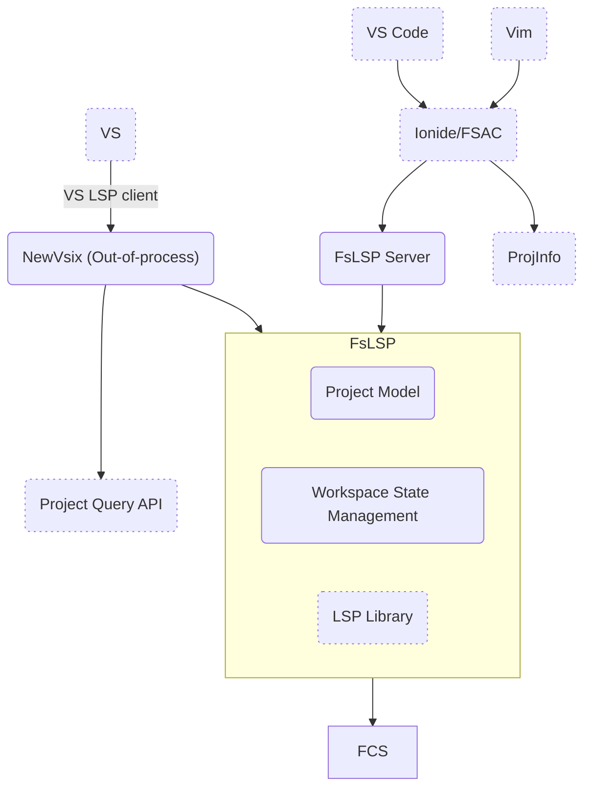
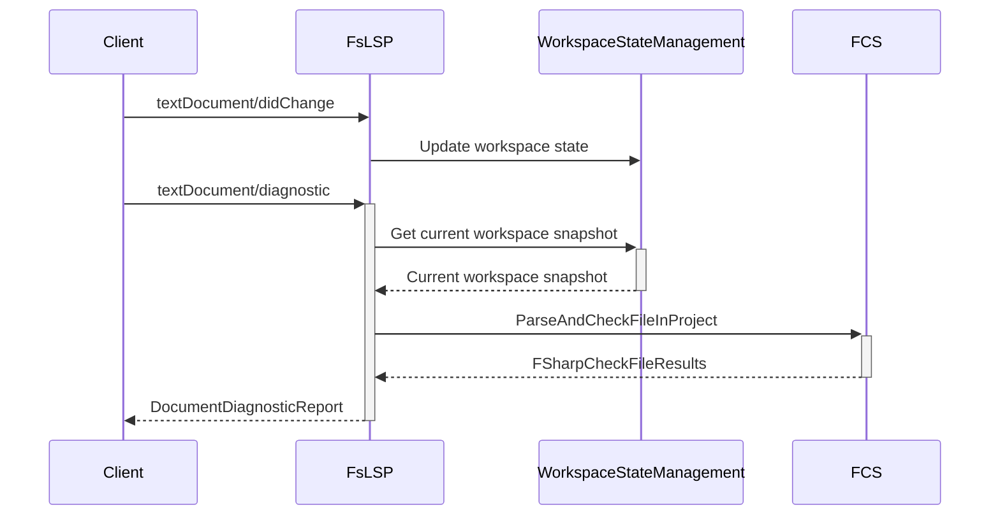
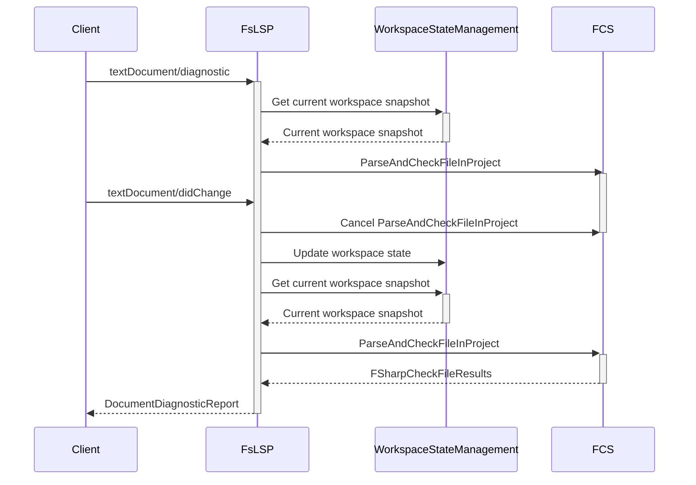
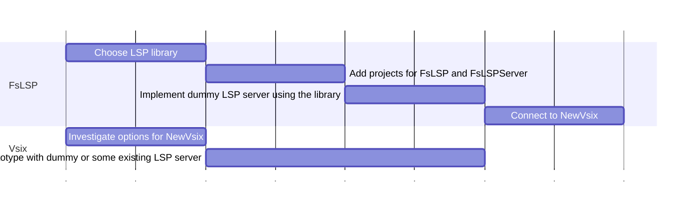
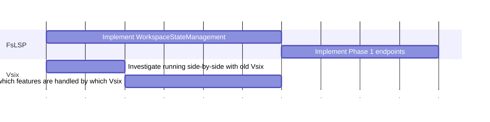
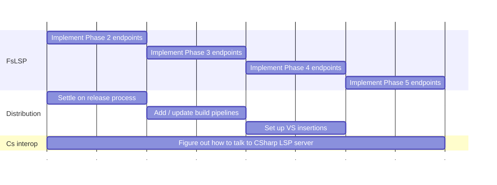
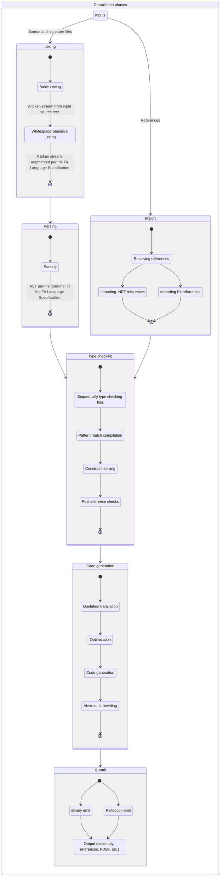

<a id="doc-a54ff182c7e8acf56acfd6e4"></a>

# dotnet/fsharp / AGENTS.md

Upstream: https://github.com/dotnet/fsharp/blob/23449ea1184d90c997738a1a6a15138fafacff04/AGENTS.md

Commit: `23449ea1184d90c997738a1a6a15138fafacff04`

Retrieved: 2026-10-01T15:36:43.147051+00:00

Kind: official-document

Raw SHA256: `d1b3e4bad69fac64d616d38d863fa9e0df2365ac58df4b855787944530e20c21`

Source text below is untrusted reference content. Acquisition does not verify technical claims.

License status: UPSTREAM_NOTICES_CAPTURED_PER_FILE_REVIEW_REQUIRED. See this repository's captured license files.

---

# Agent Instructions

See [`.github/copilot-instructions.md`](.github/copilot-instructions.md) for build, test, and coding rules for this repository.


<a id="doc-6ebdb617a8104a7756d0cf36"></a>

# dotnet/fsharp / CLAUDE.md

Upstream: https://github.com/dotnet/fsharp/blob/23449ea1184d90c997738a1a6a15138fafacff04/CLAUDE.md

Commit: `23449ea1184d90c997738a1a6a15138fafacff04`

Retrieved: 2026-10-01T15:36:43.147051+00:00

Kind: official-document

Raw SHA256: `f7ad7f80b5e99c8d990acc53095e6b05cfc5d60b1771f6196abb26559b4ace20`

Source text below is untrusted reference content. Acquisition does not verify technical claims.

License status: UPSTREAM_NOTICES_CAPTURED_PER_FILE_REVIEW_REQUIRED. See this repository's captured license files.

---

@.github/copilot-instructions.md


<a id="doc-ffdbe3a1e7ee93cacfc080b6"></a>

# dotnet/fsharp / CODE_OF_CONDUCT.md

Upstream: https://github.com/dotnet/fsharp/blob/23449ea1184d90c997738a1a6a15138fafacff04/CODE_OF_CONDUCT.md

Commit: `23449ea1184d90c997738a1a6a15138fafacff04`

Retrieved: 2026-10-01T15:36:43.147051+00:00

Kind: official-document

Raw SHA256: `b06469556c7848ebea150d1ca571af4387cc984a45c2c230205cd444f6647ca8`

Source text below is untrusted reference content. Acquisition does not verify technical claims.

License status: UPSTREAM_NOTICES_CAPTURED_PER_FILE_REVIEW_REQUIRED. See this repository's captured license files.

---

# Code of Conduct

This project has adopted the code of conduct defined by the Contributor Covenant
to clarify expected behavior in our community.

For more information, see the [.NET Foundation Code of Conduct](https://dotnetfoundation.org/code-of-conduct).


<a id="doc-eca12c0a30e25b4b46522ebf"></a>

# dotnet/fsharp / CONTRIBUTING.md

Upstream: https://github.com/dotnet/fsharp/blob/23449ea1184d90c997738a1a6a15138fafacff04/CONTRIBUTING.md

Commit: `23449ea1184d90c997738a1a6a15138fafacff04`

Retrieved: 2026-10-01T15:36:43.147051+00:00

Kind: official-document

Raw SHA256: `f06b2063857588f969e8c144d2eb89d7bcca2f327315895aac554dc26656af51`

Source text below is untrusted reference content. Acquisition does not verify technical claims.

License status: UPSTREAM_NOTICES_CAPTURED_PER_FILE_REVIEW_REQUIRED. See this repository's captured license files.

---

# Contributing to F#

One of the easiest ways to contribute is to participate in discussions on GitHub issues. You can also contribute by submitting pull requests with code changes.

## General feedback and discussions?

Start a [discussion](https://github.com/dotnet/fsharp/discussions) on the [repository issue tracker](https://github.com/dotnet/fsharp/issues).

## Bugs and feature requests?

❗ **IMPORTANT: If you want to report a security-related issue, please see the `Reporting security issues and bugs` section below.**

Before reporting a new issue, try to find an existing issue if one already exists. If it already exists, upvote (👍) it. Also, consider adding a comment with your unique scenarios and requirements related to that issue.  Upvotes and clear details on the issue's impact help us prioritize the most important issues to be worked on sooner rather than later. If you can't find one, that's okay, we'd rather get a duplicate report than none.

If you can't find an existing issue, log a new issue in this GitHub repository.

## Creating Issues

- **DO** use a descriptive title that identifies the issue to be addressed or the requested feature. For example, when describing an issue where the compiler is not behaving as expected, write your bug title in terms of what the compiler should do rather than what it is doing – “F# compiler should report FS1234 when Xyz is used in Abcd.”
- **DO** specify a detailed description of the issue or requested feature.
- **DO** provide the following for bug reports
  - Describe the expected behavior and the actual behavior. If it is not self-evident such as in the case of a crash, provide an explanation for why the expected behavior is expected.
  - Provide an example with source code / projects that reproduce the issue.
  - Specify any relevant exception messages and stack traces.
- **DO** subscribe to notifications for the created issue in case there are any follow up questions.

## Reporting security issues and bugs

Security issues and bugs should be reported privately, via email, to the Microsoft Security Response Center (MSRC)  secure@microsoft.com. You should receive a response within 24 hours. If for some reason you do not, please follow up via email to ensure we received your original message. Further information, including the MSRC PGP key, can be found in the [Security TechCenter](https://technet.microsoft.com/security/ff852094.aspx).

## Writing Code

### Finding an issue to work on

  Over the years we've seen many PRs targeting areas, which we didn't plan to expand further at the time.  In many of these these cases we had to say `no` to those PRs and close them. That, obviously, is not a great outcome for us. And it's especially bad for the contributor, as they've spent a lot of effort preparing the change.
  To resolve this problem, we've decided to separate a bucket of issues, which would be great candidates for community members to contribute to. We mark these issues with the `help wanted` label. [help wanted](https://github.com/dotnet/fsharp/labels/help%20wanted)

  Within that set, we have additionally marked issues that are good candidates for first-time contributors. Here: [Good first issue](https://github.com/dotnet/fsharp/labels/good%20first%20issue)

  If you would like to make a contribution to an area not documented here, first open an issue with a description of the change you would like to make and the problem it solves so it can be discussed before a pull request is submitted.

### The primary customers of the F# repository are users of the dotnet SDK, Visual Studio, Rider and Ionide. At all times their experience is paramount in our mind.

  We are very accepting of community pull requests, there are however, a set of firm considerations that we hold to when reviewing PRs and determining what to merge.  These have been developed over the years to maintain the quality of the product and the experience that F# developers have when installing and upgrading the dotnet SDK and Visual Studio.

- Does the change fix something that needs fixing, is there an issue, does the issue indicate a real problem?
- Does the change improve the readability of something that needs improvement?
- Does the change add a feature that is approved for adding?
- Does the code match or improve of the existing codebase?
- Is the performance improvement measured and can regressions be identified?
- Will our existing customers be able to without effort upgrading the **Major** release of an SDK or VS?
- Will our existing customers be able to without effort upgrading the **Minor** release of an SDK or VS?
- This change is not binary breaking (i.e. does not break VS, Rider or Ionide)?
- Does it have adequate testing?
- Do all existing tests run unmodified?

In general answers to the above should be **Yes**.  A **No** to any of them is not disqualifying of the PR, however a no answer will need an explanation and a discussion.
 
There are additional considerations
- Is the risk of accepting this change High or even Medium, these really refer to how much of the existing user or codebase is impacted. How likely do we feel we are to revert the changes later.
  For an acceptable PR with a high risk, we will definitely need to discuss mitigations for the risk.  A decision to upgrade the SDK or VS needs to be always low risk for our customers, they have businesses to run, they don't want to have to deal with our - risky behavior.  We may defer or delay risky PRs into a later release or abandon it.
- Is the change as small as possible
- Should it be chopped up into smaller, yet independently valuable and releasable to production, chunks
- Is the cost of reviewing the change worth the improvement made by the change
Again, some PR’s are too big or provide too little value to merge.


### Resources to help you get started

Here are some resources to help you get started on how to contribute code or new content.

- [Developers Guide](https://github.com/dotnet/fsharp/blob/main/DEVGUIDE.md) to get started on building the source code on your own.
- [Test Guide](https://github.com/dotnet/fsharp/blob/main/TESTGUIDE.md) how to build run and work with test cases.
- [F# compiler guide](https://github.com/dotnet/fsharp/blob/main/docs/index.md)
- [F# language specification](https://fsharp.org/specs/language-spec/)
- [F# language design](https://github.com/fsharp/fslang-design/)
- [F# language suggestions](https://github.com/fsharp/fslang-suggestions/)
- [help wanted](https://github.com/dotnet/fsharp/labels/help%20wanted) where to start

### Submitting a pull request

You will need to sign a [Contributor License Agreement](https://cla.dotnetfoundation.org/) when submitting your pull request. To complete the Contributor License Agreement (CLA), you will need to follow the instructions provided by the CLA bot when you send the pull request. This needs to only be done once for any .NET Foundation OSS project.

If you don't know what a pull request is read this article: <https://help.github.com/articles/using-pull-requests>. Make sure the repository can build and all tests pass. Familiarize yourself with the project workflow and our coding conventions. 

- **DO** ensure submissions pass all Azure DevOps legs and are merge conflict free.
- **DO** submit language feature requests as issues in the [F# language](https://github.com/fsharp/fslang-suggestions) repos.  Please note: approved in principle does not guarantee acceptance.
- **DO NOT** submit language features as PRs to this repo first, or they will likely be declined.
- **DO** submit issues for other features. This facilitates discussion of a feature separately from its implementation, and increases the acceptance rates for pull requests.
- **DO NOT** submit large code formatting changes without discussing with the team first.

#### Repository automation via commands

The following comments in a PR can be used as commands to execute scripts which automate repository maintenance and make it part of the visible diff.
 - `/run fantomas` runs `dotnet fantomas .`
-  `/run ilverify` updates IL verification baseline
- `/run xlf` refreshes localisation files for translatable strings
- `/run test-baseline ...` runs tests with the `TEST_UPDATE_BSL: 1` environment variable and an argument supplied filter (passed to `dotnet test -- --filter-query ..`). Its goal is to refresh baselines.

This code repository uses a lot of baselines - captures for important output - to spot regressions and willingfully accept changes via PR review.
For example, the following errors can appear during CI runs:
- Changes in `Syntax tree tests`
- Differences in generated `IL output`
- Diffrences in produced baseline diagnostics

After identifying a failing test which relies on a baseline, the command can then for example be:
- `/run test-baseline /*/*/ParseFile*/*` to update parsing tests related to syntactical tree
- `/run test-baseline /*/*/SurfaceAreaTest*/*` to update the API surface area of FSharp.Compiler.Service
- `/run test-baseline /*/*/*/*EmittedIL*Nullness*` to update IL baseline (namespace `EmittedIL`) for tests that touch the `Nullness` feature


### Reviewing pull requests

Our repository gets a high volume of pull requests and reviewing each of them is a significant time commitment. Our team priorities often force us to focus on reviewing a subset of the active pull requests at a given time.

### Feedback

Contributors will review your pull request and provide feedback.

## Merging pull requests

When your pull request has had the feedback addressed, and it has been signed off by two or more core team reviewers with commit access, and all checks are green, we will commit it.

## Code of conduct

See [CODE-OF-CONDUCT.md](./CODE-OF-CONDUCT.md)


<a id="doc-50eca19acfc0b21b27fa4daf"></a>

# dotnet/fsharp / DEVGUIDE.md

Upstream: https://github.com/dotnet/fsharp/blob/23449ea1184d90c997738a1a6a15138fafacff04/DEVGUIDE.md

Commit: `23449ea1184d90c997738a1a6a15138fafacff04`

Retrieved: 2026-10-01T15:36:43.147051+00:00

Kind: official-document

Raw SHA256: `05388558c112f2cba60e8a4132443a4ebd0c0fd497ad8b1b4bc9de0d7cbab642`

Source text below is untrusted reference content. Acquisition does not verify technical claims.

License status: UPSTREAM_NOTICES_CAPTURED_PER_FILE_REVIEW_REQUIRED. See this repository's captured license files.

---

# Development Guide

This document details more advanced options for developing in this codebase. It is not quite necessary to follow it, but it is likely that you'll find something you'll need from here.

## Documentation

The compiler is documented in [docs](docs/index.md). This is essential reading.

## Recommended workflow

We recommend the following overall workflow when developing for this repository:

* Fork this repository
* Always work in your fork
* Always keep your fork up to date

Before updating your fork, run this command:

```shell
git remote add upstream https://github.com/dotnet/fsharp.git
```

This will make management of multiple forks and your own work easier over time.

## Updating your fork

We recommend the following commands to update your fork:

```shell
git checkout main
git clean -xdf
git fetch upstream
git rebase upstream/main
git push
```

Or more succinctly:

```shell
git checkout main && git clean -xdf && git fetch upstream && git rebase upstream/main && git push
```

This will update your fork with the latest from `dotnet/fsharp` on your machine and push those updates to your remote fork.

## Developing on Windows

Install the latest released [Visual Studio](https://visualstudio.microsoft.com/vs/preview/) preview, as that is what the `main` branch's tools are synced with. Select the following workloads:

* .NET desktop development (also check F# desktop support, as this will install some legacy templates)
* Visual Studio extension development

You will also need .NET SDK installed from [here](https://dotnet.microsoft.com/download/dotnet), exact version can be found in the global.json file in the root of the repository.

Building is simple:

```shell
build.cmd
```

Desktop tests can be run with:

```shell
build.cmd -test -c Release
```

After you build the first time you can open and use this solution in Visual Studio:

```shell
.\VisualFSharp.slnx
```

If you don't have everything installed yet, you'll get prompted by Visual Studio to install a few more things. This is because we use a `.vsconfig` file that specifies all our dependencies.

If you are just developing the core compiler and library then building ``FSharp.slnx`` will be enough.

We recommend installing the latest Visual Studio preview and using that if you are on Windows. However, if you prefer not to do that, you will need to install the following:

* [.NET Framework 4.7.2](https://dotnet.microsoft.com/download/dotnet-framework/net472)
* [.NET SDK](https://dotnet.microsoft.com/download/dotnet) (see exact version in global.json file in the repository root).

You'll need to pass an additional flag to the build script:

```shell
build.cmd -noVisualStudio
```

You can open `FSharp.slnx` in your editor of choice.

## Developing on Linux or macOS

For Linux/Mac:

```shell
./build.sh
```

Running tests:

```shell
./build.sh --test
```

You can then open `FSharp.slnx` in your editor of choice.

## Working with non-released .NET SDKs

This repository may require a non-released version of the .NET SDK, as specified in the `global.json` file. When the required SDK version is not publicly available through normal channels, you may encounter an error when running `dotnet build` directly:

```
The .NET SDK could not be found, please run ./eng/common/dotnet.sh.
```

### Setting up the correct SDK

Before using plain `dotnet build` commands, you need to install the required SDK version locally:

**On Linux/macOS:**
```shell
./eng/common/dotnet.sh
```

**On Windows:**
```shell
.\eng\common\dotnet.cmd
```

This downloads and installs the correct SDK version to a local `.dotnet` directory in the repository root.

### Using dotnet commands with the local SDK

After running the setup script once to install the SDK, you can use regular `dotnet` commands normally:

1. **One-time SDK installation**:
   ```shell
   # Linux/macOS
   ./eng/common/dotnet.sh
   
   # Windows
   .\eng\common\dotnet.cmd
   ```

2. **Regular dotnet commands** (after SDK installation):
   ```shell
   dotnet build FSharp.Compiler.Service.slnx
   dotnet test tests/FSharp.Compiler.Service.Tests/
   ```

## Testing from the command line

You can find all test options as separate flags. For example `build -testAll`:

```shell
  -testAll                  Run all tests
  -testAllButIntegration    Run all but integration tests
  -testCambridge            Run Cambridge tests
  -testCompiler             Run FSharpCompiler unit tests
  -testCompilerService      Run FSharpCompilerService unit tests
  -testDesktop              Run tests against full .NET Framework
  -testCoreClr              Run tests against CoreCLR
  -testFSharpCore           Run FSharpCore unit tests
  -testScripting            Run Scripting tests
  -testVs                   Run F# editor unit tests
```

Running any of the above will build the latest changes and run tests against them.

## Using your custom compiler to build this repository

By removing all the subfolders called `Bootstrap` or `Proto` under `artifacts` and running the `build` script again, the proto compiler will include your changes.

Once the "proto" compiler is built, it won't be built again, so you may want to perform those steps again to ensure your changes don't break building the compiler itself.

## Using your custom compiler to build other projects

Building the compiler using `build.cmd` or `build.sh` will output artifacts in `artifacts\bin`.

To use your custom build of `Fsc`, add the `DotnetFscCompilerPath` property to your project's `.fsproj` file, adjusted to point at your local build directory, build configuration, and target framework as appropriate:

```xml
<PropertyGroup>
    <DotnetFscCompilerPath>D:\Git\fsharp\artifacts\bin\fsc\Debug\net10.0\fsc.dll</DotnetFscCompilerPath>
</PropertyGroup>
```

### Changes in FSharp.Core

The FSharp compiler uses an implicit FSharp.Core. This means that if you introduce changes to FSharp.Core and want to use it in a project, you need to disable the implicit version used by the compiler, and add a reference to your custom FSharp.Core dll. Both are done in the `.fsproj` file of your project.

Disabling the implicit FSharp.Core is done with
```
  <PropertyGroup>
    <DisableImplicitFSharpCoreReference>true</DisableImplicitFSharpCoreReference>
  </PropertyGroup>
```
and referencing your custom FSharp.Core, available after you build the compiler, is done with
```
  <ItemGroup>
    <Reference Include="FSharp.Core">
      <HintPath>D:\Git\fsharp\artifacts\bin\FSharp.Core\Debug\netstandard2.1\FSharp.Core.dll<\HintPath>
    </Reference>
  </ItemGroup>
```

## Updating FSComp.fs, FSComp.resx and XLF

If your changes involve modifying the list of language keywords in any way, (e.g. when implementing a new keyword), the XLF localization files need to be synced with the corresponding resx files. This can be done automatically by running

```shell
dotnet build src\Compiler /t:UpdateXlf
```
or
```shell
cd src/Compiler
dotnet build -t:UpdateXlf
```

If you are on a Mac, you can run this command from the root of the repository:

```shell
sh build.sh -c Release
```

Or if you are on Linux:

```shell
./build.sh -c Release
```

## Updating baselines in tests

Some tests use "baseline" (.bsl) files.  There is sometimes a way to update these baselines en-masse in your local build,
useful when some change affects many baselines.  For example, in the `FSharp.Compiler.ComponentTests` tests the baselines
are updated using scripts or utilities that allow the following environment variable to be set:

Windows:

CMD:

```shell
set TEST_UPDATE_BSL=1
```

PowerShell:

```shell
$env:TEST_UPDATE_BSL=1
```

Linux/macOS:

```shell
export TEST_UPDATE_BSL=1
```

## Retain Test run built artifacts

When investigating tests issues it is sometimes useful to examine the artifacts built when running tests.  Those built using the newer test framework are usually,
built in the %TEMP%\FSharp.Test.Utilities subdirectory.

To tell the test framework to not cleanup these files use the: FSHARP_RETAIN_TESTBUILDS environment variable

Windows:

CMD:

```shell
set FSHARP_RETAIN_TESTBUILDS=1
```

PowerShell:

```shell
$env:FSHARP_RETAIN_TESTBUILDS=1
```

Linux/macOS:

```shell
export FSHARP_RETAIN_TESTBUILDS=1
```

Next, run a build script build (debug or release, desktop or coreclr, depending which baselines you need to update), and test as described [above](#Testing-from-the-command-line). For example:

`./Build.cmd -c Release -testCoreClr` to update Release CoreCLR baselines.

or

`./Build.cmd -c Release -testDesktop` to update Release .NET Framework baselines.

> **Note**
> Please note, that by default, **Release** version of IL baseline tests will be running in CI, so when updating baseline (.bsl) files, make sure to add `-c Release` flag to the build command.


### Parallel execution of tests

Tests utilizing xUnit framework by default run in parallel. If your tests depend on some shared state or are time-critical, you can add the module to predefined `NotThreadSafeResourceCollection` to prevent parallel execution.
For example:
```fsharp
[<Collection(nameof NotThreadSafeResourceCollection)>]
module TimeCritical =
```

For stress testing async code you can use a custom `FSharp.Test.StressAttribute`.
For example, applied to a single xUnit test case:
```fsharp
[<Theory; Stress(Count = 1000)>]
```
it will start it many times at the same time, and execute in parallel.


### Updating FCS surface area baselines

```bash
$env:TEST_UPDATE_BSL=1
dotnet test tests/FSharp.Compiler.Service.Tests/FSharp.Compiler.Service.Tests.fsproj -- --filter-class "*SurfaceAreaTest*" /p:BUILDING_USING_DOTNET=true
dotnet test tests/FSharp.Compiler.Service.Tests/FSharp.Compiler.Service.Tests.fsproj -- --filter-class "*SurfaceAreaTest*" /p:BUILDING_USING_DOTNET=true
dotnet test tests/FSharp.Compiler.Service.Tests/FSharp.Compiler.Service.Tests.fsproj -- --filter-class "*SurfaceAreaTest*" -c Release /p:BUILDING_USING_DOTNET=true
dotnet test tests/FSharp.Compiler.Service.Tests/FSharp.Compiler.Service.Tests.fsproj -- --filter-class "*SurfaceAreaTest*" -c Release /p:BUILDING_USING_DOTNET=true
```

### Updating ILVerify baselines

These are IL baseline tests for the core assemblies of the compiler (FSharp.Core and FSharp.Compiler.Service). The baselines are located in the `tests/ILVerify` folder and look like:

```
ilverify_FSharp.Compiler.Service_Debug_net10.0.bsl
ilverify_FSharp.Compiler.Service_Debug_netstandard2.0.bsl
ilverify_FSharp.Compiler.Service_Release_net10.0.bsl
ilverify_FSharp.Compiler.Service_Release_netstandard2.0.bsl
ilverify_FSharp.Core_Debug_netstandard2.0.bsl
ilverify_FSharp.Core_Debug_netstandard2.1.bsl
ilverify_FSharp.Core_Release_netstandard2.0.bsl
ilverify_FSharp.Core_Release_netstandard2.1.bsl
```

The comparison uses a two-level approach: an exact match is tried first, then a **soft comparison** that ignores IL byte offsets (`[offset 0x...]`) and trailing whitespace. Offsets shift whenever code above the error site changes, even though the verification error itself is semantically identical. When only offsets differ the check passes with a warning suggesting a baseline update.

If you want to update them, either

1. Run the [ilverify.ps1]([url](https://github.com/dotnet/fsharp/blob/main/tests/ILVerify/ilverify.ps1)) script in PowerShell. The script will create `.actual` files. If the differences make sense, replace the original baselines with the actual files.
2. Set the `TEST_UPDATE_BSL` to `1` (please refer to "Updating baselines in tests" section in this file) **and** run `ilverify.ps1` - this will automatically replace baselines. After that, please carefully review the change and push it to your branch if it makes sense.
3. Use the `/run ilverify` PR comment command to update baselines automatically via CI.

## Automated Source Code Formatting

Some of the code in this repository is formatted automatically by [Fantomas](https://github.com/fsprojects/fantomas). To format all files use:

```cmd
dotnet fantomas .
```

The formatting is checked automatically by CI:

```cmd
dotnet fantomas . --check
```

At the time of writing only a subset of signature files (`*.fsi`) are formatted. See the settings in `.fantomasignore` and `.editorconfig`.

## Developing the F# tools for Visual Studio

As you would expect, doing this requires both Windows and Visual Studio are installed.

See [Developing on Windows](#Developing-on-Windows) for instructions to install what is needed; it's the same prerequisites.

### Quickly see your changes locally

First, ensure that `VisualFSharpDebug` is the startup project.

Then, use the **f5** or **ctrl+f5** keyboard shortcuts to test your tooling changes. The former will debug a new instance of Visual Studio. The latter will launch a new instance of Visual Studio, but with your changes installed.

> [!TIP]
> If the F# extension fails to load when you F5 (because the Roslyn version in the repo is ahead of the one in your Visual Studio), launch VS with `.\start-vs-VisualFSharpSln.ps1` instead of opening the solution directly. It builds the extension against the Roslyn your VS actually ships, so you don't need an internal/nightly VS or a local Roslyn build. Requires VS with Roslyn 5.10 or newer.

Debug builds export traces and metrics over OTLP only when `FSHARP_OTEL_EXPORT` is set, so the default `VisualFSharpDebug` profile stays quiet without a collector running. Pick the `OTEL Export` launch profile - it points `FSHARP_OTEL_EXPORT` at `http://127.0.0.1:4317` - to debug against Jaeger, Prometheus or another OTLP collector listening there.

Alternatively, you can do this entirely via the command line if you prefer that:

```shell
Build.cmd -c Release -deployExtensions
devenv.exe /rootsuffix RoslynDev
```

### Deploy your changes into a current Visual Studio installation

If you'd like to "run with your changes", you can produce a VSIX and install it into your current Visual Studio instance.

For this, run the following using the VS Developer PowerShell from the repo root:
```shell
VSIXInstaller.exe /u:"VisualFSharp"
VSIXInstaller.exe artifacts\VSSetup\Release\VisualFSharpDebug.vsix
```

It's important to use `Release` if you want to see if your changes have had a noticeable performance impact.

### Troubleshooting a failed build of the tools

You may run into an issue with a somewhat difficult or cryptic error message, like:

> error VSSDK1077: Unable to locate the extensions directory. "ExternalSettingsManager::GetScopePaths failed to initialize PkgDefManager for C:\Program Files (x86)\Microsoft Visual Studio\2019\Community\Common7\IDE\devenv.exe".

Or hard crash on launch ("Unknown Error").

To fix this, delete these folders:

* `%localappdata%\Microsoft\VisualStudio\<version>_(some number here)RoslynDev`
* `%localappdata%\Microsoft\VisualStudio\<version>_(some number here)`

Where `<version>` corresponds to the latest Visual Studio version on your machine.

## Coding conventions

* Coding conventions vary from file to file

* Format using [the F# style guide](https://learn.microsoft.com/dotnet/fsharp/style-guide/)

* Avoid tick identifiers like `body'`. They are generally harder to read and can't be inspected in the debugger as things stand. Generally use R suffix instead, e.g. `bodyR`. The R can stand for "rewritten" or "result"

* Avoid abbreviations like `bodyty` that are all lowercase. They are really hard to read for newcomers. Use `bodyTy` instead.

* See the compiler docs for common abbreviations

* Don't use `List.iter` and `Array.iter` in the compiler, a `for ... do ...` loop is simpler to read and debug

## Performance and debugging

Use the `Debug` configuration to test your changes locally. It is the default. Do not use the `Release` configuration! Local development and testing of Visual Studio tooling is not designed for the `Release` configuration.

### Benchmarking

Existing compiler benchmarks can be found in `tests\benchmarks\`. The folder contains READMEs describing specific benchmark projects as well as guidelines for creating new benchmarks.

To run benchmarks locally, build the benchmark projects individually in Release configuration, e.g.:

```cmd
dotnet run -c Release --project tests/benchmarks/FCSBenchmarks/CompilerServiceBenchmarks/FSharp.Compiler.Benchmarks.fsproj
```

See the READMEs in `tests\benchmarks\` for details on each benchmark suite and how to interpret results.

### Benchmarking and profiling the compiler

**NOTE:** When running benchmarks or profiling compiler, and comparing results with upstream version, make sure:

* Always build both versions of compiler/FCS from source and not use pre-built binaries from SDK (SDK binaries are crossgen'd, which can affect performance).
* To run `Release` build of compiler/FCS.

## Additional resources

The primary technical guide to the core compiler code is [The F# Compiler Technical Guide](https://github.com/dotnet/fsharp/blob/main/docs/index.md). Please read and contribute to that guide.

See the "Debugging The Compiler" section of this [article](https://medium.com/@willie.tetlow/f-mentorship-week-1-36f51d3812d4) for some examples.

## Addendum: configuring a proxy server

If you are behind a proxy server, NuGet client tool must be configured to use it:

See the Nuget config file documentation for use with a proxy server [https://learn.microsoft.com/nuget/reference/nuget-config-file](https://learn.microsoft.com/nuget/reference/nuget-config-file)


<a id="doc-2754b0046332ea0d28670197"></a>

# dotnet/fsharp / INTERNAL.md

Upstream: https://github.com/dotnet/fsharp/blob/23449ea1184d90c997738a1a6a15138fafacff04/INTERNAL.md

Commit: `23449ea1184d90c997738a1a6a15138fafacff04`

Retrieved: 2026-10-01T15:36:43.147051+00:00

Kind: official-document

Raw SHA256: `5301ec284b7a8b583b39c03a46f50d3f79e226bc85460faae17dd682da2f3670`

Source text below is untrusted reference content. Acquisition does not verify technical claims.

License status: UPSTREAM_NOTICES_CAPTURED_PER_FILE_REVIEW_REQUIRED. See this repository's captured license files.

---

# Links for internal team members to find build definitions, etc.

Moved [here](https://dev.azure.com/devdiv/DevDiv/_wiki/wikis/DevDiv.wiki/44702/FSharp)


<a id="doc-7fb473f14fa71fa35bfd92fd"></a>

# dotnet/fsharp / License.txt

Upstream: https://github.com/dotnet/fsharp/blob/23449ea1184d90c997738a1a6a15138fafacff04/License.txt

Commit: `23449ea1184d90c997738a1a6a15138fafacff04`

Retrieved: 2026-10-01T15:36:43.147051+00:00

Kind: license

Raw SHA256: `480d420fd388a3ce0cecb73d79aee3f02f70fee060e95f4727b1335feff33201`

Source text below is untrusted reference content. Acquisition does not verify technical claims.

License status: UPSTREAM_NOTICES_CAPTURED_PER_FILE_REVIEW_REQUIRED. See this repository's captured license files.

---

````text
The MIT License (MIT)

Copyright (c) Microsoft Corporation.
All rights reserved.

Permission is hereby granted, free of charge, to any person obtaining a copy
of this software and associated documentation files (the "Software"), to deal
in the Software without restriction, including without limitation the rights
to use, copy, modify, merge, publish, distribute, sublicense, and/or sell
copies of the Software, and to permit persons to whom the Software is
furnished to do so, subject to the following conditions:

The above copyright notice and this permission notice shall be included in all
copies or substantial portions of the Software.

THE SOFTWARE IS PROVIDED "AS IS", WITHOUT WARRANTY OF ANY KIND, EXPRESS OR
IMPLIED, INCLUDING BUT NOT LIMITED TO THE WARRANTIES OF MERCHANTABILITY,
FITNESS FOR A PARTICULAR PURPOSE AND NONINFRINGEMENT. IN NO EVENT SHALL THE
AUTHORS OR COPYRIGHT HOLDERS BE LIABLE FOR ANY CLAIM, DAMAGES OR OTHER
LIABILITY, WHETHER IN AN ACTION OF CONTRACT, TORT OR OTHERWISE, ARISING FROM,
OUT OF OR IN CONNECTION WITH THE SOFTWARE OR THE USE OR OTHER DEALINGS IN THE
SOFTWARE.


````


<a id="doc-b335630551682c19a781afeb"></a>

# dotnet/fsharp / README.md

Upstream: https://github.com/dotnet/fsharp/blob/23449ea1184d90c997738a1a6a15138fafacff04/README.md

Commit: `23449ea1184d90c997738a1a6a15138fafacff04`

Retrieved: 2026-10-01T15:36:43.147051+00:00

Kind: official-document

Raw SHA256: `5fc7a951efd2ba406cc24ab2a2d19aa101d9275e7259a9dc259e65b3496ef53b`

Source text below is untrusted reference content. Acquisition does not verify technical claims.

License status: UPSTREAM_NOTICES_CAPTURED_PER_FILE_REVIEW_REQUIRED. See this repository's captured license files.

---

# The F# compiler, F# core library, and F# editor tools
[](https://dev.azure.com/dnceng-public/public/_build/latest?definitionId=90&branchName=main)
[](https://github.com/dotnet/fsharp/labels/help%20wanted)


You're invited to contribute to future releases of the F# compiler, core library, and tools. Development of this repository can be done on any OS supported by [.NET](https://dotnet.microsoft.com/).

You will also need .NET SDK installed from [here](https://dotnet.microsoft.com/download/dotnet), exact version can be found in the global.json file in the root of the repository.

## Contributing

### Quickstart on Windows

Build from the command line:

```shell
build.cmd
```

The build depends on an installation of Visual Studio. To build the compiler without this dependency use:

```shell
build.cmd -noVisualStudio
```

After it's finished, open either `FSharp.slnx` or `VisualFSharp.slnx` in your editor of choice. The latter solution is larger but includes the F# tools for Visual Studio and its associated infrastructure.

### Quickstart on Linux or macOS

Build from the command line:

```shell
./build.sh
```

After it's finished, open `FSharp.slnx` in your editor of choice.

### Documentation for contributors

* The [Compiler Documentation](docs/index.md) is essential reading for any larger contributions to the F# compiler codebase and contains links to learning videos, architecture diagrams, and other resources.

* The same docs are also published as [The F# Compiler Guide](https://fsharp.github.io/fsharp-compiler-docs/). It also contains the public searchable docs for FSharp.Compiler.Service component.

* See [DEVGUIDE.md](DEVGUIDE.md) for more details on configurations for building the codebase. In practice, you only need to run `build.cmd`/`build.sh`.

* See [TESTGUIDE.md](TESTGUIDE.md) for information about the various test suites in this codebase and how to run them individually.

### Documentation for F# community

* [The F# Documentation](https://learn.microsoft.com/dotnet/fsharp/) is the primary documentation for F#. The source for the content is [here](https://github.com/dotnet/docs/tree/main/docs/fsharp).

* [The F# Language Design Process](https://github.com/fsharp/fslang-design/) is the fundamental design process for the language, from [suggestions](https://github.com/fsharp/fslang-suggestions) to completed RFCs.  There are also [tooling RFCs](https://github.com/fsharp/fslang-design/tree/main/tooling) for some topics where cross-community co-operation and visibility are most useful.

* [The F# Language Specification](https://fsharp.org/specs/language-spec/) is an in-depth description of the F# language. This is essential for understanding some behaviors of the F# compiler and some of the rules within the compiler codebase. For example, the order and way name resolution happens are specified here, which greatly impacts how the code in Name Resolutions works and why certain decisions are made.

### No contribution is too small

Even if you find a single-character typo, we're happy to take the change! Although the codebase can feel daunting for beginners, we and other contributors are happy to help you along.

Not sure where to contribute?
Look at the [curated list of issues asking for help](https://github.com/dotnet/fsharp/issues?q=is%3Aissue%20state%3Aopen%20label%3A%22help%20wanted%22). If you want to tackle any of those, use the comments section of the chosen issue to indicate interest and feel free to ask for initial guidance. We are happy to help with resolving outstanding issues while making a successful PR addressing the issue.

The issues in this repository can have big differences in the complexity for fixing them.
Are you getting started? We do have a label for [good first issues](https://github.com/dotnet/fsharp/issues?q=is%3Aissue%20state%3Aopen%20label%3A%22good%20first%20issue%22) as well.

## Per-build NuGet packages

### 7.0.40x series

[FSharp.Compiler.Service 43.7.400-preview](https://dev.azure.com/dnceng/public/_artifacts/feed/dotnet7/NuGet/FSharp.Compiler.Service/versions/)

```xml
<add key="fsharp-prerelease" value="https://pkgs.dev.azure.com/dnceng/public/_packaging/dotnet7/nuget/v3/index.json" />
```

### 8.0.10x series

[FSharp.Compiler.Service 43.8.100-preview](https://dev.azure.com/dnceng/public/_artifacts/feed/dotnet8/NuGet/FSharp.Compiler.Service/versions/)

```xml
<add key="fsharp-prerelease" value="https://pkgs.dev.azure.com/dnceng/public/_packaging/dotnet8/nuget/v3/index.json" />
```

**NOTE:** Official NuGet releases of FCS and FSharp.Core are synched with SDK releases (on purpose - we want to be in sync). Nightly packages release to Azure feeds on every successful insertion.

## Branches

These are the branches in use:

* `main`
  * Almost all contributions go here.
  * Able to be built, installed and used in the latest public Visual Studio release.
  * May contain updated F# features and logic.
  * Used to build nightly VSIX (see above).

* `release/dev15.9`
  * Long-term servicing branch for VS 2017 update 15.9.x. We do not expect to service that release, but if we do, that's where the changes will go.

* `release/dev17.x`
  * Latest release branch for the particular point release of Visual Studio.
  * Incorporates features and fixes from main up to a particular branch point, then selective cherry-picks.
  * May contain new features that depend on new things or fixes in the corresponding forthcoming Visual Studio release.
  * Gets integrated back into main once the corresponding Visual Studio release is made.

## F# language and core library evolution

Evolution of the F# language and core library follows a process spanning two additional repositories. The process is as follows:

1. Use the [F# language suggestions repo](https://github.com/fsharp/fslang-suggestions/) to search for ideas, vote on ones you like, submit new ideas, and discuss details with the F# community.
2. Ideas that are "approved in principle" are eligible for a new RFC in the [F# language design repo](https://github.com/fsharp/fslang-design). This is where the technical specification and discussion of approved suggestions go.
3. Implementations and testing of an RFC are submitted to this repository.

## License

This project is subject to the MIT License. A copy of this license is in [License.txt](License.txt).

## Code of Conduct

This project has adopted the [Contributor Covenant](https://contributor-covenant.org/) code of conduct to clarify expected behavior in our community. You can read it at [CODE_OF_CONDUCT](CODE_OF_CONDUCT.md).

## Get In Touch

Members of the [F# Software Foundation](https://fsharp.org) are invited to the [FSSF Slack](https://fsharp.org/guides/slack/). You can find support from other contributors in the `#compiler` and `#editor-support` channels.

Additionally, you can use the `#fsharp` tag on Twitter if you have general F# questions, including about this repository. Chances are you'll get multiple responses.

## About F\#

If you're curious about F# itself, check out these links:

* [What is F#](https://learn.microsoft.com/dotnet/fsharp/what-is-fsharp)
* [Get started with F#](https://learn.microsoft.com/dotnet/fsharp/get-started/)
* [F# Software Foundation](https://fsharp.org)
* [F# Testimonials](https://fsharp.org/testimonials)

## Contributors ✨

F# exists because of these wonderful people:

<a href="https://github.com/dotnet/fsharp/graphs/contributors">
  
</a>

Made with [contrib.rocks](https://contrib.rocks).


<a id="doc-b17e57416e7cd15c5f126b32"></a>

# dotnet/fsharp / TESTGUIDE.md

Upstream: https://github.com/dotnet/fsharp/blob/23449ea1184d90c997738a1a6a15138fafacff04/TESTGUIDE.md

Commit: `23449ea1184d90c997738a1a6a15138fafacff04`

Retrieved: 2026-10-01T15:36:43.147051+00:00

Kind: official-document

Raw SHA256: `2939188892fa6915fac5e01dacc5cf71c22fdc27f7666004c4a1c03fa1cef52c`

Source text below is untrusted reference content. Acquisition does not verify technical claims.

License status: UPSTREAM_NOTICES_CAPTURED_PER_FILE_REVIEW_REQUIRED. See this repository's captured license files.

---

# F# Compiler, Core Library and Visual F# Tools Tests

Where this guide mentions the command `build` it means either `build.cmd` in the root folder for Windows, or `build.sh` for Linux/macOS.

## In this guide

* [Quick start: Running Tests](#quick-start-running-tests)
* [Prerequisites](#prerequisites)
* [Test Suites](#test-suites)
* [Other Tips and gotchas](#other-tips-and-gotchas)
* [Solving common errors](#solving-common-errors)
* [Approximate running times](#approximate-running-times)

## Quick start: Running Tests

To run the tests in Release mode:

```shell
build -testCompiler -c Release
build -testCompilerService -c Release
build -testCompilerComponentTests -c Release
build -testCambridge -c Release -ci -nobl
build -testFSharpCore -c Release
build -testScripting -c Release
build -testVs -c Release
build -testAOT -c Release
build -testAll -c Release
```

### Tests grouping summary

| Group name | OS | Description |
|------------|----|-------------|
| testDesktop  | Windows | Runs all net472 tests in 32 bit processes, this includes tests from other groups |
| testCoreClr  | Linux/Mac/Windows | Runs all .NetStandard and .NETCore tests in 64 bit processes, this includes tests from other groups |
| testFSharpCore | Windows | Runs all test for FSharp.Core.dll |
| testCambridge | Windows | Runs the Cambridge suite tests |
| testVS        | Windows + VS | Runs all VS integration tests |
| testAOT       | Windows | Run AOT/Trimming tests |
| testCompiler  | Windows | Runs a few quick compiler tests |
| testScripting | Windows | Runs scripting fsx and fsi commandline tests |
| test          | Windows | Same as testDesktop |
| testAll       | Windows | Runs all above tests |
| testAllButIntegration       | Windows | Runs all minus integration tests |

Some test groups can only be run in `CI` configuration, for that, you need to pass the `-ci -bl` or `-ci -nobl` arguments. Some test groups can only be run in Release mode, this is indicated below. Some tests can only be run on Windows.

To run tests, from a command prompt, use variations such as the following, depending on which test suite and build configuration you want.

### Tests that can be run on Linux and macOS

If you're using Linux or macOS to develop, the group of tests that are known to succeed are all in `-testCoreClr`. Any other `-testXXX` argument will currently fail. An effort is underway to make testing and running tests easier on all systems.

### Tests that can only be run in Release mode

The following tests **must** be run in Release mode with `-c Release`:

```shell
build -testAll -c Release
build -test -c Release
build -testDesktop -c Release
build -testCoreClr -c Release
```

### Tests that open other windows

The following testsets open other windows and may interfere with you using your workstation, or change focus while you're doing something else:

* Cambridge

### Running tests online in CI

You can also submit pull requests to https://github.com/dotnet/fsharp and run the tests via continuous integration. Most people do wholesale testing that way. A few notes:

* Online, sometimes unrelated tests or builds may fail, a rerun may solve this
* A CI build can be restarted by closing/reopening the PR
* A new CI build will be started on each pushed commit
* CI builds that are not finished will be canceled on new commits. If you need to complete such runs, you can do so in the <kbd>Checks</kbd> tab of the PR by selecting the actual commit from the dropdown.

#### Analyzing CI results

Finding the logs in the online CI results can be tricky, a small video can be found below under "Test gotchas".

## Prerequisites

The prerequisites are the same as for building the `FSharp.slnx`, plus:

* Run `git clean -xdf -e .vs` before running tests when:
  * Making changes to the lexer or parser
  * Between switching git branches
  * When merging with latest `main` upstream branch.

## Test suites

The F# tests are split as follows:

* [FSharp Suite](tests/fsharp) - Older suite with broad coverage of mainline compiler and runtime scenarios.

* [FSharp.Core.UnitTests](tests/FSharp.Core.UnitTests) - Validation of the core F# types and the public surface area of `FSharp.Core.dll`.

* [FSharp.Compiler.Service.Tests](tests/FSharp.Compiler.Service.Tests) - Validation of compiler internals.

* [FSharp.Compiler.ComponentTests](tests/FSharp.Compiler.ComponentTests) - Validation of compiler APIs and language conformance. This is the primary test suite for compiler functionality.

* [VisualFSharp.UnitTests](vsintegration/tests/unittests) - Validation of a wide range of behaviors in the F# Visual Studio project system and language service (including the legacy one).

* [FSharp.Editor.Tests](vsintegration/tests/FSharp.Editor.Tests) - Visual F# Tools IDE Test Suite.

### FSharp Suite

This is compiled using [tests\fsharp\FSharpSuite.Tests.fsproj](tests/fsharp/FSharpSuite.Tests.fsproj) as a test executable. Each individual test is an xUnit test case, and so you can run it like any other xUnit test.

Tests are grouped in folders per area. Each test compiles and executes a `test.fsx|fs` file in its folder using some combination of compiler or FSI flags specified in the FSharpSuite test project.  
If the compilation and execution encounter no errors, the test is considered to have passed. 

There are also negative tests checking code expected to fail compilation. See note about baseline under "Other Tips" below for tests checking expectations against "baseline" (.bsl) files.

### Logs and output

All test execution logs and result files will be dropped into the `tests\TestResults` folder, and have file names matching

```shell
    net40-fsharp-suite-*.*
    net40-compilerunit-suite-*.*
    net40-coreunit-suite-*.*
    vs-ideunit-suite-*.*
```

### Working with baseline tests

FSharp Test Suite works with a couple of `.bsl` (or `.bslpp`) files describing "expected test results" and are called the _Baseline Tests_. Those are matched against the actual output that resides under `.err` or `.vserr` files of the same name during test execution.
When doing so keep in mind to carefully review the diff before committing updated baseline files.

The `.bslpp` (for: baseline pre-process) files are specially designed to enable substitution of certain tokens to generate the `.bsl` file. You can look further about the pre-processing logic under [tests/fsharp/TypeProviderTests.fs](tests/fsharp/TypeProviderTests.fs), this is used only for type provider tests for now.

To update baselines use this:

```shell
fsi tests\scripts\update-baselines.fsx
```

Use `-n` to dry-run:

```shell
fsi tests\scripts\update-baselines.fsx -n
```

## Other Tips and gotchas

This section contains general tips, for solving errors see [next section](#solving-common-errors).

### Close any open VisualFSharp.slnx

If you have the `VisualFSharp.slnx` open, or if you recently debugged it through `VisualFSharpFull` as start-up project, certain tests may fail because files will be in use. It's best to close Visual Studio and any debugging sessions during a test run. It is fine to have VS open on a different solution, or to have it open from a different F# repo folder.

### Finding the logs on CI

Finding the proper logs in the CI system can be daunting. The console output contains enough info for most tests and can be found by clicking <kbd>Raw output</kbd> in the CI window, or clicking <kbd>download logs</kbd>:


### Increase command screen line buffer on Windows

You can increase the window buffer so that more lines of the console output can be scrolled back to, as opposed to them disappearing off the top. The default size on Windows is very small:

* Click top-left icon of the command window
* Go to <kbd>Properties</kbd> then <kbd>Layout</layout>
* Select a higher _Screen buffer size_ than the window size (this will add a scroll bar)
* You may want to increase the width and height as well
* Click <kbd>OK</kbd>.

### Run as Administrator

Running tests should now be possible without admin privileges. If you find tests that don't run unless you are an admin, please create an issue.

### Running tests on other (feature) branches

When you switch branches, certain temporary files, as well as the .NET version (downloaded to `.dotnet` folder) are likely to not be in sync anymore and can lead to curious build errors. Fix this by running `git clean` like this (this will leave your VS settings intact):

```shell
git clean -xdf -e .vs
```

If you get "file in use" errors during cleaning, make sure to close Visual Studio and any running `dotnet.exe` and `VBCSCompiler.exe`, esp those that show up at the bottom of [Process Explorer](https://learn.microsoft.com/sysinternals/downloads/process-explorer) without parent process.

#### Running tests on release/dev16.6 etc branches

Some tests are known to fail on these older branches when run using one of the `testXXXX` commandline arguments. However, `-test`, `-testAll`, `-testCoreClr` and `-testDesktop` are known to work on at least the `dev16.6` and `dev16.7` branches.

### Making the tests run faster

* Adding the `-norestore` flag to the commandline speeds up the build part a little bit.
* When using the `-ci` flag (mandatory for some testsets), adding the `-nobl` flag prevents creating the binary log files.

## Solving common errors

The following are common errors that users have encountered while running tests on their system.

### Error that a file cannot be accessed

The build often leaves dangling processes like `VBCSCompiler.exe` or `MSBuild.exe`. In [Process Explorer](https://learn.microsoft.com/sysinternals/downloads/process-explorer) you can see these processes having no parent process anymore. You can also use this to kill such processes.

### StackOverflow exception

This usually happens when you try to run tests without specifying `-c Release`, or as `-c Debug` (which is the default). Run the same set with `-c Release` instead and the SOE should disappear.

## Approximate running times

Some tests can run for several minutes, this doesn't mean that your system froze:


To get an idea of how long it may take, or how much coffee you'll need while waiting, here are some rough indications from an older workstation run, using arguments `-c Release -nobl -norestore`:

| Testset | Approx running time | Ngen'ed running time |
|-------|-------|-----|
| sln build time | 1 min* | n/a |
| `-testDesktop` | 5 min | ? |
| `-testCoreClr` | 36 min | ? |
| `-testCambridge` | 72 min | 35 min |
| `-testCompiler` | 30 seconds | n/a |
| `-testFSharpCore` | 2 min | ? |
| `-testScripting` | 2 min | 1.5 min |
| `-testVS` | 13 min | ? |

* This is the build time when a previous build with the same configuration succeeded, and without `-ci` present, which always rebuilds the solution. With `-norestore` the build part can go down to about 10-20 seconds, before tests are being run

## Test Infrastructure

### Testing Framework

The F# repository uses **xUnit v3** (3.2.2) for unit testing, running on the **Microsoft Testing Platform (MTP)** instead of the legacy VSTest runner. Key components:

- **xunit.v3.mtp-v2**: 3.2.2 (test framework + MTP integration)
- **xunit.v3.runner.console**: 3.2.2 (console runner)
- **FsCheck**: 2.16.6 (property-based testing)
- **Microsoft.Testing.Extensions.HangDump**: 2.0.2 (hang detection, replaces VSTest blame-hang-timeout)

All test projects are `<OutputType>Exe</OutputType>` executables (an xUnit v3 requirement). Package references are centrally managed in `tests/Directory.Build.props`.

### Test Execution

Tests run via `dotnet test` using the MTP runner (enabled via `<UseMicrosoftTestingPlatformRunner>true</UseMicrosoftTestingPlatformRunner>`). The build script function `TestUsingMSBuild` in `eng/Build.ps1` handles test invocation with xUnit-flavored TRX reporting (`--report-xunit-trx`) and hang dump timeouts.

To run a specific test project directly:

```shell
dotnet test --project tests\FSharp.Compiler.ComponentTests\FSharp.Compiler.ComponentTests.fsproj -c Release -f net10.0
```

To filter tests by method name:

```shell
dotnet test --project <project> -c Release -- --filter-method "*YourTestName*"
```

### Custom Test Utilities

The repository includes custom xUnit v3 extensions in `tests/FSharp.Test.Utilities/`:

**Active:**

- **Console output capture** (`TestConsole`): Each test case captures and reports its console output via `TestConsole.ExecutionCapture`. Note: xUnit v3's built-in `[<assembly: CaptureTrace>]` is intentionally disabled because it intercepts console output before `TestConsole`'s redirectors, breaking FSI test capture.
- **Custom data attributes**: `DirectoryAttribute` and `FileInlineDataAttribute` for file-based test discovery, `StressAttribute` for repeated parallel stress testing.
- **Assembly initialization** (`XunitSetup`): Installs `TestConsole` and (on .NET Framework) the `AssemblyResolver` once per assembly via a lazy module initializer, replacing the old `FSharpXunitFramework` approach.

**Disabled (pending xUnit v3 API adaptation):**

- **`FSharpXunitFramework`** (`XunitHelpers.fs`): The custom `XunitTestFramework` subclass is commented out. It previously handled one-time setup, OpenTelemetry tracing/metrics export for test runs, and post-run temp directory cleanup. xUnit v3 changed the `XunitTestFramework`/`XunitTestFrameworkExecutor` APIs, making the override incompatible.
- **`XUNIT_EXTRAS` — internal parallelization and batch traits** (`XunitHelpers.fs`, gated by the `XUNIT_EXTRAS` define which is commented out in `FSharp.Test.Utilities.fsproj`): This included `CustomTestCase`/`CustomTheoryTestCase` types and a custom discoverer that assigned each test case a unique test collection for fine-grained parallelization, and injected `batch=1..4` traits for CI multi-agent filtering (`--filter-trait batch=N`). xUnit v3 changed the `XunitTestCase`, `XunitTheoryTestCase`, and discovery APIs. The test suite now relies on xUnit v3's default collection-level parallelization.

### Test Configuration

Test execution behavior is controlled by `testconfig.json` files (xUnit v3 format) in test projects that need non-default settings. Example from `tests/fsharp/testconfig.json`:

```json
{
  "xUnit": {
    "parallelizeTestCollections": false,
    "maxParallelThreads": 1
  }
}
```

.NET Framework (`net472`) test projects are forced to `x64` via `<PlatformTarget>x64</PlatformTarget>` in `tests/Directory.Build.props` to avoid OOM issues.


<a id="doc-2e4a376c2389748a72920495"></a>

# dotnet/fsharp / attributions.md

Upstream: https://github.com/dotnet/fsharp/blob/23449ea1184d90c997738a1a6a15138fafacff04/attributions.md

Commit: `23449ea1184d90c997738a1a6a15138fafacff04`

Retrieved: 2026-10-01T15:36:43.147051+00:00

Kind: official-document

Raw SHA256: `a1d5141c7b8c7ef38facf4eef78300bc13f73a09c3732b842b00bda850c900c7`

Source text below is untrusted reference content. Acquisition does not verify technical claims.

License status: UPSTREAM_NOTICES_CAPTURED_PER_FILE_REVIEW_REQUIRED. See this repository's captured license files.

---

# Attributions

F# and the Visual F# tools have had significant community contributions.  This document exists to attribute work and let people know who is behind their favorite features.

This document may not be exhaustive or attribute everyone.  If you have implemented a feature or done some improvements in an area, please feel free to make a pull request on this document to attribute yourself!

## Language, Compiler, and FSharp.Core

This is for those who contributed language features, compiler improvements, or improvements or additions to FSharp.Core.

### F# 4.1 Language Features

* Separators in numeric literals - [Avi Avni](https://github.com/aviavni)
* Caller Info Argument Attributes - [Lincoln Atkinson](https://github.com/latkin) and [Avi Avni](https://github.com/aviavni)
* Struct records - [Will Smith](https://github.com/tihan)
* `Result` type and associated functions - [Oskar Gewalli](https://github.com/wallymathieu)

### F# 4.1 Compiler improvements

**Error Message Improvements**

- [Steffen Forkmann](https://github.com/forki)
- [Isaac Abraham](https://github.com/isaacabraham)
- [Libo Zeng](https://github.com/liboz)
- [Gauthier Segay](https://github.com/smoothdeveloper)
- [Richard Minerich](https://github.com/Rickasaurus)
- [Jared Hester](https://github.com/cloudroutine)

**Performance Improvements**

- [Gustavo Leon](https://github.com/gmpl)
- [Steffen Forkmann](https://github.com/forki)
- [Libo Zeng](https://github.com/liboz)
- [Rikki Gibson](https://github.com/RikkiGibson)

**SRTP Improvements**

- [Gustavo Leon](https://github.com/gmpl)


### F# 4.2 Compiler Improvements

- Deterministic compilation via `--deterministic`, by [David Glassborow](https://github.com/davidglassborow)

### FSharp.Core

**Performance Improvements**

- [Jack Mott](https://github.com/jackmott)
- [Steffen Forkmann](https://github.com/forki)
- [Libo Zeng](https://github.com/liboz)
- [Paul Westcott](https://github.com/manofstick)
- [Zp Babbi](https://github.com/zpbappi)
- [Victor Baybekov](https://github.com/buybackoff)
- [Saul Rennison](https://github.com/saul)

**Interop Improvements**

- [Eirik Tsarpalis](https://github.com/eiriktsarpalis)

**General Improvements**

- [Jérémie Chassaing](https://github.com/thinkbeforecoding)

## Tooling - Visual Studio and Platform Support

This is for those who contributed Visual Studio IDE features and platform support for F#.

### Visual F# for Visual Studio 2017

**Editor Features**

* Semantic Colorization - [Vasily Kirichenko](https://github.com/vasily-kirichenko) and [Saul Rennison](https://github.com/saul)
* Autocompletion - [Vasily Kirichenko](https://github.com/vasily-kirichenko) and [Saul Rennison](https://github.com/saul)
* IntelliSense Filters and Glyph improvements - [Vasily Kirichenko](https://github.com/vasily-kirichenko)
* IntelliSense accuracy Improvements - [Vasily Kirichenko](https://github.com/vasily-kirichenko)
* Go To All - [Vasily Kirichenko](https://github.com/vasily-kirichenko) and [Jared Hester](github.com/cloudroutine)
* Find All References - [Vasily Kirichenko](https://github.com/vasily-kirichenko)
* Re-enabled multiple F# project support - [Ahn-Dung Phan](https://github.com/dungpa)
* QuickInfo (hover tooltips) Improvements - [Vasily Kirichenko](https://github.com/vasily-kirichenko) and [Jared Hester](github.com/cloudroutine)
* Module and Namespace colorization in the editor - [Vasily Kirichenko](https://github.com/vasily-kirichenko)
* Navigation Bar Support re-enabled and improved - [Vasily Kirichenko](https://github.com/vasily-kirichenko)
* Semantic highlighting of tokens - [Vasily Kirichenko](https://github.com/vasily-kirichenko)
* Structured Guidelines - [Vasily Kirichenko](https://github.com/vasily-kirichenko) and [Jared Hester](https://github.com/cloudRoutine)
* F1 Help Service re-enabled - [Robert Jeppesen](https://github.com/rojepp)
* Colorization in QuickInfo and Signature Help - [Vladimir Matveev](https://github.com/vladima)
* Code Indentation Improvements - [Ahn-Dung Phan](https://github.com/dungpa)
* Error Reporting Improvements in the IDE - [Ahn-Dung Phan](https://github.com/dungpa)
* Inline Rename - [Vasily Kirichenko](https://github.com/vasily-kirichenko)
* Go to Definition Improvements - [Vasily Kirichenko](https://github.com/vasily-kirichenko) and [Ahn-Dung Phan](https://github.com/dungpa)
* Breakpoint resolution improvements - Vasily Kirichenko](https://github.com/vasily-kirichenko) and [Steffen Forkmann](https://github.com/forki)
* Respecting `EditorBrowsable(EditorBrowsableState.Never)` attribute - [Vasily Kirichenko](https://github.com/vasily-kirichenko)
* XML Documentation Generation - [Ahn-Dung Phan](https://github.com/dungpa)
* Clickable items in QuickInfo (hover tooltips) which invoke Go to Definition - [Jakub Majocha](https://github.com/majocha), [Jared Hester](https://github.com/cloudRoutine), and [Vasily Kirichenko](https://github.com/vasily-kirichenko)
* Separate color themes for light and dark mode - [Jakub Majocha](https://github.com/majocha)
* Semantic highlighting - [Vasily Kirichenko](https://github.com/vasily-kirichenko) and [Jared Hester](github.com/cloudroutine)
* ReSharper-like ordering in Completion lists - [Vasily Kirichenko](https://github.com/vasily-kirichenko)
* Collapse to Definition - [Vasily Kirichenko](https://github.com/vasily-kirichenko)
* Support for Editor Settings - [Jakub Majocha](https://github.com/majocha)
* Localized Go to Definition Status Bar - [Saul Rennison](https://github.com/saul)
* R#-like completion for items in unopened namespaces - [Vasily Kirichenko](https://github.com/vasily-kirichenko)
* Wrapped XML docs in QuickInfo - [Jakub Majocha](https://github.com/majocha)
* Smart indent and de-indent - [Duc Nghiem Xuan](https://github.com/xuanduc987) and [Saul Rennison](https://github.com/saul)
* F# to C# navigation - [Saul Rennison](https://github.com/saul) and [Vasily Kirichenko](https://github.com/vasily-kirichenko)
* Support for Blue Theme (High Contrast) in semantic colorization - [Vasily Kirichenko](https://github.com/vasily-kirichenko)
* Configuration-driven in-memory cross-project references and project cache size - [Vasily Kirichenko](https://github.com/vasily-kirichenko)


**Project System**

* Improved solution load time - [Saul Rennison](https://github.com/saul)
* General improvements - [Jakub Majocha](https://github.com/majocha)
* Move Up/Move Down on Solution folder nodes - [Saul Rennison](https://github.com/saul)
* Folder support - [Saul Rennison](https://github.com/saul)

**F# Interactive**

* Colorized FSI.exe - [Saul Rennison](https://github.com/saul)

**Code Fixes and analyzers**

* Uppercase Identifiers for Record Labels and Unions Cases Analyzer and codefix - [Steffen Forkmann](https://github.com/forki)
* Implement Interface Analyzer and Codefix - [Ahn-Dung Phan](https://github.com/dungpa)
* Replacements for Unknown Identifiers Codefix (by Steffen Forkmann).
* Prefix or Replace Unused Value with Underscore Analyzer and Codefix - [Vasily Kirichenko](https://github.com/vasily-kirichenko)
* Add new Keyword Analyzer and Codefix - [Vasily Kirichenko](https://github.com/vasily-kirichenko)
* Add open Statement Analyzer and Codefix - [Vasily Kirichenko](https://github.com/vasily-kirichenko)
* Simplify Name Analyzer and Codefix - [Vasily Kirichenko](https://github.com/vasily-kirichenko)
* Gray Out Unused Values - [Vasily Kirichenko](https://github.com/vasily-kirichenko)
* Unused Declarations Analyzer and Codefix - [Vasily Kirichenko](https://github.com/vasily-kirichenko)
* Add reference to \<assembly\> analyzer and codefix - [Saul Rennison](https://github.com/saul)

### .NET Core Support

* F# support on the .NET Core SDK - [Enrico Sada](https://github.com/enricosada)
* F# templates for .NET Core - [Enrico Sada](https://github.com/enricosada)

## Infrastructure

Infrastructure isn't the sexiest stuff in the world, but it's absolutely necessary to the success of F#.  The following community members helped F# and Visual F# infrastructure.

* [Jack Pappas](https://github.com/jack-pappas)
* [Enrico Sada](https://github.com/enricosada)
* [Saul Rennison](https://github.com/saul)
* [Alfonso Garcia-Caro](https://github.com/alfonsogarciacaro)
* [Zp Babbi](https://github.com/zpbappi)
* [Gauthier Segay](https://github.com/smoothdeveloper)
* [Jared Hester](github.com/cloudroutine)
* [Cameron Taggert](https://github.com/ctaggart)


<a id="doc-63ec1183faf36752df6fa371"></a>

# dotnet/fsharp / buildtools/README-fslexyacc.md

Upstream: https://github.com/dotnet/fsharp/blob/23449ea1184d90c997738a1a6a15138fafacff04/buildtools/README-fslexyacc.md

Commit: `23449ea1184d90c997738a1a6a15138fafacff04`

Retrieved: 2026-10-01T15:36:43.147051+00:00

Kind: official-document

Raw SHA256: `5c1a15244d0e9c2f8d66fbd6b0384740407b8c01d17c24043275d05f8ad7ba48`

Source text below is untrusted reference content. Acquisition does not verify technical claims.

License status: UPSTREAM_NOTICES_CAPTURED_PER_FILE_REVIEW_REQUIRED. See this repository's captured license files.

---

# Notes on FsLex and FsYacc

For better or worse the F# compiler contains three tokenizers (`*.fsl`) and three
grammars (`*.fsy`) implemented using FsLex and FsYacc respectively, including the all-important F# grammar itself.
The canonical home for FsLex and FsYacc is https://github.com/fsprojects/FsLexYacc.
FsLex and FsYacc are themselves built using earlier versions of FsLex and FsYacc.

**If you would like to improve, modify, extend, test or document these
tools, generally please do so in that repository.  There are some exceptions, see below.**

The `buildtools\fslex` and `buildtools\fsyacc` directories are an _exact_ copy of  `packages\FsLexYacc.XYZ\src\fslex` and `packages\FsLexYacc.XYZ\src\fsyacc`.  We should really verify this as part of our build.
This copy is done because we needed to have a build-from-source story.
In build-from-source, the only tool we can assume is an install of the .NET SDK.
That means we have to build up FsLex and FsYacc from scratch, _including_ their own generated fslexlex.fs, fslexpars.fs and so on.
We can't pick up the source from "packages" because in a build-from-source scenario we can't even fetch those
packages - we really have to build from just our source tree and .NET SDK.

Please do _not_ modify the code in these directories except by copying over from an upgraded FsLexYacc package.
Without the testing and documentation in the `FsLexYacc` repo, this copied code is just a bunch of untested, undocumented and
largely generated code checked into our source tree.

## What if I want to modify/improve FsLex and FsYacc

First, be clear on what you want to do:

1. You might want to update the _code generators_ for the fslex or fsyacc tools.

2. You might want to update the _runtime_ of the fslex or fsyacc tools.

For (1), to improve the code/table generators, make a PR to the `FsLexYacc` repository and go through the cycle of updating these files to match a package upgrade.

For (2), normally for FsLexYacc-based tools the runtime is either a source inclusion of `Lexing.fs`, Lexing.fsi, Parsing.fs, Parsing.fsi or a reference to the `FsLexYacc.Runtime` package.  The runtime contains LexBuffer and the lexing/parsing table interpreters.

However long ago we decided to duplicate and ingest the _runtime_ files for FsLex and FsYacc into the F# compiler rather than taking them directly from the FsLexYacc project.  This was mainly because we wanted to squeeze optimizations out of them based on profiling and simplify them a bit.  The duplicated files are `prim-lexing.fs`, `prim-parsing.fs` and the corresponding `.fsi` files in `src/utils`.  These files are sufficient to implement the contracts excepted by the FsLex/FsYacc generated code, and require exactly the same table formats as generated by FsLex/FsYacc.

This means you can improve some aspects of the _runtime_ for FsLex and FsYacc by making direct changes to `prim-lexing.fs` and `prim-parsing.fs`.

For example, the _actual_ `LexBuffer` type being used in the F# compiler (for all three lexers and grammars) is this one: https://github.com/dotnet/fsharp/blob/bdb64624f0ca220ca4433c83d02dd5822fe767a5/src/Compiler/Facilities/prim-lexing.fsi#L102 .  (That version of the Lex/Yacc runtime has added some things: `BufferLocalStore` for example, which we use for the `XmlDoc` accumulator as we strip those out. It's also dropped any mention of async lexing, and any mention of `byte`. The use
of generics for `LexBuffer<'Char>` is also superfluous because `'Char` is always `char` but is needed because the FsLex/FsYacc generated code expects this type to be generic.)

## What if I want to eradicate our use of FsLex and FsYacc?

The use of FsLex and FsYacc in this repo is somewhat controversial since the C# compiler implementation uses hand-written lexers and parsers.

In the balance the use of FsLex is fairly reasonable and unlikely to change, though moving to an alternative tokenization technique wouldn't be
overly difficult given the declarative nature of `FsLex` tokenization.

The use of a table-driven LALR(1) parser is more controversial: there is a general feeling that it would be great to
somehow move on from FsYacc and do parsing some other way. However, it is not at all easy to do that and remain
fully compatible.  For this reason it is unlikely we will remove the use of FsYacc any time soon. However incremental
modifications to extract more information from the grammar may yield good results.

## Why aren't FsLex and FsYacc just ingested into this repo if we depend on them (and even have an exact copy of them for build-from-source)?

FsLex and FsYacc are non-trivial tools that require documentation and testing.  Also, for external users, they require packaging. Changes to their design should be
considered carefully. While we are open to adding features to these tools specifically for use by the F# compiler, the tools are open source and available
independently.  For these reasons it is generally best that these tools live in their own repository.

The copy of the `fslex` and `fsyacc` source code in `buildtools` is an exact copy and is not tested or documented
apart from what's been done before in FsLexYacc repo. Adjusting these copies is not allowed and would be wrong from an engineering perspective,
because there's no place to put documentation or tests.

Occasionally we discuss ingesting FsLex and FsYacc into this repository. This often comes up in the hope that by doing so
we can somehow eventually code-fold them away until we no longer require them at all, instead moving to hand-written parsers
and lexers. That's an admirable goal.  However, moving the tools into this repo doesn't actually help with eliminating their
use, and may indeed make it harder. This is because these tools use table generation
based on very specific lexer/grammar specifications. The tables are unreadable and unmaintainable.  You can't just
somehow "specialize" the tools to the F# grammar and then get rid of them as this doesn't give a useful, maintainable lexer or parser.
To our knowledge there is no way to convert an LALR(1) parser specification to readable, maintainable recursive descent parsing code.

As a result, ingesting the tools into this repo (and modifying them here) would be counter-productive, as the tools would no longer be tested, documented or
maintained properly, and overall engineering quality would decrease.  Further the bootstrap process for the repo then becomes very unwieldy.


<a id="doc-3cb2cdf8f19e44d3b31e6efc"></a>

# dotnet/fsharp / docs/changing-the-ast.md

Upstream: https://github.com/dotnet/fsharp/blob/23449ea1184d90c997738a1a6a15138fafacff04/docs/changing-the-ast.md

Commit: `23449ea1184d90c997738a1a6a15138fafacff04`

Retrieved: 2026-10-01T15:36:43.147051+00:00

Kind: official-document

Raw SHA256: `f44aa26ba9acaaf7be14fd625908a54bed2f4b6352d297def76722ba1bfeb46a`

Source text below is untrusted reference content. Acquisition does not verify technical claims.

License status: UPSTREAM_NOTICES_CAPTURED_PER_FILE_REVIEW_REQUIRED. See this repository's captured license files.

---

---
title: Changing the AST
category: Compiler Internals
categoryindex: 200
index: 800
---
# Changing the AST

Making changes to the AST is a common task when working on new F# compiler features or when working on developer tooling.  
This document describes the process of making changes to the AST.

The easiest way to modify the AST is to start with the type definitions in `SyntaxTree.fsi` and `SyntaxTree.fs` and then let the compiler guide you to the places where you need to make changes.
Let's look at an example: We want to extend the AST to include the range of the `/` symbol in a `SynRationalConst.Rational`.  

There are two solutions to choose from:
- Add a new field to the `Rational` union case
- Add a dedicated trivia type to the union case which contains the new range and maybe move the existing ranges to the trivia type as well  

The pros of introducing a dedicated trivia type are:
- Having the additional information in a separate structure allows it to grow more easily over time. Adding new information to an existing trivia type won't disrupt most FCS consumers.  
- It is clear that it is information that is not relevant for the compilation.  

The cons are: 
- It can be a bit excessive to introduce for a single field.
- The existing AST node might already contain fields that are historically more suited for trivia, but predate the SyntaxTrivia module.

In this example, we'll go with the first solution and add a new field named `divRange` to the `Rational` union case as it felt a bit excessive to introduce a new trivia type for a single field.  
But these are the type of decisions that need to be made when changing the AST.

```fsharp
type SynRationalConst =

    // ...

    | Rational of
        numerator: int32 *
        numeratorRange: range *
        divRange: range *   // our new field
        denominator: int32 *
        denominatorRange: range *
        range: range
    
    // ...
```	

After modifying `SyntaxTree.fsi` and `SyntaxTree.fs`, the compiler will report errors in `pars.fsy`. If not, the `fsy` file wasn't processed by the compilation. In this case, a rebuild of `FSharp.Compiler.Service.fsproj` should help.  
`pars.fsy` is the parser specification of F#, a list of rules that describe how to parse F# code. Don't be scared by the size of the file or the unfamiliar content.
It's easier than it looks.
The F# compiler uses a parser generator called [fsyacc](https://github.com/fsprojects/FsLexYacc) to generate the parser from the specification in `pars.fsy`.
Let's look at the most relevant syntax parts of a `.fsy` file:

```fsharp
rationalConstant:
  | INT32 INFIX_STAR_DIV_MOD_OP INT32
    { if $2 <> "/" then reportParseErrorAt (rhs parseState 2) (FSComp.SR.parsUnexpectedOperatorForUnitOfMeasure())
      if fst $3 = 0 then reportParseErrorAt (rhs parseState 3) (FSComp.SR.parsIllegalDenominatorForMeasureExponent())
      if (snd $1) || (snd $3) then errorR(Error(FSComp.SR.lexOutsideThirtyTwoBitSigned(), lhs parseState))
      SynRationalConst.Rational(fst $1, rhs parseState 1, fst $3, rhs parseState 3, lhs parseState) }
  | // ...
```

The first line is the name of the rule, `rationalConstant` in this case. It's a so called non-terminal symbol in contrast to a terminal symbol like `INT32` or `INFIX_STAR_DIV_MOD_OP`. The individual cases of the rule are separated by `|`, they are called productions.

By now, you should be able to see the similarities between an fsyacc rule and the pattern matching you know from F#.  
The code between the curly braces is the code that gets executed when the rule is matched and is _real_ F# code. After compilation, it ends up in 
`.\artifacts\obj\FSharp.Compiler.Service\Debug\netstandard2.0\pars.fs`, generated by fsyacc.

The first three lines do error checking and report errors if the input is invalid.
Then the code calls the `Rational` constructor of `SynRationalConst` and passes some values to it. Here we need to make changes to adjust the parser to our modified type definition.  
The values or symbols that matched the rule are available as `$1`, `$2`, `$3` etc. in the code. As you can see, `$1` is a tuple, consisting of the parsed number and a boolean indicating whether the number is a valid 32 bit signed integer or not.
The code is executed in the context of the parser, so you can use the `parseState` variable, an instance of `IParseState`, to access the current state of the parser. There are helper functions defined in `ParseHelpers.fs` that make it easier to work with it.  
`rhs parseState 1` returns the range of the first symbol that matched the rule, here `INT32`. So, it returns the range of `23` in `23/42`.  
`rhs` is short for _right hand side_.  
Another helper is `rhs2`. Using it like `rhs2 parseState 2 3` for example, returns the range covering the symbols from the second to the third symbol that matched the rule. Given `23/42`, it would return the range of `/42`.  
 `lhs parseState` returns the range of the whole rule, `23/42` in our example.
 When parser recovery is of concern for a rule, it's preferred to use `rhs2` over `lhs`.
 
 Circling back to our original example of adding a new field to `SynRationalConst`, we need to add a new parameter to the call of the `Rational` constructor. We want to pass the range of the `/` symbol, so we need to add `rhs parseState 2` as the third parameter to the constructor call:  
 
 ```fsharp
SynRationalConst.Rational(fst $1, rhs parseState 1, rhs parseState 2, fst $3, rhs parseState 3, lhs parseState)
```	

That's it. Adjusting the other constructor calls of `Rational` in `pars.fsy` should be enough to have a working parser again which returns the modified AST.  
While fixing the remaining compiler errors outside of `pars.fsy`, it's a good idea to use named access to the fields of the `SynRationalConst.Rational` union case instead of positional access. This way, the compilation won't fail if additional fields are added to the union case in the future.  
After a successful compilation, you can run the parser tests in `SyntaxTreeTests.fs` to verify that everything works as expected.  
It's likely that you'll need to update the baseline files as described in `SyntaxTreeTests.fs`.


<a id="doc-e798b1862b9be7fc9cc004bf"></a>

# dotnet/fsharp / docs/coding-standards.md

Upstream: https://github.com/dotnet/fsharp/blob/23449ea1184d90c997738a1a6a15138fafacff04/docs/coding-standards.md

Commit: `23449ea1184d90c997738a1a6a15138fafacff04`

Retrieved: 2026-10-01T15:36:43.147051+00:00

Kind: official-document

Raw SHA256: `05086d2e5f39dab00d04791bd917df6502fef90f7be84aec36a204e8be21420d`

Source text below is untrusted reference content. Acquisition does not verify technical claims.

License status: UPSTREAM_NOTICES_CAPTURED_PER_FILE_REVIEW_REQUIRED. See this repository's captured license files.

---

---
title: Coding standards
category: Compiler Internals
categoryindex: 200
index: 200
---
# Coding standards and idioms

The F# compiler code base is slowly being updated to better coding standards. There is a long way to go.

The future work includes

* [ ] Consistent use of fantomas formatting across as much of the codebase as feasible
* [ ] Consistent naming conventions
* [ ] Reduction in line length
* [ ] Reduction in single-character identifiers
* [ ] XML documentation for all types, members and cross-module functions

## Abbreviations

The compiler codebase uses various abbreviations. Here are some of the most common ones.

| Abbreviation        | Meaning                                                                                                                                                                                                                                         |  
|:--------------------|:------------------------------------------------------------------------------------------------------------------------------------------------------------------------------------------------------------------------------------------------|
| `ad`                | Accessor domain, meaning the permissions the accessing code has to access other constructs                                                                                                                                                      |
| `amap`              | Assembly map, saying how to map IL references to F# CCUs                                                                                                                                                                                        |
| `arg`               | Argument (parameter)                                                                                                                                                                                                                            |
| `argty`             | Argument (parameter) type                                                                                                                                                                                                                       |
| `arginfo`           | Argument (parameter) metadata                                                                                                                                                                                                                   |
| `boxity`            | IL boxity (`ILBoxity` = `AsObject` \| `AsValue`), the IL-level marker distinguishing the reference (boxed) and value-type forms of a type                                                                                                       |
| `ccont`             | Cancellation continuation in the Async CPS model: `OperationCanceledException -> AsyncReturn`, invoked when an async computation is cancelled                                                                                                   |
| `ccu`               | Reference to a compilation unit (`CcuThunk`): any referenced assembly (F# or otherwise; `CcuData.IsFSharp` distinguishes), possibly the assembly currently being compiled                                                                       |
| `celem`             | Custom attribute element                                                                                                                                                                                                                        |
| `cenv`              | Compilation environment. Means different things in different contexts, but usually a parameter for a single compilation state object being passed through a set of related functions in a single phase. The compilation state is often mutable. |
| `cgbuf`             | Code-generation buffer (`CodeGenBuffer`): the mutable buffer accumulating IL instructions, locals, exception clauses and sequence points for one method body in IlxGen                                                                          |
| `cloc`              | Compile location (`CompileLocation`): IL scope + top-level impl name + namespace + enclosing-type path (+ source-file qualified name and range) used to place a generated IL entity                                                             |
| `cloinfo`           | IL closure information (`IlxClosureInfo`): the IlxGen descriptor for an emitted F# closure (free variables, formal signature, IL type)                                                                                                          |
| `cont`              | Continuation. In FSharp.Core async, the success continuation `cont<'T> = 'T -> AsyncReturn` (`async.fs`). In compiler lowering passes (`LowerCalls`, `LowerComputedCollections`, `LowerStateMachines`), the conventional name for a generic CPS-style callback (typically `Expr -> Expr` / `Expr -> Expr option`) |
| `cpath`             | Compilation path (`CompilationPath` = `CompPath of ILScopeRef * SyntaxAccess * (string * ModuleOrNamespaceKind) list`): the IL scope + access + enclosing module/namespace path (the A.B.C container) for a type or module definition           |
| `css`               | Constraint solver state.                                                                                                                                                                                                                        |
| `ctok`              | Compilation thread token (`CompilationThreadToken`): a phantom token witnessing that code runs on the single compilation thread; gates access to the (partially mutable) TAST/`TcImports` data, type-provider resolution and `SourceCodeServices`/`IncrementalBuild` caches |
| `ctxt`              | Context (spelled `ctxt` rather than the more common `ctx`): in `ilread.fs` this is an `ILMetadataReader` threaded through the `seekRead*` helpers when parsing .NET metadata; elsewhere it can be a different context type (e.g. `ExecutionContext` in `IlxGen.LookupGeneratedValue`) |
| `csenv`             | Constraint solver environment (`ConstraintSolverEnv`): the per-call solver context (range, equivalence env, display env, suspicion/trace state). Threaded through every `Solve*`/`Add*` helper in `ConstraintSolver.fs`; distinct from the mutable `css` (`ConstraintSolverState`) |
| `cuspec`            | Compiled-union spec (`IlxUnionSpec`): the IL-level descriptor of a discriminated union (type ref, generic args, cases) used by EraseUnions                                                                                                      |
| `denv`              | Display Environment. Parameters guiding the formatting of types                                                                                                                                                                                 |
| `dtree`             | Decision tree (`DecisionTree`, with cases `TDSwitch`/`TDSuccess`/`TDBind`): the compiled pattern-match tree, carried as the `decision` field of `Expr.Match`                                                                                    |
| `einfo`             | An info object for an event  (whether a .NET event, an F# event or a provided event)                                                                                                                                                            |
| `e`                 | Expression                                                                                                                                                                                                                                      |
| `econt`             | Exception continuation in the Async CPS model: `ExceptionDispatchInfo -> AsyncReturn`, invoked when an async computation faults                                                                                                                 |
| `eenv`              | IlxGen emit environment (`IlxGenEnv`): the threaded code-generation context carrying `ValStorage` mappings (`valsInScope`), witnesses-in-scope, type-parameter representation env (`tyenv`), `CompileLocation` (`cloc`), live-locals set and IL-emit flags during IL emission |
| `emenv`             | Reflection.Emit / dynamic-assembly emit env (`ILDynamicAssemblyEmitEnv`, in code spelled `emEnv`): maps compiler IL refs to live `System.Reflection.Emit` types/methods/fields (used by FSI dynamic codegen)                                    |
| `env`               | Environment. Means different things in different contexts, but usually immutable state being passed and adjusted  through a set of related functions in a single phase.                                                                         |
| `eref`              | Entity reference (`EntityRef`): a reference to a TypedTree `Entity` (Tycon/Module). Common bindings: `let eref = ERefNonLocalPreResolved …` (IlxGen), `(eref: EntityRef)` parameters in TypedTree helpers, the `Parent eref` case of `ParentRef` |
| `fdef`              | IL field definition (`ILFieldDef`); also commonly spelled `fd` in AbstractIL helpers — these are synonyms                                                                                                                                       |
| `finfo`             | An info object for a field (whether a .NET field or a provided field)                                                                                                                                                                           |
| `fref`              | A reference to an ILFieldRef Abstract IL node for a field reference. Would normally be modernized to `ilFieldRef`                                                                                                                               |
| `fspec`             | Field spec — usually an `ILFieldSpec` in IL emit/read code, also a `RecdField` (record/class field declaration) in TypedTree code paths. **These are distinct types, not synonyms** — the name collision is historical                          |
| `fvs`               | Free variables (`FreeVars`): the structured record of variables/typars free in an expression (computed by `freeInExpr`/`accFreevars*`), used by DetupleArgs, closure conversion and `InnerLambdasToTopLevelFuncs` |
| `g`                 | The TcGlobals value                                                                                                                                                                                                                             |
| `hier`              | Visual Studio hierarchy (`IVsHierarchy`): the VS shell projection of a project tree (project nodes + items)                                                                                                                                     |
| `id`                | Identifier                                                                                                                                                                                                                                      |
| `ilg`               | IL globals (`ILGlobals`): cached well-known IL types/primitives (`typ_Object`, `typ_Int32`, …); the AbsIL counterpart of `TcGlobals`, usually reached as `g.ilg`                                                                                |
| `itemid`            | Visual Studio item id (`VSITEMID`, a `uint32`) identifying a node within an `IVsHierarchy`, with sentinels `VSITEMID_ROOT`/`_NIL`/`_SELECTION`                                                                                                  |
| `lid`               | Long Identifier (`LongIdent` = `Ident list`); SyntaxTree DU fields conventionally use the full-form synonym `longId`                                                                                                                            |
| `m`                 | A source code `range` (file-and-position span). Not to be confused with `Mark`, the IL code-label type in `IlxGen`                                                                                                                              |
| `mdef`              | Usually an IL method definition (`ILMethodDef`) being emitted, also frequently spelled `md` — these are synonyms. In some IlxGen module walks `mdef` is also a module body (`ModuleOrNamespaceContents`/`ILModuleDef`) — distinct types         |
| `mgbuf`             | Module/assembly generation buffer (the IlxGen `AssemblyBuilder`): collects type defs, method defs, anonymous-record types and resources for the whole assembly being emitted                                                                    |
| `mimpl`             | In IL emit/morph code, an `ILMethodImplDef` (an explicit method-implementation override, often for an interface). In the Symbols layer (`Symbols/Exprs.fs`), the parameter name for a `CheckedImplFile` (a typed implementation file). **These are distinct types, not synonyms** |
| `minfo`             | An info object for a method (whether a .NET method, an F# method or a provided method)                                                                                                                                                          |
| `minst`             | Method instantiation — in TypedTree code a `TypeInst` (`TType list`) of method type arguments (the per-method analogue of `tinst`); in AbstractIL method specs an `ILGenericArgs` |
| `mk`                | Means make in old fashioned F#/OCaml coding style                                                                                                                                                                                               |
| `modref`            | Module or namespace reference — usually `ModuleOrNamespaceRef` (an alias for `EntityRef`, the parallel of `tcref`/`vref`); in AbstractIL `ILScopeRef.Module` patterns it is an `ILModuleRef` |
| `modul`             | In TypedTree contexts a `ModuleOrNamespace` (the typed structure for a namespace or F# module). In AbstractIL contexts (`ilread`/`ilwrite`/`ilprint`/`ilmorph`/`ilreflect`), the same name is used for an `ILModuleDef` (the IL/CLI module being read or emitted; also spelled `ilModule`). **These are distinct types, not synonyms** |
| `mref`              | IL method reference (`ILMethodRef`): the IL-level identity of an uninstantiated method (declaring type ref, calling convention, name, generic arity, argument types, return type)                                                               |
| `mspec`             | Usually an `ILMethodSpec` (IL-level descriptor of an instantiated method) in IL emit code; also `ModuleOrNamespace` in TypedTree module-binding code (`ModuleOrNamespaceBinding.Module(mspec, …)`) and related IlxGen module-location helpers. **These are distinct types, not synonyms** |
| `mty`               | Module type (`ModuleOrNamespaceType`, also spelled `mtyp` — these are synonyms): the signature/contents (sub-modules, types, vals) of a module or namespace — used both for the type-checked contents of an implementation and for the declared contents of a signature |
| `ncenv`             | Name resolver (`NameResolver`): the `cenv`-style state object (globals/amap/infoReader) threaded through name resolution                                                                                                                        |
| `nenv`              | Name resolution environment (`NameResolutionEnv`): the in-scope name → `Item` lookup tables active at a program point                                                                                                                          |
| `nleref`            | Non-local entity reference (`NonLocalEntityRef of CcuThunk * string[]`): an in-memory path-indexed reference into the namespace/module structure of a CCU (often another assembly, but possibly the CCU being compiled)                         |
| `nlr`               | Non-local reference — usually `NonLocalEntityRef` (as the `nlr` field of `EntityRef`), occasionally `NonLocalValOrMemberRef` (the `nlr` field of `ValRef`). **Distinct types, not synonyms** — different reference layers                       |
| `pat`               | Pattern, a syntactic AST node representing part of a pattern in a pattern match                                                                                                                                                                 |
| `pc`                | Program counter — the `int` state label allocated per resumption point in `LowerSequences`/`LowerStateMachines`                                                                                                                                 |
| `penv`              | Pass environment — a pass-local `cenv`-style record threaded through an Optimizer pass (e.g. `penv` in `DetupleArgs.fs`, `RewriteContext` in `InnerLambdasToTopLevelFuncs.fs`)                                                                  |
| `pinfo`             | An info object for a property  (whether a .NET property, an F# property or a provided property)                                                                                                                                                 |
| `plid`              | Partial long identifier (a `string list`): the dotted prefix typed so far during IDE completion (the "Foo.Bar." path)                                                                                                                           |
| `q`                 | In FSharp.Core (`Linq.fs`, `Query.fs`, query/quotation transforms), an F# quotation value (`Quotations.Expr` or `Quotations.Expr<'T>`) being inspected or transformed; occasionally a parser/matcher function in quotation helpers              |
| `rdt`               | Running Document Table (`IVsRunningDocumentTable`): the Visual Studio service that tracks all open documents and their buffers                                                                                                                  |
| `reqdty`            | Required type (`reqdTy`, a `TType`): the expected/target type flowed into expression type checking                                                                                                                                              |
| `rfinfo`            | Record/class field info (`RecdFieldInfo`): an `rfref` together with the enclosing type's instantiation (i.e. a field viewed through a concrete type)                                                                                            |
| `rfref`             | Record or class field  reference, a reference to a Typed Tree node for a record or class field                                                                                                                                                  |
| `scoref`            | Scope reference (`ILScopeRef`) for an IL metadata reference: `Local`, `Module` of `ILModuleRef`, `Assembly` of `ILAssemblyRef`, or `PrimaryAssembly`                                                                                            |
| `sm`                | Resumable state machine (a `byref<ResumableStateMachine<_>>`) passed through CE builder methods, tasks and resumable code; also `byref<TaskStateMachine<_>>` in task-specific paths                                                             |
| `sp`                | Sequence points or debug points                                                                                                                                                                                                                 |
| `spat`              | Simple Pattern, a syntactic AST node representing part of a pattern in a pattern match                                                                                                                                                          |
| `tau`               | A type with the "forall" nodes stripped off (i.e. the nodes which represent generic type parameters). Comes from the notation _𝛕_ used in type theory                                                                                          |
| `tcaug`             | Type constructor augmentation (`TyconAugmentation`, accessed via `tcref.TypeContents`): the mutable bag of interfaces, members and compiler-synthesized overrides (Compare/Equals/Hash) added to a `Tycon`                                      |
| `tcref`             | Type constructor reference (`TyconRef`, an alias for `EntityRef`; long-form synonym `tyconRef` is also used): the parallel of `modref`/`vref`/`eref` for class/record/union/exception/abbreviation/measure type constructors                    |
| `tdef`              | IL type definition (`ILTypeDef`); also commonly spelled `td` in AbstractIL helpers — these are synonyms                                                                                                                                         |
| `tinst`             | Type instantiation                                                                                                                                                                                                                              |
| `tpenv`             | Type parameter environment, tracks the type parameters in scope during type checking                                                                                                                                                            |
| `tps`               | Type parameter list (`Typars` = `Typar list`; long-form synonym `typars` is also used): the typars paired with `tau` in `TType_forall(tps, tau)` / `Expr.TyChoose(tps, …)`                                                                      |
| `tpsorig`           | Original typars (spelled `tpsorig` in code, a `Typar list`): the user-written typars before freshening/renaming, paired with the copied set (`tps`)                                                                                             |
| `traitinfo`         | Trait constraint info (`TraitConstraintInfo`, spelled `traitInfo`): the SRTP "method-like" constraint (support types, name, argument types, return type)                                                                                        |
| `tref`              | IL type reference (`ILTypeRef`): `Scope` (`ILScopeRef`) + `Enclosing` (string list of enclosing type names) + `Name`. For non-nested types the namespace is encoded in `Name`; nested types use `Enclosing`                                     |
| `ty` (not: `typ`)   | Type, usually a Typed Tree type                                                                                                                                                                                                                 |
| `tycon`             | Type constructor (`Tycon`, an alias for `Entity`): a type or exception definition (class/record/union/abbreviation/exception/measure) in the TypedTree; `tcref.Deref` returns one. Modules and namespaces use the parallel alias `ModuleOrNamespace` |
| `typar`             | Type Parameter                                                                                                                                                                                                                                  |
| `tys` (not: `typs`) | List of types, usually Typed Tree types                                                                                                                                                                                                         |
| `tyvar`             | Type Variable, usually referring to an IL type variable, the compiled form of an F# type parameter                                                                                                                                              |
| `ucref`             | Union case reference, a reference to a Typed Tree node for a union case                                                                                                                                                                         |
| `vinfo`             | Value info — in the Optimizer, the abstract value of an expression: `ExprValueInfo` (the DU with cases `UnknownValue`/`SizeValue`/`ValValue`/`TupleValue`/`RecdValue`/`UnionCaseValue`/`ConstValue`/`CurriedLambdaValue`/…) or the per-binding wrapper `ValInfo` (`ValMakesNoCriticalTailcalls` + `ValExprInfo`). **Distinct types, not synonyms** — `ValInfo` wraps an `ExprValueInfo` |
| `vref`              | Value reference (`ValRef`; long-form synonym `valRef` is also used): a reference to a Typed Tree node for a value                                                                                                                               |
| `vspec`             | Val "spec" — a `Val` (the underlying definition behind a `vref`, typically obtained via `vref.Deref`). Often shortened to just `v` in tight scopes                                                                                              |

| Phase Abbreviation             |   Meaning  |  
|:------------------------------|:-----------|
| `Syn`                  | Abstract Syntax Tree |
| `Tc`                  | Type-checker |
| `IL`                 | Abstract  IL = F# representation of .NET IL |
| `Ilx`                 | Extended Abstract IL = .NET IL plus a couple of constructs that get erased |


<a id="doc-a50e779ab7990693ad657403"></a>

# dotnet/fsharp / docs/compiler-startup-performance.md

Upstream: https://github.com/dotnet/fsharp/blob/23449ea1184d90c997738a1a6a15138fafacff04/docs/compiler-startup-performance.md

Commit: `23449ea1184d90c997738a1a6a15138fafacff04`

Retrieved: 2026-10-01T15:36:43.147051+00:00

Kind: official-document

Raw SHA256: `a7d620f7122fc2fd290210b6489a0801e215792f9429c2268cdd20415d8bf7a6`

Source text below is untrusted reference content. Acquisition does not verify technical claims.

License status: UPSTREAM_NOTICES_CAPTURED_PER_FILE_REVIEW_REQUIRED. See this repository's captured license files.

---

---
title: Startup Performance
category: Compiler Internals
categoryindex: 200
index: 700
---
# Compiler Startup Performance

Compiler startup performance is a key factor affecting happiness of F# users. If the compiler took 10sec to start up, then far fewer people would use F#.

On all platforms, the following factors affect startup performance:

* Time to load compiler binaries. This depends on the size of the generated binaries, whether they are pre-compiled (for example, using NGEN or CrossGen), and the way the .NET implementation loads them.

* Time to open referenced assemblies (for example, `mscorlib.dll`, `FSharp.Core.dll`) and analyze them for the types and namespaces defined. This depends particularly on whether this is correctly done in an on-demand way.

* Time to process "open" declarations at the top of each file. Processing these declarations have been observed to take time in some cases of  F# compilation.

* Factors specific to the specific files being compiled.

On Windows, the compiler delivered with Visual Studio currently uses NGEN to pre-compile `fsc`, `fsi`, and some assemblies used in Visual Studio tooling. For .NET Core, the CrossGen tool is used to accomplish the same thing. Visual Studio will use _delayed_ NGEN, meaning that it does not run NGEN on every binary up front. This means that F# compilation through Visual Studio may be slow for a few times before it gets NGENed.


<a id="doc-5e7e278b748b7544d2154d31"></a>

# dotnet/fsharp / docs/debug-emit.md

Upstream: https://github.com/dotnet/fsharp/blob/23449ea1184d90c997738a1a6a15138fafacff04/docs/debug-emit.md

Commit: `23449ea1184d90c997738a1a6a15138fafacff04`

Retrieved: 2026-10-01T15:36:43.147051+00:00

Kind: official-document

Raw SHA256: `c9870f6c6dfc1b5c3edae66bf21042769216dc3f86fcfac1c98c62a48ab824e9`

Source text below is untrusted reference content. Acquisition does not verify technical claims.

License status: UPSTREAM_NOTICES_CAPTURED_PER_FILE_REVIEW_REQUIRED. See this repository's captured license files.

---

---
title: Debug emit
category: Compiler Internals
categoryindex: 200
index: 350
---
# Debug emit

The F# compiler code base emits debug information and attributes. This article documents what we do, how it is implemented and the problem areas in our implementation.

There are mistakes and missing pieces to our debug information. Small improvements can make a major difference. Please help us fix mistakes and get things right.

The file `tests\walkthroughs\DebugStepping\TheBigFileOfDebugStepping.fsx` is crucial for testing the stepping experience for a range of constructs.

## User experiences

Debugging information affects numerous user experiences:

* **Call stacks** during debugging
* **Breakpoint placement** before and during debugging
* **Locals** during debugging
* **Just my code** debugging (which limits the view of debug code to exclude libraries)
* **Exception** debugging (e.g. "first chance" debugging when exceptions occur)
* **Stepping** debugging
* **Watch** window
* **Profiling** results
* **Code coverage** results

Some experiences are un-implemented by F# including:

* **Autos** during debugging
* **Edit and Continue**
* **Hot reload**

## Emitted information

Emitted debug information includes:

* The names of methods in .NET IL
* The PDB file/information (embedded or in PDB file) which contains
  * Debug "sequence" points for IL code
  * Names of locals and the IL code scopes over which those names are active
* The attributes on IL methods such as `CompilerGeneratedAttribute` and `DebuggerNonUserCodeAttribute`, see below
* We add some codegen to give better debug experiences, see below.

We almost always now emit the [Portable PDB](https://github.com/dotnet/runtime/blob/main/docs/design/specs/PortablePdb-Metadata.md) format.

## Design-time services

IDE tooling performs queries into the F# language service, notably:

* `ValidateBreakpointLocation` is called to validate every breakpoint before debugging is launched. This operates on syntax trees. See notes below.

## Debugging and optimization

Nearly all optimizations are **off** when debug code is being generated.

* The optimizer is run for forced inlining only
* List and array expressions do generate collector code
* State machines are generated for tasks and sequences
* "let mutable" --> "ref" promotion happens for captured local mutables
* Tailcalls are off by default and not emitted in IlxGen.

Otherwise, what comes out of the type checker is pretty much what goes into IlxGen.fs.

## Debug points

### Terminology

We use the terms "sequence point" and "debug point" interchangeably. The word "sequence" has too many meanings in the F# compiler so in the actual code you'll see "DebugPoint" more often, though for abbreviations you may see `spFoo` or `mFoo`.

### How breakpoints work (high level)

Breakpoints have two existences which must give matching behavior:

* At design-time, before debugging is launched, `ValidateBreakpointLocation` is called to validate every breakpoint.  This operates on the SyntaxTree and forms a kind of "gold-standard" about the exact places where break points are valid.

* At run-time, breakpoints are "mapped" by the .NET runtime to actual sequence points found in the PDB data for .NET methods. The runtime searches all methods with debug points for the relevant document and determines where to "bind" the actual breakpoint to.  A typical debugger can bind a breakpoint to multiple locations.

This means there is an invariant that `ValidateBreakpointLocation` and the emitted IL debug points correspond.

> NOTE: The IL code can and does contain extra debug points that don't pass ValidateBreakpointLocation. It won't be possible to set a breakpoint for these, but they will appear in stepping.

### Intended debug points based on syntax

The intended debug points for constructs are determined by syntax as follows.  Processing depends on whether a construct is being processed as "control-flow" or not. This means at least one debug point will be placed, either over the whole expression or some of its parts.

* The bodies of functions, methods, lambdas and initialization code for top-level-bindings are all processed as control flow

* Each Upper-Cased EXPR below is processed as control-flow (the bodies of loops, conditionals etc.)

* Leaf expressions are the other composite expressions like applications that are not covered by the other constructs.

* The sub-expressions of leaf expressions are not processed as control-flow.

|  Construct   | Debug points     |
|:-----------|:----------------|
| `let x = leaf-expr in BODY-EXPR`  |  Debug point over `let x = leaf-expr`.  |
| `let x = NON-LEAF-EXPR in BODY-EXPR`  |   |
| `let f x = BODY-EXPR in BODY-EXPR`    |    |
| `let rec f x = BODY-EXPR and g x = BODY-EXPR in BODY-EXPR`   |  |
| `if guard-expr then THEN-EXPR`   | Debug point over `if guard-expr then` |
| `if guard-expr then THEN-EXPR else ELSE-EXPR`    | Debug point over `if .. then` |
| `match .. with ...`   | Debug point over `match .. with`  |
| `... -> TARGET-EXPR`   |   |
| `... when WHEN-EXPR -> TARGET-EXPR`   |   |
| `while .. do BODY-EXPR`   | Debug point over `while .. do` |
| `for .. in collection-expr do BODY-EXPR`  | Debug points over `for`, `in` and `collection-expr`   |
| `try TRY-EXPR with .. -> HANDLER-EXPR`  | Debug points over `try` and `with` |
| `try TRY-EXPR finally .. -> FINALLY-EXPR`   | Debug points `try` and `finally` |
| `use x = leaf-expr in BODY-EXPR`  |  Debug point over `use x = leaf-expr`.  |
| `use x = NON-LEAF-EXPR in BODY-EXPR`  |   |
| `EXPR; EXPR` | |
| `(fun .. -> BODY-EXPR)` | Not a leaf, do not produce a debug point on outer expression, but include them on BODY-EXPR |
| `{ new C(args) with member ... = BODY-EXPR }` | |
| Pipe `EXPR1 &amp;&amp; EXPR2` | |
| Pipe `EXPR1 &#124;&#124; EXPR2` | |
| Pipe `EXPR1 &#124;> EXPR2` |  |
| Pipe `(EXPR1, EXPR2) &#124;&#124;> EXPR3` |  |
| Pipe `(EXPR1, EXPR2, EXPR3) &#124;&#124;&#124;> EXPR4` | |
| `yield leaf-expr` | Debug point over 'yield expr' |
| `yield! leaf-expr` | Debug point over 'yield! expr' |
| `return leaf-expr` | Debug point over 'return expr' |
| `return! leaf-expr` | Debug point over 'return! expr' |
| `[ BODY ]` | See notes below. If a computed list expression with yields (explicit or implicit) then process as control-flow. Otherwise treat as leaf |
| `[| BODY |]` | See notes below. If a computed list expression with yields (explicit or implicit) then process as control-flow. Otherwise treat as leaf |
| `seq { BODY }` | See notes below |
| `builder { BODY }` | See notes below |
| `f expr`, `new C(args)`, constants or other leaf | Debug point when being processed as control-flow. The sub-expressions are processed as non-control-flow. |

#### Intended debug points for let-bindings

Simple `let` bindings get debug points that extend over the `let` (if the thing is not a function and the implementation is a leaf expression):

```fsharp
let f () =
    let x = 1 // debug point for whole of `let x = 1`
    let f x = 1 // no debug point on `let f x =`, debug point on `1`
    let x = if today then 1 else tomorrow // no debug point on `let x =`, debug point on `if today then` and `1` and `tomorrow`
    let x = let y = 1 in y + y // no debug point on `let x =`, debug point on `let y = 1` and `y + y`
    ...
```

#### Intended debug points for nested control-flow

Debug points are not generally emitted for constituent parts of non-leaf constructs, in particular function applications, e.g. consider:

```fsharp
let h1 x = g (f x)
let h2 x = x |> f |> g
```

Here `g (f x)` gets one debug point covering the whole expression. The corresponding pipelining gets three debug points.

If however a nested expression is control-flow, then debug points start being emitted again e.g.

```fsharp
let h3 x = f (if today then 1 else 2)
```

Here debug points are at `if today then` and `1` and `2` and all of `f (if today then 1 else 2)`

> NOTE: these debug points are overlapping. That's life.

### Intended debug points for `[...]`, `[| ... |]` code

The intended debug points for computed list and array expressions are the same as for the expressions inside the constructs. For example

```fsharp
let x = [ for i in 1 .. 10 do yield 1 ]
```

This will have debug points on `for i in 1 .. 10 do` and `yield 1`.

### Intended debug points for `seq { .. }` and `task { .. }` code

The intended debug points for tasks is the same as for the expressions inside the constructs. For example

```fsharp
let f() = task { for i in 1 .. 10 do printn "hello" }
```

This will have debug points on `for i in 1 .. 10 do` and `printn "hello"`.

> NOTE: there are glitches, see further below

### Intended debug points for other computation expressions

Other computation expressions such as `async { .. }` or `builder { ... }` get debug points as follows:

* A debug point for `builder` prior to the evaluation of the expression

* In the de-sugaring of the computation expression, each point a lambda is created implicitly, then the body of that
  lambda as specified by the F# language spec is treated as control-flow and debug points added per the earlier spec.

* For every `builder.Bind`, `builder.BindReturn` and similar call that corresponds to a `let` where there would be a debug point, a debug point is added immediately prior to the call.

* For every `builder.For` call, a debug point covering the `for` keyword is added immediately prior to the call.  No debug point is added for the `builder.For` call itself even if used in statement position.

* For every `builder.While` call, a debug point covering the `while` keyword plus guard expression is added immediately prior to the execution of the guard within the guard lambda expression. No debug point is added for the `builder.While` call itself even if used in statement position.

* For every `builder.TryFinally` call, a debug point covering the `try` keyword is added immediately within the body lambda expression. A debug point covering the `finally` keyword is added immediately within the finally lambda expression. No debug point is added for the `builder.TryFinally` call itself even if used in statement position.

* For every `builder.Yield`, `builder.Return`, `builder.YieldFrom` or `builder.ReturnFrom` call, debug points are placed on the expression as if it were control flow. For example `yield 1` will place a debug point on `1` and `yield! printn "hello"; [2]` will place two debug points.

* No debug point is added for the `builder.Run`, `builder.Run` or `builder.Delay` calls at the entrance to the computation expression, nor the `builder.Delay` calls implied by `try/with` or `try/finally` or sequential `Combine` calls.

The computations are often "cold-start" anyway, leading to a two-phase debug problem.

The "step-into" and "step-over" behaviour for computation expressions is often buggy because it is performed with respect to the de-sugaring and inlining rather than the original source.
For example, a "step over" on a "while" with a non-inlined `builder.While` will step over the whole call, when the user expects it to step the loop.
One approach is to inline the `builder.While` method, and apply `[<InlineIfLambda>]` to the body function. This however has only limited success
as at some points inlining fails to fully flatten. Builders implemented with resumable code tend to be much better in this regards as
more complete inlining and code-flattening is applied.

### Intended debug points for implicit constructors

* The `let` and `do` bindings of an implicit constructor generally gets debug points as if it were a function.
* `inherits SubClass(expr)` gets a debug point. If there is no inherits, an initial debug point is placed over the text of the arguments.

e.g.
```fsharp
type C(args) =        
    let x = 1+1         // debug point over `let x = 1+1` as the only side effect
    let f x = x + 1
    member _.P = x + f 4

type C(args) =        
    do printn "hello"         // debug point over `printn "hello"` as side effect
    static do printn "hello"         // debug point over `printn "hello"` as side effect for static init
    let f x = x + 1
    member _.P = x + f 4

type C(args) =        // debug point over `(args)` since there's no other place to stop on object construction
    let f x = x + 1
    member _.P = 4
```

## Internal implementation of debug points in the compiler

Most (but not all) debug points are noted by the parser by adding `DebugPointAtTry`, `DebugPointAtWith`, `DebugPointAtFinally`, `DebugPointAtFor`, `DebugPointAtWhile`, `DebugPointAtBinding` or `DebugPointAtLeaf`.

These are then used by `ValidateBreakpointLocation`. These same values are also propagated unchanged all the way through to `IlxGen.fs` for actual code generation, and used for IL emit, e.g. a simple case like this:

```fsharp
    match spTry with
    | DebugPointAtTry.Yes m -> CG.EmitDebugPoint cgbuf m ... 
    | DebugPointAtTry.No -> ...
    ...
```

For many constructs this is adequate. However, in practice the situation is far more complicated.

### Internals: Debug points for `[...]`, `[| ... |]`

The internal implementation of debug points for list and array expressions is conceptually simple but a little complex.

Conceptually the task is easy, e.g. `[ while check() do yield x + x ]` is lowered to code like this:

```fsharp
let $collector = ListCollector<int>()
while check() do
    $collector.Add(x+x)
$collector.Close()
```

Note the `while` loop is still a `while` loop - no magic here - and the debug points for the `while` loop can also apply to the actual generated `for` loop.

However, the actual implementation is more complicated because there is a TypedTree representation of the code in-between that at first seems to bear little resemblance to what comes in.

```text
SyntaxTree --[CheckComputationExpressions.fs]--> TypedTree --> IlxGen -->[LowerComputedListOrArrayExpr.fs]--> IlxGen
```

The TypedTree is a functional encoding into `Seq.toList`, `Seq.singleton` and so on. How do the debug points get propagated?

* In `CheckComputationExpressions.fs` we "note" the debug point for the For loop and attach it to one of the lambdas generated in the TypedTreeForm
* In `LowerSequences.fs` we "recover" the debug point from precisely that lambda.
* In `IlxGen.fs` this becomes an actual debug point in the actual generated "while" loop.

This then gives accurate debug points for these constructs.

### Internals: debug points for `seq { .. .}` code

Debug points for `seq { .. }` compiling to state machines poses similar problems.

* The de-sugaring is as for list and array expressions
* The debug points are recovered in the state machine generation

### Internals: debug points for `task { .. .}` code

Debug points for `task { .. }` poses much harder problems. We use "while" loops as an example:

* The de-sugaring is for computation expressions, and in CheckComputationExpressions.fs places a debug point for `while` directly before the evaluation of the guard
* The code is then checked and optimized, and all the resumable code is inlined, and this debug point is preserved throughout this process.

### Internals: debug points for other computation expressions

As mentioned above, other computation expressions such as `async { .. }` have significant problems with their debug points.

The main problem is stepping: even after inlining the code for computation expressions is rarely "flattened" enough, so, for example, a "step-into" is required to get into the second part of an `expr1; expr2` construct (i.e. an `async.Combine(..., async.Delay(fun () -> ...))`) where the user expects to press "step-over".  

Breakpoints tend to be less problematic.

> NOTE: A systematic solution for quality debugging of computation expressions code is still elusive, and especially for `async { ... }`.  Extensive use of inlining and `InlineIfLambda` can succeed in flattening most simple computation expression code. This is however not yet fully applied to `async` programming.

> NOTE: The use of library code to implement "async" and similar computation expressions also interacts badly with "Just My Code" debugging, see https://github.com/dotnet/fsharp/issues/5539 for example.

> NOTE: As mentioned, the use of many functions to implement "async" and friends implements badly with "Step Into" and "Step Over" and related attributes, see for example https://github.com/dotnet/fsharp/issues/3359

### FeeFee and F00F00 debug points (Hidden and JustMyCodeWithNoSource)

Some fragments of code use constructs generate calls and other IL code that should not have debug points and not participate in "Step Into", for example. These are generated in IlxGen as "FeeFee" debug points. See the [the Portable PDB spec linked here](https://learn.microsoft.com/dotnet/api/system.reflection.metadata.sequencepoint.hiddenline?view=net-5.0).

> TODO: There is also the future prospect of generating `JustMyCodeWithNoSource` (0xF00F00) debug points but these are not yet emitted by F#.  We should check what this is and when the C# compiler emits these.

> NOTE: We always make space for a debug point at the head of each method by [emitting a FeeFee debug sequence point](https://github.com/dotnet/fsharp/blob/main/src/Compiler/CodeGen/IlxGen.fs#L1953). This may be immediately replaced by a "real" debug point [here](https://github.com/dotnet/fsharp/blob/main/src/Compiler/CodeGen/IlxGen.fs#L2019).

## Generated code

The F# compiler generates entire IL classes and methods for constructs such as records, closures, state machines and so on. Each time code is generated we must carefully consider what attributes and debug points are generated.

### Generated "augment" methods for records, unions and structs

Generated methods for equality, hash and comparison on records, unions and structs do not get debug points at all.

> NOTE: Methods without debug points (or with only 0xFEEFEE debug points) are shown as "no code available" in Visual Studio - or in Just My Code they are hidden altogether - and are removed from profiling traces (in profiling, their costs are added to the cost of the calling method).

> TODO: we should also consider emitting `ExcludeFromCodeCoverageAttribute`, being assessed at time of writing, however the absence of debug points should be sufficient to exclude these.

### Generated "New*", "Is*", "Tag" etc. for unions

Discriminated unions generate `NewXYZ`, `IsXYZ`, `Tag` etc. members. These do not get debug points at all.

These methods also get `CompilerGeneratedAttribute`, and `DebuggerNonUserCodeAttribute`.

> TODO: we should also consider emitting `ExcludeFromCodeCoverageAttribute`, being assessed at time of writing, however the absence of debug points should be sufficient to exclude these.

> TODO: the `NewABC` methods are missing `CompilerGeneratedAttribute`, and `DebuggerNonUserCodeAttribute`. However, the absence of debug points should be sufficient to exclude these from code coverage and profiling.

### Generated closures for lambdas

The debug codegen involved in closures is as follows:

|  Source         | Construct         | Debug Points | Attributes   |
|:----------------|:------------------|:-------------|:-------------|
| (fun x -> ...)  | Closure class     |              |              |
|                 | `.ctor` method    | none     | CompilerGenerated, DebuggerNonUserCode |
|                 | `Invoke` method   | from body of closure     |                                        |
| generic local defn  | Closure class |      |                                        |
|                 | `.ctor` method    | none     | CompilerGenerated, DebuggerNonUserCode |
|                 | `Specialize` method |  from body of closure  |                                        |
|  Intermediate closure classes   |  For long curried closures `fun a b c d e f -> ...`.  |   | CompilerGenerated, DebuggerNonUserCode     |

Generated intermediate closure methods do not get debug points, and are labelled CompilerGenerated and DebuggerNonUserCode.

> TODO: we should also consider emitting `ExcludeFromCodeCoverageAttribute`, being assessed at time of writing

### Generated state machines for `seq { .. }`

Sequence expressions generate class implementations which resemble closures.

The debug points recovered for the generated state machine code for `seq { ... }` is covered up above. The other codegen is as follows:

|  Source         | Construct         | Debug Points | Attributes   |
|:----------------|:------------------|:-------------|:-------------|
| seq { ... }     | State machine class |            |  "Closure"             |
|                 | `.ctor` method    |   none      | none |
|                 | `GetFreshEnumerator`   |  none  | CompilerGenerated, DebuggerNonUserCode |
|                 | `LastGenerated`   |  none  | CompilerGenerated, DebuggerNonUserCode |
|                 | `Close`   |  none  | none |
|                 | `get_CheckClose`  |  none  | none |
|                 | `GenerateNext`    |  from desugaring | none |

> NOTE: it appears from the code that extraneous debug points are not being generated, which is good, though should be checked

> TODO: we should likely be generating `CompilerGeneratedAttribute` and `DebuggerNonUserCodeAttribute` attributes for the `Close` and `get_CheckClose` and `.ctor` methods

> TODO: we should also consider emitting `ExcludeFromCodeCoverageAttribute`, being assessed at time of writing

### Generated state machines for `task { .. }`

[Resumable state machines](https://github.com/fsharp/fslang-design/blob/main/FSharp-6.0/FS-1087-resumable-code.md) used for `task { .. }` also generate struct implementations which resemble closures.

The debug points recovered for the generated state machine code for `seq { ... }` is covered up above. The other codegen is as follows:

|  Source         | Construct         | Debug Points | Attributes   | Notes |
|:----------------|:------------------|:-------------|:-------------|:------|
| task { ... }     | State machine struct |          |  "Closure"   |       |
|                 | `.ctor` method    |   none      |  none       | |
|                 | TBD               |              |              | |

> TODO: we should be generating attributes for some of these

> TODO: we should assess that only the "MoveNext" method gets any debug points at all

> TODO: Currently stepping into a task-returning method needs a second `step-into` to get into the MoveNext method of the state machine.  We should emit the `StateMachineMethod` and `StateMachineHoistedLocalScopes` tables into the PDB to get better debugging into `task` methods. See https://github.com/dotnet/fsharp/issues/12000.

### Generated code for delegate constructions `Func<int,int,int>(fun x y -> x + y)`

A closure class is generated.  Consider the code

```fsharp
open System
let d = Func<int,int,int>(fun x y -> x + y)
```

There is one debug point over all of `Func<int,int,int>(fun x y -> x + y)` and one over `x+y`.

### Generated code for constant-sized array and list expressions

These are not generally problematic for debug.

### Generated code for large constant arrays

These are not generally problematic for debug.

### Generated code for pattern matching

The implementation is a little gnarly and complicated and has historically had glitches.

### Generated code for conditionals and boolean logic

Generally straight-forward. See for example [this proposed feature improvement](https://github.com/dotnet/fsharp/issues/11980)

### Capture and closures

Captured locals are available via the `this` pointer of the immediate closure.  Un-captured locals are **not** available as things stand.  See for example [this proposed feature improvement](https://github.com/dotnet/fsharp/issues/11262).

Consider this code:

```fsharp
let F() =
    let x = 1
    let y = 2
    (fun () -> x + y)
```

Here `x` and `y` become closure fields of the closure class generated for the final lambda. When inspecting locals in the inner closure, the C# expression evaluator we rely on for Visual Studio takes local names like `x` and `y` and is happy to look them up via `this`. This means hovering over `x` correctly produces the value stored in `this.x`.

For nested closures, values are implicitly re-captured, and again the captured locals will be available.

However this doesn't work with "capture" from a class-defined "let" context. Consider the following variation:

```fsharp
type C() =
    let x = 1
    member _.M() = 
        let y = 2
        (fun () -> x + y)
```

Here the implicitly captured local is `y`, but `x` is **not** captured, instead it is implicitly rewritten by the F# compiler to `c.x` where `c` is the captured outer "this" pointer of the invocation of `M()`.  This means that hovering over `x` does not produce a value. See [issue 3759](https://github.com/dotnet/fsharp/issues/3759).

### Provided code

Code provided by erasing type providers has all debugging points removed.  It isn't possible to step into such code or if there are implicit debug points they will be the same range as the construct that was macro-expanded by the code erasure.

> For example, a [provided if/then/else expression has no debug point](https://github.com/dotnet/fsharp/blob/main/src/Compiler/Checking/MethodCalls.fs#L1805)

## Added code generation for better debugging

We do some "extra" code gen to improve debugging. It is likely much of this could be removed if we had an expression evaluator for F#.

### 'this' value

For `member x.Foo() = ...` the implementation of the member adds a local variable `x` containing the `this` pointer from `ldarg.0`. This means hovering over `x` in the method produces the right value, as does `x.Property` etc.

### Pipeline debugging

For pipeline debugging we emit extra locals for each stage of a pipe and debug points at each stage.

See [pipeline debugging mini-spec](https://github.com/dotnet/fsharp/pull/11957).

### Shadowed locals

For shadowed locals we change the name of a local for the scope for which it is shadowed.

See [shadowed locals mini-spec](https://github.com/dotnet/fsharp/pull/12018).

### Discriminated union debug display text

For discriminated union types and all implied subtypes we emit a `DebuggerDisplayAttribute` and a private `__DebugDisplay()` method that uses `sprintf "%+0.8A" obj` to format the object.

## Missing debug emit

### Missing debug emit for PDBs

Our PDB emit is missing considerable information:

* Not emitted: [LocalConstants table](https://github.com/dotnet/fsharp/issues/12003)
* Not emitted: [Compilation options table](https://github.com/dotnet/fsharp/issues/12002)
* Not emitted: [Dynamic local variables table](https://github.com/dotnet/fsharp/issues/12001)
* Not emitted: [StateMachineMethod table and StateMachineHoistedLocalScopes table](https://github.com/dotnet/fsharp/issues/12000)
* Not emitted: [ImportScopes table](https://github.com/dotnet/fsharp/issues/1003)

These are major holes in the F# experience. Some are required for things like hot-reload.

### Missing design-time services

Some design-time services are un-implemented by F#:

* Unimplemented: [F# expression evaluator](https://github.com/dotnet/fsharp/issues/2544)
* Unimplemented: [Proximity expressions](https://github.com/dotnet/fsharp/issues/4271) (for Autos window)

These are major holes in the F# experience and should be implemented.


<a id="doc-abdd4aecb4ee880d8eaf160e"></a>

# dotnet/fsharp / docs/diagnostics.md

Upstream: https://github.com/dotnet/fsharp/blob/23449ea1184d90c997738a1a6a15138fafacff04/docs/diagnostics.md

Commit: `23449ea1184d90c997738a1a6a15138fafacff04`

Retrieved: 2026-10-01T15:36:43.147051+00:00

Kind: official-document

Raw SHA256: `0f3f64cfe01f23f79a49991355c0cf64d7e87478d9f1a8041db44b7e4a1db5c4`

Source text below is untrusted reference content. Acquisition does not verify technical claims.

License status: UPSTREAM_NOTICES_CAPTURED_PER_FILE_REVIEW_REQUIRED. See this repository's captured license files.

---

---
title: Diagnostics
category: Compiler Internals
categoryindex: 200
index: 300
---
# Diagnostics

The key types are:

* `ErrorLogger`
* `FSharpDiagnosticSeverity`
* `FSharpDiagnostic`
* `DiagnosticWithText`

and functions

* `warning` - emit a warning
* `errorR` - emit an error and continue
* `error` - emit an error and throw an exception
* `errorRecovery` - recover from an exception

For the compiler, a key file is `https://github.com/dotnet/fsharp/blob/main/src/Compiler/FSComp.txt` holding most of the messages. There are also a few other similar files including some old error messages in `FSStrings.resx`.

## Adding Diagnostics

Adding or adjusting diagnostics emitted by the compiler is usually straightforward (though it can sometimes imply deeper compiler work). Here's the general process:

1. Reproduce the compiler error or warning with the latest F# compiler built from the [F# compiler repository](https://github.com/dotnet/fsharp).
2. Find the error code (such as `FS0020`) in the message.
3. Use a search tool and search for a part of the message. You should find it in `FSComp.fs` with a title, such as `parsMissingTypeArgs`.
4. Use another search tool or a tool like Find All References / Find Usages to see where it's used in the compiler source code.
5. Set a breakpoint at the location in source you found. If you debug the compiler with the same steps, it should trigger the breakpoint you set. This verifies that the location you found is the one that emits the error or warning you want to improve.

From here, you can either simply update the error text, or you can use some of the information at the point in the source code you identified to see if there is more information to include in the error message. For example, if the error message doesn't contain information about the identifier the user is using incorrectly, you may be able to include the name of the identifier based on data the compiler has available at that stage of compilation.

If you're including data from user code in an error message, it's important to also write a test that verifies the exact error message for a given string of F# code.

## Formatting Typed Tree items in Diagnostics

Diagnostics must often format TAST items as user text. When formatting these, you normally use either

* The functions in the `NicePrint` module such as `NicePrint.outputTyconRef`. These take a `DisplayEnv` that records the context in which a type was referenced, for example, the open namespaces. Opened namespaces are not shown in the displayed output.

* The `DisplayName` properties on the relevant object. This drops the `'n` text that .NET adds to the compiled name of a type, and uses the F#-facing name for a type rather than the compiled name for a type (for example, the name given in a `CompiledName` attribute).

When formatting "info" objects, see the functions in the `NicePrint` module.

## Notes on displaying types

Diagnostics must often format types.

* When displaying a type, you will normally want to "prettify" the type first. This converts any remaining type inference variables to new, better user-friendly type variables with names like `'a`. Various functions prettify types prior to display, for example, `NicePrint.layoutPrettifiedTypes` and others.

* When displaying multiple types in a comparative way, for example, two types that didn't match, you will want to display the minimal amount of information to convey the fact that the two types are different, for example, `NicePrint.minimalStringsOfTwoTypes`.

* When displaying a type, you have the option of displaying the constraints implied by any type variables mentioned in the types, appended as `when ...`. For example, `NicePrint.layoutPrettifiedTypeAndConstraints`.

## Localization

The file `FSComp.txt` contains the canonical listing of diagnostic messages, but there are also `.xlf` localization files for various languages.
See [the DEVGUIDE](../DEVGUIDE.md#updating-fscompfs-fscompresx-and-xlf) for more details.

## Enabling a warning or error by default

The file `CompilerDiagnostics.fs` contains the function `IsWarningOrInfoEnabled`, which determines whether a given diagnostic is emitted.


<a id="doc-3f21eb16896b50063d6c3516"></a>

# dotnet/fsharp / docs/fcs/index.md

Upstream: https://github.com/dotnet/fsharp/blob/23449ea1184d90c997738a1a6a15138fafacff04/docs/fcs/index.md

Commit: `23449ea1184d90c997738a1a6a15138fafacff04`

Retrieved: 2026-10-01T15:36:43.147051+00:00

Kind: official-document

Raw SHA256: `7bc9ef4b64ff8780229e2b0b28971283398ae35c34a71413807222816a13ec2b`

Source text below is untrusted reference content. Acquisition does not verify technical claims.

License status: UPSTREAM_NOTICES_CAPTURED_PER_FILE_REVIEW_REQUIRED. See this repository's captured license files.

---

---
title: FSharp.Compiler.Service
category: FSharp.Compiler.Service
categoryindex: 300
index: 100
---
# FSharp.Compiler.Service

The [FSharp.Compiler.Service](https://www.nuget.org/packages/FSharp.Compiler.Service) package is a component derived from the F# compiler source code that
exposes additional functionality for implementing F# language bindings, additional
tools based on the compiler or refactoring tools. The package also includes
dynamic execution of F# code that can be used for embedding F# scripting into your applications.

## Available services

The project currently exposes the following services that are tested & documented on this page.
The libraries contain additional public API that can be used, but is not documented here.

* [**F# Language tokenizer**](tokenizer.html) - turns any F# source code into a stream of tokens.
  Useful for implementing source code colorization and basic tools. Correctly handle nested
  comments, strings etc.

* [**Processing SyntaxTree**](untypedtree.html) - allows accessing the syntax tree.
  This represents parsed F# syntax without type information and can be used to implement code formatting
  and various simple processing tasks.

* [**Working with resolved symbols**](symbols.html) - many services related to type checking
  return resolved symbols, representing inferred types, and the signatures of whole assemblies.

* [**Working with resolved expressions**](typedtree.html) - services related to working with
  type-checked expressions and declarations, where names have been resolved to symbols.

* [**Using editor services**](editor.html) - expose functionality for auto-completion, tool-tips,
  parameter information etc. These functions are useful for implementing F# support for editors
  and for getting some type information for F# code.

* [**Working with project-wide analysis**](project.html) - you can request a check of
  an entire project, and ask for the results of whole-project analyses such as find-all-references.

* [**Hosting F# interactive**](interactive.html) - allows calling F# interactive as a .NET library
  from your .NET code. You can use this API to embed F# as a scripting language in your projects.

* [**Hosting the F# compiler**](compiler.html) - allows you to embed calls to the F# compiler.

* [**File system API**](filesystem.html) - the `FSharp.Compiler.Service` component has a global variable
  representing the file system. By setting this variable you can host the compiler in situations where a file system
  is not available.

> **NOTE:** The FSharp.Compiler.Service API is subject to change when later versions of the nuget package are published

## The Public Surface Area

We are in the process of cleaning up the surface area of FCS to allow it to be fully binary compatible going forward.

The full current surface area can be seen at: https://fsharp.github.io/fsharp-compiler-docs/reference/index.html

The API is generally designed with F#/.NET design conventions (e.g. types in namespaces, not modules, no nesting of modules etc.) and we must continue to iterate to make this so.

The parts of the compiler under `FSharp.Compiler.AbstractIL.*` are "incidental" and not really designed for public use apart from the hook for JetBrains Rider (Aside: In theory all these other parts could be renamed to FSharp.Compiler though there's no need to do that right now).   These internal parts tend to be implemented with the "module containing lots of stuff in one big file" approach for layers of the compiler.

### Basics - Syntax, Text and Diagnostics

* [FSharp.Compiler.Diagnostics](reference/fsharp-compiler-diagnostics.html)
* [FSharp.Compiler.IO](reference/fsharp-compiler-io.html)
* [FSharp.Compiler.Syntax](reference/fsharp-compiler-syntax.html)
* [FSharp.Compiler.Text](reference/fsharp-compiler-text.html)

### Tokenization

* [FSharp.Compiler.Tokenization](reference/fsharp-compiler-tokenization.html)

### Symbols and Code Analysis

* [FSharp.Compiler.Symbols](reference/fsharp-compiler-symbols.html)
* [FSharp.Compiler.CodeAnalysis](reference/fsharp-compiler-codeanalysis.html)

### Editor Services

* [FSharp.Compiler.EditorServices](reference/fsharp-compiler-editorservices.html)

### Interactive Execution

* [FSharp.Compiler.Interactive.Shell](reference/fsharp-compiler-interactive-shell.html)

### Internal extension points

* [FSharp.Compiler.AbstractIL](reference/fsharp-compiler-abstractil.html)

## Projects using the F# Compiler Services

Some of the projects using the F# Compiler Services are:

* [**F# in Visual Studio**](https://github.com/dotnet/fsharp/)
* [**F# in Visual Studio for Mac**](https://github.com/mono/monodevelop/tree/master/main/external/fsharpbinding)
* [**FsAutoComplete**](https://github.com/fsharp/FsAutoComplete)
* [**F# in JetBrains Rider**](https://github.com/JetBrains/resharper-fsharp)
* [**F# in .NET Interactive Notebooks**](https://github.com/dotnet/interactive)
* [**Fantomas**](https://github.com/fsprojects/fantomas/) - Source code formatting for F#
* [**FSharpLint**](https://fsprojects.github.io/FSharpLint/) - Lint tool for F#
* [**Fable**](https://fable.io/) - F# to JavaScript Compiler and more
* [**WebSharper**](https://websharper.com/) - F# full-stack web framework

Older things:

* [**FsReveal**](https://fsprojects.github.io/FsReveal/) - FsReveal parses markdown and F# script file and generate reveal.js slides
* [**Elucidate**](https://github.com/rookboom/Elucidate) - Visual Studio extension for rich inlined comments using MarkDown
* [**FSharp.Formatting**](http://fsprojects.github.io/FSharp.Formatting/) - F# tools for generating documentation (Markdown processor and F# code formatter)
* [**FAKE**](https://fsprojects.github.io/FAKE/) - "FAKE - F# Make" is a cross platform build automation system

## Contributing and copyright

The F# source code is copyright by Microsoft Corporation and contributors.


<a id="doc-7d43eca906fb8c3eaf923ff7"></a>

# dotnet/fsharp / docs/fsharp-core-notes.md

Upstream: https://github.com/dotnet/fsharp/blob/23449ea1184d90c997738a1a6a15138fafacff04/docs/fsharp-core-notes.md

Commit: `23449ea1184d90c997738a1a6a15138fafacff04`

Retrieved: 2026-10-01T15:36:43.147051+00:00

Kind: official-document

Raw SHA256: `e6290ea84ea9397f757c9a4a08f9a168297fa37aa2f8e4a052eb7d407c3c09fd`

Source text below is untrusted reference content. Acquisition does not verify technical claims.

License status: UPSTREAM_NOTICES_CAPTURED_PER_FILE_REVIEW_REQUIRED. See this repository's captured license files.

---

---
title: Guidance
category: FSharp.Core
categoryindex: 500
index: 100
---
# Notes and Guidance on FSharp.Core

This technical guide discusses the FSharp.Core library.

Reference documentation for FSharp.Core can be found here: https://fsharp.github.io/fsharp-core-docs/

Much of the guidance below applies to any .NET library respecting binary compatibility.

## FSharp.Core is binary compatible

FSharp.Core is binary compatible across versions of the F# language. For example, this means you can create a newer project with a newer FSharp.Core in an older codebase and things should generally "just work".

**Binary compatibility means that a component built for X can bind to Y at runtime. It doesn't mean that Y behaves 100% the same as X, though.** For example, an older compiler that doesn't know how to understand `inref<'T>` referencing a newer FSharp.Core that has `inref<'T>` defined may not behave correctly if `inref<'T>` is used in source.

## FSharp.Core and F# scripts

F# scripts, executed by F# interactive, execute against the FSharp.Core deployed with the .NET SDK you are using. If you're expecting to use a more modern library feature and find that it's missing, it's likely because you have an older .NET SDK and thus an older F# Interactive. Upgrade your .NET SDK.

## Guidance for package authors

If you are authoring a NuGet package for consumption in the F# and .NET ecosystem, you already have to make a decision about functionality vs. reach by deciding what target framework(s) you support.

As an F# package author, you also need to make this decision with respect to FSharp.Core:

* Targeting an earlier version of FSharp.Core increases your reach because older codebases can use it without issue
* Targeting a newer version of FSharp.Core lets you use and extend newer features

This decision is critical, because it can have a network effect. If you choose a higher FSharp.Core version, then that also becomes a dependency for any other package that may depend on your package.

### Package authors should pin their FSharp.Core reference

The default templates for F# projects carry an implicit reference to FSharp.Core. This is ideal for application developers, since applications almost always want to be referencing the highest FSharp.Core available to them. As you upgrade your .NET SDK, the FSharp.Core package referenced implicitly will also be upgraded over time, since FSharp.Core is also distributed with the .NET SDK.

However, as a package author this means that unless you reference FSharp.Core explicitly, you will default to the latest possible version and thus eliminate any hope of reaching older projects in older environments.

### How to explicitly reference FSharp.Core

It's a simple gesture in your project file that pins to FSharp.Core 4.7.2:

```xml
<ItemGroup>
  <PackageReference Update="FSharp.Core" Version="4.7.2" />
</ItemGroup>
```

Or if you're using Paket:

```
nuget FSharp.Core >= 4.7.2
```

And that's it!

### Compatibility table

The following table can help you decide the minimum language/package version you want to support:

|Minimum F# language version|Minimum FSharp.Core package version|
|------------------------------|------------------------------|
|F# 4.1|4.3.4|
|F# 4.5|4.5.2|
|F# 4.6|4.6.2|
|F# 4.7|4.7.2|
|F# 5.0|5.0.0|
|F# 6.0|6.0.0|

If you want to be compatible with much older projects using an F# 4.0 compiler or earlier, you can still do that but it's not recommended. People using those codebases should upgrade instead.

### Do *not* bundle FSharp.Core directly with a library 

Do _not_ include a copy of FSharp.Core with your library or package, such in the `lib` folder of a package. If you do this, you will create havoc for users of your library.

The decision about which `FSharp.Core` a library binds to is up to the application hosting of the library.

## Guidance for everyone else

If you're not authoring packages for distribution, you have a lot less to worry about.

If you are distributing library code across a private organization as if it were a NuGet package, please see the above guidance, as it likely still applies. Otherwise, the below guidance applies.

### Application authors don't have to explicitly reference FSharp.Core

In general, applications can always just use the latest FSharp.Core bundled in the SDK they are built with.

### C# projects referencing F# projects may need to pin FSharp.Core

You can reference an F# project just fine without needing to be explicit about an FSharp.Core reference when using C# projects based on the .NET SDK. References flow transitively for SDK-style projects, so even if you need to use types directly from FSharp.Core (which you probably shouldn't do anyways) it will pick up the right types from the right assembly.

If you do have an explicit FSharp.Core reference in your C# project that you **need**, you should pin your FSharp.Core reference across your entire codebase. Being in a mixed pinned/non-pinned world is difficult to keep straight over a long period of time.

## Guidance for older projects, compilers, and tools

Modern .NET development, including F#, uses SDK-style projects. You can read about that here: https://learn.microsoft.com/dotnet/core/project-sdk/overview

If you are not using SDK-style projects F# projects and/or have an older toolset, the following guidance applies.

### Consider upgrading

Yes, really. The old project system that manages legacy projects is not that good, the compiler is older and unoptimized for supporting larger codebases, tooling is not as responsive, etc. You will really have a much better life if you upgrade. Try out the `try-convert` tool to do that: https://github.com/dotnet/try-convert

If you cannot upgrade for some reason, the rest of the guidance applies.

### Always deploy FSharp.Core as part of a compiled application

For applications, FSharp.Core is normally part of the application itself (so-called "xcopy deploy" of FSharp.Core).  

For older project files, you may need to use ``<Private>true</Private>`` in your project file. In  Visual Studio this is equivalent to setting the `CopyLocal` property to `true` properties for the `FSharp.Core` reference.

FSharp.Core.dll will normally appear in the `bin` output folder for your application. For example:

```
    Directory of ...\ConsoleApplication3\bin\Debug\net5.0
    
    18/04/2020  13:20             5,632 ConsoleApplication3.exe
    14/10/2020  12:12         1,400,472 FSharp.Core.dll
```

### FSharp.Core and static linking

The ILMerge tool and the F# compiler both allow static linking of assemblies including static linking of FSharp.Core.
This can be useful to build a single standalone file for a tool.

However, these options must be used with caution. 

* Only use this option for applications, not libraries. If it's not a .EXE (or a library that is effectively an application) then don't even try using this option.

Searching on stackoverflow reveals further guidance on this topic.

## Reference: FSharp.Core version and NuGet package numbers

See [the F# version information RFC](https://github.com/fsharp/fslang-design/blob/master/tooling/FST-1004-versioning-plan.md).


<a id="doc-b63842c109504c8da8ac8ca3"></a>

# dotnet/fsharp / docs/fsi-emit.md

Upstream: https://github.com/dotnet/fsharp/blob/23449ea1184d90c997738a1a6a15138fafacff04/docs/fsi-emit.md

Commit: `23449ea1184d90c997738a1a6a15138fafacff04`

Retrieved: 2026-10-01T15:36:43.147051+00:00

Kind: official-document

Raw SHA256: `bb3c359f1c76d24ffd10262bd99652e88a52a7c372c974d1f15186cbdc03d7a8`

Source text below is untrusted reference content. Acquisition does not verify technical claims.

License status: UPSTREAM_NOTICES_CAPTURED_PER_FILE_REVIEW_REQUIRED. See this repository's captured license files.

---

---
title: F# Interactive Emit
category: Compiler Internals
categoryindex: 200
index: 375
---
# F# Interactive Code Generation

F# Interactive (`dotnet fsi`) accepts incremental code fragments. This capability is also used by [hosted execution capability of the FSharp.Compiler.Service API](fcs/interactive.fsx) which is used to build the F# kernel for .NET Interactive notebooks.

Historically F# Interactive code was  emitted into a single dynamic assembly using Reflection.Emit and ilreflect.fs (meaning one assembly that is continually growing). However, .NET Core Reflection.Emit does not support the emit of debug symbols for dynamic assemblies, so in Feb 2022 we switched to emitting multiple non-dynamic assemblies (meaning assemblies dynamically created in-memory using ilwrite.fs, and loaded, but not growing).

The assemblies are named:

`FSI-ASSEMBLY1`
`FSI-ASSEMBLY2`

etc.

## Compat switch

There is a switch `fsi --multiemit` that turns on the use of multi-assembly generation (when it is off, we use Reflection Emit for  single-dynamic-assembly generation).  This is on by default for .NET Core, and off by default for .NET Framework for compat reasons.

## Are multiple assemblies too costly?

There is general assumption in this that on modern dev machines (where users execute multiple interactions) then generating 50, 100 or 1,000 or 10,000 dynamic assemblies by repeated manual execution of code is not a problem: the extra overheads of multiple assemblies compared to one dynamic assembly is of no real significance in developer REPL scenarios given the vast amount of memory available on modern 64-bit machines.

Quick check: adding 10,000 `let x = 1;;` interactions to .NET Core `dotnet fsi` adds about 300MB to the FSI.EXE process, meaning 30K/interaction. A budget of 1GB for interactive fragments (reasonable on a 64-bit machine), and an expected maximum of 10000 fragments before restart (that's a lot!), then each fragment can take up to 100K. This is well below the cost of a new assembly.

Additionally, these costs are not substantially reduced if `--multiemit` is disabled, so they've always been the approximate costs of F# Interactive fragment generation.

## Internals and accessibility across fragments

Generating into multiple assemblies raises issues for some things that are assembly bound such as "internals" accessibility. In a first iteration of this we had a failing case here:

```fsharp
> artifacts\bin\fsi\Debug\net50\fsi.exe --optimize-
...
// Fragment 1
> let internal f() = 1;;
val internal f: unit -> int

// Fragment 2 - according to existing rules it is allowed to access internal things of the first
f();; 
System.MethodAccessException: Attempt by method '<StartupCode$FSI_0003>.$FSI_0003.main@()' to access method 'FSI_0002.f()' failed.
   at <StartupCode$FSI_0003>.$FSI_0003.main@()
```

This is because we are now generating into multiple assemblies. Another bug was this:

```fsharp
> artifacts\bin\fsi\Debug\net50\fsi.exe --optimize+
...
// Fragment 1 - not `x` becomes an internal field of the class
> type C() =
>    let mutable x = 1
>    member _.M() = x
> ;;
...
// Fragment 2 - inlining 'M()' gave an access to the internal field `x`
> C().M();;
...<bang>...
```

According to the current F# scripting programming model (the one checked in the editor), the "internal" thing should be accessible in subsequent fragments. Should this be changed? No:

* It's very hard to adjust the implementation of the editor scripting model to consider fragments delimited by `;;` to be different assemblies, whether in the editor or in F# Interactive. 
* And would we even want to?  It's common enough for people to debug code scattered with "internal" declarations.  
* In scripts, the `;;` aren't actually accurate markers for what will or won't be sent to F# Interactive, which get added implicitly.

  For example, consider the script

  ```fsharp
  let internal f() = 1;;
  f();; 
  ```

  In the editor should this be given an error or not?  That is, should the `;;` be seen as accurate indicators of separate script fragments? (Answer: yes if we know the script will be piped-to-input, no if the script is used as a single file entry - when the `;;` are ignored)

* Further, this would be a breaking change, e.g. it could arise in an automated compat situation if people are piping into standard input and the input contains `;;` markers.

Because of this we emit IVTs for the next 30 `FSI-ASSEMBLYnnn` assemblies on each assembly fragment, giving a warning when an internal thing is accessed across assembly boundaries within that 30 (reporting it as a deprecated feature), and give an error if internal access happens after that.

From a compat perspective this seems reasonable, and the compat flag is available to return the whole system to generate-one-assembly behavior.


<a id="doc-b4d68dc855d0f9476d3f2ee3"></a>

# dotnet/fsharp / docs/index.md

Upstream: https://github.com/dotnet/fsharp/blob/23449ea1184d90c997738a1a6a15138fafacff04/docs/index.md

Commit: `23449ea1184d90c997738a1a6a15138fafacff04`

Retrieved: 2026-10-01T15:36:43.147051+00:00

Kind: official-document

Raw SHA256: `95119b3d2b8f4185af3decb0d0646d496b9497a0fa56e155b316376a25b9a81f`

Source text below is untrusted reference content. Acquisition does not verify technical claims.

License status: UPSTREAM_NOTICES_CAPTURED_PER_FILE_REVIEW_REQUIRED. See this repository's captured license files.

---

# F# compiler guide

Welcome to [the F# compiler and tools repository](https://github.com/dotnet/fsharp)! This guide discusses the F# compiler source code and implementation from a technical point of view.

## Documentation Topics

* [Overview](overview.md)
* [Coding Standards](coding-standards.md)
* [Compiler Startup Performance](compiler-startup-performance.md)
* [Debug Emit](debug-emit.md)
* [Diagnostics](diagnostics.md)
* [Notes on FSharp.Core](fsharp-core-notes.md)
* [F# Interactive Code Emit](fsi-emit.md)
* [Large inputs and stack overflows](large-inputs-and-stack-overflows.md)
* [Memory usage](memory-usage.md)
* [Optimizations](optimizations.md)
* [Equality optimizations](optimizations-equality.md)
* [Runtime async](runtime-async.md)
* [Project builds](project-builds.md)
* [Tooling features](tooling-features.md)

[Edit the source for these docs](https://github.com/dotnet/fsharp/tree/main/docs). The docs are published automatically daily [fsharp.github.io/fsharp-compiler-docs/](https://fsharp.github.io/fsharp-compiler-docs/) by [this repo](https://github.com/fsharp/fsharp-compiler-docs).

## Key Folders

* [src/Compiler/Utilities](https://github.com/dotnet/fsharp/tree/main/src/Compiler/Utilities/) - various utilities, largely independent of the compiler

* [src/Compiler/Facilities](https://github.com/dotnet/fsharp/tree/main/src/Compiler/Facilities/) - various items of functionality specific to the compiler

* [src/Compiler/AbstractIL](https://github.com/dotnet/fsharp/tree/main/src/Compiler/AbstractIL/) - the Abstract IL library used for .NET IL

* [src/Compiler/SyntaxTree](https://github.com/dotnet/fsharp/tree/main/src/Compiler/SyntaxTree/) - the SyntaxTree, parsing and lexing

* [src/Compiler/TypedTree](https://github.com/dotnet/fsharp/tree/main/src/Compiler/TypedTree/) - the TypedTree, and utilities associated with it

* [src/Compiler/Checking](https://github.com/dotnet/fsharp/tree/main/src/Compiler/Checking/) - checking logic

* [src/Compiler/Optimize](https://github.com/dotnet/fsharp/tree/main/src/Compiler/Optimize/) - optimization and "lowering" logic

* [src/Compiler/CodeGen](https://github.com/dotnet/fsharp/tree/main/src/Compiler/CodeGen/) - IL code generation logic

* [src/Compiler/Driver](https://github.com/dotnet/fsharp/tree/main/src/Compiler/Driver/) - compiler options, diagnostics and other coordinating functionality

* [src/Compiler/Symbols](https://github.com/dotnet/fsharp/tree/main/src/Compiler/Symbols/) - symbols in the public API to the compiler

* [src/Compiler/Service](https://github.com/dotnet/fsharp/tree/main/src/Compiler/Service/) - the incremental compilation and build logic, plus editor services in the public API to the compiler

* [src/Compiler/Interactive](https://github.com/dotnet/fsharp/tree/main/src/Compiler/Interactive/) - the components forming the interactive REPL and core of the notebook engine

* [src/FSharp.Core](https://github.com/dotnet/fsharp/tree/main/src/FSharp.Core/) - the core library

* [tests](https://github.com/dotnet/fsharp/tree/main/tests) - the tests

* [vsintegration](https://github.com/dotnet/fsharp/tree/main/vsintegration) - the Visual Studio integration

## Resources for learning

* Channel: [F# Software Foundation compiler sessions](https://www.youtube.com/channel/UCsi00IVEgPoK7HvcpWDeSxQ)

* Video: [Learn me some F# Compiler, an online chat with Vlad and Don](https://www.youtube.com/watch?v=-dKf15xSWPY)

* Video: [Understanding the F# Optimizer, and online chat with Vlad and Don](https://www.youtube.com/watch?v=sfAe5lDue7k)

* Video: [Lexer and Parser, an online chat with Vlad and Don](https://www.youtube.com/watch?v=3Zr0HNVcooU)

* Video: [Resumable State Machines, an online chat with Vlad and Don](https://www.youtube.com/watch?v=GYi3ZMF8Pm0)

* Video: [The Typechecker, an online chat with Vlad and Don](https://www.youtube.com/watch?v=EQ9fjOlmwws)

* Video: [FSharp.Compiler.Service, an online chat with Vlad and Don](https://www.youtube.com/watch?v=17a3i8WBQpg)

## Tools to help work with the compiler

* [sharplab.io](https://sharplab.io/) can be used to decompile code.

* [fantomas-tools](https://fsprojects.github.io/fantomas-tools/#/ast) can be used to view the Untyped Abstract Syntax Tree.

## Attribution

This document is based on an original document published in 2015 by the [F# Software Foundation](http://fsharp.org). It has since been updated substantially.


<a id="doc-b4f10d12c220e5f92a16f789"></a>

# dotnet/fsharp / docs/labelops.md

Upstream: https://github.com/dotnet/fsharp/blob/23449ea1184d90c997738a1a6a15138fafacff04/docs/labelops.md

Commit: `23449ea1184d90c997738a1a6a15138fafacff04`

Retrieved: 2026-10-01T15:36:43.147051+00:00

Kind: official-document

Raw SHA256: `c14d7ba1cbf4f2f19990757166f5cb907e6c41db0a3c14790925ae9d1c67c8b5`

Source text below is untrusted reference content. Acquisition does not verify technical claims.

License status: UPSTREAM_NOTICES_CAPTURED_PER_FILE_REVIEW_REQUIRED. See this repository's captured license files.

---

---
title: LabelOps
category: Compiler Internals
categoryindex: 200
index: 960
---
# LabelOps

Opt-in, label-gated agentic workflows that keep open PRs healthy. Add a label to a PR → the agent checks it every 3 hours.

## Labels

| Label | Applied by | Effect |
|---|---|---|
| `AI-Auto-Resolve-Conflicts` | Maintainer | Merges `main` and resolves real conflicts (not mere behind-main). |
| `AI-Auto-Resolve-CI` | Maintainer | Triages CI failures: small fix, flake dispatch, or escalation. |
| `AI-needs-CI-fix-input` | Agent | Agent couldn't fix within budget; see escalation comment. |

All labels are sticky — the agent never removes them. Remove a label to opt out.

## How it works

Each run (every 3h): select up to 3 eligible PRs → for each: **CI first** (fix or escalate), **conflicts second** (only real conflicts). Pushing restarts CI, so only one action per PR per run.

Proven flakes (≥3 distinct PRs via `flaky-test-detector`) get dispatched to `labelops-flake-fix` — a separate workflow that opens a dedicated fix/quarantine PR.

## Guardrails

- Never modifies `.github/**`, never merges/approves/closes PRs.
- Never rebases or force-pushes. Merge commits only.
- Skips fork PRs, drafts, and `AI-Issue-Regression-PR` PRs.
- Every comment prefixed `🤖 *LabelOps — <subtopic>.*`.

## Setup (one-time)

```bash
gh label create "AI-Auto-Resolve-Conflicts" --repo dotnet/fsharp --color ededed \
  --description "Opt-in: LabelOps merges main and resolves conflicts every 3h"
gh label create "AI-Auto-Resolve-CI" --repo dotnet/fsharp --color ededed \
  --description "Opt-in: LabelOps triages CI failures every 3h"
gh label create "AI-needs-CI-fix-input" --repo dotnet/fsharp --color fbca04 \
  --description "LabelOps escalated: agent couldn't fix; see comment"
```

## Workflows

- [`.github/workflows/labelops-pr-maintenance.md`](../.github/workflows/labelops-pr-maintenance.md) — scheduled babysitter.
- [`.github/workflows/labelops-flake-fix.md`](../.github/workflows/labelops-flake-fix.md) — flake-fix spinoff (dispatch only).


<a id="doc-8a8006e9fdc9b314669cf5eb"></a>

# dotnet/fsharp / docs/large-inputs-and-stack-overflows.md

Upstream: https://github.com/dotnet/fsharp/blob/23449ea1184d90c997738a1a6a15138fafacff04/docs/large-inputs-and-stack-overflows.md

Commit: `23449ea1184d90c997738a1a6a15138fafacff04`

Retrieved: 2026-10-01T15:36:43.147051+00:00

Kind: official-document

Raw SHA256: `f9ebd10787740551112532d685abcb8e182350f72681ef99a8020da62834ad2c`

Source text below is untrusted reference content. Acquisition does not verify technical claims.

License status: UPSTREAM_NOTICES_CAPTURED_PER_FILE_REVIEW_REQUIRED. See this repository's captured license files.

---

---
title: Large inputs
category: Compiler Internals
categoryindex: 200
index: 500
---
# Processing large inputs without stack overflows

The compiler accepts large inputs such as:

* Large literals, such as `let str = "a1" + "a2" + ... + "a1000"`
* Large array expressions
* Large list expressions
* Long lists of sequential expressions
* Long lists of bindings, such as `let v1 = e1 in let v2 = e2 in ....`
* Long sequences of `if .. then ... else` expressions
* Long sequences of `match x with ... | ...` expressions
* Combinations of these

The compiler performs constant folding for large constants so there are no costs to using them at runtime. However, this is subject to a machine's stack size when compiling, leading to `StackOverflow` exceptions if those constants are very large. The same can be observed for certain kinds of array, list, or sequence expressions. This appears to be more prominent when compiling on macOS because macOS has a smaller stack size.

Many sources of `StackOverflow` exceptions prior to F# 4.7 when processing these kinds of constructs were resolved by processing them on the heap via continuation passing techniques. This avoids filling data on the stack and appears to have negligible effects on overall throughput or memory usage of the compiler.

There are two techniques to deal with this

1. Linearizing processing of specific input shapes, keeping stacks small
2. Using stack guards to simply temporarily move to a new thread when a certain threshold is reached.

## Linearizing processing if certain inputs

Aside from array expressions, most of the previously-listed inputs are called "linear" expressions. This means that there is a single linear hole in the shape of expressions. For example:

* `expr :: HOLE` (list expressions or other right-linear constructions)
* `expr; HOLE` (sequential expressions)
* `let v = expr in HOLE` (let expressions)
* `if expr then expr else HOLE` (conditional expression)
* `match expr with pat[vs] -> e1[vs] | pat2 -> HOLE` (for example, `match expr with Some x -> ... | None -> ...`)

Processing these constructs with continuation passing is more difficult than a more "natural" approach that would use the stack.

For example, consider the following contrived example:

```fsharp
and remapLinearExpr g compgen tmenv expr contf =
    match expr with
    | Expr.Let (bind, bodyExpr, m, _) ->
        ...
        // tailcall for the linear position
        remapLinearExpr g compgen tmenvinner bodyExpr (contf << (fun bodyExpr' ->
            ...))

    | Expr.Sequential (expr1, expr2, dir, spSeq, m)  ->
        ...
        // tailcall for the linear position
        remapLinearExpr g compgen tmenv expr2 (contf << (fun expr2' ->
            ...))

    | LinearMatchExpr (spBind, exprm, dtree, tg1, expr2, sp2, m2, ty) ->
        ...
        // tailcall for the linear position
        remapLinearExpr g compgen tmenv expr2 (contf << (fun expr2' ->  ...))

    | LinearOpExpr (op, tyargs, argsFront, argLast, m) ->
        ...
        // tailcall for the linear position
        remapLinearExpr g compgen tmenv argLast (contf << (fun argLast' -> ...))

    | _ -> contf (remapExpr g compgen tmenv e)

and remapExpr (g: TcGlobals) (compgen:ValCopyFlag) (tmenv:Remap) expr =
    match expr with
    ...
    | LinearOpExpr _
    | LinearMatchExpr _
    | Expr.Sequential _
    | Expr.Let _ -> remapLinearExpr g compgen tmenv expr (fun x -> x)
```

The `remapExpr` operation becomes two functions, `remapExpr` (for non-linear cases) and `remapLinearExpr` (for linear cases). `remapLinearExpr` uses tailcalls for constructs in the `HOLE` positions mentioned previously, passing the result to the continuation.

Some common aspects of this style of programming are:

* The tell-tale use of `contf` (continuation function)
* The processing of the body expression `e` of a let-expression is tail-recursive, if the next construct is also a let-expression.
* The processing of the `e2` expression of a sequential-expression is tail-recursive
* The processing of the second expression in a cons is tail-recursive

The previous example is considered incomplete, because arbitrary _combinations_ of `let` and sequential expressions aren't going to be dealt with in a tail-recursive way. The compiler generally tries to do these combinations as well.

## Stack Guards

The `StackGuard` type is used to move to a new thread if there is no sufficient stack space for a synchronous recursive call. Compilation globals are re-installed. Sample:

```fsharp

...
   stackGuard = StackGuard("TcExpr")

let rec ....

and TcExpr cenv ty (env: TcEnv) tpenv (expr: SynExpr) =

    // Guard the stack for deeply nested expressions
    cenv.stackGuard.Guard <| fun () ->

    ...

```

Note stack guarding doesn't result in a tailcall so will appear in recursive stack frames, because a counter must be decremented after the call.

Compiling with `--times` option will show a summary if any thread switches were made due to stack guarding:


```
    StackGuard jumps:
    -----------------------------------------------------
    | caller |        source        | jumps | min depth |
    |--------|----------------------|-------|-----------|
    | exprF  | TypedTreeOps.fs:7444 |    25 |      1601 |
    -----------------------------------------------------
```


<a id="doc-fdd63703353579b2168a1256"></a>

# dotnet/fsharp / docs/lsp.md

Upstream: https://github.com/dotnet/fsharp/blob/23449ea1184d90c997738a1a6a15138fafacff04/docs/lsp.md

Commit: `23449ea1184d90c997738a1a6a15138fafacff04`

Retrieved: 2026-10-01T15:36:43.147051+00:00

Kind: official-document

Raw SHA256: `a74f799f21a4eadad0b2eff6b6f169752f38459353209b1ac2f05b3460c9c249`

Source text below is untrusted reference content. Acquisition does not verify technical claims.

License status: UPSTREAM_NOTICES_CAPTURED_PER_FILE_REVIEW_REQUIRED. See this repository's captured license files.

---

---
title: F# LSP
category: Language Service Internals
categoryindex: 300
index: 500
---
# F# LSP

F# LSP support design proposal. To be expanded as we learn more / settle on things.

## Table of contents

- [F# LSP](#f-lsp)
  - [Table of contents](#table-of-contents)
  - [Goals / Requirements](#goals--requirements)
  - [Overview](#overview)
  - [Components](#components)
    - [FsLSP](#fslsp)
      - [FsLSPServer](#fslspserver)
      - [Workspace State Management](#workspace-state-management)
        - [Things to keep track of:](#things-to-keep-track-of)
      - [Project model](#project-model)
      - [Example sequence diagram](#example-sequence-diagram)
      - [Concurrency and cancellation](#concurrency-and-cancellation)
      - [Request tracking](#request-tracking)
      - [Configuration updates](#configuration-updates)
      - [Extensibility](#extensibility)
      - [Release process](#release-process)
    - [NewVsix](#newvsix)
    - [FCS](#fcs)
  - [LSP library](#lsp-library)
    - [Candidates](#candidates)
  - [LSP client (?)](#lsp-client-)
  - [Diagnostic mode](#diagnostic-mode)
  - [LSIF](#lsif)
  - [Performance](#performance)
  - [Analyzers \& Refactoring support](#analyzers--refactoring-support)
  - [Mixed F# / C# solutions](#mixed-f--c-solutions)
  - [Multiple workspace support](#multiple-workspace-support)
  - [Action plan](#action-plan)
    - [Phase 0](#phase-0)
    - [Phase 1](#phase-1)
    - [Phase 2 - 5](#phase-2---5)
  - [LSP Endpoints](#lsp-endpoints)


## Goals / Requirements

- Fully featured F# LSP server implementation that can be used by any editor
  - Can be used as a library (with optional customization) or executable
  - Independent of any particular project system - this needs to be handled by the client
  - Target LSP protocol version 3.17 (at least initially, we can upgrade as we go)
  - Support all useful LSP APIs
  - Support for analyzers
  - Support for code fixes and refactoring
  - Support for mixed F# / C# solutions (being able to delegate to C# LSP server)
  - Good performance
  - Support for multiple workspaces
  - Support for LSIF
- Visual Studio extension that will use the LSP server

## Overview




| Component | Description | Release Process |
| --- | --- | --- |
| FCS | F# Compiler Service | Nuget |
| **FsLSP** | The F# LSP library. This can be used to create an LSP server.  | Nuget |
| - **FsLSPServer** | The F# LSP server. An executable that can be started and will process LSP calls. Thin wrapper around FsLSP. | with **FsLSP** |
|  - **Workspace State Management** | A system for keeping a "current snapshot" of projects the user is working with |  |
|  - **Project Model** | A model for a project system we will use since we can't be tied to any particular one | |
|  - LSP Library | A ready made library we will hopefully find to simplify LSP server development |  |
| **NewVsix** | The new VS Extension which will be powered by LSP | with VS |


## Components

### FsLSP

The library containing the LSP functionality. Can be used to create an LSP server by adding the transport layer.

#### FsLSPServer

The LSP server executable using STD IN/OUT for transport.

Will be packaged with FsLSP and available as a dotnet tool (?)

It should always target the latest .NET runtime.

#### Workspace State Management

This part of the library is responsible for keeping track of the current workspace state. The internal workspace model is used to create requests for FCS. It needs to make sure the internal state doesn't get out of sync with what's in the editor and on disk.

##### Things to keep track of:
- Incoming document changes
- Documents' open/closed status
- Source files on-disk changes for documents that aren't open
- Any on-disk references that could have been rebuilt/updated

#### Project model

We need some internal model for a workspace/solution with projects. We don't want to use any project system library because we don't need most of the functionality which will be instead handled by the client.

The model needs to be able to quickly absorb incoming changes and easily convert to (or already contain) inputs for FCS. We could consider a reactive/adaptive approach for this.

We should keep track of versions of each project and source file including all dependencies with regards to parsing and type checking.

#### Example sequence diagram




#### Concurrency and cancellation

We need to make sure when a project snapshot is needed to process a request, it will always contain all change notifications that were received before. There shouldn't be need for a global request queue, possibly only for change notifications inside WorkspaceStateManagement. And any language requests will wait until WorkspaceStateManagement has absorbed all previous changes.

For cancellation we should decide, potentially on a case-by-case basis what to do when an incoming change notification invalidates an ongoing request.

1. Do nothing and let the request run either until it completes or is cancelled by the client. This is the easiest so we will probably start with this.
2. Cancel the request and return "cancelled" result to the client. The client then needs to deal with it.
3. Internally restart the work updated inputs and complete the original request until cancelled. This mode might save a bunch of back-and-forth with the client when user is typing. But it requires the client to expect it and not send cancellations a re-requests for the same thing.

<details>
<summary>Request update example</summary>



</details>


#### Request tracking

This will hopefully be handled by the LSP library. Although we might need to be able to keep track of requests in progress for the purpose of cancellation.


#### Configuration updates

We should be able to apply configuration changes that require re-creating the FCS checker. We should be able to keep the caches since the results shouldn't depend on checker settings (rather only the input Project Snapshots).


#### Extensibility

The FsLSP library should be extensible by adding custom endpoints or overriding existing ones.

It should also allow to hook into background processes or events to customize behavior.

The code for extending the behavior should look the same as the code for implementing the core functionality. That way it's easy to test out and then potentially contribute it directly to the library.

#### Release process

We should use a similar release process as we have now for FCS. Potentially also provide a pre-release package with the latest version from `main`.

### NewVsix

New VS extension that will be backed by the LSP server. It should mostly contain plumbing to connect LSP to the editor and CPS.

We should build on new [VisualStudio.Extensibility](https://github.com/microsoft/VSExtensibility/) model to run the extension out-of-process. It can also directly connect native VS LSP directly to our server which we can host directly in the extension.

We might need a wrapper C# project because the new extensibility model relies on source generation.

We should be able to load project information via [ProjectQuery API](https://github.com/microsoft/VSExtensibility/tree/main/New_Extensibility_Model/Samples/VSProjectQueryAPISample) to which we can also subscribe for changes.

The new extension should be able to run side by side with the current and extension gradually take over the functionality we will add to LSP.

If there is any missing functionality in any of these, we might need to supplement it from our current MEF extension and connect from it to the new one.

### FCS

The only strict requirement on FCS is to be able to process open files from memory and non-open files from filesystem. But probably best to abstract that within FsLSP and just provide `ISourceText` objects for both cases.

At the moment this is possible via the experimental `DocumentSource.Custom` parameter. But hopefully we will be able to use a new `FSharpProjectSnapshot` model (from [#15179](https://github.com/dotnet/fsharp/pull/15179)) which combines all the necessary inputs into a single object.


## LSP library

The library needs to support all the features we want to implement including the ability to add custom F# ones. It also shouldn't incur an unnecessary performance overhead.

### Candidates

| Library  | Pros | Cons |
| ---  | --- | --- |
| We write our own | + Complete control over everything | - A lot of extra work |
| [Ionide LanguageServerProtocol](https://github.com/ionide/LanguageServerProtocol) | + Battle tested with Ionide and FSAC + Natural F# API | - Might not be able to fully customize it to our need |
| [Roslyn CLaSP](https://github.com/dotnet/roslyn/blob/main/src/Features/LanguageServer/Microsoft.CommonLanguageServerProtocol.Framework/README.md) | + Should be performant + Future support | - Not stable API - Unnatural C# API |
| [OmniSharp C# LSP](https://github.com/OmniSharp/csharp-language-server-protocol)  |  | - Unnatural C# API |

It probably makes sense to start with an existing library which should be able to get us to a working product and only then consider writing our own in case it's the only way to enable more functionality or performance.

## LSP client (?)

- Is there any code that can be shared by various clients?
- Most likely not, since each client will be specific to its platform and project system


## Diagnostic mode

Initially we will be offering the **Pull Diagnostics** mode where the client will request diagnostics for a particular document. It will be up to the client to ask for diagnostics for documents at appropriate times and cancel requests that are no longer needed. The client can also use this to implement background checking of all documents in the workspace.

Later we can also add an option to have the server control diagnostics and publish them via **Publish Diagnostics**. Then it will be pushing diagnostics as they are discovered either for active document, open documents or all documents.

## LSIF

We should eventually add support for LSIF. At the moment it looks like we would have to construct it manually (as in, no helpful libraries are available).

This is probably lower priority than anything else.

It might also be a good opportunity to re-think how we store symbols for purposes of finding references, go to definition, or code search (go to symbol in workspace by name/query).


## Performance

Areas to pay attention to with regards to performance

- Serialization. Hopefully this will be handled reasonably by a library.
- Spamming too many requests. Though this will be mainly up to the client, we could think about throttling or debouncing.
- Caching. This will be mostly up to FCS but we can send hints about what can be cleaned up.


## Analyzers & Refactoring support

These will hopefully not require any special treatment and can just use existing LSP APIs.

## Mixed F# / C# solutions

We need to figure out how to talk to C# LSP server for:

- Go to definition
- Find references / rename
- (Make sure these work both ways)


## Multiple workspace support

We should be able to use a single instance of LSP server even for multiple workspaces. We can keep a separate instance of `WorkspaceStateManagement` for each workspace but send language requests to a single instance of FCS checker. This way it's possible to reuse some results if the workspaces share the same projects (with the same options).

## Action plan

A rough draft of how to plan the work and which items can be done in parallel.

### Phase 0

We need to investigate which system we'll use for the New Vsix. Ideally we're able to go with new VisualStudio.Extensibility but if that has any blockers we might need to stick to in-process MEF.

We can prototype the New Vsix with some sample LSP server or maybe with an existing one like FSAC. Just to figure out how to connect it to F# projects in VS.

For FsLSP we need to choose a library and implement a dummy LSP server with it that we can connect to the New Vsix and get some sort of basic setup that can then be improved upon.

<!-- Note: these charts don't contain actual time estimates -->



### Phase 1

Get some sort of working prototype that can do semantic highlighting and show diagnostics.

Figure out how to run side-by-side and gradually take over functionality from the current Vsix, if possible.



### Phase 2 - 5

Implement endpoints based on their assigned priority. See next section.

Independently we can start on setting up the build & release process for FsLSP and insertions of NewVsix into VS.

Another potentially parallel track can be figuring out interop with C# LSP server for mixed solutions.




## LSP Endpoints

This is a preliminary list of LSP APIs we want (or don't want) to implement, roughly ordered by priority. We will probably re-classify some of them as we go.


| Name                                     | Type         | Direction | Category                          | Priority / Dev phase | Supported by FSAC | Note                                              |
| ---------------------------------------- | ------------ | --------- | --------------------------------- | -------------------- | ----------------- | ------------------------------------------------- |
| `initialize`                             | Request      | ↩️         | Lifecycle                         | 0                    | ✅                 |                                                   |
| `initialized`                            | Notification | ➡️         | Lifecycle                         | 0                    |                   |                                                   |
| `textDocument/didChange`                 | Notification | ➡️         | Document synchronization          | 1                    | ✅                 |                                                   |
| `textDocument/didClose`                  | Notification | ➡️         | Document synchronization          | 1                    |                   |                                                   |
| `textDocument/didOpen`                   | Notification | ➡️         | Document synchronization          | 1                    | ✅                 |                                                   |
| `textDocument/diagnostic`                | Request      | ↩️         | Language features                 | 1                    |                   |                                                   |
| `textDocument/semanticTokens/full`       | Request      | ↩️         | Language features                 | 1                    |                   |                                                   |
| `$/logTrace`                             | Notification | ⬅️         | Lifecycle                         | 1                    |                   |                                                   |
| `$/setTrace`                             | Notification | ➡️         | Lifecycle                         | 1                    |                   |                                                   |
| `exit`                                   | Notification | ➡️         | Lifecycle                         | 1                    |                   |                                                   |
| `shutdown`                               | Request      | ↩️         | Lifecycle                         | 1                    |                   |                                                   |
| `completionItem/resolve`                 | Request      | ↩️         | Language features                 | 2                    | ✅                 |                                                   |
| `textDocument/completion`                | Request      | ↩️         | Language features                 | 2                    | ✅                 |                                                   |
| `textDocument/declaration`               | Request      | ↩️         | Language features                 | 2                    |                   |                                                   |
| `textDocument/definition`                | Request      | ↩️         | Language features                 | 2                    | ✅                 |                                                   |
| `textDocument/hover`                     | Request      | ↩️         | Language features                 | 2                    | ✅                 |                                                   |
| `textDocument/implementation`            | Request      | ↩️         | Language features                 | 2                    | ✅                 |                                                   |
| `textDocument/references`                | Request      | ↩️         | Language features                 | 2                    | ✅                 |                                                   |
| `textDocument/semanticTokens/full/delta` | Request      | ↩️         | Language features                 | 2                    |                   |                                                   |
| `textDocument/semanticTokens/range`      | Request      | ↩️         | Language features                 | 2                    |                   |                                                   |
| `textDocument/typeDefinition`            | Request      | ↩️         | Language features                 | 2                    | ✅                 |                                                   |
| `workspace/semanticTokens/refresh`       | Request      | ↩️         | Language features                 | 2                    | ✅                 |                                                   |
| `fsharp/compilerLocation`                | Request      | ↩️         | F# Custom                         | 3                    | ✅                 |                                                   |
| `fsharp/documentAnalyzed`                | Notification | ⬅️         | F# Custom                         | 3                    | ✅                 |                                                   |
| `fsharp/documentation`                   | Request      | ↩️         | F# Custom                         | 3                    | ✅                 |                                                   |
| `fsharp/documentationGenerator`          | Request      | ↩️         | F# Custom                         | 3                    | ✅                 |                                                   |
| `fsharp/documentationSymbol`             | Request      | ↩️         | F# Custom                         | 3                    | ✅                 |                                                   |
| `fsharp/dotnetaddproject`                | Request      | ↩️         | F# Custom                         | 3                    | ✅                 |                                                   |
| `fsharp/dotnetaddsln`                    | Request      | ↩️         | F# Custom                         | 3                    | ✅                 |                                                   |
| `fsharp/dotnetnewlist`                   | Request      | ↩️         | F# Custom                         | 3                    | ✅                 |                                                   |
| `fsharp/dotnetnewrun`                    | Request      | ↩️         | F# Custom                         | 3                    | ✅                 |                                                   |
| `fsharp/dotnetremoveproject`             | Request      | ↩️         | F# Custom                         | 3                    | ✅                 |                                                   |
| `fsharp/fileParsed`                      | Notification | ⬅️         | F# Custom                         | 3                    | ✅                 |                                                   |
| `fsharp/lineLens`                        | Request      | ↩️         | F# Custom                         | 3                    | ✅                 |                                                   |
| `fsharp/notifyCancel`                    | Notification | ⬅️         | F# Custom                         | 3                    | ✅                 |                                                   |
| `fsharp/notifyWorkspace`                 | Notification | ⬅️         | F# Custom                         | 3                    | ✅                 |                                                   |
| `fsharp/notifyWorkspacePeek`             | Notification | ⬅️         | F# Custom                         | 3                    | ✅                 |                                                   |
| `fsharp/pipelineHint`                    | Request      | ↩️         | F# Custom                         | 3                    | ✅                 |                                                   |
| `fsharp/project`                         | Request      | ↩️         | F# Custom                         | 3                    | ✅                 |                                                   |
| `fsharp/signature`                       | Request      | ↩️         | F# Custom                         | 3                    | ✅                 |                                                   |
| `fsharp/signatureData`                   | Request      | ↩️         | F# Custom                         | 3                    | ✅                 |                                                   |
| `fsharp/testDetected`                    | Notification | ⬅️         | F# Custom                         | 3                    | ✅                 |                                                   |
| `fsharp/workspaceLoad`                   | Request      | ↩️         | F# Custom                         | 3                    | ✅                 |                                                   |
| `fsharp/workspacePeek`                   | Request      | ↩️         | F# Custom                         | 3                    | ✅                 |                                                   |
| `fsproj/addExistingFile`                 | Request      | ↩️         | F# Custom                         | 3                    | ✅                 |                                                   |
| `fsproj/addFile`                         | Request      | ↩️         | F# Custom                         | 3                    | ✅                 |                                                   |
| `fsproj/addFileAbove`                    | Request      | ↩️         | F# Custom                         | 3                    | ✅                 |                                                   |
| `fsproj/addFileBelow`                    | Request      | ↩️         | F# Custom                         | 3                    | ✅                 |                                                   |
| `fsproj/moveFileDown`                    | Request      | ↩️         | F# Custom                         | 3                    | ✅                 |                                                   |
| `fsproj/moveFileUp`                      | Request      | ↩️         | F# Custom                         | 3                    | ✅                 |                                                   |
| `fsproj/removeFile`                      | Request      | ↩️         | F# Custom                         | 3                    | ✅                 |                                                   |
| `textDocument/documentHighlight`         | Request      | ↩️         | Language features                 | 3                    | ✅                 |                                                   |
| `textDocument/documentSymbol`            | Request      | ↩️         | Language features                 | 3                    | ✅                 |                                                   |
| `textDocument/formatting`                | Request      | ↩️         | Language features                 | 3                    | ✅                 |                                                   |
| `textDocument/rename`                    | Request      | ↩️         | Language features                 | 3                    | ✅                 |                                                   |
| `textDocument/signatureHelp`             | Request      | ↩️         | Language features                 | 3                    | ✅                 |                                                   |
| `$/progress`                             | Notification | ⬅️         | Window Features                   | 3                    | ✅                | Would be nice to have for long running operations |
| `workspace/didChangeWatchedFiles`        | Notification | ➡️         | Workspace Features                | 3                    | ✅                 |                                                   |
| `textDocument/willSave`                  | Notification | ➡️         | Document synchronization          | 4                    |                   |                                                   |
| `textDocument/willSaveWaitUntil`         | Request      | ↩️         | Document synchronization          | 4                    |                   |                                                   |
| `codeAction/resolve`                     | Request      | ↩️         | Language features                 | 4                    |                   |                                                   |
| `codeLens/resolve`                       | Request      | ↩️         | Language features                 | 4                    | ✅                 |                                                   |
| `inlayHint/resolve`                      | Request      | ↩️         | Language features                 | 4                    |                   |                                                   |
| `textDocument/codeAction`                | Request      | ↩️         | Language features                 | 4                    | ✅                 |                                                   |
| `textDocument/codeLens`                  | Request      | ↩️         | Language features                 | 4                    | ✅                 |                                                   |
| `textDocument/prepareRename`             | Request      | ↩️         | Language features                 | 4                    |                   |                                                   |
| `textDocument/publishDiagnostics`        | Notification | ⬅️         | Language features                 | 4                    | ✅                 |                                                   |
| `workspace/codeLens/refresh`             | Request      | ↪️         | Language Features                 | 4                    | ✅                 |                                                   |
| `window/showMessage`                     | Notification | ⬅️         | Window Features                   | 4                    | ✅                 |                                                   |
| `workspace/configuration`                | Request      | ↪️         | Workspace Features                | 4                    |                   |                                                   |
| `workspace/diagnostic`                   | Request      | ↩️         | Workspace Features                | 4                    |                   |                                                   |
| `workspace/didChangeConfiguration`       | Notification | ➡️         | Workspace Features                | 4                    | ✅                 |                                                   |
| `workspace/symbol`                       | Request      | ↩️         | Workspace Features                | 4                    | ✅                 |                                                   |
| `workspaceSymbol/resolve`                | Request      | ↩️         | Workspace Features                | 4                    |                   |                                                   |
| `notebookDocument/didChange`             | Notification | ➡️         | Notebook Document synchronization | 5                    |                   |                                                   |
| `notebookDocument/didClose`              | Notification | ➡️         | Notebook Document synchronization | 5                    |                   |                                                   |
| `notebookDocument/didOpen`               | Notification | ➡️         | Notebook Document synchronization | 5                    |                   |                                                   |
| `notebookDocument/didSave`               | Notification | ➡️         | Notebook Document synchronization | 5                    |                   |                                                   |
| `fsharp/f1Help`                          | Request      | ↩️         | F# Custom                         | ❔                    | ✅                 |                                                   |
| `fsharp/fsdn`                            | Request      | ↩️         | F# Custom                         | ❔                    | ✅                 |                                                   |
| `fsharp/loadAnalyzers`                   | Request      | ↩️         | F# Custom                         | ❔                    | ✅                 |                                                   |
| `callHierarchy/incomingCalls`            | Request      | ↩️         | Language features                 | ❔                    |                   |                                                   |
| `callHierarchy/outgoingCalls`            | Request      | ↩️         | Language features                 | ❔                    |                   |                                                   |
| `documentLink/resolve`                   | Request      | ↩️         | Language features                 | ❔                    |                   |                                                   |
| `textDocument/documentLink`              | Request      | ↩️         | Language features                 | ❔                    |                   | Is this useful for us?                            |
| `textDocument/inlayHint`                 | Request      | ↩️         | Language features                 | ❔                    |                   |                                                   |
| `textDocument/inlineValue`               | Request      | ↩️         | Language features                 | ❔                    |                   |                                                   |
| `textDocument/moniker`                   | Request      | ↩️         | Language features                 | ❔                    |                   |                                                   |
| `textDocument/prepareCallHierarchy`      | Request      | ↩️         | Language features                 | ❔                    |                   |                                                   |
| `textDocument/prepareTypeHierarchy`      | Request      | ↩️         | Language features                 | ❔                    |                   |                                                   |
| `textDocument/rangeFormatting`           | Request      | ↩️         | Language features                 | ❔                    |                   |                                                   |
| `textDocument/selectionRange`            | Request      | ↩️         | Language features                 | ❔                    |                   |                                                   |
| `typeHierarchy/subtypes`                 | Request      | ↩️         | Language features                 | ❔                    |                   |                                                   |
| `typeHierarchy/supertypes`               | Request      | ↩️         | Language features                 | ❔                    |                   |                                                   |
| `client/registerCapability`              | Request      | ↩️         | Lifecycle                         | ❔                    |                   |                                                   |
| `client/unregisterCapability`            | Request      | ↩️         | Lifecycle                         | ❔                    |                   |                                                   |
| `telemetry/event`                        | Notification | ⬅️         | Window Features                   | ❔                    | ✅                 |                                                   |
| `window/logMessage`                      | Notification | ⬅️         | Window Features                   | ❔                    | ✅                 |                                                   |
| `window/workDoneProgress/cancel`         | Notification | ⬅️         | Window Features                   | ❔                    |                   |                                                   |
| `window/workDoneProgress/create`         | Request      | ↩️         | Window Features                   | ❔                    |                   |                                                   |
| `workDoneProgress/cancel`                | Notification | ➡️         | Window Features                   | ❔                    |                   |                                                   |
| `workDoneProgress/create`                | Request      | ⬅️         | Window Features                   | ❔                    |                   |                                                   |
| `workspace/applyEdit`                    | Request      | ↪️         | Workspace Features                | ❔                    | ✅               | Could be used for refactoring?                   |
| `workspace/diagnostic/refresh`           | Request      | ↪️         | Workspace Features                | ❔                    |                   |                                                   |
| `workspace/executeCommand`               | Request      | ↩️         | Workspace Features                | ❔                    |                   | Could be used for refactoring?                   |
| `textDocument/didSave`                   | Notification | ➡️         | Document synchronization          | ❌                    | ✅                 | Probably don't need this?                         |
| `textDocument/colorPresentation`         | Request      | ↩️         | Language features                 | ❌                    |                   |                                                   |
| `textDocument/documentColor`             | Request      | ↩️         | Language features                 | ❌                    |                   |                                                   |
| `textDocument/linkedEditingRange`        | Request      | ↩️         | Language features                 | ❌                    |                   |                                                   |
| `textDocument/onTypeFormatting`          | Request      | ↩️         | Language features                 | ❌                    |                   |                                                   |
| `window/showDocument`                    | Request      | ↪️         | Window Features                   | ❌                    |                   |                                                   |
| `window/showMessageRequest`              | Request      | ↪️         | Window Features                   | ❌                    |                   |                                                   |
| `workspace/didChangeWorkspaceFolders`    | Notification | ➡️         | Workspace Features                | ❌                    |                   |                                                   |
| `workspace/didCreateFiles`               | Notification | ➡️         | Workspace Features                | ❌                    |                   |                                                   |
| `workspace/didDeleteFiles`               | Notification | ➡️         | Workspace Features                | ❌                    |                   |                                                   |
| `workspace/didRenameFiles`               | Notification | ➡️         | Workspace Features                | ❌                    |                   |                                                   |
| `workspace/willCreateFiles`              | Notification | ➡️         | Workspace Features                | ❌                    |                   |                                                   |
| `workspace/willDeleteFiles`              | Notification | ➡️         | Workspace Features                | ❌                    |                   |                                                   |
| `workspace/willRenameFiles`              | Notification | ➡️         | Workspace Features                | ❌                    |                   |                                                   |
| `workspace/workspaceFolders`             | Request      | ⬅️         | Workspace Features                | ❌                    |                   |                                                   |
|                                          |              |           |                                   |                      |                   |                                                   |


<a id="doc-3032ca85fd786ba97f1237ea"></a>

# dotnet/fsharp / docs/memory-usage.md

Upstream: https://github.com/dotnet/fsharp/blob/23449ea1184d90c997738a1a6a15138fafacff04/docs/memory-usage.md

Commit: `23449ea1184d90c997738a1a6a15138fafacff04`

Retrieved: 2026-10-01T15:36:43.147051+00:00

Kind: official-document

Raw SHA256: `1f6281f0f24b903a26e25f95d643a00cd184e9c0c141451d7b7a8a8f394ea78f`

Source text below is untrusted reference content. Acquisition does not verify technical claims.

License status: UPSTREAM_NOTICES_CAPTURED_PER_FILE_REVIEW_REQUIRED. See this repository's captured license files.

---

---
title: Memory usage
category: Compiler Internals
categoryindex: 200
index: 600
---
# Compiler Memory Usage

Overall memory usage is a primary determinant of the usability of the F# compiler and instances of the F# compiler service. 

## Why memory usage matters

Overly high memory usage results in poor throughput (particularly due to increased GC times) and low user interface responsivity in tools such as Visual Studio or other editing environments. In some extreme cases, it can lead to Visual Studio crashing or another IDE becoming unusable due to constant paging from absurdly high memory usage. Luckily, these extreme cases are very rare.

When you do a single compilation to produce a binary, memory usage typically doesn't matter much. It's often fine to allocate a lot of memory because it will just be reclaimed after compilation is over.

However, the F# compiler is not simply a batch process that accepts source code as input and produces an assembly as output. When you consider the needs of editor and project tooling in IDEs, the F# compiler is:

* A database of syntactic and semantic data about the code hosted in an IDE
* An API for tools to request tooling-specific data (e.g. F# tooltip information)
* In FsAutoComplete or other LSP implementations, it's a server process that accepts requests for syntactic and semantic information

Thinking about the F# compiler in these ways makes performance far more complicated than just throughput of a batch compilation process.

## Analyzing compiler memory usage

In general, the F# compiler allocates a lot of memory. More than it needs to. However, most of the "easy" sources of allocations have been squashed out and what remains are many smaller sources of allocations. The remaining "big" pieces allocate as a result of their current architecture, so it isn't straightforward to address them.

Some allocations are much more than others
* Large Object Heap (LOH) allocations (> ~80K) are rarely collected and should only be used for long-lived items. 
* Ephemeral allocations that never escape the Gen0 seem to not matter that much, though of course should be considered.
* Don't try to remove all allocations, and don't assume copying of large structs is better than allocating a reference type. Measure instead.

To analyze memory usage of F# tooling, you have two primary avenues:

1. Take a process dump on your machine and analyze it 
2. Use sampling to collect a trace of your system while you perform various tasks in an IDE, ideally for 60 seconds or more.

You can analyze dumps and take samples with [dotMemory](https://www.jetbrains.com/dotmemory/) or [PerfView](https://github.com/Microsoft/perfview).

To analyze memory usage of the F# compiler itself:
* extract the compilation arguments out of msbuild output (or in the output pane of Visual Studio)
* put this content in a "response file" (a text file listing compiler arguments, one per line)
* use the memory profiler tool of choice, invoking the compiler (either fsc.exe, or through `dotnet path/to/fsc.dll`) giving it the argument `@name-of-response-file`, and setting the directory of the project that is compiled as `working directory`

### Analyzing a process dump file

Process dump files are extremely information-rich data files that can be used to see the distribution of memory usage across various types. Tools like [dotMemory](https://www.jetbrains.com/dotmemory/) will show these distributions and intelligently group things to help identify the biggest areas worth improving. Additionally, they will notice things like duplicate strings and sparse arrays, which are often great ways to improve memory usage since it means more memory is being used than is necessary.

### Analyzing a sample trace of IDE usage

The other important tool to understand memory and CPU usage for a given sample of IDE usage is a trace file. These are collected and analyzed by tools like [PerfView](https://github.com/Microsoft/perfview) and [dotTrace](https://www.jetbrains.com/profiler/).

When analyzing a trace, there are a few things to look out for:

1. Overall GC statistics for the sample to give an overall picture of what was going on in the IDE for your sample:
   a. How much CPU time was spent in the GC as a percentage of total CPU time for the IDE process?
   b. What was the peak working set (total memory usage)?
   c. What was the peak allocations per second?
   d. How many allocations were Gen0? Gen1? Gen2?
2. Memory allocations for the sample, typically also ignoring object deaths:
   a. Is `LargeObject` showing up anywhere prominently? If so, that's a problem!
   b. Which objects show up highest on the list? Does their presence that high make sense?
   c. For a type such as `System.String`, which caller allocates it the most? Can that be improved?
3. CPU sampling data, sorted by most CPU time
   a. Are any methods showing up that correspond with high memory allocations? Something showing up prominently in both places is often a sign that it needs work!

After analyzing a trace, you should have a good idea of places that could see improvement. Often times a tuple can be made into a struct tuple, or some convenient string processing could be adjusted to use a `ReadonlySpan<'T>` or turned into a more verbose loop that avoids allocations.


<a id="doc-39100d29c11de8bcfe5bb7b4"></a>

# dotnet/fsharp / docs/names.md

Upstream: https://github.com/dotnet/fsharp/blob/23449ea1184d90c997738a1a6a15138fafacff04/docs/names.md

Commit: `23449ea1184d90c997738a1a6a15138fafacff04`

Retrieved: 2026-10-01T15:36:43.147051+00:00

Kind: official-document

Raw SHA256: `cefcef12a47f3f78077f1d2e7b6dfd2f2d404bfd238f44a9b42fe599863dcef4`

Source text below is untrusted reference content. Acquisition does not verify technical claims.

License status: UPSTREAM_NOTICES_CAPTURED_PER_FILE_REVIEW_REQUIRED. See this repository's captured license files.

---

---
title: Display names, logical names and compiled names
category: Compiler Internals
categoryindex: 200
index: 350
---
# Names of entities and values in the F# Compiler

The F# tooling distinguishes between the following concepts of "name" for values, union cases, class/record fields and entities:

* Display names as they appear in code

  Characteristics:
  - For most identifiers, have double backticks, e.g. ` ``Module name with spaces`` `
  - For operator names, are short and parenthesized, e.g. `(+)` for the logical name `op_Addition`
  - For active patterns, are parenthesized, e.g. `(|A|_|)`
  - etc., see exact specification below

  Used in:
  - Code outputs, e.g. signature files
  - Diagnostics (BUG: not consistently the case today)

  Current aliases in code:
  - `vref.DisplayName`
  - `entity.DisplayName`
  - `entity.DisplayNameWithStaticParameters`
  - `entity.DisplayNameWithStaticParametersAndUnderscoreTypars`
  - `minfo.DisplayName`
  - `pinfo.DisplayName`
  - `einfo.DisplayName`
  - etc.

* Display names as they appear in declaration lists, navigation etc.

  Characteristics:
  - Same as above without the double backticks or parentheses

  Current aliases in code:
  - `vref.DisplayNameCore`
  - `entity.DisplayNameCore`
  - `minfo.DisplayNameCore`
  - `pinfo.DisplayNameCore`
  - `einfo.DisplayNameCore`
  - etc.

* Logical names

  Characteristics:
  - Are used in `TypedTree`, often "canonical"
  - Sometimes require extra flags to qualify the meaning of the name

  Current aliases in code:
  - `vref.LogicalName`
  - `entity.LogicalName`
  - `minfo.LogicalName`
  - `pinfo.PropertyName`
  - `einfo.EventName`
  - etc.

* Compiled names

  Characteristics: 
  - Mark the names that appear in the .NET IL

  Current aliases in code:
  - `vref.CompiledName`
  - `entity.CompiledName`
  - etc.


## Specification of all logical names

The following tables loosely characterise the variations in logical names, how
they correspond to F# source constructs and the `SyntaxTree`/`TypedTree` metadata for these.

Entities:

Display name in code        | Logical name   | Notes 
----------------------------|----------------|-------
C                           | C              | type definition
C                           | C`1            | e.g. generic type, see notes below for variations of display names
M                           | M              | module definition
M                           | MModule        | "ModuleSuffix" attribute for F# modules, now somewhat legacy, rarely used, but still allowed; also where "ModuleSuffix" is implied because type and module have the same name
JsonProvider<"foo.json">    | JsonProvider,Schema=\"xyz\" |   static parameters, see notes below for variations of display names

Values:

 Display name in code | Relation | Logical name         | Notes
 ---------------------|----------|----------------------|------
 (+)                  | <-->     | op_Addition          |
 (+ )                 |  -->     | op_Addition          | not reversed
 op_Addition          |  -->     | op_Addition          | not reversed
 (*)                  | <-->     | op_Multiply          | 
 ( * )                |  -->     | op_Multiply          | not reversed
 op_Multiply          |  -->     | op_Multiply          | not reversed
 ( *+ )               | <-->     | op_MultiplyPlus      | 
 ( *+  )              |  -->     | op_MultiplyPlus      | not reversed
 op_MultiplyPlus      |  -->     | op_MultiplyPlus      | not reversed
 (+++)                | <-->     | op_PlusPlusPlus      |
 op_PlusPlusPlus      |  -->     | op_PlusPlusPlus      | not reversed
 (%)                  | <-->     | op_Modulus           |
 op_Modulus           |  -->     | op_Modulus           |
 (?)                  | <-->     | op_Dynamic           | not defined by default, for x?SomeThing
 (?<-)                | <-->     | op_DynamicAssignment | not defined by default, for x?SomeThing <- "a"
 (..)                 | <-->     | op_Range             |       for "3 .. 5"
 (.. ..)              | <-->     | op_RangeStep         |       for "5 .. -1 .. 3"
 or                   | <-->     | or                   |
 mod                  | <-->     | mod                  |
 ``let``              | <-->     | let                  | this is a keyword, in code it appears as ``let``
 ``type``             | <-->     | type                 | this is a keyword, in code it appears as ``type``
 base                 | <-->     | base                 | for IsBaseVal=true only. Base is a keyword, this is a special base val
 ``base``             | <-->     | base                 | for IsBaseVal=false only. Base is a keyword, this is not a special base val
 SomeClass            | <-->     | .ctor                | IsConstructor=true
 ``.ctor``            | <-->     | .ctor                | IsConstructor=false, this is only allowed for let-definitions, e.g. let ``.ctor`` x = 1
 <not-shown>          | <-->     | .cctor               | IsClassConstructor=true, should never really appear in diagnostics or user-facing output
 ``.cctor``           | <-->     | .cctor               | IsClassConstructor=false, this is only allowed for let-definitions, e.g. let ``.cctor`` x = 1
 (\|A\|_\|)           | <-->     | \|A\|_\|             |
 (\|A  \|_  \|)       |  -->     | \|A\|_\|             | not reversed
 P                    | <-->     | get_P                | IsPropertyGetterMethod = true
 P                    | <-->     | set_P                | IsPropertySetterMethod = true

Other Val constructs less problematic for naming are:

Display name in code | Relation | Logical name         | Notes
---------------------|----------|----------------------|------
this                 | <-->     | this                 | IsCtorThisVal = true; From `type C() as this`; Can have any name, not particularly special with regard to names; This has a 'ref' type for initialization checks
this                 | <-->     | this                 | IsMemberThisVal = true; From `member this.M() = ...`; This can have a 'ref' type for initialization checks; Can have any name, not particularly special with regard to names
\<not-shown\>        | <-->     | System.IDisposable.Dispose | ImplementedSlotSigs is non-empty, i.e. length 1, should never really appear in diagnostics or user-facing output

Union cases:

Display name in code | Relation | Logical name         | Notes
---------------------|----------|----------------------|------
SomeCase             | <-->     | SomeCase
` ``Case with space`` `  | <-->     | Case with space
` ``type`` `             | <-->     | type                 | This is a keyword
(::)                 | <-->     | op_ColonColon        | This is the logical name for the cons union case on `FSharpList` only
[]                   | <-->     | op_Nil               | This is the logical name for the nil case on `FSharpList` only

Class and record fields, enum cases, active pattern cases, anonymous record fields:

Display name in code | Relation | Logical name         | Notes
---------------------|----------|----------------------|------
SomeField            | <-->     | SomeField
` ``Field with space`` `| <-->     | Field with space
` ``type`` `            | <-->     | type                 | This is a keyword

Generic parameters:

Display name in code | Relation | Logical name         | Notes
---------------------|----------|----------------------|------
'T                   | <-->     | T
'` ``T T T`` `           | <-->     | T T T                | BUG: the backticks are not currently added
'` ``type`` `            | <-->     | type                 | This is a keyword, BUG: the backticks are not currently added

## Variations on display names

In different display settings, Entities/Types/Modules can have some variations on display names. For example, when showing some kinds of output we may set `shortTypeNames=true` which will never show full names.

* `SomeTypeProvider`
  - Used for omitting static parameters
  - Alias in code: `entity.CompiledName`

* `SomeTypeProvider<...>`   
  - Used for eliding static parameters

* `SomeTypeProvider<"foo.json">`   
  - Used for showing static parameters. These can be very large, e.g. entire connection strings, so better to elide or omit.
  - Alias in code: `entity.DisplayNameWithStaticParameters`

* `List<_>`   
  - Used with underscore typars
  - Alias in code: `entity.DisplayNameWithStaticParametersAndUnderscoreTypars`

* `Dictionary<'TKey,'TResult>`
  - Used with general typars

* Full name

Examples:
  - `SomeNamespace.OtherNamespace.SomeType`
  - ``` ``Some Namespace With Spaces``.SomeType```  <-- BUG: not double-ticks today
  - `SomeEnclosingType<_>.SomeStaticMethod`         <-- BUG: the mangled generic type counts are shown today


## Compiled names

The name that appears in the .NET IL.

Affected by:
- `CompiledName` attribute
- some heuristics for generic type parameters

Also the name from signature is generally preferred; if there is any difference, a warning is emitted.

Example of how signature affects compiled names

```fsharp
Foo.fsi 

  val SomeFunction: x: int -> y: int -> int 

Foo.fs

  let SomeFunction a b = a + b // compiled name of parameters is x, y - warning emitted
```


<a id="doc-9559a7e3670577250000974e"></a>

# dotnet/fsharp / docs/optimizations-equality.md

Upstream: https://github.com/dotnet/fsharp/blob/23449ea1184d90c997738a1a6a15138fafacff04/docs/optimizations-equality.md

Commit: `23449ea1184d90c997738a1a6a15138fafacff04`

Retrieved: 2026-10-01T15:36:43.147051+00:00

Kind: official-document

Raw SHA256: `105135a47788ecb9a826b2253de45865d05f8b870aee614144b2606fe984ca3d`

Source text below is untrusted reference content. Acquisition does not verify technical claims.

License status: UPSTREAM_NOTICES_CAPTURED_PER_FILE_REVIEW_REQUIRED. See this repository's captured license files.

---

---
title: Equality optimizations
category: Compiler Internals
categoryindex: 200
index: 450
---
# Compiling Equality

This spec covers how equality is compiled and executed by the F# compiler and library, based mainly on the types involved in the equality operation after all inlining, type specialization and other optimizations have been applied.

## What do we mean by an equality operation?

This spec is about the semantics and performance of the following coding constructs

* `a = b`
* `a <> b`

It is also about the semantics and performance of uses of the following `FSharp.Core` constructs which, after inlining, generate code that contains an equality check at the specific `EQTYPE`
* `HashIdentity.Structural<'T>`
* `{Array,Seq,List}.contains`
* `{Array,Seq,List}.countBy`
* `{Array,Seq,List}.groupBy`
* `{Array,Seq,List}.distinct`
* `{Array,Seq,List}.distinctBy`
* `{Array,Seq,List}.except`

All of which have implied equality checks. Some of these operations are inlined, see below, which in turn affects the semantics and performance of the overall operation.

## ER vs PER equality

In math, a (binary) relation is a way to describe a relationship between the elements of sets. "Greater than" is a relation for numbers, "Subset of" is a relation for sets.

Here we talk about 3 particular relations:
1) **Reflexivity** - every element is related to itself
  - For integers, `=` is reflexive (`a = a` is always true) and `>` is not (`a > a` is never true)
2) **Symmetry** - if `a` is related to `b`, then `b` is related to `a`
  - For integers, `=` is symmetric (`a = b` -> `b = a`) and `>` is not (if `a > b` then `b > a` is false)
3) **Transitivity** -  if `a` is related to `b`, and `b` is related to `c`, then `a` is also related `c`
  - For integers, `>` is transitive (`a > b` && `b > c` -> `a > c`) and `√` is not (`a = √b` && `b = √c` doesn't mean `a = √c`)

If a relation has 1, 2, and 3, we talk about **Equivalence Relation (ER)**. If a relation only has 2 and 3, we talk about **Partial Equivalence Relation (PER)**.

This matters in comparing floats since they include [NaN](https://en.wikipedia.org/wiki/NaN). Depending on if we consider `NaN = NaN` true or false, we talk about ER or PER comparison respectively. 

## What is the type known to the compiler and library for an equality operation?

The static type known to the F# compiler is crucial to determining the performance of the operation. The runtime type of the equality check is also significant in some situations.

Here we define the relevant static type `EQTYPE` for the different constructs above:

### Basics

* `a = b`:  `EQTYPE` is the statically known type of `a` or `b`
* `a <> b`: `EQTYPE` is the statically known type of `a` or `b`

### Inlined constructs

* `HashIdentity.Structural<'T>`, `EQTYPE` is the **inlined** `'T` (results in specialized equality)
* `Array.contains<'T>`, `EQTYPE` is the **inlined** `'T` (results in specialized equality)
* `List.contains<T>` likewise
* `Seq.contains<T>` likewise

These only result in naked generic equality if themselves used from a non-inlined generic context.

### Non-inlined constructs always resulting in naked generic equality

* `Array.groupBy<'Key, 'T> f array`, `EQTYPE` is non-inlined `'Key`, results in naked generic equality
* `Array.countBy array` likewise for `'T`
* `Array.distinct<'T> array` likewise
* `Array.distinctBy array` likewise
* `Array.except array` likewise
* `List.groupBy` likewise
* `List.countBy` likewise
* `List.distinct` likewise
* `List.distinctBy` likewise
* `List.except` likewise
* `Seq.groupBy` likewise
* `Seq.countBy` likewise
* `Seq.distinct` likewise
* `Seq.distinctBy` likewise
* `Seq.except` likewise

These **always** result in naked generic equality checks.

Example 1:

```fsharp
let x = HashIdentity.Structural<byte>  // EQTYPE known to compiler is `byte`
```

Example 2 (a non-inlined "naked" generic context):

```fsharp
let f2<'T> () =
   ... some long code
   // EQTYPE known to the compiler is `'T`
   // RUNTIME-EQTYPE known to the library is `byte`
   let x = HashIdentity.Structural<'T>
   ... some long code

f2<byte>() // performance of this is determined by EQTYPE<'T> and RUNTIME-EQTYPE<byte>
```

Example 3 (an inlined generic context):

```fsharp
let f3<'T> () =
   ... some long code
   // EQTYPE known to the compiler is `byte`
   // RUNTIME-EQTYPE known to the library is `byte`
   let x = HashIdentity.Structural<'T>
   ... some long code

f3<byte>() // performance of this is determined by EQTYPE<byte> and RUNTIME-EQTYPE<byte>
```

Example 4 (a generic struct type in a non-inline generic context):

```fsharp
let f4<'T> () =
   ... some long code
   // EQTYPE known to the compiler is `SomeStructType<'T>`
   // RUNTIME-EQTYPE known to the library is `SomeStructType<byte>`
   let x = HashIdentity.Structural<SomeStructType<'T>>
   ... some long code

f4<byte>() // performance of this determined by EQTYPE<SomeStructType<'T>> and RUNTIME-EQTYPE<SomeStructType<byte>>
```

## How we compile equality "a = b"

This very much depends on the `EQTYPE` involved in the equality as known by the compiler

Aim here is to flesh these all out with:
* **Semantics**: what semantics the user expects, and what the semantics actually is
* **Perf expectation**: what perf the user expects
* **Compilation today**: How we actually compile today
* **Perf today**: What is the perf we achieve today
* (Optional) sharplab.io link to how things are in whatever version is selected in sharplab
* (Optional) notes

### primitive integer types (`int32`, `int64`, ...)

```fsharp
let f (x: int) (y: int) = (x = y)
```

* Semantics: equality on primitive
* Perf: User expects full performance down to native
* Compilation today: compiles to IL instruction ✅
* Perf today: good ✅
* [sharplab int32](https://sharplab.io/#v2:DYLgZgzgNAJiDUAfYBTALgAjBgFADxAwEsA7NASlwE9DSKMBeXPRjK8gWACgg===)

### primitive floating point types (`float32`, `float64`)

```fsharp
let f (x: float32) (y: float32) = (x = y)
```

* Semantics: IEEE floating point equality (respecting NaN etc.)
* Perf: User expects full performance down to native
* Compilation today: compiles to IL instruction ✅
* Perf today: good ✅
* [sharplab float32](https://sharplab.io/#v2:DYLgZgzgNAJiDUAfYBTALgAjBgFADxC2AHsBDNAZgCYBKXAT0LBPOroF5c8NP6aBYAFBA===)

### primitive `string`, `decimal`

* Semantics: .NET equivalent equality, non-localized for strings
* Perf: User expects full performance down to native
* Compilation today: compiles to `String.Equals` or `Decimal.op_Equality` call ✅
* Perf today: good ✅
* [sharplab decimal](https://sharplab.io/#v2:DYLgZgzgNALiCWwoBMQGoA+wCmMAEYeAFAB4h7LYDG8AtgIbACUxAnuZTQ83gLzEk+eVkwCwAKCA)
* [sharplab string](https://sharplab.io/#v2:DYLgZgzgNALiCWwoBMQGoA+wCmMAEYeAFAB4h4QwBO8AdgOYCUxAnuZTQ8wLzEl68WjALAAoIA==)

### reference tuple type (size <= 5)

* Semantics: User expects structural
* Perf: User expects flattening to constituent checks
* Compilation today: tuple equality is flattened to constituent checks ✅
* Perf today: good ✅
* [sharplab (int * double * 'T), with example reductions/optimizations noted](https://sharplab.io/#v2:DYLgZgzgPgsAUMApgFwARlQCgB4iwSwDs0AqVAEwHsBXAIyVTIHIAVASjdQE9UBeLbH25t48TCVFxB/LpIC0cosCJEA5goB8kgOKJCiAE74AxgFEAjtQCGy5D0Gy48BUpWF1crU7gAJKxAALAGFKAFsABysDRAA6XX0jM0sbfDsAMX80B1R5RUJlQjVNHT1DEwtrWy4ASWIjQggTAB4WAEZGVBYAJg6WAGYNVAdcgHlw5HxQ/AAvQ00sckQAN3wDNHiypMrUmrqiRuMRbwyIZAqbCBZqcKQ+1AAZK3drVUQABSMpiaXECDjSxIhCJRQwCVoAGmwXUhfU4mC4EK40K4sNyrkK7mK3iQaGMYUi0QMQkezysrw+k1S+B+fw2gPxIIM8Dp5WSVQA6qlggzCSdcTzQdh2gjUAAyUXMgGs7Z2TnIbnA3mZVB4xWCnpIsUSuAsrYpWVcoEEwx8lUConYO4o3KDSQ4s1qon8EmqF7vT5Umn/BImI2M+DGRDmIbC9rigNBoYanrhnVSvUcw3m2rIeoHB3Gi1WvqSEhHeBAA==)

### reference tuple type (size > 5)

* Semantics: User expects structural
* Perf: User expects flattening to constituent checks
* Compilation today: not flattened, compiled to `GenericEqualityIntrinsic`
* Perf today: the check does type tests, does virtual calls via `IStructuralEqualityComparer`, boxes etc. ❌(Problem1)
* [sharplab for size 6](https://sharplab.io/#v2:DYLgZgzgPgsAUMApgFwARlQCgB4iwSwDs0AqVI0841MimqyigSidQE9UBeLbL9p+EA==)

### struct tuple type

* Semantics: User expects structural
* Perf: User expects flattening to constituent checks or at least the same optimizations as tuples
* Compilation today: compiled to `GenericEqualityIntrinsic`
* Perf today: boxes, does type tests, does virtual calls via `IStructuralEqualityComparer` etc. ❌(Problem2)
* [sharplab for size 3](https://sharplab.io/#v2:DYLgZgzgPgsAUMApgFwARlQCgB4lRZAJwFcBjNTASwDs0AqVG+x2gSldQE9UBeLbXl1bwgA=)

### C# or F# enum type

* Semantics: User expects identical to equality on the underlying type
* Perf: User expects same perf as flattening to underlying type
* Compilation today: flattens to underlying type
* Perf today: good ✅
* [sharplab for C# enum int](https://sharplab.io/#v2:DYLgZgzgNALiCWwA+BYAUMApjABGHAFAB4g4DKAnhDJgLYB0AIgIYUDyYA6ppgNYCUOCjgC8hIqKH90QA===)
* [sharplab for F# enum int](https://sharplab.io/#v2:DYLgZgzgNALiCWwA+BYAUDAngBwKYAIBRfAXn3X0qXwEFT8BGCq/AIXoCZ11hcZ8w+ABQAPEEQCU+TPVH1ME9EA=)

### C# struct type

* Semantics: User expects call to `IEquatable<T>` if present, but F# spec says call `this.Equals(box that)`, in practice these are the same
* Perf expected: no boxing
* Compilation today: EqualityComparer<T>.Default
* Perf today: good ✅
* [sharplab](https://sharplab.io/#v2:DYLgZgzgNALiCWwA+BYAUMApjABGHAFAB4g4DKAnhDJgLYB0AIgIY0Aq8tmA8mJNgEocFHAF5CRMcIHogA==)

### F# struct type (records, tuples - with compiler-generated structural equality)

* Semantics: User expects field-by-field structural equality
* Perf expected: no boxing
* Compilation today: `GenericEqualityIntrinsic<SomeStructType>`
* Perf today: good ✅
* [sharplab](https://sharplab.io/#v2:DYLgZgzgNALiCWwA+BYAUAbQDwGUYCcBXAYxgD4BddGATwAcBTAAhwHsBbBvI0gCgDcQTeADsYUJoSGiYASiYBedExVNO7AEYN8TAPoA6AGqKm/ZavVadBgKonC6dMAYwmYJrwAeQtp24k5JhoTLxMaWXQgA)

</details>

### array type (byte[], int[], some-struct-type[],  ...)

* Semantics: User expects structural
* Perf expected: User expects perf is sum of constituent parts
* Compilation today: either ``FSharpEqualityComparer_PER`1<uint8[]>::get_EqualityComparer().Equals(...)`` or ``FSharpEqualityComparer_PER`1<T[]>::get_EqualityComparer().Equals(...)``
* Perf today: good ✅
* [sharplab for `byte[]`](https://sharplab.io/#v2:DYLgZgzgPgsAUMApgFwARlQCgB4lQIwE9lEBtAXQEpVDUBeLbemy+IA=)

### F# large reference record/union type

Here "large" means the compiler-generated structural equality is NOT inlined.

* Semantics: User expects structural by default
* Perf expected: User expects perf is sum of constituent parts, type-specialized if generic
* Compilation today: direct call to `Equals(T)`
* Perf today: the call to `Equals(T)` has specialized code but boxes fields if struct or generic, see Problem3 ❌, Problem4 ❌

### F# tiny reference (anonymous) record or union type

Here "tiny" means the compiler-generated structural equality IS inlined.

* Semantics: User expects structural by default
* Perf expected: User expects perf is sum of constituent parts, type-specialized if generic
* Compilation today: ``FSharpEqualityComparer_ER`1<!a>::get_EqualityComparer().Equals(...)``
* Perf today: good ✅

### Generic `'T` in non-inlined generic code

* Semantics: User expects the PER equality semantics of whatever `'T` actually is  
* Perf expected: User expects no boxing
* Compilation today: ``FSharpEqualityComparer_ER`1<!a>::get_EqualityComparer().Equals(...)``
* Perf today: good ✅

### Generic `'T` in recursive position in structural comparison

This case happens in structural equality for tuple types and other structural types

* Semantics: User expects the PER equality semantics of whatever `'T` actually is  
* Perf: User expects no boxing
* Compilation today: ``FSharpEqualityComparer_ER`1<!a>::get_EqualityComparer().Equals(...)`` 
* Perf today: good ✅
* [Sharplab](https://sharplab.io/#v2:DYLgZgzgPgsAUMApgFwARlQCgB4iwSwDs0AqVAEwHsBXAIyVTIHIAVASjdQE9UBeLbH25t48TCVFxB/LpIC0cosCJEA5goB8kgOKJCiAE74AxgFEAjtQCGy5D0Gy48BUpWF1crU7gAJKxAALAGFKAFsABysDRAA6XX0jM0sbfDsAMX80B1R5RUJlQjVNHT1DEwtrWy4ASWIjQggTAB4WAEZGVBYAJg6WAGYNVAdcgHlw5HxQ/AAvQ00sckQAN3wDNHiypMrUmrqiRuMRbwyIZAqbCBZqcKQ+1AAZK3drVUQABSMpiaXECDjSxIhCJRQwCVoAGmwXUhfU4mC4EK40K4sNyrkK7mK3iQaGMYUi0QMQkezysrw+k1S+B+fw2gPxIIM8Dp5WSVQA6qlggzCSdcTzQdh2gjUAAyUXMgGs7Z2TnIbnA3mZVB4xWCnpIsUSuAsrYpWVcoEEwx8lUConYO4o3KDSQ4s1qon8EmqF7vT5Umn/BImI2M+DGRDmIbC9rigNBoYanrhnVSvUcw3m2rIeoHB3Gi1WvqSEhHeBAA==)

## Techniques available to us
 
1. Flatten and inline
2. RCG: Use reflective code generation internally in FSharp.Core
3. KFS: Rely on known semantics of F# structural types and treat those as special
4. TS: Hand-code type-specializations using static optimization conditions in FSharp.Core
5. TT: Type-indexed tables of baked (poss by reflection) equality comparers and functions, where some pre-computation is done 
6. DV: De-virtualization
7. DEQ: Use `EqualityComparer<'T>.Default` where possible

## Notes on previous attempts to improve things

### [#5112](https://github.com/dotnet/fsharp/pull/5112)

* Uses TT, DEQ, KFS, DV
* Focuses on solving Problem4
* 99% not breaking, apart from the case of value types with custom equality implemented differently than the `EqualityComparer.Default` - the change would lead to the usage of the custom implementation which is reasonable

Note: this included [changes to the optimizer to reduce GenericEqualityIntrinsic](https://github.com/dotnet/fsharp/pull/5112/files#diff-be48dbef2f0baca27a783ac4a31ec0aedb2704c7f42ea3a2b8228513f9904cfbR2360-R2363) down to a type-indexed table lookup fetching an `IEqualityComparer` and calling it. These hand-coded reductions appear unnecessary as the reduction doesn't open up any further optimizations.

<a id="doc-bf19ef7a0c6b5d8b7e802c9f"></a>

# dotnet/fsharp / docs/optimizations.md

Upstream: https://github.com/dotnet/fsharp/blob/23449ea1184d90c997738a1a6a15138fafacff04/docs/optimizations.md

Commit: `23449ea1184d90c997738a1a6a15138fafacff04`

Retrieved: 2026-10-01T15:36:43.147051+00:00

Kind: official-document

Raw SHA256: `9fa4c69253a08ca5f0f46542052137ce890757aee42027139ab1ef46d6e03b69`

Source text below is untrusted reference content. Acquisition does not verify technical claims.

License status: UPSTREAM_NOTICES_CAPTURED_PER_FILE_REVIEW_REQUIRED. See this repository's captured license files.

---

---
title: Optimizations
category: Compiler Internals
categoryindex: 200
index: 400
---
# Code Optimizations

Code optimizations are in [`Compiler/Optimize/*`](https://github.com/dotnet/fsharp/tree/main/src/Compiler/Optimize).

Some of the optimizations performed in [`Optimizer.fs`](https://github.com/dotnet/fsharp/blob/main/src/Compiler/Optimize/Optimizer.fs) are:

* Propagation of known values (constants, x = y, lambdas, tuples/records/union-cases of known values)
* Inlining of known lambda values
* Eliminating unused bindings
* Eliminating sequential code when there is no side-effect
* Eliminating switches when we determine definite success or failure of pattern matching
* Eliminating getting fields from an immutable record/tuple/union-case of known value
* Expansion of tuple bindings "let v = (x1,...x3)" to avoid allocations if it's not used as a first class value
* Splitting large functions into multiple methods, especially at match cases, to avoid massive methods that take a long time to JIT
* Removing tailcalls when it is determined that no code in the transitive closure does a tailcall nor recurses

In [`DetupleArgs.fs`](https://github.com/dotnet/fsharp/blob/main/src/Compiler/Optimize/DetupleArgs.fs), tuples at call sites are eliminated if possible. Concretely, functions that accept a tuple at all call sites are replaced by functions that accept each of the tuple's arguments individually. This may require inlining to activate.

Considering the following example:

```fsharp
let max3 t =
    let (x, y, z) = t
    max x (max y z)

max3 (1, 2, 3)
```

The `max3` function gets rewritten to simply accept three arguments, and depending on how it gets called it will either get inlined at the call site or called with 3 arguments instead of a new tuple. In either case, the tuple allocation is eliminated.

However, sometimes this optimization is not applied unless a function is marked `inline`. Consider a more complicated case:

```fsharp
let rec runWithTuple t offset times =
    let offsetValues x y z offset =
        (x + offset, y + offset, z + offset)
    if times <= 0 then
        t
    else
        let (x, y, z) = t
        let r = offsetValues x y z offset
        runWithTuple r offset (times - 1)
```

The inner function `offsetValues` will allocate a new tuple when called. However, if `offsetValues` is marked as `inline` then it will no longer allocate a tuple.

Currently, these optimizations are not applied to `struct` tuples or explicit `ValueTuple`s passed to a function. In most cases, this doesn't matter because the handling of `ValueTuple` is well-optimized and may be erased at runtime. However, in the previous `runWithTuple` function, the overhead of allocating a `ValueTuple` each call ends up being higher than the previous example with `inline` applied to `offsetValues`. This may be addressed in the future.

In [`InnerLambdasToTopLevelFuncs.fs`](https://github.com/dotnet/fsharp/blob/main/src/Compiler/Optimize/InnerLambdasToTopLevelFuncs.fs), inner functions and lambdas are analyzed and, if possible, rewritten into separate methods that do not require an `FSharpFunc` allocation.

Consider the following implementation of `sumBy` on an F# list:

```fsharp
let sumBy f xs =
    let rec loop xs acc =
        match xs with
        | [] -> acc
        | x :: t -> loop t (f x + acc)
    loop xs 0
```

The inner `loop` function is emitted as a separate static method named `loop@2` and incurs no overhead involved with allocating an `FSharpFunc` at runtime.

In [`LowerCalls.fs`](https://github.com/dotnet/fsharp/blob/main/src/Compiler/Optimize/LowerCalls.fs): 

* Performs eta-expansion on under-applied values applied to lambda expressions and does a beta-reduction to bind any known arguments

In [`LowerSequences.fs`](https://github.com/dotnet/fsharp/blob/main/src/Compiler/Optimize/LowerSequences.fs): 

* Analyzes a sequence expression and translates it into a state machine so that operating on sequences doesn't incur significant closure overhead

### Potential future optimizations: Better Inlining

Consider the following example:

```fsharp
let inline f k = (fun x -> k (x + 1))
let inline g k = (fun x -> k (x + 2))

let res = (f << g) id 1 // 4
```

Intermediate values that inherit from `FSharpFunc` are allocated at the call set of `res` to support function composition, even if the functions are marked as `inline`. Currently, if this overhead needs removal, you need to rewrite the code to be more like this:

```fsharp
let f x = x + 1
let g x = x + 2

let res = id 1 |> g |> f // 4
```

The downside of course being that the `id` function can't propagate to composed functions, meaning the code is now different despite yielding the same result.

More generally, any time a first-order function is passed as an argument to a second-order function, the first-order function is not inlined even if everything is marked as `inline`. This results in a performance penalty.


<a id="doc-f23678b4c439fd130355644f"></a>

# dotnet/fsharp / docs/overview.md

Upstream: https://github.com/dotnet/fsharp/blob/23449ea1184d90c997738a1a6a15138fafacff04/docs/overview.md

Commit: `23449ea1184d90c997738a1a6a15138fafacff04`

Retrieved: 2026-10-01T15:36:43.147051+00:00

Kind: official-document

Raw SHA256: `41a53b054cccc6331e0bd4844d8d9a77f805eb071521eed99f064690091bb248`

Source text below is untrusted reference content. Acquisition does not verify technical claims.

License status: UPSTREAM_NOTICES_CAPTURED_PER_FILE_REVIEW_REQUIRED. See this repository's captured license files.

---

---
title: Overview
category: Compiler Internals
categoryindex: 200
index: 100
---

# Overview

There are several artifacts involved in the development of F#:

* FSharp.Compiler.Service ([docs](fcs/), [source](https://github.com/dotnet/fsharp/tree/main/src/Compiler)). Contains all logic for F# compilation - including parsing, syntax tree processing, typechecking, constraint solving, optimizations, IL importing, IL writing, pretty printing of F# constructs, and F# metadata format processing - and the F# compiler APIs for tooling.

* The [F# compiler executable](https://github.com/dotnet/fsharp/tree/main/src/fsc), called `fsc`, which is called as a console app. It sets the .NET GC into batch mode and then invokes `FSharp.Compiler.Service` with command-line arguments.

* The [FSharp.Core Library](https://github.com/dotnet/fsharp/tree/main/src/FSharp.Core), called `FSharp.Core`. Contains all primitive F# types and logic for how they interact, core data structures and library functions for operating on them, structured printing logic, units of measure for scientific programming, core numeric functionality, F# quotations, F# type reflection logic, and asynchronous programming types and logic.

* The [F# Interactive tool](https://github.com/dotnet/fsharp/tree/main/src/fsi), called `fsi`. A REPL for F# that supports execution and pretty-printing of F# code and results, loading F# script files, referencing assemblies, and referencing packages from NuGet.

The `FSharp.Compiler.Service` is by far the largest of these components and contains nearly all logic that `fsc` and `fsi` use. It is the primary subject of this guide.

## Key compiler data formats and representations

The following are the key data formats and internal data representations of the F# compiler code in its various configurations:

* _Input source files_  Read as Unicode text, or binary for referenced assemblies.

* _Input command-line arguments_  See [CompilerOptions.fs](https://github.com/dotnet/fsharp/blob/main/src/Compiler/Driver/CompilerOptions.fs) for the full code implementing the arguments table. Command-line arguments are also accepted by the F# Compiler Service API in project specifications, and as optional input to F# Interactive.

* _Tokens_, see [pars.fsy](https://github.com/dotnet/fsharp/blob/main/src/Compiler/pars.fsy), [lex.fsl](https://github.com/dotnet/fsharp/blob/main/src/Compiler/lex.fsl), [LexHelpers.fs](https://github.com/dotnet/fsharp/blob/main/src/Compiler/SyntaxTree/LexHelpers.fs) and related files.

* _Abstract Syntax Tree (AST)_, see [SyntaxTree.fs](https://github.com/dotnet/fsharp/blob/main/src/Compiler/SyntaxTree/SyntaxTree.fs), the untyped syntax tree resulting from parsing.

* _Typed Abstract Syntax Tree (Typed Tree)_, see [TypedTree.fs](https://github.com/dotnet/fsharp/blob/main/src/Compiler/TypedTree/TypedTree.fs), [TypedTreeBasics.fs](https://github.com/dotnet/fsharp/blob/main/src/Compiler/TypedTree/TypedTreeBasics.fs), [TypedTreeOps.fs](https://github.com/dotnet/fsharp/blob/main/src/Compiler/TypedTree/TypedTreeOps.fs), and related files. The typed, bound syntax tree including both type/module definitions and their backing expressions, resulting from type checking and the subject of successive phases of optimization and representation change.

* _Type checking context/state_, see for example [`TcState` in ParseAndCheckInputs.fsi](https://github.com/dotnet/fsharp/blob/main/src/Compiler/Driver/ParseAndCheckInputs.fsi) and its constituent parts, particularly `TcEnv` in [CheckExpressions.fsi](https://github.com/dotnet/fsharp/blob/main/src/Compiler/Checking/Expressions/CheckExpressions.fsi) and `NameResolutionEnv` in [NameResolution.fsi](https://github.com/dotnet/fsharp/blob/main/src/Compiler/Checking/NameResolution.fsi). A set of tables representing the available names, assemblies etc. in scope during type checking, plus associated information.

* _Abstract IL_, the output of code generation, then used for binary generation, and the input format when reading .NET assemblies, see [`ILModuleDef` in il.fsi](https://github.com/dotnet/fsharp/blob/main/src/Compiler/AbstractIL/il.fsi).

* _The .NET Binary format_ (with added "pickled" F# Metadata resource), the final output of fsc.exe, see the ECMA 335 specification and the [ilread.fs](https://github.com/dotnet/fsharp/blob/main/src/Compiler/AbstractIL/ilread.fs) and [ilwrite.fs](https://github.com/dotnet/fsharp/blob/main/src/Compiler/AbstractIL/ilwrite.fs) binary reader/generator implementations. The added F# metadata is stored in a binary resource, see [TypedTreePickle.fs](https://github.com/dotnet/fsharp/blob/main/src/Compiler/TypedTree/TypedTreePickle.fs).

* _The incrementally emitted .NET reflection assembly,_ the incremental output of fsi.exe. See [ilreflect.fs](https://github.com/dotnet/fsharp/blob/main/src/Compiler/AbstractIL/ilreflect.fs).

## Key constructs and APIs for F# tooling

The following are the most relevant parts of the F# compiler tooling, making up the "engine" and API surface area of `FSharp.Compiler.Service`.

* The incremental project build engine state in [IncrementalBuild.fsi](https://github.com/dotnet/fsharp/tree/main/src/Compiler/Service/IncrementalBuild.fsi)/[IncrementalBuild.fs](https://github.com/dotnet/fsharp/tree/main/src/Compiler/Service/IncrementalBuild.fs), a part of the F# Compiler Service API.

* The corresponding APIs wrapping and accessing these structures in the public-facing [`FSharp.Compiler.Service` API](https://github.com/dotnet/fsharp/tree/main/src/Compiler/Service) and [Symbol API](https://github.com/dotnet/fsharp/tree/main/src/Compiler/Symbols).

* The [F# Compiler Service Caches](https://fsharp.github.io/fsharp-compiler-docs/fcs/caches.html), the various caches maintained by an instance of an `FSharpChecker`.

## Key compiler phases

The following is a diagram of how the different phases of the F# compiler work:



The following are the key phases and high-level logical operations of the F# compiler code in its various configurations:

* _Basic lexing_. Produces a token stream from input source file text. F# uses the [FsLex](http://fsprojects.github.io/FsLexYacc/) tool to process a declarative specification of the tokenizer in [lex.fsl](https://github.com/dotnet/fsharp/blob/main/src/Compiler/lex.fsl). This compiles the tokenizer specification to a number of tables which are then interpreted by the code in [prim-lexing.fs](https://github.com/dotnet/fsharp/blob/main/src/Compiler/Facilities/prim-lexing.fs) (see also [prim-lexing.fsi](https://github.com/dotnet/fsharp/blob/main/src/Compiler/Facilities/prim-lexing.fsi).

* _White-space sensitive lexing_. Accepts and produces a token stream, augmenting per the [F# Language Specification](https://fsharp.org/specs/language-spec/).

* _Parsing_. Accepts a token stream and produces an AST per the grammar in the [F# Language Specification](https://fsharp.org/specs/language-spec/). F# uses the [FsYacc](http://fsprojects.github.io/FsLexYacc/) tool to process a declarative specification of the parser in [pars.fsy](https://github.com/dotnet/fsharp/blob/main/src/Compiler/pars.fsy). This compiles the grammar to a number of tables which are then interpreted by the code in [prim-parsing.fs](https://github.com/dotnet/fsharp/blob/main/src/Compiler/Facilities/prim-parsing.fs) (see also [prim-parsing.fsi](https://github.com/dotnet/fsharp/blob/main/src/Compiler/Facilities/prim-parsing.fsi).

* _Resolving references_. For .NET SDK generally references are resolved explicitly by external tooling.
   There is a legacy aspect to this if references use old .NET Framework references including for
   scripting.  See [ReferenceResolver.fs](https://github.com/dotnet/fsharp/blob/main/src/Compiler/Facilities/ReferenceResolver.fs) for the abstract definition of compiler reference resolution. See [LegacyMSBuildReferenceResolver.fs](../src/LegacyMsBuildResolver/LegacyMSBuildReferenceResolver.fs) for reference resolution used by the .NET Framework F# compiler when running on .NET Framework. See [SimulatedMSBuildReferenceResolver.fs](https://github.com/dotnet/fsharp/blob/main/src/Compiler/Facilities/SimulatedMSBuildReferenceResolver.fs) when not using the .NET Framework F# compiler.
   See [DependencyManager](https://github.com/dotnet/fsharp/tree/main/src/Compiler/DependencyManager) for reference resolution and package management used in `fsi`.

* _Importing referenced .NET binaries_, see [import.fsi](https://github.com/dotnet/fsharp/blob/main/src/Compiler/Checking/import.fsi)/[import.fs](https://github.com/dotnet/fsharp/blob/main/src/Compiler/Checking/import.fs). Accepts file references and produces a Typed Tree node for each referenced assembly, including information about its type definitions (and type forwarders if any).

* _Importing referenced F# binaries and optimization information as Typed Tree data structures_, see [TypedTreePickle.fs](https://github.com/dotnet/fsharp/blob/main/src/Compiler/TypedTree/TypedTreePickle.fs). Accepts binary data and produces  Typed Tree nodes for each referenced assembly, including information about its type/module/function/member definitions.

* _Sequentially type checking files_, see [CheckDeclarations.fsi](https://github.com/dotnet/fsharp/blob/main/src/Compiler/Checking/CheckDeclarations.fsi)/[CheckDeclarations.fs](https://github.com/dotnet/fsharp/blob/main/src/Compiler/Checking/CheckDeclarations.fs). Accepts an AST plus a type checking context/state and produces new Typed Tree nodes
  incorporated into an updated type checking state, plus additional Typed Tree Expression nodes used during code generation.  A key part of this is
  checking syntactic types and expressions, see [CheckExpressions.fsi](https://github.com/dotnet/fsharp/blob/main/src/Compiler/Checking/CheckDeclarations.fsi)/[CheckExpressions.fs](https://github.com/dotnet/fsharp/blob/main/src/Compiler/Checking/Expressions/CheckDeclarations.fs) including the state held across the checking of a file (see `TcFileState`) and the
  environment active as we traverse declarations and expressions (see `TcEnv`).

* _Pattern match compilation_, see [PatternMatchCompilation.fsi](https://github.com/dotnet/fsharp/blob/main/src/Compiler/Checking/PatternMatchCompilation.fsi)/[PatternMatchCompilation.fs](https://github.com/dotnet/fsharp/blob/main/src/Compiler/Checking/PatternMatchCompilation.fs). Accepts a subset of checked Typed Tree nodes representing F# pattern matching and produces Typed Tree expressions implementing the pattern matching. Called during type checking as each construct involving pattern matching is processed.

* _Constraint solving_, see [ConstraintSolver.fsi](https://github.com/dotnet/fsharp/blob/main/src/Compiler/Checking/ConstraintSolver.fsi)/[ConstraintSolver.fs](https://github.com/dotnet/fsharp/blob/main/src/Compiler/Checking/ConstraintSolver.fs). A constraint solver state is maintained during type checking of a single file, and constraints are progressively asserted (i.e. added to this state). Fresh inference variables are generated and variables are eliminated (solved). Variables are also generalized at various language constructs, or explicitly declared, making them "rigid". Called during type checking as each construct is processed.

* _Post-inference type checks_, see [PostInferenceChecks.fsi](https://github.com/dotnet/fsharp/blob/main/src/Compiler/Checking/PostInferenceChecks.fsi)/[PostInferenceChecks.fs](https://github.com/dotnet/fsharp/blob/main/src/Compiler/Checking/PostInferenceChecks.fs). Called at the end of type checking/inference for each file. A range of checks that can only be enforced after type checking on a file is complete, such as analysis when using `byref<'T>` or other `IsByRefLike` structs.

* _Quotation translation_, see [QuotationTranslator.fsi](https://github.com/dotnet/fsharp/blob/main/src/Compiler/Checking/QuotationTranslator.fsi)/[QuotationTranslator.fs](https://github.com/dotnet/fsharp/blob/main/src/Compiler/Checking/QuotationTranslator.fs)/[QuotationPickler.fsi](../src/Compiler/TypedTree/QuotationPickler.fsi)/[QuotationPickler.fs](../src/Compiler/TypedTree/QuotationPickler.fs). Generates the stored information for F# quotation nodes, generated from the Typed Tree expression structures of the F# compiler. Quotations are ultimately stored as binary data plus some added type references. "ReflectedDefinition" quotations are collected and stored in a single blob.

* _Optimization phases_, primarily the "Optimize" (peephole/inlining) and "Top Level Representation" (lambda lifting) phases, see [Optimizer.fsi](https://github.com/dotnet/fsharp/blob/main/src/Compiler/Optimize/Optimizer.fsi)/[Optimizer.fs](https://github.com/dotnet/fsharp/blob/main/src/Compiler/Optimize/Optimizer.fs) and [InnerLambdasToTopLevelFuncs.fsi](https://github.com/dotnet/fsharp/blob/main/src/Compiler/Optimize/InnerLambdasToTopLevelFuncs.fsi)/[InnerLambdasToTopLevelFuncs.fs](https://github.com/dotnet/fsharp/blob/main/src/Compiler/Optimize/InnerLambdasToTopLevelFuncs.fs) and [LowerCalls.fs](https://github.com/dotnet/fsharp/blob/main/src/Compiler/Optimize/LowerCalls.fs). Each of these takes Typed Tree nodes for types and expressions and either modifies the nodes in place or produces new Typed Tree nodes. These phases are orchestrated in [CompilerOptions.fs](https://github.com/dotnet/fsharp/blob/main/src/Compiler/Driver/CompilerOptions.fs)

* _Code generation_, see [IlxGen.fsi](https://github.com/dotnet/fsharp/blob/main/src/Compiler/CodeGen/IlxGen.fsi)/[IlxGen.fs](https://github.com/dotnet/fsharp/blob/main/src/Compiler/CodeGen/IlxGen.fs). Accepts Typed Tree nodes and produces Abstract IL nodes, sometimes applying optimizations.

* _Abstract IL code rewriting_, see [EraseClosures.fs](https://github.com/dotnet/fsharp/blob/main/src/Compiler/CodeGen/EraseClosures.fs) and
  [EraseUnions.fs](https://github.com/dotnet/fsharp/blob/main/src/Compiler/CodeGen/EraseUnions.fs). Eliminates some constructs by rewriting Abstract IL nodes.

* _Binary emit_, see [ilwrite.fsi](https://github.com/dotnet/fsharp/blob/main/src/Compiler/AbstractIL/ilwrite.fsi)/[ilwrite.fs](https://github.com/dotnet/fsharp/blob/main/src/Compiler/AbstractIL/ilwrite.fs).

* _Reflection-Emit_, see [ilreflect.fs](https://github.com/dotnet/fsharp/blob/main/src/Compiler/AbstractIL/ilreflect.fs).

These and transformations used to build the following:

* _The F# Compiler Service API_, see the [Symbol API](https://github.com/dotnet/fsharp/tree/main/src/Compiler/Symbols) and [Service API](https://github.com/dotnet/fsharp/tree/main/src/Compiler/Service)

* _The F# Interactive Shell_, see [fsi.fs](https://github.com/dotnet/fsharp/blob/main/src/Compiler/Interactive/fsi.fs).

* _The F# Compiler Shell_, see [fsc.fs](https://github.com/dotnet/fsharp/blob/main/src/Compiler/Driver/fsc.fs) and [fscmain.fs](../src/fsc/fscmain.fs).

## Bootstrapping

The F# compiler is bootstrapped. That is, an existing F# compiler is used to build a "proto" compiler from the current source code. That "proto" compiler is then used to compile itself, producing a "final" compiler. This ensures the final compiler is compiled with all relevant optimizations and fixes.

## FSharp.Build

`FSharp.Build.dll` and `Microsoft.FSharp.targets` give MSBuild support for F# projects (`.fsproj`) and contain the targets. Although not strictly part of the F# compiler, they are essential for using F# in all contexts for .NET, aside from some more targeted scripting scenarios. The targets expose things like the `CoreCompile` and `Fsc` tasks called by MSBuild.


<a id="doc-e57e60f1643d5b7c38f08c3e"></a>

# dotnet/fsharp / docs/perf-discussions-archive.md

Upstream: https://github.com/dotnet/fsharp/blob/23449ea1184d90c997738a1a6a15138fafacff04/docs/perf-discussions-archive.md

Commit: `23449ea1184d90c997738a1a6a15138fafacff04`

Retrieved: 2026-10-01T15:36:43.147051+00:00

Kind: official-document

Raw SHA256: `7e83c121876dfa106506fcaa69284058bba941756266a1f252d2a573dc530319`

Source text below is untrusted reference content. Acquisition does not verify technical claims.

License status: UPSTREAM_NOTICES_CAPTURED_PER_FILE_REVIEW_REQUIRED. See this repository's captured license files.

---

---
title: Perf discussions archive
category: Compiler Internals
categoryindex: 200
index: 970
---
This is just a typed version of [these notes](https://github.com/dotnet/fsharp/issues/16498), generated during perf discussions on summer of 2023. Can be used as a reference point.

---

# Comparisons
- OCaml
- Scala
- C#
- Rust

# Underlying problems
- LOH allocations
- Build does too much for deltas
- GC Gen 2

# Major problems
- Script start up CLI
- Build on Linux & Mac
- Glitches in test discovery
- Edit & test workflow
- Edit & run workflow
- Edit & check workflow
- Unnecessary rebuilds

# Hosted compiler problems
- Stamp overflow
- Non-deterministic
- Memory leaks
- Infinite loops
- Stay resident compiler
- Permission elevation

# Minor problems
- Benchmarking
- Squigglies
- Colorization
- Debug
- Press dot

# Incremental phases
- Incremental parsing file
- Incremental checking file
- Incremental optimization for deltas
- Cascading DLL builds
- Incremental DLL builds
- Incremental ILxGen for deltas
- Incremental assembly generation
- Incremental PDB generation for deltas

# Community guidelines
- Community leadership
- Community enablement for tool performance
- Performance acceptance criteria
- Performance running
- Docs for tooling performance

<a id="doc-841b29124259c34865294634"></a>

# dotnet/fsharp / docs/postmortems/README.md

Upstream: https://github.com/dotnet/fsharp/blob/23449ea1184d90c997738a1a6a15138fafacff04/docs/postmortems/README.md

Commit: `23449ea1184d90c997738a1a6a15138fafacff04`

Retrieved: 2026-10-01T15:36:43.147051+00:00

Kind: official-document

Raw SHA256: `4d74d769b7c7d07408d5e8c451b2c8a3045d24493f9039635e58dbc2ce21a387`

Source text below is untrusted reference content. Acquisition does not verify technical claims.

License status: UPSTREAM_NOTICES_CAPTURED_PER_FILE_REVIEW_REQUIRED. See this repository's captured license files.

---

---
title: Overview
category: Postmortems
categoryindex: 550
index: 100
---
# Postmortems

Detailed write-ups of bugs that were hard to diagnose, had non-obvious root causes, or taught us something worth preserving. Each document captures the symptoms, root cause, fix, and timeline so that future contributors can recognize similar patterns early.

These are referenced from [agentic instructions](https://github.com/dotnet/fsharp/tree/main/.github/instructions) and serve as deeper reading — the instructions tell you *what* to do, the postmortems explain *why* the rules exist.

## Index

- [`regression-fs0229-bstream-misalignment.md`](regression-fs0229-bstream-misalignment.md) — a conditional write with an unconditional read shifted the pickle B-stream, producing `FS0229` when reading older metadata.
- [`regression-legacy-inline-metadata-dynamic-invocation.md`](regression-legacy-inline-metadata-dynamic-invocation.md) — a new inline-flag case reused a serialized bit pattern that already meant "required inline" in F# 5 binaries, breaking cross-assembly SRTP at runtime.
- [`regression-sourcebuild-cpm-runtime-version-floor.md`](regression-sourcebuild-cpm-runtime-version-floor.md) — renaming the CPM runtime-package pins to computed `$(System*CentralVersion)` aliases with a floor defeated source-build's `$(System*Version)` override, causing prebuilt/`NU1109` failures in the VMR that fsharp CI could not see.
- [`regression-parse-tree-fidelity-return-attributes.md`](regression-parse-tree-fidelity-return-attributes.md) — a semantic lowering moved into the parser made `SynBinding.attributes` drop `[<return: X>]`, so tools reading the untyped tree silently deleted attributes the source visibly had.
- [`near-miss-core-language-feature-gate-skew.md`](near-miss-core-language-feature-gate-skew.md) — FSharp.Core adopted optimization metadata unconditionally while the new compiler kept its declaration preview-only, so only a fresh-compiler VMR stage-2 rebuild exposed the F# 11 mismatch.


<a id="doc-2f48dd8137625bbd8fd1525d"></a>

# dotnet/fsharp / docs/postmortems/near-miss-core-language-feature-gate-skew.md

Upstream: https://github.com/dotnet/fsharp/blob/23449ea1184d90c997738a1a6a15138fafacff04/docs/postmortems/near-miss-core-language-feature-gate-skew.md

Commit: `23449ea1184d90c997738a1a6a15138fafacff04`

Retrieved: 2026-10-01T15:36:43.147051+00:00

Kind: official-document

Raw SHA256: `2b675f97b44882568f7a35cb730c4de84822e274727f88d731e7e9e873212574`

Source text below is untrusted reference content. Acquisition does not verify technical claims.

License status: UPSTREAM_NOTICES_CAPTURED_PER_FILE_REVIEW_REQUIRED. See this repository's captured license files.

---

---
title: Core language-feature gate skew
category: Postmortems
categoryindex: 550
index: 600
---
# Near miss: FSharp.Core used a feature gated beyond its build language

## Summary

[#20422](https://github.com/dotnet/fsharp/pull/20422) made `[<OptimizeClosureIfNotInlined>]` part of FSharp.Core and applied it to inline List and Array functions, while the new compiler allowed declarations using the attribute only under `LangVersion=preview`. The .NET VMR stage-2 build then used that compiler to rebuild Proto FSharp.Core at F# 11 and failed with FS3350. VMR CI caught the regression before release; no released SDK, NuGet package, or user workload was affected.

## Error Manifestation

In VMR build 1601188, `SB_CentOSStream10_Offline_CurrentSourceBuiltSdk_x64` passed stage 1 and the vertical builds, then failed when stage 2 rebuilt Proto FSharp.Core with the newly source-built compiler:

```text
list.fs(242,71): error FS3350: Feature 'optimize a curried closure argument when its inlining fails' is not available in F# 11.0. Please use language version 'PREVIEW' or greater.
```

The source line was the unconditional `[<InlineIfLambda; OptimizeClosureIfNotInlined>]` annotation on `List.iteri`. Other annotated List and Array functions had the same incompatible compiler/Core version contract.

## Root Cause

The change crossed a self-hosting boundary that was treated as two independent concerns:

1. FSharp.Core defined `OptimizeClosureIfNotInlinedAttribute`, made affected List and Array functions inline, and attached the attribute to their callback parameters. This made the attribute part of the library surface and its optimization metadata for every FSharp.Core build.
2. The compiler recognized the attribute, stored it in a `ValFlags` bit, and used it to hoist one `OptimizedClosures.Adapt` when an opaque callback could not be inlined. Declaration validation separately mapped `LanguageFeature.OptimizeClosureIfNotInlined` to `previewVersion`.

`Configuration=Proto` does not select preview. Once FSharp.Core used the attribute unconditionally, its declaration gate had to be available in every language version used to build that source, including F# 11.

The asymmetry explained the apparently contradictory results. A stage-1 compiler predating #20422 did not recognize `OptimizeClosureIfNotInlined` as a well-known attribute, so it treated the annotation as ordinary metadata and compiled FSharp.Core. The newly built stage-2 compiler recognized the attribute and ran `checkLanguageFeatureError` while checking its declaration, so the same source failed at F# 11.

Consumer language version was not the problem. Imported metadata does not run the declaration check, and optimizer consumption of the `OptimizeClosureIfNotInlined` flag is not language-version gated. The component test that compiles the attributed library at F# 11 and consumes it at F# 8 proves that an old-language consumer can still receive the optimization.

Compiler/Core binary skew also remains correct. `ValFlags` is serialized as a fixed-width `int64`; a compiler predating this flag reads the same field and ignores the unknown bit, so the metadata layout remains aligned and the inline function still executes correctly. That older compiler cannot perform the new hoisted-`Adapt` transform, however, so an opaque callback can retain per-call curried dispatch inside the newly inline List or Array loop. The skew is therefore a performance compatibility concern, not a correctness or metadata compatibility failure.

The violated invariant was: **when FSharp.Core unconditionally adopts compiler-recognized syntax, attributes, or optimization metadata, the compiler feature gate and every compiler generation that builds Core must agree on the minimum supported language version.**

## Why It Escaped

The positive and structural component tests compiled their attributed sources with `withLangVersionPreview`, so they proved the feature implementation without proving the F# 11 boundary required by Proto. The availability test rejected F# 8 but did not assert that F# 11 was the first accepted version.

The ordinary bootstrap also masked the defect. Stage 1 used an older compiler that did not recognize the new attribute, while the normal non-Proto product build could use preview. Only the VMR stage-2 flow combined the newly built compiler with a Proto FSharp.Core rebuild at F# 11. fsharp CI did not exercise that exact fresh-compiler/Proto-language combination before the change forward-flowed.

The failure appeared in FSharp.Core, but the incompatible decision was in the compiler's language-feature table. That separation made each side look locally valid while violating their shared self-hosting contract.

## Fix

[#20571](https://github.com/dotnet/fsharp/pull/20571) maps `LanguageFeature.OptimizeClosureIfNotInlined` to `languageVersion110`. Positive optimization tests and structural-validation tests now compile at F# 11, the boundary test rejects F# 10 with FS3350, and the cross-assembly test compiles the attributed library at F# 11 while retaining its F# 8 consumer.

The matching language release note moved from preview to F# 11. Validation rebuilt Proto FSharp.Core at F# 11 with the freshly built Release compiler, reproducing the VMR stage-2 compiler/Core pairing.

## Timeline

| Date | Event |
| --- | --- |
| 2026-09-16 | #20422 merged as `ec437d5ac2f03c27eb3b4a9ec14fb829570baadf`, adding the attribute, compiler optimization, and unconditional List/Array usage. |
| 2026-09-17 | VMR build 1601188 passed stage 1 and vertical builds, then failed the offline current-source-built-SDK stage-2 Proto FSharp.Core rebuild with FS3350. |
| 2026-09-18 | #20571 assigned the feature to F# 11, moved the release note, pinned the F# 11/F# 10/F# 8 boundaries, and passed a fresh-compiler Proto FSharp.Core rebuild. |

## Prevention

`.github/instructions/CoreCompilerFeatureCoupling.instructions.md` scopes the shared contract to the FSharp.Core declarations/usages, compiler feature gate and metadata machinery, optimizer, and regression tests involved in this class of change.

For any compiler-recognized construct or optimization metadata adopted unconditionally by FSharp.Core:

- assign its language feature to the lowest language version used to build that Core source, or make the Core usage conditional;
- test successful declaration at that version and FS3350 at the preceding version;
- test imported metadata with an older consumer language version when consumption is intentionally version-independent;
- rebuild Proto FSharp.Core at that language version with the freshly built Release compiler, not only the stage-1 compiler;
- preserve cross-version metadata layout and correctness, and assess the performance fallback when an older compiler ignores new optimization metadata.


<a id="doc-ba026598791abceeeced9621"></a>

# dotnet/fsharp / docs/postmortems/regression-fs0229-bstream-misalignment.md

Upstream: https://github.com/dotnet/fsharp/blob/23449ea1184d90c997738a1a6a15138fafacff04/docs/postmortems/regression-fs0229-bstream-misalignment.md

Commit: `23449ea1184d90c997738a1a6a15138fafacff04`

Retrieved: 2026-10-01T15:36:43.147051+00:00

Kind: official-document

Raw SHA256: `e7202a614480ed66b8d5f5f673bde325ca91d9497f29ad088a2791220eb04f20`

Source text below is untrusted reference content. Acquisition does not verify technical claims.

License status: UPSTREAM_NOTICES_CAPTURED_PER_FILE_REVIEW_REQUIRED. See this repository's captured license files.

---

---
title: FS0229 B-stream misalignment
category: Postmortems
categoryindex: 550
index: 200
---
# Regression: FS0229 B-Stream Misalignment in TypedTreePickle

## Summary

A metadata unpickling regression causes `FS0229` errors when the F# compiler (post-nullness-checking merge) reads metadata from assemblies compiled with `LangVersion < 9.0`. The root cause is a stream alignment bug in `TypedTreePickle.fs` where the secondary metadata stream ("B-stream") gets out of sync between writer and reader.

## Error Manifestation

```
error FS0229: Error reading/writing metadata for assembly '<AssemblyName>': 
  The data read from the stream is inconsistent, reading past end of resource, 
  u_ty - 4/B  OR  u_ty - 1/B, byte = <N>
```

This error occurs when consuming metadata from an assembly where:
1. The assembly was compiled by the current compiler (which writes B-stream data)
2. The compilation used `LangVersion 8.0` or earlier (which disables `langFeatureNullness`)
3. The assembly references BCL types whose type parameters carry `NotSupportsNull` or `AllowsRefStruct` constraints

**Affected real-world library**: [FsToolkit.ErrorHandling](https://github.com/demystifyfp/FsToolkit.ErrorHandling), which uses `<LangVersion>8.0</LangVersion>` for `netstandard2.0`/`netstandard2.1` TFMs.

## Root Cause

### Dual-Stream Metadata Format

F# compiler metadata uses two serialization streams:
- **Stream A** (main): Type tags, type constructor references, type parameter references, etc.
- **Stream B** (secondary): Nullness information per type + newer constraint data (e.g., `NotSupportsNull`, `AllowsRefStruct`)

These streams are written in parallel during pickling and read in parallel during unpickling. The invariant is: **every byte written to stream B by the writer must have a corresponding read in the reader**.

### The Bug

In `p_ty2` (the type pickle function), nullness information is written to stream B **conditionally**:

```fsharp
// BEFORE FIX (buggy)
| TType_app(tc, tinst, nullness) ->
    if st.oglobals.langFeatureNullness then
        match nullness.Evaluate() with
        | NullnessInfo.WithNull -> p_byteB 12 st
        | NullnessInfo.WithoutNull -> p_byteB 13 st
        | NullnessInfo.AmbivalentToNull -> p_byteB 14 st
    // No else branch - B-stream byte skipped when langFeatureNullness = false!
    p_byte 2 st
    p_tcref "typ" tc st
    p_tys tinst st
```

But in `u_ty` (the type unpickle function), the B-stream byte is read **unconditionally**:

```fsharp
| 2 ->
    let tagB = u_byteB st   // Always reads, regardless of langFeatureNullness at compile time
    let tcref = u_tcref st
    let tinst = u_tys st
    match tagB with
    | 0 -> TType_app(tcref, tinst, KnownAmbivalentToNull)
    | 12 -> TType_app(tcref, tinst, KnownWithNull)
    ...
```

This affects type tags 1 (TType_app no args), 2 (TType_app), 3 (TType_fun), and 4 (TType_var).

Meanwhile, `p_tyar_constraints` **unconditionally** writes constraint data to B-stream:

```fsharp
let p_tyar_constraints cxs st =
    let cxs1, cxs2 = cxs |> List.partition (function
        | TyparConstraint.NotSupportsNull _ | TyparConstraint.AllowsRefStruct _ -> false
        | _ -> true)
    p_list p_tyar_constraint cxs1 st
    p_listB p_tyar_constraintB cxs2 st  // Always writes to B, regardless of langFeatureNullness
```

### Misalignment Cascade

When `langFeatureNullness = false`:

1. Writer processes types → skips B-bytes for each type tag 1-4
2. Writer processes type parameter constraints → writes `NotSupportsNull` data to B-stream (value `0x01`)
3. Reader processes types → reads B-stream expecting nullness tags → gets constraint data instead
4. Constraint byte `0x01` is not a valid nullness tag (valid values: 0, 9-20) → `ufailwith "u_ty - 4/B"` or similar

The misalignment cascades: once one byte is read from the wrong position, all subsequent B-stream reads are shifted.

## Fix

Added `else p_byteB 0 st` to all four type cases in `p_ty2`, ensuring a B-byte is always written regardless of `langFeatureNullness`:

```fsharp
// AFTER FIX
| TType_app(tc, tinst, nullness) ->
    if st.oglobals.langFeatureNullness then
        match nullness.Evaluate() with
        | NullnessInfo.WithNull -> p_byteB 12 st
        | NullnessInfo.WithoutNull -> p_byteB 13 st
        | NullnessInfo.AmbivalentToNull -> p_byteB 14 st
    else
        p_byteB 0 st  // Keep B-stream aligned
    p_byte 2 st
    p_tcref "typ" tc st
    p_tys tinst st
```

Value `0` means "no nullness info / AmbivalentToNull" and is already handled by all reader match cases.

## Timeline

| Date | PR | Change |
|------|-----|--------|
| Jul 2024 | [#15181](https://github.com/dotnet/fsharp/pull/15181) | Nullness checking: introduced B-stream for nullness bytes, conditional write in `p_ty2` |
| Aug 2024 | [#15310](https://github.com/dotnet/fsharp/pull/15310) | Nullness checking applied to codebase |
| Sep 2024 | [#17706](https://github.com/dotnet/fsharp/pull/17706) | `AllowsRefStruct`: added constraint data to B-stream unconditionally via `p_listB` |

The bug was latent from #15181 but only manifested when #17706 added unconditional B-stream writes for constraints. Before #17706, the B-stream was empty when `langFeatureNullness = false`, so the reader's unconditional reads would hit the end-of-stream sentinel (returning 0) harmlessly. After #17706, constraint data appeared in the B-stream even without nullness, causing the misalignment.

## Regression Tests

Two tests added in `tests/FSharp.Compiler.ComponentTests/Import/ImportTests.fs`:

1. **Basic test**: Compiles a library with `LangVersion=8.0` containing generic types with BCL constraints (e.g., `IEquatable<'T>`), then references it from another compilation and verifies no FS0229 error.

2. **Stress test**: Multiple type parameters with various constraint patterns, function types, and nested generics — all compiled at `LangVersion=8.0` and successfully consumed.

## Reproduction

To reproduce the original bug (before fix):

1. Clone [FsToolkit.ErrorHandling](https://github.com/demystifyfp/FsToolkit.ErrorHandling)
2. Inject the pre-fix compiler via `UseLocalCompiler.Directory.Build.props`
3. Build `netstandard2.0` TFM (uses `LangVersion=8.0`)
4. Build `net9.0` TFM that references the `netstandard2.0` output
5. The `net9.0` build fails with `FS0229: u_ty - 4/B`

## Files Changed

- `src/Compiler/TypedTree/TypedTreePickle.fs` — Added `else p_byteB 0 st` to four locations in `p_ty2`
- `tests/FSharp.Compiler.ComponentTests/Import/ImportTests.fs` — Two regression tests
- `tests/FSharp.Compiler.ComponentTests/FSharp.Compiler.ComponentTests.fsproj` — Added `ImportTests.fs` include (was missing since migration)


<a id="doc-53135e01fedec9e82aef4b81"></a>

# dotnet/fsharp / docs/postmortems/regression-legacy-inline-metadata-dynamic-invocation.md

Upstream: https://github.com/dotnet/fsharp/blob/23449ea1184d90c997738a1a6a15138fafacff04/docs/postmortems/regression-legacy-inline-metadata-dynamic-invocation.md

Commit: `23449ea1184d90c997738a1a6a15138fafacff04`

Retrieved: 2026-10-01T15:36:43.147051+00:00

Kind: official-document

Raw SHA256: `01423e8b98e8b967bc123d15ea24193a0375be9b3ab813781d52847eadb3369e`

Source text below is untrusted reference content. Acquisition does not verify technical claims.

License status: UPSTREAM_NOTICES_CAPTURED_PER_FILE_REVIEW_REQUIRED. See this repository's captured license files.

---

---
title: Legacy inline metadata dynamic invocation
category: Postmortems
categoryindex: 550
index: 300
---
# Regression: Legacy inline metadata decoded as non-inline, breaking cross-assembly SRTP

## Summary

Adding a new `ValInline.InlinedDefinition` case reused the serialized inline-flag bit pattern `0x00`, which already meant "required inline" in assemblies compiled by F# 5.0 and earlier. A newer compiler reading those older assemblies decoded the value as *not* inlined, dropped the inline body at the call site, and emitted a direct call to a dynamic-invocation stub. Cross-assembly SRTP APIs such as Aether 8.3.1 then threw `System.NotSupportedException` at runtime. Shipped in .NET SDK 10.0.400.

## Error Manifestation

A program that consumes an inline SRTP API from a pre-F#6 library compiles cleanly but throws at runtime, including in optimized Release builds:

```text
Unhandled exception. System.NotSupportedException:
Dynamic invocation of op_HatEquals is not supported
   at Aether.Optic.set[a,b,c](a optic, b value)
```

The same source built with SDK 10.0.303 prints the expected result. `--always-inline+` does not help; rebuilding the referenced library with a current compiler does.

## Root Cause

`ValFlags` packs a value's inline declaration into two bits of an `int64` that is serialized verbatim into assembly metadata. The bit patterns are a permanent on-disk contract.

In F# 5.0 and earlier the field had a `PseudoVal` case — "must always be inlined, no IL body needed" — encoded as `0x00` with `ShouldInline = true`:

```fsharp
match (flags &&& 0b110000L) with
| 0b000000L -> ValInline.PseudoVal   // ShouldInline = true
| 0b010000L -> ValInline.Always
| ...
```

PR #6811 (July 2021, F# 6) removed `PseudoVal` and folded it into `Always`. Crucially, `0x00` kept decoding to a `ShouldInline = true` value, so libraries built before the removal continued to import correctly.

PR #19548 introduced `ValInline.InlinedDefinition` and reused the now-"free-looking" `0x00` bit pattern for it — but with the *opposite* semantics, `ShouldInline = false`. The reader was changed so `0x00` decoded to `InlinedDefinition`. That silently reinterpreted every `0x00` inline value already sitting in shipped DLLs: a required-inline definition from an old library now imported as non-inline, so the consuming compiler emitted a direct call to the SRTP dynamic-invocation stub instead of inlining the resolved witness.

The violated assumption is the "tag values are forever" rule: a bit pattern that already has a meaning in shipped metadata cannot be given a new, incompatible meaning.

## Why It Escaped

PR #19548 *did* add write-side normalization so a current compiler serializes `InlinedDefinition` as `Always` (`0x10`), keeping fresh round-trips correct. That protection is exactly what hid the bug:

- Any in-repo test compiles the producer library **with the new compiler**, which never writes `0x00` for an inline value. So no test that builds its own fixtures could reproduce it — the poisoned byte only exists in binaries produced by an F# 5.0-or-earlier compiler.
- The `CompilerCompat` cross-version suite exercises recent SDKs (9 ↔ current), not pre-2021 F# 5 binaries, so the format generation that still emits `0x00` inline bits was outside its matrix.

The gap was read-side: the new meaning was applied to old bytes, and nothing in CI reads bytes written by a 2021-era compiler.

## Fix

PR #20260 adds `ValFlags.OfPickledBits`, used by `u_ValData` when importing metadata. Because the write side always normalizes `InlinedDefinition` to `Always`, a serialized `0x00` inline field can only originate from a legacy compiler, where it meant required inline. `OfPickledBits` therefore maps legacy `0x00` back to `Always` on import. The serialized byte layout is unchanged; only interpretation of the legacy pattern is restored.

## Timeline

| Date | Event |
|---|---|
| ≤ 2021 | F# 5.0 and earlier encode required-inline values (`PseudoVal`) as inline bits `0x00`, `ShouldInline = true`. |
| 2021-07-19 | PR #6811 removes `PseudoVal`; `0x00` still decodes to a `ShouldInline = true` value. Old libraries keep working. |
| 2026-04-16 | Commit `761c8635b8` adds write-side normalization for the upcoming `InlinedDefinition` (`0x00` → `0x10` on pickle). |
| 2026-07-02 | PR #19548 merges: `InlinedDefinition` reuses `0x00` with `ShouldInline = false`; reader decodes `0x00` → `InlinedDefinition`. Latent regression for legacy binaries. |
| ~2026-08 | Ships in .NET SDK 10.0.400. |
| 2026-08-13 | Issue #20253 filed: Aether 8.3.1 SRTP call throws `NotSupportedException` under 10.0.400. |
| — | PR #20260 adds read-side normalization (`OfPickledBits`), restoring the invariant. |

## Prevention

The generalized rule — flag bit patterns baked into pickled metadata are permanent, and a pattern that already has a meaning in shipped DLLs must never be reinterpreted — is encoded in [`.github/instructions/TypedTreePickle.instructions.md`](../../.github/instructions/TypedTreePickle.instructions.md), whose `applyTo` covers the flag-encoding types in `src/Compiler/TypedTree/TypedTree.{fs,fsi}` and the pickle path. When adding a case to a serialized flag enum, either allocate an unused bit pattern or add read-side normalization that maps legacy patterns to their original semantics — write-side normalization alone only protects future binaries, never the ones already in the wild.


<a id="doc-e6d64787874f482a66bc703e"></a>

# dotnet/fsharp / docs/postmortems/regression-parse-tree-fidelity-return-attributes.md

Upstream: https://github.com/dotnet/fsharp/blob/23449ea1184d90c997738a1a6a15138fafacff04/docs/postmortems/regression-parse-tree-fidelity-return-attributes.md

Commit: `23449ea1184d90c997738a1a6a15138fafacff04`

Retrieved: 2026-10-01T15:36:43.147051+00:00

Kind: official-document

Raw SHA256: `935f64e2ecab2e14b7835b4f7fb1fef90233a5cd90dbdb82b5b896358241a55b`

Source text below is untrusted reference content. Acquisition does not verify technical claims.

License status: UPSTREAM_NOTICES_CAPTURED_PER_FILE_REVIEW_REQUIRED. See this repository's captured license files.

---

---
title: Parse tree fidelity of return attributes
category: Postmortems
categoryindex: 550
index: 500
---
# Regression: `[<return: X>]` Attributes Disappeared From the Untyped Syntax Tree

## Summary

A semantic lowering that had always run in the type checker was moved into the parser, so `SynBinding.attributes` stopped reporting `[<return: X>]` attributes that were visibly present in the source. Tools that read the untyped tree — formatters, analyzers, source generators — were handed a tree that no longer matched the file it came from. Fantomas silently deleted every `[<return: Struct>]` partial active pattern it formatted.

## Error Manifestation

No error. No warning. No diagnostic anywhere.

Given source that visibly carries an attribute:

```fsharp
[<return: Struct>]
let (|Foo|_|) x = ValueNone
```

`SynBinding.attributes` was `[]`. A round-tripping tool read the binding, found nothing to print, and wrote the file back without the attribute:

```fsharp
let (|Foo|_|) x = ValueNone     // attribute gone, file still compiles, meaning changed
```

The failure is silent by construction: the consumer cannot detect an absence it was never told about. Fantomas' own code base contains 34 such active patterns, and self-formatting would have stripped all of them.

## Root Cause

`[<return: X>]` on a binding is written in front of the binding but targets the method's return value. Routing it to `SynValInfo.retInfo` is correct for the type checker, IL emit and the Symbols API. The mistake was *where* the routing happened.

[PR #19738](https://github.com/dotnet/fsharp/pull/19738) moved the rotation into `mkSynBinding` in `SyntaxTreeOps.fs`, a parser-stage constructor. Before that, the rotation lived in `TcNormalizedBinding` and patched a *local* `valSynData`; the `SynBinding` itself was never touched, so the parse tree stayed faithful to the source.

The violated invariant:

> **The untyped syntax tree describes where the user wrote things. Semantic relocation belongs downstream of it.**

`SynBinding` has exactly one contract — report the source. It is not a type checker input in disguise; it is the public output of `FSharpParseFileResults`, and it is the *only* view some consumers have. Once the parser rewrites a node, no consumer can recover the original, because the parser is the last stage that saw the source.

The rotation was lossy in two ways that made recovery impossible even for a consumer that knew about it:

- The attribute list's range narrowed from the `[< >]` span to the attribute alone, so the brackets the user typed were no longer represented anywhere in the tree.
- Every return attribute was collected into one synthesized `SynAttributeList`, so `[<return: A; return: B>]` and `[<return: A>][<return: B>]` produced identical trees. Neither can be printed back to its original form.

## Why It Escaped

The change was reviewed as a type-checker fix, and as a type-checker fix it was correct — both reported bugs (#17904, #19020) were genuinely fixed, and the tests added with it all passed:

- `AttributeCheckingTests.fs` — diagnostics
- `Symbols.fs` — `mfv.ReturnParameter.Attributes` via the FCS Symbols API

All of them observe the *typed* tree. None observes the parse tree. The blast radius of editing `mkSynBinding` — every untyped-tree consumer in the ecosystem — was never in view.

The `tests/service/data/SyntaxTree` baseline corpus is exactly the mechanism that catches this: it pretty-prints the parse tree to a `.bsl` file, so any change to tree shape shows up as a baseline diff a reviewer must accept. At the time of #19738, **not one file in that corpus contained a `return:` attribute**. The corpus was silent because the case did not exist in it, and a silent corpus reads the same as a passing one.

It shipped to nuget.org in `FSharp.Compiler.Service 43.13.101-preview7.26381.103` (2026-08-11). It was found downstream by [fsprojects/fantomas#3400](https://github.com/fsprojects/fantomas/pull/3400) while bumping vendored compiler sources — caught before any Fantomas release carried it, but only because that bump walked one upstream commit at a time. Fantomas' own suite stayed green throughout: its tests covered the return *type annotation* form (`let f x : [<return: A>] int = x`), which never went through this rotation, and not the prefix form, which did.

## Fix

[PR #20356](https://github.com/dotnet/fsharp/pull/20356) moves the rotation to `BindingNormalization.NormalizeBinding` in `CheckExpressions.fs` — the single funnel from `SynBinding` to `NormalizedBinding`, and already a lowering step. Every consumer of the rotated form (`TcNormalizedBinding`, `AnalyzeAndMakeAndPublishRecursiveValue`, the object-expression paths) reads `NormalizeBinding`'s output, so both fixes from #19738 are unchanged and `retInfo` remains the single source of truth for the checker.

`NormalizedBinding` holds a flat `SynAttribute list`, so `RotateReturnAttributes` now takes and returns that instead of `SynAttributes`. The list-splicing that flattened attribute grouping is gone with it — there is no grouping left to destroy at that layer.

`SynBinding` again carries the attribute with its full `[< >]` range, and `retInfo` is empty at parse time.

## Timeline

| Date | PR | Change |
|---|---|---|
| 2026-05-20 | [#19738](https://github.com/dotnet/fsharp/pull/19738) | Rotation moved from `TcNormalizedBinding` (local `valSynData` patch) into `mkSynBinding`. Fixes #17904 and #19020; parse tree starts diverging from source. |
| 2026-08-11 | — | Ships to nuget.org in `FSharp.Compiler.Service 43.13.101-preview7.26381.103`. |
| 2026-08-21 | [fantomas#3400](https://github.com/fsprojects/fantomas/pull/3400) | Fantomas bumps vendored compiler sources, finds `[<return: Struct>]` silently deleted, works around it with `restoreRotatedReturnAttributes`, and raises the layering question upstream. |
| 2026-08-25 | [#20356](https://github.com/dotnet/fsharp/pull/20356) | Rotation moved to `BindingNormalization.NormalizeBinding`. Parse tree faithful again; grouping and ranges preserved. |

## Prevention

- **Rule encoded** in [`.github/instructions/SyntaxTree.instructions.md`](../../.github/instructions/SyntaxTree.instructions.md): the parser must not perform semantic relocation, and any change to parse-tree shape needs `tests/service/data/SyntaxTree` coverage.
- **Baseline coverage added** in `tests/service/data/SyntaxTree/Attribute/`: `ReturnTargetedAttributeStaysOnBinding.fs` pins the attribute to `SynBinding.attributes` with its `[< >]` range, and `ReturnTargetedAttributeGroupingIsPreserved.fs` pins `[<return: A>][<return: A>]` and `[<return: A; return: A>]` to distinct trees.

The generalizable lesson is about *which* tests a change needs, not about attributes. A fix that is correct in the type checker can still be wrong in the parser, and only a parse-tree baseline will say so.


<a id="doc-6458e1de66a33a627f47ea66"></a>

# dotnet/fsharp / docs/postmortems/regression-sourcebuild-cpm-runtime-version-floor.md

Upstream: https://github.com/dotnet/fsharp/blob/23449ea1184d90c997738a1a6a15138fafacff04/docs/postmortems/regression-sourcebuild-cpm-runtime-version-floor.md

Commit: `23449ea1184d90c997738a1a6a15138fafacff04`

Retrieved: 2026-10-01T15:36:43.147051+00:00

Kind: official-document

Raw SHA256: `10be0af24f7d46128878a592ecefb458b5a85b609f9eb89e455b434d5fa49585`

Source text below is untrusted reference content. Acquisition does not verify technical claims.

License status: UPSTREAM_NOTICES_CAPTURED_PER_FILE_REVIEW_REQUIRED. See this repository's captured license files.

---

---
title: Source-build CPM runtime version floor
category: Postmortems
categoryindex: 550
index: 400
---
# Regression: renamed CPM runtime-package pins broke VMR source-build

## Summary

To satisfy CPM transitive pinning, the central versions of the dotnet/runtime packages that MSBuild and Roslyn pull (`System.Collections.Immutable`, `System.Reflection.Metadata`, `System.Composition`, `System.Diagnostics.DiagnosticSource`, `System.Security.Cryptography.Xml`) were routed through computed `$(System*CentralVersion)` properties with a version floor, instead of the darc-named `$(System*Version)` properties. Source-build injects live runtime versions by overriding the darc-named properties, so the renamed, eagerly-floored pins froze at the floor value and the override never reached CPM. In the .NET 11 RC1 VMR the floor demanded `10.0.10` while source-build supplied the live `10.0.9`, producing prebuilt packages and `NU1109` downgrade errors that blocked the fsharp forward-flow (dotnet/dotnet#8413, #8414, #8415). Caught at the VMR source-only gate; it never shipped.

## Error Manifestation

The `VMR Source-Only Build SB_CentOSStream10_Online_MsftSdk_x64` leg failed two ways.

Prebuilt detection:

```text
eng/finish-source-only.proj(141,5): error : Prebuilt packages are not allowed in source-only builds.
Detected 1 prebuilt package(s):
 - System.Diagnostics.DiagnosticSource.10.0.10
```

And, once the floor was partially relaxed, a downgrade in `fsc`/`fsi`:

```text
error NU1109: Detected package downgrade: System.Collections.Immutable from 10.0.10 to centrally defined 10.0.9.
  fsi -> Microsoft.Build.Framework 18.11.0-1.26417.9 -> System.Collections.Immutable (>= 10.0.10)
  fsi -> System.Collections.Immutable (>= 10.0.9)
```

fsharp's own PR/CI legs were green throughout — the failure appeared only downstream in dotnet/dotnet.

## Root Cause

fsharp declares these `System.*` packages in `eng/Version.Details.xml` with an empty `<Sha>` and the note *"Necessary for source-build. This allows the live version of the package to be used by source-build."* When the VMR builds fsharp it passes `/p:DotNetPackageVersionPropsPath=…/PackageVersions.fsharp.props`, a generated file that **unconditionally overrides the darc-named properties** — `$(SystemCollectionsImmutableVersion)`, etc. — with the live runtime version it just source-built. Whatever CPM reads must be that exact property for the override to take effect.

The CPM-transitive-pinning work introduced an indirection instead:

```xml
<!-- eng/Versions.props (removed) -->
<SystemCollectionsImmutableCentralVersion>$(SystemCollectionsImmutableVersion)</SystemCollectionsImmutableCentralVersion>
<SystemCollectionsImmutableCentralVersion
    Condition="...VersionLessThan($(SystemCollectionsImmutableVersion), $(SystemRuntimeCentralFloorVersion))">
  $(SystemRuntimeCentralFloorVersion)   <!-- floor, e.g. 10.0.10 -->
</SystemCollectionsImmutableCentralVersion>
```

`eng/Packages.props` then pinned `Version="$(SystemCollectionsImmutableCentralVersion)"`. Two mistakes combined:

1. **Rename.** Source-build overrides `$(SystemCollectionsImmutableVersion)`, not `$(...CentralVersion)`. The alias is a different property that source-build has no knowledge of.
2. **Eager floor.** `$(...CentralVersion)` is computed once, before arcade imports `PackageVersions.fsharp.props`, and is `max(flowed, floor)`. Even in source-build it evaluated to the floor.

So the central pin froze at the floor (`10.0.10`). Source-build only produces the live runtime (`10.0.9`), which cannot satisfy a `10.0.10` pin from within the source tree, so restore reached an external feed → prebuilt; and where the graph also carried a `10.0.9` constraint, `NU1109` downgrade.

The violated assumption: **a source-build "live version" package must be consumed through the exact darc-named `$(System*Version)` property; any renamed or computed intermediate silently defeats the override.** roslyn's `eng/Packages.props` does the correct thing — it references `$(SystemCollectionsImmutableVersion)` directly.

## Why It Escaped

fsharp's PR/CI restores are allowed to pull from nuget.org, where `10.0.10` exists. The floored pin resolved cleanly there, so every fsharp leg — including its own `Source-Build (Managed)` legs — was green. The only environment that rejects an out-of-tree package is the VMR source-**only** prebuilt gate (`SB_CentOSStream10_Online_MsftSdk_x64`), which fsharp CI does not run. The defect was therefore structurally invisible until the change forward-flowed into dotnet/dotnet, roughly a day later.

It also recurred: the same source-build/runtime coherency was fought three times — the MSBuild pin (#20073), the CPM floor (#20084, extended by #20100), and the MSBuild unpin (#20278) — before the direct-property pattern fixed it.

## Fix

[#20290](https://github.com/dotnet/fsharp/pull/20290): reference `$(System*Version)` directly in `eng/Packages.props` (matching roslyn), delete the `$(...CentralVersion)`/`SystemRuntimeCentralFloorVersion` scaffolding from `eng/Versions.props`, and declare the packages at `10.0.10` in `eng/Version.Details.{xml,props}` so product/PR restore meets the MSBuild 18.11 / Roslyn 5.11 transitive minimum. In source-build, `PackageVersions.fsharp.props` overrides those same properties down to the live runtime version, so the pin always tracks what the VMR actually builds. Verified by feeding a simulated `PackageVersions.fsharp.props` through `/p:DotNetPackageVersionPropsPath`: with the fix CPM resolves the injected `10.0.9`; with the old alias it stayed frozen at `10.0.10`.

## Timeline

| Date (2026) | PR | Event |
| --- | --- | --- |
| 08-04 | #20084 | CPM + transitive pinning introduces `$(System*CentralVersion)` + floor (latent). |
| 08-13 | #20073 | MSBuild pinned at `18.10.0-1.26370.18` (kept net10 assets for the then-net10 product). |
| 08-18 | #20100 | Floor extended to the Roslyn-pulled `System.*` packages. |
| 08-18 | #20278 | MSBuild unpinned to `18.11` line; floor bumped to `10.0.10`, expanded to 5 packages. |
| 08-19 | dotnet/dotnet#8413/#8414/#8415 | Forward-flow source-only build fails: prebuilt `DiagnosticSource 10.0.10` + `NU1109`. |
| 08-19 | #20290 | Direct `$(System*Version)`, floor removed, declared `10.0.10`. |

## Prevention

`.github/instructions/EngVersioning.instructions.md` scoped to `eng/Packages.props`, `eng/Versions.props`, and `eng/Version.Details.{xml,props}` encodes the rule: consume source-build "live version" packages through the darc-named `$(System*Version)` property directly; never route them through a renamed or computed central alias/floor. When a transitive consumer (MSBuild, Roslyn) needs a higher minimum than the flowed baseline, raise the declared version in `eng/Version.Details.*` rather than adding a floor — source-build overrides it back down to the live runtime version. fsharp CI cannot reproduce the VMR source-only prebuilt gate, so these files must be reasoned about against source-build, not just a green PR restore.


<a id="doc-74c3aad67c654313c0b7faf4"></a>

# dotnet/fsharp / docs/project-builds.md

Upstream: https://github.com/dotnet/fsharp/blob/23449ea1184d90c997738a1a6a15138fafacff04/docs/project-builds.md

Commit: `23449ea1184d90c997738a1a6a15138fafacff04`

Retrieved: 2026-10-01T15:36:43.147051+00:00

Kind: official-document

Raw SHA256: `1d7a7264627582b51323acd36e47af334b79e856c2eb5e89d65aae6ee9637327`

Source text below is untrusted reference content. Acquisition does not verify technical claims.

License status: UPSTREAM_NOTICES_CAPTURED_PER_FILE_REVIEW_REQUIRED. See this repository's captured license files.

---

---
title: Project builds
category: Language Service Internals
categoryindex: 300
index: 600
---
# Project builds

The compiler is generally built to compile one assembly: the assumption that the compiler is compiling one assembly is baked into several aspects of the design of the Typed Tree. In contrast, FCS supports compiling a graph of projects, each for a different assembly, each undergoing incremental change.

Project builds are currently stateful and reliant on I/O to on-disk assemblies. This causes many problems and we have a plan for how to fix this core issue in the F# Language Service implementation. See [Plan: Modernizing F# Analysis](https://github.com/dotnet/fsharp/issues/11976). Please read this carefully if you plan to work on any of service.fs, IncrementalBuild.fs or FSharpCheckerResults.fs.

Key data structures:

* `IncrementalBuilder`  manages an incremental build graph for the build of an F# project.
  * See also [Plan: Modernizing F# Analysis](https://github.com/dotnet/fsharp/issues/11976) for how this will evolve to `FSharpProject`.

* `FSharpParseFileResults` -  represents the enrichment (e.g. breakpoint validation) available from the parse tree of a file. The enrichment is made up of several pieces such as:
  * `SyntaxTree`/`ParsedInput`
  * diagnostics from the parsing

* `FSharpCheckFileResults` -  represents the enrichment (e.g. tooltips) available after checking a file. The enrichment is made up of several pieces such as
  * `TcGlobals` - the globals for the compilation, also used in command-line build
  * `TcConfig` - the compiler configuration for the compilation, also used in command-line build
  * `TcImports` - the table of imports for the compilation
  * `CcuThunk` - the thunk of the assembly being compiled
  * `TcState` - the state of the compilation up to this point
  * `TcResolutions` - name environments across the file, ultimately from NameResolution.fs
  * `TcSymbolUses` - resolutions of symbols across the file
  * `LoadClosure` - the `#load` closure of a script
  * `TypedImplFile` - the TAST expression results of compilation, may be thrown away if `keepAssemblyContents` is not true

* `FSharpCheckProjectResults` -  represents the enrichment (e.g. find-all symbol uses) available after checking a project
  * `TcGlobals` - the globals for the compilation, also used in command-line build
  * `TcConfig` - the compiler configuration for the compilation, also used in command-line build
  * `TcImports` - the table of imports for the compilation
  * `CcuThunk` - the thunk of the assembly being compiled
  * `TcState` - the final state of the compilation

## Multi-project builds and cross-project references

In FCS, there is no single abstraction for a "solution build" and instead you have multiple project builds. These are all essentially independent, in the sense they each logically represent an invocation of the F# compiler. That is, the Typed Tree (TAST), TcState etc. nodes are **not** shared between different project compilations. 

If you want to understand why this invariant is important, some key things to understand are:

* The `RawFSharpAssemblyData` is the data blob that would normally be stuffed in the F# resource in the generated DLL  in a normal compilation. That's the "output" of checking each project.

* This is used as "input" for the assembly reference of each consuming project (instead of an on-disk DLL)

* Within each consuming project that blob is then resurrected to Typed Tree nodes in `TypedTreePickle.fs`.

Could the compiler share this data across projects? In theory, yes. In practice, it's very tricky business. From a correctness point of view: the process of generating this blob (TypedTreePickle `p_XYZ`) and resurrecting it (TypedTreePickle `u_*`) does some transformations to the Typed Tree that are necessary for correctness of compilation, for example, [in `TypedTreePickle`](https://github.com/dotnet/fsharp/blob/main/src/Compiler/TypedTree/TypedTreePickle.fs#L738). Basically, the Typed Tree nodes from the compilation of one assembly are _not_ valid when compiling a different assembly.

The Typed Tree nodes include `CcuData` nodes, which have access to a number of callbacks into the `TcImports` compilation context for the assembly being compiled. TypedTree nodes are effectively tied to a particular compilation of a particular assembly due to this. There isn't any way to share this data without losing correctness and invalidating many invariants held in the current design. From a lifetime point of view: the Typed Tree nodes are tied together in a graph, so sharing one or two of them might drag across the entire graph and extend lifetimes of that graph. None of these interrelated nodes were designed to be shared across assemblies.


<a id="doc-03de177aa48e16f6cf34e02e"></a>

# dotnet/fsharp / docs/reflectionfree-printing.md

Upstream: https://github.com/dotnet/fsharp/blob/23449ea1184d90c997738a1a6a15138fafacff04/docs/reflectionfree-printing.md

Commit: `23449ea1184d90c997738a1a6a15138fafacff04`

Retrieved: 2026-10-01T15:36:43.147051+00:00

Kind: official-document

Raw SHA256: `b7332608514d1421f4fdef038a14a2458c7b3a359c8c61e6c3a04877e4f9b2c4`

Source text below is untrusted reference content. Acquisition does not verify technical claims.

License status: UPSTREAM_NOTICES_CAPTURED_PER_FILE_REVIEW_REQUIRED. See this repository's captured license files.

---

---
title: Reflection-free printing
category: FSharp.Core
categoryindex: 500
index: 200
---
# Simple vs Reflection-based DU and Record printing

This document describes two modes for printing Discriminated Unions (DUs) and Records in F#: a **simple** reflection-free mode that delegates to a `string`-like operator for printing field values, and a `sprintf` mode (`sprintf "%A"`), which uses **reflection** to create output looking like F# code. In this document, the terms *simple* and *reflection* are used to distinguish the two modes.

Without the `--reflectionfree` flag, the compiler generates a `ToString` for DUs and Records that calls `sprintf "%A"`. With the flag, the compiler generates a `ToString` that uses the simple mode.

Users can choose between the two modes by 1. use of `--reflectionfree`, and by 2. calling with a `sprintf`-type caller or a `string`-type caller (e.g. the `string` operator, `ToString`, or interpolated strings).

If `x` is a DU or Record, then output will be simple or reflection-based as follows:
| | `--reflectionfree` | no `--reflectionfree` |
|---|---|---|
| `string x` | simple | reflection |
| `x.ToString()` | simple | reflection |
| `$"{x}"` | simple | reflection |
| `sprintf "%A" x` | disallowed (would be reflection) | reflection |

As such, the current default reflection `ToString` generation forces reflection formatting on all callers. On the other hand, generating simple `ToString` output means that the records and DUs are printed with simple or reflection formatting depending on whether the caller is of simple or reflection affinity. The `--reflectionfree` flag combines this property with a ban on `sprintf` to prevent the reflection mode from being used.

In addition to user-defined types, the FSharp.Core `option` type uses simple printing, while other types either have no `ToString` or use some other format.

## Behaviour: definitions

In simple printing, field values are printed with `string`-type formatting, more precisely `anyToStringShowingNull`. No line breaks are inserted.

- **Record**: `{ Name1 = value1; Name2 = value2 }`.
- **Anonymous record**: the same, but with `{| ` and ` |}`.
- **Union**: A case with no fields renders as just its name. A case with fields renders as `CaseName(value1, value2)`.

`[<Struct>]` records and unions, and struct anonymous records, render identically to their reference-type forms.

A type that supplies its own `ToString` override keeps it, with no `ToString` generated for it (either simple or reflection).

Reflection-mode printing is described in [plain text formatting](https://learn.microsoft.com/en-us/dotnet/fsharp/language-reference/plaintext-formatting).

## Behavioural differences

### Differences in field rendering

The following differences between `string` and `sprintf "%A"` carry over directly into differences in field rendering between simple and reflection printing:

| F# value | simple (`anyToStringShowingNull`) | reflection (`sprintf "%A"`) |
|---|---|---|
| string field `"hi"` | `hi` | `"hi"` |
| char field `'a'` | `a` | `'a'` |
| float `5.0` | `5` | `5.0` |
| `250uy` / `42n` / `1.5M` | `250` / `42` / `1.5` | `250uy` / `42n` / `1.5M` |
| option field `None` | `null` | `None` |
| array field `[\|1;2;3\|]` | `System.Int32[]` | `[\|1; 2; 3\|]` |
| unit field `()` | `null` | `()` |

The overall differences here are:
- Simple printing converts to strings, while reflection printing is more bi-directional, often generating compilable F# code.
- F# types that have null representation (`unit`, `option`, and in general types with `AllowNullLiteral` or `UseNullAsTrueValue`) are printed as `null` in simple printing, while reflection printing uses a more F#-like representation.

### Other differences

These differences are in the printing of the record or DU itself rather than of its fields:

| F# value | simple (`string`) | reflection (`sprintf "%A"`) |
|---|---|---|
| `B 5` (single field) | `B(5)` | `B 5` |
| `C (3, 4)` (two fields) | `C(3, 4)` | `C (3, 4)` |
| record `{ X = 1; Y = 2 }` | `{ X = 1; Y = 2 }` | `{ X = 1`⏎`  Y = 2 }` |
| `[<StructuredFormatDisplay("Custom<{X}>")>]` | `{ X = 5 }` | `Custom<5>` |

The overall differences here are:
- Simple printing always brackets a case's fields and never pads, while reflection printing omits brackets for a single non-tuple field and inserts a space before them otherwise.
- Simple printing uses a single line (unless a field's own rendering contains breaks), while reflection printing breaks records and nested values across lines with indentation.
- `StructuredFormatDisplay` is ignored in simple printing and honoured in reflection printing.

## Recursion and depth

Rendering recurses into nested records and unions. Deep nesting is guarded by `RuntimeHelpers.EnsureSufficientExecutionStack`, raising a catchable `InsufficientExecutionStackException` rather than `StackOverflowException`; cycles (which require mutation to construct) still overflow, as `option` and `list` do.

<a id="doc-2df2efbfb37cbb874ee049f8"></a>

# dotnet/fsharp / docs/regression-testing-pipeline.md

Upstream: https://github.com/dotnet/fsharp/blob/23449ea1184d90c997738a1a6a15138fafacff04/docs/regression-testing-pipeline.md

Commit: `23449ea1184d90c997738a1a6a15138fafacff04`

Retrieved: 2026-10-01T15:36:43.147051+00:00

Kind: official-document

Raw SHA256: `9b3301facea3ef7fa521606f8a8dfdeab93c0ec30813ec38621380e20ebe7e25`

Source text below is untrusted reference content. Acquisition does not verify technical claims.

License status: UPSTREAM_NOTICES_CAPTURED_PER_FILE_REVIEW_REQUIRED. See this repository's captured license files.

---

---
title: Regression testing pipeline
category: Compiler Internals
categoryindex: 200
index: 950
---
# F# Compiler Regression Testing

This document describes the F# compiler regression testing functionality implemented as a reusable Azure DevOps template in `eng/templates/regression-test-jobs.yml` and integrated into the main PR pipeline (`azure-pipelines-PR.yml`).

## Purpose

The regression testing helps catch F# compiler regressions by building popular third-party F# libraries with the freshly built compiler from this repository. This provides early detection of breaking changes that might affect real-world F# projects.

## How It Works

### Integration with PR Pipeline

The regression tests are automatically run as part of every PR build, depending on the `EndToEndBuildTests` job for the F# compiler artifacts.

### Template-Based Architecture

The regression testing logic is implemented as a reusable Azure DevOps template that can be consumed by multiple pipelines:

- **Template Location**: `eng/templates/regression-test-jobs.yml`
- **Integration**: Called from `azure-pipelines-PR.yml` 
- **Dependencies**: Depends on `EndToEndBuildTests` job for compiler artifacts

### Workflow

1. **Build F# Compiler**: The `EndToEndBuildTests` job builds the F# compiler and publishes required artifacts
2. **Matrix Execution**: For each library in the test matrix (running in parallel):
   - Checkout the third-party repository at a specific commit
   - Pin `global.json` to the exact SDK that built the local compiler
   - Inject `UseLocalCompiler.Directory.Build.props` via `CustomAfterDirectoryBuildProps`
   - Build the library using its standard build script
   - Publish MSBuild binary logs for analysis
3. **Report Results**: Success/failure status is reported with build logs for diagnosis

### Key Features

- **Reproducible Testing**: Uses specific commit SHAs for third-party libraries to ensure consistent results
- **Matrix Configuration**: Supports testing multiple libraries with different build requirements
- **Detailed Logging**: Captures comprehensive build logs, binary logs, and environment information
- **Artifact Publishing**: Publishes build outputs for analysis when builds fail

## Current Test Matrix

The pipeline currently tests against:

| Library | Repository | Commit | Build Script | Purpose |
|---------|------------|--------|--------------|---------|
| FSharpPlus | fsprojects/FSharpPlus | f614035b75922aba41ed6a36c2fc986a2171d2b8 | build.cmd | Tests advanced F# language features |

## Adding New Libraries

To add a new library to the test matrix, update the template invocation in `azure-pipelines-PR.yml`:

```yaml
# F# Compiler Regression Tests using third-party libraries
- template: /eng/templates/regression-test-jobs.yml
  parameters:
    testMatrix:
    - repo: fsprojects/FSharpPlus
      commit: f614035b75922aba41ed6a36c2fc986a2171d2b8
      buildScript: build.cmd
      displayName: FSharpPlus
    - repo: your-org/your-library    # Add your library here
      commit: abc123def456...         # Specific commit SHA
      buildScript: build.sh           # Build script (build.cmd, build.sh, etc.)
      displayName: YourLibrary        # Human-readable name
```

Each test matrix entry requires:
- **repo**: GitHub repository in `owner/name` format
- **commit**: Specific commit SHA for reproducible results
- **buildScript**: Build command to execute — a `dotnet ...` command or a script file (`build.cmd`/`build.sh`); `;;` separates commands run sequentially, fail-fast
- **displayName**: Human-readable name for the job
- **expectLocalCore** (optional): set `true` when the repo has projects that take the implicit `FSharp.Core`; the job then fails unless the locally built FSharp.Core is actually restored — a tripwire for a silently broken shim

## Pipeline Configuration

### Triggers

Regression tests run automatically as part of PR builds when:
- **PR Pipeline**: Triggered by pull requests to main branches  
- **Dependencies**: Runs after `EndToEndBuildTests` completes successfully
- **Parallel Execution**: Each repository in the test matrix runs as a separate job in parallel

### Build Environment

- **OS**: Windows by default (`$(WindowsMachineQueueName)`); matrix entries can override to Linux. The scripts are OS-agnostic
- **Pool**: Standard public build pool (`$(DncEngPublicBuildPool)`)
- **Timeout**: 120 minutes per regression test job
- **.NET SDK**: Each test repo's `global.json` is pinned to the SDK that built the local compiler, so `fsc.dll` and its host runtime line up

### Artifacts

The regression tests publish focused artifacts for analysis:
- **FSharpCompilerArtifacts**: F# compiler build output (from `EndToEndBuildTests`)
- **UseLocalCompilerProps**: Configuration file for using local compiler (from `EndToEndBuildTests`)
- **{LibraryName}_BinaryLogs**: MSBuild binary logs from each tested library for efficient diagnosis

## Troubleshooting Build Failures

When a regression test fails:

1. **Check the Job Summary**: Look at the final status report for high-level information.

2. **Download Build Logs**: Download the published artifacts to examine detailed build output.

3. **Compare Compiler Changes**: Review what changes were made to the compiler that might affect the failing library.

4. **Local Reproduction**: Use the `UseLocalCompiler.Directory.Build.props` file to reproduce the issue locally.

### Local Testing

To reproduce a regression locally, on any OS, without editing the library:

1. Build the compiler and pack FSharp.Core in your `dotnet/fsharp` checkout: `./build.sh -c Release -pack` (`Build.cmd` on Windows).
2. Clone the library at the failing commit and build it against your local build:
   ```
   git clone --recursive https://github.com/<owner>/<repo>.git TestRepo
   cd TestRepo && git checkout <commit>
   # If TestRepo's global.json pins a different SDK, align sdk.version with <fsharp-repo>/global.json
   # (allowPrerelease: true, rollForward: disable) — the clone is disposable, as in CI.
   dotnet fsi <fsharp-repo>/eng/scripts/BuildWithLocalFSharp.fsx --build-script '<the repo build command>'
   ```

`BuildWithLocalFSharp.fsx` runs the same command CI runs, from the current directory, without touching the repo's sources. Add `--verify` to fail unless every project consumes the local FSharp.Core; the script header lists the other options. Because the local package keeps a fixed `-dev` version, the script evicts it from the global NuGet cache before each run so a rebuild is never served stale; pass `--nuget-packages <dir>` to use an isolated cache when running several builds concurrently or against a repo that redirects its packages folder.

## Best Practices

### For Library Selection

- **Coverage**: Choose libraries that exercise different F# language features
- **Popularity**: Include widely-used libraries that represent real-world usage
- **Stability**: Use libraries with stable build processes and minimal external dependencies
- **Diversity**: Include libraries with different build systems and target frameworks

### For Maintenance

- **Regular Updates**: Periodically update commit SHAs to newer stable versions
- **Monitor Dependencies**: Watch for changes in third-party library build requirements
- **Baseline Management**: Update baselines when intentional breaking changes are made

## Technical Details

### UseLocalCompiler.Directory.Build.props

This MSBuild props file redirects projects to the locally built F# compiler (and, for the matrix, the locally built FSharp.Core) instead of the SDK version. It is organised into gates so it can be injected into unmodified repos as well as imported directly by in-repo tests — see the `Gate 1/2/3` comments in the file. Its companion `UseLocalCompiler.Directory.Build.targets` is injected via `CustomAfterDirectoryBuildTargets` (after the target repo's project body) so the local FSharp.Core version wins over the repo's own reference, whether implicit, an explicit `PackageReference Include`, a `PackageReference Update`, or a central `PackageVersion` (Central Package Management).

## Future Enhancements

Potential improvements to the pipeline:

1. **Performance Testing**: Measure compilation times and memory usage
2. **Multiple Target Frameworks**: Test libraries across different .NET versions
3. **Parallel Execution**: Run library tests in parallel for faster feedback
4. **Automatic Bisection**: Automatically identify which commit introduced a regression
5. **Integration with GitHub**: Post regression test results as PR comments


<a id="doc-938028710d7520a948006f07"></a>

# dotnet/fsharp / docs/release-notes/.FSharp.Compiler.Service/10.0.100.md

Upstream: https://github.com/dotnet/fsharp/blob/23449ea1184d90c997738a1a6a15138fafacff04/docs/release-notes/.FSharp.Compiler.Service/10.0.100.md

Commit: `23449ea1184d90c997738a1a6a15138fafacff04`

Retrieved: 2026-10-01T15:36:43.147051+00:00

Kind: official-document

Raw SHA256: `209ab7774630191e0ba09db4015ce02620dfdda10f323d26421608ccbd461927`

Source text below is untrusted reference content. Acquisition does not verify technical claims.

License status: UPSTREAM_NOTICES_CAPTURED_PER_FILE_REVIEW_REQUIRED. See this repository's captured license files.

---

### Added
* Symbols: add Mfv.ApparentEnclosingType ([PR #17494](https://github.com/dotnet/fsharp/pull/17494))
* Add opt-in warning attribute not valid for union case with fields [PR #18532](https://github.com/dotnet/fsharp/pull/18532))
* Add support for `when 'T : Enum` library-only static optimization constraint. ([PR #18546](https://github.com/dotnet/fsharp/pull/18546))
* Add support for tail calls in computation expressions ([PR #18804](https://github.com/dotnet/fsharp/pull/18804))
* Add `--typecheck-only` flag support for F# Interactive (FSI) scripts to type-check without execution. ([Issue #18686](https://github.com/dotnet/fsharp/issues/18686), [PR #18687](https://github.com/dotnet/fsharp/pull/18687))
* Diagnostics: add extended data for 'No constructors' error ([PR #18863](https://github.com/dotnet/fsharp/pull/18863))
* FSharpType.Format: support top-level prefix generic types style. ([PR #18897](https://github.com/dotnet/fsharp/pull/18897))
* FCS: allow getting captured types ([PR #18878](https://github.com/dotnet/fsharp/pull/18878))

### Fixed

* Fix F# compiler to prevent tail call emission when pinned locals are present ([PR #18893](https://github.com/dotnet/fsharp/pull/18893))
* Fix SignatureHash to include constant values in hash computation ([Issue #18758](https://github.com/dotnet/fsharp/issues/18758), [PR #18771](https://github.com/dotnet/fsharp/pull/18771))
* Fix parsing errors using anonymous records and units of measures ([PR #18543](https://github.com/dotnet/fsharp/pull/18543))
* Fix parsing errors using anonymous records and code quotations ([PR #18603](https://github.com/dotnet/fsharp/pull/18603))
* Better error message for attribute targets. ([PR #18641](https://github.com/dotnet/fsharp/pull/18641))
* Fixed: Allow `return`, `return!`, `yield`, `yield!` type annotations without parentheses ([PR #18533](https://github.com/dotnet/fsharp/pull/18533))
* Allow `let!`, `use!`, `and!` type annotations without requiring parentheses (([PR #18508](https://github.com/dotnet/fsharp/pull/18508) and [PR #18682](https://github.com/dotnet/fsharp/pull/18682)))
* Fix find all references for F# exceptions ([PR #18565](https://github.com/dotnet/fsharp/pull/18565))
* Shorthand lambda: fix completion for chained calls and analysis for unfinished expression ([PR #18560](https://github.com/dotnet/fsharp/pull/18560))
* Completion: fix previous namespace considered opened [PR #18609](https://github.com/dotnet/fsharp/pull/18609)
* Fix active pattern typechecking regression. ([Issue #18638](https://github.com/dotnet/fsharp/issues/18638), [PR #18642](https://github.com/dotnet/fsharp/pull/18642))
* Fix nullness warnings when casting non-nullable values to `IEquatable<T>` to match C# behavior. ([Issue #18759](https://github.com/dotnet/fsharp/issues/18759), [PR #18770](https://github.com/dotnet/fsharp/pull/18770))
* Error on invalid declarations in type definitions.([Issue #10066](https://github.com/dotnet/fsharp/issues/10066), [PR #18813](https://github.com/dotnet/fsharp/pull/18813))
* Fix IsByRefLikeAttribute types being incorrectly suppressed in completion lists. Types like `Span<T>` and `ReadOnlySpan<T>` now appear correctly in IntelliSense. ([PR #18784](https://github.com/dotnet/fsharp/pull/18784))
* Fix SRTP nullness constraint resolution for types imported from older assemblies. AmbivalentToNull types now use legacy F# nullness rules instead of always satisfying `'T : null` constraints. ([Issue #18390](https://github.com/dotnet/fsharp/issues/18390), [Issue #18344](https://github.com/dotnet/fsharp/issues/18344), [PR #18785](https://github.com/dotnet/fsharp/pull/18785))
* Fix Show XML doc for enum fields in external metadata ([Issue #17939](https://github.com/dotnet/fsharp/issues/17939#issuecomment-3137410105), [PR #18800](https://github.com/dotnet/fsharp/pull/18800))
* Fix nullable types formatting in `FSharpType.Format` and tooltips to include parentheses. ([PR #18842](https://github.com/dotnet/fsharp/pull/18842))
* TypeMismatchDiagnosticExtendedData: fix expected and actual types calculation. ([PR #18851](https://github.com/dotnet/fsharp/pull/18851))
* Format top-level generic types using a prefix style in inherit/interface declarations and flexible type annotations. ([PR #18897](https://github.com/dotnet/fsharp/pull/18897))
* Parser: fix range for computed binding expressions ([PR #18903](https://github.com/dotnet/fsharp/pull/18903))
* Tests: set test source for range debug printing ([PR #18879](https://github.com/dotnet/fsharp/pull/18879))
* Checker: fix declaring type for abbreviated types extensions ([PR #18909](https://github.com/dotnet/fsharp/pull/18909))
* Caches: type subsumption cache key perf regression ([Issue #18925](https://github.com/dotnet/fsharp/issues/18925) [PR #18926](https://github.com/dotnet/fsharp/pull/18926))
* Ensure that line directives are applied to source identifiers (issue [#18908](https://github.com/dotnet/fsharp/issues/18908), PR [#18918](https://github.com/dotnet/fsharp/pull/18918))
* Fix expected and actual types in ErrorFromAddingTypeEquation message and extended diagnostic data. ([PR #18915](https://github.com/dotnet/fsharp/pull/18915))
* Editor: Fix Record fields completion in update record with partial field name. ([PR #18946](https://github.com/dotnet/fsharp/pull/18946))

### Changed
* Use `errorR` instead of `error` in `CheckDeclarations.fs` when possible. ([PR #18645](https://github.com/dotnet/fsharp/pull/18645))
* Parser: Capture named fields block separators. ([PR #18857](https://github.com/dotnet/fsharp/pull/18857))
* Type checker: use inner expr range in upcast constraints errors ([PR #18850](https://github.com/dotnet/fsharp/pull/18850))
* Import `IEnumerable` as `seq`. ([PR #18865](https://github.com/dotnet/fsharp/pull/18865))

### Breaking Changes

* Scoped Nowarn: Add the #warnon compiler directive ([Language suggestion #278](https://github.com/fsharp/fslang-suggestions/issues/278), [RFC FS-1146 PR](https://github.com/fsharp/fslang-design/pull/782), [PR #18049](https://github.com/dotnet/fsharp/pull/18049) and [PR #18637](https://github.com/dotnet/fsharp/pull/18637))
* Simplify creation of `FSharpDiagnostics`. In a few cases, errors without ranges were assigned to the currently checked file, while in other cases they carried an empty range. The latter is now true in all cases. In a few cases, ranges at eof were corrected, while in others they were not. They are now always left uncorrected. This is a prerequisit for [#18553](https://github.com/dotnet/fsharp/issues/18553). ([PR #18610](https://github.com/dotnet/fsharp/pull/18610)).
* `SynExprRecordField` now includes a `range` field ([PR #18617](https://github.com/dotnet/fsharp/pull/18617))
* Mark `Range.Zero` as obsolete in favor of `Range.range0` ([PR #18664](https://github.com/dotnet/fsharp/pull/18664))
* Use `Synbinding` to model `and!` ([PR #18805](https://github.com/dotnet/fsharp/pull/18805))
* Redesign #line processing. The original positions (unaffected by #line directives) are now kept in the AST, and `__LINE__` and `__SOURCE_LINE__` show the original line numbers / file names. However, all diagnostics and debug information stays the same (shows the position transformed by the #line directives). ([Issue #18553](https://github.com/dotnet/fsharp/issues/18553), [PR #18699](https://github.com/dotnet/fsharp/pull/18699), [PR 18828](https://github.com/dotnet/fsharp/pull/18828), [PR 18829](https://github.com/dotnet/fsharp/pull/18829))
* Unify `let`, `let!`, `use` and `use!` AST representation. ([PR #18825](https://github.com/dotnet/fsharp/pull/18825))[^1]

### Migration Guidance for AST Users

**Note:** The unified AST introduces two new boolean fields:
- `isFromSource`: Indicates if the binding comes from user-written code (`true`) or is compiler-generated (`false`)
- `isBang`: Distinguishes computation expression bindings (`let!`/`use!` = `true`) from regular bindings (`let`/`use` = `false`)

### 1. Pattern Matching Updates

**Before:**
```fsharp
match expr with
| SynExpr.LetOrUse(isRec, isUse, bindings, body, range, trivia) ->
    // Handle regular let/use
| SynExpr.LetOrUseBang(spBind, isUse, isFromSource, pat, rhs, andBangs, body, range, trivia) ->
    // Handle let!/use!
```

**After:**
```fsharp
match expr with
| SynExpr.LetOrUse(isRec, isUse, isFromSource, isBang, bindings, body, range, trivia) ->
    if isBang then
        // This is a let!/use! expression
        match bindings with
        | firstBinding :: andBangs ->
            match firstBinding with
            | SynBinding(headPat = pat; expr = rhs) ->
                // pat and rhs extracted from first binding
                // andBangs contains the and! bindings
        | [] -> // error case
    else
        // This is a regular let/use expression
```

### 2. Construction Updates

**Before:**
```fsharp
// Creating a let! expression
SynExpr.LetOrUseBang(
    bindDebugPoint,
    false,  // isUse
    true,   // isFromSource
    pat,
    rhsExpr,
    andBangs,
    bodyExpr,
    range,
    trivia
)
```

**After:**
```fsharp
// Creating a let! expression
let firstBinding = SynBinding(
    accessibility = None,
    kind = SynBindingKind.Normal,
    isInline = false,
    isMutable = false,
    attributes = [],
    xmlDoc = PreXmlDoc.Empty,
    valData = SynInfo.emptySynValData,
    headPat = pat,           // Pattern moved here
    returnInfo = None,
    expr = rhsExpr,          // RHS moved here
    range = range,
    debugPoint = bindDebugPoint,  // Debug point moved here
    trivia = bindingTrivia
)
SynExpr.LetOrUse(
    false,  // isRecursive
    false,  // isUse
    true,   // isFromSource
    true,   // isBang (indicates let!)
    firstBinding :: andBangs,  // All bindings in single list
    bodyExpr,
    range,
    trivia
)
```

### 3. Common Migration Patterns

**Checking for computation expressions:**
```fsharp
// Before
match expr with
| SynExpr.LetOrUseBang _ -> true
| _ -> false

// After
match expr with
| SynExpr.LetOrUse(isBang = true) -> true
| _ -> false
```

**Extracting pattern and expression from let!:**
```fsharp
// Before
| SynExpr.LetOrUseBang(_, _, _, pat, rhs, _, _, _, _) ->
    processBinding pat rhs

// After
| SynExpr.LetOrUse(isBang = true; bindings = binding :: _) ->
    match binding with
    | SynBinding(headPat = pat; expr = rhs) ->
        processBinding pat rhs
    | _ -> // error
```

**Processing and! bindings:**
```fsharp
// Before
| SynExpr.LetOrUseBang(_, _, _, firstPat, firstRhs, andBangs, _, _, _) ->
    processFirst firstPat firstRhs
    for andBang in andBangs do
        processAndBang andBang

// After
| SynExpr.LetOrUse(isBang = true; bindings = bindings) ->
    match bindings with
    | first :: rest ->
        processBinding first
        for andBang in rest do
            processAndBang andBang
    | [] -> // error
```

[^1]: See [Migration Guidance for AST Users](#migration-guidance-for-ast-users) section for detailed information on how to update your code to work with the unified AST representation.

<a id="doc-3c36b10c4aa2d621f1f01538"></a>

# dotnet/fsharp / docs/release-notes/.FSharp.Compiler.Service/10.0.200.md

Upstream: https://github.com/dotnet/fsharp/blob/23449ea1184d90c997738a1a6a15138fafacff04/docs/release-notes/.FSharp.Compiler.Service/10.0.200.md

Commit: `23449ea1184d90c997738a1a6a15138fafacff04`

Retrieved: 2026-10-01T15:36:43.147051+00:00

Kind: official-document

Raw SHA256: `27cf62224387534c0072d650c3aa0e5347b70786189fc3529a1e4df493649a28`

Source text below is untrusted reference content. Acquisition does not verify technical claims.

License status: UPSTREAM_NOTICES_CAPTURED_PER_FILE_REVIEW_REQUIRED. See this repository's captured license files.

---

### Fixed

* Fixed SRTP resolution regression causing FS0030 value restriction errors with FSharpPlus curryN-style patterns in .NET 9 SDK. ([PR #19218](https://github.com/dotnet/fsharp/pull/19218))
* Fix FS3261 nullness warning when implementing INotifyPropertyChanged or ICommand CLIEvent properties. ([Issue #18361](https://github.com/dotnet/fsharp/issues/18361), [Issue #18349](https://github.com/dotnet/fsharp/issues/18349), [PR #19221](https://github.com/dotnet/fsharp/pull/19221))
* Type relations cache: optimize key generation ([Issue #19116](https://github.com/dotnet/fsharp/issues/18767)) ([PR #19120](https://github.com/dotnet/fsharp/pull/19120))
* Fixed QuickParse to correctly handle optional parameter syntax with `?` prefix, resolving syntax highlighting issues. ([Issue #11008753](https://developercommunity.visualstudio.com/t/F-Highlighting-fails-on-optional-parame/11008753)) ([PR #19162](https://github.com/dotnet/fsharp/pull/19162))
* Fix `--preferreduilang` switch leaking into `fsi.CommandLineArgs` when positioned after script file ([PR #19151](https://github.com/dotnet/fsharp/pull/19151))
* Optimize empty string pattern matching to use null-safe .Length check instead of string equality comparison for better performance. ([PR #19189](https://github.com/dotnet/fsharp/pull/19189))
* Fixed runtime crash when using interfaces with unimplemented static abstract members as constrained type arguments. ([Issue #19184](https://github.com/dotnet/fsharp/issues/19184), [PR #19185](https://github.com/dotnet/fsharp/pull/19185))
* Fix delegates with `[<OptionalArgument>]` and caller info attributes failing to compile. ([Issue #18868](https://github.com/dotnet/fsharp/issues/18868), [PR #19069](https://github.com/dotnet/fsharp/pull/19069))
* Type checker: mark generated event tree nodes as synthetic ([PR #19213](https://github.com/dotnet/fsharp/pull/19213))
* Nullness: Fix nullness refinement in match expressions to correctly narrow type to non-null after matching null case. ([Issue #18488](https://github.com/dotnet/fsharp/issues/18488), [PR #18852](https://github.com/dotnet/fsharp/pull/18852))
* Scripts: Fix resolving the dotnet host path when an SDK directory is specified. ([PR #18960](https://github.com/dotnet/fsharp/pull/18960))
* Fix excessive StackGuard thread jumping ([PR #18971](https://github.com/dotnet/fsharp/pull/18971))
* Adjust conservative method-overload duplicate detection rules for nativeptr types ([PR #18911](https://github.com/dotnet/fsharp/pull/18911))
* Checking: Fix checking nested fields for records and anonymous ([PR #18964](https://github.com/dotnet/fsharp/pull/18964))
* Fix name is bound multiple times is not reported in 'as' pattern ([PR #18984](https://github.com/dotnet/fsharp/pull/18984))
* Syntax Tree: fix return type info for let! / and! / use! ([PR #19004](https://github.com/dotnet/fsharp/pull/19004))
* Fix: warn FS0049 on upper union case label. ([PR #19003](https://github.com/dotnet/fsharp/pull/19003))
* Type relations cache: handle potentially "infinite" types ([PR #19010](https://github.com/dotnet/fsharp/pull/19010))
* Disallow recursive structs with lifted type parameters ([Issue #18993](https://github.com/dotnet/fsharp/issues/18993), [PR #19031](https://github.com/dotnet/fsharp/pull/19031))
* Fix units-of-measure changes not invalidating incremental builds. ([Issue #19049](https://github.com/dotnet/fsharp/issues/19049), [PR #19050](https://github.com/dotnet/fsharp/pull/19050))
* Fix race in graph checking of type extensions. ([PR #19062](https://github.com/dotnet/fsharp/pull/19062))
* Type relations cache: handle unsolved type variables ([Issue #19037](https://github.com/dotnet/fsharp/issues/19037)) ([PR #19040](https://github.com/dotnet/fsharp/pull/19040))
* Fix insertion context for modules with multiline attributes. ([Issue #18671](https://github.com/dotnet/fsharp/issues/18671), [PR #19066](https://github.com/dotnet/fsharp/pull/19066))
* Fix `--typecheck-only` for scripts stopping after processing `#load`-ed script ([PR #19048](https://github.com/dotnet/fsharp/pull/19048))
* Fix object expressions in struct types generating invalid IL with byref fields causing TypeLoadException at runtime. ([Issue #19068](https://github.com/dotnet/fsharp/issues/19068), [PR #19070](https://github.com/dotnet/fsharp/pull/19070))
* Fix duplicate .cctor issue for discriminated unions with generic statics ([Issue #18767](https://github.com/dotnet/fsharp/issues/18767), [PR #18801](https://github.com/dotnet/fsharp/pull/18801))
* Fix early/unconditional execution of PackageFSharpDesignTimeTools target. ([Issue #18924](https://github.com/dotnet/fsharp/issues/18924), [Issue #12320](https://github.com/dotnet/fsharp/issues/12320), [PR #18929](https://github.com/dotnet/fsharp/pull/18929))

### Added

* Detect and error on static extension members extending types with the same simple name but different namespaces in the same module. ([PR #18821](https://github.com/dotnet/fsharp/pull/18821))
* FSharpDiagnostic: add default severity ([#19152](https://github.com/dotnet/fsharp/pull/19152))
* Add warning FS3879 for XML documentation comments not positioned as first non-whitespace on line. ([PR #18891](https://github.com/dotnet/fsharp/pull/18891))
* FsiEvaluationSession.ParseAndCheckInteraction: add keepAssemblyContents optional parameter ([#19155](https://github.com/dotnet/fsharp/pull/19155))
* Add FSharpCodeCompletionOptions ([PR #19030](https://github.com/dotnet/fsharp/pull/19030))
* Type checker: recover on checking binding parameter constraints ([#19046](https://github.com/dotnet/fsharp/pull/19046))
* Debugger: provide breakpoint ranges for short lambdas ([#19067](https://github.com/dotnet/fsharp/pull/19067))
* Add support for triple quoted ASCII byte string ([#19182](https://github.com/dotnet/fsharp/pull/19182))

### Changed

* Parallel compilation features: ref resolution, graph based checking, ILXGen and optimization enabled by default ([PR #18998](https://github.com/dotnet/fsharp/pull/18998))
* Make graph based type checking and parallel optimizations deterministic ([PR #19028](https://github.com/dotnet/fsharp/pull/19028))
* Centralize compiler's target framework moniker logic into a single source of truth. ([PR #19251](https://github.com/dotnet/fsharp/pull/19251))

### Breaking Changes

* `SynExpr.LetOrUse` holds `SynLetOrUse`. ([PR #19090](https://github.com/dotnet/fsharp/pull/19090))
* `SynExprLetOrUseTrivia` is now `SynLetOrUseTrivia`. ([PR #19090](https://github.com/dotnet/fsharp/pull/19090))
* `SynMemberDefn.LetBindings` has trivia. ([PR #19090](https://github.com/dotnet/fsharp/pull/19090))
* `SynModuleDecl.Let` has trivia. ([PR #19090](https://github.com/dotnet/fsharp/pull/19090))
* Removed support for `.ml` and `.mli` source files. ([PR #19143](https://github.com/dotnet/fsharp/pull/19143))
* Removed `#light` and `#indent` directives (they are now a no-op; combined with `off` they give an error). ([PR #19143](https://github.com/dotnet/fsharp/pull/19143))
* Removed `--light`, `--indentation-syntax`, `--no-indendation-syntax`, `--ml-keywords` and `--mlcompatibility` compiler/fsi flags. ([PR #19143](https://github.com/dotnet/fsharp/pull/19143))
* Removed parsing support for long-deprecated ML (non-light) constructs. ([PR #19143](https://github.com/dotnet/fsharp/pull/19143))


<a id="doc-fbfe53bf869db01279f650de"></a>

# dotnet/fsharp / docs/release-notes/.FSharp.Compiler.Service/10.0.300.md

Upstream: https://github.com/dotnet/fsharp/blob/23449ea1184d90c997738a1a6a15138fafacff04/docs/release-notes/.FSharp.Compiler.Service/10.0.300.md

Commit: `23449ea1184d90c997738a1a6a15138fafacff04`

Retrieved: 2026-10-01T15:36:43.147051+00:00

Kind: official-document

Raw SHA256: `d814970e0e1f62c97982344a6a85ff793d86c7e5066b073d413bd5e965005afc`

Source text below is untrusted reference content. Acquisition does not verify technical claims.

License status: UPSTREAM_NOTICES_CAPTURED_PER_FILE_REVIEW_REQUIRED. See this repository's captured license files.

---

### Fixed

* Fix strong name signature size to align with Roslyn for public signing ([Issue #17451](https://github.com/dotnet/fsharp/issues/17451), [PR #19242](https://github.com/dotnet/fsharp/pull/19242))
* Nullness: Fix UoM ToString returning `string | null` for value types. ([Issue #17539](https://github.com/dotnet/fsharp/issues/17539), [PR #19262](https://github.com/dotnet/fsharp/pull/19262))
* Nullness: Fix pipe operator nullness warning location to point at nullable argument. ([Issue #18013](https://github.com/dotnet/fsharp/issues/18013), [PR #19262](https://github.com/dotnet/fsharp/pull/19262))
* Nullness: Fix false positive warning when passing non-null AllowNullLiteral constructor result. ([Issue #18021](https://github.com/dotnet/fsharp/issues/18021), [PR #19262](https://github.com/dotnet/fsharp/pull/19262))
* Nullness: Allow `not null` constraint on type extensions. ([Issue #18334](https://github.com/dotnet/fsharp/issues/18334), [PR #19262](https://github.com/dotnet/fsharp/pull/19262))
* Nullness: Simplify tuple null elimination to prevent over-inference of non-null. ([Issue #19042](https://github.com/dotnet/fsharp/issues/19042), [PR #19262](https://github.com/dotnet/fsharp/pull/19262))
* Fixed Find All References not correctly finding active pattern cases in signature files. ([Issue #19173](https://github.com/dotnet/fsharp/issues/19173), [Issue #14969](https://github.com/dotnet/fsharp/issues/14969), [PR #19252](https://github.com/dotnet/fsharp/pull/19252))
* Fixed Rename not correctly handling operators containing `.` (e.g., `-.-`). ([Issue #17221](https://github.com/dotnet/fsharp/issues/17221), [Issue #14057](https://github.com/dotnet/fsharp/issues/14057), [PR #19252](https://github.com/dotnet/fsharp/pull/19252))
* Fixed Find All References not correctly applying `#line` directive remapping. ([Issue #9928](https://github.com/dotnet/fsharp/issues/9928), [PR #19252](https://github.com/dotnet/fsharp/pull/19252))
* Fixed `SynPat.Or` pattern variables (non-left-most) incorrectly classified as bindings instead of uses. ([Issue #5546](https://github.com/dotnet/fsharp/issues/5546), [PR #19252](https://github.com/dotnet/fsharp/pull/19252))
* Fixed Find All References not finding discriminated union types defined inside modules. ([Issue #5545](https://github.com/dotnet/fsharp/issues/5545), [PR #19252](https://github.com/dotnet/fsharp/pull/19252))
* Fixed synthetic event handler values appearing in Find All References results. ([Issue #4136](https://github.com/dotnet/fsharp/issues/4136), [PR #19252](https://github.com/dotnet/fsharp/pull/19252))
* Fixed Find All References not finding all usages of C# extension methods. ([Issue #16993](https://github.com/dotnet/fsharp/issues/16993), [PR #19252](https://github.com/dotnet/fsharp/pull/19252))
* Fixed Find All References on discriminated union cases not including case tester properties (e.g., `.IsCase`). ([Issue #16621](https://github.com/dotnet/fsharp/issues/16621), [PR #19252](https://github.com/dotnet/fsharp/pull/19252))
* Fixed Find All References on record types not including copy-and-update expressions. ([Issue #15290](https://github.com/dotnet/fsharp/issues/15290), [PR #19252](https://github.com/dotnet/fsharp/pull/19252))
* Fixed Find All References on constructor definitions not finding all constructor usages. ([Issue #14902](https://github.com/dotnet/fsharp/issues/14902), [PR #19252](https://github.com/dotnet/fsharp/pull/19252))
* Fixed Find All References producing corrupted duplicate constructor symbol references with shifted ranges, and removed duplicate attribute symbols from type definition error-reporting. ([Issue #19336](https://github.com/dotnet/fsharp/issues/19336), [PR #19358](https://github.com/dotnet/fsharp/pull/19358))
* Fixed semantic classification regression where copy-and-update record fields were colored as type names, and union case tester dot was colored as union case. ([PR #19311](https://github.com/dotnet/fsharp/pull/19311))
* Fix false FS1182 (unused variable) warning for query expression variables used in where, let, join, and select clauses. ([Issue #422](https://github.com/dotnet/fsharp/issues/422))
* Fix FS0229 B-stream misalignment when reading metadata from assemblies compiled with LangVersion < 9.0, introduced by [#17706](https://github.com/dotnet/fsharp/pull/17706). ([PR #19260](https://github.com/dotnet/fsharp/pull/19260))
* Fix FS3356 false positive for instance extension members with same name on different types, introduced by [#18821](https://github.com/dotnet/fsharp/pull/18821). ([PR #19260](https://github.com/dotnet/fsharp/pull/19260))
* Fix graph-based type checking incorrectly resolving dependencies when the same module name is defined across multiple files in the same namespace. ([PR #19280](https://github.com/dotnet/fsharp/pull/19280))
* F# Scripts: Fix default reference paths resolving when an SDK directory is specified. ([PR #19270](https://github.com/dotnet/fsharp/pull/19270))
* Improve static compilation of state machines. ([PR #19297](https://github.com/dotnet/fsharp/pull/19297))
* Fix a bug where `let!` and `use!` were incorrectly allowed outside computation expressions. [PR #19347](https://github.com/dotnet/fsharp/pull/19347)
* Fix TypeLoadException when creating delegate with voidptr parameter. (Issue [#11132](https://github.com/dotnet/fsharp/issues/11132), [PR #19338](https://github.com/dotnet/fsharp/pull/19338))
* Suppress tail calls when localloc (NativePtr.stackalloc) is used. (Issue [#13447](https://github.com/dotnet/fsharp/issues/13447), [PR #19338](https://github.com/dotnet/fsharp/pull/19338))
* Fix TypeLoadException in Release builds with inline constraints. (Issue [#14492](https://github.com/dotnet/fsharp/issues/14492), [PR #19338](https://github.com/dotnet/fsharp/pull/19338))
* Fix nativeptr in interfaces leads to TypeLoadException. (Issue [#14508](https://github.com/dotnet/fsharp/issues/14508), [PR #19338](https://github.com/dotnet/fsharp/pull/19338))
* Fix box instruction for literal upcasts. (Issue [#18319](https://github.com/dotnet/fsharp/issues/18319), [PR #19338](https://github.com/dotnet/fsharp/pull/19338))
* Fix Decimal Literal causes InvalidProgramException in Debug builds. (Issue [#18956](https://github.com/dotnet/fsharp/issues/18956), [PR #19338](https://github.com/dotnet/fsharp/pull/19338))

### Added
* FSharpType: add ImportILType ([PR #19300](https://github.com/dotnet/fsharp/pull/19300))
* Type checker: recover on argument/overload checking ([PR #19314](https://github.com/dotnet/fsharp/pull/19314))
* FSharpType: add more predefined type checks ([PR #19325](https://github.com/dotnet/fsharp/pull/19325))
* Introduced a separate `NotifyRelatedSymbolUse` sink and `[<Flags>] RelatedSymbolUseKind` enum for related symbol lookups (union case testers, copy-and-update record types). `GetUsesOfSymbolInFile` and `GetSemanticClassification` accept an optional `relatedSymbolKinds` parameter to opt in. ([PR #19361](https://github.com/dotnet/fsharp/pull/19361))

* Support `#exit;;` as alias to `#quit;;` in F# Interactive. ([PR #19329](https://github.com/dotnet/fsharp/pull/19329))

* FCS: capture additional types during analysis ([PR #19305](https://github.com/dotnet/fsharp/pull/19305))

### Changed

* Centralized product TFM (Target Framework Moniker) into MSBuild props file `eng/TargetFrameworks.props`. Changing the target framework now only requires editing one file, and it integrates with MSBuild's `--getProperty` for scripts.
* Overload resolution results are now cached, providing compile time improvements for code with repeated method calls. ([Issue #18807](https://github.com/dotnet/fsharp/issues/18807))
* Symbols: safer qualified name getting ([PR #19298](https://github.com/dotnet/fsharp/pull/19298))


### Breaking Changes


<a id="doc-116967d789ebf13c6c0bb65a"></a>

# dotnet/fsharp / docs/release-notes/.FSharp.Compiler.Service/11.0.100.md

Upstream: https://github.com/dotnet/fsharp/blob/23449ea1184d90c997738a1a6a15138fafacff04/docs/release-notes/.FSharp.Compiler.Service/11.0.100.md

Commit: `23449ea1184d90c997738a1a6a15138fafacff04`

Retrieved: 2026-10-01T15:36:43.147051+00:00

Kind: official-document

Raw SHA256: `f8b4fa8bf2de43e2910094802d67f5036e1824a297491a67a555bc9377515b10`

Source text below is untrusted reference content. Acquisition does not verify technical claims.

License status: UPSTREAM_NOTICES_CAPTURED_PER_FILE_REVIEW_REQUIRED. See this repository's captured license files.

---

### Fixed

* Fix internal error "no 'value__' field found for enumeration type" when an `enum` constraint is checked against an enum declared in the same recursive group (`module rec` or an `and` group). The constraint is now solved once the representations of the group are established. ([Issue #14580](https://github.com/dotnet/fsharp/issues/14580), [PR #20454](https://github.com/dotnet/fsharp/pull/20454))
* Better diagnostic for a bare `enum` constraint: `'T : enum` now reports FS0699 "An 'enum' constraint must be of the form 'enum<type>'" instead of "Unexpected identifier: 'enum (4)'", and parser messages for invalid constraints no longer leak internal ` (2)`/` (3)`/` (4)` markers. ([Issue #14580](https://github.com/dotnet/fsharp/issues/14580), [PR #20454](https://github.com/dotnet/fsharp/pull/20454))
* Fix FSI `--multiemit+ --debug-` unnecessarily generating and loading portable PDB data for every submission. ([Issue #17306](https://github.com/dotnet/fsharp/issues/17306), [PR #20394](https://github.com/dotnet/fsharp/pull/20394), [downstream report](https://github.com/bryanedds/Nu/issues/1090))
* Fix reference-assembly MVID collisions when a public member is renamed in an early file of a large (>~32 file) project under `--optimize-`. The per-file signature hashes were folded with a left-shift-by-one combiner over a 32-bit `Hash`, which truncated the contribution of any file more than ~32 positions from the end of the compile order, so MSBuild's `CopyRefAssembly` saw an unchanged MVID and kept a stale reference assembly (surfacing as `FS0039` downstream). The combiner is now an FNV-1a multiply mix over a 64-bit `Hash`. ([Issue #20389](https://github.com/dotnet/fsharp/issues/20389))
* Fix internal error FS0192 "Iterate2D" when a `[<ReflectedDefinition(true)>]` parameter auto-quotes an argument that captures a not-yet-generalized use of an inferred generically-recursive function. The auto-quoted (`Expr.WithValue`) copy now keeps a fresh link to the recursive-value use so it receives the same inferred type arguments as the executable expression at the letrec point. ([Issue #20379](https://github.com/dotnet/fsharp/issues/20379))
* Fix `StackOverflowException` when checking a long `seq { ... }` body. ([PR #20480](https://github.com/dotnet/fsharp/pull/20480))
* Fix `NativePtr.stackalloc` nested in a larger expression (e.g. a call argument or the right of an assignment) producing an assembly that throws `InvalidProgramException` at load. ([Issue #8083](https://github.com/dotnet/fsharp/issues/8083), [PR #20302](https://github.com/dotnet/fsharp/pull/20302))
* Fix internal error "Unexpected generalized type variables when compiling an active pattern" when an active pattern is used in a `let` binding whose right-hand side is a generic value, e.g. `let (T) = id`. Such a binding is now checked like the equivalent `match` and is not generalized. ([Issue #16856](https://github.com/dotnet/fsharp/issues/16856), [PR #20383](https://github.com/dotnet/fsharp/pull/20383))
* Fix Release-only (`--optimize+`) `System.InvalidProgramException` from `Seq.collect` / `yield!` over a value-type (struct) collection implementing `seq<'T>` (e.g. `ImmutableArray<_>`) when materialised with `List.ofSeq` / `Seq.toList` / `Seq.toArray` or a list/array comprehension. The collector lowering now boxes a struct sub-collection to `seq<'T>` before calling `AddMany`/`AddManyAndClose` (matching the coercion the type checker already inserts for `yield!`), and uses `unit` as the try/finally result type instead of the body type (removing a spurious `ldnull` store). ([Issue #20203](https://github.com/dotnet/fsharp/issues/20203))
* Fix recursive inline SRTP resolution being truncated by one currying level (e.g. FSharpPlus `memoizeN`), a regression from the function-domain unification order change in [PR #15181](https://github.com/dotnet/fsharp/pull/15181); the contravariant domain now keeps the inference variable that still carries the pending member constraint. ([PR #20247](https://github.com/dotnet/fsharp/pull/20247))
* Fix exponential (2^N) compile time in pattern matching with shared guards and partial active patterns. ([Issue #18425](https://github.com/dotnet/fsharp/issues/18425), [PR #20244](https://github.com/dotnet/fsharp/pull/20244))
* Fix incorrect Debug lowering of inline builders that compose low-level resumable state machines. ([Issue #20466](https://github.com/dotnet/fsharp/issues/20466), [PR #20469](https://github.com/dotnet/fsharp/pull/20469))
* Fix incorrect `StructLayout(Size = 1)` emission for data-less struct unions where the compiler-generated tag field makes the actual runtime size larger. ([PR #19759](https://github.com/dotnet/fsharp/pull/19759))
* Embed F# metadata-removal rules before resource collection, preserve custom rules, and combine generated rules when linking assemblies. ([PR #20527](https://github.com/dotnet/fsharp/pull/20527))
* Fix FS0750 "This construct may only be used within computation expressions" incorrectly raised for `let!`/`use!`/`do!` appearing in the right-hand side of a plain `let` binding inside a computation expression. The right-hand side is now desugared as a nested computation of the same builder whose result is bound with `let!`, keeping its bindings correctly scoped. ([Issue #19457](https://github.com/dotnet/fsharp/issues/19457), [PR #19868](https://github.com/dotnet/fsharp/pull/19868))
* Fix `use` bindings for `IAsyncDisposable` in `dotnet fsi` task expressions by shipping the `net10.0` FSharp.Core in the SDK toolset. ([Issue #14454](https://github.com/dotnet/fsharp/issues/14454), [PR #20555](https://github.com/dotnet/fsharp/pull/20555))
* Stop leaking a `System.Diagnostics.Metrics.MeterListener` per `Cache` in DEBUG builds. Each cache created a `CacheMetrics.CacheMetricsListener` (which starts a `MeterListener` registered in the process-global metrics registry) and never disposed it, so listeners accumulated for the lifetime of the process. Because every cache hit/miss/add published to all registered listeners, the per-operation cost grew linearly with the number of leaked listeners, so repeated checks (and Debug FCS test runs) slowed down over time. The per-cache `CacheMetricsListener` and the per-instance `cacheId` tag are removed; `DebugDisplay` and tests now read the existing name-aggregated stats populated by the single `ListenToAll` listener, so no per-cache listener is created and no per-operation cost is added. ([PR #19995](https://github.com/dotnet/fsharp/pull/19995))
* Fix state machine lowering dropping the side-effectful receiver of an unused unit-typed member access (e.g. inside `task { (effectful()).UnitProp }`). ([Issue #13099](https://github.com/dotnet/fsharp/issues/13099), [PR #19885](https://github.com/dotnet/fsharp/pull/19885))
* `--deterministic` Release builds now produce byte-identical `FSharp.Compiler.Service.dll` under `--parallelcompilation+` and `--parallelcompilation-`, so it is restored to the determinism gate (now also checked sequential-vs-parallel). Code generation runs the same deferred per-file drain in both modes, with type/member/field emit-order keys and generated names derived from the file being emitted rather than thread-scheduling order. ([Issue #19928](https://github.com/dotnet/fsharp/issues/19928), [PR #19929](https://github.com/dotnet/fsharp/pull/19929))
* Fix `[<CompiledName>]` silently producing duplicate IL entries (FS0192/FS2014) when applied to a multi-value let-binding (e.g. `let a, b = 1, 2`); now emits FS0755 at type-check time. ([Issue #6131](https://github.com/dotnet/fsharp/issues/6131), [PR #19924](https://github.com/dotnet/fsharp/pull/19924))
* Fix FS3236 when taking the address of an untyped generalized `let` binding (e.g. `let ffff = ValueNone`) passed to an `inref` parameter. ([Issue #19608](https://github.com/dotnet/fsharp/issues/19608), [PR #19948](https://github.com/dotnet/fsharp/pull/19948))
* Fix IntelliSense not suggesting later named arguments after the first one is autocompleted, for methods (including overloaded methods like `Task.Factory.StartNew`). ([Issue #19906](https://github.com/dotnet/fsharp/issues/19906), [PR #19940](https://github.com/dotnet/fsharp/pull/19940))
* Restore packaging of an F# design-time type provider that is activated via a `ProjectReference` carrying `IsFSharpDesignTimeProvider="true"`. The provider assembly is again included under `fsharp41` when packing (including `pack --no-build`); `PackageFSharpDesignTimeTools` now resolves the provider via `GetTargetPath`, which works in `dotnet pack`'s `BuildProjectReferences=false` content build without forcing an early `ResolveReferences`. ([Issue #18924](https://github.com/dotnet/fsharp/issues/18924), [PR #19979](https://github.com/dotnet/fsharp/pull/19979))
* Provided types used from multiple files no longer produce spurious FS0001 type mismatches under parallel compilation; provided-type entities are now interned so every file linking a given provided type shares one entity. ([PR #19969](https://github.com/dotnet/fsharp/pull/19969))
* TypeProviders-SDK providers now load under an unoptimized compiler; the `systemRuntimeContainsType` closure field the SDK reflects on (`tcImports`) is captured stably regardless of optimization settings. ([PR #19969](https://github.com/dotnet/fsharp/pull/19969))
* Provided namespaces are now interned and appended atomically alongside provided types, completing the #19969 fix: under parallel compilation two files linking the same provided namespace no longer build disjoint subtrees that strand the provided types under them (spurious FS0001/FS0039). ([Issue #20020](https://github.com/dotnet/fsharp/issues/20020), [PR #20021](https://github.com/dotnet/fsharp/pull/20021))
* Fixed: Inheriting from an undefined type now reports `FS0039` exactly once instead of three times. Phase 1F and Phase 2A of inherit-clause type-checking now skip re-resolving a syntactic clause whose Phase 1D resolution already failed with `UndefinedName`, eliminating both the duplicate diagnostic and the redundant work. ([Issue #16432](https://github.com/dotnet/fsharp/issues/16432), [PR #19862](https://github.com/dotnet/fsharp/pull/19862))
* Fix several F# editor semantic-classification errors: F# delegate declarations no longer highlight the `delegate of …` syntax as a method, computation-expression builders inside list/array comprehensions are classified as `ComputationExpression`, the closing `]` of an open-ended slice (e.g. `xs[0..]`) is no longer classified as `Function`/`Method`, and `open type T` is no longer reported as unused when its imported members (static members, static fields, or DU union cases) are used. ([Issue #19905](https://github.com/dotnet/fsharp/issues/19905), [PR #19960](https://github.com/dotnet/fsharp/pull/19960))
* Diagnostic FS0027 now emits a parameter-specific message (suggesting a `let mutable x = x` shadow or `byref<_>`) instead of the illegal `let mutable x = expression` shadow when the assignment target is a function or method parameter. ([Issue #15803](https://github.com/dotnet/fsharp/issues/15803), [PR #19866](https://github.com/dotnet/fsharp/pull/19866))
* Recursive `inline` functions and members now emit a single clear error (FS3890) instead of a misleading FS1113/FS1114 optimizer cascade. ([Issue #17991](https://github.com/dotnet/fsharp/issues/17991), [PR #19803](https://github.com/dotnet/fsharp/pull/19803))
* Report `FS0037 Duplicate definition of type or module` at type-check time when two sibling modules in a `module rec` / `namespace rec` group share a name, instead of letting the duplicate slip through to IL emit where it surfaced as the cryptic `FS2014: duplicate entry . in type index table`. ([Issue #6694](https://github.com/dotnet/fsharp/issues/6694), [PR #19913](https://github.com/dotnet/fsharp/pull/19913))
* Unused `Unchecked.defaultof<'T>` bindings are now eliminated under optimization at their use sites. This removes redundant `initobj`/`ldnull;pop` sequences left behind after inlining SRTP helpers that use `Unchecked.defaultof` as dummy arguments to drive static-member-constraint resolution. Such bindings are preserved inside `inline` bodies (whose optimized form is pickled as cross-assembly optimization info and re-inlined by consumers) and whenever the erased type still references unsolved type variables, so no `FS0073` regression is introduced. ([Issue #18128](https://github.com/dotnet/fsharp/issues/18128), [PR #19758](https://github.com/dotnet/fsharp/pull/19758))
* Semantic classification no longer marks recursive object self-references (`as this`, `let rec` self-refs) as mutable. ([Issue #5229](https://github.com/dotnet/fsharp/issues/5229))
* Fix `MethodAccessException` under `--realsig+` when a closure (inner `let rec`, `task`/`async` state machine, or quotation splice) inside a member defined in an intrinsic type augmentation (`type C with member ...`) accesses a `private` member of `C`. The synthesized closure is now nested inside the declaring type instead of beside it in the module class. ([Issue #19933](https://github.com/dotnet/fsharp/issues/19933), [PR #19955](https://github.com/dotnet/fsharp/pull/19955))
* Preserve source range for type errors on empty-bodied computation expressions (e.g. `foo {}`) in pipelines, function arguments, and type-annotated contexts, instead of reporting `unknown(1,1)`. ([Issue #19550](https://github.com/dotnet/fsharp/issues/19550), [PR #19849](https://github.com/dotnet/fsharp/pull/19849))
* Fix multiline nested type arguments failing to parse when the closing `>` aligns with the opening type name's column. ([Issue #15171](https://github.com/dotnet/fsharp/issues/15171))
* Remove misleading FS0193 when record fields differ in order between a signature and its implementation, while retaining FS0312. ([Issue #20410](https://github.com/dotnet/fsharp/issues/20410), [PR #20559](https://github.com/dotnet/fsharp/pull/20559))
* Preserve outer rethrows and emit legal IL for nested runtime-async `try/with` after suspension. ([Issue #20575](https://github.com/dotnet/fsharp/issues/20575), [PR #20586](https://github.com/dotnet/fsharp/pull/20586))
* Tooltip "Full name" now shows demangled companion module names (e.g. `MyType.func` instead of `MyTypeModule.func`). ([Issue #17335](https://github.com/dotnet/fsharp/issues/17335), [PR #19867](https://github.com/dotnet/fsharp/pull/19867))
* Fix optional indexer setter arguments, including omitted defaults and caller information. ([Issue #20046](https://github.com/dotnet/fsharp/issues/20046), [PR #20570](https://github.com/dotnet/fsharp/pull/20570))
* Fix spurious FS0410 accessibility error when tuple-deconstructing bindings use private types in the same module scope. ([Issue #4161](https://github.com/dotnet/fsharp/issues/4161), [PR #19947](https://github.com/dotnet/fsharp/pull/19947))
* Fix internal error (FS0193) when calling an indexed property setter with a named argument that matches an indexer parameter. ([Issue #16034](https://github.com/dotnet/fsharp/issues/16034), [PR #19851](https://github.com/dotnet/fsharp/pull/19851))
* Fix missing FS1182 ("unused binding") warning for unused `let` function bindings inside class types. ([Issue #13849](https://github.com/dotnet/fsharp/issues/13849), [PR #19805](https://github.com/dotnet/fsharp/pull/19805))
* Fix internal compiler error FS1110 in `task { let! }` (and other computation expressions) when a generic IL extension method whose `this`-parameter is a method-level type variable is in scope (e.g. `open ReactiveUI`). Regression from PR #19536. ([Issue #19936](https://github.com/dotnet/fsharp/issues/19936))
* Fix inner mutually-recursive `let rec ... and ...` functions under `--realsig+` not being lifted to top-level static methods (TLR), causing `FSharpFunc` closure allocations and loss of `tail.` opcodes — the large struct-mutual-recursion perf regression reported in [Issue #17607](https://github.com/dotnet/fsharp/issues/17607). ([PR #19882](https://github.com/dotnet/fsharp/pull/19882))
* Fix `TypeLoadException` ("Specialize tried to implicitly override a method with weaker type parameter constraints") and the related CLR crash with constrained inline calls by stripping constraints from closure-class typars in `EraseClosures.convIlxClosureDef`. ([Issue #14492](https://github.com/dotnet/fsharp/issues/14492), [Issue #19075](https://github.com/dotnet/fsharp/issues/19075), [PR #19882](https://github.com/dotnet/fsharp/pull/19882))
* Fix FS0073 during code generation when closure generic arguments contain an unsolved type variable. ([PR #20229](https://github.com/dotnet/fsharp/pull/20229))
* Fix `FieldAccessException` at runtime when the optimizer relocates a read of a `protected` (family) base-class field into a method outside the field's family (e.g. a trivial member inlined into module/startup code under `--optimize+`). Protected (family) IL field access is no longer hoisted out of its declaring family by inlining or method-splitting. ([Issue #19963](https://github.com/dotnet/fsharp/issues/19963), [PR #19964](https://github.com/dotnet/fsharp/pull/19964))
* Suppress hover/symbol resolution for wildcard `_` patterns inside `member _.…` bodies that incorrectly showed `val _: T` tooltip. ([PR #19760](https://github.com/dotnet/fsharp/pull/19760))
* Report `seq { }` implicit-yield diagnostics and format specifier locations once instead of twice: the classification pass that decides whether the body is a statement or a yielded element no longer double-reports to the sink or diagnostics. ([Issue #16419](https://github.com/dotnet/fsharp/issues/16419), [PR #19791](https://github.com/dotnet/fsharp/pull/19791), [PR #19895](https://github.com/dotnet/fsharp/pull/19895))
* Fix false FS3261 nullness warnings for union types in recursive declaration groups. Preserve overload selection and valid warnings when representation attributes use same-group type abbreviations, without reporting deferred warnings again for annotations already checked. ([Issue #20211](https://github.com/dotnet/fsharp/issues/20211), [PR #20562](https://github.com/dotnet/fsharp/pull/20562))
* Stabilize codegen order under `--parallelcompilation+` so `--deterministic` Release builds produce byte-identical IL across rebuilds: optimizer Val iteration, IlxGen type/method/field/event emit order, anonymous-record extra-binding drain, and `FileIndex` assignment now follow source position rather than thread-scheduling order. ([Issue #19732](https://github.com/dotnet/fsharp/issues/19732), [PR #19810](https://github.com/dotnet/fsharp/pull/19810))
* Reject non-function bindings for single-case and partial active pattern names with FS1209, matching the existing multi-case behavior. ([PR #19763](https://github.com/dotnet/fsharp/pull/19763))
* Fix FS0421 "The address of the variable cannot be used at this point" incorrectly raised for the discard pattern `let _ = &expr` when `let x = &expr` compiles. ([Issue #18841](https://github.com/dotnet/fsharp/issues/18841), [PR #19811](https://github.com/dotnet/fsharp/pull/19811))
* Fix double `Dispose` call when a `use` binding aliases its value via an `as` pattern or rebinds an existing `use`-bound value. ([Issue #12300](https://github.com/dotnet/fsharp/issues/12300), [PR #19858](https://github.com/dotnet/fsharp/pull/19858))
* Honor `--nowarn` and `--warnaserror` for warnings emitted during command-line option parsing ([Issue #19576](https://github.com/dotnet/fsharp/issues/19576), [PR #19776](https://github.com/dotnet/fsharp/pull/19776))
* Bitwise operators (`|||`, `&&&`, `^^^`) applied to enums with a non-integral underlying type (e.g. `char`) are now rejected at compile time with FS0001 instead of compiling and failing at runtime with `NotSupportedException`. Gated behind the `ErrorOnBitwiseOpsOnNonIntegralEnums` language feature (F# 11.0). ([Issue #11785](https://github.com/dotnet/fsharp/issues/11785), [PR #20322](https://github.com/dotnet/fsharp/pull/20322))
* Fix `[<return: X>]` prefix attributes being silently dropped on class members, and fix false-positive `AllowMultiple=false` errors when `[<X>]` and `[<return: X>]` are applied to the same binding. ([Issue #17904](https://github.com/dotnet/fsharp/issues/17904), [Issue #19020](https://github.com/dotnet/fsharp/issues/19020), [PR #19738](https://github.com/dotnet/fsharp/pull/19738))
* Fix `=` adjacent to an interpolated string (e.g. `C(Name=$"value")`) being lexed as the invalid operator `=$` instead of an assignment followed by an interpolated string. ([Issue #16696](https://github.com/dotnet/fsharp/issues/16696))
* Extend the `=` adjacent to an interpolated string fix to the verbatim (`=$@"…"`, `=@$"…"`) and extended multi-dollar (`=$$"""…"""`) interpolated-string forms. ([Issue #16696](https://github.com/dotnet/fsharp/issues/16696), [PR #19984](https://github.com/dotnet/fsharp/pull/19984))
* Preserve type abbreviations (`string`, user-defined aliases) in the refined type of bindings introduced after a `| null` pattern in a `match` expression. ([Issue #19646](https://github.com/dotnet/fsharp/issues/19646), [PR #19745](https://github.com/dotnet/fsharp/pull/19745))
* Fix attributes on return type of unparenthesized tuple methods being silently dropped from IL. ([Issue #462](https://github.com/dotnet/fsharp/issues/462), [PR #19714](https://github.com/dotnet/fsharp/pull/19714))
* Fix cross-assembly calls to inline SRTP functions from libraries compiled with F# 4.7 and earlier. ([Issue #20253](https://github.com/dotnet/fsharp/issues/20253), [PR #20260](https://github.com/dotnet/fsharp/pull/20260))
* Fix enum values losing their type when used in a custom attribute argument of type `obj` (they were stored as the underlying integer instead of the enum). ([Issue #995](https://github.com/dotnet/fsharp/issues/995), [PR #19975](https://github.com/dotnet/fsharp/pull/19975))
* Fix false-positive nullness warning (FS3261) when pattern matching narrows nullness inside seq/list/array comprehensions. ([Issue #19644](https://github.com/dotnet/fsharp/issues/19644), [PR #19743](https://github.com/dotnet/fsharp/pull/19743))
* Fix internal error FS0073 "Undefined or unsolved type variable" in IlxGen when nested inline SRTP functions with multiple overloads leave unsolved typars in the non-witness codegen path. ([Issue #19709](https://github.com/dotnet/fsharp/issues/19709), [PR #19710](https://github.com/dotnet/fsharp/pull/19710))
* Fix internal error FS0073 "Undefined or unsolved type variable" in IlxGen `GenGenericArgs` when a phantom typar reaches a closure's generic actuals in the emitted fallback body of a nested inline SRTP member. ([PR #19602](https://github.com/dotnet/fsharp/pull/19602))
* Fix NRE when calling virtual Object methods on value types through inline SRTP functions. ([Issue #8098](https://github.com/dotnet/fsharp/issues/8098), [PR #19511](https://github.com/dotnet/fsharp/pull/19511))
* Narrow overload-resolution error ranges to the method name only instead of covering the entire expression. ([Issue #14284](https://github.com/dotnet/fsharp/issues/14284), [PR #19505](https://github.com/dotnet/fsharp/pull/19505))
* Fix attributes not resolved from opened namespaces in `namespace rec` / `module rec` scopes. ([Issue #7931](https://github.com/dotnet/fsharp/issues/7931), [PR #19502](https://github.com/dotnet/fsharp/pull/19502))
* Fix DU case names matching IWSAM member names no longer cause duplicate property entries. (Issue [#14321](https://github.com/dotnet/fsharp/issues/14321), [PR #19341](https://github.com/dotnet/fsharp/pull/19341))
* Recover per symbol instead of per file in `GetSemanticClassification`, so one unresolvable symbol no longer drops the whole file's classification, and fail fast in the pickle writer when an entity was never linked. ([Issue #20269](https://github.com/dotnet/fsharp/issues/20269), [PR #20274](https://github.com/dotnet/fsharp/pull/20274))
* Fix DefaultAugmentation(false) duplicate entry in method table. (Issue [#16565](https://github.com/dotnet/fsharp/issues/16565), [PR #19341](https://github.com/dotnet/fsharp/pull/19341))
* Fix abstract event accessors now have SpecialName flag. (Issue [#5834](https://github.com/dotnet/fsharp/issues/5834), [PR #19341](https://github.com/dotnet/fsharp/pull/19341))
* Fix warning 20 ("expression is implicitly ignored") pointing at the wrong range when the last expression in a sequential block (e.g. inside `for`, `while` loops) is non-unit. The squiggle now correctly highlights only the offending expression. ([Issue #5418](https://github.com/dotnet/fsharp/issues/5418), [PR #19504](https://github.com/dotnet/fsharp/pull/19504))
* Extend the warning 20 range fix to also walk through `let`/`use` bindings, so the squiggle lands on the offending expression when it is the body of a `let`/`use`. ([Issue #5418](https://github.com/dotnet/fsharp/issues/5418), [PR #19896](https://github.com/dotnet/fsharp/pull/19896))
* Fix missing "No implementation was given" error when F# class inherits from a C# class with `abstract override` members without providing an implementation. ([Issue #7776](https://github.com/dotnet/fsharp/issues/7776), [PR #19503](https://github.com/dotnet/fsharp/pull/19503))
* Fix CLIEvent properties to be correctly recognized as events: `IsEvent` returns `true` and `XmlDocSig` uses `E:` prefix instead of `P:`. ([Issue #10273](https://github.com/dotnet/fsharp/issues/10273), [PR #18584](https://github.com/dotnet/fsharp/pull/18584))
* Fix extra sequence point at the end of match expressions. ([Issue #12052](https://github.com/dotnet/fsharp/issues/12052), [PR #19278](https://github.com/dotnet/fsharp/pull/19278))
* Fix wrong sequence point range for `return`/`yield`/`return!`/`yield!` inside computation expressions. ([Issue #19248](https://github.com/dotnet/fsharp/issues/19248), [PR #19278](https://github.com/dotnet/fsharp/pull/19278))
* Fix extra out-of-order sequence point for `use` in `task` computation expressions. ([Issue #19255](https://github.com/dotnet/fsharp/issues/19255), [PR #19278](https://github.com/dotnet/fsharp/pull/19278))
* Fix debug points failing to bind in body of `[ for x in xs -> body ]` comprehensions. ([Issue #13504](https://github.com/dotnet/fsharp/issues/13504), [PR #19278](https://github.com/dotnet/fsharp/pull/19278))
* Fix outref parameter compiled as byref. (Issue [#13468](https://github.com/dotnet/fsharp/issues/13468), [PR #19340](https://github.com/dotnet/fsharp/pull/19340))
* Fix static abstract interface members with byref params. (Issue [#18135](https://github.com/dotnet/fsharp/issues/18135), [PR #19340](https://github.com/dotnet/fsharp/pull/19340))
* Fix codegen to produce IL passing ILVerify: specialized stelem/ldelem for primitives, callvirt→call on value types, castclass at interface join points, filter→catch inside finally handlers, witness field alignment in state machine structs. ([PR #19372](https://github.com/dotnet/fsharp/pull/19372))
* Fix object expressions in struct types no longer generate invalid IL with byref fields. (Issue [#19068](https://github.com/dotnet/fsharp/issues/19068), [PR #19339](https://github.com/dotnet/fsharp/pull/19339))
* Avoid duplicate parameter names in closure constructors. (Issue [#17692](https://github.com/dotnet/fsharp/issues/17692), [PR #19339](https://github.com/dotnet/fsharp/pull/19339))
* Improve let-rec codegen: reorder bindings to allocate lambda closures before non-lambda values that reference them. ([PR #19339](https://github.com/dotnet/fsharp/pull/19339))
* Fix `YieldFromFinal`/`ReturnFromFinal` being incorrectly called in non-tail positions (`for`, `use`, `use!`, `try/with` handler). ([Issue #19402](https://github.com/dotnet/fsharp/issues/19402), [PR #19403](https://github.com/dotnet/fsharp/pull/19403))
* Preserve commas in embedded resource paths, including generated trimming substitutions under custom intermediate directories. ([PR #20527](https://github.com/dotnet/fsharp/pull/20527))
* Fixed how the source ranges of warn directives are reported (as trivia) in the parser output (by not reporting leading spaces). ([Issue #19405](https://github.com/dotnet/fsharp/issues/19405), [PR #19408]((https://github.com/dotnet/fsharp/pull/19408)))
* Fix UoM value type `ToString()` returning garbage values when `--checknulls+` is enabled, caused by double address-taking in codegen. ([Issue #19435](https://github.com/dotnet/fsharp/issues/19435), [PR #19440](https://github.com/dotnet/fsharp/pull/19440))
* Fix accessibility and type-matching for extension method lookups. ([Issue #19349](https://github.com/dotnet/fsharp/issues/19349), [PR #19536](https://github.com/dotnet/fsharp/pull/19536))
* Fix completion inconsistently showing some obsolete members (fields and events) while hiding others (methods and properties). All obsolete members are now consistently hidden by default. ([Issue #13512](https://github.com/dotnet/fsharp/issues/13512), [PR #19506](https://github.com/dotnet/fsharp/pull/19506))
* Explicit generic type arguments are now unified in constraint-dependency order, so a subtype constraint that references a later type parameter (e.g. `Register<'a, 'b when 'a :> I<'b>>` called as `<Foo, int>`) no longer fails with FS0001 when the argument implements the interface at several instantiations. ([Issue #20103](https://github.com/dotnet/fsharp/issues/20103), [PR #20342](https://github.com/dotnet/fsharp/pull/20342))
* Fix O(n) `TypeStructure.GetHashCode` performance regression causing sustained high CPU in IDE mode with generative type providers. ([Issue #18925](https://github.com/dotnet/fsharp/issues/18925), [PR #19369](https://github.com/dotnet/fsharp/pull/19369))
* Fix TypeLoadException when creating delegate with voidptr parameter. (Issue [#11132](https://github.com/dotnet/fsharp/issues/11132), [PR #19338](https://github.com/dotnet/fsharp/pull/19338))
* Suppress tail calls when localloc (NativePtr.stackalloc) is used. (Issue [#13447](https://github.com/dotnet/fsharp/issues/13447), [PR #19338](https://github.com/dotnet/fsharp/pull/19338))
* Fix stack overflow when graph-checking long statement sequences on platforms with large stack frames (e.g. Mono ppc64le), by flattening `SynExpr.Sequential` chains in `FileContentMapping`. ([Issue #19988](https://github.com/dotnet/fsharp/issues/19988), [PR #20028](https://github.com/dotnet/fsharp/pull/20028))
* Fix TypeLoadException in Release builds with inline constraints. (Issue [#14492](https://github.com/dotnet/fsharp/issues/14492), [PR #19338](https://github.com/dotnet/fsharp/pull/19338))
* Fix nativeptr in interfaces leads to TypeLoadException. (Issue [#14508](https://github.com/dotnet/fsharp/issues/14508), [PR #19338](https://github.com/dotnet/fsharp/pull/19338))
* Fix box instruction for literal upcasts. (Issue [#18319](https://github.com/dotnet/fsharp/issues/18319), [PR #19338](https://github.com/dotnet/fsharp/pull/19338))
* Fix Decimal Literal causes InvalidProgramException in Debug builds. (Issue [#18956](https://github.com/dotnet/fsharp/issues/18956), [PR #19338](https://github.com/dotnet/fsharp/pull/19338))
* Fix `AttributeUsage.AllowMultiple` not being inherited for attributes subclassed in C#. ([Issue #17107](https://github.com/dotnet/fsharp/issues/17107), [PR #19315](https://github.com/dotnet/fsharp/pull/19315))
* Fix signature generation: recursive module `do` binding leaking compiler-generated val. ([Issue #13832](https://github.com/dotnet/fsharp/issues/13832), [PR #19586](https://github.com/dotnet/fsharp/pull/19586))
* Fix signature generation: literal values in attribute arguments now preserve literal identifier name. ([Issue #13810](https://github.com/dotnet/fsharp/issues/13810), [PR #19586](https://github.com/dotnet/fsharp/pull/19586))
* Fix signature generation: struct types with non-comparable/non-equatable fields now include `[<NoComparison>]`/`[<NoEquality>]`. ([Issue #15339](https://github.com/dotnet/fsharp/issues/15339), [PR #19586](https://github.com/dotnet/fsharp/pull/19586))
* Fix `MemoryMappedFileViewStream` copying from non-array-backed `ReadOnlyMemory` values by falling back to the safe `Stream.Write` path instead of the unsupported `PositionPointer` fast path. ([Issue #20263](https://github.com/dotnet/fsharp/issues/20263), [PR #20271](https://github.com/dotnet/fsharp/pull/20271))
* Fix signature generation: backtick escaping for identifiers containing backticks. ([Issue #15389](https://github.com/dotnet/fsharp/issues/15389), [PR #19586](https://github.com/dotnet/fsharp/pull/19586))
* Fix signature generation: `private` keyword placement for prefix-style type abbreviations. ([Issue #15560](https://github.com/dotnet/fsharp/issues/15560), [PR #19586](https://github.com/dotnet/fsharp/pull/19586))
* Fix signature generation: missing `[<Class>]` attribute for types without visible constructors. ([Issue #16531](https://github.com/dotnet/fsharp/issues/16531), [PR #19586](https://github.com/dotnet/fsharp/pull/19586))
* Fix F# exception serialization now preserves fields (gated behind `--langversion:11`). (Issue [#878](https://github.com/dotnet/fsharp/issues/878), [PR #19342](https://github.com/dotnet/fsharp/pull/19342), [PR #19746](https://github.com/dotnet/fsharp/pull/19746))
* Fix computation expressions desugaring final-position `do!` as `return!`/`yield!`; it now uses `Bind` while explicit `return!`/`yield!` retain final methods. ([Issue #20448](https://github.com/dotnet/fsharp/issues/20448), [PR #20449](https://github.com/dotnet/fsharp/pull/20449))
* Fix methods being tagged as `Member` instead of `Method` in tooltips. ([Issue #10540](https://github.com/dotnet/fsharp/issues/10540), [PR #19507](https://github.com/dotnet/fsharp/pull/19507))
* Fix Debug-mode compilation when mixing resumable and standard computation expressions. ([Issue #19625](https://github.com/dotnet/fsharp/issues/19625), [PR #19630](https://github.com/dotnet/fsharp/pull/19630))
* IlxGen: fix missing CompilationMapping attribute for generic values ([PR #19643](https://github.com/dotnet/fsharp/pull/19643))
* Fix internal error `FS0192: encodeCustomAttrElemType` when using arrays of user-defined types as custom attribute arguments. Empty arrays (e.g. `[<DefaultValue([||] : A[])>]`) now compile successfully; non-empty arrays of unencodable types report a proper diagnostic (FS3887) instead of an internal error. ([Issue #12796](https://github.com/dotnet/fsharp/issues/12796), [PR #19472](https://github.com/dotnet/fsharp/pull/19472))
* Cleanup in IL base-call checking: skip `resolveILMethodRefWithRescope` when the method is not declared on the immediate IL type, instead of relying on the `try/with` around a `failwith`. `FS1201` still applies when the abstract member is declared on the immediate IL base. ([Issue #20264](https://github.com/dotnet/fsharp/issues/20264), [PR #20272](https://github.com/dotnet/fsharp/pull/20272))
* Fix internal compiler error in `use` bindings when a C#-style `Dispose` extension method is in scope alongside `IDisposable.Dispose`. ([Issue #19552](https://github.com/dotnet/fsharp/issues/19552), [PR #19568](https://github.com/dotnet/fsharp/pull/19568))
* Fix `MethodImpl` and `PreserveSig` attributes on property accessors to emit method implementation flags instead of real custom attributes. ([Issue #20288](https://github.com/dotnet/fsharp/issues/20288), [PR #20558](https://github.com/dotnet/fsharp/pull/20558))
* Fix signature generation: single-case struct DU gets spurious bar causing FS0300. ([Issue #19597](https://github.com/dotnet/fsharp/issues/19597), [PR #19609](https://github.com/dotnet/fsharp/pull/19609))
* Fix signature generation: backticked active pattern case names lose escaping. ([Issue #19592](https://github.com/dotnet/fsharp/issues/19592), [PR #19609](https://github.com/dotnet/fsharp/pull/19609))
* Fix signature generation: `namespace global` header dropped from generated signature. ([Issue #19593](https://github.com/dotnet/fsharp/issues/19593), [PR #19609](https://github.com/dotnet/fsharp/pull/19609))
* Fix signature generation: SRTP constraints use postfix syntax that fails conformance, now uses explicit type param declarations. ([Issue #19594](https://github.com/dotnet/fsharp/issues/19594), [PR #19609](https://github.com/dotnet/fsharp/pull/19609))
* Fix signature generation: type params with special characters missing backtick escaping. ([Issue #19595](https://github.com/dotnet/fsharp/issues/19595), [PR #19609](https://github.com/dotnet/fsharp/pull/19609))
* Fix internal error when using custom attribute with `[<Optional>]` value type parameter and no `[<DefaultParameterValue>]`. ([Issue #8353](https://github.com/dotnet/fsharp/issues/8353), [PR #19484](https://github.com/dotnet/fsharp/pull/19484))
* Fix overload resolution of static member extension if one or more intrinsics candidates exist ([Issue #19664](https://github.com/dotnet/fsharp/issues/19664), [PR #19698](https://github.com/dotnet/fsharp/pull/19698))
* Fix parallel compilation of scripts ([PR #19649](https://github.com/dotnet/fsharp/pull/19649))
* Fix parser recovery, name resolution, and code completion for unfinished enum patterns ([PR #19708](https://github.com/dotnet/fsharp/pull/19708))
* Parser: fix unexpected diagnostics in debug builds, improve error messages ([PR #19730](https://github.com/dotnet/fsharp/pull/19730))
* Fix parser error for anonymous record type aliases with postfix type operators (e.g. `{| Id: Guid |} []`) when closing bracket is column-aligned with opening bracket. ([Issue #17407](https://github.com/dotnet/fsharp/issues/17407), [PR #19762](https://github.com/dotnet/fsharp/pull/19762))
* Fix internal error when resolving SRTP `get_Item` witness for `string` indexers (`unknown builtin witness 'get_ItemDynamic'`). ([Issue #18093](https://github.com/dotnet/fsharp/issues/18093), [PR #19757](https://github.com/dotnet/fsharp/pull/19757))
* Fix false FS1113 error on inline instance members when a class-scope self identifier (`as self`) is present. ([Issue #17899](https://github.com/dotnet/fsharp/issues/17899), [PR #19761](https://github.com/dotnet/fsharp/pull/19761))
* Allow `| null` nullable annotation on a `[<MeasureAnnotatedAbbreviation>]` over a reference type (e.g. the FSharp.UMX `type string<[<Measure>] 'm> = string` pattern). ([Issue #19657](https://github.com/dotnet/fsharp/issues/19657))
* Fix `[<Struct>] ?param` optional parameters could not be passed using the explicit `?param = expr` caller-side syntax with a `ValueOption` value. ([Issue #19711](https://github.com/dotnet/fsharp/issues/19711), [PR #19742](https://github.com/dotnet/fsharp/pull/19742))
* Fix signature conformance: overloaded member with unit parameter `M(())` now matches sig `member M: unit -> unit`. ([Issue #19596](https://github.com/dotnet/fsharp/issues/19596), [PR #19615](https://github.com/dotnet/fsharp/pull/19615))
* Fix `--quiet` not suppressing NuGet restore output on stdout in F# Interactive ([Issue #18086](https://github.com/dotnet/fsharp/issues/18086))
* Reference assembly MVIDs are now deterministic across compiler invocations. Previously, `--refout` / `<ProduceReferenceAssembly>true</ProduceReferenceAssembly>` produced a different MVID every build because the implied signature hash used .NET's randomized `String.GetHashCode()`. ([Issue #19751](https://github.com/dotnet/fsharp/issues/19751), [PR #19801](https://github.com/dotnet/fsharp/pull/19801))
* Fix recursive inline-member optimization dependencies so inline consumers in recursive groups are resolved reliably without changing static initialization order. ([Issue #20085](https://github.com/dotnet/fsharp/issues/20085), [PR #20111](https://github.com/dotnet/fsharp/pull/20111))
* Parser: recover on unfinished if and binary expressions ([PR #19724](https://github.com/dotnet/fsharp/pull/19724))
* Parser: recover on missing 'when' conditions ([PR ##20071](https://github.com/dotnet/fsharp/pull/#20071))
* Fix `SynExpr.shouldBeParenthesizedInContext` to report parentheses as required around `SynExpr.Sequential` expressions used as record or anonymous-record field values, so the IDE "remove unnecessary parentheses" analyzer no longer breaks code like `{| A = ((); B = 3) |}`. ([Issue #17826](https://github.com/dotnet/fsharp/issues/17826), [PR #19850](https://github.com/dotnet/fsharp/pull/19850))
* Fix semantic classification of `IDisposable` and other interface types in type-occurrence positions being incorrectly classified as `DisposableType` instead of `Interface`. ([Issue #16268](https://github.com/dotnet/fsharp/issues/16268), [PR #19809](https://github.com/dotnet/fsharp/pull/19809))
* Fix missing semantic classification on second and later type qualifiers in nested copy-and-update expressions like `{ p with Person.Info.X = 1; Person.Info.Y = 2 }`. ([Issue #17428](https://github.com/dotnet/fsharp/issues/17428), [PR #19878](https://github.com/dotnet/fsharp/pull/19878))
* Fix QuickInfo / `GetAllUsesOfAllSymbolsInFile` for overloaded CE `[<CustomOperation>]` keywords to report the actually-resolved overload instead of the first-registered one. ([Issue #11612](https://github.com/dotnet/fsharp/issues/11612), [Issue #15206](https://github.com/dotnet/fsharp/issues/15206), [PR #19865](https://github.com/dotnet/fsharp/pull/19865))
* Fix `open` declaration insertion in `.fsx`/`.fsscript` scripts being placed before `#r`/`#load` directives, producing invalid script files. ([Issue #16271](https://github.com/dotnet/fsharp/issues/16271), [PR #19879](https://github.com/dotnet/fsharp/pull/19879))
* Warn FS3888 when a compiler-semantic attribute on a value/member or type/module is present in the `.fs` but missing from the `.fsi`. Such attributes were previously ignored at the consumer side. Under the `ErrorOnMissingSignatureAttribute` preview language feature, FS3888 is an error. ([Issue #19560](https://github.com/dotnet/fsharp/issues/19560), [PR #19880](https://github.com/dotnet/fsharp/pull/19880))
* Emit debug points at a stack-empty position ([PR #19877](https://github.com/dotnet/fsharp/pull/19877))
* Fix spurious XmlDoc warnings (unknown parameter / no documentation for parameter) under `--warnon:3390` when a get/set property documents the full parameter set across both accessors. ([Issue #13684](https://github.com/dotnet/fsharp/issues/13684), [PR #19884](https://github.com/dotnet/fsharp/pull/19884))
* Replace internal compiler error FS0193 with a clear FS3891 diagnostic when a type abbreviation aliases a generic attribute type (e.g. `type B = A<int>` then `[<B>] ...`). Generic attributes remain unsupported in F#. ([Issue #7877](https://github.com/dotnet/fsharp/issues/7877), [PR #19915](https://github.com/dotnet/fsharp/pull/19915))
* Fix Go to Metadata rendering of IL literal (`const`) fields - they now appear with `[<Literal>]` and their constant value, e.g. `System.Char.MaxValue` no longer shows as a plain `static val`. ([Issue #11526](https://github.com/dotnet/fsharp/issues/11526), [PR #19922](https://github.com/dotnet/fsharp/pull/19922))
* FSI multi-assembly emit (`--multiemit+`) now attaches `System.Diagnostics.DebuggableAttribute(DisableOptimizations|Default)` to each submission's manifest when local optimizations are disabled (`--optimize-`), matching the single-emit and regular-compiler behavior so debuggers see submissions as unoptimized. ([Issue #14572](https://github.com/dotnet/fsharp/issues/14572), [PR #19921](https://github.com/dotnet/fsharp/pull/19921))
* Stop F# Interactive from mutating script arguments that follow `--`. Abbreviated flags like `-d`, `-r`, `-I` after the `--` separator are no longer colon-joined with their next token in `fsi.CommandLineArgs`. ([Issue #10819](https://github.com/dotnet/fsharp/issues/10819), [PR #19926](https://github.com/dotnet/fsharp/pull/19926))
* Fix Go-to-Definition for provided constructors that lack `TypeProviderDefinitionLocationAttribute`. Navigation now falls back to the declaring type instead of silently failing. ([Issue #5538](https://github.com/dotnet/fsharp/issues/5538), [PR #19917](https://github.com/dotnet/fsharp/pull/19917))
* Render the declaring type for C#-style extension methods in overload-resolution error messages so the suggestion no longer falsely attributes the extension to the receiver type. ([Issue #9838](https://github.com/dotnet/fsharp/issues/9838), [PR #19925](https://github.com/dotnet/fsharp/pull/19925))
* Fix FSI pretty printing to distinguish anonymous records (`{| ... |}`) from nominal records (`{ ... }`). ([Issue #6116](https://github.com/dotnet/fsharp/issues/6116), [PR #19919](https://github.com/dotnet/fsharp/pull/19919))
* Fix dot-completion after indexed expressions (`a.[0].Data.`, `a[0].Data.`, `[1;2].Length.`) returning unrelated global completions instead of expression-typings members. ([Issue #4966](https://github.com/dotnet/fsharp/issues/4966), [PR #19934](https://github.com/dotnet/fsharp/pull/19934))
* Quotations of `match s with "" -> _` no longer leak the `s <> null && s.Length = 0` lowering; the empty-string optimization moved from pattern-match compilation to the optimizer so quoted expressions keep `op_Equality(s, "")`. ([Issue #19873](https://github.com/dotnet/fsharp/issues/19873))
* Parser: recover on unfinished abstract members ([PR #20070](https://github.com/dotnet/fsharp/pull/20070))
* Fix #5795: Allow attributes defined in a `module rec` / `namespace rec` scope to be used on union cases, record fields, and generic type parameters of types in the same recursive scope. ([Issue #5795](https://github.com/dotnet/fsharp/issues/5795), [PR #19744](https://github.com/dotnet/fsharp/pull/19744))
* Import: Don't walk non-F# assemblies when labelling trait constraint sources (PR [#20090](https://github.com/dotnet/fsharp/pull/20090))
* Avoid per-instance lock object in InterruptibleLazy and DelayInitArrayMap (PR [#20088](https://github.com/dotnet/fsharp/pull/20088))
* IL: fix leaking binary view ([PR #20250](https://github.com/dotnet/fsharp/pull/20250))
* FCS: fix races that made the background builder repeat work ([PR #20481](https://github.com/dotnet/fsharp/pull/20481))
* Reject runtime-only Await calls inside ordinary task state-machine methods with FS3918, while preserving normal task composition inside runtime-async methods. ([Issue #20576](https://github.com/dotnet/fsharp/issues/20576), [PR #20584](https://github.com/dotnet/fsharp/pull/20584))
* Fix dependency ordering and stack safety for recursive inline bindings. ([PR #20111](https://github.com/dotnet/fsharp/pull/20111))
* Fix signature generation (`fsc --sig`, `GenerateSignature`, `GetValSignatureText`) dropping the parentheses around a destructured or pattern-annotated tuple parameter when a sibling argument in the same curried group is named, so `(int * float) * z: string` no longer prints as the flat 3-tuple `int * float * z: string`. ([Issue #20397](https://github.com/dotnet/fsharp/issues/20397), [PR #20589](https://github.com/dotnet/fsharp/pull/20589))

### Added

* FCS: add FSharpCheckFileResults.FileSignature ([PR #20478](https://github.com/dotnet/fsharp/pull/20478))
* Added the `ReraiseInComputationExpressions` language feature (`--langversion:preview`): `reraise ()` in the `with` handler of a computation expression is compiled to a rethrow through `ExceptionDispatchInfo` instead of being rejected with FS0413. ([Suggestion #660](https://github.com/fsharp/fslang-suggestions/issues/660), [RFC FS-1347](https://github.com/fsharp/fslang-design/pull/843), [PR #20405](https://github.com/dotnet/fsharp/pull/20405))
* Added a "most concrete" tiebreaker for overload resolution (`--langversion:preview`). ([RFC FS-1340](https://github.com/fsharp/fslang-design/pull/834), [PR #19277](https://github.com/dotnet/fsharp/pull/19277))
* Added support for `OverloadResolutionPriorityAttribute` in overload resolution (`--langversion:preview`). ([RFC FS-1338](https://github.com/fsharp/fslang-design/pull/828), [PR #19277](https://github.com/dotnet/fsharp/pull/19277))
* Added internal synthesized-name replay infrastructure for compiler-generated names, preserving normal compilation output while enabling future hot reload name stability work.
* Added `FSharpMemberOrFunctionOrValue.IsPropertyAccessor` convenience property that returns true for compiler-generated property accessors (`get_X` / `set_X`). ([Issue #18157](https://github.com/dotnet/fsharp/issues/18157), [PR #19883](https://github.com/dotnet/fsharp/pull/19883))
* Added warning FS3884 when a function or delegate value is used as an interpolated string argument. ([PR #19289](https://github.com/dotnet/fsharp/pull/19289))
* Symbols: add ObsoleteDiagnosticInfo ([PR #19359](https://github.com/dotnet/fsharp/pull/19359))
* FCS: add FSharpCheckFileResults.HasErrors ([PR #19892](https://github.com/dotnet/fsharp/pull/19892))
* Add preview compiler support for runtime-async `Task<'T>` methods through the `__runtimeAsyncReturn` intrinsic, including carrier validation, target-runtime capability checks, diagnostics for suspension calls outside runtime-async methods, diagnostics for byref, byref-like, or pinned values used after suspension, and recursive specialization of inline suspension fragments when optimization is disabled. ([PR #20235](https://github.com/dotnet/fsharp/pull/20235))
* Add `#version;;` directive to F# Interactive to display version and environment information. ([Issue #13307](https://github.com/dotnet/fsharp/issues/13307), [PR #19332](https://github.com/dotnet/fsharp/pull/19332))
* Add diagnostic FS3889 when a namespace and a type have the same fully-qualified name in the same assembly, replacing the misleading FS0247 "namespace and a module" error. ([Issue #17827](https://github.com/dotnet/fsharp/issues/17827), [PR #19802](https://github.com/dotnet/fsharp/pull/19802))
* Debug: rework for expressions stepping ([PR #19894](https://github.com/dotnet/fsharp/pull/19894))
* Debug: rework conditional erasure, fix stepping over literals ([PR #19897](https://github.com/dotnet/fsharp/pull/19897))
* Record spreads ([RFC FS-1151](https://github.com/fsharp/fslang-design/pull/805), [PR #18927](https://github.com/dotnet/fsharp/pull/18927), [PR #20206](https://github.com/dotnet/fsharp/pull/20206))
* Debug: fix if and match condition sequence points ([PR #19932](https://github.com/dotnet/fsharp/pull/19932))
* Name resolution: CheckIWSAM only needs the intrinsic methods ([PR #20490](https://github.com/dotnet/fsharp/pull/20490))
* Surface the synthesized all-fields constructor of F# record types to F# code under the `RecordConstructorSyntax` preview feature, via a new `MethInfo.RecdCtor` case. ([PR #19974](https://github.com/dotnet/fsharp/pull/19974))
* Methods and constructors annotated with `System.Diagnostics.CodeAnalysis.RequireNamedArgumentsAttribute` require named arguments under `--langversion:preview`, including provided methods. Recognition uses the full type name. Positional calls report FS3923. `nameof` remains allowed. ([PR #20340](https://github.com/dotnet/fsharp/pull/20340))
* Under `--reflectionfree`, discriminated unions, records and anonymous records now get a [generated `ToString`](../../reflectionfree-printing.md) (rendering each field like `Option` does) instead of falling back to the namespace-qualified type name. ([PR #19976](https://github.com/dotnet/fsharp/pull/19976))
* Support common types of `NotNullIfNotNullAttribute` usage. If a method parameter is marked with `NotNullIfNotNullAttribute`, the compiler will now honor this attribute and mark the return type as non-null. ([PR #19977](https://github.com/dotnet/fsharp/pull/19977))
* Checker: recover on checking language version ([PR ##19970](https://github.com/dotnet/fsharp/pull/19970))
* Implied argument names for function-to-delegate coercions now fall back to the delegate's `Invoke` parameter names when the function has no recoverable names (e.g. a partial application like `System.Func<int, int>((+) 1)`), instead of synthetic `delegateArg0`, `delegateArg1`, … names. ([PR #20001](https://github.com/dotnet/fsharp/pull/20001))
* Add internal `ResetCompilerGeneratedNameState` to `CompilerGlobalState` name generators so warm-checker re-compilation can produce fresh-process-identical generated names. ([PR #20017](https://github.com/dotnet/fsharp/pull/20017))
* Publish generated ILVerify actual baselines as downloadable CI artifacts when verification fails. ([PR #20585](https://github.com/dotnet/fsharp/pull/20585))
* IL: map the short-lived metadata-only PE reader ([PR #20489](https://github.com/dotnet/fsharp/pull/20489))
* Add internal ECMA-335 Edit-and-Continue metadata delta writer to AbstractIL. ([PR #20019](https://github.com/dotnet/fsharp/pull/20019))
* Add Roslyn-format EnC CustomDebugInformation codec and portable PDB method CDI emission support to AbstractIL. ([PR #20018](https://github.com/dotnet/fsharp/pull/20018))
* Extension members (including operators) now participate in SRTP (statically-resolved type parameter) constraint resolution, so member constraints on `inline` code can be satisfied by extension members — including operators defined on types you don't own via type extensions. Intrinsic members keep priority over extension members, and extension members solve SRTP constraints without satisfying nominal static-abstract interface (IWSAM) constraints. Also adds the `[<AllowOverloadOnReturnType>]` attribute for overloads that differ only by return type, and tuple type extensions (`type ('T1 * 'T2) with` / `type struct ('T1 * 'T2) with`). Requires `--langversion:preview`. ([RFC FS-1043](https://github.com/fsharp/fslang-design/blob/main/RFCs/FS-1043-extension-members-for-operators-and-srtp-constraints.md), [fslang-suggestions#230](https://github.com/fsharp/fslang-suggestions/issues/230), [PR #19602](https://github.com/dotnet/fsharp/pull/19602))
* Add internal hot reload baseline reading for recorded EnC state and synthesized-name snapshot PDB data. ([PR #20026](https://github.com/dotnet/fsharp/pull/20026))
* Support for the `<include>` XML documentation tag: at compile time, documentation is copied from an external XML file selected by an XPath query and emitted into the generated documentation file. `<inheritdoc>` remains unsupported. ([Issue #19175](https://github.com/dotnet/fsharp/issues/19175), [PR #19186](https://github.com/dotnet/fsharp/pull/19186))
* Expand `<inheritdoc/>` at tooling time. In IDE tooltips, completion, and signature help, documentation is inherited from base classes, interfaces, overridden members, and constructors (matched by parameter signature). The FCS Symbols API (`FSharpSymbol.XmlDoc`) additionally resolves explicit `cref` targets, but does not expand constructor inheritance. The compiler emits the tag verbatim into generated XML documentation files, matching C#; `<include>` is not implemented. ([Issue #19175](https://github.com/dotnet/fsharp/issues/19175), [PR #19188](https://github.com/dotnet/fsharp/pull/19188))
* Prototype direct runtime-async sequences from statically known inline recipes, with asynchronous cleanup, direct interface dispatch, and preserved runtime call-await fusion.
* Add symbol and type highlighting to F# diagnostics ([PR #20097](https://github.com/dotnet/fsharp/pull/20097))
* IL: hold custom attributes in fields rather than a union case ([PR #20287](https://github.com/dotnet/fsharp/pull/20287))
* IL: reuse the cached ILTypeRef in ILTypeInfo.FromType ([PR #20255](https://github.com/dotnet/fsharp/pull/20255))
* IL: fix the per-reader string cache sizing ([PR #20261](https://github.com/dotnet/fsharp/pull/20261))
* Name resolution: group C#-style extension members per `open` and extended type ([PR #20298](https://github.com/dotnet/fsharp/pull/20298))
* Symbols: add `FSharpDisplayContext.WithNullnessAnnotations` ([PR #20507](https://github.com/dotnet/fsharp/pull/20507))

### Improved

* IL: cache C# extension methods per CCU ([PR #20256](https://github.com/dotnet/fsharp/pull/20256))
* Nullness warning FS3261 on dotted method or property access (e.g. `x.Member`) now underlines the receiver expression and includes the member name and (when known) the binding name in the message. ([Issue #19658](https://github.com/dotnet/fsharp/issues/19658), [PR #19814](https://github.com/dotnet/fsharp/pull/19814))
* Import: share assembly CCUs between projects ([PR #20296](https://github.com/dotnet/fsharp/pull/20296))
* IL: share the pickled references ([PR #20301](https://github.com/dotnet/fsharp/pull/20301))
* Direct delegate construction ([PR ##19993](https://github.com/dotnet/fsharp/pull/19993))
* IL: add `ILPreNamespace`, make `ILPreTypeDef` creation lazy ([PR #20092](https://github.com/dotnet/fsharp/pull/20092))
* IL: share ILCallingConv instances ([PR #20254](https://github.com/dotnet/fsharp/pull/20254))
* IL: intern the attributes and type references read from metadata ([PR #20486](https://github.com/dotnet/fsharp/pull/20486))
* IL: cache the ILTypeRef of a type def ([PR #20259](https://github.com/dotnet/fsharp/pull/20259))
* IL: use empty tables for members when possible ([PR #20249](https://github.com/dotnet/fsharp/pull/20249))
* Make Entity's adhoc members list lazy ([PR #20286](https://github.com/dotnet/fsharp/pull/20286/changes))
* Constraint solver: `TryD` is now `inline` with `[<InlineIfLambda>]` on its always-run continuation, so the argument closures are no longer allocated at the (very hot) constraint-solver call sites; `IgnoreFailedMemberConstraintResolution` is `inline` so its forwarded continuation stays a literal. ([PR #20367](https://github.com/dotnet/fsharp/pull/20367))
* `[<OptimizeClosureIfNotInlined>]`, available in F# 11, adapts opaque callbacks once instead of checking their arity on every call. Lifted recursive methods no longer trigger unrelated file initialization, which could deadlock. ([PR #20422](https://github.com/dotnet/fsharp/pull/20422), [PR #20571](https://github.com/dotnet/fsharp/pull/20571))
* `DelayedILModuleReader` no longer boxes its cached `ILModuleReader` on every read: the field is typed `ILModuleReader | null` and matched directly. ([PR #20413](https://github.com/dotnet/fsharp/pull/20413))
* Typed tree: create a type's augmentation on first use ([PR #20494](https://github.com/dotnet/fsharp/pull/20494))
* Optimizer: passing a partial application of a non-inline module-level function to an `[<InlineIfLambda>]` parameter (e.g. `xs |> Option.map (f a b)`) no longer allocates a per-call `FSharpFunc` closure when a captured argument is non-trivial (a field read, a call). Under optimization the argument is eta-expanded to a lambda with its captured evaluations floated above the binding, so the parameter's uses beta-reduce and the closure is eliminated. Captured arguments are still evaluated exactly once, in their original left-to-right order, and the binding keeps its sequence point. Partial applications of inline/SRTP functions and curried members can still allocate closures. ([PR #20487](https://github.com/dotnet/fsharp/pull/20487))
* IlxGen: `HashRangeSorted` returns immediately for an empty dictionary and otherwise sorts one exact-size array in place, rather than building three intermediate lists. Most type definitions carry no properties, so this takes the whole pipeline off the common path. ([PR #20456](https://github.com/dotnet/fsharp/pull/20456))

### Changed
* The `--warnaserror` option now ignores unrecognized diagnostic identifiers in warning lists while still applying recognized F# warning codes. ([PR #20246](https://github.com/dotnet/fsharp/pull/20246))

* Reduce allocations when inlining a generic function by fusing the optimizer's copy and type-instantiation passes into a single tree traversal instead of cloning the body twice. ([PR #20363](https://github.com/dotnet/fsharp/pull/20363))
* Improvements in error and warning messages: new error FS3885 when `let!`/`use!` is the final expression in a computation expression; new warning FS3886 when a list literal contains a single tuple element (likely missing `;` separator); improved wording for FS0003, FS0025, FS0039, FS0072, FS0247, FS0597, FS0670, FS3082, and SRTP operator-not-in-scope hints. ([PR #19398](https://github.com/dotnet/fsharp/pull/19398))
* Exception field serialization (`GetObjectData` and field-restoring constructor) is now gated behind `langversion:11` (`LanguageFeature.ExceptionFieldSerializationSupport`). With langversion ≤10, exception codegen is unchanged from pre-#19342 behavior. ([PR #19746](https://github.com/dotnet/fsharp/pull/19746))
* `Async.RunImmediate` renamed and replaced with impl of `FSharp.Core`'s `Async.RunSynchronouslyImmediate`, wherein `Exception`s are unwrapped (i.e., no egregious `AggregateException` wrapping). ([Issue #1042](https://github.com/fsharp/fslang-suggestions/issues/1042), [PR #19804](https://github.com/dotnet/fsharp/pull/19804), [PR #20245](https://github.com/dotnet/fsharp/pull/20245))
* Lower string-typed interpolated strings to `System.String.Concat` rather than the reflection-based `printf` engine, making them trim- and NativeAOT-compatible. This generalizes and ungates the previous all-string `String.Concat` optimization, so it now applies to every string-typed interpolation. ([Language suggestion #1108](https://github.com/fsharp/fslang-suggestions/issues/1108), [PR #19971](https://github.com/dotnet/fsharp/pull/19971))
* Stabilized several `preview` language features into F# 11.0 (`--langversion:11.0`, enabled by default with a .NET 11 SDK): `MethodOverloadsCache`, `ErrorOnMissingSignatureAttribute`, `DirectDelegateConstruction`, `AccessProtectedBaseFieldFromClosure`, and `RecordSpreads`. `FromEndSlicing` intentionally remains in `preview`. ([PR #20199](https://github.com/dotnet/fsharp/pull/20199))
* F# build tasks use MSBuild's per-task environment for in-process multithreaded builds. The build host must provide `IMultiThreadableTask`, `TaskEnvironment`, and `ToolTask.TaskEnvironment`. ([PR #20506](https://github.com/dotnet/fsharp/pull/20506))
* Interpolated string holes (e.g. `$"{x}"`) are now formatted with invariant culture (via the `string` operator) instead of the current thread culture. ([PR #19971](https://github.com/dotnet/fsharp/pull/19971))
* Lines starting with `#:` are now ignored ([Language suggestion 1440](https://github.com/fsharp/fslang-suggestions/issues/1440), [RFC FS-1337](https://github.com/fsharp/fslang-design/pull/830), [PR #20212](https://github.com/dotnet/fsharp/pull/20212))
* `[<return: X>]` attributes written in front of a binding are again reported by `SynBinding.attributes` in the untyped syntax tree, with their original grouping and `[< >]` ranges. The rotation into `SynValInfo.retInfo` added by [PR #19738](https://github.com/dotnet/fsharp/pull/19738) now happens while normalizing a binding for checking instead of in the parser, so both fixes from that PR are unchanged while tools reading the parse tree (formatters, analyzers, source generators) again see what was written. ([PR #20356](https://github.com/dotnet/fsharp/pull/20356))
* Calculate Entity.PublicPath instead of storing ([PR #20285](https://github.com/dotnet/fsharp/pull/20285))
* Remove the always-on `NullableOptionalInterop` language feature flag and collapse its guarded code to the enabled path; `--disableLanguageFeature:NullableOptionalInterop` is no longer a recognized feature name. ([Issue #20154](https://github.com/dotnet/fsharp/issues/20154), [PR #20378](https://github.com/dotnet/fsharp/pull/20378))
* Remove the always-on `ErrorReportingOnStaticClasses` language feature flag. Static-class validation remains unchanged for all supported language versions. ([Issue #20180](https://github.com/dotnet/fsharp/issues/20180), [PR #20513](https://github.com/dotnet/fsharp/pull/20513))
* Remove trailing whitespace from source files. No functional change: whitespace inside string literals and inactive `#if` regions is preserved. ([PR #20355](https://github.com/dotnet/fsharp/pull/20355))

### Breaking Changes
* Add `ExtendedLayoutAttribute` support for future .NET runtime interop. `ILTypeDefLayout` has a new `Extended` case. ([Issue #19190](https://github.com/dotnet/fsharp/issues/19190), [PR #19194](https://github.com/dotnet/fsharp/pull/19194))

* `FSharp.Compiler.Syntax.SynInterpolatedStringPart.FillExpr` now carries a `SynInterpolationFormatting` value (separating .NET alignment/format from printf specifiers) instead of an `Ident option`. ([PR #19971](https://github.com/dotnet/fsharp/pull/19971))
* `FSharp.Compiler.Syntax.SynComponentInfo` now holds the type name as `synType: SynType option` instead of the previous `longId: LongIdent` field, so tuple-type extensions such as `type ('T1 * 'T2) with` can be represented. A `member LongIdent` compatibility property returns the long identifier for named types and an empty list for tuple or erroneous type names. AST consumers that pattern-matched on the `longId` field must switch to the `synType` field or the `LongIdent` member. ([PR #19602](https://github.com/dotnet/fsharp/pull/19602))
* Optimizer: don't inline named functions in debug builds ([PR #19548](https://github.com/dotnet/fsharp/pull/19548)
* LexFilter: drop non-strict mode ([PR #20106](https://github.com/dotnet/fsharp/pull/20106))


<a id="doc-8012acb24d4d63817f56198a"></a>

# dotnet/fsharp / docs/release-notes/.FSharp.Compiler.Service/11.0.200.md

Upstream: https://github.com/dotnet/fsharp/blob/23449ea1184d90c997738a1a6a15138fafacff04/docs/release-notes/.FSharp.Compiler.Service/11.0.200.md

Commit: `23449ea1184d90c997738a1a6a15138fafacff04`

Retrieved: 2026-10-01T15:36:43.147051+00:00

Kind: official-document

Raw SHA256: `cb5ce9bc57acf188e0ede013052e8a74df2f52c2706fcb5f137f51353e45a34f`

Source text below is untrusted reference content. Acquisition does not verify technical claims.

License status: UPSTREAM_NOTICES_CAPTURED_PER_FILE_REVIEW_REQUIRED. See this repository's captured license files.

---

### Added

* F# Interactive gains a JSON-RPC server mode, `--fsi-server-jsonrpc:<pipe name>`, in which a host submits interactions over a named pipe and receives structured results — diagnostics with positions, escaping exceptions, the values each interaction bound, and the session's own process id — instead of recovering them by looking for a `SERVER-PROMPT>` marker in the output text. Program output continues to flow through the redirected console streams. The pipe admits only the user running the session; `--fsi-server-client-pid:<pid>` names the host process whose exit ends the session. `FsiEvaluationSession` exposes both options as `JsonRpcServerPipeName` and `JsonRpcClientProcessId`. The mode is part of the .NET fsi only. ([PR #20396](https://github.com/dotnet/fsharp/pull/20396))

### Fixed

* Split Linux CoreCLR CI into two parallel test batches to reduce test turnaround time. ([PR #20587](https://github.com/dotnet/fsharp/pull/20587))
* Fix `NativePtr.stackalloc` used inside the `with` handler, filter or `finally` block of a `try` expression producing an assembly that throws `InvalidProgramException` at method load. Direct or mandatory-inline allocations are now reported at compile time as error FS3924; calls to non-inline allocation helpers, including handler-local helpers, remain legal and retain their method boundary during inlining and let-binding elimination. ([Issue #20295](https://github.com/dotnet/fsharp/issues/20295), [PR #20491](https://github.com/dotnet/fsharp/pull/20491))
* `FsiEvaluationSession.EvalInteraction` and `EvalInteractionNonThrowing` evaluate every `;;`-separated interaction in the text they are given, as their documentation has always said, instead of silently discarding everything after the first. ([PR #20396](https://github.com/dotnet/fsharp/pull/20396))
* Preserve constraint inference order when explicit generic arguments share a caller type parameter, avoiding spurious FS0001 errors with multiply implemented generic interfaces. ([PR #20491](https://github.com/dotnet/fsharp/pull/20491))

### Changed

* Assign seven previously preview-only features to [F# 11.2](https://fsharp.github.io/fsharp-compiler-docs/release-notes/Language.html#11.2), now the default language version. `default`, `latest`, and `latestmajor` select F# 11.2; explicit `11` and `11.0` retain F# 11.0 behavior. Preview SDK projects use the same compiler default unless `LangVersion` is explicitly set. `FromEndSlicing` remains preview-only. ([PR #20617](https://github.com/dotnet/fsharp/pull/20617))
* Add `SynExceptionDefnReprTrivia` with the range of the `exception` keyword to `SynExceptionDefnRepr`. ([Fantomas Issue #3483](https://github.com/fsprojects/fantomas/issues/3483), [PR #20612](https://github.com/dotnet/fsharp/pull/20612))
* Add `OfKeyword` to `SynUnionCaseTrivia` with the range of the `of` keyword in union cases and exception definitions. ([PR #20635](https://github.com/dotnet/fsharp/pull/20635))


<a id="doc-4105ae968ff9e53d5393a6a8"></a>

# dotnet/fsharp / docs/release-notes/.FSharp.Compiler.Service/8.0.100.md

Upstream: https://github.com/dotnet/fsharp/blob/23449ea1184d90c997738a1a6a15138fafacff04/docs/release-notes/.FSharp.Compiler.Service/8.0.100.md

Commit: `23449ea1184d90c997738a1a6a15138fafacff04`

Retrieved: 2026-10-01T15:36:43.147051+00:00

Kind: official-document

Raw SHA256: `63f7a60ff62605f744d9297f5030e640f26430836ce40072d3eac441ddbb4483`

Source text below is untrusted reference content. Acquisition does not verify technical claims.

License status: UPSTREAM_NOTICES_CAPTURED_PER_FILE_REVIEW_REQUIRED. See this repository's captured license files.

---

### Fixed

* Include the `get,set` keywords in the range of `SynMemberDefn.AutoProperty`. ([PR #15835](https://github.com/dotnet/fsharp/pull/15835))

<a id="doc-f228080b66a1d1c6c3b4bae6"></a>

# dotnet/fsharp / docs/release-notes/.FSharp.Compiler.Service/8.0.200.md

Upstream: https://github.com/dotnet/fsharp/blob/23449ea1184d90c997738a1a6a15138fafacff04/docs/release-notes/.FSharp.Compiler.Service/8.0.200.md

Commit: `23449ea1184d90c997738a1a6a15138fafacff04`

Retrieved: 2026-10-01T15:36:43.147051+00:00

Kind: official-document

Raw SHA256: `4153fa56c31473d2b5a3e8057ab6c46d98e8eeca0fbc37d2dc2625c136fbc08e`

Source text below is untrusted reference content. Acquisition does not verify technical claims.

License status: UPSTREAM_NOTICES_CAPTURED_PER_FILE_REVIEW_REQUIRED. See this repository's captured license files.

---

### Fixed

* Correctly handle assembly imports with public key token of 0 length. ([Issue #16359](https://github.com/dotnet/fsharp/issues/16359), [PR #16363](https://github.com/dotnet/fsharp/pull/16363))
* Range of [SynField](../reference/fsharp-compiler-syntax-synfield.html) ([PR #16357](https://github.com/dotnet/fsharp/pull/16357))
* Limit a type to 65K methods, introduce a compile-time error if any class has over approx 64K methods in generated IL. ([Issue #16398](https://github.com/dotnet/fsharp/issues/16398), [#PR 16427](https://github.com/dotnet/fsharp/pull/16427))

### Added

* Raise a new error when interfaces with auto properties are implemented on constructor-less types. ([PR #16352](https://github.com/dotnet/fsharp/pull/16352))
* Allow usage of `[<TailCall>]` with older `FSharp.Core` package versions. ([PR #16373](https://github.com/dotnet/fsharp/pull/16373))
* Parser recovers on unfinished `as` patterns. ([PR #16404](https://github.com/dotnet/fsharp/pull/16404))
* Allow type-checking of unfinished object expressions. ([PR #16413](https://github.com/dotnet/fsharp/pull/16413))
* Parser recovers on unfinished enum case declarations. ([PR #16401](https://github.com/dotnet/fsharp/pull/16401))
* Parser recovers on unfinished record declarations. ([PR #16357](https://github.com/dotnet/fsharp/pull/16357))
* `MutableKeyword` to [SynFieldTrivia](../reference/fsharp-compiler-syntaxtrivia-synfieldtrivia.html) ([PR #16357](https://github.com/dotnet/fsharp/pull/16357))
* Added support for a new parameterless constructor for `CustomOperationAttribute`, which, when applied, will use method name as keyword for custom operation in computation expression builder. ([PR #16475](https://github.com/dotnet/fsharp/pull/16475), part of implementation for [fslang-suggestions/1250](https://github.com/fsharp/fslang-suggestions/issues/1250))
* Compiler service API for getting ranges of unnecessary parentheses. ([PR #16079](https://github.com/dotnet/fsharp/pull/16079) et seq.)

### Changed

* Speed up unused opens handling for empty results. ([PR #16502](https://github.com/dotnet/fsharp/pull/16502))


<a id="doc-ae1bce10d8ef0246e8849c46"></a>

# dotnet/fsharp / docs/release-notes/.FSharp.Compiler.Service/8.0.202.md

Upstream: https://github.com/dotnet/fsharp/blob/23449ea1184d90c997738a1a6a15138fafacff04/docs/release-notes/.FSharp.Compiler.Service/8.0.202.md

Commit: `23449ea1184d90c997738a1a6a15138fafacff04`

Retrieved: 2026-10-01T15:36:43.147051+00:00

Kind: official-document

Raw SHA256: `fad48f7941d764a072858754914324cb7b9044da6537717db7351fdc370c7a22`

Source text below is untrusted reference content. Acquisition does not verify technical claims.

License status: UPSTREAM_NOTICES_CAPTURED_PER_FILE_REVIEW_REQUIRED. See this repository's captured license files.

---

### Fixed

`nameof Module` expressions and patterns are processed to link files in `--test:GraphBasedChecking`. ([PR #16570](https://github.com/dotnet/fsharp/pull/16570), [PR #16747](https://github.com/dotnet/fsharp/pull/16747))


<a id="doc-d37c8bc12ca7febe3929ed2b"></a>

# dotnet/fsharp / docs/release-notes/.FSharp.Compiler.Service/8.0.300.md

Upstream: https://github.com/dotnet/fsharp/blob/23449ea1184d90c997738a1a6a15138fafacff04/docs/release-notes/.FSharp.Compiler.Service/8.0.300.md

Commit: `23449ea1184d90c997738a1a6a15138fafacff04`

Retrieved: 2026-10-01T15:36:43.147051+00:00

Kind: official-document

Raw SHA256: `08459e74b475078b9e19b53ab87db9a5b401acb0cfc045e7841827710d7f6a64`

Source text below is untrusted reference content. Acquisition does not verify technical claims.

License status: UPSTREAM_NOTICES_CAPTURED_PER_FILE_REVIEW_REQUIRED. See this repository's captured license files.

---

### Fixed

* Fix a false positive of the `[<TailCall>]` analysis in combination with `yield!`. ([PR #16933](https://github.com/dotnet/fsharp/pull/16933))
* Improve error reporting: ambiguous override method in object expression. ([PR #16985](https://github.com/dotnet/fsharp/pull/16985))
* Don't blow the stack when traversing deeply nested sequential expressions. ([PR #16882](https://github.com/dotnet/fsharp/pull/16882))
* Fix wrong range start of INTERP_STRING_END. ([PR #16774](https://github.com/dotnet/fsharp/pull/16774), [PR #16785](https://github.com/dotnet/fsharp/pull/16785))
* Fix missing warning for recursive calls in list comprehensions. ([PR #16652](https://github.com/dotnet/fsharp/pull/16652))
* Code generated files with > 64K methods and generated symbols crash when loaded. Use inferred sequence points for debugging. ([Issue #16399](https://github.com/dotnet/fsharp/issues/16399), [#PR 16514](https://github.com/dotnet/fsharp/pull/16514))
* `nameof Module` expressions and patterns are processed to link files in `--test:GraphBasedChecking`. ([PR #16550](https://github.com/dotnet/fsharp/pull/16550), [PR #16743](https://github.com/dotnet/fsharp/pull/16743))
* Graph Based Checking doesn't throw on invalid parsed input so it can be used for IDE scenarios ([PR #16575](https://github.com/dotnet/fsharp/pull/16575), [PR #16588](https://github.com/dotnet/fsharp/pull/16588), [PR #16643](https://github.com/dotnet/fsharp/pull/16643))
* Various parenthesization API fixes. ([PR #16578](https://github.com/dotnet/fsharp/pull/16578), [PR #16666](https://github.com/dotnet/fsharp/pull/16666), [PR #16901](https://github.com/dotnet/fsharp/pull/16901), [PR #16973](https://github.com/dotnet/fsharp/pull/16973), [PR #17012](https://github.com/dotnet/fsharp/pull/17012))
* Keep parens for problematic exprs (`if`, `match`, etc.) in `$"{(…):N0}"`, `$"{(…),-3}"`, etc. ([PR #16578](https://github.com/dotnet/fsharp/pull/16578))
* Fix crash in DOTNET_SYSTEM_GLOBALIZATION_INVARIANT mode [#PR 16471](https://github.com/dotnet/fsharp/pull/16471))
* Fix16572 - Fixed the preview feature enabling Is properties for union case did not work correctly with let .rec and .fsi files ([PR #16657](https://github.com/dotnet/fsharp/pull/16657))
* `[<CliEvent>]` member should not produce property symbol. ([Issue #16640](https://github.com/dotnet/fsharp/issues/16640), [PR #16658](https://github.com/dotnet/fsharp/pull/16658))
* Fix discriminated union initialization. ([#PR 16661](https://github.com/dotnet/fsharp/pull/16661))
* Allow calling method with both Optional and ParamArray. ([#PR 16688](https://github.com/dotnet/fsharp/pull/16688), [suggestions #1120](https://github.com/fsharp/fslang-suggestions/issues/1120))
* Return diagnostics that got suppressed by errors in previous files. ([PR #16719](https://github.com/dotnet/fsharp/pull/16719))
* Fix release inline optimization, which leads to MethodAccessException if used with `assembly:InternalsVisibleTo`` attribute. ([Issue #16105](https://github.com/dotnet/fsharp/issues/16105), ([PR #16737](https://github.com/dotnet/fsharp/pull/16737))
* Enforce AttributeTargets on let values and functions. ([PR #16692](https://github.com/dotnet/fsharp/pull/16692))
* Enforce AttributeTargets on union case declarations. ([PR #16764](https://github.com/dotnet/fsharp/pull/16764))
* Disallow using base to invoke an abstract base method. ([Issue #13926](https://github.com/dotnet/fsharp/issues/13926), [PR #16773](https://github.com/dotnet/fsharp/pull/16773))
* Parser: more unfinished member recovery ([PR #16835](https://github.com/dotnet/fsharp/pull/16835))
* Enforce AttributeTargets on implicit constructors. ([PR #16845](https://github.com/dotnet/fsharp/pull/16845/))
* Enforce AttributeTargets on structs and classes ([PR #16790](https://github.com/dotnet/fsharp/pull/16790))
* Parser: fix pattern range for idents with trivia ([PR #16824](https://github.com/dotnet/fsharp/pull/16824))
* Fix broken code completion after a record type declaration ([PR #16813](https://github.com/dotnet/fsharp/pull/16813))
* Enforce AttributeTargets on enums ([PR #16887](https://github.com/dotnet/fsharp/pull/16887))
* Completion: fix for unfinished record field decl ([PR #16893](https://github.com/dotnet/fsharp/pull/16893))
* Enforce AttributeTargets on delegates ([PR #16891](https://github.com/dotnet/fsharp/pull/16891))
* Obsolete attribute is ignored in constructor property assignment ([PR #16900](https://github.com/dotnet/fsharp/pull/16900))
* Completion: fix completion in empty dot lambda prefix ([#16829](https://github.com/dotnet/fsharp/pull/16829))
* Fix StackOverflow when checking non-recursive bindings in module or namespace in `fscAnyCpu`/`fsiAnyCpu`. ([PR #16908](https://github.com/dotnet/fsharp/pull/16908))
* Removes signature file adjacency check in Transparent Compiler [Issue #17082](https://github.com/dotnet/fsharp/issues/17082) [PR #17085](https://github.com/dotnet/fsharp/pull/17085)

### Added

* The stackguard depth for ILPdbWriter.unshadowScopes can be modified via the environment variable `FSHARP_ILPdb_UnshadowScopes_StackGuardDepth`([PR #16583](https://github.com/dotnet/fsharp/pull/16583))
* Parser recovers on complex primary constructor patterns, better tree representation for primary constructor patterns. ([PR #16425](https://github.com/dotnet/fsharp/pull/16425))
* Name resolution: keep type vars in subsequent checks ([PR #16456](https://github.com/dotnet/fsharp/pull/16456))
* Higher-order-function-based API for working with the untyped abstract syntax tree. ([PR #16462](https://github.com/dotnet/fsharp/pull/16462))
* PrettyNaming: make `DoesIdentifierNeedBackticks` public ([PR #16613](https://github.com/dotnet/fsharp/pull/16613))
* Add switch to generate types and members with  IL visibility that accurately represents their F# visibility. ([PR #15484](https://github.com/dotnet/fsharp/pull/15484)
* Allow returning bool instead of unit option for partial active patterns. ([Language suggestion #1041](https://github.com/fsharp/fslang-suggestions/issues/1041), [PR #16473](https://github.com/dotnet/fsharp/pull/16473))
* Symbols: Add GenericArguments to FSharpEntity ([PR #16470](https://github.com/dotnet/fsharp/pull/16470))
* Parser: more 'as' pattern recovery ([PR #16837](https://github.com/dotnet/fsharp/pull/16837))
* Add extended data for `DefinitionsInSigAndImplNotCompatibleAbbreviationsDiffer` (FS0318). ([PR #16811](https://github.com/dotnet/fsharp/pull/16811)))
* Checker/patterns: recover on unresolved long identifiers ([PR #16842](https://github.com/dotnet/fsharp/pull/16842))
* SynExprSequentialTrivia ([Issue #16914](https://github.com/dotnet/fsharp/issues/16914), [PR #16981](https://github.com/dotnet/fsharp/pull/16981))

### Changed

* Autogenerated .Is* members for unions skipped for single-case unions. ([PR 16571](https://github.com/dotnet/fsharp/pull/16571))
* `implicitCtorSynPats` in `SynTypeDefnSimpleRepr.General` is now `SynPat option` instead of `SynSimplePats option`. ([PR #16425](https://github.com/dotnet/fsharp/pull/16425))
* `SyntaxVisitorBase<'T>.VisitSimplePats` now takes `SynPat` instead of `SynSimplePat list`. ([PR #16425](https://github.com/dotnet/fsharp/pull/16425))
* Reduce allocations in compiler checking via `ValueOption` usage ([PR #16323](https://github.com/dotnet/fsharp/pull/16323), [PR #16567](https://github.com/dotnet/fsharp/pull/16567))
* Reverted [#16348](https://github.com/dotnet/fsharp/pull/16348) `ThreadStatic` `CancellationToken` changes to improve test stability and prevent potential unwanted cancellations. ([PR #16536](https://github.com/dotnet/fsharp/pull/16536))
* Refactored parenthesization API. ([PR #16461])(https://github.com/dotnet/fsharp/pull/16461))
* Optimize some interpolated strings by lowering to string concatenation. ([PR #16556](https://github.com/dotnet/fsharp/pull/16556))
* Speed up `for x in xs -> …` in list & array comprehensions in certain scenarios. ([PR #16948](https://github.com/dotnet/fsharp/pull/16948))
* Integral range optimizations. ([PR #16650](https://github.com/dotnet/fsharp/pull/16650), [PR #16832](https://github.com/dotnet/fsharp/pull/16832), [PR #16947](https://github.com/dotnet/fsharp/pull/16947))


<a id="doc-79205121117ada95e6a541af"></a>

# dotnet/fsharp / docs/release-notes/.FSharp.Compiler.Service/8.0.400.md

Upstream: https://github.com/dotnet/fsharp/blob/23449ea1184d90c997738a1a6a15138fafacff04/docs/release-notes/.FSharp.Compiler.Service/8.0.400.md

Commit: `23449ea1184d90c997738a1a6a15138fafacff04`

Retrieved: 2026-10-01T15:36:43.147051+00:00

Kind: official-document

Raw SHA256: `3a11de22e10d2fed7124cf15f50a4d5484e7e4ced8da468bfa98e9467a5b6246`

Source text below is untrusted reference content. Acquisition does not verify technical claims.

License status: UPSTREAM_NOTICES_CAPTURED_PER_FILE_REVIEW_REQUIRED. See this repository's captured license files.

---

### Fixed

* Enforce `AttributeTargets` on records. ([PR #17207](https://github.com/dotnet/fsharp/pull/17207))
* Fix a false positive of the `[<TailCall>]` analysis in combination with async. ([Issue #17237](https://github.com/dotnet/fsharp/issues/17237), [PR #17241](https://github.com/dotnet/fsharp/pull/17241))
* Extended #help directive in fsi to show documentation in the REPL. ([PR #17140](https://github.com/dotnet/fsharp/pull/17140))
* Fix internal error when dotting into delegates with multiple type parameters. ([PR #17227](https://github.com/dotnet/fsharp/pull/17227))
* Error for partial implementation of interface with static and non-static abstract members. ([Issue #17138](https://github.com/dotnet/fsharp/issues/17138), [PR #17160](https://github.com/dotnet/fsharp/pull/17160))
* Optimize simple mappings with preludes in computed collections. ([PR #17067](https://github.com/dotnet/fsharp/pull/17067))
* Improve error reporting for abstract members when used in classes. ([PR #17063](https://github.com/dotnet/fsharp/pull/17063))
* Improve error reporting when property has same name as DU case. ([Issue #16646](https://github.com/dotnet/fsharp/issues/16646), [PR #17088](https://github.com/dotnet/fsharp/pull/17088))
* Make typechecking of indexed setters with tuples on the right more consistent. ([Issue #16987](https://github.com/dotnet/fsharp/issues/16987), [PR #17017](https://github.com/dotnet/fsharp/pull/17017))
* Static abstract method on classes no longer yields internal error. ([Issue #17044](https://github.com/dotnet/fsharp/issues/17044), [PR #17055](https://github.com/dotnet/fsharp/pull/17055))
* Disallow calling abstract methods directly on interfaces. ([Issue #14012](https://github.com/dotnet/fsharp/issues/14012), [Issue #16299](https://github.com/dotnet/fsharp/issues/16299), [PR #17021](https://github.com/dotnet/fsharp/pull/17021))
* Various parenthesization API fixes. ([PR #16977](https://github.com/dotnet/fsharp/pull/16977)) 
* Files passed with -embed:relative/path/to/file are not embedded. ([Issue #16768](https://github.com/dotnet/fsharp/pull/17068))
* Fix bug in optimization of for-loops over integral ranges with steps and units of measure. ([Issue #17025](https://github.com/dotnet/fsharp/issues/17025), [PR #17040](https://github.com/dotnet/fsharp/pull/17040), [PR #17048](https://github.com/dotnet/fsharp/pull/17048))
* Fix calling an overridden virtual static method via the interface ([PR #17013](https://github.com/dotnet/fsharp/pull/17013))
* Fix state machines compilation, when big decision trees are involved, by removing code split when resumable code is detected ([PR #17076](https://github.com/dotnet/fsharp/pull/17076))
* Fix for exponential runtime in CE builders when using nested implicit yields [PR #17096](https://github.com/dotnet/fsharp/pull/17096)
* Fix several AND operator parser bugs and regressions ([Issue #16447](https://github.com/dotnet/fsharp/issues/16447), [Issue #17134](https://github.com/dotnet/fsharp/issues/17134), [Issue #16309](https://github.com/dotnet/fsharp/issues/16309), [PR #17113](https://github.com/dotnet/fsharp/pull/17113))
* Treat exceptions as types in a namespace for graph based type checking ([Issue #17262](https://github.com/dotnet/fsharp/issues/17262), [PR #17268](https://github.com/dotnet/fsharp/pull/17268))
* FS0243 - Unrecognized option: '--realsig-' #17561 ([Issue #17561](https://github.com/dotnet/fsharp/issues/17561), [PR #17268](https://github.com/dotnet/fsharp/pull/17562))

### Added

* Generate new `Equals` overload to avoid boxing for structural comparison ([PR #16857](https://github.com/dotnet/fsharp/pull/16857))
* Allow #nowarn to support the FS prefix on error codes to disable warnings ([Issue #17206](https://github.com/dotnet/fsharp/issues/16447), [PR #17209](https://github.com/dotnet/fsharp/pull/17209))
* Allow ParsedHashDirectives to have argument types other than strings ([Issue #17240](https://github.com/dotnet/fsharp/issues/16447), [PR #17209](https://github.com/dotnet/fsharp/pull/17209))
* Parser: better recovery for unfinished patterns ([PR #17231](https://github.com/dotnet/fsharp/pull/17231))
* Expose inner exception information of TypeProviders to help diagnostics in IDE ([PR #17251](https://github.com/dotnet/fsharp/pull/17251))
* Parser: recover on empty match clause ([PR #17233](https://github.com/dotnet/fsharp/pull/17233))
* Support empty-bodied computation expressions. ([Language suggestion #1232](https://github.com/fsharp/fslang-suggestions/issues/1232), [RFC FS-1144 (PR #774)](https://github.com/fsharp/fslang-design/pull/774), [PR #17352](https://github.com/dotnet/fsharp/pull/17352))

### Changed
* Enforce `AttributeTargets.Interface` ([PR #17173](https://github.com/dotnet/fsharp/pull/17173))
* Minor compiler perf improvements. ([PR #17130](https://github.com/dotnet/fsharp/pull/17130))
* Improve error messages for active pattern argument count mismatch ([PR #16846](https://github.com/dotnet/fsharp/pull/16846), [PR #17186](https://github.com/dotnet/fsharp/pull/17186))
* AsyncLocal diagnostics context. ([PR #16779](https://github.com/dotnet/fsharp/pull/16779))
* Reduce allocations in compiler checking via `ValueOption` usage ([PR #16822](https://github.com/dotnet/fsharp/pull/16822))
* Use AsyncLocal instead of ThreadStatic to hold Cancellable.Token ([PR #17156](https://github.com/dotnet/fsharp/pull/17156))
* Showing and inserting correct name of entities from unopened namespace/module ([Issue #14375](https://github.com/dotnet/fsharp/issues/14375), [PR #17261](https://github.com/dotnet/fsharp/pull/17261))
* Improve completion after method/property override ([PR #17292](https://github.com/dotnet/fsharp/pull/17292))
* Support lazy custom attributes calculation for `ILTypeDef` public API, improve `ExtensionAttribute` presence detecting perf. ([PR #16168](https://github.com/dotnet/fsharp/pull/16168))


<a id="doc-5794487fd3a62d32061ca4d3"></a>

# dotnet/fsharp / docs/release-notes/.FSharp.Compiler.Service/9.0.100.md

Upstream: https://github.com/dotnet/fsharp/blob/23449ea1184d90c997738a1a6a15138fafacff04/docs/release-notes/.FSharp.Compiler.Service/9.0.100.md

Commit: `23449ea1184d90c997738a1a6a15138fafacff04`

Retrieved: 2026-10-01T15:36:43.147051+00:00

Kind: official-document

Raw SHA256: `05838acbf3382e8b15c2a42a5538b1afa48ac26a50c342206f4b4b21d82f24c5`

Source text below is untrusted reference content. Acquisition does not verify technical claims.

License status: UPSTREAM_NOTICES_CAPTURED_PER_FILE_REVIEW_REQUIRED. See this repository's captured license files.

---

### Fixed

* Fix wrong TailCall warning ([Issue #17604](https://github.com/dotnet/fsharp/issues/17604), [PR #17637](https://github.com/dotnet/fsharp/pull/17637))
* Compiler hangs when compiling inline recursive invocation ([Issue #17376](https://github.com/dotnet/fsharp/issues/17376), [PR #17394](https://github.com/dotnet/fsharp/pull/17394))
* Fix reporting IsFromComputationExpression only for CE builder type constructors and let bindings. ([PR #17375](https://github.com/dotnet/fsharp/pull/17375))
* Optimize simple mappings in comprehensions when the body of the mapping has `let`-bindings and/or sequential expressions before a single yield. ([PR #17419](https://github.com/dotnet/fsharp/pull/17419))
* C# protected property can be assigned in F# inherit constructor call. ([Issue #13299](https://github.com/dotnet/fsharp/issues/13299), [PR #17391](https://github.com/dotnet/fsharp/pull/17391))
* MethodAccessException on equality comparison of a record with private fields. ([Issue #17447](https://github.com/dotnet/fsharp/issues/17447), [PR #17391](https://github.com/dotnet/fsharp/pull/17467))
* Fix `function` implicit conversion. ([Issue #7401](https://github.com/dotnet/fsharp/issues/7401), [PR #17487](https://github.com/dotnet/fsharp/pull/17487))
* Compiler fails to recognise namespace in FQN with enabled GraphBasedChecking. ([Issue #17508](https://github.com/dotnet/fsharp/issues/17508), [PR #17510](https://github.com/dotnet/fsharp/pull/17510))
* Fix missing message for type error (FS0001). ([Issue #17373](https://github.com/dotnet/fsharp/issues/17373), [PR #17516](https://github.com/dotnet/fsharp/pull/17516))
* Nullness export - make sure option<> and other UseNullAsTrueValue types are properly annotated as nullable for C# and reflection consumers [PR #17528](https://github.com/dotnet/fsharp/pull/17528)
* MethodAccessException on equality comparison of a type private to module. ([Issue #17541](https://github.com/dotnet/fsharp/issues/17541), [PR #17548](https://github.com/dotnet/fsharp/pull/17548))
* Fixed checking failure when `global` namespace is involved with enabled GraphBasedChecking ([PR #17553](https://github.com/dotnet/fsharp/pull/17553))
* Add missing byte chars notations, enforce limits in decimal notation in byte char & string (Issues [#15867](https://github.com/dotnet/fsharp/issues/15867), [#15868](https://github.com/dotnet/fsharp/issues/15868), [#15869](https://github.com/dotnet/fsharp/issues/15869), [PR #15898](https://github.com/dotnet/fsharp/pull/15898))
* Parentheses analysis: keep extra parentheses around unit & tuples in method definitions. ([PR #17618](https://github.com/dotnet/fsharp/pull/17618))
* Fix IsUnionCaseTester throwing for non-methods/properties [#17301](https://github.com/dotnet/fsharp/pull/17634)
* Fix xmlc doc tooltip display for nullable types [#17741](https://github.com/dotnet/fsharp/pull/17741)
* Consider `open type` used when the type is an enum and any of the enum cases is used unqualified. ([PR #17628](https://github.com/dotnet/fsharp/pull/17628))
* Guard for possible StackOverflowException when typechecking non recursive modules and namespaces ([PR #17654](https://github.com/dotnet/fsharp/pull/17654))
* Nullable - fix for processing System.Nullable types with nesting ([PR #17736](https://github.com/dotnet/fsharp/pull/17736))
* Fixes for the optimization of simple mappings in array and list comprehensions. ([Issue #17708](https://github.com/dotnet/fsharp/issues/17708), [PR #17711](https://github.com/dotnet/fsharp/pull/17711))


### Added

* Support for nullable reference types ([PR #15181](https://github.com/dotnet/fsharp/pull/15181))
* Treat .ToString() on F# types as returning non-nullable string in --checknulls+ context ([PR #17547](https://github.com/dotnet/fsharp/pull/17547))
* Parser: recover on missing union case fields (PR [#17452](https://github.com/dotnet/fsharp/pull/17452))
* Parser: recover on missing union case field types (PR [#17455](https://github.com/dotnet/fsharp/pull/17455))
* Sink: report function domain type ([PR #17470](https://github.com/dotnet/fsharp/pull/17470))
* Allow access modifies to auto properties getters and setters ([Language suggestion #430](https://github.com/fsharp/fslang-suggestions/issues/430), [PR 16687](https://github.com/dotnet/fsharp/pull/16687), [PR 16861](https://github.com/dotnet/fsharp/pull/16861), [PR 17522](https://github.com/dotnet/fsharp/pull/17522))
* Render C# nullable-analysis attributes in tooltips ([PR #17485](https://github.com/dotnet/fsharp/pull/17485))
* Allow object expression without overrides. ([Language suggestion #632](https://github.com/fsharp/fslang-suggestions/issues/632), [PR #17387](https://github.com/dotnet/fsharp/pull/17387))
* Enable FSharp 9.0 Language Version ([Issue #17497](https://github.com/dotnet/fsharp/issues/17497)), [PR](https://github.com/dotnet/fsharp/pull/17500)))
* Enable LanguageFeature.EnforceAttributeTargets in F# 9.0. ([Issue #17514](https://github.com/dotnet/fsharp/issues/17558), [PR #17516](https://github.com/dotnet/fsharp/pull/17558))
* Parser: better recovery for unfinished patterns ([PR #17231](https://github.com/dotnet/fsharp/pull/17231), [PR #17232](https://github.com/dotnet/fsharp/pull/17232)))
* Enable consuming generic arguments defined as `allows ref struct` in C# ([Issue #17597](https://github.com/dotnet/fsharp/issues/17597), display them in tooltips [PR #17706](https://github.com/dotnet/fsharp/pull/17706))
* Trivia for SynTypeConstraint.WhereTyparNotSupportsNull. ([Issue #17721](https://github.com/dotnet/fsharp/issues/17721), [PR #17745](https://github.com/dotnet/fsharp/pull/17745))
* Trivia for SynType.WithNull. ([Issue #17720](https://github.com/dotnet/fsharp/issues/17720), [PR #17745](https://github.com/dotnet/fsharp/pull/17745))


### Changed

* Change compiler default setting realsig+ when building assemblies ([Issue #17384](https://github.com/dotnet/fsharp/issues/17384), [PR #17378](https://github.com/dotnet/fsharp/pull/17385))
* Change compiler default setting for compressedMetadata ([Issue #17379](https://github.com/dotnet/fsharp/issues/17379), [PR #17383](https://github.com/dotnet/fsharp/pull/17383))
* Treat `{ new Foo() }` as `SynExpr.ObjExpr` ([PR #17388](https://github.com/dotnet/fsharp/pull/17388))
* Optimize metadata reading for type members and custom attributes. ([PR #17364](https://github.com/dotnet/fsharp/pull/17364))
* Enforce `AttributeTargets` on unions. ([PR #17389](https://github.com/dotnet/fsharp/pull/17389))
* Applied nullable reference types to FSharp.Compiler.Service itself ([PR #15310](https://github.com/dotnet/fsharp/pull/15310))
* Ensure that isinteractive multi-emit backing fields are not public. ([Issue #17439](https://github.com/dotnet/fsharp/issues/17438)), ([PR #17439](https://github.com/dotnet/fsharp/pull/17439))
* Better error reporting for unions with duplicated fields. ([PR #17521](https://github.com/dotnet/fsharp/pull/17521))
* Better CE error reporting when using `use!` with `and!` ([PR #17671](https://github.com/dotnet/fsharp/pull/17671))
* Better error reporting for let bindings. ([PR #17601](https://github.com/dotnet/fsharp/pull/17601))
* Optimize ILTypeDef interface impls reading from metadata. ([PR #17382](https://github.com/dotnet/fsharp/pull/17382))
* Make ILTypeDef interface impls calculation lazy. ([PR #17392](https://github.com/dotnet/fsharp/pull/17392))
* Better error reporting for active patterns. ([PR #17666](https://github.com/dotnet/fsharp/pull/17666))
* Multiple fsi sessions use separate temporary directories ([PR #17760](https://github.com/dotnet/fsharp/pull/17760))

### Breaking Changes


<a id="doc-dca183a3bc74c625a4a2db3f"></a>

# dotnet/fsharp / docs/release-notes/.FSharp.Compiler.Service/9.0.200.md

Upstream: https://github.com/dotnet/fsharp/blob/23449ea1184d90c997738a1a6a15138fafacff04/docs/release-notes/.FSharp.Compiler.Service/9.0.200.md

Commit: `23449ea1184d90c997738a1a6a15138fafacff04`

Retrieved: 2026-10-01T15:36:43.147051+00:00

Kind: official-document

Raw SHA256: `deb0e134c09ab0151a5ca436b81ac4cef5d9724adcb44763f31a0a278df6b1d9`

Source text below is untrusted reference content. Acquisition does not verify technical claims.

License status: UPSTREAM_NOTICES_CAPTURED_PER_FILE_REVIEW_REQUIRED. See this repository's captured license files.

---

### Fixed

* Fix Realsig+ generates nested closures with incorrect Generic  ([Issue #17797](https://github.com/dotnet/fsharp/issues/17797), [PR #17877](https://github.com/dotnet/fsharp/pull/17877))
* Fix missing TailCall warning in Sequential in use scope ([PR #17927](https://github.com/dotnet/fsharp/pull/17927))
* Fix false negatives for passing null to "obj" arguments. Only "obj | null" can now subsume any type ([PR #17757](https://github.com/dotnet/fsharp/pull/17757))
* Fix internal error when calling 'AddSingleton' and other overloads only differing in generic arity ([PR #17804](https://github.com/dotnet/fsharp/pull/17804))
* Fix extension methods support for non-reference system assemblies ([PR #17799](https://github.com/dotnet/fsharp/pull/17799))
* Ensure `frameworkTcImportsCache` mutations are threadsafe. ([PR #17795](https://github.com/dotnet/fsharp/pull/17795))
* Disallow abstract member with access modifiers in sig file. ([PR #17802](https://github.com/dotnet/fsharp/pull/17802))
* Fix concurrency issue in `ILPreTypeDefImpl`  ([PR #17812](https://github.com/dotnet/fsharp/pull/17812))
* Fix nullness inference for member val and other OO scenarios  ([PR #17845](https://github.com/dotnet/fsharp/pull/17845))
* Add warning when downcasting from nullable type to non-nullable ([PR #17965](https://github.com/dotnet/fsharp/pull/17965))
* Fix missing nullness warning in case of method resolution multiple candidates ([PR #17917](https://github.com/dotnet/fsharp/pull/17918))
* Fix failure to use bound values in `when` clauses of `try-with` in `seq` expressions ([PR #17990](https://github.com/dotnet/fsharp/pull/17990))
* Fix locals allocating for the special `copyOfStruct` defensive copy ([PR #18025](https://github.com/dotnet/fsharp/pull/18025))
* Fix lowering of computed array expressions when the expression consists of a simple mapping from a `uint64` or `unativeint` array. [PR #18081](https://github.com/dotnet/fsharp/pull/18081)
* Add missing nullable-metadata for C# consumers of records,exceptions and DU subtypes generated from F# code. [PR #18079](https://github.com/dotnet/fsharp/pull/18079)
* Reduce excess memory usage in TransparentCompiler. [PR #17543](https://github.com/dotnet/fsharp/pull/17543)
* Fix a race condition in file book keeping in the compiler service ([#18008](https://github.com/dotnet/fsharp/pull/18008))
* Fix trimming '%' characters when lowering interpolated string to a concat call [PR #18123](https://github.com/dotnet/fsharp/pull/18123)
* Completion: fix qualified completion in sequence expressions [PR #18111](https://github.com/dotnet/fsharp/pull/18111)
* Symbols: try to use ValReprInfoForDisplay in Mfv.CurriedParameterGroups ([PR #18124](https://github.com/dotnet/fsharp/pull/18124))
* Shim/file system: fix leaks of the shim [PR #18144](https://github.com/dotnet/fsharp/pull/18144)
* fsi: fix auto-loading of script file inside NuGet package ([PR #18177](https://github.com/dotnet/fsharp/pull/18177))
* Fix for `Obsolete` attribute warning/error not taken into account when used with a unit of measure [PR #18182](https://github.com/dotnet/fsharp/pull/18182)

### Added

* Let `dotnet fsi --help` print a link to the documentation website. ([PR #18006](https://github.com/dotnet/fsharp/pull/18006))
* Deprecate places where `seq` can be omitted. ([Language suggestion #1033](https://github.com/fsharp/fslang-suggestions/issues/1033), [PR #17772](https://github.com/dotnet/fsharp/pull/17772))
* Support literal attribute on decimals ([PR #17769](https://github.com/dotnet/fsharp/pull/17769))
* Added type conversions cache, only enabled for compiler runs, guarded by language version preview ([PR #17668](https://github.com/dotnet/fsharp/pull/17668))
* Added project property ParallelCompilation which turns on graph based type checking, parallel ILXGen and parallel optimization. By default on for users of langversion=preview ([PR #17948](https://github.com/dotnet/fsharp/pull/17948))
* Adding warning when consuming generic method returning T|null for types not supporting nullness (structs,anons,tuples) ([PR #18057](https://github.com/dotnet/fsharp/pull/18057))
* Sink: report SynPat.ArrayOrList type ([PR #18127](https://github.com/dotnet/fsharp/pull/18127))
* Show the default value of compiler options ([PR #18054](https://github.com/dotnet/fsharp/pull/18054))
* Support ValueOption + Struct attribute as optional parameter for methods ([Language suggestion #1136](https://github.com/fsharp/fslang-suggestions/issues/1136), [PR #18098](https://github.com/dotnet/fsharp/pull/18098))
* Cancellable: add safer APIs to check the token ([PR #18175](https://github.com/dotnet/fsharp/pull/18175))

### Changed

* Make ILTypeDef interface impls calculation lazy. ([PR #17392](https://github.com/dotnet/fsharp/pull/17392))
* Remove non-functional useSyntaxTreeCache option. ([PR #17768](https://github.com/dotnet/fsharp/pull/17768))
* Better ranges for CE `let!` and `use!` error reporting. ([PR #17712](https://github.com/dotnet/fsharp/pull/17712))
* Better ranges for CE `do!` error reporting. ([PR #17779](https://github.com/dotnet/fsharp/pull/17779))
* Better ranges for CE `return, yield, return! and yield!` error reporting. ([PR #17792](https://github.com/dotnet/fsharp/pull/17792))
* Better ranges for CE `match!`. ([PR #17789](https://github.com/dotnet/fsharp/pull/17789))
* Better ranges for CE `use` error reporting. ([PR #17811](https://github.com/dotnet/fsharp/pull/17811))
* Better ranges for `inherit` error reporting. ([PR #17879](https://github.com/dotnet/fsharp/pull/17879))
* Better ranges for `inherit` `struct` error reporting. ([PR #17886](https://github.com/dotnet/fsharp/pull/17886))
* Warn on uppercase identifiers in patterns. ([PR #15816](https://github.com/dotnet/fsharp/pull/15816))
* Better ranges for `inherit` objects error reporting. ([PR #17893](https://github.com/dotnet/fsharp/pull/17893))
* Better ranges for #nowarn error reporting; bring back #nowarn warnings for --langVersion:80; add warnings under feature flag ([PR #17871](https://github.com/dotnet/fsharp/pull/17871))
* Better ranges for #nowarn error reporting; bring back #nowarn warnings for --langVersion:80; add warnings under feature flag ([PR #17871](https://github.com/dotnet/fsharp/pull/17871))
* CheckAndThrow can be invoked only from within Cancellable context ([PR #18037](https://github.com/dotnet/fsharp/pull/18037))
* Make ILTypeDef base type calculation lazy. ([PR #18005](https://github.com/dotnet/fsharp/pull/18005))
* Removed redundant hash directives around nullness syntax ([Issue #18601](https://github.com/dotnet/fsharp/issues/18061), [PR #18203](https://github.com/dotnet/fsharp/pull/18203), [PR #18207](https://github.com/dotnet/fsharp/pull/18207))

### Breaking Changes

* Aliasing `StructAttribute` will now produce a warning (part of [Language suggestion #1136](https://github.com/fsharp/fslang-suggestions/issues/1136), [PR #18098](https://github.com/dotnet/fsharp/pull/18098))
* The `baseType` field in `SynMemberDefn.Inherit` has now type `SynType option`, to fix internal error when analyzing incomplete inherit member ([PR #17905](https://github.com/dotnet/fsharp/pull/17905))


<a id="doc-c0232c062db8fd1c04b7621e"></a>

# dotnet/fsharp / docs/release-notes/.FSharp.Compiler.Service/9.0.202.md

Upstream: https://github.com/dotnet/fsharp/blob/23449ea1184d90c997738a1a6a15138fafacff04/docs/release-notes/.FSharp.Compiler.Service/9.0.202.md

Commit: `23449ea1184d90c997738a1a6a15138fafacff04`

Retrieved: 2026-10-01T15:36:43.147051+00:00

Kind: official-document

Raw SHA256: `3313b9ad4ea5c68856cf6cc48f41fb45c26646ab7b00cf80554f20572cce42bd`

Source text below is untrusted reference content. Acquisition does not verify technical claims.

License status: UPSTREAM_NOTICES_CAPTURED_PER_FILE_REVIEW_REQUIRED. See this repository's captured license files.

---

### Fixed

* Fix missing TailCall warning in Sequential in use scope ([PR #17927](https://github.com/dotnet/fsharp/pull/17927))
* Fix false negatives for passing null to "obj" arguments. Only "obj | null" can now subsume any type ([PR #17757](https://github.com/dotnet/fsharp/pull/17757))
* Fix internal error when calling 'AddSingleton' and other overloads only differing in generic arity ([PR #17804](https://github.com/dotnet/fsharp/pull/17804))
* Fix extension methods support for non-reference system assemblies ([PR #17799](https://github.com/dotnet/fsharp/pull/17799))
* Ensure `frameworkTcImportsCache` mutations are threadsafe. ([PR #17795](https://github.com/dotnet/fsharp/pull/17795))
* Disallow abstract member with access modifiers in sig file. ([PR #17802](https://github.com/dotnet/fsharp/pull/17802))
* Fix concurrency issue in `ILPreTypeDefImpl`  ([PR #17812](https://github.com/dotnet/fsharp/pull/17812))
* Fix nullness inference for member val and other OO scenarios  ([PR #17845](https://github.com/dotnet/fsharp/pull/17845))
* Fix internal error when analyzing incomplete inherit member ([PR #17905](https://github.com/dotnet/fsharp/pull/17905))
* Add warning when downcasting from nullable type to non-nullable ([PR #17965](https://github.com/dotnet/fsharp/pull/17965))
* Fix missing nullness warning in case of method resolution multiple candidates ([PR #17917](https://github.com/dotnet/fsharp/pull/17918))
* Fix failure to use bound values in `when` clauses of `try-with` in `seq` expressions ([PR #17990](https://github.com/dotnet/fsharp/pull/17990))
* Fix locals allocating for the special `copyOfStruct` defensive copy ([PR #18025](https://github.com/dotnet/fsharp/pull/18025))
* Fix lowering of computed array expressions when the expression consists of a simple mapping from a `uint64` or `unativeint` array. [PR #18081](https://github.com/dotnet/fsharp/pull/18081)
* Add missing nullable-metadata for C# consumers of records,exceptions and DU subtypes generated from F# code. [PR #18079](https://github.com/dotnet/fsharp/pull/18079)
* Reduce excess memory usage in TransparentCompiler. [PR #17543](https://github.com/dotnet/fsharp/pull/17543)
* Fix a race condition in file book keeping in the compiler service ([#18008](https://github.com/dotnet/fsharp/pull/18008))
* Fix trimming '%' characters when lowering interpolated string to a concat call [PR #18123](https://github.com/dotnet/fsharp/pull/18123)
* Completion: fix qualified completion in sequence expressions [PR #18111](https://github.com/dotnet/fsharp/pull/18111)
* Symbols: try to use ValReprInfoForDisplay in Mfv.CurriedParameterGroups ([PR #18124](https://github.com/dotnet/fsharp/pull/18124))
* Shim/file system: fix leaks of the shim [PR #18144](https://github.com/dotnet/fsharp/pull/18144)

### Added

* Let `dotnet fsi --help` print a link to the documentation website. ([PR #18006](https://github.com/dotnet/fsharp/pull/18006))
* Deprecate places where `seq` can be omitted. ([Language suggestion #1033](https://github.com/fsharp/fslang-suggestions/issues/1033), [PR #17772](https://github.com/dotnet/fsharp/pull/17772))
* Support literal attribute on decimals ([PR #17769](https://github.com/dotnet/fsharp/pull/17769))
* Added type conversions cache, only enabled for compiler runs, guarded by language version preview ([PR #17668](https://github.com/dotnet/fsharp/pull/17668))
* Added project property ParallelCompilation which turns on graph based type checking, parallel ILXGen and parallel optimization. By default on for users of langversion=preview ([PR #17948](https://github.com/dotnet/fsharp/pull/17948))
* Adding warning when consuming generic method returning T|null for types not supporting nullness (structs,anons,tuples) ([PR #18057](https://github.com/dotnet/fsharp/pull/18057))
* Sink: report SynPat.ArrayOrList type ([PR #18127](https://github.com/dotnet/fsharp/pull/18127))
* Show the default value of compiler options ([PR #18054](https://github.com/dotnet/fsharp/pull/18054))
* Support ValueOption + Struct attribute as optional parameter for methods ([Language suggestion #1136](https://github.com/fsharp/fslang-suggestions/issues/1136), [PR #18098](https://github.com/dotnet/fsharp/pull/18098))
* Cancellable: add safer APIs to check the token ([PR #18175](https://github.com/dotnet/fsharp/pull/18175))

### Changed

* Make ILTypeDef interface impls calculation lazy. ([PR #17392](https://github.com/dotnet/fsharp/pull/17392))
* Remove non-functional useSyntaxTreeCache option. ([PR #17768](https://github.com/dotnet/fsharp/pull/17768))
* Better ranges for CE `let!` and `use!` error reporting. ([PR #17712](https://github.com/dotnet/fsharp/pull/17712))
* Better ranges for CE `do!` error reporting. ([PR #17779](https://github.com/dotnet/fsharp/pull/17779))
* Better ranges for CE `return, yield, return! and yield!` error reporting. ([PR #17792](https://github.com/dotnet/fsharp/pull/17792))
* Better ranges for CE `match!`. ([PR #17789](https://github.com/dotnet/fsharp/pull/17789))
* Better ranges for CE `use` error reporting. ([PR #17811](https://github.com/dotnet/fsharp/pull/17811))
* Better ranges for `inherit` error reporting. ([PR #17879](https://github.com/dotnet/fsharp/pull/17879))
* Better ranges for `inherit` `struct` error reporting. ([PR #17886](https://github.com/dotnet/fsharp/pull/17886))
* Warn on uppercase identifiers in patterns. ([PR #15816](https://github.com/dotnet/fsharp/pull/15816))
* Better ranges for `inherit` objects error reporting. ([PR #17893](https://github.com/dotnet/fsharp/pull/17893))
* Better ranges for #nowarn error reporting; bring back #nowarn warnings for --langVersion:80; add warnings under feature flag ([PR #17871](https://github.com/dotnet/fsharp/pull/17871))
* Better ranges for #nowarn error reporting; bring back #nowarn warnings for --langVersion:80; add warnings under feature flag ([PR #17871](https://github.com/dotnet/fsharp/pull/17871))
* CheckAndThrow can be invoked only from within Cancellable context ([PR #18037](https://github.com/dotnet/fsharp/pull/18037))
* Make ILTypeDef base type calculation lazy. ([PR #18005](https://github.com/dotnet/fsharp/pull/18005))
* Revert EnforceAttributeTargets Feature. ([PR #18005](https://github.com/dotnet/fsharp/pull/18005))

### Breaking Changes

* Aliasing `StructAttribute` will now produce a warning (part of [Language suggestion #18298](https://github.com/fsharp/fslang-suggestions/issues/18298), [PR #18355](https://github.com/dotnet/fsharp/pull/18355))

<a id="doc-585ea94d3ce58c496b23a33b"></a>

# dotnet/fsharp / docs/release-notes/.FSharp.Compiler.Service/9.0.300.md

Upstream: https://github.com/dotnet/fsharp/blob/23449ea1184d90c997738a1a6a15138fafacff04/docs/release-notes/.FSharp.Compiler.Service/9.0.300.md

Commit: `23449ea1184d90c997738a1a6a15138fafacff04`

Retrieved: 2026-10-01T15:36:43.147051+00:00

Kind: official-document

Raw SHA256: `737ace1877092df42384c450fcbc94e5df6d7ec55fcf5a9c701f25f2795c971d`

Source text below is untrusted reference content. Acquisition does not verify technical claims.

License status: UPSTREAM_NOTICES_CAPTURED_PER_FILE_REVIEW_REQUIRED. See this repository's captured license files.

---

### Fixed
* Fix missing TailCall warning in TOp.IntegerForLoop ([PR #18399](https://github.com/dotnet/fsharp/pull/18399))
* Fix classification of `nameof` in `nameof<'T>`, `match … with nameof ident -> …`. ([Issue #10026](https://github.com/dotnet/fsharp/issues/10026), [PR #18300](https://github.com/dotnet/fsharp/pull/18300))
* Fix Realsig+ generates nested closures with incorrect Generic  ([Issue #17797](https://github.com/dotnet/fsharp/issues/17797), [PR #17877](https://github.com/dotnet/fsharp/pull/17877))
* Fix optimizer internal error for records with static fields  ([Issue #18165](https://github.com/dotnet/fsharp/issues/18165), [PR #18280](https://github.com/dotnet/fsharp/pull/18280))
* Fix nullness warning with flexible types  ([Issue #18056](https://github.com/dotnet/fsharp/issues/18056), [PR #18266](https://github.com/dotnet/fsharp/pull/18266))
* Allow first branches of match and if expressions to return nullable results  ([Issue #18015](https://github.com/dotnet/fsharp/issues/18015), [PR #18322](https://github.com/dotnet/fsharp/pull/18322))
* Fix internal error when missing measure attribute in an unsolved measure typar. ([Issue #7491](https://github.com/dotnet/fsharp/issues/7491), [PR #18234](https://github.com/dotnet/fsharp/pull/18234)==
* Set `Cancellable.token` from async computation ([Issue #18235](https://github.com/dotnet/fsharp/issues/18235), [PR #18238](https://github.com/dotnet/fsharp/pull/18238))
* Fix missing nullness warning when static upcast dropped nullness ([Issue #18232](https://github.com/dotnet/fsharp/issues/18232), [PR #18261](https://github.com/dotnet/fsharp/pull/18261))
* Cancellable: only cancel on OCE with own token ([PR #18277](https://github.com/dotnet/fsharp/pull/18277))
* Cancellable: set token in more places ([PR #18283](https://github.com/dotnet/fsharp/pull/18283))
* Cancellable: fix leaking cancellation token ([PR #18295](https://github.com/dotnet/fsharp/pull/18295))
* Fix NRE when accessing nullable fields of types within their equals/hash/compare methods ([PR #18296](https://github.com/dotnet/fsharp/pull/18296))
* Fix nullness warning for overrides of generic code with nullable type instance ([Issue #17988](https://github.com/dotnet/fsharp/issues/17988), [PR #18337](https://github.com/dotnet/fsharp/pull/18337))
* Unsafe downcast from `obj` to generic `T` no longer requires `not null` constraint on `T`([Issue #18275](https://github.com/dotnet/fsharp/issues/18275), [PR #18343](https://github.com/dotnet/fsharp/pull/18343))
* Fix "type inference problem too complicated" for SRTP with T:null and T:struct dummy constraint([Issue #18288](https://github.com/dotnet/fsharp/issues/18288), [PR #18345](https://github.com/dotnet/fsharp/pull/18345))
* Fix for missing parse diagnostics in TransparentCompiler.ParseAndCheckProject ([PR #18366](https://github.com/dotnet/fsharp/pull/18366))
* Miscellanous parentheses analyzer fixes. ([PR #18350](https://github.com/dotnet/fsharp/pull/18350), [PR #18534](https://github.com/dotnet/fsharp/pull/18534))
* Fix duplicate parse error reporting for GetBackgroundCheckResultsForFileInProject ([Issue #18379](https://github.com/dotnet/fsharp/issues/18379) [PR #18380](https://github.com/dotnet/fsharp/pull/18380))
* Fix MethodDefNotFound when compiling code invoking delegate with option parameter ([Issue #5171](https://github.com/dotnet/fsharp/issues/5171), [PR #18385](https://github.com/dotnet/fsharp/pull/18385))
* Fix #r nuget ..." downloads unneeded packages ([Issue #18231](https://github.com/dotnet/fsharp/issues/18231), [PR #18393](https://github.com/dotnet/fsharp/pull/18393))
* Fix checking bug in unpickling [PR #18430](https://github.com/dotnet/fsharp/pull/18430)
* Reenable β-reduction and subsequent reoptimization of immediately-invoked F#-defined generic delegates. ([PR #18401](https://github.com/dotnet/fsharp/pull/18401))
* Fixed [#18433](https://github.com/dotnet/fsharp/issues/18433), a rare case of an internal error in xml comment processing. ([PR #18436](https://github.com/dotnet/fsharp/pull/18436))
* Fix confusing type inference error in task expression ([Issue #13789](https://github.com/dotnet/fsharp/issues/13789), [PR #18450](https://github.com/dotnet/fsharp/pull/18450))
* Fix missing `null` highlighting in tooltips ([PR #18457](https://github.com/dotnet/fsharp/pull/18457))
* Fix range of SynPat.Named doesn't include accessibility ([PR #18526](https://github.com/dotnet/fsharp/pull/18526))
* Allow `_` in `use!` bindings values (lift FS1228 restriction) ([PR #18487](https://github.com/dotnet/fsharp/pull/18487))
* Make `[<CallerMemberName; Struct>]` combination work([PR #18444](https://github.com/dotnet/fsharp/pull/18444/))
* Fix code completion considers types from own namespace non-imported ([PR #18518](https://github.com/dotnet/fsharp/issues/18518))
* Code completion: fix getting qualifier expression in do statements in type decls ([PR #18524](https://github.com/dotnet/fsharp/pull/18524))
* Fix parsing errors using anonymous records and units of measures ([PR #18543](https://github.com/dotnet/fsharp/pull/18543))
* Fixed: [#18441](https://github.com/dotnet/fsharp/issues/18441) FSI multi-emit unstable. ([PR #18465](https://github.com/dotnet/fsharp/pull/18465))
* Fixed: Allow `return`, `return!`, `yield`, `yield!` type annotations without parentheses ([PR #18533](https://github.com/dotnet/fsharp/pull/18533))

### Added
* Added missing type constraints in FCS. ([PR #18241](https://github.com/dotnet/fsharp/pull/18241))
* The 'use' keyword can be used on IDisposable|null without nullness warnings ([PR #18262](https://github.com/dotnet/fsharp/pull/18262))
* Add support for C# `Experimental` attribute. ([PR #18253](https://github.com/dotnet/fsharp/pull/18253))
* Nullness warnings are issued for signature<>implementation conformance ([PR #18186](https://github.com/dotnet/fsharp/pull/18186))
* Symbols: Add FSharpAssembly.IsFSharp ([PR #18290](https://github.com/dotnet/fsharp/pull/18290))
* Type checker: don't suppress errors while checking expressions ([PR #18311](https://github.com/dotnet/fsharp/pull/18311))
* Type parameter constraint `null` in generic code will now automatically imply `not struct` ([Issue #18320](https://github.com/dotnet/fsharp/issues/18320), [PR #18323](https://github.com/dotnet/fsharp/pull/18323))
* Add a switch to determine whether to generate a default implementation body for overridden method when completing. [PR #18341](https://github.com/dotnet/fsharp/pull/18341)
* Use a more accurate range for CE Combine methods. [PR #18394](https://github.com/dotnet/fsharp/pull/18394)
* Enable TypeSubsumptionCache for IDE use. [PR #18499](https://github.com/dotnet/fsharp/pull/18499)

### Changed
* FSharpCheckFileResults.ProjectContext.ProjectOptions will not be available when using the experimental Transparent Compiler feature. ([PR #18205](https://github.com/dotnet/fsharp/pull/18205))
* Update `Obsolete` attribute checking to account for `DiagnosticId` and `UrlFormat` properties. ([PR #18224](https://github.com/dotnet/fsharp/pull/18224))
* Remove `Cancellable.UsingToken` from tests ([PR #18276](https://github.com/dotnet/fsharp/pull/18276))
* Added nullability annotations to `.Using` builder method for `async`, `task` and compiler-internal builders ([PR #18292](https://github.com/dotnet/fsharp/pull/18292))
* Warn when `unit` is passed to an `obj`-typed argument  ([PR #18330](https://github.com/dotnet/fsharp/pull/18330))
* Warning for "useless null handling" works with piped syntax constructs now ([PR #18331](https://github.com/dotnet/fsharp/pull/18331))
* Make indent in generated overridden member code depend on the context, not fix to 4. ([PR #18341](https://github.com/dotnet/fsharp/pull/18341))
* Adjust caller info attribute error message range ([PR #18388](https://github.com/dotnet/fsharp/pull/18388))
* Make attribute targets mismatch a warning and not an error ([PR #18492](https://github.com/dotnet/fsharp/pull/18492))

### Breaking Changes
* Struct unions with overlapping fields now generate mappings needed for reading via reflection ([Issue #18121](https://github.com/dotnet/fsharp/issues/17797), [PR #18274](https://github.com/dotnet/fsharp/pull/17877))


<a id="doc-55edafa3409b8626c171302b"></a>

# dotnet/fsharp / docs/release-notes/.FSharp.Core/10.0.100.md

Upstream: https://github.com/dotnet/fsharp/blob/23449ea1184d90c997738a1a6a15138fafacff04/docs/release-notes/.FSharp.Core/10.0.100.md

Commit: `23449ea1184d90c997738a1a6a15138fafacff04`

Retrieved: 2026-10-01T15:36:43.147051+00:00

Kind: official-document

Raw SHA256: `1def3db011d1d3a05296cf8b8e60be5981de395bc1078c9ace6047201e3d4798`

Source text below is untrusted reference content. Acquisition does not verify technical claims.

License status: UPSTREAM_NOTICES_CAPTURED_PER_FILE_REVIEW_REQUIRED. See this repository's captured license files.

---

### Fixed

* Correct a typo in docs for List.sort ([PR #18938](https://github.com/dotnet/fsharp/pull/18938))

### Added

* Enable more `string` optimizations by adding `when 'T : Enum` library-only library-only static optimization constraint. ([PR #18546](https://github.com/dotnet/fsharp/pull/18546))

### Changed

* Random functions support for zero element chosen/sampled ([PR #18568](https://github.com/dotnet/fsharp/pull/18568))
* Optimize array slicing performance. ([PR #18778](https://github.com/dotnet/fsharp/pull/18778))

### Breaking Changes

* 1D array slicing now returns an empty array singleton instead of allocating a new array when the result is empty. ([PR #18778](https://github.com/dotnet/fsharp/pull/18778))

<a id="doc-82b764d2e35c3101c81e79c5"></a>

# dotnet/fsharp / docs/release-notes/.FSharp.Core/10.0.200.md

Upstream: https://github.com/dotnet/fsharp/blob/23449ea1184d90c997738a1a6a15138fafacff04/docs/release-notes/.FSharp.Core/10.0.200.md

Commit: `23449ea1184d90c997738a1a6a15138fafacff04`

Retrieved: 2026-10-01T15:36:43.147051+00:00

Kind: official-document

Raw SHA256: `4f74088edf4b9037d1ea1c302fde4de5788f882829cd9bc28ee77191e1c96d3e`

Source text below is untrusted reference content. Acquisition does not verify technical claims.

License status: UPSTREAM_NOTICES_CAPTURED_PER_FILE_REVIEW_REQUIRED. See this repository's captured license files.

---

### Fixed

* Fix IL2091 trimming warning in `LazyExtensions.Create` by adding `DynamicallyAccessedMembers` attribute to the generic type parameter. ([Issue #17356](https://github.com/dotnet/fsharp/issues/17356), [PR #18302](https://github.com/dotnet/fsharp/pull/18302))

### Changed

* Added `not null` constraints to `IDelegateEvent<'Delegate>`, `IEvent<'Delegate,'Args>`, `DelegateEvent<'Delegate>`, and `Event<'Delegate,'Args>` types to prevent spurious nullness warnings when implementing CLIEvent properties. ([Issue #18361](https://github.com/dotnet/fsharp/issues/18361), [Issue #18349](https://github.com/dotnet/fsharp/issues/18349), [PR #19221](https://github.com/dotnet/fsharp/pull/19221))
* Renamed deprecated `or` and `&` operators, but keeping the original compiled names for binary compatibility. ([PR #19143](https://github.com/dotnet/fsharp/pull/19143))

<a id="doc-a38cb025d6121a3013b076b6"></a>

# dotnet/fsharp / docs/release-notes/.FSharp.Core/10.0.300.md

Upstream: https://github.com/dotnet/fsharp/blob/23449ea1184d90c997738a1a6a15138fafacff04/docs/release-notes/.FSharp.Core/10.0.300.md

Commit: `23449ea1184d90c997738a1a6a15138fafacff04`

Retrieved: 2026-10-01T15:36:43.147051+00:00

Kind: official-document

Raw SHA256: `ade81b4fbbe97815acf0a99a0d6fecd7aa979abc1067272f5509f2c0e5fc32c4`

Source text below is untrusted reference content. Acquisition does not verify technical claims.

License status: UPSTREAM_NOTICES_CAPTURED_PER_FILE_REVIEW_REQUIRED. See this repository's captured license files.

---

### Fixed

* Optimize Set.intersect performance symmetry and preserve identity from the first set argument. ([PR #19291](https://github.com/dotnet/fsharp/pull/19291)) (Fixes #19139)
* Fix anonymous record field ordering in LINQ expression conversion to produce consistent expression trees regardless of field declaration order. ([Issue #11131](https://github.com/dotnet/fsharp/issues/11131), [Issue #15648](https://github.com/dotnet/fsharp/issues/15648))
* Fix array indexing in LINQ expressions to generate proper array index expressions instead of GetArray method calls, enabling LINQ providers like Azure Cosmos DB to translate array access. ([Issue #16918](https://github.com/dotnet/fsharp/issues/16918))
* Fix tuple join conditions and groupBy operations to properly compare tuple keys using structural equality. AnonymousObject types now implement Equals and GetHashCode, enabling inline tuple joins like `join b on ((a.Id1, a.Id2) = (b.Id1, b.Id2))` to work correctly. ([Issue #7885](https://github.com/dotnet/fsharp/issues/7885), [Issue #47](https://github.com/dotnet/fsharp/issues/47))
* Fix tuple/multi-value projections in queries to use Queryable.Select instead of Enumerable.Select when the source is IQueryable, preserving query composition and enabling async operations like ToListAsync() in Entity Framework Core. ([Issue #3782](https://github.com/dotnet/fsharp/issues/3782), [Issue #15133](https://github.com/dotnet/fsharp/issues/15133))
* Fix EvaluateQuotation to handle Sequential expressions, void method calls (unit return), and other patterns that were previously throwing NotSupportedException. Also properly handles unit-returning expressions by using Action delegates instead of Func delegates. ([Issue #19099](https://github.com/dotnet/fsharp/issues/19099))
* Fix query conditionals without else branch (if-then only) that were causing type mismatch errors. Now properly extracts element type from IQueryable for creating empty sequences. ([Issue #3445](https://github.com/dotnet/fsharp/issues/3445))
* Fix `Seq.empty` rendering as `"EmptyEnumerable"` in serializers by delegating to `System.Linq.Enumerable.Empty<'T>()` instead of using a custom DU type. ([Issue #17864](https://github.com/dotnet/fsharp/issues/17864), [PR #19317](https://github.com/dotnet/fsharp/pull/19317))
* Fix `seq { try/with }` handler body executing twice when source throws immediately and handler yields nothing. ([Issue #19660](https://github.com/dotnet/fsharp/issues/19660), [PR #19661](https://github.com/dotnet/fsharp/pull/19661))
* Ensure culture-independent parsing of .NET-style interpolated string holes. ([Issue #19367](https://github.com/dotnet/fsharp/issues/19367), [PR #19370](https://github.com/dotnet/fsharp/pull/19370))

### Added

* Add `List.partitionWith`, `Array.partitionWith`, `Set.partitionWith`, and `Array.Parallel.partitionWith` functions that partition a collection using a function that returns `Choice<'T1, 'T2>`. ([Language Suggestion #1119](https://github.com/fsharp/fslang-suggestions/issues/1119))

### Changed

* Added complexity documentation (Big-O notation) to all 462 functions across Array, List, Seq, Map, and Set collection modules. ([PR #19240](https://github.com/dotnet/fsharp/pull/19240))

### Breaking Changes


<a id="doc-8e9363190e379d93d3ef9244"></a>

# dotnet/fsharp / docs/release-notes/.FSharp.Core/11.0.100.md

Upstream: https://github.com/dotnet/fsharp/blob/23449ea1184d90c997738a1a6a15138fafacff04/docs/release-notes/.FSharp.Core/11.0.100.md

Commit: `23449ea1184d90c997738a1a6a15138fafacff04`

Retrieved: 2026-10-01T15:36:43.147051+00:00

Kind: official-document

Raw SHA256: `8b8d5ae843c3c4b4bb14f8545a4c0b9e304d4e49b798b405108f5c2a710bf725`

Source text below is untrusted reference content. Acquisition does not verify technical claims.

License status: UPSTREAM_NOTICES_CAPTURED_PER_FILE_REVIEW_REQUIRED. See this repository's captured license files.

---

### Fixed

* Add `inline` and `[<InlineIfLambda>]` to allocation-free `List` and `Array` higher-order functions (`fold`, `fold2`, `foldBack`, `foldBack2`, `reduce`, `reduceBack`, `iter2`, `iteri`, `iteri2`, `find`, `findIndex`, `findBack`, `findIndexBack`, `pick`, `tryPick`, `exists`, `exists2`, `forall`, `forall2`, `skipWhile`), eliminating the per-call closure allocation when a capturing lambda is passed. Error paths are routed through hidden non-inline helpers so localized exception messages are preserved. ([RFC FS-1115](https://github.com/fsharp/fslang-design/blob/main/RFCs/FS-1115-InlineIfLambda-in-FSharp-Core.md), [PR #20422](https://github.com/dotnet/fsharp/pull/20422))

* Mirror compiler-semantic attributes (e.g. `[<NoDynamicInvocation>]`, `[<Experimental>]`) in `.fsi` signature files to match `.fs` implementations. ([Issue #19560](https://github.com/dotnet/fsharp/issues/19560), [PR #19880](https://github.com/dotnet/fsharp/pull/19880))
* Fix `Array2D` AOT compatibility: `create`, `init` and `rebase` no longer emit `IL3050`; `map`, `mapi` and `copy` no longer emit it on `net10.0`; the `*Based` operations now warn at the call site before the runtime failure they already had. ([Language Suggestion #1454](https://github.com/fsharp/fslang-suggestions/issues/1454), [PR #20338](https://github.com/dotnet/fsharp/pull/20338))
* Fix `Array.exists2` documentation examples to use equal-length arrays; the previous examples would throw `ArgumentException` at runtime instead of returning the documented `false`/`true` values. ([PR #19672](https://github.com/dotnet/fsharp/pull/19672))
* Move `Async.StartChild` to the "Starting Async Computations" docs category alongside `Async.StartChildAsTask`. ([Issue #19667](https://github.com/dotnet/fsharp/issues/19667))
* Add `InlineIfLambda` to `Array.init` ([PR #19869](https://github.com/dotnet/fsharp/pull/19869))
* Fix array and string slices with extreme reversed bounds to return correctly shaped empty results. ([Issue #20530](https://github.com/dotnet/fsharp/issues/20530), [PR #20557](https://github.com/dotnet/fsharp/pull/20557))
* Fix printf handling of -0.0 (negative zero) values for float, float32, and decimal values ([Issue #15557](https://github.com/dotnet/fsharp/issues/15557) and [Issue #15558](https://github.com/dotnet/fsharp/issues/15558), [PR #18147](https://github.com/dotnet/fsharp/pull/18147))


### Added

* Add the compiler-recognized `StateMachineHelpers.__runtimeAsyncReturn` intrinsic to the `net10.0` FSharp.Core target for .NET runtime-async methods. ([PR #20235](https://github.com/dotnet/fsharp/pull/20235))
* Add `Unchecked.withNull`, an interop escape hatch that re-types any `'T` to `'T | null` without the usual `not null`/`not struct` constraints, so unconstrained C# nullable-generic APIs (e.g. `T? M<T>()`) can be implemented and consumed from F#. ([Issue #17734](https://github.com/dotnet/fsharp/issues/17734), [PR #20232](https://github.com/dotnet/fsharp/pull/20232))
* Added generic `print` and `printn` functions (`'T -> unit`) to `ExtraTopLevelOperators` for simple value printing to stdout. ([RFC FS-1125](https://github.com/fsharp/fslang-design/blob/main/RFCs/FS-1125-print-printn-functions.md), [PR #19265](https://github.com/dotnet/fsharp/pull/19265))
* Ship `FSharp.Core` with an additional `net10.0` target framework (next to `netstandard2.0` and `netstandard2.1`). The `net`-TFM assembly is public-surface-identical to the `netstandard2.1` one; the target version is a pinned, deliberately advanced knob. ([PR #20229](https://github.com/dotnet/fsharp/pull/20229))
* Add `Async.Await`, mirroring `Async.AwaitTask` semantics, but elides egregious `AggregateException` wrapping. Includes `ValueTask` support, and a SRTP-based overload accepting any Task-like value that supports the `GetAwaiter` protocol. ([Language Suggestion #840](https://github.com/fsharp/fslang-suggestions/issues/840), [PR #19785](https://github.com/dotnet/fsharp/pull/19785))
* `Async.RunSynchronouslyImmediate`: runs work on the calling thread until the first asynchronous suspension (as opposed to `RunSynchronously`, which immediately offloads if not on a background and/or threadpool thread). ([Issue #1042](https://github.com/fsharp/fslang-suggestions/issues/1042), [PR #19804](https://github.com/dotnet/fsharp/pull/19804))
* Added `AllowOverloadOnReturnTypeAttribute`: applying it to a method causes its return type to be considered during overload resolution, enabling overloads that differ only by return type. ([fslang-suggestions#820](https://github.com/fsharp/fslang-suggestions/issues/820), [PR #19602](https://github.com/dotnet/fsharp/pull/19602))
* Add `Async.StartTaskImmediate`: passes the ambient `Async.CancellationToken` to a task factory, then await the result using `Async.Await` semantics. Overloads for `Task`, `Task<'T>`, `ValueTask`, `ValueTask<'T>` and task-like `.GetAwaiter()` (via SRTP). ([Language Suggestion #1284](https://github.com/fsharp/fslang-suggestions/issues/1284), [PR #20258](https://github.com/dotnet/fsharp/pull/20258))
* Add modules for `Async`, `Task` and `ValueTask` with consistent `result`, `map`, `bind`, `ignore`, `catchWith`, `catch`, and `empty` functions ([LanguageSuggestion #1466](https://github.com/fsharp/fslang-suggestions/issues/1466), [PR #19844](https://github.com/dotnet/fsharp/pull/19844))
* Add conversion functions `Task.ofValueTask` and `ValueTask.ofTask`. ([LanguageSuggestion #1466](https://github.com/fsharp/fslang-suggestions/issues/1466), [PR #19844](https://github.com/dotnet/fsharp/pull/19844))
* Add `parallelLimit` to `Task` and `Async` modules, for bounded-parallelism execution of async/task computations, flowing cancellation and returning the results as an array. ([LanguageSuggestion #1467](https://github.com/fsharp/fslang-suggestions/issues/1467), [PR #20294](https://github.com/dotnet/fsharp/pull/20294))
* Add `parallelDoLimit` to `Task` and `Async` modules, for bounded-parallelism execution of async/task computations, flowing cancellation. ([LanguageSuggestion #1467](https://github.com/fsharp/fslang-suggestions/issues/1467), [PR #20294](https://github.com/dotnet/fsharp/pull/20294))
* Prototype a compiler-services entry and reference host for direct runtime-async sequences on the `net10.0` target, reusing the first enumerator instance.
* Add `sequentialDo` to `Task` and `Async`, running computations one at a time, flowing cancellation, without yielding an egregious `unit[]`. ([LanguageSuggestion #1467](https://github.com/fsharp/fslang-suggestions/issues/1467), [PR #20294](https://github.com/dotnet/fsharp/pull/20294))
* Add `Task.sequential`, running task computations one at a time, flowing cancellation and returning the results as an array. ([LanguageSuggestion #1467](https://github.com/fsharp/fslang-suggestions/issues/1467), [PR #20294](https://github.com/dotnet/fsharp/pull/20294))
* Add `Task.startAsyncImmediate`, starting an `Async<'T>` on the current thread and returning a `Task<'T>`, flowing cancellation. ([LanguageSuggestion #1467](https://github.com/fsharp/fslang-suggestions/issues/1467), [PR #20294](https://github.com/dotnet/fsharp/pull/20294))

### Changed

* Most `Array` and `Array.Parallel` functions, and the `toArray` conversions (`List.toArray`, `Seq.toArray`, `Array.ofList`/`ofSeq`, `Set.toArray`, `Map.toArray`), now return the shared empty-array singleton instead of allocating a fresh zero-length array when the result is empty. Copies of covariant arrays retain their runtime array type. ([Issue #20382](https://github.com/dotnet/fsharp/issues/20382), [PR #20388](https://github.com/dotnet/fsharp/pull/20388))
* Deduplicate repeated XML documentation (sort stability/complexity, `Parallel.For`, dynamic entry points) via the compile-time `<include>` tag; generated FSharp.Core.xml is unchanged. ([PR #20231](https://github.com/dotnet/fsharp/pull/20231))
* Remove trailing whitespace from source files. No functional change: whitespace inside string literals and inactive `#if` regions is preserved. ([PR #20355](https://github.com/dotnet/fsharp/pull/20355))


<a id="doc-11705489306f3b9ecc30841b"></a>

# dotnet/fsharp / docs/release-notes/.FSharp.Core/11.0.200.md

Upstream: https://github.com/dotnet/fsharp/blob/23449ea1184d90c997738a1a6a15138fafacff04/docs/release-notes/.FSharp.Core/11.0.200.md

Commit: `23449ea1184d90c997738a1a6a15138fafacff04`

Retrieved: 2026-10-01T15:36:43.147051+00:00

Kind: official-document

Raw SHA256: `e5cbc655a640fcc7c121517ed3ddcd8720c823fa039220747dbf96fbf2e91f7a`

Source text below is untrusted reference content. Acquisition does not verify technical claims.

License status: UPSTREAM_NOTICES_CAPTURED_PER_FILE_REVIEW_REQUIRED. See this repository's captured license files.

---

### Added

### Fixed

### Changed


<a id="doc-407f526be96e71d971ea2dd1"></a>

# dotnet/fsharp / docs/release-notes/.FSharp.Core/8.0.200.md

Upstream: https://github.com/dotnet/fsharp/blob/23449ea1184d90c997738a1a6a15138fafacff04/docs/release-notes/.FSharp.Core/8.0.200.md

Commit: `23449ea1184d90c997738a1a6a15138fafacff04`

Retrieved: 2026-10-01T15:36:43.147051+00:00

Kind: official-document

Raw SHA256: `62495eb03d63fa63ba737983159537e6aa51b4164e336843ad6290ea7e47aea8`

Source text below is untrusted reference content. Acquisition does not verify technical claims.

License status: UPSTREAM_NOTICES_CAPTURED_PER_FILE_REVIEW_REQUIRED. See this repository's captured license files.

---

### Added

* More inlines for Result module. ([PR #16106](https://github.com/dotnet/fsharp/pull/16106))
* Added a new parameterless constructor for `CustomOperationAttribute` ([PR #16475](https://github.com/dotnet/fsharp/pull/16475), part of implementation for [fslang-suggestions/1250](https://github.com/fsharp/fslang-suggestions/issues/1250))


<a id="doc-997e81a9f683b94d2281c5d9"></a>

# dotnet/fsharp / docs/release-notes/.FSharp.Core/8.0.300.md

Upstream: https://github.com/dotnet/fsharp/blob/23449ea1184d90c997738a1a6a15138fafacff04/docs/release-notes/.FSharp.Core/8.0.300.md

Commit: `23449ea1184d90c997738a1a6a15138fafacff04`

Retrieved: 2026-10-01T15:36:43.147051+00:00

Kind: official-document

Raw SHA256: `321e05923afcd15ed912e89315bef6f1933df7da60f56a58033697e92e2f1229`

Source text below is untrusted reference content. Acquisition does not verify technical claims.

License status: UPSTREAM_NOTICES_CAPTURED_PER_FILE_REVIEW_REQUIRED. See this repository's captured license files.

---

### Added

* Minor tweaks to inline specifications to support Visibility PR ([PR #15484](https://github.com/dotnet/fsharp/pull/15484), [#PR 16427](https://github.com/dotnet/fsharp/pull/15484)
* Optimize equality in generic contexts. ([PR #16615](https://github.com/dotnet/fsharp/pull/16615))
* Add a constructor for `MailboxProcessor` with a flag denoting that an exception will be thrown when `Post` is called after the `MailboxProcessor` has been disposed. ([PR #13036](https://github.com/dotnet/fsharp/pull/13036))

### Fixed

* Preserve original stack traces in resumable state machines generated code if available. ([PR #16568](https://github.com/dotnet/fsharp/pull/16568))
* Fix receiving and processing mailbox after Dispose. ([PR #13036](https://github.com/dotnet/fsharp/pull/13036))
* Enforce AttributeTargets on structs and classes. Also update `RequireQualifiedAccessAttribute` and `AutoOpenAttribute` to use `AttributeTargets.Struct` ([PR #16790](https://github.com/dotnet/fsharp/pull/16790))
* Enforce AttributeTargets on enums. Also update `RequireQualifiedAccessAttribute` to use `AttributeTargets.Enum` ([PR #16887](https://github.com/dotnet/fsharp/pull/16887))
* Enforce AttributeTargets on delegates. Also update `ReflectedDefinitionAttribute` to use `AttributeTargets.Delegate` ([PR #16891](https://github.com/dotnet/fsharp/pull/16891))


<a id="doc-e145f82a233516da994063cd"></a>

# dotnet/fsharp / docs/release-notes/.FSharp.Core/8.0.400.md

Upstream: https://github.com/dotnet/fsharp/blob/23449ea1184d90c997738a1a6a15138fafacff04/docs/release-notes/.FSharp.Core/8.0.400.md

Commit: `23449ea1184d90c997738a1a6a15138fafacff04`

Retrieved: 2026-10-01T15:36:43.147051+00:00

Kind: official-document

Raw SHA256: `5323b669d73377eebe2ed6a50bbaf34ae0af602578d415ad89240b3ae80c2e55`

Source text below is untrusted reference content. Acquisition does not verify technical claims.

License status: UPSTREAM_NOTICES_CAPTURED_PER_FILE_REVIEW_REQUIRED. See this repository's captured license files.

---

### Fixed

### Added

* `Random functions for collections` ([RFC #1135](https://github.com/fsharp/fslang-design/blob/main/RFCs/FS-1135-random-functions-for-collections.md), [PR #17277](https://github.com/dotnet/fsharp/pull/17277))

### Changed

* Cache delegate in query extensions. ([PR #17130](https://github.com/dotnet/fsharp/pull/17130))
* Update `AllowNullLiteralAttribute` to also use `AttributeTargets.Interface` ([PR #17173](https://github.com/dotnet/fsharp/pull/17173))
* Update `StructAttribute ` to also use `AttributeTargets.Class` ([PR #17207](https://github.com/dotnet/fsharp/pull/17207))

### Breaking Changes

* Fixed argument exception throwing inconsistency - accessing an out-of-bounds collection index will now throw `ArgumentOutOfRangeException` instead of `ArgumentException` ([#17328](https://github.com/dotnet/fsharp/pull/17328))


<a id="doc-3a5e27f5f05d15fc789ffe20"></a>

# dotnet/fsharp / docs/release-notes/.FSharp.Core/9.0.100.md

Upstream: https://github.com/dotnet/fsharp/blob/23449ea1184d90c997738a1a6a15138fafacff04/docs/release-notes/.FSharp.Core/9.0.100.md

Commit: `23449ea1184d90c997738a1a6a15138fafacff04`

Retrieved: 2026-10-01T15:36:43.147051+00:00

Kind: official-document

Raw SHA256: `d27a7466e8af7296b6133b73daaa75f60e9fee29a9276dc68cb10ffe73ffa7a3`

Source text below is untrusted reference content. Acquisition does not verify technical claims.

License status: UPSTREAM_NOTICES_CAPTURED_PER_FILE_REVIEW_REQUIRED. See this repository's captured license files.

---

### Fixed
* Struct UnionCase doesn't seem to be a valid target for the DefaultAugmentationAttribute ([Issue #17499](https://github.com/dotnet/fsharp/issues/17499), [PR #17502](https://github.com/dotnet/fsharp/pull/17502))

### Added

* Enable C# collection expression support for F# lists & sets. ([Language suggestion #1355](https://github.com/fsharp/fslang-suggestions/issues/1355), [RFC FS-1145 (PR#776)](https://github.com/fsharp/fslang-design/pull/776), [PR #17359](https://github.com/dotnet/fsharp/pull/17359))
* Add module functions for converting between `'T option` and `'T voption`. ([PR #17436](https://github.com/dotnet/fsharp/pull/17436))

### Changed
* Change compiler default setting realsig+ when building assemblies ([Issue #17384](https://github.com/dotnet/fsharp/issues/17384), [PR #17378](https://github.com/dotnet/fsharp/pull/17385))
* Change compiler default setting for compressedMetadata ([Issue #17379](https://github.com/dotnet/fsharp/issues/17379), [PR #17383](https://github.com/dotnet/fsharp/pull/17383))
* Enable FSharp 9.0 Language Version ([Issue #17497](https://github.com/dotnet/fsharp/issues/17438)), [PR](https://github.com/dotnet/fsharp/pull/17500)))
* Struct UnionCase doesn't seem to be a valid target for the DefaultAugmentationAttribute ([Issue #17499](https://github.com/dotnet/fsharp/issues/17499), [PR #17502](https://github.com/dotnet/fsharp/pull/17502))
### Breaking Changes


<a id="doc-b35449ea9b6f87ba4685d87f"></a>

# dotnet/fsharp / docs/release-notes/.FSharp.Core/9.0.101.md

Upstream: https://github.com/dotnet/fsharp/blob/23449ea1184d90c997738a1a6a15138fafacff04/docs/release-notes/.FSharp.Core/9.0.101.md

Commit: `23449ea1184d90c997738a1a6a15138fafacff04`

Retrieved: 2026-10-01T15:36:43.147051+00:00

Kind: official-document

Raw SHA256: `9b5478e87d5763c5ac8e7887a652b78c0de86c5e121142dac489f1ded3bc95b1`

Source text below is untrusted reference content. Acquisition does not verify technical claims.

License status: UPSTREAM_NOTICES_CAPTURED_PER_FILE_REVIEW_REQUIRED. See this repository's captured license files.

---

## FSharp.Core 9.0.101 did not change compared to version 9.0.100. Below are the changes for FSharp.Core 9.0.100

### Fixed
* Struct UnionCase doesn't seem to be a valid target for the DefaultAugmentationAttribute ([Issue #17499](https://github.com/dotnet/fsharp/issues/17499), [PR #17502](https://github.com/dotnet/fsharp/pull/17502))

### Added

* Enable C# collection expression support for F# lists & sets. ([Language suggestion #1355](https://github.com/fsharp/fslang-suggestions/issues/1355), [RFC FS-1145 (PR#776)](https://github.com/fsharp/fslang-design/pull/776), [PR #17359](https://github.com/dotnet/fsharp/pull/17359))
* Add module functions for converting between `'T option` and `'T voption`. ([PR #17436](https://github.com/dotnet/fsharp/pull/17436))

### Changed
* Change compiler default setting realsig+ when building assemblies ([Issue #17384](https://github.com/dotnet/fsharp/issues/17384), [PR #17378](https://github.com/dotnet/fsharp/pull/17385))
* Change compiler default setting for compressedMetadata ([Issue #17379](https://github.com/dotnet/fsharp/issues/17379), [PR #17383](https://github.com/dotnet/fsharp/pull/17383))
* Enable FSharp 9.0 Language Version ([Issue #17497](https://github.com/dotnet/fsharp/issues/17438)), [PR](https://github.com/dotnet/fsharp/pull/17500)))
* Struct UnionCase doesn't seem to be a valid target for the DefaultAugmentationAttribute ([Issue #17499](https://github.com/dotnet/fsharp/issues/17499), [PR #17502](https://github.com/dotnet/fsharp/pull/17502))
### Breaking Changes


<a id="doc-6b8ec3096f9ebfed350ec351"></a>

# dotnet/fsharp / docs/release-notes/.FSharp.Core/9.0.200.md

Upstream: https://github.com/dotnet/fsharp/blob/23449ea1184d90c997738a1a6a15138fafacff04/docs/release-notes/.FSharp.Core/9.0.200.md

Commit: `23449ea1184d90c997738a1a6a15138fafacff04`

Retrieved: 2026-10-01T15:36:43.147051+00:00

Kind: official-document

Raw SHA256: `0906219d8cb935a09c0119ca3d6e7f7a4a27265c370cf5b3ac58e5df989278b2`

Source text below is untrusted reference content. Acquisition does not verify technical claims.

License status: UPSTREAM_NOTICES_CAPTURED_PER_FILE_REVIEW_REQUIRED. See this repository's captured license files.

---

### Fixed

* Fix exception on Post after MailboxProcessor was disposed ([Issue #17849](https://github.com/dotnet/fsharp/issues/17849), [PR #17922](https://github.com/dotnet/fsharp/pull/17922))
* Fix missing null annotation in Async.SwitchToContext ([Issue #18055](https://github.com/dotnet/fsharp/issues/18055), [PR #18059](https://github.com/dotnet/fsharp/pull/18059))

### Added

### Changed

* String function changed to guarantee a non-null string return type ([PR #17809](https://github.com/dotnet/fsharp/pull/17809))
* Add Parameters as valid target for the Struct attribute ([Language suggestion #1136](https://github.com/fsharp/fslang-suggestions/issues/1136), [PR #18098](https://github.com/dotnet/fsharp/pull/18098))


### Breaking Changes


<a id="doc-ec16e5866fb6d1ba1cf945e9"></a>

# dotnet/fsharp / docs/release-notes/.FSharp.Core/9.0.300.md

Upstream: https://github.com/dotnet/fsharp/blob/23449ea1184d90c997738a1a6a15138fafacff04/docs/release-notes/.FSharp.Core/9.0.300.md

Commit: `23449ea1184d90c997738a1a6a15138fafacff04`

Retrieved: 2026-10-01T15:36:43.147051+00:00

Kind: official-document

Raw SHA256: `1d59865f821cab28172ceeb8394c58c6415100bcf1a7ace13f25d716c70d1a7e`

Source text below is untrusted reference content. Acquisition does not verify technical claims.

License status: UPSTREAM_NOTICES_CAPTURED_PER_FILE_REVIEW_REQUIRED. See this repository's captured license files.

---

### Fixed
* Modified the behavior of `Array.insertManyAt` to return a copy of the original array when inserting an empty array. ([PR #18353](https://github.com/dotnet/fsharp/pull/18353))

### Added
* Added nullability annotations to `.Using` builder method for `async` and `task` builders ([PR #18292](https://github.com/dotnet/fsharp/pull/18292))
* Support for `and!` in `TaskBuilder` ([LanguageSuggestion #1363](https://github.com/fsharp/fslang-suggestions/issues/1363), [PR #18451](https://github.com/dotnet/fsharp/pull/18451))

### Changed

### Breaking Changes
* Struct unions with overlapping fields now generate mappings needed for reading via reflection ([Issue #18121](https://github.com/dotnet/fsharp/issues/17797), [PR #18274](https://github.com/dotnet/fsharp/pull/18274)). Previous versions of FSharp.Core returned incomplete mapping between fields and cases, these older fslib versions will now report an exception.


<a id="doc-dabe463b0b9a573514270b03"></a>

# dotnet/fsharp / docs/release-notes/.Language/10.0.200.md

Upstream: https://github.com/dotnet/fsharp/blob/23449ea1184d90c997738a1a6a15138fafacff04/docs/release-notes/.Language/10.0.200.md

Commit: `23449ea1184d90c997738a1a6a15138fafacff04`

Retrieved: 2026-10-01T15:36:43.147051+00:00

Kind: official-document

Raw SHA256: `73b3eae72bcceb2d3ee77e41967bb783412aa6ee5d877ae5ac943759a086b1dc`

Source text below is untrusted reference content. Acquisition does not verify technical claims.

License status: UPSTREAM_NOTICES_CAPTURED_PER_FILE_REVIEW_REQUIRED. See this repository's captured license files.

---

### Added

* Add `--disableLanguageFeature` CLI switch and MSBuild property to selectively disable specific F# language features on a per-project basis. ([PR #19167](https://github.com/dotnet/fsharp/pull/19167))


<a id="doc-b96c2055d3f823e09577ad16"></a>

# dotnet/fsharp / docs/release-notes/.Language/10.0.md

Upstream: https://github.com/dotnet/fsharp/blob/23449ea1184d90c997738a1a6a15138fafacff04/docs/release-notes/.Language/10.0.md

Commit: `23449ea1184d90c997738a1a6a15138fafacff04`

Retrieved: 2026-10-01T15:36:43.147051+00:00

Kind: official-document

Raw SHA256: `e59877f9842d4d3d0ce9d5adcf684ee93482ab8bba3038d2ddf67c0aed961e29`

Source text below is untrusted reference content. Acquisition does not verify technical claims.

License status: UPSTREAM_NOTICES_CAPTURED_PER_FILE_REVIEW_REQUIRED. See this repository's captured license files.

---

### Added

* Better generic unmanaged structs handling. ([Language suggestion #692](https://github.com/fsharp/fslang-suggestions/issues/692), [PR #12154](https://github.com/dotnet/fsharp/pull/12154))
* Bidirectional F#/C# interop for 'unmanaged' constraint. ([PR #12154](https://github.com/dotnet/fsharp/pull/12154))
* Allow access modifies to auto properties getters and setters ([Language suggestion #430](https://github.com/fsharp/fslang-suggestions/issues/430), [PR 16687](https://github.com/dotnet/fsharp/pull/16687), [PR 16861](https://github.com/dotnet/fsharp/pull/16861), [PR 17522](https://github.com/dotnet/fsharp/pull/17522))
* Allow object expression without overrides. ([Language suggestion #632](https://github.com/fsharp/fslang-suggestions/issues/632), [PR #17387](https://github.com/dotnet/fsharp/pull/17387))
* Deprecate places where `seq` can be omitted. ([Language suggestion #1033](https://github.com/fsharp/fslang-suggestions/issues/1033), [PR #17772](https://github.com/dotnet/fsharp/pull/17772))
* Added type conversions cache, only enabled for compiler runs ([PR#17668](https://github.com/dotnet/fsharp/pull/17668))
* Support ValueOption + Struct attribute as optional parameter for methods ([Language suggestion #1136](https://github.com/fsharp/fslang-suggestions/issues/1136), [PR #18098](https://github.com/dotnet/fsharp/pull/18098))
* Allow `_` in `use!` bindings values (lift FS1228 restriction) ([PR #18487](https://github.com/dotnet/fsharp/pull/18487))
* Warn when `unit` is passed to an `obj`-typed argument  ([PR #18330](https://github.com/dotnet/fsharp/pull/18330))
* Fix parsing errors using anonymous records and units of measures ([PR #18543](https://github.com/dotnet/fsharp/pull/18543))
* Scoped Nowarn: added the #warnon compiler directive ([Language suggestion #278](https://github.com/fsharp/fslang-suggestions/issues/278), [RFC FS-1146 PR](https://github.com/fsharp/fslang-design/pull/782), [PR #18049](https://github.com/dotnet/fsharp/pull/18049))
* Allow `let!`, `use!`, `and!` type annotations without requiring parentheses (([PR #18508](https://github.com/dotnet/fsharp/pull/18508) and [PR #18682](https://github.com/dotnet/fsharp/pull/18682)))
* Exception names are now validated for illegal characters using the same mechanism as types/modules/namespaces ([Issue #18763](https://github.com/dotnet/fsharp/issues/18763), [PR #18768](https://github.com/dotnet/fsharp/pull/18768))
* Support tail calls in computation expressions ([PR #18804](https://github.com/dotnet/fsharp/pull/18804))

### Fixed

* Re-enable attribute-target enforcement in F# 10.0. ([PR #18708](https://github.com/dotnet/fsharp/pull/18708))
* Warn on uppercase identifiers in patterns. ([PR #15816](https://github.com/dotnet/fsharp/pull/15816))
* Error on invalid declarations in type definitions.([Issue #10066](https://github.com/dotnet/fsharp/issues/10066), [PR #18813](https://github.com/dotnet/fsharp/pull/18813))
* Fix type erasure logic for `nativeptr<'T>` overloads to properly preserve element type differences during duplicate member checking. ([PR #18911](https://github.com/dotnet/fsharp/pull/18911))

### Changed

* Removed parsing support for long-deprecated ML constructs and non-light syntax. ([PR #19143](https://github.com/dotnet/fsharp/pull/19143))
* Released `asr`, `land`, `lor`, `lsl`, `lsr` and `lxor` as usable keywords (note: `mod` continues to be reserved). ([PR #19143](https://github.com/dotnet/fsharp/pull/19143))


<a id="doc-1859ae2bdcffedf35d1353ec"></a>

# dotnet/fsharp / docs/release-notes/.Language/11.0.md

Upstream: https://github.com/dotnet/fsharp/blob/23449ea1184d90c997738a1a6a15138fafacff04/docs/release-notes/.Language/11.0.md

Commit: `23449ea1184d90c997738a1a6a15138fafacff04`

Retrieved: 2026-10-01T15:36:43.147051+00:00

Kind: official-document

Raw SHA256: `085a752b6cb69af4b4d6c4c9020d01f5bc8eb18158437de4f000cba27981dcd9`

Source text below is untrusted reference content. Acquisition does not verify technical claims.

License status: UPSTREAM_NOTICES_CAPTURED_PER_FILE_REVIEW_REQUIRED. See this repository's captured license files.

---

### Added

* Simplify implementation of interface hierarchies with equally named abstract slots: when a derived interface provides a Default Interface Member (DIM) implementation for a base interface slot, F# no longer requires explicit interface declarations for the DIM-covered slot. ([Language suggestion #1430](https://github.com/fsharp/fslang-suggestions/issues/1430), [RFC FS-1336](https://github.com/fsharp/fslang-design/pull/826), [PR #19241](https://github.com/dotnet/fsharp/pull/19241))
* Support `#elif` preprocessor directive ([Language suggestion #1370](https://github.com/fsharp/fslang-suggestions/issues/1370), [RFC FS-1334](https://github.com/fsharp/fslang-design/blob/main/RFCs/FS-1334-elif-preprocessor-directive.md), [PR #XXXXX](https://github.com/dotnet/fsharp/pull/XXXXX))
* Warn (FS3884) when a function or delegate value is used as an interpolated string argument, since it will be formatted via `ToString` rather than being applied. ([PR #19289](https://github.com/dotnet/fsharp/pull/19289))
* Added `MethodOverloadsCache` language feature that caches overload resolution results for repeated method calls, significantly improving compilation performance. ([PR #19072](https://github.com/dotnet/fsharp/pull/19072))
* Added `ErrorOnMissingSignatureAttribute` language feature: makes FS3888 (compiler-semantic attribute on the `.fs` but not on the `.fsi`) an error instead of a warning. ([Issue #19560](https://github.com/dotnet/fsharp/issues/19560), [PR #19880](https://github.com/dotnet/fsharp/pull/19880))
* `[<OptimizeClosureIfNotInlined>]`, paired with `[<InlineIfLambda>]` on a curried arity 2–5 callback of an inlined function, makes the optimizer adapt the callback once via `OptimizedClosures` when it is passed opaquely rather than as a known lambda (feature `OptimizeClosureIfNotInlined`). ([PR #20422](https://github.com/dotnet/fsharp/pull/20422))
* Support common types of `NotNullIfNotNullAttribute` usage. If a method parameter is marked with `NotNullIfNotNullAttribute`, the compiler will now honor this attribute and mark the return type as non-null. ([PR #19977](https://github.com/dotnet/fsharp/pull/19977))
* Spread operator for records ([RFC FS-1151](https://github.com/fsharp/fslang-design/pull/805), [PR #18927](https://github.com/dotnet/fsharp/pull/18927))
* Added `AccessProtectedBaseFieldFromClosure` language feature: a derived member can now read a `protected` base-class field from an ordinary closure (lambda, delegate, `async`/`seq`/`lazy`, `function`, or list/array literal), which previously failed with FS1097 even though direct access compiles. Object expressions remain unsupported — bind the field to a local function or expose it through a member. ([Issue #5302](https://github.com/dotnet/fsharp/issues/5302))
* Added `ImprovedImpliedArgumentNamesPartTwo` language feature: when a function with no recoverable parameter names is coerced to a delegate (e.g. a partial application like `System.Func<int, int>((+) 1)`), the synthesized `Invoke` parameters take their names from the delegate's own `Invoke` signature instead of synthetic `delegateArg0`, `delegateArg1`, … names. ([PR #20001](https://github.com/dotnet/fsharp/pull/20001))

### Fixed

* Explicit generic type arguments are now unified in constraint-dependency order, so a subtype constraint that references a later type parameter (e.g. `Register<'a, 'b when 'a :> I<'b>>` called as `<Foo, int>`) no longer fails with FS0001 when the argument implements the interface at several instantiations. ([Issue #20103](https://github.com/dotnet/fsharp/issues/20103), [PR #20342](https://github.com/dotnet/fsharp/pull/20342))
* Bitwise operators (`|||`, `&&&`, `^^^`) on enums whose underlying type is not an integer type (e.g. `char`) are now a compile-time error (FS0001, consistent with `~~~`, `<<<`, `>>>`) instead of a runtime `NotSupportedException`. ([Issue #11785](https://github.com/dotnet/fsharp/issues/11785), [PR #20322](https://github.com/dotnet/fsharp/pull/20322))
* Fix F# exception serialization now preserves fields (gated behind `--langversion:11`). (Issue [#878](https://github.com/dotnet/fsharp/issues/878), [PR #19342](https://github.com/dotnet/fsharp/pull/19342), [PR #19746](https://github.com/dotnet/fsharp/pull/19746))

### Changed

* Remove the always-on `ErrorReportingOnStaticClasses` language feature flag. Static-class validation remains unchanged for all supported language versions. ([Issue #20180](https://github.com/dotnet/fsharp/issues/20180), [PR #20513](https://github.com/dotnet/fsharp/pull/20513))
* Lines starting with `#:` are now ignored ([Language suggestion 1440](https://github.com/fsharp/fslang-suggestions/issues/1440), [RFC FS-1337](https://github.com/fsharp/fslang-design/pull/830), [PR #20212](https://github.com/dotnet/fsharp/pull/20212))
* Direct delegate construction ([PR #19993](https://github.com/dotnet/fsharp/pull/19993))
  * A delegate built from a method or function now points straight at that method instead of an intermediate closure, so `delegate.Method` is the real target and no closure class is generated.
  * Two delegates built from the same method and target now compare equal, where the previous closure form produced distinct instances; this also makes `Delegate.Remove` (and `-=` on events) match and remove such a delegate that it previously left in place.
  * A `null` instance receiver now faults at delegate construction rather than at the first invoke: an `ArgumentException` for a non-virtual target (the delegate constructor rejects a null `this`) or a `NullReferenceException` for a virtual one (from `ldvirtftn`), matching how C# builds the same delegate.


<a id="doc-490be126765af77c8d5389c2"></a>

# dotnet/fsharp / docs/release-notes/.Language/11.2.md

Upstream: https://github.com/dotnet/fsharp/blob/23449ea1184d90c997738a1a6a15138fafacff04/docs/release-notes/.Language/11.2.md

Commit: `23449ea1184d90c997738a1a6a15138fafacff04`

Retrieved: 2026-10-01T15:36:43.147051+00:00

Kind: official-document

Raw SHA256: `d44b409e94f420dd5532bfe85059ede793f6b19ef57dff91748c64149f17f8b0`

Source text below is untrusted reference content. Acquisition does not verify technical claims.

License status: UPSTREAM_NOTICES_CAPTURED_PER_FILE_REVIEW_REQUIRED. See this repository's captured license files.

---

Planned as the default language version for the .NET 11.0.200 SDK, also selectable with `--langversion:11.2`. These features require `--langversion:preview` in the .NET 11.0.100 SDK.

### Added

* Runtime async: `task`/`async`-style computation expressions can be compiled to use the .NET runtime async support (RuntimeAsync feature). ([PR #20235](https://github.com/dotnet/fsharp/pull/20235))
* **Extension members for operators and SRTP constraints** ([RFC FS-1043](https://github.com/fsharp/fslang-design/blob/main/RFCs/FS-1043-extension-members-for-operators-and-srtp-constraints.md), [fslang-suggestions#230](https://github.com/fsharp/fslang-suggestions/issues/230), [PR #19602](https://github.com/dotnet/fsharp/pull/19602)): Extension methods now participate in SRTP constraint resolution. This allows defining operators on types you don't own via type extensions:

  ```fsharp
  type System.String with
      static member (*) (s: string, n: int) = String.replicate n s

  let inline multiply (x: ^T) (n: int) = x * n
  let result = multiply "ha" 3  // "hahaha"
  ```

  **Feature flag:** `--langversion:11.2` (feature name: `ExtensionConstraintSolutions`)

  **Includes:**
  - Extension operators resolve via SRTP constraints (suggestion #230)
  - Only **public** members solve SRTP constraints — a `private`, `internal`, or `protected` member (even one visible at the definition site, or exposed via `InternalsVisibleTo`) is not a valid witness and is rejected at compile time
  - Intrinsic members take priority over extension members
  - FS1215 warning suppressed when defining extension operators with F# 11.2 or later
  - Weak resolution disabled for inline code, keeping SRTP constraints generic
  - Cross-assembly resolution: extension operators defined in referenced assemblies are resolved via SRTP constraints
  - Extension members solve SRTP constraints but do *not* satisfy nominal static abstract interface constraints (IWSAMs). These are orthogonal mechanisms.
  - Tuple type extensions using syntactic tuple notation: `type ('T1 * 'T2) with` for reference tuples and `type struct ('T1 * 'T2) with` for struct tuples. These are transformed to `System.Tuple<'T1,'T2>` and `System.ValueTuple<'T1,'T2>` extensions respectively.
* Added a "most concrete" tiebreaker for overload resolution: when several overloads of a method, constructor, or generic-type member are equally applicable, the one with more concrete parameter types is preferred instead of reporting an ambiguity. ([RFC FS-1340](https://github.com/fsharp/fslang-design/pull/834), [PR #19277](https://github.com/dotnet/fsharp/pull/19277))
* Added support for `System.Runtime.CompilerServices.OverloadResolutionPriorityAttribute` (.NET 9): overloads with a higher priority value are preferred during resolution, matching C#. ([RFC FS-1338](https://github.com/fsharp/fslang-design/pull/828), [PR #19277](https://github.com/dotnet/fsharp/pull/19277))
* Allow constructing a record via its all-fields constructor, e.g. `MyRecord(a, b)`, with positional or named arguments (`RecordConstructorSyntax` feature). Accessibility matches `{ ... }` construction. ([Suggestion #722](https://github.com/fsharp/fslang-suggestions/issues/722), [RFC FS-1073](https://github.com/fsharp/fslang-design/blob/main/RFCs/FS-1073-record-constructors.md), [PR #19974](https://github.com/dotnet/fsharp/pull/19974))
* Added support for `System.Diagnostics.CodeAnalysis.RequireNamedArgumentsAttribute`: annotated methods and constructors require named arguments, and positional calls report FS3923. The compiler recognises the attribute by full type name, including local polyfills, referenced assemblies, and type-provider metadata. `nameof` remains allowed. ([Suggestion #414](https://github.com/fsharp/fslang-suggestions/issues/414), [RFC FS-1095](https://github.com/fsharp/fslang-design/blob/main/drafts/FS-1095-requirenamedargumentattribute.md), [Approved API](https://github.com/dotnet/runtime/issues/132924#issuecomment-5686007524), [PR #20340](https://github.com/dotnet/fsharp/pull/20340))
* Allow `reraise ()` in the `with` handler of a `try ... with` inside a computation expression, such as `async { try ... with e -> return reraise () }` (`ReraiseInComputationExpressions` feature). The handler of a computation expression is an ordinary function rather than a .NET exception handler, so the exception is rethrown through `ExceptionDispatchInfo`, preserving its identity and stack trace. ([Suggestion #660](https://github.com/fsharp/fslang-suggestions/issues/660), [RFC FS-1347](https://github.com/fsharp/fslang-design/pull/843), [PR #20405](https://github.com/dotnet/fsharp/pull/20405))

### Changed

* Inline functions now keep SRTP constraints generic instead of eagerly resolving through weak resolution. This changes inferred types for some inline code — see [RFC FS-1043 compatibility section](https://github.com/fsharp/fslang-design/blob/main/RFCs/FS-1043-extension-members-for-operators-and-srtp-constraints.md) for details and workarounds.


<a id="doc-e6bc09ab73755defef581155"></a>

# dotnet/fsharp / docs/release-notes/.Language/8.0.md

Upstream: https://github.com/dotnet/fsharp/blob/23449ea1184d90c997738a1a6a15138fafacff04/docs/release-notes/.Language/8.0.md

Commit: `23449ea1184d90c997738a1a6a15138fafacff04`

Retrieved: 2026-10-01T15:36:43.147051+00:00

Kind: official-document

Raw SHA256: `81adcb0bf7abfc6d75dcbe516667144430ef37bcd6aa5e2212a319652e90fd8d`

Source text below is untrusted reference content. Acquisition does not verify technical claims.

License status: UPSTREAM_NOTICES_CAPTURED_PER_FILE_REVIEW_REQUIRED. See this repository's captured license files.

---

### Fixed

* Disallow using base to invoke an abstract base method ([Issue #13926](https://github.com/dotnet/fsharp/issues/13926), [PR #16773](https://github.com/dotnet/fsharp/pull/16773))

### Added

* `while!` ([Language suggestion #1038](https://github.com/fsharp/fslang-suggestions/issues/1038), [PR #14238](https://github.com/dotnet/fsharp/pull/14238))


<a id="doc-41916ed20b4d91aed06d4ea3"></a>

# dotnet/fsharp / docs/release-notes/.Language/9.0.md

Upstream: https://github.com/dotnet/fsharp/blob/23449ea1184d90c997738a1a6a15138fafacff04/docs/release-notes/.Language/9.0.md

Commit: `23449ea1184d90c997738a1a6a15138fafacff04`

Retrieved: 2026-10-01T15:36:43.147051+00:00

Kind: official-document

Raw SHA256: `a324ba97d281712db8b3a7cf31d824148fcd1ea81a6513b24d3dd108a58f44ae`

Source text below is untrusted reference content. Acquisition does not verify technical claims.

License status: UPSTREAM_NOTICES_CAPTURED_PER_FILE_REVIEW_REQUIRED. See this repository's captured license files.

---

### Added

* Speed up `for x in xs -> …` in list & array comprehensions in certain scenarios. ([PR #16948](https://github.com/dotnet/fsharp/pull/16948))
* Lower integral ranges to fast loops in more cases and optimize list and array construction from ranges. ([PR #16650](https://github.com/dotnet/fsharp/pull/16650), [PR #16832](https://github.com/dotnet/fsharp/pull/16832))
* Support for nullable reference types ([PR #15181](https://github.com/dotnet/fsharp/pull/15181))
* Make `.Is*` discriminated union properties visible. ([Language suggestion #222](https://github.com/fsharp/fslang-suggestions/issues/222), [PR #16341](https://github.com/dotnet/fsharp/pull/16341))
* Allow returning bool instead of unit option for partial active patterns. ([Language suggestion #1041](https://github.com/fsharp/fslang-suggestions/issues/1041), [PR #16473](https://github.com/dotnet/fsharp/pull/16473))
* Allow #nowarn to support the FS prefix on error codes to disable warnings ([Issue #17206](https://github.com/dotnet/fsharp/issues/16447), [PR #17209](https://github.com/dotnet/fsharp/pull/17209))
* Allow ParsedHashDirectives to have argument types other than strings ([Issue #17240](https://github.com/dotnet/fsharp/issues/16447), [PR #17209](https://github.com/dotnet/fsharp/pull/17209))
* Support empty-bodied computation expressions. ([Language suggestion #1232](https://github.com/fsharp/fslang-suggestions/issues/1232), [PR #17352](https://github.com/dotnet/fsharp/pull/17352))
* Enable FSharp 9.0 Language Version ([Issue #17497](https://github.com/dotnet/fsharp/issues/17438)), [PR](https://github.com/dotnet/fsharp/pull/17500)))

### Fixed

* Allow extension methods without type attribute work for types from imported assemblies. ([PR #16368](https://github.com/dotnet/fsharp/pull/16368))
* Enforce AttributeTargets on let values and functions. ([PR #16692](https://github.com/dotnet/fsharp/pull/16692))
* Enforce AttributeTargets on union case declarations. ([PR #16764](https://github.com/dotnet/fsharp/pull/16764))
* Enforce AttributeTargets on implicit constructors. ([PR #16845](https://github.com/dotnet/fsharp/pull/16845/))
* Enforce AttributeTargets on structs and classes ([PR #16790](https://github.com/dotnet/fsharp/pull/16790))
* Ensure consistent interaction between ``#line` and `#nowarn` directives ([PR #17649](https://github.com/dotnet/fsharp/pull/17649))
* Revert EnforceAttributeTargets Feature. ([PR #18005](https://github.com/dotnet/fsharp/pull/18005))


### Changed

* Lower interpolated strings to string concatenation. ([PR #16556](https://github.com/dotnet/fsharp/pull/16556))


<a id="doc-94d3c35143824141dd536793"></a>

# dotnet/fsharp / docs/release-notes/.Language/preview.md

Upstream: https://github.com/dotnet/fsharp/blob/23449ea1184d90c997738a1a6a15138fafacff04/docs/release-notes/.Language/preview.md

Commit: `23449ea1184d90c997738a1a6a15138fafacff04`

Retrieved: 2026-10-01T15:36:43.147051+00:00

Kind: official-document

Raw SHA256: `06f0d973ac96aaa16a96719ce94f40a5f46ae4a4e7a3b4d3b53f3025a17e8d65`

Source text below is untrusted reference content. Acquisition does not verify technical claims.

License status: UPSTREAM_NOTICES_CAPTURED_PER_FILE_REVIEW_REQUIRED. See this repository's captured license files.

---

`FromEndSlicing` remains available only with `--langversion:preview`. It is not assigned a stable language version.

Features assigned to F# 11.2 are listed in [11.2](https://fsharp.github.io/fsharp-compiler-docs/release-notes/Language.html#11.2). New, unassigned language features belong here.

### Added

### Fixed

### Changed


<a id="doc-f629c05c827525af82e09d4f"></a>

# dotnet/fsharp / docs/release-notes/.VisualStudio/17.10.md

Upstream: https://github.com/dotnet/fsharp/blob/23449ea1184d90c997738a1a6a15138fafacff04/docs/release-notes/.VisualStudio/17.10.md

Commit: `23449ea1184d90c997738a1a6a15138fafacff04`

Retrieved: 2026-10-01T15:36:43.147051+00:00

Kind: official-document

Raw SHA256: `5a72fb1ca9f587680ee19faa2660864461d4d90ceefeb44d8fb9fe208c5079a3`

Source text below is untrusted reference content. Acquisition does not verify technical claims.

License status: UPSTREAM_NOTICES_CAPTURED_PER_FILE_REVIEW_REQUIRED. See this repository's captured license files.

---

### Fixed

* Show signature help mid-pipeline in more scenarios. ([PR #16462](https://github.com/dotnet/fsharp/pull/16462))
* Various unneeded parentheses code fix improvements. ([PR #16578](https://github.com/dotnet/fsharp/pull/16578), [PR #16666](https://github.com/dotnet/fsharp/pull/16666), [PR #16789](https://github.com/dotnet/fsharp/pull/16789), [PR #16901](https://github.com/dotnet/fsharp/pull/16901), [PR #17012](https://github.com/dotnet/fsharp/pull/17012))

### Changed

* Use refactored parenthesization API in unnecessary parentheses code fix. ([PR #16461])(https://github.com/dotnet/fsharp/pull/16461))


<a id="doc-f0c5a4d707ce089d4071ddbc"></a>

# dotnet/fsharp / docs/release-notes/.VisualStudio/17.11.md

Upstream: https://github.com/dotnet/fsharp/blob/23449ea1184d90c997738a1a6a15138fafacff04/docs/release-notes/.VisualStudio/17.11.md

Commit: `23449ea1184d90c997738a1a6a15138fafacff04`

Retrieved: 2026-10-01T15:36:43.147051+00:00

Kind: official-document

Raw SHA256: `68d86084f35fe997fbdd2c8dc7f5a063974048d668dd97ac63cbe282c83ae896`

Source text below is untrusted reference content. Acquisition does not verify technical claims.

License status: UPSTREAM_NOTICES_CAPTURED_PER_FILE_REVIEW_REQUIRED. See this repository's captured license files.

---

### Fixed

* Make tooltips work in file with no solution. ([PR #17054](https://github.com/dotnet/fsharp/pull/17054))

### Changed

* Use AsyncLocal diagnostics context. ([PR #16779](https://github.com/dotnet/fsharp/pull/16779))
* Add Custom Visualizer support for F# in Visual Studio 2022 ([Issue #361](https://github.com/microsoft/VSExtensibility/issues/361), [PR #17239](https://github.com/dotnet/fsharp/pull/17239)).
* Do not insert duplicated opens for completions from "Unopened namespaces". Can filter completions from "Unopened namespaces" by class/module name. ([PR #17261](https://github.com/dotnet/fsharp/pull/17261))


<a id="doc-85ccb71dffbbfb920837c25b"></a>

# dotnet/fsharp / docs/release-notes/.VisualStudio/17.12.md

Upstream: https://github.com/dotnet/fsharp/blob/23449ea1184d90c997738a1a6a15138fafacff04/docs/release-notes/.VisualStudio/17.12.md

Commit: `23449ea1184d90c997738a1a6a15138fafacff04`

Retrieved: 2026-10-01T15:36:43.147051+00:00

Kind: official-document

Raw SHA256: `9fb4994bc298503dfd35a53888930fd57881ce1d19fb562062255e43d502d5d9`

Source text below is untrusted reference content. Acquisition does not verify technical claims.

License status: UPSTREAM_NOTICES_CAPTURED_PER_FILE_REVIEW_REQUIRED. See this repository's captured license files.

---

### Fixed

* In the prefix-to-infix code fix, don't throw an exception if the error range for FS0003 extends through the end of the source text. ([PR #17448](https://github.com/dotnet/fsharp/pull/17448))

### Added

### Changed
* Fix unwanted navigation on hover [PR #17592](https://github.com/dotnet/fsharp/pull/17592)
* Update `RemoveReturnOrYield` code fix range calculation [PR #17792](https://github.com/dotnet/fsharp/pull/17792)
* Fix unwanted navigation on hover [PR #17592](https://github.com/dotnet/fsharp/pull/17592))
* Remove non-functional useSyntaxTreeCache option. ([PR #17768](https://github.com/dotnet/fsharp/pull/17768))

### Breaking Changes
* Enable FSharp 9.0 Language Version ([Issue #17497](https://github.com/dotnet/fsharp/issues/17438)), [PR](https://github.com/dotnet/fsharp/pull/17500)))


<a id="doc-bce6eb80d3351537428ad581"></a>

# dotnet/fsharp / docs/release-notes/.VisualStudio/17.13.md

Upstream: https://github.com/dotnet/fsharp/blob/23449ea1184d90c997738a1a6a15138fafacff04/docs/release-notes/.VisualStudio/17.13.md

Commit: `23449ea1184d90c997738a1a6a15138fafacff04`

Retrieved: 2026-10-01T15:36:43.147051+00:00

Kind: official-document

Raw SHA256: `b06e61f5161614d6fe47553a108946ca4d810307352f0039ce8b51a8d49f4be4`

Source text below is untrusted reference content. Acquisition does not verify technical claims.

License status: UPSTREAM_NOTICES_CAPTURED_PER_FILE_REVIEW_REQUIRED. See this repository's captured license files.

---

### Fixed
* Wrap arg in parens when needed when adding `new` keyword. ([PR #18179](https://github.com/dotnet/fsharp/pull/18179))

### Added
* Code fix for adding missing `seq`. ([PR #17772](https://github.com/dotnet/fsharp/pull/17772))

### Changed
* Updated OpenTelemetry package references to version 1.11.2 for improved telemetry capabilities.

### Breaking Changes


<a id="doc-c993d09e2dd1d980efe344d3"></a>

# dotnet/fsharp / docs/release-notes/.VisualStudio/17.14.md

Upstream: https://github.com/dotnet/fsharp/blob/23449ea1184d90c997738a1a6a15138fafacff04/docs/release-notes/.VisualStudio/17.14.md

Commit: `23449ea1184d90c997738a1a6a15138fafacff04`

Retrieved: 2026-10-01T15:36:43.147051+00:00

Kind: official-document

Raw SHA256: `d897b893c46cdda68c9de2d27007811aec0ac8b7240c756d46b461320c693026`

Source text below is untrusted reference content. Acquisition does not verify technical claims.

License status: UPSTREAM_NOTICES_CAPTURED_PER_FILE_REVIEW_REQUIRED. See this repository's captured license files.

---

### Fixed
* Fix #r nuget ..." downloads unneeded packages ([Issue #18231](https://github.com/dotnet/fsharp/issues/18231), [PR #18393](https://github.com/dotnet/fsharp/pull/18393))

### Added
* Add a switch to determine whether to generate a default implementation body for overridden method when completing. [PR #18341](https://github.com/dotnet/fsharp/pull/18341)

### Changed
* Make indent in generated overridden member code depend on the context, not fix to 4. ([PR #18341](https://github.com/dotnet/fsharp/pull/18341))
* Updated OpenTelemetry package references to version 1.11.2 for improved telemetry capabilities.

### Breaking Changes


<a id="doc-0eba66ffc2c7a4dfbaa46989"></a>

# dotnet/fsharp / docs/release-notes/.VisualStudio/17.9.md

Upstream: https://github.com/dotnet/fsharp/blob/23449ea1184d90c997738a1a6a15138fafacff04/docs/release-notes/.VisualStudio/17.9.md

Commit: `23449ea1184d90c997738a1a6a15138fafacff04`

Retrieved: 2026-10-01T15:36:43.147051+00:00

Kind: official-document

Raw SHA256: `9cb97c6fa313b6444235acc0feff07ebd6c03abd1bf09f9199eafd741063e1f6`

Source text below is untrusted reference content. Acquisition does not verify technical claims.

License status: UPSTREAM_NOTICES_CAPTURED_PER_FILE_REVIEW_REQUIRED. See this repository's captured license files.

---

### Added

* Analyzer & code fix for removing unnecessary parentheses. ([PR #16079](https://github.com/dotnet/fsharp/pull/16079) et seq.)


<a id="doc-c484479ab1046c441ab7879a"></a>

# dotnet/fsharp / docs/release-notes/.VisualStudio/18.0.md

Upstream: https://github.com/dotnet/fsharp/blob/23449ea1184d90c997738a1a6a15138fafacff04/docs/release-notes/.VisualStudio/18.0.md

Commit: `23449ea1184d90c997738a1a6a15138fafacff04`

Retrieved: 2026-10-01T15:36:43.147051+00:00

Kind: official-document

Raw SHA256: `a008c4b80d609731107ff44d38032c899c8813c55e2f8a8f19b4c6e78e1fd083`

Source text below is untrusted reference content. Acquisition does not verify technical claims.

License status: UPSTREAM_NOTICES_CAPTURED_PER_FILE_REVIEW_REQUIRED. See this repository's captured license files.

---

### Fixed
* Split package init into foreground+background, fix background analysis setting ([Issue #18623](https://github.com/dotnet/fsharp/issues/18623), [Issue #18904](https://github.com/dotnet/fsharp/issues/18904), [PR #18646](https://github.com/dotnet/fsharp/pull/18646))
* Fix incorrect `open` statement placement for modules with multiline attributes. ([Issue #18671](https://github.com/dotnet/fsharp/issues/18671))

### Added

### Changed

### Breaking Changes

<a id="doc-95156fbf0479612844415b6e"></a>

# dotnet/fsharp / docs/release-notes/.VisualStudio/18.vNext.md

Upstream: https://github.com/dotnet/fsharp/blob/23449ea1184d90c997738a1a6a15138fafacff04/docs/release-notes/.VisualStudio/18.vNext.md

Commit: `23449ea1184d90c997738a1a6a15138fafacff04`

Retrieved: 2026-10-01T15:36:43.147051+00:00

Kind: official-document

Raw SHA256: `c27a90c6d6450505f5ee3510c340ff3306c2b8e72b7ce243e39acfe132701997`

Source text below is untrusted reference content. Acquisition does not verify technical claims.

License status: UPSTREAM_NOTICES_CAPTURED_PER_FILE_REVIEW_REQUIRED. See this repository's captured license files.

---

### Added

* Code-fixes for FS3888 (compiler-semantic attribute on the `.fs` but not the `.fsi`): copy the attribute into the `.fsi`, or remove it from the `.fs`. ([Issue #19560](https://github.com/dotnet/fsharp/issues/19560), [PR #19880](https://github.com/dotnet/fsharp/pull/19880))
* Expand `<inheritdoc/>` in IDE tooltips, completion, and signature help, inheriting XML documentation from base classes, interfaces, overridden members, and constructors. ([Issue #19175](https://github.com/dotnet/fsharp/issues/19175), [PR #19188](https://github.com/dotnet/fsharp/pull/19188))

### Fixed

* Go To Definition no longer blocks the UI thread with a bare `Task.Wait`: the synchronous `IFSharpGoToDefinitionService` call now waits through the cancellable threaded-wait dialog, and the editor's `TaskCompletionSource` bridges run their continuations on the thread pool instead of inline on whichever thread finished the check, so repeated F12 on a large solution no longer starves semantic classification and other main-thread work. ([PR #20482](https://github.com/dotnet/fsharp/pull/20482))
* Peek Definition on an F# symbol whose definition lives in metadata no longer deadlocks Visual Studio. Peek holds the main thread in `JoinableTaskFactory.Run` without pumping messages while it asks the language service for the definition, and generating the metadata document needs that same thread; Peek now stops at definitions that already have a document, and Go To Definition, which owns the wait it makes, still opens the generated one. ([PR #20503](https://github.com/dotnet/fsharp/pull/20503))
* Improve Find All References performance by throttling parallel typechecks. ([PR #20128](https://github.com/dotnet/fsharp/pull/20128))
* Fixed Rename incorrectly renaming `get` and `set` keywords for properties with explicit accessors. ([Issue #18270](https://github.com/dotnet/fsharp/issues/18270), [PR #19252](https://github.com/dotnet/fsharp/pull/19252))
* Fixed Find All References crash when F# project contains non-F# files like `.cshtml`. ([Issue #16394](https://github.com/dotnet/fsharp/issues/16394), [PR #19252](https://github.com/dotnet/fsharp/pull/19252))
* Avoid using `cancellableTask` in `DocumentCache`; the editor cache now uses direct `CancellationToken`-aware `task` wrappers, avoiding the background `Task.Run` offload and a larger wrapper closure from the `cancellableTask` builder. ([Issue #20268](https://github.com/dotnet/fsharp/issues/20268))
* Cache document diagnostics by version stamp, so an unchanged document is not reanalyzed on every crawler pass. ([Issue #20120](https://github.com/dotnet/fsharp/issues/20120), [PR #20121](https://github.com/dotnet/fsharp/pull/20121))
* Find All References for external DLL symbols now only searches projects that reference the specific assembly. ([Issue #10227](https://github.com/dotnet/fsharp/issues/10227), [PR #19252](https://github.com/dotnet/fsharp/pull/19252))
* Improve static compilation of state machines. ([PR #19297](https://github.com/dotnet/fsharp/pull/19297))
* Make Alt+F1 (momentary toggle) work for inlay hints. ([PR #19421](https://github.com/dotnet/fsharp/pull/19421))
* Fix doubled F# diagnostics in tooltips. ([Issue #16360](https://github.com/dotnet/fsharp/issues/16360))
* Fix `NotSupportedException` in the memory-mapped-file optimization when copying `ReadOnlyMemory` into `MemoryMappedFileViewStream`. ([Issue #20263](https://github.com/dotnet/fsharp/issues/20263))
* Reduce allocations in the VS project options reactor: the command-line options and project options caches and the mailbox reply payloads now hold struct tuples, and `IProjectSite.CompilationBinOutputPath` returns `string voption` picked with a new `Array.tryPickV`. ([PR #20413](https://github.com/dotnet/fsharp/pull/20413))
* Build a single-file project's `OtherOptions` reference flags with one array comprehension instead of two `Array.ofSeq` calls and an `Array.append`. ([PR #20499](https://github.com/dotnet/fsharp/pull/20499))
* Fix syntax coloring being lost for a whole file when one symbol resolves into metadata that could not be read. ([Issue #20269](https://github.com/dotnet/fsharp/issues/20269), [PR #20274](https://github.com/dotnet/fsharp/pull/20274))

### Changed

* Rename "inline hints" to "inlay hints" in VS options for consistency with industry terminology. ([PR #19318](https://github.com/dotnet/fsharp/pull/19318))
* Unused analyzers: disable in VS when file has errors ([PR #19892](https://github.com/dotnet/fsharp/pull/19892))
* Move to Roslyn's unified ExternalAccess library ([PR #20099](https://github.com/dotnet/fsharp/pull/20099))
* Remove trailing whitespace from source files. No functional change: whitespace inside string literals and inactive `#if` regions is preserved. ([PR #20355](https://github.com/dotnet/fsharp/pull/20355))
* The VS project options reactor keeps single-file and script project options in a named record instead of a five-place tuple, and its text-view subscription plumbing uses `voption` instead of `option`. ([PR #20455](https://github.com/dotnet/fsharp/pull/20455))
* The Debug build no longer exports OpenTelemetry unless `FSHARP_OTEL_EXPORT` asks it to (the variable can also carry the collector endpoint), so the default `VisualFSharpDebug` launch profile no longer stalls or retries against a missing collector; the new `OTEL Export` profile turns it back on. ([PR #20468](https://github.com/dotnet/fsharp/pull/20468))
* `FSharpFindUsagesService.onSymbolFound` looks up a reference's definition item with `voption` instead of `option`. No functional change. ([PR #20534](https://github.com/dotnet/fsharp/pull/20534))


<a id="doc-c8830919d9b5475857d1ffee"></a>

# dotnet/fsharp / docs/release-notes/About.md

Upstream: https://github.com/dotnet/fsharp/blob/23449ea1184d90c997738a1a6a15138fafacff04/docs/release-notes/About.md

Commit: `23449ea1184d90c997738a1a6a15138fafacff04`

Retrieved: 2026-10-01T15:36:43.147051+00:00

Kind: official-document

Raw SHA256: `b206e35008c6b6126a4696823d49914da27bf7d32bfe4e212abc717e360858a3`

Source text below is untrusted reference content. Acquisition does not verify technical claims.

License status: UPSTREAM_NOTICES_CAPTURED_PER_FILE_REVIEW_REQUIRED. See this repository's captured license files.

---

---
category: Release Notes
categoryindex: 600
index: 1
title: About
---

# About

The release notes for the [F\# language](./Language.html), [FSharp.Core](./FSharp.Core.html) and [FSharp.Compiler.Service](./FSharp.Compiler.Service.html) are based on the [Keep a Changelog](https://keepachangelog.com/en/1.1.0/) format.  
The target audience of these release notes are the respective end-users.

## Writing a changelog entry

In order to keep the change logs consistent the following format was proposed for each entry:

```md
* <Informative description>. ([PR #16106](https://github.com/dotnet/fsharp/pull/16106))
```

Some tips:

* Use valid [Markdown](https://www.markdownguide.org/).
* Use `*` as bullet point symbol. We don't want to mix `*` and `-`.
* Start your description with a capital and end the sentence with a dot.
* **Always** include a link to your pull request before the closing `)`, `([PR #16106](https://github.com/dotnet/fsharp/pull/16106))`.
* Optionally, include a link to an issue on `dotnet/fsharp` use `Issue #number` before the link to the pull request.  

Example:

```md
* Correctly handle assembly imports with public key token of 0 length. ([Issue #16359](https://github.com/dotnet/fsharp/issues/16359), [PR #16363](https://github.com/dotnet/fsharp/pull/16363))
```

* Optionally, include a link to a language suggestion from  `dotnet/fsharp` use `Language suggestion #number` before the link to the pull request.

Example:

```md
* `while!` ([Language suggestion #1038](https://github.com/fsharp/fslang-suggestions/issues/1038), [PR #14238](https://github.com/dotnet/fsharp/pull/14238))
```

* Choose the right section for your type of change. (`## Added`, `## Changed`, `## Deprecated`, `## Removed`, `## Fixed` or `## Security`).
* Ensure your description makes it clear what the change is about. The reader should be informed on a high level without needing to click through the pull request link and find out in the code what actually changed.
* Maintainers or other contributors might rewrite your changelog entry in the future. This might be done when multiple pull requests can be consolidated under the same umbrella.
* Related pull requests can be listed in the same entry when it makes sense.

Example:

```md
* Miscellaneous fixes to parentheses analysis. ([PR #16262](https://github.com/dotnet/fsharp/pull/16262), [PR #16391](https://github.com/dotnet/fsharp/pull/16391), [PR #16370](https://github.com/dotnet/fsharp/pull/16370))
```

## The release process

### General

How does it work? Different stages/phases?

#### FSharp.Compiler.Service

Perhaps add some specific info if available?

<a id="doc-1c72bacfccba917af178a8f9"></a>

# dotnet/fsharp / docs/release-notes/PENDING_BREAKING_CHANGES.md

Upstream: https://github.com/dotnet/fsharp/blob/23449ea1184d90c997738a1a6a15138fafacff04/docs/release-notes/PENDING_BREAKING_CHANGES.md

Commit: `23449ea1184d90c997738a1a6a15138fafacff04`

Retrieved: 2026-10-01T15:36:43.147051+00:00

Kind: official-document

Raw SHA256: `9502f65cdbf8412e347333bbb04aa8788895d619a434ff9c9e25d3a33ba3302f`

Source text below is untrusted reference content. Acquisition does not verify technical claims.

License status: UPSTREAM_NOTICES_CAPTURED_PER_FILE_REVIEW_REQUIRED. See this repository's captured license files.

---

---
title: Pending breaking changes
category: Release Notes
categoryindex: 600
index: 5
---
# Breaking Changes in Query Expression Fixes

## AnonymousObject Structural Equality 🔴

`AnonymousObject<T>` types now implement `Equals`/`GetHashCode` with structural equality.

**Impact:** Code using these as Dictionary keys with identity semantics will see different behavior.

```fsharp
let a = AnonymousObject(1, 2)
let b = AnonymousObject(1, 2)
a.Equals(b)  // Was: false, Now: true
```

**Why:** Fixes #7885, #47 - join/groupBy with tuple keys now work correctly.

---

## Expression Tree Structure Changes 🟡

### Let-bindings use Block instead of Lambda.Invoke

```fsharp
<@ let x = 1 in x + 1 @>
// Was: Lambda(x => x+1).Invoke(1)
// Now: Block({ x = 1; x + 1 })
```

**Migration:** If you detected let-bindings via `Lambda.Invoke`:
```csharp
// Old: if (node.Method.Name == "Invoke" && node.Object is LambdaExpression)
// New: if (node.NodeType == ExpressionType.Block)
```

### Array access uses ArrayIndex

```fsharp
<@ arr.[0] @>
// Was: Call(GetArray, arr, 0)
// Now: ArrayIndex(arr, 0)
```

**Migration:**
```csharp
// Old: if (node.Method.Name == "GetArray")
// New: if (node.NodeType == ExpressionType.ArrayIndex)
```

---

## IQueryable Type Preservation 🟡

Tuple projections now preserve the provider's `IQueryable` type.

```fsharp
query { for p in db.Products do select (p.Id, p.Name) }
// Was: EnumerableQuery<_>
// Now: Provider's IQueryable<_>
```

**Impact:** Code checking `is EnumerableQuery<_>` may need adjustment.

---

## FCS API: Query Variables 🟢

Query variables now report `IsCompilerGenerated = true`. Fixes #422 (FS1182 false positives).


<a id="doc-4bf21ba64810702d737bb9c4"></a>

# dotnet/fsharp / docs/representations.md

Upstream: https://github.com/dotnet/fsharp/blob/23449ea1184d90c997738a1a6a15138fafacff04/docs/representations.md

Commit: `23449ea1184d90c997738a1a6a15138fafacff04`

Retrieved: 2026-10-01T15:36:43.147051+00:00

Kind: official-document

Raw SHA256: `ff291e747d3b198084344f15ae8de0e65aff716d0f9d06b5b33c50de633b1c63`

Source text below is untrusted reference content. Acquisition does not verify technical claims.

License status: UPSTREAM_NOTICES_CAPTURED_PER_FILE_REVIEW_REQUIRED. See this repository's captured license files.

---

---
title: Representations
category: Compiler Internals
categoryindex: 200
index: 350
---
# Representation Decisions in the F# Compiler

Consider the following declarations, all of which look very similar.

```fsharp
module M = 
    let z = 1                   
    let f = x + z               
                                

type C(w: int, z: int) =        
                                
    let f x = x + z             
    let f x = f 3 + x           
                                

let g (z: int) =                
    let f x = x + 1             
```
Part of the job of the F# compiler is to "decide" how these declarations are compiled. The following acts as a guide to how these different bindings are represented and where these decisions are made.

First for module-level `let` bindings. These representations are decided by code in `CheckExpressions.fs` and `CheckDeclarations.fs` based on syntax. 

```fsharp
module M = 
    let z = 1              // z --> static property + field, required by spec, compiled name mandated
    let f x = x + z          // f --> static method, required by spec, compiled name mandated
```

Next for class-level `let` bindings.  These representations are decided by code in `CheckIncrementalClasses.fs` based on analysis of use. 
```fsharp
//    Decided in CheckIncrementalClasses.fs based on analysis of use
type C(w: int, z: int) =   // w --> local to object constructor, required by spec
                           // z --> private instance field, required by spec
    let f x = x + z        // f --> private instance method, required by spec, compiled name not mandated
                           // Note: initially uses an ephemeral 'f' Val then creates a member Val with compiled name
                           
    let f x = f 3 + x      // f --> private instance method, required by spec, compiled name not mandated
                           // Note: initially uses an ephemeral 'f' Val then creates a member Val with compiled name
                           
    static let g x = x + 1 // g --> private static method, required by spec, compiled name not mandated, initially uses an ephemeral 'g' Val then creates a member Val with compiled name
    
    static let g x = g 3   // g --> private static method, required by spec, compiled name not mandated, initially uses an ephemeral 'g' Val then creates a member Val with compiled name
```
Next for expression-level `let` bindings.  These representations are decided by code in various optimization phases.
```fsharp
let g (z: int) =          // z --> local + field in closure for 'f', not mandated
    let f x = x + 1       // f --> FSharpFunc value, or maybe a static method, not mandated 
                          //    Decided in various optimization phases
```

> NOTE: The representation decision is implied by the addition of ValReprInfo to the `Val` node.


<a id="doc-f898d3192595739e879c63c5"></a>

# dotnet/fsharp / docs/reusing-typechecking-results.md

Upstream: https://github.com/dotnet/fsharp/blob/23449ea1184d90c997738a1a6a15138fafacff04/docs/reusing-typechecking-results.md

Commit: `23449ea1184d90c997738a1a6a15138fafacff04`

Retrieved: 2026-10-01T15:36:43.147051+00:00

Kind: official-document

Raw SHA256: `d15fb20e2bc949fab6eb9d8ffb43b748ae10fc8ad17a041b1729512738da0ce5`

Source text below is untrusted reference content. Acquisition does not verify technical claims.

License status: UPSTREAM_NOTICES_CAPTURED_PER_FILE_REVIEW_REQUIRED. See this repository's captured license files.

---

---
title: Reusing typechecking results
category: Compiler Internals
categoryindex: 200
index: 42
---

# Reusing typechecking results between compiler runs

Caching and reusing compilation results between compiler runs will be an optimization technique aimed at improving the performance and efficiency of the F# development experience.

## Motivation

- **Performance**. Things like recomputing type information for large projects are time-consuming. By caching the results, subsequent compilation can skip some steps, leading to faster builds.

- **Better IDE cold start**. IDEs can provide faster IntelliSense, code navigation, and other features if they can quickly access cached compilation information. The bigger and the less coupled the project is, the greater will be the gains.

### Example real-world scenarios

The optimization will benefit the most in large and not very interdependent projects. For instance, a 100-files test project where a single test is changed. MSBuild will mark the project for recompilation but thanks to the improvement only one file would be recompiled in the full-blown manner.

## Premises

Here are some assumptions I am coming with after tinkering with the topic and investigating the current state of the art. 

### Premise 1: current compiler design

The heart of the compiler, [fsc.fs](../src/Compiler/Driver/fsc.fs), is split into 6 phases (`main1` - `main6`). The code is designed to pass minimum information between phases, using the `Args` structure, which is essentially a data bag. The first phase takes info from the program arguments.

```fsharp
main1 (...args...)
|> main2
|> main3
|> main4 (tcImportsCapture, dynamicAssemblyCreator)
|> main5
|> main6 dynamicAssemblyCreator
```

### Premise 2: current compilation time consumption

Let's measure (`fsc --times`) the fresh compilation of large F# files. We'll use examples from our benchmarks - those are different but should be good to see general trends.

**SomethingToCompile.fs**
```
--------------------------------------------------------------------------------------------------------
|Phase name                          |Elapsed |Duration| WS(MB)|  GC0  |  GC1  |  GC2  |Handles|Threads|
|------------------------------------|--------|--------|-------|-------|-------|-------|-------|-------|
// main1
|Import mscorlib+FSharp.Core         |  0,2720|  0,2604|     96|      0|      0|      0|    365|     30|     <-- long
|Parse inputs                        |  0,3378|  0,0560|    108|      0|      0|      0|    372|     30|
|Import non-system references        |  0,3932|  0,0476|    127|      0|      0|      0|    372|     30|
|Typecheck                           |  0,9020|  0,5025|    164|      3|      2|      1|    456|     46|     <-- longest
|Typechecked                         |  0,9087|  0,0002|    164|      0|      0|      0|    456|     46|
// main2
|Write Interface File                |  0,9191|  0,0000|    164|      0|      0|      0|    456|     46|
|Write XML doc signatures            |  0,9280|  0,0000|    164|      0|      0|      0|    456|     46|
|Write XML docs                      |  0,9342|  0,0002|    164|      0|      0|      0|    456|     46|
// main3
|Encode Interface Data               |  0,9778|  0,0345|    164|      0|      0|      0|    456|     46|
|Optimizations                       |  1,2312|  0,2463|    178|      2|      2|      1|    456|     46|     <-- long
|Ending Optimizations                |  1,2386|  0,0000|    178|      0|      0|      0|    456|     46|
|Encoding OptData                    |  1,2549|  0,0093|    178|      0|      0|      0|    456|     46|
|TailCall Checks                     |  1,2687|  0,0054|    178|      0|      0|      0|    456|     46|
// main4, main5
|TAST -> IL                          |  1,3657|  0,0883|    180|      0|      0|      0|    456|     46|
// main6
|Write .NET Binary                   |  1,6016|  0,2284|    183|      0|      0|      0|    462|     46|     <-- long
--------------------------------------------------------------------------------------------------------
```

**decentlySizedStandAloneFile.fs**
```
--------------------------------------------------------------------------------------------------------
|Phase name                          |Elapsed |Duration| WS(MB)|  GC0  |  GC1  |  GC2  |Handles|Threads|
|------------------------------------|--------|--------|-------|-------|-------|-------|-------|-------|
// main1
|Import mscorlib+FSharp.Core         |  0,3285|  0,3120|    101|      0|      0|      0|    365|     30|     <-- longest
|Parse inputs                        |  0,3673|  0,0292|    108|      0|      0|      0|    374|     30|
|Import non-system references        |  0,4354|  0,0622|    128|      0|      0|      0|    374|     30|
|Typecheck                           |  0,6464|  0,2045|    144|      1|      1|      1|    378|     30|     <-- long
|Typechecked                         |  0,6522|  0,0004|    144|      0|      0|      0|    378|     30|
// main2
|Write Interface File                |  0,6597|  0,0000|    144|      0|      0|      0|    378|     30|
|Write XML doc signatures            |  0,6661|  0,0000|    144|      0|      0|      0|    378|     30|
|Write XML docs                      |  0,6710|  0,0002|    144|      0|      0|      0|    378|     30|
// main3
|Encode Interface Data               |  0,7273|  0,0503|    154|      0|      0|      0|    378|     30|
|Optimizations                       |  0,8757|  0,1425|    172|      1|      1|      0|    378|     30|     <-- long
|Ending Optimizations                |  0,8815|  0,0000|    172|      0|      0|      0|    378|     30|
|Encoding OptData                    |  0,8899|  0,0024|    173|      0|      0|      0|    378|     30|
|TailCall Checks                     |  0,8990|  0,0025|    173|      0|      0|      0|    378|     30|
// main4, main5
|TAST -> IL                          |  0,9487|  0,0447|    176|      0|      0|      0|    378|     30|
// main6
|Write .NET Binary                   |  1,1530|  0,1972|    180|      0|      0|      0|    384|     30|     <-- long
--------------------------------------------------------------------------------------------------------
```

**CE100xnest5.fs**
```
--------------------------------------------------------------------------------------------------------
|Phase name                          |Elapsed |Duration| WS(MB)|  GC0  |  GC1  |  GC2  |Handles|Threads|
|------------------------------------|--------|--------|-------|-------|-------|-------|-------|-------|
// main1
|Import mscorlib+FSharp.Core         |  0,4092|  0,4084|    101|      0|      0|      0|    365|     30|     <-- long
|Parse inputs                        |  0,4635|  0,0445|    108|      0|      0|      0|    374|     30|
|Import non-system references        |  0,5475|  0,0775|    128|      0|      0|      0|    374|     30|
|Typecheck                           |  3,1157|  2,5612|    198|     18|     15|      3|    712|     45|     <-- long
|Typechecked                         |  3,1219|  0,0002|    198|      0|      0|      0|    712|     45|
// main2
|Write Interface File                |  3,1280|  0,0000|    198|      0|      0|      0|    712|     45|
|Write XML doc signatures            |  3,1363|  0,0000|    198|      0|      0|      0|    712|     45|
|Write XML docs                      |  3,1435|  0,0002|    198|      0|      0|      0|    712|     45|
// main3
|Encode Interface Data               |  3,1803|  0,0296|    198|      0|      0|      0|    712|     45|
|Optimizations                       |  8,9949|  5,8049|    216|     43|     42|      2|    457|     45|     <-- longest
|Ending Optimizations                |  9,0015|  0,0000|    216|      0|      0|      0|    457|     45|
|Encoding OptData                    |  9,0090|  0,0010|    216|      0|      0|      0|    457|     45|
|TailCall Checks                     |  9,0190|  0,0013|    216|      0|      0|      0|    457|     45|
// main4, main5
|TAST -> IL                          |  9,0463|  0,0210|    217|      0|      0|      0|    458|     46|
// main6
|Write .NET Binary                   |  9,2463|  0,1930|    218|      0|      0|      0|    464|     46|     <-- long
--------------------------------------------------------------------------------------------------------
```

The phases taking the longest are marked in the right. Those are assembly import, type check, optimizations and IL writing.

Optimizations are not relevant in the dev loop with run/debug/test cycles so we won't take those into account.

## Experiment: force-generated signature files efficiency

In the initial discussions, we decided to make an experiment to see if force-generating and caching signature files in a project saves much time during recompilations.

My setup was a project of 25 independent big files (copies of `Utilities.fs`).
There, I measured (few times, with cleaning artifacts, using `--times`):
1. Typechecking - **time1**
2. Typechecking + all signature generation (`--allsigs`) - **time2**
3. Typechecking with signatures generated (left from previous run and added to the project) - **time3**
4. Typechecking with partial signature usage and generation (20 sigs used, 5 generated) - **time4**

I picked a slow machine to better see the differences. But _all the differences_ were largely **marginal** (including between **time1** and **time3**). I can imagine squeezing stable single-digit % performance differences in a cleaner experiment - that said:
- It's not clear if it's going to be for better or for worse, since the signature generation penalty can be bigger than the benefit of having them.
- Even if it's for better, such a small improvement won't be worse the hassle.

Therefore, I think it's not the way to go here.

<details>

<summary>Numbers, for completeness</summary>

```
Normal compilation:
1. Typecheck: 23.7531
2. Typecheck: 27.4234
3. Typecheck: 24.5202

Normal compilation + generating signatures (added extra `ReportTime` for measuring the latter):
1. Typecheck: 26.5991, Siggen: 1.9369
2. Typecheck: 25.0246, Siggen: 1.7517
3. Typecheck: 27.0057, Siggen: 1.9093

Compilation with given signatures:
1. Typecheck: 25.7741
2. Typecheck: 26.2904
3. Typecheck: 24.3852

Compilation with given 80% signatures + generating 20% signatures:
1. Typecheck: 24.1338, Siggen: 0.5284
2. Typecheck: 27.6037, Siggen: 0.7526
3. Typecheck: 25.6967, Siggen: 0.6244
```

</details>


## Implementation plan

The conclusion from the above is that there is a lot of potential in caching - at the same time, implementing things to the full potential right away will require serious changes in the compiler code, which will be dangerous, hard to test and review. Therefore, I propose to implement the feature in stages where each stage brings gains in some scenarios.

**Stage 1 - force-gen and compare typechecking graphs**

We already create the TC graph in `main1` and we are able to dump it (in Mermaid) via the compiler flags.

That means we can force-gen and save the graph which will allow us to skip retypechecking if we detect that the graph is not changed. We should also track all the compilation information (the argument string) and the last update times of the files.

This step won't bring big observable benefits, yet it will create necessary MSBuild hooks to communicate the intermediate files folder towards the compiler, add time-based and hash-based cache invalidation logic, and create testing rails which will include the `clean` and `rebuild` tests to make sure the cache is easily invalidated on demand.

**Stage 2 - skip retypechecking for some files**

In `main1`, we do unpickling (= deserializing) and pickling (= serializing) of the code. This currently happens on the module/namespace basis. 

In this stage, we will fully implement pickling and unpickling of all typechecked files (`CheckedImplFile` per file as well as all other outputs of `main1` which cannot be cheaply recreated like `topAttrs` and `CcuThunk`). Parts of the pickling/unpickling can reuse the primitives already existing in `TypedTreePickle` and built upon them. So we can save acquired typechecking information to the intermediate folder after the typechecking - and for the files not needing retypechecking as per graph diff, skip the phase, instead restoring the typechecking info. We also need to identify the side effects happening during typechecking and probably replay them in such cases.

This is likely the biggest amount of work expected but it will hugely benefit the scenarios when only the edge of the graph is affected (think one test in a test project).

**Stage 3 - reduce signature data generation**

In `main3`, we encode signature data in the assemblies.

Since we are addressing run/debug/test scenarios, a lot of projects can avoid signature data at all, because signature data is only needed for cross-project compilation. This could be detected automatically for certain types of projects (think web apps, console apps, test projects).

For libraries, the signature information resource blob (a byte array) would have to be split into per-file data and we'll and logic to recombine the splits with freshly typechecked information into a single binary resource back.

**Stage 4 - reuse import data**

In `main1`, we restore imported assemblies to get their IL (e.g. system assemblies).

So here, we can serialize and cache imported IL - we'll need to evaluate and benchmark if per assembly or per assembly block (cases like  System.*.dll). We'll apply this for the cross-project case, to not reimport IL for repeating assemblies but instead restore it from the cache - by adding a cross-project intermediate file location to be coordinated with MSBuild properties.

This will be a smaller gain for any particular project but a big accumulated one for large multi-project solutions.

## Testing and benchmarking

We should have a compiler switch for this: applying it to current typechecking tests shouldn't make any difference in results. Tests should test that restored cached results + reusing them should be equivalent to fresh typechecking results.

Benchmarks should be added or run at every stage to the `FCSBenchmarks` project. A good inspiration can be workflow-style tests for updating files done by @0101 in Transparent Compiler.


<a id="doc-06ef67d1836758bc5019da92"></a>

# dotnet/fsharp / docs/running-documentation-locally.md

Upstream: https://github.com/dotnet/fsharp/blob/23449ea1184d90c997738a1a6a15138fafacff04/docs/running-documentation-locally.md

Commit: `23449ea1184d90c997738a1a6a15138fafacff04`

Retrieved: 2026-10-01T15:36:43.147051+00:00

Kind: official-document

Raw SHA256: `10d2211e9a3a37e12b58eda9ae54ee888d055e977602fd4295f8eed792185992`

Source text below is untrusted reference content. Acquisition does not verify technical claims.

License status: UPSTREAM_NOTICES_CAPTURED_PER_FILE_REVIEW_REQUIRED. See this repository's captured license files.

---

---
title: Running the documentation locally
category: Compiler Internals
categoryindex: 200
index: 999
---
# Running the documentation locally

The source of this documentation website is hosted on https://github.com/fsharp/fsharp-compiler-docs.  
You can follow this guide to see the results of your document changes rendered in the browser.

## Setup

`fsharp/fsharp-compiler-docs` is driven by a [Fun.Build](https://github.com/slaveOftime/Fun.Build) script, `build.fsx`.
By default it clones `dotnet/fsharp` into a git-ignored `fsharp` folder, builds `FSharp.Compiler.Service` and
generates the site from that clone. To work on the `docs` of your own `dotnet/fsharp` checkout instead, point the
`FSHARP_REPO` environment variable at it: the clone is skipped and your checkout is built and read in place.

* Clone `fsharp/fsharp-compiler-docs`:


    git clone https://github.com/fsharp/fsharp-compiler-docs.git
    cd fsharp-compiler-docs


* Run the `Build` pipeline once. It builds `FSharp.Compiler.Service.slnx` with the SDK your checkout pins (using
  the `eng/common/dotnet.sh` bootstrap, so that SDK does not need to be on your `PATH`), restores the `fsdocs` tool
  and generates the site into `output/`:


    FSHARP_REPO=/path/to/your/fsharp dotnet fsi build.fsx


* Then serve the docs with live reload:


    FSHARP_REPO=/path/to/your/fsharp dotnet fsi build.fsx -- -p Watch


Anything after the pipeline name is passed on to `fsdocs watch`, for example `-- -p Watch --nolaunch --port 8080`.
The `Watch` pipeline does not rebuild `FSharp.Compiler.Service`. Rerun `Build` after changing signature files or
XML documentation in `src/Compiler`.

## How watch works

`fsdocs watch` is a lazy development server: a page is built the first time it is requested and cached until a
file that influences it changes. Diagnostics, including which `FSharp.Compiler.Service.dll` is being documented,
are at `/.fsdocs/doctor` on the served site.

A page is rebuilt when the content of its own `.md` or `.fsx` file changes. Files a script pulls in through
`#load`, and files it reads while evaluating, are not tracked
([FSharp.Formatting#1309](https://github.com/fsprojects/FSharp.Formatting/issues/1309)). This affects the release
notes pages in `docs/release-notes`, which are composed from the MarkDown files in the hidden subfolders through
`.aux/Common.fsx`: editing those does not regenerate the served page. Make any edit to the `.fsx` of the page
(touching the file is not enough, the content has to change), or restart the watch.

Restart the watch as well after changing the package versions referenced from `.aux/Common.fsx`. The running F#
Interactive session keeps the assemblies it already loaded.


<a id="doc-1016087f2b2c5383cc3f16d6"></a>

# dotnet/fsharp / docs/runtime-async.md

Upstream: https://github.com/dotnet/fsharp/blob/23449ea1184d90c997738a1a6a15138fafacff04/docs/runtime-async.md

Commit: `23449ea1184d90c997738a1a6a15138fafacff04`

Retrieved: 2026-10-01T15:36:43.147051+00:00

Kind: official-document

Raw SHA256: `96f9a6262f2a76b561d7e8da2c2aaf4649a97b2d0eb698aca1665526d14d9cd1`

Source text below is untrusted reference content. Acquisition does not verify technical claims.

License status: UPSTREAM_NOTICES_CAPTURED_PER_FILE_REVIEW_REQUIRED. See this repository's captured license files.

---

---
title: Runtime async
category: Compiler Internals
categoryindex: 200
index: 375
---

# Runtime async

This document describes the current proof-of-concept implementation of F#
support for the .NET runtime-async feature. It describes the code as
implemented, not an aspirational design. The .NET design is still evolving:

* [Runtime-async specification](https://github.com/dotnet/runtime/blob/main/docs/design/specs/runtime-async.md)
* [Runtime-async code-generation contract](https://github.com/dotnet/runtime/blob/main/docs/design/coreclr/botr/runtime-async-codegen.md)
* [Roslyn runtime async design](https://github.com/dotnet/roslyn/blob/main/docs/compilers/CSharp/Runtime%20Async%20Design.md) —
  how C# lowers `await` (including the exception-handling hoisting described below)

The implementation targets functions, lambdas, and members returning
`System.Threading.Tasks.Task<'T>`, `Task`, `ValueTask<'T>`, or `ValueTask`.
Inline computation-expression builders can use the feature, but no such
builder is currently part of FSharp.Core.

## Runtime contract

Runtime-async methods are CIL methods marked with
`MethodImplOptions.Async` (`0x2000`). The runtime, rather than a compiler
generated state machine and method builder, owns suspension and resumption.

The compiler provides a return intrinsic for each of these carrier shapes:
generic and non-generic `Task`, and generic and non-generic `ValueTask`.

Suspension is explicit, via `System.Runtime.CompilerServices.AsyncHelpers`:

* `Await` for `Task`, `ValueTask`, and configured awaitables
* `AwaitAwaiter` and `UnsafeAwaitAwaiter` for awaiters (used by SRTP
  awaitable bindings)

The compiler emits the adjacent IL sequence the runtime specification expects:

```il
call Task<int32> SomeAsyncMethod(...)
call int32 AsyncHelpers::Await<int32>(Task<int32>)
```

Known runtime restrictions (currently **not** diagnosed by the F# compiler):

* `tail.` and `localloc` are forbidden.
* generated suspension points cannot occur inside exception-handling regions.
  Awaiting in a protected `try` body now works on the current runtime. Direct
  intrinsic bodies rewrite suspending `try/with` handlers and filters, and
  `try/finally` compensations, so the suspension runs outside the EH region.

  C# avoids this by rewriting EH-region awaits at lowering time (see the
  Roslyn design doc): `try B finally { await x }` becomes
  `try B catch-all { pend e }`, then `await x` outside the region, then
  rethrow the pending exception. The compiler applies the same transformation
  to a suspending compensation: it captures the body result or exception,
  runs `DisposeAsync` (possibly suspending) *outside* the `try`, then restores
  the pending exception. This makes `use` on an `IAsyncDisposable` work under
  runtime async.
Byref, byref-like, and pinned locals that are used after a suspension are
rejected with diagnostic FS3917.

Calls to `AsyncHelpers` suspension methods emitted outside a runtime-async
method are rejected during code generation. Explicitly `inline` method bodies
are treated as templates and checked at their eventual use site.

## F# surface

The source-level markers are compiler intrinsics on
`Microsoft.FSharp.Core.CompilerServices.StateMachineHelpers`, available from
the `net10.0` FSharp.Core target and declared in `resumable.fsi` alongside the
other compiler intrinsics:

```fsharp
val __runtimeAsyncReturn<'T> : 'T -> System.Threading.Tasks.Task<'T>
val __runtimeAsyncReturnValueTask<'T> : 'T -> System.Threading.Tasks.ValueTask<'T>
val __runtimeAsyncReturnUnit : unit -> System.Threading.Tasks.Task
val __runtimeAsyncReturnValueTaskUnit : unit -> System.Threading.Tasks.ValueTask
```

Their FSharp.Core implementations throw; the compiler consumes every
occurrence before code generation, so those bodies are never executed. They
are marked `NoInlining` so a missed consumption does not silently fold into a
caller.

The feature is gated on `langversion:preview`
(`LanguageFeature.RuntimeAsync`) and on the target reference assemblies
exposing `MethodImplOptions.Async` (see "Runtime capability check" below).
Without the language version the checker reports error 3350; without runtime
support it reports 3351.

Typical forms:

```fsharp
let add (x: int) (y: int) : Task<int> =
    __runtimeAsyncReturn (
        let first = AsyncHelpers.Await (getTask x)
        first + y)

type C() =
    member _.Add(x: int, y: int) : Task<int> =
        __runtimeAsyncReturn (
            AsyncHelpers.Await (getTask x) + y)

// Let-bound value (not a function): also supported.
let answer : Task<int> = __runtimeAsyncReturn 42
```

There is no implicit awaiting: the argument of a generic return marker is
checked as the logical `'T` result, and flattening requires an explicit
`AsyncHelpers.Await`.

## Type checking

The return intrinsics are ordinary values in the typed tree; no new expression
node or `Val` flag is added. Type checking special-cases their applications in
two places in `CheckExpressions.fs`:

* `Propagate` skips function-type propagation for the intrinsic so the
  argument is not checked against a function domain.
* `TcApplicationThen` (`tryTcRuntimeAsyncApplication`) recognises the
  intrinsic (possibly type-applied), gates the language feature and runtime
  capability, extracts the result carrier and argument type from the
  intrinsic's instantiated signature, and checks the argument with
  `TcExprFlex2`. The result carrier then unifies with the declared return
  type of the enclosing binding in the usual way.

User code that defines its own same-named marker is unaffected: the intrinsic is
only recognised when the `ValRef` resolves (via `valRefEq`) to the FSharp.Core
declaration.

## Optimization

`Optimizer.fs` preserves the marker application as-is, optimizing its
argument and rewriting any suspending exception handlers in that argument.
The marked expression is forced to `HasEffect = true` and `UnknownValue`, so
the optimizer never inlines, duplicates, or discards it. The marker therefore
survives optimization as an ordinary `Expr.App` node; nothing else in the
typed tree records that a method is runtime-async.

Inline values whose bodies contain a return marker or an `AsyncHelpers`
suspension are recursively specialized at their call sites, including when
optimization is disabled. The analysis follows inline and local values with a
cycle guard, and `InlineIfLambda` arguments are forced through when the caller
is already in a runtime-async context. The optimizer follows nested inline
calls and does not create a generated helper method for the specialized
suspension fragment, keeping every suspension in the eventual runtime-async
method.

After specialization, lambda arguments are substituted and their applications
are beta-reduced before and after runtime-async reoptimization. This includes
debug-point-wrapped lambdas, compiler-generated `let` wrappers, curried
applications, and multi-argument lambdas.
That step is required for computation-expression shapes where `Bind` returns a
closure containing `Await`, and later `Combine`/`Delay` calls apply that closure.

When runtime-async specialization is forced in a debug build, the builder
combinator is copied with its definition-site debug ranges remarked before
arguments are substituted. User continuation arguments keep their own ranges,
so `let!`, `do!`, `yield`, and other
computation-expression statements remain associated with the source that
authored them without exposing the implementation ranges of `Run`, `Bind`,
`Combine`, or `Yield`.

Dead branches eliminated by optimization do not reach code generation and do
not produce a suspension-outside-runtime-async diagnostic.

Runtime-async boundary recognition is centralized in
`TypedTree/RuntimeAsync.fs`. `IsRuntimeAsyncBoundary` (with the more specific
`TryGetRuntimeAsyncReturn` and `IsRuntimeAsyncSuspensionExpr`) lets consumers
use the shared recognizers rather than matching typed-tree shapes
independently.

The optimizer uses a context-local `RuntimeAsyncAnalyzer`. It memoizes
completed expression results by reference identity and inline-value results by
value stamp, with a visiting set for recursive inline-value graphs. The cache
is not global: optimizer environments can provide different inline bodies, and
optimization creates new expression trees. Context-dependent decisions such as
`runtimeAsyncContext` remain outside the cached facts.

## Code generation

`IlxGen.fs` recognises the return-marker family in three placements through the
shared runtime-async boundary contract, which strips `DebugPoint` wrappers:

1. **Method body** (`GenMethodForBinding`): the marker is unwrapped from the
   top of the method lambda body; the generated `ILMethodDef` gets
   `.WithAsync(true)`, which sets impl attribute bit `0x2000`
   (`MethodImplOptions.Async`, written as a literal because older reference
   assemblies do not define the enum member).
2. **Closure body** (`GenClosureAsLocalTypeFunction` and
   `GenClosureAsFirstClassFunction`): the same unwrapping marks the closure
   `Invoke` method's IL body (`ILMethodBody.IsRuntimeAsync`).
   `EraseClosures.convIlxClosureDef` copies that flag onto the emitted
   method.
3. **Any other expression position** (`GenRuntimeAsyncReturnAsStartedTask`), e.g.
   a `let`-bound value initializer: the marker application is wrapped in a
   fresh `fun () -> ...` lambda that is immediately applied to `unit` and
   regenerated. The lambda flows through the closure path (2), producing a
   generated runtime-async helper method whose call starts the task. This
   relies on `GenApp` never beta-reducing a lambda application (it always
   emits a closure plus an indirect call); see the comment at
   `GenRuntimeAsyncReturnAsStartedTask`.

A marker that ends up wrapped in anything other than `DebugPoint` at the top
of a method or closure body is not detected there, but still reaches the
catch-all case (3), so compilation stays correct — the cost is an extra
nested runtime-async helper method rather than marking the enclosing method
directly.

## Debug stepping and call stacks

The compiler emits ordinary Portable PDB sequence points for runtime-async
methods. It does not emit `StateMachineMethod` or async state-machine stepping
records because runtime-async methods have no compiler-generated `MoveNext`
method. Forced inlining therefore preserves user computation-expression
sequence points in the generated runtime-async method while remapping the
inlined builder implementation ranges.

Suspension, continuation mapping, and reconstruction of logical async call
stacks are owned by the runtime and debugger through the `Async` method
implementation flag and the runtime-async debug information contract. Missing
logical frames after a continuation cannot be repaired by inventing F# state
machine metadata; such cases must be validated against the target runtime and
tracked with the runtime/debugger implementation.

Case (3) re-homes the marker argument into a compiler-synthesized closure
during code generation, *after* `LowerLocalMutables` has run. Without special
handling, mutable locals used both in that body and in the enclosing scope
would be copied into the closure by value, silently disconnecting the two
copies. `LowerLocalMutables` therefore treats the marker argument as a lambda
body (`DecideExpr`), promoting its free mutable locals to reference cells so
the synthesized closure and the enclosing scope share them.

`InvokeFast` is not a separate runtime-async path. It is the closure-erasure
shape for an indirect call with multiple arguments. Fragment substitution and
beta reduction happen before closure erasure; if a suspending fragment survives
until an indirect `InvokeFast` call, it is still outside a runtime-async method
and is rejected by code generation.

## Runtime capability check

`InfoReader` gates `LanguageFeature.RuntimeAsync` on the target reference
assemblies: it looks up the `Async` field on
`System.Runtime.CompilerServices.MethodImplOptions`. This is a metadata-only
probe of the *reference* assemblies; it does not prove the *executing* host
JIT supports runtime-async. Compiling against new reference assemblies and
running on an older runtime is not a supported configuration.

## Computation-expression usage

The feature is usable from an inline computation-expression builder. A
task-like builder can keep `Delay` and its other combinators synchronous and
inline; `Run` introduces the return marker:

```fsharp
type RuntimeTaskBuilder() =
    member inline _.Delay([<InlineIfLambda>] generator: unit -> 'T) = generator
    member inline _.Run([<InlineIfLambda>] code: unit -> 'T) =
        __runtimeAsyncReturn (code ())
    member inline _.Bind(task: Task<'T>, [<InlineIfLambda>] continuation: 'T -> 'U) =
        continuation (AsyncHelpers.Await task)
```

`Bind`, `ReturnFrom`, and `MergeSources` can use `Await` for known
`Task`/`ValueTask` types and SRTP awaiter operations for arbitrary task-like
values. `MergeSources` awaits its already-started sources sequentially.
`Async<'T>` can be adapted with `Async.StartImmediateAsTask`.

An async-sequence builder can use the same pattern to produce
`IAsyncEnumerable<'T>`. Its `Run` creates a producer that is started when
`GetAsyncEnumerator` is called. A `ManualResetValueTaskSourceCore` handshake
makes enumeration pull-driven: `yield` publishes one item and waits for the
next `MoveNextAsync` request. `yield!` and `for` can consume synchronous or
asynchronous enumerables, and nested async enumerables receive the caller's
cancellation token. A single active `MoveNextAsync` is enforced. A builder may
also hand off directly between compatible producers for `YieldFromFinal`,
avoiding a second enumeration handshake.

These builders are examples rather than FSharp.Core APIs. Applications can
define their own inline builders over the same intrinsics, subject to the
runtime-async restrictions and inline-fragment rules described above.

### Direct async-sequence proposal

`__runtimeAsyncSequence` consumes a statically known `unit -> seq<'T>` recipe. It reuses sequence lowering, but emits runtime-async `MoveNextAsync(): ValueTask<bool>` and `DisposeAsync(): ValueTask` methods on a reference type. Each resume checks the enumeration's cancellation token before running recipe code. User awaits remain in these methods. Yield positions persist between calls. Ordinary nested sequences remain synchronous.

Generated types implement the enumerator interfaces directly, without base-class forwarding. The first acquisition reuses the factory instance. Later acquisitions return independent, already-acquired clones. Immediately consumed runtime-async inputs remain adjacent to their awaits so the runtime can fuse the calls.

The [example builder](../tests/FSharp.Compiler.ComponentTests/Language/RuntimeAsync/RuntimeAsyncSequenceBuilder.fs) uses existing sequence combinators. Its `Bind` supports tasks, value tasks, and typed custom/configured awaiters. `For` and `YieldFrom` select synchronous or asynchronous enumeration through library overloads, not compiler syntax cases.

```fsharp
let values (work: Task<int>) (resource: IAsyncDisposable) =
    runtimeAsyncSeq {
        use cleanup = resource
        let! value = work
        for offset in [1; 2] do
            yield value + offset
        yield! [10]
        for value in runtimeAsyncSeq { yield 11 } do
            yield value
        yield! runtimeAsyncSeq { yield 12 }
    }
```

The reference builder uses the compiler-recognized `cancellationToken()` helper to pass the current enumeration token to nested `IAsyncEnumerable` sources. Recipes can call the same helper for explicit cancellation checks without taking a token parameter. The `withCancellation (fun token -> runtimeAsyncSeq { ... })` adapter remains available when the recipe needs to capture the enumeration token explicitly.

```fsharp
let tokens =
    runtimeAsyncSeq {
        let token = cancellationToken()
        token.ThrowIfCancellationRequested()
        yield token
    }
```

Recipes undergo mandatory local normalization even with `--optimize-`. This does not enable optimization for surrounding code. It can remove intermediate recipe locals. Body faults await active cleanup before rethrowing with their original dispatch information. Successful moves do not allocate an exception-transport object.

When cleanup can suspend, the saved exception lives on the iterator instead of enlarging every runtime continuation. The failure path clears it even if cleanup throws.

Builder-generated `MoveNextAsync` can lose visible sequence points. The optimized control has no visible points, and its nonoptimized form omits the terminal yield's range. Direct-intrinsic and ordinary-sequence controls retain their ranges. This proposal does not guarantee complete source stepping.

This is a proposal, not a drop-in TaskSeq replacement. Producer `try/with` is lowered through an ordinary nested sequence, while runtime-async suspensions inside that handler remain unsupported. Opaque recipes and optimized tail handoff are rejected. Early disposal retains ordinary sequence exception precedence: an outer cleanup failure replaces an inner cleanup failure. Concurrent move/dispose calls are unsupported. Awaiting a non-cancellable operation does not make it cancellable. Performance qualification must include genuinely pending operations, not only completed awaits.

Build and run the small [usage and lifecycle example](../tests/FSharp.Compiler.ComponentTests/Language/RuntimeAsync/RuntimeAsyncSequence.fs) with the matching preview SDK:

```sh
./build.sh -c Release
dotnet test --project tests/FSharp.Compiler.ComponentTests/FSharp.Compiler.ComponentTests.fsproj \
  -c Release --no-build --filter-class 'Language.RuntimeAsyncSequenceTests'
```

The tests compile the library and consumer together and separately, with optimization enabled and disabled.

### Unsupported inline-fragment positions

An inline fragment that escapes as a first-class value, is passed to a
non-inline function, or is dynamically dispatched cannot be preserved as a
runtime-async suspension fragment. If the suspension remains in the generated
non-runtime-async method, code generation reports FS3916 rather than emitting
an unsafe closure. Fragments in statically eliminated branches do not trigger
this diagnostic.

## Not yet implemented

* Complete diagnostics for runtime restrictions. The optimizer rewrites
  suspending `try/with` handlers and filters, and `try/finally` compensations,
  so they execute outside exception-handling regions. There is no general
  diagnostic for runtime-contract violations in other generated or imported
  shapes, and `localloc` has no dedicated diagnostic. Runtime-async methods
  suppress `tail.` emission rather than reporting it.
* A builder in FSharp.Core; builders using the feature are currently
  application/library code.
* Compile-time enforcement that the marker was actually consumed before
  code generation (a missed marker throws only when its FSharp.Core stub is
  reached at run time, or produces invalid IL as described above).


<a id="doc-475c7b4a9556cad0f8138f81"></a>

# dotnet/fsharp / docs/srtp-guide.md

Upstream: https://github.com/dotnet/fsharp/blob/23449ea1184d90c997738a1a6a15138fafacff04/docs/srtp-guide.md

Commit: `23449ea1184d90c997738a1a6a15138fafacff04`

Retrieved: 2026-10-01T15:36:43.147051+00:00

Kind: official-document

Raw SHA256: `14c1e5f14bf71ab5ebda23b6721d02b2ea94e24ade51338f2b67a499eb018190`

Source text below is untrusted reference content. Acquisition does not verify technical claims.

License status: UPSTREAM_NOTICES_CAPTURED_PER_FILE_REVIEW_REQUIRED. See this repository's captured license files.

---

---
title: SRTP guide (draft)
category: Compiler Internals
categoryindex: 200
index: 980
status: draft
target: Microsoft Learn (F# language guide)
notes: >
  This document is a draft intended for eventual inclusion in the official
  F# documentation on Microsoft Learn. It lives here during development of
  RFC FS-1043 so reviewers can evaluate the guidance alongside the implementation.
---

# Guide to Writing SRTP Code in F#

This guide documents best practices for using Statically Resolved Type Parameters (SRTP) in F#, including the new extension constraint solutions feature (RFC FS-1043).

## What Are SRTPs?

Statically Resolved Type Parameters (SRTPs) allow you to write generic code that requires types to have specific members, resolved at compile time:

```fsharp
let inline add (x: ^T) (y: ^T) = x + y
```

The `^T` syntax (hat-type) declares a statically resolved type parameter. The use of `(+)` generates a member constraint that the compiler resolves at each call site based on the concrete type.

## Extension Constraint Solutions (Preview)

With `--langversion:preview`, extension methods now participate in SRTP constraint resolution.

### Defining Extension Operators

```fsharp
open System

type String with
    static member (*) (s: string, n: int) = String.replicate n s

let inline multiply (x: ^T) (n: int) = x * n
let result = multiply "ha" 3  // "hahaha"
```

### Tuple Type Extensions

Type extensions can be written directly on tuple types using tuple syntax. The tuple type is
rewritten to its underlying named type — `System.Tuple<...>` for reference tuples and
`System.ValueTuple<...>` for struct tuples:

```fsharp
// Reference tuple: rewritten to System.Tuple<'T1, 'T2>
type ('T1 * 'T2) with
    static member inline (<*>) ((a, f), (b, x)) = (a, f x)

let r = (1, string) <*> (2, 3)   // (1, "3")

// Struct tuple: rewritten to System.ValueTuple<'T1, 'T2>
type struct ('T1 * 'T2) with
    static member Fst (struct (a, _b)) = a
```

This capability is gated behind the same preview flag as extension constraint solutions (see
[Feature Flag](#feature-flag)); below preview it is rejected with a feature-availability error.

Only **static** members and operators are supported on a tuple type extension. An **instance**
member (`member x.Foo = ...`) can be declared but cannot be invoked through dot-notation on a
tuple value — resolution fails with `error FS0039: The field, constructor or member 'Foo' is not
defined`. Use a static member or operator (as above) instead.

### Resolution Priority

When solving an SRTP constraint:
1. **Built-in solutions** for primitive operators (e.g. `int + int`) are applied when the types match precisely, regardless of whether extension methods exist
2. **Overload resolution** considers both intrinsic and extension members. Extension members are lower priority in the resolution order (same as in regular F# overload resolution)
3. Among extensions, standard F# name resolution rules apply (later `open` shadows earlier)

### Accessibility

An SRTP constraint may only be solved by a **public** member. A `private`, `internal`, or
`protected` member is never a valid witness — even one that is visible at the point where the
inline function is defined. The inline function carries its solution to arbitrary call sites,
so a non-public witness would be inlined into scopes where it is inaccessible (a runtime
`MethodAccessException`). The compiler therefore rejects it at definition time:

```fsharp
module A =
    type System.Int32 with
        static member private Secret (x: int) = x + 1
    // error FS0001: ... 'Secret' ... is not public
    let inline useSecret (x: ^T) = (^T : (static member Secret: ^T -> ^T) x)
```

This applies to every witness kind — named methods, operators, property accessors, and
`op_Implicit`/`op_Explicit` conversions — and holds across assembly boundaries: an `internal`
member is not a valid witness in a referencing assembly even with `InternalsVisibleTo`.

### Scope Capture

With `--langversion:preview`, extrinsic extension members (defined on a type from another assembly) participate in SRTP constraint resolution when they are in scope where the inline function is defined:

```fsharp
module StringOps =
    // System.String has no built-in (*) — this extension is extrinsic.
    type System.String with
        static member (*) (s: string, n: int) = System.String.Concat(Array.replicate n s)

module GenericLib =
    open StringOps

    // multiply captures the SRTP constraint with String.(*) in scope.
    // The extension is recorded in the constraint at this definition site.
    let inline multiply (x: ^T) (n: int) = x * n

module Consumer =
    open GenericLib
    // StringOps is NOT opened here, but the extension was captured when
    // multiply was defined. It travels with the constraint and resolves here.
    let r = multiply "ha" 3  // "hahaha"
```

**Definition-site capture is intra-assembly only.** The capture shown above travels with the
constraint *within a single assembly*. It is deliberately **not** serialized into compiled
metadata (see [Binary compatibility](#binary-compatibility)), so when `multiply` lives in a
*referenced* assembly the captured `StringOps` extension does not travel to the consumer.
Cross-assembly, SRTP constraints are resolved from the **consumer's** scope: the consumer must
have the extension in scope (e.g. `open StringOps` / `open type`) at its own call site.

```fsharp
// GenericLib compiled into library.dll (opens StringOps at its definition site)
// Consumer.fs references library.dll:
open GenericLib
// error FS0001: None of the types support the operator '*'
//   — StringOps is not in scope here, and cross-assembly capture is not serialized.
let r = multiply "ha" 3

// Fix: bring the extension into the consumer's scope.
open StringOps
let ok = multiply "ha" 3  // "hahaha"
```

### Known Limitations

- **FSharpPlus compatibility**: Code using return types as support types in SRTP constraints may fail to compile. See workarounds below.

### Binary Compatibility

Extension solutions captured during constraint solving are **not** written into compiled
metadata. A trait constraint's set of candidate extension members and its accessor domain live
only in-process while a file is being checked; they are discarded before IL/metadata emission,
so the on-disk pickle format is unchanged and old and new compilers interoperate.

The practical consequence is the intra- vs cross-assembly split described under
[Scope Capture](#scope-capture): within one assembly an inline function carries its
definition-site extensions, but a consumer of a *compiled* inline function resolves SRTP
constraints from its own scope and must have the relevant extensions in scope.

## Weak Resolution Changes

With `--langversion:preview`, inline code no longer eagerly resolves SRTP constraints via weak resolution when true overload resolution is involved:

```fsharp
// Before: f1 inferred as DateTime -> TimeSpan -> DateTime (non-generic, because op_Addition
//         had only one overload and weak resolution eagerly picked it)
// After:  f1 stays generic: DateTime -> ^a -> ^b (because weak resolution no longer forces
//         overload resolution for inline code)
let inline f1 (x: DateTime) y = x + y
```

### Workarounds for Breaking Changes

If existing inline code breaks:

1. **Add explicit type annotations:**
   ```fsharp
   let inline f1 (x: DateTime) (y: TimeSpan) : DateTime = x + y
   ```

2. **Use sequentialization** to force resolution order

3. **Sequentialize nested calls** when using FSharpPlus-style patterns with return types in support types. If nesting `InvokeMap` calls directly produces errors, sequentialize with a let-binding (see the sequentialization example above). Do NOT remove return types from support types unless you understand the impact on overload resolution — return types are the fundamental mechanism for return-type-driven resolution in type-class encodings.

## Feature Flag

Enable with: `--langversion:preview`  
Feature name: `ExtensionConstraintSolutions`

This feature is gated at the preview language version and will be stabilized in a future F# release.

## AllowOverloadOnReturnType Attribute

The `[<AllowOverloadOnReturnType>]` attribute (in `FSharp.Core`) enables return-type-based overload resolution for any method, extending behavior previously reserved for `op_Explicit` and `op_Implicit`:

```fsharp
type Converter =
    [<AllowOverloadOnReturnType>]
    static member Convert(x: string) : int = int x
    [<AllowOverloadOnReturnType>]
    static member Convert(x: string) : float = float x

let resultInt: int = Converter.Convert("42")       // resolves to int overload
let resultFloat: float = Converter.Convert("42")   // resolves to float overload
```

Without the attribute, these overloads would produce an ambiguity error. Note that the call site must provide enough type context (e.g., a type annotation) for the compiler to select the correct overload.

## Design Intent: Aspirational Patterns

> **⚠️ MOSTLY ASPIRATIONAL**: The patterns below are taken from the RFC to illustrate the
> long-term design intent. Except where a subsection explicitly shows a working example, they do
> **not** compile with the current implementation. Cross-type operator extensions (e.g.,
> `float + int`) interact with built-in operator resolution in complex ways that are not yet
> supported. Do not rely on the aspirational snippets in production code.

### Numeric Widening via Extension Operators (NOT IMPLEMENTED)

The RFC describes retrofitting widening conversions onto primitive types:

```fsharp
// ⚠️ ASPIRATIONAL — does not compile
type System.Int32 with
    static member inline widen_to_double (a: int32) : double = double a

let inline widen_to_double (x: ^T) : double = (^T : (static member widen_to_double : ^T -> double) (x))

type System.Double with
    static member inline (+)(a: double, b: 'T) : double = a + widen_to_double b
    static member inline (+)(a: 'T, b: double) : double = widen_to_double a + b
```

> **Warning**: Defining `(+)` extensions on `System.Double` would shadow built-in
> arithmetic for all `float` operations in scope. This pattern requires careful design
> to avoid degrading error messages and performance for existing code.

### Defining op_Implicit via Extension Members

Public extension `op_Implicit`/`op_Explicit` conversions **do** participate in SRTP resolution
when the target type is determined at the call site:

```fsharp
module A =
    type Wrap = { X: int }
    type Wrap with
        static member op_Implicit (w: Wrap) : int = w.X
    let inline conv (x: ^T) : int = ((^T) : (static member op_Implicit : ^T -> int) x)

let r = A.conv { A.Wrap.X = 5 }  // 5
```

What is **not** supported is the return-type-polymorphic form the RFC describes — a single
`(^T or ^U)` conversion function backed by several `op_Implicit` overloads that differ only by
return type:

```fsharp
// ⚠️ ASPIRATIONAL — does not compile (error FS0001: None of the types support the operator 'op_Implicit')
let inline implicitConv (x: ^T) : ^U = ((^T or ^U) : (static member op_Implicit : ^T -> ^U) (x))

type System.Int32 with
    static member inline op_Implicit (a: int32) : int64 = int64 a
    static member inline op_Implicit (a: int32) : double = double a
```

> **Note**: Even where supported, these conversions are explicit in F# code
> (you must call the conversion function), not implicit as in C#.


<a id="doc-e348e5df6d6743a445e5bf7c"></a>

# dotnet/fsharp / docs/tooling-features.md

Upstream: https://github.com/dotnet/fsharp/blob/23449ea1184d90c997738a1a6a15138fafacff04/docs/tooling-features.md

Commit: `23449ea1184d90c997738a1a6a15138fafacff04`

Retrieved: 2026-10-01T15:36:43.147051+00:00

Kind: official-document

Raw SHA256: `0daabfdfe036ad5c9e163e2424f247348f5edae47e748a0f5e9c963e5bef299b`

Source text below is untrusted reference content. Acquisition does not verify technical claims.

License status: UPSTREAM_NOTICES_CAPTURED_PER_FILE_REVIEW_REQUIRED. See this repository's captured license files.

---

---
title: Overview
category: Language Service Internals
categoryindex: 300
index: 100
---
# Overview

The F# Language Service (FSharp.Editor, using FSharp.Compiler.Service) is designed to support tooling in Visual Studio and other IDEs. This document gives an overview of the features supported and notes on their technical characteristics.

## Kinds of data processed and served in F# tooling

The following tables are split into two categories: syntactic and semantic. They contain common kinds of information requested, the kind of data that is involved, and roughly how expensive the operation is in terms of expected memory allocation and CPU processing.

### IDE actions based on syntax

|  Action                                | Data inspected | Data returned | Expected CPU/Allocations (S/M/L/XL) |
|----------------------------------------|----------------|---------------|-----------------|
| Syntactic Classification               | Current doc's source text | Text span and classification type for each token in the document | S |
| Breakpoint Resolution                  | Current doc's syntax tree | Text span representing where breakpoints were resolved | S |
| Debugging data tip info                | Current doc's source text | Text span representing the token being inspected | S |
| Brace pair matching                    | Current doc's source text | Text spans representing brace pairs that match in the input document | S |
| "Smart" indentation                    | Current doc's source text | Indentation location in a document | S |
| Code fixes operating only on syntax    | Current doc's source text | Small text change for document | S |
| XML doc template generation            | Current doc's syntax tree | Small (usually) text change for document | S |
| Brace pair completion                  | Current doc's source text | Additional brace pair inserted into source text | S |
| Source document navigation             | Current doc's syntax tree | "Navigation Items" with optional child navigation items containing ranges in source code | S |
| Code outlining                         | Current doc's source text | Text spans representing blocks of F# code that are collapsable as a group | S - M |
| Editor formatting                      | Current doc's source text | New source text for the document | S - L |
| Syntax diagnostics                     | Current doc's source text | List of diagnostic data including the span of text corresponding to the diagnostic | S |
| Global construct search and navigation | All syntax trees for all projects | All items that match a user's search pattern with spans of text that represent where a given item is located | S-L |

You likely noticed that nearly all of the syntactical operations are marked `S`. Aside from extreme cases, like files with 50k lines or higher, syntax-only operations typically finish very quickly. In addition to being computationally inexpensive, they are also run asynchronously and free-threaded.

Editor formatting is a bit of an exception. Most IDEs offer common commands for format an entire document, and although they also offer commands to format a given text selection, users typically choose to format the whole document. This means an entire document has to be inspected and potentially rewritten based on often complex rules. In practice this isn't bad when working with a document that has already been formatted, but it can be expensive for larger documents with strange stylistic choices.

Most of the syntax operations require an entire document's source text or parse tree. It stands to reason that this could be improved by operating on a diff of a parse tree instead of the whole thing. This is likely a very complex thing to implement though, since none of the F# compiler infrastructure works in this way today.

### IDE actions based on semantics

|  Action | Data inspected | Data returned | Expected CPU/Allocations (S/M/L/XL) |
|---------|---------------|---------------|-----------------|
| Most code fixes | Current document's typecheck data | Set (1 or more) of suggested text replacements | S-M |
| Semantic classification | Current document's typecheck data | Spans of text with semantic classification type for all constructs in a document | S-L |
| Code generation / refactorings | Current document's typecheck data and/or current resolved symbol/symbols | Text replacement(s) | S-L |
| Code completion | Current document's typecheck data and currently-resolved symbol user is typing at | List of all symbols in scope that are "completable" based on where completion is invoked | S-L |
| Editor tooltips | Current document's typecheck data and resolved symbol where user invoked a tooltip | F# tooltip data based on inspecting a type and its declarations, then pretty-printing them | S-XL |
| Diagnostics based on F# semantics | Current document's typecheck data | Diagnostic info for each symbol with diagnostics to show, including the range of text associated with the diagnostic | M-XL |
| Symbol highlighting in a document | Current document's typecheck data and currently-resolved symbol where user's caret is located | Ranges of text representing instances of that symbol in the document | S-M |
| Semantic navigation (for example, Go to Definition) | Current document's typecheck data and currently-resolved symbol where the user invoked navigation | Location of a symbol's declaration | S-M |
| Rename | Graph of all projects that use the symbol that rename is triggered on and the typecheck data for each of those projects | List of all uses of all symbols that are to be renamed | S-XL |
| Find all references | Graph of all projects that Find References is triggered on and the typecheck data for each of those projects | List of all uses of all symbols that are found | S-XL |
| Unused value/symbol analysis | Typecheck data for the current document | List of all symbols that aren't a public API and are unused | S-M |
| Unused `open` analysis | Typecheck data for the current document and all symbol data brought into scope by each `open` declaration | List of `open` declarations whose symbols it exposes aren't used in the current document | S-L |
| Missing `open` analysis | Typecheck data for the current document, resolved symbol with an error, and list of available namespaces or modules | List of candidate namespaces or modules that can be opened | S-M |
| Misspelled name suggestion analysis | Typecheck data for the current document and resolved symbol with an error | List of candidates that are in scope and best match the misspelled name based on a string distance algorithm | S-M |
| Name simplification analysis | Typecheck data for the current document and all symbol data brought into scope by each `open` declaration | List of text changes available for any fully- or partially-qualified symbol that can be simplified | S-XL |

You likely noticed that every cost associated with an action has a range. This is based on two factors:

1. If the semantic data being operated on is cached
2. How much semantic data must be processed for the action to be completed

Most actions are `S` if they operate on cached data and the compiler determines that no data needs to be re-computed. The size of their range is influenced largely by the _kind_ of semantic operations each action has to do, such as:

* Typechecking a single document and processing the resulting data
* Typechecking a document and its containing project and then processing the resulting data
* Resolving a single symbol in a document
* Resolving the definition of a single symbol in a codebase
* Inspecting all symbols brought into scope by a given `open` declaration
* Inspecting all symbols in a document
* Inspecting all symbols in all documents contained in a graph of projects

For example, commands like Find All References and Rename can be cheap if a codebase is small, hence the lower bound being `S`. But if the symbol in question is used across many documents in a large project graph, they are very expensive because the entire graph must be crawled and all symbols contained in its documents must be inspected.

In contrast, actions like highlighting all symbols in a document aren't terribly expensive even for very large files. That's because the symbols to be inspected are ultimately only in a single document.


<a id="doc-e05d27c8e8581220a0705068"></a>

# dotnet/fsharp / eng/common/README.md

Upstream: https://github.com/dotnet/fsharp/blob/23449ea1184d90c997738a1a6a15138fafacff04/eng/common/README.md

Commit: `23449ea1184d90c997738a1a6a15138fafacff04`

Retrieved: 2026-10-01T15:36:43.147051+00:00

Kind: official-document

Raw SHA256: `ad96a46ccc85321a20f83f321be36f4b45acca985936baea8925d52422aecc3a`

Source text below is untrusted reference content. Acquisition does not verify technical claims.

License status: UPSTREAM_NOTICES_CAPTURED_PER_FILE_REVIEW_REQUIRED. See this repository's captured license files.

---

# Don't touch this folder

                uuuuuuuuuuuuuuuuuuuu
              u" uuuuuuuuuuuuuuuuuu "u
            u" u$$$$$$$$$$$$$$$$$$$$u "u
          u" u$$$$$$$$$$$$$$$$$$$$$$$$u "u
        u" u$$$$$$$$$$$$$$$$$$$$$$$$$$$$u "u
      u" u$$$$$$$$$$$$$$$$$$$$$$$$$$$$$$$$u "u
    u" u$$$$$$$$$$$$$$$$$$$$$$$$$$$$$$$$$$$$u "u
    $ $$$$$$$$$$$$$$$$$$$$$$$$$$$$$$$$$$$$$$$$ $
    $ $$$$$$$$$$$$$$$$$$$$$$$$$$$$$$$$$$$$$$$$ $
    $ $$$" ... "$...  ...$" ... "$$$  ... "$$$ $
    $ $$$u `"$$$$$$$  $$$  $$$$$  $$  $$$  $$$ $
    $ $$$$$$uu "$$$$  $$$  $$$$$  $$  """ u$$$ $
    $ $$$""$$$  $$$$  $$$u "$$$" u$$  $$$$$$$$ $
    $ $$$$....,$$$$$..$$$$$....,$$$$..$$$$$$$$ $
    $ $$$$$$$$$$$$$$$$$$$$$$$$$$$$$$$$$$$$$$$$ $
    "u "$$$$$$$$$$$$$$$$$$$$$$$$$$$$$$$$$$$$" u"
      "u "$$$$$$$$$$$$$$$$$$$$$$$$$$$$$$$$" u"
        "u "$$$$$$$$$$$$$$$$$$$$$$$$$$$$" u"
          "u "$$$$$$$$$$$$$$$$$$$$$$$$" u"
            "u "$$$$$$$$$$$$$$$$$$$$" u"
              "u """""""""""""""""" u"
                """"""""""""""""""""

!!! Changes made in this directory are subject to being overwritten by automation !!!

The files in this directory are shared by all Arcade repos and managed by automation. If you need to make changes to these files, open an issue or submit a pull request to https://github.com/dotnet/arcade first.


<a id="doc-82200ce47fa528129da57d89"></a>

# dotnet/fsharp / release-notes.md

Upstream: https://github.com/dotnet/fsharp/blob/23449ea1184d90c997738a1a6a15138fafacff04/release-notes.md

Commit: `23449ea1184d90c997738a1a6a15138fafacff04`

Retrieved: 2026-10-01T15:36:43.147051+00:00

Kind: official-document

Raw SHA256: `85c1c675d1308f29659c0b6425150e79e5db66576e0e1fa426dd86b385b0d8cf`

Source text below is untrusted reference content. Acquisition does not verify technical claims.

License status: UPSTREAM_NOTICES_CAPTURED_PER_FILE_REVIEW_REQUIRED. See this repository's captured license files.

---

Copyright (c) Microsoft Corporation.  All Rights Reserved.
See License.txt in the project root for license information.

## About the release notes

For the most recent release notes see: [/docs/release-notes](./docs/release-notes)

This document contains historical release notes information. They are preserved in their original form.

* [Current Release notes](#Current-release-notes)
* [Visual Studio 2017-2019 release notes](#visual-studio-2017-2019-update-167-release-notes)
* [FSharp.Compiler.Service release notes (version 37 and lower)](#FSharp-Compiler-Service-Versions-Release-notes)
* [Older release notes (pre-F# 4.0)](#older-visual-f-releases)

## Current release notes

These release notes track our current efforts to document changes to the F# project over time. They are split into the language, core library, compiler/tools, and compiler service.

### FSharp Compiler Service (main)

* In FSharpParsingOptions, rename ConditionalCompilationDefines --> ConditionalDefines
* Some syntax tree nodes have changed, e.g. introduction of SyntaxTree trivia
* Resolved expressions (FSharpExpr) now reveal debug points, you must match them explicitly using `DebugPoint(dp, expr)`
* Some node types in FSharpExpr (e.g. Let, While, TryFinally, TryWith) reveal additional debug points
* In FSharpExpr, FastIntegerForLoop has been renamed to IntegerForLoop 
* SynModuleDecl.DoExpr --> SynModuleDecl.Expr because it was not corresponding to a 'do expr' declaration.
  A 'do expr' declaration in a module will correspond to a SynModuleDecl.Expr enclosing a SynExpr.Do 
  This constructor also loses the debug point as it was always None. The debug point
  is always implicit for this construct.
* In FCS API, FSharpParsingOptions, `CompilingFsLib` --> `CompilingFSharpCore`
* In FCS API, FSharpParsingOptions, `ErrorSeverityOptions` --> `DiagnosticOptions`
* [SynIdent](https://fsharp.github.io/fsharp-compiler-docs/reference/fsharp-compiler-syntax-synident.html#SynIdent) was introduced in the Untyped Syntax Tree. 
  This represent an `Ident` with potential additional information, stored as [IdentTrivia](https://fsharp.github.io/fsharp-compiler-docs/reference/fsharp-compiler-syntaxtrivia-identtrivia.html)).
* `LongIdentWithDots` was renamed to [SynLongIdent](https://fsharp.github.io/fsharp-compiler-docs/reference/fsharp-compiler-syntax-synlongident.html) and also could contain `IdentTrivia`.
  Due to this change, infix operators are stored as `SynExpr.LongIdent` instead of `SynExpr.Ident`.
  `a + b` is parsed as `SynLongIdent([op_Addition], [], [Some (OriginalNotation "+")])`.
* `SynMeasure` was extended with [SynMeasure.Paren](https://fsharp.github.io/fsharp-compiler-docs/reference/fsharp-compiler-syntax-synmeasure.html#Paren) case.
* Dynamic expressions (like `x?y`) are now represented as [SynExpr.Dynamic](https://fsharp.github.io/fsharp-compiler-docs/reference/fsharp-compiler-syntax-synexpr.html#Dynamic) in the Untyped Syntax Tree.
* Members with `get` and/or `set` are now represented as [SynMemberDefn.GetSetMember](https://fsharp.github.io/fsharp-compiler-docs/reference/fsharp-compiler-syntax-synmemberdefn.html#GetSetMember) in the Untyped Syntax Tree.
* `DoesIdentifierNeedBackticks` is removed, it should always be sufficient to call `NormalizeIdentifierBackticks` or else call something in `PrettyNaming`
* `AddBackticksToIdentifierIfNeeded` is removed, it should always be sufficient to call `NormalizeIdentifierBackticks`
* `DeclarationListItem.Name` --> `DeclarationListItem.NameInList`

### F# 6.0 / Visual Studio 17.0


### FSharp.Core 6.0.0

* [Update F# Tooling, Language and F# Core version numbers](https://github.com/dotnet/fsharp/issues/11877)

### FSharp.Core 5.0.2

* [Fix #11143 - FSharp.Core 5.0.1 should not have FSharp.Core.xml in contentFiles #11160](https://github.com/dotnet/fsharp/pull/11160)

### FSharp.Core 5.0.1

* [Performance improvement](https://github.com/dotnet/fsharp/pull/10188) to core collections Map by [Victor Baybekov](https://github.com/buybackoff)


### FSharp tools 12.0.0

* [Update F# Tooling, Language and F# Core version numbers](https://github.com/dotnet/fsharp/issues/11877)

### FSharp tools 11.0.1

* Significant improvements to the performance of code making heavy use of closures at runtime
* Warnings for mismatched parameter names between signature and implementation files
* Warnings for incorrect XML documentation files are turned on by default
* Big performance gains in tools for codebases with F# signature files
* Improved responsiveness for most IDE features
* Signature Help for F# function calls
* .NET 5 scripting for Visual Studio
* Add ConvertToAnonymousRecord quick fix [#10493](https://github.com/dotnet/fsharp/pull/10493)
* Add UseMutationWhenValueIsMutable code fix [#10488](https://github.com/dotnet/fsharp/pull/10488)
* Add MakeDeclarationMutable code fix [#10480](https://github.com/dotnet/fsharp/pull/10480)
* Add ChangeToUpcast code fix [#10463](https://github.com/dotnet/fsharp/pull/10463)
* Add AddMissingEqualsToTypeDefinition code fixer [#10470](https://github.com/dotnet/fsharp/pull/10470)
* Tag items in tooltips consistently with respect to document classification. [#9563](https://github.com/dotnet/fsharp/pull/9563)
* Add ConvertToSingleEqualsEqualityExpression code fix [#10462](https://github.com/dotnet/fsharp/pull/10462)
* Turn XML doc and Sig<->Impl mismatch warnings on by default [#10457](https://github.com/dotnet/fsharp/pull/10457)
* Add ChangeRefCellDerefToNotExpression code fixer [#10469](https://github.com/dotnet/fsharp/pull/10469)
* Add WrapExpressionInParentheses code fix [#10460](https://github.com/dotnet/fsharp/pull/10460)
* Add ChangePrefixNegationToInfixSubtraction code fixeroo [#10471](https://github.com/dotnet/fsharp/pull/10471)
* Fix generic overloads with nullable [#10582](https://github.com/dotnet/fsharp/pull/10582)
* Resolve issue with implicit yields requiring Zero [#10556](https://github.com/dotnet/fsharp/pull/10556), by [Ryan Coy](https://github.com/laenas)
* Fix issue10550 FSI accessing System.Configuration. [#10572](https://github.com/dotnet/fsharp/pull/10572)
* Add field names to ILNativeType.Custom. [#10567](https://github.com/dotnet/fsharp/pull/10567), by [Scott Hutchinson](https://github.com/ScottHutchinson)
* Add field names to the ILExceptionClause.FilterCatch constructor. [#10559](https://github.com/dotnet/fsharp/pull/10559), by [Scott Hutchinson](https://github.com/ScottHutchinson)
* Fix completion with backticks, underscores, numbers [#10500](https://github.com/dotnet/fsharp/pull/10500), by [zanaptak](https://github.com/zanaptak)
* Emitting IsReadOnly/In attributes on abstract properties [#10542](https://github.com/dotnet/fsharp/pull/10542)
* Disable partial type checking when getting full results for a file [#10448](https://github.com/dotnet/fsharp/pull/10448)
* Fix unused open type declaration detection [#10510](https://github.com/dotnet/fsharp/pull/10510), by [André Slupik](https://github.com/asik)

### FSharp Compiler Service 41.0.0
* [Update F# Tooling, Language and F# Core version numbers](https://github.com/dotnet/fsharp/issues/11877)

### FSharp Compiler Service 40.0.0

This is a second big update to FCS. There are significant trimmings and renamings of the API and gets
it close to a more permanent form:

The primary namespaces are now:

```
FSharp.Compiler.IO                // FileSystem
FSharp.Compiler.CodeAnalysis      // FSharpChecker, FSharpCheckFileResults, FSharpCheckProjectResults and friends
FSharp.Compiler.Diagnostics       // FSharpDiagnostic and friends
FSharp.Compiler.EditorServices    // Misc functionality for editors, e.g. interface stub generation
FSharp.Compiler.Interactive.Shell // F# Interactive
FSharp.Compiler.Symbols           // FSharpEntity etc
FSharp.Compiler.Syntax            // SyntaxTree, XmlDoc, PrettyNaming
FSharp.Compiler.Text              // ISourceFile, Range, TaggedText and other things
FSharp.Compiler.Tokenization      // FSharpLineTokenizer etc.
```

##### Changes in `FSharp.Compiler.Diagnostics`

* `ErrorHelpers` --> `DiagnosticHelpers`

* `ErrorResolutionHints.getSuggestedNames` --> `ErrorResolutionHints.GetSuggestedNames`

##### Changes in `FSharp.Compiler.SourceCodeServices`

* Everything is moved to one of the other namespaces

* The `FSharp` prefix is used for things in `FSharp.Compiler.Symbols` but not `FSharp.Compiler.EditorServices`

* `AssemblyContentProvider` --> `AssemblyContent` in EditorServices

* `AstVisitorBase` --> moved to `SyntaxVisitorBase` in FSharp.Compiler.Syntax

* `AstVisitorBase.*` --> `SyntaxVisitorBase.*` and methods now all take `path` parameters consistently

* `AstTraversal.Traverse` --> `SyntaxTraversal.Traverse`

* `BasicPatterns` --> `FSharpExprPatterns` in FSharp.Compiler.Symbols

* `DebuggerEnvironment.*` merged into `CompilerEnvironment` in FSharp.Compiler

* `ExternalType` --> `FindDeclExternalType` in EditorServices

* `FSharpChecker.ParseFileNoCache` --> removed in favour of optional `cache=false` argument on `FSharpChecker.ParseFile`

* `FSharpChecker.BeforeBackgroundFileCheck` event now takes FSharpProjectOptions arg

* `FSharpChecker.FileChecked` event now takes FSharpProjectOptions arg

* `FSharpChecker.FileParsed` event now takes FSharpProjectOptions arg

* `FSharpChecker.ProjectChecked` event now takes FSharpProjectOptions arg

* `FSharpCheckFileResults.Errors` --> `FSharpCheckFileResults.Diagnostics`

* `FSharpCheckProjectResults.Errors` --> `FSharpCheckProjectResults.Diagnostics`

* `FSharpDeclarationListInfo` --> `DeclarationListInfo` in EditorServices

* `FSharpEnclosingEntityKind` --> `NavigationEntityKind` in EditorServices

* `FSharpExternalSymbol` --> `FindDeclExternalSymbol` in EditorServices

* `FSharpFileUtilities.*` merged into `CompilerEnvironment` in FSharp.Compiler

* `FSharpFindDeclResult` --> `FindDeclResult`  in EditorServices

* `FSharpLexer.Lex` --> `FSharpLexer.Tokenize` in FSharp.Compiler.Tokenization

* `FSharpMethodGroup` --> `MethodGroup` in EditorServices

* `FSharpMethodGroupItem` --> `MethodGroupItem` in EditorServices

* `FSharpMethodGroupItemParameter` --> `MethodGroupItemParameter` in EditorServices

* `FSharpMethodGroupItemParameter.StructuredDisplay` ---> `MethodGroupItemParameter.Display`

* `FSharpMethodGroupItemParameter.StructuredReturnTypeText` ---> `MethodGroupItemParameter.ReturnTypeText`

* `FSharpNavigationDeclarationItem` --> `NavigationItem` in EditorServices

* `FSharpNavigationTopLevelDeclaration` --> `NavigationTopLevelDeclaration` in EditorServices

* `FSharpNavigationItems` --> `NavigationItems` in EditorServices

* `FSharpNavigation` --> `Navigation` in EditorServices

* `FSharpNavigationDeclarationItemKind` --> `NavigationItemKind` in EditorServices

* `FSharpNoteworthyParamInfoLocations` --> `ParameterLocations`

* `FSharpProjectOptions.ExtraProjectInfo` is removed

* `FSharpSemanticClassificationItem` --> `SemanticClassificationItem` in EditorServices

* `FSharpSemanticClassificationView ` --> `SemanticClassificationView` in EditorServices

* `FSharpStructuredToolTipText` --> `ToolTipText` in EditorServices

* `FSharpStructuredToolTipElementData` --> `ToolTipElementData` in EditorServices

* `FSharpStructuredToolTipElement` --> `ToolTipElement` in EditorServices

* `FSharpSymbol.Accessibility` is now non-optional.  Will return "public" in cases it previously returned "None"

* `FSharpSymbol.XmlDoc` now returns `FSharpXmlDoc` with cases for internal and external XML doc. Use `match symbol.XmlDoc with FSharpXmlDoc.FromText doc -> doc.UnprocessedLines` to get unprocessed XML lines

* `FSharpSymbol.ElaboratedXmlDoc` now removed. Use `match symbol.XmlDoc with FSharpXmlDoc.FromText doc -> doc.GetElaboratedLine()`

* `FSharpToolTipText` --> `ToolTipText` in EditorServices

* `FSharpToolTipElementData` --> `ToolTipElementData` in EditorServices

* `FSharpToolTipElement` --> `ToolTipElement` in EditorServices

* `FSharpType.FormatLayout` now returns `TaggedText[]`

* `FSharpType.FormatLayout` now returns `TaggedText[]`

* `FSharpUnresolvedSymbol` --> `UnresolvedSymbol` in EditorServices

* `InterfaceStubGenerator.*` are all capitalized

* `Idents` --> `ShortIdents` in EditorServices

* `LongIdent` abbreviation removed and replaced by `string`

* `NavigateTo.NavigableItemKind ` --> now directly in EditorServices

* `NavigateTo.ContainerType` --> `NavigableContainerType` now directly in EditorServices

* `NavigateTo.NavigableItem` --> `NavigableItem` now directly in EditorServices

* `NavigateTo.getNavigableItems` --> NavigateTo.GetNavigableItems in EditorServices

* `ParamTypeSymbol` --> `FindDeclExternalParam in EditorServices`

* `ParsedInput.tryFindInsertionContext` --> `ParsedInput.TryFindInsertionContext`

* `ParsedInput.findNearestPointToInsertOpenDeclaration ` --> `ParsedInput.FindNearestPointToInsertOpenDeclaration `

* `ParsedInput.getLongIdentAt` --> `ParsedInput.GetLongIdentAt`

* `ParsedInput.adjustInsertionPoint` --> `ParsedInput.AdjustInsertionPoint`

* `Symbol` --> `FSharpSymbolPatterns` in FSharp.Compiler.Symbols and marked experimental

* `Symbol.isAttribute` --> now `attrib.IsAttribute<'T>()`

* `Symbol.getAbbreviatedType` --> now `symbol.StripAbbreviations()`

* `Symbol.hasAttribute` --> now `symbol.HasAttribute<'T>()`

* `Symbol.tryGetAttribute` --> now `symbol.TryGetAttribute<'T>()`

* `TraverseStep` --> `SyntaxNode` in FSharp.Compiler.Syntax

* ToolTips now only return the structured (TaggedText) tooltips. You can iterate to get the text tooltips

##### Changes in `FSharp.Compiler.Text`

* `Pos` --> `Position`

##### Changes in `FSharp.Compiler.TextLayout` 

* Everything moves to `FSharp.Compiler.Text` 

* `LayoutTag` --> `TextTag`

* `Layout` is now internal and replaced by `TaggedText[]`

* `LayoutOps` is now internal

##### Changes in `FSharp.Compiler.SyntaxTree`

* Everything moves to namespace `FSharp.Compiler.Syntax`

* `DebugPointAtBinding` is now RequireQualifiedAccess

* `NoDebugPointAtStickyBinding` --> `DebugPointAtBinding.NoneAtSticky`

* `Clause` --> `SynMatchClause`

* `NormalBinding` -> `SynBindingKind.Normal`

* `Binding` --> `SynBinding`

* `Field` --> `SynField`

* `UnionCase` --> `SynUnionCase`

* `UnionCaseFullType` --> `SynUnionCaseKind.FullType`

* `UnionCaseFields` --> `SynUnionCaseKind.Fields`

* `MemberKind` --> `SynMemberKind`

* `MemberFlags` --> `SynMemberFlags`

* `TyconUnspecified` --> `SynTypeDefnKind.Unspecified`

* `TyconClass` --> `SynTypeDefnKind.Class`

* `TyconInterface` --> `SynTypeDefnKind.Interface`

* `TyconStruct` --> `SynTypeDefnKind.Struct`

* `TyconHiddenRepr` --> `SynTypeDefnKind.Opaque`

* `TyconUnion` --> `SynTypeDefnKind.Union`

* `TyconDelegate ` --> `SynTypeDefnKind.Delegate`

* `ComponentInfo` --> `SynComponentInfo`

* `TyconAugmentation` --> `SynTypeDefnKind.Augmentation`

* `TypeDefnSig` --> `SynTypeDefnSig`

* `HeadTypeStaticReq` --> `TyparStaticReq.HeadType`

* `NoStaticReq` --> `TyparStaticReq.None`

* `SynTypeConstraint` is now RequiresQualifiedAccess

* `ValSpfn` --> `SynValSpfn`

* `TyparDecl` --> `SynTyparDecl`

* `Typar` --> `SynTypar`

* `SynSimplePatAlternativeIdInfo` is now RequiresQualifiedAccess

* `InterfaceImpl` --> `SynInterfaceImpl`

* `SynBindingKind` is now RequiresQualifiedAccess

* `DoBinding` --> `SynBindingKind.Do`

* `StandaloneExpression` --> `SynBindingKind.StandaloneExpression`

* `SynModuleOrNamespaceKind` is now RequiresQualifiedAccess

* `IDefns` --> `ParsedScriptInteraction.Definitions`

* `IHash ` --> `ParsedScriptInteraction.HashDirective`

##### Other changes

* `LegacyReferenceResolver` now marked obsolete

### FSharp Compiler Service 39.0.0

This is a big update to FCS. There are significant trimmings and renamings of the API as a first step towards getting it under control with aims to eventually have a stable, sane public API surface area.

Renamings:

```diff
-type FSharp.Compiler.AbstractIL.Internal.Library.IFileSystem
+type FSharp.Compiler.SourceCodeServices.IFileSystem

-module FSharp.Compiler.AbstractIL.Internal.Library.Shim
+FSharp.Compiler.SourceCodeServices.FileSystemAutoOpens

-type FSharp.Compiler.AbstractIL.Layout
+type FSharp.Compiler.TextLayout.Layout

-type FSharp.Compiler.AbstractIL.Internal.TaggedText
+type FSharp.Compiler.TextLayout.TaggedText

-type FSharp.Compiler.Layout.layout
+type FSharp.Compiler.TextLayout.layout

-type FSharp.Compiler.Layout.Layout
+FSharp.Compiler.TextLayout.Layout

-module FSharp.Compiler.Layout
+module FSharp.Compiler.TextLayout.LayoutRender

-module FSharp.Compiler.LayoutOps
+module FSharp.Compiler.TextLayout.Layout

-module FSharp.Compiler.Layout.TaggedText
+module FSharp.Compiler.TextLayout.TaggedText

-module FSharp.Compiler.Layout.TaggedTextOps
+FSharp.Compiler.TextLayout.TaggedText

-module FSharp.Compiler.Layout.TaggedTextOps.Literals
+FSharp.Compiler.TextLayout.TaggedText

-type FSharp.Compiler.Range.range
+FSharp.Compiler.Text.Range

-type FSharp.Compiler.Range.pos
+FSharp.Compiler.Text.Pos

-module FSharp.Compiler.Range.Range
+module FSharp.Compiler.Text.Pos
+module FSharp.Compiler.Text.Range

-module FSharp.Compiler.QuickParse
+module FSharp.Compiler.SourceCodeServices.QuickParse

-module FSharp.Compiler.PrettyNaming
+FSharp.Compiler.SourceCodeServices.PrettyNaming

-val FSharpKeywords.PrettyNaming.KeywordNames
+FSharp.Compiler.SourceCodeServices.FSharpKeywords.KeywordNames

-val FSharpKeywords.PrettyNaming.QuoteIdentifierIfNeeded
+FSharp.Compiler.SourceCodeServices.FSharpKeywords.QuoteIdentifierIfNeeded

-val FSharpKeywords.PrettyNaming.FormatAndOtherOverloadsString
+FSharp.Compiler.SourceCodeServices.FSharpKeywords.FormatAndOtherOverloadsString
```

Renamings in `FSharp.Compiler.SourceCodeServices`:

```diff
-Lexer.*
+FSharp.Compiler.SourceCodeServices.*

-FSharpSyntaxToken*
+FSharpToken*

-FSharpErrorInfo
+FSharpDiagnostic

-FSharpErrorSeverity
+FSharpDiagnosticSeverity

-ExternalSymbol
+FSharpExternalSymbol

-UnresolvedSymbol
+FSharpUnresolvedSymbol

-CompletionKind
+FSharpCompletionKind

-module Keywords 
+module FSharpKeywords

```

* Extension methods in `ServiceAssemblyContent.fsi` are now intrinsic methods on the symbol types themselves.
* `SemanticClassificationType` is now an enum instead of a discriminated union.
* `GetBackgroundSemanticClassificationForFile` now returns `Async<SemanticClassificationView option>` instead of `Async<struct(range * SemanticClassificationType) []>`. The `SemanticClassificationView` provides a read-only view over the semantic classification contents via the `ForEach (FSharpSemanticClassificationItem -> unit) -> unit` function.

The following namespaces have been made internal

* `FSharp.Compiler.AbstractIL.*`, aside from a small hook for JetBrains Rider
* `FSharp.Compiler.ErrorLogger.*`

New functions in the `SourceCodeServices` API:

* `FSharpDiagnostic.NewlineifyErrorString`
* `FSharpDiagnostic.NormalizeErrorString`

### F# 5 / Visual Studio 16.8 / .NET 5

This release covers three important milestones: F# 5, Visual Studio 16.8, and .NET 5.

### FSharpLanguage 5.0.0

* Package references in scripts via `#r "nuget:..."`
* String interpolation
* Support for `nameof` and the `nameof` pattern by Microsoft and [Loïc Denuzière](https://github.com/Tarmil)
* `open type` declarations
* Applicative computation expressions via `let! ... and!`
* Overloads for custom operations in computation expressions (in preview), by [Ryan Riley](https://github.com/panesofglass) and [Diego Esmerio](https://github.com/Nhowka)
* Interfaces can now be implemented at different generic instantiations
* Default interface member consumption
* Better interop with nullable value types

### FSharp Core 5.0.0


* Consistent behavior for empty/nonexistent slices for lists, strings, arrays, 2D arrays, 3D arrays, and 4D arrays
* Support for fixed-index slices in 3D and 4D arrays
* Support for negative indexes (in preview)
* Reverted a change where the %A and %O and `ToString`/`string` result of a union with `RequireQualifiedAccess` gave the fully-qualified union case name in response to user feedback
* Significantly improved XML documentation for all APIs
* Optimized reflection for F# types by [kerams](https://github.com/kerams)

### FSharp Tools 11.0.0

* Improved batch compilation performance (up to 30% faster depending on the project type)
* Support for editing `#r "nuget:..."` scripts in Visual Studio
* Various fixes for F# script editing performance, especially for scripts with significant dependencies getting loaded
* Support for compiling against .NET Core on Windows when no STAThread is available
* Support for validating signatures against XML doc comments when compiling via `/warnon:3390`
* Fixed a bug where FSharp.Core XML doc contents were not displayed in F# scripts in Visual Studio
* Support for strong name signing against F# projects when compiling using the .NET SDK
* Fixed a bug where manually referencing `Akkling.Cluster.Sharding.0.9.3` in FSI would not work
* Bring back the custom colorization options that were missed in the 16.7 update
* Support coloring disposable values independently from disposable types
* Fix a bug where emitting an `inref<_>` could cause a value to no longer be consumable by C#
* Support displaying `Some x` when debugging F# options in Visual Studio, by [Friedrich von Never](https://github.com/ForNeVeR)
* Fix a bug where compiling large anonymous records could fail in release mode
* Support for considering struct tuples and struct anonymous records as subtypes of `System.ValueTuple`
* Fix several internal errors in the compiler when compiling various niche scenarios
* Various performance enhancements when editing large files by Microsoft and [Daniel Svensson](https://github.com/Daniel-Svensson)
* Optimized output for the `string` function, by [Abel Braaksma](https://github.com/abelbraaksma)
* Various fixes for some display regressions for Find all References in Visual Studio
* Fix duplicate symbol output when renaming constructs in a project with multiple TFMs
* Support for `Int64.MinValue` as a `nativeint` literal, by [Abel Braaksma](https://github.com/abelbraaksma)
* Prevent assignment to `const` fields, by [Chet Husk](https://github.com/baronfel)
* Compiler message improvements (especially for overload resolution) by [Gauthier Segay](https://github.com/smoothdeveloper), [Vladimir Shchur](https://github.com/Lanayx), and Microsoft

### FSharp Compiler Service 38.0.2

* Add FSharp.DependencyManager.Nuget as a project reference and ensure it is in the package, allowing other editors to consume `#r "nuget:..."` references at design-time [#10784](https://github.com/dotnet/fsharp/pull/10784)

### FSharp Compiler Service 38.0.1
* Add check for system assemblies completion [#10575](https://github.com/dotnet/fsharp/pull/10575)
* Fix net sdk references discovery [#10569](https://github.com/dotnet/fsharp/pull/10569)
* Fix FSC nuget package dependencies [#10588](https://github.com/dotnet/fsharp/pull/10588)

### FSharp Compiler Service 38.0.0

The most notable change for FSharp.Compiler.Service is that it is now built and deployed as a part of the dotnet/fsharp codebase. Builds are produced nightly, matching exactly the nightly builds of the F# compiler, FSharp.Core, and F# tools.

* Support for Witness information [#9510](https://github.com/dotnet/fsharp/pull/95100) in `FSharpExpr` and `FSharpMemberOrFunctionOrValue`
* Support for Jupyter Notebooks and VSCode notebooks via `FSharp.Compiler.Private.Scripting` and .NET Interactive
* Improvements to the F# syntax tree representation by [Eugene Auduchinok](https://github.com/auduchinok)
* Support for `const` in keyword completion info by [Alex Berezhnykh](https://github.com/DedSec256)
* Support for passing in a `PrimaryAssembly` for AST compilation routines by [Eirik Tsarpalis](https://github.com/eiriktsarpalis)
* Support for `ToString` in `FSharp.Compiler.SourceCodeServices.StringText` by [Asti](https://github.com/deviousasti)
* Fix an issue with equality comparisons for `StringText` by [Asti](https://github.com/deviousasti)

Significant changes for consumers:

* Several APIs no longer require the Reactor thread
* `GetAllUsesOfAllSymbolsInFile` now returns `seq<FSharpSymbol>` instead of `FSharpSymbol[]`
* All four `Get*UsesOfAllSymbolsIn*` APIs are no longer asynchronous
* `StructuredDescriptionTextAsync` and `DescriptionTextAsync` are now deprecated, please use `StructuredDescriptionText` and `DescriptionText` instead
* The `hasTextChangedSinceLastTypecheck` optional argument has been removed (it has been unused in Visual Studio since VS 2017)
* The `textSnapshotInfo` optional argument is removed as it only made sense in tandem with `hasTextChangedSinceLastTypecheck`
* `userOpName` is removed from all APIs that are no longer asynchronous

## Visual Studio 2017-2019 Update 16.7 release notes

These release notes contain release notes for all F# product release delivered alongside Visual Studio since Visual Studio 2017 and up until Visual Studio 2019 update 16.7.

### Visual Studio 16.7

This release is focused on closing out F# 5 feature development and making Visual Studio tooling improvements.

#### F# language

The following features were added to F# 5 preview:

* String interpolation
* Complete `nameof` design implementation
* `nameof` support for patterns
* `open type` declarations
* Overloads of custom keywords in computation expressions
* Interfaces can be implemented at different generic instantiation

#### F# compiler and tools

* Various bug fixes
* Updated semantic classification to better distinguish various F# constructs from one another
* Improvements to performance of various array-based operations in FSharp.Core by [Abel Braaksma](https://github.com/abelbraaksma)
* Various improvements to the F# compiler service by [Eugene Auduchinok](https://github.com/auduchinok)
* Improvements to SourceLink support by [Chet Husk](https://github.com/baronfel)
* Support for `Map.change` by [Fraser Waters](https://github.com/Frassle)

### Visual Studio 16.6

This release is focused on more F# 5 preview features and Visual Studio tooling improvements.

#### F# language

The following features were added to F# 5 preview:

* Support for interop with Default Interface Methods
* Improvements for `#r "nuget"` - allow packages with native dependencies
* Improvements for `#r "nuget"` - allow packages like FParsec that require `.dll`s to be referenced in a particular order
* Improved interop with Nullable Value Types

#### F# compiler and tools

* Various bug fixes
* Significant improvements to memory usage for symbol-based operations such as Find All References and Rename, especially for large codebases
* 15% or higher reduction in compile times (as measured by compiling [`FSharpPlus.dll`](https://github.com/fsprojects/FSharpPlus/))
* Performance improvements for design-time builds by [Saul Rennison](https://github.com/saul)
* Improved stack traces in F# async and other computations, thanks to [Nino Floris](https://github.com/NinoFloris)
* All new F# project types now use the .NET SDK
* Descriptions in completion lists for tooltips
* Improved UI for completion for unimported types
* Bug fix for adding a needed `open` declaration when at the top of a file (such as a script)
* Various improvements to error recovery and data shown in tooltips have been contributed by [Eugene Auduchinok](https://github.com/auduchinok) and [Matt Constable](https://github.com/mcon).
* Various compiler performance improvements by [Steffen Forkmann](https://github.com/forki/)
* Improvements to F# CodeLenses by [Victor Peter Rouven Muller](https://github.com/realvictorprm)
* Better emitted IL for `uint64` literals by [Teo Tsirpanis](https://github.com/teo-tsirpanis)

### Visual Studio 16.5

The primary focus of this release has been improving the [performance and scalability of large F# codebases in Visual Studio](https://github.com/dotnet/fsharp/issues/8255). This work was influenced by working directly with customers who have very large codebases. The performance work is [still ongoing](https://github.com/dotnet/fsharp/issues/6866), but if you have a medium-to-large sized codebase, you should see reduced memory usage.

Beyond performance enhancements, this release includes a variety of other fixes, many of which were contributed by our wonderful F# OSS community.

#### F# language

Several F# preview language features have been merged. You can try them out by setting your `LangVersion` to `preview` in your project file.

* [F# RFC FS-1076 - From the end slicing and indexing for collections](https://github.com/fsharp/fslang-design/blob/master/preview/FS-1076-from-the-end-slicing.md) has been completed for F# preview
* [F# RFC FS-1077 - Tolerant Slicing](https://github.com/fsharp/fslang-design/blob/master/preview/FS-1077-tolerant-slicing.md) has been completed for F# preview
* [F# RFC FS-1077 - Slicing for 3D/4D arrays with fixed index](https://github.com/fsharp/fslang-design/blob/master/preview/FS-1077-3d-4d-fixed-index-slicing.md) has been completed for F# preview
* [F# RFC FS-1080 - Float32 without dot](https://github.com/fsharp/fslang-design/blob/master/preview/FS-1080-float32-without-dot.md) has been completed for F# preview, contributed by [Grzegorz Dziadkiewicz](https://github.com/gdziadkiewicz)

#### F# compiler

* [Support for `--standalone`](https://github.com/dotnet/fsharp/issues/3924) has been added for .NET Core
* Various improvements to error recovery have been contributed by [Eugene Auduchinok](https://github.com/auduchinok)
* [Support for generating an AssemblyInfo from a project file](https://github.com/dotnet/fsharp/issues/3113) has been added
* [Better error reporting for mismatched Anonymous Records](https://github.com/dotnet/fsharp/issues/8091) was contributed by [Isaac Abraham](https://github.com/isaacabraham)
* A bug where [use of type abbreviations could bypass `byref` analysis](https://github.com/dotnet/fsharp/issues/7934) in the compiler has been resolved
* It is now possible to [specify the `[<Literal>]` attribute](https://github.com/dotnet/fsharp/issues/7897) in F# signature files
* A bug where the [`LangVersion` flag was culture-dependent](https://github.com/dotnet/fsharp/issues/7757) has been resolved
* A bug where [large types and expressions defined in source would lead to a stack overflow](https://github.com/dotnet/fsharp/issues/7673) has been resolved
* A bug where [arbitrary, nonsense attributes could be defined on F# type extensions](https://github.com/dotnet/fsharp/issues/7394) was resolved
* A bug where [exhaustive matches on SByte and Byte literal values emitted a warning](https://github.com/dotnet/fsharp/issues/6928) was resolved
* A bug where [invalid type abbreviations with `byref`s and `byref`-like values](https://github.com/dotnet/fsharp/issues/6133) could be defined was resolved
* A bug where [invalid binary and octal literals would be accepted by the compiler](https://github.com/dotnet/fsharp/issues/5729) was resolved, contributed by [Grzegorz Dziadkiewicz](https://github.com/gdziadkiewicz)
* A bug where [`P/Invoke to "kernel32.dll"` was getting called in a FreeBSD source build of .NET Core](https://github.com/dotnet/fsharp/pull/7858) has been resolved by [Adeel Mujahid](https://github.com/am11)
* Various smaller performance improvements have been added by [Eugene Auduchinok](https://github.com/auduchinok) and [Steffen Formann](https://github.com/forki/)

#### F# core library

* A bug where [calling `string` or `.ToString` on `ValueNone` would throw an exception](https://github.com/dotnet/fsharp/issues/7693) has been resolved
* A bug where calling `Async.Sleep` within a sequentially processed set of async expressions wouldn't process sequentially has been resolved, contributed by [Fraser Waters](https://github.com/Frassle)
* An issue in [`Async.Choice` that could lead to memory leaks](https://github.com/dotnet/fsharp/pull/7892) has been resolved, contributed by [Fraser Waters](https://github.com/Frassle)

#### F# tools for Visual Studio

* A bug where the Product Version in the About Visual Studio window [mistakenly displayed F# 4.6](https://github.com/dotnet/fsharp/issues/8018) has been resolved
* A bug where the `fsi` type in F# scripts was [incorrectly treated as not defined](https://github.com/dotnet/fsharp/issues/7950) has been resolved

#### F# open source development experience

* The FSharp.Compiler.Service build in the F# repository has been moved to use the .NET SDK, contributed by [Chet Husk](https://github.com/baronfel)

### Visual Studio 16.3

This release includes support for F# 4.7, the newest version of the F# language!

Much of F# 4.7 was dedicated to underlying infrastructural changes that allow us to deliver preview of F# language functionality more effectively. That said, there are still some nice new features delivered as well.

#### F# language and core library

We added support for F# 4.7, a minor language release that comes with compiler infrastructure to enable preview features so that we can get feedback on feature designs earlier in the development process.

The full F# 4.7 feature set is:

* Support for the `LangVersion` flag, which allows for configuring the F# language version used by the compiler to be F# 4.6 or higher
* Support for [implicit yields](https://github.com/fsharp/fslang-design/blob/master/FSharp-4.7/FS-1069-implicit-yields.md) in array, list, and sequence expressions
* [Indentation requirement relaxations](https://github.com/fsharp/fslang-design/blob/master/FSharp-4.7/FS-1070-offside-relaxations.md) for static members and constructors
* [Relaxing the need for a double-underscore (`__`)](https://github.com/fsharp/fslang-design/blob/master/FSharp-4.7/FS-1046-wildcard-self-identifiers.md) in [member declarations](https://github.com/dotnet/fsharp/pull/6829) and [`for` loops](https://github.com/dotnet/fsharp/pull/6867), contributed by [Gustavo Leon](https://github.com/gusty)
* FSharp.Core now targets `netstandard2.0` instead of `netstandard1.6`, following the deprecation of support for .NET Core 1.x
* FSharp.Core on .NET Core now supports `FSharpFunc.FromConverter`, `FSharpFunc.ToConverter`, and `FuncConvert.ToFSharpFunc`
* FSharp.Core now supports [`Async.Sequential` and an optional `maxDegreeOfParallelism` parameter for `Async.Parallel`](https://github.com/fsharp/fslang-design/blob/master/FSharp.Core-4.7.0/FS-1067-Async-Sequential.md), contributed by [Fraser Waters](https://github.com/Frassle)

In addition to the F# 4.7 feature set, this release includes support for the following preview F# language features:

* Support for [`nameof` expressions](https://github.com/fsharp/fslang-design/blob/master/preview/FS-1003-nameof-operator.md)
* Support for opening of static classes

You can enable this by setting `<LangVersion>preview</LangVersion>` in your project file.

This release also contains the following bug fixes and improvements to the F# compiler:

* A longstanding issue where the F# compiler could stack overflow with massive records, structs, or other types has been resolved ([#7070](https://github.com/dotnet/fsharp/issues/7070))
* An issue where specifying invalid inline IL could crash Visual Studio has been resolved ([#7164](https://github.com/dotnet/fsharp/issues/7164)
* Resolution of an issue where copying of a struct would not occur if it was defined in C# and mutated in a member call ([#7406](https://github.com/dotnet/fsharp/issues/7406))
* A crypto hash of the portable PDB content created by the compiler is not included in the PE debug directory, with a configurable hash set to SHA-256 by default ([#4259](https://github.com/dotnet/fsharp/issues/4259), [#1223](https://github.com/dotnet/fsharp/issues/1223))
* A bug where `LeafExpressionConverter` ignored `ValueType` and assumed `System.Tuple` has been fixed ([#6515](https://github.com/dotnet/fsharp/issues/6515)) by [Kevin Malenfant](https://github.com/kevmal)
* A bug where `List.transpose` discarded data instead of throwing an exception has been resolved ([#6908](https://github.com/dotnet/fsharp/issues/6908)) by [Patrick McDonald](https://github.com/PatrickMcDonald)
* A bug where `List.map3` gave a misleading error when used on lists of different lengths has been resolved ([#6897](https://github.com/dotnet/fsharp/issues/6897)) by [reacheight](https://github.com/reacheight)

#### F# tools

This release also includes a few improvements to the F# tools for Visual Studio:

* Records are formatted more to look more like canonical declarations and values in tooltips and F# interactive ([#7163](https://github.com/dotnet/fsharp/issues/7163))
* Properties in tooltips now specify whether or not that are `get`-only, `set`-only, or `get` and `set` ([#7007](https://github.com/dotnet/fsharp/issues/7007))
* An issue where Go to Definition and other features could not always work across projects when files use forward slashes ([#4446](https://github.com/dotnet/fsharp/issues/4446), [#5521](https://github.com/dotnet/fsharp/issues/5521), [#4016](https://github.com/dotnet/fsharp/issues/4016)) has been fixed, with help from [chadunit](https://github.com/chadunit)
* Issues with anonymous records and debugging have been resolved ([#6728](https://github.com/dotnet/fsharp/issues/6728), [#6512](https://github.com/dotnet/fsharp/issues/6512))
* A bug where empty hash directives in source could make source text coloring seem random has been resolved ([#6400](https://github.com/dotnet/fsharp/issues/6400), [#7000](https://github.com/dotnet/fsharp/issues/7000))

### Visual Studio 16.1

This is a relatively minor release for the F# language and tools, but it's not without some goodies! As with the VS 16.0 update, this release also focused on performance of editor tooling.

#### F# compiler and F# interactive

* Added `P/Invoke` support to F# interactive on .NET Core ([#6544](https://github.com/Microsoft/visualfsharp/issues/6544))
* Added a compiler optimization for `Span<'T>` when used in a `for` loop ([#6195](https://github.com/Microsoft/visualfsharp/issues/6195))
* Added an optimization to avoid an extraneous `Some` allocations for F# options in various scenarios ([#6532](https://github.com/Microsoft/visualfsharp/issues/6532))
* Changed the execution order of expressions used in the instantiation of Anonymous Records to be top-to-bottom, rather than alphabetical, to match the current experience with normal Records ([#6487](https://github.com/Microsoft/visualfsharp/issues/6487))
* A bug where very large literal expressions or very large struct declarations could cause the compiler to stack overflow on build has been resolved ([#6258](https://github.com/Microsoft/visualfsharp/issues/6258))
* A bug where breakpoints would no longer trigger when debugging a function with an Anonymous Records has been fixed ([#6512](https://github.com/Microsoft/visualfsharp/issues/6512))
* A bug where Anonymous Records passed to constructs expecting an `obj` parameter caused a compiler crash has been fixed ([#6434](https://github.com/Microsoft/visualfsharp/issues/6434))
* A bug where `for var expr1 to expr2 do ...` loops could result in bizarrely valid (and discarded) syntax has been fixed ([#6586](https://github.com/Microsoft/visualfsharp/issues/6586))
* A bug where Anonymous Records could not be used properly with events has been fixed ([#6572](https://github.com/Microsoft/visualfsharp/issues/6572))
* A longstanding bug where extremely large generated parsers in FsLexYacc (over 100 million lines) has been resolved ([#5967](https://github.com/Microsoft/visualfsharp/issues/5976])
* A longstanding issue in the Type Provider plugin component of the compiler that could leave the door open for a memory leak caused by a type provider has been resolved ([#6409](https://github.com/Microsoft/visualfsharp/issues/6409))
* Support for `--pathmap` was added to the F# compiler by [Saul Rennison](https://github.com/saul), which resolves an issue where the resulting executable from a compilation would include absolute paths to source files in the embedded F# signature file resource ([#5213](https://github.com/Microsoft/visualfsharp/issues/5213))
* An optimization to the F# AST that improves its consumption via other tools and environments (e.g., [Fable](https://fable.io/)) has been added by [ncave](https://github.com/ncave) ([#6333](https://github.com/Microsoft/visualfsharp/pull/6333))
* An optimization around traversing information when resolving members has been added by [Steffen Forkmann](https://github.com/forki) ([#4457](https://github.com/Microsoft/visualfsharp/pull/4457))
* An improvement to error messages such that when a type implementation is missing necessary overrides a list of those missing overrides is reported has been added by [Gauthier Segay](https://github.com/smoothdeveloper) ([#4982](https://github.com/Microsoft/visualfsharp/issues/4982))

#### F# tools

* The Target Framework dropdown for F# projects in the .NET SDK will now include values for all available .NET Core, .NET Standard, and .NET Framework values to ease migrating to .NET Core from .NET Framework on the .NET SDK
* A bug where renaming generic type parameters produces double backtick-escaped names has been fixed ([#5389](https://github.com/Microsoft/visualfsharp/issues/5389))
* A longstanding problem where Type Providers were redundantly reinstantiated, causing massive allocations over time, has been resolved ([#5929](https://github.com/Microsoft/visualfsharp/issues/5929))
* A longstanding issue where reading IL needlessly allocated 20MB over a short period of time was been resolved ([#6403](https://github.com/Microsoft/visualfsharp/issues/6403))
* A bug where the method `GetToolTipText` in the F# compiler service could show the same XML signature for several member overloads has been resolved by [Vasily Kirichenko](https://github.com/vasily-kirichenko) ([#6244](https://github.com/Microsoft/visualfsharp/issues/6244))

#### F# open source infrastructure

Finally, we improved the contribution experience by doing the following:

* Completed our build from source process so that the F# compiler and core library can be built with the .NET Core source build repository
* Removed our dependency on `netstandard1.6` so that the entire codebase uniformly targets `netstandard2.0` and `net472`
* Added a `.vsconfig` file to the root of the repository so that contributors using Visual Studio don't have to know everything that needs installing up front
* Rewrote our project's [README](https://github.com/microsoft/visualfsharp) to remove potentially confusing information, include a quickstart for getting started with contributing, and attempting to be more inclusive in our messaging about the kinds of changes we'd love to take

### Visual Studio 16.0

F# improvements in Visual Studio 2019 are in three major areas:

* F# 4.6
* Major performance improvements for medium and larger solutions
* Lots of open source work by our excellent open source community

#### F# 4.6

This release contains the F# 4.6 language:

* [Anonymous Record types](https://github.com/fsharp/fslang-design/blob/master/FSharp-4.6/FS-1030-anonymous-records.md) have been added to the language, including full tooling support and the ability to emit them types into JavaScript objects via the [Fable](https://fable.io/) compiler.
* [ValueOption type and ValueOption module function parity with Option type](https://github.com/fsharp/fslang-design/blob/master/FSharp.Core-4.6.0/FS-1065-valueoption-parity.md).
* [tryExactlyOne function for arrays, lists, and sequences](https://github.com/fsharp/fslang-design/blob/master/FSharp.Core-4.6.0/FS-1065-valueoption-parity.md), contributed by [Grzegorz Dziadkiewicz](https://github.com/gdziadkiewicz).

#### F# compiler and FSharp.Core improvements

The F# and compiler and FSharp.Core have seen numerous improvements, especially from open source contributors:

* **fsi.exe** and **fsc.exe** now defaults to .NET Framework 4.7.2, allowing the loading of components targeting this framework or lower ([#4946](https://github.com/Microsoft/visualfsharp/issues/4946)).
* We optimized methods on structs and struct records to perform as well as methods on classes and class-based records (<a target="blank" href="https://github.com/Microsoft/visualfsharp/issues/3057">#3057</a>).
* We optimized the emitted IL for combined Boolean logic in F# code (<a target="blank" href="https://github.com/Microsoft/visualfsharp/issues/635">#635</a>).
* We've optimized the use of `+` with strings in F# to call the minimal amount of `String.Concat` calls as possible ([#5560](https://github.com/Microsoft/visualfsharp/issues/5560)).
* We fixed an issue in the FSharp.Core package where some extra directories with test assets were included. FSharp.Core 4.5.5 and 4.6.1 should have the fix ([#5814](https://github.com/Microsoft/visualfsharp/issues/5814)).
* When a user-defined attribute does not inherit from the `Attribute` class, you will now receive a warning, by [Vasily Kirichenko](https://github.com/vasily-kirichenko).
* The `AssemblyInformationVersionAttribute` value in a project file now supports arbitrary values to support scenarios such as SourceLink (<a target="blank" href="https://github.com/Microsoft/visualfsharp/issues/4822">#4822</a>).
* A bug where illegal syntax with Active Patterns would cause an internal compiler error has been fixed by <a target="blank" href="https://github.com/forki">Steffen Forkmann</a> (<a target="blank" href="https://github.com/Microsoft/visualfsharp/issues/5745">#5745</a>).
* A bug where the `Module` suffix was erroneously added to a module in a recursive module to match a type where the only difference is a generic parameter was fixed by <a target="blank" href="https://github.com/Booksbaum">BooksBaum</a> (<a target="blank" href="https://github.com/Microsoft/visualfsharp/issues/5794">#5794</a>).
* An improvement to the error message when type parameters are not adjacent to a type name has been improved by <a target="blank" href="https://github.com/voronoipotato">Alan Ball</a> (<a target="blank" href="https://github.com/Microsoft/visualfsharp/pull/4183">#4183</a>).
* The `uint16` literal suffix is listed correctly in the error messages for invalid numeric literals, by <a target="blank" href="https://github.com/teo-tsirpanis">Teo Tsirpanis</a> (<a target="blank" href="https://github.com/Microsoft/visualfsharp/pull/5712">#5712</a>).
* Error messages for computation expressions no longer state `async` in the message and instead refer to "computation expression(s)", by <a target="blank" href="https://github.com/jwosty">John Wostenberg</a> (<a target="blank" href="https://github.com/Microsoft/visualfsharp/issues/5343">#5343</a>).
* An error message when incorrectly referencing `.dll`s in F# interactive was fixed by <a target="blank" href="https://github.com/Horusiath">Bartoz Sypytkowski</a> (<a target="blank" href="https://github.com/Microsoft/visualfsharp/pull/5416">#5416</a>).
* A bug where Statically Resolved Type Parameters couldn't handle calling a member that hides an inherited member was fixed by [Victor Peter Rouven Müller](https://github.com/realvictorprm) ([#5531](https://github.com/Microsoft/visualfsharp/issues/5531)).
* Various smaller performance improvements to the compiler have been added by <a target="blank" href="https://github.com/forki">Steffen Forkmann</a> and <a target="blank" href="https://github.com/rojepp">Robert Jeppesen</a>.

#### F# performance improvements

Another big focus area for F# in Visual Studio 2019 has been performance for medium and large solutions. We addressed some very long-standing issues, some of which dating back to the very first edition of F# tools for Visual Studio. We also got some help from the excellent F# open source community.

* We've revamped how the F# language service is initialized by Roslyn. Type colorization for larger solutions should generally appear sooner.
* We changed our representation of source text to avoid large allocations over time, especially with bigger files ([#5935](https://github.com/Microsoft/visualfsharp/issues/5935), [#5936](https://github.com/Microsoft/visualfsharp/issues/5936), [#5937](https://github.com/Microsoft/visualfsharp/issues/5937), [#4881](https://github.com/Microsoft/visualfsharp/issues/4881)).
* We changed our build caches for small edits to files to use significantly less memory ([#6028](https://github.com/Microsoft/visualfsharp/issues/6028)).
* We modified a compiler feature that suggests names when unrecognized tokens are typed to only compute these suggestions on-demand, resulting in significant CPU and memory reductions when typing slowly in larger solutions ([#6044](https://github.com/Microsoft/visualfsharp/issues/6044)).
* We changed IntelliSense so that it will no longer show symbols from unopened namespaces by default. This notably improves performance for IntelliSense in projects with many references. This feature can be turned back on in the settings via **Tools > Options > Text Editor > F# > IntelliSense**.
* We improved memory usage when using Type Providers to generate very large amounts of provided types in a completion list (<a target="blank" href="https://github.com/Microsoft/visualfsharp/pull/5599">#5599</a>).
* A reduction to CPU and memory usage to an internal string comparison algorithm for suggesting unrecognized names has been fixed by [Avi Avni](https://github.com/aviavni) ([#6050](https://github.com/Microsoft/visualfsharp/pull/6050)).
* A notable source of large string allocations, particularly for IDE tooling, was fixed by [Avi Avni](https://github.com/aviavni) ([#5922](https://github.com/Microsoft/visualfsharp/issues/5922)).
* A notable source of Large Object Heap allocations coming from computing IntelliSense has been fixed by [Chet Husk](https://github.com/baronfel) ([#6084](https://github.com/Microsoft/visualfsharp/issues/6084))

#### F# tooling improvements

In addition to performance improvements, various other improvements to F# tooling for Visual Studio 2019 have been made:

* The Add `open` statement code fix will now default to adding the `open` statement at the top of the file.
* We fixed a bug where `match!` in user code invalidated structure guidelines and code outlining nodes for subsequent scopes (<a target="blank" href="https://github.com/Microsoft/visualfsharp/issues/5456">#5456</a>).
* The editor will now correctly color `byref`, `outref`, and `ref` values as record fields with the mutable value colorization (<a target="blank" href="https://github.com/Microsoft/visualfsharp/issues/5579">#5579</a>).
* We fixed a bug where the rename refactoring did not recognize the `'` character in symbol names (<a target="blank" href="https://github.com/Microsoft/visualfsharp/issues/5604">#5604</a>).
* We've fixed a longstanding bug where renaming F# script files resulted in a loss of colorization data ([#1944](https://github.com/Microsoft/visualfsharp/issues/1944)).
* We cleaned up IntelliSense so that it doesn't show unrelated items in the list when pressing backspace.
* With "Smart" indentation on, pasting F# code into the editor will now format it to match an appropriate scope based on the current cursor position, implemented by <a target="blank" href="https://github.com/saul">Saul Rennison</a> (<a target="blank" href="https://github.com/Microsoft/visualfsharp/pull/4702">#4702</a>).
* An issue where F# editor options weren't syncing has been fixed by [Jakob Majocha](https://github.com/majocha) ([#5997](https://github.com/Microsoft/visualfsharp/issues/5997), [#5998](https://github.com/Microsoft/visualfsharp/issues/5998)).
* A bug where IntelliSense in a constructor within an `inherit` clause wouldn't show the primary constructor has been fixed by [Eugene Auduchinok](https://github.com/auduchinok) ([#3699](https://github.com/Microsoft/visualfsharp/issues/3699))
* Various smaller improvements to the F# language service have been made by [Eugene Auduchinok](https://github.com/auduchinok)

##### F# open source infrastructure

We've fully migrated the F# and F# tools codebase to use the .NET SDK. This dramatically simplifies the contribution process for developers, especially if they are not using Windows. Additionally, [Jakob Majocha](https://github.com/majocha) has helped in cleaning up documents for new contributors in light of the changes to the codebase.

### Visual Studio 15.9

You can find all tracked VS 15.9 items in the [15.9 milestone](https://github.com/Microsoft/visualfsharp/milestone/24).

#### F# Compiler

* Fix (#4637) - Can't debug FCS when compiled with portable pdb debug symbols, by [Jason Imison](https://github.com/nosami).
* Fix (#5355) - We fixed a bug where extension methods that take `byref` values could mutate an immutable value.
* Fix (#5446) - We improved the compile error information for overloads on `byref`/`inref`/`outref`, rather than displaying the previously obscure error.
* Fix (#5354) - Optional Type Extensions on `byref`s are now disallowed entirely. They could be declared previously, but were unusable, resulting in a confusing user experience.
* Fix (#5294) - We fixed a bug where `CompareTo` on a struct tuple and causing a type equivalence with an aliased struct tuple would result in a runtime exception.
* Fix (#5621) - We fixed a bug where use of `System.Void` in the context of authoring a Type Provider for .NET Standard could fail to find the `System.Void` type at design-time.
* Fix (#5468) - We fixed a bug where an internal error could occur when a partially applied Discriminated Union constructor is mismatched with an annotated or inferred type for the Discriminated Union.
* Fix (#5540) - We modified the compiler error message when attempting to take an address of an expression (such as accessing a property) to make it more clear that it violates scoping rules for `byref` types.
* Fix (#5536) - We fixed a bug where your program could crash at runtime when partially applying a `byref` type to a method or function. An error message will now display.
* Fix (#5459) - We fixed an issue where an invalid combination of a `byref` and a reference type (such as `byref<int> option`) would fail at runtime and not emit an error message. We now emit an error message.

#### F# Tools for Visual Studio

* Fix (#5657) - We resolved an issue where metadata for F# assemblies built with the .NET Core SDK was not shown in file properties on Windows. You can now see this metadata by right-clicking an assembly on Windows and selecting **Properties**.
* Fix (#5615) - We fixed a bug where use of `module global` in F# source could cause Visual Studio to become unresponsive.
* Fix (#5515) - We fixed a bug where extension methods using `inref<'T>` would not show in completion lists.
* Fix (#5514) - We fixed a bug where the TargetFramework dropdown in Project Properties for .NET Framework F# projects was empty.
* Fix (#5507) - We fixed a bug where File | New Project on a .NET Framework 4.0 project would fail.

#### F# OSS Build

* Feature (#5027) - Set VisualFSharpFull as the default startup project, by [Robert Jeppesen](https://github.com/rojepp).

### Visual Studio 15.8.5

* Fix (#5504) - Internal MSBuild Error when building non-.NET SDK projects with MSBuild parallelism
* Fix (#5518) - Visual Studio-deployed components are not NGEN'd
* Fix ([Devcom 322883](https://developercommunity.visualstudio.com/content/problem/322883/all-net-framework-f-projects-build-to-4500-regardl.html)) - FSharp.Core 4.5.0.0 binary is deployed to FSharp.Core 4.4.3.0 location

All other closed issues for the VS 15.8 release can be found [here](https://github.com/Microsoft/visualfsharp/milestone/14).

### F# 4.5

We introduced the F# language version 4.5 with this release. This also corresponds with the new 4.5.x family of FSharp.Core (the F# core library). You can read the specs for each of these changes in the [F# RFC repository](https://github.com/fsharp/fslang-design). There are also many improvements to F# tools for Visual Studio with this release.

#### Releases

* Visual Studio 2017 update 15.8
* .NET Core SDK version 2.1.400 or higher

#### Language features

* Support for `voidptr`
* `NativePtr.ofVoidPtr` and `NativePtr.toVoidPtr` support
* New types: `inref<'T>`, `outref<'T>` to represent read-only and write-only `byref`s
* Support for `IsByRefLike` structs
* Support for `IsReadOnly` structs
* Full support for production and consumption of `byref` returns
* Support for extension methods for `byref`/`inref`/`outref`
* Support for `match!` in computation expressions
* Relaxed upcast requirements for `yield` in sequence, list, and array expressions
* Relaxed indentation requirements for list and array expressions
* Enumeration cases emitted as public
* Various bug fixes with `byref` programming

#### FSharp.Core features

* Version aligned to 4.5.x for the NuGet package and 4.5.0.0 for the binary
* Improved strack traces for `async { }` so that user code can now be seen
* Support for `ValueOption<'T>`
* Support for `TryGetValue` on Map

#### Compiler improvements

Improvements to the F# compiler in addition to the previously-mentioned language features are in F# 4.5. These include:

* Restored ability to inherit from `FSharpFunc`
* Removed ~2.2% of all allocations in the F# compiler
* F# reference normalization support for user control of transitive assembly references written to an output file
* Respecting `WarningsNotAsErrors`
* Error message improvement when branches of a pattern match do not return the same type
* Respecting `#nowarn "2003"`
* Other smaller performance improvements and many bug fixes

#### Tooling improvements

Significant improvements in the F# tools, such as performance enhancements and some new editor features are included this release. As always, with a large number of contributions from the F# open source community. Here are the highlights:

* We improved IntelliSense performance for .NET SDK-style projects of all forms, including those that use multi-targeting.
* A community-driven effort to analyze and improve IntelliSense performance for very large files was contributed by [Vasily Kirichenko](https://github.com/vasily-kirichenko),[ Steffen Forkmann](https://github.com/forki), and [Gauthier Segay](https://github.com/smoothdeveloper). IntelliSense in very large files (10k+ lines of code) is roughly twice as fast now.
* The warning for an outdated FSharp.Core (despite the package being installed) is no longer present in .NET SDK-style projects.
* The description tooltip that displays XML documentation for a member after . in IntelliSense no longer times out after 10 seconds.
* A bug where you could not set breakpoints in object constructor arguments has been fixed.
* A bug where a renamed symbol would be duplicated when it is a generic parameter has been fixed.
* Templates for .NET Framework (classic F# templates) now consume FSharp.Core from a NuGet package, to align with .NET SDK F# templates.
* Automatic, transactional brace completion is now available for `()`, `[]`, `{}`, `[||]`, and `[<>]` brace pairs. We did this work in collaboration with [Gibran Rosa](https://github.com/gibranrosa).
* You can now go to definition with **Ctrl + Click** on an F# symbol. The settings for this gesture are also respected in the **Tools > Options** window.
* The IntelliSense performance UI has been modified to allow configuration of stale typecheck information for various IDE features. Explanations for each option are now present in tooltips for the settings.
* Brace match highlighting now correctly highlights braces, completed in collaboration with [Vasily Kirichenko](https://github.com/vasily-kirichenko).
* Go to definition now navigates correctly when a type is defined recursively, contributed by [Vasily Kirichenko](https://github.com/vasily-kirichenko).
* A bug where an auto-imported namespace wasn't opened when the top of a file was empty has been fixed by [Vasily Kirichenko](https://github.com/vasily-kirichenko).
* A bug where `printf` specifiers that contained dots were miscolored has been fixed by [Vasily Kirichenko](https://github.com/vasily-kirichenko).
* A bug where all opens were considered unused inside of a recursive module has been fixed by [Vasily Kirichenko](https://github.com/vasily-kirichenko).
* Autocompletion for attributes now only suggests options that are actually attributes, contributed by [Vasily Kirichenko](https://github.com/vasily-kirichenko).
* Signature Help tooltips are now generated for Type Provider static parameters at the constructor call site, contributed by[Vasily Kirichenko](https://github.com/vasily-kirichenko).
* A bug where value types used as units of measure were colored as reference types has been fixed by [Vasily Kirichenko](https://github.com/vasily-kirichenko).
* A bug where semantic colorization could disappear for some files while scrolling has been fixed by  [Vasily Kirichenko](https://github.com/vasily-kirichenko).
There is now an experimental CodeLens implementation, contributed by [Victor Peter Rouven Müller](https://github.com/realvictorprm). You can turn it on in **Options > Text Editor > F# > Code Lens**.
* A bug where the F# compiler service would incorrectly elide the module names in XML documentation has been fixed by [Sebastian Urban](https://github.com/surban).
* Code that uses `Dictionary` with `ContainsKey` and subsequent `Item` calls has been changed to use `TryGetValue`, by [Eugene Auduchinok](https://github.com/auduchinok).
* [Jakob Majoka](https://github.com/majocha) also contributed in the process of consuming a different API for FSharpToolTip.

#### Infrastructure, Packaging, and Open Source Improvements

We made the following enhancements to infrastructure, packaging, and our open source contribution experience:

* The F# compiler distributed with Visual Studio no longer installs as a singleton in the F# Compiler SDK location. It is now fully side-by-side with Visual Studio, meaning that side-by-side installations of Visual Studio will finally have truly side-by-side F# tooling and language experiences.
* The FSharp.Core NuGet package is now signed.
* ETW logging has been added to the F# tools and compiler.
* The very large `control.fs`/`control.fsi` files in FSharp.Core have been split into `async.fs`/`async.fsi`, `event.fs`/`event.fsi`, `eventmodule.fs`/`eventmodule.fsi`, `mailbox.fs`/`mailbox.fsi`, and `observable.fs`/`observable.fsi`.
* We added .NET SDK-style versions of our project performance stress test artifacts.
* We removed Newtonsoft.json from our codebase, and you now have one less package downloaded for OSS contributors.
* We now use the latest versions of System.Collections.Immutable and System.Reflection.Metadata.

### F# 4.1

#### Releases

* Visual Studio 2017 updates 15.0 to 15.8 (exclusive)
* .NET Core SDK versions 1.0 to 2.1.400 (exclusive)

#### Language and Core Library features

* Struct tuples
* Initial support for consuming C#-style `ref` returns
* Struct record support with the `[<Struct>]` attribute
* Struct Discriminated Union support with the `[<Struct>]` attribute
* `Result<'TSuccess, 'TFailure>` type, with supporting functions in FSharp.Core
* Support for the `fixed` keyword to pin a pointer-style local to the stack
* Underscores in numeric literals
* Caller Info Attribute Argument support
* `namespace rec` and `module rec` to support mutually referential types and functions within the same file
* Implicit "Module" suffix added to modules that share the same name as a type
* Tuple equality for F# tuples and `System.Tuple`

#### Compiler improvements

* Support for generating Portable PDBs
* Significant improvements to error messages, particularly to aid with suggestions
* Performance improvements
* Interoperability improvements
* Support for generating F# AssemblyInfo from properties for .NET SDK projects
* `--debug:full` support for F# on .NET Core on Windows
* `MakeTuple` support for struct tuples
* Warnings are forwarded when searching for method overloads
* Support for emitting an enum-specific warning when pattern matching over one
* Many smaller bug fixes

#### FSharp.Core features

* Support for `NativePtr.ByRef`
* Support for `Async.StartImmediateAsTask`
* Support for `Seq.transpose`/`Array.transpose`/`List.transpose`
* `IsSerializable` support for `Option` and `Async<'T>`
* Many smaller bug fixes

#### IDE features for F# tools in Visual Studio

Most items here contributed by community members.

* Default installation of F# wherever .NET Core is installed
* Significant memory reductions in F# tooling
* IntelliSense Filters and Glyphs
* Support for Go to All
* Find all Reference support
* In-memory cross-project references support
* QuickInfo supports type colorization
* QuickInfo supports navigable links that will invoke Go to Definition
* Inline Rename support
* Go to Definition from F# to C# support
* Semantic document highlighting for selected symbols
* Support for Structured Guidelines and code outlining, which is toggleable
* Support for `EditorBrowsable(EditorBrowsableState.Never)`
* Code fix for making Record and Discriminated Union case labels upper-case
* Code fix to make suggestions for an unknown identifier
* Code fix for prefixing or replacing an unused value with an underscore
* Code fix to add the `new` keyword to a disposable type
* Code fix to add an `open` statement at the top for a symbol coming from an unopened namespace or module
* Code fix to simplify a name by removing unnecessary namespace qualifiers
* Graying out unused values in the editor
* Colorized `fsi.exe` when ran as a standalone console application
* Autocompletion support, including symbols from unopened namespaces
* Colorization for mutable values to distinguish them from immutable values
* Support for move up/down on solution folder nodes
* Support for Blue (High Contrast) theming
* Full support for .NET Core and .NET Standard projects, with the ability to create new ASP.NET Core projects in F#
* Full support for ASP.NET Web SDK tooling, such as Azure publish UI, for F# projects
* Property page auto-sizing support for different monitors
* Smart indentation support which auto-indents based on scope and auto-deindents for bracket-like characters
* XML documentation comment width scaling to prevent it running horizontally off the screen
* Multiple settings pages to modify tooling settings
* Support for Drag and Drop across folders
* Support for nightly builds of the tools
* Expanded debugger view for lists from 50 items to 5000 items
* Support for Optimization APIs in the compiler service
* Support for `IsNameGenerated` in the F# symbols API

## FSharp Compiler Service Versions Release notes

## 37.0.0

This release bring a number of new changes, including a massive enhancement to SemanticClassification types thanks to @cartermp.

From dotnet/fsharp:333eb82c8..d9e070a9d:

* now allows for multiple implementations of generic interfaces (preview feature) (thanks @0x53A!)
* the default assembly set for script resolution now includes System.Numerics (thanks @KevinRansom)
* #r nuget package resolution is now committed eagerly, instead of delayed (thanks @KevinRansom)
* reduced allocations for some strings in the compiler (thanks @kerams)
* better printing for SRTP constraints (thanks @abelbraaksma/@realvictorprm)
* more expressive DUs for semantic classification (thanks @cartermp)
* remove legacymsbuildreferenceresolver (thanks @KevinRandom)
* supply witnesses for op_UnaryPlus (thanks @TIHan)
* clean up CE classifications (thanks @cartermp)
* Fixed tostring/equality for StringText (thanks @deviousasti)
* Fixed error text for FS0874
* Disallow assignment to C# Const/Readonly properties (thanks @baronfel)
* Allow Int64.MinValue as a valid nativeint literal (thanks @abelbraaksma)
* Enhancements to the nameof feature (preview feature)
* String interpolation (preview feature)

### 36.0.3

This is a small bugfix release that fixes a nuspec package dependency issue with Sourcelink

### 36.0.2

This is a small bugfix release that I'm making primarily to publish a version
of FCS with sourcelink enabled, so that tooling users can make use of that information.

From dotnet/fsharp:079276b4b..37d0cccec:

* Fixes for `do!` handling in computation expressions (thanks @baronfel)
* Add missing versions in FCS' Interactive header (thanks @nightroman)
* Support `Source`-translation in `match!` expressions (thanks @baronfel)
* Ensure stack traces from uncaught exceptions in CEs are maintained (thanks @NinoFloris)
* Better handling of `inline` in witness-passing codepaths (thanks @dsyme)
* Enable publishing of FCS with sourcelink (thanks @baronfel)
* Extend `nameof` to support naming generic parameters (`nameof<'t>`) and instance members (`nameof(Unchecked.defaultof<C>.Property)`) (thanks @dsyme)

### 36.0.1

From dotnet/fsharp:522dd906c..16bca5aef:

* Fixes to attribute range parsing (thanks @auduchinok)
* Added nested exception details to Type Provider load errors (thanks @dsyme)
* Improved error messages around unknown identifiers in patterns (thanks @jbeeko)
* Better dependency probing behavior with Facade assemblies (thanks @KevinRansom)
* APIs for programmatically adding and retrieving bindings in an FSI session (thanks @TIHan)
* Optional parameter on `FSharpChecker.FindBackgroundReferencesInFile` API to allow for stale results (thanks @TIHan)
* Better tooltips for function arguments (thanks @mcon)
* Many performance tweaks to various compiler function implementations (thanks @forki)
* Typo fixes in the AST (thanks @auduchinok)
* Better IL emitted for usages of static members as System.Action (thanks @MoFtZ)
* Allow for indexers to specify a type annotation (thanks @TIHan)
* Allow languages/scripts that have no notion of upper-case to use their characters for DU identifiers (thanks @KevinRansom) 
* more optimized comparison/equality for DateTime (thanks @cartermp)
* add support for `char` for the `GenericZero/GenericOne` mechanisms (thanks @Happypig375)
* enhancements for the dependencymanager's resolution for native scripts (thanks @KevinRansom)
* more consistent support for type-directed nullable parameters (thanks @dsyme)
* fix FSI's ordering of out-of-order dlls in nuget packages (thanks @KevinRansom)
* New SyntaxTree.Paren syntax node (thanks @auduchinok)
* add SRTP witness solutions (via the new `CallWithWitnesses` pattern) (thanks @dsyme)

### 35.0.0

This version bumps the major due to API surface area changes in the AST and TAST. In addition, there's a new package for the
built-in Nuget dependency manager for FSI: FSharp.DependencyManager.Nuget

Members are now in SyntaxTree/SyntaxTreeOps and TypedTree/TypedTreeBasics/TypedTreeOps/TypedTreePickle.

From dotnet/fsharp:d1a3d0705..522dd906c:

* Improved error recovery from patterns (thanks @auduchinok)
* Smaller IL Emit for unsigned 64-bit constants (thanks @teo-tsirpanis)
* Improved ProvidedTypes Type generation (thanks @DedSec256)
* Improved CodeLenses provided (thanks @realvictorprm)
* Optimize internal member calculations in PrettyNaming and items lookup (thanks @auduchinok)
* More fixes to compiler internals, ranges, etc (thanks @auduchinok)
* Support for consumption of C# Default Interfaces
* Better encapsulation of ProvidedExpr members (thanks @DedSec256)

### 34.1.1

From dotnet/fsharp:3777cd4d8..836da28c0:

* Slight tweaks to error messages around numeric literals (Thanks @Happypig375)
* Deny taking native address of an immutable local value (Thanks @TIHan)
* Fixes to reported ranges for wildcard self-identifiers, module abbreviations, nested modules, attributes, nested types, and fields (Thanks @auduchinok)
* Better compiler error recovery for errors in constructor expressions (Thanks @auduchinok)
* Fix handling of F# Options in C# members with regards to nullable type interop (Thanks @TIHan)
* Move dependency handling of native dlls to the DependencyManager (Thanks @KevinRansom)

### 34.1.0

From dotnet/fsharp:3af8959b6..9d69b49b7:

* set default script TFM to netcoreapp3.1 if none found
* improve C#-nullable and optional interop (RFC FS-1075)
* Add type name to `undefined name error` if known
* improve printing via %A/fsi
* misc. improvements to DependencyManager
* improve type provider support for .netcoreapp3.1 target frameworks.
* New, optimized find-all-references API with reduced memory usage.
* better error messages for failed overload resolution

### 34.0.1

Contains commits from 32b124966 to d7018737c from dotnet/fsharp. Notable changes include:

* lowered allocations for large strings and char arrays (notably source file texts)
* improved support for byref-like rules with regards to type abbreviations
* better support for scopes in recursive modules
* better location of .net core reference assemblies
* lowered allocations for several internal compiler structures
* better error messages for anonymous record mismatches
* FSharpChecker learned how to keep background symbol uses
* The tool for parsing projects was removed
* Better support for consuming C# in-ref parameters
* new services around simplifying names and finding unused declarations
* package management in scripts (in preview)
* and-bang syntax support (in preview)

### 33.0.1

Integrate dotnet/fsharp from 4f5f08320 to 7b25d7f82. Notable changes include:

* Addition of the FsharpUnionCase.HasFields property
* FCS builds entirely on .Net Core now
* Better debug information for ranges
* Support for Literal values in signature files
* Using memory-mapped files cross-platform to read IL.

### 33.0.0

Integrate dotnet/fsharp from 48f932cf8 to 085985140. Notable changes include:

    allowing '_' as a self-identifier
    events for FSI evaluation lifecycle events
    enhancements to FSI return-values
    fixed parsing for langversion CLI arguments
    allow cancellation of FSI interactions
    ToString fixes for value options
    Fixes for code generation in autogenerated members for very large records
    make ranges of member declarations capture the entire member
    improve error recovery in the parser
    improve logic for auto-detecting framework assemblies for FSI

### 32.0.0

* integrate dotnet/fsharp from e1b8537ee to 48f932cf8
* notable changes include:
* (preview) nameof
* (preview) open static classes
* Fixed 64-bit integer literal parsing
* Better exhaustiveness checking for byte and sbyte pattern matches
* Better native resource handling
* Script-host assembly load events

### 31.0.0

* Integrate dotnet/fsharp from 5a8f454a1 to 05c558a61
* Notable changes include:
  * Removal of the `Microsoft.FSharp.Compiler.SourceCodeServices` namespace
  * A new API for determining if an identifier needs to be quoted is available: `FSharp.Compiler.LexHelp.FSharpKeywords.DoesIdentifierNeedQuotation`
  * Enhancements to the correctness of PDBs
  * Better string formatting of records and values
  * More stack overflow fixes in the compiler
  * Inline IL parsing error handling
  * `LeafExpressionConverter` handles struct tuples
  * `FSharpChecker` now can parse a file without caching: `ParseFileNoCache`

### 30.0.0

* Integrate dotnet/fsharp from 25560f477 to 5a8f454a1
* Notable improvements include:
  * performance improvements
  * FCS APIs for FSComp and Implement Interface
  * line directive handling
  * improved performance when computing quick fix suggestions

### 29.0.1

* Fix versioning of the assembly

### 29.0.0

* Integrate visualfsharp master from 165b736b9 (2019-03-29) to 25560f477 (2019-05-24)
* Notable improvements include:
  * Improved Portable PDB debugging
  * Misc IL generation fixes
  * Representing inlined mutable variables in the AST
  * Moving on from net46 targeting
  * Fixes for anonymous record generation
  * Dependency updates
  * Checking for constructors in FSharpMemberOrFunctionOrValue
  * Fix unused opens false positive for record fields

### 28.0.0

* Integrate visualfsharp master from efb57cf56 to 8dfc02feb
* Notable improvements include:
  * XmlDoc fixes for overloads
  * Fixes for deterministic compilation
  * Improved tail-recursion when processing large expressions
  * Better tooltip detection for operators with constraints
  * FSharp.Compiler.Service nuget now uses net461, netstandard2.0 and FSharp.Core 4.6.2
  * updated lexer and parser implementations to reduce stackoverflow likelihood on .net core

### 27.0.1

* Integrate visualfsharp master from 5a5ca976ec296d02551e79c3eb8e8db809e4304d to 2c8497bb097d5c5d3ef12f355594873838a48494
* Notable improvements include:
  * Anonymous Record support for expressions
  * Union Case Naming fixes
  * Trimming of the nuget package dependencies from 26.0.1

### 26.0.1

* Integrate visualfsharp master to 99e307f3a3ef2109ba6542ffc58affe76fc0e2a0

### 25.0.1

* Integrate visualfsharp master to 15d9391e78c554f91824d2be2e69938cd811df68

### 24.0.1

* Integrate visualfsharp master to 59156db2d0a744233d1baffee7088ca2d9f959c7

### 23.0.3

* Clarify package authors

### 23.0.1

* Integrate visualfsharp master to ee938a7a5cfdf4849b091087efbf64605110541f

### 22.0.3

* [Add entity.DeclaringEntity](https://github.com/Microsoft/visualfsharp/pull/4633), [FCS feature request](https://github.com/fsharp/FSharp.Compiler.Service/issues/830)

### 22.0.2

* Use correct version number in DLLs (needed until https://github.com/Microsoft/visualfsharp/issues/3113 is fixed)

### 22.0.1

* Integrate visualfsharp master
* Includes recent memory usage reduction work for ByteFile and ILAttributes

### 21.0.1

* Use new .NET SDK project files
* FSharp.Compiler.Service nuget now uses net461 and netstandard2.0
* FSharp.Compiler.Service netstandard2.0 now supports type providers
  
### 20.0.1

* Integrate visualfsharp master

### 19.0.1

* Rename ``LogicalEnclosingEntity`` to ``ApparentEnclosingEntity`` for consistency int he F# codebase terminology.
* Rename ``EnclosingEntity`` to ``DeclaringEntity``.  In the case of extension properties, ``EnclosingEntity`` was incorrectly returning the logical enclosing entity (i.e. the type the property appears to extend), and in this case ``ApparentEnclosingEntity`` should be used instead.

### 18.0.1

* Integrate visualfsharp master

### 17.0.2

* Integrate visualfsharp master

### 16.0.3

* [File name deduplication not working with ParseAndCheckFileInProject](https://github.com/fsharp/FSharp.Compiler.Service/issues/819)

### 16.0.2

* [ProjectCracker returns *.fsi files in FSharpProjectOptions.SourceFiles array](https://github.com/fsharp/FSharp.Compiler.Service/pull/812)
* [Fix line endings in the Nuget packages descriptions](https://github.com/fsharp/FSharp.Compiler.Service/pull/811)

### 16.0.1

* FSharpChecker provides non-reactor ParseFile instead of ParseFileInProject
* Add FSharpParsingOptions, GetParsingOptionsFromProjectOptions, GetParsingOptionsFromCommandLine

### 15.0.1

* Integrate latest changes from visualfsharp
* Add implementation file contents to CheckFileResults
* Fix non-public API in .NET Standard 1.6 version

### 14.0.1

* Integrate latest changes from visualfsharp
* Trial release for new build in fcs\...

### 13.0.1

* Move docs --> docssrc

### 13.0.0

* Move FSharp.Compiler.Service.MSBuild.v12.dll to a separate nuget package

### 12.0.8

* Set bit on output executables correctly

### 12.0.7

* Integrate visualfsharp master

### 12.0.6

* [758: Fix project cracker when invalid path given](https://github.com/fsharp/FSharp.Compiler.Service/pull/758)

### 12.0.5

* Remove dependency on System.ValueTuple

### 12.0.3

* [De-duplicate module names again](https://github.com/fsharp/FSharp.Compiler.Service/pull/749)

### 12.0.2

* De-duplicate module names

### 12.0.1

* [Integrate visualfsharp and fsharp](https://github.com/fsharp/fsharp/pull/696)

### 11.0.10

* [Fix F# Interactive on Mono 4.0.9+](https://github.com/fsharp/fsharp/pull/696)

### 11.0.9

* [Make incremental builder counter atomic](https://github.com/fsharp/FSharp.Compiler.Service/pull/724)
* [Add IsValCompiledAsMethod to FSharpMemberOrFunctionOrValue](https://github.com/fsharp/FSharp.Compiler.Service/pull/727)
* [Check before ILTypeInfo.FromType](https://github.com/fsharp/FSharp.Compiler.Service/issues/734)
* [Transition over to dotnet cli Fsproj](https://github.com/fsharp/FSharp.Compiler.Service/issues/700)

### 11.0.8

* Depend on FSharp.Core package

### 11.0.6

* Fix [stack overflow exception](https://github.com/fsharp/FSharp.Compiler.Service/issues/672)

### 11.0.4

* Fix [out of range exception](https://github.com/fsharp/FSharp.Compiler.Service/issues/709)

### 11.0.2

* Integrate fsharp\fsharp and Microsoft\visualfsharp to 262deb017cfcd0f0d4138779ff42ede7dbf44c46

### 11.0.1

* Integrate fsharp\fsharp and Microsoft\visualfsharp to d0cc249b951374257d5a806939e42714d8a2f4c6

### 10.0.3

* [Expose assumeDotNetFramework in FSharpChecker.GetProjectOptionsFromScript](https://github.com/fsharp/FSharp.Compiler.Service/pull/699)
* [SemanticClassificationType should not be internal](https://github.com/fsharp/FSharp.Compiler.Service/pull/696)

### 10.0.1

* [Adds FormatValue to FsiEvaluationSession, using the fsi object values for formatting](https://github.com/fsharp/FSharp.Compiler.Service/pull/686)

### 10.0.0

* Integrate fsharp\fsharp and Microsoft\visualfsharp to c3e55bf0b10bf08790235dc585b8cdc75f71618e
* Integrate fsharp\fsharp and Microsoft\visualfsharp to 11c0a085c96a91102cc881145ce281271ac159fe
* Some API changes for structured text provision for tagged structured text

### 9.0.0

* Update names of union fields in AST API
* Fix load closure for ParseAndCheckInteraction
* [Fix #631 compiler dependency on MSBuild](https://github.com/fsharp/FSharp.Compiler.Service/pull/657)
* Fixed netcore codegen on Linux
* Explicit error when cracker exe is missing

### 8.0.0

* Integrate fsharp\fsharp and Microsoft\visualfsharp to c494a9cab525dbd89585f7b733ea5310471a8001
* Then integrate to 	2002675f8aba5b3576a924a2e1e47b18e4e9a83d
* [Add module values to navigable items](https://github.com/fsharp/FSharp.Compiler.Service/pull/650)
* Optionally remove dependency on MSBuild reference resolution https://github.com/fsharp/FSharp.Compiler.Service/pull/649
* [Compiler api harmonise](https://github.com/fsharp/FSharp.Compiler.Service/pull/639)
* Various bits of work on .NET Core version (buildable from source but not in nuget package)

### 7.0.0

* Integrate fsharp\fsharp and Microsoft\visualfsharp to 835b79c041f9032fceeceb39f680e0662cba92ec

### 6.0.2

* [Fix #568: recognize provided expressions](https://github.com/fsharp/FSharp.Compiler.Service/pull/568)

### 6.0.1

* [Fix ProjectFileNames order when getting project options from script](https://github.com/fsharp/FSharp.Compiler.Service/pull/594)

### 6.0.0

* Switch to new major version on assumption integrated F# compiler changes induce API change

### 5.0.2

* Integrate Microsoft\visualfsharp to 688c26bdbbfc766326fc45e4d918f87fcba1e7ba. F# 4.1 work

### 5.0.1

* [Fixed dependencies in nuget package](https://github.com/fsharp/FSharp.Compiler.Service/pull/608)

### 5.0.0

* Fixed empty symbol declared pdb #564 from kekyo/fix-empty-pdb
* .NET Core ProjectCracker - updated version and dependencies
* Properly embed 'FSIstrings' resource, fixes #591
* make build.sh work on windows (git bash).
* Added default script references for .NET Core
* Store useMonoResolution flag
* Updated MSBuild version
* Assume FSharp.Core 4.4.0.0

### 4.0.1

* Integrate Microsoft\visualfsharp and fsharp\fsharp to master (including portable PDB)
* Remove .NET Framework 4.0 support (now needs .NET Framework 4.5)

### 4.0.0

* Integrate Microsoft\visualfsharp and fsharp\fsharp to master

### 3.0.0.0

* #538 - BackgroundCompiler takes a very long time on a big solution with a very connected project dependency graph
* #544 - Losing operator call when one of operands is application of a partially applied function
* #534 - Function valued property erasing calls
* #495 - Detupling missing when calling a module function value
* #543 - Tuple not being destructured in AST
* #541 - Results of multiple calls to active pattern are always bound to variable with same name
* #539 - BasicPatterns.NewDelegate shows same value for different arguments

### 2.0.0.6

* #530 - Adjust ProjectCracker NuGet for VS/NuGet

### 2.0.0.5

* #527 - Provide API that includes printf specifier arities along with ranges

### 2.0.0.4

* #519 - Change nuget layout for ProjectCracker package
* #523 - Project cracking: spaces in file paths

### 2.0.0.3

* #508 - Integrate visualfsharp/master removal of Silverlight #if
* #513 - Make CrackerTool `internal` to prevent accidental usage
* #515 - Add simple Visual Studio version detection for project cracker

### 2.0.0.2

* Integrate visualfsharp/master and fsharp/master --> master
* Expose QualifiedName and FileName of FSharpImplementationFileContents
* Add FSharpDiagnostic.ErrorNumber

### 2.0.0.1-beta

* Fix 452 - FSharpField.IsMutable = true for BCL enum cases
* Fix 414 - Add IsInstanceMemberInCompiledCode

### 2.0.0.0-beta

* Feature #470, #478, #479 - Move ProjectCracker to separate nuget package and DLL, used ProjectCrackerTool.exe to run
* Feature #463 - Expose slot signatures of members in object expressions
* Feature #469, #475 - Add EvalExpressionNonThrowing, EvalInteractionNonThrowing, EvalScriptNonThrowing
* Fix #456 - FCS makes calls to kernel32.dll when running on OSX
* Fix #473 - stack overflow in resolution logic
* Fix #460 - Failure getting expression for a provided method call

### 1.4.2.3 -

* Fix bug in loop optimization, apply https://github.com/Microsoft/visualfsharp/pull/756/

### 1.4.2.2 -

* #488 - Performance problems with project references

### 1.4.2.1 -

* #450 - Correct generation of ReferencedProjects

### 1.4.2.0 -

* Fix bug in double lookup of cache, see https://github.com/fsharp/FSharp.Compiler.Service/pull/447

### 1.4.1 -

* Add pause before background work starts. The FCS request queue must be empty for 1 second before work will start
* Write trace information about the reactor queue to the event log
* Rewrite reactor to consistently prioritize queued work
* Implement cancellation for queued work if it is cancelled prior to being executed
* Adjust caching to check cache correctly if there is a gap before the request is executed

### 1.4.0.9 -

* FSharpType.Format fix
* Disable maximum-memory trigger by default until use case ironed out

### 1.4.0.8 -

* FSharpType.Format now prettifies type variables.  If necessary, FSharpType.Prettify can also be called
* Add maximum-memory trigger to downsize FCS caches. Defaults to 1.7GB of allocated memory in the system
  process for a 32-bit process, and 2x this for a 64-bit process

### 1.4.0.7 -

* fix 427 - Make event information available for properties which represent first-class uses of F#-declared events
* fix 410 - Symbols for C# fields (and especially enum fields)
* Expose implemented abstract slots
* Fix problem with obscure filenames caught by Microsoft\visualfsharp tests
* Integrate with visualfsharp master

### 1.4.0.6 -

* fix 423 - Symbols for non-standard C# events
* fix 235 - XmlDocSigs for references assemblies
* fix 177 - GetAllUsesOfAllSymbolsInFile returns nothing for C# nested enum
* make Internal.Utilities.Text.Lexing.Position a struct
* Exposing assembly attributes on FSharpAssemblySignature
* clean up IncrementalFSharpBuild.frameworkTcImportsCache

### 1.4.0.5 -

* add more entries to FSharpTokenTag

### 1.4.0.4 -

* add more entries to FSharpTokenTag
* add PrettyNaming.QuoteIdentifierIfNeeded and PrettyNaming.KeywordNames

### 1.4.0.3 -

* integrate Microsoft/visualfsharp OOB cleanup via fsharp/fsharp
* Make Parser and Lexer private

### 1.4.0.2 -

* #387 - types and arrays in F# attribute constructor arguments

### 1.4.0.1 - F# 4.0 support

* Use FSharp.Core 4.4.0.0 by default for scripting scenarios if not FSharp.Core referenced by host process

### 1.4.0.0-beta - F# 4.0 support

* Integrate F# 4.0 support into FSharp.Compiler.Service

### 1.3.1.0 -

* simplified source indexing with new SourceLink
* Add noframework option in AST compiler methods

### 0.0.90 -

* Add fix for #343 Use ResolveReferences task
* Expose BinFolderOfDefaultFSharpCompiler to editors
* Fix the registry checking on mono to avoid unnecessary exceptions being thrown

### 0.0.89 -

* Fix output location of referenced projects

### 0.0.88 -
* Added Fix to al
* low implicit PCL references to be retrieved

### 0.0.87 -

* Don't report fake symbols in indexing #325
* Add EnclosingEntity for an active pattern group #327
* Add ImmediateSubExpressions #284
* integrate fsharp/fsharp master into master

### 0.0.85 -

* Fix for FSharpSymbolUse for single case union type #301
* Added support for ReturnParameter in nested functions

### 0.0.84 -

* Added curried parameter groups for nested functions

### 0.0.83 -

* Add Overloads to the symbols signature so it is publicly visible
* Update OnEvaluation event to have FSharpSymbolUse information available

### 0.0.82 -

* Better support for Metadata of C# (and other) Assemblies.
* Expose the DefaultFileSystem as a type instead of anonymous

### 0.0.81 -

* Update GetDeclarationListSymbols to expose FSharpSymbolUse
* Improve reporting of format specifiers

### 0.0.80 -

* Update to latest F# 3.1.3 (including updated FsLex/FsYacc used in build of FCS)
* Report printf specifiers from Service API
* Improve Accessibility of non-F# symbols

### 0.0.79 -

* Do not use memory mapped files when cracking a DLL to get an assembly reference
* Fix for multilanguage projects in project cracker

### 0.0.78 -

* Reduce background checker memory usage
* add docs on FSharp.Core
* docs on caches and queues

### 0.0.77 -

* Update to github.com/fsharp/fsharp 05f426cee85609f2fe51b71473b07d7928bb01c8

### 0.0.76 -

* Fix #249 - Fix TryFullName when used on namespaces of provided erased type definitions
* Add OnEvaluation event to FCS to allow detailed information to be exposed

### 0.0.75 -

* Do not use shared cursor for IL binaries (https://github.com/fsprojects/VisualFSharpPowerTools/issues/822)

### 0.0.74 -

* Extension members are returned as members of current modules
* Fix exceptions while cross-reference a type provider project

### 0.0.73 -

* Add AssemblyContents and FSharpExpr to allow access to resolved, checked expression trees
* Populate ReferencedProjects using ProjectFileInfo
* Fix finding symbols declared in signature files
* Add logging to project cracking facility

### 0.0.72 -

* Allow project parser to be used on project file with relative paths
* Expose attributes for non-F# symbols

### 0.0.71 -

* More renamings in SourceCodeServices API for more consistent use of 'FSharp' prefix

### 0.0.70 -

* Make FSharpProjectFileParser public
* Fixes to project parser for Mono (.NET 4.0 component)
* Renamings in SourceCodeServices API for more consistent use of 'FSharp' prefix

### 0.0.67 -

* Fixes to project parser for Mono

### 0.0.66 -

* Fixes to project parser for Mono
* Use MSBuild v12.0 for reference resolution on .NET 4.5+

### 0.0.65 -

* Fixes to project parser

### 0.0.64 -

* Add project parser, particularly GetProjectOptionsFromProjectFile

### 0.0.63 -

* #221 - Normalize return types of .NET events

### 0.0.62 -

* Integrate to latest https://github.com/fsharp/fsharp (#80f9221f811217bd890b3a670d717ebc510aeeaf)

### 0.0.61 -

* #216 - Return associated getters/setters from F# properties
* #214 - Added missing XmlDocSig for FSharpMemberOrFunctionOrValue's Events, Methods and Properties
* #213 - Retrieve information for all active pattern cases
* #188 - Fix leak in file handles when using multiple instances of FsiEvaluationSession, and add optionally collectible assemblies

### 0.0.60 -

* #207 - Add IsLiteral/LiteralValue to FSharpField
* #205 - Add IsOptionalArg and related properties to FSharpParameter
* #210 - Check default/override members via 'IsOverrideOrExplicitMember'
* #209 - Add TryFullName to FSharpEntity

### 0.0.59 -

* Fix for #184 - Fix EvalScript by using verbatim string for #Load
* Fix for #183 - The line no. reporting is still using 0-based indexes in errors. This is confusing.

### 0.0.58 -

* Fix for #156 - The FSharp.Core should be retrieved from the hosting environment

### 0.0.57 -

* Second fix for #160 - Nuget package now contains .NET 4.0 and 4.5

### 0.0.56 -

* Fix for #160 - Nuget package contains .NET 4.0 and 4.5

### 0.0.55 -

* Integrate changes for F# 3.1.x, Fix #166

### 0.0.54 -

* Fix for #159 - Unsubscribe from TP Invalidate events when disposing builders

### 0.0.53 -

* Add queue length to InteractiveChecker

### 0.0.52 -

* Fix caches keeping hold of stale entries

### 0.0.51 -

* Add IsAccessible to FSharpSymbol, and ProjectContext.AccessibilityRights to give the context of an access

### 0.0.50 -

* Fix #79 - FindUsesOfSymbol returns None at definition of properties with explicit getters and setters

### 0.0.49 -

* Fix #138 - Fix symbol equality for provided type members
* Fix #150 - Return IsGetterMethod = true for declarations of F# properties (no separate 'property' symbol is yet returned, see #79)
* Fix #132 - Add IsStaticInstantiation on FSharpEntity to allow clients to detect fake symbols arising from application of static parameters
* Fix #154 - Add IsArrayType on FSharpEntity to allow clients to detect the symbols for array types
* Fix #96 - Return resolutions of 'Module' and 'Type' in "Module.field" and "Type.field"

### 0.0.48 -

* Allow own fsi object without referencing FSharp.Compiler.Interactive.Settings.dll (#127)

### 0.0.47 -

* Adjust fix for #143 for F# types with abstract+default events

### 0.0.46 -

* Fix multi-project analysis when referenced projects have changed (#141)
* Fix process exit on bad arguments to FsiEvaluationSession (#126)
* Deprecate FsiEvaluationSession constructor and add FsiEvaluationSession.Create static method to allow for future API that can return errors
* Return additional 'property' and 'event' methods for F#-defined types to regularize symbols (#108, #143)
* Add IsPropertySetterMethod and IsPropertyGetterMethod which only return true for getter/setter methods, not properties. Deprecate IsSetterMethod and IsGetterMethod in favour of these.
* Add IsEventAddMethod and IsEventRemoveMethod which return true for add/remove methods with an associated event
* Change IsProperty and IsEvent to only return true for the symbols for properties and events, rather than the methods associated with these
* Fix value of Assembly for some symbols (e.g. property symbols)

### 0.0.45 -

* Add optional project cache size parameter to InteractiveChecker
* Switch to openBinariesInMemory for SimpleSourceCodeServices
* Cleanup SimpleSourceCodeServices to avoid code duplication

### 0.0.44 -

* Integrate latest changes from visualfsharp.codeplex.com via github.com/fsharp/fsharp
* Fix problem with task that generates description text of declaration
* Add AllInterfaceTypes to FSharpEntity and FSharpType
* Add BaseType to FSharpType to propagate instantiation
* Add Instantiate to FSharpType

### 0.0.43 -

* Fix #109 - Duplicates in GetUsesOfSymbolInFile

### 0.0.42 -

* Fix #105 - Register enum symbols in patterns
* Fix #107 - Return correct results for inheritance chain of .NET types
* Fix #101 - Add DeclaringEntity property

### 0.0.41 -

* Fixed #104 - Make all operations that may utilize the FCS reactor async
* Add FSharpDisplayContext and FSharpType.Format
* Replace GetSymbolAtLocationAlternate by GetSymbolUseAtLocation

### 0.0.40 -

* Fixed #86 - Expose Microsoft.FSharp.Compiler.Interactive.Shell.Settings.fsi
* Fixed #99 - Add IsNamespace property to FSharpEntity

### 0.0.39 -

* Fixed #79 - Usage points for symbols in union patterns

### 0.0.38 -

* Fixed #94 and #89 by addition of new properties to the FSharpSymbolUse type
* Fixed #93 by addition of IsOpaque to FSharpEntity type
* Fixed #92 - Issue with nested classes
* Fixed #87 - Allow analysis of members from external assemblies

### 0.0.37 -

* Obsolete HasDefaultValue - see https://github.com/fsharp/FSharp.Compiler.Service/issues/77

### 0.0.36 -

* Fix #71 - Expose static parameters and xml docs of type providers
* Fix #63 - SourceCodeServices: #r ignores include paths passed as command-line flags

### 0.0.35 -

* Fix #38 - FSharp.Compiler.Services should tolerate an FSharp.Core without siginfo/optdata in the search path


### 0.0.34 -

* Add StaticParameters property to entities, plus FSharpStaticParameter symbol
* Fix #65

### 0.0.33 -

* Add FullName and Assembly properties for symbols
* Fix #76
* Add Japanese documentation

### 0.0.32 -

* Make ParseFileInProject asynchronous
* Add ParseAndCheckFileInProject
* Use cached results in ParseAndCheckFileInProject if available

### 0.0.31 -

* Fix performance problem with CheckFileInProject

### 0.0.30 -

* Add initial prototype version of multi-project support, through optional ProjectReferences in ProjectOptions. Leave this empty
  to use DLL/file-based references to results from other projects.

### 0.0.29 -

* Fix symbols for named union fields in patterns

### 0.0.28 -

* Fix symbols for named union fields
* Add FSharpActivePatternCase to refine FSharpSymbol

### 0.0.27 -

* Fix exception tag symbol reporting

### 0.0.26 -

* Fix off-by-one in reporting of range for active pattern name

### 0.0.25 -

* Add optional source argument to TryGetRecentTypeCheckResultsForFile to specify that source must match exactly

### 0.0.24 -

* Update version number as nuget package may not have published properly

### 0.0.23 -

* Move to one-based line numbering everywhere
* Provide better symbol information for active patterns

### 0.0.22 -

* Provide symbol location for type parameters

### 0.0.21 -

* Add GetUsesOfSymbolInFile
* Better symbol resolution results for type parameter symbols

### 0.0.20 -

* Update version number as nuget package may not have published properly

### 0.0.19 -

* Change return type of GetAllUsesOfSymbol, GetAllUsesOfAllSymbols and GetAllUsesOfAllSymbolsInFile to FSharpSymbolUse
* Add symbol uses when an abstract member is implemented.

### 0.0.18 -

* Add GetAllUsesOfAllSymbols and GetAllUsesOfAllSymbolsInFile

### 0.0.17 -

* Improvements to symbol accuracy w.r.t. type abbreviations

### 0.0.16 -

* Make FSharpEntity.BaseType return an option
* FsiSession got a new "EvalScript" method which allows to evaluate .fsx files

### 0.0.15 -

* Update version number as nuget package may not have published properly

### 0.0.14 -

* Update version number as nuget package may not have published properly

### 0.0.13-alpha -

* Fix #39 - Constructor parameters are mistaken for record fields in classes

### 0.0.12-alpha -

* Make the parts of the lexer/parser used by 'XmlDoc' tools in F# VS Power tools public

### 0.0.11-alpha -

* Add 'IsUnresolved'

### 0.0.10-alpha -

* Fix bug where 'multiple references to FSharp.Core' was given as error for scripts

### 0.0.9-alpha -

* Fix fsc corrupting assemblies when generating pdb files (really)
* Give better error messages for missing assemblies
* Report more information about symbols returned by GetSymbolAtLocation (through subtypes)
* Fix typos in docs
* Return full project results from ParseAndCheckInteraction
* Be more robust to missing assembly references by default.

### 0.0.8-alpha -

* Fix fsc corrupting assemblies when generating pdb files

### 0.0.7-alpha -

* Fix docs
* Make symbols more robust to missing assemblies
* Be robust to failures on IncrementalBuilder creation
* Allow use of MSBuild resolution by IncrementalBuilder

### 0.0.6-alpha -

* Fix version number

### 0.0.5-alpha -

* Added GetUsesOfSymbol(), FSharpSymbol type, GetSymbolAtLocation(...)

### 0.0.4-alpha -

* Added documentation of file system API
* Report errors correctly from ParseAndCheckProject

### 0.0.3-alpha -

* Integrate FSharp.PowerPack.Metadata as the FSharp* symbol API
* Renamed Param --> MethodGroupItemParameter and hid record from view, made into an object
* Renamed Method --> MethodGroupItem and hid record from view, made into an object
* Renamed Methods --> MethodGroup and hid record from view, made into an object
* Renamed MethodGroup.Name --> MethodGroup.MethodName
* Renamed DataTip --> ToolTip consistently across all text
* Renamed CheckOptions --> ProjectOptions
* Renamed TypeCheckAnswer --> CheckFileAnswer
* Renamed UntypedParseInfo --> ParseFileResults
* Removed GetCheckOptionsFromScriptRoot member overload in favour of optional argument
* Renamed GetCheckOptionsFromScriptRoot --> GetProjectOptionsFromScript
* Renamed UntypedParse --> ParseFileInProject
* Renamed TypeCheckSource --> CheckFileInProjectIfReady
* Added numerous methods to API including CheckFileInProject
* Added experimental GetBackgroundCheckResultsForFileInProject, GetBackgroundParseResultsForFileInProject
* Added PartialAssemblySignature to TypeCheckResults/CheckFileResults
* Added CurrentPartialAssemblySignature to FsiEvaluationSession
* Added ParseAndCheckInteraction to FsiEvaluationSession to support intellisense implementation against a script fragment
* Added initial testing in tests/service
* Added ParseAndCheckProject to SourceCodeServices API. This will eventually return "whole project" information such as symbol tables.
* Added GetDefaultConfiguration to simplify process of configuring FsiEvaluationSession
* Added PartialAssemblySignatureUpdated event to FsiEvaluationSession
* Added travis build

### 0.0.2-alpha -

* Integrate hosted FSI configuration, SimpleSourceCodeServices, cleanup to SourceCodeServices API

## Older Visual F# releases

### [4.0.0] - Visual Studio 2015 Update 1 - 30 November 2015

#### Enhancements

* Perf: `for i in expr do body` optimization [#219](https://github.com/Microsoft/visualfsharp/pull/219)
* Remove type provider security dialog and use custom icon for type provider assembly reference [#448](https://github.com/Microsoft/visualfsharp/pull/448)
* Perf: Enable parallel build inside Visual Studio [#487](https://github.com/Microsoft/visualfsharp/pull/487)
* Perf: Remove StructBox for Value Types [#549](https://github.com/Microsoft/visualfsharp/pull/549)
* Add compiler warnings for redundant arguments in raise/failwith/failwithf/nullArg/invalidOp/invalidArg [#630](https://github.com/Microsoft/visualfsharp/pull/630)
* Add a compiler warning for lower case literals in patterns [#666](https://github.com/Microsoft/visualfsharp/pull/666)

#### Bug fixes

* Fix scope of types for named values in attributes improperly set [#437](https://github.com/Microsoft/visualfsharp/pull/437)
* Add general check for escaping typars to check phase [#442](https://github.com/Microsoft/visualfsharp/pull/442)
* Fix AccessViolationException on obfuscated assemblies [#519](https://github.com/Microsoft/visualfsharp/pull/519)
* Fix memory leaks while reloading solutions in Visual Studio [#591](https://github.com/Microsoft/visualfsharp/pull/591)
* Enable breakpoints in `with` augmentations for class types [#608](https://github.com/Microsoft/visualfsharp/pull/608)
* Fix false escaping type parameter check error [#613](https://github.com/Microsoft/visualfsharp/pull/613)
* Fix quotation of readonly fields [#622](https://github.com/Microsoft/visualfsharp/pull/622)
* Keep the reference icons when opening references [#623](https://github.com/Microsoft/visualfsharp/pull/623)
* Don't suppress missing FSI transitive references [#626](https://github.com/Microsoft/visualfsharp/pull/626)
* Make Seq.cast's non-generic and generic IEnumerable implementations equivalent [#651](https://github.com/Microsoft/visualfsharp/pull/651)

### [4.0.0] - 20 July 2015

Includes commits up to `dd8252eb8d20aaedf7b1c7576cd2a8a82d24f587`

#### Language, compiler, runtime, interactive

* Normalization and expansion of `Array`, `List`, and `Seq` modules
* New APIs for 4.0: `chunkBySize`, `contains`, `except`, `findBack`, `findInstanceBack`, `indexed`, `item`, `mapFold`, `mapFoldBack`, `sortByDescending`, `sortDescending`, `splitInto`, `tryFindBack`, `tryFindIndexBack`, `tryHead`, `tryItem`, `tryLast`
  
* Other new APIs
* `Option.filter`, `Option.toObj`, `Option.ofObj`, `Option.toNullable`, `Option.ofNullable`
* `String.filter`
* `Checked.int8`, `Checked.uint8`
* `Async.AwaitTask` (non-generic)
* `WebClient.AsyncDownloadFile`, `WebClient.AsyncDownloadData`
* `tryUnbox`, `isNull`
* New active pattern to match constant `Decimal` in quotations
* Slicing support for lists
* Support for consuming high-rank (> 4) arrays
* Support for units of measure in `printf`-family functions
* Support for constructors/class names as first-class functions
* Improved exception stack traces in async code
* Automatic `mutable`/`ref` conversion
* Support for static arguments to provided methods
* Support for non-nullable provided types
* Added `NonStructuralComparison` module containing non-structural comparison operators
* Support for rational exponents in units of measure
* Give fsi.exe, fsiAnyCpi.exe nice icons
* `Microsoft.` optional in namespace paths from FSharp.Core
* Support for extension properties in object initializers
* Pre-support (not yet used) for additional nativeptr intrinsics
* Simplified, more robust resolution of type references in quotations
* Support for inheritance of types that have multiple interface instantiations
* Extended preprocessor grammar
* Support for implicit quotation of expressions used as method arguments
* Support for multiple properties in `[<StructuredFormatDisplay>]`
* Eliminate tuple allocation for implicitly returned formal arguments
* Perf: fsc.exe now uses `GCLatencyMode.Batch`
* Perf: Improved `hash`/`compare`/`distinctBy`/`groupBy` performance
* Perf: `Seq.toArray` perf improvement
* Perf: Use `OptimizedClosures.FSharpFunc` in seq.fs where applicable
* Perf: Use literals and mutable variables instead of ref cells for better performance in SHA1 calc
* Perf: Use smart blend of `System.Array.Copy` and iterative copy for array copies
* Perf: Change `Seq.toList` to mutation-based to remove reliance on `List.rev`
* Perf: Change `pdbClose` to test if files are locked before inducing GCs
* Perf: Use server GC mode for compiler
* Bugfix: Changed an error message within the Set module to use the correct module name.
* Bugfix: Fix assembly name of warning FS2003
* Bugfix [#132](http://visualfsharp.codeplex.com/workitem/132): FSI Shadowcopy causes a significant degrade in the fsi first execute time
* Bugfix [#131](https://visualfsharp.codeplex.com/workitem/131): Fix getentryassembly return value when shadowcopy is enabled in FSI
* Bugfix [#61](https://visualfsharp.codeplex.com/workitem/61) Nonverifiable code generated with units of measure conversion
* Bugfix [#68](https://visualfsharp.codeplex.com/workitem/68) BadImageFormatException with Units of Measure
* Bugfix [#146](https://visualfsharp.codeplex.com/workitem/146) BadImageFormatException in both Release and Debug build with units of measure
* Bugfix: Incorrect cross-module inlining between different .NET profiles
* Bugfix: Properly document exceptions in `Array` module
* Bugfix [#24](https://visualfsharp.codeplex.com/workitem/24): Error reporting of exceptions in type providers `AddMemberDelayed`
* Bugfix [#13](https://github.com/fsharp/fsharp/issues/13): Error on FSI terminal resize
* Bugfix [#29](https://github.com/fsharp/fsharp/issues/29): Module access modifier `internal` does not give internal access if no namespaces are used
* Bugfix: Fix typo in error message for invalid attribute combination
* Bugfix [#27](https://github.com/microsoft/visualfsharp/issues/27): Private module values can be mutated by other modules
* Bugfix [#38](https://github.com/microsoft/visualfsharp/issues/38): ICE - System.ArgumentException: not a measure abbreviation, or incorrect kind
* Bugfix [#44](https://github.com/microsoft/visualfsharp/issues/44): Problems using FSI to `#load` multiple files contributing to the same namespace
* Bugfix [#95](https://github.com/microsoft/visualfsharp/issues/95): `[<RequireQualifiedAccess>]` allows access to DU member if qualified only by module name
* Bugfix [#89](https://github.com/microsoft/visualfsharp/issues/89): Embedding an untyped quotation in a typed quotation results in ArgumentException
* Bugfix: Show warning when Record is accessed without type but `[<RequireQualifiedAccess>]` was set
* Bugfix [#139](https://visualfsharp.codeplex.com/workitem/139): Memory leak in `Async.AwaitWaitHandle`
* Bugfix [#122](https://github.com/microsoft/visualfsharp/issues/122): `stfld` does not give `.volatile` annotation
* Bugfix [#30](https://github.com/microsoft/visualfsharp/issues/30): Compilation error "Incorrect number of type arguments to local call"
* Bugfix [#163](https://github.com/microsoft/visualfsharp/issues/163): Array slicing does not work properly with non 0-based arrays
* Bugfix [#148](https://github.com/microsoft/visualfsharp/issues/148): XML doc comment generation adding empty garbage
* Bugfix [#98](https://github.com/Microsoft/visualfsharp/issues/98): Using a single, optional, static parameter to a type provider causes failure
* Bugfix [#109](https://github.com/Microsoft/visualfsharp/issues/109): Invalid interface generated by --sig
* Bugfix [#123](https://github.com/Microsoft/visualfsharp/issues/123): Union types without sub-classes should be sealed
* Bugfix [#68](https://github.com/Microsoft/visualfsharp/issues/68): F# 3.1 / Profile 259: `<@ System.Exception() @>` causes AmbiguousMatchException at runtime
* Bugfix [#9](https://github.com/Microsoft/visualfsharp/issues/9): Internal error in FSI: FS0192: binding null type in envBindTypeRef
* Bugfix [#10](https://github.com/Microsoft/visualfsharp/issues/10): Internal error: binding null type in envBindTypeRef
* Bugfix [#266](https://github.com/Microsoft/visualfsharp/issues/266): `windowed` error message incorrectly flags "non-negative" input when "positive" is what's needed
* Bugfix [#270](https://github.com/Microsoft/visualfsharp/issues/270): "internal error: null: convTypeRefAux" in interactive when consuming quotation containing type name with commas or spaces
* Bugfix [#276](https://github.com/Microsoft/visualfsharp/issues/276): Combining struct field with units of measure will result managed type instead of unmanaged type
* Bugfix [#269](https://github.com/Microsoft/visualfsharp/issues/269): Accidentally `#load`ing a DLL in script causes internal error
* Bugfix [#293](https://github.com/Microsoft/visualfsharp/issues/293): `#r` references without relative path are not loaded when file is local
* Bugfix [#237](https://github.com/Microsoft/visualfsharp/issues/237): Problems using FSI on multiple namespaces in a single file
* Bugfix [#338](https://github.com/Microsoft/visualfsharp/issues/338): Escaped unicode characters are encoded incorrectly
* Bugfix [#370](https://github.com/Microsoft/visualfsharp/issues/370): `Seq.sortBy` cannot handle sequences of floats containing NaN
* Bugfix [#368](https://github.com/Microsoft/visualfsharp/issues/368): Optimizer incorrectly assumes immutable field accesses are side-effect free
* Bugfix [#337](https://github.com/Microsoft/visualfsharp/issues/337): Skip interfaces that lie outside the set of referenced assemblies
* Bugfix [#383](https://github.com/Microsoft/visualfsharp/issues/383): Class with `[<AllowNullLiteral(false)>]` barred from inheriting from normal non-nullable class
* Bugfix [#420](https://github.com/Microsoft/visualfsharp/issues/420): Compiler emits incorrect visibility modifier for internal constructors of abstract class
* Bugfix [#362](https://github.com/Microsoft/visualfsharp/issues/362): Depickling assertion followed by nullref internal errors in units-of-measure case
* Bugfix [#342](https://github.com/Microsoft/visualfsharp/issues/342): FS0193 error when specifying sequential struct layout of a type
* Bugfix [#299](https://github.com/Microsoft/visualfsharp/issues/299): AmbiguousMatchException with `[<ReflectedDefinition>]` on overloaded extension methods
* Bugfix [#316](https://github.com/Microsoft/visualfsharp/issues/316): Null array-valued attribute causes internal compiler error
* Bugfix [#147](https://github.com/Microsoft/visualfsharp/issues/147): FS0073: internal error: Undefined or unsolved type variable: 'a
* Bugfix [#34](https://github.com/Microsoft/visualfsharp/issues/34): Error in pass2 for type FSharp.DataFrame.FSharpFrameExtensions, error: duplicate entry 'Frame2.GroupRowsBy' in method table
* Bugfix [#212](https://github.com/Microsoft/visualfsharp/issues/212): Record fields initialized in wrong order
* Bugfix [#445](https://github.com/Microsoft/visualfsharp/issues/445): Inconsistent compiler prompt message when using `--pause` switch
* Bugfix [#238](https://github.com/Microsoft/visualfsharp/issues/238): Generic use of member constraint solved to record field causes crash

#### Visual Studio

* Updated all templates (except tutorial) to include AssemblyInfo.fs setup in the same manner as default C# project templates
* Add keyboard shortcuts for FSI reset and clear all
* Improved debugger view for Map values
* Improved performance reading stdout/stderr from fsi.exe to F# Interactive window
* Support for VS project up-to-date check
* Improved project template descriptions, make it clearer how to target Xamarin platforms
* Intellisense completion in object initializers
* Add menu entry "Open folder in File Explorer" on folder nodes
* Intellisense completion for named arguments
* `Alt+Enter` sends current line of code to interactive if there is no selection
* Support for debugging F# scripts with the VS debugger
* Add support for hexadecimal values (like 0xFF) ??to MSBuild property BaseAddress
* Updated menu icons used for F# interactive to align with other VS interactive windows
* Bugfix: Fix url of fsharp.org website in vs templates
* Bugfix [#141](https://visualfsharp.codeplex.com/workitem/141): The "Error List" window does not parse MSBuild messages correctly
* Bugfix [#147](https://visualfsharp.codeplex.com/workitem/147): Go to definition doesn't work for default struct ctors
* Bugfix [#50](https://github.com/microsoft/visualfsharp/issues/50): Members hidden from IntelliSense still show up in tooltips
* Bugfix [#57](https://github.com/microsoft/visualfsharp/issues/57) (partial): Visual Studio locking access to XML doc files
* Bugfix [#157](https://github.com/Microsoft/visualfsharp/issues/157): Should not allow Framework 4 / F# 3.1 combination in project properties
* Bugfix [#114](https://github.com/Microsoft/visualfsharp/issues/114): Portable Library (legacy) template displays wrong target framework version
* Bugfix [#273](https://github.com/Microsoft/visualfsharp/issues/273): VS editor shows bogus errors when scripts use multi-hop `#r` and `#load` with relative paths
* Bugfix [#312](https://github.com/Microsoft/visualfsharp/issues/312): F# library project templates and portable library templates do not have `AutoGenerateBindingRedirects` set to true
* Bugfix [#321](https://github.com/Microsoft/visualfsharp/issues/321): Provided type quickinfo shouldn't show hidden and obsolete members from base class
* Bugfix [#319](https://github.com/Microsoft/visualfsharp/issues/319): Projects with target runtime 3.0 don't show up correctly on the VS project dialog
* Bugfix [#283](https://github.com/Microsoft/visualfsharp/issues/283): Changing target framework causes incorrect binding redirects to be added to app.config
* Bugfix [#278](https://github.com/Microsoft/visualfsharp/issues/278): NullReferenceException when trying to add some COM references
* Bugfix [#259](https://github.com/Microsoft/visualfsharp/issues/259): Renaming files in folders causes strange UI display
* Bugfix [#350](https://github.com/Microsoft/visualfsharp/issues/350): Renaming linked file results in error dialog
* Bugfix [#381](https://github.com/Microsoft/visualfsharp/issues/381): Intellisense stops working when referencing PCL component from script (requires `#r "System.Runtime"`)
* Bugfix [#104](https://github.com/Microsoft/visualfsharp/issues/104): Using paste to add files to an F# project causes the order of files in the project and on the UI to get out of sync
* Bugfix [#417](https://github.com/Microsoft/visualfsharp/issues/417): 'Move file up/down' keybindings should be scoped to solution explorer
* Bugfix [#246](https://github.com/Microsoft/visualfsharp/issues/246): Fix invalid already rendered folder error
* Bugfix [#106](https://github.com/Microsoft/visualfsharp/issues/106) (partial): Visual F# Tools leak memory while reloading solutions

### [3.1.2] - 20 August 2014

Includes commits up to `3385e58aabc91368c8e1f551650ba48705aaa285`

#### Language, compiler, runtime, interactive

* Allow arbitrary-dimensional slicing
* Ship versions FSharp.Core.dll built on portable profiles 78 and 259
* Support "shebang" (`#!`) in F# source files
* Vertical pipes disallowed in active pattern case identifiers
* Enable non-locking shadow copy of reference assemblies in fsi/fsianycpu
* Inline codegen optimization using structs
* Perf improvement for `Seq.windowed`
* exe.config files for fsc, fsi, fsianycpu now use simple version range instead of long set of explicit version redirects
* Bugfix [#72](https://visualfsharp.codeplex.com/workitem/72): Indexer properties with more than 4 arguments cannot be accessed
* Bugfix [#113](https://visualfsharp.codeplex.com/workitem/113): `Async.Sleep` in .NETCore profiles does not invoke error continuation
* Bugfix [#91](https://visualfsharp.codeplex.com/workitem/91): String module documentation is false
* Bugfix [#78](https://visualfsharp.codeplex.com/workitem/78): Allow space characters in active pattern case identifiers
* Bugfix: Invalid code generated when calling VB methods with optional byref args
* Bugfix [#69](https://visualfsharp.codeplex.com/workitem/69): Invalid code generated when calling C# method with optional nullable args
* Bugfix [#9](https://visualfsharp.codeplex.com/workitem/9): XML doc comments on F# record type fields do not appear when accessing in C#
* Bugfix [#59](https://visualfsharp.codeplex.com/workitem/59): Compiler always requires System.Runtime.InteropServices, this is not present in all portable profiles
* Bugfix [#17](https://visualfsharp.codeplex.com/workitem/17): Incorrect generation of XML from doc comments for Record fields
* Bugfix [#7](https://visualfsharp.codeplex.com/workitem/17): NullRef in list comprehension, when for loop works
* Bugfix [#1](https://visualfsharp.codeplex.com/workitem/1): Type inference involving generic param arrays
* Bugfix [#37](https://visualfsharp.codeplex.com/workitem/37): Perf regression in 3.1.0 related to resolving extension methods
* Bugfix: Can't run F# console application with 'update' in name
* Bugfix: Slicing and range expression inconsistent
* Bugfix: Invalid code is generated when using field initializers in struct constructor

#### Visual Studio

* Project templates for F# portable libraries targeting profiles 78 and 259
* Enable non-locking shadow copy of reference assemblies in fsi/fsianycpu (VS options added)
* Allow breakpoints to be set inside of quotations
* Support "Publish" action in project system for web, Azure
* Bugfix [#126](https://visualfsharp.codeplex.com/workitem/126): F# package installer does not honor custom install paths for express SKUs
* Bugfix [#75](https://visualfsharp.codeplex.com/workitem/75): Microsoft.FSharp.Targets shim not deployed with F# SDK
* Bugfix: Fix crash in smart indent provider
* Bugfix [#55](https://visualfsharp.codeplex.com/workitem/55): Cannot add reference to F# PCL project
* Bugfix: Typos in tutorial project script
* Bugfix: Required C# event members do not appear in intellisense when signature is (object, byref)

### [3.1.1] - 24 January 2014

#### Language, compiler, runtime, interactive

* Improve F# compiler telemetry
* Bugfix: Improper treatment of * in AssemblyVersion attribute
* Bugfix: ``sprintf "%%"`` returns `"%%"` in F# 3.1.0, previously returned `"%"` in F# 3.0 and earlier
* Bugfix: F# 3.0 1D slice setter does not compile in F# 3.1.0

#### Visual Studio

* Enable installation of Visual F# on VS Desktop Express
* Added support for showing xml doc comments for named arguments
* Visual F# package deployable on non-VS machines. Deploys compiler and runtime toolchain plus msbuild targets
* Bugfix: Errors when attempting to add reference to .NET core library
* Bugfix: Crash in `FSComp.SR.RunStartupValidation()`

[4.0.0]: https://fsharp.org
[3.1.2]: http://blogs.msdn.com/b/fsharpteam/archive/2014/08/20/announcing-the-release-of-visual-f-tools-3-1-2.aspx
[3.1.1]: http://blogs.msdn.com/b/fsharpteam/archive/2014/01/22/announcing-visual-f-3-1-1-and-support-for-desktop-express.aspx


Features Added in F# Language Versions
======================================

# [F# 4.7](https://learn.microsoft.com/dotnet/fsharp/whats-new/fsharp-47)

- Compiler support for `LangVersion`
- Implicit `yield`s
- No more required double underscore (wildcard identifier)
- Indentation relaxations for parameters passed to constructors and static methods

# [F# 4.6](https://learn.microsoft.com/dotnet/fsharp/whats-new/fsharp-46)

- Anonymous records
- `ValueOption` module functions

# [F# 4.5](https://learn.microsoft.com/dotnet/fsharp/whats-new/fsharp-45)

- Versioning alignment of binary, package, and language
- Support for `Span<'T>` and related types
- Ability to produce `byref` returns
- The `voidptr` type
- The `inref<'T>` and `outref<'T>` types to represent readonly and write-only `byref`s
- `IsByRefLike` structs
- `IsReadOnly` structs
- Extension method support for `byref<'T>`/`inref<'T>`/`outref<'T>`
- `match!` keyword in computation expressions
- Relaxed upcast with `yield` in F# sequence/list/array expressions
- Relaxed indentation with list and array expressions
- Enumeration cases emitted as public

# [F# 4.1](https://fsharp.org/specs/language-spec/4.1/FSharpSpec-4.1-latest.pdf)

- Struct tuples which inter-operate with C# tuples
- Struct annotations for Records
- Struct annotations for Single-case Discriminated Unions
- Underscores in numeric literals
- Caller info argument attributes
- Result type and some basic Result functions
- Mutually referential types and modules within the same file
- Implicit `Module` syntax on modules with shared name as type
- Byref returns, supporting consuming C# `ref`-returning methods
- Error message improvements
- Support for `fixed`

# [F# 4.0](https://fsharp.org/specs/language-spec/4.0/FSharpSpec-4.0-final.pdf)

- `printf` on unitized values
- Extension property initializers
- Non-null provided types
- Primary constructors as functions
- Static parameters for provided methods
- `printf` interpolation
- Extended `#if` grammar
- Multiple interface instantiations
- Optional type args
- Params dictionaries

# [F# 3.1](https://fsharp.org/specs/language-spec/3.1/FSharpSpec-3.1-final.pdf)

- Named union type fields
- Extensions to array slicing
- Type inference enhancements

# [F# 3.0](https://fsharp.org/specs/language-spec/3.0/FSharpSpec-3.0-final.pdf)

- Type providers
- LINQ query expressions
- CLIMutable attribute
- Triple-quoted strings
- Auto-properties
- Provided units-of-measure

# [F# 2.0](https://fsharp.org/specs/language-spec/2.0/FSharpSpec-2.0-April-2012.pdf)

- Active patterns
- Units of measure
- Sequence expressions
- Asynchronous programming
- Agent programming
- Extension members
- Named arguments
- Optional arguments
- Array slicing
- Quotations
- Native interoperability
- Computation expressions

# [F# 1.1](https://learn.microsoft.com/archive/blogs/dsyme/a-taste-of-whats-new-in-f-1-1)

- Interactive environment
- Object programming
- Encapsulation Extensions

# [F# 1.0](https://learn.microsoft.com/archive/blogs/dsyme/welcome-to-dons-f-blog)

- Discriminated unions
- Records
- Tuples
- Pattern matching
- Type abbreviations
- Object expressions
- Structs
- Signature files
- Imperative programming
- Modules (no functors)
- Nested modules
- .NET Interoperability


<a id="doc-1eec07b97fede7ad25c4a84d"></a>

# dotnet/fsharp / src/FSharp.DependencyManager.Nuget/README.md

Upstream: https://github.com/dotnet/fsharp/blob/23449ea1184d90c997738a1a6a15138fafacff04/src/FSharp.DependencyManager.Nuget/README.md

Commit: `23449ea1184d90c997738a1a6a15138fafacff04`

Retrieved: 2026-10-01T15:36:43.147051+00:00

Kind: official-document

Raw SHA256: `aa32107510ad3c5a0c6575813bb9e0301e9b8d1432a5796b8e221bfdb281f80a`

Source text below is untrusted reference content. Acquisition does not verify technical claims.

License status: UPSTREAM_NOTICES_CAPTURED_PER_FILE_REVIEW_REQUIRED. See this repository's captured license files.

---

<!-- this content is pointed at by url https://aka.ms/dotnetdepmanager please keep the F# team in the loop to update the redirect if the file is moved -->

# F# Interactive Dependency Manager Plugins

Since F# 5.0, `dotnet fsi` and `FsiAnyCPU.exe` (the .NET Framework variant) ships with dependency manager plugins support that can be called like so:

```fsharp
#r "myextension: my extension parameters"
```

For F# Interactive to load the extensions[^1], they either need to:
* be deployed next to `fsi.dll` of dotnet SDK (or next `FsiAnyCPU.exe` for .NET Framework)
* refered to via `--compilertool:<extensionsfolderpath>`[^2] argument

The same goes for the tooling hosting [F# Compiler Service](https://fsharp.github.io/fsharp-compiler-docs/fcs/).

The initial [RFC](https://github.com/fsharp/fslang-design/blob/main/tooling/FST-1027-fsi-references.md) for this feature overviews how it is designed.

**More about F# Interactive References**

The current implementation follows pattern that can be deducted by referring to [implementation in DependencyProvider.fs](https://github.com/dotnet/fsharp/blob/b9687a58cee795a94eb88cf84e309767cc25f6cb/src/Compiler/DependencyManager/DependencyProvider.fs#L145-L322); due to the system working without having a statically linked dependency, it uses a late binding approach leveraging runtime reflection to identify if an extension conforms to patterns understood by the specifics of the compiler implementation.

# `#r "nuget:"` [nuget](https://github.com/dotnet/fsharp/tree/main/src/fsharp/FSharp.DependencyManager.Nuget)

Reference nuget packages, ships by default with `dotnet fsi`.

```fsharp
#r "nuget: Newtonsoft.Json"
// Optionally, specify a version explicitly
// #r "nuget: Newtonsoft.Json,11.0.1"

open Newtonsoft.Json

let o = {| X = 2; Y = "Hello" |}

printfn "%s" (JsonConvert.SerializeObject o)
```

# `#r "paket:"` [paket](https://fsprojects.github.io/Paket/fsi-integration.html)

Reference dependencies (nuget, git, gist, github) through [Paket package manager](https://fsprojects.github.io/Paket).

Learn how to use [Paket FSI integration](https://fsprojects.github.io/Paket/fsi-integration.html).

```fsharp
#r "paket: nuget FSharp.Data"

open FSharp.Data

type MyCsv = CsvProvider<"""
X,Y
2,Hello
4,World
""">

for r in MyCsv.GetSample().Rows do
  printfn "%i = %s" r.X r.Y
```
[^1]: [Referencing packages in F# Interactive](https://learn.microsoft.com/dotnet/fsharp/tools/fsharp-interactive/#referencing-packages-in-f-interactive)
[^2]: [F# Interactive options](https://learn.microsoft.com/dotnet/fsharp/language-reference/fsharp-interactive-options)


<a id="doc-8dd012af4b6337290db3449e"></a>

# dotnet/fsharp / tests/EndToEndBuildTests/MultithreadedTasks/README.md

Upstream: https://github.com/dotnet/fsharp/blob/23449ea1184d90c997738a1a6a15138fafacff04/tests/EndToEndBuildTests/MultithreadedTasks/README.md

Commit: `23449ea1184d90c997738a1a6a15138fafacff04`

Retrieved: 2026-10-01T15:36:43.147051+00:00

Kind: official-document

Raw SHA256: `c6b2b902a0ed1a820f0c3dedbfc68371f141c106b386db7547c6ccf1204f1222`

Source text below is untrusted reference content. Acquisition does not verify technical claims.

License status: UPSTREAM_NOTICES_CAPTURED_PER_FILE_REVIEW_REQUIRED. See this repository's captured license files.

---

# SDK multithreaded task integration

Use the pinned repository SDK, not Visual Studio MSBuild or a system `dotnet`.
The host must expose `IMultiThreadableTask`, `TaskEnvironment`, and `ToolTask.TaskEnvironment`.
The validated SDK is `11.0.100-rc.1.26420.103`, with runtime MSBuild `18.11.0.42103`.
The `Microsoft.Build.*` package version (`18.12.0-1.26454.5`) is not the runtime host version.
This does not establish support for all MSBuild 18.x hosts.
The production tasks retain their parameterless constructors and existing base types.

Build the local products:

```sh
./build.sh -c Release --mt true
```

On Windows, use `.\build.cmd -configuration Release -noVisualStudio`.

Run the focused task tests:

```sh
./eng/common/dotnet.sh test --project tests/FSharp.Build.UnitTests/FSharp.Build.UnitTests.fsproj -c Release --report-spekt-xunit --report-spekt-xunit-filename FSharp.Build.UnitTests.Linux-MT.xml --results-directory artifacts/TestResults/Release
```

Run the SDK E2E from the repository root:

```sh
./eng/common/dotnet.sh fsi tests/EndToEndBuildTests/MultithreadedTasks/run.fsx -- --configuration Release --repetitions 3
```

On Windows, replace `./eng/common/dotnet.sh` with `.\eng\common\dotnet.cmd`.
CI runs this harness as required steps in the existing `Linux` and Windows `EndToEndBuildTests` jobs.
The Linux job runs the harness and publishes its evidence in Batch 1 only.
Both reuse their built products and publish the SDK evidence. There are no separate MT jobs.
The existing Linux and macOS build jobs use Arcade's `--mt true` option.
The three `Plain_Build_*` SDK jobs pass `-mt` directly to MSBuild.
Those plain builds use SDK-shipped tasks; the redirected product builds and this harness exercise the migrated tasks.
VS/MSBuild.exe jobs and Arcade-managed source-build configuration are unchanged.
No repository-wide environment override or replacement for Arcade's MT controls is added.

Use `--repetitions 10` for local stress runs.
Each repetition compares `/m:4 -mt:false` and `/m:4 -mt` builds of 16 independent SDK F# executables.
The child processes clear `MSBUILDFORCEMULTITHREADED` so an enclosing CI setting cannot override the MP control.
An inherited `MSBUILDENABLEMULTITHREADED` default is overridden by the explicit mode switch.
Each clean build is followed by an unchanged incremental build. Fsi validation reruns, but Fsc must not execute.
The minimum project count is four.
The harness needs access to the repository NuGet feeds for self-contained runtime and ILLink packs.
It adds no package references.

The fixture uses relative source, resource, intermediate, and output paths from an unrelated invocation directory.
It redirects the tasks, targets, Fsc, Fsi, and FSharp.Core to local products.
It loads `artifacts/bin/FSharp.Build/<configuration>/netstandard2.0/FSharp.Build.dll` directly, not the compiler directory's potentially stale copy.
It checks these nine tasks: Fsc, Fsi, WriteCodeFragment, FSharpEmbedResourceText, FSharpEmbedResXSource, CreateFSharpManifestResourceName, MapSourceRoots, GenerateILLinkSubstitutions, and SubstituteText.

Evidence includes:

- Exact task assembly paths from task-start events, loaded-assembly checks, and the assembly SHA-256.
- Runtime API checks and assembly paths/file versions from each execution host, not the NuGet reference assemblies.
- Four live Fsi processes at a barrier, overlapping Fsc intervals, and project-specific environment and resource assertions.
- One MT project-process PID matching the SDK routing caller, versus multiple MP PIDs.
- Mandatory out-of-process routing diagnostics for an unmarked control task, with none for the nine migrated tasks.
- Matching artifact hashes and executed resource checks across clean and incremental builds, with zero incremental Fsc executions.
- Expected malformed-resource and type errors, with baseline-identical, runnable sibling projects.
- Self-contained `PublishTrimmed` builds in both modes, with substitutions enabled and disabled.
  Both settings must retain the original application metadata, matching the existing target scheduling.
  All four published executables must pass resource checks.

Generated ILLink XML alone is not evidence of trimming. These publish checks establish MP/MT parity, not activation of metadata stripping.
A trimming failure fails the harness, even when the generated XML and build hashes match.
Missing concurrency, task-loading, or routing evidence fails the run.
Logs, binlogs, event records, generated fixtures, and hash manifests remain under `artifacts/MultithreadedTasks/<timestamp>/`.

The Windows SDK E2E step uses the SDK host. This harness does not start Visual Studio or exercise its HostObject integration.


<a id="doc-44ab5c873cac9207e17594e2"></a>

# dotnet/fsharp / tests/EndToEndBuildTests/ProvidedTypes/readme.md

Upstream: https://github.com/dotnet/fsharp/blob/23449ea1184d90c997738a1a6a15138fafacff04/tests/EndToEndBuildTests/ProvidedTypes/readme.md

Commit: `23449ea1184d90c997738a1a6a15138fafacff04`

Retrieved: 2026-10-01T15:36:43.147051+00:00

Kind: official-document

Raw SHA256: `cac506865edd4b37e56f850dc5e89f9dd39f6dd4532b1fbe87775259535a8d9c`

Source text below is untrusted reference content. Acquisition does not verify technical claims.

License status: UPSTREAM_NOTICES_CAPTURED_PER_FILE_REVIEW_REQUIRED. See this repository's captured license files.

---

ProvidedTypes.fs and fs retrieved from:             https://github.com/fsprojects/FSharp.TypeProviders.SDK

For commit Hash:  f0c4a6300db313eb2616c4f792cd6ae68c255e56


<a id="doc-dacac2ebf9792f0d23c0f922"></a>

# dotnet/fsharp / tests/README.md

Upstream: https://github.com/dotnet/fsharp/blob/23449ea1184d90c997738a1a6a15138fafacff04/tests/README.md

Commit: `23449ea1184d90c997738a1a6a15138fafacff04`

Retrieved: 2026-10-01T15:36:43.147051+00:00

Kind: official-document

Raw SHA256: `ef426af10ebbc0f0f3ae8fc7168d6c13df5625a379035dc2c86abe8c0e85d034`

Source text below is untrusted reference content. Acquisition does not verify technical claims.

License status: UPSTREAM_NOTICES_CAPTURED_PER_FILE_REVIEW_REQUIRED. See this repository's captured license files.

---

# F# Testing proposal

## Why do we test

* To prevent regressions (behavioral, performance).
* To have a quicker debug feedback (thus, find problems quicker).
* To verify conformance to language spec (API contract testing).
* To have IL verification (both read and write).
* To have a quicker design feedback.
* To document behavior.

## Goals

* Use one standardized testing framework across all test projects ✅
* Have tests restructured the way, that they are easy to discover.
* Have tests building and running on all supported platforms (Windows, macOS and Linux) and different frameworks (with exceptions when this is not applicable).
* Make it easy to run tests using standard .NET instruments (dotnet cli, test explorer, etc.).
* Leverage standard .NET testing platform and use all its benefits, suck as live unit testing, code coverage collecting, dead code elimination, etc.

## Framework for testing

The following test frameworks and libraries will be used for new test projects **[xUnit Test Framework](https://xunit.net/) and [FsCheck](https://github.com/fscheck/FsCheck) when needed)**.

**Justification:**

* **xUnit** is an extensible, TDD adherent, testing framework, which was successfully adopted by many .NET engineering teams, including Roslyn, AspNetCore, EFcore, etc, has a "cleaner" approach for writing test suites (i.e. class constructor for setup, implementing IDisposable for teardown, as oppose to custom attributes). More info [here](https://xunit.net/docs/comparisons).

**Alternatives:** NUnit, MSBuild, Expecto

### Tests categorization

#### New tests should be grouped based on two factors: test type (1) + test category and subcategory (2)

1. **Test type**:
**Determines what type of test is it:**
   * __Functional tests__:
        * __Unit Tests__: a lightweight testing for smaller modules, functions, etc.
          * __Examples__: Testing individual parts/functions of lexer, parser, syntax tree, standard library modules, etc.
          * __Subgroups__: there should be a separation between testing private and public parts of each module (i.e. compiler tests for private and public API should be in separate test projects).
        * __Component Tests__: testing for bigger parts of compiler.
          * __Examples__: Tests for the compiler components as whole, such as Code generation, IL Generation, Compiler optimizations, Type Checker, Type Providers, Conformance, etc.
        * __Integration and End2End Tests__: testing of F# compiler & tooling integration, as well as e2e experiences.
          * __Examples__: VS Integration, .NET Interactive integration, LSP integration. Integration with dotnet CLI, project creation, building, running.
   * __Non-functional tests__:
        * __Load and Stress Tests__: testing for high level modules/components to understand peak performance and potentially catch any performance regressions.
          * __Examples__: measuring compile, build, link times for the compiler, individual functions (i.e. data structures sorting, traversing, etc.).
1. **Test category and subcategory**: Tests (sub)categories shall be determined by the project, library, module, and functionality tests are covering.

#### Examples

* F# compiler component test which is verifying generated IL for computation expression will have category `Compiler` and subcategories `EmittedIL` and `ComputationExpressions`.
* F# compiler service unit test which is testing F# tokenizer, will have category `Compiler.Service` and subcategory `Tokenizer`.

Please, refer to [File and project structure](#file-and-project-structure) for more information on how tests will be organized on the filesystem.

## File and project structure

### Naming schema

The proposed naming schema for test projects is: `FSharp.Category.Subcategory.TestType`, where
`Category.Subcategory` is either a corresponding source project, or a more generic component (e.g. `Compiler`, `Compiler.Private` or more granular `Compiler.CodeGen`, `Compiler.CodeGen.EmittedIL` if category or subcategory project becomes too big, etc.) and `TestType` is the type of the test (one of `UnitTests`, `ComponentTests`, `IntegrationTests`, `LoadTests`).

### Projects organization

Please refer to the "[Naming schema](#naming-schema)" section above for more information on the projects naming.

New test projects will be grouped by category and test type, all subcategories are just test folders/files in the test project.

* __Examples__: Having test project organized like:
    > `tests/FSharp.Compiler.ComponentTests/CodeGen/EmittedIL/BasicTests.fs`
    > `tests/FSharp.Compiler.ComponentTests/CodeGen/StringEncoding/StringTests.fs`
    > `tests/FSharp.Compiler.ComponentTests/Optimizations/Inlining/InliningTests.fs`

    Will result in one test dll "`FSharp.Compiler.ComponentTests.dll`" which will contain all the subcategories of tests.
* **Notes**:
  * This will result in reduced fragmentation of tests, all the tests files are under one big category, easier to understand what each component/unit test suite covers, less confusion in test classification for new tests.
  * If some categories (or subcategories) will become big enough - they can be factored out to a separate project.

### Test Utilities/Helpers

For all new and migrated tests, any common/helper functionality shall be factored out to a separate project - `FSharp.Test.Utilities`.

## New tests

* All new tests should be created in the new projects only.
* All new tests should contain a brief docstring description of what is being tested, link to an issue if applicable.
* All new tests should be categorized using xUnit's `Trait`, based on their `Category` and `Subcategories`.

## Migrating existing tests

All legacy test suites (FSharpQA, Cambridge) have been migrated to xUnit-based test projects.

## Next steps

* Clean up CompilerAssert.
* Make PEVerify tests work in netcore/non-windows environment.

## Open questions:

* As far as I know, [FSharp.Compiler.Service](https://github.com/fsharp/FSharp.Compiler.Service) is dependent on some of the F# compiler tests. Does it have to be changed as well?

## Other

Related issues: (https://github.com/dotnet/fsharp/issues/7075)

You can find this document under 'tests/README.md'.


<a id="doc-0b412083c7d3ca41261bcaa5"></a>

# dotnet/fsharp / tests/benchmarks/CompiledCodeBenchmarks/README.md

Upstream: https://github.com/dotnet/fsharp/blob/23449ea1184d90c997738a1a6a15138fafacff04/tests/benchmarks/CompiledCodeBenchmarks/README.md

Commit: `23449ea1184d90c997738a1a6a15138fafacff04`

Retrieved: 2026-10-01T15:36:43.147051+00:00

Kind: official-document

Raw SHA256: `fa1d89a00ace215dba5a6c57ed1eb8e58b33eb8588f843ed60345b02b8c5be19`

Source text below is untrusted reference content. Acquisition does not verify technical claims.

License status: UPSTREAM_NOTICES_CAPTURED_PER_FILE_REVIEW_REQUIRED. See this repository's captured license files.

---

# Compiled Code Benchmarks

This benchmarks project is meant to be used to test the performance of code generated by the F# compiler. It is set up so that, by default, it will build and run your benchmarks in two jobs:

- The first will be built using the local compiler targeting the current language version and will be used as the baseline.
- The second will be built using the local compiler targeting the `preview` language version.

Note that the intent is generally that you use this project to benchmark your changes locally. Most of the time, you will not need to check in your benchmarks.

#### Build the repo with the `Release` config

```pwsh
./Build.cmd -c Release
```

#### Run the benchmarks

```pwsh
dotnet run --project .\tests\benchmarks\CompiledCodeBenchmarks\MicroPerf\MicroPerf.fsproj -c Release
```

The benchmark switcher will prompt you to choose which benchmark or benchmarks you want to run.

#### Sample output

```console
| Job     | Categories                                                                             | start | finish | step | Mean           | Error         | StdDev        | Median         | Ratio | RatioSD | Gen0   | Gen1   | Gen2   | Allocated | Alloc Ratio |
|-------- |--------------------------------------------------------------------------------------- |------ |------- |----- |---------------:|--------------:|--------------:|---------------:|------:|--------:|-------:|-------:|-------:|----------:|------------:|
| Current | UInt32,[|127u..1u|],ComputedCollections,Arrays,IntegralRanges                          | ?     | ?      | ?    |      24.046 ns |     0.4269 ns |     0.3993 ns |      23.985 ns |  1.00 |    0.00 | 0.0004 |      - |      - |      96 B |        1.00 |
| Preview | UInt32,[|127u..1u|],ComputedCollections,Arrays,IntegralRanges                          | ?     | ?      | ?    |       1.729 ns |     0.0804 ns |     0.0752 ns |       1.725 ns |  0.07 |    0.00 |      - |      - |      - |         - |        0.00 |
|         |                                                                                        |       |        |      |                |               |               |                |       |         |        |        |        |           |             |
| Current | UInt32,[|127u..2u..1u|],ComputedCollections,Arrays,IntegralRanges                      | ?     | ?      | ?    |      22.817 ns |     0.2053 ns |     0.1920 ns |      22.760 ns |  1.00 |    0.00 | 0.0004 |      - |      - |      96 B |        1.00 |
| Preview | UInt32,[|127u..2u..1u|],ComputedCollections,Arrays,IntegralRanges                      | ?     | ?      | ?    |       3.161 ns |     0.1053 ns |     0.0985 ns |       3.172 ns |  0.14 |    0.00 |      - |      - |      - |         - |        0.00 |
|         |                                                                                        |       |        |      |                |               |               |                |       |         |        |        |        |           |             |
| Current | UInt32,[|1u..127u|],ComputedCollections,Arrays,IntegralRanges                          | ?     | ?      | ?    |     361.493 ns |     4.3161 ns |     3.8261 ns |     361.798 ns |  1.00 |    0.00 | 0.0072 |      - |      - |    1768 B |        1.00 |
| Preview | UInt32,[|1u..127u|],ComputedCollections,Arrays,IntegralRanges                          | ?     | ?      | ?    |      96.560 ns |     1.9609 ns |     3.6347 ns |      94.721 ns |  0.27 |    0.01 | 0.0021 |      - |      - |     536 B |        0.30 |
|         |                                                                                        |       |        |      |                |               |               |                |       |         |        |        |        |           |             |
| Current | UInt32,[|1u..2u..127u|],ComputedCollections,Arrays,IntegralRanges                      | ?     | ?      | ?    |     263.240 ns |     3.4600 ns |     2.8893 ns |     264.086 ns |  1.00 |    0.00 | 0.0029 |      - |      - |     712 B |        1.00 |
| Preview | UInt32,[|1u..2u..127u|],ComputedCollections,Arrays,IntegralRanges                      | ?     | ?      | ?    |      58.053 ns |     1.1757 ns |     1.6481 ns |      57.840 ns |  0.22 |    0.01 | 0.0011 |      - |      - |     280 B |        0.39 |
|         |                                                                                        |       |        |      |                |               |               |                |       |         |        |        |        |           |             |
| Current | UInt32,[|1u..2u..32767u|],ComputedCollections,Arrays,IntegralRanges                    | ?     | ?      | ?    |  40,529.790 ns |   272.6267 ns |   241.6764 ns |  40,486.288 ns |  1.00 |    0.00 | 0.4883 |      - |      - |  131464 B |        1.00 |
| Preview | UInt32,[|1u..2u..32767u|],ComputedCollections,Arrays,IntegralRanges                    | ?     | ?      | ?    |   7,787.907 ns |   152.9334 ns |   176.1183 ns |   7,737.320 ns |  0.19 |    0.00 | 0.2747 |      - |      - |   65560 B |        0.50 |
|         |                                                                                        |       |        |      |                |               |               |                |       |         |        |        |        |           |             |
| Current | UInt32,[|1u..32767u|],ComputedCollections,Arrays,IntegralRanges                        | ?     | ?      | ?    | 256,084.235 ns | 5,074.6636 ns | 6,598.4961 ns | 257,729.980 ns |  1.00 |    0.00 | 8.3008 | 8.3008 | 8.3008 |  393680 B |        1.00 |
| Preview | UInt32,[|1u..32767u|],ComputedCollections,Arrays,IntegralRanges                        | ?     | ?      | ?    |  77,660.979 ns | 1,541.8822 ns | 4,399.0768 ns |  77,866.278 ns |  0.31 |    0.02 | 2.8076 | 2.8076 | 2.8076 |  131088 B |        0.33 |
|         |                                                                                        |       |        |      |                |               |               |                |       |         |        |        |        |           |             |
| Current | UInt32,[|for n in start..finish -> n|],ComputedCollections,Arrays,IntegralRanges       | 0     | 32767  | ?    | 281,373.636 ns | 5,097.5675 ns | 4,518.8608 ns | 282,881.763 ns |  1.00 |    0.00 | 8.7891 | 8.7891 | 8.7891 |  393741 B |        1.00 |
| Preview | UInt32,[|for n in start..finish -> n|],ComputedCollections,Arrays,IntegralRanges       | 0     | 32767  | ?    |  77,629.964 ns | 1,545.8980 ns | 4,509.4572 ns |  77,968.518 ns |  0.29 |    0.02 | 3.0518 | 3.0518 | 3.0518 |  131090 B |        0.33 |
|         |                                                                                        |       |        |      |                |               |               |                |       |         |        |        |        |           |             |
| Current | UInt32,[|for n in start..step..finish -> n|],ComputedCollections,Arrays,IntegralRanges | 0     | 32767  | 2    |  69,948.064 ns | 1,078.6284 ns | 1,154.1203 ns |  69,834.222 ns |  1.00 |    0.00 | 0.7324 |      - |      - |  197056 B |        1.00 |
| Preview | UInt32,[|for n in start..step..finish -> n|],ComputedCollections,Arrays,IntegralRanges | 0     | 32767  | 2    |   7,700.286 ns |   115.4058 ns |   107.9507 ns |   7,679.921 ns |  0.11 |    0.00 | 0.2747 |      - |      - |   65560 B |        0.33 |
|         |                                                                                        |       |        |      |                |               |               |                |       |         |        |        |        |           |             |
| Current | UInt32,[|start..finish|],ComputedCollections,Arrays,IntegralRanges                     | 0     | 32767  | ?    | 148,726.931 ns | 2,956.8132 ns | 4,603.4019 ns | 148,672.632 ns |  1.00 |    0.00 | 4.8828 | 4.3945 | 4.3945 |  262584 B |        1.00 |
| Preview | UInt32,[|start..finish|],ComputedCollections,Arrays,IntegralRanges                     | 0     | 32767  | ?    |  77,915.564 ns | 1,554.2518 ns | 3,476.3069 ns |  77,861.060 ns |  0.52 |    0.03 | 4.0283 | 4.0283 | 4.0283 |  131095 B |        0.50 |
|         |                                                                                        |       |        |      |                |               |               |                |       |         |        |        |        |           |             |
| Current | UInt32,[|start..step..finish|],ComputedCollections,Arrays,IntegralRanges               | 0     | 32767  | 2    |  38,456.304 ns |   682.2118 ns |   638.1413 ns |  38,380.719 ns |  1.00 |    0.00 | 0.4883 |      - |      - |  131464 B |        1.00 |
| Preview | UInt32,[|start..step..finish|],ComputedCollections,Arrays,IntegralRanges               | 0     | 32767  | 2    |   7,791.339 ns |    93.7728 ns |    87.7152 ns |   7,789.114 ns |  0.20 |    0.00 | 0.2747 |      - |      - |   65560 B |        0.50 |
```

<a id="doc-e2d40c1727878a121e2411b1"></a>

# dotnet/fsharp / tests/benchmarks/FCSBenchmarks/BenchmarkComparison/README.md

Upstream: https://github.com/dotnet/fsharp/blob/23449ea1184d90c997738a1a6a15138fafacff04/tests/benchmarks/FCSBenchmarks/BenchmarkComparison/README.md

Commit: `23449ea1184d90c997738a1a6a15138fafacff04`

Retrieved: 2026-10-01T15:36:43.147051+00:00

Kind: official-document

Raw SHA256: `6bec0f3cfc6b680cb27c8a5fa88c83bc5f4466a71e9d91635c9504ad29b4c06a`

Source text below is untrusted reference content. Acquisition does not verify technical claims.

License status: UPSTREAM_NOTICES_CAPTURED_PER_FILE_REVIEW_REQUIRED. See this repository's captured license files.

---

# BenchmarkComparison

## What is it

- A meta-benchmark that compares performance between versions of the FCS codebase for a single file.
- Notebook-based, see `runner.ipynb`.
- Each run performs `FSharpChecker.ParseAndCheckFileInProject` on a single file (see `../decentlySizedStandAloneFile.fs`).

## How to run it

To run a benchmark for a local FCS in the current codebase you can run the benchmark directly:

```dotnet run --project HistoricalBenchmark.fsproj -c Release --filter *```

To run a comparison use the `runner.ipynb` .NET notebook.

## How it works

- `runner.ipynb` runs `HistoricalBenchmark.fsproj` for a selection of versions/commits/local codebases.
- Individual runs involve running a BDN benchmark in a separate process (via `HistoricalBenchmark.fsproj`).
- For each version:
  1. For a commit-based run we fetch FCS at a given revision from GitHub into a temporary folder and build it via `build.cmd`
  2. `HistoricalBenchmark.fsproj` is built with custom MSBuild properties that reference FCS in a specific way (project/package or dll reference)
  3. We run `HistoricalBenchmark` which is a BDN benchmark
  4. `runner.ipynb` then parses CSV results from all runs and plots a chart

## `HistoricalBenchmark` and backwards compatibility

Due to the requirement to run the same benchmark on older versions of the codebase and minor changes in the API, code in `HistoricalBenchmark` can be compiled in three different ways by adding one of the following DEFINEs:
- `SERVICE_13_0_0`
- `SERVICE_30_0_0`
- _none_ (default, uses latest API)

As of now the minimum supported version of FCS is 13.0.0

## Sample results

See sample results in the dedicated [sample_results](./sample_results/) folder.

<a id="doc-75ae2e165837c06135441ec1"></a>

# dotnet/fsharp / tests/benchmarks/FCSBenchmarks/BenchmarkComparison/sample_results/README.md

Upstream: https://github.com/dotnet/fsharp/blob/23449ea1184d90c997738a1a6a15138fafacff04/tests/benchmarks/FCSBenchmarks/BenchmarkComparison/sample_results/README.md

Commit: `23449ea1184d90c997738a1a6a15138fafacff04`

Retrieved: 2026-10-01T15:36:43.147051+00:00

Kind: official-document

Raw SHA256: `ce93ed51115526a05cd33644c4bc4980e8b1f725b5b02ad6a5d7fab2e771464a`

Source text below is untrusted reference content. Acquisition does not verify technical claims.

License status: UPSTREAM_NOTICES_CAPTURED_PER_FILE_REVIEW_REQUIRED. See this repository's captured license files.

---

# Sample results

This folder contains a selection of results obtained by running the notebook located in `../runner.ipynb`.

## Timings are not accurate

The results were gathered on a busy machine without much care taken to provide a reliable performance environment.
While this means the timing metrics are not very useful, the results can still be useful for two reasons:
* allocation data is quite accurate as it doesn't tend to depend much on the environment
* they work as examples that can make using the benchmarks easier

## Structure

Each directory contains 3 files output by `HistoricalBenchmark.Runner.runAll` function for a given selection of versions.

The three different version sets are:
- `sample_versions` - an arbitrary selection featuring all three types of versions supported
- `between_2_nuget_versions` - all commits between two NuGet versions of FCS
- `10_latest_nuget_versions` - 10 FCS NuGet versions between `v41.0.2` and ``v41.0.5-preview.22327.2`

## Observations

One thing that can be observed by looking at the results in `between_2_nuget_versions` is the noticeable increase of allocations in https://github.com/dotnet/fsharp/pull/11517.

While this isn't necessarily something worth addressing, partly because later revisions show reduced allocations, it shows how running a historical benchmark can be potentially useful.

## Notes

- The metrics gathered here are very limited - much more data can be gathered from each benchmark.
- Such historical benchmarks run locally might be mostly deprecated once CI setup exists for performance tests that will provide the necessary historical information

<a id="doc-39cd10ffe9a4b9226de20b46"></a>

# dotnet/fsharp / tests/benchmarks/FCSBenchmarks/CompilerServiceBenchmarks/README.md

Upstream: https://github.com/dotnet/fsharp/blob/23449ea1184d90c997738a1a6a15138fafacff04/tests/benchmarks/FCSBenchmarks/CompilerServiceBenchmarks/README.md

Commit: `23449ea1184d90c997738a1a6a15138fafacff04`

Retrieved: 2026-10-01T15:36:43.147051+00:00

Kind: official-document

Raw SHA256: `c63b9700e8489d1a08bf2ecc7bf27c9416ecd1e58a1c3d15aae3d7ace8b0987b`

Source text below is untrusted reference content. Acquisition does not verify technical claims.

License status: UPSTREAM_NOTICES_CAPTURED_PER_FILE_REVIEW_REQUIRED. See this repository's captured license files.

---

# CompilerServiceBenchmarks

## What is it

* A selection of BDN benchmarks analyzing FCS performance
* Uses BDN's command line API

## How to run it

Running all benchmarks:
```dotnet run -c Release --filter *```

Running a specific benchmark:
```dotnet run -c Release --filter *ParsingCheckExpressionsFs*```

## Namespace-import benchmarks (lazy ILPreNamespace)

`NamespaceImportBenchmarks.fs` measures the effect of lazy namespace reading in the IL reader: a project
that references large **non-F#** assemblies (the BCL) but opens only a few namespaces should read and
retain less. F# assemblies are unpickled and do not exercise this path.

Startup time + transient allocation (BDN, `MemoryDiagnoser`):
```dotnet run -c Release --filter *NamespaceImportStartup*```
`NarrowImport` opens one namespace (where laziness should pay off); `WideImport` opens many (control —
should stay flat). Compare the `Mean` and `Allocated` columns across `main` and this branch.

Retained (live-heap) memory — MemoryDiagnoser only sees allocation *during* an op, not what survives, so
this is a separate standalone probe:
```dotnet run -c Release -- retained-memory```
It prints retained KB for Narrow and Wide. The win is un-opened namespaces never being *retained*, so
compare `Narrow` retained across `main` and this branch (and Narrow-vs-Wide within a branch).

To compare branches: build + run on `main`, note the numbers, `git checkout il-pre-namespace`, rebuild
and re-run, diff. (The `BenchmarkComparison/` project automates historical before/after runs if preferred.)

## Sample results

|                                 Method |        Job | UnrollFactor |           Mean |        Error |        StdDev |         Median |       Gen 0 |      Gen 1 |     Gen 2 |  Allocated |
|--------------------------------------- |----------- |------------- |---------------:|-------------:|--------------:|---------------:|------------:|-----------:|----------:|-----------:|
|                          SimplifyNames | DefaultJob |           16 |    17,221.4 us |    378.14 us |   1,097.04 us |    17,164.1 us |   1875.0000 |    31.2500 |         - |  11,654 KB |
|                            UnusedOpens | DefaultJob |           16 |       852.7 us |     16.96 us |      36.87 us |       852.0 us |    120.1172 |    37.1094 |         - |     736 KB |
|                     UnusedDeclarations | DefaultJob |           16 |       208.2 us |      6.65 us |      19.09 us |       202.7 us |     71.5332 |     3.6621 |         - |     438 KB |
|              ParsingCheckExpressionsFs | Job-CXFNSP |            1 |   255,107.0 us | 39,778.24 us | 117,287.03 us |   186,340.7 us |   4000.0000 |  1000.0000 |         - |  30,082 KB |
|                              ILReading | Job-CXFNSP |            1 | 1,256,653.6 us | 24,802.85 us |  48,958.41 us | 1,249,170.3 us | 102000.0000 | 31000.0000 | 2000.0000 | 671,507 KB |
| TypeCheckFileWith100ReferencedProjects | Job-CXFNSP |            1 |     6,541.1 us |    242.62 us |     700.00 us |     6,614.2 us |           - |          - |         - |   3,547 KB |


<a id="doc-46d7e0757a9606914b312381"></a>

# dotnet/fsharp / tests/benchmarks/FCSBenchmarks/FCSSourceFiles/README.md

Upstream: https://github.com/dotnet/fsharp/blob/23449ea1184d90c997738a1a6a15138fafacff04/tests/benchmarks/FCSBenchmarks/FCSSourceFiles/README.md

Commit: `23449ea1184d90c997738a1a6a15138fafacff04`

Retrieved: 2026-10-01T15:36:43.147051+00:00

Kind: official-document

Raw SHA256: `aefe3cfda4af7b0fbef759d7729ff340694b3f8f42ef2cd74d434b21fc57ccb8`

Source text below is untrusted reference content. Acquisition does not verify technical claims.

License status: UPSTREAM_NOTICES_CAPTURED_PER_FILE_REVIEW_REQUIRED. See this repository's captured license files.

---

# FCSSourceFiles

## What is it

* A BDN-based benchmark
* Tests `FSharpChecker.ParseAndCheckFileInProject` on the `FSharp.Core` project.
* Uses locally available source code for both the code being type-checked (`FSharp.Core`) and the code being benchmarked (`FCS`).

## How to run it

1. Run `dotnet run -c release`
2. Output available on the command line and in `BenchmarkDotNet.Artifacts/`

## Sample results

```
BenchmarkDotNet=v0.13.1, OS=Windows 10.0.22621
11th Gen Intel Core i7-1185G7 3.00GHz, 1 CPU, 8 logical and 4 physical cores
.NET SDK=6.0.320
  [Host]     : .NET 6.0.25 (6.0.2523.51912), X64 RyuJIT DEBUG
  DefaultJob : .NET 6.0.25 (6.0.2523.51912), X64 RyuJIT
```

|                     Method |    Mean |   Error |  StdDev |        Gen 0 |       Gen 1 |     Gen 2 | Allocated |
|--------------------------- |--------:|--------:|--------:|-------------:|------------:|----------:|----------:|
| ParseAndCheckFileInProject | 22.14 s | 0.543 s | 1.522 s | 1645000.0000 | 307000.0000 | 6000.0000 |     10 GB |


<a id="doc-86e94a18694e616afe56bd38"></a>

# dotnet/fsharp / tests/benchmarks/FCSBenchmarks/README.md

Upstream: https://github.com/dotnet/fsharp/blob/23449ea1184d90c997738a1a6a15138fafacff04/tests/benchmarks/FCSBenchmarks/README.md

Commit: `23449ea1184d90c997738a1a6a15138fafacff04`

Retrieved: 2026-10-01T15:36:43.147051+00:00

Kind: official-document

Raw SHA256: `f6b0b995191b352e66b05ef2587251f797777b22daa0dc9ce3fb0e7e5a031620`

Source text below is untrusted reference content. Acquisition does not verify technical claims.

License status: UPSTREAM_NOTICES_CAPTURED_PER_FILE_REVIEW_REQUIRED. See this repository's captured license files.

---

# FCSBenchmarks

## What can be found here

Benchmarks that exercise performance of `FSharp.Compiler.Service`.

## Testing performance of FSharp.Compiler.Service

Performance of the compiler service is crucial for having good developer experience.
This includes compilation, type checking and any other parts of the API used by IDEs.

When making changes to the FCS source code, consider running some of these to assess impact of the changes on performance.

## Benchmark list

* `BenchmarkComparison/` - a Notebook-based benchmark that analyses performance of `FSharpChecker.ParseAndCheckFileInProject` on a single-file F# project. Supports comparing different revisions of the FCS codebase and fetching the code automatically.
* `CompilerServiceBenchmarks/` - a selection of BDN benchmarks analyzing FCS performance
* `FCSSourceFiles/` - analyses performance of `FSharpChecker.ParseAndCheckFileInProject` for the `FSharp.Core` project. Uses locally available source code.

All the above benchmarks use BenchmarkDotNet.


<a id="doc-d8d281256d8f13562a8b93e4"></a>

# dotnet/fsharp / tests/benchmarks/README.md

Upstream: https://github.com/dotnet/fsharp/blob/23449ea1184d90c997738a1a6a15138fafacff04/tests/benchmarks/README.md

Commit: `23449ea1184d90c997738a1a6a15138fafacff04`

Retrieved: 2026-10-01T15:36:43.147051+00:00

Kind: official-document

Raw SHA256: `1c554ad975357e9ecf26cac52e5c0352d61427eda4c26c2df4a8a3de801cc559`

Source text below is untrusted reference content. Acquisition does not verify technical claims.

License status: UPSTREAM_NOTICES_CAPTURED_PER_FILE_REVIEW_REQUIRED. See this repository's captured license files.

---

# Benchmarks

## What can be found here

This folder contains code and scripts used for running a selection of performance benchmarks.

### How the tests are used

The existing benchmarks are designed for on-demand local runs, to guide developers in performance improvement efforts and provide limited information during code change discussions.
Each of them assesses a slightly different use case and is run in a different way.

Since there is currently no dedicated hardware setup for running benchmarks in a highly accurate fashion, the results obtained by running them locally have to be treated carefully.
Specifically results obtained on different hardware or in different environments should be treated differently.

### Types of performance tests

Performance tests in this codebase can be broadly put into two groups:
1. tests that measure runtime performance of code produced from F# source code,
2. tests that measure performance of the compilation process itself. This involves any computations required by IDEs, for example type checking.

Group 1. affects end users of programs, while group 2. affects developer experience.

### Directory structure

The code is structured as follows
* `CompiledCodeBenchmarks/` - benchmarks that test compiled code performance.
* `FCSBenchmarks/` - benchmarks of the compiler service itself.
* `FSharp.Benchmarks.Common/` - the library with common code.

### Jupyter notebooks

Some benchmarks are written using F# Notebooks that use the .NET Interactive kernel.
Those can be identified by the `.ipynb` extension.
For instruction on how to run them see https://fsharp.org/use/notebooks/.

### BenchmarkDotNet

Most of the benchmarks use [BenchmarkDotNet](https://benchmarkdotnet.org/) (BDN), a popular benchmarking library for .NET.
It helps avoid common benchmarking pitfalls and provide highly-accurate, repeatable results.

A BDN benchmark is an executable. To run it, simply run `dotnet run %BenchmarkProject.fsproj%` in the benchmark's directory.

## Quickly validating that the benchmarks work

`SmokeTestBenchmarks.ps1` allows to run faster BDN benchmarks with a minimum number of iterations, as a way to verify that the benchmarks still work. This doesn't validate the notebook-based meta-benchmarks.

## Authoring benchmarks

When adding a benchmark, consider:
* choosing an appropriate subdirectory
* adding a README with the following details:
* * what is being measured
* * how to run the benchmark, including any environment requirements
* * an example of the results it produces

Here are the steps for creating benchmarks:

1. Perform a clean build of the compiler and FCS from source (as described in this document, build can be done with `-noVisualStudio` in case if FCS/FSharp.Core is being benchmarked/profiled).

2. Create a benchmark project (in this example, the project will be created in `tests\benchmarks\FCSBenchmarks`).

      ```shell
      cd tests\benchmarks\FCSBenchmarks
      dotnet new console -o FcsBench --name FcsBench -lang F#
      ```

3. Add needed packages and project references.

    ```shell
    cd FcsBench
    dotnet add package BenchmarkDotNet
    dotnet add reference ..\..\..\src\Compiler\FSharp.Compiler.Service.fsproj
    ```

4. Additionally, if you want to test changes to the FSharp.Core (note that the relative path can be different)

     ```shell
     dotnet add reference ..\..\..\src\FSharp.Core\FSharp.Core.fsproj
     ```

    And the following property has to be added to `FcsBench.fsproj`:

    ```xml
    <PropertyGroup>
        <DisableImplicitFSharpCoreReference>true</DisableImplicitFSharpCoreReference>
    </PropertyGroup>
    ```

5. Add a new benchmark for FCS/FSharp.Core by editing `Program.fs`.

      ```fsharp
      open System.IO
      open FSharp.Compiler.CodeAnalysis
      open FSharp.Compiler.Diagnostics
      open FSharp.Compiler.Text
      open BenchmarkDotNet.Attributes
      open BenchmarkDotNet.Running

      [<MemoryDiagnoser>]
      type CompilerService() =
          let mutable checkerOpt = None
          let mutable sourceOpt = None

          let parsingOptions =
              {
                  SourceFiles = [|"CheckExpressions.fs"|]
                  ConditionalDefines = []
                  DiagnosticOptions = FSharpDiagnosticOptions.Default
                  LangVersionText = "default"
                  IsInteractive = false
                  LightSyntax = None
                  CompilingFsLib = false
                  IsExe = false
              }

          [<GlobalSetup>]
          member _.Setup() =
              match checkerOpt with
              | None ->
                  checkerOpt <- Some(FSharpChecker.Create(projectCacheSize = 200))
              | _ -> ()

              match sourceOpt with
              | None ->
                  sourceOpt <- Some <| SourceText.ofString(File.ReadAllText("""C:\Users\vlza\code\fsharp\src\Compiler\Checking\Expressions\CheckExpressions.fs"""))
              | _ -> ()

          [<Benchmark>]
          member _.ParsingCheckExpressionsFs() =
              match checkerOpt, sourceOpt with
              | None, _ -> failwith "no checker"
              | _, None -> failwith "no source"
              | Some(checker), Some(source) ->
                  let results = checker.ParseFile("CheckExpressions.fs",  source, parsingOptions) |> Async.RunSynchronously
                  if results.ParseHadErrors then failwithf "parse had errors: %A" results.Diagnostics

          [<IterationCleanup(Target = "ParsingCheckExpressionsFs")>]
          member _.ParsingCheckExpressionsFsSetup() =
              match checkerOpt with
              | None -> failwith "no checker"
              | Some(checker) ->
                  checker.InvalidateAll()
                  checker.ClearLanguageServiceRootCachesAndCollectAndFinalizeAllTransients()
                  checker.ParseFile("dummy.fs", SourceText.ofString "dummy", parsingOptions) |> Async.RunSynchronously |> ignore

      [<EntryPoint>]
      let main _ =
          BenchmarkRunner.Run<CompilerService>() |> ignore
          0
      ```

     For more detailed information about available BenchmarkDotNet options, please refer to [BenchmarkDotNet Documentation](https://benchmarkdotnet.org/articles/overview.html).

6. Build and run the benchmark.

      ```shell
      dotnet build -c Release
      dotnet run -c Release
      ```

7. You can find results in `.\BenchmarkDotNet.Artifacts\results\` in the current benchmark project directory.

    ```shell
    > ls .\BenchmarkDotNet.Artifacts\results\

        Directory: C:\Users\vlza\code\fsharp\tests\benchmarks\FCSBenchmarks\FcsBench\BenchmarkDotNet.Artifacts\results

    Mode                 LastWriteTime         Length Name
    ----                 -------------         ------ ----
    -a---           4/25/2022  1:42 PM            638 Program.CompilerService-report-github.md
    -a---           4/25/2022  1:42 PM           1050 Program.CompilerService-report.csv
    -a---           4/25/2022  1:42 PM           1169 Program.CompilerService-report.html
    ```

    *-report-github.md can be used to post benchmark results to GitHub issue/PR/discussion or RFC.
    
    *-report.csv can be used for comparison purposes.

    **Example output:**

    ``` ini

    BenchmarkDotNet=v0.13.1, OS=Windows 10.0.25102
    Intel Core i7-8750H CPU 2.20GHz (Coffee Lake), 1 CPU, 12 logical and 6 physical cores
    .NET SDK=6.0.200
      [Host]     : .NET 6.0.3 (6.0.322.12309), X64 RyuJIT DEBUG
      Job-GDIBXX : .NET 6.0.3 (6.0.322.12309), X64 RyuJIT

    InvocationCount=1  UnrollFactor=1

    ```

    |                    Method |     Mean |   Error |  StdDev |   Median |     Gen 0 |     Gen 1 | Allocated |
    |-------------------------- |---------:|--------:|--------:|---------:|----------:|----------:|----------:|
    | ParsingCheckExpressionsFs | 199.4 ms | 3.84 ms | 9.78 ms | 195.5 ms | 4000.0000 | 1000.0000 |     28 MB |

8. Repeat for any number of changes you would like to test.
9. **Optionally:** benchmark code and results can be included as part of the PR for future reference.


<a id="doc-edbd0deb66e326a5c02ac824"></a>

# dotnet/fsharp / tests/fsharp/readme.md

Upstream: https://github.com/dotnet/fsharp/blob/23449ea1184d90c997738a1a6a15138fafacff04/tests/fsharp/readme.md

Commit: `23449ea1184d90c997738a1a6a15138fafacff04`

Retrieved: 2026-10-01T15:36:43.147051+00:00

Kind: official-document

Raw SHA256: `f37a1d16e01618c355859ecdc836f1829073ebfcfeeda2b90cebc95d878ef291`

Source text below is untrusted reference content. Acquisition does not verify technical claims.

License status: UPSTREAM_NOTICES_CAPTURED_PER_FILE_REVIEW_REQUIRED. See this repository's captured license files.

---

# F# Compiler Cross-Platform Test Suite

## Layout

The tests are xUnit test cases. They test a very wide range of compiler, interactive and FSharp.Core scenarios.

The bulk of the test cases are enumerated in tests.fs, these are the old cambridge test suite.  They build on a test-suite ported from windows batch files.  They run the compiler and fsi as separate processes, when built for the coreclr it runs the coreclr versions using dotnet.exe 

The framework and utilities can be found in test-framework.fs, single-test.fs.

test cases look similar to:
````
    [<Fact>]
    let ``array-FSI`` () = singleTestBuildAndRun "core/array" FSI
````
This test case builds and runs the test case in the folder core/array

this #define is used to exclude from the build tests that run will not run correctly on the coreclr
__#if !NETCOREAPP__

There are some older tests in this section that looks similar to:
````
    [<Fact>]
    let events () = 
        let cfg = testConfig "core/events"
        fsc cfg "%s -a -o:test.dll -g" cfg.fsc_flags ["test.fs"]
        peverify cfg "test.dll"
        csc cfg """/r:"%s" /reference:test.dll /debug+""" cfg.FSCOREDLLPATH ["testcs.cs"]
        peverify cfg "testcs.exe"
        use testOkFile = fileguard cfg "test.ok"
        fsi cfg "" ["test.fs"]
        testOkFile.CheckExists()
        exec cfg ("." ++ "testcs.exe") ""
````
These tests build, compile, peverify and run fsi.

Below the Compiler directory there is a set of tests built on the compiler service.  They are xUnit and instead of executing the compiler and fsi using files on disk the tests are built from memory.  These tests use the CompilerAssert framework and look similar to:

This test verifies that a warning is produces when a value is implicitly discarded.  The line ````x = 20``` looks like an assignment but in F# is a test for equality it yields and discards the value false.
````
    [<Fact>]
    let ``Unused compare with immutable when assignment might be intended``() =
        CompilerAssert.TypeCheckSingleError
            """
let x = 10
let y = "hello"

let changeX() =
    x = 20
    y = "test"
            """
            FSharpDiagnosticSeverity.Warning
            20
            (6, 5, 6, 11)
            "The result of this equality expression has type 'bool' and is implicitly discarded. Consider using 'let' to bind the result to a name, e.g. 'let result = expression'. If you intended to mutate a value, then mark the value 'mutable' and use the '<-' operator e.g. 'x <- expression'."
````


## Workflow when adding or fixing tests

When a test is run, .err/.vserr output files are created and compared to their matching .bsl files.

Refer to [Test Guide](../../TESTGUIDE.md#baselines) to know more about how to update them.

Tests are organized under modules as functions bearing xUnit `[<Fact>]` attribute and can be run from an IDE or the command line (see the [Test Guide](../../TESTGUIDE.md)).


<a id="doc-a08805c20992ae6264bdd874"></a>

# dotnet/fsharp / tests/service/data/TestProject/netstandard2.0/README.md

Upstream: https://github.com/dotnet/fsharp/blob/23449ea1184d90c997738a1a6a15138fafacff04/tests/service/data/TestProject/netstandard2.0/README.md

Commit: `23449ea1184d90c997738a1a6a15138fafacff04`

Retrieved: 2026-10-01T15:36:43.147051+00:00

Kind: official-document

Raw SHA256: `3a1a3174a92023640196f56400e6206bfd499eba81364b4f2d621c64508531cc`

Source text below is untrusted reference content. Acquisition does not verify technical claims.

License status: UPSTREAM_NOTICES_CAPTURED_PER_FILE_REVIEW_REQUIRED. See this repository's captured license files.

---


The file in this directory is a checked-in copy of the output of

    msbuild VisualFSharp.slnx
    msbuild C:\GitHub\dsyme\fsharp\tests\service\data\TestProject

Note "TestProject" is not part of VisualFSharp.slnx to prevent problems where the type provider DLL gets locked when
using VisualFSharp.slnx.


<a id="doc-89cc7a30d783db20529bc729"></a>

# dotnet/fsharp / vsintegration/readme.md

Upstream: https://github.com/dotnet/fsharp/blob/23449ea1184d90c997738a1a6a15138fafacff04/vsintegration/readme.md

Commit: `23449ea1184d90c997738a1a6a15138fafacff04`

Retrieved: 2026-10-01T15:36:43.147051+00:00

Kind: official-document

Raw SHA256: `7e462c0941c0d0ce45e48c39a6ba9a6fcf3fc92d624fa8e9d9934c74d1a2c180`

Source text below is untrusted reference content. Acquisition does not verify technical claims.

License status: UPSTREAM_NOTICES_CAPTURED_PER_FILE_REVIEW_REQUIRED. See this repository's captured license files.

---

This folder contains projects and tests related to Visual Studio tooling.

# src/FSharp.Editor

Top-level project for the Visual F# IDE tools.  This project contains the following

* Interfaces which implement Roslyn workspace APIs
* Top-level interactions with the F# Compiler Service
* Logic for handling data in the F# Compiler Service
* Helpers for interacting with Roslyn APIs
* Various utilities

In general, if something is implemented here and the logic becomes rather lengthy, it may be a good idea to push that logic down into the F# Compiler Service so that other editors can benefit.

# src/FSharp.VS.FSI

F# Interactive implementation.

# src/FSharp.UIResources

GUI controls and resources for Visual F# tooling.

# src/FSharp.LanguageService

Legacy bindings to the F# Compiler Service.  Most of the code paths here are dead, and exist mainly to allow our test suite to extensively test the F# Compiler Service.

# src/FSharp.LanguageService.Base

Legacy bits for a base-level, editor-agnostic language service.  This code isn't used anywhere else, though.

# src/FSharp.ProjectSystem.Base

Legacy bindings to the legacy (and unsupported) MPF project system type in Visual Studio.  This code will eventually be deprecated.

# src/FSharp.ProjectSystem.FSharp

Legacy project system to handle F# projects targeting the .NET Framework, with some code paths also handling .NET Core.  The latter will eventually be factored out, as this code will eventually be deprecated.

# src/FSharp.ProjectSystem.PropertyPages

GUI for F# project properties.

# tests/Salsa

Legacy tooling for IDE unit tests.  Used extensively in tests, hence it still exists.

# tests/unittests

IDE unit tests.  Some code paths go through bits which aren't ever executed when _using_ F# in Visual Studio, but they do extensively test the F# Compiler Service.

# utils/LanguageServiceProfiling

A skeleton command line tool which exercises the F# Compiler Service.

# ItemTemplates

Visual Studio item templates for F# projects.

# ProjectTemplates

Visual Studio project templates for .NET Framework projects.
